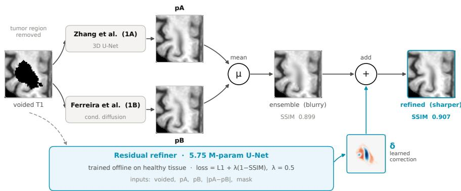
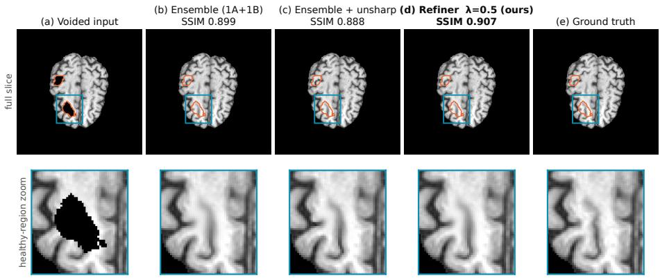

# Sharpening the Ensemble: An SSIM-Aligned Residual Refiner for Brain-MRI Inpainting Post-Processing

Kubilay Ka˘gan K¨om¨urc¨u and ˙Ilkay Oks¨uz¨

Department of Computer Engineering, Istanbul Technical University, Istanbul, T¨urkiye

komurcu17@itu.edu.tr, oksuzilkay@itu.edu.tr

Abstract. Brain-MRI inpainting replaces a masked region of a scan with synthesized, anatomically plausible healthy tissue, so that analysis tools built for healthy brains can be applied to images they would otherwise reject. On the BraTS local-synthesis benchmark, which ranks submissions on the structural similarity index (SSIM), the peak signalto-noise ratio, and the mean squared error (MSE) jointly, the strongest recent models are accurate, but several report blurry synthesized regions and attribute this to the mean-seeking behavior of the $\ell _ { 1 }$ and MSE terms in their training losses. We address this in post-processing, forming a deep ensemble of the two co-first-place 2025 models and training a lightweight residual refiner on the ensemble’s own outputs under an $\ell _ { 1 }$ loss augmented with a structural-similarity term whose weight λ we vary. At a moderate λ the refiner improves SSIM over the ensemble, from 0.8767 to 0.8780 on a held-out reproduction of the oficial scorer and from 0.8555 to 0.8572 on the oficial validation leaderboard, with essentially no change in MSE. The gain is small but consistent, improving 62.6% of the held-out cases with a signed-rank $p = 2 . 2 \times 1 0 ^ { - 7 }$ , whereas over-weighting the structural term reverses it. Two ablations bound the efect. Adding any third model to the two-model ensemble degrades it, and classical unsharp masking fails to improve SSIM at any strength (best 0.8765 against 0.8767), so the gain reflects learned rather than indiscriminate sharpening. The result is a cheap, reproducible post-processing stage that improves an already strong ensemble without any large-scale retraining.

Keywords: Brain MRI · Inpainting · Image synthesis · BraTS · Deep ensembles · Post-processing · Residual learning · SSIM.

## 1 Introduction

Magnetic resonance imaging (MRI) is central to the diagnosis, treatment planning, and monitoring of brain tumors, and multi-parametric MRI in particular underpins much of modern neuro-oncology [4, 19]. Increasingly, these scans are not read only by clinicians but are also processed by automated analysis pipelines (registration to anatomical atlases, tissue segmentation, cortical parcellation, and brain extraction) that were designed and validated on healthy anatomy. When a tumor is present, such tools become less reliable, because the lesion violates the healthy-anatomy assumptions on which they depend.

This limitation is dificult to avoid in practice, since a patient is seldom imaged before disease onset and a healthy anatomical baseline for the same subject is therefore rarely available [1]. One way to recover the missing information is to synthesize it. Given a scan in which the pathological region has been masked out, a generative model can inpaint the void with plausible healthy tissue while preserving the surrounding anatomy, producing an image to which healthy-brain pipelines can again be applied. The BraTS local-synthesis (inpainting) task formalizes this problem and provides a standard benchmark for it [13].

The leading 2025 solutions difer from one another by small margins [14], which motivates examining whether an existing solution can be improved after synthesis rather than replaced by a further model. Reports from the strongest recent methods note that their synthesized tissue is blurry [7,25]. The first-place method attributes this to its mean absolute error (MAE) term, which drives the model toward predicting the mean of the plausible solutions and so smooths away texture [25], and another entry reports the same efect for a mean squared error (MSE) objective [7]. This blurring bears directly on the ranking. Submissions are ranked by aggregating their ranks on three metrics, namely the structural similarity index (SSIM), the peak signal-to-noise ratio (PSNR), and MSE [15]. Of these, SSIM is the one that responds most directly to blur, since it measures the structural agreement between a prediction and the reference and blur removes the fine structure it rewards. Reducing residual blur is therefore a way to improve the ranking, provided that the pixel-wise metrics are not degraded in exchange, and applying a sharpening step after synthesis is a natural means to that end.

To the best of our knowledge, the work most similar to ours is that of Kulkarni et al. [14], from the previous year’s challenge, who form an ensemble of pretrained challenge winners and then apply a broad set of post-processing operations (classical filtering, histogram matching, and a learned enhancement network) to the ensemble output. In their evaluation the ensemble is essentially the strongest configuration on its own, and the additional post-processing, including the learned stage, does not improve upon it. Our study shares that overall setting, post-processing a deep ensemble of pretrained winners, but difers in motivation and in scope. Rather than surveying post-processing operations broadly, we focus on the single efect that the reports above identify, namely blurriness, and we address it with one learned component, a residual refiner whose training loss up-weights a structural-similarity term, so that the amount of sharpening applied to the ensemble can be varied and studied systematically. We assess this choice through controlled ablations, comprising a sweep of the structural weight, a comparison against classical unsharp masking, and a variation of the ensemble composition. In contrast to the broad post-processing of the prior work, we find that an appropriately weighted refiner produces a small but consistent improvement over the ensemble on the scored metrics.

## 2 Related Work

Image inpainting and, more generally, conditional image synthesis rest on three families of models. Encoder-decoder regressors built on the U-Net [21] map a masked image directly to its completion. Conditional generative adversarial networks, exemplified by pix2pix [11], add an adversarial objective that encourages sharper and more realistic outputs. Denoising difusion probabilistic models [10] instead generate the missing content by iterative refinement, and their latentspace [20] and inpainting-specific [18] variants are now a common choice for high-fidelity synthesis. Recent BraTS local-synthesis solutions draw on all three families [8, 9, 25].

The two co-first-place methods of the 2025 edition serve as the base models in this work. Zhang et al. [25] use a 3D U-Net trained with random-masking augmentation, and Ferreira et al. [8] use a fast conditional denoising difusion model with a hybrid ResNet and Swin-UNet backbone [5]. Both reach high accuracy, and blurring is discussed in both reports. Zhang et al. observe residual blurriness in their inpainted regions and attribute it to the mean-seeking behaviour of their MAE term [25], while Ferreira et al. introduce an MAE term specifically to reduce the blurring produced by an MSE objective [8]. A third entry reports the same efect for MSE [7].

Both base models therefore already combine a pixel-wise loss with a structural one. Zhang et al. minimize a weighted sum of MAE and SSIM, and Ferreira et al. add SSIM and MAE terms to a difusion objective. What we examine is not that combination itself, but the efect of applying it to a separate network placed after a frozen ensemble, and of varying the weight of the structural term, which neither report examines.

The enhancement stage of Kulkarni et al. [14], whose approach is the closest to ours (Sec. 1), is a lightweight U-Net trained to invert a synthetic Gaussian blur under an MSE loss, applied to an ensemble formed by pixel and median averaging. Our refiner difers from it in four respects. First, it is trained on the actual ensemble outputs (pA, pB, and their disagreement |pA − pB|) rather than a synthetic degradation, so the training and inference distributions coincide. Second, it predicts a residual on the ensemble mean and takes the model-disagreement map as an explicit input. Third, its loss up-weights SSIM rather than minimizing MSE. Fourth, it post-processes the 2025 co-winners rather than the 2024 pair. Kulkarni’s method was oficially ranked while post-processing pretrained winners, which establishes a precedent for the eligibility of this class of approach.

Two further 2025 entries are used later in this work as candidate ensemble members. Local2Global [22] is a U-Net with hierarchical attention mechanisms, and PSegGAN [9] is a generative adversarial network conditioned on a pseudosegmentation of the surrounding tissue, which its authors report does not surpass the state of the art on standard voxel-wise metrics. Both are evaluated as third members of the ensemble in Sec. 4.2.

  
Fig. 1. Overview of the pipeline. The voided scan is passed to two frozen base models, the co-first-place entries of the 2025 challenge, 1A, Zhang et al. [25], and 1B, Ferreira et al. [8]. Their predictions $p _ { A }$ and $p _ { B }$ are averaged into the ensemble mean ¯p (Eq. 1), which is accurate but over-smoothed. The residual refiner, trained under Eq. 3 with $\lambda = 0 . 5$ , receives the voided scan, both predictions, their disagreement $\left| p _ { A } - p _ { B } \right|$ and the void mask, and predicts a correction δ added to ¯p (Eq. 2). Neither base model is fine-tuned. The blur of the “ensemble (blurry)” panel is exaggerated for display.

## 3 Methods

Fig. 1 shows the pipeline as a whole. The base models are used as released, and the residual refiner is the only component that is trained.

## 3.1 Base Models and Deep Ensemble

We use the two co-first-place BraTS-2025 algorithms as frozen inference engines, without fine-tuning. Their predictions are denoted $p _ { A }$ for Zhang et al. [25] and $p _ { B }$ for Ferreira et al. [8].1 The deep ensemble [16] is their voxel-wise mean,

$$
\bar { p } = { \textstyle \frac { 1 } { 2 } } ( p _ { A } + p _ { B } ) .\tag{1}
$$

Averaging reduces variance and improves every reported metric over either model alone (Sec. 4.2). It also combines two predictors that both tend toward the conditional mean, so the ensemble retains the smoothing that both sets of authors report.

## 3.2 Residual Refiner

The refiner is a MONAI BasicUNet [6] with features (32, 32, 64, 128, 256, 32) and 5.75M parameters. It predicts a residual δ that is added to the ensemble mean,

so the refined prediction is

$$
{ \hat { x } } = { \bar { p } } + \delta .\tag{2}
$$

The network takes five input channels, namely the voided image, pA, pB, the absolute disagreement $\left| p _ { A } - p _ { B } \right|$ , and the void mask. The disagreement channel makes the voxel-wise spread between the two base models available to the network. Intensities are z-scored using statistics of the voided image, so that the same preprocessing applies during training and at inference.

## 3.3 Training Objective

The refiner minimizes

$$
\mathcal { L } = \ell _ { 1 } ( \hat { x } , x ) + \lambda \big ( 1 - \mathrm { S S I M } ( \hat { x } , x ) \big ) ,\tag{3}
$$

where x is the ground truth and $\lambda \geq 0$ weights the structural term. The loss is evaluated on the sub-region that the oficial scorer evaluates.2 The two terms have diferent minimizers. The $\ell _ { 1 }$ term is minimized by the conditional mean, which favours smooth predictions, whereas 1 − SSIM is reduced by preserving local contrast and structure [23]. A small λ therefore leaves the objective dominated by $\ell _ { 1 }$ and reproduces the smoothing of the ensemble, and a larger λ moves the prediction toward sharper local structure. We report a sweep over λ in Sec. 4.3.

## 3.4 Unsharp Masking Baseline

As a reference point that involves no learning, we also sharpen the ensemble by unsharp masking,

$$
\hat { x } _ { \mathrm { u s } } = \bar { p } + a \bigl ( \bar { p } - G _ { \sigma } \ast \bar { p } \bigr ) ,\tag{4}
$$

where $G _ { \sigma }$ is an isotropic 3D Gaussian kernel with standard deviation σ in voxels, ∗ denotes convolution, and $a \geq 0$ is the amount. The term $\bar { p } - G _ { \sigma } * \bar { p }$ is the diference between the ensemble and a blurred copy of it, so it carries the highfrequency content of the ensemble, and a sets how much of that content is added back. Setting $a = 0$ recovers the ensemble. Results for a range of σ and a are reported in Sec. 4.4.

## 4 Results

## 4.1 Setup

Experiments use the BraTS Local-Synthesis dataset [13], on the BraTS-GLI 2023 collection [1–4, 12, 19]. The challenge provides 1,251 training and 219 validation cases, each a single $2 4 0 \times 2 4 0 \times 1 5 5$ T1n volume; training cases ship the groundtruth t1n and sub-masks, while validation cases provide only t1n-voided and the void mask. We report the oficial-package metrics SSIM, PSNR, and MSE [23] on the region the scorer evaluates, computed both on the oficial validation leaderboard (219 cases) and via a local reproduction of the oficial scorer on a held-out set of 219 training cases. The latter is a fixed 1,032/219 partition of the training cases by case identifier with seed 42, and is distinct from the oficial validation set, whose ground truth is not released. The two evaluations are not on the same scale, and the reason is that the base models were themselves trained on the pool from which our held-out split is drawn, so their predictions there are better than on data they have not seen. Absolute values are consequently higher on the held-out split than on the leaderboard, and only the leaderboard is free of this efect for every component of the pipeline. We also report MAE on the same region, computed after rescaling both volumes to [0, 1] using the ground-truth range inside that region.

The refiner is trained on the 1,032-case portion of the split, from the outputs that the base models produce for those cases. Training uses $9 6 ^ { 3 }$ patches and AdamW [17] with learning rate $1 0 ^ { - 4 }$ and weight decay $1 0 ^ { - 5 } .$ , a batch size of two cases with four patches sampled per case, a 1,000-step linear warmup followed by cosine decay over 100,000 optimization steps, and bfloat16 precision. Each refiner trains in 4.8 hours on a single RTX 3090. At inference the refinement step is a single pass over the volume and adds 0.36 s per case on the same hardware (range 0.24 to 0.56 s), on top of running the two base models, which our method leaves unchanged. All refiners share the architecture, data, schedule, and seed of Sec. 3, difering only in the SSIM weight λ.

## 4.2 Ensemble Composition

Table 1 reports the base models and the ensembles without any refiner. The two-model mean improves on both individual models, which is the variance reduction expected of a deep ensemble [16], and the size of the gain depends on which models are averaged. Adding a weaker third model (Local2Global [22], PSegGAN [9], or the first-place model of the 2024 edition [24], which comes from the same group as $p _ { A } )$ moves the mean away from the two strongest predictions and lowers the score. All three additions degrade the ensemble, and the size of the degradation follows the accuracy of the model that is added. Evaluated alone on the same split, Local2Global, PSegGAN and the 2024 winner reach SSIM 0.6948, 0.8141 and 0.8518 respectively, and adding them to the ensemble costs −0.0423, −0.0084 and −0.0033 SSIM. The two-model ensemble is therefore the configuration that the refiner post-processes in the remainder of this section.

## 4.3 Efect of the Structural Weight

Table 2 reports the sweep over λ in Eq. 3 against the plain ensemble. At $\lambda = 0 . 1$ where the objective is dominated by $\ell _ { 1 }$ , the refiner improves MAE over the ensemble and matches its SSIM. At λ = 0.5 it reaches the highest SSIM and the lowest MAE of the sweep and exceeds the ensemble on SSIM. Beyond that value the score declines, and at λ = 5 the refiner falls below the ensemble on SSIM. The same ordering appears on the oficial validation leaderboard (Table 3), which is not used for training or tuning, where λ = 0.5 is again the highest setting and λ = 5 is again below the ensemble. The diferences between neighbouring settings are small, as expected when post-processing an ensemble that is already close to the ceiling of the metric, and the paired comparison below quantifies them per case.

Table 1. Ensemble-composition ablation on the scored region, held-out reproduction, with the 95% confidence interval on SSIM. The two-model mean improves on either model alone, and adding any third model degrades it.
<table><tr><td>Method</td><td>SSIM↑</td><td>PSNR↑</td><td>MSE↓</td><td>MAE↓</td></tr><tr><td>Zhang et al. (pA) [25]</td><td>0.8735 [.861,.886]</td><td>24.17</td><td>0.004204</td><td>0.03609</td></tr><tr><td>Ferreira et al. (p) [8]</td><td>0.8677 [.854,.881]</td><td>23.72</td><td>0.004823</td><td>0.03861</td></tr><tr><td>Ensemble (pA+pB)</td><td>0.8767 [.864,.889]</td><td>24.43</td><td>0.004020</td><td>0.03526</td></tr><tr><td>+ Local2Global [22]</td><td>0.8344 [.819,.849]</td><td>21.41</td><td>0.009529</td><td>0.05619</td></tr><tr><td> $+ { \mathrm { P S e g G A N } }$  [9]</td><td>0.8683 [.855,.881]</td><td>23.71</td><td>0.004444</td><td>0.03935</td></tr><tr><td>+ Zhang et al. (2024) [24] 0.8734 [.861,.886]</td><td></td><td>24.26</td><td>0.004045</td><td>0.03601</td></tr></table>

Table 2. Sweep over the structural weight λ (Eq. 3) against the plain ensemble, on a local reproduction of the oficial scorer (held-out split). Best per column in bold. SSIM is given with its 95% confidence interval; these intervals overlap, and Table 4 reports the corresponding paired comparison.
<table><tr><td>Method</td><td>SSIM↑</td><td>PSNR↑</td><td>MSE↓</td><td>MAE↓</td></tr><tr><td>Ensemble (pA+pB)</td><td>0.8767 [.864,.889]</td><td>24.43</td><td>0.004020</td><td>0.03526</td></tr><tr><td>Refiner, λ = 0.1</td><td>0.8765 [.864,.889]</td><td>24.37</td><td>0.004017</td><td>0.03498</td></tr><tr><td>Refiner, λ = 0.5</td><td>0.8780 [.866,.890]</td><td>24.40</td><td>0.004016 0.03491</td><td></td></tr><tr><td>Refiner, λ = 1.0</td><td>0.8777 [.865,.890]</td><td>24.39</td><td>0.004031</td><td>0.03505</td></tr><tr><td>Refiner, λ = 2.0</td><td>0.8773 [.865,.890]</td><td>24.35</td><td>0.004061</td><td>0.03525</td></tr><tr><td>Refiner, λ = 5.0</td><td>0.8752 [.863,.888]</td><td>24.33</td><td>0.004076</td><td>0.03537</td></tr></table>

Marginal and paired comparisons. The marginal 95% confidence intervals in Table 2 overlap almost entirely, and taken alone they would indicate no diference between the methods. SSIM varies widely from case to case with the size and content of the scored region, so a marginal interval is dominated by the variance between cases rather than by the diference between the refiner and the ensemble. A paired comparison, in which the same case is scored under both pipelines, removes the between-case variance and measures the per-case diference $d _ { i } = \mathrm { S S I M } _ { \mathrm { r e f i n e r } } ( i ) - \mathrm { S S I M } _ { \mathrm { e n s } } ( i )$ directly. Table 4 reports this comparison. For λ=0.5 the mean per-case diference is +0.00127 SSIM with a bootstrap interval of $[ + 0 . 0 0 0 7 1 , + 0 . 0 0 1 8 2 ]$ that excludes zero, 62.6% of the 219 cases improve, and the Wilcoxon signed-rank test gives $p = 2 . 2 \times 1 0 ^ { - 7 }$ . The diference is therefore small in magnitude but consistent in sign across cases, which is the structure that the overlapping marginal intervals conceal. For λ=0.1 the same test gives $p = 0 . 0 6 4$ with an interval that includes zero, so that setting is not distinguishable from the ensemble. Both outcomes agree with the leaderboard, where λ=0.5 is placed above the ensemble and λ=0.1 is level with it. Of the two evaluations the leaderboard is the external one, since its cases are used neither by the base models nor by the refiner, while the paired test describes how the diference is distributed across the cases of the held-out split.

Table 3. Oficial validation leaderboard, which is not used for training or tuning. The sweep again reaches its highest SSIM at $\lambda { = } 0 . 5 ,$ , and λ=5 is again below the plain ensemble, matching the ordering of Table 2 at a diferent absolute scale. Best per column in bold.
<table><tr><td colspan="2">Method (official) SSIM↑ PSNR↑</td></tr><tr><td>Ensemble  $\left( p _ { A } + p _ { B } \right)$  0.8555</td><td>25.09</td></tr><tr><td>Refiner, λ = 0.1 0.8557</td><td>25.11</td></tr><tr><td>Refiner,  $\lambda = 0 . 5$  0.8572</td><td>25.10</td></tr><tr><td>Refiner,  $\lambda = 1 . 0$  0.8567</td><td>25.09</td></tr><tr><td>Refiner,  $\lambda = 2 . 0$  0.8566</td><td>25.06</td></tr><tr><td>Refiner,  $\lambda = 5 . 0$  0.8539</td><td>25.05</td></tr></table>

Table 4. Paired comparison on the scored region, per case, on the held-out split. The interval is a percentile bootstrap on the mean of the per-case diference $d _ { i } ,$ the win rate is the fraction of cases with $d _ { i } > 0 ,$ , and $p$ is a two-sided Wilcoxon signed-rank test. The $\lambda { = } 0 . 5$ refiner improves on the ensemble in most cases with an interval that excludes zero, whereas $\lambda { = } 0 . 1$ is not distinguishable from it.
<table><tr><td>Comparison</td><td>N</td><td>mean ∆SSIM</td><td>95% CI</td><td>win  $\%$ </td><td> $p \ ( \mathbf { W } \mathbf { i l c . } )$ </td></tr><tr><td>λ=0.5 vs. ensemble</td><td>219</td><td>+0.00127</td><td> $[ + 0 . 0 0 0 7 1 , + 0 . 0 0 1 8 2 ]$ </td><td>62.6</td><td> $2 . 2 \times 1 0 ^ { - 7 }$ </td></tr><tr><td>λ=0.1 vs. ensemble</td><td>219</td><td>-0.00027</td><td> $[ - 0 . 0 0 1 1 2 , + 0 . 0 0 0 4 0 ]$ </td><td>54.8</td><td>0.064</td></tr></table>

## 4.4 Comparison with Unsharp Masking

The refiner adds high-frequency content to the ensemble, which a classical filter also does. Table 5 compares the two. We apply unsharp masking $\left( \operatorname { E q . 4 } \right)$ to the ensemble over a grid of kernel widths σ and amounts a. No setting improves the scored SSIM over the plain ensemble, the closest being 0.8765 against 0.8767, and at a fixed kernel width MSE increases monotonically with the amount, from 0.004272 at a=0.5 to 0.007139 at a=2.0. Unsharp masking amplifies the highfrequency content already present, including content that does not correspond to the underlying anatomy, so SSIM does not improve while the pixel-wise error grows, whereas the refiner raises SSIM to 0.8780 without increasing MSE. The diference therefore lies in which high-frequency content is added, rather than in the amount of sharpening applied. Fig. 2 shows the same comparison on one case.

  
Fig. 2. Qualitative comparison on a held-out case (BraTS-GLI-00641-000, slice 112): (a) voided input, (b) the ensemble (pA+p ), (c) the ensemble after unsharp masking with σ=1.0 and a=1.0, (d) the λ=0.5 refiner, and (e) ground truth. Orange outlines the inpainted void; the cyan box marks the healthy region the metric scores, enlarged in the bottom row. On this case the refiner raises the scored SSIM from 0.899 to 0.907, whereas unsharp masking lowers it to 0.888, consistent with Table 5.

Table 5. Unsharp masking of the ensemble (Eq. 4) against the refiner, on the held-out reproduction, where σ is the Gaussian kernel width in voxels and a is the amount. No unsharp setting improves the scored SSIM, and MSE increases monotonically with a. Best per column in bold.
<table><tr><td>Configuration SSIM↑ PSNR↑ MSE↓</td></tr><tr><td>Ensemble (no sharpening) 0.8767 24.43</td></tr><tr><td>0.004020 Unsharp σ=1.0, a=0.5 0.8765 23.99 0.004272</td></tr><tr><td>Unsharp σ=0.7, a=1.0 0.8754 23.78 0.004411</td></tr><tr><td>Unsharp σ=1.0, a=1.0 0.8728 23.11 0.004904</td></tr><tr><td>Unsharp σ=1.5, a=1.0 0.8672 22.02 0.006005</td></tr><tr><td>Unsharp σ=1.0, a=1.5 0.8667 22.14 0.005876</td></tr><tr><td>Unsharp σ=1.0, a=2.0 0.8587 21.21 0.007139</td></tr><tr><td>Refiner, λ=0.5 (learned) 0.8780 24.40 0.004016</td></tr></table>

## 5 Discussion

The results indicate that the weight of the structural term, rather than the capacity of the refiner, governs whether this form of post-processing improves the score. The $\ell _ { 1 }$ term and SSIM are minimized by diferent predictions, so a refiner trained under an objective dominated by $\ell _ { 1 }$ reproduces the smoothing of the ensemble it is meant to correct, while a refiner trained with too large a structural weight over-sharpens and also loses score. Zhang et al. [25] report a related observation from the other direction, having found a purely structural objective to preserve masked regions poorly and to introduce artifacts at mask boundaries. Between those two regimes the ordering of the settings is the same on our held-out reproduction and on the oficial validation leaderboard.

The comparison with unsharp masking separates two explanations for that improvement. Both the refiner and the filter add high-frequency content, but only the refiner improves SSIM and only the filter increases MSE, which is consistent with the refiner adding content that corresponds to the anatomy it was trained on rather than amplifying what the ensemble already contains.

Limitations. The diferences between the ensemble and the refined predictions are small and their marginal confidence intervals overlap, so the comparison rests on the paired test of Table 4 rather than on the marginal means, and the claim is that the diference is consistent rather than large. Each configuration is trained with a single seed, and the diferences between neighbouring values of λ are of the order of $1 0 ^ { - 3 }$ in SSIM, which need not exceed the variation that retraining with a diferent seed would introduce; the leaderboard results, obtained on cases that no part of the pipeline has seen, are the evidence least afected by this. Absolute scores depend on the released scorer, which we reproduce locally in order to cross-check the leaderboard. The refiner is trained for one pair of base models, and its transfer to a diferent ensemble is untested.

## 6 Conclusion

Several recent brain-MRI inpainting models report residual blur and attribute it to a mean-seeking training loss. We post-process an ensemble of two such models with a residual refiner whose loss combines $\ell _ { 1 }$ with a structural-similarity term, and report how the weight of that term afects the result. At a moderate weight the refiner improves SSIM over the ensemble on both a held-out reproduction of the oficial scorer and the oficial validation leaderboard, with little change in the pixel-wise metrics and without retraining any base model. The improvement is small but consistent across cases, while the setting dominated by the $\ell _ { 1 }$ term is not distinguishable from the ensemble.

## Acknowledgements

Data used in this publication were obtained as part of the Challenge project through Synapse ID (syn74274097). Experiments used a single NVIDIA RTX 3090.

## References

1. Baid, U., et al.: The RSNA-ASNR-MICCAI BraTS 2021 benchmark on brain tumor segmentation and radiogenomic classification. arXiv preprint arXiv:2107.02314 (2021)

2. Bakas, S., Akbari, H., Sotiras, A., Bilello, M., Rozycki, M., Kirby, J., et al.: Segmentation labels and radiomic features for the pre-operative scans of the TCGA-GBM collection. The Cancer Imaging Archive (2017). https://doi.org/10.7937/K9/ TCIA.2017.KLXWJJ1Q

3. Bakas, S., Akbari, H., Sotiras, A., Bilello, M., Rozycki, M., Kirby, J., et al.: Segmentation labels and radiomic features for the pre-operative scans of the TCGA-LGG collection. The Cancer Imaging Archive (2017). https://doi.org/10.7937/K9/ TCIA.2017.GJQ7R0EF

4. Bakas, S., Akbari, H., Sotiras, A., Bilello, M., Rozycki, M., Kirby, J.S., et al.: Advancing the cancer genome atlas glioma MRI collections with expert segmentation labels and radiomic features. Nature Scientific Data 4, 170117 (2017). https://doi.org/10.1038/sdata.2017.117

5. Cao, H., Wang, Y., Chen, J., Jiang, D., Zhang, X., Tian, Q., Wang, M.: Swin-Unet: Unet-like pure transformer for medical image segmentation. In: ECCV Workshops (2022)

6. Cardoso, M.J., et al.: MONAI: An open-source framework for deep learning in healthcare. arXiv preprint arXiv:2211.02701 (2022)

7. Dai, Y., Bi, Y., Navab, N., Jiang, Z.: Context-aware healthy brain inpainting: A multi-stage DDIM approach for the BraTS 2025 challenge. In: Segmentation, Classification, and Synthesis for Brain Tumors and Traumatic Brain Injuries. pp. 158–167. Springer Nature Switzerland, Cham (2026)

8. Ferreira, A., Luijten, G., Hinrichs-Puladi, B., Kleesiek, J., Alves, V., Egger, J.: Achieving over 10× faster sample generation with conditional denoising difusion. In: Segmentation, Classification, and Synthesis for Brain Tumors and Traumatic Brain Injuries. pp. 123–132. Springer Nature Switzerland, Cham (2026)

9. Ha, J., Park, J.S., Oh, J., Crandall, D.: PSegGAN: Pseudo-segmentation-guided GANs for brain tissue inpainting. In: Segmentation, Classification, and Synthesis for Brain Tumors and Traumatic Brain Injuries. pp. 168–180. Springer Nature Switzerland, Cham (2026)

10. Ho, J., Jain, A., Abbeel, P.: Denoising difusion probabilistic models. In: NeurIPS (2020)

11. Isola, P., Zhu, J.Y., Zhou, T., Efros, A.A.: Image-to-image translation with conditional adversarial networks. In: CVPR (2017)

12. Karargyris, A., Umeton, R., Sheller, M.J., Aristizabal, A., George, J., Wuest, A., Pati, S., et al.: Federated benchmarking of medical artificial intelligence with Med-Perf. Nature Machine Intelligence 5, 799–810 (2023). https://doi.org/10.1038/ s42256-023-00652-2

13. Kofler, F., et al.: The BraTS 2023 challenge: local synthesis of healthy brain tissue via inpainting. arXiv preprint arXiv:2305.08992 (2023)

14. Kulkarni, S., Iyer, S., Tapp, A., Parida, A., Capell´an-Mart´ın, D., Jiang, Z., Ledesma-Carbayo, M.J., Anwar, S.M., Linguraru, M.G.: Post-processing methods for improving accuracy in MRI inpainting. In: Segmentation, Classification, and Synthesis for Brain Tumors and Traumatic Brain Injuries. pp. 146–157. Springer Nature Switzerland, Cham (2026), braTS 2025 Inpainting, 3rd place; arXiv:2510.15282

15. LaBella, D., et al.: Analysis of the BraTS 2023 intracranial meningioma segmentation challenge. Journal of Machine Learning for Biomedical Imaging 3, 38–58 (2025), arXiv:2405.09787

16. Lakshminarayanan, B., Pritzel, A., Blundell, C.: Simple and scalable predictive uncertainty estimation using deep ensembles. In: NeurIPS (2017)

17. Loshchilov, I., Hutter, F.: Decoupled weight decay regularization. In: ICLR (2019)

18. Lugmayr, A., Danelljan, M., Romero, A., Yu, F., Timofte, R., Van Gool, L.: Re-Paint: Inpainting using denoising difusion probabilistic models. In: CVPR (2022)

19. Menze, B.H., Jakab, A., Bauer, S., Kalpathy-Cramer, J., Farahani, K., Kirby, J., et al.: The multimodal brain tumor image segmentation benchmark (BRATS). IEEE Transactions on Medical Imaging 34(10), 1993–2024 (2015). https://doi. org/10.1109/TMI.2014.2377694

20. Rombach, R., Blattmann, A., Lorenz, D., Esser, P., Ommer, B.: High-resolution image synthesis with latent difusion models. In: CVPR (2022)

21. Ronneberger, O., Fischer, P., Brox, T.: U-Net: Convolutional networks for biomedical image segmentation. In: MICCAI (2015)

22. Sarıta¸s, E., Oks¨uz,¨ ˙I., Ekenel, H.K.: Local2Global: UNet with hierarchical attention mechanisms for improved MR image inpainting. In: Segmentation, Classification, and Synthesis for Brain Tumors and Traumatic Brain Injuries. Springer Nature Switzerland, Cham (2026)

23. Wang, Z., Bovik, A.C., Sheikh, H.R., Simoncelli, E.P.: Image quality assessment: from error visibility to structural similarity. IEEE Transactions on Image Processing (2004)

24. Zhang, J., Weng, Y., Chen, K.: U-Net based healthy 3D brain tissue inpainting. In: Brain Tumor Segmentation (BraTS) Challenge (2024), braTS 2024 Inpainting, 1st place; arXiv:2507.18126

25. Zhang, J., Weng, Y., Chen, K.: Robust 3D brain MRI inpainting with random masking augmentation. In: Segmentation, Classification, and Synthesis for Brain Tumors and Traumatic Brain Injuries. pp. 102–109. Springer Nature Switzerland, Cham (2026), braTS 2025 Inpainting, 1st place; arXiv:2511.20202