# Sparse auto-regressive modeling for scene generation from multi-view images

Thomas Lucas1,★, Maxime Pietrantoni1,★, Philippe Weinzaepfel1, Wonjune Cho2, Bardienus Pieter Duisterhof3, Vincent Leroy1, Jerome Revaud1

1NAVER LABS Europe, France 2NAVER LABS, South Korea 3Carnegie Mellon University, USA ★equal contribution

European Conference on Computer Vision (ECCV) 2026

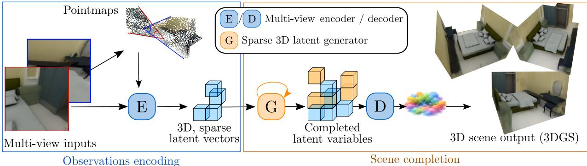  
Figure 1: Overview of SPAR3S. An encoder extracts voxel-aligned conditioning 3D latent tokens (in blue) from sparse (e.g. 2) input views. This encoder is trained together with a decoder that outputs 3D Gaussians that can be rendered via splatting. The partially filled 3D latent voxel grids are iteratively expanded by a 3D masked auto-regressive transformer that jointly predicts the occupancy of the remaining voxel grids, and their corresponding latent tokens (in yellow). The generated latent tokens can be decoded into 3D Gaussians using the scene decoder.

## Abstract

Generating complete 3D scenes from sparse, unconstrained views is a fundamental challenge in 3D vision which requires reasoning beyond observed content while remaining computationally tractable. Existing feed-forward reconstruction methods are inherently limited to content visible in the input images, while 3D generative modeling is hindered by the high computational cost of dense volumetric representations and the scarcity of large-scale 3D supervision. We introduce SPAR3S, a sparse voxelaligned 3D latent generative model for conditional scene completion without requiring ground-truth 3D data for supervision. Our key insight is to formulate 3D scene generation in a structured, compact, voxel-aligned 3D latent space where only occupied voxels are represented. We learn this sparse latent space directly from multi-view images using photometric supervision via diferentiable 3D Gaussian Splatting. Given a partial set of observed voxels encoded from sparse input views, scene completion reduces to predicting the missing latent tokens and their spatial support within the voxel grid. To this end, we train a masked autoregressive transformer that jointly models voxel occupancy and latent token values, enabling eficient and spatially consistent generation of unseen regions. We demonstrate the efectiveness of our method on synthetic indoor scenes, achieving higher novel-view quality than prior work. We further validate its generalization on RealEstate10k, highlighting its applicability to real-world data.

## 1. Introduction

Recent advances in novel view synthesis, e.g. 3D Gaussian Splatting (3DGS) [19], have enabled realtime, photorealistic rendering of 3D scenes, optimized through diferentiable photometric supervision. In parallel, feed-forward multi-view stereo and pointmap regression methods such as DUSt3R [51] have demonstrated that 3D geometry can be recovered directly from images without iterative optimization. Combined, these paradigms lead to pixel-aligned 3D Gaussian regression from sparse views [6, 9, 55]. However, pixel-aligned predictions are fundamentally limited to the content visible in the input images.

To complete scenes, a recent line of work combines multi-view difusion models to generate 2D novel content with pixel-aligned Gaussian Splats regression further lifted in 3D [2,16,43]. Such approaches require known cameras to generate new content or strong assumptions about them, e.g. with object-centric tasks or 2D panoramic image generation. This leads to a chickenand-egg problem, where sampling plausible cameras requires knowing the scene and vice-versa. Additionally, multi-view difusion models lack geometric consistency across novel views because of a lack of explicit 3D representation. By contrast, generating content directly in 3D does not require a known set of novel camera poses beforehand, and inherently enforces geometric consistency while naturally handling unconstrained camera positions. Therefore, in this work we aim to generate unseen content in the form of 3DGS representations directly in 3D from sparse unconstrained input views.

Generating complete 3D scenes from sparse, unconstrained views requires reasoning beyond observations, and modeling the distribution of plausible unseen geometry and appearance. To do so, we propose to lift the problem into a voxel-aligned 3D latent space. Concretely, a first model learns to map multi-view observations of a scene to voxel-aligned 3D latent variables. Then, a generative model is trained to learn a distribution over the 3D latent space; when parts of a 3D scene are not observed from a set of multi-view inputs, corresponding voxels can be sampled from the generative model to complete the 3D scene. The completed latent representation is then decoded into a 3DGS representation, see Fig. 1 for an overview. Designing such generative models in 3D is challenging for two main reasons. First, dense volumetric representations scale cubically with spatial resolution, making high-resolution generative modeling computationally prohibitive. Second, large-scale curated 3D supervision is scarce unlike with images or text, limiting the applicability of fullysupervised 3D generative learning.

Our key idea to address scalability is to only materialize occupied voxels in our structured voxel-aligned latent space. Our encoder-decoder architecture maps arbitrary sets of multi-view input images to a sparse and compact voxel-based 3D latent representation, which is decoded into a 3DGS scene with voxel-aligned Gaus sians. To model a distribution over such latent representations, we introduce a sparse autoregressive transformer operating over sequences of 3D tokens. Scene completion thus reduces to predicting both voxel occupancy and latent token features. By exploiting sparsity, spatial compression, and structured 3D token orderings, our approach is eficient while preserving volumetric coherence. To address raw 3D data scarcity, our sparse latent space is learned directly from multi-view images using photometric supervision, via diferentiable 3D Gaussian Splatting. Importantly, this learning process does not require any ground-truth 3D supervision.

We validate our proposed 3D generative paradigm, called SPAR3S on synthetic indoor scenes, where it achieves improved novel-view synthesis quality compared to prior feed-forward 3DGS regression methods as well as 3D generative methods. We further demonstrate generalization to real-world data on RealEstate10K [62].

Our contributions may be summarized as follows:

• We introduce a sparse voxel-aligned 3D latent space learned from multi-view photometric supervision (Section 3).

• We propose an occupancy-aware masked autoregressive transformer for conditional scene completion which operates in this latent space (Section 4).

• We demonstrate improved novel-view synthesis quality over prior feed-forward 3DGS generative and deterministic approaches, with validation on both synthetic and real-world datasets (Section 5).

## 2. Related work

Observed 3D scene reconstruction aims to regress observed scene geometry from multi-view inputs. The resulting scene representations only cover the parts of the scene that are observed in the input images. We rely on such partial representations, but additionally aim to complete unobserved parts of the scene with a generative model and capture visual content together with geometry. Recent methods for scene reconstruction like DUSt3R [51] and MASt3R [23] represent a scene by predicting a dense per-pixel 3D point map �(�, �) ∈ ℝ3 mapping each image pixel directly to its 3D coordinate in camera space. We use such pointmaps, associated to a set of multi-view inputs, to initialize a sparse voxel aligned latent space and remove voxels that do not contain anything when encoding targets. Conveniently, these methods have been extended to accommodate more than 2 views, either by introducing some scenelevel memory [4,48,50] or by scaling attention layers to a larger number of tokens from multi-views [49].

Feed-Forward 3D Gaussian splatting. Feed-forward 3D Gaussians models have been introduced to reconstruct a scene from a sparse number of input views[6, 9,32,41,42,45,55,56,59]. The base principle lies in regressing 3D Gaussians parameters from a pixel-aligned feature map [41]. PixelSplat [6] predicts 3D Gaussians parameters from a pair of images by relying on epipolar cues while MVSplat [9] aggregates multi-view information in a cost volume before predicting Gaussians, implicitly learning to match and triangulate. To overcome the ambiguity of reconstructing texture-less regions, [32,42,55] further introduce monocular depth priors as regularization. Instead of using such priors, [45,56,59] directly predict a set of 3D Gaussians from images using a large transformer model, at the cost of a significant increase in training budget. These methods lack structured 3D representations, which limits geometric consistency across views as well as their ability to handle very sparse inputs and extreme viewpoint variations. In contrast, our model is designed around a latent sparse 3D space to handle these dificult cases. Furthermore, standard feed-forward 3DGS approaches are deterministic and fail to reconstruct ambiguous regions that may be occluded and not observed in the input views. We now present several distinct lines of work that introduce generative modeling to address this challenge.

Multi-view difusion over image space. The strong generative priors contained in image and video difusion models have been used to generate novel views conditioned on camera poses [13,27,33,61]. To improve geometric consistency of the generated images, some approaches [8,31,58] directly condition the denoising process on strong 3D scene priors [51]. In contrast to our task, these methods do not produce an explicit 3D scene representation as output, but rather sets of novel views. Thus, generated content cannot be rendered in real-time in 3D, and the procedure needs to be re-run for each additional set of views. Another drawback is that there is no guaranteed spatial coherence between views, inducing flickering and geometric drift.

Iterative 3DGS optimization using difusion priors. In [26,44] a Score Distillation Sampling loss is introduced to leverage 2D difusion model priors and directly optimize a 3DGS scene representation. In addition, [57] initialize the Gaussians with a difusion model to obtain a rough initial geometry which facilitate downstream convergence. Any scene reconstruction is therefore based on iterative optimization and takes a significant amount of time.

2D generation with 3DGS prediction. Given a set of posed conditioning images and a set of novel camera poses, this class of methods outputs a set of 3DGS parameters for each novel camera pose by using 2D generative models. In the context of object-centric reconstruction, [34,54] finetune a StableDifusion model [39] to output Gaussian parameters and [2,43] optimize a 3DGS prediction head on top of a pretrained controlled video difusion model. The head predicts pixel-wise 3DGS parameters for each novel view sampled from the difusion model. In [16,29] a 2D encoderdecoder is trained to encode images in a pixel-aligned latent space that can be further decoded into pixelaligned Gaussians. In a second stage they optimize a multi-view difusion model in this latent space. Such approaches require known camera as input to sample novel content in 2D, or alternatively need to make simplifying assumptions such as object-centric targets or 2D panoramic scenes to easily sample cameras. In contrast, we tackle the more general problem of generating content directly in 3D, without requiring known camera poses or making simplifying assumptions about the scene.

3D Generative feed-forward 3DGS. The following methods directly apply difusion in 3D. In [35] a 3D diffusion model is optimized to sample 3DGS, but requires a teacher model and ground-truth splats for training; this limits scalability as such data requires dense sets of views and a slow optimization procedure per scene. Closer to our work, [52] adopts a VAE formulation with variational Gaussians that encode uncertainty in a latent space, and these can be rendered and decoded in 2D to allow for easy photometric optimization. [28] instead applies difusion in a 3D latent space to model the conditional distribution of latents that can be decoded to 3D Gaussian splats based on conditioning views. In [10] novel images are sampled with difusion conditioned on latents rendered from a unified 3D representations. These 3D difusion approaches are used to sample a fixed set of Gaussian parameters which limits the extent of the generated scene and scalability. In contrast, we sample latents from a sparse voxel grid and apply an autoregressive model which provides greater flexibility and representational power. More similar to our approach, SCube [38] and XCube [37] both sample occupancy grids in a voxelized latent space, but with generative formulations that do not encode appearance and geometry jointly in a latent space.

Autoregressive latent modeling. Our approach is based on auto-regressively predicting sparse 3D latent tokens, and borrows from autoregressive models primarily developed for images. In particular, discrete latent approaches such as VQ-VAE[47] and its hierarchical extension VQ-VAE-2[36] represent images using compact codebooks and train autoregressive priors over these quantized latents. We follow the same overall paradigm, but adapt it to 3D. Recently, masked and autoregressive [5,24,25]. transformers have emerged as flexible alternatives to raster-order PixelCNN-style[46] models: they allow inference over tokens in arbitrary order. We extend this flexibility to sparse 3D voxel grids, leveraging arbitrary token orderings to operate directly on sparse voxel representations. Other applications of auto-regressive models to 3D include [22], which uses a multiview 2D transformer, and [7] adapts it to objectcentric generation. In contrast, we directly operate in a 3D voxel-aligned latent space which enforces geometric consistency across views and does not require simplifying assumptions about camera distribution.

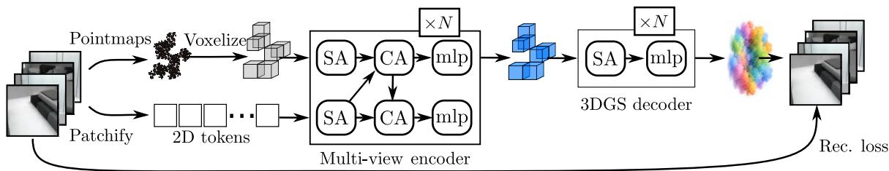  
Figure 2: Learning a 3D latent space from multi-view input data. Multi-view inputs are patchified and used to initialize voxel-aligned tokens from pointmaps. A bidirectional cross-attention block updates 2D and 3D tokens. The final 3D latent representation is decoded into a 3D scene represented as a set of Gaussian splats. The model is trained to reconstruct the inputs via diferentiable rendering. No explicit 3D scene ground truth is required, yet this produces 3D representations.

## 3. 3D latent representation from multiview data

Our scene encoder-decoder model follows the general framework of auto-encoders: it encodes input views into a latent representation, and is trained to reconstruct these inputs by decoding the latent variables. However, in our case the inputs and outputs are only a proxy to the quantity that we seek to model, which is 3D scenes represented via 3DGS. To achieve this, the flow of information in our encoder-decoder is constrained to go through a single 3DGS representation per scene, from which all input views should be reconstructed. This constraint can be seen as a type of bottleneck in the general auto-encoder framework as all the information in the inputs has to be compressed into a single 3D representation. Additionally, we require that this 3DGS representation should be computed from a single, voxel aligned 3D latent representation. With this construction it is possible to generate scene content by first generating a 3D latent representation, then decoding it with the scene decoder.

Let ${ { T = \{ I _ { i } \} } }$ � be a set of multi-view input RGB images and $E _ { \theta }$ an encoder that maps multi-view inputs into a latent 3D representation �3D. Also let $D _ { \phi }$ a decoder that maps such a 3D latent variable to a 3DGS scene representation denoted $G ,$ and let R a rendering operation that reconstructs $\hat { \cal I }$ from � via diferentiable rendering. Our scene encoder-decoder can be summarized as:

$$
\begin{array} { r } { Z _ { \mathrm { 3 D } } = E _ { \theta } ( \boldsymbol { \mathcal { I } } ) , \quad G = D _ { \phi } ( Z _ { \mathrm { 3 D } } ) , \quad \hat { \boldsymbol { \mathcal { I } } } = \mathcal { R } ( G ) . } \end{array}\tag{1}
$$

$E _ { \theta }$ and $D _ { \phi }$ are optimized with a photometric recon struction loss; see Fig.2 for an overview. The two 3D representations $Z _ { \mathrm { 3 D } }$ and $G$ are produced as a byproduct of this auto-encoding problem, yet modeling these quantities is the real purpose of our latent generative model.

Learning a sparse compact 3D latent space. In practice, processing a full 3D token grid is computationally prohibitive unless voxel resolution is very low. Hence, most of the key design choices made for our model aim at addressing this bottleneck. First, we design our autoencoder such that it operates on a sparse 3D representation: only tokens that correspond to voxels with content (ie. non empty) will be processed by the scene encoder. Second, we build a hierarchical encoder-decoder such that the latent space is more compact than the scene. The encoder progressively downsamples 3D voxels until the bottleneck. The decoder then upsamples this latent space back to the original voxel resolution. Both of these aspects drastically alleviates the computational load and allow us to derive a model operating fully in 3D.

Sparse 3D voxel initialization. Our encoder model processes sets of multi-view input RGB images ${ \cal { T } } { = } \{ I _ { i } \} _ { i }$ First, pointmaps[51] $\{ { P } _ { i } \} _ { i }$ are estimated from a scene with unconstrained viewpoints, here using [11]. The union of pointmaps ${ \mathcal { P } } = \cup _ { i } P _ { i }$ is rescaled and translated to fit a predefined volume V with a transformation $T ,$ such that $T ( \mathcal { P } ) \subseteq \mathcal { V } = [ 0 , 1 ] ^ { 3 }$ . Then 3D latent queries $z _ { \mathrm { 3 D } } ^ { 0 }$ are initialized using the pointmaps to filter out empty voxels; the 2D multi-view inputs are patchified and tokenized into 2D tokens denoted $z _ { \mathrm { 2 D } } ^ { 0 }$

Sparse attention. A stack of � bidirectional crossattention blocks, denoted CA and composed of a selfattention layer, a cross-attention layer and an MLP, is used to update both 3D and 2D tokens:

$$
\left( z _ { \mathrm { 3 D } } ^ { k + 1 } , z _ { \mathrm { 2 D } } ^ { k + 1 } \right) = \left( C A ( z _ { \mathrm { 3 D } } ^ { k } , z _ { \mathrm { 2 D } } ^ { k } ) , C A ( z _ { \mathrm { 3 D } } ^ { k + 1 } , z _ { \mathrm { 2 D } } ^ { k } ) \right) .\tag{2}
$$

The 2D tokens are then discarded, and $z _ { \mathrm { 3 D } } ^ { L }$ is decoded with a transformer model $D _ { \phi }$ , into a set of � 3D Gaussians per occupied voxels. Denoting $V _ { o c c }$ the set of occupied voxels and � the set of parameters of one 3D

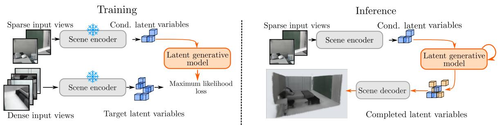  
Figure 3: Learning a latent generative model. For training, a dense set of multi-view inputs is aggregated into a 3D latent representation used at target for the generative model. This target is predicted conditionally on an other latent representation, encoded from sparse observed views. Inference starts from the observed latent variables which are iteratively expanded to complete the scene in latent space before decoding it to 3DGS.

Gaussian splat, we have:

$$
\left\{ G _ { i } \right\} _ { i = 1 } ^ { M \times | V _ { \mathrm { 0 c c } } | } = D _ { \phi } ( Z ) .\tag{3}
$$

Throughout these computations, empty voxels are never considered.

Token resampling and sparsification. The 3D voxel tokens are downsampled through the layers of the en coder into the bottleneck latent space and upsampled through the layers of the decoder. When downsampling, tokens within a local neighborhood are aggregated. When upsampling, a mechanism to maintain spatial sparsity is needed. We use a binary cross-entropy (BCE↑) head over upsampled voxel positions to predict voxel occupancy before computing the upsampled token values. During training, the ground-truth (GT) occupancy mask is substituted, augmented with falsepositive noise injection to improve the model’s robustness to classification errors at inference time. This can be formalized as:

$$
\begin{array} { r } { z _ { 3 \mathrm { D } } ^ { \mathrm { u p } } = \mathrm { U p s a m p l e } \left( z _ { 3 \mathrm { D } } , { \cal M } \right) , \quad \mathrm { w h e r e } } \\ { { \cal M } = \left\{ \begin{array} { l l } { \mathrm { B C E } \uparrow ( z _ { 3 \mathrm { D } } ) } & { \mathrm { a t ~ i n f e r e n c e } } \\ { \mathrm { G T } \cup \epsilon _ { \mathrm { F P } } } & { \mathrm { a t ~ t r a i n i n g . } } \end{array} \right. } \end{array}\tag{4}
$$

where �FP represents the sampled false-positive noise distribution.

Geometry-guided attention. To facilitate learning, attention maps in the CA blocks incorporate geometryaware correspondence information, derived from the pointmap � projections onto patches and a bincount between patches and voxels. Attention logits are computed as a weighted average between learned attention logits from voxel � to patch $p ,$ and bincount attention scores:

$$
\begin{array} { r } { A _ { \nu , p } ^ { \mathrm { g u i d e d } } = \alpha \cdot \sigma ( A _ { \nu , : } ^ { \mathrm { l e a r n e d } } ) _ { p } + ( 1 - \alpha ) \cdot \sigma ( A _ { \nu , : } ^ { b i n c o u n t } ) _ { p } , } \end{array}\tag{5}
$$

where $\sigma ( \cdot )$ denotes a softmax and $\alpha \in [ 0 , 1 ]$

Photometric supervision. Input images are reconstructed by projecting $D _ { \phi } ( Z )$ onto corresponding cameras, using camera parameters � obtained together with the pointmaps $P ,$ with a diferentiable Gaussian splatting operation R [19]. The model is trained end-toend with an $L _ { 2 }$ reconstruction loss. Following [39], we sample � using the reparametrization trick [21] and regularize the latent space of the encoder $E _ { \theta }$ using a Kullback–Leibler divergence term with a low coeficient and the total loss is thus:

$$
\mathcal { L } ( \theta , \phi ) = \frac { 1 } { | \mathcal { I } | } \sum _ { i = 1 } ^ { | \mathcal { I } | } \left\| I _ { i } - \mathcal { R } \Big ( D _ { \phi } \big ( E _ { \theta } ( I _ { i } , P _ { i } ) \big ) , C _ { i } \Big ) \right\| _ { 2 } ^ { 2 } + \beta \mathcal { L } _ { \mathrm { K L } } (\tag{�).}
$$

(6)

The use of a probabilistic framework accounts for the fact that multiple sets of Gaussians can yield the same projections, and provides a well behaved latent space.

Latent targets and conditioning. We use $E _ { \theta }$ in two capacities: given a dense set of input views, $Z _ { \mathrm { t a r g e t } } =$ $E _ { \theta } ( \mathcal { I } _ { \mathrm { d e n s e } } )$ can provide targets for the 3D latent generative model. Given a single view or a small set of views ${ \it J _ { \mathrm { s p a r s e } } } , { \it Z _ { \mathrm { c o n d } } } = E _ { \theta } ( { \it J _ { \mathrm { s p a r s e } } } )$ provides model conditioning. Thus, $E _ { \theta }$ is trained to work with variable input set sizes.

## 4. Sparse Auto-Regressive Modeling in 3D Latent Space

The encoder-decoder predicts 3D Gaussians covering only the observed parts of the scene. To generate geometry and scene content in unobserved parts, we introduce our sparse 3D latent generative model, see Fig. 3 for an overview.

Background: masked auto-regression. Our generative model is built on Masked Auto-regressive models [5,24,25]. Let $\mathbf { z } = ( z _ { 1 } , \ldots z _ { n } )$ , auto-regressive models decompose �(z) using the chain rule of probabilities: $\begin{array} { r } { P ( \mathbf { z } ) = \prod _ { i = 1 } ^ { n } P ( z _ { i } \mid z _ { 1 } , \dots , z _ { i - 1 } ) } \end{array}$ . Masked auto-regressive models in particular can predict the chain in any order, and predict any group of variables from any other. They achieve this by training the model to take random visible sets of input and predicting the rest. To model the output distribution, a popular choice is a categorical distribution over discretized values; alternatively,[25] proposed a token-wise difusion loss to model continuous values.

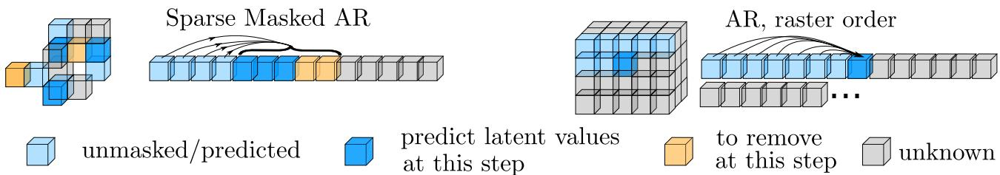  
Figure 4: Sparse 3D latent completion. Sparse masked auto-regression is applied by jointly predicting latent token values as well as occupancies for a random observed subset of tokens. By contrast, raster-order auto-regressive models consider all tokens sequentially in the possible volume, which does not scale well.

Predicting occupancy and latent values. Scene completion in a voxel space is a challenging task as sequences of unknown voxels can be of arbitrary length and voxels may be occupied or empty, making sequences spatially sparse. We thus propose a formulation where a masked auto-regressive model predicts both where the 3D latent vectors through occupancy prediction, and their content through latent prediction. Concretely, our model $H _ { \psi }$ takes as input a sequence of conditioning voxel tokens from the encoder-decoder, a sequence of unknown voxel positions and predicts their occupancy as well as their latent values if they are occupied. It is composed of two bidirectional attentionbased blocks $( H _ { \psi } ^ { 1 } , H _ { \psi } ^ { 2 } )$ and two lightweight voxel-wise heads: an occupancy head $h _ { o c c }$ and a denoising difusion head $h _ { \epsilon }$ [25]. The first block aggregates information from conditioning and observed latent vectors while for the second block, masked voxel embeddings $\mathbf { z } _ { \mathrm { m } }$ are added to the aggregated context tokens, and completed by $H _ { \psi } ^ { 2 } ,$ inspired by the MAE architecture [15]. Finally, occupancy o and latent vector z are predicted independently per masked voxel using the prediction heads.

Training procedure. Training our generative model does not require any 3D ground-truth information and simply requires supervision in the form of target tokens generated from encoding dense views through our encoder. To ease notations in what follows, we assume that these target tokens z are obtained by encoding a dense set of multi-view images $\mathbf { z } = E _ { \theta } ( \mathcal { I } _ { \mathrm { t a r g e t } } )$ . An important point is that target sequences can be incomplete. Indeed, using a dense set of multi-view inputs $\boldsymbol { \mathcal { I } _ { \mathrm { t a r g e t } } }$ does not guarantee that the entire scene will be observed. Thus at training, our target token positions are separated into three categories: $\mathcal { F }$ the set of occupied positions in $\mathbf { z } ,$ E the set of positions observed to be empty, and U the set of unobserved positions. Their disjoint union covers the full volume:

$$
\mathcal { V } = \mathcal { F } \sqcup \mathcal { E } \sqcup \mathcal { U } .\tag{7}
$$

In full generality, masked auto-regressive models are trained by selecting a mask, i.e. a random subset O of observed tokens from the target, and predicting the unobserved target positions ${ \mathcal { T } } = { \mathcal { V } } \setminus O$ . In our setting, we exploit the mask in one additional way: at training, we use the mask to hide unobserved positions in ${ \mathcal { U } } ,$ i.e. we constrain positions in U to always be in T. They are thus predicted by the network; however, they will be masked from the loss, as the target is unknown. In addition, our model also observes a sparse set of inputs through their encoded representation, denoted $\mathbf { z } ^ { c } = E _ { \theta } ( \mathcal { I } _ { \mathrm { c o n d . } } )$ ; this observation is provided to the model by adding tokens in $\mathbf { z } ^ { c }$ to its inputs when their corresponding positions are not included in $\mathbf { z } _ { O }$ . See Fig.4 for an overview. Denoting $p \tau$ the target positions, a training forward pass can be summarized as:

$$
\hat { \mathbf { o } } _ { \mathcal { T } } , \hat { \mathbf { z } } _ { \mathcal { T } } = H _ { \psi } ( \mathbf { z } _ { O } , \mathbf { z } ^ { c } , p _ { \mathcal { T } } ) ,\tag{8}
$$

with $O \cap { \mathcal { T } } = \emptyset , O \cup { \mathcal { T } } \subset { \mathcal { V } } , { \mathcal { U } } \subset { \mathcal { T } }$ , and U masked from the loss.

As cameras are randomly placed, we assume that the unknown set U is random and thus the model will learn to cover full latent representations on average.

Inference. At inference, positions are grouped into disjoint subsets $\mathcal { T } _ { 0 } \sqcup \cdots \sqcup \mathcal { T } _ { n } = \mathcal { V }$ and the model is run iteratively, where predictions on $\mathcal { T } _ { k }$ are added to the conditioning set before predicting $\mathcal { T } _ { k + 1 }$ . Given conditioning information $\mathbf { z } ^ { c }$ we select a subset $\mathcal { T } _ { 1 }$ of masked target voxels; $H _ { \psi }$ outputs occupancy scores and latent predictions. If the occupancy score is above a threshold �, the latent prediction is added to the set of observed voxels; otherwise it is discarded. This is repeated iteratively by selecting a new subset $\mathcal { T } _ { i }$ of masked target voxels at each iteration. Thus, the model refines the scene geometry while predicting scene content.

This construction can work with any random ordering. We opt for a region growing approach, where subsets are selected around the previous set until all positions are exhausted. We perform mask selection (i.e. autoregressive order) by building a sparse symmetric k-NN graph with observed voxels $\mathbf { z } ^ { o }$ taken as seeds, from which a breadth-first search (BFS) assigns a depth level �(�) to each voxel (length of the shortest path from a seed to �). Candidate voxels are then partitioned into depth levels and the resulting joint latent probability is:

Table 1: Novel view synthesis evaluation with two conditioning views (very wide baseline) at resolution $2 2 4 \times 2 2 4$ on the 3DFront and RealEstate10k datasets.
<table><tr><td rowspan="2">Category</td><td rowspan="2">Method</td><td colspan="4">3DFront</td><td colspan="4">RealEstate10k</td></tr><tr><td>FID↓</td><td>PSNR↑</td><td>SSIM↑</td><td>LPIPS↓</td><td>FID↓</td><td>PSNR↑</td><td>SSIM↑</td><td>LPIPS↓</td></tr><tr><td rowspan="3">Reconstruction</td><td>3DGS [19]</td><td>260</td><td>8.65</td><td>0.14</td><td>0.79</td><td>271</td><td>7.92</td><td>0.12</td><td>0.79</td></tr><tr><td>PixelSplat [6]</td><td>165</td><td>9.07</td><td>0.18</td><td>0.67</td><td>155</td><td>13.73</td><td>0.41</td><td>0.50</td></tr><tr><td>DepthSplat [55]</td><td>110</td><td>13.76</td><td>0.49</td><td>0.55</td><td>82</td><td>13.25</td><td>0.46</td><td>0.41</td></tr><tr><td rowspan="4">Generation</td><td>DiffusioNeRF [53]</td><td>229</td><td>12.80</td><td>0.19</td><td>0.73</td><td>1</td><td></td><td></td><td></td></tr><tr><td>MVSplat360 [10]</td><td>111</td><td>9.72</td><td>0.35</td><td>0.70</td><td>66</td><td>15.40</td><td>0.49</td><td>0.40</td></tr><tr><td>LatentSplat [52]</td><td>180</td><td>13.92</td><td>0.33</td><td>0.61</td><td>53</td><td>16.09</td><td>0.48</td><td>0.39</td></tr><tr><td>SPAR3S (ours)</td><td>59</td><td>15.18</td><td>0.62</td><td>0.50</td><td>41</td><td>16.72</td><td>0.57</td><td>0.36</td></tr></table>

$$
P ( \mathbf { z } ) = \prod _ { l = 1 } ^ { \operatorname* { m a x } _ { \nu } ( l ( \nu ) ) } P \left( \mathbf { z } _ { \left\{ l ( \nu ) = l \right\} } | \mathbf { z } _ { \left\{ l ( \nu ) < l \right\} } \right) .\tag{9}
$$

This ordering promotes spatial consistency at inference.

Training. The occupancy head is optimized through a masked binary cross entropy loss between otarget and ${ \bf o } _ { \mathrm { p r e d } } \colon \mathcal { L } _ { \mathrm { o c c } } = B C E ( \hat { \bf o } _ { \mathcal { T } } , { \bf o } _ { \mathcal { T } } )$ . Inspired by [25], we parametrize the latent prediction head as a tokenwise denoising network and optimize it with a tokenwise difusion loss, efectively learning to sample plausible unobserved tokens conditioned on observed tokens. It is based on a DDPM [18] schedule with an epsilon formulation, leading to the following loss: $\mathcal { L } _ { \mathrm { d i f f } } = \mathbb { E } _ { \epsilon \sim N ( 0 , I ) , t } \Vert \epsilon - h _ { \epsilon } \bigl ( Z _ { \mathrm { t a r g e t } } ^ { \mathrm { m a s k } } | f _ { t } ^ { 2 } , t \bigr ) \Vert _ { 2 } ^ { 2 } .$ , where � denotes the corruption noise and � us the timestep in the noise schedule. We apply this loss on the set of unobserved target positions $\mathcal { T } .$ . In parallel, we introduce a second difusion head to refine conditioning tokens based on all decoded information $\mathbf { z } ^ { c } ,$ it is optimized with the same ${ \mathcal { L } } _ { \mathrm { d i f f } }$ loss but applied on conditioning tokens only. As this task is much more constrained than the main novel token prediction task, we apply a �������� operation before the conditioning token refinement head. We keep the cost of this tokenwise difusion part at minimum (a few token-wise MLP layers) to maintain scalability, but empirically observe an improvement compared to a fully auto-regressive formulation and keep it by default.

Hierarchical occupancy prediction. To further improve eficiency, we propose to perform occupancy prediction in a hierarchical coarse-to-fine manner. In that case both stages share the masked auto-regressive overall architecture and principles defined earlier, but difer in the following way: the coarse stage performs a dense coarse occupancy prediction from all the voxels in the scene while the fine stage takes as input this coarse set of occupied voxels and predicts a refined set of occupancies. The coarse model is used with a high recall occupancy threshold at inference while the fine model is used with a threshold chosen for a good precision-recall tradeof, thus optimizing compute and accuracy.

## 5. Experiments

We first present training details and evaluation protocol (Sec. 5.1), which primarily consists in evaluating scene reconstruction from unconstrained cameras, and sparse sets of conditioning views, e.g. 2 views. In this context where with 2 cameras randomly sampled, input views often have no overlap, typically making baselines struggle, we show the benefits of SPAR3S through quantitative evaluations and qualitative examples (Sec. 5.3). Finally we provide a comprehensive set of ablations to justify our design choices (Sec. 5.4).

## 5.1. Experimental details

Datasets. We train and evaluate our models on a synthetic indoor dataset generated with 3DFront [12], as well as the real-world RealEstate10K dataset [62]. Our synthetic dataset, referred to as 3DFront, comprises over 10000 indoor scenes covering bedrooms, living rooms, dining rooms, and libraries, with diverse layouts, furniture, and textures. For each scene, cameras are first distributed randomly. A subset of cameras that maximizes overall scene coverage is then selected as the final scene viewpoints. In the sparse-view setting, this naturally reduces the overlap between viewpoints, making novel-view synthesis significantly more challenging. We use ground-truth camera poses, and initial pointmaps are obtained by backprojecting pixels using rendered depth maps.

To assess our method’s ability to handle real data without ground-truth camera information, we also evaluate on RealEstate10K, which consists of over 80k real estate video clips, predominantly captured indoors. We estimate camera poses, intrinsics, and initial pointmaps using MASt3R-SfM [11]. Owing to their video origin, the camera paths in RealEstate10K follow smooth trajectories and produce densely sampled views with substantial overlap, making the novel-view synthesis task comparatively easier.

Cond  
GT  
Depthsplat  
MVSplat360  
Latentsplat  
SPAR3S  
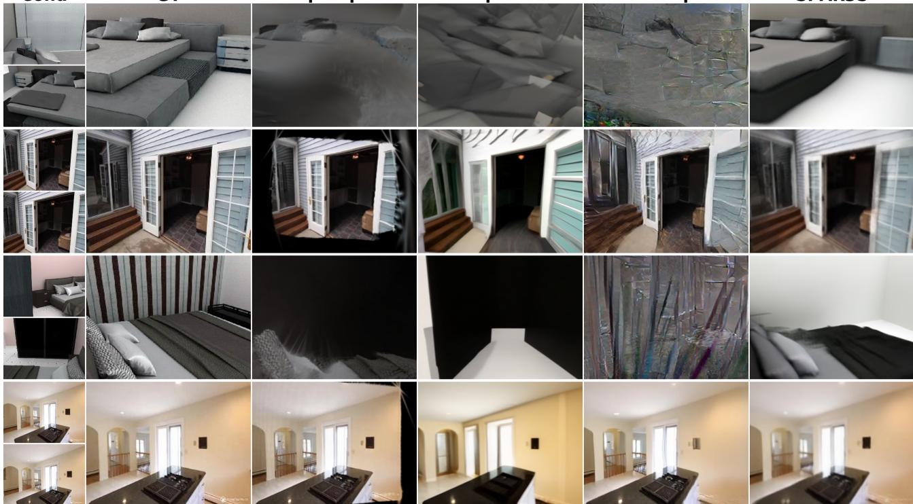  
Figure 5: Visual comparison of novel rendered views from 2 conditioning images (left column). Overall, our approach handles conditioning views with little overlap and large novel view extrapolation (lines 1 and 3) while other 3D generative approaches fail. On easier setups (lines 2 and 4), our model still provides better scene completions.

Training details. Our models are trained and evaluated at a resolution of 224x224. Training is done from scratch on a single A100 GPU; training both the scene encoder-decoder and the latent prediction model takes approximately 4 days each in that setting. Given a training scene, we randomly sample 4 conditioning views and 12 target views. Masking ratio in the target set of voxels is uniformly sampled in [0.5, 1]. We refer to the supplementary material for further training details.

Evaluation protocol. We evaluate the ability to reconstruct scene geometry and appearance by performing novel view synthesis from a sparse set of observed images. We report standard image-level reconstruction metrics—PSNR and SSIM—along with the per ceptual metric LPIPS [60], all computed on rendered novel views. To further assess the visual quality and diversity, we measure FID [17] and KID [3] across datasets. The number of conditioning views varies among 2, 4, 8, 12, 16 depending on the experiment, and we explicitly indicate the chosen setting for each evalu ation. Given a scene, conditioning views are first randomly sampled, novel views are then randomly sampled among the remaining images. We deliberately adopt this random sampling strategy for both our evaluation datasets such that the splits span a wide range of dificulty, from easy novel views containing overlap with the conditioning set to challenging novel views that share little or no overlap (as opposed to ‘easier’ splits that may be found in the literature [6] that contain substantial overlaps).

Baselines. We primarily compare our approach against recent state-of-the-art feed-forward generative 3D Gaussian scene reconstruction methods: LatentSplat [52] which employs a variational latent representation within a VAE framework, enabling more reliable reconstruction outside the observed camera frustums as well as MVSplat360 [10] which samples images with a video difusion model operating in a latent space spanned by rendering 3DGS latent vectors predicted from a feedforward 3DGS model. We further include the 3D generative DifusioNeRF [53] which leverages generative priors from difusion models when reconstructing scenes with neural radiance fields. For the sake of completeness, we include the following pixel-aligned methods, PixelSplat [6], a well-established model that regresses 3D Gaussians along viewing rays from paired context images as well as Depthsplat [55] which leverages geometric priors resulting in more accurate reconstruction. Finally, vanilla 3DGS [19] is also included as a reference.

LPIPS(↓) - 3DFront

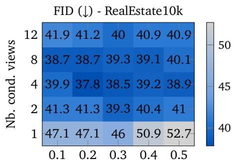

FID (↓) - 3DFront  
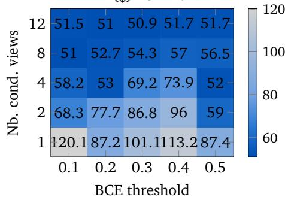

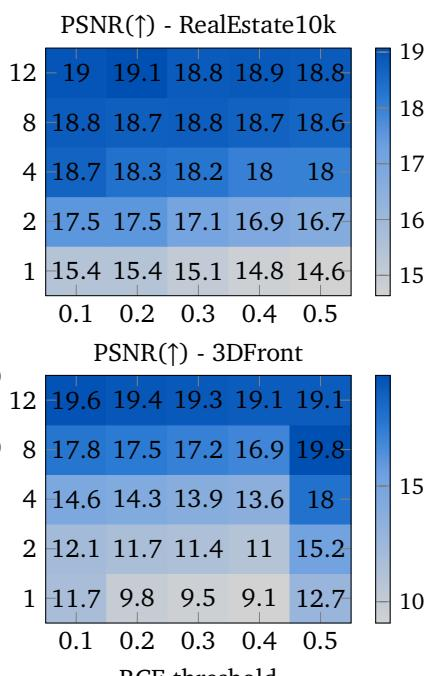  
BCE threshold

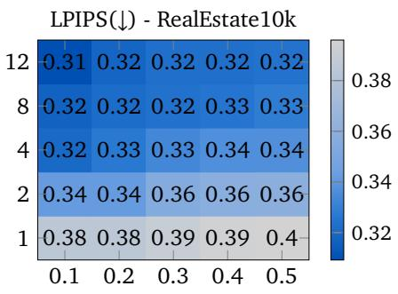

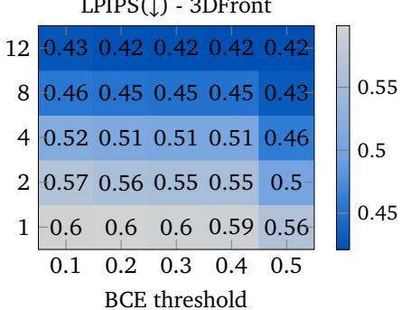  
Figure 6: Impact of the number of conditioning views and BCE occupancy thresholds. We study the impact on performance of varying the threshold used for binary occupancy prediction (in {0.1, 0.2, 0.3, 0.4, 0.5}) for various numbers of conditioning views ({1, 2, 4, 8, 12}). Increasing the number of conditioning views consistently improves performance, while lower threshold tend to give gains. With PSNR and LPIPS we see a diagonal pattern: with more conditioning views, the threshold can be increased as geometry prediction gets more accurate.

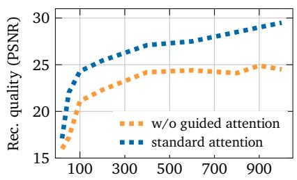  
Training iterations (k)

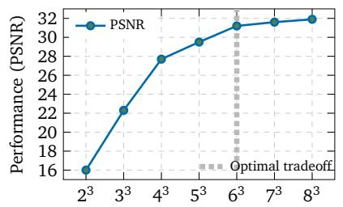  
Number of Gaussian splats per voxel

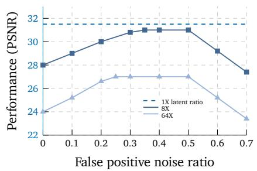  
Figure 7: Ablation studies. Left: Impact of guided attention on training dynamics — adding attention logits is beneficial. Middle: Impact of the number of splats per voxel — diminishing returns are observed; we use $6 ^ { 3 }$ splats per voxel. Right: Latent compression ratio and false positives in learned upsampling: approximately 25% of false positives is optimal.

## 5.2. Two-view NVS

We first evaluate scene reconstruction from two condi tioning views, a challenging setting in which most of the scene is unobserved and must be inferred from minimal context. Novel-view synthesis results on 3DFront and RealEstate10K are reported in Tab. 1. As expected, both optimization-based [19] and feed-forward 3DGS [6] methods fail to produce meaningful reconstructions, due to their limited ability to extrapolate beyond the frustums of conditioning views, and their dificulty in reproducing observed regions from novel views with significant viewpoint variation. Depthsplat [55], with geometric priors, is able to better handle large viewpoint changes but still inherently cannot reconstruct unobserved areas. LatentSplat [52] benefits from its generative formulation and shows improved reconstructions in novel areas. However, it remains constrained by its epipolar-based encoder architecture which prevents it from handling overly wide viewpoint variations (as illustrated by the clear performance drop between Re10k and 3DFront). Similarly, MVSplat360 difusion model [10] struggles to handle unconstrained cameras poses which leads to inconsistent reconstructions. In contrast, the combination of an autoregressive generative formulation and a sparse voxelized latent space allows SPAR3S to substantially outperform all 3D generative baselines on this challenging wide-two views scene reconstruction. Qualitative comparisons are shown in Fig. 5.

## 5.3. Multi-view NVS

In Fig. 6 we increase the amount of contextual information the model receives by increasing the number of conditioning views provided to the models, using $n = \{ 1 , 2 , 4 , 8 , 1 2 \}$ . The reconstruction task thus becomes more constrained, inducing easier scene completion in unobserved areas. This is indeed illustrated by the improving NVS metrics as the number of conditioning views increases. We also vary the threshold used in binary occupancy prediction. Overall, performance tends to be better with low thresholds: missing out parts of the room degrades metrics more than adding spurious parts. We notice a diagonal pattern: the model makes more accurate occupancy predictions with more views.

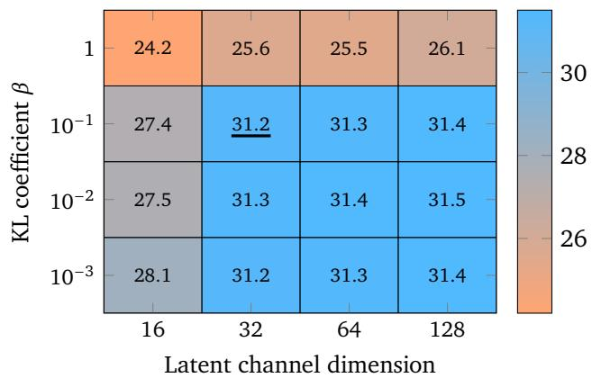  
Figure 8: Information bottlenecks on the latent variable. Impact measured with PSNR. A clear trend emerges: a KL coeficient stronger than 0.1 or a latent dimension below 32 both significantly degrade performance; otherwise reconstruction accuracy is stable over a wide range.

## 5.4. Ablations

Encoder-Decoder. We study the main design choices of the scene encoder-decoder. First, in Fig. 7 (left) we show the impact of removing the bincount-based guided attention mechanism, which results in slower training and lower performance. Second, we show in the middle plot the impact of the number of Gaussian regressed on PSNR. While the performance improves monotonically, there is a clear diminishing return and thus we chose a value of $6 ^ { 3 }$ . Third, we show in the right plot that when spatial compression is used, injecting false positives at training is key to obtain optimal performance. Around 25% is a robust value for both 8× and 64× compression ratios. Finally, we evaluate diferent information bottlenecks on the encoded latent variables in Fig. 8; KL coeficients are taken in $\beta \in \{ 0 . 0 0 1 , 0 . 0 1 , 0 . 1 , 1 \}$ and latent dimension in {16, 32, 64, 128}. A KL coeficient stronger than 0.1 or a latent dimension below 32 both significantly degrade performance; we pick the tighter possible bottleneck: $\beta = 0 . 1$ and dim(�) = 32.

Autoregressive difusion model. We ablate diferent components of the autoregressive difusion model and report novel view rendering results in Tab. 2. Decoding latent vectors with a linear head (wo. dif) instead of a difusion head degrades the model’s ability to sample coherent tokens in unobserved areas. Similarly, injecting relative positional encoding in self-attention layers proves important for spatial reasoning when decoding the scene (w/o. 3D RPE). During inference, using a random autoregressive order (w/o. BFS ordering) and not performing occupancy refinement (w/o. occ. reference) also degrades the consistency and quality of the predicted Gaussians. Finally, in order to evaluate the model’s ability to reconstruct latent tokens without the influence of occupancy predictions, we decode the scenes using ground truth occupancies (SPAR3S w. gt. occ.). Unsurprisingly, this improves the quality of the results.

Table 2: Ablation study of the autoregressive difusion model on the 3DFRONT dataset with four conditioning views. Each row removes one component of the full model. Metrics are reported on novel views.
<table><tr><td>Configuration</td><td>PSNR↑</td><td>SSIM↑</td><td>LPIPS↓</td></tr><tr><td>SPAR3S (full model)</td><td>15.18</td><td>0.62</td><td>0.50</td></tr><tr><td>Ablations (each removes one component)</td><td></td><td></td><td></td></tr><tr><td>w/o diff.</td><td>13.90</td><td>0.53</td><td>0.54</td></tr><tr><td>w/o 3D RPE</td><td>13.74</td><td>0.49</td><td>0.58</td></tr><tr><td>w/o BFS ordering</td><td>14.81</td><td>0.59</td><td>0.53</td></tr><tr><td>w/o occ. reference</td><td>14.48</td><td>0.56</td><td>0.56</td></tr><tr><td colspan="4">Additional Oracle Variant</td></tr><tr><td>SPAR3S w/ gt. occ.</td><td>17.90</td><td>0.68</td><td>0.45</td></tr></table>

## 6. Conclusion

We introduce SPAR3S, a novel generative model for 3D scene reconstruction. SPAR3S processes sparse and unconstrained input views and encodes them into a 3D latent space associated with a voxel-aligned 3DGS encoder-decoder. SPAR3S further performs full scene completion in this 3D latent space by leveraging an eficient autoregressive architecture that jointly infers geometry and latent content to exploit scene sparsity. Our results demonstrate the potential of autoregressive latent modeling for 3D scene generation. As such, our work opens promising avenues for applying masked autoregressive models to 3D data and for advancing generative reconstruction in sparse-view scenarios.

## References

[1] Jimmy Lei Ba, Jamie Ryan Kiros, and Geofrey E. Hinton. Layer normalization. arXiv preprint arXiv:1607.06450, 2016. 14

[2] Sherwin Bahmani, Tianchang Shen, Jiawei Ren, Jiahui Huang, Yifeng Jiang, Haithem Turki, Andrea Tagliasacchi, David B Lindell, Zan Gojcic, Sanja Fidler, et al. Lyra: Generative 3d scene reconstruction via video difusion model self-distillation. arXiv preprint arXiv:2509.19296, 2025. 2, 3

[3] Mikołaj Bińkowski, Danica J. Sutherland, Michael Arbel, and Arthur Gretton. Demystifying MMD GANs. In ICLR, 2018. 8

[4] Yohann Cabon, Lucas Stofl, Leonid Antsfeld, Gabriela Csurka, Boris Chidlovskii, Jerome Revaud, and Vincent Leroy. Must3r: Multi-view network for stereo 3d reconstruction. In CVPR, 2025. 2

[5] Huiwen Chang, Han Zhang, Lu Jiang, Ce Liu, and William T. Freeman. Maskgit: Masked generative image transformer. In CVPR, 2022. 3, 5

[6] David Charatan, Sizhe Lester Li, Andrea Tagliasacchi, and Vincent Sitzmann. pixelSplat: 3D gaussian splats from image pairs for scalable generalizable 3D reconstruction. In CVPR, 2024. 1, 2, 7, 8, 9

[7] Jinnan Chen, Lingting Zhu, Zeyu Hu, Shengju Qian, Yugang Chen, Xin Wang, and Gim Hee Lee. Mar-3d: Progressive masked auto-regressor for high-resolution 3d generation. In CVPR, 2025. 4

[8] Weiliang Chen, Jiayi Bi, Yuanhui Huang, Wenzhao Zheng, and Yueqi Duan. Scenecompleter: Dense 3d scene completion for generative novel view synthesis. arXiv preprint arXiv:2506.10981, 2025. 3

[9] Yuedong Chen, Haofei Xu, Chuanxia Zheng, Bohan Zhuang, Marc Pollefeys, Andreas Geiger, Tat-Jen Cham, and Jianfei Cai. MVSplat: Eficient 3D gaussian splat ting from sparse multi-view images. In ECCV, 2024. 1, 2, 3

[10] Yuedong Chen, Chuanxia Zheng, Haofei Xu, Bohan Zhuang, Andrea Vedaldi, Tat-Jen Cham, and Jianfei Cai. Mvsplat360: Feed-forward 360 scene synthesis from sparse views. In NeurIPS, 2024. 3, 7, 8, 9

[11] Bardienus Pieter Duisterhof, Lojze Žust, Philippe Weinzaepfel, Vincent Leroy, Yohann Cabon, and Jérôme Revaud. Mast3r-sfm: a fully-integrated solution for unconstrained structure-from-motion. In 3DV, 2025. 4, 8

[12] Huan Fu, Bowen Cai, Lin Gao, Ling-Xiao Zhang, Jiaming Wang, Cao Li, Qixun Zeng, Chengyue Sun, Rongfei Jia, Binqiang Zhao, et al. 3d-front: 3d furnished rooms with layouts and semantics. In ICCV, 2021. 7

[13] Ruiqi Gao, Aleksander Holynski, Philipp Henzler, Arthur Brussee, Ricardo Martin-Brualla, Pratul Srinivasan, Jonathan T. Barron, and Ben Poole. Cat3D: Create anything in 3D with multi-view difusion models. In NeurIPS, 2024. 3

[14] Xavier Glorot and Yoshua Bengio. Understanding the dificulty of training deep feedforward neural networks. In AISTATS, 2010. 14

[15] Kaiming He, Xinlei Chen, Saining Xie, Yanghao Li, Piotr Dollár, and Ross Girshick. Masked autoencoders are scalable vision learners. In CVPR, 2022. 6

[16] Paul Henderson, Melonie de Almeida, Daniela Ivanova, and Titas Anciukevičius. Sampling 3D gaussian scenes in seconds with latent difusion models. arXiv preprint arXiv:2406.13099, 2024. 2, 3

[17] Martin Heusel, Hubert Ramsauer, Thomas Unterthiner, Bernhard Nessler, and Sepp Hochreiter. GANs trained by a two time-scale update rule converge to a local nash equilibrium. In NeurIPS, 2017. 8

[18] Jonathan Ho, Ajay Jain, and Pieter Abbeel. Denoising difusion probabilistic models. In NeurIPS, 2020. 7

[19] Bernhard Kerbl, Georgios Kopanas, Thomas Leimkühler, and George Drettakis. 3d gaussian splatting for realtime radiance field rendering. ACM Transactions on Graphics (ToG), 2023. 1, 5, 7, 8, 9

[20] Diederik P. Kingma and Jimmy Ba. Adam: A method for stochastic optimization. In ICLR, 2015. 14

[21] Diederik P. Kingma and Max Welling. Auto-encoding variational bayes. In ICLR, 2014. 5

[22] Tung Le, Tuan Pham, Tung Nguyen, Deying Kong, Xiaohui Xie, and Stephan Mandt. Umami: Unifying masked autoregressive models and deterministic rendering for view synthesis. In NeurIPS, 2025. 4

[23] Vincent Leroy, Yohann Cabon, and Jérôme Revaud. Grounding image matching in 3d with mast3r. In ECCV, 2024. 2

[24] Tianhong Li, Huiwen Chang, Shlok Mishra, Han Zhang, Dina Katabi, and Dilip Krishnan. Mage: Masked generative encoder to unify representation learning and image synthesis. In CVPR, 2023. 3, 5

[25] Tianhong Li, Yonglong Tian, He Li, Mingyang Deng, and Kaiming He. Autoregressive image generation without vector quantization. In NeurIPS, 2024. 3, 5, 6, 7, 14

[26] Xinhai Li, Huaibin Wang, and Kuo-Kun Tseng. GaussianDifusion: 3D gaussian splatting for denoising diffusion probabilistic models with structured noise. arXiv preprint arXiv:2311.11221, 2023. 3

[27] Hanwen Liang, Junli Cao, Vidit Goel, Guocheng Qian, Sergei Korolev, Demetri Terzopoulos, Konstantinos N. Plataniotis, Sergey Tulyakov, and Jian Ren. Wonderland: Navigating 3d scenes from a single image. In CVPR, 2025. 3

[28] Ziwei Liao, Mohamed Sayed, Steven L Waslander, Sara Vicente, Daniyar Turmukhambetov, and Michael Firman. Complete gaussian splats from a single image with denoising difusion models. arXiv preprint arXiv:2508.21542, 2025. 3

[29] Chenguo Lin, Panwang Pan, Bangbang Yang, Zeming Li, and Yadong Mu. Difsplat: Repurposing image difusion models for scalable gaussian splat generation. In ICLR, 2025. 3

[30] Tsung-Yi Lin, Priya Goyal, Ross Girshick, Kaiming He, and Piotr Dollár. Focal loss for dense object detection. In ICCV, 2017. 14

[31] Fangfu Liu, Wenqiang Sun, Hanyang Wang, Yikai Wang, Haowen Sun, Junliang Ye, Jun Zhang, and Yueqi Duan. Reconx: Reconstruct any scene from sparse views with video difusion model. IEEE Transactions on Image Processing, 2026. 3

[32] Yifan Liu, Keyu Fan, Weihao Yu, Chenxin Li, Hao Lu, and Yixuan Yuan. MonoSplat: Generalizable 3d gaussian splatting from monocular depth foundation models. In CVPR, 2025. 2, 3

[33] Baorui Ma, Huachen Gao, Haoge Deng, Zhengxiong Luo, Tiejun Huang, Lulu Tang, and Xinlong Wang. You see it, you got it: Learning 3d creation on pose-free videos at scale. In CVPR, 2025. 3

[34] Xuyi Meng, Chen Wang, Jiahui Lei, Kostas Daniilidis, Jiatao Gu, and Lingjie Liu. Zero-1-to-G: Taming pretrained 2d difusion model for direct 3d generation. arXiv preprint arXiv:2501.05427, 2025. 3

[35] Chensheng Peng, Ido Sobol, Masayoshi Tomizuka, Kurt Keutzer, Chenfeng Xu, and Or Litany. A lesson in splats: Teacher-guided difusion for 3d gaussian splats generation with 2d supervision. In ICCV, 2025. 3

[36] Ali Razavi, Aaron van den Oord, and Oriol Vinyals. Generating diverse high-fidelity images with VQ-VAE-2. In NeurIPS, 2019. 3

[37] Xuanchi Ren, Jiahui Huang, Xiaohui Zeng, Ken Museth, Sanja Fidler, and Francis Williams. Xcube: Large-scale 3d generative modeling using sparse voxel hierarchies. In CVPR, 2024. 3

[38] Xuanchi Ren, Yifan Lu, Hanxue Liang, Zhangjie Wu, Huan Ling, Mike Chen, Sanja Fidler, Francis Williams, and Jiahui Huang. Scube: Instant large-scale scene reconstruction using voxsplats. In NeurIPS, 2024. 3

[39] Robin Rombach, Andreas Blattmann, Dominik Lorenz, Patrick Esser, and Björn Ommer. High-resolution image synthesis with latent difusion models. In CVPR, 2022. 3, 5

[40] Jianlin Su, Yu Lu, Shengfeng Pan, Ahmed Murtadha, Bo Wen, and Yunfeng Liu. Roformer: Enhanced transformer with rotary position embedding. arXiv preprint arXiv:2104.09864, 2021. 14

[41] Stanislaw Szymanowicz, Chrisitian Rupprecht, and Andrea Vedaldi. Splatter image: Ultra-fast single-view 3D reconstruction. In CVPR, 2024. 2

[42] Stanislaw Szymanowicz, Eldar Insafutdinov, Chuanxia Zheng, Dylan Campbell, Joao F Henriques, Christian Rupprecht, and Andrea Vedaldi. Flash3d: Feed-forward generalisable 3d scene reconstruction from a single image. In 3DV, 2025. 2, 3

[43] Stanislaw Szymanowicz, Jason Y. Zhang, Pratul Srinivasan, Ruiqi Gao, Arthur Brussee, Aleksander Holynski, Ricardo Martin-Brualla, Jonathan T. Barron, and Philipp Henzler. Bolt3d: Generating 3d scenes in seconds. In ICCV, 2025. 2, 3

[44] Jiaxiang Tang, Jiawei Ren, Hang Zhou, Ziwei Liu, and Gang Zeng. DreamGaussian: Generative gaussian splatting for eficient 3D content creation. In ICLR, 2023. 3

[45] Jiaxiang Tang, Zhaoxi Chen, Xiaokang Chen, Tengfei Wang, Gang Zeng, and Ziwei Liu. LGM: Large multiview gaussian model for high-resolution 3d content creation. In ECCV, 2024. 2, 3

[46] Aaron van den Oord, Nal Kalchbrenner, Oriol Vinyals, Lasse Espeholt, Alex Graves, and Koray Kavukcuoglu. Conditional image generation with pixelcnn decoders. In NeurIPS, 2016. 3

[47] Aaron van den Oord, Oriol Vinyals, and Koray Kavukcuoglu. Neural discrete representation learning. In NeurIPS, 2017. 3

[48] Hengyi Wang and Lourdes Agapito. 3d reconstruction with spatial memory. In 3DV, 2025. 2

[49] Jianyuan Wang, Minghao Chen, Nikita Karaev, Andrea Vedaldi, Christian Rupprecht, and David Novotny. VGGT: Visual geometry grounded transformer. In CVPR, 2025. 2

[50] Qianqian Wang, Yifei Zhang, Aleksander Holynski, Alexei A Efros, and Angjoo Kanazawa. Continuous 3d perception model with persistent state. In CVPR, 2025. 2

[51] Shuzhe Wang, Vincent Leroy, Yohann Cabon, Boris Chidlovskii, and Jerome Revaud. DUSt3R: Geometric 3d vision made easy. In CVPR, 2024. 1, 2, 3, 4

[52] Christopher Wewer, Kevin Raj, Eddy Ilg, Bernt Schiele, and Jan Eric Lenssen. latentSplat: Autoencoding variational gaussians for fast generalizable 3D reconstruction. In ECCV, 2024. 3, 7, 8, 9

[53] Jamie Wynn and Daniyar Turmukhambetov. DifusioNeRF: Regularizing Neural Radiance Fields with Denoising Difusion Models. In CVPR, 2023. 7, 8

[54] Tiange Xiang, Kai Li, Chengjiang Long, Christian Häne, Peihong Guo, Scott Delp, Ehsan Adeli, and Li Fei-Fei. Repurposing 2d difusion models with gaussian atlas for 3d generation. In ICCV, 2025. 3

[55] Haofei Xu, Songyou Peng, Fangjinhua Wang, Hermann Blum, Daniel Barath, Andreas Geiger, and Marc Pollefeys. DepthSplat: Connecting gaussian splatting and depth. In CVPR, 2025. 1, 2, 3, 7, 8, 9

[56] Yinghao Xu, Zifan Shi, Wang Yifan, Hansheng Chen, Ceyuan Yang, Sida Peng, Yujun Shen, and Gordon Wetzstein. GRM: Large gaussian reconstruction model for eficient 3d reconstruction and generation. In ECCV, 2024. 2, 3

[57] Taoran Yi, Jiemin Fang, Junjie Wang, Guanjun Wu, Lingxi Xie, Xiaopeng Zhang, Wenyu Liu, Qi Tian, and Xinggang Wang. Gaussiandreamer: Fast generation from text to 3D gaussians by bridging 2D and 3D difusion models. In CVPR, 2024. 3

[58] Wangbo Yu, Jinbo Xing, Li Yuan, Wenbo Hu, Xiaoyu Li, Zhipeng Huang, Xiangjun Gao, Tien-Tsin Wong, Ying Shan, and Yonghong Tian. Viewcrafter: Taming video difusion models for high-fidelity novel view synthesis. arXiv preprint arXiv:2409.02048, 2024. 3

[59] Kai Zhang, Sai Bi, Hao Tan, Yuanbo Xiangli, Nanxuan Zhao, Kalyan Sunkavalli, and Zexiang Xu. GS-LRM: Large reconstruction model for 3d gaussian splatting. In ECCV, 2024. 2, 3

[60] Richard Zhang, Phillip Isola, Alexei A. Efros, Eli Shechtman, and Oliver Wang. The unreasonable efectiveness of deep features as a perceptual metric. In CVPR, 2018. 8

[61] Jensen Zhou, Hang Gao, Vikram Voleti, Aaryaman Vasishta, Chun-Han Yao, Mark Boss, Philip Torr, Christian Rupprecht, and Varun Jampani. Stable virtual camera: Generative view synthesis with difusion models. In ICCV, 2025. 3

[62] Tinghui Zhou, Richard Tucker, John Flynn, Graham Fyfe, and Noah Snavely. Stereo magnification: Learning view synthesis using multiplane images. In SIG-GRAPH, 2018. 2, 7

In this supplementary material, we provide additional implementation and training details in Sec. A. We also display more visualizations in Sec. B. In addition, we discuss on limitations of our method in Sec. C.

## A. Additional implementation details

Architecture of the 3D Autoregressive model. $H _ { \psi }$ is composed of two bidirectional attention-based blocks $\{ H _ { \psi } ^ { 1 } , H _ { \psi } ^ { 2 } \}$ and two lightweight voxel-wise heads: an occupancy head $h _ { o c c }$ and a denoising difusion head $h _ { \epsilon }$ [25]. Both $H _ { \psi } ^ { 1 }$ and $H _ { \psi } ^ { 2 }$ contain 5 self-attention blocks which include a LayerNorm [1], an MLP (Multi-Layer Perception) and a multi-head self-attention layer. The input sequence to $H _ { \psi } ^ { 1 }$ is composed of conditioning tokens and unmasked tokens which are projected to $H _ { \psi } ^ { 1 } ,$ ’s dimension with separate linear layers and LayerNorm. Similarly, the input sequence to $H _ { \psi } ^ { 2 }$ is composed of the output tokens of $H _ { \psi } ^ { 1 }$ and masked tokens, both are projected to have the same dimension as $H _ { \psi } ^ { 2 }$ with separate linear layers and LayerNorm. Absolute positional encoding is added to any token within these input sequences by applying sinusoidal encoding on the normalized voxel coordinates. Furthermore, 3D RoPE [40] using voxel coordinates, is applied in the self-attention layers. Masked tokens are initialized with a learnable mask token. The internal dimension of $\{ H _ { \psi } ^ { 1 } , H _ { \psi } ^ { 2 } \}$ is set to 512.

Implementation of the prediction heads. The difusion head $h _ { \epsilon }$ follows the architecture in [25] with 2 layers of dimension 512. Conditioning information is injected through ada-ln modulation. We apply signal to noise ratio (SNR) weighting in the difusion objective to avoid over-weighting high noise timesteps and improve sample at lower noise timesteps. The occupancy head $h _ { o c c }$ is an MLP composed of three linear layers and GELU activations which outputs a single logit. It is optimized with a focal loss [30] to help mitigate the imbalance between occupied and empty voxels.

## Occupancy prediction and coarse-to-fine refinement.

Predicting occupancy at the voxel level becomes computationally expensive because the number of voxels grows cubically with scene size. When training the encoder-decoder or the latent regression model, we may use "ground truth" occupancies deduced from the inputs to directly sparsify sequences. However, when training the occupancy model, this is obviously not possible anymore and we need to operate on the dense volume. To address the cost of such dense 3D computations, we propose several optimizations. First, we predict occupancies in the compact latent space which strongly limits the scene size. We directly downsample ground truth to the latent space resolution to supervise the model. Second, we adopt a coarse-to-fine strategy for occupancy prediction. Both the coarse and fine stages follow our 3D autoregressive latent framework for both training and inference (see Sec. 4 of the main paper). The coarse stage is lightweight $( e . g . ,$ , two layers instead of five), and performs occupancy prediction over all voxels in the scene. During inference, it uses a high-recall threshold to ensure that potentially occupied regions are not missed. Latent prediction is also deactivated in the coarse stage to further improve eficiency. The fine stage then operates only on the voxels selected by the coarse stage. The full model refines these initial occupancy predictions while predicting latent vectors when voxels are classified as occupied. It uses a threshold tuned for a strong precision-recall balance. This two-stage process significantly reduces computation while improving final accuracy. For further eficiency, we apply a MAR style random mask to both inputs and targets for the MAR occupancy prediction: the targets always include the inputs, but do not cover the full tensor. We use a random masking ratio sampled between 0.3 and 1. We find this has no noticeable impact on final performance, while substantially reducing the memory computational cost.

Training Details. Training SPAR3S involves two sequential steps. We first train the scene encoder for 1.8M iterations with batch size 4, which takes approximately one week on a single NVIDIA A100 GPU. We use a cosine learning rate decay starting from $1 0 ^ { - 5 }$ and the Adam optimizer [20]. The model is trained from scratch after a Xavier initialization [14]. We then train the autoregressive latent prediction model for 1.6M iterations with a batch size of 4 on a single NVIDIA V100 GPU. A cosine learning rate decay starting from $1 0 ^ { - 4 }$ and the Adam optimizer [20] are used. The trained scene encoder provides conditioning tokens as well as target tokens for the latent prediction model. The 3D latent space dimension is set to 32. In the encoder, after sampling the latents, we apply a group normalization with 8 groups. This regularizes the latent space and allows for more stable latent difusion.

## B. Visualizations

In Fig. 9, given two conditioning images (shown in the left column), we display rendered novel views for randomly selected camera viewpoints. SPAR3S is able to extrapolate coherent scene content and geometry far outside the frustums of conditioning cameras. On RealEsate10k scenes, cameras exhibit small relative pose variations (both among conditioning views and between conditioning-novel views), thus making novel view synthesis less complicated. Additionally, in Fig. 10, for a single scene, we display rendered novel views from SPAR3S conditioned on a varying number of conditioning views (4/8/12, one set per line). As the number of conditioning views increases, ambiguity decreases and SPAR3S produces more consistent and detailed reconstructions.

## C. Method limitations

Our model relies on voxel-level occupancy predictions to sparsify tensor computations in all components. This is computationally eficient, but it has a drawback: if the occupancy model misses voxels inside walls or objects, this creates ‘holes’ in the scene. Such holes are visually salient and are currently the most degrading factor for visual quality. Additionally, artifacts such as localized blurriness arise from constraints in voxel resolution and the density of Gaussians allocated per voxel. We hypothesize that these limitations are fundamentally scaling issues; while increasing the dataset size and model capacity would mitigate these artifacts, it would concurrently escalate the computational overhead. One workaround for this is to further refine the output using 2D difusion models as post-processing. However, this study focuses on establishing the first native 3D generative framework of its kind. We leave the further optimization of the quality-eficiency trade-of to future work.

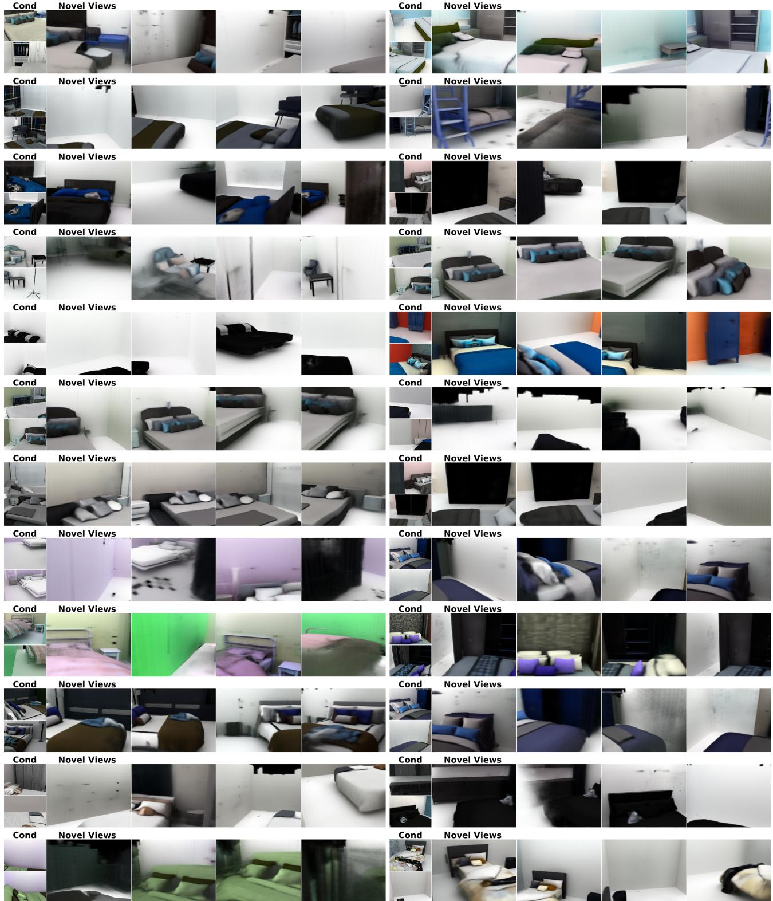  
Figure 9: Novel view synthesis from two conditioning views (left column) on 3D-Front and RealEstate10k datasets.

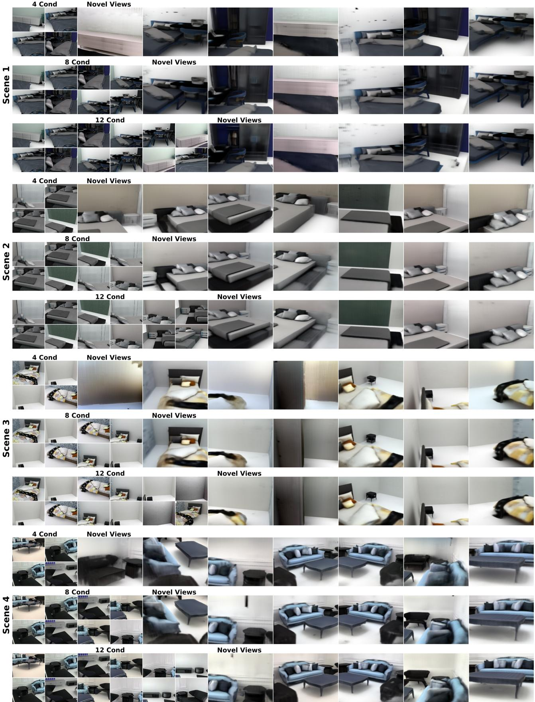  
Figure 10: Comparing view synthesis given diferent numbers of conditioning views (left: rendered conditioning views, right: rendered novel views). Increasing contextual information leads to less ambiguous scene reconstruction and better renderings. Even in areas without conditioning, SPAR3S is able to sample plausible modes.