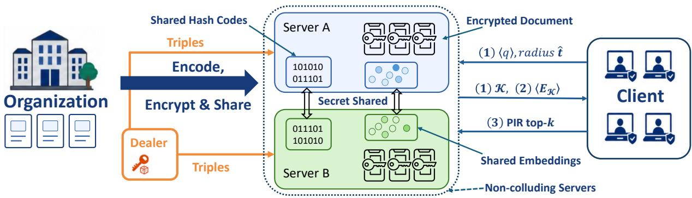
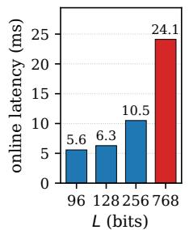
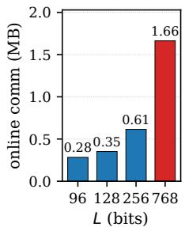
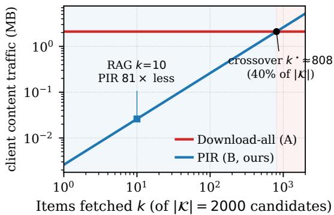
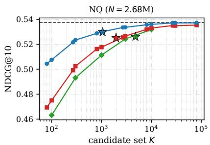
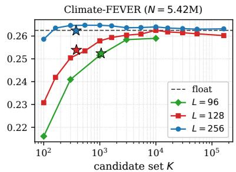
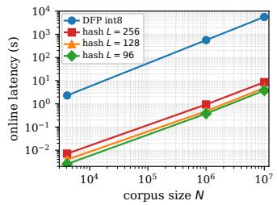
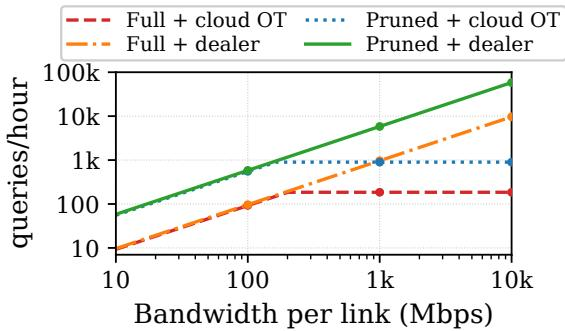
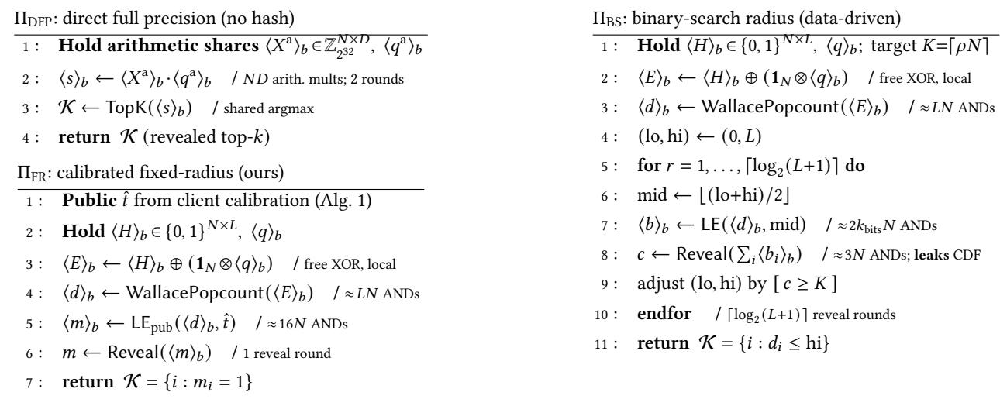

# Spruce: Scalable Private Outsourced Retrieval Using Compact Embeddings

Peichun Hua1,2, Yunming Xiao1,2

1The Chinese University of Hong Kong, Shenzhen 2State Key Laboratory of Internet Architecture, Tsinghua University peichunhua@link.cuhk.edu.cn, yunmingxiao@cuhk.edu.cn

## Abstract

Retrieval-Augmented Generation (RAG) has made dense retrieval over large document collections a default building block, and organizations increasingly outsource the vector index to untrusted clouds—exposing both proprietary corpora and user queries. Protecting this retrieval cryptographically is dificult because every query searches corpus-scale state: computation, correlated randomness, and communication grow with every indexed document. At million-document scale, a naive secure implementation takes minutes and ∼90 GB of communication per query. Recent optimized systems take 10–22 seconds per query, but this is still comparable to downstream LLM generation and therefore a first-order contributor to end-to-end latency.

We propose Spruce (Scalable Private Outsourced Retrieval Using Compact Embeddings) , which co-designs the representation with the cryptographic protocol. Spruce learns compact binary hash codes that preserve the candidates needed for subsequent full-precision reranking, replacing corpus-wide full-embedding scoring with eficient Hammingdistance computation under two-server multi-party computation (MPC). A corpus-calibrated fixed-radius protocol avoids multi-round candidate selection while preserving the final retrieval quality. Spruce further supports two optimizations that target deployment bottlenecks: private cluster pruning trades minor quality loss for drastically less computation, while a one-core owner-operated dealer removes cloud OT as a preprocessing bottleneck. Across four corpora spanning 383K–5.42M documents, Spruce retains the original search quality with median candidate sets of merely 382–1,952. At 10 Gbps inter-server bandwidth, its full scan takes 0.21–2.97 seconds, 4.8–6.7× faster than the closest measured prior work, while private pruning takes 0.06–1.09 seconds, 13.1–22.9× faster, and retains 93.9–97.3% of full-float NDCG. On the largest corpus, pruning and the dealer jointly raise sustained throughput by 31.5× at 1 Gbps per-link bandwidth.

Keywords: Secure multi-party computation, private information retrieval, dense retrieval, retrieval-augmented generation, deep hashing, oblivious search, secret sharing, data indexing.

## 1 Introduction

Retrieval-Augmented Generation (RAG) has turned dense information retrieval over large corpora into core infrastructure for knowledge-grounded language applications [20, 22, 43]. A RAG system answers a query by first retrieving: it embeds the query with a neural encoder, scores that embedding against a precomputed index of document embeddings, and returns the top-� documents, which are concatenated into the prompt of a generative model [22, 43]. As the corpus grows, the cost of retrieval grows with it, motivating more organizations to increasingly outsource retrieval to managed cloud services [12, 55].

This is convenient, but from a confidentiality standpoint, it is alarming: the cloud now holds both a proprietary corpus—often the asset that the organization wants to protect the most—and a stream of user queries that reveal private intent [33, 81]. Prior embedding inversion attacks and attribute inference attacks have shown that dense vectors are not opaque identifiers but are invertible semantic footprints [11, 44, 56, 66], making both document indexes and query rep resentations privacy-sensitive. At the system level, privacy protection in RAG spans two distinct components: neural model computation and outsourced retrieval state. Existing private-inference systems primarily address the former by securing transformer forward passes [26, 52, 59, 79], whose cost is governed by model size rather than corpus size.

This paper targets the latter. We assume that the client runs the query encoder locally, while the cloud stores the document embeddings and contents and performs retrieval for multiple users in an organization. At the scale of 107 documents, this state can occupy tens of gigabytes or more, and searching it can require substantially more computation than encoding a query.

The challenge is to search this large outsourced state without exposing either the corpus or the encoded query, while keeping the cost practical at corpus scale. Since downstream LLM generation in RAG already takes seconds, a practical private service should keep retrieval within this seconds-scale latency budget while sustaining multi-user throughput.

Among available approaches, secret-sharing-based multiparty computation (MPC) is particularly attractive because it ofers more eficient similarity computation than homomorphic encryption (HE) while jointly protecting the corpus and query; however, a full scan still incurs corpus-linear computation, correlated randomness, and communication (§2.2). Table 1 shows the challenge: even secure int8 cosine over � embeddings of dimension �=768 requires � · � secure multiplications, taking ∼9.4 minutes and ∼88 GB per query at one million documents.

Table 1. Per-query cost of the search step of one private query $\scriptstyle ( D = 7 6 8 ) :$ the int8 cosine baseline (DFP, direct fullprecision: the uncompressed �-dim embedding scored in int8) vs. our learned �=128 hash, across three corpus sizes.
<table><tr><td>Representation</td><td>per-query op</td><td>N=382K</td><td>N=10⁶</td><td>N=107</td></tr><tr><td>int8 cosine (DFP)</td><td>mults (×10⁸)</td><td>2.9</td><td>7.7</td><td>76.8</td></tr><tr><td>online comm (MB)</td><td></td><td>33,611</td><td>87,863</td><td>878,628</td></tr><tr><td>online latency (s)</td><td></td><td>215.0</td><td>562.1</td><td>5,621</td></tr><tr><td>hash L=128 (ours)</td><td>ANDs (×108)</td><td>0.5</td><td>1.3</td><td>12.8</td></tr><tr><td>online comm (MB)</td><td></td><td>32.9</td><td>86.0</td><td>860</td></tr><tr><td>online latency (s)</td><td></td><td>0.183</td><td>0.482</td><td>4.85</td></tr></table>

Recent privacy-preserving RAG systems approach this cost at diferent points. $p ^ { 2 } \mathrm { R A G }$ [55] is closest to our setting: like us, it secret-shares the outsourced embeddings across two non-colluding servers and optimizes candidate selection through interactive bisection; however, it still securely scores every full embedding. Other systems assume that the retrieval provider owns or is trusted with the corpus and therefore focus on query privacy: RemoteRAG leverages diferential privacy (DP) to perturb the query before PHE scoring, PANTHER combines clustering with PIR and MPC, and Pisces applies SimHash and BM25 filters before secure scoring [12, 45, 49]. Despite these optimizations, our evaluation shows that their encrypted reranking, PIR state, or candidate pools remain costly at a million-document scale.

Our approach: Spruce. Our key insight is to co-design the retrieval representation with the secure protocol, so that corpus-wide secure computation operates only on compact learned binary codes, while full-precision scoring is restricted to a small candidate set. Spruce therefore separates private retrieval into a corpus-wide secure filter and a candidate-only exact stage. At setup, the corpus is encoded once into compact codes and full-precision embeddings, then split across two non-colluding servers. At query time, the servers reveal a coarse candidate set from the compact codes; the trusted client reranks the corresponding embeddings and fetches the final documents obliviously.

Coarse filtering on binary representations. The Filter scores learned �-bit codes by Hamming distance—the number of difering bits, computed by a bitwise XOR followed by a popcount [53, 73]. This maps eficiently to two-server MPC: XOR-shared bits are combined locally without interaction, so only the popcount and one distance-to-radius comparison consume interactive AND gates. The filter thus replaces the � ·� secure multiplications of full-embedding cosine with roughly �·� Boolean ANDs (§3.3), making � a direct gate budget. Our lightweight deep-hashing recipe (§3.2.1, §3.2.2) learns compact codes that beat the 768-bit sign-of-float baseline [62] at a fraction of its gate count.

A protocol with calibrated radius to tame interaction. The Filter must turn shared Hamming distances into a candidate set. Exact top-� selection would need an oblivious sort over the shares [5, 25], which is expensive. A radius threshold is much cheaper, but choosing the radius online from the encrypted distance distribution with binary search costs $\log _ { 2 } ( L + 1 )$ data-dependent count reveals and additionally leaks a sketch of the corpus distance CDF. Spruce moves this choice ofline: repeated stratified calibration finds the smallest radius that reaches a target final NDCG after float reranking, and the resulting corpus-level radius is supplied up front, collapsing online candidate selection to a single comparison and a single reveal (§3.3) while directly optimizing the retrieval metric the application consumes.

Additional deployment optimizations. To further facilitate practical deployments, Spruce additionally supports two optimizations. First, users can privately retrieve a fixed set of padded Hamming clusters before MPC and trade a slight quality loss for significantly lower work. Second, organizations that can run one small trusted server can seed triple generation and eliminate a critical communication bottleneck among the two servers. The two optimizations compose directly, and can be disabled independently (§3.3.3).

Oblivious fetch and a bounded leakage profile. Once the calibrated Filter reveals a small but coarse candidate set, the client reconstructs only the candidate embeddings, reranks them against its full-precision query embedding, and keeps the top-�. Document content is stored as clientencrypted ciphertext replicated to both servers, and the client retrieves its chosen blobs by two-server PIR [13], so the servers never learn which documents are returned (§3.4). We give an adaptive multi-query simulation proof for explicit setup and online leakage functions and quantify the fullscan access pattern with a ciphertext-only co-occurrence estimator (§4). The experiment recovers a low but measurable unlabeled neighborhood signal.

Results. Across four BEIR corpora spanning 383K–5.42M documents, Spruce retains 95.2–97.8% of full-corpus float NDCG with median candidate set size of382–1,952. At 10 Gbps inter-server bandwidth, its full scan runs 4.8–6.7× faster than the closest measured prior path [12, 49, 55]; private pruning raises this advantage to 13.1–22.9× while retaining 93.9– 97.3% of full-float NDCG. On the largest corpus, pruning and the dealer jointly raise sustained throughput by 31.5× when inter-party links are capped at 1 Gbps.

## 2 Background and Threat Model

## 2.1 Dense Retrieval

A dual-encoder retriever maps a query and each document into a shared �-dimensional space and ranks them by inner product or cosine similarity [10, 38, 75]. Modern retrievers fine-tune a pretrained transformer with a contrastive objective and hard-negative mining, and generalize zero-shot across domains; this is why a single encoder serves heterogeneous corpora [62, 67]. At serving time, the document embeddings form a static index of size $N { \times } D ;$ a query is encoded once and scored against the entire index, and the top-� results are returned and, in RAG, concatenated into the generator’s prompt [43, 61, 72]. Exact scan is �(��) per query; production systems, instead, build an approximatenearest-neighbor index such as HNSW, IVF, and Product Quantization [19, 35, 54] to sublinearize the search, at the cost of higher storage overhead or loss of search quality.

Retrieval metrics. Recall@� measures the fraction of a query’s gold-relevant documents returned in the top �, while NDCG@� weights graded relevance by rank and normalizes against the ideal ranking. Because our filter emits a candidate set rather than a final ranking, we report candidate recall $R _ { \mathrm { f l o a t @ 1 0 } } \colon$ the fraction of the full-corpus float top 10 present anywhere in that set. $R _ { \mathrm { f l o a t } @ 1 0 }$ measures fidelity to the float retriever, whereas final NDCG@10 measures the quality of the float-reranked output against gold relevance labels.

Challenges in private search. Unfortunately, none of the index types above survive transplantation into a cryptographic backend unchanged. For example, the data-dependent traversal in HNSW is exactly the access pattern that an oblivious protocol must hide [15, 85]. When the index is outsourced, the cloud sees the entire �×� matrix of sensitive embeddings and every query embedding, which inversion attacks may turn back into text [44, 56]. Both the cost of this scan and the exposure of the index hinge on the representation that the cloud computes. One representation, long used for plaintext eficiency, is the short binary hash code, where similarity becomes a Hamming distance, which consists of only a bitwise XOR and a popcount [18, 53, 73]. Two of its properties turn out to matter once the computation moves under cryptography: the Hamming distance is among the cheapest operations to evaluate securely (§2.2), and the code length � is a free knob, decoupled from the encoder dimen sion �, so the per-document work can be set independently of the model. §3.2.2 details how such codes are learned.

## 2.2 Cryptographic Preliminaries

Our backend composes two standard cryptographic building blocks—two-server secure computation and PIR—both in the same non-colluding, semi-honest model.

Two-server secure computation. We work in the standard two-server (2PC) setting: two servers $P _ { A }$ and $P _ { B }$ execute the protocol honestly but are curious—each may inspect its own transcript to infer what it can—and do not collude [23]. Privacy comes from secret sharing: every sensitive value is split into two shares, one held by each server, that reconstruct the plaintext while either share alone is uniformly random and reveals nothing. A bit $x \in \{ 0 , 1 \}$ is XOR-shared as $\begin{array} { r } { \boldsymbol { x } = \langle \boldsymbol { x } \rangle _ { A } \oplus \langle \boldsymbol { x } \rangle _ { B } ; } \end{array}$ to produce the sharing, one samples a uniform bit � and sends $\langle x \rangle _ { A } { = } r$ to $P _ { A }$ and $\langle x \rangle _ { B } { = } r \oplus x$ to $P _ { B } { \mathrm { : } }$ so neither share on its own says anything about �.

The cost of a computation is then set by which gates it uses. Linear gates (including XOR and NOT) are free: to XOR two shared bits, each server XORs its own pair of shares locally, and the local results already recombine to the correct answer, with no communication and no setup. The nonlinear gate—AND—cannot be evaluated from local shares and is the expensive primitive. It is computed with a Beaver triple [2]: a random pre-shared triple (⟨�⟩, ⟨�⟩, ⟨�⟩) satisfying �=� ∧ �, generated in an input-independent ofline phase and then consumed online to reduce the AND to a few local XORs plus a single round of masked communication. Each AND thus spends one triple, and ANDs at the same circuit depth batch into one communication round. The clouds generate triples before queries through oblivious transfer (OT), where a receiver obtains one oftwo sender messages without exposing its choice or the other message. Silent OT derives large batches from base OTs with mostly local expansion [7, 60]; our implementation converts two random OTs into each Boolean triple. Bufered generation is absent from singlequery latency, but its supply rate bounds sustained throughput. §3.3.3 reduces triple demand or replaces its source with a seeded pseudorandom-generator (PRG) dealer.

The same free-linear / charged-nonlinear split holds in the arithmetic domain over $\mathbb { Z } _ { 2 ^ { 3 2 } }$ used for inner products: values are additively shared, additions are local, and each multipli cation consumes one arithmetic triple. But the two retrieval metrics load these primitives very diferently. A cosine similarity is a sum of products, so its bulk work is the � · � per-dimension multiplications, every one a charged triple; a Hamming distance is an XOR followed by a popcount, so its bulk work—per-bit XOR of the query against every hash code—is free, with only the popcount spending ANDs.

Private information retrieval. Private information retrieval (PIR) [13] lets a client fetch record � from an �-record database without revealing � [57, 68]. We use the classical information-theoretic two-server construction [13]: two noncolluding servers each hold an identical replica of the �- record database, and the client splits a one-hot selector for � into two XOR shares. Each server returns the XOR of the records selected by its share; either the client XORs the responses to recover record �, or the responses remain XOR shares for a later Boolean MPC. Each server sees a uniformly random selector and learns nothing about �. Private pruning uses the shared-output path to load buckets without revealing their IDs to either cloud (§3.3.3); final content fetch reconstructs the selected ciphertext at the client (§3.4).

  
Figure 1. Spruce overview. During setup, the owner shares codes and embeddings, replicates encrypted content, and optionally supplies triples through a dealer. Online arrows denote (1) Boolean-MPC Filter input/output, (2) candidate-embedding shares for client-side Rerank, and (3) PIR Fetch; private pruning optionally restricts (1) to padded buckets.

## 2.3 Threat Model

Spruce involves three roles. A data owner holds the corpus and, in a one-time ofline setup, encodes and indexes it before handing the index to the servers. Two servers $P _ { A }$ and $P _ { B }$ jointly store the outsourced index and answer queries. A client issues queries and is trusted; it holds the plaintext query and receives the final retrieved documents. The two servers are semi-honest and non-colluding: each follows the protocol but may inspect its own view to infer what it can, and the two do not share their views. This is the standard model for two-server PIR and a realistic one for commercial two-cloud deployments, where the providers are competitors with no incentive to collude.

The security goal is to keep both the corpus and the user’s queries confidential from the servers. An optional trusted owner-operated dealer may supply query-independent correlated randomness (§3.3.3) without storing any corpus or index and is not required for security or correctness.

We specify the leakage that Spruce does permit: the servers learn a coarse access pattern over the corpus, which we capture with simulation-based leakage functions and evaluate through relational access pattern inference in §4. We exclude malicious (actively deviating) or colluding servers, and we do not rely on additional hardware trust such as a server-side TEE.

## 3 System Design

## 3.1 System Overview

Figure 1 shows a high-level demonstration of our architecture. Spruce consists of a one-time ofline setup run by the data owner, and an online query path with three stages: Filter, Rerank, and Fetch.

Ofline setup. The data owner encodes the corpus once, producing for each document an �-bit hash code, a fullprecision embedding. The codes $H \in \{ 0 , 1 \} ^ { N \times L }$ and the embeddings are XOR secret-shared across the two servers, so neither server alone holds a single code bit or embedding byte; the content is encrypted under a client-held key, and the identical ciphertext is replicated to both servers. The servers thus store a fully hidden index together with a pair of identical encrypted ciphertext databases, after which the data owner may go ofline; an optional dealer that remains online holds only PRG seeds (§3.3.3).

Online query. The client encodes its query locally, secretshares the query code to the servers, and the three stages run in sequence. (1) Filter: the servers evaluate the Hamming distance between the shared query code and every shared corpus code under two-server Boolean MPC—a communicationfree XOR followed by a small popcount—and select the candidate set K with a single client-supplied radius threshold, revealing only K (§3.3). (2) Rerank: each server returns its shares of |K| candidate embeddings, and the client reconstructs them, scores them against the full-precision query it never released, and keeps the top-�—all locally, in plaintext (§3.4). (3) Fetch: the client retrieves the � chosen content blobs by two-server PIR over the replicated ciphertext and decrypts them under its key, so neither server learns which documents were returned (§3.4).

Roadmap. The rest of the paper develops the learned binary representation (§3.2), Boolean Hamming Filter and its cost (§3.3), and client-side Rerank and oblivious Fetch (§3.4). §3.3.3 adds two compatible deployment optimizations, and §4 analyzes leakage.

## 3.2 Learned Binary Representation

3.2.1 Towards Binary Representation. The cost of secure retrieval is first determined by how a document is represented because the representation dictates which secure primitive runs � times per query (except for optimizations we discussed in §3.3.3).

Float and int8 cosine are equally stuck. A secure cosine over �-dimensional vectors is � · � secure multiplications plus a top-� selection. Full precision computation additionally requires fixed-point encoding and truncation. 8-bit quantization available in many libraries [62] avoids truncation, but the multiplication count remains unchanged. We implement the latter as a direct full-precision (DFP) baseline (§3.3, §5): the data owner additive-shares the signed-int8 corpus embeddings over $\mathbb { Z } _ { 2 ^ { 3 2 } }$ during ofline setup, the client additive-shares its query in the same domain, and the servers run � · � Beaver multiplications followed by a shared top-� scan. At $N { = } 1 0 ^ { 6 }$ this entails $\sim 7 . 7 \times 1 0 ^ { 8 }$ secure multiplications, ∼ 9.4 minutes of online wall-clock, and ∼ 88 GB of online trafic per query (Table 1).

Binary output quantization wastes bits. The Sentencetransformer library [62] can binarize an embedding by naively signing each float dimension, which, for a 768-dimensional encoder, yields a 768-bit code. This already replaces multiplications with a cheaper Hamming popcount, but it pins the bit budget to the encoder’s dimension. The popcount’s secure cost is linear in �. We measure the efect of code length directly in Figure 2: at �=4096, the median online wall-clock rises from 6.3 ms at �=128 to 24.1 ms at �=768 (3.8×), the AND-triple count rises 5.6× (0.57 M → 3.19 M), and the online bytes rise 4.7× (0.35 MB → 1.66 MB). Worse, the dimension-pinned code is not even accurate for its size: signing raw float dimensions is not optimized for the Hamming metric, so it also loses retrieval quality relative to a code learned for that metric, as we show next.

Shortercodewith learning. A deep hash head is a learned projection from the encoder’s pooled representation to � logits, trained so that Hamming space preserves the top candidates among the original retriever’s ranking (§3.2.2). � is a flexible design knob, decoupled from �, so we pick the shortest code that preserves suficient quality. We also observe that a learned projection can concentrate rankingrelevant structure into fewer bits than taking the sign of raw float dimensions: our 128-bit code outperforms the 768-bit sentence-transformer binary baseline on three of the four evaluated corpora, with gains of 10.0–62.2% (Table 2). Under XOR sharing, the entire cost is dominated by the popcount over � bits (≈ �� ANDs), which the short code minimizes directly.

Lightweight training recipe. Producing this code is itself deliberately cheap. We adapt the encoder with LoRA rather than full fine-tuning (§3.2.2), which keeps the training footprint under 48 GiB of GPUs memory (two RTX 4090 GPUs) and the wall-clock time under 12 hours, keeping Spruce within reach of clients and model providers with limited hardware. The encoder and head (§3.2.2) and the training objective (§3.2.3) follow; the full training configuration, schedules, and the design alternatives we explored are deferred to Appendix D.

  
DeepHash (learned) ST binary-naive (sign-of-float)  
Figure 2. Online cost vs. code length � at �=4096 (MP-SPDZ semi-bin-party.x). Both panels grow roughly linearly with �, so the $L { = } 7 6 8$ baseline pays 3.8× the online latency and 4.7× the online trafic of our �=128 code.

Table 2. Hash-only retrieval quality on four BEIR corpora: sentence-transformer 768-bit binary-naive (≈ 768� ANDs/- query) vs. our learned 128-bit hash.
<table><tr><td>Dataset</td><td>ST binary (L=768)</td><td>hash (L=128)</td><td>∆(%)</td></tr><tr><td>NQ</td><td>0.3665</td><td>0.2654</td><td>-27.6%</td></tr><tr><td>DBpedia</td><td>0.2099</td><td>0.2310</td><td> $+ 1 0 . 0 \%$ </td></tr><tr><td>Climate-FEVER</td><td>0.0702</td><td>0.1139</td><td>+62.2%</td></tr><tr><td>Webis-Touché</td><td>0.1640</td><td>0.1768</td><td>+7.8%</td></tr></table>

3.2.2 Encoder and Hash Head. The dense retriever, or encoder $e : \boldsymbol { \chi }  \mathbb { R } ^ { D }$ , maps text (a query/document) to a �-dimensional unit vector, with relevance scored by the inner product. Any modern dual-encoder fits this interface; we instantiate � with a pretrained transformer (e5-base-v2, �=768 [75]), so that the float geometry we start from is already strong zero-shot, and we do not attempt to train a retriever from scratch.

Our deep hash model is a thin layer placed on top of this encoder. A linear hash head $g : \dot { \mathbb { R } ^ { D } } \overset { \cdot } {  } \mathbb { R } ^ { L }$ reads the encoder’s pooled output and emits � real-valued logits; the binary code is their sign, $b = \mathrm { s i g n } ( g ( e ( \cdot ) ) ) \in \{ 0 , 1 \} ^ { L }$ . Crucially, the head adds a second, parallel output rather than replacing the first: a single forward pass can produce both the continuous embedding � (·), which the trusted client keeps for the full-precision rerank (§3.3), and the �-bit code �(·), which is the only object the servers ever compute on (the Filter henceforth). The code length � is a free knob, decoupled from � (§3.2.1) and sets the per-document gate count of the Filter. To reshape the encoder for Hamming retrieval without disturbing its zero-shot structure, we adapt it with LoRA [31] rather than full fine-tuning, leaving the bulk ofthe pretrained weights frozen and lowering memory overhead.

3.2.3 Training Objectives. The objective is organized around two concerns—relevance (the code must rank the right documents) and stability (the float embedding must stay close to its pretrained geometry, so the client’s rerank still works). For a training query $q$ with a relevant positive $\boldsymbol { p }$ and a small pool of hard negatives $\left\{ { n } _ { i } \right\} _ { i = 1 } ^ { m }$ , the total loss has just three terms,

$$
\mathcal { L } \ = \ \mathcal { L } _ { \mathrm { n c e } } \ + \ \lambda _ { \mathrm { b i n } } \mathcal { L } _ { \mathrm { b i n } } \ + \ \lambda _ { \mathrm { d i s t } } \mathcal { L } _ { \mathrm { d i s t } } ,
$$

where, during training, the head’s logits are passed through a smooth surrogate $b ( \cdot ) = \operatorname { t a n h } ( \beta g ( e ( \cdot ) ) )$ that is diferentiable yet approaches the hard ±1 code as $\beta$ grows (Appendix D).

Relevance is carried by two ranking terms. A contrastive InfoNCE [69] on the continuous embeddings, with temperature � over the in-batch negatives plus the � explicit hard negatives,

$$
\mathcal { L } _ { \mathrm { n c e } } = - \log \frac { \exp ( \cos ( e _ { q } , e _ { p } ) / T ) } { \sum _ { d \in \{ p \} \cup N } \exp ( \cos ( e _ { q } , e _ { d } ) / T ) } ,
$$

keeps the float geometry sharp [76]. To train the hash codes, a listwise margin term on the soft codes,

$$
\begin{array} { r } { \mathcal { L } _ { \mathrm { b i n } } = { \mathrm { s o f t p l u s } } \bigg ( \log \sum _ { i = 1 } ^ { m } \exp \big [ \big ( s _ { b } ( q , n _ { i } ) - s _ { b } ( q , p ) \big ) / \tau _ { b } \big ] \bigg ) , } \end{array}
$$

with $s _ { b } ( \cdot , \cdot )$ being the inner product of soft codes. It pushes the positive’s code to outrank the entire negative pool (unrelated documents) jointly—the “logsumexp” is a smooth max over the negatives, which is more discriminative than summing independent pairwise hinges.

Stability is maintained by a single teacher-distillation term that anchors the adapted encoder to the frozen pretrained encoder $e ^ { \mathrm { T } }$

$$
\mathcal { L } _ { \mathrm { d i s t } } = \frac { 1 } { \lvert \{ q , p , n _ { i } \} \rvert } \sum _ { x \in \{ q , p , n _ { i } \} } \big ( 1 - \cos ( e _ { x } , e _ { x } ^ { \mathrm { T } } ) \big ) ,
$$

averaged over the query, the positives, and the negatives. Without this anchor, the binary loss is free to drag the en coder into a geometry that ranks well in Hamming space but reranks poorly in float.

3.2.4 A Minimal Training Recipe. The deep-hashing literature, grown largely around image retrieval, surrounds a ranking loss like $\mathcal { L } _ { \mathrm { b i n } }$ with a battery of code-quality regularizers: a quantization penalty that forces logits to the ±1 corners [46, 84], a bit-balance penalty that keeps each bit firing roughly half the time, and a bit independence (decorrelation) penalty that discourages redundant bits [18]. These desiderata descend from classical learning-to-hash and are cataloged across recent surveys [28, 53, 73]. Each adds a loss weight, and several add a schedule to a pipeline that is already delicate to train.

We use none of them. Under our relevance objective and the teacher anchor, the codes are already balanced and the logits saturate on their own, an efect also obtainable without an explicit balance term [30, 48, 65]—so adding the penalties buys no measurable quality and only enlarges the hyperparameter search. Dropping them makes the recipe both simpler and, in our setting, stronger: at matched float quality, the bare objective produces more discriminative codes. We formulate each regularizer and explain the mechanism by which the active objective already supplies its efect in Appendix D.

Since the code length is a gate budget, (§3.3.1), one should pick the shortest code that preserves quality. We train the model with 96, 128, and 256 output code bits. On this encoder, quality saturates by �=128 and only marginally improves at �=256 (§5.2), and we adopt that as the default.

## 3.3 Coarse Filtering under Two-Server MPC

The Filter scores every document against the query once under two-server Boolean MPC and reveals a coarse candidate set K. It has two parts—a free-XOR-plus-popcount Hamming distance (§3.3.1) and a candidate-selection step we reduce to a single comparison and a single reveal (§3.3.2).

3.3.1 Hamming Distance via Wallace Popcount. Each server holds XOR shares $\langle q _ { j } \rangle _ { A } , \langle q _ { j } \rangle _ { B }$ of every query bit and $\langle H _ { i j } \rangle _ { A } , \langle H _ { i j } \rangle _ { B }$ of every corpus-code bit. For document � and bit $j ,$ server $P _ { X }$ locally computes $\langle x _ { i j } \rangle _ { X } = \langle q _ { j } \rangle _ { X } \oplus \langle H _ { i j } \rangle _ { X }$ The two results satisfy $\langle x _ { i j } \rangle _ { A } \oplus \langle x _ { i j } \rangle _ { B } = q _ { j } \oplus H _ { i j }$ , so they share a bit that is one exactly when the query and document difer at position �.

The servers sum these � shared indicator bits with a Wallace-tree carry-save popcount [70]. At each binary weight, a 3:2 compressor replaces three shared bits �, $b , c$ with a sum bit $s \ = \ a$ ⊕ � ⊕ � at the same weight and a carry bit $u = \mathrm { m a j } ( a , b , c ) = c \oplus \left( ( a \oplus c ) \wedge ( b \oplus c ) \right)$ at the next weight. The identity $a + b + c = s + 2 u$ preserves the represented integer at every layer. Repeating the compression leaves two shared bit vectors; a Boolean carry-propagate addition produces shares of $\begin{array} { r } { d _ { i } = \sum _ { j = 1 } ^ { L } x _ { i j } = \mathrm { H W } ( q \oplus H _ { i } ) } \end{array}$

Circuit cost. The diference bits and each compressor’s sum bit use local XORs. Each carry bit uses one secure AND and one Beaver triple through the majority expression above. The complete popcount has �(log �) depth and consumes approximately � AND gates per document, or �� per query. It is the dominant corpus-linear component of the fixedradius circuit, so shortening the learned code directly reduces secure filtering cost (§3.2.1).

3.3.2 Candidate Selection with a Calibrated Radius. Given the shared distances, the Filter must reveal enough candidates for the client’s final rerank to preserve retrieval quality. Selecting the exact top-� would require an oblivious sort or selection over the shares [5, 25], which is costly in the cryptographic domain. A radius threshold that reveals every document whose shared distance falls below a radius � is far cheaper but produces a query-dependent candidate count and requires a concrete public radius.

As a baseline, with direct full-precision (DFP) embeddings, $\Pi _ { \mathrm { D F P } }$ scores additive-shared int8 embeddings with �·� Beaver multiplications, followed by a shared top-� scan. Batching all independent products reduces the inner product to two online rounds, but does not change its corpus-linear arithmetic work or trafic. This is the wall shown in Table 1, and it’s not practically tractable beyond $\sim 1 0 ^ { 5 }$ documents.

The second protocol, $\Pi _ { \mathrm { B S } } .$ , keeps the codes but reads the radius from the data, binary-searching the shared distances for the smallest $t ^ { \star }$ whose cumulative count reaches $K { = } \lceil \rho N \rceil$ It is gate-cheap but flawed in two ways: it is interactive, spending $\lceil \log _ { 2 } ( L + 1 ) \rceil \approx 8$ reveal rounds per query. On any link with non-trivial round-trip time, the cost ofthese rounds dominates the protocol latency. We discuss more details and show the full forms of both protocols in Appendix A.

Spruce: calibratedfixed-radius. $\Pi _ { \mathrm { F R } }$ chooses one public radius for each (checkpoint, corpus) pair before deployment. The calibration data are a small labeled sample from the target corpus’s query distribution. In our evaluation, we partition each BEIR corpus’s oficial test queries: for each of five seeds, we divide the ordered query list into equal strata and sample one query per stratum, giving 100 calibration queries (ten for Touché), while the remaining queries form that seed’s held-out evaluation set. The checkpoint is trained on MS MARCO; these BEIR queries are used only to choose the radius. For a target retention �, defined as the float-reranked NDCG divided by the same checkpoint’s fullcorpus float NDCG, each split selects the smallest integer radius that returns at least � candidates for every calibration query and reaches retention �. The deployed radius �ˆ is the median of the five proposals (Algorithm 1).

Online selection. For every shared distance $d _ { i } ,$ the servers evaluate the shared indicator $m _ { i } = [ d _ { i } \leq \hat { t } ]$ against the public radius. All � comparisons run in parallel and cost approximately 16� ANDs; the base protocol then reveals the indicator vector � once, yielding $\mathcal { K } = \{ i : m _ { i } = 1 \}$ . Combining the popcount and threshold, $\Pi _ { \mathrm { F R } }$ uses approximately $[ L + 2 \lceil \log _ { 2 } ( L + 1 ) \rceil ] N$ ANDs per query; its gate count and communication are linear in �. Diferent queries can produce diferent candidate counts under the same radius, so the evaluation reports their median and tail. The hidden-padding variant in Appendix B.4 sends the two output shares only to the client and reveals only a client-padded union to the servers; it adds one client broadcast without changing the filter circuit.

3.3.3 Optional Filtering Optimizations. The base system needs only the two clouds: they generate bufered triples with Silent OT (§2.2) and scan every code. Two optional but beneficial optimizations target diferent deployment bottlenecks without changing the fixed-radius circuit. Private cluster pruning lowers online work when a deployment can trade a small retrieval quality for higher throughput; a seeded institutional dealer moves query-independent triple generation from the clouds to a small owner-operated service. Either can be enabled alone, and their efects directly compose because one reduces triple consumption while the other accelerates triple supply.

Algorithm 1 Ofline NDCG-to-radius calibration   
Require: stratified calibration splits $S _ { 1 } , \ldots , S _ { 5 } ;$ codes $H ;$   
float embeddings $E ;$ final rank �; NDCG retention �   
1: for $j = 1 , \dots , 5$ do   
2: �� ← NDCG@� (FloatTop $k ( S _ { j } , E ) )$   
3: for $t = 0 , \ldots , L$ do   
4: $\mathcal { K } _ { q } ( t ) \gets \{ d$ : Hamming $( q , d ) \leq t \}$ for $q \in S _ { j }$   
5: �� (�) ← NDCG@ � (FloatRerank $( \mathcal { K } _ { q } ( t ) , E ) \dot { ) } / F _ { j }$   
6: end for   
7: $t _ { j } \gets \operatorname* { m i n } \{ t : R _ { j } ( t ) \geq \eta \ \wedge$ mi $\boldsymbol { 1 } _ { q \in S _ { j } } \left| \mathcal { K } _ { q } ( t ) \right| \geq k \}$   
8: end for   
9: return ${ \hat { t } } = { \mathrm { m e d i a n } } ( t _ { 1 } , \dots , t _ { 5 } )$

Algorithm 2 Private fixed-volume cluster pruning   
Require: query code $q ;$ centroids $Z ;$ masked padded buckets   
$\widetilde { B } ;$ public probes $\boldsymbol { p }$ and radius $\hat { t }$   
1: � ← indices of the $\boldsymbol { p }$ nearest centroids to $q$   
2: for $j \in J$ do   
3: Client XOR-shares one-hot selector $e _ { j }$ as $( r _ { j } ^ { A } , r _ { j } ^ { B } )$   
4: $P _ { X }$ computes $s _ { j } ^ { X } \gets \mathrm { P I R } ( \widetilde { B } , r _ { j } ^ { X } )$ for $X \in \{ A , B \}$   
5: Client sends fresh XOR shares of bucket $j ^ { \prime } s$ mask   
6: $P _ { A } , P _ { B }$ correct $( s _ { j } ^ { A } , s _ { j } ^ { B } )$ into shares of padded bucket   
$B _ { j }$   
$\mathrm { ^ 7 } { : }$ end for   
8: $P _ { A } , P _ { B }$ run ΠFR $( q , \bigcup _ { j \in J } B _ { j } , \hat { t } )$   
9: Client removes dummy rows and float-reranks the re  
vealed candidates

Private cluster pruning. Private pruning limits MPC to a fixed number of padded Hamming clusters while hiding which clusters the query selects. With � clusters and capacity factor $\alpha ,$ each bucket has $\lceil \alpha N / C \rceil$ slots, so probing a public number $\mathit { \Delta } ^ { \cdot } p$ fixes the scan at $M = p [ \alpha N / C ]$ rows. During setup, the owner runs capacity-constrained binary �-means, pads every cluster to this capacity, masks the resulting bucket database with a seeded PRG stream, and replicates the masked database at both clouds. The client retains only centroids and mask seeds. For a query, it selects the � nearest centroids locally, retrieves the corresponding buckets into XOR shares with two-server PIR, and feeds those shares directly into the Boolean registers that run $\Pi _ { \mathrm { F R } }$ (see Algorithm 2). Each cloud only sees uniformly random PIR selectors and mask corrections, plus public � and bucket capacity; it learns neither the selected cluster IDs nor a query-dependent scan size.

The public probe count is a quality-speed knob: increasing � approaches the full scan while computing on more clusters. We freeze one configuration across all evaluated corpora using only calibration-query containment of the full-FR float top 10, then evaluate it once on held-out queries (§5.5).

Seeded institutional dealer. An organization that can operate a small trusted server can use it as a seeded dealer for Boolean triples, following an established (2+1)-party MPC model [3, 14, 63]. Cloud $P _ { A }$ expands $( a _ { A } , b _ { A } , c _ { A } )$ from its private seed, $P _ { B }$ expands $( a _ { B } , b _ { B } )$ from another, and the dealer expands both streams, computes $c _ { B } = ( a _ { A } \oplus a _ { B } ) \wedge ( b _ { A }$ ⊕ $b _ { B } ) \oplus c _ { A }$ , and sends only this one-bit-per-triple correction to $P _ { B } .$ . The service stores no corpus, query, embedding, or document content; it performs sequential PRG expansion that is far smaller than storing and scanning the outsourced retrieval index.

The dealer fills the same triple bufer as cloud Silent OT, so availability changes performance. If the dealer is absent or temporarily unavailable, the two clouds refill the bufer with Silent OT and continue along the base path. Private pruning is compatible: it simply reduces how many triples either source must provide.

## 3.4 Rerank and Oblivious Fetch

Once the Filter reveals K, the precise work runs on the trusted client over this small candidate set.

Ofline content storage. The codes � and the full embeddings are XOR-shared between the two servers in the ofline setup (§3.1). Fix a public ciphertext-row width $B _ { \mathrm { c t } }$ at deployment and let $B _ { \mathrm { p t } }$ subtract the fixed nonce and authenticationtag overhead. The owner length-prefixes and pads every serialized document to exactly $B _ { \mathrm { p t } }$ bytes, then encrypts each row with AES-256-GCM under a client-held key and a distinct nonce, producing exactly $B _ { \mathrm { c t } }$ stored bytes. The same ciphertext rows are replicated at both servers. The deployment chooses $B _ { \mathrm { p t } }$ at least as large as its maximum indexed record; larger application objects are segmented before corpus construction. Replication enables two-server PIR (§2.2) without reconstructing plaintext on either server; fixed-width padding removes per-record byte length from setup leakage.

The owner samples a uniform permutation $\pi  S _ { N }$ independently of the codes and applies it consistently to code shares, embedding shares, and ciphertext rows. The client retains the logical-ID–to–slot map, while each server sees only the permuted physical slots. This data-independent layout prevents physical adjacency from revealing hash-prefix or cluster membership. Private pruning stores each padded bucket as a PIR record; the record index is hidden by PIR and the record contents remain secret-shared after retrieval.

Client rerank. Each server sends the client its XOR shares of the |K| candidate embeddings; the client reconstructs them, reranks on the full-precision query embedding it never released, and selects the top-�. This is a $| \mathcal { K } | \times D$ float dot product costing only microseconds on the client.

Obliviousfetch. The client then fetches the � chosen content blobs. Because the content is replicated client-encrypted ciphertext, the fetch touches no secure computation and only the key-holding client decrypts; each server sees only ciphertext (IND-CPA).

  
Figure 3. Oblivious content fetch: client content trafic vs. items fetched $k ,$ at |K |=2000 candidates and a 1 KB content blob (the shared ≈ 3 MB candidate-embedding download excluded). Download-all pulls all |K | ciphertext rows; PIR fetches only the � chosen blobs (linear).

• Design A (download-all) pulls all |K | ciphertexts and decrypts the top-� locally; the choice is hidden because the client never echoes it, but the download grows with |K |.

• Design B (PIR-over-K, default) runs � classical two-server PIR queries [13] over the replicated ciphertext—local masked XOR-reduce at each server, zero secure computation, one round—so the client downloads only the � chosen blobs and neither server learns which � of |K| were picked.

The two cross at $k ^ { \star } { = } | \mathcal { K } | B _ { \mathrm { c t } } / \big ( 2 \big ( B _ { \mathrm { c t } } { + } \lceil \lvert \mathcal { K } \lvert / 8 \rceil \big ) \big )$ items fetched (Figure 3), where $B _ { \mathrm { c t } }$ is the ciphertext row width: in a typical RAG regime of $k \sim 1 0$ , Design B’s flat-in-|K| download wins by roughly two orders of magnitude, while above ∼40% of |K | download-all is cheaper. Either way, the servers learn only the candidate set; the precise ranking and the content plaintext stay on the trusted client.

## 4 Leakage Analysis

The servers learn a precisely defined access patern. Spruce samples a data-independent secret slot permutation at setup and pads every content row to a public width. The resulting setup leakage consists of public dimensions, fixed row width, and protocol parameters. For a full fixed-radius scan, the per-query leakage is the public radius and the revealed set of permuted physical slots,

$$
\begin{array} { r } { \mathcal { L } _ { \mathrm { f u l l } } ( q ) = \big ( \hat { t } , \mathcal { K } _ { q } \big ) . } \end{array}
$$

Private pruning has a diferent profile: the bucket IDs remain PIR-hidden, and a server learns only the fixed scan dimensions and the indicator vector over the transient, freshly shared bucket bufer. Codes, embeddings, query bits, selected cluster IDs, the within-candidate ranking, and fetched content remain hidden from either server. Appendix B formalizes setup and online leakage for both variants and proves adaptive multi-query simulation security from the security of the underlying 2PC, preprocessing, encryption, and PIR components [23, 50].

Leakage quantification. Repeated full-scan candidate sets can reveal approximate unlabeled document neighborhoods even though the protocol never opens codes, embeddings, ranking, content, or queries. Ordered-domain and volume-based reconstruction attacks [24, 39] do not directly apply: our search has no ordered plaintext domain, and fixedwidth content rows suppress per-document byte length.

We quantify this signal with a normalized co-occurrence estimator over ciphertext slots, inspired by access-pattern inference [8, 34]. It predicts edges between stable encrypted slot identifiers; it does not perform graph alignment or attach plaintext labels. At �=128, conditional precision@10 is 0.017– 0.070 under held-out workloads and 0.099–0.280 under a 20kquery coverage stress. A client-side hidden-padding variant reduces the stress result by 39–57% at a padding ratio �=2. Appendix B defines the estimator, its evaluation universe, and the modified protocol that reveals only the padded union.

## 5 Evaluation

## 5.1 Implementation and Setup

We implement FR and binary search in MP-SPDZ’s semihonest Boolean engine [40]. The corpus is bit-sliced: each code position is an sbit vector with one SIMD lane per document, and each query bit is broadcast across the lanes. Both protocols use our single-AND-majority Wallace popcount and difer only in candidate selection. Calibration fixes the public radius before deployment, so FR compiles one schedule per (�, �, �ˆ). DFP runs in the arithmetic engine over $\mathbb { Z } _ { 2 ^ { 3 2 } }$ with additive shares prepared during setup, batched inner products, and repeated shared argmax.

Our preprocessing port converts libOTe Silent OTs [7, 60] into MP-SPDZ’s packed Boolean triples. Private pruning retrieves padded buckets through long-lived two-server PIR endpoints and loads the resulting XOR shares directly into Boolean registers. Content is stored as fixed-width AES-256- GCM ciphertext and fetched with the same two-server PIR kernel. The seeded dealer expands five AES-128-CTR streams and emits the correction share for each triple.

Setup. We train the deep hash model on MS MARCO and evaluate zero-shot on four BEIR corpora with 383K to 5.42M documents: NQ [41], DBpedia [27], Climate-FEVER [17], and Touché [6], reporting NDCG@10 [67]. The encoder is e5-base-v2 with LoRA, at � ∈ {96, 128, 256}. For each of the five partition seeds, calibration uses 100 queries (ten for Touché, which has 49 test queries), and evaluation uses all remaining queries; the deployed radius is the median proposal. The pruning configuration is frozen across corpora: 256 clusters, a capacity factor of 1.2, and 43 probes, giving a roughly 20% scan of each corpus.

Protocol measurements run both parties on a dual-socket AMD EPYC 9654 host over TCP using MP-SPDZ [40] and libOTe [60]. The online Filter uses one core per party; cloud preprocessing runs 48 parallel Silent-OT worker pairs, and the seeded dealer uses one core. To test performance in varied network environments, we throttle the TCP bandwidth with Linux tc to 100 Mbps, 1 Gbps, or 10 Gbps for cross-cloud path and each client/dealer-to-cloud link. We study retrieval quality, protocol cost, online latency, and the communication and sustained throughput with the optional optimizations.

## 5.2 Retrieval Quality

Table 3 reports quality and candidate counts across three separately trained code widths. We found the following.

① FR retains a high 95.1–98.1% of full-corpus float NDCG at �=96, 95.2–97.8% at �=128, and 95.3–99.8% at �=256. This suggests that 96–128 bits could efectively preserve the highranking candidates with hashing, with higher length leading to diminishing returns. We also tried training for 64 bits, but the performance had major degradation compared to 96 bits, forcing a significantly larger candidate set to retain the NDCG. In particular, the 96-bit medians are 315–4,779, compared to the 128-bit range of 382–1,952 and the 256-bit range of 128–1,050; while on the dificult NQ and DBpedia corpora, moving from 128 to 96 bits can enlarge the median pool by 2.4× and 2.8×. But the shorter code also reduces measured online filtering from 183 to 146 ms at Webis-Touché and from 482 to 378 ms at one million documents.

② At �=128, float top-10 candidate recall ranges from 0.672 to 0.947, while final NDCG retention stays above 0.952; this is because the float top-10 is not a golden set of relevant documents but rather a reflection of the behavioral similarity between the hash model and the original one. Reporting only candidate recall would therefore misstate application quality, while reporting only NDCG would hide how faithfully the candidate generator reproduces the float ranking. We report both for comprehensiveness.

③ The fixed-� comparison exposes the budget trade. Against BS@1K, FR spends more candidates on NQ and DBpedia to improve NDCG, but fewer on Climate-FEVER and Webis-Touché under the calibrated 5% quality relaxation. Figure 4 shows the same operating points over the fixed-� curves.

④ The hash-only floor remains far below the reranked result, especially at 96 bits, confirming that the compact code is a candidate proposer and cannot function directly as the final ranker.

## 5.3 Protocol Overhead

Table 4 measures the three candidate-generation protocols (DFP, BS, FR; §3.3 and Appendix A) at �=128 across four BEIR corpora for online latency and communication per query. We first analyze the results across two axes central to our design: the representation (DFP vs. hash) and the protocol (BS vs. FR), then analyze the cost of the rerank and fetch stage.

Table 3. Retrieval quality and candidate cost on four BEIR corpora. “Float” is the full-corpus float reference, “Hash” the no-rerank floor, “BS@1K” exact Hamming top-1000 followed by float reranking, and $^ { \mathrm { { * } } } \mathrm { { F R } } ^ { \mathrm { { * } } }$ our fixed radius calibrated for 95% final-NDCG retention. $R _ { \mathrm { f l o a t } @ 1 0 }$ is the fraction of the float top-10 present in FR’s candidates; $K _ { 5 0 } / K _ { 9 5 }$ are the median and 95th-percentile candidate counts. FR, recall, and candidate counts report mean ± standard deviation over five stratified calibration partitions (ten calibration queries for Webis-Touché and 100 otherwise).
<table><tr><td>Dataset</td><td>L</td><td>Float</td><td>Hash</td><td>BS@1K</td><td>FR NDCG@10</td><td> $R _ { \mathrm { f l o a t } @ 1 0 }$ </td><td> $K _ { 5 0 } / K _ { 9 5 }$ </td></tr><tr><td rowspan="3">NQ</td><td>96</td><td>0.5376</td><td>0.2329</td><td>0.5114</td><td> $0 . 5 2 6 1 \pm 0 . 0 0 1 0$ </td><td> $0 . 9 3 8 \pm 0 . 0 0 0$ </td><td>4,779 / 15,536</td></tr><tr><td>128</td><td>0.5363</td><td>0.2729</td><td>0.5214</td><td> $0 . 5 2 5 0 \pm 0 . 0 0 1 1$ </td><td> $0 . 9 3 1 \pm 0 . 0 0 0$ </td><td> $1 , 9 5 2 / 8 , 1 9 1$ </td></tr><tr><td>256</td><td>0.5374</td><td>0.3385</td><td>0.5308</td><td> $0 . 5 2 9 8 \pm 0 . 0 0 1 0$ </td><td> $0 . 9 5 3 \pm 0 . 0 0 0$ </td><td> $1 { , } 0 5 0 \ / \ 4 { , } 5 7 1$ </td></tr><tr><td rowspan="3">DBpedia</td><td>96</td><td>0.3986</td><td>0.1941</td><td>0.3740</td><td> $0 . 3 7 9 4 \pm 0 . 0 0 3 2$ </td><td> $0 . 8 4 5 \pm 0 . 0 0 5$ </td><td> $3 , 3 7 3 / 1 2 , 1 3 9$ </td></tr><tr><td>128</td><td>0.3996</td><td>0.2332</td><td>0.3857</td><td> $0 . 3 8 6 5 \pm 0 . 0 0 4 4$ </td><td> $0 . 8 3 1 \pm 0 . 0 0 7$ </td><td>1,207 / 5,749</td></tr><tr><td>256</td><td>0.4002</td><td>0.2987</td><td>0.3958</td><td> $0 . 3 9 4 4 \pm 0 . 0 0 2 4$ </td><td> $0 . 8 6 9 \pm 0 . 0 0 6$ </td><td>500 / 2,771</td></tr><tr><td rowspan="3">Climate-FEVER</td><td>96</td><td>0.2570</td><td>0.0973</td><td>0.2516</td><td> $0 . 2 5 2 4 \pm 0 . 0 0 2 1$ </td><td> $0 . 7 0 6 \pm 0 . 0 0 1$ </td><td>1,056 / 2,633</td></tr><tr><td>128</td><td>0.2597</td><td>0.1150</td><td>0.2597</td><td> $0 . 2 5 3 9 \pm 0 . 0 0 2 0$ </td><td> $0 . 6 7 2 \pm 0 . 0 0 1$ </td><td>382 / 1,055</td></tr><tr><td>256</td><td>0.2625</td><td>0.1471</td><td>0.2653</td><td> $0 . 2 6 2 4 \pm 0 . 0 0 2 4$ </td><td> $0 . 7 4 8 \pm 0 . 0 0 1$ </td><td>377 / 1,001</td></tr><tr><td rowspan="3">Webis-Touché</td><td>96</td><td>0.2681</td><td>0.1678</td><td>0.2733</td><td> $0 . 2 5 6 8 \pm 0 . 0 2 0 8$ </td><td> $0 . 9 0 3 \pm 0 . 0 1 3$ </td><td>315 / 4,450</td></tr><tr><td>128</td><td>0.2686</td><td>0.1807</td><td>0.2706</td><td> $0 . 2 5 4 9 \pm 0 . 0 2 0 8$ </td><td> $0 . 9 4 7 \pm 0 . 0 1 2$ </td><td>385 / 5,289</td></tr><tr><td>256</td><td>0.2691</td><td>0.2129</td><td>0.2681</td><td> $0 . 2 5 4 6 \pm 0 . 0 2 0 7$ </td><td> $0 . 8 8 6 \pm 0 . 0 1 5$ </td><td>128 / 3,254</td></tr></table>

Table 4. Online candidate-generation cost at �=128. Webis-Touché is measured directly; the three larger rows scale the audited per-document rates, independently validated at $1 0 ^ { 6 }$ and $1 0 ^ { 7 }$ . DFP scales from its measured �=4096 anchor.
<table><tr><td></td><td></td><td colspan="2">DFP (no hash)</td><td colspan="2">BS (binary search)</td><td colspan="2">FR (calibrated, ours)</td></tr><tr><td>Dataset</td><td>N</td><td>lat. (ms)</td><td>comm (MB)</td><td>lat. (ms)</td><td>comm (MB)</td><td>lat. (ms)</td><td>comm (MB)</td></tr><tr><td>NQ</td><td>2,681,468</td><td>1,507,246</td><td>235,601</td><td>3,802.5</td><td>332.51</td><td>1284.8</td><td>230.61</td></tr><tr><td>DBpedia</td><td>4,635,922</td><td>2,605,839</td><td>407,325</td><td>6,574.0</td><td>574.87</td><td>2221.3</td><td>398.70</td></tr><tr><td>Climate-FEVER</td><td>5,416,593</td><td>3,044,652</td><td>475,917</td><td>7,681.1</td><td>671.68</td><td>2595.4</td><td>465.83</td></tr><tr><td>Webis-Touché</td><td>382,545</td><td>215,027</td><td>33,611</td><td>542.5</td><td>47.44</td><td>183.3</td><td>32.90</td></tr></table>

  
Figure 4. Hybrid NDCG@10 vs. candidate count �. The dashed line is the full-corpus float reference; stars mark FR at its mean median candidate count. NQ shows the smooth width tradeof: median candidates fall from 4,779 at 96 bits to 1,952 at 128 and 1,050 at 256; Climate-FEVER reaches the calibrated target with 1,056/382/377 candidates.  
Figure 5. Online latency vs. corpus size. Hash through $1 0 ^ { 6 }$ are measured in MP-SPDZ. DFP is scaled from its measured �=4096 anchor.

Representation: FR vs. DFP. The first and last column groups isolate the representation. DFP scores every document with an int8 cosine and pays from 215 s at Webis-Touché to 3,045 s at Climate-FEVER, moving 33.6–475.9 GB. FR replaces the � ·� arithmetic multiplications with a free XOR and a 128-bit popcount, answering in 183 ms–2.60 s with 32.9–465.8 MB. This is a 1,173× latency reduction and a ∼1,022× communication reduction.

Protocol: FR vs. BS. The last two column groups isolate candidate selection: BS and FR run the identical popcount, but BS performs eight data-dependent count reveals, while FR applies one pre-calibrated threshold and reveals one indicator vector (§3.3.2). Consequently, BS is 2.9–3.0× slower and moves 1.4× more data. For example, on Webis, it uses a total of 531 MPC rounds against FR’s 27.

Rerank and Fetch bandwidth. Once the Filter reveals K, each server ships its shares of the |K| candidate embeddings (2|K|� bytes) and the client reranks locally with a |K | ×� float dot product. At �=128, the median candidate pools add 0.59–3.00 MB across the four corpora, below 2% of the corresponding 32.9–465.8 MB Filter trafic. Even at $K _ { 9 5 }$ , the rerank stage stays below 6% on the three millionscale corpora. Fetch, with two-server PIR over replicated ciphertext, is cheaper still: each server XOR-reduces over the candidate rows with no secure computation, and at �=10 the client downloads only its chosen blobs, two orders below download-all and far from bottlenecking the pipeline.

Scaling behavior. Figure 5 extends the measurements to million- and ten-million-document corpora. At �=128, FR takes 0.482 s (86 MB) for $N { = } 1 0 ^ { 6 }$ and 4.85 s (860 MB) for $N { = } 1 0 ^ { 7 }$ ; DFP would take 9.4 minutes and 1.56 hours, respectively. The FR-over-DFP gap widens as � shrinks.

## 5.4 Online Latency and Scaling

Comparison vs. cryptographic-RAG baselines. Table 5 compares five systems, including ours, using the same E5- base-v2 embeddings on the same host machine. All systems assume a long-lived service: one-time key generation, index construction, protocol preprocessing, and process startup are outside the measured query path.

RemoteRAG [12] searches its plaintext index with a differentially private perturbed query, then uses partially homomorphic encryption (PHE) to rerank. We use its paperstudied �=0.05 setting (�=15360 at 768 dimensions), a 1024-bit Paillier key, and 96 workers; it takes a total latency of 5.21– 14.28 s across the four corpora. $p ^ { 2 } \mathrm { R A G }$ [55] secret-shares the full 768-dimensional embeddings to two non-colluding servers like us and securely scores every document before selecting the top results. With 192 threads and its published communication modeled at 10 Gbps and 0.1 ms RTT, this full-embedding scan takes 1.41–21.67 s across the four corpora. PANTHER [45] privately retrieves clustered posting lists and then scores their contents with MPC. To hide which list length was selected, its artifact pads the lists in each group to a common maximum; the resulting PIR database exhausts 256 GB on all three million-scale corpora, while Webis-Touché reaches > 99% float-top-10 agreement in 18.39 s. Pisces [49]’s oficial SimHash rule stops at 15% of the corpus before neighborhood expansion. Our patched complete Webis-Touché run returns 58.0K–113.5K candidates, retains 89.39% of float top-10 and 95.85% of NDCG@10, and takes 23.75 s at 10 Gbps. On NQ, a steady-state query with 575.7K candidates takes 168.1 s on loopback and 182.6 s after 10- Gbps serialization. The corresponding DBpedia and Climate-FEVER queries select 1.09M and 1.20M candidates and both exceed a 300-s complete-path cutof after a candidate-only cache warm-up (†).

The dominant diference is how much data each system processes under expensive cryptography. The full Spruce scan is 4.8–6.7× faster than the closest completed baseline on each corpus. Private Cluster Pruning reduces the fixed MPC scan to about 20% of the corpus and lowers latency to 61– 1,090 ms, a 13.1–22.9× advantage over the closest baseline while retaining 93.9–97.3% of full-float NDCG.

  
Figure 6. Climate-FEVER sustained throughput. Markers show 100 Mbps, 1 Gbps, and 10 Gbps. Pruning reduces demand; the dealer raises supply.

## 5.5 Optional Optimizations Across Deployments

Table 6 evaluates the two optimizations in §3.3.3 independently and combined. Full (F) scans every code; pruned (P) uses the universal private cluster pruning configuration. Cloud OT (O) uses 48 parallel Silent-OT worker pairs; dealer (D) uses one owner-side CPU core.

Pruning trades minor quality loss for lower online cost. We select one clustering configuration using calibration queries only. All candidate solutions contain 256 final buckets: the flat design clusters the corpus directly into 256 buckets, while an 8×32 hierarchy first forms 8 groups and then 32 buckets per group; 16×16 and 32×8 are defined analogously. For each calibration query, we take the unpruned system’s final float-reranked top 10 as the reference and measure what fraction survives pruning. At matched scan budgets, the flat design retains a larger fraction on every corpus than any hierarchy. Within the flat design, we explore diferent bucket numbers; increasing the number of retrieved buckets (probes) from 40 to 43 (scan from 18.75% to 20.16% of the corpus) increases the four-corpus average containment from 95.58% to 96.28%, with further increases leading to diminishing returns. We end up with 256 flat clusters, a capacity factor 1.2, and 43 probes. This scans 16.3–17.7% real documents before padding and retains 96.2–97.3% of float NDCG on the three million-scale corpora. At 1 Gbps, pruning lowers communication by 3.4–4.1×, latency by 3.6–3.9×, and raises throughput by 4.9× with cloud OT.

The dealer is lightweight but highly beneficial. Figure 6 shows sustained throughput across bandwidths for the four optimization combinations. The dealer only changes how the clouds obtain triples and doesn’t afect retrieval quality. For a full Climate-FEVER scan, one query requires the dealer to generate 467 MB of pseudorandom share data and upload a 93.4 MB correction, which takes 66.1 ms on one measured CPU core. At 1 Gbps, replacing cloud Silent OT with the dealer raises sustained throughput from 185 to 966 queries/hour. Supporting that rate requires 125 MB/s of local PRG expansion and a 201-Mbps uplink, both well below the measured 7.1-GB/s single-core rate and the assumed 1-Gbps link. The organization stores no retrieval index and needs no GPU; if the dealer is unavailable, the clouds can fall back to Silent OT without changing the online circuit.

Table 5. Online latency at 10 Gbps in s/query; parentheses give baseline/Spruce-(Full FR) latency. †: For Pisces, TO denotes a 300-s timeout cutof after proper candidate-only cache warm-up.
<table><tr><td></td><td></td><td colspan="4">Online Latency (s/query)</td></tr><tr><td>System</td><td>Method</td><td>NQ</td><td>DBpedia</td><td>Climate-FEVER</td><td>Webis-Touché</td></tr><tr><td>RemoteRAG [12]</td><td>PHE</td><td>9.794 (6.7×)</td><td>12.627 (5.0×)</td><td>14.284 (4.8×)</td><td>5.211 (24.8×)</td></tr><tr><td>p2RAG [55]</td><td>2PC, FSS</td><td>10.287 (7.0×)</td><td>18.492 (7.3×)</td><td>21.668 (7.3×)</td><td>1.408 (6.7×)</td></tr><tr><td>PANTHER [45]</td><td>PIR+MPC</td><td></td><td>OOM at 1M documents</td><td></td><td>18.387 (87.5×)</td></tr><tr><td>Pisces† [49]</td><td>PSI+MPC</td><td>182.6 (124.1×)</td><td> $\mathrm { T O } \left( > 3 0 0 ; > 1 1 8 . 0 \times \right)$ </td><td> $\mathrm { T O } \left( > 3 0 0 ; > 1 0 1 . 1 \times \right)$ </td><td>23.747 (113.0×)</td></tr><tr><td rowspan="2">SPRUCE (Ours)</td><td>Full FR</td><td>1.471</td><td>2.542</td><td>2.968</td><td>0.210</td></tr><tr><td>Private Pruning+FR</td><td>0.441</td><td>0.872</td><td>1.090</td><td>0.061</td></tr></table>

Table 6. Optional-optimization factorial. $R _ { 1 0 }$ is containment of the full-FR float-reranked top 10; NDCG is relative to full-corpus float search. Slash-separated orders are $\mathrm { F + O / F + D / P + O / P + D }$ for communication and throughput, and 100 Mbps/1 Gbps/10 Gbps for latency. Communication is MB/query summed across links; latency is seconds/query; throughput is queries/hour at 1 Gbps.
<table><tr><td>Dataset</td><td>P quality  $R _ { 1 0 } / \mathrm { N D C G }$ </td><td>Communication</td><td>Full latency</td><td>Pruned latency</td><td>Throughput</td></tr><tr><td>NQ</td><td>96.8/96.2%</td><td>244/281/64/71</td><td>19.91/3.15/1.47</td><td>4.38/0.80/0.44</td><td>374/1951/1827/11851</td></tr><tr><td>DBpedia</td><td>92.5/96.2%</td><td>418/482/104/117</td><td>34.24/5.42/2.54</td><td>7.48/1.47/0.87</td><td>216/1129/1049/6807</td></tr><tr><td>Climate</td><td>97.4/97.3%</td><td>486/560/117/133</td><td>39.89/6.32/2.97</td><td>8.64/1.78/1.09</td><td>185/966/898/5826</td></tr><tr><td>Touché</td><td>99.0/93.9%</td><td>35.8/41.0/10.4/11.5</td><td>2.88/0.45/0.21</td><td>0.68/0.12/0.06</td><td>2618/13678/12798/83035</td></tr></table>

The optimizations are compatible. When the clouds generate triples themselves, 48 Silent-OT worker pairs supply 38.39 M triples/s. A full and pruned Climate-FEVER query consumes 747 M and 154 M triples, respectively, so triple generation alone caps their throughput at 185 and 898 queries/hour At 100 Mbps, cross-cloud online communication is slower than triple generation; thus, pruning raises throughput by about 6.0× by reducing that trafic, while replacing OT with the dealer adds only another 5%. At 1 Gbps, however, the link can carry more queries than cloud OT can prepare; pruning alone reaches 898 queries/hour, the dealer alone 966, and with both we can reach 5,826 (31.5× the unoptimized 185). At 10 Gbps, cloud-OT configurations remain capped at the same preprocessing rates, whereas pruning plus the dealer reaches about 58,200 queries/hour before cross-cloud communication becomes the limiting factor. Thus, pruning reduces triple demand and online trafic, while the dealer raises triple supply; either works alone, and their gains compose.

## 6 Related Work

PrivateSearch and RAG. The ownership and trust boundary separates several private-retrieval problems with diferent objectives. Closest to ours, �2RAG uses two semi-honest non-colluding servers and avoids secure sorting through bisection [55, 86]. However, they still score full embeddings and performs iterative secure comparisons; Spruce instead makes the representation binary and fixes the radius before the online protocol.

Single-provider systems protect an external querier from the corpus holder under a diferent corpus-ownership assumption. SANNS and its follow-up PANTHER combine clustering, PIR, secret sharing, garbled circuits, or HE for cryptographic nearest-neighbor search [9, 45]; Pisces combines oblivious SimHash and BM25 filtering with MPC scoring and PIR-to-share [49]; and RemoteRAG uses query perturbation plus partially homomorphic scoring over a narrowed search space [12]. CipheRAG combines searchable inner-product functional encryption with asymmetric LSH and decryptionenabled attention [82]. Hua et al. [32] release a directionally metric-DP learned hash code to form a shortlist, then protect exact candidate reranking with BFV and the final selection with active-secure OT. These systems keep the corpus at one provider and protect external queries or authorized content access. Spruce instead protects the corpus from each of the two outsourced clouds by secret-sharing both stored embeddings and codes.

When the corpus is public or available to the search service, Tiptoe [29], Wally [1], Speakeasy [42], PACMANN [83], and PIR-RAG [71] focus on query privacy protection. In client-owned outsourcing, the owner also queries the corpus. Compass hides HNSW traversal from a malicious server with Ring ORAM, but its adaptive search still requires 8–9 ORAM round trips in the evaluated configurations and 3.2–6.8× the plaintext server memory [85]. MESS avoids ORAM by searching randomized hash codes [15]. The server observes the diferentially private perturbed codes, shard assignments, graph topology, traversal traces, and candidate sets. To recover recall, its default configuration routes each item to 16 of 64 HNSW shards, creating 16× indexed-record replication and composing privacy loss across the 16 independently perturbed releases.

Deep hashing. Learned binary codes are a long-standing tool for search eficiency [28, 53, 73]; we repurpose them as the MPC-friendly representation and co-design the lightweight training recipe for compact codes. Metric-DP hashing instead deliberately releases a randomized coarse code to support plaintext search at one server. Earlier work applies randomized response to binary codes or establishes extended DP for LSH [21, 78]. MESS applies bitwise randomized response to fixed hash codes, obtains extended DP under the induced Hamming pseudometric, and recovers utility with a multi-graph HNSW index [15]. Hua et al. [32] randomize the learned continuous pre-sign direction under metric DP, binarize it by post-processing, and use the released code only for shortlisting before encrypted reranking and OT. These mechanisms address leakage from code intentionally visible to the search provider; in Spruce, corpus and query codes are XOR-shared and never released to either server, so no DP is needed.

## 7 Conclusion

Private outsourced retrieval is bottlenecked by the corpuslinear search, and we argue that the bottleneck is set by the representation. We propose Spruce, which combines short learned codes that make the dominant per-document operation a communication-free XOR, a calibrated Hamming radius that removes data-dependent search rounds, and twoserver PIR for the final fetch. On corpora of up to 5.42M documents, the 128-bit configuration retains 95.2–97.8% of float NDCG with median candidate sets of 382–1,952; its online filter takes 183 ms–2.60 s and reduces latency by three orders of magnitude over int8 cosine MPC. We further propose two compatible deployment optimizations to achieve higher throughput: private clustering trades minor quality loss for lower demand, while a one-core owner-side dealer accelerates triple supply and falls back to cloud OT. At 1 Gbps they raise Climate-FEVER throughput individually by 4.9×/5.2× and jointly by 31.5×, while the organization stores no retrieval index locally.

## References

[1] Hilal Asi, Fabian Boemer, Nicholas Genise, Muhammad Haris Mughees, Tabitha Ogilvie, Rehan Rishi, Guy N. Rothblum, Kunal Talwar, Karl Tarbe, Ruiyu Zhu, and Marco Zuliani. 2024. Scalable Private Search with Wally. CoRR abs/2406.06761 (2024). arXiv:2406.06761 doi:10. 48550/arXiv.2406.06761

[2] Donald Beaver. 1991. Eficient Multiparty Protocols Using Circuit Randomization. In Advances in Cryptology - CRYPTO ’91, 11th Annual

International Cryptology Conference, Santa Barbara, California, USA, August 11-15, 1991, Proceedings (Lecture Notes in Computer Science), Joan Feigenbaum (Ed.). Springer, 420–432. doi:10.1007/3-540-46766- 1\_34

[3] Archit Bhatnagar, Yunming Xiao, Ang Chen, and Amrita Roy Chowd hury. 2026. Secure Vickrey Auctions for Online Advertising. In 23rd USENIX Symposium on Networked Systems Design and Implementation, NSDI2026, Renton, WA, May 4-6, 2026. USENIX Association, 2227–2246. htps://www.usenix.org/conference/nsdi26/presentation/bhatnagar

[4] Laura Blackstone, Seny Kamara, and Tarik Moataz. 2020. Revisiting Leakage Abuse Attacks. In 27th Annual Network and Distributed System Security Symposium, NDSS 2020, San Diego, California, USA, February 23-26, 2020. The Internet Society. htps://www.ndss-symposium.org/ ndss-paper/revisiting-leakage-abuse-atacks

[5] Dan Bogdanov, Sven Laur, and Riivo Talviste. 2014. A Practical Analysis of Oblivious Sorting Algorithms for Secure Multi-party Computation. In Secure IT Systems - 19th Nordic Conference, NordSec 2014, Tromsø, Norway, October 15-17, 2014, Proceedings (Lecture Notes in Computer Science), Karin Bernsmed and Simone Fischer-Hübner (Eds.). Springer, 59–74. doi:10.1007/978-3-319-11599-3\_4

[6] Alexander Bondarenko, Maik Fröbe, Meriem Beloucif, Lukas Gienapp, Yamen Ajjour, Alexander Panchenko, Chris Biemann, Benno Stein, Henning Wachsmuth, Martin Potthast, and Matthias Hagen. 2020. Overview of Touché 2020: Argument Retrieval. In Experimental IR Meets Multilinguality, Multimodality, and Interaction, Avi Arampatzis, Evangelos Kanoulas, Theodora Tsikrika, Stefanos Vrochidis, Hideo Joho, Christina Lioma, Carsten Eickhof, Aurélie Névéol, Linda Cappellato, and Nicola Ferro (Eds.). Springer International Publishing, Cham, 384–395.

[7] Elette Boyle, Geofroy Couteau, Niv Gilboa, Yuval Ishai, Lisa Kohl, and Peter Scholl. 2019. Eficient Pseudorandom Correlation Generators: Silent OT Extension and More. In Advances in Cryptology - CRYPTO 2019 - 39th Annual International Cryptology Conference, Santa Barbara, CA, USA, August 18-22, 2019, Proceedings, Part III (Lecture Notes in Computer Science), Alexandra Boldyreva and Daniele Micciancio (Eds.). Springer, 489–518. doi:10.1007/978-3-030-26954-8\_16

[8] David Cash, Paul Grubbs, Jason Perry, and Thomas Ristenpart. 2015. Leakage-Abuse Attacks Against Searchable Encryption. In Proceedings ofthe 22nd ACM SIGSAC Conference on Computer and Communications Security, Denver, CO, USA, October 12-16, 2015, Indrajit Ray, Ninghui Li, and Christopher Kruegel (Eds.). ACM, 668–679. doi:10.1145/2810103. 2813700

[9] Hao Chen, Ilaria Chillotti, Yihe Dong, Oxana Poburinnaya, Ilya Razenshteyn, and M. Sadegh Riazi. 2020. SANNS: Scaling Up Secure Approximate �-Nearest Neighbors Search. In 29th USENIX Security Symposium. USENIX Association, 2111–2128. htps://www.usenix.org/conference/ usenixsecurity20/presentation/chen-hao

[10] Jianlyu Chen, Shitao Xiao, Peitian Zhang, Kun Luo, Defu Lian, and Zheng Liu. 2024. M3-Embedding: Multi-Linguality, Multi-Functionality, Multi-Granularity Text Embeddings Through Self-Knowledge Distillation. In Findings ofthe Association for Computational Linguistics: ACL 2024. Association for Computational Linguistics, Bangkok, Thailand, 2318–2335. doi:10.18653/v1/2024.findings-acl.137

[11] Yiyi Chen, Qiongkai Xu, and Johannes Bjerva. 2025. ALGEN: Few-shot Inversion Attacks on Textual Embeddings via Cross-Model Alignment and Generation. In Proceedings ofthe 63rd Annual Meeting of the Association for Computational Linguistics (Volume 1: Long Papers), ACL 2025, Vienna, Austria, July 27 - August 1, 2025, Wanxiang Che, Joyce Nabende, Ekaterina Shutova, and Mohammad Taher Pilehvar (Eds.). Association for Computational Linguistics, 24330–24348. htps://aclanthology.org/2025.acl-long.1185/

[12] Yihang Cheng, Lan Zhang, Junyang Wang, Mu Yuan, and Yunhao Yao. 2025. RemoteRAG: A Privacy-Preserving LLM Cloud RAG Service. In Findings of the Association for Computational Linguistics, ACL 2025,

Vienna, Austria, July 27 - August 1, 2025 (Findings ofACL), Wanxi ang Che, Joyce Nabende, Ekaterina Shutova, and Mohammad Taher Pilehvar (Eds.). Association for Computational Linguistics, 3820–3837. htps://aclanthology.org/2025.findings-acl.197/

[13] Benny Chor, Eyal Kushilevitz, Oded Goldreich, and Madhu Sudan. 1998. Private information retrieval. Journal ofthe ACM (JACM) 45, 6 (1998), 965–981.

[14] Martine De Cock, Rafael Dowsley, Anderson C. A. Nascimento, Davis Railsback, Jianwei Shen, and Ariel Todoki. 2020. High Performance Logistic Regression for Privacy-Preserving Genome Analysis. IACR Cryptol. ePrint Arch. 2020 (2020), 171. htps://eprint.iacr.org/2020/171

[15] Haoyu Cui, Zengpeng Li, Tien Tuan Anh Dinh, and Mei Wang. 2026. MESS: Fast and Private Semantic Search on Multi-Graph HNSW. CoRR abs/2607.28999 (2026). arXiv:2607.28999 doi:10.48550/arXiv.2607.28999

[16] Marc Damie, Florian Hahn, and Andreas Peter. 2021. A Highly Accurate Query-Recovery Attack against Searchable Encryption using Non-Indexed Documents. In 30th USENIXSecurity Symposium, USENIX Security 2021, August 11-13, 2021, Michael D. Bailey and Rachel Greenstadt (Eds.). USENIX Association, 143–160. htps://www.usenix.org/ conference/usenixsecurity21/presentation/damie

[17] Thomas Diggelmann,Jordan Boyd-Graber,Jannis Bulian, Massimiliano Ciaramita, and Markus Leippold. 2020. CLIMATE-FEVER: A Dataset for Verification of Real-World Climate Claims. CoRR abs/2012.00614 (2020). arXiv:2012.00614 htps://arxiv.org/abs/2012.00614

[18] Thanh-Toan Do, Anh-Dzung Doan, and Ngai-Man Cheung. 2016. Learning to hash with binary deep neural network. In European conference on computer vision. Springer, 219–234.

[19] Matthijs Douze, Alexandr Guzhva, Chengqi Deng, Jef Johnson, Gergely Szilvasy, Pierre-Emmanuel Mazaré, Maria Lomeli, Lucas Hosseini, and Hervé Jégou. 2026. The Faiss Library. IEEE Trans. Big Data 12, 2 (2026), 346–361. doi:10.1109/TBDATA.2025.3618474

[20] Wenqi Fan, Yujuan Ding, Liangbo Ning, Shijie Wang, Hengyun Li, Dawei Yin, Tat-Seng Chua, and Qing Li. 2024. A Survey on RAG Meeting LLMs: Towards Retrieval-Augmented Large Language Models. In Proceedings of the 30th ACM SIGKDD Conference on Knowledge Discovery and Data Mining, KDD 2024, Barcelona, Spain, August 25-29, 2024, Ricardo Baeza-Yates and Francesco Bonchi (Eds.). ACM, 6491– 6501. doi:10.1145/3637528.3671470

[21] Natasha Fernandes, Yusuke Kawamoto, and Takao Murakami. 2021. Locality Sensitive Hashing with Extended Diferential Privacy. In Computer Security - ESORICS 2021 - 26th European Symposium on Research in Computer Security, Darmstadt, Germany, October 4-8, 2021, Proceedings, Part II (Lecture Notes in Computer Science), Elisa Bertino, Haya Schulmann, and Michael Waidner (Eds.). Springer, 563–583. doi:10.1007/978-3-030-88428-4\_28

[22] Yunfan Gao, Yun Xiong, Xinyu Gao, Kangxiang Jia, Jinliu Pan, Yuxi Bi, Yixin Dai, Jiawei Sun, Haofen Wang, and Haofen Wang. 2023. Retrieval-augmented generation for large language models: A survey. htps://arxiv.org/abs/2312.10997

[23] Oded Goldreich, Silvio Micali, and Avi Wigderson. 1987. How to Play any Mental Game or A Completeness Theorem for Protocols with Honest Majority. In Proceedings ofthe 19th Annual ACM Symposium on Theory ofComputing, 1987, New York, New York, USA, Alfred V. Aho (Ed.). ACM, 218–229. doi:10.1145/28395.28420

[24] Paul Grubbs, Marie-Sarah Lacharité, Brice Minaud, and Kenneth G. Paterson. 2018. Pump up the Volume: Practical Database Reconstruction from Volume Leakage on Range Queries. In Proceedings ofthe 2018 ACM SIGSAC Conference on Computer and Communications Security, CCS 2018, Toronto, ON, Canada, October 15-19, 2018, David Lie, Mo hammad Mannan, Michael Backes, and XiaoFeng Wang (Eds.). ACM, 315–331. doi:10.1145/3243734.3243864

[25] Koki Hamada, Ryo Kikuchi, Dai Ikarashi, Koji Chida, and Katsumi Takahashi. 2012. Practically Eficient Multi-party Sorting Protocols

from Comparison Sort Algorithms. In Information Security and Cryptology - ICISC 2012 - 15th International Conference, Seoul, Korea, November 28-30, 2012, Revised Selected Papers (Lecture Notes in Computer Science), Taekyoung Kwon, Mun-Kyu Lee, and Daesung Kwon (Eds.). Springer, 202–216. doi:10.1007/978-3-642-37682-5\_15

[26] Meng Hao, Hongwei Li, Hanxiao Chen, Pengzhi Xing, Guowen Xu, and Tianwei Zhang. 2022. Iron: Private Inference on Transformers. In Advances in Neural Information Processing Systems 35: Annual Conference on Neural Information Processing Systems 2022, NeurIPS 2022, New Orleans, LA, USA, November 28 - December 9, 2022, Sanmi Koyejo, S. Mohamed, A. Agarwal, Danielle Belgrave, K. Cho, and A. Oh (Eds.). htp://papers.nips.cc/paper\_files/paper/2022/hash/ 64e2449d74f84e5b1a5c96ba7b3d308e-Abstract-Conference.html

[27] Faegheh Hasibi, Fedor Nikolaev, Chenyan Xiong, Krisztian Balog, Svein Erik Bratsberg, Alexander Kotov, and Jamie Callan. 2017. DBpedia-Entity v2: A Test Collection for Entity Search. In Proceedings of the 40th International ACM SIGIR Conference on Research and Development in Information Retrieval (SIGIR). ACM, 1265–1268. doi:10.1145/3077136.3080751

[28] Liyang He, Zhenya Huang, Cheng Yang, Rui Li, Zheng Zhang, Kai Zhang, Zhi Li, Qi Liu, and Enhong Chen. 2025. A Survey on Deep Text Hashing: Eficient Semantic Text Retrieval with Binary Representation. ArXiv preprint abs/2510.27232 (2025). htps://arxiv.org/abs/2510.27232

[29] Alexandra Henzinger, Emma Dauterman, Henry Corrigan-Gibbs, and Nickolai Zeldovich. 2023. Private web search with tiptoe. In Proceedings of the 29th symposium on operating systems principles. 396–416.

[30] Jiun Tian Hoe, Kam Woh Ng, Tianyu Zhang, Chee Seng Chan, Yi-Zhe Song, and Tao Xiang. 2021. One Loss for All: Deep Hashing with a Single Cosine Similarity based Learning Objective. In Advances in Neural Information Processing Systems 34: Annual Conference on Neural Information Processing Systems 2021, NeurIPS 2021, December 6-14, 2021, virtual, Marc’Aurelio Ranzato, Alina Beygelzimer, Yann N. Dauphin, Percy Liang, and Jennifer Wortman Vaughan (Eds.). 24286–24298. htps://proceedings.neurips.cc/paper/2021/hash/ cbcb58ac2e496207586df2854b17995f-Abstract.html

[31] Edward J. Hu, Yelong Shen, Phillip Wallis, Zeyuan Allen-Zhu, Yuanzhi Li, Shean Wang, Lu Wang, and Weizhu Chen. 2022. LoRA: Low-Rank Adaptation of Large Language Models. In The Tenth International Conference on Learning Representations, ICLR 2022, Virtual Event, April 25-29, 2022. OpenReview.net. htps://openreview.net/forum?id= nZeVKeeFYf9

[32] Peichun Hua, Danyang Chen, Junan Zhang, Haifeng Sun, Jingyu Wang, Diwen Xue, Mingyu Li, and Yunming Xiao. 2026. Pointing the Way, Hiding the Destination: Practical Private Dense Retrieval at Scale. CoRR abs/2608.25735 (2026). arXiv:2608.25735 doi:10.48550/arXiv.2608.25735

[33] Yangsibo Huang, Samyak Gupta, Zexuan Zhong, Kai Li, and Danqi Chen. 2023. Privacy Implications of Retrieval-Based Language Models. In Proceedings ofthe 2023 Conference on Empirical Methods in Natural Language Processing, EMNLP 2023, Singapore, December 6-10, 2023, Houda Bouamor,Juan Pino, and Kalika Bali (Eds.). Association for Com putational Linguistics, 14887–14902. doi:10.18653/V1/2023.EMNLP-MAIN.921

[34] Mohammad Saiful Islam, Mehmet Kuzu, and Murat Kantarcioglu. 2012. Access Pattern disclosure on Searchable Encryption: Ramification, Attack and Mitigation. In 19th Annual Network and Distributed System Security Symposium, NDSS 2012, San Diego, California, USA, February 5-8, 2012. The Internet Society. htps://www.ndsssymposium.org/ndss2012/access-patern-disclosure-searchableencryption-ramification-atack-and-mitigation

[35] Hervé Jégou, Matthijs Douze, and Cordelia Schmid. 2011. Product Quantization for Nearest Neighbor Search. IEEE Trans. Pattern Anal. Mach. Intell. 33, 1 (2011), 117–128. doi:10.1109/TPAMI.2010.57

[36] Seny Kamara, Tarik Moataz, and Olga Ohrimenko. 2018. Structured Encryption and Leakage Suppression. In Advances in Cryptology -

CRYPTO 2018 - 38th Annual International Cryptology Conference, Santa Barbara, CA, USA, August 19-23, 2018, Proceedings, Part I (Lecture Notes in Computer Science), Hovav Shacham and Alexandra Boldyreva (Eds.). Springer, 339–370. doi:10.1007/978-3-319-96884-1\_12

[37] Rong Kang, Yue Cao, Mingsheng Long, Jianmin Wang, and Philip S. Yu. 2019. Maximum-Margin Hamming Hashing. In 2019 IEEE/CVF International Conference on Computer Vision, ICCV 2019, Seoul, Korea (South), October 27 - November 2, 2019. IEEE, 8251–8260. doi:10.1109 ICCV.2019.00834

[38] Vladimir Karpukhin, Barlas Oguz, Sewon Min, Patrick Lewis, Ledell Wu, Sergey Edunov, Danqi Chen, and Wen-tau Yih. 2020. Dense Passage Retrieval for Open-Domain Question Answering. In Proceedings of the 2020 Conference on Empirical Methods in Natural Language Processing (EMNLP), Bonnie Webber, Trevor Cohn, Yulan He, and Yang Liu (Eds.). Association for Computational Linguistics, Online, 6769–6781. doi:10.18653/v1/2020.emnlp-main.550

[39] Georgios Kellaris, George Kollios, Kobbi Nissim, and Adam O’Neill. 2016. Generic Attacks on Secure Outsourced Databases. In Proceedings ofthe 2016 ACM SIGSAC Conference on Computer and Communications Security, Vienna, Austria, October 24-28, 2016, Edgar R. Weippl, Stefan Katzenbeisser, Christopher Kruegel, Andrew C. Myers, and Shai Halevi (Eds.). ACM, 1329–1340. doi:10.1145/2976749.2978386

[40] Marcel Keller. 2020. MP-SPDZ: A Versatile Framework for Multi-Party Computation. In CCS ’20: 2020 ACM SIGSAC Conference on Computer and Communications Security, Virtual Event, USA, November 9-13, 2020, Jay Ligatti, Xinming Ou, Jonathan Katz, and Giovanni Vigna (Eds.). ACM, 1575–1590. doi:10.1145/3372297.3417872

[41] Tom Kwiatkowski, Jennimaria Palomaki, Olivia Redfield, Michael Collins, Ankur P. Parikh, Chris Alberti, Danielle Epstein, Illia Polo sukhin, Jacob Devlin, Kenton Lee, Kristina Toutanova, Llion Jones, Matthew Kelcey, Ming-Wei Chang, Andrew M. Dai, Jakob Uszkoreit, Quoc Le, and Slav Petrov. 2019. Natural Questions: A Benchmark for Question Answering Research. Trans. Assoc. Comput. Linguistics 7 (2019), 452–466. doi:10.1162/tacl\_a\_00276

[42] Vihan Lakshman, Xiaochen Zhu, Alexandra Henzinger, Henry Corrigan-Gibbs, and Emma Dauterman. 2026. Speakeasy: Billion-Scale Two-Server Private Semantic Search. In 2nd Workshop on Vector Databases, VecDB@VLDB 2026. htps://openreview.net/forum?id= toYFHz24kU

[43] Patrick S. H. Lewis, Ethan Perez, Aleksandra Piktus, Fabio Petroni, Vladimir Karpukhin, Naman Goyal, Heinrich Küttler, Mike Lewis, Wen-tau Yih, Tim Rocktäschel, Sebastian Riedel, and Douwe Kiela. 2020. Retrieval-Augmented Generation for Knowledge-Intensive NLP Tasks. In Advances in Neural Information Processing Systems 33: Annual Conference on Neural Information Processing Systems 2020, NeurIPS 2020, December 6-12, 2020, virtual, Hugo Larochelle, Marc’Aurelio Ranzato, Raia Hadsell, Maria-Florina Balcan, and Hsuan Tien Lin (Eds.). htps://proceedings.neurips.cc/paper/2020/hash 6b493230205f780e1bc26945df7481e5-Abstract.html

[44] Haoran Li, Mingshi Xu, and Yangqiu Song. 2023. Sentence Embedding Leaks More Information than You Expect: Generative Embed ding Inversion Attack to Recover the Whole Sentence. In Findings of the Association for Computational Linguistics: ACL 2023, Anna Rogers, Jordan Boyd-Graber, and Naoaki Okazaki (Eds.). Association for Computational Linguistics, Toronto, Canada, 14022–14040. doi:10.18653/v1/2023.findings-acl.881

[45] Jingyu Li, Zhicong Huang, Min Zhang, Cheng Hong, Jian Liu, Tao Wei, and Wenguang Chen. 2025. Panther: Private Approximate Nearest Neighbor Search in the Single Server Setting. In Proceedings of the 2025 ACM SIGSAC Conference on Computer and Communications Security, CCS 2025, Taipei, Taiwan, October 13-17, 2025, Chun-Ying Huang, Jyh-Cheng Chen, Shiuh-Pyng Shieh, David Lie, and Véronique Cortier (Eds.). ACM, 365–379. doi:10.1145/3719027.3765190

[46] Wu-Jun Li, Sheng Wang, and Wang-Cheng Kang. 2016. Feature Learning Based Deep Supervised Hashing with Pairwise Labels. In Proceedings of the Twenty-Fifth International Joint Conference on Artificial Intelligence, IJCAI 2016, New York, NY, USA, 9-15 July 2016, Subbarao Kambhampati (Ed.). IJCAI/AAAI Press, 1711–1717. htp: //www.ijcai.org/Abstract/16/245

[47] Yunqiang Li, Wenjie Pei, Yufei Zha, and Jan van Gemert. 2019. Push for Quantization: Deep Fisher Hashing. In 30th British Machine Vision Conference 2019, BMVC 2019, Cardif, UK, September 9-12, 2019. BMVA Press, 21. htps://bmvc2019.org/wp-content/uploads/papers/0938- paper.pdf

[48] Yunqiang Li and Jan van Gemert. 2021. Deep Unsupervised Image Hashing by Maximizing Bit Entropy. In Thirty-Fifth AAAI Conference on Artificial Intelligence, AAAI 2021, Virtual Event, February 2-9, 2021. AAAI Press, 2002–2010. doi:10.1609/AAAI.V35I3.16296

[49] Xiaojian Liang, Lushan Song, Shishuai Du, Weicheng Zhu, Tan Li Hui Faith, Jun Jie Sim, Haibing Jin, Zhenghao Wu, Yingting Liu, Xin Zhang, Jiang-Ming Yang, and Pu Duan. 2026. Pisces: Cryptography-Based Private Retrieval-Augmented Generation with Dual-Path Retrieval. In International Conference on Learning Representations.

[50] Yehuda Lindell. 2017. How to Simulate It - A Tutorial on the Simulation Proof Technique. In Tutorials on the Foundations of Cryptography, Yehuda Lindell (Ed.). Springer International Publishing, 277–346. doi:10.1007/978-3-319-57048-8\_6

[51] Bin Liu, Yue Cao, Mingsheng Long, Jianmin Wang, and Jingdong Wang. 2018. Deep Triplet Quantization. In 2018 ACM Multimedia Conference on Multimedia Conference, MM 2018, Seoul, Republic ofKorea, October 22-26, 2018. 755–763. doi:10.1145/3240508.3240516

[52] Wen-jie Lu, Zhicong Huang, Zhen Gu, Jingyu Li, Jian Liu, Cheng Hong, Kui Ren, Tao Wei, and Wenguang Chen. 2025. BumbleBee: Secure Two-party Inference Framework for Large Transformers. In 32nd Annual Network and Distributed System Security Symposium, NDSS 2025, San Diego, California, USA, February 24-28, 2025. The Internet Society. htps://www.ndss-symposium.org/ndss-paper/bumblebeesecure-two-party-inference-framework-for-large-transformers/

[53] Xiao Luo, Haixin Wang, Daqing Wu, Chong Chen, Minghua Deng, Jianqiang Huang, and Xian-Sheng Hua. 2023. A survey on deep hashing methods. ACM Transactions on Knowledge Discovery from Data 17, 1 (2023), 1–50.

[54] Yu A Malkov and Dmitry A Yashunin. 2018. Eficient and robust approximate nearest neighbor search using hierarchical navigable small world graphs. IEEE transactions on pattern analysis and machine intelligence 42, 4 (2018), 824–836.

[55] Yulong Ming, Mingyue Wang, Jijia Yang, Cong Wang, and Xiaohua Jia. 2026. �2RAG: Privacy-Preserving RAG Service Supporting Arbitrary Top-� Retrieval. ArXiv preprint (2026). arXiv:2603.14778 [cs.CR] htps://arxiv.org/abs/2603.14778

[56] John Morris, Volodymyr Kuleshov, Vitaly Shmatikov, and Alexander Rush. 2023. Text Embeddings Reveal (Almost) As Much As Text. In Proceedings ofthe 2023 Conference on Empirical Methods in Natural Language Processing, Houda Bouamor, Juan Pino, and Kalika Bali (Eds.). Association for Computational Linguistics, Singapore, 12448–12460. doi:10.18653/v1/2023.emnlp-main.765

[57] Rafail Ostrovsky and William E Skeith III. 2007. A survey of singledatabase private information retrieval: Techniques and applications. In International Workshop on Public Key Cryptography. Springer, 393–411.

[58] Simon Oya and Florian Kerschbaum. 2021. Hiding the Access Pattern is Not Enough: Exploiting Search Pattern Leakage in Searchable Encryption. In 30th USENIX Security Symposium, USENIX Security 2021, August 11-13, 2021, Michael D. Bailey and Rachel Greenstadt (Eds.). USENIX Association, 127–142. htps://www.usenix.org/conference/ usenixsecurity21/presentation/oya

[59] Qi Pang, Jinhao Zhu, Helen Möllering, Wenting Zheng, and Thomas Schneider. 2024. BOLT: Privacy-Preserving, Accurate and Eficient

Inference for Transformers. In IEEE Symposium on Security and Privacy, SP 2024, San Francisco, CA, USA, May 19-23, 2024. IEEE, 4753–4771. doi:10.1109/SP54263.2024.00130

[60] Lance Roy Peter Rindal. [n. d.]. libOTe: an eficient, portable, and easy to use Oblivious Transfer Library. htps://github.com/osu-crypto/ libOTe.

[61] Ori Ram, Yoav Levine, Itay Dalmedigos, Dor Muhlgay, Amnon Shashua, Kevin Leyton-Brown, and Yoav Shoham. 2023. In-Context Retrieval-Augmented Language Models. Transactions of the Association for Computational Linguistics 11 (2023), 1316–1331. doi:10.1162/tacl\_a\_ 00605

[62] Nils Reimers and Iryna Gurevych. 2019. Sentence-BERT: Sentence Embeddings using Siamese BERT-Networks. In Proceedings of the 2019 Conference on Empirical Methods in Natural Language Processing and the 9th International Joint Conference on Natural Language Processing (EMNLP-IJCNLP), Kentaro Inui, Jing Jiang, Vincent Ng, and Xiaojun Wan (Eds.). Association for Computational Linguistics, Hong Kong, China, 3982–3992. doi:10.18653/v1/D19-1410

[63] M. Sadegh Riazi, Christian Weinert, Oleksandr Tkachenko, Ebrahim M. Songhori, Thomas Schneider, and Farinaz Koushanfar. 2018. Chameleon: A Hybrid Secure Computation Framework for Machine Learning Applications. In Proceedings of the 2018 on Asia Conference on Computer and Communications Security, AsiaCCS 2018, Incheon, Republic of Korea, June 04-08, 2018. ACM, 707–721. doi:10.1145/3196494.3196522

[64] Stephen E. Robertson, Steve Walker, Susan Jones, Micheline Hancock-Beaulieu, and Mike Gatford. 1994. Okapi at TREC-3. In Proceedings of The ThirdTextREtrieval Conference, TREC1994, Gaithersburg, Maryland, USA, November 2-4, 1994 (NIST Special Publication), Donna K. Harman (Ed.). National Institute of Standards and Technology (NIST), 109–126. htp://trec.nist.gov/pubs/trec3/papers/city.ps.gz

[65] Dinghan Shen, Qinliang Su, Paidamoyo Chapfuwa, Wenlin Wang, Guoyin Wang, Ricardo Henao, and Lawrence Carin. 2018. NASH: Toward End-to-End Neural Architecture for Generative Semantic Hashing. In Proceedings of the 56th Annual Meeting of the Association for Computational Linguistics, ACL 2018, Melbourne, Australia, July 15-20, 2018, Volume 1: Long Papers, Iryna Gurevych and Yusuke Miyao (Eds.). Association for Computational Linguistics, 2041–2050. doi:10.18653/V1/P18-1190

[66] Congzheng Song and Ananth Raghunathan. 2020. Information Leakage in Embedding Models. In CCS ’20: 2020 ACM SIGSAC Conference on Computer and Communications Security, Virtual Event, USA, November 9-13, 2020, Jay Ligatti, Xinming Ou, Jonathan Katz, and Giovanni Vigna (Eds.). ACM, 377–390. doi:10.1145/3372297.3417270

[67] Nandan Thakur, Nils Reimers, Andreas Rücklé, Abhishek Srivastava, and Iryna Gurevych. 2021. BEIR: A Heterogeneous Benchmark for Zero-shot Evaluation of Information Retrieval Models. In Proceedings of the Neural Information Processing Systems Track on Datasets and Benchmarks 1, NeurIPS Datasets and Benchmarks 2021, December 2021, virtual, Joaquin Vanschoren and Sai-Kit Yeung (Eds.). htps://datasets-benchmarks-proceedings.neurips.cc/paper/2021/ hash/65b9eea6e1cc6bb9f0cd2a47751a186f-Abstract-round2.html

[68] Sennur Ulukus, Salman Avestimehr, Michael Gastpar, Syed A Jafar, Ravi Tandon, and Chao Tian. 2022. Private retrieval, computing, and learning: Recent progress and future challenges. IEEE Journal on Selected Areas in Communications 40, 3 (2022), 729–748.

[69] Aäron van den Oord, Yazhe Li, and Oriol Vinyals. 2018. Representation Learning with Contrastive Predictive Coding. CoRR abs/1807.03748 (2018). arXiv:1807.03748 htp://arxiv.org/abs/1807.03748

[70] Christopher S. Wallace. 1964. A Suggestion for a Fast Multiplier. IEEE Trans. Electron. Comput. 13, 1 (1964), 14–17. doi:10.1109/PGEC.1964. 263830

[71] Baiqiang Wang, Qian Lou, Mengxin Zheng, and Dongfang Zhao. 2025. PIR-RAG: A System for Private Information Retrieval in Retrieval-Augmented Generation. ArXiv preprint abs/2509.21325 (2025). htps: //arxiv.org/abs/2509.21325

[72] Chengrui Wang, Qingqing Long, Meng Xiao, Xunxin Cai, Chengjun Wu, Zhen Meng, Xuezhi Wang, and Yuanchun Zhou. 2024. Biorag: A rag-llm framework for biological question reasoning. htps://arxiv. org/abs/2408.01107

[73] Jingdong Wang, Heng Tao Shen, Jingkuan Song, and Jianqiu Ji. 2014. Hashing for similarity search: A survey.

[74] Liangdao Wang, Yan Pan, Cong Liu, Hanjiang Lai, Jian Yin, and Ye Liu. 2023. Deep Hashing with Minimal-Distance-Separated Hash Centers. In IEEE/CVF Conference on Computer Vision and Pattern Recognition, CVPR 2023, Vancouver, BC, Canada, June 17-24, 2023. IEEE, 23455–23464. doi:10.1109/CVPR52729.2023.02246

[75] Liang Wang, Nan Yang, Xiaolong Huang, Binxing Jiao, Linjun Yang, Daxin Jiang, Rangan Majumder, and Furu Wei. 2022. Text Embeddings by Weakly-Supervised Contrastive Pre-training. CoRR abs/2212.03533 (2022). arXiv:2212.03533 doi:10.48550/ARXIV.2212.03533

[76] Tongzhou Wang and Phillip Isola. 2020. Understanding Contrastive Representation Learning through Alignment and Uniformity on the Hypersphere. In Proceedings ofthe 37th International Conference on Machine Learning, ICML 2020, 13-18 July 2020, Virtual Event (Proceedings of Machine Learning Research). PMLR, 9929–9939. htp: //proceedings.mlr.press/v119/wang20k.htm

[77] Wenhui Wang, Furu Wei, Li Dong, Hangbo Bao, Nan Yang, and Ming Zhou. 2020. MiniLM: Deep Self-Attention Distillation for Task-Agnostic Compression of Pre-Trained Transformers. In Advances in Neural Information Processing Systems 33: Annual Conference on Neural Information Processing Systems 2020, NeurIPS 2020, December 6-12, 2020, virtual, Hugo Larochelle, Marc’Aurelio Ranzato, Raia Hadsell, Maria-Florina Balcan, and Hsuan Tien Lin (Eds.). htps://proceedings.neurips.cc/paper/2020/hash 3f5ee243547dee91fbd053c1c4a845aa-Abstract.html

[78] Yimu Wang, Shiyin Lu, and Lijun Zhang. 2020. Searching Privately by Imperceptible Lying: A Novel Private Hashing Method with Differential Privacy. In MM ’20: The 28th ACM International Conference on Multimedia, Virtual Event / Seattle, WA, USA, October 12-16, 2020. 2700–2709. doi:10.1145/3394171.3413882

[79] Tianshi Xu, Wen-jie Lu, Jiangrui Yu, Yi Chen, Chenqi Lin, Runsheng Wang, and Meng Li. 2025. Breaking the Layer Barrier: Remodeling Private Transformer Inference with Hybrid CKKS and MPC. In 34th USENIX Security Symposium, USENIX Security 2025, Seattle, WA, USA, August 13-15, 2025, Lujo Bauer and Giancarlo Pellegrino (Eds.). USENIX Association, 2653–2672. htps://www.usenix.org/conference/ usenixsecurity25/presentation/xu-tianshi

[80] Li Yuan, Tao Wang, Xiaopeng Zhang, Francis E. H. Tay, Zequn Jie, Wei Liu, and Jiashi Feng. 2020. Central Similarity Quantization for Eficient Image and Video Retrieval. In 2020 IEEE/CVF Conference on Computer Vision and Pattern Recognition, CVPR 2020, Seattle, WA, USA, June 13-19, 2020. IEEE, 3080–3089. doi:10.1109/CVPR42600.2020.00315

[81] Shenglai Zeng, Jiankun Zhang, Pengfei He, Yiding Liu, Yue Xing, Han Xu, Jie Ren, Yi Chang, Shuaiqiang Wang, Dawei Yin, and Jiliang Tang. 2024. The Good and The Bad: Exploring Privacy Issues in Retrieval-Augmented Generation (RAG). In Findings of the Association for Computational Linguistics, ACL 2024, Bangkok, Thailand and virtual meeting, August 11-16, 2024 (Findings of ACL), Lun-Wei Ku, Andre Martins, and Vivek Srikumar (Eds.). Association for Computational Linguistics, 4505–4524. doi:10.18653/V1/2024.FINDINGS-ACL.267

[82] Jinhao Zhou and Jun Wu. 2026. Eficient Vector-Multiplicative Privacy-Preserving Retrieval-Augmented Generation for Large Language Models. IEEE Transactions on Dependable and Secure Computing (2026), 1–17. doi:10.1109/TDSC.2026.3669543

[83] Mingxun Zhou, Elaine Shi, and Giulia Fanti. 2025. Pacmann: Eficient Private Approximate Nearest Neighbor Search. In The Thirteenth International Conference on Learning Representations, ICLR 2025, Singapore, April 24-28, 2025. OpenReview.net. htps://openreview.net/forum?id= yQcFniousM

[84] Han Zhu, Mingsheng Long, Jianmin Wang, and Yue Cao. 2016. Deep Hashing Network for Eficient Similarity Retrieval. In Proceedings of the Thirtieth AAAI Conference on Artificial Intelligence, February 12-17, 2016, Phoenix, Arizona, USA, Dale Schuurmans and Michael P. Wellman (Eds.). AAAI Press, 2415–2421. htp://www.aaai.org/ocs/index.php AAAI/AAAI16/paper/view/12039

[85] Jinhao Zhu, Liana Patel, Matei Zaharia, and Raluca Ada Popa. 2025. Compass: Encrypted Semantic Search with High Accuracy. In 19th USENIX Symposium on Operating Systems Design and Implementation, OSDI 2025, Boston, MA, USA, July 7-9, 2025, Lidong Zhou and Yuanyuan Zhou (Eds.). USENIX Association, 915–938. htps://www.usenix.org/ conference/osdi25/presentation/zhu-jinhao

[86] Guy Zyskind, Tobin South, and Alex Pentland. 2024. Don’t Forget Private Retrieval: Distributed Private Similarity Search for Large Language Models. In Proceedings of the Fifth Workshop on Privacy in Natural Language Processing. Association for Computational Linguistics, 7–19. htps://aclanthology.org/2024.privatenlp-1.2

## A More Details of Candidate-Generation Protocols

This appendix provides the full pseudocode and accounting for the two strawman protocols of §3.3.2, alongside our ΠFR, as two-party blocks (Figure 7).

Π (direct full precision). The data owner additiveshares every stored signed-int8 embedding over $\mathbb { Z } _ { 2 ^ { 3 2 } }$ during ofline setup, and the client similarly shares its query. The online protocol therefore starts in the arithmetic domain, batches the �·� Beaver multiplications into two rounds, and then runs a shared argmax to reveal the top-�. The cost is structural and independent of $L ,$ which is why no hash-side optimization touches it.

ΠBS (binary-search radius). Sharing the popcount of ΠFR, ΠBS then runs ⌈log (�+1)⌉ rounds of comparator-pluscount over the shared distances, each revealing the cumulative count below the current radius $( \approx 2 k _ { \mathrm { b i t s } } N$ ANDs for the comparison plus ≈3� for the count) and adjusting the radius toward �. It is gate-cheaper than materializing a full shared histogram, but every revealed count leaks a sample of the corpus distance CDF, and the $\lceil \log _ { 2 } ( L + 1 ) \rceil$ reveal rounds dominate latency on bandwidth-limited links.

DFP step breakdown. Table 7 decomposes $\Pi _ { \mathrm { D F P } }$ on the arithmetic engine at $D { = } 7 6 8$ . Batching all independent products makes the inner product two online rounds; the remaining rounds come from the repeated shared argmax. Above $N { = } 2 5 6$ , total wall-clock remains within 6% of 562 �s/doc and communication converges to 87.9 KB/doc. We therefore extrapolate $\mathrm { D F P } ^ { \prime } \boldsymbol { \mathrm { s } }$ columns in Tables 1 and 4 from the mea sured $N { = } 4 0 9 6$ anchor: materializing the arithmetic triples for a BEIR-scale run is infeasible on this machine. The cost remains structural—�·� arithmetic multiplications followed by shared top-�, with neither term involving �.

Table 7. DFP baseline step breakdown (arithmetic MPC, $D { = } 7 6 8 , k { = } 1 0$ , online-only). Corpus embeddings and queries are additive-shared during ofline setup; the table includes the batched inner products and shared top-�.
<table><tr><td>N</td><td>cosine (s)</td><td>top-k (s)</td><td>total (s)</td><td>MB</td></tr><tr><td>64</td><td>0.042</td><td>0.014</td><td>0.058</td><td>5.59</td></tr><tr><td>256</td><td>0.083</td><td>0.050</td><td>0.136</td><td>22.46</td></tr><tr><td>1,024</td><td>0.323</td><td>0.204</td><td>0.543</td><td>89.94</td></tr><tr><td>4,096</td><td>1.390</td><td>0.853</td><td>2.302</td><td>359.89</td></tr></table>

## B Leakage: Formal Simulation Security and Relational Analysis

This appendix defines the setup and query leakage of each deployed variant, proves adaptive multi-query simulation security, and quantifies the relational information contained in the full-scan access pattern.

## B.1 Experiments and Leakage Functions

Let � be the security parameter and let the logical database be $\mathsf { D B } = ( H , E , W )$ , where $H \in \{ 0 , 1 \} ^ { N \times L }$ contains binary codes, $E \in \{ 0 , 1 \} ^ { N \times B _ { E } }$ contains serialized fixed-width embedding rows, and $W = ( W _ { i } ) _ { i \in [ N ] }$ contains content rows. The setup algorithm samples $\pi  S _ { N }$ independently of DB, writes $\widetilde { \cal H } _ { i } \ = \ { \cal H } _ { \pi ( i ) } , \ \widetilde { \cal E } _ { i } \ = \ { \cal E } _ { \pi ( i ) }$ , pads every $W _ { \pi ( i ) }$ to the derived payload width $B _ { \mathrm { p t } }$ , and encrypts it with a distinct nonce into a $B _ { \mathrm { c t } } – \mathrm { b y }$ te row. For $b \in \{ A , B \}$ , server $P _ { b }$ receives

$$
\begin{array} { r l } & { s \mathfrak { t } _ { b } = \big ( \langle \widetilde { H } \rangle _ { b } , \langle \widetilde { E } \rangle _ { b } , C , \mathsf { p p } _ { v } \big ) , } \\ & { \quad c _ { i } \gets \mathsf { E n c } _ { K _ { \mathrm { e n c } } } \big ( \mathsf { n o n c e } _ { i } , \mathsf { p a d } _ { B _ { \mathrm { p t } } } ( W _ { \pi ( i ) } ) \big ) , \qquad | C _ { i } | = B _ { \mathrm { c t } } . } \end{array}
$$

where � ∈ {full, prune} selects the protocol variant and ${ \mathsf { p p } } _ { v }$ contains its public dimensions and circuit parameters. The client retains $K _ { \mathrm { e n c } }$ and $\pi .$

Definition B.1 (Setup leakage). Define the public parameter tuples

$$
\begin{array} { r l } & { \mathsf { p p } _ { \mathrm { f u l l } } = ( N , L , B _ { E } , B _ { \mathrm { c t } } , \hat { t } , k ) , } \\ & { \mathsf { p p } _ { \mathrm { p r u n e } } = ( \mathsf { p p } _ { \mathrm { f u l l } } , C _ { \mathrm { c l u s t } } , p , B _ { \mathrm { b u c k e t } } ) . } \end{array}
$$

The setup leakage is

$$
\begin{array} { r } { \mathscr { L } _ { \mathrm { s t p } } ^ { v } ( \mathrm { D B } ) = \mathsf { p p } _ { v } . } \end{array}
$$

The permutation �, plaintext lengths before padding, hashprefix order, and cluster membership are absent from setup leakage.

For a full scan and query code $q ,$ define

$$
d _ { q , i } = \mathrm { H W } ( q \oplus \widetilde { H } _ { i } ) , \qquad \mathcal { K } _ { q } = \{ i \in [ N ] : d _ { q , i } \leq \hat { t } \} .
$$

Definition B.2 (Full-scan query leakage). The base fixedradius query leakage is

$$
\mathcal { L } _ { \mathrm { q r y } } ^ { \mathrm { f u l l } } ( \mathrm { D B } , q ) = ( \hat { t } , \mathcal { K } _ { q } ) .
$$

  
Figure 7. The three candidate-generation protocols as two-party blocks (party $P _ { b } :$ s view; inline comments are the dominant per-query online cost). . ⅡIDFP $\Pi _ { \mathrm { D F P } }$ is �-independent arithmetic work over embeddings that are additive-shared during ofline setup. $\Pi _ { \mathrm { B S } }$ and $\Pi _ { \mathrm { F R } }$ share the popcount (free XOR followed by a Wallace tree) and difer only in candidate selection: BS binary-searches the radius, spending $\lceil \log _ { 2 } ( L + 1 ) \rceil$ data-dependent count reveals that each leak a sample of the corpus distance CDF, whereas FR consumes a client-calibrated public radius �ˆ and collapses candidate selection to one comparison and one reveal of the indicator �.

It reveals stable permuted slot identities, hence $| \mathcal { K } _ { q } |$ and equality of response sets. Distinct queries may induce the same response set.

Private pruning retrieves � padded buckets into freshly randomized XOR shares. Let $M \ = \ p B _ { \mathrm { b u c k e t } }$ be the public bufer length, let $R _ { q } \in ( \{ 0 , 1 \} ^ { L } \cup \{ \perp \} ) ^ { \bar { M } }$ be the hidden ordered bufer, and define $\bar { \mu } _ { q } [ \ell ] = [ R _ { q } [ \ell ] \neq \bot \wedge \mathrm { H W } ( q \oplus R _ { q } [ \ell ] ) \leq \hat { t } ]$

Definition B.3 (Pruned-scan query leakage). The privatepruning leakage is

$$
\mathcal { L } _ { \mathrm { q r y } } ^ { \mathrm { p r u n e } } ( \mathrm { D B } , q ) = ( \hat { t } , M , \mu _ { q } ) .
$$

The selected bucket identifiers and the map from bufer positions to persistent corpus slots remain hidden. Fresh PIR selector shares and fresh mask-correction shares prevent a server from linking a bufer position across queries.

The complete leakage for an adaptively generated sequence $q _ { 1 } , \ldots , q _ { Q }$ is

$$
\begin{array} { r } { \mathcal { L } ^ { v } ( \mathrm { D B } ; q _ { 1 } , . . . , q _ { Q } ) = \left( \mathcal { L } _ { \mathrm { s t p } } ^ { v } ( \mathrm { D B } ) , \left( \mathcal { L } _ { \mathrm { q r y } } ^ { v } ( \mathrm { D B } , q _ { j } ) \right) _ { j = 1 } ^ { Q } \right) . } \end{array}
$$

For comparison, binary-search selection uses $T = \lceil \log _ { 2 } ( L +$ 1)⌉ public thresholds $\tau _ { q , 1 } , \dots , \tau _ { q , T }$ and opens $\begin{array} { r } { c _ { q , r } = \sum _ { i } [ d _ { q , i } \le } \end{array}$ $\tau _ { q , r } ]$ before revealing its final set $\mathcal { K } _ { q } ^ { \mathrm { B S } }$ . Its query leakage is

$$
\mathcal { L } _ { \mathrm { q r y } } ^ { \mathrm { B S } } ( q ) = \left( ( \tau _ { q , r } , c _ { q , r } ) _ { r = 1 } ^ { T } , \tau _ { q } ^ { \star } , \mathcal { K } _ { q } ^ { \mathrm { B S } } \right) .
$$

When FR and BS are conditioned to produce the same $\mathrm { f i } -$ nal pair $( \tau _ { q } ^ { \star } , \mathcal { K } _ { q } )$ , FR leakage is the projection of BS leakage that deletes the intermediate count pairs. Without this conditioning, the two protocols implement diferent selection functions and their leakage tuples are not ordered by set inclusion.

## B.2 Simulation Security

For $P \in \{ P _ { A } , P _ { B } \}$ , let $\mathsf { R E A L } _ { P } ^ { v } ( 1 ^ { \lambda } , \mathsf { D B } , \mathbf { q } )$ be $P { ' } s$ complete state, random tape, preprocessing transcript, received messages, sent messages, and opened values in a real execution on the adaptively generated query sequence q. Let $\mathsf { I D E A L } _ { P , S } ^ { \upsilon } ( 1 ^ { \lambda } , \mathcal { L } ^ { \upsilon } )$ be the output of a simulator receiving leakage online in the same order.

We use four standard assumptions. (A1) Enc is multimessage IND-CPA secure for distinct nonces, and the PRG masking the private-pruning bucket database is pseudorandom. (A2) The Boolean protocol securely realizes its deterministic circuit against one semi-honest corrupted server. (A3) Silent-OT preprocessing or the seeded dealer securely realizes independent one-time Beaver triples; the dealer PRG is secure and no triple is reused. (A4) The two-server XOR-PIR uses independent uniform selector shares and non-colluding servers.

Theorem B.4 (Adaptive multi-query simulation). Under (A1)–(A4), for every � ∈ {full, prune}, every $P \in \{ P _ { A } , P _ { B } \}$ and every polynomially bounded adaptive query sequence q, there exists a PPT simulator $S _ { P } ^ { v }$ such that

$$
\begin{array} { r l } & { \left\{ { \mathsf { R E A L } } _ { P } ^ { v } \big ( 1 ^ { \lambda } , \mathsf { D B } , \mathbf { q } \big ) \right\} _ { \lambda \in \mathbb { N } } \overset { c } { \approx } } \\ & { \quad \quad \quad \quad \left\{ { \mathsf { I D E A L } } _ { P , S _ { P } ^ { v } } ^ { v } \big ( 1 ^ { \lambda } , \mathcal { L } ^ { v } \big ( \mathsf { D B } ; \mathbf { q } \big ) \big ) \right\} _ { \lambda \in \mathbb { N } } . } \end{array}
$$

Proof. Fix $P = P _ { A } ;$ symmetry gives the construction for $P _ { B }$ Define hybrids $\mathsf { H } _ { 0 } , \ldots , \mathsf { H } _ { 5 }$ over the complete multi-query view.

H0. This is $\mathsf { R E A L } _ { P _ { A } } ^ { \upsilon } ( 1 ^ { \lambda } , \mathsf { D B } , \mathbf { q } )$

$\mathsf { H } _ { 1 } . \mathsf { R e p l a c e \ e v e r y } ^ { \bullet } C _ { i } = \mathsf { E n c } _ { K _ { \mathrm { e n c } } } ( \mathsf { n o n c e } _ { i } , \mathsf { p a d } _ { B _ { \mathrm { p t } } } ( W _ { \pi ( i ) } ) )$ by $C _ { i } ^ { 0 } = \mathsf { E n c } _ { K _ { \mathrm { e n c } } } ( \mathsf { n o n c e } _ { i } , 0 ^ { B _ { \mathrm { p t } } } )$ . For $v = { \mathrm { p r u n e } } ,$ also replace the PRG-masked padded bucket database by an equal-length uniform string. A standard multi-message encryption hybrid followed by a PRG hybrid and (A1) give $\mathsf { H } _ { 0 } \overset { c } { \approx } \mathsf { H } _ { 1 }$

$\mathsf { H } _ { 2 } .$ Generate $\langle \widetilde { H } \rangle _ { A } \gets \{ 0 , 1 \} ^ { N \times L }$ and $\langle \widetilde { E } \rangle _ { A } \gets \{ 0 , 1 \}$ � �� uniformly, and for each query generate $\langle q \rangle _ { A } \gets \{ 0 , 1 \} ^ { L }$ uniformly. This changes no distribution: in XOR sharing, either share is uniform for every fixed secret. Sample one persistent pair $( \langle \widetilde { H } \rangle _ { A } , \langle \widetilde { E } \rangle _ { A } )$ and reuse it throughout the sequence, thereby preserving equality and overlap among all messages derived from the same stored row.

$\mathsf { H } _ { 3 } .$ Replace the Silent-OT or dealer preprocessing view by the simulator of (A3), maintaining a monotone counter so every nonlinear gate consumes a distinct simulated triple. Sequential composition over the polynomial number of gates and queries yields ${ \sf H } _ { 2 } \stackrel { c } { \approx } { \sf H } _ { 3 }$

$\mathsf { H } _ { 4 } .$ Process queries in arrival order. For query $q _ { j } ,$ invoke the simulator guaranteed by (A2) on the corrupted party’s sampled input shares and the clear output prescribed by $\mathcal { L } _ { \mathrm { q r y } } ^ { v }$ . For $v \ = \ \mathrm { f u l l } ,$ this output is the indicator of $\mathcal { K } _ { q _ { j } }$ ; for $v = \mathrm { p r u n e } ,$ , it is $\mu _ { q _ { j } }$ . Adaptive sequential composition applies because the next query may depend on earlier leakage but each circuit invocation uses fresh triples and a fixed public schedule. Hence ${ \sf H } _ { 3 } \stackrel { c } { \approx } { \sf H } _ { 4 }$

$\mathsf { H } _ { 5 } .$ For every bucket or content PIR invocation, sample $P _ { A } { \bf \Phi } ^ { \bullet } { \bf s }$ selector share uniformly. Compute its response by applying the specified XOR-linear PIR algorithm to that selector and the simulated persistent database $C ^ { 0 }$ or simulated masked bucket database. Thus responses retain their exact algebraic dependence on the database; they are not replaced by independent uniform strings. For private pruning, sample the client’s fresh mask-correction share uniformly and derive the resulting transient bufer share. By (A4), the selector dis tribution is identical to the real one and is independent of the selected index. In a full scan, candidate-embedding messages are read from the single persistent simulated share array at the positions prescribed by leakage, preserving repeated-row correlations. Under pruning, they are read from the freshly randomized transient bufer at positions prescribed by $\mu _ { q }$ Therefore $\mathsf { H } _ { 4 } \equiv \mathsf { H } _ { 5 }$ for PIR privacy and simulated storage, up to the component replacements already made.

The simulator $S _ { P _ { A } } ^ { v }$ implements $\mathsf { H } _ { 5 }$ using only $\mathcal { L } ^ { v } \colon$ : it samples persistent shares, zero ciphertexts, and preprocessing state at setup, then extends the same state for every online leakage tuple. Consequently $\mathsf { H } _ { 0 } \overset { c } { \approx } \mathsf { H } _ { 5 } = \mathsf { I D E A L } _ { P _ { A } , S _ { P _ { A } } ^ { v } } ^ { v }$ □

The theorem applies to one corrupted server. Colluding servers reconstruct the XOR-shared codes and embeddings.

The replicated content remains confidential against their collusion under (A1) because neither server holds the encryption key.

## B.3 Ciphertext-only Relational Inference

Each full-scan set $\mathcal { K } _ { q }$ is a Hamming ball around an unknown query. Repeated balls induce a kernel-blurred proximity statistic over stable encrypted slot identifiers. Tight radii produce sharper conditional neighborhoods over fewer observed slots; loose radii produce broader, less resolved neighborhoods. Passive workload support bounds the observation: a slot absent from every candidate set has no incidence edge.

Additional empirical assumption. The following attack experiment adds an auxiliary-information restriction beyond the cryptographic theorem: the observing server has no plaintext or encoded reference corpus, no slot-todocument mapping, and no known query-to-plaintext anchors. This assumption isolates ciphertext-only relational leakage. Known-data, similar-data, and known-query attacks require separate auxiliary inputs and are discussed below.

Estimator and evaluation universe. For workload $\scriptstyle Q ,$ define the incidence matrix $X \in \{ 0 , 1 \} ^ { | Q | \times N }$ by $X _ { q , i } = [ i \in$ $\mathcal { K } _ { q } ]$ , the frequency $f _ { i } = \textstyle \sum _ { q } X _ { q , i }$ , the observed universe $P ,$ and the anchor-eligible universe �:

$$
P = \{ i \in [ N ] : f _ { i } \geq 1 \} , \qquad U = \{ i \in P : f _ { i } \geq 2 \} .
$$

For distinct $i , j \in P _ { : }$ , the estimator is the cosine of their incidence columns,

$$
M _ { i j } = \sum _ { q } X _ { q , i } X _ { q , j } , \qquad s ( i , j ) = \frac { M _ { i j } } { \sqrt { f _ { i } f _ { j } } } .
$$

For each of five seeds (42–46), we independently sample the data-independent slot permutation and a uniform anchor set $S \subseteq U$ of size min(1500, |� |); Webis-Touché at $L = 2 5 6$ uses all 640 eligible slots. For each $i \in \mathcal { S } , \widehat { \Gamma } _ { 1 0 } ( i )$ contains the ten highest-scoring elements of $P \setminus \{ i \}$ , and $\Gamma _ { 1 0 } ^ { H } ( i )$ contains the ten nearest elements of the same observed universe under true Hamming distance. Both rankings break ties by ascending permuted slot identifier. We report

$$
\mathrm { P } @ 1 0 = \frac { 1 } { | S | } \sum _ { i \in S } \frac { | \widehat { \Gamma } _ { 1 0 } ( i ) \cap \Gamma _ { 1 0 } ^ { H } ( i ) | } { 1 0 } .
$$

The condition-specific chance baseline is $1 0 / ( | P | - 1 )$ for $| P | > 1 0$ . The popularity null replaces $\widehat { \Gamma } _ { 1 0 } ( i )$ by the ten highest-�� elements of $P \setminus \{ i \}$ and is scored by the same formula. Corpus observation coverage is $| P | / N = | \cup _ { q } \mathcal { K } _ { q } | / N ;$ P@10 is conditional on anchors in $S \subseteq U$

We use two workloads. Held-out uses the BEIR test queries excluded from radius calibration: 3,352 for NQ, 300 for DBpedia, 1,435 for Climate-FEVER, and 39 for Webis-Touché. The deployed $L = 1 2 8 / 2 5 6$ radii are respectively $3 5 / 7 2 , 3 4 / 7 0 $ $3 4 / 7 2 .$ , and 28/50; the corresponding held-out |�| values are 1,516,705/1,030,056, 86,900/28,602, 50,504/34,044, and

2,463/640. Coverage stress samples 20,000 corpus rows without replacement as query centers and evaluates the resulting passive transcript; the stress workload increases coverage but does not grant query-injection capability to the server.

Results. Table 8 shows three efects. At $L = 1 2 8$ , heldout P@10 is 0.017–0.070, establishing a measurable unlabeled edge signal. Coverage controls its corpus scope: NQ’s held-out workload observes 76.0% of slots, whereas Climate-FEVER observes 2.4%. Under coverage stress, P@10 reaches 0.099–0.280 at $L = 1 2 8$ and 0.082–0.245 at $L = 2 5 6$ . Longer codes reduce every stress result, while tighter balls can increase conditional held-out precision over a smaller observed region. Across all cells, the five-seed standard deviation is at most 0.0073.

## B.4 Hidden Candidate Padding

Padding protects membership only if neither server first receives the unpadded indicator. The protected variant changes the Filter–Rerank boundary as follows. After computing shared indicators $\langle m \rangle _ { A } , \langle m \rangle _ { B }$ , each server sends its share directly to the client; the servers do not reconstruct �. The client reconstructs $\mathcal { K } _ { q } ,$ , samples

$$
\begin{array} { r l } & { ~ s _ { q } = \operatorname* { m i n } \{ \lceil r | \mathcal { K } _ { q } | \rceil , N - | \mathcal { K } _ { q } | \} , } \\ & { ~ D _ { q } \stackrel { \mathfrak { s } } {  } \{ D \subseteq [ N ] \backslash \mathcal { K } _ { q } : | D | = s _ { q } \} . } \end{array}
$$

The client sends only $\mathcal { K } _ { q } ^ { + } = \mathcal { K } _ { q } \cup D _ { q }$ to both servers. They return embedding shares for $\mathcal { K } _ { q } ^ { + }$ ; the client removes $D _ { q }$ before reranking. A single server’s query leakage becomes

$$
\begin{array} { r } { \mathscr { L } _ { \mathrm { q r y } } ^ { \mathrm { p a d } ( r ) } ( q ) = ( \hat { t } , \mathcal { K } _ { q } ^ { + } ) . } \end{array}
$$

Ratio padding preserves noisy membership but reveals $| \mathcal { K } _ { q } |$ up to deterministic rounding through $| \mathcal { K } _ { q } ^ { + } |$ and public $r . \mathrm { A }$ fixed-target variant samples $B _ { \mathrm { p a d } } - | \mathcal { K } _ { q } |$ decoys for a public $B _ { \mathrm { p a d } } \geq | \mathcal { K } _ { q } |$ and thereby fixes response length; queries exceeding $B _ { \mathrm { p a d } }$ use an explicitly declared overflow policy.

Corollary B.5 (Hidden-padding simulation). Let

$$
\begin{array} { r } { \mathcal { L } ^ { \mathrm { p a d } ( r ) } ( \mathrm { D B } ; \mathbf { q } ) = \left( \mathcal { L } _ { \mathrm { s t p } } ^ { \mathrm { f u l l } } ( \mathrm { D B } ) , \left( \mathcal { L } _ { \mathrm { q r y } } ^ { \mathrm { p a d } ( r ) } ( q _ { j } ) \right) _ { j = 1 } ^ { Q } \right) . } \end{array}
$$

Under (A1)–(A4), the conclusion ofTheorem B.4 holds for the hidden-padding protocol with leakage $\mathcal { L } ^ { \mathrm { p a d } ( r ) }$

Proof. In hybrid $\mathsf { H } _ { 4 } ,$ simulate the corrupted server’s circuit view with no clear server output; its share sent to the client is uniform. Supply $\mathcal { K } _ { q } ^ { + }$ from query leakage as the subsequent client message, and read the corresponding embedding shares from the persistent simulated array. The remaining hybrids are unchanged. □

Table 9 evaluates exactly this server-visible union under the $L \ = \ 1 2 8$ coverage stress. At $r \ = 2 ,$ P@10 falls by 39– 57% across the four corpora, while the mean revealed fraction is 0.24–1.10%. This experiment quantifies resistance to the stated estimator; access-pattern obfuscation and searchpattern leakage remain separate dimensions [34, 58]. Stronger accumulation control requires an owner-driven epoch change that samples a fresh secret slot permutation, re-shares the index, and re-encrypts rows, or a leakage-suppression construction that hides response linkage across epochs [36].

## B.5 Relation to Leakage-abuse Attacks

IKK and Count use access-pattern co-occurrence together with known or sampled plaintext information to recover query labels [8, 34]. Refined score attacks use a distributionally similar corpus and a small set of known query anchors [16]; frequency-based attacks additionally exploit the query distribution and search pattern [58]. Under the additional empirical assumption above, these auxiliary graphs and anchors are unavailable, so our experiment measures unlabeled edge inference rather than semantic query recovery. Partial known-data, similar-data, and known-query regimes can attach semantics to the recovered relation and constitute strictly richer evaluations.

Per-document volume attacks [4] exploit ciphertext byte lengths. Our fixed-width padding removes that input at the cost of $N B _ { \mathrm { c t } }$ content storage. The remaining server-visible objects are the public row count and the access-pattern leakage specified above.

## C PIR Fetch Overhead

The Fetch step—two-server PIR over the replicated content ciphertext (§3.4)—performs no secure computation: zero AND gates, zero Beaver triples, and one network round. Its cost is the PIR query and ciphertext response plus a local plaintext XOR-reduce at each server over the |K| ciphertext rows. Table 10 applies this model to the same four �=128 operating points as the main evaluation. For a 10-KB blob, client-facing trafic is 206–210 KB, only 0.04–0.63% of the Filter trafic. The local scan adds 0.15–2.16% latency at 10 KB and 1.51– 21.5% at 100 KB; Webis-Touché has the largest ratio because its corpus-linear Filter is the smallest. The estimate uses $2 k | \mathcal { K } | B _ { \mathrm { c t } }$ t bytes at 20 GB/s, while the Filter columns are measured or scaled exactly as in Table 4.

## D Deep Hash Training: Configuration and Design Space

This appendix expands §3.2.2 with the details for reproducing the hash model training.

## D.1 Training Configuration

Table 11 lists the full configuration, shared across all code widths; only � and the epoch budget vary across checkpoints. We adapt e5-base-v2 with LoRA on all linear layers and train the linear hash head jointly, under constant learning rates and constant loss weights, with no warmup or learning rate schedule. Hard negatives are mined per query by BM25 (top-512) [64] reranked by a MiniLM cross-encoder [77] into a pool, of which �=3 participate in each step’s backward pass. Mining is cached per query id and refreshed every 4 epochs with lazy first-touch population, which cuts crossencoder forwards per epoch by an order of magnitude on a long-tailed query distribution.

Table 8. Ciphertext-only Hamming-neighborhood inference at the deployed radius. Each cell reports five-seed P@10 mean±std / corpus coverage $| P | / N .$ Anchors lie in $U = \{ i : f _ { i } \geq 2 \}$ and neighbors in $P = \{ i : f _ { i } \geq 1 \}$ ; chance and popularity use the same $P .$
<table><tr><td></td><td></td><td colspan="2">L=128</td><td colspan="2">L=256</td></tr><tr><td>Corpus</td><td>N</td><td>held-out</td><td>stress</td><td>held-out</td><td>stress</td></tr><tr><td>NQ</td><td>2.68M</td><td> $. 0 6 8 { \pm } . 0 0 2 / 7 6 \%$ </td><td> $. 2 0 0 { \pm } . 0 0 3 / 9 8 \%$ </td><td> $. 0 7 2 { \pm } . 0 0 2 / 6 1 \%$ </td><td> $. 1 7 0 { \pm } . 0 0 4 / 9 4 \%$ </td></tr><tr><td>DBpedia</td><td>4.64M</td><td> $. 0 2 0 { \pm } . 0 0 2 / 1 1 \%$ </td><td> $. 1 0 4 \pm . 0 0 2 / 9 5 \%$ </td><td> $. 0 2 9 { \pm } . 0 0 1 / 4 . 9 \%$ </td><td> $. 0 8 2 { \pm } . 0 0 5 / 8 3 \%$ </td></tr><tr><td>Climate-FEVER</td><td>5.42M</td><td> $. 0 7 0 { \pm } . 0 0 2 / 2 . 4 \%$ </td><td> $. 0 9 9 { \pm } . 0 0 5 / 9 5 \%$ </td><td> $. 1 0 1 { \pm } . 0 0 3 / 1 . 4 \%$ </td><td> $. 0 8 8 { \pm } . 0 0 2 / 8 9 \%$ </td></tr><tr><td>Webis-Touché</td><td>383K</td><td> $. 0 1 7 { \scriptstyle \pm . 0 0 2 / 9 . 4 \% }$ </td><td> $. 2 8 0 { \pm } . 0 0 7 / 9 2 \%$ </td><td> $. 0 4 1 { \pm } . 0 0 7 / 6 . 8 \%$ </td><td> $. 2 4 5 { \pm } . 0 0 5 / 7 5 \%$ </td></tr></table>

Table 9. Hidden-padding dose–response at �=128 under the 20k-query coverage stress. Each cell reports mean revealed fraction $| \mathcal { K } _ { q } ^ { + } | / N ~ ,$ / five-seed P@10 mean±std using the corresponding observed and anchor-eligible universes.
<table><tr><td>pad ratio r</td><td>0</td><td>0.5</td><td>1</td><td>2</td></tr><tr><td>NQ</td><td> $. 0 9 \% / . 2 0 0 { \pm } . 0 0 3$ </td><td> $. 1 4 \% / . 1 4 6 { \pm } . 0 0 5$ </td><td> $. 1 9 \% / . 1 2 9 { \pm } . 0 0 2$ </td><td> $. 2 8 \% / . 1 2 3 { \pm } . 0 0 3$ </td></tr><tr><td>DBpedia</td><td> $. 0 9 \% / . 1 0 4 { \pm } . 0 0 2$ </td><td> $. 1 3 \% / . 0 7 5 { \pm } . 0 0 2$ </td><td> $. 1 7 \% / . 0 6 7 { \pm } . 0 0 4$ </td><td> $. 2 6 \% / . 0 6 3 { \pm } . 0 0 4$ </td></tr><tr><td>Climate-FEVER</td><td> $. 0 8 \% / . 0 9 9 { \pm } . 0 0 5$ </td><td> $. 1 2 \% / . 0 6 7 { \pm } . 0 0 3$ </td><td> $. 1 6 \% / . 0 6 4 { \pm } . 0 0 4$ </td><td> $. 2 4 \% / . 0 5 4 { \pm } . 0 0 2$ </td></tr><tr><td>Webis-Touché</td><td> $. 3 7 \% / . 2 8 0 { \pm } . 0 0 7$ </td><td> $. 5 5 \% / . 1 6 9 { \pm } . 0 0 2$ </td><td> $. 7 3 \% / . 1 4 8 { \pm } . 0 0 2$ </td><td> $1 . 1 0 \% / . 1 2 0 { \pm } . 0 0 2$ </td></tr></table>

Table 10. Per-query PIR Fetch overhead at the four deployed �=128 operating points $( k { = } 1 0 ) .  { \mathrm { ~ \ r ~ { ~ n ~ e t } ~ } } ^ { \prime \prime }$ uses a 10-KB blob and reports bytes / percent of Filter trafic. The last columns estimate local scan latency as a percent of Filter latency for three blob sizes.
<table><tr><td></td><td></td><td></td><td colspan="2">Filter</td><td></td><td colspan="3">Fetch latency (% F)</td></tr><tr><td>Corpus</td><td>N</td><td> $K _ { 5 0 }$ </td><td>comm (MB)</td><td>lat (ms)</td><td>net @ 10 KB</td><td>1KB</td><td>10 KB</td><td>100 KB</td></tr><tr><td>NQ</td><td>2,681,468</td><td>1,952</td><td>230.61</td><td>1284.8</td><td>210.2 KB (0.09%)</td><td>0.16%</td><td>1.56%</td><td>15.6%</td></tr><tr><td>DBpedia</td><td>4,635,922</td><td>1,207</td><td>398.70</td><td>2221.3</td><td>208.4 KB (0.05%)</td><td>0.06%</td><td>0.56%</td><td>5.57%</td></tr><tr><td>Climate-FEVER</td><td>5,416,593</td><td>382</td><td>465.83</td><td>2595.4</td><td>206.3 KB (0.04%)</td><td>0.02%</td><td>0.15%</td><td>1.51%</td></tr><tr><td>Webis-Touché</td><td>382,545</td><td>385</td><td>32.90</td><td>183.3</td><td>206.3 KB (0.63%)</td><td>0.22%</td><td>2.16%</td><td>21.5%</td></tr></table>

Table 11. Training configuration, shared across all code widths.  
Encoder e5-base-v2 (768d), mean-pool, ℓ2-norm   
Adaptation LoRA, all-linear, �=16, �=16, dropout 0.05   
Hash head $\operatorname* { l i n e a r } \to L , \operatorname { t a n h } ( \beta \cdot ) , \beta : 1 \to 6$   
Optimizer AdamW, wd 0.01, no schedule, no warmup   
Learning rate encoder 2×10−6, head $2 \times 1 0 ^ { - 4 }$   
Batch 128 queries × (1 pos + 3 hard neg), 300 steps/epoch   
Epochs 16 (default); 24 for the longer-training ablation   
Losses $\mathcal { L } _ { \mathrm { n c e } } ( T { = } 0 . 0 5 ) + 0 . 8 \mathcal { L } _ { \mathrm { b i n } } ( \tau _ { b } { = } 0 . 1 ) + 1 . 0 \mathcal { L } _ { \mathrm { d i s t } }$   
Disabled $\lambda _ { \mathrm { b a l } } { = } \lambda _ { \mathrm { q u a n t } } { = } \lambda _ { \mathrm { i n d } } { = } 0 \ ( \mathrm { A p p . \ D . 3 } )$   
Hard negs BM25-512 → MiniLM rerank, cache refresh / 4 ep

## D.2 Soft-to-hard Schedule

The sign function that produces the final code is not diferentiable, so we train on a smooth surrogate and harden it over the run. The head’s logits are squashed by tanh(� · logit) with the inverse-temperature $\beta$ annealed linearly from 1 to 6 across training: early on, the soft code is smooth and carries useful gradient everywhere, and late in training, it concentrates near ±1 so the soft-to-hard gap closes. At inference the surrogate is dropped and the code is simply sign(logit), which is exactly what the ofline indexing step signs to obtain $H \in \{ 0 , 1 \} ^ { N \times L } ( \ S 3 . 3 )$

## D.3 Regularizers

A deep-hashing objective is conventionally more than a ranking loss. Around the relevance term, the literature accumulates a set of code-quality regularizers that push the relaxed (e.g., tanh) outputs toward well-behaved binary codes, and most published systems carry two or three of them at once [28, 53, 73]. For example, spectral relaxations of the binary-code objective showed that good codes should be balanced (each bit splits the corpus evenly) and uncorrelated (distinct bits carry independent information), and where iterative-quantization analyzes showed that the rounding step from real vectors to bits should incur as little quantization error as possible [73]. Recent surveys reorganize the deep-era versions of these around the same three axes: few-bit/compact codes, code balance, and low quantization error [28, 53]. On a soft code $b \in [ - 1 , 1 ] ^ { L }$ over a batch of� examples, the three classic terms read:

• Quantization $\mathcal { L } _ { q } = \left\| | b | - 1 \right\| _ { 1 }$ , which penalizes logits near zero and drives each soft value toward a confident ±1, shrinking the gap between the soft code optimized at training time and the hard code emitted at inference. This is the most widely used of the three: it appears as an $\ell _ { 1 }$ or $\ell _ { 2 }$ penalty in the pairwise-likelihood line [46], is recast as a bimodal-Laplacian prior on the code in DHN [84], is sharpened into a Cauchy/margin form to concentrate mass inside small Hamming radii in MMHH and Deep Fisher Hashing [37, 47], and is the explicit reconstruction objective of the quantizationbased family [51, 80].

• Bit-balance $\begin{array} { r } { \mathcal { L } _ { \mathrm { b a l } } = | \mathbf { 1 } ^ { \top } b | , } \end{array}$ which penalizes a bit that takes the same sign across the batch—a constant bit carries no information and wastes one of the � slots. It descends directly from the balance constraint of spectral hashing and is carried into deep models as an explicit term [18], or engineered away by construction—e.g. a batch-normalization or bi-half layer that forces an even split without a tunable weight [30].

• Bit-independence $\mathcal { L } _ { \mathrm { i n d } } = \left\| b ^ { \top } b / m - I \right\|$ , which suppresses of-diagonal correlations so the code does not spend several bits encoding the same direction. It is the deep analog of the uncorrelated-bit constraint from classical hashing and typically travels together with the balance term [18, 73]; a parallel line sidesteps it by mapping classes to mutually orthogonal target codes (Hadamard or hash-center constructions) so independence holds by design rather than by penalty [65, 74, 80].

The cost of this machinery is well documented: each term adds a loss weight, and the combined objective is delicate—the extra penalties introduce more hyperparameters to tune, and the numerical optimization is prone to poor local minima, which is precisely the motivation behind recent “single-loss” designs that fold balance and quantization back into one ranking-style objective [30].

We take the same lesson to its conclusion and set $\lambda _ { q } =$ $\lambda _ { \mathrm { b a l } } = \lambda _ { \mathrm { i n d } } = 0$ , relying on the listwise margin and the teacher anchor alone. The justification is empirical: the active objective already places the codes in the regime those penalties target, potentially due to the extensive pretraining and tuning already inherent to the embedding geometry of the encoder itself [75].

In particular, a diagnostic at mid-training shows the bits are well balanced and the logits are near-saturated under the bare objective—per-bit entropy ≈ 0.99 and mean absolute bit activation $\approx 0 . 0 7$ , which is the operating point that an explicit balance or quantization term is meant to reach. The mechanism is that the listwise margin supplies the saturation pressure for free: ranking the positive above the entire negative pool in the inner-product (Hamming) geometry requires confident, well-separated codes, which pushes logits away from the sign boundary as a side efect, leaving the quantization penalty little to do; and InfoNCE on $\ell _ { 2 } .$ -normalized embeddings spreads probability mass across directions [76], which discourages the constant or duplicated bits that the balance and independence terms exist to remove. Consistent with this, adding any of the three penalties changes the codes negligibly, while in controlled comparisons at matched float quality, the bare objective yields more discriminative codes than with any one of them dialed in, broadly mirroring the move in the hashing literature away from multi-term recipes [28, 30].

## D.4 Design Space

Several axes of the hash model admit alternatives; we summarize the choices and the reasoning, and note that the broader sweep informs but does not gate the protocol.

Encoder adaptation. We compared full fine-tuning, freezing the encoder, unfreezing only the top layers, and LoRA. Full fine-tuning degrades zero-shot transfer by overwriting the pretrained geometry the rerank relies on; freezing leaves too little plasticity to reshape the space for Hamming retrieval. LoRA sits between the two—enough capacity to specialize the code while keeping the float embedding anchored—and gives the best end-to-end hybrid quality, so it is our default.

Hash head. A single linear projection from the pooled embedding to � logits is suficient because the LoRA-adapted encoder already does the representational work; a deeper non-linear head adds parameters without a corresponding quality gain in our setting.

Code length. Quality and candidate concentration improve smoothly from 96 to 128 bits and then flatten toward 256. Because every bit is a recurring AND-gate cost, we operate at the knee, �=128, rather than past it; we report � ∈ {96, 128, 256} to show the trade explicitly (§5.2).

Hard-negative mining. The two-stage BM25-then-crossencoder miner supplies the gradient signal for the listwise loss; caching and periodic refresh keep its cost of the perstep critical path. Weaker mining (BM25 alone) measurably softens the binary ranking margin, which is why the crossencoder stage is retained despite its ofline cost.