# Subspace Inference Enables Eficient Active Reward Learning from Preferences

Yutai Zhou Thomas Lord Department of Computer Science University of Southern California, Los Angeles, USA

Erdem Bıyık Thomas Lord Department of Computer Science University of Southern California, Los Angeles, USA

Reviewed on OpenReview: https: // openreview. net/ forum? id= ckWRSrY8i4

yutaizho@usc.edu

biyik@usc.edu

## Abstract

Reinforcement learning from human feedback (RLHF) has emerged as a powerful yet sampleineficient approach for learning reward models from human preferences, making active learning a critical component in synthesizing informative preference queries. However, efective uncertainty quantification required for active learning remains a key challenge for large neural network reward models. In this paper, we introduce PreferenceEKF, a sampleeficient approach that tracks reward model uncertainty by framing active preference learning as a sequential Bayesian filtering problem. Instead of relying on computationally prohibitive posterior inference over the full neural network parameter space, our method performs sequential inference via an extended Kalman filter within a low-dimensional parameter subspace, continuously updating the reward model posterior as new preference queries arrive. Our approach enables scalable sampling of neural network parameters to eficiently compute acquisition functions for active reward learning. Experiments on the D4RL and V-D4RL benchmarks demonstrate that our approach achieves better sample eficiency, runtime, scalability, and calibration compared to other Bayesian deep learning approaches, and the learned reward models lead to competitive ofline reinforcement learning policy performance. This highlights the potential of scalable Bayesian methods for preference-based reward modeling in RLHF. 1

## 1 Introduction

In recent years, reinforcement learning from human feedback (RLHF) has become the dominant technique for aligning decision-making agents with human intentions (Christiano et al., 2017; Ouyang et al., 2022). The ease of providing preference feedback has been a crucial factor in its popularity as a feedback type for reward modeling, but since each feedback provides at most one bit of information, they are also known for their poor sample eficiency; asking a human thousands of comparison questions to learn a reward model (RM) is often not scalable.

A core problem of RLHF is active learning, where we want an agent to be judicious about the queries it asks to learn about a human’s preferences as eficiently as possible (Sadigh et al., 2017; Casper et al., 2023; Baraka et al., 2025). Many active learning approaches require probabilistic modeling of uncertainty for computing data acquisition functions, making proper uncertainty representation an active area of research (Ovadia et al., 2019; Tran et al., 2020; Papamarkou et al., 2024). While Bayesian methods are well-principled, they are hard to scale to large neural networks (NN) (Izmailov et al., 2021). On the other hand, the simplicity of ensemble methods (Dietterich, 2000; Lakshminarayanan et al., 2016) and dropout (Srivastava et al., 2014; Gal & Ghahramani, 2016) has made them popular choices for active learning. However, training multiple models can be computationally intensive, especially for large NN reward models. Although dropout gets around this issue, its efectiveness has been a subject of debate (Fort et al., 2020; Osband et al., 2022; Hron et al., 2018).

Due to recent advancements in approximate inference, Bayesian deep learning has become increasingly scalable (Daxberger et al., 2024; Shen et al., 2024). In this work, we develop a method called PreferenceEKF that enables eficient training of Bayesian neural networks for representing reward models in active preference-based reward learning. Specifically, by performing Bayesian filtering in a constructed neural network subspace, we maintain model uncertainty in a compute- and memory-eficient manner. The reduced dimensionality of the subspace enables application of the extended Kalman filter (EKF), a classic inference method, for training neural networks. This allows sampling of an arbitrary number of reward models from the model posterior, and usage of the samples for computing common uncertainty-based acquisition functions such as expected information gain and disagreement (Hennig & Schuler, 2012; Hernández-Lobato et al., 2014; Bıyık et al., 2022).

To the best of our knowledge, we are the first to leverage subspace filtering to train neural network reward models from preference feedback. We compare our method, PreferenceEKF, to four widely used Bayesian deep learning methods for active preference-based reward learning in continuous control tasks. We further test whether the learned reward models are useful for policy optimization in ofline RL tasks (Levine et al., 2020). We conduct our experiments in the D4RL (Fu et al., 2020) and the V-D4RL (Lu et al., 2023) benchmarks. Our findings are as follows:

• PreferenceEKF performs on par with or better than all Bayesian deep learning baselines in terms of sample eficiency and calibration in preference modeling tasks.

• PreferenceEKF’s runtime is not only much faster, but also scales better with both model size and number of posterior samples compared to all other methods.

• When used for policy optimization, reward models learned using PreferenceEKF resulted in policies with performance competitive with those optimized with reward models learned using other methods.

## 2 Related Work

Reinforcement learning from human preferences. While early works in reward learning focused on learning from expert demonstrations (Abbeel & Ng, 2004; Finn et al., 2016; Ho & Ermon, 2016), much of the recent interest has focused on reward learning from pairwise comparisons where human annotators are asked to compare two potential outcomes, e.g., labels, responses, or trajectories (Wirth et al., 2017; Christiano et al., 2017; Brown et al., 2019). Although preference feedback is much easier for annotators to provide than demonstrations, the minimal amount of information contained within a binary preference query necessitates collection of large amounts of feedback data.

Active learning is a widely used approach for minimizing the time-consuming process of collecting human feedback. It is a sequential problem in nature, as it iteratively collects the most useful data sample based on the model’s current state, such as parameter posterior uncertainty. (Sadigh et al., 2017; Settles, 2009). While Bayesian methods have been successfully applied to obtain posteriors for active reward learning using lower-dimensional linear and Gaussian process reward models (Bıyık et al., 2022; 2024), they have not been widely adopted for neural reward models, since acquisition functions typically require sampling from the high-dimensional distribution of model parameters. Instead, ensembles and dropout have been the key enabler of neural network-based active reward learning (Lee et al., 2021b; Christiano et al., 2017). Our work focuses on eficient yet performant posterior inference for active reward learning, without expensive training of multiple independent models.

Uncertainty quantification for neural networks. Classic Bayesian methods that have been successfully used for neural network uncertainty quantification include Laplace approximation (Daxberger et al., 2024) Hamiltonian Monte Carlo (Neal, 2011), and variational inference (Blei et al., 2017). While not strictly motivated by Bayesian principles, the simplicity of ensembling (Dietterich, 2000; Lakshminarayanan et al., 2016) and dropout (Srivastava et al., 2014; Gal & Ghahramani, 2016) has made them popular for uncertainty quantification (UQ). Although the dropout method gets around ensemble method’s cost of training multiple

independent models, it has been shown to lead to poor posterior approximation quality (Hron et al., 2018;   
Osband et al., 2022).

Bayesian filtering methods, which focus on inferring hidden states from noisy observations, provide a principled approach to sequential learning, and have been widely used in robotics and signal processing (Thrun et al., 2005; Särkkä & Svensson, 2023). Application of Bayesian filtering for training neural networks (Singhal & Wu, 1988; de Freitas et al., 2000) has only recently been applied to deep networks via subspace methods by Duran-Martin et al. (2022).

Instead of deriving epistemic uncertainty from posterior inference, a separate line of work has focused on leveraging nonparametric statistics techniques such as the bootstrap to perform UQ (Efron, 1992), and has successfully applied this technique for exploration in deep reinforcement learning (Osband et al., 2018; 2016). The same group of authors has also leveraged joint predictions for UQ, and has applied the idea to finetuning large language models (Osband et al., 2023b;a). Our work leverages Bayesian filtering to train neural network reward models in active reward learning settings, where we focus primarily on parameter uncertainty instead of joint predictive uncertainty.

Subspace methods for neural networks. While there exists a vast literature on decreasing neura network size for eficient training and serving via architecture search (Elsken et al., 2019), quantization (Gholami et al., 2021), and pruning (Frankle & Carbin, 2022), we focus only on works that enable tractable inference in the reduced model. Specifically, there is growing evidence that the number of parameters required for a neural network to solve a task is often much smaller than the network’s total parameter count; optimization and inference in the subspace spanned by these sub-parameters ofer not only computational eficiency, but also tractability of applying Bayesian methods for neural network training (Fort et al., 2020; Larsen et al., 2022). These parameters are found either as a subset of neural network parameters, or within a lower-dimensional subspace thereof.

Methods focusing on parameter subsets typically apply Bayesian methods such as Bayesian linear regression or variational inference to the last layer of the neural network, and point estimation methods like stochastic gradient descent (SGD) to the intermediate layers (Snoek et al., 2015; Harrison et al., 2023; Brunzema et al., 2024). On the other hand, subspace methods typically construct the low-dimensional subspaces via either random projection or singular value decomposition of SGD iterates of the full network; any inference or optimization technique such as sliced sampling (Izmailov et al., 2020) or SGD Li et al. (2018) can then be applied in the subspace in a tractable manner.

## 3 Preliminaries

Preference-based reward modeling. We consider a Markov decision process (MDP) $\langle S , \mathcal { A } , \mathcal { T } , r , \gamma \rangle$ with state space S, action space A, transition function T, reward function $r : S  \mathbb { R }$ , and discount factor $\gamma \in [ 0 , 1 )$ We assume access to a dataset of trajectories $\mathcal { D } ^ { t r a j } = \{ \tau _ { 1 } , . . . , \tau _ { N } \}$ , where each trajectory τ is a sequence of T steps $\tau _ { i } = \{ ( s _ { i , t } , a _ { i , t } , s _ { i , t + 1 } ) \} _ { t = 0 } ^ { T - 1 }$ , with each step consisting of state $s _ { t } \in S .$ , action $a _ { t } \in \mathcal A$ , and next-state $s _ { t + 1 } \in S$ . In preference-based reward modeling, we do not assume access to a reward function. Instead, our task supervision comes from annotators who provide binary preference labels over pairwise trajectory comparisons, and the goal is to learn the annotator’s reward function that informed their preference.

Formally, an annotator takes a query $Q _ { i } = ( \tau _ { a } ^ { i } , \tau _ { b } ^ { i } )$ , and returns a preference label over the two trajectories $y _ { i } = \mathbb { 1 } ( \tau _ { a } ^ { i } \succ \tau _ { b } ^ { i } ) \in \{ 0 , 1 \}$ according to their internal reward function r. Given a dataset of queries and responses ${ \mathcal { D } } = \{ Q _ { i } , y _ { i } \} _ { i } .$ a widely-used approach for preference learning is to approximate r with a parameterized reward model rθ via maximum likelihood estimation, where the likelihood $p _ { \theta } ( y \mid \tau _ { a } , \tau _ { b } )$ is typically defined using the Bradley-Terry (BT) model (Bradley & Terry, 1952),

$$
p _ { \theta } ( y \mid \tau _ { a } , \tau _ { b } ) = p _ { \theta } ( \tau _ { a } \succ \tau _ { b } ) = \frac { \exp ( \beta \cdot \mathcal { R } _ { \theta } ( \tau _ { a } ) ) } { \exp ( \beta \cdot \mathcal { R } _ { \theta } ( \tau _ { a } ) ) + \exp ( \beta \cdot \mathcal { R } _ { \theta } ( \tau _ { b } ) ) } .\tag{1}
$$

In particular, $\beta$ is a temperature parameter that models noisily optimal behavior of an annotator, and $\mathcal { R } _ { \theta } ( \tau _ { i } )$ is the return of trajectory $\tau _ { i }$ where the per-timestep reward is computed using a neural network-based RM $\begin{array} { r } { r _ { \theta } , \mathrm { i . e . , } \mathcal { R } _ { \theta } ( \tau _ { i } ) = \dot { \sum } _ { t = 0 } ^ { T - 1 } \dot { r } _ { \theta } ( s _ { i , t } ) } \end{array}$ (Lee et al., 2021a). 2

Information-theoretic active learning. We adopt the acquisition function from Bıyık et al. (2020), InfoGain, for active preference-based reward learning, which assumes a distribution over RM parameters p(θ) such that, given a query-response pair $( Q _ { i } , y _ { i } )$ , the predictive distribution is given by $p ( y \mid Q ) = \mathbb { E } _ { p ( \theta ) } [ p ( y \mid$ $Q , \pmb \theta ) ]$ . Using InfoGain leads to selection of the query $Q _ { i }$ that maximizes the mutual information between the query’s preference label $y _ { i }$ and model parameter θ:

$$
Q _ { i } ^ { * } = \underset { Q _ { i } } { \arg \operatorname* { m a x } } I \left( \theta ; y _ { i } \mid Q _ { i } , b ^ { i - 1 } \right)\tag{2a}
$$

$$
= \underset { Q _ { i } } { \arg \operatorname* { m a x } } H \left( y _ { i } \mid Q _ { i } , b ^ { i - 1 } \right) - \mathbb { E } _ { \pmb { \theta } } \left[ H ( y _ { i } \mid \pmb { \theta } , Q _ { i } ) \right]\tag{2b}
$$

where I is the mutual information, H is the Shannon entropy (Cover & Thomas, 2006), and $\pmb { b } ^ { i - 1 } = p ( \pmb { \theta } \mid \mathcal { D } _ { 1 : i - 1 } )$ is the posterior distribution over RM parameters after learning from (i − 1) queries. This acquisition function is developed from the Bayesian active learning literature, which we detail in Section A.2.5. We approximate this acquisition function via sampling as follows:

$$
Q _ { i } ^ { * } \doteq \operatorname * { a r g m a x } _ { Q _ { i } } \frac { 1 } { M } \sum _ { y _ { i } \in \{ 0 , 1 \} } \sum _ { \theta \in \Theta } P ( y _ { i } \mid Q _ { i } , \theta ) \log _ { 2 } \left( \frac { M \cdot P \left( y _ { i } \mid Q _ { i } , \theta \right) } { \sum _ { \theta ^ { \prime } \in \Theta } P \left( y _ { i } \mid Q _ { i } , \theta ^ { \prime } \right) } \right)\tag{3}
$$

where $\Theta$ is the set of models sampled from the posterior $b ^ { i - 1 }$ , and M is the number of drawn samples. This approximation is asymptotically equivalent to Eq. 2b as $M \to \infty$ . We refer to Section 9.1 of Bıyık et al. (2020) for the proof. Due to the necessity of sampling models from the model posterior $b ^ { i - 1 }$ , Bıyık et al. (2020) restricted themselves to low-dimensional RMs, such as linear models. We now present our method, PreferenceEKF, which enables sampling of high-dimensional RMs like neural networks, which in turn allows us to scalably compute sampling-based acquisition functions like InfoGain to perform active learning.

## 4 Method

Sampling neural network models to approximate acquisition functions as in Eq. 3 can be expensive due to the high-dimensional parameter space of neural networks (Izmailov et al., 2021). We leverage the insight that neural networks are overparameterized and that solutions actually live in a much smaller subspace (Li et al., 2018), and perform posterior inference within this subspace. This allows us to sample an arbitrary number of models from a lower-dimensional posterior to approximate Eq. 3, without, e.g., the overhead of training ensembles. We first show how to use extended Kalman filter (EKF), a widely used filtering algorithm, to train neural network reward models from preference data, then we show how to scale EKF to deep neural networks using subspace methods (Duran-Martin et al., 2022). The full algorithm is shown in Algorithm 1.

EKF for training neural networks. Using the formulation of sequential Bayesian inference, we perform posterior inference of neural network parameters from streaming data $\mathcal { D } _ { 1 : i - 1 } = \{ ( Q _ { 1 } , y _ { 1 } ) , . . . , ( Q _ { i - 1 } , y _ { i - 1 } ) \}$ Starting from some prior belief $\begin{array} { r } { \pmb { b } ^ { 0 } = \pmb { p } ( \pmb { \theta } ) } \end{array}$ on the parameters, our posterior after observing i samples can be expressed using Bayes’ rule as follows:

$$
\begin{array} { r l } & { \quad p ( \pmb { \theta } _ { i } \mid \mathcal { D } _ { 1 : i } ) \propto \underbrace { p ( \mathcal { D } _ { i } \mid \pmb { \theta } _ { i } ) } _ { \mathrm { M e a s u r e m e n t } } ~ p ( \pmb { \theta } _ { i } \mid \mathcal { D } _ { 1 : i - 1 } ) } \\ & { \quad \quad p ( \pmb { \theta } _ { i } \mid \mathcal { D } _ { 1 : i - 1 } ) = \displaystyle \int \underbrace { p ( \pmb { \theta } _ { i } \mid \pmb { \theta } _ { i - 1 } ) } _ { \mathrm { D y n a m i c s } } \underbrace { p ( \pmb { \theta } _ { i - 1 } \mid \mathcal { D } _ { 1 : i - 1 } ) } _ { \mathrm { P r e v i o u s ~ p o s t e r i o r } } d \pmb { \theta } _ { i - 1 } } \end{array}\tag{4}
$$

where $p ( \pmb \theta _ { i - 1 } \mid \mathcal D _ { 1 : i - 1 } )$ is the posterior belief over parameters after observing i − 1 samples, which is combined with a parameter dynamics model and measurement model to form the posterior after observing the $i ^ { \mathrm { t h } }$ example. This formulation naturally allows for recursive estimation of model parameters by observing samples one at a time.

To tractably compute Eq. 4, we assume additive Gaussian noise for the dynamics model $p ( \pmb \theta _ { i } \mid \pmb \theta _ { i - 1 } ) =$ $\mathcal { N } ( \pmb { \theta } _ { i } \mid g ( \pmb { \theta } _ { i - 1 } ) , \mathbf { U } )$ and the measurement model $p ( \mathcal { D } _ { i } \mid \pmb { \theta } _ { i } ) = \mathcal { N } ( y _ { i } \mid h ( \pmb { \theta } _ { i } , Q _ { i } ) , \mathbf { V } )$ , where $\mathbf { U } \in \mathbb { R } ^ { | \pmb { \theta } | \times | \pmb { \theta } | }$ and $\mathbf { V } \in \mathbb { R } ^ { | y | \times | y | }$ are prespecified Gaussian noise covariance matrices. We treat neural network parameters as hidden states, and model the state dynamics $g ( \pmb \theta _ { i - 1 } ) : \mathbb { R } ^ { | \pmb \theta | }  \mathbb { R } ^ { | \pmb \theta | }$ using an identity function. For preference learning, we model measurements $h ( \pmb \theta _ { i } , Q _ { i } ) : \mathring { \mathbb { R } } ^ { | \pmb \theta | } \times \mathring { \mathbb { R } } ^ { | Q | }  \mathbb { R } ^ { | y | }$ using BT model $p _ { \theta } ( \tau _ { a } \succ \tau _ { b } )$ computed using the learned RM $r _ { \theta } ~ ( \mathrm { E q . ~ 1 } )$ . These assumptions make the model parameter inference objective in Eq. 4 solvable in closed-form with the EKF algorithm, where the posterior takes a Gaussian form $b ^ { i } = \mathcal { N } ( \mu _ { i } , \Sigma _ { i } )$ with $\mu _ { i } \in \mathbb { R } ^ { | \pmb \theta | }$ and $\Sigma _ { i } \in \mathbb { R } ^ { | \pmb { \theta } | \times | \pmb { \theta } | }$ . In Section $\mathrm { A . 1 }$ , we show the exact form of the EKF update procedure and provide further discussion on its linearized Gaussian form of the BT likelihood.

Subspace inference. Inference in the full parameter space of a neural network is dificult, as the size of the covariance matrix $\Sigma _ { i }$ of the Gaussian posterior scales in $O ( | \pmb \theta | ^ { 2 } )$ ). We instead perform EKF in a learned subspace of the NN: we denote the full space parameter as $\pmb \theta$ and subspace parameter as $z ,$ where $| z | \ll | \theta |$ resulting in posterior $\pmb { b } ^ { i } = \mathcal { N } ( \pmb { \mu } _ { i } ^ { \prime } , \pmb { \Sigma } _ { i } ^ { \prime } )$ where $\pmb { \mu } _ { i } ^ { \prime } \in \mathbb { R } ^ { | z | }$ and $\mathbf { \Sigma } \Sigma _ { i } ^ { \prime } \in \mathbb { R } ^ { | z | \times | \bar { z } | }$ . We further assume a learned afine mapping $\pmb { \theta } ( z ) = \mathbf { A } z + \pmb { \theta } _ { \ast }$ that allows us to transform the subspace parameters to the full space. Here $\pmb { \theta } _ { \ast }$ is initialized via SGD on a small warm-up dataset in the full space. $\overset { \cdot } { \mathbf { A } } \in \mathbb { R } ^ { | \pmb { \theta } | \times | \pmb { z } | }$ is a fixed projection matrix obtained from applying SVD to the SGD iterates ran in the full space, as shown on Line 8 through Line 10. Alternatively, we can construct A via random projections without relying on SGD iterates. See Section A.2.3 for subspace construction details and Section 5.4 for an ablation study. We further note that although Algorithm 1 indicates reliance on an initial dataset, we show in Section A.2.8 that PreferenceEKF is stil efective without it.

We perform EKF inference in the subspace to obtain an estimate $\begin{array} { r } { \pmb { b } ^ { i } = p ( z \mid \mathcal { D } _ { 1 : i } ) } \end{array}$ after observing each query-response pair $\mathcal { D } _ { i } = ( Q _ { i } , y _ { i } )$ , then project each model sampled from $b ^ { i }$ back to the full space via afine projection $\pmb \theta ( z )$ to perform the forward pass of the neural network to predict $\mathbb { 1 } ( \tau _ { a } ^ { i } \succ \tau _ { b } ^ { i } )$ . The predictive distribution is similarly computed via sampling followed by projection as $p ( y \mid Q ) = \mathbb { E } _ { p ( z ) } { \bar { [ { p ( y \mid Q , \mathbf { A } z + \pmb { \theta } _ { * } ) } ] } }$ While computing the acquisition function and the predictive distribution require sampling from $b ^ { i }$ , the posterior update procedure itself is completely deterministic.

Active learning using subspace inference. We refer to our approach as PreferenceEKF, and draw comparison to the commonly used ensemble method, which we refer to as DeepEnsemble. We assume pool-based active learning (Settles, 2009), where we denote the pool of possible binary preference queries $\mathcal { P } . ^ { 3 }$ For belief initialization (Line 12), whereas PreferenceEKF uses a zero-mean isotropic Gaussian of subspace dimension $| z |$ , DeepEnsemble initializes M independent models each of dimension $| \theta |$

After belief initialization, the sequential phase of active learning begins. For random querying, Line 14 amounts to simply retrieving a random query from the query pool ${ \mathcal { P } } _ { : }$ whereas active learning algorithms compute an acquisition function for the optimal query to retrieve from the pool. The algorithm then receives the corresponding label for the retrieved query from an annotator in Line 15, where the annotator can either be a human-in-the-loop or a simulated oracle that expresses preference based on ground truth environment rewards. For belief update (Line 16), whereas PreferenceEKF performs Bayesian update in the constructed subspace on only the most recent query-response pair $\mathcal { D } _ { i }$ , DeepEnsemble trains each of the M models using gradient descent on all data seen so far.

The most common uncertainty-based acquisition function is ensemble disagreement, i.e., pick the query $Q _ { i }$ for which the predicted preference label $\mathbb { 1 } ( \tau _ { a } ^ { i } \succ \tau _ { b } ^ { i } )$ has the highest variance across the ensemble. Disagreement has been popular for neural network-based active learning where it is expensive to scale Bayesian methods to high-dimensional settings (Christiano et al., 2017; Lee et al., 2021b), while InfoGain is the current state-ofthe-art acquisition function for lower-dimensional reward learning settings (Bıyık et al., 2020; 2024; Ellis et al., 2024). Although our method can be used to compute any sampling-based acquisition function, we specifically leverage PreferenceEKF’s ability to sample from high-dimensional distributions to scale InfoGain (Eq. 3) to neural network models. Due to the dificulty of sampling from high-dimensional parameter distributions,

DeepEnsemble approximates InfoGain by training multiple independent models, while Dropout does so by sampling parameter dropout masks during inference.

Algorithm 1 PreferenceEKF for active preference-based reward learning   
1: Input:   
2: P: Pool of all binary preference queries without labels   
3: $\mathcal { D } ^ { \mathrm { i n i t } } = \{ ( Q _ { i } , y _ { i } ) \} _ { i = 1 } ^ { \tau } \mathrm { : }$ Initial preference dataset with τ (query, label) pairs   
4: B: query budget limit   
5: w: number of SGD iterations for subspace construction   
6: Procedure:   
7: # Subspace Construction   
8: $\theta _ { 1 : w } = \mathrm { S G D } ( \mathcal { D } ^ { \mathrm { i n i t } } )$ $\triangleright \pmb { \theta } _ { 1 : w } = [ \pmb { \theta } _ { 1 } , \ldots , \pmb { \theta } _ { w } ]$   
9: $\pmb { \theta } _ { \ast } = \pmb { \theta } _ { w }$ ▷ Parameter ofset: $\pmb { \theta } _ { * } \in \mathbb { R } ^ { | \pmb { \theta } | }$   
10: $\mathbf { A } = \operatorname { S V D } \left( \pmb { \theta } _ { 1 : w } \right)$ ▷ Projection matrix: $\mathbf { A } \in \mathbb { R } ^ { | \pmb { \theta } | \times | \pmb { z } | }$   
11: # Subspace Inference   
12: $b ^ { 0 } ( z ) = \mathcal { N } ( \pmb { \mu } _ { 0 } ^ { \prime } , \pmb { \Sigma } _ { 0 } ^ { \prime } )$   
13: for $t = 1 : B$ do   
14: $Q _ { t } =$ ComputeQuery $( b ^ { t - 1 } , \mathbf { A } , \pmb \theta _ { * } , \mathcal { P } )$   
15: $y _ { t } = \mathrm { G e t L a b e l } ( Q _ { t } )$   
16: $\pmb { b } ^ { t } = \mathrm { E K F } ( \pmb { b } ^ { t - 1 } , ( Q _ { t } , y _ { t } ) )$   
17: end for

## 5 Experiments

Baselines and Evaluation. We compare PreferenceEKF to four Bayesian deep learning baselines commonly used for reward modeling: DeepEnsemble, Dropout, Laplace, and last-layer Markov chain Monte Carlo (LLMCMC), which we detail in Section A.2.4. We address the following questions: (1) Does preference-based reward learning with PreferenceEKF lead to better sample-eficiency, likelihood-based evaluation, and mode calibration compared to the baselines? (2) Does subspace representation of parameter uncertainty $p ( \pmb { \theta } \mid \mathbf { \mathcal { D } } )$ lead to computational advantages over other representations such as ensembles and dropout masks? (3) How does the choice of subspace construction method impact our method’s performance? (4) Can reward models sampled from PreferenceEKF’s posterior be used for policy optimization via ofline RL? (5) Can we extend our method to image-based trajectories with sparse preference feedback?

In the reward learning experiments, given a limited query budget B, we would like to learn RMs from preference queries as sample-eficiently as possible. Evaluation is done by comparing the BT log-likelihood (Eq. 1) achieved by an RM on a held-out set of test queries throughout training. We focus our main experiments on synthetically generated preference labels. To create the preference query pool ${ \mathcal P } ,$ we randomly sample pairwise partial trajectories from a trajectory dataset $\mathcal { D } ^ { t r a j }$ , then generate noisily optimal synthetic labels as follows: for a given pair of trajectories, we compute their returns and sample a preference label according to the BT model, where a trajectory is preferred with probability exponentially proportional to its return.

In the ofline RL experiments, the learned RMs are then used for training parameterized policies $\pi _ { \phi } ( \boldsymbol { a } \mid \boldsymbol { s } )$ via ofline RL. This is done by first labeling the trajectory dataset $\mathcal { D } ^ { t r a j }$ with the learned RM: we take the average predicted reward over M models $\begin{array} { r } { r _ { \pmb { \theta } } ^ { M } ( \tilde { s _ { i , t } } ) = \frac { 1 } { M } \sum _ { m = 1 } ^ { M } r _ { \pmb { \theta } } ^ { m } ( s _ { i , t } ) } \end{array}$ for each state, where $r _ { \theta } ^ { m }$ is the $m ^ { \mathrm { t h } }$ sampled reward model or ensemble member. A reward-labeled trajectory takes the form, $\tau _ { i } =$ $\{ ( s _ { i , t } , a _ { i , t } , s _ { i , t + 1 } , r _ { \theta } ^ { M } ( s _ { i , t } ) ) \} _ { t = 0 } ^ { T - 1 }$ . We train policies on the reward-labeled $\mathcal { D } ^ { t r a j }$ using Implicit Q-Learning (IQL) (Kostrikov et al., 2021), an empirically successful ofline RL algorithm. We evaluate policies by comparing their empirical rollout returns throughout RL training.

Tasks. We evaluate our approach in D4RL (Fu et al., 2020), a popular ofline RL benchmark, and choose a mixture of environments spanning MuJoCo locomotion (Todorov et al., 2012), Adroit Shadow Hand (Rajeswaran et al., 2018), and Maze2D navigation. Within each environment, we choose trajectory datasets of varying characteristics: MuJoCo trajectories (HalfCheetah, Hopper, Walker2d) span a range of performance quality, Adroit trajectories (pen twirling) are generated by a human operator and a fine-tuned expert-level RL policy, and maze navigation trajectories are collected from policies executed in mazes of varying dificulty. We consider each dataset as a separate task, for a total of 12 tasks.

Implementation Details. Unless otherwise stated, all experiments are done on a single node with 8 NVIDIA RTX A6000 GPUs via sharding, query budget $B = 6 0$ , and trajectory segments of length 50. On the belief update step (Line 16), PreferenceEKF learns from only the most recent query-label pair, while all baselines learn from all data seen so far. With the exception of the scaling experiments in Section 5.2 and the ablation experiments in Section 5.4, all reward models are represented as multi-layer perceptrons (MLP) with two hidden layers of 64 units, using subspace dimensionality $| z | = 2 0 0$

## 5.1 Does PreferenceEKF lead to sample-eficient active reward learning?

Given a fixed query budget per task, we evaluate each method over 12 seeds. We use state-based partial trajectories, and compute return of each trajectory as $\begin{array} { r } { \mathcal { R } _ { \pmb { \theta } } ( \tau _ { i } ) = \sum _ { t = 1 } ^ { T } r _ { \pmb { \theta } } ( s _ { i , t } ) } \end{array}$ . We show in Figure 1a that aggregated over all tasks (see Appendix A for details on task-aggregation), both random and active variants of PreferenceEKF perform on par with or outperform all other baselines in terms of both sample eficiency and the final evaluated log-likelihood. We show per-task results in Figure A.2, where we found that in most tasks, active PreferenceEKF outperforms all other methods in terms of sample eficiency and final log-likelihood. We refer to Section A.2.1 for statistical significance tests backing up these empirical observations.

On acquisition functions: Although our main result was obtained with all methods using the InfoGain acquisition function, we show additional results using disagreement and entropy acquisition functions in Section A.2.5. We found InfoGain to be the only acquisition function that enabled the active variant of al five methods to perform better than or on par with their random counterpart. This reflects findings from previous works that demonstrated InfoGain’s higher sample-eficiency compared to other acquisition functions (Bıyık et al., 2020).

On posterior sampling: DeepEnsemble is the only method that needs to train multiple models to represent the posterior, so we set $M = 5$ as is commonly done for ensemble-based uncertainty quantification (Ovadia et al., 2019); all other methods can sample an arbitrary number M of models from the learned posterior, so we set $M = 1 0 0$ for them. This raises the question of whether our method’s higher sample eficiency in preference learning is solely due to the larger number of posterior samples, or whether the learned posterior indeed captures the annotator’s preference. For fair comparison, we show in Section A.2.6 results where all methods use the same number of models $M = 5$ , and found PreferenceEKF to still be the most successful method in terms of sample-eficiency and final log-likelihood.

On the unimodality of EKF: Due to the unimodal Gaussian assumption that EKF places on the measurement function, dynamics functions, and the resulting posterior, we note that our approach is designed primarily for learning the preferences of only a single annotator. We show in Section A.2.9 results where we learn from labels from crowd-sourced human annotators. Due to the multimodality of the resulting preference distribution, none of the methods achieved great log-likelihood evaluation. While we acknowledge pluralistic alignment as a critical open problem of RL from human feedback (Casper et al., 2023; Sorensen et al., 2024), we view our work as addressing the complementary and largely orthogonal challenge of improving sample eficiency of preference-based reward learning. Extending our framework to accommodate multimodal preference distributions (Myers et al., 2021) may be done by performing inference using non-parametric methods such as particle filters (Thrun et al., 2005), but this may come as a trade-of for inference eficiency in sequential learning settings. We leave such explorations to future work.

## 5.2 How does training runtime with PreferenceEKF scale?

We first note in Figure 1b that PreferenceEKF training is vastly faster than the baselines, achieving roughly 5× speedup compared to DeepEnsemble and over 40× speedup compared to LLMCMC. This is primarily due to the sequential nature of EKF, making it unnecessary for PreferenceEKF to repeatedly train / perform posterior updates on queries it has already seen. All baseline methods require this so as to prevent catastrophic forgetting, thus slowing down their runtime. We show results that relax this assumption in Section A.2.7. Lastly, note that the long runtime of LLMCMC is due to the necessity for the MCMC chain to converge, which takes upwards of a thousand steps for every posterior update upon receiving a new query.

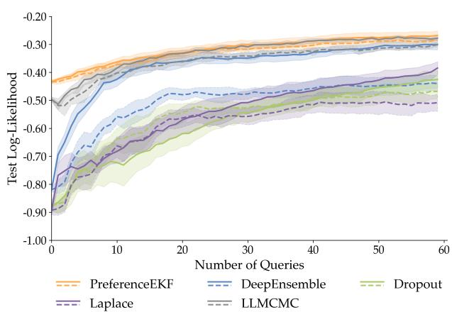  
(a)

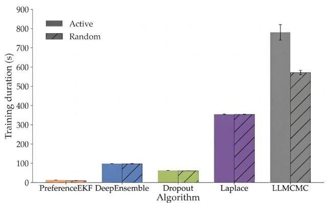  
(b)  
Figure 1: Figure 1a shows log-likelihood comparison of the random (dashed line) and active (solid line) variants of each method using the InfoGain acquisition function (higher means better fitting of annotator preference distribution). Figure 1b shows training runtime duration of both active and random variants of each method (lower means faster training). For a table version of this plot, please see Section A.2.2. Each line plot and bar plot is aggregated over 12 D4RL tasks $( \mathrm { m e a n } \pm 9 5 \%$ bootstrap confidence interval over 12 seeds)

Next, we investigate whether subspace filtering can serve as a scalable alternative to gradient descent for preference learning, with respect to both larger reward models and more model samples. As such, we only compare our method to DeepEnsemble and Dropout, which are primarily based on SGD. We run all scaling experiments on CPUs as the larger models and ensemble sizes led to out-of-memory errors on GPUs. We show in Figure 2a that given a fixed architecture of a two-layer MLP with 64 units per layer, the runtime of PreferenceEKF for learning a reward model from $B = 6 0$ queries scales much more gracefully with increasing M compared to other methods. While Dropout does not need to maintain multiple models, it is still slower than PreferenceEKF as it performs model update in full parameter space instead of a lower-dimensional subspace. Figure 2b demonstrates that final test log-likelihood favors PreferenceEKF over the other methods, showcasing that our approach maintains consistent performance on top of computational eficiency given increasing M. Figure 2c and Figure 2d show similar favorable scaling properties of PreferenceEKF except that we fix the number of model samples $( M = 5 )$ and increase the neural network architecture instead. This showcases the scalability of subspace training to not only settings where we need a large number of model samples M, but also to settings where we need larger neural networks |θ|.

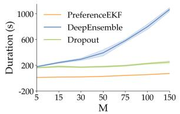  
(a)

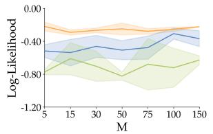  
(b)

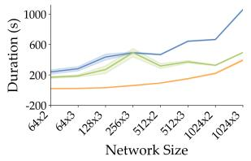  
(c)

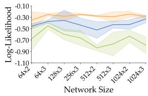  
(d)  
Figure 2: Figure 2a and Figure 2b show how runtime scales with the number of model samples M in the active learning setting $( \mathrm { m e a n } \pm \mathrm { s t d }$ over 3 seeds). Figure 2c and Figure 2d show runtime scaling with neural network architecture size. Overall, PreferenceEKF has the fastest runtime and the best scaling trend, while retaining high log-likelihood evaluation.

## 5.3 Does PreferenceEKF lead to better model calibration?

While efective representation of parameter uncertainty is crucial for eficient active learning, it is also important for calibration of model predictions (Guo et al., 2017; Ovadia et al., 2019). We study whether uncertainty quantification (UQ) using subspace inference methods leads to better calibrated model predictions compared to UQ using the baselines, as quantified by two commonly used UQ metrics: expected calibration error (ECE) (Naeini et al., 2015; Pavlovic, 2025) and Brier score (Brier, 1950; DeGroot & Fienberg, 1983).

We show in Figure 3a that PreferenceEKF has the lowest ECE among all methods, and the second lowest Brier score behind active DeepEnsemble. This highlights the quality of posterior approximation achieved by subspace inference methods compared to the other Bayesian deep learning baselines. We provide further calibration experiment details and reliability diagrams in Section A.2.12.

## 5.4 Ablation study on subspace construction

The method for subspace construction for PreferenceEKF can be modified to 1) use varying dimensionality of the subspace, and to 2) use random projection to generate the subspace basis instead of running SVD on SGD iterates (Li et al., 2018; Izmailov et al., 2020). While all of our experiments so far use a fixed dimensionality of $| z | = 2 0 0$ with SVD-based construction, we perform an ablation analysis over these choices, as shown in Figure 3b. We observe that while the SVD-based approach works well for smaller subspace dimensions, the random projection approach can eventually reach performance on par with or even outperform the SVD approach as the subspace dimension increases.

We further show in Section A.2.8 that in the case where no initial dataset is available, belief initialization using the random projection approach is often suficient for good reward learning performance. This result decouples PreferenceEKF’s reliance on SGD altogether. For consistency, unless otherwise stated, our main PreferenceEKF experiments are performed with the SVD-based approach that relies on SGD.

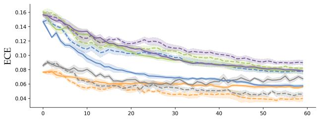

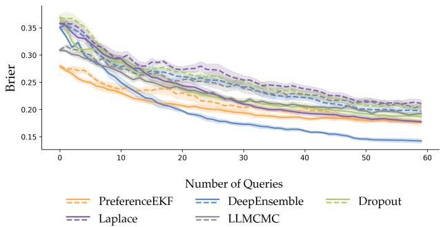  
(a)

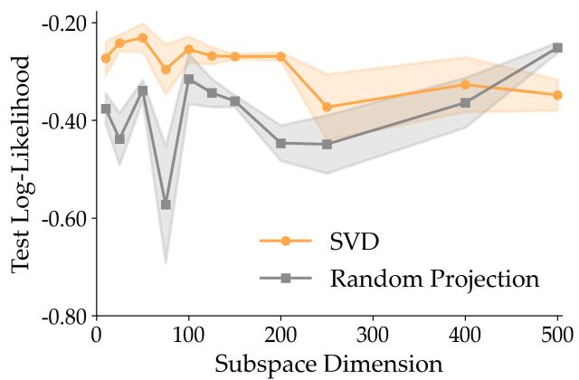  
(b)  
Figure 3: Figure 3a shows calibration results of the random (dashed line) and active (solid line) variants of the methods, as evaluated by expected calibration error (using 10 bins) and Brier score on a test dataset (lower is better for both metrics). Figure 3b shows an ablation over the subspace construction technique for PreferenceEKF, as evaluated by log-likelihood on a test dataset (higher is better). Both the UQ experiment and ablation analysis here are performed over 3 seeds $( \mathrm { m e a n } \pm \mathrm { s t d } )$ on the Walker Medium Expert task.

## 5.5 Can RMs learned using PreferenceEKF be used for policy optimization?

The goal of the ofline RL experiments is to test whether a reward model learned from a limited number of preference queries can be used to optimize a policy that reaches or exceeds the performance of a policy trained with ground-truth environment rewards (GT policy). All policies are trained using IQL (Kostrikov et al., 2021) over 5 seeds on the reward-labeled dataset for 1M steps, and evaluation is done via 5 rollouts every 50K steps. We show in Figure A.14 that aggregated across all tasks, policies induced by reward models learned from all active preference learning methods converge to similar policy performance, with all policies performing on par with or slightly worse than the GT policy. This showcases that our method is capable of producing reward models suitable for policy optimization. As the primary goal of our work is to improve the sample eficiency of preference-based reward learning, we leave studies on the interplay between reward learning and policy learning to future work. We provide further discussion of this result in Section A.3.1.

## 5.6 Can PreferenceEKF learn from image data and sparse preference feedback?

While our main experiments showcase the efectiveness of PreferenceEKF in state-based control tasks, where preference labels are synthetically generated by comparing sum of dense rewards between two trajectories, we apply our method to two additional challenging yet common settings: (1) sparse comparative feedback, and (2) pixel-based control.

Our experiments thus far have relied on using dense trajectory rewards to generate synthetic preference labels, which has allowed us to perform preference learning on partial trajectory segments, thus easing the reward credit assignment problem (Wirth et al., 2017). However, real robot datasets often only have sparse binary success / failure labels for each trajectory, making it impossible to rely on dense comparative feedback signal for preference learning. We apply our method to this challenging setting, where we use full real robot trajectories from the SOAR dataset (Zhou et al., 2024) across multiple manipulation tasks, and observed favorable results for our approach, which we detail in Section A.2.10.

Despite subspace filtering’s efectiveness in handling large parameter counts, the dificulty of scaling PreferenceEKF to pixel-based reward models is that the update step of EKF scales cubically with dimensionality of the observation space, which poses scalability challenges to high-dimensional inputs such as images. We resolve this issue by relying on pretrained image embeddings rather than raw pixel inputs, and observed promising results of active preference-based learning of pixel reward models. We refer to Section A.2.11 for results and further details on pixel-based tasks. Overall, we believe that the two favorable sets of results here highlight the applicability of our method to the high-dimensional and sparse feedback nature of common real robot data.

## 6 Conclusion

In this work, we successfully adopted extended Kalman filters to train neural networks in an active preferencebased reward modeling setting. We showed several advantages of maintaining a subspace distribution over neural network parameters p(θ | D), in comparison to four other widely used Bayesian deep learning methods for active reward learning. Our approach led to more sample-eficient active reward learning, similarly performant RL policy optimization, better runtime scaling with respect to model size and model sample count, and better calibration through higher-quality uncertainty representation.

Limitations and future work. While we found subspace methods to be an efective tool for scaling Bayesian filtering methods for neural network training, it is unclear whether this approach will be efective for applying Bayesian methods to foundation model-scale reward models (Mahan et al., 2024; Zhang et al., 2024). Due to the unimodality of the Gaussian distribution that the extended Kalman filter maintains, alternative methods may need to be investigated for approximating multimodal posteriors, e.g., learning reward functions from annotators with difering preferences (Poddar et al., 2024; Siththaranjan et al., 2023). We would further like to evaluate uncertainty quantification using the recent works on epistemic neural networks (Osband et al., 2023b), which focuses on joint predictive uncertainty instead of the marginal predictive distribution.

Our work primarily focuses on improving sample-eficiency of reward modeling in RLHF, but we would like to further investigate how learned posterior distribution of reward models can aid in an RL policy’s exploration and serve as a mechanism for mitigating reward hacking (Yang et al., 2024a; Gao et al., 2022; Hadfield-Menell et al., 2017). Finally, due to its sample-eficiency and adaptivity to non-stationary distributions, we believe the subspace filtering method to be a viable candidate for uncertainty quantification and large model finetuning in robot learning domains (Bellemare et al., 2017; Fridovich-Keil et al., 2020; Bobu et al., 2020).

## Broader Impacts

Our work presents an algorithm for active learning in preference-based reward modeling, enhancing the eficiency and accuracy of neural network training in applications requiring subjective human evaluations, such as natural language processing, personalized recommendations, and human-robot interaction. By optimizing data collection around uncertain or high-impact preferences, our approach can reduce labeling costs and improve model alignment with human intentions. However, it is possible that working in the reduced subspace and performing inference with the extended Kalman filter may introduce suboptimalities in preference modeling such as bias amplification or neglect of minority preferences. To mitigate these risks, future research should investigate the robustness of PreferenceEKF and potential information loss caused by subspace reduction.

## Acknowledgments

We thank Aleyna Kara for initial discussions about the method. Yutai Zhou was partially supported by a fellowship from USC - Capital One Center for Responsible AI and Decision Making in Finance (CREDIF). Erdem Bıyık acknowledges funding by the Airbus Institute for Engineering Research (AIER).

## References

Pieter Abbeel and Andrew Y. Ng. Apprenticeship learning via inverse reinforcement learning. In Twenty-First International Conference on Machine Learning - ICML ’04, pp. 1, Banf, Alberta, Canada, 2004. ACM Press. doi: 10.1145/1015330.1015430.

Kim Baraka, Ifrah Idrees, Taylor Kessler Faulkner, Erdem Biyik, Serena Booth, Mohamed Chetouani, Daniel H Grollman, Akanksha Saran, Emmanuel Senft, Silvia Tulli, Anna-Lisa Vollmer, Antonio Andriella, Helen Beierling, Tifany Horter, Jens Kober, Isaac Sheidlower, Matthew E Taylor, and Xuesu Xiao. Human-Interactive Robot Learning: Definition, Challenges, and Recommendations, 2025.

B.M. Bell and F.W. Cathey. The iterated Kalman filter update as a Gauss-Newton method. IEEE Transactions on Automatic Control, 38(2):294–297, February 1993. ISSN 1558-2523. doi: 10.1109/9.250476.

Marc G. Bellemare, Will Dabney, and Rémi Munos. A Distributional Perspective on Reinforcement Learning. In Proceedings of the 34th International Conference on Machine Learning, pp. 449–458. PMLR, July 2017.

Erdem Biyik, Nicolas Huynh, Mykel Kochenderfer, and Dorsa Sadigh. Active Preference-Based Gaussian Process Regression for Reward Learning. In Robotics: Science and Systems XVI, volume 16, July 2020. ISBN 978-0-9923747-6-1.

Erdem Bıyık, Malayandi Palan, Nicholas C. Landolfi, Dylan P. Losey, and Dorsa Sadigh. Asking Easy Questions: A User-Friendly Approach to Active Reward Learning. In Proceedings of the Conference on Robot Learning, pp. 1177–1190. PMLR, May 2020.

Erdem Bıyık, Dylan P. Losey, Malayandi Palan, Nicholas C. Landolfi, Gleb Shevchuk, and Dorsa Sadigh. Learning Reward Functions from Diverse Sources of Human Feedback: Optimally Integrating Demonstrations and Preferences. The International Journal of Robotics Research, 41(1):45–67, January 2022. ISSN 0278-3649. doi: 10.1177/02783649211041652.

Erdem Bıyık, Nicolas Huynh, Mykel J. Kochenderfer, and Dorsa Sadigh. Active Preference-Based Gaussian Process Regression for Reward Learning and Optimization. The International Journal of Robotics Research, 43(5):665–684, April 2024. ISSN 0278-3649. doi: 10.1177/02783649231208729.

David M. Blei, Alp Kucukelbir, and Jon D. McAulife. Variational Inference: A Review for Statisticians. Journal of the American Statistical Association, 112(518):859–877, April 2017. ISSN 0162-1459, 1537-274X. doi: 10.1080/01621459.2017.1285773.

Andreea Bobu, Andrea Bajcsy, Jaime F. Fisac, Sampada Deglurkar, and Anca D. Dragan. Quantifying Hypothesis Space Misspecification in Learning From Human–Robot Demonstrations and Physical Corrections. IEEE Transactions on Robotics, 36(3):835–854, June 2020. ISSN 1941-0468. doi: 10.1109/TRO.2020.2971415.

James Bradbury, Roy Frostig, Peter Hawkins, Matthew James Johnson, Chris Leary, Dougal Maclaurin, George Necula, Adam Paszke, Jake VanderPlas, Skye Wanderman-Milne, and Qiao Zhang. JAX: Composable transformations of Python+NumPy programs, 2018.

Ralph Allan Bradley and Milton E. Terry. Rank Analysis of Incomplete Block Designs: I. The Method of Paired Comparisons. Biometrika, 39(3/4):324–345, 1952. ISSN 0006-3444. doi: 10.2307/2334029.

Glenn W. Brier. Verification of Forecasts Expressed in Terms of Probability. Monthly Weather Review, 78:1, January 1950. ISSN 0027-0644. doi: 10.1175/1520-0493(1950)078<0001:VOFEIT>2.0.CO;2.

Daniel Brown, Wonjoon Goo, Prabhat Nagarajan, and Scott Niekum. Extrapolating Beyond Suboptimal Demonstrations via Inverse Reinforcement Learning from Observations. In Proceedings of the 36th International Conference on Machine Learning, pp. 783–792. PMLR, May 2019.

Daniel S. Brown, Russell Coleman, R. Srinivasan, and S. Niekum. Safe Imitation Learning via Fast Bayesian Reward Inference from Preferences. ArXiv, February 2020.

Paul Brunzema, Mikkel Jordahn, John Willes, Sebastian Trimpe, Jasper Snoek, and James Harrison. Bayesian Optimization via Continual Variational Last Layer Training. In The Thirteenth International Conference on Learning Representations, October 2024.

Alberto Cabezas, Adrien Corenflos, Junpeng Lao, Rémi Louf, Antoine Carnec, Kaustubh Chaudhari, Reuben Cohn-Gordon, Jeremie Coullon, Wei Deng, Sam Dufield, Gerardo Durán-Martín, Marcin Elantkowski, Dan Foreman-Mackey, Michele Gregori, Carlos Iguaran, Ravin Kumar, Martin Lysy, Kevin Murphy, Juan Camilo Orduz, Karm Patel, Xi Wang, and Rob Zinkov. BlackJAX: Composable Bayesian inference in JAX, February 2024.

Stephen Casper, Xander Davies, Claudia Shi, Thomas Krendl Gilbert, Jérémy Scheurer, Javier Rando, Rache Freedman, Tomek Korbak, David Lindner, Pedro Freire, Tony Tong Wang, Samuel Marks, Charbel-Raphael Segerie, Micah Carroll, Andi Peng, Phillip J. K. Christofersen, Mehul Damani, Stewart Slocum, Usman Anwar, Anand Siththaranjan, Max Nadeau, Eric J. Michaud, Jacob Pfau, Dmitrii Krasheninnikov, Xin Chen, Lauro Langosco, Peter Hase, Erdem Biyik, Anca Dragan, David Krueger, Dorsa Sadigh, and Dylan Hadfield-Menell. Open Problems and Fundamental Limitations of Reinforcement Learning from Human Feedback. Transactions on Machine Learning Research, September 2023. ISSN 2835-8856.

Xinyue Chen, Che Wang, Zijian Zhou, and Keith W. Ross. Randomized Ensembled Double Q-Learning: Learning Fast Without a Model. In International Conference on Learning Representations, October 2020.

Paul F Christiano, Jan Leike, Tom Brown, Miljan Martic, Shane Legg, and Dario Amodei. Deep Reinforcement Learning from Human Preferences. In Advances in Neural Information Processing Systems, volume 30. Curran Associates, Inc., 2017.

T. M. Cover and Joy A. Thomas. Elements of Information Theory. Wiley-Interscience, Hoboken, N.J, 2nd ed edition, 2006. ISBN 978-0-471-24195-9.

Felix Dangel, Runa Eschenhagen, Weronika Ormaniec, Andres Fernandez, Lukas Tatzel, and Agustinus Kristiadi. Position: Curvature Matrices Should Be Democratized via Linear Operators, January 2025.

Erik Daxberger, Eric Nalisnick, James U. Allingham, Javier Antoran, and Jose Miguel Hernandez-Lobato. Bayesian Deep Learning via Subnetwork Inference. In Proceedings of the 38th International Conference on Machine Learning, pp. 2510–2521. PMLR, July 2021.

Erik Daxberger, Agustinus Kristiadi, Alexander Immer, Runa Eschenhagen, Matthias Bauer, and Philipp Hennig. Laplace redux – efortless Bayesian deep learning. In Proceedings of the 35th International Conference on Neural Information Processing Systems, NIPS ’21, pp. 20089–20103, Red Hook, NY, USA, June 2024. Curran Associates Inc. ISBN 978-1-7138-4539-3.

J.F.G. de Freitas, M. Niranjan, and A. H. Gee. Hierarchical bayesian models for regularisation in sequential learning. Neural Computation, 12(4):933–953, April 2000. ISSN 1530-888X. doi: 10.1162/ 089976600300015655.

DeepMind, Igor Babuschkin, Kate Baumli, Alison Bell, Surya Bhupatiraju, Jake Bruce, Peter Buchlovsky, David Budden, Trevor Cai, Aidan Clark, Ivo Danihelka, Antoine Dedieu, Claudio Fantacci, Jonathan Godwin, Chris Jones, Ross Hemsley, Tom Hennigan, Matteo Hessel, Shaobo Hou, Steven Kapturowski, Thomas Keck, Iurii Kemaev, Michael King, Markus Kunesch, Lena Martens, Hamza Merzic, Vladimir Mikulik, Tamara Norman, George Papamakarios, John Quan, Roman Ring, Francisco Ruiz, Alvaro Sanchez, Laurent Sartran, Rosalia Schneider, Eren Sezener, Stephen Spencer, Srivatsan Srinivasan, Miloš Stanojević, Wojciech Stokowiec, Luyu Wang, Guangyao Zhou, and Fabio Viola. The DeepMind JAX Ecosystem, 2020.

Morris H. DeGroot and Stephen E. Fienberg. The Comparison and Evaluation of Forecasters. Journal of the Royal Statistical Society. Series D (The Statistician), 32(1):12–22, 1983. ISSN 0039-0526. doi: 10.2307/2987588.

Jia Deng, Wei Dong, Richard Socher, Li-Jia Li, Kai Li, and Li Fei-Fei. ImageNet: A large-scale hierarchical image database. In 2009 IEEE Conference on Computer Vision and Pattern Recognition, pp. 248–255, June 2009. doi: 10.1109/CVPR.2009.5206848.

Thomas G. Dietterich. Ensemble Methods in Machine Learning. In Multiple Classifier Systems, pp. 1–15, Berlin, Heidelberg, 2000. Springer. ISBN 978-3-540-45014-6. doi: 10.1007/3-540-45014-9\_1.

Gerardo Duran-Martin, Aleyna Kara, and Kevin Murphy. Eficient Online Bayesian Inference for Neural Bandits. In Proceedings of The 25th International Conference on Artificial Intelligence and Statistics, pp. 6002–6021. PMLR, May 2022.

Bradley Efron. Bootstrap Methods: Another Look at the Jackknife. In Samuel Kotz and Norman L. Johnson (eds.), Breakthroughs in Statistics: Methodology and Distribution, pp. 569–593. Springer, New York, NY, 1992. ISBN 978-1-4612-4380-9. doi: 10.1007/978-1-4612-4380-9\_41.

Evan Ellis, Gaurav R. Ghosal, Stuart J. Russell, Anca Dragan, and Erdem Bıyık. A Generalized Acquisition Function for Preference-based Reward Learning. In 2024 IEEE International Conference on Robotics and Automation (ICRA), pp. 2814–2821, May 2024. doi: 10.1109/ICRA57147.2024.10611472.

Thomas Elsken, Jan Hendrik Metzen, and Frank Hutter. Neural Architecture Search: A Survey. Journal of Machine Learning Research, 20(55):1–21, 2019. ISSN 1533-7928.

Chelsea Finn, Sergey Levine, and Pieter Abbeel. Guided Cost Learning: Deep Inverse Optimal Control Via Policy Optimization. In Proceedings of the 33rd International Conference on International Conference on Machine Learning - Volume 48, ICML’16, pp. 49–58, New York, NY, USA, June 2016. JMLR.org.

Stanislav Fort, Huiyi Hu, and Balaji Lakshminarayanan. Deep Ensembles: A Loss Landscape Perspective, June 2020.

Jonathan Frankle and Michael Carbin. The Lottery Ticket Hypothesis: Finding Sparse, Trainable Neural Networks. In International Conference on Learning Representations, February 2022.

David Fridovich-Keil, Andrea Bajcsy, Jaime F Fisac, Sylvia L Herbert, Steven Wang, Anca D Dragan, and Claire J Tomlin. Confidence-Aware Motion Prediction for Real-Time Collision Avoidance. The International Journal of Robotics Research, 39(2-3):250–265, March 2020. ISSN 0278-3649. doi: 10.1177/ 0278364919859436.

Justin Fu, Aviral Kumar, Ofir Nachum, George Tucker, and Sergey Levine. D4RL: Datasets for Deep Data-Driven Reinforcement Learning, April 2020.

Yarin Gal and Zoubin Ghahramani. Dropout as a Bayesian Approximation: Representing Model Uncertainty in Deep Learning. In Proceedings of The 33rd International Conference on Machine Learning, pp. 1050–1059. PMLR, June 2016.

Leo Gao, John Schulman, and Jacob Hilton. Scaling Laws for Reward Model Overoptimization. In International Conference on Machine Learning, October 2022.

Amir Gholami, Sehoon Kim, Zhen Dong, Zhewei Yao, Michael W. Mahoney, and Kurt Keutzer. A Survey of Quantization Methods for Eficient Neural Network Inference, June 2021.

Adam Gleave and Geofrey Irving. Uncertainty Estimation for Language Reward Models, March 2022.

Chuan Guo, Geof Pleiss, Yu Sun, and Kilian Q. Weinberger. On Calibration of Modern Neural Networks. In Proceedings of the 34th International Conference on Machine Learning, pp. 1321–1330. PMLR, July 2017.

Dylan Hadfield-Menell, Smitha Milli, Pieter Abbeel, Stuart Russell, and Anca D. Dragan. Inverse Reward Design. In Proceedings of the 31st International Conference on Neural Information Processing Systems, NIPS’17, pp. 6768–6777, Red Hook, NY, USA, December 2017. Curran Associates Inc. ISBN 978-1-5108- 6096-4.

James Harrison, John Willes, and Jasper Snoek. Variational Bayesian Last Layers. In The Twelfth International Conference on Learning Representations, October 2023.

Kaiming He, Xiangyu Zhang, Shaoqing Ren, and Jian Sun. Deep Residual Learning for Image Recognition. In Proceedings of the IEEE Conference on Computer Vision and Pattern Recognition, pp. 770–778, 2016.

Philipp Hennig and Christian J. Schuler. Entropy Search for Information-Eficient Global Optimization. Journal of Machine Learning Research, 13(57):1809–1837, 2012. ISSN 1533-7928.

José Miguel Hernández-Lobato, Matthew W. Hofman, and Zoubin Ghahramani. Predictive Entropy Search for Eficient Global Optimization of Black-box Functions. In Advances in Neural Information Processing Systems, volume 27. Curran Associates, Inc., 2014.

Jonathan Ho and Stefano Ermon. Generative Adversarial Imitation Learning. In Advances in Neural Information Processing Systems, volume 29. Curran Associates, Inc., 2016.

Matthew D. Hofman and Andrew Gelman. The No-U-Turn Sampler: Adaptively Setting Path Lengths in Hamiltonian Monte Carlo. Journal of Machine Learning Research, 15(47):1593–1623, 2014. ISSN 1533-7928.

Ryan Hoque, Ashwin Balakrishna, Ellen Novoseller, Albert Wilcox, Daniel S. Brown, and Ken Goldberg. ThriftyDAgger: Budget-Aware Novelty and Risk Gating for Interactive Imitation Learning. In Proceedings of the 5th Conference on Robot Learning, pp. 598–608. PMLR, January 2022.

Neil Houlsby, Ferenc Huszár, Zoubin Ghahramani, and Máté Lengyel. Bayesian Active Learning for Classification and Preference Learning, December 2011.

Jiri Hron, Alex Matthews, and Zoubin Ghahramani. Variational Bayesian dropout: Pitfalls and fixes. In Proceedings of the 35th International Conference on Machine Learning, pp. 2019–2028. PMLR, July 2018.

Edward J. Hu, Yelong Shen, Phillip Wallis, Zeyuan Allen-Zhu, Yuanzhi Li, Shean Wang, Lu Wang, and Weizhu Chen. LoRA: Low-Rank Adaptation of Large Language Models, October 2021.

Pavel Izmailov, Wesley J. Maddox, Polina Kirichenko, Timur Garipov, Dmitry Vetrov, and Andrew Gordon Wilson. Subspace Inference for Bayesian Deep Learning. In Proceedings of The 35th Uncertainty in Artificial Intelligence Conference, pp. 1169–1179. PMLR, August 2020.

Pavel Izmailov, Sharad Vikram, Matthew D. Hofman, and Andrew Gordon Gordon Wilson. What Are Bayesian Neural Network Posteriors Really Like? In Proceedings of the 38th International Conference on Machine Learning, pp. 4629–4640. PMLR, July 2021.

Matthew Thomas Jackson, Uljad Berdica, Jarek Liesen, Shimon Whiteson, and Jakob Nicolaus Foerster. A Clean Slate for Ofline Reinforcement Learning, April 2025.

Natasha Jaques, Asma Ghandeharioun, Judy Hanwen Shen, Craig Ferguson, Agata Lapedriza, Noah Jones, Shixiang Gu, and Rosalind Picard. Way Of-Policy Batch Deep Reinforcement Learning of Implicit Human Preferences in Dialog, July 2019.

Diederik P. Kingma and Jimmy Ba. Adam: A Method for Stochastic Optimization. CoRR, December 2014.

Ilya Kostrikov, Ashvin Nair, and Sergey Levine. Ofline Reinforcement Learning with Implicit Q-Learning. In International Conference on Learning Representations, October 2021.

Aviral Kumar, Joey Hong, Anikait Singh, and Sergey Levine. When Should We Prefer Ofline Reinforcement Learning Over Behavioral Cloning? In International Conference on Learning Representations, October 2021.

Balaji Lakshminarayanan, A. Pritzel, and C. Blundell. Simple and Scalable Predictive Uncertainty Estimation using Deep Ensembles. In Neural Information Processing Systems, December 2016.

Brett W. Larsen, Stanislav Fort, Nic Becker, and Surya Ganguli. How many degrees of freedom do we need to train deep networks: A loss landscape perspective, February 2022.

Kimin Lee, Laura Smith, Anca Dragan, and Pieter Abbeel. B-Pref: Benchmarking Preference-Based Reinforcement Learning. Proceedings of the Neural Information Processing Systems Track on Datasets and Benchmarks, 1, December 2021a.

Kimin Lee, Laura M. Smith, and Pieter Abbeel. PEBBLE: Feedback-Eficient Interactive Reinforcement Learning via Relabeling Experience and Unsupervised Pre-training. In Proceedings of the 38th International Conference on Machine Learning, pp. 6152–6163. PMLR, July 2021b.

Sergey Levine, Aviral Kumar, George Tucker, and Justin Fu. Ofline Reinforcement Learning: Tutorial, Review, and Perspectives on Open Problems, May 2020.

Chunyuan Li, Heerad Farkhoor, Rosanne Liu, and Jason Yosinski. Measuring the Intrinsic Dimension of Objective Landscapes. In International Conference on Learning Representations, February 2018.

Anthony Liang, Yigit Korkmaz, Jiahui Zhang, Minyoung Hwang, Abrar Anwar, Sidhant Kaushik, Aditya Shah, Alex S. Huang, Luke Zettlemoyer, Dieter Fox, Yu Xiang, Anqi Li, Andreea Bobu, Abhishek Gupta, Stephen Tu, Erdem Bıyık, and Jesse Zhang. Robometer: Scaling general-purpose robotic reward models via trajectory comparisons. In Proceedings of Robotics: Science and Systems (RSS), 2026.

Scott W. Linderman, Peter Chang, Giles Harper-Donnelly, Aleyna Kara, Xinglong Li, Gerardo Duran-Martin, and Kevin Murphy. Dynamax: A Python package for probabilistic state space modeling with JAX. Journal of Open Source Software, 10(108):7069, April 2025. ISSN 2475-9066. doi: 10.21105/joss.07069.

D. V. Lindley. On a Measure of the Information Provided by an Experiment. The Annals of Mathematical Statistics, 27(4):986–1005, December 1956. ISSN 0003-4851, 2168-8990. doi: 10.1214/aoms/1177728069.

Cong Lu, Philip J. Ball, Tim G. J. Rudner, Jack Parker-Holder, Michael A. Osborne, and Yee Whye Teh. Challenges and Opportunities in Ofline Reinforcement Learning from Visual Observations. Transactions on Machine Learning Research, April 2023. ISSN 2835-8856.

David J. C. MacKay. Information-Based Objective Functions for Active Data Selection. Neural Computation, 4(4):590–604, July 1992. ISSN 0899-7667. doi: 10.1162/neco.1992.4.4.590.

Dakota Mahan, Duy Van Phung, Rafael Rafailov, Chase Blagden, Nathan Lile, Louis Castricato, Jan-Philipp Fränken, Chelsea Finn, and Alon Albalak. Generative Reward Models, October 2024.

Kevin P. Murphy. Probabilistic Machine Learning: Advanced Topics. The MIT Press, Cambridge, Massachusetts, 2023a. ISBN 978-0-262-04843-9.

Kevin P. Murphy. Probabilistic Machine Learning: Advanced Topics Supplments. The MIT Press, Cambridge, Massachusetts, 2023b. ISBN 978-0-262-04843-9.

Vivek Myers, Erdem Biyik, Nima Anari, and Dorsa Sadigh. Learning Multimodal Rewards from Rankings. In Conference on Robot Learning, September 2021.

Mahdi Pakdaman Naeini, Gregory Cooper, and Milos Hauskrecht. Obtaining Well Calibrated Probabilities Using Bayesian Binning. Proceedings of the AAAI Conference on Artificial Intelligence, 29(1), February 2015. ISSN 2374-3468. doi: 10.1609/aaai.v29i1.9602.

Radford M. Neal. MCMC Using Hamiltonian Dynamics. In Handbook of Markov Chain Monte Carlo. Chapman and Hall/CRC, 2011.

Ian Osband, Charles Blundell, Alexander Pritzel, and Benjamin Van Roy. Deep Exploration via Bootstrapped DQN. In Advances in Neural Information Processing Systems, volume 29. Curran Associates, Inc., 2016.

Ian Osband, John Aslanides, and Albin Cassirer. Randomized Prior Functions for Deep Reinforcement Learning. In Advances in Neural Information Processing Systems, volume 31. Curran Associates, Inc., 2018.

Ian Osband, Zheng Wen, Seyed Mohammad Asghari, Vikranth Dwaracherla, Xiuyuan Lu, Morteza Ibrahimi, Dieterich Lawson, Botao Hao, Brendan O’Donoghue, and Benjamin Van Roy. The Neural Testbed: Evaluating Joint Predictions. Advances in Neural Information Processing Systems, 35:12554–12565, December 2022.

Ian Osband, Seyed Mohammad Asghari, Benjamin Van Roy, Nat McAleese, John Aslanides, and Geofrey Irving. Fine-Tuning Language Models via Epistemic Neural Networks, May 2023a.

Ian Osband, Zheng Wen, Seyed Mohammad Asghari, Vikranth Dwaracherla, Morteza Ibrahimi, Xiuyuan Lu, and Benjamin Van Roy. Epistemic Neural Networks. In Thirty-Seventh Conference on Neural Information Processing Systems, November 2023b.

Long Ouyang, Jefrey Wu, Xu Jiang, Diogo Almeida, Carroll Wainwright, Pamela Mishkin, Chong Zhang, Sandhini Agarwal, Katarina Slama, Alex Ray, John Schulman, Jacob Hilton, Fraser Kelton, Luke Miller, Maddie Simens, Amanda Askell, Peter Welinder, Paul F. Christiano, Jan Leike, and Ryan Lowe. Training language models to follow instructions with human feedback. Advances in Neural Information Processing Systems, 35:27730–27744, December 2022.

Yaniv Ovadia, Emily Fertig, Jie Ren, Zachary Nado, D. Sculley, Sebastian Nowozin, Joshua V. Dillon, Balaji Lakshminarayanan, and Jasper Snoek. Can You Trust Your Model’s Uncertainty? Evaluating Predictive Uncertainty Under Dataset Shift. In Proceedings of the 33rd International Conference on Neural Information Processing Systems, pp. 14003–14014, Red Hook, NY, USA, December 2019. Curran Associates Inc.

Alexander Pan, Kush Bhatia, and Jacob Steinhardt. The Efects of Reward Misspecification: Mapping and Mitigating Misaligned Models. In International Conference on Learning Representations, October 2021.

Theodore Papamarkou, Maria Skoularidou, Konstantina Palla, Laurence Aitchison, Julyan Arbel, David Dunson, Maurizio Filippone, Vincent Fortuin, Philipp Hennig, José Miguel Hernández-Lobato, Aliaksandr Hubin, Alexander Immer, Theofanis Karaletsos, Mohammad Emtiyaz Khan, Agustinus Kristiadi, Yingzhen

Li, Stephan Mandt, Christopher Nemeth, Michael A. Osborne, Tim G. J. Rudner, David Rügamer, Yee Whye Teh, Max Welling, Andrew Gordon Wilson, and Ruqi Zhang. Position: Bayesian Deep Learning is Needed in the Age of Large-Scale AI, June 2024.

Maja Pavlovic. Understanding Model Calibration – A gentle introduction and visual exploration of calibration and the expected calibration error (ECE), March 2025.

X. B. Peng, Aviral Kumar, Grace Zhang, and S. Levine. Advantage-Weighted Regression: Simple and Scalable Of-Policy Reinforcement Learning. ArXiv, October 2019.

Sriyash Poddar, Yanming Wan, Hamish Ivison, Abhishek Gupta, and Natasha Jaques. Personalizing Reinforcement Learning from Human Feedback with Variational Preference Learning, August 2024.

Aravind Rajeswaran, Vikash Kumar, Abhishek Gupta, Giulia Vezzani, John Schulman, Emanuel Todorov, and Sergey Levine. Learning Complex Dexterous Manipulation with Deep Reinforcement Learning and Demonstrations. In Robotics: Science and Systems XIV, volume 14, June 2018. ISBN 978-0-9923747-4-7.

Carl Edward Rasmussen and Christopher K. I. Williams. Gaussian Processes for Machine Learning. The MIT Press, Cambridge, Mass, November 2005. ISBN 978-0-262-18253-9.

Noam Razin, Zixuan Wang, Hubert Strauss, Stanley Wei, Jason D. Lee, and Sanjeev Arora. What Makes a Reward Model a Good Teacher? An Optimization Perspective, March 2025.

Dorsa Sadigh, Anca Dragan, Shankar Sastry, and Sanjit Seshia. Active Preference-Based Learning of Reward Functions. In Robotics: Science and Systems XIII. Robotics: Science and Systems Foundation, July 2017. ISBN 978-0-9923747-3-0. doi: 10.15607/RSS.2017.XIII.053.

Simo Särkkä and Lennart Svensson. Bayesian Filtering and Smoothing. Cambridge University Press, June 2023. ISBN 978-1-108-92664-5.

Burr Settles. Active Learning Literature Survey. Technical Report, University of Wisconsin-Madison Department of Computer Sciences, 2009.

Yuesong Shen, Nico Daheim, Bai Cong, Peter Nickl, Gian Maria Marconi, Bazan Clement Emile Marcel Raoul, Rio Yokota, Iryna Gurevych, Daniel Cremers, Mohammad Emtiyaz Khan, and Thomas Möllenhof. Variational Learning is Efective for Large Deep Networks. In Proceedings of the 41st International Conference on Machine Learning, pp. 44665–44686. PMLR, July 2024.

Daniel Shin, Anca Dragan, and Daniel S. Brown. Benchmarks and Algorithms for Ofline Preference-Based Reward Learning. Transactions on Machine Learning Research, September 2022. ISSN 2835-8856.

Sharad Singhal and Lance Wu. Training Multilayer Perceptrons with the Extended Kalman Algorithm. In Advances in Neural Information Processing Systems, volume 1. Morgan-Kaufmann, 1988.

Anand Siththaranjan, Cassidy Laidlaw, and Dylan Hadfield-Menell. Distributional Preference Learning: Understanding and Accounting for Hidden Context in RLHF. In The Twelfth International Conference on Learning Representations, October 2023.

Jasper Snoek, Oren Rippel, Kevin Swersky, Ryan Kiros, Nadathur Satish, Narayanan Sundaram, Mostofa Patwary, Mr Prabhat, and Ryan Adams. Scalable Bayesian Optimization Using Deep Neural Networks. In Proceedings of the 32nd International Conference on Machine Learning, pp. 2171–2180. PMLR, June 2015.

Taylor Sorensen, Jared Moore, Jillian Fisher, Mitchell Gordon, Niloofar Mireshghallah, Christopher Michael Rytting, Andre Ye, Liwei Jiang, Ximing Lu, Nouha Dziri, Tim Althof, and Yejin Choi. Position: A Roadmap to Pluralistic Alignment. In Proceedings of the 41st International Conference on Machine Learning, volume 235 of ICML’24, pp. 46280–46302, Vienna, Austria, July 2024. JMLR.org.

Nitish Srivastava, Geofrey Hinton, Alex Krizhevsky, Ilya Sutskever, and Ruslan Salakhutdinov. Dropout: A Simple Way to Prevent Neural Networks from Overfitting. Journal of Machine Learning Research, 15(56): 1929–1958, 2014. ISSN 1533-7928.

Gokul Swamy, Sanjiban Choudhury, Wen Sun, Zhiwei Steven Wu, and J. Andrew Bagnell. All Roads Lead to Likelihood: The Value of Reinforcement Learning in Fine-Tuning, March 2025.

Sebastian Thrun, Wolfram Burgard, and Dieter Fox. Probabilistic Robotics. MIT Press, August 2005. ISBN 978-0-262-20162-9.

Jeremy Tien, Jerry Zhi-Yang He, Zackory Erickson, Anca Dragan, and Daniel S. Brown. Causal Confusion and Reward Misidentification in Preference-Based Reward Learning. In The Eleventh International Conference on Learning Representations, September 2022.

Emanuel Todorov, Tom Erez, and Yuval Tassa. MuJoCo: A physics engine for model-based control. In 2012 IEEE/RSJ International Conference on Intelligent Robots and Systems, pp. 5026–5033, October 2012. doi: 10.1109/IROS.2012.6386109.

Kevin Tran, Willie Neiswanger, Junwoong Yoon, Qingyang Zhang, Eric Xing, and Zachary W Ulissi. Methods for comparing uncertainty quantifications for material property predictions. Machine Learning: Science and Technology, 1(2):025006, May 2020. ISSN 2632-2153. doi: 10.1088/2632-2153/ab7e1a.

Pauli Virtanen, Ralf Gommers, Travis E. Oliphant, Matt Haberland, Tyler Reddy, David Cournapeau, Evgeni Burovski, Pearu Peterson, Warren Weckesser, Jonathan Bright, Stéfan J. van der Walt, Matthew Brett, Joshua Wilson, K. Jarrod Millman, Nikolay Mayorov, Andrew R. J. Nelson, Eric Jones, Robert Kern, Eric Larson, C. J. Carey, İlhan Polat, Yu Feng, Eric W. Moore, Jake VanderPlas, Denis Laxalde, Josef Perktold, Robert Cimrman, Ian Henriksen, E. A. Quintero, Charles R. Harris, Anne M. Archibald, Antônio H. Ribeiro, Fabian Pedregosa, and Paul van Mulbregt. SciPy 1.0: Fundamental algorithms for scientific computing in Python. Nature Methods, 17(3):261–272, March 2020. ISSN 1548-7105. doi: 10.1038/s41592-019-0686-2.

Tobias Weber, Bálint Mucsányi, Lenard Rommel, Thomas Christie, Lars Kasüschke, Marvin Pförtner, and Philipp Hennig. Laplax – Laplace Approximations with JAX, July 2025.

Christian Wirth, Riad Akrour, Gerhard Neumann, and Johannes Fürnkranz. A Survey of Preference-Based Reinforcement Learning Methods. The Journal of Machine Learning Research, 18(1):4945–4990, January 2017. ISSN 1532-4435.

Adam X. Yang, Maxime Robeyns, Thomas Coste, Zhengyan Shi, Jun Wang, Haitham Bou-Ammar, and Laurence Aitchison. Bayesian Reward Models for LLM Alignment, July 2024a.

Daniel Yang, Davin Tjia, Jacob Berg, Dima Damen, Pulkit Agrawal, and Abhishek Gupta. Rank2Reward: Learning Shaped Reward Functions from Passive Video. In 2024 IEEE International Conference on Robotics and Automation (ICRA), pp. 2806–2813, May 2024b. doi: 10.1109/ICRA57147.2024.10610873.

Yifu Yuan, Jianye Hao, Yi Ma, Zibin Dong, Hebin Liang, Jinyi Liu, Zhixin Feng, Kai Zhao, and Yan Zheng. Uni-RLHF: Universal Platform and Benchmark Suite for Reinforcement Learning with Diverse Human Feedback. In The Twelfth International Conference on Learning Representations, October 2023.

Lunjun Zhang, Arian Hosseini, Hritik Bansal, Mehran Kazemi, Aviral Kumar, and Rishabh Agarwal. Generative Verifiers: Reward Modeling as Next-Token Prediction. In The 4th Workshop on Mathematical Reasoning and AI at NeurIPS’24, October 2024.

Zhiyuan Zhou, Pranav Atreya, Abraham Lee, Homer Walke, Oier Mees, and Sergey Levine. Autonomous Improvement of Instruction Following Skills via Foundation Models, October 2024.

## A Technical Appendices and Supplementary Material

Our code is available in the JAX (Bradbury et al., 2018) framework at https://github.com/yutaizhou/ bnn\_pref. For implementation of the reward learning algorithms, we use Dynamax (Linderman et al., 2025) for extended Kalman filtering (EKF), Laplax (Weber et al., 2025) for Laplace approximation, and Blackjax (Cabezas et al., 2024) for MCMC. For ofline RL, we use Unifloral (Jackson et al., 2025) for implementation of implicit Q-learning (IQL). All statistical tests are done using SciPy (Virtanen et al., 2020). Unless stated otherwise, all experiments are done on a single node with 8 NVIDIA RTX A6000 GPUs via SLURM sharding.

For figures that aggregate across tasks and per-task seeds (e.g., Figure 1a, Figure 1b, Figure 3a, Figure A.14), we aggregate as follows: given a dependent variable per step, we pool at each step across 12 tasks × n seeds per task, and plot the per-step mean performance over 12n runs along with either standard error or 95% bootstrap interval for the confidence bounds. In our main preference learning results in Figure 1a, the dependent variable is test-likelihood for preference learning after every step of acquired query label. We take similar approaches for our calibration results in Figure 3a, where the dependent variable per step is expected calibration error or Brier score. For policy learning results in Figure A.14, the steps are evaluation rollouts every 40K gradient updates, and the dependent variable is environment rollout return.

## A.1 EKF with Bradley-Terry Likelihood

Here we provide the exact form of the EKF belief update procedure for posterior inference upon receiving a new query, where we use the BT model for the measurement function. For more details, please see chapter 8.3 of Murphy (2023a).

For convenience, we first reproduce the general form of the EKF update procedure from Section 4. Using the formulation of sequential Bayesian inference, we perform posterior inference of neural network parameters from streaming data $\mathcal { D } _ { 1 : i - 1 } = \{ ( Q _ { 1 } , y _ { 1 } ) , \dots , ( Q _ { i - 1 } , y _ { i - 1 } ) \}$ , where $Q _ { i } = \{ \tau _ { a } , \tau _ { b } \}$ is the pairwise preference query and $y _ { i }$ is the binary preference label. Starting from some prior belief ${ b ^ { 0 } } ^ { \bar { ( } } = p ( \pmb { \theta } ) ^ { 4 }$ on the parameters, our posterior after observing i samples can be expressed using Bayes’ rule as follows:

$$
\begin{array} { r l } & { \quad p ( \pmb { \theta } _ { i } \mid \mathcal { D } _ { 1 : i } ) \propto \underbrace { p ( \mathcal { D } _ { i } \mid \pmb { \theta } _ { i } ) } _ { \mathrm { M e a s u r e m e n t } } ~ p ( \pmb { \theta } _ { i } \mid \mathcal { D } _ { 1 : i - 1 } ) } \\ & { \quad \quad p ( \pmb { \theta } _ { i } \mid \mathcal { D } _ { 1 : i - 1 } ) = \displaystyle \int \underbrace { p ( \pmb { \theta } _ { i } \mid \pmb { \theta } _ { i - 1 } ) } _ { \mathrm { D y n a m i c s } } \underbrace { p ( \pmb { \theta } _ { i - 1 } \mid \mathcal { D } _ { 1 : i - 1 } ) } _ { \mathrm { P r e v i o u s ~ p o s t e r i o r } } d \pmb { \theta } _ { i - 1 } } \end{array}\tag{5}
$$

where $p ( \pmb \theta _ { i - 1 } \mid \mathcal D _ { 1 : i - 1 } )$ is the posterior belief over parameters after observing i − 1 samples, which is combined with a parameter dynamics model and measurement model to form the posterior after observing the $i ^ { \mathrm { t h } }$ example $\mathcal { D } _ { i }$ . We assume additive Gaussian noise for both the dynamics model $p ( \pmb \theta _ { i } \mid \pmb \theta _ { i - 1 } ) = \mathcal { N } ( \pmb \theta _ { i } \mid g ( \pmb \theta _ { i - 1 } ) , \mathbf { U } )$ and the measurement model $p ( \mathcal { D } _ { i } \mid \pmb { \theta } _ { i } ) = \mathcal { N } ( y _ { i } \mid h ( \pmb { \theta } _ { i } , Q _ { i } ) , \mathbf { V } )$ , where $\mathbf { U } \in \mathbb { R } ^ { | \pmb { \theta } | \times | \mathbf { \dot { \theta } } | }$ and $\mathbf { V } \in \dot { \mathbb { R } } ^ { | y | \times | y | }$ are prespecified Gaussian noise covariance matrices, and $g : \mathbb { R } ^ { | \pmb { \theta } | }  \mathbb { R } ^ { | \pmb { \theta } | }$ and $h : \mathbb { R } ^ { | \pmb { \theta } | } \times \mathbb { R } ^ { | Q | }  \mathbb { R } ^ { | y | }$ are deterministic dynamics and measurement functions (how neural network model parameters change over time, and the likelihood of observed preference data given current model parameters), respectively.

To apply the above formalism to preference learning of neural network reward models, we model the dynamics using an identity function $g ( x ) = x .$ , and the measurements using the BT model $h ( \pmb \theta _ { i } , \mathcal D _ { i } ) = p _ { \theta } ( y \mid \tau _ { a } , \tau _ { b } ) =$ $p _ { \theta } ( \tau _ { a } \succ \tau _ { b } )$ computed using the learned RM $r _ { \theta }$ (Eq. 6):

$$
p _ { \theta } ( y \mid \tau _ { a } , \tau _ { b } ) = p _ { \theta } ( \tau _ { a } \succ \tau _ { b } ) = \frac { \exp ( \beta \cdot \mathcal { R } _ { \theta } ( \tau _ { a } ) ) } { \exp ( \beta \cdot \mathcal { R } _ { \theta } ( \tau _ { a } ) ) + \exp ( \beta \cdot \mathcal { R } _ { \theta } ( \tau _ { b } ) ) } .\tag{6}
$$

Assumptions on additive Gaussian noise and nonlinear dynamics and measurement functions make the neural network inference objective in Eq. 4 solvable in closed-form with the EKF algorithm, where the posterior takes a Gaussian form $b ^ { i } = p ( \pmb { \theta } _ { i } \mid \mathcal { D } _ { 1 : i } ) = \mathcal { N } ( \pmb { \mu } _ { i } , \pmb { \Sigma } _ { i } )$ with mean $\pmb { \mu } _ { i } \in \mathbb { R } ^ { | \pmb { \theta } | }$ and covariance $\Sigma _ { i } \in \mathbb { R } ^ { | \pmb \theta | \times | \pmb \theta | }$ . For belief initialization, we set $\pmb { \mu } _ { \mathrm { 0 } }$ to be the zero vector and $\Sigma _ { 0 }$ to be a diagonal matrix.

The EKF algorithm alternates between a belief prediction step and a belief update step to update $b ^ { i } =$ $p ( \pmb { \theta } _ { i } \mid \mathcal { D } _ { 1 : i } ) = \mathcal { N } ( \pmb { \mu } _ { i } , \pmb { \Sigma } _ { i } )$ in light of new data $D _ { i } = \{ Q _ { i } , y _ { i } \}$ . The predict step is as follows, using the identity function for model parameter dynamics function $g ( x ) = x ;$

$$
\begin{array} { r l } & { \pmb { \mu } _ { i | i - 1 } = g \left( \pmb { \mu } _ { i - 1 } \right) = \pmb { \mu } _ { i - 1 } } \\ & { \pmb { \Sigma } _ { i | i - 1 } = \mathbf { G } _ { i } \pmb { \Sigma } _ { i - 1 } \mathbf { G } _ { i } ^ { \top } + \mathbf { U } , } \end{array}\tag{7}
$$

where $\mathbf { G } _ { i } \in \mathbb { R } ^ { | \pmb { \theta } | \times | \pmb { \theta } | }$ is the Jacobian matrix of the model dynamics function. In the case of an identity function, $\mathbf { G } _ { i }$ is just an identity matrix.

The update step is as follows, using the BT likelihood for measurement function $h ( \pmb \theta _ { i } , \mathcal D _ { i } ) = p _ { \theta } ( y \mid \tau _ { a } , \tau _ { b } ) =$ $p _ { \theta } ( \tau _ { a } \succ \tau _ { b } )$ :

$$
\begin{array} { r l } & { \boldsymbol { \hat { y } _ { i } } = h \left( \boldsymbol { \mu } _ { i \parallel i - 1 } , \boldsymbol { D } _ { i } \right) } \\ & { \quad = p _ { \theta } ( y \mid \boldsymbol { \tau } _ { a } , \boldsymbol { \tau } _ { b } ) } \\ & { \mathbf { S } _ { i } = \mathbf { H } _ { i } \mathbf { \Sigma } _ { i \parallel i - 1 } \mathbf { H } _ { i } ^ { \top } + \mathbf { V } _ { i } } \\ & { \mathbf { K } _ { i } = \mathbf { \Sigma } _ { i \parallel i - 1 } \mathbf { H } _ { i } ^ { \top } \mathbf { S } _ { i } ^ { - 1 } } \\ & { \boldsymbol { \mu } _ { i } = \boldsymbol { \mu } _ { i \parallel i - 1 } + \mathbf { K } _ { i } \left( y _ { i } - \boldsymbol { \hat { y } } _ { i } \right) } \\ & { \mathbf { \Sigma } _ { i } = \mathbf { \Sigma } _ { i \parallel i - 1 } - \mathbf { K } _ { i } \mathbf { S } _ { i } \mathbf { K } _ { i } ^ { \top } , } \end{array}\tag{8}
$$

where $\mathbf { H } _ { i } \in \mathbb { R } ^ { | y | \times | \pmb { \theta } | }$ is the Jacobian matrix of the measurement function. In the case of the BT likelihood, $| y | = 2$ as it is a Bernoulli probability distribution given the return of two trajectories. Each row of $\mathbf { H } _ { i }$ is just the gradient of the probability of preferring the corresponding trajectory over the other with respect to the reward model parameters (or subspace dimension thereof). We obtain both Jacobian matrices via Jax’s automatic diferentiation capability using the Dynamax library Bradbury et al. (2018); Linderman et al. (2025).

## A.1.1 On linearization of the Bradley-Terry Likelihood:

First recall that we denote $h ( \theta _ { i } , Q _ { i } = \{ \tau _ { a } , \tau _ { b } \} )$ as the EKF measurement function that predicts the probability of a preference label $y _ { i }$ for the pairwise query $Q _ { i }$ given current reward model (subspace) parameters $\theta _ { i }$ We further note that the BT likelihood of preference $\tau _ { a } \succ \tau _ { b }$ can be defined using the sigmoid function $h ( \pmb \theta ) = P _ { \pmb \theta } \left( \tau _ { a } \succ \tau _ { b } \right) = \sigma \left( r _ { \pmb \theta } \left( \tau _ { a } \right) - r _ { \pmb \theta } \left( \tau _ { b } \right) \right)$ . To apply EKF, we linearize $h ( \theta _ { i } , Q _ { i } )$ around the mean of the current model parameter estimate (which we assume is also Gaussian) $\mu _ { i | i - 1 }$ , which we obtain from EKF’s prediction step. We apply first-order Taylor expansion:

$$
h ( \pmb \theta ) \approx h \left( \pmb \mu _ { i | i - 1 } \right) + \mathbf { H } _ { i } \left( \pmb \theta - \pmb \mu _ { i | i - 1 } \right)
$$

, where $\mathbf { H } _ { i } \in \mathbb { R } ^ { | y | \times | \theta | }$ is the Jacobian matrix of the measurement function, which captures the sensitivity of the linearized BT measurement function with respect to the parameters θ. We derive the explicit form of $\mathbf { H _ { i } }$ using the chain rule. Recall the derivative of the sigmoid function $\sigma ^ { \prime } ( x ) = \sigma ( x ) ( 1 - \sigma ( x ) )$ ), and letting $z = r _ { \theta } ( \tau _ { a } ) - r _ { \theta } ( \tau _ { b } )$ :

$$
\mathbf { H } _ { i } = \frac { \partial \sigma ( z ) } { \partial \pmb { \theta } } = \sigma ^ { \prime } ( z ) \nabla _ { \theta } z = \sigma ( z ) ( 1 - \sigma ( z ) ) \left( \nabla _ { \theta } r _ { \theta } \left( \tau _ { a } \right) - \nabla _ { \theta } r _ { \theta } \left( \tau _ { b } \right) \right)
$$

We can interpret the term $\sigma ^ { \prime } ( z )$ as a weighting coeficient for the diference in reward model gradient $\left( \nabla _ { \theta } r _ { \theta } \left( \tau _ { a } \right) - \nabla _ { \theta } r _ { \theta } \left( \tau _ { b } \right) \right)$ ). We note that $\sigma ^ { \prime } ( z )$ is maximized at $( \mathrm { m a x } _ { z } \sigma ^ { \prime } ( z ) = 0 . 2 5 )$ when $z = r _ { \theta } ( \tau _ { a } ) - r _ { \theta } ( \tau _ { b } ) = 0$ $\mathrm { i . e . } .$ , when both pairwise comparison items have the same reward and thus high uncertainty under the BT likelihood as to which item is preferred. Conversely, lim $\begin{array} { r } { { \mathfrak { l } } | z | \to \infty \sigma ^ { \prime } ( z ) = 0 } \end{array}$ , i.e., when one item has much higher reward than the other and thus strong confidence / low uncertainty under the BT likelihood, the diference in reward model gradient vanishes. In summary, under the linearized measurement model, high reward model uncertainty over the preference label leads to higher value for $\mathbf { H _ { i } }$ and thus stronger updates to model parameters, as captured by Kalman gain $\mathbf { K } _ { i } = \pmb { \Sigma } _ { i | i - 1 } \mathbf { H } _ { i } ^ { \top } \left( \mathbf { H } _ { i } \pmb { \Sigma } _ { i | i - 1 } \mathbf { H } _ { i } ^ { \top } + \mathbf { V } \right) ^ { - 1 }$ . With low uncertainty and low $\mathbf { H _ { i } } .$ , Kalman gain $\mathbf { K _ { i } }$ tends towards zero, making small or no updates to model parameters.

## A.1.2 On the locally Gaussian assumption of the Bradley-Terry Likelihood:

BT distribution is inherently a Bernoulli distribution, which has variance of $p ( 1 - p )$ that is maximized at 0.25 when $p = 0 . 5 ,$ i.e. when the model is maximally uncertain about preference label. Under the zero-mean Gaussian noise assumption, we change the uncertainty representation from Bernoulli variance to Gaussian variance, which we specify using constant covariance matrix of $\mathbf { V } = 0 . 0 7 \cdot \mathbf { I } .$ . This roughly perturbs the predicted BT likelihood of preferring $\tau _ { a } \succ \tau _ { b }$ with probability of 0.07 to account for label error, thus preventing the model from making large updates towards overly confident predictions.

## A.1.3 On EKF hyperparameters:

The main hyperparameters of Kalman filters are the dynamics noise covariance $\mathbf { U } \in \mathbb { R } ^ { | \pmb { \theta } | \times | \pmb { \theta } | }$ , the measurement noise covariance $\mathbf { V } \in \mathbb { R } ^ { | y | \times | y | }$ , and the belief initialization covariance $\mathbf { W } \in \mathbb { R } ^ { | \pmb { \theta } | \times | \pmb { \theta } | }$ in the initial belief $\pmb { b } ^ { 0 } = p ( \pmb { \theta } _ { 0 } ) = \mathcal { N } ( 0 , \mathbf { W } )$ . As the goal of applying Bayesian filters to train neural networks is to enable sequential learning from potentially non-stationary data without overfitting to data it has seen so far, we apply weak parameter regularization by specifying small dynamics noise of $\mathbf { U } = 0 . 0 0 0 1 \cdot \mathbf { I } ;$ this serves to continuously apply weak perturbation to model parameters so as to prevent overfitting. On the other hand, to enable model learning via posterior updates, we set prior noise to a moderate level of $\mathbf { W } = 0 . 0 7 \cdot \mathbf { I }$

We apply measurement noise to deal with potentially noisy data, which in the domain of learning from pairwise preferences amounts to dealing with flipped preference labels, $\mathrm { e . g . }$ , among two trajectories, $\tau _ { a }$ is supposed to be the better trajectory, but an annotator mistakenly indicated $\tau _ { b }$ as the preferred item. In our synthetic label experiments, we set about 5% − 10% of our generated labels as flipped for each task. We set our measurement noise covariance $\mathbf { V } = 0 . 0 7 \cdot \mathbf { I }$ which roughly perturbs the predicted BT likelihood of preferring $\tau _ { a } \succ \tau _ { b }$ with probability of 0.07 to account for label error. Since the BT model is inherently a Bernoulli distribution where a correct preference label prediction only requires a predicted probability greater than 50%, we believe our chosen measurement noise is of appropriate scale.

All noise hyperparameters were swept roughly on a log scale. We found PreferenceEKF’s performance to be sensitive to all noise hyperparameters. For example, large W and small V would lead to very strong posterior updates, leading to overfitting behavior where test-likelihood would increase for a few queries before steady decline. On the other extreme, small W and large V would lead to weak posterior updates, causing underfitting behavior where test-likelihood barely sees any improvement. For U, we found that values much higher than $\mathbf { U } = 0 . 0 0 0 1 \cdot \mathbf { I }$ prevented model from learning altogether, while tiny values lead to numerical instability.

## A.2 Preference-based Reward Learning

## A.2.1 Statistical testing

To provide statistical significance to the main claims from Section 5.1, we conduct hypothesis testing of 1) whether the active variant of each algorithm outperforms its random variant and 2) whether active PreferenceEKF outperforms active variants of other Bayesian deep learning baselines. For the summary statistic of each active reward learning experiment run, we compute the normalized area under curve (AUC) of the log-likelihood plot in Figure 1a. This measures the rate of improvement for log-likelihood.

Since all runs from Figure 1a are performed using the same set of 12 random seeds and the same train/test dataset split, we conduct our hypothesis testing using one-sided bootstrap hypothesis test to compare the normalized AUC between two sets of runs. We additionally compute the 95% confidence interval as well as Cohen’s d for efect size. In the first 5 rows of Table 1, we show the performance of active versus random variant of each algorithm. We see that active DeepEnsemble, Laplace and LLMCMC outperform their random counterparts in normalized AUC with high statistical significance, and Dropout completely fails to do so. While PreferenceEKF outperforms its random counterparts on average according to Figure 1a, it does so with low statistical significance. We thus conclude that active PreferenceEKF performs on par with its random variant, but is unable to outperform it.

<table><tr><td>Test</td><td>mean diff</td><td>p-value</td><td>Cohen&#x27;s d</td><td>95% CI</td></tr><tr><td>EKF  $\left( \mathrm { A \ v s . \ R } \right)$ </td><td>0.01</td><td>0.077</td><td>0.59 (medium)</td><td>(0.00,∞)</td></tr><tr><td>DeepEnsemble (A vs. R)</td><td>0.12</td><td>&lt; 0.001</td><td>4.93 (large)</td><td>(0.10,∞)</td></tr><tr><td>Dropout (A vs. R)</td><td>-0.02</td><td>0.825</td><td>-0.36 (small)</td><td>(−0.05,∞)</td></tr><tr><td>Laplace  $\left( \mathrm { A \ v s . \ R } \right)$ </td><td>0.04</td><td>0.011</td><td>0.90 (large)</td><td>(0.01,∞)</td></tr><tr><td>LLMCMC (A vs. R)</td><td>0.03</td><td>&lt; 0.001</td><td>1.92 (large)</td><td>(0.02,∞)</td></tr><tr><td>EKF vs. DeepEnsemble</td><td>0.05</td><td>&lt; 0.001</td><td>2.26 (large)</td><td>(0.04,∞)</td></tr><tr><td>EKF vs. Dropout</td><td>0.25</td><td>&lt; 0.001</td><td>5.23 (large)</td><td>(0.21,∞)</td></tr><tr><td>EKF vs. Laplace</td><td>0.21</td><td>&lt; 0.001</td><td>5.17 (large)</td><td>(0.18,∞)</td></tr><tr><td>EKF vs. LLMCMC</td><td>0.01</td><td>0.064</td><td>0.57 (medium)</td><td>(0.00,∞)</td></tr></table>

Table 1: One-sided bootstrap tests comparing active vs. random variants of each algorithm, and active EKF vs. active variant of other baseline algorithms.

Table 2: Runtime in minutes. Table version of Figure 1b.
<table><tr><td></td><td>Runtime PreferenceEKF DeepEnsemble</td><td></td><td>Dropout</td><td>Laplace</td><td>LLMCMC</td></tr><tr><td>Active</td><td> $1 2 . 1 \pm 0 . 1$ </td><td> $9 7 . 7 \pm 0 . 1$ </td><td> $6 2 . 1 \pm 0 . 0$ </td><td> $3 5 4 . 6 \pm 2 . 0$ </td><td> $7 8 0 . 2 \pm 4 0 . 2$ </td></tr><tr><td>Random</td><td> $9 . 9 \pm 0 . 1$ </td><td> $9 7 . 5 \pm 0 . 7$ </td><td> $6 0 . 8 \pm 0 . 2$ </td><td> $3 5 4 . 1 \pm 0 . 7$ </td><td> $5 7 1 . 5 \pm 1 1 . 6$ </td></tr></table>

In the last 4 rows of Table 1, we show the performance of active PreferenceEKF versus active variant of other baselines. We see that active PreferenceEKF outperforms active variants of all baselines in normalized AUC with high statistical significance, with exception of LLMCMC, where their performances were on par with each other. Compared to LLMCMC, our method requires much less time to perform posterior inference (see Figure 1b) and does not require storage of all queries seen so far, which we see as major advantages despite similar downstream preference learning performance.

## A.2.2 Runtime experiments

Due to readability of the runtime scale, we provide the table version of Figure 1b in Table 2. Similarly, we provide the table version of Figure 2b in Table 3.

## A.2.3 Implementation details

Unless otherwise stated, all reward learning experiments are done using subspace dimensionality $| z | = 2 0 0 .$ query budget $B = 6 0$ , and partial trajectory of length 50. All neural network reward models are represented using multi-layer perceptrons (MLP) with two hidden layers of 64 units. We apply normalization to all input features. PreferenceEKF and Dropout use M = 100 model parameter samples to compute the acquisition function and posterior predictive distribution, while DeepEnsemble trains M = 5 independent networks, each with diferent weight initialization and randomness for minibatch shufling.

Table 3: Final likelihood vs. ensemble size M. Table version of Figure 2b.
<table><tr><td>Final Likelihood PreferenceEKF</td><td></td><td>DeepEnsemble</td><td>Dropout</td></tr><tr><td>M=5</td><td> $- 0 . 2 2 0 \pm 0 . 0 3 8$ </td><td> $- 0 . 5 1 8 \pm 0 . 0 5 5$ </td><td> $- 0 . 7 7 4 \pm 0 . 0 2 2$ </td></tr><tr><td>M=15</td><td> $- 0 . 2 9 2 \pm 0 . 0 2 2$ </td><td> $- 0 . 5 3 8 \pm 0 . 1 1 4$ </td><td> $- 0 . 6 1 2 \pm 0 . 1 3 8$ </td></tr><tr><td> $M { = } 3 0$ </td><td> $- 0 . 2 6 7 \pm 0 . 0 2 0$ </td><td> $- 0 . 4 6 2 \pm 0 . 0 9 5$ </td><td> $- 0 . 7 0 4 \pm 0 . 1 3 0$ </td></tr><tr><td> $M { = } 5 0$ </td><td> $- 0 . 2 4 9 \pm 0 . 0 5 0$ </td><td> $- 0 . 5 0 8 \pm 0 . 0 8 2$ </td><td> $- 0 . 8 2 3 \pm 0 . 0 3 5$ </td></tr><tr><td> $M { = } 7 5$ </td><td> $- 0 . 2 7 9 \pm 0 . 0 2 4$ </td><td> $- 0 . 4 7 7 \pm 0 . 1 0 0$ </td><td> $- 0 . 6 8 0 \pm 0 . 2 2 0$ </td></tr><tr><td> $M { = } 1 0 0$ </td><td> $- 0 . 2 5 5 \pm 0 . 0 1 8$ </td><td> $- 0 . 3 0 8 \pm 0 . 0 4 7$ </td><td> $- 0 . 7 2 1 \pm 0 . 1 6 8$ </td></tr><tr><td> $M { = } 1 5 0$ </td><td> $- 0 . 2 2 3 \pm 0 . 0 0 0$ </td><td> $- 0 . 3 6 8 \pm 0 . 0 6 8$ </td><td> $- 0 . 6 2 9 \pm 0 . 0 3 7$ </td></tr></table>

All tasks use a pool of 150K pairwise partial trajectory queries drawn from the trajectory dataset to perform random or active querying over, and 3000 test queries for log-likelihood evaluation. For generation of noisy-optimal synthetic labels, we apply trajectory return normalization before passing trajectory pairs through the BT model $\left( \operatorname { E q . 1 } \right)$ to compute the likelihood $p _ { \theta } ( \tau _ { a } \succ \tau _ { b } )$ . We use temperature parameter of $\beta = 7 .$ , resulting in roughly 5-15% mistaken preference labels per task.

Before the sequential learning phase starting on Line 13, all algorithms receive a small dataset consisting of $\tau = 8$ query-response pairs for belief initialization, i.e., all algorithms observe a total of $\tau + B = 8 + 6 0 = 6 8$ samples. All algorithms run variants of gradient descent (GD) on the warm-up dataset for 420 optimizer steps. While PreferenceEKF uses SGD with learning rate of 1e-4, momentum of 0.9, and batch size of 1, DeepEnsemble and Dropout use Adam (Kingma & Ba, 2014) with learning rate of 1e-4 along with default hyperparameters from Optax (DeepMind et al., 2020), and batch size of 8.

PreferenceEKF constructs the subspace by running SVD on the GD iterates obtained from running SGD on the warmup dataset. We throw away the first 20 out of the 420 GD iterates and keep only every other remaining iterate, for a total of $( 4 2 0 - 2 0 ) / 2 = 2 0 0$ iterates. Thus, SVD takes in a model parameter array of shape $( 2 0 0 \times | \pmb \theta | )$ , and returns a projection matrix A of shape $( 2 0 0 \times | z | )$ by keeping only the top $| z | = 2 0 0$ principal components. The final GD iterate is used as the full space parameter ofset $\theta _ { \ast } ,$ which, along with projection matrix A, is used to transform from the subspace back up to the full space for, e.g. computing predictive distributions as described in Section 4. Finally, PreferenceEKF performs belief initialization (12) in the subspace using a zero-mean isotropic Gaussian of dimension $| z | = 2 0 0$

On the belief update step (Line 16), PreferenceEKF learns from only the most recent query-label pair, while DeepEnsemble and Dropout learn from all data seen so far. Note that the specific filtering algorithm we use is the iterated EKF (Bell & Cathey, 1993), which repeatedly re-linearizes the measurement model around the estimated posterior. Empirically, we observed better log-likelihood evaluation performance in exchange for marginally extra runtime. We refer to the number of such re-linearization steps on every new sample as nlinearize. For further details on iterated EKF, refer to Section 8.3.2.2 of Murphy (2023b). We use $n _ { \mathrm { l i n e a r i z e } } = 5$ for our experiments, but found that the performance of PreferenceEKF to be relatively robust for this hyperparameter. We detail our choice of prior, dynamics, and observation noise levels in Section A.1.3.

On methods for subspace construction: The SVD-based approach and the random projection approach are the two primary methods for neural network subspace construction studied across literature (Izmailov et al., 2020; Larsen et al., 2022). Our default implementation of PreferenceEKF uses the SVD-based subspace construction method, where we first run SGD on an initial preference labeled dataset, then apply SVD on the SGD iterates to obtain a subspace projection matrix. We also experimented with using the Adam optimizer instead of SGD to produce the iterates, but found this to lead to poor empirical performance. This is consistent with previous works which found that SGD with a high constant learning rate is crucial to producing parameter iterates with enough variance to construct a subspace efective for optimization and inference (Fort et al., 2020). We hypothesize that Adam’s per-parameter learning rate adaptation scheme results in more performant loss minimization but less varied parameter iterates across the optimization trajectory, thus producing a subspace that does not span the full parameter space enough for efective inference.

As an alternative to the SVD-based subspace construction approach, the projection matrix can be obtained via random projections by computing $\mathbf { A } \in \mathbb { R } ^ { | \pmb { \theta } | \times | \pmb { z } | }$ as a random Gaussian matrix with columns normalized to 1 (Li et al., 2018). See Section 5.4 for a study comparing the two approaches. See also Section A.2.8 for a usage of the random projection method for cases where we don’t have access to an initial dataset, thus removing PreferenceEKF’s usage of SGD-based initialization altogether.

We additionally note that PreferenceEKF’s early performance upon belief initialization, prior to the active learning / random sampling phase, is often much higher compared to all baseline methods. We hypothesize that this is due to PreferenceEKF using SGD only as a means to construct the subspace projection matrix, but the actual belief is initialized as a zero-mean Gaussian in this learned subspace. Compared to methods that rely heavily on SGD such as DeepEnsemble, Dropout, and Laplace, the subspace approach may simply be less overfitted to the initial dataset.

## A.2.4 Baseline algorithms

The primary tradeof that Bayesian deep learning (BDL) algorithms are concerned with is the computational tractability and approximation quality of the posterior distribution over model parameters given data p(θ | D). We selected DeepEnsemble and Dropout as baselines due to 1) their popularity for representing uncertainty in neural networks and 2) their simplicity in that they only rely on standard neural network training techniques such as SGD and dropout, without any classic Bayesian inference algorithms. We selected Laplace and LLMCMC as they represent state-of-the-art works in scaling classic inference algorithms to the high-dimensional parameter space of neural network training.

For high-dimensional models such as neural networks, the posterior can be highly multi-modal, which can be dificult to approximate for algorithms that use unimodal distributions (typically Gaussian) such as Laplace approximation and extended Kalman filters. On the other hand, while Markov chain Monte Carlo (MCMC) has been the gold standard for posterior approximation (Izmailov et al., 2021), they are very dificult to scale to large models with many parameters. As such, many BDL algorithms try to “be Bayesian” over only a subset or subspace of model parameters, or rely on ensembling to hopefully reach multiple posterior modes. Here we provide a high-level description of the five classes of BDL algorithms we use for our experiments, how they perform belief initialization (Line 12) and belief update (Line 16), the corresponding implementation details, as well as where they have been used in the reward learning literature.

DeepEnsemble and Dropout are among the most widely-used BDL algorithms for reward modeling and more generally, uncertainty quantification in neural networks (Christiano et al., 2017; Gleave & Irving, 2022; Chen et al., 2020; Hoque et al., 2022; Jaques et al., 2019). They approximate the posterior by relying on randomness (e.g., weight initialization, mini-batch sampling order) to train multiple models and average over their predictions. While DeepEnsemble has the computational burden of actually training multiple neura networks, Dropout masks out a subset of model parameters during training and computes the posterior predictive distribution by averaging predictions from multiple model copies with diferent weight masks during inference time, thus requiring training of only one model. The idea for both approaches is for the multiple resulting models to act as samples from the posterior distribution. All M models trained under the DeepEnsemble method receive a diferent stream of mini-batches for training. Dropout uses weight dropout probability of 0.3 for all experiments, during both training and inference. For both methods, belief initialization is done by running SGD on an initial dataset, and belief update is performed by running SGD on all data seen so far.

Laplace: While Laplace approximation (LA) has traditionally been used for smaller models in logistic regression and Gaussian process-based regression models (Biyik et al., 2020; Rasmussen & Williams, 2005), recent advancements such as those in Dangel et al. (2025); Daxberger et al. (2024) have made the technique highly scalable to neural network architectures. Combined with parameter-eficient fine-tuning techniques such as LoRA (Hu et al., 2021), LA has even been applied to transformer-scaled reward models (Yang et al., 2024a). By approximating likelihood curvature around a model solution trained via maximum likelihood methods such as gradient descent, LA constructs a local Gaussian approximation to the model posterior. We use the full curvature approximation-based approach of Weber et al. (2025) to perform LA over the entire reward model, with prior precision value of 1000. Once the curvature information has been constructed for the Gaussian posterior approximation, we can sample an arbitrary number of model parameters from the posterior. Both belief initialization and belief update are done by first running SGD on all data seen so far, then performing LA on the final SGD iterate.

LLMCMC: Despite the high quality posterior approximation of MCMC methods for smaller models such as linear models (Bıyık et al., 2020; Hadfield-Menell et al., 2017), they are not widely used for neural network posterior inference due to their poor scalability to parameter count. Most applications of MCMC to BDL train the entire NN model using more eficient maximum likelihood methods like gradient descent, then perform MCMC only over the parameters of the final layer. We chose this “last-layer Bayesian” approach as it has been shown to strike a good balance between computational tractability and approximation quality (Brown et al., 2020; Snoek et al., 2015). The specific MCMC sampler we use is NUTS (Hofman & Gelman, 2014). On each active learning step, we construct a new log-density function using the aggregated dataset using all samples seen so far. For belief initialization, we use 500 warm-up MCMC iterations followed by 500 additional iterations. For belief update steps, since the log-density function should not difer too much with one additional aggregated sample, we set warm-up iterations to be 20, followed by 500 additional iterations. We then subsample M models from the resulting MCMC iterates to form our sampling-based posterior.

PreferenceEKF: While the preceding described methods perform optimization and inference over either the full model parameter set or a subset thereof, PreferenceEKF finds a low-dimensional subspace (as opposed to just a subset of the parameters) within the full parameter space, and performs inference within the subspace. The main insight of subspace inference approaches (Daxberger et al., 2021) is that due to the overparameterized nature of neural networks, capturing posterior information only over a constrained subspace would be a suficient alternative to posterior inference over the whole network. Once a Gaussian approximation is obtained via subspace Kalman filtering, we can sample an arbitrary number of model parameters from the posterior.

## A.2.5 Acquisition functions

The InfoGain acquisition function introduced in Eq. 2a was developed by Bıyık et al. (2020) for active reward learning using linear reward models. To motivate its origin, we first express the InfoGain objective in three equivalent forms below due to symmetry of mutual information.

$$
Q _ { i } ^ { * } = \arg \operatorname* { m a x } _ { Q _ { i } } I \left( \pmb { \theta } ; y _ { i } \mid Q _ { i } , \pmb { b } ^ { i - 1 } \right)\tag{9a}
$$

$$
= \underset { Q _ { i } } { \arg \operatorname* { m a x } } \ H \left( \pmb { \theta } \ \lvert \ Q _ { i } , \pmb { b } ^ { i - 1 } \right) - \mathbb { E } _ { y _ { i } } \left[ H ( \pmb { \theta } \ \lvert \ y _ { i } , Q _ { i } , \pmb { b } ^ { i - 1 } ) \right]\tag{9b}
$$

$$
= \underset { Q _ { i } } { \arg \operatorname* { m a x } } H \left( y _ { i } \mid Q _ { i } , b ^ { i - 1 } \right) - \mathbb { E } _ { \pmb { \theta } } \left[ H ( y _ { i } \mid \pmb { \theta } , Q _ { i } ) \right] ,\tag{9c}
$$

where $\pmb { b } ^ { i - 1 } = p ( \pmb { \theta } \mid \mathcal { D } _ { 1 : i - 1 } )$ is the posterior distribution over RM parameters after learning from (i − 1) queries. The idea of mutual information-based acquisition functions is rooted in the concept of expected information gain studied in Bayesian optimal experiment design and active data selection (MacKay, 1992; Lindley, 1956). It was later extended to Bayesian optimization using Gaussian process models under the methods Bayesian active learning by disagreement (BALD) (Houlsby et al., 2011), entropy search (ES) (Hennig & Schuler, 2012), and predictive entropy search (PES) (Hernández-Lobato et al., 2014). In particular, the mutual information objective function in $\operatorname { E q } .$ 9a is expressed in its ES form in Eq. 9b, and expressed in its equivalent but computationally eficient PES form in Eq. 9c.

Our PreferenceEKF method focuses on eficient sampling of high-dimensional neural network model parameters to approximate the predictive distribution for optimizing Eq. 9c, which we derive as follows. We refer to Section 5 of Bıyık et al. (2020) for further interpretations of the objective, and Section 9.1 of their work for derivation of the sampling-based approximation shown in Eq. 3.

$$
\begin{array} { r l } & { Q _ { i } ^ { * } = \underset { Q _ { i } } { \arg \operatorname* { m a x } } \ I \left( \pmb { \theta } ; y _ { i } \ \vert \ Q _ { i } , \pmb { b } ^ { i - 1 } \right) } \\ & { \quad = \underset { Q _ { i } } { \arg \operatorname* { m a x } } \ H \left( y _ { i } \ \vert \ Q _ { i } , \pmb { b } ^ { i - 1 } \right) - H \left( y _ { i } \ \vert \ \pmb { \theta } , Q _ { i } , \pmb { b } ^ { i - 1 } \right) } \\ & { \quad = \underset { Q _ { i } } { \arg \operatorname* { m a x } } \ H \left( y _ { i } \ \vert \ Q _ { i } , \pmb { b } ^ { i - 1 } \right) - \underset { Q _ { i } \sim p ( \pmb { \theta } \vert \pmb { b } ^ { i - 1 } ) } { \mathbb { E } } \left[ H \left( y _ { i } \ \vert \ \pmb { \theta } , Q _ { i } \right) \right] } \\ & { \quad = \underset { Q _ { i } } { \arg \operatorname* { m a x } } \ H \left( y _ { i } \ \vert \ Q _ { i } , \pmb { b } ^ { i - 1 } \right) - \underset { Q _ { i } } { \mathbb { E } } \left[ H \left( y _ { i } \ \vert \ \pmb { \theta } , Q _ { i } \right) \right] } \end{array}
$$

Although our main experiments all use the InfoGain acquisition function to showcase the advantage of being able to sample from high-dimensional neural network parameter distributions, the PreferenceEKF method is agnostic to the acquisition function used for active learning. While Figure 1a and Figure A.2 showcase the aggregate and per-task log-likelihood results for active preference-based reward learning experiments using InfoGain, here we show additional results using two more commonly-used acquisition functions, disagreement and entropy. Disagreement selects the query $Q _ { i }$ for which the predicted preference label $\mathbb { 1 } ( \tau _ { a } ^ { i } \succ \tau _ { b } ^ { i } )$ has the highest variance across the ensemble or sampled models, and entropy selects the queries for which the Bradley-Terry posterior predictive distribution exhibits the highest entropy.

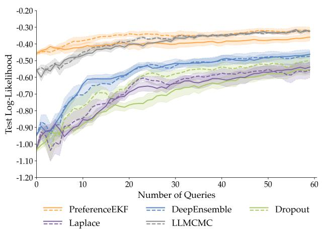  
(a)

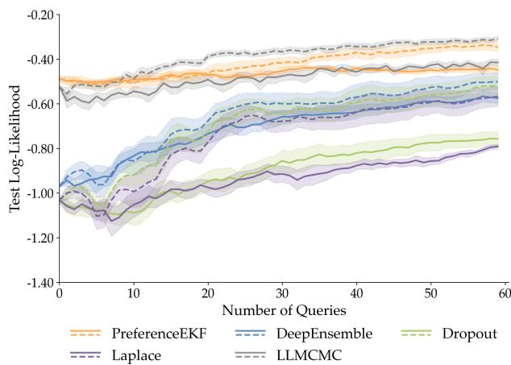  
(b)  
Figure A.1: Figure A.1a shows log-likelihood comparison of the random (dashed line) and active (solid line) variants of each algorithm using the disagreement acquisition function (higher means better fitting of annotator preference distribution). Figure A.1b shows the results for entropy-based acquisition function.

We show in Figure A.1 that both disagreement and entropy acquisition functions resulted in similar trends, where although PreferenceEKF and LLMCMC perform the best overall, neither algorithm’s active learning variant outperformed their random counterpart. This is in contrast to the InfoGain acquisition function result in Figure 1a, where all algorithms’ active variants outperformed their random variants. This demonstrates that while PreferenceEKF and LLMCMC prove to be the most efective at learning a posterior for fitting the annotator’s preference distribution, the choice of acquisition function still matters greatly for sample-eficient active learning, with InfoGain being the best performing acquisition function overall, followed by disagreement and then entropy. We further show per-task preference-learning results for InfoGain, disagreement, and entropy in Figure A.2, Figure A.3, and Figure A.4, respectively.

## A.2.6 Reward learning using same number of model samples

In our main experiment results, while DeepEnsemble trains M = 5 separate reward models and uses them to approximate the posterior, all other algorithms explicitly learn a posterior distribution over model parameters, and can thus sample an arbitrary number of model parameters for computing acquisition functions and making predictions; our experiments used M = 100.

This raises the question of whether PreferenceEKF’s superior preference learning sample eficiency is solely due to the larger number of posterior samples, or whether the learned posterior indeed captures the annotator’s preference. To investigate this, we set M = 5 for all algorithms and see in Figure A.5 that PreferenceEKF still outperforms all methods in test log-likelihood. This signals that higher model sample count is not the only factor that can explain PreferenceEKF’s superior sample eficiency, and that the subspace approach for uncertainty representation indeed results in a learned posterior that captures the annotator’s preferences well.

## A.2.7 Training runtime under the same compute budget

Section 5.2 showed that PreferenceEKF had much faster training runtime compared to the other methods. The setting was biased to be favorable towards PreferenceEKF, as it only needs to perform one belief update step on the most recent query (thanks to its sequential learning nature), whereas all the other methods need to perform multiple gradient descent updates on all data seen so far so as to ensure that SGD converges to a maximum likelihood solution.

To ensure a more fair runtime comparison, we set the number of SGD iterations for belief update of all baselines to match the compute budget of EKF’s belief update step, and additionally set the number of model samples for all methods to be $M = 5$ to match that of DeepEnsemble. We show in Figure A.6a that under the setting with reduced number of SGD steps, the methods that rely on SGD (DeepEnsemble, Dropout, Laplace) failed to converge, and were thus unable to fit the preference distribution as indicated by low log-likelihood. PreferenceEKF and LLMCMC were still able to fit the preference distribution, with the former still retaining a clear lead in having the fastest training runtime as shown in Figure A.6b.

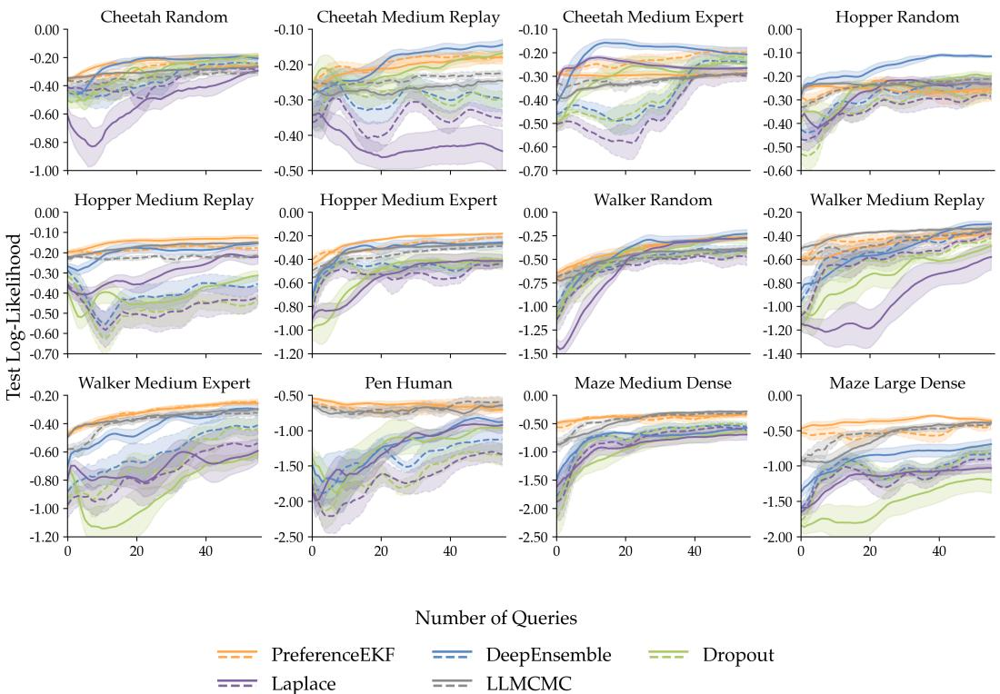  
Figure A.2: Per-task reward learning performance using InfoGain acquisition function: comparison of the random (dashed line) and active (solid line) variants of the algorithms across 12 D4RL tasks (mean±s.e. over 12 seeds). In all tasks, active PreferenceEKF either performs on par with or outperforms other algorithms in terms of sample-eficiency and final log-likelihood.

## A.2.8 Reward learning without an initial dataset

In Section 4, it was shown that subspace construction for PreferenceEKF can be done via either SVD on SGD iterates trained on an initial dataset, or random projections. Algorithm 1 further indicates that regardless of the subspace construction method, PreferenceEKF still relies on access to an initial dataset of already labeled queries.

It is desirable for any reward learning algorithm to still work in domains where such an initial dataset is unavailable. To investigate the reliance of all methods on access to initial data, we show in Figure A.7 reward learning results where we remove access to any initial data, thus making posterior updates possible onl with an annotator in the loop. In this case, PreferenceEKF uses the random projection method for subspace construction. We see that PreferenceEKF still outperforms all baselines, showcasing its flexibility in learning reward models even without access to existing labeled queries.

## A.2.9 Reward learning from multiple human annotators

Our main experiments are conducted exclusively with synthetic oracle preference labels, where of the two trajectories being compared, the trajectory with higher summed reward is designated as the preferred trajectory. To test the methods’ ability to learn rewards from real human preferences, we use the crowdsourced preference labels from Yuan et al. (2023) to perform reward learning. We show in Figure A.8 that no methods reached great log-likelihood evaluation, and none of the methods’ active variant was able to outperform their random variant. This is likely due to the crowd-sourced nature of the labels, which may induce multi-modal preference distribution underlying the labels that may be dificult for our benchmark algorithms to capture. We emphasize that our work’s main contribution is a sample-eficient active reward learning algorithm for the single annotator setting, and we leave adaptation of our work to multi-annotator settings to future work.

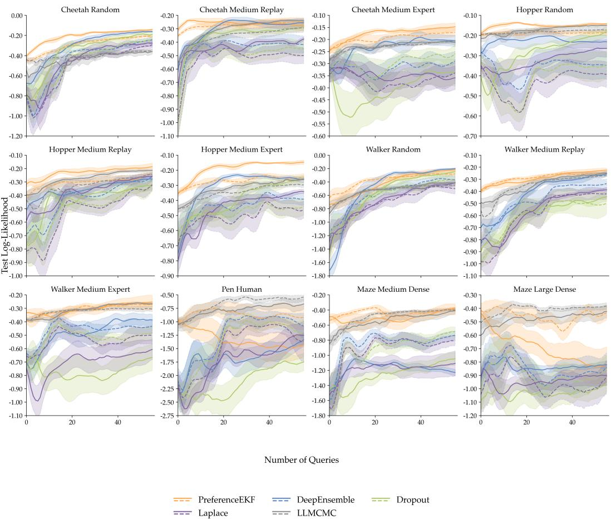  
Figure A.3: Per-task reward learning performance using the disagreement acquisition function: comparison of the random (dashed line) and active (solid line) variants of the algorithms across 12 D4RL tasks for preference based reward modeling (mean±s.e. over 12 seeds). In most tasks, active PreferenceEKF either performs on par with or outperforms other algorithms in terms of sample-eficiency and final log-likelihood. Pen Human and Maze Large Dense are particular outlier cases where active PreferenceEKF severely underperforms, which explains why the aggregate results in Figure A.1a look unfavorably for active PreferenceEKF relative to its random variant.

## A.2.10 Reward learning from real robotics data

We extend the application of our method to real-world robotics datasets, where we leverage sparse binary task success or failure signal as preference feedback. This setting is common in recent robot reward model works such as Yang et al. (2024b) and Liang et al. (2026). We use the rollout datasets from SOAR (Zhou et al., 2024), where the trajectories are collected by a fleet of 5 WidowX robot arms over a variety of manipulation tasks, such as putting a blue block in a wooden bowl or transferring a mushroom from a bowl to a table. The trajectory observation data are 7-dimensional proprioceptive states encoding end efector translation (XYZ) and rotation (roll, pitch, yaw), along with gripper open/close state (scalar). For a given task, we generate preference labels by sampling one successful trajectory and one failed trajectory, and label the successful trajectory as the preferred one.

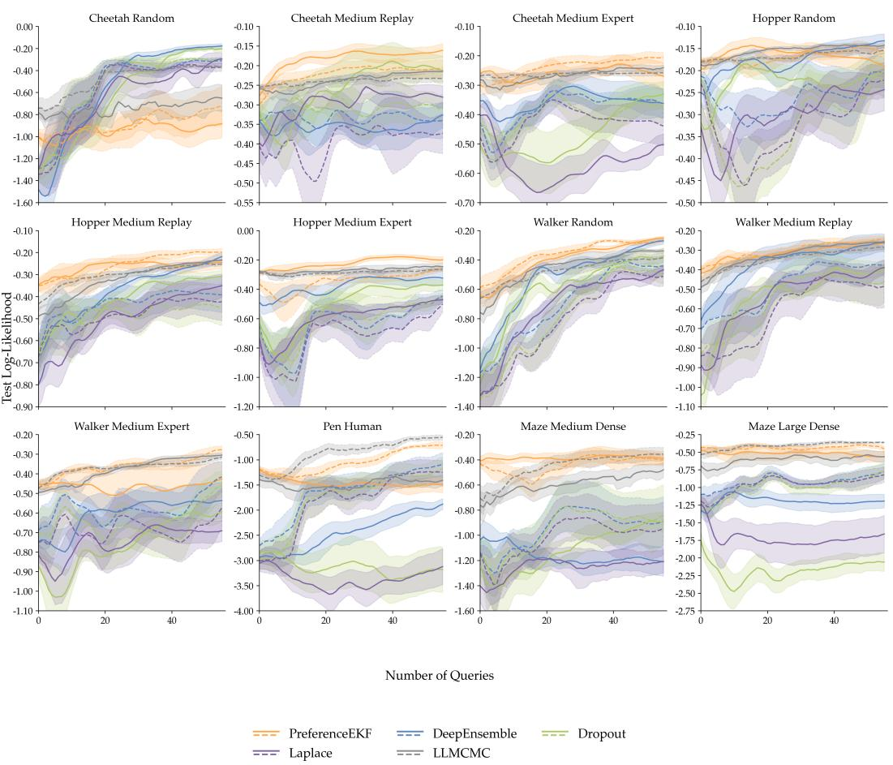  
Figure A.4: Per-task reward learning performance using the entropy acquisition function: comparison of the random (dashed line) and active (solid line) variants of the algorithms across 12 D4RL tasks for preferencebased reward modeling (mean±s.e. over 12 seeds).

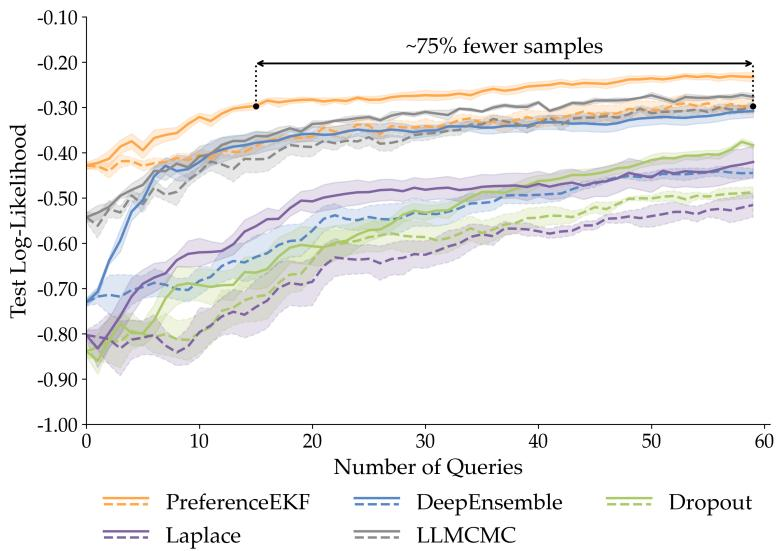  
Figure A.5: Task-aggregate reward learning performance with all algorithms using the same number of model samples (M = 5). Runs are averaged over all 12 tasks of 5 seeds each.

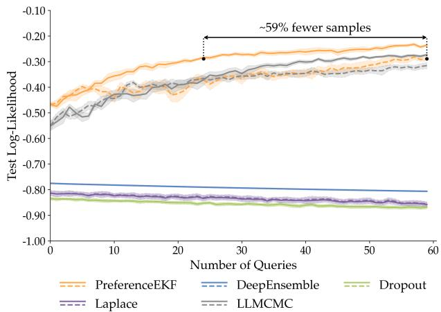  
(a)

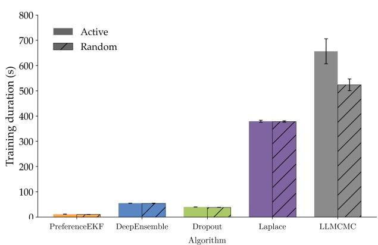  
(b)

Figure A.6: Figure A.6a shows log-likelihood comparison of the random (dashed line) and active (solid line) variants of each algorithm using the InfoGain acquisition function, with reduced belief update compute budget. We see that all methods that rely heavily on SGD fail to learn, while PreferenceEKF and LLMCMC retain good performance. Figure A.6b shows training runtime duration of both active and random variants of each algorithm. Each line plot and bar plot is aggregated over 12 D4RL tasks (mean±s.e. over 12 seeds).  
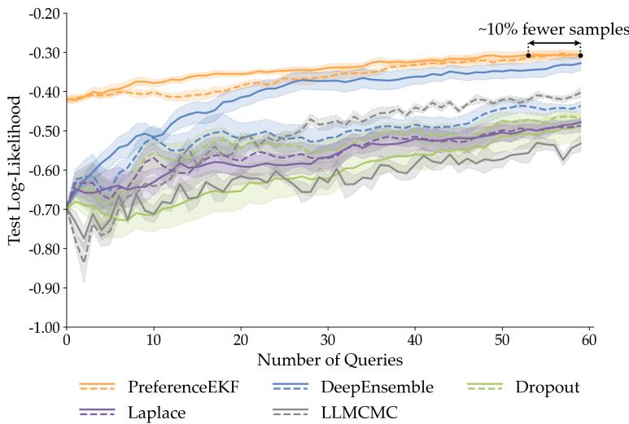  
Figure A.7: Task-aggregate reward learning performance with all algorithms using no initial dataset, thus no warmup SGD phase. Runs are averaged over all 12 tasks of 5 seeds each (mean±s.e.).

Since the SOAR dataset was primarily collected for the purpose of learning from suboptimal data free of human supervision in the real world, and our pairwise sampling procedure requires (success, failed) trajectory pairings, we found that many task datasets from SOAR contained either 1) too few trajectories in total or 2) way more failed trajectories than successful ones. We narrowed down our evaluation task suite down to 3 tasks that contained suficient number of (success, failed) pairings, and evaluated all methods on all tasks. All trajectories are of fixed length of 100 steps, with no partial segment sampling as we do in our main results in Section 5.1. In Figure A.9, we show that PreferenceEKF and LLMCMC both achieve the best performance over all methods considered, showcasing the applicability of our method to real world robotics data. We further show per-task performance in Figure A.10.

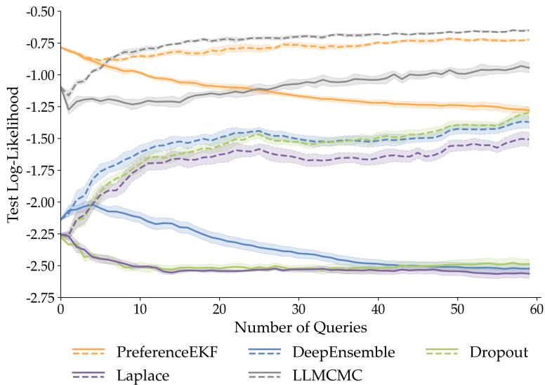  
Figure A.8: Task-aggregate reward learning performance with all algorithms using crowd-sourced real human preference labels. Runs are averaged over all 12 tasks of 5 seeds each (mean±s.e.).

## A.2.11 Reward learning from pixel data

While our main results in Section 5 are performed on state-based control tasks, here we showcase the applicability of PreferenceEKF to pixel-based tasks. We focus on the Visual D4RL (V-D4RL) benchmark (Lu et al., 2023), which contains rendered pixel-image observations corresponding to datasets from the state-based D4RL benchmark.

Our pixel-based reward model architecture consists of an ImageNet-pretrained ResNet18 image encoder with embedding dimension of 512 (Deng et al., 2009; He et al., 2016) as the backbone and a two-layer MLP with 256 hidden units per layer as the reward prediction head. We finetune the entire reward model via SGD as part of the belief initialization step of Line 12, and perform EKF inference within the subspace of only the reward head parameters while keeping the finetuned backbone frozen. We take a similar approach for the baseline methods, DeepEnsemble and Dropout; due to computational constraints, we did not include Laplace and LLMCMC. Due to the increased task and model complexity, we construct a subspace with dimensionality of 500 (compared to 200 in the state-based tasks with smaller reward models), and use random projection to do so since a larger subspace benefits equally from random projection versus SVD-based construction techniques as shown in Figure 3b.

Since EKF’s belief update procedure scales cubically with dimensionality of the observation space, we use a measurement likelihood function (Eq. 4) over trajectory embeddings rather than raw trajectory pixels. We compute embeddings from the final layer of the ResNet18 backbone before the reward prediction head, and mean-pool the embeddings across all timesteps of a trajectory segment to obtain embeddings that aggregate trajectory-level information. Empirically, raw pixel observations over trajectory segment lengths of 10 steps with images of height, width, channel (84, 84, 3) would result in observation dimension of $1 0 \times 8 4 \times 8 4 \times 3 = 2 1 1$ , 680 per trajectory, while mean-pooled embedding-based observation results in dimension of 512 per trajectory.

To finetune the pixel-based reward model which includes the entire ResNet18 backbone, we start with a much bigger initial query dataset of 150 (compared to just 8 in state-based experiments), and use a reduced learning rate of 0.0001 over 3000 mini-batches with batch size 16. In Figure A.11 and Figure A.12, we show that PreferenceEKF is indeed a viable method for active preference-based reward learning, and performs on par with DeepEnsemble while Dropout’s performance sufers. While the performance of active versus random sampling varies across the three chosen pixel-based tasks, the active variant of PreferenceEKF as a whole shows promising improvement over the random variant. We leave research on EKF variants that eficiently scale with observation dimension, and more parameter-eficient subspace inference methods such as those based on LoRA (Hu et al., 2021) to future work.

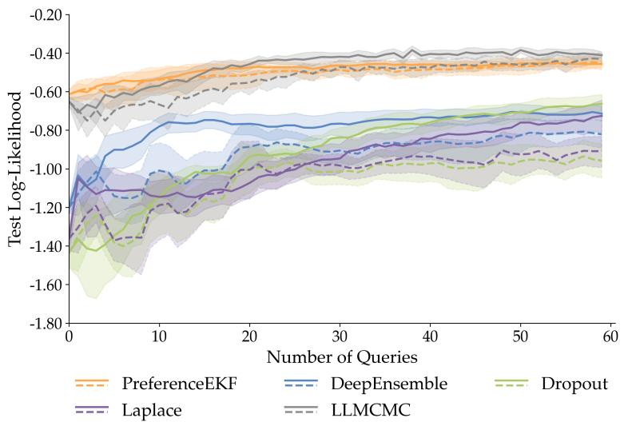  
Figure A.9: Task-aggregate reward learning performance of all methods on the SOAR dataset, with random (dashed line) and active (solid line) variants of each method. Runs are aggregated over 3 tasks (mean ± 95% bootstrap confidence interval over 12 seeds per task).

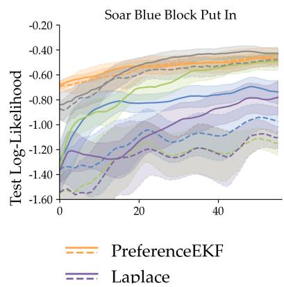

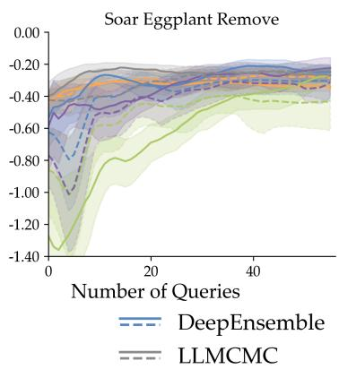

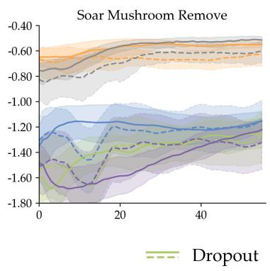  
Figure A.10: Per-task reward learning performance of all methods on the SOAR dataset, with random (dashed line) and active (solid line) variants (mean ± 95% bootstrap confidence interval over 12 seeds).

## A.2.12 Model calibration experiments

In addition to the results from Section 5.3 on expected calibration error and Brier scores, we provide in Figure A.13 reliability diagrams computed from model predictions over all tasks and seeds. Due to the per-timestep parameterization of the reward model for computing the Bradley-Terry loss function Eq. 1, our binary preference query dataset is implemented to always have the second item be preferred over the first item. This corresponds to label of always 1, hence why the reliability diagrams only show calibration for half of the probability line. For both reliability diagram and expected calibration error, we discretize the [0, 1] probability space into 10 bins. Upon inspection, we can see that PreferenceEKF and LLMCMC exhibit the lowest model calibration error.

Laplace (A)  
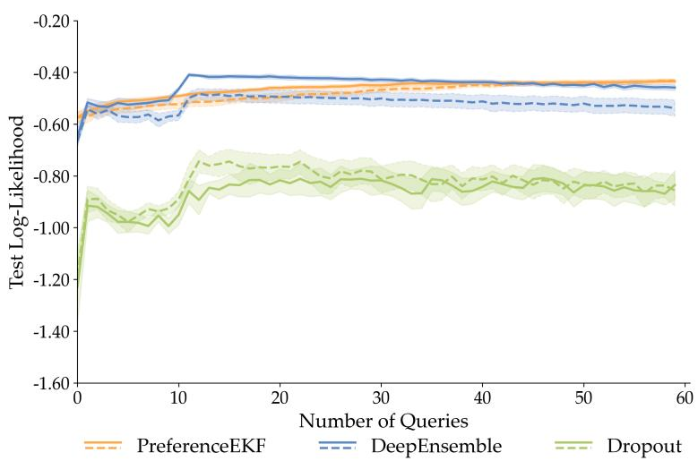  
Figure A.11: Task-aggregate reward learning performance of PreferenceEKF on the pixel-based V-D4RL benchmark, with random (dashed line) and active (solid line) variants. Runs are aggregated over 3 pixel-based VD4RL tasks (mean±s.e. over 5 seeds).

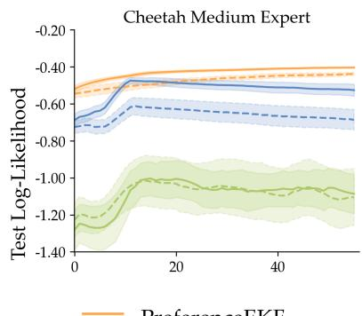

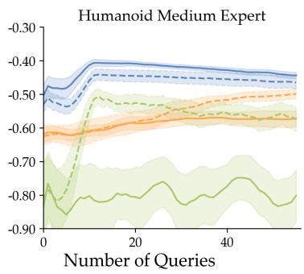

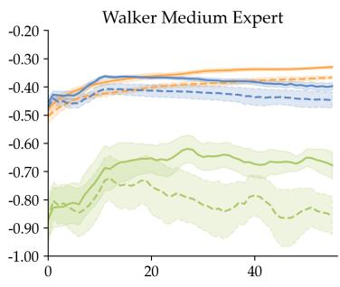

Figure A.12: Per-task reward learning performance of PreferenceEKF on the pixel-based V-D4RL benchmark, with random (dashed line) and active (solid line) variants. (mean±s.e. over 5 seeds).  
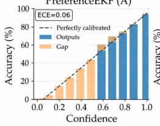

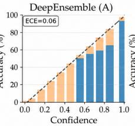

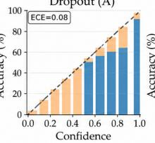

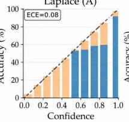

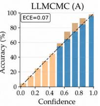

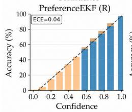

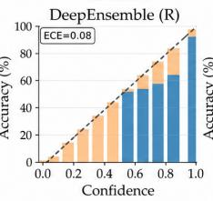

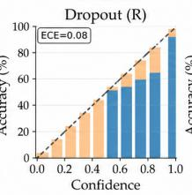

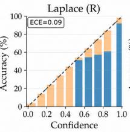

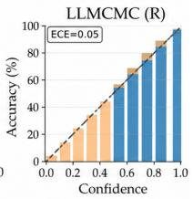  
Figure A.13: Task-aggregate reliability diagram for all five methods’ random and active variants. Diagrams are aggregated across all tasks and seeds.

## A.3 Ofline reinforcement learning

## A.3.1 Policy performance results

Figure A.14 shows comparison of policy optimization using the reward models learned from random and active variants of each algorithm, aggregated across 12 D4RL tasks in the ofline RL setting (mean±s.e. over 5 seeds). Figure A.15 shows per-task results for ofline RL evaluations. All results here are shown with a moving average over the last 5 evaluations.

We observe that despite the marked diference in log-likelihood-based preference learning evaluation between methods (Figure 1a), when the reward models produced by each method are used in the ofline RL setting for policy optimization, they all led to policies of similar rollout performance. This lack of consistent correlation between supervised learning of reward models and reinforcement learning of policies is a known behavior in the RL from preference feedback literature, across both language modeling and control domains (Gao et al., 2022; Tien et al., 2022; Pan et al., 2021). We emphasize that the primary contribution of our work is an eficient reward learning algorithm for learning from preference feedback, and show that the resulting reward model can produce policies that reach competitive performance with policies that learn from reward models produced by other preference learning algorithms. We do not claim that our method can automatically lead to stronger policy performance. We leave investigation of the relationship between the learned reward posterior and how it afects policy optimization to further work (Razin et al., 2025; Swamy et al., 2025).

## A.3.2 Implementation Details

The extent to which ofline RL algorithms leverage reward information for policy optimization, i.e., whether reward-induced policy performance is a good metric for assessing learned reward models, is heavily dependent on the trajectory dataset: when run on datasets consisting solely of expert demonstrations, ofline RL algorithms will largely ignore reward information and adopt a behavioral cloning-like learning strategy. On the other hand, it is generally dificult to train a policy from a dataset consisting of purely random behavior (Kumar et al., 2021).

Following the experiment methodology of Shin et al. (2022) for our ofline RL experiments, we add two reference performance scores to every task as shown in Figure A.15: we refer to “GT” as the score from an ofline RL policy trained on $\mathcal { D } ^ { t r a j }$ labeled with ground-truth environment reward information, and “Zero” as score from a policy trained on $\mathcal { D } ^ { t r a j }$ with reward information zeroed out. This serves to test whether an ofline RL algorithm is able to efectively leverage reward information for a given trajectory dataset. For most tasks, GT and Zero serve as upper and lower performance bounds for learned policies.

All ofline RL experiments were done by running implicit Q-learning (IQL Kostrikov et al. (2021)) on trajectory transition datasets labeled with diferent types of rewards, e.g., ground truth environment reward, zeroed out reward, or preference-learned reward. An IQL agent consists of four neural networks: main and target Q-network, a Gaussian policy network, and a state-value network. All four networks have two hidden layers of 256 units each and are trained using the same optimizer configuration with cosine decay learning rate schedule. Policy extraction is done with advantage-weighted regression (AWR Peng et al. (2019)). All training runs are done using 1M update steps with 5 rollouts every 50K steps for evaluation. We apply normalization to both reward and observation features, and further apply clipping for reward values exceeding 10. All hyperparameters are detailed in Table 4.

## A.4 Scaling Experiments.

JAX ofers eficient function vectorization using jax.vmap. While we use this to parallelize ensemble model training and prediction in most experiments in Section 5, we do not use this for the scalability experiments in Section 5.2. Parallelized training and prediction of up to $M = 1 5 0$ models with up to 2M parameters (in the case of the three layer neural networks with 1024 units each) can lead to out-of-memory errors. We instead use Python’s native for loop to perform ensemble model training and prediction sequentially. All scalability experiments were done on CPU instead of GPU to avoid out-of-memory errors.

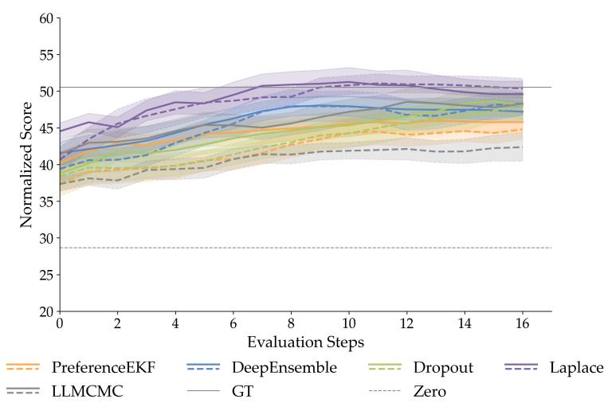  
Figure A.14: Task-aggregate ofline RL rollout performance across all tasks for each reward learning algorithm variant, all using the InfoGain acquisition function: comparison of the random (dashed line) and active (solid line) variants of the learned reward models, with rollout performance aggregated over 12 D4RL tasks (mean±s.e. over 5 seeds).

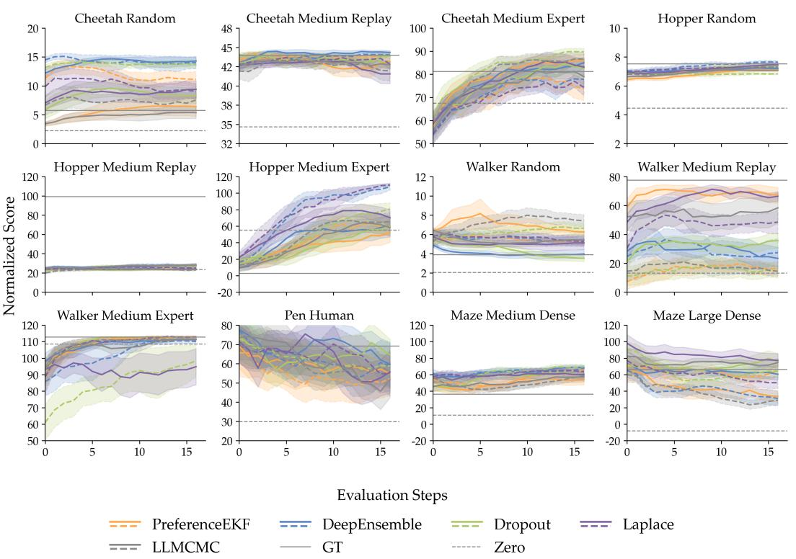  
Figure A.15: Per-task ofline RL rollout performance across all tasks for each reward learning algorithm variant, all using the InfoGain acquisition function: comparison of the RM learned using random (dashed line) and active (solid line) variants of the algorithms across 12 D4RL tasks in the ofline RL setting (mean±s.e. over 5 seeds). Black solid line indicates the performance of a policy trained on ground truth reward (GT), and black dotted line for a policy trained without reward information (Zero). In most tasks, active PreferenceEKF performs on par with other algorithms in terms of rollout score.

Table 4: Shared hyperparameters for IQL across all tasks. Here “Iterations” refers to the number of minibatch updates.
<table><tr><td>Name</td><td>Value</td></tr><tr><td>Optimizer</td><td>Adam</td></tr><tr><td>Learning rate</td><td>0.0003</td></tr><tr><td>Betas</td><td>(0.9, 0.999)</td></tr><tr><td>Iterations</td><td>1M</td></tr><tr><td>Batch size</td><td>256</td></tr><tr><td>Discount factor γ Target net update step size</td><td>0.99</td></tr><tr><td>Expectile τ</td><td>0.005 0.7</td></tr><tr><td></td><td></td></tr><tr><td>Advantage temperature β</td><td>3.0</td></tr><tr><td>Exponential advantage clip</td><td>100</td></tr></table>

## A.5 LLM Usage

We used LLMs primarily for writing Python visualization scripts, figures/tables typesetting in LaTeX, finding related work on subspace construction methods, and debugging JAX compilation / model loading errors. We did not use LLMs for paper writing, research ideation, or implementing the core algorithm parts.