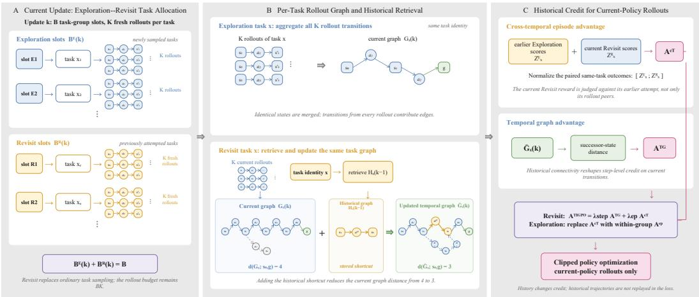
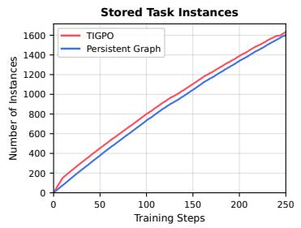
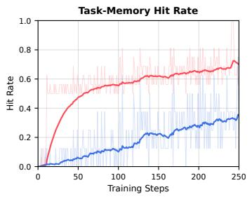
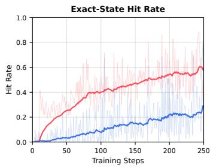

# TIGPO: TEMPORAL INSTANCE-GRAPH POLICY OPTI-MIZATION FOR LONG-HORIZON LLM AGENTS

Jinwei Gan

Department of Computer Science

Nanjing University

ganjw@smail.nju.edu.cn

## ABSTRACT

Graph-based policy optimization improves credit assignment for long-horizon LLM agents by organizing rollout trajectories into state-transition graphs. However, existing methods construct graphs independently within each policy update, discarding transitions discovered by earlier policies and limiting advantage estimation to small, batch-local rollout groups. We propose Temporal Instance-Graph Policy Optimization (TIGPO), which extends graph-based credit assignment across policy updates. TIGPO maintains a persistent transition graph for each task, allowing valid transitions discovered by different policy versions to jointly determine credit for current rollouts. To actively reconnect current exploration with historical experience, TIGPO allocates a fixed rollout budget between Exploration slots for ordinary task sampling and Revisit slots for delayed reattempts of previously explored tasks. For each revisit, TIGPO pairs the current rollout group with its corresponding earlier Exploration group to construct a cross-temporal reference. The enlarged reference is designed to stabilize relative advantage estimation under small rollout groups, while comparison on the same task directly captures policy improvement across training stages. Historical transitions and scores serve only as structural and detached statistical references and are never replayed in the policy loss. Experiments on ALFWorld and WebShop demonstrate that TIGPO consistently outperforms prior group-based and graphbased policy optimization methods.

## 1 INTRODUCTION

Large language models (LLMs) have rapidly evolved from static text generators into interactive agents that perceive environment states, reason over observations, and execute actions to accomplish complex goals (Yao et al., 2023). Representative applications include embodied agents operating in simulated households (Shridhar et al., 2021) and web agents navigating e-commerce environments (Yao et al., 2022). Unlike single-turn reasoning, these tasks require an agent to make a sequence of interdependent decisions over a long interaction horizon. Rewards are often sparse and delayed, with success determined only after the entire trajectory is completed. Consequently, assigning credit to individual actions remains a central challenge for reinforcement learning (RL) of LLM agents.

Traditional actor–critic algorithms such as Proximal Policy Optimization (PPO) estimate action advantages using a learned value function (Schulman et al., 2017). More recently, Group Relative Policy Optimization (GRPO) has provided a value-free alternative by estimating relative advantages from groups of sampled outputs (Shao et al., 2024). This group-based paradigm has subsequently been extended to long-horizon agentic tasks. GiGPO introduces episode-level and anchor-state-level groups to obtain more fine-grained relative advantages (Feng et al., 2025). Going beyond trajectorylevel rewards, GraphGPO aggregates rollout transitions into a state-transition graph and assigns step-level credit according to graph distances from intermediate states to the task goal (Cheng et al., 2026). These advances substantially improve fine-grained credit assignment without requiring an additional learned value model.

Despite this progress, existing graph-based credit assignment remains batch-local. At each policy update, the transition graph is constructed only from trajectories sampled in the current rollout batch and discarded afterward. Useful transitions discovered at different stages of training therefore cannot be connected. For example, an early policy may discover a promising prefix but fail before reaching the goal, whereas a later policy may discover a successful continuation from an overlapping state. If the two trajectory fragments occur in different policy updates, a batch-local graph cannot recover their connectivity or propagate credit through the resulting path. This limitation is particularly pronounced under small rollout groups, where graph coverage is sparse and relative advantage estimates can be sensitive to individual successful or failed trajectories.

A seemingly direct solution is to retain historical trajectories and replay them during subsequent updates. However, trajectories generated by earlier policies contain stale actions and log-probabilities. Directly including them in the current policy loss can therefore introduce distribution mismatch. Historical experience should instead improve the credit assigned to current-policy rollouts without itself receiving gradients. This motivates the central question of this work:

## Can graph-based credit assignment accumulate experience across policy updates while preserving optimization on current-policy trajectories?

To answer this question, we propose Temporal Instance-Graph Policy Optimization (TIGPO). TIGPO maintains a persistent transition graph indexed by a stable task identity. During each policy update, valid historical transitions associated with the same task are combined with transitions from the current rollouts before distances to the goal and graph-based step advantages are recomputed. This allows trajectory fragments discovered by different policy versions to form complete paths to success and provide denser credit signals for current behavior. Importantly, historical transitions are used only as structural references: historical tokens, actions, and log-probabilities are never included in the current policy loss.

Maintaining a persistent graph alone does not guarantee that the policy will return to a previously explored task. TIGPO therefore introduces an Exploration–Revisit rollout schedule that divides a fixed task-group budget between ordinary exploration and scheduled revisitation. Exploration slots follow the original task sampler, whereas Revisit slots reattempt previously explored tasks after a controlled delay using the current policy. These revisits actively reconnect current exploration with historical graph structure, allowing the policy to extend or complete paths discovered during earlier updates without increasing the per-update rollout budget.

A scheduled revisit also provides a task-matched cross-temporal comparison. For each Revisit group, TIGPO combines its current episode-derived scores with detached scores from the corresponding earlier Exploration group. The resulting enlarged reference set is designed to stabilize relative advantage estimation under small rollout groups. At the same time, comparing two policy stages on the same task provides a direct signal of policy improvement. Only the current Revisit trajectories receive gradients; the earlier scores serve exclusively as detached reference statistics.

We evaluate TIGPO on two challenging long-horizon agent benchmarks, ALFWorld (Shridhar et al., 2021) and WebShop (Yao et al., 2022). Across both environments, TIGPO consistently outperforms prior group-based and graph-based policy optimization methods. These results demonstrate that persistent instance graphs, controlled historical revisitation, and cross-temporal group comparison provide complementary benefits for long-horizon credit assignment.

Our main contributions are summarized as follows:

• We introduce cross-update persistent instance graphs that connect valid transitions discovered by different policy versions and improve step-level credit assignment for current rollouts without replaying historical trajectories in the policy loss.

• We propose an Exploration–Revisit rollout scheduler that balances ordinary task exploration with delayed, task-specific revisitation under a fixed rollout budget, enabling the current policy to actively reuse and extend historical graph structure.

• We develop a cross-temporal comparison mechanism that pairs detached scores from an earlier Exploration group with the corresponding current Revisit group. It provides an enlarged reference set designed to stabilize relative advantage estimation while capturing policy improvement across training stages.

## 2 RELATED WORK

Reinforcement learning for LLM agents. LLMs are increasingly used as interactive agents that reason over observations and execute actions in external environments. ReAct (Yao et al., 2023) establishes a general reasoning-and-acting paradigm, while ALFWorld (Shridhar et al., 2021) and WebShop (Yao et al., 2022) provide representative benchmarks for embodied and web agents. Their long interaction horizons and sparse outcome rewards make fine-grained credit assignment particularly challenging. PPO (Schulman et al., 2017) estimates action advantages using a learned value function, whereas GRPO (Shao et al., 2024) replaces the critic with within-group reward normalization. GiGPO (Feng et al., 2025) introduces episode-level and anchor-state-level groups for agent training, and GraphGPO (Cheng et al., 2026) derives step-level credit from a state-transition graph constructed from the current rollout batch. In contrast, TIGPO jointly introduces persistent taskconditioned graph memory, scheduled task revisitation, and cross-temporal comparison, allowing experience collected at different policy stages to improve credit assignment for current actions.

Historical experience reuse. Experience replay improves sample efficiency by retaining and resampling past transitions (Schaul et al., 2016), but directly optimizing on trajectories generated by earlier policies introduces off-policy mismatch and may require explicit correction (Espeholt et al., 2018). TIGPO does not replay historical trajectories in the policy objective. Historical transitions are retained only as graph structure, while earlier rollout scores serve as detached reference statistics. All trajectories receiving gradients are newly generated by the current policy. TIGPO therefore reuses historical structure and statistics without performing policy updates on stale actions or logprobabilities.

## 3 PRELIMINARIES

Group-based policy optimization. Let $x \sim \mathcal { D }$ denote a task instance defining a finite-horizon Markov decision process $\mathcal { M } _ { x } = ( S _ { x } , \mathcal { A } _ { x } , P _ { x } , r _ { x } )$ . At step t, an LLM policy π samples an action ${ { a } _ { i , i } }$ conditioned on the interaction history $h _ { i , t }$ and observes the next state $s _ { i , t + 1 }$ . A rollout $\tau _ { i } =$ $\left( { { s } _ { i , 0 } } , { { a } _ { i , 0 } } , \ldots , { { s } _ { i , T _ { i } } } \right)$ receives an episode outcome $R _ { i }$

At each policy update, group-based policy optimization samples B task instances and generates K rollouts for each task, giving a total rollout budget of $N = B K$ . The K rollouts of the same task form a task group. For task $x ,$ let $\boldsymbol { B _ { x } } = \{ \tau _ { i } \} _ { i = } ^ { K }$ and $\mathcal { Z } _ { x } = \{ R _ { i } \} _ { i = 1 } ^ { K }$ denote its rollout group and outcome scores. GRPO (Shao et al., 2024) assigns each rollout a within-group episode advantage

$$
\widehat { A } _ { i } ^ { \mathrm { e p } } = \mathrm { N o r m } ( R _ { i } ; \mathcal { Z } _ { x } ) , \qquad \mathrm { N o r m } ( z ; \mathcal { Z } ) = \frac { z - \mu ( \mathcal { Z } ) } { \sigma ( \mathcal { Z } ) + \epsilon } ,\tag{1}
$$

where $\epsilon > 0$ ensures numerical stability. All actions in a rollout inherit the same episode-level advantage.

Graph-based step-level credit. GraphGPO (Cheng et al., 2026) further aggregates the rollout transitions of task x into a directed state-transition graph $G _ { x } = ( V _ { x } , E _ { x } )$ , where identical states are merged and valid transitions form directed edges. Let $g _ { x }$ be a successful terminal node and $d _ { G _ { x } } ( s , g _ { x } )$ the shortest-path distance from state s to success. For a transition $s _ { i , t } \xrightarrow { a _ { i , t } } s _ { i , t + 1 }$ , its graph return is

$$
Q _ { i , t } ^ { G } = C \gamma ^ { d _ { G _ { x } } ( s _ { i , t + 1 } , g _ { x } ) } , \qquad 0 < \gamma < 1 .\tag{2}
$$

The successor state is used because it represents the direct consequence of the current action; transitions leading closer to success therefore receive larger returns. Returns of transitions sharing the same source state are normalized to obtain the step-level graph advantage $\widehat { A } _ { i , t } ^ { G }$ . GraphGPO then combines the episode- and step-level signals as

$$
\widehat { A } _ { i , t } = \lambda _ { \mathrm { s t e p } } \widehat { A } _ { i , t } ^ { G } + \lambda _ { \mathrm { e p } } \widehat { A } _ { i } ^ { \mathrm { e p } } .\tag{3}
$$

Both the graph and the comparison statistics above are constructed from the current rollout group. Consequently, transition structure discovered in one policy update cannot inform later attempts at the same task. TIGPO addresses this limitation by carrying task-level graph structure and comparison information across policy updates.

  
Figure 1: Overview of Temporal Instance-Graph Policy Optimization (TIGPO). (A) At each policy update, a fixed budget of B task groups is divided into Exploration and Revisit slots, with K fresh rollouts generated for each task. (B) Rollout transitions are aggregated into a per-task graph. For a revisited task, its historical graph is retrieved and combined with the current rollout graph, allowing previously discovered transitions to provide shorter routes to the goal. (C) The updated temporal graph provides step-level graph credit, while the paired Exploration and Revisit outcomes provide a cross-temporal episode advantage. Historical experience affects credit assign ment, whereas the policy objective is optimized only on current-policy rollouts.

## 4 METHOD

Standard group-based policy optimization constructs supervision only from the current rollout batch. As a result, useful transition structures are discarded after each update, and repeated attempts at the same task are evaluated independently. We propose Temporal Instance-Graph Policy Optimization (TIGPO), which uses the accumulated history of each task to improve credit assignment for current-policy rollouts while preserving on-policy optimization.

Figure 1 summarizes the method. As shown in Figure 1(A), TIGPO divides a fixed budget of B task groups into Exploration and Revisit slots, with K fresh rollouts generated for each task. Explo ration samples new task attempts, whereas Revisit returns the current policy to previously attempted tasks without increasing the total rollout budget BK. In Figure 1(B), the rollouts of each task are aggregated into a state-transition graph. For a revisited task, its historical graph is retrieved and combined with the current graph, allowing transition fragments discovered at different updates to form shorter or previously unavailable routes to success. Finally, Figure 1(C) converts this history into two learning signals: a temporal graph advantage derived from successor-state distances, and a cross-temporal episode advantage obtained by comparing the current Revisit outcomes with their earlier Exploration counterparts. TIGPO combines these signals to optimize only fresh currentpolicy trajectories; historical experience affects credit assignment but is never replayed in the policy loss.

## 4.1 TEMPORAL INSTANCE GRAPH

Long-horizon rollouts often expose only fragments of a useful solution. Under a per-update graph, a prefix found in one update and a successful suffix found later cannot support each other, even when they belong to the same task. This motivates retaining task-conditioned transition structure across updates: the graph should accumulate evidence about how states are connected, while policy optimization should remain on-policy.

Cross-update graph construction. TIGPO associates every task instance x with a stable identity κ(x). Two attempts share experience only when they correspond to the same task objective and initial environment configuration. This establishes a separate learning history for each task while remaining independent of the particular representation used by an environment.

Let $\mathcal { H } _ { x } ^ { ( k - 1 ) }$ denote the transition graph accumulated for task x before policy update k, and let $G _ { x } ^ { ( k ) }$ denote the graph formed by its current rollouts. TIGPO constructs the temporal instance graph

$$
\overline { { G } } _ { x } ^ { ( k ) } = \mathcal { H } _ { x } ^ { ( k - 1 ) } \cup G _ { x } ^ { ( k ) } .\tag{4}
$$

The union connects compatible trajectory fragments discovered at different stages of learning. For example, an earlier attempt may identify a useful prefix, whereas a later attempt may connect a state on that prefix to the task goal. Neither rollout batch needs to contain the complete path by itself.

Temporal graph credit. Shortest-path distances are recomputed on the temporal graph, and every current transition receives

$$
q _ { i , t } ^ { \mathrm { T G } } = C \gamma ^ { d } \overline { { G } } _ { x } ^ { ( s _ { i , t + 1 } , g _ { x } ) } .\tag{5}
$$

Normalizing these returns among current transitions with the same source state gives the temporal graph advantage $\widehat { A } _ { i , t } ^ { \mathrm { T G } }$ . After the update, newly observed valid transitions are incorporated into $\mathcal { H } _ { x } ^ { ( k ) }$ for subsequent attempts. Historical transitions therefore affect current credit through graph connectivity, but only current transitions receive advantages and participate in policy optimization.

## 4.2 EXPLORATION–REVISIT SAMPLING

Accumulating a temporal graph alone does not ensure that the evolving policy will return to the same task. When tasks are drawn independently from a broad training distribution, such returns may be rare or occur only after an uncontrolled delay. The graph would then store useful structure without creating a timely opportunity to exploit it. This motivates coupling persistent memory with an explicit mechanism for collecting a new on-policy attempt of a previously explored task.

Fixed-budget scheduling. TIGPO partitions the B task groups at update k into Exploration and Revisit groups:

$$
B _ { \mathrm { E } } ^ { ( k ) } + B _ { \mathrm { R } } ^ { ( k ) } = B .\tag{6}
$$

Each group contains K current-policy rollouts. An Exploration group draws a task from the ordinary training distribution. The sampled task becomes eligible for revisitation after a delay of ∆ policy updates. A Revisit group selects an eligible task and generates a new group of rollouts from the current policy under the same task condition. If insufficient tasks are eligible, the unused Revisit groups are reassigned to Exploration.

This schedule separates where to collect experience from how much experience to collect. Revisit groups replace Exploration groups rather than being appended to the batch, so every update still contains exactly B groups and $\bar { N } = B K$ rollouts. Early updates emphasize discovering transition structure, whereas later updates jointly expand that structure and reassess earlier tasks with an improved policy.

## 4.3 CROSS-TEMPORAL POLICY OPTIMIZATION

Outcome normalization based only on a small current group can be unstable in sparse-reward tasks: a single successful rollout may dominate the reference, whereas uniformly failed rollouts provide little relative signal. A previous attempt of the same task offers a relevant additional baseline without mixing outcomes from different task conditions. TIGPO therefore uses the Exploration–Revisit pair not only to expand the graph but also to form a temporally aligned comparison set.

Cross-temporal episode advantage. An Exploration–Revisit pair provides two outcome sets for the same task at different stages of policy learning. Let $\mathcal { Z } _ { x } ^ { \mathrm { E } }$ denote the episode-derived scores from an Exploration group and $\mathcal { Z } _ { x } ^ { \mathrm { { \breve { R } } } }$ those from its current Revisit group. The earlier scores are treated as fixed reference values. For a current Revisit decision with score $z _ { i , t } ^ { \mathrm { R } }$ , TIGPO defines the crosstemporal episode advantage as

$$
\widehat { A } _ { i , t } ^ { \mathrm { C T } } = \mathrm { N o r m } \big ( z _ { i , t } ^ { \mathrm { R } } ; [ \mathcal { Z } _ { x } ^ { \mathrm { E } } ; \mathcal { Z } _ { x } ^ { \mathrm { R } } ] \big ) ,\tag{7}
$$

where $[ \cdot ; \cdot ]$ denotes concatenation. This comparison enlarges the reference set available to a Revisit group and directly measures the relative quality of the current attempt against an earlier policy on the same task. Exploration groups retain the standard within-group episode advantage $\widehat { A } _ { i , t } ^ { \mathrm { e p } }$

Joint policy objective. TIGPO combines episode-level comparison with temporal graph credit:

$$
\widehat { A } _ { i , t } ^ { \mathrm { T I G P O } } = \lambda _ { \mathrm { s t e p } } \widehat { A } _ { i , t } ^ { \mathrm { T G } } + \lambda _ { \mathrm { e p } } \left\{ \begin{array} { l l } { \widehat { A } _ { i , t } ^ { \mathrm { e p } } , } & { \mathrm { E x p l o r a t i o n } , } \\ { \widehat { A } _ { i , t } ^ { \mathrm { C T } } , } & { \mathrm { R e v i s i t } . } \end{array} \right.\tag{8}
$$

The resulting advantage is used in the clipped policy objective

$$
\mathcal { L } _ { \mathrm { T I G P O } } ( \theta ) = - \mathbb { E } _ { ( i , t ) \sim B ^ { ( k ) } } \left[ \operatorname* { m i n } \Bigl ( \rho _ { i , t } ( \theta ) \widehat { A } _ { i , t } ^ { \mathrm { T I G P O } } , \operatorname { c l i p } ( \rho _ { i , t } ( \theta ) , 1 - \epsilon , 1 + \epsilon ) \widehat { A } _ { i , t } ^ { \mathrm { T I G P O } } \Bigr ) \right] ,\tag{9}
$$

where $\rho _ { i , t } ( \theta ) = \pi _ { \theta } ( a _ { i , t } \mid h _ { i , t } ) / \pi _ { \theta _ { \mathrm { o l d } } } ( a _ { i , t } \mid h _ { i , t } )$ and $B ^ { ( k ) }$ contains only rollouts generated at update k. Accordingly, past experience influences the current update through the temporal graph and the cross-temporal reference distribution, without replaying historical trajectories in the policy loss.

## 5 EXPERIMENTS

## 5.1 EXPERIMENTAL SETUP

Benchmarks. We evaluate TIGPO on two challenging long-horizon interactive benchmarks: ALFWorld (Shridhar et al., 2021) and WebShop (Yao et al., 2022). ALFWorld is a text-based embodied environment in which an agent completes household tasks through multi-step interactions. It contains 3,827 task instances spanning six task categories: Pick, Clean, Cool, Look, Heat, and Pick Two. We report the success rate for each task category and the overall success rate.

WebShop is a web-based interactive environment that requires an agent to search for and purchase products satisfying a natural-language instruction. The agent must navigate product pages, select appropriate attributes, and make a final purchase through a sequence of textual actions. We use the official text-rich environment, which exposes information about interactive elements such as search boxes, product options, and buttons. Following prior work, we report both the average task score, which measures the degree to which the selected product satisfies the instruction, and the success rate, which requires complete satisfaction of the shopping goal.

Compared Methods. Following the comparison suite of Cheng et al. (2026), we consider three categories of baselines. First, we include closed-source general-purpose LLMs, namely GPT-4o (OpenAI, 2024) and Gemini-2.5-Pro (Gemini Team, 2023). Second, we evaluate prompting-based agents, including direct prompting with Qwen2.5 (Qwen Team, 2025), ReAct (Yao et al., 2023), which interleaves reasoning and acting, and Reflexion (Shinn et al., 2023), which uses verbal feedback from previous attempts to refine subsequent decisions. These methods do not update model parameters through reinforcement learning.

Third, we compare against representative RL-based methods: PPO (Schulman et al., 2017), a criticbased policy optimization algorithm; RLOO (Ahmadian et al., 2024), a REINFORCE-style method using a leave-one-out baseline; GRPO (Shao et al., 2024), which estimates trajectory-level advantages from within-group reward statistics; GiGPO (Feng et al., 2025), which combines episode-level and anchor-state-level relative advantages; and GraphGPO (Cheng et al., 2026), which derives steplevel credit from the state-transition graph constructed within the current rollout batch. We locally reproduce GraphGPO using the same base model, total rollout budget, training horizon, prompts, reward functions, and evaluation protocol as TIGPO. Results adopted from prior work are marked with † in the result tables, whereas unmarked results are obtained using our local evaluation pipeline.

Implementation Details. Following prior work, we use Qwen2.5-1.5B-Instruct (Qwen Team, 2025) as the base model and retain the two most recent interaction steps in the agent context. The model generates reasoning within <think> tags followed by an action within <action> tags. TIGPO and our reproduced GraphGPO baseline are trained for 250 policy updates using the same prompts, reward functions, optimization settings, and total rollout budget. The actor learning rate is $\mathrm { \bar { 1 } } \times \mathrm { 1 \bar { 0 } ^ { - 6 } }$ , the KL-loss coefficient is 0.01, and the rollout and evaluation temperatures are 1.0 and

Table 1: The test performance on ALFWorld and WebShop. For ALFWorld, we report the average success rate (%) for each subtask as well as the overall result. For WebShop, we report the average task score and the average success rate (%). Most results are averaged over 3 random seeds during testing. The best performances are highlighted in bold.
<table><tr><td rowspan="2">Type</td><td rowspan="2">Method</td><td colspan="7">ALFWorld</td><td colspan="2">WebShop</td></tr><tr><td>Pick</td><td>Clean</td><td>Cool</td><td>Look</td><td>Heat</td><td>Pick2</td><td>All</td><td>Score</td><td>Succ.</td></tr><tr><td colspan="2">Closed-Source Models</td><td></td><td></td><td></td><td></td><td></td><td></td><td></td><td></td><td></td></tr><tr><td>Prompting</td><td>GPT-40</td><td>75.3</td><td>60.8</td><td>31.2</td><td>56.7</td><td>21.6</td><td>49.8</td><td>48.0</td><td>31.8</td><td>23.7</td></tr><tr><td>Prompting</td><td>Gemini-2.5-Pro</td><td>92.8</td><td>63.3</td><td>62.1</td><td>69.0</td><td>26.6</td><td>58.7</td><td>60.3</td><td>42.5</td><td>35.9</td></tr><tr><td colspan="2">Qwen2.5-1.5B-Instruct</td><td></td><td></td><td></td><td></td><td></td><td></td><td></td><td></td><td></td></tr><tr><td>Prompting</td><td>Qwen2.5</td><td>5.9</td><td>5.5</td><td>3.3</td><td>9.7</td><td>4.2</td><td>0.0</td><td>4.1</td><td>23.1</td><td>5.2</td></tr><tr><td>Prompting</td><td>ReAct</td><td>17.4</td><td>20.5</td><td>15.7</td><td>6.2</td><td>7.7</td><td>2.0</td><td>12.8</td><td>40.1</td><td>11.3</td></tr><tr><td>Prompting</td><td>Reflexion</td><td>35.3</td><td>22.2</td><td>21.7</td><td>13.6</td><td>19.4</td><td>3.7</td><td>21.8</td><td>55.8</td><td>21.9</td></tr><tr><td>RL Training</td><td>PPO</td><td>64.8(3.5)</td><td>40.5(6.9)</td><td>57.1(4.9)</td><td>60.6(6.6)</td><td>46.4(4.0)</td><td>47.4(1.9)</td><td>54.4(3.1)</td><td>73.8(3.0)</td><td>51.5(2.9)</td></tr><tr><td>RL Training</td><td>RLOO</td><td>88.3(3.0)</td><td>52.8(8.6)</td><td>71.0(5.9)</td><td>62.8(8.7)</td><td>66.4(5.5)</td><td>56.9(4.7)</td><td>69.7(2.5)</td><td>73.9(5.6)</td><td>52.1(6.7)</td></tr><tr><td>RL Training</td><td>GRPO</td><td>82.89(3.62)</td><td>82.14(6.37)</td><td>73.86(6.84)</td><td>78.57(0.00)</td><td>77.78(4.54)</td><td>71.43(3.89)</td><td>77.86(1.33)</td><td>84.73(0.49)</td><td>71.35(2.05)</td></tr><tr><td>RL Training</td><td>GiGPO</td><td>97.38(1.85)</td><td>90.48(1.89)</td><td>92.94(2.66)</td><td>80.22(1.10)</td><td>98.41(0.40)</td><td>83.03(1.94)</td><td>91.02(0.32)</td><td>87.94(0.43)</td><td>73.83(2.30)</td></tr><tr><td>RL Training</td><td>GraphGPO</td><td>92.56(3.07)</td><td>92.18(2.65)</td><td>88.97 (2.90)</td><td>86.29(0.76)</td><td>100.0(0.00)</td><td>74.13(7.13)</td><td>89.32(1.83)</td><td>87.34(1.09)</td><td>76.37(0.32)</td></tr><tr><td>RL Training</td><td>TIGPO</td><td>98.01(0.9)</td><td>90.05(1.38)</td><td> $9 2 . 3 9 _ { ( 1 . 3 1 ) }$ </td><td>89.63(3.15)</td><td>90.50(1.06)</td><td>83.43(3.90)</td><td>91.28(1.04)</td><td>88.65(2.30)</td><td>77.54(2.41)</td></tr></table>

0.4, respectively. Successful episodes receive a reward of 10, and invalid actions incur a penalty of −0.1.

Both methods sample 64 current-policy trajectories per update. GraphGPO uses eight task groups with eight trajectories per group, whereas TIGPO uses 16 groups with four trajectories per group. During temporally interleaved training, TIGPO allocates eight groups to Exploration and eight to Revisit, preserving eight newly sampled task groups per update without increasing the rollout cost. The revisit delay is set to 10 updates, and cross-temporal pairing is enabled for all eligible Revisit groups. The step-level and episode-level advantage weights are both set to 1, with distance-discount factors of 0.10 for ALFWorld and 0.20 for WebShop. We evaluate the checkpoint at update 250 over 512 episodes for each of three seeds (123, 456, 789) and report the mean and standard deviation.

## 5.2 EXPERIMENTAL RESULTS

Performance on Agentic Benchmarks. Table 1 summarizes the results on ALFWorld and Web-Shop. Under the same rollout budget, TIGPO achieves the best aggregate performance on both benchmarks. On ALFWorld, TIGPO obtains an overall success rate of 91.28%, outperforming GiGPO and GraphGPO by 0.26 and 1.96 percentage points, respectively. TIGPO achieves the best performance on three of the six task categories, including Pick, Look, and Pick2. The improvements are particularly pronounced on Look and Pick2, where TIGPO surpasses GraphGPO by 3.34 and 9.30 percentage points, respectively. Although GiGPO and GraphGPO remain stronger on several individual task categories, TIGPO provides the best overall balance across the diverse ALFWorld tasks.

TIGPO also consistently improves the aggregate WebShop metrics. It achieves an average task score of 88.65 and a success rate of 77.54%, outperforming GiGPO by 0.71 and 3.71 percentage points and GraphGPO by 1.31 and 1.17 percentage points, respectively. These improvements are obtained without increasing the per-update rollout budget. The results suggest that retaining taskspecific transition structure across policy updates, actively revisiting previously explored tasks, and introducing cross-temporal references allow TIGPO to exploit experience beyond the current rollout batch, leading to stronger aggregate performance across both embodied and web-based agent environments.

Ablation Study. Table 2 examines the contribution of persistent task-specific graph memory, Exploration–Revisit scheduling, and cross-temporal comparison. Starting from a graph constructed independently within each policy update, carrying graph structure across updates improves the overall success rate from 89.32% to 90.69%. The Persistent Graph variant improves five of the six task categories, with particularly clear gains of 3.34 percentage points on Look and 6.56 points on Pick2. These results demonstrate that valid transitions discovered during earlier policy updates provide useful structural information for credit assignment in current rollouts.

Table 2: Ablation results on ALFWorld. Current-update graph constructs graph structure independently within each policy update. Persistent Graph retains task-specific graph memory across updates but disables Exploration–Revisit scheduling and cross-temporal comparison. Persistent Graph + Exploration–Revisit introduces scheduled revisitation while retaining batch-local advantage normalization. Full TIGPO additionally introduces cross-temporal comparison. All variants use 64 trajectories per policy update. We report mean success rates (%) over three evaluation seeds, with standard deviations shown in parentheses. The best result in each column is highlighted in bold.
<table><tr><td rowspan="2">Method</td><td colspan="7">ALFWorld</td></tr><tr><td>Pick</td><td>Clean</td><td>Cool</td><td>Look</td><td>Heat</td><td>Pick2</td><td>All</td></tr><tr><td>Current-update graph</td><td> $9 2 . 5 6 _ { ( 3 . 0 7 ) }$ </td><td> $9 2 . 1 8 _ { ( 2 . 6 5 ) }$ </td><td> $8 8 . 9 7 _ { ( 2 . 9 0 ) }$ </td><td> $8 6 . 2 9 _ { ( 0 . 7 6 ) }$ </td><td> $\mathbf { 1 0 0 . 0 0 } _ { ( 0 . 0 0 ) }$ </td><td> $7 4 . 1 3 _ { ( 7 . 1 3 ) }$ </td><td> $8 9 . 3 2 _ { ( 1 . 8 3 ) }$ </td></tr><tr><td>Persistent Graph</td><td> $9 4 . 3 9 _ { ( 1 . 6 6 ) }$ </td><td> $\mathbf { 9 5 . 1 7 _ { ( 1 . 4 9 ) } }$ </td><td> $8 9 . 7 3 _ { ( 2 . 1 3 ) }$ </td><td> $8 9 . 6 3 _ { ( 3 . 1 5 ) }$ </td><td> $9 2 . 6 1 _ { ( 3 . 0 6 ) }$ </td><td> $8 0 . 6 9 _ { ( 3 . 0 5 ) }$ </td><td> $9 0 . 6 9 _ { ( 0 . 4 9 ) }$ </td></tr><tr><td rowspan="2">Persistent Graph + Exploration-Revisit TIGPO</td><td> $9 4 . 9 8 _ { ( 0 . 7 4 ) }$ </td><td> $8 8 . 5 2 _ { ( 2 . 7 3 ) }$ </td><td> $8 7 . 1 3 _ { ( 3 . 6 7 ) }$ </td><td> $\mathbf { 9 5 . 4 6 } _ { ( 1 . 8 9 ) }$ </td><td> $9 7 . 8 2 _ { ( 1 . 5 6 ) }$ </td><td> $7 8 . 7 2 _ { ( 1 . 0 8 ) }$ </td><td> $8 9 . 5 8 _ { ( 0 . 4 5 ) }$ </td></tr><tr><td> $\mathbf { 9 8 . 0 1 } _ { ( \mathbf { 0 . 9 0 } ) }$ </td><td> $9 0 . 0 5 _ { ( 1 . 3 8 ) }$ </td><td> $\mathbf { 9 2 . 3 9 _ { ( 1 . 3 1 ) } }$ </td><td> $8 9 . 6 3 _ { ( 3 . 1 5 ) }$ </td><td> $9 0 . 5 0 _ { ( 1 . 0 6 ) }$ </td><td> $\mathbf { 8 3 . 4 3 _ { ( 3 . 9 0 ) } }$ </td><td>9  $\mathbf { 1 . 2 8 } _ { ( 1 . 0 4 ) }$ </td></tr></table>

  
Figure 2: Historical experience utilization on ALFWorld. From left to right, the panels show the number of stored task instances, the task-memory hit rate, and the exact-state hit rate. Lighter curves show the original observations, while darker curves show exponential moving averages with a decay of $\alpha = 0 . 9 5$

Adding Exploration–Revisit scheduling without cross-temporal comparison results in an overall success rate of 89.58%. Although scheduled revisitation substantially improves performance on Look and maintains strong performance on Heat, it reduces performance on several other task categories. This result indicates that revisiting previously explored tasks alone is insufficient. Because the fixed rollout budget is distributed across more task groups, each group contains fewer trajectories, making batch-local relative advantage estimation less informative.

Full TIGPO addresses this limitation by pairing each Revisit group with detached scores from its corresponding earlier Exploration group. Introducing cross-temporal comparison improves the overall success rate by 1.70 percentage points over the variant without cross-temporal comparison, reaching the best overall performance of 91.28%. TIGPO also achieves the strongest results on Pick, Cool, and Pick2. While no single variant dominates every task category, full TIGPO provides the best aggregate performance, improving the current-update graph baseline by 1.96 percentage points. These results show that persistent graph memory and cross-temporal comparison play complementary roles: the former preserves structural experience across updates, while the latter provides a more informative reference for optimizing newly generated trajectories.

Historical Experience Utilization. To understand how the temporal design affects the use of persistent graph memory, Figure 2 compares full TIGPO with the Persistent Graph ablation from Table 2. Both variants retain task-specific transition graphs across policy updates, but the Persistent Graph ablation disables Exploration–Revisit scheduling and cross-temporal comparison.

The two variants accumulate a comparable number of task-specific graph records throughout training. However, TIGPO achieves substantially higher task-memory and exact-state hit rates. The higher task-memory hit rate indicates that current rollout groups more frequently correspond to tasks for which useful historical transitions are available. The higher exact-state hit rate further shows that the retrieved graph structure overlaps with the states actually encountered by the current policy, rather than merely belonging to the same task instance.

Table 3: Computational efficiency on ALFWorld. Values are median (IQR) over training updates 11–250. Evaluation time is excluded from training step time. Core LLM compute is the per-step sum of actor update, old log-probability computation, and reference-model computation. Both methods use 64 trajectories per update.
<table><tr><td>Method</td><td>Step time (s) ↓</td><td>Core LLM (s) ↓</td><td>GPU memory (GB) ↓</td></tr><tr><td>GraphGPO TIGPO</td><td>258.32 (225.71–316.23)</td><td>60.42 (45.07–82.03)</td><td>84.36 (83.44–84.43)</td></tr><tr><td></td><td>247.08 (226.00–313.07)</td><td>59.56 (46.85–85.47)</td><td>84.31 (83.51–84.46)</td></tr><tr><td>Relative change</td><td>-4.35%</td><td>-1.43%</td><td>-0.06%</td></tr></table>

These observations indicate that accumulating persistent graph structure alone does not ensure that the stored experience will be encountered again during subsequent policy updates. Exploration– Revisit scheduling actively reconnects current rollouts with previously explored tasks, increasing the opportunity to reuse relevant historical structure. Together with the ablation results, these diag nostics support the role of TIGPO’s temporal design as an active mechanism for making persistent graph memory accessible to current-policy credit assignment.

Computational Overhead. Table 3 compares TIGPO with GraphGPO on ALFWorld using the same model, hardware, and per-update rollout budget of 64 trajectories. We discard the first 10 updates as warm-up and subtract the separately logged evaluation time from the end-to-end step time. We report the median and interquartile range (IQR) over the remaining updates to reduce the influence of periodic runtime spikes. The end-to-end timer encloses the entire training iteration and therefore also captures the cost of TIGPO’s history maintenance, Exploration–Revisit scheduling, and cross-temporal processing, even though these operations are not timed separately.

TIGPO requires 247.08 seconds per training update, compared with 258.32 seconds for GraphGPO, and its core LLM computation time remains comparable (59.56 vs. 60.42 seconds). Its peak allocated GPU memory is also effectively unchanged (84.31 vs. 84.36 GB). The corresponding component-wise median times for TIGPO and GraphGPO are 38.84 vs. 39.90 seconds for actor update, 10.56 vs. 10.65 seconds for old log-probability computation, 10.05 vs. 10.32 seconds for the reference-model forward pass, and 0.339 vs. 0.342 seconds for reward computation. Since the IQRs largely overlap, we interpret the small timing differences as comparable runtime rather than as evidence of speedup. Together with the performance gains in Table 1, these results show that TIGPO improves agentic performance without introducing observable end-to-end training-time or GPU-memory overhead relative to GraphGPO.

## 6 CONCLUSION

We introduced TIGPO, a graph-based policy optimization framework that extends agent learning beyond trajectory-local and single-update credit assignment. TIGPO maintains a persistent taskspecific transition graph across policy updates, schedules Exploration–Revisit rollouts to reuse previously discovered experience, and constructs cross-temporal reference groups for more informative advantage estimation. Experiments on ALFWorld and WebShop demonstrate that TIGPO consistently improves over GRPO, GiGPO, and GraphGPO, achieving strong performance across both embodied decision-making and web-based interaction tasks. The ablation results further confirm that persistent graph memory, scheduled revisitation, and cross-temporal comparison provide complementary benefits. Moreover, TIGPO introduces no observable end-to-end training-time or GPUmemory overhead relative to GraphGPO under the same rollout budget. These results suggest that preserving and reusing structured experience across policy updates is an effective and computationally practical direction for training capable LLM agents. Future work may explore scaling TIGPO to larger models and more diverse environments, as well as developing adaptive graph compression and retrieval strategies for longer training horizons.

## REFERENCES

Arash Ahmadian, Chris Cremer, Matthias Galle, Marzieh Fadaee, Julia Kreutzer, Olivier Pietquin,´ Ahmet Ust¨ un, and Sara Hooker. Back to basics: Revisiting REINFORCE style optimization¨ for learning from human feedback in LLMs. arXiv preprint arXiv:2402.14740, 2024. URL https://arxiv.org/abs/2402.14740.

Xin Cheng, Shuo He, Lang Feng, HaiYang Xu, Ming Yan, Lei Feng, and Bo An. Beyond trajectorylevel attribution: Graph-based credit assignment for agentic reinforcement learning. In International Conference on Machine Learning, 2026. URL https://arxiv.org/abs/2605. 26684.

Lasse Espeholt, Hubert Soyer, Remi Munos, Karen Simonyan, Vlad Mnih, Tom Ward, Yotam Doron, Vlad Firoiu, Tim Harley, Iain Dunning, Shane Legg, and Koray Kavukcuoglu. IMPALA: Scalable distributed deep-RL with importance weighted actor-learner architectures. In Proceedings of the 35th International Conference on Machine Learning, volume 80 of Proceedings of Machine Learning Research, pp. 1407–1416. PMLR, 2018. URL https://proceedings. mlr.press/v80/espeholt18a.html.

Lang Feng, Zhenghai Xue, Tingcong Liu, and Bo An. Group-in-group policy optimization for LLM agent training. In Advances in Neural Information Processing Systems, 2025. URL https: //arxiv.org/abs/2505.10978.

Gemini Team. Gemini: A family of highly capable multimodal models. arXiv preprint arXiv:2312.11805, 2023. URL https://arxiv.org/abs/2312.11805.

OpenAI. GPT-4o system card. arXiv preprint arXiv:2410.21276, 2024. URL https://arxiv. org/abs/2410.21276.

Qwen Team. Qwen2.5 technical report. arXiv preprint arXiv:2412.15115, 2025. URL https: //arxiv.org/abs/2412.15115.

Tom Schaul, John Quan, Ioannis Antonoglou, and David Silver. Prioritized experience replay. In International Conference on Learning Representations, 2016. URL https://arxiv.org/ abs/1511.05952.

John Schulman, Filip Wolski, Prafulla Dhariwal, Alec Radford, and Oleg Klimov. Proximal policy optimization algorithms. arXiv preprint arXiv:1707.06347, 2017. URL https://arxiv. org/abs/1707.06347.

Zhihong Shao, Peiyi Wang, Qihao Zhu, Runxin Xu, Junxiao Song, Mingchuan Zhang, Y. K. Li, Y. Wu, and Daya Guo. DeepSeekMath: Pushing the limits of mathematical reasoning in open language models. arXiv preprint arXiv:2402.03300, 2024. URL https://arxiv.org/abs/ 2402.03300.

Noah Shinn, Federico Cassano, Edward Berman, Ashwin Gopinath, Karthik Narasimhan, and Shunyu Yao. Reflexion: Language agents with verbal reinforcement learning. In Advances in Neural Information Processing Systems, 2023. URL https://arxiv.org/abs/2303.11366.

Mohit Shridhar, Xingdi Yuan, Marc-Alexandre Cotˆ e, Yonatan Bisk, Adam Trischler, and Matthew´ Hausknecht. ALFWorld: Aligning text and embodied environments for interactive learning. In International Conference on Learning Representations, 2021. URL https://arxiv.org/ abs/2010.03768.

Shunyu Yao, Howard Chen, John Yang, and Karthik Narasimhan. WebShop: Towards scalable real-world web interaction with grounded language agents. In Advances in Neural Information Processing Systems, volume 35, 2022. URL https://arxiv.org/abs/2207.01206.

Shunyu Yao, Jeffrey Zhao, Dian Yu, Nan Du, Izhak Shafran, Karthik Narasimhan, and Yuan Cao. ReAct: Synergizing reasoning and acting in language models. In International Conference on Learning Representations, 2023. URL https://arxiv.org/abs/2210.03629.