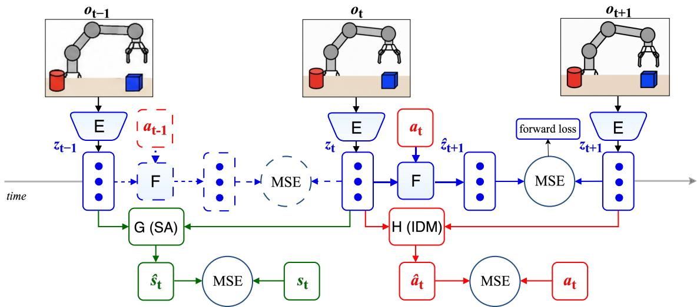
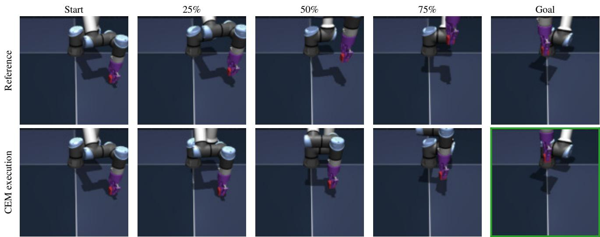
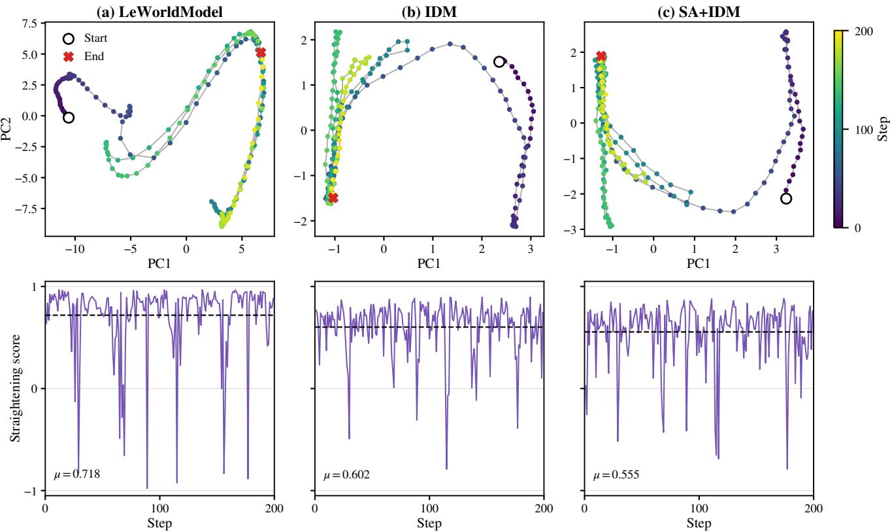
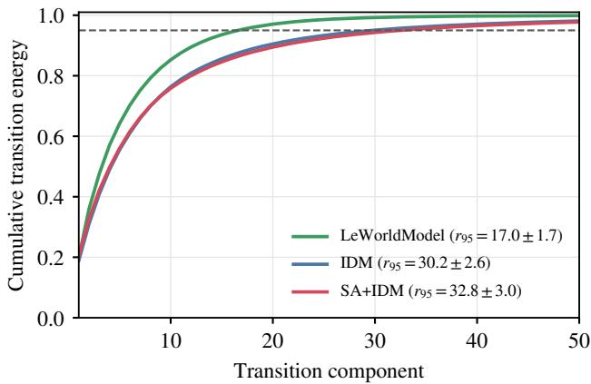

# Toward Physically Grounded JEPA World Models for Goal-Conditioned Robotic Planning

Muyuan Liu∗, Yue Huang∗, Zheng Liang, Xiang Gao†

GENISOM AI, Beijing, China

∗Equal contribution †Corresponding author: Xiang Gao (gao.xiang.thu@gmail.com)

Abstract— Action-conditioned JEPA world models enable planning toward visually specified goals without reconstructing future pixels, yet latent prediction alone does not explicitly encourage the learned representations to retain information relevant to robotic control. We introduce an end-to-end JEPA world model that augments latent prediction with inverse dynamics (IDM) and state alignment (SA). While inverse dynamics discourages latent collapse and makes latent transitions informative of the actions that produced them, state alignment grounds consecutive representations in their associated physical configuration and motion. Across four benchmark tasks, our model attains the highest success rates on TwoRoom (100%), PushT (98%), and OGBench-Cube (87%), while performing comparably to LeWorldModel on Reacher. Our ablation further shows that adding state alignment consistently improves planning success over IDM alone across all four tasks. Although LeWorldModel, our primary baseline, attains higher average straightening on OGBench-Cube, transition-subspace analysis shows that its transition energy is concentrated in a substantially lower-dimensional subspace. Our state-aligned model exhibits a higher effective transition dimension than LeWorldModel and improves planning over IDM alone, supporting state alignment as an effective complement to inverse dynamics for robotic planning.

## I. INTRODUCTION

World models have emerged as a promising paradigm for robotic autonomy by learning action-conditioned environment dynamics that support planning through imagined rollouts. Many visual world models [1], [2] train latent dynamics with pixel-level observation prediction or reconstruction objectives, which can be computationally demanding and require modeling appearance variations, such as texture, illumination, and sensor noise, that are either irrelevant or even detrimental to downstream control. Action-conditioned Joint-Embedding Predictive Architectures (JEPAs) [3] offer an appealing alternative by encoding raw observations into compact latent representations and predicting how these representations evolve under actions, without reconstructing pixels. Given a target representation encoded from a goal image, candidate action sequences are rolled out through the learned dynamics and evaluated against the target, enabling model-predictive control directly in latent space.

Learning a useful latent representation, however, remains a central challenge for JEPA-style world models, as the latent prediction objective alone admits a trivial solution that maps all observations to the same representation. Prior work addresses this issue using different learning strategies. DINO-WM [4] freezes a pretrained DINOv2 visual encoder [5] and learns action-conditioned dynamics over its patch-level features. This strategy avoids collapse without additional regularization, but relies on large-scale visual pretraining and computationally expensive patch-level rollouts. In contrast, LeWorldModel [6] stabilizes end-to-end learning by matching latent embeddings to an isotropic Gaussian with SIGReg [7]. While simple and effective, this distributional prior does not specify which aspects of the physical state should be retained in the representation for downstream control. PLDM [8] learns representations end-to-end through a composite objective that combines latent prediction with VICReg-style variance–covariance regularization [9], temporal smoothness, and inverse dynamics. In this formulation, inverse dynamics is one component of a broader regularization scheme. More recent approaches retain latent prediction while focusing the auxiliary objective on inverse dynamics: SMWM predicts the executed action from the concatenation of two consecutive latent representations [10], whereas Delta-JEPA [11] bases the prediction directly on their difference.

These action-recovery objectives make latent transitions informative of executed actions, but do not directly ground the same transitions in the associated physical configuration and motion. We investigate whether aligning latent representations with measured physical states can provide a complementary training signal for an end-to-end JEPA world model. Our method complements inverse dynamics (IDM) with a pair-based state-alignment (SA) objective: the former predicts executed actions, whereas the latter aligns consecutive latent representations with their corresponding measured physical states. We evaluate the resulting model on four goal-conditioned planning tasks and examine the temporal organization of its learned representations through straightening and transition-subspace analyses.

Our contributions are threefold:

(1) We introduce an end-to-end JEPA world model that aligns latent representations with measured physical states.

(2) Experiments across four benchmark tasks show that state alignment consistently improves planning success over inverse dynamics alone.

(3) Transition-subspace analysis reveals that higher temporal straightening, often regarded as desirable, can coincide with a substantially lower effective transition dimension and weaker planning performance.

  
Fig. 1. Overview of the proposed model. The encoder E maps observations to latent representations, and the action-conditioned predictor F models their evolution. The inverse-dynamics head H predicts the executed action from consecutive representations, while the state-alignment head G grounds them in measured physical states. The dashed branch denotes the corresponding prediction at the preceding time step.

## II. METHOD

## A. Offline Data

We consider a fixed offline dataset collected by a behavior policy. Let $\mathcal { D } = \{ \tau ^ { ( n ) } \} _ { n = 1 } ^ { N }$ denote the dataset. Each trajectory is written as $\tau = \left( o _ { 0 } , s _ { 0 } , a _ { 0 } , o _ { 1 } , s _ { 1 } , \dots , a _ { T - 1 } , o _ { T } , s _ { T } \right)$ Here, $o _ { t }$ is a visual observation at time $t , \ s _ { t }$ denotes the corresponding physical measurements, and $a _ { t }$ is an action chunk containing a fixed number of low-level actions executed between o and $o _ { t + 1 }$

## B. Model Architecture

Figure 1 summarizes our proposed model and its training framework. The backbone of our method is an actionconditioned JEPA world model [3], consisting of a visual encoder E and a latent predictor F. The latent encoding and action-conditioned prediction are given by

$$
z _ { t } = E ( o _ { t } ) ,\tag{1}
$$

$$
\hat { z } _ { t + 1 } = F ( z _ { t } , a _ { t } ) ,\tag{2}
$$

respectively. The directly encoded next-observation representation $z _ { t + 1 }$ 1 serves as the target in the latent prediction objective,

$$
\begin{array} { r } { \mathcal { L } _ { \mathrm { p r e d } } = \mathbb { E } _ { ( o _ { t } , a _ { t } , o _ { t + 1 } ) \sim \mathcal { D } } \left[ \left\| \hat { z } _ { t + 1 } - z _ { t + 1 } \right\| _ { 2 } ^ { 2 } \right] . } \end{array}\tag{3}
$$

This objective is optimized end-to-end, updating the visual encoder (E) and the latent predictor (F).

The latent prediction loss avoids reconstructing future pixels, but by itself admits a fully collapsed solution in which all observations are mapped to the same representation. To discourage this solution, we adopt an inverse-dynamics objective following prior work [8], [10]:

$$
\begin{array} { r } { \mathcal { L } _ { \mathrm { i d m } } = \mathbb { E } _ { ( o _ { t } , a _ { t } , o _ { t + 1 } ) \sim \mathcal { D } } \left[ \| H ( z _ { t } , z _ { t + 1 } ) - a _ { t } \| _ { 2 } ^ { 2 } \right] , } \end{array}\tag{4}
$$

where H predicts the executed action from two consecutive representations. This objective discourages full collapse because identical latent pairs across transitions restrict H to a constant-action predictor, whereas achieving an error below this constant-predictor baseline requires action-predictive variation. Gradients from ${ \mathcal { L } } _ { \mathrm { i d m } }$ therefore encourage E to distinguish latent pairs associated with different actions [10].

Inverse dynamics encourages latent pairs to be informative of executed actions, but does not directly anchor them to observed physical measurements. We therefore introduce a complementary state-alignment objective,

$$
\mathcal { L } _ { \mathrm { s a } } = \mathbb { E } _ { ( o _ { t - 1 } , o _ { t } , s _ { t } ) \sim \mathcal { D } } \left[ \| G ( z _ { t - 1 } , z _ { t } ) - s _ { t } \| _ { 2 } ^ { 2 } \right] ,\tag{5}
$$

where $s _ { t }$ denotes the available physical measurements. A consecutive latent pair is used because it provides the temporal context needed to align velocity measurements in addition to the instantaneous physical configuration. The full training objective is

$$
\begin{array} { r } { \mathcal { L } _ { \mathrm { t o t a l } } = \mathcal { L } _ { \mathrm { p r e d } } + \alpha \mathcal { L } _ { \mathrm { s a } } + \beta \mathcal { L } _ { \mathrm { i d m } } . } \end{array}\tag{6}
$$

Physical measurements provide training-only supervision; deployment performs planning entirely in latent space using E and F.

## C. Implementation

To instantiate the JEPA backbone described above, we follow the lightweight architecture of LeWorldModel [6]. The encoder is a randomly initialized ViT-Tiny/14 whose [CLS] token is projected to a 192-dimensional representation. The predictor is implemented as a six-layer causal Transformer operating on a context of up to three recent latent–action pairs. For stable regression, actions and Euclidean state quantities are standardized per dimension using dataset statistics, while angular state quantities are expressed in continuous coordinates rather than as raw angles to avoid wrap-around discontinuities. Each action chunk is then embedded into a 192-dimensional vector and incorporated at every predictor layer through zero-initialized adaptive layer normalization (AdaLN) [6]. The state-alignment and inversedynamics heads, G and H, are two-layer MLPs applied to concatenated representation pairs, with hidden dimensions 256 and 512, respectively. We optimize all components jointly using AdamW. We will release our code and evaluation configurations upon acceptance for reproducibility.

  
Fig. 2. Qualitative goal-conditioned planning on OGBench-Cube. Top: the reference trajectory between the fixed start and goal observations. Bottom: actual simulator observations obtained by executing CEM actions.

## D. Latent Planning

At deployment, the encoder E and predictor $F$ are held fixed. Given a current observation $o _ { t }$ and a goal image $o _ { g } ,$ the encoder produces their representations $z _ { t }$ and $z _ { g } .$ For a candidate action sequence $\mathbf { a } _ { t : t + K - 1 }$ , the predictor is rolled out recursively to obtain the terminal representation $\hat { z } _ { t + K } ( { \bf a } )$ Planning optimizes the sequence according to the terminal latent distance

$$
\mathbf { a } _ { t : t + K - 1 } ^ { * } = \arg \operatorname* { m i n } _ { \mathbf { a } _ { t : t + K - 1 } } \left\| \widehat { z } _ { t + K } ( \mathbf { a } ) - z _ { g } \right\| _ { 2 } ^ { 2 } .\tag{7}
$$

We solve this optimization using the Cross-Entropy Method (CEM) [12]. CEM repeatedly samples candidate action sequences, evaluates them through latent rollouts, and updates its sampling distribution using the elite candidates. The optimized sequence is then executed, after which planning is repeated from the updated observation until the goal is reached or the interaction budget is exhausted.

## III. EXPERIMENTS

## A. Experimental Setup

We adopt the four-task benchmark and evaluation protocol of LeWorldModel [6]: TwoRoom, Reacher, PushT, and OGBench-Cube. These tasks cover visual navigation, articulated reaching, planar object pushing, and robot-arm manipulation, respectively. For state alignment, we use the full physical state provided by each task as supervision. Following this protocol, we evaluate each of our variants on the same 50 fixed start–goal problems, with the goal

TABLE I  
GOAL-CONDITIONED PLANNING SUCCESS RATE (%). BASELINE MEAN VALUES ARE TAKEN FROM LEWORLDMODEL [6]; OUR RESULTS ARE AVERAGED OVER THREE INDEPENDENTLY TRAINED SEEDS, WITH 50 FIXED PLANNING PROBLEMS EVALUATED PER SEED. BEST RESULTS ARE SHOWN IN BOLD.
<table><tr><td>Method</td><td>TwoRoom Reacher PushT</td><td></td><td></td><td>OGB-Cube</td></tr><tr><td>DINO-WM [4]</td><td>100</td><td>79</td><td>74</td><td>86</td></tr><tr><td>PLDM [8]</td><td>97</td><td>78</td><td>78</td><td>65</td></tr><tr><td>LeWorldModel [6]</td><td>87</td><td>86</td><td>96</td><td>74</td></tr><tr><td>IDM</td><td>94</td><td>63</td><td>83</td><td>85</td></tr><tr><td>SA+IDM (Ours)</td><td>100</td><td>85</td><td>98</td><td>87</td></tr></table>

25 environment steps ahead and an interaction budget of 50 steps. Based on the planning success rate on the PushT validation split, we choose the tied auxiliary-loss weights α = β = 1.0 from {0.01, 0.1, 1.0} and use this setting for all four tasks.

## B. Planning Performance in Latent Space

We compare our method with DINO-WM [4], PLDM [8], and LeWorldModel [6] in Table I. Our method attains the highest success rates on TwoRoom, PushT, and OGBench-Cube, while performing comparably to LeWorldModel on Reacher. We further assess the contribution of state alignment using the IDM-only ablation $( \alpha ~ = ~ 0 , \beta ~ = ~ 1 . 0 )$ reported in Table I. Adding state alignment consistently improves planning success across all four tasks.

A successful OGBench-Cube trial provides a qualitative view of the resulting control behavior in Fig. 2. Starting from the given initial observation, the CEM-controlled simulator reaches the image-defined goal within the evaluation budget.

  
Fig. 3. Temporal straightening on a representative OGBench-Cube trajectory. Top: separate PCA projections of the encoded latent states, colored by time; circles and crosses mark the start and end. Bottom: local straightening scores, with dashed lines indicating trajectory means. All scores are computed in the full 192-dimensional latent space. The same qualitative pattern was observed across all sampled trajectories.

TABLE II  
TEMPORAL STRAIGHTENING ON OGBENCH-CUBE. VALUES ARE MEAN ± STANDARD DEVIATION OVER 100 FIXED TRAJECTORIES.
<table><tr><td>Model</td><td>Straightening score</td></tr><tr><td>LeWorldModel</td><td> $0 . 6 9 \pm 0 . 0 2 5$ </td></tr><tr><td>IDM</td><td> $0 . 6 2 \pm 0 . 0 2 9$ </td></tr><tr><td>SA+IDM</td><td> $0 . 5 5 \pm 0 . 0 3 4$ </td></tr></table>

## C. Temporal Straightening

Latent representations of temporally coherent physical trajectories are generally expected to evolve smoothly with locally consistent direction [13]. Temporal straightening quantifies this property through the alignment of consecutive latent displacements. For a latent trajectory $z _ { 1 : T _ { i } } ^ { ( i ) }$ , with $\Delta z _ { t } ^ { ( i ) } = z _ { t + 1 } ^ { ( i ) } - z _ { t } ^ { ( i ) }$ , the straightening score is defined as follows [14]:

$$
S _ { \mathrm { s t r a i g h t } } ^ { ( i ) } = \frac { 1 } { T _ { i } - 2 } \sum _ { t = 1 } ^ { T _ { i } - 2 } \frac { \left. \Delta z _ { t } ^ { ( i ) } , \Delta z _ { t + 1 } ^ { ( i ) } \right. } { \left\| \Delta z _ { t } ^ { ( i ) } \right\| _ { 2 } \left\| \Delta z _ { t + 1 } ^ { ( i ) } \right\| _ { 2 } } .\tag{8}
$$

Table II reports the mean and standard deviation of the straightening score over 100 sampled OGBench-Cube observation trajectories held fixed across models. The OGBench-Cube task is selected for this evaluation due to its rich

3D translational and rotational variation. We observe that adding state alignment to the IDM-only model lowers its mean straightening score. This decrease may arise because explicit physical-state supervision makes physical turns and curvature more strongly expressed in latent displacements, thereby reducing the cosine alignment between successive displacements.

LeWorldModel nevertheless attains the highest average straightening score despite its lower planning success on OGBench-Cube. To inspect this discrepancy at the trajectory level, Fig. 3 visualizes the latent trajectories and local straightening scores for a representative episode. The top row shows the temporal evolution of the encoded trajectories in two-dimensional PCA projections. Despite the arbitrary orientation of the independently fitted PCA bases, IDM and SA+IDM trace qualitatively similar global paths. Direction changes visible in the projections are reflected in decreases in the corresponding local straightening scores. LeWorldModel remains highly aligned for most steps but exhibits several isolated near-reversals toward −1, whereas IDM and SA+IDM exhibit more distributed and less extreme directional changes.

We go one step further and use transition-subspace analysis to characterize the dominant directions of temporal variation in latent space. For each of the same 100 trajectories, we apply an uncentered SVD to $\Delta z _ { t }$ and compute $r _ { 9 5 }$ , which is the number of components required to retain 95% of the transition energy. Fig. 4 reports the mean cumulative energy profiles across trajectories. Across the 100 trajectories, the mean $r _ { 9 5 }$ is 17 for LeWorldModel, compared with 30.2 for IDM and 32.8 for SA+IDM. LeWorldModel’s higher straightening is therefore associated with a substantially smaller effective transition dimension. This behavior is clearest in the rank-one limit, where successive nonzero displacements can only be parallel or antiparallel, so rare directional reversals produce a majority of scores near +1 and a few near −1, yielding a high average with a polarized distribution. This argument is consistent with the polarized local straightening-score profile observed for LeWorldModel in Fig. 3.

  
Fig. 4. Transition-subspace analysis over 100 fixed OGBench-Cube trajectories. Curves show mean cumulative transition energy under an uncentered SVD of $\Delta z _ { t }$ . Here, r95 is the number of components required to retain 95% of the energy.

## IV. CONCLUSION

We presented a JEPA-style world model that combines inverse dynamics with pair-based state alignment using available physical measurements. Across four goal-conditioned tasks, state alignment consistently improves planning success over the IDM-only ablation while remaining competitive with published baselines.

Although our method exhibits lower average temporal straightening than LeWorldModel, our transition-subspace analysis shows that LeWorldModel’s higher straightening is associated with a substantially lower effective transition dimension. This finding suggests that average straightening alone can conceal the concentration of temporal variation in a low-dimensional subspace. SIGReg regularizes the embedding distribution across samples, whereas our analysis reveals that variation along trajectories can remain concentrated in a restricted transition subspace. Future work will investigate combining this distributional safeguard with physical grounding of latent transitions.

## ACKNOWLEDGMENT

The authors thank Ruiqing Chen for insightful discussions.

## REFERENCES

[1] D. Hafner et al., “Learning latent dynamics for planning from pixels,” in Proceedings of the 36th International Conference on Machine Learning, ser. Proceedings of Machine Learning Research, vol. 97, 2019, pp. 2555–2565.

[2] D. Hafner, T. Lillicrap, J. Ba, and M. Norouzi, “Dream to control: Learning behaviors by latent imagination,” in International Conference on Learning Representations, 2020.

[3] Y. LeCun, “A path towards autonomous machine intelligence,” Open-Review, 2022, version 0.9.2.

[4] G. Zhou, H. Pan, Y. LeCun, and L. Pinto, “DINO-WM: World models on pre-trained visual features enable zero-shot planning,” in Proceedings of the 42nd International Conference on Machine Learning, ser. Proceedings of Machine Learning Research, vol. 267, 2025, pp. 79 115–79 135.

[5] M. Oquab et al., “DINOv2: Learning robust visual features without supervision,” Transactions on Machine Learning Research, 2024.

[6] L. Maes, Q. Le Lidec, D. Scieur, Y. LeCun, and R. Balestriero, “LeWorldModel: Stable end-to-end joint-embedding predictive architecture from pixels,” arXiv preprint arXiv:2603.19312, 2026.

[7] R. Balestriero and Y. LeCun, “LeJEPA: Provable and scalable self-supervised learning without the heuristics,” arXiv preprint arXiv:2511.08544, 2025.

[8] U. Sobal, W. Zhang, K. Cho, R. Balestriero, T. G. J. Rudner, and Y. LeCun, “Learning from reward-free offline data: A case for planning with latent dynamics models,” in Advances in Neural Information Processing Systems, vol. 38, 2025, pp. 43 905–43 941.

[9] A. Bardes, J. Ponce, and Y. LeCun, “VICReg: Variance-invariancecovariance regularization for self-supervised learning,” in International Conference on Learning Representations, 2022.

[10] P. Ivashkov, R. Balestriero, and B. Scholkopf, “Sensorimotor world¨ models: Perception for action via inverse dynamics,” arXiv preprint arXiv:2606.20104, 2026.

[11] Z. Zhang et al., “Delta-JEPA: Learning action-sensitive world models via latent difference decoding,” arXiv preprint arXiv:2606.31232, 2026.

[12] R. Y. Rubinstein and D. P. Kroese, The Cross-Entropy Method: A Unified Approach to Combinatorial Optimization, Monte-Carlo Simulation and Machine Learning, ser. Information Science and Statistics. New York, NY, USA: Springer, 2004.

[13] O. J. Henaff, R. L. T. Goris, and E. P. Simoncelli, “Perceptual´ straightening of natural videos,” Nature Neuroscience, vol. 22, no. 6, pp. 984–991, 2019.

[14] Y. Wang et al., “Temporal straightening for latent planning,” in Proceedings of the 43rd International Conference on Machine Learning, 2026.