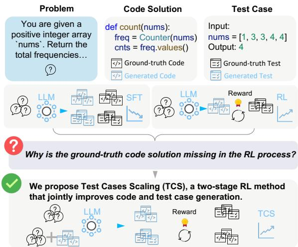
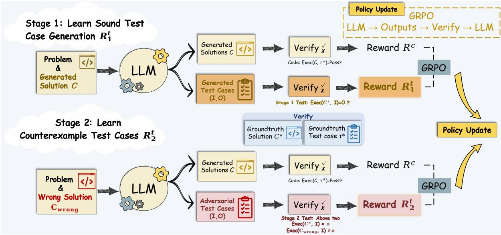
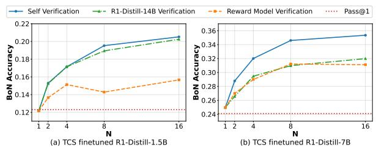
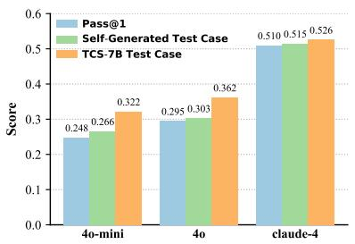
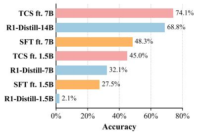
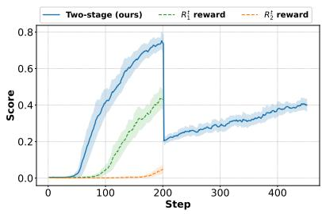
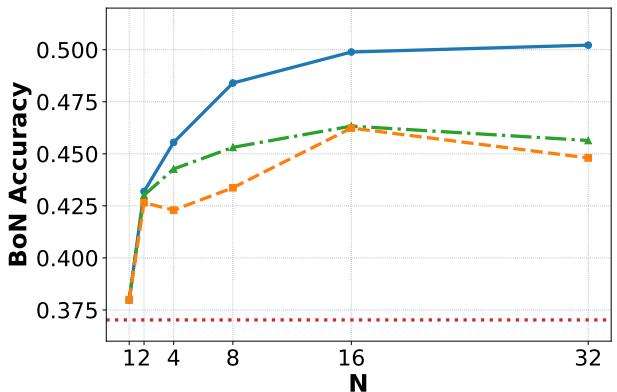
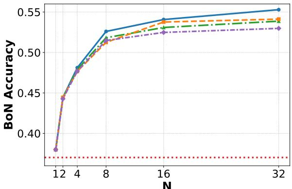

# Two-Stage Reinforcement Learning for Sound and Adversarial Test Generation in Code LLMs

Jiacheng Xu1,2, Wentao Zhang1, Zhiyi Lyu1, Fuxiang Zhang1,2,

Chaojie Wang2, Yang Liu2, Bo An1

1Nanyang Technological University, Singapore

2Skywork AI

jiacheng005@e.ntu.edu.sg, boan@ntu.edu.sg

## Abstract

Reinforcement learning (RL) has substantially advanced code generation with large language models (LLMs) through executable feedback. The feedback for coding problems mainly comes from specific test cases, where highquality test cases are often scarce since they should be both sound and discriminative. We thus turn to study the auto-generation of test cases using the learned model. We find this is naturally an adversarial RL problem: the model is expected to generate effective test cases as counterexamples, depending on the solver’s current failure modes. We propose Test Cases Scaling (TCS), a two-stage RL framework for effective test generation. Both stages train a test generator from a rolling policy-aligned buffer: Stage 1 generates tests consistent with the reference solution, and Stage 2 restricts the buffer to current failure modes and learns counterexample tests. Across TACO and LiveCodeBench, TCS improves both pass@1 and inference-time answer selection according to generated tests. We find the learned test generator also enables effective selection among other LLM outputs.

## 1 Introduction

Code generation is one of the most consequential applications of large language models (LLMs), improving developer productivity and lowering barriers for non-experts (Dong et al., 2025). Modern code LLMs have moved far beyond heuristic systems (Gulwani, 2010; Roziere et al., 2023; Hui et al., 2024; Dong et al., 2025), and reinforcement learning (RL) has become a particularly effective post-training tool because candidate programs can be verified by execution on test cases, often outperforming purely supervised tuning based on costly demonstrations (Shojaee et al., 2023; Le et al., 2022; Luo et al., 2025).

As code models improve, the bottleneck shifts from producing plausible solutions to verifying which candidate is actually correct. This makes inference-time self-verification attractive: generate tests, execute candidate programs, and select the program with the strongest empirical support. For code tasks, this is appealing because it relies on executable evidence rather than a generic scalar reward. But test-based selection helps only when generated tests are reliable and targeted. Unsound tests can mis-rank candidates, while weak tests fail to expose subtle bugs. In our experiments, selfgenerated tests help substantially, yet curated public tests can still outperform them when used alone, showing that the challenge is not to generate more tests, but better ones.

  
Figure 1: TCS enables adversarial test case generation using ground-truth solutions.

This challenge explains why RL is useful here beyond supervised imitation. Test generation is a multi-solution, utility-driven objective: many tests can be correct, as judged by execution rather than exact target matching. The objective is nonstationary because informative tests depend on the solver’s current failure modes. Whereas code generation can optimize against a fixed test suite, test generation must produce tests that are sound for a reference solution and discriminative against plausible incorrect code. Optimizing only for soundness yields trivial tests, while counterexample rewards are sparse and unstable from scratch, making reward design particularly important (Chen et al., 2024; Fu et al., 2025).

We therefore study an execution-verifiable posttraining setting in which a ground-truth solution is available to validate generated tests. This lets us separate two objectives that are easy to conflate: soundness control through ground-truth verification and candidate-conditioned adversariality against the model’s evolving failure modes. This setting provides a clean test bed for understanding what makes learned test generation useful. Based on this view, we propose Test Cases Scaling (TCS), a two-stage RL framework that jointly trains code generation and test generation with stage-specific rewards and a rolling policyaligned buffer. Stage 1 learns tests that agree with the ground-truth solution, while Stage 2 learns candidate-conditioned counterexample tests that pass the reference solution but fail plausible incorrect programs. At inference time, the learned verifier generates tests for candidate programs, and we select the candidate with the highest pass-count across pooled tests.

Experiments on TACO and LiveCodeBench show consistent gains in both training-time and inference-time performance. The paper makes three main contributions:

• We argue that effective test generation for code LLMs requires both soundness control and candidate-conditioned adversariality, and formulate this view in an execution-verifiable post-training setting where generated tests can be checked against a ground-truth solution.

• We propose Test Cases Scaling (TCS), a two-stage RL framework that instantiates these principles: Stage 1 learns ground-truthverified tests, and Stage 2 learns candidateconditioned counterexample tests via stagespecific rewards and a policy-aligned buffer.

• We provide theoretical and empirical evidence for test-based inference-time scaling. We derive an exponential reliability bound for pass-count selection under self-generated tests (Sec. 3.4), and experiments on TACO and LiveCodeBench show improvements over joint SFT, code-only $\mathrm { R L , }$ and test-only RL.

The learned verifier can also improve the selection of outputs from strong external LLMs.

## 2 Background

## 2.1 Reinforcement Learning

Reinforcement learning (RL) fine-tunes a policy $\pi _ { \theta }$ to maximize task reward. We use Group Relative Policy Optimization (GRPO) (Shao et al., 2024), which avoids a separate value model by using the average reward of multiple outputs from the same prompt as a baseline. For each prompt x, GRPO samples a group of G outputs $\{ y _ { i } \} _ { i = 1 } ^ { G }$ and computes group-relative advantages:

$$
\begin{array} { l } { \displaystyle \mathcal { I } ( \theta ) = \mathbb { E } _ { x , \mathbf { y } } \left[ \frac { 1 } { G } \sum _ { i = 1 } ^ { G } \mathrm { m i n } \Big ( \rho _ { i } A _ { i } , ~ \bar { \rho } _ { i } A _ { i } \Big ) \right. } \\ { \displaystyle \left. - \beta D _ { \mathrm { K L } } ( \pi _ { \theta } \parallel \pi _ { \mathrm { r e f } } ) \right] . } \end{array}\tag{1}
$$

where the expectation abbreviates $x \sim \mathcal { D }$ and $\mathbf { y } ~ = ~ ( y _ { 1 } , \dots , y _ { G } ) \sim \pi _ { \theta _ { \mathrm { o l d } } } ^ { G } ( \cdot ~ | ~ x )$ . Here $\rho _ { i } \stackrel { \triangle } { = }$ $\frac { \pi _ { \theta } ( y _ { i } | \boldsymbol { x } ) } { \pi _ { \theta _ { \mathrm { o l d } } } ( y _ { i } | \boldsymbol { x } ) }$ denotes the importance sampling ratio, $\bar { \rho } _ { i } \triangleq \mathrm { c l i p } ( \rho _ { i } , 1 - \epsilon , 1 + \epsilon )$ , ϵ is the clipping range, β controls the strength of KL regularization, and $D _ { \mathrm { K L } } ( \cdot | | \cdot )$ is the KL-divergence. The advantage $A _ { i }$ is defined as

$$
A _ { i } \triangleq { \frac { r _ { i } - \operatorname { m e a n } ( r _ { 1 } , \dots , r _ { G } ) } { \operatorname { s t d } ( r _ { 1 } , \dots , r _ { G } ) } } ,
$$

where $r _ { i }$ is the reward on response $y _ { i }$

## 2.2 Code and Test Case Generation

The task of code generation is to produce a program C from a natural-language problem description P that satisfies the specification. Because many problems admit multiple correct implementations, candidate programs are verified against test suites $\mathcal { T } = \{ ( I _ { i } , O _ { i } ) \} _ { i = 1 } ^ { m }$ . In RL for code generation, a standard reward function $R ^ { c }$ evaluates whether a generated program $C$ passes an assumed ideal test suite $\tau ^ { * }$ (Yu et al., 2025a):

$$
R ^ { c } ( C , T ^ { * } ) = \left\{ { \begin{array} { l l } { 1 , } & { { \mathrm { i f } } \forall ( I _ { i } , O _ { i } ) \in T ^ { * } : } \\ & { { \mathrm { E x e c } } ( C , I _ { i } ) = O _ { i } } \\ { 0 , } & { { \mathrm { o t h e r w i s e } } . } \end{array} } \right.\tag{2}
$$

Thus, test quality is central to both training and evaluation. A useful test suite should be (i) sound for the reference solution and (ii) sufficiently discriminative to expose failures of plausible incorrect implementations. Generating tests that satisfy both properties is precisely the challenge we target in TCS. This mirrors competitive programming practice, where constructing tests that break seemingly correct solutions is itself a core skill rather than a mere evaluation artifact.

  
Figure 2: Overview of the two-stage training process in Test Cases Scaling (TCS).

## 3 Test Cases Scaling (TCS)

## 3.1 Problem Formulation

Each training instance consists of a problem description P, a ground-truth solution $C ^ { * }$ , and a test suite $\mathcal { T } = \{ ( I _ { i } , O _ { i } ) \} _ { i = 1 } ^ { m }$ . This setup assigns two distinct roles to the same LLM:

• Solver: Given a problem description P, the solver aims to generate code C that passes all test cases in the test suite $\mathcal { T } , \mathrm { i . e . , } \forall ( I _ { i } , O _ { i } ) \in$ $\mathcal { T } : \mathrm { E x e c } ( C , I _ { i } ) = O _ { i }$

• Verifier: Given a problem description P and a candidate program C, the verifier aims to generate test cases $( I _ { v } , O _ { v } )$ that are sound under $C ^ { * } \stackrel { } { } ( \mathrm { i } . \mathrm { e } .$ , Exec $( C ^ { * } , I _ { v } ) ~ = ~ O _ { v } )$ and discriminative for incorrect candidates (i.e., Exec $( C , I _ { v } ) \neq O _ { v }$ when C is wrong).

Unlike RL pipelines that optimize only the solver, TCS explicitly trains the same model as a verifier. The ground-truth solution provides a clean signal for soundness, while the candidate program C defines the adversarial target. This shared-policy setup matters: the verifier is not an external checker, but a capability of the same model whose candidates it later evaluates. Verifier training is therefore part of code understanding: to produce sound counterexamples, the model must reason jointly about specifications, outputs, and bug patterns. This helps both during training, where test generation sharpens reasoning about corner cases, and during inference, where the verifier ranks candidates via self-generated tests (Sec. 3.3).

## 3.2 RL Training

RL is well suited to this setting because execution provides direct utility feedback for a multi-solution objective. But reward design is crucial, and test generation is harder than code generation because a useful test must be both sound for the reference solution and adversarial against plausible incorrect code. Optimizing both at once is brittle: rewards that ignore soundness invite reward hacking, while rewards that demand full counterexamples from the start are too sparse to learn from. TCS therefore uses a staged verifier curriculum: Stage 1 learns soundness with dense feedback, and Stage 2 learns candidate-conditioned counterexamples against incorrect solutions.

We jointly train code generation and test generation (Figure 2) with a single shared policy by mixing prompts from the code dataset D and verifier prompts constructed online from a policyaligned buffer B. We update the policy using GRPO (Eq. (1); Appendix Algorithm 1) with $R ^ { c }$ for solver rollouts and stage-specific verifier rewards $R _ { 1 } ^ { t } \left( \mathrm { E q . } \left( 3 \right) \right) / R _ { 2 } ^ { t } \left( \mathrm { E q . } \left( 4 \right) \right)$ for verifier rollouts. Generated tests train the verifier and support inference-time selection, while solver rollouts are scored only by dataset tests. This joint optimization couples the solver and verifier: solver rollouts populate B with the policy’s current behavior, and verifier rollouts learn to produce tests that are first reliable and then increasingly targeted to those evolving failure modes. Unlike fixed offline supervision, this online RL loop lets the verifier track the solver’s moving error distribution.

## 3.2.1 Policy-Aligned Buffer

To learn candidate-conditioned tests, verifier prompts must reflect the solver’s current failure modes rather than a static offline collection of code. We therefore dynamically construct test-generation prompts from solver outputs produced online during training. Outputs that meet stage-specific criteria are collected into a rolling buffer B, which serves as the reservoir for verifier instances. To maintain diversity and alignment with the current policy, we retain only items from the most recent $T _ { b }$ training steps. Even in Stage 1, where the reward depends only on soundness, conditioning on current code helps the verifier learn candidate-specific contexts and keeps the prompt distribution consistent with Stage 2. The full test-generation prompt template is provided in Appendix E.

## 3.2.2 Stage 1 Training (Soundness)

Stage 1 controls soundness. For a ground-truth solution $C ^ { * }$ and a generated test case $( I _ { g } , O _ { g } )$ we assign reward 1 if Exec $( C ^ { * } , I _ { g } ) \ : = \ : O _ { g }$ and 0 otherwise. To prevent exact reuse of example tests from the prompt, we additionally require $( I _ { g } , O _ { g } ) \notin { \mathcal { T } } _ { \mathrm { e x a m p l e } } ,$ yielding $R _ { 1 } ^ { t }$ :

$$
R _ { 1 } ^ { t } ( I _ { g } , O _ { g } ) = \left\{ \begin{array} { l l } { 1 , } & { \mathrm { i f ~ E x e c } ( C ^ { * } , I _ { g } ) = O _ { g } } \\ & { \mathrm { a n d } \left( I _ { g } , O _ { g } \right) \notin { \mathcal { T } } _ { \mathrm { e x a m p l e } } } \\ { 0 , } & { \mathrm { o t h e r w i s e } . } \end{array} \right.\tag{3}
$$

where $\mathcal { T } _ { \mathrm { e x a m p l e } }$ denotes the example test cases in the problem description. This filter is deliberately conservative: it blocks exact copying, while the main guardrail remains execution-based verification against $C ^ { * }$

During Stage 1, B admits executable solver outputs (e.g., no syntax errors or timeouts), exposing the verifier to diverse, policy-aligned code contexts without requiring strong adversarial targeting. Stage 1 ends when the verifier reaches a predefined success threshold (Appendix A), after which we transition to Stage 2. Intuitively, Stage 1 reduces the soundness error of generated tests before optimizing for harder counterexamples.

## 3.2.3 Stage 2 Training (Counterexample)

While $R _ { 1 } ^ { t }$ promotes soundness, it can still encourage trivial tests with little discriminative power. At the Stage 1→Stage 2 transition, we clear B and thereafter admit only executable but incorrect candidates, defined as programs that fail at least one dataset test case in $\tau$ . Stage 2 then trains the verifier to generate candidate-conditioned counterexamples: tests that pass $C ^ { * }$ but fail an incorrect candidate $C _ { \mathrm { w r o n g } }$ sampled from $\boldsymbol { B }$ (Sec. 3.2.1). We define the adversarial reward $R _ { 2 } ^ { t }$ as:

$$
\begin{array} { r l } & { R _ { 2 } ^ { t } ( I _ { g } , O _ { g } , C ^ { * } , C _ { \mathrm { w r o n g } } ) } \\ & { \quad = \left\{ \begin{array} { l l } { 1 , } & { \mathrm { i f } \mathrm { E x e c } ( C ^ { * } , I _ { g } ) = O _ { g } } \\ & { \mathrm { a n d } \mathrm { E x e c } ( C _ { \mathrm { w r o n g } } , I _ { g } ) \neq O _ { g } } \\ & { \mathrm { a n d } ( I _ { g } , O _ { g } ) \notin { \mathcal T } _ { \mathrm { e x a m p l e } } } \\ { 0 , } & { \mathrm { o t h e r w i s e } . } \end{array} \right. } \end{array}\tag{4}
$$

Despite being well motivated, $R _ { 2 } ^ { t }$ can be extremely sparse early in training, especially for models with weak test-generation ability. For models like R1-Distill-Qwen-1.5B, directly optimizing $R _ { 2 } ^ { t }$ yields near-zero rewards for long periods because producing a counterexample test requires both (i) generating a sound $( I _ { g } , O _ { g } )$ and (ii) targeting a non-trivial failure mode of $C _ { \mathrm { w r o n g } }$ . This sparsity motivates the Stage 1→Stage 2 curriculum above.

Because $R _ { 2 } ^ { t }$ explicitly conditions on $C _ { \mathrm { w r o n g } } ,$ Stage 2 incentivizes targeted counterexamples rather than generic corner cases. In this sense, Stage 1 and Stage 2 instantiate the two principles highlighted in the introduction: Stage 1 controls soundness through ground-truth verification, while Stage 2 adds candidate-conditioned adversariality.

## 3.3 Inference-time Scaling

Conventional inference-time scaling often samples multiple candidates and uses an external reward model to rerank. For code generation, we instead scale by generating and executing self-generated tests: we use the same test generation mechanism as in training to construct prompts conditioned on $( P , C _ { i } )$ , and then select the candidate that best satisfies the resulting tests. This selection rule is only useful when the pooled tests are sufficiently sound and sufficiently discriminative, which is exactly what TCS is designed to improve. Given a problem, we sample N candidate code solutions $\{ C _ { i } \} _ { i = 1 } ^ { N }$

For each $C _ { i } .$ , we generate M test cases conditioned on $( P , C _ { i } )$ , yielding a pooled set of $K = N \times M$ self-generated tests. We execute each $C _ { i }$ on the pooled tests and select the candidate with the highest pass-count. Formally, our selection criterion can be expressed as:

$$
\begin{array} { l } { { \displaystyle C _ { \mathrm { s e l e c t e d } } = \operatorname * { a r g m a x } _ { C _ { i } \in \{ C _ { 1 } , C _ { 2 } , \ldots , C _ { N } \} } S ( C _ { i } ) } , } \\ { { \displaystyle S ( C _ { i } ) = \sum _ { j = 1 } ^ { N \times M } \mathbb { I } [ \operatorname { E x e c } ( C _ { i } , I _ { j } ) = O _ { j } ] } . } \end{array}\tag{5}
$$

where $S ( C _ { i } )$ is the pass-count for the i-th candidate code solution, $\{ ( \hat { I _ { j } } , \hat { O _ { j } } ) \} _ { j = 1 } ^ { N \times M }$ denotes the pooled self-generated test cases, and I is the indicator function that equals 1 when the execution matches the expected output and 0 otherwise.

## 3.4 Theoretical Analysis

Eq. (5) selects the candidate with the largest passcount under the pooled self-generated tests. We formalize when this selection becomes reliable as the number of tests increases.

Let $\mathcal { C } = \{ C _ { 1 } , \ldots , C _ { N } \}$ be the candidate set, and let ${ \mathcal { C } } ^ { - } \subset { \mathcal { C } }$ denote the set of incorrect candidates. Assume that C contains at least one correct candidate, i.e., ${ \mathcal C } \setminus { \mathcal C } ^ { - } \ne \emptyset . \mathrm { ~ H ~ } { \mathcal C } ^ { - } = \emptyset .$ , incorrect selection is impossible and the claim is trivial. We henceforth consider the nontrivial case ${ \mathcal { C } } ^ { - } \neq \emptyset$ . For each candidate $C _ { i }$ , we independently sample M tests from the conditional test generator $G ( \cdot \mid P , C _ { i } )$ , yielding a stratified pooled test set $\mathcal { T } = \{ ( I _ { i , m } , \bar { O _ { i , m } } ) \} _ { i = 1 , m = 1 } ^ { N , M }$ of size $K = N \times M$ Throughout the analysis, generated test inputs are assumed to satisfy the input constraints of $P$ . We use the induced uniform pooled-mixture distribution, which first samples $i \sim \operatorname { U n i f } ( \{ 1 , . . . , N \} )$ and then samples from $G ( \cdot \mid P , C _ { i } )$ , only to define the aggregate quantities α and δ below.

Definition 1 (Soundness error and counterexample rate). Let $( I , O )$ be a random test drawn from the pooled-mixture distribution above. Define the soundness error

$$
\alpha \triangleq \operatorname* { P r } [ \operatorname { E x e c } ( C ^ { * } , I ) \neq O ] ,
$$

andfor any incorrect candidate $C \in { \mathcal { C } }$ − define the counterexample rate

$$
\begin{array} { r } { \delta ( C ) \triangleq \operatorname* { P r } \left[ \overset { \mathrm { E x e c } ( C ^ { * } , I ) = O } { \underset { C \in \mathcal { C } ^ { - } } { \bigwedge } } \right] , \hfill } \\ { \delta \triangleq \underset { C \in \mathcal { C } ^ { - } } { \underline { { \operatorname* { m i n } } } } \delta ( C ) . \hfill } \end{array}
$$

α measures how often the test generator assigns an incorrect label to $C ^ { * }$ , while $\delta$ measures how often a test makes an incorrect candidate fail while $C ^ { * }$ passes.

Assumption 1 (Independent stratified sampling and net-discriminativeness). Conditioned on the fixed candidate set ${ \mathcal { C } } ,$ the stratified tests $\{ ( I _ { i , m } , O _ { i , m } ) \} _ { i = 1 , m = 1 } ^ { N , M }$ are independent, and $\delta >$ α under the induced pooled-mixture distribution.

Proposition 1 (Exponential reliability of pass– count selection). Under Assumption 1, the inference-time rule in Eq. (5) selects an incorrect candidate with probability at most

$$
\begin{array} { l } { \displaystyle \operatorname* { P r } \left[ C _ { s e l e c t e d } \in \mathcal { C } ^ { - } \right] } \\ { \displaystyle \leq ( N - 1 ) \exp \left( - \frac { K ( \delta - \alpha ) ^ { 2 } } { 2 } \right) . } \end{array}
$$

Intuitively, each additional test case changes the pass-count gap between a correct and incorrect candidate by at most ±1. When tests are netdiscriminative $( \delta > \alpha )$ , the expected gap grows linearly with K and concentrates by Hoeffding/Chernoff, yielding an exponentially small mis-selection probability. The complete proof is provided in $\mathsf { A p - }$ pendix B.

Interpretation and connection to two-stage training. The bound in proposition 1 identifies two control knobs for inference-time scaling: the number of tests K and the margin $( \delta - \alpha )$ . Stage 1 (Eq. (3)) is designed to reduce α by rewarding tests consistent with $C ^ { * }$ , while Stage 2 (Eq. (4)) is designed to increase δ by rewarding counterexample tests that fail incorrect solutions while passing $C ^ { * }$ This motivates the decoupled ablations in Appendix Table 4.

## 4 Experiments

## 4.1 Experimental Setup

Our method assumes an execution-verifiable setting: each training example contains a problem description, a ground-truth solution, and reliable test cases, so generated tests can be checked during post-training. We use TACO (Li et al., 2023) for training and evaluation, filtering its 25,433 problems down to 6,318 curated instances with adequate test coverage and at least one Python solution that passes all cases. We evaluate on the TACO validation set (1,000 problems) and LiveCodeBench (Jain et al., 2025). The Stage 1→Stage 2 switch is a fixed hard transition aligned with roughly 0.75 trainingbatch test accuracy (200 steps for 1.5B, 40 for 7B), and inference-time selection uses M = 1 generated test per candidate. Full details are deferred to Appendix A.

<table><tr><td></td><td colspan="2">TACO</td><td colspan="2">LiveCodeBench</td><td></td></tr><tr><td>Model</td><td>w/o pub</td><td>w/ pub</td><td>w/o pub</td><td>w/ pub</td><td>Avg.</td></tr><tr><td colspan="6">DeepSeek-R1-Distill-Qwen-1.5B</td></tr><tr><td>Base Model</td><td>5.63</td><td></td><td></td><td>14.38</td><td>10.01</td></tr><tr><td>+ Reward Model</td><td>12.70</td><td>14.60</td><td>23.30</td><td>30.11</td><td>20.18</td></tr><tr><td>+ Self-Generated Test Cases</td><td>5.78</td><td>13.91</td><td>22.00</td><td>30.09</td><td>17.95</td></tr><tr><td colspan="6">SFT Model 9.43</td></tr><tr><td>+ Reward Model</td><td>14.32</td><td>16.78</td><td>23.67</td><td>17.21 32.45</td><td>13.32 21.81</td></tr><tr><td>+ Self-Generated Test Cases</td><td>15.12</td><td>16.23</td><td>24.33</td><td>31.89</td><td>21.89</td></tr><tr><td>RL using TCS Training</td><td>12.31</td><td></td><td></td><td></td><td></td></tr><tr><td>+ Reward Model</td><td></td><td>23.17</td><td>24.01</td><td>20.63</td><td>16.47</td></tr><tr><td>+ Self-Generated Test Cases</td><td>15.66 20.52</td><td>25.18</td><td>27.47</td><td>37.99 38.90</td><td>25.21 28.02</td></tr><tr><td colspan="6">DeepSeek-R1-Distill-Qwen-7B</td></tr><tr><td>Base Model</td><td>14.36</td><td></td><td></td><td>28.56</td><td>21.46</td></tr><tr><td>+ Reward Model</td><td>24.87</td><td>26.98</td><td>42.65</td><td>46.24</td><td>35.19</td></tr><tr><td>+ Self-Generated Test Cases SFT Model</td><td>18.67</td><td>26.02</td><td>43.01</td><td>46.15</td><td>33.46</td></tr><tr><td colspan="6">18.92</td></tr><tr><td>+ Reward Model</td><td>27.45</td><td>29.67</td><td>43.23</td><td>32.14 48.91</td><td>25.53 37.32</td></tr><tr><td>+ Self-Generated Test Cases</td><td>27.32</td><td>29.78</td><td>44.67</td><td>47.82</td><td>37.40</td></tr><tr><td colspan="6">RL using TCS Training 24.09</td></tr><tr><td>+ Reward Model</td><td>31.11</td><td>37.67</td><td>43.01</td><td>37.03 53.40</td><td>30.56 41.30</td></tr><tr><td>+ Self-Generated Test Cases</td><td>35.35</td><td>39.40</td><td>48.79</td><td>54.75</td><td>44.57</td></tr></table>

Table 1: Performance on TACO and LiveCodeBench.

## 4.2 Main Results

We evaluate DeepSeek-R1-Distill-Qwen models (1.5B and 7B) in three settings: the base model, an offline joint code–test SFT baseline, and TCS. The SFT baseline uses the same training problems as TCS with R1-Distill-Qwen-32B sample generation, following Sol-Ver (Lin et al., 2025): code supervision comes from teacher samples that pass the reference tests, and test supervision comes from candidate-conditioned, ground-truth-verified cases that expose the paired incorrect code sample. Thus, the baseline already receives execution-verified adversarial supervision, but only through a fixed offline dataset rather than TCS’s policy-aligned online updates. In TCS, we enter Stage 2 once testgeneration accuracy exceeds a threshold.

Table 1 reports pass@1 (16 samples on TACO and 32 on LiveCodeBench) and Best-of-N selected by either reward-model ranking or self-generated tests (N = 16 for TACO, N = 32 for Live-CodeBench, and M = 1 generated test per candidate). We use InternLM2-7B-reward (Cai et al., 2024) and the CodeT (Chen et al., 2023) pipeline for these two selection rules, both with and without public test cases.

Table 1 summarizes both training-time and inference-time performance. TCS improves pass@1 for both 1.5B and 7B models relative to the base and joint-SFT baselines, showing that verifier training helps not only reranking but also the solver itself. More importantly, TCS yields the strongest gains when self-generated tests are used for selection, indicating that the learned verifier becomes materially more useful after training. Since the joint-SFT baseline already receives candidateconditioned, ground-truth-verified adversarial supervision offline, this gap reflects the value of online RL rather than merely better labels.

The table clarifies why soundness control matters. For the base model, self-generated tests are often weaker than reward-model ranking, reflecting unreliable test generation. SFT narrows this gap but still leaves test-based selection inconsistent. TCS changes this pattern: with matched backbones, self-generated tests become competitive with or stronger than reward-model ranking, especially without public test cases, when selection relies almost entirely on the learned verifier.

On LiveCodeBench, the 7B base model improves from a pass@1 of 28.56 to 43.01 with selfgenerated test selection at BoN-32. Under the same protocol, curated public tests alone reach 45.99, while combining public and self-generated tests works best at 46.15. Self-generated tests therefore provide substantial value without automatically surpassing curated tests; this is precisely where soundness control matters. TCS addresses this with Stage 1 for reliability and Stage 2 for candidateconditioned counterexamples. Appendix Figure 5 extends this comparison across sample counts, with and without public test cases, and shows the same pattern: self-generated tests help most when they complement reliable filtering signals rather than replace them blindly.

Importantly, these gains do not come from just any external test generator. Under the same inference-time budget, tests generated by CodeRM-8B (Ma et al., 2025) yield weaker filtering performance than both reward-model ranking and our self-generated tests (Appendix C.6).

Joint vs. decoupled training. To separate the effect ofjoint training from generic RL gains, we compare TCS with two decoupled baselines on the same R1-Distill-Qwen-1.5B backbone: codeonly RL (Code-RL) and test-only RL (Test-RL). Appendix Table 4 reports pass@1 and no-publictest selection results.

These results separate solver-side from verifierside RL. Code-RL improves pass@1 over the base model, but adds little under “+TC,” suggesting better solutions without a much better verifier. In contrast, Test-RL yields a stronger verifier: although its direct pass@1 remains modest, its self-generated tests produce much larger gains with “+TC,” consistent with a higher counterexample rate δ. Joint TCS training achieves both the best training-time performance and the largest inference-time gains under self-generated test selection, consistent with jointly reducing soundness error and enlarging (δ − α) in Sec. 3.4. Filtering TCS-generated code with Test-RL tests still underperforms TCS self-verification, consistent with a synergistic self-play effect: a stronger solver creates harder failure modes for the verifier. Appendix Table 6 likewise shows that code-only RL does not reproduce the same test-based selection gains. This rules out the simpler explanation that TCS works only because RL improves the solver: explicit verifier training matters independently.

  
Figure 3: Comparison of different inference-time scaling methods on TACO.

## 4.3 Inference-Time Scaling Comparison

Inference-time computation often improves answer quality by sampling multiple candidates and ranking them with an auxiliary signal. For code generation, one natural signal is execution on selfgenerated tests. We use DeepSeek-R1-Distill-Qwen-14B as a strong baseline and apply the same selection rule as in Section 3.3. Figure 3 shows that self-generated test selection yields consistent gains as N increases. Notably, the TCS-fine-tuned 1.5B model can outperform the much larger 14B baseline under this rule. Reward-model selection is stronger than naive self-generation for weaker models, but becomes less stable as N grows, suggesting sensitivity to out-of-distribution candidates. In contrast, TCS yields a more robust test-based scaling signal, consistent with Sec. 3.4: additional tests help only when their distribution keeps α low while providing enough δ.

## 4.4 Test Case Effectiveness

To better understand why TCS helps, we evaluate generated tests along two axes. First, we measure practical filtering power: do the generated tests improve Best-of-N selection for strong external models? Second, we measure output consistency using the official LiveCodeBench Test Output Prediction task: given the problem and a gold-test input, the model predicts the corresponding output, which is scored against the verified reference. We use this prediction accuracy as a proxy for test reliability and soundness, rather than as a complete measure of adversariality by itself.

Figure 4(a) shows that tests generated by TCS-7B yield larger downstream selection gains on Live-CodeBench than those from strong external models, indicating stronger practical filtering power. Figure 4(b) shows that TCS models achieve higher testoutput prediction accuracy, which we interpret as a proxy for stronger soundness and consistency. We therefore use output-prediction accuracy to characterize reliability, and downstream selection gains to characterize usefulness for candidate filtering. Together, these results support the claim that TCS improves both the reliability and practical value of generated tests. Appendix Figures 6 and 7 further illustrate the adversarial tests learned by TCS, including cases that eliminate incorrect solutions even after they pass all available public tests.

  
Figure 4: (a) Pass@1 (blue) and BoN (N=8) (green/orange) performance selected by self-generated or TCS-7Bgenerated test cases for strong external models in LiveCodeBench. (b) Test case output prediction accuracy. The abbreviation “ft.” denotes finetuned models. (c) Scores under different training rewards.

## 4.5 Effectiveness of Two-Stage Reinforcement Learning

We hypothesize that Stage 1 and Stage 2 play distinct roles: Stage 1 mainly improves soundness, while Stage 2 mainly improves adversariality. Under the same computational budget, Stage 1-only training yields only modest test-based scaling gains (Appendix Table 5), showing that soundness alone is insufficient as N grows. By contrast, the full two-stage reward produces clearer gains, especially when public and self-generated tests are combined.

Figure 4(c) plots batch-mean test-generation rewards over training steps and shows that directly optimizing $R _ { 2 } ^ { t }$ from the outset yields sparse rewards and ineffective counterexample learning for many steps. Stage 1 therefore establishes a sufficiently sound verifier before Stage 2, enabling more effective Stage 2 training.

## 5 Related Work

Post-training for code LLMs has primarily focused on improving the solver, with large gains from SFT and RL on code generation tasks (Hui et al., 2024; Guo et al., 2024; Jiang et al., 2024; Fan et al., 2025). More recent work has also explored unittest generation, verifier learning, and solver-verifier co-training (Lin et al., 2025; Li et al., 2025; Takerngsaksiri et al., 2025; Wang et al., 2025). Against this backdrop, we focus on a narrower question: in an execution-verifiable setting, what properties make learned test generation useful for inferencetime selection? Accordingly, we study matchedbackbone, matched-budget evidence for soundness control and candidate-conditioned adversariality, operationalized through a staged RL objective and a policy-aligned buffer.

Recent inference-time scaling approaches improve quality by sampling multiple candidates and selecting among them using an auxiliary signal (Snell et al., 2025; Wu et al., 2025). For code, prior work has used reward models, interpreters, search, and self-generated tests to rerank candidate programs (Cai et al., 2024; Liu et al., 2025; Shinn et al., 2023; Chen et al., 2023; Li and Yuan, 2024; Light et al., 2025; Yu et al., 2025b; Tang et al., 2024). Our focus differs in three ways: we train the verifier itself, optimize verifier utility with RL rather than only imitating a fixed offline test distribution, and analyze reliability through the soundness error α and counterexample rate δ.

## 6 Conclusion

We argued that effective test generation for code LLMs requires soundness control and candidateconditioned adversariality, and that RL is useful here because test generation is multi-solution, execution-defined, and policy-dependent. Across TACO and LiveCodeBench, Test Cases Scaling (TCS) improves both code generation and selfverification; theory and ablations support the same picture: inference-time scaling strengthens as soundness error decreases and counterexample rate increases. The experiments also suggest a practical lesson: self-generated tests are most useful when reliability is controlled, and they work best when they complement rather than simply replace curated public tests. The consistent gap over the offline joint-SFT baseline further indicates that policy-aligned online RL matters beyond merely exposing the model to fixed adversarial supervision. Appendix Table 7 further shows that these gains persist across TACO difficulty levels and become more pronounced on harder subsets. The transfer gains on strong external models further suggest that the learned verifier captures broadly useful failure modes rather than only self-play artifacts.

## Limitations

The primary limitation of our method is that, during inference-time test case generation, it currently produces only a single test case per inference call. Generating multiple test cases in a single inference would be more efficient, but this is hindered by the challenge of defining an appropriate reward function: intuitive metrics such as counting correct cases or measuring accuracy rates are susceptible to reward hacking. Investigating reinforcement learning strategies that enable simultaneous generation of multiple test cases thus remains a promising direction. Additionally, our current approach uses a hard switch between training stages. Exploring soft switching by dynamically adjusting the proportion of the two types of test case reward functions may yield improved results. We did not pursue this primarily due to the high resource demands of RL for LLMs, and therefore prioritized a direct and reliable method. Our framework also assumes access to a ground-truth solution $C ^ { * }$ during posttraining to verify generated tests. Although C∗ is not required at inference, this assumption limits training in settings without verified solutions. Extending TCS to model-based or consistency-based verification is an important direction for future work (Zhang et al., 2025; Wang et al., 2023). Regarding societal impact, while enhanced LLM coding capabilities can improve productivity, they may also increase risks of misuse, such as in interviews and competitions.

## References

Zheng Cai, Maosong Cao, Haojiong Chen, Kai Chen, Keyu Chen, Xin Chen, Xun Chen, Zehui Chen, Zhi Chen, Pei Chu, et al. 2024. InternLM2 technical report. arXiv preprint arXiv:2403.17297.

Bei Chen, Fengji Zhang, Anh Nguyen, Daoguang Zan,

Zeqi Lin, Jian-Guang Lou, and Weizhu Chen. 2023. CodeT: Code generation with generated tests. In International Conference on Learning Representations (ICLR), Kigali, Rwanda. OpenReview.net.

Lichang Chen, Chen Zhu, Jiuhai Chen, Davit Soselia, Tianyi Zhou, Tom Goldstein, Heng Huang, Mohammad Shoeybi, and Bryan Catanzaro. 2024. ODIN: disentangled reward mitigates hacking in RLHF. In Proceedings of the 41st International Conference on Machine Learning (ICML), volume 235 of Proceedings ofMachine Learning Research, pages 7935– 7952, Vienna, Austria. PMLR.

Yihong Dong, Xue Jiang, Jiaru Qian, Tian Wang, Kechi Zhang, Zhi Jin, and Ge Li. 2025. A survey on code generation with LLM-based agents. arXiv preprint arXiv:2508.00083.

Lishui Fan, Zhongxin Liu, Haoye Wang, Lingfeng Bao, Xin Xia, and Shanping Li. 2025. FGIT: Fault-guided fine-tuning for code generation. In Proceedings of the 40th IEEE/ACM International Conference on Automated Software Engineering (ASE), pages 1338– 1350, Seoul, South Korea. IEEE.

Jiayi Fu, Xuandong Zhao, Chengyuan Yao, Heng Wang, Qi Han, and Yanghua Xiao. 2025. Reward shaping to mitigate reward hacking in RLHF. arXiv preprint arXiv:2502.18770.

Sumit Gulwani. 2010. Dimensions in program synthesis. In Proceedings of the 12th International ACM SIGPLAN Symposium on Principles and Practice ofDeclarative Programming (PPDP), pages 13–24, Hagenberg, Austria. ACM.

Daya Guo, Qihao Zhu, Dejian Yang, Zhenda Xie, Kai Dong, Wentao Zhang, Guanting Chen, Xiao Bi, Yu Wu, YK Li, et al. 2024. DeepSeek-Coder: When the large language model meets programming–the rise of code intelligence. arXiv preprint arXiv:2401.14196.

Jujie He, Jiacai Liu, Chris Yuhao Liu, Rui Yan, Chaojie Wang, Peng Cheng, Xiaoyu Zhang, Fuxiang Zhang, Jiacheng Xu, Wei Shen, Siyuan Li, Liang Zeng, Tianwen Wei, Cheng Cheng, Bo An, Yang Liu, and Yahui Zhou. 2025. Skywork open reasoner 1 technical report. arXiv preprint arXiv:2505.22312.

Binyuan Hui, Jian Yang, Zeyu Cui, Jiaxi Yang, Dayiheng Liu, Lei Zhang, Tianyu Liu, Jiajun Zhang, Bowen Yu, Keming Lu, Kai Dang, et al. 2024. Qwen2.5-Coder technical report. arXiv preprint arXiv:2409.12186.

Naman Jain, King Han, Alex Gu, Wen-Ding Li, Fanjia Yan, Tianjun Zhang, Sida Wang, Armando Solar-Lezama, Koushik Sen, and Ion Stoica. 2025. Live-CodeBench: Holistic and contamination free evaluation of large language models for code. In International Conference on Learning Representations (ICLR), Singapore.

Nan Jiang, Xiaopeng Li, Shiqi Wang, Qiang Zhou, Soneya Binta Hossain, Baishakhi Ray, Varun Kumar, Xiaofei Ma, and Anoop Deoras. 2024. LeDex: Training LLMs to better self-debug and explain code. In Advances in Neural Information Processing Systems (NeurIPS), volume 37, pages 35517–35543, Vancouver, Canada. Curran Associates, Inc.

Hung Le, Yue Wang, Akhilesh Deepak Gotmare, Silvio Savarese, and Steven Chu Hong Hoi. 2022. CodeRL: Mastering code generation through pretrained models and deep reinforcement learning. In Advances in Neural Information Processing Systems (NeurIPS), volume 35, pages 21314–21328, New Orleans, LA, USA. Curran Associates, Inc.

Junlong Li, Daya Guo, Dejian Yang, Runxin Xu, Yu Wu, and Junxian He. 2025. CodeIO: Condensing reasoning patterns via code input-output prediction. In Proceedings of the 42nd International Conference on Machine Learning (ICML), volume 267 of Proceedings of Machine Learning Research, pages 34471– 34489, Vancouver, Canada. PMLR.

Kefan Li and Yuan Yuan. 2024. Large language models as test case generators: Performance evaluation and enhancement. arXiv preprint arXiv:2404.13340.

Rongao Li, Jie Fu, Bo-Wen Zhang, Tao Huang, Zhihong Sun, Chen Lyu, Guang Liu, Zhi Jin, and Ge Li. 2023. TACO: Topics in algorithmic code generation dataset. arXiv preprint arXiv:2312.14852.

Jonathan Light, Yue Wu, Yiyou Sun, Wenchao Yu, Yanchi Liu, Xujiang Zhao, Ziniu Hu, Haifeng Chen, and Wei Cheng. 2025. SFS: Smarter code space search improves LLM inference scaling. In International Conference on Learning Representations (ICLR), Singapore.

Zi Lin, Sheng Shen, Ilia Kulikov, Jingbo Shang, Jason Weston, and Yixin Nie. 2025. Learning to solve and verify: A self-play framework for code and test generation. arXiv preprint arXiv:2502.14948.

Zijun Liu, Peiyi Wang, Runxin Xu, Shirong Ma, Chong Ruan, Peng Li, Yang Liu, and Yu Wu. 2025. Inference-time scaling for generalist reward modeling. arXiv preprint arXiv:2504.02495.

Michael Luo, Sijun Tan, Roy Huang, Ameen Patel, Alpay Ariyak, Qingyang Wu, Xiaoxiang Shi, Rachel Xin, Colin Cai, Maurice Weber, Ce Zhang, Li Erran Li, Raluca Ada Popa, and Ion Stoica. 2025. Deep-Coder: A fully open-source 14B coder at O3-mini level. Together AI research blog.

Zeyao Ma, Xiaokang Zhang, Jing Zhang, Jifan Yu, Sijia Luo, and Jie Tang. 2025. Dynamic scaling of unit tests for code reward modeling. In Proceedings ofthe 63rd Annual Meeting of the Association for Computational Linguistics (ACL), pages 6917–6935, Vienna, Austria. Association for Computational Linguistics.

Baptiste Roziere, Jonas Gehring, Fabian Gloeckle, Sten Sootla, Itai Gat, Xiaoqing Ellen Tan, Yossi Adi,

Jingyu Liu, Romain Sauvestre, Tal Remez, et al. 2023. Code Llama: Open foundation models for code. arXiv preprint arXiv:2308.12950.

Zhihong Shao, Peiyi Wang, Qihao Zhu, Runxin Xu, Junxiao Song, Xiao Bi, Haowei Zhang, Mingchuan Zhang, YK Li, Y Wu, et al. 2024. DeepSeekMath: Pushing the limits of mathematical reasoning in open language models. arXiv preprint arXiv:2402.03300.

Guangming Sheng, Chi Zhang, Zilingfeng Ye, Xibin Wu, Wang Zhang, Ru Zhang, Yanghua Peng, Haibin Lin, and Chuan Wu. 2025. HybridFlow: A flexible and efficient RLHF framework. In Proceedings ofthe 20th European Conference on Computer Systems (EuroSys), pages 1279–1297, Rotterdam, Netherlands. ACM.

Noah Shinn, Federico Cassano, Ashwin Gopinath, Karthik Narasimhan, and Shunyu Yao. 2023. Reflexion: Language agents with verbal reinforcement learning. In Advances in Neural Information Processing Systems (NeurIPS), volume 36, pages 8634–8652, New Orleans, LA, USA. Curran Associates, Inc.

Parshin Shojaee, Aneesh Jain, Sindhu Tipirneni, and Chandan K. Reddy. 2023. Execution-based code generation using deep reinforcement learning. Transactions on Machine Learning Research.

Charlie Snell, Jaehoon Lee, Kelvin Xu, and Aviral Kumar. 2025. Scaling LLM test-time compute optimally can be more effective than scaling parameters for reasoning. In International Conference on Learning Representations (ICLR), Singapore.

Wannita Takerngsaksiri, Rujikorn Charakorn, Chakkrit Tantithamthavorn, and Yuan-Fang Li. 2025. PyTester: Deep reinforcement learning for textto-testcase generation. Journal of Systems and Software, 224:112381.

Hao Tang, Keya Hu, Jin Peng Zhou, Sicheng Zhong, Wei-Long Zheng, Xujie Si, and Kevin Ellis. 2024. Code repair with LLMs gives an explorationexploitation tradeoff. In Advances in Neural Information Processing Systems (NeurIPS), volume 37, pages 117954–117996, Vancouver, Canada. Curran Associates, Inc.

Leandro von Werra, Younes Belkada, Lewis Tunstall, Edward Beeching, Tristan Thrush, Nathan Lambert, Shengyi Huang, Kashif Rasul, and Quentin Gallouédec. 2020. TRL: Transformers reinforcement learning. GitHub repository.

Xuezhi Wang, Jason Wei, Dale Schuurmans, Quoc V. Le, Ed H. Chi, Sharan Narang, Aakanksha Chowdhery, and Denny Zhou. 2023. Self-consistency improves chain of thought reasoning in language models. In International Conference on Learning Representations (ICLR), Kigali, Rwanda. OpenReview.net.

Yinjie Wang, Ling Yang, Ye Tian, Ke Shen, and Mengdi Wang. 2025. Co-evolving LLM coder and unit tester

via reinforcement learning. In Advances in Neural Information Processing Systems (NeurIPS), volume 38, pages 143630–143664, San Diego, CA, USA and Mexico City, Mexico. Curran Associates, Inc.

Yangzhen Wu, Zhiqing Sun, Shanda Li, Sean Welleck, and Yiming Yang. 2025. Inference scaling laws: An empirical analysis of compute-optimal inference for LLM problem-solving. In International Conference on Learning Representations (ICLR), Singapore.

Qiying Yu, Zheng Zhang, Ruofei Zhu, Yufeng Yuan, Xiaochen Zuo, Yu Yue, Weinan Dai, Tiantian Fan, Gaohong Liu, Juncai Liu, et al. 2025a. DAPO: An open-source LLM reinforcement learning system at scale. In Advances in Neural Information Processing Systems (NeurIPS), volume 38, pages 113222– 113244, San Diego, CA, USA and Mexico City, Mexico. Curran Associates, Inc.

Zhuohao Yu, Weizheng Gu, Yidong Wang, Xingru Jiang, Zhengran Zeng, Jindong Wang, Wei Ye, and Shikun Zhang. 2025b. Reasoning through execution: Unifying process and outcome rewards for code generation. In Proceedings of the 42nd International Conference on Machine Learning (ICML), volume 267 of Proceedings ofMachine Learning Research, pages 72972–72994, Vancouver, Canada. PMLR.

Fuxiang Zhang, Jiacheng Xu, Chaojie Wang, Ce Cui, Yang Liu, and Bo An. 2025. Incentivizing LLMs to self-verify their answers. In Advances in Neural Information Processing Systems (NeurIPS), volume 38, pages 4800–4829, San Diego, CA, USA and Mexico City, Mexico. Curran Associates, Inc.

## A Implementation Details

## A.1 Data

The TACO dataset meets our requirements for the execution-verifiable training setting studied in this paper: each example provides a problem, a comprehensive test suite, and submitted solutions (which may not always be correct). The original dataset contains 25,433 problems. To ensure accurate evaluation, we first filter out problems with fewer than 50 test cases, leaving 10,605 problems. We then remove problems without any submitted solutions, as these are necessary for evaluating generated test cases, resulting in 7,918 problems. Next, we verify the submitted solutions against the test cases to ensure the problems are verifiable, since some may be of unverifiable types (e.g., multi-turn input). We retain only those problems for which at least one solution passes all test cases, yielding a final training set of 6,318 problems. The processed TACO training split is publicly available directly on Hugging Face: TACO-Train.

We use two widely adopted benchmarks in code-LLM evaluation: TACO (Li et al., 2023) and Live-CodeBench (Jain et al., 2025). Following standard practice, we include LiveCodeBench problems from August 2024 to February 2025 in our evaluation (He et al., 2025). Since TACO serves as the post-training source while the LiveCodeBench window begins in August 2024, there is a chronological separation between the post-training corpus and the LiveCodeBench evaluation set.

For TACO evaluation, which lacks public test cases, the first evaluation test case is designated as public. When public test cases are available, candidate solutions are filtered to include only those passing these tests before applying inference-time selection methods.

## A.2 Experimental Configuration

We use verl (Sheng et al., 2025) as our RL framework and adopt the default experimental configuration except for the following modifications:

• batch size: 128

• PPO mini-batch size: 64

• GRPO group size: 16

• temperature (for both training and evaluation): 0.8

• maximum response length: 8192

We do not use the KL loss, and we use the entropy loss to sustain the model’s entropy.

For DeepSeek-R1-Distill-Qwen-1.5B, the number of training steps is 200 for stage 1 and 250 for stage 2; the code generation baseline is 450 steps. For DeepSeek-R1-Distill-Qwen-7B, the number of training steps is 40 for stage 1 and 160 for stage 2; the code generation baseline is 200 steps. In both cases, the transition from stage 1 to stage 2 is determined by test-case-generation accuracy measured on the training batches. In practice, we use a hard switch once this quantity reaches approximately 0.75, which corresponds to step 200 for the 1.5B model and step 40 for the 7B model. We choose the threshold of 0.75 because it lies near the knee of the Stage 1 learning curve.

Code-RL and TCS are trained for the same number of RL training steps at each model size: 450 steps for 1.5B and 200 steps for 7B.

For inference-time scaling, we set M = 1 in the main experiments, meaning that each sampled code candidate is paired with exactly one generated test case per inference call.

Both of the following TCS-finetuned checkpoints are publicly available on Hugging Face: TCS-1.5B and TCS-7B.

We use TRL (von Werra et al., 2020) as our SFT framework. The SFT baseline uses the same training problems as TCS, but replaces online RL with fixed offline supervision. We use DeepSeek-R1-Distill-Qwen-32B to generate 32 samples for each problem. For the code generation task, we retain the samples that pass all the reference test cases. For the test case generation task, we construct candidate-conditioned examples from sampled code and retain generated tests that (i) are verified by the ground-truth solution and (ii) expose the paired incorrect code sample. We then train on the mixed code–test SFT dataset with the default TRL configuration for 3 epochs.

For closed-source model experiments in Figure 4(a), we use the API to generate 8 samples for each problem and use the default API configuration throughout.

Our code and evaluation pipeline are publicly available in the TCS GitHub repository.

## A.3 Computing Resources

The computing resources used at each stage, based on the NVIDIA H100 80GB, are summarized in Table 2 in terms of approximate GPU hours consumed.

Note that the times reported here refer to the training or evaluation time for a single run of each model, not the total time across all experiments. The rollout response number for each question is 32 for LiveCodeBench and 16 for TACO. The evaluation time includes both code generation and test case generation. Using decoded tokens as a hardware-independent cost proxy, one generated test uses 22–34% as many tokens as one code candidate in the Table 1 evaluation responses (22–24% for 1.5B and 32–34% for 7B), and independent test-generation calls can run in parallel.

<table><tr><td>Model</td><td>Training</td><td>Eval on LiveCodeBench</td><td>Eval on TACO</td></tr><tr><td>R1-Distill-Qwen-1.5B</td><td>720</td><td>10</td><td>20</td></tr><tr><td>R1-Distill-Qwen-7B</td><td>960</td><td>16</td><td>32</td></tr></table>

Table 2: GPU hours on NVIDIA H100 80GB for training and single-run evaluation.

## A.4 Training Pseudocode

Algorithm 1 Test Cases Scaling   
1: Input: Dataset D, initial policy $\pi _ { \theta } ,$ , buffer size   
$T _ { b } ,$ group size $G ,$ total training steps $T$   
2: Initialize: Policy-aligned buffer $B  \emptyset$   
3: for $t = 1 , \dots , T$ do   
4: Sample a data batch from the joint dataset   
$\mathcal { D } \cup \mathcal { B }$   
5: for input prompt x in the batch do   
6: Generate a group of responses $\{ y _ { i } \} _ { i = 1 } ^ { G }$   
from πθ   
7: if the input x is from D then   
8: ▷ Code generation problem   
9: Compute rewards $r ^ { c }$ for the group   
$\{ y _ { i } \} _ { i = 1 } ^ { \hat { G } }$ according to Equation (2)   
10: Append to B all $( x , y _ { i } )$ pairs from the   
group meeting the current buffer crite  
ria.   
11: else   
12: ▷ Test case generation problem   
13: Compute rewards $r _ { 1 } ^ { t }$ or $r _ { 2 } ^ { t }$ for the group   
$\{ y _ { i } \} _ { i = 1 } ^ { \hat { G } }$ according to Equation (3) or   
Equation (4)   
14: Remove x from $\boldsymbol { B }$   
15: end if   
16: end for   
17: Update the model $\pi _ { \theta }$ according to Equa  
tion (1)   
18: Remove data samples from B that were col  
lected before $t - T _ { b }$ steps   
19: end for

## A.5 Adversarial Reward Computation

Each generated test case is evaluated only against its paired program C. For Stage 2, we do not aggregate performance across multiple incorrect codes $C _ { \mathrm { w r o n g } }$ , since the objective is to construct a targeted counterexample for a specific error pattern. As long as a test case successfully exposes the flaw in the paired $C _ { \mathrm { w r o n g } } .$ , it is treated as a sound adversarial example (reward 1); it is not required to act as a universal counterexample that simultaneously fails other incorrect implementations. Regarding robustness, we distinguish between buffer admission and reward computation: during buffer construction, we filter out syntax errors to ensure basic executability, while at reward time we explicitly treat robustness failures as successes. Concretely, if a generated test case is sound for the groundtruth solution $C ^ { * } \ ( \mathrm { i } . \mathrm { e } . , C ^ { * }$ executes without error and produces the expected output) but causes the targeted $C _ { \mathrm { w r o n g } }$ to raise a runtime error or timeout, we still assign reward 1, encouraging the model to propose corner cases that reveal both logical and robustness defects (e.g., infinite loops or unhandled exceptions during execution).

## A.6 Stage-1 Prompt Conditioning and Example-Copy Filter

During Stage 1, the verifier prompt already includes a candidate solution even though $R _ { 1 } ^ { t }$ depends only on soundness under $C ^ { * }$ . This is intentional: it keeps the verifier’s prompt format aligned with Stage 2 and teaches the model to reason in candidate-conditioned contexts before the stricter adversarial reward is introduced.

For the non-copy condition in $R _ { 1 } ^ { t }$ , we compare the generated input-output pair against the example pairs in $\mathcal { T } _ { \mathrm { e x a m p l e } }$ and assign zero reward to exact matches. This check is intentionally conservative. It is designed to prevent trivial reuse of prompt examples, not to guarantee difficulty by itself. The stronger safeguards are execution-based soundness in Stage 1 and discriminative pressure from $R _ { 2 } ^ { t }$ in Stage 2.

## B Additional Theoretical Analysis and Proofs

This appendix provides a formal statement and proof of the exponential reliability bound used to justify the inference-time selection rule in $\operatorname { E q . } ( 5 ) .$ and discusses the assumptions under which the bound matches our pooled test generation procedure described below.

## B.1 Formal setup

Fix a problem P and a candidate set of N code solutions $\mathcal { C } = \{ C _ { 1 } , \ldots , C _ { N } \}$ . Let $c ^ { - } \subset { \mathcal { C } }$ denote the set of incorrect candidates. If $\mathcal { C } ^ { - } = \emptyset$ incorrect selection is impossible and the claim is trivial; below we therefore consider ${ \mathcal { C } } ^ { - } \neq \emptyset$ . Fix a ground-truth solution $C ^ { * }$ , which is available during training and used to verify generated tests, and fix a correct solution $C ^ { \dagger } \in \mathcal { C } \backslash \mathcal { C } ^ { - }$ that agrees with $C ^ { * }$ on all valid inputs. Throughout the analysis, every generated test input is assumed to satisfy the input constraints of $P .$

At inference time, for each candidate $C _ { i }$ , we sample M tests from a conditional test generator $G ( \cdot \mid P , C _ { i } )$ and pool them. Concretely, denote the pooled tests by

$$
\mathcal { T } = \{ ( I _ { i , m } , O _ { i , m } ) \} _ { i = 1 , m = 1 } ^ { N , M } , \qquad K \triangleq N M .
$$

We score any program $C$ by the pooled pass-count

$$
S ( C ) \triangleq \sum _ { i = 1 } ^ { N } \sum _ { m = 1 } ^ { M } \mathbb { I } [ \operatorname { E x e c } ( C , I _ { i , m } ) = O _ { i , m } ] ,
$$

and select $C _ { \mathrm { s e l e c t e d } } \in \arg \operatorname* { m a x } _ { C \in { \mathcal { C } } } S ( C )$ (ties can be broken arbitrarily; treating ties as “potentially incorrect” only strengthens our upper bound).

Execution convention. We view $\mathrm { E x e c } ( C , I )$ as returning either a concrete output or a special symbol ⊥ indicating runtime error/timeout. In the indicator above, we interpret ${ \mathrm { E x e c } } ( C , I ) = O$ as exact match of outputs; in particular, Exec $( C , I ) = \bot$ always counts as a failure.

Pooled-mixture distribution. Although tests are generated stratified by candidates (exactly M per $C _ { i } )$ , it is convenient to define the induced pooled-mixture distribution $\mathsf { P } _ { \mathsf { p o o l } }$ as: sample $i \sim$ Unif $( \{ 1 , \ldots , N \} )$ , then sample $( I , O ) \sim G ( \cdot \ |$ $P , C _ { i } )$ . Our analysis will only require that the K pooled tests are independent (not necessarily identically distributed); the mixture viewpoint is used purely to define aggregate quantities such as α and δ below.

## B.2 Definitions: soundness and counterexample rate

For a random test $( I , O ) \sim \mathsf { P } _ { \mathrm { p o o l } }$ , define the soundness error

$$
\alpha \triangleq \operatorname* { P r } [ \operatorname { E x e c } ( C ^ { * } , I ) \neq O ] .
$$

For an incorrect candidate $C \in \mathcal { C } ^ { - }$ , define the counterexample rate

$$
\begin{array} { r } { \delta ( C ) \triangleq \operatorname* { P r } [ \operatorname { E x e c } ( C ^ { * } , I ) = O \ } \\ { \wedge \operatorname { E x e c } ( C , I ) \neq O ] , } \end{array}
$$

and $\delta \triangleq \operatorname* { m i n } _ { C \in { \mathcal { C } } ^ { - } } \delta ( C )$

## B.3 Proof of proposition 1

Fix an incorrect candidate $C \in { \mathcal { C } }$ −. Define the score gap

$$
\begin{array} { r l r } {  { D ( C ) \triangleq S ( C ^ { \dagger } ) - S ( C ) = \sum _ { i = 1 } ^ { N } \sum _ { m = 1 } ^ { M } X _ { i , m } , } } \\ & { X _ { i , m } \triangleq \mathbb { I } [ \mathrm { E x e c } ( C ^ { \dagger } , I _ { i , m } ) = O _ { i , m } ] } \\ & { } & { - \mathbb { I } [ \mathrm { E x e c } ( C , I _ { i , m } ) = O _ { i , m } ] . } \end{array}
$$

Each $X _ { i , m } \in [ - 1 , 1 ]$ . If an incorrect candidate C is selected, then $S ( C ) ~ \ge ~ S ( C ^ { \dagger } )$ , and hence $D ( C ) \leq 0$ . Therefore,

Pr[incorrect selection] $\leq \sum _ { C \in { \mathcal { C } } ^ { - } } \operatorname* { P r } [ D ( C ) \leq 0 ]$

It remains to upper bound $\mathrm { P r } [ D ( C ) \leq 0 ]$

Fix $i \in \{ 1 , \ldots , N \}$ and consider a single test $( I , O ) \sim G ( \cdot \mid P , C _ { i } )$ . Define the per-candidate soundness error and counterexample rate:

$$
\begin{array} { c } { \alpha _ { i } \triangleq \operatorname* { P r } [ \operatorname { E x e c } ( C ^ { * } , I ) \neq O \mid i ] , } \\ { \delta _ { i } ( C ) \triangleq \operatorname* { P r } [ \operatorname { E x e c } ( C ^ { * } , I ) = O } \\ { \wedge \operatorname { E x e c } ( C , I ) \neq O \mid i ] . } \end{array}
$$

On the sound event $\operatorname { E x e c } ( C ^ { * } , I ) = O$ , the input I is valid by assumption, so correctness of $C ^ { \dagger }$ implies Exec $( C ^ { \dagger } , I ) = O ;$ hence $X _ { i , m } = 1$ whenever Exe $\mathsf { z } ( C , I ) \neq O$ , which occurs with probability $\delta _ { i } ( C )$ . The only way to obtain $X _ { i , m } = - 1$ is if $C$ matches the (possibly incorrect) expected output while $C ^ { \dagger }$ does not, which can only happen when $\operatorname { E x e c } ( C ^ { * } , I ) \neq O$ , an event of probability $\alpha _ { i }$ Therefore,

$$
\mathbb { E } [ X _ { i , m } \mid i ] \geq \delta _ { i } ( C ) - \alpha _ { i } .
$$

By independence of the pooled tests,

$$
\begin{array} { l } { \displaystyle \mathbb { E } [ D ( C ) ] = \sum _ { i , m } \mathbb { E } [ X _ { i , m } ] } \\ { \displaystyle \qquad \geq \sum _ { i , m } \big ( \delta _ { i } ( C ) - \alpha _ { i } \big ) } \\ { \displaystyle \qquad = M \sum _ { i = 1 } ^ { N } \big ( \delta _ { i } ( C ) - \alpha _ { i } \big ) . } \end{array}
$$

By the definition of the pooled-mixture distribution, these per-candidate quantities average to the corresponding pooled quantities below:

$$
\delta ( C ) = \frac { 1 } { N } \sum _ { i = 1 } ^ { N } \delta _ { i } ( C ) , \qquad \alpha = \frac { 1 } { N } \sum _ { i = 1 } ^ { N } \alpha _ { i } ,
$$

so $\mathbb { E } [ D ( C ) ] \ge K ( \delta ( C ) - \alpha ) \ge K ( \delta - \alpha )$ . Applying Hoeffding’s inequality for a sum of independent bounded variables (each with range length 2) yields

$$
\begin{array} { r l } {  { \operatorname* { P r } [ D ( C ) \leq 0 ] = \operatorname* { P r } \big [ D ( C ) - \mathbb { E } D ( C ) } } \\ & { \qquad \leq - \mathbb { E } D ( C ) \big ] } \\ & { \qquad \leq \exp ( - \frac { K ( \delta - \alpha ) ^ { 2 } } { 2 } ) . } \end{array}
$$

Finally, a union bound over at most $N - 1$ incorrect candidates gives

Pr[incorrect selection] $\leq ( N - 1 ) e ^ { - K ( \delta - \alpha ) ^ { 2 } / 2 }$

## B.4 Discussion of assumptions and failure modes

Candidate contains a correct solution. The bound conditions on the event that C contains at least one correct $C ^ { \dagger }$ . Without this, selection is necessarily incorrect.

Why require $\delta > \alpha ?$ The condition $\delta > \alpha$ ensures a positive expected score gap between a correct candidate and any incorrect competitor under the pooled test distribution. If $\delta \leq \alpha$ , then in the worst case unsound or inconsistent tests can overwhelm the counterexample signal, and passcount selection may not concentrate around the correct candidate; thus no meaningful exponential guarantee is possible unless additional assumptions are imposed.

Independence and the pooled-mixture viewpoint. In practice, tests are generated conditionally on each candidate $C _ { i }$ , and they may exhibit dependencies due to shared decoding randomness or prompt structure. Our proof only uses that the pooled tests are independent and bounded, and defines $\alpha , \delta$ via the induced uniform mixture $\mathsf { P } _ { \mathrm { p o o l } }$ If strong dependencies exist, one can replace Hoeffding with concentration for martingales or an effective sample size; the qualitative dependence on K and the margin $( \delta - \alpha )$ remains the same.

Worst-case δ is conservative. Using $\delta \ =$ min $\iota _ { C \in { \mathcal { C } } ^ { - } } \delta ( C )$ yields a compact worst-case guarantee. Retaining the candidate-specific rates gives the sharper bound

$$
\begin{array} { r l } {  { \operatorname* { P r } [ \mathrm { i n c o r r e c t ~ s e l e c t i o n } ] } } \\ & { \leq \displaystyle \sum _ { C \in { \mathcal C } ^ { - } } \exp \biggl ( - \frac { K ( \delta ( C ) - \alpha ) ^ { 2 } } { 2 } \biggr ) . } \end{array}
$$

An average-case bound would require an explicit distribution over candidate sets or incorrect competitors, which we do not assume here.

## C Additional Experimental Results

## C.1 Inference-Time Scaling Comparison

In this section, we present additional experiments to further analyze the inference-time scaling behavior of our TCS-fine-tuned 7B model when strong public cases are provided. LiveCodeBench provides around 2.64 public cases per question and is a relatively strong filter for incorrect code.

Figure 5(a) shows the inference-time scaling results without public test cases. As the number of sampled candidates increases, the baselines can degrade due to additional distractors and out-ofdistribution (OOD) candidates; for reward-model selection this can reduce ranking reliability, and for test-case-based selection with an untrained test generator it can introduce noisy tests that mis-rank candidates. In contrast, the TCS-fine-tuned model maintains consistent gains as the number of candidates increases.

Figure 5(b) shows that when strong public test cases are provided, all methods improve as the number of sampled candidates increases, but TCS retains a clear advantage. This supports the practical setting where public tests are weak or absent: the model can rely on self-generated tests for selection and can further augment any available public cases with more targeted tests.

Scaling the number of tests per candidate. We further vary M while fixing $N = 1 6$ on TACO and $N = 3 2$ on LiveCodeBench under the no-publictest protocol. As shown in Table 3, selection performance improves monotonically from $M = 1$ to M = 4 in all four settings, providing empirical support for the dependence on K = NM in Proposition 1. Meanwhile, M = 1 already improves pass@1 by 6.84–11.76 points, motivating its use as the default in the main experiments.

  
(a) w/o public test filter

  
(b) w/ public test filter

Figure 5: Comparison of different inference-time scaling methods for the TCS-fine-tuned 7B model on Live-CodeBench, with and without public cases.
<table><tr><td>Model</td><td>Benchmark pass@1</td><td></td><td>M = 1</td><td> $M = 2$ </td><td> $M = 4$ </td></tr><tr><td>TCS-1.5B</td><td>TACO</td><td>12.31</td><td>20.52</td><td>21.45</td><td>22.13</td></tr><tr><td>TCS-1.5B</td><td>LCB</td><td>20.63</td><td>27.47</td><td>28.26</td><td>29.27</td></tr><tr><td>TCS-7B</td><td>TACO</td><td>24.09</td><td>35.35</td><td>36.09</td><td>36.43</td></tr><tr><td>TCS-7B</td><td>LCB</td><td>37.03</td><td>48.79</td><td>49.43</td><td>50.53</td></tr></table>

Table 3: Inference-time scaling with multiple independently generated tests per candidate. We fix $N = 1 6$ on TACO and N = 32 on LiveCodeBench and use no public test cases.

## C.2 Joint vs. Decoupled Training

Table 4 restores the full comparison between joint TCS training and the two decoupled RL baselines. All results are reported without public test cases. Rows marked “+TC” apply self-generated test selection, and the final row “+Test-RL-TC” filters TCS-generated code with tests generated by the Test-RL model. The pattern is consistent with the discussion in the main text: Code-RL mainly improves the solver, Test-RL mainly improves the verifier, and joint TCS improves both.

## C.3 Effectiveness of Two-Stage Reinforcement Learning

Table 5 reports the full reward-ablation results referenced in the main text. Stage 1-only training yields limited scaling gains as the number of candidates grows, whereas the full two-stage reward becomes increasingly advantageous, especially when public and self-generated tests are combined. This complements Figure 4(c), which shows that applying the stricter Stage 2 reward from the outset leads to sparse and unstable learning.

<table><tr><td>Model</td><td>TACO (w/o pub)</td><td>LCB (w/o pub)</td></tr><tr><td rowspan="2">Base +TC</td><td>5.63</td><td>14.38</td></tr><tr><td>5.78</td><td>22.00</td></tr><tr><td>Code-RL</td><td>11.16</td><td>18.53</td></tr><tr><td>+TC</td><td>11.92</td><td>21.05</td></tr><tr><td>Test-RL</td><td>7.85</td><td>15.95</td></tr><tr><td>+TC</td><td>15.35</td><td>23.26</td></tr><tr><td>TCS</td><td>12.31</td><td>20.63</td></tr><tr><td>+TC</td><td>20.52</td><td>27.47</td></tr><tr><td>+Test-RL-TC</td><td>18.79</td><td>25.94</td></tr></table>

Table 4: Joint vs. decoupled training on R1-Distill-Qwen-1.5B. “TC” denotes selection with self-generated test cases; “Test-RL-TC” uses test cases generated by the Test-RL model.

<table><tr><td>Reward</td><td>Filter</td><td> $\mathbf { N } { = } \mathbf { 1 }$ </td><td> $\mathbf { N } { = } 2$ </td><td> $\mathbf { N = } \mathbf { 4 }$ </td><td>N=8</td><td>N=16</td></tr><tr><td rowspan="2">S1 only</td><td>Public</td><td>24.23</td><td>29.89</td><td>33.00</td><td>34.89</td><td>35.83</td></tr><tr><td>P+S</td><td>24.23</td><td>29.68</td><td>33.40</td><td>35.80</td><td>36.70</td></tr><tr><td rowspan="2">2-stage</td><td>Public</td><td>24.09</td><td>28.89</td><td>32.37</td><td>33.99</td><td>36.26</td></tr><tr><td>P+S</td><td>24.09</td><td>29.31</td><td>33.82</td><td>37.38</td><td>39.40</td></tr></table>

Table 5: Inference-time scaling comparison for the 7B model on TACO with varying reward settings. Abbrev.: S1 = Stage-1 reward; 2-stage = two-stage reward; P = public test cases; S = self-generated test cases.

## C.4 RL Training with Only the Code Generation Task

In this section, we explore whether RL training exclusively on our collected data for code generation, rather than for test case generation, can indirectly improve the model’s capability in generating test cases. The results in Table 6 show that the accuracy gains in test case generation from RL with code training are limited. This result highlights the necessity of treating test case generation as an independent task that requires dedicated RL to achieve substantial improvements.

<table><tr><td colspan="4">TACO LCB</td></tr><tr><td colspan="4">Model w/o pub w/ pub w/o pub w/ pub</td></tr><tr><td colspan="4">DeepSeek-R1-Distill-Qwen-1.5B</td></tr><tr><td>Base Model</td><td colspan="2">5.63</td><td>14.38</td></tr><tr><td>+ Reward Model</td><td>12.70</td><td>14.60 13.91</td><td>23.30 30.11</td></tr><tr><td>+ SGTC</td><td>5.78</td><td>22.00</td><td>30.09</td></tr><tr><td>RL by Code Training</td><td colspan="2">11.16 22.54</td><td>18.53</td></tr><tr><td>+ Reward Model</td><td>15.87</td><td>20.79</td><td>34.50</td></tr><tr><td>+ SGTC</td><td>11.92 21.68</td><td>21.05</td><td>33.90</td></tr><tr><td>RL by TCS Training</td><td colspan="2">12.31</td></tr><tr><td>+ Reward Model</td><td>15.66</td><td>24.01</td><td>20.63 37.99</td></tr><tr><td>+ SGTC</td><td>20.52</td><td>23.17 25.18</td><td>27.47 38.90</td></tr></table>

Table 6: Performance on TACO and LiveCodeBench. SGTC = self-generated test case selection.

## C.5 Detailed Results in TACO Evaluation

There are five difficulty levels in the TACO evaluation. In this section, we present the detailed results for each difficulty level. (TC) means using test cases generated by the model itself to choose the best solution. Our results demonstrate that finetuning with our approach yields significant improvements in code generation performance, surpassing both the base model and the base model with selfverification. The benefits of our method become increasingly evident as task difficulty rises. Additionally, leveraging self-generated test cases delivers further inference-time scaling gains, with particularly notable improvements on more challenging tasks. These findings highlight the adaptability of our approach to difficult problems and its potential applicability to stronger models and more complex code generation tasks.

<table><tr><td></td><td>EASY</td><td>MED</td><td>MED_HARD</td><td>HARD</td><td>V_HARD</td><td>TOTAL</td></tr><tr><td>R1-7B</td><td>34.87</td><td>24.78</td><td>13.09</td><td>2.75</td><td>0.72</td><td>14.36</td></tr><tr><td>R1-7B(TC)</td><td>43.71</td><td>32.32</td><td>17.20</td><td>4.00</td><td>1.53</td><td>18.67</td></tr><tr><td>TCS-7B</td><td>46.11</td><td>37.53</td><td>24.44</td><td>10.56</td><td>6.66</td><td>24.09</td></tr><tr><td>TCS-7B(TC)</td><td>58.88</td><td>50.55</td><td>34.43</td><td>25.31</td><td>12.76</td><td>35.35</td></tr></table>

Table 7: Performance comparison across different difficulty levels and total scores for various models.

## C.6 CodeRM-8B Baseline Comparison

We additionally compare our TCS-fine-tuned 7B model with CodeRM-8B (Ma et al., 2025), a unittest-generation model obtained by supervised finetuning (SFT) Llama-3.1-8B-Instruct on test cases synthesized by a larger Llama-3.1-70B-Instruct teacher. To ensure a fair comparison, we use the same inference-time budget N for all methods when sampling code candidates and associated test cases. The pass@1 and Best-of-N selection results on TACO and LiveCodeBench are summarized in Table 8.

<table><tr><td rowspan="2">Method</td><td colspan="2">TACO</td><td colspan="2">LCB</td></tr><tr><td colspan="4">w/o pub w/ pub w/o pub w/ pub</td></tr><tr><td>RL by TCS-7B Training</td><td>24.09</td><td></td><td>37.03</td><td></td></tr><tr><td>+ Reward Model</td><td>31.11</td><td>37.67</td><td>43.01</td><td>53.40</td></tr><tr><td>+ CodeRM-8B</td><td>23.67</td><td>35.90</td><td>41.70</td><td>51.49</td></tr><tr><td>+ Self-Generated</td><td>35.35</td><td>39.40</td><td>48.79</td><td>54.75</td></tr></table>

Table 8: Comparison of different inference-time selection methods for the TCS-fine-tuned 7B model, using either a reward model, CodeRM-8B-generated tests, or self-generated tests.

We observe that CodeRM-8B’s test cases yield weaker filtering performance than both our rewardmodel baseline and our self-generated tests. We attribute this to three factors. First, the base model underlying CodeRM-8B is less capable than the TCS-7B backbone, limiting the quality of its generated tests. Second, CodeRM-8B relies purely on SFT, whereas our method uses RL; as shown in Table 1, under the same base model RL consistently outperforms SFT for code-related tasks. Third, CodeRM-8B acts as an external verifier, while TCS jointly trains the solver and verifier using a policyaligned buffer, so the test generator is explicitly optimized to expose the current failure modes of the solver. This tight alignment between policies leads to more targeted and effective bug discovery than a generic external verifier.

## D Generated Adversarial Test Case Examples

A correct response in training stage two is to generate a test case that the ground-truth solution passes but the targeted incorrect solution fails. Figure 6 provides an example. The generated test case has a valid input, and the correctness of its output is verified by the ground-truth code. This test case can efficiently reveal errors in the incorrect code, so it is a desired adversarial test case. The following is a snippet from the complete reasoning process that motivates this construction:

Problem You still have partial information about the score during the historic football match. You are given a set of pairs $( a _ { i } , b _ { i } )$ in chronological order (time increases), indicating that at some point during the match the score was $\ddot { \mathbf { a } } _ { \mathrm { i } } \mathbf { : b } _ { \mathrm { i } } ^ { \prime \prime }$ . The last pair corresponds to the end of the match. What is the largest number of times a draw could appear on the scoreboard?

Generated Code Ground Truth Code   
n = int(input()) n = int(input())   
known = [tuple(map(int, input().split())) (a0, b0) = (0, 0)   
for \_ in range(n)] ans = 1   
total = 1 # initial 0:0   
for i in range(n-1): for i in range(n):   
prev\_a, prev\_b = known[i] (a, b) = map(int, input().split())   
curr\_a, curr\_b = known[i+1] ans += max(min(a, b) - max(a0, b0), 0)   
s\_prev = max(prev\_a, prev\_b) if min(a, b) - max(a0, b0) >= 0 and   
e\_curr = min(curr\_a, curr\_b) a0 != b0:   
if prev\_a == 0 and prev\_b == 0: ans += 1   
count = e\_curr (a0, b0) = (a, b)   
else:   
if e\_curr >= s\_prev: print(ans)   
count = e\_curr - s\_prev + 1   
else:   
count = 0   
total += count   
print(total)   
Generated Test Case   
Input: 3\n0 0\n2 2\n3 3   
Generated Code Output: 5   
Ground Truth Output: 4  
Figure 6: A generated test case that receives a reward in training stage two.

ple, if the last known draw was at x and the next known is y where y > x, but in between, maybe there were more draws possible? Or perhaps it’s only considering overlapping ranges.

Wait, maybe in some cases, the code is not correctly handling multiple overlapping intervals. For example, between two known points, the number of possible draws could be more than what the code calculates.

Let me think of a test case that would expose an error in the code...”

To demonstrate that our TCS-fine-tuned model can generate high-quality, challenging, and adversarial test cases, we present a generated test case that filters out incorrect code that already passes all public test cases, as shown in Figure 7. The problem is a difficult AtCoder challenge with relatively strong public test cases. During inference, we generate 32 responses, and three of them pass all public test cases. Using our generated test case, we filter out two solutions with hard-to-detect errors (one is shown in the figure), selecting the only correct answer. We provide the full reasoning process for this test case in Listing 1.

## E Prompt Template

Prompt Template for Code Generation   
You will be given a question (problem   
specification) and will generate a correct   
Python program that matches the   
specification and passes all tests.   
{problem}   
Read the inputs from stdin solve the   
problem and write the answer to stdout (do   
not directly test on the sample inputs).   
Enclose your code within delimiters as   
follows. Ensure that when the python   
program runs, it reads the inputs, runs   
the algorithm and writes output to STDOUT.   
\`\`python   
# YOUR CODE HERE

We provide all the templates used for code generation, test case generation, and test case output prediction in this section.

Code Generation Prompt This prompt is the same as the one used in the LiveCodeBench benchmark for code generation.

Generated Code Problem   
def main(): Takahashi and Aoki will play a game using   
n, m, l = map(int, sys.stdin.readline().split()) cards with numbers written on them. Initially,   
A = list(map(int, sys.stdin.readline().split())) Takahashi has N cards with numbers   
B = list(map(int, sys.stdin.readline().split())) �!, … , �" in his hand, Aoki has M cards with   
C = list(map(int, sys.stdin.readline().split()))   
numbers � , … , � in his hand, and there are   
A\_sorted = tuple(sorted(A))   
L cards with numbers � , … , � on the table.   
B\_sorted = tuple(sorted(B))   
Throughout the game, both Takahashi and   
C\_sorted = tuple(sorted(C))   
@lru\_cache(maxsize=None) Aoki know all the numbers on all the cards,   
def can\_win(tak\_hand, aoki\_hand, table, is\_takahashi\_turn): including the opponent's hand. Starting with   
if is\_takahashi\_turn: Takahashi, they take turns performing the   
for x in tak\_hand: following action:   
new\_table = list(table) + [x] Choose one card from his hand and put it   
new\_table\_sorted = sorted(new\_table) on the table.   
for y in new\_table\_sorted: Then, if there is a card on the table with a   
if y < x: number less than the number on the card he   
new\_t = [] just played, he may take one such card from   
for z in new\_table\_sorted: the table into his hand. The player who   
if z != y: cannot make a move first loses, and the other   
new\_t.append(z)   
player wins. Determine who wins if both   
new\_t = tuple(new\_t)   
players play optimally. It can be proved that   
new\_t\_hand = tuple([z for z in tak\_hand if z != x])   
the game always ends in a finite number of   
if not can\_win(new\_t\_hand, aoki\_hand, new\_t, False):   
return True moves.   
return False   
else: Public Test Case Pass All   
for x in aoki\_hand:   
new\_table = list(table) + [x] Input: 1 1 2\n2\n4\n1 3   
new\_table\_sorted = sorted(new\_table) Output: Aoki   
for y in new\_table\_sorted:   
if y < x: Input: 4 4 4\n98 98765 987654   
new\_t = [] 987654321\n987 9876 9876543   
for z in new\_table\_sorted: 98765432\n123 12345 1234567   
if z != y: 123456789   
new\_t.append(z) Output: Takahashi   
new\_t = tuple(new\_t)   
new\_a\_hand = tuple([z for z in aoki\_hand if z != x])   
Input: 1 1 8\n10\n10\n1 2 3 4 5 6 7   
if not can\_win(tak\_hand, new\_a\_hand, new\_t, True):   
8   
return True   
return False Output: Aoki   
result = can\_win(A\_sorted, B\_sorted, C\_sorted, True)   
if result: Generated Test Case Fail   
print("Takahashi")   
else: Input: 2 1 2\n2 3\n1\n4 5   
print("Aoki") Expected Output: Takahashi   
if \_\_name\_ == "\_\_main\_\_": Generated Code Output: Aoki   
main()  
Figure 7: A generated test case that can identify an error in the generated code, even though it passes all the public test cases.

Test Case Generation Prompt There are four configurable items in the test case generation prompt template. For each problem, we require the model to generate a test case that can reveal potential errors in a specific code. We also provide the format of example test cases for reference, but the generated test case should be different from these examples. To improve the diversity of the prompts, we define four types of test cases and randomly sample one when constructing a test case:

• basic: basic test case that validates core functionality with simple, straightforward inputs.

• edge: edge case that tests boundary values and constraint limits (minimum/maximum allowed values)

• corner: corner case with unusual inputs like empty collections, single elements, or patterns that might break naive solutions

• performance: performance test with large inputs approaching the problem’s limits to evaluate solution efficiency

Prompt Template for Test Case Genera  
tion   
You are an expert TEST CASE GENERATOR for   
programming competitions. Your ONLY task   
is to generate ONE TEST CASE of a   
specific type, NOT to solve the problem   
or write any implementation code.   
Follow these strict guidelines:   
1. DO NOT write any solution code in any   
programming language.   
2. DO NOT attempt to fix or improve the   
solution.   
3. FOCUS EXCLUSIVELY on generating a   
{test\_case\_type} that can reveal flaws or   
confirm correctness.

Prompt Template for Test Case Output   
Prediction   
You are an expert TEST CASE GENERATOR for   
programming competitions. Now you are   
given a test case input, and you need to   
infer what its output should be.   
\* Problem Description:   
{problem}   
\* Test Case Input:   
{input}   
Please strictly follow the format below to   
return your answer:   
Expected Output Format:   
\`json   
{expected\_output}   
Remember that your task is to predict the   
output of the test case, and you need to   
return the output in JSON format.

4. The test case you generate MUST NOT be   
identical to any Example Test Case   
provided in the problem statement.   
You have been provided with:   
\* Problem Description:   
{problem}   
\* A SOLUTION CODE THAT MAY CONTAIN LOGIC   
ERRORS:   
\`\`\`python   
{code}   
Your goal is to create a test case that is   
valid under the problem constraints and   
is likely to expose incorrect behavior in   
the provided code if such errors exist.   
For the test case you create, provide:   
\* The test input exactly as it would be   
fed to a program.   
\* The expected output that a correct   
solution should produce.   
\* A brief explanation of what aspect this   
test case is verifying or how it could   
reveal flaws.   
Ensure the output follows the \*Expected   
Output Format\* structure provided. You   
must enclose the output in a \`\`\`json\`\`\`   
block to facilitate easy extraction and   
processing.   
Expected Output Format:   
\`\`\`json   
{expected\_output}   
You must ONLY provide ONE   
{test\_case\_type}. Ensure your test case is   
valid according to the problem   
constraints.

Test Case Output Prediction Prompt In this prompt, we strictly require the model to output the prediction in the expected format to ensure that the answer can be correctly extracted.

Listing 1: An Example of the Reasoning Process for Test Case Generation  
Assistant: Okay, I need to create a test case for this   
problem. Let me first understand the problem   
thoroughly.   
The problem is about a game between Takahashi and Aoki using   
cards. They take turns playing cards from their hands   
onto the table, and during their turn, they can also   
take a card from the table if it's smaller than the   
card they just played. The player who can't make a   
move loses.   
The task is to determine who wins if both play optimally.   
The constraints are that N + M + L <= 12, which is a small   
number, so the solution can afford to explore all   
possible states without performance issues.   
The provided code uses memoization with functools.lru\_cache   
to cache the results of the game states. It represents   
the state as the remaining cards in Takahashi's hand,   
Aoki's hand, the sorted table cards, and whose turn it   
is.   
Now, I need to generate a test case that's valid, meaning   
the inputs must satisfy the constraints: N, M, L are   
at least 1, and their sum is <=12. The test case   
should not be identical to any example provided.   
Looking at the sample inputs, they all have N, M, L as 1, 1,   
2 or similar. To create a new test case, I can choose   
different values.   
Let me think of a case where the outcome is Takahashi wins.   
Maybe a simple scenario where Takahashi can always   
force a win.   
For example, let's take N=2, M=1, L=3. A = [1, 2], B = [3],   
C = [4,5,6].   
In this case, Takahashi plays 1, then Aoki plays 3, but the   
table has 1, so Aoki can take 1. Then Takahashi plays   
2, and the table has 2, so he can take 1 again. Aoki   
has no moves left, so Takahashi wins.   
Wait, but I need to ensure that the test case is valid and   
that the code can handle it correctly.   
Alternatively, perhaps a case where the table initially has   
a card that can be taken by both players.   
Wait, but the initial state includes the table cards. So,   
for example, if the table has a card that is smaller   
than both players' cards, it can affect the outcome.   
Let me create a test case where the initial table has a card   
that allows Takahashi to take it on his first move,   
putting Aoki in a bad position.

For example:

So the output should be Aoki.

But I'm not sure if this test case is correctly capturing   
any specific scenario. Maybe I should create a test The expected output is Takahashi.   
case where Takahashi can win   
This test case should be valid, and it's different from the   
Alternatively, let's consider a case where Takahashi has a samples, so it's a good candidate to test the code.   
higher card than all on the table, and Aoki can't </think>   
respond.   
\`\`json   
For example: [   
{   
N=1, M=1, L=1 "input": "2 1 2\n2 3\n1\n4 5",   
A = [3] "output": "Takahashi"   
B = [2] }   
C = [1]   
Takahashi plays 3, takes 1 if possible. Then the table has   
2. Aoki plays 2, takes 1 if possible. Then Takahashi   
has no cards left, so Aoki wins again.   
Hmm, maybe it's tricky to find a test case where Takahashi   
wins. Perhaps the provided code handles all cases   
correctly, but I need to ensure that the test case is   
valid.   
Wait, the sample input 1 has N=1, M=1, L=2, and the output   
is Aoki. So perhaps a test case where the outcome is   
Let me try:   
N=1, M=1, L=1   
A = [1]   
B = [2]   
C = [3]   
Takahashi plays 1, checks the table for <1, which is none,   
so he can't take anything. Now, the table has 3.   
Aoki's turn: he plays 2, checks the table for <2,   
which is none, so he can't take anything. Now,   
Takahashi has no cards left, so he can't play, and   
Aoki wins. Output is Aoki.   
Another test case:   
N=2, M=1, L=2   
A = [2, 3]   
B = [1]   
C = [4,5]   
Takahashi can play 2, take 4 if possible? Wait, 4 is not   
l h h ' k i h bl h   
and 4 and 5. Aoki plays 1, takes 2 if possible. Since   
2 >1, he can't take it. So Aoki's move is valid, and   
the table has 4 and 5. Then Takahashi plays 3, checks   
for <3, which is none, so he can't take anything. Aoki   
has no cards left, so he can't play and loses.   
Takahashi wins.   
Wait, but in this case, after Takahashi plays 2, the table   
has 2,4,5. Aoki plays 1, and since 1 <2, he can take   
2. So Aoki takes 2, adds it to his hand, and the table   
now has 4 and 5.   
Then Takahashi's turn: he has 3 left. He plays 3, checks the   
table for <3, which is none, so he can't take   
anything. Aoki has no cards left, so he can't play and   
loses. So Takahashi wins.   
So the test case would be:   
Input:   
2 1 2   
2 3   
4 5   
Output: Takahashi   
This should be a valid test case, and it's different from   
the samples provided.   
So, the test case would be:   
N=2, M=1, L=2   
A = [2,3]   
B = [1]   
C = [4,5]