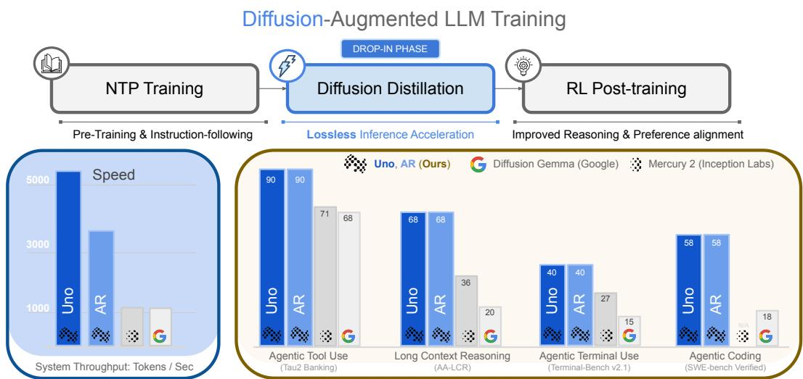
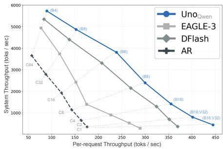

# Unlocking Lossless Speedups in LLMs via Discrete Diffusion

Subham Sekhar Sahoo∗,†,1, Lingjie Chen†,1,2, Khiem Pham†,1,3, Jonathan Geuter†,1,4, Chaitanya Dwivedi1, Varad Pimpalkhute1, Yash Akhauri1, Alexander Moreno1, Mikhail Yurochkin1, Zhenting Wang1, Mostafa Elhoushi5, Nolan Dey5, Shane Bergsma5, Joel Hestness5, John Thickstun3, Eric Xing1, Zhengzhong Liu1

1Institue of Foundation Models, 2University of Illinois Urbana-Champaign, 3Cornell Tech 4Harvard University 5Cerebras Systems

† Core Contributors ∗ Correspondence to subham.sahoo@mbzuai.ac.ae

Large Language Models (LLMs) owe much of their success to next-token prediction (NTP), but their autoregressive (AR) structure requires slow, sequential token generation. To overcome this bottleneck, we introduce diffusion-augmented LLMs, a new class of models that defines an AR model distribution while using diffusion to draw multiple tokens in parallel from that distribution. We decouple the parameters of these models into two sets: AR weights, trained using the standard NTP objective, and lightweight diffusion weights, trained to generate multiple tokens simultaneously. The diffusion weights are learned through a simple Diffusion Distillation phase that adds negligible overhead to existing LLM training pipelines. We also introduce Ψ-Spec, a family of samplers that enables lossless acceleration and inference-time scaling at a fixed context length. Unlike speculative decoding, our method requires no separate draft model. Unlike diffusion LLMs (d-LLMs), it accelerates generation without sacrificing the quality of the underlying AR model. The resulting models, called Uno, can be trained from scratch or built by augmenting existing open-weight AR LLMs. Uno achieves higher throughput than leading speculative-decoding methods at every evaluated batch size and delivers up to 3× speedups over the base AR model, including at the largest batch size supported by the device. Notably, our 8B Uno model outperforms the leading open d-LLM, the 26B DiffusionGemma, and the proprietary Mercury 2 across all evaluated benchmarks in agentic tool use, coding, and long-context reasoning. We release code and checkpoints on:

https://s-sahoo.com/uno  
  
Figure 1: (Top) Training overview for diffusion-augmented LLMs. Gray cells indicate AR-weight training, while the blue cell indicates diffusion-weight training. (Bottom Left) System throughput of Uno, the base AR model, and the baselines; see Sec. 5.1 for details. (Bottom Right) Performance across agentic and long-context reasoning benchmarks.

## 1 Introduction

Large language models (LLMs) are increasingly showing human-level capabilities across coding, mathematics, and complex reasoning (KimiTeam et al., 2026; GLM-5-Team et al., 2026). These capabilities arise from a simple yet highly effective training objective: next-token prediction (NTP) over massive text corpora (Brown et al., 2020). A key limitation of this objective is that inference is inefficient. By training models to predict only the next token, it produces autoregressive (AR) systems that generate just one token per decoding step. This sequential constraint becomes increasingly costly as reasoning traces grow longer, increasing serving latency and slowing reinforcementlearning (RL) post-training, where rollout generation dominates runtime (Kim et al., 2026).

Sequential decoding is poorly suited to both natural language and modern accelerators. Language contains predictable collocations and formulaic sequences that could be generated together in blocks (Church & Hanks, 1990; Biber, 2009), but standard LLMs cannot exploit this redundancy. Moreover, decoding is often memory bound, especially at long context lengths, because moving model weights and key-value states limits inference speed and leaves GPUs underutilized (Verma & Vaidya, 2023). Predicting multiple tokens per step can amortize these memory transfers and better use parallel compute.

Existing approaches only partially address this opportunity. Speculative decoding accelerates generation by verifying tokens proposed by a smaller draft model (Leviathan et al., 2023; Chen et al., 2023), but its gains depend on an efficient, well-aligned drafter and require maintaining a separate model. Discrete diffusion models (Austin et al., 2021a; Sahoo, 2026) support parallel generation natively and have succeeded in biological domains (Sahoo et al., 2024b; Schiff et al., 2025; Tang et al., 2025; Lee et al., 2025), yet leading d-LLMs (d-LLMs) still face a quality-speed tradeoff relative to AR models (Sahoo et al., 2025b, 2026; Bie et al., 2026; DiffusionGemmaTeam et al., 2026). Their speedups also vanish at large inference batch sizes (Wu et al., 2025; Fu et al., 2026; DiffusionGemmaTeam et al., 2026). The (lossy) speedups offered by d-LLMs at low batch sizes can therefore be insufficient in practice, as agentic workloads now predominate in contemporary LLM applications (Google Cloud, 2025; Amazon Web Services, 2026). In these workloads, a single request can trigger parallel agents, branching trajectories, tool calls, and retries, while serving systems batch calls across requests to improve accelerator utilization. Batch-size-one latency therefore captures a narrow operating regime and may overstate speedups that diminish under concurrency. Thus, practical acceleration should be evaluated at realistic batch sizes.

Our core idea is simple: define a high-quality AR distribution, then learn to sample multiple tokens in parallel from that same distribution. We realize this idea through diffusion-augmented LLMs (Sec. 3), which use a single architecture with two decoupled sets of weights: one governing response quality and the other optimized for generation speed. Unlike multi-token prediction (MTP) approaches (Cai et al., 2024; Gloeckle et al., 2024), which modify the LLM architecture by adding prediction heads for future tokens, our method augments each layer in the LLM with lightweight diffusion weights alongside the standard AR weights. Our training pipeline first trains the AR weights through NTP loss, then freezes them and learns the diffusion weights through Diffusion Distillation (Sec. 3) to generate token blocks in parallel with negligible training overhead. Our Ψ-Spec sampler (Sec. 4) performs parallel prediction from the AR distribution. The resulting model is a drop-in alternative to speculative decoding and self-speculative decoding, requiring neither a separate draft model nor lossy AR-to-diffusion conversion.

We call our models Uno because they unify AR and diffusion weights within one architecture. Across our evaluations, Uno improves the speed-quality frontier over the speculative-decoding methods EAGLE-3 (Li et al., 2026b) and DFlash (Chen et al., 2026), the open-weight d-LLMs Nemotron-Labs-Diffusion (Fu et al., 2026) and DiffusionGemma (DiffusionGemmaTeam et al., 2026), and the proprietary d-LLM Mercury 2 (Ermon, 2026). Its speedup over the base AR model persists at every evaluated batch size, including the largest batch that fits on the device with the AR weights, supporting both low-latency generation and high-throughput serving. Our contributions are:

1. We introduce diffusion-augmented LLMs, which decouple the parameters that determine response quality from lightweight parameters optimized for generation speed, together with a corresponding training pipeline (Sec. 3).

2. We propose Ψ-Spec samplers to sample from diffusion-augmented LLMs. These samplers enable both lossless, AR-verified acceleration and inference-time scaling through additional denoising at a fixed context length; see Sec. 4.

3. We show how to train diffusion-augmented LLMs from scratch (Sec. 5.1) or create them by augmenting an existing open-weight AR LLM (Sec. 5.2).

4. We show that Uno achieves up to a $2 \times$ speedup at the largest batch size supported by the base AR model, accelerating both inference and end-to-end RL training (Sec. 5.1).

## 2 Background

Notation We denote scalar discrete random variables with K categories as ‘one-hot’ column vectors and define $\mathcal { V } = \left. \mathbf { v } \in \lbrace 0 , 1 \rbrace ^ { K } : \sum _ { i = 1 } ^ { K } \mathbf { v } _ { i } = 1 \right.$ as the set of all such vectors. Define $\operatorname { C a t } ( \cdot ; \pi )$ as the categorical distribution over $K$ =classes with probabilities given by $\pi \in \Delta$ , where $\Delta$ denotes the K − 1-simplex. We also assume that the K-th category corresponds to a special [MASK] token and let m $\epsilon \mathcal { V }$ be the one-hot vector for this mask, i.e., $\mathbf { m } _ { K } = 1$ . Additionally, let ${ \bf 1 } = \{ 1 \} ^ { K }$ , and $\left. \mathbf { a } , \mathbf { b } \right.$ and a ⊙ b respectively denote the dot and Hadamard products between two vectors a and b. We use $\mathbf { x } \in \mathcal { V } ^ { L }$ to represent clean data which is a length-L sequence containing no mask tokens, and let $\mathbf { x } ^ { \ell }$ denote its $\ell ^ { \mathrm { { t h } } }$ element where ℓ refers to the token index. Under our notation, each $\mathbf { x } ^ { \ell }$ is a onehot vector. The notation $\mathbf { x } ^ { m : n }$ denotes the subsequence from index m to index $n ,$ inclusive, while $\mathbf { x } ^ { < \ell } : = \mathbf { x } ^ { 1 : \ell - 1 }$ denotes the prefix consisting of the first $\ell - 1$ tokens. Finally, $[ \cdot , \cdot ] : \mathcal { V } ^ { m } \times \mathcal { V } ^ { n }  \mathcal { V } ^ { m + n }$ denotes the operator that concatenates sequences of lengths m and n. Colors are used throughout the paper solely for emphasis and carry no mathematical meaning.

## 2.1 Autoregressive Models

Consider a length-L sequence $\mathbf { x } \in \mathcal { V } ^ { L } \sim q _ { \mathrm { d a t a } }$ drawn from the data distribution $q _ { \mathrm { d a t a } }$ . Autoregressive (AR) language models factorize the joint distribution using the chain rule:

$$
\log p _ { \theta } ( \mathbf { x } ) \ = \ \sum _ { \ell = 1 } ^ { L } \log p _ { \theta } ( \mathbf { x } ^ { \ell } \mid \mathbf { x } ^ { < \ell } ) .
$$

Here, $p _ { \theta } : \mathcal { V } ^ { L } \to \Delta ^ { L }$ is typically implemented with a causal Transformer (Vaswani et al., 2017) with parameters θ. This factorization leads to strong likelihood modeling and enables efficient inference primitives such as KV caching. However, AR generation is intrinsically sequential: $\ell ^ { \mathrm { { t h } } }$ token can only be generated after the prefix $\mathbf { x } ^ { < \ell }$ has been generated. As a result, producing an output of length L requires L causal decoding decisions.

Speculative Decoding Speculative decoding (Leviathan et al., 2023; Chen et al., 2023) uses a smaller draft model to autoregressively generate a block of candidate tokens, while a larger base model verifies them. The key observation is that although sampling from the base model is inherently sequential and expensive, evaluating the likelihood of an entire candidate sequence can be performed efficiently in parallel. Speculative decoding exploits this asymmetry by generating candidate tokens with the draft model that can be sampled more efficiently, and verifying them via rejection sampling in a single forward pass, accepting the longest valid prefix. This accelerates inference while exactly preserving the target distribution.

## 2.2 Discrete Diffusion Language Models

Discrete diffusion corrupts a clean sequence x ∈ $\smash { \gamma ^ { L } \sim q _ { \mathrm { d a t a } } }$ into a simple prior $\pi ^ { L }$ and learns to reverse the corruption. We use the interpolating forward process from Sahoo et al. (2024a):

$$
\begin{array} { r } { \mathbf { z } _ { t } ^ { \ell } \sim q _ { t } ^ { \ell } \big ( \cdot \mid \mathbf { x } ; \pi \big ) : = \mathrm { C a t } \big ( \cdot ; \alpha _ { t } \mathbf { x } ^ { \ell } + \big ( 1 - \alpha _ { t } \big ) \pi \big ) , } \end{array}\tag{1}
$$

where $\mathbf { z } _ { t }$ denotes the noisy sequence at time step $t \in [ 0 , 1 ]$ , and the noise schedule $\alpha _ { t }$ decreases monotonically from $\alpha _ { 0 } = 1$ at clean data to $\alpha _ { 1 } = 0$ at the prior. A denoising model $\mathbf { x } _ { \theta } : \mathcal { V } ^ { L } \times [ 0 , 1 ] \to$ $\Delta ^ { L }$ , parameterized by $\theta ,$ predicts the clean tokens from $\mathbf { z } _ { t }$ and t. Masked diffusion uses $\pi = \mathbf { m }$ while uniform-state diffusion uses $\pi = { \bf 1 } / K$ . We use the latter because it natively supports selfcorrection, few-step generation (Sahoo et al., 2025a), and better inference-time scaling than masked diffusion models (Deschenaux et al., 2026).

Sampling For $0 \leq s < t .$ let $q _ { s \mid t }$ denote the reverse posterior that maps $\mathbf { z } _ { t }$ to a less noisy state $\mathbf { z } _ { s }$ ∣. The Ψ-samplers proposed by Deschenaux et al. (2026) form a family of discrete-diffusion samplers that generalize posterior (ancestral) sampling by incorporating predictor-corrector capabilities, thereby producing higher-quality samples. Their practical token-wise transition kernel is given by

$$
\begin{array} { r } { \big [ \Psi _ { s | t } ^ { \theta } \big ( \cdot | \mathbf { z } _ { t } ; \mathbf { x } _ { \theta } \big ( \mathbf { z } _ { t } \big ) , \pi \big ) \big ] ^ { \ell } = \kappa _ { t } q _ { s | t } ^ { \ell } \big ( \cdot | \mathbf { z } _ { t } , \mathbf { x } _ { \theta } \big ( \mathbf { z } _ { t } \big ) ; \pi \big ) + \big ( 1 - \kappa _ { t } \big ) \Big [ \alpha _ { s } q _ { 0 | t } ^ { \ell } \big ( \cdot | \mathbf { z } _ { t } , \mathbf { x } _ { \theta } \big ( \mathbf { z } _ { t } \big ) ; \pi \big ) + \big ( 1 - \alpha _ { s } \big ) \pi \Big ] , } \end{array}\tag{2}
$$

where $\kappa _ { t } \in [ 0 , 1 ]$ controls the strength of the correction. The exact functional form of (2) for MDMs and USDMs, see Suppl. $\mathrm { A . 4 }$

Discrete Consistency Distillation Discrete Consistency Distillation (DCD) compresses a multistep uniform-state diffusion process into a few-step generator (Sahoo et al., 2025a). It constructs a deterministic discrete trajectory from ${ \bf z } _ { 1 } \sim { \bf 1 } ^ { L } / \bar { K }$ to x using the Gaussian diffusion process underlying the uniform-state discrete diffusion process,. For adjacent states $\mathbf { z } _ { t }$ and $\mathbf { z } _ { s } .$ , with $s < t ,$ the student distribution ${ \bf x } _ { \theta } ^ { \ell } ( { \bf z } _ { t } , t )$ is trained to match the teacher distribution $\mathbf { x } _ { \pmb { \theta } _ { 0 } } ^ { \ell } ( \mathbf { z } _ { s } , s ) ; \forall \ell \in [ L ] ;$

$$
\mathcal { L } _ { \mathrm { D C D } } ( \boldsymbol { \theta } ; \boldsymbol { \theta } _ { 0 } ) = \sum _ { \ell = 1 } ^ { L } \operatorname { D } _ { \mathrm { K L } } \bigl ( \mathbf { x } _ { \boldsymbol { \theta } } ^ { \ell } ( \mathbf { z } _ { t } , t ) \parallel \mathbf { x } _ { \boldsymbol { \theta } _ { 0 } } ^ { \ell } ( \mathbf { z } _ { s } , s ) \bigr ) .
$$

Increasing the gap between s and t across distillation rounds teaches the student to take larger denoising steps. Refer Suppl. A.5 for further details.

## 3 Diffusion-augmented LLMs

We propose a new framework for designing LLMs that decouples generation quality from generation speed by augmenting each layer of a standard AR model with a separate set of diffusion weights dedicated to parallel token generation. We call the resulting model a diffusion-augmented LLM. The key distinction is that each layer contains two sets of weights: AR weights, trained to generate tokens autoregressively and determine response quality, and diffusion weights, trained to generate tokens in parallel. This separation preserves the established AR training pipeline while introducing a dedicated phase for training the diffusion weights to accelerate inference. At generation time, both sets of weights draft tokens in parallel, after which the AR weights alone verify the drafts. Our sampler provably preserves the AR model’s output distribution (Sec. 4), enabling lossless acceleration without sacrificing response quality. The framework can be applied to any causal autoregressive neural network, including causal Transformers (Vaswani et al., 2017) and State-Space Models (SSMs; Gu et al., 2020; Gu & Dao, 2023). Because of this separation, the framework can also augment existing open-weight LLMs with parallel generation capabilities, providing lossless speedups without retraining their base parameters (Sec. 5.2).

The remainder of this section develops the framework in three stages. We first describe the roles of the AR and diffusion weights in a Diffusion-augmented LLM (Sec. 3.1). We then present the Diffusion Distillation Phase (Sec. 3.2), which trains the diffusion weights using a one-step blockdenoising formulation and associated training objectives. Finally, we discuss the training curriculum for two settings: accelerating inference alone and accelerating both RL rollouts and inference (Sec. 3.3).

## 3.1 Autoregressive and Diffusion Pathways

Each layer of a diffusion-augmented LLM contains a set of autoregressive (AR) weights and a set of diffusion weights. These two sets of weights follow different training procedures, as described below.

Autoregressive Weights We denote the base AR weights by $\theta _ { \mathrm { A R } }$ . These parameters are trained using the standard LLM recipe of Pre-training (Brown et al., 2020; Hoffmann et al., 2022; Grattafiori et al., 2024), supervised fine-tuning (SFT; Wei et al., 2021; Chung et al., 2024), and RL posttraining (Ouyang et al., 2022; Shao et al., 2024; Guo et al., 2025). Given a length-L sequence $\mathbf { x } \in \mathcal { V } ^ { L }$ , the model $\mathbf { x } _ { \theta _ { \mathrm { A R } } } : \mathcal { V } ^ { L } \to \Delta ^ { L }$ is causally masked, so its output at position ℓ observes only the prefix $\mathbf { x } ^ { < \ell }$ , the distribution of the $\ell ^ { \mathrm { { t h } } }$ token is modeled as:

$$
p _ { \theta _ { \mathrm { A R } } } \bigl ( \mathbf { x } ^ { \ell } \mid \mathbf { x } ^ { < \ell } \bigr ) = \mathbf { x } _ { \theta _ { \mathrm { A R } } } ^ { \ell - 1 } \bigl ( \mathbf { x } \bigr ) , \qquad 1 < \ell \leq L .
$$

We assume that the first token in x is a special <BOS> token that requires no modeling.

Diffusion Weights The diffusion weights $\theta _ { \Delta }$ are used solely to accelerate generation. As described in Sec. 4, our sampler uses the diffusion pathway to draft tokens and performs rejection sampling against the AR distribution defined by $\theta _ { \mathrm { A R } }$ . We parameterize the diffusion weights as LoRA (Low RAnk) adapters (Hu et al., 2022): each AR weight matrix has an associated LoRA weight. Thus, the diffusion pathway uses $\theta _ { \mathrm { A R } } + \theta _ { \Delta }$ to generate draft tokens, whereas the verification pathway uses $\theta _ { \mathrm { A R } }$ , with the two distributions coupled through their shared base parameters. We train only $\theta _ { \Delta }$ during the Diffusion Distillation Phase while keeping $\theta _ { \mathrm { A R } }$ frozen; see Sec. 3.2.

For effective rejection sampling, the draft distribution must remain closely coupled to the verification distribution. Parameterizing the draft pathway as a LoRA adaptation of the base model promotes this coupling while adding minimal inference-time memory overhead compared with a separate set of full-sized diffusion weights. This design retains the lossless verification of standard speculative decoding without requiring a separate draft model. At the same time, like self-speculative decoding, it tightly couples the drafting and verification pathways, but does so while remaining lossless..

Diffusion training teaches the LLM to refine an entire sequence in parallel. Specifically, given a noisy sequence $( \mathbf { \bar { z } } _ { t } \in \mathcal { V } ^ { L } ) _ { t \in [ 0 , 1 ] }$ obtained by corrupting a clean sequence $\mathbf { x } \in \mathcal { V } ^ { L }$ according to (1), ∈[ ]the model is trained to recover x. Throughout this work, the LLM retains the NTP parameterization of standard autoregressive LLMs: the logits at each position predict the subsequent clean token. This parameterization differs from that of conventional diffusion language models (Austin et al., 2021a; Lou et al., 2024; Sahoo et al., 2024b), which typically predict the clean token at the same position. Accordingly, the distribution of the clean token $\mathbf { \dot { x } } ^ { \ell }$ is:

$$
\begin{array} { r } { p _ { \theta _ { \mathrm { A R } } , \theta _ { \Delta } } \bigl ( \mathbf { x } ^ { \ell } \mid \mathbf { z } _ { t } \bigr ) = \mathbf { x } _ { \theta _ { \mathrm { A R } } , \theta _ { \Delta } } ^ { \ell - 1 } \bigl ( \mathbf { z } _ { t } \bigr ) , \qquad 1 < \ell \leq L . } \end{array}
$$

## 3.2 Diffusion Distillation Phase

We train the diffusion parameters $\theta _ { \Delta }$ to draft a block of tokens in parallel that the autoregressive (AR) model with parameters $\theta _ { \mathrm { A R } }$ would generate sequentially. Specifically, our goal is to match the single-step diffusion distribution $p _ { \theta _ { \mathrm { A R } } , \theta _ { \Delta } } ( \cdot )$ over a token block to the AR distribution $p _ { \theta _ { \mathrm { A R } } } ( \cdot )$ over the same block. Discrete Consistency Distillation (DCD; Sec. 2.2) is well suited to this task because it can distill a multistep diffusion process into a few-step generator while closely approximating the distribution induced by the original process.

In what follows, we first describe how we adapt DCD to approximate the AR distribution through single-step diffusion. We then extend the DCD training objective, namely the single-step distillation loss ${ \mathcal { L } } _ { \mathrm { D C D } }$ , with another auxiliary loss term: ${ \mathcal { L } } _ { \mathrm { T V } }$ to encourage longer diffusion drafts to be accepted by the AR verifier. The resulting objective is:

$$
\begin{array} { r } { \mathcal { L } \big ( \theta _ { \Delta } ; \theta _ { \mathrm { A R } } , \alpha , \beta \big ) = \mathbb { E } _ { { \mathbf { x } } \sim \mathcal { D } , { \mathbf { z } } _ { 1 } \sim { \pi } ^ { L } } \left[ \alpha \mathcal { L } _ { \mathrm { D C D } } \big ( \theta _ { \Delta } ; \theta _ { \mathrm { A R } } , \mathbf { x } , \mathbf { z } _ { 1 } \big ) + \beta \mathcal { L } _ { \mathrm { T V } } \big ( \theta _ { \Delta } ; \theta _ { \mathrm { A R } } , \mathbf { x } , \mathbf { z } _ { 1 } \big ) \right] , } \end{array}\tag{3}
$$

where $\mathbf { z } _ { 1 }$ is the fully corrupt sequence. Although $\alpha = 0 , \beta = 1$ yields the largest speedups, training first with $\alpha = \beta = 1$ and then switching to $\alpha = 0 , \beta = 1$ accelerates convergence. We ablate both loss terms in Sec. 5.2.4. We describe each term below.

One-step Distillation Standard DCD constructs a multistep denoising trajectory by simulating intermediate states of the underlying PF-ODE. At LLM scale, repeatedly constructing and storing these intermediate Gaussian latents is prohibitively expensive. We therefore distill the entire trajectory into a single denoising step that maps a fully corrupted input $\mathbf { z } _ { 1 } \sim \boldsymbol \pi ^ { L }$ directly to the clean sequence x. The frozen base model defines the autoregressive teacher distribution $\mathbf { x } _ { \theta _ { \mathrm { A R } } } .$ , and the adapted model defines the student distribution ${ \bf x } _ { \boldsymbol { \theta } _ { \mathrm { A R } } , \boldsymbol { \theta } _ { \Delta } }$ . We train the student to match the teacher directly, eliminating the need to simulate or materialize any intermediate PF-ODE states.

Block Diffusion Recovering an entire long sequence from a fully corrupted input in a single denoising step is prohibitively difficult; we therefore perform one-step denoising blockwise. We partition the clean sequence x and the fully corrupt sequence $\mathbf { z } _ { 1 }$ into N blocks of size B. We use $\bar { \mathbf { x } } ^ { ( b ) }$ and $\mathbf { z } _ { 1 } ^ { ( b ) }$ to denote the $b ^ { \mathrm { t h } }$ blocks of x and $\mathbf { z } _ { 1 } ,$ , respectively. For each block, we train $\theta _ { \Delta }$ to match the student diffusion distribution over the clean block $\mathbf { x } ^ { ( b ) }$ , conditioned on the noisy block $\mathbf { z } _ { 1 } ^ { ( b ) }$ and the preceding clean context $\mathbf { x } ^ { ( < b ) }$ , to the teacher AR distribution over the same block, conditioned on the preceding clean context. We compute the teacher and student predictions in a single forward pass over the concatenated sequence $\left[ \mathbf { x } , \mathbf { z } _ { 1 } \right]$ . Specifically, we use a block-causal attention mask that permits causal attention within x and within each noisy block $\mathbf { z } _ { 1 } ^ { ( b ) }$ . Tokens in $\mathbf { z } _ { 1 } ^ { ( b ) }$ additionally attend to all preceding clean blocks $\mathbf { x } ^ { ( < b ) }$

The main challenge is to compute the teacher logits at positions in x using only $\theta _ { \mathrm { A R } }$ , while computing the student logits at positions in $\mathbf { z } _ { 1 }$ using both $\theta _ { \mathrm { A R } }$ and $\theta _ { \Delta }$ . We achieve this using gated LoRA (Samragh et al., 2025), which disables the adapters at clean-sequence positions and enables them at noisy-sequence positions. Consequently, $\theta _ { \mathrm { A R } }$ produces the teacher logits, whereas $\theta _ { \mathrm { A R } }$ and $\theta _ { \Delta }$ jointly produce the student logits. The resulting blockwise DCD objective is:

$$
\mathcal { L } _ { \mathrm { D C D } } ( \theta _ { \Delta } ; \theta _ { \mathrm { A R } } , \mathbf { x } , \mathbf { z } _ { 1 } ) = \sum _ { b = 1 } ^ { N } \sum _ { \ell = 1 } ^ { B } \mathbf { D } _ { \mathrm { K L } } \left( \mathbf { x } _ { \theta _ { \Delta } , \theta _ { \mathrm { A R } } } ^ { ( N + b , \ell ) } ( \left[ \mathbf { x } , \mathbf { z } _ { 1 } \right] ) \| \mathbf { x } _ { \theta _ { \mathrm { A R } } } ^ { ( b , \ell ) } ( \left[ \mathbf { x } , \mathbf { z } _ { 1 } \right] ) \right) .
$$

The base parameters $\theta _ { \mathrm { A R } }$ remain frozen throughout fine-tuning, and only the LoRA parameters $\theta _ { \Delta }$ are updated.

Total Variation Loss Our sampler (Sec. 4) performs rejection sampling against the AR distribution and retains only the longest consecutive prefix of the diffusion prediction. Sampling efficiency therefore depends on the length of this retained prefix. To increase its expected length, we minimize the blockwise Total Variation (TV) distance between the diffusion and the AR distributions following Corollary 3.6 of Leviathan et al. (2023):

$$
\mathcal { L } _ { \mathrm { T V } } \big ( \theta _ { \Delta } ; \theta _ { \mathrm { A R } } , \mathbf { x } , \mathbf { z } _ { 1 } \big ) = \sum _ { b = 1 } ^ { N } \sum _ { \ell = 1 } ^ { B } \left| \mathbf { x } _ { \theta _ { \Delta } , \theta _ { \mathrm { A R } } } ^ { \big ( N + b , \ell ) } \big ( \big [ \mathbf { x } , \mathbf { z } _ { 1 } \big ] \big ) - \mathbf { x } _ { \theta _ { \mathrm { A R } } } ^ { \big ( b , \ell ) } \big ( \big [ \mathbf { x } , \mathbf { z } _ { 1 } \big ] \big ) \right| .
$$

Minimizing this objective increases the probability of consecutive tokens being accepted, and, consequently, increases the expected length of the accepted draft prefix.

## 3.3 Practical Considerations

The AR weights $\theta _ { \mathrm { A R } }$ and diffusion adapters $\theta _ { \Delta }$ serve complementary roles and are optimized using separate objectives, making their training order an important practical consideration. In particular, Diffusion Distillation can be performed either after all AR training is complete or before RL posttraining so that the resulting adapters can accelerate rollout generation. We therefore consider two training regimes, depending on whether diffusion-based generation is used only during inference or during both RL post-training and inference.

Faster Inference Only If the sole objective is faster inference, we first complete autoregressive pre-training and post-training, or simply initialize them with an Open-weights LLM. We then freeze the AR weights $\theta _ { \mathrm { A R } }$ and train $\theta _ { \Delta }$ using Diffusion Distillation (Sec. 3.2).

Faster RL Training & Faster Inference We demonstrate in Sec. 5 that our method provides significant generation speedups wrt the base AR model across all batch sizes, and can therefore accelerate RL post-training due to faster rollouts. In this setting, we first apply diffusion distillation after supervised fine-tuning and before RL, as illustrated in Figure 1 (top). The resulting adapters can then accelerate rollouts during RL. Standard RL policy-optimization recipes, including PPO and GRPO-based methods (Ouyang et al., 2022; Shao et al., 2024; Guo et al., 2025; Yu et al., 2026a), update $\theta _ { \mathrm { A R } }$ but not the $\theta _ { \Delta }$ . One might therefore expect that, as $\theta _ { \mathrm { A R } }$ changes, the draft distribution will drift away from the verifier distribution, reducing the acceptance rate and eroding the speedup. Surprisingly, we show in Sec. 5.1 that the speedup is retained even as the AR weights are trained using RL.

## 4 Ψ-Speculative Sampler

Our goal is to sample from the AR distribution defined by $\theta _ { \mathrm { A R } }$ while drawing multiple tokens in parallel. We therefore introduce the Ψ-Speculative sampler (Ψ-Spec), which uses the diffusion pathway to propose a block of tokens in parallel (Sec. 4.1) and performs rejection sampling against the base AR distribution to accept the longest valid prefix (Sec. 4.2).

## 4.1 Diffusion Sampler

Let x $\sharp \mathcal { V } ^ { L }$ denote a partially generated sequence of length L. To generate a block of B tokens, we first append $B - 1$ random tokens sampled from the prior, $\mathbf { z } _ { 1 } \sim \pmb { \pi } ^ { B - 1 }$ . Denoising then proceeds from $t = 1 \mathrm { t o } t = 0$ , with $\mathbf { z } _ { t }$ denoting the partially denoised sequence at time t. At each step, the denoiser $\mathbf { x } _ { \theta } \big ( \cdot ; \mathbf { x } ^ { < L } \big ) : \mathcal { V } ^ { B }  \bar { \Delta } ^ { B }$ operates on the block $\left[ \mathbf { x } ^ { L } , \mathbf { z } _ { t } \right] \in \dot { \mathcal { V } } ^ { B }$ , while the activations for the preceding sequence $\mathbf { x } ^ { < L }$ remain in the KV cache. In Sec. 4.1.1, we define the proposal distribution over a block of tokens, and in Sec. 4.1.2, we describe how candidates are sampled from this distribution.

## 4.1.1 Diffusion Proposal Distribution

Given a noisy block $\mathbf { z } _ { t }$ , we use the Ψ-Spec transition in (2) to sample a less noisy block $\mathbf { z } _ { s }$ , where $s < t .$ . Because the denoiser uses the NTP parameterization, the clean-token distributions used to construct $\mathbf { z } _ { s }$ are given by $\mathbf { x } _ { \theta _ { \mathrm { A R } } , \theta _ { \Delta } } ^ { 1 : B - 1 } ( [ \mathbf { x } ^ { L } , \mathbf { z } _ { t } ] )$ . The input contains both clean and corrupted tokens, while the diffusion weights are trained only on corrupted tokens. To avoid distribution shift, we compute the logits for the first, clean position using only the base AR weights, and those for the noisy positions using both the AR and diffusion weights. We achieve this in a single forward pass using the gated LoRA technique of Samragh et al. (2025).

Let $\Psi _ { 0 }$ denote the distribution induced by the Ψ-sampler at t = 0. At the final step, we sample the first token using only the base AR weights:

$$
\begin{array} { r } { \mathbf { z } _ { 0 } ^ { 1 } \sim \Psi _ { 0 } ^ { \ell = 1 } \left( \cdot \mid \mathbf { z } _ { t } ; \mathbf { x } _ { \theta _ { \mathrm { A R } } } ^ { 1 : B - 1 } ( \cdot ) , \pi \right) . } \end{array}\tag{4}
$$

We sample the remaining B − 2 tokens from the following joint distribution, discussed in Sec. 4.1.2:

$$
{ \bf z } _ { 0 } ^ { 2 : B } \sim \prod _ { \ell = 2 } ^ { B } \Psi _ { 0 } ^ { \ell } \left( \cdot \vert \mathrm { \bf ~ z } _ { t } ; { \bf x } _ { \theta _ { \mathrm { A R } } , \theta _ { \Delta } } ^ { 1 : B - 1 } ( \cdot ) , \pi \right) .\tag{5}
$$

## 4.1.2 Sampling Candidates

Given the proposal distribution in (5), we construct a candidate set $\begin{array} { r } { \mathcal { C } = \left. \mathbf { c } : \mathbf { c } \sim \prod _ { \ell = 2 } ^ { B } \Psi _ { 0 } ^ { \ell } \right. } \end{array}$ . The =number of draft candidates determine the tradeoff between acceptance length and verification cost. Sampling more candidates increases the probability of accepting a longer prefix, but also increases the cost of verification. We therefore select the largest candidate set that can be verified without reducing inference throughput, subject to the available serving batch size.

Linear Sampler (System Throughput Optimized) The simplest approach samples each draft token directly from its marginal distribution in (5), producing a single candidate sequence. At high batch sizes, inference can become compute-bound, leaving little spare compute for verifying additional candidates. The linear sampler is therefore well suited to maximizing aggregate system throughput in this regime.

Tree Sampler (Single-user Throughput Optimized) At low batch sizes, inference is typically memory-bound, leaving substantial compute capacity underutilized. We exploit this spare compute by sampling multiple candidates and verifying them in parallel. Specifically, we use the tree-based sampling procedure of Cai et al. $( 2 0 2 4 ) .$ , which selects the top K tokens at each position within a block. Rather than evaluating all $K ^ { \dot { B } - 1 }$ candidate sequences, we adopt the candidate-pruning strategy of Li et al. (2026b) which ranks candidates by their log-probabilities and retains the top $V \in \mathbb { Z } ^ { + }$ prefixes. Thus, $( B , K , V )$ are the hyperparameters of the tree sampler, corresponding to the block size, branching factor, and prefix budget, respectively.

## 4.2 One-step Diffusion w/ AR Verification

The central goal of this work is to accelerate generation. We therefore draft an entire block of B tokens using a single diffusion forward pass. In Suppl. B.2, we show that, for single-step diffusion generation, Eqns. (4, 5) reduce to

$$
\begin{array} { r l } & { \mathbf { z } _ { 0 } ^ { 1 } \sim \mathbf { x } _ { \theta _ { \mathrm { A R } } } ^ { 1 } ( \cdot ) , } \\ & { \mathbf { z } _ { 0 } ^ { 2 : B } \sim p _ { \mathrm { d r a f t } } = \displaystyle \prod _ { \ell = 2 } ^ { B } \mathbf { x } _ { \theta _ { \mathrm { A R } } , \theta _ { \Delta } } ^ { \ell } ( \cdot ) . } \end{array}
$$

From $p _ { \mathrm { d r a f t } }$ , we sample candidates $\mathcal { C } = \{ \mathbf { c } : \mathbf { c } \sim p _ { \mathrm { d r a f t } } \}$ and apply the standard speculative-decoding rejection correction (Leviathan et al., 2023), retaining the longest prefix accepted by the base AR model. This preserves the base model’s target distribution. For $| { \mathcal { C } } | > 1$ , candidates are verified concurrently as a prefix tree using tree attention (Cai et al., 2024). Because $\theta _ { \mathrm { A R } }$ remains frozen and only the diffusion LoRA adapters are trained, the base AR model provides an unchanged verifier and enables lossless speculative speedups. The complete sampling algorithm is provided in Algo. 1.

Tokens-Per-Forward-pass (TPF) During drafting, the first token is generated using the base AR weights and therefore matches the verifier distribution exactly, so it is always accepted. If a subsequent draft token is rejected, the verifier samples a replacement from the renormalized residual dis tribution, as in standard speculative decoding. Consequently, even an immediate rejection produces two output tokens: the always-accepted first token and the verifier-sampled replacement token. If all B draft tokens are accepted, the verifier additionally samples one token from the logits following the final draft token, producing B + 1 output tokens. Because each iteration requires two forward passes, one for drafting and one for verification, the TPF is bounded by $\textstyle 1 \leq \mathrm { T P F } \leq \frac { B + 1 } { 2 }$

We provide support for both the Linear and Tree samplers in Nano-vLLM (Yu, 2025) and SGLang (Zheng et al., 2024). All experiments reported in this paper were conducted using our Nano-vLLM implementation.

## 4.3 Inference-Time Scaling

Ψ-Spec introduces an additional axis for inference-time scaling in LLMs by allowing the number of denoising steps $T$ to exceed the number of drafted tokens B. Deschenaux et al. (2026) show that, for $0 \leq \kappa _ { t } < 1$ , increasing $T$ consistently improves sample quality. The central question is whether this improvement can eventually surpass the quality of AR generation. If so, AR verification should be disabled, since it would constrain the final output to the lower quality level of the AR model and prevent the gains from additional denoising from being realized. Unlike conventional inferencetime scaling methods, this approach allocates additional computation without increasing the context length. We leave a systematic exploration of this quality-compute tradeoff to future work.

## 5 Experiments

We train diffusion-augmented LLMs in two settings. In the first, we train the AR weights from scratch on proprietary data and train the diffusion weights on data drawn from the same distribution. In the second, we augment an open-weight AR model, Qwen3-8B (Yang et al., 2025), without access to its original training data. We instead train the diffusion weights on a different data distribu tion using the open-source OpenThoughts dataset (Guha et al., 2025). Together, these experiments demonstrate the versatility of our method and show that the diffusion and AR weights need not be trained on the same data distribution.

Throughput Analysis Throughput depends strongly on context length. However, existing evaluations (Wu et al., 2025; Fu et al., 2026) measure throughput on downstream tasks whose reasoning traces vary in length. This can misleadingly favor models that generate shorter traces. Following standard LLM evaluation practice1, we instead evaluate every method using m random input tokens and a fixed output length of n tokens. For diffusion and speculative decoding methods, which draft a block of B tokens per forward pass, we first measure the average number of accepted tokens per forward pass (TPF) across all benchmarks. We then run $\left\lceil { \frac { n } { \mathrm { T P F } } } \right\rceil$ decoding steps, constraining each method to accept TPF tokens per step on average. This ensures that all methods are evaluated at the same input and effective output lengths. Throughout the paper, we use m = 1024 and $n = 8 1 9 2$ and refer to this setting as the “1K/8K throughput test”.

Per-request Throughput vs. System Throughput We report throughput at batch size 1 and at the largest batch size that fits on a single H200 GPU. Batch-size-1 throughput is less representative of practical serving because agentic workloads often generate concurrent requests even while serving a single user as described in Sec. 1. We therefore also report system throughput, which is the aggregate token generation rate at the maximum feasible batch size, which better reflects serving capacity and cost efficiency. For each regime, we select the TPF setting that maximizes throughput and use the 1K/8K test described above.

## 5.1 End to End Diffusion Augmented LLM Training

## 5.1.1 Setup

Benchmarks We evaluate on both agentic and non-agentic benchmarks. The agentic suite comprises the Telecom, Airline, and Retail domains of $\tau ^ { 3 } .$ -Bench (Shi et al., 2026), τ2-Bench (Barres et al., 2025) , Terminal-Bench v2.1 (The Terminal-Bench Team, 2026), and SWE-bench Verified (Jimenez et al., 2024). The non-agentic suite includes AA-Omniscience (Jackson et al., 2025), AA-LCR (Artificial Analysis, 2025), Humanity’s Last Exam (HLE; Phan et al., 2025) , GPQA-Diamond (Rein et al., 2024), GSM8K (Cobbe et al., 2021), MATH500 (Lightman et al., 2024), AIME 2024 and 2025 (Balunovic et al.´ , 2025), AIME 2026 (Dekoninck et al., 2026), and MBPP (Austin et al., 2021b). We use a context window of 262, 144 with 131, 072 maximum generation tokens, allowing for long prompts on agentic benchmarks, and sampling parameters temp = 1, top- $- p = 0 . 9 5$ , and top- $k = 5 0$

Metrics For each method, we report average pass@1 over multiple generations and average TPF; see Table 4 for details. We compute throughput using the “1k/8k throughput test,” averaging TPF across benchmarks. System throughput is measured using the largest batch size that fits on a single H200 GPU, whereas per-request throughput is measured at batch size 1.

Baselines We compare against Nemotron-Labs-Diffusion-14B (Fu et al., 2026), DiffusionGemma-26B-A4B (DiffusionGemmaTeam et al., 2026), and Mercury 2 (Ermon, 2026). Nemotron-Labs-Diffusion is pretrained autoregressively on 1T tokens and then fine-tuned as a diffusion model on 300B tokens. It also uses masked diffusion with bidirectional attention within draft blocks. We evaluate the largest Nemotron-Labs-Diffusion variant because it performs better on benchmarks than the smaller variants. DiffusionGemma is a sparse 26B mixture-of-experts model with 4B active parameters, fine-tuned from Gemma 4 (DiffusionGemmaTeam et al., 2026). Since both Nemotron-Labs-Diffusion and DiffusionGemma modify the base AR parameters, they are lossy unlike Uno. We use the default baseline configurations: Nemotron-Labs-Diffusion uses Linear Self-Speculation with a block size of 32, a maximum generation length of 8192, a thinking-token budget of 6000, and temperatures of 0 for drafting and verification. DiffusionGemma uses a block size of 256, temperature 1, a maximum generation length of 131072, a context length of 162144, and an entropy-bounded diffusion sampler with a bound of 0.1 and thinking enabled. We also compare against Inception Labs’ closed-source d-LLM, Mercury 2, whose parameter count is undisclosed.

## 5.1.2 Uno: Diffusion Augmented LLM (Ours)

We first define the architecture of our model. The weights corresponding to every layer are the the AR weights $\theta _ { \mathrm { A R } }$ . Corresponding to every weight matrix, we introduce rank-128 LoRA adapters with LoRA-α = 256 which serve as the diffusion weights $\theta _ { \Delta }$ . We share more details subsequently.

LLM Architecture We use a dense decoder-only causal Transformer with 36 layers, hidden width 4, 096, SwiGLU-style MLP width 12, 288, 32 query heads, 8 KV heads, head dimension 128, grouped RMSNorm, RoPE $( \theta \ : = \ : 1 0 ^ { 7 } )$ , a 250, 624-token vocabulary, and a maximum configured context length of 524, 288 tokens. The model contains 6.95B transformer-body parameters plus approximately 2.05B parameters from the large untied input/output vocabulary matrices.

Training AR weights The AR weights are trained on approximately 23T tokens on internal quality data with a staged context-length extension schedule. Pretraining uses 21.9T tokens at an 8K-token context length, with a peak learning rate of $3 \times 1 0 ^ { - 4 }$ under a warmup-stable-decay (WSD) configuration and a 3,000-step warmup. We then extend the context length to 32K, training on an additional 1.1T tokens while linearly decaying the learning rate from $3 \times \mathrm { { 1 0 ^ { - 4 } ~ t o ~ 3 \times 1 0 ^ { - 5 } } }$ , following a 1,250- step warmup. Next, the context length is increased to 128K and the model is trained on 0.5T tokens at a constant learning rate of $3 \times 1 0 ^ { - 5 }$ , with a 500-step warmup. Finally, the context length is extended to 512K and trained for 0.3T tokens with a constant learning rate of $3 \times 1 0 ^ { - 5 }$ and a 200-step warmup.

Training Diffusion Weights Diffusion weights are implemented as rank-128 LoRA adapters with $\mathrm { L o R A } \mathrm { - } \alpha = 2 5 6$ . We train them on 7B tokens sampled randomly from the SFT training data while keeping the AR weights frozen. We employ curricula for context length and diffusion block size: 1.8B tokens at context length 16, 384, divided into increasing block sizes of two, four, and eight with 600M tokens each; followed by 5.2B tokens at context length 65, 536 and block size 8. We train on a global batch size of 128 with a WSD learning rate scheduler with 200 warmup steps and a peak learning rate of $5 \times 1 0 ^ { - 5 }$ . In (3), we set $\alpha = 0 . 0 1 , \beta = 1$ . Training takes approximately 60 hours on 8 H200 nodes with 8 GPUs each.

To sample from Uno, we use the Linear Sampler with B = 4 to maximize system throughput and the Tree Sampler with $( B , K , V ) = \left( 1 6 , 3 2 , 3 2 \right)$ to maximize single-request throughput at batch size 1.

## 5.1.3 Results

Ψ-Spec Sampler Configurations We examine how TPF and throughput vary across Linear and Tree sampler configurations in Table 6. For the Linear sampler, TPF increases from 1.8 at B = 4 to 2.2 at $B = 8 ,$ but reaches only 2.3 at B = 16; B = 4 achieves the highest system throughput. For the Tree sampler, with B = 16 and K = 32, V = 32 provides higher per-request throughput than V = 64, likely because the larger verification cost reduces throughput.

Uno vs. Base AR Uno qualitatively matches the base AR model while achieving higher throughput at every batch size. In the 1k/8k throughput test, the largest batch size supported by the base AR model is 64, at which Uno is 1.5× faster (see Table 7). This speedup benefits multi-user serving and RL post-training. At batch size 1, Uno is approximately 2.2× faster.

Takeaway 1: Uno matches the qualitative performance of Base AR while delivering over 2× higher throughput across all batch sizes.

Comparison with Open Weights Diffusion Language Models As shown in Table 1, Uno outperforms the open-weight DiffusionGemma and Nemotron-Labs-Diffusion models on all tasks, with larger gains on agentic tasks. Using the TPF values in Table 1, we measure maximum system throughput at the largest feasible batch size and per-request throughput at batch size 1. Despite using full attention in every layer, Uno achieves higher system throughput (with Tree Sampler; $( B , { \bar { K } } , V ) = ( 1 6 , 3 2 , 3 2 )$ ) than both baselines. Notably, DiffusionGemma uses strided attention, with five local sliding-window self-attention layers for every global self-attention layer, yet remains slower at large batch sizes. DiffusionGemma is faster at batch size 1 but has substantially lower accuracy, while Nemotron-Labs-Diffusion trails Uno in both throughput and output quality. Although smaller blocks may improve throughput, further tuning offers no practical benefit given the baselines’ lower quality. Also, note that both baselines are slower than their respective base AR models at large batch sizes (Fu et al., 2026; DiffusionGemmaTeam et al., 2026).

Takeaway 2: Uno outperforms open-weight d-LLMs on every benchmark, while also achieving the highest system throughput.

Comparison with Proprietary Diffusion Language Models As shown in Table 1, the 8Bparameter Uno outperforms Mercury 2 on all Agentic Tool Use, Agentic Coding, and Long-Context Reasoning benchmarks, trailing only on one Science and Knowledge benchmark, potentially due to differences in model size and training data. More importantly, Mercury $2 ^ { 2 }$ reports a system throughput of 1,154 tokens/s for a 1K-token input at batch size 10. Uno achieves a maximum system throughput 4.6 higher, despite Mercury 2 running on substantially faster Blackwell GPUs. Moreover, Mercury 2 does not disclose its quantization, so it may also benefit from lower precision, whereas Uno and the other baselines use bfloat16. This result highlights the strength of diffusionaugmented LLMs.

Table 1: Accuracy and TPF of Uno, Nemotron-Labs-Diffusion, Mercury 2, and DiffusionGemma on agentic and non-agentic benchmarks. Mercury 2 results are from Artificial Analysis. Results for Nemotron-Labs-Diffusion and DiffusionGemma are computed from their open-source checkpoints (Table 5). For Uno, subscripts report ${ } ^ { \mathrm { 6 6 } } \mathrm { T P F } _ { 1 } ~ / ~ \mathrm { T P F } _ { 2 } { , } ^ { { \circ } }$ where $\mathrm { T P F _ { 1 } }$ uses the system-throughputoptimal Linear sampler with ${ \dot { B } } = { \bar { 4 } } ,$ , and $\mathrm { T P F _ { 2 } }$ uses $( B , K , V ) = \left( 1 6 , 3 2 , 3 2 \right)$ , optimized for perrequest throughput. ∗Reported by Artificial Analysis’s live tracker on August 30, 2026.
<table><tr><td>Model size</td><td>Uno (8B)</td><td>N/A</td><td>(26B-A4B)</td><td>Mercury 2 Diffusion-Gemma Nemotron-Labs-Diffusion (14B)</td></tr><tr><td>Agentic Tool Use</td><td></td><td></td><td></td><td></td></tr><tr><td> $\tau ^ { 3 }$  Banking</td><td> $2 5 . 8 _ { 1 . 8 / 2 . 7 }$ </td><td> $9 _ { \mathrm { N / A } }$ </td><td></td><td></td></tr><tr><td> $\tau ^ { 2 }$  Telecom</td><td> $9 0 . 1 _ { 1 . 7 / 2 . 1 }$ </td><td> $7 1 _ { \mathrm { N / A } }$ </td><td> $6 8 . 1 _ { 1 8 . 8 }$ </td><td> $1 4 . 3 _ { 4 . 8 }$ </td></tr><tr><td> $\tau ^ { 2 } ~ \mathrm { R e t a i l }$ </td><td> $6 7 . 1 _ { 1 . 8 / 2 . 4 }$ </td><td></td><td> $6 5 . 5 _ { 2 3 . 7 }$ </td><td> $5 . 6 _ { 3 . 1 }$ </td></tr><tr><td>Terminal-Bench v2.1</td><td> $3 9 . 6 _ { 2 . 1 \dot { / } 2 . 7 }$ </td><td> $2 7 _ { \mathrm { N / A } }$ </td><td> $1 4 . 7 _ { 1 4 . 1 }$ </td><td> $4 . 5 \mathrm { { 7 . 5 } }$ </td></tr><tr><td>Agentic Coding</td><td></td><td></td><td></td><td></td></tr><tr><td>SWE-bench Verified</td><td> $6 8 . 4 _ { 2 . 2 / 3 . 1 }$ </td><td></td><td> $1 8 . 7 _ { 5 . 6 }$ </td><td> $0 . 8 _ { 1 . 5 }$ </td></tr><tr><td>Long-Context Reasoning  $_ { \mathrm { A A - L C R } }$ </td><td> $6 8 . 0 _ { 1 . 8 / 2 . 6 }$ </td><td> $3 6 _ { \mathrm { N / A } }$ </td><td> $1 9 . 7 _ { 1 0 . 8 }$ </td><td> $7 . 3 _ { 1 . 1 }$ </td></tr><tr><td>Science and Knowledge</td><td></td><td></td><td></td><td></td></tr><tr><td>Humanity&#x27;s Last Exam</td><td> $1 8 . 6 _ { 1 . 8 / 2 . 8 }$ </td><td> $1 6 _ { \mathrm { { N / A } } }$ </td><td> $9 . 2 _ { 1 4 . 1 }$ </td><td> $2 . 6 \mathrm { { 7 } } . 2$ </td></tr><tr><td>GPQA-Diamond</td><td> $7 7 . 1 _ { 2 . 0 / 4 . 2 }$ </td><td> $7 7 _ { \mathrm { N / A } }$ </td><td> $7 0 . 7 _ { 1 1 . 9 }$ </td><td> $4 0 . 4 _ { 7 . 6 }$ </td></tr><tr><td>AA-Omniscience</td><td> $1 4 . 3 _ { 1 . 7 / 3 . 1 }$ </td><td> $\bf { 2 0 } _ { \mathrm { N / A } }$ </td><td> $1 7 . 7 _ { 9 . 9 }$ </td><td> $1 1 . 0 _ { 1 1 . 1 }$ </td></tr><tr><td>Math</td><td></td><td></td><td></td><td></td></tr><tr><td>GSM8K</td><td> $9 5 . 4 _ { 1 . 9 / 2 . 7 }$ </td><td></td><td> $9 5 . 1 _ { 2 8 . 9 }$ </td><td> $9 3 . 1 _ { 6 . 1 }$ </td></tr><tr><td>MATH500</td><td> $9 8 . 9 _ { 1 . 9 / 2 . 4 }$ </td><td></td><td> $9 2 . 4 _ { 2 4 . 1 }$ </td><td> $8 9 . 2 _ { 5 . 6 }$ </td></tr><tr><td>AIME-24</td><td> $9 3 . 0 _ { 1 . 9 / 2 . 5 }$ </td><td></td><td> $7 3 . 7 _ { 1 6 . 9 }$ </td><td> $5 6 . 7 _ { 4 . 9 }$ </td></tr><tr><td>AIME-25</td><td> $9 0 . 7 _ { 1 . 8 / 2 . 4 }$ </td><td></td><td> $7 4 . 3 _ { 1 8 . 9 }$ </td><td> $4 0 . 0 _ { 4 . 5 }$ </td></tr><tr><td>AIME-26</td><td> $8 6 . 3 _ { 1 . 8 / 2 . 4 }$ </td><td></td><td> $7 0 . 7 _ { 1 7 . 8 }$ </td><td> $4 6 . 7 _ { 4 . 8 }$ </td></tr><tr><td>Coding</td><td></td><td></td><td></td><td></td></tr><tr><td>MBPP</td><td> $8 4 . 1 _ { 1 . 8 / 2 . 4 }$ </td><td></td><td> $8 0 . 1 _ { 1 5 . 5 }$ </td><td> $7 3 . 8 _ { 5 . 3 }$ </td></tr><tr><td>HumanEval</td><td> $9 5 . 2 _ { 1 . 9 / 3 . 4 }$ </td><td></td><td> $9 5 . 1 _ { 2 8 . 2 }$ </td><td> $8 4 . 8 _ { 7 . 5 }$ </td></tr><tr><td>Avg. TPF</td><td> $1 . 9 / 2 . 7$ </td><td> $\mathrm { N } / \mathrm { A }$ </td><td>17.56</td><td></td></tr><tr><td></td><td>5255</td><td> $1 1 9 7 ^ { * }$ </td><td>1136</td><td>5.41 2794</td></tr><tr><td>System Throughput</td><td></td><td></td><td></td><td></td></tr><tr><td>Per-request Throughput</td><td>405</td><td> $7 6 9 ^ { * }$ </td><td>836</td><td>290</td></tr></table>

Takeaway 3: Uno beats proprietary d-LLM Mercury 2, on all agentic, coding, and long-context benchmarks and achieves ∼ 4.6× higher maximum system throughput, despite running on slower hardware.

Faster RL Training From the supervised fine-tuning (SFT) checkpoint, we trained four experts in mathematics, code generation, tool use, and web search using the DAPO reinforcement learning algorithm. During this stage, we updated only the base AR weights; the diffusion weights trained on the SFT checkpoint remained frozen and were used only to speed up RL rollouts. This yielded up to a 40% end-to-end training speedup, primarily for the mathematics and code experts. Gains were smaller for the tool-use and search experts because tool calls dominated their runtime. We will provide detailed results in the next revision. We then consolidated the four experts into a single model using ISO-Merger (RAM; Yuan et al., 2026), a data-free method that combines specialists trained from a shared base checkpoint without additional rollouts. As shown in Table 8, the diffusion adapters trained on the SFT checkpoint retain their speedups after RL post-training, with only a nominal 6% decrease in TPFs.

## 5.2 Open Weights LLMs

We show that Diffusion-augmented LLMs can initialize their autoregressive (AR) weights from the open-weight Qwen3-8B model while retaining the speedups enabled by diffusion weights trained on a different data distribution, specifically, the open-source OpenThoughts dataset. Although training Qwen3-8B on this dataset degrades its quality (see Table 9), the diffusion weights trained on the same nevertheless enable lossless speedups on the same benchmarks.

## 5.2.1 Setup

Benchmarks We evaluate on mathematical reasoning (GSM8K, MATH500, AIME-24, AIME-25, and AIME-26), code generation: HumanEval (Chen et al., 2021), MBPP (Austin et al., 2021b), and LiveCodeBench v6 (Jain et al., 2025)); Science reasoning: GPQA and GPQA-Diamond (Rein et al., 2024); instruction following: IFEval with prompt-level strict accuracy (Zhou et al., 2023), and General Knowledge: MMLU-Pro (Wang et al., 2024).

Lossless Baselines (Speculative Decoding Methods) Our primary lossless baselines are EAGLE-3 (Li et al., 2026b), which uses an AR drafter, and DFlash (Chen et al., 2026), which uses a diffusion drafter. Both draft models are designed for Qwen3, and we evaluate their open-source checkpoints. EAGLE-3 adds a lightweight 0.40B-parameter drafter that sequentially predicts tokens from fused intermediate features of the target model. DFlash instead adds a 1.05B-parameter diffusion drafter that predicts multiple tokens in parallel, conditioned on target-model features. Thus, DFlash introduces roughly three times as many parameters as our method. Its training is also substantially more expensive. For block size B and sequence length L, DFlash requires a training context length of $B \cdot L$ , whereas our method always uses $2 \cdot L ,$ independent of B. This makes DFlash significantly more expensive to train than our method. We evaluate the open-source checkpoints for EAGLE-3 and DFlash; see Table 5. Refer Suppl. C.1.2 for sampler configurations.

Lossy Baselines (Diffusion Methods) We also compare against lossy parallel-generation methods. Jacobi Forcing (Hu et al., 2025), SDAR (Cheng et al., 2026), OPDLM (Su et al., 2026), and I-DLM (Yu et al., 2026b) are fine-tuned from Qwen3; Fast-dLLM v2 (Wu et al., 2025) is fine-tuned from Qwen2.5; FLARE (Zhu et al., 2026) is fine-tuned from Qwen3.5; and LLaDA2.1-Flash (Bie et al., 2026) is trained from scratch. We evaluate the open-source checkpoints for Fast-dLLM v2 and SDAR; see Table 5. OPDLM, I-DLM, and FLARE are concurrent works.

Metrics We report average pass@1 accuracy over multiple generations for each benchmark; re fer Table 4 for details. For speculative decoding methods, one generation step consists of a draft forward pass followed by a verifier forward pass. We report the number of tokens decoded per step, τ, which comprises one draft and one verify step. However, this metric does not account for differences in drafter size and can therefore be misleading, particularly because the baseline drafters are smaller than ours. We consequently measure throughput using the 1K/8K throughput test described earlier. Following standard practice, we do not report accuracy for lossless methods because any differences arise from sampling randomness and numerical nondeterminism. We report τ under sampler configurations optimized for (1) system throughput and (2) per-request throughput. For each method, we select these configurations through a grid search over sampling hyperparameters; see Table 18. We use thinking mode for all methods. Although DFlash recommends disabling it for greater speedups (Z Lab, 2026), doing so reduces average accuracy from 76.36% to 55.40%; see Suppl. C.7. We therefore retain thinking mode for a fair comparison. When comparing with lossy methods, we instead report tokens per forward pass (TPF). For our method, $\bar { \mathrm { T P F } } \stackrel { - } { = } \tau / 2$ because the drafter and verifier are similar in size. For both drafting and verification, we use temperature temp = 1, top-p = 0.95, and top-k = 50 unless otherwise specified. We use a context length of 32,768, the native context length of Qwen3-8B, for all benchmarks and methods.

## 5.2.2 $\mathbf { U n o } _ { \mathrm { Q w e n } } { \mathrm { : } }$ : Qwen-based Diffusion Augmented LLM (Ours)

Autoregressive Weights We initialize the AR weights from the open-source Qwen3-8B checkpoint (Yang et al., 2025) and keep them frozen during training.

Training Diffusion Weights For each AR weight matrix, we add a rank-128 LoRA adapter with $\alpha _ { \mathrm { L o R A } } = 2 5 6$ . These adapters introduce 0.35B trainable parameters. We train them for three epochs, corresponding to 14.7B tokens, on OpenThoughts3-1.2M (Guha et al., 2025), using a maximum sequence length of 4,096. We use a block-size curriculum with $B \in \{ 2 , 4 , 6 , 8 , 1 2 , 1 6 \}$ , increasing the block size every half epoch. Training uses a global batch size of 64 and a constant learningrate of $1 0 ^ { - 5 }$ with 2% warmup steps. We set the loss coefficients $\alpha = 0$ and $\beta = 1$ . Training takes approximately 32 hours on 4 nodes, each with 8 H200 GPUs. For ablations, we train all models for one epoch with $B = 8 ,$ denoted $\mathrm { U n o } _ { \mathrm { Q w e n } } ^ { \mathrm { 1 e p } }$ . Unless stated otherwise, we evaluate this variant using the Linear sampler with $B = 1 6$

## 5.2.3 Results

Comparison with Lossless Speculative Decoding Methods Table 2 compares the average number of tokens per step, τ, for $\mathrm { U n o } _ { \mathrm { Q w e n } } ,$ EAGLE-3, and DFlash at $\mathrm { t e m p } = 1$ For each method, we identify the configurations that maximize system and per-request throughput through a grid search over sampling parameters, as detailed in Table 18. At the largest supported batch size, with Linear sampler $B = \bar { 4 }$ , all methods achieve their highest system throughput. $\mathrm { U n o } _ { \mathrm { Q w e n } } \ \mathrm { e x } -$ ceeds 5700 tokens per second, outperforming DFlash and EAGLE-3 and achieving a 1.6× speedup over the base AR model. This improvement enables faster RL training and offers practical speedups in LLM inference. For the best per-request throughput (batch size of $1 ) , \mathrm { U n o _ { Q w e n } }$ and EAGLE-3 perform best with treesampler configurations $( B , K , { \bf \bar { V } } ) = ( 1 6 , 3 2 , 3 2 )$ and (8, 32, 60), respectively, while DFlash performs best with $B = 1 6$ $\mathrm { U n o } _ { \mathrm { Q w e n } }$ substantially outperforms both baselines, achieving $\mathrm { ~ a ~ } 2 . 5 \times$ speedup over the base AR model. It is also Pareto-dominant in throughput across all batch sizes Fig. 2. Unlike our method, which shares a single KV cache, EAGLE-3 and DFlash maintain separate caches for drafting and verification, resulting in higher peak memory usage.

  
Figure 2: System versus per-request throughput across batch sizes (concurrency C). Uno Paretodominates speculative decoding and achieves up to $2 . 5 \times$ speedup over the base AR model. Parentheses indicate the sampler configuration yielding the highest throughput for Uno. Exact throughputs are in Table 18.

Takeaway 4: Uno is strictly faster than DFlash and EAGLE-3 across all batch sizes, with fewer additional parameters and a shared draft-verifier KV cache that reduces peak memory.

Comparison with (Lossy) Diffusion Methods Table 3 compares $\mathrm { U n o } _ { \mathrm { Q w e n } }$ with the leading lossy diffusion-based acceleration methods for completeness. Unlike our method $\mathrm { U n o } _ { \mathrm { Q w e n } } .$ , I-DLM, TiDAR, Jacobi Forcing, FLARE, Fast-dLLM-v2, and SDAR achieve lossy speedups relative to their respective parent models. Despite optimizing for quality first, our method achieves a higher TPF than most methods across numerous benchmarks. Benchmarks highlighted in red indicate accuracy degradation. FLARE supports both lossy and target-lossless sampling, but the paper does not state which produced the results.

## 5.2.4 Ablation

We ablate the main training choices in Table 12 using $\mathrm { U n o } _ { \mathrm { Q w e n } } ^ { \mathrm { 1 e p } }$ with the Linear sampler and $B = 1 6 .$

Ablation 1: Loss Terms The diffusion loss in (3) combines the distillation loss, ${ \mathcal { L } } _ { \mathrm { D C D } } .$ , and the total variation loss, ${ \mathcal { L } } _ { \mathrm { T V } }$ . Training with ${ \mathcal { L } } _ { \mathrm { T V } }$ alone achieves a TPF of 2.39, outperforming both $\mathcal { L } _ { \mathrm { D C D } } + \mathcal { L } _ { \mathrm { T V } }$ (2.23) and ${ \mathcal { L } } _ { \mathrm { D C D } }$ alone (2.23). Further analysis revealed that the ${ \mathcal { L } } _ { \mathrm { D C D } }$ loss was an order of magnitude larger than the ${ \mathcal { L } } _ { \mathrm { T V } }$ loss. Consequently, reducing the ${ \mathcal { L } } _ { \mathrm { D C D } }$ weight to 0.01 yielded a marginal improvement, increasing the TPF to 2.40.

Ablation 2: Training Curriculum In Suppl. C.6.2, we show that increasing the training block size from 4 to 16 every half epoch improves TPF from 2.65 to 2.71, compared with using a fixed block size of 16 for two epochs.

Ablation 3: Diffusion Weights Configuration In Suppl. C.6.3, we show that distributing diffusion adapters across all layers is more effective than placing the same number of parameters in only a subset of layers. We also ablate the LoRA rank $r _ { \mathrm { L o R A } }$ and scale $\alpha _ { \mathrm { L o R A } }$ . Increasing $r _ { \mathrm { L o R A } }$ from 128 to 256 improves TPF, as shown in Table 12, but also increases inference cost. Across the tested values of $\alpha _ { \mathrm { L o R A } } / r _ { \mathrm { L o R A } }$ , a ratio of 64 performs best.

Table 2: Acceptance lengths (τ), throughput (1K/8K test), peak memory usage, and additional parameter counts for $\mathrm { U n o } _ { \mathrm { Q w e n } } ,$ EAGLE-3, and DFlash at sampling temp = 1. We report the τ values that maximize system and per-request throughput.
<table><tr><td rowspan="2"></td><td colspan="3">System Throughput Optimal</td><td colspan="3">Per-request Throughput Optimal</td></tr><tr><td>UnoQwen B=4</td><td>EAGLE-3 B=4</td><td>DFlash B=4</td><td>UnoQwen B=16, V=32</td><td>EAGLE-3 B=8, V=60</td><td>DFlash B=16</td></tr><tr><td>Math</td><td></td><td></td><td></td><td></td><td></td><td></td></tr><tr><td>GSM8K</td><td>3.99</td><td>2.26</td><td>2.47</td><td>6.29</td><td>3.83</td><td>3.38</td></tr><tr><td>MATH500</td><td>4.11</td><td>2.14</td><td>2.28</td><td>6.89</td><td>3.52</td><td>3.24</td></tr><tr><td>AIME-24</td><td>4.08</td><td>2.11</td><td>1.96</td><td>6.83</td><td>3.41</td><td>2.76</td></tr><tr><td>AIME-25</td><td>4.11</td><td>2.13</td><td>1.90</td><td>6.81</td><td>3.46</td><td>2.56</td></tr><tr><td>AIME-26</td><td>4.08</td><td>2.13</td><td>1.93</td><td>6.71</td><td>3.49</td><td>2.57</td></tr><tr><td>Coding</td><td></td><td></td><td></td><td></td><td></td><td></td></tr><tr><td>HumanEval</td><td>3.83</td><td>2.12</td><td>2.35</td><td>5.63</td><td>3.71</td><td>3.03</td></tr><tr><td>MBPP</td><td>3.87</td><td>2.16</td><td>2.22</td><td>5.87</td><td>3.65</td><td>3.04</td></tr><tr><td>LCBv6</td><td>3.77</td><td>2.04</td><td>1.76</td><td>5.34</td><td>3.45</td><td>2.22</td></tr><tr><td>Science and Knowledge</td><td></td><td></td><td></td><td></td><td></td><td></td></tr><tr><td>GPQA</td><td>3.79</td><td>1.99</td><td>1.98</td><td>5.49</td><td>3.25</td><td>2.57</td></tr><tr><td>GPQA-Diamond</td><td>3.78</td><td>1.98</td><td>1.92</td><td>5.49</td><td>3.19</td><td>2.50</td></tr><tr><td>MMLU-Pro</td><td>3.84</td><td>2.03</td><td>2.11</td><td>5.70</td><td>3.31</td><td>2.80</td></tr><tr><td>Instruction Following</td><td></td><td></td><td></td><td></td><td></td><td></td></tr><tr><td>IFEval</td><td>3.48</td><td>1.91</td><td>1.92</td><td>4.58</td><td>3.49</td><td>2.26</td></tr><tr><td>T</td><td>3.89</td><td>2.08</td><td>2.07</td><td>5.97</td><td>3.48</td><td>2.74</td></tr><tr><td>Throughput (Toks / sec; ↑)</td><td>5733</td><td>4944</td><td>5351</td><td>445</td><td>284</td><td>370</td></tr><tr><td>Peak Memory (GiB; ↓)</td><td>122.2</td><td>130.0</td><td>130.1</td><td>118.0</td><td>129.4</td><td>129.8</td></tr><tr><td>Additional Params (B; ↓)</td><td>0.35</td><td>0.40</td><td>1.05</td><td>0.35</td><td>0.40</td><td>1.05</td></tr></table>

## 6 Related Work

Speculative Decoding Speculative decoding methods such as EAGLE-3 and DFlash also provide lossless speedups but require training a separate draft model that is smaller than the target model. Designing a draft model requires numerous choices about its depth, hidden dimension, MLP expansion, attention heads, parameter sharing, and KV projections for target features. Li et al. (2026a); Sandler et al. (2026) on the other hand use large pretrained dLLMs for drafting and separate AR models for verification. These large drafters incur substantial memory and latency overhead, making these methods slower than DFlash. In contrast, Uno uses a single architecture with distinct drafting and verification pathways. Consequently, Uno maintains a single KV cache, introduces fewer additional parameters, and requires less peak inference memory than conventional speculative decoding. These advantages yield larger speedups at high batch sizes, making Uno a drop-in replacement for methods that use separate draft and target models.

Self-Speculative Decoding Sahoo et al. (2025b) introduced a hybrid AR-diffusion framework in which a single denoising model performs either multi-token diffusion generation or AR generation, depending on the available compute budget. This approach substantially outperforms block dif fusion (Arriola et al., 2025). Building on self-speculative decoding (Stern et al., 2018), Liu et al. (2025) extended this framework by using the same denoising model to draft sequences in diffusion mode and verify them via rejection sampling in AR mode, yielding significant qualitative improvements over standalone diffusion generation. However, because this method modifies the base AR model’s weights to support diffusion generation, it does not preserve the model’s original distribution. Moreover, its speedups are limited to small batch sizes (Fu et al., 2026). In contrast, Uno preserves the base AR model’s distribution while providing lossless speedups, making it a drop-in alternative to these methods.

Diffusion Models Large-scale d-LLMs (Nie et al., 2025; Gat et al., 2025; Bie et al., 2026; Fu et al., 2026; DiffusionGemmaTeam et al., 2026) can generate faster than similarly sized AR models at small batch sizes but generally lag behind them in quality. Their lossy speedups also diminish at larger batch sizes, limiting their applicability. Post-training these models is more expensive because rollouts become slower at large batch sizes and existing RL recipes and objectives require nontrivial modifications (Zhao et al., 2026; Wang et al., 2025). In contrast, Uno provides lossless speedups across batch sizes, uses standard AR post-training algorithms without modification, and substantially accelerates post-training.

Table 3: Benchmark accuracy (ACC) and TPF for our lossless method, $\mathrm { U n o } _ { \mathrm { Q w e n } } ,$ , and lossy diffusion methods. Entries are reported as $\mathrm { A C C } _ { \mathrm { T P F } }$ . For $\mathrm { U n o } _ { \mathrm { Q w e n } } ,$ , TPF uses temp = 0 and the tree sampler with $( B , K , V ) = ( 1 6 , \bar { 3 } 2 , 6 0 )$ . Lossy speedups are taken from the respective papers, except for Fast-dLLM v2 and SDAR, which we evaluated using the provided checkpoints. Accuracy drops relative to the corresponding parent AR model are shaded in red by severity. Jacobi ForcingJ uses separate math and coding models trained from Qwen2.5-Math-7B-Instruct and Qwen2.5-Coder-7B-Instruct, respectively. F Fast-dLLM v2 uses Qwen2.5-7B-Instruct.
<table><tr><td rowspan=2 colspan=11>Lossy Speedup MethodsTiDAR                      Jacobi      Fast-     FLARE    LLaDA2.1-Benchmark    $\mathrm { U n o } _ { \mathrm { Q w e n } }$ SDAR (Trust Diff) OPDLM I-DLM Forcing (MR) dLLM v2F(AR Trust)L Flash (S Mode)Model size      8B    8B     8B      8B    8B       7B        7B        9B      100B-A5BParent AR                    Qwen3-8B                    Qwen2.5-7B Family   Qwen3.5-9B     N/A</td></tr><tr><td rowspan=1 colspan=1>Math</td><td rowspan=1 colspan=1></td></tr><tr><td rowspan=1 colspan=1>GSM8K</td><td rowspan=1 colspan=1> $9 6 . 1 _ { 3 . 5 6 }$ </td><td rowspan=1 colspan=1>91.42.3</td><td rowspan=1 colspan=1>80.47.1</td><td rowspan=1 colspan=1>87.11</td><td rowspan=1 colspan=1> $9 5 . 0 _ { \mathrm { N / A } }$ </td><td rowspan=1 colspan=1> $9 1 . 4 _ { 4 . 0 }$ </td><td rowspan=1 colspan=1> $8 3 . 7 _ { 3 . 0 }$ </td><td rowspan=1 colspan=1> $9 3 . 3 _ { \mathrm { N / A } }$ </td><td></td><td rowspan=1 colspan=1></td></tr><tr><td rowspan=1 colspan=1>MATH500</td><td rowspan=1 colspan=1> $9 6 . 4 _ { 3 . 9 2 }$ </td><td rowspan=1 colspan=1> $7 2 . 0 _ { 2 . 8 }$ </td><td rowspan=1 colspan=1></td><td rowspan=1 colspan=1>71.21</td><td rowspan=1 colspan=1> $9 6 . 8 \mathrm { _ { N / A } }$ </td><td rowspan=1 colspan=1></td><td rowspan=1 colspan=1> $6 1 . 1 _ { 2 . 1 }$ </td><td rowspan=1 colspan=1>95.2N/A</td><td></td><td rowspan=1 colspan=1></td></tr><tr><td rowspan=1 colspan=1>AIME-24</td><td rowspan=1 colspan=1> $7 6 . 7 _ { 4 . 0 1 }$ </td><td rowspan=1 colspan=1> $1 0 . 0 _ { 2 . 8 }$ </td><td rowspan=1 colspan=1></td><td rowspan=1 colspan=1>14.71</td><td rowspan=1 colspan=1> $6 9 . 6 _ { \mathrm { N / A } }$ </td><td rowspan=1 colspan=1></td><td rowspan=1 colspan=1> $6 . 6 7 _ { 2 . 7 }$ </td><td rowspan=1 colspan=1>63.3N/A</td><td></td><td rowspan=1 colspan=1></td></tr><tr><td rowspan=1 colspan=1>AIME-25</td><td rowspan=1 colspan=1> $7 6 . 7 _ { 3 . 9 6 }$ </td><td rowspan=1 colspan=1> $1 0 . 0 _ { 2 . 6 }$ </td><td rowspan=1 colspan=1></td><td rowspan=1 colspan=1>12.41</td><td rowspan=1 colspan=1> $6 0 . 8 _ { \mathrm { N / A } }$ </td><td rowspan=1 colspan=1></td><td rowspan=1 colspan=1> $0 . 0 _ { 2 . 6 }$ </td><td rowspan=1 colspan=1>54.4N/A</td><td></td><td rowspan=1 colspan=1>63.35.4</td></tr><tr><td rowspan=1 colspan=1>AIME-26</td><td rowspan=1 colspan=1> $7 3 . 3 _ { 4 . 0 5 }$ </td><td rowspan=1 colspan=1></td><td rowspan=1 colspan=1></td><td rowspan=1 colspan=1></td><td rowspan=1 colspan=1></td><td rowspan=2 colspan=1></td><td rowspan=2 colspan=1></td><td rowspan=2 colspan=1></td><td rowspan=2 colspan=2></td></tr><tr><td rowspan=1 colspan=1>Coding</td><td rowspan=1 colspan=1></td><td rowspan=1 colspan=1></td><td rowspan=1 colspan=1></td><td></td><td></td></tr><tr><td rowspan=1 colspan=1>HumanEval</td><td rowspan=1 colspan=1> $9 4 . 8 _ { 3 . 6 7 }$ </td><td rowspan=1 colspan=1> $7 5 . 6 _ { 2 . 8 }$ </td><td rowspan=1 colspan=1>57.97.3</td><td rowspan=1 colspan=1>59.81</td><td rowspan=1 colspan=1> $9 3 . 3 _ { 2 . 6 }$ </td><td rowspan=1 colspan=1>83.54.1</td><td rowspan=1 colspan=1> $6 3 . 4 _ { 2 . 5 }$ </td><td rowspan=1 colspan=1>92.1N/A</td><td></td><td rowspan=1 colspan=1></td></tr><tr><td rowspan=1 colspan=1>MBPP</td><td rowspan=1 colspan=1> $8 9 . 0 _ { 4 . 2 1 }$ </td><td rowspan=1 colspan=1> $6 8 . 1 _ { 1 . 5 }$ </td><td rowspan=1 colspan=1>65.410.0</td><td rowspan=1 colspan=1>48.71</td><td rowspan=1 colspan=1> $9 2 . 2 _ { \mathrm { N / A } }$ </td><td rowspan=1 colspan=1> $7 0 . 4 _ { 2 . 8 }$ </td><td rowspan=1 colspan=1> $6 3 . 0 _ { 4 . 5 }$ </td><td rowspan=1 colspan=1> $9 1 . 1 _ { \mathrm { N / A } }$ </td><td></td><td></td></tr><tr><td rowspan=1 colspan=1>LCBv6</td><td rowspan=1 colspan=1> $5 1 . 4 _ { 3 . 7 5 }$ </td><td rowspan=1 colspan=1>16.6</td><td rowspan=1 colspan=1></td><td rowspan=1 colspan=1>9.71</td><td rowspan=1 colspan=1> $4 5 . 7 _ { \mathrm { N / A } }$ </td><td rowspan=1 colspan=1></td><td rowspan=1 colspan=1> $1 0 . 0 _ { 1 . 7 }$ </td><td rowspan=2 colspan=1> $4 9 . 7 _ { \mathrm { N / A } }$ </td><td></td><td rowspan=3 colspan=1> $4 4 . 1 _ { 6 . 5 }$ </td></tr><tr><td rowspan=1 colspan=1>Science and Kno</td><td rowspan=1 colspan=1>wledge</td><td rowspan=1 colspan=1></td><td rowspan=1 colspan=1></td><td rowspan=1 colspan=1></td><td rowspan=1 colspan=1></td><td rowspan=1 colspan=1></td><td rowspan=1 colspan=1></td><td></td></tr><tr><td rowspan=1 colspan=1>GPQA</td><td rowspan=1 colspan=1> $5 8 . 0 _ { 4 . 1 0 }$ </td><td rowspan=1 colspan=1></td><td rowspan=1 colspan=1></td><td rowspan=1 colspan=1></td><td rowspan=1 colspan=1> $5 4 . 9 _ { \mathrm { N / A } }$ </td><td rowspan=1 colspan=1></td><td rowspan=1 colspan=1>_ $3 1 . 9 _ { \mathrm { N / A } }$ </td><td rowspan=1 colspan=1></td><td></td></tr><tr><td rowspan=1 colspan=1>GPQA-D</td><td rowspan=1 colspan=1> $6 0 . 9 _ { 4 . 0 1 }$ </td><td rowspan=1 colspan=1>40.2</td><td rowspan=1 colspan=1></td><td rowspan=1 colspan=1>36.11</td><td rowspan=1 colspan=1> $5 5 . 6 \mathrm { _ { N / A } }$ </td><td rowspan=1 colspan=1></td><td rowspan=1 colspan=1> $2 1 . 7 _ { 2 . 2 }$ </td><td rowspan=2 colspan=1>71.2N/A77.4N/A</td><td></td><td rowspan=4 colspan=1> $6 6 . 7 _ { 4 . 0 }$ 75.34.4 $8 3 . 4 _ { 2 . 2 }$ </td></tr><tr><td rowspan=1 colspan=1>MMLU-Pro</td><td rowspan=1 colspan=1> $7 4 . 8 _ { 3 . 6 1 }$ </td><td rowspan=1 colspan=1>56.91.6</td><td rowspan=1 colspan=1></td><td rowspan=1 colspan=1>53.71</td><td rowspan=1 colspan=1> $7 3 . 1 _ { \mathrm { N / A } }$ </td><td rowspan=1 colspan=1></td><td rowspan=1 colspan=1></td><td></td></tr><tr><td rowspan=1 colspan=1>Instruction</td><td rowspan=1 colspan=1>Following</td><td rowspan=1 colspan=1></td><td rowspan=1 colspan=1></td><td rowspan=1 colspan=1></td><td rowspan=1 colspan=1></td><td rowspan=1 colspan=1></td><td rowspan=1 colspan=1></td><td rowspan=1 colspan=1></td><td></td></tr><tr><td rowspan=1 colspan=1>IFEval</td><td rowspan=1 colspan=1>86.52.49</td><td rowspan=1 colspan=1>61.41.5</td><td rowspan=1 colspan=1></td><td rowspan=1 colspan=2>50.11  $8 4 . 7 _ { \mathrm { N / A } }$ </td><td rowspan=1 colspan=1></td><td rowspan=1 colspan=1>_ $6 1 . 4 _ { 1 . 5 }$ </td><td rowspan=1 colspan=1>71.4N/A</td><td></td></tr></table>

Multi-Token Prediction (MTP) Methods such as Medusa (Cai et al., 2024) and the approach of Gloeckle et al. (2024) provide lossless speedups but modify the transformer architecture to predict future tokens. Li et al. (2026b) showed that speculative decoding with a separately trained draft model is faster than these approaches. We further show that Uno outperforms speculative decoding methods and, consequently, these MTP methods. Nevertheless, architectural changes for predicting future tokens are complementary to Uno and could improve its draft acceptance rate. We leave this combination to future work.

Quadratic Samplers Each generation step in our sampler uses two forward passes: one for draft ing and one for verification. Quadratic sampling, proposed by Samragh et al. (2025) and used in TiDAR and Nemotron-Labs-Diffusion, can combine these operations into a single pass. For a draft of k tokens, it inserts k masked placeholders after each draft position, yielding $\breve { k } ^ { 2 }$ masked positions that represent possible future continuations. This structure verifies the current draft while generating candidates for the next step. Practical speedups require efficient kernels, which we leave to future work.

Comparison with Concurrent work Concurrent methods such as OPDLM, FLARE, and I-DLM provide lossy speedups relative to the base AR model because they fine-tune its weights; see Table 3. Although I-DLM is lossy, its I-DLM (R-ISD) variant uses gated LoRA. Despite the authors’ theoretical argument that its sampler is lossless, we could not reproduce lossless speedups using the released LoRA adapters and sampler implementation. Because this method is compatible with our proposed Ψ-spec sampler using a mask prior, we evaluate the combination and show that it achieves lossless speedups, although it remains substantially slower than our method. We provide a detailed comparison with I-DLM, including an evaluation of its official LoRA checkpoint, in Suppl. C.5.

## 7 Conclusion

In this work, we introduced diffusion-augmented LLMs, which unify two distinct generation pathways within a single architecture: an autoregressive pathway parameterized by $\theta _ { \mathrm { A R } }$ and a diffusion pathway parameterized by $\theta _ { \mathrm { A R } } + \theta _ { \Delta }$ . We showed that training the diffusion weights requires orders of magnitude fewer tokens than the AR weights. This formulation allows Uno either to be trained from scratch or to be created by augmenting an existing AR model with lightweight diffusion weights for faster generation.

Uno serves as a drop-in alternative to speculative diffusion methods such as EAGLE-3 and DFlash, without requiring a separate draft model, and to self-speculative methods such as TiDAR, without introducing lossy speedups. Across the evaluated batch sizes, Uno achieves up to a 3× speedup over the base AR model, while retaining up to a 2× speedup at the largest batch size supported by that model. These gains accelerate both inference and RL post-training, where rollout generation is a major computational bottleneck. More broadly, diffusion-augmented LLMs expand the design space of AR language models by combining the quality of AR generation with the parallelism of diffusion in a unified architecture.

Acknowledgement We thank A. Feder Cooper, Willis Guo, Rupesh Srivastava, and Matthew Yang for their helpful feedback and insightful discussions.

## References

Amazon Web Services. AGENTPERF01-BP01: Define performance-aligned success criteria for agent workloads. AWS Well-Architected Framework, Agentic AI Lens, 2026. URL https://docs.aws.amazon.com/wellarchitected/latest/agentic-ai-lens/ agentperf01-bp01.html.

Marianne Arriola, Subham Sekhar Sahoo, Aaron Gokaslan, Zhihan Yang, Zhixuan Qi, Jiaqi Han, Justin T Chiu, and Volodymyr Kuleshov. Block diffusion: Interpolating between autoregressive and diffusion language models. In The Thirteenth International Conference on Learning Representations, 2025. URL https://openreview.net/forum?id=tyEyYT267x.

Artificial Analysis. Announcing artificial analysis long context reasoning (AA-LCR), 2025. URL https://artificialanalysis.ai/articles/announcing-aa-lcr.

Jacob Austin, Daniel D Johnson, Jonathan Ho, Daniel Tarlow, and Rianne Van Den Berg. Structured denoising diffusion models in discrete state-spaces. Advances in Neural Information Processing Systems, 34:17981–17993, 2021a.

Jacob Austin, Augustus Odena, Maxwell Nye, Maarten Bosma, Henryk Michalewski, David Dohan, Ellen Jiang, Carrie Cai, Michael Terry, Quoc V. Le, and Charles Sutton. Program synthesis with large language models, 2021b. URL https://arxiv.org/abs/2108.07732.

Mislav Balunovic, Jasper Dekoninck, Ivo Petrov, Nikola Jovanovi´ c, and Martin Vechev. MathArena:´ Evaluating llms on uncontaminated math competitions. In Advances in Neural Information Processing Systems, 2025. URL https://arxiv.org/abs/2505.23281.

Victor Barres, Honghua Dong, Soham Ray, Xujie Si, and Karthik Narasimhan. τ2-bench: Evaluating conversational agents in a dual-control environment, 2025. URL https://arxiv.org/abs/ 2506.07982.

Douglas Biber. A corpus-driven approach to formulaic language in English: Multi-word patterns in speech and writing. International Journal of Corpus Linguistics, 14(3):275–311, 2009. doi: 10.1075/ijcl.14.3.08bib. URL https://doi.org/10.1075/ijcl.14.3.08bib.

Tiwei Bie, Maosong Cao, Xiang Cao, Bingsen Chen, Fuyuan Chen, Kun Chen, Lun Du, Daozhuo Feng, Haibo Feng, Mingliang Gong, Zhuocheng Gong, Yanmei Gu, Jian Guan, Kaiyuan Guan, Hongliang He, Zenan Huang, Juyong Jiang, Zhonghui Jiang, Zhenzhong Lan, Chengxi Li, Jianguo Li, Zehuan Li, Huabin Liu, Lin Liu, Guoshan Lu, Yuan Lu, Yuxin Ma, Xingyu Mou, Zhenxuan Pan, Kaida Qiu, Yuji Ren, Jianfeng Tan, Yiding Tian, Zian Wang, Lanning Wei,

Tao Wu, Yipeng Xing, Wentao Ye, Liangyu Zha, Tianze Zhang, Xiaolu Zhang, Junbo Zhao, Da Zheng, Hao Zhong, Wanli Zhong, Jun Zhou, Junlin Zhou, Liwang Zhu, Muzhi Zhu, and Yihong Zhuang. Llada2.1: Speeding up text diffusion via token editing, 2026. URL https: //arxiv.org/abs/2602.08676.

Tom Brown, Benjamin Mann, Nick Ryder, Melanie Subbiah, Jared D Kaplan, Prafulla Dhariwal, Arvind Neelakantan, Pranav Shyam, Girish Sastry, Amanda Askell, et al. Language models are few-shot learners. Advances in neural information processing systems, 33:1877–1901, 2020.

Tianle Cai, Yuhong Li, Zhengyang Geng, Hongwu Peng, Jason D. Lee, Deming Chen, and Tri Dao. Medusa: Simple LLM inference acceleration framework with multiple decoding heads. In Fortyfirst International Conference on Machine Learning, 2024. URL https://openreview.net/ forum?id=PEpbUobfJv.

Charlie Chen, Sebastian Borgeaud, Geoffrey Irving, Jean-Baptiste Lespiau, Laurent Sifre, and John Jumper. Accelerating large language model decoding with speculative sampling. arXiv preprint arXiv:2302.01318, 2023.

Jian Chen, Yesheng Liang, and Zhijian Liu. DFlash: Block diffusion for flash speculative decoding, 2026. URL https://arxiv.org/abs/2602.06036.

Mark Chen et al. Evaluating large language models trained on code, 2021. URL https://arxiv. org/abs/2107.03374.

Shuang Cheng, Yihan Bian, Dawei Liu, Yuhua Jiang, Yihao Liu, Linfeng Zhang, Qian Yao, Zhongbo Tian, Wenhai Wang, Qipeng Guo, et al. Sdar: A synergistic diffusion-autoregression paradigm for scalable sequence generation. In Findings of the Association for Computational Linguistics: ACL 2026, pp. 22058–22075, 2026.

Hyung Won Chung, Le Hou, Shayne Longpre, Barret Zoph, Yi Tay, William Fedus, Yunxuan Li, Xuezhi Wang, Mostafa Dehghani, Siddhartha Brahma, et al. Scaling instruction-finetuned lan guage models. Journal ofmachine learning research, 25(70):1–53, 2024.

Kenneth Ward Church and Patrick Hanks. Word association norms, mutual information, and lexicography. Computational Linguistics, 16(1):22–29, 1990. URL https://aclanthology.org/ J90-1003/.

Karl Cobbe, Vineet Kosaraju, Mohammad Bavarian, Mark Chen, Heewoo Jun, Lukasz Kaiser, Matthias Plappert, Jerry Tworek, Jacob Hilton, Reiichiro Nakano, Christopher Hesse, and John Schulman. Training verifiers to solve math word problems, 2021. URL https://arxiv.org/ abs/2110.14168.

Jasper Dekoninck, Nikola Jovanovic, Tim Gehrunger, Kári Rögnvalddson, Ivo Petrov, Chenhao Sun,´ and Martin Vechev. Beyond benchmarks: MathArena as an evaluation platform for mathematics with llms, 2026. URL https://arxiv.org/abs/2605.00674.

Justin Deschenaux, Caglar Gulcehre, and Subham Sekhar Sahoo. The diffusion duality, chapter II: /psi-samplers and efficient curriculum. In The Fourteenth International Conference on Learning Representations, 2026. URL https://openreview.net/forum?id=RSIoYWIzaP.

DiffusionGemmaTeam, Adrien Ali Taôrga, James Assiene, Daniele Calandriello, Rahma Chaabouni, JoÃco Gante, Tamara von Glehn, Nate Keating, Chris Knutsen, Martin Kukla,ˇ Tianlin Liu, Ivan Lobov, Ofir Nabati, JoÃco Gabriel Oliveira, Nicolas Perez-Nieves, Nasta-ˇ sia Prutianova, Bobak Shahriari, Jean Tarbouriech, Pavel Tyletski, ÃGaħlar ÃIJnlÃij, Cindy˘ Wu, Glenn Cameron, Jerome Connor, Sertan Girgin, Maarten Grootendorst, Alon Levkovitch, Eliya Nachmani, Omar Sanseviero, Piotr Stanczyk, Quentin Berthet, Andrew Campbell, ClÃl’- ment Crepy, Valentin De Bortoli, Arnaud Doucet, Romuald Elie, Alexandre Galashov, Klaus Greff, Alexis Jacq, David Ruhe, Yu-Han Wu, Sebastian Flennerhag, Brendan O’Donoghue, George Scrivener, and Shantanu Thakoor. Diffusiongemma technical report, 2026. URL https://arxiv.org/abs/2608.00146.

Stefano Ermon. Introducing Mercury 2. Inception, 2026. URL https://www.inceptionlabs. ai/blog/introducing-mercury-2.

Yonggan Fu, Lexington Whalen, Abhinav Garg, Chengyue Wu, Maksim Khadkevich, Nicolai Oswald, Enze Xie, Daniel Egert, Sharath Turuvekere Sreenivas, Shizhe Diao, Chenhan Yu, Ye Yu, Weijia Chen, Sajad Norouzi, Jingyu Liu, Shiyi Lan, Ligeng Zhu, Jin Wang, Jindong Jiang, Morteza Mardani, Mehran Maghoumi, Song Han, Ante Jukic, Nima Tajbakhsh, Jan Kautz, and Pavlo Molchanov. Nemotron-labs-diffusion: A tri-mode language model unifying autoregressive, diffusion, and self-speculation decoding. Technical report, NVIDIA, 2026. Technical report.

Itai Gat, Heli Ben-Hamu, Marton Havasi, Daniel Haziza, Jeremy Reizenstein, Gabriel Synnaeve, David Lopez-Paz, Brian Karrer, and Yaron Lipman. Set block decoding is a language model inference accelerator. arXiv preprint arXiv:2509.04185, 2025.

GLM-5-Team, :, Aohan Zeng, Xin Lv, Zhenyu Hou, Zhengxiao Du, Qinkai Zheng, Bin Chen, Da Yin, Chendi Ge, Chenghua Huang, Chengxing Xie, Chenzheng Zhu, Congfeng Yin, Cunxiang Wang, Gengzheng Pan, Hao Zeng, Haoke Zhang, Haoran Wang, Huilong Chen, Jiajie Zhang, Jian Jiao, Jiaqi Guo, Jingsen Wang, Jingzhao Du, Jinzhu Wu, Kedong Wang, Lei Li, Lin Fan, Lucen Zhong, Mingdao Liu, Mingming Zhao, Pengfan Du, Qian Dong, Rui Lu, Shuang-Li, Shulin Cao, Song Liu, Ting Jiang, Xiaodong Chen, Xiaohan Zhang, Xuancheng Huang, Xuezhen Dong, Yabo Xu, Yao Wei, Yifan An, Yilin Niu, Yitong Zhu, Yuanhao Wen, Yukuo Cen, Yushi Bai, Zhongpei Qiao, Zihan Wang, Zikang Wang, Zilin Zhu, Ziqiang Liu, Zixuan Li, Bojie Wang, Bosi Wen, Can Huang, Changpeng Cai, Chao Yu, Chen Li, Chengwei Hu, Chenhui Zhang, Dan Zhang, Daoyan Lin, Dayong Yang, Di Wang, Ding Ai, Erle Zhu, Fangzhou Yi, Feiyu Chen, Guohong Wen, Hailong Sun, Haisha Zhao, Haiyi Hu, Hanchen Zhang, Hanrui Liu, Hanyu Zhang, Hao Peng, Hao Tai, Haobo Zhang, He Liu, Hongwei Wang, Hongxi Yan, Hongyu Ge, Huan Liu, Huanpeng Chu, Jia’ni Zhao, Jiachen Wang, Jiajing Zhao, Jiamin Ren, Jiapeng Wang, Jiaxin Zhang, Jiayi Gui, Jiayue Zhao, Jijie Li, Jing An, Jing Li, Jingwei Yuan, Jinhua Du, Jinxin Liu, Junkai Zhi, Junwen Duan, Kaiyue Zhou, Kangjian Wei, Ke Wang, Keyun Luo, Laiqiang Zhang, Leigang Sha, Liang Xu, Lindong Wu, Lintao Ding, Lu Chen, Minghao Li, Nianyi Lin, Pan Ta, Qiang Zou, Rongjun Song, Ruiqi Yang, Shangqing Tu, Shangtong Yang, Shaoxiang Wu, Shengyan Zhang, Shijie Li, Shuang Li, Shuyi Fan, Wei Qin, Wei Tian, Weining Zhang, Wenbo Yu, Wenjie Liang, Xiang Kuang, Xiangmeng Cheng, Xiangyang Li, Xiaoquan Yan, Xiaowei Hu, Xiaoying Ling, Xing Fan, Xingye Xia, Xinyuan Zhang, Xinze Zhang, Xirui Pan, Xu Zou, Xunkai Zhang, Yadi Liu, Yandong Wu, Yanfu Li, Yidong Wang, Yifan Zhu, Yijun Tan, Yilin Zhou, Yiming Pan, Ying Zhang, Yinpei Su, Yipeng Geng, Yong Yan, Yonglin Tan, Yuean Bi, Yuhan Shen, Yuhao Yang, Yujiang Li, Yunan Liu, Yunqing Wang, Yuntao Li, Yurong Wu, Yutao Zhang, Yuxi Duan, Yuxuan Zhang, Zezhen Liu, Zhengtao Jiang, Zhenhe Yan, Zheyu Zhang, Zhixiang Wei, Zhuo Chen, Zhuoer Feng, Zijun Yao, Ziwei Chai, Ziyuan Wang, Zuzhou Zhang, Bin Xu, Minlie Huang, Hongning Wang, Juanzi Li, Yuxiao Dong, and Jie Tang. Glm-5: from vibe coding to agentic engineering, 2026. URL https://arxiv.org/abs/2602.15763.

Fabian Gloeckle, Badr Youbi Idrissi, Baptiste Rozière, David Lopez-Paz, and Gabriel Synnaeve. Better & faster large language models via multi-token prediction. arXiv preprint arXiv:2404.19737, 2024.

Google Cloud. The roi of ai 2025: Measuring the impact of ai and ai agents. Technical report, Google Cloud, 2025. URL https://cloud.google.com/resources/content/ roi-of-ai-2025.

Aaron Grattafiori, Abhimanyu Dubey, Abhinav Jauhri, Abhinav Pandey, Abhishek Kadian, Ahmad Al-Dahle, Aiesha Letman, Akhil Mathur, Alan Schelten, Alex Vaughan, et al. The llama 3 herd of models. arXiv preprint arXiv:2407.21783, 2024.

Albert Gu and Tri Dao. Mamba: Linear-time sequence modeling with selective state spaces. arXiv preprint arXiv:2312.00752, 2023.

Albert Gu, Tri Dao, Stefano Ermon, Atri Rudra, and Christopher Ré. Hippo: Recurrent memory with optimal polynomial projections. Advances in neural information processing systems, 33: 1474–1487, 2020.

Etash Guha, Ryan Marten, Sedrick Keh, Negin Raoof, Georgios Smyrnis, Hritik Bansal, Marianna Nezhurina, Jean Mercat, Trung Vu, Zayne Sprague, Ashima Suvarna, Benjamin Feuer, Liangyu Chen, Zaid Khan, Eric Frankel, Sachin Grover, Caroline Choi, Niklas Muennighoff, Shiye Su, Wanjia Zhao, John Yang, Shreyas Pimpalgaonkar, Kartik Sharma, Charlie Cheng-Jie Ji, Yichuan

Deng, Sarah Pratt, Vivek Ramanujan, Jon Saad-Falcon, Jeffrey Li, Achal Dave, Alon Albalak, Kushal Arora, Blake Wulfe, Chinmay Hegde, Greg Durrett, Sewoong Oh, Mohit Bansal, Saadia Gabriel, Aditya Grover, Kai-Wei Chang, Vaishaal Shankar, Aaron Gokaslan, Mike A. Merrill, Tatsunori Hashimoto, Yejin Choi, Jenia Jitsev, Reinhard Heckel, Maheswaran Sathiamoorthy, Alexandros G. Dimakis, and Ludwig Schmidt. Openthoughts: Data recipes for reasoning models, 2025. URL https://arxiv.org/abs/2506.04178.

Daya Guo, Dejian Yang, Haowei Zhang, Junxiao Song, Peiyi Wang, Qihao Zhu, Runxin Xu, Ruoyu Zhang, Shirong Ma, Xiao Bi, et al. Deepseek-r1: Incentivizing reasoning capability in llms via reinforcement learning. arXiv preprint arXiv:2501.12948, 2025.

Jordan Hoffmann, Sebastian Borgeaud, Arthur Mensch, Elena Buchatskaya, Trevor Cai, Eliza Rutherford, Diego de Las Casas, Lisa Anne Hendricks, Johannes Welbl, Aidan Clark, et al. Training compute-optimal large language models. arXiv preprint arXiv:2203.15556, 2022.

Edward J Hu, Yelong Shen, Phillip Wallis, Zeyuan Allen-Zhu, Yuanzhi Li, Shean Wang, Liang Wang, Weizhu Chen, et al. Lora: Low-rank adaptation of large language models. Iclr, 1(2):3, 2022.

Lanxiang Hu, Siqi Kou, Yichao Fu, Samyam Rajbhandari, Tajana Rosing, Yuxiong He, Zhijie Deng, and Hao Zhang. Fast and accurate causal parallel decoding using jacobi forcing. arXiv preprint arXiv:2512.14681, 2025.

Declan Jackson, William Keating, George Cameron, and Micah Hill-Smith. AA-Omniscience: Evaluating cross-domain knowledge reliability in large language models, 2025. URL https: //arxiv.org/abs/2511.13029.

Naman Jain, King Han, Alex Gu, Wen-Ding Li, Fanjia Yan, Tianjun Zhang, Sida Wang, Armando Solar-Lezama, Koushik Sen, and Ion Stoica. LiveCodeBench: Holistic and contamination free evaluation of large language models for code. In International Conference on Learning Representations, 2025. URL https://openreview.net/forum?id=chfJJYC3iL.

Carlos E. Jimenez, John Yang, Alexander Wettig, Shunyu Yao, Kexin Pei, Ofir Press, and Karthik Narasimhan. SWE-bench: Can language models resolve real-world github issues? In International Conference on Learning Representations, 2024. URL https://arxiv.org/abs/2310. 06770.

Minseo Kim, Minjae Lee, Seunghyuk Oh, Kevin Galim, Donghoon Kim, Coleman Hooper, Harman Singh, Amir Gholami, Hyung Il Koo, and Wonjun Kang. Efficientrollout: System-aware selfspeculative decoding for rl rollouts. arXiv preprint arXiv:2606.18967, 2026.

Kimi KimiTeam, Tongtong Bai, Yifan Bai, Yiping Bao, Jianfeng Cai, Xinyuan Cai, Peizhou Cao, Yuxuan Cao, Ziwei Chai, Y Charles, et al. Kimi k3: Open frontier intelligence. arXiv preprint arXiv:2607.24653, 2026.

Diederik Kingma, Tim Salimans, Ben Poole, and Jonathan Ho. Variational diffusion models. Advances in neural information processing systems, 34:21696–21707, 2021.

Seul Lee, Karsten Kreis, Srimukh Prasad Veccham, Meng Liu, Danny Reidenbach, Yuxing Peng, Saee Paliwal, Weili Nie, and Arash Vahdat. Genmol: A drug discovery generalist with discrete diffusion. arXiv preprint arXiv:2501.06158, 2025.

Yaniv Leviathan, Matan Kalman, and Yossi Matias. Fast inference from transformers via speculative decoding. In International Conference on Machine Learning, pp. 19274–19286. PMLR, 2023.

Guanghao Li, Zhihui Fu, Min Fang, Qibin Zhao, Ming Tang, Chun Yuan, and Jun Wang. Diffuspec: Unlocking diffusion language models for speculative decoding. In Findings ofthe Associationfor Computational Linguistics: ACL 2026, pp. 20896–20910, 2026a.

Yuhui Li, Fangyun Wei, Chao Zhang, and Hongyang Zhang. Eagle-3: Scaling up inference acceleration of large language models via training-time test. Advances in Neural Information Processing Systems, 38:136737–136756, 2026b.

Hunter Lightman, Vineet Kosaraju, Yura Burda, Harri Edwards, Bowen Baker, Teddy Lee, Jan Leike, John Schulman, Ilya Sutskever, and Karl Cobbe. Let’s verify step by step. In International Conference on Learning Representations, 2024. URL https://arxiv.org/abs/2305.20050.

Jingyu Liu, Xin Dong, Zhifan Ye, Rishabh Mehta, Yonggan Fu, Vartika Singh, Jan Kautz, Ce Zhang, and Pavlo Molchanov. Tidar: Think in diffusion, talk in autoregression. arXiv preprint arXiv:2511.08923, 2025.

Aaron Lou, Chenlin Meng, and Stefano Ermon. Discrete diffusion modeling by estimating the ratios of the data distribution. arXiv preprint arXiv:2310.16834, 2024.

Shen Nie, Fengqi Zhu, Zebin You, Xiaolu Zhang, Jingyang Ou, Jun Hu, Jun Zhou, Yankai Lin, Ji-Rong Wen, and Chongxuan Li. Large language diffusion models. arXiv preprint arXiv:2502.09992, 2025.

Jingyang Ou, Shen Nie, Kaiwen Xue, Fengqi Zhu, Jiacheng Sun, Zhenguo Li, and Chongxuan Li. Your absorbing discrete diffusion secretly models the conditional distributions of clean data. In The Thirteenth International Conference on Learning Representations, 2025. URL https: //openreview.net/forum?id=sMyXP8Tanm.

Long Ouyang, Jeffrey Wu, Xu Jiang, Diogo Almeida, Carroll Wainwright, Pamela Mishkin, Chong Zhang, Sandhini Agarwal, Katarina Slama, Alex Ray, et al. Training language models to follow instructions with human feedback. Advances in neural information processing systems, 35: 27730–27744, 2022.

Long Phan, Alice Gatti, Ziwen Han, Nathaniel Li, Josephina Hu, Hugh Zhang, Chen Bo Calvin Zhang, Mohamed Shaaban, John Ling, Sean Shi, et al. Humanity’s last exam. arXiv preprint arXiv:2501.14249, 2025.

David Rein, Betty Li Hou, Asa Cooper Stickland, Jackson Petty, Richard Yuanzhe Pang, Julien Dirani, Julian Michael, and Samuel R. Bowman. GPQA: A graduate-level google-proof q&a benchmark. In First Conference on Language Modeling, 2024. URL https://openreview. net/forum?id=Ti67584b98.

Subham S. Sahoo. Foundations of Diffusion Language Models. PhD thesis, Cornell University, 2026. URL https://www.proquest.com/dissertations-theses/ foundations-diffusion-language-models/docview/3355013570/se-2. Copyright - Database copyright ProQuest LLC; ProQuest does not claim copyright in the individual underlying works; Last updated - 2026-06-23.

Subham Sekhar Sahoo, Marianne Arriola, Aaron Gokaslan, Edgar Mariano Marroquin, Alexander M Rush, Yair Schiff, Justin T Chiu, and Volodymyr Kuleshov. Simple and effective masked diffusion language models. In The Thirty-eighth Annual Conference on Neural Information Processing Systems, 2024a. URL https://openreview.net/forum?id=L4uaAR4ArM.

Subham Sekhar Sahoo, Aaron Gokaslan, Christopher De Sa, and Volodymyr Kuleshov. Diffusion models with learned adaptive noise. In The Thirty-eighth Annual Conference on Neural Informa tion Processing Systems, 2024b. URL https://openreview.net/forum?id=loMa99A4p8.

Subham Sekhar Sahoo, Justin Deschenaux, Aaron Gokaslan, Guanghan Wang, Justin T Chiu, and Volodymyr Kuleshov. The diffusion duality. In Forty-second International Conference on Machine Learning, 2025a. URL https://openreview.net/forum?id=9P9Y8FOSOk.

Subham Sekhar Sahoo, Zhihan Yang, Yash Akhauri, Johnna Liu, Deepansha Singh, Zhoujun Cheng, Zhengzhong Liu, Eric Xing, John Thickstun, and Arash Vahdat. Esoteric language models: A family of any-order diffusion llms. arXiv preprint arXiv:2506.01928, 2025b.

Subham Sekhar Sahoo, Jean-Marie Lemercier, Zhihan Yang, Justin Deschenaux, Jingyu Liu, John Thickstun, and Ante Jukic. Scaling beyond masked diffusion language models. arXiv preprint arXiv:2602.15014, 2026.

Mohammad Samragh, Arnav Kundu, David Harrison, Kumari Nishu, Devang Naik, Minsik Cho, and Mehrdad Farajtabar. Your llm knows the future: Uncovering its multi-token prediction potential. arXiv preprint arXiv:2507.11851, 2025.

Jameson Sandler, Jacob Christopher, Tom Hartvigsen, and Ferdinando Fioretto. Specdiff-2: Scaling diffusion drafter alignment for faster speculative decoding. Proceedings of Machine Learning and Systems, 8:1128–1147, 2026.

Yair Schiff, Subham Sekhar Sahoo, Hao Phung, Guanghan Wang, Sam Boshar, Hugo Dalla-torre, Bernardo P de Almeida, Alexander M Rush, Thomas PIERROT, and Volodymyr Kuleshov. Simple guidance mechanisms for discrete diffusion models. In The Thirteenth International Conference on Learning Representations, 2025. URL https://openreview.net/forum?id= i5MrJ6g5G1.

Zhihong Shao, Peiyi Wang, Qihao Zhu, Runxin Xu, Junxiao Song, Xiao Bi, Haowei Zhang, Mingchuan Zhang, YK Li, Yang Wu, et al. Deepseekmath: Pushing the limits of mathematical reasoning in open language models. arXiv preprint arXiv:2402.03300, 2024.

Jiaxin Shi, Kehang Han, Zhe Wang, Arnaud Doucet, and Michalis Titsias. Simplified and generalized masked diffusion for discrete data. Advances in neural information processing systems, 37: 103131–103167, 2024.

Quan Shi, Alexandra Zytek, Pedram Razavi, Karthik Narasimhan, and Victor Barres. τ-knowledge: Evaluating conversational agents over unstructured knowledge. arXiv preprint arXiv:2603.04370, 2026.

Jascha Sohl-Dickstein, Eric Weiss, Niru Maheswaranathan, and Surya Ganguli. Deep unsupervised learning using nonequilibrium thermodynamics. In International conference on machine learning, pp. 2256–2265. PMLR, 2015.

Yang Song, Jascha Sohl-Dickstein, Diederik P Kingma, Abhishek Kumar, Stefano Ermon, and Ben Poole. Score-based generative modeling through stochastic differential equations. arXiv preprint arXiv:2011.13456, 2020.

Yang Song, Prafulla Dhariwal, Mark Chen, and Ilya Sutskever. Consistency models. In Andreas Krause, Emma Brunskill, Kyunghyun Cho, Barbara Engelhardt, Sivan Sabato, and Jonathan Scarlett (eds.), Proceedings of the 40th International Conference on Machine Learning, volume 202 of Proceedings ofMachine Learning Research, pp. 32211–32252. PMLR, 23–29 Jul 2023. URL https://proceedings.mlr.press/v202/song23a.html.

Mitchell Stern, Noam Shazeer, and Jakob Uszkoreit. Blockwise parallel decoding for deep autoregressive models. In Neural Information Processing Systems, 2018. URL https://api. semanticscholar.org/CorpusID:53208380.

Xingyu Su, Jacob Helwig, Shubham Parashar, Atharv Chagi, Lakshmi Jotsna, Degui Zhi, James Caverlee, Dileep Kalathil, and Shuiwang Ji. Data-efficient autoregressive-to-diffusion language models via on-policy distillation. arXiv preprint arXiv:2606.06712, 2026.

Sophia Tang, Yinuo Zhang, and Pranam Chatterjee. Peptune: De novo generation of therapeutic peptides with multi-objective-guided discrete diffusion. ArXiv, pp. arXiv–2412, 2025.

The Terminal-Bench Team. Terminal-bench 2.1, may 2026. URL https://www.tbench.ai/ news/terminal-bench-2-1.

Ashish Vaswani, Noam Shazeer, Niki Parmar, Jakob Uszkoreit, Llion Jones, Aidan N Gomez, Łukasz Kaiser, and Illia Polosukhin. Attention is all you need. Advances in neural information processing systems, 30, 2017.

Shashank Verma and Neal Vaidya. Mastering LLM techniques: Inference optimization. NVIDIA Technical Blog, November 2023. URL https://developer.nvidia.com/blog mastering-llm-techniques-inference-optimization/. Accessed 2026-08-24.

Guanghan Wang, Gilad Turok, Yair Schiff, Marianne Arriola, and Volodymyr Kuleshov. d2: Improving reasoning in diffusion language models via trajectory likelihood estimation. arXiv preprint arXiv:2509.21474, 2025.

Yubo Wang, Xueguang Ma, Ge Zhang, Yuansheng Ni, Abhranil Chandra, Shiguang Guo, Weiming Ren, Aaran Arulraj, Xuan He, Ziyan Jiang, Tianle Li, Max Ku, Kai Wang, Alex Zhuang, Rongqi Fan, Xiang Yue, and Wenhu Chen. MMLU-Pro: A more robust and challenging multi-task language understanding benchmark. In Advances in Neural Information Processing Systems, 2024. URL https://arxiv.org/abs/2406.01574.

Jason Wei, Maarten Bosma, Vincent Y Zhao, Kelvin Guu, Adams Wei Yu, Brian Lester, Nan Du, Andrew M Dai, and Quoc V Le. Finetuned language models are zero-shot learners. arXiv preprint arXiv:2109.01652, 2021.

Chengyue Wu, Hao Zhang, Shuchen Xue, Shizhe Diao, Yonggan Fu, Zhijian Liu, Pavlo Molchanov, Ping Luo, Song Han, and Enze Xie. Fast-dllm v2: Efficient block-diffusion llm, 2025. URL https://arxiv.org/abs/2509.26328.

An Yang, Anfeng Li, Baosong Yang, Beichen Zhang, Binyuan Hui, Bo Zheng, Bowen Yu, Chang Gao, Chengen Huang, Chenxu Lv, Chujie Zheng, Dayiheng Liu, Fan Zhou, Fei Huang, Feng Hu, Hao Ge, Haoran Wei, Huan Lin, Jialong Tang, Jian Yang, Jianhong Tu, Jianwei Zhang, Jianxin Yang, Jiaxi Yang, Jing Zhou, Jingren Zhou, Junyang Lin, Kai Dang, Keqin Bao, Kexin Yang, Le Yu, Lianghao Deng, Mei Li, Mingfeng Xue, Mingze Li, Pei Zhang, Peng Wang, Qin Zhu, Rui Men, Ruize Gao, Shixuan Liu, Shuang Luo, Tianhao Li, Tianyi Tang, Wenbiao Yin, Xingzhang Ren, Xinyu Wang, Xinyu Zhang, Xuancheng Ren, Yang Fan, Yang Su, Yichang Zhang, Yinger Zhang, Yu Wan, Yuqiong Liu, Zekun Wang, Zeyu Cui, Zhenru Zhang, Zhipeng Zhou, and Zihan Qiu. Qwen3 technical report, 2025. URL https://arxiv.org/abs/2505.09388.

Qiying Yu, Zheng Zhang, Ruofei Zhu, Yufeng Yuan, Xiaochen Zuo, Yu Yue, Weinan Dai, Tiantian Fan, Gaohong Liu, Lingjun Liu, et al. Dapo: An open-source llm reinforcement learning system at scale. Advances in Neural Information Processing Systems, 38:113222–113244, 2026a.

Xingkai Yu. Nano-vLLM: A lightweight vLLM implementation built from scratch. https:// github.com/GeeeekExplorer/nano-vllm, 2025. Software repository.

Yifan Yu, Yuqing Jian, Junxiong Wang, Zhongzhu Zhou, Donglin Zhuang, Xinyu Fang, Sri Yanamandra, Xiaoxia Wu, Qingyang Wu, Shuaiwen Leon Song, et al. Introspective diffusion language models. arXiv preprint arXiv:2604.11035, 2026b.

Xiangchi Yuan, Dachuan Shi, Chunhui Zhang, Zheyuan Liu, Shenglong Yao, Soroush Vosoughi, and Wenke Lee. Behavior knowledge merge in reinforced agentic models. In Proceedings of the 64th Annual Meeting of the Association for Computational Linguistics (Volume 1: Long Papers), pp. 33007–33028, 2026.

Z Lab. Qwen3-8B-DFlash-b16 model card. https://huggingface.co/z-lab/ Qwen3-8B-DFlash-b16, 2026. Accessed 2026-08-03.

Siyan Zhao, Devaansh Gupta, Qinqing Zheng, and Aditya Grover. d1: Scaling reasoning in diffusion large language models via reinforcement learning. Advances in Neural Information Processing Systems, 38:56729–56762, 2026.

Lianmin Zheng, Liangsheng Yin, Zhiqiang Xie, Chuyue Sun, Jeff Huang, Cody Hao Yu, Shiyi Cao, Christos Kozyrakis, Ion Stoica, Joseph E. Gonzalez, Clark Barrett, and Ying Sheng. SGLang: Efficient execution of structured language model programs, 2024. URL https://arxiv.org/ abs/2312.07104.

Jeffrey Zhou, Tianjian Lu, Swaroop Mishra, Siddhartha Brahma, Sujoy Basu, Yi Luan, Denny Zhou, and Le Hou. Instruction-following evaluation for large language models, 2023. URL https: //arxiv.org/abs/2311.07911.

Yuchen Zhu, Jing Shi, Chongjian Ge, Hao Tan, Yiran Xu, Wanrong Zhu, Jason Kuen, Koustava Goswami, Rajiv Jain, Yongxin Chen, et al. Flare: Diffusion for hybrid language model. arXiv preprint arXiv:2606.01774, 2026.

## Contents

Introduction 2   
Background 3   
2.1 Autoregressive Models . 3   
2.2 Discrete Diffusion Language Models . 3   
Diffusion-augmented LLMs 4   
3.1 Autoregressive and Diffusion Pathways . 4   
3.2 Diffusion Distillation Phase 5   
3.3 Practical Considerations 6   
4 Ψ-Speculative Sampler   
4.1 Diffusion Sampler 7   
4.2 One-step Diffusion w/ AR Verification . 7   
4.3 Inference-Time Scaling 8   
5 Experiments 8   
5.1 End to End Diffusion Augmented LLM Training . 9   
5.2 Open Weights LLMs . 11   
6 Related Work 14   
7 Conclusion 16   
A Background 24   
A.1 Masked Diffusion . . 24   
A.2 Uniform-State Diffusion Models 24   
A.3 Self-speculative Decoding . 25   
A.4 Ψ-Samplers 25   
A.5 Discrete Consistency Distillation 26   
B Ψ-Spec samplers 27   
B.1 Diffusion Proposal Distribution Extended 27   
B.2 Single-Step Generation . 27   
B.3 Sampling Algorithm 27   
C Additional Experiments 28   
C.1 Experiment Configs 28   
C.2 Uno RL 28   
C.3 Uno Evaluations 29   
C.4 Qwen Finetuned on OpenThoughts . 30   
C.5 $\mathrm { U n o } _ { \mathrm { Q w e n } }$ vs I-DLM (R-ISD) Comparison 30   
C.6 $\mathrm { U n o } _ { \mathrm { Q w e n } }$ Ablations . 32   
C.7 DFlash Thinking Mode Ablation 36   
C.8 Extended Comparison vs EAGLE-3 and DFlash 36

## A Background

## A.1 Masked Diffusion

MDMs use a masked prior, where $\pmb { \pi } = \mathbf { m } \in \mathcal { V }$ is the one-hot representation of a special [MASK] token. During the forward process (1), tokens either remain unchanged or transition to the masked state m, after which they stay masked. This behavior carries over to the reverse process. The posterior of the reverse process $\mathcal { \check { q } } _ { s \mid t } ^ { \mathrm { M D M } }$ for $0 \leq s < t < 1$ can be derived using Bayes’ Rule, and is given by:

$$
[ q _ { s | t } ^ { \ell } ( \cdot | \mathbf { z } _ { t } , \mathbf { x } ) ] ^ { \mathrm { M D M } } = \left\{ \begin{array} { l l } { \mathrm { C a t } \left( \mathbf { \nabla } \cdot ; ~ \frac { \alpha _ { s } - \alpha _ { t } } { 1 - \alpha _ { t } } \mathbf { x } ^ { \ell } + \frac { 1 - \alpha _ { s } } { 1 - \alpha _ { t } } \mathbf { z } _ { t } ^ { \ell } \right) } & { \mathrm { i f ~ } \mathbf { z } _ { t } ^ { \ell } = \mathbf { m } , } \\ { \mathrm { C a t } ( \mathbf { \nabla } \cdot ; ~ \mathbf { x } ^ { \ell } ) } & { \mathrm { o t h e r w i s e } . } \end{array} \right.\tag{6}
$$

The learned reverse posterior is

$$
[ p _ { s | t } ^ { \theta } ( \mathbf { z } _ { s } \mid \mathbf { z } _ { t } ) ] ^ { \mathrm { M D M } } = q _ { s | t } ^ { \mathrm { M D M } } ( \mathbf { z } _ { s } \mid \mathbf { z } _ { t } , \mathbf { x } = \mathbf { x } _ { \theta } ( \mathbf { z } _ { t } , t ) ) ,
$$

where $\mathbf { x } _ { \theta } : \mathcal { V } ^ { L } \times \left[ 0 , 1 \right] \to \Delta ^ { L }$ is the denoising model. A key limitation is that once unmasked, tokens cannot be remasked. This can create compounding errors during inference, as the denoising model $\mathbf { x } _ { \theta }$ imperfectly models the clean data.

NELBO The likelihood of a sequence under the learned reverse diffusion process is generally intractable to evaluate exactly, as it requires marginalizing over all possible unmasking trajectories. Therefore, typically the negative evidence lower bound (NELBO) is minimized, which is a tractable upper bound on the negative log-likelihood. For continuous-time masked diffusion, the NELBO simplifies to the weighted denoising objective (Sahoo et al., 2024a; Shi et al., 2024; Ou et al., 2025)

$$
\mathcal { L } _ { \mathrm { N E L B O } } ^ { \mathrm { M D M } } = \mathbb { E } _ { t \sim \mathcal { U } [ 0 , 1 ] , q _ { t } } \frac { \alpha _ { t } ^ { \prime } } { 1 - \alpha _ { t } } \log \langle \mathbf { x } _ { \theta } ^ { \ell } ( \mathbf { z } _ { t } , t ) , \mathbf { x } ^ { \ell } \rangle .
$$

## A.2 Uniform-State Diffusion Models

We now focus on Uniform-State Diffusion Models (USDMs), which use a uniform prior $\pi =$ $1 / K$ (Austin et al., 2021a; Sahoo et al., 2025a). Unlike masked diffusion, where tokens are fixed once unmasked, USDMs allow continuous updates of all token positions, which naturally supports self-correction at inference. This capability makes them particularly effective for few-step generation (Sahoo et al., 2025a), inference-time scaling (Deschenaux et al., 2026) and guided sampling (Schiff et al., 2025). Given a noisy sequence $\mathbf { z } _ { t }$ at time t, the Markov property defines the reverse posterior $q _ { s \mid t }$ for obtaining a less noisy sequence ${ \bf z } _ { s } \left( 0 \le s < t \right)$ by sampling from the following distribution:

$$
\big [ \boldsymbol { q } _ { s | t } ^ { \ell } ( \cdot | \mathbf { z } _ { t } , \mathbf { x } ) \big ] ^ { \mathrm { U S D M } } = \mathbf { C } \mathrm { a t } \Bigg ( \cdot ; \frac { K \alpha _ { t } \mathbf { z } _ { t } ^ { \ell } \odot \mathbf { x } ^ { \ell } + \big ( \alpha _ { t | s } - \alpha _ { t } \big ) \mathbf { z } _ { t } ^ { \ell } + \big ( \alpha _ { s } - \alpha _ { t } \big ) \mathbf { x } ^ { \ell } + \big ( 1 - \alpha _ { t | s } \big ) \big ( 1 - \alpha _ { s } \big ) \mathbf { 1 } / K } { K \alpha _ { t } \langle \mathbf { z } _ { t } ^ { \ell } , \mathbf { x } ^ { \ell } \rangle + 1 - \alpha _ { t } } \Bigg ) .\tag{7}
$$

Similar to the posterior for masked diffusion models above, the true reverse posterior (7) depends on the unknown clean sequence x, hence it is approximated as:

$$
[ p _ { s | t } ^ { \theta } ( \mathbf { z } _ { s } \mid \mathbf { z } _ { t } ) ] ^ { \mathrm { U S D M } } = q _ { s | t } ^ { \mathrm { U S D M } } \big ( \mathbf { z } _ { s } \mid \mathbf { z } _ { t } , \mathbf { x } = \mathbf { x } _ { \theta } \big ( \mathbf { z } _ { t } , t \big ) \big ) ,
$$

where $\mathbf { x } _ { \theta } : \mathcal { V } ^ { L } \times [ 0 , 1 ] \to \Delta ^ { L }$ is the denoising network parameterized by θ.

NELBO This posterior induces the following NELBO (Sahoo et al., 2025a):

$$
\mathcal { L } _ { \mathrm { N E L B O } } ^ { \mathrm { U S D M } } \left( q , p _ { \theta } ; \mathbf { x } \right) = - \mathbb { E } _ { t \sim \mathcal { U } [ 0 , 1 ] , q _ { t } } \sum _ { \ell \in [ L ] } f ( \mathbf { z } _ { t } ^ { \ell } , \mathbf { x } _ { \theta } ^ { \ell } ( \mathbf { z } _ { t } ^ { \ell } , t ) , \alpha _ { t } ; \mathbf { x } ^ { \ell } ) ,
$$

where

$$
\begin{array} { r l } & { f ( \mathbf { z } _ { t } ^ { \ell } , \mathbf { x } _ { \theta } ^ { \ell } ( \mathbf { z } _ { t } ^ { \ell } , t ) , \alpha _ { t } ; \mathbf { x } ^ { \ell } ) = \displaystyle \frac { \alpha t ^ { \prime } } { K \alpha _ { t } } \Bigg [ \frac { K } { \bar { \mathbf { x } } _ { t } ^ { \ell } } - \frac { K } { ( \bar { \mathbf { x } } _ { \theta } ^ { \ell } ) _ { r } } - \left( \zeta _ { t } \mathbb { 1 } _ { \mathbf { z } _ { t } ^ { \ell } = \mathbf { x } ^ { \ell } } + \mathbb { 1 } _ { \mathbf { z } _ { t } ^ { \ell } \neq \mathbf { x } ^ { \ell } } \right) \sum _ { j } \log \frac { ( \bar { \mathbf { x } } _ { \theta } ^ { \ell } ) _ { r } } { ( \bar { \mathbf { x } } _ { \theta } ^ { \ell } ) _ { j } } } \\ & { \qquad - K \frac { \alpha _ { t } } { 1 - \alpha _ { t } } \log \frac { ( \bar { \mathbf { x } } _ { \theta } ^ { \ell } ) _ { r } } { ( \bar { \mathbf { x } } _ { \theta } ^ { \ell } ) _ { i } } \mathbb { 1 } _ { \mathbf { z } _ { t } ^ { \ell } \neq \mathbf { x } ^ { \ell } } - \left( ( K - 1 ) \zeta _ { t } \mathbb { 1 } _ { \mathbf { z } _ { t } ^ { \ell } = \mathbf { x } ^ { \ell } } - \frac { 1 } { \zeta _ { t } } \mathbb { 1 } _ { \mathbf { z } _ { t } ^ { \ell } \neq \mathbf { x } ^ { \ell } } \right) \log \zeta _ { t } \Bigg ] . } \end{array}
$$

Here, $\bar { \mathbf { x } } ^ { \ell } = K \alpha _ { t } \mathbf { x } ^ { \ell } + ( 1 - \alpha _ { t } ) \mathbf { 1 } , \bar { \mathbf { x } } _ { \theta } ^ { \ell } = K \alpha _ { t } \mathbf { x } _ { \theta } ^ { \ell } \big ( \mathbf { z } _ { t } , t \big ) + \big ( 1 - \alpha _ { t } \big ) \mathbf { 1 } , \alpha _ { t } ^ { \prime }$ denotes the time derivative of $\alpha _ { t } , r = \arg \operatorname* { m a x } _ { j \in [ K ] } ( \mathbf { z } _ { t } ^ { \ell } ) _ { j }$ is the nonzero entry of $\begin{array} { r } { \mathbf { z } _ { t } , \zeta _ { t } = \frac { 1 - \alpha _ { t } } { K \alpha _ { t } + 1 - \alpha _ { t } } } \end{array}$ , and i denotes the index in x corresponding to 1, that is, $\mathbf { x } _ { i } = 1$

## A.3 Self-speculative Decoding

Self-speculative decoding eliminates the need for a separate draft model by using a single network for both proposal and verification. Stern et al. (2018) first proposed augmenting the base model with auxiliary prediction heads to predict a block of future tokens in parallel, then using the same model to verify these predictions and commit the longest validated prefix. Their exact-match verification rule guarantees equivalence to greedy decoding, rather than exact sampling. Liu et al. (2025) instead convert an AR model into a diffusion model: the model drafts tokens in diffusion mode and verifies them in AR mode, with the attention pattern changing between the two modes while the model weights remain the same in both modes. They combine this approach with the rejection-sampling acceptance rule of Leviathan et al. (2023) and Chen et al. (2023) to recover exact sampling from the base model’s distribution. Concurrent work (Zhu et al., 2026; Yu et al., 2026b) builds on the same idea. Crucially, however, this approach requires modifying the base AR model’s weights, so it is not lossless.

## A.4 Ψ-Samplers

Ψ-Samplers (Deschenaux et al., 2026) are predictor-corrector samplers for discrete diffusion models that share the marginals of the ancestral sampler. They interpolate between the reverse posterior and the forward process (1):

$$
\Psi _ { s | t } \bigl ( \cdot | \mathbf { x } , \mathbf { z } _ { t } ; \boldsymbol { \pi } \bigr ) = \kappa _ { t } q _ { s | t } \bigl ( \cdot | \mathbf { z } _ { t } , \mathbf { x } ; \boldsymbol { \pi } \bigr ) + \bigl ( 1 - \kappa _ { t } \bigr ) q _ { s } \bigl ( \cdot | \mathbf { x } ; \boldsymbol { \pi } \bigr ) ,
$$

where π is the noise prior (e.g., the masked prior $\pi = \mathbf { m }$ for MDMs or the uniform prior $\pi = { \bf 1 } / K$ for $\mathrm { U S D M s } ) , q _ { s | t } ( \cdot | \cdot ; \pi )$ is the reverse posterior for MDMs (6) or USDMs $( 7 ) , q _ { s }$ is the forward noising process, and $\kappa _ { t } \in [ 0 , 1 ]$ sets the correction strength. The first term predicts by denoising the current state; the second corrects by re-injecting noise, so earlier decisions can be revised. Setting $\kappa _ { t } = 1$ recovers ancestral sampling.

Since x is unavailable at generation time, the practical sampler substitutes the denoiser prediction ${ \bf x } _ { \theta } ( { \bf z } _ { t } , t )$ , giving the token-wise transition

$$
\begin{array} { r l } & { \big [ \boldsymbol { \Psi } _ { s | t } ^ { \theta } \big ( \cdot \big | \mathbf { z } _ { t } ; \mathbf { x } _ { \theta } \big ( \mathbf { z } _ { t } , t \big ) , \pi \big ) \big ] ^ { \ell } } \\ & { = \kappa _ { t } q _ { s | t } ^ { \ell } \big ( \cdot \big | \mathbf { z } _ { t } , \mathbf { x } _ { \theta } \big ( \mathbf { z } _ { t } , t \big ) ; \pi \big ) + \big ( 1 - \kappa _ { t } \big ) \left[ \alpha _ { s } q _ { 0 | t } ^ { \ell } \big ( \cdot \big | \mathbf { z } _ { t } , \mathbf { x } _ { \theta } \big ( \mathbf { z } _ { t } , t \big ) ; \pi \big ) + \big ( 1 - \alpha _ { s } \big ) \pi \right] . } \end{array}
$$

Ancestral samplers can lock in incorrect early predictions, whereas Ψ-samplers correct errors explicitly: for MDMs the corrector can remask decoded tokens, and for USDMs it assigns every token non-zero probability, permitting transitions into states that the denoiser incorrectly scores as lowprobability. Sample quality therefore keeps improving with additional steps.

For MDMs, the transition (2) simplifies to

$$
\begin{array} { r l } & { [ \Psi _ { s | t } ^ { \theta } ( \cdot \vert \mathbf { z } _ { t } ; \mathbf { x } _ { \theta } ( \mathbf { z } _ { t } , t ) , \pi = \mathbf { m } ) ] ^ { \ell } } \\ & { = \left\{ \begin{array} { l l } { \mathrm { C a t } \big ( \cdot ; \left[ \alpha _ { s } + \kappa _ { t } \big ( 1 - \alpha _ { s } \big ) \right] \mathbf { x } _ { \theta } ^ { \ell } ( \mathbf { z } _ { t } , t ) + \big ( 1 - \kappa _ { t } \big ) \big ( 1 - \alpha _ { s } \big ) \mathbf { m } \big ) , } & { \mathbf { z } _ { t } ^ { \ell } \neq \mathbf { m } , } \\ { \mathrm { C a t } \Big ( \cdot ; \left[ \alpha _ { s } - \frac { \kappa _ { t } \alpha _ { t } \big ( 1 - \alpha _ { s } \big ) } { 1 - \alpha _ { t } } \right] \mathbf { x } _ { \theta } ^ { \ell } ( \mathbf { z } _ { t } , t ) + \left[ 1 - \alpha _ { s } + \frac { \kappa _ { t } \alpha _ { t } \big ( 1 - \alpha _ { s } \big ) } { 1 - \alpha _ { t } } \right] \mathbf { m } \Big ) , } & { \mathbf { z } _ { t } ^ { \ell } = \mathbf { m } . } \end{array} \right. } \end{array}\tag{8}
$$

To obtain the marginals for single-step generation, we simply plug in s = 0 and t = 1 into (8) which gives:

$$
\begin{array} { r l } & { [ \Psi _ { s = 0 | t = 1 } ^ { \theta } \big ( \cdot | \mathbf z _ { t } ; \mathbf x _ { \theta } \big ( \mathbf z _ { t } , t \big ) , \pi = \mathbf m \big ) ] ^ { \ell } } \\ & { \quad = \{ \begin{array} { l l } { \mathrm { C a t } \big ( \cdot ; [ 1 + \kappa _ { t } \big ( 1 - 1 \big ) ] \mathbf x _ { \theta } ^ { \ell } \big ( \mathbf z _ { 1 } , 1 \big ) + \big ( 1 - \kappa _ { t } \big ) \big ( 1 - 1 \big ) \mathbf m \big ) , } & { \mathbf z _ { 1 } ^ { \ell } \neq \mathbf m , } \\ { \mathrm { C a t } \big ( \cdot ; [ \alpha _ { s } - \frac { \kappa _ { t } \cdot \Omega _ { 1 } ^ { \ell } ( 1 - 1 ) } { 1 - 0 } ] \mathbf x _ { \theta } ^ { \ell } \big ( \mathbf z _ { 1 } , 1 \big ) + \Big [ 1 - 1 + \frac { \kappa _ { t } \cdot \Omega \cdot \big ( 1 - 1 ) } { 1 - 0 } \Big ] \mathbf m ) , } & { \mathbf z _ { 1 } ^ { \ell } = \mathbf m . } \end{array}  } \\ & { \quad = \{ \begin{array} { l l } { \mathrm { C a t } \big ( \cdot ; \mathbf x _ { \theta } ^ { \ell } \big ( \mathbf z _ { 1 } \big ) \big ) , } & { \mathbf z _ { 1 } ^ { \ell } \neq \mathbf m , } \\ { \mathrm { C a t } \big ( \cdot ; \mathbf x _ { \theta } ^ { \ell } \big ( \mathbf z _ { 1 } \big ) \big ) , } & { \mathbf z _ { 1 } ^ { \ell } = \mathbf m . } \end{array}  } \\ & { \quad = \mathrm { C a t } \big ( \cdot ; \mathbf x _ { \theta } ^ { \ell } \big ( \mathbf z _ { 1 } \big ) \big ) } \end{array}\tag{9}
$$

For USDM, the transition (2) simplifies to:

$$
\begin{array} { r l } & { [ \Psi _ { s | t } ^ { \theta } ( \cdot \vert \mathbf { z } _ { t } ; \mathbf { x } _ { \theta } ( \mathbf { z } _ { t } , t ) , \pi = \mathbf { 1 } / K ) ] ^ { \ell } } \\ & { = \mathrm { C a t } \Bigg ( \cdot ; \frac { 1 } { K \alpha _ { t } \left. \mathbf { z } _ { t } ^ { \ell } , \left[ \mathbf { x } _ { \theta } ( \mathbf { z } _ { t } , t ) \right] ^ { \ell } \right. + 1 - \alpha _ { t } } \Bigg [ K \alpha _ { t } \left[ \alpha _ { s } + \kappa _ { t } ( 1 - \alpha _ { s } ) \right] \mathbf { z } _ { t } ^ { \ell } \odot \left[ \mathbf { x } _ { \theta } ( \mathbf { z } _ { t } , t ) \right] ^ { \ell } } \\ & { \qquad + \kappa _ { t } ( 1 - \alpha _ { s } ) \alpha _ { t | s } \mathbf { z } _ { t } ^ { \ell } + \left[ \alpha _ { s } ( 1 - \alpha _ { t } ) - \kappa _ { t } \alpha _ { t } ( 1 - \alpha _ { s } ) \right] \left[ \mathbf { x } _ { \theta } ( \mathbf { z } _ { t } , t ) \right] ^ { \ell } } \\ & { \qquad + \left( 1 - \alpha _ { s } \right) \left[ \kappa _ { t } ( 1 - \alpha _ { t | s } ) + \left( 1 - \kappa _ { t } \right) \left( K \alpha _ { t } \left. \mathbf { z } _ { t } ^ { \ell } , \left[ \mathbf { x } _ { \theta } ( \mathbf { z } _ { t } , t ) \right] ^ { \ell } \right. + 1 - \alpha _ { t } \right) \right] \frac { \mathbf { 1 } } { K } \Bigg ] \Bigg ) . } \end{array}
$$

To obtain the marginals for single-step generation, we simply plug in $s = 0$ and t = 1 into (7) which gives

$$
[ \Psi _ { s = 0 | t = 1 } ^ { \theta } ( \cdot | \mathbf { z } _ { t } ; \mathbf { x } _ { \theta } ( \mathbf { z } _ { t } ) , \pi = \mathbf { 1 } / K ) ] ^ { \ell } = \mathbf { C a t } ( \cdot ; \mathbf { x } _ { \theta } ^ { \ell } ( \mathbf { z } _ { 1 } , 1 ) ) .\tag{10}
$$

## A.5 Discrete Consistency Distillation

Sahoo et al. (2025a) show that Uniform-state discrete diffusion emerges from an underlying Gaussian diffusion process (Sohl-Dickstein et al., 2015; Song et al., 2020; Kingma et al., 2021) defined on the one-hot representation $\mathbf { x } ^ { \ell } \in \mathcal { V } \colon$ applying an arg max projection to the Gaussian latents recovers the discrete process. This correspondence lets us transfer techniques from the continuous to the discrete domain, most notably distillation for few-step generation. Distillation requires deterministic trajectories, namely the probability-flow ODE, which exist for Gaussian but not for discrete diffusion. Since discrete latents are simply arg max projections of Gaussian ones, Sahoo et al. (2025a) construct the trajectory in continuous space and map it back to the discrete domain.

Discrete Consistency Distillation (DCD) trains few-step generators on these trajectories. First, the Gaussian probability-flow ODE is constructed on the one-hot vectors and the resulting continuous states are mapped back to tokens via arg max, yielding a deterministic sequence of discrete latents. The teacher $\dot { \mathbf { x } } _ { \pmb { \theta } _ { 0 } } : \mathcal { V } ^ { L } \times [ 0 , 1 ]  \Delta ^ { L }$ is a neural network with parameters $\theta _ { 0 }$ that are held fixed, while the student $\mathbf { x } _ { \pmb { \theta } } : \mathcal { V } ^ { L } \times [ 0 , 1 ]  \Delta ^ { L }$ is a neural network whose parameters θ are trained. Given two adjacent states along this path, a noisier $\mathbf { z } _ { t }$ at time t and a less noisy $\mathbf { z } _ { s }$ at time $s = t - T$ , the student takes the noisier state as input and is trained to match the teacher’s clean-token distribution at the less noisy one, in the spirit of consistency distillation (Song et al., 2023; Sahoo et al., 2025a):

$$
\mathcal { L } _ { \mathrm { D C D } } ( \pmb { \theta } ; \pmb { \theta } _ { 0 } ) = \sum _ { \ell = 1 } ^ { L } D _ { \mathrm { K L } } \big ( \mathbf { x } _ { \pmb { \theta } } ^ { \ell } ( \mathbf { z } _ { t } ^ { 1 : L } , t ) \left\| \mathbf { x } _ { \pmb { \theta } _ { 0 } } ^ { \ell } ( \mathbf { z } _ { t } ^ { 1 : L } , s ) \right) ,
$$

Note that the teacher’s parameters $\pmb { \theta } _ { 0 }$ are not updated during training. Distillation proceeds over numerous rounds, with the step size $\Delta$ increased at every round; at the end of each round the trained student parameters θ are copied into the teacher, which then serves as the target for the next round. By taking progressively larger denoising steps while remaining consistent along a shared trajectory, DCD compresses a many-step USDM sampler into a few-step one, making Uniform-state diffusion particularly effective in the low-step regime.

Limitation: DCD is trained on deterministic probability-flow trajectories, which differ from the stochastic denoising trajectories followed at sampling time. This train-test mismatch limits its effectiveness.

## B Ψ-Spec samplers

## B.1 Diffusion Proposal Distribution Extended

Given a noisy block $\mathbf { z } _ { t } ,$ , we use the Ψ-Spec transition in (2) to sample a less noisy block $\mathbf { z } _ { s } ,$ where $s < t .$ . Because the denoiser uses next-token-prediction (NTP) parameterization, the clean-token distributions used to construct $\mathbf { z } _ { s }$ are given by $\mathbf { x } _ { \theta _ { \mathrm { A R } } , \theta _ { \Delta } } ^ { \mathrm { i } : B - 1 } ( \left[ \mathbf { x } ^ { L } , \mathbf { z } _ { t } \right] )$ . The resulting transition is obtained by drawing each token in parallel from its corresponding marginal distribution:

$$
\begin{array} { r } { \mathbf { z } _ { s } ^ { \ell } \sim \left\{ \begin{array} { l l } { \boldsymbol { \Psi } _ { s | t } ^ { \ell } \left( \cdot \mid \mathbf { z } _ { t } ; \mathbf { x } _ { \theta _ { \mathrm { A R } } , \theta _ { \Delta } } ^ { 1 : B - 1 } ( \cdot ) , \pi \right) , } & { \ell > 1 } \\ { \boldsymbol { \Psi } _ { s | t } ^ { \ell = 1 } \left( \cdot \mid \mathbf { z } _ { t } ; \mathbf { x } _ { \theta _ { \mathrm { A R } } } ^ { 1 : B - 1 } ( \cdot ) , \pi \right) . } & { \ell = 1 } \end{array} \right. } \end{array}\tag{11}
$$

(12)

Notice that the logits for the first, clean position use only the base AR parameters $\theta _ { \mathbf { A R } }$ , as shown in (11), whereas the logits at the noisy positions use both the AR weights and the diffusion adapters. This separation prevents distribution shift because the diffusion adapters are trained only to denoise noisy tokens. We compute (11) and (12) in a single forward pass using the gated LoRA technique of Samragh et al. (2025).

## B.2 Single-Step Generation

After removing time conditioning from the denoising model and shifting the logits one position to the left to account for its next-token prediction (NTP) formulation in (9) for MDMs and (10) for USDMs, we show that the resulting marginal distribution has the following form. Let $\Psi _ { 0 }$ denote the distribution induced by the Ψ-sampler at $t = 0$

$$
\begin{array} { r } { \boldsymbol { \Psi } _ { 0 } ^ { \ell } = \left\{ \begin{array} { l l } { \mathbf { x } _ { \boldsymbol { \theta } _ { \mathrm { A R } } , \boldsymbol { \theta } _ { \Delta } } ^ { \ell } \left( \left[ \mathbf { x } ^ { L } , \mathbf { z } _ { t } \right] \right) , } & { \ell > 1 } \\ { \mathbf { x } _ { \boldsymbol { \theta } _ { \mathrm { A R } } } ^ { \ell } \left( \left[ \mathbf { x } ^ { L } , \mathbf { z } _ { t } \right] \right) . } & { \ell = 1 } \end{array} \right. } \end{array}
$$

## B.3 Sampling Algorithm

Algo. 1 shows Uno’s complete sampling algorithm for the single-sequence case. Differences to speculative decoding (Leviathan et al., 2023) are written in orange.

Algorithm 1 Lossless Ψ-Spec decoding for USDMs (Linear Sampler)   
Require: Prefix x of length L, target model ${ \bf x } _ { \theta _ { \mathrm { A R } } , \theta _ { \Delta } }$ , block size B   
1: Sample noise $\begin{array} { r } { \mathbf { z } \stackrel { \mathrm { i . i . d . } } { \sim } \Pi _ { 1 } ^ { B - 1 } \mathcal { U } [ \mathcal { V } ] } \end{array}$ ▷ Initialize a block of $B - 1$ random tokens   
2: $[ \mathbf { q } _ { 0 } , \mathbf { q } ]  \mathbf { x } _ { \theta _ { \mathrm { A R } } , \theta _ { \Delta } } \big ( \big [ \mathbf { x } ^ { L } , \mathbf { z } \big ] ; \mathbf { x } ^ { < L } \big )$ ▷ $\theta _ { \mathrm { A R } }$ apply on $\mathbf { x } ^ { L } ; \theta _ { \mathrm { A R } } + \theta _ { \Delta }$ on z   
3: Sample $\mathbf { x } ^ { L + 1 } \sim \mathbf { q } _ { 0 }$ ▷ free clean token from draft step   
4: Sample $\tilde { \mathbf { x } } \sim \mathbf q$ ▷ $B - 1$ tokens sampled in parallel   
5: $\mathbf { p } \gets \mathbf { \dot { x } } _ { \theta _ { \mathrm { A R } } } \big ( \big [ \mathbf { x } ^ { \bar { L } + 1 } , \tilde { \mathbf { x } } \big ] ; \mathbf { x } \big )$ ▷ AR verifier distribution defined by $\theta _ { \mathrm { A R } }$   
6: sample $\begin{array} { r } { \mathbf { r } \overset { \mathrm { i . i . d . } } { \sim } \prod _ { 1 } ^ { B - 1 } \mathcal { U } [ 0 , 1 ] } \end{array}$   
7: n ← min $\left( \left\{ i \in \big [ \bar { B } - 1 \big ] : r _ { i } > \operatorname* { m i n } \Bigl ( 1 , \frac { \mathbf { p } _ { i } } { \mathbf { q } _ { i } } \Bigr ) \right\} \cup \{ B \} \right)$   
8: if $n = B$ then   
9: sample $\tilde { \mathbf { z } } \sim \mathbf { p } _ { B }$   
10: else   
11: sample $\tilde { \mathbf { z } } \sim \mathrm { N o r m } ( \left[ \mathbf { p } _ { n } - \mathbf { q } _ { n } \right] _ { + } )$   
12: end if   
13: return $\left[ \mathbf { x } , \mathbf { x } ^ { L + 1 } , \tilde { \mathbf { x } } ^ { 1 : n - 1 } , \tilde { \mathbf { z } } \right]$

## C Additional Experiments

## C.1 Experiment Configs

## C.1.1 Benchmarks

We provide additional details about the set of benchmarks we evaluate Uno on in Table 4.

Table 4: Benchmarks used in our Uno evaluation. “Generations” denotes the number of responses sampled per example when computing average pass@1.
<table><tr><td>Benchmark</td><td>Generations</td><td>Description</td></tr><tr><td>Agentic</td><td></td><td></td></tr><tr><td> $\tau ^ { 2 } .$  -Bench</td><td>3</td><td>Multi-turn tool-use tasks in which an agent interacts with a simulated user and domain APIs while following domain-specific policies.</td></tr><tr><td>Terminal-Bench v2.1</td><td>3</td><td>Realistic and complex tasks that autonomous agents complete in command-line container environments.</td></tr><tr><td>SWE-bench Verified</td><td>3</td><td>Human-validated software-engineering tasks requiring agents to re- solve real GitHub issues by modifying their associated repositories.</td></tr><tr><td>Long-Context Reasoning</td><td></td><td></td></tr><tr><td>AA-LCR</td><td>3</td><td>Open-answer questions requiring information extraction, synthesis, and reasoning over long documents such as reports and legal texts.</td></tr><tr><td>Science and Knowledge</td><td></td><td></td></tr><tr><td>AA-Omniscience</td><td>1</td><td>Closed-book questions measuring factual recall and calibration across a broad range of economically relevant domains.</td></tr><tr><td>Humanity&#x27;s Last Exam</td><td>1</td><td>Difficult expert-level questions spanning mathematics, the sciences, the humanities, and other academic disciplines.</td></tr><tr><td>GPQA-Diamond</td><td>5</td><td>Expert-validated, graduate-level multiple-choice questions in biol- ogy, physics, and chemistry.</td></tr><tr><td>Math</td><td></td><td>Grade-school mathematics word problems requiring multi-step arith-</td></tr><tr><td>GSM8K</td><td>2</td><td>metic reasoning.</td></tr><tr><td>MATH500</td><td>2</td><td>A 500-problem subset of MATH covering competition-level mathe- matical reasoning with free-form answers.</td></tr><tr><td>AIME 2024–2026</td><td>10</td><td>Integer-answer problems from the 2024, 2025, and 2026 American Invitational Mathematics Examinations.</td></tr><tr><td>Coding</td><td></td><td></td></tr><tr><td>MBPP</td><td>2</td><td>Short Python program-synthesis problems specified through natural- language descriptions and test cases.</td></tr><tr><td>HumanEval</td><td>2</td><td>Hand-written Python function-completion problems evaluated using executable unit tests.</td></tr><tr><td>Instruction Following</td><td></td><td></td></tr><tr><td>IFEval</td><td>2</td><td>Verifiable instruction-following tasks that test compliance with ex- plicit, objectively checkable constraints.</td></tr></table>

## C.1.2 $\mathbf { U n o } _ { \mathrm { Q w e n } } ,$ EAGLE-3, DFlash Sampler Configs for Qwen3-8B

At temp = 1, we use top $- p = 0 . 9 5$ and top-k = 50; temp = 0 denotes greedy decoding. $\mathrm { U n o } _ { \mathrm { Q w e n } }$ uses linear blocks of size $B \in \{ 4 , 8 , 1 6 \}$ or, for tree verification, $B \ = \ 1 6 .$ , tree size $V ~ = ~ 6 0$ , and candidate top- $K = 3 2$ . DFlash uses blocks $B \in \{ 4 , 8 , 1 6 \}$ and we evaluate both thinking-enabled and thinking-disabled variants (see Suppl. C.7). Linear EAGLE-3 $B \in \{ 4 , 8 , 1 6 \}$ draft tokens; its tree configuration uses seven draft steps, top-k = 10, and at most V = 60 draft tokens.

## C.2 Uno RL

Starting from the supervised fine-tuning (SFT) checkpoint, four specialized experts were trained for mathematics, code generation, tool use, and browse search using the DAPO reinforcement learning algorithm (Yu et al., 2026a). The Math expert was trained for 2,560 steps and generated 28.9B response tokens, while the Code expert was trained in two stages of 600 and 1,500 steps, producing

Table 5: Open-source model checkpoints used in our evaluations.
<table><tr><td>Model</td><td>Checkpoint</td></tr><tr><td>DiffusionGemma</td><td>https://huggingface.co/google/diffusiongemma-26B-A4B-it</td></tr><tr><td>Nemotron-Labs-Diffusion</td><td>https://huggingface.co/nvidia/Nemotron-Labs-Diffusion-14B</td></tr><tr><td>EAGLE-3</td><td>https://huggingface.co/AngelSlim/Qwen3-8B_eagle3</td></tr><tr><td>DFlash</td><td>https://huggingface.co/z-lab/Qwen3-8B-DFlash-b16</td></tr><tr><td>Fast-dLLM v2</td><td>https://huggingface.co/Efficient-Large-Model/Fast_dLLM_v2_7B</td></tr><tr><td>SDAR</td><td>https://huggingface.co/JetLM/SDAR-8B-Chat-b16</td></tr></table>

6B and 11.94B response tokens, respectively. Both experts used a learning rate of $5 \times 1 0 ^ { - 7 }$ , 16 groups, and 32 prompts per step, yielding 512 sequences per step across 32 nodes per expert. Math training used maximum context lengths of 32,768 and 65,536 tokens, while Code training supported contexts up to 65,536 and 128K tokens. The Tool-use expert completed 39 steps with 128 prompts per step and generated 1.4B tokens, including tool-call tokens. The Browse Search expert completed 59 steps with 64 prompts per step and generated 8.4B tokens, including tool-call tokens. For both Tool-use and Browse Search, the maximum trajectory length was 128K tokens, covering modelgenerated tokens as well as tool outputs. Finally, the four experts were consolidated into a single model using ISO-Merger (RAM; Yuan et al., 2026), a data-free approach that combines specialists trained from a shared base checkpoint without requiring additional rollouts, gradient updates, or distillation.

## C.3 Uno Evaluations

Table 6: We report TPFs for a subset of the evaluations using different sampler configurations for the Uno model. Among all configurations, the Linear sampler with B = 4 achieves the highest system throughput at a batch size of 64, while the Tree sampler with (B, K, V) = (16, 32, 32) achieves the highest per-user throughput (batch size 1).
<table><tr><td>Dataset</td><td>Linear B4</td><td>Linear B8</td><td>Linear B16</td><td>Tree B16,K32,V32</td><td>Tree B16,K64,V64</td><td>Tree B16,K64,V32</td></tr><tr><td>GSM8K</td><td>1.9</td><td>2.3</td><td>2.4</td><td>2.7</td><td>2.6</td><td>2.8</td></tr><tr><td>AIME-24</td><td>1.8</td><td>2.1</td><td>2.2</td><td>2.5</td><td>2.5</td><td>2.4</td></tr><tr><td>AIME-25</td><td>1.8</td><td>2.2</td><td>2.3</td><td>2.4</td><td>2.6</td><td>2.6</td></tr><tr><td>AIME-26</td><td>1.8</td><td>2.1</td><td>2.1</td><td>2.4</td><td>2.5</td><td>2.4</td></tr><tr><td>MATH500</td><td>1.8</td><td>2.1</td><td>2.2</td><td>2.4</td><td>2.5</td><td>2.5</td></tr><tr><td>HumanEval</td><td>1.8</td><td>2.6</td><td>2.8</td><td>3.4</td><td>2.5</td><td>3.4</td></tr><tr><td>AA-LCR</td><td>1.8</td><td>2.1</td><td>2.2</td><td>2.6</td><td>2.5</td><td>2.4</td></tr><tr><td>TPF</td><td>1.8</td><td>2.2</td><td>2.3</td><td>2.6</td><td>2.5</td><td>2.6</td></tr><tr><td>Highest Sys. Throughput</td><td>5190</td><td>5034</td><td>3445</td><td>2665</td><td>1573</td><td>2709</td></tr><tr><td>Highest Per-req. Throughput</td><td>275</td><td>319</td><td>345</td><td>379</td><td>339</td><td>371</td></tr></table>

Table 7: DG, Uno, NLD, Mercury2. ∗As reported by Artificial Analysis’ live tracker on August 30, 2026.
<table><tr><td>Method</td><td>Max. Sys. Throughput (toks / sec)</td><td>Max. Per-req. Throughput (toks / sec)</td></tr><tr><td>Uno (Ours)</td><td>5255</td><td>383</td></tr><tr><td>AR (Ours)</td><td>3577</td><td>176</td></tr><tr><td>DiffusionGemma</td><td>1136</td><td>836</td></tr><tr><td>Nemotron-Labs-Diffusion</td><td>2794</td><td>290</td></tr><tr><td>Mercury-2</td><td>1197*</td><td>769*</td></tr></table>

Table 8: TPFs for the SFT checkpoint and its RL-post-trained counterpart, evaluated using the diffusion weights trained for the SFT checkpoint. Even after extensive RL post-training, the SFT diffusion adapters retained their speedup, with only a 6% reduction in TPFs.
<table><tr><td></td><td>SFT</td><td>Post-Trained</td></tr><tr><td>Math</td><td></td><td></td></tr><tr><td>GSM8K</td><td>2.66</td><td>1.95</td></tr><tr><td>MATH500</td><td>2.27</td><td>1.93</td></tr><tr><td>AIME-24</td><td>2.17</td><td>1.93</td></tr><tr><td>AIME-25</td><td>2.26</td><td>1.97</td></tr><tr><td>AIME-26</td><td>2.22</td><td>1.83</td></tr><tr><td>Coding</td><td></td><td></td></tr><tr><td>HumanEval</td><td>1.97</td><td>2.34</td></tr><tr><td>MBPP</td><td>2.35</td><td>2.19</td></tr><tr><td>Science and Knowledge</td><td></td><td></td></tr><tr><td>GPQA-Diamond 2.03</td><td></td><td>1.97</td></tr><tr><td>Instruction Following</td><td></td><td></td></tr><tr><td>IFEval</td><td>2.12</td><td>2.50</td></tr><tr><td>Other Benchmarks</td><td></td><td></td></tr><tr><td>HLE</td><td>2.14</td><td>2.15</td></tr><tr><td>AA-Omniscience</td><td>2.57</td><td>2.34</td></tr><tr><td>TPF</td><td>2.25</td><td>2.10</td></tr></table>

## C.4 Qwen Finetuned on OpenThoughts

Table 9 compares Qwen3-8B with a variant fine-tuned on OpenThoughts across a subset of benchmarks. Fine-tuning on OpenThoughts substantially degrades performance, reducing accuracy by up to 15% points, depending on the benchmark. Nevertheless, diffusion weights trained on OpenThoughts successfully accelerate generation despite the distribution mismatch between OpenThoughts and the data used to train the AR weights

Table 9: This table compares Qwen3-8B with a variant fine-tuned on OpenThoughts across a subset of benchmarks.
<table><tr><td></td><td>Qwen3-8B</td><td>Qwen-finetuned</td></tr><tr><td>Math</td><td></td><td></td></tr><tr><td>GSM8K</td><td> $9 6 _ { \pm 0 . 2 }$ </td><td> $9 5 . 2 _ { \pm 1 . 1 }$ </td></tr><tr><td>MATH500</td><td> $9 6 . 2 _ { \pm 0 . 3 }$ </td><td> $9 4 . 8 _ { \pm 0 . 0 }$ </td></tr><tr><td>AIME-24</td><td> $7 7 . 7 _ { \pm 3 . 0 }$ </td><td> $6 8 . 3 _ { \pm 1 7 . 6 }$ </td></tr><tr><td>AIME-25</td><td> $7 0 . 7 _ { \pm 4 . 2 }$ </td><td> $5 3 . 3 _ { \pm 0 . 0 }$ </td></tr><tr><td>AIME-26</td><td> $6 7 . 7 _ { \pm 3 . 9 }$ </td><td> $6 1 . 7 _ { \pm 5 . 9 }$ </td></tr><tr><td>Coding</td><td></td><td></td></tr><tr><td>HumanEval</td><td> $9 4 . 4 _ { \pm 1 . 0 }$ </td><td> $7 7 . 8 _ { \pm 4 . 6 }$ </td></tr><tr><td>MBPP</td><td> $8 8 . 7 _ { \pm 0 . 4 }$ </td><td> $7 8 . 1 _ { \pm 0 . 4 }$ </td></tr><tr><td>LCBv6</td><td> $5 0 . 9 _ { \pm 1 . 2 }$ </td><td> $4 2 . 5 _ { \pm 0 . 8 }$ </td></tr></table>

## C.5 $\mathbf { U n o } _ { \mathrm { Q w e n } }$ vs I-DLM (R-ISD) Comparison

In this section, we compare I-DLM (R-ISD), the lossless variant of I-DLM, with our method, $\mathrm { U n o } _ { \mathrm { Q w e n } }$

In the first experiment, we train I-DLM (R-ISD) with a rank-128 LoRA adapter for one epoch on the OpenThoughts dataset, using exactly the same training configuration as $\mathrm { U n o } _ { \mathrm { Q w e n } } ^ { \mathrm { 1 e p } }$ . For inference, we use the sampler provided in the official I-DLM repository3. All results for I-DLM (R-ISD) in Table 10 are evaluated with a block size of $B \ = \ 1 6 .$ The results show that the I-DLM sampler degrades accuracy on numerous benchmarks relative to the Qwen AR model, as highlighted in red, whereas Uno $^ { 1 \mathrm { e p } } _ { \mathrm { Q w e n } }$ does not. Upon inspecting the I-DLM codebase, we find that its sampler performs greedy drafting4, but its rejection-sampling verification procedure is not adjusted accordingly. As a result, the sampler does not preserve the claimed losslessness property.

I-DLM (R-ISD) uses LoRA adapters and retains the transformer’s causal attention pattern. It is therefore compatible with our Ψ-Spec sampler using the masked prior $\pi = \mathbf { m }$ . In the second set of experiments, we evaluate I-DLM (R-ISD) with Ψ-Spec. As shown in Table 10, this combination remains lossless. We observe the same result when evaluating the I-DLM (R-ISD) adapters released in the official repository. However, both variants provide considerably lower speedups than our method.

Table 10: I-DLM and ${ \mathrm { U n o } } _ { \mathrm { Q w e n } } ^ { \mathrm { 1 e p } }$ evaluation with the linear sampler at $B = 1 6$ and temp = 1. We compare the I-DLM checkpoints (Ours and Official) under Ψ-spec samplers with $\boldsymbol { \pi } = \mathbf { m } ;$ accuracy is reported with 95% confidence intervals across seeds, using two seeds for MMLU-Pro and ten seeds for all other benchmarks.
<table><tr><td colspan="2">Sampler</td><td colspan="2">I-DLM sampler</td><td colspan="6">Ψ-spec sampler</td></tr><tr><td rowspan="2">Model</td><td rowspan="2">Qwen3 AR</td><td colspan="2">I-DLM (R-ISD) (ours)</td><td colspan="2">I-DLM (R-ISD) (ours)</td><td colspan="2">I-DLM (R-ISD) (official)</td><td colspan="2">Uno (ours)</td></tr><tr><td>Acc. (%)</td><td>TPF</td><td>Acc. (%)</td><td>TPF</td><td>Acc. (%)</td><td>TPF</td><td>Acc. (%)</td><td>TPF</td></tr><tr><td colspan="10">Math</td></tr><tr><td>GSM8K</td><td> $9 6 . 0 _ { \pm 0 . 2 }$ </td><td> $9 6 . 0 _ { \pm 0 . 2 }$ </td><td>2.14</td><td> $9 6 . 0 _ { \pm 0 . 2 }$ </td><td>1.95</td><td> $9 6 . 0 _ { \pm 0 . 2 }$ </td><td>2.23</td><td> $9 6 . 0 _ { \pm 0 . 2 }$ </td><td>2.66</td></tr><tr><td>MATH500</td><td> $9 6 . 2 _ { \pm 0 . 3 }$ </td><td> $9 6 . 3 _ { \pm 0 . 5 }$ </td><td>2.36</td><td> $9 6 . 1 _ { \pm 0 . 4 }$ </td><td>2.06</td><td> $9 5 . 9 _ { \pm 0 . 3 }$ </td><td>2.06</td><td> $9 6 . 2 _ { \pm 0 . 3 }$ </td><td>2.97</td></tr><tr><td>AIME-24</td><td> $7 7 . 7 _ { \pm 3 . 0 }$ </td><td> $7 7 . 3 _ { \pm 2 . 9 }$  _</td><td>2.33</td><td> $7 6 . 7 _ { \pm 4 . 2 }$ </td><td>2.03</td><td> $7 6 . 7 _ { \pm 2 . 8 }$ </td><td>1.80</td><td> $7 7 . 7 _ { \pm 2 . 8 }$ </td><td>2.85</td></tr><tr><td>AIME-25</td><td> $7 0 . 7 _ { \pm 4 . 2 }$ </td><td> $6 3 . 0 _ { \pm 3 . 6 }$  1</td><td>2.38</td><td> $6 8 . 7 _ { \pm 4 . 8 }$ </td><td>2.06</td><td> $7 0 . 7 _ { \pm 5 . 1 }$ </td><td>1.79</td><td> $6 9 . 7 _ { \pm 3 . 2 }$ </td><td>2.92</td></tr><tr><td>AIME-26</td><td> $6 7 . 7 _ { \pm 3 . 9 }$ </td><td> $6 8 . 7 _ { \pm 4 . 7 }$ </td><td>2.34</td><td> $6 4 . 3 _ { \pm 3 . 2 }$ </td><td>2.02</td><td> $6 6 . 7 _ { \pm 3 . 2 }$ </td><td>1.78</td><td> $6 7 . 0 _ { \pm 3 . 3 }$ </td><td>2.84</td></tr><tr><td colspan="10">Coding</td></tr><tr><td>HumanEval</td><td> $9 4 . 4 _ { \pm 1 . 0 }$ </td><td> $9 3 . 7 _ { \pm 0 . 9 }$ </td><td>2.30</td><td> $9 5 . 0 _ { \pm 0 . 6 }$ </td><td>1.77</td><td> $9 4 . 5 _ { \pm 0 . 5 }$ </td><td>1.98</td><td> $9 4 . 3 _ { \pm 0 . 7 }$ </td><td>2.40</td></tr><tr><td>MBPP</td><td> $8 8 . 7 _ { \pm 0 . 4 }$ </td><td> $8 7 . 8 _ { \pm 0 . 4 }$ </td><td>2.19</td><td> $8 8 . 7 _ { \pm 0 . 7 }$ </td><td>1.80</td><td> $8 8 . 7 _ { \pm 0 . 5 }$ </td><td>1.93</td><td> $8 8 . 8 _ { \pm 0 . 4 }$ </td><td>2.47</td></tr><tr><td>LCBv6</td><td> $5 0 . 9 _ { \pm 1 . 2 }$ </td><td>_  $4 8 . 9 _ { \pm 1 . 5 }$ </td><td>2.05</td><td> $5 0 . 4 _ { \pm 1 . 4 }$ </td><td>1.68</td><td> $5 1 . 0 _ { \pm 1 . 4 }$ </td><td>1.60</td><td> $5 0 . 1 _ { \pm 1 . 4 }$ </td><td>2.30</td></tr><tr><td colspan="10">Science and Knowledge</td></tr><tr><td>GPQA</td><td> $5 6 . 8 _ { \pm 0 . 7 }$ </td><td> $5 7 . 2 _ { \pm 1 . 1 }$ </td><td>2.01</td><td> $5 6 . 1 _ { \pm 1 . 1 }$ </td><td>1.66</td><td> $5 6 . 6 _ { \pm 1 . 1 }$ </td><td>1.71</td><td> $5 7 . 0 _ { \pm 1 . 0 }$ </td><td>2.35</td></tr><tr><td>GPQA-Diamond</td><td> $5 9 . 5 _ { \pm 0 . 9 }$ </td><td>_  $5 8 . 4 _ { \pm 0 . 5 }$  一</td><td>2.02</td><td> $5 9 . 4 _ { \pm 1 . 4 }$ </td><td>1.67</td><td> $6 0 . 6 _ { \pm 1 . 2 }$ </td><td>1.69</td><td> $5 9 . 7 _ { \pm 1 . 1 }$ </td><td>2.35</td></tr><tr><td>MMLU-Pro</td><td> $7 4 . 7 _ { \pm 0 . 7 }$ </td><td> $7 4 . 6 _ { \pm 0 . 5 }$ </td><td>2.07</td><td> $7 4 . 7 _ { \pm 0 . 2 }$ </td><td>1.75</td><td> $7 5 . 1 _ { \pm 0 . 9 }$ </td><td>1.84</td><td> $7 4 . 7 _ { \pm 0 . 7 }$ </td><td>2.46</td></tr><tr><td colspan="10">Instruction Following</td></tr><tr><td>IFEval</td><td> $8 5 . 8 _ { \pm 0 . 7 }$ </td><td> $8 5 . 3 _ { \pm 0 . 7 }$ </td><td>1.87</td><td> $8 5 . 9 _ { \pm 0 . 8 }$ </td><td>1.65</td><td> $8 5 . 7 _ { \pm 0 . 6 }$ </td><td>1.85</td><td> $8 6 . 0 _ { \pm 0 . 7 }$ </td><td>1.96</td></tr><tr><td>Average</td><td> $7 6 . 6 _ { \pm 0 . 4 }$ </td><td> $7 5 . 6 _ { \pm 0 . 6 }$ </td><td>2.17</td><td> $7 6 . 0 _ { \pm 0 . 7 }$ </td><td>1.84</td><td> $7 6 . 5 _ { \pm 0 . 5 }$ </td><td>1.86</td><td> $7 6 . 4 _ { \pm 0 . 4 }$ </td><td>2.55</td></tr></table>

Additionally, Table 11 provides TPF for the I-DLM LoRA checkpoint evaluated on block sizes $B = 4 , B = 8 ,$ , and $B = 1 6$ . The results show a significant increase in TPF from $B = 4$ to $B = 8 ,$ while TPF seems to saturate beyond B = 8.

Table 11: TPFs for the official I-DLM (R-ISD) model with our Ψ-spec samplers across block sizes B.
<table><tr><td></td><td>B=4</td><td> $B { = } 8$ </td><td>B=16</td></tr><tr><td>Math</td><td></td><td></td><td></td></tr><tr><td>GSM8K</td><td>1.87</td><td>2.20</td><td>2.23</td></tr><tr><td>MATH500</td><td>1.80</td><td>2.04</td><td>2.06</td></tr><tr><td>AIME-24</td><td>1.68</td><td>1.80</td><td>1.80</td></tr><tr><td>AIME-25</td><td>1.66</td><td>1.81</td><td>1.79</td></tr><tr><td>AIME-26</td><td>1.67</td><td>1.78</td><td>1.78</td></tr><tr><td>Coding</td><td></td><td></td><td></td></tr><tr><td>HumanEval</td><td>1.75</td><td>1.96</td><td>1.98</td></tr><tr><td>MBPP</td><td>1.73</td><td>1.93</td><td>1.93</td></tr><tr><td>LCBv6</td><td>1.54</td><td>1.60</td><td>1.60</td></tr><tr><td>Science and Knowledge</td><td></td><td></td><td></td></tr><tr><td>GPQA</td><td>1.61</td><td>1.71</td><td>1.71</td></tr><tr><td>GPQA-Diamond</td><td>1.59</td><td>1.69</td><td>1.69</td></tr><tr><td>MMLU-Pro</td><td>1.69</td><td>1.83</td><td>1.84</td></tr><tr><td>Instruction Following</td><td></td><td></td><td></td></tr><tr><td>IFEval</td><td>1.73</td><td>1.86</td><td>1.85</td></tr><tr><td>Average</td><td>1.69</td><td>1.85</td><td>1.86</td></tr></table>

## C.6 $\mathbf { U n o } _ { \mathrm { Q w e n } }$ Ablations

## C.6.1 LoRA Rank and Loss Ablations

In Table 12, we ablate the LoRA rank of $\mathrm { { U n o } _ { Q w e n } ^ { \mathrm { 1 e p } } , }$ as well as various weightings of KL and TV loss terms. We see that average TPF increases from 2.39 to 2.47 when increasing the LoRA rank from 128 to 256, while the number of trainable parameters increases from 349M to 698M. It turns out that a loss weighting of 0.01×KL plus 1×TV slightly outperforms a pure TV loss objective. Note that a factor of 0.01 for the KL term amounts to a KL loss term only about 10× smaller in magnitude than the TV term, as the KL loss is naturally around 10× larger than the TV loss.

## C.6.2 Training Block Size Curriculum

Here we ablate two block-size curricula for $\mathrm { U n o } _ { \mathrm { Q w e n } }$ training. Table 13 shows the TPF attained by two different three-epoch block-size curricula, both initialized from a model trained on block size 2 for 0.5 epochs, and block size 4 for another 0.5 epochs (written as 0.5@2, 0.5@4). The first curriculum is our default curriculum used for $\mathrm { U n o } _ { \mathrm { Q w e n } } ,$ which continues at 0.5@6, 0.5@8, 0.5@12, and 0.5@16; the second one continues at 2@16. Average TPF drops from 2.71 to 2.65 when employing the second curriculum, which shows that incrementally increasing block size during training is beneficial over consistently training at a large block size.

Table 12: TPF results for one-epoch $\mathrm { U n o } _ { \mathrm { Q w e n } } ^ { \mathrm { 1 e p } }$ checkpoints trained with TV-only, KL-only, and weighted KL+TV objectives. The TV-only objective is evaluated using rank-128 LoRA adapters (the default $\mathrm { U n o } _ { \mathrm { Q w e n } }$ configuration, highlighted in blue) and rank-256 adapters, while all other objectives use rank-128 adapters. All adapters are applied to every projection and use $\alpha _ { \mathrm { L o R A } } / r = 2 .$ All checkpoints are evaluated using the linear sampler with $B = 1 6$ and temp = 1.
<table><tr><td rowspan="2"></td><td colspan="2">TV only</td><td colspan="5">Loss ablations (r=128)</td></tr><tr><td> $r { = } 1 2 8 \quad r { = } 2 5 6$   $\scriptstyle \alpha = 0 , \beta = 1$ </td><td></td><td> $\mathbf { K L _ { \alpha } o n l y }$   $\alpha { = } 1 , \beta { = } 0$ </td><td> $\mathrm { K L + T V }$   $\alpha { = } 1 , \beta { = } 1$ </td><td> $0 . 1 \mathrm { K L + T V }$   $\alpha { = } 0 . 1 , \beta { = } 1$ </td><td> $0 . 0 5 \mathrm { K L + T V }$   $\scriptstyle \alpha = 0 . 0 5 , \beta = 1$ </td><td> ${ 0 . 0 1 \mathrm { K L } + \mathrm { T V } }$   $\scriptstyle \alpha = 0 . 0 1 , \beta = 1$ </td></tr><tr><td>Math</td><td></td><td></td><td></td><td></td><td></td><td></td><td></td></tr><tr><td>GSM8K</td><td>2.47</td><td>2.53</td><td>2.27</td><td>2.30</td><td>2.39</td><td>2.42</td><td>2.46</td></tr><tr><td>MATH500</td><td>2.73</td><td>2.82</td><td>2.52</td><td>2.56</td><td>2.65</td><td>2.70</td><td>2.71</td></tr><tr><td>AIME-24</td><td>2.65</td><td>2.75</td><td>2.47</td><td>2.51</td><td>2.62</td><td>2.66</td><td>2.70</td></tr><tr><td>AIME-25</td><td>2.76</td><td>2.80</td><td>2.55</td><td>2.56</td><td>2.66</td><td>2.72</td><td>2.75</td></tr><tr><td>AIME-26</td><td>2.81</td><td>2.82</td><td>2.53</td><td>2.51</td><td>2.59</td><td>2.67</td><td>2.68</td></tr><tr><td>Coding</td><td></td><td></td><td></td><td></td><td></td><td></td><td></td></tr><tr><td>HumanEval</td><td>2.26</td><td>2.37</td><td>2.04</td><td>2.07</td><td>2.30</td><td>2.23</td><td>2.25</td></tr><tr><td>MBPP</td><td>2.33</td><td>2.40</td><td>2.13</td><td>2.14</td><td>2.26</td><td>2.29</td><td>2.32</td></tr><tr><td>LCBv6</td><td>2.17</td><td>2.22</td><td>1.94</td><td>1.97</td><td>2.08</td><td>2.13</td><td>2.17</td></tr><tr><td>Science and Knowledge</td><td></td><td></td><td></td><td></td><td></td><td></td><td></td></tr><tr><td>GPQA</td><td>2.21</td><td>2.27</td><td>1.99</td><td>2.03</td><td>2.15</td><td>2.19</td><td>2.20</td></tr><tr><td>GPQA-Diamond</td><td>2.22</td><td>2.26</td><td>2.00</td><td>2.03</td><td>2.15</td><td>2.18</td><td>2.21</td></tr><tr><td>MMLU-Pro</td><td>2.31</td><td>2.36</td><td>2.11</td><td>2.14</td><td>2.24</td><td>2.28</td><td>2.30</td></tr><tr><td>Instruction Following IFEval</td><td></td><td></td><td>2.08</td><td>1.93</td><td>2.08</td><td></td><td></td></tr><tr><td></td><td>1.79</td><td>1.99</td><td></td><td></td><td></td><td>2.08</td><td>2.02</td></tr><tr><td>Average TPF</td><td>2.39</td><td>2.47</td><td>2.22</td><td>2.23</td><td>2.35</td><td>2.38</td><td>2.40</td></tr></table>

Table 13: TPF for two three-epoch TV-only block curricula. The notation $e @ B$ denotes e epochs of training at block size B. Both models first train on 0.5@2, 0.5@4. The standard curriculum then progressively increases the block size, whereas the fixed- $B = 1 6$ curriculum trains for the remaining two epochs entirely at $B = 1 6$ . Models are evaluated with the linear sampler at $B = 1 6$ and temp = 1.
<table><tr><td></td><td>0.5@2, 0.5@4, 0.5@2, 0.5@4, 0.5@6, 0.5@8, 0.5@12, 0.5@16 2@16</td></tr><tr><td>Math</td><td></td></tr><tr><td>GSM8K</td><td>2.83 2.81</td></tr><tr><td>MATH500</td><td>3.13 3.10</td></tr><tr><td>AIME-24</td><td>3.18 3.04</td></tr><tr><td>AIME-25 3.14</td><td>3.00</td></tr><tr><td>AIME-26</td><td>3.03 3.02</td></tr><tr><td>Coding</td><td></td></tr><tr><td>HumanEval 2.58</td><td>2.49</td></tr><tr><td>MBPP 2.60</td><td>2.58</td></tr><tr><td>LCBv6</td><td>2.37 2.37</td></tr><tr><td>Science and Knowledge</td><td></td></tr><tr><td>GPQA 2.45</td><td>2.45</td></tr><tr><td>GPQA-Diamond</td><td>2.47 2.46</td></tr><tr><td>MMLU-Pro</td><td>2.57 2.56</td></tr><tr><td>Instruction Following</td><td></td></tr><tr><td>IFEval 2.20</td><td>1.95</td></tr><tr><td>Average</td><td>2.71 2.65</td></tr></table>

## C.6.3 LoRA Adapter Ablations

We ablate which projection matrices in the transformer layer to apply LoRA weights to in Table 14. By default, we apply LoRA to all projections (this includes the Q, K, V, O matrices from the attention layer, as well as the MLP gate, up, and down projections); in addition, we ablate only applying LoRA to the attention layers (i.e., Q, K, V, and O projections); only to the Q and K projections of the attention layer; only to the Q projections; and only to the O projections, which is the setup recommended in Fu et al. (2026). In each setting, we adapted the rank to keep parameter parity at 349M LoRA parameters. All models for this ablation were trained on one epoch at block size eight. Table 14 shows that at fixed $\alpha _ { \mathrm { L o R A } } /$ rank = 2, applying LoRA to all projections work best. Consequently, we apply LoRA all to projections for our Uno models.

Table 14: TPF for Uno $^ { 1 \mathrm { e p } } _ { \mathrm { Q w e n } }$ LoRA target-projection ablations with $\alpha _ { \mathrm { L o R A } } / r _ { \mathrm { L o R A } } = 2$ . Ranks are chosen to approximately maintain LoRA parameter parity. All checkpoints are evaluated with the linear sampler at B=16 and temp = 1.
<table><tr><td></td><td>All projections</td><td>Q, K, V, O projections</td><td>Q,V projections</td><td>Q projection</td><td>O projection</td></tr><tr><td>Rank r</td><td>128</td><td>364</td><td>729</td><td>1184</td><td>1184</td></tr><tr><td>LoRA αLoRA</td><td>256</td><td>728</td><td>1458</td><td>2368</td><td>2368</td></tr><tr><td> $\alpha _ { \mathrm { L o R A } } / r$ </td><td>2</td><td>2</td><td>2</td><td>2</td><td>2</td></tr><tr><td>Math</td><td></td><td></td><td></td><td></td><td></td></tr><tr><td>GSM8K</td><td>2.47</td><td>2.45</td><td>2.32</td><td>2.20</td><td>2.43</td></tr><tr><td>MATH500</td><td>2.73</td><td>2.68</td><td>2.55</td><td>2.40</td><td>2.69</td></tr><tr><td>AIME-24</td><td>2.65</td><td>2.67</td><td>2.48</td><td>2.35</td><td>2.72</td></tr><tr><td>AIME-25</td><td>2.76</td><td>2.70</td><td>2.54</td><td>2.39</td><td>2.71</td></tr><tr><td>AIME-26</td><td>2.81</td><td>2.64</td><td>2.46</td><td>2.32</td><td>2.68</td></tr><tr><td>Coding</td><td></td><td></td><td></td><td></td><td></td></tr><tr><td>HumanEval</td><td>2.26</td><td>2.23</td><td>2.16</td><td>2.11</td><td>2.33</td></tr><tr><td>MBPP</td><td>2.33</td><td>2.31</td><td>2.22</td><td>2.11</td><td>2.33</td></tr><tr><td>LCBv6</td><td>2.17</td><td>2.15</td><td>2.05</td><td>1.95</td><td>2.15</td></tr><tr><td>Science and Knowledge</td><td></td><td></td><td></td><td></td><td></td></tr><tr><td>GPQA</td><td>2.21</td><td>2.19</td><td>2.10</td><td>2.02</td><td>2.20</td></tr><tr><td>GPQA-Diamond</td><td>2.22</td><td>2.21</td><td>2.11</td><td>2.01</td><td>2.21</td></tr><tr><td>MMLU-Pro</td><td>2.31</td><td>2.29</td><td>2.20</td><td>2.09</td><td>2.30</td></tr><tr><td>Instruction Following</td><td></td><td></td><td></td><td></td><td></td></tr><tr><td>IFEval</td><td>1.79</td><td>2.00</td><td>1.88</td><td>1.73</td><td>1.78</td></tr><tr><td>Average</td><td>2.39</td><td>2.38</td><td>2.26</td><td>2.14</td><td>2.38</td></tr></table>

## C.6.4 Varying LoRA α/r

For LoRA with rank $r _ { \mathrm { L o R A } }$ and a projection $W _ { \mathrm { b a s e } } \in \mathbb { R } ^ { n \times m }$ of the base model, both LoRA training and inference use

$$
W = W _ { \mathrm { b a s e } } + \frac { \alpha _ { \mathrm { L o R A } } } { r _ { \mathrm { L o R A } } } B A ,
$$

where $B \in \mathbb { R } ^ { n \times r } , A \in \mathbb { R } ^ { r \times m }$ , and $\alpha _ { \mathrm { L o R A } } > 0$ is a hyperparameter that controls the overall contribution of the LoRA adapter. In Table 15 we ablate the ratio $\alpha _ { \mathrm { L o R A } } / r _ { \mathrm { L o R A } }$ across values between 2 and 256 or both one-epoch and three-epoch models. All three-epoch models in this ablation were trained on the block size curriculum described in Suppl. C.6.2.

The table shows that the optimal ratio differs depending on the training horizon, and $\alpha _ { \mathrm { L o R A } } / r _ { \mathrm { L o R A } } =$ 16 is optimal at three epochs, while $\alpha _ { \mathrm { L o R A } } / r _ { \mathrm { L o R A } } = 6 4 $ is optimal at one epoch. Consequently, we pick $\alpha _ { \mathrm { L o R A } } / r _ { \mathrm { L o R A } } = 1 6$ for $\mathrm { U n o } _ { \mathrm { Q w e n } } ,$ while for Uno, we set $\alpha _ { \mathrm { L o R A } } / r _ { \mathrm { L o R A } } = 6 4 $ which we observed to be preferable.

Table 15: TPF for one-epoch and three-epoch, TV-only ${ \mathrm { U n o } } _ { \mathrm { Q w e n } } ^ { \mathrm { 1 e p } }$ models with rank-128 LoRA adapters applied to all projections, across LoRA scaling values. All checkpoints are evaluated with the linear sampler at $B = 1 6$ and temp = 1; averages are unweighted across the 12 benchmarks.  
(a) One epoch of training.
<table><tr><td></td><td> $\alpha _ { \mathrm { L o R A } } = 2 5 6$ </td><td> $\alpha _ { \mathrm { L o R A } } = 5 1 2$ </td><td> $\alpha _ { \mathrm { L o R A } } = 1 0 2 4$ </td><td> $\alpha _ { \mathrm { L o R A } } = 2 0 4 8$ </td><td> $\alpha _ { \mathrm { L o R A } } = 8 1 9 2$ </td><td> $\alpha _ { \mathrm { L o R A } }$  = 16384</td><td> $\alpha _ { \mathrm { L o R A } } = 3 2 7 6 8$ </td></tr><tr><td> $\alpha _ { \mathrm { L o R A } } / r$ </td><td>2</td><td>4</td><td>8</td><td>16</td><td>64</td><td>128</td><td>256</td></tr><tr><td>Math</td><td></td><td></td><td></td><td></td><td></td><td></td><td></td></tr><tr><td>GSM8K</td><td>2.47</td><td>2.53</td><td>2.63</td><td>2.66</td><td>2.76</td><td>2.76</td><td>2.72</td></tr><tr><td>MATH500</td><td>2.73</td><td>2.79</td><td>2.89</td><td>2.97</td><td>3.04</td><td>3.02</td><td>2.98</td></tr><tr><td>AIME-24</td><td>2.65</td><td>2.77</td><td>2.85</td><td>2.85</td><td>3.00</td><td>2.92</td><td>2.90</td></tr><tr><td>AIME-25</td><td>2.76</td><td>2.83</td><td>2.91</td><td>2.92</td><td>3.02</td><td>3.01</td><td>2.90</td></tr><tr><td>AIME-26</td><td>2.81</td><td>2.72</td><td>2.77</td><td>2.84</td><td>2.93</td><td>2.93</td><td>2.82</td></tr><tr><td>Coding</td><td></td><td></td><td></td><td></td><td></td><td></td><td></td></tr><tr><td>HumanEval</td><td>2.26</td><td>2.39</td><td>2.36</td><td>2.40</td><td>2.55</td><td>2.45</td><td>2.51</td></tr><tr><td>MBPP</td><td>2.33</td><td>2.39</td><td>2.43</td><td>2.47</td><td>2.56</td><td>2.51</td><td>2.46</td></tr><tr><td>LCBv6</td><td>2.17</td><td>2.21</td><td>2.26</td><td>2.30</td><td>2.32</td><td>2.31</td><td>2.25</td></tr><tr><td>Science and Knowledge</td><td></td><td></td><td></td><td></td><td></td><td></td><td></td></tr><tr><td>GPQA</td><td>2.21</td><td>2.26</td><td>2.31</td><td>2.35</td><td>2.41</td><td>2.41</td><td>2.37</td></tr><tr><td>GPQA-Diamond</td><td>2.22</td><td>2.27</td><td>2.32</td><td>2.35</td><td>2.40</td><td>2.40</td><td>2.36</td></tr><tr><td>MMLU-Pro</td><td>2.31</td><td>2.36</td><td>2.41</td><td>2.46</td><td>2.51</td><td>2.50</td><td>2.45</td></tr><tr><td>Instruction Following</td><td></td><td></td><td></td><td></td><td></td><td></td><td></td></tr><tr><td>IFEval</td><td>1.79</td><td>2.01</td><td>2.13</td><td>1.96</td><td>2.01</td><td>2.27</td><td>1.84</td></tr><tr><td>Average</td><td>2.39</td><td>2.46</td><td>2.52</td><td>2.55</td><td>2.63</td><td>2.62</td><td>2.54</td></tr></table>

(b) Three epochs of training.
<table><tr><td></td><td> $\alpha _ { \mathrm { L o R A } } = 2 0 4 8$ </td><td> $\alpha _ { \mathrm { L o R A } } = 8 1 9 2$ </td><td> $\alpha _ { \mathrm { L o R A } } = 1 6 3 8 4$ </td></tr><tr><td> $\alpha _ { \mathrm { L o R A } } / r$ </td><td>16</td><td>64</td><td>128</td></tr><tr><td>Math</td><td></td><td></td><td></td></tr><tr><td>GSM8K</td><td>2.83</td><td>2.83</td><td>2.78</td></tr><tr><td>MATH500</td><td>3.13</td><td>3.12</td><td>3.06</td></tr><tr><td>AIME-24</td><td>3.18</td><td>3.02</td><td>2.94</td></tr><tr><td>AIME-25</td><td>3.14</td><td>3.08</td><td>3.00</td></tr><tr><td>AIME-26</td><td>3.03</td><td>3.05</td><td>2.97</td></tr><tr><td>Coding</td><td></td><td></td><td></td></tr><tr><td>HumanEval</td><td>2.58</td><td>2.49</td><td>2.44</td></tr><tr><td>MBPP</td><td>2.60</td><td>2.56</td><td>2.51</td></tr><tr><td>LCBv6</td><td>2.37</td><td>2.34</td><td>2.30</td></tr><tr><td>Science and Knowledge</td><td></td><td></td><td></td></tr><tr><td>GPQA</td><td>2.45</td><td>2.43</td><td>2.41</td></tr><tr><td>GPQA-Diamond</td><td>2.47</td><td>2.47</td><td>2.39</td></tr><tr><td>MMLU-Pro</td><td>2.57</td><td>2.55</td><td>2.50</td></tr><tr><td>Instruction Following</td><td></td><td></td><td></td></tr><tr><td>IFEval</td><td>2.20</td><td>2.00</td><td>2.13</td></tr><tr><td>Average</td><td>2.71</td><td>2.66</td><td>2.62</td></tr></table>

## C.7 DFlash Thinking Mode Ablation

In Table 16 we evaluate DFlash (Chen et al., 2026) with thinking mode enabled and disabled, at temp = 1. Our results show that while disabling thinking mode significantly increases tokens per step, it deteriorates accuracy from around 76% to roughly 55%. This quality difference does not contradict losslessness: enabling thinking changes the chat template and hence the target-model distribution that the speculative decoder preserves. In light of these results, we subsequently enable thinking mode for DFlash (Z Lab, 2026).

Table 16: DFlash thinking ablation at temp = 1, top-p = 0.95, and top-k = 50. Accuracy in percent. AL denotes average acceptance length, i.e., tokens per verification step.
<table><tr><td rowspan="3"></td><td colspan="4">DFlash, B=4</td><td colspan="4">DFlash, B=16</td></tr><tr><td colspan="2">No thinking</td><td colspan="2">Thinking</td><td colspan="2">No thinking</td><td colspan="2">Thinking</td></tr><tr><td>Acc. (%)</td><td>AL</td><td>Acc. (%)</td><td>AL</td><td>Acc. (%)</td><td>AL</td><td>Acc. (%)</td><td>AL</td></tr><tr><td>Math</td><td></td><td></td><td></td><td></td><td></td><td></td><td></td><td></td></tr><tr><td>GSM8K</td><td>93.93</td><td>3.15</td><td>95.91</td><td>2.47</td><td>93.56</td><td>5.75</td><td>95.83</td><td>3.38</td></tr><tr><td>MATH500</td><td>84.00</td><td>3.19</td><td>96.60</td><td>2.28</td><td>82.80</td><td>6.23</td><td>96.20</td><td>3.24</td></tr><tr><td>AIME-24</td><td>23.33</td><td>2.95</td><td>76.67</td><td>1.96</td><td>30.00</td><td>5.41</td><td>76.67</td><td>2.76</td></tr><tr><td>AIME-25</td><td>20.00</td><td>2.95</td><td>60.00</td><td>1.90</td><td>16.67</td><td>4.88</td><td>73.33</td><td>2.56</td></tr><tr><td>AIME-26</td><td>16.67</td><td>3.01</td><td>63.33</td><td>1.93</td><td>20.00</td><td>4.76</td><td>66.67</td><td>2.57</td></tr><tr><td>Coding</td><td></td><td></td><td></td><td></td><td></td><td></td><td></td><td></td></tr><tr><td>HumanEval</td><td>87.20</td><td>3.68</td><td>94.51</td><td>2.35</td><td>87.20</td><td>10.10</td><td>94.51</td><td>3.03</td></tr><tr><td>MBPP</td><td>67.40</td><td>3.10</td><td>89.60</td><td>2.22</td><td>67.40</td><td>5.17</td><td>90.00</td><td>3.04</td></tr><tr><td>LCBv6</td><td>25.14</td><td>2.64</td><td>49.71</td><td>1.76</td><td>24.00</td><td>4.90</td><td>49.71</td><td>2.22</td></tr><tr><td>Science and Knowledge</td><td></td><td></td><td></td><td></td><td></td><td></td><td></td><td></td></tr><tr><td>GPQA</td><td>43.53</td><td>2.57</td><td>57.59</td><td>1.98</td><td>44.42</td><td>3.61</td><td>55.80</td><td>2.57</td></tr><tr><td>GPQA-Diamond</td><td>43.43</td><td>2.50</td><td>61.11</td><td>1.92</td><td>44.44</td><td>3.70</td><td>58.08</td><td>2.50</td></tr><tr><td>MMLU-Pro</td><td>66.45</td><td>2.70</td><td>74.75</td><td>2.11</td><td>66.53</td><td>4.12</td><td>74.83</td><td>2.80</td></tr><tr><td>Instruction Following</td><td></td><td></td><td></td><td></td><td></td><td></td><td></td><td></td></tr><tr><td>IFEval</td><td>85.21</td><td>1.84</td><td>86.14</td><td>1.92</td><td>87.80</td><td>2.59</td><td>84.66</td><td>2.26</td></tr><tr><td>Average</td><td>54.69</td><td>2.86</td><td>75.49</td><td>2.07</td><td>55.40</td><td>5.10</td><td>76.36</td><td>2.74</td></tr></table>

## C.8 Extended Comparison vs EAGLE-3 and DFlash

By default, we evaluate DFlash with block sizes B ∈ {8, 16}. For EAGLE-3, we use a linear block size of $B = 8 ,$ as well as its standard tree configuration with depth D = 7 (corresponding to block size B = 8), top-k = 10, and a verification budget of V = 60 tokens. These EAGLE-3 tree parameters follow the official settings provided in the paper and repository.

We provide extended evaluation results for UnoQwen, EAGLE-3, and DFlash across various sampler settings in Table 17.

Table 17: Tokens per step across samplers for $\mathrm { U n o } _ { \mathrm { Q w e n } } .$ , EAGLE-3, and thinking-enabled DFlash. Values at both temp = 0 and temp = 1 are unfiltered.  
(a) Uno $P Q \mathrm { w e n }$ linear and tree samplers.
<table><tr><td></td><td colspan="5">temp = 0</td><td colspan="5">temp = 1</td></tr><tr><td></td><td>Linear B=4</td><td>Linear B=8</td><td>Linear B=16</td><td>Tree  $B { = } 1 6 , V { = } 3 2$ </td><td>Tree  $B { = } 1 \bar { 6 } , \bar { V } { = } 6 0$ </td><td>Linear B=4</td><td>Linear B=8</td><td>Linear B=16</td><td>Tree  $B { = } 1 \bar { 6 } , \bar { V } { = } 3 2$ </td><td>Tree  $B { = } 1 6 , V { = } 6 0$ </td></tr><tr><td>Math</td><td></td><td></td><td></td><td></td><td></td><td></td><td></td><td></td><td></td><td></td></tr><tr><td>GSM8K</td><td>4.14</td><td>5.52</td><td>6.28</td><td>7.02</td><td>7.27</td><td>3.99</td><td>5.14</td><td>5.67</td><td>6.29</td><td>6.49</td></tr><tr><td>MATH500</td><td>4.27</td><td>5.96</td><td>7.09</td><td>7.67</td><td>8.01</td><td>4.11</td><td>5.46</td><td>6.26</td><td>6.89</td><td>7.12</td></tr><tr><td>AIME-24</td><td>4.26</td><td>5.89</td><td>6.95</td><td>7.83</td><td>8.55</td><td>4.08</td><td>5.49</td><td>6.35</td><td>6.83</td><td>6.81</td></tr><tr><td>AIME-25</td><td>4.25</td><td>5.77</td><td>6.73</td><td>7.67</td><td>8.36</td><td>4.11</td><td>5.45</td><td>6.28</td><td>6.81</td><td>7.07</td></tr><tr><td>AIME-26</td><td>4.20</td><td>6.10</td><td>7.36</td><td>7.82</td><td>8.61</td><td>4.08</td><td>5.31</td><td>6.05</td><td>6.71</td><td>6.86</td></tr><tr><td>Coding</td><td></td><td></td><td></td><td></td><td></td><td></td><td></td><td></td><td></td><td></td></tr><tr><td>HumanEval</td><td>4.31</td><td>6.26</td><td>7.70</td><td>8.74</td><td>9.28</td><td>3.83</td><td>4.67</td><td>5.16</td><td>5.63</td><td>5.78</td></tr><tr><td>MBPP</td><td>4.42</td><td>6.55</td><td>8.34</td><td>9.16</td><td>9.45</td><td>3.87</td><td>4.86</td><td>5.20</td><td>5.87</td><td>5.96</td></tr><tr><td>LCBv6</td><td>4.29</td><td>6.03</td><td>7.09</td><td>8.16</td><td>8.20</td><td>3.77</td><td>4.51</td><td>4.74</td><td>5.34</td><td>5.53</td></tr><tr><td>Science and Knowledge</td><td></td><td></td><td></td><td></td><td></td><td></td><td></td><td></td><td></td><td></td></tr><tr><td>GPQA</td><td>4.35</td><td>6.07</td><td>7.15</td><td>8.16</td><td>8.52</td><td>3.79</td><td>4.64</td><td>4.91</td><td>5.49</td><td>5.65</td></tr><tr><td>GPQA-Diamond</td><td>4.37</td><td>6.08</td><td>7.30</td><td>8.46</td><td>8.64</td><td>3.78</td><td>4.64</td><td>4.95</td><td>5.49</td><td>5.65</td></tr><tr><td>MMLU-Pro</td><td>4.19</td><td>5.67</td><td>6.57</td><td>7.48</td><td>7.69</td><td>3.84</td><td>4.75</td><td>5.14</td><td>5.70</td><td>5.90</td></tr><tr><td>Instruction Following</td><td></td><td></td><td></td><td></td><td></td><td></td><td></td><td></td><td></td><td></td></tr><tr><td>IFEval</td><td>4.20</td><td>5.57</td><td>6.83</td><td>7.29</td><td>7.85</td><td>3.48</td><td>4.36</td><td>4.40</td><td>4.58</td><td>4.53</td></tr><tr><td>Average</td><td>4.27</td><td>5.96</td><td>7.11</td><td>7.95</td><td>8.37</td><td>3.89</td><td>4.94</td><td>5.42</td><td>5.97</td><td>6.11</td></tr></table>

(b) EAGLE-3 linear and tree samplers.
<table><tr><td rowspan="3"></td><td colspan="7">temp = 0</td><td colspan="7">temp = 1</td></tr><tr><td></td><td>Linear</td><td>Linear</td><td>Tree B=8,</td><td>Tree B=8,</td><td>Tree B=16,</td><td>Tree</td><td></td><td></td><td></td><td>Tree</td><td>Tree</td><td>Tree</td><td>Tree</td></tr><tr><td>Linear B=4</td><td>B=8</td><td>B=16</td><td>V=32</td><td>V=60</td><td>V=32</td><td>B=16, V=60</td><td>Linear B=4</td><td>Linear B=8</td><td>Linear B=16</td><td>B=8, V=32</td><td>B=8, V=60</td><td>B=16, V=32</td><td>B=16, V=60</td></tr><tr><td>Math</td><td></td><td></td><td></td><td></td><td></td><td></td><td></td><td></td><td></td><td></td><td></td><td></td><td></td><td></td></tr><tr><td>GSM8K</td><td>2.43</td><td>2.68</td><td>2.73</td><td>3.82</td><td>4.07</td><td>3.78</td><td>4.24</td><td>2.26</td><td>2.48</td><td>2.49</td><td>3.62</td><td>3.83</td><td>3.57</td><td>3.83</td></tr><tr><td>MATH500</td><td></td><td>2.46</td><td></td><td>3.50</td><td>3.80</td><td>3.49</td><td>3.80</td><td>2.14</td><td></td><td></td><td></td><td>3.51</td><td>3 3235</td><td>3.52</td></tr><tr><td>AIME-24</td><td>2</td><td>2.42</td><td>244</td><td>3.41</td><td>3.62</td><td>3.48</td><td>3.70</td><td>2.11</td><td>25</td><td>2</td><td>132</td><td>3.46</td><td></td><td>3.41</td></tr><tr><td>AIME-25</td><td>2.23</td><td>2.41</td><td>2.54</td><td>3.51</td><td>3.73</td><td>3.51</td><td>3.72</td><td>2.13</td><td></td><td></td><td>3.31</td><td>3.49</td><td>3.28</td><td>3.46</td></tr><tr><td>AIME-26</td><td>2.28</td><td>2.49</td><td>2.58</td><td>3.63</td><td>3.75</td><td>3.63</td><td>3.71</td><td>2.13</td><td>2</td><td>2</td><td>3.28</td><td>3.51</td><td>3.28</td><td>3.49</td></tr><tr><td>Coding</td><td></td><td></td><td></td><td></td><td></td><td></td><td></td><td></td><td></td><td></td><td></td><td></td><td></td><td></td></tr><tr><td>HumanEval</td><td>2.87</td><td>3.44</td><td>3.70</td><td>4.52</td><td>5.07</td><td>4.94</td><td>5.21</td><td>2.12</td><td>2.31</td><td>2.28</td><td>3.39</td><td>3.61</td><td>3.43</td><td>3.71</td></tr><tr><td>MBPP</td><td>2.82</td><td>3.52</td><td>3.58</td><td>4.80</td><td>5.02</td><td>4.97</td><td>5.34</td><td>2.16</td><td></td><td>2.30</td><td></td><td>3.65</td><td>3.40</td><td>3.65</td></tr><tr><td>LCBv6</td><td>2.64</td><td>3.08</td><td>3.04</td><td>4.27</td><td>4.47</td><td>4.41</td><td>4.65</td><td>2.04</td><td>2.14</td><td>2.15</td><td>3.22</td><td>3.38</td><td>3.22</td><td>3.45</td></tr><tr><td>Science and Knowledge</td><td></td><td></td><td></td><td></td><td></td><td></td><td></td><td></td><td></td><td></td><td></td><td></td><td></td><td></td></tr><tr><td>GPQA</td><td>2.48</td><td>2.77</td><td>2.98</td><td>3.85</td><td>4.14</td><td>4.04</td><td>4.20</td><td>1.99</td><td>2.09</td><td>2.10</td><td>3.06</td><td>3.25</td><td>3.05</td><td>3.25</td></tr><tr><td>GPQA-Diamond</td><td>2.49</td><td>2.77</td><td>2.93</td><td>3.82</td><td>4.17</td><td>3.87</td><td>4.09</td><td>1.98</td><td>2.07</td><td>2.07</td><td>3.00</td><td>3.19</td><td>2.99</td><td>3.19</td></tr><tr><td>MMLU-Pro</td><td>2.35</td><td>2.60</td><td>2.62</td><td>3.68</td><td>3.93</td><td>3.69</td><td>3.95</td><td>2.03</td><td>2.14</td><td>2.14</td><td>3.11</td><td>3.27</td><td>3.10</td><td>3.31</td></tr><tr><td>Instruction Following</td><td></td><td></td><td></td><td></td><td></td><td></td><td></td><td></td><td></td><td></td><td></td><td></td><td></td><td></td></tr><tr><td>IFEval</td><td>2.10</td><td>3.06</td><td>3.39</td><td>3.66</td><td>3.29</td><td>4.32</td><td>4.60</td><td>1.91</td><td>2.22</td><td>2.14</td><td>3.16</td><td>3.04</td><td>3.07</td><td>3.49</td></tr><tr><td>T</td><td>2.43</td><td>2.81</td><td>2.91</td><td>3.87</td><td>4.09</td><td>4.01</td><td>4.27</td><td>2.08</td><td>2.24</td><td>2.23</td><td>3.25</td><td>3.43</td><td>3.24</td><td>3.48</td></tr></table>

(c) Thinking-enabled DFlash at block sizes B=4, B=8, and B=16.
<table><tr><td rowspan="2"></td><td colspan="3">temp = 0</td><td colspan="3">temp = 1</td></tr><tr><td>B=4</td><td>B=8</td><td>B=16</td><td>B=4</td><td>B=8</td><td>B=16</td></tr><tr><td>Math</td><td></td><td></td><td></td><td></td><td></td><td></td></tr><tr><td>GSM8K</td><td>2.54</td><td>3.18</td><td>3.60</td><td>2.47</td><td>3.04</td><td>3.38</td></tr><tr><td>MATH500</td><td>2.35</td><td>2.99</td><td>3.49</td><td>2.28</td><td>2.82</td><td>3.24</td></tr><tr><td>AIME-24</td><td>2.04</td><td>2.48</td><td>3.10</td><td>1.96</td><td>2.22</td><td>2.76</td></tr><tr><td>AIME-25</td><td>2.00</td><td>2.30</td><td>2.85</td><td>1.90</td><td>2.23</td><td>2.56</td></tr><tr><td>AIME-26</td><td>1.97</td><td>2.37</td><td>3.03</td><td>1.93</td><td>2.19</td><td>2.57</td></tr><tr><td>Coding</td><td></td><td></td><td></td><td></td><td></td><td></td></tr><tr><td>HumanEval</td><td>2.39</td><td>3.12</td><td>4.16</td><td>2.35</td><td>2.71</td><td>3.03</td></tr><tr><td>MBPP</td><td>2.28</td><td>2.96</td><td>3.87</td><td>2.22</td><td>2.66</td><td>3.04</td></tr><tr><td>LCBv6</td><td>1.92</td><td>2.25</td><td>2.77</td><td>1.76</td><td>1.94</td><td>2.22</td></tr><tr><td>Science and Knowledge</td><td></td><td></td><td></td><td></td><td></td><td></td></tr><tr><td>GPQA</td><td>2.12</td><td>2.55</td><td>3.23</td><td>1.98</td><td>2.28</td><td>2.57</td></tr><tr><td>GPQA-Diamond</td><td>2.09</td><td>2.46</td><td>3.13</td><td>1.92</td><td>2.19</td><td>2.50</td></tr><tr><td>MMLU-Pro</td><td>2.23</td><td>2.70</td><td>3.26</td><td>2.11</td><td>2.47</td><td>2.80</td></tr><tr><td>Instruction Following</td><td></td><td></td><td></td><td></td><td></td><td></td></tr><tr><td>IFEval T</td><td>2.10</td><td>2.71</td><td>2.58 3.26</td><td>1.92</td><td>2.23</td><td>2.26 2.74</td></tr></table>

Table 18: Median per-request throughput (tok/s/stream) for the 1K-input/8K-output Qwen3-8B workload at temp = 1. Each value is the median of three fresh repetitions; “–” denotes a residentcapacity-infeasible point.
<table><tr><td></td><td colspan="5">Uno</td><td colspan="5">EAGLE-3</td><td colspan="3">DFlash</td><td>AR</td></tr><tr><td>Con.</td><td>B4</td><td>B8</td><td>B16</td><td>B16,V32</td><td>B16,V60</td><td>B4</td><td>B8</td><td>B16</td><td>B16,V32</td><td>B16,V60</td><td>B4</td><td>B8</td><td>B16</td><td></td></tr><tr><td></td><td></td><td>System throughput</td></tr><tr><td>1</td><td>305</td><td>366 416</td><td></td><td>445</td><td>435</td><td>204</td><td>198</td><td>161</td><td>289</td><td>284</td><td>287</td><td>331</td><td>369</td><td>176</td></tr><tr><td>2</td><td>566</td><td>703</td><td>768</td><td>803</td><td>730</td><td>401</td><td>377</td><td>312</td><td>531</td><td>504</td><td>538</td><td>645</td><td>702</td><td>352</td></tr><tr><td>4</td><td>1086</td><td>1205</td><td>1420</td><td>1411</td><td>1221</td><td>784</td><td>737</td><td>585</td><td>906</td><td>771</td><td>1058</td><td>1188</td><td>1296</td><td>653</td></tr><tr><td>8</td><td>1906</td><td>2397</td><td>2384</td><td>2161</td><td>1630</td><td>1381</td><td>1292</td><td>1038</td><td>1399</td><td>1019</td><td>1874</td><td>2073</td><td>2153</td><td>1144</td></tr><tr><td>16</td><td>3247</td><td>3814</td><td>3436</td><td>2798</td><td>1869</td><td>2429</td><td>2233</td><td>1693</td><td>1746</td><td>1118</td><td>3075</td><td>3315</td><td>3007</td><td>1933</td></tr><tr><td>32</td><td>4586</td><td>4873</td><td>4086</td><td>2958</td><td>1964</td><td>3745</td><td>3308</td><td>2228</td><td>1881</td><td>1171</td><td>4407</td><td>4246</td><td>3396</td><td>2796</td></tr><tr><td>64</td><td>5733</td><td>5600</td><td>4112</td><td>3138</td><td>2004</td><td>4944</td><td>3965</td><td>2580</td><td>1969</td><td></td><td>5351</td><td>4900</td><td>3592</td><td>3662</td></tr><tr><td>128</td><td></td><td></td><td></td><td></td><td></td><td></td><td></td><td></td><td></td><td></td><td></td><td></td><td></td><td></td></tr><tr><td colspan="10">Per-user throughput (tokens/s/user)</td><td rowspan="2"></td><td rowspan="2"></td><td rowspan="2">287 331</td><td rowspan="2">369</td><td rowspan="2">176</td></tr><tr><td>1</td><td>305</td><td>366</td><td>416</td><td>445</td><td>435</td><td>204</td><td>198</td><td>289</td><td></td></tr><tr><td>2</td><td>283</td><td>351</td><td>384</td><td>401</td><td>365</td><td>200</td><td>189</td><td>156</td><td>266</td><td>252</td><td>269</td><td>322</td><td>351</td><td>176</td></tr><tr><td>4</td><td>271</td><td>301</td><td>355</td><td>353</td><td>305</td><td>196</td><td>184</td><td>146</td><td>227</td><td>193</td><td>264</td><td>297</td><td>324</td><td>163</td></tr><tr><td>8</td><td>238</td><td>300</td><td>298</td><td>270</td><td>204</td><td>173</td><td>161</td><td>130</td><td>175</td><td>127</td><td>234</td><td>259</td><td>269</td><td>143</td></tr><tr><td>16</td><td>203</td><td>238</td><td>215</td><td>175</td><td>117</td><td>152</td><td>140</td><td>106</td><td>109</td><td>70</td><td>192</td><td>207</td><td>188</td><td>121</td></tr><tr><td>32</td><td>143</td><td>152</td><td>128</td><td>92</td><td>61</td><td>117</td><td>103</td><td>70</td><td>59</td><td>37</td><td>138</td><td>133</td><td>106</td><td>87</td></tr><tr><td>64</td><td>90</td><td>87</td><td>64</td><td>49</td><td>31</td><td>77</td><td>62</td><td>40</td><td>31</td><td>一</td><td>84</td><td>77</td><td>56</td><td>57</td></tr><tr><td>128</td><td>一</td><td>1</td><td>一</td><td>一</td><td>一</td><td>一</td><td>一</td><td>一</td><td>一</td><td>一</td><td>1</td><td>一</td><td>1</td><td>1</td></tr></table>