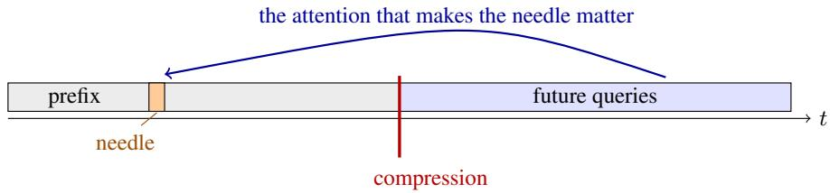
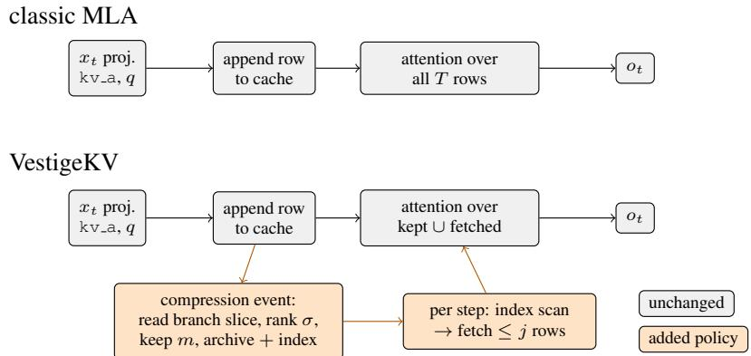
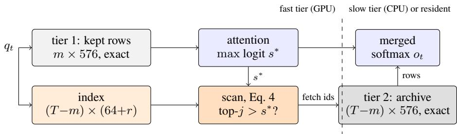

# VESTIGEKV: THE NOPE-MLA KV CACHE CARRIESITS OWN EVICTION SIGNAL IN A VESTIGIAL BRANCH

WenJie Fan

Yotta Labs

fanwj@mail.ustc.edu.cn fanwenjie@yottalabs.ai https://github.com/fan-wenjie/vestigekv

## ABSTRACT

The problem. A long-lived KV cache must be compressed before the queries that will read it exist; selection by observed attention (H2O, SnapKV) collapses there (0.00–0.33 needle retrieval on a NoPE MLA model), because a token’s importance has not yet been observed. The method. On Kimi Linear, VestigeKV evicts by a query-independent signal the cache already carries: the 64-dimensional decoupled branch, a vestige of RoPE that NoPE training repurposes into a salience channel. Reading 11% of each row, it partitions the cache: the top-m rows stay in the attended tier; every other row moves — exactly, never deleted — to a GPU-resident archive reachable per step by a certified trigger. No training, no quantization, no weight or kernel change. Cost. Nothing measurable: retrieval holds at 1.00 under 8× and 0.92 under 32× from 8k to 65k context, zero gap to full-row selection. The attended tier is 0.25 KB of Kimi Linear’s 8.1 KB per-token cache at 32×; the archive stays bit-exact and GPU-resident, with host offload as the VRAMreclaiming variant. The recall tier — the standard configuration — holds 128× at 1.00. Kimi K3 is reported to use a NoPE Gated-MLA variant; if its cache layout matches, the method plausibly extends there — we make no claim beyond the measured model. NoPE exclusivity. The identical operator on a RoPE MLA collapses to 0.08 (plain eviction: 0.42); query-independent salience itself exists only without rotation (top-1 targets span 2.3–6.7% of tokens vs. 10.2–46.8%), and query-universal exact merging is provably impossible under RoPE. All thresholds were frozen before data; 20 archived verdicts and 8 closed routes accompany the paper.

## 1 INTRODUCTION: CAPABILITY, COST, AND REQUIRED CHANGES

For a reader holding stock Kimi Linear weights, the offer is as follows (Kimi K3, whose Gated-MLA variant shares the same 576-dim cache layout, is a plausible but untested extension; see Limitations):

effect attended tier 576 → 18 dims/token at 32× (archive bit-exact, GPU-resident or host-offloaded) with retrieval 0.92 (8k–65k); lossless at 8×; with the recall tier, 1.00 at 128×   
selection cost read 11% of each row once per compression event; one low-pass filter (O(T log T)) + top-m; decode path unchanged   
model changes none — weights, kernels, arithmetic untouched; this is a cache policy: read latent cache[. . .,512:], rank, free rows   
recall tier (standard) archived rows stay GPU-resident + a (64+r)-dim index; per step, one index GEMV and ≤16 rows admitted on trigger — full attention reads drop from 576 to ∼145 dims/token — 4.0× on the KV path (Eq. 2); host offload is the VRAM-bound variant   
NoPE exclusivity the signal is query-independent salience, which exists only when the score is one fixed bilinear form; measured 0.08 under RoPE

The paper then owes the reader three things, in order: the mathematics that makes a query independent signal possible at all and merging impossible (Section 3); the engineering, down to the production cache layout and a recall tier with per-step certificates (Section 4); and the measurements, ending in a recommended configuration (Section 5). Throughout, each piece names the NoPE dividend and the RoPE obstruction — the latter also explains why the RoPE-era eviction literature selects on observed attention and has no such signal to select on.

## 2 THE PROBLEM: THE CACHE IS COMPRESSED BEFORE ITS QUERIES EXIST

In a long-lived cache, the query that will need a token arrives after the compression decision. Any statistic of observed attention is blind to it: on our NoPE-MLA testbed, H2O drops to 0.00 needle retrieval at 8× where VestigeKV holds 1.00 (full comparison in Table 4), and giving H2O half its budget as a recent window changes nothing — the failure is informational, not budgetary.

  
Figure 1: Gray: the prefix — all that observed attention can ever see; orange: the needle. Its importance is conferred entirely by queries that do not exist at compression time. H2O accumulates prefix attention; SnapKV reads a window before the cut; both see nothing (Table 4).

NoPE dividend: under a fixed bilinear form, salience is a property of the token alone, so a signal can survive compression-before-query (Section 3a). Under RoPE: the winner of attention depends on the query’s position; the pre-query setting has no usable signal, which is why the RoPE-era literature selects on observed attention and inherits this collapse.

## 3 THEORY: THE MATHEMATICS OF A POSITION-FREE CACHE

The cache row and the two maps that read it:

$$
\tilde { C } _ { u } = [ \hat { c } _ { u } ; r _ { u } ] , \qquad s _ { h } ( t , u ) = \lambda \big \langle Q _ { t } ^ { h } , \tilde { C } _ { u } \big \rangle , \qquad v _ { u } ^ { h } = W _ { U V } ^ { h } \hat { c } _ { u } ,\tag{1}
$$

with $Q _ { t } ^ { h } = [ W _ { U K } ^ { h \top } q _ { t } ^ { h , c } ; q _ { t } ^ { h , r } ]$ the absorbed query and λ the attention scale. Everything follows from one structural fact: under NoPE, both maps depend on u only through the row itself.

Lemma 1 (Exchangeability). NoPE-MLA attention output is a function of the multiset $\{ \{ \tilde { C } _ { u } \} \}$ : $\begin{array} { r } { o _ { t } ^ { h } = \sum _ { u } e ^ { s _ { h } ( t , u ) } v _ { u } ^ { h } \big / \sum _ { u } \dot { e } ^ { s _ { h } ( t , u ) } } \end{array}$ , and both sums are symmetric in u by Eq. 1. □

Three consequences, one per pillar of the paper.

(a) Query-independent salience exists (the selector). The score is one bilinear form, so arg maxu sh(t, u) = arg max $_ u \langle A _ { h } ^ { \top } x _ { t } , x _ { u } \rangle$ , writing x for hidden states and $A _ { h }$ for the per-head bilinear form with rank $A _ { h } \le d _ { \mathrm { h e a d } } \ddot { } $ every read direction lies in one fixed low-rank subspace, so the tokens that can ever win are the extreme points of the hidden-state cloud against one fixed cone — measured at 2.3–6.7% of tokens. Under RoPE the form is the family $A _ { h } ( \tilde { \Delta ) } = \tilde { W } _ { q } ^ { \top } R _ { \Delta } \tilde { W _ { k } }$ ; the cone sweeps with position and the winner set inflates to 10.2–46.8%. A compression decision made before its queries can only rely on a query-independent signal, and only NoPE has one.

## (b) Merging is impossible; selection is forced (the method).

Proposition 1 (Minimum exact cache). Over any open set of queries, a representative cache $\{ ( \dot { C _ { g } } , b _ { g } ) \} _ { g = 1 } ^ { B }$ with logit offsets reproducing attention exactly for all queries satisfies $B \_ { } \geq$ #{distinct rows}.

Proofsketch. Exactness for all Q means $\begin{array} { r } { \sum _ { q } e ^ { b _ { g } } e ^ { \langle Q , C _ { g } \rangle } = \sum _ { u } e ^ { \langle Q , \tilde { C } _ { u } \rangle } } \end{array}$ (and the v-weighted analogue). The characters $Q \mapsto e ^ { \langle Q , C \rangle }$ of $( \mathbb { R } ^ { d } , + )$ are linearly independent on any open set, so the representative multiset must contain every distinct row with weight equal to its multiplicity. Full proof in Appendix A. □

Under RoPE equal content at distinct positions is never equal as rows, $\| R _ { u } k - R _ { v } k \| ^ { 2 } =$ $\begin{array} { r } { \sum _ { j } 4 \sin ^ { 2 } \frac { \theta _ { j } ( u - v ) } { 2 } \| k ^ { ( j ) } \| ^ { 2 } \ > \ 0 } \end{array}$ , so $B \ = \ T$ : exact compression is zero, and every practical method must select. Under $_ { \mathrm { N o P E + M L A } }$ the merge class is wider than equality (a corollary: $c _ { v } = \alpha c _ { u } , \alpha > 0 , r _ { v } = r _ { u }$ suffices, by positive homogeneity of RMSNorm) — but a pre-registered measurement finds this class empty on real corpora, so selection is forced there too.

(c) Per-token certificates (the recall tier). For any surrogate row $C _ { g ( u ) }$ with $\| \tilde { C } _ { u } - C _ { g ( u ) } \| \le \varepsilon _ { u }$ and any future query, $| \Delta s | \leq \lambda \| Q \| \varepsilon _ { u } - \mathbf { a }$ query-uniform bound, available only because the form is fixed (under RoPE it must hold over the whole rotation orbit). Section 4.2 builds the archive index from exactly this decomposition.

## 3.1 EVICTION COMMUTES WITH TIME

A consequence of Lemma 1 worth isolating, because it licenses a schedule the experiments use and RoPE cannot.

Corollary 1 (Ranking stationarity). Under NoPE, $s ( q _ { t } , u ) = \lambda \langle Q _ { t } , \tilde { C } _ { u } \rangle ( E q .$ . 1) contains neither t nor the age of row u. Hence any row-intrinsic ranking (such as σ), once computed, is valid at every later step, and a global top-m maintained incrementally (a heap, later rows displacing earlier ones) equals the one-shot global top-m computed at the end. Eviction decisions are final.

The measured footprint is the streaming result of Section 5: blockwise compression equals oneshot global compression trial by trial at both ratios, and so does blockwise compression with global rebalance (constant m, later rows displacing earlier ones) at matched final budget. Under RoPE the corollary fails at an intrinsic rate: the cached score $s ( q _ { t } , u ) = \lambda q _ { t } ^ { \top } R _ { t - u } W _ { K } \tilde { C } _ { u } =$ $\textstyle \sum _ { i } a _ { i } ( u )$ cos $( \omega _ { i } ( t { - } u ) { + } \phi _ { i } ( u ) )$ oscillates per frequency band, so the pairwise order of any two rows flips as t grows and a frozen ranking goes stale; the only remedy is re-scoring every archived row against the current position at every rebalance, so no eviction decision is ever final. NoPE deletes this staleness failure mode entirely; the remaining failure of a constant-m schedule is genuine budget contention (a later high-σ row displacing a needle), a memory-for-quality trade, not signal failure. The schedule itself is prior art (H2O (Zhang et al., 2023) lineage); the dividend attaches to the signal.

## 3.2 THE VESTIGE, AND THE NEW JOB TRAINING GAVE IT

Which rows to select is decided by anatomy. The branch $r _ { u }$ exists because rotary position cannot pass MLA’s low-rank bottleneck $( R _ { t - u }$ does not commute with the up-projection), so DeepSeek-V2 routes position around it in a per-token, MQA-shared channel. Under NoPE the released code caches the branch but never rotates it (no rotary call in the reference implementation; ${ \tt s k i p \_ r o p e { = } T }$ rue in sglang): the positional job is gone. Training reallocates the freed channel:
<table><tr><td>measurement</td><td>NoPE (Kimi) RoPE (DSV2)</td></tr><tr><td>branch/content row norm (max)</td><td>3.48× 1.01× 67.6%</td></tr><tr><td>score-variance share (11% of dims)</td><td>(branch is positional)</td></tr><tr><td>top-1 retention, branch only</td><td>0.9869</td></tr><tr><td>top-1 retention, content only</td><td>0.0001</td></tr><tr><td>normalization</td><td colspan="2">content is RMSNormed; the branch is the row&#x27;s only magnitude path</td></tr></table>

Table 1: The branch is the trained salience channel. Static rows from weights alone; behavioral rows from 512 real queries × 32 heads.

NoPE dividend: a 64-dim channel with no positional duty becomes, under training, the cache’s magnitude/salience channel — readable at 11% cost. Under RoPE: the same 64 dims must encode rotationfrequencies; their low-pass residual is phase, not salience, and the identical statistic scores 0.08 (Table 5).

The read budget, computed. Decode-time attention is bandwidth-bound: KV-path time tracks bytes read per step. The three-term budget follows from the construction above:

$$
\operatorname { r e a d s } ( \rho , r ) = \underbrace { \rho \cdot 5 7 6 } _ { \mathrm { a t t e n d e d } } + \underbrace { ( 1 - \rho ) ( 6 4 + r ) } _ { \mathrm { i n d e x ~ s c a n } } + \underbrace { f \cdot 5 7 6 } _ { \mathrm { a d m i t t e d } } \ \mathrm { d i m s / t o k e n } .\tag{2}
$$

At $\rho { = } 1 / 3 2 , r { = } 6 4$ (resident) with the admitted fraction f measured at $0 . 4 \mathrm { - } 0 . 8 \%$ on document decode (Section 5.1); f is workload-dependent — 0.5–2.6% per query on needle contexts, and the r-sweep’s fire rates are per-query trigger frequencies on perplexity telemetry, not read fractions: 145 of 576 dims, $\mathrm { ~ 1 ~ 4 . 0 \times K V }$ -path read reduction set by ρ and the index width — the trigger term contributes under 1%. Asymptotic in context and batch (a single 8k request dilutes to ${ \sim } 1 . 1 \times )$ ; fused-kernel wall clock is unmeasured.

## 4 ENGINEERING

  
Figure 2: The delta from classic MLA, per layer. Every model operation (gray) is byte-identical — projections, kernels, arithmetic, weights. What is added (orange) is cache-membership policy: a compression event that ranks rows by the branch slice, and an optional per-step scan-and-fetch. Removing the orange path recovers classic MLA exactly.

## 4.1 THE EVICTION POLICY

For a closed prefix block of branch vectors $r _ { 0 : T } , { \mathcal { F } }$ the sequence-axis rFFT, bandwidth κ:

$$
\sigma _ { u } = \left\| r _ { u } - \left( \mathcal { F } ^ { - 1 } \mathcal { Y } _ { [ 0 , \kappa ) } \mathcal { F } r \right) _ { u } \right\| ;\tag{3}
$$

keep the σ-top-m rows (plus 4 sinks and the recent window) in the attended tier; move every other row, bit-exactly, to the archive of Section 4.2. No row is ever deleted in deployment: under long contexts and long reasoning chains every token must remain represented in the cache, so the deployed invariant is a partition, and pure deletion appears below only as a measured ablation. On stock serving stacks this is a cache-manager policy, not a model change: the selector reads the trailing 64 dims of each latent cache row (a contiguous slice), and eviction is row removal in the single-KV-head paged layout.

cache row $\tilde { C } _ { u }$ (576 dims), one per token per layer

$$
\boxed { \begin{array} { r l } & { \mathrm { c o n t e n t ~ l a t e n t } \hat { c } _ { u } : 5 1 2 \mathrm { d i m s } , \mathrm { R M S N o r m e d } ( \mathrm { d i r e c t i o n ~ o n l y } ) } \\ & { \qquad \downarrow } \\ & { \sigma _ { u } = \| r _ { u } - \mathrm { l o w } { - } \mathsf { p a s s } ( r ) _ { u } \| \ \Rightarrow \ \mathrm { k e e p } \mathsf { t o p } { - } m \mathsf { r o w s } \mathrm { e x a c t l y } , \mathrm { e v i c t } \mathrm { t h e ~ r e s t } } \end{array} }
$$

Figure 3: VestigeKV reads only the branch (orange, 11% of the row). Kept rows are exact; nothing else is stored.

NoPE dividend: the policy consults no observed attention and never revisits a decision: the signal exists query-free (Section 3a) and frozen rankings never stale (Corollary 1). Under RoPE: the branch signal is phase-buried (measured 0.08 branch-alone) and any frozen ranking goes stale at thefrequency-band rate.

## 4.2 THE RECALL TIER

Eviction discards rows whose importance arrives later; production systems keep them recallable (Chen et al., 2024). VestigeKV’s structure gives the trigger for free. Archived row u keeps an index entry $( r _ { u } , \ V _ { r } ^ { \top } \hat { c } _ { u } , \ \eta _ { u } ) { : }$ the exact branch summand of every future logit, a rank-r sketch of the content summand $( V _ { r }$ from the context’s own prefix queries), and the sketch residual norm $\eta _ { u } = \| ( I - V _ { r } V _ { r } ^ { \top } ) \hat { c } _ { u } \|$ . Per decode step, over archived rows:

$$
\begin{array} { r } { \mathrm { s c o r e } ( t , u ) = \underbrace { \lambda q _ { t } ^ { r \top } r _ { u } } _ { \mathrm { e x a c t s u m m a n d } } + \underbrace { \lambda ( V _ { r } ^ { \top } q _ { t } ^ { c \prime } ) ^ { \top } ( V _ { r } ^ { \top } \hat { c } _ { u } ) } _ { \mathrm { s k e t c h } } + z \underbrace { \lambda \| ( I - V _ { r } V _ { r } ^ { \top } ) q _ { t } ^ { c \prime } \| \eta _ { u } / \sqrt { d _ { c } - r } } _ { \mathrm { c e r t i f i c a t e s c a l e } } , } \end{array}\tag{4}
$$

with $q _ { t } ^ { c \prime } = W _ { U K } ^ { \top } q _ { t } ^ { c }$ the absorbed content query and the $1 / \sqrt { d _ { c } - r }$ factor putting the residual on a perdimension scale before calibration; fetch the top-j rows whose score exceeds the tier-1 maximum; z is calibrated on the same context’s prefix (labels are computable at compression time, before any row is deleted — no external calibration corpus).

  
Figure 4: Per decode step: tier-1 attention yields $s ^ { * } ,$ ; the index scan admits the archived rows that could compete; fetched rows join that query’s softmax as exact copies (Lemma 1). Tier-2 placement is orthogonal to the algorithm; the standard configuration keeps it GPU-resident (fetch is then free and the saving is per-step attention reads), with host offload as the VRAM-bound variant.

Two lemmas make the construction precise.

Lemma 2 (Index certificate). For every future query and archived row, $s ( t , u ) ~ = ~ \lambda q _ { t } ^ { r ^ { \top } } r _ { u } ~ -$ + $\lambda ( V _ { r } ^ { \top } q _ { t } ^ { c \prime } ) ^ { \top } ( V _ { r } ^ { \top } \hat { c } _ { u } ) + \delta _ { t , u }$ with $\lvert \delta _ { t , u } \rvert \leq \bar { \lambda } \rvert \bar { \lvert ( I - V _ { r } V _ { r } ^ { \top } ) } q _ { t } ^ { c \prime } \rvert \lvert \eta _ { u }$ . The first two terms are computable from the index alone; the bound is Cauchy–Schwarz on the sketch residual and holdsfor all queries because the form is fixed — under RoPE it would have to hold over the rotation orbit. □

Lemma 3 (Bounded leakage). Let F be the rows admitted to a step’s softmax (kept ∪fetched) and $s ^ { * } = \operatorname* { m a x } _ { u \in F } s ( t , u )$ . If every excluded row satisfies $s ( t , u ) \leq s ^ { * } - \tau ,$ the total excluded softmax weight is at most $( T ^ { \cdot } - | F | ) \dot { e } ^ { - \tau }$ relative to the maximal included weight, and the output error is bounded by that mass times $\operatorname* { m a x } _ { u } \| v _ { u } \|$

Proof. Each excluded weight is at most $e ^ { - \tau }$ times the maximal included weight; sum over excluded rows and bound the output difference by excluded mass times the largest value norm. □

Lemma 2 is what the scan computes; Lemma 3 is why fetching only score-competitive rows suffices: the trigger exists to make the premise of Lemma 3 hold with high measured probability (0.941 in distribution). Guaranteed variants were measured and closed: the sound Cauchy–Schwarz bound fires on 99.5% of steps, and Gaussian-derived thresholds are invalidated by a selection effect (the argmax rows are precisely the residual outliers, at 3.5–10.9σ). The adopted z is therefore calibrated empirically.

NoPE dividend: the index owes its 64 exact dims and its per-row certificate to a sidecar term that nothing rotates; both quantities are single numbers per row. Under RoPE: each would have to hold over the whole rotation orbit — the obstruction quantified next.

## 4.3 THE DIGEST OBSTRUCTION UNDER ROPE

The prior recall design (Chen et al., 2024) scores an evicted page K by a bounding-sphere digest, $\begin{array} { r } { I ( q , \mathbf { \bar { K } } ) = \operatorname* { m a x } _ { k \in \mathcal { K } } \mathbf { \bar { q } } \cdot k \leq q \cdot c + r \| q \| } \end{array}$ , sound only when r encloses every key — and adopts a nonenclosing radius because the sound one overestimates, giving up the guarantee. Under RoPE that

dilemma is structural. A page is $P$ consecutive positions of cached keys $R _ { u } k _ { u } ;$ even for constant content k,

$$
\begin{array} { r } { \| R _ { u } k - R _ { v } k \| ^ { 2 } = \sum _ { j } 4 \sin ^ { 2 } \frac { \theta _ { j } ( u - v ) } { 2 } \| k ^ { ( j ) } \| ^ { 2 } \implies r ^ { 2 } \gtrsim \sum _ { \theta _ { j } \geq 2 / P } \| k ^ { ( j ) } \| ^ { 2 } , } \end{array}\tag{5}
$$

so the radius is of order the fast-frequency key norm regardless of content coherence: the digest cannot be tight. The center fares no better — per frequency pair the page mean carries the Dirichlet factor

$$
\left| \frac { 1 } { P } \sum _ { u = 0 } ^ { P - 1 } e ^ { i \theta _ { j } u } \right| = \frac { | \sin ( P \theta _ { j } / 2 ) | } { P | \sin ( \theta _ { j } / 2 ) | } \ll 1 \mathrm { f o r } \mathrm { f a s t } \theta _ { j } ,\tag{6}
$$

so $q \cdot c$ is blind to exactly the dimensions inflating r. NoPE removes both at the root — rows are content-only — and replaces the estimate with structure the digest never had: an exact summand (Lemma 2), a per-token certificate with a measured accuracy knob, and by Section 3(a) a fixed winner set, so rankings may be prefetched where the RoPE family $A _ { h } ( \Delta )$ forces re-ranking every step.

Table 2: Each ArkVale-style limitation, its mechanism, and the measured effect of removing rotation. Same digest protocol on both models (32-token pages, sphere digests per their Eq. 1–2); recall@8 pages of the true-argmax page, worst layer — the tail-risk statistic that decides adoptabil ity.
<table><tr><td>limitation</td><td>mechanism</td><td>RoPE</td><td>NoPE</td></tr><tr><td rowspan="5">digest looseness worst-layer recall (heuristic r) worst-layer recall (sound r) per-step re-ranking</td><td rowspan="2">Eq. 5: orbit-inflated radius deep layers position-dominated</td><td>1.78-1.86× spread</td><td>(removed)</td></tr><tr><td>0.024</td><td>0.67 0.97</td></tr><tr><td rowspan="3">sound radius unusable winner set sweeps with</td><td>0.014</td></tr><tr><td></td><td>10.2–46.8% union</td></tr><tr><td></td><td>2.3–6.7% union</td></tr></table>

NoPE dividend: exact summands, per-token certificates, layer-uniform recall, and prefetchable rankings — the parts of a recall tier that mathematics can supply. Under RoPE: every one of these reduces to a heuristic estimate; the residual risk hides in specific layers (0.024 at the worst), which is the adoption-blocking tail risk.

## 5 EXPERIMENTS AND RECOMMENDED CONFIGURATION

Reading the tables. Unless a caption says otherwise, quality tables are the tier-1 ablation (recall tier off): they isolate the selector and are not final quality — deployment always runs both tiers (Sections 4.2, 5.1; recovery 1.00 at 128×).

Primary metric: needle-retrieval intact rate $( \Delta \mathrm { N L L } < 1 $ nat), uncompressed baseline gated (all trials passed); gates and process in Section 6. Per-layer proxies are demoted: 10 recorded cases mispredicted end-to-end retrieval, the worst a learned selector at +0.41 offline / −0.71 end-to-end.

Table 3: Tier-1 ablation (recall tier off; not the deployed form). Branch-only selection (VestigeKV, reads 11% of each row) vs. full-row selection at matched budget.
<table><tr><td></td><td colspan="3">L=8192</td><td colspan="3">L=32768</td><td colspan="3">L=65536</td></tr><tr><td></td><td>32×</td><td>64×</td><td>128×</td><td>32×</td><td>64×</td><td>128×</td><td>32×</td><td>64×</td><td>128×</td></tr><tr><td>VestigeKV</td><td>0.88</td><td>0.75</td><td>0.67</td><td>0.92</td><td>0.83</td><td>0.83</td><td>0.92</td><td>0.75</td><td>0.58</td></tr><tr><td>Full-row selection</td><td>0.83</td><td></td><td>0.67</td><td>0.92</td><td></td><td>0.83</td><td>0.92</td><td></td><td>0.58</td></tr></table>

Table 4: Tier-1 ablation (recall tier off). Needle intact rate when compression precedes the query (L=8192, 24 trials; L=32768, 12 trials). The recent-window variant rules out a budgetary explanation for the collapse (Section 2). These methods remain strong in their design setting (query present at compression); this is the other setting.
<table><tr><td></td><td>8×</td><td>32×</td><td>128×</td></tr><tr><td>H2O (Zhang et al., 2023)</td><td>0.00</td><td>0.00</td><td>0.00</td></tr><tr><td>SnapKV (Li et al., 2024)</td><td>0.33</td><td>0.04</td><td>0.00</td></tr><tr><td>H2O + recent (half budget)</td><td>0.00</td><td>0.00</td><td>0.00</td></tr><tr><td>StreamingLLM (Xiao et al., 2024)</td><td>0.00</td><td>0.00</td><td>0.00</td></tr><tr><td>VestigeKV</td><td>1.00</td><td>0.88</td><td>0.67</td></tr><tr><td>H2O / SnapKV, L=32768</td><td></td><td>0.00/0.00</td><td>0.00/0.00</td></tr><tr><td>VestigeKV, L=32768</td><td></td><td>0.92</td><td>0.83</td></tr></table>

Table 5: Tier-1 ablation. Left: dual-arm acceptance, frozen before either arm ran: work on NoPE and fail on RoPE (DeepSeek-V2-Lite, matched layers, 32×). Right: branch-width ablation — posthoc PCA truncation before σ; monotone degradation below 32 dims.
<table><tr><td></td><td>NoPE</td><td>RoPE</td></tr><tr><td>VestigeKV</td><td>0.88</td><td>0.08</td></tr><tr><td>full-row eviction</td><td>0.83</td><td>0.42</td></tr><tr><td>top-1 union</td><td>2.3-6.7%</td><td>10.2-46.8%</td></tr></table>

<table><tr><td>branch dims</td><td>4</td><td>8</td><td>16</td><td>32</td><td>64</td></tr><tr><td>@ 32×</td><td>0.42</td><td>0.50</td><td>0.54</td><td>0.75</td><td>0.88</td></tr><tr><td>@ 128×</td><td>0.12</td><td>0.17</td><td>0.38</td><td>0.62</td><td>0.67</td></tr></table>

Table 6: Left: end-to-end recovery (L=8192, 24 trials) — the tier restores what eviction loses, admitting only 0.5–2.6% extra rows per query. Right: the index-rank knob — a larger sketch cuts trigger rate and fetch volume while recall rises (tighter bounds rank better). Rows/query is a document-perplexity figure; retrieval-heavy steps legitimately fetch more (5–37 rows per layer at r=192 on needle contexts, recovery still 1.00).
<table><tr><td></td><td>32×</td><td>128×</td></tr><tr><td>eviction only</td><td>0.88</td><td>0.67</td></tr><tr><td>+ recall tier</td><td>1.00</td><td>1.00</td></tr></table>

<table><tr><td>sketch rank r</td><td>64</td><td>128</td><td>192</td><td>256</td></tr><tr><td>fire rate</td><td>0.028</td><td>0.008</td><td>0.004</td><td>0.002</td></tr><tr><td>rows/query</td><td>15.2</td><td>3.6</td><td>1.2</td><td>1.2</td></tr><tr><td>hard rêcali</td><td>0.950</td><td>0.931</td><td>0.974</td><td>0.962</td></tr></table>

At 8× retrieval is lossless (1.00); quality at fixed ratio improves with length (0.67 at 8k → 0.83 at 32k, 128×).

Table 7: Tier-1 ablation. General language-modeling cost (∆CE, nats/token, held-out continuation, 6 docs). The standard configuration is effectively lossless (∼0.0006 bits/byte at 32× for ∼4-byte tokens). The recent-only floor matches on CE while scoring +15 nats on needle — continuation loss alone cannot arbitrate retrieval, which is why needle is the primary metric.
<table><tr><td>∆CE</td><td>8×</td><td>32×</td><td>128×</td></tr><tr><td>eviction + recall tier (standard)</td><td>+0.0011</td><td>+0.0018</td><td>+0.0022</td></tr><tr><td>eviction only</td><td>+0.0055</td><td>+0.0090</td><td>+0.0104</td></tr><tr><td>recent-only floor</td><td>+0.0055</td><td>+0.0093</td><td>+0.0112</td></tr></table>

## 5.1 THE DEPLOYMENT PATH MEASURES THE SAME

The numbers above come from a research harness that patches attention in an HF forward. A serving-form engine (chunked prefill over the production 576-dim latent cache, streaming constantm eviction at block close, GPU-resident recall tier queried per decode step) reproduces them end to end. Parity first: the engine’s teacher-forced NLL matches the HF reference at the checkpoint’s own bf16 reproducibility floor (median |∆NLL $7 . 9 \times 1 0 ^ { - 3 }$ vs. a floor of $6 . 8 \times 1 0 ^ { - 3 }$ between two valid HF attention flows — the ruler’s resolution, measured, not assumed). On that ruler: streaming eviction retrieves 11/12 needles at 32× (the harness figure to the trial); at an instrumental 512× the eviction arm keeps 6/12 and the recall tier returns every needle lost (6 of 6), finishing 12/12; and teacher-forced bits-per-byte over held-out documents moves from 0.5881 (uncompressed engine; HF 0.5879) to 0.5885 with the full stack in the loop — +0.0014 nats per token at 32×, with 20 rows fetched per step. Free generation holds under the same stack: MAUVE (GPT-2 Large featurizer, 16 contexts × 256 tokens, matched seeds so the arms differ only through the cache) is 0.999 for the uncompressed engine and 0.962 with VestigeKV in the loop — a small-N figure, reported as such.

NoPE dividend: every deployment-path guarantee above leans on ranking stationarity (Corollary 1): block-close decisions are final, so the serving engine never re-scores closed blocks. Under RoPE: frozen block-close rankings go stale at the frequency-band rate; the same engine would re-read every archived row at every rebalance.

## 5.2 RECOMMENDED CONFIGURATION

The ratio floor for a constant-m (dynamic-ρ) schedule is 1/32: the only measured ratio flat in length (Table 3; 1/64 measures 0.75/0.83/0.75 and 1/128 dips at 65k, so deeper ratios degrade precisely where a floor binds — long contexts). Tier-1-only figures; tier-2 recovery extends to depth at length: 12/12 at an instrumental 256×, L=32768, in the deployment loop (both evicted needles returned).

<table><tr><td>parameter</td><td>recommended</td><td>basis</td></tr><tr><td>ratio ρ</td><td>1/8 lossless; 1/32 default</td><td>Table 3 tracks context length</td></tr><tr><td>bandwidth κ sinks / recent</td><td> $1 6 ( L \leq 1 6 \mathrm { k } ) ; 6 4 ( L \geq 3 2 \mathrm { k } )$  first 4 / one block</td><td>sink dominance of attention mass placement-dependent: with tier-2</td></tr><tr><td>sketch rank r</td><td>64 resident / 192 offload</td><td>GPU-resident fetches are free and r should minimize scan bytes (per-step reads 26% of</td></tr><tr><td></td><td></td><td>full at r=64 vs 47% at r=192); with host offload r=192 minimizes triggers (0.004 at recall 0.974)</td></tr><tr><td>fetch j trigger z</td><td>16 calibrate to recall 0.90 on the prefix</td><td>recall 0.93–0.98 across data families in-context; no external corpus</td></tr><tr><td>entropy gate</td><td>auto-off if cal. fire rate &gt; 60%</td><td>self-deciding; saves the scan only where it filters</td></tr><tr><td>tier-2 placement</td><td>GPU-resident</td><td>fetch free; per-step reads 576 → ~150–270 dims/token; offload to host only where VRAM-bound</td></tr></table>

Table 8: Empirical defaults. Every value traces to a pre-registered measurement.

NoPE dividend: the entire configuration self-calibratesfrom the context being compressed — possible because labels, thresholds and the sketch basis are all functions of one fixed bilinear form. Under RoPE: calibration targets move with query position; every threshold must chase a distribution that the compression step cannot observe.

## 6 MEASUREMENT INTEGRITY

Every check below was driven with a known-bad input and shown to refuse it before being trusted; every threshold in this paper was frozen, dated, before its data. All reported rates are exact fractions over the stated trial counts; Wilson 95% intervals for every primary rate are in Appendix B.

Table 9: Gates and process.
<table><tr><td>gate</td><td>known-bad input it was proven to catch</td></tr><tr><td>identity operator (∆CE = 0)</td><td>eager/sdpa kernel mismatch  $( 1 . 4 \times 1 0 ^ { - 1 } )$ </td></tr><tr><td>uncompressed-baseline gate</td><td>trials the base model cannot retrieve</td></tr><tr><td>hook fire counts</td><td>silent non-capture (verdicts about nothing)</td></tr><tr><td>leakage floor (cache destroyed ⇒ 0.00)</td><td>uncompressed layers recovering the needle</td></tr><tr><td>pre-registration, 20 verdicts</td><td>three retracted mechanisms; a rejected learned selector</td></tr></table>

## 7 RELATED WORK

Observed-attention eviction (Zhang et al., 2023; Li et al., 2024; Oren et al., 2024; Xiao et al., 2024) selects on attention already seen; Section 2 measures the setting where that information does not yet exist. Branch-differential studies (Ma et al., 2026b;a) measure the rotated branch and report that rotation destroys its position-free structure (branch-only AUC 0.43), leaving the unrotated case open — the case measured here. Recallable eviction (Chen et al., 2024) and page-bound selection (Tang et al., 2024) are complementary tier-2 designs (Section 4.3: the structural looseness of their digests under RoPE, and its removal under NoPE); trained compression (Lin et al., 2025; Gelberg et al., 2026) changes the model, which VestigeKV does not. Per-step exact merging under RoPE (Tian et al., 2025) is the strongest possible there; Proposition 1 shows the query-universal version exists only under NoPE+MLA. Architecture from (DeepSeek-AI, 2024); the NoPE deployment from (Kimi Team et al., 2025); NoPE’s length-generalization case from (Kazemnejad et al., 2023; Wang et al., 2024). Appendix C derives the dividend each cited method inherits under NoPE.

## 8 LIMITATIONS

Every scope boundary of this study, with its measured status:

<table><tr><td>limitation</td><td>status</td></tr><tr><td>one measured model</td><td>all measurements are on Kimi Linear 48B; Kimi K3 uses a Gated-MLA variant with the same cache layout — extension is plausible and untested, and we claim nothing for it</td></tr><tr><td>one NoPE-MLA family</td><td>Kimi Linear 48B is the only released NoPE-MLA checkpoint; selector ordering replicates on a NoPE GQA hybrid (Granite-4.0-H), eviction depth does not — depth claims are MLA-conditional</td></tr><tr><td>mechanism of the depth</td><td>open; three pre-registered candidate explanations were refuted by our own runs, recorded in the pre-registration archive</td></tr><tr><td>row reachability</td><td>existence is constructive (the partition deletes nothing); per-step consultation is probabilistic (recall 0.9–1.0, 1.00 end to end); only the CPU-assisted variant is deterministic. Pure deletion loses rows</td></tr><tr><td>tasks, length</td><td>irrecoverably (+15 nats) needle retrieval and held-out CE to 65k; &gt;65k is extrapolation; standard long-context suites are future work</td></tr></table>

## 9 OUTLOOK: TRAINING AGAINST THIS MATHEMATICS

Everything above is post-hoc: weights untouched. If training is allowed, the theory marks two prospects (not claims). First, zero-miss triggering fails here only because sketch residuals $\eta _ { u }$ are large post hoc; training an explicit index channel — the vestige widened, with an auxiliary objective — could make $\eta _ { u }$ small by construction, reviving guaranteed-recall sparse attention. Second, Proposition 1’s exact collapse is empty on real corpora only because context mixing individualizes repeated content; training toward position-free latents on repeated spans would make it live, taking cache size to O(distinct content). Nearer term, eviction-aware fine-tuning (Gelberg et al., 2026) has a uniquely stable target under NoPE — the query-independent selector — where under RoPE the signal moves with query position. All three are conditional on scale: NoPE+MLA is measurably weak in small models, so none of this validates cheaply.

## 10 CONCLUSION

A production NoPE-MLA model keeps, in a channel its architecture no longer needs, a trained record of which tokens matter. Reading that record costs 11% of the cache; acting on it compresses the cache 8–32× with retrieval intact from 8k to 65k; a recall tier built from the same mathematics restores 128×; and nothing about any of it survives rotation. The vestige is the signal.

## REFERENCES

Renze Chen, Zhuofeng Wang, Beiquan Cao, et al. ArkVale: Efficient generative LLM inference with recallable key-value eviction. In NeurIPS, 2024. URL https://openreview.net/ forum?id=4oAt5L4lYe.

DeepSeek-AI. DeepSeek-V2: A strong, economical, and efficient mixture-of-experts language model. arXiv preprint arXiv:2405.04434, 2024. URL https://arxiv.org/abs/2405. 04434.

Yoav Gelberg, Yam Eitan, et al. Training transformers for KV cache compressibility. arXiv preprint arXiv:2605.05971, 2026. URL https://arxiv.org/abs/2605.05971.

Amirhossein Kazemnejad, Inkit Padhi, Karthikeyan Natesan Ramamurthy, Payel Das, and Siva Reddy. The impact of positional encoding on length generalization in transformers. In NeurIPS, 2023. URL https://arxiv.org/abs/2305.19466.

Kimi Team, Yu Zhang, Zongyu Lin, Xingcheng Yao, et al. Kimi Linear: An expressive, efficient attention architecture. arXiv preprint arXiv:2510.26692, 2025. URL https://arxiv.org/ abs/2510.26692.

Yuhong Li, Yingbing Huang, Bowen Yang, Bharat Venkitesh, Acyr Locatelli, Hanchen Ye, Tianle Cai, Patrick Lewis, and Deming Chen. SnapKV: LLM knows what you are looking for before generation. In NeurIPS, 2024. URL https://arxiv.org/abs/2404.14469.

Bokai Lin, Zihao Zeng, Zipeng Xiao, et al. MatryoshkaKV: Adaptive KV compression via trainable orthogonal projection. In ICLR, 2025. URL https://arxiv.org/abs/2410.14731.

Bole Ma, Jan Eitzinger, Harald Koestler, and Gerhard Wellein. Kamera: Unified position-invariant multimodal KV cache for training-free reuse. arXiv preprint arXiv:2606.23581, 2026a. URL https://arxiv.org/abs/2606.23581.

Bole Ma, Jan Eitzinger, and Harald Kostler. Irminsul: MLA-native position-independent caching¨ for agentic LLM serving. arXiv preprint arXiv:2605.05696, 2026b. URL https://arxiv. org/abs/2605.05696.

Matanel Oren, Michael Hassid, Nir Yarden, Yossi Adi, and Roy Schwartz. Transformers are multistate RNNs. In EMNLP, 2024. URL https://arxiv.org/abs/2401.06104.

Jiaming Tang, Yilong Zhao, Kan Zhu, Guangxuan Xiao, Baris Kasikci, and Song Han. Quest: Query-aware sparsity for efficient long-context LLM inference. In ICML, 2024. URL https: //arxiv.org/abs/2406.10774.

Yuxuan Tian, Zihan Wang, Yebo Peng, et al. KeepKV: Achieving periodic lossless KV cache compression for efficient LLM inference. arXiv preprint arXiv:2504.09936, 2025. URL https: //arxiv.org/abs/2504.09936.

Jie Wang et al. Length generalization of causal transformers without position encoding. arXiv preprint arXiv:2404.12224, 2024. URL https://arxiv.org/abs/2404.12224.

Guangxuan Xiao, Yuandong Tian, Beidi Chen, Song Han, and Mike Lewis. Efficient streaming language models with attention sinks. In ICLR, 2024. URL https://arxiv.org/abs/ 2309.17453.

Zhenyu Zhang, Ying Sheng, Tianyi Zhou, Tianlong Chen, Lianmin Zheng, et al. H2O: Heavyhitter oracle for efficient generative inference of large language models. In NeurIPS, 2023. URL https://arxiv.org/abs/2306.14048.

## A PROOFS

Lemma 1 is proved where stated. Full proof of Proposition 1:

ProofofProposition 1. Suppose $\begin{array} { r } { \sum _ { g } e ^ { b _ { g } } e ^ { \langle Q , C _ { g } \rangle } v ( C _ { g } ) = \sum _ { u } e ^ { \langle Q , \tilde { C } _ { u } \rangle } v ( \tilde { C } _ { u } ) } \end{array}$ and the same identity without the v factors, for all Q in an open set. For pairwise-distinct $C _ { i } ,$ the functions $Q \mapsto e ^ { \langle Q , C _ { i } \rangle }$ are characters of $( \mathbb { R } ^ { d } , + )$ and hence linearly independent on any open set; matching coefficients forces the representative multiset to contain every distinct row with $e ^ { b _ { g } }$ equal to its multiplicity, so $B \geq \#$ {distinct rows}. Under RoPE the displayed distance bound makes all $T$ rows pairwise distinct. Under NoPE+MLA, if $c _ { v } = \alpha c _ { u } ( \alpha > 0 )$ and $r _ { v } \ = \ r _ { u } ,$ positive homogeneity of RM-SNorm gives $\hat { c } _ { v } = \hat { c } _ { u }$ , hence identical rows: the merge class strictly contains vector equality. The value side is consistent because v is a function of the row — in standard attention, with V cached independently, no such consistency holds and the numerator identity is not even well-posed. □

## B INTERVAL ESTIMATES FOR THE PRIMARY RATES

Needle intact rates are exact fractions over small trial counts; Wilson 95% intervals make the resolution explicit. Neighboring ratios at one length are often not separated at these n. The separations the paper leans on hold: tier-1 vs. the recent-window arm (0 successes in every cell) and tier-2 recovery vs. its eviction arm. The flatness of 1/32 across lengths is a consistency observation (identical counts at all three lengths), not a separation claim.

Table 10: Wilson 95% intervals, count/trials [lower, upper]. Tier-1 ablation rows above the rule; deployment-loop rows below.
<table><tr><td></td><td>32×</td><td>64×</td><td>128×</td></tr><tr><td>L=8192</td><td>21/24 [0.69,0.96]</td><td>9/12 [0.47,0.91]</td><td>16/24 [0.47,0.82]</td></tr><tr><td>L=32768</td><td>11/12 [0.65,0.99]</td><td>10/12 [0.55,0.95]</td><td>10/12 [0.55,0.95]</td></tr><tr><td>L=65536</td><td>11/12 [0.65,0.99]</td><td>9/12 [0.47,0.91]</td><td>7/12 [0.32,0.81]</td></tr><tr><td>recall tier, 128×, 8k</td><td></td><td>24/24 [0.86,1.00]</td><td></td></tr><tr><td>deployment loop, tier-1, 32×</td><td></td><td>11/12 [0.65,0.99]</td><td></td></tr><tr><td>deployment tier-2, 512× at 8k, 256× at 32k</td><td></td><td>12/12 [0.76,1.00], 12/12 [0.76,1.00]</td><td></td></tr></table>

## C THE DIVIDEND INSIDE PRIOR ALGORITHMS

Claim up front: NoPE confers a family of algorithmic dividends, not one. Two structural facts — the score is a single fixed bilinear form, and rankings commute with time (Corollary 1) — turn into distinct, unclaimed guarantees inside one published cache-management algorithm after another once transplanted to NoPE-MLA: statistics become stationary, voting horizons become unbounded, screening bounds become admissible, projection objectives become clean, merging acquires an exactness certificate, and reuse becomes zero-copy. The main text derives two instances (the selector, Section 3; page digests, Section 4.3); this appendix enumerates the rest. Each is a derivation from the setup of Section $_ { 3 ; }$ none is a new measurement, and we say so where the measured record limits the claim.

Accumulated-attention eviction (H2O, TOVA). These methods score row u by attention mass observed under past queries, $\widehat { s } ( u ) = \textstyle \sum _ { t }$ so $\mathrm { \dot { \ t m a x { \mathrm { - } w e i g h t { } } } } ( q _ { t } , u )$ (Zhang et al., 2023; Oren et al., 2024). What the statistic estimates:

$$
\mathbb { E } \big [ \hat { s } ( u ) \big ] = \left\{ \begin{array} { l l } { n \mathbb { E } _ { q } \Big [ w \big ( \lambda \langle Q , \tilde { C } _ { u } \rangle \big ) \Big ] } & { \mathrm { N o P E ; ~ n o ~ } t \mathrm { ~ e n t e r s - o n e ~ n u m b e r ~ p e r ~ r o w } , } \\ { \sum _ { t } \mathbb { E } _ { q } \Big [ w \big ( \lambda q ^ { \top } R _ { t - u } W _ { K } \tilde { C } _ { u } \big ) \Big ] } & { \mathrm { R o P E ; ~ a ~ f u n c t i o n ~ o f ~ t h e ~ a g e ~ p r o f l e ~ } \{ t - u \} . } \end{array} \right.\tag{7}
$$

Under NoPE the estimand is time-invariant, so the estimate transfers to every future query from the same distribution. Under RoPE a future query at $t ^ { \prime } = t + L _ { \mathrm { g e n } }$ evaluates the integrand at a rotation the statistic never sampled; by the band expansion of Corollary 1 the mismatch oscillates per frequency, so the heavy-hitter statistic has a shelf life set by the band sum. NoPE removes the shelf life.

Observation-window voting (SnapKV). SnapKV votes with the last window’s queries immediately before generation (Li et al., 2024). The score a vote certifies and the score generation consumes differ, for the same $( q , u )$ , by exactly

$$
s _ { t ^ { \prime } } ( q , u ) - s _ { t } ( q , u ) = \lambda q ^ { \top } \big ( R _ { t ^ { \prime } - u } - R _ { t - u } \big ) W _ { K } \tilde { C } _ { u } , \qquad t ^ { \prime } = t + L _ { \mathrm { g e n } } ,\tag{8}
$$

which vanishes identically under NoPE $( R \equiv I )$ and oscillates per frequency band under RoPE. The vote’s validity horizon is therefore unbounded under NoPE and equal to the generation length under RoPE.

Attention sinks (StreamingLLM). Eq. 8 applied to a fixed sink row u: under NoPE the sink’s score against any query direction is length-invariant, so the mechanism of Xiao et al. (2024) is exactly stable; under RoPE the same difference term rides the lowest frequency bands and drifts with distance.

Page-bound pruning (Quest). Quest skips pages whose per-page score bound falls below the running best (Tang et al., 2024). Under NoPE the score is linear in the row for a fixed form, so interval arithmetic over a per-page box $B ( P ) = [ \ell , h ] \supseteq \{ \tilde { C } _ { u } \} _ { u \in P }$ gives a true bound,

$$
\operatorname* { m a x } _ { u \in P } \lambda \langle Q , \tilde { C } _ { u } \rangle \leq \lambda \sum _ { d } \operatorname* { m a x } \big ( Q _ { d } \ell _ { d } , Q _ { d } h _ { d } \big ) ,\tag{9}
$$

and pruning by it is admissible: no page containing the argmax is skipped beyond box slack. Under RoPE the left side is $\operatorname* { m a x } _ { u \in P } \lambda q ^ { \top } R _ { \Delta _ { u } } W _ { K } \tilde { C } _ { u }$ with $\Delta _ { u }$ varying inside the page, so an honest bound must also maximize over the rotation orbit — the radius inflation of Eq. 5 — and tightness is lost with page span. Combined with the measured layer-uniformity of NoPE page digests (Section 4.3), this is the theoretical opening for a hierarchical recall index with a per-step scan sublinear in context length; we have not built or measured one.

Trainable projections (MatryoshkaKV). For an orthogonal projector Π on the content latent, the NoPE score error is exactly $| \lambda \langle Q , ( I - \Pi ) \tilde { C } _ { u } \rangle | - \textrm { a }$ clean, query-uniform objective (Lin et al., 2025). Under RoPE the same objective is position-dependent unless Π near-commutes with the whole rotation family,

$$
\operatorname* { s u p } _ { \Delta } \big \| R _ { \Delta } ^ { \top } \Pi R _ { \Delta } - \Pi \big \| \ \approx \ 0 ,\tag{10}
$$

which ties the projector to the frequency pairing and shrinks the feasible set to band-aligned subspaces. The measured record bounds the claim: on the frozen Kimi Linear checkpoint the read-out is full-rank (rank 512), so this dividend accrues to future training (Section 9), not to the deployed weights.

Lossless merging (KeepKV). KeepKV merges cache entries with the ambition of losslessness (Tian et al., 2025). Proposition 1 is the exactness certificate that ambition needs, and it is available only under NoPE-MLA: identical rows merge exactly with an ln m bias, the RMSNorm homogeneity class enlarges the merge set, and under RoPE the merge class is empty. The measured record again bounds the claim: on real corpora the tolerant merge class is empty at 5% tolerance, so the certificate currently has no application domain on this checkpoint.

Position-independent reuse (Irminsul, Kamera). Cross-request cache reuse (Ma et al., 2026b;a) is the exchangeability lemma applied across sequences: a NoPE-MLA row is valid at any position in any context, so reuse is zero-copy. RoPE reuse pays a re-rotation of every moved row. These systems exploit the property; the lemma names it.