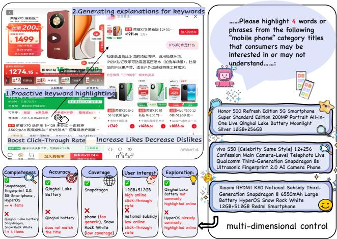
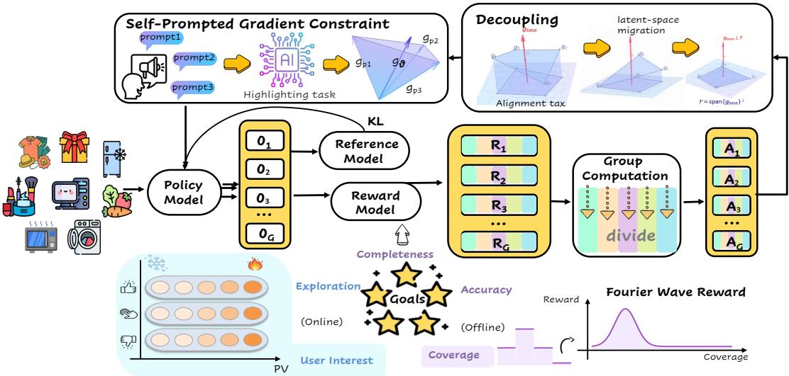
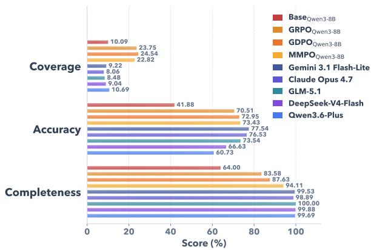
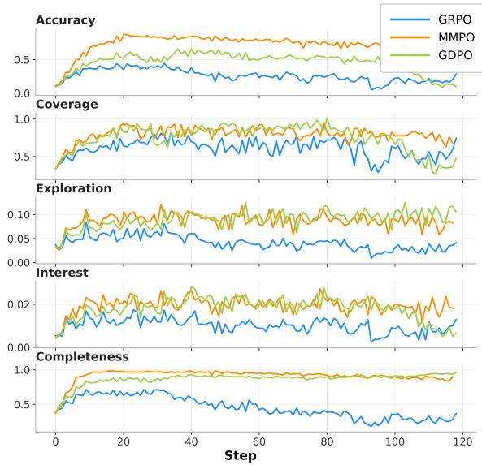
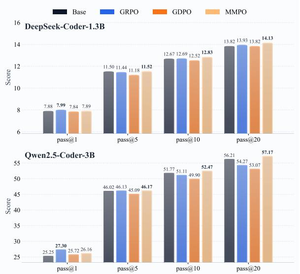

# A Better Spur Should Start From Each Objective

Shanwen Mao1

Hao Zhang1

Guangtao Nie2\*

Zhiheng Li3

Huimu Wang3†

Sulong Xu2

Simiu Gu2

1Harbin Institute of Technology, Harbin, China 2JD.com Inc., Beijing, China 3Institute of Automation, Chinese Academy of Sciences, Beijing, China 24s103313@stu.hit.edu.cn, zhh1000@hit.edu.cn {nieguangtao1, xusulong, nick.gu}@jd.com {lizhiheng2025, huimu.wang}@ia.ac.cn

## Abstract

Real-world Multi-Objective Reinforcement Learning (MORL) often suffers from sparse rewards, reward conflicts, and late-stage reward tug-of-war, causing traditional linear scalarization to experience severe metric oscillations. To address optimization conflicts among multiple objectives in real-world deployment scenarios, we propose Multi-Marginal Preference Optimization (MMPO), a fine-grained framework that intervenes at the data, gradient, and constraint levels rather than relying on coarse-grained global scalarization. Specifically, MMPO performs reward smoothing and exposure debiasing to mitigate sparse and biased rewards, applies priority-aware orthogonal projection to decouple conflicting gradients, and introduces self-prompted gradient constraints to prevent dominant objectives from overwhelming weaker ones. Experiments on real-world e-commerce datasets show that MMPO improves training stability and consistently achieves better performance across conflicting metrics. Moreover, it generalizes robustly to broader tasks such as ToolRL and code generation, demonstrating its effectiveness as a practical paradigm for multiobjective alignment. It is especially applicable to scenarios with multi-objective and sparse rewards.

## 1 Introduction

E-commerce product detail pages often suffer from high information density. Users typically focus on specific professional terms that require significant cognitive effort to digest. To improve both textual comprehension and user experience, we investigate a joint task of “term extraction and explanation generation” (Figure 1), where the model extracts informative terms from product descriptions and generates concise explanations for them. Given the product details, the model is required to extract high-value terms and provide explanations, aiming to concurrently enhance offline quality metrics and online user preference metrics.

  
Figure 1: On product detail pages, users can click highlighted keywords to view definitions and provide feedback via likes or dislikes. The online optimization objective is to boost user interest by driving higher clickthrough rates (CTR) and likes, while minimizing dislikes and maximizing the discovery of novel, previously unmentioned terms. The offline objective aims to enhance extraction quality in terms of completeness, accuracy, and coverage.

Unlike traditional text tasks, the primary challenge lies in stable optimization within a MORL framework. This manifests in three aspects: First, user feedback is inherently sparse and skewed; directly utilizing raw clicks or likes leads to reward degradation. Second, systematic conflicts exist among objectives (e.g., coverage, click-through rate, and like ratios often dictate divergent gradients), where simple scalarization severely blurs training signals. Third, a “reward tug-of-war” frequently occurs late in training, causing metrics to oscillate or regress as dominant objectives overshadow weaker ones.

To overcome these dilemmas, we eschew coarse global compromises in favor of MMPO. As a novel alignment framework, MMPO applies bottom-up, customized interventions, effectively crafting a tailored whip to drive each specific objective. The framework consists of three core modules: (1) At the data and reward level, we independently reshape and smooth reward signals via exposure stratification and debiasing to enhance their learnability. (2) At the optimization level, we orthogonally decouple multi-objective gradients within a low-dimensional subspace to isolate systematic conflicts. (3) At the dynamic constraint level, we design a self-prompted restriction strategy to adaptively suppress overly dominant dimensions during late-stage training, effectively mitigating performance oscillations.

The main contributions of this paper are summarized as follows:

• We formulate the e-commerce term extraction task as a MORL problem with sparse and conflicting rewards, proposing an “independent-objective-first” philosophy for real-world industrial deployments.

• We propose MMPO, integrating reward smoothing, gradient decoupling, and adaptive restriction to efficiently resolve systematic conflicts and late-stage metric oscillations.

• Extensive experiments show MMPO consistently improves offline completeness and online business metrics in real-world ecommerce. It also delivers competitive performance on general RL tasks such as ToolRL and code generation.

## 2 Related Work

Addressing objective conflicts is a core challenge in MORL. Existing methods can be roughly divided into three categories. The first category relies on static reward shaping or global scalarization strategies, using pre-defined weights to balance multiple objectives (Cho et al., 2025; Wang et al., 2025; Kim et al., 2026; Shakerinava et al., 2026; Cai et al., 2023). While simple to implement, these methods typically use fixed weight configurations, making them difficult to adapt to changing conflict patterns across different training stages. As a result, they often lack flexibility when facing stage-dependent conflicts. The second category alleviates objective conflicts through gradient projection or gradient regularization (Kim et al., 2025; Byeon et al., 2026; Yang et al., 2025b; Wu et al., 2025; Jiang et al., 2021). These methods mainly handle local gradient conflicts at the current iteration, but they usually lack holistic modeling and control of training dynamics, making it difficult to maintain stable coordination among multiple objectives over long training trajectories. The third category introduces reference models, trust regions, or constrained optimization mechanisms to limit the magnitude of policy updates (Yuan et al., 2025; Chen et al., 2026; Xu et al., 2026). However, these constraints are typically pre-specified and fixed, and therefore cannot be adapted to different optimization stages. Consequently, they often struggle to balance exploration, stability, and multi-objective trade-offs during early training, convergence, or periods of intensified conflicts.

In large language model alignment, GRPO (Shao et al., 2024) performs optimization by taking a weighted sum of advantages, but this can cause different reward terms to compete with each other during aggregation, thereby exacerbating reward conflicts and the "tug-of-war" phenomenon. GDPO (Liu et al., 2026) alleviates reward scale inconsistency and reward tug-of-war by independently normalizing each reward before aggregation. Although this approach partially reduces reward conflicts, it still remains at the level of reward aggregation and does not further consider the coordination among data distribution, gradient propagation, and constraint mechanisms during training. In contrast to simple adjustments at the advantage level, our framework performs fullchain coordinated correction across data, gradient, and constraint dimensions, providing a more systematic solution to signal loss, gradient contamination, and training instability in complex multiobjective scenarios.

## 3 Method

Given a set of product descriptions x for a specific category, our goal is to learn a word selection policy that extracts key segments $s _ { i }$ and generates their corresponding explanations $e _ { i } ,$ , resulting in the set $\{ ( s _ { i } , e _ { i } ) \} _ { i = 1 } ^ { n }$ . We formulate this task as a sequential decision-making process driven by multi-faceted reward signals. Beyond maintaining offline quality—specifically completeness, precision, and coverage—the policy must also adapt to online user feedback, such as clicks and likes, to maximize user acceptance. Since these objectives are often misaligned and do not improve monotonically, the task is fundamentally a Multi-Objective Reinforcement Learning problem rather than a simple generation task.

This industrial scenario presents three primary challenges: Reward Sparsity: The lack of stable feedback for most candidate segments often leads the model to over-exploit high-frequency words, hindering the exploration of novel, highvalue ones. Without direct user signals, rewards tend to degrade into weak offline metrics, failing to provide sustained guidance for preference optimization. Reward Conflict: Objectives such as increasing coverage and suppressing dislikes often pull the model in different directions. Simple scalarization of these rewards can cause one dimension to dominate, thereby compromising others. Reward Tug-of-War: As the policy converges, it tends to gravitate toward high-weight reward dimensions. This leads to training instability, regression in local metrics, or even reward collapse. These hurdles represent the core difficulties of optimizing reinforcement learning in real-world business contexts.

## 3.1 Data and Rewards

We define five reward dimensions with detailed descriptions provided in Figure 1.

Bias Correction in User Feedback. For the user interest dimension, we utilize click-through rates (CTR), likes, and dislikes from the past three months as reference signals. However, these signals are inherently biased: high-exposure categories (e.g., smartphones) generate abundant feedback, while niche categories (e.g., ceremonial items) often show near-zero signals despite having high-quality segments. To resolve this, we first construct a candidate pool by merging product titles, category lexicons, and rule-based extractions.

We then apply exposure-based stratification and bias correction to normalize feedback across different categories and items. This pipeline identifies “what to learn” and “which signals are reliable,” thereby determining the resolution and the practical upper bound of the user-interest reward.

Fourier Smoothing for Sparse Rewards. To mitigate reward sparsity—especially for the coverage signal—we introduce a Fourier-based smoothing mechanism inspired by coordinate-based representation learning (Tancik et al., 2020). Specifically, we apply Fourier feature mapping to the input layer of the reward model, thereby projecting discrete segment representations into a multi-band sinusoidal feature space. This enables the reward model to learn a smoother mapping from segment features to reward estimates. By adjusting the frequency bandwidth, isolated reward observations can be generalized into a smoother reward landscape, allowing similar or adjacent segments to receive progressive feedback rather than purely binary signals, while still preserving the model’s ability to capture local high-frequency peaks, i.e., segments with exceptionally high user interest.

## 3.2 Decoupling

## 3.2.1 Reward Conflict

In the practice of multi-objective alignment for Large Language Models (LLMs), a common approach is naive linear gradient summation:

$$
g _ { \mathrm { s u m } } = \sum _ { i = 1 } ^ { K } w _ { i } g _ { i } ,\tag{1}
$$

where $g _ { i }$ denotes the gradient of the i-th objective and $w _ { i }$ is its corresponding weight. However, such a direct aggregation often introduces a significant alignment tax, mainly due to directional interference among gradients.

Suppose we have a gradient $g _ { \mathrm { b a s e } }$ representing fundamental constraints (e.g., accuracy and completeness) and a gradient ${ g } _ { \mathrm { p r e f } }$ representing user preferences (e.g., exploration and user interest). In the non-linear parameter space, a direct summation may introduce components of ${ g } _ { \mathrm { p r e f } }$ that conflict with $g _ { \mathrm { b a s e } }$ , thereby interfering with the model’s core capabilities during updates. To mitigate this issue, we aim to constrain the update direction to a safe subspace that minimizes interference with the base gradients, rather than enforcing an overly strict orthogonality condition.

  
Figure 2: Our method begins by inputting a sequence of product titles into the policy model to generate candidate outputs. To balance multiple optimization objectives, we first refine the reward signals by applying exposure-based bias correction to online feedback (likes, dislikes, and clicks). To address reward sparsity, we utilize Fourier-based reward smoothing to enhance the granularity and discriminative power of the reward signals. Regarding objective conflicts, we decompose the rewards into distinct dimensions during the gradient update phase. Furthermore, we employ a hybrid constraint mechanism, integrating standard KL divergence with self-prompted gradient constraints, to regulate policy updates and ensure training stability.

## 3.2.2 Objective Decomposition

To make the above idea computationally tractable, we transform implicit gradient interference into explicit projection-based updates. We decompose any preference gradient ${ g } _ { \mathrm { p r e f } }$ into two orthogonal components:

$$
g _ { \mathrm { p r e f } } = g _ { \mathrm { p r e f } } ^ { \parallel } + g _ { \mathrm { p r e f } } ^ { \perp } ,\tag{2}
$$

where $g _ { \mathrm { p r e f } } ^ { \parallel }$ denotes the component aligned with the base-gradient subspace and $g _ { \mathrm { p r e f } } ^ { \perp }$ denotes the remaining component in the feasible tangent space $\mathcal { F }$

Proposition 1 (First-Order Projection Consistency). If the update direction d is restricted to the safe region ${ \mathcal { F } } _ { : }$ , then the directional contribution of the original preference gradient is equivalent to that of its projected component:

$$
\begin{array} { r } { g _ { \mathrm { p r e f } } ^ { \top } d = \left( g _ { \mathrm { p r e f } } ^ { \parallel } + g _ { \mathrm { p r e f } } ^ { \perp } \right) ^ { \top } d = \left( g _ { \mathrm { p r e f } } ^ { \perp } \right) ^ { \top } d , } \end{array}\tag{3}
$$

where the equality holds because the component $g _ { \mathrm { p r e f } } ^ { \parallel }$ lies outside the feasible update space and does not contribute to the update within ${ \mathcal F } .$ In other words, within the safe update region, conflicting gradient components can be removed without losing valid preference-alignment signals. The core objective of MMPO is to reconstruct raw gradient summation into such purified projections.

## 3.2.3 Priority-Aware Sequential Projection

Although the projection-based formulation is conceptually appealing, constructing projection operators in the full parameter space $\mathbb { R } ^ { d }$ is computationally expensive. In practice, we observe that the effective update information is concentrated in a low-dimensional subspace:

$$
S = \operatorname { s p a n } \{ g _ { 1 } , \dots , g _ { K } \} .\tag{4}
$$

Therefore, instead of operating in the full parameter space, we perform a change of basis within this subspace.

We introduce a Priority-Aware Sequential Projection mechanism. The key idea is to combine reward decoupling with an explicit priority order: base capabilities are assigned the highest priority, and their gradients are used to establish the primary basis directions of the subspace. The remaining preference objectives are then sequentially orthogonalized with respect to the already established directions. This process consists of two steps:

• Interference Stripping: Each gradient $g _ { k }$ is transformed into a basis vector $u _ { k }$ by removing its projections onto all preceding higherpriority directions. The resulting basis vectors are normalized so that $U ^ { \top } U = I .$ , where $U = [ u _ { 1 } , \dotsc , u _ { K } ]$

• Reparameterized Control: Once the $\mathrm { o r ^ { - } }$ thonormal basis U is obtained, the aggregated gradient is reparameterized into independent coordinates:

$$
c = U ^ { \top } g _ { \mathrm { s u m } } , \qquad g _ { \mathrm { u p d a t e } } = U c .\tag{5}
$$

Gradient decomposition acts as a prerequisite for intervention: by mapping entangled gradients into a transparent coordinate system, it provides the ‘surgical field’ required for priority-aware projection. This synergy between transformation and intervention bridges reward decoupling with multi-objective optimization.

At its core, this design re-parameterizes the space, allowing preference objectives to navigate around base-task trajectories. Conflicts are thus treated as redundant information—inherently filtered out by constraining preference gradients to a compatible subspace. This eliminates interference at the source, ensuring precise alignment without complex, ad-hoc interventions.

## 3.3 Self-Prompted Gradient Constraint

While the decomposition mechanism in Section 3.2 effectively promotes multi-dimensional rewards during early training, late-stage optimization often encounters a “reward tug-of-war” dominated by high-weight objectives. In this regime, a specific reward dimension may continue to surge while others decline, leading to policy oscillations or even local collapse. To mitigate this, we propose the Self-Prompted Gradient Constraint. Rather than relying on heuristic weight adjustments, Self-Prompted Gradient Constraint leverages the model’s inherent instruction-following capabilities to define an “endogenous boundary,” establishing a safe interval for gradient updates.

Specifically, for each task, we construct augmented prompts $\{ x _ { \mathrm { a u g } } ^ { ( d ) } \} _ { d = 1 } ^ { 3 }$ across three critical dimensions: completeness, accuracy, and coverage. These prompts incorporate explicit reinforcement instructions $( \mathrm { e . g . }$ , “Ensure the output strictly adheres to the N-word length limit and maintains structural integrity”), eliciting the model’s strongest instruction-aligned gradient responses $g _ { \mathrm { a u g } } ^ { ( d ) }$ under ideal conditions. We then project these gradients into the subspace $S$ to derive a set of reference coordinates:

$$
\mathcal { C } _ { \mathrm { r e f } } = \left\{ c _ { \mathrm { a u g } } ^ { ( d ) } \ | \ c _ { \mathrm { a u g } } ^ { ( d ) } = U ^ { \top } g _ { \mathrm { a u g } } ^ { ( d ) } , \ d = 1 , 2 , 3 \right\}\tag{6}
$$

The minimum and maximum values of these reference coordinates along each axis define a coordinate envelope.

To achieve adaptive update constraints, we introduce a coordinate clamping mechanism. For the original coordinate components c computed from the current update, we enforce them to remain within the interval defined by the selfprompted signals:

$$
\hat { c } _ { k } = \mathrm { c l i p } \left( c _ { k } , \operatorname* { m i n } _ { d } ( c _ { \mathrm { a u g } , k } ^ { ( d ) } ) , \operatorname* { m a x } _ { d } ( c _ { \mathrm { a u g } , k } ^ { ( d ) } ) \right) .\tag{7}
$$

The final policy update gradient is reconstructed as

$$
g _ { \mathrm { f i n a l } } = U { \hat { c } } .\tag{8}
$$

This approach functions as an internal “navigation limiter”: the three dimensions of self-prompted signals delineate a multi-dimensional convex hull on the gradient manifold, forming an endogenous trust region. When a specific preference dimension attempts to push the model beyond its cognitive baseline due to overfitting, Self-Prompted Gradient Constraint forcibly pulls the update back to the compliant boundary via coordinate clamping. By utilizing this multi-dimensional redundancy check, the model retains its potential for complex preference alignment while anchoring its core capabilities within a robust cognitive scope, effectively mitigating reward oscillations and local collapse issues.

## 4 Experiments

Experimental Setup. All training and inference were conducted on NVIDIA B200 GPUs. For the reinforcement learning phase, the rollout size (group size per prompt) was set to 8.

Benchmark Selection. For our internal productdetail span selection scenario, the training set consists of 65,232 products and the evaluation set contains 8,879 products. To model user interest feedback, we further collected user behavior data from the past three months across various product categories. These data were utilized as supervision signals during training to enhance the model’s sensitivity to real-world business preferences. Regarding external evaluation, we selected a representative set of recent public benchmarks as test datasets. The specific benchmarks used in each sub-experiment are detailed in their respective sections below.

  
Figure 3: Comparison of different models on three core metrics: Completeness (↑), Accuracy (↑), and Coverage (optimal at 0.22).

Model Selection. We primarily adopted DeepSeek-series (DeepSeek-AI, 2025) and Qwen-series (Yang et al., 2025a) models as the main experimental backbones. It is worth noting that in code generation tasks, we found that conventional instruction-tuned models often fail to receive effective training feedback, especially for constraints such as code formatting, syntactic structure, and executability. Therefore, for such experiments, we prioritize dedicated code models to ensure more stable training signals and more learnable rewards.

Baseline Methods. We selected GRPO (Shao et al., 2024)and GDPO (Liu et al., 2026) as the main baselines. Both methods are representative recent preference optimization approaches and provide a meaningful comparison for multiobjective optimization settings, making them suitable baselines for evaluating the effectiveness of our method.

## 4.1 Main Results

## 4.1.1 Offline Evaluation

As shown in Figure 3, $\mathbf { M M P O } _ { \mathbf { Q w e n 3 - 8 B } }$ establishes a decisive advantage over all 8B-scale baselines, ranking first on every metric. It attains a Completeness of 94.11% and an Accuracy of 73.43%, exceeding the strongest baseline $\mathrm { G D P O _ { Q w e n 3 } }$ -8B by 6.48% on Completeness while further improving Accuracy, and improving over the RL baseline $\mathbf { G R P O } _ { \mathbf { Q w e n } 3 - 8 \mathbf { B } }$ by 10.53% and 2.92%, respectively. Crucially, on the Coverage metric, MMPO scores 22.82%—the closest of all methods to the ideal value of ∼22%—whereas both GRPO (23.75%) and GDPO (24.54%) overshoot this target. This confirms that our integrated methodology effectively tames the reward dominance and over-generation that plague scalarizationand normalization-based methods, yielding balanced, well-calibrated multi-dimensional convergence rather than trading one objective off against another.

More strikingly, under a unified evaluation benchmark (a sampled subset of 1,500 products across 50 categories), $\mathbf { M M P O } _ { \mathbf { Q w e n 3 - 8 B } }$ remains highly competitive with—and on key axes superior to—frontier Large Language Models (LLMs), including Gemini 3.1 Flash-Lite (Team et al., 2025), Claude Opus 4.7 (Anthropic), GLM-5.1 (GLM-5-Team et al., 2026), DeepSeek-V4-Flash (DeepSeek-AI, 2025), and Qwen3.6- Plus (Qwen Team, 2026). In terms of Accuracy, $\mathbf { M M P O } _ { \mathbf { Q w e n 3 } } .$ -8B surpasses DeepSeek-V4- Flash (66.63%) and Qwen3.6-Plus (60.73%) and matches GLM-5.1 (73.54%). Its advantage is most pronounced on Coverage: MMPO’s 22.82% more than doubles the best frontier model (10.69%), as every general-purpose LLM severely under-covers the multi-constraint requirements. These results suggest that the MMPO framework’s synergistic design effectively mitigates the alignment tax of multi-objective learning, allowing a specialized lightweight model to narrow—and in some dimensions, bridge—the performance gap with frontier large-scale models.

As shown in Figure 4, we use a $1 \times 1 0 ^ { - 6 }$ learning rate and a 256 batch size for stable convergence, regulated by a 0.001 KL penalty to prevent distribution drift. For efficiency, vLLM-based rollouts are employed with a 0.6 GPU memory limit, balancing generation throughput and training requirements. Unlike GRPO (Shao et al., 2024) and GDPO (Liu et al., 2026), which exhibit frequent fluctuations and severe metric collapse (e.g., Accuracy and Completeness) in later training stages, MMPO (orange curve) ensures faster convergence and exceptional stability. This robustness is attributed to the subspace orthogonal decoupling mechanism, which prevents “reward hacking” caused by objective conflicts. Ultimately, MMPO simultaneously optimizes core metrics and multi-dimensional constraints like Exploration and Interest, ensuring comprehensive synergistic alignment throughout training and evaluation.

  
Figure 4: Training dynamics of the five core reward metrics.

## 4.1.2 A/B Testing

To validate MMPO in production, we conducted a two-week online A/B test with 10% traffic, comparing an MMPO-fine-tuned Qwen3-8B model against a DeepSeek-V3 baseline. As shown in Table 1, the MMPO-based model consistently outperformed the control, achieving a 5.07% increase in Entry-click GMV, a 3.14% increase in Entry-click Orders, and gains in Unique Visitors (+2.96%), UV Value (+1.77%), Total Interaction Turns (+2.54%), and Active Users (+1.99%). All improvements are statistically significant at the 95% confidence level (p<0.01p<0.01), confirming that our offline performance gains translate effectively into real-world business value.

<table><tr><td>Metric</td><td>Relative Change</td><td>95% CI</td><td>p-value</td></tr><tr><td>Entry-click GMV</td><td>+5.07%</td><td>[3.21%, 6.93%] &lt; 0.001</td><td></td></tr><tr><td>Entry-click Orders</td><td>+3.14%</td><td>[1.82%, 4.46%] &lt; 0.001</td><td></td></tr><tr><td>Unique Visitors</td><td>+2.96%</td><td>[1.53%, 4.39%] &lt; 0.001</td><td></td></tr><tr><td>Total Interaction Turns</td><td>+2.54%</td><td>[1.18%, 3.90%] &lt; 0.001</td><td></td></tr><tr><td>Active Users</td><td>+1.99%</td><td>[0.71%, 3.27%]0.002</td><td></td></tr><tr><td>Overall UV Value</td><td>+1.77%</td><td>[0.52%, 3.02%] 0.006</td><td></td></tr></table>

Table 1: Relative improvements of the treatment group over the control group in the online A/B test.

## 4.2 Ablation Results

Table 2 validates the core components of MMPO. Removing Smoothed Reward (w/o SR) causes both completeness and accuracy to plummet below 5%, demonstrating that SR is essential for learning under extreme reward sparsity. Furthermore, both Subspace Decoupling (SD) and

<table><tr><td>Method</td><td>Comp.</td><td>Acc.</td><td>Cov.</td></tr><tr><td>GRPO (w/ SR)</td><td>59.63%</td><td>62.48%</td><td>22.51%</td></tr><tr><td>w/o SR</td><td>3.52%</td><td>4.10%</td><td>6.88%</td></tr><tr><td>w/ SD</td><td>63.62%</td><td>61.22%</td><td>22.71%</td></tr><tr><td>w/SP</td><td>90.16%</td><td>72.81%</td><td>22.52%</td></tr><tr><td>MMPO (SD+SP)</td><td>93.37%</td><td>74.62%</td><td>22.12%</td></tr></table>

Table 2: Ablation study results on a subset of 1,000 products. The evaluated components include Smoothed Reward (SR), Subspace Decoupling (SD), and Self-Prompt Gradient Limitation (SP). Completeness and Accuracy are higher-is-better, while Coverage is closer to 0.22 when better. Note that SR is applied to the GRPO baseline by default to mitigate reward sparsity.To ensure the robustness of our results, we performed a post-hoc analysis by partitioning the test set into five disjoint subsets; the measured variance across these subsets is negligible (standard deviation < 0.35% for all metrics), confirming the stability of our findings.

Self-Prompt Gradient Limitation (SP) independently contribute to performance gains. Notably, SP drives a substantial increase in completeness (59.63% → 90.16%) and accuracy (62.48% → 72.81%), effectively preventing reward dominance in later training stages. Ultimately, the full MMPO framework (SD + SP) achieves the best results (93.37% completeness, 74.62% accuracy), highlighting the strong synergy between low-level gradient decoupling and high-level prompt-based constraints in resolving multi-objective conflicts.

## 4.3 General Capabilities

## 4.3.1 ToolRL Evaluation

We evaluate our approach using the ToolRL (Qian et al., 2026) benchmark, assessing performance across three dimensions: difficulty levels (Lv1–3 and overall accuracy), interaction scenarios (realtime, multi-turn, and offline), and output format adherence. Our training framework employs a multi-objective reward function comprising: Normalized Accuracy (to be maximized), Format compliance (to be maximized), and Output Length (to be optimized for appropriate reasoning depth), which collectively empower the model’s final performance.

As shown in Table 3, MMPO achieves stateof-the-art performance among Qwen-based models, particularly in terms of average accuracy (Avg Acc). A notable observation is the behavior of DeepSeek-R1-Distill models, where severe reward sparsity—stemming from a mismatch between pre-training preferences and the evaluation reward function—causes GRPO (Shao et al., 2024) and GDPO (Liu et al., 2026) to stall or degrade due to a lack of feedback. In contrast, MMPO exhibits superior robustness, boosting the Overall Acc of DS-7B from 33.33% to 43.55%. While MMPO shows a marginal performance gap in Live Acc compared to baseline methods on some models , it maintains the highest overall Avg Acc. This underscores MMPO’s effectiveness in global optimization, avoiding overfitting to specific local metrics while ensuring comprehensive multi-objective alignment.

<table><tr><td>Model</td><td>Method</td><td>Live Acc</td><td>Multi-turn Acc</td><td>Non-live Acc</td><td>Avg Acc</td><td>Correct Format</td><td>Lv1 Acc</td><td>Lv2 Acc</td><td>Lv3 Acc</td><td>Overall Acc</td></tr><tr><td rowspan="4">Qwen3-8B</td><td>Base</td><td>53.10%</td><td>65.31%</td><td>71.34%</td><td>63.25%</td><td>94.81%</td><td>69.92%</td><td>55.22%</td><td>43.51%</td><td>62.48%</td></tr><tr><td>GRPO</td><td>55.86%</td><td>72.45%</td><td>77.52%</td><td>68.61%</td><td>97.32%</td><td>74.94%</td><td>64.18%</td><td>44.27%</td><td>67.00%</td></tr><tr><td>GDPO</td><td>56.90%</td><td>73.21%</td><td>76.55%</td><td>68.89%</td><td>98.21%</td><td>75.44%</td><td>65.67%</td><td>41.98%</td><td>67.00%</td></tr><tr><td>MMPO</td><td>57.93%</td><td>72.96%</td><td>77.21%</td><td>69.36%</td><td>98.83%</td><td>75.44%</td><td>64.18%</td><td>46.56%</td><td>67.84%</td></tr><tr><td rowspan="4">Qwen3-4B</td><td>Base</td><td>53.10%</td><td>62.24%</td><td>67.75%</td><td>61.03%</td><td>92.29%</td><td>65.91%</td><td>53.73%</td><td>48.09%</td><td>60.64%</td></tr><tr><td>GRPO</td><td>56.55%</td><td>67.60%</td><td>72.96%</td><td>65.70%</td><td>97.54%</td><td>70.43%</td><td>56.72%</td><td>49.62%</td><td>64.32%</td></tr><tr><td>GDPO</td><td>54.14%</td><td>67.35%</td><td>72.31%</td><td>64.60%</td><td>99.33%</td><td>70.68%</td><td>53.73%</td><td>46.56%</td><td>63.48%</td></tr><tr><td>MMPO</td><td>54.83%</td><td>68.37%</td><td>75.24%</td><td>66.15%</td><td>99.83%</td><td>71.18%</td><td>61.19%</td><td>49.62%</td><td>65.33%</td></tr><tr><td rowspan="4">DS-R1-Distill-Qwen-7B</td><td>Base</td><td>37.24%</td><td>34.44%</td><td>29.64%</td><td>33.77%</td><td>32.66%</td><td>38.10%</td><td>17.91%</td><td>26.72%</td><td>33.33%</td></tr><tr><td>GRPO</td><td>35.52%</td><td>29.85%</td><td>26.38%</td><td>30.58%</td><td>34.34%</td><td>33.08%</td><td>19.40%</td><td>29.77%</td><td>30.82%</td></tr><tr><td>GDPO</td><td>37.24%</td><td>34.44%</td><td>29.64%</td><td>33.77%</td><td>32.66%</td><td>38.1%</td><td>17.91%</td><td>26.72%</td><td>33.33%</td></tr><tr><td>MMPO</td><td>36.90%</td><td>41.33%</td><td>49.84%</td><td>42.69%</td><td>36.34%</td><td>50.38%</td><td>22.39%</td><td>33.59%</td><td>43.55%</td></tr><tr><td rowspan="4">DS-R1-Distill-Qwen-1.5B</td><td>Base</td><td>12.76%</td><td>9.18%</td><td>6.19%</td><td>9.38%</td><td>29.48%</td><td>9.52%</td><td>10.45%</td><td>8.40%</td><td>9.38%</td></tr><tr><td>GRPO</td><td>12.76%</td><td>9.18%</td><td>6.19%</td><td>9.38%</td><td>29.48%</td><td>9.52%</td><td>10.45%</td><td>8.40%</td><td>9.38%</td></tr><tr><td>GDPO</td><td>12.76%</td><td>9.18%</td><td>6.19%</td><td>9.38%</td><td>29.48%</td><td>9.52%</td><td>10.45%</td><td>8.40%</td><td>9.38%</td></tr><tr><td>MMPO</td><td>14.48%</td><td>20.92%</td><td>26.71%</td><td>20.7%</td><td>36.53%</td><td>26.32%</td><td>14.93%</td><td>8.87%</td><td>19.53%</td></tr></table>

Table 3: Performance Comparison of Different Models and Methods on ToolRL

## 4.3.2 Code Generation

We evaluate MMPO on LiveCodeBench (Jain et al., 2024) (DeepSeek-Coder-1.3B (Guo et al., 2024) / Qwen2.5-Coder-3B (Hui et al., 2024)) using pass@k (k ∈ {1, 5, 10, 20}, n = 20) to assess accuracy, diversity, and search robustness. Our training framework employs a multi-objective reward function, comprising: Pass (higher is better) to maximize correctness; Exceed (lower is better) to minimize time-limit violations; Bug (lower is better) to reduce syntax and logical errors; and Length (optimized for appropriate reasoning depth) to regulate output scale.

As shown in Figure 5, while greedy baselines (GRPO (Shao et al., 2024), GDPO (Liu et al., 2026)) achieve competitive pass@1 scores by exploiting dominant rewards, they severely suffer from mode collapse. Conversely, MMPO harmonizes the accuracy-diversity trade-off. It maintains strong pass@1 accuracy while dominating higher-k metrics, effectively avoiding local optima to broaden solution coverage. Notably, MMPO reaches 57.17% pass@20 on Qwen2.5-Coder-3B, demonstrating superior multi-objective alignment and generalizability.

  
Figure 5: Code Generation Performance (pass@k) Comparison.

## 5 Conclusion

We introduced MMPO to address sparse rewards, gradient conflicts, and metric oscillations in Multi-Objective Reinforcement Learning. By leveraging exposure debiasing, subspace orthogonal decoupling, and self-prompted constraints, MMPO achieves stable, multi-faceted LLM alignment without reward collapse. Empirical results across real-world e-commerce applications and standard benchmarks (ToolRL, code generation) demonstrate that MMPO significantly outperforms baselines like GRPO (Shao et al., 2024) and GDPO (Liu et al., 2026), establishing a robust and scalable framework for complex alignment tasks involving multi-objective tradeoffs.

## Limitations

While MMPO achieves significant gains, it inherently inherits limitations from underlying LLMs. First, standardizing the evaluation of “process fidelity” remains an open challenge (Shu et al., 2026). Second, foundation models still exhibit critical vulnerabilities to advanced threats, including multimodal “adversarial smuggling” (Li et al., 2026) and multi-turn strategic red-teaming (Guo et al., 2026). These bottlenecks are universal to current foundation models and evaluation ecosystems rather than flaws in our framework. Future work will integrate robust defense mechanisms and process monitoring to improve reliability in adversarial environments.

## References

Anthropic. The claude 3 model family: Opus, sonnet, haiku.

Woohyeon Byeon, Giseung Park, Jongseong Chae, Amir Leshem, and Youngchul Sung. 2026. Multiobjective reinforcement learning with max-min criterion: A game-theoretic approach. In The Thirtyninth Annual Conference on Neural Information Processing Systems.

Xin-Qiang Cai, Pushi Zhang, Li Zhao, Jiang Bian, Masashi Sugiyama, and Ashley Juan Llorens. 2023. Distributional pareto-optimal multi-objective reinforcement learning. In Thirty-seventh Conference on Neural Information Processing Systems.

Ying-Tu Chen, Wei Hung, Bing-Shu Wu, Zhang-Wei Hong, and Ping-Chun Hsieh. 2026. A reward-free viewpoint on multi-objective reinforcement learning. In The Fourteenth International Conference on Learning Representations.

Myungsik Cho, Jongeui Park, Jeonghye Kim, and Youngchul Sung. 2025. ARS: Adaptive reward scaling for multi-task reinforcement learning. In Fortysecond International Conference on Machine Learning.

DeepSeek-AI. 2025. Deepseek-r1: Incentivizing reasoning capability in llms via reinforcement learning. Preprint, arXiv:2501.12948.

GLM-5-Team, :, Aohan Zeng, Xin Lv, Zhenyu Hou, Zhengxiao Du, Qinkai Zheng, Bin Chen, Da Yin, Chendi Ge, Chenghua Huang, Chengxing Xie, Chenzheng Zhu, Congfeng Yin, Cunxiang Wang, Gengzheng Pan, Hao Zeng, Haoke Zhang, Haoran Wang, and 168 others. 2026. Glm-5: from vibe coding to agentic engineering. Preprint, arXiv:2602.15763.

Daya Guo, Qihao Zhu, Dejian Yang, Zhenda Xie, Kai Dong, Wentao Zhang, Guanting Chen, Xiao Bi, Y. Wu, Y.K. Li, Fuli Luo, Yingfei Xiong, and Wenfeng Liang. 2024. Deepseek-coder: When the large language model meets programming – the rise of code intelligence.

Ruohao Guo, Afshin Oroojlooy, Roshan Sridhar, Miguel Ballesteros, Alan Ritter, and Dan Roth. 2026. Tree-based dialogue reinforced policy optimization for red-teaming attacks. In The Fourteenth International Conference on Learning Representations.

Binyuan Hui, Jian Yang, Zeyu Cui, Jiaxi Yang, Dayiheng Liu, Lei Zhang, Tianyu Liu, Jiajun Zhang, Bowen Yu, Kai Dang, and 1 others. 2024. Qwen2. 5-coder technical report. arXiv preprint arXiv:2409.12186.

Naman Jain, King Han, Alex Gu, Wen-Ding Li, Fanjia Yan, Tianjun Zhang, Sida Wang, Armando Solar-Lezama, Koushik Sen, and Ion Stoica. 2024. Live-

codebench: Holistic and contamination free evaluation of large language models for code. arXiv preprint.

Linxi Jiang, Xingjun Ma, Zejia Weng, James Bailey, and Yu Gang Jiang. 2021. Imbalanced gradients: A new cause of overestimated adversarial robustness.

Dohyeong Kim, Mineui Hong, Jeongho Park, and Songhwai Oh. 2025. Conflict-averse gradient aggregation for constrained multi-objective reinforcement learning. In The Thirteenth International Conference on Learning Representations.

Woosung Kim, Jinho Lee, Jongmin Lee, and Byung-Jun Lee. 2026. FairDICE: Fairness-driven offline multi-objective reinforcement learning. In The Thirty-ninth Annual Conference on Neural Information Processing Systems.

Zhiheng Li, Zongyang Ma, Yuntong Pan, Ziqi Zhang, Xiaolei Lv, Bo Li, Jun Gao, Jianing Zhang, Chunfeng Yuan, Bing Li, and Weiming Hu. 2026. Making mllms blind: Adversarial smuggling attacks in mllm content moderation. Preprint, arXiv:2604.06950.

Shih-Yang Liu, Xin Dong, Ximing Lu, Shizhe Diao, Peter Belcak, Mingjie Liu, Min-Hung Chen, Hongxu Yin, Yu-Chiang Frank Wang, Kwang-Ting Cheng, Yejin Choi, Jan Kautz, and Pavlo Molchanov. 2026. Gdpo: Group reward-decoupled normalization policy optimization for multi-reward rl optimization. Preprint, arXiv:2601.05242.

Cheng Qian, Emre Can Acikgoz, Qi He, Hongru WANG, Xiusi Chen, Dilek Hakkani-Tür, Gokhan Tur, and Heng Ji. 2026. ToolRL: Reward is all tool learning needs. In The Thirty-ninth Annual Conference on Neural Information Processing Systems.

Qwen Team. 2026. Qwen3.6-Plus: Towards real world agents.

Mehran Shakerinava, Siamak Ravanbakhsh, and Adam Oberman. 2026. Beyond scalar rewards: An axiomatic framework for lexicographic MDPs. In The Thirty-ninth Annual Conference on Neural Information Processing Systems.

Zhihong Shao, Peiyi Wang, Qihao Zhu, Runxin Xu, Junxiao Song, Xiao Bi, Haowei Zhang, Mingchuan Zhang, Y. K. Li, Y. Wu, and Daya Guo. 2024. Deepseekmath: Pushing the limits of mathematical reasoning in open language models. Preprint, arXiv:2402.03300.

Fan Shu, Yite Wang, Ruofan Wu, Boyi Liu, Zhewei Yao, Yuxiong He, and Feng Yan. 2026. Dare-bench: Evaluating modeling and instruction fidelity of llms in data science. arXiv preprint arXiv:2602.24288.

Matthew Tancik, Pratul Srinivasan, Ben Mildenhall, Sara Fridovich-Keil, Nithin Raghavan, Utkarsh Singhal, Ravi Ramamoorthi, Jonathan Barron, and Ren Ng. 2020. Fourier features let networks learn

high frequency functions in low dimensional domains. In Advances in Neural Information Processing Systems, volume 33, pages 7537–7547. Curran Associates, Inc.

Gemini Team, Rohan Anil, Sebastian Borgeaud, Jean-Baptiste Alayrac, Jiahui Yu, Radu Soricut, Johan Schalkwyk, Andrew M. Dai, Anja Hauth, Katie Millican, David Silver, Melvin Johnson, Ioannis Antonoglou, Julian Schrittwieser, Amelia Glaese, Jilin Chen, Emily Pitler, Timothy Lillicrap, Angeliki Lazaridou, and 1332 others. 2025. Gemini: A family of highly capable multimodal models. Preprint, arXiv:2312.11805.

Ziyan Wang, Zhicheng Zhang, Fei Fang, and Yali Du. 2025. M³HF: Multi-agent reinforcement learning from multi-phase human feedback of mixed quality. In Forty-second International Conference on Machine Learning.

Runzhe Wu, Ankur Samanta, Ayush Jain, Scott Fujimoto, Jeongyeol Kwon, Ben Kretzu, Youliang Yu, Kaveh Hassani, Boris Vidolov, and Yonathan Efroni. 2025. Imbalanced gradients in rl post-training of multi-task llms. ArXiv, abs/2510.19178.

Wenzhe Xu, Biao Liu, Yiyang Sun, Xin Geng, and Ning Xu. 2026. Meta-aligner: Bidirectional preference-policy optimization for multi-objective llms alignment. Preprint, arXiv:2604.24178.

An Yang, Anfeng Li, Baosong Yang, Beichen Zhang, Binyuan Hui, Bo Zheng, Bowen Yu, Chang Gao, Chengen Huang, Chenxu Lv, Chujie Zheng, Dayiheng Liu, Fan Zhou, Fei Huang, Feng Hu, Hao Ge, Haoran Wei, Huan Lin, Jialong Tang, and 41 others. 2025a. Qwen3 technical report. arXiv preprint arXiv:2505.09388.

Yucheng Yang, Tianyi Zhou, Mykola Pechenizkiy, and Meng Fang. 2025b. Preference controllable reinforcement learning with advanced multi-objective optimization. In Forty-second International Conference on Machine Learning.

Yifu Yuan, Zhenrui Zheng, Zibin Dong, and Jianye HAO. 2025. MODULI: Unlocking preference generalization via diffusion models for offline multiobjective reinforcement learning. In Forty-second International Conference on Machine Learning.