# A Gradient-based yet Spike-Timing-Dependent Solution to the Feedback Learning Problem in Neural Microcircuits

Xiangnan Zhang1†, Jingxin Liu2,3†, Ranqi Lu4, Jingyu Liu2,3, Qunxi Dong2,3, Fuze Tian5, Lixian Zhu2,3\*, Bin Hu2,3\*, Bj¨orn W. Schuller6,7,8\*

1School of Future Technologies, Beijing Institute of Technology, Beijing, 100081, China. 2Key Laboratory of Brain Health Intelligent Evaluation and Intervention (Beijing Institute of Technology), Ministry of Education, Beijing, 100081, China.   
3School of Medical Technology, Beijing Institute of Technology, Beijing, 100081, China.   
4Department of Health Data Science, School of Medical Technology, Capital Medical University, Beijing, 101300, China.

5School of Information Science and Engineering, Lanzhou University, Lanzhou, 730000, China.

6Chair of Health Informatics (CHI), Technische Universit¨at M¨unchen, Munich, Germany. 7Munich Data Science Institute (MDSI), Munich, Germany. 8Munich Center for Machine Learning (MCML), Munich, Germany.

\*Corresponding author(s). E-mail(s): zhulx@bit.edu.cn; bh@bit.edu.cn; schuller@ieee.org; Contributing authors: zhangxn@bit.edu.cn; liujx17@bit.edu.cn; lrq@mail.ccmu.edu.cn; liujingyu@bit.edu.cn; dongqx@bit.edu.cn; tianfz17@lzu. edu.cn; †These authors contributed equally to this work.

## Abstract

The brain uses discrete spikes for dynamic computation, yet, how neural microcircuits (NMCs) solve temporal credit assignment using local spike timing remains a fundamental open question. Dominant spiking neural network (SNN) approaches circumvent this by approximating backpropagation through surrogate gradients, decoupling learning from biological spike timing. Here, we reformulate temporal credit assignment as a state separation problem: extracting task-required components induced by historical perturbations directly from the current neural state. This enables an online feedback learning framework for NMCs through a gradient tunneling (GT) algorithm and the lead-lag expansion technique that derives credit assignment from local synaptic spike timing, while remaining compatible with ANN-SNN hybrid architectures. Experimentally, GT-trained NMCs excel at long-timescale evidence integration and noise-robust memory retention, and perform comparably to leading SNN online learning methods on real-world benchmarks with far fewer parameters. The proposed framework addresses the two-decade-old NMC feedback learning problem and suggests a computationally plausible explanation for the brain’s learning mechanisms.

Keywords: Spiking Neural Networks, Brain-inspired Computing, Neural Microcircuits, Online Learning, Biological Cybernetics

## 1 Introduction

Neural microcircuits (NMCs) of spiking neurons exhibit a powerful capacity for learning complex dynamic patterns in the brain [1, 2], making them a compelling subject for both understanding biological intelligence and developing bio-inspired computational frameworks [3]. Two architectural extremes pervade computational NMC research [4–7]. Liquid state machines (LSMs) fix all recurrent connections and adapt only the readout, supporting biomimetic online learning but capping performance at the edge of chaos [8]. Spiking recurrent neural networks (SRNNs) train all recurrent weights, ofering greater dynamic flexibility at the cost of biological realism and higher computational demand.

The choice made by biological NMCs falls precisely between these two extremes. Maass et al. [9] mathematically proved that introducing sparse feedback connections within an NMC endows it with universal computational capability. However, this theoretical completeness has not translated into a practical learning rule: in the nearly two decades since, determining learning signals for feedback connections automatically has remained an open question [9–11]. We term this the NMC feedback learning problem, which constitutes the first challenge addressed in this work. Its fundamental dificulty lies in the fact that feed back learning inherently requires solving the temporal credit assignment problem online [12]: accurately attributing an output error signal, based on spike timing, to each preceding causal synaptic event.

This same problem has also been targeted by recent online learning algorithms for SRNNs, yet, from a fundamentally diferent perspective. The dominant approach treats SRNNs as diferentiable recurrent networks [13], employing surrogate gradients [14] to approximate backpropagation through time (BPTT) [15]. Methods such as e-prop [16], FPTT [6], and pp-prop [17] have advanced this direction, yet, they share a common limitation: they solve credit assignment for diferentiable operators implicitly on a computation graph, rather than for spike timing itself. Under this framework, achieving sparse feedback comparable to biological networks remains infeasible, and training is highly sensitive to suboptimal neu ral dynamics. This constitutes the second challenge addressed in this work: whether spike timing alone can carry the information required for temporal credit assignment. It is a question that has long been circumvented rather than answered.

This work argues that addressing both challenges requires a methodological shift: from tracking dynamics through a computation graph to extracting task-required history directly from the neural population state. Since the current state mixes all past inputs with useful components progressively attenuated, temporal credit assignment becomes a state separation problem: extracting and amplifying, through recurrent connections, those historical perturbations critical for the task (Fig. 1a). This refram ing simultaneously enables credit assignment from local spike timing and provides learning signals for sparse feedback connections. The proposed Gradient Tunneling (GT) algorithm with lead-lag expansion implements this strategy, yielding a spike-timing-dependent [18] learning rule that requires only extremely sparse feedback, in contrast to mainstream methods relying on dense computation-graph tracking.

In summary, this work simultaneously addresses two longstanding challenges. First, we establish a practical gradient-based methodology for training NMCs with sparse feedback, realizing the potential of a model that has remained purely theoretical for two decades [9], while ensuring compatibility with artificial neural network (ANN) and spiking neural network (SNN) hybrid architectures. Second, we propose a purely spike-timing-dependent solution to temporal credit assignment that is biologically plausible and generalizable to arbitrary NMC dynamical systems. Since the required information, pre- and postsynaptic spike events, is physically available at biological synapses, the framework suggests a hypothesis: the cerebral cortex may achieve supervised dynamic reshaping relying solely on local spike timing, ofering a computationally plausible explanation for the brain’s learning mechanisms.

## 2 Results

## 2.1 NMC Feedback Learning

The proposed NMC feedback learning framework recasts temporal credit assignment as a state separation problem (Fig. 1a), in which temporal history is extracted from the current neural state rather than traced backward through a computation graph. To realize this, we establish a stochastic NMC theory where the states of a neural population are modeled as the mathematical expectations of spiking events. This abstraction renders the underlying distributional parameters continuous and diferentiable, forming the foundation for the principles derived below.

## 2.1.1 Intrinsic Stochastic Rate-coding

The key enabler of this stochastic abstraction is the observation that the recurrent component of NMC dynamics can be treated as intrinsic white noise injection. Within an NMC, the internal state of each neuron decomposes into a recurrent component $r _ { l } [ n ]$ and an autonomous component ${ \mathbf { } } a _ { l } [ n ]$ (see Methods

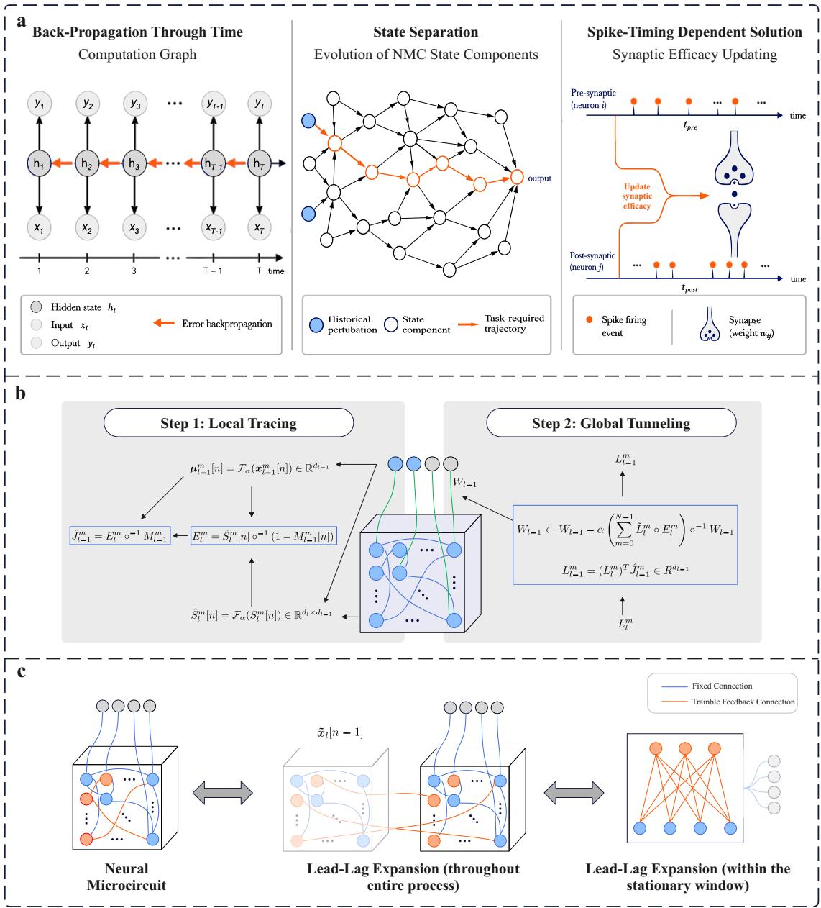  
Fig. 1 The Proposed NMC Feedback Learning Framework. a, Methodologies and solutions for temporal credit assignment problem. b, Procedure of the proposed gradient tunneling algorithm. The blue-framed part denotes the output of each step. For NMC training, a firing rate regularization is also introduced, which is omitted in this figure for simplicity. This regularization mechanism, along with the definition of the causality matrix $S _ { l } ^ { m }$ [n] and other details, can be found in Methods. c, Lead-lag expansion of a feedback NMC. Throughout the entire process, the lag network is implicit and is therefore shown in a light color. Within the stationary window, the time-varying input is omitted and only the stationary firing process within the microcircuit is considered; accordingly, the input is shown in a light color.

for the full LIF formulation):

$$
\left\{ \begin{array} { l l } { { \pmb r _ { l } [ n ] = W _ { r e c } { \pmb x } _ { l } [ n - 1 ] } } & { { } } \\ { { \pmb a _ { l } [ n ] = \gamma \pmb v _ { l } [ n - 1 ] - \mathrm { d i a g } ( { \pmb v } _ { t h } ) { \pmb x } _ { l } [ n - 1 ] } } & { { } } \end{array} \right. ,\tag{1}
$$

where ${ \pmb x } _ { l } [ n ]$ is the spike vector, $W _ { r e c }$ the recurrent weight matrix, $\gamma$ the membrane decay coeficient, and ${ \boldsymbol { v } } _ { t h }$ the firing threshold. The recurrent component $r _ { l } [ n ]$ drives the NMC toward the edge of chaos [8], where its autocorrelation rapidly vanishes with increasing time lag [19]. Consequently, $r _ { l } [ n ]$ is functionally equivalent to white noise injection, endowing the NMC with intrinsic stochasticity. A similar theory, known as neural sampling, has already been demonstrated in SNNs [20]. This property persists robustly even as network dynamics shift during training (validated in Section 2.2).

Under this stochastic interpretation, the NMC executes a rate-coding scheme within a short temporal window, termed the stationary window. Within this window, the firing rate estimated by an iterative moving average (IMA) filter (see Methods) approximates the mathematical expectation of spike events. This stochastic rate-coding property constitutes the mathematical prerequisite for the feedback learning framework.

## 2.1.2 Lead-lag Expansion and Gradient Tunneling Algorithm

At long time scales, the recurrent connections of an NMC fundamentally shape its dynamical trajectory for efective state separation. But within the short stationary window, the intrinsic stochasticity allows us to temporarily set aside the structural role of recurrence and conceptually convert the NMC into a static two-layer feedforward network (Fig. 1c), where only the causality between current spikes ${ \pmb x } _ { l } [ n ]$ and their lagged version xl[n − 1] needs to be considered. We term this technique lead-lag expansion.

Building on this expansion and former research by Zheng and Mazumder [21], we propose the causalitygradient theorem (Theorem 1 in Methods), proving that the Jacobian of postsynaptic firing rates can be estimated solely from the timing of pre- and postsynaptic spikes. The proposed Gradient Tunneling (GT) algorithm (Fig. 1b) implements this theorem. Without requiring a computation graph for error propagation, GT enables downstream learning signals to tunnel through the recurrently connected neural population and guide the supervised learning of sparse feedback weights, thereby amplifying and separating task-required state components from the current NMC state. The complete algorithm and its theoretical guarantees are detailed in Methods.

## 2.2 Verification of the Stochastic Rate-Coding Property

We verify the stochastic rate-coding property through two complementary experiments: theoretical Jacobian estimation under stationary conditions (Fig. 2a) and gradient estimation robustness under non-stationary EEG inputs (Fig. 2b, c).

## 2.2.1 Estimating Jacobian Matrices under Stationary Input Flows

The stochastic NMC model provides the theoretical foundation for the causality-gradient theorem, which estimates Jacobian matrices of postsynaptic firing rates from spike timing alone. Comparing the Jacobian trace estimated by the GT algorithm with numerical diferentiation directly validates this stochastic abstraction: if the NMC’s recurrent component indeed functions as intrinsic noise, the GT-estimated Jacobian should closely match the numerically computed one. As shown in Fig. 2a, the correlation coeficients r between the GT-estimated and numerically computed Jacobians remain close to 1 for NMC across input firing rates from 0.1% to 0.4%, and are consistently higher than those of a simple LIF layer (the baseline model with zero recurrent weights). These persistent higher correlations align with the theoretical expectation that intrinsic stochasticity enhances the precision of Jacobian estimation. These results confirm the theoretical prediction of the causality-gradient theorem, demonstrating the precision of the stochas tic NMC model and establishing the foundation for the GT algorithm. The Jacobian trace construction (Theorem 2 in Methods) explains why low input firing rates produce lower correlation: small denominators amplify the estimation error in the causality matrix. This motivates the firing rate regularization incorporated in the GT algorithm.

## 2.2.2 Precise Weight Update under Non-stationary Input Flows

The efectiveness of the GT algorithm relies on the stationary window approximation, but whether this approximation holds under non-stationary inputs must be verified. We therefore used strongly nonstationary EEG signals (SEED dataset[23]) for emotion classification with the readout layer frozen, ensuring that any loss reduction can only be attributed to accurate gradient estimation by GT. As shown in Fig. 2b, both loss and accuracy curves consistently improve across training, and this trend holds for various feedback ratios. These results demonstrate that GT can discover efective gradient directions under strongly non-stationary inputs with extremely sparse trainable feedback connections, and that the firing rate regularization successfully stabilizes the neural population activity throughout the learning process. Taken together with the stationary Jacobian estimation results, these findings confirm that the stochastic rate-coding property and its associated gradient estimation mechanism are robust across both stationary and non-stationary conditions.

A core claim of the stochastic rate-coding perspective is that the recurrent component of NMC dynamics can be viewed as intrinsic white noise injection. We verified this by tracing the recurrent component during inference under a randomly selected input segment and testing its properties from two complementary aspects unified by the Wiener-Khinchin theorem [22]. From the spectral perspective, the power spectrum of the recurrent component was computed across frequency bins and found to be approximately uniform, a hallmark of white noise. From the temporal correlation perspective, the autocorrelation was measured at diferent time delays across multiple neuronal channels; as shown in Fig. 2c, the mean correlation drops to near zero at any non-zero time delay, indicating strong temporal independence across time steps. Critically, these tests were conducted on post-training NMCs. The results therefore demonstrate that training-induced dynamical drift does not invalidate the white-noise approximation: even as the NMC shifts from its initial dynamics during feedback weight optimization, the stochastic property of the recurrent component persists.

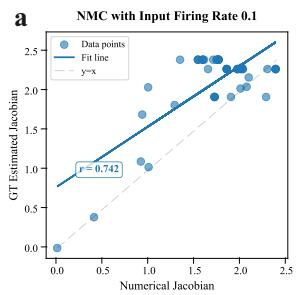

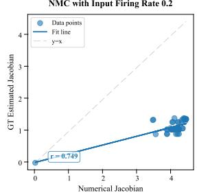

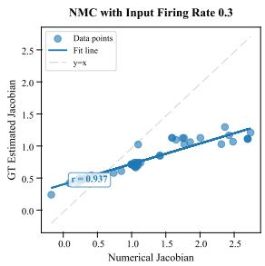

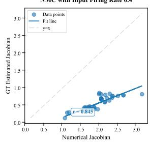

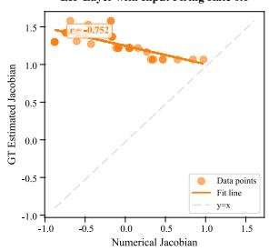

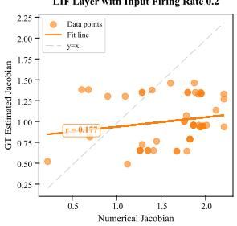

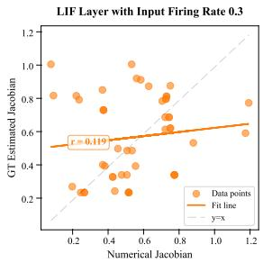

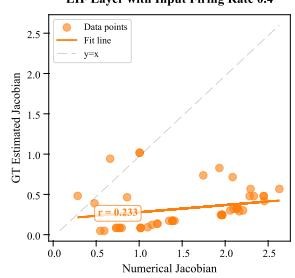

b  
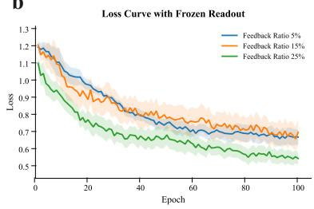

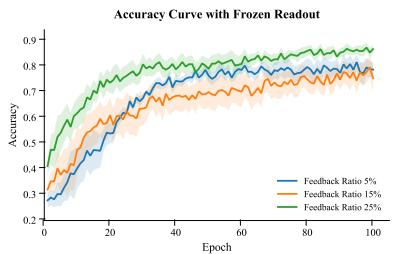

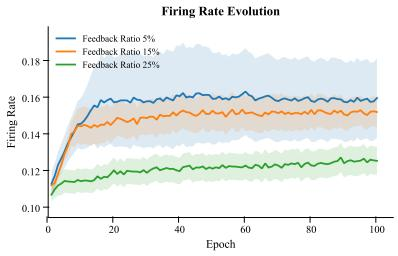

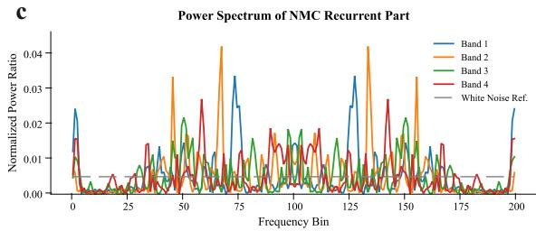

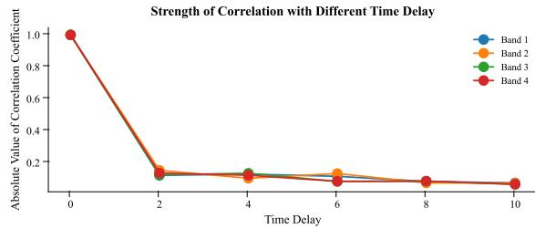  
Fig. 2 Estimation of Jacobian matrix and weight gradient based on GT algorithm. ${ \mathbf { a } } ,$ Estimation result of Jacobian matrices for NMC and LIF layers. The NMC contained 512 neurons in a 3D spatial arrangement; the baseline LIF layer had zero recurrent weights. The Jacobian trace from the GT algorithm was compared against numerical diferentiation with a 3% firing rate increment. b, Loss, accuracy, and firing rate evolution curves during EEG-based training with frozen readout (SEED dataset, four sub-frequency bands, stationary window set to input length). Results shown for session 1 subject 15 across 4 random seeds using the AdamW optimizer. c, White noise test results of the recurrent component of posttraining NMC dynamics, evaluated through power spectrum uniformity (Wiener-Khinchin theorem [22]) and autocorrelation decay at non-zero time delays.

## 2.3 Temporal Pattern Recognition with GT-trained Feedback NMCs

Building on the validated mechanisms, we evaluate the temporal pattern recognition capability of the proposed NMC feedback learning framework. Our experiments draw from both cognitive science paradigms and real-world datasets, demonstrating the dual contribution of this work: theoretical advances in computational neuroscience and practical utility for machine intelligence systems. The cognitive tasks are designed as mechanism verification experiments with the Lyapunov-tuned LSM as a controlled baseline to isolate the contribution of feedback learning; the EEG tasks then serve as comprehensive benchmarks against a broad range of online learning methods.

## 2.3.1 Evidence Integration on the Cognitive Task

Evidence integration is an essential function of cortical neural networks. To verify whether the proposed NMC feedback learning framework can realize similar behavior, we implemented the T-maze experiment [16, 17], where the only supervised signal is provided at the end of each trial, making temporal credit assignment especially challenging for online learning algorithms.

a  
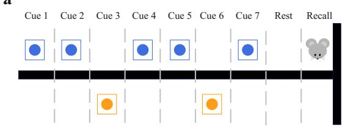

b  
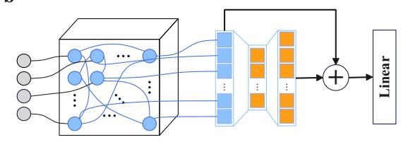

c  
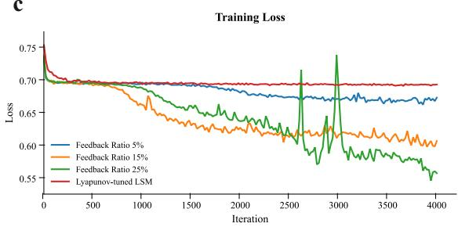

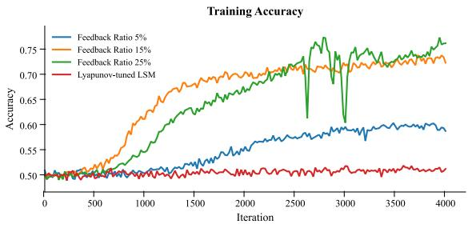

d  
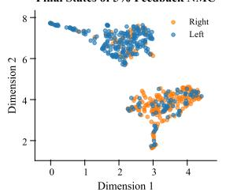

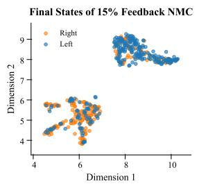

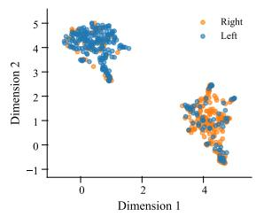

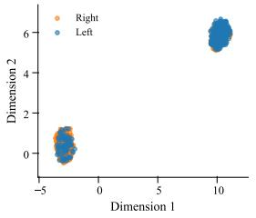

e  
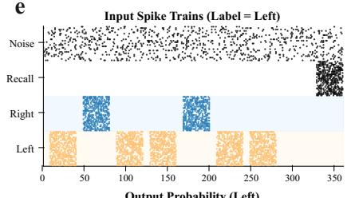

f  
g  
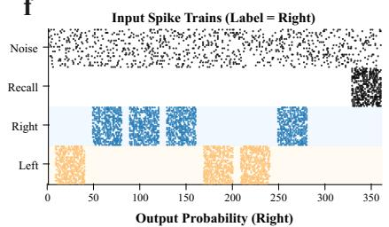

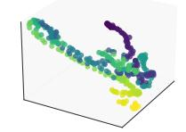

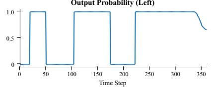

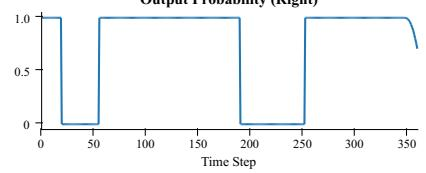

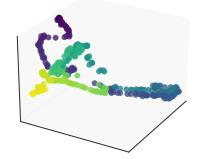  
Fig. 3 Evidence Integration Experiment. a, Schematic of the T-maze experiment: seven cues are assigned left or right, and the system accumulates evidence to reach a final decision at the end of each trial. b, NMC model architecture with a residual readout [24], satisfying the universal approximation requirement for equivalence to arbitrary Turing machines [9]. c, Loss and accuracy curves during training for diferent feedback neuron ratios. The residual readout is identical across all architectures, isolating the efect of feedback connections. d, Distribution of neural population final states (500 test samples) after UMAP [25] dimensionality reduction from 1000D to 3D. e and f, Inference process of trained feedback NMC and corresponding input spike trains. g, Trajectory of neural population states during inference.

On the T-maze benchmark (Fig. 3c), NMCs with feedback connections achieve efective temporal credit assignment from the terminal signal alone, while the Lyapunov-tuned LSM—lacking trainable feedback—fails to do so. This contrast demonstrates that the proposed feedback learning framework endows NMCs with evidence integration capability, going beyond the approximation limits of fixedreservoir LSMs [1, 9]. Notably, increasing the feedback ratio yields lower final loss and higher accuracy, but also introduces greater training instability. This is because denser feedback connections increase shared recurrent input among neurons, thereby strengthening cross-neural correlations and progressively violating the invariant conditional firing mechanism required by the causality-gradient theorem. This trade-of motivates the sparse uniform feedback scheme adopted in this work.

To investigate how feedback learning reshapes population dynamics, we visualized final state vectors via UMAP (Fig. 3d). Although both the feedback NMC and the Lyapunov-tuned LSM form two clusters, their nature difers fundamentally: the LSM clusters are task-independent because its fixed connectivity cannot adapt to the learning signal, making cluster separation invalid for classification. In contrast, the feedback NMC clusters clearly reflect the evidence integration outcome, where learned feedback connections actively separate states belonging to diferent terminal decisions.

We further examined how a well-trained feedback NMC integrates evidence during inference (Fig. 3eg). Despite receiving only a terminal learning signal during training, the model preserves high certainty throughout inference, efectively reorganizing into a finite state machine where decisions are maintained rather than derived step by step. The firing rate trajectories are confined to a low-dimensional manifold of the neural state space that drives high-certainty readout outputs, aligning with the neural manifold literature [26, 27] and suggesting that the proposed feedback learning framework restricts neural dynamics to task-specific subspaces.

## 2.3.2 Exceeding the Memory Limit under Extreme Input Noise

The incremental add task tests whether the proposed NMC feedback learning framework remains robust under extreme input noise, while also revealing a warm-up phenomenon.

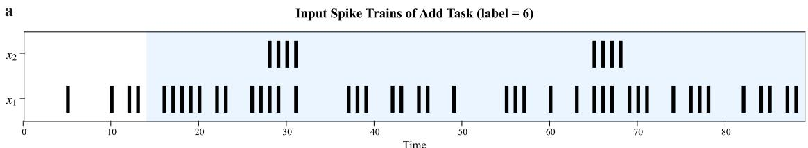

b  
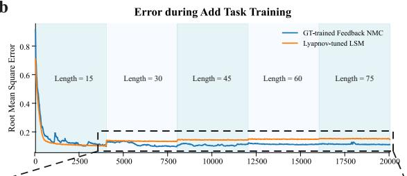

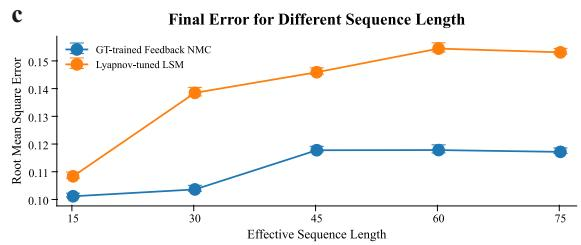

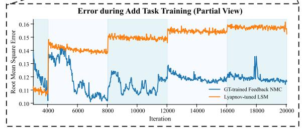

d  
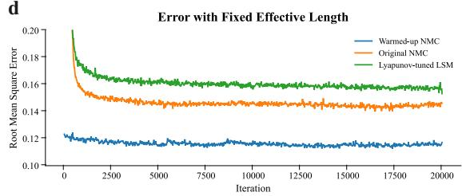  
Fig. 4 Scheme and Results of Incremental Add Task. a, Example input spike trains (label 6) with the efective sequence highlighted in blue. Two input channels: a sample channel x1 (firing rate 50%) and an enable channel x2 (square waves). The target is the total number of x spikes occurring between two enable signals. b, Root mean square error during training with incremental efective sequence length L, which increases from 15 to 75 in steps of 15 every 4,000 iterations (total input length fixed at 90). Model architecture is identical to that in Fig. 3b. c, Final root mean square error at each L (computed from the last 10 time steps before each increment). d, Root mean square error when training directly at L = 75 for 20,000 iterations. The warmed-up NMC was taken from iteration 1,600 of the incremental training (panel b).

The incremental add task extends the standard add task [6] by introducing an efective sequence length L that controls the signal-to-noise ratio. Specifically, the SNR is determined by the duty cycle of the enable square wave on a 50%-rate sample channel: a larger L narrows the enable window, lowering the SNR and making the task harder. Because NMC dynamics possess fading memory [28], increasing L pushes the integration window beyond the network’s intrinsic timescale, requiring the network to transcend its temporal capacity.

On this benchmark (Fig. 4b), both the feedback NMC and the classical LSM converge rapidly at short sequence lengths $( L = 1 5 , \mathrm { { S N R \approx - 1 2 . 5 7 \ d B } ) }$ . When L increases at iteration 4,000, however, the LSM’s error spikes and never recovers, while the feedback NMC swiftly returns to a low error level. This divergence persists up to $L = 7 5 ~ ( \mathrm { S N R } \approx - 4 4 . 7 6 ~ \mathrm { d B } )$ , demonstrating that the proposed feedback framework enables NMCs to transcend the memory limits of fixed-reservoir LSMs under severe noise. The terminal errors at each L (Fig. 4c) further confirm this progressive performance gap. These findings provide a mechanistic explanation for the superior performance observed in the preceding evidence integration experiment, as the same memory-transcending mechanism also enables evidence accumulation over long temporal horizons.

Apart from the comparison with fixed reservoirs, the incremental training paradigm itself reveals a warm-up efect (Fig. 4d). A feedback NMC pre-trained under incremental complexity converges to a sub stantially lower final error at $L = 7 5$ than one trained directly from scratch, which–despite outperforming the LSM–shows no sign of further decline. This warm-up efect can be understood through the interplay between state separation and fading memory. The GT algorithm relies on extracting task-critical history from the current neural state, but the NMC’s inherent fading memory limits the temporal horizon over which state separation is efective. Direct training at long sequence lengths forces the network to separate state components outside its intrinsic timescale, where the relevant historical signals are too attenuated for reliable gradient estimation. Incremental training circumvents this by first establishing efective feedback connectivity at shorter, tractable timescales, then progressively extending the operating range as the network dynamics adapt. This strategy echoes curriculum learning [29]: by matching the dificulty of the temporal credit assignment problem to the NMC’s current dynamical capacity, warm-up enables the network to exceed this intrinsic memory limit.

## 2.3.3 Generalization Capability on Real-world Temporal Pattern Recognition Tasks

The evidence integration experiment and the incremental add task generate unlimited synthetic data, whereas real-world applications must learn from limited datasets. To assess practical applicability, we therefore evaluated the proposed framework on a speech recognition task and an EEG-based emotion recognition (EER) task (Fig. 5).

For the speech recognition task, we used the SHD dataset [30] and repeated the experiment under four random seeds. Without surrogate gradients and using only local spike timing, the GT-trained feedback NMC achieved 73.61 % accuracy. Compared with online learning methods relying on surrogate gradients, the feedback NMC significantly outperformed e-prop (67.54 %, $p \ : = \ : 0 . 0 0 4 1$ under t-test) and FPTT (67.24 %, $p = 0 . 0 0 8 9 )$ , although it still lags the most recent pp-prop method (Table E2 in Appendix E). However, as the EER results below show, there is insuficient evidence that the proposed method is inherently inferior to pp-prop in temporal credit assignment capability. To verify that this capability stems from the GT algorithm rather than the readout network alone, we set the GT learning rate to 0. Accuracy dropped significantly (Fig. 5a), and GT training visibly reshaped the NMC’s firing-rate trajectories in a state separation manner (Fig. 5b, see also Supplementary Movie 1, in which firing rates of task-required dimensions increase and vice versa). These results demonstrate that the proposed feedback learning framework generalizes to real-world speech recognition without surrogate gradients.

To further probe generalization under low SNR, strong non-stationarity, and inter-subject variability, we applied the LibEER standard to three EER tasks. These are three-category classification on the SEED dataset and valence and arousal binary classification on the DEAP dataset (DEAP-V and DEAP-A). Compared with all the baselines (see Section 4.5), the feedback NMC achieved the best performance across all four SEED metrics (accuracy 60.22 %, F1 58.04 %, substantially above the 33.3 % chance level for three-class classification). It also attained the highest accuracy on DEAP-V (73.93 %) and the highest precision (64.37 %), recall (65.21 %), and F1 score (63.36 %) on DEAP-A (Fig. 5c). These results demonstrate that GT-trained NMCs generalize efectively to real-world biological signals under limited data conditions.

Finally, we compared the computational cost of temporal credit assignment across these SNN online learning methods. The sparse uniform feedback mechanism (Section 4.4) and sparse weight initialization (Appendix B) sharply reduce recurrent connectivity. Relative to the two fully connected SRNN baselines, the number of trainable recurrent connections falls to 0.43% of the original count (Fig. 5d). This yields a training speed approximately 2.0× faster than LTC-SNN with FPTT and 6.9× faster than SRNN with D-RTRL (Fig. 5e). Notably, this speedup remains modest relative to the parameter reduction, suggesting that training eficiency would improve substantially on specialized neuromorphic processors.

a  
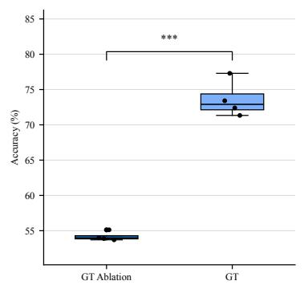

b  
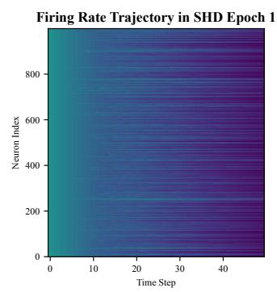

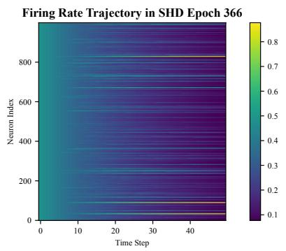

c  
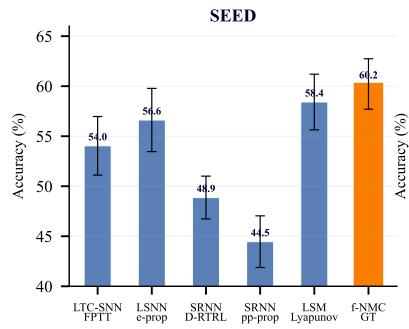

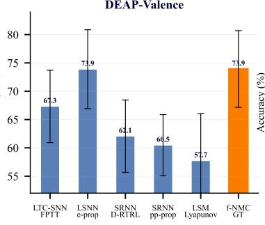

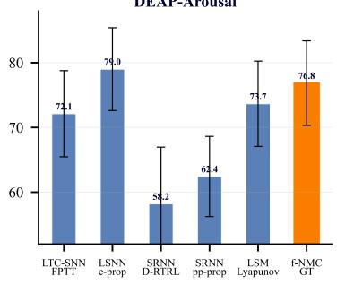

d  
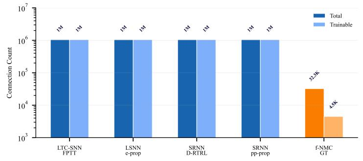

e  
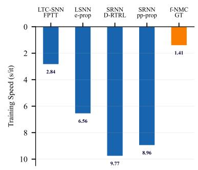

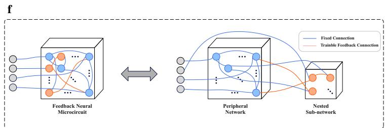

g  
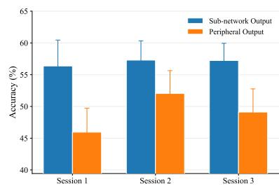  
Fig. 5 Generalization Capability Analysis and Computational Eficiency Comparison. a, GT ablation results on the SHD dataset, on the same NMC model with 1000 LIF neurons. The experiment was repeated under four random seeds, and Welch’s t-test confirms the drop is significant $( p = 0 . 0 0 0 4 )$ . Full SHD metrics are provided in Table E2 in Appendix E. b, Firing rate trajectories at the beginning and the end of SHD training on the same arbitrarily selected sample, showing that the GT algorithm reshapes NMC dynamics. The firing rates are approximated as IMA outputs. c, Classification accuracies on the SEED, DEAP-Valence and DEAP-Arousal tasks under the LibEER benchmark (mean ± standard error). Detailed results, including additional ANN baselines, are provided in Tables E3 and E4 in Appendix E. d, Total and trainable recurrent connections of SNN online learning methods. Detailed data are provided in Table E5 in Appendix E. e, Training speed (seconds per iteration) comparison. f, Schematic diagram of the nested sub-network within a feedback NMC. g, Ablation results on the SEED dataset comparing sub-network output (readout from the 25-neuron nested sub-network) with peripheral output (readout from peripheral neurons at maximal distance from the nested sub-network, selected via Eq. 9 with ofset 10).

## 2.4 Nested Sub-network of a Feedback NMC

In contrast to classical LSM reservoirs, the proposed feedback NMC implicitly exhibits a heterogeneous architecture comprising a peripheral network and a nested sub-network (Fig. 5f). The nested sub-network, though containing significantly fewer neurons, consists of interconnected feedback neurons with fully trainable weights and plays a fundamental role in shaping NMC dynamics.

The ablation experiment (Fig. 5g) confirms its functional significance: accuracy with sub-network output consistently exceeds that of peripheral output across all three sessions, with negligible drop relative to the full model, whereas peripheral output degrades substantially. These results indicate that the nested sub-network serves as the functional core driving temporal pattern recognition, aligning with biological observations of distributed mixed selectivity [27], wherein neurons bound to a common neural manifold are sparsely distributed across a broader cortical circuit.

## 3 Discussion

In the Introduction, we asked two questions: whether feedback connections in an NMC can be trained by a practical online rule, and whether spike timing alone sufices for temporal credit assignment. The proposed NMC feedback learning framework answers both through state separation, yielding a sparse, spike-timing-dependent learning rule that is theoretically grounded, empirically validated, and computationally plausible as a model of cortical learning. Moreover, its stochastic computing and sparse feedback align naturally with neuromorphic hardware design for its robustness and eficiency requirements [31, 32].

## 3.1 Searching and Emerging Mechanism for Long Timescale

Although single-step update directions are theoretically guaranteed only for the terminal state of the NMC trajectory, the GT algorithm remains efective even when the stationary window is far shorter than the input length. This is because each update step simultaneously serves two objectives: shaping the global attractor and optimizing the terminal output for the task. Only weight changes that benefit both objectives accumulate, whereas those that favor one at the expense of the other are progressively overwritten. This implicit selection pressure lets robust feedback connectivity emerge without the direct output feedback of traditional methods [9–11], making the framework a generally applicable spike-based learning approach.

## 3.2 Bridging the Contradiction Between Gradient and Spike-timing

In dominant SNN frameworks, gradient-based learning treats spike discreteness as a mathematical obstruction, thereby decoupling learning from the signals, i.e., the spikes, that define neural computation. Gradient-based learning, the most powerful learning paradigm in use today [33], would therefore appear inherently incompatible with the spike-timing-dependent learning employed by the brain. However, the proposed gradient-based yet spike-timing-dependent solution bridges this apparent contradiction by operating on the distributional parameters of spiking activity rather than on the spike events themselves.

This approach simultaneously echoes the spike-timing-dependent plasticity (STDP) rule and the Neural Gradient Representation by Activity Diferences (NGRAD) hypothesis [34], both central to computational neuroscience. While STDP has served as a cornerstone of unsupervised adaptation [35, 36], classical rules remain largely descriptive and lack a mechanism for propagating task-specific error signals across time [18]. Formalizing this timing dependency into a mathematically grounded eligibility trace, the GT algorithm bridges phenomenological plasticity and rigorous supervised learning, showing how local spike coincidences enable temporal credit assignment. The causality-gradient theorem is also consistent with the NGRAD hypothesis: the variation in conditional postsynaptic firing probability corresponds to an activation diference that GT estimates, though without explicit perturbation. Since the required information, i.e., pre- and postsynaptic spike events, is locally available at biological synapses, the stochastic NMC theory and the GT algorithm ofer a computationally plausible hypothesis for cortical learning. Whether the cortex actually exploits this mechanism remains a question for neurophysiological investigation, as the present evidence is computational rather than biological.

## 3.3 Limitations and Future Works on Spiking Neural Circuits

Sparse feedback endows an NMC with universal computational capacity [9]. The GT algorithm fulfills this promise because it imposes no new architectural constraints. Theoretical universality, however, does not fully translate into practical generality. First, inherent fading memory makes state separation dificult for long sequences with complex dynamical features. Second, the absence of spatial feature-extraction components limits its suitability for high-dimensional visual streams such as DVS inputs [37]. Moreover, although the non-stationary EEG experiments (Fig. 2b) demonstrate that the network’s spiking statistics do not necessarily become non-stationary beyond what the window can track, the precise boundary at which the stationary window approximation breaks down has not been characterized theoretically in this work.

While the current framework addresses feedback learning within a single NMC, cortical networks operate as hierarchical dynamic systems [38, 39]. In principle, the GT algorithm can support backpropagation of learning signals across multiple NMCs, enabling supervised learning in hierarchical systems. This capability suggests a novel architecture termed Spiking Neural Circuits (SNCs), in which multiple NMCs are organized under supervised feedback. The feedback NMC presented here constitutes the minimal realization of an SNC. Further exploration lies beyond the current scope but presents a promising avenue for future research.

## 4 Methods

We develop the stochastic NMC theory in three successive steps: first formulating the stochastic NMC model as a theoretical abstraction of recurrent microcircuit dynamics, then deriving the causality-gradient theorem and its implementable form from this model, and finally constructing the gradient tunneling (GT) algorithm on this foundation.

The theoretical framework developed in this work encompasses both deterministic dynamical systems and stochastic models. For the deterministic formulation, boldface lowercase letters $( \mathrm { e . g . } , s )$ denote vectors, uppercase letters $( \mathrm { e . g . , } \ S )$ matrices, hat notation $( \mathrm { e . g . , } \ \hat { S } )$ estimators, and tilde notation $\mathrm { ( e . g . , }$ $\tilde { S } )$ expanded forms of the original variables. Specifically, $\mathbf { \delta } _ { \mathbf { \mathcal { X } } \mathrm { ~ l ~ } }$ is the spike vector of the neural population at hierarchical level $l ,$ and the pair $( \pmb { x } _ { l - 1 } , \pmb { x } _ { l } )$ describes the pre- and postsynaptic activity between adjacent populations, which are internally recurrently connected rather than strictly feedforward. For the stochastic formulation, uppercase letters $( \mathrm { e . g . } , A )$ denote scalar random variables, with $X _ { l - 1 } ^ { j }$ and $X _ { l } ^ { i }$ the presynaptic and postsynaptic firing events of a specific synapse. The Hadamard product ◦ and element-wise division $\circ ^ { - 1 }$ formulate the core operations of the GT algorithm.

## 4.1 Stochastic NMC Model

Following Ref. [21], a layer of spiking neurons with threshold ${ \boldsymbol { v } } _ { t h }$ can be described stochastically as

$$
{ \bf X } _ { l } [ n ] = H \big ( W _ { l - 1 } { \bf X } _ { l - 1 } [ n ] + { \bf S } _ { l } [ n ] - { \pmb v } _ { t h } \big ) ,\tag{2}
$$

where the pre- and postsynaptic spike trains are modeled as realizations of the stochastic Bernoulli processes $\bar { \bf X } _ { l - 1 } [ n ] \ = \ \left( X _ { l - 1 } ^ { 1 } [ n ] , \dots , X _ { l - 1 } ^ { d _ { l - 1 } } [ n ] \right) ^ { \top }$ and $\mathbf { X } _ { l } [ n ] \ = \ \left( X _ { l } ^ { 1 } [ n ] , \ldots , X _ { l } ^ { d _ { l } } [ n ] \right) ^ { \top }$ , respectively. The vector-valued stochastic process ${ \bf S } _ { l } [ n ]$ captures the internal state of the neurons. Here, we posit that this formulation can equally describe the input–output relationship of an NMC. If the spike processes ${ \bf X } _ { l - 1 } [ n ]$ and ${ \bf X } _ { l } [ n ]$ remain strictly stationary within a discrete time interval ${ \mathcal { W } } = \{ n _ { 1 } , n _ { 2 } , \dots , n _ { k } \}$ , we refer to W as a stationary window. Applying Eq. 2 within this window forms the theoretical foundation of our feedback learning framework, and we term this formulation the stochastic NMC model. Presynaptic trains can thus model both the inputs to an NMC and the spike trains generated by its feedback neurons (Section 4.4).

While the stochastic NMC model serves primarily for theoretical analysis, the actual system dynamics correspond to the following classical deterministic formulation widely used in NMC research:

$$
\left\{ \begin{array} { l l } { { \pmb v } _ { l } [ n ] = ( W _ { l - 1 } \tilde { \pmb x } _ { l - 1 } [ n ] + W _ { r e c } \tilde { \pmb x } _ { l } [ n - 1 ] ) } \\ { \qquad \quad + \gamma { \pmb v } _ { l } [ n - 1 ] - \mathrm { d i a g } ( { \pmb v } _ { t h } ) { \pmb x } _ { l } [ n - 1 ] } \\ { { \pmb x } _ { l } [ n ] = H ( { \pmb v } _ { l } [ n ] - { \pmb v } _ { t h } ) } \\ { \tilde { \pmb x } _ { l } [ n ] = \mathrm { d i a g } ( { \pmb p } ) { \pmb x } _ { l } [ n ] } \end{array} \right. .\tag{3}
$$

This deterministic dynamical system, also introduced in Section 2.1, represents a concrete NMC implementation based on leaky integrate-and-fire (LIF) neurons and adhering to Dale’s principle [40]. To clarify the correspondence between Eqs. 3 and 2, we decompose the membrane potential dynamics in Eq. 3 into a recurrent component $r _ { l } [ n ]$ and an autonomous component ${ \mathbf { } } _ { { \pmb { a } } _ { l } [ n ] }$ , defined as:

$$
\left\{ \begin{array} { l l } { { \pmb r } _ { l } [ n ] = W _ { r e c } { \widetilde { \pmb x } } _ { l } [ n - 1 ] } \\ { { \pmb a } _ { l } [ n ] = \gamma { \pmb v } _ { l } [ n - 1 ] - \mathrm { d i a g } ( { \pmb v } _ { t h } ) { \pmb x } _ { l } [ n - 1 ] } \end{array} \right. \ .
$$

By simplifying Eq. 3 to focus exclusively on the relationship between the bipolar input spikes $\tilde { { \boldsymbol { x } } } _ { l - 1 } [ n ]$ and the unsigned output spikes ${ \pmb x } _ { l } [ n ]$ , the dynamics can be rewritten as

$$
\pmb { x } _ { l } [ n ] = H \big ( W _ { l - 1 } \tilde { \pmb { x } } _ { l - 1 } [ n ] + \pmb { r } _ { l } [ n ] + \pmb { a } _ { l } [ n ] - \pmb { v } _ { t h } \big ) .\tag{4}
$$

Because the NMC operates near the edge-of-chaos regime (Section 2.1.1), the recurrent component $r _ { l } [ n ]$ can be approximated as a realization of intrinsic white noise injection ${ \cal R } _ { l } [ n ]$ , whereas the autonomous component ${ \mathbf { } } a _ { l } [ n ]$ encapsulates the membrane potential history ${ \mathbf { } } \mathbf { { } } \mathbf { { } } \mathbf { { } } \mathbf { { } } \mathbf { { } } \mathbf { { } } \mathbf { { } } \mathbf { { } } \mathbf { { } } \mathbf { { } } \mathbf { { } } \mathbf { { } } \mathbf { { } } \mathbf { { } } \mathbf { { } } \mathbf { { } } \mathbf { { } } \mathbf { { } } \mathbf { { } } \mathbf { { } } \mathbf { { } } \mathbf { { } } \mathbf { { } } \mathbf { { } } \mathbf { { } } \mathbf { { } } \mathbf { { } } \mathbf { { } } \mathbf { { } } \mathbf { { } } \mathbf { { } } \mathbf { { } } \mathbf { { } } \mathbf { { } } \mathbf { { } } \mathbf { { } } \mathbf { { } } \mathbf { { } } \mathbf { { } } \mathbf { { } } \mathbf { { } } \mathbf { { } } \mathbf { { } } \mathbf { { } } \mathbf { { } } \mathbf { { } } \mathbf { { } } \mathbf { { } } \mathbf { { } } \mathbf { { } } \mathbf { { } } \mathbf { { } } \mathbf { { } } \mathbf { { } } \mathbf { { } } \mathbf { { } } \mathbf { { } } \mathbf { { } } \mathbf { { } } \mathbf { { } } \mathbf { { } } \mathbf { { } } \mathbf { { } } \mathbf { { } } \mathbf { { } } \mathbf { { } } \mathbf { { } } \mathbf { { } } \mathbf { { } } \mathbf { } \mathbf { { } } \mathbf { { } } \mathbf { } \mathbf { { } } \mathbf { } \mathbf { { } } \mathbf { } \mathbf { } \mathbf { { } } \mathbf \mathbf { { } } \mathbf { } \mathbf { } \mathbf { } \mathbf { } \mathbf { } \mathbf { } \mathbf { } \mathbf \mathbf { { } } \mathbf \mathbf { } \mathbf { } \mathbf \mathbf { { } } \mathbf \mathbf { } \mathbf \mathbf { } \mathbf \mathbf  { } \mathbf \mathbf { } \mathbf \mathbf { } \mathbf \mathbf { } \mathbf \mathbf { } \mathbf \mathbf { } \mathbf \mathbf \mathbf { } \mathbf \mathbf \mathbf { } \mathbf \mathbf \mathbf { } \mathbf \mathbf \mathbf \mathbf { \mathbf \Sigma } \mathbf \mathbf \mathbf \mathbf \mathbf { \Sigma \Sigma \Sigma } \mathbf \mathbf \mathbf \mathbf $ and thereby preserves the neuronal state. Comparing Eq. 4 with Eq. 2, the sum ${ \pmb r } _ { l } [ n ] + { \pmb a } _ { l } [ n ]$ serves as the realization of the intrinsic state process ${ \bf S } _ { l } [ n ]$ . After absorbing the polarity of $\tilde { \mathbf { { x } } } _ { l - 1 } [ n ]$ into $W _ { l - 1 } .$ , the unsigned spike trains ${ \pmb x } _ { l - 1 } [ n ]$ and ${ \pmb x } _ { l } [ n ]$ correspond to the realizations of ${ \bf X } _ { l - 1 } [ n ]$ and ${ \bf X } _ { l } [ n ]$ . The stochastic NMC model thus provides a theoretical abstraction of classical NMC dynamics. For all numerical simulations and algorithmic implementations in this work, however, we exclusively employ the deterministic LIF-based formulation.

Although the stationary window is a conceptual prerequisite for strict stationarity in the theoretical analysis, in practice its duration is a hyperparameter used exclusively for firing rate estimation, whereas evidence integration is realized by the intrinsic state evolution (Section 3.1). For highly non-stationary and bursty inputs, the window should therefore be kept significantly narrower than the total sequence length, so that the network processes approximately stationary spiking events at the late stage of evolution. Window configuration details are given in Section 4.5.

## 4.2 Basic Theorems

Together with lead-lag expansion, the GT algorithm constitutes the proposed feedback learning framework, and the theorems in this section form its theoretical foundation. Although the core ideas were preliminarily discussed in Ref. [21], we rigorously formalize them here and refine the assumptions. Proofs are provided in Appendix A. Because the stochastic NMC model characterizes only the instantaneous input–output relationship at each time step, these theorems are its natural extensions to the temporal causal dependencies required for gradient estimation, thereby ensuring full mathematical compatibility.

## 4.2.1 Causality-Gradient Theorem

The causality-gradient theorem (Theorem 1) establishes that the Jacobian of postsynaptic firing rates with respect to presynaptic firing rates can be expressed as a diference of conditional firing probabilities, thereby bridging spike timing and synaptic weight updates.

## Theorem 1 (Causality-Gradient Theorem).

Let $X _ { l } ^ { i } \sim \mathrm { B e r n o u l l i } ( \mu _ { l } ^ { i } )$ denote the firing event of a postsynaptic neuron, which depends on the firing events of presynaptic neurons $\{ X _ { l - 1 } ^ { k } \} _ { k = 1 } ^ { n }$ , where $X _ { l - 1 } ^ { k } \sim$ Bernoulli(µkl−1). For any given $j \in \{ 1 , \ldots , n \}$ assuming that the conditional firing mechanism is invariant to changes in the presynaptic firing rate, i.e.,

$$
\frac { \partial } { \partial \mu _ { l - 1 } ^ { j } } P ( X _ { l } ^ { i } = 1 \mid X _ { l - 1 } ^ { j } = x ) = 0 , \quad \forall x \in \{ 0 , 1 \} ,
$$

the partial derivative of the postsynaptic expectation with respect to the $j - t h$ presynaptic expectation is given by the diference in conditional probabilities:

$$
\frac { \partial \mathbb { E } [ X _ { l } ^ { i } ] } { \partial \mathbb { E } [ X _ { l - 1 } ^ { j } ] } = P ( X _ { l } ^ { i } = 1 \mid X _ { l - 1 } ^ { j } = 1 ) - P ( X _ { l } ^ { i } = 1 \mid X _ { l - 1 } ^ { j } = 0 ) .
$$

The invariance assumption holds when the distributional parameters governing presynaptic activity, rather than the spike events themselves, are not tightly coupled: in network terms, presynaptic neurons converging onto a common target should not exhibit strong recurrent interconnections. Although feedback neurons are influenced by the circuit’s recurrent dynamics, the sparse uniform feedback scheme suppresses these cross-neural correlations (Section 4.4). The invariance condition therefore remains numerically robust and practically valid throughout training.

Because the efective connectivity of a lead-lag expanded NMC depends not only on synaptic weights but also on the dynamical trajectory preceding the stationary window, this invariance is especially important for feedback learning in NMC neuronal populations $[ 2 8 , 4 1 ]$

## 4.2.2 Implementable Form Based on Local Spike-Timing

While Theorem 1 establishes a theoretical link between spike timing and synaptic weight updates, its reliance on explicit conditional firing probabilities precludes direct algorithmic implementation. To bridge this gap, Theorem 2 extends the causality-gradient theorem to a stochastic process framework. Consequently, within a stationary window, the desired gradient can be estimated from the expectation of a stochastic process $s _ { l } ^ { i , j } [ n ]$ (extending the prototype of Zheng et al. [21]), making it implementable for the stochastic NMC model.

## Theorem 2 (Implementable Form Based on Local Spike-Timing).

Let $X _ { l } ^ { i } [ n ]$ and $X _ { l - 1 } ^ { j } [ n ]$ denote the postsynaptic and presynaptic firing processes, respectively, governed by the stochastic NMC model. If the following conditions hold:

(C1) Both processes are strictly stationary, $i . e . , X _ { l } ^ { i } [ n ] \sim B e r n o u l l i ( \mu _ { l } ^ { i } )$ and $X _ { l - 1 } ^ { j } [ n ]$ ∼ $B e r n o u l l i ( \mu _ { l - 1 } ^ { j } )$ for any $n \in \mathbb { Z } ;$

(C2) For any time indices h and k, the pair $( X _ { l } ^ { i } [ h ] , X _ { l - 1 } ^ { j } [ k ] )$ satisfies the invariance of conditional firing mechanism (cf. Theorem 1);

(C3) For any $h \neq k _ { * }$ , the postsynaptic firing event $X _ { l } ^ { i } [ h ]$ and synchronous firing event $X _ { l } ^ { i } [ h ] X _ { l - 1 } ^ { j } [ h ]$ are separately uncorrelated with time-shifted presynaptic firing event $X _ { l - 1 } ^ { j } [ k ] , i . e .$ 2 $C o v ( X _ { l } ^ { i } [ h ] , X _ { l - 1 } ^ { j } [ k ] ) = 0$ and $C o v ( X _ { l } ^ { i } [ h ] X _ { l - 1 } ^ { j } [ h ] , X _ { l - 1 } ^ { j } [ k ] ) = 0$

Then, the gradient of the postsynaptic firing rate with respect to the presynaptic firing rate can be expressed as:

$$
\frac { \partial \mathbb { E } [ X _ { l } ^ { i } ] } { \partial \mathbb { E } [ X _ { l - 1 } ^ { j } ] } = \frac { \mathbb { E } [ s _ { l } ^ { i , j } [ n ] ] } { \mu _ { l - 1 } ^ { j } ( 1 - \mu _ { l - 1 } ^ { j } ) } , \quad \forall n \in \mathbb { Z } ,
$$

where process $s _ { l } ^ { i , j } [ n ]$ is defined as:

$$
s _ { l } ^ { i , j } [ n ] = \left( X _ { l } ^ { i } [ n ] - X _ { l } ^ { i } [ n - m ] \right) X _ { l - 1 } ^ { j } [ n ] \left( 1 - X _ { l - 1 } ^ { j } [ n - m ] \right)
$$

and m $\in \mathbb { Z }$ is arbitrarily given.

Condition C3 requires rapid decorrelation with increasing time lag, a property that emerges naturally in sequentially evolving NMC systems (verified in Section 2.2). Condition C1 requires network stability but imposes no constraints on input stream stability.

## 4.3 Gradient Tunneling Algorithm

Given a mini-batch of N samples, the GT algorithm optimizes the generalized input weight matrix $W _ { l - 1 }$ by back-propagating learning signals $L _ { l } ^ { m } \in \mathbb { R } ^ { d _ { l } }$ using input and output spike trains $\left\{ x _ { l - 1 } ^ { m } [ n ] , x _ { l } ^ { m } [ n ] \right\} _ { m = 0 } ^ { N - 1 } \mathrm { ~ , ~ }$ where m denotes the sample index. For recurrently connected NMCs, $W _ { l - 1 }$ encompasses both feedforward input weights and feedback weights (Section 4.4), enabling GT to be applied to NMC feedback learning. The batch size is unrestricted; when it reduces to unity, GT operates as a strictly online learning method. The overall procedure is shown in Fig. 1b.

To apply the causality-gradient theorem, a causality matrix $S _ { l } ^ { m } [ n ] \in \mathbb { R } ^ { d _ { l } \times d _ { l - 1 } }$ is constructed as

$$
S _ { l } ^ { m } [ n ] = \left( \sum _ { j = 0 } ^ { W - 1 } \pmb { x } _ { l } ^ { m } [ n - j ] - \sum _ { k = 0 } ^ { W - 1 } \pmb { x } _ { l } ^ { m } [ n - W - k ] \right) \ : , \ :\tag{5}
$$

where W is a hyperparameter that controls spike-count smoothing, set to 3 throughout this work. The matrix $S _ { l } ^ { m } [ n ]$ extends the stochastic process $s _ { l } ^ { i , j } [ n ]$ from Theorem 2 to the mini-batch setting. Based on this matrix, the GT algorithm comprises a local tracing step, a global tunneling step, and a firing rate regularization mechanism.

## 4.3.1 Local Tracing

The IMA filter $\mathcal { F } _ { \alpha } ( \cdot )$ with coeficient $\alpha \in ( 0 , 1 )$ is defined as:

$$
\mathcal { F } _ { \alpha } ( x [ n ] ) = \left\{ \begin{array} { l l } { \mathcal { F } _ { \alpha } ( x [ n - 1 ] ) + \alpha \left( x [ n ] - \mathcal { F } _ { \alpha } ( x [ n - 1 ] ) \right) , } & { n > 0 } \\ { y _ { - 1 } + \alpha \left( x [ 0 ] - y _ { - 1 } \right) , } & { n = 0 } \end{array} , \right.\tag{6}
$$

where $y _ { - 1 }$ denotes the initial state of the filter. During the forward propagation, the following two variables are continuously tracked using this filter:

$$
\begin{array} { r } { \left\{ \pmb { \mu } _ { l - 1 } ^ { m } [ n ] = \mathcal { F } _ { \alpha } ( \pmb { x } _ { l - 1 } ^ { m } [ n ] ) \in \mathbb { R } ^ { d _ { l - 1 } } \quad \right. } \\ { \left. \hat { S } _ { l } ^ { m } [ n ] = \mathcal { F } _ { \alpha } ( S _ { l } ^ { m } [ n ] ) \in \mathbb { R } ^ { d _ { l } \times d _ { l - 1 } } \quad \right. } \end{array} .
$$

The above variables can be regarded as approximations of mathematical expectations within a stationary window, and the coeficient of the IMA filter α can be determined by the preferred window length (see Appendix B). As an online learning method, the downstream learning signal $L _ { l } ^ { m }$ can be implemented at any time. Once the downstream learning signal arrives at time $n ,$ the approximation of the presynaptic firing rate $\mu _ { l - 1 } ^ { m } [ n ]$ is first rearranged into the following form:

$$
M _ { l - 1 } ^ { m } = \bigl [ \pmb { \mu } _ { l - 1 } ^ { m } [ n ] , \cdots , \pmb { \mu } _ { l - 1 } ^ { m } [ n ] \bigr ] ^ { T } \in \mathbb { R } ^ { d _ { l } \times d _ { l - 1 } } .
$$

Since the shape of $M _ { l - 1 } ^ { m }$ is the same as the weight matrix $W _ { l - 1 } , M _ { l - 1 } ^ { m }$ can be called the synaptic form of firing rates. Based on $M _ { l - } ^ { m }$ and $\hat { S } _ { l } ^ { m }$ , we define the eligibility trace as

$$
E _ { l } ^ { m } = \hat { S } _ { l } ^ { m } [ n ] \circ ^ { - 1 } ( 1 - M _ { l - 1 } ^ { m } ) \in \mathbb { R } ^ { d _ { l } \times d _ { l - 1 } }
$$

and the Jacobian trace as

$$
\hat { J } _ { l - 1 } ^ { m } = E _ { l } ^ { m } \circ ^ { - 1 } M _ { l - 1 } ^ { m } \in \mathbb { R } ^ { d _ { l } \times d _ { l - 1 } } .
$$

Serving simultaneously as the output of local tracing and the input of global tunneling, the eligibility trace is a key component for solving temporal credit assignment and echoes biological eligibility traces [16]. The Jacobian trace, an approximation of the Jacobian matrix, back-propagates learning signals.

## 4.3.2 Global Tunneling

The learning signal $L _ { l } ^ { m } \in \mathbb { R } ^ { d _ { l } }$ estimates the partial derivative of the loss with respect to the expected postsynaptic firing events. Since back-propagation is recursive, given $L _ { l } ^ { m }$ with respect to the postsynaptic spikes $\pmb { x } _ { l } ^ { m } [ n ]$ , the corresponding learning signal for upstream neurons is

$$
L _ { l - 1 } ^ { m } = ( L _ { l } ^ { m } ) ^ { T } \hat { J } _ { l - 1 } ^ { m } \in \mathbb { R } ^ { d _ { l - 1 } } .\tag{7}
$$

When the GT algorithm is combined with stochastic gradient descent (SGD), the learning signal and the eligibility trace yield the weight update rule

$$
W _ { l - 1 } \gets W _ { l - 1 } - \eta \left( \sum _ { m = 0 } ^ { N - 1 } \tilde { L } _ { l } ^ { m } \circ E _ { l } ^ { m } \right) \circ ^ { - 1 } W _ { l - 1 } ,\tag{8}
$$

where $\eta$ denotes the learning rate (set to 1 or 0.1), and $\tilde { L } _ { l } ^ { m }$ is the synaptic form of $L _ { l } ^ { m }$ :

$$
\tilde { L } _ { l } ^ { m } = [ L _ { l } ^ { m } , \cdots , L _ { l } ^ { m } ] \in \mathbb { R } ^ { d _ { l } \times d _ { l - 1 } } .
$$

The matrix $\begin{array} { r } { \left( \sum _ { m = 0 } ^ { N - 1 } \tilde { L } _ { l } ^ { m } \circ E _ { l } ^ { m } \right) \circ ^ { - 1 } W _ { l - 1 } } \end{array}$ in Equation 8 constitutes the gradient estimate, so the optimizer is not limited to SGD; we use AdamW [42] for faster convergence.

Since the definition of the causality matrix $S _ { l } ^ { m } [ n ]$ (Equation 5) does not account for the connectivity status of neuron pairs, the eligibility trace $E _ { l } ^ { m }$ may remain non-zero even when an input connection weight is zero. In such cases, Equation 8 would yield an infinite weight increment, which is numerically unrealizable. Therefore, the connectivity structure remains consistent with the initialization throughout training, ensuring that only initially non-zero weights are updated. The feedback weight initialization is integrated into the input weight initialization process, as detailed in Appendix B.

## 4.3.3 Firing Rate Regularization

Because the stochastic property of an NMC is strongly modulated by neuronal firing rates (Section 2.1) and ultra-low rates degrade gradient estimation (Section 2.2), the GT algorithm regularizes the population firing rate toward a pre-defined target $\bar { \mu } _ { l } \in \mathbb { R }$ . For any sample with index m and NMC neuronal population with index $l ,$ a regularization term is constructed from the average firing rate across all neurons:

$$
\mathcal { R } _ { l } ^ { m } = \frac { 1 } { 2 } ( \frac { 1 } { d _ { l } } \sum _ { i = 0 } ^ { d _ { l } - 1 } \mu _ { l } ^ { i , m } - \bar { \mu } _ { l } ) ^ { 2 } .
$$

For a whole mini-batch containing N samples, regularization terms are averaged in the final loss. Letting the regularization coeficient be $\beta _ { i }$ the regularized loss with respect to $W _ { l - 1 }$ can be described as

$$
\mathcal { I } ( W _ { l - 1 } ) = \mathcal { L } ( W _ { l - 1 } ) + \beta \cdot \frac { 1 } { N } \sum _ { m = 0 } ^ { N - 1 } \mathcal { R } _ { l } ^ { m } ( W _ { l - 1 } ) ,
$$

where $\mathcal { L } ( W _ { l - 1 } )$ denotes the original loss. Treating the regularization as approximately independent of upstream microcircuits lets it be implemented locally during weight updating. With the regularization term, the implementable update rule of the GT algorithm becomes

$$
W _ { l - 1 }  W _ { l - 1 } - \eta [ \sum _ { m = 0 } ^ { N - 1 } ( \tilde { L } _ { l } ^ { m } + \frac { \beta } { N } \cdot \nabla \tilde { \mathcal { R } } _ { l } ^ { m } ) \circ E _ { l } ^ { m } ] \circ ^ { - 1 } W _ { l - 1 } ,
$$

where

$$
\begin{array} { r } { \left\{ \nabla \tilde { \mathcal { R } } _ { l } ^ { m } = [ \nabla \mathcal { R } _ { l } ^ { m } , \cdot \cdot \cdot , \nabla \mathcal { R } _ { l } ^ { m } ] \in \mathbb { R } ^ { d _ { l } \times d _ { l - 1 } } \right. \quad } \\ { \nabla \mathcal { R } _ { l } ^ { m } = \frac { 1 } { d _ { l } } ( \frac { 1 } { d _ { l } } \sum _ { i = 0 } ^ { d _ { l } - 1 } { \mu _ { l } ^ { i , m } } - \bar { \mu } _ { l } ) \cdot \mathbf { 1 } \in \mathbb { R } ^ { d _ { l } } \quad , } \end{array}
$$

where $\mathbf { 1 } = [ 1 , 1 , \cdots , 1 ] ^ { \top } \in \mathbb { R } ^ { d _ { l } }$ . Since the regularization term is decoupled from upstream weights, it does not enter learning signal back-propagation; Equation 7 therefore holds in the final GT algorithm.

## 4.4 Scheme for Feedback Connection

Feedback learning based on the GT algorithm requires two conditions. First, since the only trainable weight in GT is the generalized input weight $W _ { l - 1 } .$ the feedback signals ${ \mathbf { } } f _ { l } [ n ]$ must be treated as input channels, so that the trainable feedback weights $W _ { l , f }$ are incorporated into $W _ { l - 1 }$ . Second, to satisfy the causality-gradient theorem, feedback signals generated by the NMC must be approximately uncorrelated in their firing mechanisms.

The above constraints lead to a key technique for modeling the trainable feedback explicitly, namely lead-lag expansion with sparse uniform feedback. As illustrated in Fig. 1c, the lead-lag expansion treats a single NMC as a cascade of its instantaneous version (lead) and a time-lagged version (lag), with feedback signals derived from the previous spiking state $\pmb { x } _ { l } [ n - 1 ]$ . Because the recurrent connections $W _ { r e c }$ are generated from Euclidean distances (Appendix B), correlations weaken with inter-neuron distance, so the scheme selects a small proportion of ${ \pmb x } _ { l } [ n - 1 ]$ (sparse), preferring widely separated neurons (uniform). This sparse uniform feedback scheme is realized by

$$
\begin{array} { r } { \left\{ \begin{array} { l l } { \pmb { f } _ { l } [ n ] = [ f _ { l , 0 } [ n ] , \cdots ~ , f _ { l , d _ { f } - 1 } [ n ] ] \in \mathbb { R } ^ { d _ { f } } } \\ { f _ { l , k } [ n ] = \tilde { x } _ { l , k \lfloor d _ { l } / ( d _ { f } - 1 ) \rfloor + s } [ n - 1 ] , \forall k = 0 , 1 , \cdots , d _ { f } - 1 } \end{array} \right. , } \end{array}\tag{9}
$$

where $\tilde { x } _ { l , j } [ n ]$ denotes the j-th entry of ${ \tilde { \mathbf { x } } } _ { l } [ n ] ,$ s denotes the ofset (generally $s = 0 )$ , and $d _ { f }$ satisfies $d _ { f } < d _ { l }$ . Thus, the dynamics of the proposed feedback microcircuit can be described as

$$
\left\{ \begin{array} { l } { { \pmb v } _ { l } [ n ] = \left( \left[ W _ { l - 1 } ~ W _ { l , f } \right] \left[ \begin{array} { c } { \tilde { \pmb x } _ { l - 1 } [ n ] } \\ { { \pmb f } _ { l } [ n ] } \end{array} \right] + W _ { r e c } \tilde { \pmb x } _ { l } [ n - 1 ] \right) } \\ { \qquad + \gamma { \pmb v } _ { l } [ n - 1 ] - \mathrm { d i a g } ( { \pmb v } _ { t h } ) { \pmb x } _ { l } [ n - 1 ] } \\ { { \pmb x } _ { l } [ n ] = H ( { \pmb v } _ { l } [ n ] - { \pmb v } _ { t h } ) } \\ { \tilde { \pmb x } _ { l } [ n ] = \mathrm { d i a g } ( { \pmb p } ) { \pmb x } _ { l } [ n ] } \end{array} , \right.\tag{10}
$$

where $W _ { l , f } \in \mathbb { R } ^ { d _ { l } \times d _ { f } }$ is trainable by the gradient tunneling algorithm. All neurons share a common threshold, so all entries of ${ \mathbf { } } v _ { t h }$ are set to $v _ { t h } = 1 0$ . Notably, the input spike train ${ \pmb x } _ { l - 1 } [ n ]$ is not required to follow the stochastic rate-coding scheme. In this scenario, the input weight matrix $W _ { l - 1 }$ is stochastically generated and frozen, allowing the entire NMC model to act as a general learner for arbitrary dynamic patterns (see Section 3.3 for further discussion).

Within the stationary window, the lead-lag expanded NMC therefore reduces to a two-layer fully connected network (Fig. 1c), with the original inputs and non-trainable recurrent connections omitted.

## 4.5 Experiment Setup for Dynamic Pattern Recognition

## 4.5.1 Evidence Integration Task

The T-maze evidence accumulation task, adapted from [5] and [17], serves as a classical cognitive benchmark. Each training iteration utilizes input spike trains comprising 100 channels, which are equally partitioned into four functional groups representing left cues, right cues, recall signals, and background noise. The total sequence spans 360 time steps and is uniformly divided into nine temporal blocks: seven dedicated to cue presentation, one for a resting interval, and one for recall. Within both the cue and recall blocks, the corresponding channels remain inactive during the initial 20% of their duration and subsequently generate spikes stochastically at a 50% firing rate for the remaining 80%. In contrast, the noise channels maintain a constant 10% firing rate throughout the entire trial. For the model configuration, the NMC consists of 1,000 LIF neurons, spatially embedded within a 3-dimensional Euclidean cube of edge length 10 to facilitate distance-based recurrent weight generation (see Appendix $\operatorname { B } ;$ this spatial configuration is maintained consistently across all experiments). Since the model makes its final decision during the recall block, the stationary window width is set to half the recall block length (20 time steps). A fully connected residual readout module is employed at the output stage, wherein the 1,000-dimensional state vector is first projected into a 100-dimensional latent space and subsequently mapped back to the original dimensionality to establish the residual connection.

## 4.5.2 Incremental Add Task

The incremental add task is implemented as a spike-based variant adapted from Refs. [6, 43]. During training, the efective sequence length is progressively increased from 15 to 75, while the total input sequence length remains fixed at 90 time steps. The sample channel generates spikes at a constant firing rate of 50%, whereas the enabling channel comprises two square-wave pulses, each spanning 4 time steps. The network architecture is identical to that of the evidence integration task, with the exception of the population scale, which consists of 512 neurons arranged in a cubic lattice with an edge length of 8. The feedback ratio is maintained at 10%. To ensure training stability, the learning rate for the GT algorithm is initialized at 1 and halved every 4,000 iterations, whereas the readout learning rate is kept constant at $1 0 ^ { - 4 }$ throughout the entire training process. The stationary window width should be as narrow as possible to ensure accurate rate estimation, since the enable signal may appear at any position in the efective sequence. Following the lower bound in Appendix B that unifies causality matrix and firing rate estimation, we set the width to 15 time steps.

## 4.5.3 Speech Recognition on the SHD Dataset

To evaluate the generalization capability of the feedback learning framework in temporal credit assignment, we applied it to the SHD dataset [30]. All models were selected by the same test-set-based criterion which follows the convention [17, 44]. Raw event streams were binned into 100 time steps of 14 ms across 700 cochlear channels, and only the first 50 time steps of each sample were presented to the models; the remaining half of the sequence, which contains almost no spike events, was discarded to reduce training cost. As a controlled condition of the comparison, all models observed the same 50-step input window and updated their weights using only a single terminal loss computed at the final time step, without any intermediate or auxiliary classification loss. All models used 1,000 spiking neurons in a single recurrent branch. For the feedback NMC, the feedback dimensionality was set to 700, matching the number of SHD input channels. Performance diferences between methods were assessed with independent-samples t-test.

To demonstrate the compatibility of the feedback learning framework with ANN–SNN hybrid archi tectures, the feedback NMC was combined with a GLU-Residual readout [24, 45] that maps the terminal firing rates of the NMC to class logits; its architecture and training configuration are summarized in Table C1. In contrast, the readouts of all baselines were designed following the original papers and oficial implementations of the respective methods, so that the comparison isolates the online learning rules operating in the recurrent layer; the readout configurations of the baselines are detailed in Appendix C.

## 4.5.4 EEG-based Emotion Recognition

To evaluate generalization capability on real-world benchmarks, we adopted the LibEER subjectdependent standard [46] on three EEG-based emotion recognition (EER) tasks: three-category classification on the SEED dataset [23], and valence/arousal binary classification on the DEAP dataset [47]. For each subject, data were split into training, validation, and test sets (6:2:2) and segmented into 3- second clips (200 time steps for SEED, 128 for DEAP). In preprocessing, a well-adopted 14-electrode scheme [48, 49] was applied, and simplified frequency-domain entropy sequences (FES) for four sub frequency bands (Theta 4–8 Hz, Alpha 8–14 Hz, Beta 14–31 Hz, Gamma 31–40 Hz [50]) were extracted. Analog signals were converted into spike trains via an improved Ben’s Spiker Algorithm (BSA, see Appendix D), yielding 14 spike channels per frequency band. For NMC-based methods, four independent neuronal populations were trained, one per frequency band, each processing 14-channel spike trains. Because emotion features in nonstationary input streams are expected to be time-invariant, the stationary window widths were set equal to the input clip length. Final states of the four populations were concatenated and classified via Softmax regression. For a rigorous comparison, the reproduced baseline models span three categories: (1) fundamental RNNs trained by ofline BPTT (LSTM, GRU); (2) the EERspecific ANN EEGNet [51]; (3) SNN baselines covering Lyapunov-tuned LSM, LTC-SNN with FPTT [6], LSNN with e-prop [16], and SRNN with D-RTRL and pp-prop [17]. All recurrent models (LSTM, GRU, LTC-SNN, LSNN, SRNN and LSM) used 512 hidden neurons, with NMC neural populations substituted by the corresponding dynamical modeling method while keeping the same experimental design. Experiments were conducted on an NVIDIA RTX 4090 GPU and AMD EPYC 9354 CPU under PyTorch v2.2.2 (D-RTRL and pp-prop used BrainTrace [17] v0.1.2 with JAX v0.9.1), with JIT compilation disabled during top-level temporal traversal and batch size 512.

## Data availability

The datasets analyzed during the current study are publicly available in the following repositories: http://www.eecs.qmul.ac.uk/mmv/datasets/deap/ (DEAP dataset [47]), http://bcmi.sjtu.edu.cn/seed/ (SEED dataset [23]).

## Code availability

All code is made available under https://github.com/OskajhZ/NMC-Gradient-Tunneling.

## Acknowledgment

This work is supported by Beijing Natural Science Foundation under grant QY25261. We are also grateful to Siyu Meng for verifying the mathematical formulations.

## Author contributions

Xiangnan Zhang developed the stochastic NMC theory and derived the NMC feedback learning framework. Xiangnan Zhang and Jingxin Liu performed the simulation experiments, and wrote and revised the original draft. Ranqi Lu assisted in refining the theory and improving the manuscript. Jingyu Liu, Fuze Tian, Lixian Zhu, and Bj¨orn W. Schuller critically revised the manuscript. Qunxi Dong, Lixian Zhu, Bin Hu, and Bj¨orn W. Schuller supervised the project and acquired funding for it.

## Competing interests

The authors declare no competing interests.

## References

[1] Maass, W. & Markram, H. On the computational power of circuits of spiking neurons. J. Comput. Syst. Sci. 69, 593–616 (2004).

[2] Peng, Y. et al. Directed and acyclic synaptic connectivity in the human layer 2-3 cortical microcircuit. Science 384, 338–343 (2024).

[3] Li, G. et al. Brain-inspired computing: A systematic survey and future trends. Proc. IEEE 112, 544–584 (2024).

[4] Maass, W., Natschl¨ager, T. & Markram, H. Real-time computing without stable states: A new framework for neural computation based on perturbations. Neural Comput. 14, 2531–2560 (2002).

[5] Bellec, G., Salaj, D., Subramoney, A., Legenstein, R. & Maass, W. Long short-term memory and learning-to-learn in networks of spiking neurons. Proceedings of the 32nd International Conference on Neural Information Processing Systems (NeurIPS), 795–805 (2018).

[6] Yin, B., Corradi, F. & Boht´e, S. M. Accurate online training of dynamical spiking neural networks through forward propagation through time. Nat. Mach. Intell. 5, 518–527 (2023).

[7] Li, S., Wang, J. & Zareen, S. S. Achieving optimal accuracy and robustness through tight excitatory– inhibitory balance in shallow spiking recurrent neural network. Int. J. Neural Syst. 36, 2650017 (2026).

[8] Legenstein, R. & Maass, W. Edge of chaos and prediction of computational performance for neural circuit models. Neural Netw. 20, 323–334 (2007).

[9] Maass, W., Joshi, P. & Sontag, E. D. Computational aspects of feedback in neural circuits. PLoS Comput. Biol. 3, e165 (2007).

[10] Sussillo, D. & Abbott, L. Generating coherent patterns of activity from chaotic neural networks. Neuron 63, 544–557 (2009).

[11] George, A. M., Dey, S., Banerjee, D., Mukherjee, A. & Suri, M. Online time-series forecasting using spiking reservoir. Neurocomputing 518, 82–94 (2023).

[12] G¨utig, R. & Sompolinsky, H. The tempotron: a neuron that learns spike timing–based decisions. Nat. Neurosci. 9, 420–428 (2006).

[13] Wu, Y., Deng, L., Li, G., Zhu, J. & Shi, L. Spatio-temporal backpropagation for training highperformance spiking neural networks. Front. Neurosci. 12, 331 (2018).

[14] Neftci, E. O., Mostafa, H. & Zenke, F. Surrogate gradient learning in spiking neural networks: Bringing the power of gradient-based optimization to spiking neural networks. IEEE Signal Process. Mag. 36, 51–63 (2019).

[15] Werbos, P. Backpropagation through time: what it does and how to do it. Proc. IEEE 78, 1550–1560 (1990).

[16] Bellec, G. et al. A solution to the learning dilemma for recurrent networks of spiking neurons. Nat. Commun. 11, 3625 (2020).

[17] Wang, C. et al. Model-agnostic linear-memory online learning in spiking neural networks. Nat. Commun. 17, 1745 (2026).

[18] Morrison, A., Diesmann, M. & Gerstner, W. Phenomenological models of synaptic plasticity based on spike timing. Biol. Cybern. 98, 459–478 (2008).

[19] Sompolinsky, H., Crisanti, A. & Sommers, H. J. Chaos in random neural networks. Phys. Rev. Lett. 61, 259–262 (1988).

[20] Buesing, L., Bill, J., Nessler, B. & Maass, W. Neural dynamics as sampling: A model for stochastic computation in recurrent networks of spiking neurons. PLoS Comput. Biol. 7, e1002211 (2011).

[21] Zheng, N. & Mazumder, P. Online supervised learning for hardware-based multilayer spiking neural networks through the modulation of weight-dependent spike-timing-dependent plasticity. IEEE Trans. Neural Netw. Learn. Syst. 29, 4287–4302 (2018).

[22] Zbilut, J. P. & Marwan, N. The Wiener–Khinchin theorem and recurrence quantification. Phys. Lett. A 372, 6622–6626 (2008).

[23] Zheng, W.-L. & Lu, B.-L. Investigating critical frequency bands and channels for EEG-based emotion recognition with deep neural networks. IEEE Trans. Auton. Ment. Dev. 7, 162–175 (2015).

[24] He, K., Zhang, X., Ren, S. & Sun, J. Deep residual learning for image recognition. 2016 IEEE Conference on Computer Vision and Pattern Recognition (CVPR), 770–778 (2016).

[25] McInnes, L., Healy, J., Saul, N. & Großberger, L. UMAP: Uniform manifold approximation and projection for dimension reduction. J. Open Source Softw. 3, 861 (2018).

[26] Perich, M. G., Narain, D. & Gallego, J. A. A neural manifold view of the brain. Nat. Neurosci. 28, 1582–1597 (2025).

[27] Langdon, C., Genkin, M. & Engel, T. A. A unifying perspective on neural manifolds and circuits for cognition. Nat. Rev. Neurosci. 24, 363–377 (2023).

[28] Maass, W., Natschl¨ager, T. & Markram, H. Fading memory and kernel properties of generic cortical microcircuit models. J. Physiol.-Paris 98, 315–330 (2004).

[29] Wang, X., Chen, Y. & Zhu, W. A survey on curriculum learning. IEEE Trans. Pattern Anal. Mach. Intell. 44, 4555–4576 (2022).

[30] Cramer, B., Stradmann, Y., Schemmel, J. & Zenke, F. The Heidelberg spiking data sets for the systematic evaluation of spiking neural networks. IEEE Trans. Neural Netw. Learn. Syst. 33, 2744– 2757 (2022).

[31] Sun, P. et al. Algorithm–hardware co-design of neuromorphic networks with dual memory pathways. Nat. Mach. Intell. 8, 901–912 (2026).

[32] Jiang, M., Xu, Y., Li, Z. & Li, C. Current opinions on memristor-accelerated machine learning hardware. Curr. Opin. Solid State Mater. Sci. 37, 101226 (2025).

[33] LeCun, Y. A path towards autonomous machine intelligence version 0.9.2, 2022-06-27. Preprint at https://openreview.net/forum?id=BZ5a1r-kVsf (2022).

[34] Lillicrap, T. P., Santoro, A., Marris, L., Akerman, C. J. & Hinton, G. Backpropagation and the brain. Nat. Rev. Neurosci. 21, 335–346 (2020).

[35] Xue, F., Hou, Z. & Li, X. Computational capability of liquid state machines with spike-timingdependent plasticity. Neurocomputing 122, 324–329 (2013).

[36] Diehl, P. U. & Cook, M. Unsupervised learning of digit recognition using spike-timing-dependent plasticity. Front. Comput. Neurosci. 9 (2015).

[37] Amir, A. et al. A low power, fully event-based gesture recognition system. 2017 IEEE Conference on Computer Vision and Pattern Recognition (CVPR), 7388–7397 (2017).

[38] Friston, K. Hierarchical models in the brain. PLoS Comput. Biol. 4, e1000211 (2008).

[39] Bastos, A. et al. Canonical microcircuits for predictive coding. Neuron 76, 695–711 (2012).

[40] Cornford, J. et al. Learning to live with Dale’s principle: ANNs with separate excitatory and inhibitory units. International Conference on Learning Representations (ICLR) (2021).

[41] Al Zoubi, O., Awad, M. & Kasabov, N. K. Anytime multipurpose emotion recognition from EEG data using a liquid state machine based framework. Artif. Intell. Med. 86, 1–8 (2018).

[42] Loshchilov, I. & Hutter, F. Decoupled weight decay regularization. International Conference on Learning Representations (ICLR) (2019).

[43] Kag, A. & Saligrama, V. Training recurrent neural networks via forward propagation through time. Proceedings of the 38th International Conference on Machine Learning (ICML), 5189–5200 (2021).

[44] Sch¨one, M. et al. Scalable event-by-event processing of neuromorphic sensory signals with deep statespace models. 2024 International Conference on Neuromorphic Systems (ICONS), 124–131 (2024).

[45] Shazeer, N. GLU variants improve transformer. Preprint at https://arxiv.org/abs/2002.05202 (2020).

[46] Liu, H. et al. LibEER: A comprehensive benchmark and algorithm library for EEG-based emotion recognition. IEEE Trans. Afect. Comput. 1–18 (2025).

[47] Koelstra, S. et al. DEAP: A database for emotion analysis using physiological signals. IEEE Trans. Afect. Comput. 3, 18–31 (2012).

[48] Anubhav & Fujiwara, K. Reservoir splitting method for EEG-based emotion recognition. 2023 11th International Winter Conference on Brain-Computer Interface (BCI), 1–5 (2023).

[49] Liu, Y., Liang, R., Xu, S. & Guo, X. Structural investigations of multi-reservoir echo state networks for EEG-based emotion classification. Neurocomputing 632, 129856 (2025).

[50] Li, D., Xie, L., Chai, B., Wang, Z. & Yang, H. Spatial-frequency convolutional self-attention network for EEG emotion recognition. Appl. Soft Comput. 122, 108740 (2022).

[51] Lawhern, V. J. et al. EEGNet: a compact convolutional neural network for EEG-based brain–computer interfaces. J. Neural Eng. 15, 056013 (2018).

[52] Zhang, Y., Li, P., Jin, Y. & Choe, Y. A digital liquid state machine with biologically inspired learning and its application to speech recognition. IEEE Trans. Neural Netw. Learn. Syst. 26, 2635–2649 (2015).

[53] Ivanov, V. A. & Michmizos, K. P. Increasing liquid state machine performance with edge-ofchaos dynamics organized by astrocyte-modulated plasticity. Proceedings of the 35th International Conference on Neural Information Processing Systems (NeurIPS), 1–12 (2021).

[54] Manna, S., Das, D., Bhattacharya, S., Pal, U. & Chanda, S. PLSM: A parallelized liquid state machine for unintentional action detection. IEEE Trans. Emerg. Top. Comput. 11, 474–484 (2023).

[55] Petro, B., Kasabov, N. & Kiss, R. M. Selection and optimization of temporal spike encoding methods for spiking neural networks. IEEE Trans. Neural Netw. Learn. Syst. 31, 358–370 (2020).

[56] Schrauwen, B. & Van Campenhout, I. BSA, a fast and accurate spike train encoding scheme. Proceedings of the 2003 International Joint Conference on Neural Networks (IJCNN), 2825–2830 (2003).

## Appendix A Proofs of the Theoretical Basis

## A.1 Proof of Theorem 1

Proof. Given that both $X _ { l } ^ { i }$ and $X _ { l - 1 } ^ { j }$ follow Bernoulli distributions, we have:

$$
\left\{ \begin{array} { l l } { P ( X _ { l } ^ { i } = 1 ) = \mu _ { l } ^ { i } } \\ { P ( X _ { l - 1 } ^ { j } = 1 ) = \mu _ { l - 1 } ^ { j } } \end{array} \right. \ .\tag{A1}
$$

Using the law of total probability, $\mu _ { l } ^ { i }$ can be expanded as:

$$
\begin{array} { r l } & { \mu _ { l } ^ { i } = P ( X _ { l } ^ { i } = 1 ) } \\ & { \quad = P ( X _ { l } ^ { i } = 1 \mid X _ { l - 1 } ^ { j } = 1 ) P ( X _ { l - 1 } ^ { j } = 1 ) + P ( X _ { l } ^ { i } = 1 \mid X _ { l - 1 } ^ { j } = 0 ) P ( X _ { l - 1 } ^ { j } = 0 ) } \\ & { \quad = P ( X _ { l } ^ { i } = 1 \mid X _ { l - 1 } ^ { j } = 1 ) P ( X _ { l - 1 } ^ { j } = 1 ) + P ( X _ { l } ^ { i } = 1 \mid X _ { l - 1 } ^ { j } = 0 ) [ 1 - P ( X _ { l - 1 } ^ { j } = 1 ) ] . } \end{array}
$$

Substituting Equation A1 into the expression above yields:

$$
\begin{array} { r l } & { \mu _ { l } ^ { i } = P ( X _ { l } ^ { i } = 1 \mid X _ { l - 1 } ^ { j } = 1 ) \mu _ { l - 1 } ^ { j } + P ( X _ { l } ^ { i } = 1 \mid X _ { l - 1 } ^ { j } = 0 ) ( 1 - \mu _ { l - 1 } ^ { j } ) } \\ & { \quad = \left[ P ( X _ { l } ^ { i } = 1 \mid X _ { l - 1 } ^ { j } = 1 ) - P ( X _ { l } ^ { i } = 1 \mid X _ { l - 1 } ^ { j } = 0 ) \right] \mu _ { l - 1 } ^ { j } + P ( X _ { l } ^ { i } = 1 \mid X _ { l - 1 } ^ { j } = 0 ) . } \end{array}
$$

Under the invariance assumption of the conditional firing mechanism, the terms $P ( X _ { l } ^ { i } = 1 \mid X _ { l - 1 } ^ { j } = 1 )$ and $P ( X _ { l } ^ { i } = 1 \ | \ X _ { l - 1 } ^ { j } = 0 )$ are independent of $\mu _ { l - 1 } ^ { j }$ and can be treated as constants. Therefore, taking the partial derivative with respect to $\mu _ { l - 1 } ^ { j } \colon$

$$
\frac { \partial \mu _ { l } ^ { i } } { \partial \mu _ { l - 1 } ^ { j } } = P ( X _ { l } ^ { i } = 1 \mid X _ { l - 1 } ^ { j } = 1 ) - P ( X _ { l } ^ { i } = 1 \mid X _ { l - 1 } ^ { j } = 0 ) .
$$

Finally, recalling the property of Bernoulli distributions where $\mathbb { E } [ X ] = P ( X = 1 )$ , i.e.,

$$
\begin{array} { r } { \left\{ \begin{array} { l l } { \mathbb { E } [ X _ { l } ^ { i } ] = \mu _ { l } ^ { i } } \\ { \mathbb { E } [ X _ { l - 1 } ^ { j } ] = \mu _ { l - 1 } ^ { j } } \end{array} \right. , } \end{array}
$$

we obtain the desired result:

$$
\frac { \partial \mathbb { E } [ X _ { l } ^ { i } ] } { \partial \mathbb { E } [ X _ { l - 1 } ^ { j } ] } = P ( X _ { l } ^ { i } = 1 \mid X _ { l - 1 } ^ { j } = 1 ) - P ( X _ { l } ^ { i } = 1 \mid X _ { l - 1 } ^ { j } = 0 ) .
$$

Remark. It is worth noting that compared to the original proposition proposed by Zheng et al. [21], which relies on the independence of presynaptic spike events, our proof relies on the invariance of the conditional firing mechanism. This assumption rectification is indispensable for the validity of the gradient expression. In other words, presynaptic neurons need not be statistically independent. Rather, the neural dynamics must ensure that the conditional distribution of the postsynaptic firing event remains stable with respect to perturbations in presynaptic firing rates.

## A.2 Proof of Theorem 2

Proof. By expanding the expectation of $s _ { l } ^ { i , j } [ n ]$ , we obtain

$$
\begin{array} { r l } {  { \mathbb { E } [ s _ { l } ^ { i , j } [ n ] ] } \quad } & { } \\ & { = \mathbb { E } [ X _ { l } ^ { i } [ n ] X _ { l - 1 } ^ { j } [ n ] ( 1 - X _ { l - 1 } ^ { j } [ n - m ] ) ] } \\ & { \quad - \mathbb { E } [ X _ { l } ^ { i } [ n - m ] X _ { l - 1 } ^ { j } [ n ] ( 1 - X _ { l - 1 } ^ { j } [ n - m ] ) ] . } \end{array}\tag{A2}
$$

For the first term, Conditions C1 and C3 imply that $X _ { l } ^ { i } [ n ] X _ { l - 1 } ^ { j } [ n ]$ and $1 - X _ { l - 1 } ^ { j } [ n - m ]$ are uncorrelated. Specifically,

$$
\begin{array} { r l } & { \mathrm { C o v } \big ( X _ { l } ^ { i } [ n ] X _ { l - 1 } ^ { j } [ n ] , 1 - X _ { l - 1 } ^ { j } [ n - m ] \big ) } \\ { } & { = \mathrm { C o v } \big ( X _ { l } ^ { i } [ n ] X _ { l - 1 } ^ { j } [ n ] , 1 \big ) - \mathrm { C o v } \big ( X _ { l } ^ { i } [ n ] X _ { l - 1 } ^ { j } [ n ] , X _ { l - 1 } ^ { j } [ n - m ] \big ) } \\ { } & { = 0 . } \end{array}
$$

Consequently, the expectation factorizes as

$$
\begin{array} { r l } & { \mathbb { E } [ X _ { l } ^ { i } [ n ] X _ { l - 1 } ^ { j } [ n ] ( 1 - X _ { l - 1 } ^ { j } [ n - m ] ) ] } \\ & { = \mathbb { E } [ X _ { l } ^ { i } [ n ] X _ { l - 1 } ^ { j } [ n ] ] \cdot \mathbb { E } [ 1 - X _ { l - 1 } ^ { j } [ n - m ] ] } \\ & { = P ( X _ { l } ^ { i } [ n ] = 1 , X _ { l - 1 } ^ { j } [ n ] = 1 ) P ( X _ { l - 1 } ^ { j } [ n - m ] = 0 ) } \\ & { = P ( X _ { l } ^ { i } [ n ] = 1 \mid X _ { l - 1 } ^ { j } [ n ] = 1 ) P ( X _ { l - 1 } ^ { j } [ n ] = 1 ) P ( X _ { l - 1 } ^ { j } [ n - m ] = 0 ) } \\ & { = P ( X _ { l } ^ { i } [ n ] = 1 \mid X _ { l - 1 } ^ { j } [ n ] = 1 ) \mu _ { l - 1 } ^ { j } ( 1 - \mu _ { l - 1 } ^ { j } ) . } \end{array}
$$

Similarly, for the second term, Condition C3 ensures that $X _ { l } ^ { i } [ n - m ] ( 1 - X _ { l - 1 } ^ { j } [ n - m ] )$ and $X _ { l - 1 } ^ { j } [ n ]$ are uncorrelated:

$$
\begin{array} { r l } & { \mathrm { C o v } \big ( X _ { l } ^ { i } [ n - m ] ( 1 - X _ { l - 1 } ^ { j } [ n - m ] ) , X _ { l - 1 } ^ { j } [ n ] \big ) } \\ & { \ = \mathrm { C o v } \big ( X _ { l } ^ { i } [ n - m ] , X _ { l - 1 } ^ { j } [ n ] \big ) - \mathrm { C o v } \big ( X _ { l } ^ { i } [ n - m ] X _ { l - 1 } ^ { j } [ n - m ] , X _ { l - 1 } ^ { j } [ n ] \big ) } \\ & { \ = 0 . } \end{array}
$$

Thus, the second expectation simplifies to

$$
\begin{array} { r l } & { \mathbb { E } [ X _ { l } ^ { i } [ n - m ] X _ { l - 1 } ^ { j } [ n ] ( 1 - X _ { l - 1 } ^ { j } [ n - m ] ) ] } \\ & { = \mathbb { E } [ X _ { l } ^ { i } [ n - m ] ( 1 - X _ { l - 1 } ^ { j } [ n - m ] ) ] \cdot \mathbb { E } [ X _ { l - 1 } ^ { j } [ n ] ] } \\ & { = P ( X _ { l } ^ { i } [ n - m ] = 1 , X _ { l - 1 } ^ { j } [ n - m ] = 0 ) P ( X _ { l - 1 } ^ { j } [ n ] = 1 ) } \\ & { = P ( X _ { l } ^ { i } [ n - m ] = 1 \mid X _ { l - 1 } ^ { j } [ n - m ] = 0 ) P ( X _ { l - 1 } ^ { j } [ n - m ] = 0 ) P ( X _ { l - 1 } ^ { j } [ n ] = 1 ) } \\ & { = P ( X _ { l } ^ { i } [ n - m ] = 1 \mid X _ { l - 1 } ^ { j } [ n - m ] = 0 ) ( 1 - \mu _ { l - 1 } ^ { j } ) \mu _ { l - 1 } ^ { j } . } \end{array}
$$

Under Condition C1, the conditional probability $P ( X _ { l } ^ { i } [ n ] \mid X _ { l - 1 } ^ { j } [ n ] )$ is independent of the time index n. Therefore, all temporal indices can be dropped. Substituting the derived expressions into Equation (A2) yields

$$
\frac { \mathbb { E } [ s _ { l } ^ { i , j } [ n ] ] } { \mu _ { l - 1 } ^ { j } ( 1 - \mu _ { l - 1 } ^ { j } ) } = P ( X _ { l } ^ { i } = 1 \mid X _ { l - 1 } ^ { j } = 1 ) - P ( X _ { l } ^ { i } = 1 \mid X _ { l - 1 } ^ { j } = 0 ) .
$$

Finally, invoking Condition C2 allows us to apply the Causality-Gradient Theorem (Theorem 1), which gives

$$
\frac { \mathbb { E } [ s _ { l } ^ { i , j } [ n ] ] } { \mu _ { l - 1 } ^ { j } ( 1 - \mu _ { l - 1 } ^ { j } ) } = \frac { \partial \mu _ { l } ^ { i } } { \partial \mu _ { l - 1 } ^ { j } } .
$$

Remark. Considering the mean-field approximation of an NMC:

$$
\mu _ { l } ^ { i } = f \left( \sum _ { j } p _ { l - 1 } ^ { j } w _ { l } ^ { i , j } \mu _ { l - 1 } ^ { j } \right) ,
$$

where $p _ { l - 1 } ^ { j }$ denotes the polarity of the input spikes with respect to the firing rate $\mu _ { l - 1 } ^ { j }$ . Based on Theorem 2, the partial derivative with respect to the input weight is derived as:

$$
\frac { \mathbb { E } [ s _ { l } ^ { i , j } [ n ] ] } { w _ { l } ^ { i , j } ( 1 - \mu _ { l - 1 } ^ { j } ) } = \frac { \partial \mu _ { l } ^ { i } } { \partial w _ { l } ^ { i , j } } .
$$

Notably, the above equation operates on nonpolar firing events. Consequently, even when presynaptic neurons are inhibitory, the underlying weight update adheres to a unified rule, meaning that the corresponding synaptic plasticity rule, i.e., the GT algorithm, naturally respects Dale’s principle [40].

## Appendix B Methods for Hyperparameter Setup

## Generation of Recurrent Weights and Neuron Polarity

According to the classical LSM configuration method [52–54], the connection probability $P ( i , j )$ between neuron i and neuron j is determined by the Euclidean distance $D ( i , j )$ , which is described as

$$
P ( i , j ) = C \cdot \exp \left[ - \frac { D ( i , j ) ^ { 2 } } { \sigma ^ { 2 } } \right] .
$$

For sparsity, $C$ is set as 0.2, and $\sigma$ is set as 3 (in keeping with [53]). Once neurons $i$ and $j$ are connected, the weight $w _ { i j }$ is randomly sampled from a Gaussian process with mean 0.1 and standard deviation 0.05, and the negative value is truncated with zero. For the spike polarity vector ${ \mathbf { } } p ,$ 20% entries are set as −1, and the rest of them are set as 1, i.e., 20% neurons are set as inhibitory neurons.

## Initialization of Input Weights

Connectivity probabilities for entries of $W _ { l - 1 }$ are equal, and the values are independently sampled from a Gaussian distribution. Let the connectivity be $p ,$ the mean value of the Gaussian distribution is determined by the following rule

$$
\mu = \frac { v _ { t h } } { p d _ { l - 1 } } .
$$

The standard deviation is set as $\mu / 2$ . The setting rule of $\mu$ indicates that, once the input is saturated $( { \mathrm { i . e . } }$ , all spikes input), the postsynaptic neuron is expected to fire, which guarantees the actuating efect of input spike trains.

In order to ensure that the influence of the feedback channel on the NMC model is fully corrected by the loss function, it is necessary to ensure that the majority of postsynaptic neurons have trainable feedback input weights. This is realized by the setting of connectivity probability $p .$ Since the events of connectivity are independent, for any postsynaptic neuron, the probability of no feedback signal input q can be described as

$$
q = ( 1 - p ) ^ { d _ { l - 1 } } .
$$

Reversely, for a given $q , p$ is determined by

$$
p = 1 - q ^ { \frac { 1 } { d _ { l - 1 } } } .
$$

In practice, q is set as $\frac { 1 } { d _ { l } }$ to guarantee adequate input and feedback efect.

## Setup of IMA Filters

Hyperparameters for an IMA filter $\mathcal { F } _ { \alpha } ( \cdot )$ include the initial state $y _ { - 1 }$ and coeficient α. In the proposed gradient tunneling algorithm, two IMA filters are implemented, i.e., the filter for firing rate tracing and that for causality matrix tracing. Since values in a spike train must be 0 or 1, we set $y _ { - 1 } = 0 . 5$ for firing rate tracing. Similarly, entries in the causality matrix must be −1 or 1, thus, we set $y _ { - 1 } = 0$ . In both of the two conditions, once the expected stationary window is wide enough (> 14), the IMA filter coeficients can be simultaneously set as

$$
\alpha = 1 - \Delta ^ { \frac { 1 } { l _ { e } } } ,\tag{B3}
$$

where $l _ { e }$ is the width of the expected stationary window which can be identified as the input sequence length, and the error $\Delta$ is set as $5 \ \%$ . The idea is that, an IMA filter can be considered as a first-order damp element in discrete time domain, thus, $l _ { e }$ can be viewed as the settling time. From this perspective, the step response of an IMA filter with zero initial state can be expressed as

$$
y [ n ] = 1 - ( 1 - y _ { - 1 } ) ( 1 - \alpha ) ^ { n + 1 } , \ n \geq 0 .
$$

Based on the definition of error $\Delta .$ we $\mathrm { g e t }$

$$
\begin{array} { r } { 1 - y [ l _ { e } - 1 ] = \Delta . } \end{array}
$$

For any given $l _ { e }$ and $\Delta ,$ , the precise expression of α is

$$
\alpha = 1 - ( \frac { \Delta } { 1 - y _ { - 1 } } ) ^ { \frac { 1 } { l _ { e } } } .
$$

When $y _ { - 1 } = 0$ , the result can be derived as Equation B3. Now, we consider the rationality to set the same coeficient for firing rate tracing. Let $y _ { - 1 } = 0 . 5$ , one holds

$$
\alpha = 1 - ( \frac { \Delta } { 0 . 5 } ) ^ { \frac { 1 } { l _ { e } } } = 1 - 2 ^ { \frac { 1 } { l _ { e } } } \cdot \Delta ^ { \frac { 1 } { l _ { e } } } .
$$

To compare with Equation B3, the only diference happens on the coeficient $2 ^ { \frac { 1 } { l _ { e } } }$ . In order to make the results as close as possible, this coeficient should be close to 1. We consider the maximum tolerant error to be $\Delta _ { c }$ , then, the following relationship should hold

$$
2 ^ { \frac { 1 } { l _ { e } } } - 1 \leq \Delta _ { c } .
$$

Thus,

$$
l _ { e } > \frac { 1 } { \log _ { 2 } ( 1 + \Delta _ { c } ) } .
$$

We also consider the condition that $\Delta _ { c } = 5 \%$ , then, $l _ { e } \geq 1 4 . 2$ . This condition is fully satisfied in this research.

## Appendix C Readout Configuration for SHD Dataset

For the SHD speech recognition experiment, the feedback NMC is followed by a GLU-Residual Readout network [24, 45] that maps the NMC’s terminal firing rates to class logits. The name reflects its two structural components: a gated linear unit (GLU) compression and a residual block. The readout is trained by standard backpropagation, whereas the recurrent weights of the NMC are updated by the GT algorithm. Its architecture and training configuration are summarized in Table C1.

In contrast to the GLU-Residual readout used for the feedback NMC, the baseline readouts were kept source-native, following each method’s original paper and oficial implementation. The shared design principle was that the readout should not perform temporal dynamics modeling on its own, so that the comparison isolates the online learning rule operating in the recurrent layer rather than any decoder-side temporal integration. Accordingly, all three baselines use lightweight linear or leaky-integrator readouts that map the recurrent spikes to the 20 class logits, and classification uses the terminal logits at step 50 directly, without summing or averaging per-step outputs. Specifically, the LSNN with e-prop [16] uses 20 non-spiking leaky-integrator output units $y _ { t } = \kappa y _ { t - 1 } + z _ { t } W ^ { \mathrm { o u t } } + b ^ { \mathrm { o u t } } \ ( W ^ { \mathrm { o u t } } \in \mathbb { R } ^ { 1 0 0 0 \times 2 0 } )$ with readout time constant $\tau _ { \mathrm { o u t } } = 1 5 ~ ( \kappa = \exp ( - 1 / 1 5 )$ , matching the fixed low-pass coeficient of the pp-prop SHD reference readout), whereas its eligibility traces use the longer decay $\exp ( - 1 / 3 3 )$ ≈ 0.97 so that the credit-assignment window covers the full 50-step evidence interval. The LTC-SNN with FPTT [6] adopts the oficial shallow DVS-Gesture leaky-integrator readout, $o _ { t } = o _ { t - 1 } + \lambda \circ \left( c _ { t } - o _ { t - 1 } \right)$ with $c _ { t } = W _ { p } z _ { t } + b _ { p }$ and $\lambda = \sigma ( \tau _ { m } ^ { \mathrm { o u t } } )$ , in which the 20 per-class leak time constants $\tau _ { m } ^ { \mathrm { o u t } }$ are learnable time-shared parameters initialized to zero $( \mathrm { i . e . , } \lambda = 0 . 5 \ \mathrm { i n i t i a l l y } )$ . The SRNN with pp-prop [17] (BrainTrace) applies a fixed lowpass filter $s _ { t } = \beta \circ s _ { t - 1 } + ( 1 - \beta ) \circ z _ { t }$ with $\beta = \exp ( - 1 / 1 5 )$ , the midpoint of the oficial learnable leak range $[ \exp ( - 1 / 5 ) , \exp ( - 1 / 2 5 ) ]$ , followed by a static afine projection $o _ { t } = s _ { t } W + b$ that is trained by the terminal cross-entropy rule without eligibility traces. All baselines retain their source-native optimizers and learning-rate schedules (Adam with learning rate $1 0 ^ { - 3 }$ for e-prop and pp-prop; $3 \times 1 0 ^ { - 3 }$ with cosine decay for FPTT).

## Appendix D The Improved BSA Spike Coding Scheme

Our spike coding scheme builds upon the Ben’s Spiking Algorithm (BSA) described in [55]. However, two limitations persist: (1) the reverse convolution relies on a finite impulse response (FIR) filter, yet, determining the optimal FIR coeficients for maximum SNR is challenging; and (2) traditional BSA cannot encode input signals lacking a predetermined bound.

Table C1 Configuration of the GLU-Residual Readout for the SHD Dataset
<table><tr><td>Item</td><td>Setting</td></tr><tr><td>Input Input normaliza- LayerNorm(1000) tion</td><td>NMC terminal firing rates at the last time step, dim. 1000</td></tr><tr><td>GLU compres- sion Residual block</td><td> $\operatorname { L i n e a r } ( 1 0 0 0 \to 5 0 0 ) \circ [ \operatorname { L i n e a r } ( 1 0 0 0 \to 5 0 0 ) \to \operatorname { S i g m o i d } ] ;$  bottleneck dim. 500  $\mathrm { L i n e a r ( 5 0 0 {  } 5 0 0 ) }  \mathrm { G E L U }  \mathrm { L i n e a r } ( 5 0 0 {  } 5 0 0 )$  with a skip connec-</td></tr><tr><td>Classifier</td><td>tion; BatchNorm1d(500) → GELU applied to the sum Linear(500→20), output logits over the 20 SHD classes</td></tr><tr><td>Loss function Optimizer</td><td>Cross-entropy loss with label smoothing of 0.05 AdamW with two parameter groups: readout lr  $1 0 ^ { - 4 }$  , weight decay</td></tr><tr><td>Batch size</td><td> $1 0 ^ { - 5 } \colon$  NMC lr  $1 0 ^ { - 1 ^ { \circ } }$  , weight decay 0 256 (training), 512 (test) Training sched- Up to 1000 epochs; early stopping from epoch 100 (patience 100, test</td></tr></table>

To determine the FIR coeficients p[n] of length l, we employ the following formulation:

$$
\left\{ \begin{array} { l l } { p [ n ] = \frac { p _ { 0 } [ n ] } { \sum _ { i = 0 } ^ { l - 1 } p _ { 0 } [ i ] } } \\ { p _ { 0 } [ n ] = \exp \left( - \frac { n } { \tau _ { 1 } } \right) - \exp \left( - \frac { n } { \tau _ { 2 } } \right) , \forall n = 0 , 1 , \cdots , l - 1 } \end{array} \right. ,
$$

where $\tau _ { 1 }$ and $\tau _ { 2 }$ are time constant parameters. In this study, we set $\tau _ { 1 } = 3 , \tau _ { 2 } = 2 .$ , and $l = 2 0 .$ . This configuration yields a distribution of $p [ n ]$ similar to the recommended settings in [56], while requiring the tuning of only two parameters. Moreover, $p [ n ]$ can be interpreted as the postsynaptic potential of a LIF neuron with first-order synapses [12, 52], thereby enhancing biological plausibility.

Since the FIR filter coeficients p[n] are normalized, the BSA based on $p [ n ]$ can only encode inputs within the interval [0, 1]. However, the input signals in this study, specifically the FES for four EEG subfrequency bands, lack explicit bounds. Therefore, we incorporate an input normalization step followed by a squeezing step. Let the original analog input be x[n]. We first compute a normalized input $x _ { \mathrm { { n o r m } } } [ n ]$ with mean 0 and standard deviation $\frac 1 3$ . Consequently, assuming $x [ n ]$ follows a Gaussian distribution, the majority of $x _ { \mathrm { { n o r m } } } [ n ]$ values will fall within [0, 1], though bounds are not strictly guaranteed. Subsequently, a squeezing step is applied using the hyperbolic tangent function tanh(·), defined as:

$$
x _ { \mathrm { s q u e e z e d } } [ n ] = \kappa \operatorname { t a n h } ( x _ { \mathrm { n o r m } } [ n ] ) + \beta .
$$

We set $\kappa = 0 . 4 5$ and $\beta = 0 . 5 5$ in this study, ensuring $x _ { \mathrm { s q u e e z e d } } [ n ]$ is strictly constrained within (0.1, 1), after which the BSA encoding steps are applied. This retains a lower margin of [0, 0.1] relative to the BSA definition domain [0, 1], mitigating encoding artifacts occurring at small values.

## Appendix E Additional Experimental Results

Table E2 Test Metrics of Learning Algorithms on the SHD Dataset (Mean ± Standard Error % over Four Seeds).
<table><tr><td>Algorithm</td><td>Accuracy</td><td>Precision</td><td>Recall</td><td>F1</td></tr><tr><td>e-prop</td><td>67.54±0.36</td><td>69.97±0.15</td><td>67.14±0.35</td><td>67.00±0.37</td></tr><tr><td>FPTT</td><td>67.24±1.05</td><td>68.77±1.13</td><td>67.20±0.99</td><td> $6 6 . 7 2 { \scriptstyle \pm 1 . 2 4 }$ </td></tr><tr><td>pp-prop</td><td>89.75±0.28</td><td>89.69±0.49</td><td>89.54±0.31</td><td> $8 9 . 0 9 { \pm } 0 . 3 7 $ </td></tr><tr><td>GT Ablation</td><td>54.19±0.32</td><td>56.06±0.86</td><td>53.91±0.38</td><td> $5 2 . 8 2 { \pm } 0 . 3 0 $ </td></tr><tr><td>GT</td><td>73.61±1.30</td><td>74.39±1.25</td><td>73.18±1.32</td><td> $7 2 . 7 1 { \pm } 1 . 3 1 $ </td></tr></table>

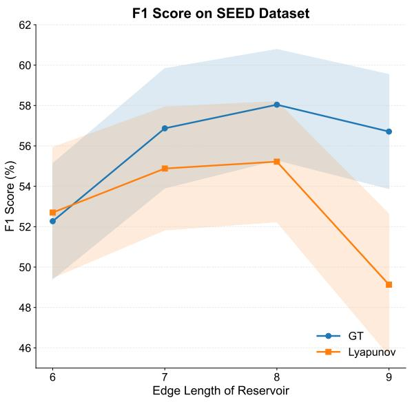

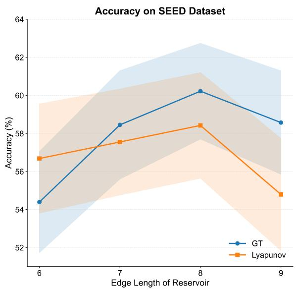  
Fig. E1 Generalization Performance Comparison between Lyapunov-based Tuning and Gradient Tunneling across diferent neural population scales. The proposed method demonstrates superior performance starting at an edge length of 7, with this advantage becoming increasingly pronounced as the neuron amount expands.

Table E3 Classification Performances on EEG Pattern Recognition with LibEER Benchmark (Average ± Standard Error %)
<table><tr><td>Task</td><td>Model</td><td>Algorithm</td><td>Accuracy</td><td>Precision</td><td>Recall</td><td>F1 Score</td></tr><tr><td rowspan="8">SEED</td><td>LSTM</td><td>BPTT</td><td>56.17±2.91</td><td>56.76±3.00</td><td>56.17±2.91</td><td>54.75±2.99</td></tr><tr><td>GRU</td><td>BPTT</td><td>58.18±2.80</td><td>58.86±2.99</td><td>58.18±2.80</td><td>56.29±3.02</td></tr><tr><td>EEGNet</td><td>BP</td><td>57.33±3.21</td><td>55.11±3.72</td><td>57.33±3.21</td><td>54.04±3.48</td></tr><tr><td>LTC-SNN</td><td>FPTT</td><td>54.04±2.93</td><td>54.70±3.16</td><td>54.04±2.93</td><td>52.30±3.05</td></tr><tr><td>LSNN</td><td>e-prop</td><td>56.62±3.16</td><td>57.82±3.33</td><td>56.62±3.16</td><td>55.09±3.27</td></tr><tr><td>SRNN</td><td>D-RTRL</td><td>48.87±2.14</td><td>50.15±2.28</td><td>48.87±2.14</td><td>46.93±2.37</td></tr><tr><td>SRNN</td><td>pp-prop</td><td>44.46±2.58</td><td>43.74±3.27</td><td>44.46±2.58</td><td>40.23±2.90</td></tr><tr><td>LSM</td><td>Lyapunov</td><td>58.42±2.78</td><td>58.50±3.28</td><td>58.42±2.78</td><td>55.22±2.98</td></tr><tr><td rowspan="8">DEAP-V</td><td>f-NMC</td><td>GT</td><td> $\mathbf { 6 0 . 2 2 \pm 2 . 5 2 6 1 . 6 0 \pm 2 . 7 0 6 0 . 2 2 \pm 2 . 5 2 5 8 . 0 4 \pm 2 . 7 4 }$ </td><td></td><td></td><td></td></tr><tr><td>LSTM</td><td>BPTT</td><td>58.30±3.29</td><td>46.66±3.73</td><td>41.35±4.81</td><td>42.21±4.19</td></tr><tr><td>GRU</td><td>BPTT</td><td>65.35±3.97</td><td>53.01±2.32</td><td>49.13±3.05</td><td>49.98±2.57</td></tr><tr><td>EEGNet</td><td>BP</td><td>58.84±4.44</td><td>52.35±3.75</td><td>45.40±5.14</td><td>46.16±4.42</td></tr><tr><td>LTC-SNN</td><td>FPTT</td><td>67.32±6.39</td><td>51.75±3.17</td><td>50.29±3.47</td><td>49.91±3.33</td></tr><tr><td>LSNN</td><td>e-prop</td><td>73.89±6.97</td><td>66.02±7.98</td><td>66.90±7.37</td><td>63.35±8.23</td></tr><tr><td>SRNN</td><td>D-RTRL</td><td>62.06±6.39</td><td>55.72±3.83</td><td>50.46±4.74</td><td>49.56±4.75</td></tr><tr><td>SRNN LSM</td><td>pp-prop</td><td>60.47±5.40</td><td>50.98±3.18</td><td>48.57±3.80</td><td>46.59±3.32</td></tr><tr><td>f-NMC</td><td>Lyapunov GT</td><td>57.73±8.32</td><td>45.53±5.66</td><td>43.84±6.11</td><td>41.04±5.99</td></tr><tr><td>LSTM</td><td></td><td>73.93±6.77</td><td>58.54±8.63</td><td>61.74±7.48</td><td>58.25±8.25</td></tr><tr><td></td><td>BPTT</td><td>61.24±3.84</td><td>46.78±2.90</td><td>41.24±3.72</td><td>42.52±3.32</td></tr><tr><td>GRU EEGNet</td><td>BPTT</td><td>66.57±3.94</td><td>51.85±1.47</td><td>47.90±2.60</td><td>48.99±1.91</td></tr><tr><td>LTC-SNN</td><td>BP</td><td>60.68±5.67</td><td>49.48±4.12</td><td>45.32±4.55</td><td>44.22±4.10</td></tr><tr><td>DEAP-A LSNN</td><td>FPTT</td><td>72.12±6.65</td><td>61.13±6.65</td><td>60.13±6.88</td><td>59.90±6.87</td></tr><tr><td></td><td>e-prop</td><td>79.01±6.39</td><td>61.68±7.84</td><td>64.31±6.75</td><td>61.30±7.47</td></tr><tr><td>SRNN</td><td>D-RTRL</td><td>58.19±8.77</td><td>52.42±8.34</td><td>51.99±8.36</td><td>50.07±8.38</td></tr><tr><td>SRNN</td><td>pp-prop</td><td>62.43±6.19</td><td>53.64±4.20</td><td>50.08±5.15</td><td>48.98±5.04</td></tr><tr><td>LSM</td><td>Lyapunov</td><td>73.66±6.59</td><td>58.02±7.04</td><td>58.95±6.76</td><td>57.06±7.01</td></tr><tr><td>f-NMC</td><td>GT</td><td>76.85±6.53</td><td></td><td>64.37±7.51 65.21±7.16 63.36±7.59</td><td></td></tr></table>

Table E4 Complete Results of Classification Performance on the SEED Dataset with LibEER Benchmark (Average ± Standard Error %)
<table><tr><td>Algorithm</td><td></td><td>Session Accuracy</td><td>Precision</td><td>Recall</td><td>F1 Score</td></tr><tr><td rowspan="4">LSTM &amp; BPTT</td><td>1 2</td><td> $5 4 . 0 5 { \pm } 6 . 1 0 $ </td><td> $5 3 . 7 7 { \scriptstyle \pm 6 . 3 1 }$ </td><td>54.05±6.10</td><td> $5 2 . 7 8 { \pm } 6 . 2 8$ </td></tr><tr><td>3</td><td> $5 5 . 7 0 { \scriptstyle \pm 3 . 9 4 }$ </td><td> $5 7 . 7 5 { \pm } 3 . 9 8 $ </td><td> $5 5 . 7 0 { \scriptstyle \pm 3 . 9 4 }$ </td><td> $5 4 . 5 6 { \pm } 3 . 7 5 $ </td></tr><tr><td></td><td> $5 8 . 7 5 { \pm } 4 . 8 5 $ </td><td> $5 8 . 7 5 { \scriptstyle \pm 5 . 0 1 }$ </td><td>58.75±4.85</td><td> $5 6 . 9 2 { \scriptstyle \pm 5 . 2 1 }$ </td></tr><tr><td>Avg</td><td>56.17±2.91</td><td>56.76±3.00</td><td>56.17±2.91</td><td> $5 4 . 7 5 { \pm } 2 . 9 9$ </td></tr><tr><td rowspan="4">GRU &amp; BPTT</td><td>1 2</td><td> $5 7 . 6 3 { \pm } 5 . 3 0 $ </td><td> $5 8 . 1 1 \pm 5 . 9 5$ </td><td> $5 7 . 6 3 { \pm } 5 . 3 0 $ </td><td> $5 5 . 4 0 { \pm } 5 . 9 3 $ </td></tr><tr><td></td><td> $5 5 . 3 5 { \pm } 4 . 6 6 $ </td><td> $5 7 . 4 9 { \pm } 4 . 3 9$ </td><td> $5 5 . 3 5 { \pm } 4 . 6 6 $ </td><td> $5 3 . 8 7 { \pm } 4 . 7 4 $ </td></tr><tr><td>3</td><td> $6 1 . 5 7 { \pm } 4 . 5 7$ </td><td> $6 0 . 9 8 { \pm } 5 . 0 7$ </td><td> $6 1 . 5 7 { \pm } 4 . 5 7$ </td><td> $5 9 . 5 9 { \pm } 4 . 9 6 $ </td></tr><tr><td> $\operatorname { A v g }$ </td><td> $5 8 . 1 8 { \pm } 2 . 8 0 $ </td><td>58.86±2.99</td><td>58.18±2.80</td><td>56.29±3.02</td></tr><tr><td rowspan="4">EEGNet &amp; BP</td><td>1</td><td> $5 2 . 6 2 { \pm } 7 . 1 2$ </td><td> $5 0 . 3 9 { \pm } 7 . 8 2 $ </td><td> $5 2 . 6 2 { \pm } 7 . 1 2$ </td><td> $4 9 . 3 9 { \pm } 7 . 5 9 $ </td></tr><tr><td>2</td><td> $5 7 . 3 0 { \pm } 4 . 7 8$ </td><td> $5 3 . 1 0 { \pm } 6 . 4 1$ </td><td> $5 7 . 3 0 { \pm } 4 . 7 8$ </td><td> $5 2 . 9 8 { \pm } 5 . 4 2$ </td></tr><tr><td>3</td><td> $6 2 . 0 8 { \pm } 4 . 3 6 $ </td><td> $6 1 . 8 3 { \pm } 4 . 7 2 $ </td><td> $6 2 . 0 8 { \pm } 4 . 3 6 $ </td><td> $5 9 . 7 6 { \pm } 4 . 6 8 $ </td></tr><tr><td> $\operatorname { A v g }$ </td><td> $5 7 . 3 3 { \pm } 3 . 2 1 $ </td><td> $5 5 . 1 1 { \pm } 3 . 7 2 $ </td><td>57.33±3.21</td><td>54.04±3.48</td></tr><tr><td rowspan="4">LTC-SNN &amp; FPTT</td><td>1</td><td> $5 0 . 6 3 { \pm } 4 . 9 6 $ </td><td> $5 0 . 7 7 { \scriptstyle \pm 5 . 5 5 }$ </td><td>50.63±4.96</td><td>49.29±5.22</td></tr><tr><td>2</td><td> $5 3 . 4 2 { \pm } 5 . 6 3$ </td><td> $5 6 . 1 1 \pm 5 . 8 2$ </td><td> $5 3 . 4 2 { \pm } 5 . 6 3$ </td><td> $5 1 . 4 5 { \pm } 5 . 7 8$ </td></tr><tr><td>3</td><td> $5 8 . 0 7 { \scriptstyle \pm 4 . 5 5 }$ </td><td> $5 7 . 2 3 { \pm } 5 . 0 4$ </td><td> $5 8 . 0 7 { \scriptstyle \pm 4 . 5 5 }$ </td><td> $5 6 . 1 7 { \pm } 4 . 8 2$ </td></tr><tr><td> $\operatorname { A v g }$ </td><td> $5 4 . 0 4 { \pm } 2 . 9 3 $ </td><td> $5 4 . 7 0 { \pm } 3 . 1 6 $ </td><td> $5 4 . 0 4 { \pm } 2 . 9 3 $ </td><td> $5 2 . 3 0 { \pm } 3 . 0 5 $ </td></tr><tr><td rowspan="4">LSNN &amp; e-prop</td><td>1</td><td> $5 1 . 9 2 { \pm } 6 . 5 3 $ </td><td> $5 3 . 3 6 { \pm } 6 . 6 4$ </td><td> $5 1 . 9 2 { \pm } 6 . 5 3 $ </td><td> $5 0 . 4 9 { \pm } 6 . 5 8 $ </td></tr><tr><td>2</td><td> $5 9 . 6 6 { \pm } 4 . 8 4 $ </td><td> $6 0 . 7 2 { \scriptstyle \pm 5 . 1 1 }$ </td><td> $5 9 . 6 6 { \pm } 4 . 8 4$ </td><td> $5 8 . 1 5 { \pm } 5 . 0 7$ </td></tr><tr><td>3</td><td> $5 8 . 2 9 { \pm } 4 . 8 8 $ </td><td> $5 9 . 3 8 { \pm } 5 . 4 4$ </td><td> $5 8 . 2 9 { \pm } 4 . 8 8 $ </td><td> $5 6 . 6 2 { \pm } 5 . 2 2$ </td></tr><tr><td> $\operatorname { A v g }$ </td><td> $5 6 . 6 2 { \pm } 3 . 1 6$ </td><td> $5 7 . 8 2 { \pm } 3 . 3 3 $ </td><td> $5 6 . 6 2 { \pm } 3 . 1 6$ </td><td> $5 5 . 0 9 { \pm } 3 . 2 7 \ $ </td></tr><tr><td rowspan="4">SRNN &amp; D-RTRL</td><td>1</td><td> $4 7 . 5 0 { \pm } 4 . 6 1 $ </td><td> $4 9 . 4 6 { \pm } 5 . 0 4$ </td><td>47.50±4.61</td><td>46.33±4.58</td></tr><tr><td>2</td><td> $5 0 . 9 5 { \pm } 3 . 0 5$ </td><td> $5 0 . 9 4 { \pm } 3 . 2 5 $ </td><td>50.95±3.05</td><td>49.20±3.33</td></tr><tr><td>3</td><td>48.16±3.28</td><td> $5 0 . 0 5 { \pm } 3 . 3 0 $ </td><td>48.16±3.28</td><td>45.27±4.30</td></tr><tr><td> $\operatorname { A v g }$ </td><td>48.87±2.14</td><td> $5 0 . 1 5 { \pm } 2 . 2 8 $ </td><td>48.87±2.14</td><td>46.93±2.37</td></tr><tr><td rowspan="4">SRNN &amp; pp-prop</td><td>1</td><td> $3 8 . 8 2 { \pm } 5 . 3 2 $ </td><td> $3 8 . 8 2 { \pm } 6 . 4 5 $ </td><td>38.82±5.32</td><td>34.70±5.18</td></tr><tr><td>2</td><td> $4 6 . 2 2 { \pm } 3 . 6 0$ </td><td> $4 5 . 3 7 { \pm } 4 . 7 9$ </td><td>46.22±3.60</td><td>41.23±4.75</td></tr><tr><td>3</td><td> $4 8 . 3 4 { \pm } 4 . 3 3 $ </td><td> $4 7 . 0 4 \pm 5 . 6 1$ </td><td>48.34±4.33</td><td>44.75±5.11</td></tr><tr><td></td><td>44.46±2.58</td><td>43.74±3.27</td><td>44.46±2.58</td><td>40.23±2.90</td></tr><tr><td rowspan="4">LSM &amp; Lyapunov</td><td>Avg</td><td></td><td></td><td></td><td> $5 2 . 6 0 { \pm } 6 . 4 9$ </td></tr><tr><td>1 2</td><td> $5 6 . 1 8 { \scriptstyle \pm 6 . 0 7 }$   $5 7 . 1 9 { \pm } 3 . 6 7$ </td><td> $5 4 . 5 3 { \pm } 7 . 3 8 $ </td><td> $5 6 . 1 8 { \scriptstyle \pm 6 . 0 7 }$ </td><td>53.78±3.97</td></tr><tr><td>3</td><td> $6 1 . 8 9 { \pm } 4 . 3 6 $ </td><td> $6 0 . 1 4 { \pm } 4 . 3 4$   $6 0 . 8 4 { \pm } 4 . 8 3 $ </td><td> $5 7 . 1 9 { \pm } 3 . 6 7$  61.89±4.36</td><td>59.27±4.70</td></tr><tr><td> $\operatorname { A v g }$ </td><td>58.42±2.78</td><td> $5 8 . 5 0 { \pm } 3 . 2 8 $ </td><td>58.42±2.78</td><td>55.22±2.98</td></tr><tr><td rowspan="4">f-NMC &amp; GT</td><td>1</td><td></td><td> $5 9 . 2 4 \pm 5 . 0 5$ </td><td></td><td>56.39±4.99</td></tr><tr><td>2</td><td> $5 8 . 2 0 { \pm } 4 . 8 0 $   $6 1 . 4 1 { \pm } 4 . 4 6 $ </td><td> $6 3 . 4 7 { \pm } 4 . 9 2$ </td><td> $5 8 . 2 0 { \pm } 4 . 8 0 $   $6 1 . 4 1 { \pm } 4 . 4 6 $ </td><td> $5 8 . 8 0 { \pm } 5 . 1 1 \ $ </td></tr><tr><td>3</td><td> $6 1 . 0 5 { \pm } 3 . 7 6 $ </td><td> $6 2 . 1 0 { \pm } 4 . 0 1 $ </td><td> $6 1 . 0 5 { \pm } 3 . 7 6 $ </td><td> $5 8 . 9 2 { \scriptstyle \pm 4 . 0 4 }$ </td></tr><tr><td> $\operatorname { A v g }$ </td><td>60.22±2.52 61.60±2.70 60.22±2.52 58.04±2.74</td><td></td><td></td><td></td></tr></table>

Table E5 Comparison of Resource Consumption During the Training Process on the DEAP Dataset
<table><tr><td>Method</td><td>Total Connections</td><td>Trainable Connections</td><td>Training Speed</td></tr><tr><td>LTC-SNN with FPTT</td><td>1048576</td><td>1048576</td><td>2.84 s/it</td></tr><tr><td>LSNN with e-prop</td><td>1048576</td><td>1048576</td><td>6.56 s/it</td></tr><tr><td>SRNN with D-RTRL</td><td>1048576</td><td>1048576</td><td>9.77 s/it</td></tr><tr><td>SRNN with pp-prop</td><td>1048576</td><td>1048576</td><td>8.96 s/it</td></tr><tr><td>f-NMC with GT</td><td>32328</td><td>4492</td><td>1.41 s/it</td></tr></table>