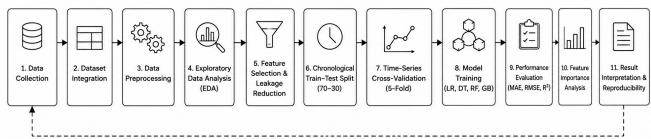
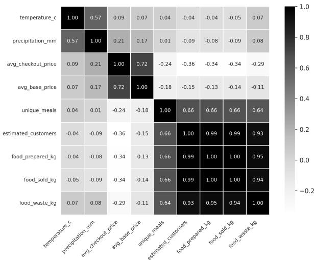
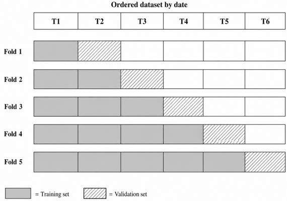
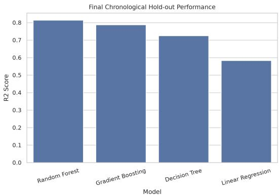
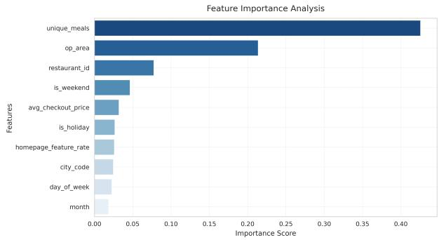
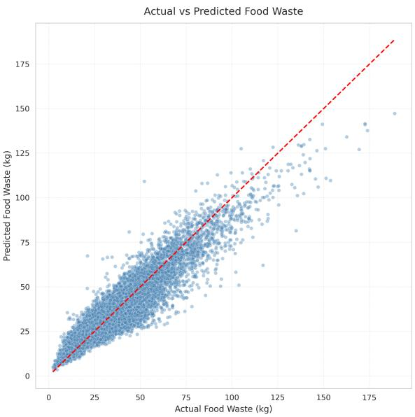

# A Machine Learning Framework for Predicting Restaurant Food Waste to Support Sustainable Food Management

Md Mehedi Hasan Naeem, Md Ashraful Islam, Moumita Barua,

Ishtiyak Ahmmad Araf and Md. Arefin Haque Mahir

Department of Computer Science and Engineering, Jatiya Kabi Kazi Nazrul Islam University, Trishal, Mymensingh-2224, Bangladesh {mehedinaeem00, ashrafulofficialc, moumitabarua.jkkniucse, ishtiyakahmmad1149, arefinmahir2026}@gmail.com

Abstract—Food waste in the restaurant sector poses a substantial challenge to environmental sustainability and economic efficiency. This paper presents an exploratory machine learning framework for estimating daily restaurant food waste quantities from operational and contextual features. A structured dataset was constructed by integrating restaurant demand records, meteorological data and temporal event indicators, yielding 77,980 records across 27 features. Because large-scale ground-truth food waste measurements are not publicly available, the target variable was derived from operationally justified assumptions, with the complete construction formula and controlled stochastic variability disclosed for full reproducibility. Four supervised regression models, namely Linear Regression, Decision Tree, Random Forest and Gradient Boosting, were evaluated under a chronological 70-30 train-test split that respects the temporal ordering of restaurant operations, augmented by 5-fold time-series cross-validation. All reported metrics are explicitly scoped to performance against the constructed target and do not imply validation against measured food waste. Ensemble methods consistently outperformed linear baselines. Random Forest attained an MAE of 6.19 kg, RMSE of 8.36 kg and R2 of 0.817 on the realistic feature subset following systematic exclusion of algebraically leakage-prone variables. Feature importance analysis identified menu diversity, operational area and temporal activity patterns as the primary predictive drivers. The full dataset, target construction formula, codebase and experimental configurations are publicly released to support reproducibility and future extension to empirically measured waste data.

Index Terms—Food waste prediction, restaurant sustainability, machine learning, ensemble learning, predictive analytics, feature leakage, chronological evaluation

## I. INTRODUCTION

Food waste is a pressing global sustainability challenge with far-reaching environmental, economic and social consequences. The United Nations Environment Programme estimated that 1.05 billion tonnes of food were wasted at retail, food-service and household levels in 2022, representing nearly one-fifth of the food available to consumers [1]. Food loss and waste are also associated with approximately 8-10% of annual global greenhouse gas emissions and economic costs exceeding one trillion United States dollars each year [1]. Within hospitality operations, overproduction, storage losses and plate waste remain important sources of avoidable food waste [2]. The food waste hierarchy therefore prioritizes prevention before reuse, recycling, recovery and disposal [3].

Advances in machine learning have created new opportunities for data-driven demand forecasting, inventory optimization and restaurant operations management [4]. Random Forest is well suited to modelling nonlinear relationships in structured datasets [5]. Gradient Boosting provides a complementary sequential learning approach for complex predictive tasks [6]. XGBoost extends tree boosting through a scalable system designed for efficient learning from structured data [7]. These techniques are relevant to restaurant waste analysis, where operational scale, menu composition, promotional activity and environmental factors can interact in complex ways.Despite this progress, publicly available datasets that combine measured restaurant food waste with rich operational and contextual features remain scarce [2]. Most existing studies address food demand estimation rather than food waste prediction directly, and few incorporate weather conditions, holiday calendars or promotional signals as covariates. This limits the generalizability of prior frameworks to real-world restaurant waste management. The present work addresses these gaps through five contributions:

• Construction of a structured, publicly available restaurant food waste dataset integrating operational, meteorological and temporal features, with the complete target construction formula and controlled stochastic variability disclosed for reproducibility.

• Systematic comparison of four supervised regression models under a chronological train-test split that respects operational time ordering, augmented by 5-fold timeseries cross-validation.

• A rigorous feature leakage analysis and ablation study that identifies the primary leakage sources and quantifies their impact on reported performance.

• Identification of the operational and contextual drivers most strongly associated with the predicted waste target.

• A fully reproducible open-source framework to support future research incorporating empirically measured food waste data.

The remainder of this paper is structured as follows. Section II reviews related work. Section III describes the dataset construction and integration process. Section IV presents the proposed methodology. Section V reports experimental results and discussion. Section VI concludes with directions for future work.

## II. RELATED WORK

Predictive analytics for food-service sustainability has attracted growing research interest, encompassing food demand forecasting, inventory optimization and waste reduction. Arunraj and Ahrens [8] combined a seasonal autoregressive integrated moving average model with quantile regression for daily food sales forecasting. Their work demonstrates the operational value of demand forecasting under variable sales conditions, but it does not estimate restaurant food waste di rectly. Taylor [9] developed an exponentially weighted quantile regression approach for daily supermarket sales forecasting. The study showed that robust demand modelling can improve point and interval forecasts, although the target remained product sales rather than food waste. Fildes et al. [10] reviewed research and practice in retail forecasting and highlighted the importance of data quality, promotional information, evaluation design and operational context. However, retail demand forecasting does not directly quantify restaurant food waste. Carbonneau et al. [11] investigated machine learning techniques for supply-chain demand forecasting. Their findings demonstrated the operational value of nonlinear predictive models, but the framework focused on demand rather than direct waste quantity estimation. Scherhaufer et al. [12] quantified the environmental impacts associated with food waste in Europe. Clowes et al. [13] reported a strong business case for food waste prevention in restaurant operations. Together, these studies demonstrate the environmental and economic importance of improving food waste management. Three method ological gaps remain across the literature. First, publicly available datasets with directly measured restaurant food waste paired with operational and contextual features are largely absent. Second, environmental and temporal covariates shown to influence restaurant demand are infrequently included in waste prediction models. Third, few studies conduct explicit feature leakage analysis, which is critical when target variables are partially constructed from operational proxies, and fewer still employ chronological validation protocols suitable for time-ordered operational data. The present work addresses all three gaps.

## III. DATASET DESCRIPTION AND INTEGRATION

## A. Data Sources and Integration

The dataset was constructed by integrating three categories of publicly available information: restaurant demand records, meteorological data and temporal event indicators. Restaurant operational records provided daily identifiers, meal type, pricing, operational area, promotional activity rates and customer visit statistics. Meteorological data contributed daily temperature and precipitation measurements aligned by date. Temporal indicators encoded weekend, public holiday and special event status for each record date.Integration was performed by aligning all sources on a composite date and restaurant identifier key. Meteorological records were matched to operational records by date, while temporal indicators were merged using the same date key. The resulting integrated dataset comprises 77,980 daily records across 27 features. After integration, preprocessing steps, including missing-value imputation, duplicate removal, ordinal label encoding of categorical variables and standard scaling of continuous features, were applied uniformly. The complete dataset, source code and reproducibility resources used in this study are available in the project GitHub repository.

## B. Target Variable Construction and Transparency

Because no large-scale dataset of directly measured restaurant food waste is publicly available, the target variable food\_waste\_kg was estimated using the following operationally grounded formula:

$$
W _ { i } = \alpha \cdot P _ { i } \cdot \left( 1 - \beta \cdot C _ { i } \right) + \epsilon _ { i }\tag{1}
$$

where $W _ { i }$ is the estimated daily food waste for record i in kilograms, $P _ { i }$ is the estimated food prepared derived from order volume and average meal weight, $C _ { i }$ is the normalized consumption ratio defined as sold meals relative to prepared meals, α is a calibration scalar representing the assumed waste proportion, $\beta$ is a consumption efficiency coefficient and $\epsilon _ { i } \sim \mathcal { N } ( 0 , \sigma ^ { 2 } )$ is zero-mean Gaussian noise introduced to reduce deterministic reconstruction of the constructed target from any single observable feature. The parameter values α, $\beta$ and $\sigma ,$ together with the complete target construction code, are disclosed in the public repository to support reproducibility and independent scrutiny. It is essential to understand the scope of this design: models evaluated against this target learn to approximate the constructed formula with noise rather than ground-truth food waste. Reported metrics such as $R ^ { 2 } = 0 . 8 1 7$ quantify fit to the constructed target and should not be interpreted as validated food waste predictions. The framework is explicitly positioned as an exploratory methodology study intended to establish a reproducible baseline for future research incorporating empirically measured data.

## C. Feature Summary

Table I summarizes the key features retained after leakage reduction for model development.

TABLE I  
SUMMARY OF KEY DATASET FEATURES
<table><tr><td>Feature</td><td>Description</td></tr><tr><td>restaurant_id</td><td>Unique restaurant identifier</td></tr><tr><td>city_code</td><td>Geographic location code</td></tr><tr><td>op_area</td><td>Restaurant operational footprint</td></tr><tr><td>unique_meals</td><td>Distinct menu items served daily</td></tr><tr><td>avg_checkout_price</td><td>Mean customer transaction value</td></tr><tr><td>emailer_promo_rate</td><td>Email promotional campaign rate</td></tr><tr><td>homepage_feature_rate</td><td>Homepage promotional frequency</td></tr><tr><td>is_weekend</td><td>Weekend day indicator</td></tr><tr><td>is_holiday</td><td>Public holiday indicator</td></tr><tr><td>temperature_c</td><td>Daily mean temperature (°C)</td></tr><tr><td>food_waste_kg</td><td>Constructed daily food waste target</td></tr></table>

## IV. METHODOLOGY

The proposed framework follows a structured pipeline comprising data integration, preprocessing, exploratory analysis, feature selection, model training and evaluation. Figure 1 illustrates the overall workflow.

  
Fig. 1. Overall workflow of the proposed restaurant food waste prediction framework.

## A. Data Preprocessing

Preprocessing began with identification and removal of missing values and duplicate records. Categorical variables including restaurant category and cuisine type were encoded using ordinal label encoding. Continuous operational and pricing features were normalized through standard scaling with zero mean and unit variance to reduce scale-induced bias and improve model convergence. Temporal features including year, month, ISO week number and day-of-week indicator were extracted from the date attribute to capture seasonal and cyclical patterns associated with restaurant waste generation. These steps produced a consistent modelling dataset while preserving the temporal variables required for chronological evaluation.

## B. Exploratory Data Analysis

Exploratory data analysis encompassed Pearson correlation analysis, univariate distribution inspection, pairwise scatter visualization and interquartile range based outlier detection. Figure 2 presents the correlation heatmap among primary numerical features. Menu diversity (unique\_meals) and operational area (op\_area) exhibit the strongest positive associations with the target variable, while temporal and contextual indicators contribute moderate but consistent signal.

## C. Feature Selection and Leakage Reduction

A key methodological challenge in working with operationally constructed target variables is structural leakage. Features that are algebraically entangled with the target derivation process can yield unrealistically high performance scores that mask generalization capability [14]. Initial experiments using the full feature set including food\_prepared\_kg, food\_sold\_kg and num\_orders yielded $R ^ { 2 }$ values exceeding 0.99. This result is expected because food\_prepared\_kg and food\_sold\_kg participate directly in the target construction represented by Equation (1), allowing models to reconstruct the target relationship rather than learn broader predictive patterns. The variable num\_orders is an algebraic antecedent of food\_prepared\_kg and therefore constitutes indirect leakage. All three variables were excluded from the realistic feature subset, which retains only variables plausibly available before service commencement: restaurant size, cuisine category, pricing signals, promotional indicators, weather conditions, holiday status and calendar features.

  
Fig. 2. Pearson correlation heatmap among primary numerical features in the integrated dataset.

## D. Machine Learning Models

Four supervised regression models were evaluated:

• Linear Regression (LR): Ordinary least-squares baseline providing an interpretable lower-bound reference.

• Decision Tree (DT): Nonparametric model capturing axis-aligned feature interactions, depth-limited at max\_depth = 8 to control overfitting.

• Random Forest (RF): Bagging ensemble of 100 decision trees with max\_depth = 10, exploiting variance reduction through bootstrap aggregation [5].

• Gradient Boosting (GB): Sequential residualfitting ensemble with n\_estimators = 100 and learning\_rate = 0.05 [6].

Table II lists all configured hyperparameters. All remaining settings retain Scikit-learn defaults.

TABLE II  
HYPERPARAMETER CONFIGURATION OF EVALUATED MODELS
<table><tr><td>Model</td><td>Key Hyperparameters</td></tr><tr><td>Linear Regression</td><td>Default OLS configuration with no regularization</td></tr><tr><td>Decision Tree</td><td>max_depth = 8</td></tr><tr><td>Random Forest</td><td>n_estimators = 100, max_depth = 10</td></tr><tr><td>Gradient Boosting</td><td>n_estimators = 100, learning_rate = 0.05</td></tr></table>

## E. Chronological Train-Test Split and Cross-Validation

Because the dataset represents time-ordered restaurant operations, a random shuffle split is methodologically inappropriate because it can allow future observations to inform predictions of past records. The dataset was therefore sorted chronologically and split at the 70th percentile of the date range, with the earlier 70% used for training and the remaining 30% held out as the test set. This preserves the temporal ordering of restaurant operations and provides a more realistic evaluation of prospective forecasting performance. To assess stability across different training windows, 5-fold cross-validation was additionally applied using the TimeSeriesSplit procedure. Each successive fold extends the training set chronologically and evaluates the model on the immediately following period. This expanding-window structure follows established out-ofsample evaluation principles for time-ordered data [15]. Mean $R ^ { 2 }$ and standard deviation across folds are reported alongside held-out test metrics. Figure 3 illustrates the protocol.

  
Fig. 3. Expanding-window 5-fold time-series cross-validation protocol applied to the date-ordered training data.

## F. Evaluation Metrics

Predictive performance was quantified using three complementary regression metrics.

1) Mean Absolute Error:

$$
\mathrm { M A E } = \frac { 1 } { n } \sum _ { i = 1 } ^ { n } \left| y _ { i } - \hat { y } _ { i } \right|\tag{2}
$$

MAE reports the average magnitude of prediction errors in the original unit of kilograms, providing an interpretable measure of practical accuracy [16].

2) Root Mean Squared Error:

$$
{ \mathrm { R M S E } } = { \sqrt { \frac { 1 } { n } \sum _ { i = 1 } ^ { n } ( y _ { i } - { \hat { y } } _ { i } ) ^ { 2 } } }\tag{3}
$$

RMSE penalizes large individual errors more heavily than MAE, making it sensitive to outlying predictions [16].

3) Coefficient of Determination:

$$
R ^ { 2 } = 1 - \frac { \displaystyle \sum _ { i = 1 } ^ { n } ( y _ { i } - \hat { y } _ { i } ) ^ { 2 } } { \displaystyle \sum _ { i = 1 } ^ { n } ( y _ { i } - \bar { y } ) ^ { 2 } }\tag{4}
$$

The coefficient of determination measures the proportion of target variance explained by the model [17]. Here $y _ { i } , \hat { y } _ { i }$ and y¯ denote the observed constructed value, predicted value and mean target value, respectively. Given the constructed nature of the target, $R ^ { 2 }$ should be interpreted as a measure of model fit to the defined proxy rather than evidence of real-world food waste prediction capability.

## V. EXPERIMENTAL RESULTS AND DISCUSSION

All experiments were implemented in Python 3 using Scikitlearn, Pandas and NumPy. The complete implementation, dataset, target construction formula and reproducibility instructions are publicly available through the project repository listed in Section III.

## A. Model Performance Under Chronological Split

Table III reports held-out test set performance for all evaluated models on the realistic feature subset under the chronological 70-30 split described in Section IV-E.

TABLE III  
TEST SET PERFORMANCE ON THE REALISTIC FEATURE SUBSET
<table><tr><td>Model</td><td>MAE (kg)</td><td>RMSE (kg)</td><td> $R ^ { 2 \dagger }$ </td></tr><tr><td>Linear Regression</td><td>8.88</td><td>12.60</td><td>0.586</td></tr><tr><td>Decision Tree</td><td>7.50</td><td>10.24</td><td>0.726</td></tr><tr><td>Gradient Boosting</td><td>6.56</td><td>8.94</td><td>0.791</td></tr><tr><td>Random Forest</td><td>6.19</td><td>8.36</td><td>0.817</td></tr></table>

†Metrics are evaluated against the constructed proxy target.

Ensemble methods outperformed both baselines across all metrics. Random Forest achieved the best result, reducing MAE by 30.3% relative to Linear Regression. The performance ordering $\mathrm { L R } \ < \ \mathrm { D T } \ < \ \mathrm { G B } \ < \ \mathrm { R F }$ is consistent with the ability of bagging ensembles to capture nonlinear interactions in structured operational data [5]. Gradient Boosting confirmed the complementary strength of sequential residualfitting approaches [6]. Figure 4 provides a visual summary.

  
Fig. 4. $R ^ { 2 }$ score comparison of evaluated machine learning models on the held-out chronological test set.

## B. Cross-Validation Results

Table IV presents mean $R ^ { 2 }$ and standard deviation across the five time-series cross-validation folds.

Random Forest achieved the highest mean cross-validation $R ^ { 2 }$ of 0.720, while Gradient Boosting showed the lowest variability among the nonlinear models with a standard deviation

TABLE IV  
5-FOLD TIME-SERIES CROSS-VALIDATION RESULTS
<table><tr><td>Model</td><td>Mean  $R ^ { 2 }$ </td><td>Std.</td></tr><tr><td>Linear Regression</td><td>-0.033</td><td>0.649</td></tr><tr><td>Decision Tree</td><td>0.595</td><td>0.091</td></tr><tr><td>Gradient Boosting</td><td>0.716</td><td>0.032</td></tr><tr><td>Random Forest</td><td>0.720</td><td>0.072</td></tr></table>

of 0.032. The held-out test performance of Random Forest was higher than its cross-validation mean, indicating that predictive performance varies across successive temporal windows.

## C. Feature Importance Analysis

Feature importance scores were derived from the impuritybased mean decrease in node impurity accumulated across all trees of the Random Forest model. Figure 5 presents the ranked importance profile for the realistic feature subset.

  
Fig. 5. Random Forest feature importance scores for the realistic feature subset.

Menu diversity represented by unique\_meals and operational footprint represented by op\_area emerged as the two most influential features. This is operationally consistent because restaurants offering broader menus and operating larger facilities are expected to prepare more food and generate proportionally more waste. Weekend and holiday indicators provided moderate contributions, reflecting demand changes during high-traffic periods. Pricing and promotional features contributed smaller but non-negligible importance. These variables nevertheless contributed less than menu diversity and operational area.

## D. Ablation and Leakage Analysis

Table V summarizes the impact of progressive feature exclusion on Random Forest performance. This experiment directly identifies which feature groups constitute structural leakage.

The results clarify the leakage structure. Removing food\_prepared\_kg and food\_sold\_kg, which participate directly in the target construction represented by Equation (1), reduces $\bar { R ^ { 2 } }$ by 0.007. This indicates that num\_orders remains a substantial indirect leakage source because it encodes the order volume from which food\_prepared\_kg is derived. The model can therefore reconstruct part of the target relationship indirectly. Removing num\_orders reduces $R ^ { \bar { 2 } }$ to 0.817, representing performance on the reduced feature subset containing variables available before service commencement. This stepwise analysis provides a transparent account of how target-related variables influence the reported performance.

TABLE V  
ABLATION STUDY: EFFECT OF FEATURE SELECTION ON $R ^ { 2 }$
<table><tr><td colspan="3">Feature Configuration  $R ^ { 2 }$ </td></tr><tr><td>All features including food_prepared_kg, 0.997 food_sold_kg and num_orders</td><td></td><td></td></tr><tr><td colspan="3">food_prepared_kg and food_sold_kg re- 0.990</td></tr><tr><td colspan="3">moved num_orders additionally removed, producing the 0.817</td></tr><tr><td colspan="3">realistic subset</td></tr></table>

Figure 6 visualizes the alignment between constructed target values and Random Forest predictions on the chronological test set.

  
Fig. 6. Constructed target versus predicted food waste in kilograms for Random Forest on the chronological held-out test set.

## E. Discussion

The experimental results demonstrate that the realistic feature subset comprising variables available before service commencement contains meaningful predictive signal for the constructed food waste target. Ensemble learning methods were effective at capturing nonlinear interactions among operational, contextual and temporal variables.

Three scope limitations of the present study must be clearly stated. First, all reported metrics quantify model fit against a proxy target constructed by the authors and do not constitute validation against empirical food waste measurements. Second, the chronological split and time-series cross-validation adopted in this work provide temporally ordered evaluation, but walk-forward validation using unseen restaurant locations would provide a stronger test of temporal and geographic generalizability. Third, although Gaussian noise reduces exact deterministic reconstruction, some residual correlation between the noise-free component of the target and the realistic feature subset may persist, particularly through features such as unique\_meals that partially inform food\_prepared\_kg. Quantifying this residual relationship through partial dependence analysis and other explainability methods is an important direction for future work.

From a deployment perspective, the features identified as most important, including menu diversity, operational area and temporal indicators, are available before service commencement. This makes the framework applicable in principle to next-shift waste forecasting without real-time instrumentation. Deployment in live restaurant environments would require integration with point-of-sale systems, kitchen management platforms and direct waste monitoring hardware to replace the proxy-derived target with empirically measured food waste quantities.

## VI. CONCLUSION

This paper presented an exploratory machine learning framework for estimating daily restaurant food waste from operational, meteorological and temporal features. A structured dataset of 77,980 records was assembled from publicly available sources, and a methodologically transparent proxy target was constructed using an explicit formula with controlled Gaussian noise. The target construction process and assumptions are disclosed to support reproducibility. Four supervised regression models were evaluated under a chronological 70- 30 train-test split and a 5-fold time-series cross-validation protocol. Ensemble methods consistently outperformed linear baselines. Random Forest achieved MAE= 6.19 kg, RMSE= 8.36 kg and $R ^ { 2 } = 0 . 8 1 7$ against the constructed proxy target on the realistic feature subset. A stepwise ablation and leakage analysis identified num\_orders as the primary residual leakage source, and its exclusion produced the reported realistic feature subset. Feature importance analysis identified menu diversity and operational area as the dominant predictive drivers. The full codebase, dataset, target construction formula and evaluation scripts are publicly released to support independent reproducibility and community-driven extension. Future work will pursue three directions: collection and integration of directly measured restaurant food waste to replace the proxy target and validate the framework against ground truth; evaluation of advanced gradient-boosted methods including XGBoost [7], LightGBM [18] and CatBoost [19]; and development of walkforward, out-of-sample cross-restaurant validation protocols to rigorously assess temporal and geographic generalizability.

## REFERENCES

[1] United Nations Environment Programme, “Food waste index report 2024,” United Nations Environment Programme, Nairobi, Kenya, Tech. Rep., 2024.

[2] V. Filimonau and D.-A. De Coteau, “Food waste management in hospitality operations: A critical review,” Tourism Management, vol. 71, pp. 234–245, 2019.

[3] E. Papargyropoulou, R. Lozano, J. K. Steinberger, N. Wright, and Z. bin Ujang, “The food waste hierarchy as a framework for the management of food surplus and food waste,” Journal ofCleaner Production, vol. 76, pp. 106–115, 2014.

[4] M. Seyedan and F. Mafakheri, “Predictive big data analytics for supply chain demand forecasting: Methods, applications, and research opportunities,” Journal of Big Data, vol. 7, no. 1, p. 53, 2020.

[5] L. Breiman, “Random forests,” Machine Learning, vol. 45, no. 1, pp. 5–32, 2001.

[6] J. H. Friedman, “Greedy function approximation: A gradient boosting machine,” The Annals of Statistics, vol. 29, no. 5, pp. 1189–1232, 2001.

[7] T. Chen and C. Guestrin, “XGBoost: A scalable tree boosting system,” in Proceedings of the 22nd ACM SIGKDD International Conference on Knowledge Discovery and Data Mining, 2016, pp. 785–794.

[8] N. S. Arunraj and D. Ahrens, “A hybrid seasonal autoregressive integrated moving average and quantile regression for daily food sales forecasting,” International Journal of Production Economics, vol. 170, pp. 321–335, 2015.

[9] J. W. Taylor, “Forecasting daily supermarket sales using exponentially weighted quantile regression,” European Journal of Operational Re search, vol. 178, no. 1, pp. 154–167, 2007.

[10] R. Fildes, S. Ma, and S. Kolassa, “Retail forecasting: Research and practice,” International Journal of Forecasting, vol. 38, no. 4, pp. 1283– 1318, 2022.

[11] R. Carbonneau, K. Laframboise, and R. Vahidov, “Application of machine learning techniques for supply chain demand forecasting,” European Journal of Operational Research, vol. 184, no. 3, pp. 1140– 1154, 2008.

[12] S. Scherhaufer, G. Moates, H. Hartikainen, K. Waldron, and G. Obersteiner, “Environmental impacts of food waste in Europe,” Waste Management, vol. 77, pp. 98–113, 2018.

[13] A. Clowes, C. Hanson, and R. Swannell, “The business case for reducing food loss and waste: Restaurants,” Champions 12.3, Tech. Rep., February 2019.

[14] S. Kapoor and A. Narayanan, “Leakage and the reproducibility crisis in machine-learning-based science,” Patterns, vol. 4, no. 9, p. 100804, 2023.

[15] L. J. Tashman, “Out-of-sample tests of forecasting accuracy: An analysis and review,” International Journal of Forecasting, vol. 16, no. 4, pp. 437–450, 2000.

[16] C. J. Willmott and K. Matsuura, “Advantages of the mean absolute error (MAE) over the root mean square error (RMSE) in assessing average model performance,” Climate Research, vol. 30, pp. 79–82, 2005.

[17] D. Chicco, M. J. Warrens, and G. Jurman, “The coefficient of determination R-squared is more informative than SMAPE, MAE, MAPE, MSE, and RMSE in regression analysis evaluation,” PeerJ Computer Science, vol. 7, p. e623, 2021.

[18] G. Ke, Q. Meng, T. Finley, T. Wang, W. Chen, W. Ma, Q. Ye, and T.-Y. Liu, “LightGBM: A highly efficient gradient boosting decision tree,” in Advances in Neural Information Processing Systems, vol. 30, 2017, pp. 3146–3154.

[19] L. Prokhorenkova, G. Gusev, A. Vorobev, A. V. Dorogush, and A. Gulin, “CatBoost: Unbiased boosting with categorical features,” in Advances in Neural Information Processing Systems, vol. 31, 2018, pp. 6638–6648.