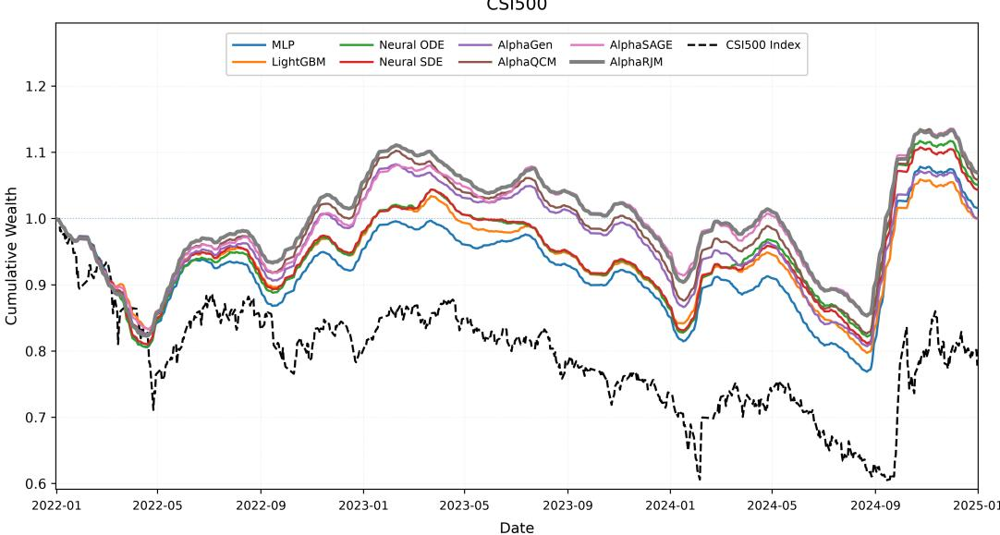
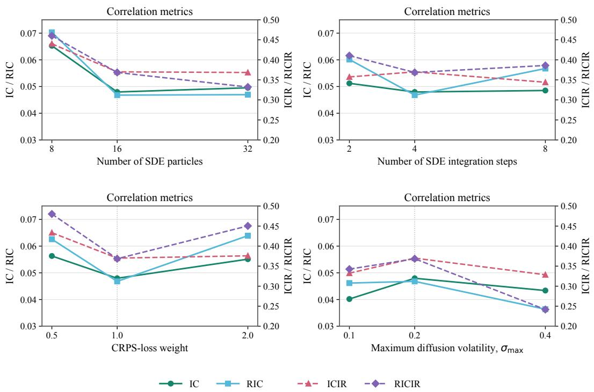
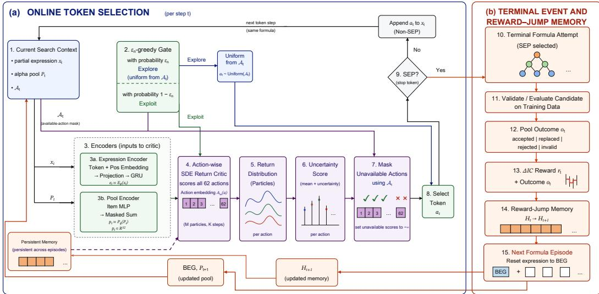
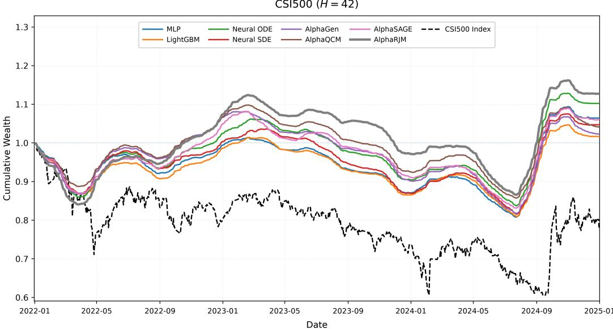

# ALPHARJM: REWARD-JUMP MEMORY FOR STOCHASTIC RETURN-GUIDED ALPHA DISCOVERY

Sayan Dhan Selvaraju Natarajan

Department of Mathematics Indian Institute of Technology Guwahati

s.dhan@iitg.ac.in nselvaraju@iitg.ac.in

## ABSTRACT

Formulaic alpha discovery is a pool-dependent symbolic search problem in which informative feedback is observed primarily when a complete expression is evaluated. This delayed feedback creates two coupled difficulties: the retained alpha pool does not preserve the full history of realized evaluation feedback, and the value of an intermediate construction action is uncertain because its consequence depends on the formula eventually completed. We introduce AlphaRJM, which addresses these difficulties through Reward-Jump Memory, an event-driven latent state that remains fixed during token construction and updates only at terminal evaluation events using the realized pool reward and evaluation outcome, and an action-conditioned SDE return critic that represents future discounted discovery returns with stochastic particles. The particles guide action selection through their mean and uncertainty and are learned using a distributional Bellman objective combining energy-distance matching, mean calibration, and jump regularization. Empirically, AlphaRJM delivers strong and stable gains across multiple equity universes, forecasting horizons, and random seeds, while ablations confirm the complementary roles of persistent evaluation history, stochastic return modeling, and distributional supervision.

## 1 INTRODUCTION

Formulaic alphas are interpretable symbolic expressions that transform historical market variables into predictive signals. Automating their discovery is challenging because the space of candidate expressions is combinatorial and, more importantly, the usefulness of a candidate depends on the alpha pool already constructed. A moderately predictive formula that contributes complementary information may be more valuable than a stronger but redundant one. AlphaGen formalizes this interaction by rewarding a candidate according to its marginal contribution to the combined alpha ensemble (Yu et al., 2023), turning formula discovery into a pool-dependent sequential decision problem with sparse and evolving feedback.

Recent methods improve different aspects of this search process. AlphaQCM introduces distributional reinforcement learning and uncertainty-aware exploration through learned return quantiles and Quantile Conditional Moments (QCM) (Zhu & Zhu, 2025; Zhang & Zhu, 2026). AlphaSAGE instead strengthens expression representation and search diversity through structure-aware graph encoding, Generative Flow Networks (GFlowNets), and dense multi-faceted rewards (Chen et al., 2026). These advances improve uncertainty modeling, structural understanding, and exploration, but they do not explicitly maintain a persistent representation of the sequence of terminal rewards and evaluation outcomes produced during search.

This distinction matters because terminal feedback can be informative even when the retained pool remains unchanged. For example, a rejected candidate provides a different evaluation outcome from an accepted or replaced one, while an invalid construction produces another distinct terminal event. Consequently, two search trajectories may arrive at the same retained pool after different sequences of realized rewards and categorical outcomes. Conditioning subsequent decisions only on the current pool therefore discards part of the evaluation history accumulated during search. This motivates a persistent state that evolves with terminal evaluation feedback while remaining unchanged during intermediate token construction.

Delayed terminal evaluation creates a second, closely related difficulty. At an intermediate token step, the consequence of selecting an action is not observed immediately: its utility depends on the expression that will eventually be completed and on the pool against which that expression will be evaluated. The future discovery return associated with an action is therefore naturally uncertain rather than a single deterministic quantity. A distributional representation can preserve this uncertainty and provide both a central estimate and a dispersion signal for action selection.

To address these two coupled challenges, we propose AlphaRJM, a formulaic alpha-discovery framework that combines Reward-Jump Memory with an action-conditioned stochastic differential equation (SDE) return critic. Reward-Jump Memory is an event-driven persistent latent state that remains unchanged during token-level formula construction and updates only when a terminal evaluation event occurs. Each update is driven by the realized pool reward and categorical evaluation outcome, allowing this evaluation history to persist across formula boundaries independently of whether the retained pool changes.

Complementing this persistent history, the action-conditioned SDE critic models the uncertain fu ture discovery return of each candidate construction action. Conditioned on the encoded partial expression, encoded alpha pool, persistent memory, and candidate action, the critic defines a state– action-specific stochastic return process. Independent trajectories generate particles representing plausible future discounted discovery returns, whose empirical mean and uncertainty directly guide action selection. The SDE is used solely as an internal stochastic return critic for symbolic search rather than as a model of asset prices or alpha signals. Its particle distribution is trained through a distributional Bellman objective combining energy-distance matching, mean calibration, and jump regularization.

Empirically, AlphaRJM achieves strong and stable gains across multiple equity universes, forecasting horizons, and random seeds, while controlled ablations support the complementary roles of persistent evaluation history, stochastic return modeling, and distributional supervision.

Contributions. Our main contributions are:

• We introduce Reward-Jump Memory, an event-driven persistent state that updates only after terminal evaluations using the realized pool reward and categorical outcome, allowing evaluation history to persist across formula episodes.

• We develop an action-conditioned SDE return critic that represents uncertain future discovery returns with stochastic particles and uses their mean and uncertainty to guide symbolic action selection.

• We train the resulting framework through distributional Bellman learning with sequenceconsistent memory replay, and demonstrate its effectiveness across multiple equity universes, forecasting horizons, and random seeds.

## 2 BACKGROUND AND RELATED WORK

Formulaic alpha discovery searches for interpretable symbolic expressions whose usefulness depends on the existing alpha pool. AlphaGen formalizes this interaction by rewarding a candidate according to its marginal contribution to the combined ensemble (Yu et al., 2023). AlphaRJM adopts this pool-dependent setting while additionally maintaining a persistent representation of realized terminal evaluation feedback across successive formula episodes.

Distributional reinforcement learning models the distribution of discounted returns rather than only their expectation (Bellemare et al., 2017; Dabney et al., 2018). AlphaQCM applies this principle to formulaic alpha discovery through learned return quantiles and Quantile Conditional Moments for uncertainty-aware exploration (Zhu & Zhu, 2025; Zhang & Zhu, 2026). AlphaRJM retains the distributional perspective but conditions future returns on the current expression, alpha pool, persistent evaluation history, and candidate action, and represents the resulting return law using particles generated by an action-conditioned SDE.

A complementary line of work improves symbolic representation and exploration. AlphaSAGE combines structure-aware relational graph representations with Generative Flow Networks (GFlowNets) and dense multi-faceted rewards to improve expression modeling and search diversity (Chen et al., 2026; Schlichtkrull et al., 2018; Bengio et al., 2021; Malkin et al., 2022). AlphaRJM addresses a different aspect of the search process: retaining realized reward–outcome information across formula boundaries and using it to condition subsequent distributional action evaluation.

Neural SDEs provide flexible mechanisms for representing and sampling stochastic dynamics (Kidger et al., 2021), while energy-distance and proper-scoring objectives support sample-based distribution learning (Gneiting & Raftery, 2007; Szekely & Rizzo, 2013). In AlphaRJM, the SDE´ is used solely as an internal stochastic return critic rather than as a model of asset prices or alpha signals.

Overall, AlphaRJM complements prior work on pool-dependent rewards, distributional exploration, and structure-aware symbolic generation by coupling persistent terminal evaluation history with a sampleable distribution of future discovery returns.

## 3 METHODOLOGY

AlphaRJM augments pool-dependent symbolic alpha discovery with two coupled components: an event-driven persistent memory that carries terminal evaluation feedback across formula episodes, and an action-conditioned stochastic return critic that represents uncertain future discovery returns. We first formalize the symbolic search state and terminal-event structure, then introduce Reward-Jump Memory, stochastic return-guided action selection, and distributional Bellman learning.

## 3.1 FRAMEWORK AND SEARCH STATE

We follow the grammar-based symbolic construction setting used in prior formulaic alpha-discovery methods (Yu et al., 2023; Zhu & Zhu, 2025; Chen et al., 2026). Let t index primitive token-level decisions and let $n \in \{ 0 , \ldots , N - 1 \}$ denote the number of completed formula episodes before the current decision, where $N$ is the total formula-generation budget.

At step $t ,$ the search context contains a partial expression $x _ { t }$ and the current retained alpha pool $\mathcal { P } _ { t }$ Let $\boldsymbol { A } _ { t }$ denote the set of actions exposed by the current symbolic construction mask. An action

$$
a _ { t } \in \mathcal A _ { t }\tag{1}
$$

appends an operator, market feature, temporal token, constant, or terminal symbol to the current expression. The exact grammar and construction-mask protocol are given in Appendix B.2.

Let $\delta _ { t } \in \{ 0 , 1 \}$ indicate whether action $a _ { t }$ produces a terminal formula evaluation. Thus, $\delta _ { t } = 0$ denotes an intermediate construction step and $\delta _ { t } = 1$ terminates and evaluates the current formula episode. In the reported environment every terminated formula attempt produces such an evaluation event, so $\delta _ { t }$ also serves as the formula-episode termination indicator.

At terminal events, let $o _ { t }$ denote the realized categorical evaluation outcome, with

$$
o _ { t } \in \mathcal { O } : = \{ \mathrm { a c c e p t e d , r e p l a c e d , r e j e c t e d , i n v a l i d } \} .\tag{2}
$$

The outcome is irrelevant when $\delta _ { t } = 0 .$

Following the synergistic pool formulation of AlphaGen (Yu et al., 2023), the reward is the marginal change in training-set ensemble Information Coefficient (IC):

$$
r _ { t } = \left\{ \begin{array} { l l } { Q ( \mathcal { P } _ { t + 1 } ) - Q ( \mathcal { P } _ { t } ) , } & { \delta _ { t } = 1 , } \\ { 0 , } & { \delta _ { t } = 0 , } \end{array} \right.\tag{3}
$$

where $Q ( \mathcal { P } )$ denotes the IC of the weighted alpha ensemble represented by pool $\mathcal { P } _ { \cdot }$ Hence the same candidate may have different utility under different retained pools.

Let $E _ { \phi }$ denote the partial-expression encoder with parameters $\phi$ and $P _ { \psi }$ the permutation-invariant pool encoder with parameters ψ. Their outputs are

$$
e _ { t } = E _ { \phi } ( x _ { t } ) , \qquad p _ { t } = P _ { \psi } ( \mathcal { P } _ { t } ) ,\tag{4}
$$

where $e _ { t }$ represents the current expression and $p _ { t }$ the retained pool. AlphaRJM augments these observable representations with a persistent latent memory $H _ { t }$ and defines the search state

$$
s _ { t } = ( e _ { t } , p _ { t } , H _ { t } ) .\tag{5}
$$

The two history-bearing components have distinct roles: $p _ { t }$ summarizes the formulas currently retained in the ensemble, whereas $H _ { t }$ summarizes the sequence of realized reward–outcome feedback from previous terminal evaluations.

## 3.2 REWARD-JUMP MEMORY

At the beginning of the search stream, the persistent state is initialized from the initial expression and pool representations:

$$
H _ { 0 } = \operatorname { t a n h } ( W _ { 0 } [ e _ { 0 } ; p _ { 0 } ] + b _ { 0 } ) .\tag{6}
$$

Here $[ \cdot ; \cdot ]$ denotes vector concatenation. The implementation details of this one-time initialization are provided in Appendix B.4.

For a terminal event, the realized reward and outcome are encoded into an event mark

$$
\chi _ { t } = \mathcal { M } _ { \eta } ( r _ { t } , o _ { t } ) ,\tag{7}
$$

where $\mathcal { M } _ { \eta }$ is the learned event encoder. The event mark and current memory are then transformed into a bounded candidate jump:

$$
\begin{array} { r l } & { u _ { t } = { \mathcal C } _ { \eta } ( [ H _ { t } ; \chi _ { t } ] ) , } \\ & { g _ { t } = \mathrm { s i g m o i d } ( W _ { g } u _ { t } + b _ { g } ) , \qquad \zeta _ { t } = \operatorname { t a n h } ( W _ { \zeta } u _ { t } + b _ { \zeta } ) , } \\ & { J _ { t } = J _ { \operatorname* { m a x } } g _ { t } \odot \zeta _ { t } , } \end{array}\tag{8}
$$

where $\mathcal { C } _ { \eta }$ is the learned jump-context network, $g _ { t }$ is an element-wise gate, $\zeta _ { t }$ is a signed direction vector, ⊙ denotes the Hadamard product, and $J _ { \mathrm { m a x } } \ > \ 0$ bounds the magnitude of every jump coordinate. We use η collectively for the learned parameters of the event encoder, jump-context network, and jump heads.

The persistent state evolves according to

$$
H _ { t + 1 } = { \left\{ \begin{array} { l l } { H _ { t } + J _ { t } , } & { \delta _ { t } = 1 , } \\ { H _ { t } , } & { \delta _ { t } = 0 . } \end{array} \right. }\tag{9}
$$

Thus $H _ { t }$ is exactly constant throughout intermediate token construction and changes only after terminal evaluation feedback. Importantly, completion of a formula ends its Bellman episode but not the memory stream: the post-event state $H _ { t + 1 }$ is retained when construction of the next formula begins. This produces a fast token-construction timescale and a slower event-driven memory timescale.

## 3.3 STOCHASTIC RETURN-GUIDED ALPHA DISCOVERY

Reward-Jump Memory carries past evaluation feedback, while action selection requires estimating the uncertain future consequence of each available construction action. AlphaRJM represents this uncertainty through an action-conditioned scalar SDE return critic.

For candidate action $^ { a , }$ let $A _ { \omega } ( a )$ denote its learned action embedding with parameters ω. The critic conditioning vector is

$$
q _ { t , a } = [ e _ { t } ; p _ { t } ; H _ { t } ; A _ { \omega } ( a ) ] .\tag{10}
$$

A neural conditioning network maps $q _ { t , a }$ to four scalars: an initial return state $z _ { 0 , t , a }$ , a long-run level $\mu _ { t , a } ,$ a positive mean-reversion rate $\kappa _ { t , a }$ , and a bounded diffusion scale $\sigma _ { t , a } \in [ \sigma _ { \operatorname* { m i n } } , \sigma _ { \operatorname* { m a x } } ]$ where $0 < \sigma _ { \mathrm { m i n } } \le \sigma _ { \mathrm { m a x } } < \infty$ . For compactness, θ denotes the full online SDE-critic parameter collection, including the action-embedding parameters ω.

These quantities define the conditional return process

$$
d Z _ { \tau } ^ { t , a } = \kappa _ { t , a } \left( \mu _ { t , a } - Z _ { \tau } ^ { t , a } \right) d \tau + \sigma _ { t , a } d B _ { \tau } , \qquad Z _ { 0 } ^ { t , a } = z _ { 0 , t , a } ,\tag{11}
$$

where $\tau \in [ 0 , 1 ]$ is an internal diffusion coordinate and $B _ { \tau }$ is a standard one-dimensional Brownian motion. The scalar mean-reverting form provides an inexpensive sampleable return law with separately controlled location, reversion, and stochastic dispersion. Importantly, $Z _ { \tau } ^ { t , a }$ is not a stock-price process or an alpha signal; it represents the stochastic discounted reinforcement-learning return associated with choosing action a in search state $s _ { t } .$ . Its conditional law is characterized in Appendix F.

Simulating M independent trajectories of Eq. 11 and taking their terminal values at $\tau = 1$ yields the particle representation

$$
\begin{array} { r } { \mathcal { Z } _ { \theta } ( s _ { t } , a ) = \left\{ Z _ { t , a } ^ { ( 1 ) } , \ldots , Z _ { t , a } ^ { ( M ) } \right\} , } \end{array}\tag{12}
$$

where $Z _ { t , a } ^ { ( m ) }$ denotes the terminal value of trajectory m. The implementation uses Euler–Maruyama integration as detailed in Appendix B.5.

The empirical mean and variance of these particles are

$$
\overline { { Z } } _ { t , a } = \frac { 1 } { M } \sum _ { m = 1 } ^ { M } Z _ { t , a } ^ { ( m ) } , \qquad \widehat { V } _ { t , a } = \frac { 1 } { M } \sum _ { m = 1 } ^ { M } \left( Z _ { t , a } ^ { ( m ) } - \overline { { Z } } _ { t , a } \right) ^ { 2 } .\tag{13}
$$

AlphaRJM converts these statistics into the uncertainty-aware action score

$$
S _ { t } ( a ) = \overline { { Z } } _ { t , a } + c _ { n } \sqrt { \widehat { V } _ { t , a } + \varepsilon _ { \mathrm { n u m } } } ,\tag{14}
$$

where $\varepsilon _ { \mathrm { n u m } } > 0$ is a numerical stabilizer and $c _ { n } \geq 0$ is the uncertainty coefficient at formula episode $n .$ The coefficient decreases during search, placing greater emphasis on uncertain actions early and increasingly emphasizing expected return later.

Action selection additionally uses an episode-dependent $\epsilon _ { n }$ -greedy rule:

$$
a _ { t } = \left\{ \begin{array} { l l } { \mathrm { s a m p l e ~ u n i f o r m l y ~ f r o m } \mathcal { A } _ { t } , } & { \mathrm { w i t h ~ p r o b a b i l i t y ~ } \epsilon _ { n } , } \\ { \mathrm { a r g } \displaystyle \operatorname* { m a x } _ { a \in \mathcal { A } _ { t } } S _ { t } ( a ) , } & { \mathrm { w i t h ~ p r o b a b i l i t y } \ 1 - \epsilon _ { n } . } \end{array} \right.\tag{15}
$$

The schedules of $c _ { n }$ and $\epsilon _ { n } .$ , together with the exact construction mask, are specified in $\mathsf { A p - }$ pendix B.6.

## 3.4 DISTRIBUTIONAL BELLMAN LEARNING

For the executed action $a _ { t } .$ , let

$$
\begin{array} { r } { Z _ { t } ^ { ( m ) } : = Z _ { t , a _ { t } } ^ { ( m ) } \sim \mathcal { Z } _ { \boldsymbol { \theta } } ( s _ { t } , a _ { t } ) , \qquad m = 1 , \ldots , M , } \end{array}\tag{16}
$$

denote particles from the online critic. Let $\bar { \theta }$ denote the parameters of a periodically synchronized target copy of the complete SDE return critic.

After the environment transition, the next state is

$$
s _ { t + 1 } = ( e _ { t + 1 } , p _ { t + 1 } , H _ { t + 1 } ) ,\tag{17}
$$

where $H _ { t + 1 }$ follows Eq. 9. For a nonterminal transition, the greedy next action is selected using the online stochastic score:

$$
a _ { t + 1 } ^ { \star } = \arg \operatorname* { m a x } _ { a \in \mathcal { A } _ { t + 1 } } S _ { t + 1 } ( a ) .\tag{18}
$$

The target critic independently generates

$$
\widetilde { Z } _ { t + 1 } ^ { ( m ) } \sim \mathcal { Z } _ { \bar { \theta } } ( s _ { t + 1 } , a _ { t + 1 } ^ { \star } ) , \qquad m = 1 , \dots , M ,\tag{19}
$$

and the distributional Bellman particles are

$$
Y _ { t } ^ { ( m ) } = r _ { t } + \gamma ( 1 - \delta _ { t } ) \widetilde { Z } _ { t + 1 } ^ { ( m ) } ,\tag{20}
$$

where $\gamma \in [ 0 , 1 )$ is the discount factor. When $\delta _ { t } = 1$ , the Bellman target therefore reduces to the realized pool reward and does not bootstrap across the formula boundary. The updated memory nevertheless persists into the next formula episode, separating episodic return learning from persistent evaluation history.

We match the predicted and Bellman-target particle distributions using the empirical onedimensional energy distance:

$$
\mathcal { L } _ { \mathrm { E D } } = \frac { 2 } { M ^ { 2 } } \sum _ { m , m ^ { \prime } = 1 } ^ { M } \left| Z _ { t } ^ { ( m ) } - Y _ { t } ^ { ( m ^ { \prime } ) } \right| - \frac { 1 } { M ^ { 2 } } \sum _ { m , m ^ { \prime } = 1 } ^ { M } \left| Z _ { t } ^ { ( m ) } - Z _ { t } ^ { ( m ^ { \prime } ) } \right| - \frac { 1 } { M ^ { 2 } } \sum _ { m , m ^ { \prime } = 1 } ^ { M } \left| Y _ { t } ^ { ( m ) } - Y _ { t } ^ { ( m ^ { \prime } ) } \right| .\tag{21}
$$

Energy distance directly compares distributions through samples (Szekely & Rizzo, 2013); in one´ dimension it is closely related to CRPS/energy-score objectives used in probabilistic prediction (Gneiting & Raftery, 2007). We therefore refer to Eq. 21 as a CRPS-style distributional objective.

Because finite particle sets can introduce sampling noise in the predicted central tendency, we additionally use

$$
\mathcal { L } _ { \mathrm { m e a n } } = \mathrm { H u b e r } \left( \frac { 1 } { M } \sum _ { m = 1 } ^ { M } Z _ { t } ^ { ( m ) } , \frac { 1 } { M } \sum _ { m = 1 } ^ { M } Y _ { t } ^ { ( m ) } \right) ,\tag{22}
$$

where Huber denotes the Huber loss.

We further regularize the magnitude of memory jumps at actual evaluation events. Let ${ \mathcal { L } } _ { \mathrm { j u m p } }$ denote the event-masked squared- $\boldsymbol { \cdot } \boldsymbol { \ell } _ { 2 }$ jump penalty; the exact replay-minibatch aggregation used by the implementation is given in Eq. 39 of Appendix B.7. The complete objective is

$$
\mathcal { L } = \lambda _ { \mathrm { E D } } \mathcal { L } _ { \mathrm { E D } } + \lambda _ { \mathrm { m e a n } } \mathcal { L } _ { \mathrm { m e a n } } + \beta _ { J } \mathcal { L } _ { \mathrm { j u m p } } ,\tag{23}
$$

where $\lambda _ { \mathrm { E D } } \geq 0 , \lambda _ { \mathrm { m e a n } } \geq 0 .$ , and $\beta _ { J } \geq 0$ control the three loss components.

Finally, the persistence of $H _ { t }$ makes independently shuffled transition replay unsuitable: arbitrary reordering would break the event sequence that defines the memory trajectory. AlphaRJM there fore trains on contiguous transition sequences. Each sampled sequence starts from its stored pretransition memory, uses a burn-in prefix to reconstruct the persistent trajectory under the current model, and applies the return-learning objective to the subsequent unroll. The expression encoder, pool encoder, Reward-Jump Memory, action embedding, and online SDE return critic are optimized jointly, while the target SDE critic is synchronized periodically. Full architecture, discretization, exploration, replay, and optimization details are given in Appendix B; theoretical properties are given in Appendix F.

## 4 EXPERIMENTS AND RESULTS

## 4.1 EXPERIMENT SETTING

Evaluation Metrics. Following established formulaic alpha discovery protocols (Yu et al., 2023; Zhu & Zhu, 2025; Chen et al., 2026), we evaluate predictive performance using four correlationbased metrics: Information Coefficient (IC), Information Coefficient Information Ratio (ICIR), Rank Information Coefficient (RIC), and Rank Information Coefficient Information Ratio (RICIR). Higher values indicate better performance for all metrics. Detailed definitions and evaluation set tings are provided in Appendix D.2.

Datasets. We evaluate all methods on three representative Chinese equity universes: CSI300, CSI500, and CSI800. For all datasets, we use a common chronological split, with January 1, 2010– December 31, 2020 for training, January 1, 2021–December 31, 2021 for validation, and January 1, 2022–December 31, 2024 for testing. This fixed split is used consistently across all methods and random seeds. Additional protocol details are provided in Appendix D.1, and the AlphaRJM configurations are reported in Appendix B.9. We use h to denote the forecasting horizon; the standard benchmark uses $h = 2 0 .$ , while the long-horizon experiment uses $h = 4 2$

Baselines. We compare AlphaRJM with representative baselines spanning three model families: (1) conventional predictive models, including a multilayer perceptron (MLP) (Murtagh, 1991) and Light Gradient Boosting Machine (LightGBM) (Ke et al., 2017); (2) continuous-time neural models, including Neural ODE (ordinary differential equation) (Chen et al., 2018) and Neural SDE (Kidger et al., 2021); and (3) formulaic alpha discovery methods based on reinforcement learning, including AlphaGen (Yu et al., 2023), AlphaQCM (Zhu & Zhu, 2025), and AlphaSAGE (Chen et al., 2026). All baselines are evaluated under the same benchmark protocol whenever applicable; implementation details are provided in Appendix D.3.

Table 1: Performance comparison on CSI300, CSI500, and CSI800 using correlation-based eval uation metrics. Results are reported as mean ± standard deviation over four random seeds (0–3). Higher values are better for all metrics. Best and second-best performances are shown in bold and underlined, respectively; rankings are determined from the unrounded mean values.
<table><tr><td></td><td>Dataset Method</td><td>IC</td><td>ICIR</td><td>RIC</td><td>RICIR</td></tr><tr><td rowspan="7">CSI300</td><td>MLP</td><td> $0 . 0 3 0 \pm 0 . 0 1 7$ </td><td> $0 . 2 1 8 \pm 0 . 1 1 9$ </td><td> $0 . 0 3 5 \pm 0 . 0 2 4$ </td><td> $0 . 2 6 9 \pm 0 . 1 8 6$ </td></tr><tr><td>LightGBM</td><td> $0 . 0 2 4 \pm 0 . 0 0 3$ </td><td> $0 . 2 4 2 \pm 0 . 0 2 8$ </td><td> $0 . 0 2 0 \pm 0 . 0 0 1$ </td><td> $0 . 1 9 1 \pm 0 . 0 1 0$ </td></tr><tr><td>Neural ODE</td><td> $0 . 0 3 7 \pm 0 . 0 0 4$ </td><td> $0 . 2 6 0 \pm 0 . 0 2 8$ </td><td> $0 . 0 3 2 \pm 0 . 0 0 6$ </td><td> $0 . 2 1 4 \pm 0 . 0 4 0$ </td></tr><tr><td>Neural SDE</td><td> $0 . 0 3 2 \pm 0 . 0 0 5$ </td><td> $0 . 2 3 9 \pm 0 . 0 4 0$ </td><td> $0 . 0 2 6 \pm 0 . 0 0 5$ </td><td> $0 . 1 8 8 \pm 0 . 0 3 5$ </td></tr><tr><td>AlphaGen</td><td> $\underline { { 0 . 0 4 1 } } \pm 0 . 0 1 1$ </td><td> $\underline { { 0 . 3 0 2 } } \pm 0 . 0 8 0$ </td><td> $\underline { { 0 . 0 4 6 \pm 0 . 0 2 1 } }$ </td><td> $\underline { { 0 . 3 2 6 \pm 0 . 1 5 6 } }$ </td></tr><tr><td>AlphaQCM</td><td> $0 . 0 3 9 \pm 0 . 0 0 7$ </td><td> $0 . 2 7 6 \pm 0 . 0 5 1$ </td><td> $0 . 0 4 3 \pm 0 . 0 0 9$ </td><td> $0 . 3 0 1 \pm 0 . 0 7 3$ </td></tr><tr><td>AlphaSAGE</td><td> $0 . 0 3 3 \pm 0 . 0 1 6$ </td><td> $0 . 2 4 6 \pm 0 . 0 8 0$ </td><td> $0 . 0 3 7 \pm 0 . 0 1 7$ </td><td> $0 . 2 6 6 \pm 0 . 0 8 8$ </td></tr><tr><td rowspan="7">CSI500</td><td>AlphaRJM (ours)</td><td> $\mathbf { 0 . 0 4 2 \pm 0 . 0 0 7 }$ </td><td> $\mathbf { 0 . 3 0 7 \pm 0 . 0 5 8 }$ </td><td> $\mathbf { 0 . 0 4 6 \pm 0 . 0 0 3 }$ </td><td> ${ \bf 0 . 3 3 1 \pm 0 . 0 3 8 }$ </td></tr><tr><td>MLP</td><td> $0 . 0 3 1 \pm 0 . 0 1 1$ </td><td> $0 . 2 6 9 \pm 0 . 0 8 8$ </td><td> $0 . 0 3 4 \pm 0 . 0 1 8$ </td><td> $0 . 2 9 9 \pm 0 . 1 6 2$ </td></tr><tr><td>LightGBM</td><td> $0 . 0 2 7 \pm 0 . 0 0 3$ </td><td> $0 . 3 1 1 \pm 0 . 0 2 7$ </td><td> $0 . 0 3 1 \pm 0 . 0 0 7$ </td><td> $0 . 3 6 4 \pm 0 . 0 7 7$ </td></tr><tr><td>Neural ODE</td><td> $0 . 0 2 9 \pm 0 . 0 0 2$ </td><td> $0 . 2 3 9 \pm 0 . 0 1 4$ </td><td> $0 . 0 2 8 \pm 0 . 0 0 2$ </td><td> $0 . 2 1 8 \pm 0 . 0 1 8$ </td></tr><tr><td>Neural SDE</td><td> $0 . 0 2 5 \pm 0 . 0 0 5$ </td><td> $0 . 2 1 5 \pm 0 . 0 3 0$ </td><td> $0 . 0 2 4 \pm 0 . 0 0 7$ </td><td> $0 . 1 8 6 \pm 0 . 0 5 5$ </td></tr><tr><td>AlphaGen</td><td> $0 . 0 3 6 \pm 0 . 0 0 5$ </td><td> $0 . 2 7 3 \pm 0 . 0 2 5$ </td><td> $0 . 0 4 1 \pm 0 . 0 0 7$ </td><td> $0 . 3 3 9 \pm 0 . 0 6 1$ </td></tr><tr><td>AlphaQCM AlphaSAGE</td><td> $0 . 0 3 5 \pm 0 . 0 0 7$ </td><td> $0 . 2 9 6 \pm 0 . 0 5 3$ </td><td> $0 . 0 4 2 \pm 0 . 0 1 2$ </td><td> $0 . 3 6 0 \pm 0 . 0 8 5$ </td></tr><tr><td rowspan="7"></td><td>AlphaRJM (ours)</td><td> $\underline { { 0 . 0 4 1 \pm 0 . 0 0 7 } }$   $\mathbf { 0 . 0 4 6 \pm 0 . 0 1 4 }$ </td><td> $\underline { { 0 . 3 3 6 \pm 0 . 0 3 9 } }$ </td><td> $\underline { { 0 . 0 5 9 \pm 0 . 0 1 6 } }$ </td><td> $\underline { { 0 . 4 9 7 \pm 0 . 0 6 1 } }$ </td></tr><tr><td></td><td></td><td> $\mathbf { 0 . 3 7 9 \pm 0 . 1 5 9 }$ </td><td> $\mathbf { 0 . 0 5 9 \pm 0 . 0 1 5 }$ </td><td> $\mathbf { 0 . 5 2 3 \pm 0 . 1 7 3 }$ </td></tr><tr><td>MLP LightGBM</td><td> $0 . 0 1 5 \pm 0 . 0 0 7$ </td><td> $0 . 1 7 6 \pm 0 . 0 8 2$ </td><td> $0 . 0 1 8 \pm 0 . 0 1 3$ </td><td> $0 . 2 0 6 \pm 0 . 1 5 2$ </td></tr><tr><td>Neural ODE</td><td> $0 . 0 2 6 \pm 0 . 0 0 3$ </td><td> $\underline { { 0 . 3 0 5 \pm 0 . 0 3 5 } }$ </td><td> $0 . 0 2 5 \pm 0 . 0 0 4$ </td><td> $0 . 2 8 6 \pm 0 . 0 4 5$ </td></tr><tr><td>Neural SDE</td><td> $0 . 0 2 6 \pm 0 . 0 0 2$ </td><td> $0 . 2 3 7 \pm 0 . 0 2 4$ </td><td> $0 . 0 2 4 \pm 0 . 0 0 3$ </td><td> $0 . 1 9 7 \pm 0 . 0 3 3$ </td></tr><tr><td>CSI800 AlphaGen</td><td> $0 . 0 2 8 \pm 0 . 0 0 3$   $0 . 0 2 8 \pm 0 . 0 0 4$ </td><td> $0 . 2 6 4 \pm 0 . 0 2 0$   $0 . 2 5 8 \pm 0 . 0 5 4$ </td><td> $0 . 0 2 8 \pm 0 . 0 0 3$   $0 . 0 3 9 \pm 0 . 0 0 7$ </td><td> $0 . 2 3 9 \pm 0 . 0 2 2$ </td></tr><tr><td>AlphaQCM</td><td> $\underline { { 0 . 0 2 9 \pm 0 . 0 1 7 } }$ </td><td> $0 . 2 6 0 \pm 0 . 1 4 7$ </td><td> $0 . 0 4 1 \pm 0 . 0 1 9$ </td><td> $0 . 3 4 4 \pm 0 . 0 8 8$   $0 . 3 3 2 \pm 0 . 1 5 0$ </td></tr><tr><td rowspan="4"></td><td>AlphaSAGE</td><td> $0 . 0 2 5 \pm 0 . 0 2 0$ </td><td> $0 . 2 0 8 \pm 0 . 1 5 9$ </td><td></td><td> $\mathbf { 0 . 3 9 6 \pm 0 . 0 8 2 }$ </td></tr><tr><td></td><td></td><td></td><td> $\mathbf { 0 . 0 4 5 \pm 0 . 0 1 5 }$ </td><td></td></tr><tr><td>AlphaRJM (ours)</td><td> $\mathbf { 0 . 0 3 6 \pm 0 . 0 0 7 }$  </td><td> ${ \bf 0 . 3 3 9 \pm 0 . 0 2 7 }$ </td><td> $\underline { { 0 . 0 4 3 \pm 0 . 0 0 7 } }$ </td><td> $\underline { { 0 . 3 7 1 \pm 0 . 0 4 8 } }$ </td></tr><tr><td></td><td></td><td></td><td></td><td></td></tr></table>

Table 2: IC and RIC performance on CSI300 and CSI500 for the 42-trading-day forecasting horizon $( h = 4 2 )$ using random seed 0. Higher values are better. Best and second-best results are shown in bold and underlined, respectively.
<table><tr><td rowspan="2">Method</td><td colspan="2">CSI300</td><td colspan="2">CSI500</td></tr><tr><td>IC</td><td>RIC</td><td>IC</td><td>RIC</td></tr><tr><td>MLP</td><td>0.046</td><td>0.056</td><td>0.041</td><td>0.050</td></tr><tr><td>LightGBM</td><td>0.027</td><td>0.026</td><td>0.031</td><td>0.035</td></tr><tr><td>Neural ODE</td><td>0.014</td><td>0.014</td><td>0.028</td><td>0.033</td></tr><tr><td>Neural SDE</td><td>0.007</td><td>0.005</td><td>0.019</td><td>0.015</td></tr><tr><td>AlphaGen</td><td>0.021</td><td>0.027</td><td>0.034</td><td>0.044</td></tr><tr><td>AlphaQCM</td><td>0.045</td><td>0.062</td><td>0.044</td><td>0.052</td></tr><tr><td>AlphaSAGE</td><td>0.025</td><td>0.043</td><td>0.033</td><td>0.050</td></tr><tr><td>AlphaRJM (ours)</td><td>0.046</td><td>0.066</td><td>0.051</td><td>0.065</td></tr></table>

## 4.2 OVERALL PERFORMANCE AND ROBUSTNESS

Table 1 reports IC, ICIR, RIC, and RICIR on CSI300, CSI500, and CSI800, averaged over four random seeds (0–3). AlphaRJM achieves the best mean result in 10 of the 12 dataset–metric comparisons and ranks second in the remaining two. It leads both IC and ICIR on all three universes and all four metrics on CSI300 and CSI500; on CSI800, it achieves the best IC and ICIR and ranks second on RIC and RICIR. Despite stochastic variation across seeds, the method retains strong mean performance overall, indicating that the gains are not driven by a single favorable initialization.

Figure 1 provides a complementary view on CSI500. AlphaRJM maintains the strongest cumulativewealth trajectory for most of the 2022–2024 test period and recovers strongly after major market declines, including the late-2024 rebound. The CSI500 index remains substantially below the learned strategies over most of the evaluation period, supporting the persistence of the predictive advantage observed in Table 1.

  
Figure 1: Cumulative wealth curves on CSI500 over the test period, averaged across random seeds 0–3.

Controlled ablations in Appendix E.1 isolate the contributions of the SDE return critic, distributional supervision, and persistent memory.

## 4.3 LONG-HORIZON GENERALIZATION

At the 42-trading-day forecasting horizon (h = 42), Table 2 reports the long-horizon results. AlphaRJM ranks first on both IC and RIC for CSI300 and CSI500, achieving (0.046, 0.066) and (0.051, 0.065), respectively. Overall, AlphaRJM ranks first in four of the four long-horizon dataset– metric comparisons.

Figure 4 in Appendix E.3 shows that this advantage also extends to cumulative wealth on CSI500: AlphaRJM maintains a clear lead for much of the test period and reaches the highest cumulativewealth level during the late-2024 recovery. These results suggest that its predictive effectiveness is not limited to the standard forecasting horizon.

## 4.4 SENSITIVITY ANALYSIS

We evaluate AlphaRJM on CSI300 by varying the number of SDE particles, integration steps, energy-distance (CRPS-style) loss weight $\lambda _ { \mathrm { E D } }$ , and maximum diffusion scale $\sigma _ { \operatorname* { m a x } } \left( \mathrm { F i g } . 2 \right)$ . Fewer particles generally yield stronger correlation metrics, while performance is relatively insensitive to the number of integration steps. The energy-distance weight introduces a trade-off across IC- and rank-based metrics, and moderate $\sigma _ { \mathrm { m a x } }$ gives the most balanced results, whereas excessive diffusion degrades performance. Overall, AlphaRJM exhibits smooth and stable behavior across the tested configurations. The exact one-factor-at-a-time settings are given in Appendix C.

## 5 CONCLUSION

We introduced AlphaRJM, a formulaic alpha-discovery framework that combines persistent terminal-evaluation history with stochastic return-guided symbolic search. Reward-Jump Memory remains fixed during token-level construction and updates only after terminal evaluations using the realized pool reward and categorical outcome, allowing evaluation history to persist across formula episodes even when the retained pool is unchanged. An action-conditioned SDE return critic complements this memory by generating particles that represent uncertain future discounted discovery returns; their empirical mean and uncertainty guide action selection, while their distribution is learned through a CRPS-style distributional Bellman objective.

  
Figure 2: Sensitivity analysis of AlphaRJM on CSI300 with respect to the number of SDE particles, number of SDE integration steps, energy-distance (CRPS-style) loss weight $\lambda _ { \mathrm { E D } }$ , and maximum diffusion scale $\sigma _ { \mathrm { m a x } }$ . The figure reports IC, RIC, ICIR, and RICIR, with the dotted vertical lines indicating the default configurations.

Across CSI300, CSI500, and CSI800, AlphaRJM achieves strong and stable correlation-based performance relative to conventional, continuous-time, and formulaic alpha-discovery baselines. The improvement extends to the 42-trading-day forecasting setting, while cumulative-wealth results provide complementary evidence of out-of-sample effectiveness. Ablation experiments support the complementary contributions of persistent evaluation history, stochastic return modeling, and distributional supervision, and sensitivity analysis shows stable behavior across the tested configurations. Overall, the results indicate that preserving terminal reward–outcome history and modeling future discovery returns distributionally provide complementary signals for pool-dependent symbolic alpha discovery.

## REFERENCES

Marc G Bellemare, Will Dabney, and Remi Munos. A distributional perspective on reinforcement´ learning. In International conference on machine learning, pp. 449–458. Pmlr, 2017.

Emmanuel Bengio, Moksh Jain, Maksym Korablyov, Doina Precup, and Yoshua Bengio. Flow network based generative models for non-iterative diverse candidate generation. Advances in neural information processing systems, 34:27381–27394, 2021.

Binqi Chen, Hongjun Ding, Ning Shen, Taian Guo, Jinsheng Huang, Luchen Liu, and Ming Zhang. Alphasage: Structure-aware alpha mining via gflownets for robust exploration. In International

Conference on Learning Representations, volume 2026, pp. 2955–2982, 2026.

Ricky TQ Chen, Yulia Rubanova, Jesse Bettencourt, and David K Duvenaud. Neural ordinary differential equations. Advances in neural information processing systems, 31, 2018.

Will Dabney, Georg Ostrovski, David Silver, and Remi Munos. Implicit quantile networks for´ distributional reinforcement learning. In International conference on machine learning, pp. 1096– 1105. PMLR, 2018.

Rick Durrett. Probability: theory and examples, volume 49. Cambridge university press, 2019.

Tilmann Gneiting and Adrian E Raftery. Strictly proper scoring rules, prediction, and estimation. Journal ofthe American statistical Association, 102(477):359–378, 2007.

Desmond J Higham. An algorithmic introduction to numerical simulation of stochastic differential equations. SIAM review, 43(3):525–546, 2001.

Guolin Ke, Qi Meng, Thomas Finley, Taifeng Wang, Wei Chen, Weidong Ma, Qiwei Ye, and Tie-Yan Liu. Lightgbm: A highly efficient gradient boosting decision tree. Advances in neural information processing systems, 30, 2017.

Patrick Kidger, James Foster, Xuechen Li, and Terry J Lyons. Neural sdes as infinite-dimensional gans. In International conference on machine learning, pp. 5453–5463. PMLR, 2021.

Nikolay Malkin, Moksh Jain, Emmanuel Bengio, Chen Sun, and Yoshua Bengio. Trajectory balance: Improved credit assignment in gflownets. Advances in Neural Information Processing Systems, 35:5955–5967, 2022.

Xuerong Mao. Stochastic differential equations and applications. Elsevier, 2007.

Fionn Murtagh. Multilayer perceptrons for classification and regression. Neurocomputing, 2(5-6): 183–197, 1991.

Bernt Oksendal. Stochastic differential equations: an introduction with applications. Springer Science & Business Media, 2013.

Michael Schlichtkrull, Thomas N Kipf, Peter Bloem, Rianne Van Den Berg, Ivan Titov, and Max Welling. Modeling relational data with graph convolutional networks. In European semantic web conference, pp. 593–607. Springer, 2018.

Gabor J Sz´ ekely and Maria L Rizzo. Energy statistics: A class of statistics based on distances.´ Journal of statistical planning and inference, 143(8):1249–1272, 2013.

Shuo Yu, Hongyan Xue, Xiang Ao, Feiyang Pan, Jia He, Dandan Tu, and Qing He. Generating synergistic formulaic alpha collections via reinforcement learning. In Proceedings of the 29th ACM SIGKDD conference on knowledge discovery and data mining, pp. 5476–5486, 2023.

Ningning Zhang and Ke Zhu. Quantiled conditional variance, skewness, and kurtosis by cornish– fisher expansion. The Annals ofApplied Statistics, 20(1):131–147, 2026.

Zhoufan Zhu and Ke Zhu. Alphaqcm: Alpha discovery in finance with distributional reinforcement learning. In Forty-second International Conference on Machine Learning, 2025.

  
Figure 3: Architecture overview of AlphaRJM. The $\epsilon _ { n }$ -greedy policy either samples uniformly from $\mathcal { A } _ { t }$ , the action set exposed by the current construction mask, or exploits the action-conditioned SDE return critic using the encoded expression $e _ { t } ,$ encoded pool $p _ { t }$ , persistent memory $H _ { t } ,$ and candidate action. Terminal evaluations produce reward–outcome feedback $( r _ { t } , o _ { t } )$ that updates Reward-Jump Memory before the next formula episode.

## A THE USE OF LARGE LANGUAGE MODELS (LLMS)

LLMs were used solely as auxiliary tools for language refinement, grammatical correction, improving clarity and presentation, and limited assistance in writing and debugging selected portions of the code. All methodological development, experiments, analyses, results, and scientific conclusions were independently conducted, carefully reviewed, and verified by the authors.

## B ALPHARJM IMPLEMENTATION DETAILS

This appendix specifies the implementation corresponding to the methodology in Section 3. Architectural dimensions, symbolic-construction details, numerical SDE integration, exploration schedules, replay, and optimization settings are given here to keep the main text focused on the method itself.

## B.1 ARCHITECTURE OVERVIEW

Figure 3 summarizes the complete search loop. At an exploitation step, the partial expression and retained alpha pool are encoded, while the persistent memory $H _ { t }$ directly conditions the action-wise SDE return critic. At an exploration step, the $\epsilon _ { n }$ -greedy branch samples directly from the currently available action set $\boldsymbol { A } _ { t }$ . Terminal formula evaluations produce a pool reward $r _ { t }$ and outcome $o _ { t } .$ after which Reward-Jump Memory is updated before construction of the next formula episode.

## B.2 SYMBOLIC CONSTRUCTION AND POOL EVALUATION

AlphaRJM uses the same expression grammar family as the controlled formulaic-alpha benchmark. The selectable vocabulary contains $^ { 6 2 }$ actions, while the beginning-of-expression token (BEG) and padding token (PAD) are input-only. Expressions contain at most

$$
L _ { \mathrm { m a x } } = 2 0
$$

tokens in the benchmark state representation. The terminal separator action, denoted SEP, completes the current formula attempt whenever selected.

The available action set $\boldsymbol { A } _ { t }$ in Section 3.1 is the set exposed by the benchmark construction mask. The mask first applies the expression-builder legality rules. In addition, we reproduce the released AlphaSAGE length-dependent early-stop rule. Whenever SEP is currently available and the maximum length has not been reached, all non-SEP actions are masked with probability

$$
p _ { \mathrm { s t o p } , t } = p _ { \mathrm { m a s k } } \frac { \ell _ { t } ^ { \mathrm { s t a t e } } } { L _ { \mathrm { m a x } } } ,\tag{24}
$$

where $\ell _ { t } ^ { \mathrm { s t a t e } }$ is the current state length including BEG. The reported runs use $p _ { \mathrm { m a s k } } = 1$ . At the maximum length, SEP is made available unconditionally so that the attempt terminates. The mask is cached for the current state, ensuring that action selection and environment execution use the same realization.

A terminal action increments the formula-episode counter and evaluates the completed expression on the training data. A syntactically or numerically invalid terminal attempt receives outcome invalid and reward zero. Otherwise, the candidate is considered for inclusion in an alpha pool of capacity 50. Pool quality is the weighted-ensemble training IC Q(P), and the reward is exactly the marginal improvement defined in Eq. 3.

Pool coefficients are jointly optimized using the controlled benchmark mechanism. If the pool is not full, a valid inserted candidate receives outcome accepted. If the pool is full, the candidate and existing members are jointly reweighted. If the candidate obtains the smallest absolute coefficient, it receives outcome rejected and the pre-candidate pool is restored exactly. Otherwise, the corresponding existing member is removed and the candidate receives outcome replaced. A valid candidate whose IC statistics cannot be used by the pool is likewise treated as rejected.

Thus the reported environment realizes the four outcomes in Eq. 2. A valid accepted or replaced candidate may have a zero-valued incremental reward; no separate “terminal-zero” outcome is emitted by the reported search environment.

## B.3 EXPRESSION AND POOL ENCODERS

The partial-expression encoder $E _ { \phi }$ uses learned token and positional embeddings, each of dimension 32. Their concatenation is projected to dimension 32 and passed through a gated recurrent unit (GRU). The final valid hidden state is the expression representation

$$
e _ { t } \in \mathbb { R } ^ { 3 2 } .\tag{25}
$$

Completed formulas stored in the alpha pool reuse the token embeddings, position embeddings, input projection, and GRU of the partial-expression encoder. Their final hidden states are projected to 24-dimensional formula embeddings. For pool member j, let

$$
f _ { j } \in \mathbb { R } ^ { 2 4 }
$$

denote this embedding.

The pool-item representation concatenates $f _ { j }$ with five scalar quantities:

$$
[ f _ { j } ; w _ { j } ; \operatorname { I C } _ { j } ; \ell _ { j } ; \rho _ { j } ; m _ { j } ] ,\tag{26}
$$

where $w _ { j }$ is the ensemble coefficient, $\mathrm { I C } _ { j }$ is the standalone training $\operatorname { I C } , \ell _ { j }$ is the formula token length, $\rho _ { j }$ is the maximum absolute redundancy with the other retained formulas, and $m _ { j } \in \{ 0 , 1 \}$ is the pool-slot occupancy mask.

Each occupied pool item is mapped to a 32-dimensional hidden representation. The item representations are summed across the pool, yielding a permutation-invariant aggregate, and a final projection produces

$$
p _ { t } \in \mathbb { R } ^ { 3 2 } .\tag{27}
$$

A learned 32-dimensional embedding represents the empty pool.

The persistent memory dimension is

$$
H _ { t } \in \mathbb { R } ^ { 8 } ,\tag{28}
$$

and each action has a learned embedding

$$
A _ { \omega } ( a ) \in \mathbb { R } ^ { 1 6 } .\tag{29}
$$

Consequently, Eq. 10 has dimension

$$
\dim ( q _ { t , a } ) = 3 2 + 3 2 + 8 + 1 6 = 8 8 .\tag{30}
$$

## B.4 REWARD-JUMP MEMORY ARCHITECTURE

At the beginning of the complete search stream, Eq. 6 maps the initial expression and pool representations to $H _ { 0 } \in \mathbb { R } ^ { 8 }$ . In the reported implementation this initialization is evaluated once without gradient tracking, and the resulting $H _ { 0 }$ is detached before the search begins. Consequently, no training loss is backpropagated through the one-time initialization map $( \bar { W _ { 0 } } , b _ { 0 } )$

The implementation reserves five coordinates for categorical outcome encoding. The four realized outcomes in Eq. 2 occupy four of these coordinates; the fifth slot corresponds to a reserved terminalzero code that is not emitted by the reported environment. Thus

$$
[ r _ { t } ; \mathrm { o n e h o t } _ { 5 } ( o _ { t } ) ] \in \mathbb { R } ^ { 6 }\tag{31}
$$

at a realized terminal event.

The event encoder implements

$$
\mathrm { L a y e r N o r m ( 6 ) }  \mathrm { L i n e a r } ( 6 , 9 6 )  \mathrm { S i L U }  \mathrm { L i n e a r } ( 9 6 , 3 2 )  \mathrm { t a n h } ,
$$

producing

$$
\chi _ { t } \in \mathbb { R } ^ { 3 2 } .
$$

The eight-dimensional current memory and 32-dimensional event mark are concatenated to form a 40-dimensional jump input. The context network is

$$
\mathrm { L a y e r N o r m ( 4 0 ) }  \mathrm { L i n e a r } ( 4 0 , 9 6 )  \mathrm { S i L U }  \mathrm { L i n e a r } ( 9 6 , 9 6 )  \mathrm { S i L U } .
$$

Separate heads then produce

$$
g _ { t } \in ( 0 , 1 ) ^ { 8 } , \qquad \zeta _ { t } \in ( - 1 , 1 ) ^ { 8 } .
$$

The experiments use

$$
J _ { \mathrm { m a x } } = 0 . 0 2 ,
$$

so Eq. 8 becomes

$$
J _ { t } = 0 . 0 2 g _ { t } \odot \zeta _ { t } ,\tag{32}
$$

which guarantees

$$
\| J _ { t } \| _ { \infty } \leq 0 . 0 2 .
$$

The event-driven jump depends on the current memory together with the realized reward–outcome event mark. The expression and pool encodings do not enter Eq. 8 directly. Reward-Jump Memory contains no continuous drift, diffusion, or Brownian component; between terminal events, Eq. 9 leaves $H _ { t }$ exactly unchanged.

## B.5 SDE RETURN CRITIC

The action-conditioned critic receives the 88-dimensional vector $q _ { t , a }$ from Eq. 10. A two-layer SiLU network with hidden width $d _ { \mathrm { c r i t i c } }$ maps this vector to four scalar heads:

$$
z _ { 0 , t , a } , \qquad \mu _ { t , a } , \qquad { \widehat { \kappa } } _ { t , a } , \qquad { \widehat { \sigma } } _ { t , a } .
$$

The positive mean-reversion rate in Eq. 11 is parameterized as

$$
\kappa _ { t , a } = \mathrm { s o f t p l u s } ( \widehat { \kappa } _ { t , a } ) + 1 0 ^ { - 4 } ,\tag{33}
$$

and the diffusion scale is

$$
\sigma _ { t , a } = \sigma _ { \operatorname* { m i n } } + ( \sigma _ { \operatorname* { m a x } } - \sigma _ { \operatorname* { m i n } } ) \operatorname { s i g m o i d } ( \widehat { \sigma } _ { t , a } ) ,\tag{34}
$$

with

$$
\sigma _ { \mathrm { m i n } } = 1 0 ^ { - 3 } .
$$

Eq. 11 is simulated using K Euler–Maruyama steps over $\tau \in [ 0 , 1 ]$ . Define

$$
\Delta \tau = \frac { 1 } { K } .\tag{35}
$$

For fixed (t, a), particle m is initialized by

$$
Z _ { 0 } ^ { ( m ) } = z _ { 0 , t , a }
$$

and evolves as

$$
\begin{array} { c } { { Z _ { k + 1 } ^ { ( m ) } = Z _ { k } ^ { ( m ) } + \kappa _ { t , a } \bigl ( \mu _ { t , a } - Z _ { k } ^ { ( m ) } \bigr ) \Delta \tau } } \\ { { + \sigma _ { t , a } \sqrt { \Delta \tau } \varepsilon _ { k } ^ { ( m ) } , } } \end{array}\tag{36}
$$

where

$$
\varepsilon _ { k } ^ { ( m ) } \overset { \mathrm { i . i . d . } } { \sim } \mathcal { N } ( 0 , 1 ) , \qquad k = 0 , \dots , K - 1 , \quad m = 1 , \dots , M .
$$

After K integration steps,

$$
Z _ { t , a } ^ { ( m ) } : = Z _ { K } ^ { ( m ) }
$$

is the terminal return particle appearing in Eq. 12. Independent Gaussian increments are used across particles.

## B.6 EXPLORATION STRATEGY

The uncertainty coefficient in Eq. 14 is linearly annealed according to

$$
c _ { n } = c _ { 0 } + \left( c _ { N } - c _ { 0 } \right) \operatorname* { m i n } \Bigl ( { \frac { n } { N } } , 1 \Bigr ) , \qquad c _ { 0 } = 1 , \quad c _ { N } = 0 .\tag{37}
$$

The $\epsilon _ { n } { \mathrm { - } } \mathfrak { g }$ reedy probability in Eq. 15 follows

$$
\epsilon _ { n } = \epsilon _ { 0 } + \left( \epsilon _ { N } - \epsilon _ { 0 } \right) \mathrm { m i n } \Bigl ( { \frac { n } { N } } , 1 \Bigr ) , \qquad \epsilon _ { 0 } = 1 , \quad \epsilon _ { N } = 0 . 0 5 .\tag{38}
$$

The reported runs use $N = 1 0 { , } 0 0 0$ completed formula episodes.

On the random branch, an action is sampled uniformly from $\boldsymbol { A } _ { t }$ without invoking the SDE critic. On the exploitation branch, the implementation vectorizes the SDE critic over all $\bar { 6 2 }$ selectable actions, computes their particle scores, masks actions not contained in $\mathcal { A } _ { t } \left. { t o \mathrm { - } } \infty \right.$ , and selects the maximizer.

## B.7 CONTIGUOUS REPLAY AND OPTIMIZATION

The replay buffer stores primitive transitions together with the persistent memory present immediately before each action and identifiers for the corresponding current and next pool snapshots. Its capacity is 50,000 transitions.

Training samples contiguous sequences of length

$$
L _ { \mathrm { s e q } } = 1 6 .
$$

The first

$$
L _ { \mathrm { b u r n } } = 8
$$

positions serve as burn-in, after which the remaining eight positions contribute directly to the SDE return-learning objective. Starting from the stored pre-transition memory of each sampled sequence, Eq. 9 is unrolled chronologically so that later learning positions use a memory trajectory reconstructed under the current jump-network parameters.

For completeness, the implementation aggregates jump regularization over all event-bearing positions of the full 16-step memory unroll, including burn-in. Let $B _ { \mathrm { b a t c h } }$ be the replay batch size, let $\delta _ { b , k }$ and $J _ { b , k }$ denote the terminal indicator and candidate jump for sequence $b \in \mathsf { \bar { \{ 1 , ~ . ~ . ~ . ~ , B _ { \mathrm { b a t c h } } } \} }$ at replay position $k ,$ and define

$$
K _ { \mathrm { e v t } } = \left\{ k : \sum _ { b = 1 } ^ { B _ { \mathrm { b a t c h } } } \delta _ { b , k } > 0 \right\} .
$$

When $\kappa _ { \mathrm { e v t } } \neq \emptyset$ , the implemented jump penalty is

$$
\mathcal { L } _ { \mathrm { j u m p } } = \frac { 1 } { | \mathcal { K } _ { \mathrm { e v t } } | } \sum _ { k \in \mathcal { K } _ { \mathrm { e v t } } } \frac { \sum _ { b = 1 } ^ { B _ { \mathrm { b a t c h } } } \delta _ { b , k } \| J _ { b , k } \| _ { 2 } ^ { 2 } } { \sum _ { b = 1 } ^ { B _ { \mathrm { b a t c h } } } \delta _ { b , k } } .\tag{39}
$$

If no evaluation event occurs in the sampled unroll, this term is zero.

Replay optimization begins after 2,048 stored primitive transitions. The replay batch size is

$$
B _ { \mathrm { b a t c h } } = 1 6 ,
$$

and one gradient update is triggered every four primitive actions.

The discount factor is

$$
\gamma = 0 . 9 9 .
$$

Trainable online components are optimized jointly with AdamW and gradient clipping at maximum norm 10. The target SDE return critic is synchronized with the online critic every 50 optimizer updates.

For the default AlphaRJM configuration,

$$
\lambda _ { \mathrm { E D } } = 1 , \qquad \lambda _ { \mathrm { m e a n } } = 0 . 1 , \qquad \beta _ { J } = 1 0 ^ { - 4 } .\tag{40}
$$

## B.8 ALPHARJM PSEUDOCODE

Algorithm 1 summarizes the complete search and optimization procedure using the notation introduced in Section 3.

## B.9 ALPHARJM HYPERPARAMETER SETTINGS

Table 3 reports the AlphaRJM settings that vary across the reported universes. Parameters not listed in the table follow the common implementation settings above.

Table 3: AlphaRJM configurations used in the reported experiments. LR denotes the AdamW learning rate, WD denotes weight decay, $d _ { \mathrm { c r i t i c } }$ is the hidden width of the SDE critic, M is the number of return particles, and $\bar { K }$ is the number of Euler–Maruyama steps.
<table><tr><td>Preset</td><td>LR</td><td>WD</td><td> $\mathbf { d } _ { \mathrm { c r i t i c } }$ </td><td></td><td></td><td>M K λED</td><td> $\lambda _ { \mathbf { m e a n } }$ </td><td> $\beta _ { J }$ </td></tr><tr><td>CSI300/CSI500</td><td> $3 . 0 \times 1 0 ^ { - 4 }$ </td><td> $1 . 0 \times 1 0 ^ { - 4 }$ </td><td>64</td><td>16</td><td>4</td><td>1.0</td><td>0.1</td><td> $1 . 0 \times 1 0 ^ { - 4 }$ </td></tr><tr><td>CSI800/CSI1000</td><td> $1 . 4 4 2 \times 1 0 ^ { - 4 }$ </td><td> $2 . 1 4 4 \times 1 0 ^ { - 6 }$ </td><td>32</td><td>32</td><td>4</td><td>1.0</td><td>0.1</td><td> $1 . 0 \times 1 0 ^ { - 4 }$ </td></tr></table>

The first preset is used for CSI300 and CSI500; the second is used for the reported CSI800 experiment and the CSI1000 appendix experiment. Each $h = 4 2$ run reuses the corresponding universe’s $h = 2 0$ AlphaRJM configuration rather than introducing long-horizon-specific model tuning. All reported configurations use

$$
\sigma _ { \mathrm { m a x } } = 0 . 2 0 .
$$

## C SENSITIVITY CONFIGURATION

Sensitivity analysis is conducted on CSI300 with seed 0 using a one-factor-at-a-time protocol. Starting from the default configuration, we vary:

$$
M \in \{ 8 , 1 6 , 3 2 \} ,\tag{41}
$$

$$
K \in \{ 2 , 4 , 8 \} ,\tag{42}
$$

$$
\lambda _ { \mathrm { E D } } \in \{ 0 . 5 , 1 . 0 , 2 . 0 \} ,\tag{43}
$$

$$
\sigma _ { \operatorname* { m a x } } \in \{ 0 . 1 0 , 0 . 2 0 , 0 . 4 0 \} .\tag{44}
$$

The default operating point is

$$
( M , K , \lambda _ { \mathrm { E D } } , \sigma _ { \mathrm { m a x } } ) = ( 1 6 , 4 , 1 . 0 , 0 . 2 0 ) .
$$

All other parameters remain fixed while one quantity is varied.

Algorithm 1: AlphaRJM   
Input: Formula-episode budget $\overline { { N } }$   
Output: Final alpha pool $\mathcal { P }$   
1 Initialize $\mathcal { P }  \emptyset$ and replay buffer $\mathcal { D }  \emptyset$   
2 Initialize online model parameters and target SDE critic $\bar { \theta }  \theta$   
3 Encode the initial context and initialize $\dot { H _ { 0 } }$ by Eq. 6   
4 while completedformula episodes $< N$ do   
5 Compute $e _ { t } \gets E _ { \phi } ( x _ { t } )$ and $p _ { t } \gets P _ { \psi } ( \mathcal { P } _ { t } )$   
6 Obtain the current available action set $\boldsymbol { A } _ { t }$   
7 if sample ϵn-greedy exploration branch then   
8 Sample $a _ { t }$ uniformly from $\mathcal { A } _ { t }$   
9 else   
10 foreach $a \in \mathcal A _ { t }$ do   
11 Generate $\mathcal { Z } _ { \boldsymbol { \theta } } ( s _ { t } , a )$ by Eqs. 11–12   
12 Compute $S _ { t } ( a )$ by Eq. 14   
13 $a _ { t } \gets \arg \operatorname* { m a x } _ { a \in \mathcal { A } _ { t } } S _ { t } ( a )$   
14 Execute $a _ { t }$ and observe $( x _ { t + 1 } , \mathcal { P } _ { t + 1 } , r _ { t } , \delta _ { t } )$   
15 if $\delta _ { t } = 1$ then   
16 Observe terminal outcome $O t$   
17 Compute event mark $\chi _ { t }$ by $\mathrm { E q . 7 }$   
18 Compute $J _ { t }$ by Eq. 8   
19 $H _ { t + 1 }  H _ { t } + J _ { t }$   
20 Start the next formula episode while retaining $H _ { t + 1 }$   
21 else   
22 $H _ { t + 1 }  H _ { t }$   
23 Store the transition, pre-action memory $H _ { t } ,$ and pool-snapshot identifiers in $\mathcal { D }$   
24 if replay conditions in Appendix $B . 7$ are satisfied then   
25 Sample contiguous sequences from D   
26 Reconstruct the memory trajectory through burn-in   
27 foreach learning position in the replay unroll do   
28 Generate online particles ${ Z _ { t } ^ { ( m ) } \sim \mathcal { Z } _ { \theta } ( s _ { t } , a _ { t } ) }$   
29 Select $a _ { t + 1 } ^ { \star }$ by Eq. 18   
30 Generate independent target particles $\widetilde { Z } _ { t + 1 } ^ { ( m ) } \sim \mathcal { Z } _ { \bar { \theta } } \big ( s _ { t + 1 } , a _ { t + 1 } ^ { \star } \big )$   
31 Form Bellman particles $Y _ { t } ^ { ( m ) }$ by Eq. 20   
32 Compute the objective in Eq. 23   
33 Update the online model parameters   
34 Periodically synchronize $\bar { \theta }  \theta$   
35 return P

## D EXPERIMENT DETAILS

This section complements the experimental summary in Section 4. We first specify the common benchmark protocol, then define the reported metrics, and finally describe the baseline implementations and computational environment. AlphaRJM-specific architecture and optimization settings are given in Appendix B, with the universe-specific settings summarized in Table 3.

## D.1 BENCHMARK PROTOCOL

The main benchmark uses CSI300, CSI500, and CSI800; CSI1000 is included as an additional largeuniverse experiment in Appendix E.2. All methods use the same chronological partitions: January 1, 2010–December 31, 2020 for training, January 1–December 31, 2021 for validation, and January 1, 2022–December 31, 2024 for testing. Training and model selection therefore use no observations from the test period.

Let $C _ { i , d }$ denote the closing price of stock i on trading date d. For a forecasting horizon h, the prediction target is

$$
y _ { i , d } ^ { ( h ) } = \frac { C _ { i , d + h } } { C _ { i , d } } - 1 ,\tag{45}
$$

implemented in the benchmark as $\mathsf { R e f } \ ( \mathrm { C L O S E } , - \mathrm { h } ) \ / \mathrm { C L O S E } - 1$ . The main experiments use $h =$ 20, while the long-horizon study changes only the target horizon to $h = 4 2$

The formula-discovery methods share the same expression grammar and an alpha pool capacity of 50. AlphaQCM, AlphaSAGE, and AlphaRJM are trained for 10,000 terminal formula episodes. AlphaGen retains its native PPO step-based training and uses 50,000 requested primitive-action steps; because PPO collects complete 2,048-step rollouts, the completed runs contain 51,200 executed primitive actions. We preserve each method’s native optimization unit rather than rewriting it training procedure solely to express all budgets in the same counter.

The main $h = 2 0$ results are aggregated over random seeds 0, 1, 2, 3. The $h = 4 2$ comparison uses seed 0, and the CSI1000 appendix table uses seeds 0 and 1. Apart from these explicitly stated reporting choices, the dataset split, target construction, universe definition, pool protocol, and downstream evaluation are shared across compared methods whenever applicable.

## D.2 EVALUATION METRICS

Let $\widehat { y } _ { i , d } ^ { ( h ) }$ denote the predicted alpha score corresponding to the target in Eq. 45. For each test date $d ,$ the Information Coefficient (IC) and Rank Information Coefficient (RIC) are the cross-sectional Pearson and rank correlations, respectively:

$$
\begin{array} { r } { \mathrm { I C } _ { d } = \mathrm { C o r r } _ { i } \Big ( \widehat { y } _ { i , d } ^ { ( h ) } , y _ { i , d } ^ { ( h ) } \Big ) , } \end{array}\tag{46}
$$

$$
\mathrm { R I C } _ { d } = \mathrm { C o r r } _ { i } \Big ( \mathrm { r a n k } ( \widehat { y } _ { i , d } ^ { ( h ) } ) , \mathrm { r a n k } ( y _ { i , d } ^ { ( h ) } ) \Big ) .\tag{47}
$$

Here $\operatorname { C o r r } _ { i }$ is computed across stocks at a fixed date, whereas $\mathbb { E } _ { d }$ and $\operatorname { V a r } _ { d }$ denote the empirical mean and variance across test dates. The four reported statistics are

$$
\begin{array} { r } { \operatorname { I C } = \operatorname { \mathbb { E } } _ { d } [ \operatorname { I C } _ { d } ] , } \end{array}
$$

$$
\mathrm { I C I R } = \frac { \mathbb { E } _ { d } [ \mathrm { I C } _ { d } ] } { \sqrt { \mathrm { V a r } _ { d } ( \mathrm { I C } _ { d } ) } } ,\tag{48}
$$

$$
\mathrm { R I C } = \mathbb { E } _ { d } [ \mathrm { R I C } _ { d } ] ,
$$

$$
\mathrm { R I C I R } = \frac { \mathbb { E } _ { d } [ \mathrm { R I C } _ { d } ] } { \sqrt { \mathrm { V a r } _ { d } ( \mathrm { R I C } _ { d } ) } } .\tag{49}
$$

Higher values indicate stronger predictive performance or temporal stability.

Cumulative wealth. For the complementary portfolio visualization, stocks are ranked by their predicted alpha score on each trading date $d ,$ and $\mathcal { T } _ { d }$ denotes the top 20% of valid stocks. Following the evaluation implementation, the daily contribution used for wealth accumulation is

$$
R _ { d } = \frac { 1 } { h } \frac { 1 } { | \mathcal { T } _ { d } | } \sum _ { i \in \mathcal { T } _ { d } } \boldsymbol { y } _ { i , d } ^ { ( h ) } .\tag{50}
$$

Starting from $\mathcal { W } _ { 0 } = 1$ , cumulative wealth is

$$
\mathcal { W } _ { d } = \mathcal { W } _ { d - 1 } ( 1 + R _ { d } ) = \prod _ { d ^ { \prime } = 1 } ^ { d } ( 1 + R _ { d ^ { \prime } } ) .\tag{51}
$$

When multiple seeds are shown, the wealth trajectory is computed separately for each seed and the plotted curve is their pointwise mean,

$$
\overline { { \mathcal { W } } } _ { d } = \frac { 1 } { N _ { \mathrm { s e e d } } } \sum _ { \nu = 1 } ^ { N _ { \mathrm { s e e d } } } { \mathcal { W } _ { d } ^ { ( \nu ) } } ,\tag{52}
$$

where $N _ { \mathrm { s e e d } }$ is the number of seeds and ν indexes the seed. The same portfolio rule is used for all compared methods.

## D.3 BASELINE IMPLEMENTATIONS

The common protocol above is applied without redefining the internal learning mechanism of each baseline. Our unified benchmark was assembled using the public reference implementations of AlphaSAGE, AlphaQCM, and AlphaGen, respectively:1 For these formula-discovery baselines, method-specific architectures and learner settings are retained from the released implementations, while the shared data, target, grammar, pool, and evaluation protocol follow Appendix D.1.

MLP and LightGBM. The multilayer perceptron and LightGBM baselines use the tabular feature construction of the reference AlphaSAGE benchmark. They provide conventional direct-prediction comparators under the same materialized features, labels, and chronological partitions.

Neural ODE and Neural SDE. These are controlled direct-prediction baselines using the same materialized features, labels, normalization, and train/validation/test partitions as the other predictive models. Their continuous-time dynamics map market features to the prediction target directly; they are therefore distinct from AlphaRJM’s SDE return critic, whose state models the distribution of future symbolic-search returns.

AlphaGen. AlphaGen (Yu et al., 2023) is the pool-synergy reinforcement-learning baseline. We retain its PPO-based symbolic search and pool optimization from the reference implementation; only the shared benchmark interface and the training budget specified in Appendix D.1 are imposed.

AlphaQCM. AlphaQCM (Zhu & Zhu, 2025) is the distributional reinforcement-learning baseline. Its released IQN/QCM learner and uncertainty-guided action scoring are retained, while it operates on the common symbolic environment and pool protocol used in our benchmark.

AlphaSAGE. AlphaSAGE (Chen et al., 2026) is the structure- and diversity-aware formuladiscovery baseline. We retain its graph-based expression representation and GFlowNet-oriented search components from the public implementation under the same benchmark protocol.

## D.4 COMPUTATIONAL ENVIRONMENT

All reported experiments were executed locally on CPU using an Apple Mac mini with an Apple M4 processor, 16 GB unified memory, and a 256 GB SSD. The reproducibility environment uses Python 3.12.13, PyTorch 2.13.0, Qlib 0.9.8.dev32, LightGBM 4.7.0, scikit-learn 1.9.0, NumPy 2.5.1, and pandas 2.3.3.

## E ADDITIONAL RESULTS

## E.1 ABLATION STUDY

Table 4 isolates the three components highlighted in the main text. The w/o SDE Return Critic variant replaces the SDE return-distribution critic with the QCM/IQN return critic while retaining event-conditioned memory, and produces the largest decline in both IC and ICIR. The w/o Persistent Memory variant removes recurrent use of historical memory and also lowers both metrics. The w/o Distributional Loss variant removes the energy-distance term while retaining the SDE dynamics and mean-calibration objective; it causes a moderate reduction in IC and a larger decrease in ICIR. Overall, the full model achieves the highest IC and ICIR, supporting the complementary roles of the SDE return critic, distributional supervision, and persistent memory.

Table 4: Ablation study of AlphaRJM on CSI300 using random seed 0. Higher values are better. Best and second-best results are shown in bold and underlined, respectively.
<table><tr><td>Model</td><td>IC</td><td>ICIR</td></tr><tr><td>AlphaRJM</td><td>0.0480</td><td>0.3700</td></tr><tr><td>w/o SDE Return Critic</td><td>0.0362</td><td>0.2687</td></tr><tr><td>w/o Distributional Loss</td><td>0.0453</td><td>0.3085</td></tr><tr><td>w/o Persistent Memory</td><td>0.0434</td><td>0.3053</td></tr></table>

## E.2 ADDITIONAL RESULTS ON CSI1000

To further evaluate AlphaRJM on a broader equity universe, we report additional results on CSI1000 using the same chronological data split, prediction target, evaluation metrics, and controlled comparison protocol described in Appendix D.1. Results are reported over random seeds 0 and 1. As shown in Table 5, AlphaRJM achieves the highest IC and RIC on CSI1000, reaching $0 . 0 7 6 \pm 0 . 0 0 3$ and $0 . 1 0 2 \pm 0 . 0 0 9$ , respectively. It also obtains the second-highest RICIR $( 0 . 6 4 8 \pm 0 . 0 1 3 )$ , while AlphaQCM and LightGBM achieve the strongest ICIR and RICIR, respectively. These results provide additional evidence that the predictive advantage of AlphaRJM is retained when the evaluation is extended to the larger CSI1000 universe, particularly for the cross-sectional correlation metrics IC and RIC.

Table 5: Performance comparison on CSI1000 using correlation-based evaluation metrics. Results are reported as mean ± standard deviation over two random seeds (0–1). Higher values are better for all metrics. Best and second-best performances are shown in bold and underlined, respectively.
<table><tr><td>Method</td><td>IC</td><td>ICIR</td><td>RIC</td><td>RICIR</td></tr><tr><td>MLP</td><td> $0 . 0 4 9 \pm 0 . 0 0 4$ </td><td> $0 . 4 6 4 \pm 0 . 0 3 4$ </td><td> $0 . 0 6 3 \pm 0 . 0 0 8$ </td><td> $0 . 5 5 6 \pm 0 . 0 7 6$ </td></tr><tr><td>LightGBM</td><td> $0 . 0 5 3 \pm 0 . 0 0 0$ </td><td> $0 . 5 5 6 \pm 0 . 0 0 6$ </td><td> $0 . 0 6 3 \pm 0 . 0 0 0$ </td><td> $\mathbf { 0 . 6 6 8 \pm 0 . 0 2 7 }$ </td></tr><tr><td>Neural ODE</td><td> $0 . 0 5 4 \pm 0 . 0 0 1$ </td><td> $0 . 5 1 3 \pm 0 . 0 2 0$ </td><td> $0 . 0 6 6 \pm 0 . 0 0 2$ </td><td> $0 . 5 8 5 \pm 0 . 0 0 8$ </td></tr><tr><td>Neural SDE</td><td> $0 . 0 5 4 \pm 0 . 0 0 0$ </td><td> $0 . 5 1 0 \pm 0 . 0 0 0$ </td><td> $0 . 0 6 3 \pm 0 . 0 0 1$ </td><td> $0 . 5 7 4 \pm 0 . 0 0 6$ </td></tr><tr><td>AlphaGen</td><td> $\underline { { 0 . 0 7 2 } } \pm 0 . 0 1 0$ </td><td> $0 . 5 1 3 \pm 0 . 0 3 8$ </td><td> $0 . 0 8 9 \pm 0 . 0 1 1$ </td><td> $0 . 6 2 7 \pm 0 . 0 3 5$ </td></tr><tr><td>AlphaQCM</td><td> $0 . 0 7 0 \pm 0 . 0 0 8$ </td><td> $\mathbf { 0 . 5 6 3 \pm 0 . 0 0 2 }$ </td><td> $0 . 0 7 8 \pm 0 . 0 1 6$ </td><td> $0 . 6 1 0 \pm 0 . 0 8 0$ </td></tr><tr><td>AlphaSAGE</td><td> $0 . 0 5 6 \pm 0 . 0 0 7$ </td><td> $0 . 5 1 7 \pm 0 . 0 3 2$ </td><td> $0 . 0 6 8 \pm 0 . 0 0 4$ </td><td> $0 . 5 7 9 \pm 0 . 0 1 8$ </td></tr><tr><td>AlphaRJM (ours)</td><td> $\mathbf { 0 . 0 7 6 \pm 0 . 0 0 3 }$  </td><td> $0 . 5 0 5 \pm 0 . 0 0 3$  0</td><td> $\mathbf { 0 . 1 0 2 \pm 0 . 0 0 9 }$ </td><td> $\underline { { 0 . 6 4 8 \pm 0 . 0 1 3 } }$ </td></tr></table>

## E.3 LONG-HORIZON CUMULATIVE WEALTH ON CSI500.

Figure 4 shows the cumulative wealth trajectories on CSI500 for the $h = 4 2$ forecasting horizon using random seed 0. AlphaRJM maintains the highest wealth trajectory for most of the test period and shows a strong recovery following the market decline in mid-2024. By the end of the evaluation period, AlphaRJM remains above the other learned strategies, while the CSI500 index remains substantially below its initial level. Together with the corresponding IC and RIC results, this visualization provides additional evidence that the long-horizon predictive signals discovered by AlphaRJM translate into persistent cross-sectional portfolio performance. Since the figure is based on a single random seed, it is presented as a complementary illustration rather than as a separate statistical comparison.

  
Figure 4: Cumulative wealth curves on CSI500 for the $h = 4 2$ forecasting horizon using random seed 0.

## F THEORETICAL PROPERTIES OF ALPHARJM

This appendix establishes theoretical properties of the two central components of AlphaRJM. We first show that Reward-Jump Memory is exactly constant between terminal evaluation events and has bounded variation over finite search trajectories. We then characterize the conditional law of the action-conditioned SDE return critic using classical results for linear stochastic differential equations (Oksendal, 2013; Mao, 2007). Finally, we derive the moments of the finite-step Euler–Maruyama particles used by the implementation (Higham, 2001) and establish consistency of their empirical statistics using the strong law of large numbers (Durrett, 2019).

## F.1 EVENT-DRIVEN MEMORY DYNAMICS

The following result formalizes the event-driven persistence of Reward-Jump Memory and bounds its variation over a finite search trajectory. Here $\| \cdot \| _ { \infty }$ denotes the vector maximum norm.

Proposition F.1 (Event-Driven Persistence and Bounded Memory Variation). For Reward-Jump Memory defined by Eqs. 8–9,

$$
H _ { t + 1 } = H _ { t } \qquad w h e n e \nu e r \qquad \delta _ { t } = 0 .\tag{53}
$$

Whenever $\delta _ { t } = 1$

$$
\| H _ { t + 1 } - H _ { t } \| _ { \infty } \leq J _ { \operatorname* { m a x } } .\tag{54}
$$

Moreover, for every integer $T \geq 1 ,$ , the cumulative variation satisfies

$$
\sum _ { t = 0 } ^ { T - 1 } \| H _ { t + 1 } - H _ { t } \| _ { \infty } \leq J _ { \operatorname* { m a x } } \sum _ { t = 0 } ^ { T - 1 } \delta _ { t } .\tag{55}
$$

Consequently,

$$
\| H _ { T } - H _ { 0 } \| _ { \infty } \leq J _ { \operatorname* { m a x } } \sum _ { t = 0 } ^ { T - 1 } \delta _ { t } .\tag{56}
$$

Thus Reward-Jump Memory is exactly constant between terminal evaluation events, while both its cumulative variation and net displacement over any finite search prefix are controlled by the number ofsuch events.

Proof. When $\delta _ { t } = 0 ,$ , Eq. 9 gives

$$
H _ { t + 1 } = H _ { t } ,
$$

and therefore

$$
H _ { t + 1 } - H _ { t } = 0 ,
$$

which proves Eq. 53.

Now suppose that $\delta _ { t } = 1$ . Then Eq. 9 gives

$$
H _ { t + 1 } - H _ { t } = J _ { t } .
$$

From Eq. 8,

$$
J _ { t } = J _ { \operatorname* { m a x } } g _ { t } \odot \zeta _ { t } .
$$

Since $g _ { t }$ is obtained componentwise through a sigmoid function and $\zeta _ { t }$ through a hyperbolic tangent, for every coordinate $i ,$

$$
0 < ( g _ { t } ) _ { i } < 1 , \qquad - 1 < ( \zeta _ { t } ) _ { i } < 1 .
$$

Hence

$$
\| g _ { t } \| _ { \infty } \leq 1 , \qquad \| \zeta _ { t } \| _ { \infty } \leq 1 .
$$

Moreover,

$$
\begin{array} { r l } { \| g _ { t } \odot \zeta _ { t } \| _ { \infty } = \underset { i } { \operatorname* { m a x } } \left| ( g _ { t } ) _ { i } ( \zeta _ { t } ) _ { i } \right| } & { } \\ { \ } & { \leq \left( \underset { i } { \operatorname* { m a x } } \left| ( g _ { t } ) _ { i } \right| \right) \left( \underset { i } { \operatorname* { m a x } } \left| ( \zeta _ { t } ) _ { i } \right| \right) } \\ { \ } & { = \| g _ { t } \| _ { \infty } \| \zeta _ { t } \| _ { \infty } \leq 1 . } \end{array}
$$

Therefore,

$$
\begin{array} { r l } & { \| J _ { t } \| _ { \infty } = J _ { \operatorname* { m a x } } \| g _ { t } \odot \zeta _ { t } \| _ { \infty } } \\ & { \qquad \leq J _ { \operatorname* { m a x } } . } \end{array}
$$

Since $H _ { t + 1 } - H _ { t } = J _ { t }$ when $\delta _ { t } = 1$ , we obtain

$$
\| H _ { t + 1 } - H _ { t } \| _ { \infty } \leq J _ { \operatorname* { m a x } } ,
$$

which proves Eq. 54.

Combining the cases $\delta _ { t } = 0$ and $\delta _ { t } = 1$ gives, for every $t ,$

$$
\| H _ { t + 1 } - H _ { t } \| _ { \infty } \leq J _ { \operatorname* { m a x } } \delta _ { t } .
$$

Summing over $t = 0 , \ldots , T - 1$ yields

$$
\sum _ { t = 0 } ^ { T - 1 } \| H _ { t + 1 } - H _ { t } \| _ { \infty } \leq J _ { \operatorname* { m a x } } \sum _ { t = 0 } ^ { T - 1 } \delta _ { t } ,
$$

which establishes Eq. 55.

Finally, by telescoping,

$$
H _ { T } - H _ { 0 } = \sum _ { t = 0 } ^ { T - 1 } ( H _ { t + 1 } - H _ { t } ) .
$$

Applying the triangle inequality for the $\ell _ { \infty }$ norm,

$$
\begin{array} { l } { \displaystyle | | H _ { T } - H _ { 0 } | | _ { \infty } = \left| \left| \sum _ { t = 0 } ^ { T - 1 } ( H _ { t + 1 } - H _ { t } ) \right| \right| _ { \infty } } \\ { \displaystyle \qquad \leq \sum _ { t = 0 } ^ { T - 1 } | | H _ { t + 1 } - H _ { t } | | _ { \infty } } \\ { \displaystyle \qquad \leq J _ { \operatorname* { m a x } } \sum _ { t = 0 } ^ { T - 1 } \delta _ { t } . } \end{array}
$$

Thus Eq. 56 follows.

Proposition F.1 formalizes the separation between termination of an individual formula episode and termination of the longer memory stream. A terminal evaluation may modify $H _ { t } ,$ but the resulting state is retained while subsequent formulas are constructed.

## F.2 SDE RETURN CRITIC

For a fixed search state $s _ { t }$ and available action $a \in \mathcal { A } _ { t }$ , the process in Eq. 11 is a scalar linear meanreverting diffusion. The following result specializes classical linear-SDE theory (Oksendal, 2013; Mao, 2007) to the return critic used by AlphaRJM.

Theorem F.2 (Well-Posedness and Conditional Law of the SDE Return Critic). For anyfixed search state s and available action $a \in \mathcal { A } _ { t }$ , the SDE return critic in Eq. 11 admits a unique strong solution on $\tau \in [ 0 , 1 ]$ . The solution is

$$
\begin{array} { r } { Z _ { \tau } ^ { t , a } = \mu _ { t , a } + \big ( z _ { 0 , t , a } - \mu _ { t , a } \big ) e ^ { - \kappa _ { t , a } \tau } } \\ { + \sigma _ { t , a } \displaystyle \int _ { 0 } ^ { \tau } e ^ { - \kappa _ { t , a } ( \tau - \tau ^ { \prime } ) } d B _ { \tau ^ { \prime } } . } \end{array}\tag{57}
$$

Consequently,

$$
\mathbb { E } \left[ Z _ { \tau } ^ { t , a } \ | \ s _ { t } , a \right] = \mu _ { t , a } + \left( z _ { 0 , t , a } - \mu _ { t , a } \right) e ^ { - \kappa _ { t , a } \tau } ,\tag{58}
$$

and

$$
\mathrm { V a r } \left( Z _ { \tau } ^ { t , a } \mid s _ { t } , a \right) = \frac { \sigma _ { t , a } ^ { 2 } } { 2 \kappa _ { t , a } } \left( 1 - e ^ { - 2 \kappa _ { t , a } \tau } \right) .\tag{59}
$$

For every $\tau \in ( 0 , 1 ]$

$$
\begin{array} { r l } & { Z _ { \tau } ^ { t , a } \mid ( s _ { t } , a ) \sim \mathcal { N } \Bigg ( \mu _ { t , a } + \left( z _ { 0 , t , a } - \mu _ { t , a } \right) e ^ { - \kappa _ { t , a } \tau } , } \\ & { \quad \quad \quad \quad \frac { \sigma _ { t , a } ^ { 2 } } { 2 \kappa _ { t , a } } \left( 1 - e ^ { - 2 \kappa _ { t , a } \tau } \right) \Bigg ) . } \end{array}\tag{60}
$$

$A t \tau = 0 ,$ , the process reduces to the deterministic initial value $Z _ { 0 } ^ { t , a } = z _ { 0 , t , a } .$ . In particular, conditional on $( s _ { t } , \bar { a } ) , Z _ { \tau } ^ { t , a }$ hasfinite moments ofeveryfinite orderfor all $\tau \in [ 0 , 1 ]$

Proof. Fix $( s _ { t } , a )$ . Conditional on this state–action pair, the critic outputs $z _ { 0 , t , a } , \mu _ { t , a } , \kappa _ { t , a } ,$ and $\sigma _ { t , a }$ are fixed finite scalars. By construction,

$$
\kappa _ { t , a } > 0 , \qquad 0 < \sigma _ { \operatorname* { m i n } } \leq \sigma _ { t , a } \leq \sigma _ { \operatorname* { m a x } } < \infty .
$$

Define the drift and diffusion coefficients by

$$
b _ { t , a } ( z ) = \kappa _ { t , a } ( \mu _ { t , a } - z ) , \qquad \varsigma _ { t , a } ( z ) = \sigma _ { t , a } .
$$

For any $z , z ^ { \prime } \in \mathbb { R }$

$$
| b _ { t , a } ( z ) - b _ { t , a } ( z ^ { \prime } ) | = \kappa _ { t , a } | z - z ^ { \prime } | ,
$$

so the drift is globally Lipschitz. Moreover,

$$
\begin{array} { r } { | b _ { t , a } ( z ) | \leq \kappa _ { t , a } \big ( | \mu _ { t , a } | + | z | \big ) , } \end{array}
$$

and hence it satisfies a linear-growth bound. Since the diffusion coefficient is constant in z,

$$
| \varsigma _ { t , a } ( z ) - \varsigma _ { t , a } ( z ^ { \prime } ) | = 0 ,
$$

and its boundedness implies the corresponding linear-growth condition. Therefore, standard existence and uniqueness results for stochastic differential equations imply that Eq. 11 admits a unique strong solution on [0, 1] (Oksendal, 2013; Mao, 2007).

To obtain the solution explicitly, rewrite Eq. 11 as

$$
d Z _ { \tau } ^ { t , a } + \kappa _ { t , a } Z _ { \tau } ^ { t , a } d \tau = \kappa _ { t , a } \mu _ { t , a } d \tau + \sigma _ { t , a } d B _ { \tau } .
$$

For fixed $( s _ { t } , a ) , \kappa _ { t , a }$ is constant with respect to the internal diffusion coordinate τ . Using the integrating factor $e ^ { \kappa _ { t , a } \tau }$ and Ito’s product rule,ˆ

$$
\begin{array} { r l } & { d \big ( e ^ { \kappa _ { t , a } \tau } Z _ { \tau } ^ { t , a } \big ) = e ^ { \kappa _ { t , a } \tau } d Z _ { \tau } ^ { t , a } + \kappa _ { t , a } e ^ { \kappa _ { t , a } \tau } Z _ { \tau } ^ { t , a } d \tau } \\ & { \qquad = \kappa _ { t , a } \mu _ { t , a } e ^ { \kappa _ { t , a } \tau } d \tau + \sigma _ { t , a } e ^ { \kappa _ { t , a } \tau } d B _ { \tau } , } \end{array}
$$

where the terms involving $Z _ { \tau } ^ { t , a }$ cancel.

Integrating over [0, τ ] and using $Z _ { 0 } ^ { t , a } = z _ { 0 , t , a }$ gives

$$
\begin{array} { r l r } {  { e ^ { \kappa _ { t , a } \tau } Z _ { \tau } ^ { t , a } = z _ { 0 , t , a } + \kappa _ { t , a } \mu _ { t , a } \int _ { 0 } ^ { \tau } e ^ { \kappa _ { t , a } \tau ^ { \prime } } d \tau ^ { \prime } } } \\ & { } & { + \sigma _ { t , a } \int _ { 0 } ^ { \tau } e ^ { \kappa _ { t , a } \tau ^ { \prime } } d B _ { \tau ^ { \prime } } } \\ & { } & { = z _ { 0 , t , a } + \mu _ { t , a } ( e ^ { \kappa _ { t , a } \tau } - 1 ) + \sigma _ { t , a } \int _ { 0 } ^ { \tau } e ^ { \kappa _ { t , a } \tau ^ { \prime } } d B _ { \tau ^ { \prime } } . } \end{array}
$$

Multiplying by $e ^ { - \kappa _ { t , a } \tau }$ and rearranging yields

$$
\begin{array} { r l r } & { } & { Z _ { \tau } ^ { t , a } = \mu _ { t , a } + \left( z _ { 0 , t , a } - \mu _ { t , a } \right) e ^ { - \kappa _ { t , a } \tau } } \\ & { } & { + \left. \sigma _ { t , a } \int _ { 0 } ^ { \tau } e ^ { - \kappa _ { t , a } \left( \tau - \tau ^ { \prime } \right) } d B _ { \tau ^ { \prime } } , \right. } \end{array}
$$

which is Eq. 57.

Conditional on $( s _ { t } , a )$ , the integrand $e ^ { - \kappa _ { t , a } \left( \tau - \tau ^ { \prime } \right) }$ is deterministic. Hence

$$
\int _ { 0 } ^ { \tau } e ^ { - \kappa _ { t , a } \left( \tau - \tau ^ { \prime } \right) } d B _ { \tau ^ { \prime } }
$$

is a Gaussian random variable with mean zero. Taking conditional expectation in Eq. 57 therefore gives

$$
\mathbb { E } \left[ Z _ { \tau } ^ { t , a } \ | \ s _ { t } , a \right] = \mu _ { t , a } + \left( z _ { 0 , t , a } - \mu _ { t , a } \right) e ^ { - \kappa _ { t , a } \tau } ,
$$

which proves Eq. 58.

Since the deterministic terms do not contribute to the conditional variance, Ito isometry givesˆ

$$
\begin{array} { l } { { \mathrm { V a r } \left( Z _ { \tau } ^ { t , a } \mid s _ { t } , a \right) = \sigma _ { t , a } ^ { 2 } \displaystyle \int _ { 0 } ^ { \tau } e ^ { - 2 \kappa _ { t , a } \left( \tau - \tau ^ { \prime } \right) } d \tau ^ { \prime } } } \\ { { \mathrm { } } } \\ { { \mathrm { } = \sigma _ { t , a } ^ { 2 } \displaystyle \int _ { 0 } ^ { \tau } e ^ { - 2 \kappa _ { t , a } u } d u } } \\ { { \mathrm { } = \displaystyle \frac { \sigma _ { t , a } ^ { 2 } } { 2 \kappa _ { t , a } } \left( 1 - e ^ { - 2 \kappa _ { t , a } \tau } \right) , } } \end{array}
$$

where $u = \tau - \tau ^ { \prime }$ . This proves Eq. 59.

Finally, conditional on $( s _ { t } , a )$ , Eq. 57 is the sum of deterministic terms and a Gaussian Ito integral.ˆ Therefore $Z _ { \tau } ^ { t , a } \mid ( s _ { t } , a )$ is Gaussian with the mean and variance derived above, which establishes Eq. 60. For $\tau > 0$ , all finite moments follow from Gaussianity, while at $\tau = 0$ the process equals the deterministic initial value $z _ { 0 , t , a }$ □

Theorem F.2 gives a direct interpretation of the critic parameters. Conditional on $( s _ { t } , a )$ , the mean moves from $z _ { 0 , t , a }$ toward $\mu _ { t , a }$ at a rate controlled by $\kappa _ { t , a } ,$ , while $\sigma _ { t , a }$ determines stochastic dispersion. These quantities characterize the internal reinforcement-learning return used for symbolic search and do not describe an asset-price process.

## F.3 EULER–MARUYAMA PARTICLES AND ACTION SCORING

The implementation samples the return process using the Euler–Maruyama scheme in $\operatorname { E q } .$ . 36 (Higham, 2001). The next result characterizes the finite-K terminal particles actually used in the action score of Eq. 14.

Corollary F.3 (Euler–Maruyama Particle Moments and Score Consistency). Fix a search state $s _ { t } ,$ an available action $a \in A _ { t } ,$ , formula episode n (and hence $c _ { n } )$ , and an integer number of $E u l e r \mathrm { _ - }$ Maruyama integration steps $K \geq 1$ . Under this fixed conditioning, consider independent Euler– Maruyama trajectories generated according to Eq. 36, and let $Z _ { t , a } ^ { ( \bar { m } ) } = Z _ { K } ^ { ( m ) }$ denote the terminal state of trajectory m. Then the terminal particles are independent and identically distributed, and each is conditionally Gaussian with

$$
\mathbb { E } \left[ Z _ { t , a } ^ { ( m ) } \mid s _ { t } , a \right] = \mu _ { t , a } + \left( z _ { 0 , t , a } - \mu _ { t , a } \right) \left( 1 - \frac { \kappa _ { t , a } } { K } \right) ^ { K } ,\tag{61}
$$

and

$$
\operatorname { V a r } \left( Z _ { t , a } ^ { ( m ) } \mid s _ { t } , a \right) = { \frac { \sigma _ { t , a } ^ { 2 } } { K } } \sum _ { k = 0 } ^ { K - 1 } \left( 1 - { \frac { \kappa _ { t , a } } { K } } \right) ^ { 2 k } .\tag{62}
$$

For the particle statistics $\overline { { Z } } _ { t , a }$ and $\widehat { V } _ { t , a }$ defined in Eq. 13,

$$
\begin{array} { r } { \overline { { Z } } _ { t , a } \ \frac { \mathrm { a . s . } } { M  \infty } \operatorname { \mathbb { E } } [ Z _ { t , a } ^ { ( m ) } \ | \ s _ { t } , a ] , } \end{array}\tag{63}
$$

and

$$
\begin{array} { r } { \widehat { V } _ { t , a } \ \xrightarrow [ M  \infty ] { \mathrm { a . s . } } \operatorname { V a r } ( Z _ { t , a } ^ { ( m ) } \ | \ s _ { t } , a ) . } \end{array}\tag{64}
$$

Consequently,

$$
\begin{array} { r l } & { S _ { t } ( a ) \xrightarrow [ M  \infty ] { \mathrm { a . s . } } \mu _ { t , a } + ( z _ { 0 , t , a } - \mu _ { t , a } ) ( 1 - \frac { \kappa _ { t , a } } K ) ^ { K } } \\ & { \qquad + c _ { n } \Biggl [ \frac { \sigma _ { t , a } ^ { 2 } } K \sum _ { k = 0 } ^ { K - 1 } ( 1 - \frac { \kappa _ { t , a } } K ) ^ { 2 k } + \varepsilon _ { \mathrm { n u m } } \Biggr ] ^ { 1 / 2 } . } \end{array}\tag{65}
$$

Proof. Fix $( s _ { t } , a )$ and K. Using $\Delta \tau = 1 / K$ in Eq. 36, the Euler–Maruyama recursion becomes

$$
Z _ { k + 1 } ^ { ( m ) } = Z _ { k } ^ { ( m ) } + \frac { \kappa _ { t , a } } { K } \left( \mu _ { t , a } - Z _ { k } ^ { ( m ) } \right) + \frac { \sigma _ { t , a } } { \sqrt { K } } \varepsilon _ { k } ^ { ( m ) } ,
$$

where $\varepsilon _ { k } ^ { ( m ) } \overset { \mathrm { i . i . d . } } { \sim } \mathcal { N } ( 0 , 1 )$ . Subtracting $\mu _ { t , a }$ from both sides gives

$$
Z _ { k + 1 } ^ { ( m ) } - \mu _ { t , a } = \left( 1 - \frac { \kappa _ { t , a } } { K } \right) \left( Z _ { k } ^ { ( m ) } - \mu _ { t , a } \right) + \frac { \sigma _ { t , a } } { \sqrt { K } } \varepsilon _ { k } ^ { ( m ) } .
$$

For brevity, define

$$
\rho _ { t , a } : = 1 - \frac { \kappa _ { t , a } } { K } .
$$

Iterating the recursion from $Z _ { 0 } ^ { ( m ) } = z _ { 0 , t , a }$ yields

$$
\begin{array} { l } { { \displaystyle Z _ { K } ^ { ( m ) } - \mu _ { t , a } = \rho _ { t , a } ^ { K } \left( z _ { 0 , t , a } - \mu _ { t , a } \right) } } \\ { { \displaystyle \qquad + \frac { \sigma _ { t , a } } { \sqrt { K } } \sum _ { k = 0 } ^ { K - 1 } \rho _ { t , a } ^ { K - 1 - k } \varepsilon _ { k } ^ { ( m ) } } . } \end{array}
$$

Equivalently,

$$
\begin{array} { r } { Z _ { K } ^ { ( m ) } = \mu _ { t , a } + \rho _ { t , a } ^ { K } \left( z _ { 0 , t , a } - \mu _ { t , a } \right) } \\ { + \frac { \sigma _ { t , a } } { \sqrt { K } } \displaystyle \sum _ { k = 0 } ^ { K - 1 } \rho _ { t , a } ^ { K - 1 - k } \varepsilon _ { k } ^ { ( m ) } . } \end{array}
$$

Conditional on $( s _ { t } , a )$ , all coefficients in this expression are fixed. Since the variables $\varepsilon _ { k } ^ { ( m ) }$ are independent standard Gaussians, their weighted sum is Gaussian. Hence $Z _ { K } ^ { ( m ) } \mid ( s _ { t } , a )$ is Gaussian. Moreover, $\mathbb { E } [ \varepsilon _ { k } ^ { ( m ) } ] = 0$ , so

$$
\begin{array} { c } { { \displaystyle \mathbb { E } \left[ Z _ { K } ^ { ( m ) } \mid s _ { t } , a \right] = \mu _ { t , a } + \rho _ { t , a } ^ { K } \left( z _ { 0 , t , a } - \mu _ { t , a } \right) } } \\ { { { } } } \\ { { = \displaystyle \mu _ { t , a } + \left( 1 - \frac { \kappa _ { t , a } } { K } \right) ^ { K } \left( z _ { 0 , t , a } - \mu _ { t , a } \right) , } } \end{array}
$$

which proves Eq. 61.

The deterministic terms do not contribute to the conditional variance. Using independence and $\mathrm { V a r } ( \varepsilon _ { k } ^ { ( m ) } ) = 1$

$$
\begin{array} { l } { { \displaystyle \mathrm { V a r } \left( Z _ { K } ^ { ( m ) } \mid s _ { t } , a \right) = \frac { \sigma _ { t , a } ^ { 2 } } { K } \sum _ { k = 0 } ^ { K - 1 } \rho _ { t , a } ^ { 2 ( K - 1 - k ) } } \ ~ } \\ { { \displaystyle ~ = \frac { \sigma _ { t , a } ^ { 2 } } { K } \sum _ { j = 0 } ^ { K - 1 } \rho _ { t , a } ^ { 2 j } } \ ~ } \\ { { \displaystyle ~ = \frac { \sigma _ { t , a } ^ { 2 } } { K } \sum _ { j = 0 } ^ { K - 1 } \left( 1 - \frac { \kappa _ { t , a } } { K } \right) ^ { 2 j } , } } \end{array}
$$

where the second equality follows from the reindexing $j = K { - } 1 { - } k$ . This establishes Equation (62).

For fixed $( s _ { t } , a )$ and $K ,$ , the terminal particles $Z _ { t , a } ^ { ( 1 ) } , \ldots , Z _ { t , a } ^ { ( M ) }$ are conditionally independent and identically distributed because each is generated from the same state–action-conditioned critic parameters using an independent noise trajectory. Their conditional distribution is Gaussian by the preceding derivation, and therefore

$$
\mathbb { E } \left[ \left( Z _ { t , a } ^ { ( m ) } \right) ^ { 2 } | \ s _ { t } , a \right] < \infty .
$$

Hence, by the strong law of large numbers (Durrett, 2019),

$$
\overline { { Z } } _ { t , a } = \frac { 1 } { M } \sum _ { m = 1 } ^ { M } Z _ { t , a } ^ { ( m ) } \xrightarrow { \mathrm { ~ a . s . } } \mathbb { E } \left[ Z _ { t , a } ^ { ( m ) } \mid s _ { t } , a \right] ,
$$

which proves Eq. 63.

Since the conditional second moment is finite, the strong law also applies to $\left( Z _ { t , a } ^ { ( m ) } \right) ^ { 2 }$ , giving

$$
\frac { 1 } { M } \sum _ { m = 1 } ^ { M } \left( Z _ { t , a } ^ { ( m ) } \right) ^ { 2 } \xrightarrow { \mathrm { a . s . } } \mathbb { E } \left[ \left( Z _ { t , a } ^ { ( m ) } \right) ^ { 2 } | \ s _ { t } , a \right] .
$$

From Eq. 13,

$$
\widehat { V } _ { t , a } = \frac { 1 } { M } \sum _ { m = 1 } ^ { M } \left( Z _ { t , a } ^ { ( m ) } \right) ^ { 2 } - \overline { { Z } } _ { t , a } ^ { 2 } .
$$

Since

$$
\begin{array} { r } { \overline { { Z } } _ { t , a } ^ { 2 } \xrightarrow { \mathrm { a . s . } } \bigg ( \mathbb { E } \left[ Z _ { t , a } ^ { ( m ) } \mid s _ { t } , a \right] \bigg ) ^ { 2 } , } \end{array}
$$

it follows that

$$
\begin{array} { r l } & { \widehat { V } _ { t , a } \xrightarrow { \mathrm { a . s . } } \mathbb { E } \left[ \left( Z _ { t , a } ^ { ( m ) } \right) ^ { 2 } \mid s _ { t } , a \right] } \\ & { ~ - \left( \mathbb { E } \left[ Z _ { t , a } ^ { ( m ) } \mid s _ { t } , a \right] \right) ^ { 2 } } \\ & { ~ = ~ \mathrm { V a r } \left( Z _ { t , a } ^ { ( m ) } \mid s _ { t } , a \right) , } \end{array}
$$

which proves Eq. 64.

Finally, for fixed $n ,$ define

$$
f ( z , v ) = z + c _ { n } \sqrt { v + \varepsilon _ { \mathrm { n u m } } } .
$$

Since $\varepsilon _ { \mathrm { n u m } } > 0$ , the mapping $f : \mathbb { R } \times [ 0 , \infty ) \to$ R is continuous. Therefore, by Eqs. 63 and (64) and continuity of $f _ { i }$

$$
\begin{array} { r l } & { S _ { t } ( a ) = f \left( \overline { { Z } } _ { t , a } , \widehat { V } _ { t , a } \right) } \\ & { \qquad \xrightarrow { \mathrm { a . s . } } \mathbb { E } \left[ Z _ { t , a } ^ { ( m ) } \mid s _ { t } , a \right] + c _ { n } \sqrt { \mathrm { V a r } \left( Z _ { t , a } ^ { ( m ) } \mid s _ { t } , a \right) + \varepsilon _ { \mathrm { n u m } } } . } \end{array}
$$

Using Eq. 14, this is precisely Eq. 65.

Corollary F.3 shows that, for fixed K, the empirical particle mean and variance consistently estimate the corresponding moments of the finite-step Euler–Maruyama return distribution. Their Monte Carlo estimation errors vanish almost surely as $M \to \infty$ , while the underlying finite-K discretized return process remains unchanged.