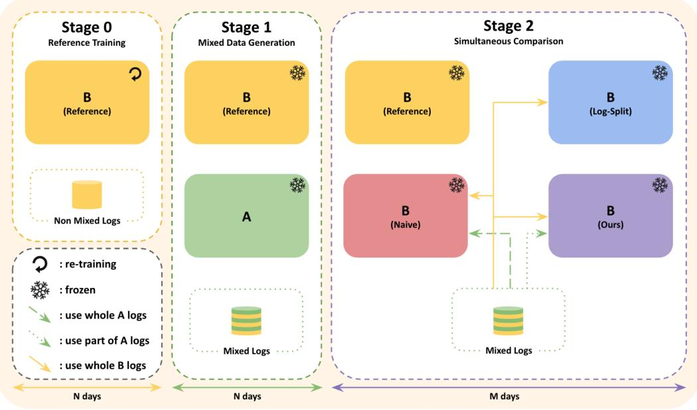

# BAFF: Bid-Aware Filter Family for Mitigating Training Data Interference in RTB A/B Tests

Jeonglyul Oh∗   
jeonglyul@dable.io   
Dable Inc.   
Seoul, Republic of Korea   
Inseop Youn∗   
inseop@dable.io   
Dable Inc.   
Seoul, Republic of Korea   
Ikkyu Choi∗   
ikkyu@dable.io   
Dable Inc.   
Seoul, Republic of Korea   
Youngjae Kim   
youngjae@dable.io   
Dable Inc.   
Seoul, Republic of Korea

## Abstract

In online A/B tests for real-time bidding (RTB), control and treat-ment models are t icall trained on a shared servin lo that includes data generated by the counterpart model. This shared-log training biases each model’s training data through two channels: the counterpart model may have selected a diferent ad from the ad-candidate pool (ad-ranking disagreement) and may have bid a diferent price (bid-pricing disagreement), potentially distorting the A/B test outcome. Log-splitting eliminates the bias but sacrifices training data; log-sharing retains all data but leaves the bias unaddressed. We formalize the Bid-Aware Filter Family (BAFF), a class of (�, �)-parameterized hard filters that controls tolerance to each channel independently, providing a structured search space between these two extremes. We further propose a three-stage on- line measurement protocol that enables evaluating data-sharing strategies by their deviation from an interference-free reference model in production. In ofline simulation, a (�, �) sweep surfaces operating points with smaller deviation from the interference-free reference model than both log-sharing and log-splitting. In a live RTB deployment on a demand-side platform (DSP), filter-based variants preserve the reference model’s business metrics (e.g., CPC, CTR) more closely than both baselines. The best operating point is setting-dependent, underscoring the practical value of the search space itself.

## CCS Concepts

• Information systems → Online advertising.

## Keywords

Recommendation System, A/B testing, SUTVA, Real Time Bidding System

## 1 Introduction

Standard practice in online A/B testing is to train both control and treatment models on the full pooled serving log, including entries generated by the counterpart model [5]. However, sharing logs biases each model’s training dataset when the two models have discrepancies in their predictions. Brennan et al. [5] call this symbiosis bias and frame it as a SUTVA violation caused by sharing training data. Si [19] studies a related phenomenon under the name interference induced by data training loops, and Zheng and Zhao [23] report algorithm adaptation efects in production recommenders. These previous works establish the bias as a general property of shared-log training and propose experimental design remedies. Left unaddressed, the bias can distort an A/B test’s winner–loser comparison, causing operators to discard a superior model or deploy an inferior one.

We focus on RTB, where a demand-side platform (DSP) receives a bid request, selects an ad from its candidate pool, and submits a bid—both decisions determined by the model’s score estimates (e.g. pCTR). Since only the top-ranked ad is served and only the winning bid produces a log entry, any discrepancy between the two models directly biases the treatment model �’s training data. � trains on impressions that the control model � selected and won—ads that � may not have ranked first, in auctions that �’s bid may not have won—shifting �’s learned distribution away from what it would have generated under its own serving. A natural and straightfor- ward response is to stop sharing logs: train each model only on its own logs. In production RTB at deployment scale, reducing the size of the training dataset measurably degrades model quality—a cost that Brennan et al. [5] flag for the data-diverted design and this is independently supported by empirical data-scaling laws for recommendation models [1].

The trade-of comes down to how much of the logs from the counterpart model to retain in training. Log-sharing retains all of them (data-rich but biased) and Log-splitting retains none (unbiased but data-starved) of them. Between these extremes lies a continuum of strategies that decides whether to keep using each row or drop some data based on which the two models would have made substantially diferent ranking or bidding decisions. Any such strategy is defined by its tolerance to each kind of disagreement — ad ranking and bid pricing — with log-sharing as the maximally permissive endpoint and log-splitting as the maximally strict one. We formalize this middle path as the Bid-Aware Filter Family (BAFF), a class of hard filters that keeps the shared log but drops some logs on which both models vary enough to distort either the top-ranked ad or the submitted bid-price.

Our contributions are as follows:

• We decompose training-data interference in RTB into two observable channels: ad-ranking and bid-pricing disagree- ment. Building on this decomposition, we formalize the

Bid-Aware Filter Family, a (�, �)-parameterized filter family that interpolates between log-sharing and log-splitting, providing a structured search space for locating the least- biased data-sharing strategy in a given deployment.

• We propose a three-stage online measurement protocol that enables direct comparison of data-sharing strategies for identifying the least-biased option in production.

• We validate the framework in both simulation and a live RTB deployment, observing (�, �) operating points that are less biased than log-sharing and log-splitting.

The remainder of the paper is organized as follows. Section 2 surveys related work. Section 3 defines the BAFF and analyzes a ridge-regression surrogate that motivates the filter’s design. Section 4 validates the framework in a controlled simulation with known ground truth. Section 5 presents a three-stage measurement protocol and reports results from a live RTB deployment. Section 6 discusses limitations and future work, and Section 7 concludes.

## 2 Related Work

Bias in ML A/B tests. Prior work on training data interference in ML A/B tests has developed almost entirely outside real-time bidding (RTB), under settings whose log-generation mechanism difers from ours. In two-sided recommender and marketplace plat forms, Jeunen [9] first articulated that pooled training data couples the two arms of an A/B test through model interference even ab- sent user-level network efects, and Brennan et al. [5] formalized this coupling as symbiosis bias via a theoretical model, comparing cluster-randomized, data-diverted, and user-corpus co-diverted designs through simulation and validating symbiosis bias empiri-cally on data from a large-scale global-recommender A/B test; the country-diverted design used as a practical mitigation of network efects on a production recommender was deployed by Lin et al. [15]. A related but distinct line on marketplace bipartite interference [6] targets two-sided platforms where units interact through the other side of the graph rather than through a shared training set. A second line treats interference as a multi-armed-bandit phenomenon and asks when shared data still lets A/B experiments rank algorithms correctly [13]. A third line intervenes at the market mechanism rather than the training set—budget pacing [14], ranked-list position competition [8], divergent creative delivery [4], and network-aware randomization [11]—and the AI-feedback-loop survey of Stöcker et al. [20] catalogs 24 such studies in recommender systems. None of these share RTB’s defining property that a training row exists only when the bidding policy wins the auction, so which arm enters the pooled log is endogenously determined by both ad selection and bid price. Our work addresses this RTB-specific coupling directly.

Of-policy evaluation and learning. A complementary line re-places online A/B with logged-bandit analysis, but its RTB instantiations remain focused on single-policy evaluation and do not address training data interference. Of-policy evaluation (OPE) of a frozen target policy is well developed in advertising, from the coun- terfactual reasoning framework of Bottou et al. [3] to IPS-based empirical risk for logged bandit feedback [21], counterfactual esti mators benchmarked against online A/B outcomes on a production recommender [7], and deficient-support diagnoses that propose remedies including restricting the policy class to the logging sup- port [18]; RTB-native estimators further address auction-specific degeneracies—Yeom et al. [22] repurposed the bid-landscape model as a propensity approximator for OPE under deterministic winnertakes-all selection, validated against a 2-week online A/B test— while Barajas and Bhamidipati [2] use double-blind ghost bidding to measure ad-exposure incrementality in a running programmatic campaign, and Jeunen et al. [10] benchmark value-, policy-, and doubly-robust of-policy learning approaches to bidding in simulation. These address single-policy evaluation or frozen-policy incrementality, not the training-time interference that arises when two learning policies share a pooled RTB log. On the of-policy learning (OPL) side, the closest work is Si [19], who trains each arm with a weighted loss whose weights come from a classifier predicting whether a data point was generated under treatment or control; their setting, however, is a generic recommender A/B with-out bidding, budget, or revenue-linked outcomes, and the approach is evaluated only in synthetic simulation. Direct transfer to RTB is non-trivial because wei hts must account for the stochastic bid landscape that determines whether a bid wins, a quantity absent from non-auction settings. To the best of our knowledge, (i) no prior work formulates OPL for training data interference in RTB, and (ii) no prior work demonstrates online mitigation of this interference on an RTB system. Our Bid-Aware Filter Family and three-stage measurement protocol close both gaps.

## 3 Methodology

In RTB, one observable form of the bias induced by sharing logs is the disagreement between the two models’ outputs. On each incoming bid request �, a model scores every candidate ad by com- bining its estimated score with the advertiser’s valuation, selects the ad maximizing the resulting score, and submits that maximum as the bid price. Both the selected ad and the submitted bid are deterministic functions of the model’s scores. Any disagreement between models � and � therefore propagates to the logged request through two observable channels, the selected ad and the submitted bid. These are the channels along which diferences in the control model’s logs enter the treatment model’s training set.

The remainder of this section is organized as follows. Section 3.1 defines the filter family. Its two axes are the two observable chan- nels identified above, each capturing disagreement along the corre- sponding channel. Section 3.2 presents the algorithm that applies this filter as an ofline preprocessing step, before the treatment model trains. Section 3.3 then analyzes a ridge-regression surrogate whose closed-form bound decomposes the filtered estimator’s pa- rameter deviation into three factors. This decomposition provides the theoretical motivation for the filter’s design.

## 3.1 Filtering Criterion

Setup. We operate as a demand-side bidder within an RTB. For each incoming bid request $x \in X ,$ , an internal trafic router assigns � to one of our models. The assigned model ranks the � candidate ads available for the request, selects a winner $a \in \{ 1 , 2 , \ldots , K \}$ , com-putes a bid price from its predicted value for $( x , a )$ , and submits the bid to the ad exchange, where the submitted bid competes against bids from other demand-side participants. A training example is produced only when our bid wins the auction. The chosen ad is then served as an impression, and the user’s feedback, such as a click or conversion, is attached to $( x , a )$

Disagreement scores. Let $a _ { A } ( x ) , a _ { B } ( x ) \in \{ 1 , 2 , . . . , K \}$ be the ad that each model would have selected on request � and $b p _ { A } ( x ) , b p _ { B } ( x )$ $> 0$ be the corresponding bid prices. Since both models can score the full candidate pool, these counterfactual selections and bid prices are restorable ofline for any logged request. For a request � logged by the model �, we quantify disagreement scores on two axes,

$$
d _ { a d } ( x ) : = \frac { \mathrm { r a n k } _ { B } ( a _ { A } ( x ) | x ) } { K } , d _ { b p } ( x ) : = \frac { ( b p _ { A } ( x ) - b p _ { B } ( x ) ) ^ { + } } { b p _ { A } ( x ) } ,
$$

where rank $\mathbf { \sigma } _ { B } ( \cdot | x ) \in \{ 0 , 1 , \ldots , K - 1 \}$ is the 0-based rank induced by the model �’s score (rank 0 = �’s top selection), and $( \cdot ) ^ { + } =$ max $\{ 0 , \cdot \}$ . Both disagreement scores lie in [0, 1) and vanish exactly when the two models agree on the corresponding axis.

Bid-Aware Filter Family. Given tolerances $( k , l ) \in [ 0 , 1 ] ^ { 2 }$ , the Bid-Aware Filter $\mathcal { F } _ { k , l }$ retains a log produced by the control model � for inclusion in the treatment model �’s training set if and only if

$$
d _ { a d } ( x ) < k \ \wedge \ d _ { b p } ( x ) < l .
$$

The parameterized collection $\{ \mathcal { F } _ { k , l } : ( k , l ) \in [ 0 , 1 ] ^ { 2 } \}$ is the $B i d -$ Aware Filter Family. Letting $\varepsilon > 0$ denote an arbitrarily small tol- erance, Table 1 lists the retained control logs at each corner of the parameter square. Two regimes correspond to standard baselines. On the boundary $\{ k = 0 \} \cup \{ l = 0 \}$ , no control log passes the filter and each model trains on its own logs alone, a regime we call Log-Split. At the opposite corner (1, 1), every control log passes and both models share the full pooled log without filtering, a regime we call Naive. The three remaining corners apply strict filtering on both axes or on a single axis. Interior values interpolate between these extremes. Here � bounds the permitted ad-rank disagreement as a fraction of the candidate size, and � bounds the permitted bid-price disagreement as a fraction of $b p _ { A }$

Table 1: Filter behavior at corners of the parameter square.
<table><tr><td>(k, 1)</td><td>retained control logs</td><td>name</td></tr><tr><td> $k = 0 \vee l = 0$ </td><td>none</td><td>Log-Split</td></tr><tr><td>(ε, ε)</td><td>B selects  $a _ { A }$  and  $b p _ { A } \leq b p _ { B }$ </td><td></td></tr><tr><td>(ε,1)</td><td>B selects aA</td><td></td></tr><tr><td>(1, ε)</td><td> $b p _ { A } \leq b p _ { B }$ </td><td></td></tr><tr><td>(1, 1)</td><td>all control logs</td><td>Naive</td></tr></table>

## 3.2 Algorithm

The Bid-Aware filter $\mathcal { F } _ { k , l }$ is realized as an ofline step in the training- data assembly pipeline, executed whenever model � retrains on its sliding window of recent logs.

Note that at serving time, the filter is inactive. The model con- tinues to score, select, and bid as usual. Only at the training time, Algorithm 1 adds a single forward pass of the model � per log from the control model.

Algorithm 1 Bid-Aware Filtering   
Require: Control logs $\mathcal { D } _ { A } ;$ treatment logs ${ \mathcal { D } } _ { B } ;$ tolerances $( k , l ) \in$   
${ \mathrm { [ } } 0 , 1 { \mathrm { ] } } ^ { 2 }$   
1: $\mathcal { D } _ { \mathrm { t r a i n } }  \mathcal { D } _ { B }$   
2: for all $( x , a _ { A } , b p _ { A } , y _ { A } ) \in \mathcal { D } _ { A }$ do   
3: Replay request � through model � to obtain its selected ad   
�� and bid price ���   
4: $d _ { \mathrm { a d } }  \mathrm { r a n k } _ { B } ( a _ { A } \mid x ) / K$   
5: $d _ { \mathrm { b p } } \gets \operatorname* { m a x } ( b p _ { A } - b p _ { B } , 0 ) / b p _ { A }$   
6: if $\dot { d } _ { \mathrm { a d } } < k$ and $d _ { \mathrm { b p } } < l$ � then   
7: $\mathcal { D } _ { \mathrm { t r a i n } }  \mathcal { D } _ { \mathrm { t r a i n } } \cup \{ ( x , a _ { A } , y _ { A } ) \}$   
8: end if   
9: end for   
10: Train � on $\mathcal { D } _ { \mathrm { t r a i n } }$

## 3.3 Theoretical Analysis

This section asks how the filter’s choice shapes the learned param- eters of the treatment model. MLP-based architectures are non- convex, which rules out a closed-form description of how training- pool composition shifts the optimum. We therefore analyze a ridgeregression surrogate. In both ridge and the MLP, a single parameter vector is updated by every training sample, and this is the mechanism through which training-pool composition moves the optimum. The advantage of ridge is that its optimum can be written down in closed form. The main result (Theorem 4) bounds the parameter deviation of the filtered estimator by a product of three factors, two controlled by the filter and one by the feature geometry alone. The decomposition sets up the filter-design discussion that follows.

Setup. Consider an A/B test with the control model � and the treatment model �. We analyze log distributions over features and labels $( z , y ) \in \mathbb { R } ^ { d } \times \mathbb { R }$ . Let $\mathcal { D } _ { B }$ denote the log distribution of the treatment model �, and let $\mathcal { D } _ { F }$ (resp. $\mathcal { D } _ { R } )$ be the retained (resp. removed) components of the control model �’s log distribution under the filter. Let $\alpha _ { B } , \alpha _ { F } , \alpha _ { R } > 0$ with $\alpha _ { B } + \alpha _ { F } + \alpha _ { R } = 1$ be their mixture proportions and let

$$
\begin{array} { r l r l r } { \mathcal { D } _ { B } , } & { } & { \mathcal { D } _ { B + F } : = \frac { \alpha _ { B } \mathcal { D } _ { B } + \alpha _ { F } \mathcal { D } _ { F } } { \alpha _ { B } + \alpha _ { F } } , } & { } & { \mathcal { D } _ { N } : = \alpha _ { B } \mathcal { D } _ { B } + \alpha _ { F } \mathcal { D } _ { F } + \alpha _ { R } \mathcal { D } _ { R } , } \end{array}
$$

be the �-only, filtered, and naive training pools, respectively. For each $P \in \{ B , B { + } F , N \}$ , let

$$
\theta _ { P } ^ { * } : = \underset { \theta } { \arg \operatorname* { m i n } } ~ \mathbb { E } _ { P } [ ( y - \theta ^ { \top } z ) ^ { 2 } ] + \lambda \| \theta \| ^ { 2 }
$$

denote the ridge optimum on pool $P$ at penalty $\lambda > 0 .$ . For each pool $P ,$ let $\Sigma _ { P } : = \bar { \mathbb { E } _ { P } } [ z z ^ { \top } ]$ . Define the residual

$$
\varepsilon ^ { * } : = y - \theta _ { B } ^ { * \top } z ,
$$

and, for any pool $S ,$ the mismatch

$$
\delta _ { S } ^ { * } : = \mathbb { E } _ { S } \left[ \boldsymbol { z } \boldsymbol { \varepsilon } ^ { * } \right] - \mathbb { E } _ { B } \left[ \boldsymbol { z } \boldsymbol { \varepsilon } ^ { * } \right] .
$$

The mismatch $\delta _ { S } ^ { * }$ records how much the feature-residual cross- moment $\mathbb { E } [ z \varepsilon ^ { * } ]$ shifts between $\mathcal { D } _ { B }$ and pool �, that is, nonzero $\delta _ { S } ^ { * }$ signals that pool $S ^ { \prime } s$ data systematically pulls the ridge optimum away from $\theta _ { B } ^ { * }$ . Throughout this section, we use $\| \cdot \|$ for both the Eu- clidean norm on $\mathbb { R } ^ { d }$ and the spectral (operator) norm $\operatorname* { s u p } _ { \| v \| = 1 }$ ∥�� ∥ on matrices, which satisfies $\| A v \| \leq \| A \| \| v \|$ by definition.

Lemma 1 (Core identity). For each $P \in \{ B , B { + } F , N \}$

$$
\theta _ { P } ^ { * } - \theta _ { B } ^ { * } \ = \ ( \Sigma _ { P } + \lambda I ) ^ { - 1 } \delta _ { P } ^ { * } .
$$

Proof. Follows from the first-order condition for $\theta _ { P } ^ { * }$ together with $y = \theta _ { B } ^ { * \top } z + \varepsilon ^ { * }$ . The rest of the proof is omitted. □

Taking norms and applying submultiplicativity gives

$$
\begin{array} { r } { \| { \theta } _ { P } ^ { * } - { \theta } _ { B } ^ { * } \| \ \le \ \| ( { \Sigma } _ { P } + \lambda I ) ^ { - 1 } \| \cdot \| { \delta } _ { P } ^ { * } \| , } \end{array}
$$

thus it sufices to bound the two factors on the right.

Lemma 2 (Mismatch decomposition).

$$
\delta _ { N } ^ { * } = \alpha _ { F } \delta _ { F } ^ { * } + \alpha _ { R } \delta _ { R } ^ { * } , \delta _ { B + F } ^ { * } = \frac { \alpha _ { F } } { \alpha _ { B } + \alpha _ { F } } \delta _ { F } ^ { * } .
$$

Proof. Follows from linearity of expectation under the mixture decompositions of $\mathcal { D } _ { N }$ and $\mathcal { D } _ { B + F }$ . The rest of the proof is omitted. □

The two pools thus difer qualitatively: $\delta _ { B + F } ^ { * }$ inherits only the � -component mismatch, whereas ${ { \delta } _ { N } ^ { * } }$ carries both � and � contributions. Whether filtering yields a smaller parameter deviation depends on the relative magnitudes of $\delta _ { F } ^ { * }$ and ${ \delta } _ { R } ^ { * }$

Condition 1 (Mismatch dominance). There exists $\beta > \alpha _ { F } / \alpha _ { R }$ such that

$$
\| \delta _ { R } ^ { * } \| \ge \beta \| \delta _ { F } ^ { * } \| .
$$

Lemma 3 (Mismatch lower bound on Naive). Under Condition 1,

$$
\| \delta _ { N } ^ { * } \| ~ \ge ~ ( \alpha _ { R } \beta - \alpha _ { F } ) \| \delta _ { F } ^ { * } \| .
$$

Proof. The proof is given in Appendix A.1.

Theorem 4 (Main bound). Under Condition 1,

$$
\| \theta _ { B + F } ^ { * } - \theta _ { B } ^ { * } \| ~ \le ~ \underbrace { \frac { \alpha _ { F } } { \alpha _ { B } + \alpha _ { F } } } _ { A } \cdot \underbrace { \frac { 1 } { \alpha _ { R } \beta - \alpha _ { F } } } _ { B } \cdot \underbrace { \left( 1 + \frac { \| \Sigma _ { N } \| } { \lambda } \right) } _ { C } \cdot \| \theta _ { N } ^ { * } - \theta _ { B } ^ { * } \| .
$$

Proof. Combine Lemma 1 (applied to both $P = B { + } F$ and $P =$ �), Lemma 2, Lemma 3, and submultiplicativity of the spectral norm with $\| ( \Sigma _ { B + F } + \lambda I ) ^ { - 1 } \| \le 1 / \lambda$ . The detailed proof is given in Appendix A.2. □

Anatomy ofthe bound. Theorem 4 decomposes the parameter deviation of the filtered estimator into three factors. Factor $A =$ $\alpha _ { F } / ( \alpha _ { B } + \alpha _ { F } )$ is the share of the filtered pool drawn from the control model, and quantifies how much control exposure the filter retains. Factor $B = 1 / ( \alpha _ { R } \beta - \alpha _ { F } )$ shrinks when mismatch on the removed set dominates mismatch on the retained set, and measures how cleanly the filter separates the two. Factor $C = 1 + \| \Sigma _ { N } \| / \lambda$ is a purely geometric quantity, determined by the feature distribution and � alone. The decomposition isolates how much is shared, which portion of what is shared is harmful, and how the feature geometry amplifies what remains.

Selectivity as the design objective. Factor � can be shrunk mechanically by rejecting more logs, but in the limit $\alpha _ { F }  0$ no control log is retained at all, and the filtered estimator reduces to $\theta _ { B } ^ { * } .$ The distinguishing work of a filter is therefore done along factor $B ,$ which concerns not how many control logs are retained but which ones. A good filter concentrates the systematic disagreement with the treatment model in the logs it removes. Theorem 4 should thus be read as a statement about what a filter ought to separate, not how aggressive it should be.

Implications for BAFF. The filter family $\{ \mathcal { F } _ { k , l } \}$ introduced in Sec- tion 3.1 can be read through this lens. Its two axes, ad-rank disagree- ment $d _ { a d }$ and bid-price disagreement $d _ { b p } .$ , are observable proxies for the mismatch direction $\mathbb { E } [ z \varepsilon ^ { * } ]$ that factor � asks the filter to sep- arate. By rejecting logs on which the two models’ outputs diverge along either axis, the filter concentrates systematic disagreement in the removed set. Theorem 4 does not prescribe a particular (�, �), but it provides the framework within which the filter family is a principled approximation to the selectivity objective.

Scope. Theorem 4 is a population statement about ridge optima, and Condition 1 is an assumption on the filter rather than a property we derive. The closed-form identity does not carry over literally to non-convex, finite-sample training, but the underlying mechanism transfers. Pooled training pulls the optimum toward the population mismatch direction, and the three factors identify what controls the strength of that pull. Section 5 verifies this empirically for deep CTR models.

## 4 Simulation Experiment

This section validates the BAFF in a simulated RTB auction where the ground truth is known by construction. We sweep the (�, �) grid and measure how closely each filtered model recovers the policy of an interference-free reference.

## 4.1 Environment

Table 2 summarizes the notation used throughout this section.

Table 2: Key symbols used in the simulation setup.
<table><tr><td>Symbol</td><td>Description</td><td>Value / Distribution</td></tr><tr><td>x</td><td>User context</td><td> $N ( 0 , I _ { 1 0 0 } )$ </td></tr><tr><td>K</td><td>Ad candidate pool size</td><td>30</td></tr><tr><td> $v _ { a }$ </td><td>Ad value</td><td>LogNormal(0.1, 0.2)</td></tr><tr><td> $A , B$ </td><td>Control / treatment models</td><td></td></tr><tr><td> $B _ { \mathrm { i n i t } }$ </td><td>B after Phase 0 training (frozen)</td><td></td></tr><tr><td> $\hat { p } _ { M } ( x , a )$ </td><td>Model M&#x27;s predicted CTR</td><td></td></tr><tr><td> $\mathcal { D } _ { B } ^ { \mathrm { f u l l } }$ </td><td>Universe-B log (reference)</td><td></td></tr><tr><td> $\bar { \mathcal { D } _ { A } } , \mathcal { D } _ { B }$ </td><td>Universe-AB logs (50/50 split)</td><td></td></tr><tr><td> $\pi _ { M } ( \boldsymbol { a } \mid \boldsymbol { x } )$ </td><td>Evaluation policy for model M</td><td> $\propto \exp ( \hat { p } _ { M } ( x , a ) \upsilon _ { a } )$ </td></tr></table>

We build on the CTR model and ad candidate structure of Auc- tionGym [10], but replace its multi-agent auction with a single-agent setup suited to our A/B testing scenario. A user arrives with context $x \sim \mathcal { N } ( 0 , I _ { 1 0 0 } )$ , and a model must select one of $K = 3 0$ ads, each characterized by a fixed embedding $\phi _ { a } ,$ bias $\beta _ { a } ,$ and value $\upsilon _ { a } \sim \mathrm { L o g N o r m a l } ( 0 . 1 , 0 . 2 )$ , all drawn once and held constant throughout the simulation. The probability that the user clicks on a shown ad is governed by a true CTR:

$$
\mathrm { C T R } ( x , a ) = \sigma ( x ^ { \top } \phi _ { a } + \beta _ { a } ) ,
$$

where $\sigma ( \cdot )$ is the sigmoid function. Ad selection and bidding follow Section 3: each model � selects $a _ { M } ( \boldsymbol { x } )$ and bids $b p _ { M } ( x )$ . Following a first-price auction, an impression is won if $b p _ { M } ( x ) \geq \operatorname* { m p } ( x )$ , and the winner pays its own bid. Rather than simulating competing bidders, we model competition via a synthetic market price derived from the true CTR:

$$
\operatorname* { m p } ( x ) = \operatorname* { m a x } _ { a } \bigl ( \operatorname { C T R } ( x , a ) v _ { a } \bigr ) \cdot \gamma \cdot \eta , \quad \eta \sim \mathrm { L o g N o r m a l } ( 0 , 0 . 3 ) ,
$$

where $\gamma \in ( 0 , 1 )$ controls the competitiveness of the market. The term ma $\mathfrak { x } _ { a } ( \mathrm { C T R } ( x , a ) v _ { a } )$ is the highest achievable expected value for request �, so $\gamma = 0 . 5$ places the market price at roughly half of this ceiling, representing a moderately competitive market. The multiplicative noise $\eta \sim \mathrm { L o g N o r m a l } ( 0 , 0 . 3 )$ adds per-request price variation (90% of draws within $\times 0 . 6 \substack { - 1 . 6 } )$ . This provides a controllable auction threshold without requiring a full multi-agent simulation. When our bid wins, a click is drawn as� ∼ Bernoulli $\left( \mathrm { C T R } ( x , a _ { M } ( x ) ) \right)$

Model configuration. We use $\boldsymbol { x } \in \mathbb { R } ^ { 1 0 0 }$ throughout; the true CTR and market price operate on the full context. Both � and � are architecturally restricted to a prefix of $x \colon A$ observes $x _ { 1 : 2 0 }$ and � observes $x _ { 1 : 5 0 : }$ , with the remaining dimensions acting as residual confounders. Architecture, hyperparameters, and all numeric set- tings are reported in Appendix B.

## 4.2 Multiverse Design

We use a multiverse design that provides an interference-free ground truth.

Phase 0 (Initialization). A pool of 100,000 synthetic warm-up users is drawn from the same distribution. To produce �’s serving log we face a circular dependency: training � requires a serving log, but generating a serving log requires a trained �. We resolve this with a surrogate model for �: instead of learning an MLP, we com-pute pCTR directly from the true data-generating process (DGP) pa-rameters restricted to �’s 20 observable features and add Gaussian noise $\left( \mathrm { s t d } = 0 . 2 \right)$ to approximate the prediction error of a converged model. This surrogate replaces only the pCTR used for ad selection and bidding; user contexts $x ,$ market prices, and click labels are all generated from the full DGP (100 dimensions) as usual. The resulting impression log is used to fit both � and $B _ { \mathrm { i n i t } }$ on the same data, so downstream disagreement during Phases 1–2 arises from their difering observable-feature sets, not from diferent training histories.

Phase 1 (Multiverse split). We run two parallel universes from the same user population:

• Universe-�: $B _ { \mathrm { i n i t } }$ serves $1 0 0 \% \to \mathcal { D } _ { B } ^ { \mathrm { f u l l } }$ (ground truth)

• Universe-��: � and $B _ { \mathrm { i n i t } } ~ { \mathrm { a t } } ~ 5 0 / 5 0  { \mathcal { D } } _ { A } , { \mathcal { D } } _ { B }$ Here $\mathcal { D } _ { A }$ and $\mathcal { D } _ { B }$ denote the serving logs of � and $B _ { \mathrm { i n i t } }$ , respec- tively. Models are frozen during collection. $\mathcal { D } _ { B } ^ { \mathrm { f u l l } }$ has roughly twice the volume of $\mathcal { D } _ { B }$ , since Universe-� serves $B _ { \mathrm { i n i t } }$ to 100% of trafic; filtered $\mathcal { D } _ { A }$ subsets unioned with $\mathcal { D } _ { B }$ can partially ofset this gap. Duration and trafic volume are reported in Appendix B.

Phase 2 (Filtering, Training & Evaluation). We run the scoring and bidding rule of the frozen $B _ { \mathrm { i n i t } }$ on every stored context $\boldsymbol { x } \in \mathcal { D } _ { A }$ to obtain $( a _ { B } ( x ) , b p _ { B } ( x ) )$ , then apply the (�, �) filter (Section 3.1). Re-scoring reveals that 80.1% of $\mathcal { D } _ { A }$ impressions have diferent ad selections between � and $B _ { \mathrm { i n i t } }$ , whereas only 7.3% have lower bid prices under $B _ { \mathrm { i n i t } }$ than under �. Each filtered subset is unioned with $\mathcal { D } _ { B }$ to train a candidate model; a reference model is trained on $\mathcal { D } _ { B } ^ { \mathrm { f u l l } }$

To evaluate, we draw held-out users from the same context distribution (details in Appendix B) and compute, for each trained model, the evaluation policy

$$
\pi _ { M } ( a \mid x ) = { \frac { \exp \bigl ( \hat { p } _ { M } ( x , a ) \cdot v _ { a } \bigr ) } { \sum _ { a ^ { \prime } = 1 } ^ { K } \exp \bigl ( \hat { p } _ { M } ( x , a ^ { \prime } ) \cdot v _ { a ^ { \prime } } \bigr ) } } ,
$$

where � is the model under evaluation. This softmax converts each model’s value-weighted scores into a stochastic policy. We report $\mathrm { K L } ( \pi _ { \mathrm { r e f } } \parallel \pi _ { \mathrm { c a n d } } )$ , where $\pi _ { \mathrm { r e f } }$ is the policy of the reference model trained on ${ \mathcal { D } } _ { B } ^ { \mathrm { f u l l } }$ and $\pi _ { \mathrm { c a n d } }$ is the policy of each filtered can- didate model; lower KL indicates less policy distortion from the interference-free reference. All results are averaged over 10 inde- pendent seeds; statistical details are in Appendix B.

## 4.3 Results

We sweep the Bid-Aware filter $\mathcal { F } _ { k , l }$ (Section 3.1) over a 3×3 grid and report KL divergence to the Universe-� reference policy. Note that �=� corresponds to the strict ad filter: $d _ { a d } ( x ) < \varepsilon$ holds if $a _ { A } ( x )$ is �’s selected ad, recovering the $( \varepsilon , 1 )$ corner of the filter family. Table 3 shows the KL magnitude for each (�, �) cell. Tables 4 and 5 test whether non-trivial (�, �) configurations improve over the two corner baselines—Naive $( k { = } 1 , l { = } 1 )$ and Log-Split $( \{ k = 0 \} \cup \{ l = 0 \} ) -$ via paired one-sided �-tests.

Table 3: Policy distortion $( \mathbf { K L } \times 1 0 ^ { - 3 }$ , mean ± std, 10 seeds) across the (�, �) grid. Parenthesized values show the fraction of $\mathcal { D } _ { A }$ retained by each filter. Rows �=1 and �=0.5 yield identical filtered subsets because bid disagreement is sparse (cf. Phase 2).
<table><tr><td></td><td> $k { = } \varepsilon$ </td><td> $k { = } 0 . 5$ </td><td>k=1</td></tr><tr><td>l=ε</td><td>0.54±0.48 (20%)</td><td>3.29±3.12 (60%)</td><td>6.82±3.54 (92%)</td></tr><tr><td>l=0.5</td><td>0.51±0.46 (22%)</td><td>2.87±3.08 (65%)</td><td>6.61±2.59 (100%)</td></tr><tr><td>l=1</td><td>0.51±0.46 (22%)</td><td>2.87±3.08 (65%)</td><td>6.61±2.59 (100%)</td></tr><tr><td colspan="2">Log-Split (k=0 or l=0):</td><td>0.80±0.55 (0%)</td><td></td></tr></table>

Table 4: Wins vs Naive (paired one-sided �-test across 10 seeds). Each cell shows wins/� for the alternative hypothesis that the (�, �) filter achieves lower KL than Naive. ∗Significant at $\textstyle p < 0 . 0 5$ . †Self-comparison (Naive).
<table><tr><td></td><td> $k { = } \varepsilon$ </td><td> $k { = } 0 . 5$ </td><td> $k { = } 1$ </td></tr><tr><td> $\scriptstyle { l = \varepsilon }$ </td><td>10/10*</td><td> $\mathbf { 9 / 1 0 ^ { * } }$ </td><td>6/10</td></tr><tr><td> $l { = } 0 . 5$ </td><td>10/10*</td><td>7/10*</td><td>0/10</td></tr><tr><td>l=1</td><td>10/10*</td><td>7/10*</td><td>_†</td></tr></table>

Table 5: Wins vs Log-Split (paired one-sided �-test across 10 seeds). Each cell shows wins/� for the alternative hypothesis that the (�, �) filter achieves lower KL than Log-Split. ∗Significant at $\textstyle p < 0 . 0 5$
<table><tr><td></td><td>k=ε k=0.5</td><td></td><td>k=1</td></tr><tr><td>l=ε</td><td>9/10*</td><td>3/10</td><td>0/10</td></tr><tr><td>l=0.5</td><td>10/10*</td><td>3/10</td><td>0/10</td></tr><tr><td>l=1</td><td>10/10*</td><td>3/10</td><td>0/10</td></tr></table>

Beyond the corner baselines. Table 3 shows that Log-Split already achieves an 8.2× KL reduction over Naive (KL ×10−3: 0.80 vs 6.61), consistent with the expectation that unfiltered $\mathcal { D } _ { A }$ degrades the trained policy (cf. Section 3). More broadly, seven of the eight non-Naive cells in Table 4 achieve lower KL than Naive in a majority of paired seeds. However, Table 5 reveals that the search space contains strategies that go further: �=� cells outperform Log-Split (all $ { p } \le 0 . 0 0 8 )$ , demonstrating that even retaining only ∼20% of $\mathcal { D } _ { A }$ through well-targeted filtering provides information beyond $\mathcal { D } _ { B }$ alone. This motivates the (�, �) framework as a practical tool for locating operating points that neither obvious baseline can reach.

Ad axis dominance in this DGP. Table 3 shows that moving from �=1 to $k { = } \varepsilon$ reduces KL by more than an order of magnitude (6.61 → 0.51), making the �=� column the best-performing region of the grid. Varying � has negligible efect. This reflects the mismatch structure of this environment, where ad-ranking disagreement is far more prevalent than bid-pricing disagreement (80.1% vs. 7.3% of $\mathcal { D } _ { A } ;$ cf. Phase 2).

Setting-dependence ofthe optimal (�, �). The relative importance of each axis depends on the mismatch between � and �. In envi- ronments with higher bid disagreement (e.g., diferent bid shading strategies), the � axis may contribute independently. The (�, �) grid provides a practical search space for locating the best operating point without committing to a fixed strategy.

## 5 Online Experiment

Building on the Bid-Aware Filter Family introduced in Section 3, we instantiate the family at four operating points of $[ 0 , 1 ] ^ { 2 }$ and ask whether the filters preserve the reference model’s operating point on the most business-relevant online metric, CPC (cost per click, the average advertiser spend per click). We describe the production setting (Section 5.1), a three-stage measurement protocol (Section 5.2), the evaluation criterion (Section 5.3), and the results of a case study on a single advertiser–SSP (Supply-side Platform) pair (Section 5.4).

## 5.1 Production Setting

We conduct the experiment on a mobile advertising DSP at a sin-gle SSP, covering one advertiser on that SSP. The SSP sends ap proximately 1.25M bid requests per day. Our DSP platform uses a shared-parameter CTR/CVR prediction model [16], implemented as an multi-task learning(MTL)-based deep neural network.

The single advertiser–SSP scope is a deliberate choice to bound revenue loss. Our three-stage protocol (Section 5.2) fixes the trafic share of the interference-free reference model $B _ { \mathrm { r e f } }$ at 100%, 50%, and 20% across Stages 0–2. These shares are decided by what we need to measure, not by which model performs best on live business KPIs. The experiment therefore cannot reallocate trafic toward better- performing models during the run and is expected to earn less revenue than a KPI-based rollout would. Confining it to a partial marketplace keeps the size of this revenue loss small.

## 5.2 Three-Stage Protocol

Prior work [5, 15] has demonstrated the existence of training data interference in shared-dataset A/B tests. However, no existing protocol directly measures the bias of a specific data-sharing strategy in production online. Our three-stage protocol—Stage 0 reference model construction, Stage 1 mixed-log generation, Stage 2 simulta-neous comparison at 20% trafic—fills this gap and is itself a method- ological contribution.

We parameterize the length of Stages 0 and 1 as � days and the len th of Sta e 2 as � da s. Here � controls the reference model’s training-data period, and � controls the number of Stage 2 obser- vation days and therefore the precision of the TE (�) estimates defined in Section 5.3. Longer is strictly better on both axes. In this work, we use $N = 2$ and $M = 3 ;$ shortened from values typical of the underlying production platform in order to minimize business risk: Stage 0 allocates 100% of trafic to $B _ { \mathrm { r e f } }$ and Stage 2 splits trafic five ways at fixed 20% shares, and both allocations are mandated by the protocol rather than gated on observed performance, so we cap � and � at the smallest values still suficient to establish an interference-free reference model and a well-powered Stage 2 comparison.

Stage 0: Reference Model Training (� days). $B _ { \mathrm { r e f } }$ is deployed at 100% trafic with retraining enabled. After � days, $B _ { \mathrm { r e f } } \mathrm { ^ { \circ } } s$ training dataset is flushed of logs produced by other models, establishing a pure ground truth—the production analogue of the Multiverse-� reference model in our simulation.

Stage 1: Mixed Data Generation (� days). The baseline � and $B _ { \mathrm { r e f } }$ are deployed at a 50/50 split, both frozen. This reproduces the standard A/B test scenario in which serving logs from both models are interleaved, generating the mixed training dataset $\mathcal { D } _ { A } \cup \mathcal { D } _ { B }$

Stage 2: Simultaneous Comparison (� days). Five models are deployed at 20% trafic each, all frozen:

$B _ { \mathrm { r e f } } .$ Stage 0 checkpoint (reference model)

• $\mathcal { F } _ { 1 , 1 }$ 1 (Naive): no filter

$\mathcal { F } _ { 0 , 0 }$ (Log-Split): discard ${ \mathcal { D } } _ { A }$ entirely

• $\mathcal { F } _ { 1 , \varepsilon }$ (ours): bid-price filter only

$\mathcal { F } _ { 0 . 5 , 0 . 5 }$ (ours): joint bid-and-ad filter at the (0.5, 0.5) interior point

Figure 1 illustrates the protocol.

## 5.3 Evaluation: Reference-Preservation

A successful (�, �) filter should match the interference-free reference model $B _ { \mathrm { r e f } }$ , not outperform it. For any scalar metric �, we define the Treatment Efect (TE) of strategy � on � as

$$
\mathrm { T E } _ { s } ( m ) \ = \ \big | m ( B _ { s } ) \ - \ m ( B _ { \mathrm { r e f } } ) \big | .
$$

  
Figure 1: Three-stage online experiment protocol. Stage 0 (� days) creates a pure reference model; Stage 1 (� days) generates mixed serving logs via a 50/50 A/B split; Stage 2 (� days) compares five (�, �) operating points simultaneously at 20% trafic each. This work uses $N = 2 , M = 3$

Table 6: Reference-preservation in CPC across (�, �) filters, Stage 2 (20% trafic each). Smaller TE (CPC) indicates closer preservation of the interference-free reference model. CPC is measured in local currency. 95% CI from cluster bootstrap (B = 10,000 resamples).
<table><tr><td>Strategy</td><td>CPC</td><td>95% CI</td><td>TE(CPC)</td><td>rank</td></tr><tr><td>Reference</td><td>19.58</td><td>[13.33, 32.16]</td><td></td><td>一</td></tr><tr><td> $\mathcal { F } _ { 1 , 1 }$  (Naive)</td><td>9.73</td><td>[5.95, 20.08]</td><td>9.85</td><td>4</td></tr><tr><td> $\mathcal { F } _ { 0 , 0 }$  (Log-Split)</td><td>10.74</td><td>[7.08, 16.59]</td><td>8.84</td><td>3</td></tr><tr><td> $\mathcal { F } _ { 1 , . }$  e (ours)</td><td>20.02</td><td>[12.16, 34.61]</td><td>0.44</td><td>1</td></tr><tr><td> $\mathcal { F } _ { 0 . 5 , 0 . 5 } \ : ( \mathbf { o u r s } )$ </td><td>24.94</td><td>[10.78, 131.49]</td><td>5.37</td><td>2</td></tr></table>

Higher CTR or lower CPC should not be read as improvement; only closeness to the reference model counts, since any deviation—in either direction—moves downstream business decisions away from the interference-free ground truth. Our primary instantiation uses CPC, the DSP’s core business KPI, evaluated at the post-auction aggregate level; CTR is reported as a secondary metric.

## 5.4 Results

CPC alignment (primary). Table 6 reports the aggregate CPC and TE (CPC) of each filter.

$\mathcal { F } _ { 1 , \varepsilon }$ and $\mathcal { F } _ { 0 . 5 , 0 . 5 }$ occupy ranks 1 and 2 on TE (CPC) in Table 6: both filters land within 1.0–1.3× of the reference model’s CPC, whereas $\mathcal { F } _ { 0 , 0 }$ (Log-Split) and $\mathcal { F } _ { 1 , 1 }$ (Naive) collapse to roughly 0.5×. The confidence intervals—particularly for $\mathcal { F } _ { 0 . 5 , 0 . 5 }$ —are wide given the limited per-filter Stage 2 sample size; see Section 6 for further discussion.

Table 7: Reference-preservation in CTR, Stage 2. 95% CI from cluster bootstrap (B = 10,000 resamples).
<table><tr><td>Strategy</td><td>CTR (%)</td><td>95% CI</td><td>TE(CTR) %p</td><td>rank</td></tr><tr><td>Reference</td><td>1.19</td><td>[0.71, 1.78]</td><td>一</td><td>一</td></tr><tr><td> $\mathcal { F } _ { 1 , 1 }$  (Naive)</td><td>3.13</td><td>[1.48, 5.25]</td><td>1.94</td><td>4</td></tr><tr><td> $\mathcal { F } _ { 0 , 0 }$  (Log-Split)</td><td>2.58</td><td>[1.71, 3.57]</td><td>1.38</td><td>3</td></tr><tr><td> $\mathcal { F } _ { 1 , \varepsilon }$  (ours)</td><td>1.97</td><td>[1.20, 2.98]</td><td>0.78</td><td>2</td></tr><tr><td> $\mathcal { F } _ { 0 . 5 , 0 . 5 } \ : ( \mathbf { o u r s } )$ </td><td>0.79</td><td>[0.12, 1.77]</td><td>0.40</td><td>1</td></tr></table>

CTR preservation (secondary). Table 7 shows the same directional separation on the CTR axis: $\mathcal { F } _ { 0 . 5 , 0 . 5 }$ and $\mathcal { F } _ { 1 , \varepsilon }$ stay within 0.4–0.8%p of the reference model’s CTR, whereas $\mathcal { F } _ { 0 , 0 }$ (Log-Split) and $\mathcal { F } _ { 1 , 1 }$ (Naive) diverge by 1.4–1.9%p. By the TE framing in Section 5.3, the baselines’ inflated CTR—mirroring their depressed CPC—is a deviation, not a gain.

## 6 Limitations and Future Work

Theoretical surrogate. The theoretical analysis in Section 3.3 is carried out on a ridge-regression surrogate with population-level quantities. The closed-form decomposition (Theorem 4) does not extend directly to the non-convex, finite-sample regime of MLPbased CTR models used in both the simulation and production deployment. The bound identifies which structural factors govern the filtered estimator’s deviation, but the quantitative tightness of each factor under deep models remains an open question.

Online experiment scope. The present experiment covers a single advertiser–SSP pair over $N = 2 , M = 3$ days (on production scale, larger value of � is also feasible), so external validity rests on future replication across advertisers, SSPs and advertiser goals. The Stage 0 reference-model checkpoint is frozen for the full duration of Stages 1–2, so the reference does not adapt to market drift within the run. Of the (�, �) filter grid, we deploy only one interior operating point (0.5, 0.5) together with the boundary filters $\mathcal { F } _ { 1 , \varepsilon }$ and $\mathcal { F } _ { 0 , 0 }$ (Log-Split) and the reference model; the remaining interior is not tested.

A direct consequence of this narrow deployment is that the absolute magnitude of the CPC and CTR gaps between filters is expected to be SSP-specific due to the instability of each variants. The single-SSP restriction, adopted to minimize business risk, places the experiment in a relatively uncongested marketplace slice whose limited competitor pool may amplify per-filter diferences relative to larger, more saturated SSPs. Accordingly, our preservation claim concerns the TE-based directional ordering rather than the absolute gap size, and the magnitudes reported in Tables 6–7 should be read together with this SSP-specific context. Within-run statistical precision is also limited. Still, both ${ \mathcal { F } } _ { 1 , }$ and $\mathcal { F } _ { 0 . 5 , 0 . 5 }$ achieve lower TE than $\mathcal { F } _ { 0 , 0 } \left( \mathrm { L o g - S p l i t } \right)$ and $\mathcal { F } _ { 1 , : }$ 1 (Naive) on both CPC and CTR.

Reference model without dedicated serving. Our protocol measures training-data interference against a reference model constructed via dedicated 100% serving in Stage 0. An open question for future work is whether such a reference can be constructed without a dedicated serving stage, which would make the measure- ment protocol applicable to settings where dedicating full trafic to the experiment model is infeasible.

## 7 Conclusion

Shared-log training in RTB A/B tests biases each model’s training data through two channels: ad-selection disagreement and bid-price disagreement. We formalized the Bid-Aware Filter Family (BAFF), a (�, �)-parameterized class of hard filters that interpolates between log-sharing and log-splitting by controlling tolerance to each chan- nel independently. The family provides a structured search space: rather than committing to log-sharing or log-splitting, practition-ers can locate the operating point that best preserves the unbiased reference in their specific deployment.

We validated the framework on two axes. In simulation, a 3 × 3 (�, �) sweep revealed operating points with lower policy distortion than either log-sharing or log-splitting alone. In a live RTB deploy ment on a commercial DSP, a three-stage measurement protocol confirmed that filter-based variants preserve the oracle’s CPC and CTR more closely than both baseline. Both experiments demon- strate that the (�, �) grid surfaces operating points that neither obvious strategy can reach, and that the best operating point difers between the two settings—underscoring the value of the search space itself. We recommend that practitioners sweep the (�, �) grid on their own deployment to locate the best operating point for their setting.

## References

[1] Newsha Ardalani, Carole-Jean Wu, Zeliang Chen, Bhargav Bhushanam, and Adnan Aziz. 2022. Understanding Scaling Laws for Recommendation Models. arXiv:2208.08489 [cs.IR] https://arxiv.org/abs/2208.08489

[2] Joel Barajas and Narayan Bhamidipati. 2021. Incrementality Testing in Program matic Advertising: Enhanced Precision with Double-Blind Designs. In Proceedings of the Web Conference 2021 (Ljubljana, Slovenia) (WWW ’21). Association for Com puting Machinery, New York, NY, USA, 2818–2827. doi:10.1145/3442381.3450106

[3] Léon Bottou, Jonas Peters, Joaquin Quiñonero-Candela, Denis X Charles, D Max Chickering, Elon Portugaly, Dipankar Ray, Patrice Simard, and Ed Snelson. 2013. Counterfactual Reasoning and Learning Systems: The Example of Computational Advertising. Journal of Machine Learning Research 14 (2013), 3207–3260.

[4] Michael Braun and Eric M Schwartz. 2025. Where a/b testing goes wrong: How divergent delivery afects what online experiments cannot (and can) tell you about how customers respond to advertising. Journal of Marketing 89, 2 (2025), 71–95.

[5] Jennifer Brennan, Yahu Cong, Yiwei Yu, Lina Lin, Yajun Peng, Changping Meng, Ningren Han, Jean Pouget-Abadie, and David M. Holtz. 2025. Reducing Symbiosis Bias through Better A/B Tests of Recommendation Algorithms. In Proceedings ofthe ACM on Web Conference 2025 (Sydney NSW, Australia) (WWW ’25). Association for Computing Machinery, New York, NY, USA, 3702–3715. doi:10.1145/3696410.3714738

[6] Jennifer Brennan, Vahab Mirrokni, and Jean Pouget-Abadie. 2022. Cluster randomized designs for one-sided bipartite experiments. In Proceedings ofthe 36th International Conference on Neural Information Processing Systems (New Orleans, LA, USA) (NIPS ’22). Curran Associates Inc., Red Hook, NY, USA, Article 2751, 13 pages.

[7] Alexandre Gilotte, Clément Calauzènes, Thomas Nedelec, Alexandre Abraham, and Simon Dollé. 2018. Ofline A/B Testing for Recommender Systems. In Proceedings ofthe Eleventh ACM International Conference on Web Search and Data Mining (Marina Del Rey, CA, USA) (WSDM ’18). Association for Computing Machiner , New York, NY, USA, 198–206. doi:10.1145/3159652.3159687

[8] Ali Goli, Anja Lambrecht, and Hema Yoganarasimhan. 2024. A bias correction approach for interference in ranking experiments. Marketing Science 43, 3 (2024), 590–614.

[9] Olivier Jeunen. 2023. A Common Misassumption in Online Experiments with Machine Learning Models. SIGIR Forum 57, 1, Article 13 (Dec. 2023), 9 pages. doi:10.1145/3636341.3636358

[10] Olivier Jeunen, Sean Murphy, and Ben Allison. 2023. Of-Policy Learning to-Bid with AuctionGym. In Proceedings of the 29th ACM SIGKDD Conference on Knowledge Discovery and Data Mining (Long Beach, CA, USA) (KDD ’23). Association for Computing Machinery, New York, NY, USA, 4219–4228. doi:10.1145/3580305.3599877

[11] Yiming Jiang and He Wang. 2024. Causal Inference under Network Interference Using a Mixture of Randomized Experiments. arXiv:2309.00141 [stat.ME] https: //arxiv.org/abs/2309.00141

[12] Diederik P. Kingma and Jimmy Ba. 2017. Adam: A Method for Stochastic Optimization. arXiv:1412.6980 [cs.LG] https://arxiv.org/abs/1412.6980

[13] Shuangning Li, Chonghuan Wang, and Jingyan Wang. 2026. Choosing the Better Bandit Algorithm under Data Sharing: When Do A/B Experiments Work? arXiv:2507.11891 [stat.ML] https://arxiv.org/abs/2507.11891

[14] Luofeng Liao, Christian Kroer, Sergei Leonenkov, Okke Schrijvers, Liang Shi, Nicolas Stier-Moses, and Congshan Zhang. 2024. Interference Among First-Price Pacing Equilibria: A Bias and Variance Analysis. Papers 2402.07322. arXiv.org. https://ideas.repec.org/p/arx/papers/2402.07322.htm

[15] Lina Lin, Changping Meng, Jennifer Brennan, Jean Pouget-Abadie, Ningren Han, Shuchao Bi, and Yajun Peng. 2024. Country-diverted experiments for mitigation of network efects. In Proceedings ofthe 18th ACM Conference on Recommender Systems (Bari, Italy) (RecSys ’24). Association for Computing Machinery, New York, NY, USA, 765–767. doi:10.1145/3640457.3688046

[16] Xiao Ma, Liqin Zhao, Guan Huang, Zhi Wang, Zelin Hu, Xiaoqiang Zhu, and Kun Gai. 2018. Entire Space Multi-Task Model: An Efective Approach for Estimating Post-Click Conversion Rate. In The 41st International ACM SIGIR Conference on Research & Development in Information Retrieval (Ann Arbor, MI, USA) (SIGIR ’18). Association for Computing Machinery, New York, NY, USA, 1137–1140. doi:10.1145/3209978.3210104

[17] F. Pedregosa, G. Varoquaux, A. Gramfort, V. Michel, B. Thirion, O. Grisel, M. Blondel, P. Prettenhofer, R. Weiss, V. Dubour , J. Vander las, A. Passos, D. Cournapeau, M. Brucher, M. Perrot, and E. Duchesnay. 2011. Scikit-learn: Machine Learning in Python. Journal of Machine Learning Research 12 (2011), 2825–2830

[18] Noveen Sachdeva, Yi Su, and Thorsten Joachims. 2020. Of-policy Bandits with Deficient Support. In Proceedings of the 26th ACM SIGKDD International Conference on Knowledge Discovery & Data Mining (Virtual Event, CA, USA) (KDD ’20). Association for Computing Machinery, New York, NY, USA, 965–975. doi:10.1145/3394486.3403139

[19] Nian Si. 2024. Tackling Interference Induced by Data Training Loops in A/B Tests: A Weighted Training Approach. arXiv:2310.17496 [stat.ME] https://arxiv. org/abs/2310.17496

[20] Theodor Stöcker, Samed Bayer, and Ingo Weber. 2025. Bias Mitigation for AI-Feedback Loops in Recommender Systems: A Systematic Literature Review and Taxonomy. CoRR abs/2509.00109 (08 2025). doi:10.48550/arXiv.2509.00109

[21] Adith Swaminathan and Thorsten Joachims. 2015. Counterfactual Risk Minimization: Learning from Logged Bandit Feedback. In Proceedings ofthe 32nd International Conference on Machine Learning (Proceedings of Machine Learning Research, Vol. 37), Francis Bach and David Blei (Eds.). PMLR, Lille, France, 814–823. https://proceedings.mlr.press/v37/swaminathan15.htm

[22] Hongseon Yeom, Jaeyoul Shin, Soojin Min, Jeongmin Yoon, Seunghak Yu, and Dongyeop Kang. 2026. Breaking Determinism: Stochastic Modeling for Reliable Of-Policy Evaluation in Ad Auctions. In Proceedings ofthe Nineteenth ACM International Conference on Web Search and Data Mining (USA) (WSDM ’26). Association for Computing Machinery, New York, NY, USA, 840–849. doi:10. 1145/3773966.3778011

[23] Chen Zheng and Zhenyu Zhao. 2025. Algorithm Adaptation Bias in Rec ommendation System Online Experiments. arXiv:2509.00199 [cs.IR] https: //arxiv.org/abs/2509.00199

## A Proofs

## A.1 Proof of Lemma 3

Lemma (Restatement of Lemma 3). Under Condition 1,

$$
\lVert \delta _ { N } ^ { * } \rVert ~ \geq ~ ( \alpha _ { R } \beta - \alpha _ { F } ) \lVert \delta _ { F } ^ { * } \rVert .
$$

Proof. We have

$$
\begin{array} { r l } & { \| \delta _ { N } ^ { * } \| = \| \alpha _ { F } \delta _ { F } ^ { * } + \alpha _ { R } \delta _ { R } ^ { * } \| } \\ & { \qquad \geq \alpha _ { R } \| \delta _ { R } ^ { * } \| - \alpha _ { F } \| \delta _ { F } ^ { * } \| } \\ & { \qquad \geq \left( \alpha _ { R } \beta - \alpha _ { F } \right) \| \delta _ { F } ^ { * } \| . } \end{array}
$$

The equality directly follows from Lemma 2. The first inequality follows from the reverse triangle inequality. The second inequality follows from Condition 1, with $\beta > \alpha _ { F } / \alpha _ { R }$ ensuring the coeficient is positive. □

## A.2 Proof of Theorem 4

Theorem (Restatement of Theorem 4). Under Condition 1,

$$
\| \theta _ { B + F } ^ { * } - \theta _ { B } ^ { * } \| ~ \le ~ \underbrace { \frac { \alpha _ { F } } { \alpha _ { B } + \alpha _ { F } } } _ { A } \cdot \underbrace { \frac { 1 } { \alpha _ { R } \beta - \alpha _ { F } } } _ { B } \cdot \underbrace { \left( 1 + \frac { \| \Sigma _ { N } \| } { \lambda } \right) } _ { C } \cdot \| \theta _ { N } ^ { * } - \theta _ { B } ^ { * } \| .
$$

Proof. By Lemma 1 applied to $P = B { + } F$ and Lemma $^ { 2 , }$ we can show

$$
\begin{array} { r } { \theta _ { B + F } ^ { * } - \theta _ { B } ^ { * } = \left( \Sigma _ { B + F } + \lambda I \right) ^ { - 1 } \delta _ { B + F } ^ { * } } \\ { = \frac { \alpha _ { F } } { \alpha _ { B } + \alpha _ { F } } \left( \Sigma _ { B + F } + \lambda I \right) ^ { - 1 } \delta _ { F } ^ { * } . } \end{array}
$$

Taking Euclidean norms on both sides, we have

$$
\begin{array} { r l } { \| \theta _ { B + F } ^ { * } - \theta _ { B } ^ { * } \| \leq \frac { \alpha _ { F } } { \alpha _ { B } + \alpha _ { F } } \left\| \big ( \Sigma _ { B + F } + \lambda I \big ) ^ { - 1 } \right\| \| \delta _ { F } ^ { * } \| } & { } \\ { \leq \frac { \alpha _ { F } } { \alpha _ { B } + \alpha _ { F } } \cdot \frac { 1 } { \lambda } \cdot \| \delta _ { F } ^ { * } \| } & { } \\ { \leq \frac { \alpha _ { F } } { \alpha _ { B } + \alpha _ { F } } \cdot \frac { 1 } { \lambda } \cdot \frac { \| \delta _ { N } ^ { * } \| } { \alpha _ { R } \beta - \alpha _ { F } } } & { } \\ { \leq \frac { \alpha _ { F } } { \alpha _ { B } + \alpha _ { F } } \cdot \frac { 1 } { \lambda } \cdot \frac { \| \Sigma _ { N } \| + \lambda } { \alpha _ { R } \beta - \alpha _ { F } } \| \theta _ { N } ^ { * } - \theta _ { B } ^ { * } \| } & { } \\ { = A \cdot B \cdot C \cdot \| \theta _ { N } ^ { * } - \theta _ { B } ^ { * } \| , } & { } \end{array}
$$

where �, �, � are the factors shown in the theorem statement. The first inequality follows from submultiplicativity of the spectral norm. The second inequality follows from the fact that $\| ( \Sigma _ { B + F } +$ $\lambda I ) ^ { - 1 } \parallel \leq 1 / \lambda$ and $\Sigma _ { B + F } \succeq 0 .$ . The third inequality follows from Lemma 3, with $\beta > \alpha _ { F } / \alpha _ { R }$ ensuring positivity of the denominator. The fourth inequality follows from applying Lemma 1 to $P = N$ which gives $\delta _ { N } ^ { * } = ( \Sigma _ { N } + \lambda I ) ( \theta _ { N } ^ { * } - \theta _ { B } ^ { * } )$ and hence $\lVert \delta _ { N } ^ { * } \rVert \leq ( \lVert \Sigma _ { N } \rVert +$ �) $\lVert \theta _ { N } ^ { * } - \theta _ { B } ^ { * } \rVert$ □

## B Implementation Details

Architecture and training. Both � and � are 2-hidden-layer MLPs with widths (1024, 512) and ReLU activations, sharing one parameter set across the $K = 3 0$ ads (ad identity enters via one-hot concatenation). We use scikit-learn’s MLPClassifier [17] with Adam [12], learning rate 10−3, batch size 256, early stopping on a 10% validation split, and up to 500 epochs.

Simulation scale. Phase 0 draws 100,000 warm-up users. Phase 1 runs for 30 days at 100 users/day, yielding roughly 3,000 impressions per universe after auction filtering. Phase 2 evaluation uses 2,000 held-out users. The bid multiplier is 1.0 (no bid shading). � consumes $x _ { 1 : 2 0 }$ and � consumes $x _ { 1 : 5 0 }$ of the 100-dimensional con- text.

Seeds and statistics. Results aggregate 10 independent seeds. Each seed controls the user draws, warm-up log noise, per-impression market-price noise, click realizations, the Phase-1 trafic split, and the held-out evaluation users; the ad catalog $( \phi _ { a } , \beta _ { a } , \upsilon _ { a } )$ and MLP weight initialization are held fixed across seeds, so the reported variance reflects sampling stochasticity alone. Significance is re-ported via paired one-sided �-tests (seed-matched; the alternative hypothesis is that the candidate achieves lower KL than the base- line).