# CHARTS ARE BEYOND PIXELS: PROBING FOR LAYER-WISE CHART UNDERSTANDING AND EDITING

Xiaochuan Zhong1 Yifan Hou2 Chenxi Pang3 Shaobo Cui1∗

1 DeepDelta Lab, School of Artificial Intelligence, Shanghai Jiao Tong University

2 ETH Zurich 3 Google DeepMind

## ABSTRACT

Charts are structured visual compositions whose elements have distinct functional roles, semantic correspondences, and visibility relations. This structural view motivates evaluating whether models can understand and manipulate charts at the layer level. Existing chart benchmarks, however, primarily assess the correctness or fidelity of final outputs and do not directly evaluate these layer-wise behaviors. We present LayerWiseBench, a benchmark organized around three core concepts, layer attribution, layer binding, and visibility ordering, that structure its chart-understanding and chart-editing evaluations. Generated from executable chart programs, LayerWiseBench pairs each rendered chart with spatially aligned per-layer RGBA assets and construction-derived labels for functional roles, semantic bindings, and visibility relations. From this layer-wise representation, we derive controlled understanding questions, editing targets, reference images, and evaluation regions. It contains 2,800 source charts across 14 chart paradigms, from which we derive 7,329 layer-wise understanding questions and 53,791 instruction-guided editing variants. Among the evaluated VLMs, Qwen3.5-27B, which achieves the highest QA macro-average, obtains 93.04% accuracy on layer attribution and 97.46% on layer binding, but only 61.46% on visibility ordering. Across the four evaluated image editors, overall mIoU ranges from 1.49% to 4.93%, and visibility-constrained edits have the lowest mIoU for every editor, ranging from 0.37% to 2.00%. Taken together, these results identify tasks involving front-to-back relations between overlapping components as a recurring challenge across understanding and editing, motivating more explicit modeling of component identity and visibility relations.

## 1 INTRODUCTION

Charts are structured visual compositions rather than merely rendered pixel arrays. Wilkinson (2005) describes a statistical graphic through components such as data, transformations, scales, graphical elements, coordinate systems, and guides. Wickham further develops this view into a layered grammar, in which a plot is constructed from one or more layers together with scales, coordinates, and facets (Wickham, 2010). Similarly, Satyanarayan et al. (2017) operationalized a related compositional view through declarative specifications of data transformations, marks, encodings, and layered or multi-view compositions. Taken together, these frameworks provide a compositional account of charts in terms of graphical components, mappings, guides, and view structures. This view motivates our study of how models for chart understanding and editing can be evaluated at the layer level.

Established chart benchmarks cover tasks such as question answering, code generation, and editing, often assessing task-level outputs through answer correctness, code execution, or fidelity of rendered charts (Masry et al., 2022; Wu et al., 2025; Zhao et al., 2025). More recent work incorporates structured signals through visual grounding and scene-graph comparison (Vogel et al., 2026; Goswami et al., 2025). We build on these structured signals by organizing evaluation around functional layers and separately assessing attribution, binding, and visibility.

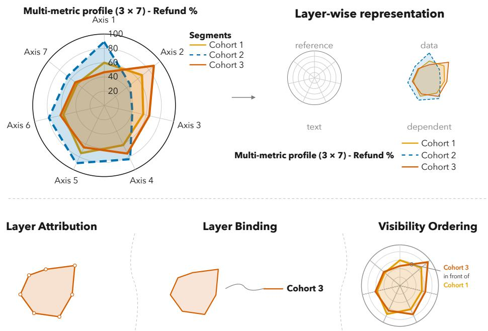  
Figure 1: Overview of the layer-wise representation and the three dimensions evaluated in Layer-WiseBench. Left: A rendered radar chart. Upper right: The corresponding representation separates its reference, data, text, and dependent components. Bottom: Layer attribution captures the elements and properties within a layer; layer binding captures semantic correspondences across layers; and visibility ordering records the front-to-back relation between overlapping components.

To make this layered grammar explicit for evaluation, we formulate a layer-wise representation for evaluation informed by visualization grammars (Wilkinson, 2005; Wickham, 2010; Mackinlay, 1986; Satyanarayan et al., 2017). Figure 1 illustrates this representation by separating a rendered chart into reference, data, text, and dependent components. The representation captures the elements and semantic and visual properties within a layer, together with semantic correspondences across layers, following established attribute–relation distinctions in structured visual evaluation and chart analysis (Johnson et al., 2015; Krishna et al., 2017; Zhao et al., 2022; Siegel et al., 2016; Goswami et al., 2025). Because these properties and correspondences do not fully determine the appearance of overlapping components, the representation additionally records their front-to-back order (Porter & Duff, 1984; Snyder & Lengyel, 1998; Lee & Park, 2022). These three aspects give rise to our core concepts corresponding respectively to the elements and properties within each layer, semantic correspondences across layers, and the front-to-back relation among overlapping components.

Building on these concepts, we introduce LayerWiseBench, a benchmark that evaluates model behavior with respect to this layered grammar through two tracks: layer-wise understanding, formulated as chart questions, and layer-wise editing, formulated as targeted chart editing tasks. Built from executable chart programs, LayerWiseBench uses construction records and spatially aligned layer renderings to derive annotations of functional roles, semantic correspondences, and visibility relations. Overall, LayerWiseBench contains 2,800 source charts across 14 chart paradigms, from which we derive 7,329 layer-wise understanding questions and 53,791 layer-wise editing variants.

On layer-wise understanding, Qwen3.5-27B, which achieves the highest macro-average accuracy, reaches 93.04% on layer attribution and 97.46% on layer binding, but drops to 61.46% on visibility ordering. Visibility ordering is the lowest-scoring dimension for all seven VLMs in the main comparison. For image editing, overall mIoU ranges from 1.49% to 4.93% across the four evaluated editors, and visibility-constrained edits have the lowest mIoU for every editor, ranging from 0.37% to 2.00%. Across both tracks, these results identify tasks involving front-to-back relations between overlapping components as a recurring challenge.

Our contributions are:

• We introduce LayerWiseBench, a benchmark with layer-wise chart understanding and editing tracks, built from executable templates that register task-relevant graphical elements into functional layer groups. These registrations link each template’s construction code to its functional layer structure, yielding construction-grounded annotations and spatially aligned layer renders for both tracks.

• We evaluate nine vision-language models and four image editing models on their respective tracks. Visibility ordering is the lowest-scoring understanding dimension for all seven VLMs in the main comparison, and visibility-constrained edits have the lowest mIoU for all four image editing models.

## 2 RELATED WORK

## 2.1 CHART UNDERSTANDING PATTERNS AND BENCHMARKS

Chart understanding methods broadly follow two patterns. End-to-end approaches directly map a rendered chart to an answer or textual output, whereas other approaches first recover an intermediate representation, such as detected chart components, a data table, rendering code, or structured triples, before downstream reasoning. Representative systems integrate chart derendering with comprehension, translate plots into tables for language-model reasoning, or explicitly separate chart perception from structured reasoning (Liu et al., 2023a; Cheng et al., 2023; Liu et al., 2023b; Xia et al., 2026). These works show that intermediate chart structure is a recurring and practically useful object of modeling.

Chart understanding benchmarks have progressively broadened their coverage of questions, chart types, and reasoning skills. ChartQA, MMC-Benchmark, ChartX, ChartBench, and ChartQAPro extend evaluation toward human-written questions, multi-task reasoning, diverse chart forms, and real-world settings (Masry et al., 2022; Liu et al., 2024; Xia et al., 2025; Xu et al., 2023; Masry et al., 2025). RefChartQA further connects answers to supporting chart elements through visual grounding (Vogel et al., 2026). More recent benchmarks extend this trajectory toward spatial chart-element localization, fine-grained multi-target grounding, and infographic charts (Liu et al., 2026; Niu et al., 2026; Li et al., 2026c). These advances substantially broaden the scope of chart understanding evaluation. Nevertheless, their benchmark formulations generally do not make the functional organization of chart components into layers an explicit organizing principle. LayerWiseBench complements these efforts by centering evaluation of chart understanding on this layered organization.

## 2.2 CHART GENERATION PATTERNS AND EDITING BENCHMARKS

Chart generation and editing follow two broad paradigms. In one, a model first recovers or modifies a structured chart specification and then renders the result, following earlier visualization reverseengineering work that reconstructs visual encodings from chart images (Poco & Heer, 2017). In the other, a model directly transforms a rendered image according to a natural-language instruction, following the paradigm of instruction-guided image editing (Brooks et al., 2023). This distinction shapes the signals available for evaluation: structured specifications expose executability and symbolic structure, whereas outputs from direct image editing are typically assessed through the resulting visual transformation.

Existing benchmarks instantiate these paradigms with different evaluation targets. Plot2Code, Chart Mimic, and ChartAnchor evaluate chart reconstruction through executable code, rendered similarity, or recovered data (Wu et al., 2025; Yang et al., 2025a; Li et al., 2025). ChartEdit, ChartM3, ChartEditVista, and ChartEditBench evaluate code-oriented editing under natural-language, multimodal, image-conditioned, or multi-turn instructions (Zhao et al., 2025; Yang et al., 2025b; Chen et al., 2026; Kapadnis et al., 2026). FigEdit and ChartE3 evaluate end-to-end image editing through edit fidelity and preservation of the remaining chart (Li et al., 2026a;b), while Yu et al. (2026a) specifically tested whether textual and geometric changes remain synchronized under cascading edits. Goswami et al. (2025) instead assess final chart quality through hierarchical scene-graph similarity. Together, these benchmarks cover reconstruction quality, instruction following, multi-turn interaction, and dependency propagation. Within this line of work, Yu et al. (2026a) studied coordinated text-to-geometry changes, which is closely related to the coordinated updates represented in our Binding-consistent family. The editing track of LayerWiseBench also adopts an end-to-end interface, asking models to transform a chart image according to an instruction. Its layer-wise organization comes from construction-derived layer annotations, which group instances into Local target, Binding-consistent, and Visibility-constrained edit families and enable performance to be reported separately across these conditions.

## 3 LAYER-WISE CHART REPRESENTATION AND FORMULATION

Visualization grammars and component-based scene representations describe charts through components, their properties, and their organization (Wilkinson, 2005; Wickham, 2010; Satyanarayan et al., 2017; Liu et al., 2025). We therefore represent each chart in our controlled construction domain as

$$
S = ( C , \Lambda ) ,\tag{1}
$$

where C is the collection of components instantiated in the chart, and Λ records how those components are organized and related. We use component broadly to include visible chart elements and chart-level layout structures together with their resolved data, content, appearance, and spatial properties. The executable source program produces the rendered image and the construction records from which S is instantiated. Within this controlled construction domain, S provides a componentlevel description of the chart for the evaluated tasks.

Within Λ, λ denotes the functional-layer assignment and B records cross-layer semantic bindings. For overlapping component pairs, V records pairwise visibility ordering as a resolved front-to-back relation, since compositing order can change the visible result (Porter & Duff, 1984). The three evaluation dimensions introduced in the Introduction are defined over these structures.

Appendix A summarizes the terminology used throughout the paper, and Appendix B gives the complete operational ontology.

## 4 LAYERWISEBENCH CONSTRUCTION

The construction of LayerWiseBench follows two principles. Layer-aware organization makes component roles and relations explicit, allowing the same component representation to support understanding questions and editing conditions. Source-based construction grounds both tracks in executable chart programs: construction records determine the answers to understanding questions, while parameter interventions and rerendering produce reference edits. Figure 2 summarizes the complete construction process.

## 4.1 SOURCE CHART GENERATION

We construct a library of source charts designed to expose varied component organizations and relations. A preliminary qualitative analysis of chart-editing failures informed its scope, and the final library comprises 14 paradigms spanning diverse mark, layout, and overlap structures. We fixed its composition before the reported model evaluation.

Each paradigm is implemented as a parameterized template. The same template produces a source chart and its reference edits by updating specified construction parameters while inheriting the remaining source configuration. During rendering, task-relevant graphical elements are registered into functional layer groups, which are rendered on the same canvas to produce spatially aligned transparent RGBA layer renders alongside the composite image. The instantiated graphical elements and construction records provide C and the structures λ, B, and V retained in Λ. Aligned layer renders provide their spatial grounding in the composite image.

We generate 200 source charts per paradigm, yielding 2,800 charts in total. Splits are assigned by source chart: each paradigm contributes 160/20/20 charts to the training, validation, and test sets, respectively, for totals of 2,240/280/280. Every derived question or editing variant inherits the split of its source chart.

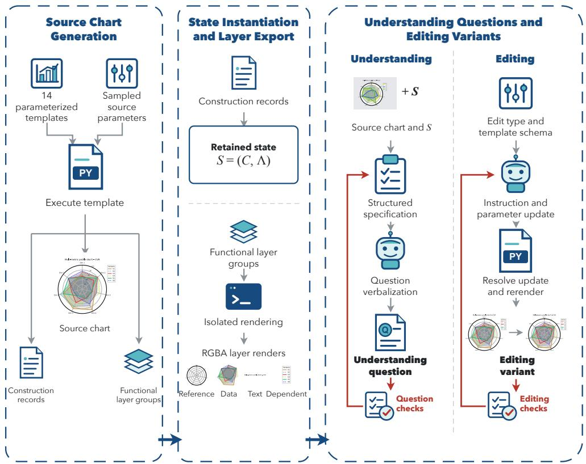  
Figure 2: Construction pipeline of LayerWiseBench. Parameterized templates produce source charts, construction records, and functional layer groups, from which we instantiate S = (C, Λ) and export spatially aligned RGBA layer renders. The resulting representation and renderings are used to generate and verify layer-wise understanding questions and editing variants.

## 4.2 LAYER-WISE UNDERSTANDING INSTANCE GENERATION

For each source chart, we derive candidate understanding queries from component properties in C and the structures λ, B, and V in Λ, grounding the selected component or pair in the corresponding composite image. We instantiate a query only when its referent is visually identifiable and its answer is uniquely determined by the retained construction. Visibility ordering queries additionally require verified local overlap between the aligned rendered layers.

Each eligible query is encoded as a structured specification that fixes its family, target, answer choices, and gold answer before wording. An LLM then verbalizes only the chart-specific question stem without altering these fields. Generated questions are checked for consistency with the specification, visual grounding, and answer leakage; failed checks trigger revision or review before finalization.

The understanding branch covers 2,600 source charts across 13 paradigms. Across all splits, it contains 7,329 questions: 3,172 on layer attribution, 3,176 on layer binding, and 981 on visibility ordering. The test split contains 727 questions derived from 260 source charts, with 316, 315, and 96 instances in the three families, respectively.

## 4.3 LAYER-WISE EDITING VARIANT GENERATION

Whereas understanding instances query component properties and relations in S, editing variants are generated through controlled parameter interventions on the source program and subsequently organized by structural conditions derived from S. Each intervention updates a supported target or construction property, and re-executing the same paradigm template yields the corresponding reference edit.

For each supported edit type, an LLM proposes a candidate natural-language instruction together with a structured parameter update constrained by the template schema. Deterministic construction code resolves the update against the source configuration and restricts it to the template’s admissible parameter domain. We check the instruction against the resolved update and verify that the resulting parameter changes are reflected in rebuilt renderer profiles. Validated edit specifications are then instantiated over additional admissible parameter values while keeping the target, edit type, and edited parameter set fixed; the same checks are applied to every resulting candidate.

For family-level analysis, we annotate eligible test variants according to their construction-derived structural conditions. A Local target edit modifies a specified target or layout property without requiring a relation-specific condition. A Binding-consistent edit additionally produces a coordinated visible change in a construction-linked dependent component, whereas a Visibility-constrained edit modifies a target within a verified overlap while retaining the resolved front-to-back relation. These conditions may co-occur, but each variant is assigned to one family for reporting.

Across all 14 paradigms, this process generates 53,791 candidate variants. By inheriting the split of their source charts, 43,015, 5,384, and 5,392 candidates belong to the training, validation, and test sets, respectively. The evaluation setting specifies the validated test subset used for scoring.

Further construction and validation details are provided in Appendix C.

## 5 EVALUATION SETTING

## 5.1 LAYER-WISE UNDERSTANDING SETTING

We evaluate Qwen3.5-0.8B/2B/4B/9B/27B, Qwen3-VL-8B, InternVL3-8B/14B, and MiniCPM-V-4.5 (Qwen Team, 2026; Bai et al., 2025; Zhu et al., 2025; Yu et al., 2026b). Each model receives a rendered chart, a multiplechoice question, its answer choices, and the four functional layer definitions, and returns one textual response. The 727-item test set contains 316 questions on layer attribution, 315 on layer binding, and 96 on visibility ordering.

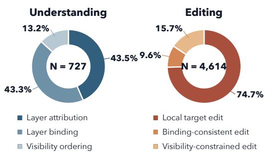

Responses are mapped to the listed choices, and an output that cannot be mapped is counted as incorrect. All models are evaluated on the full test set. We report accuracy for each task family, their unweighted macro-average, and the rate of invalid responses over all 727 items.

Figure 3: Family composition of the understanding and scored editing test sets.

## 5.2 LAYER-WISE EDITING SETTING

We compare FLUX Kontext Dev, InstructPix2Pix, OmniGen2, and Qwen Image Edit 2509 (Black Forest Labs et al., 2025; Brooks et al., 2023; Wu et al., 2026; Qwen Team, 2025). Each system receives only a source chart and an editing instruction. The reference edit and construction annotations are reserved for evaluation. Editing is assessed as an end-to-end image transformation under construction-derived conditions rather than as direct recovery of the formal representation.

The common test set contains 4,614 items with a visible reference change and a constructionderived family assignment. The set comprises 3,447 Local target, 444 Binding-consistent, and 723 Visibility-constrained items (Figure 3). All systems are scored on this same set after their outputs are normalized to the canvas of the source chart.

We use mIoU from PaintBench (Xu et al., 2026) as our primary editing metric and compute Edit Accuracy and Preservation Accuracy as complementary diagnostics. The edited region is defined by pixels that differ between the source and reference images. At each color-distance tolerance, mIoU rewards pixels in this region that match the reference and penalizes both incorrect target pixels and deviations elsewhere. The reported mIoU averages over tolerances and items. Edit Accuracy isolates correctness within the edited region, whereas Preservation Accuracy measures how well the remaining image is preserved. All three are percentages, with higher values indicating better performance. Overall and family-level results in the main text are reported with mIoU.

Table 1: Layer-wise understanding results on the test split. All values are percentages. Macro Avg. is the unweighted average over the three accuracies for the three task families. Invalid denotes the percentage of outputs that cannot be parsed into a valid answer. Invalid outputs are counted as incorrect in the family accuracies and are reported separately. The main comparison uses a 5% ceiling on image+text invalid choice rates, with results for Qwen3.5-0.8B and 4B reported in Appendix F.1.
<table><tr><td>Model</td><td>Macro Avg. ↑</td><td>Layer Attr. ↑</td><td>Layer Bind. ↑</td><td>Visibility Order. ↑</td><td>Invalid ↓</td></tr><tr><td>Qwen3.5-27B</td><td>83.99</td><td>93.04</td><td>97.46</td><td>61.46</td><td>0.00</td></tr><tr><td>Qwen3.5-9B</td><td>83.18</td><td>93.99</td><td>96.19</td><td>59.38</td><td>0.00</td></tr><tr><td>Qwen3.5-2B</td><td>78.27</td><td>80.06</td><td>90.16</td><td>64.58</td><td>1.65</td></tr><tr><td>InternVL3-14B</td><td>80.51</td><td>94.30</td><td>88.89</td><td>58.33</td><td>0.55</td></tr><tr><td>InternVL3-8B</td><td>70.52</td><td>79.75</td><td>75.56</td><td>56.25</td><td>3.30</td></tr><tr><td>Qwen3-VL-8B</td><td>78.37</td><td>90.51</td><td>94.60</td><td>50.00</td><td>0.00</td></tr><tr><td>MiniCPM-V-4.5</td><td>80.39</td><td>93.35</td><td>86.35</td><td>61.46</td><td>0.00</td></tr></table>

We additionally compute mean SSIM between the output and reference edit over all 4,614 items, scaled by 100, together with mean SSIM between the source chart and reference edit as a no-edit baseline (Wang et al., 2004). Higher SSIM indicates greater image similarity. On a fixed, modelindependent subset of 568 content-preserving font and style edits, we report mean OCR Normalized Edit Similarity (OCR-NES) using PP-OCRv6 (Zhang et al., 2026). OCR-NES is reported on a 0–100 scale and measures preservation of unchanged text. Complete scoring definitions and implementation details are provided in Appendix E.

Inference settings for both tracks are provided in Appendix D.

## 6 EXPERIMENTS AND ANALYSIS

We organize our experiments around two questions:

• Q1: Across the three understanding dimensions, which is most often the lowest-scoring for the evaluated VLMs, and what does this pattern reveal about their layer-wise understanding?

• Q2: How closely do the evaluated image editors match construction-grounded reference edits as measured by mIoU, and what does the comparison across the three edit families reveal about editing under layer-derived structural conditions?

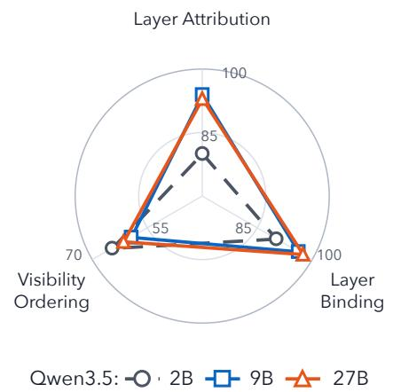

## 6.1 LAYER-WISE

## UNDERSTANDING EXPERIMENTS

Figure 4: Qwen3.5 understanding accuracy. Axes use different ranges.

Visibility ordering is the lowest-performing task family. Visibility ordering has the lowest accuracy for all seven VLMs in the main comparison. Even the best result reaches only 64.58% on 96 binary questions, compared with 50% accuracy under uniform random guessing. These results indicate that the evaluated VLMs still struggle to resolve front-to-back relations between overlapping chart components.

Table 2: Editing performance measured by mIoU. All values are percentages; higher is better. Overall is the item-weighted mean over all 4,614 test items. Darker shading indicates higher mIoU on a common scale; row maxima are bold.
<table><tr><td colspan="3"></td><td rowspan="2">Instruct Pix2Pix</td><td rowspan="2">OmniGen2</td><td rowspan="2">Qwen Image Edit 2509</td></tr><tr><td>Editing family</td><td>N</td><td>Kontext Dev</td></tr><tr><td>Local target edit</td><td>3,447</td><td>6.22</td><td>1.77</td><td>5.60</td><td>4.86</td></tr><tr><td>Binding-consistent edit</td><td>444</td><td>1.52</td><td>1.14</td><td>2.55</td><td>3.22</td></tr><tr><td>Visibility-constrained edit</td><td>723</td><td>0.90</td><td>0.37</td><td>1.50</td><td>2.00</td></tr><tr><td>Overall</td><td>4,614</td><td>4.93</td><td>1.49</td><td>4.67</td><td>4.26</td></tr></table>

Text-only accuracy on layer attribution remains 78.48–92.41%, indicating that many questions in this family can be answered without the chart image (Appendix F.1).

Higher average accuracy does not imply better visibility ordering. Macro-average accuracy increases with model size among the Qwen3.5 and InternVL3 checkpoints in the main comparison (Table 1). Qwen3.5 improves from 78.27% at 2B to 83.18% at 9B and 83.99% at 27B, while InternVL3 improves from 70.52% at 8B to 80.51% at 14B. The gain from Qwen3.5-9B to 27B is smaller than that from 2B to 9B.

Visibility ordering follows a different pattern in Qwen3.5. The 2B model scores 64.58%, compared with 59.38% for 9B and 61.46% for 27B (Figure 4). Higher aggregate accuracy can therefore coexist with a persistent weakness in resolving overlaps, motivating explicit supervision of visibility ordering as a complement to increasing model size.

## 6.2 LAYER-WISE EDITING RESULTS

Pixel-level agreement with the reference remains low. Table 2 reports the overall and family level mIoU results. Across the 4,614 evaluation items, overall mIoU ranges from 1.49% to 4.93%. Because mIoU evaluates the target and preservation regions jointly, these scores indicate that the evaluated editors do not yet combine pixel-accurate target modification with preservation of the surrounding chart.

Visibility-constrained edits receive the lowest mIoU. mIoU ranges from 1.77% to 6.22% for local target edits, from 1.14% to 3.22% for binding-consistent edits, and from 0.37% to 2.00% for visibility-constrained edits. The visibility-constrained subset is the lowest-scoring editing family for all four evaluated editors. Current editors therefore reproduce reference edits less accurately when the target participates in a visible overlap and the original front-to-back relation must be preserved.

Qualitative examples. Figure 5 compares two outputs from Qwen Image Edit 2509 with their reference edits. Their metric values reflect the contrast between broad unintended changes and closer agreement with the reference.

Taken together, the results identify visibility-related cases as the clearest shared weakness across the two tracks. Appendix F reports complementary understanding controls and editing metrics. Ap pendix G examines the sensitivity of this pattern to the visibility thresholds used during construction.

## 7 CONCLUSION

We present LayerWiseBench, a construction-grounded benchmark for layer-wise chart understanding and editing. Executable chart programs provide the rendered charts and the structural information used to construct the evaluation. The understanding track directly queries layer attribution, layer binding, and visibility ordering. The editing track evaluates end-to-end transformations and reports results across local target, binding-consistent, and visibility-constrained families derived from the chart construction.

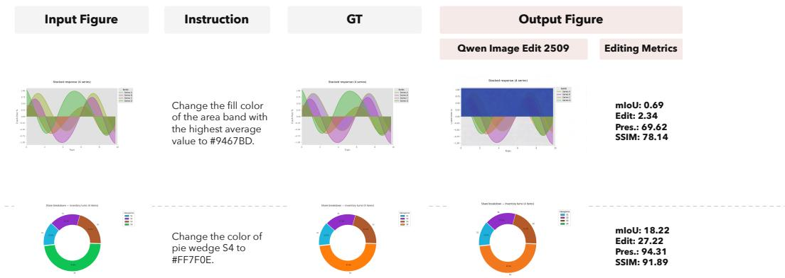  
Figure 5: Qualitative editing examples from Qwen Image Edit 2509. The area output changes a broad non-target region, whereas the pie output more closely matches the reference edit.

Visibility ordering is the lowest-scoring understanding dimension for all seven VLMs in the main comparison. Qwen3.5-27B, which achieves the highest macro-average accuracy, obtains 93.04% on layer attribution and 97.46% on layer binding, but 61.46% on visibility ordering. Overall mIoU ranges from 1.49% to 4.93%. Visibility-constrained edits score lowest for every editor, with mIoU of 0.37%–2.00%. Across both tracks, the clearest recurring performance gap appears in tasks involving front-to-back relations between overlapping chart components.

Our study is limited to program-generated charts from the 14 paradigms supported by our construction library. Family-level editing scores reflect both operation mix and structural conditions, which may co-occur across items. The editing metrics measure agreement with reference outputs; they do not directly reveal whether a model internally represents chart layers.

Future work can extend the benchmark to naturally occurring charts and a broader range of visualization paradigms and transformations. Matched editing sets could isolate individual structural conditions and support cleaner comparisons across families. The observed weakness on tasks about visibility ordering also motivates probes of how models represent front-to-back relations and experiments with layer-aware training objectives or explicit intermediate representations.

Use of generative AI. OpenAI Codex assisted with language polishing and code implementation based on the authors’ ideas. The authors take responsibility for the content of the manuscript and the accompanying implementation.

## REFERENCES

Shuai Bai, Yuxuan Cai, Ruizhe Chen, Keqin Chen, et al. Qwen3-VL technical report, 2025. URL https://arxiv.org/abs/2511.21631.

Black Forest Labs, Stephen Batifol, Andreas Blattmann, Frederic Boesel, et al. FLUX.1 Kontext: Flow matching for in-context image generation and editing in latent space, 2025. URL https: //arxiv.org/abs/2506.15742.

Tim Brooks, Aleksander Holynski, and Alexei A. Efros. InstructPix2Pix: Learning to follow image editing instructions. In Proceedings of the IEEE/CVF Conference on Computer Vision and Pattern Recognition(CVPR), pp. 18392–18402, June 2023.

Liangyu Chen, Yichen Xu, Jianzhe Ma, Yuqi Liu, Donglu Yang, Liang Zhang, Zihao Yue, Wenxuan Wang, and Qin Jin. ChartEditor: A reinforcement learning framework for robust chart editing. Proceedings of the AAAI Conference on Artificial Intelligence, 40(24):20199–20207, 2026. doi: 10.1609/aaai.v40i24.39107. URL https://ojs.aaai.org/index.php/ AAAI/article/view/39107.

Zhi-Qi Cheng, Qi Dai, and Alexander G. Hauptmann. ChartReader: A unified framework for chart derendering and comprehension without heuristic rules. In Proceedings of the IEEE/CVF International Conference on Computer Vision(ICCV), pp. 22202–22213, October 2023. URL https://openaccess.thecvf.com/content/ICCV2023/html/ Cheng\_ChartReader\_A\_Unified\_Framework\_for\_Chart\_Derendering\_and\_ Comprehension\_without\_ICCV\_2023\_paper.html.

Kanika Goswami, Puneet Mathur, Ryan A. Rossi, Franck Dernoncourt, Vivek Gupta, and Dinesh Manocha. ChartEval: LLM-driven chart generation evaluation using scene graph parsing. In Proceedings of The 14th International Joint Conference on Natural Language Processing and The 4th Conference of the Asia-Pacific Chapter of the Association for Computa tional Linguistics: System Demonstrations, pp. 86–93, Mumbai, India, December 2025. Association for Computational Linguistics. doi: 10.18653/v1/2025.ijcnlp-demo.10. URL https: //aclanthology.org/2025.ijcnlp-demo.10/.

John D. Hunter. Matplotlib: A 2D graphics environment. Computing in Science & Engineering, 9 (3):90–95, 2007. doi: 10.1109/MCSE.2007.55.

Justin Johnson, Ranjay Krishna, Michael Stark, Li-Jia Li, David A. Shamma, Michael S. Bernstein, and Li Fei-Fei. Image retrieval using scene graphs. In Proceedings of the IEEE Conference on Computer Vision and Pattern Recognition (CVPR), pp. 3668–3678, June 2015.

Manav Nitin Kapadnis, Lawanya Baghel, Atharva Naik, and Carolyn Rosé. ChartEditBench: Evaluating grounded multi-turn chart editing in multimodal language models, 2026. URL https://arxiv.org/abs/2602.15758.

Ranjay Krishna, Yuke Zhu, Oliver Groth, et al. Visual Genome: Connecting language and vision using crowdsourced dense image annotations. International Journal ofComputer Vision, 123(1): 32–73, 2017. doi: 10.1007/s11263-016-0981-7.

Hyunmin Lee and Jaesik Park. Instance-wise occlusion and depth orders in natural scenes. In Proceedings ofthe IEEE/CVF Conference on Computer Vision and Pattern Recognition (CVPR), pp. 21210–21221, 2022.

Shawn Li, Ryan A. Rossi, Sungchul Kim, Sunav Choudhary, Franck Dernoncourt, Puneet Mathur, Zhengzhong Tu, and Yue Zhao. Charts Are Not Images: On the challenges of scientific chart editing. In International Conference on Learning Representations (ICLR), 2026a. URL https: //openreview.net/forum?id=259xBeNyDV.

Shuo Li, Jiajun Sun, Zhekai Wang, Xiaoran Fan, Hui Li, Dingwen Yang, Zhiheng Xi, Yijun Wang, Zifei Shan, Tao Gui, Qi Zhang, and Xuanjing Huang. ChartE3: A comprehensive benchmark for end-to-end chart editing. In Proceedings of the 43rd International Conference on Machine Learning (ICML), 2026b.

Xinhang Li, Jingbo Zhou, Pengfei Luo, Yixiong Xiao, and Tong Xu. ChartAnchor: Chart grounding with structural-semantic fidelity, 2025. URL https://arxiv.org/abs/2512.01017.

Zhen Li, Duan Li, Yukai Guo, Xinyuan Guo, Bowen Li, Lanxi Xiao, Shenyu Qiao, Jiashu Chen, Zijian Wu, Hui Zhang, Xinhuan Shu, and Shixia Liu. ChartGalaxy: A dataset for infographic chart understanding and generation. In The Fourteenth International Conference on Learning Representations, 2026c. URL https://openreview.net/forum?id=P4lFbvZ4HH.

Fangyu Liu, Julian Eisenschlos, Francesco Piccinno, Syrine Krichene, Chenxi Pang, Kenton Lee, Mandar Joshi, Wenhu Chen, Nigel Collier, and Yasemin Altun. DePlot: One-shot visual language reasoning by plot-to-table translation. In Findings ofthe Associationfor Computational Linguistics: ACL 2023, pp. 10381–10399, Toronto, Canada, July 2023a. Association for Computational Linguistics. doi: 10.18653/v1/2023.findings-acl.660. URL https://aclanthology.org/ 2023.findings-acl.660/.

Fangyu Liu, Francesco Piccinno, Syrine Krichene, Chenxi Pang, Kenton Lee, Mandar Joshi, Yasemin Altun, Nigel Collier, and Julian Eisenschlos. MatCha: Enhancing visual language pretraining with math reasoning and chart derendering. In Proceedings of the 61st Annual Meeting

of the Association for Computational Linguistics (Volume 1: Long Papers), pp. 12756–12770, Toronto, Canada, July 2023b. Association for Computational Linguistics. doi: 10.18653/v1/ 2023.acl-long.714. URL https://aclanthology.org/2023.acl-long.714/.

Fuxiao Liu, Xiaoyang Wang, Wenlin Yao, Jianshu Chen, Kaiqiang Song, Sangwoo Cho, Yaser Yacoob, and Dong Yu. MMC: Advancing multimodal chart understanding with large-scale instruction tuning. In Proceedings of the 2024 Conference of the North American Chapter of the Associationfor Computational Linguistics: Human Language Technologies (Volume 1: Long Papers), pp. 1287–1310, Mexico City, Mexico, June 2024. Association for Computational Linguistics. doi: 10.18653/v1/2024.naacl-long.70. URL https://aclanthology.org/2024. naacl-long.70/.

Zhicheng Liu, Chen Chen, and John Hooker. Manipulable semantic components: A computational representation of data visualization scenes. IEEE Transactions on Visualization and Computer Graphics, 31(1):732–742, 2025. doi: 10.1109/TVCG.2024.3456296.

Zhuoming Liu, Xiaofeng Gao, Feiyang Niu, Qiaozi Gao, Liu Liu, and Robinson Piramuthu. START: Spatial and textual learning for chart understanding. In Proceedings of the IEEE/CVF Winter Conference on Applications of Computer Vision, pp. 8146–8156, March 2026. URL https://openaccess.thecvf.com/content/WACV2026/html/Liu\_START\_ Spatial\_and\_Textual\_Learning\_for\_Chart\_Understanding\_WACV\_2026\_ paper.html.

Jock D. Mackinlay. Automating the design of graphical presentations of relational information. ACM Transactions on Graphics, 5(2):110–141, 1986. doi: 10.1145/22949.22950.

Ahmed Masry, Do Xuan Long, Jia Qing Tan, Shafiq Joty, and Enamul Hoque. ChartQA: A benchmark for question answering about charts with visual and logical reasoning. In Findings of the Association for Computational Linguistics: ACL 2022, pp. 2263–2279, Dublin, Ireland, May 2022. Association for Computational Linguistics. doi: 10.18653/v1/2022.findings-acl.177. URL https://aclanthology.org/2022.findings-acl.177/.

Ahmed Masry, Mohammed Saidul Islam, Mahir Ahmed, Aayush Bajaj, Firoz Kabir, Aaryaman Kartha, Md Tahmid Rahman Laskar, Mizanur Rahman, Shadikur Rahman, Mehrad Shahmohammadi, Megh Thakkar, Md Rizwan Parvez, Enamul Hoque, and Shafiq Joty. ChartQAPro: A more diverse and challenging benchmark for chart question answering. In Findings of the Association for Computational Linguistics: ACL 2025, pp. 19123–19151, Vienna, Austria, July 2025. Association for Computational Linguistics. doi: 10.18653/v1/2025.findings-acl.978. URL https://aclanthology.org/2025.findings-acl.978/.

Tianhao Niu, Ziyu Han, Qingfu Zhu, and Wanxiang Che. ChartREG++: Towards benchmarking and improving chart referring expression grounding under diverse referring clues and multi-target referring, 2026. URL https://arxiv.org/abs/2605.07415v1.

Jorge Poco and Jeffrey Heer. Reverse-engineering visualizations: Recovering visual encodings from chart images. Computer Graphics Forum, 36(3):353–363, 2017. doi: 10.1111/cgf.13193. URL https://diglib.eg.org/handle/10.1111/cgf13193.

Thomas Porter and Tom Duff. Compositing digital images. In Proceedings of the 11th Annual Conference on Computer Graphics and Interactive Techniques, pp. 253–259. ACM, 1984. doi: 10.1145/800031.808606.

Qwen Team. Qwen-Image-Edit-2509 model card, 2025. URL https://huggingface.co/ Qwen/Qwen-Image-Edit-2509.

Qwen Team. Qwen3.5: Towards native multimodal agents. https://qwen.ai/blog?id= qwen3.5, February 2026. Official Qwen blog.

Arvind Satyanarayan, Dominik Moritz, Kanit Wongsuphasawat, and Jeffrey Heer. Vega-Lite: A grammar of interactive graphics. IEEE Transactions on Visualization and Computer Graphics, 23 (1):341–350, 2017. doi: 10.1109/TVCG.2016.2599030.

Noah Siegel, Zachary Horvitz, Roie Levin, Santosh Divvala, and Ali Farhadi. FigureSeer: Parsing result-figures in research papers. In Computer Vision – ECCV 2016, pp. 664–680. Springer, 2016. doi: 10.1007/978-3-319-46478-7\_41.

John Snyder and Jed Lengyel. Visibility sorting and compositing without splitting for image layer decompositions. In Proceedings of the 25th Annual Conference on Computer Graphics and Interactive Techniques, SIGGRAPH ’98, pp. 219–230. ACM, 1998. doi: 10.1145/280814.280878.

Alexander Vogel, Omar Moured, Yufan Chen, Jiaming Zhang, and Rainer Stiefelhagen. RefChartQA: Grounding visual answer on chart images through instruction tuning. In Document Analysis and Recognition – ICDAR 2025, volume 16026 of Lecture Notes in Computer Science, pp. 523–537, Cham, 2026. Springer Nature Switzerland. doi: 10.1007/978-3-032-04627-7\_30. URL https://doi.org/10.1007/978-3-032-04627-7\_30.

Zhou Wang, Alan C. Bovik, Hamid R. Sheikh, and Eero P. Simoncelli. Image quality assessment: From error visibility to structural similarity. IEEE Transactions on Image Processing, 13(4): 600–612, 2004. doi: 10.1109/TIP.2003.819861.

Hadley Wickham. A layered grammar of graphics. Journal of Computational and Graphical Statistics, 19(1):3–28, 2010. doi: 10.1198/jcgs.2009.07098.

Leland Wilkinson. The Grammar of Graphics. Statistics and Computing. Springer, New York, NY, 2nd edition, 2005. doi: 10.1007/0-387-28695-0.

Chengyue Wu, Zhixuan Liang, Yixiao Ge, Qiushan Guo, Zeyu Lu, Jiahao Wang, Ying Shan, and Ping Luo. Plot2Code: A comprehensive benchmark for evaluating multi-modal large language models in code generation from scientific plots. In Findings ofthe Associationfor Computational Linguistics: NAACL 2025, pp. 3006–3028, Albuquerque, New Mexico, April 2025. Association for Computational Linguistics. doi: 10.18653/v1/2025.findings-naacl.164. URL https:// aclanthology.org/2025.findings-naacl.164/.

Chenyuan Wu, Jiahao Wang, Pengfei Zheng, Ruiran Yan, et al. OmniGen2: Towards instructionaligned multimodal generation. In Proceedings of the IEEE/CVF Conference on Computer Vision and Pattern Recognition (CVPR), pp. 21964–21975, June 2026. URL https:// openaccess.thecvf.com/content/CVPR2026/html/Wu\_OmniGen2\_Towards\_ Instruction-Aligned\_Multimodal\_Generation\_CVPR\_2026\_paper.html.

Renqiu Xia, Hancheng Ye, Xiangchao Yan, Qi Liu, Hongbin Zhou, Zijun Chen, Botian Shi, Junchi Yan, and Bo Zhang. ChartX and ChartVLM: A versatile benchmark and foundation model for complicated chart reasoning. IEEE Transactions on Image Processing, 34:7436–7447, 2025. doi: 10.1109/tip.2025.3607618. URL https://doi.org/10.1109/tip.2025.3607618.

Renqiu Xia, Haoyang Peng, Hancheng Ye, Mingsheng Li, Xiangchao Yan, Peng Ye, Botian Shi, Yu Qiao, Junchi Yan, and Bo Zhang. StructChart: On the schema, metric, and augmentation for visual chart understanding. IEEE Transactions on Pattern Analysis and Machine Intelligence, 48(7):8044–8059, 2026. doi: 10.1109/tpami.2026.3669664. URL https://doi.org/10. 1109/tpami.2026.3669664.

Kai Xu, Ellis Brown, Shrikar Madhu, Rob Fergus, He He, and Saining Xie. PaintBench: Deterministic evaluation of precise visual editing. arXiv preprint arXiv:2606.00188, 2026. doi: 10.48550/arXiv.2606.00188.

Zhengzhuo Xu, Sinan Du, Yiyan Qi, Chengjin Xu, Chun Yuan, and Jian Guo. ChartBench: A benchmark for complex visual reasoning in charts, 2023. URL https://arxiv.org/abs/ 2312.15915.

Cheng Yang, Chufan Shi, Yaxin Liu, Bo Shui, Junjie Wang, Mohan Jing, Linran Xu, Xinyu Zhu, Siheng Li, Yuxiang Zhang, Gongye Liu, Xiaomei Nie, Deng Cai, and Yujiu Yang. ChartMimic: Evaluating LMM’s cross-modal reasoning capability via chart-to-code generation. In International Conference on Learning Representations, 2025a. URL https://openreview.net/ forum?id=sGpCzsfd1K.

Donglu Yang, Liang Zhang, Zihao Yue, Liangyu Chen, Yichen Xu, Wenxuan Wang, and Qin Jin. ChartM3: Benchmarking chart editing with multimodal instructions. In Proceedings of the 33rd ACM International Conference on Multimedia, pp. 5001–5009, 2025b. doi: 10.1145/3746027. 3755714. URL https://doi.org/10.1145/3746027.3755714.

Jiakang Yu, Yixuan Chai, Tianci Wang, Rihui Jin, Guangkai Xu, Hongtao Deng, Xun Zhu, Wang Gao, Xinrun Guo, and Haipang Wu. ChartSync: A benchmark for visuo-logical cascading chart editing, 2026a. URL https://arxiv.org/abs/2607.10301.

Tianyu Yu, Zefan Wang, Chongyi Wang, et al. MiniCPM-V 4.5: Cooking efficient MLLMs via architecture, data, and training recipe. In Proceedings of the IEEE/CVF Conference on Computer Vision and Pattern Recognition (CVPR), pp. 11704–11715, June 2026b. URL https://openaccess.thecvf.com/content/CVPR2026/html/Yu\_ MiniCPM-V\_4.5\_Cooking\_Efficient\_MLLMs\_via\_Architecture\_Data\_ and\_Training\_CVPR\_2026\_paper.html.

Yubo Zhang, Xueqing Wang, Manhui Lin, Yue Zhang, Penglongyi Deng, Ting Sun, Tingquan Gao, Zelun Zhang, Jiaxuan Liu, Changda Zhou, Hongen Liu, Suyin Liang, Cheng Cui, Yi Liu, Dianhai Yu, and Yanjun Ma. PP-OCRv6: From 1.5M to 34.5M parameters, surpassing billion-scale VLMs on OCR tasks, 2026. URL https://arxiv.org/abs/2606.13108.

Tiancheng Zhao, Tianqi Zhang, Mingwei Zhu, Haozhan Shen, Kyusong Lee, Xiaopeng Lu, and Jianwei Yin. An explainable toolbox for evaluating pre-trained vision-language models. In Proceedings ofthe 2022 Conference on Empirical Methods in Natural Language Processing: System Demonstrations, pp. 30–37, Abu Dhabi, UAE, 2022. Association for Computational Linguistics. doi: 10.18653/v1/2022.emnlp-demos.4. URL https://aclanthology.org/2022. emnlp-demos.4/.

Xuanle Zhao, Xuexin Liu, Haoyue Yang, Xianzhen Luo, Fanhu Zeng, Jianling Li, Qi Shi, and Chi Chen. ChartEdit: How far are MLLMs from automating chart analysis? Evaluating MLLMs’ capability via chart editing. In Findings of the Association for Computational Linguistics: ACL 2025, pp. 3616–3630, Vienna, Austria, July 2025. Association for Computational Linguistics. doi: 10.18653/v1/2025.findings-acl.185. URL https://aclanthology.org/2025. findings-acl.185/.

Jinguo Zhu et al. InternVL3: Exploring advanced training and test-time recipes for open-source multimodal models, 2025. URL https://arxiv.org/abs/2504.10479.

## A TERMINOLOGY

Layer Attribution, Layer Binding, and Visibility Ordering are the three core layer-wise concepts formalized as evaluation dimensions in Section 3. We use the same labels for the corresponding question families in the understanding track. The editing track uses the separate family labels listed below.

Table 3: Canonical terminology used throughout LayerWiseBench.
<table><tr><td>Term</td><td>Use in this paper</td></tr><tr><td>Layer-wise representation</td><td>A component-level description of a chart for the evaluated tasks within our controlled construction domain, written as S = (C, Λ). Here, C contains chart components, and Λ records their organization and relations.</td></tr><tr><td>Component</td><td>A visible chart element or chart-level layout structure together with its applicable resolved data, content, appearance, and spatial properties.</td></tr><tr><td>Functional layer</td><td>The operational role assigned to a component by λ: Reference, Data, Text, or Dependent. The complete ontology is given in Appendix B.1.</td></tr><tr><td>Layer Attribution</td><td>The component-level dimension concerning the functional-layer assignment λ(c) of a component c.</td></tr><tr><td>Layer Binding</td><td>The relation-level dimension concerning a construction-derived semantic correspondence in B between components in different functional layers.</td></tr><tr><td>Visibility Ordering</td><td>The relation-level dimension concerning the resolved front-to-back relation in V between overlapping components.</td></tr><tr><td>Layer-wise understanding</td><td>The question-answering track that directly queries the three layer-wise dimensions from a rendered chart. Its three question families use the corresponding dimension labels.</td></tr><tr><td>Layer-wise editing</td><td>The end-to-end track that asks a model to transform a rendered chart according to an instruction and evaluates the output under construction-derived structural</td></tr><tr><td>Local target edit</td><td>conditions. An editing family for a specified target or layout edit that does not require the benchmark&#x27;s binding- or visibility-specific condition.</td></tr><tr><td>Binding-consistent edit</td><td>An editing family whose reference edit visibly changes both a Data target and a</td></tr><tr><td>Visibility-constrained edit</td><td>construction-linked Dependent component. An editing family whose reference edit changes a target within a verified overlap while preserving the construction-resolved front-to-back order.</td></tr></table>

## B OPERATIONAL LAYER ONTOLOGY

## B.1 FUNCTIONAL LAYER ONTOLOGY AND ELEMENT MAPPING

Table 3 summarizes the terminology used throughout the paper. LayerWiseBench organizes chart elements into four functional layers: Reference, Data, Text, and Dependent. This ontology is the operational decomposition used across the 14 programmatic chart paradigms in the benchmark. Its scope is the element vocabulary instantiated by these paradigms. Elements are classified by their function in a chart, rather than by the graphical primitive or software object used to render them. Within this vocabulary, every canonical element type is assigned to exactly one layer.

Reference layer. Reference elements provide the coordinate and positional apparatus through which readers locate marks within a scale, category, named axis dimension, or plotting frame. They calibrate, index, or orient positions rather than encode primary data records. Axis titles belong to this layer because they name coordinate dimensions.

Data layer. Data elements are the marks and geometric objects that directly encode values, observations, aggregates, or distributions. The layer includes both primary marks and derived statistical marks when their geometry represents a relation in the data, as in a fitted regression line.

Text layer. The Text layer is reserved for standalone explanatory text that names, describes, or contextualizes the chart. Such text is neither part of a positional scale or index nor attached to a particular data mark or encoding channel.

Dependent layer. Dependent elements derive their interpretation from a data mark, mark group, or encoding channel. They decode an encoding or attach information to encoded data. Legends, colorbars, size legends, data labels, and mark-tied callouts therefore remain in the Dependent layer even when they are rendered as text.

Functional boundary rule. Because the ontology is functional, visually similar objects may belong to different layers. A plotted line is Data when it represents a series or fitted relation, whereas a positional baseline, grid line, or scale-reference guide is Reference. Tick labels, categorical axis labels, heatmap row and column labels, and axis titles are Reference. Chart titles, captions, and free annotations that are not tied to a mark or encoding channel are Text. Legend entries, colorbars, data labels, and mark-tied callouts are Dependent.

Instantiated element assignments. The element classes below are standard chart components. Table 4 records how the functional definitions above are instantiated across the 49 canonical element classes used by the benchmark. This explicit assignment ensures that the same element class is treated consistently across source programs and benchmark instances.

Table 4: Operational element-to-layer mapping used by LayerWiseBench. Elements are assigned according to their function in the chart.
<table><tr><td>Layer</td><td>Canonical element classes</td></tr><tr><td>Reference</td><td>axes; axis lines; axis titles (xl abe1, ylabel, and zlabe1); ticks; tick labels; categorical axis labels; heatmap row labels; heatmap column labels; grid lines; baselines; zero lines; reference lines; reference bands; plotting frames; polar or radar angular and radial guides.</td></tr><tr><td>Data</td><td>bars; lines; points; areas; heatmap cells; pie or rose wedges; radar or polar polygons; bubble marks; fitted regression lines; boxplot bodies; boxplot whiskers; boxplot caps; boxplot medians; outliers; histogram bins.</td></tr><tr><td>Text</td><td>chart titles; figure-level titles; subplot or panel titles; subtitles; panel labels; standalone annotations; captions; source notes.</td></tr><tr><td>Dependent</td><td>legends; legend entries; legend titles; legend symbols or handles; colorbars; colorbar tick labels; colorbar labels; size legends; data labels; mark-tied callouts; labels printed inside or next to marks.</td></tr></table>

## C BENCHMARK CONSTRUCTION DETAILS

We construct two complementary benchmark tracks from charts rendered from source programs with the retained layer-wise representation. The understanding track queries functional layer roles and structural relations in a rendered chart, whereas the editing track asks models to apply controlled modifications specified by natural-language instructions. The following subsections detail the construction of the two types of benchmark instances.

## C.1 UNDERSTANDING DATA CONSTRUCTION

Each understanding item is derived from a canonical fact constructed from the source chart program and its aligned layer renderings. The canonical fact records the fact type, visual anchor, supporting layers, and answer target independently of question wording.

Family Assignment. The fact type deterministically assigns each canonical fact to exactly one of Layer Attribution, Layer Binding, or Visibility Ordering. A source chart may produce multiple facts and therefore contribute items to different families.

Layer Attribution. Layer Attribution asks which functional layer contains a specified chart element. The routing follows the operational ontology: reference\_layer\_role and axis\_title\_role map to Reference; data\_mark\_role maps to Data; standalone\_text\_role maps to Text; and legend\_block\_role, colorbar\_role, and data\_label\_role map to Dependent. Each item uses the four layer roles as its answer choices.

Layer Binding. Layer Binding asks which semantic partner corresponds to a specified Data-layer element. We instantiate four typed relations: mark-to-legend-entry and mark-to-data-label connect Data to Dependent, while mark-to-axis-category and heatmap-cell-to-row/column-label connect Data to Reference. The source program determines the gold partner and supplies relationcompatible distractors.

Prompt for Question Verbalization   
SYSTEM   
You are writing one chart QA item from a fixed canonical fact.   
Do not change the answer, family, or distractor set.   
Do not invent evidence or hidden objects.   
Do not use forbidden strings.   
Write a short, chart-specific, image-grounded question that matches   
the assigned question angle and style.   
Return valid JSON only.   
USER   
Write exactly one multiple-choice chart QA question.   
Requirements:   
- The answer is already fixed by the canonical fact.   
- You must preserve the assigned family and question angle.   
- The question must require looking at the chart image.   
- The question must not reveal the answer text or forbidden strings.   
- The question must be short and concrete.   
- The final choices are already locked; do not rewrite or reorder   
them.  
Figure 6: Shared system and user prompt fragments used for question verbalization. Instancespecific structured context is omitted for clarity.

Visibility Ordering. Following the standard alpha-compositing model, we define Visibility Ordering by the stacking order used to composite two overlapping rendered elements (Porter & Duff, 1984). We instantiate this definition using the renderer-resolved drawing order of Matplotlib (Hunter, 2007).

Visibility Ordering asks which of two locally overlapping elements is rendered in front. All layer renderings used here are exported from the same Matplotlib figure at 100 dpi and therefore share a common pixel coordinate system. For layer assets i and $j ,$ let $A _ { i } \ = \ \{ p \ \mid \ \alpha _ { i } ( p ) \ > \ 8 \}$ and $n _ { i j } = | A _ { i } \cap A _ { j } |$ . A pair is retained when

$$
n _ { i j } \ge 8 0 , \qquad \frac { n _ { i j } } { \operatorname* { m a x } ( 1 , \operatorname* { m i n } ( | A _ { i } | , | A _ { j } | ) ) } \ge 0 . 0 1 5 .\tag{2}
$$

The benchmark items cover overlapping area fills, radar fills, bubbles, scatter points, and Bar3D series. For two-dimensional charts, the later element in the recorded artist render order is treated as frontmost. For Bar3D, frontmost order is resolved after drawing the chart under the fixed camera configuration elev = 24◦, azim = −58◦, and roll = 0◦.

Question verbalization. After the canonical fact and answer space are fixed, we use qwen3.6-plus to verbalize each item as a concise, image-grounded multiple-choice question. Figure 6 shows the shared system and user prompt templates.

## C.2 EDITING VARIANT CONSTRUCTION

Each editing item pairs an instruction with aligned input and ground truth renderings produced from the same chart program. The structured parameter modification and aligned layer exports are construction metadata. Editing models receive only the input chart and instruction.

Instruction and modification generation. For each canonical seed, the pipeline fixes the chart paradigm, a modification category (Data-centric, Visual, Text/Font, or Layout/Margin), a subtype, and its targeting contract. The category constrains parameter generation but does not determine the editing family. The parameter schema intersects the editable arguments of the rendering function with the selected category partition, excluding edits, identity controls, and global structure con trols. We use qwen3.6-plus with the text prompt in Fig. 7; no chart image is provided. The prompt supplies the source chart profile, schema, category guidance, subtype contract, and targeting constraints. It requests an imperative specific\_instruction and a flat parameter map with at least one non-null allowed key. Lists or expression objects are permitted only by the relevant parameter or subtype contract. Expression subtypes require an expression on the designated target key that references an allowed chart context. After key validation and expression evaluation, eligible numeric data values are projected or clamped when necessary. The resolved modification is merged with the original arguments and rendered by the same chart function and layer exporter.

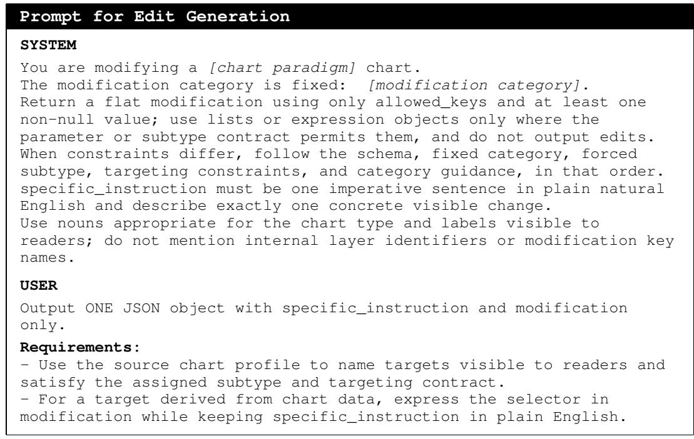  
Figure 7: Abridged and reformatted reconstruction of the shared prompt contract for canonical seed generation with Qwen3.6-Plus. Structured blocks for individual instances are omitted, and no chart image is supplied.

Restricted parameter updates. For each canonical edit, the runner derives an allowed parameter set from the corresponding builder signature. It removes edits, fields that determine sample identity or global structure, and a small number of paradigm-specific fields, then restricts the remainder to the assigned Data-centric, Visual, Text/Font, or Layout/Margin category. Recognized schema wrappers and aliases are normalized. The modification must contain at least one nonnull field; every such field must belong to the active category schema, and the update must satisfy the required fields, permitted alternatives, target dependencies, and forbidden fields of its assigned subtype. Symbolic values are Python expressions evaluated with eval in a reduced namespace containing NumPy, chart data, and a small helper set. Eligible data mutations are checked against paradigm-specific rendering bounds and, when possible, deterministically projected back into range; any unresolved case is recorded. After excluded fields are removed, the resolved update is overlaid on the original parameters, conflicting stale mutation, targeting, or style fields are cleared, and the final arguments are filtered by the builder signature.

Deterministic re-execution. Once a proposed edit has been resolved to a concrete parameter update, each reference edit is reconstructed independently by applying that update to the stored source parameters and original random seed, rather than to a previously edited image or parameter state. No additional model call is made during reconstruction. The resolved update and stored source parameters fully specify the builder inputs. Our reproducibility claim assumes fixed dependency versions and fonts; it does not extend to byte-identical rendering across Matplotlib versions or platform font stacks.

Variant expansion. Each accepted seed is expanded deterministically into up to five scaled variants by changing feasible values while preserving the target, subtype, and modification keys. A variant is materialized only when rendering succeeds without repair; subsequent instruction and profile audits determine whether it is eligible for evaluation.

Family Assignment. Family membership describes the relational demand among rendered elements in the reference edit, rather than its surface modification category. An offline assignment stage routes each item to a Local target edit, Binding-consistent edit, or Visibility-constrained edit using its subtype, dependencies, changed layer units, and the relation rules of the chart paradigm. When both relation types apply, the visibility route takes precedence. Verification after rendering checks only the selected route. Insufficient visible activity in valid regions assigns the item to Local target edit, while missing renderings, layer assets, or required masks leave the item without a family label. Assignment and verification use only construction metadata, renderer exports, and the input and reference renderings; model predictions are used only during evaluation.

Local target edit. Local target edits include edits routed directly to this family and relational edits that fail verification despite having valid regions. It is not tied to any one modification category.

Binding-consistent edit. Binding-consistent edits are edits for which construction metadata selects a Layer Binding relation between a Data target and a Dependent component. Let I and G be the aligned 8-bit input and ground truth RGB renderings. We define the visible change mask and each exported layer’s support mask as

$$
\begin{array} { l } { { \displaystyle { V ( p ) = { \bf 1 } \left[ \frac { 1 } { 3 } \sum _ { c = 1 } ^ { 3 } \lvert G _ { c } ( p ) - I _ { c } ( p ) \rvert \ge 3 \right] } , } } \\ { { \displaystyle M _ { \ell } ( p ) = { \bf 1 } \big [ \alpha _ { \ell } ( p ) > 8 \big ] , } } \end{array}\tag{3}
$$

where $\alpha _ { \ell }$ is the 8-bit alpha channel of the corresponding layer export for the reference edit. All set cardinalities below count pixels, and the thresholds are frozen construction constants. These family verification masks are separate from the headline editing metrics. A proxy mask T unions Data groups selected by changed unit or path indices; if this mask is empty, it falls back to all Data exports. A second mask D is the union of eligible Dependent exports for legends, colorbars, size legends, and data labels. The route is retained as a Binding-consistent edit only if

$$
| T \cap V | \geq 1 6 \quad { \mathrm { a n d } } \quad | D \cap V | \geq 1 6 .\tag{4}
$$

Metadata supplies the semantic relation. Supported routes link mark appearance or encoding to legends or colorbars, and mark size to size legends. The masks only confirm visible change on both sides.

Visibility-constrained edit. Visibility-constrained edits are edits for which construction metadata selects a Visibility Ordering relation involving the edited target. It reuses $V , M _ { \ell } ,$ , and the Data target proxy T. Data exports are grouped using normalized filenames, while eligible Text and Dependent exports enter as individual candidates. For each pair $( i , j )$ , the verifier defines

$$
\begin{array} { l r } { { R _ { i j } = M _ { i } \cap M _ { j } , } } \\ { { \ } } & { { { } } } \\ { { O _ { i j } = \left\{ \begin{array} { l l } { { R _ { i j } \cap T , } } & { { | T | > 0 , } } \\ { { R _ { i j } , } } & { { | T | = 0 . } } \end{array} \right. } } \end{array}\tag{5}
$$

Among pairs with $| O _ { i j } | \ge 3 2$ , the largest candidate region is selected as $O ,$ with ties following sorted pair order. The route is retained as a Visibility-constrained edit only if

$$
| O \cap V | \geq 1 6 .\tag{6}
$$

Metadata supplies the visibility relation. This test confirms visible change in an eligible overlap; it does not identify the foreground element, verify direction, or establish that stacking order changed.

## C.3 CONSTRUCTION VALIDATION AND DATASET ACCOUNTING

The two benchmark tracks use validation procedures matched to how their supervision is constructed. All checks operate on source programs, construction records, and reference renderings; outputs from the evaluated models are not used to select benchmark items.

Understanding. Before verbalization, each item is checked for a valid canonical fact, an eligible task family, existing visual evidence, and a unique gold answer among the locked choices. After verbalization, deterministic checks verify the output schema, preserve the assigned family and answer, and reject answer leakage or duplicated choices. We additionally conduct a family-stratified audit of 100 items assisted by qwen3.6-plus sampled from the full 7,329-item set, assessing gold-answer correctness, visual answerability, and answer uniqueness. Ninety-nine items passed this audit before a wording correction to the remaining item. The 20 Bar3D Visibility Ordering questions in the test set are separately checked after resolving their front-to-back relations under the fixed camera configuration, and all pass.

Editing. Each candidate variant must pass two construction checks. Profile verification reconstructs the source and edited chart profiles and tests whether the resolved parameter update produces the intended change. Instruction alignment checks whether the natural-language instruction describes the same target and modification encoded by that update. Numerical alignment accepts rounded forms of the stored values. Some instructions round numerical values while reference edit retain the stored precision, so passing this check does not guarantee exact numerical agreement between the wording and the reference. Of the 5,392 held-out candidates, 5,148 pass both checks. We exclude 514 no-op reference edits and 20 additional candidates lacking the layer assets required for family assignment, producing the common 4,614-item scored set.

Instruction precision. A check of instructions with the template “Multiply every point on . . . by . . . ” identified 45 scored items whose displayed multipliers differ from the stored values. Recomputing mIoU from the saved per-item scores after excluding these items changes overall mIoU by at most 0.017 percentage points across the four editors. Their overall ranking is unchanged, and the Visibility-constrained family remains lowest for each editor. This check covers that instruction template and does not exhaustively assess all numerical instructions.

## D INFERENCE SETTINGS

Understanding. All nine vision-language models are evaluated without sampling, with a maximum of 32 generated tokens and a fixed seed of 0. Models run in bfloat16 without quantization, using model-specific chat formatting and image preprocessing. For Qwen3.5, the wrapper passes enable\_thinking=False when supported by the chat-template interface. The Qwen3-VL model uses the Qwen/Qwen3-VL-8B-Instruct checkpoint.

The shared task prompt contains the four functional layer definitions, the question, and the locked answer choices. The image+text condition also supplies the rendered chart. In the text-only condition, the image is omitted and the sentence No chart image is provided in this control condition. is inserted after Answer the chart question by choosing one option.

Editing. Table 5 lists the settings used for the four image editors. We generate one output per item with a fixed seed of 20260530. InstructPix2Pix uses the Euler ancestral scheduler supplied with the checkpoint. OmniGen2 applies classifier-free guidance over the full denoising interval, and Qwen Image Edit 2509 uses a blank negative prompt. InstructPix2Pix and OmniGen2 generate at the input resolution; FLUX Kontext Dev and Qwen Image Edit 2509 use their native output sizes, followed by the evaluation normalization described in Appendix E.2.

Table 5: Inference settings for the evaluated image editors. Text/CFG denotes guidance scale for FLUX Kontext Dev and InstructPix2Pix, text guidance for OmniGen2, and true CFG for Qwen Image Edit 2509.
<table><tr><td>Editor</td><td>Checkpoint</td><td>Steps</td><td>Text/CFG</td><td>Image CFG</td><td>Precision</td></tr><tr><td>FLUX Kontext Dev</td><td>black-forest-labs/FLUX. 1-Kontext-dev</td><td>28</td><td>2.5</td><td>一</td><td>bfloat16</td></tr><tr><td>InstructPix2Pix</td><td>timbrooks/ instruct-pix2pix</td><td>100</td><td>7.5</td><td>1.5</td><td>float16</td></tr><tr><td>OmniGen2</td><td>OmniGen2/OmniGen2</td><td>50</td><td>5.0</td><td>2.0</td><td>bfloat16</td></tr><tr><td>Qwen Image Edit 2509</td><td>Qwen/</td><td>40</td><td>4.0</td><td></td><td>bfloat16</td></tr><tr><td></td><td>Qwen-Image-Edit-2509</td><td></td><td></td><td></td><td></td></tr></table>

## E EVALUATION METRICS

## E.1 UNDERSTANDING EVALUATION

Answer parsing and scoring. We evaluate understanding on the 727-item test split, which contains 316 Layer Attribution, 315 Layer Binding, and 96 Visibility Ordering items. After whitespace normalization, a deterministic parser attempts to map each model response to one of the locked choices. It examines structured prediction fields before the raw response. For each candidate string, locked choice identifiers and texts are considered in decreasing surface length. The parser first attempts an exact match or a match at the beginning of the response, followed by substring matching. The inference wrapper also extracts the first standalone A–D token from a longer response and interprets it according to the displayed choice order. Bare numerals are not interpreted as choice positions.

Every accepted run must contain exactly one result record for each test item. Blank, duplicate, missing, or extra item identifiers invalidate the run. Within a complete run, request failures, empty responses, and responses that cannot be mapped to a locked choice remain in the denominator and are scored as incorrect.

Let $\mathcal { T } _ { f }$ contain the items in family $f ,$ let $N _ { f } = | \mathcal { T } _ { f } |$ , and let $y _ { i }$ and $\widehat { y } _ { i }$ denote the gold and parsed choices for item i. We set $\widehat { y } _ { i } = \perp$ when the response cannot be mapped to a locked choice. With $s _ { i }$ denoting the request status, family accuracy is

$$
\mathrm { A c c } _ { f } = \frac { 1 } { N _ { f } } \sum _ { i \in \mathcal { I } _ { f } } \mathbf { 1 } [ s _ { i } = \mathrm { o k } \wedge \widehat { y } _ { i } = y _ { i } ] .\tag{7}
$$

The reported Macro Average gives equal weight to Layer Attribution, Layer Binding, and Visibility Ordering:

$$
\mathrm { M a c r o A c c } = \frac { 1 } { 3 } \sum _ { f \in \{ \mathrm { a t t r } , \mathrm { b i n d } , \mathrm { v i s } \} } \mathrm { A c c } _ { f } .\tag{8}
$$

Accuracy over all 727 items is computed using the same correctness rule over the complete test set and therefore weights every item equally. We also report the invalid choice rate:

$$
\mathrm { I n v a l i d R a t e } = { \frac { 1 } { 7 2 7 } } \sum _ { i = 1 } ^ { 7 2 7 } \mathbf { 1 } [ \widehat { y } _ { i } = \bot ] .\tag{9}
$$

All accuracies and rates are reported as percentages.

## E.2 EDITING EVALUATION

For item $i ,$ let $I _ { i } , G _ { i } ,$ , and $P _ { i }$ denote the input, reference edit, and normalized prediction. All Paint-Bench and SSIM results reported in this paper use the common scored set of 4,614 items: 3,447 Local target edits, 444 Binding-consistent edits, and 723 Visibility-constrained edits. OCR is evaluated separately on 568 eligible items among 581 applicable Text/Font edits. A missing or invalid prediction image invalidates the evaluation rather than reducing its denominator.

Image normalization. The input and raw prediction are corrected for EXIF orientation and converted to RGB. If their resolutions match, the prediction is used without resampling. Otherwise, for input resolution $( W , H )$ and prediction resolution $( w , h )$ , we compute

$$
\epsilon = \frac { | w / h - W / H | } { W / H } .\tag{10}
$$

When $\epsilon \leq 0 . 0 3$ , Lanczos resizing covers $( W , H )$ followed by a centered crop. Otherwise, Lanczos resizing fits the prediction inside a $W \times H$ canvas, followed by centered padding. Resized dimensions are rounded to the nearest integer with ties to even, and center offsets use integer floor division. Each padding channel is the third value after sorting that channel over the four input corners. The resulting $P _ { i }$ matches the dimensions of $I _ { i }$ and $G _ { i }$ , with no further resizing or alignment during scoring.

PaintBench metrics. Following PaintBench (Xu et al., 2026), we convert the aligned 8-bit RGB prediction and reference from IEC sRGB to D65 CIE Lab using float32 arithmetic and compute their per-pixel CIE76 distance $d _ { i } ( x )$ . Let $\Omega _ { i }$ be the image domain and define

$$
E _ { i } = \{ { x \in \Omega _ { i } : \exists c , ~ I _ { i } ( x , c ) \neq G _ { i } ( x , c ) } \} , \qquad U _ { i } = \Omega _ { i } \setminus E _ { i } , \qquad C _ { i , t } = \{ { x \in \Omega _ { i } : d _ { i } ( x ) \leq t } \} ,\tag{11}
$$

where $t \in \{ 0 , \ldots , 1 0 \}$ . We compute

$$
\begin{array} { r l } & { \mathrm { E d i t A c c } _ { i , t } = \frac { \left| E _ { i } \cap C _ { i , t } \right| } { \left| E _ { i } \right| } , } \\ & { \mathrm { P r e s A c c } _ { i , t } = \frac { \left| U _ { i } \cap C _ { i , t } \right| } { \left| U _ { i } \right| } , } \\ & { \mathrm { I o U } _ { i , t } ^ { \mathrm { P B } } = \frac { \left| E _ { i } \cap C _ { i , t } \right| } { \left| E _ { i } \right| + \left| U _ { i } \setminus C _ { i , t } \right| } . } \end{array}\tag{12}
$$

The scored set has $| E _ { i } | > 0 ;$ Preservation Accuracy is defined as one when $| U _ { i } | = 0$ . For any of the three metrics m and reported item set $\mathcal { D } ,$ either the overall set or one family,

$$
\mathrm { S c o r e } _ { \mathcal { D } } ( m ) = \frac { 1 } { \left| \mathcal { D } \right| } \sum _ { i \in \mathcal { D } } \frac { 1 } { 1 1 } \sum _ { t = 0 } ^ { 1 0 } m _ { i , t } .\tag{13}
$$

PaintBench mIoU is the IoU defined above, not IoU between binary change masks. All three metrics are reported as percentages, with higher values being better.

Structural similarity. We compute RGB SSIM following Wang et al. (2004), using Gaussian weights with $\sigma = 1 . 5$ , an $1 1 \times 1 1$ window, population covariance, $\bar { K } _ { 1 } = 0 . 0 1 , K _ { 2 } = 0 . 0 \bar { 3 }$ , and data range 255. Scores are averaged equally over valid spatial positions and RGB channels. For each item,

$$
S _ { 0 , i } = \mathrm { S S I M } ( I _ { i } , G _ { i } ) , \qquad S _ { i } = \mathrm { S S I M } ( P _ { i } , G _ { i } ) , \qquad \Delta S _ { i } = S _ { i } - S _ { 0 , i } .\tag{14}
$$

The three reported values are unweighted means over the same 4,614 items and are multiplied by 100 without clipping or further normalization. Higher $S _ { i }$ is better, while $\Delta S _ { i } > 0$ indicates improvement over the input baseline. Because SSIM measures global similarity, it is interpreted together with this baseline and the PaintBench metrics.

OCR text preservation. For each applicable item, we form

$$
M _ { i } = \{ x \in \Omega _ { i } : \operatorname* { m a x } _ { c } | I _ { i } ( x , c ) - G _ { i } ( x , c ) | > 8 \} ,\tag{15}
$$

take its bounding box, expand it by eight pixels on each side, and clip it to the image boundary. OCR is applied to the input and reference crops at clockwise rotations $0 ^ { \circ } , 9 0 ^ { \circ } , 1 8 0 ^ { \circ }$ , and $2 7 0 ^ { \circ }$ Segments are joined in engine order and normalized using Unicode NFKC and whitespace collapse, while case, digits, and punctuation are preserved.

A rotation is eligible when the input and reference produce the same nonempty string. If several rotations qualify, we maximize, in order, the smaller of the two mean confidences, their average, and

the normalized text length, with the earlier rotation in the fixed order preferred on any remaining tie.   
The selected crop, rotation, and reference string are shared by all models.

Let $r _ { i }$ and $p _ { i }$ be the normalized reference and prediction strings, and let d be their character Levenshtein distance. We report

$$
\mathrm { E x a c t } _ { i } = \mathbf { 1 } [ r _ { i } = p _ { i } ] , \qquad \mathrm { O C R - N E S } _ { i } = 1 - \frac { d ( r _ { i } , p _ { i } ) } { \operatorname* { m a x } ( | r _ { i } | , | p _ { i } | ) } .\tag{16}
$$

The shared rule retains 568 of 581 items for every model. An empty OCR output string remains in the denominator and receives zero for both metrics; a backend failure invalidates the evaluation. Exact and OCR-NES are unweighted means over these 568 items and are reported as percentages. OCR-NES measures preservation of readable text, not correctness of the requested font or style change.

We use PP-OCRv6\_medium\_det and PP-OCRv6\_medium\_rec (Zhang et al., 2026) with PaddleOCR 3.7.0, PaddlePaddle 3.3.1, and PaddleX 3.7.2 on CPU. MKL-DNN, document orientation classification, document unwarping, and text line orientation are disabled.

## F ADDITIONAL EXPERIMENTAL RESULTS

## F.1 COMPLEMENTARY UNDERSTANDING RESULTS

Text-only control. To assess the role of the chart image, we evaluate the same seven VLMs on all 727 test items without images, retaining the four functional layer definitions, questions, and answer choices. The text-only prompt additionally states that no chart image is provided. Generation settings, answer parsing, and scoring are unchanged, with invalid outputs counted as incorrect. Table 6 reports the results.

<table><tr><td>Model</td><td>Macro Average ↑ Attribution ↑</td><td>Layer</td><td>Layer Binding ↑</td><td>Visibility Ordering ↑</td><td>Invalid ↓</td></tr><tr><td>Qwen3.5-2B</td><td>58.81</td><td>78.48</td><td>55.24</td><td>42.71</td><td>0.14</td></tr><tr><td>Qwen3.5-9B</td><td>59.13</td><td>87.97</td><td>42.54</td><td>46.88</td><td>2.06</td></tr><tr><td>Qwen3.5-27B</td><td>64.13</td><td>84.18</td><td>71.75</td><td>36.46</td><td>0.00</td></tr><tr><td>Qwen3-VL-8B</td><td>57.68</td><td>87.66</td><td>37.46</td><td>47.92</td><td>0.00</td></tr><tr><td>InternVL3-8B</td><td>60.36</td><td>87.03</td><td>26.35</td><td>67.71</td><td>10.45</td></tr><tr><td>InternVL3-14B</td><td>61.19</td><td>90.19</td><td>37.14</td><td>56.25</td><td>4.13</td></tr><tr><td>MiniCPM-V-4.5</td><td>54.62</td><td>92.41</td><td>26.67</td><td>44.79</td><td>15.68</td></tr><tr><td>Uniform random</td><td>34.80</td><td>25.00</td><td>29.39</td><td>50.00</td><td>一</td></tr></table>

Table 6: Text-only control on the 727-item understanding test set. The chart image is removed while the question and answer choices are retained. All values are percentages. Macro Average is the unweighted average of the three family accuracies. Bold marks the best model result in each column.

All seven VLMs have lower macro-average accuracy in the text-only condition, with decreases of 10.16–25.77 percentage points relative to Table 1. Layer Attribution nevertheless remains at 78.48– 92.41%, showing that many questions about functional roles can be answered without the image. For Layer Binding, Qwen3.5-27B scores 71.75% without images and 97.46% with images, with no invalid outputs in either condition. Some of the larger Binding gaps also involve output failures. MiniCPM-V-4.5 and InternVL3-8B produce 114 and 73 invalid Binding responses in the text-only control, respectively.

Visibility Ordering ranges from 36.46% to 67.71% without images and from 50.00% to 64.58% with images. In particular, InternVL3-8B scores 67.71% in the text-only condition, compared with 56.25% with the image. Image availability therefore does not uniformly translate into better performance on this family.

Runs with high invalid choice rates. The main image+text comparison applies an invalid choice rate ceiling of 5%. Table 7 reports Qwen3.5-0.8B and Qwen3.5-4B, whose image+text runs exceed this threshold, together with their text-only controls. Every run covers all 727 test items, with invalid responses retained in the denominators and counted as incorrect.

Table 7: Additional understanding results for Qwen3.5-0.8B and Qwen3.5-4B on the 727-item test set. All values are percentages. Macro Average is the unweighted average of the three family accuracies.
<table><tr><td>Model</td><td>Macro</td><td>Layer Average ↑ Attribution ↑</td><td>Layer Binding ↑</td><td>Visibility Ordering ↑ Invalid ↓</td><td></td></tr><tr><td>Image+text</td><td></td><td></td><td></td><td></td><td></td></tr><tr><td>Qwen3.5-0.8B</td><td>58.18</td><td>43.99</td><td>81.59</td><td>48.96</td><td>13.20</td></tr><tr><td>Qwen3.5-4B</td><td>65.58</td><td>87.03</td><td>81.59</td><td>28.13</td><td>7.98</td></tr><tr><td>Text-only</td><td></td><td></td><td></td><td></td><td></td></tr><tr><td>Qwen3.5-0.8B</td><td>43.23</td><td>62.97</td><td>29.21</td><td>37.50</td><td>1.79</td></tr><tr><td>Qwen3.5-4B</td><td>56.96</td><td>81.01</td><td>37.78</td><td>52.08</td><td>0.14</td></tr></table>

Qwen3.5-0.8B and Qwen3.5-4B produce 96 and 58 invalid responses with images, compared with 13 and 1 without images. In particular, 51 of Qwen3.5-4B’s 96 Visibility Ordering responses are invalid. Its 28.13% accuracy in this family therefore reflects both incorrect choices and frequent failures to return a valid choice.

## F.2 COMPLEMENTARY EDITING RESULTS

Table 8 reports the complementary pixel agreement and image similarity metrics.

Table 8: Complementary editing results on the common set of 4,614 items. Edit Accuracy and Preservation Accuracy are reported as percentages, and SSIM is multiplied by 100. ∆SSIM is the difference from the shared no-edit SSIM baseline of 95.80, reported in points and computed before rounding. Higher is better, and bold denotes the best result in each column.
<table><tr><td>Editor</td><td>Edit Acc. Pres. Acc.</td><td></td><td>SSIM</td><td>△SSIM</td></tr><tr><td>FLUX Kontext Dev</td><td>21.91</td><td>78.83</td><td>74.84</td><td>-20.95</td></tr><tr><td>InstructPix2Pix</td><td>6.29</td><td>54.07</td><td>87.72</td><td>-8.07</td></tr><tr><td>OmniGen2</td><td>17.29</td><td>77.53</td><td>80.43</td><td>-15.36</td></tr><tr><td>Qwen Image Edit 2509</td><td>18.43</td><td>86.23</td><td>78.64</td><td>-17.15</td></tr></table>

Pixel agreement and image similarity. FLUX Kontext Dev has the highest Edit Accuracy, while Qwen Image Edit 2509 has the highest Preservation Accuracy. InstructPix2Pix has the highest SSIM and the smallest decrease from the baseline, even though its Edit Accuracy is the lowest. This contrast shows why full-image similarity should be considered together with agreement within the edited region. All four editors remain below the no-edit SSIM baseline.

Table 9: OCR string agreement on the common set of 568 eligible items drawn from 581 applicable Text/Font edits. OCR Exact and OCR normalized edit similarity (OCR-NES) are reported on a 0–100 scale. Higher is better, and bold denotes the best result in each column.
<table><tr><td>Editor</td><td>OCR Exact</td><td>OCR-NES</td></tr><tr><td>FLUX Kontext Dev</td><td>1.23</td><td>12.45</td></tr><tr><td>InstructPix2Pix</td><td>6.69</td><td>49.21</td></tr><tr><td>OmniGen2</td><td>43.31</td><td>49.29</td></tr><tr><td>Qwen Image Edit 2509</td><td>36.09</td><td>57.03</td></tr></table>

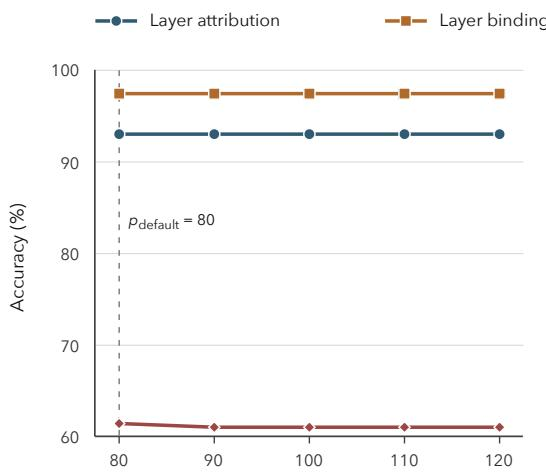  
(a) Minimum overlap area, p (pixels)

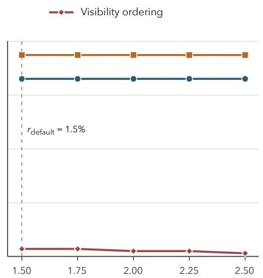  
(b) Minimum overlap ratio, r (%)  
Figure 8: Sensitivity of Understanding accuracy to the overlap thresholds used for Visibility Ordering questions. Each panel varies one threshold while fixing the other at its default value. The dashed lines mark the defaults. The Visibility Ordering subset contains 94–96 test questions across the sweep.

OCR string agreement. Table 9 reports OCR agreement on the eligible text-editing subset. OmniGen2 has the highest OCR Exact score, while Qwen Image Edit 2509 has the highest OCR-NES. On this common set, OmniGen2 more often matches the complete reference string, whereas Qwen Image Edit 2509 attains higher average string similarity when partial matches receive credit.

## G SENSITIVITY TO VISIBILITY THRESHOLDS

We test how the reported family results change under alternative thresholds used to instantiate visibility cases. Model outputs remain fixed; only the relevant item selection or family assignment is recomputed.

Understanding. A Visibility Ordering question is retained when its overlap area is at least p pixels and the overlap covers at least a fraction r of the smaller component. The default values are $p \ = \ 8 0$ and $r ~ = ~ 0 . 0 1 5$ , while visible support is defined using the fixed alpha cutoff $\alpha > 8 .$ We vary one overlap threshold at a time, using $p \in \{ 8 0 , 9 0 , 1 0 0 , 1 1 0 , 1 2 0 \}$ with $r = 0 . 0 1 5$ , and $r \in \{ \dot { 0 . 0 1 5 } , 0 . 0 1 7 5 , 0 . 0 2 0 , 0 . 0 2 2 5 , 0 . 0 2 5 \}$ with $p = 8 0$ . We report Qwen3.5-27B, the strongest evaluated model by macro-average accuracy in the main Understanding results.

Figure 8 shows that Visibility Ordering accuracy remains between 60.64% and 61.46%. Layer Attribution and Layer Binding stay at 93.04% and 97.46%, respectively, because their item sets do not depend on the overlap thresholds. The ordering of the three families is therefore unchanged across the tested stricter overlap criteria.

Editing. A candidate is assigned to the Visibility-constrained family when the selected overlap contains at least k active pixels, with $\begin{array} { r l r } { k } & { { } = } & { 1 6 } \end{array}$ used by default. We vary $k \in$ {8, 12, 16, 20, 24, 28, 32}. Candidates that fall below the cutoff are reassigned to the Local target family, while Binding-consistent assignments and the 4,614-item analysis pool remain fixed. The family mIoU values are then recomputed from the existing item scores.

As shown in Figure 9, the Visibility-constrained family has the lowest mIoU for every editor at every tested cutoff. The largest change among the displayed curves is 0.15 percentage points. From $k = 8 \mathrm { t o } k = 3 2$ , the number of Visibility-constrained edits decreases from 723 to 714, with the nine reassigned cases entering the Local target family; the Binding-consistent family remains at 444

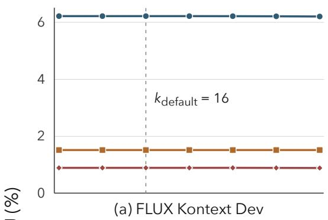

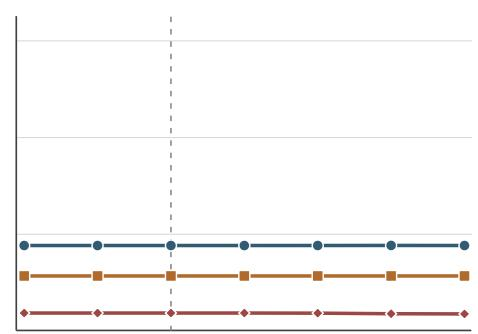  
(b) InstructPix2Pix

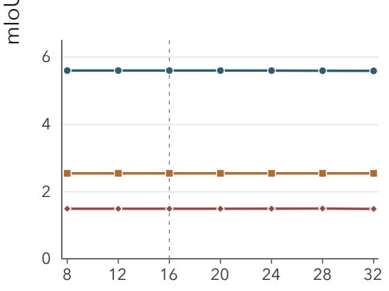  
(c) OmniGen2

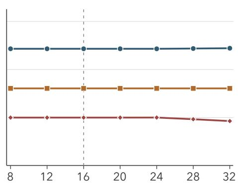  
(d) Qwen Image Edit 2509  
Active-pixel cutoff, k  
Figure 9: Sensitivity of editing mIoU to the active-pixel cutoff k. Each panel reports the three editing families for one editor after recomputing family assignments at each cutoff. The dashed lines mark the default $k = 1 6$  
items. Thus, the family-level pattern reported in the main evaluation is stable within the tested range of k.