# Certified Topological Interaction in Neural Representations: Class Disentanglement Is Mostly Pairwise

Sushovan Majhi∗

## Abstract

Class disentanglement—the separation of a representation’s class-conditional point clouds along depth and over training—is usually read of descriptive curves. We measure it as certified topological interaction between labeled point clouds, using the recently introduced Intersection Euler Characteristic Profile: the Euler characteristic of the overlap of the clouds’ ball unions as a function of scale, computed by one Alpha-complex sweep with no boundary-matrix reduction. Every number carries a test: exact permutation tests in both directions, a guarded separation certificate, and a paired test for the comparative claims applications make. Across 111 trained networks and 52,650 certified measurements, disentanglement is depth-graded and concentrated in the first epochs, and interaction quotients rank class pairs by confusability (Spearman $\rho = 0 . 8 3 )$ on par with cheap separability statistics. In a 96-model factorial population, augmentation is the one training choice that separates classes relative to chance; weight decay compresses the overlap without separating, and depth and width do nothing. The structural finding is one only a �-fold statistic can pose: the joint entanglement of a class triple sits below that of its strongest pair in 97% of triple–layer cells and 99.5% of deep cells, far below a measured null floor, in vision encoders and frozen language models alike. This pairwise dominance is a regularity, not a law: expected from the nesting of overlaps but not forced by geometry, present at initialization and in raw pixels, and manufactured in the last stage alone when a network memorizes random labels. The unnormalized profile mass predicts test accuracy $( R ^ { 2 } = 0 . 9 4 )$ , the quotient does not, and neither beats a linear probe. One lesson is reported in full: the paired test must use a scale-free statistic, or it certifies feature-norm dynamics as disentanglement.

## 1 Introduction

A trained image classifier is, up to its last layer, a map from images to points in a feature space, and the images of two classes—cats and dogs, say—trace out two point clouds there. At the input these clouds are hopelessly intermixed, since a cat and a dog difer mainly in pose and background; at the output they are cleanly apart, since the classifier’s last step is a linear cut. Somewhere in between, the network pulls them apart. Figure 1 shows this for one pair through the stages of a residual network: at the stem the clouds interpenetrate everywhere, two stages later they are still mixed, and at the third stage they have separated. This paper is about measuring that separation—how much two, or more, classes still overlap at a given layer and at which scales, and whether an observed change between two layers, or two epochs, is more than chance.

## 1.1 Class separation, and how it has been measured

The geometric reading is by now standard. Each class � induces a point cloud $X _ { c } ^ { ( \ell ) } ~ = ~ \{ f _ { \ell } ( x )$ label(�) = �} in the representation at layer $\ell ,$ and learning can be read as these clouds becoming progressively disentangled—topologically separated—with depth and with training. We use “disentanglement” throughout in this sense of class separation in feature space, following Wagner et al. (2026). It is distinct from the factorized-latent sense of �-VAE (Higgins et al., 2017) and of the DCI and mutual-information-gap metrics (Chen et al., 2018; Eastwood and Williams, 2018), in which individual coordinates track independent generative factors; neither sense implies the other, and we make no claim about factorized structure. We do take one lesson from that literature: Locatello et al. (2019) showed that its conclusions had been driven by metric choice and random seed, a fact visible only in a sweep over thousands of models, and that descriptive scores without a null distribution have no way to be wrong.

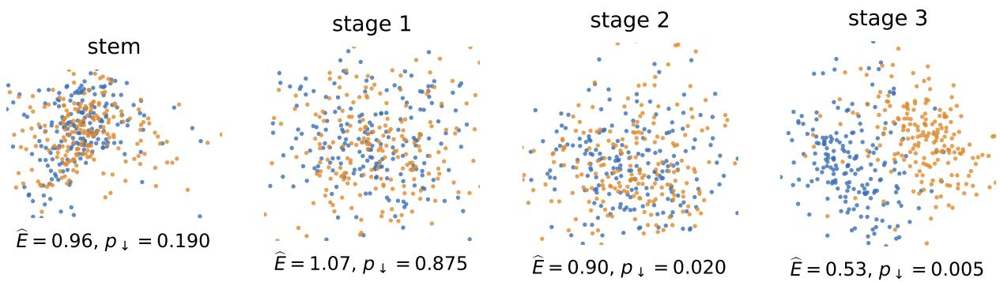  
Figure 1: What the paper measures. Cat (blue) against dog (orange) through the stages of the CIFAR-10 ResNet-56: a two-dimensional shadow of each stage’s $d _ { 0 } = 5$ clouds (� = 200 per class), with the interaction quotient and separation �-value (� = 199) under each panel. The pair is exchangeable with a random relabeling through stage 1, first certified separated at stage 2, and at quotient 0.53 at stage 3, the penultimate representation. Definitions in Sections 2–3.

That classes separate has been established repeatedly, in four largely disjoint vocabularies. Probes: a linear classifier trained on each layer’s features grows more accurate monotonically with depth (Alain and Bengio, 2017). Manifold capacity: in the statistical-mechanics account, per-class object manifolds shrink and decorrelate along the hierarchy and the capacity of a downstream perceptron grows accordingly (Cohen et al., 2020). Terminal geometry: neural collapse (Papyan et al., 2020) describes the late-training limit in which class means form a simplex and within-class variability vanishes, the endpoint of disentanglement; its within-class collapse statistic has since been measured layer by layer (Rangamani et al., 2023), and the generalized discrimination value of Schilling et al. (2021) is a per-layer class-separability score in the same spirit. Global similarity: CKA (Kornblith et al., 2019) compares whole representations across layers and models, and intrinsic dimension falls through the final layers, with the last hidden layer’s dimension predicting test accuracy (Ansuini et al., 2019); neither is class-conditional. Closest to our object, Naitzat et al. (2020) track the Betti numbers of class regions through depth and show that networks simplify topology layer by layer; their object is the topology of one region at a time, ours the interaction between several.

Each of these is a real measurement, and none of them is a measurement of overlap. Probes and capacity are linear-separability notions and answer a question about a decision boundary rather than about the geometry of the clouds: two classes can be perfectly linearly separable while their thickened supports interpenetrate at every scale below the margin, and conversely. CKA and intrinsic dimension are not defined for a specified class subset, so they cannot say which classes are still entangled. Collapse statistics and discrimination values are descriptive scores without a null distribution. And none is defined for a set of � > 2 classes jointly, so none can pose the question of whether three classes remain jointly entangled when no pair does. Quantifying the overlap itself gives a label for representation quality, a diagnostic for training dynamics, and, potentially, a predictor of generalization.

## 1.2 Topological interaction, and the inference it lacks

Wagner et al. (2026) measure pairwise class entanglement with the mixup barcode,1 summarized by a scalar “total mixup,” and show that it tracks how a network disentangles its classes through depth and training. The construction has four limitations that matter precisely for this application. It is pairwise, defined for an inclusion � ↩→ � of two clouds, and asymmetric, since a foreground cloud is privileged; it is descriptive, in that no hypothesis test certifies that an observed change exceeds chance; and it is expensive, because image-persistence reduction costs $O ( N ^ { 3 } )$ in the simplex count, which limits how many layers, epochs, and seeds can be swept. Chromatic topological data analysis (Cultrera di Montesano et al., 2024) also studies several colored clouds, through a six-pack of persistence diagrams built on chromatic Delaunay complexes; it is richer but costlier, likewise untested, and not specialized to representation analysis. Elsewhere, topological data analysis has been applied to network weights (Rieck et al., 2019), as a diferentiable regularizer on latent spaces (Moor et al., 2020) and on class separation at decision boundaries (Chen et al., 2019), to the persistent homology of labeled complexes that characterize decision boundaries (Ramamurthy et al., 2019), to neuron correlations as a predictor of test error without a test set (Corneanu et al., 2020), and to the fractal geometry of optimization trajectories, where persistent-homology dimension predicts generalization (Birdal et al., 2021). Euler characteristic curves and profiles as a stable, reduction-free shape summary are due to Dłotko and Gurnari (2023), are by now an established cheap alternative to persistence in learning pipelines (Hacquard and Lebovici, 2024), and have been made diferentiable as transforms (Röell and Rieck, 2024); we apply them to the interaction of class clouds rather than to a single dataset.

The third limitation is not peculiar to the mixup barcode. Probe accuracy, manifold capacity, CKA, intrinsic dimension, and collapse statistics are all reported in practice as descriptive numbers, so the sentence a representation-analysis paper actually wants to write—“layer ℓ + 1 is more disentangled than layer ℓ,” “this epoch is where the classes separate”—is usually an eyeball judgment about a curve, with no null distribution behind it and no control of the error rate incurred by reading hundreds of such curves. The inferential tools exist and are textbook: a label-permutation test of exchangeability and a sign-flip test on paired diferences (Lehmann and Romano, 2005). Permutation-calibrated twosample tests of the same exchangeable null are standard in machine learning—kernel MMD (Gretton et al., 2012), energy distance (Székely and Rizzo, 2013), classifier two-sample tests (Lopez-Paz and Oquab, 2017)—and any of the descriptive separability scores above can be calibrated the same way, as we do for four of them (Experiment E3). In topological data analysis, confidence sets for persistence diagrams separate signal from noise in a single sample (Fasy et al., 2014), permutation tests for collections of diagrams are due to Robinson and Turner (2017), topological goodness-of-fit tests to Dłotko et al. (2024), and a universal null distribution for persistence-based statistics to Bobrowski and Skraba (2023). The object tested there is the shape of one sample or a comparison of diagrams, not the interaction of two labeled samples, and we are not aware of a paired test for topological summaries. What is missing, then, is not an inferential layer for the field but the routine application of these tools to comparative claims about representations. Doing that for a topological measure of class overlap—together with the guard and the scale-free paired statistic that this particular measure turns out to need—is the main business of this paper.

## 1.3 Our contributions

We measure class disentanglement with the Intersection Euler Characteristic Profile (Intersection ECP) of Kawamura et al. (2026): the Euler characteristic of the region where the thickened class clouds overlap, as a function of the thickening scale (Section 2). It removes each of the four limitations. It is symmetric; it is defined for every $k ,$ so that it measures joint, multi-class entanglement and not only pairs; it is computed by a single sorted Alpha-complex sweep with no matrix reduction; and it admits an exact, distribution-free permutation test. Section 3 turns it into a measurement protocol with a certificate attached to every number: exact one-sided tests in both directions, the guarded separation certificate that the Euler characteristic specifically needs, a paired sign-flip test on a scale free statistic for the comparative claims that trajectory analyses actually make, and an interaction quotient comparable across layers, epochs and models. The guarantees are elementary and are proved in Appendix A. “Certified” here means a hypothesis test with an exact level, not the margin certificate that landmark-based persistence vectorizations now carry (Majhi et al., $2 0 2 6 \mathrm { b } , \mathrm { c } )$

The campaign of Section 4 covers 111 trained networks and 52,650 certified measurements. Its findings are four.

• Disentanglement is certified, depth-graded and early. The interaction quotient ranks MNIST pairs by confusability (Spearman $\rho = 0 . 8 3 ; \mathrm { E } 1 )$ ; deep layers do almost all of the separating (E2), and most certified changes fall within the first eight epochs (E3); a from-scratch ViT disentangles non-monotonically, an artifact that pretraining removes (E2). The tests are calibrated (E4), and every conclusion survives the choice of projection dimension (E8).

• Pairwise dominance, the finding only a �-fold statistic can pose. The joint entanglement of a class triple sits below that of its strongest pair in 97% of triple–layer cells and 99.5% of deep cells, far below a measured null floor, with the exceptions listed (E2) and the interaction spectrum decaying in order (E7). It is a regularity, not a law: expected from the nesting of overlaps but not forced by geometry, present at initialization and in raw pixels, manufactured in the last stage alone when a network memorizes random labels (E9), and reproduced on two frozen language models (E10).

• What the measure is for. In a 96-model factorial population, augmentation is the one training choice that separates classes relative to chance; weight decay compresses the overlap without separating; depth and width do nothing (E11). The unnormalized profile mass predicts test accuracy $( R ^ { 2 } = 0 . 9 4 )$ , the quotient does not, and neither beats a linear probe (E5).

• Two negatives, reported in full. Diferentiable surrogates for the quotient steer training the wrong way, each for an identifiable reason (E6); and the paired test certifies feature-norm dynamics as disentanglement unless its statistic is scale-free (E3).

Following Turkeš et al. (2022), we ask on which tasks the topological statistic beats the alternatives and say where it does not: for ranking pairwise confusability and for timing disentanglement over training, a nearest-neighbour cross-class rate on the same clouds does as well (E1, E3). Its value lies in the certificate, the �-fold terms, and the scale resolution, which the cheap statistics do not ofer.

## 2 The Intersection ECP

We recall only what is needed; all constructions, proofs, stability, and complexity are in Kawamura et al. (2026).

$$
r = 0 . 0 8 < r ^ { \ast }
$$

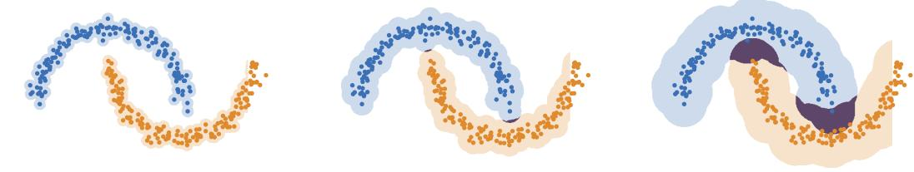

interaction quotient $\widehat { E } = 0 . 1 7 .$ , separation $p _ { \downarrow } = 0 . 0 0 5$ , excess p = 1.00 (B = 199)  
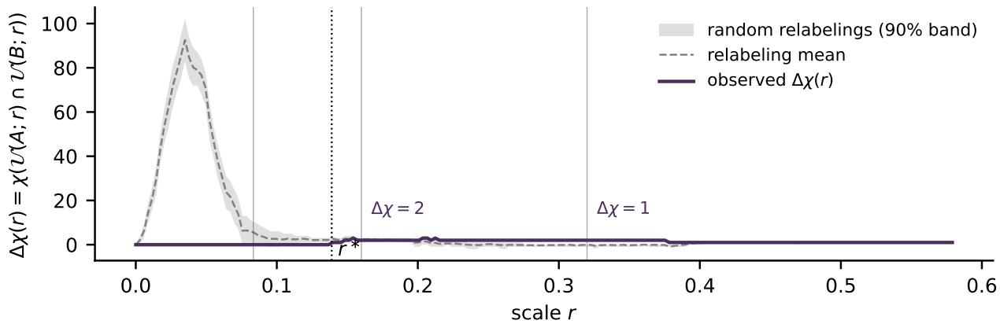  
Figure 2: The measurement, on two interlocking clouds. Top: the ofsets at three scales with the intersection shaded—disjoint below $r ^ { * } .$ , then two arcs $\left( \chi = 2 \right)$ , then one band $( \chi = 1 )$ . Bottom: the profile $\Delta \chi ( r )$ against random relabelings of the pooled points (mean and 90% band): quotient 0.17, separation certified at $p _ { \downarrow } = 0 . 0 0 5$ , no excess.

## 2.1 The invariant and its properties

Write $\begin{array} { r } { \mathcal { U } ( S ; r ) = \bigcup _ { p \in S } B ( p , r ) } \end{array}$ for the �-ofset of a set $S \subseteq \mathbb { R } ^ { d }$ ; following Kawamura et al. (2026) we use the same notation whether � is a finite cloud or a compact support, so that sample and population ofsets read alike. For finite clouds $X _ { 1 } , \ldots , X _ { k } \subset \mathbb { R } ^ { d }$ and scales $\mathbf { t } = \left( t _ { 1 } , \ldots , t _ { k } \right)$ , the Intersection ECP is

$$
\Delta \chi ( { \bf t } ; X _ { 1 } , \ldots , X _ { k } ) = \chi \Big ( \bigcap _ { i = 1 } ^ { k } \mathcal { U } ( X _ { i } ; t _ { i } ) \Big ) ,
$$

the Euler characteristic of the overlap of the thickened clouds. On the diagonal $\mathbf { t } = ( r , \ldots , r )$ we write $\Delta \chi ( r )$ ; for $k = 2$ it is the inclusion–exclusion defect $\chi _ { X } ( r ) + \chi _ { Y } ( r ) - \chi _ { X \cup Y } ( r )$ . It is a piecewise-constant integer curve in $r ,$ identically zero below first contact (Kawamura et al., 2026, Lem. 3.1), equal to the number of contact points at first contact (Kawamura et al., 2026, Lem. 3.2), and thereafter zero exactly when the overlap’s Betti numbers cancel (Section 2.2). Figure 2 shows the construction and the test on two clouds in the plane.

Four properties carry the paper. Three are established in Kawamura et al. (2026); the remaining one, the inferential layer (P3), is what the present paper supplies—Kawamura et al. develop the invariant, its stability, and its sampling theory, and leave hypothesis testing to future work.

P1 Symmetry and �-naturality. $\Delta \chi$ treats the clouds symmetrically and is defined for every � by intersecting � ball unions; no foreground class, no choice of order.

P2 Cheap computation. $\Delta \chi ( \cdot ; X , Y )$ is computed from the Euler characteristic curves of the Alpha complexes of $X , Y , X \cup Y$ by a single sorted sweep of signed simplex counts, in $O ( n ^ { \lceil d / 2 \rceil } \log n )$

r = 0.024 < r : disjoint

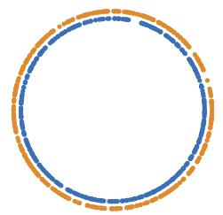  
r = 0.12: annulus, = 0

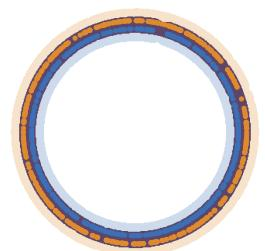  
r= 0.30: annulus, = 0

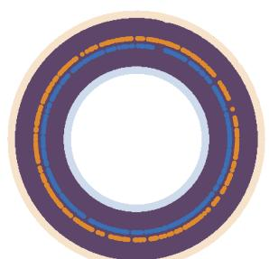

unguarded test: $p _ { \downarrow } = 0 . 0 0 5$ would certify separation of two clouds that meet at every $r \geq r ^ { * } = 0 . 0 4 0$  
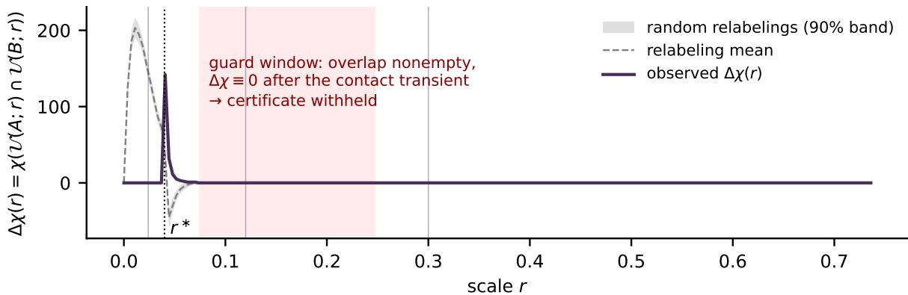  
Figure 3: The blind spot, and the guard. Two concentric rings meet from $r ^ { * } = 0 . 0 4 \mathrm { { o n } } .$ , their overlap is an annulus, and $\chi$ vanishes on it at every larger scale, so the unguarded test would certify separation $( p _ { \downarrow } = 0 . 0 0 5 ;$ Theorem 1). The guard sees a nonempty overlap with $\Delta \chi \equiv 0$ after the contact transient (shaded) and withholds the certificate.

time with no boundary-matrix reduction (Kawamura et al., 2026, Thm. 6.5)—asymptotically below the $O ( N ^ { 3 } )$ of image persistence.

P3 Hypothesis test. An exact, distribution-free permutation test (label shufling) certifies at level � that two clouds interact more—or, in the opposite tail, less—than chance, for any sample size. This is developed in Section 3.2.

P4 Stability. under a Hausdorf perturbation of size � the intersection filtrations are �-interleaved, their diagrams are within bottleneck distance �, and the profiles satisfy $d _ { L ^ { 1 } } \big ( \Delta \chi , \Delta \chi ^ { \prime } \big ) \leq 2 \epsilon \big ( N +$ $N ^ { \prime } )$ with $N , N ^ { \prime }$ the bar counts (Kawamura et al., 2026, Thm. 2.12, Prop. 3.12); the finite-sample guarantee proper is the recovery theorem (Section 3.4).

## 2.2 What Δ� cannot see

Because $\chi$ is an alternating sum, an overlap region with balanced Betti numbers is invisible: an annulus- or torus-shell-shaped intersection has $\chi = 0$ across an entire scale plateau, bit-identical to no overlap at all—a structural, scale-stable cancellation that the profile provably cannot detect (Kawamura et al., 2026, §4 and the saturation experiment therein). For disentanglement measurement this is a live failure mode, not a corner case: two class clouds arranged around a shared loop would register as perfectly separated (Figure 3). The quantity that disambiguates is the first interaction scale

$$
r ^ { * } \ = \ \operatorname* { i n f } \{ r \geq 0 : \mathcal { U } ( X ; r ) \cap \mathcal { U } ( Y ; r ) \neq \emptyset \} ,
$$

which is half the smallest cross-class distance, the diagonal boundary of the dead zone of Kawamura et al. (2026, Lem. 3.2); it falls out of the same Alpha-complex sweep at no extra cost and separates “zero because empty” from “zero because cancelling.” Section 3.2 builds it into the separation certificate. When $\Delta \chi \approx 0$ on a range where $r ^ { * }$ certifies a nonempty overlap, the escalation is to the Betti curves of the overlap filtration—the overlap-homology comparison of their saturation experiment—or to the relative-homology refinement of Kawamura et al. (2026, §4) itself; either separates the two cases outright, at the cost of a persistence computation on the overlap alone.

## 3 Certified measurement of disentanglement

Every number reported below carries a test. This section fixes the measurement—class clouds, projection, grid, and the interaction quotient—and then the tests: what each certifies, in which direction, and how multiplicity is controlled. The guarantees are elementary and are proved in Appendix $\operatorname { A } ;$ sharper procedures—structured multiplicity control along the spectrum’s floors, and an analytic null that would calibrate without permutations—are left to future work.

## 3.1 Class clouds, projection, and the interaction quotient

Fix a trained (or mid-training) network and a layer ℓ with feature map $f _ { \ell }$ . For classes $c _ { 1 } , \ldots , c _ { k }$ draw � examples each and form $X _ { i } ^ { ( \ell ) } = \{ f _ { \ell } ( x ) : \mathrm { l a b e l } ( x ) = c _ { i } \}$ . Because the Alpha complex scales as $n ^ { \lceil d / 2 \rceil }$ we project to a low dimension $d _ { 0 }$ by PCA before computing (E8 and Appendix D study sensitivity to $d _ { 0 } )$ ; this matches the protocol of Wagner et al. (2026). The projection is fitted once per layer on the pooled features of all classes under test (the ten classes of a network; the pair itself in E1) and never sees the labels, and the scale grid below is likewise a function of the pooled cloud, so both are invariant under the relabelings of Section 3.2 and the permutation tests remain exact. Concretely, features are those of the held-out images (the test split; for the CIFAR-100 subset, whose test split has only 100 images per class, the unaugmented training split of 500 per class), the headline clouds are the first $m = 2 0 0$ images of each class, and the paired tests of Section 3.3 use $F = 8$ disjoint folds of 100 images per class (62 for the CIFAR-100 subset) cut from the same projection. The scale grid has 200 points from 0 to half the median pairwise distance of the pooled pair, and every functional below is evaluated on it. The grid is a convenience, not a necessity: the profile is a step function whose breakpoints are the critical values of the three Alpha filtrations (some $7 \times 1 0 ^ { 4 }$ per pair at $m = 2 0 0 , d _ { 0 } = 5 )$ , so its mass could be summed exactly; on the 45 MNIST pairs of E1 the grid mass is within ±2% of the exact one, and the permutation tests are exact for either statistic. What the grid does fix is the range of scales, its upper end. Projection is also conservative in the direction we certify:

Proposition 1 (Projection is conservative for separation). Let $P : \mathbb { R } ^ { D }  \mathbb { R } ^ { d _ { 0 } }$ be an orthogonal projection and let �, $Y \subset \mathbb { R } ^ { D }$ be finite. Writing $\begin{array} { r } { r ^ { * } ( X , Y ) = { \frac { 1 } { 2 } } \operatorname* { m i n } _ { x \in X , y \in Y } \| x - y \| f o r } \end{array}$ the first interaction scale of Section 2.2,

$$
r ^ { * } ( P X , P Y ) \ \leq \ r ^ { * } ( X , Y ) .
$$

Consequently, if the projected ofsets are disjoint at scale �—that is, $r \ < \ r ^ { * } ( P X , P Y ) { \mathrm { - } } t h e n \ { \mathcal { U } } ( X ; r )$ ∩ $\mathcal { U } ( Y ; r ) = 0$ in the ambient representation as well.

Proof. � has operator norm 1, so $\| P x - P y \| = \| P ( x - y ) \| \leq \| x - y \|$ for all $x , y ;$ taking the minimum over $x \in X , y \in Y$ gives the inequality. If $r < r ^ { * } ( { P X } , { P Y } )$ then $r < r ^ { * } ( X , Y )$ , and $\mathcal { U } ( X ; r ) \cap \mathcal { U } ( Y ; r ) \neq \emptyset$ would force some $\| x - y \| < 2 r$ , a contradiction. □

Projection can therefore only make classes look more entangled, never more separated: every firstcontact scale, and hence every guard decision of the form $\hat { r } ^ { * } > r ,$ , transfers from the $d _ { 0 }$ -dimensional shadow to the full-dimensional representation; the permutation certificate itself is a statement about the projected clouds. The converse fails—apparent entanglement in the projection may be an artifact of it—which is one more reason the claims we certify are the separation claims (Section 3.2), and why “remains entangled” is only ever a magnitude comparison here.

The entanglement of classes $( c _ { 1 } , \ldots , c _ { k } )$ at layer ℓ is a functional of the Intersection ECP of their class clouds,

$$
E _ { \ell } ( c _ { 1 } , \dots , c _ { k } ) \ = \ \Phi \big ( \Delta \chi ( \cdot ; X _ { 1 } ^ { ( \ell ) } , \dots , X _ { k } ^ { ( \ell ) } ) \big ) , \qquad \Phi \in \Big \{ \operatorname* { m a x } _ { r } | \Delta \chi ( r ) | , \int | \Delta \chi ( r ) | d r \Big \} .
$$

Both functionals vanish for separated clouds and grow with entanglement. The $L ^ { 1 }$ bound of P4 controls the change of the integrated mass, which is the functional used for every certified claim below; it does not control the peak statistic (Kawamura et al., 2026, §3.5), which we report only descriptively. Raw values of $\Phi$ carry the layer’s density, dimension and feature scale, so we normalize to the interaction quotient

$$
\widehat { E } _ { \ell } \ = \ \frac { \Phi \big ( \Delta \chi ( \cdot ; X _ { 1 } ^ { ( \ell ) } , \ldots , X _ { k } ^ { ( \ell ) } ) \big ) } { \mathbb { E } _ { H _ { 0 } } \big [ \Phi \big ] } ,
$$

where the denominator is the expected value of the same functional under the exchangeable null— estimated at no extra cost as the mean of the � permutation replicates already computed for the test of Section 3.2. The quotient is dimensionless, is centred at 1 when the classes are exchangeable (numerator and denominator are then evaluations of one statistic on exchangeable splits), and tends to 0 under separation; because numerator and denominator share the layer’s density, dimension $d _ { 0 } .$ , sample size and grid, it is comparable across layers, epochs, and models, which raw $\Delta \chi$ values are not. Disentanglement is a decrease of $\widehat { E } _ { \ell }$ along depth (ℓ increasing) or training (epoch increasing). Throughout, the head statistic is the raw mass $\int | \Delta \dot { \chi } | d r$ and its quotient; the paired tests use a dimensionless form of the mass (Section 3.3).

## 3.2 Two one-sided tests, and the guarded certificate

Let $H _ { 0 }$ be that � and � are i.i.d. from a common distribution. Under $H _ { 0 }$ the labels are exchangeable, so for a profile functional $T = \Phi ( \Delta \chi )$ and � random relabelings,

$$
p _ { \uparrow } = \frac { 1 + \# \{ b : T ^ { \sigma _ { b } } \geq T _ { \mathrm { o b s } } \} } { 1 + B } , \qquad p _ { \downarrow } = \frac { 1 + \# \{ b : T ^ { \sigma _ { b } } \leq T _ { \mathrm { o b s } } \} } { 1 + B }
$$

are both exact at any sample size and any � (Proposition 2). The distinction matters and conflating the two costs all power against one of them: $p _ { \uparrow }$ detects excess interaction, while $p _ { \downarrow }$ detects separation— the overlap topology is poorer than a random relabeling predicts. For class clouds the permuted splits interpenetrate maximally, so a layer that separates its classes drives $T _ { \mathrm { o b s } }$ into the lower tail. It is $p _ { \downarrow }$ , not $p _ { \uparrow }$ , that certifies disentanglement. The low-tail permutation test on this invariant was introduced for regime detection in dynamical systems by Majhi et al. (2026a), where a transition is declared when the overlap of two time-series windows is unusually low; here the same test certifies the separation of class clouds, and the paired form of Section 3.3 is new. The right tail is retained as a directional sanity check but, empirically, never fires on labeled class clouds—no class split interpenetrates more than a random relabeling (E1: 0/45 MNIST pairs)—so claims below that a pair “remains entangled” are statements about the magnitude of its interaction quotient relative to other pairs and conditions, not about $p _ { \uparrow }$

The separation certificate must be guarded. On a configuration that is $\chi \cdot$ -blind in the sense of Section 2.2, the separation test does not merely lose power: it rejects with probability tending to one, certifying separation exactly where the clouds meet (Theorem 1). The repair is the first interaction scale $r ^ { * }$ , which falls out of the same sweep at no cost and is a consistent estimate of the population first contact scale (Lemma 1): the guarded certificate withholds a separation claim whenever the profile is silent on the scales immediately beyond $\hat { r } ^ { * }$ , where the sampled ofsets provably meet (Corollary 1). Every separation claim in this paper is of the guarded kind, and Experiment E4 reports how often the guard fired. Operationally, a pair is certified separated in a cell when its $p _ { \downarrow }$ survives Benjamini– Hochberg within that cell’s family of 45 pairs and the guard is silent, the guard being evaluated on the quarter of the grid immediately beyond $\hat { r } ^ { * }$ . A sampled pair first meets in isolated contact points, a transient of a few grid points with $\Delta \chi > 0 .$ , so the released code also implements a plateau form of the guard: it waits for the profile’s first return to zero after contact and fires only if that return comes within the quarter-window and the profile then stays at zero on at least 90% of the following quarter, the signature of an annular overlap and not of a blob (Figure 3). Both forms were evaluated on the campaign (E4). The certificate says that the overlap topology of the pair is significantly poorer, over the whole scale range, than a random relabeling produces; it does not say the ofsets are disjoint. What remains of the interaction is what the quotient reports, and certified pairs carry quotients anywhere from 0.05 to 0.9.

## 3.3 Comparative claims: the paired test

Rejecting $H _ { 0 }$ is rarely the interesting event here: distinct classes are essentially never exchangeable at any layer of a trained network, so the one-sided tests answer only the absolute question. The claims that carry the application are comparative—layer ℓ + 1 is more disentangled than layer $\ell ,$ entanglement dropped between epochs $e$ and $e ^ { \prime } { \mathrm { . } }$ —and need a two-condition inference. We use a paired subsampled design (Appendix A.2): split the inputs into � disjoint folds, pass each fold through both conditions to obtain paired replicates and their diferences $D _ { s } .$ , and calibrate by the sign-flip test, which is exact at finite � for the symmetric null; its smallest attainable two-sided �-value is $2 / 2 ^ { F }$ , so it can reject at level � whenever $2 ^ { F - 1 } \geq 1 / \alpha \ ( F \geq 6 \mathrm { a t } \alpha = 0 . 0 5 )$ . We take $F = 8 ,$ , so the floor is $2 / 2 5 6 \approx 0 . 0 0 8$ The sign of $\bar { D }$ is read of after the two-sided test. The fold statistic must be scale-free. The raw profile mass $\int | \Delta \chi | d r$ has units of feature length on the data-adaptive grid of Section 3.1, so a paired test on it across epochs certifies changes of feature norm as changes of interaction; we therefore pair the dimensionless mass $\int | \Delta \chi | d r / r _ { \mathrm { m a x } }$ , with $r _ { \mathrm { m a x } }$ the top of the grid (dividing by the pair’s permutationnull mean at that checkpoint instead gives the same picture). Experiment E3 reports what the raw statistic certified instead, as a cautionary contrast.

## 3.4 Estimation and multiplicity

At scales regular for both the population and the sample filtration, the sample profile equals the population one once the samples are �-dense, with a sample complexity of order $\epsilon ^ { - k } ( \log ( 1 / \epsilon ) + \log ( 1 / \delta ) )$ in the intrinsic dimension � of the class supports rather than the ambient or projected feature dimension (Proposition 4, restated from the foundations paper). This is what licenses reading the measured profile as a property of the representation rather than of the sample.

Across the layers × pairs × epochs sweep we control the false discovery rate by Benjamini– Hochberg at $q = 0 . 0 5$ , applied separately within each claim family; for the trajectory tests of E3 a family is the 45 class pairs of one seed, layer, and epoch step. Those 45 statistics share the fold split and the pooled clouds, so they are dependent; we assume they satisfy positive regression dependence on the true nulls, under which Benjamini–Hochberg controls the false discovery rate at $q$ (Benjamini and Yekutieli, 2001, Thm. 1.2), we do not prove it, and we check its cost with the dependence-agnostic correction (Benjamini and Yekutieli, 2001, Thm. 1.3): the dependence-agnostic Benjamini–Yekutieli correction has threshold $i q / ( 4 5 H _ { 4 5 } )$ at rank $i ,$ with $H _ { 4 5 } \approx 4 . 4 0$ , so at $F = 8$ it can reject only when at least 31 of the 45 paired �-values sit at the floor $2 / 2 5 6$ . Run over the E3 families it retains 254 of the 2,707 BH rejections, all of them at the first epoch step: the early-training conclusion of E3 survives the stricter correction, the late learning-rate wave does not, and we say so where each is reported. Procedures that exploit the structure BH ignores (the spectrum’s floors form a descending chain, so their occupancy hypotheses admit fixed-sequence testing) need permutation replicates aligned across the family, which this campaign did not retain.

Algorithm 1: Layerwise disentanglement profile   
Input: network $f ;$ classes $c _ { 1 } , \ldots , c _ { k } ;$ � samples/class; PCA dim $d _ { 0 } ;$ functional Φ   
Output: $E _ { \ell }$ and �-value for each layer ℓ (and class subset)   
foreach layer ℓ do   
collect class clouds $X _ { i } ^ { ( \ell ) } = \{ f _ { \ell } ( x )$ : label $( x ) = c _ { i } \}$ ; PCA to $\mathbb { R } ^ { d _ { 0 } } \mathrm { ; }$   
compute $\Delta \chi ( \cdot )$ by Algorithm 1 of Kawamura et al. (2026) (Alpha-complex sweep, no   
reduction);   
$E _ { \ell } \gets \Phi ( \Delta \chi ) ;$   
permutation test: shufle labels � times, recompute Φ, report �-value (P3);   
return $\{ ( E _ { \ell } , p _ { \ell } ) \} _ { \ell }$ and the multi-class tensor $\{ E _ { \ell } ( c _ { S } ) \}$ ;

## 3.5 Multi-class structure

Unlike total mixup, $E _ { \ell }$ is defined for $k > 2 ,$ , in three informative regimes: (i) the pairwise matrix $E _ { \ell } ( c , c ^ { \prime } )$ over all class pairs, a representation-geometry analogue of a confusion matrix; (ii) the higherorder terms $E _ { \ell } ( c , c ^ { \prime } , c ^ { \prime \prime } )$ and beyond, which detect class triples (or larger groups) that remain jointly entangled when no pair is; and (iii) the interaction spectrum (Kawamura et al., 2026, Def. 2.19), the floors $\chi ( C _ { j } ) , C _ { j } ( r ) \ = \ \bigcup _ { | S | = j } \bigcap _ { i \in S } { \mathcal { U } } ( X _ { i } ; r )$ (“at least � classes meet”), of which $\Delta \chi$ is the top floor, exactly computable from pooled Euler curves by Jordan’s sieve (Comtet, 1974, Ch. IV) applied to the Euler integral of Kawamura et al. (2026, Def. 2.19), $\begin{array} { r } { \chi ( C _ { j } ) = \sum _ { m \geq j } ( - 1 ) ^ { m - j } { \binom { m - 1 } { j - 1 } } \sum _ { | S | = m } \Delta \chi _ { S } } \end{array}$ (the case $j = 1$ is their Lemma A.1). Each floor inherits the permutation tests and the interaction quotient verbatim, with the �-cloud null of Proposition 2. Since every floor is linear in the subset profiles, the spectrum adds no information beyond the subset family; its value is as a graded summary—the decay of $\widehat { E } ( C _ { j } )$ in � is the quantitative form of pairwise dominance, and the onset delays $r ^ { * } ( C _ { j } ) - r ^ { * } ( C _ { 2 } )$ record how much later deep multi-class overlap begins than first pairwise contact (Experiments E2, E7). The second floor is also the natural single summary of a layer: one number, one test, no multiplicity across pairs. On the five-class families of E7 it tracks the mean pairwise quotient of the same ten pairs at every layer of every model, a little above it because the union of overlaps is normalized by its own null (Appendix C); we report the pairwise mean in the experiments because the questions asked there are about particular pairs. Algorithm 1 summarizes the protocol.

## 4 Experiments

The campaign comprises 111 trained networks (104 in the main suite: the five E3 seeds, the three E2 models and the 96-model population of E5; plus a follow-up suite: two SimCLR encoders, a pretrained

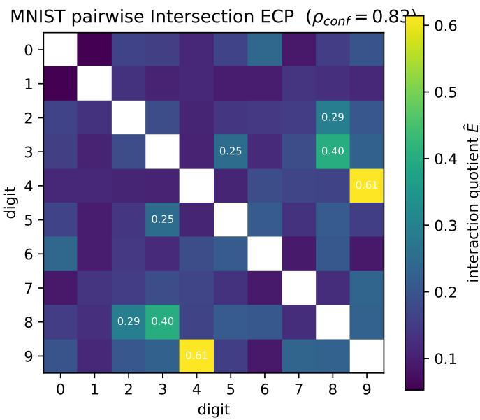  
Figure 4: Pairwise interaction quotients over the ten MNIST digits $( m = 2 0 0 / \mathrm { c l a s s }$ $d _ { 0 } = 5 )$ . All 45 pairs are certified separated; the residual quotient ranks pairs by confusability (Spearman $\rho = 0 . 8 3$ with a classifier’s confusion matrix). Annotated cells are the most entangled pairs.

ViT-B/16 finetune, and a 4-model learning-rate ablation), 1,170 (network, layer, checkpoint) cells, and 52,650 certified pairwise measurements—42,570 distinct clouds, since the stage-3 and penultimate rows of a ResNet are the same clouds measured twice—(the control arms of E6 and E9 add 17 further trained networks, and the initialization and language-model cells of E9–E10 lie outside these counts), computed by the GUDHI implementation of the Alpha-complex sweep (Kawamura et al., 2026) on CPU nodes with no persistence reduction anywhere. Protocol constants throughout: $m = 2 0 0$ points/class, $d _ { 0 } = 5$ (PCA), $B = 1 9 9$ permutations per test $( B = 9 9 9$ for escalations), $F = 8$ folds for paired tests, BH at $q = 0 . 0 5$ within claim families. Datasets are MNIST (LeCun et al., 1998) and CIFAR-10/100 (Krizhevsky, 2009); architectures are MLPs, residual networks (He et al., 2016), vision transformers (Dosovitskiy et al., 2021), and, for the label-free regime, SimCLR encoders (Chen et al., 2020). Training recipes: CIFAR ResNets use SGD with momentum 0.9, learning rate 0.1, batch size 128, cosine decay over 80 epochs, weight decay $5 \cdot 1 0 ^ { - 4 }$ and random-crop/flip augmentation unless an experiment says otherwise (the E5 population crosses weight decay $\{ 0 , 5 \cdot { 1 0 } ^ { - 4 } \}$ with augmentation on/of); the from-scratch ViT uses AdamW at learning rate $1 0 ^ { - 3 }$ , weight decay 0.05, 100 epochs; the ViT-B/16 finetune AdamW at $1 0 ^ { - 4 }$ , weight decay $1 0 ^ { - 4 }$ , 8 epochs, batch size 64; SimCLR learning rate 0.5, weight decay $1 0 ^ { - 4 }$ , 200 epochs, batch size 256; the random-label control weight decay $^ { 0 , }$ no augmentation, 150 epochs. E5’s regressions are ridge with the penalty chosen by cross-validation over $1 0 ^ { - 3 } – 1 0 ^ { 3 }$ . Code, configuration files, every measurement record, and the scripts that regenerate each number and figure accompany the paper.

Experiment (E1 — reproduce Wagner, at scale). Correlate the pairwise matrix of Figure 4 $\widehat { E } ( c , c ^ { \prime } )$ (interaction quotient, $\Phi = \int | \Delta \chi | )$ entrywise with the confusion matrix of a trained classifier (Spearman rank correlation over the 45 pairs), and verify the ranking is stable across $d _ { 0 } \in \{ 3 , 4 , 5 , 6 \}$ , points per class $m \in \{ 5 0 , 1 0 0 , 2 0 0 , 4 0 0 \}$ , and 5 independent resamples $( d _ { 0 } > 6$ is out of reach for Alpha complexes: a 7-dimensional complex on 400 points already exceeds $1 0 ^ { 7 }$ simplices).

The representation is the raw $2 8 \times 2 8$ pixel vector in [0, 1] (no network), and the clouds are $m = 2 0 0$ training images per class projected by a PCA fitted on the pooled pair; the confusion matrix is that of a multinomial logistic classifier on the top 50 pixel principal components, evaluated on the MNIST test set and symmetrized. On the identical $d _ { 0 } = 5$ clouds we also compute four cheap separability statistics—the Fisher ratio $\| \mu _ { 1 } - \mu _ { 2 } \| ^ { 2 }$ over the mean within-class variance, the energy distance, the 5-nearest-neighbour cross-class rate, and the cross-validated error of a logistic probe— and rank the pairs by each.

Result $( m = 2 0 0 , d _ { 0 } = 5 , B = 1 9 9 )$ . All 45 pairs are certified separated at $p _ { \downarrow } \leq 0 . 0 5$ , and the residual interaction quotient ranks pairs by confusability: Spearman $\rho = 0 . 8 3$ against the classifier’s symmetrized confusion matrix $( p = 2 . 4 \times 1 0 ^ { - 1 2 } )$ . The cheap statistics rank it comparably: 5-NN crossclass rate $\rho = 0 . 8 6$ , probe error 0.83, energy distance 0.77, Fisher ratio 0.74; the quotient correlates 0.87 with the neighbour rate itself. For ranking pairwise confusability, then, the topological statistic adds nothing over a nearest-neighbour count, and we do not claim otherwise; its value lies in the certificate, the �-fold terms and the scale resolution that the cheap statistics do not ofer. The most entangled pairs are (4, 9) $( \widehat { E } = 0 . 6 1 )$ , (3, 8) (0.40), (2, 8) (0.29); the least, (0, 1) (0.05), (6, 9) and (0, 7) (0.09). The ranking is stable across the full protocol sweep (Spearman vs. reference: median 0.87, minimum 0.73 over 80 sweep cells). No pair triggers $p _ { \uparrow } \leq 0 . 0 5$ , confirming that the certifiable direction on class data is separation (Section 3.2). See Figure 4.

Experiment (E2 — multi-class disentanglement vs depth). On CIFAR-10 (ResNet-56 and ViT-Tiny) and a 10-class subset of CIFAR-100 (ResNet-56), compute $ \overrightarrow { E } _ { \ell }$ through depth at every residual stage / transformer block: the full pairwise matrix, and a scan over all $\binom { 1 0 } { 3 } = 1 2 0$ class triples reporting the joint statistic $\widehat { E } _ { \ell } ( c , c ^ { \prime } , c ^ { \prime \prime } )$ against the maximum of its three pairwise restrictions (the $k = 3$ inclusion– exclusion has 7 Alpha-complex terms per evaluation, so the full-depth triple scan runs at $d _ { 0 } = 4 _ { : }$ with the deep layers rescanned at $d _ { 0 } = 5 ;$ ; E8 covers the $d _ { 0 }$ sensitivity of the pairwise results). One bookkeeping note applies to every ResNet cell in the paper: the penultimate representation is the globally pooled output of the last residual stage, so the “stage 3” and “penultimate” rows of a ResNet are the same point clouds measured twice, with independent permutation draws. Counts of measurements below include both rows; where a count is itself a claim (the dominance rate here) we report the deduplicated number.

Result: depth. Disentanglement is certified layer-by-layer and is strongly depth-graded (Figure 5). The CIFAR-10 ResNet-56’s mean pairwise quotient falls $0 . 7 2  0 . 6 3  0 . 5 7  0 . 1 8$ from stem to stage 3 (45/45 pairs certified at the deep stages); on the CIFAR-100 subset the deep-layer drop is sharper still $( 0 . 7 9 \to 0 . 0 6 )$ . The quotient tracks linear-probe accuracy inversely at every layer. The ViT is a contrast of standard recipes as much as of architectures (it is trained with AdamW at weight decay 0.05, the ResNets with SGD at $5 \cdot 1 0 ^ { - 4 } )$ : it disentangles less at every depth, and non-monotonically— its mean quotient falls to 0.31 at block 6 and rises again to 0.39 at the penultimate representation, with individual pairs remaining at quotients up to 0.88; consistently, it is the weakest generalizer of the three models. The cheap statistics of E1 computed on the same clouds give the same depth ordering for the ResNets—on CIFAR-10 the 5-NN cross-class rate falls $0 . 3 6  0 . 0 3$ and the Fisher ratio rises 0.5 → 10 from stem to stage 3—and disagree with the quotient in exactly one place, this ViT’s head, where they keep improving from block 6 to the penultimate representation $( 0 . 1 3  0 . 0 9 ;$ $2 . 6  4 . 2 )$ while the quotient rises $0 . 3 1  0 . 3 9$ : the overlap topology re-entangles even as nearestneighbour purity and mean separation improve. The non-monotonicity is a from-scratch artifact, not an architectural signature: finetuning a pretrained ViT-B/16 on the same data yields a monotone depth profile at every finetuning epoch, up to ±0.01 permutation noise among the deepest blocks—mean quotient $0 . 6 8  0 . 5 3  0 . 1 4  0 . 1 3  0 . 1 3$ from block 3 to the penultimate representation at epoch 6, with 45/45 pairs certified from block 9 down—and the profile is already monotone at epoch 0, i.e. before any finetuning. Suficient (pre-)training data, not the attention architecture, determines whether a ViT disentangles monotonically.

Result: higher-order scan. Across all 120 triples at every layer of the three architectures $( d _ { 0 } = 4 ;$ 1,560 distinct triple–layer cells after removing the stage-3/penultimate duplicates), the joint quotient sits at or below the largest of its three pairwise quotients in 1,509 cells (96.7%), at an overall median ratio $\widehat { E } _ { \mathrm { t r i p l e } } / \mathrm { m a x } _ { \mathrm { p a i r s } } \widehat { E }$ of 0.63 (Figure 6). The exceptions are reported in full: 44 on the CIFAR-100- subset ResNet-56, spread over all four stages (ratios up to 1.11 in the stem and 1.22 in stage 3, on a model whose early-layer pairs sit near the null), and $7$ on the ViT—six in block $^ { 6 , }$ the block at which its depth profile turns, the largest at 1.41, and one in block 2 at 1.04; the CIFAR-10 ResNet-56 has none. A dimension-matched rescan of the deep layers at $d _ { 0 } = 5$ (600 distinct cells: the deep stage of each ResNet-56 and ViT blocks 6, 8 and the penultimate representation; also rerun at midtraining checkpoints of the E3 ResNet-20 with the same outcome) gives 597/600 (99.5%), median 0.47, maximum 1.07, the three exceedances all on the CIFAR-100 subset. The pattern that would falsify pairwise dominance outright—all three pairs certified separated with quotients $\leq 0 . 1 5$ while the joint quotient is $\geq 0 . 2$ and at least double the pairwise maximum—returns zero candidates at every layer, under both the screening and the escalated � = 999 tests. Dominance carries a test against the null floor measured in E9: an unstructured family registers as dominated 66 times in 80, with per seed median ratios of 0.85–1.03, whereas the 13 distinct cells of the full-depth scan have medians of 0.44–0.89 and the five deep cells of the rescan 0.43–0.52; a one-sided exact Mann–Whitney test of cell medians against the 20 null-seed medians gives $p = 3 . 3 \times 1 0 ^ { - 8 }$ for the full-depth scan and $p = 1 . 9 \times 1 0 ^ { - 5 }$ for the deep rescan (every Mann–Whitney test in this paper is exact and one-sided, on cell medians over all 120 triples). The regularity also survives the most plausible counterexample generator we could construct: two SimCLR encoders (ResNet-20, trained without labels, hence free of the cross-entropy pressure toward neural collapse) develop strong certified pairwise separation in their deep layers—mean quotient ≈ 0.30 at the penultimate stage, 45/45 pairs certified, remarkable for a label-free objective—yet their triple scans likewise return zero candidates: the largest jointvs-pairwise excess in either seed is +0.04 (seed 0, stage 1) and +0.03 (seed 1, stem), both within permutation noise of the pairwise level and neither in a deep layer, and in the deep layers every triple sits below its pairwise maximum (largest excess −0.07 and −0.08). Where joint quotients are large (early layers), they match the pairwise levels—triples inherit their pairs’ entanglement. Only a �-fold statistic could have asked the question; the answer is that for these trained classifiers the pairwise entanglement matrix carries almost all of the class-overlap structure the intersection invariant can see, with exceptions that are small, mostly in early and middle layers, and listed.

Why dominance is the default, and why it is not a theorem. By witness-region nesting, $\cap _ { i \in T } { \mathcal { U } } ( X _ { i } ; r ) \subseteq$ $\textstyle \bigcap _ { i \in S } { \mathcal { U } } ( X _ { i } ; r )$ for $S \subseteq T$ : the triple overlap lives inside each pairwise overlap, so a triple can be active only at scales where all three pairwise overlaps are nonempty, and a triple entangled while its pairs test null would require sustained Euler cancellation in all three—the failure mode the guard monitors, which occurred 0 times in 52,650 measurements (E4). Nesting also explains where the exceptions sit: at ratios of 1.0–1.4, either in early layers whose pairwise quotients are near the null, where the triple’s null is smallest relative to its signal, or in the deep stage of the CIFAR-100 subset, where the ratio divides one near-zero quotient by another. It does not make dominance a theorem, and we checked: $\chi$ is not monotone under inclusion, so cutting a pairwise overlap by a third ball union can create components, and the permutation null of a triple is far smaller than a pair’s, which inflates triple quotients. An adversarial search over anisotropic Gaussian triples in ℝ3 $\left( n \ = \ 3 0 \right.$ per class, $B = 9 9 )$ , constrained to the guard-certified regime, finds $\widehat { E } _ { \mathrm { t r i p l e } } / \mathrm { m a x } _ { \mathrm { p a i r s } } \widehat { E } = 1 . 9 8$ at the optimum and a median of 1.24 over 20 fresh draws of the same geometry (above 1 in 85%). Dominance is therefore a property of these representations, not of the geometry; and because an unstructured family is scored “dominated” 83% of the time (E9), the distance of the ratio distribution from the null floor, not the rate, is the finding. Experiment E9 asks whether training induces it and finds it already present at initialization, deepened by training on the true labels, and manufactured from an exchangeable start by random-label memorization. The converse lesson stands: genuine higher-order entanglement, if it exists in representations, is structurally invisible to intersection-based invariants and must be sought in complement or linking invariants, whose complete �-cloud form Kawamura et al. (2026) leave open.

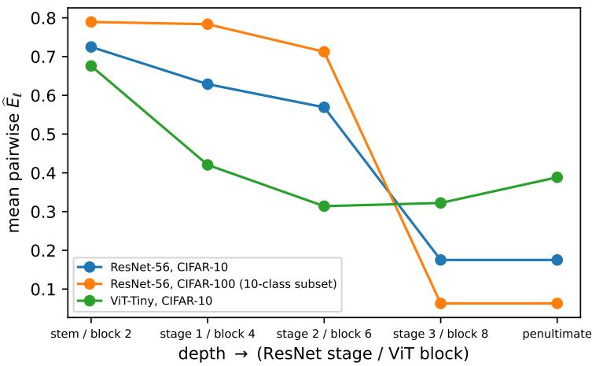  
Figure 5: Depth-wise disentanglement at the final epoch: mean pairwise quotient per stage for ResNet-56 on CIFAR-10 and on the CIFAR-100 subset, and for the ViT on CIFAR-10. The ResNets drop sharply at the deep stage (their penultimate point repeats stage 3); the ViT is weaker and non-monotone.

Experiment (E3 — training-dynamics trajectories at scale). Train ResNet-20 on CIFAR-10 for 5 seeds, checkpointing at epochs 0, 1, 2, 4, 8, 16, 32 and every 10 epochs from 40 to 80; track $\widehat { E } _ { \ell }$ at every residual stage for every checkpoint, exploiting the no-reduction cost (P2) to a scale impractical for mixup barcodes. Report paired-test significance (Section 3.3) for each epoch-to-epoch step.

Result. Across 12,375 paired epoch-to-epoch tests (5 seeds × 5 stages × 45 pairs × 11 checkpoint steps) on the scale-free fold statistic of Section 3.3, 2,707 steps are BH-significant, 2,026 of them decreases: training disentangles, and the claim is certified stepwise rather than read of a curve (Figure 7). The significance sits at the start and in the deep stage: 687 significant steps at epoch 0 → 1 and 1,728 within the first eight epochs, and over the whole run the deep stage carries 873 certified decreases against 42 at the stem. The 681 significant increases are of two kinds: at epoch 0 → 1 about a fifth of the pairs in every stage re-entangle as the random features are overwritten (202), and in the middle stages individual pairs re-entangle transiently between epochs 1 and 4 (130 and 80) while the stage means keep falling. A smaller late wave exists and follows the learning-rate schedule, at BH level only: under the cosine schedule, 136 certified decreases at epochs 50 → 60 and 98 at 60 → 70, every one of them in the deep stage; under a step schedule with drops at epochs 40 and 60 (2 seeds, identical protocol) the wave moves to 40 → 50 (166 decreases, 160 in the deep stage); under a constant learning rate no step after epoch 32 carries more than 49 decreases, and the two late steps carry 18 and 32 against 36 and 16 increases. Learning-rate decay, not training time, triggers a late reorganization of the deep stage, but the efect is an order of magnitude smaller than the initial separation and does not survive the Benjamini–Yekutieli correction (Section 3.4). Disentanglement is depth-graded exactly as in E2: over training, the mean quotient at the penultimate stage falls 0.78 → 0.16 while the stem barely moves (0.76 → 0.73)—early layers never disentangle; deep layers do almost all the work.

What the raw statistic certified instead. The same 12,375 tests on the raw profile mass $\int { \left| \Delta \chi \right| d r } -$ the fold statistic of our first campaign—return 5,633 significant steps, and 1,125 of them, every significant step at epoch 0 → 1, are increases, at the very step where every quotient falls. The permutationnull mean of the mass grows twentyfold at that step in the deep stage (the features spread out), and the raw mass follows the scale rather than the interaction. The late ‘wave’ it certified sat in the stem— 225 of 225 pair–seed tests at $5 0  6 0 $ exactly where the quotient is flat at 0.74 and the feature norm is shrinking under weight decay. The quotient and the certificates of E1–E2, which divide by the same-grid null, were never afected; the paired comparisons were, and the statistic is dimensionless throughout this paper. We report the episode because it is the failure mode that any trajectory analysis on an unnormalized geometric statistic will meet.

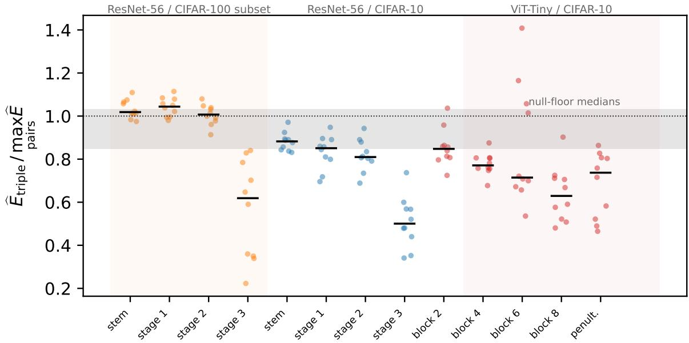  
Figure 6: The higher-order scan: $\widehat { E } _ { \mathrm { t r i p l e } } / \mathrm { m a x } _ { \mathrm { p a i r s } } \widehat { E }$ for all 120 triples in every layer of the three architectures $( d _ { 0 } = 4 )$ , one strip per distinct cell, bar at the median. Dotted line: ratio 1; grey band: per-seed medians of the null floor (E9). Exceedances sit in all four stages of the CIFAR-100 ResNet, mostly the early ones, and in block 6 of the ViT.

The same test on cheap statistics, samefolds. We ran the identical paired analysis on the Fisher ratio, the mean-distance ratio, the energy distance and the 5-nearest-neighbour cross-class rate of E1 on the same fold clouds. The neighbour rate tells the ECP’s story: 3,456 significant steps, 2,933 of them disentangling, 2,356 within the first eight epochs, the cosine wave at $5 0  6 0$ (173 decreases, 146 in the deep stage) and the step-schedule wave at 40 → 50 (202, 170 deep), and no localized late wave at constant learning rate. The late wave is therefore a property of the representation, not of the measure. The three mean-based statistics behave diferently: they certify changes at almost every step in both directions (9,448 significant under the cosine schedule, 6,017 disentangling and 3,431 entangling; 468 against 389 even at $7 0  8 0$ , in every stage including the stem, where neither the quotient nor the neighbour rate moves), because a drift of the class means registers as a change whether or not the overlap changes. For timing when classes separate, the overlap statistics—topological or nearestneighbour—resolve it and the mean-based ones do not.

Result: cost, on identical clouds. On the final-epoch representations of the 104 main-suite net works we ran the mixup barcode—the authors’ reference implementation, vendored unmodified—on exactly the clouds the ECP measures $( m = 2 0 0 , d _ { 0 } = 5$ , both inclusion directions since the barcode is asymmetric, degrees 0–1): 31.7 s per pair against 3.7 s for the full ECP profile (three Alpha-complex sweeps), a mean 8.5× per layer (range 3.9–15.2×), 206 vs. 24 CPU-hours in total; the gap is the image-persistence matrix reduction against the reduction-free sweep, and it compounds with � under permutation testing—which the barcode does not support. At the barcode’s cost, the 12,375 paired tests of this experiment alone would be infeasible.

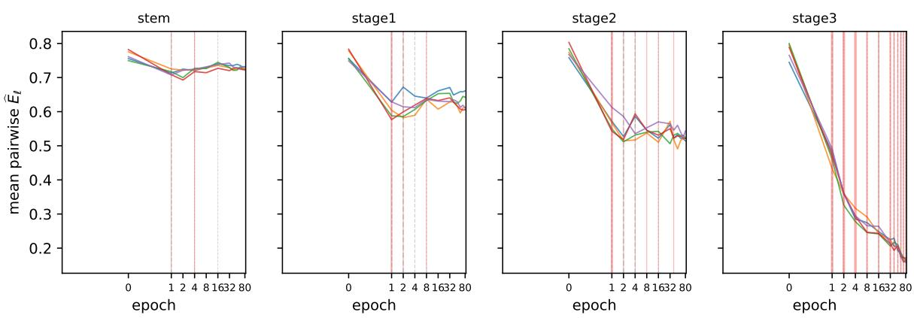  
Figure 7: Training dynamics, certified: mean pairwise quotient per stage for ResNet-20 on CIFAR-10, one curve per seed (stage 3 is the penultimate representation). Vertical marks are epochs receiving BHsignificant paired steps on the scale-free statistic—red decreases, grey increases, weighted by count. Deep stages disentangle; the stem does not.

Experiment (E4 — calibration, and the guard). Apply both one-sided tests to every layer/pair and the paired test to every trajectory step; Verify Type-I calibration empirically: on label-shufled (null) data, the rejection rate at level � must match � across 500 null replicates, for both tails and for the sign-flip test. Report the cancellation-guard firing rate $( r ^ { * }$ vs. $\Delta \chi$ , Section 3.2) across all measured clouds.

Result (calibration). All three tests are calibrated. Over 500 null replicates, empirical rejection rates at $\alpha \in \{ 0 . 0 1 , 0 . 0 5 , 0 . 1 0 \}$ : $p _ { \uparrow }$ gives (0.010, 0.044, 0.090), $p _ { \downarrow }$ gives (0.014, 0.064, 0.092), and the sign-flip paired test gives (0.006, 0.052, 0.100)—each within binomial error of nominal (Figure 8).

Result (guard). Across all 52,650 pairwise measurements of the campaign (38,475 in the main suite, audited by this experiment’s pipeline, plus 14,175 in the follow-up suite, audited post hoc from the archived measurement records) the cancellation guard fired zero times (42,570 distinct clouds, the stage-3 and penultimate rows of each ResNet being the same clouds measured twice). The guard monitors one failure pattern—silence of $\Delta \chi$ on the quarter of the scale range immediately past first contact while $\hat { r } ^ { * }$ certifies that the ofsets already meet—so a zero firing rate says that this pattern never occurred, not that Euler cancellation is impossible elsewhere in the range, and on pairs whose quotient is far from zero the pattern is unlikely to begin with. What the count establishes is narrower and still useful: no separation certificate in the campaign was issued on a pair whose profile was silent at the scales where the clouds provably interact, which is exactly the false certificate of Theorem 1, and the check costs nothing beyond the sweep already run. Because the campaign window begins at the contact scale, where a sampled annulus is still a set of contact points, we re-evaluated every cell whose features remained cached (45,225 of the 52,650; the 34 population, SimCLR and finetuned-ViT files whose cached features had been purged are covered by the archived window only) under three criteria: the campaign window, the same window shifted one grid point past contact, and the plateau form of Section 3.2. None fired on any cell, and the recomputation reproduced every archived guard decision. The profiles say why: on class clouds the overlap is a set of blobs, and $\Delta \chi$ first returns to zero a median of 78 grid points after contact, on a live range of 181; 1,797 cells return to zero within the first quarter, and in none of them does the zero persist.

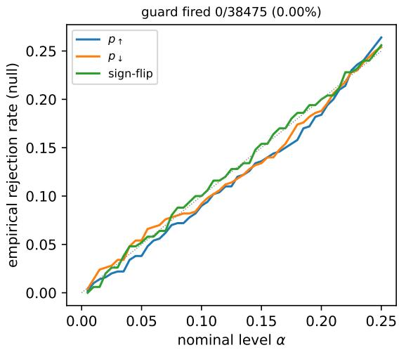  
Figure 8: Type-I calibration: empirical null rejection rate against the nominal level for both one-sided tests and the sign-flip test (500 null replicates). All three track the diagonal.

Experiment (E5 — predicting generalization (exploratory)). Train a population of 96 CIFAR-10 models crossing depth {20, 32, 44, 56} × width {1×, 2×} × weight decay $\{ 0 , 5 { \cdot } 1 0 ^ { - 4 } \}$ × augmentation $\{ \mathrm { o n } , \mathrm { o f f } \} \times 3$ seeds; regress held-out test accuracy on disentanglement features (final-epoch $\widehat { E } _ { \ell }$ per stage, trajectory summaries, triple-entanglement counts) and report predictive $R ^ { 2 } / \mathrm { r a n k }$ correlation against total mixup, CKA, linear probes, and neural collapse.

Result (two-sided). Over the 96-model population the null-normalized quotient features are informative but weak (leave-one-out $R ^ { 2 } = 0 . 3 4 _ { . }$ , Spearman $\rho = 0 . 6 5$ for test accuracy, and similarly for the generalization gap), while the baselines are near-ceiling $( R ^ { 2 } = 0 . 9 9 , \rho = 0 . 9 9 )$ , dominated by linear-probe accuracy, which is nearly the prediction target itself; total mixup—the authors’ vendored reference implementation on identical clouds, direction-symmetrized, degrees 0–1—predicts far better than the quotient $( R ^ { 2 } = 0 . 8 4 , \rho = 0 . 9 1 )$ . The explanation is normalization. The quotient divides out the density and the feature scale (the raw mass has units of feature length, Section 3.3), and that scale is what a predictor of accuracy uses: the unnormalized ECP features (per-layer mean and maximum profile mass $\int | \Delta \chi |$ and mean first-interaction scale $r ^ { * }$ , all from the same sweep) reach $R ^ { 2 } = 0 . 9 4 , \rho = 0 . 9 6$ for test accuracy and $R ^ { 2 } = 0 . 9 2$ for the gap, above total mixup (Table 1). None of it survives the probes: adding either ECP family, or total mixup, to the baselines leaves them un changed $( R ^ { 2 } \ : = \ : 0 . 9 8 5  – 0 . 9 8 8$ against 0.987). For raw prediction on this population, no topological interaction summary—certified or descriptive, ours or theirs—carries information beyond what trivially cheap probes already provide; the measurement’s value lies in the certified structural claims of E1–E4 and E9–E10, not in generalization prediction.

Result: the quotient’s departure from the cheap statistics. Scoring each (model, layer) cell by how far the quotient departs from what the neighbour rate or the Fisher ratio of E1 predicts, and regressing test accuracy, generalization gap, expected calibration error, negative log-likelihood, and accuracy under four on-the-fly corruptions on those departures, alone and on top of the baselines, changes no leave-one-out $R ^ { 2 }$ by more than 0.03. The departure predicts nothing the cheap statistics do not; the deep-stage neighbour rate is itself the strongest calibration predictor in the population (Spearman 0.94 with calibration error, above probe accuracy), and corruption robustness, which clean accuracy barely predicts (Spearman 0.30), is predicted weakly by mid-stage entanglement $( R ^ { 2 } = 0 . 3 4 )$ whichever statistic measures it. The outcome sits comfortably in a literature that has repeatedly found complexity measures to correlate weakly or unstably with generalization once models are swept systematically (Jiang et al., 2020); the topological entrant with the strongest claim measures the optimizer’s trajectory rather than the representation (Birdal et al., 2021).

<table><tr><td>target</td><td>features</td><td> $n _ { \mathrm { f e a t } }$   $\mathrm { L O O } R ^ { 2 }$ </td><td>Spearman</td></tr><tr><td>test_acc</td><td>ecp</td><td>16 0.337</td><td>0.655</td></tr><tr><td>test_acc</td><td>baselines</td><td>15 0.987</td><td>0.993</td></tr><tr><td>test_acc</td><td>ecp+baselines</td><td>31 0.985</td><td>0.993</td></tr><tr><td>test_acc</td><td>ecp-raw</td><td>15 0.935</td><td>0.963</td></tr><tr><td>test_acc</td><td>ecp+ecp-raw</td><td>31 0.925</td><td>0.956</td></tr><tr><td>test_acc</td><td>baselines+ecp-raw</td><td>30 0.988</td><td>0.994</td></tr><tr><td>test_acc</td><td>total-mixup</td><td>10 0.841</td><td>0.908</td></tr><tr><td>test_acc</td><td>baselines +total-mixup</td><td>25 0.987</td><td>0.993</td></tr><tr><td>gen_gap</td><td>ecp</td><td>16 0.340</td><td>0.662</td></tr><tr><td>gen_gap</td><td>baselines</td><td>15 0.981</td><td>0.990</td></tr><tr><td>gen_gap</td><td>ecp+baselines</td><td>31 0.979</td><td>0.989</td></tr><tr><td>gen_gap</td><td>ecp-raw</td><td>15 0.918</td><td>0.955</td></tr><tr><td>gen_gap</td><td>ecp+ecp-raw</td><td>31 0.906</td><td>0.946</td></tr><tr><td>gen_gap</td><td>baselines+ecp-raw</td><td>30 0.979</td><td>0.987</td></tr><tr><td>gen_gap</td><td>total-mixup</td><td>10 0.818</td><td>0.899</td></tr><tr><td>gen_gap</td><td>baselines+total-mixup</td><td>25 0.981</td><td>0.990</td></tr></table>

Table 1: E5 exploratory generalization prediction over 96 models: leave-one-out $R ^ { 2 }$ and Spearman correlation of ridge regression by feature family.

Experiment (E6 — steering disentanglement with a diferentiable surrogate (summary; Appendix B)). Can the measure be turned around to steer training? Since $\Delta \chi$ is integer-valued, we optimize a smooth surrogate: on a mini-batch, the mean over cross-class pairs C of a multi-scale Gaussian kernel of their feature distance,

$$
{ \mathcal { L } } _ { \mathrm { d i s } } ~ = ~ { \frac { 1 } { | C | } } \sum _ { ( x , y ) \in C } { \frac { 1 } { | S | } } \sum _ { s \in S } \exp \Bigl ( - { \frac { \| f ( x ) - f ( y ) \| ^ { 2 } } { 2 s \sigma ^ { 2 } } } \Bigr ) ,
$$

where $\sigma ^ { 2 }$ is the median within-class squared distance in the batch, so that the value of ${ \mathcal { L } } _ { \mathrm { d i s } }$ is scaleinvariant like $\Delta \chi$ and cannot be reduced by inflating feature norms; invariance of the gradient additionally requires $\sigma ^ { 2 }$ to stay in the computational graph. We train ResNet-20 on CIFAR-10 at the E3 recipe with $\mathcal { L } = \mathcal { L } _ { \mathrm { C E } } + \lambda \mathcal { L } _ { \mathrm { d i s } }$ for $\lambda \in \{ 0 , 0 . 5 , 2 , 8 \}$ and judge the surrogate by whether the certified penultimate quotient, measured afterwards by the non-diferentiable ECP, moves in �. Both implementations of the surrogate—with the bandwidth $\sigma ^ { 2 }$ detached from the graph and with it inside—lower the surrogate while raising the certified entanglement, monotonically in $\lambda ( 0 . 1 5 9  0 . 3 4 4 $ detached; 0.167 → 0.488 attached, at $\lambda \leq 2 )$ , each for an identifiable reason: the detached surrogate is gamed by feature-norm inflation, the attached one by within-class dispersion. E6 is therefore a measurement result rather than a regularizer: a diferentiable surrogate for the interaction quotient is not yet available, and the certificate is what exposes the failure. Appendix B reports the full campaign, with accuracies and robustness.

Experiment (E7 — the interaction spectrum (summary; Appendix C)). On the final-epoch E2 models and ResNet-20 we compute the full spectrum of floors ${ \widehat E } ( C _ { j } ) , j = 2 , \ldots , 5$ (“at least � classes meet”), the top floors $j \in \{ 8 , 9 , 1 0 \}$ of all ten classes, and the onset vector $r _ { 2 } ^ { * } \leq \cdots \leq r _ { 1 0 } ^ { * }$ per layer. The spectrum decays monotonically in � in every layer of every model, at a depth-graded rate (mean step $\mathrm { r a t i o } \approx 0 . 8 8$ at the stem, ≈ 0.61 at the deepest stage); the top floors are negligible in the deepest ResNet stages (quotients 0.015–0.07 against 0.44–0.73 at the stem; $B = 1 9 _ { : }$ , so magnitudes rather than sharp certifications); and the onsets stretch with order, the ten-fold overlap beginning at twenty times the pairwise scale in the deep stage. This is the graded, scale-domain form of E2’s dominance; Appendix C gives the full spectra and onset curves.

Experiment (E8 — robustness to the projection dimension (summary; Appendix D)). Remeasuring the depth conclusions of E2 at $d _ { 0 } \in \{ 3 , 4 , 6 \}$ on all three E2 models and the pretrained ViT-B/16 leaves every qualitative conclusion unchanged: the depth grading, the ViT’s non-monotone profile and the pretrained ViT’s monotone one persist at every $d _ { 0 } ,$ deep layers stay fully certified separated, and the pair ranking against the $d _ { 0 } ~ = ~ 5$ reference has median Spearman 0.91, 0.96, 0.97 at $d _ { 0 } = 3 , 4 , 6 _ { \scriptscriptstyle \mathrm { i } }$ , the few lower values $( 0 . 5 6 \mathrm { - } 0 . 6 9 )$ occurring only at $d _ { 0 } = 3$ among pairs already indistinguishable from zero. Appendix D gives the numbers.

Experiment (E9 — is pairwise dominance present at initialization?). Is dominance a property of PCA-projected class clouds of natural images that training merely preserves, or something training produces? We rebuild the initializations of the E3 ResNet-20 and the E2 ResNet-56 and ViT exactly as the training script does (seeded construction, before the first optimizer step), push the CIFAR-10 test set through them, and run the full pairwise matrix and the $\binom { 1 \dot { 0 } } { 3 }$ triple scan at the same $d _ { 0 }$ on every stage boundary and on the raw normalized input $( m = 2 0 0 , B = 4 9$ for both orders, so the ratio is not biased by unequal precision), scored exactly as in E2 and compared against the dimension-matched trained cells. As a control in the opposite direction we train the same ResNet-20 to memorize a fixed random relabeling of CIFAR-10 (Zhang et al., 2017) (no augmentation, no weight decay, 150 epochs; train accuracy 0.9999, chance 0.0995 on the true test labels) and measure it on the training images with the labels it fitted, where the ten “classes” are exchangeable by construction until the network makes them otherwise.

Result: present at initialization, deepened by training. At the initialized penultimate layer $( d _ { 0 } = 5 )$ every triple of every architecture is dominated: $\widehat { E } _ { \mathrm { t r i p l e } } \leq \operatorname* { m a x } _ { \mathrm { p a i r s } } \widehat { E }$ in 120/120 for ResNet-20, ResNet-56 and the ViT alike, with median ratios 0.76, 0.76 and 0.78, 90th percentiles 0.87–0.89, and maxima below 1 (0.95–0.98). The same holds at every stage boundary of the ResNet-20 at $d _ { 0 } = 4 ( 1 2 0 / 1 2 0$ at the stem and both middle stages, medians 0.74–0.76). The pairwise quotients are themselves already of the null before training (means 0.74–0.80; 34–40 of 45 pairs certified separated), and the raw normalized pixels give the same pairwise level as the random ResNet-20 (0.742 against 0.744) and the same dominance (119/120, median ratio 0.73, one exceedance at 1.04): CIFAR pixels carry the pairwise structure already, and a random network passes it through essentially unchanged. Train ing does not create the pairwise structure; it deepens it, the median ratio falling from 0.76–0.78 at initialization to 0.47 at the trained deep layers of E2.

The biasfloor. The dominance score compares one quotient against the maximum of three. Under exchangeable labels every quotient sits near 1 with permutation noise, so the maximum is biased upward and the ratio below 1, and an unstructured triple family will register as “dominated” much of the time. We measured that floor on two nulls at the same $B ,$ ten seeds of four clouds each: four clouds drawn from one isotropic Gaussian in $\mathbb { R } ^ { 5 }$ give median ratio 0.93 (33/40 dominated, maximum 1.09; per-seed medians 0.88–1.03), and the initialized features with labels permuted give 0.97 (33/40, maximum 1.05; per-seed medians 0.85–1.01). Every initialization cell and every trained deep cell sits well below this floor (exact one-sided Mann–Whitney test (Mann and Whitney, 1947) of cell medians against the 20 null-seed medians: $p = 3 . 3 \times 1 0 ^ { - 8 }$ for the ten initialization cells, $p = 1 . 9 \times 1 0 ^ { - 5 }$ for the five trained deep cells of E2; the cells are layers of a few networks and the null family has four triples per seed, so we read these as descriptive comparisons of location rather than as independent replicates), so the dominance reported here and in E2 is signal rather than the artifact, and the null rate of 83% is what a genuinely unstructured family produces, against 100% at initialization and 99.5% trained.

Result: memorization manufactures $i t ,$ in the last stage only. The random classes are exchangeable at initialization and remain so through the stem and the first two stages of the trained network: mean quotients 1.02, 1.01, 0.99, with $^ { 0 , }$ 1 and 1 of 45 pairs certified separated—the false-positive rate at $\alpha = 0 . 0 5 \cdot$ —and $p _ { \uparrow }$ firing on 5, 3 and 0. The last stage separates all of them: mean quotient 0.26, 45/45 pairs certified, and every one of the 120 triples dominated at median ratio 0.34 (90th percentile 0.46, maximum 0.59; pairs at $B = 1 9 9$ , triples screened at $B = 4 9$ with the ten largest escalated to $B = 9 9 9$ ; the pairs’ larger � only sharpens the denominator, which biases the ratio upward, so the comparison is conservative), stricter than the trained natural classes of E2 (0.47) and far below the null floor. Two things follow. Fitting arbitrary labels creates pairwise structure where none existed, so training can manufacture the dominance as well as deepen $\mathrm { i t } ;$ and it does so in the deepest stage alone, every earlier layer staying exchangeable with respect to the memorized labels. The second is a certified form of the observation that memorization is concentrated in the later layers (Stephenson et al., 2021), made here with a test per layer rather than a capacity curve.

Reading. Pairwise dominance is not a fact about learning natural classes and not forced by geometry: it is present in the pixels and at initialization, sharpened by training on the true labels, manufactured outright when the network memorizes arbitrary ones, and reproduced on frozen language models (E10). Within this invariant, whatever a network does to a labeled cloud family, it does mostly pairwise.

Experiment (E10 — outside vision: two frozen language models). Every representation above comes from vision: networks we trained or finetuned, their initializations, and raw pixels. Our concentration diagnostic found that language-model features, unlike deep vision features, keep a usable scale window at every depth (Appendix A.5), which makes them the one wide representation on which the full certified protocol should run unmodified. We take BERT-base (Devlin et al., 2019) and GPT-2 (Radford et al., 2019), frozen, mean-pooled over real tokens, on ten classes of 20 Newsgroups (test split, headers, footers and quotes stripped, posts under 20 words dropped, duplicate posts removed; 3,358 and 3,363 documents, at least 279 per class), and run the E9 protocol: the 45-pair matrix and all 120 triples at $d _ { 0 } = 5 , m = 2 0 0 , B = 4 9$ , on the final layer of each and on BERT’s middle block; and repeat it on a second corpus, ten DBpedia ontology classes (4,000 Wikipedia abstracts, 400 per class).

Result. The pipeline runs end to end on both, and the same pairwise dominance holds in both (Table 2). BERT’s final layer lands on the trained deep-vision median ratio of E2 (0.46 against 0.47) on an encoder that never saw these labels, and its middle block is less separated and less strictly pairwise than its final layer—the depth gradient of E2 in a language model. GPT-2 separates the newsgroup topics far less (its mean-pooled final states have an efective rank below $^ { 6 , }$ , Table 4), yet its triples still sit well below the null floor of E9 (median 0.68 against null-seed medians of 0.85–1.03), its two exceedances at 1.01 and 1.02. Across the six language-model cells every median sits below every null-seed median (exact Mann–Whitney $p = 4 . 3 \times 1 0 ^ { - 6 } )$ . On DBpedia, BERT certifies every pair at both depths with mean quotients of 0.15–0.16 and dominates every triple at median ratios of 0.36 and 0.42, and even GPT-2 certifies 44 of 45 pairs and dominates every triple (median 0.39). Two models on two corpora is what we claim: the first certified interaction measurement outside vision, with every cell landing on the same pairwise structure and the amount of separation tracking how

Table 2: E10: two frozen language models on two corpora $( d _ { 0 } \ = \ 5 ,$ � = 200, � = 49). “Pairs certified” is the number of the 45 class pairs certified separated; “dominated” the number of the 120 triples whose joint quotient is at or below their largest pairwise quotient; “median ratio” the median of $\overline { { E } } _ { \mathrm { t r i p l e } } / \operatorname* { m a x } _ { \mathrm { p a i r s } } \widehat { E }$ (null floor: per-seed medians 0.85–1.03).
<table><tr><td>model</td><td>corpus</td><td>layer</td><td></td><td colspan="2">pairs certified</td><td colspan="2">mean pair Ê</td><td colspan="2">dominated</td><td colspan="2">median ratio</td></tr><tr><td>BERT-base</td><td>20 Newsgroups</td><td colspan="2">block 6 of 12</td><td colspan="2">43/45</td><td colspan="2">0.55</td><td colspan="2">120/120</td><td colspan="2">0.57</td></tr><tr><td>BERT-base</td><td>20 Newsgroups</td><td colspan="2">final</td><td colspan="2">43/45</td><td colspan="2">0.46</td><td colspan="2">120/120</td><td colspan="2">0.46</td></tr><tr><td>GPT-2</td><td>20 Newsgroups</td><td colspan="2">final</td><td colspan="2">33/45</td><td colspan="2">0.73</td><td colspan="2">118/120</td><td colspan="2">0.68</td></tr><tr><td>BERT-base</td><td>DBpedia</td><td colspan="2">block 6 of 12</td><td colspan="2">45/45</td><td colspan="2">0.15</td><td colspan="2">120/120</td><td colspan="2">0.36</td></tr><tr><td>BERT-base</td><td>DBpedia</td><td colspan="2">final</td><td colspan="2">45/45</td><td colspan="2">0.16</td><td colspan="2">120/120</td><td colspan="2">0.42</td></tr><tr><td>GPT-2</td><td>DBpedia</td><td colspan="2">final</td><td colspan="2">44/45</td><td colspan="2">0.46</td><td colspan="2">120/120</td><td colspan="2">0.39</td></tr><tr><td>contrast</td><td></td><td>pairs</td><td>∆acc</td><td>stem</td><td></td><td>stage 1</td><td></td><td>stage 2</td><td></td><td>stage 3</td><td></td></tr><tr><td>depth 20→32</td><td></td><td>24 +0.005</td><td></td><td>mass↓/↑ 0/0</td><td> $\widehat { E } \downarrow / \uparrow$ </td><td>mass↓/↑ 38/39</td><td> $\widehat { E } \downarrow / \uparrow$ </td><td>mass↓/↑ 0/18</td><td> $\widehat { E } \downarrow / \uparrow$  0/2</td><td>mass↓/↑ 25/16</td><td> $\widehat { E } \downarrow / \uparrow$ </td></tr><tr><td>depth 32→44</td><td></td><td>24</td><td>-0.003</td><td>0/18</td><td>0/0 0/0</td><td>72/57</td><td>0/0 0/0</td><td>11/146</td><td>0/12</td><td>1/30</td><td>0/0 0/0</td></tr><tr><td>depth 44→56</td><td></td><td>24</td><td>-0.002</td><td>10/21</td><td>0/0</td><td>52/71</td><td>0/0</td><td>106/54</td><td>0/0</td><td>26/25</td><td>0/0</td></tr><tr><td>depth 20→56</td><td></td><td>24</td><td>-0.000</td><td>15/29</td><td>0/3</td><td>88/53</td><td>0/0</td><td>11/134</td><td>0/25</td><td>39/36</td><td>0/11</td></tr><tr><td>width 1→2</td><td></td><td>48 +0.014</td><td></td><td>2/126</td><td>0/0</td><td>302/19</td><td>0/0</td><td>114/89</td><td>0/6</td><td>297/26</td><td>1/0</td></tr><tr><td>weight decay 0.0→0.0005</td><td></td><td>48+0.033</td><td></td><td>133/2</td><td>3/11</td><td>40/344</td><td>0/0</td><td>60/119</td><td>9/6</td><td>1743/12</td><td>2/32</td></tr><tr><td>augmentation False→True</td><td></td><td>48 +0.055</td><td></td><td>19/5</td><td>0/2</td><td>127/263</td><td>11/2</td><td>110/162</td><td>24/1</td><td>1307/46</td><td>44/0</td></tr></table>

Table 3: E11. For each factor contrast (low → high) and stage: certified decreases/increases of the scale-free overlap mass among the 1,080 or 2,160 paired tests (mass), and the number of the 45 class pairs whose interaction quotient is certified to decrease/increase across the matched models (b�); the mean quotient changes are in the text. Δacc is the mean change in test accuracy across the matched pairs.

much class signal the representation carries.

Experiment (E11 — what changes certified disentanglement: depth, width, weight decay, augmentation). The E5 population is a factorial design: ResNet depth {20, 32, 44, 56} × width {1, 2} × weight decay $\{ 0 , 5 \cdot 1 0 ^ { - 4 } \}$ × augmentation {of, on} × three seeds, all measured at every stage of the final epoch. Two models that difer in exactly one factor share the same test images in the same folds, so the paired test of Section 3.3 applies to a matched pair of models exactly as it does to two check points. For each factor contrast we run two tests. On the scale-free fold mass: within every matched pair and stage, the sign-flip test per class pair, BH within the 45-pair family (mass in Table 3; 24 or 48 matched pairs, 1,080 or 2,160 tests per stage). On the interaction quotient: for each class pair and stage, the 24 or 48 matched-model diferences of $\widehat { E }$ are exchangeable in sign under the factor’s null within each matched pair, so a sign-flip test over them (Monte Carlo, 19,999 flips, with the +1 convention of Proposition 2) with BH within the 45-pair family certifies whether the factor moves the quotient of that pair (quotient in the table). The first test asks whether the overlap got smaller; the second whether it got smaller relative to chance.

Result: augmentation is the factor that disentangles. Turning augmentation on lowers the deepstage quotient of 44 of the 45 class pairs (mean 0.230 → 0.171), of 24 pairs at stage 2 and 11 at stage 1, and of none at the stem; the overlap mass falls in 1,307 of 2,160 paired tests at stage 3. It is also the largest accuracy gain in the design (+0.055).

Result: weight decay compresses without separating. Weight decay produces the largest mass efect in the table—the stage-3 overlap mass falls in 1,743 of 2,160 tests—and yet the quotient rises for 32 of 45 pairs (+0.02): the relabeled null shrinks as much as the overlap does. Weight decay simplifies the geometry of the whole representation, overlap included, and leaves the classes no more separated relative to chance; it raises accuracy by 0.033 all the same. Relative topological separation and accuracy are diferent quantities, and this is the contrast that shows it.

Result: depth and width do not disentangle. From depth 20 to 56 the quotient rises for 25 pairs at stage 2 and 11 at stage 3, by 0.02–0.04, with no change in accuracy; the adjacent contrasts are null except 32 → 44 at stage 2 (12 pairs). The depth grading of E2 is a property of a stage’s position in the network, not of how many stages there are. Doubling the width moves the quotient of at most 6 pairs at any stage, while shrinking the mass at stages 1 and 3 (302 and 297 of 2,160). At the stem no factor lowers the quotient of more than 3 pairs, and only weight decay raises it, for 11.

Reading. The measure separates two things regularization does. Augmentation pulls the classes apart relative to what a random relabeling of the same clouds would show; weight decay and width simplify the clouds and their overlap together, which the mass sees and the quotient, correctly, does not. And in a residual network the amount of separation a stage achieves is set by where the stage sits, not by the depth of the network around it.

Code and records. The measurement pipeline, the cluster job scripts, and every measurement record behind the numbers above (893 files) are released at https://github.com/sushovan4/ disentanglement; checkpoints and cached features regenerate from the seeded configurations. Every figure and table rebuilds from the records alone.

## 5 Conclusion and limitations

The Intersection ECP turns class disentanglement into a symmetric, multi-class, cheap, and statistically certified measurement: guarded one-sided tests certify separation, the paired test supports the comparative claims that trajectory analyses actually make, and the interaction quotient makes the numbers comparable across layers, epochs, and models. The campaign’s headline is structural: in trained image classifiers, class disentanglement is a certified, depth-graded, early-training phenomenon, and its interaction structure is pairwise almost everywhere we looked. It is confusability-ranked at the input side $( \rho = 0 . 8 3$ with confusion, on par with a nearest-neighbour rate), concentrated in deep layers $( 0 . 7 8  \ 0 . 1 6$ at the penultimate stage against $0 . 7 6  \ 0 . 7 3$ at the stem), and significant mostly within the first eight epochs, with a smaller, BH-level late wave in the deep stage that follows the learning-rate schedule; it is weaker and non-monotone in a from-scratch ViT, a data-starvation artifact that pretraining removes.

Joint entanglement of a triple sits below its strongest pair in 97% of triple–layer cells and 99.5% of deep cells, at median ratios far below the null floor, with the interaction spectrum decaying in order (E7) and the exceptions listed (E2); the structure is already present at initialization, deepened by training on the true labels, manufactured outright in the last stage alone when a network memorizes random ones (E9), and reproduced on two frozen language models (E10). Of the design choices in a 96-model population, augmentation is the one that separates classes relative to chance, weight decay compresses the overlap without separating, and depth and width do nothing (E11); the unnormalized mass predicts generalization, though not beyond linear probes (E5). Every certified clause of that summary carries a �-value or a test against a measured null floor, and the graded summaries (the spectrum at $B = 1 9$ , the language-model dominance rows) are reported as magnitudes, which is the point: the topology of representations can be measured with the same statistical hygiene as any other quantity in the empirical sciences—provided the statistic is scale-free, as E3 shows the hard way. The open theory is an analytic null for the profile, which would calibrate the tests without permutations, and a hypothesis on labeled clouds under which pairwise dominance becomes a theorem; the guard certified regime alone does not sufice (E2).

Six limitations bound these claims.

Dimensionality. The Alpha complex costs $O ( n ^ { \lceil d / 2 \rceil } )$ , so every measurement is made on a PCA shadow of dimension $d _ { 0 } \leq 6 ,$ , as in Wagner et al. (2026). Proposition 1 carries every first-contact scale and guard decision to the ambient representation (the permutation certificates are statements about the shadow), E8 finds every depth conclusion invariant to $d _ { 0 } \in \{ 3 , 4 , 6 \}$ , and entanglement enters our claims only as a magnitude comparison, since an overlap in the shadow may be an artifact of it. Two caveats remain. Whether the class supports are well approximated in the projection, which the estimation guarantee assumes, we do not verify; and the triple scan of E2 could in principle miss an ambient triple whose constituent pairs the projection renders apparently entangled, although its mechanism, witness-region nesting, is dimension-free.

Reach. The certificate is valid at any width, but its reach degrades in wide representations of high efective rank. On frozen ImageNet features the scale window—the fractional gap between the firstpercentile cross-class distance and the closest cross pair—narrows along the depth axis of every vision backbone tested (3.4–3.6× from ResNet-50 stage 1 to stage 4), a projected certificate retains only 8– 26% of the ambient interaction scale, and projection, ambient $\Delta \chi$ , and an ambient branch-and-bound for the onset vector all fail on the narrowest layers for one reason, concentration of measure (Appendix A.5). Across 55 vision layer–model cells the window tracks efective rank (Spearman −0.71) rather than depth or width as such; language-model features show no such gradient, which is why the full protocol runs unmodified in E10. The claims of this paper therefore concern small trained vision classifiers, their initializations, and two frozen language models. The window is cheap and should be computed before the measurement is interpreted on anything wider.

Hypotheses of the estimation guarantee. Proposition 4 assumes class supports of positive reach and an �-dense sample of each; class clouds of a trained network are not known to satisfy the first, and we do not verify the second in the projection. The guarantee licenses reading the sample profile as a population property only under those assumptions; the certificates and the paired comparisons, which are exact for the sample, do not depend on them.

What the cheap alternatives already give. Where the question is a pairwise ranking or the timing of separation, a nearest-neighbour cross-class rate on the same clouds does as well as the quotient (E1, E3), and the quotient’s departures from the cheap statistics predict nothing about accuracy, calibration, or robustness on the E5 population (E5). The case for the topological statistic rests on what those alternatives do not ofer—the certificate with a null, the �-fold terms, scale resolution—and on the one depth profile where they disagree, the from-scratch ViT’s head (E2).

Sampling and scale. Results depend on the points per class � and the scale range; stability (P4) bounds the efect in theory, and the E1 sweep over $m \in \{ 5 0 , 1 0 0 , 2 0 0 , 4 0 0 \}$ and $d _ { 0 }$ leaves the confusability ranking stable (Spearman median 0.87, minimum 0.73 against the reference). Radii are equal across clouds, the one slice a single sweep yields, so a compact class and a difuse one are thickened alike; a density-ofset variant, in which each cloud’s balls carry a fixed head start equal to its excess median nearest-neighbour spacing (a weighted Alpha complex on the pooled points, with the ofsets recomputed under every relabeling so the test stays exact), moves no E1 quotient by more than 0.04, ranks the pairs as the diagonal does (Spearman 0.97), and certifies the same 45/45. We did not vary the resolution of the 200-point grid; the integrated functional is insensitive to it in a way the peak statistic is not.

What $\chi$ discards, and what $\Delta \chi$ cannot steer. Structurally cancelling overlaps are invisible to $\Delta \chi$ (Section 2.2); neither the campaign guard nor its plateau form fired on any of the 52,650 measured pairs (E4), so the escalation path was never needed here, but the blind spot is real and the guard is not optional. $\Delta \chi$ is integer-valued, and both diferentiable surrogates we tried were optimized away from what the certificate measures (E6), so training-time control remains open. A paired test of the profile across a grokking transition, finally, found the right sign at a magnitude we do not consider a finding (Appendix E).

## A The inference used, with sources

This appendix states the guarantees invoked in Section 3 with their sources. The tests are textbook and are cited rather than re-proved; the recovery statement is restated from the foundations paper; what is proved here is what is specific to the Intersection ECP, the blind spot of Theorem 1 and the consistency of the guard. Throughout, $X = \{ x _ { 1 } , \ldots , x _ { m } \}$ and $Y = \{ y _ { 1 } , \dots , y _ { n } \}$ are finite clouds in $\mathbb { R } ^ { d } , T = \Phi ( \Delta \chi ( \cdot ; X , Y ) )$ for a functional Φ of the profile, and $M _ { r } = \mathcal { U } ( X ; r ) \cap \mathcal { U } ( Y ; r )$ . We write $r ^ { * } ( A , B ) \ = \ \operatorname* { i n f } \{ r : \mathcal { U } ( A ; r ) \cap \mathcal { U } ( B ; r ) \ \neq \ \emptyset \}$ for any two sets; for finite clouds and closed balls the infimum is attained and $M _ { r } \neq 0 \operatorname { i f f } r \geq r ^ { * }$

## A.1 Exact tests in both directions

Proposition 2 (Exactness of the two one-sided tests). Let $H _ { 0 }$ be that the labels of the pooled sample $Z =$ � ∪� are exchangeable (in particular, that � and � are i.i.d.from a common distribution). Let $\sigma _ { 1 } , \dots , \sigma _ { B }$ be drawn uniformly and independently from the splits of � into parts of sizes $m , n ,$ independently of the data. Then for every statistic �, every $\alpha \in ( 0 , 1 )$ , every �, � and every �, the �-values of Section 3.2 satisfy $\mathrm { P r } _ { H _ { 0 } } [ p _ { \uparrow } \leq \alpha ] \leq \alpha$ and $\mathrm { P r } _ { H _ { 0 } } [ p _ { \downarrow } \leq \alpha ] \leq \alpha$ . The same holds for � clouds with splits into parts of sizes $m _ { 1 } , \ldots , m _ { k }$

This is the Monte Carlo permutation test: conditionally on �, the values $T _ { \mathrm { o b s } } , T ^ { \sigma _ { 1 } } , \ldots , T ^ { \sigma _ { B } }$ are exchangeable, and the rank �-value with the +1 in numerator and denominator is valid at every � (Dwass, 1957; Phipson and Smyth, 2010); the full-group version is the randomization test of Lehmann and Romano (2005, Thm. 15.2.1). Ties are handled by the weak inequalities in the definitions. The PCA projection and the scale grid of Section 3.1 are functions of � alone, so the statement applies verbatim to the projected clouds on their grid.

## A.2 The paired test

Let two conditions (two layers, two epochs, two models) be evaluated on � disjoint folds of the same inputs, and let $D _ { s } = T _ { 1 } ^ { ( s ) } - { \hat { T } } _ { 2 } ^ { ( s ) }$ be the diference of their statistics on fold �. The comparative null $H _ { 0 } ^ { \mathrm { { s y m } } }$ is that the law of $\left( D _ { 1 } , \ldots , D _ { F } \right)$ is invariant under coordinatewise sign changes; it holds when the two conditions are exchangeable within each fold given the shared preprocessing, which is the natural null of a paired design. Independence across folds is not required.

Proposition 3 (Exactness of the sign-flip test). Under $H _ { 0 } ^ { \mathrm { { s y m } } }$ the two-sided �-value $p ~ = ~ 2 ^ { - F } \# \{ \varepsilon ~ \in ~$ $\begin{array} { r }  \{ \pm 1 \bar { \} ^ { F } : \ | F ^ { - 1 } \sum _ { s } \varepsilon _ { s } D _ { s } | \ge \vert \bar { D } \vert \} } \end{array}$ satisfies $\operatorname* { P r } [ p \leq \alpha ] \leq \alpha$ for every �. Since � and −� give the same value, $p \ge 2 / 2 ^ { F }$ , so the test can reject at level � only if $\ ` 2 ^ { F - 1 } \ge 1 / \alpha$

This is the randomization test for the group $\{ \pm 1 \} ^ { F }$ (Lehmann and Romano, 2005, Thm. 15.2.1), Fisher’s sign-flip test (Fisher, 1935, Ch. III). We take $F = 8$ , so the floor is $2 / 2 5 6$ ; the sign of �¯ is read of after the two-sided test (E3, E11).

## A.3 Estimation

Proposition 4 (Recovery of the population profile; restated from Kawamura et al. (2026)). Let $A , B \subset$ $\mathbb { R } ^ { d }$ be compact with reach at least $\tau > 0$ and Hausdorf dimensions $k _ { A } , k _ { B }$ with finite, positive Hausdorf measure, sampled i.i.d.from distributions with densities bounded below with respect to the corresponding Hausdorf measures, and suppose the population overlap filtration $\rho \mapsto \mathcal { U } ( A ; \rho ) \cap \mathcal { U } ( B ; \rho )$ has finitely many homological critical values and finite-dimensional homology. Then for $\epsilon , \delta > 0 \quad$ , samples of size $O \big ( \epsilon ^ { - k } ( \log ( 1 / \epsilon ) + \log ( 1 / \delta ) ) \big )$  from each, $k = \operatorname* { m a x } ( k _ { A } , k _ { B } )$ , are �-dense in � and � with probability at least $_ { 1 - 2 \delta , }$ and given �-density, $\Delta \chi ( r ; X , Y ) = \chi ( \mathcal { U } ( A ; r ) \cap \mathcal { U } ( B ; r ) )$ for every � in a band $[ r _ { \operatorname* { m i n } } , r _ { \operatorname* { m a x } } ] \subset ( 0 , \tau )$ with $\epsilon < \operatorname* { m i n } ( r _ { \operatorname* { m i n } } , \tau - r _ { \operatorname* { m a x } } ) / 2$ , outside an exceptional set $E _ { T } \cup E _ { M }$ of scales: $E _ { T _ { \lambda } }$ , an �(�)-neighbourhood of the population critical values, and $E _ { M } ,$ , the sample-artifact scales (Kawamura et al., 2026, Thm. $5 . 6 ,$ Cor. 5.8, Rem. 5.9). The rate is in the intrinsic dimension (Kawamura et $a l .$ ., 2026, Rem. 5.7), by the covering argument of Niyogi et al. (2008, Prop. 3.2).

Uniform control of $\vert E _ { M } \vert$ in the sample size is left open in the foundations paper (their Remark 5.9); Theorem 1 below carries it as a hypothesis.

## A.4 The blind spot and the guard

Definition 1. Under the hypotheses of Proposition 4, (�, �) is �-blind on $W \subset ( 0 , \tau ) i f { \mathcal { U } } ( A ; r ) \cap { \mathcal { U } } ( B ; r )$ is nonempty and has Euler characteristic 0 for every $r \in W$

Because Betti numbers are locally constant away from the critical scales, blindness holds on whole intervals of regular scales, not at isolated ones; annular and torus-shell overlaps are blind over an interval. On a blind pair the population profile vanishes both below first contact (Lemma 3.1 of the foundations paper) and on �: the profile of a blind pair is indistinguishable from that of a separated one.

Theorem 1 (The unguarded separation certificate fails on the blind set). Let $( A , B )$ satisfy the hypotheses of Proposition 4 and be �-blind at every scale of a grid range $G = [ 0 , { r } _ { \mathrm { m a x } } ]$ at which the ofsets meet, so that the population profile vanishes on all of �. Let $\begin{array} { r } { \Phi _ { G } ( \Delta \chi ) = \int _ { G } \left| \Delta \chi ( r ) \right| d r } \end{array}$ , and let $m , n \to \infty$ with $m / ( m + n ) \to \pi \in ( 0 , 1 )$ and $B \geq 1 / \alpha - 1$ fixed. Assume

(i) $\left| E _ { M } \cap G \right| \to 0$ in probability and $\mathsf { s u p } _ { G } | \Delta \chi ( \cdot ; X , Y ) |$ is stochastically bounded;

(ii) the null statistic is bounded away from zero: for a uniformly random split $( X ^ { \sigma } , Y ^ { \sigma } )$ of the pooled sample, $\operatorname* { P r } [ \Phi _ { G } ( \Delta \chi ( \cdot ; X ^ { \sigma } , Y ^ { \sigma } ) ) \ge c ]  1$ for some $c > 0$

Then $\Phi _ { G } ( \Delta \chi ( \cdot ; X , Y ) ) \to 0$ in probability, $p _ { \downarrow } \to 1 / ( 1 + B ) \le \alpha ,$ and the unguarded separation test rejects with probability tending to one, although $\mathcal { U } ( A ; r ) \cap \mathcal { U } ( B ; r ) \neq \emptyset f o r$ every $r \geq r ^ { * } ( A , B )$ in �.

Proof. By Proposition 4, of $E _ { T } \cup E _ { M }$ the sample profile equals the population profile on $G ,$ which is 0 on �: below first contact by Lemma 3.1 of the foundations paper, and beyond it by blindness. Since $\left| E _ { T } \cap G \right| = O ( \epsilon )$ and $\left| E _ { M } \cap G \right| \to 0$ by (i), the bound on $\mathsf { s u p } _ { G } | \Delta \chi |$ in (i) gives $\Phi _ { G } ( \Delta \chi ( \cdot ; X , Y ) ) \to 0$ in probability. By (ii), with probability tending to one every one of the � null replicates exceeds the observed statistic, so $\# \{ b : T ^ { \sigma _ { b } } \leq T _ { \mathrm { o b s } } \} \to 0$ and $p _ { \downarrow }  1 / ( 1 + B )$ □

Hypothesis (ii) is the one that must be checked per configuration, and it has two suficient conditions. Asymptotically, if the pooled support $A \cup B$ itself satisfies the hypotheses of Proposition 4 (positive reach fails when � and � cross, but holds for disjoint supports such as two concentric circles) and $\chi ( \mathcal { U } ( A \cup B ; r ) ) \neq 0$ on a subset of � of positive measure, then both halves of a random split are dense samples of $A \cup B$ from the mixture density, and the proposition applied to $( A \cup B , A \cup B )$ gives $\begin{array} { r } { c = \int _ { G } | \chi ( \mathcal { U } ( A \cup B ; r ) ) | d r > 0 } \end{array}$ . At finite sample sizes, (ii) also holds whenever the first-contact scale $r ^ { * } ( A , \bar { B } )$ exceeds the connectivity scale of the pooled sample, since the two halves of a random split then meet, in many components, at scales where the labeled ofsets are still disjoint; this is the regime of Figure 3, where $p _ { \downarrow } = 0 . 0 0 5$ on two rings whose population profile is zero everywhere. The mechanism the theorem isolates is that $\Delta \chi$ conflates “empty overlap” with “overlap with cancelling Betti numbers”, while the permutation null only ever produces the fat, non-cancelling overlap of a random split.

Lemma 1 (Consistency of the first-contact scale). Let $\begin{array} { r } { \hat { r } ^ { * } = \frac { 1 } { 2 } \operatorname* { m i n } _ { i , j } { \| x _ { i } - y _ { j } \| } } \end{array}$ and suppose the samples are �-dense in � and �. Then $r ^ { * } ( A , B ) \leq \hat { r } ^ { * } \leq r ^ { * } ( A , B ) + \epsilon$

Proof. The lower bound holds because $X \subset A$ and $Y \subset B$ . For the upper bound take $a \in A , b \in B$ attaining $r ^ { * }$ (compactness); by �-density there are $x _ { i } , y _ { j }$ within � of them, and $\left\| x _ { i } - y _ { j } \right\| \leq \left\| a - b \right\| +$ $2 \epsilon$ □

Corollary 1 (The guard on the blind set). Let $( A , B )$ be �-blind on an interval $W ~ = ~ [ r ^ { * } ( A , B ) + \frac { } { }$ $\eta , r ^ { * } ( A , B ) + \eta ^ { \prime } ]$ and let the guard fire when $\Delta \chi ( \cdot ; X , Y )$ vanishes on a window $\left[ { \hat { r } } ^ { * } + \eta _ { 0 } , { \hat { r } } ^ { * } + \eta _ { 1 } \right]$ with $\eta \le \eta _ { 0 } < \eta _ { 1 } \le \eta ^ { \prime } - \epsilon$ . Under the sampling of Proposition 4 and hypothesis (i) of Theorem 1 on $W ,$ the window lies inside � and the guard fires with probability tending to one.

Proof. By Lemma 1, $\hat { r } ^ { * } \in \left[ r ^ { * } , r ^ { * } { + } \epsilon \right]$ with probability tending to one, so the window lies in �, where the population profile is zero; of $E _ { T } \cup E _ { M }$ the sample profile agrees with it, and $| ( E _ { T } \cup E _ { M } ) \cap W |  0$ □

The corollary covers the campaign’s guard, whose window is the quarter of the grid immediately beyond $\hat { r } ^ { * }$ , once that quarter lies inside the blind interval; the plateau form of Section 3.2 additionally waits out the contact transient, which the corollary’s $\eta _ { 0 } > 0$ models. Neither form has a finite-sample guarantee beyond this mechanism, and Experiment E4 reports both firing on none of the campaign’s cells. $\hat { r } ^ { * }$ decides whether the clouds interact; $\Delta \chi$ describes how; only the second is subject to cancellation. Projection is compatible with the rule $\hat { r } ^ { * } > r$ by Proposition 1, which can only lower $\hat { r } ^ { * } { } _ { ; }$ ; it changes the profile beyond contact, so the silence-based forms are statements about the shadow.

## A.5 The concentration measurements

Table 4 reports, for the frozen representations of Section 5, the ambient dimension, the participationratio efective rank, the scale window—the fractional gap between the first-percentile cross-class distance and the closest cross pair, at 100 points per class—and, for the two ImageNet backbones on which the projected certificate was attempted, the realized tightness $r ^ { * } ( P X , P Y ) / r ^ { * } ( X , Y )$ of the $d _ { 0 } = 5$ certificate. For the vision transformers the window is given for the class token and for the mean-pooled patch tokens of the same forward pass. The window divides by a minimum, an extreme order statistic, so its absolute value is specific to the sample cap; ratios between layers of one model are stable across caps $( 3 . 4 \times \mathrm { a t } 1 0 0$ and 3.6× at 200 points per class for ResNet-50 stage 1 to stage 4) and are what the text compares. GPT-2’s final layer has efective rank near 1 and its window is not interpretable.

<table><tr><td>model</td><td>layer</td><td>D</td><td>eff. rank</td><td>window</td><td>window (mean-pool)</td><td>tightness</td></tr><tr><td>ResNet-50</td><td>stage 1</td><td>256</td><td>6</td><td>0.61</td><td>一</td><td>0.26</td></tr><tr><td rowspan="6">ViT-B/16</td><td>stage 2</td><td>512</td><td>13</td><td>0.37</td><td></td><td>0.19</td></tr><tr><td>stage 3</td><td>1024</td><td>33</td><td>0.24</td><td>一</td><td>0.14</td></tr><tr><td>stage 4</td><td>2048</td><td>43</td><td>0.18</td><td>一</td><td>0.13</td></tr><tr><td>block 3</td><td>768</td><td>9</td><td>0.44</td><td>0.47</td><td>0.22</td></tr><tr><td>block 6</td><td>768</td><td>27</td><td>0.24</td><td>0.24</td><td>0.11</td></tr><tr><td>block 9</td><td>768</td><td>95</td><td>0.15</td><td>0.20</td><td>0.08</td></tr><tr><td></td><td>block 12</td><td>768</td><td>46</td><td>0.14</td><td>0.28</td><td>0.10</td></tr><tr><td rowspan="5">ViT-L/16</td><td>final</td><td>768</td><td>56</td><td>0.14</td><td>0.28</td><td>0.12</td></tr><tr><td>block 6</td><td>1024</td><td>15</td><td>0.28</td><td>0.33</td><td>一</td></tr><tr><td>block 12</td><td>1024</td><td>91</td><td>0.13</td><td>0.22</td><td>一</td></tr><tr><td>block 18</td><td>1024</td><td>95</td><td>0.13</td><td>0.28</td><td>一</td></tr><tr><td>block 24</td><td>1024</td><td>26</td><td>0.12</td><td>0.19</td><td>一</td></tr><tr><td rowspan="5">CLIP ViT-B/32</td><td>final</td><td>1024</td><td>81</td><td>0.10</td><td>0.12</td><td>一</td></tr><tr><td>block 3</td><td>768</td><td>7</td><td>0.44</td><td>一</td><td>一</td></tr><tr><td>block 6</td><td>768</td><td>22</td><td>0.25</td><td>一</td><td>一</td></tr><tr><td>block 9</td><td>768</td><td>25</td><td>0.21</td><td>一</td><td>一</td></tr><tr><td>final</td><td>768</td><td>40</td><td>0.23</td><td>一</td><td>一</td></tr><tr><td>DINOv2 ViT-S/14 BERT-base</td><td>final</td><td>384</td><td>66</td><td>0.24</td><td>一</td><td>一</td></tr><tr><td rowspan="6">GPT-2</td><td>block 3</td><td>768</td><td>20</td><td>0.16</td><td>一</td><td>一</td></tr><tr><td>block 6</td><td>768</td><td>20</td><td>0.19</td><td>一</td><td>一</td></tr><tr><td>block 9</td><td>768</td><td>25</td><td>0.20</td><td>一</td><td>一</td></tr><tr><td>final</td><td>768</td><td>34</td><td>0.19</td><td>一</td><td>一</td></tr><tr><td>block 3</td><td>768</td><td>2</td><td>0.22</td><td>一</td><td>一</td></tr><tr><td>block 6</td><td>768</td><td>2</td><td>0.19</td><td>一</td><td>一</td></tr><tr><td></td><td>block 9</td><td>768</td><td>6</td><td>0.22</td><td>一</td><td>一</td></tr><tr><td></td><td>final</td><td>768</td><td>1</td><td>0.60</td><td>一</td><td>一</td></tr></table>

Table 4: Scale window, efective rank, and certificate tightness on frozen representations (CIFAR-10 test images through the vision models; ten classes of 20 Newsgroups through the language models).

## B Experiment E6 in full: the diferentiable surrogate

This appendix gives the E6 campaign of Section 4 in full.

We test whether the surrogate ${ \mathcal { L } } _ { \mathrm { d i s } }$ of Experiment E6 can control disentanglement, not merely mea sure it. We train ResNet-20 on CIFAR-10 at the E3 recipe with $\mathcal { L } = \mathcal { L } _ { \mathrm { C E } } + \lambda \mathcal { L } _ { \mathrm { d i s } }$ for $\lambda \in \{ 0 , 0 . 5 , 2 , 8 \}$ $( \lambda = 0$ the matched control), 2 seeds each, and evaluate three quantities per model: clean test accuracy, a robustness proxy (mean accuracy under additive Gaussian input noise at $\sigma \in \{ 0 . 0 5 , 0 . 1 , 0 . 2 \} )$ , and—closing the loop—the penultimate-layer mean interaction quotient measured post hoc by the exact ECP permutation test (the same certified, non-diferentiable protocol as E1–E5, $m = 2 0 0 , d _ { 0 } = 5 .$ $B = 1 9 9 )$

Result (the first campaign steered the wrong way). With $\sigma ^ { 2 }$ detached from the graph—the natural implementation, and the one we ran first—the certified penultimate quotient rose monotonically in �: $0 . 1 5 9  0 . 2 1 2  0 . 2 7 8  0 . 3 4 4 \mathrm { a t } \lambda = 0 , 0 . 5 , 2 , 8$ , the two seeds tight at every level and all 45 pairs certified separated in every model, while test accuracy fell $9 2 . 0 \% \to 8 6 . 5 \%$ and the robustness proxy $7 8 . 9 \%  7 2 . 6 \%$ . The surrogate made the classes more entangled, as measured by the exact test. The cause is instructive. Detaching $\sigma ^ { 2 }$ leaves the loss value scale-invariant (verified: identical under every rescaling of the features) but not its gradient: backpropagation sees a fixed bandwidth, so the radial component of the gradient is negative and descent inflates feature norms—with the bandwidth frozen, scaling the features by 20 drives the loss to machine zero. The ECP is genuinely scale-equivariant, so the inflation bought nothing there, and the capacity spent on it appears as the accuracy cost. A scaleinvariant loss whose gradient is not scale-invariant is an easy trap, and the certified measurement is what caught it. Keeping $\sigma ^ { 2 }$ in the graph makes the radial gradient vanish identically, so scaling is no longer a descent direction. That closes one exploit; the corrected campaign shows it opens another.

Result (the corrected campaign steers the wrong way too). With $\sigma ^ { 2 }$ in the graph, the certified penultimate quotient still rises monotonically in $\lambda \colon 0 . 1 6 7 \to 0 . 2 5 0 \to 0 . 4 8 8$ at $\lambda = 0 , 0 . 5 , 2$ (means of two seeds, which agree within 0.03 at every level; all 45 pairs certified separated in every model), while test accuracy falls $9 2 . 1 \% \to 9 1 . 0 \% \to 6 5 . 7 \%$ and the robustness proxy $7 9 . 8 \% \to 7 9 . 7 \% \to 6 2 . 9 \%$ . At $\lambda = 8$ training fails outright: test accuracy averages 16% (10% and 22% for the two seeds), one seed’s penultimate representation collapsed to a single feature vector (recorded as degenerate; no quotient is defined), and the other sits at quotient 0.88, statistically indistinguishable from a random relabeling. The second failure has a second mechanism. Once the radial direction is closed, the cheapest way to shrink a within-class-normalized cross-class kernel is to grow the within-class radius: dispersing each class lowers every $\| f ( x ) - f ( y ) \| ^ { 2 } / \sigma ^ { 2 }$ without moving the classes apart, and as $\sigma ^ { 2 }$ approaches the cross-class scale the classes interpenetrate, which is exactly what the exact ECP measures. The surrogate’s value goes down; the certified entanglement goes up.

What E6 establishes is therefore not a regularizer but a measurement result. Two natural implementations of a diferentiable surrogate for the interaction quotient—one gamed through scale, one through dispersion—both decrease the surrogate while increasing the certified entanglement, and only the exact, non-diferentiable test sees it. A surrogate that provably tracks $\Delta \chi$ under optimization is open, and we would not trust one without the certificate behind it.

## C Experiment E7 in full: the interaction spectrum

This appendix gives the E7 campaign of Section 4 in full. On the final-epoch representations of the E2 models and ResNet-20, compute the full spectrum ${ \widehat E } ( C _ { j } ) , j \ = \ 2 , \ldots , 5$ , on three fixed 5-class subsets $( 2 ^ { 5 } - 1$ pooled Euler curves per evaluation, permutation quotients per floor), the top floors $j \in \{ 8 , 9 , 1 0 \}$ of all ten classes, and the onset vector $r _ { 2 } ^ { * } \leq \cdots \leq r _ { 1 0 } ^ { * }$ per layer. Deliverables: the decay rate of $\widehat { E } ( C _ { j } )$ in � (the quantitative form of pairwise dominance), whether any deep many-class overlap survives at the top floors, and depth profiles of the onset delays.

Result: decay. The spectrum decays monotonically in � in every layer of every model, and the decay rate is itself depth-graded: the mean step ratio $\widehat E \big ( C _ { j + 1 } \big ) / \widehat E \big ( C _ { j } \big )$ over $j = 2 , \ldots , 4 \ \mathrm { i s } \approx \ 0 . 8 8$ at the stem but $\approx 0 . 6 1$ at the deepest stage (range $0 . 4 0 – 0 . 8 3$ across deep layers vs. $0 . 8 0 – 0 . 9 3$ shallow)— pairwise dominance is strongest exactly where disentanglement happens. At $k = 1 0 \mathrm { \Omega }$ , the top floors $j \in \{ 8 , 9 , 1 0 \}$ are negligible in the deepest stage of every ResNet (quotients 0.015–0.07, against 0.44– 0.73 at the stem) and small in the ViT (0.09–0.23 at the penultimate block); these ran at $B = 1 9$ where $p _ { \downarrow } = 0 . 0 5$ is the smallest attainable value, so we report them as magnitude statements rather than sharp certifications.

Result: the secondfloor as a layer summary. The second floor $\widehat { E } ( C _ { 2 } )$ of a five-class family is one number per layer with one permutation test, and on the three fixed subsets it certifies separation $( p _ { \downarrow } = 0 . 0 1$ at $B = 9 9 )$ in every layer of every model except two shallow cells, while ranking the layers exactly as the mean of the ten pairwise quotients does: for the CIFAR-10 ResNet-56, 0.93/0.78/0.90 at the stem against pairwise means 0.86/0.67/0.82, falling to 0.41/0.28/0.38 against 0.30/0.15/0.21 at stage 3; for the CIFAR-100 subset, 0.09/0.19/0.09 against $0 . 0 4 / 0 . 1 0 / 0 . 0 6$ at stage 3. The floor sits above the pairwise mean throughout, as it must: it is the union of the pairwise overlaps normalized by that union’s own null. It also sees the ViT head, rising from $0 . 7 1 / 0 . 3 1 / 0 . 3 8$ at block 8 to $0 . 6 7 / 0 . 6 0 / 0 . 7 0$ at the penultimate block. A layer-level claim with a single test is therefore available from the same sweep whenever the multiplicity of a pairwise family is unwelcome.

Result: onsets. The onset vectors tell the same story in the scale domain. At the CIFAR-10 ResNet-56 penultimate stage the 10-fold overlap onsets at $r _ { 1 0 } ^ { * } \approx 1 . 8 5$ , twenty times the pairwise onset $r _ { 2 } ^ { * } \approx 0 . 0 9$ 2 and the delays stretch monotonically through the vector $( 0 . 0 9 , 0 . 3 4 , 0 . 6 4 , 0 . 9 1 , \dots ) ;$ at the stem the entire vector is compressed into [0.007, 0.069]. Deep representations do not merely separate pairs— they push every higher-order overlap out to scales far beyond the pairwise interaction range, which is the geometric mechanism behind the dominance of E2, now quantified floor-by-floor (Figure 9).

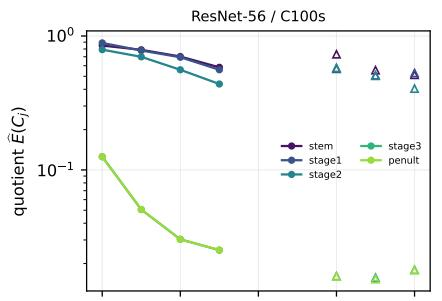

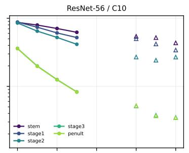

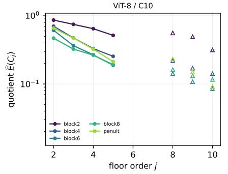

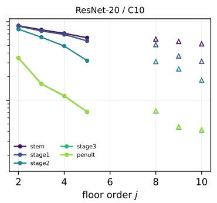

E7: higher-order overlaps onset at ever larger scales relative to the pairwise onset  
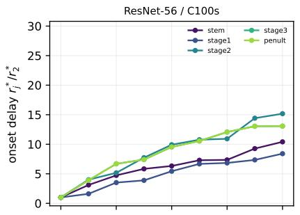

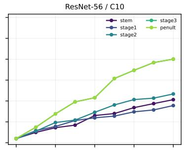

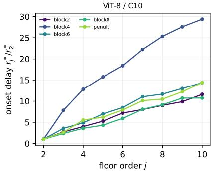

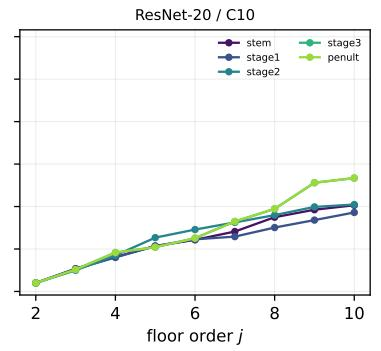  
Figure 9: The interaction spectrum (E7). Top: the floor quotients ${ \widehat { E } } ( C _ { j } )$ decay geometrically in � (solid: $j \le 5$ on five-class subsets; open: the top floors of all ten classes, $B = 1 9 )$ , steepest in deep layers. Bottom: the onset delays $r _ { j } ^ { \ast } / r _ { 2 } ^ { \ast }$ grow with �.

## D Experiment E8 in full: the projection dimension

This appendix gives the E8 campaign of Section 4 in full. The whole campaign measures on a $d _ { 0 } = 5$ PCA shadow; E1 already sweeps �0 on MNIST, and here we re-measure the depth conclusions of E2 at $d _ { 0 } \in \{ 3 , 4 , 6 \}$ on all three E2 models and the pretrained ViT-B/16, final epochs, full pairwise matrices $( B = 1 9 9 )$ , comparing each layer’s 45-pair quotient vector against the $d _ { 0 } = 5$ reference.

Result. Every qualitative conclusion is invariant to $d _ { 0 }$ . The depth grading is unchanged at every projection dimension—the mean quotient falls monotonically from stem to deep stages in both ResNets $( \mathrm { e . g . } \mathrm { C I F A R . } 1 0 \mathrm { R e s N e t . } 5 6 0 . 7 5 \to 0 . 2 2 , 0 . 7 2 \to 0 . 1 8 , 0 . 7 2 \to 0 . 1 6 \mathrm { a t } d _ { 0 } = 3 , 4 , 6 )$ and the ViT’s nonmonotone rise into the penultimate block persists at all $d _ { 0 }$ , while the pretrained ViT stays monotone throughout—and deep layers are fully certified separated (45/45) at every $d _ { 0 }$ . The pair ranking is stable and tightens as �0 grows: Spearman against the $d _ { 0 } \ = \ 5$ reference has median 0.91 $( d _ { 0 } \ =$ $3 ) , 0 . 9 6 ( d _ { 0 } = 4 ) , 0 . 9 7 ( d _ { 0 } = 6 )$ . The few lower correlations $( \rho = 0 . 5 6 \ – 0 . 6 9 )$ occur only at the coarsest $d _ { 0 } = 3$ and only where they cannot change a conclusion: on deep layers whose pairs are all certified separated with near-null quotients (rank noise among indistinguishable-from-zero values) or on the harder CIFAR-100 subset’s shallow layers, where the absolute quotients barely move. The measured shadow is low-dimensional, but the disentanglement structure we report is not an artifact of the particular $d _ { 0 }$

## E A coupling we do not claim: grokking

Grokking (Power et al., 2022) ofered a test of whether the measure tracks generalization as it happens: a two-layer transformer on $( a + b )$ mod 97 at a 40% train fraction, three seeds at weight decay 1.0 and a non-generalizing control at 0, checkpointed every 100 steps across the transition and compared checkpoint to checkpoint with the paired test of Section 3.3, the fold statistic averaged over the ten residue-class pairs. On the raw profile mass the certified change and the change in validation accuracy were anticorrelated at $r = - 0 . 8 0 ;$ that was the feature-norm shrinkage that weight decay produces across the transition, the artifact of E3 in another guise. On the scale-free statistic the contemporaneous coupling is � = −0.33 (� = 0.03 over 42 pooled and autocorrelated intervals; −0.57, $- 0 . 3 4 , - 0 . 4 3$ per seed), shufled class groupings reverse its sign (+0.42 to +0.45), the control shows none, and no lag is significant. That is the right sign and the right specificity at a magnitude we do not consider a finding, and we report it here rather than in the results.

## References

Guillaume Alain and Yoshua Bengio. Understanding intermediate layers using linear classifier probes. In International Conference on Learning Representations (ICLR), Workshop Track, 2017. arXiv:1610.01644.

Alessio Ansuini, Alessandro Laio, Jakob H. Macke, and Davide Zoccolan. Intrinsic dimension of data representations in deep neural networks. In Advances in Neural Information Processing Systems (NeurIPS), volume 32, pages 6109–6119, 2019.

Yoav Benjamini and Daniel Yekutieli. The control of the false discovery rate in multiple testing under dependency. The Annals of Statistics, 29(4):1165–1188, 2001.

Tolga Birdal, Aaron Lou, Leonidas J. Guibas, and Umut Simsekli. Intrinsic dimension, persistent homology and generalization in neural networks. In Advances in Neural Information Processing Systems (NeurIPS), 2021.

Omer Bobrowski and Primoz Skraba. A universal null-distribution for topological data analysis. Scientific Reports, 13:12274, 2023. doi: 10.1038/s41598-023-37842-2.

Chao Chen, Xiuyan Ni, Qinxun Bai, and Yusu Wang. A topological regularizer for classifiers via persistent homology. In Proceedings of the 22nd International Conference on Artificial Intelligence and Statistics (AISTATS), volume 89, pages 2573–2582, 2019.

Ricky T. Q. Chen, Xuechen Li, Roger B. Grosse, and David K. Duvenaud. Isolating sources of disentanglement in variational autoencoders. In Advances in Neural Information Processing Systems (NeurIPS), 2018.

Ting Chen, Simon Kornblith, Mohammad Norouzi, and Geofrey Hinton. A simple framework for contrastive learning of visual representations. In International Conference on Machine Learning (ICML), volume 119 of Proceedings of Machine Learning Research, pages 1597–1607, 2020.

Uri Cohen, SueYeon Chung, Daniel D. Lee, and Haim Sompolinsky. Separability and geometry of object manifolds in deep neural networks. Nature Communications, 11(1):746, 2020.

Louis Comtet. Advanced Combinatorics: The Art of Finite and Infinite Expansions. Reidel, Dordrecht, 1974.

Ciprian A. Corneanu, Meysam Madadi, Sergio Escalera, and Aleix M. Martinez. Computing the testing error without a testing set. In IEEE/CVF Conference on Computer Vision and Pattern Recognition (CVPR), pages 2674–2682, 2020.

Sebastiano Cultrera di Montesano, Ondrej Draganov, Herbert Edelsbrunner, and Morteza Saghafian. Chromatic topological data analysis. arXiv preprint arXiv:2406.04102, 2024.

Jacob Devlin, Ming-Wei Chang, Kenton Lee, and Kristina Toutanova. BERT: Pre-training of deep bidirectional transformers for language understanding. In Proceedings of NAACL-HLT, pages 4171– 4186, 2019.

Paweł Dłotko and Davide Gurnari. Euler characteristic curves and profiles: a stable shape invariant for big data problems. GigaScience, 12:giad094, 2023.

Paweł Dłotko, Niklas Hellmer, Łukasz Stettner, and Rafał Topolnicki. Topology-driven goodness-of-fit tests in arbitrary dimensions. Statistics and Computing, 34(1):34, 2024.

Alexey Dosovitskiy, Lucas Beyer, Alexander Kolesnikov, Dirk Weissenborn, Xiaohua Zhai, Thomas Unterthiner, Mostafa Dehghani, Matthias Minderer, Georg Heigold, Sylvain Gelly, Jakob Uszkoreit, and Neil Houlsby. An image is worth 16x16 words: Transformers for image recognition at scale. In International Conference on Learning Representations (ICLR), 2021.

Meyer Dwass. Modified randomization tests for nonparametric hypotheses. TheAnnals ofMathematical Statistics, 28(1):181–187, 1957.

Cian Eastwood and Christopher K. I. Williams. A framework for the quantitative evaluation of disentangled representations. In International Conference on Learning Representations (ICLR), 2018.

Brittany Terese Fasy, Fabrizio Lecci, Alessandro Rinaldo, Larry Wasserman, Sivaraman Balakrishnan, and Aarti Singh. Confidence sets for persistence diagrams. The Annals of Statistics, 42(6):2301– 2339, 2014.

Ronald A. Fisher. The Design of Experiments. Oliver and Boyd, Edinburgh, 1935.

Arthur Gretton, Karsten M. Borgwardt, Malte J. Rasch, Bernhard Schölkopf, and Alexander Smola. A kernel two-sample test. Journal of Machine Learning Research, 13:723–773, 2012.

Olympio Hacquard and Vadim Lebovici. Euler characteristic tools for topological data analysis. Journal of Machine Learning Research, 25(240):1–39, 2024.

Kaiming He, Xiangyu Zhang, Shaoqing Ren, and Jian Sun. Deep residual learning for image recognition. In IEEE Conference on Computer Vision and Pattern Recognition (CVPR), pages 770–778, 2016.

Irina Higgins, Loic Matthey, Arka Pal, Christopher Burgess, Xavier Glorot, Matthew Botvinick, Shakir Mohamed, and Alexander Lerchner. beta-vae: Learning basic visual concepts with a constrained variational framework. In International Conference on Learning Representations (ICLR), 2017.

Yiding Jiang, Behnam Neyshabur, Hossein Mobahi, Dilip Krishnan, and Samy Bengio. Fantastic generalization measures and where to find them. In International Conference on Learning Representations (ICLR), 2020.

Kazuhiro Kawamura, Sushovan Majhi, and Atish Mitra. The Intersection Euler Characteristic Profile: Euler calculus and stability for topological interaction of ball unions, 2026. arXiv:2608.06180.

Simon Kornblith, Mohammad Norouzi, Honglak Lee, and Geofrey Hinton. Similarity of neural network representations revisited. In International Conference on Machine Learning (ICML), 2019.

Alex Krizhevsky. Learning multiple layers of features from tiny images. Technical report, University of Toronto, 2009.

Yann LeCun, Léon Bottou, Yoshua Bengio, and Patrick Hafner. Gradient-based learning applied to document recognition. Proceedings of the IEEE, 86(11):2278–2324, 1998.

Erich L. Lehmann and Joseph P. Romano. Testing Statistical Hypotheses. Springer, 3 edition, 2005.

Francesco Locatello, Stefan Bauer, Mario Lucic, Gunnar Rätsch, Sylvain Gelly, Bernhard Schölkopf, and Olivier Bachem. Challenging common assumptions in the unsupervised learning of disentangled representations. In International Conference on Machine Learning (ICML), 2019.

David Lopez-Paz and Maxime Oquab. Revisiting classifier two-sample tests. In International Conference on Learning Representations (ICLR), 2017.

Sushovan Majhi, Atish Mitra, Santanu Nandi, Md Nurujjaman, and Buddha Nath Sharma. Detecting regime transitions in dynamical systems via the mixup Euler characteristic profile. arXiv:2604.15262, 2026a.

Sushovan Majhi, Atish Mitra, Žiga Virk, and Pramita Bagchi. A closed-form adaptive-landmark kernel for certified point-cloud and graph classification. arXiv:2605.04046, 2026b.

Sushovan Majhi, Atish Mitra, Žiga Virk, and Pramita Bagchi. A closed-form persistence-landmark pipeline for certified point-cloud and graph classification. Transactions on Machine Learning Research, 2026c. https://openreview.net/forum?id=4kZxNlE5Ve.

Henry B. Mann and Donald R. Whitney. On a test of whether one of two random variables is stochastically larger than the other. The Annals of Mathematical Statistics, 18(1):50–60, 1947.

Michael Moor, Max Horn, Bastian Rieck, and Karsten Borgwardt. Topological autoencoders. In International Conference on Machine Learning (ICML), volume 119 of Proceedings of Machine Learning Research, pages 7045–7054, 2020.

Gregory Naitzat, Andrey Zhitnikov, and Lek-Heng Lim. Topology of deep neural networks. Journal of Machine Learning Research, 21(184):1–40, 2020.

Partha Niyogi, Stephen Smale, and Shmuel Weinberger. Finding the homology of submanifolds with high confidence from random samples. Discrete & Computational Geometry, 39(1–3):419–441, 2008.

Vardan Papyan, X. Y. Han, and David L. Donoho. Prevalence of neural collapse during the terminal phase of deep learning training. Proceedings of the National Academy of Sciences, 117(40):24652– 24663, 2020.

Belinda Phipson and Gordon K. Smyth. Permutation �-values should never be zero: calculating exact �-values when permutations are randomly drawn. Statistical Applications in Genetics and Molecular Biology, 9(1):Article 39, 2010.

Alethea Power, Yuri Burda, Harri Edwards, Igor Babuschkin, and Vedant Misra. Grokking: Generalization beyond overfitting on small algorithmic datasets. arXiv preprint arXiv:2201.02177, 2022.

Alec Radford, Jefrey Wu, Rewon Child, David Luan, Dario Amodei, and Ilya Sutskever. Language models are unsupervised multitask learners. Technical report, OpenAI, 2019.

Karthikeyan Natesan Ramamurthy, Kush R. Varshney, and Krishnan Mody. Topological data analysis of decision boundaries with application to model selection. In Proceedings of the 36th International Conference on Machine Learning (ICML), volume 97, pages 5351–5360, 2019.

Akshay Rangamani, Marius Lindegaard, Tomer Galanti, and Tomaso A. Poggio. Feature learning in deep classifiers through intermediate neural collapse. In Proceedings of the 40th International Conference on Machine Learning (ICML), volume 202, pages 28729–28745, 2023.

Bastian Rieck, Matteo Togninalli, Christian Bock, Michael Moor, Max Horn, Thomas Gumbsch, and Karsten Borgwardt. Neural persistence: A complexity measure for deep neural networks using algebraic topology. In International Conference on Learning Representations (ICLR), 2019.

Andrew Robinson and Katharine Turner. Hypothesis testing for topological data analysis. Journal of Applied and Computational Topology, 1(2):241–261, 2017.

Ernst Röell and Bastian Rieck. Diferentiable euler characteristic transforms for shape classification. In International Conference on Learning Representations (ICLR), 2024.

Achim Schilling, Andreas Maier, Richard Gerum, Claus Metzner, and Patrick Krauss. Quantifying the separability of data classes in neural networks. Neural Networks, 139:278–293, 2021.

Cory Stephenson, Suchismita Padhy, Abhinav Ganesh, Yue Hui, Hanlin Tang, and SueYeon Chung. On the geometry of generalization and memorization in deep neural networks. In International Conference on Learning Representations, 2021.

Gábor J. Székely and Maria L. Rizzo. Energy statistics: A class of statistics based on distances. Journal of Statistical Planning and Inference, 143(8):1249–1272, 2013.

Renata Turkeš, Guido Montúfar, and Nina Otter. On the efectiveness of persistent homology. In Advances in Neural Information Processing Systems (NeurIPS), volume 35, pages 35432–35448, 2022.

Hubert Wagner, Nickolas Arustamyan, Matthew Wheeler, and Peter Bubenik. Mixup barcodes: quantifying geometric-topological interactions between point clouds. In 42nd International Symposium on Computational Geometry (SoCG 2026), LIPIcs, pages 94:1–94:19, 2026. arXiv:2402.15058.

Chiyuan Zhang, Samy Bengio, Moritz Hardt, Benjamin Recht, and Oriol Vinyals. Understanding deep learning requires rethinking generalization. In International Conference on Learning Representations, 2017.

Hongyi Zhang, Moustapha Cisse, Yann N. Dauphin, and David Lopez-Paz. mixup: Beyond empirical risk minimization. In International Conference on Learning Representations (ICLR), 2018.