# Closed-Form of the Local Galactic Potential and Stellar Distribution Function from Gaia DR3

Illinois Center for Advanced Studies of the Universe & Dept. of Physics University of Illinois Urbana-Champaign Urbana, IL 61801, USA idas3@illinois.edu

Dora Demiri European University of Tirana Tirana, Albania ddemiri@uet.edu.al

Hanieh Karimi University of New Hampshire Durham, NH 03824, USA Hanieh.karimi@unh.edu@unh.edu

Adam Kamoski∗ Department of Physics University of Massachusetts Boston NSF Institute for AI and Fundamental Interactions Adam.Kamoski001@umb.edu

Brianna Isola University of New Hampshire Durham, NH 03824, USA Brianna.Isola@unh.edu

Dmitrii S. Zagorulia   
Lebedev Physical Institute   
Russian Academy of Sciences   
Moscow 119991, Russia   
zagorulia.ds@phystech.edu

## Abstract

The local dark matter density determines the strength of the signal expected in direct-detection experiments, yet published estimates from stellar motions disagree by more than their errors [1–6], and the most recent machine-learning analysis of Gaia data finds a local density consistent with zero [7]. According to Jeans theorem, a distribution function built from integrals of motion satisfies the collisionless Boltzmann equation (CBE) trivially for any choice of potential [8, 9], so a search that simultaneously fits the distribution function and the potential to the CBE identifies neither. Our pipeline instead estimates the distribution function in isolation, linearizing the equation in terms of accelerations and allowing for direct measurement of the local force field, and then fits closed forms to that field via symbolic regression. Throughout, we find that the usable information lies not in the CBE residual but in the stellar number counts, the observable most distorted by survey selection. Along the vertical profile, our recovered potential agrees with the classical self-gravitating isothermal disc.

## 1 Introduction

The Gaia DR3 catalog supplies six-dimensional phase-space coordinates for millions of stars [10], motivating machine-learning recovery of the Galactic potential Φ and stellar distribution function f from a single snapshot [7, 11, 12]. Symbolic regression [13, 14] provides an interpretable, differentiable output that can be checked against independent measurements. The local dark matter density inferred from such analyses is an input to direct-detection experiments, yet published values span 0.005–0.020 $M _ { \odot } \mathrm { p c } ^ { - 3 }$ with error bars that do not overlap [1–6], and the most recent neural-network recovery reports a value consistent with zero [7]. The difficulty is identifiability: the equation relating

observation to target is the stationary CBE,

$$
\mathbf { v } \cdot \nabla _ { \mathbf { x } } f - \nabla _ { \mathbf { x } } \Phi \cdot \nabla _ { \mathbf { v } } f = 0 ,\tag{1}
$$

and when $f$ and $\Phi$ are fit to it jointly, it fails to uniquely identify either; a model can match the data exactly without constraining Φ. Our pipeline avoids this by fixing $f$ before solving for Φ, applied to $9 . 9 \times \mathrm { \dot { 1 } 0 ^ { 6 } }$ stars within 1 kpc.

This work proceeds in three parts: In Sec. 2 we provide a quantified analysis of the degeneracy, which consistently puts more than 96% of the constraint on $\mathbf { \bar { \Phi } }$ in the spatial density. In Sec. 3 we directly measure the acceleration field, with no assumed potential, and we find closed forms for both unknowns under a Poisson-positivity constraint, with a controlled experiment showing the constraint is necessary. In Sec. 4 we recover a distribution function supervised so that the degenerate solution is no longer the optimum but the uninformative baseline.

## 2 Degeneracy of the potential function

Proposition 1 (Minimizing the residual cannot identify Φ). For any static and axisymmetric Φ, $\begin{array} { r } { E = \frac { 1 } { 2 } | { \bf v } | ^ { 2 } + \Phi } \end{array}$ and $L _ { z } = R v _ { \phi }$ are integrals ofmotion. Here, E is the specific orbital energy and $L _ { z }$ is the z-component ofangular momentum. Thenfor any smooth $h ,$ the choice $f = h ( E , L _ { z } )$ satisfies $E q . \ ( 1 )$ exactly. In particular f = const satisfies Eq. (1)for any Φ. The minimum ofthe residual is therefore zero on a set containing every potential.

This follows from Jeans’ theorem [8, 9]. A residual-only symbolic search quickly converges to a simple but physically unreasonable zero-loss solution (complexity 2, both components constant). We therefore instead profile $\chi ^ { 2 }$ over the uniform volume density $\rho _ { \mathrm { D M } }$ , which we scan on the interval $\rho _ { D M } \in [ 0 , 2 0 ] \times \mathsf { \bar { 1 0 } } ^ { - 3 } \dot { M } \odot \mathrm { p c } ^ { - 3 }$ on mocks with known truth (Table A1). When the distribution function is allowed two free exponential components, the difference between exclusion and inclusion of the spatial density $\nu ( z )$ is reflected in a $\chi ^ { \overline { { 2 } } }$ span of 0.7 vs. one of 73. For the baseline mock the decomposition is CBE residual 0%, conditional velocity shape ${ \sim } 1 \%$ , and spatial density ${ \sim } 9 9 \% . \ \nu ( z )$ remains significant under every configuration tested, carrying more than 96% of the constraint in each: tracer temperature $( 1 2 { - } 6 \dot { 0 } \mathrm { k m } \mathrm { s } ^ { - \top } )$ , height range $( 0 . 5 \mathrm { - } 2 \mathrm { k p c } )$ , and distribution-function family, including King-like truncated models (Table A1). This is because for an isothermal tracer $\nu$ depends on $\Phi$ exponentially $( \nu \propto e ^ { - \Phi / \sigma ^ { 2 } } )$ [1, 15, 16], whereas the velocity shape enters only through moments that $f$ can absorb. Since ν is the observable corrupted by survey completeness, the selection function must be modeled explicitly. When a completeness gradient $S \propto e ^ { - | z | / \ell }$ is present in a mock and omitted from the model, the recovered surface density shifts by $\sigma ^ { 2 } / 2 \pi G \ell .$ , at a loss floor indistinguishable from the clean run with $S = 1 \left( { \mathrm { A p p . ~ A } } \right)$

Proposition 2 (Two-integral models are meridionally isotropic). For static axisymmetric $\Phi ,$ , every $f ( E , L _ { z } )$ satisfies $\sigma _ { R } = \sigma _ { z }$ exactly at every point.

Proof. E depends on $v _ { R }$ and $v _ { z }$ only through $v _ { R } ^ { 2 } + v _ { z } ^ { 2 }$ , and $L _ { z }$ not at all, so both are invariant under the exchange $v _ { R }  v _ { z }$ . Therefore, so is $f ,$ , and $ { \langle v _ { R } ^ { 2 } \rangle } =  { \langle v _ { z } ^ { 2 } \rangle }$ at fixed $( R , z )$ □

The two-integral family that minimizes the residual is the same family constrained to $\sigma _ { R } = \sigma _ { z }$ Hence, a measured anisotropy $\sigma _ { R } \neq \sigma _ { z }$ distinguishes our solution from it. This does not distinguish it from every stationary solution, since a three-integral $f ( E , L _ { z } , I _ { 3 } )$ satisfies Eq. (1) identically and is generically anisotropic. An exactly separable third integral requires Φ of Stäckel form, which we neither impose nor test for (App. C). Therefore, we expect a non-zero residual.

## 3 Method

Selection. The 1 kpc sphere holds $9 . 9 4 \times 1 0 ^ { 6 }$ stars with RUWE< 1.4, parallax $\mathrm { S } / \mathrm { N } > 1 0 , \geq 4$ radial-velocity transits, and velocity uncertainty $\cdot < \mathrm { 1 0 k m s ^ { - 1 } }$ , split 70/15/15 before any fitting (in-sample selection picks the wrong front member on mocks; App. C). Gradients of ln $f$ are evaluated on a $2 . 5 \times \mathrm { { \dot { 1 } } 0 ^ { 6 } }$ -star subsample; $1 . 7 3 \times 1 0 ^ { 6 }$ of those fall in the 94 acceleration cells, and the symbolic search for ln f is fitted on $2 . 0 \times 1 0 ^ { 4 }$ rows drawn from the $2 . 2 1 \times 1 0 ^ { 6 }$ stars within 0.9 kpc. We use $R _ { 0 } = 8 . 1 2 2$ kpc and $z _ { \odot } = 0 ,$ , the latter by construction of the catalogue frame (App. B). The observed number density per unit volume falls to 5.1% of its value at 0.15 kpc across the sphere, with |d ln $S / \mathrm { d } d |$ peaking at $1 0 . 9 \mathrm { k p c } ^ { - 1 }$ against a physical $| \partial _ { z }$ ln ν| of $3 . 0 \mathrm { k p c } ^ { - 1 }$ (Fig. A2). We fit $\mu = \dot { V } { \cdot } S ( d ) A ( \ell , b ) \nu ( R , z )$ as a Poisson GLM. The three factors are identifiable up to two overall multiplicative constants because they are different functions of the same point: stars at equal distance in different directions lie at different heights. It returns a 2.88 kpc radial scale length and a two-scale-height vertical profile whose local scale height at 300 pc is 334 pc, neither constrained to a literature value. The complete pipeline and code are available at https: //github.com/briannaisola/GaiaSR.

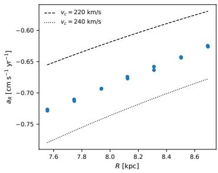

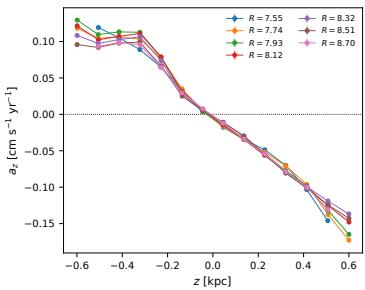

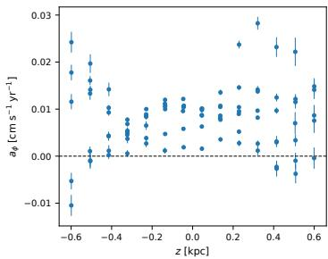  
Figure 1: The acceleration field a, measured cell by cell with no functional form assumed for Φ. Each point is one spatial cell solved from thousands of linear equations, Eq. (2); error bars on the rightmost plot are the cell-fit standard errors. Left: the radial component $a _ { r }$ at the midplane, with constant- $v _ { c }$ curves for scale. Center: the vertical component $a _ { z } .$ , colored by radius, changing sign at the dynamical midplane. Right: the azimuthal component $a _ { \phi } .$ , which an axisymmetric $\Phi$ requires to vanish and which instead comes out systematically positive at the per-cent level of $a _ { R }$

Empirical f. We factorize $f = \nu p ( \mathbf { v } | \mathbf { x } )$ and fit the conditional with a 96-component full-covariance Gaussian mixture, whose log-gradient is closed-form and agrees with central finite differences to $1 0 ^ { - 6 }$ in all six coordinates. The conditional is selection-free: $\begin{array} { r } { S ( \mathbf { x } ) f / \int S ( \mathbf { x } ) f \mathrm { d } ^ { 3 } v = f / \int f \mathrm { d } ^ { 3 } v } \end{array}$ , since S has no velocity dependence, so components are selected on held-out conditional log-likelihood. Refitting on a disjoint set of $5 \times 1 0 ^ { 5 }$ stars moves $\partial _ { R }$ ln $f$ by 0.815 against its own root mean square (rms) of 1.673; refitting with Gaia’s errors injected a second time moves it by 0.736. The two shifts are comparable in size, so the limiting factor is the density estimator, and the implied residual floor is 48.7 km $\mathrm { { \dot { s } ^ { - 1 } k p c ^ { - 1 } } }$ for any expression carrying its gradients. The azimuthal streaming term carries 93% of the total rms (222.2 against 67.4 and 41.7 km $\mathrm { s ^ { - 1 } k p c ^ { - 1 } } )$ , is measured over only a 14◦ baseline in azimuth, and cannot be balanced by any axisymmetric force; dropping it moves $\mathrm { d } v _ { c } / \mathrm { d } R$ from −9.0 to −1.1 against a literature $- 1 . 7 \pm 0 . 1 \mathrm { { \dot { [ } 1 7 ] } }$

Acceleration Measurement. Eq. (1) is linear in a. In cylindrical coordinates with g = ln $f ,$ grouped by whether a term involves the potential,

$$
\underbrace { v _ { R } \partial _ { R } g + v _ { z } \partial _ { z } g + \frac { v _ { \phi } ^ { 2 } } { R } \partial _ { v _ { R } } g - \frac { v _ { R } v _ { \phi } } { R } \partial _ { v _ { \phi } } g } _ { K _ { i } } + \mathbf { W } _ { i } \cdot \mathbf { a } ~ = ~ 0 ,\tag{2}
$$

with ${ \bf W } _ { i } = \nabla _ { \bf v } g$ and the azimuthal streaming term dropped as above. The centrifugal and Coriolis terms arise from the rotation of the cylindrical basis as a star moves, and are fixed by the star’s own coordinates. We solve 94 acceleration cells (7 radial bins × 14 vertical bins −4 star-count-cut cells) by Huber-reweighted least squares, assuming no functional form for $\Phi \left( \mathrm { F i g . \ 1 } \right)$ The field comes out at $\sim 0 . 6 \mathrm { c m s ^ { - 1 } y r ^ { - 1 } }$ , the acceleration undetectable in any single star over the mission lifetime but recoverable from the collective statistics of many. From it follow $v _ { c } = \sqrt { - a _ { R } R } .$ $\Sigma ( < | z | ) = | a _ { z } | / 2 \pi G$ , and the dynamical midplane where $a _ { z }$ changes sign. The whole volume as one cell gives $v _ { c } = 2 3 1$ .4 km $\mathrm { s } ^ { - 1 }$ against 229±3 [17]; the cells give $\bar { \Sigma } ( < \bar { 0 . 5 } \mathrm { k p c } ) = 4 4 . 0 M _ { \odot } \mathrm { p c } ^ { - 2 }$ between the 41 and $6 5 \pm 6$ measured at 0.35 and 0.8 kpc [18], and place the midplane 18 pc from the Sun against a photometric $2 0 . 8 \pm 0 . 3 \mathrm { p c } [ 1 9 ]$

The quoted errors are least-squares statistical errors on millions of stars, and they understate the real uncertainty: nothing below about a per cent here is resolved. Solving for $a _ { \phi }$ rather than imposing $a _ { \phi } = 0$ bounds the departure from axisymmetry at 1.3% of |aR|, comparable to that floor, and we return to it in the limitations.

Symbolic Φ. We search with PySR [14, 20]. Each cell enters the training set twice, tagged by an indicator, so a single Φ must reproduce both force components and the fitted field is curl-free by construction. 5.24 ln $R \pm 8 z ^ { 2 } ( \nabla ^ { 2 } \Phi = \pm 1 6 )$ generate equally valid acceleration fields a that the data cannot tell apart, and only the sign of the Laplacian distinguishes them. Hence, a Poisson positivity constraint becomes necessary, entering the objective as $\mathcal { L } _ { \Phi } = \sigma ^ { - 2 } ( \mathrm { p r e d } - a _ { \mathrm { t g t } } ) ^ { 2 } + \lambda [ \mathrm { m i n } ( \dot { \nabla } ^ { 2 } \Phi , 0 ) ] ^ { \dot { 2 } }$ with $\lambda = 2 5$ , one-sided so that it vanishes on the admissible set and cannot bias the choice among physical candidates. From the Pareto front we take the cheapest expression within a factor of two of the best admissible loss, subject to $( 1 ) \rho > - 0 . 0 0 5$ throughout the $( R , z )$ domain where Poisson positivity is enforced and (2) a plausibility window $\rho ( R _ { 0 } , 0 ) \in [ 0 , 0 . 5 ] \dot { M } _ { \odot } \mathrm { p c } ^ { - 3 } , v _ { c } \in [ 1 5 0 , 3 2 0 ] \mathrm { k m } \dot { \mathrm { s } } ^ { - 1 }$ . This window is wide enough to exclude only nonsense: all 21 of the 26 front rows surviving Poisson positivity already lie inside it, and removing it returns the same expression. Selection is therefore by positivity and parsimony, and the window did not manufacture the $v _ { c }$ and $\rho ( R _ { 0 } , 0 )$ reported below.

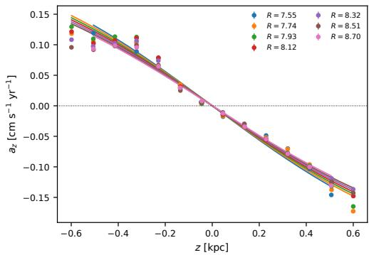

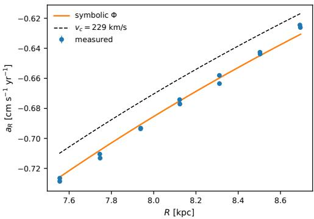  
Figure 2: Two plots representing the closed-form potential $\Phi ( R , z )$ of $\operatorname { E q . } ( 3 ) ,$ containing eleven nodes and two fitted constants, against the independently measured field of Fig. 1. Left: vertical acceleration $a _ { z } .$ , points measured and lines the symbolic Φ, colored by radius R. Right: radial acceleration $a _ { R }$ at the midplane, with a constant $- v _ { c }$ curve at the literature value for comparison. The fit is to the measured field alone.

Closed-form $f .$ By Prop. 1, the residual cannot serve as the objective. We instead regress g onto the empirical ln $\hat { f }$ and its five gradients. The loss is $\begin{array} { r } { \mathcal { L } _ { f } = \langle ( ( g - \ln \hat { f } ) / S _ { g } ) ^ { 2 } \rangle + \frac { 1 } { 5 } \sum _ { i } \langle ( ( \partial _ { i } g - } \end{array}$ $\partial _ { i } \ln { \hat { f } } ) / S _ { i } ) ^ { 2 } \rangle$ , averaged over stars, where each S is the rms of the target it normalizes. The gradients are supervised because Eq. (2) absorbs them, and because an expression can track a function’s values closely while its derivatives wander. A constant g scores exactly 2.000, one from the value term and one from the five gradient terms, whose model gradients vanish. An expression carrying no information about the target can get a score as low as 2.000 under this loss. The same expression scores 0 under a residual objective, where it wins. Selection is on $R ^ { 2 }$ against ln $\hat { f } ,$ taken over Pareto front rows that are finite on more than 99% of held-out stars. The residual and the anisotropy are computed afterwards and enter no decision. Two of the five supervised gradients are $\partial _ { v _ { R } }$ ln $\hat { f }$ and $\partial _ { v _ { z } } \ln { \hat { f } } ,$ which carry $\sigma _ { R }$ and $\sigma _ { z }$ for a locally Gaussian conditional. The anisotropy reported below is therefore derived from supervised quantities. Front members of comparable loss return ratios between 0.91 and 9.90 (Table 1), so reproducing the supervised gradients pointwise does not by itself reproduce the ellipsoid they imply.

## 4 Results

The potential comes out at complexity 11 as

$$
\Phi ( R , z ) = 5 . 3 6 1 8 \ln \bigl ( R + 0 . 3 9 1 9 3 \ln \cosh z \bigr ) ,\tag{3}
$$

with $R , z$ in kpc and Φ in $( 1 0 0 \mathrm { k m s ^ { - 1 } } ) ^ { 2 }$ . The recovered expression contains a ln cosh z vertical dependence characteristic of the potential of a self-gravitating isothermal sheet, whose density profile $\nu \propto \mathrm { s e c h } ^ { 2 } ( z / 2 h )$ was derived by Spitzer [21]. Notably, this functional form emerged from the free operator set rather than being imposed a priori.

Table 1: Pareto front for ln $f ,$ held out; every fifth member plus the two endpoints, from $3 \dot { 7 }$ (full front in App. C). Row two is $g = \mathrm { c o n s t }$ , the exact global optimum of a residual objective, present on our own front and rejected on $R ^ { 2 }$ $\epsilon _ { \nabla }$ is the mean relative gradient error.
<table><tr><td>C</td><td>loss</td><td> $R ^ { 2 }$ </td><td> $\epsilon _ { \nabla }$ </td><td>CBE</td><td> $\sigma _ { R } / \sigma _ { z }$ </td></tr><tr><td></td><td>1 2.016</td><td> $- 8 \times 1 0 ^ { - 3 }$ </td><td>1.00</td><td>6.2</td><td>1.14</td></tr><tr><td></td><td>2 2.000</td><td> $- 3 \times 1 0 ^ { - 5 }$ </td><td>1.00</td><td>0.00</td><td>0.91</td></tr><tr><td></td><td>91.352</td><td> $0 . 5 1 0 ^ { }$ </td><td>0.90</td><td>41.7</td><td>8.11</td></tr><tr><td></td><td>101.313</td><td> $- 2 \times 1 0 ^ { 9 }$ </td><td> $\mathrm { 3 \times 1 0 ^ { 4 } }$ </td><td> $1 \times 1 0 ^ { 8 }$ </td><td>9.90</td></tr><tr><td></td><td>200.879</td><td>0.745</td><td>0.76</td><td>51.9</td><td>1.37</td></tr><tr><td></td><td>280.691</td><td>0.876</td><td>0.74</td><td>41.7</td><td>1.87</td></tr><tr><td></td><td>39 0.603</td><td>0.917</td><td>0.70</td><td>36.1</td><td>2.13</td></tr><tr><td></td><td>44 0.589</td><td>0.923</td><td>0.69</td><td>38.2</td><td>1.88</td></tr></table>

Table 2: Held-out results. $\sigma _ { R } / \sigma _ { z }$ is measured from the same sample, not literature; the rest are independent [1, 17–19, 22]. Two of the five external comparisons fail, marked †. Uncertainties are discussed in the text and are not the statistical errors. ∗: measured from the same sample. ‡: the supervising mixture on the same axisymmetric target. CBE residual in $\mathrm { k m s ^ { - 1 } k p c ^ { - 1 } }$
<table><tr><td>Quantity</td><td>This work</td><td>Reference</td></tr><tr><td> $\sigma _ { R } / \sigma _ { z }$ </td><td> $1 . 8 3 \mathrm { - 2 . 1 3 }$ </td><td>1.893*</td></tr><tr><td> $v _ { c } ( R _ { 0 } )$ </td><td> $2 3 1 . 6 \mathrm { k m s ^ { - 1 } }$ </td><td>229 ± 3</td></tr><tr><td> $\Sigma ( \mathrm { ^ - 0 . 5 k p c } )$ </td><td></td><td>44.0 41–65 (0.35-0.8 kpc)</td></tr><tr><td>midplane offset</td><td>18 pc -1.1</td><td> $2 0 . 8 \pm 0 . 3$ </td></tr><tr><td> $\mathrm { d } v _ { c } / \mathrm { d } R ^ { \dagger }$   $\rho ( R _ { 0 } , 0 ) ^ { \dag }$ </td><td>0.048</td><td> $- 1 . 7 \pm 0 . 1$ </td></tr><tr><td></td><td></td><td>0.084–0.10</td></tr><tr><td>CBE resid.</td><td>38.2</td><td> $5 8 . 6 ^ { \ddagger }$ </td></tr><tr><td>rel. to Φ=0</td><td>0.204</td><td>1.000</td></tr><tr><td> $R ^ { 2 } ( \ln f )$ </td><td>0.923</td><td></td></tr></table>

The distribution function comes out at complexity 44 as

$$
\begin{array} { c } { { \ln f = 2 . 4 0 7 - \ln \cosh ( 8 . 5 2 3 v _ { z } ) - \ln \cosh \bigl ( z \ln \cosh ( v _ { \phi } \ln R ) \bigr ) } } \\ { { - \ln \cosh \bigl [ ( \ln \cosh v _ { \phi } - 1 . 6 2 5 ) ( \ln \cosh ( 5 . 2 5 1 v _ { z } ) - R + 1 . 3 8 5 ) \bigr ] } } \\ { { - \ln \cosh \bigl ( \ln \cosh ( 2 . 1 0 9 v _ { R } v _ { \phi } ) \bigr ) . } } \end{array}\tag{4}
$$

The selected expression is non-separable in the velocity components: $v _ { R }$ enters through the product $v _ { R } v _ { \phi } .$ , while the large- $\lvert v _ { z } \rvert$ behavior is approximately exponential.

The recovered field reproduces three of the five external comparisons in Table 2. Table 1 shows that the complexity-2 constant solution achieves zero CBE residual but no meaningful fit to the empirical distribution $( \dot { R } ^ { 2 } = - 3 \times 1 0 ^ { - 5 } )$ , demonstrating the failure of residual-only model selection. $R ^ { \dot { 2 } }$ then rises with complexity, though not monotonically along the whole front, and the meridional anisotropy settles into the range 1.83–2.13 over the top twelve members, mean 1.94, bracketing the measured 1.893. The maximum- $R ^ { 2 }$ member reads 1.88, but we quote the spread, since no member reaches the observed ratio to better than the 5% scatter of the front. The recovered Φ and ln f predict this ellipsoid because two of the supervised gradients carry it (Sec. 3). That they come out at the right value shows the fit preserved the velocity shape it was given.

$\Phi = 0$ gives exactly 1.000, so 0.204 means the potential terms cancel most of the variance of the remaining, axisymmetric part of Eq. (2). This residual is evaluated with the azimuthal streaming term $\frac { v _ { \phi } } { R } \partial _ { \phi } g$ removed, which no axisymmetric force can balance and which alone carries 93% of the signal $( { \ddot { \operatorname { S e c . } } } 3 )$ . With it retained the relative residual is 0.76. The value 38.2 lies below the 58.6 scored on the same axisymmetric target by the mixture that supervised it, because a smooth expression cannot reproduce estimator noise. The Φ residual is constant to 0.5% across the train, validation, and test splits, from two fitted constants against $1 . 7 \times 1 0 ^ { 6 }$ evaluation stars, though the symbolic search itself saw only $2 \times 1 0 ^ { 4 }$

Ablations (App. C). Separable potentials $\Phi = \Phi _ { R } ( R ) + \Phi _ { z } ( z )$ occupy complexity 9–10 and are 43% worse than the coupled form, which predicts $a _ { z }$ falling 22% across the sample where a separable form predicts no change; since $E _ { z }$ is conserved only if $\partial ^ { 2 } \Phi / \partial R \partial z = 0$ , the recovered coupling is also why $E _ { z }$ is not available as a third integral here. Among vertical profiles fitted freely, ln cosh $( \chi ^ { 2 } / \mathrm { d o f } = 2 7 5 . 4 )$ is matched by ${ \sqrt { z ^ { 2 } + h ^ { 2 } } } - h ( 2 7 5 . 8 )$ and beaten by nothing, while any form with a midplane kink is 10× worse. Rescaling inputs by measured scales moves the residual to 23.69 and $R ^ { 2 }$ to 0.937 at identical complexity. The observed anisotropy is stable to $\pm 1 \%$ across apertures from $| z | < 0 . 0 5 \mathrm { t o } | z | < 0 . 3 0 \mathrm { k p c }$

Where it departs. The local density is $\rho = 0 . 0 4 8$ against a literature $0 . 0 8 4 { \mathrm { - 0 . 1 0 M _ { \odot } p c ^ { - 3 } } } \left[ 1 , 2 2 \right]$ Evaluating $\bar { \rho = - ( 4 \pi G ) ^ { - 1 } [ \partial _ { R } a _ { R } + \dot { a } _ { R } / \dot { R } + \partial _ { z } a _ { z } ] }$ on the measured field, with no symbolic expression involved, gives 0.0493: the fit reproduces the field to $3 \% .$ , so the deficit is already present in the accelerations and enters upstream through the density estimator, exactly where the mocks place it, a smoothed ν moving the recovered split from its clean value $( \Sigma , \rho ) = ( 5 0 , 0 . 0 1 0 ) \mathrm { t o } ( 6 6 , 0 . 0 0 3 )$ because Σ integrates the vertical force while $\rho$ differentiates it (App. A).

## 5 Conclusion

We present closed-form models of the local Galactic potential and stellar distribution function inferred from the Gaia DR3 catalog. Controlled mock tests show that stellar number counts provide the main constraint on the potential, whereas jointly fitting f and Φ to the stationary collisionless Boltzmann equation alone remains degenerate. From the completeness-corrected distribution function, we reconstruct the acceleration field to which the symbolic potential is fitted under a Poisson-positivity constraint. The recovered potential contains a ln cosh term characteristic of a self-gravitating isothermal sheet. Three of five external benchmarks are broadly reproduced, and the top Pareto-front models bracket the observed velocity anisotropy. Steady state and axisymmetry are assumed within 1 kpc, despite a non-zero measured azimuthal acceleration. The ln cosh term has a fixed vertical scale of $2 h = 1 \mathrm { k p c }$ . Although the surface density is approximately recovered, the local density is underestimated by about a factor of two, a deficit already present in the empirical acceleration field. The selection model has an 11% systematic in $\partial _ { z }$ ln ν that dominates the uncertainty in Φ.

## Acknowledgements

We thank Akshay Ghalsasi for discussions, and Miles Cranmer and Jose M. Munoz for posing the problem. We thank IAIFI for inspiration and for facilitating the work through computing resources provided during during and after the Hackathon where the problem was posed. We thank NCSA and ACCESS/PSC for computing resources.

This work has made use of data from the European Space Agency (ESA) mission Gaia (https: //www.cosmos.esa.int/gaia), processed by the Gaia Data Processing and Analysis Consortium (DPAC, https://www.cosmos.esa.int/web/gaia/dpac/consortium). Funding for the DPAC has been provided by national institutions, in particular the institutions participating in the Gaia Multilateral Agreement.

## References

[1] J. I. Read. The local dark matter density. J. Phys. G, 41:063101, 2014.

[2] K. Schutz, T. Lin, B. R. Safdi, and C.-L. Wu. Constraining a thin dark matter disk with Gaia. PRL, 121: 081101, 2018.

[3] A. Widmark and G. Monari. The dynamical matter density in the solar neighbourhood inferred from Gaia DR1. MNRAS, 482:262–277, 2019.

[4] R. Guo, C. Liu, S. Mao, X.-X. Xue, R. J. Long, and L. Zhang. Measuring the local dark matter density with LAMOST DR5 and Gaia DR2. MNRAS, 495:4828–4844, 2020.

[5] J.-B. Salomon, O. Bienaymé, C. Reylé, A. C. Robin, and B. Famaey. Kinematics and dynamics of Gaia red clump stars: revisiting north-south asymmetries and dark matter density at large heights. A&A, 643: A75, 2020.

[6] A. Widmark, C. F. P. Laporte, P. F. de Salas, and G. Monari. Weighing the Galactic disk using phase-space spirals II. most stringent constraints on a thin dark disk using Gaia EDR3. A&A, 653:A86, 2021.

[7] T. Kalda and G. M. Green. Deep Potential: Recovering the gravitational potential and local pattern speed in the solar neighborhood with GDR3 using normalizing flows. arXiv:2507.03742, 2025.

[8] J. H. Jeans. On the theory of star-streaming and the structure of the universe. MNRAS, 76:70–84, 1915.

[9] J. Binney and S. Tremaine. Galactic Dynamics. Princeton University Press, 2nd edition, 2008.

[10] Gaia Collaboration, A. Vallenari, et al. Gaia Data Release 3: Summary of the content and survey properties. A&A, 674:A1, 2023.

[11] G. M. Green, Y.-S. Ting, and H. Kamdar. Deep Potential: Recovering the gravitational potential from a snapshot of phase space. ApJ, 942:26, 2023.

[12] J. An, A. P. Naik, N. W. Evans, and C. Burrage. Charting galactic accelerations: when and how to extract a unique potential from the distribution function. MNRAS, 506:5721–5730, 2021.

[13] M. Cranmer, A. Sanchez-Gonzalez, P. Battaglia, R. Xu, K. Cranmer, D. Spergel, and S. Ho. Discovering symbolic models from deep learning with inductive biases. In NeurIPS, 2020.

[14] M. Cranmer. Interpretable machine learning for science with PySR and SymbolicRegression.jl. arXiv:2305.01582, 2023.

[15] K. Kuijken and G. Gilmore. The mass distribution in the galactic disc I. MNRAS, 239:571–603, 1989.

[16] J. Bovy and H.-W. Rix. A direct dynamical measurement of the Milky Way’s disk surface density profile. ApJ, 779:115, 2013.

[17] A.-C. Eilers, D. W. Hogg, H.-W. Rix, and M. K. Ness. The circular velocity curve of the Milky Way from 5 to 25 kpc. ApJ, 871:120, 2019.

[18] J. Holmberg and C. Flynn. The local surface density of disc matter mapped by Hipparcos. MNRAS, 352: 440–446, 2004.

[19] M. Bennett and J. Bovy. Vertical waves in the solar neighbourhood in Gaia DR2. MNRAS, 482:1417–1425, 2019.

[20] M. Cranmer. PySR: Template expressions and differential operators. https://ai.damtp.cam.ac.uk/ pysr/examples/, 2025.

[22] C. F. McKee, A. Parravano, and D. J. Hollenbach. Stars, gas, and dark matter in the solar neighborhood. ApJ, 814:13, 2015.

[21] L. Spitzer. The dynamics of the interstellar medium. III. Galactic distribution. ApJ, 95:329–344, 1942.

## A Mock anatomy of the degeneracy

Setup. Our mock inputs are Φ $\gamma ( z ) = 2 \pi G \Sigma ( 2 h )$ ln cos $\imath ( z / 2 h ) + 2 \pi G \rho _ { \mathrm { D M } } z ^ { 2 } , \Sigma = 4 8 M _ { \odot } \mathrm { p c } ^ { - 2 }$ $h = 0 . 2 0$ kpc, and $\dot { \rho } _ { \mathrm { D M } } = 0 . 0 \dot { 1 } \dot { 0 } M _ { \odot } \mathrm { p c ^ { - 3 } }$ . When run clean without the injected completeness gradient, we recover $( \Sigma , \rho _ { \mathrm { D M } } ) = ( 5 0 , 0 . 0 1 0 )$ from this mock. The true distribution function is $F ( E ) = 0 . 7 e ^ { - E / \sigma _ { 1 } ^ { 2 } } + 0 . 3 e ^ { - E / \sigma _ { 2 } ^ { 2 } }$ , with $( \sigma _ { 1 } , \sigma _ { 2 } ) = ( 1 8 , 4 0 ) \mathrm { k m s ^ { - 1 } }$ and $E = v ^ { 2 } / 2 + \Phi$

Profiling procedure. For each trial $\rho _ { \mathrm { D M } }$ we fix Φ and optimize F (as $\textstyle \sum _ { i } a _ { i } e ^ { - E / \sigma _ { i } ^ { 2 } } , a _ { i } \geq 0$ $\textstyle \sum a _ { i } = 1 )$ to minimize $\chi ^ { 2 }$ against the conditional dispersion and kurtosis $( \sigma _ { z } , \kappa )$ in 10 height bins over 0.05–0.95 kpc, with assigned errors of $2 \%$ and ${ \mathrm { { \bar { 3 } } \% } } ;$ when the spatial density is included the profile scores additionally against $\nu ( z )$ normalized at $z = 0$ with $2 \%$ errors. Eight random restarts ensure convergence. These $\overline { { \Delta } } \chi ^ { 2 }$ spans are computed at fixed assumed errors and are heuristic; the percentages depend on the relative error scaling, though the ordering $\nu \gg P ( v | z )$ is insensitive to it over the tested 1–5% range. Table A1 gives the full sweep behind the decomposition of Sec. 2.

Table A1: The sensitivity hierarchy across mock configurations: $\Delta \chi ^ { 2 }$ span over $\rho _ { \mathrm { D M } }$ from the conditional velocity shape alone against the shape plus spatial density, with the distribution function free (three exponential components unless noted). Spans are calculated over the interval $\rho _ { D M } ~ \in$ $[ 0 , 2 0 ] \times 1 0 ^ { - 5 } M \odot \mathrm { p c ^ { - 3 } }$ . The $\nu ( z )$ share is $1 - \operatorname { s p a n } _ { v } / \operatorname { s p a n } _ { + \nu } .$ Each block varies one axis about the baseline and the two sweeps were run independently, so the baseline row differs between them. The $\nu ( z )$ share stays above 96% throughout and above 98% for every aperture $| z | _ { \mathrm { m a x } } \geq 0 . 7 5 \mathrm { k p c }$
<table><tr><td>Configuration Span</td><td> $P ( v | z )$   $\operatorname { S p a n } + \nu ( z )$ </td><td></td><td> $\nu ( z )$  share</td></tr><tr><td>Tracer temperature</td><td></td><td></td><td></td></tr><tr><td> $( \sigma _ { 1 } , \sigma _ { 2 } ) \stackrel {  } { = } ( 1 2 , 3 0 ) \mathrm { k m } \mathrm { s } ^ { - 1 }$   $( \sigma _ { 1 } , \sigma _ { 2 } ) = ( 1 8 , 4 0 ) [ \mathrm { b a s e l i n e } ]$ </td><td>0.3 0.6</td><td>91 57</td><td>99.7% 98.9%</td></tr><tr><td> $( \sigma _ { 1 } , \sigma _ { 2 } ) = ( 2 5 , 5 0 )$ </td><td>0.5</td><td>29</td><td>98.3%</td></tr><tr><td> $( \sigma _ { 1 } , \sigma _ { 2 } ) = ( 3 5 , 6 0 )$ </td><td>0.2</td><td>16</td><td>98.8%</td></tr><tr><td>isothermal (σ = 15)</td><td>0.0</td><td>281</td><td>100%</td></tr><tr><td>Height range</td><td></td><td></td><td></td></tr><tr><td> $| z | _ { \mathrm { m a x } } = 0 . 5 \mathrm { k p c }$ </td><td>0.1</td><td>3.0</td><td></td></tr><tr><td>1  $\langle | \operatorname* { m a x } = 0 . 7 5 \mathrm { k p c }$ </td><td></td><td></td><td>96.7%</td></tr><tr><td></td><td>0.3</td><td>20</td><td>98.5%</td></tr><tr><td>|z|max = 1.0 kpc [baseline]</td><td>0.7</td><td>73</td><td>99.0%</td></tr><tr><td> $| z | _ { \mathrm { m a x } } = 1 . 5 \mathrm { k p c }$ </td><td>0.9</td><td>209</td><td>99.6%</td></tr><tr><td> $| z | _ { \mathrm { m a x } } = 2 . 0 \mathrm { k p c }$ </td><td>0.7</td><td>438</td><td>99.8%</td></tr><tr><td>Distribution-function family</td><td></td><td></td><td></td></tr><tr><td>F with 2 free components</td><td>0.7</td><td>73</td><td>99.0%</td></tr><tr><td>F with 5 free components</td><td>0.4</td><td>73</td><td>99.5%</td></tr><tr><td>King-like (truncated at  $8 0 \mathrm { k m s ^ { - 1 } } )$ </td><td>0.0</td><td>303</td><td>100%</td></tr></table>

An injected completeness gradient. Drawing the baseline mock through $S \propto e ^ { - | z | / \ell }$ with $\ell =$ 0.6 kpc and fitting with S ignored, the recovered potential converges on $\Phi _ { \mathrm { e f f } } = \Phi + \sigma ^ { 2 } | z | / \ell \mathbf { : }$ an isothermal tracer cannot distinguish an unmodeled completeness gradient from a thin sheet of surface density $\Delta \Sigma = \sigma ^ { 2 } / 2 \pi G \ell = 2 5 M _ { \odot } \mathrm { p c ^ { - 2 } }$ . The recovered surface density reads 74 against the predicted 75, the clean recovery plus $\Delta \Sigma ;$ the scale height collapses to ∼120 pc; and ρDM scatters over 0.003–0.027 with complexity and fitting range where the clean recovery is stable at 0.010. The loss floor is indistinguishable from the clean run’s, so no goodness-of-fit or Pareto criterion detects the bias. This is why Sec. 3 models S explicitly.

A smoothed density estimate. Estimating ν with a Gaussian-smoothed histogram (1.2 cells) deforms ln f by only 4% at the midplane, where its curvature peaks, yet pulls the recovered disc–halo split from $\left( \Sigma , \rho \right) = \left( 5 0 , 0 . 0 1 0 \right)$ to (66, 0.003); the smoothed surface is fit better than the truth fits it. Σ integrates the vertical force while ρ differentiates it, so smoothing ν moves density out of the halo term and into the sheet. That is the $\rho ( R _ { 0 } , 0 )$ deficit of Sec. 4, reproduced here where the truth is known.

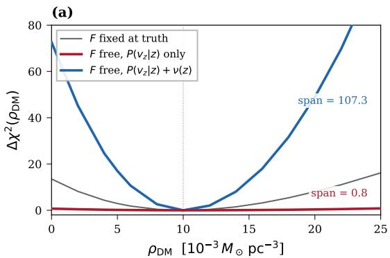

(b)  
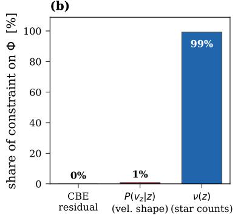

Figure A1: Spans are calculated over the interval $\rho _ { D M } \in [ 0 , 2 5 ] \times 1 0 ^ { - 3 } M \odot \mathrm { p c } ^ { - 3 }$ , accounting for their slight deviation from corresponding spans reported in Table A1. Freeing the distribution function destroys the constraint on $\rho _ { \mathrm { D M } } ;$ adding the star counts restores it. Left: $\Delta \chi ^ { 2 }$ over $\rho _ { \mathrm { D M } }$ for the baseline mock, with the distribution function fixed at truth (gray), free and scored on the conditional velocity shape alone (red), and free with the spatial density added (blue). Right: the same three profiles as fractions of the total.  
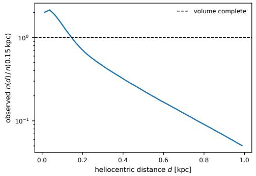

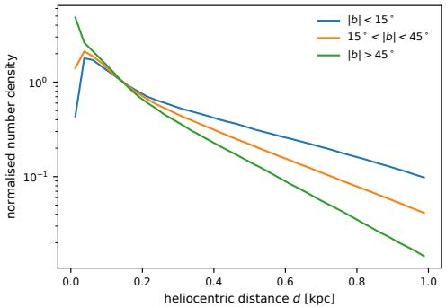  
Figure $_ { \mathrm { A 2 } } \cdot$ : Survey completeness dominates the observed density. Left: observed number density per unit volume against heliocentric distance, normalized at 0.15 kpc. It falls by more than an order of magnitude across the ball, driven by a selection gradient |d ln $S / \mathrm { d } d |$ of $1 0 . 9 \mathrm { k p c } ^ { - 1 }$ against a physical $| \partial _ { z }$ ln ν| of $3 . 0 \mathrm { k p c } ^ { - 1 }$ . Right: the same profile split by galactic latitude. The three lines separate because the distance falloff mixes the isotropic selection $\bar { S ( d ) }$ with the height-dependent stratification $\nu ( R , z ) ;$ the GLM separates them because stars at equal distance in different directions lie at different heights.

## B Data and the selection model

We adopt $R _ { 0 } ~ = ~ 8 . 1 2 2$ kpc and $z _ { \odot } ~ = ~ 0 \colon$ the catalogue is built in a frame centred on the Sun, so the dynamical midplane offset of Sec. 3 is measured against a fixed $z = 0$ . The GLM $\mu =$ $V { \cdot } S ( d ) \ \overline { { A } } ( \ell , b ) \nu ( R , z ) \nonumber$ fits the three factors jointly. The density factor returns a 334 pc tracer scale height and a 2.88 kpc scale length, neither tied to literature values. Dust is not separable in distance and direction, so we refit on the dust-poor $| b | > 2 0 ^ { \circ }$ sight lines: $\partial _ { z } \ln \nu ( 0 . 3 \mathrm { k p c } )$ moves from −2.99 $\mathrm { t o - 2 . 6 7 \mathrm { k p c } ^ { - 1 } }$ , an 11% systematic carried forward, and by the hierarchy of Sec. 2 that systematic is what limits Φ.

## C Ablations and model-selection protocol

Separable potentials. Constraining $\Phi = \Phi _ { R } ( R ) + \Phi _ { z } ( z )$ costs 43% in loss at complexity $_ { 9 - 1 0 }$ against the coupled form of Eq. (3). The coupling accounts for the 22% decline of $a _ { z }$ across the sampled radial range, which a separable form cannot produce. The same cross term removes $E _ { z }$ as a candidate third integral, since $E _ { z }$ is conserved only when $\partial ^ { 2 } \Phi / \partial R \partial z = 0 ;$ this excludes the separable case but does not exclude the Stäckel family as a whole, so a non-zero CBE residual is expected here (Sec. 2).

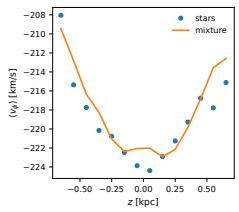

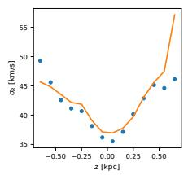

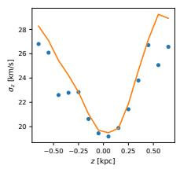

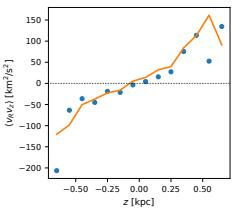  
Figure A3: The 96-component mixture against conditional velocity moments it was never shown: held-out stars (points) versus the mixture (line), as functions of height. The mixture is fitted to individual stars, so the velocity moments serve as an independent check. The mixture reproduces them near the midplane and drifts from the dispersions beyond $| z | \sim 0 . 4 \mathrm { k p c }$ , one source of the estimator floor discussed in Sec. 3.

Vertical profile family. Fitting the vertical term freely among candidate profiles: ln cosh reaches $\chi ^ { 2 } / \mathrm { d o f } = 2 7 5 . 4$ , the softened modulus ${ \sqrt { z ^ { 2 } + h ^ { 2 } } } - h$ ties at $2 7 5 . 8 ,$ , and every form with a midplane kink $( \mathbf { e } . \mathbf { g } . \mathbf { \nabla } | z | )$ is an order of magnitude worse. The data favor the isothermal-sheet family but do not distinguish its two smooth parameterizations, which agree to the width of the fitted region.

Input scaling. Rescaling the inputs by the measured scale height and scale length moves the residual from 38.15 to 23.69 km $\mathrm { { \bar { s } ^ { - 1 } k p c ^ { - 1 } } }$ and $R ^ { 2 }$ from 0.923 to 0.937 at identical complexity: unit choices are worth as much as ∼10 complexity points, so all searches run in scaled variables.

Aperture stability. The measured anisotropy $\sigma _ { R } / \sigma _ { z }$ is stable $\mathrm { t o } \pm 1 \%$ across apertures from $| z | <$ 0.05 to $| z | < 0 . 3 0 \mathrm { k p c } .$ , so its value is not an artifact of the aperture; the spread we report in Sec. 4 comes from the choice of front member.

Why selection is held out. The 70/15/15 split of Sec. 3 is fixed before fitting because in-sample selection picks the wrong front member. On mocks with known truth, in-sample $\chi ^ { 2 }$ prefers a spuriously curved member over the straight one that is true. Held-out $\chi ^ { 2 }$ reverses the choice at every complexity (in-sample $\chi ^ { 2 } / N$ of 1.21 against held-out 1.53 for the line, 0.89 against 1.71 for the exponential). An exponential mimics a line over a bounded range, and only held-out scoring resists it. Every selection in this work follows the rule: mixture components on held-out conditional likelihood, ln f on held-out $R ^ { 2 }$ , Φ on the screened front.

Compute. The acceleration solve is linear least squares over 94 cells and runs in minutes on a single CPU node. Each PySR search (potential and distribution function) runs on one multi-core CPU node in a few hours; the full set of ablations reported here is ${ \sim } 1 0 ^ { 3 } \mathrm { C P U }$ -core-hours.