# CoVeR: Coverage-Based Token Pruning for Multi-View 3D Reasoning in VLMs

Nhat-Tan Bui<sup>1,∗</sup> Varshini Elangovan<sup>1,∗</sup> Arun Reddy Anugu<sup>1</sup> Sreyas Mohan<sup>2</sup> Wei Ye<sup>2</sup> Dilin Wang<sup>2</sup> JQ Huang<sup>2</sup> Rakesh Ranjan<sup>2</sup> Aviral Chharia<sup>1,†</sup> Fernando De la Torre<sup>1</sup>

<sup>1</sup>Carnegie Mellon University <sup>2</sup>Meta Reality Labs

https://humansensinglab.github.io/CoVeR

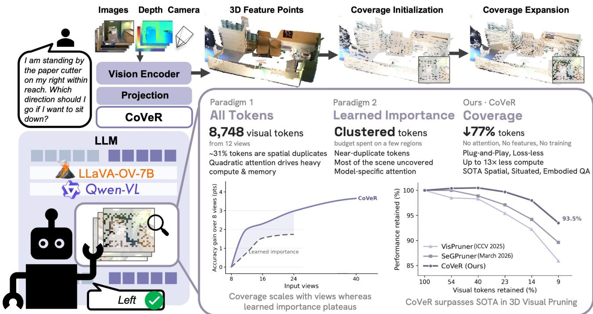

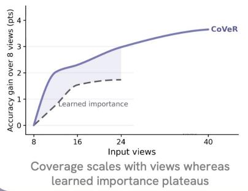

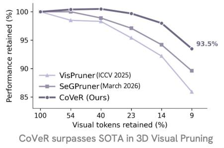  
Figure 1. Overview of CoVeR. A deterministic, training-free token selector for multi-view 3D reasoning in 2D VLMs that prunes by spatia coverage, using geometry alone. We show that CoVeR surpasses state-of-the-art token pruning methods in the multi-view 3D setting.

## Abstract

Representing a 3D scene as multi-view images allows 2D VLMs to reason in 3D by reusing priors from pre-training, sidestepping the scarcity ofannotated 3D data. However, it produces thousands ofredundant visual tokens whose cost grows with every view. Existing visual token pruners fall into twofamilies, each limited in the 3D multi-view setting. Learned importance methods rank tokens by attention or encoder features; because redundancy here is fundamentally spatial, they keep near-duplicate tokens from a few prominent regions and leave most of the scene unrepresented. Voxelization methods improve spatial coverage but cannot enforce an exact token budget and saturate as multi-view

observations overlap in 3D, capping retention well below the target. We show that spatial coverage is associated with 3D reasoning performance and introduce CoVeR, a deterministic, training-free selector that uses only token coordinates, with no learned signals. CoVeR selects tokens that collectively cover every region ofthe scene, and solves the limitations ofbothfamilies: it enforces an exact per-scene budget, breaks the voxelization saturation plateau, and avoids the near-duplicate selections oflearned importance. Extensive experiments show CoVeR outperforms prior SOTAs on all three 3D reasoning benchmarks and generalizes as a plugand-play module tested across four VLMs. Notably, with only ≈8% ofvisual tokens, it preserves 93.5% offull-token performance, surpassing SOTA by 3.9 percentage points on average across benchmarks.

## 1. Introduction

Reasoning about 3D space is a prerequisite for systems that perceive and act in the physical world. Directly training models at scale on 3D representation [8, 17, 18, 21, 23, 25, 26, 43, 44, 50, 51, 61–63, 69] is limited by the scarcity of 3D-language data, which is orders of magnitude smaller than the internet-scale image-text datasets behind 2D VLMs [3, 4, 32]. A practical alternative renders the scene as multi-view images and uses a pre-trained 2D VLM to reason over them [11, 16, 19, 20, 27, 45, 53, 57, 82, 83], inheriting their strong visual and language priors. However, this introduces a major bottleneck: the number of visual tokens grows linearly with the number of views. For example, 12-views produce 8,748 visual tokens in LLaVA-OneVision-7B [32], substantially increasing the LLM inference cost. Reducing the visual token count is thus necessary for scaling 3D reasoning on 2D VLMs.

Most token pruning methods retain the top-K tokens ranked by learned importance from attention or visual features, an intuition inherited from single-view pruning [5, 7, 36, 47, 48, 60, 67, 68, 75, 78]. We argue this is ill-suited to the multi-view 3D setting, where the dominant redundancy is geometric: different cameras observe the same physical regions, and importance scores computed independently of geometry retain near-duplicate tokens while leaving distinct objects or boundaries elsewhere under-represented. Such signals are also model-specific, depending on attention or auxiliary features that vary across architectures.

Voxelization-based pruners back-project tokens into 3D space and pool those falling in the same voxels. This improves coverage but does not control the output token count: a fixed voxel size leaves a different number of tokens in different scenes, and the count plateaus once overlapping views already share voxels. For example, ≈31% of tokens overlap (Fig. 2(a)), so voxel-only pruning keeps about 69% of tokens on average and 46-57% in the most redundant scenes (Fig. 2(b)). Such methods give coverage but not an exact budget.. Exact control matters because a single scene can exceed a fixed memory or latency limit even when the dataset average stays within it. Both approaches are thus insufficient in the 3D multi-view setting.

We address this with CoVeR, a deterministic, trainingfree selector that uses only token coordinates, with no attention, features, or learned signals. Coverage initialization finds a scene-specific voxel size and keeps one representative token per occupied voxel, removing overlapping observations while preserving a coarse cover of the whole scene. Coverage expansion then iteratively selects the tokens farthest from those retained, adding tokens in the least-covered regions until the budget is met exactly, thereby recovering fine-scale evidence beyond the saturation limit. Both stages reduce the directed Hausdorff distance from the original token set to the retained subset. CoVeR yields consistent gains at aggressive budgets and transfers across VLMs. Our contributions include:

Table 1. Comparison with token pruning methods. Avoiding learned signals (attention, visual features, auxiliary encoders) removes model-specific dependence, while deterministic selection and exact per-scene budget give precise control over token count.
<table><tr><td></td><td>Voxelization</td><td></td><td>Learned Importance</td><td></td><td>Ours</td></tr><tr><td>Property</td><td>VTC [24]</td><td>DTC [24]</td><td>VisPruner [75] SeGPruner [34]</td><td>Geo3DPruner [33]</td><td>CoVeR</td></tr><tr><td>Attention-free</td><td></td><td></td><td>x x</td><td>x</td><td></td></tr><tr><td>Visual feature-free</td><td></td><td>X</td><td>X X</td><td>x</td><td></td></tr><tr><td>Auxiliary encoder free</td><td></td><td></td><td>√</td><td>x</td><td></td></tr><tr><td>Training-free</td><td></td><td>√</td><td>✓</td><td>X</td><td></td></tr><tr><td>Deterministic</td><td></td><td>x</td><td>√</td><td>√</td><td></td></tr><tr><td>Exact per-scene budget</td><td>x</td><td>X</td><td></td><td>√</td><td></td></tr></table>

• Problem analysis. We identify key limitations in both 3D token pruning families: voxelization-based methods cannot enforce exact per-scene budgets and are capped by voxel saturation, while learned importance-based methods spend their budget on near-duplicates, leaving the scene under-covered.

• Coverage-based paradigm. We propose CoVeR, a training-free, deterministic, geometry-only token pruning framework that optimizes for scene coverage under a guaranteed exact per-scene budget.

• Analytical insights. Statistical metrics link geometric coverage to 3D reasoning, while directed distances show it preserves regions favored by learned importance; stagewise analysis shows real tokens beat merged features and pure spatial distance outperforms learned signals.

• Extensive evaluation. CoVeR achieves SOTA on spatial scene understanding (ScanQA [2]), situated reasoning (SQA3D [40]), and embodied question answering (OpenEQA [42]), while generalizing across four VLMs. On ScanQA at 14% retention, it cuts LLM TFLOPs by 8.6× and KV cache by 7×, with a 1.4× lower GPU memory and 2.5× inference speedup at a 1.1% relative drop.

## 2. Related Works

Voxelization-based Pruning. These methods back-project tokens into 3D and reduce them within voxels: VTC [24] averages a voxel’s features into a synthetic token, while DTC [24] raises voxel resolution and merges tokens by feature similarity. In all cases, the token count stays tied to geometry, so reported budgets are dataset averages, not exact per-scene counts.

Learned importance-based Pruning. These methods instead anchor on attention or visual features. SeGPruner [34] combines attention-ranked initialization with diversity stage under a joint semantic-spatial metric, making its coverage attention-anchored. Geo3DPruner [33] relies on attention and introduces a large VGGT [58] encoder, re-training the backbone. VisPruner [75] ranks tokens by text-visual attention and encoder features. CoVeR differs from prior works on several axes (Table 1): selection is purely geometric, using no attention, encoder features, or semantic similarity; it is training-free and deterministic; and it yields exact perscene budgets that current voxelization-based pruners cannot guarantee.

(b) Per-scene coverage  
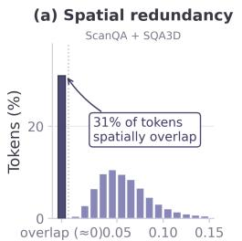  
Distance to nearest token (m)

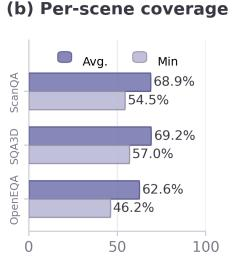  
Token coverage (%)

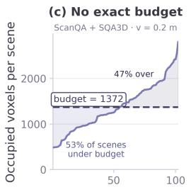  
Scene by voxel count

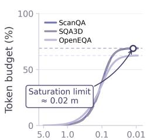  
Voxel size Vsize (m)

(e) Exact budget  
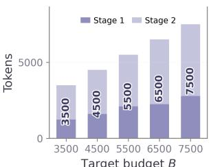  
Target budget B  
Figure 2. Motivation (a-d) and Exact-budget Results (e). Analysis using 12-frame inputs to LLaVA-OneVision-7B.

## 3. Methodology

## 3.1. Problem Formulation

We aim to design a selector that, for a budget B, returns B tokens whose 3D locations represent the whole observed scene, using geometry alone and no learned signals. The budget must hold on every scene rather than a dataset average, and coverage must be an explicit objective rather than a by-product of ranking. Given posed RGB-D views, a frozen visual encoder produces M patch tokens, each backprojected to a world coordinate $\mathbf { t } _ { i } \in \mathbb { R } ^ { 3 }$ . Let $X = \{ \mathbf { t } _ { i } \} _ { i = 1 } ^ { M }$ denote the token locations and let ${ \mathcal { C } } \subseteq \{ 1 , . . . , M \} , | { \mathcal { C } } | = B$ index the selected tokens. For a point t and an index set A, we define $\begin{array} { r } { \delta ( \mathbf { t } ; \mathcal { A } ) = \operatorname* { m i n } _ { j \in \mathcal { A } } | | \mathbf { t } - \mathbf { t } _ { j } | | _ { 2 } } \end{array}$ . We ask: given exactly B retained tokens, how well do they cover the observed scene? We measure this with the directed Hausdorff distance,

$$
d _ { H } ( X , { \mathcal { C } } ) = \operatorname* { m a x } _ { \mathbf { t } \in X } \delta ( \mathbf { t } ; { \mathcal { C } } )\tag{1}
$$

i.e., the distance from the worst-covered token to its nearest retained token. Intuitively, $d _ { H }$ asks how far the most underrepresented part of the scene sits from anything retained, so a small value certifies that no region is dropped outright, which is precisely the guarantee learned importance does not offer. Therefore, we aim

$$
\mathcal { C } ^ { * } = \underset { \mathcal { C } \subseteq \{ 1 , \dots , M \} , | \mathcal { C } | = B } { \arg \operatorname* { m i n } } d _ { H } ( X , \mathcal { C } )\tag{2}
$$

the discrete Euclidean k-center problem.

## 3.2. Why Voxelization Is Insufficient

A natural route to the k-center objective is voxelization: at voxel size $v _ { s } .$ , token i has index $\mathbf { v } _ { i } ~ = ~ \lfloor \mathbf { t } _ { i } / v _ { s } \rfloor$ , occupied voxel k holds $\mathcal { V } _ { k } = \{ i \mid \mathbf { v } _ { i } = k \}$ , and keeping one token per occupied voxel returns $G ( v _ { s } ; X )$ tokens, where $G ( v _ { s } ; X )$ is the occupied-voxel count. This maps repeated cross-view observations to the same voxel, but its output is governed indirectly by $v _ { s }$ rather than by a token count, which creates two problems.

No exact per-scene budget. Meeting budget B requires $G ( v _ { s } ; X ) = B$ , yet occupancy depends on scene geometry, extent, and view overlap, so one $v _ { s }$ under- or overshoots B across scenes. At a fixed $v _ { s } { = } 0 . 2$ m and B=1342, 56% of scenes fall below budget and 44% exceed it (Fig. 2(c)). VTC inherits this variability, and DTC matches retention only on average through tuning; neither guarantees a per-scene memory or latency limit.

Voxel occupancy saturates at practical resolutions. Reducing $v _ { s }$ raises occupancy only up to a point: many tokens are near-duplicate observations of the same surface from different views, so past a certain resolution smaller voxels no longer separate them. About 31% of ScanQA and SQA3D tokens spatially overlap (Fig. 2(a)), so achievable retention plateaus at ≈69% near ${ v _ { s } } \mathrm { { = } } 0 . 0 2$ m (Fig. 2(d)); highly redundant scenes saturate at 46.2–57% (Fig. 2(b)). Within the practical range, voxelization alone therefore cannot reach arbitrary budgets, motivating our method.

## 3.3. Overview

Fig. 1 and Algo. 1 summarize CoVeR. Coverage initialization (Sec. 3.4) adaptively voxelizes a scene and keeps an original token per occupied voxel, removing cross-view duplicates into a coarse scene-wide spatial cover. Coverage expansion (Sec 3.5), then repeatedly adds the token farthest from the current selection, extending coverage to regions underrepresented by voxelization, until exactly B tokens remain. The two stages are complementary. Voxelization is cheap and spreads tokens over the whole scene at once, but its output count is capped by resolution; farthest point sampling (FPS) [15] can place a variable number of tokens, but builds a spread slowly.

Budget split. A single hyperparameter $\alpha \in ( 0 , 1 )$ sets the stage 1 target $B _ { \mathrm { i n i t } } = \operatorname* { m a x } ( 1 , \lfloor \alpha B \rfloor )$ ; stage 2 then supplies the remaining $B _ { \mathrm { e x p a n } } = B - | \mathcal { C } _ { \mathrm { i n i t } } |$ tokens. For any feasible budget $B \leq M .$ , three cases ensure exactly B output tokens:

(1) if $| { \mathcal { C } } _ { \mathrm { i n i t } } | < B$ , stage 2 adds the remaining tokens $( \mathrm { i . e . }$ $B _ { \mathrm { e x p a n } } \geq 1 )$ , this is the regime observed for all evaluated scenes and budgets; (2) if $| { \mathcal { C } } _ { \mathrm { i n i t } } | = B$ , stage 2 is empty; and (3) if $| { \mathcal { C } } _ { \operatorname { i n i t } } | > B$ , a safeguard (Alg. 1) retains representatives from the B most populated voxels (which is not activated at any scene or budget with our ratio α). Thus, regardless of where the voxel search terminates, the selector always returns exactly B tokens (Fig. 2(e)).

Integration with a VLM. CoVeR is a plug-in module that selects token indices C right after the visual encoder. All visual tokens still pass through the projector, and after projection, only the features indexed by C reach the LLM, kept in original sequence order. The native token layout is left intact with pruned tokens simply removed, making CoVeR compatible across diverse VLMs whose projectors preserve token-wise correspondence.

```latex
Algorithm 1 Coverage-based 3D Token Pruning
Inputs: Token coordinates $X = \{ \mathbf { t } _ { i } \} _ { i = 1 } ^ { M }$ , budget $B ,$ ratio α
Constants: $\tau = 0 . 0 5 , T = 1 6 , \left[ v _ { \mathrm { m i n } } , v _ { \mathrm { m a x } } \right] = [ 0 . 0 2 , 5 . 0 ]$
Output: Selected token set ${ \mathcal { C } } , | { \mathcal { C } } | = B$
1: $B _ { \mathrm { i n i t } }  \operatorname* { m a x } ( 1 , \lfloor \alpha B \rfloor )$
Stage 1: Coverage initialization
2: $v _ { \mathrm { l o } }  v _ { \mathrm { m i n } } , v _ { \mathrm { h i } }  v _ { \mathrm { m a x } }$
3: for $t = 1 , \dots , T$ do
4: $v _ { s }  ( v _ { \mathrm { l o } } + v _ { \mathrm { h i } } ) / 2$
5: $G \gets | \{ \lfloor \mathbf { t } _ { i } / v _ { s } \rfloor \} _ { i = 1 } ^ { M } |$
6: $\mathbf { i f } \left( 1 - \tau \right) B _ { \mathrm { i n i t } } \leq G \leq ( 1 + \tau ) B _ { \mathrm { i n i t } }$ then break
7: $v _ { \mathrm { l o } } \gets v _ { s } \ \mathbf { i f } G > ( 1 + \tau ) B _ { \mathrm { i n i t } }$ else $v _ { \mathrm { h i } }  v _ { s }$
8: end for
9: $\mathcal { C } _ { \mathrm { i n i t } } $ representative per occupied voxel ▷ Eq. 3
10: if $| { \mathcal { C } } _ { \mathrm { i n i t } } | > B$ then $\mathcal { C } _ { \mathrm { i n i t } }$ ← representatives of B most
populated voxels ▷ budget safeguard
Stage 2: Coverage expansion
11: $B _ { \mathrm { e x p a n } }  B - \vert \bar { \mathcal { C } } _ { \mathrm { i n i t } } \vert , \quad \mathcal { C } _ { \mathrm { e x p a n } }  \emptyset$
12: $\begin{array} { r l r } { d _ { \mathrm { m i n } } ( m ) } & { { }  } & { \mathrm { m i n } _ { s \in \mathcal { C } _ { \mathrm { i n i t } } } \Vert \Vert \mathbf { t } _ { m } \ - \ \mathbf { t } _ { s } \Vert _ { 2 } ^ { 2 } } \end{array}$ ∀m $\notin$
$\begin{array} { r l } { \mathcal { C } _ { \mathrm { i n i t } } ; \ } & { { } d _ { \mathrm { m i n } } ( s ) \gets - 1 \ \forall s \in \mathcal { C } _ { \mathrm { i n i t } } } \end{array}$
13: for $j = 1 , \ldots , B _ { \mathrm { e x p a n } }$ do
14: $m ^ { * } \gets \arg \operatorname* { m a x } _ { m } d _ { \operatorname* { m i n } } ( m )$
15: $\begin{array} { r } { \mathcal { C } _ { \mathrm { e x p a n } } \gets \mathcal { C } _ { \mathrm { e x p a n } } \cup \{ m ^ { * } \} , \quad d _ { \mathrm { m i n } } ( m ^ { * } ) \gets - 1 } \end{array}$
16: $d _ { \operatorname* { m i n } } ( m ) \gets \bar { \operatorname* { m i n } } ( d _ { \operatorname* { m i n } } ( m ) , \lVert \mathbf { t } _ { m } - \mathbf { t } _ { m ^ { * } } \rVert _ { 2 } ^ { 2 } )$ ∀m
17: end for
18: return $\mathcal { C }  \mathcal { C } _ { \mathrm { i n i t } } \cup \mathcal { C } _ { \mathrm { e x p a n } }$
```

## 3.4. Coverage Initialization

Stage 1 constructs a coarse scene-wide cover. $\operatorname { A s } G ( v _ { s } ; X )$ varies with scene geometry, CoVeR estimates $v _ { s }$ per scene rather than transferring one global value across the dataset. Adaptive voxel size via heuristic interval search. Because voxel grids at different sizes are not nested, $G ( v _ { s } ; X )$ is not guaranteed to be monotonic in $v _ { s } .$ . However, decreasing $v _ { s }$ tends to increase $G ( v _ { s } ; X ) ( \mathrm { F i g . ~ } 2 ( \mathrm { d } ) )$ ). Motivated by this observation, we use binary search as a heuristic over an interval $[ v _ { \mathrm { l o } } , v _ { \mathrm { h i } } ] , \ ^ { 1 }$ , raising $v _ { s }$ when too many voxels are produced and lowering it when too few are, until G lands within a tolerance $\tau$ of $B _ { \mathrm { i n i t } }$ or $T$ iterations are reached. Because the search is heuristic, the terminal occupancy may fall on either side of $B _ { \mathrm { i n i t } } .$ , the budget safeguard (Alg. 1) makes the final selection independent of this outcome.

Representative token per voxel. To ensure one token per occupied voxel, we retain the token nearest the mean of the others in its voxel, which sits near the geometric center of the voxel’s occupancy and is the most representative proxy. A boundary token would risk placing neighboring voxels representatives close together, undermining uniformity:

$$
i _ { k } ^ { \mathrm { r e p } } = \arg \operatorname* { m i n } _ { i \in \mathcal { V } _ { k } } \left\| \mathbf { t } _ { i } - \frac { 1 } { | \mathcal { V } _ { k } | - 1 } \sum _ { j \in \mathcal { V } _ { k } , \ j \neq i } \mathbf { t } _ { j } \right\| _ { 2 }\tag{3}
$$

The output of this stage is the selected set:

$$
| \mathcal { C } _ { i n i t } | = \operatorname* { m i n } ( G ( v _ { s } ; X ) , B )\tag{4}
$$

## 3.5. Coverage Expansion

Since $G ( v _ { s } ; X )$ is capped by the number of distinct token locations, stage 1 alone cannot reach the full budget. Stage 2 lifts the ceiling by expanding $\mathcal { C } _ { \mathrm { i n i t } }$ with an expansion set $\mathcal { C } _ { \mathrm { e x p a n } }$ of size $B _ { \mathrm { e x p a n } }$ via farthest point sampling (FPS) [15], an inherently coverage-seeking procedure. FPS iteratively builds the expansion set by selecting candidate tokens that are maximally distant from all currently selected tokens. Starting from an empty set $\mathcal { C } _ { \mathrm { { e x p a n } } } .$ , it treats running selection as $\begin{array} { r c l } { \mathcal { C } } & { = } & { \mathcal { C } _ { i n i t } \cup \mathcal { C } _ { \mathrm { e x p a n } } } \end{array}$ . At each iteration, new token $s ^ { * }$ maximizes its spatial distance to nearest token already in $\mathcal { C } \mathrm { : }$

$$
m ^ { * } = \arg \operatorname* { m a x } _ { m \notin \mathcal { C } } \bigg ( \operatorname* { m i n } _ { s \in \mathcal { C } } \mathcal { D } ( \mathbf { t } _ { m } , \mathbf { t } _ { s } ) \bigg )\tag{5}
$$

Intuitively, this adds each new token $m ^ { * }$ to $\mathcal { C } _ { \mathrm { { e x p a n } } } .$ , i.e., wherever the scene is currently least covered, and repeats until the budget is met, ensuring $| { \mathcal { C } } | = B$

Voxel-initialized expansion. Because C is initialized with $\mathcal { C } _ { \mathrm { i n i t } }$ , the first expansion step measures distance to the already covered regions, allowing FPS to select tokens in uncovered areas rather than re-covering regions explored in stage 1. Concretely, for every unselected token m $\notin \mathcal { C } _ { \mathrm { i n i t } }$ the minimum distance to the initial set is computed as $\begin{array} { r } { d _ { \operatorname* { m i n } } ( m ) \ = \ \operatorname* { m i n } _ { s \in \mathcal { C } _ { i n i t } } \mathcal { D } ( \mathbf { t } _ { m } , \mathbf { t } _ { s } ) \ \forall m \ \notin \ \mathcal { C } _ { i n i t } . } \end{array}$ At each step, the token with the largest $d _ { \mathrm { m i n } }$ is added to $\mathcal { C } _ { \mathrm { e x p a n } }$ and the distances are updated against the new token, for $B _ { \mathrm { e x p a n } }$ steps, yielding $| C | = B$

Distance metric. We use the squared Euclidean distance, i.e., $\mathcal { D } _ { \mathrm { s p a t i a l } } ( \mathbf { t } _ { i } , \mathbf { t } _ { j } ) ~ = ~ \| \mathbf { t } _ { i } - \mathbf { t } _ { j } \| _ { 2 } ^ { 2 }$ between the 3D coordinates as the FPS metric.

## 3.6. Coverage Objective

Stage 2 always returns B tokens for any feasible budget $B \leq M ;$ this budget guarantee does not depend on the voxel search. Coverage admits a bound in the common case where the safeguard is inactive, i.e. $| { \mathcal { C } } _ { \mathrm { i n i t } } | = G ( v _ { s } ; X ) \leq B \colon$ every unselected token then shares a voxel of side $v _ { s }$ with a selected one and lies within its space diagonal, yielding $d _ { H } ( X , { \mathcal { C } } _ { \mathrm { i n i t } } ) \leq \sqrt { 3 } v _ { s }$ . Each FPS step then selects the token attaining the inner max–min of Eq. 1, so $d _ { H } ( X , { \mathcal { C } } )$ is nonincreasing through stage 2 (the squared Euclidean distance leaves the selection order unchanged) and the bound carries to the final selection. When the safeguard is active, the exact budget guarantee still holds, but this particular bound may no longer apply; full proofs are in the Appendix.

## 4. Experiments and Results

Benchmarks and Metrics. We evaluate all three forms of 3D reasoning: ScanQA [2] for 3D spatial understanding, SQA3D [40] for situated reasoning grounded in an agent’s position, and OpenEQA [42] for open-vocabulary embodied QA. Together, they probe object recognition, attributes, counting, localization, and spatial relations. Following prior work [2, 21, 24, 33, 34, 42, 83], we report EM@1, CIDEr [56], and ROUGE-L [35] for ScanQA; EM@1 for SQA3D; and LLM-Match for OpenEQA. Efficiency is measured by inference and pruning time (s), LLM TFLOPs, KV-cache (MB), and peak GPU memory (GB).

Models and protocol. We test CoVeR with four VLMs: LLaVA-OV-7B [32], Video-3D LLM [82], Qwen2.5-VL-7B [4], and Qwen3-VL-8B [3]. Following [24, 34], we uniformly sample 12 views, evaluate prior work retention ratios, and compare with VTC [24], DTC [24], VisPruner [75], and SeGPruner [34] under matched inputs. For Geo3DPruner [33], we follow its protocol with Video-3D LLM using 16 views. <sup>2</sup> CoVeR uses α = 0.4 throughout; all experiments run on one NVIDIA H100 GPU. Additional details are in the Appendix.

## 4.1. Main Results

CoVeR achieves the best aggregate performance at every token budget (Table 2). Averaging across three datasets, CoVeR retains 93.5% of full-token performance at 8% token retention, versus 89.6% and 85.9% for SeGPruner and Vis-Pruner. On ScanQA, it improves over the full-token baseline at 23% retention, reaching 28.5 EM@1 and 85.5 CIDEr, while at 9% budget it achieves 27.1 EM@1, 81.4 CIDEr, and 41.5 ROUGE-L, substantially outperforming SeGPruner and VisPruner. It also reaches 48.6 EM@1 on SQA3D at 8% retention and outperforms prior pruning methods on OpenEQA at aggressive budgets. We further report categorylevel OpenEQA results and comparisons in the Appendix. Fig. 3 shows CoVeR spreading tokens across all chairs and answering correctly, while VisPruner and SeGPruner cluster on a few patches and undercount.

Table 2. Performance Comparison. CoVeR compared to Voxelization and Learned Importance methods on 12-view ScanQA [2], OpenEQA [42], and SQA3D [40]. Avg. is over benchmarks, while Rel. is avg. % of performance maintained. Higher is better.
<table><tr><td rowspan="2">Methods</td><td colspan="2">ScanQA</td><td colspan="2">OpenEQA SQA3D</td><td rowspan="2">Avg. Rel.</td></tr><tr><td>EM@1 CIDEr ROUGE-L</td><td></td><td>L-Match</td><td>EM@1</td></tr><tr><td colspan="6">Retain 100% Tokens</td></tr><tr><td>LLaVA-OV-7B</td><td>28.2 83.6</td><td>42.6</td><td>59.1</td><td>51.7</td><td>54.1 100.0</td></tr><tr><td></td><td>Retain 54% Tokens</td><td></td><td>Retain 56% Tokens</td><td></td><td></td></tr><tr><td>DTC [24] 27.8</td><td></td><td></td><td></td><td></td><td></td></tr><tr><td>VisPruner [75]</td><td>27.7 80.5</td><td>41.3</td><td>59.1</td><td>50.9</td><td>53.3 98.5</td></tr><tr><td>SeGPruner [34]</td><td>28.5 83.8</td><td>42.6</td><td>58.9</td><td>51.7</td><td>54.1 100.0</td></tr><tr><td>CoVeR (Ours)</td><td>28.7 85.0</td><td>43.2</td><td>58.9</td><td>51.7</td><td>54.3 100.4</td></tr><tr><td></td><td>Retain 40% Tokens</td><td></td><td>Retain 43% Tokens</td><td></td><td></td></tr><tr><td></td><td></td><td></td><td></td><td></td><td></td></tr><tr><td>DTC [24] VisPruner [75]</td><td>27.7 28.0 80.3</td><td>41.4</td><td>58.4</td><td>51.0</td><td>53.1 98.3</td></tr><tr><td>SeGPruner [34]</td><td>28.2 81.9</td><td>42.0</td><td>58.0</td><td>51.5</td><td>53.4 98.9</td></tr><tr><td>CoVeR (Ours)</td><td>28.9 85.5</td><td>43.4</td><td>58.6</td><td>51.7</td><td>54.3 100.5</td></tr><tr><td></td><td></td><td></td><td>Retain 26% Tokens</td><td></td><td></td></tr><tr><td colspan="6">Retain 23% Tokens</td></tr><tr><td>DTC [24] VisPruner [75]</td><td>27.7</td><td></td><td></td><td></td><td></td></tr><tr><td>SeGPruner [34]</td><td>26.9 77.1</td><td>40.1</td><td>57.1 57.5</td><td>49.5</td><td>51.5 95.4 97.1</td></tr><tr><td>CoVeR (Ours)</td><td>27.7 78.9 28.5</td><td>40.7</td><td>57.7</td><td>50.6</td><td>52.4 53.9 99.7</td></tr><tr><td></td><td>85.5</td><td>43.2</td><td></td><td>51.7</td><td></td></tr><tr><td colspan="6">Retain 14% Tokens Retain 17% Tokens</td></tr><tr><td>DTC [24]</td><td>26.7</td><td></td><td></td><td></td><td></td></tr><tr><td>VisPruner [75]</td><td>24.8 71.7</td><td>37.5</td><td>55.9</td><td>49.0</td><td>49.9 92.2</td></tr><tr><td>SeGPruner [34]</td><td>26.4 75.2</td><td>38.9</td><td>56.0</td><td>49.7</td><td>50.8 94.2</td></tr><tr><td>CoVeR (Ours)</td><td>27.9 82.4</td><td>42.2</td><td>56.8</td><td>51.2</td><td>52.9 98.0</td></tr><tr><td colspan="3">Retain 9% Tokens</td><td>Retain 8% Tokens</td><td></td><td></td></tr><tr><td>DTC [24]</td><td>26.1</td><td></td><td></td><td>48.0</td><td></td></tr><tr><td>VisPruner [75]</td><td>23.4 66.9</td><td>35.6</td><td>51.5</td><td>45.7</td><td>46.4 85.9</td></tr><tr><td>SeGPruner [34]</td><td>24.5 71.2</td><td>37.0</td><td>52.5</td><td>48.4</td><td>48.4 89.6</td></tr><tr><td>CoVeR (Ours)</td><td>27.1 81.4</td><td>41.5</td><td>53.0</td><td>48.6</td><td>50.5 93.5</td></tr></table>

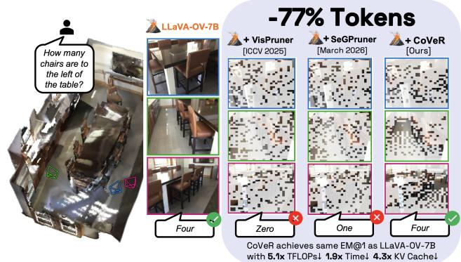  
Figure 3. Qualitative comparisons. CoVeR provides correct answers while substantially reducing the computational cost.

## 4.2. Geometric Coverage Analysis

Does CoVeR improve Geometric Coverage? Accuracy alone does not reveal how a pruning method should spend its target budget. We therefore measure coverage at the most aggressive ScanQA budget with two metrics. The Nearest Neighbor Index (NNI) [12] measures how evenly the retained tokens are spread: it is the ratio of their mean nearest-neighbor distance to the value expected under a spatially random process, so a low value flags the clustering we want to avoid. A spread-out set can still miss whole regions, so the Nearest Neighbor Distance $( \mathrm { N N D } _ { q } )$ measures coverage of the scene directly: one minus the q-th percentile of every original token’s distance to its nearest selected token, normalized by the scene diagonal. We report $\mathrm { N N D _ { 9 5 } }$ for robustness and $\mathrm { N N D _ { 1 0 0 } }$ , the worst case, which equals the normalized complement of the directed Hausdorff distance minimized by CoVeR (Eq. 1). Higher indicates better coverage. Details are included in the Appendix.

As shown in Table 3, SeGPruner concentrates tokens on a few regions $( \mathrm { N N I } = 0 . 4 5 8 )$ , while CoVeR is far more uniform $( \mathrm { N N I } = 0 . 9 2 4 )$ . CoVeR also covers the scene better on both $\mathrm { N N D _ { 9 5 } }$ (0.980 vs. 0.967) and $\mathrm { N N D _ { 1 0 0 } }$ (0.977 vs. 0.917), with the largest gap on the worst case. All gaps are significant under the paired t- and Wilcoxon signed-rank tests. CoVeR also attains higher accuracy than SeGPruner, supporting our motivation that, at a fixed budget, spatial coverage beats concentrating tokens on a few regions. The widest gap falls on $\mathrm { N N D _ { 1 0 0 } }$ , the normalized complement of the directed Hausdorff distance CoVeR minimizes, confirming it as the right objective for coverage-based selection.

Table 3. Coverage and Performance. CoVeR achieves substantially better spatial coverage with higher downstream 3D scene understanding performance compared to SeGPruner [34]. Higher ↑ is better on all columns.
<table><tr><td rowspan="2">Method</td><td colspan="3">Coverage</td><td colspan="3">Performance</td></tr><tr><td>NNI</td><td> $\mathrm { N N D _ { 9 5 } }$ </td><td> $\mathrm { N N D } _ { 1 0 0 }$ </td><td></td><td></td><td>EM@1 CIDEr ROUGE-L</td></tr><tr><td>SeGPruner</td><td>0.458</td><td>0.967</td><td>0.917</td><td>24.5</td><td>71.2</td><td>37.0</td></tr><tr><td>CoVeR</td><td>0.924</td><td>0.980</td><td>0.977</td><td>27.1</td><td>81.4</td><td>41.5</td></tr></table>

Does CoVeR preserve informative regions? A geometryonly selector raises a concern: broad coverage might come from visually uninformative regions while discarding answercritical evidence. We therefore compare CoVeR and SeG-Pruner selections directly at 9% ScanQA retention with Token Recovery (TR) and Token Expansion (TE). TR measures the normalized distance from each SeGPruner token to its nearest CoVeR token, while TE is the reverse direction; both are defined in the supplementary materials. A small TR means CoVeR keeps a token near every region SeGPruner selects, while a large TE means CoVeR also covers regions SeGPruner ignores.

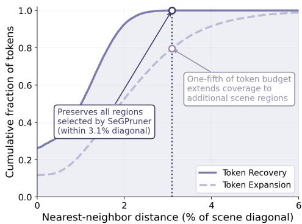  
Figure 4. Cumulative distributions of directed nearestneighbors. CoVeR preserves SeGPruner’s selected regions within 3.1% of scene diagonal while covering ≈20% additional regions.

Table 4. Directed distance. CoVeR remains close to regions selected by SeGPruner while expanding into additional regions.
<table><tr><td>Comparison</td><td>TR↓ TE↑</td></tr><tr><td>CoVeR vs. SeGPruner</td><td>0.009 0.020</td></tr></table>

Table 4 shows TR is small (0.009 of the scene diagonal) and TE about twice as large (0.020), so CoVeR’s tokens stay close to SeGPruner’s while the reverse does not hold. The cumulative distributions (Fig. 4) make this sharper: every SeGPruner token lies within 3.1% of the scene diagonal of a CoVeR token, while roughly 20% of CoVeR tokens remain farther than that from any SeGPruner token. Thus, coverage preserves salient regions while additionally covering the rest of the scene.

Insight 1: Broader spatial coverage accompanies stronger 3D reasoning. Prioritizing coverage does not exclude informative regions but instead preserves them, extending coverage to additional parts of the scene.

## 4.3. Efficiency and Generalization

Efficiency. Relative to LLaVA-OV-7B (Table 5), CoVeR delivers substantial efficiency gains while largely preserving performance. At the most aggressive 9% budget, it achieves 13.3× fewer TFLOPs, 10.7× smaller KV cache, and a 2.9× speedup for a 1.1-point drop in performance. Against the learned importance pruners, CoVeR also pairs the highest performance with the lowest peak GPU memory (Table 6): they must run the encoder with attention outputs enabled and hold the attention maps to rank tokens, whereas CoVeR selects from 3D coordinates alone, with only the negligible overhead of a binary search plus FPS.

Additional Backbones. Under Geo3DPruner’s [33] 16-view, 10% retention protocol on Video-3D LLM [82], CoVeR obtains 26.5 ScanQA EM@1 versus 26.0 for Geo3DPruner, and retains 93.5% of full performance versus 90.7% (Table 7), even though Geo3DPruner adds a VGGT-1B encoder [58] and fully retrains the backbone. Without changing the selection rule or α, CoVeR also transfers to Qwen2.5-VL-7B and Qwen3-VL-8B, which differ substantially in visual encoders, tokenization, and resolution handling. Both retain over 96% of ScanQA performance at retention levels above 20% (Fig. 5(a)) and over 95% on SQA3D until retention falls below 20% (Fig. 5(b)), matching trends across architectures.

Table 5. Efficiency at varying token retention. ‘Pruning’ denotes the average time which CoVeR needs to select tokens, while ‘Time’ reports end-to-end inference latency (in sec). CoVeR substantially reduces TFLOPs, KV cache (MB), memory (GB) while remaining competitive across token budgets. Results are relative to LLaVA-OV-7B on ScanQA.
<table><tr><td rowspan="2">Tokens Retained</td><td colspan="5">Efficiency</td><td colspan="2">Accuracy</td></tr><tr><td>Pruning ↓</td><td>Time ↓</td><td>TFLOPs ↓</td><td>KV↓</td><td>Mem↓</td><td>EM@1↑</td><td>Δ</td></tr><tr><td>100%</td><td></td><td>0.497</td><td>145.5</td><td>480.0</td><td>24.1</td><td>28.2</td><td></td></tr><tr><td>54%</td><td>0.189</td><td>0.4931.0×</td><td>71.12.0×</td><td>259.91.8×</td><td>20.31.2×</td><td>28.7</td><td>+0.5</td></tr><tr><td>40%</td><td>0.141</td><td>0.3881.3×</td><td>51.12.8×</td><td>192.92.5×</td><td>19.21.3×</td><td>28.9</td><td>+0.7</td></tr><tr><td>23%</td><td>0.082</td><td>0.2681.9×</td><td>28.3 5.1×</td><td>111.74.3×</td><td>17.81.4×</td><td>28.5</td><td>+0.3</td></tr><tr><td>14%</td><td>0.049</td><td>0.2022.5×</td><td> $1 7 . 0 ^ { 8 . 6 \times }$ </td><td> $6 8 . 6 ^ { 7 . 0 \times }$ </td><td>17.2¹.4×</td><td>27.9</td><td>-0.3</td></tr><tr><td>9%</td><td>0.034</td><td>0.1742.9×10.913.3×44.710.7×17.21.4×</td><td></td><td></td><td></td><td>27.1</td><td>-1.1</td></tr></table>

Table 6. Efficiency comparison. CoVeR attains the highest accuracy at the lowest peak memory. Its selection cost remains a fraction of end-to-end inference. Scores report pruning on LLaVA-OV-7B at 9% token retention for ScanQA.
<table><tr><td>Methods</td><td>EM@1↑ CIDEr↑ ROUGE-L↑ Pruning (s) ↓ Mem (GB) ↓</td><td></td><td></td><td></td><td></td></tr><tr><td>VisPruner [75]</td><td>23.4</td><td>66.9</td><td>35.6</td><td>0.010</td><td>22.1</td></tr><tr><td>SeGPruner [34]</td><td>24.5</td><td>71.2</td><td>37.0</td><td>0.008</td><td>22.1</td></tr><tr><td>CoVeR</td><td>27.1</td><td>81.4</td><td>41.5</td><td>0.034</td><td>17.2</td></tr></table>

Table 7. Generalization with Video-3D LLM [82] backbone. Geo3DPruner [33] introduces a VGGT-1B [58] encoder and requires full backbone retraining, while CoVeR is training-free. Scores are EM@1 ↑ on 16-view at 10% budget.
<table><tr><td rowspan="2">Methods</td><td rowspan="2">Encoder Retrain</td><td rowspan="2"></td><td colspan="2">ScanQA</td><td colspan="2">SQA3D</td><td rowspan="2">Rel.(%)</td></tr><tr><td>100% 10%</td><td></td><td>100% 10%</td><td></td></tr><tr><td>Geo3DPruner [33] VGGT1B</td><td></td><td>Full</td><td>29.7</td><td>26.0</td><td>59.3</td><td>55.7</td><td>90.7</td></tr><tr><td>CoVeR</td><td>None</td><td>None</td><td>28.9</td><td>26.5</td><td>57.9</td><td>55.1</td><td>93.5</td></tr></table>

## 4.4. Design Ablations

We ablate CoVeR one component at a time. Full details have been provided in the Appendix.

Stage 1: Preserving encoder-native tokens. Fig. 6 shows that the advantage of keeping a real token (pruning) over averaging features within a voxel (merging) widens with stronger compression: at the tightest budget, pruning improves EM@1 by 7.7/18.1 on ScanQA/SQA3D, with the largest SQA3D gains on Can (+37) and Which (+29), which need spatial grounding. Coarse voxels mix objects, surfaces, and viewpoints, so averaging yields a synthetic feature, whereas CoVeR keeps an encoder-native token with a valid spatial identity. CoVeR also beats DTC [24] at every budget, so the gain is not merely voxel-size selection.

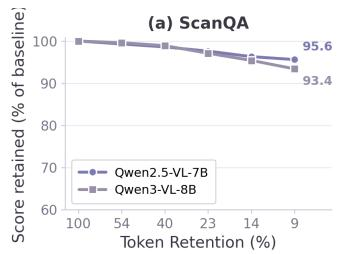

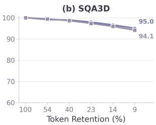  
Figure 5. CoVeR transfers across VLMs. CoVeR exhibits similar performance on Qwen2.5-VL-7B and Qwen3-VL-8B. Performance remains above 93% of the baseline even at 9% token retention for both (a) ScanQA and (b) SQA3D.

Insight 2. Original encoder tokens are easier for LLM to interpret than synthetic avg. of heterogeneous regions.  
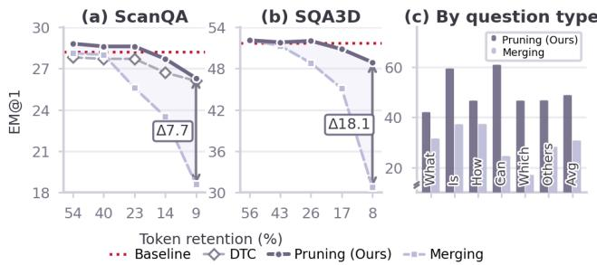  
Figure 6. Coverage initialization analysis (α = 1). Pruning consistently outperforms merging, with gap widening at tight budgets.

Stage 2: Geometric distance. Fig. 7 shows pure 3D distance is consistently strongest across budgets. At the tightest budget, it beats spatial+semantic FPS by 1.7/2.1 on Scan-QA/SQA3D and semantic-only FPS by 2.9/4.3, with the largest SQA3D gains on How (+6.8) and What (+6.2), which require counting or localizing multiple objects. Semantic FPS suppresses distinct objects with similar embeddings, while spatial distance keeps them when 3D locations differ. Without attention or features, it still matches or exceeds SeGPruner [34].

Insight 3. Spatial distance preserves visually similar instances at different locations, while semantic distance can incorrectly suppress them.

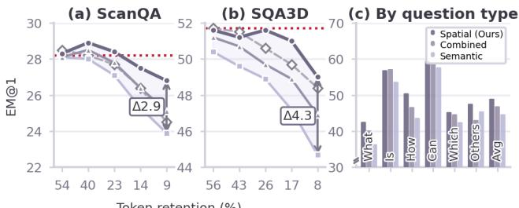  
Baseline SeGPruner Spatial (Ours)Semantic  Combined  
Figure 7. Coverage expansion analysis (α = 0). Spatial distance outperforms combined and semantic alternatives, with gap widening at tight budgets.

CoVeR ablation. Table 8 ablates the expansion rule and its initialization. Our iterative FPS updates the minimum distance after each pick; we compare it against Top-K selection (selecting tokens farthest from the stage 1 tokens without distance updates) and Random selection (uniform sampling). Both are weaker: at 9% retention they lose 0.7 and 1.7 average ScanQA points, since only iterative updates keep placing tokens in still-uncovered regions. For initialization, seeding expansion from the stage 1 tokens rather than From scratch adds 1.1, 0.2, and 0.5 points at 23%, 14%, and 9% retention, because voxel seeding removes duplicates in parallel first, so expansion extends into new regions instead of rediscovering covered ones.

Coverage initialization is necessary. Table 8 isolates the contribution of stage 1 by comparing CoVeR with FPS only design. Without voxel initialization, FPS must build scene coverage sequentially from scratch.

Table 8. Design ablations. Iterative FPS with stage 1 initialization consistently performs best. Results on ScanQA, averaged over EM@1, CIDEr, and ROUGE-L. Pruning time is reported in sec.
<table><tr><td rowspan="2">Component</td><td rowspan="2">Setting</td><td colspan="3">Token Budget</td></tr><tr><td>23%</td><td>14%</td><td>9%</td></tr><tr><td rowspan="3">Expansion</td><td>w/o Iterative FPS (Top-K)</td><td>51.8</td><td>50.4</td><td>49.3</td></tr><tr><td>w/o Iterative FPS (Random)</td><td>51.8</td><td>50.6</td><td>48.3</td></tr><tr><td>w/ Iterative FPS</td><td>52.4</td><td>50.8</td><td>50.0</td></tr><tr><td rowspan="2">Initialization</td><td>w/o Stage 1 seed (From scratch)</td><td>51.3</td><td>50.6</td><td>49.5</td></tr><tr><td>w/ Stage 1 seed</td><td>52.4</td><td>50.8</td><td>50.0</td></tr><tr><td rowspan="2">Pruning time</td><td>w/o Stage 1 (FPS only)</td><td>0.126</td><td>0.078</td><td>0.049</td></tr><tr><td>w/ Stage 1 (CoVeR)</td><td>0.082</td><td>0.049</td><td>0.034</td></tr></table>

Seeding FPS with one representative per occupied voxel instead provides a coarse coverage from the start, which reduces pruning time by approximately 1.5×. Across all variants above, higher coverage (NNI, NND<sub>95</sub>, NND<sub>100</sub>) accompanies higher accuracy, with full CoVeR best on every measure (Fig. 8). Weaker variants leave coherent regions uncovered (top-K, random) or revisit initialized voxels (fromscratch FPS). This consistent ranking supports coverage as the mechanism behind the downstream gains.

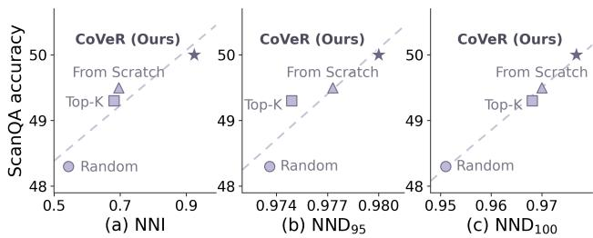  
Figure 8. Better coverage achieves higher performance. Correlation between coverage and accuracy (on ScanQA at 9% retention).

Voxel ratio. Varying α from 0.1 to 0.9 changes accuracy within a narrow band (Fig. 9a), so the split between the two stages is not narrowly tuned; we use $\alpha = 0 . 4$ throughout. Scaling with views. CoVeR leads VisPruner and SeGPruner at every view count and gains more from added views (Fig. 1 and Fig. 9b), because coverage reallocates the fixed budget to newly visible regions rather than repeatedly observed regions favored by attention.

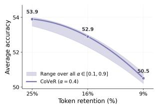  
(a) Voxel ratio. Avg. accuracy across ScanQA, SQA3D, OpenEQA remains stable across budgets.

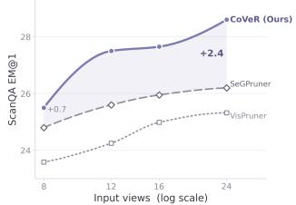  
(b) Effect of View count. CoVeR improves with more views, while Vis-Pruner and SeGPruner saturate.  
Figure 9. Ablation for voxel ratio and scaling view count.

## 5. Conclusion

We propose CoVeR, a training-free, deterministic, geometryonly framework for reducing the visual token count of multiview 2D VLMs. Our analysis identifies key limitations in each prior family: voxelization-based methods cannot enforce exact per-scene budgets and are capped by voxel saturation, while learned importance-based methods concentrate on prominent regions rather than scene coverage. CoVeR addresses both: it searches per scene for the voxel size that yields an initial selection, then extends beyond the saturation plateau using spatial distance alone. It achieves SOTA on three benchmarks while generalizing across four VLMs from two model families without retraining.

Limitations. Like all prior methods, CoVeR requires depth and camera, and is designed for indoor scenes. Its performance may therefore depend on the quality of the estimated geometry. Future work can combine coverage with reliable depth/pose estimation, and hierarchical or streaming selection for outdoor scenes.

## Acknowledgments

The authors thank Saswat Subhajyoti Mallick, Surgan Jandial, Nicholas Mesa-Cucalon, and Yinong Oliver Wang for their insightful discussions, feedback, and assistance with parts of the project. Aviral Chharia was supported in part by the Uber Presidential Fellowship from the Robotics Institute, Carnegie Mellon University. The computational resources were supported in part by PSC Bridges-2 through the Advanced Cyberinfrastructure Coordination Ecosystem: Services and Support (ACCESS) program allocation CIS250962, which is supported by National Science Foundation (NSF) grants #2138259, #2138286, #2138307, #2137603, and #2138296.

## References

[1] Josh Achiam, Steven Adler, Sandhini Agarwal, Lama Ahmad, Ilge Akkaya, Florencia Leoni Aleman, Diogo Almeida, Janko Altenschmidt, Sam Altman, Shyamal Anadkat, et al. Gpt-4 technical report. arXiv preprint arXiv:2303.08774, 2023. 13, 16, 18

[2] Daichi Azuma, Taiki Miyanishi, Shuhei Kurita, and Motoaki Kawanabe. Scanqa: 3d question answering for spatial scene understanding. In 2022 IEEE/CVF Conference on Computer Vision and Pattern Recognition (CVPR), pages 19107–19117, 2022. 2, 5, 13, 18, 19

[3] Shuai Bai, Yuxuan Cai, Ruizhe Chen, Keqin Chen, Xionghui Chen, Zesen Cheng, Lianghao Deng, Wei Ding, Chang Gao, Chunjiang Ge, et al. Qwen3-vl technical report. arXiv preprint arXiv:2511.21631, 2025. 2, 5, 14

[4] Shuai Bai, Keqin Chen, Xuejing Liu, Jialin Wang, Wenbin Ge, Sibo Song, Kai Dang, Peng Wang, Shijie Wang, Jun Tang, Humen Zhong, Yuanzhi Zhu, Mingkun Yang, Zhaohai Li, Jianqiang Wan, Pengfei Wang, Wei Ding, Zheren Fu, Yiheng Xu, Jiabo Ye, Xi Zhang, Tianbao Xie, Zesen Cheng, Hang Zhang, Zhibo Yang, Haiyang Xu, and Junyang Lin. Qwen2.5- vl technical report, 2025. 2, 5, 13, 14, 18

[5] Daniel Bolya, Cheng-Yang Fu, Xiaoliang Dai, Peizhao Zhang, Christoph Feichtenhofer, and Judy Hoffman. Token merging: Your vit but faster. In The Eleventh International Conference on Learning Representations, 2023. 2

[6] Wenhao Chai, Enxin Song, Yilun Du, Chenlin Meng, Vashisht Madhavan, Omer Bar-Tal, Jenq-Neng Hwang, Saining Xie, and Christopher D Manning. Auroracap: Efficient, performant video detailed captioning and a new benchmark. In The Thirteenth International Conference on Learning Representations, 2025. 18

[7] Liang Chen, Haozhe Zhao, Tianyu Liu, Shuai Bai, Junyang Lin, Chang Zhou, and Baobao Chang. An image is worth 1/2 tokens after layer 2: Plug-and-play inference acceleration for large vision-language models. In European Conference on Computer Vision, pages 19–35. Springer, 2024. 2

[8] Sijin Chen, Xin Chen, Chi Zhang, Mingsheng Li, Gang Yu, Hao Fei, Hongyuan Zhu, Jiayuan Fan, and Tao Chen. Ll3da: Visual interactive instruction tuning for omni-3d understanding, reasoning, and planning. In 2024 IEEE/CVF Conference on Computer Vision and Pattern Recognition (CVPR), pages 26418–26428, 2024. 2

[9] Zhe Chen, Weiyun Wang, Yue Cao, Yangzhou Liu, Zhangwei Gao, Erfei Cui, Jinguo Zhu, Shenglong Ye, Hao Tian, Zhaoyang Liu, et al. Expanding performance boundaries of open-source multimodal models with model, data, and test-time scaling. arXiv preprint arXiv:2412.05271, 2024. 18

[10] Zesen Cheng, Sicong Leng, Hang Zhang, Yifei Xin, Xin Li, Guanzheng Chen, Yongxin Zhu, Wenqi Zhang, Ziyang Luo, Deli Zhao, et al. Videollama 2: Advancing spatialtemporal modeling and audio understanding in video-llms. arXiv preprint arXiv:2406.07476, 2024. 18

[11] Jiho Choi, Seonho Lee, Seojeong Park, and Hyunjung Shim. Dense reward for multi-view 3d reasoning with global maps and local views. In Proceedings ofthe European Conference on Computer Vision (ECCV), 2026. 2

[12] Philip J. Clark and Francis C. Evans. Distance to nearest neighbor as a measure of spatial relationships in populations. Ecology, 35(4):445–453, 1954. 6

[13] Angela Dai, Angel X. Chang, Manolis Savva, Maciej Halber, Thomas Funkhouser, and Matthias Nießner. Scannet: Richly-annotated 3d reconstructions of indoor scenes. In 2017 IEEE Conference on Computer Vision and Pattern Recognition (CVPR), pages 2432–2443, 2017. 13

[14] Alexey Dosovitskiy, Lucas Beyer, Alexander Kolesnikov, Dirk Weissenborn, Xiaohua Zhai, Thomas Unterthiner, Mostafa Dehghani, Matthias Minderer, Georg Heigold, Sylvain Gelly, Jakob Uszkoreit, and Neil Houlsby. An image is worth 16x16 words: Transformers for image recognition at scale. In International Conference on Learning Representations, 2021. 13

[15] Y. Eldar, M. Lindenbaum, M. Porat, and Y.Y. Zeevi. The farthest point strategy for progressive image sampling. IEEE Transactions on Image Processing, 6(9):1305–1315, 1997. 3, 4

[16] Zhiwen Fan, Jian Zhang, Renjie Li, Junge Zhang, Runjin Chen, Hezhen Hu, Kevin Wang, Peihao Wang, Huaizhi Qu, Shijie Zhou, Dilin Wang, Zhicheng Yan, Hongyu Xu, Justin Theiss, Tianlong Chen, Jiachen Li, Zhengzhong Tu, Zhangyang Wang, and Rakesh Ranjan. Vlm-3r: Visionlanguage models augmented with instruction-aligned 3d reconstruction. In Proceedings of the IEEE/CVF Conference on Computer Vision and Pattern Recognition (CVPR), pages 31054–31065, 2026. 2

[17] Rao Fu, Jingyu Liu, Xilun Chen, Yixin Nie, and Wenhan Xiong. Scene-llm: Extending language model for 3d visual reasoning. In 2025 IEEE/CVF Winter Conference on Applications of Computer Vision (WACV), pages 2195–2206, 2025. 2, 18

[18] Ziyu Guo, Renrui Zhang, Xiangyang Zhu, Yiwen Tang, Xianzheng Ma, Jiaming Han, Kexin Chen, Peng Gao, Xianzhi Li, Hongsheng Li, et al. Point-bind & point-llm: Aligning point cloud with multi-modality for 3d understanding, generation, and instruction following. arXiv preprint arXiv:2309.00615, 2023. 2

[19] Chanyoung Gwak, Yoonwoo Jeong, Byungwoo Jeon, Hyunseok Lee, Jinwoo Shin, and Minsu Cho. Cog3dmap: Multiview vision-language reasoning with 3d cognitive maps. arXiv preprint arXiv:2603.23023, 2026. 2

[20] Yining Hong, Chunru Lin, Yilun Du, Zhenfang Chen, Joshua B. Tenenbaum, and Chuang Gan. 3d concept learning and reasoning from multi-view images. In 2023 IEEE/CVF Conference on Computer Vision and Pattern Recognition (CVPR), pages 9202–9212, 2023. 2

[21] Yining Hong, Haoyu Zhen, Peihao Chen, Shuhong Zheng, Yilun Du, Zhenfang Chen, and Chuang Gan. 3d-llm: Injecting the 3d world into large language models. Advances in Neural Information Processing Systems, 36:20482–20494, 2023. 2, 5, 18

[22] Chi-Pin Huang, Yueh-Hua Wu, Min-Hung Chen, Frank Wang, and Fu-En Yang. Thinkact: Vision-language-action reasoning via reinforced visual latent planning. Advances in Neural Information Processing Systems, 38:82782–82802, 2026. 18

[23] Haifeng Huang, Yilun Chen, Zehan Wang, Rongjie Huang, Runsen Xu, Tai Wang, Luping Liu, Xize Cheng, Yang Zhao, Jiangmiao Pang, et al. Chat-scene: Bridging 3d scene and large language models with object identifiers. Advances in Neural Information Processing Systems, 37:113991–114017, 2024. 2, 18

[24] Hsiang-Wei Huang, Fu-Chen Chen, Wenhao Chai, Che-Chun Su, Lu Xia, Sanghun Jung, Cheng-Yen Yang, Jenq-Neng Hwang, Min Sun, and Cheng-Hao Kuo. Zero-shot 3d question answering via voxel-based dynamic token compression. In 2025 IEEE/CVF Conference on Computer Vision and Pattern Recognition (CVPR), pages 19424–19434, 2025. 2, 5, 7, 13, 15, 16

[25] Jiangyong Huang, Silong Yong, Xiaojian Ma, Xiongkun Linghu, Puhao Li, Yan Wang, Qing Li, Song-Chun Zhu, Baoxiong Jia, and Siyuan Huang. An embodied generalist agent in 3d world. In Proceedings ofthe International Conference on Machine Learning (ICML), 2024. 2, 18

[26] Ting Huang, Zeyu Zhang, and Hao Tang. 3d-r1: Enhancing reasoning in 3d vlms for unified scene understanding. arXiv preprint arXiv:2507.23478, 2025. 2

[27] Xiaohu Huang, Jingjing Wu, Qunyi Xie, and Kai Han. 3drs: Mllms need 3d-aware representation supervision for scene understanding. Advances in Neural Information Processing Systems, 38:67961–67988, 2026. 2

[28] Aaron Hurst, Adam Lerer, Adam P Goucher, Adam Perelman, Aditya Ramesh, Aidan Clark, AJ Ostrow, Akila Welihinda, Alan Hayes, Alec Radford, et al. Gpt-4o system card. arXiv preprint arXiv:2410.21276, 2024. 13, 17

[29] Jerry Jiang, Haowen Sun, Denis Gudovskiy, Yohei Nakata, Tomoyuki Okuno, Kurt Keutzer, and Wenzhao Zheng. Proxy3d: Efficient 3d representations for vision-language models via semantic clustering and alignment. In Proceedings of the IEEE/CVF Conference on Computer Vision and Pattern Recognition (CVPR), pages 23816–23825, 2026. 18

[30] Peng Jin, Ryuichi Takanobu, Wancai Zhang, Xiaochun Cao, and Li Yuan. Chat-univi: Unified visual representation empowers large language models with image and video understanding. In 2024 IEEE/CVF Conference on Computer Vision and Pattern Recognition (CVPR), pages 13700–13710, 2024. 18

[31] Zhao Jin, Munawar Hayat, Yuwei Yang, Yulan Guo, and Yinjie Lei. Context-aware alignment and mutual masking

for 3d-language pre-training. In 2023 IEEE/CVF Conference on Computer Vision and Pattern Recognition (CVPR), pages 10984–10994, 2023. 18

[32] Bo Li, Yuanhan Zhang, Dong Guo, Renrui Zhang, Feng Li, Hao Zhang, Kaichen Zhang, Peiyuan Zhang, Yanwei Li, Ziwei Liu, and Chunyuan Li. LLaVA-onevision: Easy visual task transfer. Transactions on Machine Learning Research, 2025. 2, 5, 13

[33] Han Li, Zehao Huang, Jiahui Fu, Naiyan Wang, and Si Liu. Geometry-guided 3d visual token pruning for video-language models. In Proceedings of the IEEE/CVF Conference on Computer Vision and Pattern Recognition (CVPR), pages 9615–9625, 2026. 2, 3, 5, 6, 7

[34] Wenli Li, Kai Zhao, Haoran Jiang, Enquan Yang, Yi Su, and Dan Zeng. Segpruner: Semantic-geometric visual token pruner for 3d question answering, 2026. 2, 5, 6, 7, 13, 15, 17

[35] Chin-Yew Lin. ROUGE: A package for automatic evaluation of summaries. In Text Summarization Branches Out, pages 74– 81, Barcelona, Spain, 2004. Association for Computational Linguistics. 5, 13

[36] Zhihang Lin, Mingbao Lin, Luxi Lin, and Rongrong Ji. Boosting multimodal large language models with visual tokens withdrawal for rapid inference. In Proceedings ofthe AAAI Conference on Artificial Intelligence, pages 5334–5342, 2025. 2

[37] Haotian Liu, Chunyuan Li, Yuheng Li, Bo Li, Yuanhan Zhang, Sheng Shen, and Yong Jae Lee. Llavanext: Improved reasoning, ocr, and world knowledge, 2024. 18

[38] Zhijian Liu, Ligeng Zhu, Baifeng Shi, Zhuoyang Zhang, Yuming Lou, Shang Yang, Haocheng Xi, Shiyi Cao, Yuxian Gu, Dacheng Li, et al. Nvila: Efficient frontier visual language models. In 2025 IEEE/CVF Conference on Computer Vision and Pattern Recognition (CVPR), pages 4122–4134. IEEE, 2025. 18

[39] Jingzhou Luo, Yang Liu, Weixing Chen, Zhen Li, Yaowei Wang, Guanbin Li, and Liang Lin. Dspnet: Dual-vision scene perception for robust 3d question answering. In 2025 IEEE/CVF Conference on Computer Vision and Pattern Recognition (CVPR), pages 14169–14178, 2025. 18

[40] Xiaojian Ma, Silong Yong, Zilong Zheng, Qing Li, Yitao Liang, Song-Chun Zhu, and Siyuan Huang. SQA3d: Situated question answering in 3d scenes. In The Eleventh International Conference on Learning Representations, 2023. 2, 5, 13, 20

[41] Muhammad Maaz, Hanoona Rasheed, Salman Khan, and Fahad Khan. Video-chatgpt: Towards detailed video understanding via large vision and language models. In ACL, 2024. 18

[42] Arjun Majumdar, Anurag Ajay, Xiaohan Zhang, Pranav Putta, Sriram Yenamandra, Mikael Henaff, Sneha Silwal, Paul Mcvay, Oleksandr Maksymets, Sergio Arnaud, Karmesh Yadav, Qiyang Li, Ben Newman, Mohit Sharma, Vincent Berges, Shiqi Zhang, Pulkit Agrawal, Yonatan Bisk, Dhruv Batra, Mrinal Kalakrishnan, Franziska Meier, Chris Paxton, Alexander Sax, and Aravind Rajeswaran. Openeqa: Embodied question answering in the era of foundation models. In 2024 IEEE/CVF Conference on Computer Vision and Pat-

tern Recognition (CVPR), pages 16488–16498, 2024. 2, 5, 13, 14, 18, 21

[43] Yunze Man, Liang-Yan Gui, and Yu-Xiong Wang. Situational awareness matters in 3d vision language reasoning. In 2024 IEEE/CVF Conference on Computer Vision and Pattern Recognition (CVPR), pages 13678–13688, 2024. 2

[44] Zhangyang Qi, Ye Fang, Zeyi Sun, Xiaoyang Wu, Tong Wu, Jiaqi Wang, Dahua Lin, and Hengshuang Zhao. Gpt4point: A unified framework for point-language understanding and generation. In 2024 IEEE/CVF Conference on Computer Vision and Pattern Recognition (CVPR), pages 26407–26417, 2024. 2

[45] Zhangyang Qi, Zhixiong Zhang, Ye Fang, Jiaqi Wang, and Hengshuang Zhao. GPT4scene: Understand 3d scenes from videos with vision-language models. In The Fourteenth International Conference on Learning Representations, 2026. 2

[46] Santhosh Kumar Ramakrishnan, Aaron Gokaslan, Erik Wijmans, Oleksandr Maksymets, Alexander Clegg, John M Turner, Eric Undersander, Wojciech Galuba, Andrew Westbury, Angel X Chang, Manolis Savva, Yili Zhao, and Dhruv Batra. Habitat-matterport 3d dataset (HM3d): 1000 largescale 3d environments for embodied AI. In NeurIPS Datasets and Benchmarks Track, 2021. 13

[47] Yuzhang Shang, Mu Cai, Bingxin Xu, Yong Jae Lee, and Yan Yan. Llava-prumerge: Adaptive token reduction for efficient large multimodal models. In 2025 IEEE/CVF International Conference on Computer Vision (ICCV), pages 22857–22867, 2025. 2

[48] Dingjie Song, Wenjun Wang, Shunian Chen, Xidong Wang, Michael X. Guan, and Benyou Wang. Less is more: A simple yet effective token reduction method for efficient multi-modal LLMs. In Proceedings ofthe 31st International Conference on Computational Linguistics, pages 7614–7623, Abu Dhabi, UAE, 2025. Association for Computational Linguistics. 2

[49] Enxin Song, Wenhao Chai, Guanhong Wang, Yucheng Zhang, Haoyang Zhou, Feiyang Wu, Haozhe Chi, Xun Guo, Tian Ye, Yanting Zhang, Yan Lu, Jenq-Neng Hwang, and Gaoang Wang. Moviechat: From dense token to sparse memory for long video understanding. In 2024 IEEE/CVF Conference on Computer Vision and Pattern Recognition (CVPR), pages 18221–18232, 2024. 18

[50] Yuan Tang, Xu Han, Xianzhi Li, Qiao Yu, Yixue Hao, Long Hu, and Min Chen. Minigpt-3d: Efficiently aligning 3d point clouds with large language models using 2d priors. In Proceedings of the 32nd ACM International Conference on Multimedia, pages 6617–6626, 2024. 2

[51] Yuan Tang, Xu Han, Xianzhi Li, Qiao Yu, Jinfeng Xu, Yixue Hao, Long Hu, and Min Chen. More text, less point: Towards 3d data-efficient point-language understanding. In Proceedings of the AAAI Conference on Artificial Intelligence, pages 7284–7292, 2025. 2

[52] Gemini Team, Rohan Anil, Sebastian Borgeaud, Jean-Baptiste Alayrac, Jiahui Yu, Radu Soricut, Johan Schalkwyk, Andrew M Dai, Anja Hauth, Katie Millican, et al. Gemini: a family of highly capable multimodal models. arXiv preprint arXiv:2312.11805, 2023. 18

[53] Anh Thai, Songyou Peng, Kyle Genova, Leonidas Guibas, and Thomas Funkhouser. Splattalk: 3d vqa with gaussian splatting. In 2025 IEEE/CVF International Conference on Computer Vision (ICCV), pages 4712–4721, 2025. 2, 18

[54] Hugo Touvron, Louis Martin, Kevin Stone, Peter Albert, Amjad Almahairi, Yasmine Babaei, Nikolay Bashlykov, Soumya Batra, Prajjwal Bhargava, Shruti Bhosale, et al. Llama 2: Open foundation and fine-tuned chat models. arXiv preprint arXiv:2307.09288, 2023. 18

[55] Michael Tschannen, Alexey Gritsenko, Xiao Wang, Muhammad Ferjad Naeem, Ibrahim Alabdulmohsin, Nikhil Parthasarathy, Talfan Evans, Lucas Beyer, Ye Xia, Basil Mustafa, et al. Siglip 2: Multilingual vision-language encoders with improved semantic understanding, localization, and dense features. arXiv preprint arXiv:2502.14786, 2025. 14

[56] Ramakrishna Vedantam, C. Lawrence Zitnick, and Devi Parikh. Cider: Consensus-based image description evaluation. In 2015 IEEE Conference on Computer Vision and Pattern Recognition (CVPR), pages 4566–4575, 2015. 5, 13

[57] Fengyun Wang, Sicheng Yu, Jiawei Wu, Jinhui Tang, Hanwang Zhang, and Qianru Sun. 3d question answering via only 2d vision-language models. In International Conference on Machine Learning, pages 65310–65325. PMLR, 2025. 2

[58] Jianyuan Wang, Minghao Chen, Nikita Karaev, Andrea Vedaldi, Christian Rupprecht, and David Novotny. Vggt: Visual geometry grounded transformer. In 2025 IEEE/CVF Conference on Computer Vision and Pattern Recognition (CVPR), pages 5294–5306, 2025. 3, 7

[59] Diankun Wu, Fangfu Liu, Yi-Hsin Hung, and Yueqi Duan. Spatial-mllm: Boosting mllm capabilities in visual-based spatial intelligence. Advances in neural information processing systems, 38:13569–13597, 2026. 18

[60] Long Xing, Qidong Huang, Xiaoyi Dong, Jiajie Lu, Pan Zhang, Yuhang Zang, Yuhang Cao, Conghui He, Jiaqi Wang, Feng Wu, et al. Pyramiddrop: Accelerating your large visionlanguage models via pyramid visual redundancy reduction. arXiv preprint arXiv:2410.17247, 2024. 2

[61] Haomiao Xiong, Yunzhi Zhuge, Jiawen Zhu, Lu Zhang, and Huchuan Lu. 3ur-llm: An end-to-end multimodal large language model for 3d scene understanding. IEEE Transactions on Multimedia, 27:2899–2911, 2025. 2

[62] Runsen Xu, Xiaolong Wang, Tai Wang, Yilun Chen, Jiangmiao Pang, and Dahua Lin. Pointllm: Empowering large language models to understand point clouds. In European Conference on Computer Vision, pages 131–147. Springer, 2024.

[63] Rongtao Xu, Han Gao, Mingming Yu, Dong An, Shunpeng Chen, Changwei Wang, Li Guo, Xiaodan Liang, and Shibiao Xu. 3d-more: Unified modal-contextual reasoning for embodied question answering. In 2025 IEEE/RSJ International Conference on Intelligent Robots and Systems (IROS), pages 5924–5929, 2025. 2

[64] An Yang, Baosong Yang, Binyuan Hui, Bo Zheng, Bowen Yu, Chang Zhou, Chengpeng Li, Chengyuan Li, Dayiheng Liu, et al. Qwen2 technical report, 2024. 13

[65] An Yang, Anfeng Li, Baosong Yang, Beichen Zhang, Binyuan Hui, Bo Zheng, Bowen Yu, Chang Gao, Chengen Huang,

Chenxu Lv, et al. Qwen3 technical report. arXiv preprint arXiv:2505.09388, 2025. 14

[66] Jianwei Yang, Reuben Tan, Qianhui Wu, Ruijie Zheng, Baolin Peng, Yongyuan Liang, Yu Gu, Mu Cai, Seonghyeon Ye, Joel Jang, Yuquan Deng, and Jianfeng Gao. Magma: A foundation model for multimodal ai agents. In 2025 IEEE/CVF Conference on Computer Vision and Pattern Recognition (CVPR), pages 14203–14214, 2025. 18

[67] Senqiao Yang, Yukang Chen, Zhuotao Tian, Chengyao Wang, Jingyao Li, Bei Yu, and Jiaya Jia. Visionzip: Longer is better but not necessary in vision language models. In 2025 IEEE/CVF Conference on Computer Vision and Pattern Recognition (CVPR), pages 19792–19802, 2025. 2

[68] Weihao Ye, Qiong Wu, Wenhao Lin, and Yiyi Zhou. Fit and prune: Fast and training-free visual token pruning for multimodal large language models. In Proceedings of the AAAI Conference on Artificial Intelligence, pages 22128–22136, 2025. 2

[69] Hanxun Yu, Wentong Li, Song Wang, Junbo Chen, and Jianke Zhu. Inst3d-lmm: Instance-aware 3d scene understanding with multi-modal instruction tuning. In 2025 IEEE/CVF Conference on Computer Vision and Pattern Recognition (CVPR), pages 14147–14157, 2025. 2, 18

[70] Zhou Yu, Jun Yu, Yuhao Cui, Dacheng Tao, and Qi Tian. Deep modular co-attention networks for visual question answering. In 2019 IEEE/CVF Conference on Computer Vision and Pattern Recognition (CVPR), pages 6274–6283, 2019. 18

[71] Zhihao Yuan, Yibo Peng, Jinke Ren, Yinghong Liao, Yatong Han, Chun-Mei Feng, Hengshuang Zhao, Guanbin Li, Shuguang Cui, and Zhen Li. Empowering large language models with 3d situation awareness. In 2025 IEEE/CVF Conference on Computer Vision and Pattern Recognition (CVPR), pages 19435–19445, 2025. 18

[72] Xiaohua Zhai, Basil Mustafa, Alexander Kolesnikov, and Lucas Beyer. Sigmoid loss for language image pre-training. In 2023 IEEE/CVF International Conference on Computer Vision (ICCV), pages 11941–11952, 2023. 13

[73] Hang Zhang, Xin Li, and Lidong Bing. Video-llama: An instruction-tuned audio-visual language model for video understanding. In Proceedings ofthe 2023 conference on empirical methods in natural language processing: system demonstrations, pages 543–553, 2023. 18

[74] Jiahui Zhang, Yurui Chen, Yueming Xu, Ze Huang, Jilin Mei, Chunhui Chen, Yanpeng Zhou, Yu-Jie Yuan, Xinyue Cai, Guowei Huang, et al. From flatland to space: Teaching visionlanguage models to perceive and reason in 3d. Advances in Neural Information Processing Systems, 38, 2026. 18

[75] Qizhe Zhang, Aosong Cheng, Ming Lu, Renrui Zhang, Zhiyong Zhuo, Jiajun Cao, Shaobo Guo, Qi She, and Shanghang Zhang. Beyond text-visual attention: Exploiting visual cues for effective token pruning in vlms. In 2025 IEEE/CVF International Conference on Computer Vision (ICCV), pages 20857–20867, 2025. 2, 3, 5, 7, 13, 17

[76] Sha Zhang, Di Huang, Jiajun Deng, Shixiang Tang, Wanli Ouyang, Tong He, and Yanyong Zhang. Agent3d-zero: An agent for zero-shot 3d understanding. In European Conference on Computer Vision, pages 186–202. Springer, 2024. 18

[77] Taolin Zhang, Sunan He, Tao Dai, Zhi Wang, Bin Chen, and Shu-Tao Xia. Vision-language pre-training with object contrastive learning for 3d scene understanding. In Proceedings ofthe AAAI Conference on Artificial Intelligence, pages 7296– 7304, 2024. 18

[78] Yuan Zhang, Chun-Kai Fan, Junpeng Ma, Wenzhao Zheng, Tao Huang, Kuan Cheng, Denis A Gudovskiy, Tomoyuki Okuno, Yohei Nakata, Kurt Keutzer, and Shanghang Zhang. SparseVLM: Visual token sparsification for efficient visionlanguage model inference. In Forty-second International Conference on Machine Learning, 2025. 2

[79] Yuanhan Zhang, Jinming Wu, Wei Li, Bo Li, Zejun MA, Ziwei Liu, and Chunyuan Li. LLaVA-video: Video instruction tuning with synthetic data. Transactions on Machine Learning Research, 2025. 14

[80] Lichen Zhao, Daigang Cai, Jing Zhang, Lu Sheng, Dong Xu, Rui Zheng, Yinjie Zhao, Lipeng Wang, and Xibo Fan. Toward explainable 3d grounded visual question answering: A new benchmark and strong baseline. IEEE Transactions on Circuits and Systemsfor Video Technology, 33(6):2935–2949, 2023. 18

[81] Duo Zheng, Shijia Huang, Lin Zhao, Yiwu Zhong, and Liwei Wang. Towards learning a generalist model for embodied navigation. In 2024 IEEE/CVF Conference on Computer Vision and Pattern Recognition (CVPR), pages 13624–13634, 2024. 18

[82] Duo Zheng, Shijia Huang, and Liwei Wang. Video-3d llm: Learning position-aware video representation for 3d scene understanding. In 2025 IEEE/CVF Conference on Computer Vision and Pattern Recognition (CVPR), pages 8995–9006, 2025. 2, 5, 6, 7, 14

[83] Chenming Zhu, Tai Wang, Wenwei Zhang, Jiangmiao Pang, and Xihui Liu. Llava-3d: A simple yet effective pathway to empowering lmms with 3d capabilities. In 2025 IEEE/CVF International Conference on Computer Vision (ICCV), pages 4295–4305, 2025. 2, 5, 18

[84] Jinguo Zhu, Weiyun Wang, Zhe Chen, Zhaoyang Liu, Shenglong Ye, Lixin Gu, Hao Tian, Yuchen Duan, Weijie Su, Jie Shao, et al. Internvl3: Exploring advanced training and test-time recipes for open-source multimodal models. arXiv preprint arXiv:2504.10479, 2025. 18

[85] Ziyu Zhu, Xiaojian Ma, Yixin Chen, Zhidong Deng, Siyuan Huang, and Qing Li. 3d-vista: Pre-trained transformer for 3d vision and text alignment. In 2023 IEEE/CVF International Conference on Computer Vision (ICCV), pages 2899–2909, 2023. 18

# CoVeR: Coverage-Based Token Pruning for Multi-View 3D Reasoning in VLMs

Supplementary Material

## A. Implementation Details

## A.1. Benchmarks

To demonstrate generalization across diverse 3D scene understanding tasks, we evaluate CoVeR on benchmarks covering spatial scene understanding (ScanQA [2]), situated reasoning (SQA3D [40]), and embodied question answering (OpenEQA [42]).

ScanQA [2] and SQA3D [40] are both based on the scenes from the ScanNet [13] dataset. ScanQA requires models to answer questions related to spatial understanding in a 3D environment, while SQA3D requires models to have situated reasoning awareness, in which agents must determine their position and orientation in order to correctly answer the questions. Following previous works [24, 34], we include results on the validation set of ScanQA and the test set of SQA3D.

We additionally show results on the OpenEQA benchmark. OpenEQA [42] is the first open-vocabulary benchmark for embodied question answering (EQA), built on Scan-Net [13] and HM3D [46] datasets. The benchmark includes seven test aspects: object recognition, attribute recognition, object state recognition, object localization, spatial reasoning, functional reasoning, and world knowledge. Together, these datasets demonstrate that CoVeR generalizes to 3D spatial understanding. Additional details for these datasets are included in Table A1 and A2.

Table A1. Number of questions and scenes in each benchmark.
<table><tr><td>Benchmark</td><td># of questions</td><td># of scenes</td></tr><tr><td>ScanQA [2]</td><td>4,306</td><td>71</td></tr><tr><td>OpenEQA [42]</td><td>1,636</td><td>152</td></tr><tr><td>SQA3D [40]</td><td>3,519</td><td>67</td></tr></table>

Table A2. Number of questions and scenes of ScanNet [13] and HM3D [46] subsets in the OpenEQA [42] benchmark.
<table><tr><td rowspan=1 colspan=1>Subset</td><td rowspan=1 colspan=1># of questions</td><td rowspan=1 colspan=1># of scenes</td></tr><tr><td rowspan=1 colspan=1>ScanNet [13]HM3D [46]</td><td rowspan=1 colspan=1>1,079557</td><td rowspan=1 colspan=1>8963</td></tr><tr><td rowspan=1 colspan=1>Total</td><td rowspan=1 colspan=1>1,636</td><td rowspan=1 colspan=1>152</td></tr></table>

## A.2. Baselines

To ensure a fair comparison, we reproduce the results using the official implementations of VisPruner [75] and SeG-Pruner [34] in the same environment, with the default importance ratio set to 0.5 (i.e., half of the selected tokens are chosen by their attention-based importance scores, while the remaining tokens are selected by the second stage of each method).

## A.3. Evaluation Metrics

EM@1 (Exact Match at top-1) is a binary string matching metric. It gives a score of 1 when the prediction matches the ground truth exactly, and 0 otherwise.

CIDEr [56] measures similarity between the prediction and multiple reference answers for the same question using Term Frequency Inverse Document Frequency (TF-IDF) weighted n-gram matching, where higher scores indicate better alignment with ground truth. By default, n-gram is set to 4.

ROUGE-L [35] measures the overlap between the prediction and the ground truth using Longest Common Subsequence (LCS), rewarding answers that preserve the word order of the ground truth.

LLM-Match [42], is used to evaluate the open-ended answers from VLMs:

$$
{ \mathrm { L L M } } { \mathrm { - M a t c h } } = { \frac { 1 } { N } } \sum _ { i } ^ { N } { \frac { \sigma _ { i } - 1 } { 4 } } \times 1 0 0 \%\tag{A1}
$$

where, $\sigma _ { i } \in \{ 1 , \ldots , 5 \}$ is the score assigned by an LLM (GPT-4o [28] or GPT-4 [1] <sup>3</sup>). A score of 1 indicates an irrelevant answer, while 5 denotes a correct answer. We follow the official prompt template released by OpenEQA, as shown in Figure A1.

LLM TFLOPs measures the prefill computational cost of the LLM decoder. For a prompt of length n (including text tokens and retained visual tokens) processed by a L-layer transformer decoder, the prefill FLOPs are calculated as:

$$
\mathrm { F L O P s } = L \Bigl ( \underbrace { 4 n d ^ { 2 } + 4 n d d _ { k v } } _ { \mathrm { a t t e n t i o n ( G Q A ) } } + \underbrace { 4 n ^ { 2 } d } _ { \mathrm { a t t e n t i o n } } + \underbrace { 6 n d m } _ { \mathrm { S w i G L U F F N } } \Bigr )\tag{A2}
$$

where d is the hidden size, m is the feed-forward network (FFN) dimension, and $d _ { k v } = H _ { k v } \left( d / H _ { q } \right)$ denotes the key/- value width under grouped-query attention (GQA), with $H _ { q }$ query heads and $H _ { k v }$ key/value heads.

## A.4. Backbones

LLaVA-OneVision-7B [32] consists of a visual encoder (SigLIP [72]), a projection layer (MLP), and a language model (Qwen2 [64]). The number of tokens for one input image is 729 with 384 × 384 resolution, resulting in 8,748 visual tokens for a 12-view setting.

Qwen2.5-VL-7B [4] contains a native dynamic resolution ViT [14] visual encoder, an MLP-based Vision-Language

## Prompt Template for LLM-Match Scores

You are an AI assistant who will help me to evaluate the   
response given the question, the correct answer, and extra   
answers that are also correct. To mark a response, you   
should output a single integer between 1 and 5 (including   
1, 5). 5 means that the response perfectly matches the   
answer or any of the extra answers. 1 means that the   
response is completely different from the answer and all   
of the extra answers.   
Example 1:   
Question: Is it overcast?   
Answer: no   
Extra Answers: [’doesn’t look like it’, ’no’,’ it’s sunny’]   
Response: yes   
Your mark: 1   
Example 2:   
Question: Who is standing at the table?   
Answer: woman   
Extra Answers: [’a woman’, ’a lady’, ’woman’]   
Response: Jessica   
Your mark: 3   
Example 3:   
Question: Are there drapes to the right of the bed?   
Answer: yes   
Extra Answers: [’yes, there are drapes’, ’yeah’, ’the drapes   
are to the right of the king bed’]   
Response: yes   
Your mark: 5   
Your Turn:   
Question: {question}   
Answer: {answer}   
Extra Answers: {extra answers}   
Response: {prediction}  
Figure A1. Prompt used for computing LLM-Match scores on the OpenEQA [42] benchmark.

Merger projection layer, and a language model (Qwen2.5). Processing the inputs yields 391 tokens per image, resulting in 4,692 visual tokens for the 12-view setting.

Qwen3-VL-8B [3] contains a visual encoder (SigLIP2 [55]), a projection layer similar to Qwen2.5-VL [4], and a language model (Qwen3 [65]). Processing the inputs yields 300 tokens per image, resulting in 3,600 visual tokens for a 12-view setting.

Video-3D-LLM [82] extends LLaVA-Video [79] with sinusoidal 3D positional encoding added to the visual tokens to inject 3D camera geometry. Each frame produces 196 tokens, resulting in 3,136 visual tokens for the 16-frame setting.

## A.5. Packages

To ensure the reproducibility of our results, we provide the version of all packages in Table A3.

Table A3. Packages version in the Conda environment.
<table><tr><td>Name</td><td>Version</td></tr><tr><td>python</td><td>3.10.20</td></tr><tr><td>torch</td><td>2.6.0+cu124</td></tr><tr><td>torchvision</td><td>0.21.0+cu124</td></tr><tr><td>numpy</td><td>2.2.6</td></tr><tr><td>pillow</td><td>12.1.1</td></tr><tr><td>transformers</td><td>5.8.0.dev0</td></tr><tr><td>tokenizers</td><td>0.22.2</td></tr><tr><td>accelerate</td><td>1.13.0</td></tr><tr><td>safetensors</td><td>0.7.0</td></tr><tr><td>huggingface-hub</td><td>1.13.0</td></tr><tr><td>flash-attn</td><td>2.8.3</td></tr><tr><td>qwen-vl-utils</td><td>0.0.14</td></tr></table>

## A.6. Coverage Metrics

Coverage metrics. For a point t and a non-empty index set A, let $\begin{array} { r } { \delta ( \mathbf { t } ; \mathcal { A } ) = \operatorname* { m i n } _ { j \in \mathcal { A } } \| \mathbf { t } - \mathbf { t } _ { j } \| _ { 2 } } \end{array}$ be the distance from t to its nearest token in A. We quantify how well the selected set C covers the full-token set X with two metrics.

1. Nearest Neighbor Index (NNI) is the ratio of the observed mean nearest-neighbor distance among selected tokens to that expected under complete spatial randomness. As tokens lie in 3D, we use a 3D homogeneous Poisson process as the baseline:

$$
\begin{array} { r l r } { \mathbf { N N I } = \frac { r _ { A } } { r _ { E } } , } & { } & { r _ { A } = \displaystyle \frac { 1 } { N } \sum _ { i = 1 } ^ { N } \underset { j \neq i } { \operatorname* { m i n } } \| \mathbf { t } _ { i } - \mathbf { t } _ { j } \| _ { 2 } , } \\ & { } & { r _ { E } = \Gamma \bigg ( \displaystyle \frac { 4 } { 3 } \bigg ) \left( \frac { 4 \pi } { 3 } \lambda \right) ^ { - 1 / 3 } \quad } \end{array}\tag{A3}
$$

where $r _ { A }$ is the observed mean nearest neighbor distance among the selected tokens, r<sub>E</sub> is its expectation under the Poisson process, and $\lambda = N / V$ is the density of N selected tokens in a scene of bounding-box volume V. Γ(.) denotes the Gamma function.

2. Nearest Neighbor Distance (NND) measures scene coverage directly, since a spread-out set can still miss whole regions. For each original token we take its distance to the nearest selected token, and summarize by a percentile, normalized by the scene diagonal:

$$
\begin{array} { l } { { \displaystyle \mathrm { N N D } _ { q } = 1 - \frac { Q _ { q } \big ( \{ \delta ( { \bf x } ; { \mathcal C } ) \} _ { { \bf x } \in X } \big ) } { \mathrm { d i a g } } } , } \\ { { \displaystyle \mathrm { w h e r e } \left\{ q = 9 5 : \begin{array} { l l } { { \displaystyle \mathrm { 9 5 t h ~ p e r c e n t i l e } } } \\ { { \displaystyle q = 1 0 0 : \mathrm { m a x } _ { { \bf x } \in X } \delta ( { \bf x } ; { \mathcal C } ) = d _ { H } ( X , { \mathcal C } ) } } \end{array} \right. } } \end{array}\tag{A4}
$$

where $Q _ { q }$ is the q-th percentile over X. We report $\mathrm { N N D _ { 9 5 } }$ , which clips the worst 5% for robustness, and $\mathrm { N N D _ { 1 0 0 } }$ , the worst case, whose unnormalized numerator equals the directed Hausdorff distance $d _ { H } ( X , { \mathcal { C } } ) =$ $\operatorname* { m a x } _ { \mathbf { t } \in X } \delta ( \mathbf { t } ; \mathcal { C } )$ that CoVeR minimizes. Higher is better for both.

Directed distances. To verify that coverage gains do not drop the salient regions chosen by learned importance, we compare two selections C and S in both directions, normalized by the scene diagonal.

1. Token Recovery (TR) checks whether C keeps the regions S selects: for each token in S we take δ to the nearest token in C, then average. A small TR means C has a token near every region S selects.

$$
\begin{array} { r l } & { \mathrm { T R } = \displaystyle \frac { 1 } { | \mathcal S | } \sum _ { \mathbf s \in \mathcal S } \frac { \delta ( \mathbf s ; \mathcal { C } ) } { \mathrm { d i a g } } , } \\ & { \mathrm { d i a g } = \displaystyle \sqrt { \sum _ { d \in \{ x , y , z \} } \left( c _ { d } ^ { \mathrm { m a x } } - c _ { d } ^ { \mathrm { m i n } } \right) ^ { 2 } } } \end{array}\tag{A5}
$$

where ‘diag’ is the diagonal of the scene’s axis-aligned bounding box.

2. Token Expansion (TE) checks whether C reaches regions S ignores: for each token in C we take δ to the nearest token in S, then average. A large TE means C covers regions S leaves out.

$$
\mathrm { T E } = \frac { 1 } { | \mathcal { C } | } \sum _ { \mathbf { c } \in \mathcal { C } } \frac { \delta ( \mathbf { c } ; \mathcal { S } ) } { \mathrm { d i a g } }\tag{A6}
$$

## A.7. Ablation Study

Stage 1: Preserving encoder-native tokens. To isolate the representation used in coverage initialization, we set $\alpha = 1$ so stage 1 alone targets the full budget $B _ { \mathrm { i n i t } } = B ;$ the highest budget in this study (54%) stays within the saturation range of all ScanNet scenes (Sec. 3.2). For a fair comparison, we modify the search to ensure exactly B tokens for both strategies: rather than allowing $G ( v _ { s } ; X ) < B$ near saturation, we take the smallest voxel size with $G ( v _ { s } ; X ) \ge B$ and, if more than B voxels form, keep the B densest. This is used only for this ablation. We define:

1. Pruning, which keeps the representative token of each voxel (Eq. 3), so the voxel’s output feature is a real encoder feature:

$$
\mathbf { f } _ { \nu _ { k } } = \mathbf { f } _ { i _ { k } ^ { \mathrm { r e p } } }\tag{A7}
$$

2. Merging, following VTC [24], which averages all token features in the voxel into a pooled representation:

$$
\mathbf { f } _ { \mathcal { V } _ { k } } = \frac { 1 } { \lvert \mathcal { V } _ { k } \rvert } \sum _ { i \in \mathcal { V } _ { k } } \mathbf { f } _ { i }\tag{A8}
$$

Both yield one feature per occupied voxel on the same voxel partition; they differ only in whether that feature is a real token (pruning) or a synthetic average (merging).

Stage 2: Geometric distance. To isolate expansion from stage 1, we set $\alpha = 0 ,$ , so the stage 2 targets the full budget $B _ { \mathrm { e x p a n } } = B$ . For tokens $i , j$ with coordinates $\mathbf { t } _ { i } , \mathbf { t } _ { j }$ and ℓ<sub>2</sub>-normalized features $\hat { \mathbf { f } } _ { i } , \hat { \mathbf { f } } _ { j }$ , we define three distances:

1. Spatial: squared Euclidean distance between 3D coordinates, $\mathcal { D } _ { \mathrm { s p a t i a l } } = \| \mathbf { t } _ { i } - \mathbf { t } _ { j } \| _ { 2 } ^ { 2 }$

2. Semantic: cosine distance between features, $\mathcal { D } _ { \mathrm { s e m a n t i c } } =$ $\mathbf { 1 } - \hat { \mathbf { f } } _ { i } ^ { \top } \hat { \mathbf { f } } _ { j }$

3. Combined, following SeGPruner [34], which fuses both. As the terms differ in scale, we propose the normalization for each term: the spatial term by the squared scene diagonal and the semantic term by the cosine range:

$$
\mathcal { D } _ { \mathrm { c o m b i n e d } } = \frac { \mathcal { D } _ { \mathrm { s p a t i a l } } } { \mathrm { d i a g } ^ { 2 } } + \frac { \mathcal { D } _ { \mathrm { s e m a n t i c } } } { 2 }\tag{A9}
$$

where $c _ { d } ^ { \operatorname* { m a x } }$ and $c _ { d } ^ { \operatorname* { m i n } }$ are the scene’s max/min coordinates along d.

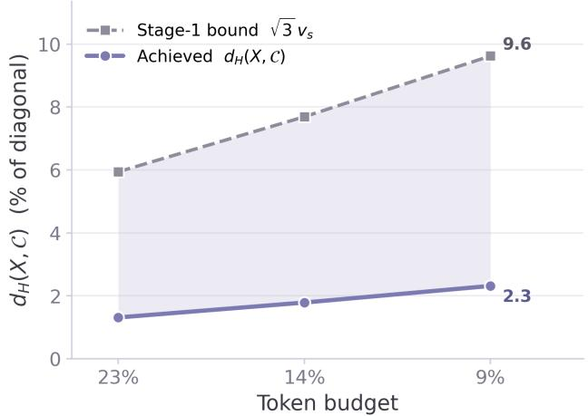  
Figure A2. Empirical validation of the coverage bound. Even at 9% token retention, the $d _ { H } ( X , { \mathcal { C } } )$ is only 2.3% of the scene diagonal, compared with the stage 1 bound of 9.6%.

## B. Theoretical Analysis of CoVeR

Setup. Let $X = \{ \mathbf { t } _ { i } \} _ { i = 1 } ^ { M }$ be the valid back-projected coordinates (Sec. 3.1), and $A \subseteq \{ 1 , \ldots , M \}$ a selection. Recall $\delta ( \mathbf { t } ; A )$ and $d _ { H } ( X , A )$ above. We have $\mathcal { C } _ { \mathrm { i n i t } }$ for the stage 1 selection at voxel size $v _ { s } , m _ { 1 } ^ { * } , \ldots , m _ { B _ { \mathrm { e x p a n } } } ^ { * }$ for the stage 2 picks by FPS in order, $\mathcal { C } ^ { j } = \mathcal { C } _ { \mathrm { i n i t } } \cup \{ m _ { 1 } ^ { * } , . . . , m _ { j } ^ { * } \}$ (so ${ \mathcal C } ^ { 0 } = { \mathcal C } _ { \mathrm { i n i t } } )$ , and $\mathcal { C } = \mathcal { C } ^ { B _ { \mathrm { { e x p a n } } } }$ for the final selection. We assume $B < M$ and $| { \mathcal { C } } _ { \mathrm { i n i t } } | \leq B$ (cases 1–2 of Sec. 3.3), while case 3 is Remark 2.

Lemma 1 (Stage 1 bound). $d _ { H } ( X , \mathcal { C } _ { i n i t } ) \leq \sqrt { 3 } v _ { s }$

Proof. Each $\mathbf { t } _ { i }$ lies in one occupied voxel $\gamma _ { k } ,$ and stage 1 keeps one token $i _ { k } ^ { \mathrm { r e p } } \in \mathcal { V } _ { k }$ . Both $\mathbf { t } _ { i }$ and $\mathbf { t } _ { i _ { k } ^ { \mathrm { r e p } } }$ lie in a cube of side $v _ { s } ,$ whose greatest internal distance is $\sqrt { 3 } v _ { s }$ , hence $\delta ( \mathbf { t } _ { i } ; \mathcal { C } _ { \mathrm { i n i t } } ) \leq \sqrt { 3 } v _ { s }$ for all i, and the maximum over X gives the claim. □

Lemma 2 (Stage 2 bound). $d _ { H } ( X , { \mathcal { C } } ^ { j + 1 } ) \leq d _ { H } ( X , { \mathcal { C } } ^ { j } )$ hence $d _ { H } ( X , \mathcal { C } ) \leq d _ { H } ( X , \mathcal { C } _ { i n i t } )$

Proof. Since ${ \mathcal { C } } ^ { j + 1 } \supseteq { \mathcal { C } } ^ { j }$ , the minimum in δ is over a superset, so $\delta ( \mathbf { t } ; \mathcal { C } ^ { j + 1 } ) \le \delta ( \mathbf { t } ; \mathcal { C } ^ { j } )$ for all t; the max over X preserves this, and iterating gives the second claim. □

Theorem 1 (Exact budget and coverage). For any budget B with $B < M$ and $| { \mathcal { C } } _ { i n i t } | \leq B _ { \mathrm { { ; } } }$ , CoVeR returns C with

$$
| \mathcal { C } | = B , \quad d _ { H } ( X , \mathcal { C } ) \leq d _ { H } ( X , \mathcal { C } _ { i n i t } ) \leq \sqrt { 3 } v _ { s }
$$

Proof. Stage 2 runs $B _ { \mathrm { e x p a n } } = B - | \mathcal { C } _ { \mathrm { i n i t } } | \ge 0$ steps. Selected indices are marked $d _ { \operatorname* { m i n } } = - 1$ , and the update $d _ { \operatorname* { m i n } } ( m ) \gets$ min $( d _ { \operatorname* { m i n } } ( \boldsymbol { m } ) , \parallel \cdot \parallel _ { 2 } ^ { 2 } )$ preserves the mark. Before step $j ,$ $| { \mathcal { C } } _ { \mathrm { i n i t } } | + ( j - 1 ) \le B - 1 < M$ , so an unselected index exists and the arg max returns it. Each step adds a new token, giving $| { \mathcal { C } } | = | { \mathcal { C } } _ { \mathrm { i n i t } } | + B _ { \mathrm { e x p a n } } = B$

Coverage. Chain Lemma 1 and Lemma 2.

Lemma 3 (Greedy pick realizes $d _ { H } ) . ~ \delta ( \mathbf { t } _ { m _ { j + 1 } ^ { * } } ; \mathcal { C } ^ { j } ) ~ =$ $d _ { H } ( X , { \mathcal { C } } ^ { j } )$

Proof. Stage 2 selects $\begin{array} { r } { m _ { j + 1 } ^ { * } = \arg \operatorname* { m a x } _ { m \not \in \mathcal { C } ^ { j } } \delta ( \mathbf { t } _ { m } ; \mathcal { C } ^ { j } ) ^ { 2 } } \end{array}$ $( \mathrm { i . e . , } \mathcal { D } _ { \mathrm { s p a t i a l } } ) ;$ as $u \mapsto u ^ { 2 }$ is increasing on $\lbrack 0 , \infty )$ , this equals the arg max of δ. Since $\delta ( \mathbf { t } ; \mathcal { C } ^ { j } ) = 0$ for $\mathbf { t } \in \mathcal { C } ^ { j }$ , the maximum of $\delta ( \cdot ; \mathcal { C } ^ { j } )$ over X equals its maximum over $X \setminus { \mathcal { C } } ^ { j }$ whenever $d _ { H } ( X , { \mathcal { C } } ^ { j } ) > 0$ , and both equal 0 otherwise.

Proposition 1 (2-approximation at the expansion budget). Let OPT<sub>k</sub>(X) = min $\scriptstyle | { \mathcal { A } } | = k  d _ { H } ( X , { \mathcal { A } } )$ and $r = d _ { H } ( X , { \mathcal { C } } )$ $I f B _ { e x p a n } \ge 1$ , then $d _ { H } ( X , \mathcal { C } ) \leq 2 \cdot \mathrm { O P T } _ { B _ { e x p a n } } ( X )$

Proof. Let $R ^ { j } = d _ { H } ( X , { \mathcal { C } } ^ { j } ) ;$ by Lemma 2, $R ^ { 0 } \geq \cdots \geq$ $R ^ { B _ { \mathrm { e x p a n } } } = r . { \mathrm { ~ I f ~ } } r = 0$ , the claim is immediate, so assume $r > 0$ . For $\mid \leq i < j \leq B _ { \mathrm { e x p a n } } , m _ { i } ^ { * } \in \mathcal { C } ^ { j - 1 }$ , so by Lemma 3, $\| \mathbf { t } _ { m _ { i } ^ { * } } - \mathbf { t } _ { m _ { i } ^ { * } } \| _ { 2 } \geq \delta ( \mathbf { t } _ { m _ { i } ^ { * } } ; \mathcal { C } ^ { \hat { j } - 1 } ) = R ^ { j - 1 } \geq r$ . Pick $\mathbf { x } ^ { * } \in X$ with $\delta ( \mathbf { x } ^ { * } ; \mathcal { C } ) = r$ (unselected, since $r \ > \ 0 ) ;$ it is $\geq r$ from every selected token, so $P = \{ \mathbf { t } _ { m _ { 1 } ^ { * } } , \ldots , \mathbf { t } _ { m _ { B _ { \mathrm { e x p a n } } } ^ { * } } , \mathbf { x } ^ { * } \}$ is a set of $B _ { \mathrm { e x p a n } } + 1$ points pairwise $\geq r$ apart. Let A be any index set with $| \mathcal { A } | = B _ { \mathrm { e x p a n } }$ and $\rho = d _ { H } ( X , { \mathcal { A } } )$ Since $| P | > | A |$ , two points $\mathbf { p } , \mathbf { q } \in P$ share a nearest index $a \in \mathcal A$ , so by the triangle inequality $r \leq \| \mathbf { p } - \mathbf { q } \| _ { 2 } \leq$ $\| \mathbf { p } - \mathbf { t } _ { a } \| _ { 2 } + \| \mathbf { t } _ { a } - \mathbf { q } \| _ { 2 } \leq 2 \rho$ . Thus, minimizing over A gives $r \leq 2 \cdot \mathrm { O P T } _ { B _ { \mathrm { e x p a n } } } ( X )$ □

Remark 1 (coverage interpretation). Proposition 1 bounds the final selection C, but against $\mathrm { O P T } _ { B _ { \mathrm { c x p a n } } }$ rather than $\mathrm { O P T } _ { B }$ , since the $B _ { \mathrm { i n i t } }$ voxel seeds need not be mutually separated and the pairwise argument uses the $B _ { \mathrm { e x p a n } }$ FPS picks together with the worst-covered point. Combined with Theorem 1, CoVeR attains:

$$
d _ { H } ( X , { \mathcal { C } } ) \leq \operatorname* { m i n } \left( { \sqrt { 3 } } v _ { s } , \ 2 \cdot \operatorname { O P T } _ { B _ { \exp \mathrm { a n } } } ( X ) \right)
$$

Table A4. Category-level performance on OpenEQA. We compare CoVeR with VTC [24] and DTC [24] based on their published scores, computed by GPT-4 [1]. LLM-Match. is the overall score across seven categories and Rel. is average percentage of performance maintained. Categories: (a) object recognition, (b) object localization, (c) attribute recognition, (d) spatial understanding, (e) object state recognition, (f) functional reasoning, and (g) world knowledge. <sub>\*</sub>LLaVA-OV-7B
<table><tr><td rowspan="2">Methods</td><td colspan="4">EQA Category</td><td rowspan="2">LLM Match.</td><td rowspan="2">Rel.</td></tr><tr><td>(a)</td><td>(b)</td><td>(c) (d) (e)</td><td>(f)</td></tr><tr><td colspan="6">Retain 100% Tokens</td></tr><tr><td>LLaVA*</td><td>48.6</td><td>43.0</td><td>74.4 43.6 74.5 53.1</td><td>55.0</td><td>56.2</td><td>100</td></tr><tr><td colspan="6">Retain 43% Tokens</td><td></td></tr><tr><td>VTC</td><td></td><td>一</td><td>一 一 一</td><td>一</td><td>54.2</td><td>96.4</td></tr><tr><td>DTC</td><td></td><td></td><td>一</td><td></td><td>54.3</td><td>96.6</td></tr><tr><td>CoVeR</td><td>49.9</td><td>40.3</td><td>74.6 45.2 71.6</td><td>54.0 54.6</td><td>55.9</td><td>99.5</td></tr><tr><td colspan="7">Retain 26% Tokens</td></tr><tr><td>VTC</td><td>40.3</td><td>35.7</td><td>62.9 40.3 71.5</td><td>52.5</td><td>49.5</td><td>50.5 89.9</td></tr><tr><td>DTC</td><td>44.6</td><td>39.4</td><td>72.7 43.9 71.3</td><td>53.0</td><td>53.2</td><td>54.1 96.3</td></tr><tr><td>CoVeR</td><td>47.9</td><td>40.0</td><td>72.8 45.1 73.0</td><td>54.2</td><td>54.6 55.5</td><td>98.8</td></tr><tr><td colspan="7">Retain 17% Tokens</td></tr><tr><td>VTC</td><td>37.2</td><td>33.1</td><td>59.9 38.4</td><td>65.9 51.0</td><td>45.9</td><td>47.4</td><td>84.3</td></tr><tr><td>DTC</td><td>41.2</td><td>38.1</td><td>68.3 42.3</td><td>70.5 55.3</td><td>50.7 53.3</td><td>52.5</td><td>93.4</td></tr><tr><td>CoVeR</td><td>46.7</td><td>40.1</td><td>68.4 45.1</td><td>69.9</td><td>54.3</td><td>54.0</td><td>96.1</td></tr><tr><td colspan="8">Retain 8% Tokens</td></tr><tr><td>VTC</td><td>1</td><td></td><td>一</td><td>一</td><td></td><td>43.6</td><td>77.6</td></tr><tr><td>DTC</td><td>一</td><td>一</td><td>一 一</td><td></td><td>一</td><td>49.3 50.1</td><td>87.7</td></tr><tr><td>CoVeR</td><td>43.1</td><td>34.7</td><td>61.9</td><td>41.7 65.9</td><td>52.0</td><td>51.4</td><td>89.1</td></tr></table>

These bounds provide complementary guarantees on the final coverage without solving the NP-hard k-center objective.

Remark 2 (case 3). If $| { \mathcal { C } } _ { \operatorname* { i n i t } } | > B$ , CoVeR keeps the representatives of the B most populated voxels (Sec. 3.3). The budget is still exact, but this subset drops some voxel representatives, so Lemma 1 need not hold. This case does not arise at any budget or split we evaluate.

Summary. The analysis gives (1) an exact per-scene budget $| { \mathcal { C } } | = B ; ( 2 )$ under the inactive-safeguard condition, every token within $\sqrt { 3 } v _ { s }$ of a retained token after stage 1, preserved through stage 2; and (3) a 2-approximation to the k-center optimum at the expansion budget. Stage 1 thus contributes the absolute $\sqrt { 3 } v _ { s }$ bound at low cost, while stage 2 fills the rest with a 2-approximation.

Fig. A2 validates the bound: $d _ { H } ( X , { \mathcal { C } } )$ rises gradually as the budget shrinks but stays well below $\sqrt { 3 } v _ { s } .$ , showing the bound is conservative.

## C. Results on Token Recovery and Expansion

Figure A3 shows the cumulative distributions on Token Recovery (TR) and Token Expansion (TE) at all budget levels. At every budget, the TR curve reaches one, so for every region SeGPruner selects, CoVeR retains a token nearby, within 2.4% of the scene diagonal at the tightest budget. The TE further shows that CoVeR also places tokens in regions SeGPruner leaves uncovered. By prioritizing coverage, CoVeR still retains the informative regions that learned importance methods select, while additionally covering other regions in the scene. This shows our advantage over learned importance, which spends its budget on near-duplicate tokens from a few prominent regions and thus leaves the scene unrepresented.

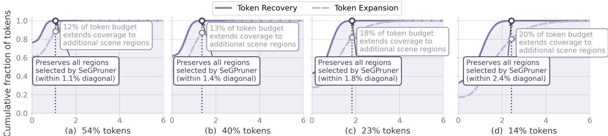  
Nearest-neighbor distance (% of scene diagonal)  
Figure A3. Cumulative distributions of directed nearest-neighbor distances on ScanQA across multiple token budgets. At all budgets, the Token Recovery (TR) reaches one, which indicates CoVeR keeps a token near every region SeGPruner selects, within 1.1%, 1.4%, 1.8%, and 2.4% of the scene diagonal, respectively. The Token Expansion (TE) also shows that CoVeR additionally covers regions SeGPruner leaves unrepresented.

Table A5. Category-level performance on OpenEQA. We compare CoVeR with VisPruner [75] and SeGPruner [34], computed by GPT-4o [28]. LLM-Match. is the overall score across seven categories and Rel. is the average percentage of performance maintained. Categories: (a) object recognition, (b) object localization, (c) attribute recognition, (d) spatial understanding, (e) object state recognition, (f) functional reasoning, and (g) world knowledge. LLaVA-OV-7B
<table><tr><td rowspan="2">Methods</td><td colspan="6">EQA Category</td><td rowspan="2">LLM Match.</td><td rowspan="2">Rel.</td></tr><tr><td>(a)</td><td>(b)</td><td>(c)</td><td>(d)</td><td>(e) (f)</td><td>(g)</td></tr><tr><td colspan="8">Retain 100% Tokens</td></tr><tr><td>LLaVA*</td><td>53.9</td><td>43.4</td><td>77.6 49.1</td><td>73.1</td><td>58.9</td><td>57.0</td><td>59.1</td><td>100</td></tr><tr><td colspan="8">Retain 43% Tokens</td></tr><tr><td>VisPruner</td><td>52.3</td><td>41.9</td><td>76.0 49.0</td><td>74.0</td><td>58.2</td><td>57.2</td><td>58.4</td><td>98.8</td></tr><tr><td>SeGPruner</td><td>52.5</td><td>43.2</td><td>74.3</td><td>50.2 73.0</td><td>56.2</td><td>56.3</td><td>58.0</td><td>98.1</td></tr><tr><td>CoVeR</td><td>52.5</td><td>41.2</td><td>77.1</td><td>51.3 71.9</td><td>58.9</td><td>57.2</td><td>58.6</td><td>99.2</td></tr><tr><td colspan="8">Retain 26% Tokens</td><td></td></tr><tr><td>VisPruner</td><td>51.0</td><td>39.2</td><td>75.5</td><td>51.4 70.8</td><td>56.8</td><td>55.4</td><td>57.1</td><td>96.6</td></tr><tr><td>SeGPruner</td><td>49.9</td><td>39.8</td><td>76.2</td><td>50.1</td><td>72.6 57.4</td><td>56.7</td><td>57.5</td><td>97.3</td></tr><tr><td>CoVeR</td><td>51.0</td><td>40.9</td><td>75.1</td><td>49.9 73.2</td><td>57.8</td><td>56.0</td><td>57.7</td><td>97.6</td></tr><tr><td colspan="9">Retain 17% Tokens</td></tr><tr><td>VisPruner</td><td>50.4</td><td>38.6</td><td>70.9</td><td>50.1</td><td>69.1</td><td>57.6</td><td>54.8</td><td>55.9 94.6</td></tr><tr><td>SeGPruner</td><td>48.3</td><td>38.7</td><td>72.4</td><td>50.6</td><td>69.1</td><td>57.3 58.3</td><td>56.6 55.4</td><td>56.0 94.8</td></tr><tr><td>CoVeR</td><td>49.7</td><td>41.4</td><td>72.0</td><td>50.5</td><td>70.3</td><td></td><td>56.8</td><td>96.1</td></tr><tr><td colspan="9">Retain 8% Tokens</td></tr><tr><td>VisPruner</td><td>40.5</td><td>36.9</td><td>65.5</td><td>45.5</td><td>64.6</td><td>56.7</td><td>51.4</td><td>51.5 87.1</td></tr><tr><td>SeGPruner</td><td>44.6</td><td>38.6</td><td>63.4</td><td>46.6</td><td>65.8</td><td>55.0 53.5</td><td>52.5</td><td>88.8</td></tr><tr><td>CoVeR</td><td>47.3</td><td>36.3</td><td>65.6</td><td>46.3</td><td>66.2</td><td>55.5 54.0</td><td>53.0</td><td>89.7</td></tr></table>

## D. Additional Quantitative Results

OpenEQA Category Analysis. CoVeR is particularly strong on spatial understanding (Tables A4-A5). At 17% retention, its spatial score exceeds the full model when evaluated via GPT-4 LLM Match (45.1 vs. 43.6) and GPT-4o (50.5 vs. 49.1). At 8%, it also gives the best object-recognition score (47.3 vs. 44.6 for SeGPruner and 40.5 for VisPruner), with 89.1-89.7% overall retention across both judges.

Other 3D Reasoning Models. Tables A6 and A7 provide a broader context across task-specific 3D models, video LMMs, and general VLMs. CoVeR reaches 50.1 OpenEQA LLM-Match with 8% of tokens and loses only 0.7 points at 26% while outperforming prior models. On ScanQA, 23% retention yields 28.5 EM@1, exceeding the listed taskspecific and open VLM systems. Thus, the pruned model remains competitive in absolute terms, not only relative to its full-token LLaVA-OV-7B baseline.

## E. Additional Qualitative Results

Figures A4, A5, A6, A7, and A8 provide additional qualitative results from ScanQA, SQA3D, and OpenEQA datasets. Across different token budgets and 3D reasoning tasks, CoVeR preserves sufficient visual evidence to support object understanding, spatial and situated reasoning, and embodied question answering despite significant token pruning. These visualizations complement our quantitative findings by demonstrating that coverage-based token pruning maintains diverse scene information to perform 3D multi-view reasoning.

Table A6. OpenEQA comparison. CoVeR remains competitive, relative to both commercial and open VLMs, after removing up to 92% of visual tokens. (·) denote change from the base model. LLM-Match uses GPT-4 [1].
<table><tr><td>Models</td><td>LLM-Match↑</td></tr><tr><td>Blind Text-only LLM baseline</td><td></td></tr><tr><td>GPT4 [1]</td><td>33.5</td></tr><tr><td>LLaMA-2 70B [54]</td><td>28.3</td></tr><tr><td>Closed VLM models</td><td></td></tr><tr><td>Claude-3 Opus</td><td>36.3</td></tr><tr><td>Gemini 1.0 Pro Vision [52]</td><td>44.9</td></tr><tr><td>Claude-3.5 Sonnet</td><td>48.7</td></tr><tr><td>GPT4-V (15 frames) [1]</td><td>54.6</td></tr><tr><td>GPT4-V (50 frames) [1]</td><td></td></tr><tr><td></td><td>55.3</td></tr><tr><td>Open VLM models</td><td></td></tr><tr><td>Video-LLaMA [73] [EMNLP 2023]</td><td>20.0</td></tr><tr><td>LLaMA-2 w/ Concept Graph [42] [CVPR 2024]</td><td>28.7</td></tr><tr><td>AuroraCap [6] [ICLR 2025]</td><td>28.9</td></tr><tr><td>Video-ChatGPT [41] [ACL 2024]</td><td>32.1</td></tr><tr><td>LLaMA-2 w/ Sparse Voxel Map [42] [CVPR 24]</td><td>34.3</td></tr><tr><td>LLaMA-2 w/ LLaVA-1.5 Caption [42] [CVPR 24]</td><td>36.8</td></tr><tr><td>Chat-UniVi [30] [CVPR 2024]</td><td>42.3</td></tr><tr><td>Video-LLaMA2 [10] [arXiv 2024]</td><td>49.2</td></tr><tr><td>InternVL2.5 (16 frames) [9] [arXiv 2024]</td><td>54.4</td></tr><tr><td>MovieChat (w/ LLaVA-OV-7B) [49] [CVPR 2024]</td><td>54.9</td></tr><tr><td>LLaVA-3D (32 frames) [83] [ICCV 2025]</td><td>53.2</td></tr><tr><td>Qwen2.5-VL (16 frames) [4] [arXiv 2025]</td><td>50.8</td></tr><tr><td>Magma (16 frames) [66] [CVPR 2025]</td><td>49.1</td></tr><tr><td>NVILA (16 frames) [38] [CVPR 2025]</td><td>54.0</td></tr><tr><td>InternVL3 (16 frames) [84] [arXiv 2025]</td><td>55.5</td></tr><tr><td>ThinkAct (16 frames) [22] [NeurIPS 2026]</td><td>56.2</td></tr><tr><td>Ours (12 frames)</td><td></td></tr><tr><td>LLaVA-OV-7B (100%)</td><td>56.2</td></tr><tr><td>w/ CoVeR↓44% tok</td><td>56.0 (-0.2)</td></tr><tr><td>w/ CoVeR↓57% tok</td><td>55.9 (-0.3)</td></tr><tr><td>w/ CoVeR↓74% tok</td><td>55.5 (-0.7)</td></tr><tr><td></td><td></td></tr><tr><td>wlCoVeR↓83% tok</td><td>54.0 (-2.2)</td></tr><tr><td>w/ CoVeR↓92% tok</td><td>50.1 (-6.1)</td></tr></table>

## F. Broader Impact

Positive impact. CoVeR significantly reduces inference computation and memory, while maintaining the performance of baseline VLMs, making multi-view 3D reasoning more accessible to users with limited computational resources. It also provides precise token reduction control in VLMs. CoVeR also potentially lowers deployment energy costs in robotic and embodied AI applications.

Potential negative impact. Real-world visual reasoning can raise important privacy concerns. In addition, aggressive pruning may discard important cues, potentially leading to incorrect VLM answers in safety-critical systems like healthcare or autonomous driving. Besides, since CoVeR is a general-purpose method, it may inherit the societal risks, biases, and failure modes of its underlying VLMs and data.

Table A7. ScanQA (val) comparison. CoVeR remains competitive with task-specific 3D models, video-LMMs, and fine-tuned 3D-LMMs, after removing up to 91% of visual tokens, without 3D-specific training or learned pruning.
<table><tr><td>Models</td><td>EM@1↑</td></tr><tr><td>Task-specific models</td><td></td></tr><tr><td>VoteNet+MCAN [70] [CVPR 2019]</td><td>17.3</td></tr><tr><td>ScanRefer+MCAN [70] [CVPR 2019] ScanQA [2] [CVPR 2022]</td><td>18.6 21.1</td></tr><tr><td>Jin et al. [31] [CVPR 2023]</td><td>21.7</td></tr><tr><td>3D-VisTA [85] [ICCV 2023]</td><td>22.4</td></tr><tr><td>3DVLP [77] [AAAI 2024]</td><td>24.0</td></tr><tr><td>DSPNet (20 frames) [39] [CVPR 2025]</td><td>23.5</td></tr><tr><td>Video-LMMs</td><td></td></tr><tr><td>Agent3D-Zero [76] [ECCV 2024]</td><td>17.5</td></tr><tr><td>LLaVA-NeXT-Video [37] [arXiv 2024]</td><td>18.7</td></tr><tr><td>MovieChat (w/ LLaVA-OV-7B) [49] [CVPR 24]</td><td>26.0</td></tr><tr><td>AuroraCap [6] [ICLR 2025]</td><td>17.2</td></tr><tr><td>Task-specific fine-tuned image/video LMMs</td><td></td></tr><tr><td>NaviLLM [81] [CVPR 2024]</td><td>23.0</td></tr><tr><td>Spatial-MLLM-4B [59] [NeurIPS 2025]</td><td>26.3</td></tr><tr><td></td><td></td></tr><tr><td>SPAR-mix [74] [NeurIPS 2025]</td><td>27.7</td></tr><tr><td>SplatTalk-ScanQA-FT (100 frames) [53] [ICCV 2025] Proxy3D (32 frames) [29] [CVPR 2026]</td><td>22.3</td></tr><tr><td>Task-specific fine-tuned 3D-LMMs</td><td>25.2</td></tr><tr><td>3D-LLM [21] [NeurIPS 2023]</td><td></td></tr><tr><td></td><td>20.5</td></tr><tr><td>FE-3DGQA [80] [TCSVT 2022]</td><td>22.3</td></tr><tr><td>ChatScene [23] [NeurIPS 2024]</td><td>21.6</td></tr><tr><td>LEO [25] [ICML 2024]</td><td>24.5</td></tr><tr><td>Scene-LLM [17] [WACV 2025]</td><td>27.2</td></tr><tr><td>Yuan et al. [71] [CVPR 2025]</td><td>22.9</td></tr><tr><td>Inst3D-LMM [69] [CVPR 2025]</td><td>24.6</td></tr><tr><td></td><td></td></tr><tr><td>Ours (12 frames)</td><td></td></tr><tr><td>LLaVA-OV-7B(100%)</td><td>28.2</td></tr><tr><td>w/ CoVeR↓46% tok</td><td>28.7 (+0.5)</td></tr><tr><td>w/ CoVeR↓60% tok</td><td>28.9(+0.7)</td></tr><tr><td>w/ CoVeR↓77% tok</td><td>28.5 (+0.3)</td></tr><tr><td>w/ CoVeR↓86% tok</td><td>27.9 (-0.3)</td></tr><tr><td>w/ CoVeR↓91% tok</td><td>27.1 (-1.1)</td></tr></table>

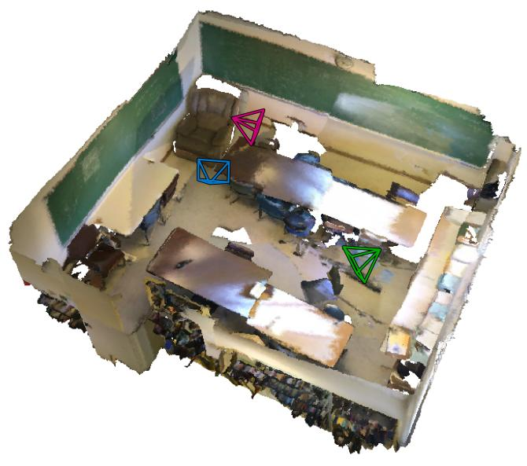  
Q: What is the color of the chair closest to the first book shelf closest to the door? A: brown ✓

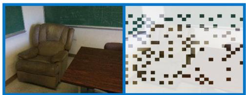


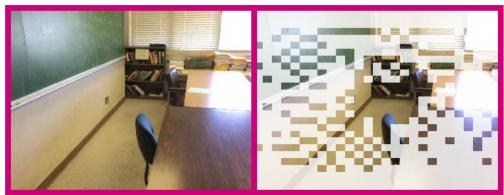  
Figure A4. Visual Results on ScanQA [2] at 23% token retention.

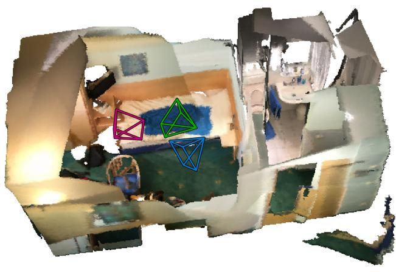  
O: What is suspended on the wall between the tall brown cabinet and the wall to the right of the tv? A: picture ✓


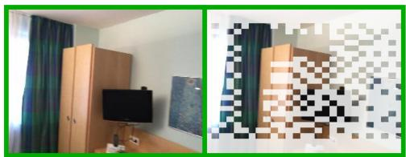

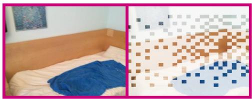  
Figure A5. Visual Results on ScanQA [2] at 23% token retention.

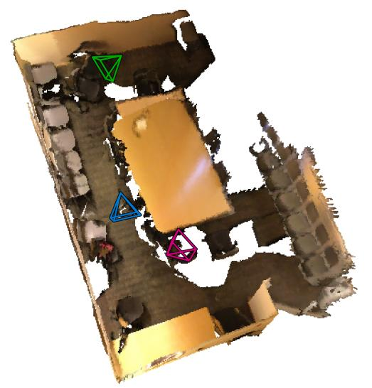  
Q: I am facing a chair, while having a whiteboard on the right and another chair with a backpack on top of it behind me. What is the object to my right that rans the span of the wall? A: whiteboard✓

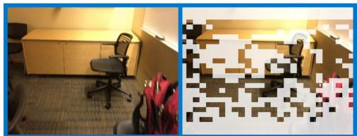

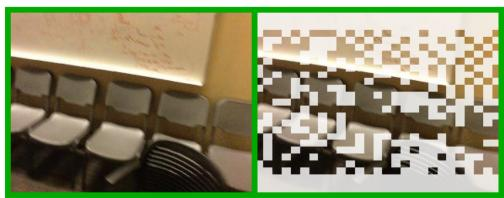

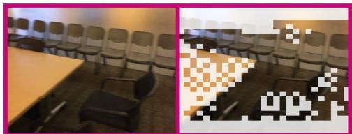  
Figure A6. Visual Results on SQA3D [40] at 43% token retention.

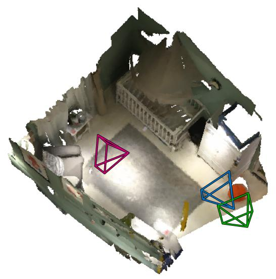

Q: I am facing the wardrobe closet, and the red ball is on the floor to my right. Which direction should I go if I want to open the window? A: left √

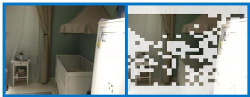

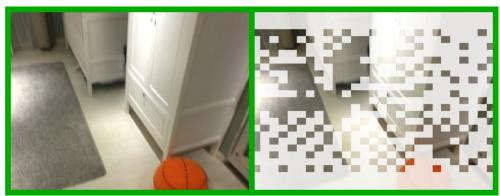

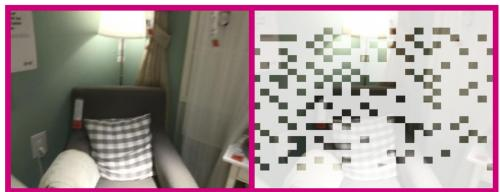  
Figure A7. Visual Results on SQA3D [40] at 26% token retention.

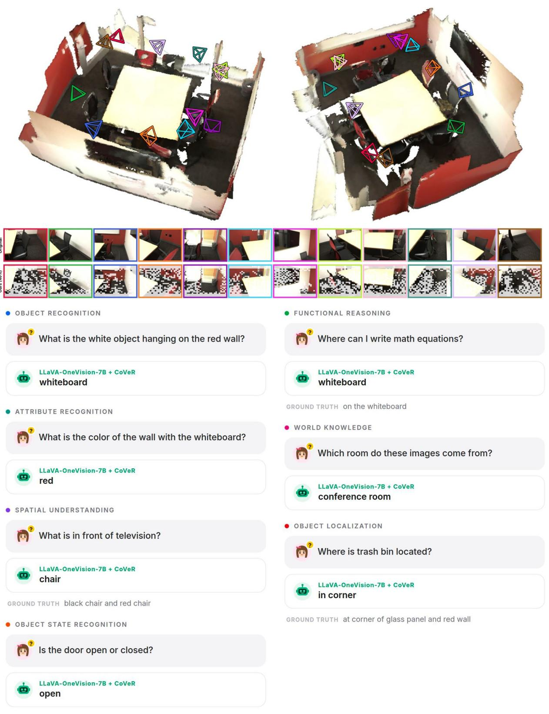  
Figure A8. Visual Results on OpenEQA [42] at 40% token retention.