# DISEIL: DEMONSTRATION DISTILLATION FORSAMPLE-EFFICIENT IMITATION LEARNING

Suyog Khanal Arun Kumar A V Santu Rana

Deakin Applied Artificial Intelligence Initiative Geelong, Australia

## ABSTRACT

A robot that can be taught a new task from a handful of demonstrations has to work out for itself what it still cannot do, and then ask for exactly that. Interactive imitation learning takes a step in that direction by letting a policy practice on its own and calling an expert when it goes wrong. Existing methods decide when to interrupt the learner. A further 2 decisions are left to whichever episode happened to trigger the interruption: which failure to correct, and where the demonstration should start. This paper is a first attempt at making both of them deliberately. DISEIL (Demonstration dIstillation for Sample-Efficient Imitation Learning) marks each failed episode at the step where the policy first becomes unreliable, represents that moment with a geometric descriptor, and groups the failures into recurring failure modes. A vision-language model and a language model read the selected mode and write a request for the next demonstration, and a store of task constraints checks that the request can be carried out before any expert time is spent. No model produces a robot action. Across 5 simulated tasks under state and image observations, changing only what the expert is asked for gives the highest mean held-out success rate in all 10 settings, with a tie in 1, and the margin is widest at the smallest budget we tested. The scope is narrow: a single round of practice at a time, in simulation, with experts that are mostly scripted. The longer-term aim is a learner that also tracks what its demonstration set already covers, and that asks a human teacher for the missing behavior in proportion to the effort each request costs them.

Keywords Imitation learning · Interactive imitation learning · Demonstration efficiency · Failure-mode allocation Neuro-symbolic robot learning · Vision-language models

## 1 Introduction

Behavior cloning trains a policy on the actions an expert took in the states the expert visited [4, 46]. Small mistakes then take the learner into states it has never seen, where further mistakes pile up. This is covariate shift [48, 53]. Interactive imitation learning reduces the problem by letting the expert correct the learner in the states it actually reaches [8, 48]. What it cannot do is make the expert cheap. Demonstrations are produced one at a time by a person or an oracle, and they are usually the scarcest resource [27, 38]. How well a policy performs depends on what is in the demonstration set and not only on how large it is [33]. So once the budget is fixed, the question that remains is what each demonstration should contain (Figure 1).

Getting a demonstration takes 3 decisions: when to call the expert, which failed episode to correct, and where the demonstration should start. The DAgger family answers the first one, and its members differ mainly in the signal they watch. Some measure disagreement between the learner’s action and the expert’s [58]. Others measure how much the prediction varies under dropout [41] or across an ensemble [42], combine novelty with risk [23], or read a diffusion policy’s per-step denoising loss [11, 29]. The other 2 decisions are usually not discussed at all. They default to the episode that triggered the query and the state that episode had already reached.

Those defaults do no harm when the budget is large, because repeated corrections will eventually cover every weakness. They do harm when the budget is small. A score attached to a single state says nothing about whether 2 failures come from the same underlying mistake, so the budget can be spent again and again on a single common weakness while others are never touched. And because the expert is only called after the signal fires, a demonstration that starts at the triggering state may teach the learner how to recover from a mistake whose effects have already built up, rather than how to avoid making it.

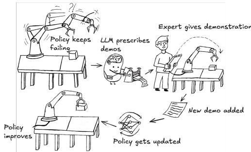  
Figure 1: Existing methods correct the single failure that triggered the query. DISEIL looks for patterns across failures and asks for a demonstration that starts at a chosen configuration.

Our position. We argue that a demonstration should be aimed at a weakness the policy actually has, rather than treated as just another unit of supervision. In practice this means writing down the round’s failures explicitly, grouping them into recurringfailure modes, choosing which mode to supervise, and saying where the demonstration should start. All of that happens before the expert is called. DISEIL is one way of doing this, and it is built so that the query rule, the policy, the training objective and the evaluation protocol all stay the same. Only the content of the request changes.

Why part of the loop is neural and part is symbolic. The work is split according to what current models do well and what they do badly. Vision-language models can describe what a robot did and name a plausible cause when they are given structured evidence [13, 36]. They are far less reliable at judging distances and positions from images [9, 19], and a configuration they invent is useless if the robot cannot physically reach it. DISEIL therefore never asks a model to work out the geometry of the failures. The failures are grouped using an explicit geometric descriptor of the configuration at the step where each failure begins. The models supply the reading of what went wrong and write the request. A store of task constraints, together with a few discrete feasibility checks, then decides whether the request may be sent to the expert. The models run only while a demonstration is being chosen. They produce no actions and are not part of the control loop at run time.

What this paper reports. Section 3 states the acquisition problem so that its 3 decisions are separate and explicit: when the expert is called, which recurring failure mode receives the next demonstration, and which configuration that demonstration starts from. It then describes DISEIL as a 4-stage loop over that problem. Section 4 reports a study across 5 tasks and 2 observation types in which the way demonstrations are chosen is the only thing that changes. Given 20 demonstrations, DISEIL obtains the highest mean held-out success rate in all 10 settings. A first pass at removing components one at a time associates most of that gain with grouping the failures and allocating across the groups, rather than with the language models. That decomposition rests on 1 arm per setting on 3 of the 10 settings, so we read it as an initial indication that motivates refining the allocation stage and running a broader ablation, not as a settled account. Section 5 states the limits of the evidence. The geometric descriptor is designed by hand and reads privileged simulator state, every task is simulated, most of the experts are scripted, and the budget counts demonstrations rather than expert effort.

## 2 Background

Interactive imitation learning and when to call the expert. Dataset aggregation reduces covariate shift by retraining the policy on the states the learner visits [47, 48, 53], and every baseline we compare against follows that loop. They differ in the score that decides when control passes to the expert [23, 29, 41, 42, 58]. Some variants leave that decision to a human operator [26] or change when control is handed back [24]. Intervention-weighted methods put extra weight on expert-labeled corrective states during training [35, 39], which changes how the collected data are used rather than which failure gets corrected next. In all of this work, the episode that triggered the query and the state it had reached still decide what gets supervised and where the demonstration begins.

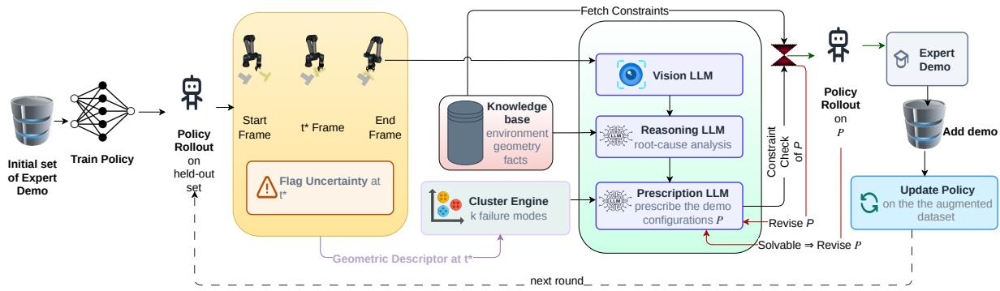  
Figure 2: A single acquisition round. The query gate marks each failure at t<sup>⋆</sup>. A geometric descriptor of each failure groups them into modes and picks the target. Neural annotations describe the chosen mode. The constraint store decides whether the resulting request may be sent to the expert.

Choosing existing data against specifying new data. Active learning ranks candidates by uncertainty or coverage [25, 52]. Core-set selection uses greedy k-center [51], BADGE uses gradient embeddings [2], sub-trajectory retrieval ranks segments of a corpus that already exists [40], and dataset distillation compresses a training set after it has been collected [7]. All of these pick from data that is already there. Demonstration distillation runs before the demonstration exists. Evidence from several failed episodes becomes a specification for supervision that has not been collected yet, and the expert then produces the trajectory that was asked for.

Neural reading with symbolic checking. Language models have been used for robot planning, code generation and reward design [1, 32, 37], and for explaining failures from video and trajectory evidence [13, 36]. DISEIL uses them only in the second role. The store of workspace, spawn, reachability and success constraints that every proposal is checked against is a robot knowledge base in the sense of Tenorth and Beetz [55], not a text retrieval index [14, 30], and the feasibility checks it drives are ordinary discrete search [12, 22]. Using an external planner and revising a proposal after a checker rejects it are both established ideas [10, 34]. What is new here is applying them to the design of the demonstration that gets collected.

## 3 Demonstration distillation

The problem. A policy $f _ { \theta }$ maps observations to actions. For every state and action it encounters it also reports a per-step loss $\ell _ { t } ^ { ( i ) } = \mathcal { L } ( f _ { \theta } , s _ { t } ^ { ( i ) } , a _ { t } ^ { ( i ) } )$ , where i indexes episodes and t indexes time steps. For a diffusion policy $\mathcal { L }$ is the denoising loss; for a discrete policy it is the negative log-likelihood of the action that was taken [11]. The policy is first trained on an initial set $\mathcal { D } _ { 0 }$ by behavior cloning. Round r then runs the policy from a fresh set of starting configurations drawn from the task’s reset distribution. The episodes it fails, together with their loss traces, make up the failure set ${ \mathcal { F } } _ { r } ,$ and we write $N = | \mathcal { F } _ { r }$ for its size. The round ends by collecting D demonstrations from the expert $\pi ^ { \star }$ and retraining θ [48]. The whole loop stops when $\left. \mathcal { D } _ { r } \right. - \left. \mathcal { D } _ { 0 } \right. = B$ . Success is measured on a fixed set of held-out starting states that every method shares and that is never used for collection.

Under a fixed budget $B ,$ an acquisition decision is the triple $A _ { r } = ( t ^ { \star } , C _ { \mathrm { t g t } } , \xi )$ . Here $t ^ { \star }$ is when the query fires, $C _ { \mathrm { t g t } }$ is the failure mode that gets supervised, and ξ is the configuration the demonstration starts from. Query-gated methods set t<sup>⋆</sup> [23, 29] and let the other 2 fall to the triggering episode and its triggering state. We keep the query rule as it is and work on the rest: choosing $C _ { \mathrm { t g t } } \subseteq { \mathcal { F } } _ { \prime }$ and $\xi$ so that a single demonstration covers as much of the observed failure distribution as it can.

DISEIL runs 4 stages per round (Figure 2). Perceive turns each failure into a geometric descriptor and a written description. Partition groups those descriptors into modes. Prioritize picks the mode to correct. Prescribe says where the next demonstration should start. A vision-language model (VLM) [3] describes rendered observations and a text-only prescription model (PM) [57] assigns labels and writes the request. Neither takes part in the grouping.

Perceive. Failure i is marked at the first step whose loss stays above a threshold η for K steps in a row,

$$
t _ { i } ^ { \star } = \operatorname* { m i n } \big \{ t : \ell _ { u } ^ { ( i ) } > \eta \ \forall u \in [ t , t + K - 1 ] \big \} ,\tag{1}
$$

and at $\arg \operatorname* { m a x } _ { t } \ell _ { t } ^ { ( i ) }$ if no such step exists. The threshold is a quantile of the policy’s own training-loss distribution and is recomputed every time the policy is retrained. This is the Diff-DAgger query rule, used without changes [29].

Marking the first sustained crossing puts the anchor where the failure starts, rather than at a later state where its effects have already built up. The robot and object state at $t _ { i } ^ { \star }$ is then written as a geometric descriptor,

$$
\phi _ { i } = \big [ p _ { x , i } , p _ { y , i } , \sin \psi _ { i } , \cos \psi _ { i } , \rho _ { i } , \delta _ { i } \big ] , \qquad \rho _ { i } = t _ { i } ^ { \star } / T _ { i } , \qquad \delta _ { i } = \big \| p _ { i } ^ { \mathrm { e e } } - p _ { i } ^ { \mathrm { o b j } } \big \| _ { 2 } ,\tag{2}
$$

where $( p _ { x , i } , p _ { y , i } )$ and $\psi _ { i }$ are the position and yaw of the object the task is about, $\rho _ { i }$ is how far through the episode of length $T _ { i }$ the failure started, and $\delta _ { i }$ is the distance from the end-effector to the object. Writing yaw as (sin ψ<sub>i</sub>, cos ψ<sub>i</sub>) avoids a false jump between $- \pi$ and $+ \pi ,$ , which are the same orientation. We keep the descriptor low-dimensional because a round only holds a few dozen failures, and every task fills the same slots, so the grouping works the same way on every task and observation type. In parallel, the VLM summarizes frames from the start of the episode, the marked step and the end into a short spatial description. The PM turns that into a root cause and a trajectory phase, both drawn from a fixed vocabulary held in the task knowledge base $\kappa ,$ which also stores the workspace and reachability constraints. The 2 streams stay separate until Prescribe.

Partition. When $N \geq 4$ , the descriptors are standardized one dimension at a time and the number of modes is chosen by silhouette score, which measures how well separated a grouping is:

$$
\tilde { X } _ { i } = \frac { \phi _ { i } - \mu _ { \phi } } { \sigma _ { \phi } } , \quad k _ { \operatorname* { m a x } } = \operatorname* { m i n } \{ 6 , N - 1 \} , \quad k ^ { \star } = \operatorname * { a r g m a x } _ { 2 \leq k \leq k _ { \operatorname* { m a x } } } \mathrm { s i l } ( k ) , \quad \{ C _ { 1 } , . . . , C _ { k ^ { \star } } \} = \mathcal { C } ( \tilde { X } , k ^ { \star } ) .\tag{3}
$$

We use agglomerative clustering for C [56] and pick $k ^ { \star }$ with the standard silhouette criterion [45, 49]. Nothing rests on that particular choice. When $N < 4$ each failure becomes its own mode, because silhouette scores are not reliable on so few points. Each cluster stands in for a failure mode. It stores how many failures it holds, its centroid in task space, its mean peak loss $\bar { L } _ { C } = | C | ^ { - 1 } \sum _ { i \in C }$ max<sub>t</sub> $\ell _ { t } ^ { ( i ) }$ as a measure of how serious it is, and a representative rep(C), the member closest to the cluster mean. The largest cluster is $C ^ { \star }$ , with ties broken by $\bar { L } _ { C }$ , and each cluster is labeled with the root cause most of its members share rather than with a number.

Prioritize. Always taking the largest mode would keep returning to modes that look alike from one round to the next. DISEIL therefore combines how often a mode occurs with a per-task cluster memory M that lowers the score of modes similar to ones already corrected. Writing $\hat { L } _ { C } ^ { \mathcal { M } }$ for the severity after that adjustment, the target among the near-largest modes is

$$
C _ { \mathrm { t g t } } = \operatorname * { a r g m a x } _ { C : | C | \geq | C ^ { \star } | - 1 } \bar { L } _ { C } ^ { \mathcal { M } } .\tag{4}
$$

Size favors corrections that apply to several episodes, severity favors the most serious weakness, and the memory discourages fixing the same thing twice in a row. The PM then receives at most κ failures from $C _ { \mathrm { t g t } } \mathrm { : }$ first $\mathrm { r e p } ( C _ { \mathrm { t g t } } )$ then the member with the highest peak loss, and any remaining slots are filled by farthest-point sampling [15]. The resulting context set $S$ contains a central example, a severe example, and geometrically diverse evidence from the selected mode.

Prescribe. Given the geometry of the target mode, the annotated failures in $S$ and the constraints in $\kappa .$ , the PM returns either a targeted correction or a bridging placement. A targeted correction puts a cited episode back at its marked state and asks the expert to carry on from there. A bridging placement builds a new starting configuration from 2 or more related failures, and that configuration need not coincide with any state that was recorded. Reverse curriculum learning [18] generates reset states for a policy; we use the same construction to place the start of an expert demonstration. On attempt j the command $\mathrm { P M } ( C _ { \mathrm { t g t } } , S , \mathcal { K } , a ^ { ( j - 1 ) } )$ is decoded into a concrete configuration $\xi ^ { ( j ) }$ , which is accepted only if

$$
A _ { \theta } ( \xi ) = \underbrace { \mathbf { 1 } \left[ \xi \in \mathcal { W } _ { K } \right] \wedge \mathbf { 1 } \left[ \mathrm { r e a c h a b l e } _ { K } ( \xi ) \right] } _ { V _ { K } ( \xi ) , \mathrm { ~ t h e ~ s y m b o l i c ~ c h e c k } } \wedge \mathbf { 1 } \left[ \mathrm { v a l i d - p a t h } _ { \mathcal { K } } ( \xi ) \right]  _ { V _ { K } ( \xi ) , \mathrm { ~ t h e ~ s y m b o l i c ~ c h e c k } } \wedge \mathbf { 1 } \left[ f _ { \theta } \mathrm { ~ d o e s ~ n o t ~ s o l v e } \xi \right] .\tag{5}
$$

On the grid task, whether a valid path exists is decided by $\mathbf { A } ^ { \star }$ and breadth-first search [12, 22]. A rejected attempt records why it was rejected in $a ^ { ( j ) }$ , either the constraint it violated or the fact that the policy already solves it, and that reason is passed back to the PM for the next attempt, starting from $a ^ { ( 0 ) } = \emptyset$ . Rejected proposals cost no expert time. After $J _ { \mathrm { m a x } }$ failed attempts DISEIL falls back to the nearest untried marked failure, so every round still produces a valid demonstration without wasting a query. Once a proposal is accepted the expert demonstrates from $\xi ,$ the corrected mode is added to the memory, and the policy is retrained on the fixed schedule. The loop is written out as pseudocode in the supplement.

Table 1: Held-out success rate (%) after $B = 2 0$ expert demonstrations, as mean ± standard error over 9 GridWorld seeds and 5 robot-task seeds. $| \mathcal { D } _ { 0 } |$ is the number of demonstrations the policy started with and Init SR is its success rate before any were added. Bold marks the highest mean in each row, with a tie bolded on both sides. A dash means the method does not apply to that setting or was not run there.
<table><tr><td>Task</td><td>Obs</td><td> $| \mathcal { D } _ { 0 } |$ </td><td>Init SR</td><td>Safe</td><td>Dropout</td><td>Ensemble</td><td>Thrifty</td><td>Stagger</td><td> $\operatorname { D i f f - D A g g e r }$ </td><td>DISEIL (ours)</td></tr><tr><td>GridWorld</td><td>state</td><td>20</td><td>48.9</td><td> $8 5 . 3 { \pm } 0 . 9 $ </td><td> $8 4 . 9 { \pm } 0 . 8 $ </td><td> $8 6 . 2 { \pm } 0 . 7 $ </td><td> $8 6 . 8 { \pm } 0 . 7 $ </td><td> $8 5 . 7 { \pm } 0 . 5 $ </td><td>一</td><td> ${ \bf 9 2 . 4 } \pm { \bf 0 . 4 }$ </td></tr><tr><td>GridWorld</td><td>image</td><td>20</td><td>47.0</td><td> $8 8 . 8 { \pm } 0 . 9 $ </td><td> $8 8 . 4 \pm 0 . 7 $ </td><td> $8 8 . 8 { \pm } 0 . 9 $ </td><td> $8 8 . 7 { \pm } 0 . 6 $ </td><td> $8 9 . 1 { \pm } 0 . 8 $ </td><td></td><td> ${ \bf 9 1 . 3 { \pm 0 . 6 } }$ </td></tr><tr><td>Push-T</td><td>state</td><td>20</td><td>46.2</td><td> $8 2 . 0 { \pm } 3 . 0 \ $ </td><td> $8 4 . 8 { \pm } 2 . 7 $ </td><td> $8 5 . 9 { \pm 2 . 6 }$ </td><td> $8 3 . 2 \pm 3 . 2 $ </td><td>一</td><td> $9 4 . 1 { \pm } 2 . 0 $ </td><td> ${ \bf 9 6 . 1 { \pm } 1 . 6 }$ </td></tr><tr><td>Push-T</td><td>image</td><td>20</td><td>43.3</td><td> $7 8 . 1 \pm 3 . 5$ </td><td> $8 2 . 1 { \pm } 3 . 1 $ </td><td> $8 3 . 2 \pm 3 . 0 $ </td><td> $7 9 . 3 { \pm } 3 . 6 $ </td><td>一</td><td> $8 9 . 0 { \pm } 2 . 1 $ </td><td> $\pm 2 . 6 { \pm } 2 . 2 $ </td></tr><tr><td>Lift</td><td>state</td><td>8</td><td>67.2</td><td> $9 9 . 2 { \pm } 0 . 7 $ </td><td> $9 9 . 2 { \pm } 0 . 4 $ </td><td> $9 9 . 2 { \pm } 0 . 4 $ </td><td> $\mathbf { 1 0 0 . 0 { \dot { \pm } } 0 . 0 }$ </td><td></td><td> $9 9 . 2 { \pm } 0 . 4 $ </td><td> $\mathbf { 1 0 0 . 0 { \dot { \pm } } 0 . 0 }$ </td></tr><tr><td>Lift</td><td>image</td><td>8</td><td>66.4</td><td> $9 9 . 6 { \pm } 0 . 4 $ </td><td> $9 7 . 2 { \pm } 1 . 6 $ </td><td> $9 8 . 8 { \pm } 0 . 7 \ $ </td><td> $9 9 . 6 { \pm } 0 . 4 $ </td><td>1</td><td> $9 9 . 6 { \pm } 0 . 4 $ </td><td> $\mathbf { 1 0 0 . 0 { \dot { \pm } } 0 . 0 }$ </td></tr><tr><td>Wipe</td><td>state</td><td>12</td><td>47.7</td><td> $8 8 . 0 { \pm } 1 . 1 $ </td><td> $8 8 . 6 { \pm } 1 . 8 $ </td><td> $8 6 . 8 { \pm } 1 . 9 $ </td><td> $8 9 . 0 { \pm } 1 . 1 $ </td><td>一</td><td> $9 0 . 4 \pm 2 . 7$ </td><td> ${ \bf 9 3 . 1 \pm 1 . 3 }$ </td></tr><tr><td>Wipe</td><td>image</td><td>12</td><td>45.2</td><td> $6 9 . 6 { \pm } 2 . 4 $ </td><td> $8 3 . 2 \pm 3 . 0 $ </td><td> $8 4 . 4 \pm 3 . 2 $ </td><td> $6 9 . 2 { \pm } 4 . 0 $ </td><td></td><td> $8 8 . 6 { \pm } 1 . 4 $ </td><td> ${ \bf 9 } 2 . 3 { \pm } 1 . 4 $ </td></tr><tr><td>Door</td><td>state</td><td>4</td><td>56.8</td><td> $9 1 . 8 { \pm } 2 . 1 $ </td><td> $9 2 . 5 { \pm } 1 . 2 $ </td><td> $8 8 . 8 \pm 3 . 1 $ </td><td> $8 9 . 6 { \pm } 1 . 7 $ </td><td>一</td><td> $9 3 . 2 { \pm } 1 . 9 $ </td><td> ${ \bf 9 6 . 6 { \pm 1 . 9 } }$ </td></tr><tr><td>Door</td><td>image</td><td>4</td><td>43.1</td><td> $8 2 . 4 \pm 1 . 4$ </td><td> $8 1 . 8 { \pm } 1 . 5 $ </td><td> $8 3 . 0 { \pm } 4 . 9 $ </td><td> $8 2 . 8 { \pm } 1 . 2 $ </td><td>一</td><td> $8 4 . 2 { \pm } 1 . 6 $ </td><td> ${ \bf 8 8 . 6 \pm 1 . 5 }$ </td></tr></table>

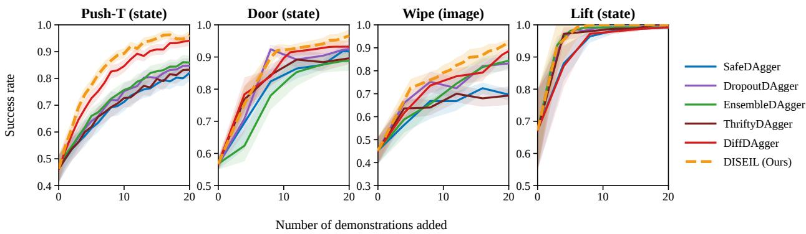  
Figure 3: Held-out success rate against the number of demonstrations collected, as mean ± standard error over runs with slightly different starting policies. DISEIL separates from the strongest Push-T baselines after about 5 demonstration and holds the advantage for the rest of the budget.

## 4 A controlled study

The study is set up so that the way demonstrations are chosen is the only thing that changes. Within a setting, every method uses the same policy, the same starting demonstrations, the same expert, the same retraining schedule, the same budget and the same held-out evaluation set.

Setting. We evaluate 5 tasks, each under state and image observations, which gives 10 settings. GridWorld is a $5 \times 5$ grid containing 3 obstacles. Push-T is the planar pushing task of Florence et al. [17], run in ManiSkill3 [54]. Lift, Wipe and Door are UR5/UR5e manipulation tasks in the RoboSuite simulator [59]. All 5 tasks are simulated; no experiment in this paper runs on physical hardware. GridWorld uses an MLP on state and a CNN on images. The robot tasks use diffusion policies [11] with R3M encoding the images [44]. R3M supplies features to the policy only; the grouping uses the geometric descriptor of Eq. (2). The expert is a person on GridWorld, a PPO policy on Push-T [50], and a scripted or motion-planned oracle on Lift, Wipe and Door. Qwen3-VL-32B does the visual analysis and Qwen3-32B writes the requests. Every method gets $B = 2 0$ demonstrations at $D = 1$ per round, and the policy is retrained from scratch after each one. We report held-out success on starting states that were never used for collection, as mean ± standard error over 9 GridWorld seeds and 5 robot-task seeds. A behavior-cloning sweep sets $| \mathcal { D } _ { 0 } |$ per task so that success before any demonstrations are added sits near 50%. At that level the policy fails often enough for recurring structure to appear in the failures, and it retains enough headroom for the choice of demonstration to affect the final result. The comparisons are the DAgger-family gates [23, 29, 41, 42, 48, 58]. Diff-DAgger uses the same denoising loss DISEIL marks failures with, so it applies only to the robot tasks. STAGGER [31] appears only on GridWorld, because it asks the expert for actions at single states rather than for whole trajectories. DISEIL computes its geometric descriptors from privileged robot and object state. That state is used only for grouping and is never given to the policy being trained. The supplement gives the tasks, experts, baselines and hyperparameters in full.

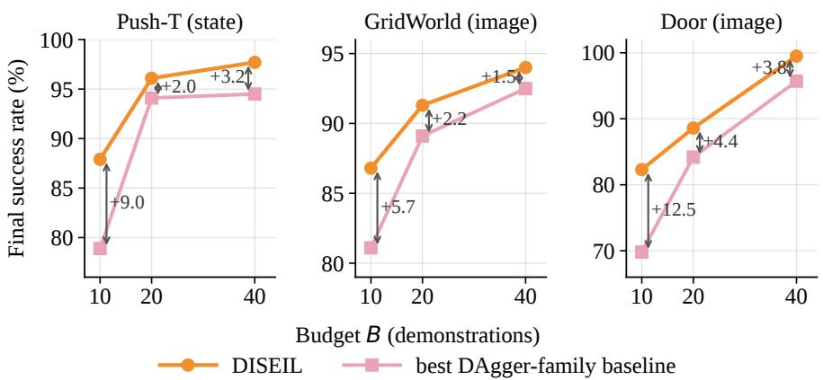  
Figure 4: Final success rate at budgets $B \in \{ 1 0 , 2 0 , 4 0 \}$ on GridWorld with images, Push-T with state observations and Door with images. Labels give DISEIL’s margin over the strongest baseline in that setting. The margin is widest at the smallest budget.

Table 2: Per-demonstration goodness (the policy’s per-step loss on a demonstration before retraining), reported as mean ± standard error. Diff-DAgger queries using the same per-step loss.
<table><tr><td>Task</td><td>Obs</td><td>Diff-DAgger</td><td>DISEIL</td><td>Task</td><td>Obs</td><td>Diff-DAgger</td><td>DISEIL</td></tr><tr><td>Push-T</td><td>state</td><td>1.57±0.49</td><td>2.81±0.93</td><td>Wipe</td><td>state</td><td>1.43±0.36</td><td>2.91±0.90</td></tr><tr><td>Push-T</td><td>image</td><td>1.80±0.49</td><td> $\mathbf { 2 . 8 2 \pm 0 . 7 7 }$ </td><td>Wipe</td><td>image</td><td>1.95±0.52</td><td>3.62±0.98</td></tr><tr><td>Lift</td><td>state</td><td> $1 . 6 1 { \pm } 0 . 5 0 $ </td><td> $\pm . 6 4 \pm 0 . 7 4$ </td><td>Door</td><td>state</td><td>1.84±0.50</td><td>3.43±0.95</td></tr><tr><td>Lift</td><td>image</td><td> $1 . 3 6 { \pm } 0 . 3 8 $ </td><td> $\mathbf { 2 . 9 3 \pm 0 . 7 5 }$ </td><td>Door</td><td>image</td><td>1.58±0.41</td><td>3.00±0.89</td></tr></table>

Final success rate. DISEIL obtains the highest mean final success rate in all 10 settings (Table 1), with a tie on Lift under state observations. Its margin over the strongest comparison in each setting has a mean of 2.80 percentage points and ranges from 0.0 to 5.6. Which method is second depends on the task: Diff-DAgger is the strongest comparison on Push-T, Wipe and Door, while the simpler gates remain competitive on GridWorld. The improvement is therefore consistent in sign across settings rather than large in any single setting. On GridWorld with images, for example, STAGGER reaches 89.1% and the query-gated methods reach 88.4% to 88.8%, against DISEIL’s 91.3%. Figure 3 shows the separation appearing early in the budget and persisting. On Wipe with images, both DISEIL and Diff-DAgger are still improving when the budget runs out. On Lift, DISEIL reaches 100% after 9 demonstrations with state observations, 8 earlier than ThriftyDAgger, and after 17 with images.

Effect of the size of the budget. We repeat the comparison at 3 budgets, B = 10, B = 20 and B = 40, on 3 of the 10 settings: GridWorld with images, Push-T with state observations, and Door with images (Figure 4). Averaged over those 3 settings, DISEIL’s margin over the strongest baseline is 9.07 points at B = 10, 2.87 points at B = 20 and 2.83 points at B = 40. DISEIL’s own success rate rises with the budget in all 3 settings; the margin narrows because the baselines improve faster over the same range. The result does not show that DISEIL matches the baselines on half the demonstrations. It shows that the allocation decision has most influence when the budget is small, which is the regime in which expert supervision is the binding constraint.

Per-demonstration goodness. We summarize the goodness of an acquired demonstration by the policy’s per-step los on it before retraining (Table 2); a higher value means the demonstration lies where the current policy is most wrong, and so has the most to teach. Diff-DAgger is the closest comparator because it queries using the same loss, yet DISEIL acquires demonstrations of higher goodness in all 8 robot settings. Supplementary results show the same ordering against the other baselines. Because goodness is measured before the demonstration is added to training, it isolates how novel each demonstration is to the current policy rather than its eventual effect after retraining. DISEIL also uses peak loss when prioritizing modes (Eq. (4)), so the metric does not uniquely favor Diff-DAgger. The result shows that failure-mode allocation preserves individual demonstration informativeness while reducing repeated correction of similar failures.

Qualitative failure modes. Figure 5 qualitatively shows that failures grouped by geometry also exhibit similar configurations and semantic causes. These clusters are the units over which DISEIL allocates demonstrations rather than individual trajectories. Because the labels are produced by the naming pipeline rather than independent annotation, the figure supports interpretability rather than ground-truth cluster correctness.

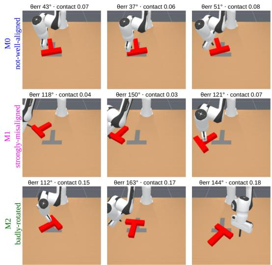  
Figure 5: Failure modes discovered on Push-T (image). Each row shows 3 members of a single geometric cluster. Labels are assigned by the naming pipeline from the task-store vocabulary.

Component knockouts. Replacing mode-based allocation with greedy selection of the highest-loss failure is the most damaging single change, at a mean of 4.37 points, while per- demonstration goodness moves by only +0.02; the supporting components cost between 0.73 and 2.37 points each. With 1 arm per setting on 3 settings, this is a first indication that motivates refining the allocation stage and running a broader ablation, and the supplement reports that programme in full.

## 5 What the study does and does not show

This study is a controlled comparison carried out entirely in simulation. It supports the claim that, holding the query rule and everything downstream of it fixed, choosing the failure mode and the starting configuration raises held-out success rate on the 10 settings evaluated. It does not support claims beyond that, and the evidence is limited in 4 respects.

The geometric descriptor is designed by hand and reads privileged state. It is computed only while a demonstration is being chosen and never reaches the policy that is deployed, but it depends on object pose and end-effector geometry that a simulator supplies exactly. On a physical robot the same quantities would have to be estimated from proprioception together with calibrated RGB-D or multi-view cameras, object-pose estimation and task-specific perception. The size of the resulting estimation error, and how much of the partition would survive it, is not established by this evaluation. The descriptor also separates failures only when their cause is expressed in geometry, and the cluster purity reported in the supplement is measured against the reasoning model’s own labels rather than against independent human annotation.

Most of the experts are not people. GridWorld uses a human expert. Push-T uses a learned PPO policy, and the RoboSuite tasks use scripted or motion-planned oracles. These produce clean, low-variance demonstrations, so they do not exercise the noise, fatigue and varying skill of human teaching [5, 6]. The budget also counts demonstrations rather than the number of steps the expert controls. A prescribed demonstration is anchored at the step where the policy first becomes unreliable, which lies earlier in the episode than the point at which a DAgger gate hands over control, so the expert may have to drive the robot for longer. How much extra expert time that costs is unexplored here, and comparing methods under a budget of expert-controlled steps rather than of demonstrations would be a worthwhile direction to pursue.

The reasoning stage has a measurable cost. Across the 5 settings that were instrumented, it adds between 63 and 1,232 seconds and up to about 11,000 tokens per acquisition round. That cost is paid once per round while a demonstration is being chosen, and never during policy execution. For comparison, the work that DISEIL and the baseline both perform in the same round, retraining the policy from scratch on the aggregated dataset and evaluating it on the held-out set, takes between 783 and 1,491 seconds on the 3 RoboSuite settings. On those settings the reasoning stage is therefore the smaller of the 2 costs. Whether it is worth paying depends on what a demonstration costs, which is close to nothing for a scripted oracle and a person’s time otherwise.

The selector does not represent what the demonstration set already covers. The cluster memory records where corrections were requested in earlier rounds, not which behaviors the collected demonstrations contain. DISEIL lacks any basis for separating a genuine gap in supervision from repeated failure on behavior that has already been demonstrated and not learned. The partitioning stage also becomes less active late in the budget, because a policy that has improved leaves too few failures per round to cluster.

## 6 Conclusion

Under a fixed demonstration budget, sample efficiency depends on more than the rule that decides when to call the expert. A further 2 decisions matter: which recurring failure mode receives the next demonstration, and which configuration that demonstration starts from. DISEIL makes both explicitly, by grouping failures with a geometric descriptor, selecting a mode on prevalence and severity, and letting the models write a request that the task constraints then have to accept. It obtained the highest mean held-out success rate in all 10 settings evaluated, with a tie in 1, and its margin was largest at the smallest budget tested, 9.07 points at B = 10 against 2.87 points at B = 20. The component knockouts place most of the effect in the allocation stage rather than in the models that describe the failures. If that holds under a broader ablation, the underlying principle, spending a fixed budget across distinct recurring failure modes, should not depend on the particular descriptor, clustering algorithm or language models used here.

We identify 3 limitations that point to directions for future work. First, every result reported here comes from simulation. Closing the sim-to-real gap, by estimating the descriptor on a physical UR5 from proprioception and calibrated cameras and measuring what the partition retains, is a prerequisite for any claim about real robots. Second, reasoning over a single round of failures is a local view; a record of what the collected demonstrations already cover would let the selector separate a behavior that is missing from one that has been demonstrated and not learned. Third, when the teacher is a person rather than an oracle, a demonstration is no longer a single unit of the budget but an amount of someone’s time, which makes acquisition a cost-aware problem. In each case the open problem is the same. What supervision to collect is a design decision in its own right, not a by-product of deciding when to interrupt.

## References

[1] Michael Ahn, Anthony Brohan, Noah Brown, Yevgen Chebotar, Omar Cortes, Byron David, Chelsea Finn, Chuyuan Fu, Keerthana Gopalakrishnan, Karol Hausman, et al. Do as i can, not as i say: Grounding language in robotic affordances, 2022. URL https://arxiv.org/abs/2204.01691.

[2] Jordan T. Ash, Chicheng Zhang, Akshay Krishnamurthy, John Langford, and Alekh Agarwal. Deep Batch Active Learning by Diverse, Uncertain Gradient Lower Bounds. In International Conference on Learning Representations (ICLR), 2020.

[3] Shuai Bai et al. Qwen3-VL Technical Report, 2025. URL https://arxiv.org/abs/2511.21631.

[4] Michael Bain and Claude Sammut. A Framework for Behavioural Cloning. In Machine Intelligence 15: Intelligent Agents, pages 103–129. Oxford University Press, 1995. URL https://academic.oup.com/book/53289/ chapter/422019159.

[5] Suneel Belkhale, Yuchen Cui, and Dorsa Sadigh. Data Quality in Imitation Learning. In Advances in Neural Information Processing Systems (NeurIPS), 2023. URL https://arxiv.org/abs/2306.02437.

[6] Daniel S. Brown, Wonjoon Goo, Prabhat Nagarajan, and Scott Niekum. Extrapolating Beyond Suboptimal Demonstrations via Inverse Reinforcement Learning from Observations. In Proceedings ofthe 36th International Conference on Machine Learning (ICML), volume 97. PMLR, 2019. URL https://arxiv.org/abs/1904. 06387.

[7] George Cazenavette, Tongzhou Wang, Antonio Torralba, Alexei A. Efros, and Jun-Yan Zhu. Dataset Distillation by Matching Training Trajectories. In Proceedings ofthe IEEE/CVF Conference on Computer Vision and Pattern Recognition (CVPR), 2022. URL https://arxiv.org/abs/2203.11932.

[8] Carlos Celemin, Rodrigo Pérez-Dattari, Eugenio Chisari, Giovanni Franzese, Leandro de Souza Rosa, Ravi Prakash, Zlatan Ajanovic, Marta Ferraz, Abhinav Valada, and Jens Kober. Interactive Imitation Learning in´ Robotics: A Survey. Foundations and Trends in Robotics, 10(1–2):1–197, 2022. doi: 10.1561/2300000072.

[9] Boyuan Chen, Zhuo Xu, Sean Kirmani, Brian Ichter, Danny Driess, Pete Florence, Dorsa Sadigh, Leonidas Guibas, and Fei Xia. SpatialVLM: Endowing Vision-Language Models with Spatial Reasoning Capabilities. In

Proceedings of the IEEE/CVF Conference on Computer Vision and Pattern Recognition (CVPR), 2024. URL https://arxiv.org/abs/2401.12168.

[10] Yongchao Chen, Jacob Arkin, Charles Dawson, Yang Zhang, Nicholas Roy, and Chuchu Fan. AutoTAMP: Autoregressive Task and Motion Planning with LLMs as Translators and Checkers. In 2024 IEEE International Conference on Robotics and Automation (ICRA). IEEE, 2024. URL https://arxiv.org/abs/2306.06531.

[11] Cheng Chi, Siyuan Feng, Yilun Du, Zhenjia Xu, Eric Cousineau, Benjamin Burchfiel, and Shuran Song. Diffusion policy: Visuomotor policy learning via action diffusion. In Proceedings ofRobotics: Science and Systems, 2023. doi: 10.15607/RSS.2023.XIX.026. URL https://www.roboticsproceedings.org/rss19/p026.html.

[12] Thomas H. Cormen, Charles E. Leiserson, Ronald L. Rivest, and Clifford Stein. Introduction to Algorithms. MIT Press, 4th edition, 2022.

[13] Jiafei Duan, Wilbert Pumacay, Nishanth Kumar, Yi Ru Wang, Shulin Tian, Wentao Yuan, Ranjay Krishna, Dieter Fox, Ajay Mandlekar, and Yijie Guo. AHA: A Vision-Language-Model for Detecting and Reasoning Over Failures in Robotic Manipulation. In International Conference on Learning Representations (ICLR), 2025.

[14] Darren Edge, Ha Trinh, Newman Cheng, Joshua Bradley, Alex Chao, Apurva Mody, Steven Truitt, Dasha Metropolitansky, Robert Osazuwa Ness, and Jonathan Larson. From Local to Global: A Graph RAG Approach to Query-Focused Summarization, 2024. URL https://arxiv.org/abs/2404.16130.

[15] Yuval Eldar, Michael Lindenbaum, Moshe Porat, and Yehoshua Y. Zeevi. The Farthest Point Strategy for Progressive Image Sampling. IEEE Transactions on Image Processing, 6(9):1305–1315, 1997. doi: 10.1109/83. 623193.

[16] Benjamin Eysenbach, Shixiang Gu, Julian Ibarz, and Sergey Levine. Leave no Trace: Learning to Reset for Safe and Autonomous Reinforcement Learning. In International Conference on Learning Representations (ICLR), 2018.

[17] Pete Florence, Corey Lynch, Andy Zeng, Oscar Ramirez, Ayzaan Wahid, Laura Downs, Adrian Wong, Johnny Lee, Igor Mordatch, and Jonathan Tompson. Implicit Behavioral Cloning. In Proceedings ofthe 5th Conference on Robot Learning (CoRL), volume 164. PMLR, 2021.

[18] Carlos Florensa, David Held, Markus Wulfmeier, Michael R. Zhang, and Pieter Abbeel. Reverse Curriculum Generation for Reinforcement Learning. In Proceedings of the 1st Annual Conference on Robot Learning (CoRL), volume 78. PMLR, 2017.

[19] Xingyu Fu, Yushi Hu, Bangzheng Li, Yu Feng, Haoyu Wang, Xudong Lin, Dan Roth, Noah A. Smith, Wei-Chiu Ma, and Ranjay Krishna. BLINK: Multimodal Large Language Models Can See but Not Perceive. In European Conference on Computer Vision (ECCV). Springer, 2024. URL https://arxiv.org/abs/2404.12390.

[20] Yarin Gal and Zoubin Ghahramani. Dropout as a Bayesian Approximation: Representing Model Uncertainty in Deep Learning. In Proceedings ofthe 33rd International Conference on Machine Learning (ICML), volume 48, pages 1050–1059. PMLR, 2016.

[21] Jiayuan Gu, Fanbo Xiang, Xuanlin Li, Zhan Ling, Xiqiang Liu, Tongzhou Mu, Yihe Tang, Stone Tao, Xinyue Wei, Yunchao Yao, Xiaodi Yuan, Pengwei Xie, Zhiao Huang, Rui Chen, and Hao Su. ManiSkill2: A Unified Benchmark for Generalizable Manipulation Skills. In International Conference on Learning Representations (ICLR), 2023.

[22] Peter E. Hart, Nils J. Nilsson, and Bertram Raphael. A Formal Basis for the Heuristic Determination of Minimum Cost Paths. IEEE Transactions on Systems Science and Cybernetics, 4(2):100–107, 1968. doi: 10.1109/TSSC.1968.300136.

[23] Ryan Hoque, Ashwin Balakrishna, Ellen Novoseller, Albert Wilcox, Daniel S. Brown, and Ken Goldberg. ThriftyDAgger: Budget-Aware Novelty and Risk Gating for Interactive Imitation Learning. In Proceedings ofthe 5th Conference on Robot Learning (CoRL), volume 164. PMLR, 2021.

[24] Ryan Hoque, Ashwin Balakrishna, Carl Putterman, Michael Luo, Daniel S. Brown, Daniel Seita, Brijen Thananjeyan, Ellen Novoseller, and Ken Goldberg. LazyDAgger: Reducing Context Switching in Interactive Imitation Learning. In 2021 IEEE 17th International Conference on Automation Science and Engineering (CASE). IEEE, 2021. doi: 10.1109/CASE49439.2021.9551469.

[25] Neil Houlsby, Ferenc Huszár, Zoubin Ghahramani, and Máté Lengyel. Bayesian Active Learning for Classification and Preference Learning, 2011. URL https://arxiv.org/abs/1112.5745.

[26] Michael Kelly, Chelsea Sidrane, Katherine Driggs-Campbell, and Mykel J. Kochenderfer. HG-DAgger: Interactive Imitation Learning with Human Experts. In 2019 International Conference on Robotics and Automation (ICRA), pages 8077–8083. IEEE, 2019. doi: 10.1109/ICRA.2019.8793698.

[27] Alexander Khazatsky, Karl Pertsch, Suraj Nair, Ashwin Balakrishna, Sudeep Dasari, Siddharth Karamcheti, Soroush Nasiriany, Mohan Kumar Srirama, Lawrence Yunliang Chen, Kirsty Ellis, et al. DROID: A Large-Scale In-The-Wild Robot Manipulation Dataset, 2024. URL https://arxiv.org/abs/2403.12945.

[28] Balaji Lakshminarayanan, Alexander Pritzel, and Charles Blundell. Simple and Scalable Predictive Uncertainty Estimation using Deep Ensembles. In Advances in Neural Information Processing Systems (NeurIPS), volume 30, 2017.

[29] Sung-Wook Lee, Xuhui Kang, and Yen-Ling Kuo. Diff-DAgger: Uncertainty Estimation with Diffusion Policy for Robotic Manipulation. In 2025 IEEE International Conference on Robotics and Automation (ICRA). IEEE, 2025.

[30] Patrick Lewis, Ethan Perez, Aleksandra Piktus, Fabio Petroni, Vladimir Karpukhin, Naman Goyal, Heinrich Küttler, Mike Lewis, Wen-tau Yih, Tim Rocktäschel, Sebastian Riedel, and Douwe Kiela. Retrieval-Augmented Generation for Knowledge-Intensive NLP Tasks. In Advances in Neural Information Processing Systems (NeurIPS), volume 33, 2020. URL https://arxiv.org/abs/2005.11401.

[31] Yichen Li and Chicheng Zhang. Interactive and Hybrid Imitation Learning: Provably Beating Behavior Cloning. In Advances in Neural Information Processing Systems (NeurIPS), volume 38, pages 47643–47691. Curran Associates, Inc., 2025.

[32] Jacky Liang, Wenlong Huang, Fei Xia, Peng Xu, Karol Hausman, Brian Ichter, Pete Florence, and Andy Zeng. Code as Policies: Language Model Programs for Embodied Control. In 2023 IEEE International Conference on Robotics and Automation (ICRA). IEEE, 2023.

[33] Fanqi Lin, Yingdong Hu, Pingyue Sheng, Chuan Wen, Jiacheng You, and Yang Gao. Data Scaling Laws in Imitation Learning for Robotic Manipulation, 2024. URL https://arxiv.org/abs/2410.18647.

[34] Bo Liu, Yuqian Jiang, Xiaohan Zhang, Qiang Liu, Shiqi Zhang, Joydeep Biswas, and Peter Stone. LLM+P: Empowering Large Language Models with Optimal Planning Proficiency, 2023. URL https://arxiv.org/ abs/2304.11477.

[35] Huihan Liu, Soroush Nasiriany, Lance Zhang, Zhiyao Bao, and Yuke Zhu. Robot Learning on the Job: Human-inthe-Loop Autonomy and Learning During Deployment. In Proceedings of Robotics: Science and Systems (RSS), 2023. doi: 10.15607/RSS.2023.XIX.005.

[36] Zeyi Liu, Arpit Bahety, and Shuran Song. REFLECT: Summarizing Robot Experiences for Failure Explanation and Correction. In Proceedings ofthe 7th Conference on Robot Learning (CoRL). PMLR, 2023.

[37] Yecheng Jason Ma, William Liang, Guanzhi Wang, De-An Huang, Osbert Bastani, Dinesh Jayaraman, Yuke Zhu, Linxi Fan, and Anima Anandkumar. Eureka: Human-Level Reward Design via Coding Large Language Models. In International Conference on Learning Representations (ICLR), 2024.

[38] Ajay Mandlekar, Yuke Zhu, Animesh Garg, Jonathan Booher, Max Spero, Albert Tung, Julian Gao, John Emmons, Anchit Gupta, Emre Orbay, Silvio Savarese, and Li Fei-Fei. RoboTurk: A Crowdsourcing Platform for Robotic Skill Learning through Imitation. In Proceedings ofthe 2nd Conference on Robot Learning (CoRL). PMLR, 2018. URL https://arxiv.org/abs/1811.02790.

[39] Ajay Mandlekar, Danfei Xu, Roberto Martín-Martín, Yuke Zhu, Li Fei-Fei, and Silvio Savarese. Human-in-the-Loop Imitation Learning using Remote Teleoperation, 2020. URL https://arxiv.org/abs/2012.06733.

[40] Marius Memmel, Jacob Berg, Bingqing Chen, Abhishek Gupta, and Jonathan Francis. STRAP: Robot Sub-Trajectory Retrieval for Augmented Policy Learning. In International Conference on Learning Representations (ICLR), 2025. URL https://arxiv.org/abs/2412.15182.

[41] Kunal Menda, Katherine Driggs-Campbell, and Mykel J. Kochenderfer. DropoutDAgger: A Bayesian Approach to Safe Imitation Learning, 2017. URL https://arxiv.org/abs/1709.06166.

[42] Kunal Menda, Katherine Driggs-Campbell, and Mykel J. Kochenderfer. EnsembleDAgger: A Bayesian Approach to Safe Imitation Learning. In 2019 IEEE/RSJ International Conference on Intelligent Robots and Systems (IROS). IEEE, 2019. doi: 10.1109/IROS40897.2019.8968287.

[43] Tongzhou Mu, Zhan Ling, Fanbo Xiang, Derek Yang, Xuanlin Li, Stone Tao, Zhiao Huang, Zhiwei Jia, and Hao Su. ManiSkill: Generalizable Manipulation Skill Benchmark with Large-Scale Demonstrations. In Advances in Neural Information Processing Systems (NeurIPS) Datasets and Benchmarks Track, volume 34, 2021.

[44] Suraj Nair, Aravind Rajeswaran, Vikash Kumar, Chelsea Finn, and Abhinav Gupta. R3M: A Universal Visual Representation for Robot Manipulation. In Proceedings ofthe 6th Conference on Robot Learning (CoRL). PMLR, 2022.

[45] Fabian Pedregosa, Gaël Varoquaux, Alexandre Gramfort, Vincent Michel, Bertrand Thirion, Olivier Grisel, Mathieu Blondel, Peter Prettenhofer, Ron Weiss, Vincent Dubourg, Jake Vanderplas, Alexandre Passos, David Cournapeau, Matthieu Brucher, Matthieu Perrot, and Édouard Duchesnay. Scikit-learn: Machine Learning in Python. Journal ofMachine Learning Research, 12:2825–2830, 2011. URL https://arxiv.org/abs/1201. 0490.

[46] Dean A. Pomerleau. ALVINN: An Autonomous Land Vehicle in a Neural Network. In Advances in Neural Information Processing Systems (NeurIPS), volume 1, pages 305–313. Morgan Kaufmann, 1988.

[47] Stéphane Ross and J. Andrew Bagnell. Efficient Reductions for Imitation Learning. In Proceedings ofthe 13th International Conference on Artificial Intelligence and Statistics (AISTATS), volume 9, pages 661–668. PMLR, 2010. URL https://proceedings.mlr.press/v9/ross10a.html.

[48] Stéphane Ross, Geoffrey J. Gordon, and J. Andrew Bagnell. A Reduction of Imitation Learning and Structured Prediction to No-Regret Online Learning. In Proceedings of the 14th International Conference on Artificial Intelligence and Statistics (AISTATS), volume 15, pages 627–635. PMLR, 2011.

[49] Peter J. Rousseeuw. Silhouettes: A Graphical Aid to the Interpretation and Validation of Cluster Analysis. Journal ofComputational and Applied Mathematics, 20:53–65, 1987. doi: 10.1016/0377-0427(87)90125-7.

[50] John Schulman, Filip Wolski, Prafulla Dhariwal, Alec Radford, and Oleg Klimov. Proximal Policy Optimization Algorithms, 2017. URL https://arxiv.org/abs/1707.06347.

[51] Ozan Sener and Silvio Savarese. Active Learning for Convolutional Neural Networks: A Core-Set Approach. In International Conference on Learning Representations (ICLR), 2018.

[52] Burr Settles. Active Learning Literature Survey. Computer Sciences Technical Report 1648, University of Wisconsin–Madison, 2009.

[53] Hidetoshi Shimodaira. Improving Predictive Inference under Covariate Shift by Weighting the Log-Likelihood Function. Journal ofStatistical Planning and Inference, 90(2):227–244, 2000. doi: 10.1016/S0378-3758(00) 00115-4.

[54] Stone Tao, Fanbo Xiang, Arth Shukla, Yuzhe Qin, Xander Hinrichsen, Xiaodi Yuan, Chen Bao, Xinsong Lin, Yulin Liu, Tse-kai Chan, et al. ManiSkill3: GPU Parallelized Robotics Simulation and Rendering for Generalizable Embodied AI, 2024. URL https://arxiv.org/abs/2410.00425.

[55] Moritz Tenorth and Michael Beetz. KnowRob: A Knowledge Processing Infrastructure for Cognition-Enabled Robots. The International Journal ofRobotics Research, 32(5):566–590, 2013. doi: 10.1177/0278364913481635.

[56] Joe H. Ward. Hierarchical Grouping to Optimize an Objective Function. Journal of the American Statistica Association, 58(301):236–244, 1963. doi: 10.1080/01621459.1963.10500845.

[57] An Yang et al. Qwen3 Technical Report, 2025. URL https://arxiv.org/abs/2505.09388.

[58] Jiakai Zhang and Kyunghyun Cho. Query-Efficient Imitation Learning for End-to-End Simulated Driving. In Proceedings ofthe AAAI Conference on Artificial Intelligence, volume 31. AAAI Press, 2017. doi: 10.1609/aaai. v31i1.10857.

[59] Yuke Zhu, Josiah Wong, Ajay Mandlekar, Roberto Martín-Martín, Abhishek Joshi, Kevin Lin, Abhiram Maddukuri, Soroush Nasiriany, and Yifeng Zhu. robosuite: A Modular Simulation Framework and Benchmark for Robot Learning, 2020. URL https://arxiv.org/abs/2009.12293.

## A Implementation and Hyperparameters

The implementation runs the 4 stages described in Section 3 as a loop around an otherwise standard interactive imitation-learning harness. Algorithm 1 writes that loop out in full, at 1 demonstration per round. Equation numbers inside it refer to Section 3. Every run stores its exact prompts and replies, so the material quoted in Appendix K is a record rather than a reconstruction.

Table 3 lists every value used in the reported runs. We highlight 3 choices here. Study A12 in Appendix G supports a context-set cap of 3 for the Qwen3-32B instantiation used in the main experiments: 2 citations underperform, whereas 5 provide no measurable improvement with this model. The model-sensitivity comparison in A12b shows that the effect of additional context is not model-independent. The re-prescription limit of 5 bounds the feasibility loop, and study A6 reports the rate at which this limit triggers the deterministic fallback. The threshold η is a quantile of the policy’s own training-loss distribution, recalibrated after each retraining step so that the flagging rule adapts as the policy improves.

Policies. The framework requires only that the policy expose a per-step loss, and it is instantiated with 3 policy classes to make that requirement visible. The 4 robot tasks use diffusion policies under both modalities [11], with an R3M encoder supplying the image branch [44]. R3M supplies the policy’s visual representation and nothing else. It does not supply the clustering features, which are geometric in every run, state and image alike.

Retraining cadence. The policy is retrained from scratch on the aggregated dataset after every acquired demonstration, on every task, GridWorld and robot alike, so at D = 1 it is freshly fitted once per round, 20 times over the budget, and m = 1 throughout. Retraining from scratch rather than warm-starting means each reported gain is attributable to the acquired data and not to optimization carried over between rounds, and each of the 20 rounds still draws a fresh rollout pool. The cadence holds for every arm, so no arm is advantaged by the schedule. It also fixes the goodness measurement of Section 4: because the scoring policy is retrained after every demonstration, it is always the policy of the round, with no staleness on any task.

Round accounting. The seed counts are confirmed independently of the run logs. Clustered rounds plus skipped rounds total 180 for each GridWorld setting and 100 for each robot setting, which is seeds times B in both cases.

The starting-competence band. The initial demonstration set is excluded from the budget, and its size was not chosen freely. A policy’s starting success rate has to sit inside a band for the experiment to carry meaning. If the initial policy is too weak, its rollouts fail everywhere, every configuration is a failure, the failure set carries no structure for the descriptor to separate, and there is no allocation problem to solve. If the initial policy is too strong, the failure set is empty or nearly so, the budget has nothing to allocate, and every method converges to the same place. The band between those 2 conditions is the regime in which a fixed budget can be spent well or badly. Performance scales with the coverage of the demonstrations a policy is trained on, while demonstrations added within a region already covered saturate [33], so the count is the lever that places a task inside the band.

The principle is implemented as a behavior-cloning data-scaling sweep. A pool of expert demonstrations is collected, behavior cloning is trained on each nested prefix of the pool, each prefix is evaluated on the frozen held-out set, and the prefix whose round-zero success rate is closest to a target near 50 percent is selected. That sweep sets the $| \mathcal { D } _ { 0 } |$ of Table 3 and the resulting round-zero success rates span 43.1 to 67.2 percent, as recorded in Table 1. The count is set per task rather than per modality, so the 2 modalities of a task do not begin at the same success rate, and the image settings of Push-T and Door start slightly below the band, at 43.3 and 43.1 percent. Lift begins the furthest above it, at 67.2 and 66.4, because the smallest prefix that trains a stable policy on that task already clears the band. Consequently, Lift operates near the performance ceiling in Table 1, which limits the sensitivity of component-level comparisons on that task.

Language models and computing environment. The language-model components were served locally with vLLM using 3 NVIDIA H100 GPUs 80GB, with Qwen3-VL-32B for visual analysis and Qwen3-32B for reasoning and prescription, both under 4-bit quantization. Policy training and evaluation used NVIDIA A100, H100, H200, V100/V100L, or L40S GPUs with Python 3.9, PyTorch 2.4.1, and CUDA 12.1.

Algorithm 1 DISEIL with demonstration budget B   
Require: Initial demonstrations $\mathcal { D } _ { 0 } ;$ budget B; expert policy $\pi ^ { \star }$ ; retraining cadence $m ;$ held-out pool size $^ { n ; }$ loss threshold $\eta ;$   
persistence window $K ;$ task knowledge base $\kappa ;$ context limit κ; proposal limit $J _ { \mathrm { m a x } }$   
Ensure: Trained policy $f _ { \theta } ; \mathcal { D }  \mathcal { D } _ { 0 } , \mathcal { M }  \varnothing , r  0$   
1: Fit $f _ { \theta }$ on $\mathcal { D }$ by minimizing $\mathcal { L } _ { \mathrm { B C } }$   
2: while $| \mathcal { D } | - | \mathbf { \dot { \mathcal { D } } } _ { 0 } | < B$ do   
3: r ← r + 1: sample n resets, roll out $f _ { \theta } ,$ construct $\mathcal { F } _ { r } \left( \mathrm { E q . } 2 \right)$   
4: $N \gets | \mathcal { F } _ { r } |$   
5: if $\mathcal { F } _ { r } = \emptyset$ then   
6: break   
7: end if   
8: for each $( \tau _ { i } , \ell _ { 1 : T _ { i } } ^ { ( i ) } ) \in \mathcal { F } _ { r }$ do   
9: Trigger step $t _ { i } ^ { \star } \left( \mathrm { E q . ~ } 4 \right)$   
10: Anchor state $x _ { i } ^ { \star } { : }$ ; descriptor $\phi _ { i } \left( \mathrm { E q . } \ 5 \right)$   
11: VLM/PM annotate $\tau _ { i } :$ root cause and phase via $\kappa$   
12: end for   
13: if $N \geq 4$ then   
14: Standardize, select $k ^ { \star }$ by silhouette, cluster via C (Eq. 6)   
15: else   
16: 1 singleton mode per failure   
17: end if   
18: for each mode C do   
19: Centroid $\phi _ { C } ;$ severity $\bar { L } _ { C } \left( \mathrm { E q . } 7 \right)$   
20: Representative rep(C); memory-adjusted severity $\hat { L } _ { C } ^ { \mathcal { M } }$   
21: end for   
22: $C ^ { \star } \gets$ largest mode; select target $C _ { \mathrm { t g t } } \left( \mathrm { E q } . 8 \right)$   
23: $S  \mathrm { r e p } ( \bar { C } _ { \mathrm { t g t } } ) ,$ , highest-loss failure, fill to κ (farthest-point)   
24: $\xi  \varnothing , a ^ { ( 0 ) }  \varnothing$   
25: for $j = 1 , \dots , J _ { \mathrm { m a x } }$ do   
26: Generate proposal $\xi ^ { ( j ) }$ via $\mathrm { P M } , g ( \mathrm { E q . } 9 )$   
27: if $A _ { \theta } ( \xi ^ { ( j ) } )$ then   
28: $\xi  \xi ^ { ( j ) } ;$ break   
29: else   
30: $a ^ { ( j ) }$ ← rejection reason   
31: end if   
32: end for   
33: if $\xi = \varnothing$ then   
34: ξ ← nearest untried failure in $C _ { \mathrm { t g t } }$   
35: else   
36: $\xi  \mathrm { r e p } ( C _ { \mathrm { t g t } } )$   
37: end if   
38: Execute $\pi ^ { \star }$ from $\xi ; \mathcal { D } \mathrel { \mathop {  } } \mathcal { D } \cup \{ d _ { r } \} ( \mathrm { E q . } 3 )$   
39: $\mathcal { M }  \mathcal { M } \cup \{ ( \bar { \phi } _ { C _ { \mathrm { t g t } } } , \bar { L } _ { C _ { \mathrm { t g t } } } ) \}$   
40: if r mod $m = 0$ then   
41: Refit $f _ { \theta }$ (Eq. 3)   
42: Recalibrate η   
43: end if   
44: end while   
45: return $f _ { \theta }$

Table 3: Every hyperparameter of the reported runs. The cluster-memory weight, recency discount and bandwidth are held fixed within each task, and the memory is enabled in every run reported in Section 4; study A1 in Appendix F quantifies its contribution.
<table><tr><td>Quantity</td><td>Value</td></tr><tr><td>Budget B Demonstrations per round D</td><td>20 demonstrations</td></tr><tr><td>Rounds per run</td><td>1  $B / D = 2 0$ </td></tr><tr><td>Seeds, GridWorld</td><td>9</td></tr><tr><td>Seeds, robot tasks</td><td>5</td></tr><tr><td>Initial demonstrations  $| \mathcal { D } _ { 0 } |$ </td><td>20 GridWorld, 20</td></tr><tr><td></td><td>Push-T, 12 Wipe, 8 Lift, 4 Door</td></tr><tr><td>Retraining</td><td>every demonstration, from scratch  $( m = 1 )$ </td></tr><tr><td>Descriptor width standardization Partition</td><td>6 (study A10) zero mean, unit variance agglomerative, Ward</td></tr><tr><td>Cluster count k</td><td>linkage arg max mean silhouette</td></tr><tr><td>Sweep range</td><td> $[ 2 , k _ { \mathrm { m a x } } ] .$  with  $k _ { \operatorname* { m a x } } =$  max  $( 2 , \dot { \operatorname* { m i n } } ( 6 , N - 1 ) )$ </td></tr><tr><td>Minimum failures to cluster Context-set cap κ</td><td>4 3 (study A12; model sensitivity in A12b)</td></tr><tr><td>Diversity fill Re-prescription limit  $J _ { \mathrm { m a x } }$ </td><td>farthest-point sampling 5</td></tr><tr><td>Fallback rule Threshold η</td><td>nearest untried failure quantile of the</td></tr><tr><td></td><td>training-loss distribution, recalibrated at each retrain</td></tr><tr><td>Run length K</td><td>consecutive steps above η</td></tr><tr><td>Vision-language model</td><td>Qwen3-VL [3]</td></tr><tr><td>Reasoning model</td><td>Qwen3 [57]</td></tr><tr><td>Prescription model</td><td>Qwen3 [57]</td></tr><tr><td>Frames per cited failure Image-branch encoder</td><td>3 (start, t*, end) R3M [44]</td></tr></table>

## B Tasks, Experts and the Geometric Descriptor

Tasks. A setting is a single task under a single observation modality, and the evaluation covers 5 tasks under 2 modalities. The word mode is used only for a failure mode, which is a cluster of failures the framework discovers; an observation modality is never called a mode.

GridWorld 5x5 is a discrete navigation task on a 5-by-5 grid with 3 obstacle cells, in which an agent must reach a goal cell from a start cell. A\* search and breadth-first search enter the task only as the feasibility and path-validity checker that decides whether a prescribed grid configuration admits an obstacle-free route from start to goal [12, 22]. Push-T is a planar pushing task in which a manipulator must push a T-shaped block into a fixed goal pose. The task originates in the implicit-behavior-cloning work that introduced it [17] and was popularized by the diffusion policy [11]; the implementation used here is ManiSkill3’s PushT-v1 [54]. ManiSkill3 is the third release of a benchmark line whose earlier releases carry a different task suite and do not contain Push-T [21, 43], so the environment and the task are cited separately. Lift, Wipe and Door are RoboSuite manipulation tasks on a UR5/UR5e arm [59]: lifting a cube from a table, wiping a randomised trail of dirt markers from a surface, and pulling a door open past a hinge threshold.

Experts. The expert differs by task, and each is named because the claim that the demonstrations are correct by construction depends on it. On GridWorld the expert is a human. On Lift, Wipe and Door the expert is a scripted oracle: an open-loop motion-planner routine on Lift, a closed-loop routine reading the hinge angle on Door, and a scripted wiping routine over the sampled marker path on Wipe. On Push-T the expert is a policy trained by proximal policy optimization [50], used without modification, so the Push-T expert is learned rather than scripted. It is an expert in the sense the framework requires, namely a demonstrator whose trajectories are the target the policy is fitted to, and it is not uniformly competent: the trained policy pushes in a single rotational direction only, so configurations requiring the opposite rotation lie outside what it can demonstrate. Those configurations are excluded by the workspace constraints stored in the task’s constraint store, which is the store described in Appendix K.2.

The descriptor per task. The descriptor is the same 6-dimensional vector in both modalities of a task. Table 4 gives its components. Position and orientation are the object’s, not the end-effector’s, on every task where an object exists, because the configuration that determines whether a failure recurs is the configuration of the thing being manipulated. Yaw enters through its sine and cosine so the wrap at ±π does not create a false distance between 2 nearly identical orientations. The 2 columns of a single task under the 2 modalities differ because an image policy fails in different places, not because the features differ.

Table 4: The 6 components of the geometric descriptor ϕ per task. The descriptor is computed from privileged robot and object state at the flagged step and is identical under both observation modalities. No output of any foundation model enters it.
<table><tr><td>Task</td><td>Components of φ</td></tr><tr><td>GridWorld</td><td>agent cell (2), signed offset to goal (2), progress, Manhattan</td></tr><tr><td>Push-T</td><td>distance to goal block planar position (2), sin ψ cos ψ, progress,</td></tr><tr><td>Lift</td><td>end-effector-to-block distance cube planar position (2), progress, gripper-to-cube distance, gripper</td></tr><tr><td>Door</td><td>height, grasp indicator door-frame position (2), frame yaw, normalized hinge angle, end-effector-to-handle distance,</td></tr><tr><td>Wipe</td><td>progress remaining-dirt centroid (2), proportion wiped, end-effector-to-centroid distance, markers remaining, progress</td></tr></table>

## C Baselines and the Uniform-Random Control

The evaluation runs 6 comparison methods. Of these, 5 are published interactive imitation-learning methods and share a single skeleton: roll out the current policy, read a scalar signal, hand control to the expert when the signal crosses a threshold, aggregate the expert’s labels and retrain [48]. They differ only in the signal. SafeDAgger learns a classifier that predicts when the policy is about to deviate from the expert [58]. DropoutDAgger reads the spread of a Monte-Carlo dropout ensemble of the learner’s action distribution [20, 41]. EnsembleDAgger reads the variance of an explicit ensemble combined with an action-discrepancy term [28, 42]. ThriftyDAgger combines a novelty estimate with a learned risk estimate under a target switching rate [23]. Diff-DAgger uses a diffusion policy’s own per-step training loss as the uncertainty signal [29] and is run on the robot tasks only, where the policy is a diffusion policy. Those 5 are the DAgger family and are labeled as such in every comparison. Diff-DAgger’s use of the per-step diffusion loss as an uncertainty signal is its own contribution; DISEIL uses that signal for failure localization and also compares against it as a baseline, and both facts are stated wherever the signal appears.

STAGGER [31] is the sixth comparison method and is reported only on GridWorld in Table 1. Its annotation model queries expert actions at individual states rather than acquiring full trajectory demonstrations, which makes it incompatible with the fixed demonstration budget on the robotic manipulation tasks. A separate uniform-random control, implemented in this project, corrects 1 uniformly chosen recorded failure each round, with no gate, no descriptor and no allocation. That control is study A2 in Appendix F, where it answers the question of whether unstructured failure replay alone explains DISEIL’s gains.

## D Extended Derivations and Rationale

Each rule of the framework is stated in Section 3. The remainder of this section provides the design rationale for those choices.

Why the first crossing and not the peak. The flagged step is the first step at which the per-step loss exceeds η for K consecutive steps, and the peak is used only when no crossing occurs. Relative to a peak-loss anchor, the first sustained crossing identifies the onset of unreliability. It also anchors the descriptor closer to the configuration in which the failure begins, rather than to the later state produced after errors have compounded.

The bound on the cluster sweep, and when it is skipped. The cluster count is chosen by maximum mean silhouette over $k \in [ 2 , k _ { \mathrm { m a x } } ]$ with $k _ { \mathrm { m a x } } = \mathrm { m a x } ( 2 , \mathrm { m i n } ( 6 , N - 1 ) )$ ). The lower bound of 2 is forced because a silhouette is undefined at $k = 1$ . The cap at 6 is not a claim that 6 modes exist; it is a consequence of the sample size, since the failure sets are small and shrink over the budget. The cap avoids evaluating excessively fine partitions of small failure sets. When fewer than 4 failures remain, the sweep is skipped entirely, each failure becomes its own singleton, and the round is allocated by the fallback rule. Study A14 in Appendix H reports how often that happens and study A16 reports when in the budget it happens.

The size constraint on the target. The target is the mode of highest mean peak loss among those whose size is within 1 member of the dominant mode’s. The constraint exists because mean peak loss is a mean over a set that can be very small. Without it, a single badly failed episode that lands far from every other failure becomes its own cluster, carries the highest mean peak loss by construction, and captures the round’s demonstration. The constraint keeps the target inside the bulk of the round’s failures, so the framework spends the round on a mode the policy is actually producing rather than on an outlier. It is the reason the prioritization rule is not simply the maximum of $\bar { L } _ { C }$

Why feasibility is checked before the expert is called. A prescription is a request for a configuration of the world, and a language model asked for a configuration will sometimes ask for one the world cannot produce: an object outside the reachable set, a pose outside the spawn range, a grid layout with no path from start to goal. The store of environmental constraints is what makes such a request checkable. It is not a document store to be retrieved from in the manner of retrieval-augmented generation [14, 30]; it is closer to the explicit, queryable environment and action knowledge of a robot knowledge base [55]. A violation is returned to the model as feedback and a revised prescription is demanded until a feasible one is produced or the limit $J _ { \mathrm { m a x } }$ is reached. A failed attempt consumes no budget, because the budget counts demonstrations collected and not prescriptions proposed. Propose-verify-revise against an external checker is a standard pattern [10, 34]; what is new is not the checker but the object being verified, which is a request for a training demonstration that has not been collected rather than a plan to be executed.

The division of labor between the 2 model roles. The descriptor is computed from robot and object state and the frames go to a vision-language model, and the 2 never mix. Vision-language models are competent at naming a cause when they are given structured evidence [13, 36] and unreliable at metric and spatial reasoning from pixels alone [9, 19] The framework therefore asks them for the cause and computes the geometry itself. A mode’s name is the majority root cause among its members, taken from a closed taxonomy stored in the task’s constraint store rather than invented by the model, because a partition returns integers and a method that reports a failure in mode 2 has said nothing.

The solvability screen. The second screen asks whether the current policy already solves the prescribed configuration and revises it if so, on the reasoning that a demonstration of something the policy can already do teaches nothing. Its nearest relatives are reverse curriculum generation [18] and reset learning [16]. It is a design element only.

The derived quantity. The term, Margin retained is the fraction of DISEIL’s advantage over the strongest baseline that survives an ablation, (ablated − best baseline)/(full − best baseline), expressed as a percentage. It is reported alongside the raw damage because a component whose removal costs 2 points where the margin is 3 points is a different object from a component whose removal costs 2 points where the margin is 10. A value near 100 percent indicates that most of the margin remains, a value near zero indicates that little of the margin remains, and a negative value indicates that the ablated system falls below the strongest baseline.

## E The Ablation program: Scope and Conventions

The program comprises 17 studies. A1 to A12 remove or vary 1 component at a time. A13 to A17 are diagnostics: they measure a property of the running system rather than knock a component out of it. A12b is an additional model-sensitivity comparison that tests whether the context-set-size result transfers across prescription models.

The studies are run and reported on 3 settings, chosen to span the 3 policy classes and both observation modalities: GridWorld (image), where the policy is a convolutional network; Push-T (state), where it is a state diffusion policy; and Door (image), where it is an image diffusion policy. Every per-setting number below is 1 of those 3, quoted in that order, and every aggregate is the mean over the 3 and is labeled as such.

The unit of analysis is the setting. Each study is reported as its 3 per-setting values, the sign they share and the mean over the 3.

## F Knockouts, A1 to A8

The knockouts were run from the bottom of the system upwards and are reported in that order: first the 2 controls that establish what unstructured and unreasoning allocation can already do, then the components the method claims for itself. Table 5 is the full grid and Table 6 is the ladder in absolute terms. Figure 7 plots the ladder and Figure 6 summarizes the per-knockout cost.

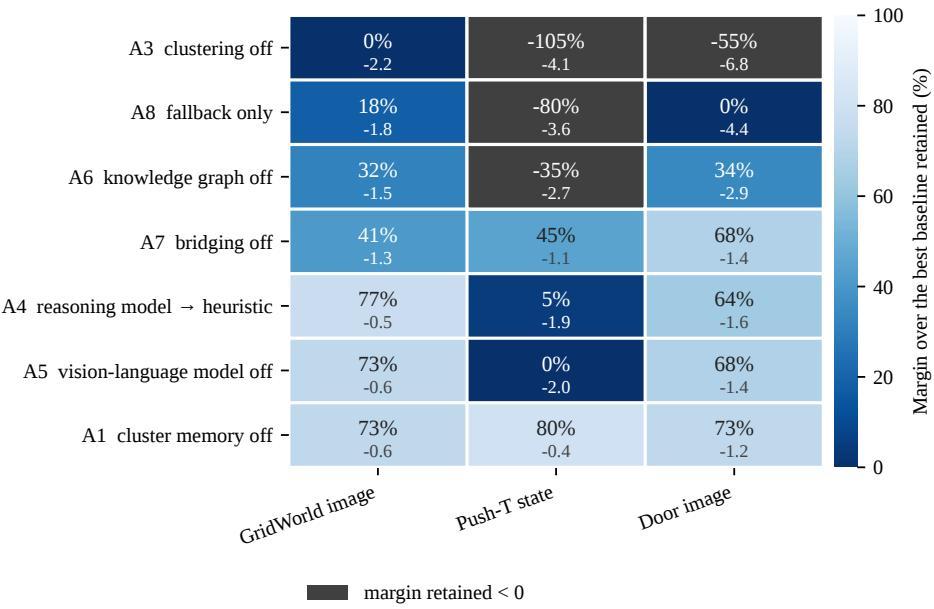  
Figure 6: Cost of each knockout in points of final success rate against full DISEIL, averaged over the 3 ablation settings. The partition knockout is the most damaging; the plot shows the relative contribution of the remaining components.

Table 5: Every knockout, on the 3 ablation settings, ordered by mean damage. Values are the change in final success rate in points against full DISEIL. Mean margin retained is the mean over the 3 settings of (ablated − best baseline)/(full − best baseline), as a percentage. A negative value means the ablated system finished, on average, beneath the baseline it was built to beat. GW is GridWorld (image), PT is Push-T (state) and Dr is Door (image).
<table><tr><td></td><td></td><td colspan="3">∆ success rate (points)</td><td></td><td>Mean margin</td></tr><tr><td>Study</td><td>Component knocked out</td><td>GW</td><td>PT</td><td>Dr</td><td>Mean</td><td>retained (%)</td></tr><tr><td>A3</td><td>the clustering step</td><td>-2.2</td><td>-4.1</td><td>-6.8</td><td>-4.37</td><td>-53.2</td></tr><tr><td>A8</td><td>the prescription, fallback rule promoted</td><td>-1.8</td><td>-3.6</td><td>-4.4</td><td>-3.27</td><td>-20.6</td></tr><tr><td>A6</td><td>the environmental constraints</td><td>-1.5</td><td>-2.7</td><td>-2.9</td><td>-2.37</td><td>10.3</td></tr><tr><td>A4</td><td>the prescription model</td><td>-0.5</td><td>-1.9</td><td>-1.6</td><td>-1.33</td><td>48.6</td></tr><tr><td>A5</td><td>the vision-language model</td><td>-0.6</td><td>-2.0</td><td>-1.4</td><td>-1.33</td><td>47.0</td></tr><tr><td>A7</td><td>bridging placement</td><td>-1.3</td><td>-1.1</td><td>-1.4</td><td>-1.27</td><td>51.4</td></tr><tr><td>A1</td><td>the cluster memory</td><td>-0.6</td><td>-0.4</td><td>-1.2</td><td>-0.73</td><td>75.1</td></tr></table>

Table 6: The allocation ladder in absolute terms: final held-out success rate (per cent) on the 3 ablation settings. A2 replaces allocation with a uniform draw over recorded failures, A8 promotes the deterministic fallback rule to the whole method, and A3 keeps the loss signal and removes the mode structure. GW is GridWorld (image), PT is Push-T (state) and Dr is Door (image).
<table><tr><td>Arm</td><td></td><td>GW</td><td>PT</td><td>Dr</td></tr><tr><td>A2</td><td>uniform-random allocation</td><td>89.1</td><td>82.3</td><td>80.0</td></tr><tr><td rowspan="3">A8 A3</td><td>fallback rule only</td><td>89.5</td><td>92.5</td><td>84.2</td></tr><tr><td>greedy worst-loss</td><td>89.1</td><td>92.0</td><td>81.8</td></tr><tr><td>full DISEIL</td><td>91.3</td><td>96.1</td><td>88.6</td></tr></table>

A2, uniform-random allocation. This control selects 1 recorded failure uniformly at random in each round and requests an expert correction for that failure. It uses no geometric descriptor, failure-mode partition, cluster memory, or prescription model. It is distinct from the STAGGER baseline reported in the main results and is evaluated on the 3 ablation settings. Uniform-random allocation achieves final success rates of 89.1, 82.3, and 80.0 on GridWorld (image), Push-T (state), and Door (image), respectively, compared with 91.3, 96.1, and 88.6 for DISEIL. On the 2 robot settings, it also underperforms the strongest uncertainty-gated baseline. On GridWorld (image), it performs similarly to the gated baselines but remains below DISEIL.

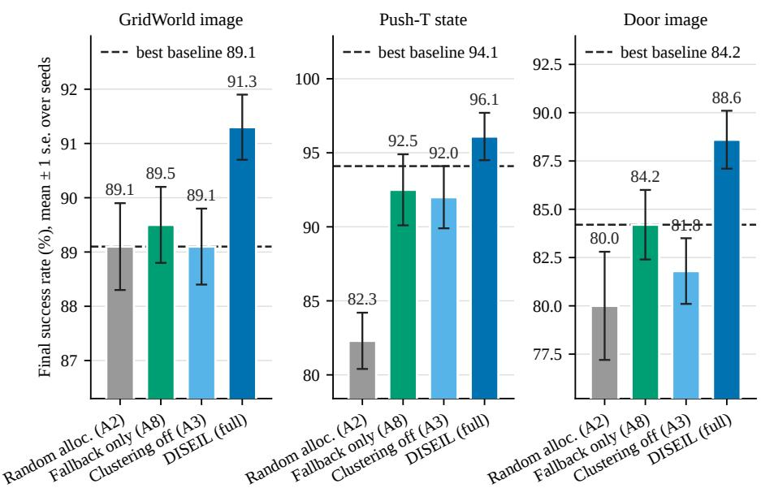  
Figure 7: The allocation ladder on the 3 ablation settings. Bars are the mean final success rate over seeds with 1 standard error, for uniform-random allocation over recorded failures (A2), the deterministic nearest-untried fallback rule promoted to the whole method (A8), clustering removed in favor of greedy worst-loss selection (A3), and full DISEIL. The dashed line is the strongest baseline in that setting. Budget B = 20, 1 demonstration per round.

Uniform sampling over individual failures implicitly selects each failure mode in proportion to its prevalence in the current failure set. Consequently, common modes receive a larger share of the fixed demonstration budget, whereas rare modes receive fewer opportunities for correction and may remain unaddressed. A2 therefore distinguishes the effect of structured failure-mode allocation from the benefit of failure replay alone. Its lower performance, particularly on Push-T (state) and Door (image), shows that revisiting recorded failures is insufficient to recover DISEIL’s gains; the allocation of demonstrations across discovered failure modes provides the additional benefit.

A8, the deterministic fallback rule. If the prescription model fails to produce a feasible request within 5 attempts, DISEIL selects an untried recorded failure using the geometric descriptor and requests an expert correction from that failure. A8 applies this deterministic rule in every round, replacing the prescription model throughout the run. It achieves final success rates of 89.5, 92.5, and 84.2 on GridWorld (image), Push-T (state), and Door (image), respectively, corresponding to reductions of 1.8, 3.6, and 4.4 percentage points relative to full DISEIL. It retains 18.2%, −80.0%, and 0.0% of DISEIL’s margin over the strongest baseline. Thus, A8 remains above the strongest baseline on GridWorld, falls below it on Push-T, and matches it on Door.

The deterministic rule promotes geometric diversity by avoiding repeated correction of already addressed failures. However, it does not explicitly represent recurring failure modes, prioritize modes by severity, or maintain mode-level correction history. Its lower performance across all 3 settings shows that geometric failure selection provides a useful fallback but does not recover the benefit of DISEIL’s complete failure-mode allocation and prescription pipeline.

A3, the clustering step, and the dissociation. The third rung removes the clustering step and targets, each round, the single failure with the highest peak per-step loss. The loss signal is kept and the failure-mode structure is removed. Success falls by 2.2, 4.1 and 6.8 points, a mean of 4.37, and the margin retained collapses to 0.0, −105.0 and −54.5 percent, a mean of −53.2. On Push-T (state) and Door (image) the ablated system falls beneath its own best baseline, 92.0 against 94.1 and 81.8 against 84.2, and on GridWorld (image) it lands exactly on it. Removing the clustering step erases the whole margin and on 2 of the 3 settings turns it negative, the largest damage of any knockout in the program. Figure 8 plots the arm against its baselines.

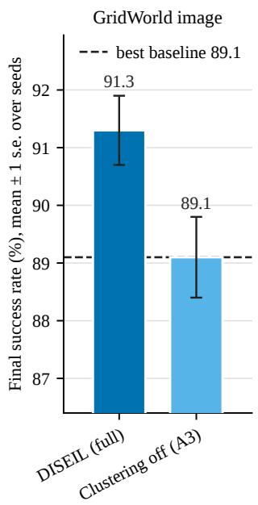

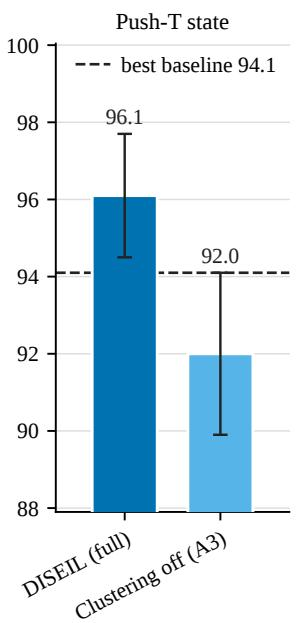

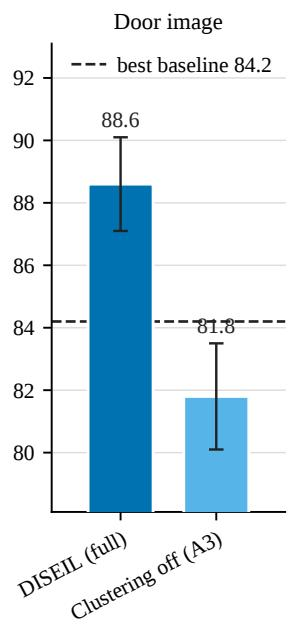  
Figure 8: Success rate with clustering removed. Final success rate for full DISEIL and for greedy worst-loss selection (A3) on the 3 ablation settings, with the strongest baseline as a dashed line.

A3 provides the central mechanistic evidence because per-demonstration goodness and final success respond differently to the same intervention. Removing clustering changes goodness by (+0.02), (+0.16), and (−0.13) across the 3 ablation settings, yielding a mean change of (+0.02). Thus, greedy worst-loss selection remains as effective as full DISEIL at acquiring demonstrations with high pre-retraining policy loss. This is expected because A3 explicitly selects the individual failure with the highest peak loss, whereas DISEIL may select a lower-loss failure to distribute supervision across distinct failure modes. Despite comparable goodness, A3 reduces final success rate by 4.37 percentage points on average. This dissociation shows that the value of a fixed demonstration budget depends not only on the novelty of each demonstration in isolation, but also on how supervision is distributed across the policy’s recurring failures.

Peak loss characterizes the severity of an individual trajectory; it does not characterize the coverage of the complete failure set. Greedy worst-loss selection can repeatedly prioritize high-loss failures from a limited region of the state space, leaving other recurring modes less frequently addressed. Under this interpretation, the selected demonstrations may remain individually informative while providing less diverse supervision collectively. DISEIL instead uses failuremode clustering and memory to distribute demonstrations across distinct regions of the failure distribution. Figure 9 presents the per-setting distribution of the goodness values summarized in Table 2.

Section 4 reports Diff-DAgger as the primary comparison for goodness because Diff-DAgger selects expert interventions using the same per-step diffusion loss from which the metric is computed. It is therefore the baseline most directly aligned with acquiring high-loss demonstrations. The remaining query-gated baselines and the uniform-random control use different selection signals and are omitted from that table for concision. Across their applicable settings, DISEIL achieves higher mean goodness than the query-gated baselines and also outperforms the uniform-random control wherever it is evaluated.

A3 removes the descriptor and memory together with clustering because these components operate on the discovered modes. Its result therefore identifies the contribution of the integrated allocation stack, rather than the clustering algorithm in isolation.

A6, the constraints the prescription is checked against. The prescription model proposes a configuration; constraints are retrieved from the task’s store, which holds workspace bounds, reachability, object and spawn ranges and controller limits as structured key-value knowledge; the proposal is checked against them; a violation is returned to the model as feedback and a revised proposal is requested until a feasible one is produced. A6 removes the store from both the vision-language and the reasoning prompts, so the loop has nothing to verify against.

The cost is 1.5, 2.7 and 2.9 points, a mean of 2.37, and 31.8, −35.0 and 34.1 per cent of the margin is retained, a mean of 10.3. A6 is the third most damaging knockout and it costs nearly twice what the prescription model itself is worth.

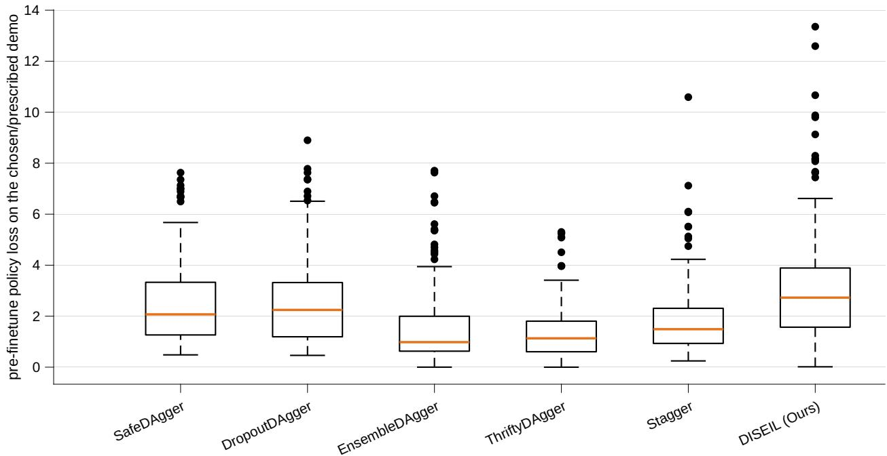  
Figure 9: Per-demonstration goodness, the policy’s per-step loss on each newly acquired demonstration measured before retraining on it. The distributional view of the goodness table of Table 2. Diff-DAgger is run on the robot tasks only.

The fallback rate rises to 27.1, 27.0 and 34.8 percent of rounds, which means roughly 5 to 7 of the 20 rounds are spent on a fallback correction rather than a prescribed one, a direct loss of a quarter to a third of the budget. Figure 10 shows both halves of the measurement.

The fallback rate and success-rate change need not scale one-for-one: a fallback round still acquires the nearest untried failure, so its cost is the difference between a prescribed and a fallback correction rather than the loss of the entire round. Together, A6 and A8 show that the environmental store contributes by keeping prescriptions feasible while the fallback preserves useful supervision when re-prescription is exhausted. Because A6 removes the complete task store, its 2.37-point effect quantifies the structured constraint set as a whole rather than any individual field.

A4 and A5, the 2 model roles. The prescription model is the text-only prescription model of Section 3, and it fills 2 roles. In the first it assigns a root cause and a trajectory phase to each failure, once per failure, from the taxonomy stored in the task’s constraint store. In the second it turns the selected mode and its context set into the round’s demonstration request, once per round. A4 replaces the second of those with the deterministic rule “always target the dominant cluster representative”, operating on the same geometric clusters, so that the comparison isolates the prescription decision and not the partition; the root-cause labeling role is retained in A4 and still runs. A5 removes the vision-language model, leaving the prescription model with the geometric descriptor and the root-cause taxonomy. The 2 roles are removed together nowhere in the program, and the phrase reasoning stack names both roles of the prescription model plus the vision-language call taken together. Figure 11 plots both arms.

A4 costs 0.5, 1.9 and 1.6 points and A5 costs 0.6, 2.0 and 1.4, so both average 1.33 points and both retain roughly half the margin, 48.6 percent for A4 and 47.0 for A5. Both components produce consistent improvements across the 3 settings. Their similar effect sizes do not support a ranking between them; both are largest on Push-T (state) and smallest on GridWorld (image).

The explanation is structural. Clustering is geometric in every run, state and image alike, and it consumes no output from any foundation model. By the time either model is called, the target region of the failure distribution has already been selected by the descriptor and the memory. The prescription model chooses the form of the correction inside a region that was selected without it. The results support DISEIL’s modular design: geometric allocation supplies the primary selection mechanism, while the prescription and vision-language models refine how the selected region is corrected. They also establish a reduced-compute variant: retaining geometric clustering, memory, and the deterministic representative heuristic continues to outperform every baseline in the evaluated settings.

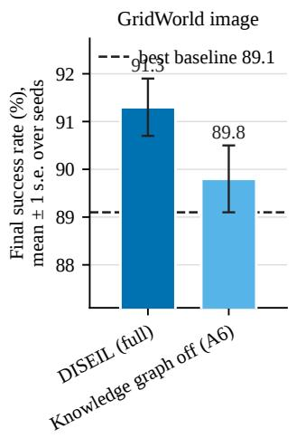

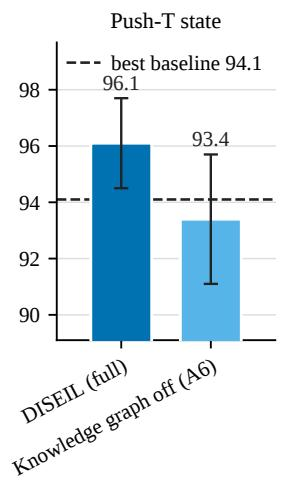

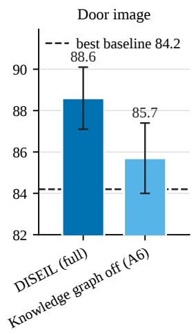

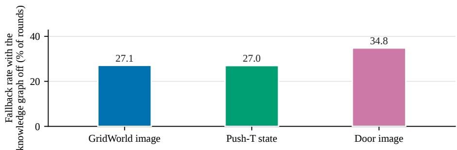  
Figure 10: Grounding and feasibility. Top row: final success rate for full DISEIL and with the environmental constraints removed from the prompts (A6), against the strongest baseline. Bars are means over seeds with 1 standard error, including the A6 bar. Bottom row: the share of rounds that fall back to the deterministic rule when the constraints are removed.

A4 compares the prescription model with a strong allocation-aware heuristic: “always target the dominant cluster representative.” This heuristic inherits the memory’s rotation, while the full model additionally supports bridging. A5 shows that visual evidence remains beneficial even with state-based policies: its largest effect occurs on Push-T (state), where a shared terminal geometry can arise from distinct processes such as pushing on the wrong face, losing contact, or over-rotating. On Door, where terminal geometry more directly identifies the failure cause, the measured visual contribution is smaller.

A7, bridging placement. Bridging is the only part of the prescription that changes the environment configuration rather than selecting an episode, and it is the mechanism by which a prescription can be made easier than the failure it addresses. Disabling it costs 1.3, 1.1 and 1.4 points, a mean of 1.27, and retains 40.9, 45.0 and 68.2 percent of the margin. That is proportionate to how often the arm is used: the bridged share of accepted prescriptions, shown in Figure 12, is 24, 28 and 21 percent. A component used in a quarter of rounds cannot produce a large aggregate effect unless the rounds in which it is used are the decisive ones, and the 3 settings do not order the damage the way they order the share: the largest damage is on the setting with the middle share. What matters is therefore which rounds use bridging, rather than its aggregate frequency alone.

A1, the cluster memory. Switching the memory off, λ = 0, costs 0.6, 0.4 and 1.2 points, a mean of 0.73, and retains 72.7, 80.0 and 72.7 percent of the margin, a mean of 75.1. The memory suppresses a cluster that has just received a demonstration, so the following round is pushed onto a different one. A1 quantifies this contribution after partitioning. The measured effect is task-dependent: 0.4 points on Push-T (state) and 1.2 on Door (image). These consistent improvements quantify the memory’s complementary contribution after the partition has been formed. The candidate set of near-dominant modes is a singleton in 56 to 84 percent of rounds on the settings with sufficient telemetry; in the remaining rounds, the memory can redirect supervision away from recently corrected regions.

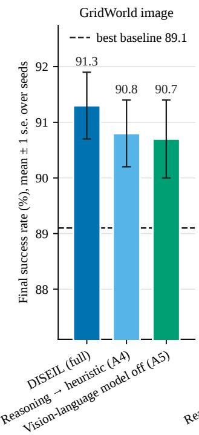

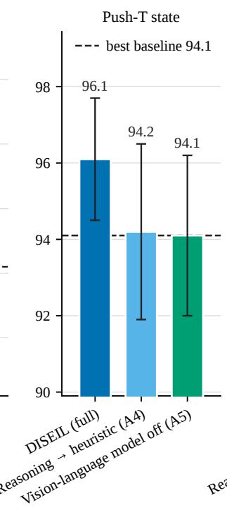

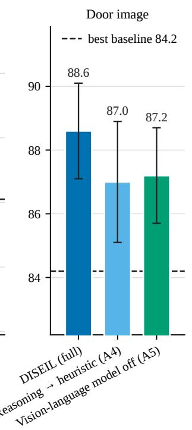  
Figure 11: The prescription model and the vision-language model. Final success rate for full DISEIL, for the prescription model replaced by the dominant-representative heuristic (A4), and for the vision-language model removed (A5), with 1 standard error over seeds and the strongest baseline as a dashed line.

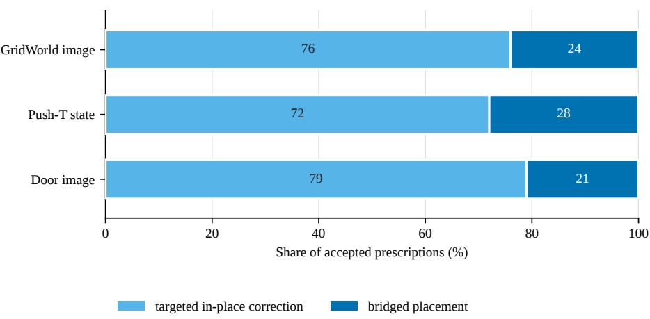  
Figure 12: Targeted and bridged prescriptions (study A7). Share of accepted prescriptions on each of the 3 ablation settings that are a targeted in-place correction and that are a bridged placement.

The ordering. Ranked by mean damage, the 7 knockouts are: clustering (−4.37 points, −53.2 percent of the margin retained), the fallback rule promoted to the whole method (−3.27, −20.6), the constraint store (−2.37, 10.3), the prescription model and the vision-language model (−1.33 each, 48.6 and 47.0), bridging placement (−1.27, 51.4) and the cluster memory (−0.73, 75.1). The ordering shaped the rest of the program in 2 ways. The clustering step, which the framework instantiates as a generic partition, produces the largest measured contribution, establishing mode-based allocation as the principal driver. The cluster memory provides a smaller, consistent, task-dependent complement to that partition.

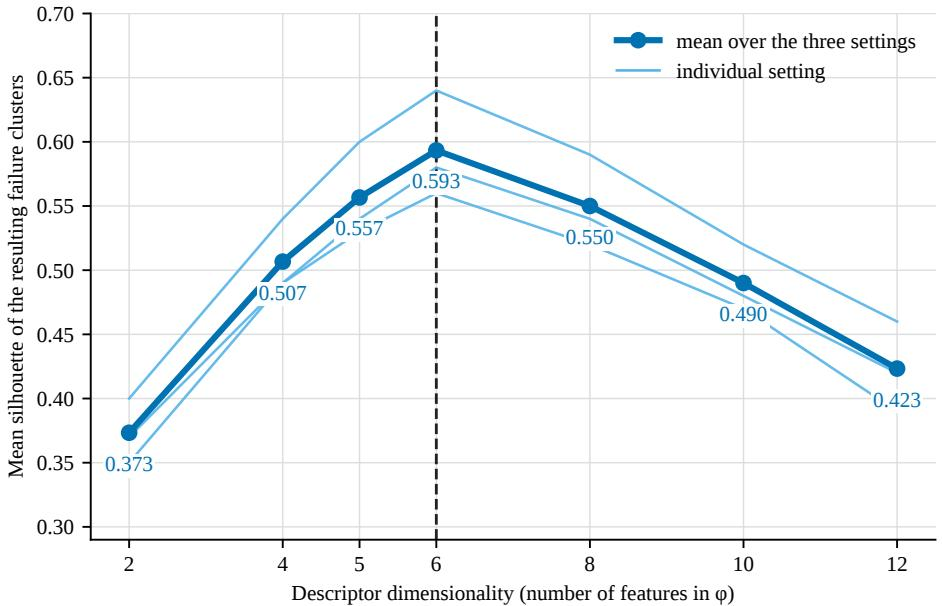  
Figure 13: Mean silhouette of the failure clusters against the dimensionality of the geometric descriptor, with 1 line per ablation setting and the mean over the 3. The dashed vertical line marks the 6-dimensional descriptor the framework uses.

## G Design Choices, A9 to A12

Given that allocation is the mechanism, the next family of studies asks whether this descriptor, this cluster count and this context set provide effective design choices for allocating the fixed demonstration budget. The additional A12b comparison asks whether the context-set result transfers across prescription models.

A10, the width of the descriptor. The descriptor is designed, not learned, and A10 validates its width using mean silhouette, a cluster-separation criterion independent of success rate [49]. Features are removed from and added to the descriptor, and the silhouette is measured over every clustering round.

The curve in Figure 13 is a clear inverted U with a single interior maximum, and the 6-dimensional descriptor is the highest-scoring variant in each of the 3 settings. Below 6 dimensions the descriptor discards information that distinguishes modes, and the largest single step in the whole sweep, +0.133 in mean silhouette, is the step from 2 dimensions to 4, which adds orientation. Position alone cannot separate a Push-T failure in which the block is in the right place at the wrong angle from one in which it is in the right place at the right angle and the pusher lost contact, so those failures collapse into a single cluster and the cluster’s silhouette is poor. Adding task progress, worth +0.050, and contact distance, worth +0.037, each buy less, which is consistent with orientation being the dominant discriminator on these tasks.

Above 6 dimensions, the observed decline is consistent with distance concentration: as dimensionality rises, pairwise distances become less discriminative for clustering small failure sets. The added variants include end-effector velocity at 8 dimensions and a joint-angle summary by 12 dimensions. Because the instrumented setting contains 42 failures in round 1 and 2 by round 20, the compact 6-dimensional representation provides the strongest measured separation at the sample sizes encountered by the method.

A10 also confirms an implementation detail. Clustering is geometric for every run, state modality and image modality alike, and the descriptor is the same 6-dimensional vector in both. Silhouette measures geometric separation; the complementary purity diagnostic in Appendix H evaluates agreement with the system’s root-cause labels. Thus, A10 establishes that 6 dimensions is the strongest variant within the evaluated descriptor family, while A13 characterizes the semantic consistency of the resulting clusters.

A9 and A12, the context set. The context set given to the prescription model contains 3 cited failure episodes chosen by 3 rules: the forced representative of the target cluster, the worst-peak-loss seed, and a farthest-point-sampling fill for diversity [15]. Written out, the set S referred to in Section 3’s prioritize stage is built from the target mode $C _ { \mathrm { t g t } }$ as

Table 7: The composition and the size of the context set (studies A9 and A12), as the mean cost in success-rate points over the 3 ablation settings against a full-system reference of 92.0. The A12 citation-count comparison uses Qwen3-32B.
<table><tr><td>Arm Cost (pts)</td></tr><tr><td>A9, composition; 3 citations Drop the forced representative -3.2 Drop the diversity fill -3.2 Drop the worst-loss seed -3.27 3 episodes drawn at random -3.6</td></tr><tr><td>A12, number of citations; Qwen3-32B Top 3 by plain peak-loss rank -2.13 2 citations -1.93</td></tr></table>

$$
\begin{array} { r }  \boldsymbol { S } _ { 0 } = \big \{ \mathrm { r e p } ( C _ { \mathrm { t g t } } ) \big \} \cup \Big \{ \mathrm { a r g ~ \displaystyle \operatorname* { m a x } _ { \boldsymbol { i } \in C _ { \mathrm { t g t } } } \mathrm { p e a k } _ { \boldsymbol { i } } \Big \} , \quad \boldsymbol { S } \gets \boldsymbol { S } _ { 0 } , } \\ { \boldsymbol { S } \gets \boldsymbol { S } \cup \Big \{ \mathrm { a r g } \operatorname* { m a x } _ { \boldsymbol { i } \in C _ { \mathrm { t g t } } \backslash \boldsymbol { S } } } \\ { \displaystyle \operatorname* { m i n } _ { \boldsymbol { j } \in \boldsymbol { S } } \big \| \tilde { \boldsymbol { X } } _ { \boldsymbol { i } } - \tilde { \boldsymbol { X } } _ { \boldsymbol { j } } \big \| _ { 2 } \Big \} } \\ { \quad \mathrm { ~ w n i l ~ } | \boldsymbol { S } | = \operatorname* { m i n } \big ( \kappa , | C _ { \mathrm { t g t } } | \big ) , } \end{array}\tag{6}
$$

with $\kappa = 3$ in every reported main experiment and $\tilde { X }$ the standardized descriptors. A9 removes each rule in turn and adds a reference control of 3 episodes drawn at random from the cluster, with the target cluster fixed by the memory in every arm so that only the composition of the set varies. All figures in this paragraph are means over the 3 ablation settings against a full-system reference of 92.0, and they are collected in Table 7.

The 3 single-rule removals have similar costs, showing that each contributes comparably to the context-set construction. The forced representative guarantees the prescription model sees an example of the mode it has been instructed to fix, without which the cited episodes can all come from the cluster’s periphery. The diversity fill keeps a context set of 3 episodes from all crowding near the loss peak, where it would describe the mode narrowly and draw a narrow correction. The worst-loss seed sharpens the description of the mode. Random selection of 3 episodes costs 3.6 points, more than any single-rule removal, so the 3 rules together beat an unstructured draw and are complementary rather than redundant.

The relative magnitudes place the context-set contribution in perspective. The spread from the full context set to random selection is 3.6 points, larger than the constraint store and still less than the clustering. A12 sharpens the point by varying the number of cited episodes jointly with the selection rule. At the same context size, the 3-rule construction outperforms plain peak-loss ranking by 2.13 points and wins on each of the 3 settings. Citing only 2 episodes costs 1.93 points, while citing 5 provides no measurable gain over 3 with Qwen3-32B. The cap of 3 therefore balances contextual coverage with prompt length for the prescription model used in the main experiments. Study A12b examines whether this choice transfers to a stronger alternative model. Citation counts below 2 are not applicable to bridging, which requires a pair of cited failures to define an intermediate placement.

A12b, prescription-model sensitivity to context-set size. The preceding A12 comparison was conducted with Qwen3-32B, the prescription model used in the DISEIL experiments of Section 4. We additionally tested whether the effect of the context-set cap depends on the prescription model by comparing Qwen3-32B with Sonnet 5 at $\kappa \in \{ 3 , 5 \}$ The comparison was run on GridWorld (image) and Door (image), with 3 seeds per arm. All other components of the acquisition and training pipeline were held fixed.

Table 8 shows a consistent crossover between the 2 models. At κ = 3, Qwen3-32B exceeds Sonnet 5 by 3.5 points on GridWorld (image) and 4.0 points on Door (image). Increasing the context-set size to $\kappa = 5$ improves Sonnet 5 by 5.0 and 6.5 points, respectively, after which it exceeds Qwen3-32B by 2.8 and 3.1 points. In contrast, Qwen3-32B decreases by 1.3 points on GridWorld (image) and 0.6 points on Door (image) when κ is increased.

Averaged over the 2 settings, increasing κ from 3 to 5 improves Sonnet 5 by 5.75 points, whereas Qwen3-32B changes by −0.95 points. The utility of additional cited episodes therefore depends on the prescription model rather than only on prompt length. These results support $\kappa = 3$ for the Qwen3-32B instantiation used in the main experiments, but they do not establish 3 episodes as a model-independent optimum. Because the comparison covers 2 settings and 3 seeds, it is interpreted as evidence of a model-by-context-set-size interaction rather than as a general ranking of the 2 models.

Table 8: Prescription-model sensitivity to the context-set cap. Values are final held-out success rate (per cent), reported as mean ± 1 standard error over 3 seeds. The final column gives the within-Sonnet improvement relative to $\kappa = 3$ on the same task.
<table><tr><td>Task</td><td></td><td> $\kappa \mathrm { \ Q w e n } 3 { - } 3 2 \mathrm { B }$ </td><td>Sonnet 5</td><td>Sonnet gain</td></tr><tr><td>GridWorld (image)</td><td>3</td><td> $9 1 . 5 \pm 0 . 3$ </td><td> $8 8 . 0 \pm 0 . 4$ </td><td></td></tr><tr><td>GridWorld (image)</td><td>5</td><td> $9 0 . 2 \pm 0 . 4$ </td><td> $9 3 . 0 \pm 0 . 6$ </td><td> $+ 5 . 0$ </td></tr><tr><td>Door (image)</td><td>3</td><td> $8 7 . 0 \pm 1 . 7$ </td><td> $8 3 . 0 \pm 1 . 2$ </td><td></td></tr><tr><td>Door (image)</td><td>5</td><td> $8 6 . 4 \pm 1 . 3$ </td><td> $8 9 . 5 \pm 1 . 3 + 6 . 5$ </td><td></td></tr></table>

A11, the cluster count. The cluster count is chosen per round by maximum mean silhouette, which is standard practice, is used as such, and is not claimed as a contribution [45, 49]. A11 replaces the adaptive choice with a fixed k. Silhouette selection wins on each of the 3 settings, and it beats the best fixed alternative, averaged over the 3, by 4.1 points: a fixed $k = 2$ costs 4.1 points against the adaptive rule, $k = 3$ costs $4 . 6 , k = 4$ costs 7.4 and $k = 5$ costs 6.7. The effect is well outside the seed standard error of the 3 settings, which runs from 0.6 to 1.6 points, so the adaptive rule is defended by the size of its effect and not only by the consistency of its sign.

No single fixed k is best across the 3 settings either: the best fixed value is $k = 3$ on GridWorld (image), $k = 2$ on Push-T (state) and $k = 5$ on Door (image), confirming the benefit of round-adaptive selection. Too few clusters merges distinct failure modes, so the memory penalises a merged cluster and suppresses correction of a mode that was never addressed. Too many splits a single mode across several clusters, so the memory cannot recognize that the mode has been corrected and rotation is diluted across fragments of the same region. The right number varies by setting and by round, and only the adaptive rule tracks it. Figure 14 plots A9, A11 and A12 together.

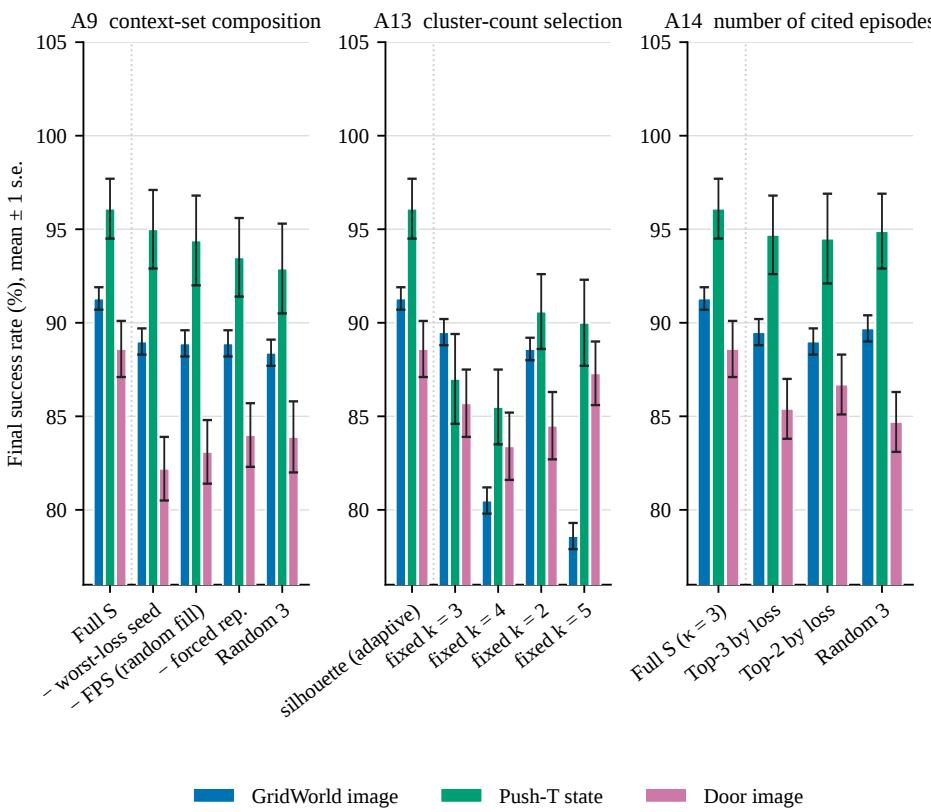  
Figure 14: 3 ablations of the machinery inside individual steps, with arms ordered by effect. Left: the composition of the context set (A9). Middle: silhouette-based selection of the cluster count against fixed alternatives (A11). Right: the number of cited episodes and the selection rule (A12). Bars are means over seeds with 1 standard error, on the 3 ablation settings.

## H Diagnostics, A13 to A16

The final family of studies characterizes the discovered clusters, the use of bridging, and the activity of the allocation machinery over the demonstration budget.

A13, semantic consistency of the geometric clusters. A10 shows that the descriptor produces well-separated clusters. A well-separated cluster need not correspond to a single root cause, so A13 complements geometric silhouette with the consistency of the system’s root-cause labels. Purity runs from 0.84 to 0.91 across the 3 settings and the number of distinct root causes per cluster runs from 1.35 to 1.86. Table 9 gives the grid.

The ordering is the informative part and it is the same ordering on both columns. Push-T (state) has the best silhouette, 0.64, and the highest purity, 0.91. Door (image) has the lowest silhouette, 0.56, the lowest purity, 0.84, and the most root causes per cluster, 1.86. Geometric separation and semantic purity rise and fall together on these 3 settings: the descriptor variants that separate geometry most clearly also produce the most semantically consistent clusters. A13 therefore provides complementary evidence that the geometric partition aligns with the system’s root-cause taxonomy. Because the labels are assigned by the prescription model rather than by human annotators, the measurement is interpreted as internal semantic consistency.

A14, the distribution of the cluster count. A14 shows that the adaptive rule uses the full candidate range. Pooled over the 308 clustered rounds of the 3 ablation settings, k = 3 is the most frequently selected count at 26.3 percent, with k = 4 at 23.4, k = 5 at 21.4, k = 2 at 14.9 and $k = 6$ at 14.0. No value from 2 to 6 falls below 14 percent. Thus, the number of discovered failure modes varies by round and is most often 3 or 4 rather than collapsing to a fixed value.

A14 also characterizes the intended small-set transition: 21 percent of GridWorld (image) rounds, 15 percent of Push-T (state) rounds and 20 percent of Door (image) rounds never cluster at all, because fewer than 4 failures remain, and in those rounds each failure becomes its own cluster and the budget is allocated by the fallback rule. Figure 15 shows the distribution with those rounds marked.

Table 9: Root-cause label purity per geometric cluster (study A13). Mean cluster purity is the fraction of a geometric cluster’s failures that share the dominant root cause assigned by the prescription model. Mean root causes per cluster counts the distinct root causes present in a cluster. Purity is scored against the prescription model’s own labels, so it measures internal agreement between geometric grouping and semantic labeling.
<table><tr><td>Setting</td><td>Purity</td><td>Causes</td><td>Silhouette</td></tr><tr><td>GridWorld 5x5 (image)</td><td>0.89</td><td>1.62</td><td>0.58</td></tr><tr><td>Push-T (state)</td><td>0.91</td><td>1.35</td><td>0.64</td></tr><tr><td>Door (image)</td><td>0.84</td><td>1.86</td><td>0.56</td></tr></table>

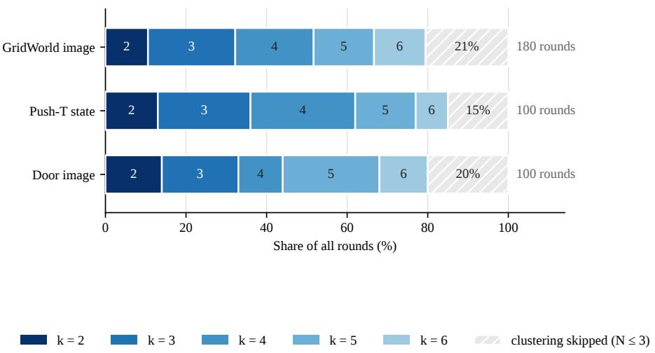  
Figure 15: Cluster count selected per round (study A14). Share of all rounds selecting each cluster count k, with the rounds that skip clustering entirely, because fewer than 4 failures remain, shown hatched.

A15, the bridged share. The share of accepted prescriptions that use bridging is 24 percent on GridWorld (image), 28 percent on Push-T (state), and 21 percent on Door (image). Figure 12 reports these values alongside the A7 bridging knockout, linking the frequency of this prescription type to its measured success-rate contribution.

A16, failures per round. Failures per round fall from 42 to 2 over the budget, halving by round 8 and falling by an order of magnitude by round 17. The decline shows that the system progressively reduces the failure set. On the instrumented setting the descriptor, the clustering and the memory do their work through round 17, and the last 3 rounds run the fallback rule on a handful of remaining failures. A14 confirms the pattern on the 3 ablation settings, where 15 to 21 percent of all rounds skip clustering altogether. Figure 16 plots the curve.

This per-round diagnostic is instrumented on Push-T (image). A14 provides complementary evidence across all 3 ablation settings by showing that 15 to 21 percent of rounds reach the same small-failure-set regime and skip clustering.

A16 shows that DISEIL’s allocation machinery is most active early on the instrumented setting, which is consistent with the method concentrating its advantage in the low-budget regime.

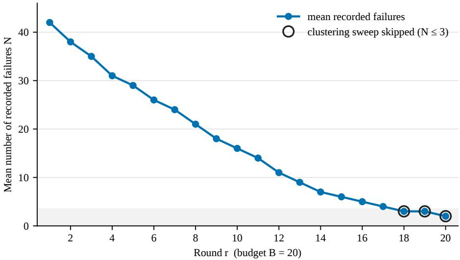  
Figure 16: Mean number of recorded failures per round over the budget (study A16). The setting is Push-T (image), averaged over 5 seeds. Below 4 remaining failures the clustering sweep is skipped and each failure becomes its own cluster; the shaded band marks that region.

## I Computational Cost, A17

Study A17 directly measures the per-round computational cost of the reasoning pipeline, complementing the success-rate results with an explicit account of the inference trade-off.

The measurement. Each of 5 settings runs a matched pair of runs, DISEIL against SafeDAgger, on the same task, the same observation modality and the same hardware, and the wall-clock and token cost of every round is read out of each run’s own telemetry. SafeDAgger is the baseline arm throughout. We report 2 protocols and are interpreted separately. Protocol P1 reports the first round of each run. It is the only protocol available in all 5 settings, and the first round holds the weakest policy and therefore the most failures and the most model calls, so P1 is an upper bound on steady-state cost rather than an average of it. Protocol P5 reports the mean and the sample standard deviation over the language-model-active rounds of the runs that carried a longer budget, matched arm for arm against the baseline’s same-indexed rounds. The spread quoted under P5 is the round-to-round spread inside a run. A P1 row and a P5 row therefore describe distinct cost summaries.

What the measurement says. A round’s wall-clock is dominated by the from-scratch policy retrain and the held-out evaluation, and both arms pay all of it. Under P1 that shared cost is 783 to 1,491 seconds per round on the 3 RoboSuite settings, against a reasoning add-on of 270 to 700 seconds, and under P5 it is 548 to 1,333 seconds against an add-on of 233 to 656. The ratio of a DISEIL round to a baseline round includes a large shared denominator: across the 2 protocols, the ratio ranges from 1.13 to 2.75. The DISEIL-specific add-on ranges from 63 seconds per round on GridWorld to 1,232 seconds on Push-T, with 9,560 to 12,116 reported tokens per round. Together, the shared and add-on columns separate the cost of the underlying training loop from the cost of DISEIL’s selection pipeline.

Push-T has the largest measured add-on. Its shared cost is the second smallest in the sweep and its baseline arm is unusually short, because SafeDAgger’s loop runs until the intervention budget is spent and therefore halts after its first intervened episode, which is 1 episode and 6.3 seconds, while DISEIL screens a fixed 60. Push-T also issues 20 language-model calls, compared with 7 on Door. GridWorld has the smallest wall-clock add-on, while still drawing 9,735 tokens; its constraint block accounts for 54 percent of the prompt budget, the largest share among the measured settings.

What this means for the framework. The language and vision-language models run only at demonstration-selection time. They are never in the control loop and they do not run at execution, so their cost is paid once per round, and on the 3 RoboSuite settings it is amortized over a retrain and an evaluation that together cost more than the reasoning does. The resource being traded is model inference against expert demonstration time, and on the settings measured here a round buys 1 demonstration for an extra 63 to 1,232 seconds of inference. Whether that trade is worth making depends on what a demonstration costs, which for a scripted or oracle expert is negligible but for a human demonstrator is a person’s time. DISEIL is therefore most attractive when expert supervision is scarce relative to selection-time compute. A4 additionally provides a reduced-compute operating point: replacing the reasoning stack with the deterministic cluster-representative heuristic costs 1.33 success-rate points on average while retaining performance above the evaluated baselines.

Table 10: Per-round wall-clock and token cost, DISEIL against SafeDAgger (study A17). Shared is the part of the round that both arms pay: a from-scratch policy retrain and a held-out evaluation. Add-on is every DISEIL-specific stage of the round, which is the failure-screening rollout together with clustering, the vision-language call, the reasoning call, the prescription and the feasibility check, less the query-gate rollout the baseline runs in its place. Tokens is the sum of the vision-language and language-model tokens drawn in the round. Token counts are not comparable across rows, because the settings were served by different backends and the hidden reasoning tokens are read directly from the usage record on some and recovered from the billed completion length on others; within-row wall-clock comparisons use matched hardware and protocols.
<table><tr><td>Protocol</td><td>Setting</td><td>Baseline (s)</td><td>DISEIL (s)</td><td>Shared (s)</td><td>Add-on (s)</td><td>Tokens</td></tr><tr><td>P1</td><td>Door (state)</td><td>737.0</td><td>1,054.0</td><td>783.0</td><td>+270.0</td><td>11,511</td></tr><tr><td>P1</td><td>Door (image)</td><td>1,247.0</td><td>1,474.0</td><td>1,180.0</td><td>+293.0</td><td>11,379</td></tr><tr><td>P1</td><td>Wipe (image)</td><td>1,468.0</td><td>2,195.0</td><td>1,491.0</td><td>+700.0</td><td>9,560</td></tr><tr><td>P1</td><td>Push-T (image)</td><td>688.0</td><td>1,891.0</td><td>652.5</td><td>+1,232.1</td><td>12,116</td></tr><tr><td>P1</td><td>GridWorld (image)</td><td>54.6</td><td>118.0</td><td>51.1</td><td>+62.6</td><td>9,735</td></tr><tr><td>P5</td><td>Door (state)</td><td> $5 3 2 . 6 \pm 1 4 5 . 5$ </td><td>782.6 ± 183.5</td><td>547.8</td><td>+232.8</td><td>10,929</td></tr><tr><td>P5</td><td>Door (image)</td><td> $1 , 0 3 4 . 2 \pm 1 5 0 . 2$ </td><td> $1 , 1 6 8 . 8 \pm 1 9 4 . 8$ </td><td>901.6</td><td>+266.2</td><td>10,787</td></tr><tr><td>P5</td><td>Wipe (image)</td><td> $1 , 3 0 3 . 3 \pm 1 4 4 . 1$ </td><td> $1 , 9 9 1 . 0 \pm 1 7 9 . 2 $ </td><td>1,332.7</td><td>+655.7</td><td>10,118</td></tr></table>

## J Prescription Confidence

At the moment it issues a prescription, the prescription model also emits an integer confidence between 0 and 100 together with a one-line rationale, reporting how likely it believes the resulting demonstration is to improve the policy. That number was added to the prompt as an instrument, to find out whether the model has any usable forecast of the value of the round it is about to spend. It is scored against ∆SR, the change in the policy’s success rate on the round-level rollout evaluation across that round.

The Pearson correlation between the reported confidence and the realized ∆SR runs from 0.82 to 0.89 across the 10 settings. Quoting each task as state then image: GridWorld 0.88 and 0.82, Push-T 0.87 and 0.88, Lift 0.88 and 0.89, Wipe 0.82 and 0.86, Door 0.83 and 0.82. Figure 17 shows the GridWorld (image) scatter, where r = 0.82 over 180 prescriptions, the full count that 9 seeds at a budget of 20 supply.

The temporal ordering makes this a prospective rather than retrospective signal. The confidence is reported blind, at prescription time. At that moment the demonstration has not been collected, the expert has not been called, the policy has not been retrained, and the re-rollout that produces ∆SR has not been run. The success-rate signal arrives only after all 3 of those steps have completed, by which point the round’s unit of budget has already been spent. The model therefore reports confidence before observing the outcome, and the correlations of 0.82 to 0.89 show a strong positive association between reported confidence and subsequent policy improvement.

The correlation is measured on DISEIL runs, and confidence is recorded as a diagnostic: no demonstration is skipped, deferred, or re-prescribed on the basis of the score. Accordingly, the result establishes confidence as a strongly correlated prospective signal within the reported DISEIL runs without attributing any of the policy improvement to confidence-based gating.

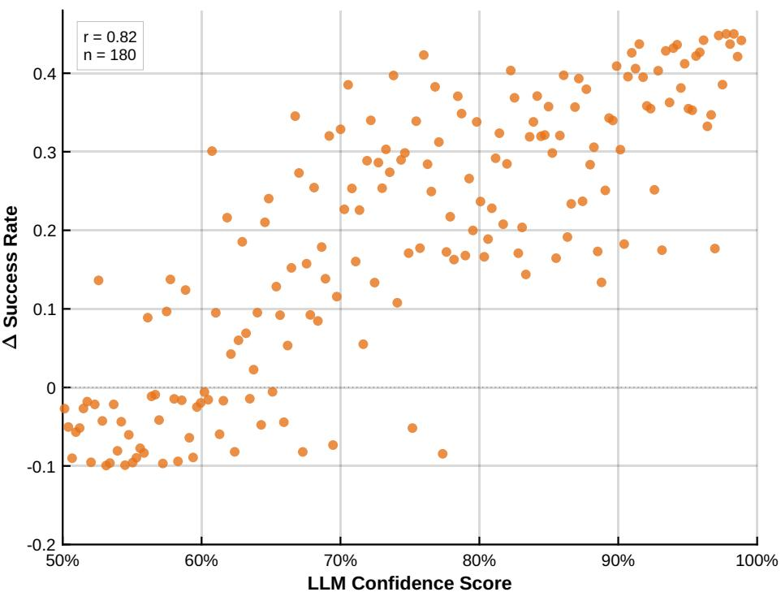  
Figure 17: Reported prescription confidence against realized improvement. The confidence the prescription model reports at prescription time, against the change in the policy’s success rate on the round-level rollout evaluation that the resulting demonstration produced. GridWorld (image), 180 prescriptions, Pearson r = 0.82.

## K DISEIL Prompt Templates

## K.1 Prompts and the Failure Taxonomy

Every run stores its exact prompts and replies. The 3 model calls are the perception call, the reasoning call and the prescription call, and their templates are reproduced below as text. The anchor t<sup>⋆</sup> is the first uncertain step, the first step at which the policy’s per-step loss stays above threshold for K consecutive steps; it is distinct from peak loss, which is used only to rank a mode’s severity.

The perception call takes a system instruction and 3 frames of a cited failure: the start of the episode, the first uncertain step t<sup>⋆</sup>, and the final step.

SYSTEM: You are analyzing a robot manipulation failure from rendered frames. Be concrete and spatial; describe what you actually see, not generic advice.

USER: You are analyzing a robot manipulation failure. The attached frames are, in order: start, first\_uncertain, end (the first\_uncertain frame is the policy’s first uncertain step t\*, where per-step loss first stays high). Task: {task\_description} Describe what went wrong. Focus on: where in the trajectory the failure occurs, the robot/gripper configuration at t\*, and what object or contact state caused it. \~120 words, concrete and spatial. [start frame] [first\_uncertain frame] [end frame]

The reasoning call is constrained to the vocabulary of the task’s constraint store and to strict JSON. The closed taxonomy is visible in the prompt: the root cause is one of 6 categories and the phase one of 5, and the model’s job is assignment rather than invention.

SYSTEM: You are a robot-manipulation failure analyst. Classify the root cause and   
trajectory phase using ONLY the provided categories and the KAG facts.   
Output strict JSON, no prose, no code fences.

```jsonl
USER: TASK: {task_description}
{kag_text}
VLM FAILURE DESCRIPTION (the only visual evidence): {vlm_report}
Identify the root cause category and the trajectory phase where the failure
occurred.
root_cause in [grasp_failure, approach_failure, placement_error,
contact_instability, pose_mismatch, timeout]
phase in [pre_grasp, grasp, transport, placement, insertion]
Output ONLY this JSON:
{"root_cause": "<one of the categories>",
"phase": "<one of the phases>",
"rationale": "<one sentence grounded in the VLM description
and a KAG fact>"}
```

The 2 closed vocabularies are read from the task’s store of environmental constraints, so a task that has no insertion phase does not offer one, and the rationale field forces the label to be traceable to both the visual evidence and a named constraint.

The prescription call states the budget rule to the model, offers the 2 arms of the prescription, and requires a confidence line.

SYSTEM: You are a demonstration coach for an interactive imitation-learning   
loop. The target failure mode has already been selected by the   
geometric allocation stage. You decide only HOW to spend ONE expert   
demonstration intended to address this selected mode.   
Do not re-cluster the failures, select another failure mode, or   
generate policy actions. Ground the request only in the supplied   
failure evidence and environmental constraints.   
Reason briefly, then end with EXACTLY two lines:   
(1) a decision line in the required format; and   
(2) a confidence line:   
CONFIDENCE: <integer 0-100> - <one-line rationale> reporting how   
confident you are that this demonstration will improve the policy.   
USER: TASK: {task\_description}   
PRESELECTED TARGET FAILURE MODE: {cluster\_summary}   
CITED FAILURES FROM THIS MODE: {failure\_analyses}   
FEEDBACK: {validation\_feedback}   
AVAILABLE PRESCRIPTION TYPES:   
(A) SELECT ep<ID> - one cited failure represents the selected mode.   
Restore that failure’s anchored state and ask the expert to   
continue from the first uncertain step t\*. Use SELECT when the   
mode is geometrically tight or one cited failure provides a   
suitable representative correction.   
(B) BRIDGE ep<ID>,ep<ID> - no single cited failure adequately   
represents the selected mode. Propose ONE new, feasible starting   
configuration in an intermediate region between two or three   
cited failures. Use BRIDGE when the failures are geometrically   
spread but represent the same selected mode.

## K.2 Environmental Constraints: Representative Examples

The store of environmental constraints for a task is a JSON document with a fixed schema: metadata, typed nodes with key-value properties, relations between them, and a block of reasoning implications, 1 per failure mode plus a workspace constraint and a non-emptiness rule. A renderer turns the document into the text block injected into the reasoning and prescription prompts. The store is authored once per task, and its constraints are measurements of the environment rather than opinions about it.

Push-T stores its bounds as typed workspace nodes and its controller as a node in its own right.

```jsonl
{"id":"ws_tee","type":"Workspace",
"label":"Reliable tee init range",
"properties":{"x":[-0.20,0.20],
"y":[-0.25,0.05],
"z":0.021}},
{"id":"ws_tcp","type":"Workspace",
"label":"Reliable tcp range",
"properties":{"x":[-0.35,0.35],
"y":[-0.35,0.35],
"z":[0.02,0.08]}},
{"id":"ctrl","type":"Controller",
"label":"pd_joint_pos /
rel_joint_pos",
"properties":{
"policy_action":"7 joint deltas
(rel_joint_pos)",
"expert_action":"PPO ->
joint_delta_pos (same
7-joint space)"}}
```

The predicate the feasibility loop checks is stored as an implication and is written in the imperative, because it is addressed to the model as much as to the checker.

"workspace\_constraint": "Every prescribed config MUST keep tee\_xyz within   
x[-0.20,0.20] y[-0.25,0.05] z=0.021 and tcp\_xyz within x[-0.35,0.35]   
y[-0.35,0.35] z[0.02,0.08]; out-of-range poses are dropped (the PPO expert   
is unreliable there) and waste the round."

That constraint is also where the Push-T expert’s partial competence is encoded. The expert pushes in a single rotational direction only, so the configurations it cannot demonstrate are excluded before a prescription is issued rather than discovered after the expert has failed on 1.

Door’s constraint is tighter by an order of magnitude, and the numbers are a padded empirical measurement of the environment’s own reset sampler, so that a prescribed configuration cannot leave the task’s native reset distribution.

```jsonl
{"id": "ws_door", "type": "Workspace",
"label": "Reliable door-frame range",
"properties": {"x": [-0.135, -0.108],
"y": [-0.366, -0.340],
"z": 1.10,
"yaw_rad":
[-1.82, -1.57]}},
{"id": "succ",
"type": "SuccessCondition",
"label": "Door open",
"properties": {
"metric": "hinge_qpos > 0.3 rad",
"info_key": "success"}}
```

For a discrete task the environmental constraint is not a bounding box but a reachability predicate, and GridWorld’s store states it as one. A prescribed layout must place the start cell, the goal cell and the 3 obstacle cells as distinct in-grid cells, with a minimum separation between start and goal and a breadth-first path from one to the other that avoids the obstacles. A layout that fails the predicate is rejected before it reaches the expert.

Beyond rejecting infeasible layouts, the store also fixes which prescription arms a task offers at all: where a task’s constraints declare bridging inapplicable, the bridging arm is omitted from the prompt and only targeted selection remains. Both jobs, constraining where a demonstration may be placed and fixing which prescription arms exist, are done by knowledge that is written down and checkable, which is the sense in which the framework’s model of the environment is explicit rather than implicit in a network’s weights.

## K.3 Qualitative Examples and Operational Characteristics

The modes the partition discovers. Figure 5 shows the 3 failure modes discovered on Push-T (image) with 3 sampled members of each. The modes are behaviorally distinct: the block is brought to the goal region but left almost fully inverted; the arm never establishes a working contact; the block is pushed but abandoned at a moderate orientation error and far from the end-effector. The clusters are found from geometry alone and the naming pipeline supplies their labels from the task store’s own vocabulary. The value 3 is not the number of failure modes on these tasks. It is the count most often selected when the silhouette criterion runs, and the count varies by round, as study A14 reports.

A round, end to end. The cited failures are handed to the prescription model 1 line each and the model answers in 2 lines. The round below is taken verbatim from a Wipe log.

DOMINANT FAILURE CLUSTER   
(members with their VLM+analysis   
findings):   
- ep3000001:   
object\_xy=(0.221,-0.027)   
progress=74/500   
peak\_loss=0.0434   
root\_cause=contact\_instability   
phase=transport   
- ep3000003:   
object\_xy=(0.165,-0.068)   
progress=146/500   
peak\_loss=0.0181   
root\_cause=contact\_instability   
phase=transport   
- ep3000006:   
object\_xy=(0.123,-0.157)   
progress=234/500   
peak\_loss=0.0186   
root\_cause=pose\_mismatch   
phase=placement   
RESPONSE =====   
SELECT ep3000001   
CONFIDENCE: 85 - Ep3000001’s   
contact\_instability root cause (higher   
peak\_loss) at early progress best   
represents the dominant failure mode,   
ensuring the expert demonstration   
directly addresses unstable wiping   
pressure causing missed coverage.

A mixed-label cluster. The same record illustrates how majority labeling operates when a geometric cluster contains more than 1 semantic label. Of the 3 cited members, 2 carry the label contact\_instability and the third carries pose\_mismatch, so this mode has a purity of 2 thirds. The purity measured across the ablation settings, 0.84 to 0.91 in study A13, summarizes this behavior across clusters. In this example, the prescription selects an episode carrying the majority label and targets the dominant contact-instability cause.

Fallback and small-set behavior. The framework includes explicit handling for 2 operational edge cases. If no feasible prescription is produced within $J _ { \mathrm { m a x } }$ attempts, the nearest untried failure supplies the demonstration start; A6 shows that this fallback is used in 27 to 35 percent of rounds when the constraint store is removed. When fewer than 4 failures remain, each failure becomes a singleton and the same deterministic rule allocates the round; A14 and A16 show that this transition occurs in 15 to 21 percent of rounds and is concentrated near the end of the budget. These mechanisms provide a deterministic demonstration request whenever a recorded failure remains, even when the full clustering or prescription path is unavailable.

## L Scope of the Evidence

Experimental scope. The reported evaluation uses 5 simulated tasks under state and image observations. Experts are human, scripted, or learned as specified in Appendix B, and every comparison uses the same per-task expert and demonstration budget. The results therefore establish supervision efficiency under controlled, matched expert conditions; interactive human teaching on the robot tasks is outside the reported scope.

Representation and ablation scope. DISEIL uses the task-specific, 6-dimensional geometric descriptors in Table 4. A10 validates the descriptor width through silhouette, and A13 measures agreement with root-cause labels assigned by the prescription model. The selector’s cross-round history is the geometric cluster memory; it does not index the raw contents of the aggregated training set. A3 removes the descriptor and memory together with clustering and therefore quantifies the integrated allocation stack, as stated in Appendix F.

Temporal and computational scope. The per-round failure-count curve in A16 is instrumented on Push-T (image), while A14 measures the small-set transition across all 3 ablation settings. The language and vision-language models run only during demonstration selection, never during policy execution. A17 reports their measured selection-time overhead under the matched P1 and P5 protocols.

Prescription-model scope. The DISEIL results of Section 4 and the original A12 context-set-size comparison use Qwen3-32B as the prescription model. A12b shows a different response to additional cited episodes for Sonnet 5 on GridWorld (image) and Door (image). The evidence therefore supports κ = 3 for the reported Qwen3-32B instantiation, not as a model-independent optimum; the cross-model comparison is a sensitivity result based on 2 settings and 3 seeds per arm.