# DRIFT: Removing Difusion Watermarks by Deflecting the Generative Trajectory

Rui Bao1∗ Zheng Gao1∗ Xiaoyu Li1

Xiaoyan Feng2 Yang Song1 Jiaojiao Jiang1

1University of New South Wales 2Grifith University

## Abstract

Difusion watermarking embeds verifiable signals into the generative process and commonly verifies them by recovering trajectory-dependent evidence, making the marks robust to conven tional pixel-space distortions. Existing removal attacks either regenerate along deterministic trajectories, which often preserve the watermark-bearing latent structure, or optimize every image separately. We identify the reliance on a recoverable generative trajectory as a common attack surface among the schemes we study. Based on this observation, we propose DRIFT, a black-box attack that combines partial forward difusion with stochastic reverse resampling. Forward re-noising limits source information available to a fixed-depth recovery pipeline, while stochastic reversal supplies alternative noise-driven paths whose removal benefit we isolate through matched sampler comparisons. Adaptive DRIFT searches a selected ladder for each image’s first verifier-rejected rung and refines fidelity while retaining only updates rejected by the same verifier. At fixed depth, we derive information-theoretic and Wasserstein source-dependence bounds; under realized-ladder monotonicity, the first rejected rung is least distorted among rejected rungs on that ladder, and verifier-gated refinement preserves rejection. Across nine watermarks spanning three paradigms, DRIFT achieves 98–100% attack success and the best image quality among the compared attacks, without secret keys, verifier internals, or per-image gradient optimization.

## 1 Introduction

Difusion models [11, 28, 34] have made photorealistic image synthesis widely accessible, intensifying the need to trace AI-generated content. Difusion watermarking provides an active provenance signal by embedding a mark into generation itself, allowing attribution to persist when metadata is removed or overwritten.

Existing methods inject watermarks at diferent points: Tree-Ring [37], RingID [6], and PRC [8] structure the initial noise; Gaussian Shading [39], SFW [15], and SEAL [2] constrain latent representations or bind the mark to content; ROBIN [13] learns hidden prompts. Despite these diferences, the evaluated public implementations recover evidence associated with their generation or inversion trajectories, typically through deterministic inversion. This dependence is associated with robustness to JPEG compression, blur, crop, and rotation, but may also expose a common attack surface.

Prior attacks do not fully exploit it. Deterministic regeneration can remove pixel-space marks [42], yet often preserves the latent structure used by difusion watermarks. Latent-removal and black-box attacks [14, 24] can evade stronger schemes, but require iterative optimization for every image. These approaches target individual watermark signals; they leave the shared verification mechanism largely untouched.

Across these implementations, successful verification is empirically associated with recoverable trajectory-linked evidence. We call this reliance trajectory consistency. Rather than perturbing a detector-specific signal, an attacker can target the path itself. Based on this principle, we propose DRIFT, which first applies partial forward difusion to limit source information entering a fixeddepth recovery pipeline and then performs stochastic reverse resampling. Fresh reverse noise opens alternative reconstruction paths, while the pretrained score function promotes natural-image outputs. Whether this variation survives the downstream map and crosses a verifier boundary is schemeand sampler-dependent; we establish its removal benefit empirically through matched sampler comparisons.

A fixed re-noising strength wastes fidelity because watermark robustness varies across schemes and images. Adaptive DRIFT therefore predicts the watermark family from a shared inverted latent, uses binary verifier feedback to stop at the first verifier-rejected rung on the selected ladder, and applies a DPPO-trained refinement controller [27] with verifier-gated back-of to recover quality.

Our contributions are: (i) identifying trajectory consistency across nine schemes; (ii) introducing DRIFT with fixed-depth information and Wasserstein bounds, conditional ladder-relative selection, and verifier-rejection invariance; and (iii) isolating stochasticity with matched samplers and obtaining 98–100% success with the best compared fidelity.

## 2 Related Work

Difusion sampling and inversion. Deterministic samplers such as DDIM [33] and higherorder variants [18, 20, 41] define a coupled noise-to-image path, the property underpinning DDIM inversion [23, 36] and most difusion watermark verifiers, though prediction errors accumulate along it [4, 17]. Reverse-time SDE samplers [7, 34, 38] instead inject fresh noise during generation, so repeated runs from the same state can follow diferent trajectories [25]; we exploit this contrast.

Difusion watermarking. Watermarks difer by injection point. Noise-space methods modify the initial latent: Tree-Ring [37] writes a Fourier ring pattern, RingID [6] extends it to multi-channel patterns, PRC [8] samples pseudorandom codes, and WIND [1] organizes large key pools. Latentand frequency-domain methods act on intermediate representations: Gaussian Shading [39] applies key-controlled spectral ofsets, GaussMarker [16] encodes high-frequency components, and SFW [15] and SEAL [2] bind marks to semantic content; optimization-based ROBIN [13] learns hidden prompts. Although these embeddings difer, the evaluated implementations recover structure tied to the generation or inversion trajectory.

Removal attacks. Regeneration attacks reconstruct the image with a difusion model: Zhao et al. [42] use deterministic PNDM with guarantees for pixel-level marks, CtrlRegen [19] adds trained control modules, Saberi et al. [29] adapt DifPure through a reverse-time SDE, and DDWRM [21] denoises in pixel space; others optimize a latent perturbation per input [14, 24]. DRIFT instead isolates stochastic trajectory deflection under matched samplers, requires no per-image gradients, and draws on inversion-based fingerprints and difusion-policy optimization [3, 12, 27, 35] only to seed a verifier-guided strength search and to retain refinement updates when rejection is preserved.

## 3 The DRIFT Attack

Problem setup. Let $\mathcal { W } _ { f }$ be a difusion-watermarking scheme from family $f .$ Given prompt c and secret key $\kappa ,$ it produces $\mathbf { x } ^ { w } = \mathcal { W } _ { f } ( c , \kappa )$ . Its verifier computes $s _ { f , \kappa } ( \mathbf { x } )$ and returns $\begin{array} { r } { \mathcal { V } _ { f , \kappa } ( \mathbf { x } ) = } \end{array}$

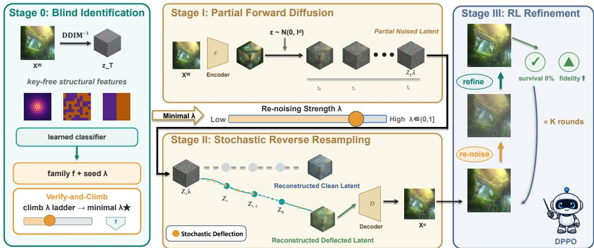  
Figure 1: Overview of Adaptive DRIFT. A shared inversion predicts the watermark family and seeds an ascending strength ladder. DRIFT then combines partial forward difusion with stochastic reverse resampling; an optional controller recovers fidelity while retaining only candidates rejected by the same verifier.

$\mathbf { 1 } [ s _ { f , \kappa } ( \mathbf { x } ) \geq \tau ]$ , covering both zero-bit and message-based schemes. For a target $\delta _ { \mathrm { f a i l } } \in [ 0 , 1 ]$ , a randomized attack $A _ { \omega }$ returns $\mathbf { x } _ { \omega } ^ { a } = \mathcal { A } _ { \omega } ( \mathbf { x } ^ { w } )$ and seeks low perceptual distortion while meeting a target failure probability:

$$
\begin{array} { r l } { \underset { \mathcal { A } } { \operatorname* { m i n } } } & { \mathbb { E } _ { \omega } [ d _ { \mathrm { s e m } } ( \mathbf { x } _ { \omega } ^ { a } , \mathbf { x } ^ { w } ) ] } \\ { \mathrm { s . t . } } & { \mathrm { P r } [ \mathcal { V } _ { f , \kappa } ( \mathbf { x } _ { \omega } ^ { a } ) = 0 ] \geq 1 - \delta _ { \mathrm { f a i l } } . } \end{array}\tag{1}
$$

The attacker observes only $\mathbf { x } ^ { w }$ and uses a public latent difusion model $( \mathcal { E } , \mathcal { D } , \epsilon _ { \theta } )$ , which need not match the watermarked generator. The key, message, prompt, family, and verifier internals are unknown. All denoising and inversion operations use the same globally fixed deterministic attacker-side conditioning $c _ { \mathrm { a t t } }$ (e.g., the empty prompt), independent of the source image and all attack randomness; we suppress it in the notation below. Base DRIFT is training-free and query-free; the adaptive stages receive only binary verifier responses and never perform per-image gradient optimization.

Attack overview. The evaluated watermark families use diferent signals, but their verifiers all recover evidence coupled to the marked generation or inversion path. DRIFT targets this shared interface. Partial forward difusion attenuates the explicit source-latent contribution, while stochastic reverse sampling reconstructs through fresh noise-driven transitions. Adaptive DRIFT then uses a blind family prediction to seed a finite strength ladder, returns its first verifier-rejected candidate, and optionally refines that candidate under a hard verifier gate. Figure 1 summarizes the three stages.

## 3.1 Stage I: Partial Forward Difusion

For a difusion horizon $T \in \mathbb { N }$ , we encode the watermarked image as $\mathbf { z } _ { 0 } ^ { w } = \mathcal { E } ( \mathbf { x } ^ { w } )$ and map strength $\lambda \in ( 0 , 1 ]$ to $t _ { \lambda } = \lceil \lambda T \rceil$ . The closed-form DDPM forward process [11] gives

$$
\begin{array} { r } { \mathbf { z } _ { t _ { \lambda } } ^ { a } = \sqrt { \bar { \alpha } _ { t _ { \lambda } } } \mathbf { z } _ { 0 } ^ { w } + \sqrt { 1 - \bar { \alpha } _ { t _ { \lambda } } } \boldsymbol { \epsilon } , \qquad \boldsymbol { \epsilon } \sim \mathcal { N } ( \mathbf { 0 } , \mathbf { I } _ { d } ) , } \end{array}\tag{2}
$$

where $\begin{array} { r } { \bar { \alpha } _ { t } = \prod _ { i = 1 } ^ { t } ( 1 - \beta _ { i } ) } \end{array}$ and $\bar { \alpha } _ { 0 } = 1$ . Increasing λ decreases the explicit coeficient $\sqrt { \bar { \alpha } _ { t _ { \lambda } } }$ of the source latent, but also discards more source detail. This is the removal–fidelity trade-of addressed by the adaptive ladder. Section 4 formalizes the corresponding forward information bottleneck without assuming that the reverse network is contractive.

## 3.2 Stage II: Stochastic Reverse Resampling

Starting from $\mathbf { z } _ { t _ { \lambda } } ^ { a }$ , the denoiser first predicts

$$
\widehat { \mathbf { z } } _ { 0 } ^ { a } = \frac { \mathbf { z } _ { t } ^ { a } - \sqrt { 1 - \bar { \alpha } _ { t } } \epsilon _ { \theta } ( \mathbf { z } _ { t } ^ { a } , t ) } { \sqrt { \bar { \alpha } _ { t } } } .\tag{3}
$$

DRIFT then uses the generalized DDIM/DDPM reverse update

$$
\begin{array} { r } { \mathbf { z } _ { t - 1 } ^ { a } = \sqrt { \bar { \alpha } _ { t - 1 } } \hat { \mathbf { z } } _ { 0 } ^ { a } + \sqrt { 1 - \bar { \alpha } _ { t - 1 } - \sigma _ { t } ^ { 2 } } \epsilon _ { \theta } ( \mathbf { z } _ { t } ^ { a } , t ) } \\ { + \underbrace { \sigma _ { t } \pmb { \xi } _ { t } } _ { \mathrm { s t o c h a s t i c ~ d e f l e c t i o n } } , \qquad \xi _ { t } \sim \mathcal { N } ( \mathbf { 0 } , \mathbf { I } _ { d } ) . } \end{array}\tag{4}
$$

Here $0 \leq \sigma _ { t } \leq \sqrt { 1 - \bar { \alpha } _ { t - 1 } }$ , so $\sigma _ { 1 } = 0$ . Each $\xi _ { t }$ is fresh relative to the current reverse history. The choice $\sigma _ { t } = 0$ recovers deterministic DDIM, whereas the posterior variance gives the standard DDPM ancestral special case; other admissible scales define generalized stochastic DDIM samplers. A positive $\sigma _ { t }$ makes that transition non-degenerate. Terminal and image-level diversity additionally require that subsequent reverse steps and the decoder do not collapse the injected variation. Thus stochasticity supplies path deflection, while its removal benefit is established by the controlled sampler comparison in Section 5.2, not assumed as a universal theorem.

The final latent is decoded as $\mathbf { x } ^ { a } = \mathcal { D } ( \mathbf { z } _ { 0 } ^ { a } )$ . Base DRIFT uses one VAE encode, $t _ { \lambda }$ denoiser evaluations, and one VAE decode, matching the order of a standard image-to-image difusion pass. Algorithm 1 appears in Appendix A.

## 3.3 Adaptive Strength Selection

A global strength either fails on robust marks or unnecessarily degrades easy instances. Adaptive DRIFT therefore computes one shared inversion

$$
\epsilon ^ { w } \equiv \mathbf { z } _ { T } ^ { \mathrm { { i n v } } } = \mathcal { T } _ { \mathrm { D D I M } } ( \mathbf { z } _ { 0 } ^ { w } )
$$

and extracts radial Fourier power, sign-field tiling, cross-channel correlation, and short-period block statistics. A lightweight classifier $\widehat { f } = \mathcal { H } ( \mathbf { z } _ { T } ^ { \mathrm { { i n v } } } )$ predicts the family without observing the key or message, repurposing inversion fingerprints used for source attribution [35]. The identifier is an empirical query-saving device; the search guarantee below applies to whichever ladder it selects and does not require ${ \widehat { f } } = f$

The prediction chooses an ofline seed and an ascending ladder. We fix $\delta > 0 , n _ { \downarrow } \in \mathbb { N } _ { 0 }$ , and $0 < \lambda _ { \mathrm { s e e d } } ( g ) \leq \lambda _ { \mathrm { m a x } } \leq 1$ , and define $J _ { g } = \lfloor ( \lambda _ { \mathrm { m a x } } - \lambda _ { \mathrm { s e e d } } ( g ) ) / \delta \rfloor$ . Then

$$
\begin{array} { r l r } & { } & { \Lambda _ { \widehat { f } } = \operatorname { s o r t } \{ \lambda _ { \mathrm { s e e d } } ( \widehat { f } ) + j \delta : j = - n _ { \downarrow } , \ldots , J _ { \widehat { f } } , } \\ & { } & { 0 < \lambda _ { \mathrm { s e e d } } ( \widehat { f } ) + j \delta \leq \lambda _ { \operatorname* { m a x } } \} , } \end{array}\tag{5}
$$

The parameter conditions guarantee that the finite ladder is nonempty. DRIFT queries it from its lowest retained rung and stops at the first verifier rejection. If no rung is rejected, it returns the strongest evaluated candidate with a failure flag; this outcome counts as an unsuccessful attack in Eq. (1). If verdicts form a rejected sufix and distortion is non-decreasing along the realized ladder, the first rejected candidate is the least distorted rejected rung on that ladder (Proposition 4.4). It is not claimed to be the optimum between grid points or over the continuous objective. The complete predict–seed–climb procedure is Algorithm 2.

The distributional bounds in Section 4 concern a strength fixed independently of the source and attack randomness. They therefore apply to base DRIFT or a prespecified ladder rung, not automatically to the final candidate selected using the identifier and verifier history.

## 3.4 Feasibility-Preserving Fidelity Refinement

The first rejected rung may still lose fine detail. Starting from that image $\mathbf { x } _ { \mathrm { 0 } }$ , Stage III performs short guided-SDEdit rounds [5, 22]. At round k, the retained image is lightly re-noised by $\eta _ { k }$ and denoised with pixel-MSE and LPIPS guidance [40] toward $\mathbf { x } ^ { w }$ . The same globally fixed scalarization is used for retention throughout:

$$
\begin{array} { r } { S ( \mathbf { x } ) = w _ { \mathrm { s } } \mathrm { S S I M } ( \mathbf { x } , \mathbf { x } ^ { w } ) \qquad } \\ { - w _ { \ell } \mathrm { L P I P S } ( \mathbf { x } , \mathbf { x } ^ { w } ) , \qquad w _ { \mathrm { s } } , w _ { \ell } > 0 . } \end{array}\tag{6}
$$

A candidate replaces the retained best only if the same deterministic verifier rejects it and S strictly improves; otherwise the algorithm backs of to the previous best. This update rule, rather than the learned policy, preserves verifier-relative feasibility.

We learn the refinement schedule as a Markov decision process. The state contains DINOv2 embeddings [26] of the source and retained images, the action/fidelity history, and the round index, but not the family label. The action

$$
\mathbf { a } _ { k } = ( \eta _ { k } , g _ { \mathrm { p i x } , k } , g _ { \mathrm { l p i p s } , k } , \mathrm { s t o p } )
$$

controls re-noising, the two guidance weights, and termination. With metric increments defined as current minus previous, the step reward is

$$
r _ { k } ^ { \mathrm { s t e p } } = \Delta S _ { k } - w _ { c } \mathrm { s t e p s } _ { k } ,
$$

followed by terminal rejection and fidelity bonuses. Hence increasing SSIM or decreasing LPIPS raises reward.

The controller is a difusion policy trained with DPPO [27]: a short conditional denoising chain proposes each action, and PPO optimizes the summed Gaussian log-probability with clipping and generalized advantage estimation [31, 32]. Reward shaping and back-of follow B2-DifuRL [12]. For any fixed rollout, returning the retained best keeps it rejected by the same verifier and makes S non-decreasing along nested prefixes (Propositions 4.5–4.6); these invariants do not assert monotone PPO return or improvement of every component metric.

## 4 Analysis of DRIFT

We separate three questions that are easy to conflate: what forward re-noising removes about the source, what stochastic reversal changes, and what the adaptive loops guarantee. The first admits a distributional theorem; the second is a structural distinction whose removal benefit is empirical; the third follows from finite search and verifier-gated back-of. Appendix B gives complete proofs, including the fully quantified fixed-depth result in Theorem B.8 and the conditional terminal diagnostic in Corollary B.10.

## 4.1 Forward Re-noising as an Information Bottleneck

The attack in Section 3 acts on a fixed image. For the distributional statements below, however, we draw a watermarked image from the source population induced by the generation protocol (including prompts, keys, messages, and generator randomness), independently of the attack randomness. Mutual information, Wasserstein distance, and unconditioned expectations are taken over this population and the fresh attack noises; the fixed-image sensitivity statement below conditions on the source latent.

Write $\mathbf { X } = \mathbf { z } _ { 0 } ^ { w }$ for the source latent, $\mathbf { W } = \epsilon ^ { w }$ for its recovered reference noise, and

$$
{ \bf Z } _ { n } = \sqrt { \bar { \alpha } _ { n } } { \bf X } + \sqrt { 1 - \bar { \alpha } _ { n } } \epsilon
$$

for the Stage-I state at depth n. The complete Stage-II and recovered-noise pipeline is a measurable randomized map ${ \bf Y } _ { n } = { \cal H } _ { n } ( { \bf Z } _ { n } , \Xi _ { 1 : n } ) = \hat { \epsilon } _ { n } ^ { a }$ . To expose the source contribution, we also run the same reverse-noise realization from $\bar { \mathbf Z } _ { n } = \sqrt { 1 - \bar { \alpha } _ { n } } \epsilon$ , yielding the source-free baseline $\widetilde { \epsilon } _ { n }$ . Let $\Sigma _ { z } = \mathrm { C o v } ( \mathbf { z } _ { 0 } ^ { w } )$

Theorem 4.1 (Fixed-depth source-dependence bounds). Fix a deterministic $\lambda \in ( 0 , 1 ]$ before sampling the source and attack randomness, and set $n = t _ { \lambda }$ . Under the source-independent-conditioning, measurability, independence, and moment conditions in Assumption B.1, the following hold.

(i) The forward channel imposes

$$
\begin{array} { l } { { \displaystyle I ( \epsilon ^ { w } ; \hat { \epsilon } _ { n } ^ { a } ) \leq \frac { 1 } { 2 } \log \operatorname* { d e t } \biggl ( { \bf I } _ { d } + \frac { \bar { \alpha } _ { n } } { 1 - \bar { \alpha } _ { n } } \Sigma _ { z } \biggr ) } } \\ { { \displaystyle \leq \frac { d } { 2 } \log \biggl ( 1 + \frac { \bar { \alpha } _ { n } \mathrm { t r } \left( \Sigma _ { z } \right) } { d ( 1 - \bar { \alpha } _ { n } ) } \biggr ) = : \mathcal { B } _ { n } } , } \end{array}\tag{7}
$$

and the total-variation distance between the joint law and the product of its marginals is at most $\sqrt { B _ { n } / 2 }$

(ii) If the reverse pipeline is $L _ { Q } C _ { n } – L i p s c h i t z$ under synchronous reverse-noise coupling, with $\Gamma _ { n } = \sqrt { \bar { \alpha } _ { n } } C _ { n }$ , then for each fixed source latent x the coupled diference is pathwise at most $L _ { Q } \Gamma _ { n } \| \mathbf { x } \| _ { 2 }$ . Averaging over the source population gives

$$
\begin{array} { r } { \mathbb { E } \Big [ \| \widehat \epsilon _ { n } ^ { a } - \widetilde \epsilon _ { n } \| _ { 2 } ^ { 2 } \Big ] \leq L _ { Q } ^ { 2 } \Gamma _ { n } ^ { 2 } \mathbb { E } \| \mathbf { z } _ { 0 } ^ { w } \| _ { 2 } ^ { 2 } = : \Delta _ { n } . } \end{array}\tag{8}
$$

With the stated second-moment conditions,

$$
W _ { 2 } ( \mathcal { L } ( \hat { \epsilon } _ { n } ^ { a } , \epsilon ^ { w } ) , \mathcal { L } ( \hat { \epsilon } _ { n } ^ { a } ) \otimes \mathcal { L } ( \epsilon ^ { w } ) ) \leq 2 \sqrt { \Delta _ { n } } .
$$

(iii) Separately, when $\lambda = 1$ and $n = T$ , if Assumption B.1 is instantiated at T and the additional terminal premise in Assumption B.9 holds,

$$
\begin{array} { r } { \left| \mathbb { E } \| \widehat { \epsilon } _ { T } ^ { a } - \epsilon ^ { w } \| _ { 2 } ^ { 2 } - 2 d \right| \leq \Delta _ { T } + 2 \sqrt { 2 d \Delta _ { T } } . } \end{array}
$$

The theorem applies to base DRIFT or a prespecified ladder rung. It does not automatically apply to the final Adaptive DRIFT output: its selected depth depends on the identifier and verifier history and can itself carry source information. The ladder and refinement guarantees in Section 4.3 are separate pathwise statements.

Proof idea. Fresh attack randomness gives the Markov chains $\epsilon ^ { w }  \mathbf { z } _ { 0 } ^ { w }  \mathbf { Z } _ { n }  \widehat { \epsilon } _ { n } ^ { a } \mathrm { . }$ ; data processing and the Gaussian-channel capacity bound yield part (i). For part (ii), couple the attacked and source-free initializations with identical forward and reverse noises: their only initial diference is $\sqrt { \bar { \alpha } _ { n } } \mathbf { z } _ { 0 } ^ { w }$ , which the reverse pipeline amplifies by at most $L _ { Q } C _ { n }$ . A second, tensorized coupling converts this mean-square estimate into the product-law Wasserstein bound. Part (iii) expands the squared distance around the independent terminal reference and controls the cross term by Cauchy–Schwarz.

Why this is true. In one dimension, Stage I is simply a Gaussian channel whose signal-to-noise ratio is $\bar { \alpha } _ { n } / ( 1 - \bar { \alpha } _ { n } )$ ; no downstream randomized map can recover more information about the source than entered that channel. The coupling view gives the complementary geometric statement: removing the source term changes the initialization by exactly $\sqrt { \bar { \alpha } _ { n } } z _ { 0 } ^ { w }$ , after which only the sensitivity of the shared reverse map matters.

Takeaway. Forward re-noising places a monotone information envelope on any recovered signal whose only access to the source is through the fixed-depth state $\mathbf { Z } _ { n }$ , while the complementary $W _ { 2 }$ bound quantifies proximity to a source-free baseline when the realized reverse map is suficiently insensitive.

Only $B _ { n }$ and the forward-channel information $I ( \epsilon ^ { w } ; \mathbf { Z } _ { n } )$ are guaranteed to decrease with depth. The actual post-processed information, $\Gamma _ { n } , \Delta _ { n }$ , and their $W _ { 2 }$ envelope need not be monotone because the reverse map changes with n. Nor does any dependence metric reveal an unknown verifier margin. The paired latent distances and strength thresholds in Section 5.2 and Figure 11 of Appendix E.8 are distinct empirical diagnostics, not estimates of $B _ { n }$ or of the joint/product-law $W _ { 2 }$ above. The terminal value $2 d$ is a conditional diagnostic, not a distributional claim for every watermark family.

## 4.2 What Stochastic Resampling Changes

Remark 4.2 (Path randomness is local; removal advantage is empirical). Conditioned on $\mathbf { z } _ { t _ { \lambda } } ^ { a }$ deterministic DDIM returns a point mass. At a step with $\sigma _ { t } > 0$ , Eq. (4) instead has a non-Dirac next-state law. This local fact does not by itself make the final latent or decoded image non-Dirac: later reverse steps or the decoder may collapse the injected variation. Precisely, terminal diversity holds if and only if two independent complete noise rollouts disagree with positive probability after the full downstream map (Lemma B.11).

This distinction also explains why Theorem 4.1 does not prove a stochastic advantage. Its sensitivity argument drives two trajectories with the same reverse noises, which cancel; the same bound holds when every $\sigma _ { t } = 0$ . Stochastic resampling supplies alternative noise-driven paths, but whether those paths cross a watermark verifier’s decision boundary is scheme- and samplerdependent. Section 5.2 therefore holds re-noising depth, inputs, backbone, and strength grid fixed and changes only the reverse-sampler condition.

## 4.3 Operational Guarantees of Adaptive DRIFT

Verify-and-climb. Fix the family prediction and one complete realization of the candidates on the selected ladder $\Lambda _ { \widehat { f } } = \{ \lambda _ { \widehat { f } , 0 } < \cdots < \lambda _ { \widehat { f } , M } \}$ . Let $v _ { j }$ be its binary verdict and $\phi _ { j } = d _ { \mathrm { s e m } } ( \mathbf { x } _ { j } ^ { a } , \mathbf { x } ^ { w } )$

Assumption 4.3 (Monotone realized ladder). The verdicts form a rejected sufix, $v _ { j + 1 } \leq v _ { j }$ , and distortions are non-decreasing, $\phi _ { j + 1 } \geq \phi _ { j }$ , on this fixed realized ladder.

Proposition 4.4 (First rejected rung). Suppose at least one rung is rejected and $j ^ { \star } = \operatorname* { m i n } \{ j : v _ { j } =$ 0}. Algorithm 2 returns rung $j ^ { \star }$ after exactly $j ^ { \star } + 1$ ladder-verifier queries, and $\phi _ { j ^ { \star } } \leq \phi _ { j }$ for every rejected rung j on the selected realized ladder.

The result is deliberately grid-relative. It neither selects an optimum between rungs nor compares independently resampled candidates. The family identifier afects which rungs are evaluated, not the validity of the finite scan: its accuracy and query savings are therefore evaluated empirically.

Verifier-gated refinement. Let $b _ { 0 }$ be the first rejected attack output and let $b _ { k }$ be the retained best after round k. The following statements use the same fixed deterministic verifier and the same fixed composite score S throughout.

Proposition 4.5 (Feasibility invariance). If $b _ { 0 }$ is verifier-rejected and $b _ { k }$ is replaced only by a verifier-rejected candidate, then every retained $b _ { k }$ and the returned image are rejected by that verifier, independently of the controller.

Proposition 4.6 (Monotone retained score). Along nested prefixes of one fixed rollout, if a candidate replaces $b _ { k - 1 }$ only when S strictly improves, then $S ( b _ { k } ) \ge S ( b _ { k - 1 } )$ for every k.

Both propositions are invariants of the retained-best update, not guarantees about raw candidates or the learned policy. In particular, a higher composite score need not improve every component metric, and PPO clipping does not imply monotone true return. Section 5.3 measures the policy’s actual fidelity gain; the propositions certify only that the same rollout never deploys a gate-violating or lower-scoring retained image. Appendices C and D give the proofs and the precise DPPO objective.

## 5 Experiments

In this section, we evaluate DRIFT along four questions: whether it removes watermarks across diferent embedding paradigms, whether stochastic reverse sampling contributes beyond re-noising, whether per-image adaptation reduces unnecessary distortion, and whether the full pipeline preserves visual fidelity. We use Stable Difusion v2.1 as the public difusion backbone, draw evaluation prompts from Stable-Difusion-Prompts [30], and run all experiments on an H100 GPU.

Evaluated watermarks. We consider nine representative difusion watermarks spanning three injection points. The noise-space group contains Tree-Ring (TR) [37], RingID (RI) [6], PRC [8], and WIND [1]; the latent/frequency-domain group contains Gaussian Shading (GS) [39], GaussMarker (GM) [16], SFW [15], and SEAL [2]; and the optimization-based group contains ROBIN [13]. We use these abbreviations throughout the tables and appendix.

Attack baselines. We compare against the black-box attack [24] and the latent-noise removing attack [14], two prior attacks that target semantic watermarks through per-image adversarial optimization. DRIFT performs no per-image gradient optimization.

Metrics and protocol. Attack success rate (ASR, ↑) is the true-detector removal rate. We measure distribution-level quality with CLIP score (↑) [9] and FID (↓) [10], and paired fidelity against the watermarked original with SSIM/PSNR (↑) and LPIPS (↓). For the adaptive and refinement stages, we additionally report identification accuracy, the selected per-image strength λ, verifier queries/runtime, and pre→post fidelity. All controlled comparisons use the same encode → deflect → decode route: Section 5.2 holds the re-noising stage, images, backbone, and strength grid fixed while changing the reverse-sampler condition; Section 5.3 changes only how λ is selected; and Section 5.3 changes whether Stage III is applied. Full per-family results, ablations, and qualitative panels are provided in Appendix E.

## 5.1 Overall Attack Efectiveness

Table 1(a) tests one trajectory-level attack across nine schemes under the strong setting, $\lambda \ge 0 . 5$ DRIFT reaches 98–100% ASR on every scheme and averages 99.8%, versus 96.8% for the black-box attack and 81.3% for the removing attack. The largest gaps occur on Tree-Ring (98% vs. 72% blackbox) and on GaussMarker/Gaussian Shading (100% vs. 55%/4% removing). Its success across all three watermark paradigms establishes breadth; the controlled study below isolates the contribution of stochastic reversal.

Table 1: Overall attack efectiveness and image quality. (a) Per-watermark ASR under the strong DRIFT setting, $\lambda \geq 0 . 5 ;$ underlined entries indicate where DRIFT matches or exceeds the best prior attack. (b) End-to-end ASR, image quality, and runtime averaged over the nine families; bold marks the best quality values among the three DRIFT configurations. For the two baselines and Full DRIFT, FID, SSIM, and LPIPS follow the 100-image-per-family quality protocol detailed in Appendix E.1.  
(a) Per-watermark attack success rate (ASR, %).
<table><tr><td rowspan="2">Attack</td><td colspan="4">Noise-space</td><td colspan="4">Latent/frequency</td><td>Optimization</td><td rowspan="2">AVG.</td></tr><tr><td>TR</td><td>RI</td><td>PRC</td><td>WIND</td><td>GS</td><td>GM</td><td>SFW</td><td>SEAL</td><td>ROBIN</td></tr><tr><td colspan="10">Prior attacks</td></tr><tr><td>Black-box</td><td>72</td><td>99</td><td>100</td><td>100</td><td>100</td><td>100</td><td>100</td><td>100</td><td>100</td><td>96.8</td></tr><tr><td>Removing</td><td>99</td><td>95</td><td>100</td><td>100</td><td>4</td><td>55</td><td>100</td><td>100</td><td>79</td><td>81.3</td></tr><tr><td colspan="10">DRIFT (ours)</td></tr><tr><td>DRIFT</td><td>98</td><td>100</td><td>100</td><td>100</td><td>100</td><td>100</td><td>100</td><td>100</td><td>100</td><td>99.8</td></tr></table>

(b) End-to-end efectiveness, image quality, and runtime.
<table><tr><td>Method</td><td>(b) End-to-end eiectiveness, imnage quality, and runtime. ASR (%)↑</td><td>CLIP↑</td><td>FID↓</td><td>SSIM↑</td><td>PSNR↑</td><td>LPIPS↓</td><td>Time (s)</td></tr><tr><td colspan="8">Baseline attacks</td></tr><tr><td>Black-box attack</td><td>96.8</td><td>31.9</td><td>114.019</td><td>0.519</td><td>19.46</td><td>0.305</td><td></td></tr><tr><td>Removing attack [14]</td><td>81.3</td><td>31.4</td><td>104.693</td><td>0.712</td><td>26.35</td><td>0.338</td><td></td></tr><tr><td colspan="8">DRIFT (ours), end-to-end configurations</td></tr><tr><td>Fixed-λ DRIFT (λ = 0.70)</td><td>100.0</td><td>31.8</td><td>136.5</td><td>0.401</td><td>14.31</td><td>0.528</td><td>1.16</td></tr><tr><td>Adaptive-λ DRIFT (no refine)</td><td>99.7</td><td>31.5</td><td>58.7</td><td>0.697</td><td>23.72</td><td>0.168</td><td>4.20</td></tr><tr><td>Full DRIFT (+ DPPO refine)</td><td>100.0</td><td>32.1</td><td>55.414</td><td>0.713</td><td>24.01</td><td>0.154</td><td>8.12</td></tr></table>

## 5.2 Role of Stochastic Reverse Sampling

Theorem 4.1 does not establish a stochastic advantage because its bound also holds at $\sigma _ { t } { = } 0$ (Section 4.2). We therefore fix the re-noising stage, images, backbone, and strength grid while comparing three deterministic samplers (DDIM, DPM-Solver++, Euler) with three stochastic samplers (DDPM ancestral, Euler-a, SDE-DPM-Solver++). Each uses three verifier-inversion settings on nine families with 100 images per cell and $\lambda \in [ 0 , 0 . 7 0 ]$ ]. Table 2 reports the smallest strength ${ \lambda } _ { p } ^ { \star }$ reaching $p \%$ survival (↓ better). “never” means the threshold is not reached by $\lambda = 0 . 7 0$ Accordingly, the ${ \lambda } _ { 5 } ^ { \star }$ mean uses the eight families resolved by both groups, while $\lambda _ { 5 0 } ^ { \star }$ uses all nine shown.

Stochastic samplers require 32% less strength at $\lambda _ { 5 0 } ^ { \star }$ and 27% less at ${ \lambda } _ { 5 } ^ { \star }$ on average. The gap is negligible near the grid floor (SFW) but pronounced on robust schemes. Most decisively, deterministic Gaussian Shading never reaches 5% survival by $\lambda = 0 . 7 0$ , whereas the stochastic condition does at about $\lambda = 0 . 5 4 ;$ this deterministic condition is the regeneration baseline in Remark 4.2. Fidelity is not uniformly higher: at each sampler’s ${ \lambda } _ { 5 } ^ { \star }$ , the mean SDE–ODE change is −0.004 SSIM and −0.21 dB, although GaussMarker gains +0.049 SSIM and +1.56 dB. The empirical advantage is therefore decoupling per unit strength, not universally higher fidelity.

Table 2: Deterministic (ODE) versus stochastic (SDE) reverse sampling. We report ${ \lambda } _ { p } ^ { \star } ,$ the smallest strength driving watermark survival to $p \%$ , averaged over three samplers and three inversion settings (↓ better).
<table><tr><td></td><td> $\lambda _ { 5 0 } ^ { \star } \downarrow$ </td><td> $\lambda _ { 5 } ^ { \star } \downarrow$ </td></tr><tr><td>Family</td><td>ODE SDE</td><td>ODE SDE</td></tr><tr><td>SEAL</td><td>0.038 0.032</td><td>0.097 0.090</td></tr><tr><td>SFW</td><td>0.040 0.038</td><td>0.093 0.090</td></tr><tr><td>WIND</td><td>0.100 0.076</td><td>0.197 0.129</td></tr><tr><td>ROBIN</td><td>0.181 0.135</td><td>0.255 0.204</td></tr><tr><td>PRC</td><td>0.182 0.117</td><td>0.297 0.193</td></tr><tr><td>Tree-Ring</td><td>0.204 0.135</td><td>0.325 0.212</td></tr><tr><td>RingID</td><td>0.440 0.291</td><td>0.586 0.453</td></tr><tr><td>GaussMarker</td><td>0.575 0.372</td><td>0.690 0.479</td></tr><tr><td>Gaussian Shading</td><td>0.691 0.462</td><td>never 0.542</td></tr><tr><td>Mean</td><td>0.272 0.184</td><td>0.318 0.231</td></tr></table>

Latent-space evidence. DDIM inversion of an unattacked image remains close to the watermarkcarrying noise $\epsilon ^ { w } \left( L _ { 1 } \approx 0 . 3 4 \mathrm { - } 0 . 6 8 \right)$ , while the measured distance after DRIFT increases across the tested λ grid toward the independent-Gaussian diagnostics $L _ { 1 } = 2 / \sqrt { \pi }$ and $L _ { 2 } = \sqrt { 2 }$ . This empirical diagnostic complements, but is not implied by, the fixed-depth dependence bound in Theorem 4.1; Figure 10 of Appendix E.7 gives all nine curves. Corollary B.10 formalizes only the conditiona squared- $. L _ { 2 }$ reference, not the empirical monotonicity or the Gaussian $L _ { 1 }$ value.

## 5.3 Adaptive Search and Fidelity Refinement

We next test blind family prediction, per-image strength selection, and verifier-gated refinement.

Blind family identification. Using only structural features of the shared DDIM-inverted latent, the key-free classifier reaches 99.3% top-1 accuracy on 1,350 held-out images. All non-trivial confusions stay within the similar Gaussian-Shading/GaussMarker/SEAL cluster. The prediction seeds verify-and-climb; per-family results and the confusion matrix appear in Table 5 and Figure 3 of Appendix E.2.

Per-image minimal-strength search. On 300 images per family, black-box verify-and-climb reduces mean strength from 0.244 to 0.20 relative to a fixed per-family choice while raising ASR from 96.8% to 99.7%. Mean SSIM/PSNR/LPIPS improve from 0.67/22.6/0.19 to 0.71/23.9/0.16 at about 2.2 verifier queries per image. This is consistent with Proposition 4.4’s ladder-relative result; Table 6 of Appendix E.3 gives full per-family results, while Figure 9 of Appendix E.6 visualizes the strength–fidelity trade-of.

Verifier-gated fidelity refinement. On already rejected Stage-III inputs, DPPO improves every reported fidelity metric, including LPIPS from 0.136 to 0.114, while survival remains 0% over 1.16 rounds. Proposition 4.5 explains the same-verifier rejection invariant, not the empirical fidelity gain. Table 3 shows that removing the terminal watermark bonus or back-of/re-verification raises raw survival to 9.3% and 7.1%, while removing LPIPS guidance worsens LPIPS to 0.136. Table 7 and Figures 4–5 of Appendix E.4 provide the full refinement evidence.

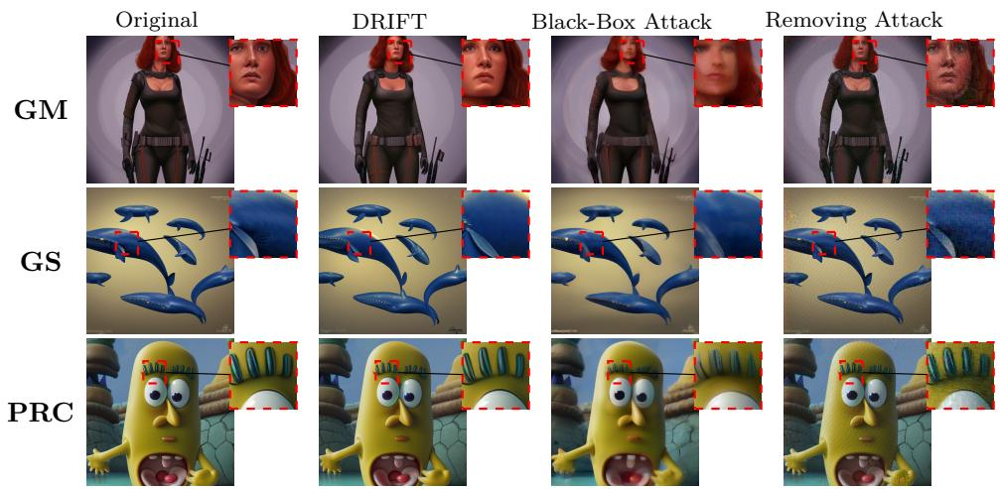  
Figure 2: Qualitative comparison with baseline attacks (Original / DRIFT / Black-Box / Removing), with zoomed insets, on GM. GS and PRC are in Figure 6 of Appendix E.5.

<table><tr><td>Variant</td><td>SSIM↑ LPIPS↓ WM surv.↓ Rounds</td><td></td><td></td></tr><tr><td>Full DPPO (ours)</td><td>0.738 0.114</td><td>0.0%</td><td>1.16</td></tr><tr><td>– terminal WM bonus*</td><td>0.688 0.119</td><td>9.3%</td><td>1.00</td></tr><tr><td>- back-off / re-verify*</td><td>0.694 0.117</td><td>7.1%</td><td>1.12</td></tr><tr><td>– LPIPS guidance</td><td>0.735 0.136</td><td>0.0%</td><td>1.22</td></tr><tr><td>kmax = 1</td><td>0.738 0.116</td><td>0.0%</td><td>1.00</td></tr></table>

Table 3: Ablation of the DPPO controller (N = 225). Each row disables one component. ∗For the two constraint ablations, survival is measured with evaluation-time back-of disabled; otherwise deployed survival remains fixed at 0%.

## 5.4 Image Quality and Visual Fidelity

Table 1(b) reports semantic, distributional, and paired fidelity over all nine families. Fixed λ = 0.70 reaches 100% ASR but incurs substantial distortion (SSIM 0.401, LPIPS 0.528); per-image selection improves to SSIM 0.697/LPIPS 0.168 at 99.7% ASR. Full DRIFT restores 100% ASR with SSIM 0.713, PSNR 24.01, LPIPS 0.154, FID 55.414, and 8.12 s runtime. Its FID/LPIPS are lower than both baselines, while the removing attack reaches only 81.3% ASR; Table 4 of Appendix E.1 gives the aggregate comparison and protocol. Figure 2 provides the retained zoomed comparison on GM, GS, and PRC; Figures 7–8 of Appendix E.5 cover all nine families.

## 6 Conclusion

We identify trajectory consistency as a common vulnerability among the difusion watermarks studied and introduce DRIFT, which combines partial forward difusion, stochastic reverse resampling, perimage verify-and-climb, and verifier-gated refinement. Across nine watermarks in three paradigms, DRIFT achieves 98–100% ASR and the best perceptual-quality trade-of among the compared attacks without secret keys, verifier internals, or per-image gradients. Matched samplers isolate the empirical benefit of stochastic deflection; Theorem 4.1 and Proposition 4.5 separately characterize fixed-depth source dependence and same-verifier refinement feasibility. Aggressive fixed re-noising can substantially reduce fidelity, which motivates the adaptive minimal-strength search and refinement rather than a universally strong setting. The guarantees remain conditional on unverified networklevel Lipschitz and terminal premises, and evaluation uses one public latent-difusion backbone. Extending trajectory-aware evaluation to pixel-space, video, autoregressive, and flow-based generators is an important next step.

## References

[1] Kasra Arabi, Benjamin Feuer, R Teal Witter, Chinmay Hegde, and Niv Cohen. Hidden in the noise: Two-stage robust watermarking for images. arXiv preprint arXiv:2412.04653, 2024.

[2] Kasra Arabi, R Teal Witter, Chinmay Hegde, and Niv Cohen. Seal: Semantic aware image watermarking. In Proceedings of the IEEE/CVF International Conference on Computer Vision, pages 16196–16205, 2025.

[3] Kevin Black, Michael Janner, Yilun Du, Ilya Kostrikov, and Sergey Levine. Training difusion models with reinforcement learning. In The Twelfth International Conference on Learning Representations, 2024.

[4] Zander W Blasingame and Chen Liu. A reversible solver for difusion sdes. In ICLR 2025 Workshop on Deep Generative Model in Machine Learning: Theory, Principle and Eficacy, 2025.

[5] Hyungjin Chung, Jeongsol Kim, Michael Thompson McCann, Marc Louis Klasky, and Jong Chul Ye. Difusion posterior sampling for general noisy inverse problems. In The Eleventh International Conference on Learning Representations, 2023.

[6] Hai Ci, Pei Yang, Yiren Song, and Mike Zheng Shou. Ringid: Rethinking tree-ring watermarking for enhanced multi-key identification. In European conference on computer vision, pages 338–354. Springer, 2024.

[7] Martin Gonzalez, Nelson Fernandez, Thuy Tran, Elies Gherbi, Hatem Hajri, and Nader Masmoudi. Seeds: Exponential sde solvers for fast high-quality sampling from difusion models, 2023. URL https://arxiv.org/abs/2305.14267.

[8] Sam Gunn, Xuandong Zhao, and Dawn Song. An undetectable watermark for generative image models. arXiv preprint arXiv:2410.07369, 2024.

[9] Jack Hessel, Ari Holtzman, Maxwell Forbes, Ronan Le Bras, and Yejin Choi. Clipscore: A reference-free evaluation metric for image captioning. In Proceedings of the 2021 conference on empirical methods in natural language processing, pages 7514–7528, 2021.

[10] Martin Heusel, Hubert Ramsauer, Thomas Unterthiner, Bernhard Nessler, and Sepp Hochreiter. Gans trained by a two time-scale update rule converge to a local nash equilibrium. Advances in neural information processing systems, 30, 2017.

[11] Jonathan Ho, Ajay Jain, and Pieter Abbeel. Denoising difusion probabilistic models. Advances in neural information processing systems, 33:6840–6851, 2020.

[12] Zijing Hu, Fengda Zhang, Long Chen, Kun Kuang, Jiahui Li, Kaifeng Gao, Jun Xiao, Xin Wang, and Wenwu Zhu. Towards better alignment: Training difusion models with reinforcement learning against sparse rewards. In Proceedings of the IEEE/CVF Conference on Computer Vision and Pattern Recognition, 2025.

[13] Huayang Huang, Yu Wu, and Qian Wang. Robin: Robust and invisible watermarks for difusion models with adversarial optimization. Advances in Neural Information Processing Systems, 37: 3937–3963, 2024.

[14] Anubhav Jain, Yuya Kobayashi, Naoki Murata, Yuhta Takida, Takashi Shibuya, Yuki Mitsufuji, Niv Cohen, Nasir Memon, and Julian Togelius. Forging and removing latent-noise difusion watermarks using a single image. arXiv preprint arXiv:2504.20111, 2025.

[15] Sung Ju Lee and Nam Ik Cho. Semantic watermarking reinvented: Enhancing robustness and generation quality with fourier integrity. In Proceedings of the IEEE/CVF International Conference on Computer Vision, pages 18759–18769, 2025.

[16] Kecen Li, Zhicong Huang, Xinwen Hou, and Cheng Hong. Gaussmarker: Robust dual-domain watermark for difusion models. In International Conference on Machine Learning, pages 34688–34701. PMLR, 2025.

[17] Haonan Lin, Mengmeng Wang, Jiahao Wang, Wenbin An, Yan Chen, Yong Liu, Feng Tian, Guang Dai, Jingdong Wang, and Qianying Wang. Schedule your edit: A simple yet efective difusion noise schedule for image editing, 2024. URL https://arxiv.org/abs/2410.18756.

[18] Luping Liu, Yi Ren, Zhijie Lin, and Zhou Zhao. Pseudo numerical methods for difusion models on manifolds. In International Conference on Learning Representations, 2022.

[19] Yepeng Liu, Yiren Song, Hai Ci, Yu Zhang, Haofan Wang, Mike Zheng Shou, and Yuheng Bu. Image watermarks are removable using controllable regeneration from clean noise. arXiv preprint arXiv:2410.05470, 2024.

[20] Cheng Lu, Yuhao Zhou, Fan Bao, Jianfei Chen, Chongxuan Li, and Jun Zhu. Dpm-solver: A fast ode solver for difusion probabilistic model sampling in around 10 steps. Advances in neural information processing systems, 35:5775–5787, 2022.

[21] Hannes Mareen, Kobe De Meulenaere, Peter Lambert, and Glenn Van Wallendael. Difusion denoising watermark removal models to attack invisible image watermarks. In 2024 17th International Conference on Signal Processing and Communication System (ICSPCS), pages 1–6. IEEE, 2024.

[22] Chenlin Meng, Yutong He, Yang Song, Jiaming Song, Jiajun Wu, Jun-Yan Zhu, and Stefano Ermon. SDEdit: Guided image synthesis and editing with stochastic diferential equations. In International Conference on Learning Representations, 2022.

[23] Ron Mokady, Amir Hertz, Kfir Aberman, Yael Pritch, and Daniel Cohen-Or. Null-text inversion for editing real images using guided difusion models. In Proceedings of the IEEE/CVF conference on computer vision and pattern recognition, pages 6038–6047, 2023.

[24] Andreas Müller, Denis Lukovnikov, Jonas Thietke, Asja Fischer, and Erwin Quiring. Black-box forgery attacks on semantic watermarks for difusion models. In Proceedings of the Computer Vision and Pattern Recognition Conference, pages 20937–20946, 2025.

[25] Shen Nie, Hanzhong Allan Guo, Cheng Lu, Yuhao Zhou, Chenyu Zheng, and Chongxuan Li. The blessing of randomness: Sde beats ode in general difusion-based image editing. In The Twelfth International Conference on Learning Representations, 2024.

[26] Maxime Oquab, Timothée Darcet, Théo Moutakanni, Huy Vo, Marc Szafraniec, Vasil Khalidov, Pierre Fernandez, Daniel Haziza, Francisco Massa, Alaaeldin El-Nouby, Mahmoud Assran, Nicolas Ballas, Wojciech Galuba, Russell Howes, Po-Yao Huang, Shang-Wen Li, Ishan Misra, Michael Rabbat, Vasu Sharma, Gabriel Synnaeve, Hu Xu, Hervé Jegou, Julien Mairal, Patrick Labatut, Armand Joulin, and Piotr Bojanowski. Dinov2: Learning robust visual features without supervision, 2024. URL https://arxiv.org/abs/2304.07193.

[27] Allen Z. Ren, Justin Lidard, Lars L. Ankile, Anthony Simeonov, Pulkit Agrawal, Anirudha Majumdar, Benjamin Burchfiel, Hongkai Dai, and Max Simchowitz. Difusion policy policy optimization, 2024.

[28] Robin Rombach, Andreas Blattmann, Dominik Lorenz, Patrick Esser, and Björn Ommer. High-resolution image synthesis with latent difusion models. In Proceedings of the IEEE/CVF conference on computer vision and pattern recognition, pages 10684–10695, 2022.

[29] Mehrdad Saberi, Vinu Sankar Sadasivan, Keivan Rezaei, Aounon Kumar, Atoosa Chegini, Wenxiao Wang, and Soheil Feizi. Robustness of ai-image detectors: Fundamental limits and practical attacks. arXiv preprint arXiv:2310.00076, 2023.

[30] Gustavo Santana. Stable-difusion-prompts. https://huggingface.co/datasets/Gustavosta/ Stable-Difusion-Prompts, 2024. Accessed: 2024-11-20.

[31] John Schulman, Philipp Moritz, Sergey Levine, Michael Jordan, and Pieter Abbeel. Highdimensional continuous control using generalized advantage estimation. In International Conference on Learning Representations, 2016.

[32] John Schulman, Filip Wolski, Prafulla Dhariwal, Alec Radford, and Oleg Klimov. Proximal policy optimization algorithms, 2017.

[33] Jiaming Song, Chenlin Meng, and Stefano Ermon. Denoising difusion implicit models. In International Conference on Learning Representations, 2021.

[34] Yang Song, Jascha Sohl-Dickstein, Diederik P Kingma, Abhishek Kumar, Stefano Ermon, and Ben Poole. Score-based generative modeling through stochastic diferential equations. In International Conference on Learning Representations, 2021.

[35] Huan Teng, Yuhui Quan, Chengyu Wang, Jun Huang, and Hui Ji. Fingerprinting denoising difusion probabilistic models. In Proceedings of the IEEE/CVF Conference on Computer Vision and Pattern Recognition (CVPR), 2025.

[36] Bram Wallace, Akash Gokul, and Nikhil Naik. Edict: Exact difusion inversion via coupled transformations. In Proceedings of the IEEE/CVF conference on computer vision and pattern recognition, pages 22532–22541, 2023.

[37] Yuxin Wen, John Kirchenbauer, Jonas Geiping, and Tom Goldstein. Tree-rings watermarks: Invisible fingerprints for difusion images. In A. Oh, T. Naumann, A. Globerson, K. Saenko, M. Hardt, and S. Levine, editors, Advances in Neural Information Processing Systems, volume 36, pages 58047–58063. Curran Associates, Inc., 2023. URL https://proceedings.neurips.cc/paper\_ files/paper/2023/file/b54d1757c190ba20dbc4f9e4a2f54149-Paper-Conference.pdf.

[38] Shuchen Xue, Mingyang Yi, Weijian Luo, Shifeng Zhang, Jiacheng Sun, Zhenguo Li, and Zhi-Ming Ma. Sa-solver: Stochastic adams solver for fast sampling of difusion models. Advances in Neural Information Processing Systems, 36:77632–77674, 2023.

[39] Zijin Yang, Kai Zeng, Kejiang Chen, Han Fang, Weiming Zhang, and Nenghai Yu. Gaussian shading: Provable performance-lossless image watermarking for difusion models. In Proceedings of the IEEE/CVF Conference on Computer Vision and Pattern Recognition, pages 12162–12171, 2024.

[40] Richard Zhang, Phillip Isola, Alexei A. Efros, Eli Shechtman, and Oliver Wang. The unreasonable efectiveness of deep features as a perceptual metric. In Proceedings of the IEEE Conference on Computer Vision and Pattern Recognition, pages 586–595, 2018.

[41] Wenliang Zhao, Lujia Bai, Yongming Rao, Jie Zhou, and Jiwen Lu. Unipc: A unified predictorcorrector framework for fast sampling of difusion models. Advances in Neural Information Processing Systems, 36:49842–49869, 2023.

[42] Xuandong Zhao, Kexun Zhang, Zihao Su, Saastha Vasan, Ilya Grishchenko, Christopher Kruegel, Giovanni Vigna, Yu-Xiang Wang, and Lei Li. Invisible image watermarks are provably removable using generative ai. Advances in neural information processing systems, 37:8643–8672, 2024.

## Technical Appendix

Organization. Appendix A gives executable specifications of the base and adaptive attacks; Appendix B contains the full theoretical statements and proofs; Appendices C and D prove the adaptive-search and refinement guarantees; and Appendix E provides the extended protocols, tables, ablations, and qualitative results.

## A Algorithmic Specifications

Algorithms 1 and 2 provide executable summaries of the base and adaptive attacks described in Section 3.

Algorithm 1 DRIFT (base attack)   
Require: Watermarked image $\mathbf { x } ^ { w }$ , pretrained LDM $( \mathcal { E } , \mathcal { D } , \epsilon _ { \theta } )$ , global source-independent condition  
ing $c _ { \mathrm { a t t } } ,$ strength $\lambda ,$ schedule $\{ \beta _ { i } \} _ { i = 1 } ^ { T }$ , valid generalized reverse scales $\left\{ \sigma _ { t } \right\}$   
Ensure: Attacked image $\mathbf { x } ^ { a }$   
1: $\mathbf z _ { 0 } ^ { w } \gets \mathcal { E } ( \mathbf x ^ { w } ) ; \quad t _ { \lambda } \gets \lceil \lambda T \rceil$   
2: $\begin{array} { r } { \bar { \alpha } _ { 0 }  1 ; \quad \bar { \alpha } _ { t }  \prod _ { i = 1 } ^ { t } ( 1 - \beta _ { i } ) } \end{array}$   
3: $\epsilon \sim \mathcal { N } ( \mathbf { 0 } , \mathbf { I } _ { d } )$   
4: $\mathbf { z } _ { t _ { \lambda } } ^ { a } \gets \sqrt { \bar { \alpha } _ { t _ { \lambda } } } \mathbf { z } _ { 0 } ^ { w } + \sqrt { 1 - \bar { \alpha } _ { t _ { \lambda } } } \epsilon$   
5: for $t = t _ { \lambda } , t _ { \lambda } - 1 , \dots , 1$ do   
6: $\hat { \mathbf { z } } _ { 0 } ^ { a } \gets \bigl ( \mathbf { z } _ { t } ^ { a } - \sqrt { 1 - \bar { \alpha } _ { t } } \mathbf { \epsilon } _ { \theta } ( \mathbf { z } _ { t } ^ { a } , t ; c _ { \mathrm { a t t } } ) \bigr ) / \sqrt { \bar { \alpha } _ { t } }$   
7: $\pmb { \xi } _ { t } \sim \mathcal { N } ( \mathbf { 0 } , \mathbf { I } _ { d } )$   
8: $\mathbf { z } _ { t - 1 } ^ { a } \gets \sqrt { \bar { \alpha } _ { t - 1 } } \hat { \mathbf { z } } _ { 0 } ^ { a } + \sqrt { 1 - \bar { \alpha } _ { t - 1 } } - \sigma _ { t } ^ { 2 } \epsilon _ { \theta } ( \mathbf { z } _ { t } ^ { a } , t ; c _ { \mathrm { a t t } } ) + \sigma _ { t } \boldsymbol { \xi } _ { t }$   
9: end for   
10: return $\mathbf { x } ^ { a } \gets \mathcal { D } ( \mathbf { z } _ { 0 } ^ { a } )$

Algorithm 2 Adaptive DRIFT (predict → seed → climb)   
Require: $\mathbf { x } ^ { w }$ ; encoder/inverter/identifier/verifier $( \mathcal { E } , \mathbb { Z } _ { \mathrm { D D I M } } , \mathcal { H } , \mathcal { V } )$ ; global $c _ { \mathrm { a t t } }$ ; ladder bank $\{ \Lambda _ { g } \} _ { g \in \mathcal { F } }$   
Ensure: Attacked image $\mathbf { x } ^ { a }$ , selected strength λ, and status   
1: $\mathbf { z } _ { T } ^ { \mathrm { i n v } }  \mathcal { T } _ { \mathrm { D D I M } } ( \mathcal { E } ( \mathbf { x } ^ { w } ) ; c _ { \mathrm { a t t } } ) ; \hat { f }  \mathcal { H } ( \mathbf { z } _ { T } ^ { \mathrm { i n v } } )$   
2: Select the ascending seeded ladder $\Lambda _ { \hat { f } }$   
3: for $\lambda \in \Lambda _ { \hat { f } }$ do   
4: $\mathbf { x } ^ { a } \gets \mathrm { D R I F T } ( \mathbf { x } ^ { w } , \boldsymbol { \lambda } )$ ▷ Algorithm 1   
5: if $\mathcal { V } ( \mathbf { x } ^ { a } )$ reports not watermarked then   
6: return $( \mathbf { x } ^ { a } , \lambda ,$ , Success) ▷ first verifier-rejected rung   
7: end if   
8: end for   
9: return $( \mathbf { x } ^ { a } , \lambda ,$ Failure) ▷ strongest evaluated candidate remains detected

## B Theory of Source Decoupling

We prove the three parts of Theorem 4.1. Throughout, ${ \mathbf X } = { \mathbf z } _ { 0 } ^ { w } \in \mathbb { R } ^ { d }$ is the source latent, $\mathbf { W } =$ $\epsilon ^ { w } = \mathcal { I } _ { \mathrm { D D I M } } ( \mathbf { X } ) \in \mathbb { R } ^ { d }$ is its recovered reference, and $n = t _ { \lambda } = \lceil \lambda T \rceil$ is the attack depth. For the distributional claims, $( \mathbf { X } , \mathbf { W } )$ follows the population law induced by the watermarked-image generation protocol, and is independent of the attack randomness. When $\mathbf { X } = \mathbf { x }$ is fixed, expectations subscripted by $\textstyle { \mathcal { N } } _ { n }$ are over attack randomness only.

Assumption B.1 (Regularity). We assume: $( \mathrm { A } 1 ) 0 < \beta _ { t } < 1$ for every difusion s $\mathrm { t e p } , \mathbf { X } , \mathbf { W } \in L ^ { 2 }$ the recovered reference $\mathbf { W } = \mathbb { Z } _ { \mathrm { D D I M } } ( \mathbf { X } )$ is a measurable function of X, and $0 < \bar { \alpha } _ { n } < 1 ; ( \mathrm { A } 2 )$ the entries of the complete attack-noise vector $\mathcal { N } _ { n } = ( \epsilon , \pmb { \xi } _ { 1 : n } )$ are mutually independent standard Gaussian draws, and $\textstyle { \mathcal { N } } _ { n }$ is jointly independent of $( \mathbf { X } , \mathbf { W } ) ; ( \mathrm { A 3 } )$ all denoising and inversion operations use the same globally fixed deterministic attacker-side conditioning $c _ { \mathrm { a t t } }$ , independent of $( \mathbf { X } , \mathbf { W } , \mathcal { N } _ { n } )$ and all forward, reverse, decoder, encoder, and inversion maps used below are Borel measurable; (A4) for the sensitivity claims, each fixed-noise reverse kernel is Kt-Lipschitz in its state uniformly over the reverse-noise argument, the recovered-noise map $Q : = \mathcal { I } _ { \mathrm { D D I M } } \circ \mathcal { E } \circ \mathcal { D }$ is $L _ { Q ^ { - } } \mathrm { L i p s c h i t z } ,$ and the source-free recovered output defined below is in $L ^ { 2 }$

Set $\bar { \alpha } _ { 0 } = 1$ and $0 \leq \sigma _ { t } \leq \sqrt { 1 - \bar { \alpha } _ { t - 1 } }$ . Substituting Eq. (3) into Eq. (4) gives

$$
\mathbf { z } _ { t - 1 } = g _ { t } ( \mathbf { z } _ { t } ; \pmb { \xi } _ { t } ) = A _ { t } \mathbf { z } _ { t } + B _ { t } \pmb { \epsilon } _ { \theta } ( \mathbf { z } _ { t } , t ) + \sigma _ { t } \pmb { \xi } _ { t } ,\tag{9}
$$

where

$$
A _ { t } = \sqrt { \frac { \bar { \alpha } _ { t - 1 } } { \bar { \alpha } _ { t } } } , \qquad B _ { t } = \sqrt { 1 - \bar { \alpha } _ { t - 1 } - \sigma _ { t } ^ { 2 } } - \sqrt { \frac { \bar { \alpha } _ { t - 1 } ( 1 - \bar { \alpha } _ { t } ) } { \bar { \alpha } _ { t } } } .
$$

This is exactly the generalized DDIM update; $\sigma _ { t } = 0$ gives deterministic DDIM, and the DDPM posterior variance gives the standard ancestral DDPM special case. For fixed $\pmb { \xi } _ { 1 : n }$ , let $F _ { n } ( \mathbf { u } ; \pmb { \xi } _ { 1 : n } )$ be the reverse composition from time n to $0 ,$ , and set $R _ { n } = Q \circ F _ { n } . { \mathrm { W i t h } } \Xi _ { 1 : n } : = ( \xi _ { 1 } , \dots , \xi _ { n } )$ , the main-text map is $H _ { n } ( \mathbf { u } , \Xi _ { 1 : n } ) : = R _ { n } ( \mathbf { u } ; \pmb { \xi } _ { 1 : n } )$ . Define

$$
C _ { n } = \prod _ { s = 1 } ^ { n } K _ { s } , \qquad \Gamma _ { n } = \sqrt { \bar { \alpha } _ { n } } C _ { n } , \qquad \Delta _ { n } = L _ { Q } ^ { 2 } \Gamma _ { n } ^ { 2 } \mathbb { E } \| \mathbf { X } \| _ { 2 } ^ { 2 } .
$$

If $\epsilon _ { \theta } ( \cdot , t )$ is $L _ { t ^ { - } } \mathrm { L i p s c h i t z }$ , then the explicit but generally loose choice $K _ { t } = A _ { t } + | B _ { t } | L _ { t }$ is valid. Since this triangle bound ignores cancellation, it need not certify that $\Gamma _ { n }$ decreases; the information result below does not require any Lipschitz assumption.

Lemma B.2 (Forward information bottleneck). Under $\ ( A 1 ) - ( A 3 )$ , with ${ \bf Z } _ { n } = \sqrt { \bar { \alpha } _ { n } } { \bf X } + \sqrt { 1 - \bar { \alpha } _ { n } } \epsilon$ and ${ \bf Y } _ { n } = H _ { n } ( { \bf Z } _ { n } , \Xi _ { 1 : n } )$ , where $H _ { n }$ is the complete measurable reverse and recovered-noise pipeline,

$$
I ( \mathbf { W } ; \mathbf { Y } _ { n } ) \leq \frac { 1 } { 2 } \log \operatorname* { d e t } \biggl ( \mathbf { I } _ { d } + \frac { \bar { \alpha } _ { n } } { 1 - \bar { \alpha } _ { n } } \Sigma _ { z } \biggr ) \leq \mathcal { B } _ { n } ,
$$

where $\Sigma _ { z } = \operatorname { C o v } ( \mathbf { X } )$ and $B _ { n }$ is defined in $E q . \ ( 7 )$ . Moreover,

$$
\operatorname { T V } ( { \mathcal { L } } ( \mathbf { W } , \mathbf { Y } _ { n } ) , { \mathcal { L } } ( \mathbf { W } ) \otimes { \mathcal { L } } ( \mathbf { Y } _ { n } ) ) \leq { \sqrt { | { \mathcal { B } } _ { n } / 2 } } .
$$

The envelope $B _ { n }$ is non-increasing with attack depth.

Proof. Freshness gives the Markov chains ${ \mathbf W }  { \mathbf X }  { \mathbf Z } _ { n }  { \mathbf Y } _ { n } .$ hence $I ( \mathbf { W } ; \mathbf { Y } _ { n } ) \leq I ( \mathbf { X } ; \mathbf { Z } _ { n } )$ . For $a = \bar { \alpha } _ { n }$ and $\Sigma _ { z } = \operatorname { C o v } ( \mathbf { X } )$ , the maximum-entropy property of the Gaussian gives

$$
I ( { \bf X } ; { \bf Z } _ { n } ) \leq \frac { 1 } { 2 } \log \operatorname * { d e t } \biggl ( { \bf I } _ { d } + \frac { a } { 1 - a } \Sigma _ { z } \biggr ) .
$$

Applying Jensen’s inequality to the eigenvalues of $\Sigma _ { z }$ gives $\mathrm { E q . ~ } ( 7 )$ , and Pinsker’s inequality gives the TV bound. Finally, if $m \geq n$ , then $\bar { \alpha } _ { m } \leq \bar { \alpha } _ { n } ;$ equivalently, the coupling

$$
\mathbf { Z } _ { m } = \sqrt { \frac { \bar { \alpha } _ { m } } { \bar { \alpha } _ { n } } } \mathbf { Z } _ { n } + \sqrt { 1 - \frac { \bar { \alpha } _ { m } } { \bar { \alpha } _ { n } } } \mathbf { G } , \qquad \mathbf { G } \sim \mathcal { N } ( \mathbf { 0 } , \mathbf { I } _ { d } ) , \quad \mathbf { G } \perp ( \mathbf { W } , \mathbf { Z } _ { n } ) ,
$$

makes ${ \bf W }  { \bf Z } _ { n }  { \bf Z } _ { m }$ a Markov chain. Both views show that the forward information envelope is non-increasing with depth. □

Lemma B.3 (One-step stability). For every t, u, v, and $\xi ,$

$$
\| g _ { t } ( \mathbf { u } ; \pmb { \xi } ) - g _ { t } ( \mathbf { v } ; \pmb { \xi } ) \| _ { 2 } \leq K _ { t } \| \mathbf { u } - \mathbf { v } \| _ { 2 } .
$$

Proof. This is (A4). For the explicit suficient constant, the common noise cancels and the triangle inequality gives

$$
\begin{array} { r } { \| g _ { t } ( \mathbf { u } ; \pmb { \xi } ) - g _ { t } ( \mathbf { v } ; \pmb { \xi } ) \| _ { 2 } \leq \big ( A _ { t } + | B _ { t } | L _ { t } \big ) \| \mathbf { u } - \mathbf { v } \| _ { 2 } . } \end{array}
$$

Lemma B.4 (Multi-step stability). For every n, u, v, and $\pmb { \xi } _ { 1 : n } , \| F _ { n } ( \mathbf { u } ; \pmb { \xi } _ { 1 : n } ) - F _ { n } ( \mathbf { v } ; \pmb { \xi } _ { 1 : n } ) \| _ { 2 } \leq$ $C _ { n } \| \mathbf { u } - \mathbf { v } \| _ { 2 }$

Proof. Drive both trajectories by the same noises and iterate Lemma B.3 from t = n to 1:

$$
\| { \bf z } _ { 0 } ^ { ( \mathbf { u } ) } - { \bf z } _ { 0 } ^ { ( \mathbf { v } ) } \| _ { 2 } \leq \left( \prod _ { s = 1 } ^ { n } K _ { s } \right) \| { \bf u } - { \bf v } \| _ { 2 } = C _ { n } \| { \bf u } - { \bf v } \| _ { 2 } .
$$

Lemma B.5 (Stability of the recovered-noise map). $\| R _ { n } ( \mathbf { u } ; \pmb { \xi } _ { 1 : n } ) - R _ { n } ( \mathbf { v } ; \pmb { \xi } _ { 1 : n } ) \| _ { 2 } \leq L _ { Q } C _ { n } \| \mathbf { u } - \mathbf { v } \| _ { 2 } .$ Proof. By (A4), $\| R _ { n } ( \mathbf { u } ) - R _ { n } ( \mathbf { v } ) \| _ { 2 } \leq L _ { Q } \| F _ { n } ( \mathbf { u } ) - F _ { n } ( \mathbf { v } ) \| _ { 2 }$ ; apply Lemma B.4. □

Lemma B.6 (Decoupling from the source latent). Let

$$
\hat { \epsilon } _ { n } ^ { a } = R _ { n } \Bigl ( \sqrt { \bar { \alpha } _ { n } } { \bf X } + \sqrt { 1 - \bar { \alpha } _ { n } } \epsilon ; { \pmb \xi } _ { 1 : n } \Bigr ) , \qquad \tilde { \epsilon } _ { n } = R _ { n } \Bigl ( \sqrt { 1 - \bar { \alpha } _ { n } } \epsilon ; { \pmb \xi } _ { 1 : n } \Bigr ) .
$$

Then $\widetilde { \epsilon } _ { n }$ is independent of (X, W). Moreover, for every deterministic $\mathbf { x } \in \mathbb { R } ^ { d }$ and every attack-noise realization,

$$
\begin{array} { r } { \left\| R _ { n } \Big ( \sqrt { \bar { \alpha } _ { n } } \mathbf { x } + \sqrt { 1 - \bar { \alpha } _ { n } } \epsilon ; \pmb { \xi } _ { 1 : n } \Big ) - \widetilde { \epsilon } _ { n } \right\| _ { 2 } \leq L _ { Q } C _ { n } \sqrt { \bar { \alpha } _ { n } } \| \mathbf { x } \| _ { 2 } . } \end{array}
$$

Consequently,

$$
\begin{array} { r } { \mathbb { E } _ { \mathcal { N } _ { n } } \bigg [ \Big \| R _ { n } \Big ( \sqrt { \bar { \alpha } _ { n } } \mathbf { x } + \sqrt { 1 - \bar { \alpha } _ { n } } \epsilon ; \xi _ { 1 : n } \Big ) - \widetilde { \epsilon } _ { n } \Big \| _ { 2 } ^ { 2 } \Big ] \leq L _ { Q } ^ { 2 } C _ { n } ^ { 2 } \bar { \alpha } _ { n } \| \mathbf { x } \| _ { 2 } ^ { 2 } , } \end{array}
$$

and averaging over the source population gives

$$
\begin{array} { r } { \mathbb { E } \| \widehat { \epsilon } _ { n } ^ { a } - \widetilde { \epsilon } _ { n } \| _ { 2 } ^ { 2 } \leq \Delta _ { n } . } \end{array}
$$

Proof. The baseline is a measurable function of $\textstyle { \mathcal { N } } _ { n }$ and the globally fixed $c _ { \mathrm { a t t } }$ alone, so independence follows from $( \mathrm { A 2 } ) { - } ( \mathrm { A 3 } )$ . Couple both runs with the same $\textstyle { \mathcal { N } } _ { n }$ . Lemma B.5 gives the displayed deterministic x bound pathwise. Squaring and integrating over $\textstyle { \mathcal { N } } _ { n }$ gives the fixed-image bound. Substituting $\mathbf { x } = \mathbf { X }$ gives, pathwise,

$$
\| \widehat { \epsilon } _ { n } ^ { a } - \widetilde { \epsilon } _ { n } \| _ { 2 } \leq L _ { Q } C _ { n } \sqrt { \bar { \alpha } _ { n } } \| \mathbf { X } \| _ { 2 } .
$$

Squaring and averaging over the independent source population proves the last claim.

Lemma B.7 (Distance to the independent product law). All laws below belong to $\mathcal { P } _ { 2 } ( \mathbb { R } ^ { 2 d } )$ , and

$$
W _ { 2 } ( \mathcal { L } ( \widehat { \epsilon } _ { n } ^ { a } , \mathbf { W } ) , \mathcal { L } ( \widehat { \epsilon } _ { n } ^ { a } ) \otimes \mathcal { L } ( \mathbf { W } ) ) \leq 2 \sqrt { \Delta _ { n } } .
$$

Proof. Write $A = \widehat { \epsilon } _ { n } ^ { a } , B = \widetilde { \epsilon } _ { n }$ , and $E = \mathbf { W }$ . Assumptions (A1), (A4), and Lemma B.6 give the required second moments. Since $B \perp E$ ，

$$
\rho : = \mathcal { L } ( B , E ) = \mathcal { L } ( B ) \otimes \mathcal { L } ( E ) .
$$

The synchronous coupling $( ( A , E ) , ( B , E ) )$ shows $W _ { 2 } ( { \mathcal { L } } ( A , E ) , \rho ) \leq { \sqrt { \Delta _ { n } } }$ . For the other leg, draw $( A ^ { \prime } , B ^ { \prime } ) \sim { \mathcal { L } } ( A , B )$ and independently draw $E ^ { \prime } \sim \mathcal { L } ( E )$ . Then $( ( B ^ { \prime } , E ^ { \prime } ) , ( A ^ { \prime } , E ^ { \prime } ) )$ couples $\rho$ to $\mathcal { L } ( A ) \otimes \mathcal { L } ( E )$ at expected squared cost $\mathbb { E } \Vert A - B \Vert _ { 2 } ^ { 2 } \leq \Delta _ { n }$ . The triangle inequality yields the stated factor of two. □

Theorem B.8 (Source dependence at fixed depth). Fix a deterministic $\lambda \in ( 0 , 1 ]$ before sampling $( \mathbf { X } , \mathbf { W } , \mathcal { N } _ { n } )$ and set $n = t _ { \lambda }$ . Under Assumption B.1: (i) the information and total-variation bounds of Lemma B.2 hold; and (ii) the pathwise and fixed-image bounds of Lemma B.6 hold, while population averaging gives

$$
\begin{array} { r } { \mathbb { E } \| \widehat { \epsilon } _ { n } ^ { a } - \widetilde { \epsilon } _ { n } \| _ { 2 } ^ { 2 } \leq \Delta _ { n } , \qquad W _ { 2 } ( \mathcal { L } ( \widehat { \epsilon } _ { n } ^ { a } , \mathbf { W } ) , \mathcal { L } ( \widehat { \epsilon } _ { n } ^ { a } ) \otimes \mathcal { L } ( \mathbf { W } ) ) \leq 2 \sqrt { \Delta _ { n } } . } \end{array}
$$

Only the information envelope $B _ { n }$ is guaranteed to be non-increasing across prespecified depths; no monotonicity is asserted for $\Delta _ { n }$ . These distributional bounds do not automatically extend to the output selected by a source- or verifier-dependent adaptive depth.

Proof. Combine Lemmas B.2, B.6, and B.7.

Assumption B.9 (Terminal reference moments). The source-free terminal baseline $\widetilde { \epsilon } _ { T }$ and reference W are centered and have identity covariance.

Together with (A2), this moment condition implies $\begin{array} { r } { \mathbb { E } \| \widetilde \epsilon _ { T } - \mathbf { W } \| _ { 2 } ^ { 2 } = 2 d ; } \end{array}$ Gaussianity is not needed. The condition is an explicit diagnostic premise, not a consequence of Gaussian primitive attack noise or of a standard marginal for a watermark-carrying latent. It must therefore be justified or measured for the recovered-noise pipeline in question.

Corollary B.10 (Random-reference distance at the terminal step). When $n = T$ , under Assumption B.1 instantiated at T and Assumption B.9,

$$
\begin{array} { r } { \left| \mathbb { E } \| \widehat { \epsilon } _ { T } ^ { a } - \mathbf { W } \| _ { 2 } ^ { 2 } - 2 d \right| \leq \Delta _ { T } + 2 \sqrt { 2 d \Delta _ { T } } . } \end{array}
$$

Proof. Set $U = \widehat { \epsilon } _ { T } ^ { a } - \widetilde { \epsilon } _ { T }$ and $V = \widetilde { \epsilon } _ { T } - \mathbf { W }$ . Expanding $\| U + V \| _ { 2 } ^ { 2 }$ and applying Cauchy–Schwarz gives

$$
\left| \mathbb { E } \| U + V \| _ { 2 } ^ { 2 } - \mathbb { E } \| V \| _ { 2 } ^ { 2 } \right| \leq \mathbb { E } \| U \| _ { 2 } ^ { 2 } + 2 \sqrt { \mathbb { E } \| U \| _ { 2 } ^ { 2 } \mathbb { E } \| V \| _ { 2 } ^ { 2 } } .
$$

Theorem B.8 bounds the first moment by $\Delta _ { T }$ . By Lemma $\mathrm { B } . 6 , ( \mathrm { A } 2 )$ , and Assumption B.9, the centered vectors $\widetilde { \epsilon } _ { T }$ and W are independent and $\mathbb { E } \Vert V \Vert _ { 2 } ^ { 2 } = 2 d$ . Substitution proves the result.

Lemma B.11 (When stochastic paths remain diverse). Fix an initial state $\mathbf { z } _ { n }$ and let $G ( \mathbf { z } _ { n } , \Xi _ { 1 : n } )$ denote the full reverse map into any finite-dimensional latent space. $I f \Xi _ { 1 : n } ^ { \prime }$ is an independent copy, then the terminal law is non-Dirac if and only if

$$
\operatorname* { P r } [ G ( \mathbf { z } _ { n } , { \Xi } _ { 1 : n } ) \neq G ( \mathbf { z } _ { n } , { \Xi } _ { 1 : n } ^ { \prime } ) ] > 0 .
$$

The same criterion holds after a Borel decoder by replacing G with $\mathcal { D } \circ G$ . A step with $\sigma _ { t } > 0$ has a non-Dirac conditional next-state law, but this alone does not imply either terminal or decoded diversity.

Proof. Two independent draws from a common probability law agree almost surely if and only if that law is Dirac; applying this fact to the Borel random variable $G ( \mathbf { z } _ { n } , \Xi _ { 1 : n } )$ proves the equivalence. At a positive scale, the next state is a fixed conditional mean plus the non-degenerate Gaussian $\sigma _ { t } \pmb { \xi } _ { t }$ , so its conditional law is non-Dirac. A later measurable map, however, may map all of that variation to one point. □

## C Analysis of Adaptive Search

Proof of Proposition $4 { \cdot } 4 .$ . Algorithm 2 scans the fixed ordered ladder from $j = 0$ and stops at its first rejected rung. By definition this is $j ^ { \star }$ , so the scan uses exactly $j ^ { \star } + 1$ verifier queries. Every other rejected rung has index $j \geq j ^ { \star } ,$ ; the distortion ordering in Assumption 4.3 gives $\phi _ { j } \geq \phi _ { j ^ { \star } }$ . The comparison is only among candidates in this same realized ladder. □

## D Analysis of RL Fidelity Refinement

Fix the deterministic verifier and the score S from Eq. (6) used in the rollout. Let $v _ { k } ^ { \mathrm { r e f } } \in \{ 0 , 1 \}$ be its decision at round $k ,$ where zero means rejected. Starting from the rejected $b _ { 0 }$ , update

$$
b _ { k } = \left\{ \begin{array} { l l } { { \mathbf x } _ { k } , } & { v _ { k } ^ { \mathrm { r e f } } = 0 \mathrm { ~ a n d ~ } S ( { \mathbf x } _ { k } ) > S ( b _ { k - 1 } ) , } \\ { b _ { k - 1 } , } & { \mathrm { o t h e r w i s e } . } \end{array} \right.
$$

Proof of Proposition $4 . 5 .$ Induct on k. The fixed verifier rejects $b _ { 0 }$ . If it rejects $b _ { k - 1 }$ , then either the update retains $b _ { k - 1 }$ or replaces it by a candidate that the same verifier rejects. Hence every retained best, and thus the output of every nested prefix of this rollout, remains rejected independently of the policy. □

Proof of Proposition 4.6. At each round, either $b _ { k } = b _ { k - 1 }$ or the update occurs under the strict condition $S ( b _ { k } ) > S ( b _ { k - 1 } )$ . Thus $S ( b _ { k } ) \ge S ( b _ { k - 1 } )$ pathwise for every nested prefix of the fixed rollout. □

On DPPO optimization. The difusion policy’s action log-probability is the sum of Gaussian logprobabilities over the $K _ { \mathrm { d i f f } }$ denoising sub-steps, so the importance ratio $r _ { \theta } = \exp ( \log \pi _ { \theta } - \log \pi _ { \theta _ { \mathrm { o l d } } } )$ is well defined. DPPO optimizes the PPO clipped surrogate E[min $( r _ { \theta } \widehat { A } , \mathrm { c l i p } ( r _ { \theta } , 1 - \varepsilon _ { \mathrm { c l i p } } , 1 + \varepsilon _ { \mathrm { c l i p } } ) \widehat { A } ) ]$ with GAE advantage estimates $\widehat { A }$ [31, 32]. This objective regularizes large policy updates but is not a monotone-improvement guarantee for true return. Propositions 4.5–4.6 instead follow from verifier-gated retention and hold independently of DPPO convergence.

## E Additional Experimental Results

This appendix provides supplementary tables, ablations, and qualitative results that complement the main experiments.

## E.1 Image Quality Across Attack Methods

Table 4 reports CLIP, FID, SSIM, and LPIPS averaged over the nine watermark families for the two baseline attacks and the full Adaptive+RL DRIFT pipeline. DRIFT attains the best score on every metric: the highest CLIP (32.091) and lowest FID (55.41), the best SSIM (0.713, matching the removing attack), and, most tellingly, the lowest LPIPS (0.154)—roughly half that of either baseline.

Table 4: Image quality comparison across attack methods. CLIP score, FID, SSIM, and LPIPS are averaged over the nine watermark families (100 images each). FID is the per-family-mean Fréchet distance to the watermarked originals; SSIM and LPIPS are paired against the same originals. Best per column in bold.
<table><tr><td>Method Group</td><td>CLIP↑</td><td>FID↓</td><td>SSIM ↑</td><td>LPIPS↓</td></tr><tr><td>Black-box attack</td><td>31.877</td><td>114.019</td><td>0.519</td><td>0.305</td></tr><tr><td>Removing attack</td><td>31.357</td><td>104.693</td><td>0.712</td><td>0.338</td></tr><tr><td>DRIFT (Adaptive+RL)</td><td>32.091</td><td>55.414</td><td>0.713</td><td>0.154</td></tr></table>

Table 5: Blind watermark-family identification on held-out images (150 per family). The key-free classifier predicts the family from the DDIM-inverted latent $\mathbf { z } _ { T } ^ { \mathrm { i n v } }$ . Top-1 is per-family recall; low-conf. flags confidence below $\tau _ { \mathrm { c o n f } } { = } 0 . 8 3 5$ (5th validation percentile).
<table><tr><td>Watermark family</td><td>Top-1 Acc. (%)</td><td>Low-conf. (%)</td></tr><tr><td>Tree-Ring</td><td>100.0</td><td>2.7</td></tr><tr><td>RingID</td><td>99.3</td><td>4.0</td></tr><tr><td>PRC</td><td>99.3</td><td>2.7</td></tr><tr><td>WIND</td><td>100.0</td><td>0.0</td></tr><tr><td>Gaussian Shading</td><td>97.3</td><td>12.7</td></tr><tr><td>GaussMarker</td><td>99.3</td><td>7.3</td></tr><tr><td>SFW</td><td>100.0</td><td>3.3</td></tr><tr><td>SEAL</td><td>98.0</td><td>17.3</td></tr><tr><td>ROBIN</td><td>100.0</td><td>0.0</td></tr><tr><td>Overall (blind)</td><td>99.3</td><td>5.6</td></tr></table>

The removing attack attains similar SSIM but substantially worse LPIPS and FID, showing that pixel similarity alone does not capture the full fidelity trade-of; DRIFT achieves higher attack success with less measured perceptual distortion.

## E.2 Blind Watermark-Family Identification

Table 5 gives the per-family top-1 accuracy and low-confidence rate of the key-free classifier over 1,350 held-out images (150 per family), and Figure 3 shows the row-normalised confusion matrix. Four families (Tree-Ring, WIND, SFW, ROBIN) are identified perfectly, and most confusions involve the structurally similar GS/GM/SEAL families, with a few isolated errors involving RI and PRC.

## E.3 Per-Image Verify-and-Climb Search

Table 6 compares non-adaptive DRIFT—which fixes a single per-family strength at the 90th percentile of per-image λ⋆—against Adaptive DRIFT, which stops at each image’s first verifierrejected rung λ⋆. The gain concentrates where per-image dificulty is spread (RI, TR, GM, GS) and vanishes where every image needs the same strength (ROBIN).

## E.4 RL Fidelity Refinement: Details and Ablation

Table 7 summarises the pre→post fidelity of Stage-III refinement, Figure 4 shows the DPPO training dynamics, and Figure 5 illustrates fidelity recovery across three families of decreasing robustness.

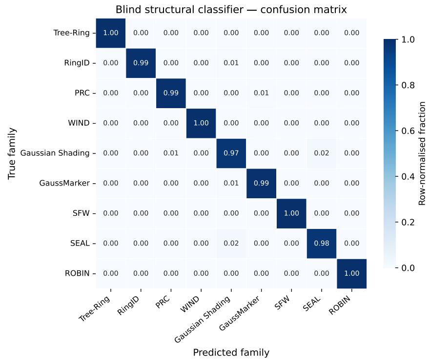  
Figure 3: Row-normalised confusion matrix of the blind classifier over the nine families $( \mathbf { z } _ { T } ^ { \mathrm { { i n v } } }$ features, no keys); of-diagonal mass stays within the GS/GM/SEAL cluster.

The component ablation is retained as Table 3 in the main paper.

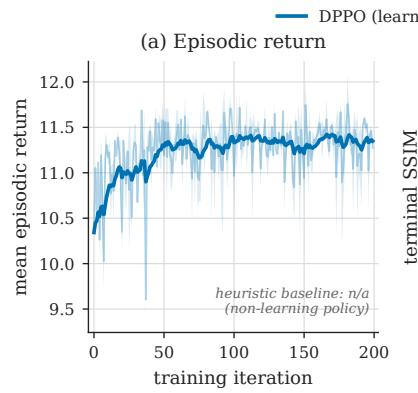

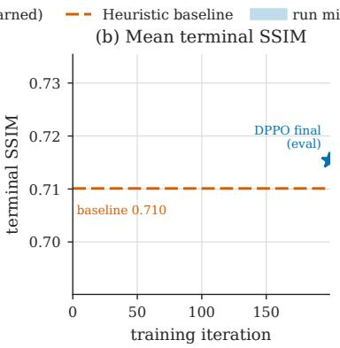

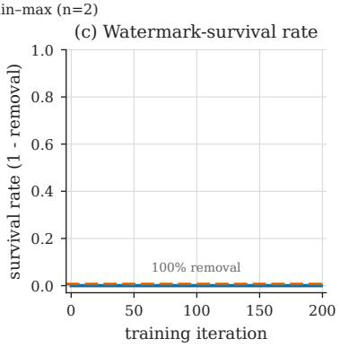  
Figure 4: DPPO training dynamics. (a) Mean episodic return rises and plateaus; (b) mean terminal SSIM improves; (c) returned retained outputs remain verifier-rejected throughout. The first two trends are empirical; Proposition 4.5 explains only the same-verifier rejection invariant.

## E.5 Qualitative Comparison Across All Watermarking Methods

Figure 7 and Figure 8 compare the full Adaptive DRIFT pipeline—the first verifier-rejected rung $\lambda ^ { \star }$ followed by DPPO fidelity refinement—across all nine evaluated watermarking methods. For each method, the left column shows the original watermarked image and the right column shows the corresponding attacked-and-refined image. Across the three watermark paradigms, the outputs preserve subject identity, color palette, and composition while remaining rejected by the evaluated verifier. These examples illustrate detector evasion with limited visible artifacts; quantitative fidelity is reported separately.

(a) Watermarked xw  
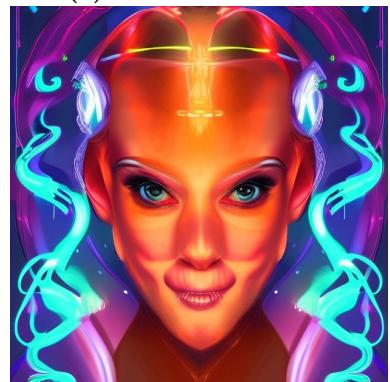

(b) Min-λ DRIFT  
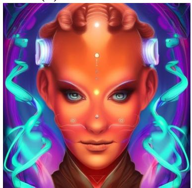

(c) + DPPO refinement  
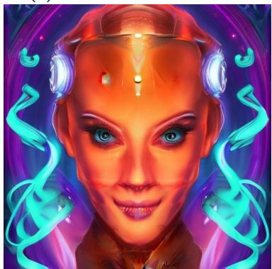  
GS (λ= 0.50), watermark ✓ present PSNR 16.3 / SSIM .462 / LPIPS .363, rejected PSNR 18.3 / SSIM .543 / LPIPS .194, reject

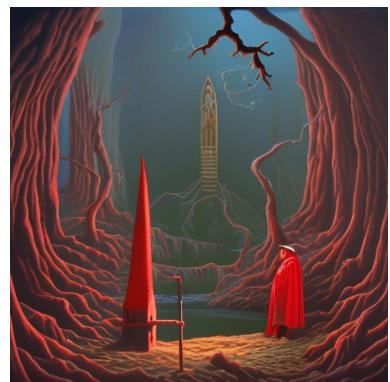

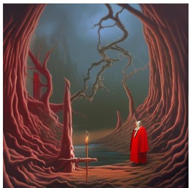

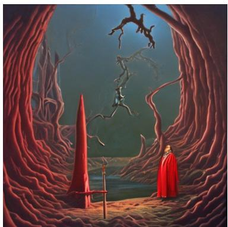  
GM (λ= 0.45), watermark ✓ present PSNR 19.5 / SSIM .495 / LPIPS .330, rejected PSNR 20.6 / SSIM .522 / LPIPS .179, rejecte

  
ROBIN (λ= 0.20), watermark ✓ present PSNR 23.3 / SSIM .569 / LPIPS .211, rejected PSNR 23.6 / SSIM .558 / LPIPS .142, rejecte  
Figure 5: RL refinement recovers fidelity at fixed verifier rejection across three families of decreasing robustness (GS, GM, ROBIN; per-row λ⋆ in parentheses). (a) Watermarked image; (b) Adaptive DRIFT at the first verifier-rejected rung $\lambda ^ { \star }$ (the larger strengths needed by GS/GM drift content); (c) DPPO refinement pulls the result back toward $\mathbf { x } ^ { w }$ under a hard verifier-rejection constraint. Per-panel PSNR/SSIM/LPIPS are measured against $\mathbf { x } ^ { w }$ ; better refined value in bold. All panels 512×512.

<table><tr><td></td><td colspan="2"> $\bar { \lambda } \downarrow$ </td><td colspan="2">ASR (%)↑</td><td colspan="2">SSIM↑</td><td colspan="2">PSNR↑</td><td colspan="2">LPIPS↓</td></tr><tr><td>Family</td><td>Base</td><td>Adapt.</td><td>Base</td><td>Adapt.</td><td>Base</td><td>Adapt.</td><td>Base</td><td>Adapt.</td><td>Base</td><td>Adapt.</td></tr><tr><td>SEAL</td><td>0.05</td><td>0.087</td><td>98.7</td><td>100.0</td><td>0.872</td><td>0.875</td><td>29.05</td><td>28.96</td><td>0.049</td><td>0.046</td></tr><tr><td>SFW</td><td>0.10</td><td>0.074</td><td>99.7</td><td>100.0</td><td>0.736</td><td>0.787</td><td>23.76</td><td>25.74</td><td>0.099</td><td>0.075</td></tr><tr><td>RI</td><td>0.20</td><td>0.161</td><td>91.0</td><td>99.7</td><td>0.658</td><td>0.755</td><td>22.45</td><td>25.32</td><td>0.179</td><td>0.112</td></tr><tr><td>WIND</td><td>0.15</td><td>0.110</td><td>97.0</td><td>100.0</td><td>0.654</td><td>0.686</td><td>23.02</td><td>24.01</td><td>0.120</td><td>0.103</td></tr><tr><td>ROBIN</td><td>0.15</td><td>0.150</td><td>100.0</td><td>100.0</td><td>0.723</td><td>0.719</td><td>23.98</td><td>23.85</td><td>0.124</td><td>0.123</td></tr><tr><td>PRC</td><td>0.20</td><td>0.155</td><td>95.7</td><td>100.0</td><td>0.703</td><td>0.730</td><td>23.46</td><td>24.54</td><td>0.170</td><td>0.141</td></tr><tr><td>TR</td><td>0.30</td><td>0.199</td><td>94.7</td><td>99.7</td><td>0.643</td><td>0.698</td><td>21.58</td><td>23.81</td><td>0.219</td><td>0.156</td></tr><tr><td>GM</td><td>0.50</td><td>0.394</td><td>99.0</td><td>100.0</td><td>0.557</td><td>0.596</td><td>18.95</td><td>20.70</td><td>0.342</td><td>0.275</td></tr><tr><td>GS</td><td>0.55</td><td>0.482</td><td>95.7</td><td>98.0</td><td>0.477</td><td>0.505</td><td>17.02</td><td>18.11</td><td>0.406</td><td>0.360</td></tr><tr><td>Mean</td><td>0.244</td><td>0.201</td><td>96.8</td><td>99.7</td><td>0.669</td><td>0.706</td><td>22.59</td><td>23.89</td><td>0.190</td><td>0.155</td></tr></table>

Table 6: Non-adaptive vs. Adaptive DRIFT across nine watermark families (300 images each; H100). Base fixes the 90th percentile of each family’s per-image $\lambda ^ { \star } ;$ Adapt. verify-and-climbs to the first verifier-rejected rung using only black-box accept/reject queries. Best mean per metric in bold.
<table><tr><td colspan="2">Pre-refine (round 0)</td><td colspan="2">Post-refine (DPPO)</td></tr><tr><td>SSIM↑</td><td>PSNR↑ LPIPS↓</td><td>SSIM↑</td><td>PSNR↑ LPIPS↓</td></tr><tr><td>0.735</td><td>24.95 0.136</td><td>0.738</td><td>25.19 0.114</td></tr></table>

Table 7: Stage-III fidelity refinement on verifier-rejected attack outputs $( N { = } 2 2 5 , 2 5 { \times } 9$ families). Empirically, the DPPO controller improves all three reported mean fidelity metrics over the round-0 attacked image in 1.16 rounds on average. Proposition 4.5 guarantees only that the retained output remains rejected by the same verifier; the fidelity gains are empirical.

## E.6 Efect of Attack Strength on Image Fidelity

Figure 9 illustrates the fidelity–evasion trade-of of the base (fixed-λ) DRIFT attack across three representative watermarking methods of increasing robustness as λ grows from 0.30 to 0.60. For weakly robust methods such as PRC, successful evasion is achieved at $\lambda = 0 . 3 0$ with virtually no perceptual change relative to the original. For moderately robust methods such as ROBIN, minor variations in fine-grained texture appear at $\lambda = 0 . 4 5$ but remain within an acceptable perceptual range. For the most robust method Tree-Ring, stronger perturbation at $\lambda = 0 . 6 0$ is required, introducing slight deviation in high-frequency details while the overall scene structure and semantic content are well preserved. The observed first successful rung varies with the scheme, image, verifier, sampler, search grid, and stochastic realization, motivating Adaptive DRIFT’s per-image minimal-strength search.

## E.7 Trajectory Decoupling: Noise Distance vs. Attack Strength

Figure 10 plots the mean $L _ { 1 }$ and $L _ { 2 }$ distances between the DDIM-inverted noise of the attacked image and the reference noise $\epsilon ^ { w }$ as a function of λ. Both metrics increase monotonically across the measured grid, providing empirical evidence that stronger attacks progressively decouple the recovered latent from its original trajectory. $\mathrm { A t } ~ \lambda = 0 . 7 0$ , the curves lie in the narrow bands $L _ { 1 } \approx 1 . 0 5 – 1 . 0 7$ and $L _ { 2 } \approx 1 . 3 1 – 1 . 3 4$ . These values approach the random-Gaussian diagnostics $L _ { 1 } = 2 / \sqrt { \pi }$ and per-coordinate RMS $L _ { 2 } = \sqrt { 2 }$ . Corollary B.10, under Assumption B.9, formalizes only the corresponding $\mathrm { s q u a r e d } { \cdot } L _ { \mathrm { 2 } }$ reference $\mathbb { E } [ \lVert \cdot \rVert _ { 2 } ^ { 2 } ] = 2 d$ (up to its stated perturbation bound); the $L _ { 1 }$ value additionally requires independent Gaussian coordinates. For non-noise-space schemes, both values are used only as diagnostic comparisons.

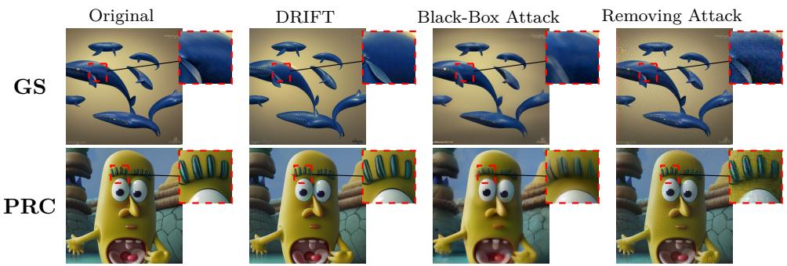  
Figure 6: Qualitative comparison with baseline attacks on GS and PRC (Original / DRIFT / Black-Box / Removing), with zoomed insets. Figure 2 of the main text shows the same comparison on GaussMarker.

## E.8 Strength-Sensitivity Result

Figure 11 exposes why a single global strength is ineficient. SFW and SEAL saturate at $\lambda = 0 . 1 0$ WIND and PRC at 0.20–0.25, and ROBIN at 0.40, whereas Tree-Ring, Gaussian Shading, RingID, and GaussMarker require 0.50–0.60. Nevertheless, the peak ASR remains 98–100% across all nine families. The dominant variation is therefore the minimum efective strength, precisely the quantity targeted by verify-and-climb.

Watermarked/GM  
Attacked/GM  
Watermarked/S A  
Attacked/SEAL  
Watermarked/PRC  
Attacked/PRC  
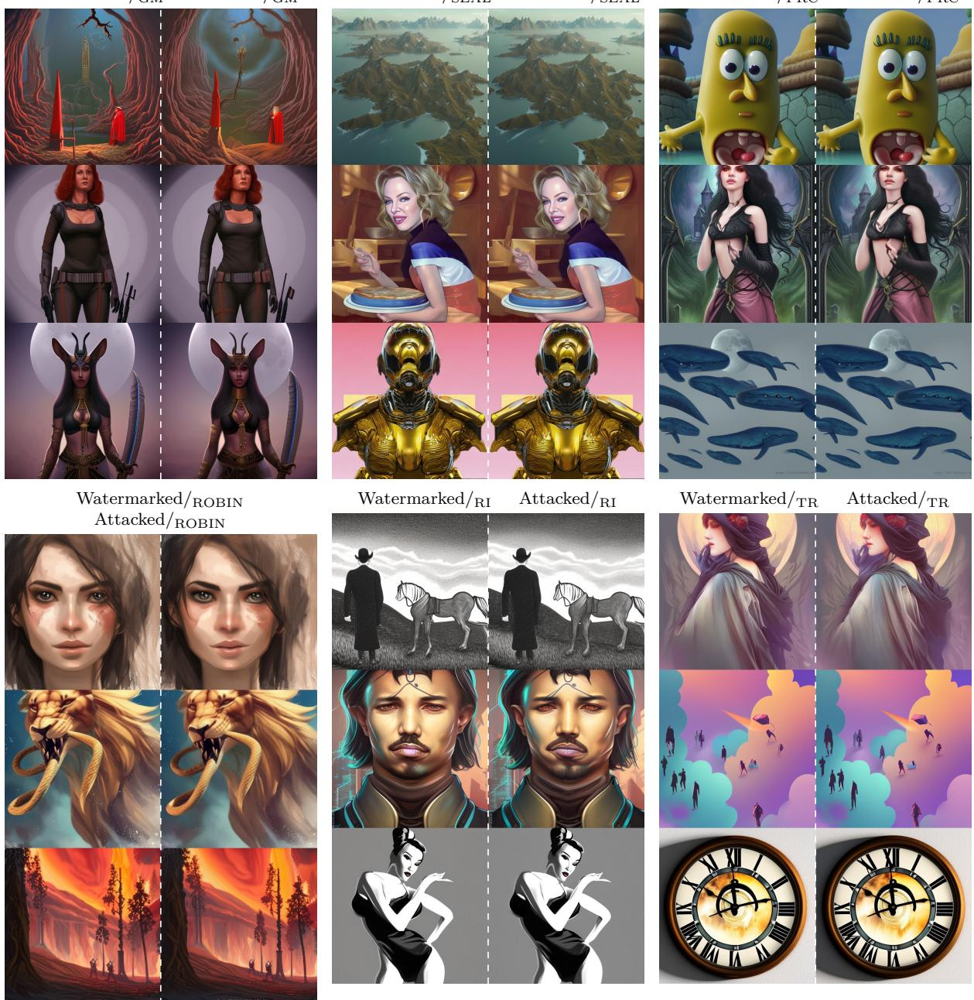  
Figure 7: (a) Adaptive DRIFT on six watermarking methods. Left: watermarked originals. Right: Adaptive DRIFT outputs (per-image first-rejected λ⋆ + DPPO refinement).

Watermarked/  
Attacked/SFW  
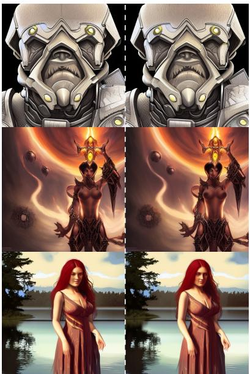

Watermarked/GS  
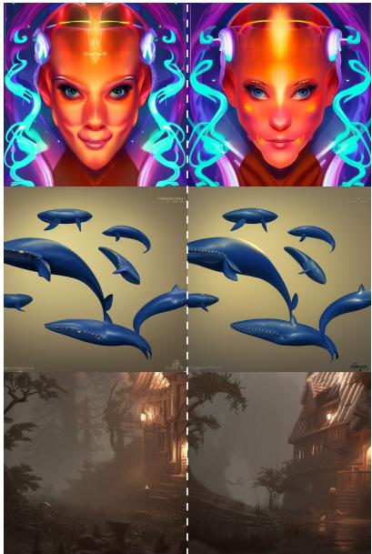  
Attacked/GS

Watermarked/WIND  
Attacked/WIND  
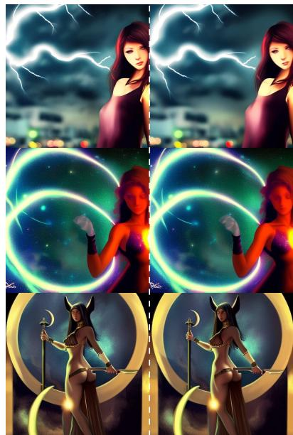

Figure 8: (b) Adaptive DRIFT on the remaining three methods. Left: watermarked originals. Right: Adaptive DRIFT outputs (per-image first-rejected λ⋆ + DPPO refinement).  
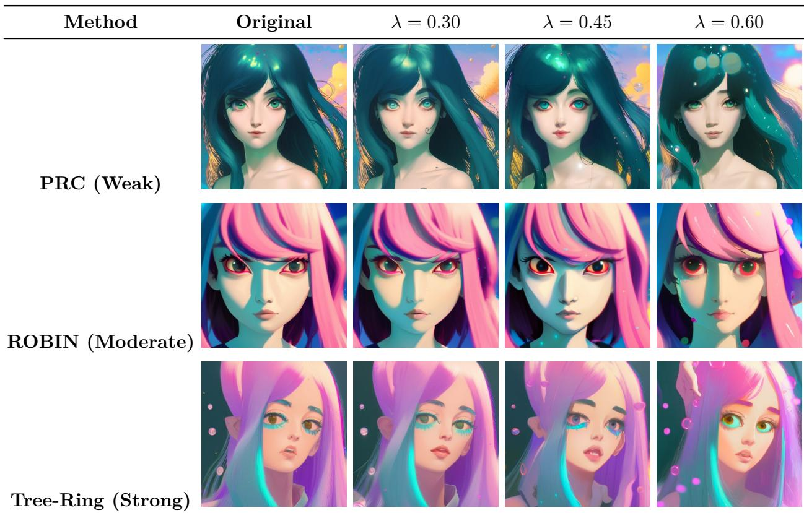  
Figure 9: Fidelity–evasion trade-of of base DRIFT under diferent attack strengths. PRC, ROBIN, and Tree-Ring represent weakly, moderately, and highly robust methods. As λ increases, the attacked outputs reveal clear diferences in the trade-of across robustness levels, motivating the per-image minimal-strength search of Adaptive DRIFT.

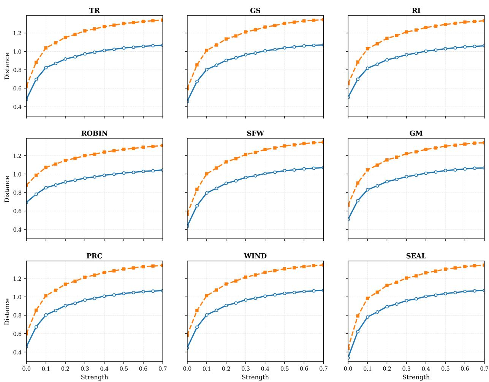  
Figure 10: Mean $L _ { 1 }$ and $L _ { 2 }$ noise distances vs. attack strength λ across nine watermarking methods. Across the measured grid, both metrics increase and approach the random-Gaussian diagnostic values. This trend is empirical: Theorem B.8 bounds fixed-depth source dependence and does not predict monotonicity of these distances. Corollary B.10 conditionally formalizes only the squared- $. L _ { 2 }$ 2d reference; the $L _ { 1 }$ value additionally assumes independent Gaussian coordinates.

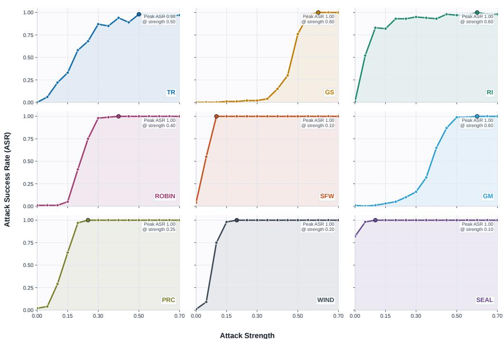  
Figure 11: Sensitivity to the re-noising strength λ. ASR as a function of λ for all nine watermark families. The widely separated saturation thresholds motivate selecting the smallest successful strength for each image rather than applying one global value.