# Distillation as Probability Transport: Routed On-Policy Distillation

Tianle Xia∗, Lingxiang Hu∗, Yiding Sun, Linfang Shang, Ming Xu Lan Xu†, Ning Zheng, Wei Xu, Jie Jiang

Tencent

{tianlexia,lingxianghu,emanuelsun,faelynshang,flemingxu}@tencent.com {lanxu,yodazheng,davidxu,zeus}@tencent.com ∗First author. †Corresponding author.

## Abstract

On-policy distillation (OPD) transfers teacher knowledge on student-generated trajectories, but eficient sampled objectives reduce the teacher distribution to scalar credit on in- dividual tokens. Such credit indicates whether a token should gain or lose probability, yet leaves the corresponding re- distribution unspecified. We recast OPD as teacher-guided probability transport and propose RouteOPD (Routed On-Policy Distillation), which decomposes local teacher–student disagreement into student-excess sources and teacher-deficit destinations and couples them into explicit transport pairs. RouteOPD optimizes pairwise log-odds toward jointly realiz-able targets obtained from a bounded teacher potential, while adapting the transport budget to the concentration of teacher demand. This formulation directs updates toward teacher- preferred destinations and controls their magnitude within a single transport operator. Experiments across four teacher– student settings and four mathematical-reasoning benchmarks demonstrate that RouteOPD consistently outperforms sam- pled reverse-KL OPD, with improvements accompanied by higher routing fidelity and lower background leakage. These results demonstrate the efectiveness of explicitly modeling probability transport in on-policy distillation.

## 1 Introduction

On-policy distillation (OPD) has emerged as an efective post-training paradigm for transferring reasoning capabili- ties between language models (Agarwal et al. 2024; Team 2025). Unlike ofline distillation, which supervises a student on fixed teacher or corpus trajectories (Hinton, Vinyals, and Dean 2015; Kim and Rush 2016), OPD samples from the student and queries the teacher at the resulting states. It therefore combines on-policy state coverage with temporally dense teacher feedback, reducing the state-distribution mismatch induced by fixed histories (Ross, Gordon, and Bagnell 2011; Bengio et al. 2015) without relying only on sparse outcome rewards (Xia et al. 2026). This combination is es-pecially attractive for long-horizon mathematical reasoning, where an early mistake changes every subsequent state and final-answer feedback gives little information about which local decisions should be corrected. Yet this advantage raises a more basic question: when the teacher prescribes a categor- ical distributional correction, is scalar credit on an individ- ual token suficient to specify how the student policy should change?

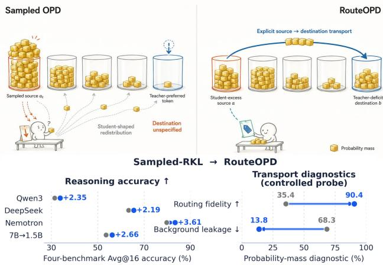  
Figure 1: RouteOPD replaces implicit redistribution with teacher-guided transport, improving average reasoning ac-curacy and routing fidelity while reducing leakage.

An eficient and common instantiation of OPD, however, leaves each update structurally under-specified. Although the teacher provides a categorical distribution over the vocabu- lary, a sampled objective exposes one student action and one scalar credit at a visited state. This scalar can indi- cate whether the sampled token should be encouraged or suppressed, and with what strength. Yet a normalized cat- egorical policy cannot change one probability in isolation: suppressing one token releases mass that must be assigned elsewhere, while increasing one token must draw mass from other alternatives. Thus, scalar credit is not a transportplan. It explicitly identifies at most one side of a redistribution, even though the teacher distribution provides evidence about both student-excess sources and teacher-deficit destinations.

This distinction matters because the missing route is not neutral: it is filled in by student softmax geometry. For logits z and a sampled token a, ∇z log $\pi _ { \theta } ( a \mid s ) = \mathbf { e } _ { a } - \pi _ { \theta } ( \cdot \mid s )$ Consequently, a negative credit suppresses a but produces a direct background logit update over every non-source token, weighted by the student’s current probabilities. Even when a scalar estimator recovers a dense objective in expectation, each realized stochastic update still delegates this unspecified redistribution to the student geometry. It can therefore favor alternatives that are already common under the student but exhibit no teacher deficit. Sampled OPD may estimate how strongly to correct a realized action while remaining incom- plete about which alternatives should receive that correction. This per-update under-specification motivates explicit con- trol over both sides of the redistribution.

We introduce RouteOPD (Routed On-Policy Distillation), illustrated in Figure 2, to replace implicit redistribution with explicit, teacher-guided probability transport. RouteOPD treats teacher–student disagreement as a local conserva- tion problem: probability removed from student-excess to- kens should be reassigned to teacher-deficit tokens. At each student-visited state, it constructs a detached union of teacher and behavior-student top-k tokens, then decomposes the nor-malized disagreement into excess source mass and deficit destination mass. Because both distributions are normalized on the common union, the two masses have equal totals; nor- malizing them yields the source and destination marginals. We connect these marginals with their independent prod- uct coupling—the maximum-entropy coupling under fixed marginals. Sampling this coupling produces explicit source– destination routes without materializing a dense quadratic coupling.

For each sampled route $( a , b )$ RouteOPD learns the teacher-implied change in pairwise log-odds. The identity $\nabla _ { z } [ \log \pi _ { \theta } ( b ~ \vert ~ s ) - \log \pi _ { \theta } ( a ~ \vert ~ s ) ] = \mathbf { e } _ { b } - \mathbf { e } _ { a }$ cancels the shared log-softmax background and gives zero direct gradient to unrelated logits. The realized direct logit update is therefore localized to the specified source and destination rather than spread across the student’s background alterna- tives. This direct-logit locality complements the probability- level leakage measurements, which also capture softmax nor- malization and shared-parameter efects.

Multiple sampled routes create a separate consistency challenge. Independently clipping each edge target can vi- olate cycle consistency, so the resulting pairwise demands need not correspond to any jointly realizable set of token scores. RouteOPD instead derives every target as the dif- ference of one bounded teacher potential evaluated at its destination and source. This shared construction makes all pair targets cycle-consistent and jointly realizable. We adapt the potential range using the concentration of teacher-deficit demand: concentrated demand identifies clearer destinations and permits a wider correction budget, whereas difuse de- mand yields a more conservative update. The resulting oper- ator specifies source, destination, and magnitude, reuses the scored teacher distribution, and adds only O(k + m) routing overhead after top-k extraction.

Experiments across four teacher–student settings and four mathematical-reasoning benchmarks establish the efective- ness of explicit routing. Relative to sampled reverse-KL OPD, adaptive RouteOPD improves the four-benchmark av- erage by 2.19–3.61 points across settings, with a mean gain of 2.70 points; paired evaluation intervals over matched problems and samples remain strictly above zero. It ex- ceeds full-vocabulary reverse KL by 1.24 points on average, showing that the gain is not explained merely by access to dense teacher scores, and exceeds fixed-mid routing by 1.20 points, isolating the benefit of adaptive budgeting. The im- provement is not a weak-student floor efect: for the strong OpenMath-Nemotron student, the average rises from 79.73 under sampled-RKL to 83.34 under RouteOPD.

Matched interventions support the proposed transport mechanism rather than an unexamined change of loss scale. Holding source identity, target magnitude, coupling weight, and nominal budget fixed, random-background and rank/frequency-matched destinations obtain 62.72 and 63.72 Avg@16, whereas teacher-deficit destinations reach 64.43. On the same frozen diagnostic bank, RouteOPD raises rout- ing fidelity from 35.4% for sampled-RKL to 90.4% and reduces full-vocabulary background leakage from 68.3% to 13.8%. Destination identity therefore changes both the direction of the realized redistribution and downstream reasoning accuracy, forming the causal link predicted by the transport view.

Further controls validate the remaining design choices and their practical cost. Independent edge clipping produces 27.6% cycle violations, while the shared potential eliminates these violations, confirming that its pair targets are jointly realizable. Adaptive budgeting outperforms fixed-low, fixed- mid, fixed-high, and reversed-concentration controls. Finally, the default top-32 union retains over 97% of both teacher and student mass with 96.38% sign agreement. It reaches 65.53 Avg@16 at 2.5% end-to-end overhead, compared with 65.61 at 12.5% overhead for full-vocabulary routing. Thus, explicit transport remains both coherent and sparse rather than trad- ing accuracy for a dense coupling computation.

We make three contributions.

• A probability-transport view of OPD. We expose a per-update route under-specification in sampled scalar OPD: credit can correct the realized action while leaving its re- distribution destination to student geometry. We instead formulate categorical correction as conserved transport from student-excess sources to teacher-deficit destina- tions.

• A sparse, integrable routed objective. RouteOPD cou-ples the two marginals, realizes each route through pair- wise log-odds with zero direct unrelated-logit gradi- ent, and derives cycle-consistent targets from a shared bounded potential whose range adapts to teacher demand.

• Efectiveness with causal and practical evidence. Across four settings, RouteOPD outperforms sampled and full-vocabulary reverse-KL OPD. Matched destination in- terventions and fixed-bank diagnostics link the gains to higher routing fidelity and lower leakage, while target- realization and eficiency controls validate the shared po- tential, adaptive budget, and sparse construction.

## 2 Related Work

Knowledge distillation and on-policy distillation. Knowledge distillation transfers a teacher’s predictive dis- tribution to a smaller student (Hinton, Vinyals, and Dean 2015), with sequence-level and reverse-KL variants extending it to autoregressive generation (Kim and Rush 2016; Gu et al. 2024). Because fixed ofline prefixes can difer from student-generated histories, on-policy distillation (OPD) in-stead queries the teacher on states visited by the student (Agarwal et al. 2024), an idea also adopted in recent openmodel training recipes (Team 2025). Recent theory sharpens when this change of state distribution matters: online imi- tation is most useful under student–teacher non-realizability (Zhang et al. 2026), and noisy expert feedback can create an exponential separation between ofline and online imitation (Sriraman et al. 2026). These results explain the value of student-visited states, but leave open how teacher feedback should produce a categorical update within each state.

OPD objectives, targets, and stability. A central line of work modifies the feedback applied at a visited state. Adap- tive target reformulation constructs an intermediate target to avoid conflicting updates (Jang et al. 2026); generalized OPD extrapolates dense teacher feedback and corrects reference- policy bias (Yang et al. 2026); and Uni-OPD combines student-side exploration balancing with teacher-side reliabil- ity calibration (Hou et al. 2026). Complementary diagnoses identify prefix mismatch and biased top-k reverse-KL estimation and develop corresponding fixes (Zhu et al. 2026). More recent methods directly regularize unstable feedback: PowerOPD replaces the unbounded log-ratio reward with a bounded power transformation (Zhao et al. 2026a), TOP-D dynamically constructs a proximal teacher and reuses data within a trust region (Xie et al. 2026b), and RG-OPD gates teacher logits using verifier feedback (Akhondzadeh et al. 2026). These methods determine the target, magnitude, or reliability of supervision. RouteOPD is complementary: it determines the vocabulary destination of the probability re- moved by a realized correction.

Selecting where and when to distill. Another line allocates supervision across the training data or trajectory. PACED weights problems near the frontier of student com- petence (Xu et al. 2026a), while PG-OPD uses early teacher– student overlap to allocate long-rollout budgets to promising trajectories (Zhao et al. 2026b). At finer granularity, TIP selects informative token positions (Xu et al. 2026b), TRACE routes distillation to critical reasoning spans (Wang et al. 2026), and IW-OPD downweights late positions as student prefixes drift from the teacher (Xie et al. 2026a). DEAR further distinguishes uncertain decision tokens from con- fident but incorrect evidence tokens (Xiao et al. 2026). For long-horizon agents, TurnOPD reallocates both rollout depth and loss budgets across interaction turns (Zhou et al. 2026). All of these methods answer which examples, spans, positions, or turns should receive supervision. At a fixed selected state, RouteOPD instead answers which vocabulary alternative should receive mass from a student-excess source. Thus its action-space routing is orthogonal to temporal or data- level selection.

Understanding OPD’s learning dynamics. Empirical analyses connect OPD success to teacher–student thinking- pattern compatibility and progressive alignment on overlap- ping tokens (Li et al. 2026). Parameter-space studies provide a complementary view: early OPD updates rapidly stabilize in direction and can be used to accelerate later training (Cai et al. 2026), while broader checkpoint analyses find that dense teacher supervision nevertheless produces small, coordinate- sparse, and spectrally concentrated updates (Yu et al. 2026). These findin s characterize when OPD succeeds and how its changes accumulate. Our analysis operates one level earlier, exposing the per-update softmax redistribution that gener- ates those dynamics and replacing its implicit destination rule with explicit excess-to-deficit routes.

## 3 Method: RouteOPD

RouteOPD converts teacher–student disagreement at a student-visited state into explicit source–destination updates with teacher-directed destinations, direct logit locality, and jointly realizable targets.

## 3.1 From scalar feedback to explicit routes

Implicit redistribution in sampled OPD. For a prompt $x ,$ the behavior student samples $y \sim \pi _ { \mathrm { o l d } } ( \cdot \mid x )$ and visits $s _ { t } =$ $( x , y _ { < t } )$ , with $a _ { t } ~ = ~ y _ { t }$ . The sampled reverse-KL baseline uses the detached advantage

$$
A _ { t } ( a _ { t } ) = \operatorname { s g } [ \log \pi _ { T } ( a _ { t } \mid s _ { t } ) - \log \pi _ { \mathrm { o l d } } ( a _ { t } \mid s _ { t } ) ] ,\tag{1}
$$

where sg is stop-gradient. With importance ratio $\begin{array} { r l } { \rho _ { t } } & { { } = } \end{array}$ $\pi _ { \boldsymbol { \theta } } ( a _ { t } \mid s _ { t } ) / \pi _ { \mathrm { o l d } } ( a _ { t } \mid s _ { t } )$ , the local loss is $- \rho _ { t } A _ { t } .$ . At the start of an update, a negative advantage produces

$$
- \nabla _ { z } \ell _ { \mathrm { s O P D } } ^ { ( t ) } = \left| A _ { t } ( \boldsymbol { a } _ { t } ) \right| \left[ \pi _ { \mathrm { o l d } } ( \cdot \mid \boldsymbol { s } _ { t } ) - \mathbf { e } _ { \boldsymbol { a } _ { t } } \right] .\tag{2}
$$

Thus the sampled token is suppressed while student geom- etry distributes the released mass over non-source tokens: the teacher identifies the correction sign, not its recipient (Appendix A.1).

Excess and deficit. At rollout/scoring time, form a sparse shared support and separately renormalize each model on it:

$$
\mathcal { U } _ { t } = \mathrm { T o p K } ( \pi _ { \mathrm { o l d } } ( \cdot  { \left| \begin{array} { l } { s _ { t } } \end{array} \right) } \cup \mathrm { T o p K } ( \pi _ { T } ( \cdot  { \left| \begin{array} { l } { s _ { t } } \end{array} \right) } ) .\tag{3}
$$

$$
p _ { X } ( a ) = \frac { \pi _ { X } ( a \mid s _ { t } ) } { \sum _ { v \in \mathcal U _ { t } } \pi _ { X } ( v \mid s _ { t } ) } , \quad X \in \{ S , T \} , a \in \mathcal U _ { t } ,\tag{4}
$$

where $\pi _ { S } = \pi _ { \mathrm { o l d } } .$ All routing statistics are detached within an update. Define

$$
e _ { t } ( a ) = [ p _ { S } ( a ) - p _ { T } ( a ) ] _ { + } , d _ { t } ( a ) = [ p _ { T } ( a ) - p _ { S } ( a ) ] _ { \underline { { + } } \underline { { + } } } .\tag{5}
$$

Their common mass is

$$
M _ { t } = \sum _ { a \in \mathcal { U } _ { t } } e _ { t } ( a ) = \sum _ { a \in \mathcal { U } _ { t } } d _ { t } ( a ) = \mathrm { T V } ( p _ { S } , p _ { T } ) ,\tag{6}
$$

so $e _ { t }$ identifies sources, $d _ { t }$ identifies destinations, and $M _ { t }$ is the available transport mass. States with $M _ { t } \le \delta _ { M }$ receive zero route loss.

## 3.2 Sparse excess-to-deficit routing

For $M _ { t } > \delta _ { M }$ , normalize both marginals and use their inde pendent product coupling:

$$
\begin{array} { l } { { q _ { t } ^ { - } ( a ) = \displaystyle \frac { e _ { t } ( a ) } { M _ { t } } , \qquad q _ { t } ^ { + } ( b ) = \displaystyle \frac { d _ { t } ( b ) } { M _ { t } } , } } \\ { { \Gamma _ { t } ( a , b ) = M _ { t } q _ { t } ^ { - } ( a ) q _ { t } ^ { + } ( b ) . } } \end{array}\tag{7}
$$

This coupling preserves both marginals; sampling m inde-pendent routes $a _ { i } \sim q _ { t } ^ { - } , b _ { i } \sim q _ { t } ^ { + }$ avoids the $\mathbf { \bar { \rho } } _ { k ^ { 2 } }$ table. Ap- pendix A.2 derives the marginal identities and unbiased es- timator.

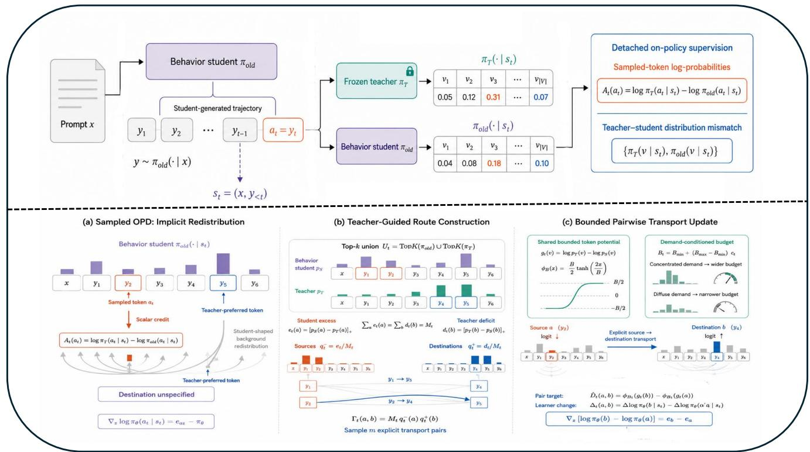  
Figure 2: Overview of RouteOPD. Sampled OPD (a) assigns scalar credit to one token and leaves redistribution to student softmax geometry. RouteOPD (b) decomposes teacher–student disagreement into excess sources and deficit destinations and samples explicit routes. A bounded, demand-conditioned token potential (c) supplies integrable pairwise log-odds targets, producing zero direct gradient on unrelated logits.

## 3.3 Directed and integrable pairwise targets

Direct locality. For route (a, b), define the pairwise log-odds change

$$
\begin{array} { r l } & { \Delta _ { t } ( a , b ) = \left[ \log \pi _ { \boldsymbol { \theta } } ( b \mid s _ { t } ) - \log \pi _ { \boldsymbol { \theta } } ( a \mid s _ { t } ) \right] } \\ & { \phantom { \Delta _ { t } ( a , b ) = \Delta _ { t } ( b \mid s _ { t } ) = } - \left[ \log \pi _ { \mathrm { o l d } } ( b \mid s _ { t } ) - \log \pi _ { \mathrm { o l d } } ( a \mid s _ { t } ) \right] . } \end{array}\tag{8}
$$

Its logit gradient is

$$
\nabla _ { z } ( \log \pi _ { \theta } ( b ) - \log \pi _ { \theta } ( a ) ) = \mathbf { e } _ { b } - \mathbf { e } _ { a } .\tag{9}
$$

Increasing $\Delta _ { t }$ directly raises only the destination logit and lowers only the source logit; this establishes direct-logit lo- cality, while Appendix A.3 characterizes the induced proba- bility changes under softmax normalization.

Teacher target and adaptive budget. Let $\ell _ { \delta _ { p } } ( x ) \ =$ $\log ( \operatorname* { m a x } \{ x , \bar { \delta _ { p } } \} )$ ) and define the teacher token potential

$$
g _ { t } ( v ) = \ell _ { \delta _ { p } } ( p _ { T } ( v ) ) - \ell _ { \delta _ { p } } ( p _ { S } ( v ) ) .\tag{10}
$$

For the nonempty deficit set ${ \mathcal { D } } _ { t } = \{ b \in { \mathcal { U } } _ { t } : d _ { t } ( b ) > 0 \}$ with $n _ { t } = | D _ { t } |$ |, measure teacher-demand concentration by the normalized Herfindahl index

$$
\begin{array} { r } { c _ { t } = \left\{ \begin{array} { l l } { 1 , } & { n _ { t } = 1 , } \\ { \frac { n _ { t } \sum _ { b \in \mathcal { D } _ { t } } q _ { t } ^ { + } ( b ) ^ { 2 } - 1 } { n _ { t } - 1 } , } & { n _ { t } > 1 , } \end{array} \right. } \end{array}\tag{11}
$$

where $c _ { t } ~ \in ~ [ 0 , 1 ]$ . For $0 < B _ { \mathrm { m i n } } \le B _ { \mathrm { m a x } }$ , set the target budget to

$$
B _ { t } = B _ { \operatorname* { m i n } } + ( B _ { \operatorname* { m a x } } - B _ { \operatorname* { m i n } } ) c _ { t } .\tag{12}
$$

Rather than independently clipping pair targets, bound one shared token potential:

$$
\begin{array} { l } { \displaystyle \phi _ { B } ( \boldsymbol { x } ) = \frac { B } { 2 } \operatorname { t a n h } \left( \frac { 2 x } { B } \right) , } \\ { \widehat { D } _ { t } ( a , b ) = \phi _ { B _ { t } } ( g _ { t } ( b ) ) - \phi _ { B _ { t } } ( g _ { t } ( a ) ) . } \end{array}\tag{13}
$$

Monotonicity gives $\widehat { D } _ { t } ( a , b ) \ \in \ [ 0 , B _ { t } )$ , and the shared- potential shift $z _ { v } \gets z _ { v } + \phi _ { B _ { t } } ( g _ { t } ( v ) )$ jointly realizes every pair target. Appendix A.4 proves positivity, boundedness, and integrability and contrasts independent edge clipping.

## 3.4 Objective and implementation

With Huber transition $\kappa > 0$

$$
h _ { \kappa } ( r ) = \left\{ { \begin{array} { l l } { \frac { 1 } { 2 } { r } ^ { 2 } , } & { | r | \leq \kappa , } \\ { \kappa \left( | r | - \frac { 1 } { 2 } \kappa \right) , } & { | r | > \kappa . } \end{array} } \right.\tag{14}
$$

the RouteOPD token loss is

$$
\mathcal { L } _ { \mathrm { R o u t e O P D } } ^ { ( t ) } = M _ { t } \mathbb { E } _ { ( a , b ) \sim q _ { t } ^ { - } \times q _ { t } ^ { + } } \big [ h _ { \kappa } ( r _ { t } ( a , b ) ) \big ] .\tag{15}
$$

Table 1: Mathematical-reasoning accuracy across four teacher–student settings. Entries are Avg@16 accuracy (%); Avg. is the arithmetic mean of the four benchmarks. Fixed-mid routing uses B = log 1.35. Bold marks the best student method in each block.
<table><tr><td>Method</td><td>MATH500</td><td>AMC23</td><td>AIME24</td><td>AIME25</td><td>Avg.</td></tr><tr><td colspan="6">Qwen3-4B-Base-GRPO → Qwen3-1.7B-Base</td></tr><tr><td>Student (untrained; no OPD)</td><td>45.31</td><td>11.67</td><td>1.46</td><td>1.04</td><td>14.87</td></tr><tr><td>Sampled-RKL OPD</td><td>70.18</td><td>37.65</td><td>11.25</td><td>6.67</td><td>31.44</td></tr><tr><td>Full-vocabulary RKL</td><td>70.86</td><td>39.16</td><td>12.08</td><td>7.29</td><td>32.35</td></tr><tr><td>Routed OPD, fixed-mid B = log 1.35</td><td>70.63</td><td>39.46</td><td>11.88</td><td>7.50</td><td>32.36</td></tr><tr><td>RouteOPD (ours)</td><td>71.48</td><td>42.85</td><td>13.33</td><td>7.50</td><td>33.79</td></tr><tr><td colspan="6">JustRL-DeepSeek-1.5B → DeepSeek-R1-Distill-Qwen-1.5B</td></tr><tr><td>Student (untrained; no OPD)</td><td>84.90</td><td>69.05</td><td>29.17</td><td>25.21</td><td>52.08</td></tr><tr><td>Sampled-RKL OPD</td><td>86.63</td><td>85.47</td><td>48.13</td><td>33.13</td><td>63.34</td></tr><tr><td>Full-vocabulary RKL</td><td>87.51</td><td>86.14</td><td>49.38</td><td>34.58</td><td>64.40</td></tr><tr><td>Routed OPD, fixed-mid B = log 1.35</td><td>87.31</td><td>86.45</td><td>50.21</td><td>33.75</td><td>64.43</td></tr><tr><td>RouteOPD (ours)</td><td>88.08</td><td>86.75</td><td>52.50</td><td>34.79</td><td>65.53</td></tr><tr><td colspan="6">JustRL-Nemotron-1.5B → OpenMath-Nemotron-1.5B</td></tr><tr><td>Student (untrained; no OPD)</td><td>92.40</td><td>88.10</td><td>53.13</td><td>48.13</td><td>70.44</td></tr><tr><td>Sampled-RKL OPD</td><td>93.21</td><td>96.54</td><td>68.96</td><td>60.21</td><td>79.73</td></tr><tr><td>Full-vocabulary RKL</td><td>93.13</td><td>96.23</td><td>73.54</td><td>65.63</td><td>82.13</td></tr><tr><td>Routed OPD, fixed-mid B = log 1.35</td><td>93.28</td><td>96.08</td><td>74.38</td><td>65.21</td><td>82.24</td></tr><tr><td>RouteOPD (ours)</td><td>93.53</td><td>96.08</td><td>75.83</td><td>67.92</td><td>83.34</td></tr><tr><td colspan="6">DeepSeek-R1-Distill-Qwen-7B → DeepSeek-R1-Distill-Qwen-1.5B</td></tr><tr><td>Student (untrained; no OPD)</td><td>84.90</td><td>69.05</td><td>29.17</td><td>25.21</td><td>52.08</td></tr><tr><td>Sampled-RKL OPD</td><td>88.24</td><td>70.93</td><td>30.63</td><td>24.58</td><td>53.59</td></tr><tr><td>Full-vocabulary RKL</td><td>88.63</td><td>72.89</td><td>32.71</td><td>26.04</td><td>55.07</td></tr><tr><td>Routed OPD, fixed-mid B = log 1.35</td><td>88.81</td><td>72.67</td><td>32.50</td><td>26.25</td><td>55.06</td></tr><tr><td>RouteOPD (ours)</td><td>88.93</td><td>74.62</td><td>33.96</td><td>27.50</td><td>56.25</td></tr></table>

Algorithm 1 RouteOPD at one student-visited state   
Input: response mask $\mu _ { t } ;$ teacher/old-student top-k IDs;   
detached cross-gathered log $\pi _ { T } , \log \pi _ { \mathrm { o l d } }$ on their union;   
diferentiable current log $\pi _ { \theta }$ for sampled-ID gathers   
Output: one RouteOPD token loss   
1: form $\mathcal { U } _ { t }$ from IDs; build detached $p _ { S } , p _ { T }$   
2: compute $e _ { t } , d _ { t } , M _ { t }$ by Eqs. $( 5 ) – ( 6 )$   
3: if $\mu _ { t } = 0$ or $M _ { t } \le \delta _ { M }$ return 0   
4: form ${ q } _ { t } ^ { - } , { q } _ { t } ^ { + }$ and sample m independent pairs   
5: compute $g _ { t } , c _ { t } , B _ { t }$ by Eqs. (10), (11), and (12)   
6: bound token potentials and form $\widehat { D } _ { t }$ by Eq. (13)   
7: compute $\Delta _ { t } ( a _ { i } , b _ { i } )$ from current/old log-probabilities   
8: return $\begin{array} { r } { \frac { M _ { t } } { m } \sum _ { i = 1 } ^ { m } h _ { \kappa } ( \Delta _ { t } ( a _ { i } , b _ { i } ) - \widehat { D } _ { t } ( a _ { i } , b _ { i } ) ) } \end{array}$

RouteOPD replaces sampled reverse-KL; pairs and routing statistics are frozen within each update, so only current- student terms in $\Delta _ { t }$ are diferentiable. Let $\mu _ { t }$ mark valid generated response positions.

After top-k scoring, routing costs $O ( k + m )$ per valid token and reuses teacher logits without an extra forward pass. Appendix A.5 specifies cross-gathering, validity, numerical conventions, defaults, and independent-edge clipping.

## 4 Experiments

## 4.1 Experimental Setup

Setup. We evaluate four teacher–student pairs spanning Qwen3, DeepSeek, and Nemotron lineages on MATH500 (Hendrycks et al. 2021; Lightman et al. 2024; OpenAI 2023), AMC23 (AI-MO 2024b), AIME24 (AI-MO 2024a), and AIME25 (OpenCompass 2025) using Avg@16 exact-answer accuracy. All trainable arms share DAPO-Math-17K (Yu et al. 2025; ByteDance Seed and Tsinghua University SIA 2025), rollout seeds, teacher calls, and update budgets; tokenlevel comparisons require exact tokenizer compatibility. We compare sampled-RKL, full-vocabulary $\mathrm { K L } .$ , fixed-mid rout- ing, and adaptive RouteOPD. Unless varied, $k = 3 2 , m = 2 ,$ $B _ { \mathrm { m i n } } = \log 1 . 2 .$ and $B _ { \mathrm { m a x } } = \log 1 . 5$ . Full training, decod- ing, statistical, and decontamination details are deferred to the supplementary material.

## 4.2 How Well Does RouteOPD Perform?

Finding 1: RouteOPD improves every teacher–student setting. Relative to sampled-RKL, RouteOPD improves the four-benchmark average by 2.19–3.61 points (2.70 on average). It also exceeds full-vocabulary RKL by 1.13–1.44 points and fixed-mid routing by 1.10–1.43 points. The gains persist from a weak Qwen3 base student to the strong OpenMath-Nemotron student, indicating that explicit rout- ing is not tied to one initialization or teacher scale. Matched problem-and-sample bootstrap intervals are also uniformly positive: the macro improvements are +2.70 [2.28, 3.13] over sampled-RKL, +1.24 [0.90, 1.58] over full-vocabulary RKL, and +1.20 [0.89, 1.51] over fixed-mid routing, confirming the gains across matched evaluation resamples.

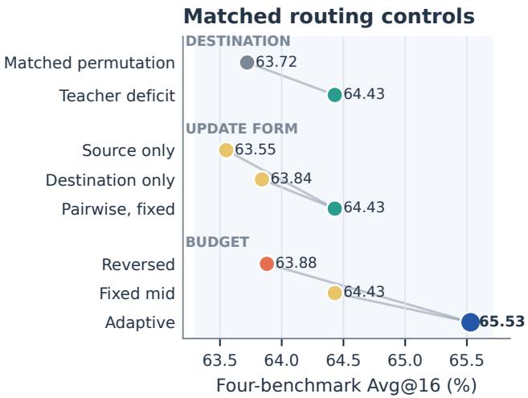  
Figure 3: Matched routing controls. Each block varies one design family while retaining the remaining fixed-route con- struction; the points are separate contrasts rather than a se- quential path from sampled-RKL.

## 4.3 Why Does Explicit Routing Help?

We now test the three decisions that define explicit rout- ing: where probability should go, how the requested changes should be realized jointly, and how much transport each state should receive.

Finding 2: Destination identity and a two-sided update both matter. Figure 3 first isolates where removed prob-ability is assigned. A rank/frequency-matched destination permutation reaches 63.72, whereas teacher-deficit destinations reach 64.43 under the same fixed-mid routed objective; random-background destinations fall further to 62.72. The update-form block then compares the same routed construc- tion with one side disabled: source-only and destination-only updates reach 63.55 and 63.84, respectively, compared with 64.43 for the pairwise update. Thus the gain is not explained by selecting unusual tokens or updating only one endpoint: the destination must follow teacher deficit, and the source and destination must be corrected together.

Finding 3: Shared potentials make route targets jointly realizable. Independent clipping treats each sampled edge as an unrelated target and produces 27.6% four-cycle violations. Deriving all pair targets from one bounded token potential eliminates these violations, reduces target MAE from 0.091 to 0.067, and raises bounded target completion from 76.4% to 83.2% under the fixed-mid budget. With adaptive budgeting, MAE further falls to 0.052 and completion reaches 88.1%. These diagnostics isolate the consistency benefit of the shared potential, while the following budget comparison isolates magnitude adaptation.

Finding 4: Adaptive budgeting helps when teacher demand is concentrated. The aggregate comparison in Figure 3 favors adaptive over fixed-mid budgeting, 65.53 versus 64.43, while reversing the concentration rule reaches only 63.88. More importantly, the adaptive-minus-fixed diference grows with teacher-deficit concentration: −0.10, +0.40, +1.30, and +2.70 points across the four concentration bins. Adaptive budgeting therefore does not merely enlarge every update; it allocates additional transport in the states where teacher demand is most concentrated.

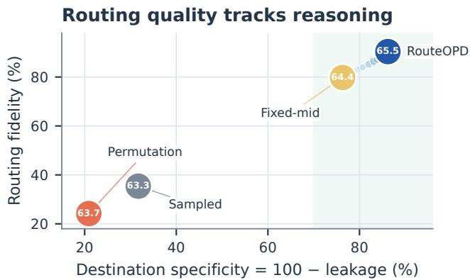  
Figure 4: Mechanism phase portrait. Large markers are matched method variants with Avg@16 printed inside; small blue markers trace adaptive RouteOPD checkpoints. Desired transport lies toward the upper right.

Finding 5: Better task performance accompanies a stronger routing signature. Figure 4 places the same interventions in fidelity–specificity space. Sampled-RKL has 35.4% routing fidelity and 68.3% full-vocabulary back-ground leakage; the matched destination permutation de- grades these to 24.2% and 79.1%. Teacher-deficit destinations with a fixed-mid budget instead reach 79.8% fidelity and 23.7% leakage, and adaptive RouteOPD reaches 90.4% and 13.8%. Along adaptive RouteOPD checkpoints, this routing signature strengthens while AIME24/25 Avg@16 rises from 27.19 to 43.65. Together with the matched destination intervention, the trajectory is consistent with the proposed mechanism; the checkpoint correlation alone is not treated as causal identification.

The efect is broad across states. The fixed 1,024-state bank confirms that the mean efect is broad: adaptive RouteOPD reaches 92.7% median fidelity and 76.5% at the tenth percentile, versus 33.1% median fidelity for sampled-RKL, while median full-vocabulary leakage falls from 70.1% to 11.2%.

## 4.4 Training Dynamics and Eficiency

Finding 6: The routing signature emerges throughout training. Figure 5 shows a largely monotone accuracy rise as routing fidelity and destination specificity improve and then saturate, rather than an isolated favorable checkpoint. The appendix compares mismatch, fidelity, and leakage tra- jectories with sampled-RKL and fixed-mid routing.

Sparse support and pair sampling. The sparse construction retains 97.79% of student mass and 97.13% of teacher mass at $k = 3 2$ . Its 65.53 Avg@16 requires only 2.5% endto-end overhead, whereas full-vocabulary routing reaches 65.61 at 12.5% overhead. For route sampling, $m = 2$ is best in this setting: $m = 1$ lowers target coverage from 76.8% to 58.4%, whereas $m = 4$ and $m = 8$ reduce route-loss variance but also reduce Avg@16 from 65.53 to 62.48 and 61.12. The resulting optimum at $m = 2$ balances estimator variance with selective target coverage.

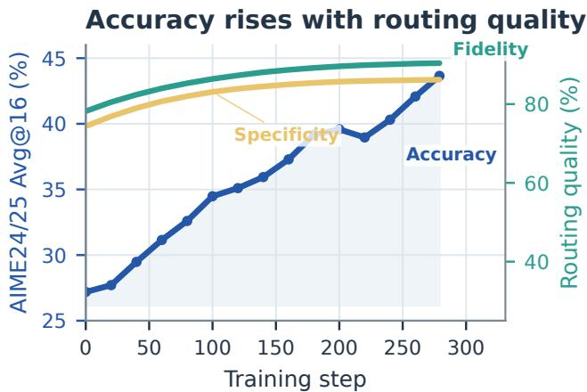

Figure 5: Training evidence on JustRL–DeepSeek. Accuracy, routing fidelity, and destination specificity (100−background leakage) improve together.  
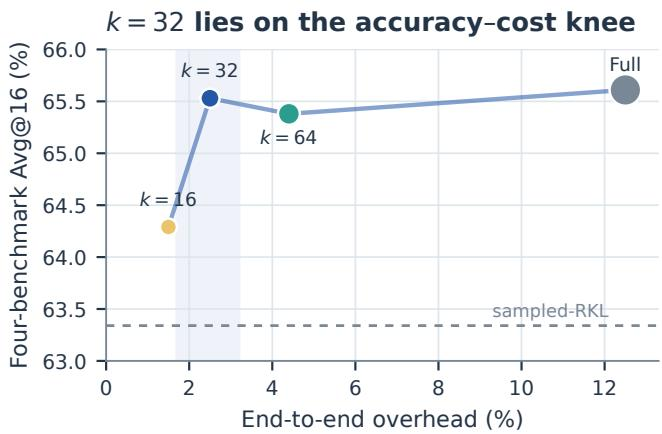  
Figure 6: Accuracy–cost trade-of. Marker area encodes peak memory. The sparse k = 32 default lies at the Pareto knee and recovers nearly all full-vocabulary accuracy at one fifth of its end-to-end overhead.

Finding 7: Sparse routing captures the practical Pareto knee. Figure 6 shows the largest accuracy gain from $k = 1 6$ to 32; $k = 6 4$ and full-vocabulary routing add substantia cost for little further accuracy on this system.

## 4.5 Behavioral Outcome Analysis

Finding 8: On AIME24, explicit routing primarily repairs reasoning errors. Figure 7 shows that the correct-response share rises from 48.1% under sampled-RKL and 50.2% under fixed-mid routing to 52.5% under RouteOPD. Among

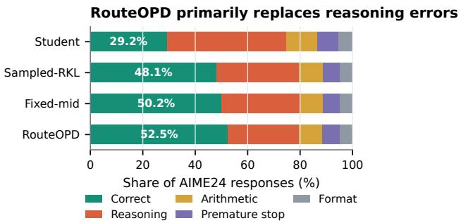  
Figure 7: AIME24 response composition. RouteOPD gains primarily replace reasoning errors, not formatting or trunca- tion failures.

480 matched responses, RouteOPD converts 42 sampled- RKL failures to correct solutions while losing 21 previously correct solutions; against fixed-mid routing, the correspond- ing counts are 27 and 16. Of the 42 sampled-RKL failures repaired by RouteOPD, 34 are reasoning errors, compared with five arithmetic errors, two premature stops, and one formatting error. Format validity remains 95.21%, while the clipping rate decreases from 4.47% to 2.34%. Two methodblinded passes of a fixed LLM judge reach 92.4% raw agree-ment and Cohen’s $\kappa = 0 . 8 6 4$ . These results show that recov- ered reasoning is the dominant behavioral change, accompa- nied by stable format validity and a lower clipping rate.

## 5 Conclusion

Sampled OPD leaves redistributed probability mass with- out an explicit destination. RouteOPD resolves this am- biguity through teacher-guided transport from student- excess sources to teacher-deficit destinations, using cycle- consistent targets and demand-adaptive magnitudes. Across four teacher–student settings and four reasoning benchmarks, RouteOPD consistently outperforms sampled reverse-KL OPD, full-vocabulary reverse KL, and fixed-mid routing. Controlled diagnostics attribute these gains to more faithful routing with less leakage, while sparse routing retains nearly full-vocabulary accuracy at substantially lower cost.

## References

Agarwal, R.; Vieillard, N.; Zhou, Y.; Stanczyk, P.; Ramos, S.; Geist, M.; and Bachem, O. 2024. On-Policy Distillation of Language Models: Learning from Self-Generated Mistakes. In International Conference on Learning Representations.

AI-MO. 2024a. AIME 2024. https://huggingface.co/ datasets/AI-MO/aimo-validation-aime.

AI-MO. 2024b. AMC 2023. https://huggingface.co/datasets/ AI-MO/aimo-validation-amc.

Akhondzadeh, M. S.; Lingam, V.; Tejaswi, A.; Ekbote, C.; Sanghavi, S.; and Bojchevski, A. 2026. Reward-Gated On-Policy Distillation. arXiv preprint arXiv:2607.04037.

Bengio, S.; Vinyals, O.; Jaitly, N.; and Shazeer, N. 2015. Scheduled Sampling for Sequence Prediction with Recur-

rent Neural Networks. In Advances in Neural Information Processing Systems (NeurIPS).

ByteDance Seed; and Tsinghua University SIA. 2025. DAPO-Math-17K. Hugging Face dataset.

Cai, Y.; Cao, D.; Lin, L.; Luo, C.; Xu, X.; Yang, K.; Liu, W.; Yang, S.; Zhao, T.; Sun, G.; Liu, G.; and Fang, J. 2026. Learning to Foresee: Unveiling the Unlocking Eficiency of On-Policy Distillation. arXiv preprint arXiv:2605.11739.

Gu, Y.; Dong, L.; Wei, F.; and Huang, M. 2024. MiniLLM: Knowledge Distillation of Large Language Models. In International Conference on Learning Representations.

Hendrycks, D.; Burns, C.; Kadavath, S.; Arora, A.; Basart, S.; Tang, E.; Song, D.; and Steinhardt, J. 2021. Measuring Mathematical Problem Solving With the MATH Dataset. In Advances in Neural Information Processing Systems.

Hinton, G.; Vinyals, O.; and Dean, J. 2015. Distill- ing the Knowledge in a Neural Network. arXiv preprint arXiv:1503.02531.

Hou, W.; Peng, S.; Wang, W.; Ruan, Z.; Zhang, Y.; Zhou, Z.;Gao, M.; Chen, Y.; Wang, K.; Yang, H.; Zhang, C.; Tian, Z.;Hu, H.; Yang, Y.; Wu, F.; and Fan, H. 2026. Uni-OPD: Uni-fying On-Policy Distillation with a Dual-Perspective Recipe.arXiv preprint arXiv:2605.03677.

Jang, I.; Yeom, J.; Yeo, J.; Lim, H.; and Kim, T. 2026. Stable On-Policy Distillation through Adaptive Target Reformula- tion. arXiv preprint arXiv:2601.07155.

Kim, Y.; and Rush, A. M. 2016. Sequence-Level Knowledge Distillation. In Proceedings of the 2016 Conference on Empirical Methods in Natural Language Processing (EMNLP), 1317–1327.

Li, Y.; Zuo, Y.; He, B.; Zhang, J.; Xiao, C.; Qian, C.; Yu, T.; Gao, H.-a.; Yang, W.; Liu, Z.; and Ding, N. 2026. Re- thinking On-Policy Distillation of Large Language Models: Phenomenology, Mechanism, and Recipe. arXiv preprint arXiv:2604.13016.

Lightman, H.; Kosaraju, V.; Burda, Y.; Edwards, H.; Baker, B.; Lee, T.; Leike, J.; Schulman, J.; Sutskever, I.; and Cobbe, K. 2024. Let’s Verify Step by Step. In International Conference on Learning Representations.

OpenAI. 2023. MATH-500. Test split released with the Process Reward Model 800K dataset.

OpenCompass. 2025. AIME 2025. https://huggingface.co/ datasets/opencompass/AIME2025.

Ross, S.; Gordon, G.; and Bagnell, D. 2011. A Reduction of Imitation Learning and Structured Prediction to No-Regret Online Learning. In Proceedings of the Fourteenth International Conference on Artificial Intelligence and Statistics (AISTATS), 627–635.

Sriraman, V.; Liu, P.; Hsu, D.; and Block, A. 2026. Be- havior Cloning Is Not All You Need: The Optimality of On-Policy Distillation for Noisy Expert Feedback. arXiv preprint arXiv:2606.30923.

Team, Q. 2025. Qwen3 Technical Report. arXiv:2505.09388.

Wang, J.; Ouyang, X.; Chen, Z.; Hu, Y.; Pan, Z.; Li, X.;and Guo, L.-Z. 2026. TRACE: Distilling Where It Matters

via Token-Routed Self On-Policy Alignment. arXiv preprint arXiv:2605.10194.

Xia, T.; Xu, M.; Hu, L.; Sun, Y.; Li, W.; Shang, L.; Liu, L.; Shu, P.; Yu, H.; and Jiang, J. 2026. Search-P1: Path- Centric Reward Shaping for Stable and Eficient Agentic RAG Training. arXiv preprint arXiv:2602.22576.

Xiao, J.; Han, Z.; Sun, Y.; Lu, Z.; Liu, Y.; Yao, Z.; Chen, W.; Gu, Q.; and Cai, X. 2026. Finding the Evidence: Discov-ering Decision-Supporting Tokens for On-Policy Reasoning Distillation. arXiv preprint arXiv:2606.22830.

Xie, Y.; Zhu, S.; Wen, T.; Chen, B.; and Wang, Y. 2026a. On the Position Bias of On-Policy Distillation. arXiv preprint arXiv:2606.22600.

Xie, Z.; Zhang, L. L.; Xie, Z.; and Yang, M. 2026b. Trust Region Policy Distillation. arXiv preprint arXiv:2607.04751.

Xu, Y.; Sang, H.; Zhou, Z.; He, R.; and Wang, Z. 2026a. PACED: Distillation and On-Policy Self-Distillation at the Frontier of Student Competence. arXiv preprint arXiv:2603.11178.

Xu, Y.; Sang, H.; Zhou, Z.; He, R.; Wang, Z.; and Geramifard, A. 2026b. TIP: Token Importance in On-Policy Distillation. arXiv preprint arXiv:2604.14084.

Yang, W.; Liu, W.; Xie, R.; Yang, K.; Yang, S.; and Lin, Y. 2026. Learning beyond Teacher: Generalized On-Policy Distillation with Reward Extrapolation. arXiv preprint arXiv:2602.12125.

Yu, G.; Liu, W.; Hu, Y.; Ma, H.-X.; Jiang, J.-P.; and Ye, H.-J. 2026. Dense Supervision, Sparse Updates: On the Spar- sity and Geometry of On-Policy Distillation. arXiv preprint arXiv:2606.13657.

Yu, Q.; Zhang, Z.; Zhu, R.; Yuan, Y.; Zuo, X.; Yue, Y.; et al. 2025. DAPO: An Open-Source LLM Reinforcement Learning System at Scale. arXiv preprint arXiv:2503.14476.

Zhang, H.; Gai, J.; Kim, J.; Liu, B.; and Risteski, A. 2026. When Does Online Imitation Learning Help in LLM Post- Training? The Role of (Non-)Realizability Beyond Horizon. arXiv preprint arXiv:2606.30445.

Zhao, A.; Tong, J.; Fan, Y.; Nie, P.; Li, W.; and Shen, X. 2026a. PowerOPD: Stabilizing On-Policy Distilla- tion with Bounded Power Transformation. arXiv preprint arXiv:2606.17199.

Zhao, Q.; Song, H.; Tian, S.; Shao, J.; and Li, X. 2026b. Prefix-Guided On-Policy Distillation: Mining Golden Tra jectories from Rollouts. arXiv preprint arXiv:2606.21994.

Zhou, Y.; Zheng, K.; Li, H.; Peng, D.; Xu, C.; and Chen, J. 2026. TurnOPD: Making On-Policy Distillation Turn-Aware for Eficient Long-Horizon Agent Training. arXiv preprint arXiv:2607.05804.

Zhu, S.; Ye, X.; Lu, H.; Shi, W.; and Liu, G. 2026. The Many Faces of On-Policy Distillation: Pitfalls, Mechanisms, and Fixes. arXiv preprint arXiv:2605.11182.

## A Proofs and Additional Method Details A.1 Scalar OPD Redistribution

Proposition 1 (Implicit redistribution under sampled OPD). Fix a visited state $s _ { t }$ and suppose the learner is evaluated at the behavior policy, $\pi _ { \theta } = \pi _ { \mathrm { o l d } }$ . Ifthe sampled action $a _ { t }$ has detached advantage $A _ { t } ( a _ { t } ) < 0 ,$ , then the negative gradient ofthe sampled-RKL loss is

$$
- \nabla _ { z } \ell _ { \mathrm { s O P D } } ^ { ( t ) } = | A _ { t } ( a _ { t } ) | \left[ \pi _ { \mathrm { o l d } } - \mathbf { e } _ { a _ { t } } \right] .
$$

Consequently, its source-logit component is negative and every non-source component is positive. Their components sum to zero.

Proof. Let z be the learner logits at one visited state and abbreviate $\pi = \pi _ { \boldsymbol { \theta } } ( \cdot \mid s _ { t } )$ . The log-softmax identity gives

$$
\begin{array} { c } { { \displaystyle \log \pi ( a ) = z _ { a } - \log \sum _ { v } \exp ( z _ { v } ) , } } \\ { { \nabla _ { z } \log \pi ( a ) = \mathbf { e } _ { a } - \pi , } } \end{array}\tag{16}
$$

where $\mathbf { e } _ { a }$ is the one-hot vector for token a. At the start of an update, $\pi _ { \theta } = \pi _ { \mathrm { o l d } }$ and $\rho _ { t } = 1$ . Substituting Eq. (16) into the sampled-RKL surrogate yields Eq. (2). A direct descent step for $A _ { t } ( a _ { t } ) < 0$ lowers the sampled source component in proportion to $1 - \pi _ { \mathrm { o l d } } ( a _ { t } \mid s _ { t } )$ and raises each non-source component v $\neq a _ { t }$ in proportion to $\pi _ { \mathrm { o l d } } ( v \mid s _ { t } )$ . Ratio clip- ping can limit the step magnitude, but it does not change this single-action score direction. □

## A.2 Coupling Identities and Monte Carlo Estimator

Proposition 2 (Exact marginals, maximum entropy, and unbiased estimation). Let pS and pT be probability distributions on the samefinite support Ut, and let $e _ { t } , d _ { t } , M _ { t } , q _ { t } ^ { - } , q _ { t } ^ { + }$ be defined as in Eqs. $( 6 ) \mathrm { - } ( 7 )$ . Then $\begin{array} { r } { M _ { t } = \frac { 1 } { 2 } \| p _ { S } - p _ { T } \| _ { 1 } . { \cal I } f } \end{array}$ ${ M } _ { t } \ > \ 0 ,$ , the product coupling $\Gamma _ { t } ( a , b ) = M _ { t } q _ { t } ^ { - } ( a ) q _ { t } ^ { + } ( b )$ has marginals $e _ { t }$ and $d _ { t }$ and, after division by $M _ { t } ,$ , is the maximum-entropy joint distribution with marginals $\left. q _ { t } ^ { - } \right.$ and $q _ { t } ^ { + }$ . For any finite pair cost $C _ { t } ,$ , the m-pair estimator in Eq. (19) is unbiased.

Proof. Because $\begin{array} { r } { \sum _ { v } ( p _ { S } ( v ) - p _ { T } ( v ) ) = 0 } \end{array}$ , the total positive and negative parts are equal. Therefore

$$
\begin{array} { l } { { \displaystyle \sum _ { v } [ p _ { S } ( v ) - p _ { T } ( v ) ] _ { + } = \sum _ { v } [ p _ { T } ( v ) - p _ { S } ( v ) ] _ { + } } } \\ { { { } } } \\ { { { } = { \frac { 1 } { 2 } } \displaystyle \sum _ { v } | p _ { S } ( v ) - p _ { T } ( v ) | = M _ { t } . } } \end{array}\tag{17}
$$

The product coupling in Eq. (7) is the maximum-entropy coupling ofthe fixed excess and deficit marginals. It preserves both sides exactly:

$$
\begin{array} { l } { \displaystyle \sum _ { b \in \mathcal { U } _ { t } } \Gamma _ { t } ( a , b ) = M _ { t } q _ { t } ^ { - } ( a ) = e _ { t } ( a ) , } \\ { \displaystyle \sum _ { a \in \mathcal { U } _ { t } } \Gamma _ { t } ( a , b ) = M _ { t } q _ { t } ^ { + } ( b ) = d _ { t } ( b ) . } \end{array}\tag{18}
$$

For any pair cost $C _ { t }$ and positive integer m, its coupling objective and sampled estimator are

$$
\begin{array} { r } { \displaystyle \sum _ { a , b } \Gamma _ { t } ( a , b ) C _ { t } ( a , b ) = M _ { t } \mathbb { E } _ { q _ { t } ^ { - } \times q _ { t } ^ { + } } [ C _ { t } ] , } \\ { \displaystyle \widehat { \mathcal { C } } _ { t } = \frac { M _ { t } } { m } \sum _ { i = 1 } ^ { m } C _ { t } ( a _ { i } , b _ { i } ) , } \end{array}\tag{19}
$$

where $a _ { i } \sim q _ { t } ^ { - }$ and $b _ { i } \sim q _ { t } ^ { + }$ independently. Hence $\mathbb { E } [ \widehat { \mathcal { C } } _ { t } ]$ equals the exact coupling objective without materializing the $k ^ { 2 }$ source–destination table.

For completeness, let $( A , B )$ have any normalized joint distribution with these marginals. Its entropy satisfies $H ( A , B ) = H ( A ) + H ( B ) - \overline { { I } } ( A ; B ) \leq H ( q _ { t } ^ { \perp } \overline { { ) } } + H ( q _ { t } ^ { + } )$ because mutual information is nonnegative. Equality holds for the independent joint $q _ { t } ^ { - } \times q _ { t } ^ { + }$ , proving the maximum- entropy claim. Final ${ \mathrm { l y } } ,$ linearity of expectation applied to the m independent costs yields

$$
\mathbb { E } \bigg [ \frac { M _ { t } } { m } \sum _ { i = 1 } ^ { m } C _ { t } ( a _ { i } , b _ { i } ) \bigg ] = M _ { t } \mathbb { E } _ { q _ { t } ^ { - } \times q _ { t } ^ { + } } [ C _ { t } ] ,
$$

which proves unbiasedness.

## A.3 Direct-Logit versus Probability Locality

Proposition 3 (Direct-logit locality of a routed update). For any distinct vocabulary items a and b under a softmax policy,

$$
\nabla _ { z } [ \log \pi _ { \theta } ( b \mid s _ { t } ) - \log \pi _ { \theta } ( a \mid s _ { t } ) ] = \mathbf { e } _ { b } - \mathbf { e } _ { a } .
$$

Thus the pairwise objective has no direct gradient on unrelated logits. Nevertheless, an infinitesimal direct-logit step can change unrelatedprobabilities through softmax normalization.

Proof. Since log $\textstyle \pi _ { \theta } ( v \mid s _ { t } ) = z _ { v } - \log \sum _ { i } e ^ { z _ { j } }$ , subtracting the two log-probabilities cancels the log-partition term and leaves $z _ { b } - z _ { a }$ . Diferentiation gives ${ \mathbf { e } } _ { b } - { \mathbf { e } } _ { a }$

Equation (9) characterizes direct-logit locality. For an infinitesimal direct-logit step $d z = \eta ( \mathbf { e } _ { b } - \mathbf { e } _ { a } )$ and any v $\not \in \{ a , b \}$ , the softmax diferential is

$$
\begin{array} { c } { { d \pi ( v ) = \pi ( v ) \left( d z _ { v } - \displaystyle \sum _ { j } \pi ( j ) d z _ { j } \right) } } \\ { { = - \eta \pi ( v ) \left( \pi ( b ) - \pi ( a ) \right) . } } \end{array}\tag{20}
$$

Thus normalization can change unrelated probabilities even when their logits receive no direct displacement. A shared- parameter optimizer step can additionally move their logits. □

## A.4 Target Positivity, Boundedness, and Integrability

Proposition 4 (Valid and jointly integrable routed targets). Let a be a student-excess token and b a teacher-deficit token. For $B _ { t } ~ > ~ 0$ , the shared-potential target in $E q .$ (13) satisfies $0 \leq \widehat { D } _ { t } ( a , b ) < B _ { t }$ . It is strictly positive unless probability-floor saturation makes the relevant teacher and student log-potentials equal. Moreover, every routed edge target is jointly integrable: a single token potential realizes all pairwise targets simultaneously.

Proof. Before bounding, the teacher-implied pairwise target is

$$
D _ { t } ^ { \star } ( a , b ) = g _ { t } ( b ) - g _ { t } ( a ) .\tag{21}
$$

For an excess source and deficit destination, $p _ { S } ( a ) > p _ { T } ( a )$ and $p _ { T } ( b ) > p _ { S } ( b )$ . Since $\ell _ { \delta _ { p } }$ is nondecreasing,

$$
\begin{array} { r l } & { D _ { t } ^ { \star } ( a , b ) = \ell _ { \delta _ { p } } ( p _ { T } ( b ) ) - \ell _ { \delta _ { p } } ( p _ { S } ( b ) ) } \\ & { \qquad + \ell _ { \delta _ { p } } ( p _ { S } ( a ) ) - \ell _ { \delta _ { p } } ( p _ { T } ( a ) ) \geq 0 . } \end{array}\tag{22}
$$

The inequality is strict unless probability-floor saturation collapses both ordered comparisons. The bounded map in Eq. (13) is locally the identity because $\phi _ { B } ^ { \prime } ( 0 ) = 1$ and saturates token potentials in $\left( - B / 2 , B / 2 \right)$ . Consequently $\widehat { D } _ { t } ( a , b ) \in [ 0 , B _ { t } )$ for every excess-to-deficit route.

Define $h _ { t } ( v ) = \phi _ { B _ { t } } ( g _ { t } ( v ) )$ . Every target is $h _ { t } ( b ) - h _ { t } ( a )$ so the direct shift $z _ { v } \gets z _ { v } + h _ { t } ( v )$ changes every pairwise log-odds by exactly $\widehat { D } _ { t } ( a , b )$ . This proves joint integrability.

Independent edge clipping does not share this guarantee. For example, take two sources and two destinations with potentials $g ( a _ { 1 } ) = - 2 B , g ( a _ { 2 } ) = - 0 . 4 B , g ( b _ { 1 } ) = 0 . 4 B ,$ and $g ( b _ { 2 } ) = 2 \dot { B } .$ . Clipping each positive diference at B gives $D _ { 1 1 } = D _ { 1 2 } = D _ { 2 2 } = B$ and $D _ { 2 1 } = 0 . 8 B$ . These violate the necessary four-cycle identity $D _ { 1 1 } + D _ { 2 2 } = D _ { 1 2 } + D _ { 2 1 } ,$ because $2 B \ne 1 . 8 B ;$ hence no shared token potential realizes all four clipped targets. □

Teacher-demand concentration controls $B _ { t }$ as described in Eq. (12); Section C evaluates this design against fixed and reversed-concentration budgets.

## A.5 Implementation and Numerical Conventions

A response state is valid exactly when it is a generated, un- padded response position, its teacher/behavior-student scores are finite and token-aligned, and Ut is nonempty:

$$
\mu _ { t } = \mathcal { k } \{ \mathrm { r e s p o n s e ~ s t a t e ~ } t \mathrm { ~ i s ~ v a l i d } \} .\tag{23}
$$

The probability floor $\delta _ { p } .$ , mismatch skip tolerance $\delta _ { M }$ , di- agnostic denominator tolerance $\delta _ { \mathrm { d i a g } } ,$ , and substantive target threshold $\delta _ { \mathrm { t a r g e t } }$ have distinct roles and are never reused for one another.

At scoring time, each model retains its top-k IDs and cross-gathers detached log-probabilities at the other model’s IDs; the deduplicated values define $\mathcal { U } _ { t } , p _ { S } , p _ { T } .$ . During the learner update, diferentiable current log-probabilities are gathered only at sampled pair IDs. Vocabulary-wide scoring and top-k extraction are excluded from the incremental route-overhead count. After those operations, the overhead is $O ( k + m )$ per valid token: O(k) for detached routing statistics and ${ \dot { O } } ( m )$ for pair sampling and learner gathers. The method reuses already scored teacher logits and introduces no extra teacher forward pass.

The defaults are $k \ = \ 3 2 , \ m \ = \ 2 , \ B _ { \mathrm { m i n } } \ = \ \log { 1 . 2 } ,$ $B _ { \mathrm { m a x } } ~ = ~ \log 1 . 5 , ~ \kappa ~ = ~ 1 . 0 , ~ \delta _ { p } ~ = ~ 1 0 ^ { - 8 } , ~ \delta _ { M } ~ = ~ \bar { 1 } 0 ^ { - 6 }$ $\delta _ { \mathrm { d i a g } } ~ = ~ 1 0 ^ { - 1 2 }$ , and $\delta _ { \mathrm { t a r g e t } } = 0 . 0 1$ log-odds. All routing statistics are detached per update, and invalid response po- sitions receive zero loss. Independent edge clipping is used only as an ablation.

## B Full Experimental Protocol

## B.1 Teacher–Student Settings and Tokenizer Compatibility

We evaluate the four teacher–student pairs in Table 2. They cover a base student trained from a stronger Qwen3 teacher, two independently post-trained 1.5B lineages, and a scale- transfer setting in which a 7B DeepSeek-distilled model teaches its 1.5B counterpart. Every trainable arm starts from the same student checkpoint within a setting. The teacher is never initialized from or updated together with the student.

Compatibility checks. Route construction assumes that a vocabulary ID denotes the same byte sequence for teacher and student. Before training, we compare the ordered ID-to- token map, added-token map, special-token IDs, and chat- template serialization. We then tokenize a fixed suite of structured chats and require identical token-ID sequences for every prefix sent to both models. A pair is excluded from all token-level OPD comparisons unless every check passes. Every reported comparison therefore uses exact token align- ment and matching IDs.

## B.2 Training Data, Budgets, and Optimization

All trainable methods use the same ordered DAPO-Math- 17K prompt stream (Yu et al. 2025; ByteDance Seed and Tsinghua University SIA 2025), rollout seeds, response mask, valid-token budget, number of optimizer steps, and check- point schedule. Each prompt produces four student responses with temperature 1.0, top-p = 1.0, and at most 16,384 new tokens. The teacher is scored once at every student-visited state. Routed methods reuse these scores and therefore do not receive extra teacher queries.

The learner uses AdamW with learning rate $1 0 ^ { - 6 }$ , betas (0.9, 0.999), weight decay 0.01, global gradient clipping at 1.0, and a cosine schedule with 3% warmup for one learner epoch. Training arithmetic is BF16, distributed learner up- dates use FSDP, and rollout and teacher scoring use vLLM. The routed defaults are $k = 3 2 , m = 2 , B _ { \mathrm { m i n } } = \log 1 . 2 .$ $B _ { \mathrm { m a x } } = \log 1 . 5 , \kappa = 1 , \delta _ { p } = 1 0 ^ { - 8 }$ , and $\delta _ { M } = 1 0 ^ { - 6 }$ . Only the named ablations change these values.

Compute and randomness. Every training run uses 24 NVIDIA H20 GPUs. We use a lobal random seed of 42 for prompt ordering, rollout decoding, route-pair sampling, and learner-side stochastic operations.

Fairness after policy divergence. Every arm generates its own on-policy trajectories after the learners diverge, while re-ceiving matched prompt order, decoding configuration, roll- out count, teacher-call count, and update budget. Sampled- RKL, full-vocabulary KL, fixed-mid routing, and adaptive RouteOPD therefore difer only in the supervision applied at the states visited by their own current policies.

## B.3 Evaluation and Uncertainty

We evaluate MATH500 (Hendrycks et al. 2021; Lightman et al. 2024; OpenAI 2023), AMC23 (AI-MO 2024b), AIME24 (AI-MO 2024a), and AIME25 (OpenCompass 2025) using temperature 0.7, $\begin{array} { l c l } { \displaystyle \mathrm { t o p } - p } & { = } & { 0 . 9 5 } \end{array}$ , and at most 16,384 generated tokens. For benchmark problems $\{ ( x _ { i } , y _ { i } ) \} _ { i = 1 } ^ { N }$ , Avg@16 is

Table 2: Teacher–student settings. Token-level comparisons are run onl for pairs with identical ordered vocabular IDs and compatible serialized prefixes.
<table><tr><td>Teacher</td><td>Student</td><td>Purpose</td></tr><tr><td>Qwen3-4B-Base-GRPO</td><td>Qwen3-1.7B-Base</td><td>Post-trained teacher to base student</td></tr><tr><td>JustRL-DeepSeek-1.5B</td><td>DeepSeek-R1-Distill-Qwen-1.5B</td><td>Matched-size DeepSeek lineage</td></tr><tr><td>JustRL-Nemotron-1.5B</td><td>OpenMath-Nemotron-1.5B</td><td>Strong matched-size Nemotron lineage</td></tr><tr><td>DeepSeek-R1-Distill-Qwen-7B</td><td>DeepSeek-R1-Distill-Qwen-1.5B</td><td>Cross-scale distillation</td></tr></table>

$$
\mathrm { A v g @ 1 6 } = \frac { 1 0 0 } { N } \sum _ { i = 1 } ^ { N } \frac { 1 } { 1 6 } \sum _ { j = 1 } ^ { 1 6 } \mathcal { H } \{ \widehat { y } _ { i j } = y _ { i } \} .\tag{24}
$$

Each problem therefore receives equal weight, and its 16 de- coded responses are averaged before aggregation. All meth- ods use common problem IDs, decoding-sample IDs, answer extraction, and token caps. Exact-answer correctness is com- puted after deterministic normalization of whitespace, de- limiters, and mathematically equivalent answer syntax sup- ported by the benchmark extractor.

Paired confidence intervals. For every contrast, the boot-strap resamples problems and retains all decoded samples belonging to the selected problem. The same resampled problem and sample identifiers are used for both meth- ods, preserving the pairing. We report percentile 95% in- tervals over these paired replicates. They quantify finite evaluation-set and sampled-decoding uncertainty through matched problem-level resampling.

Checkpoint and contamination controls. All scheduled checkpoints are evaluated with the same protocol; the end- point in Table 1 is not selected independently for each benchmark. We check training–evaluation overlap using ex- act hashes of raw and normalized problems followed by high- overlap token and character n-gram screening. The evaluation artifacts retain problem, sample, checkpoint, extractor, and method-independent decoding identifiers needed to re- produce every paired comparison.

## C Complete Efectiveness Results

## C.1 Per-Setting and Per-Benchmark Results

Table 3 reports paired improvements for each teacher–student setting. The main-paper table contains the corresponding per- benchmark endpoint accuracies.

Setting-wise interpretation. All twelve lower confidence bounds in Table 3 are positive. Against sampled-RKL, the gain ranges from +2.19 to +3.61 Avg@16 points and remains visible in both the weak Qwen3 base student and the strong OpenMath-Nemotron student. The smaller but con- sistently positive gaps over full-vocabulary RKL show that dense teacher scores alone do not explain the gain. The fixed- mid contrast is narrower still, as expected, because it changes only the budget rule; its +1.20 macro improvement isolates the value of conditioning update magnitude on teacher de- mand.

## C.2 Checkpoint Selection and Performance Trajectories

Figure 8 uses matched optimizer-step coordinates to compare external accuracy, teacher–student mismatch, routing fidelity, and full-vocabulary background leakage.

Adaptive RouteOPD improves AIME24/25 Avg@16 from 27.19 at initialization to 43.65 at the final checkpoint. Its teacher–student mismatch mass falls from 18.72 to 4.51, while fixed-mid routing ends at 6.94 and sampled-RKL at 13.89. Routing fidelity rises from 78.2% to 90.4% as fullvocabulary leakage falls from 25.6% to 13.8%. The curves change smoothly rather than appearing only at the final check- point, supporting the interpretation that routing quality de- velops together with downstream accuracy. Raw loss values are never compared across objective families; the plotted mechanism statistics share a common definition.

## D Complete Ablation Studies

## D.1 Destination Identity

To isolate destination identity, all controls retain the original source, teacher-derived target magnitude, coupling weight, and nominal loss scale. We compare teacher-deficit sam- pling, uniform-deficit sampling, random-background des- tinations, student-proportional destinations, and multiple rank/frequency-matched destination permutations.

## D.2 Source, Destination, and Pairwise Objectives

We compare the complete pairwise update against source- only and destination-only log-probability updates, with and without mismatch-mass weighting. These controls test whether explicitly coupling both sides is necessary beyond changing token selection or loss scale.

## D.3 Integrable Targets and Independent Edge Clipping

We compare targets derived from one bounded token poten- tial against independently clipped edge targets using cycle- consistency violations, target MAE, bounded completion, and overshoot.

## D.4 Adaptive Transport Budget

We compare the demand-conditioned budget against fixed $\begin{array} { r } { B \stackrel { \cdot } { \in } \{ \log 1 . 2 , \log 1 . 3 5 , \log 1 . 5 \} } \end{array}$ and a reversed- concentration control. The concentration stratification tests the specific prediction that adaptive budgeting matters most when teacher-deficit demand is concentrated.

Table 3: Paired Avg@16 improvements and 95% evaluation intervals. Intervals use matched problem and sample identifiers.
<table><tr><td>Teacher-student setting</td><td>vs. sampled-RKL</td><td>vs. full-vocabulary RKL</td><td>vs. fixed-mid</td></tr><tr><td>Qwen3-4B-GRPO → Qwen3-1.7B</td><td>+2.35 [1.65, 3.05]</td><td>+1.44 [0.78, 2.10]</td><td>+1.42 [0.81, 2.03]</td></tr><tr><td>JustRL-DeepSeek-1.5B → DeepSeek-1.5B</td><td>+2.19 [1.42, 2.96]</td><td>+1.13 [0.46, 1.80]</td><td>+1.10 [0.49, 1.71]</td></tr><tr><td>JustRL-Nemotron-1.5B → OpenMath-Nemotron-1.5B</td><td>+3.61 [2.78, 4.44]</td><td>+1.21 [0.55, 1.87]</td><td>+1.10 [0.48, 1.72]</td></tr><tr><td>DeepSeek-7B → DeepSeek-1.5B</td><td>+2.65 [1.90, 3.40]</td><td>+1.18 [0.51, 1.85]</td><td>+1.19 [0.57, 1.81]</td></tr><tr><td>Macro</td><td>+2.70 [2.28, 3.13]</td><td>+1.24 [0.90, 1.58]</td><td>+1.20 [0.89, 1.51]</td></tr></table>

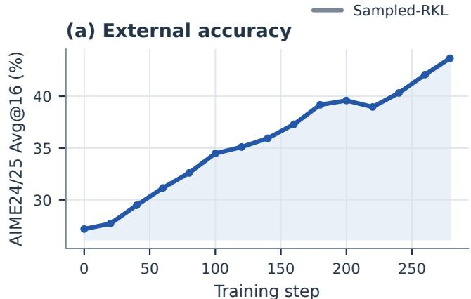  
(c) Routing fidelity

Fixed-mid RouteOPD (b) Teacher–student mismatch  
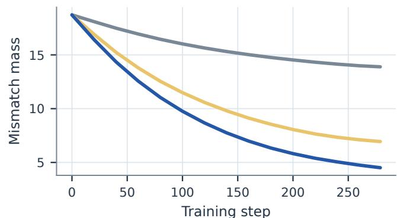  
(d) Full-vocabulary leakage

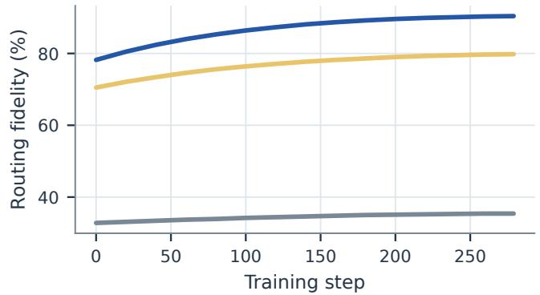

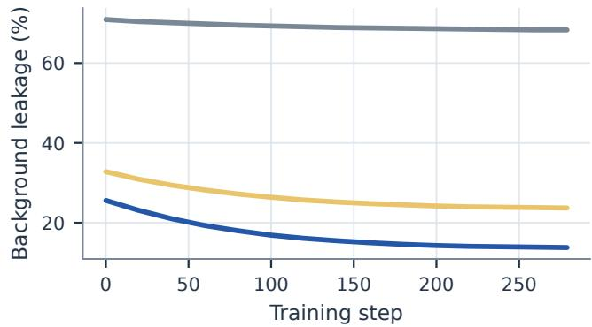  
Figure 8: Full training trajectories. AIME24/25 Avg@16 for adaptive RouteOPD is shown together with mismatch mass, routing fidelity, and full-vocabulary background leakage for the three compared objectives.

Destination identity. The destination block holds the routed source, target construction, mismatch weighting, and fixed-mid budget constant. Teacher-deficit coupling reaches 64.43, compared with 63.72 for the rank/frequency-matched permutation and 62.72 for random background destinations. Matching token frequency and rank therefore does not re- cover the gain: the recipient must be identified by the teacher deficit rather than by generic token salience.

Two-sided correction. Source-only and destination-only updates reach 63.55 and 63.84, respectively. Pairing both sides reaches 64.43 with the shared fixed-mid construction. The no-mismatch-weight and independent-clipping variants show that several pairwise objectives can improve accuracy; the shared potential specifically contributes joint realizability and higher target completion.

Budget rule. Fixed-low, fixed-mid, and fixed-high budgets cluster between 64.12 and 64.43, whereas reversing the concentration rule falls to 63.88. Adaptive concentration reaches 65.53. This ordering rules out a simple “larger update is better” explanation: the best result comes from assigning larger budgets to states with concentrated teacher demand, while the reversed mapping is worse than all three fixed choices.

Joint target realization. Independent edge clipping creates 27.6% four-cycle violations because separately truncated edges need not correspond to diferences of one token po- tential. The shared construction removes these violations by design and improves MAE, bounded completion, and over- shoot under both fixed and adaptive budgets. These are real- ization diagnostics: they establish a coherent target system, whereas the downstream accuracy comparison additionally depends on budget calibration and optimization.

Table 4: Complete matched causal ablations on JustRL–DeepSeek. Each block varies one design family; Avg. is the fourbenchmark mean.
<table><tr><td>Family</td><td>Variant</td><td>MATH500</td><td>AMC23</td><td>AIME24</td><td>AIME25</td><td> $\operatorname { A v g } .$ </td></tr><tr><td rowspan="6">Destination</td><td>Random background</td><td>86.21</td><td>84.64</td><td>46.88</td><td>33.13</td><td>62.72</td></tr><tr><td>Student-proportional</td><td>86.55</td><td>85.09</td><td>47.29</td><td>33.33</td><td>63.07</td></tr><tr><td>Rank/frequency-matched</td><td>87.03</td><td>85.77</td><td>49.17</td><td>32.92</td><td>63.72</td></tr><tr><td>Uniform teacher deficit</td><td>87.18</td><td>86.07</td><td>49.79</td><td>33.54</td><td>64.15</td></tr><tr><td>Teacher-deficit coupling</td><td>87.31</td><td>86.45</td><td>50.21</td><td>33.75</td><td>64.43</td></tr><tr><td>Source-only</td><td>86.89</td><td>85.62</td><td>48.54</td><td>33.13</td><td>63.55</td></tr><tr><td rowspan="6">Objective</td><td>Destination-only</td><td>87.03</td><td>85.84</td><td>49.17</td><td>33.33</td><td>63.84</td></tr><tr><td>Pairwise, no mismatch weight</td><td>87.43</td><td>86.22</td><td>50.42</td><td>34.17</td><td>64.56</td></tr><tr><td>Pairwise, independent clipping</td><td>87.53</td><td>86.37</td><td>50.83</td><td>34.58</td><td>64.83</td></tr><tr><td>Shared potential, fixed-mid</td><td>87.31</td><td>86.45</td><td>50.21</td><td>33.75</td><td>64.43</td></tr><tr><td>Shared potential, adaptive</td><td>88.08</td><td>86.75</td><td>52.50</td><td>34.79</td><td>65.53</td></tr><tr><td></td><td></td><td></td><td></td><td></td><td></td></tr><tr><td rowspan="5">Budget</td><td>Fixed-low, log 1.2</td><td>87.16</td><td>85.99</td><td>49.58</td><td>33.75</td><td>64.12</td></tr><tr><td>Fixed-mid, log 1.35</td><td>87.31</td><td>86.45</td><td>50.21</td><td>33.75</td><td>64.43</td></tr><tr><td>Fixed-high, log 1.5</td><td>87.20</td><td>86.22</td><td>49.79</td><td>33.75</td><td>64.24</td></tr><tr><td>Reversed concentration</td><td>86.98</td><td>85.84</td><td>49.17</td><td>33.54</td><td>63.88</td></tr><tr><td>Adaptive concentration</td><td>88.08</td><td>86.75</td><td>52.50</td><td>34.79</td><td>65.53</td></tr></table>

Table 5: Target realization and budget calibration. (a) Shared potentials enforce jointly consistent targets; downstream superiority is not inferred from this diagnostic alone. (b) The adaptive advantage grows with teacher-deficit concentration.

(a) Target realization
<table><tr><td>Target</td><td>Cycle viol.</td><td>MAE</td><td>Completion</td><td>Overshoot</td></tr><tr><td>Independent clipping</td><td>27.6</td><td>.091</td><td>76.4</td><td>25.8</td></tr><tr><td>Shared, fixed-mid</td><td>0.0</td><td>.067</td><td>83.2</td><td>18.7</td></tr><tr><td>Shared, adaptive</td><td>0.0</td><td>.052</td><td>88.1</td><td>13.4</td></tr></table>

(b) Demand-concentration strata
<table><tr><td>Concentration</td><td>States</td><td>Budget</td><td>Adaptive</td><td>∆ vs. fixed</td></tr><tr><td>[0, .25)</td><td>248</td><td>.196</td><td>64.21</td><td>-0.10</td></tr><tr><td>[.25, .50)</td><td>271</td><td>.235</td><td>64.82</td><td>+0.40</td></tr><tr><td>[.50, .75)</td><td>286</td><td>.279</td><td>65.76</td><td>+1.30</td></tr><tr><td>[.75, 1]</td><td>219</td><td>.326</td><td>67.18</td><td>+2.70</td></tr></table>

When adaptive budgeting helps. The right half of Table 5 directly tests the motivation for $B _ { t }$ . Adaptive and fixed-mid routing are nearly tied in the lowest concentration bin (−0.10 points), but the adaptive advantage grows to +0.40, +1.30, and +2.70 as teacher demand becomes more concentrated. The efect therefore appears where the design predicts rather than uniformly across all states.

## D.5 Sparse Union and Monte Carlo Pair Sensitivity

Table 6 reports the evaluated k and m sweeps. The $k =$ $3 2 , m = 2$ default is the best measured trade-of: increasing support improves diagnostic fidelity but yields little addi- tional accuracy, whereas increasing the number of sampled pairs lowers route-loss variance without monotonically im- proving downstream performance.

Support size. Increasing k improves routing fidelity and lowers leakage because more of the teacher and student tails are represented. Accuracy, however, saturates at $k = 3 2 \colon$ k = 64 and full-vocabulary routing change Avg@16 by only −0.15 and +0.08 points while increasing cost. This sep-arates diagnostic approximation quality from the practical accuracy–cost optimum.

Pair sampling. The m sweep is deliberately reported with both route-loss variance and target coverage. Increasing m monotonically lowers estimator variance and raises coverage, yet downstream accuracy peaks at $m = 2 .$ . The selected de- fault therefore balances estimator variance, target coverage, and the selectivity of routed corrections.

## E Mechanism Diagnostics

## E.1 Fixed-State Probe Bank

The controlled bank contains 1,024 response states obtained from fixed prompts, prefixes, and response positions. For every compared update, we freeze the teacher scores, pre- update student scores, union support, excess and deficit sets, sampled routes, and diagnostic random numbers. Each method therefore acts on the same local categorical problems. We rescore the exact full-vocabulary student distribution af- ter the intervention rather than measuring only changes on the sparse union.

Let $\pi _ { t } ^ { \mathrm { p r e } }$ and $\pi _ { t } ^ { \mathrm { p o s t } }$ denote the exact student distributions before and after the controlled update, and let $\Delta p _ { t } ( v ) =$ $\pi _ { t } ^ { \mathrm { p o s t } } ( v ) - \pi _ { t } ^ { \mathrm { p r e } } ( v )$ . The excess and deficit sets

$$
\begin{array} { r } { \mathcal { E } _ { t } = \{ v : p _ { S } ( v ) > p _ { T } ( v ) \} , } \\ { \mathcal { D } _ { t } = \{ v : p _ { T } ( v ) > p _ { S } ( v ) \} } \end{array}\tag{25}
$$

are frozen from the pre-update scores. Source-mass reduction

Table 6: Sparse-support and pair-sampling sweeps on JustRL–DeepSeek. All accuracy values are four-benchmark Avg@16.  
(a) Support size
<table><tr><td colspan="3"></td><td rowspan="2">Leakage</td></tr><tr><td>Support</td><td>Avg@16</td><td>Fidelity</td></tr><tr><td> $k = 1 6$ </td><td>64.29</td><td>84.2</td><td>19.7</td></tr><tr><td> $k = 3 2$ </td><td>65.53</td><td>90.4</td><td>13.8</td></tr><tr><td> $k = 6 4$ </td><td>65.38</td><td>92.3</td><td>11.2</td></tr><tr><td>Full vocabulary</td><td>65.61</td><td>93.1</td><td>10.4</td></tr></table>

and teacher-deficit gain are

$$
R _ { t } ^ { \mathrm { s r c } } = \sum _ { v \in \mathcal { E } _ { t } } [ - \Delta p _ { t } ( v ) ] _ { + } , \qquad G _ { t } ^ { \mathrm { d s t } } = \sum _ { v \in \mathcal { D } _ { t } } [ \Delta p _ { t } ( v ) ] _ { + } .\tag{26}
$$

For states with $R _ { t } ^ { \mathrm { s r c } } > 0 ,$ , routing fidelity is

$$
F _ { t } = \frac { \operatorname* { m i n } \{ R _ { t } ^ { \mathrm { s r c } } , G _ { t } ^ { \mathrm { d s t } } \} } { R _ { t } ^ { \mathrm { s r c } } } .\tag{27}
$$

It asks whether probability removed from excess sources is accompanied by probability gain on teacher-deficit destina- tions. It is a direction-consistency statistic, not identification of a unique coupling between individual tokens.

We compute background leakage on the full vocabulary. With $\mathcal { D } _ { t } ^ { \nu } \overset { \cdot } { = } \{ v : \pi _ { T } ( v \mid s _ { t } ) > \pi _ { t } ^ { \mathrm { p r e } } ( v ) \}$

$$
L _ { t } ^ { \nu } = \frac { \sum _ { \boldsymbol { v } \notin \mathcal { D } _ { t } ^ { \nu } } [ \Delta p _ { t } ( \boldsymbol { v } ) ] _ { + } } { \sum _ { \boldsymbol { v } } [ \Delta p _ { t } ( \boldsymbol { v } ) ] _ { + } + \delta _ { \mathrm { d i a g } } } .\tag{28}
$$

This quantity counts positive probability change assigned outside the teacher-deficit set. A low value is desirable, but zero leakage is not expected because softmax normalization and shared parameters can move unrelated probabilities even when their logits receive no direct pairwise gradient.

## E.2 Direct-Logit and Optimizer-Step Interventions

We use a ladder of increasingly realistic interventions. The pair-isolated exact probe changes only the two logits in one sampled pair and realizes that pair target exactly. The potential-wide exact probe applies the shared token potential to the complete union and therefore realizes every inte- grable pair target at a state simultaneously. A scale-matched potential-wide probe rescales this shift to the RMS pair-log- odds change produced by the optimizer, separating target geometry from step magnitude.

Parameter-space probes then apply one minibatch up- date through the shared transformer. Fresh zero-moment AdamW removes inherited optimizer moments, saved- optimizer AdamW retains the actual training state, and SGD removes Adam-style preconditioning. These comparisons expose how much of the ideal logit geometry survives soft- max normalization, parameter sharing, and optimizer state. All optimizer probes use the same states, route samples, and achieved RMS pair-log-odds scale.

## E.3 Routing Fidelity, Leakage, and Target Realization

Table 7 reports routing-fidelity distributions, full-vocabulary background leakage, target MAE, and bounded comple- tion. Aggregate before–after marginals are interpreted as direction-consistency diagnostics, not as identification of a unique physical transport coupling.

(b) Sampled route pairs
<table><tr><td>m</td><td>Avg@16</td><td>Loss variance</td><td>Coverage</td></tr><tr><td>1</td><td>63.78</td><td>.184</td><td>58.4</td></tr><tr><td>2</td><td>65.53</td><td>.109</td><td>76.8</td></tr><tr><td>4</td><td>62.48</td><td>.064</td><td>89.2</td></tr><tr><td>8</td><td>61.12</td><td>.037</td><td>96.1</td></tr></table>

Distributional evidence. The mean improvement is not carried by a small set of favorable states. Adaptive RouteOPD has 92.7% median fidelity and 76.5% fidelity at the tenth percentile, whereas sampled-RKL has 33.1% median fidelity and the matched permutation has 21.7%. Median leakage falls from 70.1% for sampled-RKL to 11.2% for RouteOPD. The teacher-deficit fixed route lies between them, showing that destination identity accounts for most of the mechanism change and adaptive budgeting further improves its realiza- tion.

From ideal logits to the trained optimizer. Exact pairisolated and potential-wide probes achieve 100% target com-pletion with near-zero leakage, confirming the algebraic con- struction. Scale matching reduces completion to 92.6%, and fresh AdamW reaches 88.1%. Retaining saved optimizer state lowers it further to 85.4%, while SGD reaches 90.2%. Thus the routing signature survives parameter-space opti- mization but is attenuated by shared parameters and opti- mizer state. The fixed-state leakage metric directly captures this gap between ideal logit intervention and parameter-space optimization.

The mismatch trend supports the transport interpretation: states with more disagreement provide more source mass and clearer measurable reduction. Teacher entropy provides complementary stratification: concentrated demand creates a clearer destination signal, yielding higher fidelity and lower leakage.

## F Training Dynamics and Stability

Figure 8 shows external accuracy for adaptive RouteOPD and compares mismatch mass, routing fidelity, and full- vocabulary background leakage across sampled-RKL, fixed- mid routing, and adaptive RouteOPD. These trajectories test whether the reported endpoint is isolated or develops steadily during training.

Stability interpretation. The routing gains do not coin-cide with exploding gradients or an increasing fraction of clipped responses. Gradient norms converge to similar values for all three methods. Adaptive RouteOPD ends with shorter responses and a lower clip ratio than sampled-RKL, while the fraction of tokens eligible for routed updates increases from 84.1% at initialization to 93.4%. Policy entropy moves toward the teacher endpoint (1.310) rather than increasing as under sampled-RKL. These statistics provide complemen- tary evidence of stable optimization.

Table 7: Fixed-state mechanism probes. (a) Distribution summaries use the 1,024-state bank. (b) Direct-logit references separate exact target geometry from the efects of shared parameters and optimizer state.  
(a) Per-state routing diagnostics
<table><tr><td>Method</td><td>Fid. mean</td><td>Fid. P10</td><td>Fid. median</td><td>Leak. median</td></tr><tr><td>Sampled-RKL</td><td>35.4</td><td>10.4</td><td>33.1</td><td>70.1</td></tr><tr><td>Matched permutation</td><td>24.2</td><td>4.8</td><td>21.7</td><td>81.2</td></tr><tr><td>Teacher-deficit, fixed</td><td>79.8</td><td>58.2</td><td>82.4</td><td>21.4</td></tr><tr><td>RouteOPD</td><td>90.4</td><td>76.5</td><td>92.7</td><td>11.2</td></tr></table>

(b) Direct-logit and optimizer probes
<table><tr><td>Probe</td><td>Fidelity</td><td>Leakage</td><td>MAE</td><td>Completion</td></tr><tr><td>Pair-isolated exact</td><td>96.8</td><td>5.2</td><td>.000</td><td>100.0</td></tr><tr><td>Potential-wide exact</td><td>98.4</td><td>3.1</td><td>.000</td><td>100.0</td></tr><tr><td>Potential-wide matched</td><td>95.1</td><td>6.7</td><td>.031</td><td>92.6</td></tr><tr><td>Fresh AdamW</td><td>90.4</td><td>13.8</td><td>.052</td><td>88.1</td></tr><tr><td>Saved AdamW</td><td>87.9</td><td>16.7</td><td>.061</td><td>85.4</td></tr><tr><td>SGD</td><td>92.1</td><td>11.6</td><td>.047</td><td>90.2</td></tr></table>

Table 8: Mechanism stratification on the fixed probe bank. Higher mismatch creates a stronger transport signal, whereas high teacher entropy makes the destination less specific and therefore more dificult to realize.

(a) Teacher–student mismatch quartile
<table><tr><td>Quartile</td><td>Fidelity</td><td>Leakage</td><td>Deficit reduction</td><td>Completion</td></tr><tr><td>Q1</td><td>86.2</td><td>17.8</td><td>0.62</td><td>84.1</td></tr><tr><td>Q2</td><td>89.1</td><td>15.2</td><td>0.97</td><td>87.6</td></tr><tr><td>Q3</td><td>91.8</td><td>12.9</td><td>1.43</td><td>89.4</td></tr><tr><td>Q4</td><td>94.5</td><td>9.3</td><td>2.46</td><td>91.3</td></tr></table>

(b) Teacher-entropy quartile
<table><tr><td>Quartile</td><td>Entropy</td><td>Fidelity</td><td>Leakage</td><td>Deficit reduction</td></tr><tr><td>Q1</td><td>0.42</td><td>94.1</td><td>8.7</td><td>1.58</td></tr><tr><td>Q2</td><td>0.87</td><td>92.3</td><td>11.2</td><td>1.47</td></tr><tr><td>Q3</td><td>1.39</td><td>89.6</td><td>14.8</td><td>1.32</td></tr><tr><td>Q4</td><td>2.18</td><td>85.6</td><td>20.5</td><td>1.11</td></tr></table>

Table 9: Final-checkpoint optimization and generation diagnostics on JustRL–DeepSeek. Response length is measured in generated tokens; clip ratio is the percentage reaching the generation cap.
<table><tr><td>Method</td><td>Policy entropy</td><td>Mean length</td><td>Clip ratio (%)</td><td>Gradient norm</td><td>Valid routed tokens (%)</td></tr><tr><td>Sampled-RKL</td><td>1.632</td><td>1410</td><td>4.47</td><td>0.437</td><td></td></tr><tr><td>Fixed-mid routing</td><td>1.464</td><td>1320</td><td>2.96</td><td>0.414</td><td>92.4</td></tr><tr><td>RouteOPD</td><td>1.384</td><td>1265</td><td>2.34</td><td>0.427</td><td>93.4</td></tr></table>

## G Eficiency and Memory

Figure 6 reports the measured end-to-end overhead and peak memory on identical hardware for the support-size sweep. Table 6 gives its corresponding accuracy values and the sep- arate pair-sampling sweep.

Cost interpretation. The default k = 32, m = 2 configuration adds 2.5% end-to-end time and 2.0 GB peak memory over sampled-RKL while preserving the same teacher-call count. Full-vocabulary routing costs 12.5% end-to-end and 9.4 GB additional memory for only 0.08 more Avg@16 points. Within the sparse family, top-k extraction dominates the route-construction cost as k grows, whereas pair gather grows with m. These measurements explain why $k = 3 2 , m = 2$ is the observed Pareto knee under the con- trolled hardware used for every comparison.

## H Behavioral and Error Analysis

## H.1 Paired Correctness Transitions

We align responses by benchmark problem and decoding- sample identifier. Table 12 separates cases that both methods solve from directional changes in correctness. The net im- provements are not produced solely by unpaired aggregate counts: against sampled-RKL, RouteOPD repairs 42 failures while losing 21 previously correct responses; against fixed- mid routing, the corresponding counts are 27 and 16.

## H.2 Error Taxonomy and Annotation

The analysis covers 1,920 AIME24 responses: 480 responses from each of the untrained student, sampled-RKL, fixed-mid routing, and adaptive RouteOPD. Every response receives exactly one label from {correct, reasoning, arithmetic, premature-stop, format}. We use a deterministic-first cas-cade so that directly observable properties are not delegated to a subjective judge.

Deterministic stages. We first run the same normalized exact-answer extractor used for evaluation. Correct responses are removed from error classification. Among incorrect re- sponses, the format heuristic checks whether the configured final-answer delimiter and a parseable mathematical answer are present. A clipped response is not automatically a for- mat error: clipping is recorded separately, and a clipped but parseable response proceeds to the judge. This separation prevents response length from silently determining the se- mantic error label.

LLM-judge stages. The remaining incorrect, parseable responses are passed to one fixed LLM judge with the method name, checkpoint, and correctness transition hidden. The judge receives only the problem, reference answer, model response, and extracted answer, and identifies the first decisive error. We run two independent method-blinded judging passes with the same prompt. Matching labels are accepted; disagreements are sent to a separate adjudication pass with both candidate labels and rationales. Across all 1,920 re- sponses, the two passes have 92.4% raw agreement and Cohen’s κ = 0.864; 146 responses require adjudication.

Table 10: End-to-end and learner-only cost on identical hardware. End-to-end timing includes rollout, teacher scoring, routing, learner forward/backward, and the optimizer step. Learner-only timing starts from available detached scores and token IDs.
<table><tr><td>Method</td><td>E2E s/step</td><td>Learner s/step</td><td>Tokens/s</td><td>Peak GB</td><td>Teacher calls</td><td>Relative E2E</td></tr><tr><td>Sampled-RKL</td><td>184.6</td><td>31.8</td><td>22850</td><td>64.2</td><td>1.00</td><td>1.000×</td></tr><tr><td>Full-vocabulary FKL</td><td>199.4</td><td>44.7</td><td>21160</td><td>71.8</td><td>1.00</td><td>1.080×</td></tr><tr><td>Full-vocabulary RKL</td><td>201.2</td><td>46.1</td><td>20980</td><td>72.4</td><td>1.00</td><td>1.090×</td></tr><tr><td> $\mathrm { R o u t e O P D } , k = 1 6 , m = 2$ </td><td>187.3</td><td>34.1</td><td>22510</td><td>65.0</td><td>1.00</td><td>1.015×</td></tr><tr><td> $\mathrm { R o u t e O P D } , k = 3 2 , m = 1$ </td><td>188.1</td><td>34.8</td><td>22380</td><td>65.6</td><td>1.00</td><td>1.019×</td></tr><tr><td> $\mathrm { R o u t e O P D } , k = 3 2 , m = 2$ </td><td>189.2</td><td>35.9</td><td>22240</td><td>66.2</td><td>1.00</td><td>1.025×</td></tr><tr><td> $\mathrm { R o u t e O P D } , k = 3 2 , m = 4$ </td><td>191.0</td><td>37.7</td><td>22030</td><td>66.8</td><td>1.00</td><td>1.035×</td></tr><tr><td> $\mathrm { R o u t e O P D } , k = 3 2 , m = 8$ </td><td>194.7</td><td>41.5</td><td>21620</td><td>68.0</td><td>1.00</td><td>1.055×</td></tr><tr><td> $\mathrm { R o u t e O P D } , k = 6 4 , m = 2$ </td><td>192.8</td><td>39.4</td><td>21790</td><td>67.9</td><td>1.00</td><td>1.044×</td></tr><tr><td>RouteOPD, full vocabulary</td><td>207.6</td><td>54.2</td><td>20250</td><td>75.6</td><td>1.00</td><td>1.125×</td></tr></table>

Table 11: Route-construction breakdown. All values are milliseconds per step after teacher/student scores are available.
<table><tr><td></td><td>k m</td><td>Top-k</td><td>Routing</td><td>Pair gather</td></tr><tr><td>16</td><td>2</td><td>8.4</td><td>3.1</td><td>1.6</td></tr><tr><td>32</td><td>1</td><td>12.9</td><td>3.8</td><td>1.2</td></tr><tr><td>32</td><td>2</td><td>12.9</td><td>4.2</td><td>1.8</td></tr><tr><td>32</td><td>4</td><td>12.9</td><td>5.1</td><td>3.0</td></tr><tr><td>32</td><td>8</td><td>12.9</td><td>6.8</td><td>5.4</td></tr><tr><td>64</td><td>2</td><td>24.7</td><td>6.9</td><td>2.4</td></tr></table>

Table 12: Paired AIME24 correctness transitions. Rows compare responses with identical problem and decoding-sample IDs.
<table><tr><td>Pair</td><td></td><td></td><td>Both correct Base only RouteOPD only Both wrong</td><td></td></tr><tr><td>Sampled-RKL vs. RouteOPD</td><td>210</td><td>21</td><td>42</td><td>207</td></tr><tr><td>Fixed-mid vs. RouteOPD</td><td>225</td><td>16</td><td>27</td><td>212</td></tr></table>

Table 13: Error taxonomy and assignment rule. Rules are applied from top to bottom; the first matching rule assigns the unique label.
<table><tr><td>Label</td><td>Assigned by</td><td>Operational definition</td></tr><tr><td>CORRECT</td><td>Exact-answer heuristic</td><td>The normalized extracted answer is equivalent to the reference answer under the benchmark extractor.</td></tr><tr><td>FORMAT</td><td>Deterministic heuristic</td><td>The response is incorrect and no answer can be extracted because the required final-answer delimiter or parseable answer expression is missing or malformed. Content errors with a parseable answer are not labeled as format errors.</td></tr><tr><td>ARITHMETIC</td><td>LLM judge</td><td>The solution strategy and mathematical reasoning are otherwise valid, but the first decisive mistake is a local numerical, algebraic, sign, or simplification error.</td></tr><tr><td>PREMATURE-STOP</td><td>LLM judge</td><td>The response ends before completing the necessary derivation or gives a final answer without enough continuation to establish it. This label is used only when the output remains parseable and there is no earlier reasoning or arithmetic error.</td></tr><tr><td>REASONING</td><td>LLM judge</td><td>The first decisive mistake is conceptual or logical: an invalid inference, wrong theorem or case, contradictory assumption, unjustified transformation, or funda- mentally incorrect solution path.</td></tr></table>

Boundary cases and precedence. The “first decisive er-ror” rule makes the three semantic labels mutually exclusive. A local calculation error is labeled arithmetic only when the preceding strategy remains valid; if the calculation fol- lows from an invalid setup, the earlier setup determines a reasoning label. A short response is premature-stop only when it ends before a necessary step and contains no ear- lier decisive error. Merely concise but complete reasoning is not premature. Finally, an incorrect but extractable an- swer is never a format error, even if its prose or notation is unconventional. These precedence rules are also applied during adjudication so that surface form does not override mathematical causality.

## H.3 Error Distributions and Transitions

The dominant change is a reduction in reasoning errors: RouteOPD has 130, compared with 151 for sampled-RKL and 142 for fixed-mid routing. Arithmetic, premature-stop, and format counts remain similar. The aggregate distribution therefore agrees with the paired transition analysis rather than reflecting a broad relabeling of all failure types.

Against sampled-RKL, reasoning repairs contribute 34 of the 42 wrong-to-correct transitions, whereas 15 of the 21 re- gressions become reasoning errors. The resulting net change is therefore concentrated in mathematical reasoning rather than formatting. The fixed-mid comparison shows the same pattern at smaller scale.

## H.4 Length, Formatting, and Route-Level Cases

RouteOPD combines stable format validity with a lower clip- ping rate than the OPD baselines, supporting the reasoning- error transitions observed above.

Table 17: Representative route-level records. The records connect bounded target log-odds changes to their achieved updates.
<table><tr><td>Case</td><td>Route  $( t : a \to b )$ </td><td> $p _ { S } ( a ) / p _ { T } ( a )$ </td><td> $\Delta \ell _ { \mathrm { t a r g e t } } / \Delta \ell _ { \mathrm { a c h i e v e d } }$ </td></tr><tr><td>184</td><td> $3 2 7 : 2 8 4  3 6 2$ </td><td>.184/.061</td><td>.298/.284</td></tr><tr><td>271</td><td> $5 1 4 : 1 7  9 1 2$ </td><td>.226/.083</td><td>.276/.251</td></tr><tr><td>419</td><td> $6 8 8 : 6 7 2  1 3 5$ </td><td> $. 0 9 7 / . 0 4 1$ </td><td>.241/.109</td></tr></table>

These records illustrate the local object optimized by RouteOPD: a student-excess source is paired with a teacher- deficit destination, and the achieved pairwise log-odds change is measured directly against its bounded target. The aggregate fidelity and paired-correctness analyses summa- rize this behavior across the complete evaluation set.

System: You are a careful judge of mathematical solutions. Identify the first error that causes the final answer to be wrong. Judge   
only the response content; do not infer which model or method produced it.   
User:   
Problem: {problem}   
Reference answer: {reference\_answer}   
Model response: {response}   
Extracted answer: {extracted\_answer}   
Choose exactl one label:   
reasoning\_error: the first decisive error is conceptual or logical, including a wrong method, invalid inference, or unjustified   
transformation.   
arithmetic\_error: the approach is otherwise correct and the first decisive error is a local calculation, algebra, sign, or simplifi   
cation mistake.   
premature\_stop: the response stops before completing the required reasoning, with no earlier reasoning or arithmetic error.   
Return only JSON in the form {"label": "<one label>", "rationale": "<one short sentence>"}.  
Figure 9: LLM-judge prompt for semantic error classification. Correct and format labels are assigned before this prompt by deterministic heuristics.

Table 14: AIME24 response-level error distribution. Counts sum to 480 responses for every method.
<table><tr><td>Method</td><td>Correct</td><td>Reasoning</td><td>Arithmetic</td><td>Premature stop</td><td>Format</td><td>Total</td></tr><tr><td>Student</td><td>140</td><td>218</td><td>58</td><td>39</td><td>25</td><td>480</td></tr><tr><td>Sampled-RKL</td><td>231</td><td>151</td><td>44</td><td>31</td><td>23</td><td>480</td></tr><tr><td>Fixed-mid routing</td><td>241</td><td>142</td><td>43</td><td>31</td><td>23</td><td>480</td></tr><tr><td>RouteOPD</td><td>252</td><td>130</td><td>43</td><td>32</td><td>23</td><td>480</td></tr></table>

Table 15: Paired error transitions into and out of correctness. Only transitions involving a correct response on one side are shown.
<table><tr><td>Transition</td><td>Sampled-RKL → RouteOPD</td><td>Fixed-mid → RouteOPD</td></tr><tr><td>Reasoning error → Correct</td><td>34</td><td>21</td></tr><tr><td>Arithmetic error → Correct</td><td>5</td><td>3</td></tr><tr><td>Premature stop → Correct</td><td>2</td><td>2</td></tr><tr><td>Format error → Correct</td><td>1</td><td>1</td></tr><tr><td>Correct → Reasoning error</td><td>15</td><td>11</td></tr><tr><td>Correct → Arithmetic error</td><td>3</td><td>2</td></tr><tr><td>Correct → Premature stop</td><td>2</td><td>2</td></tr><tr><td>Correct → Format error</td><td>1</td><td>1</td></tr></table>

Table 16: Response-length and deterministic formatting diagnostics. Lengths are generated tokens; clip ratio is the fraction reaching the generation cap.
<table><tr><td>Method</td><td>Mean</td><td>P25</td><td>Median</td><td>P75</td><td>P90</td><td>Clip ratio</td><td>Format valid</td></tr><tr><td>Student</td><td>1840</td><td>896</td><td>1532</td><td>2410</td><td>3726</td><td>3.12</td><td>94.79</td></tr><tr><td>Sampled-RKL</td><td>2146</td><td>1028</td><td>1814</td><td>2862</td><td>4310</td><td>4.47</td><td>95.21</td></tr><tr><td>Fixed-mid routing</td><td>2208</td><td>1065</td><td>1876</td><td>2924</td><td>4388</td><td>2.96</td><td>95.21</td></tr><tr><td>RouteOPD</td><td>2254</td><td>1098</td><td>1922</td><td>2981</td><td>4426</td><td>2.34</td><td>95.21</td></tr></table>