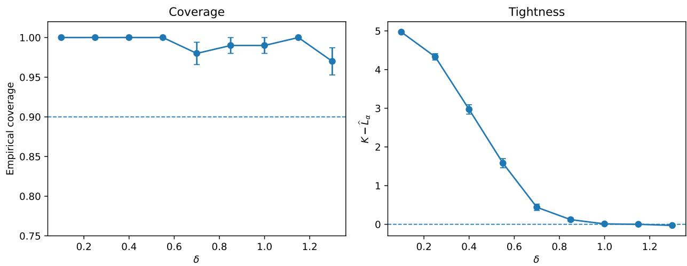
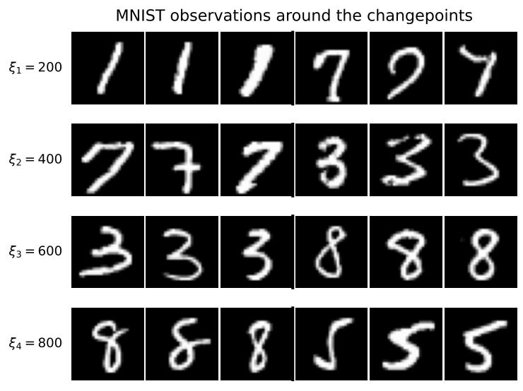
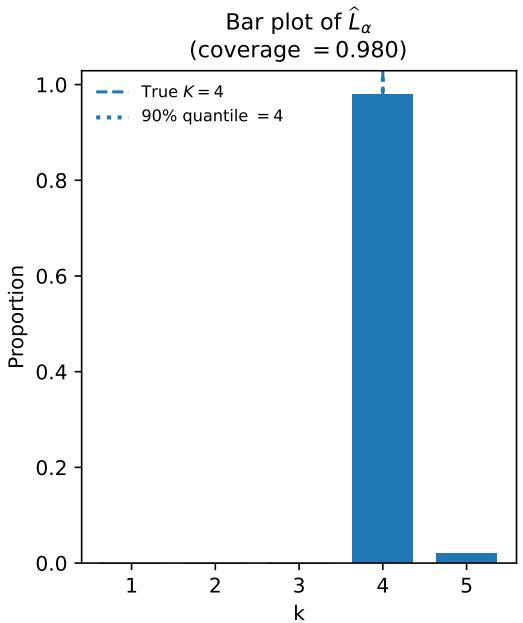
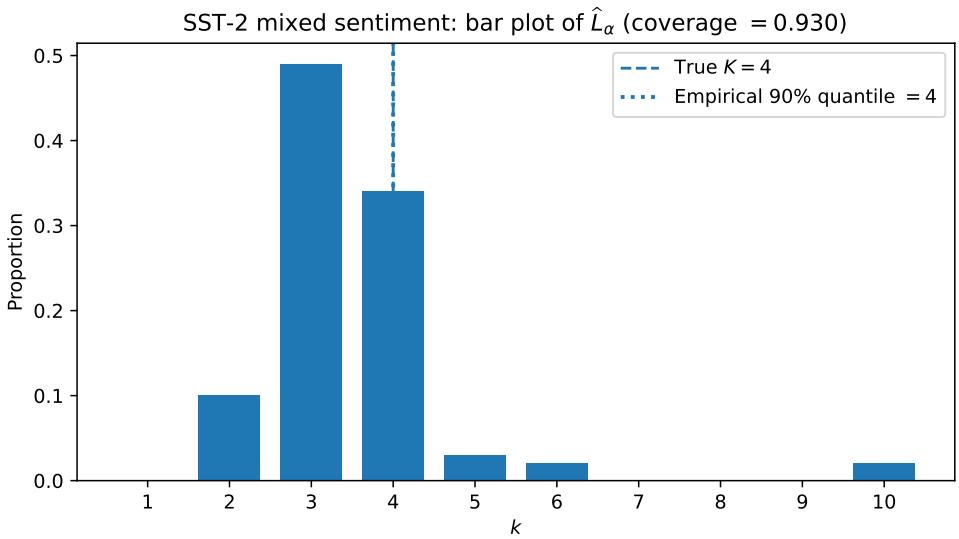

# Distribution-free inference on the number of changepoints

Rohan Hore∗ and Aaditya Ramdas

Department of Statistics, Stanford University

September 9, 2026

## Abstract

Suppose we are given an ordered sequence of independent data whose distribution changes K times at unknown locations, for some unknown K ≥ 0. In this paper, we study the problem of performing distribution-free inference on K. First, we show an impossibility result: any distribution-free upper confidence bound on K must be trivial and uninformative. Then, using conformal p-values, and under only the assumption that the data segments induced by the changepoints are exchangeable (within themselves) and mutually independent, we construct a finite-sample valid lower confidence bound on K, which we call the Conformal LOwer bound on Changepoint Count (CLOCC). We show that CLOCC is the only feasible way to provide a lower bound on K under the stated assumptions, a property we refer to as its universality. We provide practical guidelines for choosing score functions that yield eficient and tight lower bounds. We evaluate CLOCC in several synthetic and real-data experiments, where it provides informative lower bounds on K, demonstrating its practical applicability.

Keywords: Changepoint count, number of changepoints, conformal inference, conformal p-values, distribution-free inference.

## 1 Introduction

In this paper, we study the problem of distribution-free inference on the number of changepoints in an ordered data sequence. The changepoint count is an important modeling parameter. First, in real-world applications, both the number and locations of the changes are typically unknown. Therefore, estimating the full changepoint configuration can be statistically and computationally challenging. Knowledge of the changepoint count K considerably simplifies this problem, since one then only needs to identify the most appropriate (K + 1)-segmentation of the timeline. Second, K is itself a quantitative summary of the complexity of the underlying data-generating mechanism: larger values of K indicate that more distinct regimes are needed to explain the observed sequence.

Thus, reliable inference on K can directly inform appropriate modeling assumptions. Finally, in some applications (Zhao and Pan, 2025; Vagnoli and Remenyte-Prescott, 2018), an unexpectedly large changepoint count can be treated as an early indication of failure in the underlying system. Given this practical relevance of the changepoint count, we therefore aim to quantify uncertainty about K in a distribution-free and finite-sample valid manner, without imposing restrictive modeling assumptions or relying on large-sample approximations.

## 1.1 Problem setting

Suppose that for some $n \in \mathbb { N }$ , we observe a sequence of X-valued random variables $\mathbf { X } : = \left( X _ { 1 } , \ldots , X _ { n } \right)$ Likewise, we use $\mathbf { x } = ( x _ { 1 } , \ldots , x _ { n } )$ to denote a generic element of $\mathcal { X } ^ { n }$ . We assume that there exist $K \in \{ 0 , \ldots , n - 1 \}$ unknown changepoints (so that there is at least one changepoint) at locations $\xi _ { 0 } : = 0 < \xi _ { 1 } < \xi _ { 2 } < \dots < \xi _ { K } < n = : \xi _ { K + 1 }$ such that

$$
( X _ { \xi _ { k - 1 } + 1 } , \ldots , X _ { \xi _ { k } } ) \sim { \mathcal { P } } ^ { ( k ) } , \qquad { \mathrm { f o r ~ e a c h ~ } } k \in [ K + 1 ] .
$$

Throughout this paper, we write [k] to denote the collection $\{ 1 , \ldots , k \}$ for $k \in \mathbb { N } ,$ , and we write $\pmb { \xi } = ( \xi _ { 1 } , \dots , \xi _ { K } )$ for the vector of true changepoint locations. Here, K denotes the number of changepoints and is our target quantity, while for each $k \in [ K + 1 ] , \mathcal { P } ^ { ( k ) }$ , supported on $\chi \xi _ { k } { - } \xi _ { k - 1 }$ denotes the distribution of the kth segment. Here Throughout, we assume that each $\xi _ { k }$ is a genuine distributional change, in the sense that the two adjacent segments $( X _ { \xi _ { k - 1 } + 1 } , \dots , X _ { \xi _ { k } } )$ and $( X _ { \xi _ { k } + 1 } , \dots , X _ { \xi _ { k + 1 } } )$ cannot be merged into a single exchangeable segment. We write the corresponding joint distribution of X as $\begin{array} { r } { \mathcal { P } = \prod _ { k = 1 } ^ { K + 1 } \mathcal { P } ^ { ( k ) } } \end{array}$ . In line with the distribution-free perspective, we impose no structural assumptions on $\mathcal { P } ^ { ( 1 ) } , \ldots , \mathcal { P } ^ { ( K + 1 ) }$ beyond the following.

Assumption 1. For each $k \in [ K + 1 ]$ , the segment $( X _ { \xi _ { k - 1 } + 1 } , \dotsc , X _ { \xi _ { k } } )$ is exchangeable; that is, for any permutation $\pi : \{ \xi _ { k - 1 } + 1 , \ldots , \xi _ { k } \} \mapsto \{ \xi _ { k - 1 } + 1 , \ldots , \xi _ { k } \}$ ，

$$
( X _ { \xi _ { k - 1 } + 1 } , \dots , X _ { \xi _ { k } } ) \overset { d } { = } ( X _ { \pi ( \xi _ { k - 1 } + 1 ) } , \dots , X _ { \pi ( \xi _ { k } ) } ) .
$$

Also, if $K \geq 1$ , the segments $( X _ { \xi _ { k - 1 } + 1 } , \dots , X _ { \xi _ { k } } )$ are mutually independent across $k \in [ K + 1 ]$

Note that when $K = 0$ , this assumption simply states that the whole data sequence X is exchangeable. In general, for a simpler interpretation, one may consider the canonical setting, which we call the piecewise i.i.d. model, where observations within the kth segment are i.i.d. from some distribution $P _ { k }$ , with $P _ { k } \neq P _ { k + 1 }$ for $k \in [ K ]$

It is worth emphasizing that, apart from segmentwise exchangeability and mutual independence, we assume no further knowledge of the underlying distributions. In particular, we impose no additional structure on the observation space $\mathcal { X }$ or on the segmentwise distributions $\mathcal { P } ^ { ( 1 ) } , \ldots , \mathcal { P } ^ { ( K + 1 ) }$ and, more importantly, we do not know either the number of changepoints or their true locations. This distributional agnosticism presents the main challenge in drawing meaningful and statistically valid inference on K.

## 1.2 The goal

We seek lower and upper bounds on K with provable confidence guarantees. For each $K \in$ $\{ 1 , \ldots , n - 1 \}$ , let $\mathfrak { P } _ { K }$ denote the collection of joint distributions of X that satisfy Assumption 1 for some changepoint locations $0 < \xi _ { 1 } < \xi _ { 2 } < \cdot \cdot \cdot < \xi _ { K } < n$ . Similarly, ${ \mathfrak { P } } _ { 0 }$ be the collection of joint distributions of X such that X is exchangaeble.

Definition 1 (Distribution-free confidence bounds). For any $\alpha \in ( 0 , 1 )$ , a statistic ${ \hat { L } } _ { \alpha } : { \mathcal { X } } ^ { n } \times [ 0 , 1 ] \mapsto$ $\{ 0 , \ldots , n - 1 \}$ is said to form a distribution-free lower confidence bound (DF-LCB ) on K at level $1 - \alpha \ { \mathrm { i f } } .$ , for every $K \in \{ 0 , \ldots , n - 1 \}$ and every $P \in \mathfrak { P } _ { K }$ 2

$$
\begin{array} { r } { \mathbb { P } _ { ( \mathbf { X } , \zeta ) \sim P \times \operatorname { U n i f } [ 0 , 1 ] } \big ( K \geq \hat { L } _ { \alpha } ( \mathbf { X } , \zeta ) \big ) \geq 1 - \alpha . } \end{array}
$$

Similarly, a statistic $\hat { U } _ { \alpha } : \mathcal { X } ^ { n } \times [ 0 , 1 ] \mapsto \{ 0 , \dotsc , n - 1 \}$ is said to form a distribution-free upper confidence bound (DF-UCB ) on K at level $1 - \alpha \ { \mathrm { i f } } ,$ , for every $K \in \{ 0 , \ldots , n - 1 \}$ and every $P \in \mathfrak { P } _ { K }$ 2

$$
\begin{array} { r } { \mathbb { P } _ { ( \mathbf { X } , \zeta ) \sim P \times \operatorname { U n i f } [ 0 , 1 ] } \big ( K \leq \hat { U } _ { \alpha } ( \mathbf { X } , \zeta ) \big ) \geq 1 - \alpha . } \end{array}
$$

In these definitions, the statistics $\hat { L } _ { \alpha }$ and $\hat { U } _ { \alpha }$ are functions of the observed data X, together with a random seed $\zeta \sim \mathrm { U n i f } [ 0 , 1 ]$ that allows for internal randomization in their construction, if desired.

## 1.3 Related work

Retrospective changepoint analysis has a long history in statistics and signal processing; see Truong et al. (2020); Duggins (2010); Niu et al. (2016) for surveys. Broadly, one may distinguish three related problems. First, changepoint detection asks whether any distributional change is present. Second, when the number of changepoints is known, changepoint localization aims to estimate their locations. Third, when both the number and locations of the changepoints are unknown, they must be estimated jointly.

Changepoint detection methods. Changepoint detection is a classical and well-studied problem. CUSUM (Page, 1955) is one of the earliest procedures for detecting a single changepoint and has inspired a large subsequent literature. Modern methods also address multiple changepoints and often provide estimates of their locations; examples include ordered multiple-changepoint tests (Aly et al., 2003), kernel changepoint procedures (KCP) (Arlot et al., 2019), ChangeForest (Londschien et al., 2023), and graph-based methods (Chu and Chen, 2019). Separately, conformal martingale methods (Vovk et al., 2003; Volkhonskiy et al., 2017; Shin et al., 2023) provide powerful tools for online changepoint detection.

Segmentation-based approaches. A common strategy for multiple-changepoint problems is to partition the timeline into approximately homogeneous segments and estimate the corresponding segment boundaries. These methods either optimize a global segmentation criterion, or take a recursive approach by repeatedly isolating individual changes. Among them, wild binary segmentation (Fryzlewicz, 2014), and isolate-detect procedures (Anastasiou and Fryzlewicz, 2022) are particularly popular. For further examples, see Fang et al. (2020); Maidstone et al. (2017).

Parametric localization methods. A substantial literature studies changepoint estimation under parametric assumptions. Classical likelihood-based methods derive estimators and uncertainty quantification under specific models; see, for example, Kim and Siegmund (1989); Quandt (1958) for a single changepoint. In the multiple-changepoint setting, Bai and Perron (1998, 2003) developed estimation and testing procedures for multiple structural changes in linear models.

Resampling-based approaches. Bootstrap and related resampling methods (Pettitt, 1979; Ross and Adams, 2012) have also been used to quantify uncertainty in estimated changepoint locations. Cho and Kirch (2022) develop bootstrap intervals for multiple changepoints. These typically lack finite sample guarantees and are computationally intensive.

Changepoint count estimation. Yao (1988) proposed estimating the changepoint count using the Schwarz criterion. More generally, since the changepoint count determines the complexity of a segmentation, many approaches estimate it by optimizing a likelihood or contrast together with a complexity penalty (Lavielle, 2005; Killick et al., 2012; Harchaoui and Lévy-Leduc, 2010). These penalties are closely related to classical model-selection criteria such as AIC and BIC. Focusing specifically on the distribution-free objective of our work, conformal prediction, originally introduced by Vovk et al. (1999); Shafer and Vovk (2008), provides a general framework for distributionfree predictive inference.

Conformal approaches to changepoint localization. In the single-changepoint setting, Dandapanthula and Ramdas (2026) introduced MCP localization, while Hore and Ramdas (2026a) proposed CONCH, both of which construct confidence sets for the changepoint location with user-specified coverage. Building on CONCH, Hore and Ramdas (2026b) studied a multi-stream setting and introduced CROC, which constructs a confidence set for the stream exhibiting the earliest change, viewed as a proxy for the “root stream.” Yu et al. (2026) recently extended CONCH and CROC to settings with corrupted observations.

## 1.4 Our approach

We tackle the distribution-free inference on K in two parts: first, by investigating a DF-UCB on K, and then a DF-LCB .

Impossibility of DF-UCB : We first show that any valid DF-UCB on K must be trivial and non-informative, in the sense that a DF-UCB valid at confidence level 1 − α takes the maximum value n − 1 with probability at least 1 − α.

An eficient DF-LCB construction: We revisit the CONCH framework of Hore and Ramdas (2026a), which, in the setting K = 1, constructs a distribution-free confidence set for the single changepoint $\xi _ { 1 } ~ \in ~ [ n - 1 ]$ . We then adapt its conformal p-value construction to build a DF-LCB on the number of changepoints K. We call the resulting method Conformal LOwer bound on Changepoint Count (CLOCC), which enjoys two important guarantees:

1. Finite-sample validity. For any sample size n, any data-generating distribution P satisfying Assumption 1, and any user-specified confidence level $1 - \alpha \in ( 0 , 1 )$ , CLOCC lower bounds the true changepoint count K with probability at least $1 - \alpha$

2. Universality. CLOCC is universal for distribution-free lower confidence bounds on the changepoint count: any valid DF-LCB can be represented as an instance of the CLOCC framework through an appropriate choice of score function.

Beyond these guarantees, we develop several practical variants of CLOCC aimed at improving its practicality, and provide guidance for constructing informative CPP scores that can yield substantially tighter lower bounds in practice.

Organization of the paper. The rest of the paper is organized as follows. In Section 2, we prove the impossibility of a non-trivial DF-UCB construction. Then, in Section 3, we formally introduce the CLOCC algorithm, with its more practical variants presented in Section 4. Next, in Section 5, we provide practical and theoretical guidelines for constructing eficient CPP scores, and in Section 6, we introduce a computationally eficient construction of the CLOCC DF-LCB . Finally, in Section 7, we empirically evaluate the proposed DF-LCB in several synthetic and realdata experiments.

## 2 Non-trivial DF-UCB on K is impossible

Although the definitions of a DF-UCB and a DF-LCB look symmetric at first glance, they are fundamentally diferent. Put informally, when there is a substantial change along the observed data stream, one may be able to confidently detect such a change; a DF-LCB essentially answers how many such changes can be identified with confidence. In contrast, no matter how similar two adjacent data points may look, one cannot confidently assert that they arise from the same distribution without imposing further distributional structure. Thus, any valid DF-UCB must always be trivial in the following sense.

Theorem 1. Fix $\alpha ~ \in ~ ( 0 , 1 )$ and $n \in \mathbb { N }$ . Suppose X contains at least two points. Let $\hat { U } _ { \alpha }$ : $\mathcal { X } ^ { n } \times [ 0 , 1 ]  \{ 0 , \dotsc , n - 1 \}$ be a valid DF-UCB on the changepoint count K at level $1 - \alpha$ . Then, for every fixed $\mathbf { x } \in \mathcal { X } ^ { n }$

$$
\begin{array} { r } { \mathbb { P } \left( \hat { U } _ { \alpha } ( \mathbf { x } , \zeta ) = n - 1 \right) \geq 1 - \alpha , } \end{array}
$$

where the probability is taken over the randomness of $\zeta .$

The proof of this result is deferred to the appendix. On the other hand, building a non-trivial DF-LCB is quite possible. For instance, given n data points, split the sequence into approximately two halves, $( X _ { 1 } , \ldots , X _ { \lfloor n / 2 \rfloor } )$ and $\left( X _ { \lfloor n / 2 \rfloor + 1 } , \ldots , X _ { n } \right)$ . We can run a distribution-free algorithm to test exchangeability separately on each of these two segments, controlling the Type I error at level $\alpha / 2$ for each test. Then, the number of tests that result in a rejection gives a non-trivial lower bound on the changepoint count.

While this provides a valid DF-LCB , it is clearly ineficient, in the sense that it neither uses the Type I error budget eficiently nor yields a tight lower bound. In later sections, we therefore improve upon this naive idea and focus on constructing eficient DF-LCB on the changepoint count $K .$

## 3 Conformal lower bound on changepoint count

In this section, we construct a DF-LCB on K, building upon the Conformal Changepoint Localization (CONCH) algorithm introduced in Hore and Ramdas (2026a). When there is a single changepoint in the data stream, CONCH uses conformal $p -$ values to construct a distribution-free confidence set for its location. Before introducing our construction, we briefly review the key components and the underlying ideas of CONCH.

## 3.1 Background: CONCH

Suppose there is only a single changepoint $\xi \in [ n - 1 ]$ , that is, $\mathbf { X } \sim P$ for some $P \in { \mathfrak { P } } _ { 1 }$ . The goal of CONCH is to localize the changepoint $\xi$ by returning a distribution-free confidence set for $\xi .$ The CONCH framework is built upon two key components: (1) a changepoint plausibility score and (2) a split-permutation group.

Any mapping $S : \mathcal { X } ^ { n } \times [ n - 1 ] \to \mathbb { R }$ is called a changepoint plausibility score, where $S ( \mathbf { x } , t )$ quantifies the plausibility that t is the true changepoint location given a data sequence $\mathbf { x } \in \mathcal { X } ^ { n }$ ; a higher score indicates greater evidence that t is the true changepoint.

Next, for each candidate location $t \in [ n - 1 ]$ , they define the split-permutation group by

$$
\Pi _ { t } : = \left\{ \pi \in { \mathcal S } _ { n } : \pi ( [ t ] ) = [ t ] , \pi ( [ n ] \setminus [ t ] ) = [ n ] \setminus [ t ] \right\} ,
$$

i.e., the set of permutations that independently permute the indices to the left and right of $t ,$ without mixing them.

Given these two components, for each candidate changepoint index $t \ \in \ [ n \mathrm { ~ - ~ } 1 ]$ , CONCH constructs the p-value

$$
p _ { t } = \frac { 1 } { | \Pi _ { t } | } \sum _ { \pi \in \Pi _ { t } } \mathbb { 1 } \left\{ S ( \pi ( \mathbf { X } ) , t ) \leq S ( \mathbf { X } , t ) \right\} .
$$

The p-value $p _ { t }$ quantifies the evidence in X against the null hypothesis $\tilde { \mathcal { H } } _ { 0 , t } : \xi = t$ , which posits that t is the true changepoint location.

Under $\tilde { \mathcal { H } } _ { 0 , t }$ , the subsequence to the left of t is exchangeable, and similarly the subsequence to the right of t is exchangeable. Consequently, $p _ { t }$ is super-uniform. Finally, by inverting the tests for

$\tilde { \mathcal { H } } _ { 0 , t }$ over $t \in [ n - 1 ]$ , CONCH produces

$$
\mathcal { C } _ { n , 1 - \alpha } ^ { \mathrm { C O N C H } } : = \{ t \in [ n - 1 ] : p _ { t } > \alpha \}
$$

as a distribution-free confidence set for the true changepoint location $\xi .$

While CONCH provides a principled framework for localizing a single changepoint, inference on the number of changepoints presents two additional challenges. First, there may be multiple changepoints, and second, we do not know how many changepoints are present. In the following parts, we describe how to address both of these challenges.

## 3.2 CLOCC: a conformal framework for DF-LCB on K

We now introduce Conformal LOwer bound on Changepoint Count (CLOCC), which provides a valid DF-LCB on K. As mentioned earlier, we want to adapt CONCH to a setting that allows multiple changepoints, with the number of changepoints itself being unknown. Therefore, we begin by generalizing the two core components of CONCH as follows.

(1) ChangePoint Plausibility (CPP) score: For each $k \in [ n - 1 ]$ , let

$$
\mathcal T _ { k } : = \{ ( t _ { 1 } , \dots , t _ { k } ) : 1 \leq t _ { 1 } < \dots < t _ { k } \leq n - 1 \}
$$

denote the set of all possible (k + 1)-segmentations of the full timeline [n]. Additionally, we define $\mathcal { T } _ { 0 } : = \emptyset$ to indicate the case when there are no changepoints.

We write R¯ to denote the extended real, $\mathbb { R } \cup \{ \infty , - \infty \}$ , and call any mapping $S : \mathcal { X } ^ { n } \times \bigcup _ { k = 0 } ^ { n - 1 } \mathcal { T } _ { k } \to$ R¯ a changepoint plausibility score function. In principle, for $\mathbf { t } = ( t _ { 1 } , \ldots , t _ { k } ) \in { \mathcal { T } } _ { k }$ , the value $S ( \mathbf { x } , \mathbf { t } )$ quantifies the plausibility that t explains all the changepoint locations based on the observed data sequence x. Similarly, $S ( \mathbf { x } , \emptyset )$ quantifies the plausibility that there is no changepoint.

(2) Split-permutation group: For a fixed k-tuple $\mathbf { t } = ( t _ { 1 } , \dots , t _ { k } ) \in \mathcal { T } _ { k }$ , let us denote the induced $k + 1$ segments by

$$
\begin{array} { r } { I _ { 0 } = [ 1 , t _ { 1 } ] , \qquad I _ { \ell } = [ t _ { \ell } + 1 , t _ { \ell + 1 } ] \mathrm { ~ f o r ~ } \ell \in [ k - 1 ] , \qquad I _ { k } = [ t _ { k } + 1 , n ] . } \end{array}
$$

Let $\Pi _ { \mathbf { t } }$ denote the group of permutations of $[ n ]$ that independently permute within each segment $I _ { 0 } , I _ { 1 } , \ldots , I _ { k }$ , without mixing indices across these segments. Formally,

$\Pi _ { \mathbf { t } } = \{ \pi \in S _ { n }$ : for every $t \in [ n ] , \ t \in I _ { \ell }$ implies $\pi ( t ) \in I _ { \ell }$ for some $\ell \in \{ 0 , \ldots , k \} \}$

Further, for notational consistency, we write $\Pi _ { \emptyset }$ to denote the full permutation group $S _ { n }$

Given these two components, we can now follow the original CONCH construction. For each $k \in \{ 0 , 1 , \ldots , n - 1 \}$ and each $\mathbf { t } \in \mathcal { T } _ { k }$ , define the conformal p-value

$$
p _ { \mathbf { t } } : = \frac { 1 } { | \Pi _ { \mathbf { t } } | } \sum _ { \pi \in \Pi _ { \mathbf { t } } } \mathbb { 1 } \left\{ S ( \pi ( \mathbf { X } ) , \mathbf { t } ) \leq S ( \mathbf { X } , \mathbf { t } ) \right\} .\tag{3.1}
$$

For k $\in [ n - 1 ]$ and $\mathbf { t } \in \mathcal { T } _ { k }$ , let $\tilde { \mathcal { H } } _ { 0 , \mathbf { t } } : \pmb { \xi } = \mathbf { t }$ denote the null hypothesis that there is at least a change and t contains all the true changepoint locations. Then, $p _ { \mathbf { t } }$ quantifies the evidence in X against $\tilde { \mathcal { H } } _ { \mathrm { 0 , t } }$ . Under this null, each of the data segments induced by t is exchangeable, and these segments are mutually independent. Consequently, the permutation construction above yields a p-value.

Lemma 2. Fix $\mathbf { t } \in \cup _ { k = 1 } ^ { n - 1 } \mathcal { T } _ { k }$ and $\alpha \in ( 0 , 1 )$ . Under the null $\tilde { \mathcal { H } } _ { \mathrm { 0 , t } }$ , the p-value $p _ { \mathbf { t } }$ in (3.1) satisfies

$$
\mathbb { P } \left( p _ { \mathbf { t } } \leq \alpha \right) \leq \alpha .
$$

On the other hand, $\mathcal { \tilde { H } } _ { 0 , \emptyset }$ only posits that the whole data sequence X is exchangeable and there is no changepoint. Therefore, to test this null, we may simply define the conformal p-value

$$
p _ { \emptyset } : = \frac { 1 } { | \Pi _ { \emptyset } | } \sum _ { \pi \in \Pi _ { \emptyset } } \mathbb { 1 } \left\{ S ( \pi ( \mathbf { X } ) , \emptyset ) \leq S ( \mathbf { X } , \emptyset ) \right\} .\tag{3.2}
$$

By an analogous logic, $p _ { \emptyset }$ is a super-uniform random variable under $\mathcal { \tilde { H } } _ { 0 , \emptyset }$

Recall, however, that our objective is to draw inference on the number of changepoints $K$ . Recall that the hypothesis of interest is $\mathcal { H } _ { 0 , k } : K = k$ , which asserts that the true number of changepoints is exactly k. Since $\begin{array} { r } { \mathcal { H } _ { 0 , k } = \bigcup _ { \mathbf { t } \in \mathcal { T } _ { k } } \tilde { \mathcal { H } } _ { 0 , \mathbf { t } } } \end{array}$ for $k \in \{ 0 , \ldots , n - 1 \}$ , we define

$$
p _ { ( k ) } : = \operatorname* { m a x } _ { \mathbf { t } \in \mathcal { T } _ { k } } p _ { \mathbf { t } }\tag{3.3}
$$

as a p-value for $\mathcal { H } _ { 0 , k }$ , quantifying the evidence against the hypothesis that there are exactly k changepoints. Finally, we invert these tests to construct the following lower confidence bound for the changepoint count $K \colon$

$$
\hat { L } _ { \alpha } ^ { \mathrm { C L O C C } } ( \mathbf { X } ) : = \operatorname* { m i n } \left\{ k \in \left\{ 0 , 1 , \ldots , n - 1 \right\} : p _ { \left( k \right) } > \alpha \right\} .\tag{3.4}
$$

We note that if $K = n - 1$ , then all the corresponding segments are singletons, and hence $p _ { ( n - 1 ) } \equiv 1$ Consequently, the set $\{ k \in \{ 0 , \ldots , n - 1 \} : p _ { ( k ) } > \alpha \}$ is non-empty, and $\hat { L } _ { \alpha } ^ { \mathrm { C L O C C } } ( \mathbf { X } )$ is always welldefined. The procedure is formally summarized in Algorithm 1. The resulting $\hat { L } _ { \alpha } ^ { \mathrm { C L O C C } }$ is a valid DF-LCB on K, as we formally establish below.

Theorem 3 (Validity of CLOCC). Fix $k \in \{ 0 , \ldots , n - 1 \}$ and $\alpha \in ( 0 , 1 )$ . Under the null $\mathcal { H } _ { 0 , k }$ , the p-value $p _ { ( k ) }$ satisfies $\mathbb { P } ( p _ { ( k ) } \le \alpha ) \le \alpha$ . Consequently, $\hat { L } _ { \alpha } ^ { C L O C C }$ is a distribution-free lower confidence bound for K at level $1 - \alpha$

$$
\begin{array} { r } { \mathbb { P } _ { X \sim \mathcal { P } } \left( \hat { L } _ { \alpha } ^ { C L O C C } ( \mathbf { X } ) \leq K \right) \geq 1 - \alpha \qquad f o r \ a l l \ P \in \mathfrak { P } _ { K } . } \end{array}
$$

Notably, under the piecewise i.i.d. model, where observations within each segment are sampled i.i.d. from a common distribution, the p-value is valid not only under $\mathcal { H } _ { 0 , k } : K = k$ , but also under the null $\mathcal { H } _ { 0 , \le k } : K \le k$ . This follows because any refinement of the true segmentation preserves

Algorithm 1: CLOCC: conformal lower bound on changepoint count   
Input: $( X _ { t } ) _ { t = 1 } ^ { n }$ (data); 1 − α (target coverage); $S : \mathcal { X } ^ { n } \times \bigcup _ { k = 0 } ^ { n - 1 } \mathcal { T } _ { k } \to \overline { { \mathbb { R } } } \mathrm { ( C P P }$ score)   
Output: $\hat { L } _ { \alpha } ^ { \mathrm { C L O C C } }$ (DF-LCB on the changepoint count)   
1 for k $\in \{ 0 , \ldots , n - 1 \}$ do   
2 $p _ { ( k ) }  0 ;$   
3 foreach $\mathbf { t } \in \mathcal { T } _ { k }$ do   
4 Construct the split-permutation group $\Pi _ { \mathbf { t } } ;$   
5 $\begin{array} { r } { p _ { \mathbf { t } } \gets \frac { 1 } { | \Pi _ { \mathbf { t } } | } \sum _ { \pi \in \Pi _ { \mathbf { t } } } \mathbb { 1 } \left\{ S ( \pi ( \mathbf { X } ) , \mathbf { t } ) \leq S ( \mathbf { X } , \mathbf { t } ) \right\} } \end{array}$ ;   
6 $p _ { ( k ) } \gets \operatorname* { m a x } \{ p _ { ( k ) } , p _ { \mathrm { t } } \}$   
7 end   
8 if $p _ { \left( k \right) } > \alpha$ then   
9 $\begin{array} { r } { \hat { L } _ { \alpha } ^ { \mathrm { C L O C C } } \gets k ; } \end{array}$   
10 return $\hat { L } _ { \alpha } ^ { C L O C C } ;$   
11 end   
12 end

the exchangeability assumption within each resulting segment.

## 3.3 Universality of CLOCC

In the earlier part, we established the CLOCC framework as a principled way to construct a DF-LCB on K by exploiting the exchangeability structure in Assumption 1. Now, we show that this framework is in fact the only possible way to build distribution-free lower confidence bounds on K.

Theorem 4. Fix $\alpha \in ( 0 , 1 )$ . Let $L : \mathcal { X } ^ { n } \to \{ 0 , \dots , n - 1 \}$ be any procedure that gives a $D F { - } L C B$ on K at level 1 − α, i.e., for all $K \in \{ 0 , 1 , \ldots , n - 1 \}$

$$
\begin{array} { r } { \mathbb { P } _ { X \sim P } \big ( L ( \mathbf { X } ) \le K \big ) \ge 1 - \alpha \qquad f o r \ a l l \ P \in \mathfrak { P } _ { K } . } \end{array}
$$

Then, there exists a score function $S : \mathcal { X } ^ { n } \times \bigcup _ { k = 0 } ^ { n - 1 } \mathcal { T } _ { k } \to \bar { \mathbb { R } }$ such that ${ \cal L } = \hat { L } _ { \alpha } ^ { C L O C C }$ , where $\hat { L } _ { \alpha } ^ { C L O C C }$ is constructed using the CPP score S.

We refer to this result as the universality of the CLOCC algorithm. It states that any procedure that constructs a valid DF-LCB on K must be an instance of CLOCC with an appropriate choice of CPP score S. Such universality results are not new in the conformal literature. Their earliest appearances are in the predictive inference literature (see Vovk et al., 2005, Chapter 2.4; Angelopoulos et al., 2024, Theorem 9.6), and more recently analogous results have been established in the context of changepoint analysis for CONCH in Hore and Ramdas (2026a) and CROC in Hore and Ramdas (2026b).

At first glance, the maximization over configuration-level p-values in (3.3) may appear to be a potentially conservative way of constructing a p-value for $\mathcal { H } _ { 0 , k }$ . However, the crucial observation

is: for each $k \in \{ 0 , \ldots , n - 1 \}$

$$
\mathcal { H } _ { 0 , k } = \bigcup _ { \mathbf { t } \in \mathcal { T } _ { k } } \tilde { \mathcal { H } } _ { 0 , \mathbf { t } } ,
$$

so that $\mathcal { H } _ { 0 , k }$ decomposes into disjoint null hypotheses corresponding to diferent changepoint configurations. The maximization step in (3.3) therefore provides a natural valid $p \textmd { - }$ value for this composite null without requiring any multiplicity correction and without compromsing eficiency.

One consequence of this universality result is that, to construct an eficient DF-LCB on K, we do not need to look beyond the CLOCC framework; instead, we may focus only on choosing an informative score function S. Later, in Section 5, we discuss in more detail how the choice of CPP score afects the eficiency of CLOCC.

Another consequence is that any heuristic procedure for estimating the changepoint count, that may or may not enjoy any theoretical guarantees, can be wrapped within the CLOCC framework by suitably defining a CPP score to obtain a valid DF-LCB .

## 4 Practical implementations of CLOCC

While the CLOCC algorithm provides a universal framework for drawing inference on the changepoint count, several practical modifications can enhance its applicability. We discuss these variants one by one, keeping the original CLOCC algorithm as the baseline. None of these variants compromise the core statistical guarantee of CLOCC.

## 4.1 CLOCC-exact: towards exact validity of $p _ { \mathbf { t } }$

Recall that the p-value $p _ { \mathbf { t } }$ in (3.1) is only guaranteed to be super-uniform. In principle, this may lead to a somewhat loose DF-LCB $\hat { L } _ { \alpha } ^ { \mathrm { C L O C C } }$ . While we do not observe a significant diference in our experiments, a simple randomization can make the p-value $p _ { \mathbf { t } }$ exactly uniform under the null. In particular, for any $\textstyle \mathbf { t } \in \bigcup _ { k = 0 } ^ { n - 1 } \mathcal { T } _ { k }$ , define

$$
\bar { p } _ { \mathbf { t } } : = \frac { 1 } { | \Pi _ { \mathbf { t } } | } \left( \sum _ { \pi \in \Pi _ { \mathbf { t } } } \mathbb { 1 } \left\{ S ( \pi ( \mathbf { X } ) , \mathbf { t } ) < S ( \mathbf { X } , \mathbf { t } ) \right\} + U \cdot \sum _ { \pi \in \Pi _ { \mathbf { t } } } \mathbb { 1 } \left\{ S ( \pi ( \mathbf { X } ) , \mathbf { t } ) = S ( \mathbf { X } , \mathbf { t } ) \right\} \right) ,\tag{4.1}
$$

where $U \sim \mathrm { U n i f } [ 0 , 1 ]$ is generated independently of the data. This p-value quantifies the evidence against the null $\tilde { \mathcal { H } } _ { \mathrm { 0 , t } }$ and is exactly uniform under this null.

Lemma 5. Fix $\mathbf { t } \in \cup _ { k = 0 } ^ { n - 1 } \mathcal { T } _ { k }$ and $\alpha \in ( 0 , 1 )$ . Under the null $\tilde { \mathcal { H } } _ { \mathrm { 0 , t } }$ , the p-value $\bar { p } _ { \mathbf { t } }$ in (4.1) satisfies

$$
\mathbb { P } \left( \bar { p } _ { \mathbf { t } } \leq \alpha \right) = \alpha .
$$

Accordingly, let $\bar { p } _ { ( k ) } : = \operatorname* { m a x } _ { \mathbf { t } \in \mathcal { T } _ { k } } \bar { p } _ { \mathbf { t } }$ for $k \in \{ 0 , \ldots , n - 1 \}$ to finally construct the following lower bound on the changepoint count $K \colon$

$$
\hat { L } _ { \alpha } ^ { \mathrm { C L O C C - e x a c t } } ( \mathbf { X } ) : = \operatorname* { m i n } \left\{ k \in \left\{ 0 , \ldots , n - 1 \right\} : \bar { p } _ { ( k ) } > \alpha \right\} .
$$

Since these p-values are exactly uniform, $\bar { p } _ { ( n - 1 ) }$ is no longer necessarily equal to 1. Therefore, to ensure that $\hat { L } _ { \alpha } ^ { \mathrm { C L O C C - e x a c t } } ( \mathbf { X } )$ is well-defined, we set it equal to $n - 1$ whenever the corresponding set is empty. The resulting procedure is summarized in Algorithm 2. By an argument analogous to that for CLOCC, $\hat { L } _ { \alpha } ^ { \mathrm { C L O C C - e x a c t } }$ is a valid DF-LCB on K.

## 4.2 CLOCC-MC: Monte–Carlo approximation to $p _ { \mathbf { t } }$

Recall that for each $\mathbf { t } \in \cup _ { k = 1 } ^ { n - 1 } \mathcal { T } _ { k }$ , CLOCC needs to compute the p-value $p _ { \mathbf { t } }$ as defined in (3.1). For $\mathbf { t } = ( t _ { 1 } , \ldots , t _ { k } )$ with $k \in [ n - 1 ]$ , the corresponding split-permutation group $\Pi _ { \mathbf { t } }$ satisfies

$$
| \Pi _ { \mathbf { t } } | = t _ { 1 } ! ( t _ { 2 } - t _ { 1 } ) ! \times \cdots \times ( t _ { k } - t _ { k - 1 } ) ! ( n - t _ { k } ) ! ,
$$

which can be extremely large even for small k. Computing $p _ { \mathbf { t } }$ therefore requires evaluating $S ( \pi ( \mathbf { X } ) , \mathbf { t } )$ for every $\pi \in \Pi _ { \mathbf { t } }$ , which can be expensive for a general score function S.

A natural solution is to compute a Monte–Carlo approximation to $p _ { \mathbf { t } }$ . Fix $M \in \mathbb { N }$ and, independently of X, draw $\pi ^ { ( 1 ) } , \dots , \pi ^ { ( M ) } \overset { \mathrm { i i d } } { \sim } \mathrm { U n i f } ( \Pi _ { \mathbf { t } } )$ , and define

$$
\widehat { p } _ { \mathbf { t } } : = \frac { 1 + \sum _ { m = 1 } ^ { M } \mathbb { 1 } \left\{ S ( \pi ^ { ( m ) } ( \mathbf { X } ) , \mathbf { t } ) \leq S ( \mathbf { X } , \mathbf { t } ) \right\} } { M + 1 } .\tag{4.2}
$$

The $^ { 6 6 } { + 1 } ^ { \mathfrak { N } }$ correction in both the numerator and denominator ensures finite-sample validity of the resulting Monte–Carlo $p \mathrm { - }$ value and is standard in the permutation-testing literature (Phipson and Smyth, 2016). In fact, $\widehat { p } _ { \mathbf { t } }$ remains super-uniform under the null $\tilde { \mathcal { H } } _ { \mathrm { 0 , t } }$ . Consequently, one may define $\widehat { p } _ { ( k ) } : = \operatorname* { m a x } _ { \mathbf { t } \in \mathcal { T } _ { k } } \widehat { p } _ { \mathbf { t } }$ for $k \in \{ 0 , \ldots , n - 1 \}$ and construct the DF-LCB $\widehat { L } _ { \alpha } ^ { \mathrm { C L O C C - M C } } ( \mathbf { X } ) : = \operatorname* { m i n } \{ k \in$ $\{ 0 , \ldots , n - 1 \} : \widehat { p } _ { ( k ) } > \alpha \}$ , analogously to (3.4). We call this the CLOCC-MC algorithm, given formally in Algorithm 3.

Theorem 6. For any $\mathbf { t } \in \bigcup _ { k = 1 } ^ { n - 1 } \mathcal { T } _ { k } , \widehat { p } _ { \mathbf { t } }$ defined in (4.2) is a valid p-value under $\tilde { \mathcal { H } } _ { \mathrm { 0 , t } }$ . In particular, for any $\alpha \in ( 0 , 1 )$

$$
\mathbb { P } ( \widehat { p } _ { \mathbf { t } } \leq \alpha ) \leq \alpha .
$$

Consequently, $\hat { L } _ { \alpha } ^ { C L O C C - M C }$ is a valid DF-LCB on $K$ .

## 4.3 CLOCC-split: a split-conformal adaptation

Drawing a parallel with the conformal predictive inference literature, CLOCC can be viewed as a full-conformal adaptation to the task of lower bounding the number of changepoints. In particular, the CPP score function may depend arbitrarily on the observed data sequence. Thus, when computing the p-values in (3.1), one may need to relearn the score function for each permutation, which can add substantially to the computational burden.

To circumvent this cost, we propose a split-conformal adaptation of CLOCC, where one subset of the observations is used to learn the CPP score and the remaining observations are used to compute the CLOCC p-values.

Formally, let $\mathcal { T } _ { 1 } : = \{ i \in [ n ] : i$ is odd} and $\mathcal { T } _ { 2 } : = [ n ] \backslash \mathcal { T } _ { 1 }$ denote the odd and even indices, respectively, and write $\mathcal { D } _ { 1 } = ( X _ { i } ) _ { i \in \mathbb { Z } _ { 1 } }$ and $\mathcal { D } _ { 2 } = ( X _ { i } ) _ { i \in \mathbb { Z } _ { 2 } }$ . We further write $\pmb { Y } = ( X _ { 2 } , X _ { 4 } , \ldots , X _ { 2 \lfloor n / 2 \rfloor } )$

Using only $\mathcal { D } _ { 1 }$ , we first construct a CPP score $\widehat { S } = { \mathcal { A } } ( { \mathcal { D } } _ { 1 } ) : \mathcal { X } ^ { \lfloor n / 2 \rfloor } \times \bigcup _ { k = 1 } ^ { \lfloor n / 2 \rfloor - 1 } \mathcal { T } _ { k } \to \bar { \mathbb { R } }$ . The learned score $\widehat S$ is then held fixed while running CLOCC on Y, yielding the DF-LCB $\hat { L } _ { \alpha } ^ { \mathrm { C L O C C - s p l i t } }$ We call this the CLOCC-split algorithm, given formally in Algorithm 4.

Theorem 7. The statistic $\hat { L } _ { \alpha } ^ { C L O C C }$ -split is a valid DF-LCB on K. $K .$

Conditional on $\mathcal { D } _ { 1 }$ , the validity of $\hat { L } _ { \alpha } ^ { \mathrm { C L O C C - s p l i t } }$ is immediate from Theorem 3, and hence the proof is omitted.

While such sample splitting may lose some the changepoints, the number of true changepoints in the subsequence $\mathbf { Y }$ is always no larger than the number of true changepoints in the full data sequence $\mathbf { X } .$ . Consequently, $\hat { L } _ { \alpha } ^ { \mathrm { C L O C C - s p l i t } }$ remains a valid DF-LCB for the original problem. In fact, if

$$
\operatorname* { m a x } _ { k \in [ K + 1 ] } ( \xi _ { k } - \xi _ { k - 1 } ) \geq 2 ,
$$

that is, no two true changepoints in X are adjacent and changepoints are away from the boundaries, then no changepoint is lost under this interlaced sample splitting. Such non-adjacency is quite natural in most real world applications.

## 5 Role of CPP score

In Section 3.2, we established that the finite-sample validity of the DF-LCB returned by the CLOCC framework holds irrespective of the choice of CPP score function $S .$ . However, the CPP score plays an important role in eficiency: an informative score can result in a substantially tighter DF-LCB . Note that the tightness of a lower bound is meaningful only when there is at least one changepoint. In this section, we therefore assume $K \geq 1$ and discuss the role of the CPP score in determining the eficiency of CLOCC.

Recall that, within the CLOCC framework, we first test the null $\tilde { \mathcal { H } } _ { 0 , \mathbf { t } } : \pmb { \xi } = \mathbf { t }$ via the $p \textmd { - }$ value $p _ { \mathbf { t } }$ for each $\mathbf { t } \in \cup _ { k = 1 } ^ { n - 1 } \mathcal { T } _ { k }$ . The p-value $p _ { \mathbf { t } }$ is an adaptation of the CONCH $p \mathrm { - }$ -value to the multiplechangepoint setting, a construction that was also studied in the context of root-cause analysis in Hore and Ramdas (2026b). We can therefore adapt Proposition 5.1 therein to obtain the following basic guidelines for choosing the CPP score.

Proposition 8. Fix $n \in \mathbb { N }$ and $\alpha \in ( 0 , 1 )$

• (Symmetry yields power loss). Fix $k \in \{ 1 , \ldots , n - 1 \}$ and $\mathbf { t } \in \mathcal { T } _ { k }$ . If S satisfies $S ( \cdot , \mathbf { t } ) =$ $S ( \pi ( \cdot ) , \mathbf { t } )$ for all $\pi \in \Pi _ { \mathbf { t } }$ , then the p-value $p _ { \mathbf { t } }$ in (3.1) equals 1. Consequently, $p _ { \left( k \right) } = 1$ and $\hat { L } _ { \alpha } ^ { C L O C C } ( \mathbf { x } ) \leq k$

• (Conformal data-processing inequality). Let $L _ { 1 }$ be the DF-LCB returned by CLOCC using the score S. For any non-decreasing function $f : \bar { \mathbb { R } }  \bar { \mathbb { R } }$ , let $L _ { 2 }$ be the corresponding DF-LCB obtained using $f ( S )$ . Then $L _ { 1 } \ge L _ { 2 }$ , with equality whenever $f$ is strictly increasing.

## 5.1 Optimal CPP score

To characterize an optimal choice of score, we consider an oracle piecewise i.i.d. changepoint model specified by a sequence of distributions $P _ { 1 } , P _ { 2 } , \ldots$ , where each $P _ { j }$ admits a density $f _ { j }$ with respect to a common dominating measure $\mu .$ Specifically, when there are K changepoints at locations ${ \pmb \xi } = ( \xi _ { 1 } , \dots , \xi _ { K } )$ , with $\xi _ { 0 } = 0$ and $\xi _ { K + 1 } = n$ , we assume

$$
\mathcal { P } ^ { ( j ) } = ( P _ { j } ) ^ { \xi _ { j } - \xi _ { j - 1 } } , \qquad j \in [ K + 1 ] .
$$

Thus, the observations in the jth segment are i.i.d. from $P _ { j }$ . Let ${ \mathcal { P } } _ { \mathrm { I I D } } \subseteq \cup _ { k = 1 } ^ { n - 1 } \mathfrak { P } _ { k }$ denote the subclass of distributions arising under this model.

Here for the optimality analysis, we resort to the CLOCC-exact algorithm, since it is less conservative than the original CLOCC, and facilitates a fair analysis. From the last section, the core component of CLOCC-exact, the conformal p-value $\bar { p } _ { \mathbf { t } }$ in (4.1) tests the null $\tilde { \mathcal { H } } _ { \mathrm { 0 , t } }$ , and only the component $S ( \cdot , \mathbf { t } )$ is relevant for this test. Given knowledge of the true changepoint vector $\xi ,$ designing an eficient CPP score can therefore be viewed through the problem of building a powerful test for $\tilde { \mathcal { H } } _ { \mathrm { 0 , t } }$ versus $\tilde { \mathcal { H } } _ { 0 , \xi }$

For this analysis, we assume the knowledge of the true number of changepoints $K .$ , and consider candidate vectors $\mathbf { t } = ( t _ { 1 } , \dots , t _ { \ell } ) \in \bigcup _ { \ell = 1 } ^ { n - 1 } { \mathcal { T } } _ { \ell }$ , with the conventions $t _ { 0 } = \xi _ { 0 } = 0$ and $t _ { \ell + 1 } = \xi _ { K + 1 } = n$ We will use the exact conformal p-value $\left( \hat p _ { \mathbf { t } } \right)$ , defined in (4.1) for the aforementioned testing problem. As a by-product of the construction, the corresponding p-values also yield a confidence set for the full changepoint vector,

$$
{ \bar { \mathcal { C } } } _ { 1 - \alpha } ^ { \mathrm { C O N C H - m u l t i } } : = \left\{ \mathbf { t } \in \bigcup _ { \ell = 1 } ^ { n - 1 } { \mathcal { T } } _ { \ell } : { \bar { p } } _ { \mathbf { t } } > \alpha \right\} .\tag{5.1}
$$

An eficient CPP score should ideally result in a small ${ \mathcal { C } } _ { 1 - \alpha } ^ { \mathrm { { C O N C H - m u l t i } } }$ . The following result characterizes an optimal score for this purpose.

Theorem 9. Fix $\mathbf { t } = ( t _ { 1 } , \ldots , t _ { \ell } )$ and ${ \pmb \xi } = ( \xi _ { 1 } , \dots , \xi _ { K } )$ . Any strictly increasing transformation of the CPP score $S ^ { \mathrm { O P T } }$ defined by

$$
S ^ { \mathrm { O P T } } ( \mathbf { x } , \mathbf { t } ) = \log \left( \frac { \prod _ { j = 1 } ^ { \ell + 1 } \prod _ { i = t _ { j - 1 } + 1 } ^ { t _ { j } } f _ { j } ( x _ { i } ) } { \prod _ { j = 1 } ^ { K + 1 } \prod _ { i = \xi _ { j - 1 } + 1 } ^ { \xi _ { j } } f _ { j } ( x _ { i } ) } \right)\tag{5.2}
$$

is optimal, i.e., for any $\xi \in \tau _ { K }$ , any strictly increasing function $f : \bar { \mathbb { R } }  \bar { \mathbb { R } }$ and any score $S$ : $\begin{array} { r } { \mathcal { X } ^ { n } \times \bigcup _ { \ell = 1 } ^ { n - 1 } \mathcal { T } _ { \ell } \to \bar { \mathbb { R } } } \end{array}$

$$
\mathbb { E } _ { \tilde { \mathcal { H } } _ { 0 , \xi } \cap \mathcal { P } _ { \mathrm { I I D } } } \Big [ | \bar { \mathcal { C } } _ { 1 - \alpha } ^ { C O N C H - m u l t i } ( S ) | \Big ] \geq \mathbb { E } _ { \tilde { \mathcal { H } } _ { 0 , \xi } \cap \mathcal { P } _ { \mathrm { I I D } } } \Big [ | \bar { \mathcal { C } } _ { 1 - \alpha } ^ { C O N C H - m u l t i } ( f ( S ^ { \mathrm { O P T } } ) ) | \Big ] .
$$

This result extends the expression of the optimal score function for CONCH in the singlechangepoint setting (cf. Section 4 of Hore and Ramdas (2026a)).

## 5.2 Practical CPP scores

The optimal score in (5.2) depends on the number of changepoints $K _ { i }$ , the true changepoint locations $\xi ,$ and the unknown densities $f _ { 1 } , f _ { 2 } , \ldots$ . Therefore, the optimal score cannot be used directly. In practice, we instead mimic its main structure, namely, comparing how well a candidate segmentation t explains the observed sequence relative to the “best” reference segmentation.

First, one may use any changepoint localization algorithm to obtain a reference estimate

$$
\hat { \pmb { \xi } } : = ( \hat { \xi } _ { 1 } , \dots , \hat { \xi } _ { \hat { K } } ) .
$$

One can use any of-the-shelf method to obtain this estimate; a theoretically grounded approach would be to use kernel changepoint detection (KCPD) from Arlot et al. (2019); Garreau and Arlot (2018). Here, $\hat { K }$ is the estimated changepoint count. The estimates $\hat { \pmb { \xi } }$ and $\hat { K }$ are then used as proxies for $\boldsymbol { \xi }$ and $K ,$ , respectively. In particular, when the segment densities $f _ { 1 } , f _ { 2 } , \ldots$ . are known, we may define

$$
L ( \mathbf { x , t } ) = \sum _ { j = 1 } ^ { k + 1 } \sum _ { i = t _ { j - 1 } + 1 } ^ { t _ { j } } \log ( f _ { j } ( x _ { i } ) ) ,\tag{5.3}
$$

for any $( t _ { 1 } , \ldots , t _ { k } ) \in { \mathcal { T } } _ { k }$ and $k \in \{ 1 , \ldots , n - 1 \}$ , as the complete log-likelihood of the data sequence x under a candidate segmentation t. We then define the oracle log-likelihood ratio (oracle LLR) score

$$
S ^ { \mathrm { o r c l } } ( \mathbf { x } , \mathbf { t } ) = \log \left( \frac { \prod _ { j = 1 } ^ { \ell + 1 } \prod _ { i = t _ { j - 1 } + 1 } ^ { t _ { j } } f _ { j } ( x _ { i } ) } { \prod _ { j = 1 } ^ { \hat { K } + 1 } \prod _ { i = \hat { \xi } _ { j - 1 } + 1 } ^ { \hat { \xi } _ { j } } f _ { j } ( x _ { i } ) } \right) .\tag{5.4}
$$

However, in practice, the true densities $f _ { 1 } , f _ { 2 } , \ldots$ . are unknown, and therefore the score Sorcl cannot be computed. Instead, we may obtain estimates $\hat { f } _ { 1 } , \hat { f } _ { 2 } , \dots$ . and consider the score

$$
\begin{array} { r } { S ( \mathbf x , \mathbf t ) = \log \left( \frac { \prod _ { j = 1 } ^ { \ell + 1 } \prod _ { i = t _ { j - 1 } + 1 } ^ { t _ { j } } \hat { f } _ { j } ( x _ { i } ) } { \prod _ { j = 1 } ^ { \hat { K } + 1 } \prod _ { i = \hat { \xi } _ { j - 1 } + 1 } ^ { \hat { \xi } _ { j } } \hat { f } _ { j } ( x _ { i } ) } \right) . } \end{array}\tag{5.5}
$$

These density estimates may be obtained parametrically or nonparametrically. When the score itself is learned from the observed data, the full CLOCC procedure requires relearning these components for every permutation to ensure validity.

A computationally cheaper alternative is to implement the CLOCC-split algorithm using interlaced sample splitting: the reference segmentation, density estimates, or classifier-based likelihood ratios can be learned on the first split and then held fixed while computing the conformal $p \textmd { - }$ values on the second split. It is worth noting that the numerator in the score $S ( \mathbf { x } , \mathbf { t } )$ defined in (5.5) is invariant under permutations in $\Pi _ { \mathbf { t } }$ . Therefore, to compute the $p -$ value $p _ { \mathbf { t } }$ , one may equivalently

use $- \hat { L } ( \mathbf { x } ; \hat { \pmb { \xi } } )$ as the CPP score, where

$$
\hat { L } ( \mathbf x ; \hat { \pmb \xi } ) : = \prod _ { j = 1 } ^ { \hat { K } + 1 } \prod _ { i = \hat { \xi } _ { j - 1 } + 1 } ^ { \hat { \xi } _ { j } } \hat { f } _ { j } ( x _ { i } )\tag{5.6}
$$

is the complete estimated likelihood of x under the reference segmentation $\hat { \pmb { \xi } } .$

Direct density estimation can be dificult in high-dimensional or structured data settings. However, given a candidate segmentation $\mathbf { t } = ( t _ { 1 } , \ldots , t _ { \ell } )$ , the oracle CPP score in (5.4) can be equivalently written as

$$
S ^ { \mathrm { o r c l } } ( \mathbf { x } , \mathbf { t } ) = \sum _ { j = 2 } ^ { \ell + 1 } \sum _ { i = t _ { j - 1 } + 1 } ^ { t _ { j } } \log \left( \frac { f _ { j } } { f _ { 1 } } ( x _ { i } ) \right) - \sum _ { j = 2 } ^ { \hat { K } + 1 } \sum _ { i = \hat { \xi } _ { j - 1 } + 1 } ^ { \hat { \xi } _ { j } } \log \left( \frac { f _ { j } } { f _ { 1 } } ( x _ { i } ) \right) .
$$

This classifier-based implementation provides a particularly convenient way to compute the CLOCCsplit DF-LCB . We summarize the resulting practical procedure in Algorithm 5.

Thus, instead of estimating the densities directly, one may estimate the relevant density ratios via multiclass classification: after assigning observations to the estimated segments, a multiclass classifier can be trained to distinguish among the segment distributions, and the resulting logits can be used as proxies for the corresponding log-density ratios.

Importantly, none of these modeling choices afect the finite-sample validity of CLOCC; they only afect the tightness of the resulting DF-LCB .

## 6 CLOCC-SEG: an eficient segmentwise test

While CLOCC-MC and CLOCC-split simplify the computation of an individual conformal $p -$ value, in the worst case, one still needs to compute $p _ { \mathbf { t } }$ for every $\mathbf { t } \in \cup _ { k = 1 } ^ { n - 1 } \mathcal { T } _ { k }$ . The total number of such candidate changepoint vectors is

$$
\sum _ { k = 1 } ^ { n - 1 } | { \mathcal { T } } _ { k } | = \sum _ { k = 1 } ^ { n - 1 } { \binom { n - 1 } { k } } = 2 ^ { n - 1 } - 1 .
$$

Thus, even with Monte–Carlo approximation and sample splitting, evaluating a separate p-value $p _ { \mathbf { t } }$ for every feasible t can become computationally prohibitive for large n. It is worth noting that this is the worst-case scenario. In practice, to compute DF-LCB $\hat { L } _ { \alpha } ^ { \mathrm { C L O C C } }$ , since it is the smallest k such that $p _ { ( k ) }$ in (3.3) is larger than the nominal level $\alpha ,$ we may start the search with $k = 1$ and stop at the smallest k where we find success. Since, in practice, K is much smaller than $n ,$ we would need to enumerate a much smaller collection of candidate changepoints.

Another practical modification to reduce this computational cost is to restrict the candidate changepoint locations to a pre-fixed feasible set (typically smaller). In many applications, changepoints are known a priori to lie on a prespecified grid ${ \mathcal { G } } \subseteq [ n - 1 ]$ . In this case, one may replace $\mathcal { T } _ { k }$

by

$$
{ \mathcal { T } } _ { k } ( { \mathcal { G } } ) : = \{ ( t _ { 1 } , \dots , t _ { k } ) \in { \mathcal { T } } _ { k } : t _ { j } \in { \mathcal { G } } { \mathrm { ~ f o r ~ a l l ~ } } j \in [ k ] \} ,
$$

and define $p _ { ( k ) }$ by computing the maximum of $p _ { \mathbf { t } }$ only over $\mathbf { t } \in \mathcal { T } _ { k } ( \mathcal G )$ . Provided that the true changepoint vector belongs to ${ \mathcal { G } } ,$ the validity result still holds while the number of candidate segmentations can be substantially reduced. We use such prespecified grids in some of our numerical experiments.

Even with these modifications, we can not fully eliminate its combinatorial cost when no sufficiently small feasible grid is available. We therefore develop a more systematic scalable variant, called CLOCC-SEG, which avoids computing a separate permutation p-value for every candidate changepoint configuration.

Fix $k \in [ n - 1 ]$ and a candidate changepoint vector $\mathbf { t } = ( t _ { 1 } , \ldots , t _ { k } ) \in \mathcal { T } _ { k }$ , with $t _ { 0 } = 0$ and $t _ { k + 1 } = n$ . The vector t induces the segmentation

$$
I _ { j } ( \mathbf { t } ) : = [ t _ { j - 1 } + 1 , t _ { j } ] , \qquad j \in [ k + 1 ] .
$$

For any interval $I = [ s , t ]$ with $1 \leq s \leq t \leq n$ , let $\mathcal { H } _ { 0 , I } ^ { \mathrm { e x } }$ denote the null hypothesis that $( X _ { s } , \ldots , X _ { t } )$ is exchangeable. Under $\tilde { \mathcal { H } } _ { \mathrm { 0 , t } }$ , each of the induced segments is exchangeable, and hence

$$
\tilde { \mathcal { H } } _ { \mathrm { 0 , t } } \subseteq \bigcap _ { j = 1 } ^ { k + 1 } \mathcal { H } _ { \mathrm { 0 , } I _ { j } ( \mathbf { t } ) } ^ { \mathrm { e x } } .
$$

Therefore, instead of directly testing $\tilde { \mathcal { H } } _ { \mathrm { 0 , t } }$ through a joint permutation over all induced segments, one may test exchangeability separately within each $I _ { j } ( \mathbf { t } )$ and then combine the resulting p-values to obtain a single valid p-value for $\tilde { \mathcal { H } } _ { \mathrm { 0 , t } }$

For any $1 \leq s < t \leq n - 1$ , let $\boldsymbol { S } _ { [ s , t ] }$ denote the set of all permutations of the indices in $[ s , t ]$ Given a score (that is preferably not symmetric in its arguments) $A _ { s , t } : \mathcal { X } ^ { t - s + 1 } \to \mathbb { R }$ , we may test $\mathcal { H } _ { 0 , [ s , t ] } ^ { \mathrm { e x } }$ using the conformal p-value

$$
p _ { s , t } : = \frac { 1 } { | { \mathcal S } _ { [ s , t ] } | } \sum _ { \pi \in { \mathcal S } _ { [ s , t ] } } \mathbb { 1 } \left\{ A _ { s , t } ( X _ { \pi ( s ) } , \ldots , X _ { \pi ( t ) } ) \le A _ { s , t } ( X _ { s } , \ldots , X _ { t } ) \right\} .
$$

Under $\mathcal { H } _ { 0 , [ s , t ] } ^ { \mathrm { e x } } , \ p _ { s , t }$ is super-uniform. As before, this full-permutation p-value may be replaced by its Monte–Carlo analogue in practice.

While any suitable score $A _ { s , t }$ can be used for this exchangeability test, a natural choice can often be obtained directly from the CPP scores developed for the original CLOCC algorithm. In particular, many CPP scores admit an additive decomposition of the form

$$
S ( \mathbf { x , t } ) = \sum _ { i = 1 } ^ { n } S _ { i } ( \mathbf { x , t } ) ,
$$

where $S _ { i } ( \mathbf { x } , \mathbf { t } )$ denotes the contribution of the ith observation to the overall CPP score. The

LLR scores introduced in the previous section admit exactly this form. Consequently, for testing exchangeability within an induced segment $I _ { j } ( \mathbf { t } )$ , a natural segmentwise score is obtained by restricting this sum to the corresponding indices, i.e., $\textstyle \sum _ { i = t _ { j - 1 } + 1 } ^ { t _ { j } } S _ { i } ( \mathbf { x } , \mathbf { t } )$ . Whenever this restricted score depends only on the observations within the corresponding interval, it can be used as $A _ { s , t }$ Thus, CLOCC-SEG can retain the same underlying score information while replacing the global permutation test by separate exchangeability tests on the constituent segments.

Now consider again $\mathbf { t } = ( t _ { 1 } , \ldots , t _ { k } ) \in { \mathcal { T } } _ { k }$ . Under $\tilde { \mathcal { H } } _ { \mathrm { 0 , t } }$ , the $k + 1$ induced segments are mutually independent by Assumption 1. Hence, provided that the intervalwise p-values depend only on the observations within their respective intervals, the segmentwise p-values

$$
p _ { t _ { 0 } + 1 , t _ { 1 } } , p _ { t _ { 1 } + 1 , t _ { 2 } } , \ldots , p _ { t _ { k } + 1 , t _ { k + 1 } }
$$

are mutually independent under the null. We may therefore combine them using Fisher’s rule and define

$$
p _ { \mathbf { t } } ^ { \mathrm { s e g } } : = \overline { { F } } _ { \chi _ { 2 ( k + 1 ) } ^ { 2 } } \left( - 2 \sum _ { j = 1 } ^ { k + 1 } \log p _ { t _ { j - 1 } + 1 , t _ { j } } \right) ,\tag{6.1}
$$

where $\overline { { F } } _ { \chi _ { d } ^ { 2 } } ( x ) : = \mathbb { P } ( \chi _ { d } ^ { 2 } \geq x )$ denotes the survival function of a chi-squared random variable with d degrees of freedom. Consequently, $p _ { \mathbf { t } } ^ { \mathrm { s e g } }$ is itself a valid p-value under $\tilde { \mathcal { H } } _ { 0 , 1 }$ t.

We then proceed exactly as in the original CLOCC construction by defining

$$
p _ { ( k ) } ^ { \mathrm { s e g } } : = \operatorname* { m a x } _ { \mathbf { t } \in \mathcal { T } _ { k } } p _ { \mathbf { t } } ^ { \mathrm { s e g } } , \qquad \hat { L } _ { \alpha } ^ { \mathrm { C L O C C - S E G } } : = \operatorname* { m i n } \left\{ k \in [ n - 1 ] : p _ { ( k ) } ^ { \mathrm { s e g } } > \alpha \right\} .\tag{6.2}
$$

The resulting procedure is summarized in Algorithm 6. By the same argument as in Theorem $^ { 3 , }$ $\hat { L } _ { \alpha } ^ { \mathrm { C L O C C - S E G } }$ is a valid DF-LCB on K.

The key computational gain is that the expensive permutation step is now performed only at the interval level. Every segment appearing in any candidate changepoint vector is a contiguous interval $[ s , t ] \subseteq [ n ]$ , and there are only $n ( n + 1 ) / 2$ such intervals. Hence, the collection $\{ p _ { s , t } : 1 \leq s \leq t \leq n \}$ can be computed and stored once and subsequently reused across all candidate segmentations. As a consequence, CLOCC-SEG requires only $O ( n ^ { 2 } )$ distinct intervalwise $p \textmd { - }$ value computations, rather than a separate permutation computation for each of the $2 ^ { n - 1 }$ candidate changepoint configurations.

Thus, CLOCC-SEG retains the finite-sample validity of CLOCC while reducing the number of distinct permutation p-value computations from exponential to quadratic in n.

## 7 Experiments

In this section, we evaluate the performance of the CLOCC DF-LCB in several synthetic and semisynthetic experiments. For all experiments, we use the CLOCC-split algorithm, with the p-values computed using the Monte–Carlo approximation in (4.2) with $M = 2 0 0$ . For all experiments in this section, we assume that all changepoints are known to lie on the prespecified grid $\mathcal { G } : = 5 0 \cdot \mathbb { N }$ and restrict the candidate changepoint vectors accordingly, as described in Section 6.

## 7.1 Gaussian mean-shift experiment

We start by evaluating the empirical coverage and tightness of the CLOCC DF-LCB in a Gaussian mean-shift setting. Specifically, we set the sample size to $n = 1 0 0 0$ , and for a given K, there are changepoints at locations $1 \leq \xi _ { 1 } < . . . < \xi _ { K } \leq n - 1$ , sampled randomly from a pre-fixed grid of candidate changepoints $\mathcal { G } : = \{ 5 0 , 1 0 0 , \dots , 9 5 0 \}$ . Moreover, for each $k \in \{ 1 , \ldots , K + 1 \}$ },

$$
X _ { \xi _ { k - 1 } + 1 } , \ldots , X _ { \xi _ { k } } \overset { i i d } { \sim } \mathcal { N } ( \mu _ { k } , 1 ) ,
$$

where the segment means $\mu _ { k }$ are chosen randomly from the grid $\{ - 1 . 7 5 , - 1 , 0 , 1 , 1 . 7 5 \}$ , while ensuring that adjacent segment means are diferent.

Experiment 1: Coverage and tightness in a hierarchical model. We vary $K \in \{ 2 , 3 , 4 , 5 \}$ and, for each such choice, generate X according to the Gaussian mean-shift model described above. For each run, we follow the interlaced sample-splitting approach in CLOCC-split: the odd-indexed samples are used to compute the reference estimator $\hat { \pmb { \xi } } ,$ and the segment densities are then learned either parametrically, assuming that the samples within each segment are generated from a Gaussian distribution with unknown mean and unit variance, or non-parametrically using kernel density estimation. The remaining samples are then used to compute the CLOCC-MC p-values and obtain the final DF-LCB .

We generate 25 batches, each consisting of 25 independently generated sequences X, and within each batch compute the empirical coverage, $\hat { \mathbb { P } } ( K \geq \hat { L } ( \mathbf { X } ) )$ ), together with the empirical probabilities that $\hat { L } ( { \bf X } )$ equals K, $K - 1 , K - 2 , K + 1$ , or $K + 2$ . These later probabilities help us assess tightness of the resulting DF-LCB .

Further, we repeat the same evaluation for a hierarchical model in which the changepoint count itself is random and, for each sequence, is sampled uniformly from $\{ 1 , \ldots , 1 0 \}$

Table 1 reports the resulting empirical distribution of $\hat { L } _ { \alpha } ^ { \mathrm { C L O C C } }$ across these diferent changepoint settings. As expected, the empirical coverage remains above the nominal level $1 - \alpha = 0 . 9$ in every setting, for both the parametric and nonparametric CPP scores. At the same time, the lower bound is quite tight: $\hat { L } _ { \alpha } ^ { \mathrm { C L O C C } }$ equals the true changepoint count K with high probability across all settings, and when it difers from $K .$ , the discrepancy is typically of one changepoint with very high probability. The results are similar for the hierarchical setting with random K.

Experiment 2: Efect of signal strength on tightness. Next, we study how the tightness of the CLOCC DF-LCB varies with the strength of the distributional changes. We fix $K = 6$ and the changepoint locations at {100, 300, 400, 500, 700, 900} throughout the experiment. Starting from $\mu _ { 1 } = 1$ , the successive segment means are generated according to

$$
\mu _ { j + 1 } = \mu _ { j } + \delta S _ { j } A _ { j } , \qquad j \in [ K ] ,
$$

<table><tr><td rowspan=1 colspan=1></td><td rowspan=1 colspan=1>K = 2</td><td rowspan=1 colspan=1>K = 3</td><td rowspan=1 colspan=1> $K = 4$ </td><td rowspan=1 colspan=1>K = 5</td><td rowspan=1 colspan=1>Random K</td></tr><tr><td rowspan=1 colspan=6>Parametric CPP score</td></tr><tr><td rowspan=1 colspan=1> $\mathbb { P } ( \hat { L } _ { \alpha } \leq K )$ </td><td rowspan=1 colspan=1>0.971 (0.006)</td><td rowspan=1 colspan=1>0.969 (0.008)</td><td rowspan=1 colspan=1>0.984 (0.006)</td><td rowspan=1 colspan=1>1.000 (0.000)</td><td rowspan=1 colspan=1>0.980 (0.008)</td></tr><tr><td rowspan=1 colspan=1> $\mathbb { P } ( \hat { L } _ { \alpha } = K )$ </td><td rowspan=1 colspan=1>0.955 (0.008)</td><td rowspan=1 colspan=1>0.944 (0.010)</td><td rowspan=1 colspan=1>0.945 (0.008)</td><td rowspan=1 colspan=1>0.925 (0.009)</td><td rowspan=1 colspan=1>0.933 (0.009)</td></tr><tr><td rowspan=1 colspan=1> $\mathbb { P } ( \hat { L } _ { \alpha } = K - 1 )$ </td><td rowspan=1 colspan=1>0.016 (0.005)</td><td rowspan=1 colspan=1>0.024 (0.005)</td><td rowspan=1 colspan=1>0.037 (0.006)</td><td rowspan=1 colspan=1>0.060 (0.008)</td><td rowspan=1 colspan=1>0.044 (0.008)</td></tr><tr><td rowspan=1 colspan=1> $\mathbb { P } ( \hat { L } _ { \alpha } = K - 2 )$ </td><td rowspan=1 colspan=1>0.000 (0.000)</td><td rowspan=1 colspan=1>0.001 (0.001)</td><td rowspan=1 colspan=1>0.001 (0.001)</td><td rowspan=1 colspan=1>0.015 (0.005)</td><td rowspan=1 colspan=1>0.003 (0.002)</td></tr><tr><td rowspan=1 colspan=1> $\mathbb { P } ( \hat { L } _ { \alpha } = K + 1 )$ </td><td rowspan=1 colspan=1>0.029 (0.006)</td><td rowspan=1 colspan=1>0.029 (0.008)</td><td rowspan=1 colspan=1>0.016 (0.006)</td><td rowspan=1 colspan=1>0.000 (0.000)</td><td rowspan=1 colspan=1>0.019 (0.008)</td></tr><tr><td rowspan=1 colspan=1> $\mathbb { P } ( \hat { L } _ { \alpha } = K + 2 )$ </td><td rowspan=1 colspan=1>0.000 (0.000)</td><td rowspan=1 colspan=1>0.001 (0.001)</td><td rowspan=1 colspan=1>0.000 (0.000)</td><td rowspan=1 colspan=1>0.000 (0.000)</td><td rowspan=1 colspan=1>0.001 (0.001)</td></tr><tr><td rowspan=1 colspan=6>Nonparametric CPP score</td></tr><tr><td rowspan=1 colspan=1> $\mathbb { P } ( \hat { L } _ { \alpha } \leq K )$ </td><td rowspan=1 colspan=1>0.971 (0.006)</td><td rowspan=1 colspan=1>0.967 (0.008)</td><td rowspan=1 colspan=1>0.981 (0.005)</td><td rowspan=1 colspan=1>1.000 (0.000)</td><td rowspan=1 colspan=1>0.980 (0.007)</td></tr><tr><td rowspan=1 colspan=1> $\mathbb { P } ( \hat { L } _ { \alpha } = K )$ </td><td rowspan=1 colspan=1>0.948 (0.010)</td><td rowspan=1 colspan=1>0.931 (0.010)</td><td rowspan=1 colspan=1>0.937 (0.009)</td><td rowspan=1 colspan=1>0.920 (0.011)</td><td rowspan=1 colspan=1>0.925 (0.009)</td></tr><tr><td rowspan=1 colspan=1> $\mathbb { P } ( \hat { L } _ { \alpha } = K - 1 )$ </td><td rowspan=1 colspan=1>0.021 (0.006)</td><td rowspan=1 colspan=1>0.035 (0.006)</td><td rowspan=1 colspan=1>0.040 (0.006)</td><td rowspan=1 colspan=1>0.065 (0.009)</td><td rowspan=1 colspan=1>0.051 (0.007)</td></tr><tr><td rowspan=1 colspan=1> $\mathbb { P } ( \hat { L } _ { \alpha } = K - 2 )$ </td><td rowspan=1 colspan=1>0.001 (0.001)</td><td rowspan=1 colspan=1>0.001 (0.001)</td><td rowspan=1 colspan=1>0.004 (0.002)</td><td rowspan=1 colspan=1>0.013 (0.005)</td><td rowspan=1 colspan=1>0.004 (0.002)</td></tr><tr><td rowspan=1 colspan=1> $\mathbb { P } ( \hat { L } _ { \alpha } = K + 1 )$ </td><td rowspan=1 colspan=1>0.029 (0.006)</td><td rowspan=1 colspan=1>0.032 (0.008)</td><td rowspan=1 colspan=1>0.019 (0.005)</td><td rowspan=1 colspan=1>0.000 (0.000)</td><td rowspan=1 colspan=1>0.019 (0.006)</td></tr><tr><td rowspan=1 colspan=1> $\mathbb { P } ( \hat { L } _ { \alpha } = K + 2 )$ </td><td rowspan=1 colspan=1>0.000 (0.000)</td><td rowspan=1 colspan=1>0.001 (0.001)</td><td rowspan=1 colspan=1>0.000 (0.000)</td><td rowspan=1 colspan=1>0.000 (0.000)</td><td rowspan=1 colspan=1>0.001 (0.001)</td></tr></table>

Table 1: Empirical distribution of $\hat { L } _ { \alpha } ^ { \mathrm { C L O C C } }$ across diferent changepoint settings. Each entry reports the empirical probability, with its standard error in parentheses. The first row within each CPPscore setting reports the empirical coverage probability $\mathbb { P } ( \hat { L } _ { \alpha } ^ { \mathrm { C L O C C } } \leq K )$ , which remains above the target level $1 - \alpha = 0 . 9$ across all settings. The remaining rows describe the tightness of the lower bound. In particular, $\hat { L } _ { \alpha } ^ { \mathrm { C L O C C } }$ equals the true changepoint count K with high probability, while deviations from K are typically small.

where $S _ { j }$ is sampled uniformly from $\{ - 1 , + 1 \}$ and $A _ { j } \sim$ Unif(0.8, 1.2) independently. In other words, each adjacent mean is equally likely to be smaller or larger than the previous one, with the magnitude of the change being approximately δ. We vary $\delta$ over a range of signal strengths in {0.1, 0.25, . . . , 1.15, 1.30} and follow the same experimental design as in Experiment 1 to evaluate CLOCC. Figure 1 reports the empirical coverage and the average tightness gap $K - \hat { L } _ { \alpha }$ as functions of δ. While coverage remains controlled across signal strengths, the lower confidence bound becomes progressively looser as δ decreases and the adjacent segments become harder to distinguish.

## 7.2 MNIST digit-shift experiment

Next, we consider a semi-synthetic multiple-changepoint setting based on images of handwritten digits from the MNIST dataset. We generate data sequences of length $n = 1 0 0 0$ , with changepoints fixed at $\pmb { \xi } = ( 2 0 0 , 4 0 0 , 6 0 0 , 8 0 0 )$ , so that the changepoint count is K = 4. The five successive segments consist of i.i.d. samples from digits 1, 7, 3, 8, and 5, respectively. The left panel of Figure 2 illustrates one such data sequence, showing each of the four digit shifts.

Analogous to the previous Gaussian mean-shift setting, we use an interlaced sample split: the odd-indexed observations are first used to learn a reference estimator using kernel changepoint detection (KCPD), based on a 10-dimensional representation learned from a neural network classifier.

  
Figure 1: Separation between segment distributions dictates tightness of CLOCC. Left: empirical coverage of the lower confidence bound, with the dashed horizontal line indicating the nominal level $1 - \alpha = 0 . 9$ . Right: average tightness gap $K - \hat { L } _ { \alpha }$ . As $\delta$ increases, the lower confidence bound becomes progressively tighter and approaches the true changepoint count.

We then train another multiclass classifier to distinguish the estimated segments, and the logits of this classifier are used to construct the LLR scores. Finally, we apply CLOCC-MC with confidence level $1 - \alpha = 0 . 9$ to compute the DF-LCB . In the right panel of Figure 2, we report a bar plot of the resulting DF-LCB $\hat { L } _ { \alpha }$ . CLOCC successfully lower bounds the true changepoint count $K = 4$ with probability 0.98 and, in fact, takes the value 4 exactly most of the time. This experiment illustrates the applicability of CLOCC to generic high-dimensional data spaces, such as images.

## 7.3 SST-2 sentiment-shift experiment

Finally, we consider a semi-synthetic changepoint experiment based on the SST-2 sentiment dataset, which consists of human-written reviews of books, movies, etc. Each observation here is highdimensional text data. We generate data sequences of length $n \ : = \ : 1 5 0 0$ with changepoints at (300, 600, 900, 1200), so that there are $K = 4$ true changepoints. Within each segment, observations are sampled i.i.d. from a mixture of positive and negative reviews. Across the five successive segments, the proportion of positive sentiment, denoted by $\delta ,$ , takes the values

$$
( 0 . 7 0 , \ 0 . 5 0 , \ 0 . 6 5 , \ 0 . 4 5 , \ 0 . 6 0 ) ,
$$

respectively. We follow the same strategy as in the earlier MNIST experiment to implement CLOCC-split with Monte–Carlo p-values. The only change is that, to learn the reference estimator $\hat { \pmb { \xi } }$ from the odd-indexed observations, we apply the KCPD algorithm to a two-dimensional representation of each review obtained from a pretrained DistilBERT sentiment classifier, which is well suited to textual data. Figure 3 shows a bar plot of $\hat { L } _ { \alpha }$ . In contrast to MNIST, the neighboring regimes here have substantial overlap in their sentiment distributions, making this experiment more challenging. Nevertheless, the CLOCC DF-LCB remains tight.

  
Figure 2: CLOCC gives a tight lower bound on K for the MNIST digit-shift experiment. On the left, we show representative samples immediately before and after each of the four true changepoints. On the right, we show a bar plot of the lower confidence bound $\hat { L } _ { \alpha }$ over repeated experiments.

  
Figure 3: Bar plot of the CLOCC DF-LCB in the SST-2 mixed-sentiment experiment: despite challenging sentiment shifts, that are hard to detect, the DF-LCB takes values 3 and 4 frequently, giving a tight lower bound.

## 8 Discussion

In this work, we have established that any valid DF-UCB on K is trivial, and have proposed the CLOCC algorithm to construct a valid DF-LCB on the same. The CLOCC algorithm ofers a flexible framework to the analyst: by choosing the CPP score eficiently, one can obtain tight lower bounds. We have also provided several practical variants of the CLOCC framework that are both computationally and statistically eficient.

Since the CLOCC framework proceeds by defining p-values $p _ { \mathbf { t } }$ for each candidate t, we also obtain, as a by-product, a valid confidence set for the changepoint locations, namely $\bar { C } _ { 1 - \alpha } ^ { \mathrm { C O N C H - m u l t i } }$ This may be of independent interest in several applications.

An important future direction would be to allow temporal dependence in the data sequence and construct valid lower bounds for real-world dependent data sequences, which will help enhance the practicality of our approach.

## Acknowledgment

An AI model was used during the preparation of this manuscript to assist with language editing, presentation, and identifying potential mathematical inconsistencies. The authors have carefully reviewed the manuscript and take full responsibility for its technical content and conclusions.

## References

Aly, E.-E. A., A.-E. S. Abd-Rabou, and N. M. Al-Kandari (2003). Tests for multiple change points under ordered alternatives. Metrika 57 (3), 209–221.

Anastasiou, A. and P. Fryzlewicz (2022). Detecting multiple generalized change-points by isolating single ones. Metrika 85 (2), 141–174.

Angelopoulos, A. N., R. F. Barber, and S. Bates (2024). Theoretical foundations of conformal prediction. arXiv preprint arXiv:2411.11824 .

Arlot, S., A. Celisse, and Z. Harchaoui (2019). A kernel multiple change-point algorithm via model selection. Journal of machine learning research 20(162), 1–56.

Bai, J. and P. Perron (1998). Estimating and testing linear models with multiple structural changes. Econometrica, 47–78.

Bai, J. and P. Perron (2003). Computation and analysis of multiple structural change models. Journal of applied econometrics 18 (1), 1–22.

Brockwell, A. E. (2007). Universal residuals: A multivariate transformation. Statistics & Probability Letters 77 (14), 1473–1478.

Cho, H. and C. Kirch (2022). Bootstrap confidence intervals for multiple change points based on moving sum procedures. Computational Statistics & Data Analysis 175, 107552.

Chu, L. and H. Chen (2019). Asymptotic distribution-free change-point detection for multivariate and non-euclidean data. The Annals of Statistics 47 (1), 382–414.

Dandapanthula, S. and A. Ramdas (2026). Ofline changepoint localization using a matrix of conformal p-values. Transactions on Machine Learning Research.

Duggins, J. W. (2010). Parametric Resampling Methods for Retrospective Changepoint Analysis. Ph. D. thesis, Virginia Polytechnic Institute and State University.

Fang, X., J. Li, and D. Siegmund (2020). Segmentation and estimation of change-point models. The Annals of Statistics 48 (3), 1615–1647.

Fryzlewicz, P. (2014). Wild binary segmentation for multiple change-point detection. The Annals of Statistics 42 (6), 2243–2281.

Garreau, D. and S. Arlot (2018). Consistent change-point detection with kernels. arXiv preprint arXiv:1612.04740.

Harchaoui, Z. and C. Lévy-Leduc (2010). Multiple change-point estimation with a total variation penalty. Journal of the American Statistical Association 105(492), 1480–1493.

Hore, R. and A. Ramdas (2026a). Conformal changepoint localization. arXiv preprint arXiv:2602.06267.

Hore, R. and A. Ramdas (2026b). Distribution-free root cause analysis. arXiv preprint arXiv:2605.21627.

Killick, R., P. Fearnhead, and I. A. Eckley (2012). Optimal detection of changepoints with a linear computational cost. Journal of the American Statistical Association 107 (500), 1590–1598.

Kim, H.-J. and D. Siegmund (1989). The likelihood ratio test for a change-point in simple linear regression. Biometrika 76 (3), 409–423.

Lavielle, M. (2005). Using penalized contrasts for the change-point problem. Signal processing 85 (8), 1501–1510.

Lehmann, E. L. and J. P. Romano (2005). Testing statistical hypotheses. Springer.

Londschien, M., P. Bühlmann, and S. Kovács (2023). Random forests for change point detection. Journal of Machine Learning Research 24 (216), 1–45.

Maidstone, R., T. Hocking, G. Rigaill, and P. Fearnhead (2017). On optimal multiple changepoint algorithms for large data. Statistics and computing 27 (2), 519–533.

Niu, Y. S., N. Hao, and H. Zhang (2016). Multiple change-point detection: a selective overview. Statistical Science, 611–623.

Page, E. S. (1955). A test for a change in a parameter occurring at an unknown point. Biometrika 42 (3/4), 523–527.

Pettitt, A. N. (1979). A non-parametric approach to the change-point problem. Journal of the Royal Statistical Society: Series C (Applied Statistics) 28 (2), 126–135.

Phipson, B. and G. K. Smyth (2016). Permutation p-values should never be zero: calculating exact p-values when permutations are randomly drawn. arXiv preprint arXiv:1603.05766 .

Quandt, R. E. (1958). The estimation of the parameters of a linear regression system obeying two separate regimes. Journal of the American Statistical Association 53 (284), 873–880.

Ross, G. J. and N. M. Adams (2012). Two nonparametric control charts for detecting arbitrary distribution changes. Journal of Quality Technology 44 (2), 102–116.

Shafer, G. and V. Vovk (2008). A tutorial on conformal prediction. Journal of Machine Learning Research 9(3).

Shin, J., A. Ramdas, and A. Rinaldo (2023). E-detectors: A nonparametric framework for sequential change detection. The New England J of Stat. in Data Sci. 2 (2), 229–260.

Truong, C., L. Oudre, and N. Vayatis (2020). Selective review of ofline change point detection methods. Signal processing 167, 107299.

Vagnoli, M. and R. Remenyte-Prescott (2018). An ensemble-based change-point detection method for identifying unexpected behaviour of railway tunnel infrastructures. Tunnelling and underground space technology 81, 68–82.

Volkhonskiy, D., E. Burnaev, I. Nouretdinov, A. Gammerman, and V. Vovk (2017). Inductive conformal martingales for change-point detection. In Conformal and Probabilistic Prediction and Applications, pp. 132–153. PMLR.

Vovk, V., A. Gammerman, and C. Saunders (1999). Machine-learning applications of algorithmic randomness. In Proceedings of the Sixteenth International Conference on Machine Learning, pp. 444–453.

Vovk, V., A. Gammerman, and G. Shafer (2005). Algorithmic learning in a random world. Springer.

Vovk, V., I. Nouretdinov, and A. Gammerman (2003). Testing exchangeability on-line. In Proceedings of the 20th International Conference on Machine Learning (ICML), pp. 768–775.

Yao, Y.-C. (1988). Estimating the number of change-points via Schwarz criterion. Statistics & Probability Letters 6 (3), 181–189.

Yu, S., M. Zhu, P. Popovski, J. Kang, and O. Simeone (2026). Conformal changepoint localization and root cause analysis with corrupted observations. arXiv preprint arXiv:2607.26481 .

Zhao, H. and R. Pan (2025). Gaussian derivative change-point detection for early warnings of industrial system failures. Reliability Engineering & System Safety 256, 110681.

Algorithm 2: CLOCC-exact: CLOCC with randomized exact p-values   
Input: $( X _ { t } ) _ { t = 1 } ^ { n }$ (data); 1 − α (target coverage); $S : \mathcal { X } ^ { n } \times \bigcup _ { k = 0 } ^ { n - 1 } \mathcal { T } _ { k } \to \overline { { \mathbb { R } } }$ (CPP score)   
Output: $\hat { L } _ { \alpha } ^ { \mathrm { C L O C C } . }$ -exact   
1 $\hat { L } _ { \alpha } ^ { \mathrm { C L O C C } . }$ -exact $ n - 1 ;$   
2 for $k \in \{ 0 , \ldots , n - 1 \}$ do   
3 $\bar { p } _ { ( k ) }  0 ;$   
4 foreach $\mathbf { t } \in \mathcal { T } _ { k }$ do   
5 Construct the split-permutation group $\Pi _ { \mathbf { t } } ;$   
6 Sample $U _ { \mathbf { t } } \sim \mathrm { U n i f } [ 0 , 1 ]$ independently of the data;   
7 $\bar { p } _ { \mathbf { t } } $   
$\begin{array} { r } { \frac { 1 } { | \mathrm { T } _ { \mathbf { t } } | } \left[ \sum _ { \pi \in \Pi _ { \mathbf { t } } } \mathbb { 1 } \left\{ S ( \pi ( \mathbf { X } ) , \mathbf { t } ) < S ( \mathbf { X } , \mathbf { t } ) \right\} + U _ { \mathbf { t } } \sum _ { \pi \in \Pi _ { \mathbf { t } } } \mathbb { 1 } \left\{ S ( \pi ( \mathbf { X } ) , \mathbf { t } ) = S ( \mathbf { X } , \mathbf { t } ) \right\} \right] } \end{array}$ ;   
8 $\bar { p } _ { ( k ) } \gets \operatorname* { m a x } \{ \bar { p } _ { ( k ) } , \bar { p } _ { \bf t } \}$ ;   
9 end   
10 if $\bar { p } _ { ( k ) } > \alpha$ then   
11 $\begin{array} { r } { \hat { L } _ { \alpha } ^ { \mathrm { C L O C C - e x a c t } }  k ; } \end{array}$   
12 return $\hat { L } _ { \alpha } ^ { C L O C C }$ exact;   
13 end   
14 end   
15 return $\hat { L } _ { \alpha } ^ { C L O C C - e x a c t } ;$

Algorithm 3: CLOCC-MC: CLOCC with random permutations   
Input: $( X _ { t } ) _ { t = 1 } ^ { n }$ (data); 1 − α (target coverage); M (number of permutations);   
$S : \mathcal { X } ^ { n } \times \bigcup _ { k = 0 } ^ { n - 1 } \mathcal { T } _ { k } \to$ R (CPP score)   
Output: $\hat { L } _ { \alpha } ^ { \mathrm { C L O C C - M C } }$   
1 for $k \in \{ 0 , \ldots , n - 1 \}$ do   
2 $\hat { p } _ { ( k ) } \gets 0 ;$   
3 foreach $\mathbf { t } \in \mathcal { T } _ { k }$ do   
4 Construct the split-permutation group $\Pi _ { \mathbf { t } } ;$   
5 for $m \in [ M ]$ do   
6 Sample $\pi ^ { ( m ) } \sim \mathrm { U n i f } ( \Pi _ { \mathbf { t } } )$ ;   
7 Evaluate ${ \cal S } ( \pi ^ { ( m ) } ( { \bf X } ) , { \bf t } )$   
8 end   
9 $\begin{array} { r } { \hat { p } _ { \mathbf { t } } \gets \frac { 1 + \sum _ { m = 1 } ^ { M } \mathbb { 1 } \left\{ S ( \pi ^ { ( m ) } ( \mathbf { X } ) , \mathbf { t } ) \leq S ( \mathbf { X } , \mathbf { t } ) \right\} } { M + 1 } ; } \end{array}$   
10 $\hat { p } _ { ( k ) } \gets \operatorname* { m a x } \{ \hat { p } _ { ( k ) } , \hat { p } _ { \bf t } \} ;$   
11 end   
12 if $\hat { p } _ { ( k ) } > \alpha$ then   
13 $\begin{array} { r } { \hat { L } _ { \alpha } ^ { \mathrm { C L O C C - M C } } \gets k ; } \end{array}$   
14 return $\hat { L } _ { \alpha } ^ { C L O C C - M C . }$   
15 end   
16 end

Algorithm 4: CLOCC-split: sample-split CLOCC   
Input: $( X _ { t } ) _ { t = 1 } ^ { n }$ (data); 1 − α (target coverage); score-learning algorithm A   
Output: $\hat { L } _ { \alpha } ^ { \mathrm { C L O C C - s p l i t } }$   
1 ${ \mathcal { T } } _ { 1 } \gets \{ i \in [ n ]$ : i is odd}, $\mathcal { T } _ { 2 }  \{ i \in [ n ] : i$ is even};   
2 $\mathcal { D } _ { 1 }  ( X _ { i } ) _ { i \in \mathbb { Z } _ { 1 } }$   
3 $\mathbf { Y }  ( X _ { i } ) _ { i \in \mathbb { Z } _ { 2 } } .$ ordered according to the original timeline;   
4 Learn $\hat { S }  A ( \mathcal { D } _ { 1 } )$ using only the training split $\mathcal { D } _ { 1 } ;$   
5 Hold $\hat { S }$ fixed for the remainder of the algorithm;   
6 Let m $ | T _ { 2 } | ;$   
7 for $k \in \{ 0 , \ldots , m - 1 \}$ do   
8 $\hat { p } _ { ( k ) } ^ { \mathrm { s p l i t } } \gets 0 ;$   
9 foreach $\mathbf { t } \in \mathcal { T } _ { k } ^ { ( m ) }$ do   
10 Construct the split-permutation group $\Pi _ { \mathbf { t } } ^ { ( m ) }$   
11 $\begin{array} { r } { p _ { \mathbf { t } } ^ { \mathrm { s p l i t } }  \frac { 1 } { | \Pi _ { \mathbf { t } } ^ { ( m ) } | } \sum _ { \pi \in \Pi _ { \mathbf { t } } ^ { ( m ) } } \mathbb { 1 } \{ \hat { S } ( \pi ( \mathbf { Y } ) , \mathbf { t } ) \leq \hat { S } ( \mathbf { Y } , \mathbf { t } ) \} } \end{array}$ ;   
12 $\hat { p } _ { ( k ) } ^ { \mathrm { s p l i t } }  \operatorname* { m a x } \{ \hat { p } _ { ( k ) } ^ { \mathrm { s p l i t } } , p _ { \mathbf { t } } ^ { \mathrm { s p l i t } } \}$   
13 end   
14 if $\hat { p } _ { ( k ) } ^ { \mathrm { s p l i t } } > \alpha$ then   
15 $\begin{array} { r } { \hat { L } _ { \alpha } ^ { \mathrm { C L O C C - s p l i t } }  k ; } \end{array}$   
16 return $\hat { L } _ { \alpha } ^ { C L O C C - s p l i t } ;$   
17 end   
18 end

## A Proofs

## A.1 Proof of Theorem 1

Fix $x \in \mathcal { X } ^ { n }$ and $\varepsilon > 0$ . Then, we can define distributions $P _ { 1 , \varepsilon } , \ldots , P _ { n , \varepsilon }$ on the space X such that $P _ { i , \varepsilon } \neq P _ { i + 1 , \varepsilon }$ for all $i \in [ n - 1 ]$ and that

$$
\mathbb { P } _ { X \sim P _ { i , \varepsilon } } ( X = x _ { i } ) \geq 1 - \varepsilon / n , \qquad { \mathrm { f o r ~ a l l ~ } } i \in [ n ] .
$$

These distributions can be constructed as follows. For each $i \in [ n - 1 ]$ , choose some $x _ { i } ^ { \prime } \in \mathcal { X }$ such that $x _ { i } ^ { \prime } \neq x _ { i }$ . This exists since X contains at least two measurable points. Now, let $\eta _ { 1 } \neq . . . \neq \eta _ { n }$ be distinct numbers in (0, min $\{ \varepsilon / n , 1 / 3 \} )$ ) and define

$$
P _ { i , \varepsilon } : = ( 1 - \eta _ { i } ) \delta _ { x _ { i } } + \eta _ { i } \delta _ { x _ { i } ^ { \prime } } .
$$

Here $\delta _ { x }$ denotes the point mass at $x \in \mathcal { X }$ . Then we have $\mathbb { P } _ { X \sim P _ { i , \varepsilon } } ( X = x _ { i } ) \geq 1 - \varepsilon / n$ for every $i \in [ n ]$ . Moreover, if $x _ { i } = x _ { i + 1 } , P _ { i , \varepsilon } \neq P _ { i + 1 , \varepsilon }$ since $\eta _ { i } \neq \eta _ { i + 1 }$ . On the other hand, if $x _ { i } \neq x _ { i + 1 }$ , they are distinct since each distribution places more than $2 / 3$ of its mass on a diferent point. Thus, $P _ { i , \varepsilon } \neq P _ { i + 1 , \varepsilon }$ for every $i \in [ n - 1 ]$ , as required.

By construction, $\begin{array} { r } { P _ { \varepsilon } = \prod _ { i = 1 } ^ { n } P _ { i , \varepsilon } \in \cup _ { k = 1 } ^ { n - 1 } \mathfrak { P } _ { k } } \end{array}$ satisfies Assumption 1 with $n - 1$ changepoints.

Algorithm 5: Practical CLOCC-split implementation using classification   
Input: $( X _ { t } ) _ { t = 1 } ^ { n }$ (data); $1 - \alpha$ (target coverage); changepoint localization procedure $\mathcal { A } ;$   
multiclass classification procedure $\mathcal { C }$   
Output: $\hat { L } _ { \alpha } ^ { \mathrm { C L O C C } . }$ -split   
1 Form the interlaced split ${ \mathcal { D } } _ { 1 } \gets ( X _ { 1 } , X _ { 3 } , \ldots )$ and $\mathcal { D } _ { 2 }  ( X _ { 2 } , X _ { 4 } , . . . )$   
2 Apply $\mathcal { A }$ to $\mathcal { D } _ { 1 }$ to obtain a reference segmentation $\hat { \pmb { \xi } } = ( \hat { \xi } _ { 1 } , \dots , \hat { \xi } _ { \hat { K } } )$   
3 Assign each observation in $\mathcal { D } _ { 1 }$ the segment label induced by $\hat { \pmb { \xi } }$   
4 Train the multiclass classifier $\mathcal { C }$ on $\mathcal { D } _ { 1 }$ to predict these estimated segment labels   
5 From the fitted classifier, construct functions $\hat { r } _ { 1 } , \dotsc , \hat { r } _ { \hat { K } + 1 }$ satisfying   
$\hat { r } _ { 1 } ( x ) \equiv 0 , \qquad \hat { r } _ { j } ( x ) \approx \log \frac { f _ { j } ( x ) } { f _ { 1 } ( x ) } , \quad j = 2 , \ldots , \hat { K } + 1 ,$   
using the classifier logits or log-probabilities   
6 Map the reference segmentation $\hat { \pmb { \xi } }$ from $\mathcal { D } _ { 1 }$ to the corresponding locations   
$0 = \hat { \xi } _ { 0 } ^ { ( 2 ) } < \hat { \xi } _ { 1 } ^ { ( 2 ) } < \dots < \hat { \xi } _ { \hat { K } } ^ { ( 2 ) } < \hat { \xi } _ { \hat { K } + 1 } ^ { ( 2 ) } = | \mathcal { D } _ { 2 } |$ on the calibration split   
7 Define the frozen classifier-based CPP score on $\mathbf { y } = ( y _ { 1 } , \dots , y _ { | \mathcal { D } _ { 2 } | } )$ by   
$\hat { S } ( \mathbf { y } ) \gets \sum _ { j = 1 } ^ { \hat { K } + 1 } - \left( \sum _ { i = \hat { \xi } _ { j - 1 } ^ { ( 2 ) } + 1 } ^ { \hat { \xi } _ { j } ^ { ( 2 ) } } \hat { r } _ { j } ( y _ { i } ) \right)$   
8 Hold $\hat { S }$ fixed and run CLOCC on $\mathcal { D } _ { 2 }$ using $\hat { S }$ as the CPP score   
9 return $\hat { L } _ { \alpha } ^ { C L O C C - s p l i t }$

Therefore, by the theorem hypothesis, we get that

$$
\begin{array} { r } { \mathbb { P } _ { \mathbf { X } \sim P _ { \varepsilon } } ( \hat { U } _ { \alpha } ( \mathbf { X } , \zeta ) \geq n - 1 ) \geq 1 - \alpha . } \end{array}
$$

Further, under $P _ { \varepsilon }$ , X takes the value x with probability at least $( 1 - \varepsilon / n ) ^ { n } \geq 1 - \varepsilon$ and recall that $\hat { U } _ { \alpha } \in \{ 1 , \ldots , n - 1 \}$ . Consequently,

$$
\mathbb { P } ( \hat { U } _ { \alpha } ( \mathbf { x } , \zeta ) = n - 1 ) \geq \frac { 1 - \alpha - \varepsilon } { 1 - \varepsilon } .
$$

Since this is true for any $\varepsilon > 0$ , taking $\varepsilon \to 0$ proves the result.

## A.2 Proof of results from Section 3

## A.2.1 Proof of Lemma 2

The proof follows analogous to the proof of Theorem 3.1 in Hore and Ramdas (2026a). We include it here for completeness.

Fix $\mathbf { t } \in \cup _ { k = 1 } ^ { n - 1 } \mathcal { T } _ { k }$ . By definition, under the null $\tilde { \mathcal { H } } _ { 0 , \mathbf { t } } , \pi ( \mathbf { X } ) \overset { d } { = } \mathbf { X }$ for any $\pi \in \Pi _ { \mathbf { t } }$ . We start by

Algorithm 6: CLOCC-SEG: CLOCC with segmentwise test   
Input: $( X _ { t } ) _ { t = 1 } ^ { n } { \mathrm { ~ ( d a t a ) } } ; 1 - \alpha$ (target coverage); intervalwise score functions   
$\{ A _ { s , t } : 1 \le s < t \le n \}$   
Output: $\hat { L } _ { \alpha } ^ { \mathrm { C L O C C } }$ -SEG   
1 for $1 \leq s < t \leq n$ do   
2 Let $\boldsymbol { S } _ { [ s , t ] }$ denote the set of all permutations of the indices in $[ s , t ] ;$   
3 Compute the intervalwise p-value   
$p _ { s , t }  \frac { 1 } { | \mathcal { S } _ { [ s , t ] } | } \sum _ { \pi \in \mathcal { S } _ { [ s , t ] } } 1 \{ A _ { s , t } ( X _ { \pi ( s ) } , \dotsc , X _ { \pi ( t ) } ) \leq A _ { s , t } ( X _ { s } , \dotsc , X _ { t } ) \}$   
4 end   
5 Set $p _ { s , s } \gets 1$ for all $s \in [ n ] ;$   
6 for $k \in \{ 0 , \ldots , n - 1 \}$ do   
7 $p _ { ( k ) } ^ { \mathrm { s e g } }  0 ;$   
8 foreach $\mathbf { t } = ( t _ { 1 } , \dots , t _ { k } ) \in \mathcal { T } _ { k }$ do   
9 Set $t _ { 0 } \gets 0$ and $t _ { k + 1 } \gets n ;$   
10 $p _ { \mathbf { t } } ^ { \mathrm { s e g } }  \overline { { F } } _ { \chi _ { 2 ( k + 1 ) } ^ { 2 } } ( - 2 \sum _ { j = 1 } ^ { k + 1 } \log p _ { t _ { j - 1 } + 1 , t _ { j } } )$   
11 $p _ { ( k ) } ^ { \mathrm { s e g } }  \operatorname* { m a x } \{ p _ { ( k ) } ^ { \mathrm { s e g } } , p _ { \mathbf { t } } ^ { \mathrm { s e g } } \} ;$   
12 end   
13 if $p _ { ( k ) } ^ { \mathrm { s e g } } > \alpha$ then   
14 $\begin{array} { r } { \hat { L } _ { \alpha } ^ { \mathrm { C L O C C - S E G } } \gets k ; } \end{array}$   
15 return $\hat { L } _ { \alpha } ^ { C L O C C - S E G } ;$   
16 end   
17 end

defining a function $p _ { \mathbf { t } } : \mathcal { X } ^ { n }  [ 0 , 1 ]$ by

$$
p _ { \mathbf { t } } ( \mathbf { x } ) : = \frac { 1 } { | \Pi _ { \mathbf { t } } | } \sum _ { \pi \in \Pi _ { \mathbf { t } } } \mathbb { 1 } \left\{ S ( \pi ( \mathbf { x } ) , \mathbf { t } ) \leq S ( \mathbf { x , t } ) \right\} ,
$$

and note that $p _ { \mathbf { t } } \equiv p _ { \mathbf { t } } ( \mathbf { X } )$ . Therefore, it follows that

$$
\begin{array} { r l } & { \mathbb { P } _ { \mathbf { t } } \left( p _ { \mathbf { t } } ( \mathbf { X } ) \leq \alpha \right) = \displaystyle \frac { 1 } { | \mathrm { I } _ { \mathbf { t } } | } \sum _ { \pi \in \mathrm { I I } _ { \mathbf { t } } } \mathbb { P } _ { \mathbf { t } } \left( p _ { \mathbf { t } } ( \pi ( \mathbf { X } ) ) \leq \alpha \right) } \\ & { \qquad = \mathbb { E } _ { \mathbf { t } } \left[ \displaystyle \frac { 1 } { | \mathrm { I I } _ { \mathbf { t } } | } \sum _ { \pi \in \mathrm { I I } _ { \mathbf { t } } } 1 \left\{ p _ { \mathbf { t } } ( \pi ( \mathbf { X } ) ) \leq \alpha \right\} \right] } \\ & { \qquad = \mathbb { E } _ { \mathbf { t } } \left[ \displaystyle \frac { 1 } { | \mathrm { I I } _ { \mathbf { t } } | } \sum _ { \pi \in \mathrm { I I } _ { \mathbf { t } } } 1 \left\{ \frac { 1 } { | \mathrm { I I } _ { \mathbf { t } } | } \sum _ { \pi ^ { \prime } \in \mathrm { I I } _ { \mathbf { t } } } 1 \left\{ S ( \pi ^ { \prime } ( \mathbf { X } ) , \mathbf { t } ) \leq S ( \pi ( \mathbf { X } ) , \mathbf { t } ) \right\} \leq \alpha \right\} \right] \leq \alpha , } \end{array}
$$

where the penultimate step follows by noting that $\pi \circ \Pi _ { \mathbf { t } } = \Pi _ { \mathbf { t } }$ , and the last step is a deterministic inequality. □

## A.2.2 Proof of Theorem 3: validity of CLOCC

In Lemma 2, we have proved that under the null $\tilde { H } _ { \mathrm { 0 , t } } , p _ { \mathrm { t } }$ is a valid p-value. Further, we recall that $\begin{array} { r } { \mathcal { H } _ { 0 , k } = \bigcup _ { \mathbf { t } \in I _ { k } } \tilde { \mathcal { H } } _ { 0 , \mathbf { t } } } \end{array}$ , and that $p _ { ( k ) } = \operatorname* { m a x } _ { \mathbf { t } \in I _ { k } } p _ { \mathbf { t } }$

Therefore, it immediately follows that $\mathbb { P } _ { k } ( p _ { ( k ) } \leq \alpha ) \leq \alpha$ . This completes the proof.

## A.2.3 Proof of Theorem 4: universality result

Fix $n \in \mathbb { N }$ and suppose we observe $\mathbf { X } = \left( X _ { 1 } , \ldots , X _ { n } \right)$ . First, given a valid DF-LCB L, we consider the score

$$
S ( \mathbf { x } , \mathbf { t } ) = \mathbb { 1 } \{ \mathrm { l e n } ( t ) \geq L ( \mathbf { x } ) \} \in \{ 0 , 1 \} ,
$$

for any $t \in \cup _ { k = 0 } ^ { n - 1 } \mathcal { T } _ { k }$ , where for any vector t, we write len(t) to denote the length of the vector t. Here, we will interpret len(∅) as 0. Let $\hat { L } _ { \alpha } ^ { \mathrm { C L O C C } } ( \mathbf { X } )$ be the DF-LCB returned by the CLOCC algorithm run with the data X and the score $S ( \mathbf { x } , \mathbf { t } )$ . We will show that the $\hat { L } _ { \alpha } ^ { \mathrm { C L O C C } } ( \mathbf { X } ) = L ( \mathbf { X } )$

We start with showing that $\hat { L } _ { \alpha } ^ { \mathrm { C L O C C } } ( \mathbf { X } ) \leq L ( \mathbf { X } )$ , that is, if $k = L ( \mathbf { X } )$ , then we show that $p _ { \left( k \right) } > \alpha .$ , where $p _ { ( k ) }$ is as defined in (3.3). This is immediate by observing that if $k = L ( \mathbf { X } )$ , then $S ( { \mathbf { X } } , { \mathbf { t } } ) = 1$ for every $\mathbf { t } \in \cup _ { k = 1 } ^ { n - 1 } \mathcal { T } _ { k }$ , and consequently,

$$
p _ { \mathbf { t } } = { \frac { 1 } { | \Pi _ { \mathbf { t } } | } } \sum _ { \pi \in \Pi _ { \mathbf { t } } } { \mathbb { 1 } } \left\{ S ( { \boldsymbol { \pi } } ( \mathbf { X } ) , \mathbf { t } ) \leq S ( \mathbf { X } , \mathbf { t } ) \right\} = { \frac { 1 } { | \Pi _ { \mathbf { t } } | } } \sum _ { \pi \in \Pi _ { \mathbf { t } } } { \mathbb { 1 } } \left\{ S ( { \boldsymbol { \pi } } ( \mathbf { X } ) , \mathbf { t } ) \leq 1 \right\} = 1 .
$$

Consequently, $p _ { ( k ) } = 1$ , which proves this part.

Next, we show the other side that $\hat { L } _ { \alpha } ^ { \mathrm { C L O C C } } ( \mathbf { X } ) \geq L ( \mathbf { X } )$ , i.e., for every $k < L ( \mathbf { X } ) , p _ { ( k ) } \leq \alpha$ . If $L ( \mathbf { X } ) = 0$ , the statement is vacuously true and the result follows. Therefore, in the following part, we assume that $L ( X ) > 0$ . Fix any $k < L ( \mathbf { X } )$ . We first claim that for any tuple $t \in \mathcal { T } _ { k }$ and any vector $\mathbf { x } \in \mathcal { X } ^ { n }$ 2

$$
\frac { 1 } { | \Pi _ { \mathbf { t } } | } \sum _ { \pi \in \Pi _ { \mathbf { t } } } \mathbb { 1 } \left\{ k \geq L ( \pi ( \mathbf { x } ) ) \right\} \geq 1 - \alpha .\tag{A.1}
$$

To prove this claim, fix any such tuple $t \in \cup _ { k = 0 } ^ { n - 1 } \mathcal { T } _ { k }$ , and sample π uniformly from the set of permutations $\Pi _ { \mathbf { t } }$ . Define $\tilde { \mathbf { X } } : = ( \tilde { X } _ { 1 } , \ldots , \tilde { X } _ { n } ) : = \pi ( \mathbf { x } )$ . Conditional on the multisets $\{ x _ { t _ { j - 1 } + 1 } , \ldots , x _ { t _ { j } } \}$ for $j = 1 , \ldots , k + 1$ , we have that $\tilde { \mathbf { X } }$ is exchangeable within each of the k segments. Merging some of these segments can retain exchangeability, and therefore $\tilde { \mathbf { X } }$ must have at most k changepoints.

Moreover, conditional on these multisets, the segments are also independent. Consequently,

$$
\begin{array} { r } { \mathbb { P } _ { \pi \sim \mathrm { U n i f } ( \Pi _ { \mathbf { t } } ) } \big ( k \ge L ( \tilde { \mathbf { X } } ) \vert \mathrm { m u l t i s e t s } \big ) \ge 1 - \alpha , } \end{array}
$$

or equivalently, (A.1) holds.

Returning to the main proof, observe that if $k < L ( \mathbf { X } )$ , then $S ( { \mathbf { X } } , { \mathbf { t } } ) = 0$ for any such $\mathbf { t } \in \mathcal { T } _ { k }$

Consequently, for any such t,

$$
\begin{array} { r l } & { p _ { \mathbf { t } } = \displaystyle \frac { 1 } { | \Pi _ { \mathbf { t } } | } \sum _ { \pi \in \Pi _ { \mathbf { t } } } \mathbb { 1 } \left\{ S ( \pi ( \mathbf { X } ) , \mathbf { t } ) \le S ( \mathbf { X } , \mathbf { t } ) \right\} } \\ & { \quad = \displaystyle \frac { 1 } { | \Pi _ { \mathbf { t } } | } \sum _ { \pi \in \Pi _ { \mathbf { t } } } \mathbb { 1 } \left\{ S ( \pi ( \mathbf { X } ) , \mathbf { t } ) \le 0 \right\} = \displaystyle \frac { 1 } { | \Pi _ { \mathbf { t } } | } \sum _ { \pi \in \Pi _ { \mathbf { t } } } \mathbb { 1 } \left\{ k < L ( \pi ( \mathbf { X } ) ) \right\} < \alpha , } \end{array}
$$

where the last step follows from (A.1). Since this holds for any tuple $\mathbf { t } \in \mathcal { T } _ { k }$ , we have that

$$
p _ { ( k ) } = \operatorname* { m a x } _ { \mathbf { t } \in \mathcal { T } _ { k } } p _ { \mathbf { t } } < \alpha .
$$

Since k was chosen arbitrarily, this completes the proof.

## A.3 Proof of results from Section 4

## A.3.1 Proof of Lemma 5

Let F denote the distribution of $S ( \pi ( \mathbf { X } ) , \mathbf { t } )$ with $\pi \sim \mathrm { U n i f } ( \Pi _ { \mathbf { t } } )$ , conditional on the multisets

$$
M _ { j } = \{ X _ { t _ { j - 1 } + 1 } , \ldots , X _ { t _ { j } } \} , \qquad j = 1 , \ldots , K - 1 .
$$

Equivalently, we can write that

$$
\bar { p } _ { t } = \operatorname* { l i m } _ { y \uparrow S ( { \mathbf X } , \mathbf { \left| \right)} b t  } F ( y ) + U \big ( F ( S ( { \mathbf X } , \mathbf { t } ) ) - \operatorname* { l i m } _ { y \uparrow S ( { \mathbf X } , \mathbf { t } ) } F ( y ) \big ) .
$$

Under $\tilde { \mathcal { H } } _ { 0 , t }$ , we have $S ( \mathbf { X } , \mathbf { t } ) \overset { d } { = } S ( \pi ( \mathbf { X } ) , \mathbf { t } )$ conditional on $M _ { 1 } , \dots , M _ { K + 1 }$ . Hence, by Dandapanthula and Ramdas (2026, Lemma E.1), the p-value $\bar { p } _ { t }$ , conditional on $M _ { 1 } , \dots , M _ { K + 1 }$ , follows Unif[0, 1] (see also Brockwell, 2007). Therefore,

$$
\mathbb { P } _ { \mathbf { t } } \left( \bar { p } _ { \mathbf { t } } \leq \alpha \right) = \mathbb { E } _ { \mathbf { t } } [ \mathbb { P } _ { \mathbf { t } } \left( \bar { p } _ { \mathbf { t } } \leq \alpha \ | \ M _ { 1 } , \dots , M _ { K + 1 } \right) ] = \mathbb { E } _ { \mathbf { t } } [ \alpha ] = \alpha .
$$

This completes the proof.

## A.3.2 Proof of Theorem 6

Given permutations $\pi _ { 1 , \mathbf { t } } , \ldots , \pi _ { M , \mathbf { t } } \in \Pi _ { \mathbf { t } }$ , we start by defining the function

$$
\widehat { p } _ { \mathbf { t } } ( \mathbf { x } ; \pi _ { 1 , \mathbf { t } } , . . . , \pi _ { M , \mathbf { t } } ) : = \frac { 1 + \sum _ { k = 1 } ^ { M } \mathbb { 1 } \left\{ S ( \pi _ { k , t } ( \mathbf { x } ) , \mathbf { t } ) \leq S ( \mathbf { x } , \mathbf { t } ) \right\} } { 1 + M } ,
$$

Now, consider an independent draw $\pi _ { 0 , \mathrm { t } } \sim \mathrm { U n i f } ( \Pi _ { \mathrm { t } } )$ and note that with $\pi _ { 1 , \mathbf { t } } , \ldots , \pi _ { M , \mathbf { t } } \overset { i i d } { \sim } \mathrm { U n i f } ( \Pi _ { \mathbf { t } } )$ we have that $\left( \pi _ { 1 , \mathbf { t } } , \ldots , \pi _ { M , \mathbf { t } } \right) \stackrel { d } { = } \left( \pi _ { 0 , \mathbf { t } } \circ \pi _ { 1 , \mathbf { t } } , \ldots , \pi _ { 0 , \mathbf { t } } \circ \pi _ { M , \mathbf { t } } \right)$ . Moreover, conditional on $\pi _ { 0 , \mathbf { t } } , \pi _ { 1 , \mathbf { t } } , \ldots , \pi _ { M , \mathbf { t } } .$

$\mathbf { X } \triangleq \pi _ { 0 , \mathbf { t } } ( \mathbf { X } )$ under the null $\tilde { \mathcal { H } } _ { \mathrm { 0 , t } }$ . Consequently,

$$
\begin{array} { r } { \hat { p } _ { \bf t } ( { { \bf X } } ; \pi _ { 1 , \bf t } , \ldots , \pi _ { M , \bf t } ) \stackrel { d } { = } \hat { p } _ { \bf t } ( { { \bf X } } ; \pi _ { 0 , \bf t } \circ \pi _ { 1 , \bf t } , \ldots , \pi _ { 0 , \bf t } \circ \pi _ { M , \bf t } ) \stackrel { d } { = } \hat { p } _ { \bf t } ( \pi _ { 0 , \bf t } ( { { \bf X } } ) ; \pi _ { 0 , \bf t } \circ \pi _ { 1 , \bf t } , \ldots , \pi _ { 0 , \bf t } \circ \pi _ { M , \bf t } ) . } \end{array}
$$

Finally, note that for $\hat { p } _ { \bf t }$ , defined in (4.2), $\hat { p } _ { \mathbf { t } } \equiv \hat { p } _ { \mathbf { t } } ( \mathbf { X } ; \pi _ { 1 , \mathbf { t } } , \ldots , \pi _ { M , \mathbf { t } } )$ , and therefore,

$$
\begin{array} { r l } & { \hat { p } _ { \mathbf { t } } ( \mathbf { X } ; \pi _ { 1 , \mathbf { t } } , \ldots , \pi _ { M , \mathbf { t } } ) \overset { d } { = } \hat { p } _ { \mathbf { t } } ( \pi _ { 0 , \mathbf { t } } ( \mathbf { X } ) ; \pi _ { 0 , \mathbf { t } } \circ \pi _ { 1 , \mathbf { t } } , \ldots , \pi _ { 0 , \mathbf { t } } \circ \pi _ { M , \mathbf { t } } ) } \\ & { \qquad = \frac { 1 + \sum _ { k = 1 } ^ { M } \mathbb { 1 } \left\{ S ( \pi _ { k , \mathbf { t } } ( \mathbf { X } ) , \mathbf { t } ) \leq S ( \pi _ { 0 , \mathbf { t } } ( \mathbf { X } ) , \mathbf { t } ) \right\} } { M + 1 } } \\ & { \qquad = \frac { \sum _ { k = 0 } ^ { M } \mathbb { 1 } \left\{ S ( \pi _ { k , \mathbf { t } } ( \mathbf { X } ) , \mathbf { t } ) \leq S ( \pi _ { 0 , \mathbf { t } } ( \mathbf { X } ) , \mathbf { t } ) \right\} } { M + 1 } , } \end{array}
$$

i.e., the rank of $S ( \pi _ { 0 , \mathbf { t } } ( \mathbf { X } ) , \mathbf { t } )$ in the exchangeable collection

$$
\{ S ( \pi _ { 0 , \mathbf { t } } ( \mathbf { X } ) , \mathbf { t } ) , S ( \pi _ { 1 , \mathbf { t } } ( \mathbf { X } ) , \mathbf { t } ) , \dots , S ( \pi _ { M , \mathbf { t } } ( \mathbf { X } ) , \mathbf { t } ) \} .
$$

Consequently, this gives us

$$
\mathbb { P } _ { \mathbf { t } } \left( \widehat { p } _ { \mathbf { t } } = \widehat { p } _ { \mathbf { t } } ( \mathbf { X } ; \pi _ { 1 , \mathbf { t } } , \ldots , \pi _ { M , \mathbf { t } } ) \le \alpha \right) \le \alpha .
$$

This proves the result.

## A.4 Proof of results from Section 5

## A.4.1 Proof of Proposition 8

Fix $k \in \{ 1 , \ldots , n - 1 \}$ and $t \in \mathcal { T } _ { k }$ . If S satisfies $S ( \cdot , \mathbf { t } ) = S ( \pi ( \cdot ) , \mathbf { t } )$ for all $\pi \in \Pi _ { t }$ , then by (3.1) note that $p _ { \mathbf { t } }$ is identically equal to 1. This proves the first part.

For the second part, fix $t \in \cup _ { k = 1 } ^ { n - 1 } \mathcal { T } _ { k }$ . By (3.1),

$$
\begin{array} { r l } & { p _ { \mathbf { t } , 1 } = \displaystyle \frac { 1 } { | \Pi _ { \mathbf { t } } | } \sum _ { \pi \in \Pi _ { \mathbf { t } } } \mathbb { 1 } \left\{ S ( \pi ( \mathbf { X } ) , \mathbf { t } ) \le S ( \mathbf { X } , \mathbf { t } ) \right\} } \\ & { p _ { \mathbf { t } , 2 } = \displaystyle \frac { 1 } { | \Pi _ { \mathbf { t } } | } \sum _ { \pi \in \Pi _ { \mathbf { t } } } \mathbb { 1 } \left\{ f ( S ( \pi ( \mathbf { X } ) , \mathbf { t } ) ) \le f ( S ( \mathbf { X } , \mathbf { t } ) ) \right\} . } \end{array}
$$

Since by the hypothesis, f is non-decreasing, $S ( \pi ( \mathbf { X } ) , \mathbf { t } ) \leq S ( \mathbf { X } , \mathbf { t } )$ implies $f ( S ( \pi ( \mathbf { X } ) , \mathbf { t } ) ) \leq f ( S ( \mathbf { X } , \mathbf { t } ) )$ ， and therefore $p _ { \mathbf { t } , 1 } \leq p _ { \mathbf { t } , 2 }$ . This holds for all $\mathbf { t } \in \cup _ { k = 1 } ^ { n - 1 } \mathcal { T } _ { k }$ , it further follows that $p _ { ( k ) , 1 } \leq p _ { ( k ) , 2 }$ where we let for $k \in \{ 1 , \ldots , n - 1 \}$

$$
p _ { ( k ) , 1 } = \operatorname* { m a x } _ { { \bf t } \in \mathcal { T } _ { k } } p _ { { \bf t } , 1 } , \qquad p _ { ( k ) , 2 } = \operatorname* { m a x } _ { { \bf t } \in \mathcal { T } _ { k } } p _ { { \bf t } , 2 }
$$

Consequently, it follows that $L _ { 1 } \ge L _ { 2 }$

## A.4.2 Proof of Theorem 9

We start by noting that for any strictly increasing function $f : \mathbb { R } \to \mathbb { R }$ , by Proposition 8 (ii),

$$
\bar { \mathcal { C } } _ { 1 - \alpha } ^ { \mathrm { C O N C H - m u l t i } } ( f ( S ^ { \mathrm { O P T } } ) ) = \bar { \mathcal { C } } _ { 1 - \alpha } ^ { \mathrm { C O N C H - m u l t i } } ( S ^ { \mathrm { O P T } } ) .
$$

Therefore, for the rest of the proof, we take f as the identity function. Now, note that

$$
\mathbb { E } _ { \tilde { H } _ { 0 , \xi } \cap \mathcal { P } _ { \mathrm { I D } } } \left[ | \bar { \mathcal { C } } _ { 1 - \alpha } ^ { \mathrm { C O N C H - m u l t i } } ( S ^ { \mathrm { O P T } } ) | \right] = \mathbb { E } _ { \tilde { H } _ { 0 , \xi } \cap \mathcal { P } _ { \mathrm { I D } } } \left[ \mathbb { 1 } _ { \tilde { \beta } _ { \xi } > \alpha } \right] + \sum _ { \mathbf { t } \in \bigcup _ { r = 1 } ^ { n - 1 } T _ { r } , \mathbf { t } \neq \xi } \mathbb { E } _ { \tilde { H } _ { 0 , \xi } \cap \mathcal { P } _ { \mathrm { I D } } } \left[ \mathbb { 1 } _ { \tilde { \beta } _ { \xi } > \alpha } \right] .\tag{A.2}
$$

Let $\phi _ { \mathbf { t } } ( \mathbf { X } ; S ) : = \mathbb { 1 } _ { \bar { p } _ { \mathbf { t } } \leq \alpha }$ , where $\bar { p } _ { \mathbf { t } }$ be the conformal p-value (4.1) computed on the data sequence X with CPP score S.

Now, fix such a candidate changepoint location $\mathbf { t } \neq \pmb { \xi } .$ . Let us define the corresponding multisets

$$
M _ { j } = \{ X _ { t _ { j - 1 } + 1 } , \ldots , X _ { t _ { j } } ) , \qquad j \in [ K + 1 ] ,
$$

Therefore, by (A.2), in order to minimize the length $| \bar { \mathcal { C } } _ { 1 - \alpha } ^ { \mathrm { C O N C H - m u l t i } } | .$ , it sufices to maximize

$$
\mathbb { E } _ { \tilde { \mathcal { H } } _ { 0 , \boldsymbol { \xi } } \cap \mathcal { P } _ { \mathrm { I I D } } } [ \phi _ { \mathbf { t } } ( \mathbf { X } ; S ) \ | \ M _ { 1 } , \dots , M _ { k + 1 } ]
$$

for each t $\neq \pmb { \xi }$ over all choices of CPP score S. From Lemma 5, we know that $\bar { p } _ { \mathbf { t } }$ is exactly a uniform random variable, conditional on the multisets $M _ { 1 } , \dots , M _ { k + 1 }$ . Write $P ^ { [ \mathbf { v } ] }$ to denote the distribution of X conditional on multisets $M _ { 1 } , \dots , M _ { k + 1 }$ under the null $\mathcal { \tilde { H } } _ { \mathbf { v } }$ for any $\mathbf { v } \in \cup _ { r = 1 } ^ { n - 1 } \mathcal { T } _ { r }$ , and let $\mathcal { H } _ { \mathbf { v } } ^ { \prime }$ to hypothesize that

$$
\mathbf { X } \mid M _ { 1 } , \ldots , M _ { k + 1 } \sim P ^ { [ \mathbf { v } ] } .
$$

With this notation, maximizing $\mathbb { E } _ { \tilde { \mathcal { H } } _ { 0 , \boldsymbol { \xi } } \cap \mathcal { P } _ { \mathrm { I I D } } } [ \phi _ { \mathbf { t } } ( \mathbf { X } ; S ) \ | \ M _ { 1 } , \dots , M _ { k + 1 } ]$ is equivalent to maximizing $\mathbb { E } _ { \mathcal { H } _ { \pmb { \xi } } ^ { \prime } } [ \phi _ { \mathbf { t } } ( \mathbf { X } ; S ) ]$ , or defining the optimal conformal score for testing $\mathcal { H } _ { \mathbf { t } } ^ { \prime }$ against $\mathcal { H } _ { \xi } ^ { \prime }$ under the aforementioned framework. Applying the following lemma then completes the proof. □

Lemma 10. Fix $\mathbf { t } = ( t _ { 1 } , \ldots , t _ { k } ) , \mathbf { v } = ( v _ { 1 } , \ldots , v _ { \ell } ) \in \cup _ { r = 1 } ^ { n - 1 } \mathcal { T } _ { r }$ with $\mathbf { t } \neq \mathbf { v } .$ The power $\mathbb { E } _ { \tilde { \mathcal { H } } _ { \mathbf { v } } } [ \phi _ { \mathbf { t } } ( \mathbf { X } ; s ) ]$ is maximized by the score function

$$
s ^ { \star } ( \mathbf { x } ) : = \frac { \prod _ { j = 1 } ^ { k + 1 } \prod _ { i = t _ { j - 1 } + 1 } ^ { t _ { j } } f _ { j } ( x _ { i } ) } { \prod _ { j = 1 } ^ { \ell + 1 } \prod _ { i = v _ { j - 1 } + 1 } ^ { v _ { j } } f _ { j } ( x _ { i } ) }
$$

Proof. In the above setup, we consider the following hypothesis testing problem:

$$
\mathcal { H } _ { 0 } ^ { \prime } : \mathbf { X } \mid ( M _ { 1 } , \ldots , M _ { k + 1 } ) \sim P ^ { [ \mathbf { t } ] } \quad \mathrm { v s . } \quad \mathcal { H } _ { 1 } ^ { \prime } : \mathbf { X } \mid ( M _ { 1 } , \ldots , M _ { k + 1 } ) \sim P ^ { [ \mathbf { v } ] } .
$$

Given samples $\mathbf { X } \in \mathcal { X } ^ { n }$ , observe that

$$
\frac { \mathsf { d } \left( P ^ { [ \mathbf { v } ] } \right) } { \mathsf { d } \left( P ^ { [ \mathbf { t } ] } \right) } ( \mathbf { X } ) \propto \frac { \prod _ { j = 1 } ^ { \ell + 1 } \prod _ { i = v _ { j - 1 } + 1 } ^ { v _ { j } } f _ { j } ( x _ { i } ) } { \prod _ { j = 1 } ^ { k + 1 } \prod _ { i = t _ { j - 1 } + 1 } ^ { t _ { j } } f _ { j } ( x _ { i } ) } = s ^ { \star } ( \mathbf { X } ) ^ { - 1 } .
$$

By the Neyman–Pearson lemma (Lehmann and Romano, 2005, Theorem 3.2.1 (ii)), any test $\phi ( \mathbf { X } )$ that attains exact level α under $\mathcal { H } _ { 0 } ^ { \prime }$ and satisfies

$$
\phi ( \mathbf { X } ) = \left\{ \begin{array} { l l } { 1 } & { \mathrm { i f } \ s ^ { \star } ( \mathbf { X } ) ^ { - 1 } > \tau _ { \alpha } , } \\ { 0 } & { \mathrm { i f } \ s ^ { \star } ( \mathbf { X } ) ^ { - 1 } < \tau _ { \alpha } , } \end{array} \right.\tag{A.3}
$$

for some threshold $\tau _ { \alpha } \in \mathbb { R }$ , is most powerful for testing $\mathcal { H } _ { 0 } ^ { \prime }$ against $\mathcal { H } _ { 1 } ^ { \prime }$

We know that the test $\phi _ { \mathbf { t } } ( \cdot ; s ) = \mathbb { 1 } \left\{ p _ { \mathbf { t } } ( s ) \leq \alpha \right\}$ controls Type I error exactly at level α under $\mathcal { H } _ { 0 } ^ { \prime }$ for any score function s. Therefore, to establish optimality of $s ^ { \star }$ , it sufices to show that $\phi _ { \mathbf { t } } ( \cdot ; s ^ { \star } )$ has the form given in (A.3).

Let $\mathbf { X } _ { \pi } = \pi ( \mathbf { X } )$ for $\pi \sim \mathrm { U n i f } ( \Pi _ { \mathbf { t } } )$ , and let $F _ { s ^ { \star } ( \mathbf { X } _ { \pi } ) }$ denote the conditional cumulative distribution function of $s ^ { \star } ( \mathbf { X } _ { \pi } )$ given X. Define

$$
\tau _ { \alpha } : = \operatorname* { i n f } \{ y \in \mathbb { R } : F _ { s ^ { \star } ( \mathbf { X } _ { \pi } ) } ( y ) \geq \alpha \} .
$$

By the definition of $\bar { p } _ { \mathbf { t } }$ in (4.1), we have

$$
\begin{array} { r l } & { s ^ { \star } ( \mathbf { X } ) ^ { - 1 } < \tau _ { \alpha } \implies \bar { p } _ { \mathbf { t } } ( s ^ { \star } ) \leq \alpha , } \\ & { s ^ { \star } ( \mathbf { X } ) ^ { - 1 } \geq \tau _ { \alpha } \implies \bar { p } _ { \mathbf { t } } ( s ^ { \star } ) > \alpha , } \end{array}
$$

which establishes the desired form. This completes the proof.