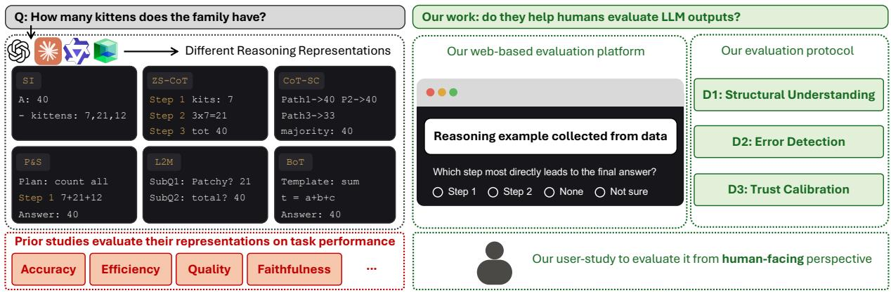
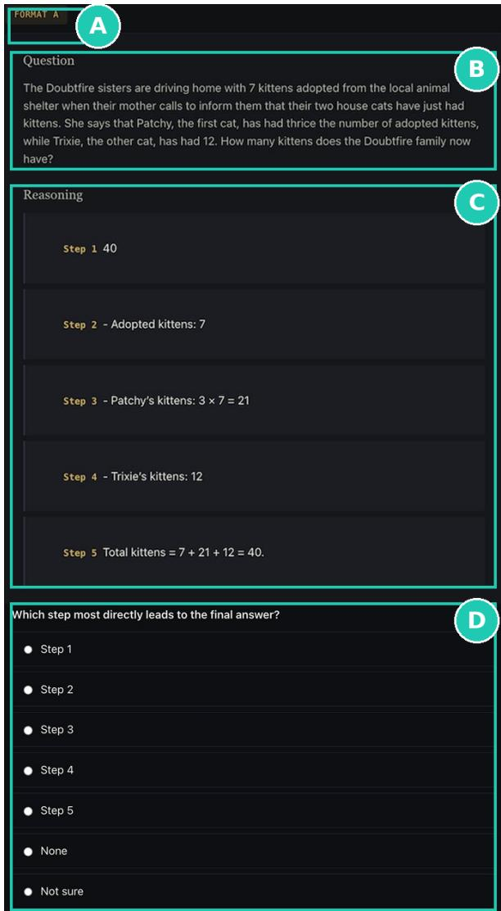

# Do Reasoning Representations Help Humans Evaluate LLM Outputs?

Jaewoo Lim, <sup>†</sup>Sungbok Shin, and Sanghyun Hong

Oregon State University, Corvallis USA

<sup>†</sup>Sogang University, Seoul, South Korea

{limjae, sanghyun.hong}@oregonstate.edu, <sup>†</sup>sbshin90@sogang.ac.kr

## Abstract

Reasoning representations are increasingly used as explanations for large language model outputs. Yet they are typically evaluated with model-centric criteria, such as answer accuracy and faithfulness, leaving it unclear whether they help people evaluate model responses. In this work, we study reasoning representations as human-facing interfaces rather than proxies for model reasoning ability. We conduct a controlled human study of six reasoning formats across tasks of varying complexity, supported by a web-based framework that randomizes task domains, problem instances, and representation order. The study collects fine-grained judgments of structural understanding, error detection and localization, and trust calibration. Our study shows a mismatch between perceived preference and support for human evaluation. Participants prefer planning- and decomposition-based representations, but simpler chain-of-thought traces better support verification, trust, and interpretability. Preferred representations also introduce calibration risks, with more false alarms on correct traces and high trust despite low willingness to verify.

## 1 Introduction

Large language models are increasingly used for tasks that require not only final answers but also reasoning traces that help users evaluate the outcomes. Methods such as chain-of-thought prompting (Kojima et al., 2022; Wei et al., 2022), selfconsistency (Wang et al., 2023b), planning (Wang et al., 2023a), decomposition (Zhou et al., 2023), and template-based reasoning (Yang et al., 2024) expose such traces in different forms. While these reasoning representations were originally introduced to improve model performance, they are now used as explanations for assessing whether a model response is correct and trustworthy.

This shift creates an evaluation mismatch. Reasoning representations are treated as user-facing explanations, but evaluated primarily with modelcentric criteria. Prior work asks whether a representation improves answer accuracy (Cobbe et al., 2021; Suzgun et al., 2023; Sprague et al., 2025), generates more faithful rationales (Turpin et al., 2023; Madsen et al., 2024), or yields more coherent reasoning (Golovneva et al., 2023; Prasad et al., 2023; Lee and Hockenmaier, 2025). These criteria are important yet do not establish whether humans can use the representation to evaluate a model response. A reasoning trace can be accurate, faithful or detailed while still making it difficult for users to locate an error, understand the role of each component, or calibrate trust in the final answer.

It becomes particularly important because richer explanations are not necessarily improve human oversight (Bansal et al., 2021; Buçinca et al., 2021). Structured formats, such as plans or decomposed subproblems, may appear more useful by organizing reasoning into explicit components. But the same structure can obscure errors, misdirect attention, or increase trust without increasing verification. Evaluating these representations thus requires more than measuring user preference or model performance; it requires measuring how they affect distinct forms of human judgment.

In this work, we shift the attention from modelside outcomes to human evaluation behavior in the study of reasoning representations. Specifically, we ask: Do reasoning representations help humans evaluate LLM outputs? We focus on three evaluation behaviors that reasoning traces are expected to support in practice: structural understanding, error detection and localization, and trust calibration. This framing allows us to test whether more structured representations improve human evaluation, or make the reasoning appear more interpretable.

To answer this question, we conduct a controlled human evaluation of reasoning representations. We design a protocol that compares six representations under matched task and problem conditions across the three forms of human evaluation above. The protocol isolates representation utility from answer correctness and separates perceived usefulness from verification behavior by combining correct final-answer traces with controlled errorinjected traces. We instantiate this protocol in a web-based evaluation framework that randomizes task domains, model families, problem instances, error conditions, and representation order while collecting representation-level judgments.

Our user study with 50 participants offers a three-way divergence among preference, verification performance, and trust calibration. (1) Participants prefer planning- and decomposition-based formats, suggesting that explicit structure increases perceived usefulness. (2) However, this preference does not translate into verification performance: simpler chain-of-thought traces better support error detection and localization. (3) Preferred formats also introduce calibration risks, such as false alarms on correct traces and high trust paired with low willingness to verify. Those findings suggest that increasing representational structure does not uniformly improve human evaluation.

Contributions. Our contributions are as follows:

• We reframe reasoning representations as interfaces for human evaluation, rather than solely as indicators of model reasoning ability.

• We design a controlled human-evaluation protocol for comparing reasoning representations under matched tasks and problem instances.

• We instantiate our protocol in a web-based evaluation framework that randomizes assignment, error conditions, and representation order while collecting representation-level judgments.

• We show that reasoning representations induce distinct trade-offs among preference, verification performance, and trust calibration.

## 2 Background and Related Work

Reasoning representations for LLMs. A reasoning trace is the sequence of intermediate tokens produced before a model’s final answer, whereas a reasoning representation is the user-visible form in which that trace is organized and presented. This distinction is important because our study does not treat reasoning traces as faithful records of a model’s internal computation. Prior work shows that CoT explanations can be unfaithful to the factors that actually determine model predictions (Turpin et al., 2023). Our focus is therefore not whether a trace reveals how the model truly reasoned, but whether its presentation helps humans inspect, verify, and calibrate trust in the model output (Bansal et al., 2021; Kim et al., 2024).

Table 1 organizes existing LLM reasoning methods by the structural forms they expose to users. The A–I groups reflect an overall progression in how reasoning is externalized: from direct answering without visible intermediate reasoning (Brown et al., 2020), to linear chains of thought (Wei et al., 2022; Kojima et al., 2022), aggregated chains (Wang et al., 2023b), planned and decomposed reasoning (Wang et al., 2023a; Zhou et al., 2023; Khot et al., 2023), iterative refinement (Madaan et al., 2023; Shinn et al., 2023), treeor graph-based search (Yao et al., 2023a; Besta et al., 2024a), template-grounded structures (Yang et al., 2024; Zhou et al., 2024), agentic reasoningaction traces (Yao et al., 2023b), and latent reasoning (Hao et al., 2024; Goyal et al., 2024).

Across the groups, we further characterize each method along three structural dimensions following Besta et al. (2024b): topology, the organization of reasoning as a chain, tree, or graph; scope, whether reasoning unfolds within a single promptresponse exchange or across multiple controllerissued steps; and decomposition, the intermediate reasoning units exposed by the method, e.g., plans, subproblems, branches, templates, or actions.

Despite their original intent, reasoning outputs are increasingly repurposed as user-facing explanations (Sun et al., 2026). This shift makes it necessary to evaluate not only how they perform, but also how their representations shape humanjudgment. We use Table 1 to identify structurally distinct representations for controlled comparison (§3.2).

Evaluating reasoning representations. Most prior work on LLM reasoning evaluates methods through model-centric criteria, such as answer accuracy, faithfulness, and coherence (Hendrycks et al., 2021; Turpin et al., 2023; Lanham et al., 2023; Golovneva et al., 2023; Prasad et al., 2023; Lightman et al., 2024). While these criteria are useful for assessing reasoning quality, they do not determine whether a representation helps users evaluate model outputs. A reasoning trace can be accurate or faithful while still making it difficult for users to identify an error, understand its impact, or calibrate trust in the final answer.

<table><tr><td># Method</td><td></td><td>Topology</td><td>Scope</td><td>Decomp.</td><td>Evaluation Criteria</td></tr><tr><td colspan="6">A. Direct prompting — single-shot generation without intermediate reasoning steps</td></tr><tr><td></td><td>Standard I/O (Brown et al., 2020)</td><td>Chain</td><td>SP</td><td>Monolithic</td><td>Task accuracy</td></tr><tr><td colspan="6">B. Linear reasoning — single chain of explicit intermediate steps before the answer</td></tr><tr><td>2</td><td>Zero-shot CoT (Kojima et al., 2022)</td><td>Chain</td><td>SP</td><td>Monolithic</td><td>Task accuracy</td></tr><tr><td>3</td><td>CoT (few-shot) (Wei et al., 2022)</td><td>Chain</td><td>SP</td><td>Monolithic</td><td>Task accuracy</td></tr><tr><td>4</td><td>Scratchpad (Nye et al., 2021)</td><td>Chain</td><td>SP</td><td>Monolithic</td><td>Task accuracy</td></tr><tr><td>5</td><td>Program of Thoughts (Chen et al., 2023a)</td><td>Chain</td><td>SP</td><td>Monolithic</td><td>Task accuracy</td></tr><tr><td>6 7</td><td>Self-Notes (Lanchantin et al., 2023)</td><td>Chain</td><td>SP</td><td>Monolithic</td><td>Task accuracy</td></tr><tr><td></td><td>Faithful CoT (Lyu et al., 2023)</td><td>Chain</td><td>SP</td><td>Monolithic</td><td>Task accuracy, Faithfulness</td></tr><tr><td colspan="6">C. Aggregated sampling — multiple chains sampled and combined into a single answer</td></tr><tr><td>8</td><td>Self-Consistency CoT (Wang et al., 2023b)</td><td>Tree‡</td><td>SP+MP</td><td>Monolithic</td><td>Task accuracy</td></tr><tr><td>9</td><td>Skeleton-of-Thought (Ning et al., 2024)</td><td>Tree</td><td>SP+MP</td><td>Planned</td><td>Preference / Quality, Efficiency</td></tr><tr><td colspan="6">D. Planned decomposition — explicit decomposition of the problem into sub-problems before solving</td></tr><tr><td>10</td><td>Plan-and-Solve (Wang et al., 2023a)</td><td>Chain</td><td>SP</td><td>Planned</td><td>Task accuracy</td></tr><tr><td>11</td><td>Least-to-Most (Zhou et al., 2023)</td><td>Chain</td><td>MP</td><td>Recursive</td><td>Task accuracy</td></tr><tr><td>12</td><td>Decomposed Prompting (Khot et al., 2023)</td><td>Chain</td><td>MP</td><td>Recursive</td><td>Task accuracy</td></tr><tr><td colspan="6">E. Iterative self-correction —feedback-and-refine loop over the model&#x27;s own output</td></tr><tr><td>13</td><td>Self-Refine (Madaan et al., 2023)</td><td>Chain</td><td>MP</td><td>Iterative</td><td>Task accuracy, Preference / Quality</td></tr><tr><td>14</td><td>Reflexion (Shinn et al., 2023)</td><td>Chain</td><td>MP</td><td>Iterative</td><td>Task accuracy</td></tr><tr><td>15</td><td>Self-Debug (Chen et al., 2023b)</td><td>Chain</td><td>MP</td><td>Iterative</td><td>Task accuracy</td></tr><tr><td>16</td><td>SelfCheck (Miao et al., 2024)</td><td>Chain</td><td>MP</td><td>Iterative</td><td>Task accuracy, Verification performance</td></tr><tr><td colspan="6"></td></tr><tr><td>17</td><td>F. Multi-path search — explicit search over a tree or graph of candidate reasoning paths Tree of Thoughts (Yao et al., 2023a)</td><td>Tree</td><td>MP</td><td>Branching</td><td>Task accuracy, Preference / Quality</td></tr><tr><td>18</td><td>Algorithm of Thoughts (Sel et al., 2024)</td><td>Tree</td><td>SP</td><td>Branching</td><td>Task accuracy</td></tr><tr><td>19</td><td>Graph of Thoughts (Besta et al., 2024a)</td><td>Graph</td><td>MP</td><td>Aggregating</td><td>Task accuracy, Efficiency</td></tr><tr><td>20</td><td>Cumulative Reasoning (Zhang et al., 2023)</td><td>Graph (DAG)</td><td>MP</td><td>Aggregating</td><td>Task accuracy</td></tr><tr><td colspan="6">G. Template-grounded / meta-structure reasoning guided by an explicit external template or self-discovered structure</td></tr><tr><td>21</td><td>Buffer of Thoughts (Yang et al., 2024)</td><td>Chain</td><td>MP</td><td>Template-grounded</td><td>Task accuracy, Efficiency</td></tr><tr><td>22</td><td>Self-Discover (Zhou et al., 2024)</td><td>Graph</td><td>MP</td><td>Meta-structure</td><td>Task accuracy, Preference / Quality</td></tr><tr><td colspan="6">H. Agentic / grounded — interleaved reasoning and actions in an external environment</td></tr><tr><td>23</td><td>ReAct (Yao et al., 2023b)</td><td>Chain</td><td>MP</td><td>Interleaved</td><td>Task accuracy</td></tr><tr><td colspan="6">I. Latent reasoning — reasoning carried in continuous hidden states rather than explicit tokens</td></tr><tr><td>24</td><td>COCONUT (Hao et al., 2024)</td><td>Chain</td><td>SP</td><td>Latent</td><td>Task accuracy, Efficiency</td></tr><tr><td>25</td><td>Pause Tokens (Goyal et al., 2024)</td><td>Chain</td><td>SP</td><td>Latent</td><td>Task accuracy</td></tr></table>

Table 1: LLM reasoning methods and their evaluation criteria. We categorize 25 reasoning methods (A–I) by the structural form they expose to users. Structural characteristics follow Besta et al. (2024b): Topology denotes chain/tree/graph; Scope distinguishes single-prompt (SP) from multi-prompt (MP); and Decomp. summarizes how reasoning is decomposed into intermediate steps. Evaluation criteria abstracts the primary criteria used in prior work. Gray rows indicate the six representations evaluated in our study. <sup>‡</sup> denotes a depth-one tree.

Prior work on human-centered evaluation of explanations instead considers dimensions such as preference, comprehension, decision quality, and trust calibration (Buçinca et al., 2020; Bansal et al., 2021). These studies show that subjective preference does not necessarily translate into better behavioral outcomes such as error detection or decision quality, and that explanations can even increase reliance on incorrect outputs (Kim et al., 2025). This motivates evaluating perceived usefulness separately from behavioral outcomes such as error detection, localization, and trust calibration.

Despite the growing body of work, few studies compare structurally distinct reasoning representations under controlled conditions. Existing work is often limited in representation coverage, experimental control, or behavioral evaluation (Si et al.,

2024; Sun et al., 2026; Pang et al., 2026). Moreover, most evaluations assess reasoning traces without measuring how users interpret, verify, or calibrate trust in them. Our controlled human-evaluation protocol addresses this gap by jointly measuring structural understanding, error detection and localization, trust calibration, and perceived usefulness across selected reasoning representations.

## 3 Controlled Human Evaluation

We present a controlled human-evaluation protocol for comparing reasoning representations as userfacing explanations. Our goal is to isolate the effect of representation from final-answer correctness: users compare traces that reach the same correct answer, while controlled error-injected traces provide ground truth for verification behavior. We compare six reasoning representations across three benchmarks and measure three forms of human evaluation: structural understanding, error detection and localization, and trust calibration.

  
Figure 1: From model-centric to human-centric evaluation. Reasoning representations expose the same problem and answer in different forms, e.g., a direct answer, a zero-shot CoT, sampled CoT chains, a plan and solution, subproblems, or an abstract template (top-left). These methods have been judged by model-centric metrics (bottomleft), not by whether their traces help a user. Our work studies how effective they are in helping humans evaluate model outputs: structural understanding (D1), error detection and localization (D2), and trust calibration (D3).

## 3.1 Evaluation Dimensions

Prior work provides limited guidance for defining human-centered evaluation dimensions. Studies on reasoning-trace evaluation (Lee and Hockenmaier, 2025) has proposed metrics for assessing trace quality, while human-verification studies emphasize error detection and localization (Zhou et al., 2025). A separate line of work on explainable AI offers established constructs for trust and reliance (Jian et al., 2000; Hoffman et al., 2023). We adapt these strands into three human-centered dimensions:

D1: Structural understanding captures whether users can identify the role of each reasoning component—whether it introduces external information, performs a key inference, or marks a shift in approach—and trace how components depend on one another. We measure whether users notice the structural cues exposed by each representations, such as plan-execution, boundaries, subproblem transitions, or template instantiations. These cues matter because a few steps, such as those that set up a plan or shift the approach, disproportionately determine the final answer (Bogdan et al., 2025). Whether a user can locate such steps depends on how the trace is presented. This ability makes verification affordable: explanations help only when users can actually verify the answer (Fok and Weld, 2024), and users verify only when the effort is low enough (Vasconcelos et al., 2023).

D2: Error detection and localization. It measures whether users can detect flawed reasoning and localize the step or component where the error stems. Prior work (Zhou et al., 2025) studies error detection as a human-verification task, but we adapt it to compare reasoning representations under controlled, cross-task conditions.

D3: Trust calibration and reliance. D3 measures whether users’ trust-related judgments align with the evidence made visible by the reasoning representation. Work on explainable AI (Hoffman et al., 2023) offers constructs for trust and reliance, but we use them to examine whether preferred reasoning formats support verification and reliance.

## 3.2 Representation Selection

Guided by the taxonomy in Table 1, we select six reasoning representations that (1) cover common user-visible forms of LLM reasoning (2) while remaining comparable within the same evaluation protocol. The selected formats span direct prompting, linear reasoning, aggregation, planning, decomposition, and template-grounded reasoning. We do not aim to exhaust the full design space; instead, we choose structural diverse formats that can be rendered as step-level traces and evaluated using the same questions across conditions.

Standard I/O (Brown et al., 2020) produces a direct answer without unfolding reasoning trace. This method serves as an answer-first baseline.

Zero-shot CoT (Kojima et al., 2022) produces a sequence of intermediate reasoning steps, elicited by the instruction “let’s think step by step.” This serves as the step-by-step reasoning baseline.

Self-Consistency CoT (CoT-SC) (Wang et al., 2023b) samples multiple reasoning paths and aggregates final answers by agreement. We present the majority-vote chain with its agreement score.

Plan-and-Solve (Wang et al., 2023a) first produces an explicit plan and then executes that plan step by step, separating approach from execution.

Least-to-Most (Zhou et al., 2023) decomposes the problem into ordered subproblems and solves them progressively.

Buffer of Thoughts (BoT) (Yang et al., 2024) applies a reusable thought-template retrieved from a meta-buffer of prior solutions to the current problem, exposing both the abstract template and its problem-specific instantiation.

## 3.3 Study Materials and Sampling

We construct study materials to compare reasoning representations across diverse reasoning demands while controlling for final-answer correctness. We use three benchmarks: GSM8K (Cobbe et al., 2021) for multi-step arithmetic reasoning, HotPotQA (Yang et al., 2018) for multi-hop factual question-answering, and BBH (Suzgun et al., 2023) for symbolic and logical reasoning. This selection allows us to examine whether representation effects are specific to a task type or persist across qualitatively different reasoning settings. For each benchmark, we sample candidate problems and generate outputs for all six representation conditions using OpenAI’s GPT-5 (gpt-5-2025-08-07) and the prompt instantiations described above. Using a single model keeps model behavior fixed across conditions, so that the comparison focuses on differences in the displayed reasoning format. Prompt templates and generation details are provided in Appendix.

<table><tr><td>Benchmark</td><td># Problems</td><td>Steps</td><td>Input words</td></tr><tr><td>GSM8K</td><td>9</td><td> $4 . 1 9 \pm 0 . 7 7$ </td><td>39.6</td></tr><tr><td>HotPotQA</td><td>9</td><td> $3 . 3 3 \pm 0 . 2 6$ </td><td>†156.4</td></tr><tr><td>BBH</td><td>9</td><td> $3 . 8 5 \pm 0 . 6 1$ </td><td>89.6</td></tr><tr><td>All</td><td>27</td><td> $3 . 7 9 \pm 0 . 6 7$ </td><td>一</td></tr></table>

Table 2: Problem-level statistics for the retained allcorrect pool. It contains 27 problems, with 9 per benchmark. Steps are reported as mean ± std. and are averaged across the six generated traces for each problem. Displayed input words count the task input shown to participants, excluding prompting instructions and output-format constraints. <sup>†</sup>For HotPotQA, displayed input words include the question and retrieval context.

To isolate representation utility from answer correctness, we retain only problem instances for which all six representations produce the correct answer. This all-correct filter ensures that participants compare traces that reach the same correct outcome, rather than traces that differ in final-answer accuracy. Of 140 candidates problems, 27 (19.3%) satisfy this filter. We resample until each benchmark has 9 problems, yielding the final pool of 27 problems with 9 per benchmark. For each retained problem, we store the task input, the correct final answer, and six generated reasoning traces. Table 2 summarizes the retained all-correct pool—the average number of reasoning steps in the generated traces and the amount of task input shown to participants.

## 3.4 Controlled Error Injection

To measure error detection and localization, we require reasoning traces with known error locations. Naturally occuring model errors are hard to control across representations, we therefore inject controlled errors into a subset of otherwise correct traces. Each injected trace contains one intended, localizable error and it is manually verified.

Injection targets. From the 27 all-correct problems, we select 9 problems for the error-detection task (3 per benchmark). For GSM8K and BBH, we inject errors into all six representations for each selected problem. For HotPotQA, errors are injected only into Least-to-Most and Buffer of Thoughts, whose formats support clean within-trace factual edits without altering the retrieval context. This yields 42 errored traces. Because HotPotQA covers fewer representations, we report the results both in aggregate and by benchmark, and avoid unsupported cross-benchmark contrasts.

Injection procedure. Errors are created through a human-in-the-loop pipeline and manually verified to ensure that each trace contains exactly one intended error. We use two ground-truth error types adapted from prior work (Kamoi et al., 2024): incorrect calculation (a numerical error in an arithmetic step) and incorrect premise (an introduced fact or assumption that contradicts the problem or a prior step). Participants first localize the error and then select an error type from five options: incorrect calculation, incorrect premise, missing reasoning step, irrelevant reasoning, and other. The latter three options serve as distractors and help distinguish correct localization from generic suspicion. Additional error-injection details are in Appendix.

  
Figure 2: Web interface for the structural understanding task. Participants view a reasoning trace rendered in one of six representations (A: representation tag; B: problem prompt; C: reasoning steps), shown alongside a dependency question (D). The example shows the key-step item; the same interface is used for the reasoning-shift and supporting-step items.

## 4 A Web-Based Evaluation Framework

We instantiate the protocol in a web-based evaluation framework that supports controlled assignment, randomized presentation, branching errordetection workflows, and representation-level logging. The framework allows participants to evaluate multiple reasoning representations under comparable task, model, problem, and error-condition settings while collecting fine-grained judgments for each representation. Our protocol requires more than a static survey: it must assign participants to balanced study cells, present six representations in randomized order, conditionally display errordetection follow-ups, and record judgments at the participant-representation level.

Overview. The framework implements three functions. (1) It assigns each participant to a benchmark, problem set, and error-condition group. (2) It presents the six representation conditions in randomized order for each problem, ensuring that representation comparisons are not confounded with a fixed presentation order. (3) It records representation-level responses, including structural understanding judgments, error-localization choices, trust-related ratings, post-study preferences, and per-item timing. The framework is deployed as a web application on Hugging Face Spaces with persistent storage delivering the same rendered representations to all participants and logging response data and per-item timing for analysis.

## 4.1 Participant Workflow

Each participant completes a single online session. Participants were recruited through in-class announcements at the authors’ institution in two collection waves; the only eligibility requirements were being at least 18 years of age and comfortable reading English, with no further screening or selection. 64 participants who began the session, 51 completed all phases; one completed after the data-collection window closed, yielding the analytic sample of $n = 5 0$ . After consent and onboarding, participants complete a pre-survey on technical familiarity and prior experience with AI tools; it collected background covariates only and was not used to exclude any participant. The framework then assigns the participant to one benchmark and presents three problems from it, one per evaluation dimension, each displaying the six representations from §3.2 in randomized order. The three problems target structural understanding (D1; participants identify reasoning shifts, key steps, and supporting information), error detection and localization (D2; participants evaluate a mixture of correct and errorinjected traces, flag any error, and select its type when applicable), and trust calibration (D3; participants rate reliance, verification intention, and perceived interpretability). The session ends with post-study comparison questions and an overall preference.

## 4.2 Randomization and Assignment

Representation order is randomized within each problem to reduce order effects. Participants are assigned across benchmark and error-condition groups using a balanced rotation. For the errordetection task, the framework controls which representations appear in the errored condition. For each problem, a subset of representations is shown with injected errors and the remaining representations are shown in their original correct form. The errored conditions are rotated across participants so that each representation is evaluated under both correct and errored conditions where supported by the benchmark materials. This assignment scheme enables representation-level comparison while controlling for task domain, problem instance, error condition, and presentation order.

## 4.3 Measures and Analysis

We collect four sets of measures:

Structural understanding. Participants identify, among the steps of the displayed trace: (1) where the reasoning shifts to a different interpretation or approach (reasoning shift); (2) which step most directly leads to the final answer (key step); and (3) which step introduces an important supporting fact, rule, or verification (supporting step). Options enumerate the steps actually present in the trace, as well as “None” and “Not sure.” We summarize responses by representation to examine whether participants perceive and localize structural cues.

Error detection and localization. Participants first select the step where the error occurs (“No error” / Step k / “I cannot determine”). If they identify a step, two follow-ups elicit the error type and the error impact on the final answer. We compare participant responses against the known injectederror labels: detection accuracy measures whether participants identify that a trace contains an error, and localization accuracy measures whether the selected step matches the injected-error location.

Trust and reliance. Participants answer three 5- point Likert items adapted from established trust measures (Jian et al., 2000; Hoffman et al., 2023): reliance (“To what extent would you rely on this reasoning when making a decision?”); verification intention (“Would you verify this reasoning before using it?”); and interpretability (“How easy was it to understand this reasoning?”). We compare response distributions to examine whether perceived usefulness aligns with verification behavior.

Post-study collects comparative judgments and overall preference across the six representation formats. Post-study preference items are reported as frequency distributions over the six representations.

The full survey details are in Appendix A.3.

## 5 Evaluation

We evaluate six reasoning representations across three dimensions (D1–3), interpreting the results within each dimension and then across them.

Metrics. We report three families of metrics per representation. For Structural understanding (D1), we report shift recognition (the share of responses that identify a reasoning shift), key-step, and support-step agreement, the latter two as Krippendorff’s α; we use agreement rather than dependency correctness, which is difficult to define unambiguously for human evaluation. Higher α indicates greater agreement among participants on which step is important, whereas lower α indicates that the representation does not consistently make the important step identifiable. For Verification performance (D2), we report, on error-injected traces, the false-alarm rate (flagging an error in a correct trace; lower is better) and localization accuracy (selecting the step containing the injected error; higher is better). For Trust calibration (D3), we report mean ratings on three 5-point Likert items: reliance (1 = would not rely, 5 = would rely), verification intention (1 = definitely verify, 5 = would not verify; lower indicates stronger intent to verify), and interpretability (1 = very difficult, 5 = very easy). Preference counts how often, out of 50 participants, each representation was selected on the overall and item-level post-survey questions.

<table><tr><td>Representation</td><td>Shift Recognition</td><td>Key-Step α</td><td>Support-Step α</td></tr><tr><td>Standard I/O</td><td>48%</td><td>0.34</td><td>0.48</td></tr><tr><td>Zero-shot CoT</td><td>58%</td><td>0.30</td><td>0.07</td></tr><tr><td>CoT-SC</td><td>45%</td><td>0.37</td><td>0.19</td></tr><tr><td>Plan-and-Solve</td><td>60%</td><td>0.26</td><td>0.30</td></tr><tr><td>Least-to-Most</td><td>56%</td><td>0.19</td><td>0.05</td></tr><tr><td>Buffer of Thoughts</td><td>64%</td><td>0.11</td><td>0.09</td></tr></table>

Table 3: Shift Recognition reports the percentage of responses that identified a meaningful reasoning transition rather than selecting None or Not sure. Key-Step and Support-Step report inter-participant agreement as Krippendorff’s α (nominal), computed per representation with each (problem, trace) as a unit and participants as coders; None and Not sure are treated as valid categories, and (participant, problem) pairs unobserved due to benchmark assignment are handled as missing data. Higher values indicate stronger chance-corrected agreement; bold marks the highest value in each column.

Structure helps participants identify reasoning shifts, but not which steps matter. Table 3 reports whether participants perceive the structural organization of each reasoning representation. We distinguish between local cues—which steps are key or supportive—and a global cue: where the reasoning shifts. Agreement on local cues is modest across all representations (key-step $\alpha { = } 0 . 1 1 { - }$ 0.37; support-step $\alpha = 0 . 0 5 \substack { - 0 . 4 8 } )$ . Participants do not consistently agree on which steps matter or how they support one another. For the global cue, shift recognition is low throughout: even Plan-and-Solve and Buffer of Thoughts—designed to expose explicit planning structure—reach only 60% and 64%, so roughly two in five participants fail to identify a reasoning shift even when the representation marks it. Planning-oriented representations yield the highest shift recognition, suggesting that participants perceive organizational shifts such as planning-to-execution or template-to-instantiation. Standard I/O instead yields the strongest supportstep agreement (α = 0.48). Least-to-Most shows the opposite: moderate shift recognition but the weakest support-step agreement $( \alpha { = } 0 . 0 5 )$ . Overall, decomposition makes the organization of reasoning more visible, but does not necessarily make the importance of individual steps or their dependencies easier to interpret.

<table><tr><td>Item</td><td>SI</td><td>ZS-CoT</td><td>CoT-SC</td><td>P&amp;S</td><td>L2M</td><td>BoT</td><td>NoDiff</td><td>Total</td></tr><tr><td>Structural understanding</td><td></td><td></td><td></td><td></td><td></td><td></td><td></td><td></td></tr><tr><td>Step comprehension</td><td>6</td><td>21</td><td>0</td><td>11</td><td>6</td><td>3</td><td>3</td><td>50</td></tr><tr><td>Dependency comprehension</td><td>3</td><td>6</td><td>3</td><td>15</td><td>11</td><td>7</td><td>5</td><td>50</td></tr><tr><td>Traceability</td><td>5</td><td>18</td><td>0</td><td>10</td><td>5</td><td>8</td><td>4</td><td>50</td></tr><tr><td>Error localization and detection</td><td></td><td></td><td></td><td></td><td></td><td></td><td></td><td></td></tr><tr><td>Error detectability</td><td>4</td><td>16</td><td>2</td><td>6</td><td>9</td><td>5</td><td>8</td><td>50</td></tr><tr><td>Error localizability</td><td>4</td><td>10</td><td>2</td><td>5</td><td>13</td><td>6</td><td>10</td><td>50</td></tr><tr><td>Trust and reliance</td><td></td><td></td><td></td><td></td><td></td><td></td><td></td><td></td></tr><tr><td>Reliability</td><td>3</td><td>10</td><td>1</td><td>14</td><td>8</td><td>7</td><td>7</td><td>50</td></tr><tr><td>Decision confidence</td><td>2</td><td>4</td><td>2</td><td>16</td><td>15</td><td>6</td><td>5</td><td>50</td></tr><tr><td>Critical evaluation</td><td>2</td><td>6</td><td>4</td><td>10</td><td>16</td><td>5</td><td>7</td><td>50</td></tr><tr><td>Total</td><td>29</td><td>91</td><td>14</td><td>87</td><td>83</td><td>47</td><td>49</td><td>400</td></tr></table>

Table 4: Post-survey item-level selection counts across the six reasoning representations (SI: Standard I/O; ZS-CoT: Zero-shot CoT; CoT-SC: CoT Self-Consistency; P&S: Plan-and-Solve; L2M: Least-to-Most; BoT: Buffer of Thoughts; NoDiff: No difference perceived). The most selected option for each item is highlighted in green.

Zero-shot CoT performs best on error verification and trust (D2–D3), while not being the most preferred representation. Table 5 summarizes our results. On error-injected trials, it yields the lowest false-alarm rate (7.7%, incorrectly flagging correct traces as erroneous) and the highest localization accuracy (95.5%, correctly identifying the injected step). On the 5-point Likert-scale items for reliance and interpretability, it receives the highest mean ratings for reliance (4.04) and interpretability (4.12). In the post-survey (see Table 4), it is the most frequently chosen representation for step comprehension (21/50), traceability(18/50), and error detection (16/50), although Plan-and-Solve receives more overall-preference votes (26% vs. 22%). The least structured representation, Zeroshot CoT, performs best across verification, trust, and perception simultaneously.

<table><tr><td>Representation</td><td>Pref. ↑</td><td>FA↓</td><td>Loc. ↑</td><td>Reliance ↑</td><td>Interp. ↑</td></tr><tr><td>Standard I/O</td><td>6.0%</td><td>12.5%</td><td>60.0%</td><td>3.32</td><td>3.66</td></tr><tr><td>Zero-shot CoT</td><td>22.0%</td><td>7.7%</td><td>95.5%</td><td>4.04</td><td>4.12</td></tr><tr><td>CoT-SC</td><td>0.0%</td><td>12.5%</td><td>73.2%</td><td>3.37</td><td>3.61</td></tr><tr><td>Plan-and-Solve</td><td>26.0%</td><td>19.2%</td><td>57.1%</td><td>3.88</td><td>3.62</td></tr><tr><td>Least-to-Most</td><td>22.0%</td><td>20.8%</td><td>90.5%</td><td>3.52</td><td>3.28</td></tr><tr><td>Buffer of Thoughts</td><td>14.0%</td><td>17.4%</td><td>52.2%</td><td>3.54</td><td>3.08</td></tr></table>

Table 5: Summarizing our results across reasoning representations. Preference reports overall preference votes. FA is the false-alarm rate on correct traces, and Loc. is localization accuracy on errored traces. Reliance and Interp. are mean 5-point Likert ratings. Bold indicates the most favorable value in each column. Planand-Solve is preferred most yet has one of the highest false-alarm rates, whereas Zero-shot CoT achieves the strongest performance across the three dimensions.

Representations rated best for verification in the post-survey have the highest false alarm rates. Participants rate Least-to-Most (L2M) as the one that best supports error detection and localization in the post-survey: it receives the most vote for critical evaluation (16/50) and error localizability (13/50) in Table 4. It also ties with Zero-shot CoT for second place in overall preference (22%; Table 5). Yet on error-injected trials, L2M shows the highest false-alarm rate of all six representations (20.8%), about 2.7 times that of Zero-shot CoT (7.7%). The pattern extends to Plan-and-Solve, the most preferred representation on the post-survey overall, which shows the second-highest false-alarm rate (19.2%). The representation participants pick as best for catching mistakes is the one on which they most often see errors that are not there—stated preference diverges sharply from behavioral accuracy.

## 6 Conclusion

This work studies reasoning representations as interfaces for human oversight, rather than as modelcentric indicators of its ability alone. Through a controlled human evaluation of six reasoning representations, we show that user preference, verification performance, and trust calibration do not always align: users favor more structured planningand decomposition-based ones, while simpler CoT traces better support error detection and localization. Preferred formats can also produce miscalibrated judgments, suggesting that perceived usefulness does not guarantee effective verification. Our findings challenge the assumption that more visible or structured reasoning uniformly improves human evaluation. As reasoning becomes embedded in user-facing LLM systems, its representations should be designed and evaluated for the human judgments they support—understanding, verification, and trust calibration—rather than for modelcentric criteria such as accuracy or faithfulness.

## Acknowledgments

We thank the anonymous reviewers for constructive feedback. Jaewoo and Sanghyun are partially supported by the Google Faculty Research Award 2023. Sungbok is in part supported by Institute of Information & communications Technology Planning & Evaluation (IITP) under the Artificial Intelligence Innovation Human Resources Development (IITP-RS-2026-25547954) grant funded by the Korea government. The findings and conclusions in this work are those of the author(s) and do not necessarily represent the views of the funding agency.

## Limitations

Our study evaluates pre-generated LLM outputs rather than reasoning traces produced during interactive sessions. This may limit the forms of interaction available to users, such as asking followup questions, requesting alternative explanations, or revising their judgments through dialogue. We choose this design, consistent with prior controlled studies (Zhou et al., 2025), to enable matched comparisons across task, model, problem instance, and representation format. This allows us to isolate representation-level effects that would be difficult to measure in open-ended interaction. We leave the extension to interactive settings for future work.

Our findings may be influenced by how reasoning traces and errors are constructed. Because each representation uses a different prompting strategy, differences in trace length, wording, level of detail, and structure may partly reflect prompt design rather than the representation itself. Our controlled error injection provides ground truth for error detection and localization, yet verification behavior may depend on the type and location of the injected error. This procedure also requires a localizable reasoning trace, limiting its applicability to formats such as Standard I/O. We mitigate these issues by holding the task, model, and problem fixed and applying the same evaluation protocol across representations. We leave alternative prompt templates and broader error taxonomies to future work.

All traces are generated by a single model (GPT-5). Using a single generator controls for modellevel variation, allowing us to attribute observed differences more directly to the reasoning representation. However, this design does not evaluate whether our findings generalize across models. We leave cross-model replication for future work.

## Ethics Considerations

This study was determined to be exempt by the Oregon State University Institutional Review Board (protocol #HE-2025-1705). Participation was voluntary, no identifying information was collected, and all responses were stored in anonymized form.

## References

Gagan Bansal, Tongshuang Wu, Joyce Zhou, Raymond Fok, Besmira Nushi, Ece Kamar, Marco Tulio Ribeiro, and Daniel Weld. 2021. Does the whole exceed its parts? the effect of AI explanations on complementary team performance. In Proceedings of the 2021 CHI Conference on Human Factors in Computing Systems (CHI), pages 1–16. Association for Computing Machinery.

Maciej Besta, Nils Blach, Ales Kubicek, Robert Gerstenberger, Michał Podstawski, Lukas Gianinazzi, Joanna Gajda, Tomasz Lehmann, Hubert Niewiadomski, Piotr Nyczyk, and Torsten Hoefler. 2024a. Graph

of thoughts: Solving elaborate problems with large language models. Proceedings ofthe AAAI Conference on Artificial Intelligence, 38(16):17682–17690.

Maciej Besta, Florim Memedi, Zhenyu Zhang, Robert Gerstenberger, Guangyuan Piao, Nils Blach, Piotr Nyczyk, Marcin Copik, Grzegorz Kwasniewski, Jür- ´ gen Müller, and 1 others. 2024b. Demystifying chains, trees, and graphs of thoughts. arXiv preprint arXiv:2401.14295.

Paul C. Bogdan, Uzay Macar, Neel Nanda, and Arthur Conmy. 2025. Thought anchors: Which LLM reasoning steps matter? arXiv preprint arXiv:2506.19143.

Tom Brown, Benjamin Mann, Nick Ryder, Melanie Subbiah, Jared D. Kaplan, Prafulla Dhariwal, Arvind Neelakantan, Pranav Shyam, Girish Sastry, Amanda Askell, and 1 others. 2020. Language models are fewshot learners. In Advances in Neural Information Processing Systems, volume 33, pages 1877–1901.

Zana Buçinca, Phoebe Lin, Krzysztof Z. Gajos, and Elena L. Glassman. 2020. Proxy tasks and subjective measures can be misleading in evaluating explainable AI systems. In International Conference on Intelligent User Interfaces, pages 454–464. ACM.

Zana Buçinca, Maja Barbara Malaya, and Krzysztof Z. Gajos. 2021. To trust or to think: Cognitive forcing functions can reduce overreliance on AI in AIassisted decision-making. Proceedings ofthe ACM on Human-Computer Interaction, 5(CSCW1):1–21.

Wenhu Chen, Xueguang Ma, Xinyi Wang, and William W. Cohen. 2023a. Program of thoughts prompting: Disentangling computation from reasoning for numerical reasoning tasks. Transactions on Machine Learning Research.

Xinyun Chen, Maxwell Lin, Nathanael Schärli, and Denny Zhou. 2023b. Teaching large language models to self-debug. arXiv preprint arXiv:2304.05128.

Karl Cobbe, Vineet Kosaraju, Mohammad Bavarian, Mark Chen, Heewoo Jun, Lukasz Kaiser, Matthias Plappert, Jerry Tworek, Jacob Hilton, Reiichiro Nakano, and 1 others. 2021. Training verifiers to solve math word problems. arXiv preprint arXiv:2110.14168.

Raymond Fok and Daniel S. Weld. 2024. In search of verifiability: Explanations rarely enable complementary performance in AI-advised decision making. AI Magazine, 45(3):317–332.

Olga Golovneva, Moya Chen, Spencer Poff, Martin Corredor, Luke Zettlemoyer, Maryam Fazel-Zarandi, and Asli Celikyilmaz. 2023. ROSCOE: A suite of metrics for scoring step-by-step reasoning. In International Conference on Learning Representations (ICLR).

Sachin Goyal, Ziwei Ji, Ankit Singh Rawat, Aditya Krishna Menon, Sanjiv Kumar, and Vaishnavh Nagarajan. 2024. Think before you speak: Training language models with pause tokens. In International Conference on Learning Representations (ICLR).

Shibo Hao, Sainbayar Sukhbaatar, DiJia Su, Xian Li, Zhiting Hu, Jason Weston, and Yuandong Tian. 2024. Training large language models to reason in a continuous latent space. arXiv preprint arXiv:2412.06769.

Dan Hendrycks, Collin Burns, Saurav Kadavath, Akul Arora, Steven Basart, Eric Tang, Dawn Song, and Jacob Steinhardt. 2021. Measuring mathematical problem solving with the MATH dataset. In Proceedings of the Neural Information Processing Systems Track on Datasets and Benchmarks.

Robert R. Hoffman, Shane T. Mueller, Gary Klein, and Jordan Litman. 2023. Measures for explainable AI: Explanation goodness, user satisfaction, mental models, curiosity, trust, and human-AI performance. Frontiers in Computer Science, 5:1096257.

Jiun-Yin Jian, Ann M. Bisantz, and Colin G. Drury. 2000. Foundations for an empirically determined scale of trust in automated systems. International Journal ofCognitive Ergonomics, 4(1):53–71.

Ryo Kamoi, Sarkar Snigdha Sarathi Das, Renze Lou, Jihyun Janice Ahn, Yilun Zhao, Xiaoxin Lu, Nan Zhang, Yusen Zhang, Ranran Haoran Zhang, Sujeeth Reddy Vummanthala, and 1 others. 2024. Evaluating LLMs at detecting errors in LLM responses. arXiv preprint arXiv:2404.03602.

Tushar Khot, Harsh Trivedi, Matthew Finlayson, Yao Fu, Kyle Richardson, Peter Clark, and Ashish Sabharwal. 2023. Decomposed prompting: A modular approach for solving complex tasks. In International Conference on Learning Representations (ICLR).

Sunnie S. Y. Kim, Q. Vera Liao, Mihaela Vorvoreanu, Stephanie Ballard, and Jennifer Wortman Vaughan. 2024. "i’m not sure, but...": Examining the impact of large language models’ uncertainty expression on user reliance and trust. In Proceedings of the ACM Conference on Fairness, Accountability, and Transparency, pages 822–835. ACM.

Sunnie S. Y. Kim, Jennifer Wortman Vaughan, Q. Vera Liao, Tania Lombrozo, and Olga Russakovsky. 2025. Fostering appropriate reliance on large language models: The role of explanations, sources, and inconsistencies. In Proceedings of the 2025 ACM Conference on Human Factors in Computing Systems, pages 420:1–420:19. ACM.

Takeshi Kojima, Shixiang Shane Gu, Machel Reid, Yutaka Matsuo, and Yusuke Iwasawa. 2022. Large language models are zero-shot reasoners. In Advances in Neural Information Processing Systems, volume 35, pages 22199–22213.

Jack Lanchantin, Shubham Toshniwal, Jason Weston, Arthur Szlam, and Sainbayar Sukhbaatar. 2023. Learning to reason and memorize with self-notes. In Advances in Neural Information Processing Systems (NeurIPS).

Tamera Lanham, Anna Chen, Ansh Radhakrishnan, Benoit Steiner, and et al. 2023. Measuring faithfulness in chain-of-thought reasoning. CoRR.

Jinu Lee and Julia Hockenmaier. 2025. Evaluating stepby-step reasoning traces: A survey. In Findings of the Associationfor Computational Linguistics: EMNLP 2025, pages 1789–1814, Suzhou, China. Association for Computational Linguistics.

Hunter Lightman, Vineet Kosaraju, Yuri Burda, Harrison Edwards, Bowen Baker, Teddy Lee, Jan Leike, John Schulman, Ilya Sutskever, and Karl Cobbe. 2024. Let’s verify step by step. In The International Conference on Learning Representations.

Qing Lyu, Shreya Havaldar, Adam Stein, Li Zhang, Delip Rao, Eric Wong, Marianna Apidianaki, and Chris Callison-Burch. 2023. Faithful chain-ofthought reasoning. In Proceedings of the 13th International Joint Conference on Natural Language Processing and the 3rd Conference ofthe Asia-Pacific Chapter of the Association for Computational Linguistics (Volume 1: Long Papers), pages 305–329.

Aman Madaan, Niket Tandon, Prakhar Gupta, Skyler Hallinan, Luyu Gao, Sarah Wiegreffe, Uri Alon, Nouha Dziri, Shrimai Prabhumoye, Yiming Yang, and 1 others. 2023. Self-refine: Iterative refinement with self-feedback. In Advances in Neural Information Processing Systems, volume 36.

Andreas Madsen, Sarath Chandar, and Siva Reddy. 2024. Are self-explanations from large language models faithful? In Findings of the Association for Computational Linguistics: ACL 2024, pages 295–337, Bangkok, Thailand. Association for Computational Linguistics.

Ning Miao, Yee Whye Teh, and Tom Rainforth. 2024. SelfCheck: Using LLMs to zero-shot check their own step-by-step reasoning. In International Conference on Learning Representations (ICLR).

Xuefei Ning, Zinan Lin, Zixuan Zhou, Zifu Wang, Huazhong Yang, and Yu Wang. 2024. Skeletonof-thought: Prompting LLMs for efficient parallel generation. In International Conference on Learning Representations (ICLR).

Maxwell Nye, Anders Johan Andreassen, Guy Gur-Ari, Henryk Michalewski, Jacob Austin, David Bieber, David Dohan, Aitor Lewkowycz, Maarten Bosma, David Luan, and 1 others. 2021. Show your work: Scratchpads for intermediate computation with language models. arXiv preprint arXiv:2112.00114.

Rock Yuren Pang, K. J. Kevin Feng, Shangbin Feng, Chu Li, Weijia Shi, Yulia Tsvetkov, Jeffrey Heer, and Katharina Reinecke. 2026. Interactive reasoning: Visualizing and controlling chain-of-thought reasoning in large language models. In Proceedings ofthe International Conference on Intelligent User Interfaces, pages 852–867. ACM.

Archiki Prasad, Swarnadeep Saha, Xiang Zhou, and Mohit Bansal. 2023. ReCEval: Evaluating reasoning chains via correctness and informativeness. In Proceedings of the 2023 Conference on Empirical Methods in Natural Language Processing

(EMNLP), pages 10066–10086, Singapore. Association for Computational Linguistics.

Bilgehan Sel, Ahmad Al-Tawaha, Vanshaj Khattar, Ruoxi Jia, and Ming Jin. 2024. Algorithm of thoughts: Enhancing exploration of ideas in large language models. In International Conference on Machine Learning (ICML).

Noah Shinn, Federico Cassano, Ashwin Gopinath, Karthik Narasimhan, and Shunyu Yao. 2023. Reflexion: Language agents with verbal reinforcement learning. In Advances in Neural Information Processing Systems, volume 36.

Chenglei Si, Navita Goyal, Tongshuang Wu, Chen Zhao, Shi Feng, Hal Daumé III, and Jordan L. Boyd-Graber. 2024. Large language models help humans verify truthfulness - except when they are convincingly wrong. In Proceedings of the 2024 Conference of the North American Chapter ofthe Associationfor Computational Linguistics: Human Language Technologies, pages 1459–1474.

Zayne Sprague, Fangcong Yin, Juan Diego Rodriguez, Dongwei Jiang, Manya Wadhwa, Prasann Singhal, Xinyu Zhao, Xi Ye, Kyle Mahowald, and Greg Durrett. 2025. To CoT or not to CoT? chain-of-thought helps mainly on math and symbolic reasoning. In International Conference on Learning Representations (ICLR).

Xin Sun, Shu Wei, Jos A. Bosch, Isao Echizen, Saku Sugawara, and Abdallah El Ali. 2026. Seeing the reasoning: How LLM rationales influence user trust and decision-making in factual verification tasks. In Proceedings of the Extended Abstracts of the 2026 ACM Conference on Human Factors in Computing Systems, pages 585:1–585:7. ACM.

Mirac Suzgun, Nathan Scales, Nathanael Schärli, Sebastian Gehrmann, Yi Tay, Hyung Won Chung, Aakanksha Chowdhery, Quoc V. Le, Ed H. Chi, Denny Zhou, and Jason Wei. 2023. Challenging BIGbench tasks and whether chain-of-thought can solve them. In Findings of the Association for Computational Linguistics: ACL 2023, pages 13003–13051.

Miles Turpin, Julian Michael, Ethan Perez, and Samuel R. Bowman. 2023. Language models don’t always say what they think: Unfaithful explanations in chain-of-thought prompting. In Advances in Neural Information Processing Systems, volume 36.

Helena Vasconcelos, Matthew Jörke, Madeleine Grunde-McLaughlin, Tobias Gerstenberg, Michael S. Bernstein, and Ranjay Krishna. 2023. Explanations can reduce overreliance on AI systems during decisionmaking. Proceedings of the ACM on Human-Computer Interaction, 7(CSCW1).

Lei Wang, Wanyu Xu, Yihuai Lan, Zhiqiang Hu, Yunshi Lan, Roy Ka-Wei Lee, and Ee-Peng Lim. 2023a. Plan-and-solve prompting: Improving zeroshot chain-of-thought reasoning by large language

models. In Proceedings of the 61st Annual Meeting ofthe Associationfor Computational Linguistics (Volume 1: Long Papers), pages 2609–2634.

human verification of LLM reasoning through interactive explanation interfaces. arXiv preprint arXiv:2510.22922.

Xuezhi Wang, Jason Wei, Dale Schuurmans, Quoc V Le, Ed H. Chi, Sharan Narang, Aakanksha Chowdhery, and Denny Zhou. 2023b. Self-consistency improves chain of thought reasoning in language models. In International Conference on Learning Representations (ICLR).

Jason Wei, Xuezhi Wang, Dale Schuurmans, Maarten Bosma, Brian Ichter, Fei Xia, Ed H. Chi, Quoc V. Le, and Denny Zhou. 2022. Chain-of-thought prompting elicits reasoning in large language models. In Advances in Neural Information Processing Systems, volume 35, pages 24824–24837.

Ling Yang, Zhaochen Yu, Tianjun Zhang, Shiyi Cao, Minkai Xu, Wentao Zhang, Joseph E. Gonzalez, and Bin Cui. 2024. Buffer of thoughts: Thoughtaugmented reasoning with large language models. In Advances in Neural Information Processing Systems (NeurIPS).

Zhilin Yang, Peng Qi, Saizheng Zhang, Yoshua Bengio, William W. Cohen, Ruslan Salakhutdinov, and Christopher D. Manning. 2018. HotpotQA: A dataset for diverse, explainable multi-hop question answering. In Proceedings of the 2018 Conference on Empirical Methods in Natural Language Processing (EMNLP), pages 2369–2380.

Shunyu Yao, Dian Yu, Jeffrey Zhao, Izhak Shafran, Tom Griffiths, Yuan Cao, and Karthik Narasimhan. 2023a. Tree of thoughts: Deliberate problem solving with large language models. In Advances in Neural Information Processing Systems, volume 36.

Shunyu Yao, Jeffrey Zhao, Dian Yu, Nan Du, Izhak Shafran, Karthik R. Narasimhan, and Yuan Cao. 2023b. ReAct: Synergizing reasoning and acting in language models. In International Conference on Learning Representations (ICLR).

Yifan Zhang, Jingqin Yang, Yang Yuan, and Andrew Chi-Chih Yao. 2023. Cumulative reasoning with large language models. arXiv preprint arXiv:2308.04371.

Denny Zhou, Nathanael Schärli, Le Hou, Jason Wei, Nathan Scales, Xuezhi Wang, Dale Schuurmans, Claire Cui, Olivier Bousquet, Quoc Le, and Ed Chi. 2023. Least-to-most prompting enables complex reasoning in large language models. In International Conference on Learning Representations (ICLR).

Pei Zhou, Jay Pujara, Xiang Ren, Xinyun Chen, Heng-Tze Cheng, Quoc V. Le, Ed H. Chi, Denny Zhou, Swaroop Mishra, and Huaixiu Steven Zheng. 2024. Self-discover: Large language models self-compose reasoning structures. In Advances in Neural Information Processing Systems (NeurIPS).

Runtao Zhou, Giang Nguyen, Nikita Kharya, Anh Totti Nguyen, and Chirag Agarwal. 2025. Improving

## A Detailed Experimental Setup

Here we describe the generation setup used across all six representations (§A.1), the prompt templates (§A.2), the survey instrument shown to participants (§A.3), and recruitment and consent (§A.4).

## A.1 Model and Generation Setup

All traces are generated with OpenAI’s GPT-5 (gpt-5-2025-08-07) through the Chat Completions endpoint, with temperature 1.0, top-p 1.0, and at most 8,192 completion tokens. Self-Consistency CoT samples n = 5 reasoning paths per problem and aggregates by majority vote; all other representations use a single sample. Buffer of Thoughts uses text-embedding-3-large for template retrieval (§A.2). We retain only problems for which all six representations produce the correct final answer: of 140 candidate problems, 27 (19.3%) satisfy this filter, 9 per benchmark (Table 2).

Modifications from original formulations. We applied the following minor adaptations to the original prompt formulations, in service of consistent answer extraction and a unified evaluation pipeline:

• Self-Consistency CoT: GPT-5’s Chat Completions endpoint constrains temperature to 1.0 and does not accept the lower temperatures (e.g., T = 0.7) used in the original work (Wang et al., 2023b). We therefore sample at the only temperature the endpoint admits and aggregate by majority vote over n = 5 samples.

• Plan-and-Solve: We add benchmark-specific answer extraction triggers (“Therefore, the answer (arabic numerals) is” / “(a short phrase) is”) in the second stage, in place of the single math-oriented trigger from the original paper.

• Buffer of Thoughts: We add an explicit “Final Answer:” output format to the bufferinstantiation prompt to support deterministic answer extraction across benchmarks. The metabuffer, retrieval mode, and dynamic-update procedure are otherwise unchanged from the official implementation; we use GPT-5 as the LLM backbone and text-embedding-3-large for retrieval.

• Least-to-Most: We retain at most six subquestions per problem and concatenate prior (sub-question, answer) pairs as Q:/A: blocks in the second pass, prepending a short (We already know: . . . ) hint before each sub-question’s answer slot.

## A.2 Prompt Templates

Here we present the prompt templates used for the six reasoning representations chosen in our study. Standard I/O. Direct question-to-answer template that does not trigger any reasoning (Brown et al., 2020).

GSM8K.

Q: {question} A:

HotPotQA.

Context: {context} Q: {question} A:

BBH.

{task\_description} Q: {question} A:

Zero-shot Chain-of-Thought. Two-stage template: (1) reasoning trigger, (2) answer extraction by re-feeding the chain (Kojima et al., 2022; Wei et al., 2022).

Stage 1 — Reasoning (GSM8K, BBH).

Q: {question}   
A: Let's think step by step.

Stage 2 — Answer extraction (GSM8K, BBH).

Q: {question}   
A: Let's think step by step.   
{reasoning}

Therefore, the answer is

Stage 1 — Reasoning (HotPotQA).   
Context:   
{context}

Q: {question}   
A: Let's think step by step.

Stage 2 — Answer extraction (HotPotQA). Context:   
{context}

Q: {question}   
A: Let's think step by step.   
{reasoning}

Therefore, the answer is

Self-Consistency CoT. 8-shot CoT exemplars from Wei et al. (2022), identical to those used by Wang et al. (2023b). The prompt template is shared with few-shot CoT; only the aggregation rule (majority vote over n = 5 samples) differs.

GSM8K (8-shot, verbatim from Wei et al., 2022).

Q: There are 15 trees in the grove. Grove workers will plant trees in the grove today. After they are done, there will be 21 trees. How many trees did the grove workers plant today? A: There are 15 trees originally. Then there were 21 trees after some more were planted. So there must have been 21 - 15 = 6. The answer is 6.

Q: If there are 3 cars in the parking lot and 2 more cars arrive, how many cars are in the parking lot? A: There are originally 3 cars. 2 more cars arrive. 3 + 2 = 5. The answer is 5.

Q: Leah had 32 chocolates and her sister had 42. If they ate 35, how many pieces do they have left in total? A: Originally, Leah had 32 chocolates. Her sister had 42. So in total they had 32 + 42 = 74. After eating 35, they had 74 - 35 = 39. The answer is 39.

Q: Jason had 20 lollipops. He gave Denny some lollipops. Now Jason has 12 lollipops. How many lollipops did Jason give to Denny?   
A: Jason started with 20 lollipops. Then he had 12 after giving some to Denny. So he gave Denny 20 - 12 = 8. The answer is 8.

Q: Shawn has five toys. For Christmas, he got two toys each from his mom and dad. How many toys does he have now? A: Shawn started with 5 toys. If he got 2 toys each from his mom and dad, then that is 4 more toys. 5 + 4 = 9. The answer is 9.

Q: There were nine computers in the server room. Five more computers were installed each day, from monday to thursday. How many computers are now in the server room? A: There were originally 9 computers. For each of 4 days, 5 more computers were added. So 4 \* 5 = 20 computers were added. 9 + 20 = 29. The answer is 29.

Q: Michael had 58 golf balls. On tuesday, he lost 23 golf balls. On wednesday, he lost 2 more. How many golf balls did he have at the end of wednesday?   
A: Michael started with 58 golf balls. After losing 23 on tuesday, he had 58 - 23 = 35. After losing 2 more, he had 35 - 2 = 33. The answer is 33. Q: Olivia has \$23. She bought five bagels for \$3 each. How much money does she have left?   
A: Olivia had 23 dollars. 5 bagels for 3 dollars each will be 5 x 3 = 15 dollars. So she has 23 - 15 = 8 dollars left. The answer is 8.

Q: {question} A:

## HotPotQA (8-shot, multi-hop QA).

Q: Were Scott Derrickson and Ed Wood of the same   
nationality?   
A: Scott Derrickson is an American director. Ed Wood was an American director. So they are of the same nationality. The answer is: Yes.

Q: What government position was held by the woman who portrayed Corliss Archer in the film Kiss and Tell? A: Shirley Temple portrayed Corliss Archer in Kiss and Tell. Shirley Temple was the US Ambassador to Ghana and to Czechoslovakia. The answer is: Ambassador.

Q: Are director of film Junglee and director of film Baghban both from the same country?   
A: Junglee was directed by Subodh Mukerji. Baghban was   
directed by Ravi Chopra. Both are from India.   
The answer is: Yes. Q: The Oberoi family is part of a hotel company that has a head office in what city?   
A: The Oberoi family is part of The Oberoi Group. The Oberoi Group has its head office in Delhi, India.   
The answer is: Delhi.

Q: What nationality was James Henry Miller's wife? A: James Henry Miller was the American journalist and social activist known as Henry Miller. His wife was Lepska, a Polish-born American. The answer is: Polish-American.

Q: Which magazine was started first, Arthur's Magazine or First for Women?   
A: Arthur's Magazine was started in 1844. First for Women was started in 1989. So Arthur's Magazine was started first. The answer is: Arthur's Magazine. Q: Were Pavel Urysohn and Leonid Levin born in the same country?   
A: Pavel Urysohn was born in Odessa, Russian Empire.   
Leonid Levin was born in Dnepropetrovsk, Soviet Union.   
Both were born in what was the Russian Empire / Soviet Union. The answer is: Yes.

Q: Are both Canggu and Seminyak located in Bali? A: Canggu is a village in Bali. Seminyak is a district in Bali. Both are located in Bali. The answer is: Yes.

Context: {context}

Q: {question} A:

## BBH (3-shot, per-subtask exemplars). The BBH template instantiates a per-subtask 3-shot block: {task\_description}

{few\_shot\_examples} Q: {question} A:

Per-subtask 3-shot exemplars are stored in BBH\_FEW\_SHOTS for the four subtasks used in our study: multistep\_arithmetic\_two, disambiguation\_qa, date\_understanding, and logical\_deduction\_five\_objects. For example, the

multistep\_arithmetic\_two block is: Q: ((-5 + 9 \* -4 - 0) \* (4 + -7 + 0 \* -5)) = A: Let's compute step by step. 9 \* -4 = -36. -5 + -36 - 0 = -41. -7 + 0 \* -5 = -7. 4 + -7 = -3. -41 \* -3 = 123. The answer is 123.

Q: ((-9 \* 7 + -5 + 0) \* (-3 + -2 \* -4 - -8)) = A: Let's compute step by step. -9 \* 7 = -63.   
-63 + -5 + 0 = -68. -2 \* -4 = 8.   
-3 + 8 - -8 = -3 + 8 + 8 = 13. -68 \* 13 = -884.   
The answer is -884. Q: ((3 + 7 \* 9 \* -3) \* (8 + -6 - 2 \* -1)) = A: Let's compute step by step. 7 \* 9 = 63.   
63 \* -3 = -189. 3 + -189 = -186. 2 \* -1 = -2.   
8 + -6 - -2 = 8 + -6 + 2 = 4. -186 \* 4 = -744.   
The answer is -744.

Plan-and-Solve (PS+). Zero-shot. Two-stage: PS+ trigger then answer extraction. Trigger taken verbatim from Wang et al. (2023a) Table 5 (No. 6).

## PS+ trigger (math: GSM8K, BBH).

Let's first understand the problem, extract relevant variables and their corresponding numerals, and make a plan. Then, let's carry out the plan, calculate intermediate variables (pay attention to correct numerical calculation and commonsense), solve the problem step by step, and show the answer.

## PS+ trigger (QA: HotPotQA).

Let's first prepare relevant information and make a plan. Then, let's answer the question step by step (pay attention to commonsense and logical coherence).

## Stage 1 — Reasoning prompt (GSM8K).

Q: {question} A: {trigger}

## Stage 1 — Reasoning prompt (HotPotQA).

Context: {context}

Q: {question} A: {trigger}

## Stage 1 — Reasoning prompt (BBH).

{task\_description}

Q: {question} A: {trigger}

Stage 2 — Answer extraction (GSM8K).

Q: {question} A: {trigger} {reasoning}

Therefore, the answer (arabic numerals) is

## Stage 2 — Answer extraction (HotPotQA).

Context: {context}

Q: {question} A: {trigger} {reasoning}

Therefore, the answer (a short phrase) is

## Stage 2 — Answer extraction (BBH).

{task\_description}

Q: {question} A: {trigger} {reasoning}

Therefore, the answer is

Least-to-Most. Two-pass template: (1) decomposition, (2) sequential solving with accumulated prior answers. At most six sub-questions are retained (Zhou et al., 2023).

## Pass 1 — Decomposition (GSM8K).

Q: Elsa has 5 apples. Anna has 2 more apples than Elsa. How many apples do they have together?   
A: To solve "How many apples do they have together?", I need to first answer:   
1. How many apples does Anna have?   
2. How many apples do they have together?

Q: {question} A: To solve this, I need to first answer:

## Pass 1 — Decomposition (BBH).

{task\_description}

Q: {question}

Here is an example of how to decompose a similar problem:   
Q: {example\_question}   
A: To solve this, I need to first answer:   
{example\_subquestions}

Now decompose the above question: A: To solve this, I need to first answer:

Example pairs per-subtask are stored in BBH\_DECOMPOSE\_EXAMPLES; e.g., for multistep\_arithmetic\_two, example\_question = "((2 + 3) \* 4) - 1 =" with three example sub-questions.

## Pass 2 — Sequential solving (GSM8K).

Q: Elsa has 5 apples. Anna has 2 more apples than Elsa. How many apples do they have together?

Q: How many apples does Anna have? A: Anna has 2 more apples than Elsa. Elsa has 5 apples. So Anna has 2 + 5 = 7 apples. The answer is: 7.

Q: How many apples do they have together? (We already know: Anna has 7 apples.) A: Elsa has 5 apples. Anna has 7 apples. 5 + 7 = 12. The answer is: 12.

Q: {question}

{solved\_context}Q: {sub\_question} {prior\_knowledge}A:

## Pass 2 — Sequential solving (HotPotQA).

Context: {context}

Q: {question}

{solved\_context}Q: {sub\_question} {prior\_knowledge}A:

## Pass 2 — Sequential solving (BBH).

{task\_description}

Q: {question}

{solved\_context}Q: {sub\_question} {prior\_knowledge}A:

Here, {solved\_context} concatenates prior (subquestion, answer) pairs as Q:/A: blocks, and {prior\_knowledge} prepends a single line of the form (We already know: ...) listing the answers obtained so far, before the current sub-question’s answer slot.

Buffer of Thoughts. Three-step pipeline reproducing the official implementation of Yang et al. (2024), with GPT-5 as the LLM backbone and text-embedding-3-large for retrieval.

## Step 1 — Problem Distillation (system prompt).

As a highly professional and intelligent expert in   
information distillation, you excel at extracting essential information to solve problems from user input queries. You adeptly transform this extracted information into a suitable format based on the respective type of the issue. If the problem can be generalized to a higher level to solve multiple issues, further analysis and explanation will be provided upon your next response.   
Please categorize and extract the crucial information   
required to solve the problem from the user's input query. Combining these two elements will generate distilled   
information. Subsequently, deliver this distilled   
information, based on the problem type, to your downstream meta planner. The problem type should belong to one of the six categories mentioned above, and the distilled   
information should include:

1. Values and information of key variables extracted from user input, which will be handed over to the respective expert for task resolution, ensuring all essential information required to solve the problem is provided.

2. The objective of the problem and corresponding constraints.

3. Extend the problem based on 1 and 2, propose a meta problem that can address the user query and handle more input and output variations. Incorporate the real-world scenario of the extended problem along with the types of key variables and information constraints from the original problem to restrict the key variables in the extended problem. After that, use the user query input key information as input to solve the problem as an example.

4. Try to transform the problem into a python algorithm problem, and provide the input parameters.

5. Your task is to distill the problem, you shouldn't give the final result or possible solution in your respond.

Please distill the information following the format below and cease response after the output of the distilled information.

Meta distiller Respond:

Distilled Information:

1. Key information:

2. Restriction: (It should be noted that the answer should strictly follow the real-world rule such as in arithmatic equation, the Priority of operator, the need of

parentheses etc. So according to the distilled information, emphasize the real-world rules that need to be followed within the problem.)

## 3. Distilled task:

4. Python transformation:   
(Optional, skip when Python tag is Not for Python) Input   
parameters: (The names of each variable should be clear   
and not confusing, and correspond to the entity names in   
the problem)   
variable1\_name = x   
variable2\_name = y   
variableN\_name = z

5. Answer form: (Optional, skip when there is no specific answer form)

\*\*Note: The generation ends here. Do not show this message in your answer !\*\*

## Step 2 — Buffer Instantiation (prefix prepended to the distilled information).

You are an expert in problem analysis and can apply previous problem-solving approaches to new issues. The user will provide a specific task description and a meta buffer that holds multiple thought templates that will help to solve the problem. Your goal is to first extract most relevant thought template from meta buffer, analyze the user's task and generate a specific solution based on the thought template. Give a final answer that is easy to extract from the text.

IMPORTANT: After your reasoning, conclude your response with   
EXACTLY one line in this format:   
Final Answer: <your answer>

Where <your answer> is:   
- For numerical questions: just the number   
(e.g., "Final Answer: 260")   
- For yes/no questions: just yes or no   
(e.g., "Final Answer: yes")   
- For multiple-choice questions: the option letter in   
parentheses (e.g., "Final Answer: (E)")   
- For short-answer questions: the shortest possible answer   
phrase (e.g., "Final Answer: Albert Einstein")

Do not add any text after the "Final Answer:" line.

This text is sent through LightRAG in hybrid mode (graph + vector retrieval over the meta-buffer), which jointly retrieves the most relevant thought template(s) and generates the solution in a single call.

## Step 3a — Thought Distillation (system prompt; generates

## a new template from the (problem, solution) pair).

You are an expert in problem analysis and generalization.   
Your task is to follow the format of thought template below   
and distill a high-level thought template to solve similar   
problems:   
Example thought template:   
### Problem Type 20: Solution Concentration Problem

\*\*Definition\*\*: This type of problem involves the relationship between a solvent (water or another liquid), solute, solution, and concentration.

```c
**Quantitative Relationships**:
- Solution = Solvent + Solute
- Concentration = Solute / Solution * 100%
```

\*\*Solution Strategy\*\*: Use the formulas and their variations to analyze and calculate the problem.

\*\*Example\*\*: There is 50 grams of a 16% How much water needs to be added to dilute it to a 10% sugar solution?

\*\*Solution\*\*:   
Using the formula:

50 \* 16%

It should be noted that you should only return the thought template without any extra output.

## Step 3b — Dynamic Update similarity judge (prefix

## prepended to the newly distilled template).

Find most relevant thought template in the MetaBuffer   
according to the given thought template, and Determine   
whether there is a fundamental difference in the   
problem-solving approach between this and the most similar   
thought template in MetaBuffer. If there is, output "True."   
If there is no fundamental difference, or if the two   
thought templates are highly similar, output "False."

On True, the new template is inserted into the metabuffer via LightRAG.insert; on False, it is discarded.

Meta-buffer contents and retrieval. The metabuffer is initialized from the official math.txt shipped with the official Buffer of Thoughts implementation, which contains 21 thought templates (Problem Type 1: Normalization Problem through Problem Type 21: Equation Problem). All 21 templates are indexed by LightRAG (graph + vector store) using text-embedding-3-large (dim 3072). Retrieval at inference time uses QueryParam(mode="hybrid"), which combines graphbased entity/relation traversal with dense-vector k-NN retrieval and feeds the retrieved snippets directly into the buffer-instantiation LLM call. There is no separate top-k cutoff; the relevant templates are selected by the hybrid retriever within LightRAG.

## A.3 Survey Instrument

This section presents the full survey instrument shown to participants. Wording is held constant across the six representation conditions.

Pre-Survey. Six items administered after consent;   
they collected background covariates only.

1. Internet Experience. “How long have you been using the Internet regularly?”

• Less than 2 years

• 2–5 years

• 5–10 years

• More than 10 years

2. Technical Reading Comfort. “How comfortable are you reading technical or analytical material (e.g., documentation, research articles, or technical explanations)?”

• Very uncomfortable

• Somewhat uncomfortable

• Neutral

• Comfortable

• Very comfortable

3. Computer and Programming Familiarity. “How would you describe your familiarity with computers and programming?”

• I mainly use computers for everyday tasks (browsing, email, documents)

• I have some exposure to programming (e.g., classes and tutorials)

• I occasionally write code for personal projects or work

• Programming is a regular part of my academic or professional activities

4. AI Usage Frequency. “How often do you use AI-powered tools or assistants (e.g., chatbots, writing assistants, recommendation tools)?”

• Never

• Rarely

• Occasionally

• Regularly

• Very frequently

5. AI Familiarity. “Which of the following best describes your current understanding of how AI chatbots generate responses?”

• I am not familiar with how they work

• I have heard about them, but do not know how they work

• I have a basic idea of how they generate responses

• I understand the general principles behind how they generate responses

• I have a strong understanding of how these systems generate responses

6. Experience in Evaluating AI Responses. “How confident do you usually feel when evaluating whether an AI-generated response is correct?”

• Not confident at all

• Slightly confident

• Moderately confident

• Very confident

• Extremely confident

Per-Trace Items. Asked once for every representation of each problem; the D1, D2, and D3 items are asked on the D1, D2, and D3 problems, respectively. D1 — Structural understanding (3 items).

1. Reasoning Shift. “Which step shows that the reasoning changes to a different interpretation or approach?” Options: enumerated reasoning steps (Step 1, Step 2, . . . ), plus “None” and “Not sure.”

2. Key Step. “Which step most directly leads to (or is most important to generate) the final answer?” Options: enumerated reasoning steps (Step 1, Step 2, . . . ), plus “None” and “Not sure.”

3. Supporting Step. “Which step introduces an important supporting fact, rule, or verification?” Options: enumerated reasoning steps (Step 1, Step 2, . . . ), plus “None” and “Not sure.”

D2 — Error detection and localization (1–3 items).

1. Error Detection and Localization. “If you believe there is an error in this reasoning, which step most likely contains the incorrect reasoning?” Options: “No error,” enumerated reasoning steps (Step 1, Step 2, . . . , up to Step 10), and “I cannot determine.”

2. Error Type. “What best describes the issue with this step?”

• Incorrect calculation

• Incorrect assumption

• Missing reasoning step

• Irrelevant reasoning

• Incorrect fact, rule, or formula

• Others (free-text)

Shown only ifthe participant selected a specific step in the localization item; skipped if “No error” was selected.

3. Error Impact. “If there is an error, does it affect the final answer?”

• Yes

• No

• Not sure

Shown only ifthe participant selected a specific step in the localization item; skipped if “No error” was selected.

D3 — Trust and reliance (3 items, 5-point Likert).

1. Reliance. “To what extent would you rely on this reasoning when making a real decision?” 5-point scale:

• 1 – I would not rely on it

• 2 – I would probably not rely on it

• 3 – Neutral

• 4 – I would probably rely on it

• 5 – I would rely on it

2. Verification Intention. “If you needed to make a real decision, would you verify this reasoning before using it?” 5-point scale:

• 1 – I would definitely verify it

• 2 – I would probably verify it

• 3 – I am not sure

• 4 – I would probably not verify it

• 5 – I would not verify it

Note: lower values indicate stronger verification intention.

3. Interpretability. “How easy was it to understand this reasoning explanation?” 5-point scale:

• 1 – Very difficult

• 2 – Difficult

• 3 – Neutral

• 4 – Easy

• 5 – Very easy

Post-Survey. Participants answer the following items based on their experience across the six reasoning representations shown in this study. For each item, the participant selects one of the six representations (presented as “Reasoning format A” through “Reasoning format F,” with format labels mapped to representations in a randomized order per participant) or “No difference / Not sure.” Comprehension (3 items).

1. Step Comprehension. “Which explanation format helped you understand how the problem was solved most clearly?”

2. Dependency Comprehension. “Which explanation format helped you best understand how different reasoning steps relate to each other?”

3. Traceability. “Which explanation format made it easiest to trace how the final answer was derived from earlier reasoning steps?”

Error handling (2 items).

4. Error Detectability. “Which explanation format made it easiest to detect incorrect reasoning steps?”

5. Error Localizability. “Which explanation format made it easiest to identify where the reasoning went wrong?”

Trust-related (3 items).

6. Reliability. “Which explanation format helped you best judge whether the model’s reasoning was reliable?”

7. Decision Confidence. “Which explanation format helped you feel most confident when deciding whether to trust the model’s reasoning?”

8. Critical Evaluation. “Which explanation format helped you critically evaluate the solution instead of accepting it without question?”

Overall preference (1 item).

9. Overall Usefulness. “Overall, which explanation format did you find most helpful for evaluating AI-generated outputs?”

## A.4 Participants and Consent

Eligibility. Participants were required to be at least 18 years of age and comfortable reading English.

Recruitment. Participants were recruited through in-class announcements in courses taught by the principal investigator at the authors’ institution. Interested students received a consent form confirming the two eligibility requirements above, and all who consented received the survey link; there was no screening or selection beyond these requirements. The pre-survey (six items; Appendix A.3) was administered after consent and collected background covariates only; no participant was excluded based on it. In total, 64 participants began the survey. Thirteen did not complete all phases and their partial responses were excluded from analysis; 51 completed all phases, and one of these completed after the data-collection window closed, yielding the analytic sample of n = 50.

Consent. Informed consent was obtained electronically through the survey interface before any study data was collected. Participants provided their name as an indication of consent; names were stored separately from survey responses and were not linked to any analytic data.

Compensation. Participants received compensation consistent with local minimum wage guidelines as approved by the IRB, delivered as an Amazon gift card. Participants who withdrew before completing the session received prorated compensation based on the portion of the study completed. To deliver the gift card, participants provided an email address on a separate form after completing the survey; the email address was stored separately from survey responses.

Data handling. Responses were stored in anonymized form. No identifying information beyond the consent name and gift-card delivery email was collected, and neither was linked to participants’ analytic data. Per-item response data and per-item timing are retained for analysis and will be released alongside the paper.

## B Additional Experimental Results

We show the per-trace results that supplement the main findings in §5, one subsection per evaluation dimension, followed by the post-survey results.

<table><tr><td>Representation</td><td>Sensitivity ↑</td><td>False-alarm ↓</td><td>Localization ↑</td><td>Type accuracy ↑</td><td>Impact-yes ↑</td><td></td></tr><tr><td>Standard I/O</td><td>0.962 (25/26)</td><td>0.125 (3/24)</td><td>0.600 (15/25)</td><td>0.400 (6/15)</td><td>0.960 (24/25)</td><td></td></tr><tr><td>Zero-shot CoT</td><td>0.917 (22/24)</td><td>0.077 (2/26)</td><td>0.955 (21/22)</td><td>0.476 (10/21)</td><td>0.955 (21/22)</td><td></td></tr><tr><td>CoT-SC</td><td>0.935 (43/46)</td><td>0.125 (13/104)</td><td>0.732 (30/41)</td><td>0.467 (14/30)</td><td>1.000 (41/41)</td><td></td></tr><tr><td>Plan-and-Solve</td><td>0.958 (23/24)</td><td>0.192 (5/26)</td><td>0.571 (12/21)</td><td>0.000 (0/12)</td><td>0.952 (20/21)</td><td></td></tr><tr><td>Least-to-Most</td><td>0.923 (24/26)</td><td>0.208 (5/24)</td><td>0.905 (19/21)</td><td>0.579 (11/19)</td><td>0.905 (19/21)</td><td></td></tr><tr><td>Buffer of Thoughts</td><td>0.963 (26/27)</td><td>0.174 (4/23)</td><td>0.522 (12/23)</td><td>0.167 (2/12)</td><td>1.000 (23/23)</td><td></td></tr><tr><td>Representation</td><td>L0 missed</td><td>L1 noticed</td><td>L2 located L3 diagnosed</td><td>L4 projected</td><td>n</td><td>Mean</td></tr><tr><td>Standard I/O</td><td>1</td><td>10</td><td>9 1</td><td>5</td><td>26</td><td>1.96</td></tr><tr><td>Zero-shot CoT</td><td>2</td><td>1</td><td>11 0</td><td>10</td><td>24</td><td>2.62</td></tr><tr><td>CoT-SC</td><td>3</td><td>13</td><td>16 0</td><td>14</td><td>46</td><td>2.20</td></tr><tr><td>Plan-and-Solve</td><td>1</td><td>11</td><td>12 0</td><td>0</td><td>24</td><td>1.46</td></tr><tr><td>Least-to-Most</td><td>2</td><td>5</td><td>8 0</td><td>11</td><td>26</td><td>2.50</td></tr><tr><td>Buffer of Thoughts</td><td>1</td><td>14</td><td>10</td><td>0 2</td><td>27</td><td>1.56</td></tr></table>

Table 6: D2 results across six representations. Top panel: Sensitivity andfalse-alarm are the proportion of errored (resp. correct) trials flagged with a step or “cannot determine.” Localization is the proportion of step-flagged errored trials whose step set contains the injected step. Type accuracy is conditional on correct localization, comparing user type against ground-truth type under the mapping {calc→calc, assumption/fact→premise, missing→missing, irrelevant→irrelevant}. Impact-yes is the proportion of step-flagged errored trials where the user reported the error affects the final answer. Bottom panel: verification depth distribution on errored trials. Each trial is assigned to the deepest level reached: L0 (missed, no error flag), L1 (noticed, wrong step), L2 (located, wrong type), L3 (diagnosed, missing impact), L4 (projected, full verification). Mean depth $\textstyle = \sum _ { i = 0 } ^ { 4 } i \cdot n _ { i } / n .$

## B.1 Structural Understanding (D1)

Table 3 in the main text reports the full D1 results: transition recognition and key-/support-step agreement (Krippendorff’s α) for each representation.

<table><tr><td>Representation</td><td>Count</td><td>%</td></tr><tr><td>Plan-and-Solve (P&amp;S)</td><td>13</td><td>26.0</td></tr><tr><td>Zero-shot CoT (ZS-CoT)</td><td>11</td><td>22.0</td></tr><tr><td>Least-to-Most (L2M)</td><td>11</td><td>22.0</td></tr><tr><td>Buffer of Thoughts (BoT)</td><td>7</td><td>14.0</td></tr><tr><td>No difference (NoDiff)</td><td>5</td><td>10.0</td></tr><tr><td>Standard I/O (SI)</td><td>3</td><td>6.0</td></tr><tr><td>CoT-Self-Consistency (CoT-SC)</td><td>0</td><td>0.0</td></tr><tr><td>Total</td><td>50</td><td>100.0</td></tr></table>

Table 7: Overall usefulness preference: representation chosen as “most helpful overall” by each completed participant. The modal choice is highlighted in green.

## B.2 Verification Performance (D2)

Table 6 shows the full D2 results.

## B.3 Trust Calibration (D3)

Table 8 reports the mean and standard deviation of the three trust items for each representation.

## B.4 Post-Survey Preference

Table 4 in the main text reports item-level selection counts for the eight post-survey items, and Table 7 reports overall preference counts.

<table><tr><td>Representation</td><td>Rel. ↑</td><td>Verif. ↓</td><td>Interp. ↑</td></tr><tr><td>Standard I/O</td><td>3.32 (1.25)</td><td>1.84 (1.15)</td><td>3.66 (1.22)</td></tr><tr><td>Zero-shot CoT</td><td>4.04 (1.11)</td><td>2.44 (1.36)</td><td>4.12 (1.00)</td></tr><tr><td>CoT-SC</td><td>3.37 (1.39)</td><td>2.30 (1.42)</td><td>3.61 (1.32)</td></tr><tr><td>Plan-and-Solve</td><td>3.88 (1.22)</td><td>2.64 (1.54)</td><td>3.62 (1.23)</td></tr><tr><td>Least-to-Most</td><td>3.52 (1.22)</td><td>2.46 (1.34)</td><td>3.28 (1.14)</td></tr><tr><td>Buffer of Thoughts</td><td>3.54 (1.34)</td><td>)2.48 (1.39)</td><td>3.08 (1.29)</td></tr></table>

Table 8: D3 results across six representations. Mean (standard deviation) of 5-point Likert responses per (participant, representation). Rel. (reliance): “To what extent would you rely on this reasoning when making a decision?” (1 = would not rely, 5 = would rely). Verif. (verification intention): “Would you verify this reasoning before using it?” (1 = would definitely verify, 5 = would not verify); lower indicates stronger verification intention. Interp. (interpretability): “How easy was it to understand this reasoning?” (1 = very difficult, 5 = very easy). n = 50 per representation except CoT-SC (n = 150 due to per-path responses). Green marks the best value per column; red marks the worst.

## C AI Assistance Disclosure

In preparing this work, the authors used OpenAI’s ChatGPT for limited assistance with manuscript preparation (grammar correction and stylistic refinement) in accordance with ACL policies on AIassisted writing. All AI-assisted text was reviewed, edited, and verified by the authors, who remain responsible for the final content of the paper.