# Do Reviewers Still Reward Lexical Complexity? A Frozen-Rater Study of Preference Drift in 124K ICLR Reviews

Jiabin Zheng

School of Computer Science, Peking University jiabinzheng@pku.edu.cn

## Abstract

Large language models have collapsed the cost of producing lexically elaborate prose, and whether peer reviewers still reward it is a question about the evaluator, not about the text. When the association between a writing cue and review scores moves across years, the reviewers may have changed, the submissions may have changed, or both, and a regression of scores on text cannot say which. We separate the two with a frozen rater: 81,850 machine reviews of ICLR submissions from 2018 to 2025, all generated in one February–April 2025 window with one model family and one prompt, so that its year-to-year coeficients track submission composition alone and the human-minus-frozen trend diference identifies reviewer preference drift. On 32,638 submissions with 124,615 human reviews, the human coeficient on non-domain lexical complexity falls from +0.142 to −0.015 while the frozen rater moves from +0.080 to +0.082; the three-way diference-in-diferences is −0.0100 (q = 0.013), and forty random-wordlist placebos through the same specification centre on zero. Humans still reward sentence-length variability, which the frozen rater never registers, while the frozen rater still pays for lexical complexity at its earlier rate. Every claim is held to a double gate of false-discovery control and interval exclusion, and the findings that failed adversarial re-testing are reported. Reviewers discounted a cue whose production cost collapsed, as models of manipulable signals prescribe; an LLM judge calibrated to historical human preferences inherits the earlier schedule and drifts out of alignment while its agreement with humans on totals stays ordinary.

## 1 Introduction

Large language models now write and rewrite a measurable share of scientific text. The share of ICLR reviews with substantial machine-modified content rose sharply after the release of ChatGPT [28], the vocabulary of biomedical abstracts shifted toward a recognisable set of style words within a year [23], and the use of models in computer-science manuscripts grew faster than in any other field [26, 29]. The evaluation side of the same system is less documented. Reviewers form scores partly from what a paper looks like on the page, and a literature has estimated how much each presentation cue is worth [3, 30, 33, 36]. What is not known is whether human reviewers changed what they reward once one of those cues, lexically elaborate prose, stopped costing an author’s time and started costing a prompt.

The question matters beyond peer review. If a cue was informative because it was costly [44], its value as a signal should erode once a cheap substitute exists; models of evaluation under manipulable signals predict that receivers underweight such cues, and underweight them more as manipulation spreads [4, 14, 20]. Whether reviewers actually responded is an empirical fact about human evaluators adapting to a cost shock, and it is also a calibration fact for any automated judge trained or prompted to mimic historical human preferences [52, 54]. The dificulty is that the natural design cannot answer it. Regressing scores on a text feature year by year and reading the trend confounds three movements: the evaluator’s weight on the cue may have changed; the distribution of submitted text has certainly changed; and the papers that carry the cue may have changed in other respects. A falling coeficient is consistent with all three, and the text alone cannot say which [22].

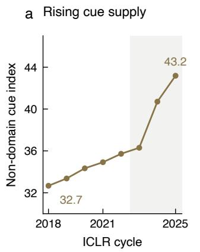

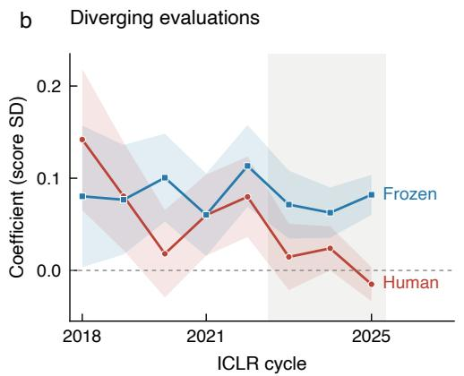

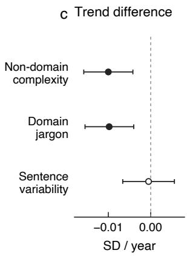  
Figure 1: Rising cue supply, diverging evaluations. (a) Mean non-domain lexical complexity in submitted abstracts. (b) Human and frozen-rater cue-score coeficients by ICLR cycle, with 95% confidence bands. (c) Annual human-minus-frozen trend diferences for three cues, with 90% intervals. Filled markers pass both BH-FDR $q < 0 . 1 0$ and interval exclusion; open markers do not. Shading denotes the 2023–2025 cycles, not an estimated treatment efect.

We resolve the confound with a rater whose standard is known not to have moved. The Gen-Review corpus [11] contains 81,850 machine-generated reviews of ICLR submissions from 2018 to 2025, all produced in a single February–April 2025 window, from one model family, under one prompt (Figure 2). That rater read the 2018 papers and the 2025 papers with the same instrument, so its year-to-year coeficient movement carries composition change and nothing else, and the human trend minus its trend identifies the part that belongs to the humans. This is the anchor-item logic of non-uniform diferential item functioning [25, 46], implemented as a three-way diference-in-diferences (feature × year × human) on the stacked human and machine observations of the same papers. The machine is used as a fixed ruler, never as ground truth: it may be badly calibrated, provided it is calibrated the same way every year.

We apply the design to 32,638 submissions and 124,615 human reviews. Four text cues are measured on the abstract as it was submitted rather than as it stands today, a distinction that turned out to matter (Section 3.1); lexical complexity is split into the general scientific vocabulary that carries style and the domain jargon that carries topic, because an undiferentiated list measures topic; and every claim is held to a double gate of false-discovery control and interval exclusion, with forty random-wordlist placebos run through the identical specification. The human weight on non-domain lexical complexity falls to zero while the frozen rater’s does not move (Figure 1); in the late window the frozen rater still pays for the cue at its earlier rate and never registers the sentence-length variability that humans still reward; the placebos centre on zero; and seven findings that did not survive adversarial re-testing are reported rather than dropped.

Three questions organise the study: whether human reviewers’ weight on lexical complexity changed between 2018 and 2025 once composition change is removed by the frozen rater (RQ1); whether the change is specific to the cue whose cost collapsed or a general shrinkage of every text coeficient (RQ2); and what a rater frozen at a pre-2023 standard still rewards in 2023–2025 that human reviewers no longer do (RQ3).

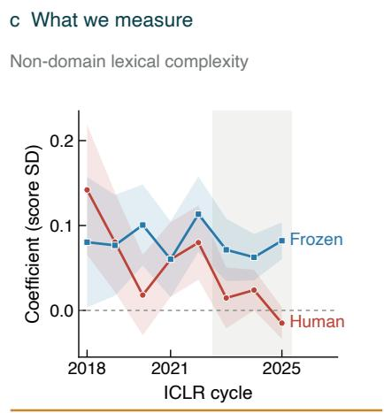

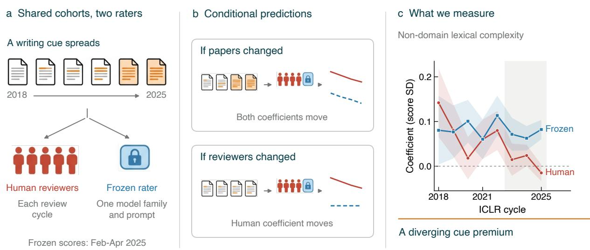  
Figure 2: A fixed comparator for changing evaluation. (a) Submission cohorts receive contemporaneous human reviews and retrospective scores from one model family and prompt. (b) Schematic predictions for shared composition efects versus human-specific change, conditional on comparable composition responses across raters. (c) Observed non-domain lexical complexity coeficients on a common scale, with 95% confidence bands; the two arms use their available ratings, with diferent annual sample sizes. Shading denotes the 2023–2025 cycles. Panels a–b are conceptual. A fixed rater alone does not establish the comparability condition needed to interpret divergence as preference drift.

The paper makes three contributions.

• An identification strategy. The frozen-rater design separates preference drift from composition drift wherever a fixed-prompt rater has been applied retrospectively to a corpus; it requires only that the rater not have been re-calibrated, not that it be right.

• The measurement. The human coeficient on non-domain lexical complexity falls from +0.142 to −0.015 while the frozen rater holds at +0.080 → +0.082, a divergence that survives forty random-wordlist placebos, a year permutation and a pre-period window, and that is absent for the sentence-length variability humans still reward.

• A data-provenance correction. The released abstracts were post-revision text; revision is more common for accepted papers and in later years; rebuilding the corpus on submitted versions made the decline steeper rather than weaker.

Substantively, reviewers discounted a cue whose production cost collapsed, while the frozen rater kept paying for it. That the association moved has been reported as a correlation on this venue [22]; what was missing was a way to say whose movement it was. The design therefore shifts the question from whether reviewers reward lexical complexity to whose standard moved, and it carries a warning for any LLM judge calibrated to a historical human preference: it drifts out of alignment silently while its agreement with humans on totals stays ordinary.

## 2 Related work

Observed shifts, and what remained unidentified. A process-centric study of ICLR 2017– 2025 reports that “the notion of good writing has shifted”: readability indices correlate with acceptance one way before 2024 and another way after [22]. That is an observation of the trajectory we study, and it is unidentified in the sense of Section 3.4: two period bins, univariate correlations with acceptance, and no fixed comparator. We replicated its design on our abstracts (released with the analysis). In the pre-period the sign of the readability correlation is the reverse of the full-text report; in the post-period every readability correlation is indistinguishable from zero; and once team size and the other indices are controlled, no readability index retains significance while log author count carries a coeficient an order of magnitude larger. We take the shift as observed and the identification as our contribution. In the scientometric literature, linguistic complexity has been related to impact and to disciplinary writing style [30, 31], jargon to citation loss [33], and the readability of abstracts to a century-long decline driven by general scientific vocabulary [39]; none of these designs separates the evaluator from the text.

Machine raters as instruments, not as judges. A large literature asks whether an LLM reproduces or improves on human review, and documents the biases of LLM judges: verbosity and position efects [12, 54], unfairness across candidates [50], cognitive biases [24], self-preference [37], and a catalogue of hidden biases in LLM-assisted review [52]; a survey of LLM-based review notes that such raters “may reward clear structure and polished prose while overemphasizing stylistic signals relative to substantive contribution” [35], which is the frozen half of our result stated as a general concern, and controlled edits show that LLM reviewers are manipulable by surface changes [53] while models asked only to correct grammar still alter meaning [2]. Our use is orthogonal and deliberately weaker: we require only that the machine rater’s own behaviour be constant across the years it scores, not that it be right. Two recent preprints attack the mirror-image problem, whether a change in a monitored score comes from the system or from a drifting LLM judge, and anchor the judge to frozen human labels [27, 51]; we anchor the humans to a frozen judge. Large-scale field experiments have established that the human reviewer pool itself is being reshaped by model use [28, 41, 47], and the ideation study of Si et al. [43] is the closest human-rater benchmark in scale.

Peer-review experiments and measurement invariance. Controlled studies of peer review have identified reviewer biases by design rather than by correlation [15, 42, 45, 48], and readability standards have been shown to be applied unevenly in review [19]. Psychometrics supplies the vocabulary for our estimand: when the relationship between a latent trait and an indicator difers across groups that is diferential item functioning; when the diference is in the slope it is non-uniform DIF; and detecting it requires anchor items assumed invariant [21, 25, 34, 46]. We adopt that vocabulary rather than coining terms.

Signal debasement. Economics supplies the interpretation. A cue is informative because it is costly [44]; when a sender can manipulate the feature a receiver observes, the receiver’s optimal rule underweights it relative to its raw predictive content, and underweights it more as manipulation becomes cheaper or more heterogeneous across senders. Frankel and Kartik [14] call the resulting equilibrium object muddled information; Ball [4] shows the optimal score deliberately underweights manipulable features; Hennessy and Goodhart [20] describe the comparative static as slopes shifting downward, the general form of Goodhart’s law [16]. The same logic appears in machine learning as strategic classification and performative prediction [18, 38]. The prediction is directional and it is about slopes, which is what we measure. We present it after the design and the estimates, so that debasement is an interpretation of an identified shift rather than an assumption imported to produce one.

<table><tr><td>Year</td><td>Submissions</td><td>Human arm</td><td>Frozen arm</td><td>Non-domain</td><td>Domain jargon</td><td>Sent.-length SD</td><td>Abstract words</td></tr><tr><td>2018</td><td>935</td><td>922</td><td>925</td><td>32.7</td><td>47.4</td><td>7.47</td><td>161</td></tr><tr><td>2019</td><td>1,419</td><td>1,419</td><td>1,390</td><td>33.4</td><td>48.7</td><td>7.78</td><td>161</td></tr><tr><td>2020</td><td>2,213</td><td>2,213</td><td>2,175</td><td>34.3</td><td>48.5</td><td>7.58</td><td>163</td></tr><tr><td>2021</td><td>2,594</td><td>2,594</td><td>2,526</td><td>34.9</td><td>49.3</td><td>7.68</td><td>171</td></tr><tr><td>2022</td><td>2,618</td><td>2,618</td><td>2,522</td><td>35.7</td><td>48.6</td><td>7.72</td><td>178</td></tr><tr><td>2023</td><td>3,797</td><td>3,797</td><td>3,662</td><td>36.3</td><td>48.7</td><td>7.85</td><td>181</td></tr><tr><td>2024</td><td>7,401</td><td>7,262</td><td>5,607</td><td>40.7</td><td>49.9</td><td>7.71</td><td>186</td></tr><tr><td>2025</td><td>11,667</td><td>11,517</td><td>8,375</td><td>43.2</td><td>51.3</td><td>7.60</td><td>189</td></tr></table>

Table 1: Corpus by submission year. Submissions with text features; papers with human ratings; papers with frozen machine ratings; and the corpus mean of each cue in the submitted abstract. Non-domain lexical complexity and domain jargon are syllable mass per word of the respective word class; sentence-length SD is in words.

## 3 Method

## 3.1 Panel and outcome

The panel covers eight ICLR cycles scored by both arms. Table 1 describes the corpus: 32,638 ICLR submissions from 2018 to 2025, with 124,615 human reviews and 81,850 frozen machine reviews. Per-year analysis samples run from 922 papers (2018) to 11,517 (2025) in the human arm and from 925 to 8,375 in the machine arm; the gap is machine-review coverage, not a diferent paper set. Human reviews and decisions come from the venue’s public record; machine reviews are the released Gen-Review corpus [11].

The outcome is the within-year standardised rating. The outcome is the reviewer rating, standardised within year. We standardise within year because the estimand is relative cue use, and because a year-level shift in the scoring scale is a documented failure mode of longitudinal rating comparisons. We cluster standard errors by paper, since a paper contributes several reviews [9].

## 3.2 Submitted-version abstracts

The released abstracts are not the abstracts reviewers read. The released corpus carries each abstract as it stands on the venue’s site today, and that is not the abstract reviewers read: submissions are revised during discussion and, if accepted, again for camera-ready. We audited this against the venue’s version histories on a stratified sample of 1,800 submissions from 2018–2023. Among abstracts that changed between first and last version, the corpus text matched the last version in every case and the first in none; the share that changed rose from 12% of submissions in 2018 to 72% in 2021, was higher for accepted papers, and the edits were substantive (median similarity to the submitted text 0.73). Revision is more common for accepted papers and in later years, so this contamination is correlated with both the outcome and the trend. We therefore rebuilt the abstract layer on submitted versions (Table 10 in Appendix C): the first archived version for 2018–2023, a public pre-review scrape for 2025, and for 2024, where the venue’s current API no longer exposes the original, the earliest public snapshot, taken after discussion but before camera-ready. Every number in this paper is computed on the rebuilt layer. The correction moves each late-year human coeficient further from zero and leaves the frozen arm unchanged: the early-to-late human contrast on non-domain lexical complexity is −0.0433 on current text and −0.0485 on submitted text. The contamination had been biasing the headline toward the null. The machine arm read the PDFs as the corpus authors downloaded them, that is, current versions; we return to this in Section 5.

<table><tr><td>Cue (this paper)</td><td></td><td>Construct in the literature Operationalisation on the submit- Sources ted abstract</td><td></td></tr><tr><td>complexity</td><td>side the field&#x27;s own termi- word of text</td><td>Non-domain lexical general scientific vocabu- syllable mass of words with three Gunning [17]; lary; the &quot;complex words&quot; or more syllables that are ab- Oppenheimer of readability formulas out- sent from the domain lexicon, per [36];</td><td>Plavén- Sigray et al. [39]</td></tr><tr><td>Domain jargon</td><td>nology ogy</td><td>domain-specific terminol- the same count for words present Plavén-Sigray in the domain lexicon</td><td>et al. [39]; Martínez and</td></tr><tr><td></td><td>sentences</td><td>Sentence-length SD syntactic variability across standard deviation of sentence Lu et al. [31] length in words</td><td>Mammola [33]</td></tr><tr><td>Abstract length</td><td>control</td><td>number of words</td><td></td></tr></table>

Table 2: Cues and their operationalisation. Each cue is computed on the abstract as submitted, standardised within year, and entered jointly with the others.

Abstracts, because every full-text route is selected on the outcome. Our cues are computed on submitted-version abstracts while the machine rater read full PDFs. This is a real limitation and we chose it over a worse alternative: we measured four routes to conference full text and every one is either outcome-correlated or unusable. Matching to arXiv skews the sample +25 percentage points toward accepted papers; OpenAlex skews it +42; the venue’s own API is unbiased but rate-limited to 36 PDFs per hour, which is 38 days for this corpus. We report the abstract-only result rather than a full-text result computed on a sample selected on the outcome.

## 3.3 Cues

Four cues, mutually controlled. Table 2 defines the four cues. Lexical complexity is measured as the syllable mass of words with three or more syllables, the complex-word count of the Fog index [17] and the manipulation of Oppenheimer [36], and it is split by whether the word belongs to a domain lexicon. Words outside the lexicon are the general scientific vocabulary whose growth drives the long-run decline in the readability of abstracts [39] and whose recent surge marks machineassisted writing [23]; we call this cue non-domain lexical complexity. Words inside the lexicon are domain jargon, the specialised terminology that carries topic and has its own citation consequences [33]. The split is not cosmetic. It is a direct consequence of an error we made and had to withdraw (Section 4.7): an undiferentiated complexity or hype list is dominated by ordinary machine-learning vocabulary and measures topic, not style. Sentence-length SD is the syntactic half of linguistic complexity in the sense of Lu et al. [31]; abstract length is a control, since length is the best-known confound of automated judgement [12]. Both wordlists and their hit distributions are released.

We take syllable counts from the CMU pronouncing dictionary rather than from hyphenation, which splits words at typographic break points and undercounts syllables systematically, and we calibrated the implementation against a published reference passage, obtaining 37.46 against a reference value of 37.5. Readability values from hyphenation-based libraries are therefore not comparable to ours.

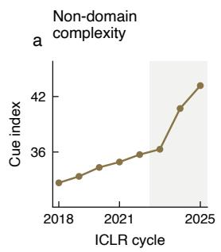

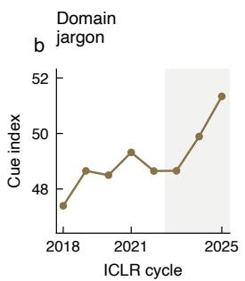

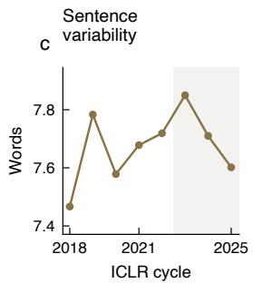

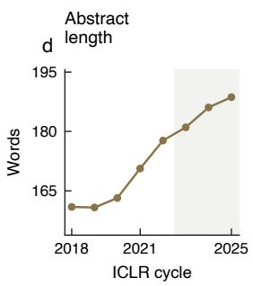  
Figure 3: Composition drift in the abstract layer. Corpus means by ICLR cycle. The first two panels show the lexical-complexity indices; sentence-length variability and abstract length are measured in words. Shading marks the 2023–2025 cycles.

Composition drift is real. Figure 3 and Table 1 show why the identification problem is not academic. The corpus mean of non-domain lexical complexity rises from 32.67 to 43.18, sharply after 2023; domain jargon rises from 47.39 to 51.34; abstract length rises from 161 to 189 words. Sentence-length variability moves the other way after 2023, from 7.85 down to 7.60. The cue humans still reward is becoming scarcer in the corpus while the cue they stopped rewarding is becoming abundant, which is the pattern independent corpus studies report for machine-assisted writing [23, 26].

## 3.4 Identification

The estimand is a trend diference. For text feature f, year t and rater $r \in \{ H , M \}$ (human, machine), let $\beta _ { r , f } ( t )$ be the coeficient of the within-year standardised feature on the within-year standardised score, estimated with the other features and abstract length mutually controlled. An observed trajectory $\beta _ { H , f } ( t )$ moves for two reasons,

$$
\underbrace { \Delta \beta _ { H , f } } _ { \mathrm { o b s e r v e d } } = \underbrace { C _ { f } } _ { \mathrm { c o m p o s i t i o n } } + \underbrace { P _ { f } } _ { \mathrm { p r e f e r e n c e } } ,\tag{1}
$$

and the frozen arm gives $\Delta \beta _ { M , f } = C _ { f }$ alone, because the machine’s scoring rule is literally the same function in every year. The estimand is therefore the trend diference

$$
P _ { f } = \Delta \beta _ { H , f } - \Delta \beta _ { M , f } ,\tag{2}
$$

which we implement as the three-way interaction feature × year $\times { \mathbb H } [ \mathrm { h u m a n } ]$ on the stacked human and machine observations of the same papers, the multi-period diference-in-diferences of Callaway and Sant’Anna [8] with a rater rather than a treatment group as the second diference.

What must be true. Three conditions carry the design. (i) The rater is frozen. All machine reviews come from one model family, one prompt, one short window; this is a property of how the corpus was built, stated by its authors [11], not an assumption we impose. It is the reason the design works here and would not work against a live API endpoint, whose silent updates are themselves a documented source of measurement change [27, 51]. (ii) Both arms see the same papers. We use only submissions with both a human and a machine score, so composition is held identical across arms by construction. (iii) Composition acts on both arms in the same direction. We do not require equal magnitudes; we require that a change in the mix of texts not move the two raters’ coeficients in opposite directions. This is the one assumption that is not guaranteed by construction, and Section 4.5 tests it with placebos.

<table><tr><td></td><td>Correlational trajectory [22]</td><td>Frozen-rater design (this paper)</td></tr><tr><td>Outcome</td><td>acceptance</td><td>human review score, standardised within year</td></tr><tr><td>Text layer</td><td>revision)</td><td>full text as currently hosted (post- abstract as submitted (rebuilt from version histories)</td></tr><tr><td>Estimator</td><td>univariate correlations</td><td>four cues and abstract length mutually con- trolled; paper-clustered SE</td></tr><tr><td>Time resolution</td><td>release</td><td>two bins, before and after the LLM eight yearly points and an early-to-late con- trast</td></tr><tr><td>Comparator</td><td>none</td><td>a rater frozen by construction, scored on the same papers</td></tr><tr><td>Estimand</td><td>association between readability and human-minus-frozen trend difference, i.e. acceptance</td><td>preference drift net of composition drift</td></tr><tr><td>Error control</td><td>none reported</td><td>BH-FDR  $q < 0 . 1 0$  and a 90% interval, both required; forty placebo wordlists; year per- mutation</td></tr></table>

Table 3: Two ways to read a moving association. The correlational design reports that the association changed; the frozen-rater design attributes the change to the evaluator or to the corpus.

What is not assumed. We do not assume the machine agrees with humans, is accurate, or should be imitated. A frozen rater that is systematically wrong still identifies $P _ { f } ,$ provided it is wrong in the same way every year. In the vocabulary of measurement invariance [21, 34, 49], the frozen arm is the anchor assumed invariant, and the quantity of interest is a slope diference across groups, which is non-uniform diferential item functioning [46].

What the design cannot do. It cannot say whether the human shift is an improvement. It measures that the humans moved and the fixed instrument did not. Normative content enters only in Section 5, and only as an interpretation marked as such. Table 3 sets the design against the correlational trajectory previously reported on this venue.

## 3.5 Estimation and the double gate

Within each year and arm we regress the standardised score on the four standardised cues, cluster by paper, and read of $\beta _ { r , f } ( t )$ . We contrast an early window (2018–2020) with a late one (2023–2025) on the same specification, and we run the pre-period check recommended for diference-in-diferences designs [40] on the 2018–2021 window (Section 4.5). The trend statistic is the three-way interaction of Section 3.4. We report efect sizes as the change in score, in score standard deviations, from moving a cue from its median to its 90th percentile, with bootstrap intervals at B = 1,500 [13].

Every claim passes a double gate. We require every claim to pass both BH-FDR at $q < 0 . 1 0$ [5] and a 90% interval excluding zero. Of 23 pre-specified tests, 12 pass. We report the other 11 as not passing, mark them in every table and plot, and list all 23 in Appendix A.

<table><tr><td rowspan="2">Year</td><td colspan="2">Non-domain lexical complexity</td><td colspan="2">Domain jargon</td><td rowspan="2"></td><td colspan="2">Sentence-length SD</td></tr><tr><td>human</td><td>frozen</td><td>human</td><td>frozen</td><td>human</td><td>frozen</td></tr><tr><td>2018</td><td>+0.142 (0.039)</td><td>+0.080 (0.039)</td><td>+0.085 (0.033)</td><td></td><td>+0.047 (0.034)</td><td>+0.015 (0.038)</td><td>+0.000 (0.038)</td><td></td></tr><tr><td>2019</td><td>+0.081 (0.030)</td><td>+0.077 (0.030)</td><td>+0.083</td><td>(0.027)</td><td>+0.001 (0.027)</td><td>+0.043</td><td>(0.025)</td><td>-0.022 (0.026)</td></tr><tr><td>2020</td><td>+0.018 (0.024)</td><td>+0.101 (0.024)</td><td>+0.017</td><td>(0.022)</td><td>+0.001 (0.022)</td><td>+0.033</td><td>(0.023)</td><td>-0.015 (0.024)</td></tr><tr><td>2021</td><td>+0.060 (0.022)</td><td>+0.060 (0.023)</td><td>+0.044</td><td>(0.020)</td><td>+0.037 (0.020)</td><td>+0.052</td><td>(0.021)</td><td>-0.014 (0.021)</td></tr><tr><td>2022</td><td>+0.080 (0.022)</td><td>+0.113 (0.023)</td><td>+0.059</td><td>(0.020)</td><td>+0.012 (0.021)</td><td>+0.033</td><td>(0.021)</td><td>-0.033 (0.022)</td></tr><tr><td>2023</td><td>+0.015 (0.018)</td><td>+0.071 (0.019)</td><td>+0.050</td><td>(0.017)</td><td>+0.003 (0.017)</td><td>+0.043</td><td>(0.016)</td><td>+0.029 (0.016)</td></tr><tr><td>2024</td><td>+0.024 (0.012)</td><td>+0.063 (0.014)</td><td>+0.002</td><td>(0.012)</td><td>+0.020 (0.014)</td><td>+0.050</td><td>(0.012)</td><td>-0.004 (0.013)</td></tr><tr><td>2025</td><td>-0.015 (0.009)</td><td>+0.082 (0.011)</td><td>-0.013</td><td>(0.010)</td><td>+0.018 (0.011)</td><td>+0.030 (0.010)</td><td></td><td>−0.014 (0.012)</td></tr></table>

Table 4: Per-year coeficients on the review score, by cue and rater. Entries are β (SE) of the within-year standardised cue on the within-year standardised score, with the other cues and abstract length controlled and standard errors clustered by paper.

Placebos supply the null distribution. Because the estimand is a contrast between two arms on the same units, its natural null distribution comes from re-running the identical specification on cues that carry no signal, in the spirit of placebo inference for comparative designs [1]: forty random mid-frequency wordlists treated as if each were the cue of interest, and thirty permutations of the year labels.

One specification trap, since it produced a false positive for us. Including a feature-bycentred-year interaction together with year fixed efects makes the design matrix rank-deficient. The HC3 covariance estimator [32] does not fail loudly in that situation; it returns standard errors of 0.0000 and correspondingly spectacular significance. Our robustness code now asserts full rank before reporting.

## 4 Results

With the panel, the cues and the decision rule in place, we turn to the estimates.

## 4.1 The human weight on non-domain lexical complexity fell to zero; the frozen rater did not move

Table 4 gives the year-by-year coeficients on the same papers. The human coeficient on non-domain lexical complexity runs $+ 0 . 1 4 2 , + 0 . 0 8 1 , + 0 . 0 1 8 , + 0 . 0 6 0 , + 0 . 0 8 0 , + 0 . 0 1 5 , + 0 . 0 2 4 , - 0 . 0 1 5$ from 2018 to 2025; the frozen rater runs $+ 0 . 0 8 0 , + 0 . 0 7 7 , + 0 . 1 0 1 , + 0 . 0 6 0 , + 0 . 1 1 3 , + 0 . 0 7 1 , + 0 . 0 6 3 , + 0 . 0 8 2 .$ Both series are noisy year to year and their per-year intervals overlap; the claim rests on the trend diference, tested below, not on any single year. Figure 1 shows the shape: the two arms track each other until 2022 and separate afterward, while the corpus mean of the cue (Figure 3) climbs most steeply in exactly the years the human coeficient sits at zero.

## 4.2 The decline is a lexical-complexity phenomenon, not a general one

Figure 4 extends the comparison to the other two cues, each over its own corpus strip. Domain jargon follows non-domain complexity down in the human arm $( + 0 . 0 8 5  - 0 . 0 1 3 )$ while the frozen arm stays near a low constant. Sentence-length variability reverses the ordering: humans hold a

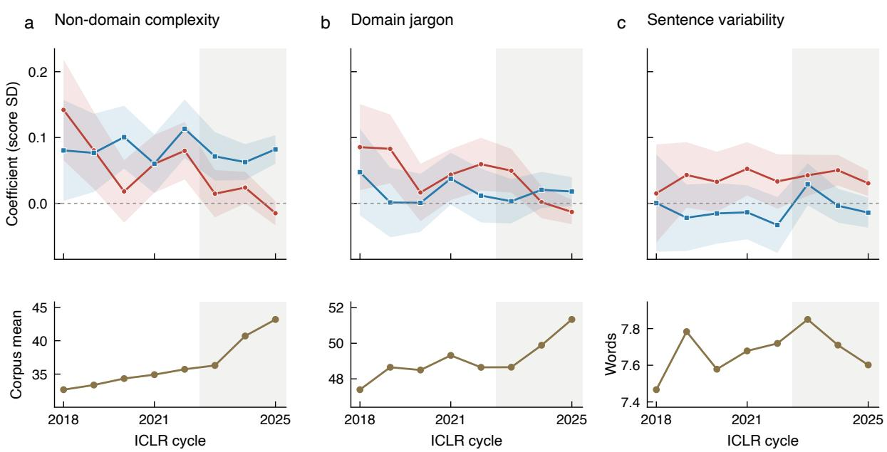  
Figure 4: Cue use and corpus composition. Top: yearly cue-score coeficients on a shared vertical scale, with 95% confidence bands. Bottom: corresponding corpus means in submitted abstracts. Columns show non-domain lexical complexity, domain jargon, and sentence-length variability. Shading denotes the 2023–2025 ICLR cycles.

visible premium in every year and the frozen rater sits near zero throughout, so the human decline is confined to the two lexical cues.

## 4.3 Pooling years makes the asymmetry unambiguous

Figure 5 and Table 5 give the compact form of the result. Moving non-domain lexical complexity from its median to its 90th percentile was worth +0.075 score SD to human reviewers in 2018–2020 and +0.002 in 2023–2025; for the frozen rater the same manipulation is worth +0.109 then and +0.094 now. Domain jargon goes $+ 0 . 0 7 1  + 0 . 0 0 2$ for humans and $+ 0 . 0 1 5  + 0 . 0 1 9$ for the machine. Sentence-length variability goes $+ 0 . 0 4 5  + 0 . 0 5 2$ for humans and $- 0 . 0 2 0 \to - 0 . 0 0 1$ for the machine.

Both lexical-complexity contrasts clear the double gate; the frozen arm’s do not. Table 6, plotted as Figure 7 in Appendix A, gives the inference. The three-way DiD is −0.0100 for non-domain lexical complexity $( q = 0 . 0 1 3 )$ and −0.0098 for domain jargon $( q = 0 . 0 1 4 )$ ; both clear the double gate. For sentence-length variability it is $- 0 . 0 0 0 5 \ ( q = 0 . 8 9 6 )$ and does not. The period contrast is the cleanest statement of the asymmetry: human −0.0485 (q = 0.012) and −0.0433 $( q = 0 . 0 1 8 )$ , frozen rater − $0 . 0 0 7 6 \ ( q = 0 . 7 7 5 )$ and $+ 0 . 0 0 8 4 \ ( q = 0 . 7 7 5 )$ . The humans moved; the fixed instrument did not.

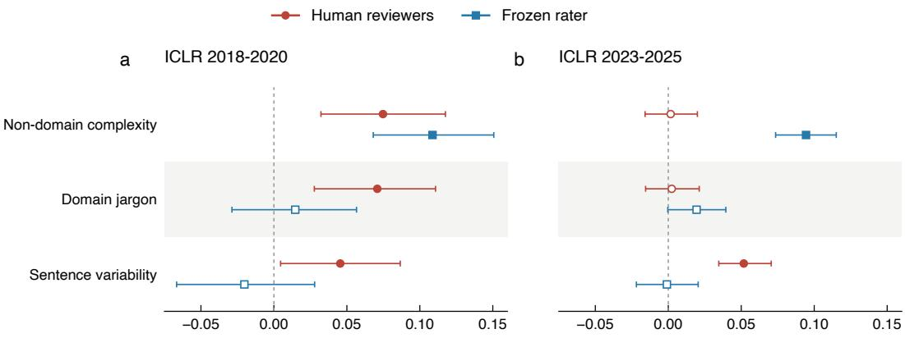  
Review-score change, median to 90th percentile of cue (SD)

Figure 5: Efect sizes by window. Change in review score, in score standard deviations, from moving each cue from its median to its 90th percentile, for the early and late windows and both raters. Whiskers are bootstrap 95% intervals; filled markers indicate intervals excluding zero. Non-domain complexity and sentence variability abbreviate non-domain lexical complexity and sentence-length variability.
<table><tr><td></td><td></td><td colspan="2">2018-2020</td><td colspan="2">2023-2025</td><td></td></tr><tr><td>Cue</td><td>Rater</td><td>effect</td><td>95% CI</td><td>effect</td><td>95% CI</td><td>change</td></tr><tr><td>Non-domain lexical complexity</td><td>human</td><td>+0.075</td><td>[+0.032, +0.118]</td><td>+0.002</td><td>[-0.016, +0.020]</td><td>-0.073</td></tr><tr><td></td><td>frozen</td><td>+0.109</td><td>[+0.068, +0.151]</td><td>+0.094</td><td>[+0.074, +0.115]</td><td>-0.014</td></tr><tr><td>Domain jargon</td><td>human</td><td>+0.071</td><td>[+0.028, +0.111]</td><td>+0.002</td><td>[-0.016, +0.021]</td><td>-0.068</td></tr><tr><td></td><td>frozen</td><td>+0.015</td><td>[-0.029, +0.057]</td><td>+0.019</td><td>[-0.000, +0.039]</td><td>+0.005</td></tr><tr><td>Sentence-length SD</td><td>human</td><td>+0.045</td><td>[+0.005, +0.087]</td><td>+0.052</td><td>[+0.035, +0.071]</td><td>+0.006</td></tr><tr><td></td><td>frozen</td><td>-0.020</td><td>[-0.067, +0.028]</td><td>-0.001</td><td>[-0.022, +0.020]</td><td>+0.019</td></tr></table>

Table 5: Efect sizes by window. Change in review score, in score SD, from moving a cue from its median to its 90th percentile; bootstrap 95% CIs at B = 1,500.

## 4.4 By 2023–2025 the two raters price diferent things

Humans and the frozen rater agree on totals and disagree on reasons. In the late window humans put $+ 0 . 0 3 9 6 \ ( q < 0 . 0 0 1 )$ on sentence-length variability, a cue the frozen rater does not register, and the frozen rater puts +0.0715 (q < 0.001) on non-domain lexical complexity, a cue humans no longer pay for. The overall score correlation between the arms is 0.245, close to the human–human agreement reported in the meta-analytic literature on journal peer review (ICC around 0.34, 7) and to the disagreement documented in the venue’s own consistency experiments [6, 10]. The two raters agree about as well as two humans do while weighting the observable text quite diferently: agreement at the level of totals is not agreement about reasons.

## 4.5 Forty random wordlists do not reproduce the decline

The decline is cue-specific. The threat is that every coeficient drifts toward zero for reasons unrelated to the cue: more reviews per paper, a changing reviewer pool, score compression. We built 40 random mid-frequency wordlists, treated each as if it were the cue of interest, and ran it through the identical three-way specification (Table 7). They centre on −0.0005 with SD 0.0033 (5th and 95th percentiles −0.0054 and +0.0051). The real cues sit at −0.0097 (non-domain lexical complexity), −0.0096 (domain jargon) and −0.0167 (all long words), outside the whole placebo distribution, empirical $p = 0 . 0 0 0$ in each case (Figure 6). Generic shrinkage would have moved the placebos too. This is also the test of condition (iii) in Section 3.4: a composition change that pushed the two arms in opposite directions for reasons unrelated to the cue would have to do so for the real cues and not for forty random ones.

<table><tr><td>Test</td><td> $\beta$ </td><td>SE</td><td>90% CI</td><td>QBH</td><td>gate</td></tr><tr><td>DiD three-way (feature × year × human)</td><td></td><td></td><td></td><td></td><td></td></tr><tr><td>non-domain lexical complexity</td><td>-0.0100</td><td>0.0035</td><td>[-0.0158, -0.0042]</td><td>0.013</td><td>√</td></tr><tr><td>domain jargon</td><td>-0.0098</td><td>0.0035</td><td>[-0.0155, -0.0040]</td><td>0.014</td><td>√</td></tr><tr><td>sentence-length SD</td><td>-0.0005</td><td>0.0037</td><td>[-0.0066, +0.0056]</td><td>0.896</td><td></td></tr><tr><td>2023-2025 cross-section</td><td></td><td></td><td></td><td></td><td></td></tr><tr><td>human, sentence-length SD</td><td>+0.0396</td><td>0.0069</td><td> $\begin{array} { r l } { [ + 0 . 0 2 8 2 , + 0 . 0 5 0 9 ] } & { { } < 0 . 0 0 1 } \end{array}$ </td><td></td><td>√</td></tr><tr><td>frozen, non-domain lexical complexity</td><td>+0.0715</td><td>0.0076</td><td>[+0.0590, +0.0841]</td><td>&lt; 0.001</td><td>√</td></tr><tr><td>Early→late contrast</td><td></td><td></td><td></td><td></td><td></td></tr><tr><td>human, non-domain lexical complexity</td><td>-0.0485</td><td>0.0166</td><td>[-0.0759, -0.0211]</td><td>0.012</td><td>√</td></tr><tr><td>human, domain jargon</td><td>-0.0433</td><td>0.0163</td><td>[-0.0702, -0.0165]</td><td>0.018</td><td>√</td></tr><tr><td>frozen, non-domain lexical complexity</td><td>-0.0076</td><td>0.0163</td><td>[-0.0345, +0.0192]</td><td>0.775</td><td></td></tr><tr><td>frozen, domain jargon</td><td>+0.0084</td><td>0.0170</td><td>[-0.0195, +0.0363]</td><td>0.775</td><td></td></tr></table>

Table 6: Main inference. A claim is made only when BH-FDR $q < 0 . 1 0$ and the 90% interval excludes zero $( \checkmark )$ . Rows without the mark fail the gate and are reported as failures; all 23 pre-specified tests are in Table 8.
<table><tr><td>Check</td><td>Statistic</td><td>Estimate</td><td>SD SE</td><td>Interval or p</td></tr><tr><td>Random-wordlist placebos  $( n = 4 0 )$ </td><td>three-way DiD</td><td>-0.0005</td><td>0.0033</td><td> $[ - 0 . 0 0 5 4 , + 0 . 0 0 5 1 ]$ </td></tr><tr><td>real cue: non-domain lexical complexity</td><td>three-way DiD</td><td>-0.0097</td><td></td><td>empirical  $p = 0 . 0 0 0$ </td></tr><tr><td>real cue: domain jargon</td><td>three-way DiD</td><td>-0.0096</td><td></td><td>empirical p = 0.000</td></tr><tr><td>real cue: all long words</td><td>three-way DiD</td><td>-0.0167</td><td></td><td>empirical  $p = 0 . 0 0 0$ </td></tr><tr><td>Year-label permutations  $( n = 3 0 )$ </td><td>three-way DiD</td><td>-0.0004</td><td>0.0040</td><td>share ≥ |real|: 0.000</td></tr><tr><td> $R ^ { 2 }$  trend, human arm</td><td>slope per year</td><td>-0.00183</td><td>0.0007</td><td> $\left[ - 0 . 0 0 3 5 5 , - 0 . 0 0 0 1 1 \right]$ </td></tr><tr><td> $R ^ { 2 }$  trend, frozen arm</td><td>slope per year</td><td>+0.00017</td><td>0.00054</td><td>[-0.00114, +0.00148]</td></tr><tr><td> $R ^ { 2 }$  trend, difference</td><td>slope per year</td><td>-0.002</td><td>0.0009</td><td> $\mathrm { \bar { [ - 0 . 0 0 4 2 , + 0 . 0 0 0 2 ] } }$ </td></tr></table>

Table 7: Robustness of the three-way interaction. Placebo wordlists and year permutations are run through the identical specification; $R ^ { 2 }$ trends are two-parameter fits to eight yearly points and are reported as diagnostics, not evidence.

Shufling the years destroys it. Shufling year labels 30 times gives interactions centred at −0.0004 (SD 0.0040); none reaches the magnitude of the real estimate.

The efect sits after the cost shock, not before it. Restricting to 2018–2021 gives −0.0129 $( p = 0 . 3 5 9 ) ; 2 0 2 2 - 2 0 2 5 { \mathrm { ~ g i v e s ~ } } - 0 . 0 3 5 3 { \mathrm { ~ } } ( p < 0 . 0 0 1 )$ . The efect is concentrated where the cost shock is, which is also visible in Figure 1.

## 4.6 Explained variance is reported, not relied on

Table 11 and Figure 8 in Appendix D report per-year $R ^ { 2 }$ for both arms. We initially read the endpoints $( 0 . 0 1 9 7  0 . 0 0 1 9$ for humans against a flat machine arm) as evidence against generic shrinkage. That was reading a trend of two points. Fitting the trend on eight observations gives $- 0 . 0 0 1 8 3 / \mathrm { y r }$ for humans, 95% $\mathrm { C I } \ [ - 0 . 0 0 3 5 5 , - 0 . 0 0 0 1 1 ]$ , and $+ 0 . 0 0 0 1 7 / \mathrm { y r }$ for the frozen arm, CI [−0.00114, +0.00148]. The human interval just excludes zero, but a two-parameter fit to eight points is not something we rest a claim on; we let the placebo battery, which has power, carry the argument.

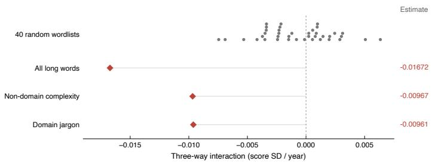  
Figure 6: Observed interactions relative to random wordlists. Each grey dot is one of forty placebo interactions; vertical stacking prevents overlap. Red diamonds show three real lexical-cue estimates in the same specification, with separate rows for the nearly coincident non-domain and domain estimates. Grey stems join estimates to zero; they are not confidence intervals. The all-long-words measure is not sentence-length variability.

## 4.7 Seven findings we withdrew

Four findings with attractive first-run p-values did not survive adversarial re-testing, and three more fell to a control we should have applied first; Table 9 in Appendix B lists all seven with the diagnostic that overturned each. The common cause was interpreting before testing, and the failure modes recur in text-and-outcomes work: a numeral regex that matched model names rather than results; a hype list and an LLM-marker list that were mostly ordinary vocabulary; an uncontrolled complexity penalty that went to zero, not negative, under controls; a rotation of the human evaluation function estimated on a single year; and a presentation-versus-soundness dissociation that was a team-size confound. The procedural lessons are now rules in our pipeline: any regex or wordlist measure must first emit its twenty most frequent hits in context; any vector estimated on a small sample must be bootstrapped; any obvious structural covariate must be controlled before interpretation.

## 5 Discussion, limitations, and conclusion

The estimates answer the three questions in order: the human weight on lexical complexity moved (RQ1), the movement is confined to the cues whose cost collapsed (RQ2), and the frozen rater still pays for exactly those cues (RQ3). We now say what that does and does not license.

Reviewers discounted a cue whose cost collapsed. Human reviewers reduced the weight they place on a cue whose production cost collapsed. Models of evaluation under manipulable signals prescribe exactly that comparative static: underweight what the sender can cheaply produce, and underweight it more as the ability to produce it spreads. We say the observed movement is consistent with that prescription. We cannot show reviewers arrived at the optimum, nor that they were deliberate; a taste change with the same sign would look identical in our data. The timing is informative: the human coeficient sits at zero from ICLR 2023 onward, a cycle whose papers were written before the release of ChatGPT but reviewed after it, while the corpus mean of the cue jumps only from ICLR 2024, the first cycle written after it. The reviewers moved before the papers did.

The frozen rater is the cautionary half. The same property that makes the machine a valid instrument makes it a poor judge. It has preserved its earlier reward schedule into 2025 and still pays +0.0715 for a cue that human reviewers have written down to zero, while remaining blind to the structural feature humans now price most. Its total-score agreement with humans, 0.245, is close to human–human agreement, so the misalignment is invisible from agreement statistics alone: right answer, wrong reasons. Deployments that freeze a prompt for reproducibility should expect this drift to accumulate silently, and should measure their rater’s feature weights rather than only its correlation with humans. Acting on a published coeficient is self-defeating for the same reason the coeficient moved: the cue loses value as it is optimised [38].

Calibrating a judge to historical preferences bakes in the debased cue. Any LLM judge that is prompted, fine-tuned or reward-modelled to reproduce human review scores learns the human reward schedule of its calibration period. Our estimates imply a testable ordering: the earlier the calibration window, the larger the weight such a judge places on non-domain lexical complexity relative to contemporary reviewers, and the larger the score gain available from rewriting alone. The frozen rater studied here is the limiting case of a judge calibrated once and never updated; judges refreshed on recent reviews should show a smaller gap, and the gap should be measurable with the same design.

Limitations. Abstracts, not full text, for the reasons given: no unbiased full-text route exists at this scale. One venue. Eight years, and the interesting part is the last three. Our cues are lexical and structural proxies for something vaguer. The machine rater is one model family under one prompt, so “the frozen rater” is that configuration and not LLMs in general. Condition (iii) of Section 3.4 is tested, not guaranteed. Human ratings themselves are noisy, with reported inter-reviewer ICC around 0.34. Two version caveats remain after the rebuild: the 2024 abstracts are post-discussion rather than submitted text, because no earlier public snapshot exists, and the machine rater scored current PDFs, so its coeficient levels carry a version efect even though its year-to-year flatness does not. Finally, the divergence says nothing about whether any paper was judged correctly.

The design applies wherever a fixed-prompt rater exists. Any setting with a fixed-prompt automated rater applied retrospectively across a period in which human standards may have moved qualifies: grading, content moderation, hiring screens, clinical scoring. The requirement is strict and easy to violate. The rater must not be updated, re-prompted, or silently re-routed mid-study; a live API endpoint does not satisfy it.

Conclusion. A rater that never changes is useless as a judge and valuable as an instrument. Holding one still, we can see that human reviewers stopped paying for lexical complexity while the machine kept paying. The methodological point is the one to carry: stable automated raters can diagnose human preference change, and should not thereby be mistaken for the standard. The question is no longer whether reviewers reward lexical complexity, but whose standard moved, and by how much.

## 6 Reproducibility

Data availability. All inputs are public. Human reviews, decisions and abstract version histories come from OpenReview (https://openreview.net; API v1 for 2018–2023, API v2 thereafter). The machine reviews are the Gen-Review corpus [11], released at https://anonymous.4open.

science/r/gen\_review/. Pre-review abstract snapshots for ICLR 2024 and 2025 come from https://github.com/berenslab/iclr-dataset. Syllable counts use the CMU pronouncing dictionary. Because the venue’s anonymous query endpoint began returning HTTP 403 during this work, we also preserved a dataset snapshot and report its SHA-256 so that our inputs remain checkable.

Code availability. The full pipeline is released at https://github.com/Biajin-PKU/froze n-rater-drift: corpus assembly and the abstract-version rebuild, feature construction with both wordlists and their hit distributions, estimation, the 40 placebo draws and 30 permutation draws, the diagnostic scripts behind each of the seven withdrawn findings, and the scripts that render every table and figure. Every number in this paper, every table and every rendered figure is drawn from a single machine-readable records file in that repository, and a checker verifies that no numeral in the manuscript is absent from it.

Rater configuration. Model family, generation window, prompt, and decoding settings for the frozen arm are those of the Gen-Review release; verifying that the rater was fixed requires only those fields, and we reproduce them with the released artefacts.

Author contributions (CRediT). Jiabin Zheng: Conceptualization, Methodology, Software, Validation, Formal analysis, Investigation, Data curation, Writing – original draft, Writing – review & editing, Visualization. The author has read and agreed to the submitted version of the manuscript.

## References

[1] Alberto Abadie, Alexis Diamond, and Jens Hainmueller. Synthetic control methods for comparative case studies: Estimating the efect of California’s tobacco control program. Journal of the American Statistical Association, 105(490):493–505, 2010. doi: 10.1198/jasa.2009.ap08746.

[2] Marwa Abdulhai, Isadora White, Yanming Wan, Ibrahim Qureshi, Joel Z. Leibo, Max Kleiman-Weiner, and Natasha Jaques. How LLMs distort our written language. arXiv:2603.18161, 2026.

[3] J. Scott Armstrong. Unintelligible management research and academic prestige. Interfaces, 10 (2):80–86, 1980. doi: 10.1287/inte.10.2.80.

[4] Ian Ball. Scoring strategic agents. American Economic Journal: Microeconomics, 17(1):97–129, 2025. doi: 10.1257/mic.20230275.

[5] Yoav Benjamini and Yosef Hochberg. Controlling the false discovery rate: A practical and powerful approach to multiple testing. Journal of the Royal Statistical Society: Series B (Methodological), 57(1):289–300, 1995. doi: 10.1111/j.2517-6161.1995.tb02031.x.

[6] Alina Beygelzimer, Yann Dauphin, Percy Liang, and Jennifer Wortman Vaughan. Has the machine learning review process become more arbitrary as the field has grown? The NeurIPS 2021 consistency experiment. arXiv:2306.03262, 2023.

[7] Lutz Bornmann, R¨udiger Mutz, and Hans-Dieter Daniel. A reliability-generalization study of journal peer reviews: A multilevel meta-analysis of inter-rater reliability and its determinants. PLoS ONE, 5(12):e14331, 2010. doi: 10.1371/journal.pone.0014331.

[8] Brantly Callaway and Pedro H. C. Sant’Anna. Diference-in-diferences with multiple time periods. Journal of Econometrics, 225(2):200–230, 2021. doi: 10.1016/j.jeconom.2020.12.001.

[9] A. Colin Cameron and Douglas L. Miller. A practitioner’s guide to cluster-robust inference. Journal of Human Resources, 50(2):317–372, 2015. doi: 10.3368/jhr.50.2.317.

[10] Corinna Cortes and Neil D. Lawrence. Inconsistency in conference peer review: Revisiting the 2014 NeurIPS experiment. arXiv:2109.09774, 2021.

[11] Luca Demetrio, Giovanni Apruzzese, Kathrin Grosse, Pavel Laskov, Emil C. Lupu, Vera Rimmer, and Philine Widmer. Gen-Review: A large-scale dataset of AI-generated (and human-written) peer reviews. arXiv:2510.21192, 2025.

[12] Yann Dubois, Bal´azs Galambosi, Percy Liang, and Tatsunori B. Hashimoto. Length-controlled AlpacaEval: A simple way to debias automatic evaluators. arXiv:2404.04475, 2024.

[13] Bradley Efron. Bootstrap methods: Another look at the jackknife. The Annals of Statistics, 7 (1):1–26, 1979. doi: 10.1214/aos/1176344552.

[14] Alex Frankel and Navin Kartik. Muddled information. Journal of Political Economy, 127(4): 1739–1776, 2019. doi: 10.1086/701604.

[15] Alexander Goldberg, Ivan Stelmakh, Kyunghyun Cho, Alice Oh, Alekh Agarwal, Danielle Belgrave, and Nihar B. Shah. Peer reviews of peer reviews: A randomized controlled trial and other experiments. PLOS ONE, 20(4):e0320444, 2025. doi: 10.1371/journal.pone.0320444.

[16] Charles A. E. Goodhart. Problems of monetary management: The UK experience. In Monetary Theory and Practice: The UK Experience, pages 91–121. Macmillan, London, 1984. doi: 10.1007/978-1-349-17295-5 4.

[17] Robert Gunning. The Technique of Clear Writing. McGraw-Hill, New York, 1952.

[18] Moritz Hardt, Nimrod Megiddo, Christos Papadimitriou, and Mary Wootters. Strategic classification. In Proceedings of the 2016 ACM Conference on Innovations in Theoretical Computer Science (ITCS), pages 111–122, 2016. doi: 10.1145/2840728.2840730.

[19] Erin Hengel. Publishing while female: Are women held to higher standards? Evidence from peer review. The Economic Journal, 132(648):2951–2991, 2022. doi: 10.1093/ej/ueac032.

[20] Christopher A. Hennessy and Charles A. E. Goodhart. Goodhart’s law and machine learning: A structural perspective. International Economic Review, 64(3):1075–1086, 2023. doi: 10.1111/ iere.12633.

[21] Paul W. Holland and Howard Wainer, editors. Diferential Item Functioning. Lawrence Erlbaum Associates, Hillsdale, NJ, 1993.

[22] Sangkeun Jung, Goun Pyeon, Inbum Heo, and Hyungjin Ahn. What drives paper acceptance? A process-centric analysis of modern peer review. arXiv:2509.25701, 2025.

[23] Dmitry Kobak, Rita Gonz´alez-M´arquez, Em˝oke-Agnes Horv´at, and Jan Lause. Delving into ´ LLM-assisted writing in biomedical publications through excess vocabulary. Science Advances, 11(27):eadt3813, 2025. doi: 10.1126/sciadv.adt3813.

[24] Ryan Koo, Minhwa Lee, Vipul Raheja, Jong Inn Park, Zae Myung Kim, and Dongyeop Kang. Benchmarking cognitive biases in large language models as evaluators. In Findings of the Association for Computational Linguistics: ACL 2024, pages 517–545, 2024. doi: 10.18653/v1/2024.findings-acl.29.

[25] Julia Kopf, Achim Zeileis, and Carolin Strobl. Anchor selection strategies for DIF analysis. Educational and Psychological Measurement, 75(1):22–56, 2015. doi: 10.1177/0013164414529792.

[26] Kayvan Kousha and Mike Thelwall. How much are LLMs changing the language of academic papers after ChatGPT? A multi-database and full text analysis. Scientometrics, 2026. doi: 10.1007/s11192-026-05601-5.

[27] Yitao Li. Who drifted: The system or the judge? Anytime-valid attribution in LLM evaluation pipelines. arXiv:2606.15474, 2026.

[28] Weixin Liang, Zachary Izzo, Yaohui Zhang, Haley Lepp, Hancheng Cao, Xuandong Zhao, Lingjiao Chen, Haotian Ye, Sheng Liu, Zhi Huang, Daniel A. McFarland, and James Zou. Monitoring AI-modified content at scale: A case study on the impact of ChatGPT on AI conference peer reviews. In Proceedings of the 41st International Conference on Machine Learning (ICML), volume 235 of Proceedings of Machine Learning Research, pages 29575–29620, 2024.

[29] Weixin Liang, Yaohui Zhang, Zhengxuan Wu, Haley Lepp, Wenlong Ji, Xuandong Zhao, Hancheng Cao, Sheng Liu, Siyu He, Zhi Huang, Diyi Yang, Christopher Potts, Christopher D. Manning, and James Zou. Mapping the increasing use of LLMs in scientific papers. arXiv:2404.01268, 2024.

[30] Chao Lu, Yi Bu, Xianlei Dong, Jie Wang, Ying Ding, Vincent Larivi\`ere, Cassidy R. Sugimoto, Logan Paul, and Chengzhi Zhang. Analyzing linguistic complexity and scientific impact. Journal of Informetrics, 13(3):817–829, 2019. doi: 10.1016/j.joi.2019.07.004.

[31] Chao Lu, Yi Bu, Jie Wang, Ying Ding, Vetle Torvik, Matthew Schnaars, and Chengzhi Zhang. Examining scientific writing styles from the perspective of linguistic complexity. Journal of the Association for Information Science and Technology, 70(5):462–475, 2019. doi: 10.1002/asi.24126.

[32] James G. MacKinnon and Halbert White. Some heteroskedasticity-consistent covariance matrix estimators with improved finite sample properties. Journal of Econometrics, 29(3):305–325, 1985. doi: 10.1016/0304-4076(85)90158-7.

[33] Alejandro Mart´ınez and Stefano Mammola. Specialized terminology reduces the number of citations of scientific papers. Proceedings of the Royal Society B: Biological Sciences, 288(1948): 20202581, 2021. doi: 10.1098/rspb.2020.2581.

[34] Gideon J. Mellenbergh. Item bias and item response theory. International Journal of Educational Research, 13(2):127–143, 1989. doi: 10.1016/0883-0355(89)90002-5.

[35] Thi Huyen Nguyen and Zahra Ahmadi. LLM-based scientific peer review: Methods, benchmarks, and reliability challenges. arXiv:2606.25057, 2026.

[36] Daniel M. Oppenheimer. Consequences of erudite vernacular utilized irrespective of necessity: Problems with using long words needlessly. Applied Cognitive Psychology, 20(2):139–156, 2006. doi: 10.1002/acp.1178.

[37] Arjun Panickssery, Samuel R. Bowman, and Shi Feng. LLM evaluators recognize and favor their own generations. In Advances in Neural Information Processing Systems 37 (NeurIPS), 2024.

[38] Juan C. Perdomo, Tijana Zrnic, Celestine Mendler-D¨unner, and Moritz Hardt. Performative prediction. In Proceedings of the 37th International Conference on Machine Learning (ICML), volume 119 of Proceedings of Machine Learning Research, pages 7599–7609, 2020.

[39] Pontus Plav´en-Sigray, Granville James Matheson, Bj¨orn Christian Schifler, and William Hedley Thompson. The readability of scientific texts is decreasing over time. eLife, 6:e27725, 2017. doi: 10.7554/eLife.27725.

[40] Jonathan Roth, Pedro H. C. Sant’Anna, Alyssa Bilinski, and John Poe. What’s trending in diference-in-diferences? A synthesis of the recent econometrics literature. Journal of Econometrics, 235(2):2218–2244, 2023. doi: 10.1016/j.jeconom.2023.03.008.

[41] Giuseppe Russo, Manoel Horta Ribeiro, Tim Ruben Davidson, Veniamin Veselovsky, and Robert West. The AI review lottery: Widespread AI-assisted peer reviews boost paper scores and acceptance rates. Proceedings of the ACM on Human-Computer Interaction, 9(7):1–28, 2025. doi: 10.1145/3757667. CSCW.

[42] Nihar B. Shah. Challenges, experiments, and computational solutions in peer review. Communications of the ACM, 65(6):76–87, 2022. doi: 10.1145/3528086.

[43] Chenglei Si, Diyi Yang, and Tatsunori Hashimoto. Can LLMs generate novel research ideas? A large-scale human study with 100+ NLP researchers. In International Conference on Learning Representations (ICLR), 2025.

[44] Michael Spence. Job market signaling. The Quarterly Journal of Economics, 87(3):355–374, 1973. doi: 10.2307/1882010.

[45] Ivan Stelmakh, Nihar B. Shah, and Aarti Singh. On testing for biases in peer review. In Advances in Neural Information Processing Systems 32 (NeurIPS), pages 5287–5297, 2019.

[46] Hariharan Swaminathan and H. Jane Rogers. Detecting diferential item functioning using logistic regression procedures. Journal of Educational Measurement, 27(4):361–370, 1990. doi: 10.1111/j.1745-3984.1990.tb00754.x.

[47] Nitya Thakkar, Mert Yuksekgonul, Jake Silberg, Animesh Garg, Nanyun Peng, Fei Sha, Rose Yu, Carl Vondrick, and James Zou. A large-scale randomized study of large language model feedback in peer review. Nature Machine Intelligence, 8(3):326–336, 2026. doi: 10.1038/s42256 -026-01188-x.

[48] Andrew Tomkins, Min Zhang, and William D. Heavlin. Reviewer bias in single- versus doubleblind peer review. Proceedings of the National Academy of Sciences, 114(48):12708–12713, 2017. doi: 10.1073/pnas.1707323114.

[49] Robert J. Vandenberg and Charles E. Lance. A review and synthesis of the measurement invariance literature: Suggestions, practices, and recommendations for organizational research. Organizational Research Methods, 3(1):4–70, 2000. doi: 10.1177/109442810031002.

[50] Peiyi Wang, Lei Li, Liang Chen, Zefan Cai, Dawei Zhu, Binghuai Lin, Yunbo Cao, Lingpeng Kong, Qi Liu, Tianyu Liu, and Zhifang Sui. Large language models are not fair evaluators. In Proceedings of the 62nd Annual Meeting of the Association for Computational Linguistics (ACL, Volume 1: Long Papers), pages 9440–9450, 2024. doi: 10.18653/v1/2024.acl-long.511.

[51] Zongyou Yang, Yinghan Hou, and Xiaokun Yang. When the judge changes, so does the measurement: Auditing LLM-as-judge reliability. arXiv:2607.08535, 2026.

[52] Jiayi Ye, Yanbo Wang, Yue Huang, Dongping Chen, Qihui Zhang, Nuno Moniz, Tian Gao, Werner Geyer, Chao Huang, Pin-Yu Chen, Nitesh V. Chawla, and Xiangliang Zhang. Justice or prejudice? Quantifying biases in LLM-as-a-judge. In International Conference on Learning Representations (ICLR), 2025.

[53] Rui Ye, Xianghe Pang, Jingyi Chai, Jiaao Chen, Zhenfei Yin, Zhen Xiang, Xiaowen Dong, Jing Shao, and Siheng Chen. Are we there yet? Revealing the risks of utilizing large language models in scholarly peer review. arXiv:2412.01708, 2024.

[54] Lianmin Zheng, Wei-Lin Chiang, Ying Sheng, Siyuan Zhuang, Zhanghao Wu, Yonghao Zhuang, Zi Lin, Zhuohan Li, Dacheng Li, Eric P. Xing, Hao Zhang, Joseph E. Gonzalez, and Ion Stoica. Judging LLM-as-a-judge with MT-Bench and Chatbot Arena. In Advances in Neural Information Processing Systems 36 (NeurIPS), Datasets and Benchmarks Track, pages 46595– 46623, 2023. doi: 10.52202/075280-2020.

A All pre-specified tests
<table><tr><td>Test</td><td>β</td><td>SE</td><td>90% CI</td><td>QBH</td><td>gate</td></tr><tr><td colspan="6">DiD three-way (feature × year × human)</td></tr><tr><td>non-domain lexical complexity</td><td>-0.0100</td><td>0.0035</td><td>[-0.0158, -0.0042]</td><td>0.013</td><td>V</td></tr><tr><td>domain jargon</td><td>-0.0098</td><td>0.0035</td><td>[-0.0155, -0.0040]</td><td>0.014</td><td>√</td></tr><tr><td>sentence-length SD</td><td>-0.0005</td><td>0.0037</td><td>[-0.0066, +0.0056]</td><td>0.896</td><td></td></tr><tr><td colspan="6">2023-2025 cross-section</td></tr><tr><td>human, non-domain lexical complexity</td><td>+0.0014</td><td>0.0069</td><td>[-0.0099, +0.0127]</td><td>0.896</td><td></td></tr><tr><td>human, domain jargon</td><td>+0.0019</td><td>0.0070</td><td>[-0.0096, +0.0133]</td><td>0.896</td><td></td></tr><tr><td>human, sentence-length SD</td><td>+0.0396</td><td>0.0069</td><td>[+0.0282, +0.0509]</td><td>&lt; 0.001</td><td>√</td></tr><tr><td>frozen, non-domain lexical complexity</td><td>+0.0715</td><td>0.0076</td><td>[+0.0590, +0.0841]</td><td>&lt; 0.001</td><td>√</td></tr><tr><td>frozen, domain jargon</td><td>+0.0164</td><td>0.0077</td><td>[+0.0037, +0.0291]</td><td>0.065</td><td>√</td></tr><tr><td>frozen, sentence-length SD</td><td>-0.0014</td><td>0.0082</td><td>[-0.0149, +0.0121]</td><td>0.896</td><td></td></tr><tr><td colspan="6">Early→late contrast</td></tr><tr><td>human, non-domain lexical complexity</td><td>-0.0485</td><td>0.0166</td><td>[-0.0759, -0.0211]</td><td>0.012</td><td>√</td></tr><tr><td>human, domain jargon</td><td>-0.0433</td><td>0.0163</td><td>[-0.0702, -0.0165]</td><td>0.018</td><td>√</td></tr><tr><td>human, sentence-length SD</td><td>+0.0145</td><td>0.0161</td><td>[-0.0120, +0.0409]</td><td>0.607</td><td></td></tr><tr><td>frozen, non-domain lexical complexity</td><td>-0.0076</td><td>0.0163</td><td>[-0.0345, +0.0192]</td><td>0.775</td><td></td></tr><tr><td>frozen, domain jargon</td><td>+0.0084</td><td>0.0170</td><td>[-0.0195, +0.0363]</td><td>0.775</td><td></td></tr><tr><td>frozen, sentence-length SD</td><td>+0.0131</td><td>0.0180</td><td>[-0.0165, +0.0426]</td><td>0.688</td><td></td></tr><tr><td colspan="6">Subscores 2024-2025</td></tr><tr><td>presentation, non-domain lexical complexity</td><td>+0.0192</td><td>0.0076</td><td>[+0.0067, +0.0317]</td><td>0.024</td><td>√</td></tr><tr><td>presentation, domain jargon</td><td>-0.0243</td><td>0.0076</td><td>[-0.0368, -0.0118]</td><td>0.005</td><td>√</td></tr><tr><td>soundness, non-domain lexical complexity</td><td>-0.0247</td><td>0.0076</td><td>[-0.0372, -0.0123]</td><td>0.005</td><td>√</td></tr><tr><td>soundness, domain jargon</td><td>-0.0053</td><td>0.0075</td><td>[-0.0177, +0.0070]</td><td>0.688</td><td></td></tr><tr><td colspan="6">Subscores 2024–2025, author count controlled</td></tr><tr><td>presentation, non-domain lexical complexity</td><td>-0.0036</td><td>0.0075</td><td>[-0.0160, +0.0088]</td><td>0.775</td><td></td></tr><tr><td>presentation, domain jargon</td><td>-0.0274</td><td>0.0075</td><td>[-0.0397, -0.0151]</td><td>0.001</td><td>√</td></tr><tr><td>soundness, non-domain lexical complexity</td><td>-0.0416</td><td>0.0076</td><td>[-0.0541, -0.0292]</td><td>&lt; 0.001</td><td>√</td></tr><tr><td>soundness, domain jargon</td><td>-0.0076</td><td>0.0075</td><td>[-0.0199, +0.0047]</td><td>0.546</td><td></td></tr><tr><td></td><td></td><td></td><td></td><td></td><td></td></tr></table>

Table 8: The 23 pre-specified tests. ✓ marks tests that pass both BH-FDR q < 0.10 and a 90% interval excluding zero. The subscore families test whether the presentation and soundness subscores available from 2024 dissociate on the two lexical cues; they do not once author count is controlled (Table 9, row 7).

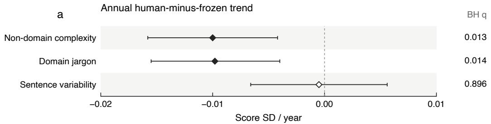

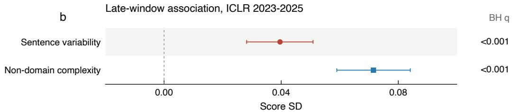

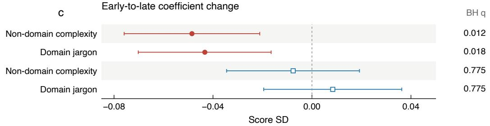  
Figure 7: Headline inference, separated by estimand. The nine headline rows of Table $6 ,$ with 90% intervals and BH-adjusted $q$ values. Annual trend diferences, late-window associations, and early-to-late coeficient changes use separate scales and units. Colour and shape distinguish raters; filled markers pass both BH-FDR $q < 0 . 1 0$ and interval exclusion, and open markers do not.

## B Withdrawn findings

<table><tr><td></td><td>Claim on first run</td><td>Diagnostic that overturned it</td><td>Outcome</td></tr><tr><td>1</td><td>numerals in the abstract help  $( + 2 . 2 2 \mathrm { p p } , p = 5 . 1 \times 1 0 ^ { - 7 } )$ </td><td>the regex matched model names (GPT-4o, Gemini-1.5)</td><td>result numerals  $\beta = + 0 . 0 1 6 , \ p = 0 . 1 7 ;$  model-name numerals  $+ 0 . 0 5 5 , p = 2 . 2 \times$   $1 0 ^ { - 6 }$ </td></tr><tr><td>2</td><td>promotional language is pe- nalised (−0.81pp)</td><td>71.8% of the hype list was standard vocabulary; only 2.2% of significant was statistical</td><td>genuine promotional words  $p = 0 . 2 7$ </td></tr><tr><td>3</td><td>LLM marker words are penalised</td><td>75.4% of the list was ordinary vo- cabulary</td><td>distinctive subset grew +625% with  $\beta =$  −0.000, p = 0.98</td></tr><tr><td>4</td><td>complexity became a penalty</td><td>uncontrolled -0.030 versus con- trolled</td><td> $+ 0 . 0 0 6 , p = 0 . 6 3 \colon$  the weight went to zero, not negative</td></tr><tr><td>5</td><td>the human evaluation function rotated negative  $( r = - 0 . 3 3 5 )$ </td><td>bootstrap interval [-0.746, +0.301]</td><td>pooled years +0.364</td></tr><tr><td>6</td><td>sentence-length variability is strengthening</td><td>trend does not</td><td>the human-specific level holds; the +0.0145, interval covering zero</td></tr><tr><td>7</td><td>presentation and soundness sub- scores dissociate</td><td>sentation subscore (+0.170, p =  $2 . 6 \times 1 0 ^ { - 1 1 0 } )$  and correlates with the cue (+0.124)</td><td>log author count predicts the pre- controlled effect -0.0036 from +0.0192</td></tr></table>

Table 9: Seven findings withdrawn after adversarial re-testing. Each row gives the first-run claim, the diagnostic that overturned it, and the outcome. The diagnostic scripts are released.

## C Abstract versions

<table><tr><td>Years</td><td>Source of the abstract text used</td><td>Submissions</td><td>Version caveat</td></tr><tr><td>2018-2023</td><td>first archived version from the venue&#x27;s version history</td><td>13,462</td><td>submitted text</td></tr><tr><td>2024</td><td>earliest public snapshot</td><td>7,304</td><td>after discussion, before camera-ready</td></tr><tr><td>2025 all</td><td>public pre-review scrape current text retained where no ear- lier version exists (flagged)</td><td>10,079 1,779</td><td>submitted text current</td></tr><tr><td colspan="4">Audit on 1,800 stratified submissions from 2018–2023: among abstracts that changed between first and last version, the released text matched the last version in every case; the share that changed rose from 12% (2018) to 72% (2021); median similarity of changed abstracts to the submitted text 0.73. Early-to-late human contrast on non-domain lexical complexity: -0.0433</td></tr></table>

Table 10: Which text the cues were computed on. The rebuilt abstract layer and the version audit that motivated it.

## D Explained variance

<table><tr><td>Year</td><td> $R ^ { 2 }$  human</td><td>n  $R ^ { 2 }$ </td><td>frozen</td><td>n</td></tr><tr><td>2018</td><td>0.0197</td><td>922</td><td>0.0059</td><td>925</td></tr><tr><td>2019</td><td>0.0123</td><td>1,419</td><td>0.0069</td><td>1,390</td></tr><tr><td>2020</td><td>0.0013</td><td>2,213</td><td>0.0084</td><td>2,175</td></tr><tr><td>2021</td><td>0.0063</td><td>2,594</td><td>0.0043</td><td>2,526</td></tr><tr><td>2022</td><td>0.0083</td><td>2,618</td><td>0.0135</td><td>2,522</td></tr><tr><td>2023</td><td>0.0064</td><td>3,797</td><td>0.0047</td><td>3,662</td></tr><tr><td>2024</td><td>0.0030</td><td>7,262</td><td>0.0043</td><td>5,607</td></tr><tr><td>2025</td><td>0.0019</td><td>11,517</td><td>0.0101</td><td>8,375</td></tr></table>

Table 11: Explained variance of the four-cue model by year and rater.

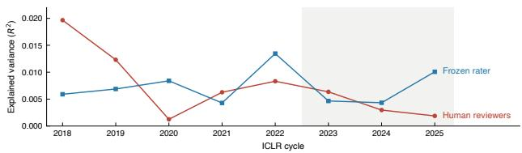  
Figure 8: Explained variance by ICLR cycle. Observed yearly $R ^ { 2 }$ for the four-cue model; lines join the eight observations and are not fitted trends. Shading marks the 2023–2025 cycles. This is a descriptive diagnostic, not an identification test.