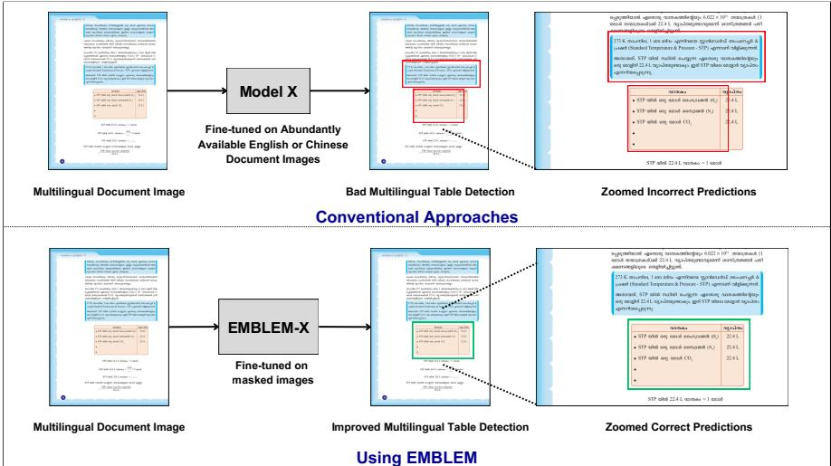
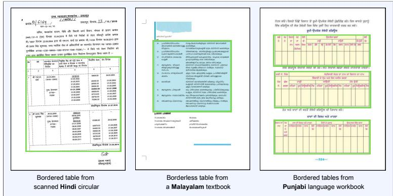
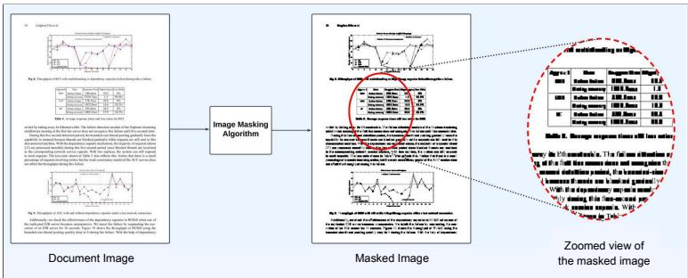
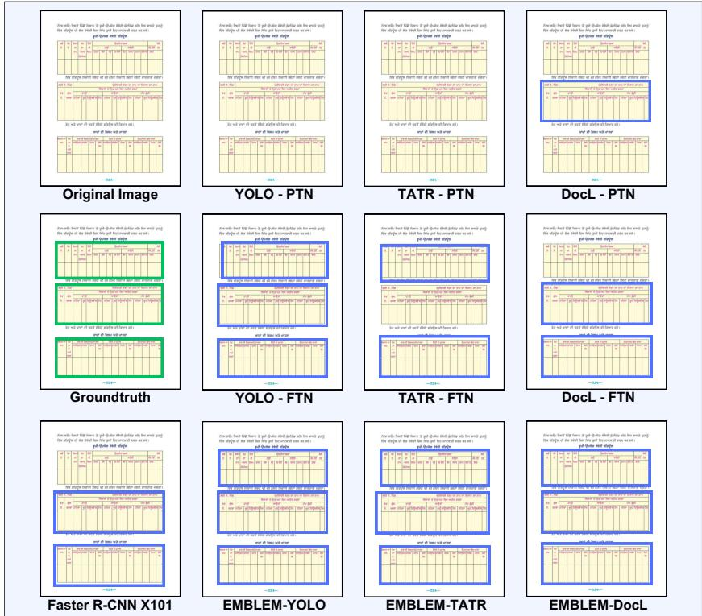

# EMBLEM: Enhancing Multi-script Table Detection through Masking

Dhruv Kudale1 , Udhay Brahmi1 , and Ganesh Ramakrishnan1,2

1 Indian Institute of Technology Bombay, Mumbai, India {dhruvk,udhaybrahmi,ganesh}@cse.iitb.ac.in 2 BharatGen, Mumbai, India

Abstract. Table detection is a core task in document analysis, supporting downstream applications such as information retrieval, document reconstruction, and visual question answering. Existing deep learning models excel on English and Chinese documents but struggle with multilingual, multi-script documents due to script diversity and the limited availability of labeled data. To address this, we introduce MANDALA (Multi-script Annotated Documents for Table Detection), a manually curated dataset of 2, 323 table-containing pages spanning 18 languages and 15 scripts, covering diverse domains. We also propose EMBLEM, a masking-based paradigm for Multi-script Table Detection (MTD). EM-BLEM generates masked images that conceal script- and font-specific details, enabling models pre-trained on abundant English documents to focus on script-agnostic page layout. Experiments across three table detection architectures show that EMBLEM consistently outperforms strong baselines on MANDALA while remaining competitive on five standard English-dominant benchmarks. Using English-only masked images for fine-tuning and no multi-script training data, EMBLEM achieves an absolute 20.8% F1-score gain on MANDALA. We release MANDALA and accompanying code and models at https://github. com/IITB-LEAP-OCR/EMBLEM.git.

Keywords: Table Detection · Document Image Processing · Document Layout Detection.

## 1 Introduction

Table Detection (TD) involves identifying table boundaries in document images, typically using bounding boxes. It is a foundational step in document understanding, supporting downstream tasks such as question answering and structured data extraction. However, TD remains challenging due to the wide variety of document formats, writing styles, and, in particular, the presence of multiple scripts. While an ideal TD model should work across scripts and languages, most existing research has focused on English or Chinese, where datasets and models are readily available. As illustrated in Fig. 1, models trained on such monolingual data often fail to generalize to documents in other scripts. Even a change in script alone, without altering layout or document structure, can cause a substantial drop in detection accuracy, often leading to missed or fragmented table predictions. This highlights the largely unexplored area of MTD, where detecting tables in documents with diverse scripts and languages remains a significant challenge. The scarcity of annotated multi-script datasets further exacerbates the problem, as most existing resources are monolingual or bilingual and limited to specific domains, making the training of robust MTD models both dificult and resource-intensive. To address these challenges, we make three key contributions, summarized as follows:

  
Fig. 1: Comparative analysis of conventional TD approaches and improvement brought through our method, EMBLEM, on a Malayalam document page.

1. We release MANDALA, a manually annotated multi-script table detection benchmark with 2,323 pages covering 15 scripts, 18 languages, and diverse document domains.

2. We propose EMBLEM, an image masking-based finetuning paradigm that learns script-agnostic structural cues, improving MTD performance.

3. We demonstrate a suite of models leveraging EMBLEM, achieving strong cross-script performance on MANDALA even when trained only on masked, abundantly labeled English or Chinese documents, while maintaining competitive performance on standard English-dominated benchmarks.

## 2 Related Work

TD Approaches: Earlier computer vision (CV) based methods [40,17,51] and machine learning (ML) based methods [8,9,22] relied on heuristics or handcrafted features such as alignment, spacing, and ruled lines, but were brittle on complex layouts. Deep learning (DL) approaches now dominate this field, treating TD as an object detection task with architectures including Faster R-CNN [42,6], Mask R-CNN [18,47], Cascade Mask R-CNN [39], YOLO [41,31,20], SSD [24], and transformer-based approaches such as DETR [4,46] and TATR [49]. Some methods jointly address TD and structure recognition [54,11], while vision-language models show promise [53,14,52,50,21,25] but face challenges in cross-script scenarios due to language-specific pretraining.

Table 1: Comparison of existing benchmarks by test-set size, script coverage, and document domains. Table-specific benchmarks have only tables annotated whereas other benchmarks focus on diferent document layout classes as well.
<table><tr><td rowspan=1 colspan=1>Dataset</td><td rowspan=1 colspan=1>Size(Test)</td><td rowspan=1 colspan=1>Scripts Covered</td><td rowspan=1 colspan=3>Domains</td><td rowspan=1 colspan=1>Table-Specific</td></tr><tr><td rowspan=1 colspan=1>ICDAR 2013[15]</td><td rowspan=1 colspan=1>233</td><td rowspan=1 colspan=1>Latin</td><td rowspan=5 colspan=3>Scientific</td><td rowspan=1 colspan=1>Yes</td></tr><tr><td rowspan=1 colspan=1>ICDAR 2017 [13]</td><td rowspan=1 colspan=1>817</td><td rowspan=1 colspan=1>Latin</td><td rowspan=1 colspan=1>Yes</td></tr><tr><td rowspan=1 colspan=1>cTDAR Track AModern [12]</td><td rowspan=1 colspan=1>240</td><td rowspan=1 colspan=1>Latin, Chinese</td><td rowspan=1 colspan=1>Yes</td></tr><tr><td rowspan=1 colspan=1>UNLV [44]</td><td rowspan=1 colspan=1>2.9K</td><td rowspan=1 colspan=1>Latin</td><td rowspan=1 colspan=1>No</td></tr><tr><td rowspan=1 colspan=1>UW3 [37]</td><td rowspan=1 colspan=1>1.6K</td><td rowspan=1 colspan=1>Latin</td><td rowspan=1 colspan=1>Yes</td></tr><tr><td rowspan=1 colspan=1>Marmot [10]</td><td rowspan=1 colspan=1>2K</td><td rowspan=1 colspan=1>Latin, Chinese</td><td rowspan=4 colspan=3></td><td rowspan=1 colspan=1></td></tr><tr><td rowspan=1 colspan=1>TableBank [27]</td><td rowspan=1 colspan=1>8K</td><td rowspan=1 colspan=1>Latin</td><td rowspan=1 colspan=1>Yes</td></tr><tr><td rowspan=1 colspan=1>PubTables[49]</td><td rowspan=1 colspan=1>92K</td><td rowspan=1 colspan=1>Latin</td><td rowspan=1 colspan=1>Yes</td></tr><tr><td rowspan=1 colspan=1>PubLayNet [55]</td><td rowspan=1 colspan=1>3.9K</td><td rowspan=1 colspan=1>Latin</td><td rowspan=1 colspan=1>No</td></tr><tr><td rowspan=1 colspan=1>STDW [16]</td><td rowspan=1 colspan=1>7K</td><td rowspan=1 colspan=1>Latin, Japanese,Devanagari</td><td rowspan=4 colspan=3>Commercial,Administrative</td><td rowspan=1 colspan=1>Yes</td></tr><tr><td rowspan=1 colspan=1>DocLayNet [35]</td><td rowspan=1 colspan=1>2.2K</td><td rowspan=1 colspan=1>Latin</td><td rowspan=1 colspan=1></td><td rowspan=1 colspan=1>No</td></tr><tr><td rowspan=1 colspan=1>IIIT-AR-13K [29]</td><td rowspan=1 colspan=1>2.1K</td><td rowspan=1 colspan=1>Latin</td><td rowspan=1 colspan=1>No</td></tr><tr><td rowspan=1 colspan=1>TNCR [1]</td><td rowspan=1 colspan=1>1K</td><td rowspan=1 colspan=1>Predominantly Latin</td><td rowspan=1 colspan=1>Yes</td></tr><tr><td rowspan=1 colspan=1>MANDALA(Ours)</td><td rowspan=1 colspan=1>2.3K</td><td rowspan=1 colspan=1>Bengali, Cyrillic,Devanagari, Greek,Gujarati, Gurmukhi,Japanese, Kannada,Khmer, Malayalam,Odia, Perso-Arabic,Tamil, Telugu, Thai</td><td rowspan=1 colspan=3>Scientific,Linguistic,Social,Commercial,Administrative,Literature,Philosophy</td><td rowspan=1 colspan=1>Yes</td></tr></table>

TD Datasets: Existing benchmarks are largely English-centric and limited to Latin-script documents. Popular datasets include ICDAR 2013 [15], ICDAR 2017 [13], ICDAR 2019 cTDaR [12], UNLV [44], UW3 [37], Marmot [10], TableBank [27], PubTables [49], IIIT-AR-13K [29], PubLayNet [55], and DocLayNet [35] (Table 1). While they have enabled significant progress in TD, their coverage of scripts, non-Latin writing systems, and domains is limited. Consequently, models trained on these datasets tend to perform poorly when applied to multi-script documents or cross-domain scenarios, highlighting the need for benchmarks and evaluation protocols that test multi-script and domain-robust TD approaches.

Towards Script-Agnostic Generalization: Annotating tables across scripts is costly, motivating data-eficient approaches such as transfer learning, domain adaptation [5,26], hybrid models [30], and semi-supervised learning [45], which remain English-centric and largely ignore script variation. Table structure is largely script-independent, defined by ruled lines, grids, and whitespace, enabling the possibility of cross-script generalization via existing English-labeled data. Masking-based augmentations have been shown to improve generalization in object detection [7,48], but their efectiveness for cross-script TD is underexplored. Motivated by this, we propose EMBLEM, a masking-based fine-tuning strategy leveraging script-agnostic cues, improving MTD performance while remaining competitive on English benchmarks. To support systematic MTD evaluation, we introduce MANDALA, a benchmark described in the upcoming Section 3.

## 3 MANDALA Dataset

We introduce MANDALA, a multilingual, multi-script, and multi-domain document dataset designed to evaluate MTD under realistic and diverse conditions. MANDALA is designed primarily as a test and analysis benchmark, rather than a large-scale training corpus. In contrast to existing benchmarks that are predominantly English-centric or restricted to a limited set of scripts or domains, MANDALA explicitly varies along two axes: script and domain.

Script and Language Diversity: MANDALA contains 2,323 document images spanning 18 languages written in 15 distinct scripts, covering Indic, European, Middle Eastern, and Southeast Asian languages. The dataset explicitly disentangles language and script, with multiple languages sharing the same script (e.g., Hindi and Marathi in Devanagari; Persian and Urdu in Perso-Arabic), enabling targeted evaluation of script-level generalization. A balanced yet realistic distribution is maintained, with per-language sample counts ranging from fewer than 100 to over 200 images (Table 2), ensuring meaningful representation of low-resource languages and scripts.

Domain Diversity: MANDALA spans seven coarse-grained domains, including Scientific textbooks (mathematics, physics, chemistry, biology with tables, equations and figures), Linguistic language learning materials (grammar workbooks with conjugation tables), Social studies content (history, geography, civics with timelines and illustrative tables), Commercial documents (business, economics, finance with numerical tables), Administrative materials (circulars, schedules, notices from regulatory institutions), Literature ( narrative text with occasional structured tabular elements), and Philosophy (value education, general knowledge and pictorial representation). Each language subset spans one or more domains, with overall distribution to have approximately 80% single-column and 20% two-column layouts. Each document is assigned a single dominant domain.

MANDALA Annotation All document images in MANDALA were manually annotated following strict guidelines to ensure high-quality ground truth, with a focus on table regions and structural variations. Tables are treated as a single class, and annotation follows the case-wise rules below:

Table 2: Distribution of diferent scripts (and languages) in MANDALA.
<table><tr><td rowspan=1 colspan=1>Language</td><td rowspan=1 colspan=1>Pages</td><td rowspan=1 colspan=1>Script</td><td rowspan=1 colspan=1>Domain</td></tr><tr><td rowspan=1 colspan=1>Bengali</td><td rowspan=1 colspan=1>164</td><td rowspan=1 colspan=1>Bengali</td><td rowspan=1 colspan=1>Scientific</td></tr><tr><td rowspan=1 colspan=1>Greek</td><td rowspan=1 colspan=1>104</td><td rowspan=1 colspan=1>Greek</td><td rowspan=1 colspan=1>Linguistic</td></tr><tr><td rowspan=1 colspan=1>Gujarati</td><td rowspan=1 colspan=1>118</td><td rowspan=1 colspan=1>Gujarati</td><td rowspan=1 colspan=1>Scientific</td></tr><tr><td rowspan=1 colspan=1>Hindi</td><td rowspan=1 colspan=1>186</td><td rowspan=1 colspan=1>Devanagari</td><td rowspan=1 colspan=1>Administrative, Commercial</td></tr><tr><td rowspan=1 colspan=1>Japanese</td><td rowspan=1 colspan=1>124</td><td rowspan=1 colspan=1>Japanese</td><td rowspan=1 colspan=1>Philosophy</td></tr><tr><td rowspan=1 colspan=1>Kannada</td><td rowspan=1 colspan=1>99</td><td rowspan=1 colspan=1>Kannada</td><td rowspan=1 colspan=1>Social, Philosophy</td></tr><tr><td rowspan=1 colspan=1>Khmer</td><td rowspan=1 colspan=1>206</td><td rowspan=1 colspan=1>Khmer</td><td rowspan=1 colspan=1>Linguistic</td></tr><tr><td rowspan=1 colspan=1>Malayalam</td><td rowspan=1 colspan=1>105</td><td rowspan=1 colspan=1>Malayalam</td><td rowspan=1 colspan=1>Philosophy, Commercial</td></tr><tr><td rowspan=1 colspan=1>Marathi</td><td rowspan=1 colspan=1>134</td><td rowspan=1 colspan=1>Devanagari</td><td rowspan=1 colspan=1>Commercial</td></tr><tr><td rowspan=1 colspan=1>Odia</td><td rowspan=1 colspan=1>125</td><td rowspan=1 colspan=1>Odia</td><td rowspan=1 colspan=1>Scientific, Social</td></tr><tr><td rowspan=1 colspan=1>Persian</td><td rowspan=1 colspan=1>133</td><td rowspan=1 colspan=1>Perso-Arabic</td><td rowspan=1 colspan=1>Linguistic</td></tr><tr><td rowspan=1 colspan=1>Punjabi</td><td rowspan=1 colspan=1>125</td><td rowspan=1 colspan=1>Gurmukhi</td><td rowspan=1 colspan=1>Scientific, Philosophy, Social</td></tr><tr><td rowspan=1 colspan=1>Russian</td><td rowspan=1 colspan=1>172</td><td rowspan=1 colspan=1>Cyrillic</td><td rowspan=1 colspan=1>Linguistic</td></tr><tr><td rowspan=1 colspan=1>Tamil</td><td rowspan=1 colspan=1>93</td><td rowspan=1 colspan=1>Tamil</td><td rowspan=1 colspan=1>Literature, Philosophy</td></tr><tr><td rowspan=1 colspan=1>Telugu</td><td rowspan=1 colspan=1>110</td><td rowspan=1 colspan=1>Telugu</td><td rowspan=1 colspan=1>Literature, Scientific</td></tr><tr><td rowspan=1 colspan=1>Thai</td><td rowspan=1 colspan=1>129</td><td rowspan=1 colspan=1>Thai</td><td rowspan=1 colspan=1>Social</td></tr><tr><td rowspan=1 colspan=1>Ukrainian</td><td rowspan=1 colspan=1>94</td><td rowspan=1 colspan=1>Cyrillic</td><td rowspan=1 colspan=1>Linguistic</td></tr><tr><td rowspan=1 colspan=1>Urdu</td><td rowspan=1 colspan=1>102</td><td rowspan=1 colspan=1>Perso-Arabic</td><td rowspan=1 colspan=1>Scientific</td></tr><tr><td rowspan=1 colspan=1>Overall</td><td rowspan=1 colspan=1>2323</td><td rowspan=1 colspan=1></td><td rowspan=1 colspan=1></td></tr></table>

– Table Types: All bordered, partially bordered, and unbordered tables are annotated as tables, as a single class.

– Unbordered Tables: Identified based on regular grid alignment, consistent inter-cell spacing, or equidistant multi-cell layouts.

– Rotated and Skewed Tables: Tables rotated by 90◦ (left or right), as well as tables appearing in rotated or skewed pages, are annotated.

– Tables of Contents: are annotated as a single contiguous table on a page. – Large Tables: A large table with uniform and continuous boundaries is annotated as a single table. If a large table contains multiple sub-tables separated by subtitles or headers lying outside the table boundary, each sub-table is annotated independently.

– Table Captions: are included only when they lie entirely within the table boundary, else not engulfed in the bounding box.

– Legends and Indices: Legends in maps or figures are annotated.

– Lists and Pseudo-Tables: Only completely or partially bordered numbered lists with explicit column demarcation are annotated as tables; plain text lists are excluded.

– Nested Tables: are extremely rare and are not annotated separately.

All annotations were manually curated and independently reviewed before final inclusion. MANDALA spans 18 languages, 15 scripts, and 7 document domains. The source documents used in MANDALA were obtained from publicly accessible resources, and source metadata is provided to facilitate attribution. A few examples from MANDALA are shown in Fig. 2.

  
Fig. 2: Sample images from MANDALA with tables in bounding boxes.

## 4 Experiments

This section presents the experimental framework used to evaluate EMBLEM. EMBLEM is implemented as a masking-based fine-tuning paradigm that suppresses script-dependent visual cues. We describe the EMBLEM masking process, dataset construction, and experimental protocol used across all evaluations.

## 4.1 Masking using EMBLEM

The objective of EMBLEM is to enable TD models to generalize across diverse document scripts and domains without requiring multi-script annotations. To this end, EMBLEM suppresses script-specific visual cues while preserving script-agnostic structural information such as whitespace, ruled lines, alignment, and table boundaries thereby encouraging models to rely on layout rather than script. By masking fine-grained text strokes while retaining layout primitives, EMBLEM shifts learning from appearance-driven cues to structural regularities that are invariant across scripts. Building on the strong layout priors encoded in TD models pretrained on English documents, EMBLEM fine-tunes these models on masked document images (Fig. 3) to mitigate script bias while maintaining sensitivity to document structure.

Unlike generic masking-based augmentations, EMBLEM explicitly suppresses fine-grained, script-dependent stroke patterns while preserving layout primitives essential for table localization, including lines, whitespace, and alignment. This design is critical to remove linguistic appearance cues without distorting document structure. Unlike OCR-based masking, which operates at the character, word, or line level and often over-masks large rectangular regions, distorting layout cues and introducing visual artifacts, EMBLEM employs a pixel-level, CVbased masking strategy. Specifically, the input image is converted to grayscale and binarized using Otsu’s thresholding [32]. Contours are extracted from the inverted binary image and enclosed within bounding boxes. Bounding boxes smaller than a configurable threshold defined as a fraction of the image dimensions are masked using small filled rectangles. This selectively suppresses scriptspecific strokes while minimizing interference with layout elements such as table borders and cell lines. The complete procedure is summarized in Algorithm 1.

  
Fig. 3: Masking of a cTDaR image illustrating the strategy used in EMBLEM.

Algorithm 1: Image Masking Algorithm used in EMBLEM   
Input : image, threshold   
Output: masked\_image   
1 gray\_image ← ConvertToGrayscale(image);   
2 binary\_image ← OtsuThresholding(gray\_image);   
3 inverted\_binary ← InvertImage(binary\_image);   
4 width, height ← ImageDimensions(image);   
5 contours ← FindContours(inverted\_binary);   
6 masked\_image ← binary\_image;   
7 foreach contour in contours do   
8 x, y, w, h ← GetBoundingRect(contour);   
9 if h < threshold \* height and w < threshold \* width then   
10 DrawRectangle(masked\_image, x, y, w, h);   
11 end   
12 end   
13 return masked\_image

## 4.2 Datasets

Masked Dataset for Fine-tuning: The masked dataset used for fine-tuning EMBLEM models is generated using Algorithm 1. Source images are obtained from the Kaggle Synthetic Table Detection 3 and General Table Detection 4 datasets, the latter being a superset of Marmot [10], the GitHub TD dataset [34], and the ICDAR 2019 cTDaR training set [12]. The dataset consists predominantly of labeled English document pages, with a small fraction of Chinese pages (around 10%); no other languages are included. As a result, TD models are not exposed to multi-script document images at any stage of fine-tuning. After masking, images are randomly split into 2,000 training and 183 validation samples, with original image resolutions and table bounding box annotations preserved. This strategy allows the reuse of existing labeled document pages to obtain a language-agnostic representation without requiring additional multiscript annotations. To determine the masking granularity, we experiment with multiple height and width thresholds defined relative to the image dimensions. Fine-tuning is performed using a YOLO model pretrained on the PubTables dataset. Threshold selection is guided by performance on the bilingual cTDaR test set. As determined by our empirical analysis, a threshold of 1% achieves the best trade-of between suppressing script-specific cues and preserving structural alignment. Lower thresholds fail to suficiently mask textual content, while higher thresholds introduce visual distortions. Consequently, a 1% threshold is used to generate the final masked dataset and EMBLEM finetuning.

Evaluation Datasets: We evaluate models fine-tuned using EMBLEM on six TD benchmarks: cTDaR (bilingual English–Chinese, for cross-script robustness), ICDAR 2013 (standard English TD), PubTables (large-scale scientific documents), IIIT-AR-13K (Latin script administrative documents in 4 languages), TNCR (complex real-world table layouts), and eventually on MANDALA.

## 4.3 Fine-tuning EMBLEM Models

We fine-tune three widely used object detection–based TD architectures: YOLO, TATR, and DocLayout (DocL) using the masked images described in Section 4.2, to highlight the model-agnostic applicability of EMBLEM. These architectures were selected for their strong TD performance on English documents. All experiments were conducted on an NVIDIA A6000 GPU. The EMBLEM-YOLO model, pretrained on the PubTables dataset [36], was fine-tuned for 15 epochs with a batch size of 8 and an input resolution of 640 × 640. For EMBLEM-TATR, we fine-tuned the DETR-based model with a ResNet-18 backbone [4,19], also pretrained on PubTables [49], for 30 epochs with a batch size of 4, retaining the default table detection configuration [49]. Finally, we fine-tuned the YOLOv10-based EMBLEM-DocL model [53], pretrained on DocSynth-300K and DocStructBench [53], for 200 epochs with a batch size of 32 on masked images resized to 640 pixels on the longest side. Default Ultralytics training configurations5 were used for fine-tuning YOLO and DocL models.

## 5 Results

We provide a comparative analysis of our EMBLEM models, presenting their detection scores across various test sets against diferent baselines.

## 5.1 Performance Gain for MTD

This section highlights the performance of EMBLEM relative to its pretrained counterparts (YOLO-PTN, TATR-PTN, and DocL-PTN). To isolate the impact of masking, we also report baselines where these models are fine-tuned on the original, unmasked images using the same training settings described in Section 4.3 (YOLO-FTN, TATR-FTN, and DocL-FTN). All models are evaluated using a confidence threshold of 0.75 and a Non-Maximum Suppression IoU threshold of 0.1. As shown in Table 3, EMBLEM consistently outperforms both PTN and FTN baselines on all benchmarks. In particular, EMBLEM-YOLO achieves the best performance on cTDaR [12], while other EMBLEM variants lead on the remaining datasets. These improvements demonstrate the efectiveness of EMBLEM in handling multi-script content and complex document layouts. Notably, EMBLEM-DocL also exhibits consistent gains, indicating that the benefits of EMBLEM are independent of the underlying pretraining corpus: PubTables for the YOLO and TATR variants, and DocSynth-300K and DocStructBench for the DocL variants. Fig. 4 provides qualitative comparisons on a representative page from MANDALA, further illustrating the robustness of EMBLEM across scripts and layouts.

## 5.2 Comparison with State-of-the-Art

Table 4 shows that EMBLEM consistently outperforms multimodal generative models and traditional object detection architectures across both cTDaR and MANDALA datasets. In addition to their inferior detection accuracy, VLMbased approaches (Qwen2.5-VL [3], UDOP [50]) are substantially slower at inference due to autoregressive decoding and high computational overhead, making them computationally expensive and less suited for large-scale deployment. In contrast, EMBLEM leverages eficient object detection backbones, delivering significantly better accuracy while retaining fast, scalable inference. The absolute 20.8% F1-score gain achieved by EMBLEM-DocL over the strongest DocL-PTN baseline further highlights that EMBLEM improvements stem from superior structural learning rather than increased model complexity. As shown in Table 5, EMBLEM ranks second on the IIIT-AR-13K [29] and at par on the challenging TNCR [1] dataset. As shown in Table 6, EMBLEM matches or surpasses strong task-specific methods on English benchmarks, despite being designed for multi-script generalization. EMBLEM-TATR achieves the highest F1-score on ICDAR 2013 [15], while EMBLEM-YOLO remains competitive with specialized baselines on PubTables [49]. These results confirm that EM-BLEM does not sacrifice performance on English-only datasets while delivering substantial gains in multi-script settings. Table 7 displays the language-wise performance on MANDALA using EMBLEM-DocL at an IoU threshold of 0.5.

Table 3: Performance comparison at IoU 0.5 and 0.7. Best scores indicate that EMBLEM consistently outperforms all baselines across all four datasets.
<table><tr><td rowspan=1 colspan=2>IOU Threshold</td><td rowspan=1 colspan=3>0.5</td><td rowspan=1 colspan=3>0.7</td></tr><tr><td rowspan=1 colspan=1>Dataset</td><td rowspan=1 colspan=1>Model</td><td rowspan=1 colspan=1>P</td><td rowspan=1 colspan=1>R</td><td rowspan=1 colspan=1>F</td><td rowspan=1 colspan=1>P</td><td rowspan=1 colspan=1>R</td><td rowspan=1 colspan=1>F</td></tr><tr><td rowspan=9 colspan=1>ICDAR 13(1 language,1 script)</td><td rowspan=1 colspan=1>YOLO-PTN</td><td rowspan=1 colspan=1>96.9</td><td rowspan=1 colspan=1>95.4</td><td rowspan=1 colspan=1>96.2</td><td rowspan=1 colspan=1>96.9</td><td rowspan=1 colspan=1>95.4</td><td rowspan=1 colspan=1>96.2</td></tr><tr><td rowspan=1 colspan=1>TATR-PTN</td><td rowspan=1 colspan=1>97.7</td><td rowspan=1 colspan=1>96.2</td><td rowspan=1 colspan=1>96.9</td><td rowspan=1 colspan=1>97.7</td><td rowspan=1 colspan=1>96.2</td><td rowspan=1 colspan=1>96.9</td></tr><tr><td rowspan=7 colspan=1>DocL-PTNYOLO-FTNTATR-FTNDocL-FTNEMBLEM-YOLOEMBLEM-TATREMBLEM-DocL</td><td rowspan=1 colspan=1>95.3</td><td rowspan=1 colspan=1>94.8</td><td rowspan=1 colspan=1>95.1</td><td rowspan=1 colspan=1>93.8</td><td rowspan=1 colspan=1>93.2</td><td rowspan=1 colspan=1>93.5</td></tr><tr><td rowspan=1 colspan=1>98.1</td><td rowspan=1 colspan=1>99.2</td><td rowspan=1 colspan=1>98.6</td><td rowspan=1 colspan=1>94.9</td><td rowspan=1 colspan=1>96.1</td><td rowspan=1 colspan=1>95.5</td></tr><tr><td rowspan=1 colspan=1>99.2</td><td rowspan=1 colspan=1>99.2</td><td rowspan=1 colspan=1>99.2</td><td rowspan=1 colspan=1>98.4</td><td rowspan=1 colspan=1>98.4</td><td rowspan=1 colspan=1>98.4</td></tr><tr><td rowspan=1 colspan=1>98.4</td><td rowspan=1 colspan=1>98.2</td><td rowspan=1 colspan=1>98.3</td><td rowspan=1 colspan=1>96.1</td><td rowspan=1 colspan=1>95.8</td><td rowspan=1 colspan=1>96.0</td></tr><tr><td rowspan=1 colspan=1>97.0</td><td rowspan=1 colspan=1>98.8</td><td rowspan=1 colspan=1>97.9</td><td rowspan=1 colspan=1>95.8</td><td rowspan=1 colspan=1>97.3</td><td rowspan=1 colspan=1>96.5</td></tr><tr><td rowspan=1 colspan=1>98.8</td><td rowspan=1 colspan=1>99.2</td><td rowspan=1 colspan=1>99.0</td><td rowspan=1 colspan=1>96.1</td><td rowspan=1 colspan=1>96.5</td><td rowspan=1 colspan=1>96.3</td></tr><tr><td rowspan=1 colspan=1>96.2</td><td rowspan=1 colspan=1>96.9</td><td rowspan=1 colspan=1>96.6</td><td rowspan=1 colspan=1>93.9</td><td rowspan=1 colspan=1>94.5</td><td rowspan=1 colspan=1>94.2</td></tr><tr><td rowspan=9 colspan=1>CTDAR(2 languages,2 scripts)</td><td rowspan=9 colspan=1>YOLO-PTNTATR-PTNDocL-PTNYOLO-FTNTATR-FTNDocL-FTNEMBLEM-YOLOEMBLEM-TATREMBLEM-DocL</td><td rowspan=1 colspan=1>87.4</td><td rowspan=1 colspan=1>82.9</td><td rowspan=1 colspan=1>85.1</td><td rowspan=1 colspan=1>86.0</td><td rowspan=1 colspan=1>81.6</td><td rowspan=1 colspan=1>83.8</td></tr><tr><td rowspan=1 colspan=1>80.1</td><td rowspan=1 colspan=1>73.1</td><td rowspan=1 colspan=1>76.4</td><td rowspan=1 colspan=1>76.2</td><td rowspan=1 colspan=1>69.9</td><td rowspan=1 colspan=1>72.9</td></tr><tr><td rowspan=1 colspan=1>86.0</td><td rowspan=1 colspan=1>83.7</td><td rowspan=1 colspan=1>84.8</td><td rowspan=1 colspan=1>82.9</td><td rowspan=1 colspan=1>80.8</td><td rowspan=1 colspan=1>81.8</td></tr><tr><td rowspan=1 colspan=1>97.8</td><td rowspan=1 colspan=1>98.2</td><td rowspan=1 colspan=1>98.0</td><td rowspan=1 colspan=1>97.3</td><td rowspan=1 colspan=1>97.7</td><td rowspan=1 colspan=1>97.5</td></tr><tr><td rowspan=1 colspan=1>97.9</td><td rowspan=1 colspan=1>96.8</td><td rowspan=1 colspan=1>97.3</td><td rowspan=1 colspan=1>97.4</td><td rowspan=1 colspan=1>95.1</td><td rowspan=1 colspan=1>96.3</td></tr><tr><td rowspan=1 colspan=1>98.6</td><td rowspan=1 colspan=1>95.3</td><td rowspan=1 colspan=1>96.9</td><td rowspan=1 colspan=1>98.2</td><td rowspan=1 colspan=1>94.9</td><td rowspan=1 colspan=1>96.5</td></tr><tr><td rowspan=1 colspan=1>98.0</td><td rowspan=1 colspan=1>98.3</td><td rowspan=1 colspan=1>98.1</td><td rowspan=1 colspan=1>97.4</td><td rowspan=1 colspan=1>97.8</td><td rowspan=1 colspan=1>97.6</td></tr><tr><td rowspan=2 colspan=1>95.997.7</td><td rowspan=1 colspan=1>94.1</td><td rowspan=1 colspan=1>95.0</td><td rowspan=1 colspan=1>95.5</td><td rowspan=1 colspan=1>93.7</td><td rowspan=1 colspan=1>94.6</td></tr><tr><td rowspan=1 colspan=1>97.5</td><td rowspan=1 colspan=1>97.6</td><td rowspan=1 colspan=1>97.5</td><td rowspan=1 colspan=1>97.1</td><td rowspan=1 colspan=1>97.3</td></tr><tr><td rowspan=9 colspan=1>IIIT-AR-13K(4 languages,1 script)</td><td rowspan=9 colspan=1>YOLO-PTNTATR-PTNDocL-PTNYOLO-FTNTATR-FTNDocL-FTNEMBLEM-YOLOEMBLEM-TATREMBLEM-DocL</td><td rowspan=1 colspan=1>74.1</td><td rowspan=1 colspan=1>69.5</td><td rowspan=1 colspan=1>71.7</td><td rowspan=1 colspan=1>68.5</td><td rowspan=1 colspan=1>64.8</td><td rowspan=1 colspan=1>66.6</td></tr><tr><td rowspan=1 colspan=1>74.8</td><td rowspan=1 colspan=1>67.6</td><td rowspan=1 colspan=1>71.0</td><td rowspan=1 colspan=1>65.9</td><td rowspan=1 colspan=1>59.9</td><td rowspan=1 colspan=1>62.8</td></tr><tr><td rowspan=1 colspan=1>83.2</td><td rowspan=1 colspan=1>80.6</td><td rowspan=1 colspan=1>81.9</td><td rowspan=1 colspan=1>81.2</td><td rowspan=1 colspan=1>79.3</td><td rowspan=1 colspan=1>80.3</td></tr><tr><td rowspan=1 colspan=1>91.8</td><td rowspan=1 colspan=1>89.8</td><td rowspan=1 colspan=1>90.8</td><td rowspan=1 colspan=1>89.3</td><td rowspan=1 colspan=1>87.7</td><td rowspan=1 colspan=1>88.5</td></tr><tr><td rowspan=1 colspan=1>94.2</td><td rowspan=1 colspan=1>92.9</td><td rowspan=1 colspan=1>93.6</td><td rowspan=1 colspan=1>91.1</td><td rowspan=1 colspan=1>90.0</td><td rowspan=1 colspan=1>90.5</td></tr><tr><td rowspan=1 colspan=1>92.1</td><td rowspan=1 colspan=1>89.0</td><td rowspan=1 colspan=1>90.5</td><td rowspan=1 colspan=1>89.6</td><td rowspan=1 colspan=1>87.0</td><td rowspan=1 colspan=1>88.3</td></tr><tr><td rowspan=1 colspan=1>92.8</td><td rowspan=1 colspan=1>93.3</td><td rowspan=1 colspan=1>93.1</td><td rowspan=1 colspan=1>90.4</td><td rowspan=1 colspan=1>91.1</td><td rowspan=1 colspan=1>90.7</td></tr><tr><td rowspan=2 colspan=1>94.593.6</td><td rowspan=1 colspan=1>93.0</td><td rowspan=1 colspan=1>93.7</td><td rowspan=1 colspan=1>90.7</td><td rowspan=1 colspan=1>89.6</td><td rowspan=1 colspan=1>90.1</td></tr><tr><td rowspan=1 colspan=1>93.0</td><td rowspan=1 colspan=1>93.3</td><td rowspan=1 colspan=1>91.1</td><td rowspan=1 colspan=1>90.8</td><td rowspan=1 colspan=1>91.0</td></tr><tr><td rowspan=9 colspan=1>MANDALA(18 languages,15 scripts)</td><td rowspan=5 colspan=1>YOLO-PTNTATR-PTNDocL-PTNYOLO-FTNTATR-FTN</td><td rowspan=1 colspan=1>55.0</td><td rowspan=1 colspan=1>49.8</td><td rowspan=1 colspan=1>52.5</td><td rowspan=1 colspan=1>51.6</td><td rowspan=1 colspan=1>46.9</td><td rowspan=1 colspan=1>49.2</td></tr><tr><td rowspan=1 colspan=1>55.6</td><td rowspan=1 colspan=1>49.2</td><td rowspan=1 colspan=1>52.2</td><td rowspan=1 colspan=1>50.6</td><td rowspan=1 colspan=1>45.0</td><td rowspan=1 colspan=1>47.6</td></tr><tr><td rowspan=1 colspan=1>71.5</td><td rowspan=1 colspan=1>67.9</td><td rowspan=1 colspan=1>69.6</td><td rowspan=1 colspan=1>71.0</td><td rowspan=1 colspan=1>67.5</td><td rowspan=1 colspan=1>69.2</td></tr><tr><td rowspan=1 colspan=1>86.4</td><td rowspan=1 colspan=1>83.5</td><td rowspan=1 colspan=1>84.9</td><td rowspan=1 colspan=1>85.5</td><td rowspan=1 colspan=1>82.7</td><td rowspan=1 colspan=1>84.1</td></tr><tr><td rowspan=1 colspan=1>88.4</td><td rowspan=1 colspan=1>83.2</td><td rowspan=1 colspan=1>85.7</td><td rowspan=1 colspan=1>85.9</td><td rowspan=1 colspan=1>81.1</td><td rowspan=1 colspan=1>83.4</td></tr><tr><td rowspan=1 colspan=1>DocL-FTN</td><td rowspan=1 colspan=1>81.7</td><td rowspan=1 colspan=1>76.2</td><td rowspan=1 colspan=1>78.8</td><td rowspan=1 colspan=1>80.5</td><td rowspan=1 colspan=1>75.3</td><td rowspan=1 colspan=1>77.8</td></tr><tr><td rowspan=3 colspan=1>EMBLEM-YOLOEMBLEM-TATREMBLEM-DocL</td><td rowspan=1 colspan=1>87.6</td><td rowspan=1 colspan=1>86.9</td><td rowspan=1 colspan=1>87.3</td><td rowspan=1 colspan=1>86.4</td><td rowspan=1 colspan=1>85.8</td><td rowspan=1 colspan=1>86.1</td></tr><tr><td rowspan=1 colspan=1>88.9</td><td rowspan=1 colspan=1>84.1</td><td rowspan=1 colspan=1>86.4</td><td rowspan=1 colspan=1>86.7</td><td rowspan=1 colspan=1>82.3</td><td rowspan=1 colspan=1>84.5</td></tr><tr><td rowspan=1 colspan=1>90.9</td><td rowspan=1 colspan=1>89.9</td><td rowspan=1 colspan=1>90.4</td><td rowspan=1 colspan=1>89.6</td><td rowspan=1 colspan=1>88.8</td><td rowspan=1 colspan=1>89.2</td></tr></table>

Table 4: Comparative evaluation of MTD performance on the cTDaR dataset, comprising English and Chinese documents representing two languages across two distinct scripts reported with an IoU 0.7, and the MANDALA dataset, our proposed multi-script benchmark featuring diverse languages and document types with an IoU 0.5; best-performing methods (EMBLEM) are highlighted.
<table><tr><td rowspan=2 colspan=1>Baseline</td><td rowspan=2 colspan=1>Approach</td><td rowspan=1 colspan=3>CTDAR</td><td rowspan=1 colspan=3>MANDALA</td></tr><tr><td rowspan=1 colspan=1>P</td><td rowspan=1 colspan=1>R</td><td rowspan=1 colspan=1>F</td><td rowspan=1 colspan=1>P</td><td rowspan=1 colspan=1>R</td><td rowspan=1 colspan=1>F</td></tr><tr><td rowspan=2 colspan=1>MultimodalGenerative</td><td rowspan=2 colspan=1>Qwen-2.5-VL-7B[3]UDOP [50]</td><td rowspan=1 colspan=1>69.9</td><td rowspan=1 colspan=1>60.8</td><td rowspan=1 colspan=1>65.0</td><td rowspan=1 colspan=1>72.8</td><td rowspan=1 colspan=1>64.2</td><td rowspan=1 colspan=1>68.2</td></tr><tr><td rowspan=1 colspan=1>17.9</td><td rowspan=1 colspan=1>17.5</td><td rowspan=1 colspan=1>17.7</td><td rowspan=1 colspan=1>25.4</td><td rowspan=1 colspan=1>23.6</td><td rowspan=1 colspan=1>24.4</td></tr><tr><td rowspan=1 colspan=1>Pre-reportedScores</td><td rowspan=1 colspan=1>DiT-L [25]NLPR-PAL [12]CornerNet+FRCN [28]</td><td rowspan=1 colspan=1>-96.298.2</td><td rowspan=1 colspan=1>-96.993.9</td><td rowspan=1 colspan=1>97.696.696.0</td><td rowspan=1 colspan=1>-一-</td><td rowspan=1 colspan=1>---</td><td rowspan=1 colspan=1>---</td></tr><tr><td rowspan=5 colspan=1>TraditionalObjectDetectionArchitectures</td><td rowspan=5 colspan=1>Faster RCNN X-101 [47]Mask RCNN X-101 [47]YOLO-PTN [36]TATR-PTN [49]DocL-PTN [53]</td><td rowspan=5 colspan=1>75.678.786.076.282.9</td><td rowspan=1 colspan=1>72.6</td><td rowspan=1 colspan=1>74.1</td><td rowspan=1 colspan=1>70.7</td><td rowspan=1 colspan=1>66.1</td><td rowspan=1 colspan=1>68.3</td></tr><tr><td rowspan=1 colspan=1>75.4</td><td rowspan=1 colspan=1>77.0</td><td rowspan=1 colspan=1>34.8</td><td rowspan=1 colspan=1>32.0</td><td rowspan=1 colspan=1>33.3</td></tr><tr><td rowspan=3 colspan=1>81.669.980.8</td><td rowspan=1 colspan=1>83.8</td><td rowspan=1 colspan=1>55.0</td><td rowspan=1 colspan=1>49.8</td><td rowspan=1 colspan=1>52.5</td></tr><tr><td rowspan=1 colspan=1>72.9</td><td rowspan=1 colspan=1>55.6</td><td rowspan=2 colspan=1>49.267.9</td><td rowspan=1 colspan=1>52.2</td></tr><tr><td rowspan=1 colspan=1>81.8</td><td rowspan=1 colspan=1>71.5</td><td rowspan=1 colspan=1>69.6</td></tr><tr><td rowspan=2 colspan=1>Fine-tunedon UnmaskedImages</td><td rowspan=2 colspan=1>YOLO-FTNTATR-FTNDocL-FTN</td><td rowspan=2 colspan=1>97.897.998.6</td><td rowspan=2 colspan=1>98.296.895.3</td><td rowspan=1 colspan=1>98.097.3</td><td rowspan=1 colspan=1>86.488.4</td><td rowspan=2 colspan=1>83.583.276.2</td><td rowspan=2 colspan=1>84.985.778.8</td></tr><tr><td rowspan=1 colspan=1>96.9</td><td rowspan=1 colspan=1>81.7</td></tr><tr><td rowspan=3 colspan=1>Fine-tunedon MaskedImages (Ours)</td><td rowspan=3 colspan=1>EMBLEM-YOLOEMBLEM-TATREMBLEM-DocL</td><td rowspan=1 colspan=1>97.4</td><td rowspan=1 colspan=1>97.8</td><td rowspan=1 colspan=1>97.6</td><td rowspan=1 colspan=1>87.6</td><td rowspan=1 colspan=1>86.9</td><td rowspan=1 colspan=1>87.3</td></tr><tr><td rowspan=2 colspan=1>95.597.5</td><td rowspan=2 colspan=1>93.797.1</td><td rowspan=2 colspan=1>94.697.3</td><td rowspan=1 colspan=1>88.9</td><td rowspan=1 colspan=1>84.1</td><td rowspan=2 colspan=1>86.490.4</td></tr><tr><td rowspan=1 colspan=1>90.9</td><td rowspan=1 colspan=1>89.9</td></tr></table>

Table 5: Comparative overview of MTD performance on the IIIT-AR-13K dataset, comprising documents in four languages written in a single script, and the TNCR dataset, featuring complex real-world table layouts. Results are reported in terms of F1-score (IoU 0.5); best-performing methods are highlighted.
<table><tr><td rowspan=1 colspan=1>Dataset</td><td rowspan=1 colspan=2>IIIT-AR-13K</td><td rowspan=1 colspan=2>TNCR</td></tr><tr><td rowspan=1 colspan=1>Evaluation</td><td rowspan=1 colspan=1>Approach</td><td rowspan=1 colspan=1>F</td><td rowspan=1 colspan=1>Approach</td><td rowspan=1 colspan=1>F</td></tr><tr><td rowspan=2 colspan=1>PrereportedScores</td><td rowspan=2 colspan=1>Faster RCNN [29]Mask RCNN [29]</td><td rowspan=1 colspan=1>93.7</td><td rowspan=1 colspan=1>Cascade RPN [1]</td><td rowspan=1 colspan=1>94.1</td></tr><tr><td rowspan=1 colspan=1>97.1</td><td rowspan=1 colspan=1>Hybrid Task Cascade [1]</td><td rowspan=1 colspan=1>93.6</td></tr><tr><td rowspan=5 colspan=1>Fine-tunedOn UnmaskedImages</td><td rowspan=5 colspan=1>YOLO-PTNTATR-PTNDocL-PTNYOLO-FTNTATR-FTNDocL-FTN</td><td rowspan=1 colspan=1>71.7</td><td rowspan=1 colspan=1>YOLO-PTN</td><td rowspan=1 colspan=1>69.4</td></tr><tr><td rowspan=4 colspan=1>71.081.990.893.690.5</td><td rowspan=1 colspan=1>TATR-PTN</td><td rowspan=1 colspan=1>76.0</td></tr><tr><td rowspan=1 colspan=1>DocL-PTN</td><td rowspan=1 colspan=1>79.9</td></tr><tr><td rowspan=1 colspan=1>YOLO-FTN</td><td rowspan=1 colspan=1>86.2</td></tr><tr><td rowspan=1 colspan=1>TATR-FTNDocL-FTN</td><td rowspan=1 colspan=1>89.480.9</td></tr><tr><td rowspan=2 colspan=1>Ours</td><td rowspan=2 colspan=1>EMBLEM-YOLOEMBLEM-TATREMBLEM-DocL</td><td rowspan=1 colspan=1>93.1</td><td rowspan=1 colspan=1>EMBLEM-YOLO</td><td rowspan=1 colspan=1>87.2</td></tr><tr><td rowspan=1 colspan=1>93.793.3</td><td rowspan=1 colspan=1>EMBLEM-TATREMBLEM-DocL</td><td rowspan=1 colspan=1>89.585.4</td></tr></table>

  
Fig. 4: Results on a sample Punjabi page from MANDALA.

## 5.3 Ablation Study

This study validates the efectiveness of EMBLEM’s strategy of fine-tuning on masked images and inferring on original images for MTD, using DocL-PTN. All experiments use 2, 000 training and 183 validation images (Section 4.2), with fine-tuning performed separately on original and masked images. Each fine-tuned model was evaluated under two inference conditions: original (unmasked) images and masked images as input. As shown in Table 8, the Masked-Original paradigm outperformed the others, leveraging pre-training on original images while fine-tuning on masked ones, thereby improving generalization without requiring multi-script, labeled data. The performance gap for MTD is evident when the pretrained DocL model is used for direct inference. In contrast, since the Original-Masked method performed the worst, and Masked-Masked introduces an unnecessary masking step at inference, we do not advocate for those approaches. The same trend was also observed for other models like TATR and YOLO across all IoU thresholds. This confirms that masking is most efective as a regularizer during fine-tuning, rather than as an inference-time transformation, allowing EMBLEM to retain the learned structural priors from the original images while mitigating script bias.

Table 6: Comparative overview of MTD performance on ICDAR 2013 (F1@IoU 0.5) and PubTables (AP50) datasets respectively, with best scores highlighted.
<table><tr><td rowspan=1 colspan=1>Dataset</td><td rowspan=1 colspan=2>ICDAR 2013</td><td rowspan=1 colspan=2>PubTables</td></tr><tr><td rowspan=1 colspan=1>Evaluation</td><td rowspan=1 colspan=1>Approach</td><td rowspan=1 colspan=1>F</td><td rowspan=1 colspan=1>Approach</td><td rowspan=1 colspan=1>AP50</td></tr><tr><td rowspan=1 colspan=1>Prereported</td><td rowspan=1 colspan=1>DeepDeSRT [43]TableBank [27]CDec-Net [2]TableNet [33]SAL-CNN [[23]</td><td rowspan=1 colspan=1>96.896.396.896.697.8</td><td rowspan=1 colspan=1>FRCNN [49]SAM-DETR [46]ClusterTabNet [38]YOLOv5 [31]TATR [49]</td><td rowspan=1 colspan=1>98.594.899.099.599.5</td></tr><tr><td rowspan=2 colspan=1>Ours</td><td rowspan=2 colspan=1>EMBLEM-YOLOEMBLEM-TATREMBLEM-DocL</td><td rowspan=1 colspan=1>97.9</td><td rowspan=2 colspan=1>EMBLEM-YOLOEMBLEM-TATREMBLEM-DocL</td><td rowspan=2 colspan=1>98.199.095.8</td></tr><tr><td rowspan=1 colspan=1>99.096.6</td></tr></table>

Table 7: Language-wise table detection performance on MANDALA using EM-BLEM-DocL at an IoU threshold of 0.5, yielding an overall F1-score of 90.4%.
<table><tr><td>Lang</td><td>P</td><td>R</td><td>F</td><td>Lang</td><td>P</td><td>R</td><td>F</td><td>Lang</td><td>P</td><td>R</td><td>F</td></tr><tr><td>Bengali</td><td>91.3</td><td>92.1</td><td>91.7</td><td>Japanese</td><td>91.6</td><td>88.5</td><td>90.0</td><td>Persian</td><td>92.4</td><td>89.0</td><td>90.6</td></tr><tr><td>Greek</td><td>94.7</td><td>91.8</td><td>93.3</td><td>Kannada</td><td>89.7</td><td>93.4</td><td>91.5</td><td>Punjabi</td><td>92.0</td><td>93.6</td><td>92.8</td></tr><tr><td>Gujarati</td><td>92.8</td><td>95.3</td><td>94.0</td><td>Khmer</td><td>96.4</td><td>91.5</td><td>93.9</td><td>Russian</td><td>94.5</td><td>86.3</td><td>90.2</td></tr><tr><td>Hindi</td><td>86.1</td><td>85.6</td><td>85.9</td><td>Malayalam</td><td>93.8</td><td>95.7</td><td>94.8</td><td>Tamil</td><td>75.6</td><td>81.7</td><td>78.6</td></tr><tr><td>Marathi</td><td>98.9</td><td>97.4</td><td>98.1</td><td>Odia</td><td>82.5</td><td>82.7</td><td>82.6</td><td>Telugu</td><td>86.2</td><td>90.9</td><td>88.5</td></tr><tr><td>Thai</td><td>95.4</td><td>95.9</td><td>95.6</td><td>Ukrainian</td><td>88.3</td><td>76.5</td><td>82.0</td><td>Urdu</td><td>86.3</td><td>88.6</td><td>87.4</td></tr></table>

Table 8: Ablation on cTDaR and MANDALA evaluates four finetuning–inference combinations using DocL at IoU 0.5; best scores highlighted.
<table><tr><td rowspan=2 colspan=1>DocL Model</td><td rowspan=2 colspan=1>Inferred on</td><td rowspan=1 colspan=3>CTDAR</td><td rowspan=1 colspan=3>MANDALA</td></tr><tr><td rowspan=1 colspan=1>P</td><td rowspan=1 colspan=1>R</td><td rowspan=1 colspan=1>F</td><td rowspan=1 colspan=1>P</td><td rowspan=1 colspan=1>R</td><td rowspan=1 colspan=1>F</td></tr><tr><td rowspan=2 colspan=1>Pretrained</td><td rowspan=2 colspan=1>OriginalMasked</td><td rowspan=1 colspan=1>86.1</td><td rowspan=1 colspan=1>83.7</td><td rowspan=1 colspan=1>84.9</td><td rowspan=1 colspan=1>71.5</td><td rowspan=1 colspan=1>67.9</td><td rowspan=1 colspan=1>69.6</td></tr><tr><td rowspan=1 colspan=1>41.3</td><td rowspan=1 colspan=1>40.1</td><td rowspan=1 colspan=1>40.7</td><td rowspan=1 colspan=1>59.5</td><td rowspan=1 colspan=1>57.1</td><td rowspan=1 colspan=1>58.3</td></tr><tr><td rowspan=2 colspan=1>Fine-tuned - Original</td><td rowspan=2 colspan=1>OriginalMasked</td><td rowspan=1 colspan=1>98.6</td><td rowspan=1 colspan=1>95.3</td><td rowspan=1 colspan=1>96.9</td><td rowspan=1 colspan=1>81.7</td><td rowspan=1 colspan=1>76.2</td><td rowspan=1 colspan=1>78.8</td></tr><tr><td rowspan=1 colspan=1>67.3</td><td rowspan=1 colspan=1>62.2</td><td rowspan=1 colspan=1>64.6</td><td rowspan=1 colspan=1>67.2</td><td rowspan=1 colspan=1>61.7</td><td rowspan=1 colspan=1>64.3</td></tr><tr><td rowspan=2 colspan=1>Fine-tuned - Masked</td><td rowspan=2 colspan=1>OriginalMasked</td><td rowspan=2 colspan=1>97.798.3</td><td rowspan=1 colspan=1>97.5</td><td rowspan=1 colspan=1>97.6</td><td rowspan=1 colspan=1>90.9</td><td rowspan=1 colspan=1>89.9</td><td rowspan=1 colspan=1>90.4</td></tr><tr><td rowspan=1 colspan=1>97.2</td><td rowspan=1 colspan=1>97.7</td><td rowspan=1 colspan=1>85.9</td><td rowspan=1 colspan=1>83.1</td><td rowspan=1 colspan=1>84.5</td></tr></table>

## 6 Conclusion

We present EMBLEM, a model-agnostic masking-based fine-tuning paradigm that substantially improves MTD by encouraging reliance on script-independent structural cues. Extensive experiments reveal that fine-tuning on masked images followed by inference on original images is the most efective configuration. EM-BLEM yields consistent cross-script gains irrespective of pretraining dataset, as well as without requiring any multilingual (non-Latin) training data. Importantly, these improvements are achieved without degrading performance on Latin-script documents, demonstrating that EMBLEM enhances generalization.

The efectiveness of EMBLEM is validated across multiple architectures, including YOLO, TATR, and DocL, underscoring its general applicability. Complementing this method, we also introduce MANDALA, a challenging multi-script benchmark spanning 18 languages and 15 scripts, designed to assess cross-script TD robustness. Together, EMBLEM and MANDALA establish a strong foundation for scalable, script-agnostic table detection and provide a direction for advancing multi-script document understanding.

## 7 Limitations and Future Work

While EMBLEM focuses on table detection, it does not explicitly address table structure recognition or nested tables, which remain challenging in complex documents. The current masking strategy relies on fixed thresholds and binarization, which may limit performance on low-quality or visually degraded inputs. Future work will explore adaptive masking strategies and richer intermediate representations, such as grayscale, using dynamic thresholds or blurred masks. We also plan to extend this framework to script-agnostic table structure recognition and full-page multiclass layout analysis, enabling unified modeling of rows, columns, spanning cells, and heterogeneous layout elements such as figures, equations, titles, and text blocks within multi-script documents.

Acknowledgement We gratefully acknowledge the Government of India for its support through MeitY and DST, via their respective initiatives, Bhashini and BharatGen, which were instrumental in enabling this work.

## References

1. Abdallah, A., Berendeyev, A., Nuradin, I., Nurseitov, D.: Tncr: Table net detection and classification dataset. Neurocomputing 473, 79–97 (Feb 2022). https://doi.org/10.1016/j.neucom.2021.11.101, http://dx.doi.org/ 10.1016/j.neucom.2021.11.101

2. Agarwal, M., Mondal, A., Jawahar, C.V.: Cdec-net: Composite deformable cascade network for table detection in document images (2020), https://arxiv.org/abs/ 2008.10831

3. Bai, S., Chen, K., Liu, X., Wang, J., Ge, W., Song, S., Dang, K., Wang, P., Wang, S., Tang, J., Zhong, H., Zhu, Y., Yang, M., Li, Z., Wan, J., Wang, P., Ding, W., Fu, Z., Xu, Y., Ye, J., Zhang, X., Xie, T., Cheng, Z., Zhang, H., Yang, Z., Xu, H., Lin, J.: Qwen2.5-vl technical report (2025), https://arxiv.org/abs/2502.13923

4. Carion, N., Massa, F., Synnaeve, G., Usunier, N., Kirillov, A., Zagoruyko, S.: Endto-End Object Detection with Transformers. arXiv e-prints arXiv:2005.12872 (May 2020). https://doi.org/10.48550/arXiv.2005.12872

5. Ángela Casado-García, Domínguez, C., Heras, J., Mata, E., Pascual, V.: The benefits of close-domain fine-tuning for table detection in document images (2019), https://arxiv.org/abs/1912.05846

6. Cesarini, F., Marinai, S., Sarti, L., Soda, G.: Trainable table location in document images. In: 2002 International Conference on Pattern Recognition. vol. 3, pp. 236– 240 vol.3 (2002). https://doi.org/10.1109/ICPR.2002.1047838

7. DeVries, T., Taylor, G.W.: Improved regularization of convolutional neural networks with cutout (2017), https://arxiv.org/abs/1708.04552

8. Fan, M., Kim, D.S.: Detecting table region in pdf documents using distant supervision (2015), https://arxiv.org/abs/1506.08891

9. Fang, J., Mitra, P., Tang, Z., Giles, C.L.: Table header detection and classification. Proceedings of the AAAI Conference on Artificial Intelligence 26(1), 599–605 (Sep 2021). https://doi.org/10.1609/aaai.v26i1.8206, https://ojs. aaai.org/index.php/AAAI/article/view/8206

10. Fang, J., Tao, X., Tang, Z., Qiu, R., Liu, Y.: Dataset, ground-truth and performance metrics for table detection evaluation. In: 2012 10th IAPR International Workshop on Document Analysis Systems. pp. 445–449. IEEE (2012)

11. Fischer, P., Smajic, A., Mehler, A., Abrami, G.: Multi-type-td-tsr – extracting tables from document images using a multi-stage pipeline for table detection and table structure recognition: from ocr to structured table representations (2021), https://arxiv.org/abs/2105.11021

12. Gao, L., Huang, Y., Déjean, H., Meunier, J.L., Yan, Q., Fang, Y., Kleber, F., Lang, E.: Icdar 2019 competition on table detection and recognition (ctdar). In: 2019 International Conference on Document Analysis and Recognition (ICDAR). pp. 1510–1515 (2019). https://doi.org/10.1109/ICDAR.2019.00243

13. Gao, L., Yi, X., Jiang, Z., Hao, L., Tang, Z.: Icdar2017 competition on page object detection. 2017 14th IAPR International Conference on Document Analysis and Recognition (ICDAR) 01, 1417–1422 (2017), https://api.semanticscholar.org/ CorpusID:34640499

14. Gao, Z., Li, S., Liu, Y., Li, M., Huang, K., Ren, Y.: Ld-doc: Light-weight domainadaptive document layout analysis. In: Sfikas, G., Retsinas, G. (eds.) Document Analysis Systems. pp. 124–141. Springer Nature Switzerland, Cham (2024)

15. Göbel, M.C., Hassan, T., Oro, E., Orsi, G.: Icdar 2013 table competition. 2013 12th International Conference on Document Analysis and Recognition pp. 1449– 1453 (2013), https://api.semanticscholar.org/CorpusID:206777311

16. Haloi, M., Shekhar, S., Fande, N., Dash, S.S., G, S.: Table detection in the wild: A novel diverse table detection dataset and method (2023), https://arxiv.org/ abs/2209.09207

17. Harit, G., Bansal, A.: Table detection in document images using header and trailer patterns. In: Proceedings of the Eighth Indian Conference on Computer Vision, Graphics and Image Processing. ICVGIP ’12, Association for Computing Machinery, New York, NY, USA (2012). https://doi.org/10.1145/2425333.2425395, https://doi.org/10.1145/2425333.2425395

18. He, K., Gkioxari, G., Dollár, P., Girshick, R.B.: Mask R-CNN. CoRR abs/1703.06870 (2017), http://arxiv.org/abs/1703.06870

19. He, K., Zhang, X., Ren, S., Sun, J.: Deep residual learning for image recognition (2015), https://arxiv.org/abs/1512.03385

20. Huang, Y., Yan, Q., Li, Y., Chen, Y., Wang, X., Gao, L., Tang, Z.: A yolo-based table detection method. 2019 International Conference on Document Analysis and Recognition (ICDAR) pp. 813–818 (2019), https://api.semanticscholar.org/ CorpusID:211026656

21. Huang, Y., Lv, T., Cui, L., Lu, Y., Wei, F.: Layoutlmv3: Pre-training for document ai with unified text and image masking (2022), https://arxiv.org/abs/2204. 08387

22. Kasar, T., Barlas, P., Adam, S., Chatelain, C., Paquet, T.: Learning to detect tables in scanned document images using line information. pp. 1185–1189 (08 2013). https://doi.org/10.1109/ICDAR.2013.240

23. Kavasidis, I., Palazzo, S., Spampinato, C., Pino, C., Giordano, D., Giufrida, D., Messina, P.: A saliency-based convolutional neural network for table and chart detection in digitized documents. CoRR abs/1804.06236 (2018), http://arxiv. org/abs/1804.06236

24. Lee, S.H., Chen, H.C.: U-ssd: Improved ssd based on u-net architecture for end-toend table detection in document images. Applied Sciences (2021), https://api. semanticscholar.org/CorpusID:244891812

25. Li, J., Xu, Y., Lv, T., Cui, L., Zhang, C., Wei, F.: Dit: Self-supervised pre-training for document image transformer (2022), https://arxiv.org/abs/2203.02378

26. Li, K., Wigington, C., Tensmeyer, C., Zhao, H., Barmpalios, N., Morariu, V.I., Manjunatha, V., Sun, T., Fu, Y.: Cross-domain document object detection: Benchmark suite and method. In: Proceedings of the IEEE/CVF Conference on Computer Vision and Pattern Recognition. pp. 12915–12924 (2020)

27. Li, M., Cui, L., Huang, S., Wei, F., Zhou, M., Li, Z.: Tablebank: A benchmark dataset for table detection and recognition (2020), https://arxiv.org/abs/1903. 01949

28. Ma, C., Lin, W., Sun, L., Huo, Q.: Robust table detection and structure recognition from heterogeneous document images. Pattern Recognition 133, 109006 (2023). https://doi.org/https://doi.org/10.1016/j.patcog.2022.109006, https:// www.sciencedirect.com/science/article/pii/S0031320322004861

29. Mondal, A., Lipps, P., Jawahar, C.V.: Iiit-ar-13k: A new dataset for graphical object detection in documents (2020), https://arxiv.org/abs/2008.02569

30. Nazir, D., Hashmi, K.A., Pagani, A., Liwicki, M., Stricker, D., Afzal, M.Z.: Hybridtabnet: Towards better table detection in scanned document images. Applied Sciences 11(18) (2021). https://doi.org/10.3390/app11188396, https: //www.mdpi.com/2076-3417/11/18/8396

31. Nehul Agrawal, P.S.T.: Yolov8s table detection. https://huggingface.co/foduucom/table-detection-and-extraction (2023)

32. Otsu, N.: A threshold selection method from gray-level histograms. IEEE Transactions on Systems, Man, and Cybernetics 9(1), 62–66 (1979). https://doi.org/ 10.1109/TSMC.1979.4310076

33. Paliwal, S.S., D, V., Rahul, R., Sharma, M., Vig, L.: Tablenet: Deep learning model for end-to-end table detection and tabular data extraction from scanned document images. In: 2019 International Conference on Document Analysis and Recognition (ICDAR). pp. 128–133 (2019). https://doi.org/10.1109/ICDAR.2019.00029

34. Panchal, S.: Github table detection dataset. https://github.com/sgrpanchal31/table-detection-dataset.git (2018)

35. Pfitzmann, B., Auer, C., Dolfi, M., Nassar, A.S., Staar, P.W.J.: Doclaynet: A large human-annotated dataset for document-layout analysis (2022). https://doi.org/ 10.1145/3534678.353904, https://arxiv.org/abs/2206.01062

36. Pham-Cong, B.: Pubtables-1m training by yolov5. https://github.com/bachpc/pubtables-yolov5 (2023)

37. Phillips, I.T.: User’s reference manual for the uw english/technical document image database iii. UW-III English/technical document image database manual (1996)

38. Polewczyk, M., Spinaci, M.: Clustertabnet: Supervised clustering method for table detection and table structure recognition (2024), https://arxiv.org/abs/2402. 07502

39. Prasad, D., Gadpal, A., Kapadni, K., Visave, M., Sultanpure, K.: Cascadetabnet: An approach for end to end table detection and structure recognition from imagebased documents (2020), https://arxiv.org/abs/2004.12629

40. Pyreddy, P., Croft, W.B.: Tintin: a system for retrieval in text tables. In: Digital library (1997), https://api.semanticscholar.org/CorpusID:13991200

41. Redmon, J., Divvala, S.K., Girshick, R.B., Farhadi, A.: You only look once: Unified, real-time object detection. CoRR abs/1506.02640 (2015), http://arxiv.org/ abs/1506.02640

42. Ren, S., He, K., Girshick, R.B., Sun, J.: Faster R-CNN: towards real-time object detection with region proposal networks. CoRR abs/1506.01497 (2015), http: //arxiv.org/abs/1506.01497

43. Schreiber, S., Agne, S., Wolf, I., Dengel, A., Ahmed, S.: Deepdesrt: Deep learning for detection and structure recognition of tables in document images. In: 2017 14th IAPR International Conference on Document Analysis and Recognition (ICDAR). vol. 01, pp. 1162–1167 (2017). https://doi.org/10.1109/ICDAR.2017.192

44. Shahab, A., Shafait, F., Kieninger, T., Dengel, A.R.: An open approach towards the benchmarking of table structure recognition systems. In: International Workshop on Document Analysis Systems (2010), https://api.semanticscholar.org/ CorpusID:16140787

45. Shehzadi, T., Hashmi, K.A., Stricker, D., Liwicki, M., Afzal, M.Z.: Towards end-toend semi-supervised table detection with deformable transformer (2023), https: //arxiv.org/abs/2305.02769

46. Shehzadi, T., Sarode, S., Stricker, D., Afzal, M.Z.: Towards end-to-end semisupervised table detection with semantic aligned matching transformer (2024), https://arxiv.org/abs/2405.00187

47. Shen, Z., Zhang, R., Dell, M., Lee, B.C.G., Carlson, J., Li, W.: Layoutparser: A unified toolkit for deep learning based document image analysis. arXiv preprint arXiv:2103.15348 (2021)

48. Singh, K.K., Yu, H., Sarmasi, A., Pradeep, G., Lee, Y.J.: Hide-and-seek: A data augmentation technique for weakly-supervised localization and beyond (2018), https://arxiv.org/abs/1811.02545

49. Smock, B., Pesala, R., Abraham, R.: PubTables-1M: Towards comprehensive table extraction from unstructured documents. arXiv e-prints arXiv:2110.00061 (Sep 2021). https://doi.org/10.48550/arXiv.2110.00061

50. Tang, Z., Yang, Z., Wang, G., Fang, Y., Liu, Y., Zhu, C., Zeng, M., Zhang, C., Bansal, M.: Unifying vision, text, and layout for universal document processing (2023), https://arxiv.org/abs/2212.02623

51. Tupaj, S., Shi, Z., Chang, H., Alam, H.: Extracting tabular information from text files (1996)

52. Zhao, W., Feng, H., Liu, Q., Tang, J., Wu, B., Liao, L., Wei, S., Ye, Y., Liu, H., Zhou, W., et al.: Tabpedia: Towards comprehensive visual table understanding with concept synergy. Advances in Neural Information Processing Systems 37, 7185–7212 (2025)

53. Zhao, Z., Kang, H., Wang, B., He, C.: Doclayout-yolo: Enhancing document layout analysis through diverse synthetic data and global-to-local adaptive perception (2024), https://arxiv.org/abs/2410.12628

54. Zheng, X., Burdick, D., Popa, L., Zhong, X., Wang, N.X.R.: Global Table Extractor (GTE): A Framework for Joint Table Identification and Cell Structure Recognition Using Visual Context. arXiv e-prints arXiv:2005.00589 (May 2020). https://doi. org/10.48550/arXiv.2005.00589

55. Zhong, X., Tang, J., Yepes, A.J.: Publaynet: largest dataset ever for document layout analysis. In: 2019 International Conference on Document Analysis and Recognition (ICDAR). pp. 1015–1022. IEEE (Sep 2019). https://doi.org/10.1109/ ICDAR.2019.00166