Games (Pass@1)

# Eliciting Weak-to-Strong Generalization with On-Policy Reverse Distillation

Youngrok Park1,\* Sangmin Bae1,\*,† Hojung Jung1 Jongwoo Ko2 Yunseon Choi3

Young Jin Kim2 Pashmina Cameron2 Aaron Courville4,5,6 Se-Young Yun1

1KAIST AI, 2Microsoft, 3University of Toronto, 4Mila, 5Université de Montréal, 6CIFAR AI Chair \*Equal Contribution, †Project Lead

Abstract: Weak-to-strong generalization asks whether stronger models can learn from weaker supervisors and surpass them. This question is particularly important for successive model generations and multi-domain consolidation, where repeating frontier-scale post-training from scratch can be prohibitively expensive. Yet conventional distillation treats the weak teacher as an optimization target, potentially imposing its capacity ceiling on the student. We introduce On-Policy Reverse Distillation (OPRD), which evaluates the teacher’s policy shift relative to its reference policy on student rollouts and amplifies the component of the student’s verifier-driven policy gradient along that direction. By rescaling only verifier-supported updates, OPRD preserves the stationary points of policy optimization while accelerating learning beyond the teacher. In both successive model transfer and multi-teacher distillation, OPRD achieves higher performance with fewer student updates than existing RL and distillation approaches. Response-style analysis shows that OPRD students remain closer to models trained with verifier-based RL alone than to their weak teachers, suggesting that teacher guidance accelerates rather than redirects the student’s own optimization. Results in conventional strong-to-weak distillation further demonstrate that OPRD efectively combines verifier-driven policy optimization with teacher guidance regardless of capacity ordering.

## 1. Introduction

Math (Mean@16)  

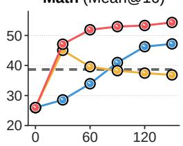

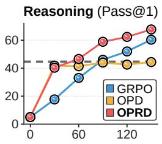

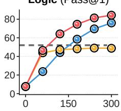  
Algorithms (Pass@1)

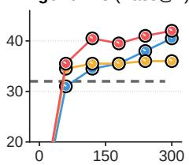

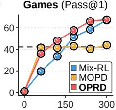  
Figure 1: On-policy reverse distillation (OPRD) enables faster and stronger weak-to-strong generalization across two key settings. (Left) For successive model transfer, a checkpoint from a post-trained 4B-scale model serves as the teacher for an 8B-scale student. We average evaluations conducted every 30 training steps: Mean@16 over AIME'24, AIME'25, HMMT'25, and OlympiadBench for math, and Pass@1 over Knights & Knaves, Quantum Lock, String Manipulation, and Countdown for reasoning tasks. (Right) In multi-domain consolidation, four domain-specialized 4B-scale teachers are distilled into a single 8B-scale student. Training examples are randomly mixed within each batch, with the corresponding domain teacher activated for each example. We report performance every 60 steps for Logic (averaged over Knights & Knaves and Quantum Lock), Algorithms (String Manipulation), and Games (Countdown). The gray dashed lines denote the performance of the corresponding weak teachers.

Knowledge distillation (KD; Hinton et al., 2015) transfers knowledge from a teacher model to a student. For autoregressive language models, conventional distillation on fixed or teacher-generated sequences can create a mismatch between the prefixes seen during training and those visited by the student at inference time. On-policy distillation (OPD) (Gu et al., 2024; Agarwal et al., 2024; Ko et al., 2024) addresses this mismatch by training on student-generated responses and querying the teacher at the prefixes the student visits. Recent work has applied OPD to eficient reasoning post-training (Qwen Team, 2025b; Xu et al., 2025; GLM-5 Team, 2026) and to consolidating capabilities from multiple domain-specific teachers into a single student (Xiaomi Team, 2026; Yang et al., 2026b; DeepSeek-AI, 2026). Standard OPD optimizes the student toward the teacher policy, making it well suited when matching that policy is the goal.

However, useful supervision need not come from a model that the student should ultimately match. Weakto-strong generalization has shown that stronger pretrained models can learn from weaker supervisors and even outperform them across language understanding, reward modeling, and reasoning tasks (Burns et al., 2024; Yang et al., 2024; Lang et al., 2024; Zhou et al., 2025). This regime is especially promising in two key settings in modern foundation model development. (i) Successive model transfer (Figure 1, top-left): A post-trained model from one generation can supervise a larger-scale successor, enabling it to inherit prior post-training gains and improve beyond its supervisor. (ii) Multi-domain consolidation (Figure 1, top-right): Domain-specialized policies can be developed independently at smaller scale, enabling eficient iteration on reward functions, environments, and training recipes. Multi-teacher on-policy distillation (MOPD) (Kimi Team, 2026; Ma et al., 2026; Xiaomi Team, 2026) can then consolidate their capabilities into a unified foundation model. Both settings therefore call for reverse distillation that transfers post-training gains from weaker models without limiting the eventual performance of higher-capacity students.

Simply applying OPD in the weak-to-strong direction does not resolve this problem. A weak teacher’s final policy combines changes learned during post-training, preferences inherited from its reference policy, and behavior shaped by its limited capacity. Standard OPD matches this entire distribution, transferring all three and retaining the weak policy as the target at each student-visited prefix. Teacher matching can provide useful guidance when the student underperforms the teacher, but can also suppress surprising student behavior when the teacher favors a diferent solution (Akhondzadeh et al., 2026; Ziheng et al., 2026). Adding reinforcement learning does not remove this tension if teacher matching remains a separate objective, since the matching loss can compete with reward maximization (Xu et al., 2025; Zhang et al., 2026a). Likewise, isolating the teacher’s post-training policy change is insuficient if the student is still trained to match it. This change captures only the improvements realized by the weak teacher, not the full range available to the stronger student, so direct matching can impose the same capacity limitation. The central question is therefore how to exploit weak-model post-training gains without making either the weak policy or its policy change an independent optimization target.

We introduce On-Policy Reverse Distillation (OPRD), which uses the policy change learned during weakmodel post-training to accelerate a stronger student’s own optimization. On the student’s on-policy rollouts, OPRD computes the verifier-driven policy gradient and extracts the weak teacher’s policy shift relative to its reference policy. It projects the student gradient onto the direction of this shift and amplifies the projected component, leaving the orthogonal component unchanged. Because this transformation positively rescales only a component already present in the student gradient, it preserves the stationary points of policy optimization in logit space while adding a nonnegative first-order alignment gain. When the teacher shift and student gradient align, OPRD reinforces their shared direction and accelerates convergence; when they oppose, it strengthens surprising student behavior supported by the verifier, allowing the student to improve beyond the teacher.

We evaluate OPRD across mathematical reasoning (MAA, 2024–2025; Dekoninck et al., 2026; He et al., 2024) and logical reasoning tasks (Stojanovski et al., 2026) in two main weak-to-strong scenarios. In successive model transfer, OPRD reaches weak-teacher performance with 33–67% fewer student updates than GRPO (Shao et al., 2024) and achieves up to 22.7 percentage points higher performance at early checkpoints. Unlike OPD, it then moves beyond the teacher rather than saturating after the initial transfer (Figure 1, bottom-left). In the multiteacher setting, OPRD distills four specialized smaller-scale teachers into a single stronger student, reaching teacher-level performance with 55% fewer updates than Mix-RL; the resulting student ultimately outperforms all four specialists (Figure 1, bottom-right). With the same number of rollouts per update, these gains reflect improved sample eficiency during student training. The benefit extends to conventional strong-to-weak distillation, where OPRD moves beyond OPD’s plateau through verifier-driven optimization. Together, these results show that weak teachers can accelerate the post-training of stronger models without limiting students to their teachers’ capabilities, opening a practical path to reusing post-training gains across model generations and domains at scale.

Contributions. In summary, our key contributions in this paper are as follows.

• Weak-to-Strong Generalization. We study how post-training gains from weaker models can be transferred to stronger students in two practical scenarios: successive model transfer and multi-domain consolidation. We identify the central challenge as exploiting these gains without making either the weak policy or its policy shift a separate optimization target.

• On-Policy Reverse Distillation. We introduce OPRD, which evaluates a weak teacher’s policy shift relative to its reference policy on student rollouts and amplifies the component of the student’s verifier-driven policy gradient along that direction. Because OPRD only rescales verifier-supported updates, it accelerates the student’s own optimization while preserving its stationary points, allowing the student to move beyond the teacher.

• Empirical Evaluation and Analysis. Across successive-model and multi-teacher settings, OPRD reaches the final performance of competing methods substantially earlier and ultimately outperforms both RL and distillation baselines (§3.2, §3.3). We further confirm that these gains extend to conventional strong-to-weak distillation (§3.4). We also compare against recent weak-to-strong methods (§4.1), analyze the design and dynamics of teacher guidance (§4.2), examine practical challenges and mitigations (§4.3), and study student reasoning and response style under teacher guidance (§4.4).

## 2. Method

## 2.1. Preliminary

Reinforcement Learning with Verifiable Rewards (RLVR). RLVR optimizes a language-model policy using rewards computed by programmatic verifiers, such as exact-answer checks or code execution, and has become central to reasoning post-training (Shao et al., 2024; Guo et al., 2025). For $x \sim \mathcal { D } ,$ , the student samples $y \sim \pi _ { \boldsymbol { \theta } } ( \cdot \mid x )$ and visits prefixes $s _ { t } = ( x , y _ { < t } )$ . Let $A _ { t }$ denote the advantage assigned to token � and $\mathbf { z } _ { t }$ the corresponding next-token logits at prefix $s _ { t }$ . The token-level policy gradient is

$$
\mathbf { g } _ { t } : = A _ { t } \nabla _ { \mathbf { z } _ { t } } \log \pi _ { \theta } ( y _ { t } \mid s _ { t } ) .\tag{2.1}
$$

OPRD later rescales this gradient while preserving the RLVR objective, so the student’s attainable performance is determined by the verifier objective and its own policy class rather than being bounded by the teacher’s capacity.

On-Policy Distillation (OPD). OPD reduces the training–inference distribution mismatch by sampling responses from the student and querying the teacher at each visited prefix, thereby providing dense token-level supervision over the student’s inference-time state distribution (Gu et al., 2024; Agarwal et al., 2024; Ko et al., 2024). A common reverse-KL formulation is

$$
\mathcal { L } _ { \mathrm { O P D } } ( \theta ) : = \underset { y \sim \pi _ { \theta } ( \cdot | x ) } { \mathbb { E } } \left[ \sum _ { t } D _ { \mathrm { K L } } \left( \pi _ { \theta } ( \cdot \mid s _ { t } ) \parallel \pi _ { T } ( \cdot \mid s _ { t } ) \right) \right] .\tag{2.2}
$$

Equivalently, OPD can be implemented as token-level policy optimization on student-sampled tokens using the teacher-to-student log-probability ratio as the advantage, with negligible empirical diferences from direct reverse-KL optimization. OPD is increasingly used in frontier-model post-training for reasoning and capability integration across domains (Ma et al., 2026; Xiaomi Team, 2026; GLM-5 Team, 2026; Yang et al., 2026b). Recent methods combine teacher matching with reinforcement learning to pair dense teacher supervision with outcome-based optimization (Xu et al., 2025; Ramos et al., 2026). Even in these hybrid methods, however, teacher matching remains a separate objective, leaving the teacher policy as a direct optimization target.

Weak-to-Strong Generalization. Weak-to-strong generalization studies whether a more capable model can learn from weaker supervisors, such as smaller models or imperfect human feedback, and ultimately outperform them (Burns et al., 2024). Prior work has used weak labels, preferences, and fixed reasoning trajectories to supervise stronger students. Refinement methods help the student exploit its own representations and greater capacity, but often recover only part of the gap to strong supervision (Yang et al., 2024; Somerstep et al., 2025; Dong et al., 2025; Medvedev et al., 2025). OPD instead provides the full next-token distribution $\bar { \pi } _ { T } ( \cdot \mid s _ { t } )$ at each student-visited prefix, where $\bar { \pi } _ { T }$ denotes either the weak teacher or a target policy derived from it. Under realizability, the resulting KL objective has the pointwise minimizer

$$
\operatorname * { a r g m i n } _ { \pi ( \cdot | s _ { t } ) } D _ { \mathrm { K L } } ( \pi ( \cdot  { \mid } s _ { t } ) \parallel \bar { \pi } _ { T } ( \cdot  { \mid } s _ { t } ) ) = \bar { \pi } _ { T } ( \cdot  { \mid } s _ { t } ) .\tag{2.3}
$$

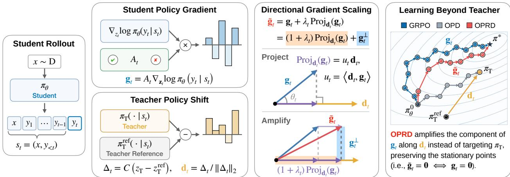  
Figure 2: Conceptual overview of On-Policy Reverse Distillation (OPRD). The figure illustrates OPRD’s gradient correction procedure for a single query. Here, $\mathbf { z } _ { T }$ denotes the logits of the weak teacher after post-training and ${ \bf z } _ { T } ^ { \mathrm { r e f } }$ those of its reference policy, and � denotes mean-centering. Their centered diference $\Delta _ { t }$ is the teacher’s policy shift at that student-visited prefix, and OPRD keeps only its unit direction $\mathbf { d } _ { t }$ . In practice, we use a simple top-10 truncation under the student policy to focus the correction on its high-probability vocabulary region. The rightmost panel provides a conceptual view of the resulting student trajectory in the optimization landscape, where the student follows the verifier-driven policy gradient $\mathbf { g } _ { t }$ with its component along $\mathbf { d } _ { t }$ amplified by $1 + \lambda _ { t }$ at each token and its orthogonal component left unchanged.

Alternative teacher-derived targets only change which policy the student matches, while adding reinforcement learning yields a compromise between teacher matching and reward maximization (Xu et al., 2025; Ramos et al., 2026). In both cases, the student remains directly optimized toward a policy defined by the weak teacher. OPRD instead extracts the policy change learned during weak-model post-training and uses it only to rescale the stronger student’s own policy gradient.

## 2.2. On-Policy Reverse Distillation

Overview. OPRD transfers the policy change learned during teacher post-training rather than matching the teacher’s final policy. At each student-visited prefix, it extracts the local direction of this change relative to the teacher’s reference policy and uses its alignment with the verifier-driven student gradient to rescale only the gradient component along that direction. Because the teacher signal only rescales the student’s own gradient, it can accelerate verifier-supported optimization without defining an independent optimization target. Positive-alignment scaling is active from the outset to amplify updates supported by both the verifier and the teacher, whereas negative-alignment scaling is gradually increased to reinforce verifier-supported departures beyond the weak teacher.

Teacher Policy Shift. The teacher’s final policy reflects the change acquired during RL post-training, preferences inherited from its reference policy, and behavior constrained by the weak model’s limited capacity. Directly matching it would therefore make all of these part of the student’s distillation target. Let � denote the frozen RL-trained teacher and $\pi _ { T } ^ { \mathrm { r e f } }$ its frozen pre-RL reference policy, and let ${ \bf z } _ { T } ( s _ { t } )$ and ${ \bf z } _ { T } ^ { \mathrm { r e f } } ( s _ { t } )$ denote their next-token logit vectors at a student-visited prefix $s _ { t } .$ . To extract the RL-induced policy delta, we mean-center the diference between the teacher and reference logits, removing a common ofset that does not afect relative token preferences. With $\begin{array} { r } { \mathcal { C } ( \mathbf { v } ) : = \mathbf { v } - \frac { 1 } { | \mathcal { V } | } ( \mathbf { 1 } ^ { \top } \mathbf { v } ) \mathbf { 1 } } \end{array}$ , we define

$$
\Delta _ { t } : = \mathscr { C } \big ( \mathbf { z } _ { T } ( s _ { t } ) - \mathbf { z } _ { T } ^ { \mathrm { r e f } } ( s _ { t } ) \big ) = \mathscr { C } \big ( \log \pi _ { T } ( \cdot \mid s _ { t } ) - \log \pi _ { T } ^ { \mathrm { r e f } } ( \cdot \mid s _ { t } ) \big ) .\tag{2.4}
$$

Intuitively, $\Delta _ { t }$ captures the change in the teacher’s relative next-token preferences induced by post-training, and the corresponding uncentered log-policy ratio admits an implicit-reward interpretation under KL-regularized policy optimization. However, because this shift is learned within the weak teacher’s policy class, it need not improve verifier reward for the stronger student. OPRD therefore uses only its unit direction $\mathbf { d } _ { t } : = \Delta _ { t } / \| \Delta _ { t } \| _ { 2 }$ for gradient scaling rather than optimizing toward the shift itself. The student gradient determines whether the resulting correction follows or opposes this direction, independently of its raw magnitude.

Gradient Scaling along the Teacher Direction. At token �, OPRD decomposes the student’s policy gradient $\mathbf { g } _ { t }$ (Eq. 2.1) relative to the teacher direction $\mathbf { d } _ { t } .$ Let $u _ { t } : = \mathbf { d } _ { t } ^ { \top } \mathbf { g } _ { t }$ denote their alignment coeficient, and define the projected and orthogonal components as $\mathrm { P r o j } _ { \mathbf { d } _ { t } } ( \mathbf { g } _ { t } ) : = u _ { t } \mathbf { d } _ { t }$ and $\mathbf { g } _ { t } ^ { \perp } : = \mathbf { g } _ { t } - \mathrm { P r o j } _ { \mathbf { d } _ { t } } ( \mathbf { g } _ { t } )$ , respectively. At optimization step �, OPRD uses a nonnegative scale $\lambda _ { t } \colon$

$$
\begin{array} { r l r } { \widetilde { \bf g } _ { t } : = { \bf g } _ { t } + \lambda _ { t } \mathrm { P r o j } _ { { \bf d } _ { t } } ( { \bf g } _ { t } ) } & { } & \\ { = { \bf \nabla } ( 1 + \lambda _ { t } ) \mathrm { P r o j } _ { { \bf d } _ { t } } ( { \bf g } _ { t } ) } & { + \underbrace { { \bf g } _ { t } ^ { \perp } } _ { u n c h a n g e d } . } \end{array}\tag{2.5}
$$

Essentially, OPRD decomposes the student’s policy gradient into its projection onto the teacher informed direction and an orthogonal component, amplifying only the projected component by $1 + \lambda _ { t } ,$ , while leaving the orthogonal component unchanged. We backpropagate $\widetilde { \bf g } _ { t }$ in place of $\mathbf { g } _ { t }$ and use the resulting parameter gradients to update the student.

Learning Beyond the Weak Teacher. Direct teacher matching makes the weak teacher’s policy a target of student optimization, even when moving beyond the teacher would yield higher verifier reward. OPRD instead uses the weak teacher only to rescale the student’s own policy gradient. At token �, this scaling can be written as the linear map $\widetilde { \mathbf { g } } _ { t } = ( \mathbf { I } + \lambda _ { t } \mathbf { d } _ { t } \mathbf { d } _ { t } ^ { \top } ) \mathbf { g } _ { t }$ . For $\lambda _ { t } \geq 0 _ { : }$ , the map is invertible and satisfies:

$$
\begin{array} { r } { \mathrm { ( S t a t i o n a r i t y ) } \qquad \widetilde { \mathbf { g } } _ { t } = \mathbf { 0 } \quad \mathrm { i f ~ a n d ~ o n l y ~ i f } \quad \mathbf { g } _ { t } = \mathbf { 0 } . } \end{array}\tag{2.6}
$$

$$
\mathrm { ( A l i g n m e n t ~ G a i n ) } \qquad \quad \langle \mathbf { g } _ { t } , \widetilde { \mathbf { g } } _ { t } \rangle = \| \mathbf { g } _ { t } \| _ { 2 } ^ { 2 } + \lambda _ { t } u _ { t } ^ { 2 } \geq \| \mathbf { g } _ { t } \| _ { 2 } ^ { 2 } .\tag{2.7}
$$

Since Eq. 2.6 holds at every token, the scaling preserves the stationary points of the verifier objective for a fixed response. Eq. 2.7 shows that the transformed gradient $\widetilde { \bf g } _ { t }$ retains the first-order progress of $\mathbf { g } _ { t }$ and adds the nonnegative alignment gain $\lambda _ { t } u _ { t } ^ { 2 }$ , so greater alignment magnitude $\left| u _ { t } \right|$ | yields greater first-order progress. For a fixed response, these token-level gains sum into a nonnegative term in the guaranteed one-step ascent (see Appendix A). OPRD can therefore accelerate the student’s optimization without introducing a teacher-defined target.

Asymmetric Alignment Scaling. The sign of $u _ { t }$ indicates whether $\mathbf { g } _ { t }$ aligns with or opposes $\mathbf { d } _ { t } ,$ so scaling reinforces teacher-following updates when $u _ { t } \geq 0$ and verifier-supported departures when $u _ { t } < 0$ . However, both signals may include reward-irrelevant bias $( \mathbf { e } . \mathbf { g } . , \mathbf { g } _ { t } = \mathbf { g } _ { t } ^ { \star } + \epsilon _ { t }$ , with $\mathbf { g } _ { t } ^ { \star }$ denoting the reward-improving signal and $\epsilon _ { t }$ aggregating structured bias components). Scaling only one sign can then systematically magnify this bias term, causing it to accumulate over training (see Appendix B.1 and B.2). Because negative-alignment updates are less reliable on initially weak student rollouts, we activate the positive branch immediately and gradually ramp up the negative branch. At optimization step $k ,$ we set the token-wise scaling coeficient as

$$
\lambda _ { t } : = \left\{ \begin{array} { l l } { \lambda , } & { u _ { t } \geq 0 , } \\ { \lambda \operatorname* { m i n } \Bigl \{ \frac { k } { K _ { \mathrm { w a r m } } } , 1 \Bigr \} , } & { u _ { t } < 0 , } \end{array} \right.\tag{2.8}
$$

where � is the scaling strength and $K _ { \mathrm { w a r m } }$ is the warm-up horizon. Since $\lambda _ { t } \geq 0 .$ , Eqs. 2.6 and 2.7 continue to hold under this schedule. The negative-branch warm-up gradually mitigates the initial one-sided amplification caused by positive-only scaling. This preserves immediate teacher-aligned transfer while progressively strengthening verifier-supported departures from the weak teacher. We further analyze this design alongside alternative branch-scaling strategies in Appendix B.3.

## 3. Experiments

We evaluate OPRD on mathematical and logical reasoning tasks in two primary settings: weak-to-strong transfer across successive model transfer and multi-domain consolidation with multiple specialized teachers. We additionally evaluate conventional strong-to-weak distillation to verify that OPRD does not depend on a particular teacher–student size ordering.

Table 1: Main experimental results for successive model transfer on mathematics and reasoning tasks. We use intermediate GRPO checkpoints of 4B-scale Qwen3 models as teachers and report Mean@16 for mathematics and Pass@1 for Reasoning Gym. Teacher and initial-student rows report single-checkpoint results, while trained-policy rows average evaluations at steps 30, 60, 90, 120, and 150 to summarize performance over training. The best result in each column is shown in bold. Detailed task-level curves and results with standard deviations are provided in Appendix D.1 and Appendix D.3, respectively.
<table><tr><td rowspan="3">Policy</td><td colspan="5">Math Reasoning</td><td colspan="5">Reasoning Gym</td></tr><tr><td>AIME&#x27;24</td><td>AIME&#x27;25</td><td>HMMT&#x27;25 Olympiad</td><td></td><td>Avg.</td><td>Knights</td><td>Quantum</td><td>String</td><td>Count</td><td>Avg.</td></tr><tr><td colspan="5">Qwen3-4B (Teacher) → Qwen3-8B (Student)</td><td></td><td colspan="5">Qwen3-4B-Base (Teacher) → Qwen3-8B-Base (Student)</td></tr><tr><td>Teacher</td><td>42.50</td><td>38.75</td><td>21.25</td><td>52.15</td><td>38.66</td><td>57.50</td><td>46.58</td><td>32.00</td><td>42.50</td><td>44.65</td></tr><tr><td>Student</td><td>25.63</td><td>19.58</td><td>12.50</td><td>46.22</td><td>25.98</td><td>11.00</td><td>3.14</td><td>3.00</td><td>3.00</td><td>5.04</td></tr><tr><td>+ GRPO</td><td>46.63</td><td>36.42</td><td>21.96</td><td>52.52</td><td>39.38</td><td>54.20</td><td>36.24</td><td>35.50</td><td>41.30</td><td>41.81</td></tr><tr><td>+ OPD</td><td>46.92</td><td>38.21</td><td>21.42</td><td>51.24</td><td>39.44</td><td>55.00</td><td>39.62</td><td>35.10</td><td>41.60</td><td>42.83</td></tr><tr><td>+ KDRL1</td><td>53.46</td><td>43.13</td><td>26.08</td><td>53.28</td><td>43.99</td><td>53.30</td><td>36.63</td><td>38.10</td><td>49.50</td><td>44.38</td></tr><tr><td>+ OPRD</td><td>66.92</td><td>56.04</td><td>31.42</td><td>53.26</td><td>51.91</td><td>73.30</td><td>51.11</td><td>42.20</td><td>54.10</td><td>55.18</td></tr></table>

## 3.1. Experimental Setup

Tasks and Models. For mathematics, we train on DAPO-Math-17K (Yu et al., 2025) and evaluate on AIME'24, AIME'25 (MAA, 2024–2025), HMMT'25 (Dekoninck et al., 2026), and OlympiadBench (He et al., 2024). For diverse reasoning tasks, we train and evaluate on four Reasoning Gym benchmarks (Stojanovski et al., 2026): Knights & Knaves (K&K), Quantum Lock, String Manipulation, and Countdown. For each Reasoning Gym task, we construct a fixed pool of 20,000 examples, using 19,800 for training and holding out 200 for evaluation. All teacher and student models are drawn from the Qwen3 family (Qwen Team, 2025b), and the details are given in the corresponding setting descriptions. Each teacher is post-trained with GRPO (Shao et al., 2024) on the corresponding training data and held fixed during student training.

Baselines. For the single-teacher experiments, we compare OPRD with GRPO (Shao et al., 2024), OPD (Agarwal et al., 2024), and KDRL (Xu et al., 2025). GRPO performs verifier-only policy optimization, OPD matches the frozen teacher on student-generated prefixes, and KDRL serves as a representative hybrid baseline that combines verifier-based policy optimization with on-policy distillation. For the multi-teacher setting, we similarly compare OPRD with Mix-RL, MOPD (Ma et al., 2026), and KDRL, which serve as the corresponding verifier-only, distillation-only, and hybrid baselines, respectively.

Training and Evaluation. For each experiment, OPRD and all baselines start from the same student checkpoint and use the same task-specific training prompts, batch size, rollout budget, and number of policy updates. Teacher-based methods also use the same frozen teacher checkpoint for each task. We evaluate mathematics with Mean@16 and Reasoning Gym with Pass@1. While teacher and initial-student entries report fixed-checkpoint performance, trained-policy entries in most tables are averaged over five checkpoints to capture both learning speed and performance throughout training: at 30-update intervals for single-teacher settings and at 60-update intervals for multi-teacher distillation. Full training and evaluation details are provided in Appendix C.

## 3.2. Weak-to-Strong Distillation for a Successor Model

Settings. To study successive model transfer in a controlled setting, we perform weak-to-strong distillation across scales within the same model family. Under the default configurations in Section 3.1, we pair a post-trained Qwen3-4B teacher with a Qwen3-8B student for math, and Qwen3-4B-Base teachers with separately trained Qwen3-8B-Base students for the four Reasoning Gym tasks. Additional Qwen3-Base results for mathematics and three other reasoning tasks are provided in Appendix D.2.

OPRD Accelerates Learning While Continuing Beyond the Weak Teacher. Figure 1 (bottom-left) shows that OPD improves rapidly but plateaus near the teacher average, whereas GRPO progresses more gradually. OPRD matches OPD’s initial acceleration, quickly surpasses the weak teacher, and reaches GRPO’s end-of-training performance substantially earlier. Averaged over five evenly spaced checkpoints to summarize the learning curve, Table 1 shows gains of 7.92 points on mathematics and 10.80 points on Reasoning Gym over the strongest baseline. The initially similar trajectories of OPD and OPRD indicate that teacher guidance is useful while the student still trails it, but their later divergence suggests that direct policy matching becomes restrictive once the student discovers reward-supported improvements beyond the teacher.

Table 2: (Left) Experimental results for multi-teacher distillation on Reasoning Gym. We consolidate four task-specific Qwen3-4B-Base teachers into a single Qwen3-8B-Base student. The teacher and initial-student rows report fixed-checkpoint performance, while each trained-policy row averages Pass@1 over checkpoints at steps 60, 120, 180, 240, and 300. Detailed learning curves for each task are provided in Appendix E. (Right) Experimental results for strong-to-weak distillation. We evaluate Qwen3-8B → Qwen3-1.7B on AIME'24 and Qwen3-8B-Base → Qwen3-0.6B on Knights & Knaves. Each trained-policy row averages Mean@16 and Pass@1, respectively, over five checkpoints. Detailed learning curves are provided in Appendix F. The best result in each column is shown in bold.
<table><tr><td>Policy</td><td>Knights</td><td>Quantum</td><td>String</td><td>Count</td><td> $\mathbf { A v 8 \cdot }$ </td></tr><tr><td colspan="6">4 Teachers (Qwen3-4B-Base) → 1 Student (Qwen3-8B-Base)</td></tr><tr><td>Teachers</td><td>57.50</td><td>46.58</td><td>32.00</td><td>42.50</td><td>44.65</td></tr><tr><td>Student</td><td>11.00</td><td>3.14</td><td>3.00</td><td>3.00</td><td>5.04</td></tr><tr><td>+ Mix-RL</td><td>64.90</td><td>43.91</td><td>35.90</td><td>46.00</td><td>47.68</td></tr><tr><td>+ MOPD</td><td>57.10</td><td>37.70</td><td>35.50</td><td>42.10</td><td>43.10</td></tr><tr><td>+ KDRL</td><td>65.90</td><td>44.09</td><td>35.00</td><td>44.90</td><td>47.47</td></tr><tr><td>+ OPRD</td><td>80.70</td><td>59.68</td><td>39.70</td><td>55.00</td><td>58.77</td></tr></table>

<table><tr><td>Policy</td><td>AIME&#x27;24</td><td>Knights Knaves</td><td>Avg.</td></tr><tr><td></td><td>8B → 1.7B</td><td>8B-Base → 0.6B</td><td></td></tr><tr><td>Teacher</td><td>52.29</td><td>64.50</td><td>58.40</td></tr><tr><td>Student</td><td>10.00</td><td>5.00</td><td>7.50</td></tr><tr><td>+ GRPO</td><td>18.92</td><td>20.60</td><td>19.76</td></tr><tr><td>+ OPD</td><td>29.79</td><td>20.20</td><td>25.00</td></tr><tr><td>+ KDRL</td><td>25.33</td><td>33.70</td><td>29.52</td></tr><tr><td>+ OPRD</td><td>33.58</td><td>49.40</td><td>41.49</td></tr></table>

## 3.3. Multi-Teacher Weak-to-Strong Distillation

Settings. Multi-teacher distillation asks whether capabilities acquired by separately post-trained task specialists can be consolidated into a single policy. We use the same Reasoning Gym configuration and method-specific settings as in Section 3.1, but each training batch now mixes the four tasks equally. Teacher-based methods pair each example with its corresponding Qwen3-4B-Base specialist. Because this reduces exposure to each task by roughly a factor of four, we train for 300 policy updates. Despite the longer run, we retain the single-teacher coeficient schedules rather than extending them to 300 updates.

OPRD Consolidates Heterogeneous Specialists without Cross-Task Tradeofs. Figure 1 (bottom-right) shows that MOPD rapidly approaches the specialist average but then plateaus, whereas Mix-RL improves more gradually. OPRD combines this early transfer with continued improvement throughout training. Table 2 reports an average of 58.77, exceeding Mix-RL by 11.09 points and the specialist average by 14.12 points. OPRD also surpasses the corresponding specialist on all four tasks despite their distinct structures and objectives, indicating joint improvement rather than a cross-task tradeof. OPRD may reduce cross-task interference by amplifying only the component of each task’s verifier-driven student gradient along its teacher-shift direction, rather than matching the full specialist policy. This projection resembles PCGrad (Yu et al., 2020), but is applied between each task’s student gradient and teacher direction rather than between conflicting task gradients.

## 3.4. Strong-to-Weak Distillation

Settings. We evaluate conventional strong-to-weak distillation under the default configurations in Section 3.1. For mathematics, we pair a Qwen3-8B teacher with a Qwen3-1.7B student, and we pair a Qwen3-8B-Base teacher with a Qwen3-0.6B student for Knights & Knaves. Both teachers are taken from step 105 of task-specific GRPO training. Both settings use prompt batch and mini-batch sizes of 64, and we schedule each method’s distillation coeficient over 45 updates.

OPRD Does Not Depend on Teacher–Student Capacity Ordering. Table 2 shows that OPRD remains efective in conventional strong-to-weak distillation, outperforming OPD by 3.79 points on AIME'24 and 29.20 points on Knights & Knaves. Recent studies show that standard OPD can fail when capacity or distributional gaps make

Table 3: (Left) Comparison with various weak-to-strong baselines. We evaluate 4B-to-8B transfer using instruction-tuned models for math and base models for reasoning tasks. Teacher and initial-student rows show fixed-checkpoint results, while trained-policy rows show checkpoint averages. The best result in each column is shown in bold. See Appendix G.1 and Appendix G.2 for implementation details and learning curves, respectively. (Right) Ablation Study on Teacher-Checkpoint Quality. For each task, the bars report the performance of Qwen3-4B-Base teacher checkpoints obtained at GRPO training steps 15, 60, 105, and 150, while the lines show the learning curves of Qwen3-8B-Base students trained with OPRD using the corresponding checkpoints. All configurations other than the teacher checkpoint follow the defaults in Section 3.1.
<table><tr><td>Policy</td><td>AIME&#x27;24</td><td>Knights</td><td>String</td><td>Avg.</td></tr><tr><td></td><td>4B (-Base) → 8B (-Base)</td><td></td><td></td><td></td></tr><tr><td>Teacher</td><td>42.50</td><td>57.50</td><td>32.00</td><td>44.00</td></tr><tr><td>Student</td><td>25.63</td><td>11.00</td><td>3.00</td><td>13.21</td></tr><tr><td>+ GRPO</td><td>46.63</td><td>54.20</td><td>35.50</td><td>45.44</td></tr><tr><td>+ OPD</td><td>46.92</td><td>55.00</td><td>35.10</td><td>45.67</td></tr><tr><td>+ W2SR-P</td><td>45.42</td><td>62.50</td><td>38.00</td><td>48.64</td></tr><tr><td>+ S2L-PO²</td><td>60.54</td><td>63.40</td><td>38.70</td><td>54.21</td></tr><tr><td>+ OPSD³</td><td>15.88</td><td>24.60</td><td>24.60</td><td>21.69</td></tr><tr><td>+ Direct-OPD</td><td>35.04</td><td>49.20</td><td>29.20</td><td>37.81</td></tr><tr><td>+ W2S-OPD</td><td>52.96</td><td>59.50</td><td>35.20</td><td>49.22</td></tr><tr><td>+ OPRD</td><td>66.92</td><td>73.30</td><td>42.20</td><td>60.81</td></tr></table>

GRPO OPRD (15) OPRD (60) OPRD (105) OPRD (150) Qwen3-4B-Base (Teacher) Qwen3-8B-Base (Student)  
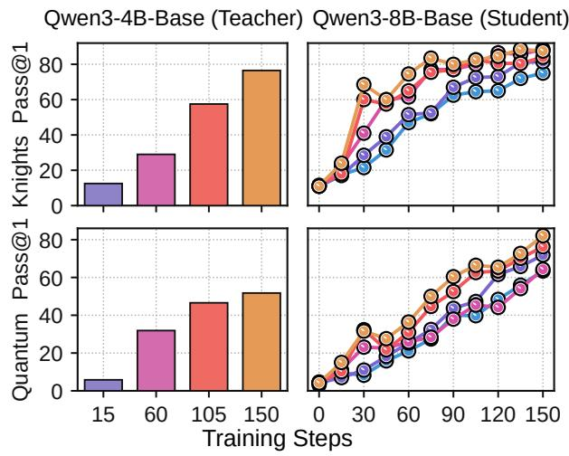  
teacher supervision dificult to exploit, so a stronger teacher need not yield a better student (Li et al., 2026; Fu et al., 2026). Consistent with these findings, OPD improves initially in both settings but quickly saturates well below OPRD. KDRL’s lower score further suggests that supplementing policy matching with verifier feedback does not fully resolve this issue. OPRD instead amplifies only the component of the student’s verifier-driven gradient aligned with the teacher’s policy delta. This allows the student to benefit from teacher guidance along reward-supported directions it can realize, without having to reproduce the stronger policy in full.

## 4. Analysis

## 4.1. Broader Comparison with Weak-to-Strong Methods

OPRD Outperforms Methods Using Of-Policy Generations from Weak Teacher. Table 3 (left) compares OPRD with three baselines that use weak-teacher generations diferently. W2SR-P (Yuan et al., 2026) performs SFT on verified-correct teacher trajectories; S2L-PO (Ren et al., 2026) mixes of-policy rollouts from a weak explorer with student rollouts in shared GRPO groups before transitioning to fully on-policy RLVR; and our OPSD variant (Zhao et al., 2026) uses a verified weak-teacher draft as privileged context for self-distillation. W2SR-P and S2L-PO improve over the initial student, indicating that weak-teacher trajectories can provide a useful bootstrap within the same Qwen3 family. However, reliance on of-policy teacher trajectories can create train–inference mismatch (Agarwal et al., 2024) and need not transfer underlying capabilities across model gaps (Gudibande et al., 2023). OPRD instead remains fully on-policy and uses the teacher shift only to rescale the aligned component of the verifier gradient. Empirically, OPRD reaches 60.81, exceeding the strongest alternative, S2L-PO, by 6.60 points and achieving the best score on all three tasks.

Rescaling the Verifier Gradient Outperforms Direct Optimization of the Weak Policy Delta. The lower rows of Table 3 (left) compare OPRD with two closely related concurrent works, Direct-OPD (Feng et al., 2026) and W2S-OPD (Yu et al., 2026), both of which derive the student’s objective directly from the weak policy shift. Direct-OPD uses the corresponding log-ratio as a dense reward, whereas W2S-OPD reanchors the shift to the student’s base policy and distills the resulting proxy teacher. Given the sensitivity of both methods to the relative strength of the transferred shift, we follow the hyperparameter settings reported in the original papers. However, both methods rely solely on the information encoded in the shift. OPRD instead retains verifier supervision through the orthogonal component $\mathbf { g } _ { t } ^ { \perp }$ , allowing the student to pursue reward-supported directions not captured by the weak policy delta. Indeed, OPRD reaches 60.81, outperforming W2S-OPD by 11.59 points and Direct-OPD by 23.00 points on average.

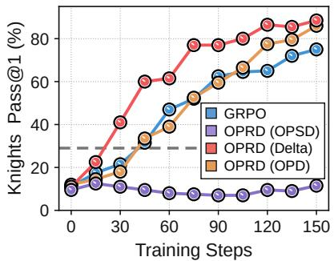  
(a) Construction of $\mathbf { d } _ { t }$

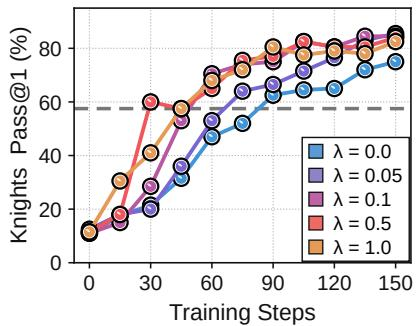  
(b) Amplification strength �

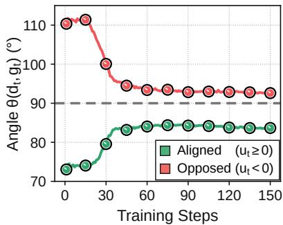  
(c) Gradient alignment  
Figure 3: (a) Ablations of scaling-direction construction. All OPRD variants use the step-60 GRPO checkpoint as the weak teacher. For $\mathrm { O P S D } ,$ a verified draft generated by this teacher is provided as privileged context. (b) Ablation of directional amplification strength. We vary $\lambda ,$ the coeficient applied to OPRD’s directional correction term. $\lambda = 0$ corresponds to GRPO. The gray dashed line marks the performance of the teacher checkpoint. All other settings follow the default configurations in Section 3.1. (c) Alignment dynamics between $\mathbf { d } _ { t }$ and $\mathbf { g } _ { t }$ . On Knights & Knaves, we track $\theta _ { t }$ between d� and g� during OPRD with a Qwen3-8B-Base student and Qwen3-4B-Base weak teacher. Excluding rollout groups with $\mathbf { g } _ { t } = \mathbf { 0 }$ (identical rewards within the group), we report token-averaged angles for aligned $\left( u _ { t } \geq 0 \right)$ and opposed $( u _ { t } < 0 )$ tokens.

## 4.2. Design and Dynamics of Teacher Guidance

Better-Trained Weak Teachers Provide More Efective Guidance. Table 3 (right) shows that later, betterperforming GRPO checkpoints of the 4B teacher generally lead to faster learning under OPRD for the 8B student on both reasoning tasks. Because $\Delta _ { t }$ is normalized before scaling, this benefit cannot be attributed to shift magnitude alone; instead, later checkpoints appear to encode a more reward-informative direction, yielding a larger verifier-gradient component for OPRD to amplify. Notably, the step-60 teacher achieves only 29.0% Pass@1 on Knights & Knaves, yet the corresponding OPRD student rapidly reaches approximately 88%, far surpassing both the teacher and GRPO. Thus, while teacher quality afects the strength of OPRD’s acceleration, the teacher’s absolute performance need not impose a ceiling on the student.

Weak Policy Delta Provides the Most Efective Scaling Direction. Figure 3a compares three choices for the guidance direction $\mathbf { d } _ { t } \mathbf { : }$ the normalized weak policy delta $\Delta _ { t } ,$ the OPD teacher-matching gradient, and the OPSD self-distillation gradient. The weak policy delta yields the fastest and most sustained gains. Comparing the post-trained teacher with its reference isolates the reward-relevant update, and their log-policy ratio admits an implicit-reward interpretation. OPRD projects the verifier gradient onto this direction and amplifies its aligned component, exploiting the teacher’s reward information without inheriting its capacity ceiling. In contrast, OPD captures the full teacher–student mismatch and ofers limited acceleration when the teacher is too weak, while OPSD’s of-policy supervision can restrict exploration of alternative reasoning paths (Kim et al., 2026; Kaur et al., 2026). Although OPD becomes more efective with a better-trained teacher, the weak policy delta is still the fastest and most reliable guidance signal (see Appendix H).

Suficient Directional Amplification Enables Early Acceleration. Figure 3b examines $\lambda ,$ which scales the directional correction and thus controls the strength of teacher guidance. Every $\lambda > 0$ improves final Pass@1 over $\lambda = 0$ (GRPO). Larger values of � up to 0.5 also yield faster gains early in training. This systematic relationship between guidance strength and learning speed confirms that OPRD’s directional correction indeed drives the observed acceleration. Performance changes little beyond $\lambda = 0 . 5 ,$ , so precise tuning is unnecessary once amplification is suficiently strong. We therefore use $\lambda = 0 . 5$ as the default.

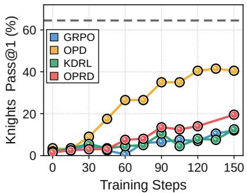  
(a) Limited gradient signal

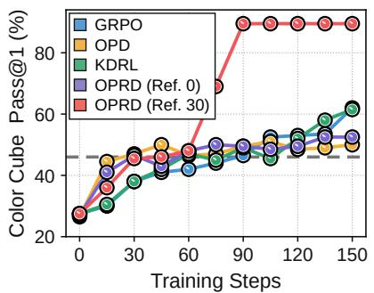  
(b) Task performance

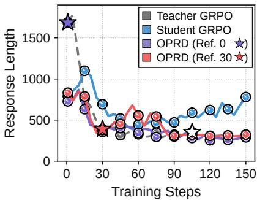  
(c) Response Length  
Figure 4: (a) Results under limited policy-gradient signal. On Knights & Knaves, we transfer a step-105 Qwen3-8B-Base teacher to a Qwen3-1.7B-Base student, with OPRD’s negative-branch scale $\lambda _ { t }$ warmed up over the first $7 5$ steps. $( \boldsymbol { \mathbf { b } } , \boldsymbol { \mathbf { c } } )$ Efect of reference-policy selection on length bias. On Color Cube, we transfer a step-105 Qwen3-4B-Base teacher $\pi _ { T }$ to a Qwen3- 8B-Base student, using either the step-0 or step-30 checkpoint from the same GRPO run as $\pi _ { T } ^ { \mathrm { r e f } }$ . OPRD’s negative-branch scale $\lambda _ { t }$ is warmed up over the first 75 steps. The gray dashed line marks teacher performance, while the colored stars denote the mean response lengths of the two choices of $\bar { \pi } _ { T } ^ { \mathrm { r } e f }$ , and the white star marks that of $\pi _ { T }$ . All other settings follow Section 3.1.

Teacher Guidance Bootstraps Early Learning but Becomes Less Influential over Time. Figure 3c tracks the mean angle $\theta _ { t }$ between the guidance direction $\mathbf { d } _ { t }$ and policy gradient $\mathbf { g } _ { t }$ . Early in training, the two directions exhibit substantial alignment for $u _ { t } > 0$ and opposition for $u _ { t } < 0 .$ . This strong directional coupling allows the weak policy delta to bootstrap student learning. As training proceeds, the mean angle for $u _ { t } > 0$ increases toward $9 0 °$ , while that for $u _ { t } < 0$ decreases toward $9 0 °$ . Since $\| \mathrm { P r o j } _ { \mathbf { d } _ { t } } ( \mathbf { g } _ { t } ) \| _ { 2 } / \| \mathbf { g } _ { t } \| _ { 2 } = | \cos \theta _ { t } | .$ this convergence toward orthogonality means that the component of $\mathbf { g } _ { t }$ along $\mathbf { d } _ { t }$ becomes smaller relative to the full policy gradient. This indicates that the evolving student gradient increasingly follows verifier-supported directions not captured by the teacher shift, so teacher guidance becomes less influential over time.

## 4.3. Discussion of Key Challenges

Vanishing Policy Gradients Limit OPRD’s Teacher-Guided Correction. OPRD requires a nonzero verifierdriven policy gradient. In an additional strong-to-weak experiment pairing a Qwen3-8B-Base teacher with a Qwen3-1.7B-Base student, most Knights & Knaves responses are invalid, so most rollout groups receive identical rewards $( \mathrm { i . e . }$ , the resulting group-relative advantages and their contributions to $\mathbf { g } _ { t }$ therefore vanish). For these groups, the projection onto $\mathbf { d } _ { t }$ also vanishes, leaving no component for OPRD to amplify and hence no teacherguided correction. As shown in Figure 4a, OPRD still accelerates learning relative to GRPO and ${ \mathrm { K D R L } } ,$ although all three remain below 20% Pass@1, whereas OPD reaches 40.5% using dense policy-matching targets that do not depend on verifier rewards. This challenge arises from the student’s initial rollout distribution rather than the absence of a useful teacher signal. Such an extreme regime is less likely in our primary weak-to-strong setting, where the student has greater capacity than the teacher, but may still arise on suficiently dificult tasks. A short task-specific SFT or distillation warm-up could bootstrap valid on-policy behavior before switching to OPRD.

Reference Policy Selection Can Prevent Length Bias from Distorting Teacher Guidance. As discussed in Section 2.2 and Appendix B, both $\mathbf { g } _ { t }$ and $\mathbf { d } _ { t }$ can contain reward-irrelevant components such as $\epsilon _ { t } ,$ which the projection-and-amplification step can magnify. Response length is one example: when it correlates with verifier reward, both signals can encode a preference for longer or shorter responses, even if changing length does not itself improve reasoning quality. As shown in Figures 4b and $^ { 4 \mathrm { c } , }$ the step-0 reference $\pi _ { T } ^ { \mathrm { r e f } }$ produces substantially longer responses than the step-105 teacher $\pi _ { T }$ on Color Cube. The resulting shift $\Delta _ { t }$ therefore contains a strong shortening component. With this reference, OPRD rapidly shortens its responses and achieves strong early gains. It nevertheless plateaus at 52.5% Pass@1, below GRPO and KDRL, suggesting that the teacher-guided correction overemphasizes shortening at the expense of task-relevant reasoning. A simple mitigation is to move the reference to step 30, after the teacher’s initial length collapse. This excludes some of the teacher’s early gains from $\Delta _ { t }$ � but substantially narrows the reference–teacher length gap and weakens the associated bias. OPRD then avoids the plateau and jumps to 89.5%, discovering a more efective reasoning strategy. Appendix I shows the same pattern on Binary Matrix, where this reference policy adjustment is likewise efective.

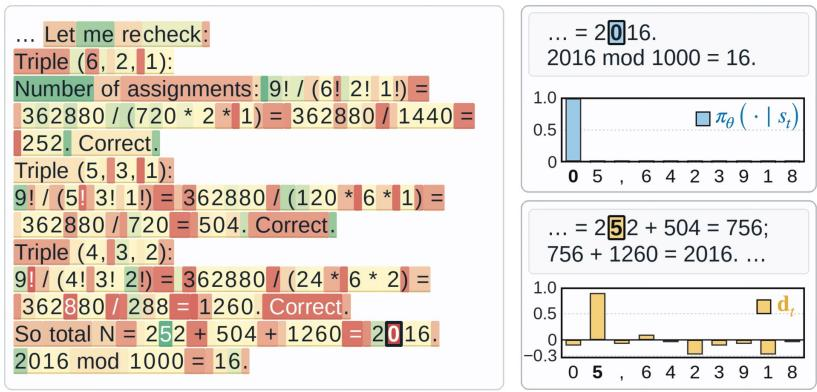  
(a) Token alignment and reasoning paths

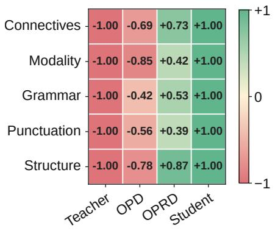  
(b) Response style similarity  
Figure 5: (a) Visualizing token alignment and reasoning continuations. An AIME'25 response from the OPRD student at update 150. Green and red indicate positive and negative cosine similarity between d and the student policy gradient $\mathbf { g } _ { t }$ with $A _ { t } = 1 _ { : }$ , respectively (see Appendix J.1). The token outlined in black, 0 , has the lowest cosine similarity among displayed tokens. The student’s top-1 token 0 completes 2016 directly. Forcing 5 , the top-1 token under d , leads the same student to this result through an intermediate sum. The plots show the student’s top-10 token probabilities above and their teacher-shift values (d ) below. (b) Measuring similarity to teacher and student response styles. On AIME'24, we compare response styles using 101 standardized features across five categories. Normalized distance diferences indicate whether each method’s average style is closer to the weak teacher (red) or the GRPO-trained student at update 150 (green).

## 4.4. Student Behavior under Teacher Guidance

OPRD Can Move Beyond the Teacher’s Reasoning Paths. Figure 5a illustrates how OPRD can exploit an informative teacher shift while allowing the stronger student to follow its own, more direct reasoning path rather than the one favored by the teacher. At the selected AIME'25 prefix, the student’s top-1 prediction is 0 , which immediately completes 2016. By contrast, the top-1 token under the weak policy shift $\mathbf { d } _ { t }$ is 5 . Forcing 5 and continuing with the same student produces $2 5 2 + 5 8 4 = 7 5 6$ , followed by $7 5 6 + 1 2 6 \theta = 2 8 1 6$ . This detour also reaches the correct result, showing that the teacher shift provides a valid direction that may be useful earlier in training. Here, however, the student can already complete the calculation directly. This is reflected in the highlighted 0 , which has the most negative alignment with $\mathbf { d } _ { t }$ among the displayed tokens. OPRD therefore raises the logit of 0 and lowers that of 5 (when $u _ { t } < 0 ,$ , OPRD amplifies the component of the verifier-driven policy gradient that opposes the teacher shift). The negative-alignment branch thus favors the student’s shorter solution over the valid teacher-favored detour, providing a token-level example of how OPRD can move beyond the teacher.

OPRD Remains Stylistically Closer to the Stronger Student. Figure 5b examines how teacher guidance afects response style on AIME'24. We summarize each method’s average response style using 101 standardized features grouped into five categories: connectives, modality, grammar, punctuation, and sentence and paragraph structure. For each category, a normalized distance diference indicates whether the average style is closer to the teacher (negative) or the GRPO student at update 150 (positive) (see Appendix J.2 for details). At update 150, OPD is closer to the teacher in all five categories, whereas OPRD is closer to the GRPO student. This pattern suggests that the OPRD student can benefit from what the teacher learned without inheriting its response style, consistent with using the teacher shift to rescale the student’s own policy gradient rather than matching the teacher policy.

## 5. Related Work

Weak-to-Strong Generalization. Weak-to-strong generalization has been observed across language understanding, reward modeling, and reasoning, although weak supervision typically recovers only part of the gap to strong supervision (Burns et al., 2024; Yang et al., 2024). Analyses attribute the gains to correcting weak pseudo-labels, extending coverage beyond the weak teacher, and diferences between teacher and student hypothesis classes or representations (Lang et al., 2024; Charikar et al., 2024; Dong et al., 2025; Xue et al., 2025; Medvedev et al., 2025), while naive fine-tuning can instead overfit weak errors (Somerstep et al., 2025;

Yao et al., 2025; Shi et al., 2025). For reasoning, W2SR-P trains stronger students on verified weak-model trajectories, S2L-PO and related methods use weaker policies to broaden the student’s rollouts, and weak critiques can generate and filter improved responses (Yuan et al., 2026; Ren et al., 2026; Wang et al., 2026a; Jin et al., 2026). These methods change the student’s training data, exploration, or feedback, whereas OPRD leaves all three unchanged and only rescales the student’s own policy gradient.

On-Policy Distillation. Knowledge distillation for language generation has moved from matching teacher distributions on fixed or teacher-generated sequences (Hinton et al., 2015; Kim and Rush, 2016) to objectives evaluated on student-generated sequences (Gu et al., 2024; Ko et al., 2024). OPD makes this supervision fully on-policy by querying the teacher along the student’s current rollouts, addressing the mismatch between the prefixes seen in training and those the student visits at inference (Agarwal et al., 2024). It is now a common step in reasoning post-training (Qwen Team, 2025b; GLM-5 Team, 2026), and later work uses the same interface to consolidate several specialist teachers into one student (Ma et al., 2026; Kimi Team, 2026; Xiaomi Team, 2026), to exploit privileged information available only during training (Zhao et al., 2026; Ye et al., 2026), or to extrapolate the reward implicit in OPD beyond the teacher (Yang et al., 2026a). In all of these, the student is still trained to match a token distribution that the teacher defines, so in the weak-to-strong setting the optimum of the objective is the weak policy itself or a target derived from it.

Distillation with Reinforcement Learning. Methods that combine distillation with verifier-based reinforcement learning difer in how the teacher signal enters optimization. KDRL and later work add a teacher-matching term to the reward objective (Xu et al., 2025; Ramos et al., 2026). Others modify teacher guidance through policy ratios, reward-based selection, group-level calibration, or token-level interventions (Zhang et al., 2026a; Akhondzadeh et al., 2026; Zhang et al., 2026b; Ko et al., 2026; Jia et al., 2026), and another uses a privileged self-teacher to control the magnitude of token-level credit (Wang et al., 2026b). However, a teacher-matching loss introduces a second objective that can compete with reward maximization when the teacher favors a solution the verifier does not reward. OPRD adds no such objective and optimizes reward alone.

Transferring Policy Shifts. Several methods transfer the shift between a post-trained policy and its reference rather than the final policy alone. During decoding, this shift can steer a larger frozen model (Liu et al., 2024; Zhou et al., 2024). During training, it has been used as an alignment target for a stronger model (Zhu et al., 2025), as a proxy teacher built on the student’s base policy in W2S-OPD (Yu et al., 2026), and as a dense reward on student rollouts in Direct-OPD (Heo et al., 2026; Feng et al., 2026). In each case the shift itself becomes an optimization target, and it carries only the improvements the weak teacher realized. OPRD instead uses the weak policy delta to rescale the student’s policy gradient, so the direction transfers without the shift becoming a target.

Gradient Manipulation. Multi-task optimization combines objectives at the level of gradients rather than losses. Gradient surgery projects one task gradient onto the normal plane of another when the two conflict (Yu et al., 2020), a moving average of past gradients makes this projection more stable (Hsieh et al., 2024), and auxiliary gradients can be gated by their cosine similarity with the main gradient (Du et al., 2019; Zhou et al., 2022). In these methods, every direction is the gradient of a loss the model itself optimizes, and conflicting components are removed or down-weighted. OPRD is closest to this family in form, but it removes nothing and only amplifies the component of the student’s policy gradient that already points along the teacher direction, so the stationary points of the student objective in logit space do not move.

## 6. Conclusion

We introduce On-Policy Reverse Distillation (OPRD), which transfers a weak teacher’s post-training policy shift by amplifying the aligned component of a stronger student’s policy gradient without making the teacher policy an optimization target. By rescaling rather than replacing the student gradient, OPRD accelerates learning while preserving the policy objective’s stationary points in logit space. Across successive model transfer and multi-domain consolidation, OPRD reaches teacher-level performance in substantially fewer updates than policy optimization alone and continues improving after on-policy distillation plateaus near the teacher. Its gains extend to strong-to-weak distillation, showing efectiveness under both capacity orderings. Qualitatively, the OPRD student’s response style remains closer to the reward-only baseline than to the teacher, consistent with the shift being expressed through the student’s own policy rather than imitation. OPRD thus enables eficient transfer from smaller specialists without defining the student’s optimization target or limiting its performance.

## 6.1. Future Works

Broader Tasks and Settings. Mathematical and logical reasoning ofer controlled settings in which verifier feedback and policy improvement can be measured directly. Broader evaluations should test whether OPRD continues to transfer useful policy shifts under diferent forms of feedback and interaction. Code generation and agentic environments are particularly informative because feedback arises from program execution or environmental responses, and early actions influence subsequent observations and rewards. These settings would clarify how broadly policy changes learned through post-training can be transferred between models.

Scaling to Larger Models. Our results cover Qwen3 models from 0.6B to 8B parameters and both weakto-strong and strong-to-weak capacity orderings. At larger scales, OPRD may be especially useful because learning a policy shift with a smaller model could be substantially cheaper than optimizing the larger model directly from verifier feedback. Larger-scale experiments would test how students with greater capacity use the same teacher shift, how far they can improve beyond the teacher, and whether the gains in update eficiency persist as post-training costs increase.

Systems Considerations at Scale. OPRD adds no-gradient forward passes through the frozen teacher and reference policies and a correction of the student’s logit gradient. In weak-to-strong setup, both frozen policies are smaller than the student and require neither generation nor backward propagation, while the correction retains one additional dense logit-gradient tensor. As shown in Appendix K, these additions only increase wall-clock time by 11.9% and peak GPU memory by 10.2% relative to GRPO. But at frontier-model scale, keeping this overhead modest will require eficient placement, sharding, and scheduling of the frozen policies within hybrid parallelism, together with communication-eficient correction across model and vocabulary shards.

Toward Recursive Self-Improvement. An important direction for future work is to connect weak-to-strong distillation with recursive self-improvement, where each model generation contributes to the development of more capable successors through training supervision, evaluation, and algorithmic improvements. These successors, in turn, use their greater capabilities to improve subsequent model development. For example, earlier models helped supervise GPT-6 Astra’s training (OpenAI, 2026), while Google reports using agentic loops to recursively evaluate and refine Gemini 3.8 Flash (Gemini Team, 2026). A promising extension is to incorporate reverse distillation into these workflows, allowing earlier generations to contribute not only to training supervision and development but also directly to their successors’ policy updates through their posttraining policy shifts. Building such pipelines would allow us to test whether reverse distillation can consistently improve sample eficiency and accelerate training as each successor becomes a teacher for the next generation.

## Acknowledgements

We thank Kee-Eung Kim for facilitating access to computational resources through the National AI Research Hub project. We thank Rishabh Agarwal for helpful discussions on related work and algorithm design. We also thank Reza Bayat for feedback on the manuscript.

## References

Rishabh Agarwal, Nino Vieillard, Yongchao Zhou, Piotr Stanczyk, Sabela Ramos Garea, Matthieu Geist, and Olivier Bachem. On-policy distillation of language models: Learning from self-generated mistakes. In International Conference on Learning Representations, volume 2024, pages 21246–21263, 2024.

Mohammad Sadegh Akhondzadeh, Vijay Lingam, Atula Tejaswi, Chanakya Ekbote, Sujay Sanghavi, and Aleksandar Bojchevski. Reward-gated on-policy distillation. arXiv preprint arXiv:2607.04037, 2026.

Collin Burns, Pavel Izmailov, Jan Hendrik Kirchner, Bowen Baker, Leo Gao, Leopold Aschenbrenner, Yining Chen, Adrien Ecofet, Manas Joglekar, Jan Leike, Ilya Sutskever, and Jefrey Wu. Weak-to-strong generalization: Eliciting strong capabilities with weak supervision. In Forty-first International Conference on Machine Learning, 2024. URL https://openreview.net/forum?id=ghNRg2mEgN.

Moses Charikar, Chirag Pabbaraju, and Kirankumar Shiragur. Quantifying the gain in weak-to-strong generalization. In The Thirty-eighth Annual Conference on Neural Information Processing Systems, 2024. URL https://openreview.net/forum?id=MyVyH5Jo1l.

DeepSeek-AI. Deepseek-v4: Towards highly eficient million-token context intelligence. arXiv preprint arXiv:2606.19348, 2026.

Jasper Dekoninck, Nikola Jovanović, Tim Gehrunger, Kári Rögnvaldsson, Ivo Petrov, Chenhao Sun, and Martin Vechev. Beyond benchmarks: Matharena as an evaluation platform for mathematics with llms. arXiv preprint arXiv:2605.00674, 2026.

Yijun Dong, Yicheng Li, Yunai Li, Jason D. Lee, and Qi Lei. Discrepancies are virtue: Weak-to-strong generalization through lens of intrinsic dimension. In Aarti Singh, Maryam Fazel, Daniel Hsu, Simon Lacoste-Julien, Felix Berkenkamp, Tegan Maharaj, Kiri Wagstaf, and Jerry Zhu, editors, Proceedings of the 42nd International Conference on Machine Learning, volume 267 ofProceedings ofMachine Learning Research, pages 14079–14113. PMLR, 13–19 Jul 2025. URL https://proceedings.mlr.press/v267/dong25g.html.

Yunshu Du, Wojciech M. Czarnecki, Siddhant M. Jayakumar, Razvan Pascanu, and Balaji Lakshminarayanan. Adapting auxiliary losses using gradient similarity, 2019. URL https://openreview.net/forum?id= r1gl7hC5Km.

Shiyuan Feng, Huan-ang Gao, Haohan Chi, Hanlin Wu, Zhilong Zhang, Zheng Jiang, Bingxiang He, Wei-Ying Ma, Ya-Qin Zhang, and Hao Zhou. Weak-to-strong generalization via direct on-policy distillation. arXiv preprint arXiv:2607.05394, 2026.

Yuqian Fu, Haohuan Huang, Kaiwen Jiang, Jiacai Liu, Zhuo Jiang, Yuanheng Zhu, and Dongbin Zhao. Revisiting on-policy distillation: Empirical failure modes and simple fixes. arXiv preprint arXiv:2603.25562, 2026.

Gemini Team. Introducing Gemini 3.8 Flash and 3.8 Flash Cyber, September 2026. URL https://blog.google/ innovation-and-ai/models-and-research/gemini-models/3-8-flash-and-3-8-flash-cyber/.

GLM-5 Team. Glm-5: from vibe coding to agentic engineering. arXiv preprint arXiv:2602.15763, 2026.

Yuxian Gu, Li Dong, Furu Wei, and Minlie Huang. MiniLLM: Knowledge distillation of large language models. In The Twelfth International Conference on Learning Representations, 2024. URL https://openreview.net/ forum?id=5h0qf7IBZZ.

Arnav Gudibande, Eric Wallace, Charlie Snell, Xinyang Geng, Hao Liu, Pieter Abbeel, Sergey Levine, and Dawn Song. The false promise of imitating proprietary llms. arXiv preprint arXiv:2305.15717, 2023.

Daya Guo, Dejian Yang, Haowei Zhang, Junxiao Song, Peiyi Wang, Qihao Zhu, Runxin Xu, Ruoyu Zhang, Shirong Ma, Xiao Bi, et al. Deepseek-r1: Incentivizing reasoning capability in llms via reinforcement learning. arXiv preprint arXiv:2501.12948, 2025.

Chaoqun He, Renjie Luo, Yuzhuo Bai, Shengding Hu, Zhen Thai, Junhao Shen, Jinyi Hu, Xu Han, Yujie Huang, Yuxiang Zhang, et al. Olympiadbench: A challenging benchmark for promoting agi with olympiad-level bilingual multimodal scientific problems. In Proceedings of the 62nd Annual Meeting of the Association for Computational Linguistics (Volume 1: Long Papers), pages 3828–3850, 2024.

Byeongho Heo, Jaehui Hwang, Sangdoo Yun, and Dongyoon Han. On-policy delta distillation. arXiv preprint arXiv:2607.15161, 2026.

Geofrey Hinton, Oriol Vinyals, and Jef Dean. Distilling the knowledge in a neural network. arXiv preprint arXiv:1503.02531, 2015.

Yu-Guan Hsieh, James Thornton, Eugene Ndiaye, Michal Klein, Marco Cuturi, and Pierre Ablin. Careful with that scalpel: Improving gradient surgery with an EMA. In Ruslan Salakhutdinov, Zico Kolter, Katherine Heller, Adrian Weller, Nuria Oliver, Jonathan Scarlett, and Felix Berkenkamp, editors, Proceedings of the 41st International Conference on Machine Learning, volume 235 of Proceedings of Machine Learning Research, pages 19085–19100. PMLR, 21–27 Jul 2024. URL https://proceedings.mlr.press/v235/hsieh24a.html.

Jonas Hübotter, Frederike Lübeck, Lejs Behric, Anton Baumann, Marco Bagatella, Daniel Marta, Ido Hakimi, Idan Shenfeld, Thomas Kleine Buening, Carlos Guestrin, et al. Reinforcement learning via self-distillation. arXiv preprint arXiv:2601.20802, 2026.

Nan Jia, Haojin Yang, Xing Ma, Jiesong Lian, Shuailiang Zhang, Weipeng Zhang, Ke Zeng, Xunliang Cai, and Zequn Sun. Asymmetric on-policy distillation: Bridging exploitation and imitation at the token level. arXiv preprint arXiv:2605.06387, 2026.

Can Jin, Tristan J. Li, Rui Wu, Eddy Z. Zhang, and Dimitris N. Metaxas. Weak critics make strong learners: On-policy critique distillation for scalable oversight. In 3rd AI for Math Workshop: Toward Self-Evolving Scientific Agents, 2026. URL https://openreview.net/forum?id=oEfedgUChS.

Simran Kaur, Narutatsu Ri, Yinghui He, Liam Fowl, and Sanjeev Arora. Rethinking on-policy self-distillation for thinking models. arXiv preprint arXiv:2607.05184, 2026.

Jeonghye Kim, Xufang Luo, Minbeom Kim, Sangmook Lee, Dohyung Kim, Jiwon Jeon, Dongsheng Li, and Yuqing Yang. Why does self-distillation (sometimes) degrade the reasoning capability of llms? arXiv preprint arXiv:2603.24472, 2026.

Yoon Kim and Alexander M. Rush. Sequence-level knowledge distillation. In Jian Su, Kevin Duh, and Xavier Carreras, editors, Proceedings of the 2016 Conference on Empirical Methods in Natural Language Processing, pages 1317–1327, Austin, Texas, November 2016. Association for Computational Linguistics. doi: 10.18653/v1/D16-1139. URL https://aclanthology.org/D16-1139/.

Kimi Team. Kimi k3: Open frontier intelligence. arXiv preprint arXiv:2607.24653, 2026.

Jongwoo Ko, Sungnyun Kim, Tianyi Chen, and Se-Young Yun. DistiLLM: Towards streamlined distillation for large language models. In Forty-first International Conference on Machine Learning, 2024. URL https: //openreview.net/forum?id=lsHZNNoC7r.

Jongwoo Ko, Sara Abdali, Young Jin Kim, Tianyi Chen, and Pashmina Cameron. Scaling reasoning eficiently via relaxed on-policy distillation. arXiv preprint arXiv:2603.11137, 2026.

Hunter Lang, David Sontag, and Aravindan Vijayaraghavan. Theoretical analysis of weak-to-strong generalization. In The Thirty-eighth Annual Conference on Neural Information Processing Systems, 2024. URL https://openreview.net/forum?id=HOSh0SKklE.

Yaxuan Li, Yuxin Zuo, Bingxiang He, Jinqian Zhang, Chaojun Xiao, Cheng Qian, Tianyu Yu, Huan-ang Gao, Wenkai Yang, Zhiyuan Liu, et al. Rethinking on-policy distillation of large language models: Phenomenology, mechanism, and recipe. arXiv preprint arXiv:2604.13016, 2026.

Alisa Liu, Xiaochuang Han, Yizhong Wang, Yulia Tsvetkov, Yejin Choi, and Noah A. Smith. Tuning language models by proxy. In First Conference on Language Modeling, 2024. URL https://openreview.net/forum? id=dribhnhm1i.

Zichen Liu, Changyu Chen, Wenjun Li, Penghui Qi, Tianyu Pang, Chao Du, Wee Sun Lee, and Min Lin. Understanding r1-zero-like training: A critical perspective. In Second Conference on Language Modeling, 2025. URL https://openreview.net/forum?id=5PAF7PAY2Y.

Wenhan Ma, Jianyu Wei, Liang Zhao, Hailin Zhang, Bangjun Xiao, Lei Li, Qibin Yang, Bofei Gao, Yudong Wang, Rang Li, et al. Mopd: Multi-teacher on-policy distillation for capability integration in llm post-training. arXiv preprint arXiv:2606.30406, 2026.

MAA. American invitational mathematics examination (AIME), 2024–2025, 2024–2025. URL https://maa. org/maa-invitational-competitions/.

Marko Medvedev, Kaifeng Lyu, Dingli Yu, Sanjeev Arora, Zhiyuan Li, and Nathan Srebro. Weak-to-strong generalization even in random feature networks, provably. In Aarti Singh, Maryam Fazel, Daniel Hsu, Simon Lacoste-Julien, Felix Berkenkamp, Tegan Maharaj, Kiri Wagstaf, and Jerry Zhu, editors, Proceedings of the 42nd International Conference on Machine Learning, volume 267 of Proceedings of Machine Learning Research, pages 43519–43556. PMLR, 13–19 Jul 2025. URL https://proceedings.mlr.press/v267/medvedev25a. html.

OpenAI. GPT-6 Astra: A new generation of intelligence, 2026. URL https://openai.com/index/gpt-6-astra/.

Qwen Team. Qwen2.5 technical report, 2025a. URL https://arxiv.org/abs/2412.15115.

Qwen Team. Qwen3 technical report. arXiv preprint arXiv:2505.09388, 2025b.

Miguel Moura Ramos, Duarte M Alves, and André FT Martins. A recipe for long-context reasoning in large language models via on-policy optimization and distillation. arXiv preprint arXiv:2605.12227, 2026.

Yiming Ren, Yiran Xu, Zicheng Lin, Chufan Shi, Yukang Chen, Dingdong WANG, Tianhe Wu, Junjie Wang, Yujiu Yang, Yu Qiao, and Ruihang Chu. Smaller models are natural explorers for policy-level diversity in GRPO. In Forty-third International Conference on Machine Learning, 2026. URL https://openreview.net/ forum?id=PI2xku6EDA.

Zhihong Shao, Peiyi Wang, Qihao Zhu, Runxin Xu, Junxiao Song, Xiao Bi, Haowei Zhang, Mingchuan Zhang, YK Li, Yang Wu, et al. Deepseekmath: Pushing the limits of mathematical reasoning in open language models. arXiv preprint arXiv:2402.03300, 2024.

Junhao Shi, Qinyuan Cheng, Zhaoye Fei, Yining Zheng, Qipeng Guo, and Xipeng Qiu. How to mitigate overfitting in weak-to-strong generalization? In Wanxiang Che, Joyce Nabende, Ekaterina Shutova, and Mohammad Taher Pilehvar, editors, Proceedings ofthe 63rdAnnual Meeting ofthe Associationfor Computational Linguistics (Volume 1: Long Papers), pages 16100–16118, Vienna, Austria, July 2025. Association for Computational Linguistics. ISBN 979-8-89176-251-0. doi: 10.18653/v1/2025.acl-long.784. URL https: //aclanthology.org/2025.acl-long.784/.

Seamus Somerstep, Felipe Maia Polo, Moulinath Banerjee, Yaacov Ritov, Mikhail Yurochkin, and Yuekai Sun. A transfer learning framework for weak to strong generalization. In The Thirteenth International Conference on Learning Representations, 2025. URL https://openreview.net/forum?id=PeLLMw3wLX.

Zafir Stojanovski, Oliver Stanley, Joe Sharratt, Richard Jones, Abdulhakeem Adefioye, Jean Kaddour, and Andreas Köpf. Reasoning gym: Reasoning environments for reinforcement learning with verifiable rewards. In The Thirty-ninth Annual Conference on Neural Information Processing Systems Datasets and Benchmarks Track, 2026. URL https://openreview.net/forum?id=GqYSunGmp7.

Dayu Wang, Jiaye Yang, Weikang Li, Jiahui Liang, Liwei Qian, Xin Pei, and Jizhou Huang. It takes 8 tokens: Weak-to-strong of-policy rl via auxiliary branches. arXiv preprint arXiv:2607.16205, 2026a.

Zechuan Wang, Siyuan Lu, Hongxuan Zhang, Linjian Mo, Chenyi Zhuang, and Leilei Gan. Teach the magnitude, not the direction: Verifier-bounded credit assignment for multi-turn multi-step llm agents. arXiv preprint arXiv:2608.13179, 2026b.

Xiaomi Team. Mimo-v2-flash technical report. arXiv preprint arXiv:2601.02780, 2026.

Hongling Xu, Qi Zhu, Heyuan Deng, Jinpeng Li, Lu Hou, Yasheng Wang, Lifeng Shang, Ruifeng Xu, and Fei Mi. Kdrl: Post-training reasoning llms via unified knowledge distillation and reinforcement learning. arXiv preprint arXiv:2506.02208, 2025.

Yihao Xue, Jiping Li, and Baharan Mirzasoleiman. Representations shape weak-to-strong generalization: Theoretical insights and empirical predictions. In Forty-second International Conference on Machine Learning, 2025. URL https://openreview.net/forum?id=ypEW077kle.

Wenkai Yang, Weijie Liu, Ruobing Xie, Kai Yang, Saiyong Yang, and Yankai Lin. Learning beyond teacher: Generalized on-policy distillation with reward extrapolation. arXiv preprint arXiv:2602.12125, 2026a.

Yuqing Yang, Yan Ma, and Pengfei Liu. Weak-to-strong reasoning. In Findings ofthe associationfor computational linguistics: EMNLP 2024, pages 8350–8367, 2024.

Zhuolin Yang, Zihan Liu, Yang Chen, Wenliang Dai, Boxin Wang, Sheng-Chieh Lin, Chankyu Lee, Yangyi Chen, Dongfu Jiang, Jiafan He, et al. Nemotron-cascade 2: Post-training llms with cascade rl and multi-domain on-policy distillation. arXiv preprint arXiv:2603.19220, 2026b.

Wei Yao, Wenkai Yang, Ziqiao Wang, Yankai Lin, and Yong Liu. Revisiting weak-to-strong generalization in theory and practice: Reverse KL vs. forward KL. In Wanxiang Che, Joyce Nabende, Ekaterina Shutova, and Mohammad Taher Pilehvar, editors, Findings of the Associationfor Computational Linguistics: ACL 2025, pages 2860–2888, Vienna, Austria, July 2025. Association for Computational Linguistics. ISBN 979-8-89176-256-5. doi: 10.18653/v1/2025.findings-acl.148. URL https://aclanthology.org/2025.findings-acl.148/.

Tianzhu Ye, Li Dong, Xun Wu, Shaohan Huang, and Furu Wei. On-policy context distillation for language models. arXiv preprint arXiv:2602.12275, 2026.

Fangxu Yu, Zinan Lin, Xiaodong Liu, Weijia Xu, Michael Xu, Tianyi Zhou, and Jianfeng Gao. Weak-to-strong on-policy distillation. arXiv preprint arXiv:2607.26246, 2026.

Qiying Yu, Zheng Zhang, Ruofei Zhu, Yufeng Yuan, Xiaochen Zuo, YuYue, Weinan Dai, Tiantian Fan, Gaohong Liu, Juncai Liu, LingJun Liu, Xin Liu, Haibin Lin, Zhiqi Lin, Bole Ma, Guangming Sheng, Yuxuan Tong, Chi Zhang, Mofan Zhang, Ru Zhang, Wang Zhang, Hang Zhu, Jinhua Zhu, Jiaze Chen, Jiangjie Chen, Chengyi Wang, Hongli Yu, Yuxuan Song, Xiangpeng Wei, Hao Zhou, Jingjing Liu, Wei-Ying Ma, Ya-Qin Zhang, Lin Yan, Yonghui Wu, and Mingxuan Wang. DAPO: An open-source LLM reinforcement learning system at scale. In The Thirty-ninth Annual Conference on Neural Information Processing Systems, 2025. URL https://openreview.net/forum?id=2a36EMSSTp.

Tianhe Yu, Saurabh Kumar, Abhishek Gupta, Sergey Levine, Karol Hausman, and Chelsea Finn. Gradient surgery for multi-task learning. Advances in neural information processing systems, 33:5824–5836, 2020.

Yige Yuan, Teng Xiao, Shuchang Tao, Xue Wang, Jinyang Gao, Bolin Ding, and Bingbing Xu. Incentivizing strong reasoning from weak supervision. In Vera Demberg, Kentaro Inui, and Lluís Marquez, editors, Proceedings of the 19th Conference of the European Chapter of the Association for Computational Linguistics (Volume 1: Long Papers), pages 7138–7156, Rabat, Morocco, March 2026. Association for Computational Linguistics. ISBN 979-8-89176-380-7. doi: 10.18653/v1/2026.eacl-long.336. URL https://aclanthology.org/2026. eacl-long.336/.

Zhaoyang Zhang, Shuli Jiang, Yantao Shen, Yuting Zhang, Dhananjay Ram, Shuo Yang, Zhuowen Tu, Wei Xia, and Stefano Soatto. Reinforcement-aware knowledge distillation for llm reasoning. arXiv preprint arXiv:2602.22495, 2026a.

Zhu Zhang, Jixun Wang, Xiaoang Xu, Xiaorong Wang, Zihan Zhou, Zhiyuan Wang, Shuo Wang, Chaojun Xiao, and Yuezhi Zhou. Beyond teacher likelihood: Group-calibrated on-policy distillation for long-context reasoning. arXiv preprint arXiv:2608.19181, 2026b.

Siyan Zhao, Zhihui Xie, Mengchen Liu, Jing Huang, Guan Pang, Feiyu Chen, and Aditya Grover. Self-distilled reasoner: On-policy self-distillation for large language models. In Forty-third International Conference on Machine Learning, 2026. URL https://openreview.net/forum?id=Jpxfof0EaS.

Yanli Zhao, Andrew Gu, Rohan Varma, Liang Luo, Chien-Chin Huang, Min Xu, Less Wright, Hamid Shojanazeri, Myle Ott, Sam Shleifer, et al. Pytorch fsdp: experiences on scaling fully sharded data parallel. arXiv preprint arXiv:2304.11277, 2023.

Shiji Zhou, Wenpeng Zhang, Jiyan Jiang, Wenliang Zhong, Jinjie GU, and Wenwu Zhu. On the convergence of stochastic multi-objective gradient manipulation and beyond. In Alice H. Oh, Alekh Agarwal, Danielle Belgrave, and Kyunghyun Cho, editors, Advances in Neural Information Processing Systems, 2022. URL https://openreview.net/forum?id=ScwfQ7hdwyP.

Yucheng Zhou, Jianbing Shen, and Yu Cheng. Weak to strong generalization for large language models with multi-capabilities. In International Conference on Learning Representations, volume 2025, pages 11583–11612, 2025.

Zhanhui Zhou, Zhixuan Liu, Jie Liu, Zhichen Dong, Chao Yang, and Yu Qiao. Weak-to-strong search: Align large language models via searching over small language models. In The Thirty-eighth Annual Conference on Neural Information Processing Systems, 2024. URL https://openreview.net/forum?id=dOJ6CqWDf1.

Wenhong Zhu, Zhiwei He, Xiaofeng Wang, Pengfei Liu, and Rui Wang. Weak-to-strong preference optimization: Stealing reward from weak aligned model. In The Thirteenth International Conference on Learning Representations, 2025. URL https://openreview.net/forum?id=f7KxfUrRSb.

Zhou Ziheng, Jiaqi Li, Huacong Tang, Ying Nian Wu, and Demetri Terzopoulos. Less is more: Early stopping rollout for on-policy distillation. arXiv preprint arXiv:2605.27028, 2026.

## Contents

1 Introduction   
2 Method 3   
2.1 Preliminary 3   
2.2 On-Policy Reverse Distillation 4   
3 Experiments 5   
3.1 Experimental Setup . 6   
3.2 Weak-to-Strong Distillation for a Successor Model 6   
3.3 Multi-Teacher Weak-to-Strong Distillation 7   
3.4 Strong-to-Weak Distillation .   
4 Analysis 8   
4.1 Broader Comparison with Weak-to-Strong Methods 8   
4.2 Design and Dynamics of Teacher Guidance 9   
4.3 Discussion of Key Challenges . 10   
4.4 Student Behavior under Teacher Guidance 11   
5 Related Work 11   
6 Conclusion 12   
6.1 Future Works 13   
A Optimization Properties of Teacher-Direction Scaling 21   
B Analysis of Asymmetric Alignment Scaling 22   
B.1 One-Sided Amplification under Positive-Only Scaling 22   
B.2 Isolating the Positive and Negative Alignment Branches . 23   
B.3 Mitigating One-Sided Amplification through Branch Scheduling 24   
C Training and Evaluation Details 25   
D Detailed Results for Weak-to-Strong Model Transfer 27   
D.1 Detailed Learning Curves 27   
D.2 Additional Results Across Model Variants and Tasks 28   
D.3 Evaluation Results with Standard Deviations . 29   
E Detailed Results for Multi-Teacher Weak-to-Strong Distillation 30   
F Detailed Results for Strong-to-Weak Distillation 30   
G Detailed Results for Weak-to-Strong Method Comparisons 31   
G.1 Baseline Implementation Details . . 31   
G.2 Detailed Learning Curve . 32   
H Additional Results on Guidance-Direction Construction 33   
I Additional Results on Length Bias in Teacher Policy Shift 34   
J Detailed Analysis of Student Behavior 35   
J.1 Token Alignment Analysis . 35   
J.2 Response Style Analysis 35   
K Computational Cost and Memory Usage 37

## A. Optimization Properties of Teacher-Direction Scaling

OPRD multiplies the token-level policy gradient by $\mathbf { I } + \lambda _ { t } \mathbf { d } _ { t } \mathbf { d } _ { t } ^ { \top }$ , which amplifies the component along d� by $1 + \lambda _ { t }$ and leaves the orthogonal component unchanged. Over a full response, the resulting update vanishes exactly where the unscaled GRPO update does, and its one-step ascent bound gains a nonnegative term.

Fix a response $y$ with $T$ valid tokens and let ${ \bf z } = ( { \bf z } _ { 1 } , \ldots , { \bf z } _ { T } )$ collect its next-token logits, with $\pi ( \cdot \mid \mathbf { z } _ { t } ) =$ softmax(z�). The advantages $A _ { t }$ and the directions d� do not depend on $\mathbf { z } ,$ and the token gradient in Eq. 2.1 is the gradient of the objective for this response,

$$
J ( \mathbf { z } ) = \sum _ { t = 1 } ^ { T } A _ { t } \log \pi ( y _ { t } \mid \mathbf { z } _ { t } ) , \qquad \mathbf { g } _ { t } = \nabla _ { \mathbf { z } _ { t } } J ( \mathbf { z } ) .\tag{A.1}
$$

Each block of the Hessian of � is $A _ { t }$ times that of log $\pi ( y _ { t } \mid \mathbf { z } _ { t } )$ , whose eigenvalues lie in $[ - \frac { 1 } { 2 } , 0 ]$ , so � is �-smooth with $L = \operatorname* { m a x } _ { t } | A _ { t } | / 2$

Proposition A.1 (Stationarity and One-Step Ascent). Let $\mathbf { z } _ { k }$ be the current logits and write ${ \bf g } _ { t } = \nabla _ { { \bf z } _ { t } } J ( { \bf z } _ { k } )$ and $u _ { t } = \mathbf { d } _ { t } ^ { \top } \mathbf { g } _ { t }$ for the alignment coeficient, with $\| \mathbf d _ { t } \| _ { 2 } = 1$ and $\lambda _ { t } \geq 0 .$ fixed for this step. With step size $\eta > 0 ,$ set

$$
\widetilde { \mathbf { g } } _ { t } = \big ( \mathbf { I } + \lambda _ { t } \mathbf { d } _ { t } \mathbf { d } _ { t } ^ { \top } \big ) \mathbf { g } _ { t } , \qquad \mathbf { z } _ { k + 1 , t } = \mathbf { z } _ { k , t } + \eta \widetilde { \mathbf { g } } _ { t } .\tag{A.2}
$$

Then $\widetilde { \mathbf g } _ { t } = \mathbf 0$ for every � if and only $i f \nabla _ { \mathbf { z } } J ( \mathbf { z } _ { k } ) = \mathbf { 0 }$ . If in addition $\eta L ( 1 + \bar { \lambda } ) \leq 1$ with $\bar { \lambda } = \operatorname* { m a x } _ { t } \lambda _ { t } ,$

$$
J ( \mathbf { z } _ { k + 1 } ) - J ( \mathbf { z } _ { k } ) \geq \frac { \eta } { 2 } \| \nabla _ { \mathbf { z } } J ( \mathbf { z } _ { k } ) \| _ { 2 } ^ { 2 } + \frac { \eta } { 2 } \sum _ { t } \lambda _ { t } u _ { t } ^ { 2 } .\tag{A.3}
$$

Proof. Let $\mathbf { g } = \nabla _ { \mathbf { z } } J ( \mathbf { z } _ { k } )$ and let P be the block-diagonal matrix with blocks $\mathbf { I } + \lambda _ { t } \mathbf { d } _ { t } \mathbf { d } _ { t } ^ { \top }$ , so that $\mathbf { z } _ { k + 1 } = \mathbf { z } _ { k } + \eta \mathbf { P } \mathbf { g }$ Each block has eigenvalue $1 + \lambda _ { t }$ along $\mathbf { d } _ { t }$ and 1 on the orthogonal complement. Hence $\mathbf { P }$ is positive definite and therefore invertible, which gives the first claim, and

$$
\mathbf { g } ^ { \mathsf { T } } \mathbf { P } \mathbf { g } = \| \mathbf { g } \| _ { 2 } ^ { 2 } + \sum _ { t } \lambda _ { t } u _ { t } ^ { 2 } , \qquad \mathbf { P } ^ { 2 } \preceq ( 1 + \bar { \lambda } ) \mathbf { P } .
$$

By �-smoothness,

$$
\begin{array} { l } { J ( \mathbf { z } _ { k + 1 } ) \geq J ( \mathbf { z } _ { k } ) + \eta \mathbf { g } ^ { \top } \mathbf { P } \mathbf { g } - \displaystyle \frac { L \eta ^ { 2 } } { 2 } \mathbf { g } ^ { \top } \mathbf { P } ^ { 2 } \mathbf { g } } \\ { \geq J ( \mathbf { z } _ { k } ) + \eta \Big ( 1 - \displaystyle \frac { L \eta ( 1 + \bar { \lambda } ) } { 2 } \Big ) \mathbf { g } ^ { \top } \mathbf { P } \mathbf { g } } \\ { \geq J ( \mathbf { z } _ { k } ) + \displaystyle \frac { \eta } { 2 } \mathbf { g } ^ { \top } \mathbf { P } \mathbf { g } } \\ { = J ( \mathbf { z } _ { k } ) + \displaystyle \frac { \eta } { 2 } \| \mathbf { g } \| _ { 2 } ^ { 2 } + \displaystyle \frac { \eta } { 2 } \sum _ { t } \lambda _ { t } u _ { t } ^ { 2 } . } \end{array}
$$

Setting $\lambda _ { t } = 0$ in Eq. A.3 recovers the bound $\begin{array} { r l } {  { \frac { \eta } { 2 } \| \nabla _ { \mathbf { z } } J ( \mathbf { z } _ { k } ) \| _ { 2 } ^ { 2 } } } \end{array}$ of an unscaled step, so the second term is what scaling adds. It grows with the component of the verifier-driven policy gradient along the teacher direction and disappears when the two are orthogonal at every token. Scaling therefore adds to the progress guaranteed at each step without changing where the update vanishes, and the price is the tighter condition $\eta L ( 1 + \bar { \lambda } ) \leq 1$ on the step size, since the scaled update is longer. The gain depends on $u _ { t } ^ { 2 }$ , so alignments of equal magnitude contribute equally whether the student follows or opposes the teacher. Appendix B.1 analyzes what changes when the two branches use diferent scales.

## B. Analysis of Asymmetric Alignment Scaling

## B.1. One-Sided Amplification under Positive-Only Scaling

Positive-only amplification is locally well motivated. When $u _ { t } > 0 ;$ , the component of the sampled student gradient $\mathbf { g } _ { t }$ along the teacher-derived direction $\mathbf { d } _ { t }$ follows the teacher’s post-training shift. Amplifying this component therefore reinforces an update supported by both the teacher shift and the verifier-driven student gradient. A related positive-gating rule is used by Du et al. (2019), who weight auxiliary updates by the positive part of their gradient cosine similarity.

However, applying diferent scales to the two alignment signs introduces a one-sided efect. Let $\lambda _ { + }$ and $\lambda _ { - }$ denote the scales applied when $u _ { t } \geq 0$ and $u _ { t } < 0 ,$ respectively. The coeficient multiplying $\mathbf { d } _ { t }$ in the added correction is

$$
\begin{array} { r l } & { c _ { t } : = \lambda _ { + } u _ { t } \mathbf { 1 } \{ u _ { t } \geq 0 \} + \lambda _ { - } u _ { t } \mathbf { 1 } \{ u _ { t } < 0 \} } \\ & { \quad = \frac { \lambda _ { + } + \lambda _ { - } } { 2 } u _ { t } + \frac { \lambda _ { + } - \lambda _ { - } } { 2 } | u _ { t } | . } \end{array}\tag{B.1}
$$

This decomposition separates sign-symmetric scaling from the asymmetry introduced by using diferent scales for the two branches. The first term symmetrically scales $u _ { t }$ by the average of the two branch scales. Because it preserves the sign of $u _ { t }$ , positive and negative contributions can cancel across tokens. The second term depends on $\left| u _ { t } \right|$ and appears only when the branch scales difer. In particular, when $\lambda _ { + } > \lambda _ { - }$ , this term remains nonnegative for either sign of $u _ { t }$ . It therefore cannot be canceled by changes in the alignment sign, leaving a one-sided coeficient on the local teacher direction.

Under positive-only scaling, $\lambda _ { - } = 0$ . If positive and negative alignments nearly balance across sampled tokens and rollouts, such that $\mathbb { E } [ u _ { t } ] \approx 0$ , then

$$
\begin{array} { r l } & { \mathbb { E } [ c _ { t } ] = \frac { \lambda _ { + } } { 2 } \left( \mathbb { E } [ u _ { t } ] + \mathbb { E } [ | u _ { t } | ] \right) } \\ & { ~ \approx \frac { \lambda _ { + } } { 2 } \mathbb { E } [ | u _ { t } | ] > 0 . } \end{array}\tag{B.2}
$$

Thus, even when the signed alignments cancel on average, the scalar coeficient $c _ { t }$ remains positive on average under positive-only scaling. This residual coeficient is governed by the mean alignment magnitude $\mathbb { E } [ | u _ { t } | ]$ rather than the small signed mean $\mathbb { E } [ u _ { t } ]$

Importantly, this residual amplification need not reflect only reward-relevant teacher progress. The sign of $u _ { t }$ reveals whether $\mathbf { d } _ { t }$ and $\mathbf { g } _ { t }$ agree, but not why they agree. At an individual sampled token, we write $\mathbf { g } _ { t } = \mathbf { g } _ { t } ^ { \star } + \epsilon _ { t } ,$ where $\mathbf { g } _ { t } ^ { \star }$ denotes the underlying reward-improving signal and $\epsilon _ { t }$ aggregates incidental or misattributed components arising from coarse response-level credit assignment, rollout and mini-batch sampling, and estimator-specific efects that need not correspond to actions responsible for higher reward. Similarly, d captures all changes induced by teacher post-training, including both reward-relevant progress and incidental behavioral changes. Positive alignment may therefore arise from either useful teacher-acquired progress or an incidental tendency shared by the two vectors. Positive-only scaling cannot distinguish between these cases and amplifies the aligned component regardless of its source.

Response length provides one concrete example of such a shared tendency. In reasoning tasks, higher verifier rewards are often associated with longer reasoning traces, so the student gradient $\mathbf { g } _ { t }$ may favor tokenlevel changes that prolong generation. The teacher direction $\mathbf { d } _ { t }$ may encode a similar tendency acquired during teacher post-training. This tendency may represent useful additional reasoning, but it may also reflect length-dependent efects in the policy-gradient estimate (Liu et al., 2025). When it is shared by both signals, positive-only scaling amplifies it whenever it produces positive alignment.

## B.2. Isolating the Positive and Negative Alignment Branches

To examine the branch-specific efects, we isolate the two alignment branches by activating gradient scaling only when $u _ { t } \geq 0$ (positive-only) or only when $u _ { t } < 0$ (negative-only), while holding all other training settings fixed within each task. Figure 6 reports evaluation performance and response length during training on mathematics and Knights & Knaves tasks. Across both tasks, positive-only scaling produces rapid early gains accompanied by a sharp increase in response length. Performance then begins to decline as responses grow toward the generation limit. Negative-only scaling exhibits the opposite pattern: responses become shorter, while performance quickly falls to near zero.

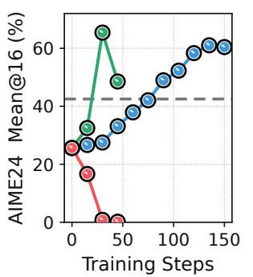

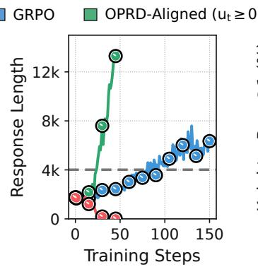  
(a) Math

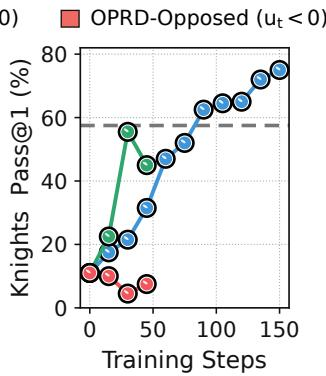

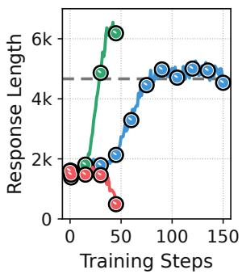  
(b) Knights & Knaves  
Figure 6: Evaluation performance and response length over training for OPRD variants with only the positive- or negative-alignment branch active. For Math and Knights & Knaves, we use Qwen3-4B and Qwen3-4B-Base teacher checkpoints obtained after 75 and 105 RL training steps, respectively. The two single-branch OPRD variants are trained for 45 steps with $\lambda = 0 . 5 ,$ , while GRPO is shown through 150 steps for reference. The maximum generation lengths are 20K and 8K tokens for the two settings, respectively. The gray dashed lines denote the performance or response length of the corresponding weak teachers. All other training settings follow the dataset-specific default configurations described in Appendix C.

The rapid gains under positive-only scaling suggest that teacher-aligned components provide efective early transfer of the progress acquired during teacher post-training. By contrast, the collapse under negative-only scaling suggests that teacher-opposing components are less reliable early in training, when the student’s rollouts remain weak. Because the verifier provides only response-level feedback, even a rewarded trajectory may contain locally unhelpful token choices whose gradients are negatively aligned with the teacher shift. Applying negative-branch scaling at full strength from the outset can therefore reinforce unreliable token-level updates.

The response-length dynamics are also consistent with the shared tendency discussed in Appendix B.1. In both tasks, performance improvements under GRPO are accompanied by longer reasoning traces, suggesting that the student gradient $\mathbf { g } _ { t }$ favors token-level changes that prolong generation. The teacher develops a similar tendency during RL post-training, which may be encoded in $\mathbf { d } _ { t } .$ . Positive-only scaling reinforces this shared tendency and rapidly drives responses toward the generation limit. Negative-only scaling instead amplifies student-gradient components that oppose $\mathbf { d } _ { t } ,$ , counteracting the length-increasing tendency and producing shorter responses.

## B.3. Mitigating One-Sided Amplification through Branch Scheduling

The isolated-branch results suggest that the positive and negative branches play complementary roles over training. The positive branch amplifies components supported by both the teacher shift and the verifier-driven student gradient, thereby providing rapid early transfer. The negative branch instead amplifies verifier-supported departures from the teacher direction, which may help the stronger student move beyond the weak teacher. However, these departures are less reliable early in training, when the student’s on-policy rollouts remain weak. This diference motivates controlling the relative strengths of the two branches over training.

We compare three strategies for avoiding persistent one-sided amplification. Under the default OPRD schedule, $\lambda _ { + }$ remains fixed at $\lambda ,$ while $\lambda _ { - }$ gradually increases from 0 to �. Early in training, the larger positivebranch scale prioritizes teacher-aligned components and provides an efective bootstrap. As $\lambda _ { - }$ increases, verifier-supported gradient components whose projections oppose the teacher direction receive progressively greater amplification. Once $\lambda _ { - } = \lambda _ { + } = \lambda$ , the asymmetric term proportional to $| u _ { t } |$ vanishes and the correction coeficient reduces to $c _ { t } = \lambda u _ { t }$ . The schedule thus preserves rapid teacher-aligned transfer early in training while gradually introducing stronger departures from the weak teacher.

Alternatively, we keep $\lambda _ { - } = 0$ and gradually decrease $\lambda _ { + }$ from � to 0. This schedule likewise uses positivebranch scaling as an early bootstrap but progressively removes the added teacher-direction correction. Once $\lambda _ { + } = 0 ;$ , both branch scales are zero, so the transformed gradient reduces to the original verifier-driven policy gradient and training returns to GRPO. As a schedule-free alternative, we also consider fixed symmetric scaling, which sets $\lambda _ { + } = \lambda _ { - } = \lambda$ throughout training. This removes one-sided amplification from the outset but activates the distinct efects of both branches simultaneously.

$$
( \lambda _ { \pm } = \lambda )
$$

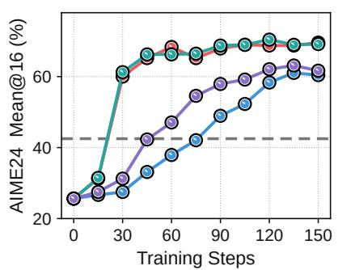  
(a) Math

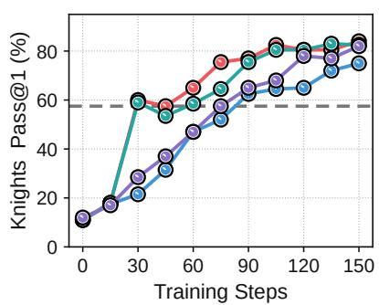  
(b) Knights & Knaves  
Figure 7: Comparison of three branch-scheduling strategies. We compare the default �− ramp-up $( \lambda _ { + } ~ = ~ 0 . 5 .$ $\lambda _ { - } : 0  0 . 5 ) , \lambda _ { + }$ annealing $( \lambda _ { + } : 0 . 5 \to 0 , \lambda _ { - } = 0 )$ , and fixed symmetric scaling $( \lambda _ { + } = \lambda _ { - } = 1 . 0 )$ against GRPO. The two scheduled variants use horizons of 30 updates for Math and 75 updates for Knights & Knaves. We use Qwen3-4B and Qwen3-4B-Base teacher checkpoints obtained after 75 and 105 RL training steps, respectively. Gray dashed lines denote teacher performance. All other training configurations follow Appendix C.

As shown in Figure 7, the two scheduled variants begin with positive-only amplification and achieve rapid early gains, whereas fixed symmetric scaling improves much more slowly despite using $\lambda = 1 . 0 \colon$ it only gradually breaks through on Math and yields limited early gains on Knights & Knaves. Because response-level feedback can reward trajectories containing locally incorrect or incidental steps, the resulting $u _ { t } < 0$ components are less reliable on weak early rollouts and can dampen the positive-branch bootstrap when amplified from the outset. Activating only $\lambda _ { + }$ is therefore the more reliable default for early acceleration.

The later acceleration of fixed symmetric scaling on Knights & Knaves suggests that �− becomes useful once the student reaches a stronger regime and produces more informative on-policy rollouts. At this stage, it can amplify meaningful verifier-supported departures discovered through the student’s own rollouts, helping it move beyond the weak teacher. Although only $\lambda _ { + }$ annealing shows that returning to verifier-only optimization after the initial bootstrap is also viable, it forgoes explicit amplification of these student-discovered departures. We therefore adopt �− ramp-up as the default: it preserves the early acceleration from $\lambda _ { + }$ while introducing �− later to remove persistent one-sided amplification and support progress beyond the weak teacher.

## C. Training and Evaluation Details

Table 4 and Table 5 summarize the default training settings and method-specific configurations for GRPO, OPD, KDRL, and OPRD. Scenario-specific settings are provided in their respective Appendix sections. We train all models on four NVIDIA B200 GPUs using Fully Sharded Data Parallel (FSDP) (Zhao et al., 2023).

Table 4: Default training settings for Math and Reasoning Gym. These configurations are shared across all methods. Method-specific settings are provided in Table 5.
<table><tr><td>Settings</td><td>Math</td><td>Reasoning Gym</td></tr><tr><td colspan="3">Data and Models</td></tr><tr><td>Training data</td><td>DAPO-Math-17K</td><td>Knights &amp; Knaves, Quantum Lock, String Manipulation, and Countdown (19,800 examples per task)</td></tr><tr><td>Prompt format</td><td>Chat template with a system prompt</td><td>Chat template without a system prompt</td></tr><tr><td>Student policy</td><td>Qwen3-8B (non-thinking)</td><td>Qwen3-8B-Base (non-thinking)</td></tr><tr><td>Teacher policy</td><td>Qwen3-4B (step 75, non-thinking)</td><td>Qwen3-4B-Base (step 75 for String task, step 105 for the other tasks, non-thinking)</td></tr><tr><td colspan="3">Optimization</td></tr><tr><td>Training horizon</td><td>150 policy updates</td><td>150 policy updates</td></tr><tr><td>Prompt batch / mini-batch 64 / 64</td><td></td><td>64/32</td></tr><tr><td>Rollouts per prompt</td><td>8</td><td>8</td></tr><tr><td>Optimizer</td><td>gradient clipping 1.0</td><td>AdamW, β = (0.9, 0.999), weight decay 0.01, AdamW, β = (0.9, 0.999), weight decay 0.01 gradient clipping 1.0</td></tr><tr><td>Learning rate</td><td>1 × 10−⁶ (constant schedule with 10 warm-up updates)</td><td>1 × 10−⁶ (constant schedule with 10 warm-up updates)</td></tr><tr><td>Policy optimization</td><td>PPO clipping range [0.20, 0.28], no standard-deviation normalization,</td><td>PPO clipping range [0.20, 0.28], no standard-deviation normalization,</td></tr><tr><td>Generation</td><td>no KL or entropy regularization</td><td>no KL or entropy regularization</td></tr><tr><td colspan="3">Training-time decoding</td></tr><tr><td></td><td>Temperature 1.0, top-p 1.0, no top-k</td><td>Temperature 1.0, top-p 1.0, no top-k</td></tr><tr><td>Maximum prompt length</td><td>2,048 tokens</td><td>2,048 tokens</td></tr><tr><td>Maximum response length</td><td>20,480 tokens</td><td>8,192 tokens</td></tr><tr><td>Length-based reward</td><td>No penalty up to 16,384 tokens, then linear penalty reaching –1 at 20,480 tokens</td><td></td></tr></table>

Table 5: Method-specific training settings. All distillation-based methods use the same task-specific frozen teacher checkpoint specified in Table 4.
<table><tr><td>Settings</td><td>GRPO</td><td>OPD</td><td>KDRL</td><td>OPRD</td></tr><tr><td colspan="5">Optimization</td></tr><tr><td>Frozen teacher</td><td></td><td>Task-specific</td><td>Task-specific</td><td>Task-specific</td></tr><tr><td>Teacher reference</td><td></td><td></td><td></td><td>Raw Qwen3-4B family</td></tr><tr><td>Teacher signal</td><td></td><td>Teacher-student log-probability ratio</td><td>K2 signal</td><td>Teacher-shift direction d</td></tr><tr><td>Teacher temperature</td><td></td><td>1.0</td><td>1.0</td><td>1.0</td></tr><tr><td>Token support</td><td></td><td>Sampled tokens</td><td>Sampled tokens</td><td>Sampled ∪ student top-10</td></tr><tr><td>Coefficient schedule</td><td></td><td>Fixed at 1.0</td><td>βk : 0.005 → 0 over Math: 30 updates</td><td>λ+ = 0.5, λ− : 0 → 0.5 over Math: 30 updates</td></tr></table>

Table 6 summarizes the default evaluation settings for Math and Reasoning Gym. Across methods, all trained policies are evaluated using the same task-specific settings.

Table 6: Default evaluation settings for Math and Reasoning Gym. Teacher and initial-student checkpoints use the same decoding and scoring protocols as trained student checkpoints.
<table><tr><td>Settings</td><td>Math</td><td>Reasoning Gym</td></tr><tr><td colspan="3">Benchmarks and Metrics</td></tr><tr><td>Reported benchmarks</td><td>AIME&#x27;24, AIME&#x27;25, HMMT&#x27;25, OlympiadBench</td><td>Knights &amp; Knaves, Quantum Lock, String Manipulation, Countdown (200 examples per task)</td></tr><tr><td>Evaluation metric</td><td>Mean@16</td><td>Pass@1</td></tr><tr><td>Rollouts per problem</td><td>16</td><td>1</td></tr><tr><td colspan="3">Decoding</td></tr><tr><td>Decoding parameters</td><td>Temperature 0.7, top-p 0.8, top-k 20</td><td>Temperature 0.6, top-p 0.95, top-k 20</td></tr><tr><td>Maximum prompt length 2,048 tokens</td><td></td><td>2,048 tokens</td></tr><tr><td>Maximum response length 38,912 tokens</td><td></td><td>8,192 tokens</td></tr><tr><td colspan="3">Scoring and Reporting</td></tr><tr><td>Scoring</td><td>Exact match after answer normalization Nonempty boxed answer required,</td><td>K&amp;K: exact match after normalization, Quantum Lock: 1.0 for a reference-length valid path, 0.5 for any other valid path, 0 otherwise, String Manipulation: case-sensitive exact match, Countdown: valid expression using each given</td></tr><tr><td>Checkpoint averaging</td><td>5-checkpoint mean (30-update intervals) 5-checkpoint mean (30-update intervals)</td><td>number exactly once and reaching the target</td></tr></table>

GRPO OPD

KDRL OPRD

## D. Detailed Results for Weak-to-Strong Model Transfer

## D.1. Detailed Learning Curves

We study successive model transfer within the Qwen3 family (Qwen Team, 2025b), using GRPO-trained 4B-scale models as teachers to accelerate the post-training of larger 8B-scale students. We select intermediate teacher checkpoints whose the performance exceeds that of the initial student but remains below the student’s end-of-training GRPO performance. We also considered cross-generation transfer from Qwen2.5 (Qwen Team, 2025a) to Qwen3. In preliminary experiments, however, the Qwen2.5-3B and 7B checkpoints remain below this target range (around 14% on AIME'24), while obtaining suitable post-trained checkpoints and the corresponding teacher-shift signals would require substantially more compute. We therefore focus on controlled within-family transfer.

We compare OPRD with GRPO, OPD, and KDRL on four mathematics benchmarks and four Reasoning Gym tasks, reporting Mean@16 and Pass@1, respectively. Figure 1 aggregates performance across benchmarks, whereas Table 1 averages each trained policy over five checkpoints. Figure 8 and Figure 9 show the corresponding benchmark-level learning curves. Across these benchmarks, OPRD generally retains OPD’s rapid early improvement. Unlike OPD, which plateaus near the weak teacher, OPRD continues to improve beyond it and reaches GRPO’s end-of-training performance substantially earlier.

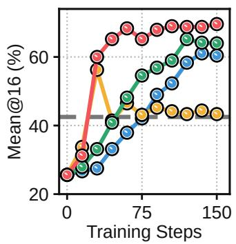  
(a) AIME'24

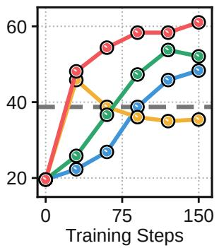  
(b) AIME'25

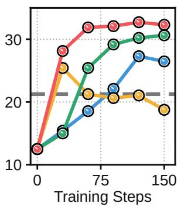  
(c) HMMT'25

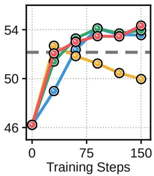  
(d) OlympiadBench  
Figure 8: Learning curves for successive model transfer on individual math benchmarks. We use Qwen3-4B as the teacher and Qwen3-8B as the student. The gray dashed line denotes the performance of the weak teacher. All training settings follow the default Math configuration described in Appendix C.

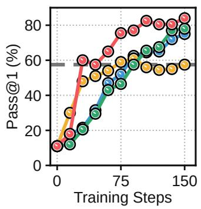  
(a) Knights & Knaves

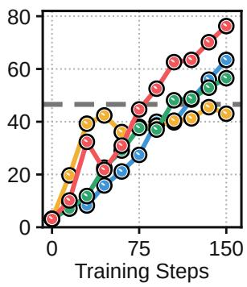  
(b) Quantum Lock

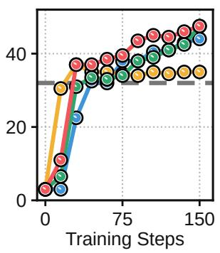  
(c) String Manipulation

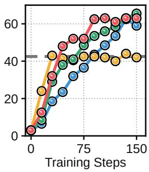  
(d) Countdown  
Figure 9: Learning curves for successive model transfer on individual reasoning benchmarks. We use Qwen3-4B-Base as the teacher and Qwen3-8B-Base as the student. The gray dashed line denotes the performance of the weak teacher. All training settings follow the default Reasoning Gym configuration described in Appendix C.

## D.2. Additional Results Across Model Variants and Tasks

The instruction-tuned Qwen3 results reported in Section D.1 exhibit a potential response-length confound. Although thinking mode is disabled, longer responses may implicitly elicit some of the reasoning behavior associated with that mode, leading to abrupt, transient score gains. In Figure 8, for example, OPD briefly surpasses the teacher on both AIME'24 and AIME'25 at step 30 before returning toward a teacher-level plateau. Such behavior can confound comparisons of early learning speed. We therefore evaluate Qwen3-Base models, for which this efect is less pronounced, in Figure 10. OPRD again substantially accelerates weak-to-strong generalization, achieving high performance much earlier than the baselines on all four benchmarks.

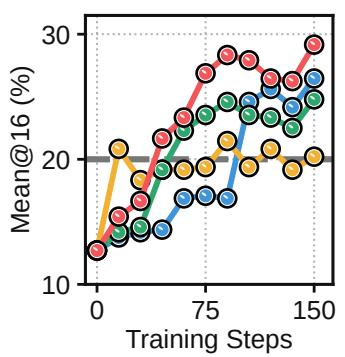  
(a) AIME'24

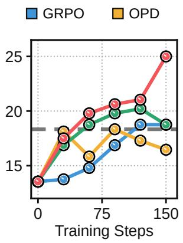  
(b) AIME'25

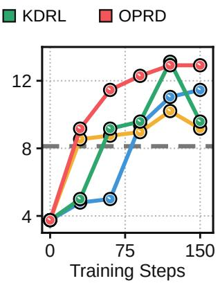  
(c) HMMT'25

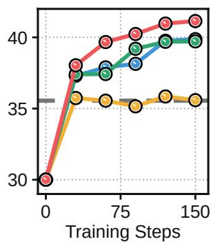  
(d) OlympiadBench  
Figure 10: Learning curves on individual math benchmarks using Qwen3-Base models. We use Qwen3-4B-Base as the teacher and Qwen3-8B-Base as the student. The gray dashed line denotes the performance of the weak teacher. All other settings follow the default Math configuration in Appendix C, but we omit the system prompt and reduce the mini-batch size to 32, yielding two optimizer steps per training batch.

Reward gains often conincide with longer responses. For instruction-tuned Qwen3, this makes a potential confound: distillation gains may simply reflect longer responses eliciting latent thinking behavior. To test whether OPRD depends on this efect, we evaluate three more reasoning tasks in Figure 11, where, as in String Manipulation, post-training shortens responses by a factor of three to four relative to the raw checkpoints. OPRD still improves substantially faster than the baselines, quickly reaching GRPO’s eventual plateau while reducing response length. This opposite trend shows that its gains are not tied to response-length growth. OPRD’s gradient scaling can nevertheless magnify length bias in the teacher-shift signal, as discussed in Section 4.3, Appendix B, and Appendix I. We resolve this by using a later teacher checkpoint, rather than the raw model, as the reference policy.

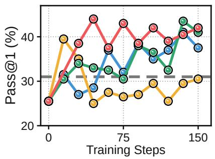  
(a) Zebra Puzzles

GRPO OPD KDRL OPRD  
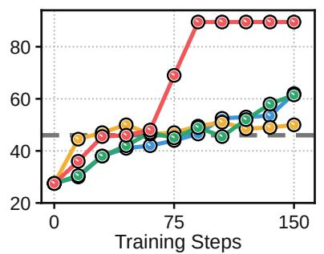  
(b) Color Cube Rotation

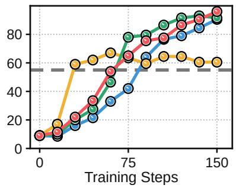  
(c) Binary Matrix  
Figure 11: Learning curves on additional three Reasoning Gym tasks. We use Qwen3-4B-Base as the teacher and Qwen3-8B-Base as the student. The gray dashed line denotes the performance of the weak teacher. For Color Cube Rotation and Binary Matrix, we use the teacher checkpoints from steps 30 and 45, respectively, as the reference policies instead of the raw step-0 models to mitigate length bias (see Appendix I for details).

To complement the detailed learning curves, Table 7 reports checkpoint-averaged results, providing a numerical summary of how quickly each method reaches high performance. OPRD again achieves the strongest results, confirming that it accelerates weak-to-strong generalization across these additional settings.

Table 7: Additional results for successive model transfer with Qwen3-Base models on mathematics and three additional Reasoning Gym tasks. We report Mean@16 for Math and Pass@1 for Reasoning Gym. We use intermediate GRPO checkpoints of Qwen3-4B-Base as teachers for Qwen3-8B-Base students. The teacher and initial-student rows report fixed-checkpoint performance, whereas each trained-policy row averages evaluations at steps 30, 60, 90, 120, and 150. The corresponding learning curves are shown in Figure 10 and Figure 11. The best trained-policy result in each column is shown in bold.
<table><tr><td rowspan="2">Policy</td><td colspan="5">Math Reasoning</td><td colspan="5">Reasoning Gym</td></tr><tr><td>AIME&#x27;24</td><td>AIME&#x27;25</td><td>HMMT&#x27;25</td><td>Olympiad</td><td>Avg.</td><td></td><td>Zebra</td><td>Color</td><td>Binary</td><td>Avg.</td></tr><tr><td></td><td colspan="8">Qwen3-4B-Base (Teacher) → Qwen3-8B-Base (Student)</td><td>Qwen3-4B-Base (Teacher) → Qwen3-8B-Base (Student)</td><td></td></tr><tr><td>Teacher</td><td>20.00</td><td>18.33</td><td>8.13</td><td>35.55</td><td>20.50</td><td>31.00</td><td>46.00</td><td>55.00</td><td></td><td>44.00</td></tr><tr><td>Student</td><td>12.71</td><td>13.54</td><td>3.75</td><td>30.01</td><td>15.00</td><td>25.50</td><td>27.50</td><td></td><td>9.00</td><td>20.67</td></tr><tr><td>+ GRPO</td><td>20.00</td><td>16.58</td><td>8.33</td><td>38.59</td><td>20.88</td><td></td><td>35.40</td><td>48.30</td><td>56.50</td><td>46.73</td></tr><tr><td>+ OPD</td><td>20.00</td><td>17.21</td><td>9.13</td><td>35.58</td><td>20.48</td><td></td><td>29.10</td><td>48.30</td><td>62.10</td><td>46.50</td></tr><tr><td>+ KDRL</td><td>21.92</td><td>18.88</td><td>9.29</td><td>38.69</td><td>22.19</td><td></td><td>35.60</td><td>49.50</td><td>61.40</td><td>48.83</td></tr><tr><td>+ OPRD</td><td>24.79</td><td>20.79</td><td>11.75</td><td>40.01</td><td>24.34</td><td></td><td>39.10</td><td>72.40</td><td>66.80</td><td>59.43</td></tr></table>

## D.3. Evaluation Results with Standard Deviations

To assess the evaluation-time robustness of the comparisons in Table 1, we report response-resampling variability in Table 8. Because multi-seed post-training is prohibitively expensive, we hold the benchmark problems and trained checkpoints fixed and resample only their responses. Each of 1,000 replicates draws 16 responses with replacement from a pool of 32 per Math problem and one from a pool of eight per Reasoning Gym problem. Trained-policy results are averaged over five checkpoints within each replicate, and we report the resulting mean and sample standard deviation. OPRD still surpasses the strongest baseline by approximately 8.0 points on Math and 9.9 points on Reasoning Gym, margins far exceeding the observed response-resampling variability.

Table 8: Evaluation results with standard deviations for successive model transfer on mathematics and reasoning tasks. We use intermediate GRPO checkpoints of 4B-scale Qwen3 models as teachers and report Mean@16 for mathematics and Pass@1 for Reasoning Gym as the bootstrap mean ± sample standard deviation over 1,000 response-resampled evaluations, with benchmark items held fixed. In each bootstrap replicate, we sample 16 responses with replacement from a pool of 32 for each mathematics problem and one response from a pool of eight for each Reasoning Gym problem.
<table><tr><td></td><td colspan="5">Math Reasoning</td><td colspan="5">Reasoning Gym</td></tr><tr><td>Policy</td><td>AIME&#x27;24</td><td>AIME&#x27;25</td><td>HMMT&#x27;25 Olympiad</td><td></td><td>Avg.</td><td>Knights</td><td>Quantum</td><td>String</td><td>Count</td><td>Avg.</td></tr><tr><td></td><td colspan="4">Qwen3-4B (Teacher) → Qwen3-8B (Student)</td><td colspan="7">Qwen3-4B-Base (Teacher) → Qwen3-8B-Base (Student)</td></tr><tr><td>Teacher</td><td>41.77 ±1.48</td><td>36.77 ±1.38</td><td>21.44 ±1.15</td><td>52.02 ± 0.23</td><td>38.00 ±0.58</td><td>54.92 ±2.93</td><td>41.64 ±2.73</td><td>33.78 ±1.17</td><td>42.13 ±1.57</td><td>43.12 ±1.11</td></tr><tr><td>Student</td><td>24.25 ±1.09</td><td>19.84 ±1.09</td><td>13.04 ±0.95</td><td>46.21 ± 0.24</td><td>25.83 ±0.45</td><td>11.71 ±1.96</td><td>5.00 ±1.35</td><td>3.61 ±1.12</td><td>2.83 ±1.05</td><td>5.79 ±0.70</td></tr><tr><td>+ GRPO</td><td>46.88 ±0.63</td><td>36.61 ±0.55</td><td>22.47 ±0.51</td><td>52.48 ± 0.10</td><td>39.61 ±0.25</td><td>53.17 ±1.21</td><td>34.70 ±0.93</td><td>35.51 ±0.59</td><td>41.95 ±0.64</td><td>41.33 ±0.45</td></tr><tr><td>+ OPD</td><td>46.62 ±0.74</td><td>37.91 ±0.59</td><td>21.40 ±0.47</td><td>51.30 ± 0.10</td><td>39.31 ±0.27</td><td>55.78 ±1.31</td><td>39.91 ±1.19</td><td>34.55 ±0.73</td><td>42.11 ± 0.78</td><td>43.09 ± 0.51</td></tr><tr><td>+ KDRL</td><td>54.20 ±0.63</td><td>42.80 ±0.59</td><td>25.66 ±0.55</td><td>53.39 ± 0.10</td><td>44.01 ±0.26</td><td>53.91 ±1.14</td><td>37.83 ±1.12</td><td>38.10 ±0.58</td><td>49.54 ±0.75</td><td>44.84 ±0.48</td></tr><tr><td>+ OPRD</td><td>67.40 ±0.63</td><td>55.69 ±0.64</td><td>31.63 ±0.58</td><td>53.28 ± 0.09</td><td>52.00 ±0.27</td><td>72.02 ±0.94</td><td>49.70 ±1.02</td><td>42.11 ±0.57</td><td>55.30 ±0.75</td><td>54.78 ±0.42</td></tr></table>

## E. Detailed Results for Multi-Teacher Weak-to-Strong Distillation

We follow the single-teacher Reasoning Gym setting but jointly train one student on domain-mixed batches, pairing each example with its task-specific teacher. Figure 12 shows the per-domain learning curves. Despite heterogeneous task structures and response-length trends—String Manipulation responses shorten as reward improves, whereas those for the other tasks generally lengthen—OPRD accelerates learning and attains the highest Pass@1 across all four domains. MOPD shows signs of cross-task interference, most notably on Quantum Lock, where it falls below the corresponding specialist, while OPRD rapidly transfers the specialist capabilities and continues improving without comparable degradation.

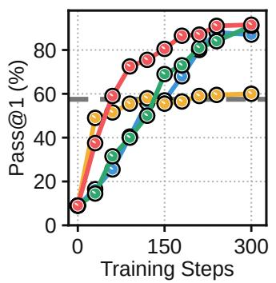  
(a) Knights & Knaves

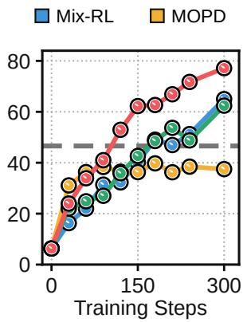  
(b) Quantum Lock

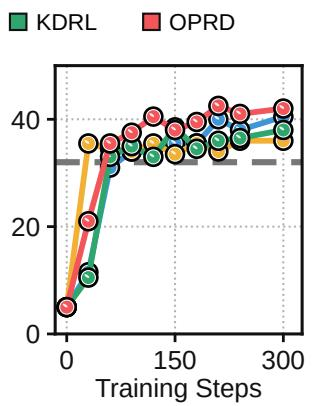  
(c) String Manipulation

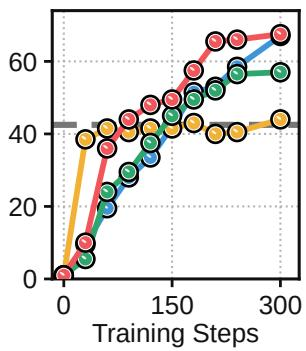  
(d) Countdown  
Figure 12: Learning curves on individual Reasoning Gym tasks under multi-teacher distillation. We use four task-specific Qwen3-4B-Base models as teachers and jointly train a Qwen3-8B-Base student. The gray dashed line denotes the performance of the corresponding specialist teacher. All other settings follow the configurations described in Section C.

## F. Detailed Results for Strong-to-Weak Distillation

Figure 13 presents detailed learning curves for strong-to-weak settings. On AIME'24, OPRD raises the Qwen3- 1.7B initial student’s Mean@16 from 10.0 to above 41 within 150 updates, whereas GRPO reaches only about 25 at the same point and 35 even after 240 updates. On Knights & Knaves, OPD improves initially but collapses midway through training and remains below the teacher after recovering. In contrast, OPRD rapidly improves the Qwen3-0.6B student and ultimately surpasses the Qwen3-8B-Base teacher’s Pass@1 of 64.5.

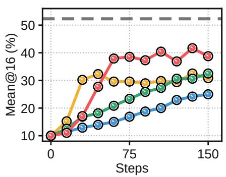  
(a) AIME'24

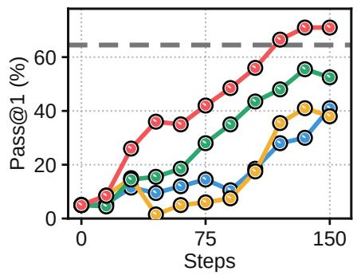  
(b) Knights & Knaves  
Figure 13: Learning curves for strong-to-weak distillation on two tasks. We evaluate Qwen3-8B → Qwen3-1.7B on AIME'24 and Qwen3-8B-Base → Qwen3-0.6B on Knights & Knaves, using teachers from step 105 of task-specific GRPO. Gray dashed lines mark teacher performance. All other settings follow Appendix $\mathrm { C } ,$ with method-specific distillation coeficients scheduled over the first 45 updates.

## G. Detailed Results for Weak-to-Strong Method Comparisons

## G.1. Baseline Implementation Details

Under the default training and evaluation configurations in Appendix $\mathrm { C } ,$ all baselines use the same model pairs, teacher checkpoints, prompt formats, and evaluation protocols as OPRD unless otherwise noted. We describe only their method-specific settings below.

• W2SR-P (Yuan et al., 2026). We reproduce the seeded prompt stream used by the 150-update RL runs, yielding $1 5 0 \times 6 4 = 9 { , } 6 0 0$ prompt occurrences. For each occurrence, we sample eight responses from the weak teacher and select one verifier-correct, format-valid, non-truncated response, discarding occurrences with no valid candidate. We then fully fine-tune the initial student checkpoint for three epochs using next-token prediction with a global batch size of 64 and a learning rate of $2 \times 1 0 ^ { - 5 }$

• S2L-PO (Ren et al., 2026). S2L-PO linearly anneals the fraction of weak-model rollouts over the first half of GRPO training. Although the original method advocates using a smaller base model as the weak explorer to exploit its policy-level diversity, we use the same post-RL weak teacher as the other baselines for a controlled comparison. While the original implementation uses 16 rollouts per prompt, we retain its 16-phase schedule with the default group size of eight. Over 150 updates, the weak/student composition transitions from $8 / 0$ to $0 / 8$ during the first eight phases (updates 1–75) and remains at $0 / 8$ during the remaining eight phases (updates $7 6 \mathrm { - } 1 5 0 )$ . For each trajectory, we compute the importance ratio using its generating policy as � , namely $\pi _ { T }$ for weak-teacher rollouts and $\pi _ { \theta _ { \mathrm { o l d } } }$ for student rollouts. We also retain the original KL regularization toward the initial student with a coeficient of $1 0 ^ { - 3 }$

• OPSD (Zhao et al., 2026). OPSD is originally a self-distillation method that uses a correct self-generated rollout as privileged information. To adapt it to our weak-to-strong setting, we instead use a verifier-correct weak-teacher rollout as privileged information, falling back to a correct student rollout when the weak teacher produces none. An EMA copy of the student serves as the self-teacher, conditioning on the privileged rollout to provide distillation targets for the original student trajectories and being updated after each step with a rate of 0.05. Whenever valid privileged information is available, we apply the distillation loss to all student trajectories in the group, regardless of whether they are correct or incorrect. We use generalized JSD with $\alpha = 0 . 5$ over the top-100 student tokens and an additional tail bucket.

• Direct-OPD (Feng et al., 2026). Developed concurrently with OPRD, Direct-OPD optimizes the weak policy shift as a dense reward on student-generated trajectories:

$$
\mathcal { I } _ { \mathrm { D i r e c t - O P D } } = \mathbb { E } _ { x , y \sim \pi _ { \theta } } \left[ \sum _ { t } \left( \log \pi _ { T } ( y _ { t } \mid s _ { t } ) - \log \pi _ { T } ^ { \mathrm { r e f } } ( y _ { t } \mid s _ { t } ) \right) \right] - \alpha D _ { \mathrm { K L } } ( \pi _ { \theta } \parallel \pi _ { S , 0 } ) .
$$

Following the original implementation, we evaluate the dense reward over the top-16 tokens of the old student policy at each visited state and use the reported hyperparameters. The policy-shift scale is fixed at 1, while $\alpha ,$ the coeficient of the KL anchor toward $\pi _ { \boldsymbol { S } , 0 } ,$ is initialized at 2.5. Before each actor update, � is multiplied by 1.01 or 0.99 depending on whether the batch-mean dense reward is positive or negative, respectively, and clipped to [0.5, 2.5]. This KL anchor is computed separately on the sampled response tokens using the low-variance k3 estimator.

• W2S-OPD (Yu et al., 2026). W2S-OPD reanchors the weak policy shift to the initial student by defining the proxy teacher as

$$
\pi _ { \mathrm { p r o x y } } ( v \mid s _ { t } ) \propto \pi _ { S , 0 } ( v \mid s _ { t } ) \left( \frac { \pi _ { T } ( v \mid s _ { t } ) } { \pi _ { T } ^ { \mathrm { r e f } } ( v \mid s _ { t } ) } \right) ^ { \gamma } .
$$

Following the original implementation, we set $\gamma = 1$ and compute the proxy scores over the full vocabulary before selecting the proxy’s top-32 tokens. We normalize both the proxy and current-student distributions over this proxy-selected support and minimize the reverse KL from the current student to the proxy. This restrictedsupport reverse KL serves as the sole actor objective, with no additional KL anchor or adaptive coeficient.

## G.2. Detailed Learning Curve

In Figure 14, we compare OPRD with three methods that leverage of-policy generations from the weak teacher. OPRD exhibits the strongest and most consistent gains overall. Consistent with Yuan et al. (2026), W2SR-P shows that SFT on verifier-correct teacher rollouts can move the student slightly beyond weak-teacher performance. S2L-PO (Ren et al., 2026) remains competitive on the two Reasoning Gym tasks, although its AIME'24 performance deteriorates after weak-teacher rollouts are fully annealed out at update 75 and its checkpoint-averaged performance remains below OPRD. Our OPSD variant (Zhao et al., 2026) performs poorly whether the privileged trace is self-generated or supplied by the weak teacher. This behavior is consistent with recent findings that privileged self-distillation can impair thinking models by shortening or suppressing deliberative reasoning (Kim et al., 2026; Kaur et al., 2026). Accordingly, OPSD provides a modest benefit only on String Manipulation, where higher rewards coincide with shorter reasoning traces, and fails to deliver competitive gains on the other tasks.

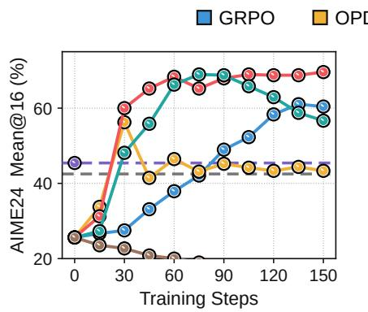  
(a) AIME'24

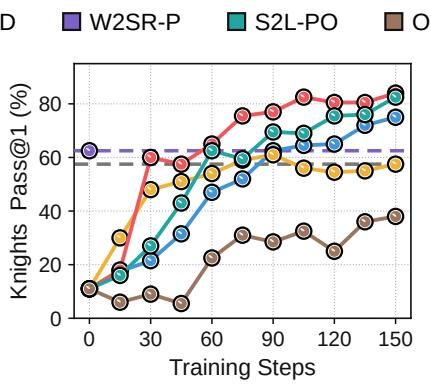  
(b) Knights & Knaves

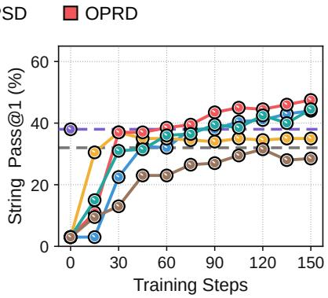  
(c) String Manipulation  
Figure 14: Training dynamics of weak-to-strong methods using of-policy generations from the weak teacher. Because W2SR-P performs SFT without subsequent RL, its final performance is shown as a horizontal dashed line. The gray dashed lines indicate weak-teacher performance. See Appendix G.1 for baseline implementation details.

In Figure 15, we further compare OPRD with Direct-OPD (Feng et al., 2026) and W2S-OPD (Yu et al., 2026), two concurrent methods that likewise exploit the weak policy delta. Although these methods use the same transferred signal, their objectives are defined directly by the delta and therefore receive no independent verifier-driven update direction. W2S-OPD can surpass the weak teacher, but ultimately plateaus near teacherlevel performance because its optimization target remains restricted to the policy changes encoded by the weak teacher. OPRD instead uses the delta only to identify and rescale the component of the verifier gradient aligned with the weak shift, while preserving the orthogonal component $\mathbf { g } _ { t } ^ { \perp }$ . Consequently, the delta guides rather than replaces verifier-driven optimization, allowing OPRD to improve beyond teacher-level saturation and achieve the strongest final performance across all three tasks.

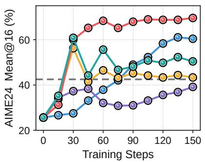  
(a) AIME'24

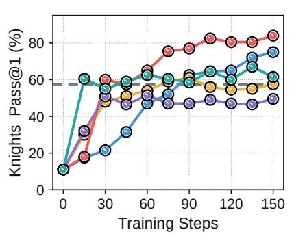  
(b) Knights & Knaves

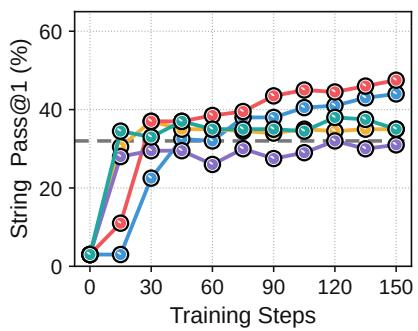  
(c) String Manipulation  
Figure 15: Training dynamics of weak-to-strong methods using the weak policy delta. The horizontal dashed lines indicate weak-teacher performance. See Appendix G.1 for baseline implementation details.

## H. Additional Results on Guidance-Direction Construction

OPRD requires a guidance direction that captures the reward-relevant change acquired by the teacher. Section 4.2 compares three constructions: the weak policy delta $\Delta _ { t }$ contrasts the post-trained teacher with its reference policy and isolates the change acquired during post-training; OPD contrasts the post-trained teacher with the current student, so its direction conflates the teacher’s post-training update with the broader mismatch between the teacher’s reference policy and the current student $( \mathrm { i } . \mathrm { e } . , \mathbf { z } _ { T } - \mathbf { z } _ { S } = ( \mathbf { z } _ { T } - \mathbf { z } _ { T } ^ { \mathrm { r e f } } ) + ( \mathbf { z } _ { T } ^ { \mathrm { r e f } } - \mathbf { z } _ { S } ) ) ;$ ; and OPSD derives its direction from the discrepancy induced by a privileged teacher draft. The comparison uses the step-60 checkpoint from the weak teacher’s GRPO run. Under this setting, the weak policy delta outperforms both alternatives by a wide margin.

However, OPD follows the gradient of a teacher-matching objective, its usefulness as a scaling direction should depend on teacher performance. We test this using the stronger teacher checkpoints adopted in our main experiments while keeping all other settings fixed (Figure 16). For mathematics, we use the step-75 teacher, which is already relatively strong. For Knights & Knaves, we use the step-105 teacher, which achieves 57.5% Pass@1 compared with 29.0% at step 60. With these teachers, the OPD direction performs well on both tasks, although it remains slightly behind the weak policy delta overall. OPSD is less consistent: it finishes above GRPO on AIME'24 but barely improves on Knights & Knaves.

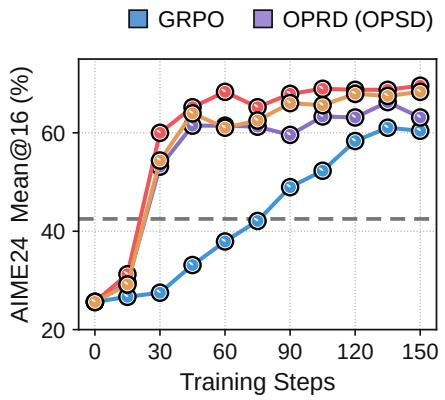  
(a) Math

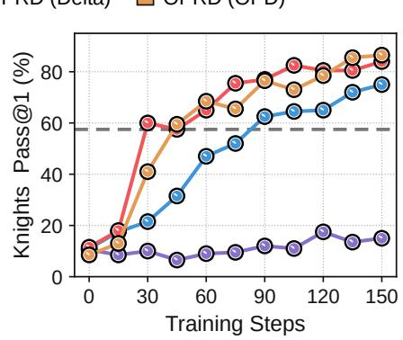  
(b) Knights & Knaves  
Figure 16: Comparison of guidance-direction constructions. The variants construct $\mathbf { d } _ { t }$ from the teacher–reference policy shift (Delta), the teacher–student mismatch (OPD), or the privileged-context discrepancy (OPSD). Using stronger teacher checkpoints than those used in Figure 3a, we pair the step-75 Qwen3-4B teacher with a Qwen3-8B student for Math and the step-105 Qwen3-4B-Base teacher with a Qwen3-8B-Base student for Knights & Knaves. Gray dashed lines mark teacher performance. All other training configurations follow Appendix C.

These results suggest that the OPD gradient can provide a useful guidance direction when the weak teacher is suficiently capable. In practice, however, the eventual performance gap between the weak teacher and the larger student cannot be known without fully training the student, making OPD dificult to adopt as a reliable default. OPSD is also less reliable because a privileged draft can constrain the student to a prescribed reasoning path (Kim et al., 2026; Kaur et al., 2026). Using its self-distillation gradient as $\mathbf { d } _ { t }$ can then amplify verifier-gradient components aligned with this restrictive signal and hinder learning. The weak policy delta avoids both limitations because it compares the post-trained teacher only with its own reference policy. This isolates the change acquired during post-training without relying on either the evolving student or a privileged draft. We therefore retain the weak policy delta as our default guidance direction due to its stronger empirical performance and greater reliability in practice.

## I. Additional Results on Length Bias in Teacher Policy Shift

The teacher policy shift $\Delta _ { t }$ (and hence the guidance direction $\mathbf { d } _ { t } )$ may contain reward-irrelevant components such as $\epsilon _ { t }$ alongside task-relevant progress. As discussed in Section 4.3 and Appendix B, OPRD amplifies the projection of $\mathbf { g } _ { t }$ onto $\mathbf { d } _ { t } .$ , and this can also magnify reward-irrelevant components encoded in the guidance direction. Response length provides one observable example: when it correlates with verifier reward, both $\mathbf { g } _ { t }$ and $\mathbf { d } _ { t }$ may favor shorter responses even when shortening itself does not improve reasoning. Because $\mathbf { d } _ { t }$ is derived from $\Delta _ { t } ,$ , the choice of $\pi _ { T } ^ { \mathrm { r e f } }$ determines how much of the teacher’s length change enters the guidance. A step-0 reference uses the base model and therefore includes the full post-training shift, whereas a later reference can exclude a sharp early length collapse.

Binary Matrix provides another instance of this behavior. The teacher’s mean response length falls sharply between steps 30 and 45 and then stabilizes. We therefore compare step-0 and step-45 choices of $\pi _ { T } ^ { \mathrm { r e f } } :$ the former includes a large shortening component in $\Delta _ { t } ,$ whereas the latter excludes most of it. Figure 17 compares both OPRD variants with GRPO, OPD, and KDRL. Both initially improve faster than GRPO but diverge after step 90. With the step-0 reference, the student’s responses continue to shorten and Pass@1 plateaus at 81.5%, below GRPO and KDRL, consistent with the correction overemphasizing length reduction. With the step-45 reference, response length does not exhibit the same continued decline and Pass@1 reaches 96.0%. As on Color Cube, placing the reference after the sharp length transition mitigates this bias while retaining the teacher’s later task progress. However, changing the reference modifies $\Delta _ { t }$ as a whole rather than isolating its length-related component. Disentangling structured bias from task-relevant guidance therefore remains an open question.

  
(a) Task performance  
(b) Response Length  
Figure 17: Efect of reference-policy selection on length bias in Binary Matrix. We transfer a step-105 Qwen3-4B-Base teacher $\pi _ { T }$ to a Qwen3-8B-Base student, using either the step-0 or step-45 checkpoint from the same GRPO run as $\pi _ { T } ^ { \mathrm { r e f } }$ OPRD’s negative-branch scale $\lambda _ { t }$ is warmed up over the first 75 steps. The gray dashed line marks teacher performance, while the colored stars denote the mean response lengths of the two choices of $\pi _ { T } ^ { \mathrm { r e f } }$ , and the white star marks that of $\pi _ { T }$ . All other settings follow Appendix C.

## J. Detailed Analysis of Student Behavior

## J.1. Token Alignment Analysis

We analyze the correct AIME'25 response shown in Figure 5a using the OPRD-trained Qwen3-8B student at update 150 and the Qwen3-4B teacher at GRPO update 75. We compute the policy gradient $\mathbf { g } _ { t }$ assuming a single correct rollout with $A _ { t } = 1$ , since the magnitude of a positive advantage does not afect cosine similarity. Each token is colored by cos $\left( \mathbf { d } _ { t } , \mathbf { g } _ { t } \right)$ , with green indicating positive alignment and red indicating negative alignment. We compare the original continuation with an alternative generated by the same student checkpoint, keeping the selected prefix fixed and forcing the next token to be 5 , the top-ranked token under $\mathbf { d } _ { t }$

## J.2. Response Style Analysis

We evaluate Qwen3-8B students trained with OPD and OPRD on DAPO-Math-17K at updates 30, 60, 90, 120, and 150. For each checkpoint, we generate 16 responses to each of the 30 AIME'24 problems, yielding 480 responses. We use two fixed references: the Qwen3-4B teacher at GRPO update 75 and a separately GRPO-trained Qwen3- 8B student at update 150. Each response is represented by 101 style features across five categories: connectives (15), modality (10), grammar (64), punctuation (8), and sentence and paragraph structure (4). The first three categories measure relative frequencies of function words, including connectives, modal and negation words, and grammatical words such as pronouns and articles. Punctuation features count occurrences per 1,000 words, while structure features capture the mean and standard deviation of words per sentence and sentences per paragraph. We standardize the features at every checkpoint of each method using a shared mean and standard deviation for each feature, computed from the 960 responses of the two reference models.

  
(a) Overall style similarity

  
(b) Style similarity by category  
Figure 18: (a) Comparing response style distributions over training. Energy-distance diferences are averaged across 30 AIME'24 problems, with positive values indicating greater similarity to the GRPO student and negative values to the teacher. Shading shows 95% confidence intervals from 2,000 bootstrap resamples of the problems. (b) Measuring similarity to teacher and student response styles. Normalized distance diferences compare average styles in five categories, with red indicating greater similarity to the teacher and green to the GRPO student. Both panels use fixed references: the Qwen3-4B teacher at GRPO update 75 and the Qwen3-8B GRPO student at update 150.

Figure 18a compares response style distributions using all 101 standardized features. For this comparison, we combine connectives, modality, and grammar into a group of 89 function-word features and scale the function-word, punctuation, and structure coordinates by $1 / { \sqrt { 8 9 } } , 1 / { \sqrt { 8 } }$ , and $1 / { \sqrt { 4 } } ,$ , respectively, to balance the three groups’ contributions. For each problem, let $X _ { k } , X _ { T } ,$ , and $X _ { S }$ denote the sets of 16 response feature vectors from the evaluated checkpoint at update $k ,$ the teacher, and the GRPO student, respectively. We compute the energy-distance diference

$$
\Delta _ { \mathrm { E D } } = \mathrm { E D } ( X _ { k } , X _ { T } ) - \mathrm { E D } ( X _ { k } , X _ { S } ) .
$$

Energy distance measures diferences between distributions by accounting for both between-set distances and within-set variation. We average $\Delta _ { \mathrm { E D } }$ across the 30 problems, with positive values indicating greater similarity to the GRPO student and negative values to the teacher. Shading shows 95% confidence intervals from 2,000 bootstrap resamples of the problems. OPD shifts toward the teacher over traini $^ { 1 9 , }$ with its mean diference decreasing from +0.135 at update $3 0 \mathrm { t o } - 0 . 1 9 0$ at update 150. OPRD remains closer to the GRPO student at every evaluated checkpoint, with its mean diference increasing from +0.316 to +0.447 over the same period.

Figure 18b compares the same checkpoints separately across the five style categories. For each category $c ,$ we average the standardized features across all 480 responses without additional feature-group scaling. Let $\mu _ { k , c } , \mu _ { T , c } ,$ and $\mu _ { S , c }$ denote these average vectors for the evaluated checkpoint at update $k ,$ the teacher, and the GRPO student, respectively. We compute

$$
s _ { c } ( k ) = \frac { \| \pmb { \mu } _ { k , c } - \pmb { \mu } _ { T , c } \| _ { 2 } - \| \pmb { \mu } _ { k , c } - \pmb { \mu } _ { S , c } \| _ { 2 } } { \| \pmb { \mu } _ { T , c } - \pmb { \mu } _ { S , c } \| _ { 2 } } .
$$

The score measures the diference in distances to the two reference averages, normalized by their separation. Scores range from −1 to +1, with negative values indicating greater proximity to the teacher, positive values to the GRPO student, and zero indicating equal distance. OPD is closer to the GRPO student in all five categories at update 30 but closer to the teacher in all five by update 150. OPRD remains closer to the GRPO student in every category at all evaluated checkpoints, consistent with the overall distribution comparison.

## K. Computational Cost and Memory Usage

Benchmark Setup. To isolate method-specific training overhead from response-length diferences, we force every generated response to contain exactly 16,384 tokens by ignoring EOS. Both benchmarks use the mathematics setting of Section 3.2, with a Qwen3-8B student and the Qwen3-4B teacher checkpoint at update 75. OPRD additionally loads the Qwen3-4B base policy as its reference. Within each benchmark, all methods receive prompts in the same order and use the same random seed. Wall-clock timing uses 64 prompts, whereas memory profiling uses 8 prompts, with 8 rollouts per prompt in both cases. All runs execute on four NVIDIA B200 GPUs with DP4, rollout TP1, BF16, Flash Attention 2, padding removal, and gradient checkpointing. Optimization uses a global minibatch of 64 responses and one PPO epoch per training step. Dynamic token batching caps each GPU at 36,864 tokens, which yields two complete samples per microbatch under the fixed-length setting. The rollout engine uses gpu\_memory\_utilization=0.60 and max\_num\_seqs=128. Sampling uses temperature 1.0, top-� 1.0, and no top-� truncation. To keep reward-side computation identical, we replace task-specific reward evaluation with deterministic alternating binary rewards within each prompt group. Validation, periodic model saving, external logging, and all non-training diagnostics are disabled.

Wall-Clock Time. We run each method in a fresh process, discard one complete warm-up step, and report the mean and sample standard deviation over the following four steps. As shown in Table 9, rollout generation is the largest component of each training step, taking roughly 602 seconds and accounting for 61.6% of the total GRPO time, with small diferences across methods attributable to run-to-run variation. OPD and KDRL, each of which evaluates one frozen teacher, incur total overheads of 7.2% and 7.9% over GRPO, respectively. OPRD evaluates the teacher and its reference sequentially, increasing frozen-forward time from 60.46 seconds for OPD to 108.80 seconds. Because rollout generation dominates the step, this additional reference evaluation increases total time by only 4.4% over OPD, resulting in an overall overhead of 11.9% relative to GRPO. Student-forward time is efectively unchanged, while the update containing the teacher-direction projection and scaling increases by just 2.79 seconds over GRPO, equivalent to 0.25% of the full OPRD step. Beyond the teacher evaluation already required by OPD and KDRL, nearly all of OPRD’s additional runtime therefore comes from evaluating the reference policy.

Table 9: Wall-clock time per training step. All methods process the same 64 prompts with 8 rollouts per prompt, with every response fixed at 16,384 tokens to equalize the number of generated tokens. Total time is reported as the mean ± sample standard deviation, while the component columns report their means. Rollout includes the complete generation call and the actor-to-rollout mode transition. Student forward is a no-gradient pass that recomputes the old log probabilities of the sampled tokens. The frozen-model column reports no-gradient teacher evaluation for OPD and KDRL and sequential teacher and reference evaluations for OPRD, while GRPO requires neither. Update includes a separate gradient-enabled student forward pass, backward propagation, and the optimizer step, excluding the separately timed frozen-model evaluations. Etc. includes reward construction, advantage computation, batch assembly and balancing, orchestration, and residual boundary costs.
<table><tr><td></td><td colspan="2">Total</td><td>Rollout</td><td colspan="2">Model Forward</td><td colspan="2">Optimization</td></tr><tr><td>Method</td><td>Time (s/step)</td><td>Overhead</td><td>Student</td><td>Student</td><td>Teacher + Ref</td><td>Update</td><td>Etc.</td></tr><tr><td colspan="8">Qwen3-4B (Teacher) → Qwen3-8B (Student)</td></tr><tr><td>GRPO</td><td>977.72±16.83</td><td>一</td><td>602.20</td><td>70.49</td><td>0.00</td><td>304.00</td><td>1.03</td></tr><tr><td>OPD</td><td>1048.00 ± 17.49</td><td>+7.2%</td><td>610.74</td><td>70.38</td><td>60.46</td><td>305.38</td><td>1.04</td></tr><tr><td>KDRL</td><td>1055.41 ± 15.94</td><td>+7.9%</td><td>618.20</td><td>70.08</td><td>60.17</td><td>305.92</td><td>1.05</td></tr><tr><td>OPRD</td><td>1094.44 ± 16.17</td><td>+11.9%</td><td>607.39</td><td>70.40</td><td>108.80</td><td>306.79</td><td>1.06</td></tr></table>

Peak GPU Memory. We measure peak GPU memory during rollout generation and the actor update, while separately recording the frozen-policy evaluation performed within the update. We also report the overall maximum observed during the complete training step. As shown in Table 10, OPRD carries a nearly constant additional footprint throughout training: approximately 14 GiB per GPU relative to GRPO and 13 GiB relative to OPD and KDRL. The two largest identifiable memory requirements within OPRD are the 3.75 GiB frozen teacher and reference parameter shards and a transient 9.43 GiB dense corrected-gradient allocation within the correction hook. Of the 3.75 GiB in frozen-model parameters, 1.87 GiB is additional relative to OPD and KDRL, which already retain the teacher. The 9.43 GiB hook allocation is also specific to OPRD. Because the absolute NVML peaks additionally include shared model and optimization state, allocator caches, and CUDA and distributed runtime state, these quantities identify the main OPRD-specific allocations but do not provide an exact additive decomposition of the observed peak diference.

The overall maximum occurs during rollout for every method. OPRD reaches 151.27 GiB, exceeding GRPO by 13.98 GiB (10.2%) and OPD and KDRL by 13.21 GiB. Rollout itself increases memory by approximately 51–52 GiB for all four methods. The diference is already present before generation, where OPRD begins the measured step at 99.97 GiB, 14.93 GiB above GRPO and 13.25 GiB above OPD and KDRL. OPRD’s higher rollout peak therefore results from adding essentially the same generation-time allocation to a higher starting footprint, rather than from rollout requiring more memory.

Frozen-policy evaluation is performed within the broader actor-update interval, and their maximum values coincide in our measurements. OPRD reaches 115.19 GiB during both frozen-policy evaluation and the full update, exceeding OPD and KDRL by 13.15 GiB. During the update, it also exceeds GRPO by 14.84 GiB. These diferences closely match those observed before and during rollout, indicating that neither frozenpolicy evaluation nor the correction introduces a separate phase-specific increase in the device-memory peak. Within the correction hook, PyTorch-allocated memory grows by 9.43 GiB, matching the largest dense BF16 corrected-gradient tensor. By comparison, the sparse support formed by the sampled action and the student’s top-10 tokens occupies at most 1.38 MiB, and direct gather and sparse scatter avoid an additional 9.27 GiB response-by-vocabulary copy. The hook allocation is already contained within the 115.19 GiB update peak, which remains well below the overall maximum during rollout.

Table 10: Peak GPU memory per training step. We profile 8 prompts with 8 rollouts per prompt and fix every response at 16,384 tokens. Each method is evaluated in four independent trials, each launched in a fresh process on four NVIDIA B200 GPUs with DP4/TP1 and BF16. Each trial discards one complete warm-up step and measures the following step. Whole-device NVML memory is sampled every 100 ms, and each Peak entry reports the mean across trials of the maximum usage over time and across the four GPUs within the indicated interval. All values are in GiB per GPU. Because each Peak entry represents the worst-GPU peak, multiplying it by four provides only a rough upper bound on aggregate device memory. Overall is the maximum over the complete step. Under Rollout, Peak − Start is the increase from the step-start baseline to the rollout peak. Teacher + Ref. Peak reports the maximum during frozen-model evaluation, covering one teacher evaluation for OPD and KDRL and sequential sequential teacher and reference evaluations for OPRD. This evaluation is a subinterval of Actor Update. Params. reports the calculated lower bound for the total BF16 parameter shards of the resident frozen models. Actor Update Peak includes resident models, gradients, optimizer states, activations, and runtime bufers, while Hook Growth reports the additional PyTorch allocation during the OPRD correction.
<table><tr><td></td><td colspan="2">Overall</td><td colspan="2">Rollout</td><td colspan="2">Teacher + Ref</td><td colspan="2">Actor Update</td></tr><tr><td>Method</td><td>Peak</td><td>Overhead</td><td>Peak</td><td>Peak – Start</td><td>Peak</td><td>Params</td><td>Peak</td><td>Hook Growth</td></tr><tr><td colspan="9">Qwen3-4B (Teacher) → Qwen3-8B (Student)</td></tr><tr><td>GRPO</td><td>137.29</td><td></td><td>137.29</td><td>52.25</td><td>一</td><td></td><td>100.35</td><td>-</td></tr><tr><td>OPD</td><td>138.06</td><td>+0.6%</td><td>138.06</td><td>51.34</td><td>102.04</td><td>1.87</td><td>102.04</td><td>-</td></tr><tr><td>KDRL</td><td>138.06</td><td>+0.6%</td><td>138.06</td><td>51.34</td><td>102.04</td><td>1.87</td><td>102.04</td><td>一</td></tr><tr><td>OPRD</td><td>151.27</td><td>+10.2%</td><td>151.27</td><td>51.30</td><td>115.19</td><td>3.75</td><td>115.19</td><td>9.43</td></tr></table>