# Environments as Scafold: Enriching Feedback to Bootstrap Self-Evolving Agents in Long-Horizon Tasks

Hongbang Yuan1, Zhuoran Jin2, Yixin Cao1,3,†

1Fudan University, 2CASIA, 3Shanghai Innovation Institute

## Abstract

Large Language Models demonstrate remarkable proficiency in static reasoning, yet training them as autonomous agents through Reinforcement Learning (RL) for long-horizon tasks is often hindered by severe reward sparsity. While conventional agent-side warming up via supervised fine-tuning (SFT) can alleviate this, it is frequently limited by data scarcity and constrained exploration. To address this, we propose a paradigm shift to environment-side adaptation by constructing Feedback-Enriched Environments (FEEs). Through a pilot study, we establish a feedback design strategy that reformulates environments by transitioning from action guidance to observation enrichment during the later stages of both intra-episode exploration and inter-episode evolution. Large-scale experiments on SciWorld and BFCL benchmarks using various Qwen3 model scales and RL algorithms such as GRPO, GSPO, and DAPO demonstrate that FEEs consistently yield performance improvements over standard settings. Furthermore, our analysis reveals that training with FEEs (1) stabilizes training dynamics by reducing entropy volatility, (2) facilitates proactive state-space exploration in dificult tasks, (3) ensures the internalization of environmental guidance into policy weights rather than acting as a mere inference-time prior, and (4) identifies intra-group feedback consistency as a critical boundary for stable optimization.

Correspondence: hbyuan25@m.fudan.edu.cn, yxcao@fudan.edu.cn Code: https://github.com/HongbangYuan/EnvAsScaffold

## 1 Introduction

Large Language Models (LLMs) [DeepSeek-AI et al., 2025, Dubey et al., 2024, OpenAI, 2023, Yang et al., 2025a] have demonstrated remarkable proficiency in domains such as mathematical reasoning [Du et al., 2025, Glazer et al., 2024] and code generation [Jimenez et al., 2024, Yang et al., 2024]. As the field advances, the research focus is shifting from solving these static, single-turn tasks to building autonomous agents capable of exploring dynamic, complex real-world environments, such as web navigation [Bai et al., 2026, Zhou et al., 2024a] and terminal-based computer usage [Gandhi et al., 2026, Merrill et al., 2026a]. These tasks are inherently long-horizon [Zhang et al., 2025b,e], often necessitating sequences of dozens of interaction steps to achieve a solution. To solve them, reinforcement learning (RL) based approaches [Chen et al., 2025b, Feng et al., 2025a, Wang et al., 2025a] have emerged as a central direction, where agents learn to adapt their policies through iterative feedback from the environments.

However, RL on long-horizon tasks sufers greatly from reward sparsity. Specifically, the agent lacks the capability for efective exploration and is prone to getting trapped in zero-reward trajectories, leading to vanishing gradients that leave the agent with no signal to learn from. While warming up the agent via supervised fine-tuning (SFT) on expert trajectories efectively increases the probability of obtaining initial positive rewards [Liu et al., 2025b, Wen et al., 2025], it faces significant bottlenecks. Not only is the collection of ground-truth trajectories expensive and hard to scale [Chen et al., 2025a], but over-optimizing the SFT objective also risks overly constraining the agent’s behavior, thereby restricting the exploration potential necessary for efective RL [Kang et al., 2025].

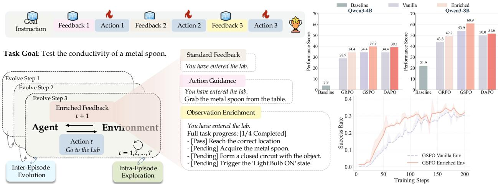  
Figure 1 Illustration of the Feedback-Enriched Environments (FEEs).

To address this, we propose a paradigm shift from agent-side warming up to environment-side adaptation. Specifically, instead of seeking a better-initialized agent, we propose to construct more suitable environments during RL by systematically diversifying and enriching their feedback signals. As shown in Figure 1, while standard feedback leaves the agent searching blindly, enriched feedback guides it to enter the lab and retrieve the metal spoon, which boosts the success rate and helps the agent better understand the environment.

In particular, we study two key dimensions of environment feedback design: what information to provide and when to deliver it to the agent. For the former, we consider action guidance for suggesting immediate next steps and observation enrichment for providing supplementary state information. For the latter, we analyze when these signals are presented across two temporal scales: intra-episode exploration within a single trajectory and inter-episode evolution throughout the training lifecycle. Our initial study suggests that the most efective enriching strategy is to deliver action guidance during early interaction steps and training phases, and then transition to observation enrichment in the later stages of both processes.

To systematically validate this strategy, we build Feedback-Enriched Environments (FEEs) based on standard environments from two widely adopted benchmarks: SciWorld [Wang et al., 2022] and BFCL [Patil et al., 2025]. Within these FEEs, we train Qwen3-4B and Qwen3-8B models with various agent-side RL algorithms, including GRPO [Shao et al., 2024], DAPO [Yu et al., 2025], and GSPO [Zheng et al., 2025]. Extensive empirical results demonstrate that training in FEEs consistently outperforms training in standard environments, yielding an average improvement of 2.82% across various model scales and RL algorithms.

Additionally, to gain insights beyond performance scores, we further analyze the impacts of training agents with our proposed feedback-enriched environments. (1) How do FEEs contribute to agent-side RL training stability? Through an analysis of policy entropy dynamics, we find that FEEs act as a stabilizer that reduces gradient volatility and ensures smoother convergence, a benefit that persists even under explicit entropy regularization. (2) Do FEEs promote more efective state-space exploration? By analyzing average success rates during training and accuracy across environments of varying dificulty levels, we find that that FEEs enable agents to access previously unreachable states while retaining robust exploration capabilities in standard environments. (3) Is the environmentalfeedback internalized into the agent’s policy weights? Our analysis shows that feedback is internalized into the policy weights rather than acting as a mere inference-time prior. (4)

Should environmentalfeedback remain consistent or diverse within sampling groups? We investigate the boundary of feedback diversification and find that intra-group consistency is crucial for stable optimization, as excessive stochasticity within a single rollout group introduces harmful noise.

Our contributions can be summarized as follows:

• We propose a paradigm shift from agent-side training to environment-side adaptation. We develop a systematic feedback design strategy that optimizes what information to provide (action guidance vs. observation enrichment) and when to provide it (intra-episode vs. inter-episode) to facilitate more efective RL training in long-horizon tasks.

• Based on our strategy, we construct FEEs using the SciWorld and BFCL benchmarks. Extensive experiments across various model scales (Qwen3-4B/8B) and RL algorithms (GRPO, DAPO, GSPO) demonstrate that FEEs consistently improve performance comparing with the standard environments.

• We provide an in-depth analysis of the impacts of training with FEEs. Our findings reveal that these environments promote proactive state-space exploration in dificult tasks, stabilize training dynamics through entropy reduction, ensure the internalization of external guidance into policy weights, and identify intra-group feedback consistency as a critical factor for stable optimization.

## 2 Preliminary

Environment Definition The environment can be defined as a goal-conditioned Partially Observable Markov Decision Process (POMDP):

$$
\boldsymbol { e } _ { \phi } = ( \mathcal { G } , S , \mathcal { A } , O , \mathcal { T } , r )\tag{1}
$$

where $\mathcal { G }$ is a set of potential goals in to be accomplished by the agent, � is a set of internal states, � is the set of actions available for the agent, � is a set observations accessible to the agent, $\mathcal { T } : \boldsymbol { S } \times \mathcal { A }  \boldsymbol { S }$ is the state transition probability function, and $r : S \times \mathcal { A } \times \mathcal { G }  \mathbb { R }$ is the reward function.

Agent Exploration Formally, the agent � interacts with the environment $e _ { \phi }$ to achieve a goal � within a finite horizon of � discrete time steps. Given the current partial observation $o _ { t } \in O$ and the interaction history $h _ { t } ,$ the agent generates a textual action $a _ { t } \in \mathcal A$ . Accordingly, the agent’s behavior is modeled as a conditional distribution over the output tokens, formally defined as:

$$
\begin{array} { c } { a _ { t } \sim \pi _ { \boldsymbol { \theta } } \Big ( a _ { t } \mid g , o _ { t } , h _ { t } \Big ) , } \\ { h _ { t } = ( o _ { 1 } , a _ { 1 } ) , ( o _ { 2 } , a _ { 2 } ) , \dots , ( o _ { t - 1 } , a _ { t - 1 } ) } \end{array}\tag{2}
$$

Upon executing ${ \boldsymbol { a } } _ { t } ,$ the environment transitions to the next state $s _ { t + 1 }$ governed by the transition function $\mathcal { T } ( s _ { t + 1 } \mid s _ { t } , a _ { t } )$ and generates the subsequent observation $o _ { t + 1 }$ . The episode trajectory is represented as $\tau = \left( o _ { 1 } , a _ { 1 } , \dots , o _ { T } , a _ { T } \right)$ , where the final performance is evaluated by a trajectory-level reward $r _ { \tau } ,$ , typically serving as a binary indicator of task success or failure. We define enriched feedback as the result of an intervention on the observation space, $o _ { t } ^ { + } = \mathcal { E } ( o _ { t } , h _ { t } )$ , forming a new environment $e _ { \phi } ^ { + } = ( \mathcal { G } , S , \mathcal { A } , \Omega ^ { + } , \mathcal { T } , \mathcal { R } )$ Consequently, the agent’s behavior $a _ { t } \sim \pi _ { \theta } ( a _ { t } \mid g , o _ { t } ^ { + } , h _ { t } ) $ is shifted, implicitly reshaping the action distribution to vary task dificulty and encourage trajectory diversity. For clarity, we henceforth refer to the original environment $e _ { \phi }$ as the standard environment and $e _ { \phi } ^ { + }$ as the enriched environment.

Agentic RL Given a goal $^ { g , }$ the agent samples a batch of � candidate trajectories $\left\{ \tau _ { 1 } , \tau _ { 2 } , \dots , \tau _ { N } \right\}$ according to its current policy $\pi _ { \theta }$ . Upon completion, each trajectory $\tau _ { k }$ receives the final trajectory-level reward $r ( \tau _ { k } )$ The advantage $A ( \tau _ { k } )$ for each trajectory is computed based on the group statistics:

$$
A ( \tau _ { k } ) = G r o u p C o m p u t a t i o n [ ( r _ { \tau _ { k } } ) _ { k = 1 } ^ { N } ]\tag{3}
$$

Subsequently, the computed trajectory-level advantage $A ( \tau _ { k } )$ is assigned uniformly to all agent-generated tokens $[ a _ { i } ] _ { i = 1 } ^ { T }$ within $\tau _ { k } .$ Notably, tokens corresponding to environment-generated tokens $[ o _ { i } ] _ { i = 1 } ^ { T }$ are masked out, ensuring that the policy gradient is estimated solely based on the agent’s actions. We term the continuous refinement of the agent’s policy $\pi _ { \theta }$ via these gradients as agent evolving. More details can be found in Appendix A.

## 3 Feedback Design Strategy for FEEs

In this section, we empirically investigate how to design efective FEEs through the lens of what information to provide and when to provide it. Specifically, we categorize feedback into action guidance and observation enrichment, examining their roles during intra-episode exploration and inter-episode evolution. The results demonstrate that action guidance is better suited for the initial stages, while state enrichment is more beneficial for the later stages of both exploration and training.

## 3.1 Design Choices

Action Guidance (AG). Action guidance integrates procedural hints into environmental feedback to efectively narrow the search space of the policy $\pi _ { \theta }$ . This acts as a soft intervention, preventing the agent from becoming trapped in redundant exploration loops. For instance, as shown in Figure 1, in a conductivity experiment, an unguided agent might erroneously waste steps exploring a classroom for materials. Action guidance, however, explicitly prompts the agent to “enter the laboratory”, thereby pruning this irrelevant branch and steering the trajectory eficiently toward the goal.

Observation Enrichment (OE). Complementarily, observation enrichment augments raw observations with supplementary semantic information to address the inherent partial observability of the POMDP environment. For instance, in a circuit assembly task, while a generic observation merely state “wire connected”, enriched feedback elucidates hidden states, such as “the cathode remains unpowered”. This transparency empowers the agent to identify the missing link and execute remedial actions, rather than guessing blindly.

Intra-episode Exploration. This dimension corresponds to the step-wise interaction process within a single episode’s finite horizon �. Specifically, it investigates whether enriched feedback should be introduced during the initial stages of exploration or delayed until the later phases of the episode.

Inter-episode Evolution. This dimension tracks the continuous refinement of the agent’s policy �� across the entire training lifecycle. Specifically, it investigates whether enriched feedback should be introduced in the early stages of evolution when the agent’s capabilities are limited, or in the later stages when it has become more proficient.

## 3.2 Empirical Validation

Experimental Setup. To evaluate diferent feedback strategies, we construct enriched variants of the standard SciWorld environment [Wang et al., 2022], which evaluates the capability of agents to design and execute elementary science experiments within interactive text-based environments. Specifically, we limit each episode to 15 steps, where AG-Early and AG-Late provide action guidance at steps 1–3 and 6–10, respectively, while OE-Early and OE-Late introduce observation enrichment during the same intervals. Throughout the entire agent evolution process, each enrichment operation is applied stochastically with a 0.5 probability. More details can be found in Appendix B.

Implementation. Training is conducted with Qwen3-4B-Thinking-2507 using GRPO [Shao et al., 2024] for 200 steps across the four enriched environments. Each training step utilizes 16 parallel environments with a 15-interaction rollout length and a $1 \times 1 0 ^ { - 6 }$ learning rate. The task success rate is evaluated on the standard environment every 5 training steps, using a strictly disjoint set of tasks to prevent training contamination.

## 3.3 Results and Analysis

Action guidance generally outperforms observation enrichment. As shown in Figure 2, the blue curves consistently maintain a superior performance margin over the brown curves throughout the training process. A plausible rationale is that action guidance explicitly prunes the massive search space by prescribing valid next steps, efectively bypassing the exploration bottleneck. In contrast, observation enrichment provides supplementary semantic information which imposes a higher cognitive load. The agent must implicitly learn to map these new features to optimal actions via complex causal reasoning, a process inherently slower than following procedural instructions.

What we enrich defines when we enrich. As shown in Figure 2, AG-Early outperforms AG-Late in earlier stages, while OE-Late exhibits a sharp upward trend

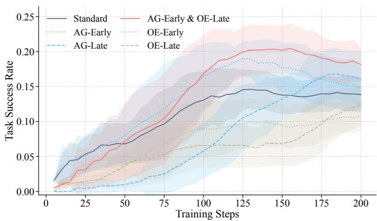  
Figure 2 RL training dynamics under various feedback enrichment strategies. Task success rate is evaluated on the standard environment. Curves are smoothed for visual clarity, and shaded regions denote variance.

in the later stages compared to OE-Early. This indicates that from both intra- and inter-episode perspectives, AG should be applied during the initial stage, while OE shoud be introduced in the later stage. A plausible explanation is that action guidance efectively prunes the initial combinatorial search space to bootstrap early learning, but becomes redundant once basic navigation is mastered. Conversely, observation enrichment imposes a higher cognitive load and requires a foundational policy to interpret the additional semantics, making it less efective initially but highly potent later on.

Combining AG-Early and OE-Late yields superior performance. To further validate that distinct strategies suit diferent training stages, we introduce a hybrid approach applying AG-Early for the first 100 steps and switching to OE-Late for the remaining 100 steps. As shown by the red curve in Figure 2, this combination surpasses all other settings, achieving the highest success rate. This success highlights a general strategy for environment enrichment: across both the agent-environment interaction and agent evolution processes, action guidance should be leveraged during the early stage to bootstrap exploration, while observation enrichment should be introduced in the later stage for advanced policy refinement.

## 4 Experiments

## 4.1 Experiment Setting

Enriched Environments. To systematically validate our AG-Early and OE-Late strategy, we conduct enriched environments for agent training from two primary benchmarks: SciWorld and BFCL-v3 Multi-Turn [Patil et al., 2025], which is introduced to evaluate the agents’ capability to handle dynamic and realistic user interactions across multiple dialogue turns via predefined APIs. In SciWorld, action guidance represents concrete valid actions, and observation enrichment represents real-time task progress tracking. In BFCL, action guidance represents suggested actions appended to the user query, and observtion enrichments represents expanded raw return contents of invoked tools. Consistent with Section 3.2, we train the agent for 200 steps with a 0.5 enrichment probability, transitioning from AG-Early to OE-Late at step 100, while ensuring that the standard evaluation tasks remain strictly disjoint. Detailed implementations and examples are provided in Appendix B.

RL Algorithms. We evaluate our approach with three representative RL algorithms: GRPO [Shao et al., 2024], DAPO [Yu et al., 2025], and GSPO [Zheng et al., 2025]. GRPO estimates the advantage directly by computing relative scores within a group, thereby bypassing the need for a separate critic model. DAPO incorporates specialized strategies such as clip-higher and dynamic sampling to stabilize optimization. GSPO calculates the importance ratio based on sequence-level likelihoods. Details of the mathematical expressions of the algorithms can be found in Appendix A.

<table><tr><td rowspan="2">Model</td><td colspan="4">BFCL V3 Multi-Turn</td><td rowspan="2">SciWorld</td><td rowspan="2">Average</td></tr><tr><td>Base</td><td>Long Context</td><td>Miss Func</td><td>Miss Param</td></tr><tr><td>GPT-5.4</td><td>47.00</td><td>56.00</td><td>56.00</td><td>49.00</td><td>52.34</td><td>52.07</td></tr><tr><td>Kimi-K2-Thinking</td><td>69.00</td><td>54.00</td><td>68.00</td><td>57.00</td><td>19.53</td><td>53.51</td></tr><tr><td>Qwen3-235B-Thinking</td><td>36.00</td><td>29.00</td><td>32.00</td><td>23.00</td><td>55.47</td><td>35.09</td></tr><tr><td>Qwen3-4B</td><td>35.00</td><td>28.00</td><td>27.00</td><td>24.00</td><td>3.90</td><td>23.58</td></tr><tr><td>GRPO + Standard</td><td>58.00</td><td>52.00</td><td>34.00</td><td>32.00</td><td>28.91</td><td>40.98</td></tr><tr><td>GRPO + Enriched</td><td>68.00 (↑10.00%)</td><td>46.00 (↓6.00%)</td><td>43.00 (↑9.00%)</td><td>30.00 (↓2.00%)</td><td>34.38 (↑5.47%)</td><td>44.27 (↑3.29%)</td></tr><tr><td>DAPO + Standard</td><td>61.00</td><td>44.00</td><td>39.00</td><td>41.00</td><td>34.38</td><td>43.88</td></tr><tr><td>DAPO + Enriched</td><td>71.00 (↑10.00%)</td><td>50.00 (↑6.00%)</td><td>45.00 (↑6.00%)</td><td>34.00 (↓7.00%)</td><td>39.06 (↑4.68%)</td><td>47.81 (↑3.93%)</td></tr><tr><td>GSPO + Standard</td><td>54.00</td><td>40.00</td><td>29.00</td><td>25.00</td><td>34.38</td><td>36.48</td></tr><tr><td>GSPO + Enriched</td><td>54.00</td><td>40.00</td><td>37.00 (↑8.00%)</td><td>22.00 (↓3.00%)</td><td>39.84 (↑5.46%)</td><td>38.57 (↑2.09%)</td></tr><tr><td>Qwen3-8B</td><td>35.00</td><td>24.00</td><td>30.00</td><td>25.00</td><td>21.88</td><td>27.18</td></tr><tr><td>GRPO + Standard</td><td>66.00</td><td>35.00</td><td>52.00</td><td>37.00</td><td>43.75</td><td>46.75</td></tr><tr><td>GRPO + Enriched</td><td>66.00</td><td>36.00 (↑1.00%)</td><td>48.00 (↓4.00%)</td><td>38.00 (↑1.00%)</td><td>49.22 (↑5.47%)</td><td>47.44 (↑0.69%)</td></tr><tr><td>DAPO + Standard</td><td>65.00</td><td>33.00</td><td>47.00</td><td>34.00</td><td>50.00</td><td>45.80</td></tr><tr><td>DAPO + Enriched</td><td>71.00 (↑6.00%)</td><td>35.00 (↑2.00%)</td><td>49.00 (↑2.00%)</td><td>34.00</td><td>51.56 (↑1.56%)</td><td>48.11 (↑2.31%)</td></tr><tr><td>GSPO + Standard</td><td>58.00</td><td>29.00</td><td>41.00</td><td>27.00</td><td>53.91</td><td>41.78</td></tr><tr><td>GSPO + Enriched</td><td>65.00 (↑7.00%)</td><td>32.00 (↑3.00%)</td><td>40.00 (↓1.00%)</td><td>34.00 (↑7.00%)</td><td>60.94 (↑7.03%)</td><td>46.39 (↑4.61%)</td></tr></table>

Table 1 Main evaluation results on two selected benchmarks. Color blocks group identical RL algorithms to show the impact of training environments. Performance scores are reported as percentages (%). Values in parentheses indicate the absolute percentage point improvement (↑) or degradation (↓) of FEE training over the standard baseline.

Training. We adopt the 4B and 8B variants of the Qwen3 series as the foundational backbones for RL training. Training utilizes a $1 1 \times 1 0 ^ { - 6 }$ learning rate with evaluations conducted every 5 steps, where the peak performance is recorded in Table 1. To establish a performance ceiling, we incorporate leading proprietary models as baselines, including GPT-5.4, Kimi-K2-Thinking [Team, 2025], Qwen3-235B-Thinking [Yang et al., 2025a].

## 4.2 Main Results

RL training efectively bridges the gap between open-source models and leading proprietary models. RL training significantly enhances the model’s capabilities in multi-turn interactions. As shown in Table 1, Qwen3-4B and Qwen3-8B models initially exhibit limited proficiency, yielding average scores of only 23.58% and 27.18%, respectively. After RL training, Qwen3-4B and 8B reach 47.81% and 48.11%, comfortably outperforming Qwen3-235B-Thinking and closely approaching top-tier closed-source models like GPT-5.4. This confirms that RL training efectively transforms foundational knowledge into specialized execution skills for complex agentic tasks.

Training agents in FEEs consistently yields superior performance compared to standard environments. This advantage remains robust across all evaluated model scales, optimization algorithms, and benchmarks. For instance, as shown in Table 1, the Qwen3-8B model optimized via GSPO on SciWorld improves from 53.91% to 60.94% when trained with enriched feedback. Similarly, the Qwen3-4B model using GRPO on BFCL-Base tasks achieves a 10.00% absolute performance increase. These consistent gains validate the efectiveness of our feedback enrichment strategy.

FEEs may lead agents to rely too much on environmental feedback, weakening their ability to question the input context. Despite widespread gains, training with FEEs may cause slight performance regressions in scenarios where agents must question input suficiency rather than blindly execute commands. As shown in Table 1, with FEEs, the Qwen3-4B model trained with DAPO drops from 41.00% to 34.00% on Miss Param tasks where essential information is missing from user requests. Similarly, the Qwen3-8B model with GRPO declines from 52.00% to 48.00% on Miss Func tasks where no available tools are provided to fulfill the user request. We hypothesize that the proactive guidance in FEEs makes agents overly inclined to follow

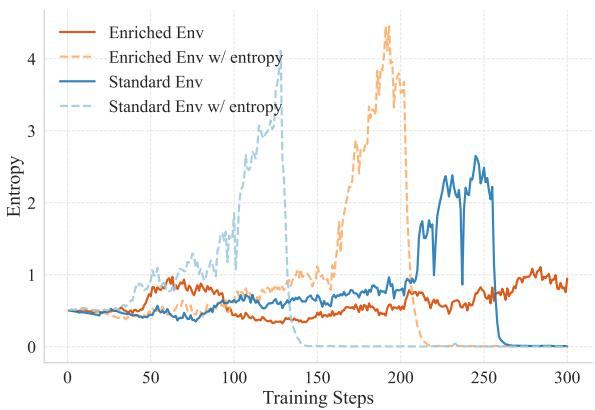  
Figure 3 Policy entropy curves of Qwen3-4B over 300 training steps in standard SciWorld environments and FEEs, with and without entropy regularization.

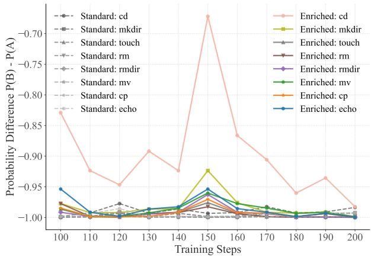  
Figure 5 Probability diference between the original and enriched feedback options across training steps.  
interaction cues, leading them to prioritize execution over necessary clarification.

## 5 Discussion

## 5.1 Training Stability

Exp 1. To investigate how FEEs afect training stability, we track the evolution of policy entropy across four experimental configurations. Specifically, we compare standard environments and FEEs under two distinct settings: with and without an entropy regularization loss. Since entropy loss explicitly forces the agent to maintain high policy diversity for exploration, we examine whether FEEs provide independent stability even under such volatile conditions. The resulting entropy curves of Qwen3-4B over 300 training steps on SciWorld related environments are presented in Figure 3.

Res 1. As shown in Figure 3, training within FEEs significantly delays or prevents premature policy collapse compared to standard environments. Specifically, in configurations without explicit entropy regularization represented by the solid lines, the agent trained in FEEs maintains steady entropy throughout the entire 300 steps without collapsing, whereas the standard environment sufers from a sharp drop to zero at approximately 250 steps. When entropy regularization is introduced to force exploration represented by the dashed lines, FEEs successfully sustain stable training for nearly 200 steps, while the standard environment collapses much earlier at around 130 steps.

Takeaway 1. FEEs stabilize RL training with more diverse environment feedback, regardless of explicit entropy regularization.

## 5.2 State-Space Exploration

Exp 2. We examine whether FEEs facilitate more efective and persistent state-space exploration from both the training and evaluation perspectives. Specifically, during training, we monitor Qwen3-4B on the BFCL benchmark by calculating the average success rate across 8 rollouts for each sampled environment. To assess the persistence of these capabilities during evaluation, we partition 400 environments into easy ([0.66, 1]), medium ([0.33 0.66]), and hard ([0 0.33]) dificulty tiers based on the success rates achieved by models trained in standard environments, and then evaluate models trained in FEEs across these tiers.

Res 2. The experimental results are illustrated in Figure 4, yielding the following analysis. (1) From the training perspective, FEEs improve the agent’s exploration eficiency during RL training. For instance, the FEE-trained agent exhibits a significantly higher density of green squares in the later stages of training, whereas the standard baseline remains dominated by red squares across many environments. This suggests that enriched feedback enables the agent to explore and master a broader range of environment states. (2)

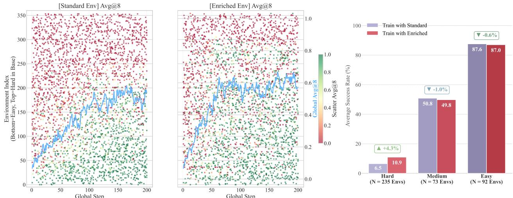  
Figure 4 Left & Middle: Exploration dynamics of Qwen3-4B on BFCL under standard environments and FEEs. The x-axis denotes training steps and the y-axis denotes environment indices ordered by dificulty (bottom: easy, top: hard). Each point represents the avg@8 success rate of a sampled environment, while the blue curve shows the global average avg@8. Right: Validation success rates of models trained in standard environments and FEEs, evaluated on standard environments partitioned into hard, medium, and easy dificulty tiers.

From the evaluation perspective, the exploration capability learned with FEEs transfers efectively to standard environments. For instance, the FEE-trained model consistently outperforms the baseline across all dificulty levels, achieving a notable 4.3% improvement on “hard” environments. This indicates that the agent develops a more proactive exploration strategy that allows it to navigate low-probability states even without enriched feedback.

Takeaway 2. FEEs encourage persistent exploration that is internalized by the policy and remains efective in standard, high-dificulty environments.

## 5.3 Feedback Internalization

Exp 3. We investigate whether the enriched information in FEEs is internalized into the agent’s policy weights or merely functions as a temporary inference-time hint. To study this, we design a controlled prediction experiment based on the GorillaFileSystem environment in BFCL. Specifically, we select a subset of enriched file-system operations, including cd, mkdir, touch, rm, rmdir, mv, cp, and echo. While standard feedback only provides standard tool outputs, the enriched feedback additionally includes the current absolute path. We then formulate multiple-choice probe questions that asks the model to predict the expected tool output after executing a command, and compare the output probabilities assigned to the original and enriched feedback options. Details of these probe questions can be found in Appendix C. We further apply these probe questions to Qwen3-4B throughout the later stages of BFCL training, evaluating them every 10 training steps to monitor the evolution of knowledge internalization.

Res 3. Figure 5 illustrates the probability margin between the original and enriched feedback options across training steps. When tested in standard environments, models trained with FEEs assign progressively higher probabilities to the enriched feedback option, whereas standard-trained models remain consistently biased toward the original tool output with negligible variation.

Takeaway 3. FEE-trained agents internalize the enriched information rather than treating it as a temporary inference-time hint.

## 5.4 Intra-group Feedback Consistency

Exp 4. We investigate whether the enriched environmental feedback should remain consistent or stochastic within a single rollout group, as feedback enrichment is typically injected with a probability of 0.5 during training. To study this, we compare two training configurations: a stochastic setting where diferent enriched feedback variants are randomly assigned within the same sampling group, and a consistent setting where all agents in a group receive identical feedback for a given state. Specifically, we conduct this experiment by training Qwen3-4B on SciWorld with GRPO for 200 training steps and monitor the validation performance in standard environments.

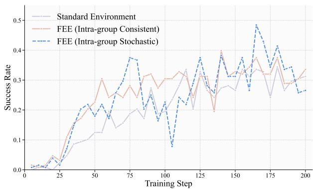  
Figure 6 Validation success rates of Qwen3-4B in standard SciWorld environments during GRPO training under different feedback consistency settings.

Res 4. The results show that intra-group feedback consistency is crucial for stable optimization. As

illustrated in Figure 6, the configuration with consistent intra-group feedback exhibits a steady increase in success rate throughout training. In contrast, providing diverse feedback within a single group leads to severe instability, characterized by erratic performance fluctuations with sharp plunges and sudden spikes. This may stem from the nature of group-based agentic RL, where advantages are estimated within each sampling group. Excessive stochasticity in intra-group feedback can distort advantage estimation, leading to noisy optimization signals and unstable convergence.

Takeaway 4. Intra-group feedback consistency is a prerequisite for stable optimization, as excessive diversity within a single rollout group triggers severe performance volatility.

## 6 Related Work

## 6.1 RL for Long-horizon Tasks

Agentic language models tackle long-horizon tasks by integrating natural language reasoning with grounded actions such as tool manipulation [Lei et al., 2025, Trivedi et al., 2024, Wang et al., 2025b, Yao et al., 2024], web navigation [Koh et al., 2024, Rawles et al., 2025, Xie et al., 2024, Yao et al., 2022, Zhou et al., 2024b], and code execution [Merrill et al., 2026b, Ouyang et al., 2025, Yang et al., 2025b], requiring an extended sequence of steps to achieve an ultimate objective. To enhance the capabilities of LLMs serving as the backbone of agentic systems, reinforcement-learning-based approaches have been instrumental [Feng et al., 2025b, Hu et al., 2026, Jin et al., 2025a, Wang et al., 2025c, Zhang et al., 2025e]. Typically, a supervised fine-tuning warm-up phase is conducted prior to reinforcement learning to boost the agent’s initial capabilities [Jin et al., 2025b, Li et al., 2025b, Lu et al., 2025, Wei et al., 2025]. However, in this paper, we introduce a complementary environment-side enrichment framework that is orthogonal to existing agent-centric optimization algorithms and refinement techniques.

## 6.2 Environments for Evolving Agents

As modern LLMs evolve into autonomous agents capable of sequential decision making in complex environments, training these agents within interactive, gym-style environments is becoming a standard practice [Aggarwal et al., 2026, Li et al., 2026, Liu et al., 2025a, Meng et al., 2026, Stojanovski et al., 2025]. Consequently, the focus of research has evolved from scaling static datasets [Wang et al., 2023, Xu et al., 2024] to scaling the complexity and diversity of interactive environments [Fang et al., 2025, Gandhi et al., 2026, Song et al., 2026, Tu et al., 2026]. In the era of scaling data, to solve the reward sparsity problem, many work focuses on on modulating task dificulty by incorporating linguistic hints as a form of scafolding to facilitate model training [Huang et al., 2025, Li et al., 2025a, Zhang et al., 2025a,c,d]. However, in the era of scaling enironments, how to systematically reconstruct multi-turn, dynamic environments to facilitate agent evolution remains relatively under-explored.

## 7 Conclusion

Training long-horizon LLM agents with RL remains challenging due to sparse rewards and inefective exploration. In this work, we shift the focus from agent-side warming to environment-side adaptation, and propose a general strategy for constructing efective feedback-enriched environments. By systematically designing what feedback to provide and when to deliver it, the resulting FEEs consistently improve RL training across multiple benchmarks, model scales, and optimization algorithms. Beyond performance gains, our findings show that FEEs stabilize training dynamics, encourage proactive state-space exploration, internalize environmental guidance into policy weights, and highlight intra-group feedback consistency as an important condition for stable optimization.

## Limitations

Despite the promising efectiveness of FEEs, our study still has several limitations. First, constructing feedback-enriched environments requires environment-specific design choices and hyperparameters. For example, stage-dependent settings such as the definitions of early and late phases in intra-episode exploration and inter-episode evolution are manually specified in our experiments, while their sensitivity and optimal configurations remain underexplored. Second, although we validate FEEs on SciWorld and BFCL, we do not conduct broader evaluations across a wider range of agent benchmarks, leaving the generalization ability of our strategy insuficiently studied. Third, we observe clear limitations of our approach in more challenging environments. In particular, when training Qwen3-4B and 8B on AppWorld [Trivedi et al., 2024], introducing enriched feedback still fails to produce positive rewards, with training remaining trapped in zero-reward trajectories. This suggests that the efectiveness of FEEs is not universal and that richer environment adaptation strategies for extremely sparse long-horizon settings warrant further investigation.

## Ethics and Artifact Use Statement

Potential risks. We do not identify significant potential risks associated with this work. Our study focuses on improving reinforcement learning training for LLM agents in benchmarked long-horizon environments through environment-side feedback design. The proposed method neither introduces deployment-facing systems nor involves sensitive data, human subjects, safety-critical decision making, or high-risk real-world applications. The feedback-enriched environments are constructed within controlled research benchmarks and are intended solely for studying training dynamics and agent learning behaviors.

Artifacts, licenses, and intended use. Our work uses oficial open-source codebases and benchmark environments released by prior work. All utilized artifacts are appropriately cited in the paper. Documentation, implementation details, and usage instructions for these artifacts are publicly available at their corresponding oficial repositories and project websites.

Data privacy and content safety. Our study uses only publicly available benchmark tasks and open-source research environments, without involving personal data, sensitive content, or human participant data.

Use of AI assistants. AI assistants were used solely for minor writing refinement and language polishing.

## References

Pranjal Aggarwal, Graham Neubig, and Sean Welleck. 2026. Gym-anything: Turn any software into an agent environment. Preprint, arXiv:2604.06126.

Hao Bai, Alexey Taymanov, Tong Zhang, Aviral Kumar, and Spencer Whitehead. 2026. Webgym: Scaling training environments for visual web agents with realistic tasks. CoRR, abs/2601.02439.

Kevin Chen, Marco F. Cusumano-Towner, Brody Huval, Aleksei Petrenko, Jackson Hamburger, Vladlen Koltun, and Philipp Krähenbühl. 2025a. Reinforcement learning for long-horizon interactive LLM agents. CoRR, abs/2502.01600.

Zhaorun Chen, Zhuokai Zhao, Kai Zhang, Bo Liu, Qi Qi, Yifan Wu, Tarun Kalluri, Sara Cao, Yuanhao Xiong, Haibo Tong, Huaxiu Yao, Hengduo Li, Jiacheng Zhu, Xian Li, Dawn Song, Bo Li, Jason Weston, and Dat Huynh. 2025b. Scaling agent learning via experience synthesis. CoRR, abs/2511.03773.

DeepSeek-AI, Daya Guo, Dejian Yang, Haowei Zhang, Junxiao Song, Ruoyu Zhang, Runxin Xu, Qihao Zhu, Shirong Ma, Peiyi Wang, Xiao Bi, Xiaokang Zhang, Xingkai Yu, Yu Wu, Z. F. Wu, Zhibin Gou, Zhihong Shao, Zhuoshu Li, Ziyi Gao, and 81 others. 2025. Deepseek-r1: Incentivizing reasoning capability in llms via reinforcement learning. CoRR, abs/2501.12948.

Wei Du, Shubham Toshniwal, Branislav Kisacanin, Sadegh Mahdavi, Ivan Moshkov, George Armstrong, Stephen Ge, Edgar Minasyan, Feng Chen, and Igor Gitman. 2025. Nemotron-math: Eficient long-context distillation of mathematical reasoning from multi-mode supervision. CoRR, abs/2512.15489.

Abhimanyu Dubey, Abhinav Jauhri, Abhinav Pandey, Abhishek Kadian, Ahmad Al-Dahle, Aiesha Letman, Akhil Mathur, Alan Schelten, Amy Yang, Angela Fan, Anirudh Goyal, Anthony Hartshorn, Aobo Yang, Archi Mitra, Archie Sravankumar, Artem Korenev, Arthur Hinsvark, Arun Rao, Aston Zhang, and 82 others. 2024. The llama 3 herd of models. CoRR, abs/2407.21783.

Runnan Fang, Shihao Cai, Baixuan Li, Jialong Wu, Guangyu Li, Wenbiao Yin, Xinyu Wang, Xiaobin Wang, Liangcai Su, Zhen Zhang, Shibin Wu, Zhengwei Tao, Yong Jiang, Pengjun Xie, Fei Huang, and Jingren Zhou. 2025. Towards general agentic intelligence via environment scaling. CoRR, abs/2509.13311.

Lang Feng, Zhenghai Xue, Tingcong Liu, and Bo An. 2025a. Group-in-group policy optimization for LLM agent training. CoRR, abs/2505.10978.

Lang Feng, Zhenghai Xue, Tingcong Liu, and Bo An. 2025b. Group-in-group policy optimization for LLM agent training. CoRR, abs/2505.10978.

Kanishk Gandhi, Shivam Garg, Noah D. Goodman, and Dimitris Papailiopoulos. 2026. Endless terminals: Scaling RL environments for terminal agents. CoRR, abs/2601.16443.

Elliot Glazer, Ege Erdil, Tamay Besiroglu, Diego Chicharro, Evan Chen, Alex Gunning, Caroline Falkman Olsson, Jean-Stanislas Denain, Anson Ho, Emily de Oliveira Santos, Olli Järviniemi, Matthew Barnett, Robert Sandler, Matej Vrzala, Jaime Sevilla, Qiuyu Ren, Elizabeth Pratt, Lionel Levine, Grant Barkley, and 5 others. 2024. Frontiermath: A benchmark for evaluating advanced mathematical reasoning in AI. CoRR, abs/2411.04872.

Tianyi Hu, Qingxu Fu, Yanxi Chen, Zhaoyang Liu, and Bolin Ding. 2026. Seeupo: Sequence-level agentic-rl with convergence guarantees. CoRR, abs/2602.06554.

Qihan Huang, Long Chan, Jinlong Liu, Wanggui He, Hao Jiang, Mingli Song, Jingyuan Chen, Chang Yao, and Jie Song. 2025. Boosting MLLM reasoning with text-debiased hint-grpo. CoRR, abs/2503.23905.

Carlos E. Jimenez, John Yang, Alexander Wettig, Shunyu Yao, Kexin Pei, Ofir Press, and Karthik R. Narasimhan. 2024. Swe-bench: Can language models resolve real-world github issues? In The Twelfth International Conference on Learning Representations, ICLR 2024, Vienna, Austria, May 7-11, 2024. OpenReview.net.

Bowen Jin, Hansi Zeng, Zhenrui Yue, Dong Wang, Hamed Zamani, and Jiawei Han. 2025a. Search-r1: Training llms to reason and leverage search engines with reinforcement learning. CoRR, abs/2503.09516.

Hongbo Jin, Qingyuan Wang, Wenhao Zhang, Yang Liu, and Sijie Cheng. 2025b. Videomem: Enhancing ultra-long video understanding via adaptive memory management. CoRR, abs/2512.04540.

Feiyang Kang, Michael Kuchnik, Karthik Padthe, Marin Vlastelica, Ruoxi Jia, Carole-Jean Wu, and Newsha Ardalani. 2025. Quagmires in SFT-RL post-training: When high SFT scores mislead and what to use instead. CoRR, abs/2510.01624.

Jing Yu Koh, Robert Lo, Lawrence Jang, Vikram Duvvur, Ming Chong Lim, Po-Yu Huang, Graham Neubig, Shuyan Zhou, Russ Salakhutdinov, and Daniel Fried. 2024. Visualwebarena: Evaluating multimodal agents on realistic visual web tasks. In Proceedings ofthe 62nd Annual Meeting ofthe Associationfor Computational Linguistics (Volume 1: Long Papers), ACL 2024, Bangkok, Thailand, August 11-16, 2024, pages 881–905. Association for Computational Linguistics.

Fei Lei, Yibo Yang, Wenxiu Sun, and Dahua Lin. 2025. Mcpverse: An expansive, real-world benchmark for agentic tool use. CoRR, abs/2508.16260.

Jiachun Li, Zhuoran Jin, Tianyi Men, Yupu Hao, Kejian Zhu, Lingshuai Wang, Dongqi Huang, Longxiang Wang, Shengjia Hua, Lu Wang, Jinshan Gao, Hongbang Yuan, Ruilin Xu, Kang Liu, and Jun Zhao. 2026. Agentic environment engineering for large language models: A survey of environment modeling, synthesis, evaluation, and application. CoRR, abs/2606.12191.

Jiazheng Li, Hong Lu, Kaiyue Wen, Zaiwen Yang, Jiaxuan Gao, Hongzhou Lin, Yi Wu, and Jingzhao Zhang. 2025a. Questa: Expanding reasoning capacity in llms via question augmentation. CoRR, abs/2507.13266.

Kuan Li, Zhongwang Zhang, Huifeng Yin, Liwen Zhang, Litu Ou, Jialong Wu, Wenbiao Yin, Baixuan Li, Zhengwei Tao, Xinyu Wang, Weizhou Shen, Junkai Zhang, Dingchu Zhang, Xixi Wu, Yong Jiang, Ming Yan, Pengjun Xie, Fei Huang, and Jingren Zhou. 2025b. Websailor: Navigating super-human reasoning for web agent. CoRR, abs/2507.02592.

Zichen Liu, Anya Sims, Keyu Duan, Changyu Chen, Simon Yu, Xiangxin Zhou, Haotian Xu, Shaopan Xiong, Bo Liu, Chenmien Tan, Chuen Yang Beh, Weixun Wang, Hao Zhu, Weiyan Shi, Diyi Yang, Michael Shieh, Yee Whye Teh, Wee Sun Lee, and Min Lin. 2025a. GEM: A gym for agentic llms. CoRR, abs/2510.01051.

Zihan Liu, Zhuolin Yang, Yang Chen, Chankyu Lee, Mohammad Shoeybi, Bryan Catanzaro, and Wei Ping. 2025b. Acereason-nemotron 1.1: Advancing math and code reasoning through SFT and RL synergy. CoRR, abs/2506.13284.

Zhengxi Lu, Jiabo Ye, Fei Tang, Yongliang Shen, Haiyang Xu, Ziwei Zheng, Weiming Lu, Ming-Hsuan Yang, Fei Huang, Jun Xiao, and Yueting Zhuang. 2025. UI-S1: advancing GUI automation via semi-online reinforcement learning. CoRR, abs/2509.11543

Fanqing Meng, Lingxiao Du, Jiawei Gu, Jiaqi Liao, Linjie Li, Zijian Wu, Xiangyan Liu, Ziqi Zhao, Mengkang Hu, Zichen Liu, Jiaheng Zhang, and Michael Qizhe Shieh. 2026. Gym-v: A unified vision environment system for agentic vision research. Preprint, arXiv:2603.15432.

Mike A. Merrill, Alexander Glenn Shaw, Nicholas Carlini, Boxuan Li, Harsh Raj, Ivan Bercovich, Lin Shi, Jeong Yeon Shin, Thomas Walshe, Estefany Kelly Buchanan, Junhong Shen, Guanghao Ye, Haowei Lin, Jason Poulos, Maoyu Wang, Marianna Nezhurina, Jenia Jitsev, Di Lu, Orfeas Menis-Mastromichalakis, and 66 others. 2026a. Terminal-bench: Benchmarking agents on hard, realistic tasks in command line interfaces. CoRR, abs/2601.11868.

Mike A. Merrill, Alexander Glenn Shaw, Nicholas Carlini, Boxuan Li, Harsh Raj, Ivan Bercovich, Lin Shi, Jeong Yeon Shin, Thomas Walshe, Estefany Kelly Buchanan, Junhong Shen, Guanghao Ye, Haowei Lin, Jason Poulos, Maoyu Wang, Marianna Nezhurina, Jenia Jitsev, Di Lu, Orfeas Menis-Mastromichalakis, and 66 others. 2026b. Terminal-bench: Benchmarking agents on hard, realistic tasks in command line interfaces. CoRR, abs/2601.11868.

OpenAI. 2023. GPT-4 technical report. CoRR, abs/2303.08774.

Anne Ouyang, Simon Guo, Simran Arora, Alex L. Zhang, William Hu, Christopher Ré, and Azalia Mirhoseini. 2025. Kernelbench: Can llms write eficient GPU kernels? In Forty-second International Conference on Machine Learning, ICML 2025, Vancouver, BC, Canada, July 13-19, 2025, Proceedings of Machine Learning Research. PMLR / OpenReview.net.

Shishir G. Patil, Huanzhi Mao, Fanjia Yan, Charlie Cheng-Jie Ji, Vishnu Suresh, Ion Stoica, and Joseph E. Gonzalez. 2025. The berkeley function calling leaderboard (BFCL): from tool use to agentic evaluation of large language models. In Forty-second International Conference on Machine Learning, ICML 2025, Vancouver, BC, Canada, July 13-19, 2025, volume 267 of Proceedings of Machine Learning Research. PMLR / OpenReview.net.

Christopher Rawles, Sarah Clinckemaillie, Yifan Chang, Jonathan Waltz, Gabrielle Lau, Marybeth Fair, Alice Li, William E. Bishop, Wei Li, Folawiyo Campbell-Ajala, Daniel Kenji Toyama, Robert James Berry, Divya Tyamagundlu, Timothy P. Lillicrap, and Oriana Riva. 2025. Androidworld: A dynamic benchmarking environment for autonomous agents. In The Thirteenth International Conference on Learning Representations, ICLR 2025, Singapore, April 24-28, 2025. OpenReview.net.

Zhihong Shao, Peiyi Wang, Qihao Zhu, Runxin Xu, Junxiao Song, Mingchuan Zhang, Y. K. Li, Y. Wu, and Daya Guo. 2024. Deepseekmath: Pushing the limits of mathematical reasoning in open language models. CoRR, abs/2402.03300.

Xiaoshuai Song, Haofei Chang, Guanting Dong, Yutao Zhu, Zhicheng Dou, and Ji-Rong Wen. 2026. Envscaler: Scaling tool-interactive environments for LLM agent via programmatic synthesis. CoRR, abs/2601.05808.

Zafir Stojanovski, Oliver Stanley, Joe Sharratt, Richard Jones, Abdulhakeem Adefioye, Jean Kaddour, and Andreas Köpf. 2025. REASONING GYM: reasoning environments for reinforcement learning with verifiable rewards. CoRR, abs/2505.24760.

Kimi Team. 2025. Kimi K2: open agentic intelligence. CoRR, abs/2507.20534.

Harsh Trivedi, Tushar Khot, Mareike Hartmann, Ruskin Manku, Vinty Dong, Edward Li, Shashank Gupta, Ashish Sabharwal, and Niranjan Balasubramanian. 2024. Appworld: A controllable world of apps and people for benchmarking interactive coding agents. In Proceedings ofthe 62nd Annual Meeting ofthe Associationfor Computational Linguistics (Volume 1: Long Papers), ACL 2024, Bangkok, Thailand, August 11-16, 2024, pages 16022–16076. Association for Computational Linguistics.

Dunwei Tu, Hongyan Hao, Hansi Yang, Yihao Chen, Yi-Kai Zhang, Zhikang Xia, Yu Yang, Yueqing Sun, Xingchen Liu, Furao Shen, Qi Gu, Hui Su, and Xunliang Cai. 2026. Scaleenv: Scaling environment synthesis from scratch for generalist interactive tool-use agent training. CoRR, abs/2602.06820.

Jiawei Wang, Jiacai Liu, Yuqian Fu, Yingru Li, Xintao Wang, Yuan Lin, Yu Yue, Lin Zhang, Yang Wang, and Ke Wang. 2025a. Harnessing uncertainty: Entropy-modulated policy gradients for long-horizon LLM agents. CoRR, abs/2509.09265.

Ruoyao Wang, Peter A. Jansen, Marc-Alexandre Côté, and Prithviraj Ammanabrolu. 2022. Scienceworld: Is your agent smarter than a 5th grader? In Proceedings of the 2022 Conference on Empirical Methods in Natural Language Processing, EMNLP 2022, Abu Dhabi, United Arab Emirates, December 7-11, 2022, pages 11279–11298. Association for Computational Linguistics.

Yizhong Wang, Yeganeh Kordi, Swaroop Mishra, Alisa Liu, Noah A. Smith, Daniel Khashabi, and Hannaneh Hajishirzi. 2023. Self-instruct: Aligning language models with self-generated instructions. In Proceedings ofthe 61st Annual Meeting of the Association for Computational Linguistics (Volume 1: Long Papers), ACL 2023, Toronto, Canada, July 9-14, 2023, pages 13484–13508. Association for Computational Linguistics.

Zhenting Wang, Qi Chang, Hemani Patel, Shashank Biju, Cheng-En Wu, Quan Liu, Aolin Ding, Alireza Rezazadeh, Ankit Shah, Yujia Bao, and Eugene Siow. 2025b. Mcp-bench: Benchmarking tool-using LLM agents with complex real-world tasks via MCP servers. CoRR, abs/2508.20453.

Zihan Wang, Kangrui Wang, Qineng Wang, Pingyue Zhang, Linjie Li, Zhengyuan Yang, Xing Jin, Kefan Yu, Minh Nhat Nguyen, Licheng Liu, Eli Gottlieb, Yiping Lu, Kyunghyun Cho, Jiajun Wu, Li Fei-Fei, Lijuan Wang, Yejin Choi, and Manling Li. 2025c. RAGEN: understanding self-evolution in LLM agents via multi-turn reinforcement learning. CoRR, abs/2504.20073.

Zhepei Wei, Wenlin Yao, Yao Liu, Weizhi Zhang, Qin Lu, Liang Qiu, Changlong Yu, Puyang Xu, Chao Zhang, Bing Yin, Hyokun Yun, and Lihong Li. 2025. Webagent-r1: Training web agents via end-to-end multi-turn reinforcement learning. In Proceedings of the 2025 Conference on Empirical Methods in Natural Language Processing, EMNLP 2025, Suzhou, China, November 4-9, 2025, pages 7909–7928. Association for Computational Linguistics.

Liang Wen, Yunke Cai, Fenrui Xiao, Xin He, Qi An, Zhenyu Duan, Yimin Du, Junchen Liu, Lifu Tang, Xiaowei Lv, Haosheng Zou, Yongchao Deng, Shousheng Jia, and Xiangzheng Zhang. 2025. Light-r1: Curriculum sft, DPO and RL for long COT from scratch and beyond. In Proceedings of the 63rd Annual Meeting of the Associationfor Computational Linguistics (Volume 6: Industry Track), ACL 2025, Vienna, Austria, July 27 - August 1, 2025, pages 318–327. Association for Computational Linguistics.

Tianbao Xie, Danyang Zhang, Jixuan Chen, Xiaochuan Li, Siheng Zhao, Ruisheng Cao, Toh Jing Hua, Zhoujun Cheng, Dongchan Shin, Fangyu Lei, Yitao Liu, Yiheng Xu, Shuyan Zhou, Silvio Savarese, Caiming Xiong, Victor Zhong, and Tao Yu. 2024. Osworld: Benchmarking multimodal agents for open-ended tasks in real computer environments. In Advances in Neural Information Processing Systems 38: Annual Conference on Neural Information Processing Systems 2024, NeurIPS 2024, Vancouver, BC, Canada, December 10 - 15, 2024.

Can Xu, Qingfeng Sun, Kai Zheng, Xiubo Geng, Pu Zhao, Jiazhan Feng, Chongyang Tao, Qingwei Lin, and Daxin Jiang. 2024. Wizardlm: Empowering large pre-trained language models to follow complex instructions. In The Twelfth International Conference on Learning Representations, ICLR 2024, Vienna, Austria, May 7-11, 2024. OpenReview.net.

An Yang, Anfeng Li, Baosong Yang, Beichen Zhang, Binyuan Hui, Bo Zheng, Bowen Yu, Chang Gao, Chengen Huang, Chenxu Lv, Chujie Zheng, Dayiheng Liu, Fan Zhou, Fei Huang, Feng Hu, Hao Ge, Haoran Wei, Huan Lin, Jialong Tang, and 40 others. 2025a. Qwen3 technical report. CoRR, abs/2505.09388.

John Yang, Carlos E. Jimenez, Alexander Wettig, Kilian Lieret, Shunyu Yao, Karthik Narasimhan, and Ofir Press. 2024. Swe-agent: Agent-computer interfaces enable automated software engineering. In Advances in Neural Information Processing Systems 38: Annual Conference on Neural Information Processing Systems 2024, NeurIPS 2024, Vancouver, BC, Canada, December 10 - 15, 2024.

John Yang, Carlos E. Jimenez, Alex L. Zhang, Kilian Lieret, Joyce Yang, Xindi Wu, Ori Press, Niklas Muennighof, Gabriel Synnaeve, Karthik R. Narasimhan, Diyi Yang, Sida Wang, and Ofir Press. 2025b. Swe-bench multimodal: Do AI systems generalize to visual software domains? In The Thirteenth International Conference on Learning Representations, ICLR 2025, Singapore, April 24-28, 2025. OpenReview.net.

Shunyu Yao, Howard Chen, John Yang, and Karthik Narasimhan. 2022. Webshop: Towards scalable real-world web interaction with grounded language agents. In Advances in Neural Information Processing Systems 35: Annual Conference on Neural Information Processing Systems 2022, NeurIPS 2022, New Orleans, LA, USA, November 28 - December 9, 2022.

Shunyu Yao, Noah Shinn, Pedram Razavi, and Karthik Narasimhan. 2024. �-bench: A benchmark for tool-agent-user interaction in real-world domains. CoRR, abs/2406.12045.

Qiying Yu, Zheng Zhang, Ruofei Zhu, Yufeng Yuan, Xiaochen Zuo, Yu Yue, Tiantian Fan, Gaohong Liu, Lingjun Liu, Xin Liu, Haibin Lin, Zhiqi Lin, Bole Ma, Guangming Sheng, Yuxuan Tong, Chi Zhang, Mofan Zhang, Wang Zhang, Hang Zhu, and 16 others. 2025. DAPO: an open-source LLM reinforcement learning system at scale. CoRR, abs/2503.14476.

Feng Zhang, Zezhong Tan, Xinhong Ma, Ziqiang Dong, Xi Leng, Jianfei Zhao, Xin Sun, and Yang Yang. 2025a. Adhint: Adaptive hints with dificulty priors for reinforcement learning. CoRR, abs/2512.13095.

Kai Zhang, Xiangchao Chen, Bo Liu, Tianci Xue, Zeyi Liao, Zhihan Liu, Xiyao Wang, Yuting Ning, Zhaorun Chen, Xiaohan Fu, Jian Xie, Yuxuan Sun, Boyu Gou, Qi Qi, Zihang Meng, Jianwei Yang, Ning Zhang, Xian Li, Ashish Shah, and 11 others. 2025b. Agent learning via early experience. CoRR, abs/2510.08558.

Kaiyi Zhang, Ang Lv, Jinpeng Li, Yongbo Wang, Feng Wang, Haoyuan Hu, and Rui Yan. 2025c. Stephint: Multi-level stepwise hints enhance reinforcement learning to reason. CoRR, abs/2507.02841.

Xichen Zhang, Sitong Wu, Yinghao Zhu, Haoru Tan, Shaozuo Yu, Ziyi He, and Jiaya Jia. 2025d. Scaf-grpo: Scafolded group relative policy optimization for enhancing LLM reasoning. CoRR, abs/2510.19807.

Zijing Zhang, Ziyang Chen, Mingxiao Li, Zhaopeng Tu, and Xiaolong Li. 2025e. RLVMR: reinforcement learning with verifiable meta-reasoning rewards for robust long-horizon agents. CoRR, abs/2507.22844.

Chujie Zheng, Shixuan Liu, Mingze Li, Xiong-Hui Chen, Bowen Yu, Chang Gao, Kai Dang, Yuqiong Liu, Rui Men, An Yang, Jingren Zhou, and Junyang Lin. 2025. Group sequence policy optimization. CoRR, abs/2507.18071.

Shuyan Zhou, Frank F. Xu, Hao Zhu, Xuhui Zhou, Robert Lo, Abishek Sridhar, Xianyi Cheng, Tianyue Ou, Yonatan Bisk, Daniel Fried, Uri Alon, and Graham Neubig. 2024a. Webarena: A realistic web environment for building autonomous agents. In The Twelfth International Conference on Learning Representations, ICLR 2024, Vienna, Austria, May 7-11, 2024. OpenReview.net.

Shuyan Zhou, Frank F. Xu, Hao Zhu, Xuhui Zhou, Robert Lo, Abishek Sridhar, Xianyi Cheng, Tianyue Ou, Yonatan Bisk, Daniel Fried, Uri Alon, and Graham Neubig. 2024b. Webarena: A realistic web environment for building autonomous agents. In The Twelfth International Conference on Learning Representations, ICLR 2024, Vienna, Austria, May 7-11, 2024. OpenReview.net.

## A RL Algorithms

In this section, we elaborates on the specific formulations and optimization objectives of the RL algorithms. We follow the notations in Section 2: for each goal �, the old policy $\pi _ { \theta _ { \mathrm { o l d } } }$ samples a group of � trajectories $\{ \tau _ { k } \} _ { k = 1 } ^ { N } ,$ and each trajectory receives a trajectory-level reward $r ( \tau _ { k } )$ . Let $\mathbf { a } _ { k } = ( a _ { k , 1 } , \ldots , a _ { k , L _ { k } } )$ denote the concatenation of all agent-generated tokens in $\tau _ { k } ,$ , where $L _ { k }$ is the number of such tokens. The conditioning context for token ${ a } _ { k , t } ,$ including the goal, the observations, and the previous interaction history, is denoted by ${ c } _ { k , t }$ . Environment-generated tokens are excluded from all policy-gradient sums below. Unless otherwise specified, the expectations are taken over goals and trajectory groups sampled from $\pi _ { \theta _ { \mathrm { o l d } } }$

The group-normalized trajectory advantage is computed as

$$
A _ { k } = A ( \tau _ { k } ) = \frac { r ( \tau _ { k } ) - \mathrm { m e a n } \left( \{ r ( \tau _ { j } ) \} _ { j = 1 } ^ { N } \right) } { \mathsf { s t d } \left( \{ r ( \tau _ { j } ) \} _ { j = 1 } ^ { N } \right) } ,\tag{4}
$$

and is assigned to every agent-generated token in the same trajectory, i.e., $A _ { k , t } = A _ { k }$

GRPO. Group Relative Policy Optimization (GRPO) uses token-level importance ratios while estimating advantages from the relative rewards within the sampled group. Its clipped objective can be written as

$$
\mathcal { T } _ { \mathrm { G R P O } } ( \theta ) = \mathbb { E } \left[ \frac { 1 } { N } \sum _ { k = 1 } ^ { N } \frac { 1 } { L _ { k } } \sum _ { t = 1 } ^ { L _ { k } } \operatorname* { m i n } \left( \rho _ { k , t } ( \theta ) A _ { k } , \operatorname { c l i p } \big ( \rho _ { k , t } ( \theta ) , 1 - \varepsilon , 1 + \varepsilon \big ) A _ { k } \right) \right] ,\tag{5}
$$

where

$$
\rho _ { k , t } ( \theta ) = \frac { \pi _ { \theta } ( a _ { k , t } \mid c _ { k , t } ) } { \pi _ { \theta _ { \mathrm { o l d } } } ( a _ { k , t } \mid c _ { k , t } ) } .\tag{6}
$$

Thus, GRPO performs clipping and policy-gradient weighting independently for each generated token, while the reward signal remains trajectory-level.

DAPO. Decoupled Clip and Dynamic Sampling Policy Optimization (DAPO) preserves the group-relative advantage estimation but modifies the GRPO reduction and clipping rule. In particular, it uses a token-level loss reduction over all agent-generated tokens in the group and decouples the lower and upper clipping ranges:

$$
\mathcal { I } _ { \mathrm { D A P O } } ( \theta ) = \mathbb { E } \left[ \frac { 1 } { \sum _ { k = 1 } ^ { N } L _ { k } } \sum _ { k = 1 } ^ { N } \sum _ { t = 1 } ^ { L _ { k } } \operatorname* { m i n } \left( \rho _ { k , t } ( \theta ) A _ { k } , \exp \bigl ( \rho _ { k , t } ( \theta ) , 1 - \varepsilon _ { \mathrm { l o w } } , 1 + \varepsilon _ { \mathrm { h i g h } } \bigr ) A _ { k } \right) \right] ,\tag{7}
$$

with the same token-level ratio $\rho _ { k , t } ( \theta )$ and group-normalized advantage $A _ { k }$ as above. Dynamic sampling further keeps only non-degenerate trajectory groups. For binary success rewards, this condition is:

$$
0 < | \{ \tau _ { k } \ | \ r ( \tau _ { k } ) = 1 \} | < N ,\tag{8}
$$

or, more generally, groups whose rewards have non-zero variance. This filtering avoids batches in which all trajectories receive identical rewards and therefore produce zero normalized advantages.

GSPO. Group Sequence Policy Optimization (GSPO) instead aligns the optimization unit with the trajectorylevel reward by defining the importance ratio at the sequence level. For each trajectory, the length-normalized

sequence ratio over agent-generated tokens is defined as the following form:

$$
s _ { k } ( \theta ) = \left( \prod _ { t = 1 } ^ { L _ { k } } \frac { \pi _ { \theta } ( a _ { k , t } \mid c _ { k , t } ) } { \pi _ { \theta _ { \mathrm { o l d } } } ( a _ { k , t } \mid c _ { k , t } ) } \right) ^ { \frac { 1 } { L _ { k } } } = \exp \left( \frac { 1 } { L _ { k } } \sum _ { t = 1 } ^ { L _ { k } } \log \frac { \pi _ { \theta } ( a _ { k , t } \mid c _ { k , t } ) } { \pi _ { \theta _ { \mathrm { o l d } } } ( a _ { k , t } \mid c _ { k , t } ) } \right) ,\tag{9}
$$

GSPO optimizes the following objective:

$$
\mathcal { T } _ { \mathrm { G S P O } } ( \theta ) = \mathbb { E } \Bigg [ \frac { 1 } { N } \sum _ { k = 1 } ^ { N } \operatorname* { m i n } \left( s _ { k } ( \theta ) A _ { k } , \mathrm { c l i p } \big ( s _ { k } ( \theta ) , 1 - \varepsilon , 1 + \varepsilon \big ) A _ { k } \right) \Bigg ] .\tag{10}
$$

The clipping decision is therefore made once per trajectory rather than once per token, while all agent-generated tokens in the trajectory share the same sequence-level weight and advantage.

## B Enrichment Strategies

In this section, we detail the construction of enriched environments based on two standard environments, SciWorld and BFCL, following the given enrichment strategy. For each environment, we first introduce the basic rule-based implementation and then provide concrete reference examples.

## B.1 Enriched Environments for SciWorld

For SciWorld, the implementation of action guidance leverages the ground-truth expert trajectories provided for each task. For observation enrichment we utilize the task progress tracking logic available in the SciWorld source code. SciWorld internally maintains rule-based checks for evaluating task completion conditions and intermediate progress. Based on these signals, we enrich the environment observations with supplementary state information reflecting the current task status, enabling the agent to better perceive hidden environment dynamics and long-horizon progress. Representative examples of the enriched environments from SciWorld are shown in Table 2 and 3. The implementation is based on RLVMR 1.

## B.2 Enriched Environments for BFCL-V3

For BFCL-V3, we construct enriched environments across four domains: Vehicle Control, Trading Bots, Travel Booking, and Gorilla File System. We manually designate Gorilla File System and Vehicle Control for training, while reserving Trading Bots and Travel Booking for held-out evaluation. The action guidance in BFCL is implemented by appending lightweight hints after each user query. For observation enrichment, we augment the outputs of selected tools with additional execution information. Concretely, rather than returning sparse or empty responses, enriched feedback may indicate whether a tool invocation has successfully completed, provide intermediate execution status, or expose supplementary contextual information relevant to the current interaction state. For example, in Gorilla File System, enriched feedback can include additional path-related information, while in Vehicle Control, tool outputs may be extended with status indicators or auxiliary environment details. Representative examples of BFCL enrichments are shown in Table 4, Table 5 and Table 6. The implementation is based on verl-agent 2.

## C Internalization Experiments

In this section, we provide the probe questions constructed for the Gorilla File System operations used in Exp 3. The complete examples corresponding to cd, mkdir, touch, rm, rmdir, mv, cp, and echo are presented in Table 7. For each probe question, the model predicts between two candidate outputs: the original feedback option �(�) and the enriched feedback option �(�). A higher �(�) indicates that the model remains biased toward standard tool outputs and shows limited memory of the enriched feedback, whereas a higher �(�) suggests that the model recalls and internalizes the information introduced by the enriched feedback.

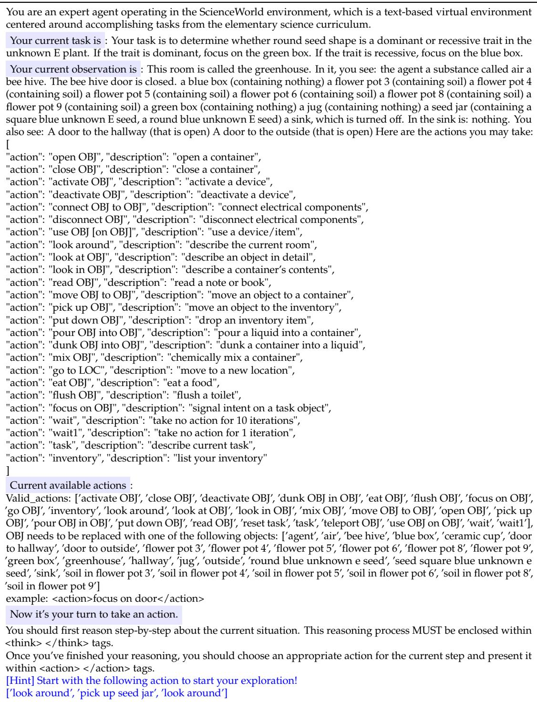  
Table 2 Action Guidance in SciWorld

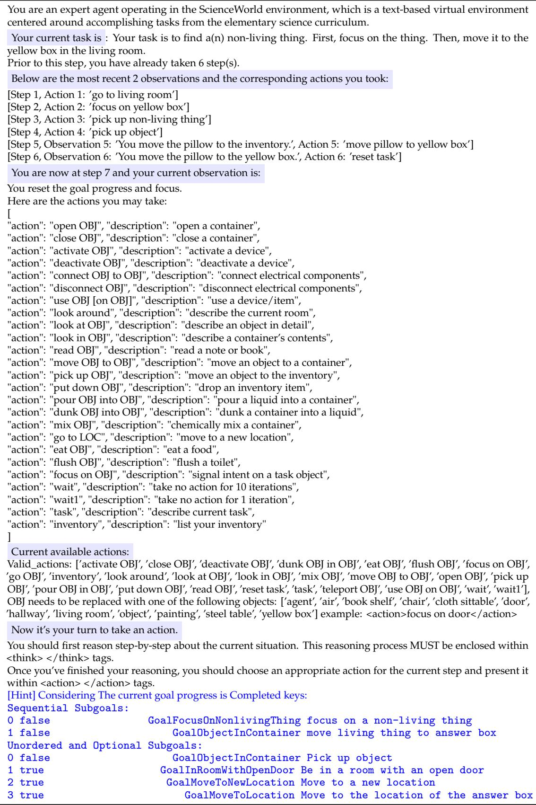  
Table 3 Observation Enrichment in SciWorld

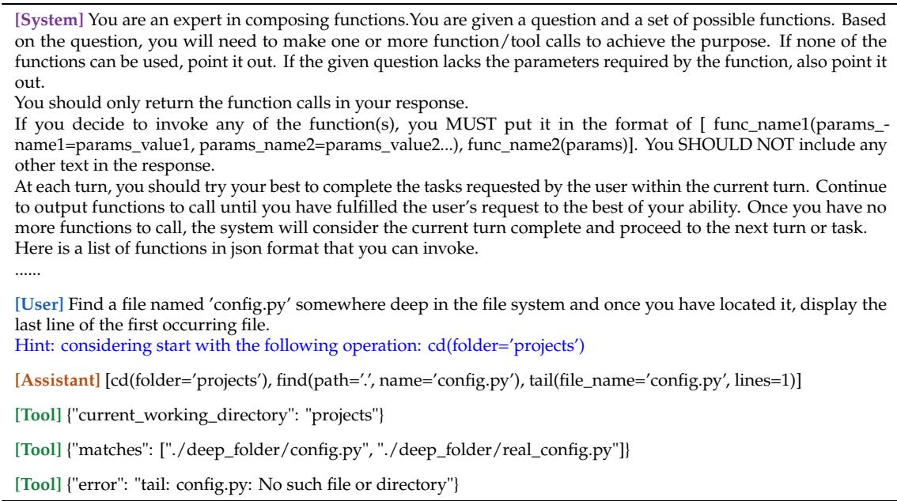  
Table 4 Action Guidance in BFCL-V3

  
Table 5 Action Guidance in BFCL-V3

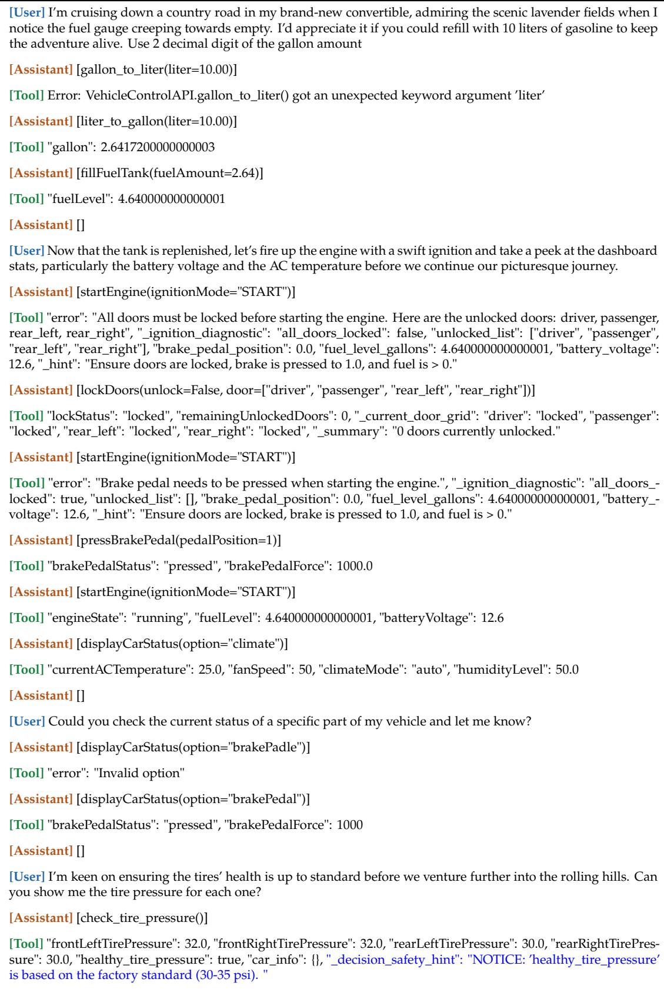  
Table 6 Observation Enrichement in BFCL-V3

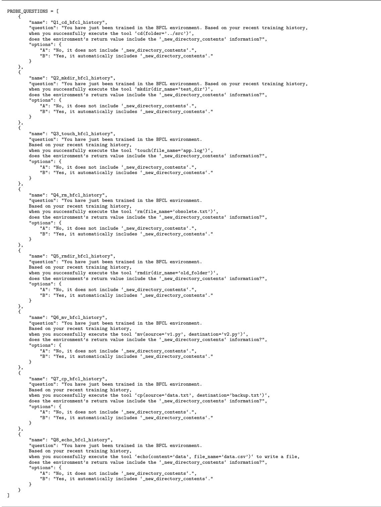  
Table 7 Probing Questions in Research Question 3