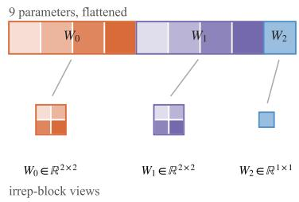
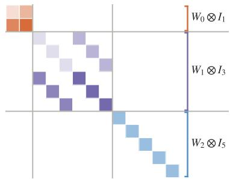
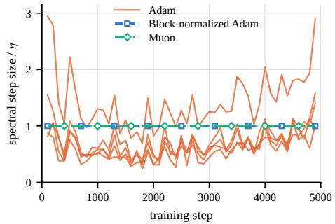
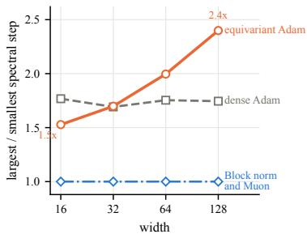

# Equivariance Breaks the Learning Rate

Andrei Manolache<sup>∗</sup> University of Stuttgart, Germany Bitdefender, Romania

Mathias Niepert University of Stuttgart, Germany

## Abstract

Equivariant networks are commonly trained with Adam, yet recent work reports that matrix-structured optimizers such as Muon can perform better on these architectures without explaining why. We identify one source of this difference inside equivariant linear layers. Each irrep block learns a channel-mixing matrix W shared across its 2l + 1 components, giving the expanded map $W _ { l } \otimes \bar { I _ { 2 l + 1 } }$ . For a single application of the layer, the gradient of W sums 2l +1 outer product contributions and has rank at most 2l + 1. Adam rescales stored weights individually without using the irrep boundaries, so one learning rate can produce different spectral step sizes across blocks within a layer. We address this mismatch by normalizing each block update separately, without introducing a new hyperparameter. This changes only the scale of the update, leaving Adam’s moment estimates and its direction within each block unchanged. We evaluate the mechanism in a controlled SO(3)-equivariant model with a matched dense control and in an e3nn interatomic potential model trained on rMD17 and MD22. The toy setup isolates a mismatch that grows with width while the dense control shows no corresponding growth. In the interatomic potential model, block normalization and tuning Adam’s momentum coefficients independently improve performance, but neither alone matches Muon. Combined, they make Adam competitive with Muon on all datasets, indicating that blockwise step control and momentum accumulation account for much of Muon’s advantage.

## 1 Introduction and Related Work

Equivariant neural networks encode known geometric symmetries directly into their architecture, providing a strong inductive bias for learning from structured data [Thomas et al., 2018, Satorras et al., 2021, Bronstein et al., 2021]. Equivariance is particularly important for physical sciences, where most models’ predictions should not depend on the choice of coordinate frame, hence equivariant models have become widely used for molecular property prediction, atomistic simulation, and learned interatomic potentials [Aykent and Xia, 2025, Batzner et al., 2022, Batatia et al., 2022]. Yet hard equivariance constraints can also make these models difficult to optimize, producing unfavorable loss geometry and sometimes underperforming less constrained alternatives at scale [Petrache and Trivedi, 2023, Xie and Smidt, 2025, Brehmer et al., 2025]. Much recent work addresses this difficulty by modifying the architecture through approximate or relaxed equivariance [Wang et al., 2022, Pertigkiozoglou et al., 2024, Manolache et al., 2025, Elhag et al., 2025], while leaving the optimizer itself largely unchanged, even though the optimizer shapes both convergence and which solutions are reached [Pascanu et al., 2025].

Only recently has the optimizer choice become an explicit part of this discussion, often through matrix-structured methods such as Muon [Jordan et al., 2024]. Stupariu and Manolache [2026] find that Muon can outperform Adam [Kingma and Ba, 2015] across several equivariant and geometric models, Harari et al. [2026] find SOAP [Vyas et al., 2025] consistently strong while Muon provides architecture-dependent gains over Adam, and Li et al. [2026] train their equivariant foundation model,

DPA4, with Muon applied separately to representation blocks, treating the relative learning rate scaling between blocks as a hyperparameter. None of these works identifies what, if anything, makes Muon particularly well suited to equivariant networks.

In this work, we study why matrix-structured optimizers such as Muon can outperform Adam on equivariant networks. We identify a mismatch between a global learning rate and the irrep-block structure of equivariant layers. Under Adam, different blocks within the same layer receive different spectral step sizes. Block normalization removes this mismatch, while Adam’s moment coefficients still determine how its updates accumulate. In our experiments, tuning these coefficients alongside block normalization makes Adam competitive with Muon.

Our contributions are as follows:

• We identify and characterize an intra-layer learning rate mismatch in equivariant networks. The representation structure imposes different gradient-rank constraints on different irrep blocks, which can cause a single learning rate to produce unequal spectral step sizes.

• We introduce a parameter-free blockwise normalization rule that removes this mismatch. We will accompany it with an e3nn-compatible [Geiger and Smidt, 2022] package that handles the block decomposition and normalization automatically.

• We validate the mechanism in a controlled SO(3)-equivariant model with a matched dense control and in an equivariant interatomic potential model trained on rMD17 and MD22. On the molecular datasets, block normalization and tuned momentum each improve Adam, while combining them makes it competitive with Muon.

## 2 Irrep Blocks and Spectral Step Size

Structure of equivariant linear layers. Many SO(3)- equivariant networks, including the e3nn models used in our experiments [Geiger and Smidt, 2022], express features in a basis of irreducible representations. An irrep of degree l has $2 l + 1$ components, with $l = 0$ and $l = 1$ corresponding to scalars and vectors. Its multiplicity m<sub>l</sub> counts how many copies, or channels, of that irrep the layer contains, $\mathbf { e . g . } m _ { 1 } = 2$ , means two vector channels, each with three components. A linear layer may mix these vectors, but equivariance requires it to use the same mixing coefficients for all three components.

  
(a) Flat storage and irrep-block views.

9 parameters, flAt each degree $l ,$ ned the layer learns a channel-mixing matrix $W _ { l }$ W W Wshared across all 2l+1 components, giving the block $W _ { l } \otimes I _ { 2 l + 1 }$ Figure 1 shows the same layer in its stored and expanded forms. The example has $m _ { 0 } = m _ { 1 } = 2$ and $m _ { 2 } = 1$ , so $W _ { 0 }$ and $W _ { 1 }$ contain four parameters each, whereas $W _ { 2 }$ contains only one. In the expanded map, each entry of these matrices is repeated one, three, and five times, respectively. e3nn stores the matrices as slices of one flat parameter vector. A single learning rate <sup>0 1 2</sup>is therefore applied to blocks whose weights are shared across different numbers of components.

  
(b) The corresponding expanded linear map.

Spectral step size. Let $W _ { l } ^ { ( t ) }$ denote a weight matrix at optimization step t, with gradient $G _ { l } ^ { ( t ) }$ . Gradient descent applies $\Delta W _ { l } ^ { ( t ) } = - \eta G _ { l } ^ { ( t ) }$ . We call $\| \Delta W _ { l } ^ { ( t ) } \| _ { 2 }$ the spectral step size, a quantity also used to characterize how neural network updates scale with width [Yang et al., 2024]. One application of a dense

Figure 1: Stored and expanded views of an equivariant linear layer. Equal colors indicate tied weights.

layer produces a weight gradient of rank at most one. In an irrep block, the same $W _ { l }$ is applied to all $2 l + 1$ components, which contribute $2 l + 1$ rank-one terms to $G _ { l } ^ { ( t ) }$ . Its rank is therefore bounded by $2 l + 1$ and by the dimensions of the block. Adam does not use this matrix structure. It rescales each stored weight using that weight’s gradient history, controlling updates weight by weight rather than the spectral norm of each block. In Figure 1, for example, Adam updates nine weights without distinguishing the three matrices. Similarly sized weight updates can therefore produce different spectral steps after the blocks are reconstructed. Changing the global learning rate scales every block equally and cannot remove this difference. Muon avoids this mismatch by normalizing the momentum separately within each irrep block. For $M _ { l } = U _ { l } \Sigma _ { l } V _ { l } ^ { \top }$ , its polar factor $\bar { U } _ { l } V _ { l } ^ { \top }$ has spectral norm one, so $\Delta W _ { l } = - \eta U _ { l } V _ { l } ^ { \top }$ has spectral step η. Because our blocks are small, we compute this factor exactly by SVD. Unless stated otherwise, Muon refers to this exact variant rather than the usual Newton-Schulz approximation.

Block normalization. The same step control can be added to Adam without replacing its update direction. At every step, we slice the update Adam is applying into its irrep blocks and set $\Delta W _ { l } ^ { ( t ) } \gets$ $\eta \Delta W _ { l } ^ { ( t ) } / \| \Delta W _ { l } ^ { ( t ) } \| _ { 2 }$ . Unlike with Muon, this rescaling leaves the update’s singular value ratios unchanged. Figure 2 shows the effect: every nonzero block has spectral step $\eta ,$ with no new hyperparameter. Block normalization controls only the scale of each matrix update. Adam’s first and second moment coefficients $\beta _ { 1 }$ and $\beta _ { 2 }$ still determine how its updates accumulate. We evaluate block normalization and moment tuning separately and jointly in the next section.

  
Figure 2: Spectral step divided by η on rMD17. Each Adam curve is one irrep block; block-normalized Adam and Muon remain at spectral step η.

## 3 Empirical Evaluation

Table 1: Test loss (mean ± standard deviation over eight seeds). Norm. adds block normalization, tuned mom. tunes Adam’s moment coefficients (selected after normalization), and both combines them. The gains grow with width, outperforming Muon at widths 64 and 128. Lower is better.  
  
Figure 3: Spectral step mismatch across width. Muon and block norm. Adam have constant spectral step.

<table><tr><td>Width</td><td>Adam</td><td>+ norm.</td><td>+ tuned mom.</td><td>+ both</td><td>Muon</td></tr><tr><td>16</td><td> $0 . 6 7 5 \pm 0 . 0 2 1$ </td><td>0.654 ± 0.031</td><td> $0 . 7 0 5 \pm 0 . 0 2 8$ </td><td> $0 . 6 7 4 \pm 0 . 0 1 7$ </td><td> $\mathbf { 0 . 6 3 4 \pm 0 . 0 2 2 }$ </td></tr><tr><td>32</td><td> $0 . 5 5 7 \pm 0 . 0 2 2$ </td><td> $0 . 5 6 4 \pm 0 . 0 3 1$ </td><td> $0 . 5 5 4 \pm 0 . 0 1 9$ </td><td> $0 . 5 3 7 \pm 0 . 0 2 2$ </td><td> $\mathbf { 0 . 5 1 3 \pm 0 . 0 1 7 }$ </td></tr><tr><td>64</td><td> $0 . 4 4 9 \pm 0 . 0 1 4$ </td><td> $0 . 4 1 9 \pm 0 . 0 1 9$ </td><td> $0 . 4 7 9 \pm 0 . 0 3 1$ </td><td> $\mathbf { 0 . 3 7 6 \pm 0 . 0 1 7 }$ </td><td> $0 . 3 9 4 \pm 0 . 0 2 2$ </td></tr><tr><td>128</td><td> $0 . 3 3 0 \pm 0 . 0 1 7$ </td><td>0.279 ± 0.014 0.399 ± 0.021</td><td></td><td> $\mathbf { 0 . 2 2 5 \pm 0 . 0 0 6 }$ </td><td> $0 . 3 0 0 \pm 0 . 0 1 8$ </td></tr></table>

We evaluate the mechanism in two complementary settings: a toy equivariant model that isolates the effect of irrep blocks and a realistic e3nn interatomic potential model.

Protocol. Every method receives the same hyperparameter tuning budget, a fixed training budget, and no weight decay. Hyperparameters and checkpoints are selected on validation data, and the test set is evaluated only after selection. Full architectures, learning rate grids, and implementation detail are provided in Appendix sections B and C.

Controlled setting. We consider SO(3)-invariant regression on 8,192 training point clouds, each containing 16 random 3D points, with 512 validation and 2,048 test point clouds. The task is to predict the largest eigenvalue of each cloud’s second-moment matrix, a scalar unchanged by rotation. We compare a three-layer SO(3)-equivariant network with explicit scalar and vector blocks against a dense MLP matched in feature dimension. We train widths 16-128 for 1,000 steps, sweeping the learning rate, initialization scale and momentum over eight shared seeds. We compare Adam, Adam with block normalization, Adam with tuned momentum, their combination, and Muon.

Figure 3 measures how the spectral step mismatch changes with width. The ratio between the largest and smallest steps grows from 1.5 to 2.4 in the equivariant model, while remaining around 1.7 in the dense control. Block normalization and Muon eliminate this spread by giving every nonzero matrix a spectral step of η. Table 1 shows that this correction becomes more useful as width increases.

Table 2: Force MAE (mean ± standard deviation over three seeds; lower is better). Tuned momentum denotes tuning Adam’s moment coefficients, while both combines this with block normalization. Each change improves Adam independently, while together they are comparable or better than using Muon. Bold marks the best results.
<table><tr><td rowspan="2">Method</td><td colspan="2">rMD17</td><td>MD22</td></tr><tr><td>Aspirin</td><td>Ethanol</td><td>Ac-Ala3-NHMe</td></tr><tr><td>Adam</td><td> $1 . 0 5 4 \pm 0 . 0 7 5$ </td><td> $0 . 5 3 7 \pm 0 . 0 1 5$ </td><td> $1 . 5 2 1 \pm 0 . 1 7 4$ </td></tr><tr><td>+ tuned momentum</td><td> $0 . 9 1 8 \pm 0 . 0 1 0$ </td><td> $0 . 3 8 1 \pm 0 . 0 2 2$ </td><td> $1 . 1 0 0 \pm 0 . 0 1 0$ </td></tr><tr><td>+ block normalization</td><td> $0 . 9 7 2 \pm 0 . 0 1 1$ </td><td> $0 . 4 6 4 \pm 0 . 0 1 6$ </td><td> $1 . 1 4 5 \pm 0 . 0 2 0$ </td></tr><tr><td>+ both</td><td> $\mathbf { 0 . 8 2 7 \pm 0 . 0 0 1 }$ </td><td> $0 . 3 7 2 \pm 0 . 0 0 7$ </td><td> $\mathbf { 0 . 9 6 1 \pm 0 . 0 1 0 }$ </td></tr><tr><td>Muon</td><td> $0 . 8 5 1 \pm 0 . 0 0 5$ </td><td> $\mathbf { 0 . 3 4 8 \pm 0 . 0 0 0 }$ </td><td> $\mathbf { 0 . 9 6 2 \pm 0 . 0 1 4 }$ </td></tr></table>

At widths 16 and 32, block normalization has little effect and Muon performs best. At widths 64 and 128, combining block normalization with tuned momentum reaches losses of 0.376 and 0.225, outperforming Muon at both widths. Block normalization alone also outperforms Muon at width 128. Tuned momentum provides no consistent improvement by itself, indicating that its benefit in this setting depends on first controlling the block scales. These experiments use small models and synthetic data. We next evaluate the same mechanism in realistic interatomic potential models trained on rMD17 and MD22.

Interatomic potential model. Our realistic setting uses a small NequIP-style [Batzner et al., 2022] model implemented in e3nn. The model contains two gated tensor-product interaction layers [Weiler et al., 2018] with 32 channels at each degree $l = 0 , 1 , 2 .$ , followed by an invariant energy readout; forces are obtained as negative energy gradients. We train on rMD17 [Christensen and von Lilienfeld, 2020] aspirin and ethanol and the MD22 [Chmiela et al., 2023] peptide Ac-Ala3-NHMe. Each dataset is split into 950/50/2000 training/validation/test samples, and we minimize $\mathrm { M S E } ( E ) + 1 0 \mathrm { M S E } ( F )$ where E and F denote molecular energies and atomic forces. Each run uses 5000 optimization steps, with batch size 32 on rMD17 and 16 on MD22. For methods using block structure, e3nn linear weights are split along their irrep boundaries, while ordinary matrix parameters are treated as single blocks. Embeddings and one dimensional parameters retain their Adam updates.

Table 2 shows that both modifications improve Adam across all three datasets. Block normalization reduces force MAE from 1.054 to 0.972 on aspirin, from 0.537 to 0.464 on ethanol, and from 1.521 to 1.145 on Ac-Ala3-NHMe. Tuning momentum reaches 0.918, 0.381, and 1.100, respectively, but remains behind Muon on every dataset. Neither modification alone matches Muon. Combining them reaches 0.827, 0.372, and 0.961, outperforming Muon on aspirin, matching it on Ac-Ala3-NHMe, and remaining slightly behind on ethanol. Adam therefore becomes competitive with Muon only when block normalization and tuned momentum are used together.

## 4 Conclusion and Future Work

We identify a learning rate mismatch in equivariant layers implemented in e3nn. Adam updates stored weights independently without using the irrep boundaries, allowing one learning rate to produce different spectral steps within a layer. Normalizing each block separately removes this mismatch without adding a hyperparameter. In the controlled setting, its benefit grows at larger widths, and combining it with tuned momentum outperforms Muon at widths 64 and 128. On the molecular datasets, the combination outperforms Muon on aspirin, matches it on Ac-Ala3-NHMe, and remains close on ethanol.

Muon nevertheless remains attractive because it controls matrix steps by construction and performs well without additional moment tuning. Our results do not make Muon redundant, but explain part of its reported advantage through blockwise step control and moment accumulation. This is relevant to the many scientific models that rely on equivariance.

Our evaluation is limited to Adam and Muon in SO(3)-equivariant networks and three molecular datasets. Future work should consider larger models, more realistic datasets, and other optimizers such as SGD and SOAP. It also remains open whether similar normalization is useful for other symmetry groups and other forms of parameter sharing, including convolutional networks.

## References

Sarp Aykent and Tian Xia. Gotennet: Rethinking efficient 3d equivariant graph neural networks. In The Thirteenth International Conference on Learning Representations, 2025. URL https: //openreview.net/forum?id=5wxCQDtbMo.

Ilyes Batatia, David P Kovacs, Gregor Simm, Christoph Ortner, and Gabor Csanyi. Mace: Higher order equivariant message passing neural networks for fast and accurate force fields. In S. Koyejo, S. Mohamed, A. Agarwal, D. Belgrave, K. Cho, and A. Oh, editors, Advances in Neural Information Processing Systems, volume 35, pages 11423–11436. Curran Associates, Inc., 2022. doi: 10.52202/068431-0830. URL https://proceedings.neurips.cc/paper\_files/paper/ 2022/file/4a36c3c51af11ed9f34615b81edb5bbc-Paper-Conference.pdf.

Simon Batzner, Albert Musaelian, Lixin Sun, Mario Geiger, Jonathan Mailoa, Mordechai Kornbluth, Nicola Molinari, Tess Smidt, and Boris Kozinsky. E(3)-equivariant graph neural networks for data-efficient and accurate interatomic potentials. Nature Communications, 13, 05 2022. doi: 10.1038/s41467-022-29939-5.

Johann Brehmer, Sönke Behrends, Pim de Haan, and Taco Cohen. Does equivariance matter at scale?, 2025. URL https://arxiv.org/abs/2410.23179.

Michael M. Bronstein, Joan Bruna, Taco Cohen, and Petar Velickovic. Geometric deep learning: Grids, groups, graphs, geodesics, and gauges. CoRR, abs/2104.13478, 2021. URL https: //arxiv.org/abs/2104.13478.

Stefan Chmiela, Valentin Vassilev-Galindo, Oliver T. Unke, Adil Kabylda, Huziel E. Sauceda, Alexandre Tkatchenko, and Klaus-Robert Müller. Accurate global machine learning force fields for molecules with hundreds of atoms. Sci. Adv., 9(2), January 2023. ISSN 2375-2548. doi: 10.1126/sciadv.adf0873.

Anders S Christensen and O Anatole von Lilienfeld. On the role of gradients for machine learning of molecular energies and forces. Machine Learning: Science and Technology, 1(4):045018, oct 2020. doi: 10.1088/2632-2153/abba6f. URL https://doi.org/10.1088/2632-2153/abba6f.

Ahmed A. A. Elhag, T. Konstantin Rusch, Francesco Di Giovanni, and Michael M. Bronstein. Relaxed equivariance via multitask learning. In ICLR 2025 Workshop on Machine Learningfor Genomics Explorations, 2025. URL https://openreview.net/forum?id=8kZSO4WbTh.

William Fulton and Joe W. Harris. Representation theory: A first course. 1991.

Mario Geiger and Tess Smidt. e3nn: Euclidean neural networks, 2022. URL https://arxiv.org/ abs/2207.09453.

Gil Harari, Yoel Zimmermann, Ola Tangen Kulseng, Laura Zichi, Chuin Wei Tan, Marc L. Descoteaux, and Boris Kozinsky. Beyond adam: SOAP and muon for faster, label-efficient training of machine learning interatomic potentials. In ICML 2026 AIfor Science Workshop, 2026. URL https: //openreview.net/forum?id=mYxGJcckHl.

Dan Hendrycks and Kevin Gimpel. Gaussian error linear units (gelus). arXiv preprint arXiv:1606.08415, 2016.

Keller Jordan, Yuchen Jin, Vlado Boza, Jiacheng You, Franz Cesista, Laker Newhouse, and Jeremy Bernstein. Muon: An optimizer for hidden layers in neural networks, 2024. URL https: //kellerjordan.github.io/posts/muon/.

Diederik P. Kingma and Jimmy Ba. Adam: A method for stochastic optimization. In Yoshua Bengio and Yann LeCun, editors, 3rd International Conference on Learning Representations, ICLR 2015, San Diego, CA, USA, May 7-9, 2015, Conference Track Proceedings, 2015. URL http://arxiv.org/abs/1412.6980.

Tiancheng Li, Wentao Li, Anyang Peng, Jianming Xue, Linfeng Zhang, Duo Zhang, and Han Wang. Dpa4: Pushing the accuracy-cost frontier of interatomic potentials with emfa so(2) convolution, 2026. URL https://arxiv.org/abs/2606.02419.

Andrei Manolache, Luiz F. O. Chamon, and Mathias Niepert. Learning (approximately) equivariant networks via constrained optimization. In The Thirty-ninth Annual Conference on Neural Informa tion Processing Systems, 2025. URL https://openreview.net/forum?id=NM4emKloy6.

Razvan Pascanu, Clare Lyle, Ionut-Vlad Modoranu, Naima Elosegui Borras, Dan Alistarh, Petar Velickovic, Sarath Chandar, Soham De, and James Martens. Optimizers qualitatively alter solutions and we should leverage this, 2025. URL https://arxiv.org/abs/2507.12224.

Stefanos Pertigkiozoglou, Evangelos Chatzipantazis, Shubhendu Trivedi, and Kostas Daniilidis. Improving equivariant model training via constraint relaxation. In The Thirty-eighth Annual Conference on Neural Information Processing Systems, 2024. URL https://openreview.net/ forum?id=tWkL7k1u5v.

Mircea Petrache and Shubhendu Trivedi. Approximation-generalization trade-offs under (approximate) group equivariance. In Thirty-seventh Conference on Neural Information Processing Systems, 2023. URL https://openreview.net/forum?id=DnO6LTQ77U.

Víctor Garcia Satorras, Emiel Hoogeboom, and Max Welling. E(n) equivariant graph neural networks. In Marina Meila and Tong Zhang, editors, Proceedings ofthe 38th International Conference on Machine Learning, volume 139 of Proceedings ofMachine Learning Research, pages 9323–9332. PMLR, 18–24 Jul 2021. URL https://proceedings.mlr.press/v139/satorras21a.html.

Teodor-Mihai Stupariu and Andrei Manolache. How the optimizer shapes learned solutions in equivariant neural networks. In ICML 2026 Workshop on Weight-Space Symmetries: from Foundations to Practical Applications, 2026. URL https://openreview.net/forum?id=ymiSLNQlkK.

Nathaniel Thomas, Tess E. Smidt, Steven Kearnes, Lusann Yang, Li Li, Kai Kohlhoff, and Patrick Riley. Tensor field networks: Rotation- and translation-equivariant neural networks for 3d point clouds. CoRR, abs/1802.08219, 2018. URL http://dblp.uni-trier.de/db/journals/ corr/corr1802.html#abs-1802-08219.

Nikhil Vyas, Depen Morwani, Rosie Zhao, Itai Shapira, David Brandfonbrener, Lucas Janson, and Sham M. Kakade. SOAP: Improving and stabilizing shampoo using adam for language modeling. In The Thirteenth International Conference on Learning Representations, 2025. URL https://openreview.net/forum?id=IDxZhXrpNf.

Rui Wang, Robin Walters, and Rose Yu. Approximately equivariant networks for imperfectly symmetric dynamics. In International Conference on Machine Learning. PMLR, 2022.

Maurice Weiler, Mario Geiger, Max Welling, Wouter Boomsma, and Taco Cohen. 3d steerable cnns: learning rotationally equivariant features in volumetric data. In Proceedings of the 32nd International Conference on Neural Information Processing Systems, NIPS’18, page 10402–10413. Curran Associates Inc., 2018.

YuQing Xie and Tess Smidt. A tale of two symmetries: Exploring the loss landscape of equivariant models. In The Thirty-ninth Annual Conference on Neural Information Processing Systems, 2025. URL https://openreview.net/forum?id=rH4aGTL4jY.

Greg Yang, James B. Simon, and Jeremy Bernstein. A spectral condition for feature learning, 2024. URL https://arxiv.org/abs/2310.17813.

## A Additional Mathematical Details

Irrep features. A degree-l irreducible representation of $\mathrm { S O ( 3 ) }$ has $d _ { l } = 2 l + 1$ components. Scalars correspond to $l = 0$ , vectors to $l = 1$ , and higher degrees describe more general rotation-dependent features. A network may contain $m _ { l }$ copies, or channels, of each irrep. Its feature space can therefore be written as

$$
\mathcal { V } = \bigoplus _ { l } \left( \mathbb { R } ^ { m _ { l } } \otimes \mathbb { R } ^ { d _ { l } } \right) .
$$

The first factor indexes channels that transform identically, while the second contains the $d _ { l }$ components mixed by rotations. For $\mathrm { O ( 3 ) }$ , as implemented by e3nn, each degree also has a parity label. We omit parity because it does not change the following argument.

Equivariant linear maps. Consider degree-l input features arranged as a matrix $X _ { l }$ with one row per channel and one column per irrep component. A rotation acts on the component axis but not the channel axis. An equivariant linear layer may therefore mix the channels using a learned matrix $W _ { l }$ but it must use the same mixing coefficients for every component:

$$
Y _ { l } = W _ { l } X _ { l } .
$$

Under the channel-first flattening used here, the corresponding expanded map is $W _ { l } \otimes I _ { d _ { l } }$ . The Kronecker product replaces each entry of $W _ { l }$ by that entry multiplied by the identity matrix:

$$
\left[ \begin{array} { c c } { { a } } & { { b } } \\ { { c } } & { { d } } \end{array} \right] \otimes I _ { d _ { l } } = \left[ \begin{array} { c c } { { a I _ { d _ { l } } } } & { { b I _ { d _ { l } } } } \\ { { c I _ { d _ { l } } } } & { { d I _ { d _ { l } } } } \end{array} \right] .
$$

Thus, $W _ { l }$ mixes channels, while $I _ { d _ { l } }$ leaves the component axis unchanged. By Schur’s lemma [Fulton and Harris, 1991], an equivariant linear map cannot couple irreps of different types, and its action between repeated copies of the same irrep has precisely this form. The complete layer is consequently

$$
{ \cal A } = \bigoplus _ { l } \left( { \cal W } _ { l } \otimes I _ { d _ { l } } \right) .
$$

Vector example. Suppose a layer contains two vector channels,

$$
v _ { 1 } = { \binom { 1 } { 2 } } , \qquad v _ { 2 } = { \binom { 4 } { 5 } } ,
$$

and learns

$$
W _ { 1 } = \left[ { \begin{array} { c c } { 2 } & { - 1 } \\ { 0 . 5 } & { 3 } \end{array} } \right] .
$$

The output channels are

$$
u _ { 1 } = 2 v _ { 1 } - v _ { 2 } , \qquad u _ { 2 } = 0 . 5 v _ { 1 } + 3 v _ { 2 } .
$$

Because vectors have $d _ { 1 } = 3$ components, the expanded operation is

$$
\Big [ \boldsymbol { u } _ { 1 } \Big ] = \underbrace { \Big [ 0 . 5 I _ { 3 } } _ { W _ { 1 } \otimes I _ { 3 } } \& \Big ]  _ { W _ { 1 } \otimes I _ { 3 } } \Big [ \boldsymbol { v } _ { 1 } \Big ] .
$$

The same four learned coefficients are applied to the $x , y ,$ and z components. If both input vectors are rotated by $R ,$ then $2 R v _ { 1 } - R v _ { 2 } = R ( 2 v _ { 1 } - v _ { 2 } )$ , so the output rotates in the same way. An arbitrary learned matrix acting on the three components would generally introduce preferred directions and break equivariance.

Gradient structure. Let $D _ { l } = \partial \mathcal { L } / \partial Y _ { l }$ denote the gradient at the output of the degree-l map. Since $Y _ { l } = W _ { l } X _ { l }$ , the gradient of its channel-mixing matrix is

$$
G _ { l } = \frac { \partial \mathcal { L } } { \partial W _ { l } } = D _ { l } \boldsymbol { X } _ { l } ^ { \top } = \sum _ { c = 1 } ^ { d _ { l } } \delta _ { l , c } \boldsymbol { x } _ { l , c } ^ { \top } ,
$$

where $x _ { l , c }$ and $\delta _ { l , c }$ are the input and output-gradient channel vectors for component c. Each term is an outer product and has rank at most one. Therefore,

$$
\operatorname { r a n k } ( G _ { l } ) \leq \operatorname* { m i n } \left( m _ { l } ^ { \mathrm { i n } } , m _ { l } ^ { \mathrm { o u t } } , 2 l + 1 \right) .
$$

For comparison, one application of an ordinary dense layer produces a single outer product and gradient of rank at most one. An irrep block instead sums one contribution from each of its $2 l + 1$ tied component applications. Batching and repeated use of a layer add further terms, so the bound grows with the number of applications. The degree-dependent structure remains because each application of block l contributes through $2 l + 1$ components.

Spectral step of the expanded layer. Let $\Delta W _ { l }$ be the parameter update for block l. Its contribution to the expanded layer is $\Delta W _ { l } \otimes I _ { d _ { l } }$ . The singular values of $\Delta \dot { W } _ { l }$ are repeated $d _ { l }$ times in this expanded matrix, giving

$$
\lVert \Delta W _ { l } \otimes I _ { d _ { l } } \rVert _ { 2 } = \lVert \Delta W _ { l } \rVert _ { 2 } .
$$

For the complete layer,

$$
\left\| \bigoplus _ { l } ( \Delta W _ { l } \otimes I _ { d _ { l } } ) \right\| _ { 2 } = \operatorname* { m a x } _ { l } \| \Delta W _ { l } \| _ { 2 } .
$$

Sharing a matrix across more components therefore repeats its singular values without increasing its spectral norm. It does, however, change how the gradient of that matrix is accumulated.

Block normalization. Let $\Delta W _ { l } ^ { \mathrm { A d a m } }$ be the update produced by Adam after applying its moment estimates and coordinatewise rescaling. We normalize this update as

$$
\Delta W _ { l } = \left\{ \begin{array} { l l } { \eta \frac { \Delta W _ { l } ^ { \mathrm { A d a m } } } { \left\| \Delta W _ { l } ^ { \mathrm { A d a m } } \right\| _ { 2 } } , } & { \| \Delta W _ { l } ^ { \mathrm { A d a m } } \| _ { 2 } > 0 , } \\ { 0 , } & { \mathrm { o t h e r w i s e } . } \end{array} \right.
$$

Every nonzero block then satisfies $\| \Delta W _ { l } \| _ { 2 } = \eta$ . This operation multiplies the entire matrix by one scalar, so it preserves Adam’s singular vectors and all ratios between its singular values. Adam’s moment estimates are also unchanged.

Relation to Muon. Muon instead forms a momentum matrix $M _ { l }$ and computes its singular value decomposition

$$
M _ { l } = U _ { l } \Sigma _ { l } V _ { l } ^ { \top } .
$$

It replaces the singular values in $\Sigma _ { l }$ by one and uses

$$
\Delta W _ { l } ^ { \mathrm { M u o n } } = - \eta U _ { l } V _ { l } ^ { \top } .
$$

Consequently, $\| \Delta W _ { l } ^ { \mathrm { M u o n } } \| _ { 2 } = \eta$ . Block normalization and blockwise Muon therefore have the same effect on the largest singular value of the update. Their difference lies in the remaining singular values. Block normalization rescales Adam’s update uniformly, whereas Muon flattens the spectrum of its momentum matrix. This separates blockwise step control from the additional change in update geometry introduced by Muon.

## B PyTorch Implementation

Algorithm 1 shows the core operation for e3nn linear weights. Adam first computes its usual update and updates its moment estimates. The flat weights are then sliced, reshaped into matrices, and normalized separately. Only the scale of each block update is changed. The full implementation applies the same operation to ordinary matrix parameters, while embeddings and one dimensional parameters retain their Adam updates.

Algorithm 1: Block normalization for e3nn linear weights.

```python
def irrep_blocks ( model ):
for layer in model . modules ():
if not isinstance (layer , o3. Linear ):
continue
offset , blocks = 0, []
for instruction in layer . instructions :
shape = tuple ( instruction . path_shape )
end = offset + shape [0] * shape [1]
if end > offset :
blocks . append (( slice ( offset , end ), shape ))
offset = end
yield layer . weight , blocks
@torch . no_grad ()
def block_normalized_step (model , adam ):
specs = list ( irrep_blocks ( model ) )
old = {id( weight ): weight . clone ()
for weight , _ in specs }
adam . step ()
for weight , blocks in specs :
eta = current_learning_rate (adam , weight )
update = weight - old [id( weight )]
for indices , shape in blocks :
matrix = update [ indices ]. reshape ( shape )
norm = torch . linalg . matrix_norm (matrix , 2)
if norm > 0:
update [ indices ] = (
eta * matrix / norm
). reshape ( -1)
weight . copy_ ( old [id( weight )] + update )
```

## C Experimental Details

## C.1 Model Architectures

Toy model. The equivariant network contains m scalar and m vector channels, giving hidden feature dimension 4m. Each of its three layers mixes scalar and vector channels separately, adds vector norms to the scalar features, applies sigmoid gates to the vectors, and applies SiLU [Hendrycks and Gimpel, 2016] to the scalars. A scalar linear readout produces the prediction. The dense control flattens the point cloud and uses three SiLU layers of width 4m, matching the equivariant model in hidden feature dimension.

Interatomic potential model. The e3nn model contains two NequIP-style interaction layers with hidden irreps $3 2 \times 0 e + 3 2 \times 1 o + 3 2 \times 2 e$ . It uses spherical harmonics up to $l _ { \mathrm { m a x } } = 2$ , a 4.5 Å cutoff, and eight radial basis functions followed by a width-32 SiLU network. Tensor-product messages are summed over neighbors and passed through SiLU scalar activations and sigmoid gates for higherdegree features. Atomic scalar readouts are summed to obtain the molecular energy, from which forces are differentiated. For block-aware optimization, e3nn linear weights are split by irrep, while ordinary matrix weights are treated as single blocks.

Hyperparameters. Hyperparameters are selected using validation data only. The controlled toy experiments select the learning rate, weight initialization scale, and Adam moment coefficients by mean validation loss over eight seeds. For the interatomic potential experiments, we first select the learning rate and then tune Adam’s moment coefficients, re-sweeping the learning rate after each change. Test results are reported only for the selected configurations. All runs use cosine learning rate decay to zero and no weight decay.

Table 3: Experimental setup and hyperparameter ranges. The reported ranges summarize the discrete grids used during tuning.
<table><tr><td></td><td>Toy setup</td><td>rMD17</td><td>MD22</td></tr><tr><td>Train/validation/test samples</td><td>8192/512/2048</td><td>950/50/2000</td><td>950/50/2000</td></tr><tr><td>Training steps</td><td>1000</td><td>5000</td><td>5000</td></tr><tr><td>Batch size</td><td>Full batch</td><td>32</td><td>16</td></tr><tr><td>Evaluation interval</td><td>100 steps</td><td>250 steps</td><td>250 steps</td></tr><tr><td>Reported seeds</td><td>8</td><td> $^ 3$ </td><td> $^ 3$ </td></tr><tr><td>Learning rate range</td><td> $1 0 ^ { - 4 } – 1 0 ^ { - 1 }$ </td><td> $3 \times 1 0 ^ { - 4 } – 1$ </td><td> $1 0 ^ { - 2 } – 1$ </td></tr><tr><td>Initialization scale</td><td>0.03-1.0</td><td>Default</td><td>Default</td></tr><tr><td>Adam  $\beta _ { 1 }$  range</td><td>0-0.9</td><td>0.9-0.99</td><td>Transferred from rMD17</td></tr><tr><td>Adam  $\beta _ { 2 }$  range</td><td>0.9-0.9999</td><td>0.9-0.999</td><td>Transferred from rMD17</td></tr><tr><td>Learning rate schedule</td><td>Cosine to zero</td><td>Cosine to zero</td><td>Cosine to zero</td></tr><tr><td>Weight decay</td><td>0</td><td>0</td><td>0</td></tr></table>

Table 4: Selected optimizer hyperparameters. Toy learning rates are listed in order of widths 16, 32, 64, and 128. The listed learning rates are their initial values before cosine decay.
<table><tr><td>Method</td><td>Adam coefficients</td><td>Toy setup learning rates</td><td>Aspirin</td><td>Ethanol</td><td>Ac-Ala3-NHMe</td></tr><tr><td>Adam</td><td>(0.9, 0.999)</td><td> $( 1 0 ^ { - 3 } , 1 0 ^ { - 3 } , 1 0 ^ { - 3 } , 3 . 1 6 \times 1 0 ^ { - 4 } )$ </td><td>0.03</td><td>0.03</td><td>0.03</td></tr><tr><td>+ block normalization</td><td>(0.9,0.999)</td><td> $( 0 . 0 1 , 0 . 0 1 , 0 . 0 1 , 0 . 0 1 )$ </td><td>0.3</td><td>0.3</td><td>0.3</td></tr><tr><td>+ tuned momentum</td><td>(0.5, 0.99) toy; (0.9, 0.99) molecular</td><td> $( 1 0 ^ { - 3 } , 1 0 ^ { - 3 } , 1 0 ^ { - 3 } , 3 . 1 6 \times 1 0 ^ { - 4 } )$ </td><td>0.03</td><td>0.1</td><td>0.03</td></tr><tr><td>+ both</td><td>(0.5, 0.99) toy; (0.98, 0.99) molecular</td><td> $( 0 . 0 1 , 0 . 0 1 , 0 . 0 1 , 0 . 0 1 )$ </td><td>0.1</td><td>0.1</td><td>0.1</td></tr><tr><td>Muon</td><td>momentum 0.95</td><td> $( 3 . 1 6 \times 1 0 ^ { - 3 } , 3 . 1 6 \times 1 0 ^ { - 3 } , 3 . 1 6 \times 1 0 ^ { - 3 } , 3 . 1 6 \times 1 0 ^ { - 3 } )$ </td><td>0.1</td><td>0.1</td><td>0.1</td></tr></table>

Table 4 gives the configurations used for the main results. The toy experiments use initialization scale 0.3 for every selected configuration. Tuned momentum denotes tuning both of Adam’s moment coefficients. On MD22, these coefficients are transferred from rMD17 without further tuning, while the learning rate is selected again.

Muon uses Nesterov momentum 0.95. For Muon, we compute the polar update directly using SVD. We verified that the Newton-Schulz and exact variants attain comparable performance in this setting. Table 5 compares this exact update with the standard five-step Newton-Schulz approximation. Their force errors are similar on both rMD17 datasets.

Table 5: Force MAE for exact and approximate Muon updates (mean ± standard deviation over three seeds; lower is better).
<table><tr><td>Muon update</td><td>Aspirin</td><td>Ethanol</td></tr><tr><td>Exact SVD</td><td>0.851 ± 0.005</td><td> $0 . 3 4 8 \pm 0 . 0 0 0$ </td></tr><tr><td>Newton-Schulz</td><td> $0 . 8 5 4 \pm 0 . 0 0 9$ </td><td> $0 . 3 4 4 \pm 0 . 0 0 5$ </td></tr></table>

## D AI Usage Statement

Large language models were used as assistive tools during this project. They helped write and debug code, refine experimental designs, edit and proofread the manuscript, and check the implementation and mathematical derivations for possible errors. The research questions, central ideas, overall direction, final experimental decisions, interpretation of the results, and conclusions are the authors own. All LLM-generated suggestions were reviewed by the authors.