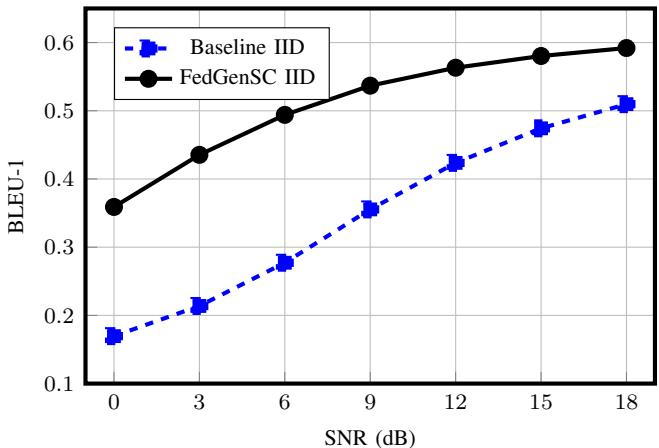
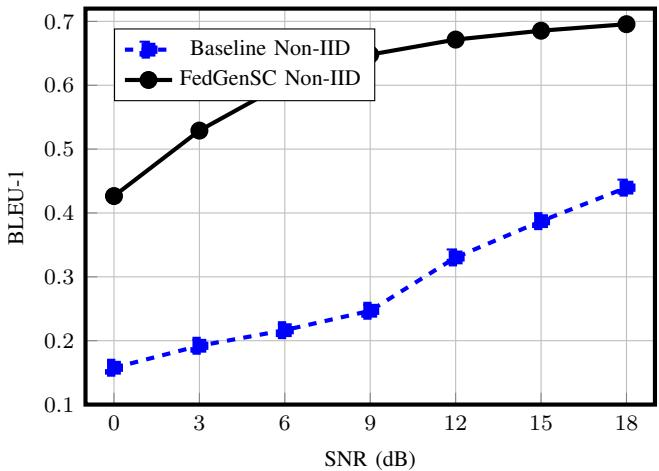
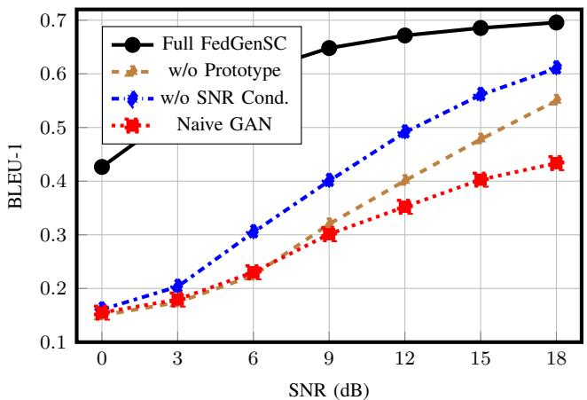

# FedGenSC: Federated Generative Semantic Communication with Channel-Aware Adaptation

Rita Abou Fares†, Razan Al Kakoun†, Maher Nouiehed∗, Hadi Sarieddeen†

†Department of Electrical and Computer Engineering, American University of Beirut, Beirut, Lebanon

∗Department of Industrial Engineering, American University of Beirut, Beirut, Lebanon

rja62@mail.aub.edu, rra65@mail.aub.edu, maher.nouiehed@aub.edu.lb, hadi.sarieddeen@aub.edu.lb

Abstract—Integrating generative adversarial networks (GANs) into federated semantic communication (SemCom) is a natural progression, as generative priors can recover semantic fidelity under channel distortion that discriminative decoders cannot. However, naive GAN federation introduces three failure modes that prior work has, to the best of our knowledge, neither identified nor resolved: discriminator aggregation instability under non-independent and identically distributed (non-IID) data, semantic drift caused by divergent local embedding spaces, and channel-agnostic generation that cannot adapt to heterogeneous link conditions. We propose federated generative semantic communication (FedGenSC), which mitigates all three by employing a global generator with local-only discriminators, providing cross-client semantic information through a semantic prototype bank, and conditioning generation on the instantaneous signalto-noise ratio (SNR). Experiments on the Europarl dataset over Rayleigh fading channels (K=10 clients, Dirichlet α=0.5) show that FedGenSC under non-IID data outperforms the FedDeepSC baseline across the tested SNR range, achieving up to a 58.2% relative improvement in bilingual evaluation understudy (BLEU)-1 at 18 dB. Ablation studies confirm the independent contribution of each component.

Index Terms—Semantic communication, federated learning, generative adversarial networks, channel conditioning, non-IID.

## I. INTRODUCTION

The development of sixth-generation (6G) wireless networks has motivated communication paradigms that go beyond classical Shannon-theoretic bit-centric communication [1]. Semantic communication (SemCom) has emerged as a promising approach that prioritizes the transmission of task-relevant information rather than exact bit sequences [2]. When combined with joint source-channel coding (JSCC), SemCom can improve bandwidth efficiency and robustness under adverse channel conditions [3].

The DeepSC framework [3] established Transformer-based semantic coding as a foundation for text-oriented SemCom, jointly optimizing source and channel coding to preserve semantic information over noisy channels. Recent work has further investigated DeepSC under realistic channel conditions and semantic-aware adaptation to channel quality [4], [5].

However, envisioned 6G applications are expected to involve distributed, privacy-sensitive, and heterogeneous data, which can make centralized training impractical. Federated learning (FL) [6] enables collaborative model optimization without exchanging raw data and has recently gained attention in Sem-Com [7]–[9]. Recent studies have explored dynamic aggregation weighting for time-varying channels [9], loss-weighted partial updates [10], Byzantine-resilient aggregation [7], and trustworthy federated SemCom for Metaverse applications [8].

Despite these advances, existing federated SemCom frameworks rely on discriminative decoders and standard aggregation strategies. Incorporating GANs [11] is a natural next step, as generative priors can recover semantic fidelity under channel distortion that discriminative decoders may not fully mitigate [12]. In centralized settings, GANs have been shown to suppress channel distortion without requiring full channel state information (CSI) [13]. Federated GAN training has also been explored in non-SemCom contexts [14], without addressing the semantic and channel-specific deployment challenges.

However, extending GAN-based SemCom approaches to the federated setting introduces three fundamental challenges: (P1) discriminator aggregation instability under nonindependent and identically distributed (non-IID) data can lead to generator collapse; (P2) semantic drift, whereby divergent local embedding spaces can degrade the aggregated generator’s performance on local clients; and (P3) channelagnostic generation, whereby a generator that is unaware of the instantaneous channel state cannot pre-adapt its output to heterogeneous link conditions. To the best of our knowledge, these three problems have not been jointly characterized and addressed in prior federated SemCom literature, forming the core contribution of this work.

A natural solution is to introduce a semantic pre-coding component, a module that rectifies distortions arising from channel noise before transmission. However, such a component cannot be naively deployed at local clients in a federated setting: under non-IID data and heterogeneous channels, each client would learn a locally biased corrector, and aggregating these correctors could be unstable. We propose a GAN-based structure in which only the generator is federated, acting as a shared semantic pre-equalizer, while discriminators remain local. Classical signal-domain precoders [15] typically rely on full channel state information (CSI), while neural network precoders [16] learn precoding mappings from CSI. In contrast, the proposed federated generative semantic communication (FedGenSC) pre-equalizes in the semantic embedding space using only a scalar signal-to-noise ratio (SNR) estimate, a distinction that makes it well suited to federated, privacyconstrained deployments.

To address P1–P3 jointly, the proposed FedGenSC builds on three principled design elements: generator-only federation with local-only discriminators, a semantic prototype bank for cross-client embedding grounding, and channel-stateconditioned generation. Experiments on the Europarl dataset under Rayleigh fading show that FedGenSC addresses the three identified failure modes of GAN federation, with the contribution of each design element independently evaluated through controlled ablation studies.

## II. PROBLEM FORMULATION

## A. System Model

Consider a federated SemCom system with one central server and K clients indexed by $k \in \{ 1 , \ldots , K \}$ . Each client k holds a local text dataset $\mathcal { D } _ { k } = \{ \mathbf { s } _ { i } ^ { ( k ) } \} _ { i = 1 } ^ { N _ { k } }$ , where each sentence $\mathbf { s } _ { i } ^ { ( k ) }$ is drawn from a local distribution $\mathcal { P } _ { k }$ . In the non-IID setting, $\mathcal { P } _ { i } \neq \mathcal { P } _ { j }$ for $i \neq j \ [ 1 7 ]$ , meaning that clients hold data drawn from different local distributions. Each client operates a local instance of DeepSC [3], a Transformer-based semantic codec. The semantic encoder $f _ { \alpha }$ maps an input sentence s, tokenized to length $T ,$ , to a sequence of semantic embeddings $\mathbf { E } = f _ { \alpha } ( \mathbf { s } ) \in \mathbb { R } ^ { \mathbf { \breve { T } } \times d }$ , where d=128 is the model dimension and $\mathbf { e } _ { t } \in \mathbb { R } ^ { d }$ is the semantic representation of the t-th token. The channel encoder $f _ { \beta }$ compresses these embeddings from d=128 to 16 dimensions per token for transmission. At the receiver, the combined channel and semantic decoder $g _ { \delta }$ reconstructs the original sentence ˆs from the received signal.

Each client k experiences an independent Rayleigh fading channel with instantaneous SNR $\gamma _ { k }$ , computed from the noise variance $\sigma _ { k } ^ { 2 }$ as

$$
\gamma _ { k } ^ { \mathrm { d B } } = 1 0 \log _ { 1 0 } \biggl ( \frac { 1 } { 2 \sigma _ { k } ^ { 2 } } \biggr ) ,\tag{1}
$$

where the transmitted signal is normalized to unit average power, $\mathbb { E } [ \left. \mathbf { x } _ { k } \right. ^ { 2 } ] = 1$ , and the factor of 2 accounts for $\sigma _ { k } ^ { 2 }$ denoting the noise variance per real (in-phase or quadrature) dimension in Eq. (2), so that the total per-dimension complex noise power is $2 \sigma _ { k } ^ { 2 }$ . The received signal is

$$
\mathbf { y } _ { k } = \mathbf { h } _ { k } \odot \mathbf { x } _ { k } + \mathbf { n } _ { k } ,\tag{2}
$$

where $\mathbf { x } _ { k }$ is the power-normalized transmitted signal, ⊙ denotes element-wise multiplication, hk $\sim \mathcal { C N } ( \mathbf { 0 } , \mathbf { I } )$ is the Rayleigh fading vector, and $\mathbf { n } _ { k } \sim \mathcal { C N } ( \mathbf { 0 } , 2 \sigma _ { k } ^ { 2 } \mathbf { I } )$ is additive white Gaussian noise (AWGN).

## B. Federated Training Objective

The global objective is to find the shared parameters $\omega = \{ \alpha , \beta , \delta , \theta \}$ , where $\alpha , \beta , \delta ,$ and θ denote the semantic encoder, channel encoder, decoder, and generator parameters,

respectively, by minimizing the expected semantic distortion across all clients:

$$
\operatorname* { m i n } _ { \omega } \ \frac { 1 } { K } \sum _ { k = 1 } ^ { K } \mathbb { E } _ { \mathbf { s } \sim \mathcal { P } _ { k } } [ L _ { \mathrm { { s e m } } } ( \mathbf { s } , \hat { \mathbf { s } } ) ] ,\tag{3}
$$

subject to the constraint that no raw data $\mathcal { D } _ { k }$ are shared [6], [18]. Here, $L _ { \mathrm { s e m } } ( \mathbf { s } , \hat { \mathbf { s } } ) = - \sum _ { t } s _ { t }$ log $\hat { s } _ { t }$ is the token-level crossentropy loss. BLEU-1 is used in Section IV to evaluate the reconstruction quality obtained by minimizing this loss. The privacy constraint renders centralized DeepSC an unsuitable comparison as it requires pooling all $\mathcal { D } _ { k }$ on a single server.

## C. Challenges of Integrating GANs into Federated SemCom

1) P1 — Discriminator Aggregation Instability: Augmenting DeepSC with a generator $G _ { \theta }$ and discriminator $D _ { \phi } .$ , and aggregating both via federated averaging (FedAvg) [6], can lead to instability. Under non-IID data, local discriminators $D _ { \phi _ { k } }$ develop incompatible decision boundaries. Naively averaging their parameters, $\begin{array} { r } { \bar { \phi } = \frac { 1 } { K } \sum _ { k } \phi _ { k } } \end{array}$ , produces a global discriminator $D _ { \bar { \phi } }$ whose decision boundary need not correspond to any client’s local minimax solution,

$$
\operatorname* { m i n } _ { G } \operatorname* { m a x } _ { D _ { k } } L _ { \mathrm { a d v } } ( G , D _ { k } ) .\tag{4}
$$

Empirically, discriminator aggregation degrades BLEU-1 by 61.8% at 6 dB and falls below the no-GAN baseline at midto-high SNR.

2) $P 2$ — Semantic Drift: Under non-IID distributions, local embedding spaces $\{ f _ { \alpha } ( \mathcal { D } _ { k } ) \} _ { k = 1 } ^ { K }$ can diverge as each client’s encoder is fine-tuned on a different data distribution, so the same word or phrase can map to different regions of $\mathbb { R } ^ { d }$ across clients. The aggregated generator may consequently produce embeddings that deviate from the underlying client representations, a phenomenon we denote as semantic drift. We show empirically that addressing this problem yields a 62.8% improvement in BLEU-1 at 6 dB (Section IV).

3) P3 — Channel-Agnostic Generation: Clients operate under heterogeneous instantaneous SNRs $\gamma _ { k }$ . Let $\bar { \textbf { e } } \in \ \mathbb { R } ^ { d }$ denote the mean-pooled sentence embedding (check Eq. (6)). An idealized channel-conditioned generator objective is

$$
G ^ { * } ( \bar { \bf e } , \gamma ) = \underset { G } { \arg \operatorname* { m i n } } \ \mathbb { E } _ { { \bf h } , { \bf n } } [ L _ { \mathrm { s e m } } ( { \bf s } , g _ { \delta } ( { \bf y } ( \gamma , G ( \bar { \bf e } , \gamma ) ) ) ) ] _ { \mathrm { ~ } }\tag{5}
$$

where y is the received signal (Eq. (2)), which also depends on the channel encoder; this dependence is suppressed here for notational simplicity. A channel-agnostic generator $G ( \bar { \bf e } )$ neglects the dependence on γ. As a result, it can under-correct in low-SNR regimes and over-correct in high-SNR conditions, thereby distorting otherwise clean embeddings. In Section IV, we quantify the effect of addressing each of P1–P3 through controlled ablation, showing that SNR conditioning reduces BLEU-1 degradation by up to 49.4% at 6 dB.

## III. PROPOSED FRAMEWORK: FEDGENSC

## A. Overview and Design Principles

FedGenSC incorporates a conditional GAN that operates directly in the semantic embedding space. The generator is introduced after the semantic encoder: it takes the mean-pooled sentence embedding e¯ as input, along with the instantaneous SNR $\gamma _ { k } ^ { \mathrm { d B } }$ and a semantic prototype vector p, and produces a residual correction, a semantic correction vector, added to the original embedding prior to channel encoding.

The discriminator operates in the semantic embedding space, prior to channel encoding. It receives as input both the original mean-pooled embedding e¯ and the generatorcorrected embedding e˜, and is trained to distinguish between them. This design enables the generator to learn corrections that produce embeddings statistically indistinguishable from clean embeddings, which in turn improves robustness once these corrected embeddings are transmitted over the noisy channel. Operating in the semantic embedding space, rather than the raw signal space, reduces the complexity of learning meaningful corrections, since the embedding space is lowerdimensional than raw signals with high-dimensional noise patterns less directly aligned with semantic structure.

## B. System Architecture

The FedGenSC pipeline interposes a conditional GAN between the DeepSC semantic and channel encoders. Throughout, B denotes the batch size, T denotes the sequence length, and $d { = } 1 2 8$ denotes the model dimension. The Transformer encoder $f _ { \alpha }$ maps the tokenized input to $\mathbf { E } \in \mathbb { R } ^ { B \times T \times d }$ , whose t-th row (per batch element) is the token embedding $\mathbf { e } _ { t } \in \mathbb { R } ^ { d }$ introduced in Section II. A sentence-level representation is obtained by mean pooling:

$$
\bar { \mathbf { e } } = \frac { 1 } { T } \sum _ { t = 1 } ^ { T } \mathbf { e } _ { t } \in \mathbb { R } ^ { B \times d } .\tag{6}
$$

The generator $G _ { \theta }$ is a three-layer multilayer perceptron (MLP) $( 2 d + 1 ~  ~ 5 1 2 ~  ~ 2 5 6 ~  ~ d ,$ ≈296K parameters, <5% of DeepSC). It takes the concatenated input [e¯, $\boldsymbol { \gamma } _ { k } ^ { \mathrm { d B } } , { \bf p } ] \in \mathbb { R } ^ { 2 d + 1 }$ and produces a residual correction $\hat { \mathbf { e } } \in \mathbb { R } ^ { \mathit { \hat { B } } \times d }$ that is added to the encoder output:

$$
\begin{array} { r } { \tilde { \mathbf { E } } = \mathbf { E } + \hat { \mathbf { e } } \cdot \mathbf { 1 } ^ { \top } , \quad \tilde { \mathbf { E } } \in \mathbb { R } ^ { B \times T \times d } , } \end{array}\tag{7}
$$

where $\mathbf { 1 } \in \mathbb { R } ^ { T }$ is an all-ones vector and $( \cdot ) ^ { \top }$ denotes vector transpose, so that $\hat { \mathbf { e } } \cdot \mathbf { 1 } ^ { \top } \in \mathbb { R } ^ { B \times T \times d }$ broadcasts the correction across all T token positions.

The discriminator $D _ { \phi _ { k } }$ is a two-layer MLP with spectral normalization and a sigmoid activation. It takes as input $[ \bar { \mathbf e } , \tilde { \mathbf e } ] \in \mathbb R ^ { 2 d }$ , where $\tilde { \textbf { e } } = \bar { \textbf { e } } + \hat { \textbf { e } }$ is the generator-corrected embedding, and returns a probability in (0, 1). The discriminator is instantiated locally in each round and discarded after local training, directly addressing (P1). The corrected E˜ is then passed to the channel encoder and transmitted over the Rayleigh fading channel (Eq. (2)) for decoding by $g _ { \delta } .$

## C. Semantic Prototype Bank

To address (P2), we introduce a lightweight mechanism that aligns heterogeneous client semantic distributions without sharing raw data or gradients. Each client k constructs a compact summary of its local semantic space by performing k-means clustering over the sentence embeddings collected during the local training round:

$$
B _ { k } = \mathrm { K M e a n s } \left( \{ \bar { \bf e } _ { i } ^ { ( k ) } \} , { \cal P } \right) ,\tag{8}
$$

where $P$ is the number of centroids and $\bar { \mathbf { e } } _ { i } ^ { ( k ) } \in \mathbb { R } ^ { d }$ denotes the i-th sentence embedding at client k. Only these $P$ centroid vectors are transmitted to the server, reducing communication overhead while avoiding raw data sharing.

The server combines all local summaries into a global prototype bank $\textstyle B = \bigcup _ { k = 1 } ^ { K } B _ { k }$ , which is redistributed to all clients at the beginning of each round.

For each input embedding e¯, a prototype vector is selected as the centroid in the global bank with the highest cosine similarity:

$$
\mathbf { p } = \underset { \mathbf { c } \in B } { \arg \operatorname* { m a x } } ~ \frac { \bar { \mathbf { e } } \cdot \mathbf { c } } { \left\| \bar { \mathbf { e } } \right\| \left\| \mathbf { c } \right\| } , \quad \mathbf { p } \in \mathbb { R } ^ { B \times d } ,\tag{9}
$$

where the nearest-centroid search is performed independently for each of the B embeddings in a batch, yielding one prototype vector per sample. This prototype serves as a semantic anchor, providing global context about the position of the embedding relative to the union of client distributions: it help counteract misaligned embedding geometries that contribute to semantic drift, consistent with prior prototype-based approaches [19], [20], while conditioning the generator toward a globally consistent semantic space to improve robustness and generalization across clients. This mechanism introduces limited communication overhead, as each client transmits only $P \times d$ floating-point values per round (e.g., 2,560 values for $P = 2 0$ and $d = 1 2 8 )$ , linear in $P$ and d.

## D. Two-Timescale Local Training Protocol

In each communication round, client k executes two sequential phases. In the first phase, DeepSC is fine-tuned on the local dataset $\mathcal { D } _ { k }$ for $E { = } 3$ epochs using the semantic loss $L _ { \mathrm { s e m } }$ . During this phase, the generator $G _ { \theta }$ acts as a residual adapter, producing a correction that is added to the encoder output prior to channel encoding. In the second phase, the encoder parameters are fixed so that GAN training operates on a stable embedding space. A fresh discriminator $D _ { \phi _ { k } }$ is instantiated, while the generator is initialized from the global model $G _ { \bar { \theta } }$ . A two-timescale update scheme is used, with $n _ { D } { = } 5$ discriminator steps per generator step. Let

$$
\hat { \bf e } = G _ { \theta _ { k } } \left( \bar { \bf e } , \gamma _ { k } ^ { \mathrm { d B } } , { \bf p } \right) , \qquad \tilde { \bf e } = \bar { \bf e } + \hat { \bf e } ,\tag{10}
$$

denote the generator’s residual correction and the resulting corrected embedding, respectively. The discriminator receives a reference clean embedding e¯ and a candidate embedding and is trained to distinguish real semantic pairs from generated ones. The real pair is (e¯, e¯), while the generated pair is (e¯, e˜). The discriminator loss is

$$
\begin{array} { r l } & { L _ { D } = - \mathbb { E } _ { \bar { \mathbf { e } } } \left[ \log D _ { \phi _ { k } } \left( \bar { \mathbf { e } } , \bar { \mathbf { e } } \right) \right] } \\ & { \quad \quad \quad - \mathbb { E } _ { \bar { \mathbf { e } } , \gamma _ { k } ^ { \mathrm { d B } } , \mathbf { p } } \left[ \log \left( 1 - D _ { \phi _ { k } } \left( \bar { \mathbf { e } } , \tilde { \mathbf { e } } \right) \right) \right] . } \end{array}\tag{11}
$$

The generator is trained to produce corrections that remain close to the original embedding while making the corrected embeddings indistinguishable from real semantic embeddings. Its loss is

$$
L _ { G } = \underbrace { \mathbb { E } \left[ \left\| \tilde { \mathbf { e } } - \bar { \mathbf { e } } \right\| _ { 2 } ^ { 2 } \right] } _ { \mathrm { r e s i d u a l ~ r e g u l a r i z a t i o n } } - \lambda _ { 1 } \underbrace { \mathbb { E } \left[ \log D _ { \phi _ { k } } \left( \bar { \mathbf { e } } , \tilde { \mathbf { e } } \right) \right] } _ { \mathrm { a d v e r s a r i a l ~ a l i g n m e n t } } .\tag{12}
$$

The residual regularization term prevents excessive deviation from the original embedding, while the adversarial term encourages the corrected embedding to lie on the manifold of valid sentence representations.

Prototype Alignment (Global Consistency). To mitigate semantic drift across clients, prototype alignment is handled explicitly through the shared prototype bank. Let

$$
\bar { \bf p } _ { k } = \frac { 1 } { { \cal P } } \sum _ { j = 1 } ^ { { \cal P } } { \bf c } _ { j } ^ { ( k ) } , \qquad \bar { \bf p } = \frac { 1 } { K } \sum _ { k = 1 } ^ { K } \bar { \bf p } _ { k } ,\tag{13}
$$

denote client $k \mathrm { { s } }$ local mean prototype and the global mean prototype, respectively; these are used below to weight the generator aggregation (Section III-E). Local prototype banks $\boldsymbol { B } _ { k }$ are periodically aggregated at the server, providing common prototype information across clients.

After local training, client k transmits to the server (i) the updated DeepSC parameters, (ii) the updated generator parameters $\theta _ { k } .$ , (iii) the representative training SNR $\gamma _ { k }$ , and (iv) the local prototype bank $\boldsymbol { B } _ { k }$ . The discriminator is discarded and never transmitted.

## E. Federated Generator Aggregation

The server aggregates the generator parameters $\{ \pmb { \theta } _ { k } \} _ { k = 1 } ^ { K }$ while the local discriminator parameters are neither transmitted nor aggregated. This directly targets (P1) by decoupling discriminator training across clients.

The global generator is computed as a weighted average:

$$
\bar { \pmb { \theta } } = \sum _ { k = 1 } ^ { K } w _ { k } \pmb { \theta } _ { k } ,\tag{14}
$$

where the weights $\{ w _ { k } \}$ reflect the reliability of each client. In heterogeneous settings, naive averaging can be suboptimal because clients may operate under different SNR regimes, learn generators of varying quality, or exhibit misaligned semantic structures.

To account for these differences, each weight is constructed from three complementary quality signals:

$$
s _ { k } ^ { \mathrm { S N R } } = \frac { 1 } { 1 + \vert \gamma _ { k } - \bar { \gamma } \vert } , ~ s _ { k } ^ { \mathrm { g e n } } = \frac { 1 } { 1 + \mathcal { L } _ { k } ^ { \mathrm { r e c o n } } } ,\tag{15}
$$

$$
\begin{array} { r } { s _ { k } ^ { \mathrm { p r o t o } } = \operatorname* { m a x } \left( 0 , \frac { \bar { \bf p } _ { k } \cdot \bar { \bf p } } { \left\| \bar { \bf p } _ { k } \right\| \left\| \bar { \bf p } \right\| } \right) , } \end{array}\tag{16}
$$

where $\begin{array} { r } { \bar { \boldsymbol { \gamma } } = \frac { 1 } { K } \sum _ { k } \gamma _ { k } , \bar { \mathbf p } _ { k } } \end{array}$ and p¯ are the local and global mean prototypes defined in Eq. (13), and $\mathcal { L } _ { k } ^ { \mathrm { r e c o n } } = \mathbb { E } \big [ \| \tilde { \mathbf { e } } - \bar { \mathbf { e } } \| _ { 2 } ^ { 2 } \big ]$ is the residual regularization term of Eq. (12), evaluated on client $k ' s$ local data.

TABLE I  
PROBLEM–SOLUTION MAPPING IN FEDGENSC
<table><tr><td rowspan=1 colspan=1>Problem</td><td rowspan=1 colspan=1>FedGenSC Solution</td></tr><tr><td rowspan=1 colspan=1>P1: GAN instability</td><td rowspan=1 colspan=1>Local-only discriminator; generator weightsonly are shared; discriminator re-initializedeach round.</td></tr><tr><td rowspan=1 colspan=1>P2: Semantic drift</td><td rowspan=1 colspan=1>Prototype bank (k-means centroids shared, notraw data); prototype-similarity weight $s _ { k } ^ { \mathrm { p r o t o } } \mathrm { i n }$ aggregation.</td></tr><tr><td rowspan=1 colspan=1>P3:       Channel-agnostic generation</td><td rowspan=1 colspan=1>Generator conditioned on $\gamma _ { k } ^ { \mathrm { d B } }$ at every forwardpass; SNR-similarity weight $s _ { k } ^ { \mathrm { S N R } }$ in aggrega-tion.</td></tr></table>

The final weights are normalized:

$$
w _ { k } = \frac { s _ { k } ^ { \mathrm { { S N R } } } \cdot s _ { k } ^ { \mathrm { { g e n } } } \cdot s _ { k } ^ { \mathrm { { p r o t o } } } } { \sum _ { j = 1 } ^ { K } s _ { j } ^ { \mathrm { { S N R } } } \cdot s _ { j } ^ { \mathrm { { g e n } } } \cdot s _ { j } ^ { \mathrm { { p r o t o } } } } .\tag{17}
$$

This weighting favors clients whose channel conditions are representative $( s _ { k } ^ { \mathrm { S N R } } )$ , whose generators produce accurate corrections $( s _ { k } ^ { \mathrm { g e n } } )$ , and whose semantic structures align with the global space $( s _ { k } ^ { \mathrm { p r o t o } } )$ . By combining these signals, the aggregation is designed to reduce the influence of outlying clients and limit overfitting to a single SNR regime or local data distribution.

Table I summarizes the proposed solutions to the challenges introduced by data and channel heterogeneity.

## IV. EMPIRICAL RESULTS

## A. Experimental Setup

Experiments use the Europarl parallel corpus [3] $( | \mathcal { V } | = 2 2 , 2 3 4 ,$ , batch size B=128). The federated system comprises K=10 clients with data partitioned via a Dirichlet distribution with concentration α=0.5, representing a moderately heterogeneous non-IID setting. Each client runs $E { = } 3$ local epochs in Phase 1 and at least 30 GAN update steps in Phase 2, over 50 rounds. The prototype bank uses P=20 centroids per client. The channel model is Rayleigh fading (Eq. (2)) evaluated at $\mathbf { S N R } \in \{ 0 , 3 , 6 , 9 , 1 2 , 1 5 , 1 8 \}$ dB. Both backbone and GAN use the Adam optimizer with $\scriptstyle \eta = 1 0 ^ { - 4 }$ $\beta _ { 1 } { = } 0 . 9 , ~ \beta _ { 2 } { = } 0 . 9 8$ . Performance is measured by BLEU-1 (lexical fidelity) and SBERT cosine similarity [21] (semantic fidelity).

The FedDeepSC baselines (IID and non-IID) are identical to FedGenSC with the GAN module removed, so that observed performance differences can be attributed to the proposed GAN components, though part of the gain may also reflect the added model capacity of the GAN module (see the note in Section IV). Centralized DeepSC is excluded as a baseline because it requires pooling all client data on a single server, which is precluded by the no-raw-data-sharing constraint underlying Eq. (3).

## B. Main Experiments

Tables II and III report BLEU-1 scores across the full SNR range under Rayleigh fading.

TABLE II  
BLEU-1 SCORES ACROSS FULL SNR RANGE UNDER RAYLEIGH FADING. NON-IID: DIRICHLET α=0.5, K=10 CLIENTS.
<table><tr><td>SNR (dB)</td><td>Base. IID</td><td>GAN IID</td><td>Base. N-IID</td><td>GAN N-IID</td><td>Naive GAN</td></tr><tr><td>0 3 6 9 12 15</td><td>0.1696 0.2138 0.2772 0.3554 0.4236 0.4743 0.5097</td><td>0.3590 0.4354 0.4940 0.5368 0.5631 0.5803 0.5920</td><td>0.1577 0.1921 0.2165 0.2469 0.3304 0.3872 0.4397</td><td>0.4265 0.5290 0.6028 0.6480 0.6715 0.6854 0.6956</td><td>0.1550 0.1794 0.2303 0.3012 0.3523 0.4028 0.4336</td></tr></table>

TABLE IV  
BLEU-1 AND SBERT SIMILARITY VS. SNR FOR FEDGENSC.
<table><tr><td rowspan="2">SNR (dB)</td><td colspan="2">IID</td><td colspan="2">Non-IID (α=0.5)</td></tr><tr><td>BLEU-1</td><td>SBERT</td><td>BLEU-1</td><td>SBERT</td></tr><tr><td>0</td><td>0.3590</td><td>0.4186</td><td>0.4265</td><td>0.4646</td></tr><tr><td>3</td><td>0.4354</td><td>0.4630</td><td>0.5290</td><td>0.5272</td></tr><tr><td>6</td><td>0.4940</td><td>0.4979</td><td>0.6028</td><td>0.5699</td></tr><tr><td>9</td><td>0.5368</td><td>0.5222</td><td>0.6480</td><td>0.5972</td></tr><tr><td>12</td><td>0.5631</td><td>0.5382</td><td>0.6715</td><td>0.6115</td></tr><tr><td>15</td><td>0.5803</td><td>0.5482</td><td>0.6854</td><td>0.6193</td></tr><tr><td>18</td><td>0.5920</td><td>0.5549</td><td>0.6956</td><td>0.6245</td></tr></table>

a) Non-IID setting: Moving from IID to non-IID degrades the FedDeepSC baseline by 21.9% at 6 dB, confirming that data heterogeneity is a persistent challenge in federated SemCom. FedGenSC substantially recovers this loss, exceeding both the non-IID and IID baselines across the full SNR range and reaching a 58.2% relative improvement over the non-IID baseline at 18 dB (Fig. 2), reflecting that the generator provides effective semantic corrections across the tested channel conditions. Part of this gain may also reflect the GAN module’s added model capacity rather than non-IID resolution alone. SBERT scores are similarly higher in the non-IID setting (Table IV); without a non-IID SBERT baseline, we do not treat this as an isolated prototype-alignment gain, though it is consistent with stronger regularization under heterogeneous distributions.

b) IID setting: Fig. 1 shows consistent improvement over the IID baseline across all SNR values, with larger gains at low-to-mid SNR where the GAN correction is most beneficial. This suggests that the prototype bank contribution is additive: in the non-IID case it provides semantic grounding that helps maintain gains across the full SNR range, while in the IID case the benefit diminishes at high SNR as smaller channel-induced distortions require less correction.

Table IV reports BLEU-1 and SBERT scores, showing consistent lexical and semantic gains across SNR; since SBERT measures embedding similarity beyond direct word overlap, these results indicate that the BLEU-1 gains are accompanied by improved semantic fidelity rather than merely lexical matching.

TABLE III  
ABLATION STUDY: BLEU-1 ACROSS FULL SNR RANGE. ALL RUNS: NON-IID, K=10 CLIENTS.
<table><tr><td>System</td><td>0dB</td><td>6dB</td><td>12dB</td><td>18dB</td></tr><tr><td>Full FedGenSC</td><td>0.4265</td><td>0.6028</td><td>0.6715</td><td>0.6956</td></tr><tr><td>Naive GAN Fed.</td><td>0.1550</td><td>0.2303</td><td>0.3523</td><td>0.4336</td></tr><tr><td>w/o Prototype</td><td>0.1500</td><td>0.2241</td><td>0.4008</td><td>0.5502</td></tr><tr><td>w/o SNR Cond.</td><td>0.1609</td><td>0.3048</td><td>0.4909</td><td>0.6103</td></tr><tr><td>Baseline N-IID</td><td>0.1577</td><td>0.2165</td><td>0.3304</td><td>0.4397</td></tr></table>

Drop vs. full at 6 dB: Naive GAN −61.8%; w/o Proto. −62.8%; w/o SNR Cond. −49.4%.

## C. Ablation Study

Table III and Fig. 3 compare three ablated variants against full FedGenSC under non-IID partitioning. Each variant removes exactly one component while keeping all others intact, isolating the independent contribution of each design element.

a) Naive GAN federation: Aggregating the discriminator causes the most severe degradation: −61.8% at 6 dB, exceeding the no-GAN baseline at 6, 9, 12, and 15 dB and falling below it only at 18 dB (Table II). This is consistent with P1: incompatible aggregated discriminators can provide inconsistent adversarial gradients that harm the generator, indicating that local-only discriminators are necessary in this evaluated setting.

b) Prototype bank removal: Removing prototype conditioning causes the largest single-component drop at 6 dB, consistent with P2: without a global semantic reference, each client’s generator may specialize locally, and the aggregated generator can drift toward a compromise that serves no client well. The decreasing gap at high SNR suggests that channel-aware correction alone recovers some performance even without semantic grounding.

c) SNR conditioning removal: Removing SNR conditioning produces the smallest drop among the three ablations, which shrinks further with increasing SNR. At low SNR, precise channel conditioning is likely important because the generator must apply large corrections calibrated to the severe noise level; at high SNR, the smaller drop suggests some channel adaptation may still occur implicitly through the residual and adversarial terms alone. This is consistent with P3: SNR conditioning contributes to accurate channel-adaptive semantic pre-equalization in the evaluated setting.

d) Key insights: All three components contribute independently across the full SNR range in this evaluated setting: prototype removal and naive GAN federation cause the largest drops, indicating that semantic grounding and discriminator locality are both important, while naive GAN federation additionally falls below the no-GAN baseline at high SNR, indicating that discriminator aggregation is best avoided in this setting.

## V. CONCLUSION

FedGenSC integrates adversarially trained semantic adaptation into federated SemCom, addressing three challenges of naive GAN federation: discriminator aggregation instability, semantic drift, and channel-agnostic generation. By employing local-only discriminators, a semantic prototype bank, and SNR conditioning, the framework improves semantic reconstruction under non-IID data and heterogeneous channel conditions, achieving up to 58.2% BLEU-1 improvement over the non-IID FedDeepSC baseline on the Europarl dataset under Rayleigh fading, with SBERT similarity and ablation results confirming the contribution of each component. These results highlight the potential of generative, channel-aware federated SemCom for future wireless systems.

  
Fig. 1. BLEU-1 vs. SNR under IID partitioning. FedGenSC consistently outperforms FedDeepSC across the full SNR range, with larger gains at lower SNR where channel noise is stronger. Rayleigh fading, K=10 clients.

  
Fig. 2. BLEU-1 vs. SNR under non-IID partitioning (Dirichlet α=0.5, K=10 clients). FedGenSC exceeds the non-IID baseline across the tested SNR range. Rayleigh fading.

## REFERENCES

[1] C. E. Shannon, “A mathematical theory of communication,” Bell Syst. Tech. J., vol. 27, no. 3, pp. 379–423, July 1948; no. 4, pp. 623–656, Oct. 1948.

[2] W. Weaver and C. E. Shannon, The Mathematical Theory of Communication. Urbana, IL: Univ. Illinois Press, 1949.

[3] H. Xie, Z. Qin, G. Y. Li, and B.-H. Juang, “Deep learning enabled semantic communication systems,” IEEE Trans. Signal Process., vol. 69, pp. 2663–2675, 2021.

  
Fig. 3. Ablation study: BLEU-1 vs. SNR (non-IID, α=0.5, K=10 clients, Rayleigh fading). Full FedGenSC outperforms all ablated variants. Naive GAN federation performs worst at high SNR, confirming the necessity of local-only discriminators.

[4] F. Ismail, H. Sarieddeen, and J. Fahs, “Semantic communications in the THz band,” arXiv preprint arXiv:2607.07455, 2026.

[5] F. Ismail, H. Sarieddeen, and J. Fahs, “Semantic-aware sub-band allocation for terahertz communications,” arXiv preprint arXiv:2608.30984, 2026.

[6] B. McMahan, E. Moore, D. Ramage, S. Hampson, and B. A. y Arcas, “Communication-efficient learning of deep networks from decentralized data,” in Proc. AISTATS, 2017, pp. 1273–1282.

[7] Y. Song, J. Wang, and Y. Liu, “Robust federated learning for image semantic transmission under Byzantine attacks,” in Proc. IEEE/CIC Int. Conf. Commun. China (ICCC) Workshops, Dalian, China, Aug. 2023, pp. 1–6, doi: 10.1109/ICCCWorkshops57813.2023.10233811.

[8] J. Chen, J. Wang, C. Jiang, Y. Ren, and L. Hanzo, “Trustworthy semantic communications for the metaverse relying on federated learning,” IEEE Wireless. Commun., vol. 30, no. 4, pp. 18–25, Aug. 2023, doi: 10.1109/MWC.001.2200587.

[9] H. Xing et al., “A multi-user deep semantic communication system based on federated learning with dynamic model aggregation,” in Proc. IEEE ICC Workshops, Rome, Italy, 2023, pp. 1612–1616, doi: 10.1109/ICCWorkshops57953.2023.10283725.

[10] T. Sery, N. Shlezinger, K. Cohen, and Y. C. Eldar, “Over-the-air federated learning from heterogeneous data,” IEEE Trans. Signal Process., vol. 69, pp. 3796–3811, 2021.

[11] I. Goodfellow et al., “Generative adversarial nets,” in Proc. NeurIPS, 2014, pp. 2672–2680.

[12] C. Liang et al., “Generative AI-driven semantic communication networks: Architecture, technologies, and applications,” IEEE Trans. Cogn. Commun. Netw., vol. 11, no. 1, pp. 27–47, Feb. 2025.

[13] J. Mao, K. Xiong, M. Liu, Z. Qin, W. Chen, P. Fan, and K. B. Letaief, “A GAN-based Semantic Communication for Text without CSI,” arXiv preprint arXiv:2312.16909, 2023.

[14] M. Rasouli, T. Sun, and R. Rajagopal, “FedGAN: Federated generative adversarial networks for distributed data,” 2020, arXiv:2006.07228.

[15] D. H. Nguyen and T. Le-Ngoc, “MMSE precoding for multiuser MISO downlink transmission with non-homogeneous user SNR conditions,” EURASIP J. Adv. Signal Process., vol. 2014, no. 85, 2014.

[16] C. Li, T. Zhang, and S. Liu, “Scenario-adaptive MU-MIMO OFDM semantic communication with asymmetric neural network,” arXiv preprint arXiv:2602.13557, 2026.

[17] T. Li, A. K. Sahu, A. Talwalkar, and V. Smith, “Federated learning: Challenges, methods, and future directions,” IEEE Signal Process. Mag., vol. 37, no. 3, pp. 50–60, 2020.

[18] P. Kairouz et al., “Advances and open problems in federated learning,” Found. Trends Mach. Learn., vol. 14, no. 1–2, pp. 1–210, 2021.

[19] Y. Tan, G. Long, L. Liu, T. Zhou, Q. Lu, J. Jiang, and C. Zhang, “FedProto: Federated prototype learning across heterogeneous clients,” Proc. AAAI Conf. Artif. Intell., vol. 36, no. 8, pp. 8432–8440, 2022.

[20] L. Collins, H. Hassani, A. Mokhtari, and S. Shakkottai, “Exploiting shared representations for personalized federated learning,” in Proc. Int. Conf. Mach. Learn. (ICML), 2021, pp. 2089–2099.

[21] N. Reimers and I. Gurevych, “Sentence-BERT: Sentence embeddings using Siamese BERT-networks,” in Proc. EMNLP, 2019, pp. 3982– 3992.