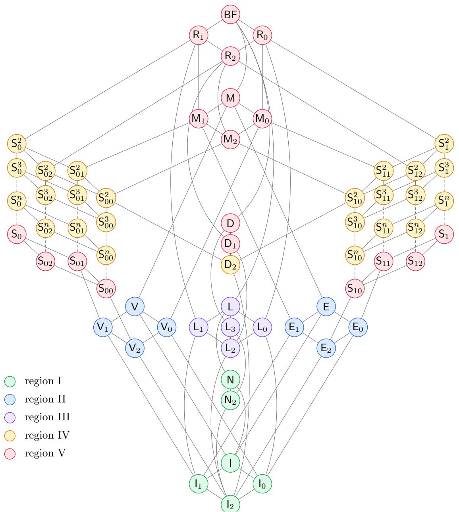

# Fitting and Learning Basis-Restricted Propositional Formulas

Balder ten Cate

September 9, 2026

## Abstract

For a finite set O of Boolean functions, we consider the class of propositional formulas built using the functions in O as connectives. We determine, for each possible choice of O, the complexity of various fitting and learning problems. These include: finding a formula that fits a given labeled sample, finding a small one (an Occam algorithm), minimizing the number of misclassified examples when the sample is not realizable (empirical risk minimization), and several forms of PAC learning. Our results apply both to formulas (represented as trees) and to circuits. We also briefly discuss the status of the same questions for other kinds of propositional fragments.

## 1 Introduction

Fix a finite set O of Boolean functions and let ${ \mathsf { P l } } _ { O }$ be the class of propositional formulas that can be built using the functions in O as connectives. Varying O gives a family of concept classes, and a natural question is how the dificulty of the standard learning-theoretic tasks depends on the choice of O. Several such classifications are either known or implied by known results, but they are scattered across the literature. We put them side by side, focusing on four problems.

• Fitting. Given a labeled sample, decide whether some PLO-formula agrees with all of it, and if so produce one.

• Occam algorithms. If the sample is realizable, find a fitting formula of near-minimal size.

• Empirical risk minimization. When the sample need not be realizable, find a ${ \mathsf { P l } } _ { O }$ -formula minimizing the number of mistakes.

• PAC learning. Is $\mathsf { P L } _ { \cal O }$ eficiently learnable in (variants of) the PAC model?

The four problems are not independent. Fitting is the special case of empirical risk minimization in which the sample is realizable, so an ERM algorithm is in particular a fitting algorithm. An Occam algorithm is a fitting algorithm that compresses, and compression yields a PAC learner, so hardness of PAC learning rules out Occam algorithms as well.

These questions can be studied also for $\mathsf { C l R } _ { O }$ , that is, the family of circuits using functions from O as gates. Note that $\mathsf { P l } _ { \mathsf { { \cal { O } } } }$ and $\mathsf { C l R } _ { O }$ have the same expressive power, but may difer in succinctness. In addition, in Section 9 we discuss other fragments, such as monotone CNF and Horn CNF, that do not fall under the above basis-generated regime.

Our contributions are partly organizational: we give a uniform presentation and we provide written-out proofs for results that are only sketched in the literature. Our main novel contributions are an algorithm for constructing fitting formulas eficiently based on a refinement of the classic Baker–Pixley construction, and a trichotomy theorem for empirical risk minimization, building on known results for hypergraph vertex-cover problems. We also fill a small gap, showing that the PAC-learnability dichotomy in [16] holds not only for circuits but also for formulas.

The picture that arises is as follows.

Fitting and Occam algorithms. The basic fitting problem turns out to be uniformly easy:

Theorem 1.1 (Fitting). Let O be a fixed finite basis. Then $\mathsf { P l } _ { \mathsf { { \cal { O } } } }$ has a polynomial-time fitting algorithm: given a labeled sample it decides whether the sample is realizable, and $i f$ so returns a fitting PLO-formula of polynomial size. The same holds for $\mathsf { C l R } _ { O }$

Here, by a labeled sample we mean a finite list of labeled examples $( \mathbf { a } , b )$ with $\mathbf { a } \in \{ 0 , 1 \} ^ { n }$ and $b \in \{ 0 , 1 \}$ ; a formula fits the sample if it takes the value b at a for each of its examples, and the sample is realizable for ${ \mathsf { P l } } _ { O }$ if some $\mathsf { P L } _ { O ^ { - } } \mathrm { f o r m u l a }$ fits it. The tractability of testing existence was already observed in [40]. We give a proof in Section 3, which also shows how to construct fitting formulas eficiently, using a refinement of the Baker–Pixley theorem.

One may ask for a short fitting formula. An Occam algorithm for ${ \mathsf { P l } } _ { O }$ is a polynomialtime fitting algorithm that, on every realizable sample, returns a fitting formula of size at most $p ( s _ { \mathrm { o p t } } , n ) \cdot m ^ { \beta }$ for some fixed polynomial $p$ and some fixed $\beta < 1$ , where m is the number of examples, n is the number of Boolean variables, and $s _ { \mathrm { o p t } }$ is the least size of a fitting $\mathsf { P L } _ { O ^ { - } }$ formula. An Occam algorithm compresses, as it returns something sublinear in m. One may ask for more, namely an attribute-eficient Occam algorithm, whose size bound does not depend on n: a fitting formula of size at most $p ( s _ { \mathrm { o p t } } ) \cdot m ^ { \beta }$

Theorem 1.2 (Occam algorithms, from [16]). Let O be a finite basis of Boolean functions.

(a) If $O \preceq \{ \land , \top , \bot \} , O \preceq \{ \lor , \top , \bot \}$ or $O \preceq \{ \neg , \top , \bot \}$ , then $\mathsf { P l } _ { \mathsf { { \cal { O } } } }$ has an attribute-eficient Occam algorithm.

(b) If $\{ \oplus ^ { 3 } \} \preceq O \preceq \{ \oplus , \top , \bot \}$ , then $\mathsf { P l } _ { \mathsf { { \cal { O } } } }$ has an Occam algorithm, but we do not know whether it has an attribute-eficient one.

(c) Otherwise ${ \mathsf { P l } } _ { O }$ does not have an Occam algorithm, under the cryptographic assumptions of Section 6.

The same holds for $\mathsf { C l R } _ { O }$

The proof is given in Section 7; the negative part is a consequence of the classification of PAC learnability, Theorem 1.5 below, since an Occam algorithm yields a proper PAC learner [11].

Empirical risk minimization. The next problem drops the assumption that the sample is realizable and asks for a hypothesis that minimizes the empirical risk, that is, the fraction of misclassified examples. This is empirical risk minimization (ERM). Unlike the fitting problem, ERM is not always solvable in polynomial time. When it is hard, one may ask for an approximation algorithm. We say that an algorithm is a weak approximator for ${ \mathsf { P l } } _ { O }$ if there are $\delta , \varepsilon > 0$ such that, on every sample whose optimal hypothesis has empirical risk $\leq \varepsilon .$ , the algorithm produces a PLO-hypothesis of empirical risk $\leq 1 / 2 - \delta$ . This is, in some sense, the lowest bar. Note that, if O includes the truth constants ⊤ and ⊥, then there is always a trivial solution that achieves an error fraction $\leq 1 / 2$ . Every k-approximation algorithm for a constant factor k is a weak approximator: it sufices to pick $\varepsilon = 1 / ( 4 k )$ and $\delta = 1 / 4$

To state the classification, for $r > j \ge 1$ let thr denote the r-ary threshold operation “at least $j$ of $r ^ { \ast }$ , that is,

$$
\begin{array} { r } { \mathrm { t h } _ { j } ^ { r } ( x _ { 1 } , \ldots , x _ { r } ) = 1 \quad \Longleftrightarrow \quad x _ { 1 } + \cdot \cdot \cdot + x _ { r } \geq j . } \end{array}
$$

Thus $\operatorname { t h } _ { j } ^ { r }$ and $\operatorname { t h } _ { r - j + 1 } ^ { r }$ are dual, and $\mathrm { t h } _ { 2 } ^ { 3 } = \mathrm { m a j }$ . Furthermore, in what follows, $O \preceq O ^ { \prime }$ means that every function in O is term-definable from $O ^ { \prime }$ , and $O \equiv O ^ { \prime }$ that the two are interdefinable.

Theorem 1.3 (Empirical risk minimization). Let O be a finite basis of Boolean functions. The ERM problem for ${ \mathsf { P l } } _ { O }$ falls into one of the following three regimes.

(i) If

$$
\{ \wedge \} \preceq O \preceq \{ \wedge , \top , \bot \} , \qquad \{ \vee \} \preceq O \preceq \{ \vee , \top , \bot \} , \qquad o r \quad \quad \{ \oplus ^ { 3 } \} \preceq O \preceq \{ \oplus , \top , \bot \} ,
$$

then, unless ${ \mathsf { P } } = { \mathsf { N P } }$ , there is no polynomial-time weak approximator for $\mathsf { P l } _ { \mathsf { { \cal { O } } } }$ , whatever its constants $\delta , \varepsilon > 0$ . In particular ERM for ${ \mathsf { P l } } _ { O }$ is NP-hard and has no polynomial-time constant-factor approximation.

(ii) If, for some $k \geq 2$

$$
\{ \mathrm { t h } _ { 2 } ^ { k + 1 } \} \preceq O \preceq \{ \to , \mathrm { t h } _ { 2 } ^ { k + 1 } \} \qquad o r \qquad \{ \mathrm { t h } _ { k } ^ { k + 1 } \} \preceq O \preceq \{ x \wedge \neg y , \mathrm { t h } _ { k } ^ { k + 1 } \} ,
$$

then ERM for $\mathsf { P l } _ { \mathsf { { \cal { O } } } }$ is NP-hard; it admits a polynomial-time k-approximation; and, under the Unique Games Conjecture, it admits no polynomial-time $\left( k - \varepsilon \right)$ -approximation for any $\varepsilon > 0$ . The factor k is therefore optimal under that conjecture.

(iii) In all other cases, ERM for $\mathsf { P l } _ { \mathsf { { \cal { O } } } }$ is solvable in polynomial time.

The same holds for $\mathsf { C l R } _ { O }$

The proof is given in Section 4. Note that, in light of Theorem 1.1, ERM may be equivalently viewed as the problem, given a labeled sample, of finding a relabeling that is realizable and disagrees on as few examples as possible.

Learning from random examples. We now turn to learning, beginning with the combinatorial parameter that governs how many examples are needed.

Proposition 1.4 (VC dimension). Let O be a finite basis of Boolean functions and let $n \geq 1$ . If $O \preceq \{ \land , \top , \bot \} , O \preceq \{ \lor , \top , \bot \} \ o r O \preceq \{ \oplus , \top , \bot \}$ , then the VC dimension of ${ \mathsf { P l } } _ { O }$ in n variables is at most $n + 1$ . Otherwise it is $2 ^ { \Omega ( n ) }$

We now consider two notions of learnability. Both are representation-sensitive: the learner is told a bound s on the size of a representation of the target, and may use a number of examples polynomial in $1 / \varepsilon , 1 / \delta _ { ; }$ , n and $s .$ By a proper PAC learner for PLO we mean an algorithm that, given $\varepsilon , \delta > 0$ , the bound $s ,$ and suficiently many examples drawn from an arbitrary distribution and labeled by a target in ${ \mathsf { P l } } _ { O }$ of size at most s, outputs in polynomial time a hypothesis from the class whose error is at most ε with probability at least $1 - \delta$ . A PAC predictor need not output a hypothesis: after seeing the examples it is given one further point and must predict its label, with error bounded away from $1 / 2$ by an inverse polynomial, and it may in addition ask membership queries, that is, ask for the value of the target at points of its own choosing. PAC prediction is easier than producing a hypothesis, and membership queries only help, so hardness of PAC prediction with queries is the stronger statement.1 Both notions, and the cryptographic assumptions, are given precisely in Section 6.

Theorem 1.5 (PAC learning and PAC prediction [16]). Let O be a finite basis. The following are equivalent.

$$
( a ) \ O \preceq \{ \wedge , \top , \bot \} , O \preceq \{ \vee , \top , \bot \} \ o r O \preceq \{ \oplus , \top , \bot \} ;
$$

(b) $\mathsf { P l } _ { \mathsf { { \cal L O } } }$ is polynomially properly PAC learnable;

(c) $\mathsf { P L } _ { \cal O }$ is polynomially PAC predictable with membership queries.

The implications $( a ) \Rightarrow ( b ) \Rightarrow ( c )$ are unconditional; the remaining implication $( c ) \Rightarrow ( a )$ holds under cryptographic assumptions described in Section 6. The same equivalence holds with $\mathsf { C l R } _ { O }$ in place of $\mathsf { P l } _ { \mathsf { { \cal L O } } }$

Dalmau [16] states the above result for formulas and for circuits but the proof establishes it only for circuits. We supply the missing step in Section 6. Other models of learning are considered in [16] as well, namely exact learnability from membership and equivalence queries. We omit them here, but note that our proof shows that the corresponding results of [16] also hold for formulas, and not just for circuits.

A finer question is whether, in the positive cases, the number of examples can be made attribute-eficient [39]: polynomial in $s , 1 / \varepsilon , 1 / \delta$ and log n rather than in n (note that log n is the information theoretic content in bits of a single propositional variable). For the conjunctive and disjunctive bases this holds, as follows from Theorem 1.2 above. For the afine bases the target is a parity of at most s variables, and whether such parities can be learned attributeeficiently in polynomial time is a well-known open problem [36, 13].

The above results also yield a complete picture for agnostic learning [31], where we don’t assume that the labels are given by a target in the class: here, the examples are drawn from an arbitrary distribution D on $\{ 0 , 1 \} ^ { n } \times \{ 0 , 1 \}$ , and the learner must output a hypothesis whose error under D exceeds the least error $\mathsf { o p t } _ { D }$ of any n-ary ${ \mathsf { P L } } _ { O ^ { - } } { \mathrm { f o r m u l a } }$ by at most ε. Note that, since there is no target, the bound for the running time and sample size is in $n , 1 / \varepsilon$ and $1 / \delta$ The learner is proper if the hypothesis is a ${ \sf P l } _ { O ^ { - } } \mathrm { f o r m u l a } .$ , and it is a weak agnostic learner if it is required to work only when $\mathsf { o p t } _ { D } \le \varepsilon$ , and then only to reach error $\leq 1 / 2 - \delta$ , for some fixed $\varepsilon , \delta > 0$ . Every weak agnostic learner yields a randomized weak approximator for ERM, by running it on the uniform distribution over a given sample. Conversely, when the VC dimension of ${ \mathsf { P l } } _ { O }$ is polynomial in $n ,$ every polynomial-time ERM algorithm yields a proper agnostic learner, by uniform convergence; and polynomial VC dimension is in fact necessary for weak agnostic learning, even improper [47]. It follows from Theorem 1.3 and Proposition 1.4 that $\mathsf { P L } _ { \cal O }$ is properly agnostically learnable in polynomial time when $O \preceq \{ \neg , \top , \bot \}$ ; that in the three intervals of regime (i) of Theorem 1.3 it is not properly weak agnostically learnable in polynomial time, unless NP = RP; and that for every other basis it is not weak agnostically learnable at all, properly or not, for VC dimension reasons (cf. Proposition 1.4).

Finally, a further variant of the PAC model deserves discussion. Under random classification noise each label shown to the learner is flipped independently with a fixed probability $\eta < 1 / 2 \ [ 6 ]$ . The usual route to learning algorithms that are tolerant to such noise is Kearns’s statistical query model, in which the learner sees no examples at all but may ask for the probability, under the example distribution, of any polynomial-time predicate of an example and its label, and receives it to within a tolerance of its choosing. A class learnable from polynomially many such queries of inverse-polynomial tolerance is PAC learnable under random classification noise of any rate $\eta < 1 / 2$ [28]. Both notions are made precise in Section 8.

Theorem 1.6 (Statistical queries, from [28, 9]). Let O be a finite basis. Under the cryptographic assumptions of Section 6, PLO is eficiently learnable from statistical queries if and only if $O \preceq \{ \land , \top , \bot \} , O \preceq \{ \lor , \top , \bot \}$ or $O \preceq \{ \neg , \top , \bot \}$ . The same holds for $\mathsf { C l R } _ { O }$

For random classification noise itself the picture is incomplete. Specifically, for the afine cases $\{ \oplus ^ { 3 } \} \preceq O \preceq \{ \oplus , \top , \bot \}$ the question is open — it is known as the learning parity with noise problem [10].

Figure 1 collects these classifications. It depicts Post’s lattice. Its elements are all Boolean clones, which we can think of as the equivalence classes of the pre-order ⪯. They are colored to reflect the status of the clones in question with respect to the classifications above.

In this paper we focus on problems where a formula is to be derived from examples. For the converse direction, where a formula is given and a meaningful sample is to be generated for it — for instance one that characterizes the formula up to equivalence within the fragment — dichotomy results over Post’s lattice exist as well, cf. [8].

The above results apply to fragments that are generated by sets of connectives, and that are for that reason closed under substitution. This excludes fragments such as Horn CNF, obtained by restricting the shape of clauses rather than the supply of connectives. Section 9 recalls Boolean constraint languages as the standard way of defining such fragments and records what becomes of the questions above when fragments are defined this way.

## Organization

Section 2 fixes notation, including the two size measures and the table of clones. Section 3 treats fitting and Section 4 empirical risk minimization. Section 5 then treats the VC dimension, Section 6 PAC learning, Section 7 Occam algorithms, and Section 8 learning under random classification noise and from statistical queries. Section 9 compares this picture with the one obtained when fragments are given by constraint languages instead.

## Acknowledgements

I am grateful to Victor Dalmau and Peter Mayr for fruitful discussions. Claude Fable was used in the process of writing this paper, both editorially and as a tool in the creative process. Several of the technical results were obtained with its help.

## 2 Preliminaries: Formulas, Circuits, Clones

A basis is a finite set O of Boolean functions, each of fixed arity. A $\mathsf { P L } _ { O ^ { - } } f o r m u l a$ over the variables $x _ { 1 } , \ldots , x _ { n }$ is a finite tree whose leaves are labeled by variables and whose internal nodes of arity r are labeled by r-ary members of O; we write ${ \mathsf { P l } } _ { O }$ for the class of these formulas, and [φ] for the Boolean function computed by $\varphi .$ . A CIR -circuit is the same object with fan-out allowed to exceed one, so that a subcomputation may be shared; we write $\mathsf { C l R } _ { O }$ for this class.

A clone is a set of Boolean functions that contains all projections $( x _ { 1 } , \ldots , x _ { n } ) \mapsto x _ { i }$ and is closed under composition. For a set O of Boolean functions, [O] denotes the clone generated by $O ,$ the least clone containing $O ;$ it consists of the functions computed by $\mathsf { P l } _ { O ^ { - } } \mathrm { f o r m u l a s } .$ or equivalently by ${ \mathsf { C l R } } _ { O ^ { - } } { \mathrm { c i r c u i t s } }$ . A finite set O with $[ O ] = C$ is a basis of the clone C. Post [43] determined all Boolean clones: there are countably many, each has a finite basis, and ordered by inclusion they form Post’s lattice, drawn in Figure 1. For finite bases $O , O ^ { \prime }$ , write

$$
{ \cal O } \preceq { \cal O } ^ { \prime } \quad \Longleftrightarrow \quad [ { \cal O } ] \subseteq [ { \cal O } ^ { \prime } ] ,
$$

and write $O \equiv O ^ { \prime }$ when the two generated clones are equal.

Order $\{ 0 , 1 \} ^ { n }$ coordinatewise, so that $\mathbf { a } \leq \mathbf { a } ^ { \prime }$ means $a _ { i } \leq a _ { i } ^ { \prime }$ for every i. Write 0 and 1 for the all-zero and the all-one tuple, and a¯ for the bitwise complement of a, that is, $\bar { a } _ { i } = 1 - a _ { i }$ The upward closure of a set $A \subseteq \{ 0 , 1 \} ^ { n }$ consists of the points above some member of $A ;$ a set equal to its upward closure is an upset, and downward closure and downset are defined dually. We write $\textcircled { \Phi } ^ { 3 }$ for the ternary parity operation $\oplus ^ { 3 } ( x , y , z ) = x \oplus y \oplus z .$ , and $f ^ { d }$ for the dual of a function $f ,$ defined by $f ^ { d } ( { \mathbf { a } } ) = \lnot f ( \bar { \mathbf { a } } )$ , and a function equal to its own dual is self-dual. We use the standard notation for Post’s lattice, as in [12, 38].

Table 1 lists the clones, with a description and a basis for each. The list is complete [43, 38]. An asterisk abbreviates a family of clones sharing a letter: $\mathsf { R } _ { * }$ denotes $\mathsf { R } _ { 0 } , \mathsf { R } _ { 1 } , \mathsf { R } _ { 2 }$ , and $\mathsf { M } _ { * }$ $\mathsf { L } _ { * } , \mathsf { E } _ { * } , \mathsf { V } _ { * } , \mathsf { N } _ { * } , \mathsf { I } _ { * }$ and D∗ likewise denote the clone named by the letter together with all of its subscripted variants, so that M∗ is $\mathsf { M } , \mathsf { M } _ { 0 } , \mathsf { M } _ { 1 } , \mathsf { M } _ { 2 }$ and L∗ is $\mathsf { L } , \mathsf { L } _ { 0 } , \mathsf { L } _ { 1 } , \mathsf { L } _ { 2 } , \mathsf { L } _ { 3 }$ . On the separating side $\mathsf { S } _ { 0 * }$ ∗ denotes $\mathsf { S } _ { 0 } , \mathsf { S } _ { 0 2 } , \mathsf { S } _ { 0 1 } , \mathsf { S } _ { 0 0 }$ and $\mathsf { S } _ { 1 : }$ denotes $\mathsf { S } _ { 1 } , \mathsf { S } _ { 1 2 } , \mathsf { S } _ { 1 1 } , \mathsf { S } _ { 1 0 }$ , with $S _ { 0 * } ^ { k }$ and $\mathsf { S } _ { 1 : } ^ { k }$ ∗ the corresponding degree-k families.

<table><tr><td>Clones</td><td></td><td></td><td>VC dim.</td><td>PAC</td><td>Occam</td><td>SQ</td></tr><tr><td>I</td><td>N*, 1*</td><td>P</td><td>linear</td><td>yes</td><td>yes</td><td>yes</td></tr><tr><td>II</td><td> $\mathsf { E } _ { * } , \vee _ { * }$ </td><td>no weak approximator</td><td>linear</td><td>yes</td><td>yes</td><td>yes</td></tr><tr><td>III</td><td>L*</td><td>no weak approximator</td><td>linear</td><td>yes</td><td>yes</td><td>no</td></tr><tr><td>IV</td><td> ${ \sf S } _ { 0 * } ^ { k } , { \sf S } _ { 1 * } ^ { k } ~ ( k \geq 2 ) , { \sf D } _ { 2 }$ </td><td>NP-hard, k-approximable</td><td>exponential</td><td>no</td><td>none</td><td>no</td></tr><tr><td>V</td><td>BF,  $\mathsf { R } _ { \ast } , \mathsf { M } _ { \ast } , \mathsf { S } _ { 0 \ast } , \mathsf { S } _ { 1 \ast } , \mathsf { D } , \mathsf { D } _ { 1 }$ </td><td>P</td><td>exponential</td><td>no</td><td>none</td><td>no</td></tr></table>

Figure 1: Post’s lattice, coloured by the regions the classifications cut it into, with the status of each problem per region. Fitting is omitted from the table because it is in P for every basis, with a fitting formula of polynomial size (Theorem 1.1). The Occam algorithms of regions I and II are attribute-eficient, that of region III is not known to be. Under random classification noise the last column is unchanged except in region III, where the question is open (Section 8). In region IV the k-approximation is optimal under the Unique Games Conjecture. The negative entries in the last three columns hold under the cryptographic assumptions of Section $6 ,$ except that in region III the entry of the last column is unconditional. Dashed edges abbreviate the infinite ascending families ${ \sf S } _ { 0 * } ^ { k }$ and ${ \sf S } _ { 1 * } ^ { k }$

<table><tr><td>Clone</td><td>Description</td><td>Representative basis</td></tr><tr><td> $\mathsf { B F }$ </td><td>all Boolean functions</td><td> $\{ \land , \lnot \}$ </td></tr><tr><td> $\mathsf { R } _ { 0 }$ </td><td>0-preserving, i.e. f (0) = 0</td><td> $\{ \land , \oplus \}$ </td></tr><tr><td> $\mathsf { R } _ { 1 }$ </td><td> $\mathrm { 1 - p r e s e r v i n g , i . e . } \ f ( \mathbf { 1 } ) = 1$ </td><td> $\{  , \land \}$ </td></tr><tr><td> $\mathsf { R } _ { 2 }$ </td><td> $\mathsf { R } _ { 0 } \cap \mathsf { R } _ { 1 }$ </td><td> $\{ \lor , \ x \land ( y  z ) \}$ </td></tr><tr><td> $\mathsf { M }$ </td><td>monotone</td><td> $\{ \land , \lor , \bot , \top \}$ </td></tr><tr><td> $\mathsf { M } _ { \mathrm { 0 } }$ </td><td> ${ \mathsf { M } } \cap { \mathsf { R } } _ { 0 }$ </td><td> $\{ \land , \lor , \bot \}$ </td></tr><tr><td> $\mathsf { M } _ { 1 }$ </td><td> ${ \mathsf { M } } \cap { \mathsf { R } } _ { 1 }$ </td><td> $\{ \land , \lor , \top \}$ </td></tr><tr><td> $\mathsf { M } _ { 2 }$ </td><td> ${ \mathsf { M } } \cap { \mathsf { R } } _ { 2 }$ </td><td> $\{ \land , \lor \}$ </td></tr><tr><td> $\mathsf { S } _ { 0 }$ </td><td>0-separating</td><td> $\{  \}$ </td></tr><tr><td> $\mathsf { S } _ { 0 2 }$ </td><td> $\mathsf { S } _ { 0 } \cap \mathsf { R } _ { 2 }$ </td><td> $\{ x \stackrel { \cdot } { \vee } ( y \wedge \neg z ) \}$ </td></tr><tr><td> $\mathsf { S } _ { 0 1 }$ </td><td> ${ \mathsf S } _ { 0 } \cap { \mathsf M }$ </td><td> $\{ x \vee ( y \wedge z ) , \top \}$ </td></tr><tr><td> $\mathsf { S } _ { 0 0 }$ </td><td> ${ \mathsf S } _ { 0 } \cap { \mathsf R } _ { 2 } \cap { \mathsf M }$ </td><td> $\{ x \vee ( y \wedge z ) \}$ </td></tr><tr><td> $\mathsf { S } _ { 0 } ^ { k }$ </td><td>0-separating of degree k</td><td> $\{  , \ \mathrm { t h } _ { 2 } ^ { k + 1 } \}$ </td></tr><tr><td> ${ \sf S } _ { 0 2 } ^ { k }$ </td><td> ${ \sf S } _ { 0 } ^ { k } \cap { \sf R } _ { 2 }$ </td><td> $\{ x \vee ( y \wedge \neg z ) , \ \mathrm { t h } _ { 2 } ^ { k + 1 } \}$ </td></tr><tr><td> $\mathsf { S } _ { 0 1 } ^ { k }$ </td><td> $S _ { 0 } ^ { k } \cap { \mathsf { M } }$ </td><td> $\{ x \vee ( y \wedge z ) , \top , \mathtt { t h } _ { 2 } ^ { k + 1 } \}$ </td></tr><tr><td> ${ \sf S } _ { 0 0 } ^ { k }$ </td><td> ${ \mathsf S } _ { 0 } ^ { k } \cap { \mathsf R } _ { 2 } \cap { \mathsf M }$ </td><td> $\{ x \vee ( y \wedge z ) , \ \operatorname { t h } _ { 2 } ^ { k + 1 } \}$ </td></tr><tr><td> $\mathsf { S } _ { 1 }$ </td><td>1-separating</td><td> $\{ x \wedge \neg y \}$ </td></tr><tr><td> $\mathsf { S } _ { 1 2 }$ </td><td> $\mathsf { S } _ { 1 } \cap \mathsf { R } _ { 2 }$ </td><td> $\{ x \wedge ( y \vee \neg z ) \}$ </td></tr><tr><td> $\mathsf { S } _ { 1 1 }$ </td><td> ${ \mathsf S } _ { 1 } \cap { \mathsf M }$ </td><td> $\{ x \wedge ( y \vee z ) , \bot \}$ </td></tr><tr><td> $\mathsf { S } _ { 1 0 }$ </td><td> $\mathsf { S } _ { 1 } \cap \mathsf { R } _ { 2 } \cap \mathsf { M }$ </td><td> $\{ x \wedge ( y \vee z ) \}$ </td></tr><tr><td> $\mathsf { S } _ { 1 } ^ { k }$ </td><td>1-separating of degree k</td><td> $\{ x \land \neg y , \ \mathrm { t h } _ { k } ^ { k + 1 } \}$ </td></tr><tr><td> $S _ { 1 2 } ^ { k }$ </td><td> $S _ { 1 } ^ { k } \cap { \mathsf { R } } _ { 2 }$ </td><td> $\{ x \wedge ( y \vee \neg z ) , \ \mathrm { { t h } } _ { k } ^ { k + 1 } \}$ </td></tr><tr><td> $S _ { 1 1 } ^ { k }$ </td><td> $S _ { 1 } ^ { k } \cap { \mathsf { M } }$ </td><td> $\{ x \wedge ( y \vee z ) , \bot , \operatorname { t h } _ { k } ^ { k + 1 } \}$ </td></tr><tr><td> $S _ { 1 0 } ^ { k }$ </td><td> ${ \sf S } _ { 1 } ^ { k } \cap { \sf R } _ { 2 } \cap { \sf M }$ </td><td> $\{ x \wedge ( y \vee z ) , \ \mathrm { t h } _ { k } ^ { k + 1 } \}$ </td></tr><tr><td>D</td><td>self-dual</td><td> $\{ \mathrm { m a j } , \lnot \}$ </td></tr><tr><td> $\mathsf { D } _ { 1 }$ </td><td> $\mathsf { D } \cap \mathsf { R } _ { 2 }$ </td><td> $\{ \mathrm { m a j } ( x , y , \lnot z ) \}$ </td></tr><tr><td> $\mathsf { D } _ { 2 }$ </td><td> $\mathsf { D } \cap \mathsf { M }$ </td><td> $\mathrm { \{ m a j \} = \mathrm { \{ t h _ { 2 } ^ { 3 } \} } }$ </td></tr><tr><td>L</td><td>affine</td><td> $\{ \oplus , \top \}$ </td></tr><tr><td> $\mathsf { L } _ { 0 }$ </td><td> $\mathsf { L } \cap \mathsf { R } _ { 0 }$ </td><td>{⊕}</td></tr><tr><td> $\mathsf { L } _ { 1 }$ </td><td> $\mathsf { L } \cap \mathsf { R } _ { 1 }$ </td><td> $\{  \}$ </td></tr><tr><td> $\mathsf { L } _ { 2 }$ </td><td> $\mathsf { L } \cap \mathsf { R } _ { 2 }$ </td><td> $\bigl \{ \oplus ^ { 3 } \bigr \}$ </td></tr><tr><td> $\mathsf { L } _ { 3 }$ </td><td> $\mathsf { L } \cap \mathsf { D }$ </td><td> $\{ x \oplus y \oplus z \oplus \top \}$ </td></tr><tr><td>E</td><td>conjunctions and constants</td><td> $\{ \land , \bot , \top \}$ </td></tr><tr><td> $\mathsf { E } _ { 0 }$ </td><td> $\mathsf { E } \cap \mathsf { R } _ { 0 }$ </td><td> $\{ \land , \bot \}$ </td></tr><tr><td> $\mathsf { E } _ { 1 }$ </td><td> $\mathsf { E } \cap \mathsf { R } _ { 1 }$ </td><td> $\{ \land , \top \}$ </td></tr><tr><td> $\mathsf { E } _ { 2 }$ </td><td> $\mathsf { E } \cap \mathsf { R } _ { 2 }$ </td><td>{^}</td></tr><tr><td> $\vee$ </td><td>disjunctions and constants</td><td> $\{ \lor , \bot , \top \}$ </td></tr><tr><td> $\mathsf { V } _ { \mathrm { 0 } }$ </td><td> $\mathsf { V } \cap \mathsf { R } _ { 0 }$ </td><td> $\{ \lor , \bot \}$ </td></tr><tr><td> $\mathsf { V } _ { 1 }$ </td><td> $\mathsf { V } \cap \mathsf { R } _ { 1 }$   $\mathsf { V } \cap \mathsf { R } _ { 2 }$ </td><td> $\{ \lor , \top \}$ </td></tr><tr><td> ${ \mathsf V } _ { 2 }$ </td><td></td><td> $\{ \lor \}$ </td></tr><tr><td> $\mathsf { N }$ </td><td>projections, negations and constants</td><td> $\begin{array} { l } { \{ \neg , \bot , \top \} } \\ { \{ \neg \} } \end{array}$ </td></tr><tr><td> $\mathsf { N } _ { 2 }$ </td><td>projections and negations</td><td></td></tr><tr><td>一</td><td>projections and constants</td><td> $\{ \bot , \top \}$ </td></tr><tr><td> $\mathsf { I } _ { 0 }$ </td><td> ${ \mathsf { I } } \cap { \mathsf { R } } _ { 0 } { : }$  projections and ⊥</td><td>{1}</td></tr><tr><td> $\mathsf { I } _ { 1 }$ </td><td> $\mid \cap \mathsf { R } _ { 1 } { : }$  projections and T</td><td> $\{ \top \}$ </td></tr><tr><td> $\mathsf { I } _ { 2 }$ </td><td>projections only</td><td></td></tr></table>

Table 1: The Boolean clones, with a basis for each; k ranges over the integers $k \geq 2$ . The bases follow those tabulated by B¨ohler, Creignou, Reith and Vollmer [12], up to inessential variation, and each is one choice among many.

The convention for the S-families is the following. A Boolean function is 0-separating if the set $f ^ { - 1 } ( 0 )$ has a common zero coordinate; it is 0-separating of degree k if every list of k elements of $f ^ { - 1 } ( 0 )$ , with repetitions allowed, has a common zero coordinate. Equivalently, every nonempty subset of at most k distinct zero inputs has a common zero coordinate. The 1-separating notions are dual.

For a formula $\varphi$ we write size $\left( \varphi \right)$ for its number of nodes and $\mathrm { d e p t h } ( \varphi )$ for its depth, with a single leaf having depth 0. For a circuit $C , { \mathrm { s i z e } } ( C )$ is its number of gates and inputs. Unfolding a circuit into a formula can increase size exponentially — indeed for $O = \{ \land , \lor , \top , \bot \} , \mathsf { C l R } _ { O ^ { - } }$ circuits are super-polynomially more succinct than $\mathsf { P L } _ { O ^ { - } } \mathrm { f o r m u l a s }$ [26, 44] — and no converse blow-up is possible, so circuit size is the more generous measure: a statement proved for it is weaker than the corresponding one for formula size when it asserts hardness, and stronger when it asserts an upper bound. In certain cases circuits can nevertheless be translated to formulas in polynomial time. ${ \mathrm { I f ~ } } [ O ] \subseteq \mathsf { E } , [ O ] \subseteq \mathsf { V } { \mathrm { ~ o r ~ } } [ O ] \subseteq \mathsf { L }$ , the n-ary functions of [O] are the conjunctions, the disjunctions or the afine functions of the variables, together with whichever truth constants the clone contains. Which of them a given CIR -circuit computes is read of from its values at $n + 1$ points, and the corresponding PL -formula has at most $n + 2$ leaves.

## 3 Fitting

Fix a finite set of propositional variables $x _ { 1 } , \ldots , x _ { n }$ , identified with the coordinates $[ n ] \ =$ $\{ 1 , \ldots , n \}$ , and write $\mathbf { x } ~ = ~ ( x _ { 1 } , \ldots , x _ { n } )$ for the tuple of them. A labeled sample is a finite multiset

$$
E \subseteq _ { \mathrm { m u l t i } } \{ 0 , 1 \} ^ { n } \times \{ 0 , 1 \} ,
$$

which we also write as a list $( \mathbf { a } _ { 1 } , b _ { 1 } ) , \dots , ( \mathbf { a } _ { m } , b _ { m } )$ of labeled examples. A formula $\varphi \in \mathsf { P L } _ { O }$ fits E if $\varphi ( \mathbf { a } _ { j } ) = b _ { j }$ for $j = 1 , \dots , m _ { \mathrm { \scriptsize ~ : ~ } }$ , and E is realizable for $\mathsf { P l } _ { \mathsf { { \cal { O } } } }$ if some $\varphi \in \mathsf { P L } _ { O }$ fits it. The fitting problem for $\mathsf { P l } _ { \mathsf { { \cal O } } }$ asks, given E, to decide whether E is realizable and, if so, to return a fitting formula. The same definitions apply also to $\mathsf { C l R } _ { O }$ . Note that a labeled sample is realizable for $\mathsf { P l } _ { \mathsf { { \cal C } } }$ if it is realizable for $\mathsf { C l R } _ { O }$ . Since this depends on O only through [O], we also say that E is realizable in the clone [O].

The fitting problem has an algebraic form that is well studied in the literature, and we lift our terminology to it. A finite algebra $\mathbf { A } = ( A ; F )$ is a finite set A together with a finite set F of finitary operations on A. Terms over F are built from variables and the operations of F in the usual way, and a term $\tau ( x _ { 1 } , \dots , x _ { n } )$ induces an n-ary term operation $\tau ^ { \mathbf { A } }$ on A; for $\mathbf { A } = ( \{ 0 , 1 \} ; O )$ the terms are the $\mathsf { P l } _ { O ^ { - } } \mathrm { f o r m u l a s }$ and the term operations are the functions of [O]. A labeled sample over A consists of examples $( { \bf a } _ { j } , b _ { j } ) \in A ^ { n } \times A$ , a term $\tau \ f t s$ it if $\tau ^ { \mathbf { A } } ( \mathbf { a } _ { j } ) = b _ { j }$ for every $j ,$ and it is realizable if some term fits it. Read columnwise, fitting asks whether the column of labels lies in the subalgebra of $\mathbf { A } ^ { m }$ generated by the columns of the variables. This is the subpower membership problem for A, the subject of [40, 14], whose complexity is open in general. A near-unanimity operation of arity $d \geq 3$ is one returning x whenever at least $d - 1$ of its arguments are x, and a near-unanimity term of A is a term inducing such an operation; on {0, 1} the majority operation and the thresholds $\mathrm { t h } _ { 2 } ^ { k + 1 }$ and $\mathrm { t h } _ { k } ^ { k + 1 }$ are examples of near-unanimity operations. The Baker–Pixley theorem [7] solves the subpower membership problem for algebras with a near-unanimity term. We need a slight strengthening of this result.

Proposition 3.1 (Eficient Baker–Pixley interpolation). Fix a finite algebra A with a nearunanimity term ν of arity $d \geq 3$ , and let $k = d - 1$

1. A labeled sample E over A is realizable if and only if every $E ^ { \prime } \subseteq E$ with $| E ^ { \prime } | \le k \ i s$ , which can be tested in polynomial time.

2. From a realizable labeled sample E one can moreover compute in polynomial time a fitting term of depth logarithmic in |E|.

Proof. Item 1 is the content of the classic Baker–Pixley theorem [7]. We prove both items here, with a slight refinement of the classic argument: we use a divide-and-conquer strategy to control the size and depth of the constructed term.

Let E be a labeled sample over A, consisting of the labeled examples

$$
( \mathbf { a } _ { 1 } , b _ { 1 } ) , \ldots , ( \mathbf { a } _ { m } , b _ { m } ) \in A ^ { n } \times A .
$$

By a window we mean a subset $S \subseteq [ m ]$ , and we write $E | _ { S }$ for the sub-sample $\{ ( \mathbf { a } _ { j } , b _ { j } ) : j \in S \}$ , so that the sub-samples $E ^ { \prime } \subseteq E$ of item 1 are the $E | _ { S }$ with $| S | \le k$ . If E is realizable then so is every sub-sample, by the same term; this is the easy direction of item 1.

Fix a window S with $| S | \le k$ . Every term induces a labeling of the points $\mathbf { a } _ { j } , j \in S$ , that is, an element of $A ^ { S }$ , and the labelings so induced are obtained from those induced by the variables $x _ { 1 } , \ldots , x _ { n }$ by closing under the operations of $F ,$ applied pointwise. There are at most $| A | ^ { k }$ labelings of these points altogether, so at most $| A | ^ { k }$ of the variables induce distinct ones, the closure is reached in a bounded number of rounds, and every labeling in it is induced by a term of bounded size, the bound depending only on A. Hence, in time $O ( n )$ plus a constant depending on A, we can test whether a term fitting $E | _ { S }$ exists and, if so, compute one of bounded size, which we call $\tau _ { S }$ . There are $O ( m ^ { k } )$ windows with $| S | \le k .$ so all of this takes $O ( m ^ { k } n )$ time.

Suppose now that for every window S with $| S | \le k$ a fitting term $\tau _ { S }$ exists. We extend the definition of τS to every window $S \subseteq [ m ]$ by recursion on |S|, in such a way that $\tau _ { S }$ fits $E | _ { S }$ . If $| S | > k$ then $| S | \geq d .$ . Partition S into d nonempty blocks $B _ { 1 } , \ldots , B _ { d }$ whose sizes difer by at most one, and let

$$
\tau _ { S } : = \nu \big ( \tau _ { S \backslash B _ { 1 } } , \dots , \tau _ { S \backslash B _ { d } } \big ) .
$$

Each $S \setminus B _ { i }$ is a proper subset of S, so the recursion terminates, and by induction $\tau _ { S }$ fits $E | _ { S } \colon$ an index $j \in S$ lies in exactly one block $B _ { i } ,$ , so the $d - 1$ arguments $\tau _ { S \backslash B _ { i ^ { \prime } } }$ with $i ^ { \prime } \neq i$ take the value $b _ { j }$ at $\mathbf { a } _ { j }$ , and the near-unanimity operation $\nu ^ { \mathbf { A } }$ returns that value whatever the remaining argument computes there. Hence $\tau _ { [ m ] }$ fits E. In particular a sample all of whose sub-samples of at most k examples are realizable is realizable, which completes the proof of item 1.

It remains to show that the construction runs in polynomial time and that $\tau _ { [ m ] }$ has depth logarithmic in m. If $| S | = s > k$ then every block has at least $\lfloor s / d \rfloor$ elements, so $| S \setminus B _ { i } | <$ $( 1 - 1 / d ) s + 1$ , which is at most $( 1 - 1 / 2 d )$ s once $s \geq 2 d .$ The recursion therefore has depth $O ( \log m )$ , with a constant depending only on d. Each level of the recursion contributes the depth of $\nu ,$ and the terms at the bottom have bounded depth, so $\tau _ { [ m ] }$ has depth $O ( \log m )$ . The recursion tree has $d ^ { { \cal O } ( \log m ) } = m ^ { { \cal O } ( 1 ) }$ nodes, and the term built at a node has size at most size(ν) times one plus the sizes of its arguments, so sizes grow by at most a factor $( d + 1 ) \operatorname { s i z e } ( \nu )$ per level and every term involved, $\tau _ { [ m ] }$ included, has size $m ^ { O ( 1 ) }$ . The construction therefore runs in polynomial time. □

Theorem 1.1 (Fitting). Let O be a fixed finite basis. Then ${ \mathsf { P l } } _ { O }$ has a polynomial-time fitting algorithm: given a labeled sample it decides whether the sample is realizable, and if so returns a fitting PLO-formula of polynomial size. The same holds for $\mathsf { C l R } _ { O }$

Proof of Theorem 1.1. Let ${ \mathsf { C } } = [ O ]$ . Since O is fixed, we may freely replace a fixed operation of C by a fixed PLO-formula defining it. The following table places every clone of Post’s lattice in one of five cases; a clone may satisfy several, and only coverage is needed.

<table><tr><td>Case e Clones</td><td></td></tr><tr><td>(1)</td><td> $\mathsf { B F } , \mathsf { R } _ { * } , \mathsf { M } _ { * } , \mathsf { D } _ { * }$  , and  $\mathsf { S } _ { 0 * } ^ { k } , \mathsf { S } _ { 1 * } ^ { k }$  for every  $k \geq 2$ </td></tr><tr><td>(2)</td><td> $\mathsf { L } _ { * }$ </td></tr><tr><td>(3)</td><td> $\Nu _ { * } , \Nu _ { * }$ </td></tr><tr><td>(4)</td><td> $\mathsf { E } _ { * } , \vee _ { * }$ </td></tr><tr><td>(5)</td><td> $\mathsf { S } _ { 0 * } , \mathsf { S } _ { 1 * }$ </td></tr></table>

(1) C has a near-unanimity term. This includes BF, $\mathsf { R } _ { * } , \mathsf { M } _ { * } , \mathsf { D } , \mathsf { D } _ { 1 }$ and $\mathsf { D } _ { 2 }$ , all of which contain maj $\mathrm { = \ t h _ { 2 } ^ { 3 } . }$ , and the clones $\mathsf { S } _ { 0 } ^ { k } ,$ and ${ \sf S } _ { 1 * } ^ { k }$ , which contain $\mathrm { t h } _ { 2 } ^ { k + 1 }$ respectively $\mathrm { t h } _ { k } ^ { k + 1 }$ Proposition 3.1, applied to the algebra $( \{ 0 , 1 \} ; O )$ , decides fitting and in the positive case returns a fitting ${ \mathsf { P L } } _ { O ^ { - } } { \mathrm { f o r m u l a } }$ of polynomial size and logarithmic depth.

(2) ${ \mathsf { C } } \subseteq { \mathsf { L } }$ . The n-ary functions of C are the afine functions $c \oplus \oplus _ { j \in J } x _ { j }$ whose constant c and support J satisfy the at most two linear conditions over $\mathbb { F } _ { 2 }$ that single out C among $\mathsf { L } , \mathsf { L } _ { 0 } , \mathsf { L } _ { 1 } ,$ , L2 and $\mathsf { L } _ { 3 } \colon$ that $c = 0$ , that $c \oplus | J | \equiv 1$ , or that $| J |$ be odd. Fitting is therefore a system of linear equations over $\mathbb { F } _ { 2 }$ in the unknowns c and the indicator vector of $J ,$ with one equation per example and those conditions, which Gaussian elimination solves in polynomial time. A solution is written as a chain of connectives of O over the variables of J, a PLO-formula with at most $n + 2$ leaves.

(3) $O \preceq \{ \neg , \top , \bot \}$ . This is the essentially unary case. One tries the finitely many available unary functions on each variable, together with the available truth constants.

(4) $O \preceq \{ \land , \top , \bot \}$ or $O \preceq \{ \lor , \top , \bot \}$ . This is the semilattice case. For conjunctions the standard greedy construction applies: keep exactly those variables whose columns are compatible with all positive labels and take their conjunction, with the appropriate truthconstant side conditions for proper subclones. Disjunctions are dual.

(5) It remains to handle the ordinary separating clones. We give the argument for the 1- separating side; the 0-separating side follows by duality. For ${ \mathsf { C } } \in { \mathsf { S } } _ { 1 * }$ , let $\mathsf { K } _ { \mathsf { C } }$ be given by

$$
\frac { \textsf { C } | \textsf { S } _ { 1 } \textsf { S } _ { 1 2 } \textsf { S } _ { 1 1 } } { \mathsf { K } _ { \mathsf { C } } | \textsf { B F } \mathsf { R } _ { 1 } \textsf { M } \textsf { M } \cap \mathsf { R } _ { 1 } . }
$$

Write $\mathbf { g } _ { i } \in \{ 0 , 1 \} ^ { m }$ for the column of values of the variable $x _ { i }$ on the sample and b = $\left( b _ { 1 } , \ldots , b _ { m } \right)$ for the column of labels. Every $f \in { \mathsf { C } }$ is bounded above by one of its inputs. Hence a necessary condition for fitting is that some variable column ${ \bf { g } } _ { i }$ dominates the label column b. If no such column exists, reject. Otherwise, choose any such $i ,$ discard the rows on which $\mathbf { g } _ { i } = \mathbf { 0 }$ , and set $x _ { i } = 1$ in the remaining rows. If the original sample has a C-fit $f ,$ then $f | _ { x _ { i } = 1 }$ belongs to $\mathsf { K } _ { \mathsf { C } }$ and fits this residual sample. Conversely, if $u \in \mathsf { K } _ { \mathsf { C } }$ fits the residual sample, then $x _ { i } \wedge u$ belongs to C and fits the original sample. All four clones $\mathsf { K } _ { \mathsf { C } }$ contain the majority operation, so item (1) decides the residual problem and constructs a residual formula of polynomial size and logarithmic depth.

To translate this formula back to the original basis, fix a basis $B _ { \mathsf { C } }$ of $\mathsf { K } _ { \mathsf { C } }$ and, for each $\gamma \in B _ { \mathsf { C } }$ , use the guarded gate ${ \widehat { \gamma } } ( x , \mathbf { z } ) = x \wedge \gamma ( \mathbf { z } )$ . This operation belongs to C and therefore has a fixed $\mathsf { P l } _ { \cal { O } } .$ -formula. Replacing each residual connective by this fixed formula, and each variable y by a fixed PLO-formula for $x _ { i } \wedge y$ , maintains the invariant that the translated node computes $x _ { i } \wedge u$ . Each substitution multiplies size by at most a constant per level, and the depth is logarithmic, so the result is a PLO-formula of polynomial size.

For the canonical basis $f _ { \wedge \vee } ( x , y , z ) = x \wedge ( y \vee z )$ of $\mathsf { S } _ { 1 0 }$ , the gadgets for a guarded leaf, disjunction, and conjunction are respectively $f _ { \wedge \vee } ( x _ { i } , y , y ) , \ f _ { \wedge \vee } ( x _ { i } , u , v )$ and $f _ { \wedge \vee } ( u , v , v )$ 2 where $u , v$ are already guarded. For $f _ { \wedge \to } ( x , y , z ) \ : = \ : x \wedge ( y \to z )$ , a basis of $\mathsf { S } _ { 1 2 }$ , the corresponding gadgets are $f _ { \wedge \to } ( x _ { i } , x _ { i } , y ) , f _ { \wedge \to } ( x _ { i } , u , v )$ for implication and $f _ { \wedge \to } ( u , u , v )$ for conjunction.

The bases of the four residual clones also contain truth constants, and these need guarded gates of their own. We have $\mathsf { K } _ { \mathsf { S } _ { 1 0 } } = \mathsf { M } \cap \mathsf { R } _ { 1 } = \mathsf { M } _ { 1 }$ , with basis $\{ \lor , \land , \top \}$ , and ${ \sf K } _ { \mathsf { S } _ { 1 1 } } = { \sf M } =$ $[ \{ \lor , \land , \bot , \top \} ]$ ]. The guarded gates for the constants are

$$
\widehat { \top } ( x ) = x \wedge \top = x , \qquad \widehat { \bot } ( x ) = x \wedge \bot = \bot ,
$$

both of which lie in C and satisfy the invariant. For ${ \sf K } _ { \mathsf { S } _ { 1 2 } } = { \sf R } _ { 1 }$ the two gadgets above sufice, $\{  , \land \}$ being the basis of $\mathsf { R } _ { 1 }$ in Table 1. For $\mathsf { K } _ { \mathsf { S } _ { 1 } } =$ BF take the basis $\{ \land , \lnot \}$ , whose guarded gates are $x \wedge ( y \wedge z )$ and x $\wedge \neg y$ , both of which lie in $\mathsf { S } _ { 1 }$ . The dual construction handles the ordinary 0-separating clones.

With dual cases folded in, the table above shows these cases to be exhaustive, giving a polynomial-time construction of a fitting PLO-formula of polynomial size whenever fitting is possible. A formula is a circuit of the same size, so the statement for $\mathsf { C l R } _ { O }$ follows. □

## 4 Empirical risk minimization

The empirical risk of a formula φ on a labeled sample E is the fraction of misclassified examples,

$$
\operatorname { e r r } _ { E } ( \varphi ) = { \frac { | \{ ( \mathbf { a } , b ) \in E : \varphi ( \mathbf { a } ) \neq b \} | } { | E | } } ,
$$

and the empirical risk minimization problem for $\mathsf { P l } _ { } O$ , ERM for $\mathsf { P l } _ { \mathsf { { \cal L O } } }$ for short, asks for a formula attaining the optimal value: given $E _ { \mathrm { { i } } }$ , return a $\varphi \in \mathsf { P L } _ { O }$ with

$$
\operatorname { e r r } _ { E } ( \varphi ) = \mathsf { o p t } _ { O } ( E ) : = \operatorname* { m i n } _ { \psi \in \mathsf { P L } _ { O } } \operatorname { e r r } _ { E } ( \psi ) .
$$

The sample size is fixed within an instance, so minimizing this fraction is the same as minimizing the number of mistakes, and the arguments below count mistakes where that is more convenient. The associated decision problem asks, given E and t, whether there exists $\varphi \in \mathsf { P L } _ { O }$ with at most t mistakes. Since the hypothesis is part of the output, the problem depends on how that hypothesis may be written, and we distinguish two versions: ERM for ${ \mathsf { P l } } _ { O }$ , where the algorithm returns a PL -formula, and ERM for $\mathsf { C l R } _ { O }$ , where it may return a CIR -circuit. The optimum value $\mathsf { o p t } _ { O } ( E )$ is the same in both, since ${ \mathsf { P l } } _ { O }$ and $\mathsf { C l R } _ { O }$ define the same functions; only the output difers. The same distinction applies to the weak approximators of the introduction and to the approximation algorithms below.

This section proves the classification from the introduction, which we restate.

Theorem 1.3 (Empirical risk minimization). Let O be a finite basis of Boolean functions. The ERM problem for ${ \mathsf { P l } } _ { O }$ falls into one of the following three regimes.

(i) If

$$
\{ \wedge \} \preceq O \preceq \{ \wedge , \top , \bot \} , \qquad \{ \vee \} \preceq O \preceq \{ \vee , \top , \bot \} , \qquad o r \quad \quad \{ \oplus ^ { 3 } \} \preceq O \preceq \{ \oplus , \top , \bot \} ,
$$

then, unless P = NP, there is no polynomial-time weak approximator for ${ \mathsf { P l } } _ { O }$ , whatever its constants $\delta , \varepsilon > 0$ . In particular ERM for ${ \mathsf { P l } } _ { O }$ is NP-hard and has no polynomial-time constant-factor approximation.

(ii) If, for some $k \geq 2$

$$
\{ \mathrm { t h } _ { 2 } ^ { k + 1 } \} \preceq O \preceq \{ \to , \ \mathrm { t h } _ { 2 } ^ { k + 1 } \} \qquad o r \qquad \{ \mathrm { t h } _ { k } ^ { k + 1 } \} \preceq O \preceq \{ x \wedge \neg y , \ \mathrm { t h } _ { k } ^ { k + 1 } \} ,
$$

then ERM for ${ \mathsf { P l } } _ { O }$ is NP-hard; it admits a polynomial-time k-approximation; and, under the Unique Games Conjecture, it admits no polynomial-time $\left( k - \varepsilon \right)$ -approximation for any $\varepsilon > 0$ . The factor k is therefore optimal under that conjecture.

(iii) In all other cases, ERM for ${ \mathsf { P l } } _ { O }$ is solvable in polynomial time.

The same holds for $\mathsf { C l R } _ { O }$

For circuits it is clear that the problem depends on O only through the clone $[ O ] \colon \mathrm { i f } \left[ O \right] = [ O ^ { \prime } ]$ then every member of $O ^ { \prime }$ is computed by some fixed ${ \mathsf { C l R } } _ { O ^ { - } } { \mathrm { c i r c u i t } }$ , so replacing each gate turns a $\mathsf { C l R } _ { O ^ { \prime } } \mathrm { - c i r c u i t }$ into a CIRO-circuit of size larger by at most a constant factor, and symmetrically. For formulas no such translation is known in general, so the basis, and not merely the clone, could in principle matter. Nevertheless the theorem shows that the complexity of ERM for ${ \mathsf { P l } } _ { O }$ too depends only on [O]. The explanation lies in Theorem 1.1, which shifts the algorithmic content of the problem from formulas to relabelings of the sample.

A relabeling of a labeled sample E assigns a label to every point of $\{ 0 , 1 \} ^ { n }$ that occurs in E. It is realizable in a clone C if some function of C takes the assigned value at every sample point. Its mistakes on $E$ are the examples $( \mathbf { a } , b ) \in E$ whose label b difers from the label assigned to a, and its empirical risk is the fraction of mistakes, as for formulas. Every formula in ${ \mathsf { P l } } _ { O }$ or circuit in $\mathsf { C l R } _ { O }$ induces, by evaluation at the sample points, a relabeling realizable in $[ O ]$ with the same mistakes. Conversely, a relabeling realizable in [O], read as a labeled sample, is realizable for ${ \mathsf { P l } } _ { O } ,$ so Theorem 1.1 computes from it in polynomial time a $\mathsf { P l } _ { \cal { O } } .$ -formula, or a CIR -circuit, with exactly those mistakes. Hence ERM for ${ \mathsf { P l } } _ { O }$ and ERM for $\mathsf { C l R } _ { O }$ are both equivalent, in polynomial time and with every approximation ratio preserved, to what we call ERM for the clone ${ \mathsf C } = [ O ]$ : given $E _ { i }$ , find a relabeling of $E$ that is realizable in C and has the fewest mistakes. We write $\mathsf { o p t } _ { \mathsf { C } } ( E )$ for the least empirical risk of such a relabeling, so that $\mathsf { o p t } _ { \mathsf { C } } ( E ) = \mathsf { o p t } _ { O } ( E )$ for every basis O of ${ \mathsf { C } } _ { : }$ , and the notions of α-approximation and of weak approximator carry over verbatim, with a realizable relabeling in place of the formula returned.

The rest of the section treats ERM for clones: the algorithms return realizable relabelings, and the hardness results bound the mistakes of every function of the clone on the samples they construct. No basis appears anywhere, which is why the classification depends on O only through [O] and holds for formulas and circuits alike, as the final clause of the theorem asserts.

We prove the theorem region by region, keeping algorithms, hardness results and approximation guarantees for a region together; the standard enumeration of Post’s lattice shows that the families considered below are exhaustive [43, 38]. In clone names, the interval in regime (ii) is $\mathrm { t h } _ { 2 } ^ { k + 1 } \in \mathsf { C } \subseteq \mathsf { S } _ { 0 } ^ { k }$ , or dually $\operatorname { t h } _ { k } ^ { k + 1 } \in { \mathsf { C } } \subseteq { \mathsf { S } } _ { 1 } ^ { \bar { k } }$ , using the bases for $\mathsf { S } _ { 0 } ^ { k }$ and $\mathsf { S } _ { 1 } ^ { k }$ from Table 1; by inspection of Post’s lattice [43, 38], the clones in these intervals are exactly the eight degree-k separating clones ${ \sf S } _ { 0 * } ^ { k }$ and ${ \mathsf S } _ { 1 * } ^ { \bar { k } }$ , together with the majority clone $\mathrm { D _ { 2 } = [ m a j ] = [ t h _ { 2 } ^ { 3 } ] }$ when $k = 2$

Two conventions are used throughout. First, we freely use weighted examples, that is, repeated ones. Given a labeled sample $E ,$ for each point $\mathbf { a } \in \{ 0 , 1 \} ^ { n }$ let

$$
m _ { + } ( \mathbf { a } ) = \# \{ ( \mathbf { a } , 1 ) \in E \} , \qquad m _ { - } ( \mathbf { a } ) = \# \{ ( \mathbf { a } , 0 ) \in E \} .
$$

A relabeling that assigns 1 to a makes m−(a) mistakes there, and one that assigns 0 makes ${ \cal m } _ { + } ( { \bf a } )$ , so ERM for a clone is a weighted labeling problem on the finite set of sample points. Conversely, weights can be imposed by repetition: if $W > | E |$ and we add W copies of $( \mathbf { a } , b )$ then every optimal relabeling of the enlarged instance assigns b to a, provided some relabeling realizable in the clone satisfies all the imposed labels. Weight W always abbreviates W repeated copies, and this large-penalty forcing is how boundary conditions are imposed below. Second, an algorithm is an α-approximation for ERM for C if it returns a relabeling realizable in C of empirical risk at most $\alpha \cdot \mathsf { o p t } _ { \mathsf { C } } ( E )$ . This multiplicative guarantee difers both from an additive one, $\mathsf { o p t } _ { \mathsf { C } } ( E ) + \varepsilon _ { \mathsf { i } }$ , and from weak approximation. The trivial baseline behind weak approximation presumes the truth constants, which clones such as $\mathsf E _ { 2 } = [ \wedge ]$ and $\mathsf { L } _ { 2 } = \mathsf { [ \Phi ^ { 3 } ] }$ lack. This weakens nothing, since the constant-adjunction reduction below supplies them without changing the sample size or the empirical risk.

We begin with that reduction, which lets the truth constants be assumed available. For a clone C, let $C ^ { \pm }$ be the clone generated by C together with ⊤ and ⊥.

Lemma 4.1. For every clone $\mathsf { C } , E R M f o r \mathsf { C } ^ { \pm }$ reduces in polynomial time to ERM for C. More precisely, from a sample E one constructs in polynomial time a sample $E ^ { \prime }$ with $| E ^ { \prime } | = | E |$ whose relabelings realizable in C correspond bijectively, with the same mistakes, to the relabelings of E realizable in $\mathsf { C } ^ { \pm }$

Proof. Let E be a sample over the variables $x _ { 1 } , \ldots , x _ { n }$ . Introduce two fresh variables $z _ { 0 } , z _ { 1 }$ and replace every labeled example $( \mathbf { a } , b )$ by the extended example $( \mathbf { a } ^ { \prime } , b )$ with

$$
\mathbf { a } ^ { \prime } ( x _ { i } ) = \mathbf { a } ( x _ { i } ) , \qquad \mathbf { a } ^ { \prime } ( z _ { 0 } ) = 0 , \qquad \mathbf { a } ^ { \prime } ( z _ { 1 } ) = 1 .
$$

Call the transformed sample $E ^ { \prime }$ . The map $\mathbf { a } \mapsto \mathbf { a } ^ { \prime }$ is a bijection between the points of $E$ and those of $E ^ { \prime }$ , so relabelings of E correspond to relabelings of $E ^ { \prime }$ with the same mistakes, and it remains to see that this correspondence respects realizability. Every function of $\mathsf { C } ^ { \pm }$ is obtained by composing functions of $\mathsf { C } ,$ projections and the two constants. Replacing each occurrence of ⊥ and ⊤ by $z _ { \mathrm { 0 } }$ and $z _ { 1 }$ turns an n-ary such function $f$ into an $( n + 2 ) \mathrm { { - a r y } }$ function $g \in \mathsf C$ with $f ( \mathbf { x } ) = g ( \mathbf { x } , 0 , 1 )$ ), and conversely every function of this form lies in $\mathsf { C } ^ { \pm }$ . Since $g ( \mathbf { a } ^ { \prime } ) = g ( \mathbf { a } , 0 , 1 )$ a relabeling of E is realized in $\mathsf { C } ^ { \pm }$ by $g ( \mathbf { x } , 0 , 1 )$ if and only if the corresponding relabeling of $E ^ { \prime }$ is realized in C by $g .$ □

Thus, adjoining constants cannot make ERM harder. On the other hand, adjoining constants can make ERM easier: as we will see, ERM for $\mathsf { D } _ { 2 }$ is NP-hard, while $\mathsf { D } _ { 2 } ^ { \pm } = \mathsf { M }$ is tractable by Proposition $4 . 1 0 - \mathrm { s o }$ the lemma transfers hardness only downward, from $\mathsf { C } ^ { \pm }$ to C.

## 4.1 The inapproximable cases

Each of the two results below concerns the clone at the top of one of the three intervals of regime (i), which is where its source leaves it; the passage to the smaller clones of an interval is uniform and is deferred to Section 4.4.

Theorem 4.2 (H˚astad [23]). Unless $\mathsf { P } = \mathsf { N P }$ , there is no polynomial-time weak approximator for the clone $\mathsf { L } = [ \oplus , \top , \bot ]$

The functions of L are those of the form $h ( \mathbf { x } ) = c \oplus \bigoplus _ { j \in J } x _ { j } ,$ , and the theorem is H˚astad’s gap hardness for Max-E3Lin read through the standard translation between linear systems and parity examples. His theorem says that, for every $\eta > 0$ , it is NP-hard to distinguish systems of three-variable linear equations over $\mathbb { F } _ { 2 }$ for which some assignment satisfies at least a $1 - \eta$ fraction of the equations from systems in which every assignment satisfies at most a $1 / 2 + \eta$ fraction [23]. Since the equations have odd arity, complementing all variables turns satisfied equations into unsatisfied ones, so in the second case every assignment also satisfies at least a $1 / 2 - \eta$ fraction. Translate such a system into labeled parity examples in the standard way: an equation ${ \mathbf { a } } \cdot { \mathbf { z } } = b$ becomes the example with coordinate vector a and label b. An assignment z is then the linear parity $h ( \mathbf { x } ) = \mathbf { x } \cdot \mathbf { z } .$ whose value on that example is $\mathbf { a } \cdot \mathbf { z } ,$ and an optional afine ofset corresponds to complementing all predictions. The translation therefore gives samples for which either some afine hypothesis has empirical risk at most η, or every afine hypothesis has empirical risk at least $1 / 2 - \eta$ . Given $\delta , \varepsilon > 0$ , choose $\eta < \operatorname* { m i n } \{ \delta , \varepsilon \}$ : a weak approximator with these constants would separate the two cases.

Theorem 4.3 (Feldman, Gopalan, Khot and Ponnuswami [21]). Unless ${ \mathsf { P } } = { \mathsf { N P } }$ , there is no polynomial-time weak approximator for the clone $\mathsf { E } = [ \wedge , \top , \bot ]$ , nor for the clone $\mathsf { V } = [ \mathsf { V } , \mathsf { T } , \perp ]$

For $\mathsf { E } = [ \wedge , \top , \bot ]$ this is the monotone case of the agnostic-learning hardness of [21], whose proof does not pass through H˚astad’s but goes back to the PCP theorem through Feige’s multiprover proof system for 3SAT-5, precisely in order to avoid an intermediate optimization problem. One point of care: their monomials are conjunctions of literals, whereas E contains only monotone conjunctions and the two truth constants. The result we need is therefore the monotone version, which they prove alongside the general one — it is their problem MMon-MA, treated in [21, §4.2.2 and Theorem 15]. In the terminology used here it says that, unless ${ \mathsf { P } } = { \mathsf { N P } }$ , no polynomial-time algorithm is a weak approximator for the class of monotone conjunctions. The clone $\mathsf { V } = [ \mathsf { V } , \mathsf { T } , \perp ]$ satisfies the same statement by Boolean duality: complement all coordinates and flip all labels.

## 4.2 Finite-degree separating clones and the majority clone

Regime (ii) consists of the finite-degree separating clones and, as the case $k = 2 .$ , the majority clone. Fix $k \geq 2$ . The proofs treat the 0-separating side, and the 1-separating side follows by duality: each clone ${ \sf S } _ { 1 * } ^ { k }$ consists of the duals $f ^ { d }$ of the functions f of the clone $\mathsf { S } _ { 0 * } ^ { \bar { k } }$ with the same subscript, and $f ^ { d }$ makes on the sample $E ^ { d } = \{ ( { \bar { \mathbf { a } } } , 1 - b ) : ( \mathbf { a } , b ) \in E \}$ the same number of mistakes as $f$ on $E ,$ , so ERM for a 1-separating clone is ERM for its dual clone with all coordinates complemented and all labels flipped. By the zero set of a function $f \colon \{ 0 , 1 \} ^ { n }  \{ 0 , 1 \}$ we mean the set $f ^ { - 1 } ( 0 )$

Fact 4.4 (Zero-set criterion). For $Z \subseteq \{ 0 , 1 \} ^ { n }$ , some function of $\mathsf { S } _ { 0 } ^ { k }$ has zero set exactly Z if and only if every nonempty subset of $Z \ o f$ size at most k has a common zero coordinate.

This is a restatement of the separating condition of Section 2.

The algorithm is obtained by the technique of Hochbaum [25] for weighted vertex cover: write the problem as an integer linear program, solve its linear relaxation, and round every variable of value at least $1 / k$ up to 1 and every other variable down to 0. The following lemma will justify the rounding step. It is stated separately as it is used in two proofs.

Lemma 4.5 (Rounding). Let $k \geq 2$ be fixed. Consider an integer program with variables $x _ { v } \in \{ 0 , 1 \} ~ f o r ~ v \in V$ , whose objective is to minimize

$$
\sum _ { v \in V } \left( c _ { v } x _ { v } + d _ { v } \left( 1 - x _ { v } \right) \right)
$$

with coeficients $c _ { v } , d _ { v } \ \geq \ 0$ , and whose constraints are of three kinds: covering constraints $\textstyle \sum _ { v \in T } x _ { v } \geq 1$ for sets $T \subseteq V$ with $| T | \leq k$ , precedence constraints $x _ { v } \le x _ { w }$ , and fixed variables $x _ { v } = 0 \ o r \ x _ { v } = 1$ . If the program is feasible, then a feasible solution of cost at most k times the optimum can be found in polynomial time.

Proof. Relax the integrality requirement to $x _ { v } \in [ 0 , 1 ]$ , solve the resulting linear program in polynomial time, and let x be an optimal solution; its cost is at most the optimum of the integer program. Round x to the $0 / 1$ -assignment xˆ with $\hat { x } _ { v } ~ = ~ 1 ~ \mathrm { i f } ~ x _ { v } ~ \ge ~ 1 / k$ and $\hat { x } _ { v } = 0$ otherwise. The rounded assignment satisfies all constraints. In a covering constraint, at most k variables sum to at least 1, so one of them has value at least $1 / k$ and is rounded to 1. If $x _ { v } \le x _ { w }$ then $\hat { x } _ { v } \le \hat { x } _ { w }$ . And a fixed variable is unchanged by rounding.

For the cost, compare termwise. If $\hat { x } _ { v } = 1$ then $x _ { v } \geq 1 / k , \mathrm { s o } \hat { x } _ { v } \leq k x _ { v } ;$ and if $\hat { x } _ { v } = 0$ then $x _ { v } < 1 / k _ {  }$ , so $\begin{array} { r } { 1 - \hat { x } _ { v } = 1 \le \frac { k } { k - 1 } ( 1 - x _ { v } ) } \end{array}$ . Each inequality is trivial in the other case. Hence the cost of $\hat { \bf x }$ is at most max $\{ k , \frac { k } { k - 1 } \}$ times the cost of x, and that maximum is k for every $k \geq 2$ □

Proposition 4.6 (k-approximation). Let $k \geq 2$ and let C be one of the eight degree-k separating clones ${ \sf S } _ { 0 * } ^ { k }$ and $\mathsf { S } _ { 1 * } ^ { k }$ , that is, $\mathsf { S } _ { 0 0 } ^ { k } \subseteq \mathsf { C } \subseteq \mathsf { S } _ { 0 } ^ { k }$ or $\mathsf { S } _ { 1 0 } ^ { k } \subseteq \mathsf { C } \subseteq \mathsf { S } _ { 1 } ^ { k }$ . Then ERM for C admits a polynomial-time k-approximation on arbitrary samples.

Proof. By duality we may assume ${ \sf S } _ { 0 0 } ^ { k } \subseteq { \sf C } \subseteq { \sf S } _ { 0 } ^ { k }$ . We write ERM for C as an integer program of the form in Lemma 4.5. For each distinct sample point a introduce a variable $x _ { \mathbf { a } } \in \{ 0 , 1 \}$ , with $x _ { \mathbf { a } } = 1$ meaning that a is relabeled 1, so that the number of mistakes of the relabeling is

$$
\sum _ { \mathbf { a } } \Bigl ( x _ { \mathbf { a } } m _ { - } ( \mathbf { a } ) + ( 1 - x _ { \mathbf { a } } ) m _ { + } ( \mathbf { a } ) \Bigr ) .
$$

Impose a covering constraint $\textstyle \sum _ { \mathbf { a } \in T } x _ { \mathbf { a } } \geq 1$ for every nonempty set $T$ of at most k sample points without a common zero coordinate; when ${ \mathsf { C } } \subseteq { \mathsf { M } }$ , a precedence constraint $x _ { \mathbf { a } } \ \leq \ x _ { \mathbf { a } ^ { \prime } }$ for all sample points $\mathbf { a } \leq \mathbf { a } ^ { \prime } ;$ and when ${ \mathsf { C } } \subseteq { \mathsf { R } } _ { 2 }$ , the fixed variable $x _ { 0 } = 0$ , if 0 is a sample point. Since k is fixed, the program has polynomial size. Note that $x _ { 1 } = 1$ is among the covering constraints whenever 1 is a sample point, as 1 has no zero coordinate.

The 0/1-assignments satisfying these constraints are exactly the relabelings of E realizable in C. If a relabeling is realized by $f \in { \mathsf { C } }$ , then its points relabeled 0 lie in the zero set of $f ,$ which satisfies the degree-k condition by the zero-set criterion, so no set $T$ as above consists of points relabeled $0 ,$ and the covering constraints hold; when ${ \mathsf { C } } \subseteq { \mathsf { M } }$ , the zero set of the monotone $f$ is a downset, which gives the precedence constraints; and when ${ \mathsf { C } } \subseteq { \mathsf { R } } _ { 2 } , f ( \mathbf { 0 } ) = 0$ gives $x _ { 0 } = 0$ Conversely, let $\mathbf { x }$ be a 0/1-assignment satisfying the constraints, and let $Z$ be the set of sample points with $x _ { \mathbf { a } } = 0$ . Let $Z ^ { \prime }$ be $Z$ itself, or its downward closure in $\{ 0 , 1 \} ^ { n }$ when ${ \mathsf { C } } \subseteq { \mathsf { M } }$ , in either case with 0 added when ${ \mathsf { C } } \subseteq { \mathsf { R } } _ { 2 }$ . By the covering constraints every nonempty subset of $Z$ of size at most k has a common zero coordinate, and this passes to $Z ^ { \prime } .$ , since a coordinate that is zero on a point is zero on every point below it, and since 0 is zero in every coordinate; so by Fact 4.4 some function $f$ of ${ \sf S } _ { 0 } ^ { k }$ has zero set exactly $Z ^ { \prime }$ . When ${ \mathsf { C } } \subseteq { \mathsf { M } }$ this $f$ is monotone, its zero set being a downset, and when $\mathsf { C } \subseteq \mathsf { R } _ { 2 }$ it satisfies $f ( { \bf 0 } ) = 0$ and $f ( \mathbf { 1 } ) = 1$ , as $\mathbf { 0 } \in Z ^ { \prime }$ while 1, having no zero coordinate, is neither in $Z$ nor below a point of $Z ; { \mathrm { s o ~ } } f \in { \mathrm { C } }$ . Finally $f$ induces the relabeling x: it is 0 on $Z _ { i }$ , and a sample point a with $x _ { \mathbf { a } } = 1$ lies outside $Z ^ { \prime } ,$ since $\mathbf { a } \not \in Z$ , since $\mathbf { a } \leq \mathbf { z }$ with $\mathbf { z } \in Z$ would violate the precedence constraint $x _ { \mathbf { a } } \leq x _ { \mathbf { z } } = 0$ , and since $\mathbf { a } = \mathbf { 0 }$ would violate $x _ { \mathbf { 0 } } = 0$

The program is feasible, because the projection onto the first coordinate lies in every clone and realizes some relabeling of $E ,$ , and its optimum is $| E | \cdot \mathsf { o p t } _ { \mathsf { C } } ( E )$ . Lemma 4.5 therefore returns in polynomial time a 0/1-assignment satisfying the constraints, that is, a relabeling of E realizable in C, with at most $k \cdot | E | \cdot \mathsf { o p t } _ { \mathsf { C } } ( E )$ mistakes. □

We handle the majority clone $\mathsf { D } _ { 2 } = [ \mathrm { m a j } ]$ separately, as the approach of Proposition 4.6 does not $_ \mathrm { g o }$ through for it. In terms of variables $x _ { \mathbf { a } }$ for the labels of the sample points, membership in $\mathsf { D } _ { 2 }$ imposes, besides precedence constraints, the constraints $x _ { \mathbf { a } } + x _ { \mathbf { a ^ { \prime } } } \leq 1$ for all sample points with $\mathbf { a } ^ { \prime } \leq \bar { \mathbf { a } } \colon$ if $f ( \mathbf { a } ) = f ( \mathbf { a } ^ { \prime } ) = 1$ for such points then monotonicity gives $f ( \bar { \mathbf { a } } ) = 1$ , contradicting self-duality. Such packing constraints do not survive the rounding of Lemma 4.5, which may round both variables up. We therefore change variables, and let a variable record whether the relabeling gives up the majority label at a sample point, that is, the label occurring more often there; in these variables the constraints are covering constraints.

Proposition 4.7 (2-approximation, majority case). ERM for D2 admits a polynomial-time 2-approximation on arbitrary samples.

Proof. For each distinct sample point a let its majority label $b _ { \mathbf { a } }$ be 1 if $m _ { + } ( { \bf a } ) \geq m _ { - } ( { \bf a } )$ and 0 otherwise, and let $\mu ( { \bf a } ) = | m _ { + } ( { \bf a } ) - m _ { - } ( { \bf a } ) |$ |. A relabeling makes min $\{ m _ { - } ( { \bf a } ) , m _ { + } ( { \bf a } ) \}$ mistakes at a if it assigns $b _ { \mathbf { a } }$ there, and $\mu ( \mathbf { a } )$ more if it does not. Since $\mathsf { D } _ { 2 } \subseteq \mathsf { R } _ { 2 }$ , a relabeling realizable in $\mathsf { D } _ { 2 }$ assigns 0 to 0 and 1 to 1, so its number of mistakes is $B + \sum \mu ( \mathbf { a } )$ , where the sum ranges over the sample points a $\not \in \{ { \bf 0 } , { \bf 1 } \}$ to which it does not assign $b _ { \mathbf { a } } .$ and where

$$
B = m _ { + } ( { \bf 0 } ) + m _ { - } ( { \bf 1 } ) + \sum _ { { \bf a \notin \{ 0 , 1 \} } } \operatorname* { m i n } \{ m _ { - } ( { \bf a } ) , m _ { + } ( { \bf a } ) \}
$$

does not depend on the relabeling.

Call two sample points $\mathbf { a } , \mathbf { a } ^ { \prime } \notin \{ \mathbf { 0 } , \mathbf { 1 } \}$ conflicting if no function of $\mathsf { D } _ { 2 }$ takes the value $b _ { \mathbf { a } }$ at a and $b _ { \mathbf { a } ^ { \prime } }$ at $\mathbf { a } ^ { \prime } ,$ that is, if the labeled sample $\{ ( { \bf a } , b _ { { \bf a } } ) , ( { \bf a } ^ { \prime } , b _ { { \bf a } ^ { \prime } } ) \}$ is not realizable in $\mathsf { D } _ { 2 } ;$ this can be decided in polynomial time by Theorem 1.1. If $P$ is a set of sample points outside {0, 1}, no two of which conflict, then the labeled sample $\{ ( \mathbf { a } , b _ { \mathbf { a } } ) : \mathbf { a } \in P \}$ is realizable in $\mathsf { D } _ { 2 }$ . Indeed, its sub-samples of two examples are realizable by assumption, and those of one example by a projection, as a point a $\not \in \ \{ \mathbf { 0 } , { \mathbf { 1 } } \}$ has a coordinate equal to $b _ { \mathbf { a } } ;$ since maj is a near-unanimity term of $\mathsf { D } _ { 2 }$ of arity 3, Proposition 3.1 with $k = 2$ gives the claim.

Now introduce, for each distinct sample point $\mathbf { a } \not \in \{ \mathbf { 0 } , \mathbf { 1 } \}$ , a variable $y _ { \mathbf { a } } \in \{ 0 , 1 \}$ , with $y _ { \mathbf { a } } = 1$ meaning that the majority label is given up at ${ \bf a } ;$ impose the covering constraint $y _ { \mathbf { a } } + y _ { \mathbf { a ^ { \prime } } } \geq 1$ for every conflicting pair; and minimize $\sum _ { \mathbf { a } } \mu ( \mathbf { a } ) y _ { \mathbf { a } }$ . This is a program of the form in Lemma 4.5 with $k = 2$ , and it is feasible, since setting every variable to 1 satisfies all constraints. Every $f \in \mathsf { D } _ { 2 }$ gives a feasible assignment, namely $y _ { \mathbf { a } } = 1$ exactly when $f ( \mathbf { a } ) \neq b _ { \mathbf { a } } \colon$ it is feasible because f witnesses that two points with $y _ { \mathbf { a } } = y _ { \mathbf { a ^ { \prime } } } = 0$ do not conflict, and its cost is the number of mistakes of $f$ minus B. So the optimum of the program is at most $| E | \cdot \mathsf { o p t } _ { \mathsf { D } _ { 2 } } ( E ) - B$ Conversely, let $\mathbf { y }$ be a feasible 0/1-assignment and $P$ the set of points with $y _ { \mathbf { a } } = 0 $ . No two points of $P$ conflict, so by the claim the labeled sample $\{ ( \mathbf { a } , b _ { \mathbf { a } } ) : \mathbf { a } \in P \}$ is realizable in $\mathsf { D } _ { 2 }$ Theorem 1.1 fits it in polynomial time, and evaluating the fitting formula at all sample points gives a relabeling of $E$ realizable in $\mathsf { D } _ { 2 }$ that assigns $b _ { \mathbf { a } }$ to every $\mathbf { a } \in P$ , hence makes at most $\begin{array} { r } { B + \sum _ { \mathbf { a } } \mu ( \mathbf { a } ) y _ { \mathbf { a } } } \end{array}$ mistakes.

The algorithm applies Lemma 4.5 to the program and returns the relabeling just described for the assignment obtained. Its number of mistakes is at most

$$
B + 2 \big ( | E | \cdot \mathsf { o p t } _ { \mathsf { D } _ { 2 } } ( E ) - B \big ) \leq 2 | E | \cdot \mathsf { o p t } _ { \mathsf { D } _ { 2 } } ( E ) .
$$

The matching lower bounds for all clones of the regime come from vertex cover. A k-uniform hypergraph is a pair $H = ( V , { \mathcal { E } } )$ consisting of a finite set $V$ of vertices and a set E of hyperedges, which are k-element subsets of $V ;$ a graph is a 2-uniform hypergraph. A vertex cover of H is a set of vertices that meets every hyperedge, and $\tau ( H )$ denotes the least size of a vertex cover.

Theorem 4.8 (Vertex cover in k-uniform hypergraphs). Let $k \geq 2$ be fixed, and consider minimum vertex cover in k-uniform hypergraphs.

(a) It can be approximated within a factor k in polynomial time ${ \it 2 5 } ] .$

(b) It is NP-hard to approximate within $k - 1 - \varepsilon$ for every $\varepsilon > 0$ when $k \geq 3 \ \AA \ [ 2 0 ]$ , and within ${ \sqrt { 2 } } - \varepsilon$ when $k = 2 ~ / 3 3 , ~ 3 4 ]$

(c) Under the Unique Games Conjecture it is NP-hard to approximate within $k - \varepsilon f o r$ every $\varepsilon > 0 \ \left. { \mathcal { B } } { \mathcal { 5 } } \right.$

Part (a) is the case of Lemma 4.5 in which all constraints are covering constraints; we use only the lower bounds (b) and (c).

Proposition 4.9 (Vertex cover reduces to ERM). Let $k \geq 2$ and let C be a clone with $\operatorname { t h } _ { 2 } ^ { k + 1 } \in$ ${ \mathsf { C } } \subseteq { \mathsf { S } } _ { 0 } ^ { k } { \mathsf { \ o r \ t h } } _ { k } ^ { k + 1 } \in { \mathsf { C } } \subseteq { \mathsf { S } } _ { 1 } ^ { k }$ , that $i s ,$ one of the eight degree-k separating clones ${ \sf S } _ { 0 * } ^ { k }$ and $\mathsf { S } _ { 1 * } ^ { k }$ or D2 when $k = 2$ . Then minimum vertex cover in k-uniform hypergraphs reduces to ERM for C in polynomial time, by a reduction that preserves the objective value and produces samples consisting of negative examples only, or of positive examples only on the 1-separating side. The same sample serves all clones of one side.

Proof. By duality we may assume t $\mathrm { h } _ { 2 } ^ { k + 1 } \in \mathsf { C } \subseteq \mathsf { S } _ { 0 } ^ { k }$ . Let $H = ( V , { \mathcal { E } } )$ be a k-uniform hypergraph. Call a set $X \subseteq V$ hyperedge-free if no hyperedge is a subset of X. Since every hyperedge has exactly k vertices, a set of at most k vertices is hyperedge-free exactly when it is not itself a hyperedge. We create one point $\mathbf { p } _ { v }$ for every vertex $v \in V$ . For every hyperedge-free $X \subseteq V$ with $| X | \le k$ , introduce a coordinate $c _ { X }$ , and define

$$
\mathbf { p } _ { v } ( c _ { X } ) = 0 \quad \Longleftrightarrow \quad v \in X .
$$

Since k is fixed, the number of coordinates is polynomial in $| V |$ . The construction has the following property: for every nonempty $Y \subseteq V$ with $| Y | \le k$ 2

$\{ \mathbf { p } _ { v } : v \in Y \}$ has a common zero coordinate $\iff Y$ is not a hyperedge of H.

Indeed, a common zero coordinate of these points is a coordinate $c _ { X }$ with $Y \subseteq X$ . If one exists then $Y$ is hyperedge-free, being a subset of the hyperedge-free set $X$ , and if $Y$ is hyperedge-free then $c _ { Y }$ is such a coordinate. Label every $\mathbf { p } _ { v }$ negatively.

The two directions of the reduction are established for diferent clones: from a hypothesis in the largest clone ${ \sf S } _ { 0 } ^ { k }$ we extract a vertex cover whose size is its number of mistakes, and from a vertex cover we build a hypothesis with at most that many mistakes in ${ \sf S } _ { 0 0 } ^ { k }$ and, when $k = 2$ also in $\mathsf { D } _ { 2 }$ . Since ${ \mathsf { C } } \subseteq { \mathsf { S } } _ { 0 } ^ { k }$ contains ${ \sf S } _ { 0 0 } ^ { k }$ or is $\mathsf { D } _ { 2 }$ , both directions apply to $\mathsf { C }$

From hypotheses to covers. Let $f \in S _ { 0 } ^ { k }$ misclassify the examples indexed by $S _ { f } \subseteq V$ , so that the correctly classified examples are indexed by $I _ { f } = V \setminus S _ { f }$ . Since $\{ \mathbf { p } _ { v } : v \in T _ { f } \} \subseteq f ^ { - 1 } ( 0 )$ and $f$ is 0-separating of degree $k ,$ every k points among these have a common zero coordinate. If some hyperedge $e \in { \mathcal { E } }$ were contained in $I _ { f }$ , then the k points $\{ \mathbf { p } _ { v } : v \in e \}$ would have a common zero coordinate, contradicting the property above. Thus $S _ { f }$ meets every hyperedge, so $S _ { f }$ is a vertex cover of $H ,$ of size equal to the number of mistakes of $f .$

From covers to hypotheses. Let $S \subseteq V$ be a vertex cover, and put $I = V \backslash S _ { : }$ , which is hyperedge-free. Let $Z$ be the downset of $\{ 0 , 1 \} ^ { n }$ generated by the points $\mathbf { p } _ { v }$ with $v \in I$ 2 together with 0:

$$
Z = \{ \mathbf { q } : \mathbf { q } \leq \mathbf { p } _ { v } { \mathrm { ~ f o r ~ s o m e ~ } } v \in I \} \cup \{ \mathbf { 0 } \} ,
$$

and let $f$ be the function with zero set $Z .$ . We check that $f \in \mathsf { S } _ { 0 0 } ^ { k }$ . First, $Z$ satisfies the degree-k condition. Any k points of $Z$ are 0 or lie below points $\mathbf { p } _ { v _ { 1 } } , \ldots , \mathbf { p } _ { v _ { \tau } }$ with $v _ { 1 } , \ldots , v _ { r } \in I$ and $r \leq k$ The set $\{ v _ { 1 } , \ldots , v _ { r } \}$ is a hyperedge-free subset of $I ,$ so the coordinate ${ c } _ { \{ v _ { 1 } , \ldots , v _ { r } \} }$ is zero on each $\mathbf { p } _ { v _ { i } } ,$ hence on every point below one of them, and on 0. Here we use that a coordinate that is zero on a point is zero on every point below it, so that the degree-k condition passes from a set of points to the downset it generates. By the zero-set criterion, Fact $4 . 4 , f \in S _ { 0 } ^ { k }$ . Second, f is monotone, because its zero set is a downset. Third, $f ( { \bf 0 } ) = 0$ because $\mathbf { 0 } \in Z .$ , and $f ( \mathbf { 1 } ) = 1$ because 1 $\notin Z \colon$ every $\mathbf { p } _ { v }$ has the zero coordinate $c _ { \{ v \} }$ , a single vertex being hyperedge-free as $k \geq 2$ , and no point below a point with a zero coordinate is 1. So $f \in \mathsf { S } _ { 0 } ^ { k } \cap \mathsf { M } \cap \mathsf { R } _ { 2 } = \mathsf { S } _ { 0 0 } ^ { k } ,$ Finally $f ( \mathbf { p } _ { v } ) = 0$ for every $v \in I .$ , so $f$ makes at most |S| mistakes. It may make fewer, if some $\mathbf { p } _ { v }$ with $v \in S$ happens to lie in $Z .$ , and that only helps. This direction produces a hypothesis in ${ \sf S } _ { 0 0 } ^ { k }$ , hence in each of the four clones ${ \sf S } _ { 0 * } ^ { k }$

From covers to hypotheses in $\mathsf { D } _ { 2 }$ . Let $k = 2$ , so that H is a graph, and let again S be a vertex cover and $I = V \backslash S ,$ , which is now an independent set. We need $f \in \mathsf { D } _ { 2 }$ with $f ( \mathbf { p } _ { v } ) = 0$ for all $v \in I ,$ , that is, the labeled sample $\{ ( \mathbf { p } _ { v } , 0 ) : v \in I \}$ must be realizable in $\mathsf { D } _ { 2 }$ . Its sub-samples of at most two examples are realizable by projections: for $u , v \in I$ , distinct or not, the set $\{ u , v \}$ is a hyperedge-free subset of I, so $c _ { \{ u , v \} }$ is a common zero coordinate of $\mathbf { p } _ { u }$ and $\mathbf { p } _ { v }$ . Since maj is a near-unanimity term of $\mathsf { D } _ { 2 }$ of arity 3, Proposition 3.1 with $k = 2$ gives $f ,$ and it makes at most |S| mistakes.

Conclusion. By the first direction every hypothesis in ${ \mathsf { C } } \subseteq { \mathsf { S } } _ { 0 } ^ { k }$ makes at least $\tau ( H )$ mistakes, and by the second some hypothesis in C makes at most $\tau ( H )$ , so the optimum of the ERM instance is exactly $\tau ( H )$ , for each clone C of the interval. □

An objective-preserving reduction is in particular approximation-preserving, so parts (b) and (c) of Theorem 4.8 transfer to ERM for all clones of Proposition 4.9. The factor k is therefore optimal under the Unique Games Conjecture.

## 4.3 The tractable cases

Every clone outside the two hard regimes admits a polynomial-time ERM algorithm. Two elementary algorithms do all the work — pointwise majority for BF, minimum cut for M — and the remaining cases reduce to them by forcing labels or enumerating a coordinate.

Proposition 4.10 (Base ERM algorithms). ERM for BF and ERM for M are solvable in polynomial time.

Proof. For BF, every relabeling of the sample is realizable, and the values at distinct sample points are independent. Hence the relabeling that assigns to each sample point the label occurring more often at it is optimal.

For M, the positive region of a monotone function is an upset in the coordinatewise order on $\{ 0 , 1 \} ^ { n }$ . After merging duplicate examples, choosing an upset U has cost

$$
\sum _ { \mathbf { a } \in U } m _ { - } ( \mathbf { a } ) + \sum _ { \mathbf { a } \notin U } m _ { + } ( \mathbf { a } ) .
$$

Thus the problem is the minimum-cost upset problem on the finite poset induced by the sample points. Equivalently, its complement is a minimum-cost downset, which is a standard minimumcost closure problem [41] and can be solved by one s–t min-cut computation. Every upset of the induced sample poset extends to an upset of the full Boolean cube by taking its upward closure, so the computed relabeling of the sample is realizable by a monotone Boolean function. □

Theorem 4.11 (The tractable regime). ERM for C is solvable in polynomial time whenever C is one of $\mathsf { B F } , \mathsf { R } _ { * } , \mathsf { M } _ { * } , \mathsf { S } _ { 0 * } , \mathsf { S } _ { 1 * } , \mathsf { D } , \mathsf { D } _ { 1 } , \mathsf { N } _ { * }$ or I∗.

Proof. The clones BF and M are Proposition 4.10. Every other case reduces to one of these two, except the unary clones, which are solved by enumeration.

Boundary clones. For $\mathsf { R } _ { * }$ , reduce to ERM for BF by boundary forcing: add W copies of $( \mathbf { 0 } , 0 )$ for $\mathsf { R } _ { 0 } .$ , of (1, 1) for $\mathsf { R } _ { 1 }$ , and of both for $\mathsf { R } _ { 2 }$ . Every optimum of the enlarged sample then satisfies the required boundary condition, and conversely $\mathsf { R } _ { i }$ consists of exactly the Boolean functions satisfying that condition, so the two instances have the same optimum value. The same argument reduces $\mathsf { M } _ { 0 } , \mathsf { M } _ { 1 } , \mathsf { M } _ { 2 }$ to ERM for M.

Ordinary separating clones. A function f lies in $\mathsf { S } _ { 0 }$ precisely when its zero set is contained in $\{ { \bf { a } } : a _ { i } = 0 \}$ for some coordinate $i ,$ that is, when setting $x _ { i }$ to 1 forces the value 1. For a fixed i, add W positive copies of every sample point a with $a _ { i } = 1$ , run the BF algorithm, let h be a Boolean function realizing the relabeling it returns, and put $f ( \mathbf { x } ) = x _ { i } \vee h ( \mathbf { x } )$ . On the sample points a with $a _ { i } = 0$ the two agree, and on the remaining ones both predict 1 because of the forcing. Moreover the zero set of $f$ is contained in $\{ { \bf { a } } : a _ { i } = 0 \}$ , so $f \in S _ { 0 }$ and the relabeling is realizable in $\mathsf { S } _ { 0 }$ . Trying all $i \in [ n ]$ and keeping the best solution puts ERM for $\mathsf { S } _ { 0 }$ in P. Dually, for ${ \sf S } _ { 1 }$ , force every sample point a with $a _ { i } = 0$ to be negative and replace h by $x _ { i } \wedge h ( \mathbf { x } )$

The six remaining clones combine this coordinate enumeration with the boundary forcing. For $\mathsf { S } _ { 0 2 }$ and $\mathsf { S } _ { 1 2 }$ , add the $\mathsf { R } _ { 2 }$ boundary copies to the enlarged BF-instance. For the monotone ones, reduce to ERM for M instead: for $\mathsf { S } _ { 0 1 } = \mathsf { S } _ { 0 } \cap \mathsf { M }$ , fix i, force the points a with $a _ { i } = 1$ positive and solve the resulting M-instance; for ${ \mathsf S } _ { 0 0 } = { \mathsf S } _ { 0 } \cap { \mathsf R } _ { 2 } \cap { \mathsf M }$ , add the boundary labels $\mathbf { 0 } \mapsto 0$ and $\mathbf { 1 } \mapsto 1$ as well; and $\mathsf { S } _ { 1 1 } , \mathsf { S } _ { 1 0 }$ are dual. The same extensions apply, since $x _ { i } \vee h$ is monotone and 0-separating, and $x _ { i } \wedge h$ monotone and 1-separating, whenever $h$ is monotone.

The self-dual clones D and $\mathsf { D } _ { 1 }$ . Let $\rho$ choose a canonical representative of each complement pair, say the lexicographically smaller of a and a¯, so that $\rho ( \mathbf { a } ) \in \{ \mathbf { a } , \bar { \mathbf { a } } \}$ and $\rho ( \mathbf { a } ) = \rho ( \bar { \mathbf { a } } )$ , and let $\sigma ( \mathbf { a } ) = 0 { \mathrm { ~ i f ~ } } \mathbf { a } = \rho ( \mathbf { a } )$ and $\sigma ( \mathbf { a } ) = 1$ otherwise. A self-dual function is determined by its values on the representatives: writing g for its restriction to them,

$$
f ( \mathbf { a } ) = g ( \rho ( \mathbf { a } ) ) \oplus \sigma ( \mathbf { a } ) ,
$$

and g ranges over all Boolean functions on the representatives as $f$ ranges over D. Transform each labeled example $( \mathbf { a } , b )$ into $( \rho ( \mathbf { a } ) , b \oplus \sigma ( \mathbf { a } ) )$ and call the resulting sample Eρ. Since $f ( \mathbf { a } ) = b$ if and only if $g ( \rho ( \mathbf { a } ) ) = b \oplus \sigma ( \mathbf { a } )$ , mistakes are preserved example by example, so opt $\mathsf { \Pi } _ { \mathrm { { D } } } ( E ) =$ $\mathsf { o p t } _ { \mathsf { B F } } ( E ^ { \rho } )$ . For $\mathsf { D } _ { 1 } = \mathsf { D } \cap \mathsf { R } _ { 2 }$ , use the same normalization and force the pair $\{ \mathbf { 0 } , \mathbf { 1 } \}$ to the orientation $\mathbf { 0 } \mapsto 0 , \mathbf { 1 } \mapsto 1$ With the lexicographic representative this is the single forced normalized label (0, 0).

Unary and projection clones. The clones N∗ and I∗ contain only constants, projections and negated projections, so there are $O ( n )$ candidate hypotheses $- \perp , \top , x _ { i }$ and $\neg x _ { i } ,$ the admissible subset depending on the clone — and enumerating them gives the optimum. □

## 4.4 Putting the pieces together

The hardness results of regime (i) were stated for the clones E, V and L at the top of their intervals; the passage from there to the rest of each interval is the same in all three cases, and it is the only step that is not already in the sources. Suppose ${ \mathsf C } = [ O ]$ is not the clone at the top of its interval. Adjoining the truth constants then generates that clone: $\mathsf { C } ^ { \pm }$ is E, V or L respectively. By Lemma 4.1, ERM for $\mathsf { C } ^ { \pm }$ reduces to ERM for C by a reduction that leaves the sample size unchanged and preserves the mistakes of every relabeling, so it preserves empirical risks and promises as well, and a weak approximator for C would give one for $\mathsf { C } ^ { \pm }$ . Finally, an exact ERM algorithm is a weak approximator, since on the promised instances it returns a relabeling of empirical risk at most ε. So ERM for C is NP-hard in all of these cases, and by the observation in the introduction it has no constant-factor approximation either.

Theorem 1.3 follows. Regime (i) is Theorems 4.2 and 4.3 together with the propagation just described; regime (ii) is Propositions 4.6 and 4.7 together with Proposition 4.9 applied to Theorem $4 . 8 ;$ and regime (iii) is Theorem 4.11, the enumeration of Post’s lattice showing that the three regimes leave no clone unaccounted for. All of this is proved for ERM for the clone [O], which by the discussion at the beginning of the section is equivalent, with approximation ratios preserved, to ERM for ${ \mathsf { P l } } _ { O }$ and to ERM for $\mathsf { C l R } _ { O }$ , so the theorem holds in both forms.

## 5 VC dimension

In preparation for the next section, where we study PAC learnability, we clarify the VC dimension of each fragment. A set $A \subseteq \{ 0 , 1 \} ^ { n }$ is shattered by a class $\mathcal { F }$ of n-ary Boolean functions if every subset of A is of the form $A \cap f ^ { - 1 } ( 1 )$ with $f \in { \mathcal { F } }$ , and the VC dimension of $\mathcal { F }$ is the largest size of a shattered set.

The VC dimension of $\mathsf { P l } _ { O } \ ( \mathrm { o r }$ , equivalently, of $\mathsf { C l R } _ { O } )$ grows either linearly or exponentially in the number of variables, depending on O. More precisely, the dividing line is given by the clones E, V and L.

Proposition 1.4 (VC dimension). Let O be a finite basis of Boolean functions and let $n \geq 1$ . If $O \preceq \{ \land , \top , \bot \} , O \preceq \{ \lor , \top , \bot \} \ o r O \preceq \{ \oplus , \top , \bot \}$ , then the VC dimension of $\mathsf { P l } _ { } O$ in n variables is at most $n + 1$ . Otherwise it is $2 ^ { \Omega ( n ) }$

The proof uses the following basic fact about Post’s lattice, which will also be used in the next section.

Fact 5.1. For all clones C, the following are equivalent:

1. ${ \textsf { C } } \nsubseteq { \textsf { E } } , { \textsf { C } } \nsubseteq { \textsf { V } }$ and ${ \mathsf { C } } \nsubseteq { \mathsf { L } }$ ;

2. $\mathsf { D } _ { 2 } \subseteq \mathsf { C }$ or ${ \sf S } _ { 0 0 } \subseteq { \sf C }$ or $\mathsf { S } _ { 1 0 } \subseteq \mathsf { C }$ . Equivalently, C contains at least one of the three functions

$$
\begin{array} { r } { \operatorname * { m a j } ( x , y , z ) , \qquad f _ { \vee \wedge } ( x , y , z ) = x \vee ( y \wedge z ) , \qquad f _ { \wedge \vee } ( x , y , z ) = x \wedge ( y \vee z ) . } \end{array}
$$

Moreover, if C contains maj but neither $f _ { \vee \wedge }$ nor $f _ { \wedge \vee }$ , then ${ \mathsf { C } } \subseteq { \mathsf { D } }$

Proof of Proposition $1 . 4 \cdot$ For the upper bound, a class of VC dimension d has at least $2 ^ { d }$ members, so it sufices to count. The n-ary part of $\mathsf { E } = [ \wedge , \top , \bot ]$ consists of the conjunctions $\textstyle \bigwedge _ { i \in S } x _ { i }$ for $S \subseteq [ n ]$ , with $S = \emptyset$ giving ⊤, together with ⊥, so it has $2 ^ { n } + 1$ members and VC dimension at most n; dually for V. The n-ary part of $\mathsf { L } = [ \oplus , \top , \bot ]$ consists of the functions $c \oplus \oplus _ { j \in J } x _ { j }$ with $c \in \{ 0 , 1 \}$ and $J \subseteq [ n ]$ , so it has $2 ^ { n + 1 }$ members and VC dimension at most $n + 1$ . Subclones only shrink these classes.

For the lower bound, VC dimension is monotone in the class, so by Fact 5.1 it sufices to exhibit, for $n \geq 2$ , a set of size $2 ^ { \Omega ( n ) }$ shattered by each of $\mathsf { D } _ { 2 } , \mathsf { S } _ { 0 0 }$ and $\mathsf { S } _ { 1 0 }$ . We may assume that n is even, since the n-ary part of a clone contains every $( n - 1 ) – \mathrm { a r y }$ member with a dummy variable added, so that the $\mathrm { V C }$ dimension in n variables is at least that in $n - 1$ variables. Let $m = ( n - 2 ) / 2$ and let A consist of the $2 ^ { m }$ points

$$
( 1 , \ \mathbf { b } , \ { \bar { \mathbf { b } } } , \ 0 ) \in \{ 0 , 1 \} ^ { n } , \qquad \mathbf { b } \in \{ 0 , 1 \} ^ { m } .
$$

Every point of A has first coordinate 1, last coordinate 0 and exactly $m + 1$ ones. The argument has three steps. First, A is shattered by M. Its members have the same number of ones, so none lies below another, and for $T \subseteq A$ the indicator function of the upset generated by $T$ is monotone and is 1 exactly on $T$ within A. Second, on $A$ the coordinates $x _ { 1 }$ and $x _ { n }$ can stand in for the truth constants, since $a _ { 1 } = 1$ and $a _ { n } = 0$ for every $\mathbf { a } \in A$ . Precisely, let C be a clone and $f \in { \mathsf { C } } ^ { \pm }$ . As in the proof of Lemma 4.1, $f ( \mathbf { x } ) = g ( \mathbf { x } , 0 , 1 )$ for some $g \in \mathsf { C }$ , and $g ( \mathbf { x } , x _ { n } , x _ { 1 } )$ is again a function of C, which agrees with f on A. Hence A is shattered by C whenever it is shattered by $\mathsf { C } ^ { \pm }$ . Third, ${ \mathsf { C } } ^ { \pm } = { \mathsf { M } }$ for each of the three clones. Indeed, ma $\mathfrak { j } ( \perp , x , y ) = x \wedge y$ and ma $\mathrm { j } ( \top , x , y ) = x \vee y$ for $\mathsf { D 2 } , f _ { \mathsf { V } \wedge } ( \bot , y , z ) = y \wedge z$ and $f _ { \vee \wedge } ( x , y , y ) = x \vee y$ for $\mathsf { S } _ { 0 0 }$ , and dually for $\mathsf { S } _ { 1 0 }$ . So A is shattered by all three. □

## 6 PAC learning

We make the learnability notions of the introduction precise. For a formula or circuit φ over n variables, let $K ( \varphi ) = [ \varphi ] ^ { - 1 } ( 1 ) \subseteq \{ 0 , 1 \} ^ { n }$ be the concept it defines, and let size $\left( \varphi \right)$ be the size of the representation. Polynomially properly PAC learnable is the first notion of the introduction with these conventions. In polynomially PAC predictable with membership queries, the weaker demand of [5], the predicted label must be wrong with probability at most $1 / 2 - 1 / p ( s , n )$ for a polynomial $p ,$ and the learner must run in time polynomial in $s , n$ and $1 / \varepsilon$

The VC bounds of Section 5, with the fitting algorithm of Section 3, already give the stronger, representation-insensitive form of learnability: a single learner that handles every target in ${ \mathsf { P l } } _ { { O } ; }$ with a number of examples polynomial in $n , 1 / \varepsilon$ and $1 / \delta$ but not permitted to grow with the size of the target’s representation.

Proposition 6.1 (Learning ${ \mathsf { P l } } _ { O }$ uniformly). Let O be a finite basis. There is a polynomialtime learner for $\mathsf { P L } _ { \cal O }$ using poly $\cdot ( n , 1 / \varepsilon , \log ( 1 / \delta ) )$ ) examples if and only if $O \preceq \{ \wedge , \top , \bot \} , O \preceq$ $\{ \lor , \top , \bot \}$ or $O \preceq \{ \oplus , \top , \bot \}$ . The statement is unconditional, and in the positive cases the hypothesis returned is a PLO-formula with at most $n + 2$ leaves.

Proof. In the three positive cases, Proposition 1.4 bounds the VC dimension by $n + 1$ , so a sample of size $O \big ( ( n + \log ( 1 / \delta ) ) / \varepsilon \big )$ sufices for uniform convergence, and the fitting algorithm of Theorem $1 . 1 -$ cases (2) and (4) of its proof — turns such a sample into a consistent ${ \mathsf { P l } } _ { O ^ { - } }$ formula in polynomial time with at most $n + 2$ leaves, namely a conjunction, a disjunction or a parity of variables with at most two further leaves. A consistent learner for a class of polynomial VC dimension is a polynomial-time PAC learner. The hypothesis is a formula, so the positive half holds whether the learner must output a formula or may output a circuit, and in particular for proper learning.

Conversely, outside the three cases Proposition 1.4 gives VC dimension $2 ^ { \Omega ( n ) }$ , and any learner for a class of VC dimension d requires $\Omega ( d / \varepsilon )$ examples, hence exponential running time. This holds however the learner represents its hypotheses. □

The positive half of Theorem 1.5 is contained in this proposition. Its negative half is not: the obstruction above is information-theoretic and evaporates once the running time and sample complexity are allowed to depend on the size of the target concept. The remainder of this section proves this direction.

By the cryptographic assumptions we mean throughout the assumption that at least one of the following is intractable: testing quadratic residuosity modulo a composite, inverting RSA encryption, and factoring Blum integers. The starting point is the following theorem.

Theorem 6.2 ([30, 5]). Under the cryptographic assumptions, $\mathsf { P L } _ { \{ \land , \lor , \lnot \} }$ is not polynomially PAC predictable with membership queries.

Every conditional lower bound proved in this paper — in this section and in Sections 7 and 8 — is obtained from Theorem 6.2 by reductions; the lower bounds of Section 4 rest instead on ${ \mathsf { P } } \neq { \mathsf { N P } }$ or on the Unique Games Conjecture. The reductions are of a type due to Angluin and Kharitonov [5], a membership-query variant of the prediction-preserving reductions of Pitt and Warmuth [42]. Below $\mathcal { F } , \mathcal { F } ^ { \prime }$ are fragments such as ${ \mathsf { P l } } _ { O }$ or $\mathsf { C l R } _ { O }$ , and $\varphi$ ranges over the members of $\mathcal { F }$

Definition 6.3 ([16, Definition 1], after $[ 5 , 4 2 ] ) . \mathcal { F } \leq _ { \mathrm { p w m } } \mathcal { F } ^ { \prime }$ if there are mappings g (formulas), ι (instances) and $h , j \ \mathrm { ( q u e r i e s ) }$ , with $g ( s , n , \varphi ) \in { \mathcal { F } } ^ { \prime }$ , such that

(1) there is a nondecreasing polynomial q with size $( g ( s , n , \varphi ) ) \leq q ( s , n , \operatorname { s i z e } ( \varphi ) )$ for all $s , n$ and all $\varphi$ with size $( \varphi ) \leq s ;$

(2) ι is computable in time polynomial in $s , n , | \mathbf { w } |$ , and $\mathbf { w } \in K ( \varphi ) \operatorname { i f } \iota ( s , n , \mathbf { w } ) \in K ( g ( s , n , \varphi ) )$ whenever size $( \varphi ) \leq s$ and $\mathbf { w } \in \{ 0 , 1 \} ^ { n }$ ;

(3) h and $j$ are computable in time polynomial in $s , n , | \mathbf { w } ^ { \prime } |$ , and for every tuple $\mathbf { w } ^ { \prime } \colon \mathbf { w } ^ { \prime } \in$ $K ( g ( s , n , \varphi ) ) \operatorname { i f f } j ( s , n , \mathbf { w } ^ { \prime } , b ) = 7$ , where $b : = \top \operatorname { i f } h ( s , n , \mathbf { w } ^ { \prime } ) \in K ( \varphi )$ and $b : = \perp$ otherwise.

The relevant property of these reductions is that if $\mathcal { F } \le _ { \mathrm { p w m } } \mathcal { F } ^ { \prime }$ and ${ \mathcal { F } } ^ { \prime }$ is polynomially PAC predictable with membership queries, then so is $\mathcal { F }$ (cf. [16, Lemmas 1 and $2 ] )$ .

We now prove Theorem 1.5, restated at the end of this section. Consider $\mathsf { P l } _ { } O$ where $O$ falls under none of the three positive cases. In that case [O] contains one of

$$
f _ { \vee \wedge } ( x , y , z ) = x \vee ( y \wedge z ) , \qquad f _ { \wedge \vee } ( x , y , z ) = x \wedge ( y \vee z ) , \qquad \mathrm { m a j } ( x , y , z ) ,
$$

by Fact 5.1 and the reductions to be constructed are those of Theorems 2–4 of [16]. Those reductions substitute a fixed gadget for each gate of the source formula. In a circuit this costs a constant factor, the gadget sharing its argument wires. In a formula it need not, since the substitution patterns duplicate arguments and the gadget may read each placeholder more than once, so size can grow by a constant factor per level. The published argument therefore yields $\mathsf { P L } _ { \{ \land , \lor , \lnot \} } \le _ { \mathrm { p w m } } \mathsf { C l R } _ { O }$ , which is weaker than Theorem 1.5: for a fixed size bound the formularepresented concepts are a subclass of the circuit-represented ones, and hardness does not pass to subclasses. The missing step is to rebalance the source formula before substituting, since on a formula of logarithmic depth the substitution costs a polynomial factor overall. Balancing introduces the truth constants, which ${ \mathsf { P l } } _ { O }$ need not have. They are carried instead by the auxiliary variables that the instance mapping already appends, at the cost of one further such variable in two of the three cases. We record Spira’s theorem in the form used.

Fact 6.4 (Balancing, [49]). Let $\varphi$ be a formula over a finite set of Boolean connectives. There is an equivalent $\mathsf { P L } _ { \{ \wedge , \vee , \neg \} } { - f o r m u l a }$ of depth $O ( \log \mathrm { s i z e } ( \varphi ) )$ and of size polynomial in $\mathrm { s i z e } ( \varphi )$ ， computable from $\varphi$ in polynomial time.

The next lemma collects everything that happens while the truth constants are still available, and does so once and for all: its hypothesis is only that [O] contains the monotone clone $\mathsf { M } = [ \wedge , \vee , \top , \bot ]$ , which holds for every basis of M and, more to the point below, for $O \cup \{ { \top } , \bot \}$ whenever [O] contains one of the three functions above. Since the basis is arbitrary, all the construction needs of O are fixed formulas for ∧, ∨ and the two truth constants.

Lemma 6.5. Let O be a finite set ofBoolean functions such that $M \subseteq [ O ]$ . Then $\mathsf { P L } _ { \{ \wedge , \vee , \lnot \} } \le$ pwm $\mathsf { P l } _ { \mathsf { { \cal C } } }$

Proof. Let $\varphi$ be a $\mathsf { P L } _ { \{ \land , \lor , \lnot \} }$ -formula over the variables $x _ { 1 } , \ldots , x _ { n }$ . By Fact 6.4 we may assume that $\mathrm { d e p t h } ( \varphi )$ is bounded logarithmically in $\mathrm { s i z e } ( \varphi )$ , at the cost of replacing $\varphi$ by an equivalent formula of size polynomial in $\mathrm { s i z e } ( \varphi )$ , computable in polynomial time. The balanced formula may contain the truth constants, which costs nothing below, both lying in M. The remainder follows Lemma 3 of [16]. For the sake of completeness, we spell out the details.

Pushing negations to the leaves by de Morgan’s laws turns $\varphi$ into a monotone formula $\varphi ^ { + }$ over $\{ \land , \lor , \top , \bot \}$ and the 2n variables $x _ { 1 } , \ldots , x _ { n } , y _ { 1 } , \ldots , y _ { n }$ , the variable $y _ { i }$ taking the place of $\neg x _ { i } .$ , so that $\varphi ^ { + } ( \mathbf { a } , \bar { \mathbf { a } } ) = \varphi ( \mathbf { a } )$ for every $\mathbf { a } \in \{ 0 , 1 \} ^ { n }$ . The tree is unchanged, so $\varphi ^ { + }$ has the same depth as $\varphi .$ On its own $\varphi ^ { + }$ is of no use, because condition (3) of Definition 6.3 ranges over all query tuples, including those in which the $y _ { i }$ are not set to the complements of the $x _ { i } .$ , where the value of $\varphi ^ { + }$ need not be determined by $\varphi$ at all. Two guards repair this. Let

$$
A : = \bigvee _ { i \leq n } ( x _ { i } \wedge y _ { i } ) , \qquad B : = \bigwedge _ { i \leq n } ( x _ { i } \vee y _ { i } ) , \qquad \psi : = A \vee ( \varphi ^ { + } \wedge B ) ,
$$

with A and B written as balanced trees, so that depth(A) and $\mathrm { d e p t h } ( B )$ are at most $\lceil \log n \rceil + 1$ Then ψ is again a monotone formula over $\{ \land , \lor , \top , \bot \}$ . Its depth is max $\{ \mathrm { d e p t h } ( \varphi ^ { + } ) , \lceil \log n \rceil +$ $1 \} + 2 ,$ hence still logarithmic in si $\displaystyle \mathrm { z e } ( \varphi ) + n .$ , and its value is determined by $\varphi$ at every point. Indeed, write $\langle \mathbf { a } , \mathbf { a } ^ { \prime } \rangle$ for the setting that gives $x _ { 1 } , \ldots , x _ { n }$ the values a and $y _ { 1 } , \ldots , y _ { n }$ the values $\mathbf { a } ^ { \prime }$ . If $a _ { i } = a _ { i } ^ { \prime } = 1$ for some i then A holds and $\psi$ evaluates to 1; if $a _ { i } = a _ { i } ^ { \prime } = 0$ for some i and the previous case does not apply then B fails and $\psi$ evaluates to $0 ;$ and otherwise $\mathbf { a } ^ { \prime } = \bar { \mathbf { a } }$ , where A fails, B holds, and $\psi$ evaluates to $\varphi ( \mathbf { a } )$

The four connectives of $\psi$ lie in $M \subseteq [ O ]$ . Fix a PL -formula computing each of them, and let $\chi$ be the result of substituting these into ψ, so that $\chi \in \mathsf { P l } _ { O }$ is equivalent to $\psi .$ . Substituting a fixed formula for each node multiplies depth by a constant, so $\mathrm { { d e p t h } } ( \chi )$ too is logarithmic in size $\left( \varphi \right) + n$ , and a formula of depth d whose connectives all have arity at most r has at most $r ^ { d }$ leaves, so $\operatorname { s i z e } ( \chi ) = ( \operatorname { s i z e } ( \varphi ) + n ) ^ { O ( 1 ) }$ , with an exponent depending only on the four formulas just chosen.

It remains to collect the mappings. They are:

$g ( s , n , \varphi ) : = \chi ;$

$\iota ( s , n , \mathbf { a } ) : = \langle \mathbf { a } , \bar { \mathbf { a } } \rangle ;$

• h(s, n, ⟨a, a′⟩) := a, and

$j ( s , n , \langle \mathbf { a } , \mathbf { a } ^ { \prime } \rangle , b ) : = \top \mathrm { ~ i f ~ } a _ { i } = a _ { i } ^ { \prime } = 1$ for some $i , : = \bot \mathrm { i f }$ not and $a _ { i } = a _ { i } ^ { \prime } = 0$ for some $i ,$ and $: = b$ otherwise.

Condition (1) of Definition 6.3 is the size bound just proved, condition (2) holds because $\chi ( \mathbf { a } , \bar { \mathbf { a } } ) = \varphi ( \mathbf { a } )$ , and condition (3) is the case distinction of the previous paragraph. □

The remainder of the proof is exactly as in [16]. For completeness, we spell it out below.

Lemma 6.6. Let O be a finite set of Boolean functions with $f _ { \vee \wedge } \in [ O ]$ or $f _ { \Lambda \vee } \in [ O ]$ . Then $\mathsf { P L } _ { \{ \land , \lor , \lnot \} } \le _ { \mathrm { p w m } } \mathsf { P L } _ { O }$

Proof. We give the proof for the case $f _ { \vee \wedge } \in [ O ]$ . The argument for the other case is dual.

Since conjunction and disjunction are definable as $f _ { \vee \wedge } ( \bot , x , y )$ and $f _ { \vee \wedge } ( x , y , y )$ , respectively, we have that $\mathsf { M } \subseteq [ O \cup \{ \top , \bot \} ]$ and Lemma 6.5 gives $\mathsf { P L } _ { \{ \land , \lor , \lnot \} } \le _ { \mathrm { p w m } } \mathsf { P L } _ { O \cup \{ \top , \bot \} }$ . By transitivity it remains to remove the truth constants, that is, to show $\mathsf { P L } _ { O \cup \{ \top , \bot \} } \le _ { \mathrm { p w m } } \mathsf { P L } _ { O }$ . Recall that a pwm-reduction consists of mappings $g$ (for concepts), ι (for instances) and $h , j$ (for queries). The mappings in question are:

$g ( s , n , \chi ) : = \varphi _ { \vee \wedge } ( z _ { 0 } , z _ { 1 } , \chi ^ { \prime } ( \mathbf { x } , z _ { 0 } , z _ { 1 } ) )$

where $\varphi _ { \lor \land }$ is a PLO-formula defining $f _ { \vee \wedge }$ , and where $\chi ^ { \prime } \in \mathsf { P L } _ { O }$ is obtained from $\chi$ by replacing ⊥ by a fresh variable $z _ { \mathrm { 0 } }$ and ⊤ by a fresh variable $z _ { 1 }$

$\iota ( s , n , \mathbf { a } ) : = \langle \mathbf { a } , 0 , 1 \rangle$

$h ( s , n , \langle \mathbf { a } , c _ { 0 } , c _ { 1 } \rangle ) : = \mathbf { a } ,$ and

$$
j ( s , n , \langle \mathbf { a } , 0 , 0 \rangle , b ) : = \perp
$$

$$
j ( s , n , \langle \mathbf { a } , 1 , 0 \rangle , b ) : = \top
$$

Here a ranges over $\{ 0 , 1 \} ^ { n }$ and $c _ { 0 } , c _ { 1 }$ over $\{ 0 , 1 \}$ , the query string $\langle \mathbf { a } , c _ { 0 } , c _ { 1 } \rangle$ giving $x _ { 1 } , \ldots , x _ { n }$ the values a and $z _ { 0 } , z _ { 1 }$ the values $c _ { 0 } , c _ { 1 }$ . The conditions of Definition 6.3 are met: $g ( \chi )$ computes $z _ { 0 } \vee ( z _ { 1 } \wedge \chi ^ { \prime } ( { \bf x } , z _ { 0 } , z _ { 1 } ) )$ , which takes the value $\chi ( \mathbf { a } )$ at $\langle \mathbf { a } , 0 , 1 \rangle$ , the value 0 at $\langle \mathbf { a } , 0 , 0 \rangle$ and the value 1 whenever $c _ { 0 } = 1 -$ in every case but the first, independently of what $\chi ^ { \prime }$ computes there. The two formulas difer in size by the one copy of $\varphi _ { \lor \land }$ □

Lemma 6.7. Let O be a finite set of Boolean functions with maj $\in [ O ]$ , all of whose members are self-dual; that is, let $\mathsf { D } _ { 2 } \subseteq [ O ] \subseteq \mathsf { D }$ . Then $\mathsf { P L } _ { \{ \land , \lor , \lnot \} } \le _ { \mathrm { p w m } } \mathsf { P L } _ { O }$

Proof. Since conjunction and disjunction are definable as ma $ { \mathrm { j } } ( \bot , x , y )$ and ma $\mathrm { j } ( \top , x , y )$ , respectively, we have that $\mathsf { M } \subseteq [ O \cup \{ \top , \bot \} ]$ and Lemma 6.5 gives $\mathsf { P L } _ { \{ \land , \lor , \lnot \} } \le _ { \mathrm { p w m } } \mathsf { P L } _ { O \cup \{ \top , \bot \} }$ . By transitivity it remains to remove the truth constants, that is, to show $\mathsf { P L } _ { O \cup \{ \mathsf { T } , \perp \} } \le _ { \mathrm { p w m } } \mathsf { P L } _ { O }$ The mappings are:

$$
\bullet g ( s , n , \chi ) : = \varphi _ { \mathrm { m a j } } ( \chi ^ { \prime } ( { \bf x } , z _ { 0 } , z _ { 1 } ) , z _ { 0 } , z _ { 1 } )
$$

where $\varphi _ { \mathrm { m a j } }$ is a PLO-formula defining maj, and where $\chi ^ { \prime } \in \mathsf { P L } _ { O }$ is obtained from $\chi$ by replacing ⊥ by a fresh variable $z _ { \mathrm { 0 } }$ and ⊤ by a fresh variable $z _ { 1 }$

$\iota ( s , n , \mathbf { a } ) : = \langle \mathbf { a } , 0 , 1 \rangle$

$h ( s , n , \langle \mathbf { a } , c _ { 0 } , c _ { 1 } \rangle ) : = \textbf { a i f } ( c _ { 0 } , c _ { 1 } ) \neq ( 1 , 0 )$ and $: = \bar { \bf a }$ otherwise, where a¯ is the bitwise complement of a, and

$$
\begin{array} { l } { \bullet j ( s , n , \langle \mathbf { a } , 0 , 1 \rangle , b ) : = b } \\ { j ( s , n , \langle \mathbf { a } , 0 , 0 \rangle , b ) : = \perp } \\ { j ( s , n , \langle \mathbf { a } , 1 , 0 \rangle , b ) : = - b } \\ { j ( s , n , \langle \mathbf { a } , 1 , 1 \rangle , b ) : = \top } \end{array}
$$

Again the conditions of Definition 6.3 are met: $g ( \chi )$ computes ma $\mathrm { j } ( \chi ^ { \prime } ( \mathbf { x } , z _ { 0 } , z _ { 1 } ) , z _ { 0 } , z _ { 1 } )$ , which is 0 at $( c _ { 0 } , c _ { 1 } ) = ( 0 , 0 )$ and 1 at (1, 1) independently of what $\chi ^ { \prime }$ computes there, and which is the value of $\chi ^ { \prime }$ itself at the two remaining settings — at (0, 1) that value is $\chi ( \mathbf { a } )$ , and at $( 1 , 0 )$ it is $\lnot \chi ( \bar { \mathbf { a } } )$ , since evaluating $\chi ^ { \prime }$ at $( 1 , 0 )$ evaluates $\chi$ with ⊤ and ⊥ interchanged, and a formula all of whose connectives are self-dual then computes the dual function. □

Theorem 1.5 (PAC learning and PAC prediction [16]). Let O be a finite basis. The following are equivalent.

(a) $O \preceq \{ \land , \top , \bot \} , O \preceq \{ \lor , \top , \bot \} \ o r O \preceq \{ \oplus , \top , \bot \} ,$

(b) $\mathsf { P L } _ { \cal O }$ is polynomially properly PAC learnable;

(c) $\mathsf { P L } _ { \cal O }$ is polynomially PAC predictable with membership queries.

The implications $( a ) \Rightarrow ( b ) \Rightarrow ( c )$ are unconditional; the remaining implication $( c ) \Rightarrow ( a )$ holds under cryptographic assumptions described in Section 6. The same equivalence holds with $\mathsf { C l R } _ { O }$ in place of $\mathsf { P L } _ { \cal O }$

Proof. That (a) implies (b) and (c) is Proposition 6.1 together with the remark after it: the learner there uses no promise on the target’s size, and it certainly yields both a PAC learner and a PAC predictor. That (b) implies (c) is immediate, PAC prediction being easier than producing a hypothesis and membership queries only adding power. It remains to show that (c) implies (a), which we do by contraposition. Suppose O satisfies none of the three conditions. By Fact 5.1 either [O] contains $f _ { \vee \wedge }$ or $f _ { \wedge \vee }$ , and then $\mathsf { P L } _ { \{ \land , \lor , \lnot \} } \le _ { \mathrm { p w m } } \mathsf { P L } _ { O }$ by Lemma $6 . 6 ;$ or it contains neither, and then $[ O ] \subseteq \mathsf { D }$ while still containing one of the three generators, necessarily maj, so that $\mathsf { P L } _ { \{ \land , \lor , \lnot \} } \le _ { \mathrm { p w m } } \mathsf { P L } _ { O }$ by Lemma 6.7. Either way, Theorem 6.2 shows that ${ \mathsf { P l } } _ { O }$ is not polynomially PAC predictable with membership queries. Finally PL $. o \leq _ { \mathrm { p w m } } \mathsf { C l R } _ { O }$ by the identity reduction — a formula is a tree-shaped circuit of the same size — so the circuit class is not polynomially PAC predictable either, and the equivalence holds for it as well. □

## 7 Occam algorithms

Recall from the introduction that an Occam algorithm for ${ \mathsf { P l } } _ { O }$ is a polynomial-time fitting algorithm returning, on every realizable sample, a fitting formula of size at most $p \big ( s _ { \mathrm { o p t } } ( E ) , n \big )$ $m ^ { \bar { \beta } }$ for a fixed polynomial $p$ and a fixed $\beta < 1$ , attribute-eficient if the bound does not depend on n. Size may be read as formula or as circuit size, the positive results producing formulas and the negative one being proved for circuits. The negative direction is a corollary of Theorem 1.5: a suficiently compressing fitting algorithm is a proper PAC learner, so a class that is not even polynomially PAC predictable cannot have one.

Theorem 1.2 (Occam algorithms, from [16]). Let O be a finite basis of Boolean functions.

(a) I ${ } ^ { f } O \preceq \{ \wedge , \top , \bot \} , O \preceq \{ \vee , \top , \bot \}$ or $O \preceq \{ \neg , \top , \bot \}$ , then ${ \mathsf { P l } } _ { O }$ has an attribute-eficient Occam algorithm.

(b) If $\{ \oplus ^ { 3 } \} \preceq O \preceq \{ \oplus , \top , \bot \}$ , then PL $^ { . O }$ has an Occam algorithm, but we do not know whether it has an attribute-eficient one.

(c) Otherwise ${ \mathsf { P l } } _ { O }$ does not have an Occam algorithm, under the cryptographic assumptions of Section 6.

The same holds for $\mathsf { C l R } _ { O }$

Proof. For (a), all three cases are handled by the standard greedy, set-cover-inspired fitting algorithm; see for instance [32]. If $O \preceq \{ \land , \top , \bot \}$ , the fitting hypotheses are the conjunctions $\textstyle \bigwedge _ { i \in S } x _ { i }$ with S contained in the set $T$ of coordinates that are 1 on every positive example and meeting, for every negative example, the set of coordinates of $T$ on which it is 0. Minimizing |S| is a hitting set problem with at most m sets to hit, and greedy returns a set of size at most (1 + ln m) times the minimum, so the returned formula has size $O ( s _ { \mathrm { o p t } } ( E )$ log m). When the empty conjunction $\top$ is unavailable, as for $\mathsf { E } _ { 2 } = [ \wedge ]$ , replace it by a single element of T, which is nonempty on a realizable sample. The case $O \preceq \{ \lor , \top , \bot \}$ is dual, and ${ \mathrm { i f ~ } } O \preceq \{ \neg , \top , \bot \}$ then every hypothesis is a constant, a variable or a negated variable, so any fitting hypothesis has size $O ( 1 )$ and the fitting algorithm of Section 3 returns one. In all three cases the bound is independent of $n .$

For (b), case (2) of the proof of Theorem 1.1 returns, by Gaussian elimination, a fitting afine function $c \oplus \bigoplus _ { j \in J } x _ { j }$ written as a PL -formula with at most $n + 2$ leaves. That is a bound of the required form, with $\beta = 0$ , but it depends on n: what is not known is how to control |J|, and with it the size of the formula, in terms of $s _ { \mathrm { o p t } } ( E )$ , and we leave that open.

For (c), an Occam algorithm for $\mathsf { P l } _ { \mathsf { { \cal { O } } } }$ is a proper PAC learner [11], so $\mathsf { P l } _ { \mathsf { { \cal { O } } } }$ would be polynomially properly PAC learnable, which Theorem 1.5 excludes outside the regions of (a) and (b) under the cryptographic assumptions. □

## 8 Random label noise and statistical queries

Fix a target f and a distribution D on $\{ 0 , 1 \} ^ { n }$ . Under random classification noise of rate $\eta < 1 / 2$ [6] the learner receives examples $( \mathbf { a } , b )$ with $\mathbf { a } \sim D$ and $b = f ( \mathbf { a } )$ flipped independently with probability $\eta ,$ and must reach error ε with probability $1 - \delta$ in time polynomial in $n , \ s ,$ $1 / \varepsilon , 1 / \delta$ and $1 / ( 1 - 2 \eta _ { b } )$ , where $\eta _ { b } < 1 / 2$ is a given upper bound on η. In the statistical query model [28] the learner sees no examples; it may ask, for any polynomial-time predicate $\chi ( \mathbf { a } , b )$ and any tolerance $\tau ,$ for a number within τ of $\operatorname* { P r } _ { \mathbf { a } \sim D } [ \chi ( \mathbf { a } , f ( \mathbf { a } ) ) = 1 ]$ , and it is eficient if it uses polynomially many queries, each of tolerance at least $1 / p ( n , s , 1 / \varepsilon )$ for a fixed polynomial $p ,$ and polynomial time. Kearns proved that such a learner can be simulated from examples, noisy or not: every class eficiently learnable from statistical queries is PAC learnable under random classification noise of any rate $\eta < 1 / 2$ , in polynomial time [28].

Theorem 1.6 (Statistical queries, from $[ 2 8 , 9 ] )$ . Let O be a finite basis. Under the cryptographic assumptions of Section 6, PLO is $e f f i c i e n t l y$ learnable from statistical queries if and only if $O \preceq \{ \land , \top , \bot \} , O \preceq \{ \lor , \top , \bot \}$ or $O \preceq \{ \neg , \top , \bot \}$ . The same holds for $\mathsf { C l R } _ { O }$

The positive direction is Kearns’s statistical-query algorithm for conjunctions [28]; disjunctions are dual, and for $O \preceq \{ \neg , \top , \bot \}$ there are at most $2 n + 2$ hypotheses, whose errors can be estimated one by one. For the afine bases the negative direction is unconditional and holds already under the uniform distribution: $[ O ] \supseteq \mathsf { L } _ { 2 }$ contains the $2 ^ { n - 1 }$ parities of an odd number of variables, which are pairwise uncorrelated under that distribution, and a class with exponentially many pairwise uncorrelated members needs exponentially many statistical queries or exponentially small tolerance [28, 9]. For every other basis outside the three cases, a statistical-query learner would yield a PAC learner and hence a PAC predictor, so ${ \mathsf { P l } } _ { O }$ would be polynomially PAC predictable with membership queries, which Theorem 1.5 excludes under the cryptographic assumptions.

By Kearns’s simulation, the positive direction gives polynomial-time PAC learning under random classification noise of any rate $\eta < 1 / 2$ for the conjunctive, the disjunctive and the essentially unary bases. The negative direction transfers only in part. Outside the PAC-learnable region noise is beside the point: a learner that tolerates noise of rate up to $\eta _ { b }$ can be run on noise-free examples, so Theorem 1.5 excludes it under the cryptographic assumptions. For the afine clones, however, the statistical-query lower bound says nothing about noisy examples, and it is exactly here that the two models are known to part company: Blum, Kalai and Wasserman [10] learn parities under random classification noise in time $2 ^ { { \cal { O } } ( n / \log n ) }$ , fewer than the $2 ^ { \Omega ( n ) }$ statistical queries needed above, and whether polynomial time is possible — the learning parity with noise problem — is open.

## 9 Other kinds of fragments

Every fragment considered above is generated by a set of connectives, and is therefore closed under substitution. Several fragments of independent interest are not of this shape. These include monotone CNF, Horn CNF, and systems of linear equations over $\mathbb { F } _ { 2 }$ . None of the classifications of the introduction applies to such fragments. In this section, we consider a few other types of fragments.

## 9.1 Fragments given by constraint languages

A constraint language (also known as a template) is a set Γ of Boolean relations. A ${ \mathsf { C N F } } _ { \Gamma }$ -formula over $x _ { 1 } , \ldots , x _ { n }$ is a conjunction of atoms $R ( x _ { i _ { 1 } } , \dots , x _ { i _ { k } } )$ with $R \in \Gamma$ of arity k; the concept it defines is its set of satisfying assignments in $\{ 0 , 1 \} ^ { n }$ , and its size is its number of atoms. Deciding whether a ${ \mathsf { C N F } } _ { \Gamma } .$ -formula has a model is the well-studied constraint satisfaction problem ${ \mathsf { C S P } } ( \Gamma )$ , which was classified by Schaefer’s theorem [45].

Monotone CNF, Horn CNF and systems of linear equations can all be viewed as instances of ${ \mathsf { C N F } } _ { \Gamma }$ for diferent choices of the constraint language Γ. For instance, Horn CNF is CNFΓ for Γ the set of all Horn clauses. In each of these cases, Γ is infinite, but there are also natural fragments ${ \mathsf { C N F } } _ { \Gamma }$ where Γ is finite, such as $k { \mathrm { - C N F } } ,$ , for a fixed value of $k ,$ where Γ is the finite set of all $k { \mathrm { - a r y } }$ relations over the Booleans. $\mathsf { P L } _ { \{ \wedge , \top \} }$ can also be cast as ${ \mathsf { C N F } } _ { \{ \mathsf { T r u e } \} }$ , where True is the unary Boolean relation containing only the tuple (1).

For finite constraint languages Γ, results analogous to the classifications of the introduction hold, empirical risk minimization aside. In fact the situation here is simpler: for every finite Γ there is a fitting formula within a logarithmic factor of the smallest, and the VC dimension of ${ \mathsf { C N F } } _ { \Gamma }$ is polynomial in the number of variables. Note that, since there are only finitely many Boolean relations of any given arity, every constraint language of bounded arity is finite, up to logical equivalence, and conversely a finite constraint language has bounded arity.

Proposition 9.1. Fix a finite constraint language Γ and let r be the largest arity of a relation in Γ. Then

(1) the existence of a fitting ${ \mathsf { C N F } } _ { \Gamma }$ -formula for a given labeled sample is decidable in polynomial time,

(2) given a realizable labeled sample E of size $m ,$ , one may in addition compute in polynomial time a fitting $\mathsf { C N F } _ { \Gamma } \Join$ of size at most $( 1 + \ln m ) \cdot s _ { \mathrm { o p t } } ( E )$ , where $s _ { \mathrm { o p t } } ( E )$ is the number of atoms of a smallest fitting formula,

(3) the VC dimension of ${ \mathsf { C N F } } _ { \Gamma }$ in n variables is at most $| \Gamma | n ^ { r }$ , and hence, together with (2), $\mathsf { C N F } _ { \Gamma } \mathsf { - } f o r m u l a s$ in n variables are polynomially properly PAC learnable.

Proof. First, observe that there are at most $| \Gamma | n ^ { r }$ atoms over $x _ { 1 } , \ldots , x _ { n }$ . For (1), let A be the set of atoms satisfied by every positive example of $E .$ . Any CNFΓ-formula whose concept contains all positive examples uses only atoms from $A ,$ so $\Lambda A$ defines the $\subseteq - \mathrm { l e a s t }$ concept of ${ \mathsf { C N F } } _ { \Gamma }$ containing them. The sample is realizable if and only if no negative example satisfies $\Lambda A$ , and $\Lambda A$ is then a fitting formula. For (2), observe that a $\mathsf { C N F } _ { \Gamma ^ { - } } \mathrm { f o r m u l a }$ fits E if and only if its atoms lie in A and every negative example violates at least one of them: this is a set cover instance with the negative examples as ground set and A as the family of sets, so the greedy set-cover algorithm [25] returns a fitting formula within a factor 1 + ln m of the smallest. For (3), a concept of ${ \mathsf { C N F } } _ { \Gamma }$ is determined by a set of atoms, so the class has at most $2 ^ { | \Gamma | n ^ { r } }$ members and its VC dimension is at most $\log _ { 2 }$ of that. Finally, the polynomial VC dimension together with (2) gives proper PAC learning. □

Note also that the Occam bound in (2), measured in number of atoms, does not depend on $n ,$ so the algorithm can be said to be attribute-eficient in the sense of Section 7. The fitting problem for ${ \mathsf { C N F } } _ { \Gamma }$ is the structure identification problem of Dechter and Pearl [19], studied for general Γ by Creignou, Kolaitis and Zanuttini [15]. Its variant in which only the positive examples are given, and the formula must define exactly their set, is the inverse satisfiability problem of Kavvadias and Sideri [27, 37].

When it comes to empirical risk minimization, hardness cases arise. Recall that $\mathsf { P L } _ { \{ \land , \top \} }$ coincides with ${ \mathsf { C N F } } _ { \Gamma }$ for $\Gamma = \{ \mathsf { T r u e } \}$ as described above. Therefore, Theorem 1.3 (i) applies, and there is no polynomial-time weak approximator for ${ \mathsf { C N F } } _ { \{ \mathsf { T r u e } \} }$ unless $\mathsf { P } = \mathsf { N P }$ . The lower bound there is representation-independent, so it does not matter that the hypothesis is now written as a conjunction of atoms. However, we do not know where the dividing line runs, either for exact solvability or for approximability of ERM.

For infinite constraint languages Γ, Proposition 9.1 fails as stated. Note that there are then relations of unbounded arity, and the atom count over n variables is no longer polynomial. Four examples show what can happen.

Example 9.2 (Monotone CNF). The concepts of monotone CNF over n variables are exactly the upsets of $\{ 0 , 1 \} ^ { n }$ , since a monotone function is the conjunction of its prime implicates and these are positive clauses. Fitting is polynomial: the least concept containing the positive examples is the upset they generate, so the sample is realizable if and only if no negative example lies above a positive one. The VC dimension, on the other hand, is $\scriptstyle { { \binom { n } { \lfloor n / 2 \rfloor } } }$ , hence exponential, as follows from Sperner’s theorem [48]. Finally, without membership queries, PAC-learning is no easier for monotone CNF than for arbitrary CNF [29]. In particular, monotone CNF is not polynomially properly PAC learnable from random examples alone unless ${ \mathsf { N P } } = { \mathsf { R P } } \ [ 1 ]$ Monotone CNF is polynomially properly PAC learnable with membership queries [3].

Example 9.3 (Horn CNF). Fitting is again polynomial, in both its decision and its construction form [19]. Since every monotone clause is a dual Horn clause, which can be turned into a Horn clause by complementing all coordinates, the VC dimension $\scriptstyle { { \binom { n } { \lfloor n / 2 \rfloor } } }$ for monotone CNF is also a lower bound on the VC dimension of Horn CNF, and the hardness of proper PAC learning from random examples transfers from monotone CNF to Horn CNF as well. Horn CNF is polynomially properly PAC learnable with membership queries [4].

Example 9.4 (Systems of linear equations). Here $\Gamma _ { \mathrm { l i n } }$ consists of the relations $x _ { i _ { 1 } } \oplus \cdot \cdot \cdot \oplus x _ { i _ { k } } = c$ for $k \geq 0$ and $c \in \{ 0 , 1 \}$ , again an infinite template, and the concepts of ${ \mathsf { C N F } } _ { \Gamma _ { \mathrm { { l i n } } } }$ over n variables are the afine subspaces of $\mathbb { F } _ { 2 } ^ { n }$ together with ∅. Unlike the previous two examples, this one is well behaved throughout. Fitting is polynomial in both its decision and its construction form: the least concept containing the positive examples is their afine hull, computed by Gaussian elimination, the sample is realizable exactly when no negative example lies in ${ \mathrm { i t } } ,$ and at most n equations define it, so the fitting formula has at most n atoms. The VC dimension is $n + 1$ , a set being shattered exactly when it is afinely independent. As a result, ${ \mathsf { C N F } } _ { \Gamma _ { \mathrm { { l i n } } } }$ is polynomially properly PAC learnable [24].

Example 9.5 (A simple infinite template that is hard for fitting). Let $\Gamma _ { \mathrm { o n e } } = \{ \mathsf { U n i q } _ { k } : k \geq 1 \}$ where Uni $\mathfrak { q } _ { k } ( x _ { 1 } , \dots , x _ { k } )$ holds when exactly one of its arguments is 1. Then fitting for $\mathsf { C N F } _ { \mathrm { { T } _ { \mathrm { { o n e } } } } }$ is NP-hard, as can be shown by a reduction from exact cover by 3-sets [22]: given a set $U$ and a family $s$ of 3-element subsets of $U _ { : }$ , is there a subfamily covering each element of U exactly once? Take one variable $x _ { S }$ for each $S \in S$ , one positive example $\mathbf { p } _ { u }$ for each $u \in U$ namely the characteristic vector of $\{ S \in S : u \in S \}$ , and the single negative example 0. If $\boldsymbol { S } ^ { \prime } = \{ S _ { 1 } , \ldots , S _ { k } \}$ is an exact cover of size $k ,$ the single-atom formula $\mathsf { U n i q } _ { k } ( x _ { S _ { 1 } } , \ldots , x _ { S _ { k } } )$ fits: exactly one argument is 1 under $\mathbf { p } _ { u }$ , since exactly one member of $S ^ { \prime }$ contains $u ,$ while none is 1 under 0. Conversely, suppose some formula fits. It has at least one atom, since the empty conjunction accepts 0. Let $\mathsf { U n i q } _ { k } ( x _ { S _ { 1 } } , \ldots , x _ { S _ { k } } )$ be an arbitrary atom in the conjunction. Its arguments are pairwise distinct: each $S \in S$ is nonempty, so a repeated variable $x _ { S }$ would give two true arguments under $\mathbf { p } _ { u }$ for any $u \in S$ . As every $\mathbf { p } _ { u }$ satisfies the atom, each $u \in U$ lies in exactly one of $S _ { 1 } , \ldots , S _ { k }$ , that is, $\{ S _ { 1 } , \ldots , S _ { k } \}$ is an exact cover.

## 9.2 Adding existential quantification

A classification of ${ \mathsf { C N F } } _ { \Gamma }$ indexed by Post’s lattice is not immediately available. The expressive power of ${ \mathsf { C N F } } _ { \Gamma }$ depends on Γ up to definability by quantifier-free conjunctive formulas, which is strictly finer than primitive positive definability — definability by conjunctions of atoms and equalities with existential quantification, the closure operation of the next paragraph — so that the usual Galois connection with the polymorphisms Pol(Γ) defined there does not apply.2 There is, therefore, no reason to believe that, for example, the complexity of ERM for finite-template ${ \mathsf { C N F } } _ { \Gamma }$ would be determined by the polymorphisms of Γ. What does govern quantifier-free conjunctive definability is the partial polymorphisms of Γ [46], and the lattice of strong partial clones they give rise to is far more complicated than Post’s [2]. Allowing existential quantification fixes this and restores the connection to Post’s lattice.

An $\exists { \mathsf { C N F } } _ { \Gamma }$ -formula over $x _ { 1 } , \ldots , x _ { n }$ is a formula

$$
\exists z _ { 1 } \cdot \cdot \cdot \exists z _ { \ell } \varphi ( x _ { 1 } , \ldots , x _ { n } , z _ { 1 } , \ldots , z _ { \ell } ) ,
$$

where $\varphi$ is a conjunction of atoms $R ( \cdot )$ with $R \in \Gamma$ and of equalities between variables; the concept it defines is the set of $\mathbf { a } \in \{ 0 , 1 \} ^ { n }$ that extend to a satisfying assignment of $\varphi ,$ and its size is the number of atoms of $\varphi .$ . The concepts so definable are exactly the n-ary relations of the co-clone $\langle \Gamma \rangle = { \mathrm { I n v } } ( { \mathrm { P o l } } ( \Gamma ) )$ generated by Γ. Here an operation $f$ of arity k preserves a relation R if applying f coordinatewise to k tuples of R again gives a tuple of R. Then Pol(Γ) is the clone of operations preserving every relation of Γ, and Inv(C) is the set of relations preserved by every operation of C. A set of relations of the form Inv(C) is a co-clone, and ⟨Γ⟩ is the least co-clone containing Γ, namely the closure of Γ under exactly the constructs used above: conjunction, existential quantification, equality and identification of variables. Co-clones are to conjunctive existential definability what clones are to substitution, and Pol and Inv match the two lattices antitonically. We briefly describe the situation for two of our main questions in this setting.

Fitting. The existence of a fitting $\exists C N F _ { \Gamma } .$ -formula can be tested in polynomial time, regardless of the choice of Γ. The concepts of $\exists { \mathsf { C N F } } _ { \Gamma }$ over n variables are the subsets of $\{ 0 , 1 \} ^ { n }$ preserved by Pol(Γ), so the closure of the set P of positive examples under the operations of Pol(Γ), applied coordinatewise, is the least concept containing $P ,$ and the sample is realizable exactly when no negative example lies in that closure. That is again a two-element subpower membership problem in the algebraic form of Section 3, with the positive examples in place of the columns of the variables and a negative example in place of the column of labels, and it is therefore polynomial by the same case analysis over Post’s lattice as in the proof of Theorem 1.1, applied to Pol(Γ). Unlike there, this route does not provide a fitting $\exists { \mathsf { C N F } } _ { \Gamma }$ -formula of polynomial size: the witness it produces is a term of $\mathrm { P o l } ( \Gamma )$ , not an ∃CNFΓ-formula.

PAC learning. For finite Γ the learnability of $\exists { \mathsf { C N F } } _ { \Gamma }$ was classified by Dalmau [17] and rederived from the polymorphisms of Γ by Dalmau and Jeavons [18, Theorem 15]. In the terminology of Section $6 ,$ exactly one of the following holds.

(a) Pol(Γ) contains a near-unanimity operation or the afine operation x $\oplus y \oplus z$ . Then $\exists { \mathsf { C N F } } _ { \Gamma }$ is polynomially PAC predictable, even without membership queries, and in the near-unanimity case it is polynomially properly PAC learnable [18, Corollary 1].

(b) Otherwise $\exists { \mathsf { C N F } } _ { \Gamma }$ is not polynomially PAC predictable with membership queries, under the cryptographic assumption of [18], the existence of public-key cryptosystems secure against chosen-ciphertext attack.

Dalmau and Jeavons state the positive half as polynomial learnability from equivalence queries, with ∃CNFΓ-formulas as hypotheses in the near-unanimity case. A polynomial equivalencequery learner yields a polynomial PAC learner with the same hypotheses [3], which is proper when these are $\exists C N \mathsf { F } _ { \Gamma } .$ -formulas and in any case a PAC predictor, the hypotheses being evaluable in polynomial time. In the afine case their learner is not proper, and proper PAC learnability is not addressed there.

Some unbounded-arity ${ \mathsf { C N F } } _ { \Gamma }$ can be recast as finite-arity $\exists { \mathsf { C N F } } _ { \Gamma ^ { \prime } }$ . In particular, Horn CNF is equivalent in expressive power to $\exists { \mathsf { C N F } } _ { \Gamma _ { \mathrm { H o r n } } }$ for the finite template $\Gamma _ { \mathrm { H o r n } } = \{ x \wedge y \to z , \ x \to$ $y , \ x , \ \lnot x \}$ . To see this, note that for $k \geq 2$ the Horn clause $x _ { 1 } \wedge \cdot \cdot \cdot \wedge x _ { k } \to y$ is equivalent to

$$
\exists z _ { 1 } \cdot \cdot \cdot \exists z _ { k - 1 } ( x _ { 1 } \wedge x _ { 2 } \to z _ { 1 } ) \wedge \bigwedge _ { i = 2 } ^ { k - 1 } ( z _ { i - 1 } \wedge x _ { i + 1 } \to z _ { i } ) \wedge ( z _ { k - 1 } \to y ) ,
$$

the constraints on the $z _ { i }$ being themselves Horn, so that the least choice of $z _ { 1 } , \dotsc , z _ { k - 1 }$ makes $z _ { k - 1 }$ equal to $x _ { 1 } \wedge \cdots \wedge x _ { k }$ and the last conjunct is then exactly the clause. Clauses with $k \leq 1$ are already atoms, and a clause with no positive literal is treated the same way, with $\neg z _ { k - 1 }$ in place of $z _ { k - 1 }  y$ . Since $\Gamma _ { \mathrm { H o r n } }$ contains the clause $\bar { x } \vee \bar { y } \vee z .$ it falls under case (b) [18, Theorem 11]: $\exists C \mathsf { N F } _ { \Gamma _ { \mathrm { H o r n } } }$ is not polynomially PAC predictable with membership queries under the cryptographic assumption above. Horn CNF itself, by contrast, is polynomially properly PAC learnable with membership queries [4], though from random examples alone it is not properly PAC learnable unless ${ \mathsf { N P } } = { \mathsf { R P } }$ [29, 1], as discussed above, and whether it is polynomially PAC predictable from random examples alone is open, a PAC predictor settling the DNF problem by the same reduction. There is no conflict between the two statements: a Horn CNF of m clauses translates into an $\exists { \mathsf { C N F } } _ { \Gamma _ { \mathrm { H o r n } } }$ -formula of $O ( m n )$ atoms, but the converse translation can be exponential — existential quantification acts on Horn clauses as fan-out does on circuits — and hardness of the more succinct class says nothing about the less succinct one. A similar situation holds for monotone CNF.

## Open questions

Several questions are left open above. For the afine interval $\{ \oplus ^ { 3 } \} \preceq O \preceq \{ \oplus , \top , \bot \}$ , Theorem 1.2 gives an Occam algorithm whose bound depends on $n _ { \mathrm { : } }$ and we do not know whether the support of the fitted parity can be controlled in terms of the size of the smallest fitting formula, that is, whether the algorithm can be made attribute-eficient; nor, for the same interval, whether ${ \mathsf { P l } } _ { O }$ is PAC learnable under random classification noise in polynomial time, which is the learning parity with noise problem (Section 8). And for fragments given by a finite constraint language we do not know where the line runs for empirical risk minimization, either for exact solvability or for approximability.

## References

[1] Michael Alekhnovich, Mark Braverman, Vitaly Feldman, Adam R. Klivans, and Toniann Pitassi. The complexity of properly learning simple concept classes. Journal of Computer and System Sciences, 74(1):16–34, 2008.

[2] V. B. Alekseev and A. A. Voronenko. On some closed classes in partial two-valued logic. Discrete Mathematics and Applications, 4(5):401–419, 1994.

[3] Dana Angluin. Queries and concept learning. Machine Learning, 2(4):319–342, 1988.

[4] Dana Angluin, Michael Frazier, and Leonard Pitt. Learning conjunctions of Horn clauses. Machine Learning, 9(2):147–164, 1992.

[5] Dana Angluin and Michael Kharitonov. When won’t membership queries help? Journal of Computer and System Sciences, 50(2):336–355, 1995.

[6] Dana Angluin and Philip Laird. Learning from noisy examples. Machine Learning, 2(4):343–370, 1988.

[7] Kirby A. Baker and Alden F. Pixley. Polynomial interpolation and the Chinese remainder theorem for algebraic systems. Mathematische Zeitschrift, 143(2):165–174, 1975.

[8] Nick Bezhanishvili, Balder ten Cate, Arunavo Ganguly, and Arne Meier. Modal fragments. arXiv:2603.05055, 2026.

[9] Avrim Blum, Merrick Furst, Jefrey Jackson, Michael Kearns, Yishay Mansour, and Steven Rudich. Weakly learning DNF and characterizing statistical query learning using Fourier analysis. In Proceedings of the 26th Annual ACM Symposium on Theory of Computing (STOC 1994), pages 253–262. ACM, 1994.

[10] Avrim Blum, Adam Kalai, and Hal Wasserman. Noise-tolerant learning, the parity problem, and the statistical query model. Journal of the ACM, 50(4):506–519, 2003.

[11] Anselm Blumer, Andrzej Ehrenfeucht, David Haussler, and Manfred K. Warmuth. Occam’s razor. Information Processing Letters, 24(6):377–380, 1987.

[12] Elmar B¨ohler, Nadia Creignou, Stefen Reith, and Heribert Vollmer. Playing with Boolean blocks, part I: Post’s lattice with applications to complexity theory. SIGACT News, 34(4):38–52, 2003.

[13] Nader H. Bshouty and George Haddad. Approximating the number of relevant variables in a parity implies proper learning. In Approximation, Randomization, and Combinatorial Optimization. Algorithms and Techniques (APPROX/RANDOM 2024), volume 317 of LIPIcs, pages 38:1–38:15. Schloss Dagstuhl – Leibniz-Zentrum f¨ur Informatik, 2024.

[14] Andrei Bulatov, Peter Mayr, and Agnes Szendrei. The subpower membership problem for ´ finite algebras with cube terms. Logical Methods in Computer Science, 15(1):11:1–11:48, 2019.

[15] Nadia Creignou, Phokion G. Kolaitis, and Bruno Zanuttini. Structure identification of Boolean relations and plain bases for co-clones. Journal of Computer and System Sciences, 74(7):1103–1115, 2008.

[16] V´ıctor Dalmau. Boolean formulas are hard to learn for most gate bases. In Algorithmic Learning Theory (ALT 1999), volume 1720 of Lecture Notes in Computer Science, pages 301–312. Springer, 1999.

[17] V´ıctor Dalmau. A dichotomy theorem for learning quantified Boolean formulas. Machine Learning, 35(3):207–224, 1999.

[18] V´ıctor Dalmau and Peter Jeavons. Learnability of quantified formulas. Theoretical Computer Science, 306(1–3):485–511, 2003.

[19] Rina Dechter and Judea Pearl. Structure identification in relational data. Artificial Intelligence, 58(1–3):237–270, 1992.

[20] Irit Dinur, Venkatesan Guruswami, Subhash Khot, and Oded Regev. A new multilayered PCP and the hardness of hypergraph vertex cover. SIAM Journal on Computing, 34(5):1129–1146, 2005.

[21] Vitaly Feldman, Parikshit Gopalan, Subhash Khot, and Ashok Kumar Ponnuswami. On agnostic learning of parities, monomials, and halfspaces. SIAM Journal on Computing, 39(2):606–645, 2009.

[22] Michael R. Garey and David S. Johnson. Computers and Intractability: A Guide to the Theory of NP-Completeness. W. H. Freeman, 1979.

[23] Johan H˚astad. Some optimal inapproximability results. Journal of the ACM, 48(4):798– 859, 2001.

[24] David Helmbold, Robert Sloan, and Manfred K. Warmuth. Learning nested diferences of intersection-closed concept classes. Machine Learning, 5(2):165–196, 1990.

[25] Dorit S. Hochbaum. Approximation algorithms for the set covering and vertex cover problems. SIAM Journal on Computing, 11(3):555–556, 1982.

[26] Mauricio Karchmer and Avi Wigderson. Monotone circuits for connectivity require superlogarithmic depth. SIAM Journal on Discrete Mathematics, 3(2):255–265, 1990.

[27] Dimitris J. Kavvadias and Martha Sideri. The inverse satisfiability problem. SIAM Journal on Computing, 28(1):152–163, 1998.

[28] Michael Kearns. Eficient noise-tolerant learning from statistical queries. Journal of the ACM, 45(6):983–1006, 1998.

[29] Michael Kearns, Ming Li, Leonard Pitt, and Leslie G. Valiant. On the learnability of Boolean formulae. In Proceedings of the 19th Annual ACM Symposium on Theory of Computing (STOC 1987), pages 285–295. ACM, 1987.

[30] Michael Kearns and Leslie Valiant. Cryptographic limitations on learning Boolean formulae and finite automata. Journal of the ACM, 41(1):67–95, 1994.

[31] Michael J. Kearns, Robert E. Schapire, and Linda M. Sellie. Toward eficient agnostic learning. Machine Learning, 17(2):115–141, 1994.

[32] Michael J. Kearns and Umesh V. Vazirani. An Introduction to Computational Learning Theory. MIT Press, 1994.

[33] Subhash Khot, Dor Minzer, and Muli Safra. On independent sets, 2-to-2 games, and Grassmann graphs. In Proceedings of the 49th Annual ACM SIGACT Symposium on Theory of Computing (STOC 2017), pages 576–589. ACM, 2017.

[34] Subhash Khot, Dor Minzer, and Muli Safra. Pseudorandom sets in Grassmann graph have near-perfect expansion. Annals of Mathematics, 198(1):1–92, 2023.

[35] Subhash Khot and Oded Regev. Vertex cover might be hard to approximate to within 2 − ε. Journal of Computer and System Sciences, 74(3):335–349, 2008.

[36] Adam R. Klivans and Rocco A. Servedio. Toward attribute eficient learning of decision lists and parities. Journal of Machine Learning Research, 7:587–602, 2006.

[37] Victor Lagerkvist and Magnus Wahlstr¨om. A dichotomy theorem for the inverse satisfiability problem. In Proceedings of the 37th IARCS Annual Conference on Foundations of Software Technology and Theoretical Computer Science (FSTTCS 2017), volume 93 of LIPIcs, pages 39:1–39:14, 2017.

[38] Dietlinde Lau. Function Algebras on Finite Sets: A Basic Course on Many-Valued Logic and Clone Theory. Springer Monographs in Mathematics. Springer, 2006.

[39] Nick Littlestone. Learning quickly when irrelevant attributes abound: A new linearthreshold algorithm. Machine Learning, 2(4):285–318, 1988.

[40] Peter Mayr. The subpower membership problem for Mal’cev algebras. International Journal of Algebra and Computation, 22(7):1250075, 2012.

[41] Jean-Claude Picard. Maximal closure of a graph and applications to combinatorial problems. Management Science, 22(11):1268–1272, 1976.

[42] Leonard Pitt and Manfred K. Warmuth. Prediction-preserving reducibility. Journal of Computer and System Sciences, 41(3):430–467, 1990.

[43] Emil L. Post. The Two-Valued Iterative Systems of Mathematical Logic, volume 5 of Annals of Mathematics Studies. Princeton University Press, 1941.

[44] Ran Raz and Pierre McKenzie. Separation of the monotone NC hierarchy. Combinatorica, 19(3):403–435, 1999.

[45] Thomas J. Schaefer. The complexity of satisfiability problems. In Proceedings of the 10th Annual ACM Symposium on Theory of Computing (STOC 1978), pages 216–226. ACM, 1978.

[46] Henning Schnoor and Ilka Schnoor. Partial polymorphisms and constraint satisfaction problems. In Complexity of Constraints, volume 5250 of Lecture Notes in Computer Science, pages 229–254. Springer, 2008.

[47] Shai Shalev-Shwartz and Shai Ben-David. Understanding Machine Learning: From Theory to Algorithms. Cambridge University Press, 2014.

[48] Emanuel Sperner. Ein Satz ¨uber Untermengen einer endlichen Menge. Mathematische Zeitschrift, 27(1):544–548, 1928.

[49] Philip M. Spira. On time-hardware complexity tradeofs for Boolean functions. In Proceedings of the 4th Hawaii Symposium on System Sciences, pages 525–527, 1971.