# Fixed-Dimensional Latent Flow for Generating Variable-Size 3D Molecules

Weichi Yao<sup>1</sup> Cameron Gruich<sup>2</sup> Bryan R. Goldsmith<sup>2</sup> Yixin Wang<sup>3</sup>

<sup>1</sup>Michigan Institute for Data & AI in Society

<sup>2</sup>Department of Chemical Engineering <sup>3</sup>Department of Statistics

University of Michigan, Ann Arbor, USA

{weichiy,cgruich,bgoldsmith,yixinw}@umich.edu

## Abstract

In molecular discovery, molecule size is coupled to composition, structure, stability, binding afinity, and other target properties. Yet most 3D generators require molecule size to be specified before generation. Here, we introduce Equivariant-Free Transformer-Autoencoded Latent Flow Matching (EF-TALFM), a two-stage generative framework that relies entirely on a single fixed-dimensional molecule-level latent representation to generate variable-size molecules. The second-stage flow matching model samples this latent vector, and an autoregressive Transformer decoder then determines molecule size while generating atom types, coordinates, and chemically informative states. Canonical atom ordering and rigid-pose alignment enable standard Transformers without equivariant layers, while joint decoding of molecular geometry and an enriched chemical state enables reliable, deterministic, chemistry-guided graph recovery without requiring a learned dense pairwise bond decoder. The same fixed-dimensional latent supports unconditional and propertyconditioned flow matching, while optional property supervision adds an internal ranking readout, with no separate predictor or reference calculations. On PCQM4Mv2, EF-TALFM achieves the highest fraction of molecules that are unique, absent from the training set, pass sanitization and PoseBusters sanity checks, 89.4%, compared with 75.6% for UAE-3D and 69.8% for FlowMol. Under the reported budgets on the same hardware, EF-TALFM also achieves higher measured computational throughput, with sampling-throughput speedups of 1.26× and 3.62× and approximate end-to-end training-throughput speedups of 3.20× and 314× over UAE-3D and FlowMol, respectively. Across ten target HOMO–LUMO gaps, internal ranking increases the density functional theory (DFT)-verified hit rate within 0.1eV from 25.0% to 52.4%, while preserving 97% novelty among unique verified hits relative to their property-matched training subsets. These results demonstrate that fixed-dimensional molecule-level generation followed by symmetry-resolved autoregressive realization provides a practical architecture for open-ended and property-directed 3D molecular design.

## 1 Introduction

Molecular discovery requires generative models capable of proposing new molecules with threedimensional structures and desired properties. This is inherently a variable-size design problem: molecular size, composition, and structure must be determined jointly, and the number of atoms needed to realize a desired property is generally not known in advance. A general molecular generator should therefore treat molecular size as an outcome of generation, supporting both open-ended generation of valid and novel molecules without a prescribed size and propertydirected design that concentrates candidates near a target while preserving structural diversity.

For most 3D molecular generators, however, molecular size determines the shape of the state on which generation operates. Molecule-space difusion and flow models instantiate N atom states before beginning the generative process, and bond-explicit variants may additionally instantiate $O ( N ^ { 2 } )$ pairwise states [Hoogeboom et al., 2022, Vignac et al., 2023, Hua et al., 2024, Le et al., 2024, Dunn and Koes, 2024, Irwin et al., 2025]. Most two-stage latent generators replace observable atom features with N learned latent elements [Xu et al., 2023, Joshi et al., 2025, Luo et al., 2025], but their second-stage generative state remains an $N \times d$ array. In both cases, N must be specified, sampled, or predicted before the atom-wise state can be instantiated. Nor does the presence of a single global embedding by itself resolve this dependence: when a $1 \times d$ code merely conditions difusion over presized atom and pairwise-edge states [Li et al., 2026], the code is fixeddimensional, but the state actually sampled by the molecular generator is still size-dependent. Fixed-size 3D representations have also been realized with continuous neural-field decoders or fixed sets of equivariant latent nodes [Kirchmeyer et al., 2024, Chen et al., 2025]. These methods show that a molecular representation can remain fixed-dimensional across molecule sizes. Such a representation still requires a mechanism that converts it into a discrete molecule while determining molecular size, atom types, Cartesian coordinates, and other chemical attributes.

These considerations motivate our central architectural choice: the second-stage generative state is a single molecule-level latent vector $\mathbf { z } \in \mathbb { R } ^ { d }$ , independent of molecular size, and atom-wise structure is created only during decoding. The second-stage latent generator therefore operates entirely in $\mathbb { R } ^ { d }$ , without taking N as input or instantiating a presized $N \times d$ atom-wise state. This separation places molecule-level variation in a common fixed-dimensional space while the decoder handles variable-size molecular construction; it also provides a direct locus for optional property conditioning. We instantiate this size-independent latent generator with flow matching [Lipman et al., 2023], which learns a vector field that transports a simple base distribution to the molecule-level latent distribution.

Turning a single fixed-dimensional latent into a molecule ofunknown size requires a decoder that can determine when construction is complete. Direct autoregressive 3D generators address variable size by growing molecules atom by atom, but use the same autoregressive process to model both molecule-level variation and sequential construction [Cheng et al., 2025, Li et al., 2025, Rose et al., 2025, Lu et al., 2025]. A latent alternative grows an atom-wise latent sequence, invoking conditional difusion for each new latent and a separate classifier for termination [Ottomano et al., 2026]. To keep the latent generator independent of molecular size, we instead use an autoregressive decoder that generates atoms sequentially and terminates with an explicit end-of-molecule (EOM) token. At each step, it conditions on z and the previously generated prefix to predict either EOM or the next atom’s type, Cartesian coordinates, and chemical attributes. Molecular size is therefore determined by the decoder, without a separate difusion or flow process at each atom.

Autoregressive decoding introduces two symmetry ambiguities: molecules have neither an intrinsic atom sequence nor a unique Cartesian pose, so equivalent structures can induce diferent causal and coordinate targets. Common models handle geometric symmetry through equivariant layers or SE(3) augmentation [Hoogeboom et al., 2022, Xu et al., 2023, Joshi et al., 2025, Cheng et al., 2025]. Canonical approaches instead select a consistent representation before learning, for example, through inertial-frame tokenization or geometric spectral canonicalization [Li et al., 2025, Zhou et al., 2026]. We adopt the representation-level strategy in a lightweight form: canonical graph ordering provides a reproducible atom sequence, while coordinate alignment using translations and proper rotations provides a reproducible pose and keeps mirror images distinct. Applied once during preprocessing, these conventions enable standard Transformer and feedforward backbones without rotational augmentation, learned frames, spectral canonicalization, or equivariant layers. This construction does not confer the formal transformation guarantees of an explicitly equivariant architecture; rather, it relocates permutation and rigid-motion handling from the network to deterministic preprocessing.

A second challenge is to turn the decoded atoms and coordinates into a chemically complete molecular graph. Explicitly predicting bond types produces a dense $O ( N ^ { 2 } )$ categorical output and requires the model to enforce globally consistent bond and valence assignments [Luo et al., 2025, Li et al., 2026]. Coordinate-only generators avoid this pairwise output by generating atom types and coordinates and recovering connectivity in post-processing [Hoogeboom et al., 2022, Xu et al., 2023, Joshi et al., 2025, Cheng et al., 2025]. Those outputs alone, however, may not uniquely determine bonding, charge assignment, or electronic structure through generic geometry-based perception, especially when only the heavy-atom scafold is generated. We take an intermediate route: the decoder remains bond-free but augments atom types and coordinates with formal charge, attached-hydrogen count, hybridization, chirality, radical, aromaticity, conjugation, and ring membership, together with molecule-level descriptors including total charge, spin multiplicity, ring count, and fused-ring occurrence. These chemically informative states constrain a deterministic reconstruction pipeline, avoiding a learned dense bond-prediction head while supplying information that geometry alone leaves ambiguous.

Together, these design choices define Equivariant-Free Transformer-Autoencoded Latent Flow Matching (EF-TALFM), a two-stage framework that generates variable-size 3D molecules from a single fixed-dimensional molecule-level latent. In the first stage, an Equivariant-Free Transformer Autoencoder (EF-TAVAE) maps each canonically ordered and rigid-pose-aligned molecule to z and reconstructs it with an EOM-terminated causal decoder. In the second stage, a flow-matching model learns the distribution of these latents and samples one z per molecule for decoding.

The same factorization supports both unconditional and property-directed generation. For unconditional sampling, the flow learns $p _ { \pmb { \theta } } ( \mathbf { z } )$ ; for conditional sampling, an external target y conditions the flow through $p _ { \pmb { \theta } } ( \mathbf { z } \mid \mathbf { y } )$ . The property is not included in z and is not supplied as an input to the molecular encoder or autoregressive decoder. When optional property supervision is enabled during autoencoder training, complementary latent-only and molecule-conditioned readouts encourage property-relevant organization of the latent space and provide an internal score for decoded candidates. A generated molecule can then be re-encoded and ranked by its internal-readout error relative to the requested target, without training a separate property predictor or evaluating a reference property during selection.

We evaluate EF-TALFM in unconditional and property-directed regimes on PCQM4Mv2 [Hu et al., 2021]. The unconditional study tests whether one fixed-dimensional latent retains suficient information for faithful reconstruction and valid, variable-size generation. EF-TALFM generates the highest fraction of molecules that are unique, absent from the training set, pass sanitization and PoseBusters sanity checks, 89.4%, compared with 75.6% for UAE-3D and 69.8% for FlowMol, corresponding to relative improvements of 18.3% and 28.1%, respectively. Under the reported budgets on identical hardware, EF-TALFM achieves training-time speedups of 1.86× and $2 . 7 2 \times$ and end-to-end sampling-time speedups of 1.06× and 2.83× over UAE-3D and FlowMol, respectively. Its PoseBusters-verified novel sampling throughput is 1.26× and 3.62× that of the respective baselines, and it also achieves the highest approximate training-example throughput compared with the baselines. The property-directed study tests whether the same latent architecture can support targeted molecular discovery. Across ten target HOMO–LUMO gaps, retaining the top 30% of candidates ranked by the internal readout increases the density functional theory (DFT)-verified hit rate within ±0.1eV from 25.0% to 52.4% while retaining 62.9% of all verified hits. Among the retained candidates, 80.5% fall within ±0.2eV; among the target-wise unique verified hits, 97.4% are unseen in their corresponding property-matched training subsets.

Contributions. Our contributions follow the architectural hierarchy above:

1. Fixed-dimensional molecule-level generation. We introduce a two-stage 3D molecular generator whose second-stage flow samples one vector $\mathbf { z } \in \mathbb { R } ^ { d }$ , independent of molecular size, rather than an $N \times d$ latent array or a fixed code that merely conditions a presized atom-wise generative state.

2. Variable-size autoregressive realization. We decode the sampled latent with an EOMterminated causal Transformer that determines molecular size while generating composition, 3D geometry, and chemical state. Atom-wise structure is instantiated only during this decoding stage.

3. Representation-level symmetry handling. We combine deterministic canonical graph ordering with coordinate alignment using translations and proper rotations to obtain a reproducible causal atom sequence and molecular pose, enabling standard Transformer and feedforward backbones without equivariant layers.

4. Bond-free chemical realization. We predict enriched atom- and molecule-level chemical states and use them in deterministic graph reconstruction, avoiding learned $O ( N ^ { 2 } )$ bond outputs and addressing ambiguities that are especially consequential in heavy-atom-only generation.

5. Conditional generation and internal candidate ranking. We condition the same fixeddimensional latent flow on external property targets and optionally organize the latent through property supervision. An internal molecule-conditioned readout substantially enriches DFTverified target hits while retaining candidates that are novel under exact training-set matching and structurally diverse.

A detailed discussion of related work is provided in Section 4.

## 2 EF-TALFM: a fixed-dimensional molecule-level latent with autoregressive molecular decoding

EF-TALFM uses flow matching to generate one molecule-level latent, rather than using that latent only to condition an atom-wise generative process. Its first stage learns an encoder $q _ { \phi } ( \mathbf { z } \mid \mathcal { M } )$ and a variable-size decoder $p _ { \pmb { \psi } } ( \mathcal { M } \mid \mathbf { z } )$ . A high-level schematic of this first stage is shown in Figure 1. Its second stage uses flow matching to learn $p _ { \pmb { \theta } } ( \mathbf { z } \mid \mathbf { y } )$ , where the external property condition is omitted $( \mathbf { y } = { \boldsymbol { \emptyset } } )$ for unconditional sampling or set to a target property value for conditional sampling. The property is not part of z and is not supplied to the molecular encoder or decoder. Only after the fixed-dimensional latent has been sampled does the autoregressive decoder instantiate atom-wise molecular structure. When optional property supervision is enabled, an internal readout additionally scores decoded candidates for consistency with the requested property.

We first describe the canonical molecular representation used to reduce permutation and rototranslational ambiguity in Section 2.1. We then introduce the Transformer-backed variational autoencoder (EF-TAVAE) [Vaswani et al., 2017, Kingma and Welling, 2014] in Section 2.2, followed by unconditional and conditional latent flow matching [Lipman et al., 2023] in Section 2.3 and the shared molecular reconstruction pipeline in Section 2.4. The EF-TALFM pipeline sequentially trains the first-stage EF-TAVAE, and then the second-stage flow matching model with EF-TAVAE frozen. The full training and sampling algorithms are given in Algorithms 1 and $2 ;$ see Appendix A.

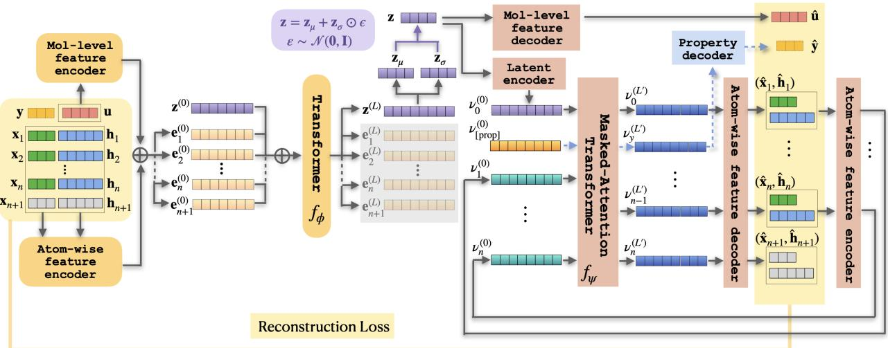  
Figure 1: Overview of EF-TAVAE. A canonically ordered and aligned molecule with n atoms is represented as ${ \mathcal { M } } = \left( \mathbf { u } , ( \mathbf { x } _ { 1 } , \mathbf { h } _ { 1 } ) , \ldots , ( \mathbf { x } _ { n } , \mathbf { h } _ { n } ) \right)$ , where u denotes molecule-level categorical features, and $\left( \mathbf { x } _ { i } , \mathbf { h } _ { i } \right)$ denotes the canonicalized 3D coordinate and atom-level categorical features of atom $i \in \{ 1 , \ldots , n \}$ . We append the final nonphysical end-of-molecule (EOM) token $\left( \mathbf { x } _ { n + 1 } , \mathbf { h } _ { n + 1 } \right)$ with $\mathbf { x } _ { n + 1 } = \mathbf { 0 }$ and the special label [EOS] in its atom-level categorical fields. Atom- and molecule-level feature encoders form input embeddings $( \mathbf { e } _ { 1 } ^ { ( 0 ) } , \ldots , \mathbf { e } _ { n + 1 } ^ { ( 0 ) } )$ , to which a learnable sequence token $\mathbf { z } ^ { ( 0 ) }$ is prepended. A bidirectional Transformer encoder $f _ { \phi }$ produces contextualized embeddings; its sequence-token output $\mathbf { z } ^ { ( L ) }$ parameterizes the diagonal Gaussian posterior through $\scriptstyle ( \mathbf { z } _ { \mu } , \mathbf { z } _ { \sigma } )$ . The latent code is sampled by reparameterization as $\mathbf { z } = \mathbf { z } _ { \mu } + \mathbf { z } _ { \sigma } \odot \pmb { \varepsilon }$ , with $\pmb { \varepsilon } \sim \mathcal { N } ( \mathbf { 0 } , \mathbf { I } )$ . From $\mathbf { z } ,$ EF-TAVAE first predicts the molecule-level features uˆ and constructs latent-conditioned decoder inputs $\pmb { \nu } _ { 0 } ^ { ( 0 ) }$ . The causal Transformer decoder $f _ { \Psi }$ then uses masked self-attention to generate $\pmb { \nu } _ { i } ^ { ( L ^ { \prime } ) }$ autoregressively: it maps $\pmb { \nu } _ { i } ^ { ( L ^ { \prime } ) }$ to next atom-level outputs $( \hat { \mathbf { x } } _ { i + 1 } , \hat { \mathbf { h } } _ { i + 1 } )$ , which are then encoded into $\pmb { \nu } _ { i + 1 } ^ { ( 0 ) }$ , recursively, terminating when it emits [EOS] in $\hat { \mathbf { h } } _ { i + 1 }$ . When optional property supervision is enabled, a learned property token $\pmb { \nu } _ { [ \mathrm { P R O P } ] } ^ { ( 0 ) }$ is inserted after the latent decoder token. Its final representation $\pmb { \nu } _ { [ \mathrm { P R O P } ] } ^ { ( L ^ { \prime } ) }$ is passed through a property readout head to predict y. The blue dashed path denotes this property-supervised readout. Autoregressive atom states never attend to the property token, so the property pathway does not alter the atom-generation process. Here, y is used as a supervision target rather than as an encoder input. During training, teacher forcing supplies the preceding ground-truth atom tokens, and the reconstruction loss is applied to the molecule- and atom-level predictions. When property supervision is enabled, the property-reconstruction loss is additionally included in the training objective.

## 2.1 Canonical molecular representation

Molecular data inherently exhibit two key symmetries. First, permutation symmetry ensures that relabeling atoms does not alter a molecule’s identity. Second, rotation–translation symmetry dictates that rigid motions in space (rotations or translations) do not change the underlying structure. Formally, a molecular conformation is represented by atom coordinates $X \in \mathbb { R } ^ { N \times \bar { 3 } }$ (together with associated per-atom features), but is defined only up to the action of two groups. A global rigid-body transformation $g = ( R , t ) \in \mathrm { S E } ( 3 )$ , with rotation $R \in \mathrm { S O } ( 3 )$ and translation $t \in \mathbb { R } ^ { 3 }$ acts on the coordinates as $g \cdot X = X R ^ { \top } + \mathbf { 1 } _ { N } t ^ { \top }$ , where $\mathbf { 1 } _ { N } \in \mathbb { R } ^ { N }$ is the all-ones vector. Independently, a permutation $\sigma \in S _ { N }$ relabels the atoms through its permutation matrix $P _ { \sigma } \in \{ 0 , 1 \} ^ { N \times N }$ as ${ \boldsymbol { \sigma } } \cdot { \boldsymbol { X } } = P _ { \sigma } { \boldsymbol { X } }$ , simultaneously reordering any per-atom features. Since the spatial transformation acts on the right (on the coordinate axes) while the relabeling acts on the left (on the atom index), the two actions commute and together generate the direct product group $\mathrm { S E } ( 3 ) \times S _ { N }$ , with joint action $( g , \sigma ) \cdot X = P _ { \sigma } X R ^ { \top } + \mathbf { 1 } _ { N } t ^ { \top }$ . Two coordinate arrays related by any $( g , \sigma )$ thus represent the same molecule. A generative model over molecular structures must therefore respect both symmetries–either by being invariant to this joint action or by modeling the quotient space $\mathbb { R } ^ { N \times 3 } / ( \mathrm { S E } ( 3 ) \times S _ { N } )$

Conventionally, invariance to this joint action is achieved by building equivariance into every layer [Hoogeboom et al., 2022, Xu et al., 2023, Huang et al., 2024, Hua et al., 2024, Le et al., 2024, Irwin et al., 2025, Dunn and Koes, 2026, Xie et al., 2022, Jiao et al., 2023, Miller et al., 2024, Zeni et al., 2025], by augmenting the data with sampled group elements [Luo et al., 2025, Joshi et al., 2025, Morehead\* et al., 2026], or by modeling the distribution directly on the quotient space [Ko and Lee, 2026, Xu et al., 2026]. We instead propose a simpler canonical-alignment procedure that selects a deterministic representative in preprocessing: an atom ordering fixes a permutation convention, and a rigid alignment to a standardized frame fixes the translation and proper-rotation degrees of freedom, leaving reflections and hence chirality intact.

Canonical atom ordering. We first establish an atom order for each molecule using canonical SMILES. We generate an RDKit canonical SMILES representation, construct the corresponding canonicalized molecular graph, and match it back to the input molecule to obtain the ordering σ. For graphs without unresolved automorphism ties, canonical SMILES does not depend on the input atom indexing, so this procedure yields a graph-based ordering convention that we apply uniformly across training and evaluation. This gives a deterministic permutation convention for the molecular graphs considered here. Graph automorphisms and associated tie-breaking are discussed in Appendix B.

Atom Position Alignment. Once the atoms are canonically ordered, we remove translational and proper-rotational symmetries by rigidly aligning each molecule to a standardized coordinate frame. We define a canonicalization map c that selects a deterministic representative of each molecule’s SE(3) orbit, conditioned on the fixed canonical atom ordering. Given that ordering, c translates the first atom to the origin, uses the first atom with nonzero displacement to fix the positive x-axis, and uses the first suficiently non-collinear atom to fix the remaining proper rotation (placing it in the $x - z$ half-plane with $z \geq 0 )$ ; the same rigid transformation is applied to all atoms. Thus any two inputs difering only by a translation and proper rotation, with the same canonical ordering, map to identical coordinates up to numerical precision: $c ( g \cdot X ) = c ( X )$ for all $g \in { \mathrm { S E } } ( 3 )$ . An illustration of the atom position alignment is given in Figure 2(a). A detailed description of the alignment procedure, including collinear edge cases and numerical verification, is provided in Appendix B.

By imposing a fixed ordering and orientation in preprocessing, we shift symmetry handling from the model architecture to the data representation, which ofers a simple and scalable approach for the use of standard Transformer backbones. They do not provide equivariance guarantees and require explicit conventions for symmetric or near-degenerate molecules; Sections 4 and 5 discuss these limits and related methods.

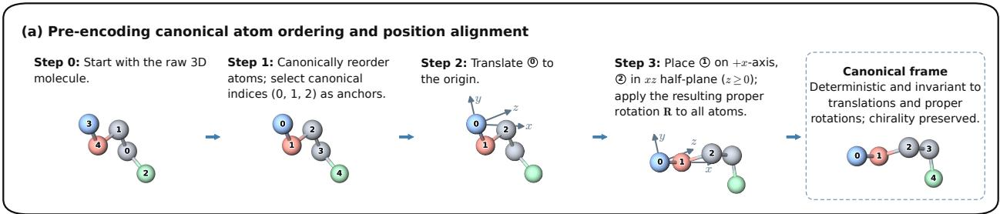

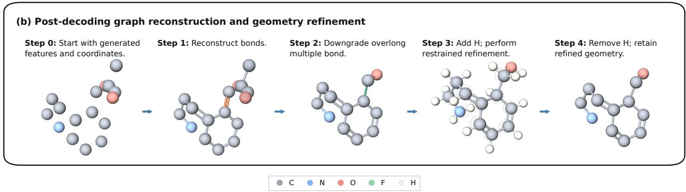  
Figure 2: (a) Example preprocessing of molecular data prior to encoding. A ${ \mathrm { C } } _ { 2 } { \mathrm { H } } _ { 6 } { \mathrm { F N O } }$ conformer from PCQM4Mv2 is shown. Hydrogen atoms are implicit and omitted from the visualization; numbers denote atom-row indices at each stage. (b) Deterministic reconstruction and restrained refinement of a generated heavy-atom configuration. The decoder supplies atom identities and 3D coordinates, together with per-atom and molecule-level attributes, but no molecular graph. Connectivity and valencecompatible bond orders are inferred without changing the generated coordinates. The initial graph contains two connected components: the hatched four-heavy-atom propylene oxide fragment is discarded, whereas the 12-heavy-atom component is retained. Brown marks an initially assigned C=C bond whose length is inconsistent with a carbon–carbon double bond. Demotion to C–C (green) dearomatizes the ring. Aromatic bonds before correction are depicted by a solid bond with a thin dashed inner line. Explicit hydrogens are subsequently added for fixed-topology, restrained refinement; dashed element-colored outlines indicate the pre-refinement heavy-atom positions. Finally, the temporary hydrogens are removed while retaining the refined heavy-atom coordinates.

## 2.2 Molecule autoencoding

Given the canonical molecular representation from Section 2.1, we next learn a compact latent space for 3D molecules. We use a variational autoencoder (VAE) [Kingma and Welling, 2014], referred to as EF-TAVAE, that maps each molecule to a fixed-dimensional latent vector and reconstructs it as a variable-length molecular sequence. The canonical ordering provides a reproducible sequence for the causal factorization, while the pose alignment expresses the Cartesian prediction targets in a common coordinate frame. Together, these conventions support variable-size autoregressive decoding using a standard causal Transformer.

Rather than directly predicting pairwise bond labels, the decoder predicts atom types, 3D coordinates, and a set of chemically informative atom- and molecule-level attributes. These attributes provide local electronic and topological context, including charge, hydrogen count, hybridization, aromaticity, conjugation, and ring membership, that helps recover chemically meaningful structures from coordinates without requiring a dense bond-prediction head. The complete feature list is provided in Appendix C.

When optional property supervision is enabled, EF-TAVAE augments molecular reconstruction with a property-prediction objective using complementary latent-only and molecule-conditioned routes. This objective encourages the latent space and decoded molecular states to become property-organized without altering autoregressive generation. The molecule-conditioned route provides an internal property readout for ranking and filtering generated molecules according to their consistency with the requested property.

Molecular sequence representation. For a molecule with n atoms, let $\mathbf { x } _ { i } \in \mathbb { R } ^ { 3 }$ denote the canonicalized 3D coordinate of atom $i ,$ and let $\mathbf { h } _ { i }$ denote its categorical atom-level feature vector. Atoms are ordered by a deterministic canonical ordering, and coordinates are expressed in the canonical rigid pose described in Section 2.1. We use $k = 9$ atom-level categorical fields, consisting of atom type plus eight additional atom-level chemical attributes, and $m = 4$ molecule-level categorical features u. Thus each molecule is represented as

$$
{ \mathcal { M } } = \left( \mathbf { u } , ( \mathbf { x } _ { 1 } , \mathbf { h } _ { 1 } ) , \cdots , ( \mathbf { x } _ { n } , \mathbf { h } _ { n } ) \right) .
$$

To support variable-size decoding, we append a nonphysical end-of-molecule (EOM) atom after the final atom. The resulting sequence has length $n + 1 ;$ ; the EOM atom has zero coordinates and a special end-of-sequence atom-type label, [EOS], for all atom-level categorical fields.

Bidirectional transformer-based encoding. Each atom token is embedded by combining learned embeddings of the canonicalized coordinates, atom-level categorical features, and molecule-level features. Let ${ \bf e } _ { i } ^ { ( 0 ) } \in \mathbb { R } ^ { d }$ denote the resulting input embedding for token i. Following sequence-representation models such as BERT [Devlin et al., 2019, Liu et al., 2019], we prepend a learnable sequence token $\mathbf { z } ^ { ( 0 ) } \in \mathbb { R } ^ { d }$ to the atom sequence $( \mathbf { z } ^ { ( 0 ) } , \mathbf { e } _ { 1 } ^ { ( 0 ) } , \ldots , \mathbf { e } _ { n + 1 } ^ { ( 0 ) } )$ A bidirectional Transformer encoder $f _ { \phi }$ maps this sequence to contextualized embeddings. The output corresponding to the sequence token is projected to the parameters of a diagonal Gaussian posterior, $q _ { \phi } ( \mathbf { z } \mid \mathcal { M } ) = \mathcal { N } ( \mathbf { z } _ { \mu } , \mathrm { d i a g } ( \mathbf { z } _ { \sigma } ^ { 2 } ) ) , \mathbf { z } _ { \mu } , \mathbf { z } _ { \sigma } \in \mathbb { R } ^ { d }$ . We sample latent codes using the reparameterization trick [Kingma and Welling, 2014], $\mathbf { z } = \mathbf { z } _ { \mu } + \mathbf { z } _ { \sigma } \odot \varepsilon , \varepsilon \sim \mathcal { N } ( \mathbf { 0 } , \mathbf { I } )$ .

Masked attention transformer-based autoregressive decoding. The decoder factorizes molecule reconstruction into global and sequential components. First, a set of MLP heads predicts the molecule-level features uˆ from z. Second, a causal Transformer decoder $f _ { \Psi }$ generates atom tokens autoregressively. At step $i ,$ the decoder conditions on the latent code z and the previously generated tokens $\mathbf { x } _ { < i } , \mathbf { h } _ { < i }$ to predict the next coordinate and atom-level attributes:

$$
p _ { \pmb { \psi } } ( \mathcal { M } | \mathbf { z } ) = p _ { \pmb { \psi } } ( \mathbf { u } | \mathbf { z } ) \prod _ { i = 1 } ^ { n + 1 } p _ { \pmb { \psi } } ( \mathbf { x } _ { i } , \mathbf { h } _ { i } | \mathbf { z } , \mathbf { x } _ { < i } , \mathbf { h } _ { < i } ) .\tag{1}
$$

In particular, at rollout step i, the latent code and the previously generated atoms are embedded as $( \pmb { \nu } _ { 0 } ^ { ( 0 ) } , \dots , \pmb { \nu } _ { i - 1 } ^ { ( 0 ) } )$ . The Transformer decoder $f _ { \Psi }$ contextualizes this prefix, and its last output row, $\pmb { \nu } _ { i - 1 } ^ { ( L ) }$ , is passed to the coordinate and atom-feature readout heads to parameterize the distribution of $\left( \mathbf { x } _ { i } , \mathbf { h } _ { i } \right)$ . For $i = n + 1$ , only the categorical EOM labels are modeled; $\mathbf { x } _ { n + 1 } = \mathbf { 0 }$ is a placeholder omitted from the coordinate likelihood. Generation terminates when the decoder emits the [EOS] atom-type label. This design allows the decoder to determine molecular size during generation, rather than requiring the number of atoms to be specified in advance.

Property-supervised latent organization and internal property readout. When property supervision is enabled for a target $\mathbf { y } \in \mathbb { R } ^ { c }$ , a learned property token is inserted after the latent token, giving $( \pmb { \nu } _ { 0 } ^ { ( 0 ) } , \pmb { \nu } _ { [ \mathrm { P R O P } ] } ^ { ( 0 ) } , \pmb { \nu } _ { 1 } ^ { ( 0 ) } , \dots , \pmb { \nu } _ { n + 1 } ^ { ( 0 ) } )$ . Its final hidden representation $\pmb { \nu } _ { [ \mathrm { P R O P } ] } ^ { ( L ) }$ is passed through a readout head. For each training example, the property token is evaluated through two complementary information routes. In the molecule-conditioned route, it attends to the atomtoken representations while its direct attention to z is masked; we denote the resulting moleculeconditioned prediction by $\hat { \bf y } _ { \mathrm { m o l } }$ . In the latent-only route, the property token is prevented from attending to the atom tokens and instead predicts the property from z alone; we denote this latent-only prediction by $\hat { \bf y } _ { \mathrm { l a t } }$ . In both routes, the autoregressive atom-token representation is prevented from attending to the property token. Consequently, the property readout does not alter the autoregressive factorization in Equation (1).

Under the two complementary masked-attention routes, the property is predicted either directly through the contextualized atom representations or from the latent representation. The moleculeconditioned route discourages the property readout from relying exclusively on a direct latent shortcut and encourages the decoder’s molecular representations to retain property-relevant information. The latent-only route encourages the target property to be recoverable from z, thereby organizing the latent space according to property-relevant information.

The molecule-conditioned prediction $\hat { \bf y } _ { \mathrm { m o l } }$ is the internal property readout used for postgeneration filtering. Each generated candidate is re-encoded and the internal property-prediction head outputs the corresponding $\hat { \bf y } _ { \mathrm { m o l } }$ . Given a target property value $\mathbf { y } _ { \mathrm { t a r g e t } }$ and a generated candidate ${ \mathcal { M } } ^ { \prime } ,$ we define its internal-readout property error as $e _ { \mathrm { s u r } } = \| \hat { \mathbf { y } } _ { \mathrm { m o l } } ( \mathcal { M } ^ { \prime } ) - \mathbf { y } _ { \mathrm { t a r g e t } } \|$ Generated candidates can then be ranked in ascending order of $e _ { \mathrm { s u r } } { \mathrm { . } }$ , after which a chosen top fraction is retained. This procedure acts as a post-generation property-consistency filter and does not require access to the true property of a generated molecule. The externally evaluated property is used only afterward to assess the quality of the retained candidates. We evaluate the efectiveness of this readout-based ranking procedure in Section 3.2.

Training objective. The base reconstruction loss combines cross-entropy losses for categorical features with a Smooth-L1 loss for coordinates. We minimize

$$
\mathcal { L } _ { \mathrm { r e c } } = \lambda _ { \mathrm { m o l } } \mathrm { C E } ( \mathbf { u } , \hat { \mathbf { u } } ) + \sum _ { i = 1 } ^ { n + 1 } \lambda _ { \mathrm { a t o m } } \mathrm { C E } ( \mathbf { h } _ { i } , \hat { \mathbf { h } } _ { i } ) + \sum _ { i = 1 } ^ { n } \lambda _ { \mathrm { c o o r d } } \mathrm { S m o o t h L } 1 ( \mathbf { x } _ { i } , \hat { \mathbf { x } } _ { i } ) ,\tag{2}
$$

where the coordinate term excludes the [EOS] token and the loss weights are chosen to balance the coordinate and categorical terms.

When property reconstruction is enabled, we add an additional property-reconstruction loss term with weight $\lambda _ { \mathrm { p r o p } }$ to the base reconstruction objective in Equation (2),

$$
\mathcal { L } _ { \mathrm { p r o p } } = \tau _ { \mathrm { m o l } } \mathbf { M S E } \left( \mathbf { y } , \hat { \mathbf { y } } _ { \mathrm { m o l } } \right) + \left( 1 - \tau _ { \mathrm { m o l } } \right) \mathbf { M S E } \left( \mathbf { y } , \hat { \mathbf { y } } _ { \mathrm { l a t } } \right) .\tag{3}
$$

The full VAE objective is

$$
\begin{array} { r } { \mathcal { L } _ { \mathrm { V A E } } = \mathcal { L } _ { \mathrm { r e c } } + \lambda _ { \mathrm { p r o p } } \mathcal { L } _ { \mathrm { p r o p } } + \beta _ { \mathrm { K L } } D _ { \mathrm { K L } } \left( q _ { \phi } ( \mathbf { z } \mid \mathcal { M } ) \left. \mathcal { N } ( \mathbf { 0 } , \mathbf { I } ) \right. \right) + \lambda _ { \mathrm { v a r } } \mathcal { L } _ { \mathrm { v a r } } + \lambda _ { \mathrm { c o v } } \mathcal { L } _ { \mathrm { c o v } } , } \end{array}\tag{4}
$$

where the property loss is the weighted average of the two routes, each categorical cross-entropy is summed over its feature heads, ${ \mathcal { L } } _ { \mathrm { v a r } }$ softly enforces a minimum empirical variance floor for each dimension of the posterior mean $\mathbf { z } _ { \mu }$ , and ${ \mathcal { L } } _ { \mathrm { c o v } }$ penalizes of-diagonal covariance between dimensions of $\mathbf { z } _ { \mu } ;$ see Appendix E for more details. We set $\lambda _ { \mathrm { p r o p } } = 0$ when property supervision is disabled.

During training, we use teacher forcing for the autoregressive decoder: when predicting token $i ,$ the decoder receives the ground-truth prefix $\left( \mathbf { x } _ { < i } , \mathbf { h } _ { < i } \right)$ rather than its own previous predictions. At inference time, the model decodes autoregressively, feeding each predicted token back into the decoder until [EOS] is produced.

## 2.3 Latent flow matching

After training the molecule autoencoder, we freeze its parameters and train a continuous flow model in the learned latent space. For each molecule $\mathcal { M }$ , we use the deterministic posterior mean $\mathbf { z } _ { \boldsymbol { \mu } } \in \mathbb { R } ^ { d }$ as its latent representation (see further discussion in Appendix F). This gives an empirical target distribution over latent molecular representations, denoted $p _ { \mathrm { d a t a } } ( \mathbf { z } _ { \mu } )$ . The same latent-flow formulation supports both sampling modes. Without an external condition, it learns $p _ { \mathrm { d a t a } } ( \mathbf { z } _ { \mu } ) ;$ when a target property y is supplied externally, it learns the conditional distribution $p _ { \mathrm { d a t a } } ( \mathbf { z } _ { \mu } \mid \mathbf { y } )$ . In neither case is y appended to the latent state.

Flow matching learns a time-dependent vector field that transports a standard Gaussian base distribution $p _ { \varepsilon } = p _ { 0 } = \mathcal { N } ( \mathbf { 0 } , \mathbf { I } )$ to the target latent distribution. For a data latent $\mathbf { z } _ { \mu } \sim p _ { \mathrm { d a t a } } ( \cdot )$ and a noise sample ${ \mathbf z } _ { \varepsilon } \sim p _ { \varepsilon }$ , we use the linear interpolation path ${ \bf z } _ { t } = ( 1 - t ) { \bf z } _ { \varepsilon } + t { \bf z } _ { \mu } , t \sim \mathrm { U n i f } ( 0 , 1 )$ with corresponding target velocity $\begin{array} { r } { \mathbf { u } _ { t } = \frac { \mathrm { d } } { \mathrm { d } t } \mathbf { z } _ { t } = \mathbf { z } _ { \mu } - \mathbf { z } _ { \varepsilon } } \end{array}$

We parametrize the velocity field by a neural network $f _ { \boldsymbol { \theta } } ( \mathbf { z } _ { t } , t , \mathbf { y } )$ and minimize the flow-matching objective

$$
\begin{array} { r } { \mathcal { L } _ { \mathrm { F M } } ( \theta ) = \mathbb { E } _ { \mathbf { \phi } ( \mathbf { z } _ { \mu } , \mathbf { y } ) \sim p _ { \mathrm { d a t a } } ( \cdot , \cdot ) } \left[ \left| \left| f _ { \theta } ( \mathbf { z } _ { t } , t , \mathbf { y } ) - ( \mathbf { z } _ { \mu } - \mathbf { z } _ { \varepsilon } ) \right| \right| _ { 2 } ^ { 2 } \right] . } \end{array}
$$

For unconditional generation, we omit y and train $f _ { \theta } ( \mathbf { z } _ { t } , t )$ . At inference time, we sample ${ \mathbf z } _ { \varepsilon } \sim p _ { \varepsilon }$ and solve the ordinary diferential equation $\begin{array} { r } { \frac { \mathrm { d } } { \mathrm { d } t } \mathbf { z } _ { t } = f _ { \theta } ( \mathbf { z } _ { t } , t , \mathbf { y } ) } \end{array}$ (omit y for unconditional generation) with ${ \bf z } _ { t = 0 } = { \bf z } _ { \varepsilon }$ from $t = 0$ to $t = 1$ . The terminal state $\mathbf { z } _ { t = 1 }$ is then decoded by the autoregressive molecule decoder.

## 2.4 Practical molecular reconstruction and geometry refinement

During sampling, EF-TALFM generates atom types, 3D coordinates, atom-level chemical features, and molecule-level attributes, but no bond labels. Depending on the molecular representation used for training, the decoded sequence contains either only heavy atoms or all atoms, including explicit hydrogens. We convert either decoded state into a chemically interpretable molecular structure using a fixed, rule-based reconstruction and refinement pipeline that is separate from the learned generator. The two representations share the same fixed-topology, heavy-atomrestrained refinement principle, but require diferent graph-construction and hydrogen-handling procedures. In the all-atom setting, the explicit hydrogen positions provide additional geometric evidence for hydrogen parentage and atomic valence, making standard bond perception a strong starting point. The more demanding reconstruction problem is therefore the heavy-atom setting, in which the hydrogen coordinates are absent, and the graph must be recovered using the decoded heavy-atom geometry and chemical features. Accordingly, the following discussion focuses on the heavy-atom branch. All-atom reconstruction details can be found in Appendix D.

Molecule graph reconstruction. For a heavy-atom decoded sequence, both connectivity and bond orders must be inferred; see Step 1 in Figure 2(b). Rule-based perception of molecular connectivity and bond orders from three-dimensional coordinates and element identities has been studied previously [Zhang et al., 2012]. Our procedure operates in the same broad setting but additionally uses a distinct set of rules that incorporates the generated chemical attributes. Specifically, it first infers heavy-atom connectivity from interatomic distances and covalent radii under element-, hybridization-, and ring-aware constraints; then assigns valence-aware bond orders using the generated chemical attributes; and finally applies deterministic valence, aromaticity, and conjugation corrections (Step 2). If the resulting graph contains multiple components, we retain one component with the largest number of heavy atoms and discard the others without changing the bonds within the retained component (Step 3). We then identify double and triple bonds whose interatomic distances exceed element- and bond-order-specific cutofs based on covalent radii. Their bond orders are lowered one level at a time only when the resulting graph passes RD-Kit sanitization; no edge is deleted. We refer to this operation as overlong multiple-bond correction (Step 4). Full details are provided in Appendix D.

Restrained geometry refinement. Short force-field minimization has been used to refine the internal geometries of generated molecules [Ragoza et al., 2022], and recent benchmarking shows that local relaxation can substantially improve the conformational validity of generated 3D molecules [Baillif et al., 2024]. For heavy-atom generation, RDKit first adds temporary explicit hydrogens; all heavy atoms are then restrained near their decoded positions during minimization (Step 5), and the refined heavy-atom coordinates are transferred back while the temporary hydrogens are discarded (Step 6). The restraint parameters and optimization settings are provided in Appendix D.

## 3 Empirical studies

We organize the empirical study around two questions. First, can a fixed-dimensional moleculelevel latent retain suficient chemical and geometric information for faithful reconstruction while supporting valid, novel, and distributionally faithful generation when molecular size is determined by the decoder? Section 3.1 addresses this question by comparing EF-TALFM with baseline methods in terms of reconstruction fidelity, chemical and geometric validity, novelty, distributional fidelity, and computational cost. Second, can the same latent design support reliable property-conditioned generation? Section 3.2 conditions the latent flow on target HOMO–LUMO gaps and uses the model’s internal property readout to rank generated candidates, measuring DFT-verified hit enrichment, candidate retention, and the novelty and diversity of the resulting hits.

## 3.1 Unconditional molecule generation

After describing the experimental setup in Section 3.1.1, we compare EF-TALFM with baseline methods in Section 3.1.2 and evaluate distributional fidelity and the efects of postprocessing in Section 3.1.3. Our results show that (i) EF-TAVAE compresses variable-size molecules into a chemically informed, fixed-dimensional latent representation while achieving the highest fraction of generated molecules that are unique, absent from the training set, pass sanitization and Pose-Busters sanity checks, referred to as the PoseBusters-verified novel yield; (ii) EF-TALFM reduces end-to-end training and sampling time while delivering the highest PoseBusters-verified novel sampling throughput and approximate training exposure throughput; and (iv) EF-TALFM reproduces training-set distributions of molecular size and global chemical attributes, while restrained refinement improves local geometric realism without materially changing molecular identity or population-level chemical statistics.

## 3.1.1 Experimental setup

Benchmark dataset. We use PCQM4Mv2 [Hu et al., 2021], a large-scale quantum-chemistry dataset derived from PubChemQC and originally designed for HOMO–LUMO gap prediction in the OGB Large-Scale Challenge; its oficial training split provides DFT-optimized 3D structures for approximately 3.4M molecules. Following common practice in 3D small-molecule generation, we model only the heavy-atom scafold. After preprocessing, we use a 90%/10% train/validation split. Further preprocessing details are provided in Appendix G.2.

Baseline methods. We select two strong, complementary bond-aware baselines, UAE-3D [Luo et al., 2025] and FlowMol [Dunn and Koes, 2024]. Across their respective evaluations, both report state-of-the-art results for de novo 3D molecular generation, collectively outperforming a broad range of prior 3D generators [Hoogeboom et al., 2022, Xu et al., 2023, Huang et al., 2024, Vignac et al., 2023, Hua et al., 2024, Le et al., 2024, Joshi et al., 2025, Irwin et al., 2025]. They cover two complementary generative settings: UAE-3D learns a variable-length atom-wise latent representation that is later modeled by a latent difusion model, whereas FlowMol uses equivariant flow matching to directly generate molecular structures, including bond types.

We do not include other methods that generate only atom types and 3D coordinates [Hoogeboom et al., 2022, Xu et al., 2023, Joshi et al., 2025, Cheng et al., 2025], because geometry-based graph recovery can be insuficient for accurately reconstructing chemically annotated molecular states, particularly for larger or heavy-atom-rich molecules where bond connectivity, bond orders, aromaticity, and formal charges may be ambiguous from coordinates alone (see Table 4 and Appendix G.1).

Evaluation metrics. We evaluate the ability of EF-TALFM to sample valid, diverse, and novel molecules. Connectivity measures the fraction whose recovered molecular graph is connected; sanitization measures the fraction of generated molecules that pass chemistry–toolkit validity checks; uniqueness is computed as the proportion of the unique sanitized molecules among all generated molecules; and novelty is computed as the proportion of generated molecules that are unique, sanitized, and absent from the training set. We also use PoseBusters sanity checks [Buttenschoen et al., 2024]. Detailed descriptions of all evaluation metrics are provided in Appendix G.3.

Training, sampling, and comparison protocol. The methods operate in diferent representation spaces and therefore do not share directly comparable notions of batch size, epoch, or training step. UAE-3D and EF-TALFM use two-stage training, in which an autoencoder is followed by an unconditional latent generative model (with property supervision disabled for EF-TAVAE), whereas FlowMol trains a direct molecular graph flow model using adaptive graph-edge batches. We therefore use a common evaluation protocol and hardware while reporting each method’s native optimizer-step budget, parameter count, efective update units, and wall-clock time.

For the PCQM4Mv2 generation results reported below, we train the 30M-parameter FlowMol model for 100K optimizer steps and evaluate its validation-selected checkpoint. For UAE-3D, we train the 0.6M-parameter VAE for 400K steps and the 38.6M-parameter latent generative model for 1M steps; for EF-TALFM, we train the 18.5M-parameter TAVAE for 400K steps and the 5.4Mparameter latent flow model for 1M steps. We adapt the published UAE-3D and FlowMol QM9 configurations to PCQM4Mv2, with minor tuning for stable training. EF-TALFM uses a fixed molecule-level latent dimension of d = 32, whereas UAE-3D uses d = 4 dimensions per atom; because most PCQM4Mv2 molecules contain more than 11 atoms, UAE-3D typically operates on a higher-dimensional molecule-level latent representation. All models are trained on single-node H100 GPUs. Detailed hyperparameters are provided in Appendices L to N.

For sampling, EF-TALFM integrates its latent flow ODE with the adaptive fifth-order Dormand– Prince solver [Chen et al., 2018], UAE-3D uses its denoising difusion probabilistic model (DDPM) sampler with 100 denoising steps, and FlowMol uses 100 evenly spaced Euler integration steps. We measure the time required to generate 10,000 molecules using batch size 5,000 under the same hardware setting. EF-TALFM samples are reconstructed and refined using the procedure in Section 2.4 and Figure 2(b); UAE-3D and FlowMol use the same downstream stages of overlong multiple-bond correction and geometry refinement, with their predicted bond types replacing Step 1.

## 3.1.2 Performance comparison against baselines

Higher PoseBusters-verified novel yield than bond-aware baselines. Figure 3(a) shows that EF-TALFM produces the strongest overall generation performance in terms of the PoseBustersverified novel yield, which counts the fraction of molecules that are unique, absent from the training set, pass sanitization and all six PoseBusters checks, including bond lengths, bond angles, internal steric clash, aromatic-ring flatness, double-bond flatness, and internal energy; it achieves 89.4%, compared with 75.6% for UAE-3D and 69.8% for FlowMol. This joint rate reflects the number of distinct, chemically valid, previously unseen candidates available for downstream evaluation and is therefore more informative for molecular discovery than validity or novelty considered separately. Detailed comparison results and metric definitions are provided in Table 5 and Appendix H; additional evaluations across baseline checkpoints and sampling-step budgets (Appendix I) lead to the same overall conclusion.

(a) Generation performance ( ↑)  
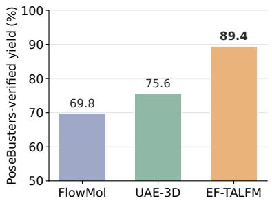

(b) End-to-end sampling time ( ↓)  
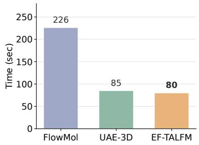

(c) Verified-novel sampling throughput (↑)  
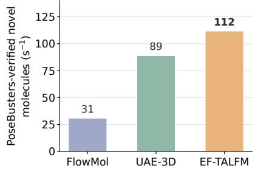

(d) End-to-end training time (↓)  
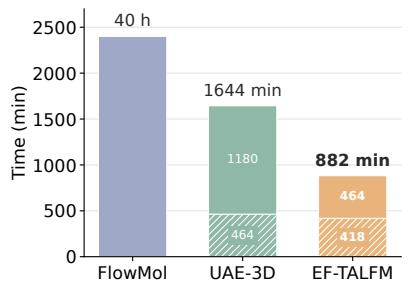

(e) End-to-end training throughput (↑)  
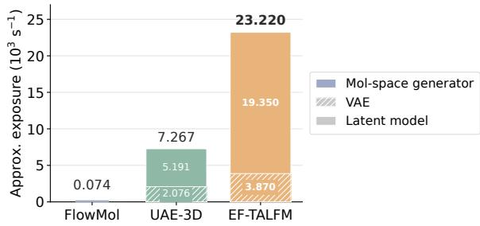  
Figure 3: Generation quality and end-to-end computational eficiency on PCQM4Mv2. Arrows indicate the better performance. Panel (a) shows that EF-TALFM achieves the highest PoseBusters-verified novel yield among the 10,000 molecules generated by each method, which counts unique, training-setnovel samples that pass sanitization and all six PoseBusters geometry checks. Panel (b) shows that EF-TALFM generates the 10,000 molecules in the shortest end-to-end time, including time for generator sampling, reconstruction, and relaxation. Panel (c) then shows that EF-TALFM delivers the highest sampling throughput, for PoseBusters-verified novel molecules, shown in panel (a). Panel (d) shows that EF-TALFM requires the shortest end-to-end training time while achieving the highest end-to-end training through put. This pipeline-average rate divides approximate exposure by total training time, with stacked segments showing stage contributions. FlowMol’s displayed rate uses a molecule-equivalent proxy derived from its edge-level exposure; because the exposure units are not directly interchangeable, panel (e) contextualizes data-processing throughput rather than providing a FLOP-matched comparison.

Lower wall-clock cost and higher throughput than bond-aware baselines. Figure 3(b–e) shows that EF-TALFM reduces practical end-to-end generation and training cost under the reported budgets. Its sampling-time speedups are 1.06× over UAE-3D and 2.83× over FlowMol; its PoseBusters-verified novel sampling throughput is 1.26× and 3.62× that of the respective baselines. EF-TALFM also achieves training-time speedups of 1.86× and 2.72× and approximate training-throughput speedups of 3.20× and 314× over the same baselines. The FlowMol training-throughput value is a molecule-equivalent proxy, and exposure units are not directly comparable across latent-space and molecular-space models; accordingly, panel (e) contextualizes data-processing throughput rather than providing a FLOP-matched comparison. The stagelevel measurements indicate that the principal gain arises from generative modeling in a compact, fixed-dimensional molecule-level latent space. Detailed update, exposure, and stage-level timing statistics are provided in Table 8.

## 3.1.3 Distributional fidelity and postprocessing ablation

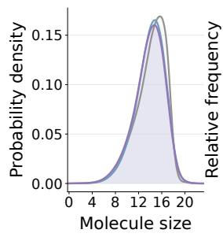

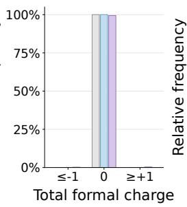

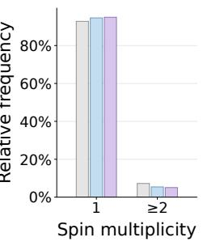

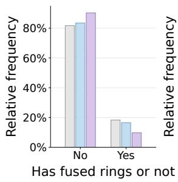

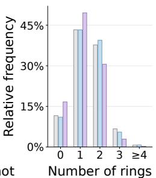  
Train Generated (Molecule data) Generated Final (Relaxed Molecule Graph)

Figure 4: EF-TALFM matches training-set chemical distributions before and after postprocessing. Normalized distributions of atom count, ring count, fused-ring occurrence, spin multiplicity, and total charge are shown for the training data, raw outputs decoded from 100,000 generated latents, and final relaxed molecular graphs.

EF-TALFM ultimately produces molecules through the complete reconstruction and geometryrefinement pipeline. To distinguish properties learned by the generative model from improvements introduced by postprocessing, we analyze both the raw decoded outputs and intermediate reconstruction stages. We sample 100,000 latent vectors, decode them into molecular data, and construct the final relaxed molecular graphs; see Figure 2(b) for a generated heavy-atom structure.

Postprocessing preserves the learned population distribution. Figure 4 compares normalized distributions of atom count, ring count, fused-ring occurrence, spin multiplicity, and total charge. The agreement between the training data and raw decoded outputs indicates that EF-TALFM directly learns both variable molecular size and global chemical attributes. Comparing the raw and final distributions isolates the aggregate efect of reconstruction and refinement. Their close agreement shows that postprocessing does not substantially reshape the generated population. Consequently, the final relaxed molecules continue to closely track the corresponding training-set distributions.

Validity, uniqueness, and novelty are preserved across stages, while restrained refinement further improves bond geometry. Table 1 further separates the efects of overlong multiple-bond correction and restrained refinement. Molecular validity, uniqueness, and novelty remain essentially unchanged across the three stages, showing that these properties are primarily determined by the generated molecular state and graph reconstruction rather than by subsequent postprocessing. Overlong multiple-bond correction (Step 2) provides only modest improvements in geometric sanity. In contrast, geometric refinement (Steps 3-4) increases the PoseBusters pass rate by a large margin, with particularly large improvements in bond lengths, bond angles, internal steric clashes, and internal energy. Thus, restrained refinement primarily improves local geometry while preserving molecular identity and population-level chemical statistics.

Table 1: Stagewise ablation of the EF-TALFM molecular reconstruction pipeline. Largest raw denotes the atom-count largest connected fragment obtained after deterministic graph reconstruction; Prerelaxed additionally applies overlong multiple-bond correction; and Relaxed additionally applies hydrogenassisted restrained geometry refinement. Molecular validity, diversity, novelty, and feature consistency remain nearly unchanged across the three stages. In contrast, restrained refinement produces the dominant improvement in geometric realism. PoseBusters pass rates are computed on the molecules that are unique, absent from the training set, and pass sanitization (N. & U. & S.) at each stage. Changes (∆) are reported in percentage points.
<table><tr><td></td><td colspan="3">Metric value (%)</td><td colspan="3">Change (percentage points)</td></tr><tr><td>Metric (↑)</td><td>Largest raw</td><td>Pre-relaxed</td><td>Relaxed</td><td> $\Delta _ { \mathrm { r a w }  \mathrm { p r e } }$ </td><td> $\Delta _ { \mathrm { p r e } \to \mathrm { r e l } }$ </td><td> $\Delta _ { \mathrm { r a w }  \mathrm { r e l } }$ </td></tr><tr><td colspan="7">Molecular validity, diversity, and feature consistency</td></tr><tr><td>S.</td><td>98.24</td><td>98.25</td><td>98.25</td><td>0.01</td><td>0.00</td><td>0.01</td></tr><tr><td>U.&amp;S.</td><td>98.20</td><td>98.21</td><td>98.21</td><td>0.01</td><td>0.00</td><td>0.01</td></tr><tr><td>N.&amp;U.&amp;S.</td><td>94.36</td><td>94.33</td><td>94.33</td><td>-0.03</td><td>0.00</td><td>-0.03</td></tr><tr><td colspan="7">PoseBusters geometric sanity checks on N. &amp; U. &amp; S. molecules</td></tr><tr><td>Bond lengths</td><td>80.66</td><td>81.29</td><td>99.79</td><td>0.63</td><td>18.50</td><td>19.13</td></tr><tr><td>Bond angles</td><td>81.45</td><td>81.47</td><td>99.32</td><td>0.02</td><td>17.85</td><td>17.87</td></tr><tr><td>Internal steric clash</td><td>79.50</td><td>79.84</td><td>97.21</td><td>0.33</td><td>17.38</td><td>17.71</td></tr><tr><td>Aromatic-ring flatness</td><td>99.87</td><td>99.89</td><td>99.93</td><td>0.02</td><td>0.03</td><td>0.05</td></tr><tr><td>Double-bond flatness</td><td>96.86</td><td>97.40</td><td>98.09</td><td>0.54</td><td>0.69</td><td>1.23</td></tr><tr><td>Internal energy</td><td>93.61</td><td>93.81</td><td>99.71</td><td>0.20</td><td>5.90</td><td>6.10</td></tr><tr><td>All PoseBusters checks</td><td>64.00</td><td>64.65</td><td>94.74</td><td>0.65</td><td>+30.10</td><td>+30.74</td></tr></table>

We show ten final relaxed molecules in Appendix J, illustrating the range of molecular sizes, ring systems, fused-ring structures, and heteroatom compositions produced by the complete pipeline. These examples qualitatively reflect the diversity quantified by the large-sample distributional analysis; hydrogen atoms are omitted for clarity.

## 3.2 Property-conditioned molecule generation

Having established EF-TALFM’s unconditional generation performance, we next evaluate whether its latent representation supports efective property-conditioned generation. We train EF-TAVAE with property-supervision enabled, condition the latent flow on HOMO–LUMO gaps from the PCQM4Mv2 dataset and use the model’s internal property readout as a low-cost ranking signal for candidate selection. Target fidelity is then assessed against DFT-computed reference values. Detailed hyperparameters are provided in Appendix O.

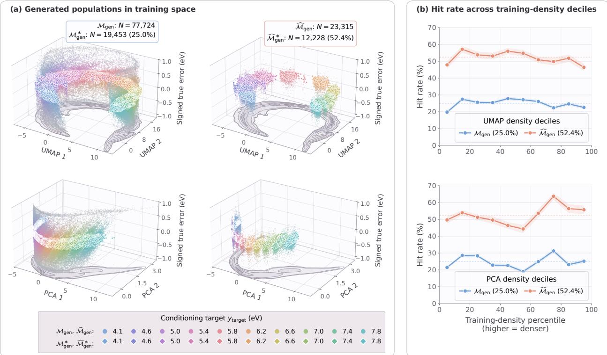  
Figure 5: Internal-readout selection increases DFT-verified hit rates across every trainingdensity decile in the learned property representation. The top and bottom rows correspond to fixed uniform manifold approximation and projection (UMAP) and principal component analysis (PCA) mappings of the penultimate molecule-path property representation r, respectively. Panel (a) compares the screened relaxed population $\mathcal { M } _ { \mathrm { g e n } }$ (left) with its selected subset $\widehat { \mathcal { M } } _ { \mathrm { g e n } }$ (right), obtained by retaining the target-wise best 30% ranked by $e _ { \mathrm { s u r } } .$ . The signed true-property error, $y _ { \mathrm { t r u e } } - y _ { \mathrm { t a r g e t } }$ is clipped $\mathrm { a t \pm 1 . 0 ~ e V . }$ Colors identify the ten conditioning targets. Generation hits with $\varepsilon _ { \mathrm { t r u e } } < 0 . 1$ are shown as white-outlined diamond-shaped markers, whereas misses are represented by round-shaped markers whose target colors progressively fade toward gray with increasing absolute error. The floor shading and contours represent the smoothed density of the full training population; contour boundaries enclose the highest-density regions containing $q \in \{ 1 , 1 0 , 5 0 , 9 0 , 9 9 , 9 9 . 5 \}$ % of the training molecules. The corresponding hit populations are $\mathcal { M } _ { \mathrm { g e n } } ^ { \ast }$ and $\widehat { \mathcal { M } } _ { \mathrm { g e n } } ^ { * }$ . Panel (b) reports the corresponding hit rates across training-density percentile deciles; shaded bands denote 95% Wilson intervals and dashed lines indicate overall hit rates.

After describing the conditioning and evaluation protocol in Section 3.2.1, we assess DFT-verified targeting, novelty, and diversity in Section 3.2.2, and isolate the contributions of postprocessing and selection in Section 3.2.3. Our results show that selecting the target-wise best 30% ofscreened candidates by internal-readout error increases the DFT-verified hit rate from 25.0% to 52.4% while retaining 62.9% of the available hits. The improvement holds across the learned property representation, and the verified hits remain largely novel under exact training-set matching and diverse relative to property-matched training molecules.

## 3.2.1 Experimental setup and evaluation protocol

Conditioning targets. For property-conditioned generation on the PCQM4Mv2 dataset, target HOMO–LUMO gaps are selected to span the central region of the training-set distribution. Ten target values are evenly spaced between the 10th and 90th percentiles and rounded to the nearest 0.1eV, yielding $\mathcal { G } = \{ 4 . 1 , 4 . 6 , 5 . 0 , 5 . 4 , 5 . 8 , 6 . 2 , 6 . 6 , 7 . 0 , 7 . 4 , 7 . 8 \} \mathrm { ~ ( e V ) }$ . For each target $y _ { \mathrm { t a r g e t } } \in \mathcal { G }$ 10,000 molecular samples are generated.

Reference property calculations. Reference HOMO–LUMO gaps y<sub>true</sub> are computed for the generated molecules using single-point Density Functional Theory (DFT) calculations in Psi4 [Smith et al., 2020] at the B3LYP/6-31G(d) level, with density-fitted self-consistent field and no additional geometry optimization. We define the reference property error as

$$
\begin{array} { r l r } { \varepsilon _ { \mathrm { t r u e } } } & { { } : = } & { \left| y _ { \mathrm { t r u e } } - y _ { \mathrm { t a r g e t } } \right| . } \end{array}\tag{5}
$$

Dataset preprocessing. To provide complete molecular inputs for reference DFT calculations using Psi4, we generate molecules using an all-atom representation. Although the heavy-atom representation also predicts the number of hydrogens attached to each heavy atom, the explicit hydrogen atoms and their three-dimensional coordinates must subsequently be constructed. Allatom generation directly models the hydrogen atoms and their positions, reducing reliance on post hoc hydrogen placement and the associated uncertainty in preparing molecular structures for DFT evaluation. Therefore, we train EF-TALFM on PCQM4Mv2 using an all-atom molecular representation.

Closed-shell species constitute the dominant population in PCQM4Mv2. To maintain a consistent electronic-state domain and avoid mixing this population with sparsely represented radical species, whose frontier-orbital energies depend on spin, we restrict both training and validation to molecular graphs containing no explicit RDKit radical electrons. The resulting fixed partition contains 3,000,981 training molecules and 115,302 validation molecules.

Generation post-processing and internal-readout selection. Following generation, the predicted atoms and coordinates are converted into all-atom molecular graphs, where only the connected graphs (single fragment) are selected and subjected to the overlong multiple-bond correction, restrained geometry refinement, radical filtering, and PoseBusters geometric validity checks. We denote the resulting screened population by $\mathcal { M } _ { \mathrm { g e n } }$ . For internal-readout selection, candidates are ranked independently within each target by the internal-readout error

$$
\begin{array} { r l r } { e _ { \mathrm { s u r } } } & { { } : = } & { | \hat { y } _ { \mathrm { m o l } } - y _ { \mathrm { t a r g e t } } | , } \end{array}\tag{6}
$$

where $\hat { y } _ { \mathrm { m o l } }$ is the model’s internal property estimate from the molecule-conditioned prediction route. The best 30% within each target define the final candidate set $\widehat { \mathcal { M } } _ { \mathrm { g e n } }$

We define the corresponding DFT-verified hit populations as

$$
\begin{array} { r } { \mathcal { M } _ { \mathrm { g e n } } ^ { * } = \{ m \in \mathcal { M } _ { \mathrm { g e n } } : \varepsilon _ { \mathrm { t r u e } } ( m ) < 0 . 1 \mathrm { e V } \} , } \\ { \widehat { \mathcal { M } } _ { \mathrm { g e n } } ^ { * } = \{ m \in \widehat { \mathcal { M } } _ { \mathrm { g e n } } : \varepsilon _ { \mathrm { t r u e } } ( m ) < 0 . 1 \mathrm { e V } \} . } \end{array}
$$

## 3.2.2 Reference-verified targeting and structural diversity

Internal-readout selection improves DFT-verified targeting. From the initial 100,000 generations, post-processing yields a screened pool of 77,724 candidates $( \mathcal { M } _ { \mathrm { g e n } } )$ and a final selected set of 23,315 molecules $( \widehat { \mathcal { M } } _ { \mathrm { g e n } } )$ , obtained by retaining the target-wise best 30% ranked by $e _ { \mathrm { s u r } }$ . Of these, DFT verifies 19,453 screened candidates as hits $( \mathcal { M } _ { \mathrm { g e n } } ^ { * } )$ and 12,228 selected candidates as hits $( \widehat { \mathcal { M } } _ { \mathrm { g e n } } ^ { * } )$ , corresponding to hit rates of 25.0% and 52.4%, respectively. Thus, retaining 30% of ${ \mathcal { M } } _ { \mathrm { g e n } }$ preserves $6 2 . 9 \% ^ { 1 }$ of its DFT-verified hits while more than doubling the hit rate.

Hit enrichment extends across the learned property representation. Figure 5 examines whether the aggregate hit-rate gain from internal-readout selection extends across the learned property representation or arises mainly in regions densely supported by the training data. Overall, selection enriches reference-verified hits throughout the representation. To construct this view, we re-encode the generated molecules with EF-TAVAE and project the penultimate molecule-path property representation r using principal component analysis (PCA) [Jollife and Cadima, 2016] and uniform manifold approximation and projection (UMAP) [McInnes et al., 2018] mappings fitted to a fixed sample of 100,000 training molecules. Figure 5(a) shows that selection concentrates the reference-verified hits while continuing to span both projections of the learned representation, whereas (b) quantifies this efect across training-density levels: selection improves the hit rate within every decile for both UMAP and PCA. This consistent improvement indicates that the readout provides useful ranking information throughout the representation rather than merely favoring candidates in its most densely supported regions.

Readout-selected hits remain structurally novel and diverse. Table 2 shows that the DFTverified hits retained by internal-readout selection remain highly novel and structurally diverse. Within each target, 99.4% of the selected hits are unique, and 97.4% of those unique hits are unseen in the corresponding property-matched training subset under exact canonical-SMILES matching. Because exact-match novelty does not quantify how far an unseen molecule departs from the training chemistry, we complement it with fingerprint Tanimoto similarity to the nearest property-matched training molecule and Bemis–Murcko scafold novelty; fingerprint construction and metric details are given in Appendix K. These measures show that the selected hits are generally distinct from, but remain related to, the matched training chemistry, with many introducing new scafolds. The selected hits also retain substantial within-target diversity, although their distribution is more concentrated than the size-matched training control. Relative to the full hit set, selection only slightly increases nearest-training similarity and reduces scafold novelty and internal diversity by a small margin, while leaving exact-match novelty nearly unchanged. Thus, readout-based prioritization improves property accuracy while largely preserving the novelty and diversity of EF-TALFM’s verified hits.

Table 2: Internal-readout selection preserves 97.4% exact-match novelty among unique verified hits, with only a slight reductions in scafold novelty and internal diversity. $\mathcal { M } _ { \mathrm { g e n } } ^ { * }$ contains DFTverified hits with $\varepsilon _ { \mathrm { t r u e } } < 0 . 1 \mathrm { e V } ,$ , and $\widehat { \mathcal { M } } _ { \mathrm { g e n } } ^ { * }$ contains those retained after selecting the best 30% within each target by $e _ { \mathrm { s u r } }$ . U. is within-target uniqueness. U.& N. is the fraction of unique molecules whose canonical SMILES is absent from the corresponding property-matched training set. The upper block additionally reports nearest-training fingerprint Tanimoto similarity and scafold novelty. The lower block compares within-target pairwise similarity and internal diversity, of $\mathcal { M } _ { \mathrm { g e n } } ^ { \ast }$ and $\widehat { \mathcal { M } } _ { \mathrm { g e n } } ^ { * }$ , with target-stratified, sizematched training controls, $\widetilde { \mathcal { M } } _ { \mathrm { t r a i n } } ^ { * }$ and $\widehat { \mathcal { M } } _ { \mathrm { t r a i n } } ^ { \ast }$ , respectively; control results are the mean ± sample standard deviation over 20 resamples. All statistics are computed within targets before pooling. Fingerprint, scafold, pooling, and resampling definitions are given in Appendix K.
<table><tr><td rowspan="2">Cohort</td><td colspan="3"></td><td colspan="2">Maximum Tanimoto</td><td rowspan="2">Scaffold novelty (%)</td></tr><tr><td>N</td><td>U.(%)</td><td>U.&amp;N.(%)</td><td>Median (IQR)</td><td>&lt; 0.4 (%) &lt; 0.8 (%)</td></tr><tr><td> $\mathcal { M } _ { \mathrm { g e n } } ^ { * }$ </td><td>19,453</td><td>99.4</td><td>97.7</td><td>0.556 (0.173)</td><td>8.9 94.6</td><td>37.6</td></tr><tr><td> $\widehat { \mathcal { M } } _ { \mathrm { g e n } } ^ { * }$ </td><td>12,228</td><td>99.4</td><td>97.4</td><td>0.568 (0.171)</td><td>6.8 94.1</td><td>33.5</td></tr><tr><td rowspan="7"></td><td></td><td></td><td></td><td></td><td></td><td></td></tr><tr><td> $N _ { \mathrm { u n i q } }$ </td><td></td><td>Within-target unordered pairs</td><td></td><td>Mean similarity</td><td>Internal diversity</td></tr><tr><td> $\widetilde { \mathcal { M } } _ { \mathrm { t r a i n } } ^ { * }$ </td><td>19,338</td><td></td><td>19,725,045</td><td> $0 . 0 8 4 3 \pm 0 . 0 0 0 2$ </td><td> $0 . 9 1 5 7 \pm 0 . 0 0 0 2$ </td></tr><tr><td> $\mathcal { M } _ { \mathrm { g e n } } ^ { * }$ </td><td>19,338</td><td></td><td>19,725,045</td><td>0.1161</td><td>0.8839</td></tr><tr><td> $\widehat { \mathcal { M } } _ { \mathrm { t r a i n } } ^ { * }$ </td><td>12,154</td><td></td><td>7,732,833</td><td> $0 . 0 8 4 4 \pm 0 . 0 0 0 3$ </td><td> $0 . 9 1 5 6 \pm 0 . 0 0 0 3$ </td></tr><tr><td> $\widehat { \mathcal { M } } _ { \mathrm { g e n } } ^ { * }$ </td><td>12,154</td><td></td><td>7,732,833</td><td>0.1224</td><td>0.8776</td></tr><tr><td></td><td></td><td></td><td></td><td></td><td></td></tr></table>

## 3.2.3 Ablation study on post-processing stages

EF-TALFM generates molecular data rather than finalized molecular graphs. Graph reconstruction and geometry refinement first transform these outputs into candidate structures; validity screening and readout-based ranking then determine the composition of the retained population. Evaluating only the final population would therefore conflate the model’s conditional generation performance with the efects of downstream processing and would not show how each stage changes targeting accuracy and retention. We ablate these stages on the same initial population of 100,000 generated structures.

The post-processing stages make distinct contributions to reliability and targeting. Table 3 and the top-right panel of Figure 6 illustrate that the three post-processing stages play complementary roles: refinement controls extreme failures, screening enforces physical validity with limited loss of accurate candidates, and selection concentrates reference evaluation on the most promising molecules. Table 3 first shows that geometry refinement primarily suppresses largeerror outliers, reducing the mean error and its spread while leaving the median and threshold hit rates nearly unchanged. More refined candidates subsequently pass validity screening than their pre-relaxed counterparts, while the screened relaxed and pre-relaxed sets have comparable targeting accuracy; the main benefit of refinement is therefore improving structural reliability rather than typical target fidelity. Validity screening then removes a small fraction of the relaxed population while retaining nearly all candidates already within 0.1eV of their targets, yielding a modest increase in hit rate. The largest targeting gain comes from readout-based selection, as depicted in Figure 6(c), where the distribution of the signed property error narrows around 0. The retention sweep in Table 3 shows how increasingly stringent readout-based selection trades candidate coverage for higher DFT-verified hit rates; Figure 6 uses the 30% retention setting included in this sweep.

Table 3: Internal-readout–based selection yields the largest gain in the 0.1 eV hit rate; geometry refinement primarily reduces large-error outliers, while validation screening provides only modest additional improvement. The initial population contains $\Nu = 1 0 0 , 0 0 0$ generated molecular structures. Among the 92,221 connected molecules, 90,807 pre-relaxed molecule graphs (i.e., reconstructed molecule graphs without geometry refinement) pass strict sanitization, and 90,725 are successfully evaluated by Psi4 to obtain the reference property $y _ { \mathrm { t r u e } }$ . For the relaxed structures, 90,807 pass strict sanitization and 90,748 are successfully evaluated by Psi4. Of the 90,807 sanitized relaxed molecules, we retain 77,976 (85.9%) with no explicit radical electrons as in the training distribution, and 77,724 (85.6%) further pass the PoseBusters geometric validity checks. Rows follow the pipeline path Pre-relaxed → Relaxed → Screened Relaxed → Selection on Screened Relaxed. The row marked † is of this path: it screens the pre-relaxed structures instead, and is reported to isolate the efect of geometry refinement under identical screening. During selection, the screened relaxed molecules within each target value are ranked by the internal-readout error $e _ { \mathrm { s u r } } ,$ and the indicated “Best” fraction is retained before pooling across targets. Means are reported as mean (std) of the molecule-wise absolute true-property errors; both quantities are in eV. For a threshold $\delta ,$ Count is the number of retained molecules satisfying $\varepsilon _ { \mathrm { t r u e } } < \delta ,$ , and Rate is Count as a percentage of the retained-set size listed in the N column, not of the initial 100,000. Retained counts are rounded independently within each target before pooling.
<table><tr><td colspan="2"></td><td colspan="2">True error  $\varepsilon _ { \mathrm { t r u e } } \left( \mathrm { e V } \right)$ </td><td colspan="2"> $\varepsilon _ { \mathrm { t r u e } } < 0 . 1 \ \mathrm { e V }$ </td><td colspan="2"> $\varepsilon _ { \mathrm { t r u e } } < 0 . 2 \mathrm { e V }$ </td></tr><tr><td>Retained set</td><td>N</td><td>Mean (Std) ↓ Median ↓</td><td></td><td>Rate  $( \% ) \uparrow$ </td><td>Count ↑</td><td>Rate  $( \% ) \uparrow$ </td><td>Count ↑</td></tr><tr><td colspan="8">Geometry refinement</td></tr><tr><td>Pre-relaxed 90,725</td><td></td><td>0.628 (0.933)</td><td>0.285</td><td>22.8</td><td>20,711</td><td>39.7</td><td>36,053</td></tr><tr><td>Relaxed</td><td>90,748</td><td>0.532 (0.711)</td><td>0.279</td><td>22.0</td><td>19,972</td><td>39.6</td><td>35,925</td></tr><tr><td colspan="8">Validity screening</td></tr><tr><td>Relaxed</td><td>77,724</td><td>0.350 (0.385)</td><td>0.232</td><td>25.0</td><td>19,453</td><td>44.9</td><td>34,919</td></tr><tr><td>†Pre-relaxed</td><td>75,344</td><td>0.353 (0.395)</td><td>0.225</td><td>26.6</td><td>20,043</td><td>46.1</td><td>34,732</td></tr><tr><td colspan="8">Selection with  $e _ { \mathrm { s u r } }$  on screened reined structures</td></tr><tr><td>Best 10%</td><td> $7 { , } 7 7 4$ </td><td>0.119 (0.140)</td><td>0.084</td><td>56.9</td><td>4,424</td><td>83.1</td><td>6,457</td></tr><tr><td>Best 20%</td><td>15,545</td><td>0.122 (0.144)</td><td>0.087</td><td>55.5</td><td>8,620</td><td>82.2</td><td>12,780</td></tr><tr><td>Best 30%</td><td>23,315</td><td>0.130 (0.157)</td><td>0.094</td><td>52.4</td><td>12,228</td><td>80.5</td><td>18,764</td></tr><tr><td>Best 50%</td><td>38,863</td><td>0.152 (0.161)</td><td>0.115</td><td>44.2</td><td>17,196</td><td>73.9</td><td>28,707</td></tr></table>

The internal-readout error is informative for candidate prioritization. Figure 6 also shows that the aggregate enrichment is not driven by only a subset of targets, and the internal readout supplies a broadly informative selection signal across the conditioning range. Figure 6(a) explains the selection gain: $e _ { \mathrm { s u r } }$ has a strong rank association with $\varepsilon _ { \mathrm { t r u e } }$ across $\mathcal { M } _ { \mathrm { g e n } }$ (Spearman $\rho = 0 . 7 5 4 )$ , and the binned medians broadly follow the diagonal. This relationship provides a low-cost ordering of candidates for reference evaluation. Figure 6(b) further shows that the efect is consistent across all ten conditioning targets: selecting the target-wise best 30% narrows the true-property distributions and centers them more closely on the requested values.

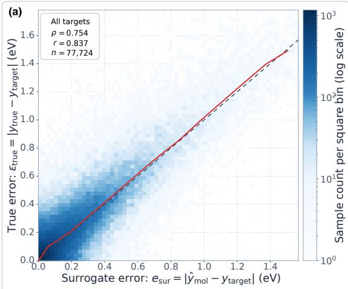

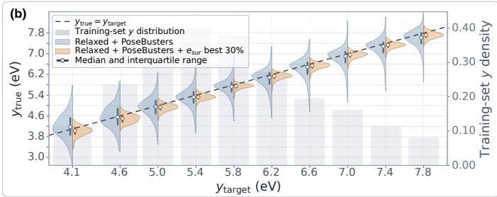

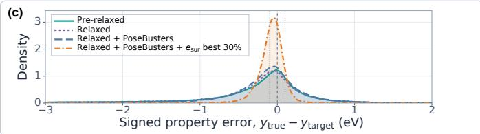  
Figure 6: (a) Internal-readout error is a strong and practically useful indicator of the true error. For 77,724 conditionally generated molecules, the internal-readout error $e _ { \mathrm { s u r } }$ is strongly correlated with the true error $\varepsilon _ { \mathrm { t r u e } } ,$ with Spearman $\rho = 0 . 7 5 4$ and Pearson $r = 0 . 8 3 7$ . The binned-median trend (red solid line) broadly follows the diagonal $x = y$ (dashed line), showing that molecules with smaller internalreadout errors tend to have true properties closer to their targets. (b) Selecting by internal-readout error substantially narrows the true-property distributions around the requested targets. For each target property $y _ { \mathrm { t a r g e t } }$ , the panel shows the distribution of corresponding true properties $y _ { \mathrm { t r u e } }$ for $\mathcal { M } _ { \mathrm { g e n } }$ (left-half violin) and for the best 30% independently selected by $e _ { \mathrm { s u r } }$ within each target (right-half violin). Circles and thick bars denote the median and interquartile range, respectively; gray bars show the trainingset HOMO–LUMO gap distribution. (c) Geometry refinement, molecular validity screening, and internal-readout selection progressively concentrate generated molecules around the requested HOMO–LUMO gap. Pooled distributions of the signed property error $y _ { \mathrm { t r u e } } - y _ { \mathrm { t a r g e t } }$ are shown across all conditioning targets. We compare all pre-relaxed molecules, relaxed molecules, screened relaxed molecules $( \mathcal { M } _ { \mathrm { g e n } } )$ , and the target-wise best 30% of $\mathcal { M } _ { \mathrm { g e n } }$ ranked by internal-readout error $e _ { \mathrm { s u r } }$ defined in Equation (6). The combined refinement-and-screening step substantially reduces the broad error tails, while internalreadout selection produces sharply concentrated distributions near zero. The dashed vertical line indicates exact agreement with the conditioning target, and the two dotted lines indicate signed property errors of ±0.1 eV.

## 4 Related work

Most 3D molecular generators begin sampling from a state whose size is tied to the number of atoms. Molecule-space difusion and flow methods evolve N atom states and may additionally evolve $O ( N ^ { 2 } )$ pairwise bonds [Hoogeboom et al., 2022, Vignac et al., 2023, Dunn and Koes, 2024, Irwin et al., 2025]; most two-stage latent methods replace raw atom features with N learned latent elements but retain the same size-dependent generative state [Xu et al., 2023, Joshi et al., 2025, Luo et al., 2025]. A global embedding does not by itself remove this size dependence: one recent diffusion autoencoder uses a semantic code to condition a pre-instantiated atom-and-edge difusion state [Li et al., 2026]. EF-TALFM instead applies a separate flow model to one fixed-dimensional molecule-level latent and creates atom-wise molecular structure only during decoding. This distinction organizes the comparisons below: the relevant questions are what representation the generative model samples, when molecular size is determined, and how the sampled representation is converted into a complete 3D molecule.

EF-TALFM combines a separately trained flow model over a single fixed-dimensional moleculelevel latent with EOM-terminated, atom-wise autoregressive Cartesian decoding. Unlike atomwise latent generators and global-code-conditioned molecular difusion, its flow model does not operate over atom-wise or pairwise molecular states. Unlike direct autoregressive generators, its autoregressive network is a decoder conditioned on a separately sampled molecule-level latent, and its bonds are reconstructed after decoding rather than predicted as a pairwise tensor. Deterministic atom ordering and rigid-pose alignment make the encoder–decoder map consistent enough for standard Transformer and feed-forward backbones, while enriched atom and molecule states support fixed post-decoding graph reconstruction. The same latent design supports unconditional sampling or conditional sampling with an external property target. Optional property supervision organizes the latent and provides an internal property readout for candidate ranking without making the property part of the latent state.

Generative-state dimensionality and molecular size. A common latent design preserves an atom-wise state: an N-atom molecule is encoded as N latent point-cloud elements or tokens, which the second-stage model generates jointly [Xu et al., 2023, Joshi et al., 2025, Luo et al., 2025]. Because this latent state scales with N, molecular size generally must be supplied, sampled, or predicted before that state is instantiated.

A recent difusion autoencoder instead aggregates each molecule into one fixed-dimensional semantic embedding [Li et al., 2026]. This embedding conditions an equivariant difusion decoder rather than serving as the sole input to a separate generative model: the difusion state still contains N atom states and their pairwise edge types, so molecular size must be specified before sampling.

Fixed-dimensional alternatives use either one global modulation code decoded as a continuous atomic-density field, or a fixed number of equivariant latent nodes decoded by a Bayesian Flow Network [Kirchmeyer et al., 2024, Chen et al., 2025]. A variable-length alternative grows the atom-wise latent sequence autoregressively, using a conditional difusion model for each next latent and a separate stop classifier [Ottomano et al., 2026].

EF-TALFM instead samples one ordinary vector $\mathbf { z } \in \mathbb { R } ^ { d }$ with a single latent-flow solve and lets an EOM-terminated Cartesian decoder determine molecular size. Its total decoding cost still contains N causal Transformer steps, but its second-stage flow is fixed-dimensional and is run only once per molecule, without a difusion or flow solve at every atom. Thus, neither an N-element latent state nor an N-atom noisy state is instantiated before EF-TALFM’s decoder begins.

Direct autoregressive 3D generation. Several direct autoregressive generators build a molecule atom by atom. Their shared design uses Transformer context to predict the next atom type and a lightweight conditional difusion or flow head to sample its coordinates [Cheng et al., 2025, Li et al., 2025, Rose et al., 2025]. Another approach autoregresses over compressed octree tokens and applies to molecules alongside other 3D domains [Lu et al., 2025]. In these methods, the autoregressive network jointly models molecule-level variation and atom-wise construction.

In EF-TALFM, the autoregressive Transformer is instead a decoder conditioned on one moleculelevel latent sampled by a separate flow. A plain output module predicts coordinates and enriched atom states directly, without a per-token difusion or flow solve or geometry-aware attention.

Bond-explicit and coordinate-only generation. One strategy generates atom types and coordinates without bond labels and recovers connectivity in post-processing [Hoogeboom et al., 2022, Xu et al., 2023, Joshi et al., 2025, Cheng et al., 2025]. Another jointly generates bond types and 3D geometry [Vignac et al., 2023, Huang et al., 2024, Hua et al., 2024, Le et al., 2024, Dunn and Koes, 2024, Irwin et al., 2025, Dunn and Koes, 2026, Reidenbach et al., 2026, Luo et al., 2025, Li et al., 2026]. Pairwise bond prediction commonly gives $O ( N ^ { 2 } )$ edge outputs [Dunn and Koes, 2024, 2026, Reidenbach et al., 2026, Luo et al., 2025]. A third strategy first generates a one-dimensional molecular representation and then predicts its 3D conformer [Liu et al., 2025].

EF-TALFM likewise does not predict a dense bond tensor, but outputs coordinates with enriched atom and molecule states, including atom charge, hydrogen count, hybridization, chirality, radical, aromaticity, conjugation, ring attributes, total charge, and multiplicity. These variables constrain deterministic bond recovery and chemistry-aware refinement, placing EF-TALFM between minimal coordinate-only output and learned dense-edge generation.

Symmetry handling through canonicalization. A common strategy places roto-translational and permutation symmetry in the denoiser or flow through equivariant graph, Transformer, or scalar–vector message-passing operations [Hoogeboom et al., 2022, Xu et al., 2023, Huang et al., 2024, Hua et al., 2024, Le et al., 2024, Irwin et al., 2025, Dunn and Koes, 2026, Li et al., 2026]. A limitation of full E(3) symmetry is that reflection-invariant parameterizations cannot distinguish chirality unless reflection-sensitive information is added [Dumitrescu et al., 2025].

Non-equivariant backbones may instead learn rotational consistency from random rotation augmentation [Joshi et al., 2025, Luo et al., 2025, Cheng et al., 2025, Rose et al., 2025], or construct sample-dependent frames or rotations around the generative backbone [Guo et al., 2025, Ding and Hofmann, 2025]. Quotient-space and symmetrized difusion methods place symmetry in the stochastic process or training objective [Ko and Lee, 2026, Xu et al., 2026]. Deterministic canonicalization removes pose and ordering variation before learning, using, for example, inertial-frame tokenization or geometric spectral canonicalization [Li et al., 2025, Zhou et al., 2026]. For common point-cloud group actions, however, a globally continuous canonical selector need not exist, motivating frame averaging and weighted frames [Dym et al., 2024].

EF-TALFM chooses anchors by canonical graph order and applies one triplet-based proper rigid alignment during preprocessing. Its Transformer and ResNet components therefore require no learned or equivariant frame, rotational augmentation, spectral decomposition, or geometryaware attention. The selector can still change discontinuously, and graph symmetries and collinear or nearly collinear anchors require explicit conventions, as discussed in Appendix B; the distinction is where the symmetry is handled, not an escape from the continuity obstruction.

Canonicalization and quotient-space interpretation. Our preprocessing is an instance of canonical generative modeling: map each sample to an orbit representative, learn the distribution on the canonical slice, and, when required, randomize over the group to recover an invariant distribution [Zhou et al., 2026]. EF-TALFM models and outputs the canonical slice directly because the same pose is used by the encoder, decoder, and reconstruction pipeline. Here, canonicalization is used as a general strategy rather than as a source of formal transformation guarantees. Our use of it centers on a graph-ordered triplet realization integrated with a molecule-level latent and variable-length autoregressive decoder.

This one-time preprocessing also difers from alignment inside a difusion or flow trajectory, where targets may be repeatedly realigned to the current noisy state or model output. Such realignment can alter the induced prediction target and sampler [Xu et al., 2026]. EF-TALFM trains and samples in the same fixed canonical coordinate system, so neither the latent flow nor the autoregressive decoder performs an in-trajectory alignment correction.

Property-conditioned latent generation. Latent-space methods difer in where property information enters. We include the broader string- and graph-based molecular latent literature here because the relevant distinction is where property information enters, rather than the dimensionality of the decoded molecular representation. An early VAE keeps its encoder and decoder property-unconditioned and adds a latent property regressor for optimization [Gómez-Bombarelli et al., 2018]. Other VAEs condition both encoder and decoder [Lim et al., 2018], or use the semi-supervised factorization $q ( y \mid x ) , q ( z \mid x , y )$ , and $p ( x \mid y , z )$ [Kang and Cho, 2019].

Two-stage generators may condition both the molecular autoencoder and the second-stage latent denoiser [Xu et al., 2023, You et al., 2024]. Several property-conditioned variants instead keep the first-stage molecular mappings property-free and condition only the second-stage latent generator [Kim et al., 2025, Qiu et al., 2026, Zhang et al., 2025]. Within this second-stage-only conditioning setup, one model jointly trains the autoencoder and latent denoiser using a combined reconstruction and denoising objective [Zhang et al., 2025].

Property labels can also supervise an autoencoding representation without being supplied as inputs to its encoder or decoder. Control then acts on the learned representation through latent optimization, predictor guidance, or targeted embedding edits [Gómez-Bombarelli et al., 2018, Lobo et al., 2026, Li et al., 2026].

Within EF-TAVAE, the property value is likewise used only as a supervision target for an internal property readout trained through complementary latent-only and molecule-conditioned routes; it is not supplied to the encoder or molecular decoder and is not part of the latent state. The second-stage flow models the marginal latent distribution $p _ { \pmb { \theta } } ( \mathbf { z } )$ for unconditional generation or the target-conditioned distribution $p _ { \pmb { \theta } } ( \mathbf { z } | \mathbf { y } )$ when an external property target y is provided. After generation, the same VAE re-encodes each candidate and reuses its internal property readout for ranking, without a separately trained property predictor or an external property evaluator during selection. Thus, EF-TALFM combines optional property-supervised latent organization, externally conditioned latent sampling, and same-model candidate selection.

## 5 Conclusion and future work

This work demonstrates that molecular size can be an outcome of generation rather than an input to the generator. In EF-TALFM, generation begins by sampling a single fixed-dimensional molecule-level latent, with molecular size and atom-wise structure determined only during decoding. Among the evaluated methods, EF-TALFM leads in generating unique, training-set novel molecules that can pass sanitization and PoseBusters sanity checks, corresponding end-to-end sampling throughput, and approximate training-example throughput, highlighting both generation quality and practical eficiency. The same architecture supports property-conditioned generation, and its internal ranking mechanism substantially improves the recovery of molecules near a target property while retaining high novelty and structural diversity.

Looking forward, this architecture could be extended to more complex systems, including biomolecules, periodic crystals, and hybrid molecular–material structures. Such extensions would require adapting the representation and decoder to relevant structural units and symmetries, including residues and periodic lattices. Important next steps for property-conditioned design include targeting properties beyond the training distribution, accounting for uncertainty when ranking candidates, and incorporating feedback from higher-fidelity calculations or experiments.

Limitations. EF-TALFM does not generate bond labels. Its heavy-atom branch uses a deterministic chemistry-aware reconstruction algorithm, while its all-atom branch starts from fixed, rule-based Open Babel bond perception. Avoiding a learned dense pairwise output shifts connectivity and bond-order determination to heuristic post-processing, which can introduce reconstruction errors that require further geometry refinement. Future work could integrate learned bond refinement while retaining the fixed-dimensional latent flow.

Our method also relies on canonical atom ordering and rigid-pose canonicalization. Given the canonical ordering, the alignment removes the continuous SE(3) symmetry up to numerical precision for non-degenerate geometries, with degenerate cases (e.g., collinear configurations) handled by a deterministic fallback; reflections are intentionally retained so that chirality is preserved. The graph-based ordering is unique for most molecules but not for those with nontrivial graph automorphisms, where we fall back on a deterministic, consistently applied convention rather than a mathematically unique labeling (see Appendix B). This is suficient for the molecular systems studied here; for highly symmetric molecules or broader molecular systems, combining canonicalization with lightweight equivariant components may ofer additional robustness.

Finally, EF-TALFM is designed for large-scale molecular datasets. The use of standard Transformers makes it flexible and scalable, but may require substantial training data. Performance in low-data regimes may benefit from additional regularization, transfer learning, or stronger geometric inductive biases.

## Acknowledgments

This work was supported in part by funding from the Ofice of Naval Research under grant N00014-23-1-2590, the National Science Foundation under grant No. 2310831, No. 2428059, No. 2435696, No. 2440954, a Michigan Institute for Data Science Propelling Original Data Science (PODS) grant, Two Sigma Investments LP, and LG Management Development Institute AI Research. This work used computing resources from the Advanced Cyberinfrastructure Coordination Ecosystem: Services & Support (ACCESS) program, which is supported by the U.S. National Science Foundation.

## References

B. Baillif, J. Cole, P. McCabe, and A. Bender. Benchmarking structure-based three-dimensional molecular generative models using GenBench3D: Ligand conformation quality matters. arXiv preprint arXiv:2407.04424, 2024.

M. Buttenschoen, G. M. Morris, and C. M. Deane. Posebusters: Ai-based docking methods fail to generate physically valid poses or generalise to novel sequences. Chemical Science, 15 (9):3130–3139, 2024. doi: 10.1039/D3SC04185A. URL https://doi.org/10.1039/ D3SC04185A.

R. T. Q. Chen. torchdifeq. GitHub software repository, 2018. URL https://github.com/ rtqichen/torchdiffeq. PyTorch implementation of diferentiable ordinary diferential equation solvers.

R. T. Q. Chen, Y. Rubanova, J. Bettencourt, and D. K. Duvenaud. Neural ordinary diferential equations. In Advances in Neural Information Processing Systems, 2018.

Z. Chen, Y. Jia, Z. Tian, W.-Y. Ma, and Y. Lan. Manipulating 3D molecules in a fixed-dimensional E(3)-equivariant latent space. In Advances in Neural Information Processing Systems, volume 38, 2025.

A. H. Cheng, C. Sun, and A. Aspuru-Guzik. Scalable autoregressive 3D molecule generation. arXiv preprint arXiv:2505.13791, 2025.

J. Devlin, M.-W. Chang, K. Lee, and K. Toutanova. Bert: Pre-training of deep bidirectional transformers for language understanding. In 2019 Conference of the North American Chapter of the Association for Computational Linguistics: Human Language Technologies, volume 1, pages 4171–4186, 2019.

Y. Ding and T. Hofmann. Scalable non-equivariant 3D molecule generation via rotational alignment. In Proceedings ofthe 42nd International Conference on Machine Learning, 2025.

A. Dumitrescu, D. Korpela, M. Heinonen, Y. Verma, V. Iakovlev, V. Garg, and H. Lähdesmäki. E(3)- equivariant models cannot learn chirality: Field-based molecular generation. In International Conference on Learning Representations, 2025.

I. Dunn and D. R. Koes. Mixed continuous and categorical flow matching for 3D de novo molecule generation. arXiv preprint arXiv:2404.19739, 2024.

I. Dunn and D. R. Koes. FlowMol3: Flow matching for 3D de novo small-molecule generation. Digital Discovery, 5:2052–2066, 2026. doi: 10.1039/D5DD00363F.

N. Dym, H. Lawrence, and J. W. Siegel. Equivariant frames and the impossibility of continuous canonicalization. In Proceedings of the 41st International Conference on Machine Learning, 2024.

R. Gómez-Bombarelli, J. N. Wei, D. Duvenaud, J. M. Hernández-Lobato, B. Sánchez-Lengeling, D. Sheberla, J. Aguilera-Iparraguirre, T. D. Hirzel, R. P. Adams, and A. Aspuru-Guzik. Automatic chemical design using a data-driven continuous representation of molecules. ACS Central Science, 4(2):268–276, 2018. doi: 10.1021/acscentsci.7b00572.

M. Guo, C. Liu, and P. Forré. Frame-based equivariant difusion models for 3D molecular generation. arXiv preprint arXiv:2509.19506, 2025.

E. Hoogeboom, V. G. Satorras, C. Vignac, and M. Welling. Equivariant difusion for molecule generation in 3D. In K. Chaudhuri, S. Jegelka, L. Song, C. Szepesvari, G. Niu, and S. Sabato, editors, Proceedings of the 39th International Conference on Machine Learning, volume 162 of Proceedings of Machine Learning Research, pages 8867–8887. PMLR, 2022.

W. Hu, M. Fey, H. Ren, M. Nakata, Y. Dong, and J. Leskovec. OGB-LSC: A large-scale challenge for machine learning on graphs. In Thirty-fifth Conference on Neural Information Processing Systems Datasets and Benchmarks Track (Round 2), 2021.

C. Hua, S. Luan, M. Xu, Z. Ying, J. Fu, S. Ermon, and D. Precup. MUDif: Unified difusion for complete molecule generation. In S. Villar and B. Chamberlain, editors, Proceedings of the Second Learning on Graphs Conference, volume 231 of Proceedings of Machine Learning Research, pages 33:1–33:26. PMLR, 2024.

H. Huang, L. Sun, B. Du, and W. Lv. Learning joint 2-D and 3-D graph difusion models for complete molecule generation. IEEE Transactions on Neural Networks and Learning Systems, 35 (9):11857–11871, 2024. doi: 10.1109/TNNLS.2024.3416328.

R. Irwin, A. Tibo, J. P. Janet, and S. Olsson. SemlaFlow: Eficient 3D molecular generation with latent attention and equivariant flow matching. In Y. Li, S. Mandt, S. Agrawal, and E. Khan, editors, Proceedings of The 28th International Conference on Artificial Intelligence and Statistics, volume 258 of Proceedings of Machine Learning Research, pages 3772–3780. PMLR, 2025.

R. Jiao, W. Huang, P. Lin, J. Han, P. Chen, Y. Lu, and Y. Liu. Crystal structure prediction by joint equivariant difusion. In Advances in Neural Information Processing Systems, 2023.

I. T. Jollife and J. Cadima. Principal component analysis: A review and recent developments. Philosophical Transactions of the Royal Society A: Mathematical, Physical and Engineering Sciences, 374(2065):20150202, 2016. doi: 10.1098/rsta.2015.0202.

C. K. Joshi, X. Fu, Y.-L. Liao, V. Gharakhanyan, B. K. Miller, A. Sriram, and Z. W. Ulissi. All-atom difusion transformers: Unified generative modelling of molecules and materials. In A. Singh, M. Fazel, D. Hsu, S. Lacoste-Julien, F. Berkenkamp, T. Maharaj, K. Wagstaf, and J. Zhu, editors, Proceedings ofthe 42nd International Conference on Machine Learning, volume 267 ofProceedings of Machine Learning Research, pages 28393–28417. PMLR, 2025.

S. Kang and K. Cho. Conditional molecular design with deep generative models. Journal of Chemical Information and Modeling, 59(1):43–52, 2019. doi: 10.1021/acs.jcim.8b00263.

H. Kim, B. Bae, M. Park, Y. Shin, T. Ideker, and H. Nam. A genotype-to-drug difusion model for generation of tailored anti-cancer small molecules. Nature Communications, 16(1):5628, 2025. doi: 10.1038/s41467-025-60763-9.

D. P. Kingma and M. Welling. Auto-encoding variational bayes. In 2nd International Conference on Learning Representations, 2014.

M. Kirchmeyer, P. O. Pinheiro, and S. Saremi. Score-based 3D molecule generation with neural fields. In Advances in Neural Information Processing Systems, volume 37, 2024. doi: 10.52202/ 079017-0340.

G. Ko and J. Lee. Permutation-symmetrized difusion for unconditional molecular generation. arXiv preprint arXiv:2603.23255, 2026.

T. Le, J. Cremer, F. Noe, D.-A. Clevert, and K. T. Schütt. Navigating the design space of equivariant difusion-based generative models for de novo 3D molecule generation. In International Conference on Learning Representations, 2024.

H. Li, W. Du, Y. Li, H. Guo, and S. Liu. InertialAR: Autoregressive 3D molecule generation with inertial frames. arXiv preprint arXiv:2510.27497, 2025.

T. Li, H. Liu, H. Guo, M. Gerstein, and M. R. Min. Disentangled autoencoding equivariant difusion model for controlled generation of 3D molecules. Nature Communications, 17(1):4824, 2026. doi: 10.1038/s41467-026-71441-9.

J. Lim, S. Ryu, J. W. Kim, and W. Y. Kim. Molecular generative model based on conditional variational autoencoder for de novo molecular design. Journal ofCheminformatics, 10(1):31, 2018. doi: 10.1186/s13321-018-0286-7.

Y. Lipman, R. T. Q. Chen, H. Ben-Hamu, M. Nickel, and M. Le. Flow matching for generative modeling. In International Conference on Learning Representations, 2023.

Y. Liu, M. Ott, N. Goyal, J. Du, M. Joshi, D. Chen, O. Levy, M. Lewis, L. Zettlemoyer, and V. Stoyanov. Roberta: A robustly optimized bert pretraining approach. arXiv preprint arXiv:1907.11692, 2019.

Z. Liu, Y. Luo, H. Huang, E. Zhang, S. Li, J. Fang, Y. Shi, X. Wang, K. Kawaguchi, and T.-S. Chua. NExT-Mol: 3D difusion meets 1D language modeling for 3D molecule generation. In International Conference on Learning Representations, 2025.

A. A. Lobo, U. Awasthi, and L. Zhukov. Property-guided molecular generation and optimization via latent flows. In AI4Mat Workshop at ICLR 2026, 2026.

S. Lu, H. Lin, L. Yao, Z. Gao, X. Ji, Y. Liang, W. E, L. Zhang, and G. Ke. Unified cross-scale 3D generation and understanding via autoregressive modeling. arXiv preprint arXiv:2503.16278, 2025.

Y. Luo, Z. Liu, Y. Zhao, S. Li, H. Cai, K. Kawaguchi, T.-S. Chua, Y. Zhang, and X. Wang. Towards unified and lossless latent space for 3D molecular latent difusion modeling. In Advances in Neural Information Processing Systems, 2025.

L. McInnes, J. Healy, N. Saul, and L. Großberger. UMAP: Uniform manifold approximation and projection. Journal ofOpen Source Software, 3(29):861, 2018. doi: 10.21105/joss.00861.

B. K. Miller, R. T. Q. Chen, A. Sriram, and B. M. Wood. FlowMM: Generating materials with Riemannian flow matching. In R. Salakhutdinov, Z. Kolter, K. Heller, A. Weller, N. Oliver, J. Scarlett, and F. Berkenkamp, editors, Proceedings of the 41st International Conference on Machine Learning, volume 235 of Proceedings ofMachine Learning Research, pages 35664–35686. PMLR, 2024.

A. Morehead\*, M. Cretu\*, A. Panescu\*, R. Anand\*, M. Weiler\*, T. Perez\*, S. Blau, S. Farrell, W. Bhimji, A. Jain, H. Sahasrabuddhe, P. Liò, T. Jaakkola, R. Gómez-Bombarelli, R. Ying, B. Erichson, and M. Mahoney. Zatom-1: Towards a multimodal foundation model for 3d molecules and materials. arXiv preprint arXiv:2602.22251, 2026. \* denotes equal contribution.

N. M. O’Boyle, M. Banck, C. A. James, C. Morley, T. Vandermeersch, and G. R. Hutchison. Open babel: An open chemical toolbox. Journal of Cheminformatics, 3(1):33, 2011. doi: 10.1186/ 1758-2946-3-33.

F. Ottomano, G. Ren, Y. Li, K. E. Jelfs, and A. M. Ganose. Autoregressive latent difusion for 3D molecule generation. arXiv preprint arXiv:2607.09277, 2026.

J. Qiu, Y. Li, W. Li, and X. Wang. DriftingMol: Decoder-coupled drift for one-pass propertyconditional molecular generation. arXiv preprint arXiv:2605.24841, 2026.

M. Ragoza, T. Masuda, and D. R. Koes. Generating 3d molecules conditional on receptor binding sites with deep generative models. Chemical Science, 13(9):2701–2713, 2022. doi: 10.1039/ D1SC05976A.

D. Reidenbach, F. Nikitin, O. Isayev, and S. G. Paliwal. Applications of modular co-design for de novo 3D molecule generation. Digital Discovery, 5:754–768, 2026. doi: 10.1039/D5DD00380F.

D. Rose, R. A. Jacob, J. Kirchmair, and T. Langer. NEAT: Neighborhood-guided, eficient, autoregressive set transformer for 3D molecular generation. arXiv preprint arXiv:2512.05844, 2025.

D. G. A. Smith, L. A. Burns, A. C. Simmonett, R. M. Parrish, M. C. Schieber, R. Galvelis, P. Kraus, H. Kruse, R. Di Remigio, A. Alenaizan, A. M. James, S. Lehtola, J. P. Misiewicz, M. Scheurer, R. A. Shaw, J. B. Schriber, Y. Xie, Z. L. Glick, D. A. Sirianni, J. S. O’Brien, J. M. Waldrop, A. Kumar, E. G. Hohenstein, B. P. Pritchard, B. R. Brooks, H. F. Schaefer, III, A. Y. Sokolov, K. Patkowski, A. E. DePrince, III, U. Bozkaya, R. A. King, F. A. Evangelista, J. M. Turney, T. D. Crawford, and C. D. Sherrill. Psi4 1.4: Open-source software for high-throughput quantum chemistry. The Journal ofChemical Physics, 152(18):184108, 2020. doi: 10.1063/5.0006002.

A. Vaswani, N. Shazeer, N. Parmar, J. Uszkoreit, L. Jones, A. N. Gomez, L. Kaiser, and I. Polosukhin. Attention is all you need. In Advances in neural information processing systems, 2017.

C. Vignac, N. Osman, L. Toni, and P. Frossard. MiDi: Mixed graph and 3D denoising difusion for molecule generation. In Machine Learning and Knowledge Discovery in Databases: Research Track. Springer, 2023. doi: 10.1007/978-3-031-43415-0\_33.

T. Xie, X. Fu, O.-E. Ganea, R. Barzilay, and T. Jaakkola. Crystal difusion variational autoencoder for periodic material generation. In International Conference on Learning Representations, 2022.

M. Xu, A. S. Powers, R. O. Dror, S. Ermon, and J. Leskovec. Geometric latent difusion models for 3D molecule generation. In A. Krause, E. Brunskill, K. Cho, B. Engelhardt, S. Sabato, and J. Scarlett, editors, Proceedings ofthe 40th International Conference on Machine Learning, volume 202 of Proceedings ofMachine Learning Research, pages 38592–38610. PMLR, 2023.

Y. Xu, Y. Wang, S. Luo, K. Gao, T. He, D. He, and C. Liu. Quotient-space difusion models. arXiv preprint arXiv:2604.21809, 2026.

Y. You, R. Zhou, J. Park, H. Xu, C. Tian, Z. Wang, and Y. Shen. Latent 3D graph difusion. In The Twelfth International Conference on Learning Representations. OpenReview.net, 2024.

C. Zeni, R. Pinsler, D. Zügner, A. Fowler, M. Horton, X. Fu, Z. Wang, A. Shysheya, J. Crabbé, S. Ueda, R. Sordillo, L. Sun, J. Smith, B. Nguyen, H. Schulz, S. Lewis, C.-W. Huang, Z. Lu, Y. Zhou, H. Yang, H. Hao, J. Li, C. Yang, W. Li, R. Tomioka, and T. Xie. A generative model for inorganic materials design. Nature, 639(8055):624–632, 2025. doi: 10.1038/s41586-025-08628-5.

Q. Zhang, W. Zhang, Y. Li, J. Wang, L. Zhang, and T. Hou. A rule-based algorithm for automatic bond type perception. Journal of Cheminformatics, 4(1):26, 2012. doi: 10.1186/1758-2946-4-26.

Q. Zhang, J. Xiao, D. Niu, Z. Zhang, S. Ding, and Z. Li. Geometry-complete latent difusion model for 3D molecule generation. Bioinformatics, 41(8):btaf426, 2025. doi: 10.1093/bioinformatics/ btaf426.

C. Zhou, Z. Chen, Z. Li, J. Wang, K. Jiang, P. Li, R. Yu, M. Zhang, S. Bates, and T. Jaakkola. Rethinking difusion models with symmetries through canonicalization with applications to molecular graph generation. arXiv preprint arXiv:2602.15022, 2026.

# A Training and sampling algorithms of EF-TALFM

Algorithm 1 Training algorithm of EF-TALFM   
input Molecule data in the form of $\mathcal { M } = \left( \mathbf { u } , \{ ( \mathbf { x } _ { i } , \mathbf { h } _ { i } ) \} _ { i = 1 } ^ { n } \right)$ , initialized encoder $f _ { \phi } ,$ decoder ${ \pmb f } _ { \pmb { \psi } } , { \pmb z } ^ { ( 0 ) }$ , MolEnc with parameters $\pmb { \xi } _ { m } ,$ , AtomEnc   
with $\xi _ { a } ,$ LatEnc with $\pmb { \xi } _ { z } ,$ Atom2Enc with $\tilde { \pmb { \xi } } _ { a } ,$ , MolDec with $\zeta _ { m } ,$ AtomDec with $\zeta _ { a } ,$ flow matching neural networks ${ f } _ { \pmb { \theta } } ;$ property y,   
initialized $\pmb { \nu } _ { [ \mathrm { P R O P } ] } ^ { ( 0 ) }$ , PropDec with $\zeta _ { y } ,$ , if auxiliary property-prediction head enabled.   
1: First Stage: Variational Autoencoder Training   
2: repeat   
3: Sample $\mathcal { M } = \left( \mathbf { u } , \{ ( \mathbf { x } _ { i } , \mathbf { h } _ { i } ) \} _ { i = 1 } ^ { n } \right)$   
4: $\{ ( \mathbf { x } _ { i } , \mathbf { \bar { h } } _ { i } ) \} _ { i = 1 } ^ { n }  \mathrm { ~ C ~ }$ anonicalAlignment $( \{ ( \mathbf { x } _ { i } , \mathbf { h } _ { i } ) \} _ { i = 1 } ^ { n } )$   
5: Append the nonphysical end-of-molecule token $( \mathbf { x } _ { n + 1 } , \mathbf { h } _ { n + 1 } ) \ t _ { 0 } \ \{ ( \mathbf { x } _ { i } , \mathbf { h } _ { i } ) \} _ { i = 1 } ^ { n }$   
6: Construct $\mathbf { e } _ { i } ^ { ( 0 ) } \xleftarrow { } \mathrm { M o 1 E n c } _ { \xi _ { m } } ( \mathbf { u } ) + \mathrm { A t o m E n c } _ { \xi _ { a } } ( \mathbf { x } _ { i } , \mathbf { h } _ { i } ) , i = 1 , \dots , n + 1$   
7: $[ ( \mathbf { z } _ { \mu } , \mathbf { z } _ { \sigma } ) , \mathbf { e } _ { 1 } ^ { ( L ) } , \cdots , \mathbf { e } _ { n + 1 } ^ { ( L ) } ]  f _ { \phi } ( [ \mathbf { z } ^ { ( 0 ) } , \mathbf { e } _ { 1 } ^ { ( 0 ) } , \cdots , \mathbf { e } _ { n + 1 } ^ { ( 0 ) } ] )$   
8: Sample $\mathbf { z }  \mathbf { z } _ { \mu } + \mathbf { z } _ { \sigma } \odot \pmb { \varepsilon }$ with $\pmb { \varepsilon } \sim \mathcal { N } ( \mathbf { 0 } , \mathbf { I } )$   
9: Decode uˆ ← MolDec $\pmb { \zeta } _ { m } ^ { \mathrm { ~ \pmb ~ ( ~ z ) ~ } }$   
10: Encode $\pmb { \nu } _ { 0 } ^ { ( 0 ) }  \mathrm { L a t E n c } _ { \pmb { \xi } _ { z } } ( \mathbf { z } )$   
11: for i in $1 , 2 , \cdots , n + 1 \mathrm { ~ } \dot { \mathbf { c } }$ do   
12: Construct causal attention matrix $\mathbf { A } _ { \mathrm { c a u s a l } , i }$   
13: $\pmb { \nu } _ { i - 1 } ^ { ( L ) }  f _ { \pmb { \psi } } ( [ \pmb { \nu } _ { 0 } ^ { ( 0 ) } , \cdots , \pmb { \nu } _ { i - 1 } ^ { ( 0 ) } ] ; \mathbf { A } _ { \mathrm { c a u s a l } , i } )$   
14: $( \hat { \mathbf { x } } _ { i } , \hat { \mathbf { h } } _ { i } ) \gets \mathrm { A t o m D e c } _ { \zeta _ { a } } ( \pmb { \nu } _ { i - 1 } ^ { ( L ) } )$   
15: $\pmb { \nu } _ { i } ^ { ( 0 ) } \gets \mathrm { A t o m 2 E n c } _ { \tilde { \pmb { \xi } } _ { a } } ( \mathbf { x } _ { i } , \mathbf { h } _ { i } )$ ▷ Teacherforcing with ground-truth inputs   
16: end for   
17: if auxiliary property-prediction head enabled then   
18: Construct molecule-conditioned and latent-only attention matrices, $\mathbf { A } _ { \mathrm { m o l } }$ and $\mathbf { A } _ { \mathrm { l a t } }$   
19: $\pmb { v } _ { [ \mathrm { P R O P } ] , \mathrm { l a t } } ^ { ( L ) }  f _ { \pmb { \psi } } ( [ \pmb { v } _ { 0 } ^ { ( 0 ) } , \pmb { v } _ { [ \mathrm { P R O P } ] } ^ { ( 0 ) } , \pmb { v } _ { 1 } ^ { ( 0 ) } , \cdots , \pmb { v } _ { n + 1 } ^ { ( 0 ) } ] ; \pmb { \mathrm { A } } _ { \mathrm { l a t } } )$   
20: $\hat { \mathbf { y } } _ { \mathrm { l a t } } \gets \mathrm { P r o p D e c } _ { \boldsymbol { \zeta } _ { y } } ( \pmb { v } _ { [ \mathrm { P R O P } ] , \mathrm { l a t } } ^ { ( L ) } )$   
21: $\pmb { v } _ { [ \mathrm { P R O P } ] , \mathrm { m o l } } ^ { ( L ) }  f _ { \pmb { \psi } } ( [ \pmb { v } _ { 0 } ^ { ( 0 ) } , \pmb { v } _ { [ \mathrm { P R O P } ] } ^ { ( 0 ) } , \pmb { v } _ { 1 } ^ { ( 0 ) } , \cdots , \pmb { v } _ { n + 1 } ^ { ( 0 ) } ] ; \mathbf { A } _ { \mathrm { m o l } } )$   
22: $\hat { \mathbf { y } } _ { \mathrm { m o l } }  \mathrm { P r o p D e c } _ { \zeta _ { y } } ( \pmb { \nu } _ { \mathrm { [ P R O P ] , m o l } } ^ { ( L ) } )$   
23: end if   
24: Compute the full VAE loss ${ \mathcal { L } } _ { \mathrm { V A E } }$ as in Equation (4)   
25: Update φ, ψ, ${ \bf z } ^ { ( 0 ) } , \pmb { \xi } _ { m } , \pmb { \xi } _ { a } , \pmb { \xi } _ { z } , \tilde { \pmb { \xi } } _ { a } , \pmb { \zeta } _ { m }$ and $\pmb { \zeta } _ { a }$   
26: until Converged   
27: Second Stage: Latent Flow Matching Training   
28: Fix parameters $\pmb { \phi } , \pmb { \psi } , \mathbf { z } ^ { ( 0 ) } , \pmb { \xi } _ { m } , \pmb { \xi } _ { a } , \pmb { \xi } _ { z } , \pmb { \tilde { \xi } } _ { a } , \pmb { \zeta } _ { m }$ and $\pmb { \zeta } _ { a }$   
29: repeat   
30: Sample $\mathcal { M } = \left( \mathbf { u } , \{ ( \mathbf { x } _ { i } , \mathbf { h } _ { i } ) \} _ { i = 1 } ^ { n } \right)$   
31: $\{ ( \mathbf { x } _ { i } , \mathbf { h } _ { i } ) \} _ { i = 1 } ^ { n } $ CanonicalAlignment $( \{ ( \mathbf { x } _ { i } , \mathbf { h } _ { i } ) \} _ { i = 1 } ^ { n } )$   
32: Append the nonphysical end-of-molecule token $\left( \mathbf { x } _ { n + 1 } , \mathbf { h } _ { n + 1 } \right)$ to $\{ ( \mathbf { x } _ { i } , \mathbf { h } _ { i } ) \} _ { i = } ^ { n }$ 1   
33: Construct ${ \bf e } _ { i } ^ { ( 0 ) }$ ← MolEn $\therefore \pmb { \xi } _ { m } ^ { } (  { \mathbf { u } } ) +$ AtomEnc $: \pmb { \xi } _ { a } ( \mathbf { x } _ { i } , \mathbf { h } _ { i } ) , i = 1 , \pmb { \cdot } \dots , n + 1$   
34: $[ ( \mathbf { z } _ { \mu } , \mathbf { z } _ { \sigma } ) , \mathbf { e } _ { 1 } ^ { ( L ) } , \cdots , \mathbf { e } _ { n + 1 } ^ { ( L ) } ]  f _ { \phi } ( [ \mathbf { z } ^ { ( 0 ) } , \mathbf { e } _ { 1 } ^ { ( 0 ) } , \cdots , \mathbf { e } _ { n + 1 } ^ { ( 0 ) } ] )$   
35: Sample $\mathbf { z } _ { \varepsilon } \sim \mathcal { N } ( \mathbf { 0 } , \ddot { \mathbf { I } } )$ and t ∼ Unif(0, 1)   
36: Interpolate $\mathbf { z } _ { t } \gets ( 1 - t ) \mathbf { z } _ { \varepsilon } + t \mathbf { z } _ { \mu }$   
37: Target vector field v $\mathbf { \nabla } \cdot - \mathbf { z } _ { \mu } - \mathbf { z } _ { \varepsilon }$   
38: Estimated vector field $\hat { \pmb { \nu } } \ll { \pmb f } _ { \pmb { \theta } } ( { \mathbf z } _ { t } , t , { \mathbf y } )$ , omitting y if unconditional   
39: Flow matching loss $\mathcal { L } _ { \mathrm { F M } }  \| \pmb { \nu } - \hat { \pmb { \nu } } \| _ { 2 } ^ { 2 }$   
40: Update θ   
41: until Converged   
output $f _ { \phi } , f _ { \psi } , \breve { f _ { \theta } } , \mathbf { z } ^ { ( 0 ) }$ , MolEnc, AtomEnc, LatEnc, Atom2Enc, MolDec, AtomDec, PropDec

Algorithm 2 Sampling algorithm of EF-TALFM   
input $f _ { \psi } , f _ { \theta } .$ , LatEnc, Atom2Enc, MolDec, and AtomDec; property y = /0 if unconditional.   
Sample z<sub>0</sub> ∼ N (0, I)   
for t in 0, ∆t, 2∆t, · · · , 1 − ∆t do   
$\mathbf { z } _ { t + \Delta t } \gets \mathbf { z } _ { t } + f _ { \pmb { \theta } } ( \mathbf { z } _ { t } , t , \mathbf { y } ) \Delta t$   
end for   
uˆ ← MolDec(z<sub>1</sub>)   
Encode $\pmb { \nu } _ { 0 } ^ { ( 0 ) }$ ← LatEnc(z<sub>1</sub>)   
i ← 0   
repeat   
i ← i + 1   
$\pmb { \nu } _ { i - 1 } ^ { ( L ) }  f _ { \pmb { \psi } } ( [ \pmb { \nu } _ { 0 } ^ { ( 0 ) } , \cdots , \pmb { \nu } _ { i - 1 } ^ { ( 0 ) } ] )$   
(xˆ<sub>i</sub>,h<sup>ˆ</sup><sub>i</sub>) ← AtomDec $( \pmb { \nu } _ { i - 1 } ^ { ( L ) } )$   
ν<sup>(0)</sup> ← Atom2Enc(xˆ<sub>i</sub>,h<sup>ˆ</sup><sub>i</sub>)   
until [EOS] atom-type label is emitted in $\hat { \mathbf { h } } _ { i }$   
output $\bar { ( \mathbf { u } , ( \hat { \mathbf { x } } _ { j } , \hat { \mathbf { h } } _ { j } ) } _ { j = 1 } ^ { i - 1 } )$ ▷ Excluding the nonphysical end-of-molecule token at ith position

## B Canonical atom position alignment

We define a molecule’s canonical pose relative to a fixed canonical atom ordering. The motivation is that, once atom rows are placed in a deterministic order, a deterministic rigid-frame construction can be used to choose one representative from the molecule’s ${ \mathrm { S E } } ( 3 )$ orbit. This lets a non-equivariant model operate on coordinates in a consistent canonical frame. By construction, two coordinate inputs x and $\mathbf { x } ^ { \prime }$ that are related by an element of SE(3) and share the same canonical atom ordering produce the same aligned coordinates $\mathbf { x } ^ { \mathrm { f i n a l } }$ , up to numerical precision. Thus, the downstream model need not learn invariance to translations or proper rotations from data.

The alignment first translates the first canonical atom to the origin. It then selects the first later canonical atom with displacement larger than ε from the origin and places this atom at $( \lVert \mathbf { u } \rVert , 0 , 0 )$ i.e., on the positive x-axis at its true distance from the origin. To fix the remaining proper-rotation degree of freedom, the algorithm searches in canonical order for the first atom that is suficiently non-collinear with this axis, using tolerance τ. This atom is placed in the x–z plane using distances determined by the law of cosines. The resulting two right-handed bases define a proper rotation, which is required to have determinant +1.

If no suficiently non-collinear anchor exists, the molecule is treated as collinear for alignment purposes. In this case, all atoms are placed on the x axis by signed projection onto the canonical axis. This preserves which side of the first canonical atom each atom lies on, while avoiding an arbitrary choice of rotation around the molecular axis.

For non-collinear geometries, the selected anchors define a full local reference frame and therefore remove translation and proper-rotation ambiguity with respect to the fixed atom ordering. For collinear geometries, the signed projection gives a deterministic one-dimensional canonical representative; rotations around the molecular axis remain physically unobservable. Reflections are not quotiented, so mirror-image conformations remain distinct when stereochemistry is specified (for generic non-planar conformations; mirror images of collinear or coplanar configurations coincide with proper rotations and are therefore identified).

In our preprocessing, we use $\varepsilon = 0 , \tau = 1 0 ^ { - 4 }$ , and $\delta = 1 0 ^ { - 4 } \mathrm { \AA }$ . After alignment, we verify that all pairwise interatomic distances are preserved up to tolerance δ. This check confirms that the transformation is rigid, up to numerical precision, and has not introduced geometric distortion. The tolerance is far below typical bond lengths, e.g., about $9 . 2 \times 1 0 ^ { - 3 } \%$ of a 1.09Å carbon– hydrogen bond. The full atom position alignment procedure is given in Algorithm 3.

Algorithm 3 Atom position alignment   
input Positions of n atoms $\mathbf { x } ^ { \mathrm { o r i g } } \in \mathbb { R } ^ { n \times 3 } ,$ canonical atom ordering function σ obtained by RDKit canonical-SMILES generation followed by   
substructure matching to the SDF molecule, axis tolerance $\varepsilon \geq 0 ,$ non-collinearity tolerance $\tau > 0 ,$ pairwise interatomic-distance tolerance   
$\delta > 0 .$   
Canonical ordering: obtain x by reordering the rows of $\mathbf { \dot { x } } ^ { \mathrm { o r i g } }$ according to σ.   
Translate: $\mathbf { x } ^ { \mathrm { t r a n s } } \xleftarrow { } \mathbf { \bar { x } } - \mathbf { x } _ { 1 } .$   
if $n = 1$ then   
$\mathbf { x } ^ { \mathrm { f i n a l } }  \mathbf { x } ^ { \mathrm { t r a n s } }$   
else   
Find the first index j ← min $\{ i \in \{ 2 , \dots , n \} : \| \mathbf { x } _ { i } ^ { \mathrm { t r a n s } } \| > \varepsilon \}$   
if no such j exists then   
$\mathbf { x } ^ { \mathrm { f i n a l } }  \dot { \mathbf { 0 } } \in \mathbb { R } ^ { n \times 3 }$   
else   
Let $\mathbf { u }  \mathbf { x } _ { j } ^ { \mathrm { t r a n s } } .$   
Find the first index $k \gets \operatorname* { m i n } \left\{ i \in \{ 2 , \ldots , n \} \setminus \{ j \} : \| \mathbf { u } \times \mathbf { x } _ { i } ^ { \mathrm { t r a n s } } \| > \tau \| \mathbf { u } \| \| \mathbf { x } _ { i } ^ { \mathrm { t r a n s } } \| \right\} .$   
if no such k exists then   
Collinear case: set $\hat { \mathbf { u } }  \mathbf { u } / \| \mathbf { u } \| .$   
for $i = 1 , \ldots , n$ do   
Set $\mathbf { x } _ { i } ^ { \mathrm { { f i n a l } } }  ( \langle \mathbf { x } _ { i } ^ { \mathrm { { t r a n s } } } , \hat { \mathbf { u } } \rangle , 0 , 0 ) .$   
end for   
else   
Initialize target frame: $\mathbf { x } ^ { \mathrm { t e m p } }  \mathbf { 0 } \in \mathbb { R } ^ { n \times 3 }$   
Compute   
$d _ { 1 j } \gets \lVert \mathbf { x } _ { j } ^ { \mathrm { t r a n s } } - \mathbf { x } _ { 1 } ^ { \mathrm { t r a n s } } \rVert , \quad d _ { 1 k } \gets \lVert \mathbf { x } _ { k } ^ { \mathrm { t r a n s } } - \mathbf { x } _ { 1 } ^ { \mathrm { t r a n s } } \rVert , \quad d _ { j k } \gets \lVert \mathbf { x } _ { k } ^ { \mathrm { t r a n s } } - \mathbf { x } _ { j } ^ { \mathrm { t r a n s } } \rVert .$   
Set   
$\begin{array} { r } { \mathbf { x } _ { j } ^ { \mathrm { t e m p } } \gets ( d _ { 1 j } , 0 , 0 ) . } \end{array}$   
Compute   
$r _ { k 1 } \gets \frac { d _ { 1 j } ^ { 2 } - d _ { j k } ^ { 2 } + d _ { 1 k } ^ { 2 } } { 2 d _ { 1 j } } .$   
Set   
$\mathbf { x } _ { k } ^ { \mathrm { t e m p } } \xleftarrow { } \left( r _ { k 1 } , 0 , \sqrt { \operatorname* { m a x } \{ d _ { 1 k } ^ { 2 } - r _ { k 1 } ^ { 2 } , 0 \} } \right) .$   
Compute proper rotation: compute R by solving the map between the two right-handed bases   
$\big [ \mathbf { x } _ { j } ^ { \mathrm { t r a n s } } , \mathbf { x } _ { k } ^ { \mathrm { t r a n s } } , \mathbf { x } _ { j } ^ { \mathrm { t r a n s } } \times \mathbf { x } _ { k } ^ { \mathrm { t r a n s } } \big ] \quad \mathrm { a n d } \quad \big [ \mathbf { x } _ { j } ^ { \mathrm { t e m p } } , \mathbf { x } _ { k } ^ { \mathrm { t e m p } } , \mathbf { x } _ { j } ^ { \mathrm { t e m p } } \times \mathbf { x } _ { k } ^ { \mathrm { t e m p } } \big ] ,$   
and require det $\mathbf { ( R ) } = + 1 .$   
Rotate: $\mathbf { x } ^ { \mathrm { f i n a l } }  \mathbf { x } ^ { \mathrm { t r a n s } } \mathbf { R } .$   
end if   
end if   
end if   
Verify rigidity for $\begin{array} { r } { \imath \geq 2 \colon \operatorname* { m a x } _ { 1 \leq i < \ell \leq n } \left| \left\| { \bf x } _ { i } ^ { \mathrm { f i n a l } } - { \bf x } _ { \ell } ^ { \mathrm { f i n a l } } \right\| - \left\| { \bf x } _ { i } - { \bf x } _ { \ell } \right\| \right| \leq \delta . } \end{array}$   
output Canonically aligned positions $\bar { { \bf x } } ^ { \mathrm { f i n i a l } }$

The atom ordering σ above is invariant to input atom renumbering, since RDKit canonical SMILES depends only on the molecular graph, not input atom order. For graphs with nontrivial automorphisms, however, the back-matching step is not uniquely determined and may tie-break using the input ordering; we therefore do not claim a mathematically unique atom labeling for all symmetric molecules, only a deterministic ordering for a fixed input that is used consistently across training and evaluation. Such molecules form a measure-zero set under the free-action assumption of Zhou et al. [2026], so this does not afect the canonicalization guarantee, which holds µ-almost surely (see the discussion of related work in Section 4).

## C Chemically informative atom-level and molecule-level state variables

Molecular geometry is represented as atom types and their 3D coordinates, without explicitly generating pairwise bonds. Instead, atom-wise features provide implicit context about bonding, stereochemistry, and charge, allowing the model to place atoms in space in a way that is consistent with the underlying molecular structure. Each of these atom-wise features in h encodes constraints that would otherwise be enforced through explicit bonds, giving the model enough local chemical context to place atoms consistently in 3D:

• Atomic number determines elemental identity and typical valence, atomic size, and preferred bonding environments, thereby setting the baseline for how many neighbors an atom can support and at what distances.

• Chirality tag specifies stereochemical configuration (e.g., tetrahedral centers), guiding the model toward correct 3D arrangements (e.g., avoiding mirror inversions at chiral centers).

• Formal charge constrains electron count and influences preferred bonding patterns and geometry (e.g., planar vs. pyramidal nitrogen).

• Number of attached hydrogens helps fix valence and saturates local bonding, reducing ambiguity in how many heavy-atom neighbors must be placed nearby.

• Hybridization tag encodes orbital geometry (sp, sp2, sp3), directly informing expected bond angles and local spatial arrangement (linear, trigonal planar, tetrahedral).

• Number of radical electrons identifies open-shell local electronic states and constrains valence assignments.

• Aromaticity tag signals delocalized π-systems, encouraging planar ring structures and characteristic bond-length patterns.

• Conjugation tag marks atoms participating in conjugated bonding environments.

• Is-in-ring tag indicates topological constraints that restrict geometry (e.g., ring closure, limited flexibility, characteristic angles/strain).

These features are provided by RDKit for each molecule and are encoded into categorical integer labels based on the convention of the Open Graph Benchmark (OGB) [Hu et al., 2021]. For additional chemical context for generation, we include several molecule-wide descriptors:

• Total charge specifies the net molecular charge, constraining the overall electron count and ensuring consistency with atom-level formal charges.

• Spin multiplicity encodes the global electronic state (e.g., singlet, doublet), determining the number of unpaired electrons and restricting allowable radical configurations.

• Number of rings provides a coarse topological constraint on cyclic structure, helping guide ring formation and overall connectivity.

• Fused ring indicator specifies whether the molecule contains fused ring systems, constraining how rings can share atoms and influencing feasible geometries and bonding patterns.

## D Molecule reconstruction and geometry refinement

Heavy-atom molecule reconstruction and geometry refinement. To derive a generated heavy-atom molecule’s bonds, we first apply a deterministic chemistry-aware reconstruction procedure that is separate from the learned generator. This reconstruction procedure is heuristic rather than guaranteed exact: it maps continuous coordinates and discrete atom-wise predictions into a chemically interpretable heavy-atom molecular graph using chemistry-aware rules rather than learned bond generation.

Bond topology reconstruction is derived from the atomic coordinates, atom types, and additional chemical descriptors provided by the generator. The descriptors include the atomic number together with auxiliary local chemical attributes such as hybridization class, attached-hydrogen count, formal charge, radical, aromaticity, and ring-membership. We propose candidate heavyheavy bonds between heavy atom pairs whose Euclidean distance falls below a scaled sum of covalent radii for the pair. Candidate edges are then greedily accepted in order of increasing distance, subject to element- and hybridization-dependent valence limits and soft preferred-degree constraints.

Bond orders are assigned in a second deterministic stage. Starting from the inferred heavy-atom connectivity graph, all accepted edges are initialized as single bonds and are then selectively promoted to double or triple bonds according to valence deficits implied by the predicted atomwise features. The procedure further applies a small number of chemistry-motivated corrections, including Kekulé assignment for aromatic-like six-membered rings, strict valence clipping, and terminal oxo promotion when valence permits. The resulting heavy-atom graph is converted into an RDKit molecule, and optional per-atom formal-charge, radical, aromaticity, conjugation, and ring-membership annotations are applied through deterministic post-processing. A complete reconstruction algorithm is given in Algorithm 4.

Next we augment the existing heavy-atom reconstruction pipeline with a lightweight chemistryaware geometry refinement stage designed to improve structural validity. Starting from the initially reconstructed heavy-atom graph and the bond orders inferred from atom- and moleculelevel features, we retain the largest connected component and discard the rest, since the reconstructed graph may contain multiple components.

We first apply overlong multiple-bond correction, selectively downgrading a multiple bond when its interatomic distance is too long for the assigned bond order. We then add hydrogens and perform restrained force-field relaxation, softly constraining heavy atoms to remain close to the predicted scafold while allowing local geometric corrections. This fixed post-processing pipeline improves geometric plausibility while preserving the model’s original 3D prediction as much as possible.

All-atom molecule reconstruction and geometry refinement. For an all-atom decoded sequence, we use the rule-based bond-perception routines in Open Babel [O’Boyle et al., 2011], which take generated atom types and 3D coordinates and produce an initial candidate graph comprising heavy–heavy and heavy–hydrogen connectivity and candidate heavy–heavy bond orders. We inspect this raw graph for connectivity and the number of explicit hydrogen neighbors ofeach heavy atom against the decoder’s attached-hydrogen feature. Ifeither check fails, we conditionally reconstruct the hydrogen layer by removing the explicit hydrogens, while retaining Open Babel’s heavy-atom connectivity, bond orders, formal charges, and radical states, and rematerializing the predicted number of hydrogens on each heavy atom. This operation can repair missing or incorrectly attached hydrogens, but does not reconstruct or reconnect the heavy-atom graph. We then apply the same connectivity-preserving overlong multiple-bond correction as in the heavy-atom branch.

For geometry refinement, topology and explicit composition are retained throughout relaxation. Under the canonical ordering used for this representation, most ordinary hydrogens occur after the heavy atoms and are therefore among the later autoregressive predictions. Before the joint restrained relaxation, we replace the coordinate of an ordinary trailing hydrogen with a valencebased initialization only when its bond to the assigned parent has an implausible length or when it has a severe nonbonded clash. We first optimize the ordinary trailing hydrogens with all other atoms fixed. We then optimize the complete molecule while restraining the heavy-atom scafold and leaving hydrogens unrestrained. Thus, as in the heavy-atom branch, it performs inexpensive local refinement without changing the selected molecular topology. However, unlike the heavy-atom branch, which returns an implicit-hydrogen molecule, the all-atom branch returns an explicit-hydrogen molecule.

Restraint parameters and optimization settings. Hydrogen-inclusive force-field relaxation uses a flat-bottom positional restraint on every heavy atom, with an unpenalized displacement radius of 0.15 Å, a restraint force constant of $2 0 0 \mathrm { k c a l m o l } ^ { - 1 } \mathrm { \AA } ^ { - 2 }$ , and at most 200 minimization iterations. The 0.15Å radius allows small local corrections while remaining much smaller than a typical heavy-atom bond length; the force constant strongly penalizes larger deviations; and the iteration budget is intended for inexpensive local cleanup rather than conformational search. These fixed values are chemistry-motivated practical defaults rather than formally op-

```latex
Algorithm 4 Heavy-atom graph reconstruction from generated coordinates and atom-wise fea
tures
input Heavy-atom coordinates $\hat { \mathbf { R } } = ( \hat { \mathbf { r } } _ { 1 } , \hdots , \hat { \mathbf { r } } _ { N } ) \in \mathbb { R } ^ { N \times 3 }$ , atomic numbers zˆ, hybridization tags $\hat { \mathbf { h } } ^ { \mathrm { h y b } }$ , chiral tags $\hat { \mathbf { h } } ^ { \mathrm { c h i r a l } } .$ , attached-hydrogen counts
$\hat { \mathbf { n } } ^ { \mathrm { H } } { } _ { ; }$ , predicted total charge $\hat { Q } ,$ predicted spin multiplicity sˆ, optional formal-charge tags qˆ , optional radical tags $\hat { \mathbf { r } } ^ { \mathrm { r a d } }$ , optional atom-level
conjugation/aromaticity/ring hints, and optional molecule-level ring descriptors
1: Decode per-atom formal charges from qˆ when available
2: Select reconstruction policy $\pi $ ChoosePolicy(zˆ,R<sup>ˆ</sup> , $, \hat { Q } )$
3: Initialize candidate bond list $\mathcal { C }  \emptyset$
4: for $1 \leq i < j \leq N$ do
5: Compute distance $d _ { i j }  \parallel \hat { \mathbf { r } } _ { i }$ $\cdot \hat { \mathbf { r } } _ { j } \| _ { 2 }$
6: Compute bond threshold $\tau _ { i j } \gets \lambda _ { \pi } \big ( r ^ { \mathrm { c o v } } ( \hat { z } _ { i } ) + r ^ { \mathrm { c o v } } ( \hat { z } _ { j } ) \big )$
7: if ${ d _ { i j } \leq \tau _ { i j } }$ then
8: Append $( d _ { i j } , i , j )$ to $\mathcal { C }$
9: end if
10: end for
11: Sort $\mathcal { C }$ by increasing distance
12: Compute per-atom maximum valence targets $\{ \nu _ { i } ^ { \operatorname* { m a x } } \} _ { i = 1 } ^ { N }$
13: Compute per-atom preferred heavy-atom degrees $\{ d _ { i } ^ { \star } \} _ { i = } ^ { N }$
1
14: Initialize heavy-atom bond set $E $ /0 and degrees $\deg ( i ) $ ← 0
15: for all $( d _ { i j } , i , j )$ ∈ C in sorted order do
16: if deg $( i ) < \nu _ { i } ^ { \operatorname* { m a x } }$ and $\mathrm { d e g } ( j ) < \nu _ { j } ^ { \mathrm { m a x } }$ then
17: if adding $( i , j )$ does not violate the preferred-degree constraint then
18: if optional ring-count / fused-ring constraints are satisfied then
19: Add $( i , j )$ to $\mathbf { \sigma } _ { E }$
20: Update deg(i) and deg(j)
21: end if
22: end if
23: end if
24: end for
25: Initialize all bond orders as single: $b _ { i j } \gets 1$ for all $( i , j ) \in E$
26: Compute target atom valences $\{ t _ { i } \} _ { i = 1 } ^ { N }$ from zˆ, $\hat { \mathbf { h } } ^ { \mathrm { h y b } } , \hat { \mathbf { n } } ^ { \mathrm { H } }$ , optional decoded formal charges, and optional radical tags
27: Compute valence deficits $\delta _ { i } \gets \dot { t _ { i } } - \overline { { ( \deg ( i ) + \hat { n } _ { i } ^ { \mathrm { H } } ) } }$
28: repeat
29: Score each bond $( i , j ) \in E$ for possible bond-order promotion using current deficits and local hybridization constraints
30: Let $( i ^ { \star } , j ^ { \star } )$ be the highest-scoring promotable bond
31: if no promotable bond remains then
32: break
33: end if
34: Increase bond order $b _ { i ^ { \star } j ^ { \star } } \gets b _ { i ^ { \star } j ^ { \star } } + 1$
35: Update deficits $\delta _ { i ^ { \star } } , \delta _ { j ^ { \star } }$
36: until No promotable bond remains
37: Apply aromatic-like six-ring Kekulé correction to $\left\{ b _ { i j } \right\}$
38: Clip bond orders to satisfy stricter valence limits
39: Promote eligible terminal oxo bonds from single to double order
40: Build heavy-atom RDKit molecule $\hat { G } _ { \mathrm { h e a v y } } \gets$ ← BuildMol(zˆ,R<sup>ˆ</sup> $, E , \{ b _ { i j } \} , \hat { \mathbf { h } } ^ { \mathrm { c h i r a l } } , \hat { \mathbf { q } } , \hat { \mathbf { r } } ^ { \mathrm { r a d } } )$
41: if atom-level conjugation / aromaticity / ring hints are available then
42: $\hat { G } _ { \mathrm { h e a v y } } \gets \mathrm { A p p 1 y A t }$ omFeatureHint $\mathsf { \Omega } _ { \mathsf { \Gamma } } ( \hat { G } _ { \mathrm { h e a v y } } )$
43: end if
44: Compute reconstructed total formal charge from $\hat { G } _ { \mathrm { h e a v y } }$
45: Compute multiplicity-parity consistency from input atomic numbers, attached-hydrogen counts, total charge $\hat { Q } ,$ and spin multiplicity $\hat { s }$
46: Compute inferred ring count and inferred fused-ring indicator from E
output Reconstructed heavy-atom molecule $\hat { G } _ { \mathrm { h e a v y } } ,$ , bond set $E ,$ bond orders $\left\{ b _ { i j } \right\}$ , and consistency diagnostics
```  
timized hyperparameters. Although force-field refinement is conventional in coordinate-based 3D molecule-generation pipelines, prior work does not establish these exact restraint values; we therefore evaluate the efect of the refinement separately from graph reconstruction.

## E Latent regularization

Let $\pmb { \mu } ^ { ( b ) } \in \mathbb { R } ^ { d }$ denote the posterior mean of sample b in a minibatch of size $B ,$ and let $\mu _ { j } ^ { ( b ) }$ be its j-th latent coordinate. We define

$$
\mathcal { L } _ { \mathrm { v a r } } = \frac { 1 } { d } \sum _ { j = 1 } ^ { d } \operatorname* { m a x } \left( 0 , \tau - \mathrm { V a r } _ { b } \big [ \mu _ { j } ^ { ( b ) } \big ] \right) , \qquad \tau = 0 . 0 1 ,\tag{7}
$$

which softly enforces a minimum variance floor on each latent mean dimension, and

$$
\mathcal { L } _ { \mathrm { c o v } } = \frac { 1 } { d } \left. \mathrm { o f f d i a g } \big ( \mathrm { C o v } _ { b } ( { \pmb \mu } ^ { ( b ) } ) \big ) \right. _ { F } ^ { 2 } ,\tag{8}
$$

Together, the variance floor discourages inactive latent coordinates, while the covariance penalty discourages redundant coordinates in the minibatch posterior means.

## F Learning and sampling from posterior mean

Unlike latent generative models that sample from the full aggregated VAE posterior, we construct the flow-training targets from the posterior means $\mathbf { z } _ { \mu }$ . Before flow training, a fitted invertible afine map W whitens these means; the flow operates on $\widetilde { \mathbf { z } } _ { \mu } = \mathcal { W } ( \mathbf { z } _ { \mu } )$ , and $\mathcal { W } ^ { - 1 }$ maps generated terminal states back to the decoder’s latent coordinates. Using posterior means removes stochastic posterior noise from the target distribution and gives the flow model a deterministic representation of each molecule. The posterior scales $\mathbf { z } _ { \sigma }$ are still important during autoencoder training: together with the KL penalty, they regularize the latent geometry and encourage the decoder to remain stable under local perturbations. Thus, the flow model learns the distribution of molecule-level latent codes, while the VAE regularization shapes this latent space to be smoother and more suitable for generation.

## G Experimental setup for unconditional generation

This section records the baseline choices, data preprocessing, and evaluation metrics used for unconditional generation.

## G.1 Baseline selection

We use UAE-3D [Luo et al., 2025] and FlowMol [Dunn and Koes, 2024] as the primary baselines for de novo 3D molecule generation.

ADiT [Joshi et al., 2025] is a closely related work that uses a scalable latent Transformer framework without explicit molecular graph generation. However, for non-periodic molecules, ADiT decodes only atom types and 3D coordinates and relies on RDKit-based post-processing to infer the molecular graph. Such geometry-based graph recovery can be insuficient for accurately reconstructing chemically annotated molecular states, particularly for larger or heavy-atom-rich molecules where bond connectivity, bond orders, aromaticity, and formal charges may be ambiguous from coordinates alone; see Table 4. We therefore treat ADiT as an important architectural reference rather than a main quantitative baseline.

Table 4: Generated bond types improve reconstruction from atom types and 3D coordinates. Including generated bond types raises UAE-3D exact SMILES reconstruction from 76.8% to 99.5% while leaving sanitization nearly unchanged
<table><tr><td></td><td>Connectivity</td><td>Sanitization</td><td>SMILES match</td></tr><tr><td>Atom type + coordinates + bond</td><td>100.0%</td><td>99.5%</td><td>99.5%</td></tr><tr><td>Atom type + coordinates</td><td>99.0%</td><td>99.2%</td><td>76.8%</td></tr></table>

## G.2 Details of PCQM4Mv2 dataset preprocessing

Although PCQM4Mv2 is commonly treated as a predominantly neutral, closed-shell smallmolecule corpus, our feature extraction reveals a small number of non-singlet entries. We therefore model spin multiplicity explicitly as a molecule-level feature and restrict the training corpus to multiplicity ≤ 4, retaining singlet through quartet states while excluding the extremely sparse high-spin tail. This filtering defines a well-supported chemical domain for generative modeling rather than declaring the excluded molecules invalid.

## G.3 Evaluation metrics

We sample 10,000 molecules and compute validity and uniqueness rates as well as success rates for six PoseBusters module-level sanity checks [Buttenschoen et al., 2024], as follows. The thresholds below are the parameters used in our evaluation pipeline:

• Connectivity: % of molecules with exactly one connected component, i.e., one fragment.

• Sanitization: % of molecules with a canonical SMILES string produced by RDKit that passed the strict sanitization check.

• Uniqueness: % of unique sanitized SMILES among all generated ones.

• Novelty: % of novel unique sanitized SMILES against the training data set.

• Reasonable bond lengths: % of molecules for which all bond lengths lie within the default 20% tolerance of the RDKit distance-geometry bounds.

• Reasonable bond angles: % of molecules for which all bond angles lie within the default 20% tolerance of the RDKit distance-geometry bounds.

• Aromatic ring flatness: % of molecules for which all atoms in 5- and 6-membered aromatic rings lie within 0.1 A<sup>˚</sup> of the closest shared plane.

• Double bond flatness: % ofmolecules for which the atoms in trigonal-planar aliphatic C = C systems and their neighbors lie within 0.1 A<sup>˚</sup> of the closest shared plane.

• Reasonable internal energy: % of molecules for which the energy ratio is at most 7 relative to the average energy of an ensemble of 100 generated conformations.

• No internal steric clash: % of molecules for which all non–covalently bound atom pairs are separated by at least 0.8 times the distance–geometry lower bound.

## H Detailed unconditional-generation results

Relative to FlowMol, EF-TALFM nearly matches the sanitization rate (98.25% versus 98.72%) and unique sanitized yield (98.21% versus 98.27%), while its connectivity is moderately lower (92.98% versus 98.72%). Meanwhile, EF-TALFM outperforms UAE-3D, its closest latent-space counterpart, on every reported molecule-level generation metric. Despite not generating explicit bond labels, EF-TALFM also remains close to both bond-aware baselines in 3D physical plausibility, passing each of the six geometric and chemical-validity checks from PoseBusters [Buttenschoen et al., 2024] at rates between 97.21% and 99.93% among molecules that are sanitized, unique, and absent from the training set.

Table 5: EF-TALFM has the highest yield of sanitized, unique, and training-set-novel molecules, while remaining competitive on validity without generating bond labels. N. & U. & S. is the primary end-to-end generation metric for de novo discovery because it counts generated candidates that are jointly chemically valid, nonduplicate, and absent from the training set. EF-TALFM achieves 94.33%, versus 76.03% for UAE-3D and 69.83% for FlowMol. UAE-3D is the closest latent counterpart but uses variable-length atom-wise latents and predicts explicit bond types; FlowMol directly generates molecular graphs, including bond types. EF-TALFM instead generates no bond labels and recovers a graph deterministically from its decoded geometry and chemically enriched state. In (a), EF-TALFM outperforms UAE-3D on every metric and nearly matches FlowMol in sanitization and unique sanitized yield, with moderately lower connectivity. In (b), EF-TALFM nevertheless attains 97.21–99.93% pass rates across all six PoseBusters checks, close to the bond-explicit baselines. Panel (a) rates are computed over 10,000 generated molecules. C. denotes the fraction of connected molecules; S. the fraction passing strict RDKit sanitization; U. & S. the fraction of unique sanitized canonical SMILES; and N. & U. & S. the fraction that are sanitized, unique, and absent from the training set. Panel (b) PoseBusters rates are computed among the N. & U. & S. molecules: 7,603 for UAE-3D, 6,983 for FlowMol, and 9,433 for EF-TALFM. For fragmented outputs, SMILESbased and PoseBusters metrics are computed on the atom-count largest connected component after RDKit sanitization.

(a) End-to-end generation results (%)
<table><tr><td>Metric (↑)</td><td>UAE-3D</td><td>FlowMol</td><td>EF-TALFM</td></tr><tr><td>C.</td><td>99.60</td><td>100.00</td><td>92.98</td></tr><tr><td>S.</td><td>83.84</td><td>98.72</td><td>98.25</td></tr><tr><td>U.&amp;S.</td><td>83.81</td><td>98.27</td><td>98.21</td></tr><tr><td>N.&amp;U.&amp;S.</td><td>76.03</td><td>69.83</td><td>94.33</td></tr></table>

(b) PoseBusters results among N. & U. & S. molecules (%)
<table><tr><td>Metric (↑)</td><td>UAE-3D</td><td>FlowMol</td><td>EF-TALFM</td></tr><tr><td>Bond lengths</td><td>99.96</td><td>100.00</td><td>99.79</td></tr><tr><td>Bond angles</td><td>99.93</td><td>100.00</td><td>99.32</td></tr><tr><td>Internal steric clash</td><td>99.64</td><td>99.90</td><td>97.21</td></tr><tr><td>Aromatic-ring flatness</td><td>100.00</td><td>100.00</td><td>99.93</td></tr><tr><td>Double-bond flatness</td><td>99.91</td><td>100.00</td><td>98.09</td></tr><tr><td>Internal energy</td><td>99.99</td><td>100.00</td><td>99.71</td></tr><tr><td>All PoseBusters checks</td><td>99.46</td><td>99.90</td><td>94.74</td></tr></table>

High-fidelity molecule reconstruction from a single fixed-dimensional latent. Table 6 contrasts UAE-3D’s variable-length atom-wise latent with EF-TAVAE’s single fixed-dimensional molecule-level latent. UAE-3D achieves near-lossless SMILES and coordinate reconstruction. Compared with UAE-3D, EF-TAVAE imposes a diferent, structurally more restrictive bottleneck: all information about a molecule must pass through one latent vector whose number of latent slots does not grow with N, rather than through a separate latent vector for each atom that grows with N. Nevertheless, EF-TAVAE retains near-complete atom- and molecule-level attributes and high decoded-molecule connectivity and sanitization without predicting pairwise bond labels. Its coordinate MAE of 0.041Å is only a few percent of a typical covalent-bond length, indicating that the reconstruction error remains small on the molecular scale. Together with the generation results in Table 5, these results show that the chemical and geometric information retained by the fixed-dimensional latent is suficient to support high-validity, high-novelty generation.

Table 6: EF-TAVAE preserves high reconstruction fidelity through one fixed-dimensional molecule-level latent and without predicting bond labels. UAE-3D uses a variable-length sequence of atom-wise latent vectors and explicitly reconstructs pairwise bond types, whereas EF-TAVAE compresses the entire variable-size molecule into one d = 32 vector and relies on deterministic graph recovery. Under this substantially more restrictive bottleneck, EF-TAVAE retains 99.89% joint atom-feature recovery, 100.00% joint molecule-feature recovery, 99.23% sanitization, 92.16% exact SMILES recovery, and a coordinate MAE of 0.041Å. Percentages are match/pass rates.
<table><tr><td>Metric</td><td>UAE-3D</td><td>EF-TAVAE</td></tr><tr><td>Decoded-molecule validity</td><td></td><td></td></tr><tr><td>Connectivity ↑</td><td>100.00%</td><td>99.87%</td></tr><tr><td>Sanitization ↑</td><td>99.51%</td><td>99.23%</td></tr><tr><td>Reconstruction fidelity</td><td></td><td></td></tr><tr><td>SMILES match ↑</td><td>99.35%</td><td>92.16%</td></tr><tr><td>Feature reconstruction</td><td></td><td></td></tr><tr><td>Atom-type match ↑</td><td>100.00%</td><td>100.00%</td></tr><tr><td>Bond-type match ↑</td><td>99.98%</td><td></td></tr><tr><td>All atom features match ↑</td><td></td><td>99.89%</td></tr><tr><td>All molecule features match ↑</td><td></td><td>100.00%</td></tr><tr><td>3D coordinate MAE ↓</td><td>0.007Å</td><td>0.041Å</td></tr></table>

## I Additional performance comparison for unconditional generation

We present Table 7 for validity and novelty results from additional checkpoints, showing that extended UAE-3D training yields only modest gains, whereas longer FlowMol training improves validity slightly but reduces novelty.

Table 8 provides the optimizer-update budgets, training-exposure proxies, and stage-level wallclock times underlying the eficiency comparison in Figure 3(d–e). It shows that EF-TALFM has the shortest training time among the three methods under the reported budgets, despite not using the smallest update or exposure budget. Under the same number of optimizer updates, EF-TALFM achieves higher measured molecule throughput than UAE-3D, with almost twice the training exposure but substantially less time, showing the practical benefit of replacing variable-length atom-wise latents with a single fixed-dimensional molecule-level latent. EF-TALFM also completes training faster than FlowMol despite using more optimizer updates because its generative model operates in latent space rather than directly on dense molecular graphs and sampled edge sets. Together, these comparisons show that EF-TALFM’s eficiency comes from reducing the cost of generative modeling rather than simply using a smaller training budget.

Table 7: EF-TALFM achieves high PCQM4Mv2 generation validity, substantially higher novelty, and competitive geometric realism. We report connectivity of the reconstructed molecule and sanitization, uniqueness, and novelty rates computed after retaining the atomcount largest connected component ofeach sampled molecule and applying strict RDKit sanitization. All rates are computed over 10,000 generated molecules. C. denotes the fraction of connected molecules; S. the fraction passing strict RDKit sanitization; U. & S. the fraction of unique sanitized canonical SMILES; and N. & U. & S. the fraction ofgenerated molecules that are sanitized, unique, and absent from the training set. For fragmented outputs, SMILES-based and PoseBusters metrics are computed on the atom-count largest connected component after RDKit sanitization.
<table><tr><td>Metric (↑)</td><td> $\mathrm { U A E - 3 D ^ { * } }$ </td><td> $\mathrm { U A E - 3 D } ^ { \ S }$ </td><td> $\mathrm { F l o w } \mathrm { M o l } ^ { \dag }$ </td><td> $\mathrm { F l o w M o l ^ { \ddag } }$ </td><td>FlowMol</td><td>EF-TALFM</td></tr><tr><td>C.</td><td>99.60</td><td>99.71</td><td>100.00</td><td>100.00</td><td>100.00</td><td>92.98</td></tr><tr><td>S.</td><td>83.84</td><td>85.89</td><td>98.72</td><td>99.00</td><td>98.57</td><td>98.25</td></tr><tr><td>U.&amp;S.</td><td>83.81</td><td>85.88</td><td>98.27</td><td>98.49</td><td>98.10</td><td>98.21</td></tr><tr><td>N.&amp;U.&amp;S.</td><td>76.03</td><td>76.62</td><td>69.83</td><td>65.45</td><td>66.50</td><td>94.33</td></tr></table>

<sup>∗</sup>best validation checkpoint in 1M steps on latents; 100 DDPM denoising steps;  
<sup>§</sup>best validation checkpoint in 2M steps on latents; 500 DDPM denoising steps;  
<sup>†</sup>best validation checkpoint in 100K steps; 100 Euler integration steps;  
<sup>‡</sup>best validation checkpoint in 100K steps; 250 Euler integration steps;  
<sup>≀</sup>best validation checkpoint in 300K steps; 100 Euler integration steps.

Table 8: Training exposure comparison for molecular-space generation. EF-TALFM and UAE-3D use two-stage latent training, so training exposure is counted as the number ofmolecule examples supplied to each stage, including repeated appearances across optimizer updates. FlowMol instead trains directly in molecular space using sampled edge-level units. Because these units are not directly interchangeable, the reported exposure is a data-volume proxy rather than a measure of total compute.
<table><tr><td>Method</td><td></td><td>Optimizer updates</td><td>*Approx. exposure</td><td>Training time</td></tr><tr><td>EF-TALFM</td><td>(Total)</td><td>1.4M</td><td>1,228.8M</td><td>882 min</td></tr><tr><td></td><td>Variational autoencoder</td><td>0.4M</td><td>204.8M</td><td>418 min</td></tr><tr><td></td><td>Latent model</td><td>1.0M</td><td>1,024.0M</td><td>464 min</td></tr><tr><td>UAE-3D</td><td>(Total)</td><td>1.4M</td><td>716.0M</td><td>1,644 min</td></tr><tr><td></td><td>Variational autoencoder</td><td>0.4M</td><td>204.8M</td><td>464 min</td></tr><tr><td></td><td>Latent model</td><td>1.0M</td><td>512.0M</td><td>1,180 min</td></tr><tr><td>FlowMol</td><td></td><td>0.1M</td><td>~10.7M</td><td>2,400 min</td></tr></table>

<sup>∗</sup>For EF-TALFM and UAE-3D, exposure is optimizer updates times batch size; one unit is one molecule example supplied to the VAE or latent generative model. This count does not measure scalar latent elements, padding overhead, or FLOPs. For FlowMol, the native exposure is edge-level: FlowMol was trained for 0.1M optimizer updates with 320K sampled edges per update, or approximately 32.0B edge presentations. The reported ∼ 10.7M value is a rough molecule-equivalent proxy obtained by normalizing 32.0B edge presentations by FlowMol’s sampler estimate of 3K sampled edges per molecule.

More specifically, Figure 3(d) and Table 8 show that EF-TALFM requires 882 min in total, compared with 1644 min for UAE-3D under the reported 1M-step latent-model budget, giving a 1.86× reduction in total training time. This gain mainly comes from the latent generative stage: TALFM trains its latent flow model in 464 min, compared with 1180 min for the UAE-3D latent model. If UAE-3D is trained to the 2M-step checkpoint evaluated in Table 7, its total training time increases to approximately 2824 min, making EF-TALFM 3.20× faster in total training time. Compared with FlowMol, EF-TALFM completes the full two-stage training pipeline in 882 min, whereas FlowMol requires 40 h to reach the 100K-step checkpoint used for its strongest novelty result in Table 7.

For sampling, Figure 3(b–c) reports the time required to generate 10,000 molecules end-to-end, including generator sampling, reconstruction, and pose relaxation. Figure 7 separately compares generator sampling time for the same number of molecules. EF-TALFM requires 4 sec using the adaptive fifth-order Dormand–Prince solver implemented in torchdiffeq [Chen, 2018]. UAE-3D requires 30 sec with 100 DDPM denoising steps and 150 sec with 500 steps, whereas FlowMol requires 141 sec with 100 Euler integration steps. Thus, for generator sampling alone, EF-TALFM achieves approximate speedups of 7.50× and 37.50× over UAE-3D with 100 and 500 steps, respectively, and 35.25× over FlowMol.

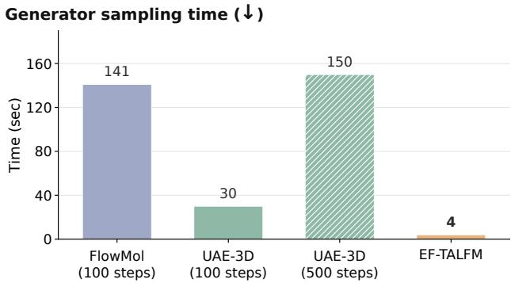  
Figure $7 { : }$ EF-TALFM substantially reduces generator sampling time. Generator-only sampling time for 10,000 molecules. EF-TALFM uses the adaptive fifth-order Dormand–Prince solver, UAE-3D uses a DDPM sampler, and FlowMol uses Euler integration.

## J Example unconditional generated molecules from EF-TALFM

Figure 8 shows ten final relaxed molecules, illustrating the range of molecular sizes, ring systems, fused-ring structures, and heteroatom compositions produced by the complete pipeline; see Table 9 for further details. These examples provide qualitative illustrations of the diversity quantified by the large-sample distributional analysis; hydrogen atoms are omitted for clarity.

## K Detailed property-conditioned generation results

Metric definitions. For each conditioning target $g \in { \mathcal { G } }$ , let $\mathcal { M } _ { g }$ denote the generated molecules assigned to that target, $\mathcal { U } _ { g }$ their set of unique molecules under the exact-match key defined below, and $\mathcal { T } _ { g }$ the set of unique training molecules satisfying the same property tolerance,

$$
\mathcal { T } _ { g } = \left\{ \mathcal { M } \in \mathcal { D } _ { \mathrm { t r a i n } } : \left| y _ { \mathrm { t r a i n } } ( \mathcal { M } ) - g \right| < 0 . 1 \mathrm { e V } \right\} .
$$

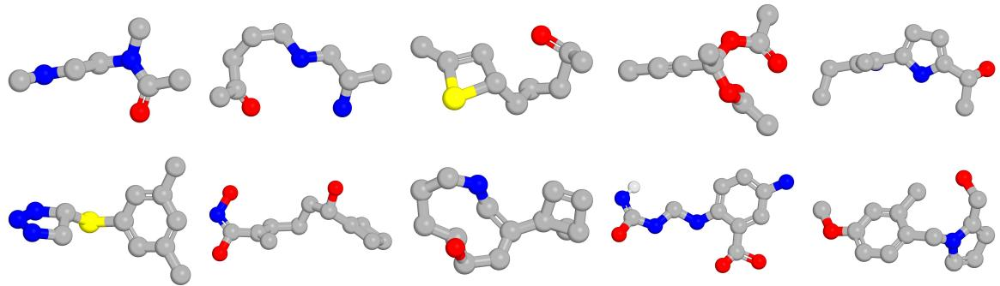  
Figure 8: EF-TALFM generates diverse, variable-size 3D molecules. Randomly sampled final relaxed molecules decoded from generated latents illustrate varied molecular sizes, ring systems, fused-ring structures, and heteroatom compositions. Hydrogen atoms are omitted for clarity.

Table 9: Representative sanitized samples decoded from generated latent codes exhibit diverse molecular sizes, ring systems, and heteroatom compositions. The generated molecules shown in Figure 8 are all connected, with spin multiplicity 1 and total charge 0.
<table><tr><td>n_atoms</td><td>canonical_smiles</td><td>number_of_rings</td><td>has_fused_rings</td></tr><tr><td>9</td><td>CNCCN(C)C(C)=0</td><td>0</td><td>0</td></tr><tr><td>11</td><td>CC(=0)CCCNCC(C)N</td><td>0</td><td>0</td></tr><tr><td>11</td><td>CC(=0)CCCC1C=C(C)S1</td><td>2</td><td>0</td></tr><tr><td>13</td><td>CC#CC(C)(OC(C)=0)OC(C)=0</td><td>0</td><td>0</td></tr><tr><td>14</td><td>CCC(C)=C(N)c1ccc(C(C)O)[nH]1</td><td>1</td><td>0</td></tr><tr><td>14</td><td>Cc1cc(C)cc(SC2CN=NN2)c1</td><td>2</td><td>0</td></tr><tr><td>15</td><td>C=C(CCCC(O)C1=CCC1)C(O)=NO</td><td>1</td><td>0</td></tr><tr><td>15</td><td>OC1CCCCNC=C(C23C=CC2C3)C1</td><td>4</td><td>1</td></tr><tr><td>17</td><td>[H]N=C(O)NCNc1ccc(N)cc1C(=O)0</td><td>1</td><td>0</td></tr><tr><td>17</td><td>COc1ccc(Cn2cccc2CO)c(C)c1</td><td>2</td><td>0</td></tr></table>

Exact molecular identity is represented by canonical SMILES after removing explicit hydrogen atoms while retaining formal charges and bond orders. Each resulting string is used as an exactmatch key. The pooled sample count, uniqueness rate, and exact-match training-set novelty among unique molecules are

$$
N = \sum _ { g \in \mathcal { G } } | \mathcal { M } _ { g } | , \qquad \mathrm { U . } = \frac { \sum _ { g } | \mathcal { U } _ { g } | } { \sum _ { g } | \mathcal { M } _ { g } | } , \qquad R _ { \mathrm { e x a c t } } = \frac { \sum _ { g } | \mathcal { U } _ { g } \backslash \mathcal { T } _ { g } | } { \sum _ { g } | \mathcal { U } _ { g } | } .
$$

Here, set membership is evaluated by exact equality of the canonical-SMILES keys. Unique molecules are formed separately within each target before pooling; the same molecule generated under two targets therefore contributes once to each target-specific set.

Let $\mathbf f ( m )$ denote the 2,048-bit ECFP4 fingerprint of molecule $m ,$ calculated with radius 2, bond types included, and chirality excluded. We use ECFP4 to measure analogue-level graph similarity independently of 3D pose. Its radius-2 circular neighborhoods encode local environments extending up to two bonds from each atom; the $^ { 6 6 } 4 ^ { , 9 }$ denotes the corresponding diameter. The Tanimoto similarity between molecules $\mathcal { M } _ { i }$ and $\mathcal { M } _ { j }$ is

$$
\tau ( \mathcal { M } _ { i } , \mathcal { M } _ { j } ) = \frac { \mathbf { f } ( \mathbf { \mathcal { M } } _ { i } ) ^ { \top } \mathbf { f } ( \mathbf { \mathcal { M } } _ { j } ) } { \| \mathbf { f } ( \mathbf { \mathcal { M } } _ { i } ) \| _ { 1 } + \| \mathbf { f } ( \mathbf { \mathcal { M } } _ { j } ) \| _ { 1 } - \mathbf { f } ( \mathbf { \mathcal { M } } _ { i } ) ^ { \top } \mathbf { f } ( \mathbf { \mathcal { M } } _ { j } ) } .
$$

For each unique generated molecule $\mathcal { M } \in \mathcal { U } _ { g }$ , its exact maximum similarity to the target-matched training reference is

$$
s _ { \mathrm { m a x } } ( \mathcal { M } ) = \operatorname* { m a x } _ { \mathcal { M } ^ { \prime } \in \mathcal { T } _ { g } } \tau ( \mathcal { M } , \mathcal { M } ^ { \prime } ) .
$$

The pooled maximum-similarity vectors are concatenated across targets. The table reports their median, interquartile range

$$
\mathrm { I Q R } ( s _ { \mathrm { m a x } } ) = Q _ { 0 . 7 5 } ( s _ { \mathrm { m a x } } ) - Q _ { 0 . 2 5 } ( s _ { \mathrm { m a x } } ) ,
$$

and the fraction below a threshold $\delta \in \{ 0 . 4 , 0 . 8 \}$

$$
R _ { \delta } = \frac { \sum _ { g } \sum _ { \mathcal { M } \in \mathcal { U } _ { g } } \mathbb { I } \left[ s _ { \operatorname* { m a x } } ( \mathcal { M } ) < \delta \right] } { \sum _ { g } | \mathcal { U } _ { g } | } .
$$

Let $\mathcal { S } ( \mathcal { A } )$ denote the set of distinct nonempty Bemis–Murcko scafolds occurring in molecular set $\mathcal { A } .$ . Scafold novelty is calculated target-wise and then pooled as

$$
R _ { \mathrm { s c a f f o l d } } = \frac { \sum _ { g } \left| \mathcal { S } ( \mathcal { U } _ { g } ) \setminus \mathcal { S } ( \mathcal { T } _ { g } ) \right| } { \sum _ { g } \left| \mathcal { S } ( \mathcal { U } _ { g } ) \right| } .
$$

Acyclic molecules have empty Bemis–Murcko scafolds and therefore do not contribute to this calculation. Because scafolds are collected separately within each target, the same scafold can contribute once for each target in which it occurs. The pooled rate therefore describes novel target–scafold pairs and does not globally deduplicate scafolds across the ten targets.

For internal-diversity analysis, the pooled number of unique molecules and the number of withintarget unordered molecular pairs are

$$
N _ { \mathrm { u n i q u e } } = \sum _ { g } | \mathcal { U } _ { g } | , \qquad P = \sum _ { g } { \binom { | \mathcal { U } _ { g } | } { 2 } } .
$$

The pooled mean pairwise similarity is

$$
\overline { { \tau } } _ { \mathrm { p a i r } } = \frac { \displaystyle \sum _ { g } \{ \mathcal { M } _ { i } , \mathcal { M } _ { j } \} \subset \mathcal { U } _ { g } } { \displaystyle \sum _ { g } \binom { | \mathcal { U } _ { g } | } { 2 } } ,
$$

and internal diversity is defined as

$$
D _ { \mathrm { i n t } } = 1 - \overline { { \tau } } _ { \mathrm { p a i r } } .
$$

Thus, only pairs belonging to the same target are compared; no cross-target molecular pairs are introduced.

For each target $g$ and resampling replicate $r ,$ the training control is sampled without replacement and size-matched to the unique generated molecules for that target:

$$
\mathcal { C } _ { g } ^ { ( r ) } \subseteq \mathcal { T } _ { g } , \qquad \left| \mathcal { C } _ { g } ^ { ( r ) } \right| = \left| \mathcal { U } _ { g } \right| .
$$

Applying this construction to $\mathcal { M } _ { \mathrm { g e n } } ^ { * }$ and $\widehat { \mathcal { M } } _ { \mathrm { g e n } } ^ { * }$ gives $\overline { { \mathcal { M } } } _ { \mathrm { t r a i n } } ^ { * }$ and $\widehat { \mathcal { M } } _ { \mathrm { t r a i n } } ^ { * }$ , respectively. For each replicate, the pooled training similarity $\overline { { \tau } } _ { \mathrm { t r a i n } } ^ { \left( r \right) }$ uses the same pair-count-weighted expression as the generated cohort: target-wise mean similarities are weighted by their numbers of withintarget unordered pairs, and no cross-target pairs are introduced. Over $R = 2 0$ target-stratified resamples, the reported training-control value is

$$
\mu _ { \mathrm { t r a i n } } = \frac { 1 } { R } \sum _ { r = 1 } ^ { R } \overline { { \tau } } _ { \mathrm { t r a i n } } ^ { ( r ) } , \qquad \sigma _ { \mathrm { t r a i n } } = \sqrt { \frac { 1 } { R - 1 } \sum _ { r = 1 } ^ { R } \left( \overline { { \tau } } _ { \mathrm { t r a i n } } ^ { ( r ) } - \mu _ { \mathrm { t r a i n } } \right) ^ { 2 } } ,
$$

reported as $\mu _ { \mathrm { t r a i n } } \pm \sigma _ { \mathrm { t r a i n } }$ . The corresponding training internal diversity is $1 - \mu _ { \mathrm { t r a i n } }$ , with the same sample standard deviation

Figure 6(a) shows that, across all target values, the internal-readout error is correlated with the true error, with Spearman $\rho = 0 . 7 5 4$ and Pearson $r = 0 . 8 3 7$ . Figure 9 further shows the same analysis for each individual target property. This relationship is consistent across the representative target values shown (ρ from 0.728 to 0.770; r from 0.798 to 0.842), and the binned-median trend broadly follows the ideal $x = y$ relationship. Thus, molecules with smaller internal-readout errors are more likely to have true properties close to the target, supporting the use of the internal property readout for ranking or filtering. The remaining molecule-level spread indicates that the internal-readout error should be interpreted as a selection criterion rather than a precise prediction of the individual true error.

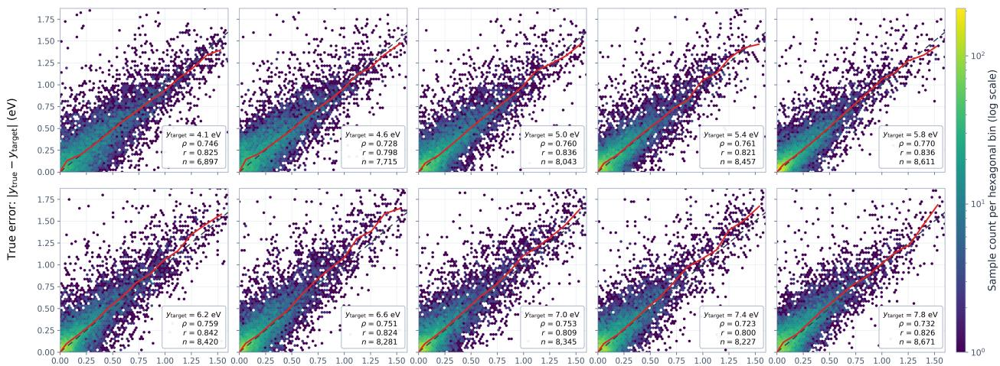  
Surrogate error: [ypred – Ytarget] (eV)  
Figure 9: The internal-readout property error is a strong and practically useful indicator of the true error. For conditionally generated molecules across 10 target HOMO–LUMO gaps, the internal-readout and true errors are strongly correlated, with Spearman $\rho = 0 . 7 2 8 –$ 0.770 and Pearson $r = 0 . 7 9 8 \mathrm { - } 0 . 8 4 2$ . The binned-median trend (red solid line) broadly follows the diagonal x = y (dashed line), showing that molecules with smaller internal-readout errors tend to have true properties closer to their targets.

Table 10: Per-target and pooled novelty and internal diversity of generated molecules. Panels A and $\mathrm { A } ^ { \prime }$ report DFT-verified hits before and after practical selection, respectively; both satisfy $| y _ { \mathrm { t r u e } } - y _ { \mathrm { t a r g e t } } | < 0 . 1 \mathrm { e V } .$ , and the selected set retains the best 30% within each target ranked by $e _ { \mathrm { s u r } } .$ Panel B reports pairwise similarity and internal diversity for both hit sets and for the size-matched training control of ${ \mathcal { M } } _ { \mathrm { g e n } } ^ { * } .$ Training-control values are the mean ± sample standard deviation over 20 target-stratified resamples. All metrics and pooled rows follow the definitions above.
<table><tr><td></td><td colspan="3"></td><td colspan="3">Exact maximum training-set ECFP4 Tanimoto</td><td rowspan="2">Scaffold novelty</td></tr><tr><td>ytarget (eV)</td><td>Sample N</td><td>U. (%)</td><td>U.&amp;N. (%)</td><td>Median (IQR)</td><td> $< 0 . 4$  (%)</td><td>&lt; 0.8 (%)</td></tr><tr><td colspan="8">Panel A: Generated hits,  $\mathcal { M } _ { \mathrm { g e n } } ^ { * }$ </td></tr><tr><td>4.1</td><td>1,070</td><td>99.9</td><td>99.4</td><td>0.452 (0.139)</td><td>26.9</td><td>99.2</td><td>53.1</td></tr><tr><td>4.6</td><td>1,230</td><td>99.7</td><td>98.4</td><td>0.500 (0.156)</td><td>16.1</td><td>97.7</td><td>36.4</td></tr><tr><td>5.0</td><td>1,746</td><td>99.9</td><td>98.3</td><td>0.538 (0.151)</td><td>8.9</td><td>96.8</td><td>31.1</td></tr><tr><td>5.4</td><td>2,048</td><td>99.6</td><td>97.1</td><td>0.574 (0.158)</td><td>5.0</td><td>94.9</td><td>31.1</td></tr><tr><td>5.8</td><td>2,696</td><td>99.5</td><td>96.3</td><td>0.611 (0.166)</td><td>3.4</td><td>93.2</td><td>29.4</td></tr><tr><td>6.2</td><td>2,140</td><td>99.3</td><td>97.3</td><td>0.565 (0.159)</td><td>5.9</td><td>94.7</td><td>34.1</td></tr><tr><td>6.6</td><td>2,064</td><td>99.1</td><td>96.3</td><td>0.578 (0.196)</td><td>9.1</td><td>90.2</td><td>39.2</td></tr><tr><td>7.0</td><td>2,261</td><td>99.6</td><td>98.8</td><td>0.548 (0.167)</td><td>9.8</td><td>95.3</td><td>39.1</td></tr><tr><td>7.4</td><td>2,220</td><td>98.8</td><td>97.9</td><td>0.543 (0.167)</td><td>8.2</td><td>94.0</td><td>36.7</td></tr><tr><td>7.8</td><td>1,978</td><td>99.1</td><td>98.6</td><td>0.552 (0.173)</td><td>8.5</td><td>94.3</td><td>50.6</td></tr><tr><td>Pooled</td><td>19,453</td><td>99.4</td><td>97.7</td><td>0.556 (0.173)</td><td>8.9</td><td>94.6</td><td>37.6</td></tr><tr><td colspan="8">Panel A&#x27;: Generated hits after practical selection,  $\widehat { \mathcal { M } } _ { \mathrm { g c n } } ^ { * }$ </td></tr><tr><td>4.1</td><td>743</td><td>99.9</td><td>99.3</td><td>0.469 (0.141)</td><td>22.5</td><td>98.9</td><td>48.3</td></tr><tr><td>4.6</td><td>794</td><td>99.6</td><td>98.0</td><td>0.514 (0.153)</td><td>12.3</td><td>97.2</td><td>28.5</td></tr><tr><td>5.0</td><td>1,147</td><td>99.9</td><td>98.4</td><td>0.545 (0.148)</td><td>7.2</td><td>96.8</td><td>27.2</td></tr><tr><td>5.4</td><td>1,308</td><td>99.5</td><td>96.5</td><td>0.581 (0.156)</td><td>4.1</td><td>94.8</td><td>29.2</td></tr><tr><td>5.8</td><td>1,705</td><td>99.4</td><td>96.0</td><td>0.628 (0.152)</td><td>1.9</td><td>92.5</td><td>23.4</td></tr><tr><td>6.2</td><td>1,364</td><td>99.3</td><td>97.0</td><td>0.577 (0.149)</td><td>3.7</td><td>94.4</td><td>29.0</td></tr><tr><td>6.6</td><td>1,311</td><td>98.9</td><td>95.0</td><td>0.605 (0.210)</td><td>5.9</td><td>87.2</td><td>36.1</td></tr><tr><td>7.0</td><td>1,399</td><td>99.5</td><td>99.1</td><td>0.559 (0.151)</td><td>7.1</td><td>95.7</td><td>37.8</td></tr><tr><td>7.4</td><td>1,266</td><td>98.7</td><td>97.5</td><td>0.554 (0.171)</td><td>7.4</td><td>93.3</td><td>33.8</td></tr><tr><td>7.8</td><td>1,191</td><td>99.5</td><td>98.2</td><td>0.559 (0.164)</td><td>7.0</td><td>94.2</td><td>44.6</td></tr><tr><td>Pooled</td><td>12,228</td><td>99.4</td><td>97.4</td><td>0.568 (0.171)</td><td>6.8</td><td>94.1</td><td>33.5</td></tr></table>

<table><tr><td></td><td colspan="4"> $\mathcal { M } _ { \mathrm { g e n } } ^ { * }$ </td><td colspan="4"> $\widehat { \mathcal { M } } _ { \mathrm { g e n } } ^ { * }$ </td><td colspan="2"> $\overline { { \mathcal { M } } } _ { \mathrm { t r a i n } } ^ { * }$ </td></tr><tr><td> $y _ { \mathrm { t a r g e t } }$ </td><td>Unique N</td><td>Pairs</td><td>Mean sim.</td><td>Int. div.</td><td>Unique N</td><td>Pairs</td><td>Mean sim.</td><td>Int. div.</td><td>Mean sim.</td><td>Int. div.</td></tr><tr><td colspan="9">Panel B: Internal diversity and size-matched training controls</td><td></td><td></td></tr><tr><td>4.1</td><td>1,069</td><td>570,846</td><td>0.1065</td><td>0.8935</td><td>742</td><td>274,911</td><td>0.1085</td><td>0.8915</td><td> $0 . 0 8 3 5 \pm 0 . 0 0 1 4$ </td><td> $0 . 9 1 6 5 \pm 0 . 0 0 1 4$ </td></tr><tr><td>4.6</td><td>1,226</td><td>750,925</td><td>0.1043</td><td>0.8957</td><td>791</td><td>312,445</td><td>0.1059</td><td>0.8941</td><td> $0 . 0 8 3 9 \pm 0 . 0 0 1 0$ </td><td> $0 . 9 1 6 1 \pm 0 . 0 0 1 0$ </td></tr><tr><td>5.0</td><td>1,745</td><td>1,521,640</td><td>0.1058</td><td>0.8942</td><td>1,146</td><td>656,085</td><td>0.1081</td><td>0.8919</td><td> $0 . 0 8 4 8 \pm 0 . 0 0 0 8$ </td><td> $0 . 9 1 5 2 \pm 0 . 0 0 0 8$ </td></tr><tr><td>5.4</td><td>2,040</td><td>2,079,780</td><td>0.1136</td><td>0.8864</td><td>1,302</td><td>846,951</td><td>0.1163</td><td>0.8837</td><td> $0 . 0 8 5 4 \pm 0 . 0 0 0 9$ </td><td> $0 . 9 1 4 6 \pm 0 . 0 0 0 9$ </td></tr><tr><td>5.8</td><td>2,682</td><td>3,595,221</td><td>0.1350</td><td>0.8650</td><td>1,695</td><td>1,435,665</td><td>0.1457</td><td>0.8543</td><td> $0 . 0 8 5 7 \pm 0 . 0 0 0 6$ </td><td> $0 . 9 1 4 3 \pm 0 . 0 0 0 6$ </td></tr><tr><td>6.2</td><td>2,126</td><td>2,258,875</td><td>0.1130</td><td>0.8870</td><td>1,355</td><td>917,335</td><td>0.1236</td><td>0.8764</td><td> $0 . 0 8 4 8 \pm 0 . 0 0 0 6$ </td><td> $0 . 9 1 5 2 \pm 0 . 0 0 0 6$ </td></tr><tr><td>6.6</td><td>2,046</td><td>2,092,035</td><td>0.1054</td><td>0.8946</td><td>1,296</td><td>839,160</td><td>0.1158</td><td>0.8842</td><td> $0 . 0 8 4 7 \pm 0 . 0 0 0 7$ </td><td> $0 . 9 1 5 3 \pm 0 . 0 0 0 7$ </td></tr><tr><td>7.0</td><td>2,251</td><td>2,532,375</td><td>0.1098</td><td>0.8902</td><td>1,392</td><td>968,136</td><td>0.1161</td><td>0.8839</td><td> $0 . 0 8 2 7 \pm 0 . 0 0 0 7$ </td><td> $0 . 9 1 7 3 \pm 0 . 0 0 0 7$ </td></tr><tr><td>7.4</td><td>2,193</td><td>2,403,528</td><td>0.1137</td><td>0.8863</td><td>1,250</td><td>780,625</td><td>0.1190</td><td>0.8810</td><td> $0 . 0 8 2 0 \pm 0 . 0 0 0 8$ </td><td> $0 . 9 1 8 0 \pm 0 . 0 0 0 8$ </td></tr><tr><td>7.8</td><td>1,960</td><td>1,919,820</td><td>0.1255</td><td>0.8745</td><td>1,185</td><td>701,520</td><td>0.1278</td><td>0.8722</td><td> $0 . 0 8 4 1 \pm 0 . 0 0 0 7$ </td><td> $0 . 9 1 5 9 \pm 0 . 0 0 0 7$ </td></tr><tr><td>Pooled</td><td>19,338</td><td>19,725,045</td><td>0.1161</td><td>0.8839</td><td>12,154</td><td>7,732,833</td><td>0.1224</td><td>0.8776</td><td> $\mathbf { 0 . 0 8 4 3 \pm 0 . 0 0 0 2 }$ </td><td> $\mathbf { 0 . 9 1 5 7 \pm 0 . 0 0 0 2 }$ </td></tr></table>

## L Hyperparameters for UAE-3D training on PCQM4Mv2 for unconditional generation

Table 11: Hyperparameter setup for PCQM4Mv2 unconditional VAE training in UAE-3D.
<table><tr><td>Category</td><td>Hyperparameter</td><td>Value</td></tr><tr><td>Data</td><td>Batch size</td><td>512</td></tr><tr><td>Data</td><td>Data loader workers</td><td>8</td></tr><tr><td>Data</td><td>Rotation augmentation</td><td>enabled</td></tr><tr><td>Data</td><td>Translation augmentation</td><td>enabled</td></tr><tr><td>Data</td><td>Translation scale</td><td>0.1</td></tr><tr><td>Data</td><td>Center atomic coordinates</td><td>enabled</td></tr><tr><td>Data</td><td>Position standard deviation</td><td>estimated from 10,000 training samples</td></tr><tr><td>Data</td><td>Training/validation batch fraction</td><td>1.0 / 1.0</td></tr><tr><td>Optimization</td><td>Learning rate</td><td>5 × 10−⁵</td></tr><tr><td>Optimization</td><td>Weight decay</td><td>1 × 10−5</td></tr><tr><td>Optimization</td><td>Gradient accumulation</td><td>1</td></tr><tr><td>Optimization</td><td>Gradient clipping</td><td>1.0</td></tr><tr><td>Optimization</td><td>Precision</td><td>bf16-mixed</td></tr><tr><td>Training</td><td>Max epochs</td><td>2,000</td></tr><tr><td>Training</td><td>Check validation every n epochs</td><td>5</td></tr><tr><td>Training</td><td>Save checkpoint every n epochs</td><td>20</td></tr><tr><td>Training</td><td>Cache best-validation checkpoint every n epochs</td><td>5</td></tr><tr><td>Training</td><td>Test every n epochs</td><td>200</td></tr><tr><td>Architecture</td><td>Encoder hidden dimension</td><td>64</td></tr><tr><td>Architecture</td><td>Encoder attention heads</td><td>8</td></tr><tr><td>Architecture</td><td>Encoder blocks</td><td>6</td></tr><tr><td>Architecture</td><td>Latent dimension</td><td>4</td></tr><tr><td>Architecture</td><td>Decoder hidden dimension</td><td>64</td></tr><tr><td>Architecture</td><td>Decoder attention heads</td><td>8</td></tr><tr><td>Architecture</td><td>Decoder blocks</td><td>4</td></tr><tr><td>Architecture</td><td>Dropout</td><td>0.1</td></tr><tr><td>Loss</td><td>Atom loss weight</td><td>1.0</td></tr><tr><td>Loss</td><td>Bond loss weight</td><td>1.0</td></tr><tr><td>Loss</td><td>Coordinate loss weight</td><td>1.0</td></tr><tr><td>Loss</td><td>Distance loss weight</td><td>1.0</td></tr><tr><td>Loss</td><td>Bond distance loss weight</td><td>10.0</td></tr><tr><td>Loss</td><td>KLD weight</td><td>1 × 10−8</td></tr><tr><td>Loss</td><td>Center prediction</td><td>disabled</td></tr><tr><td>Loss</td><td>Alignment prediction</td><td>disabled</td></tr></table>

Table 12: Hyperparameter setup for PCQM4Mv2 unconditional latent difusion model (LDM) training in UAE-3D.
<table><tr><td>Category</td><td>Hyperparameter</td><td>Value</td></tr><tr><td>Data</td><td>Batch size</td><td>512</td></tr><tr><td>Data</td><td>Data loader workers</td><td>8</td></tr><tr><td>Data</td><td>Number of generated samples for test-time sampling</td><td>10,000</td></tr><tr><td>Data</td><td>Rotation augmentation</td><td>enabled</td></tr><tr><td>Data</td><td>Translation augmentation</td><td>enabled</td></tr><tr><td>Data</td><td>Translation scale</td><td>0.1</td></tr><tr><td>Data</td><td>Center atomic coordinates</td><td>enabled</td></tr><tr><td>Data</td><td>Position standard deviation</td><td>estimated from 10,000 training samples</td></tr><tr><td>Data</td><td>Training/validation batch fraction</td><td>1.0 / 1.0</td></tr><tr><td>Optimization</td><td>Learning rate</td><td>1 × 10−4</td></tr><tr><td>Optimization</td><td>Weight decay</td><td>0.05</td></tr><tr><td>Optimization</td><td>Minimum learning rate</td><td>1 × 10−5</td></tr><tr><td>Optimization</td><td>Warmup learning rate</td><td>1 × 10−6</td></tr><tr><td>Optimization</td><td>Warmup steps</td><td>1,000</td></tr><tr><td>Optimization</td><td>Learning-rate scheduler</td><td>linear_warmup_cosine</td></tr><tr><td>Optimization</td><td>Gradient accumulation</td><td>1</td></tr><tr><td>Optimization</td><td>Gradient clipping</td><td>1.0</td></tr><tr><td>Optimization</td><td>Precision</td><td>bf16-mixed</td></tr><tr><td>Training</td><td>Max epochs</td><td>10,000</td></tr><tr><td>Training</td><td>Check validation every n epochs</td><td>5</td></tr><tr><td>Training</td><td>Save checkpoint every n epochs</td><td>5</td></tr><tr><td>Training</td><td>Cache best-validation checkpoint every n epochs</td><td>5</td></tr><tr><td>Training</td><td>Test every n epochs</td><td>200</td></tr><tr><td>VAE backbone</td><td>Encoder hidden dimension</td><td>64</td></tr><tr><td>VAE backbone</td><td>Encoder attention heads</td><td>8</td></tr><tr><td>VAE backbone</td><td>Encoder blocks</td><td>6</td></tr><tr><td>VAE backbone</td><td>Latent dimension</td><td>4</td></tr><tr><td>VAE backbone</td><td>Decoder hidden dimension</td><td>64</td></tr><tr><td>VAE backbone</td><td>Decoder attention heads</td><td>8</td></tr><tr><td>VAE backbone</td><td>Decoder blocks</td><td>4</td></tr><tr><td>VAE backbone</td><td>Dropout</td><td>0.1</td></tr><tr><td>Objective</td><td>Atom loss weight</td><td>1.0</td></tr><tr><td>Objective</td><td>Bond loss weight</td><td>1.0</td></tr><tr><td>Objective</td><td>Coordinate loss weight</td><td>1.0</td></tr><tr><td>Objective</td><td>Distance loss weight</td><td>1.0</td></tr><tr><td>Objective</td><td>Bond distance loss weight</td><td>10.0</td></tr><tr><td>Objective</td><td>KLD weight</td><td>1 × 10−8</td></tr><tr><td>Objective</td><td>Center prediction</td><td>disabled</td></tr><tr><td>Objective</td><td>Alignment prediction</td><td>disabled</td></tr><tr><td>Diffusion</td><td>Backbone</td><td>DiT enabled</td></tr><tr><td>Diffusion</td><td>Conditioning</td><td>none (unconditional)</td></tr><tr><td>Diffusion</td><td>Hidden dimension</td><td>512</td></tr><tr><td>Diffusion</td><td>Attention heads</td><td>8</td></tr><tr><td>Diffusion</td><td>Layers</td><td>8</td></tr><tr><td>Diffusion</td><td>MLP ratio</td><td>4.0</td></tr><tr><td>Diffusion</td><td>Dropout</td><td>0.0</td></tr><tr><td>Diffusion</td><td>Latent whitening</td><td>isotropic</td></tr><tr><td>Diffusion</td><td>DDPM denoising steps</td><td>100</td></tr><tr><td>Diffusion</td><td>Noise temperature</td><td>0.95</td></tr><tr><td>Diffusion</td><td>Classifier-free guidance drop probability</td><td>0.1</td></tr><tr><td>Diffusion</td><td>Classifier-free guidance weight</td><td>0.5</td></tr><tr><td>Noise schedule</td><td>Scheduler</td><td>cosine</td></tr><tr><td>Noise schedule</td><td>Continuous β0</td><td>0.1</td></tr><tr><td>Noise schedule</td><td>Continuous β1</td><td>20</td></tr></table>

# M Hyperparameters for FlowMol training on PCQM4Mv2 for unconditional generation

Table 13: Hyperparameter setup for PCQM4Mv2 unconditional FlowMol training.
<table><tr><td>Category</td><td>Hyperparameter</td><td>Value</td></tr><tr><td>Data</td><td>atom_map</td><td>21 PCQM4Mv2 atom types</td></tr><tr><td></td><td>explicit_aromaticity</td><td>true</td></tr><tr><td></td><td>batch_size</td><td>16 6</td></tr><tr><td></td><td>num_workers</td><td></td></tr><tr><td></td><td>max_num_edges</td><td>80,000</td></tr><tr><td></td><td>precision</td><td>bf16-mixed</td></tr><tr><td></td><td>max_epochs</td><td>18</td></tr><tr><td></td><td>accumulate_grad_batches</td><td>5</td></tr><tr><td></td><td>val_loss_interval</td><td>0.25</td></tr><tr><td>Optimization</td><td>base_1r</td><td>1 × 10−4</td></tr><tr><td></td><td>warmup_length</td><td>0.044</td></tr><tr><td></td><td>weight_decay</td><td>1 × 10−12</td></tr><tr><td></td><td>restart_interval/restart_type</td><td>0 /linear</td></tr><tr><td>Flow matching</td><td>ema_decay</td><td>0</td></tr><tr><td></td><td>parameterization</td><td>ctmc</td></tr><tr><td></td><td>time_scaled_loss</td><td>true</td></tr><tr><td></td><td>total_1oss_weights of (x,a,c,e)</td><td>(3.0,0.4,1.0,2.0)</td></tr><tr><td></td><td>distort_p</td><td>0.2</td></tr><tr><td></td><td>fake_atom_p</td><td>0.0</td></tr><tr><td></td><td>n_atom_charges</td><td></td></tr><tr><td>Priors and schedules</td><td>X prior</td><td>centered normal, std. 1.0, aligned</td></tr><tr><td></td><td>a / c / e priors</td><td>ctmc, unaligned</td></tr><tr><td></td><td>schedule_type</td><td>linear for x, a, c, and e</td></tr><tr><td>Vector field</td><td>self_conditioning</td><td>true</td></tr><tr><td></td><td>n_hidden_scalars</td><td>512</td></tr><tr><td></td><td>n_hidden_edge_feats</td><td>256</td></tr><tr><td></td><td>n_vec_channels</td><td>64</td></tr><tr><td></td><td>n_molecule_updates</td><td>8</td></tr><tr><td></td><td>n_message_gvps /n_update_gvps</td><td>3 /3</td></tr><tr><td></td><td>n_expansion_gvps</td><td>3</td></tr><tr><td></td><td>n_recycles /convs_per_update</td><td>1/1</td></tr><tr><td></td><td>n_cp_feats</td><td>4</td></tr><tr><td></td><td>update_edge_w_distance</td><td>true</td></tr><tr><td></td><td>message_norm</td><td>sum</td></tr><tr><td></td><td>rbf_dmax/rbf_dim</td><td></td></tr><tr><td></td><td>time_embedding_dim</td><td>10 / 32 64</td></tr><tr><td></td><td>a_token_dim, c_token_dim, e_token_dim</td><td>64 each</td></tr><tr><td></td><td></td><td></td></tr><tr><td></td><td>stochasticity / high_confidence_threshold dropout</td><td>30.0 / 0.9 0.1</td></tr></table>

# N Hyperparameters for EF-TALFM training on PCQM4Mv2 for unconditional generation

Table 14: Hyperparameters for PCQM4Mv2 unconditional EF-TAVAE training.
<table><tr><td>Category</td><td>Hyperparameter</td><td>Value</td></tr><tr><td>Model architecture</td><td>model</td><td>transformer-p</td></tr><tr><td></td><td>norm_first</td><td>true</td></tr><tr><td></td><td>latent_dim</td><td>32</td></tr><tr><td></td><td>encoder_embed_dim</td><td>384</td></tr><tr><td></td><td>encoder_n_layers</td><td>6</td></tr><tr><td></td><td>encoder_n_heads</td><td>12</td></tr><tr><td></td><td>encoder_dim_feedforward</td><td>768</td></tr><tr><td></td><td>encoder_width_multiplier</td><td>3.0</td></tr><tr><td></td><td>encoder_depth_multiplier</td><td>3.0</td></tr><tr><td></td><td>decoder_embed_dim</td><td>384</td></tr><tr><td></td><td>decoder_n_layers</td><td>6</td></tr><tr><td></td><td>decoder_n_heads</td><td>12</td></tr><tr><td></td><td>decoder dim feedforward</td><td>1,536</td></tr><tr><td></td><td>decoder_width_multiplier</td><td>3.0</td></tr><tr><td></td><td>decoder_depth_multiplier</td><td>3.0</td></tr><tr><td>Optimization / training</td><td>precision</td><td>bf16-mixed</td></tr><tr><td></td><td>1r</td><td> $1 \times 1 0 ^ { - 3 }$ </td></tr><tr><td></td><td>1r_end</td><td> $1 \times 1 0 ^ { - 6 }$ </td></tr><tr><td></td><td>1r_scheduler</td><td>cosine_with_lr_end</td></tr><tr><td></td><td>warmup_proportion</td><td>0.0</td></tr><tr><td></td><td>max_steps</td><td>400,000</td></tr><tr><td></td><td>num_decay_steps</td><td>-1</td></tr><tr><td></td><td>batch size</td><td>512</td></tr><tr><td></td><td>accumulate_grad_batches</td><td>1</td></tr><tr><td></td><td>optimizer</td><td>adamw</td></tr><tr><td></td><td>adam_betas</td><td>(0.9,0.98)</td></tr><tr><td></td><td>adam_eps</td><td>10−8</td></tr><tr><td></td><td>weight_decay</td><td>0.01</td></tr><tr><td></td><td>gradient_clip_val</td><td>5</td></tr><tr><td>Loss / regularization</td><td>pos_1oss_type</td><td>smoothl1-0.001</td></tr><tr><td></td><td>position_scale</td><td>1.0</td></tr><tr><td></td><td>pos_weight</td><td>10</td></tr><tr><td></td><td>seq_weight</td><td>1</td></tr><tr><td></td><td>charge_weight</td><td>1</td></tr><tr><td></td><td>spinmp_weight</td><td>1</td></tr><tr><td></td><td>k1_weight</td><td> $1 \times 1 0 ^ { - 3 }$ </td></tr><tr><td></td><td>vae_noise_scale</td><td>0</td></tr><tr><td></td><td>vae_disable_learned_variance</td><td> $\mathbf { f a l s e }$ </td></tr><tr><td></td><td>vae_corruption_ratio</td><td>0.1</td></tr><tr><td></td><td>vae_free_bits_per_dim</td><td>0.02</td></tr><tr><td></td><td>vae_sigma_clamp_min</td><td>0.01</td></tr><tr><td></td><td>vae_sigma_clamp_max</td><td>1.5</td></tr><tr><td></td><td>vae_mu_var_floor</td><td>0.01</td></tr><tr><td></td><td>vae_mu_var_floor_weight</td><td> $5 \times 1 0 ^ { - 3 }$ </td></tr><tr><td></td><td>vae_mu_cov_weight</td><td> $5 \times 1 0 ^ { - 4 }$ </td></tr><tr><td></td><td>dropout</td><td>0.0</td></tr><tr><td></td><td>max_positions</td><td>64</td></tr></table>

In the reported EF-TAVAE configuration, posterior scales are clamped to [0.01,1.5], the KL term uses 0.02 free nats per latent dimension, and 10% of teacher-forced atom-type inputs are masked. The coordinate, categorical-sequence, charge, and spin-multiplicity loss weights are 10, 1, 1, and 1, respectively; $\beta _ { \mathrm { { K L } } } = 1 0 ^ { - 3 } , \lambda _ { \mathrm { { v a r } } } = 5 \times 1 0 ^ { - 3 }$ , and $\lambda _ { \mathrm { c o v } } = 5 \times 1 0 ^ { - 4 }$ . These settings correspond to the configuration entries in the table above.

Table 15: Hyperparameter setup for PCQM4Mv2 unconditional latent flow matching training in EF-TALFM.
<table><tr><td>Category</td><td>Hyperparameter</td><td>Value</td></tr><tr><td rowspan="2">Pretrained VAE</td><td>pretrained_vae_subfolder</td><td>vae</td></tr><tr><td>pretrained_vae_checkpoint</td><td>last.ckpt</td></tr><tr><td>Latent data setup</td><td>model</td><td>transformer-p</td></tr><tr><td></td><td>probabilistic_model</td><td>flow_matching</td></tr><tr><td></td><td>context_dim</td><td>0</td></tr><tr><td></td><td>gm_use_latent_stats</td><td>true</td></tr><tr><td></td><td>gm_latent_stats_filename</td><td>latent_whitener.pt</td></tr><tr><td></td><td>gm_disable_random_sample</td><td>true</td></tr><tr><td>Dynamics model</td><td>gm_dynamics_model</td><td>completep_resnet</td></tr><tr><td></td><td>gm_dynamics_d_model</td><td>384</td></tr><tr><td></td><td>gm_dynamics_n_layers</td><td>6</td></tr><tr><td></td><td>gm_dynamics_n_heads</td><td>8</td></tr><tr><td></td><td>gm_dynamics_hidden_dim</td><td>1,024</td></tr><tr><td></td><td>gm_dynamics_width_multiplier</td><td>3.0</td></tr><tr><td></td><td>gm_dynamics_depth_multiplier</td><td>3.0</td></tr><tr><td></td><td>gm_dynamics_time_embed</td><td>true</td></tr><tr><td></td><td>gm_dynamics_time_freqs</td><td>10</td></tr><tr><td></td><td>gm_dynamics_t_encoder_type</td><td>logsnr_sinusoidal</td></tr><tr><td></td><td>gm_dynamics_x_encoder_type</td><td>linear</td></tr><tr><td></td><td>gm_dynamics_activation</td><td>gelu</td></tr><tr><td></td><td>gm_dynamics_norm_method</td><td>1n</td></tr><tr><td></td><td>gm_dynamics_dropout</td><td>0.0</td></tr><tr><td></td><td>init_std</td><td>0.02</td></tr><tr><td>Flow-matching objective</td><td>gm_flow_path</td><td>ot</td></tr><tr><td></td><td>gm_t_lower_eps</td><td>10-5</td></tr><tr><td></td><td>gm_t_upper_eps</td><td>10-5</td></tr><tr><td></td><td>gm_t_norm_scale_cutoff</td><td>1</td></tr><tr><td></td><td>gm_self_condition_prob</td><td>-1</td></tr><tr><td></td><td>gm_ae_total_weight</td><td>-1.0</td></tr><tr><td></td><td>gm_loss_type</td><td>12</td></tr><tr><td>Optimization / training</td><td>precision</td><td>bf16-mixed</td></tr><tr><td></td><td>compile_model</td><td>true</td></tr><tr><td></td><td>1r</td><td>1 × 10−4</td></tr><tr><td></td><td>1r_end</td><td>1 × 10−7</td></tr><tr><td></td><td>1r_scheduler</td><td>cosine_with_lr_end</td></tr><tr><td></td><td>1r_interval</td><td>step</td></tr><tr><td></td><td>power</td><td>1</td></tr><tr><td></td><td>warmup_proportion</td><td>0.001</td></tr><tr><td></td><td>max_steps</td><td>1,000,000</td></tr><tr><td></td><td>num_decay_steps</td><td>-1</td></tr><tr><td></td><td>batch_size</td><td>1,024</td></tr><tr><td></td><td>eval_batch_size</td><td>1,024</td></tr><tr><td></td><td>accumulate_grad_batches</td><td>1</td></tr><tr><td></td><td>optimizer</td><td>adamw</td></tr><tr><td></td><td>adam_betas</td><td>(0.9,0.98)</td></tr><tr><td></td><td>adam_eps</td><td>10-8</td></tr><tr><td></td><td>weight_decay</td><td>0.01</td></tr><tr><td></td><td>gradient_clip_val</td><td>5</td></tr></table>

# O Hyperparameters for EF-TALFM training on PCQM4Mv2 for property-conditioned generation

Table 16: Hyperparameters for PCQM4Mv2 property-supervision enabled EF-TAVAE training.
<table><tr><td>Category</td><td>Hyperparameter</td><td>Value</td></tr><tr><td>Model architecture</td><td>model</td><td>transformer-p</td></tr><tr><td></td><td>norm_first</td><td>true</td></tr><tr><td></td><td>latent_dim</td><td>64</td></tr><tr><td></td><td>encoder embed dim</td><td>768</td></tr><tr><td></td><td>encoder_n_layers</td><td>12</td></tr><tr><td></td><td>encoder_n_heads</td><td>12</td></tr><tr><td></td><td>encoder_dim_feedforward</td><td>1,536</td></tr><tr><td></td><td>encoder_width_multiplier</td><td>6.0</td></tr><tr><td></td><td>encoder_depth_multiplier</td><td>6.0</td></tr><tr><td></td><td>decoder embed dim</td><td>768</td></tr><tr><td></td><td>decoder_n_layers</td><td>12</td></tr><tr><td></td><td>decoder_n_heads</td><td>12</td></tr><tr><td></td><td>decoder_dim_feedforward</td><td>3,072</td></tr><tr><td></td><td>decoder_width_multiplier</td><td>6.0</td></tr><tr><td></td><td>decoder_depth_multiplier</td><td>6.0 true</td></tr><tr><td></td><td>decoder_explicit_property_token disable encoder context condition</td><td>true</td></tr><tr><td>Optimization / training</td><td></td><td></td></tr><tr><td></td><td>precision 1r</td><td>bf16-mixed 7× 10−4</td></tr><tr><td></td><td></td><td>7 × 10−6</td></tr><tr><td></td><td>1r_end</td><td></td></tr><tr><td></td><td>1r_scheduler</td><td>cosine_with_lr_end</td></tr><tr><td></td><td>warmup_proportion</td><td>0.0 1,000,000</td></tr><tr><td></td><td>max_steps</td><td></td></tr><tr><td></td><td>num_decay_steps</td><td>-1</td></tr><tr><td></td><td>batch_size</td><td>256 1</td></tr><tr><td></td><td>accumulate_grad_batches</td><td>adamw</td></tr><tr><td></td><td>optimizer</td><td>(0.9,0.98)</td></tr><tr><td></td><td>adam_betas</td><td>10-8</td></tr><tr><td></td><td>adam_eps</td><td>5× 10−3</td></tr><tr><td></td><td>weight_decay gradient_clip_val</td><td>5</td></tr><tr><td>Loss / regularization</td><td></td><td>smooth11-0.001</td></tr><tr><td></td><td>pos_1oss_type position_scale</td><td>1.0</td></tr><tr><td></td><td>pos_weight</td><td></td></tr><tr><td></td><td>seq_weight</td><td>10</td></tr><tr><td></td><td></td><td>1</td></tr><tr><td></td><td>charge_weight</td><td>1 1</td></tr><tr><td></td><td>spinmp_weight context_weight</td><td>1</td></tr><tr><td></td><td>k1_weight</td><td>1 × 10−4</td></tr><tr><td></td><td>kl_weight_scheduler</td><td>linear</td></tr><tr><td></td><td>decoder_property_molecule_only_prob</td><td>0.6</td></tr><tr><td></td><td>decoder_property_latent_only_prob</td><td>0.4</td></tr><tr><td></td><td>property_molecule_only_1oss_weight</td><td>0.6</td></tr><tr><td></td><td>property_latent_only_loss_weight</td><td>0.4</td></tr><tr><td></td><td>vae_noise_scale</td><td>0.05</td></tr><tr><td></td><td>vae_disable_learned_variance</td><td>false</td></tr><tr><td></td><td>vae_corruption_ratio</td><td></td></tr><tr><td></td><td></td><td>0.0</td></tr><tr><td></td><td>vae_free_bits_per_dim</td><td>0.01</td></tr><tr><td></td><td>vae_sigma_clamp_min</td><td>-1</td></tr><tr><td></td><td>vae_sigma_clamp_max</td><td>-1</td></tr><tr><td></td><td>vae_mu_var_floor</td><td>0.01 0</td></tr><tr><td></td><td>vae_mu_var_floor_weight</td><td></td></tr><tr><td></td><td>vae_mu_cov_weight</td><td></td></tr><tr><td></td><td>dropout</td><td>0.0</td></tr><tr><td></td><td>max_positions</td><td>64</td></tr></table>

For conditional generation with property-supervision is enabled, molecule-condition route is activated with 60% of time, and latent-only route is activated with the rest 40% of time. The coordinate, categorical-sequence, charge, spin-multiplicity, context loss weights are 10, 1, 1, 1, and 1; molecule-condition route loss weight is $\tau _ { \mathrm { m o l } } = 0 . 6$ , and molecule-condition route loss weight is $1 - \tau _ { \mathrm { m o l } } = 0 . 4$ . These settings correspond to the configuration entries in the table above.

Table 17: Hyperparameter setup for PCQM4Mv2 conditional latent flow matching training in EF-TALFM.
<table><tr><td>Category</td><td>Hyperparameter</td><td>Value</td></tr><tr><td>Pretrained VAE</td><td>pretrained_vae_subfolder</td><td>vae</td></tr><tr><td></td><td>pretrained_vae_checkpoint</td><td>last.ckpt</td></tr><tr><td>Latent data setup</td><td>model</td><td>transformer-p</td></tr><tr><td></td><td>probabilistic_model</td><td>flow_matching</td></tr><tr><td></td><td>context_dim</td><td>1</td></tr><tr><td></td><td>gm_use_latent_stats</td><td>true</td></tr><tr><td></td><td>gm_latent_stats_filename gm_disable_random_sample</td><td>latent_scalar.pt true</td></tr><tr><td></td><td></td><td></td></tr><tr><td>Dynamics model</td><td>gm_dynamics_model</td><td>completep_resnet</td></tr><tr><td></td><td>gm_dynamics_d_model</td><td>512</td></tr><tr><td></td><td>gm_dynamics_n_layers</td><td>12</td></tr><tr><td></td><td>gm_dynamics_n_heads</td><td>8</td></tr><tr><td></td><td>gm_dynamics_hidden_dim</td><td>1,024</td></tr><tr><td></td><td>gm_dynamics_width_multiplier</td><td>4.0</td></tr><tr><td></td><td>gm_dynamics_depth_multiplier</td><td>3.0</td></tr><tr><td></td><td>gm_dynamics_time_embed</td><td>true 32</td></tr><tr><td></td><td>gm_dynamics_time_freqs</td><td></td></tr><tr><td></td><td>gm_dynamics_t_encoder_type</td><td>logsnr_sinusoidal</td></tr><tr><td></td><td>gm_dynamics_x_encoder_type</td><td>linear</td></tr><tr><td></td><td>gm_dynamics_y_encoder_type</td><td>m1p</td></tr><tr><td></td><td>gm_dynamics_activation</td><td>gelu</td></tr><tr><td></td><td>gm_dynamics_norm_method</td><td>1n</td></tr><tr><td></td><td>gm_dynamics_dropout</td><td>0.0</td></tr><tr><td></td><td>init_std</td><td>0.02</td></tr><tr><td>Flow-matching objective</td><td>gm_flow_path</td><td>ot</td></tr><tr><td></td><td>gm_t_lower_eps</td><td>10-3</td></tr><tr><td></td><td>gm_t_upper_eps</td><td>10-3</td></tr><tr><td></td><td>gm_t_norm_scale_cutoff</td><td>1</td></tr><tr><td></td><td>gm_self_condition_prob</td><td>-1</td></tr><tr><td></td><td>gm_ae_total_weight</td><td>-1.0 12</td></tr><tr><td></td><td>gm_loss_type</td><td></td></tr><tr><td>Optimization / training</td><td>precision</td><td>bf16-mixed</td></tr><tr><td></td><td>compile_model</td><td>true</td></tr><tr><td></td><td>1r</td><td>1.4 × 10−3</td></tr><tr><td></td><td>1r_end</td><td>2.8 × 10−6</td></tr><tr><td></td><td>1r_scheduler</td><td>cosine_with_1r_end</td></tr><tr><td></td><td>1r interval</td><td>step</td></tr><tr><td></td><td>power</td><td>1</td></tr><tr><td></td><td>warmup_proportion</td><td>0.01</td></tr><tr><td></td><td>max_steps</td><td>250,000</td></tr><tr><td></td><td>num_decay_steps</td><td>-1</td></tr><tr><td></td><td>batch_size</td><td>4,096</td></tr><tr><td></td><td>eval_batch_size</td><td>4,096</td></tr><tr><td></td><td>accumulate_grad_batches</td><td>1</td></tr><tr><td></td><td>optimizer</td><td>adamw</td></tr><tr><td></td><td>adam_betas</td><td>(0.9,0.98)</td></tr><tr><td></td><td>adam_eps</td><td>10-8</td></tr><tr><td></td><td>weight_decay</td><td>0.01</td></tr><tr><td></td><td>gradient_clip_val</td><td>5</td></tr></table>