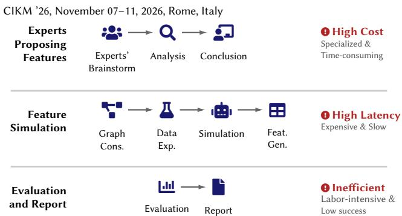
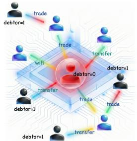
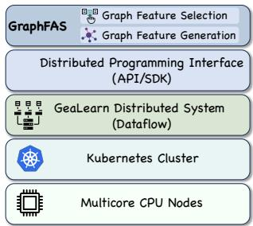
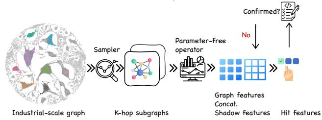
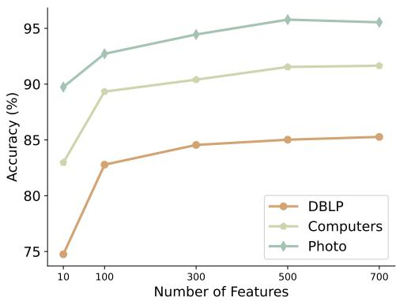
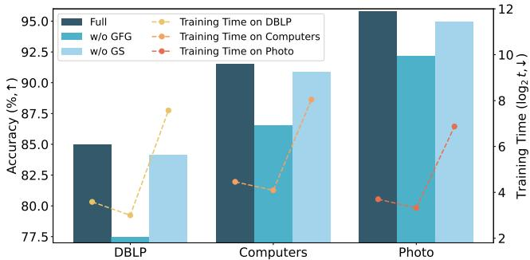
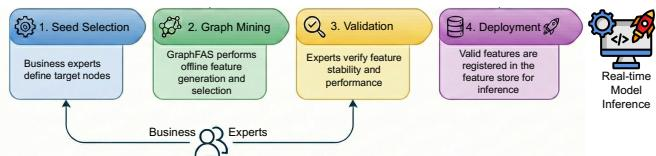

# GraphFAS: A Distributed System for Automated Graph Feature Generation and Selection in Industrial Transaction Networks

Yice Luo   
Ant Group   
Hangzhou, China   
Yongchao Liu<sup>∗</sup>   
Ant Group   
Hangzhou, China   
yongchao.ly@antgroup.com

Kai Zhang Ant Group Hangzhou, China

Yun Zhu   
Ant Group   
Hangzhou, China

Xintan Zeng Ant Group Hangzhou, China

Jinrui Zhang Ant Group Hangzhou, China

Jiajun Zheng Ant Group Hangzhou, China

Xi Chen   
Ant Group   
Hangzhou, China

Chengying Huan Nanjing University Nanjing, China

Juelu Zhang Ant Group Hangzhou, China

## Abstract

Industrial fraud detection often relies on costly expert-crafted features that overlook graph-structured relational signals, while GNNs often do not meet the interpretability and deployment requirements of financial risk control. We propose GraphFAS (Graph Feature Automated Selection), a distributed feature selection procedure based on Boruta that bridges this gap through: (1) a non-parametric graph feature generation module that constructs explicit, interpretable structural features via multi-hop subgraph extraction and multi-scale aggregation without learned parameters; and (2) an automated distributed feature selection algorithm extending Boruta with median-based aggregation across partitions to robustly identify informative features at scale with minimal domain expertise. Compared with end-to-end GNN pipelines, GraphFAS decouples feature aggregation from model training, enabling direct integration with tabular models and direct compatibility with TreeSHAPbased explanations. Deployed in Alipay, GraphFAS delivers orderof-magnitude improvements in engineering eficiency while showing strong performance against expert-driven and graph-learning baselines on large-scale graphs.

## CCS Concepts

• Information systems → Data mining.

## Keywords

Feature Selection, Graph Feature Generation, Interpretability, Distributed Graph Mining, Fraud Detection

ACM Reference Format:

Yice Luo, Yun Zhu, Xi Chen, Yongchao Liu, Xintan Zeng, Chengying Huan, Kai Zhang, Jinrui Zhang, Juelu Zhang, and Jiajun Zheng. 2026. GraphFAS: A Distributed System for Automated Graph Feature Generation and Selection in Industrial Transaction Networks. In Proceedings ofthe 35th ACM International Conference on Information and Knowledge Management (CIKM ’26), November 07–11, 2026, Rome, Italy. ACM, New York, NY, USA, 8 pages. https://doi.org/10.1145/3799682.3840143

## 1 Introduction

Fraud detection [1, 2] in large-scale transaction networks is a critical task for financial platforms. On systems such as Alipay, efective detection mechanisms prevent financial losses amounting to millions of CNY daily. These transaction networks comprise hundreds of millions of users and massive edge volumes, where fraudulent activities exhibit organized collusion and complex interaction patterns inherently suited for graph-based analysis.

Existing industrial solutions predominantly rely on expert-crafted features developed through labor-intensive manual processes. As illustrated in Figure 1, graph feature engineering entails three stages: (1) expert-driven pattern analysis requiring specialized domain knowledge, (2) large-scale simulations over massive credit networks, and (3) iterative multi-dimensional evaluations for stability validation. This manual cycle often spans over a month with no guarantee of optimal outcomes. Moreover, conventional attribute-centric approaches may under-utilize the rich relational signals embedded in graph structures, leaving critical topological patterns undetected.

Graph neural networks (GNNs) capture structural dependencies through iterative message passing, achieving strong performance on various graph learning tasks. However, GNNs face fundamental limitations in financial risk control scenarios. First, their multi-layer transformations can make decision processes harder to interpret that conflict with regulatory requirements for model transparency. Second, the computational overhead of end-to-end training introduces significant latency that conflicts with low-latency feature production requirements on large-scale industrial networks. Third, GNN embeddings often lack explicit semantics that are easy to validate in risk analysis workflows, making them dificult to validate and deploy in production environments.

  
Figure 1: Traditional feature engineering workflows. The manual process is high-cost, while simulation is computationally expensive.

To overcome the limitations of both manual feature engineering and opaque GNN embeddings, recent research has explored automated graph feature construction. Frameworks such as TAG [10], G2T-FM [5], and TabPFN-GN [4] construct node representations from topology using predefined structural encoders. While these approaches reduce manual intervention, they introduce new challenges that motivate our work:

• Challenge 1: Lack of interpretability in graph learning models. GNNs generate latent embeddings that are opaque to domain experts and regulators. Financial risk control requires explicit, human-interpretable features that can be directly validated and audited. The first challenge is to design a feature generation mechanism that captures multi-hop relational dependencies while producing semantically meaningful, tabular-compatible features with native TreeSHAP explainability (Section 3.1).

• Challenge 2: Scalability limitations of existing feature selection methods. Traditional feature selection algorithms such as Boruta [16] operate on standalone environments and lack distributed computation support. Industrial graphs with massive edge volumes require partition-based processing, but aggregating importance scores across partitions introduces instability under skewed class distributions. The second challenge is to design a distributed adaptation with robust aggregation mechanisms for eficient high-dimensional feature screening across partitioned datasets (Section 3.2).

• Challenge 3: Inflexibility of automated graph feature pipelines. Existing automated methods rely on static, predefined encoders or require complex, non-scalable training proce dures. Foundation model-based approaches struggle to generalize across diverse, multi-type graph structures typical of heterogeneous financial networks. The third challenge is to decouple feature generation from model training to enable feature selection without end-to-end retraining or reliance on fixed encoder sets (Section 3).

To address these challenges, we present GraphFAS (Graph Feature Automated Selection), a distributed graph feature selection system deployed in Alipay. Our design is based on the observation that decoupling non-parametric graph feature aggregation from downstream model training enables both scalability and interpretability. By generating explicit structural statistics rather than learned embeddings, GraphFAS achieves seamless integration with tabular learning models while maintaining native explainability.

In GraphFAS, graph features are constructed through multi-hop subgraph extraction and multi-scale aggregation without learned parameters, enabling CPU-based execution and good distributed scalability. The distributed feature selection module extends the Boruta algorithm with median-based aggregation across partitions, making the procedure less sensitive to outlier partitions arising from skewed class distributions. This design enables automated feature selection at scale while reducing the need for manual expert intervention.

We evaluate GraphFAS on eight public benchmarks and three industrial datasets <sup>1</sup>. GraphFAS performs competitively on public benchmarks and shows strong results on industrial datasets. Deployed on large-scale transaction networks, GraphFAS processes millions of seed nodes daily across multiple risk control scenarios. The technical contributions are summarized as follows:

• A scalable graph feature generation module. We propose a scalable feature generation module that constructs explicit, interpretable structural features via multi-hop subgraph extraction and multi-scale aggregation without learned parameters. This enables eficient processing of large-scale industrial graphs while producing TreeSHAP-compatible tabular features (Section 3.1).

• A distributed Boruta-based feature selection module. We extend the Boruta algorithm with median-based aggregation across partitions, enabling robust distributed feature selection for large-scale graph data. This approach provides resilience against outlier partitions while automatically identifying informative features without domain expertise (Section 3.2).

• Industrial deployment and evaluation. We demonstrate the practical efectiveness of GraphFAS through deployment in Alipay. Our system achieves over 10× reduction in feature engineering cycle time while uncovering fraud patterns with substantially higher detection rates than expert-crafted baselines (Section 5).

## 2 Background and Related Work

## 2.1 Problem Formulation

We reformulate graph representation learning by decoupling feature aggregation from end-to-end training.

Formally, let � = (�, �) denote a graph with node set � and edge set �. Traditional GNNs update node representations through

GraphFAS : A Distributed System for Automated Graph Feature Generation and Selection in Industrial Transaction Networks

CIKM ’26, November 07–11, 2026, Rome, Italy

Table 1: Summary of graph metrics by category.
<table><tr><td>Category</td><td>Distance</td><td>Connection</td><td>Spectral</td></tr><tr><td rowspan="5">Metric</td><td>Hopcount</td><td>Degree</td><td>Algebraic connectivity</td></tr><tr><td>Closeness</td><td>Entropy</td><td>Spectral radius</td></tr><tr><td>Eccentricity</td><td>Assortativity</td><td>Spectral partitioning</td></tr><tr><td>Diameter</td><td>Coreness</td><td>Principal eigenvector</td></tr><tr><td></td><td></td><td></td></tr></table>

parameterized neighborhood aggregation:

$$
\mathbf { h } _ { v } ^ { ( l + 1 ) } = \phi ^ { ( l ) } \left( \mathbf { h } _ { v } ^ { ( l ) } ; \bigoplus _ { u \in N ( v ) } \psi ^ { ( l ) } \left( \mathbf { h } _ { u } ^ { ( l ) } , \mathbf { h } _ { v } ^ { ( l ) } , \mathbf { e } _ { u v } \right) \right) ,\tag{1}
$$

where $\mathbf { h } _ { v } ^ { ( l ) }$ denotes the embedding of node � at layer �, $\mathbf { e } _ { u v }$ denotes the edge from � to �, $N ( v )$ is its neighborhood, $\psi ^ { \dot { ( l ) } } ( \cdot )$ is a parame terized feature aggregation function, É is a permutation-invariant aggregation operator, and $\phi ^ { ( l ) } ( \cdot )$ is an update function.

Instead of learning parameterized aggregation functions, we perform non-parametric feature aggregation through algorithmic graph transformations:

$$
\mathbf { F } = { \mathcal { A } } _ { \mathrm { N P } } ( G ) ,\tag{2}
$$

where $\mathcal { A } _ { \mathrm { N P } } ( \cdot )$ denotes a parameter-free operator that computes graph-level and node-level statistics without gradient-based optimization. To enhance discriminative power and reduce redundancy, an automated feature selection operator $s ( \cdot )$ is subsequently applied:

$$
\mathbf { F } ^ { * } = S ( \mathbf { F } ; \Phi ) ,\tag{3}
$$

where Φ denotes the distributed selection configuration, including partition-wise importance estimation, cross-partition aggregation, and final tentative-feature ranking. The selected features F<sup>∗</sup> are then utilized by a lightweight predictive model:

$$
\hat { Y } = f _ { \theta } ( \mathbf { F } ^ { * } ) ,\tag{4}
$$

Finally, a task-specific loss function $\mathcal { L } ( Y , \hat { Y } )$ is applied to optimize the predictive model. This framework supports eficient processing of industrial-scale graphs while preserving feature interpretability.

## 2.2 Graph Feature Definition

Graph features capture structural characteristics through graph metrics and aggregation functions. Table 1 summarizes twelve metrics classified into three categories [11]: distance-based, connectionbased, and spectral. We combine these with non-parametric aggregators [30, 32] to integrate neighbor features while maintaining interpretability.

## 2.3 Related Work

Feature Selection Methods. Wrapper-based methods like Boruta [16] identify significant features by comparing them against randomly permuted shadow features. While efective [18, 22], existing implementations lack distributed support, hindering scalability for large-scale graph datasets. Filter methods (mutual information, statistical tests) are eficient but ignore feature interactions and structural dependencies.

Graph Representation Learning. Random walk methods (Deep-Walk [23], Node2Vec [8]) and spectral approaches produce node embeddings but lack interpretability and fail to incorporate node

  
The red user's 2n\_black\_rate is 0.5

  
Figure 3: System architecture of GraphFAS.

Figure 2: An example of graph-based features.

attributes. GNNs (GCN [15], GAT [28]) achieve strong performance through message passing but sufer from three critical limitations in industrial settings: (1) opaque embeddings violate regulatory transparency requirements; (2) end-to-end training introduces significant latency that conflicts with low-latency feature production requirements on large-scale networks; (3) latent representations lack semantic meaning for actionable analysis.

Post-hoc explainability methods (GNNExplainer [34], PGExplainer [21]) generate soft masks highlighting important subgraphs. However, soft masks require thresholding for practical use, while hard masks are more applicable in industrial settings [3]. These methods produce approximations rather than exact attributions and cannot directly output tabular features for downstream tasks [14]. In contrast, our approach generates inherently interpretable structural statistics compatible with native TreeSHAP explainability.

Graph-to-Tabular Methods. Recent approaches (TAG [10], G2T-FM [5], TabPFN-GN [4], GraphPFN [6]) automate graph feature generation for tabular models. However, they rely on static predefined encoders or require complex training, limiting adaptability to diverse graph structures and scalability to industrial networks.

## 2.4 Research Gap and Motivation

Existing approaches exhibit three technical limitations that motivate our work. First, wrapper-based feature selection methods lack distributed adaptations—Boruta operates on standalone environments without partition-aware aggregation mechanisms, making it intractable for large-scale datasets. Second, current graph learning methods force a trade-of between performance and interpretability: GNNs produce opaque embeddings unsuitable for regulatory audit, while post-hoc explainers provide approximations rather than exact attributions. Third, automated graph-to-tabular pipelines rely on static pre-defined encoders that cannot adapt to diverse heterogeneous graph structures without complex retraining. We leave such benchmarking to future work.

GraphFAS addresses these gaps through: (1) a distributed Boruta adaptation with median-based aggregation for robust feature selection at scale; (2) non-parametric graph feature generation producing inherently interpretable structural statistics compatible with native TreeSHAP explainability; (3) decoupled feature generation and automated selection enabling scalable deployment without end-to-end retraining.

CIKM ’26, November 07–11, 2026, Rome, Italy

  
Figure 4: GraphFAS procedure overview.

## 3 The GraphFAS Framework

The calculation procedure for GraphFAS (Figure 4) comprises two key design elements: (1) graph feature generation, which extracts �-hop subgraphs from seed nodes, computes graph metrics, and aggregates them to create candidate features; and (2) distributed feature selection, which employs a Boruta-based algorithm to filter out low-importance features.

## 3.1 Graph Feature Generation

The feature generation process involves three stages:

K-hop Subgraph Extraction. For each node, ego-subgraphs are generated at diferent hop levels (1-hop, 2-hop, 3-hop) using neighborhood sampling, capturing localized structural patterns at varying depths.

Feature Generation from Graph Metrics. Given a subgraph centered at target node �, we compute graph metric functions to extract feature values characterizing local structural properties (connectivity patterns, centrality, neighborhood composition). These metric-based features are concatenated with the aggregated graph feature vector, yielding an enhanced representation encoding both intrinsic attributes and structural context.

All generated features are inherently interpretable—e.g., average transaction frequency among 2-hop risky neighbors or fraud concentration ratio within immediate neighborhood (Figure 2 illustrating an example of graph-based features highlighting suspect connectivity to known debtors. A node with 0.2 debtor ratio in 1-hop and 1.0 in 2-hop neighborhood suggests elevated risk even when the individ ual is not a debtor, demonstrating the capacity to identify latent risks through local topology)—enabling direct validation by domain experts. Unlike conventional pipelines requiring manual metric selection, GraphFAS automatically evaluates and ranks features from a large candidate pool, ensuring both predictive performance and scalability.

Feature Aggregation. Multi-scale features are aggregated hierarchically: 1-hop aggregation (Mean/Max pooling of immediate neighbors), 2-hop aggregation (variance/skewness of secondary neighbors), and combined features (concatenation of raw features with aggregated features). We employ six complementary aggregation functions: Max/Min (extreme behaviors), Mean/Std (distributional properties), Sum (cumulative efects), and Count (structural density). Implementation hyperparameters are detailed in Table 3.

## 3.2 Distributed Feature Selection

GraphFAS employs a wrapper-style feature selection stage that iteratively evaluates feature importance against shufled shadow features. For industrial-scale graphs, GraphFAS employs partitionbased selection: the graph is divided into � parts, each generating hybrid shadow features via random permutation (Algorithm 1).

Algorithm 1: Feature Selection of GraphFAS   
Input: Dataset �, partitions �, max iterations �   
Output: Confirmed features $F _ { \mathrm { f i n a l } }$   
1 $\{ D _ { i } \} _ { i = 1 } ^ { w }$ ← Partition(�, �);   
2 $\forall f _ { j } \in \bar { F } ,$ state ← Tentative;   
3 Generate shadow features $\widetilde { F } _ { i }$ on each worker $P _ { i } ;$   
for � = 1 to � do   
// Local importance computation   
5 for each partition �� do   
6 Compute $Z _ { j } ^ { ( t , i ) }$ for $f _ { j } \in F , \widetilde { Z } _ { k } ^ { ( t , i ) }$ for $\widetilde { f _ { k } } \in \widetilde { F } _ { i } ;$   
7 $\widetilde { Z } _ { \mathrm { m a x } } ^ { ( t ) } \gets$ max $\tilde { Z } ^ { ( t , i ) } ; \widetilde { Z } _ { \mathrm { m i n } } ^ { ( t ) } \ \epsilon$ ← min<sub>�</sub> $\widetilde Z ^ { ( t , i ) } ;$   
$/ /$ Median aggregation across partitions   
8 for each feature $f _ { j } \in F \ w i t h$ state<sub>�</sub> = Tentative do   
9 $\overline { { Z } } _ { j } ^ { ( t ) } \gets$ Median $\{ Z _ { j } ^ { ( t , i ) } \} _ { i = 1 } ^ { w } ) ;$   
10 $\mathbf { i f } \overline { { Z } } _ { j } ^ { ( t ) } > \widetilde { Z } _ { m a x } ^ { ( t ) }$ then   
11 state<sub>�</sub> ← Confirmed;   
12 else if $\cdot \overline { { Z } } _ { j } ^ { ( t ) } < \widetilde { Z } _ { m i n } ^ { ( t ) }$ then   
13 state<sub>�</sub> ← Rejected;   
14 if no Tentative features remain then break;   
// Rank-based retention of tentative features   
15 Rank $( f _ { j } )$ ← median $\left( Z _ { j } ^ { ( t ) } / \widetilde { Z } _ { \operatorname* { m a x } } ^ { ( t ) } \right)$ for $\operatorname { \mathrm { { u l l } } } f _ { j } ;$   
�   
16 $F _ { \mathrm { f i n a l } }  \{ f _ { j }$ | state = Confirmed} ∪ Top-K(Rank);   
Output: <sup>�</sup><sub>final</sub>

In each iteration, each partition calculates importance for candidate and shadow features (Line 6). The median importance across partitions determines feature status: confirmed if exceeding all shadows, rejected if below all. After iterations, confirmed features plus top-� ranked tentative features are selected (Line 16).

Hyperparameter Settings. Key hyperparameters are summarized in Table 3: max iterations � = 100, median aggregation, and top-� = 500 fallback for tentative features.

Connection to Explainability. The feature selection process naturally supports post-hoc explainability. Since selected features are explicit structural statistics (e.g., "2-hop fraud neighbor ratio"), Tree-SHAP can directly attribute predictions to human-interpretable graph patterns without additional approximation techniques required by GNN embeddings. This straightforward integration facilitates model interpretation in compliance-oriented settings.

Importance Score Computation. The importance score of features can be computed through impurity-based metrics (e.g., Gini coeficient) or Shapley value-based explanations [29]. LightGBM natively supports both approaches, with distinct computational characteristics for each.

Shapley values [25] quantify the marginal contribution of each feature across all possible feature subsets. Exact computation is NP-hard with exponential complexity $O ( 2 ^ { | F | } )$ ), where � denotes the set of all input features. TreeSHAP [20] leverages the internal structure of tree-based models to reduce complexity to polynomial time $O ( T \cdot L \cdot | F | ^ { 2 } )$ , where � is the number of trees and � is the maximum tree depth. By recursively traversing decision tree paths rather than enumerating all permutations, TreeSHAP enables practical application in domains requiring both transparency and computational eficiency.

In GraphFAS, we employ TreeSHAP for feature importance computation due to its scalability on industrial-scale graphs.

Final Ranking. Features are ranked by stability score: median normalized importance relative to maximum shadow value. Let $Z _ { j } ^ { ( t ) }$ denote the median importance score of feature $f _ { j }$ at iteration � aggregated across all partitions $( \mathrm { i . e . , } Z _ { j } ^ { ( t ) } = \overline { { Z } } _ { j } ^ { ( t ) }$ in Algorithm 1), and $\widetilde { Z } ^ { ( t ) }$ denote the importance scores of shadow features at iteration �. The final rank is computed as:

$$
\operatorname { R a n k } ( f _ { j } ) = \operatorname* { m e d i a n } _ { t = 1 \ldots T } \left( { \frac { Z _ { j } ^ { ( t ) } } { \operatorname* { m a x } ( { \widetilde { Z } } ^ { ( t ) } ) } } \right)\tag{5}
$$

Top-� features are selected from tentative features by this rank.

## 4 Distributed Implementation

GraphFAS is implemented on GeaLearning [13, 19, 27, 31], a distributed graph computing system employing a Manager-Worker architecture. The Manager initializes the cluster topology, coordinates distributed execution, and aggregates feature importance scores across workers. It instantiates a Driver module that encapsulates the algorithmic logic. Workers execute parallel graph operations with dynamic workload monitoring. This architecture decouples control from computation, enabling GraphFAS to process massive graph datasets with optimal resource utilization.

Figure 3 depicts the layered system architecture of GraphFAS. The top layer comprises the core GraphFAS components: feature generation and feature selection modules. These interface with the underlying distributed computing infrastructure through the GeaLearn distributed programming interface, which manages dataflow across a Kubernetes cluster deployed on multicore CPU nodes.

## 4.1 Distributed GraphFAS

```cpp
class GraphFAS : public gealearn :: Driver {
2 void run( gealearn :: DriverContext & context ) {
3 // Load graph
4 context . runProcedure ( " GraphFASGraphImport " ) ;
5 // Feature generation
6 context . runProcedure ( " GraphFASFeatureGeneration " ) ;
7 features . initialize ( " tentative " ) ;
8 // Feature selection
9 for ( int iter = 0; iter < max_iteration &&
10 features . exist ( " tentative " ) ; iter ++) {
11 context . runProcedure ( " calculateImportance " ) ;
12 context . allReduce ( features ) ;
13 for ( auto feature : features ) {
14 if( feature . median > features . shadow .max)
15 feature .set( " confirmed " ) ;
16 if( feature . median < features . shadow .min)
17 feature .set( " rejected " ) ;
18 }
19 }
20 // Rank features
21 context . runProcedure ( " GraphFASFeatureRanking " ) ;
22 }
23 };
```  
Listing 1: Implementation of GraphFAS

Our distributed implementation of GraphFAS adheres to the Manager-Worker paradigm of GeaLearning. In this setup, the manager node is responsible for loading the graph and synchronizing the importance scores of features across all worker nodes.

In alignment with the description provided in Algorithm 1, Graph-FAS utilizes the median value of a feature to update its state. To facilitate synchronization in a distributed environment, an additional allReduce function has been incorporated. This function ensures that the importance scores are consistently aggregated and updated across all nodes.We show in detail how each stage of GraphFAS is implemented in the distributed environment:

Graph Loading. Given the raw dataset $D \in \mathbb { R } ^ { n \times m }$ with � samples and � features, we employ 1D Distributed Sample Transposition (1D-DST) to eficiently distribute the data across multiple worker processes. The dataset � is partitioned into � shards, denoted as $\{ D _ { i } \} _ { i = 1 } ^ { w } ,$ where each shard $D _ { i }$ is assigned to a worker process $\mathbf { P } _ { i } .$ Each worker maintains a submatrix $D _ { i } \in \mathbb { R } ^ { n _ { i } \times m }$ with $\begin{array} { r } { n _ { i } \ \approx \ \frac { n } { w } } \end{array}$ ensuring that the computational load is balanced across the clusters through dynamic workload monitoring.

Feature Generation in Distributed Environment. To incorporate subgraph features as candidate features, GraphFAS employs a distributed sampling strategy for eficient extraction and processing. The process starts with generating �-hop subgraphs for seed nodes, performed in parallel across multiple worker nodes. Each worker collects edges associated with its assigned seed nodes; if an edge $E = ( v _ { 1 } , v _ { 2 } ) \in E$ belongs to multiple seed nodes, it is replicated across workers to maintain subgraph completeness. After extraction, workers independently calculate subgraph features, such as averaging node features within each subgraph, ensuring eficient and consistent feature generation.

Distributed Training and Feature Selection. Each worker in GraphFAS trains its own importance scoring model using its partitioned data, running in parallel to maximize computational eficiency. After training, the manager node synchronizes the importance scores from all workers. It then aggregates this information to select features with higher importance. Median aggregation provides resilience against outlier partitions arising from skewed class distributions, as the median is less sensitive to extreme values compared to the mean.

## 5 Experiments

## 5.1 Experimental Setup

5.1.1 Datasets. We evaluate GraphFAS on eight public benchmarks from PyTorch Geometric and SNAP, and three industrial datasets from Alipay. Table 2 provides statistics.

Public datasets. Public datasets include eight citation, co-purchasing, and social networks from PyG and SNAP.Small-scale datasets use 60%/20%/20% train/validation/test splits; large-scale datasets (Flickr, Reddit) use standard predefined splits [35].

Industrial datasets. Dataset1-1M (2.8M edges), Dataset2-5M (10.9M edges), and Dataset3-97M (285.4M edges) are transaction networks with multi-relational edges (chatting, financial cooperation, payment, trade) and authentic fraud labels. Nodes have 87- dimensional features. Due to severe class imbalance (<0.1% positive samples), we use AUC-ROC as the primary evaluation metric.

5.1.2 Implementation Setings. Public dataset experiments use a 64-core Intel Xeon E5-2682 v4 CPU with 256GB RAM. Industrial experiments use Kubernetes production clusters. Evaluation metrics:

Table 2: Statistics of public and industrial datasets
<table><tr><td>Datasets</td><td>Nodes</td><td>Edges</td><td>Features</td><td>Classes</td><td>Seeds</td></tr><tr><td>Cora [24]</td><td>2,708</td><td>5,429</td><td>1,433</td><td>7</td><td>2,708</td></tr><tr><td>CiteSeer [7]</td><td>3,186</td><td>4,277</td><td>3,703</td><td>6</td><td>3,186</td></tr><tr><td>PubMed [33]</td><td>19,717</td><td>44,338</td><td>500</td><td>3</td><td>19,717</td></tr><tr><td>DBLP [24]</td><td>17,716</td><td>105,734</td><td>1,639</td><td>4</td><td>17,716</td></tr><tr><td>Computers [26]</td><td>13,752</td><td>491,722</td><td>767</td><td>10</td><td>13,752</td></tr><tr><td>Photo [26]</td><td>7,650</td><td>238,162</td><td>745</td><td>8</td><td>7,650</td></tr><tr><td>Flickr [35]</td><td>89,250</td><td>899,756</td><td>500</td><td>7</td><td>89,250</td></tr><tr><td>Reddit [35]</td><td>232,965</td><td>23,213,838</td><td>602</td><td>41</td><td>232,965</td></tr><tr><td>Dataset1-1M</td><td>1,463,690</td><td>2,828,041</td><td>87</td><td>2</td><td>25K</td></tr><tr><td>Dataset2-5M</td><td>5,629,431</td><td>10,919,773</td><td>87</td><td>2</td><td>70K</td></tr><tr><td>Dataset3-97M</td><td>97,262,426</td><td>285,366,878</td><td>87</td><td>2</td><td>3.5M</td></tr></table>

Table 3: Hyperparameter settings of GraphFAS.
<table><tr><td>Component</td><td>Parameter</td><td>Value / Setting</td></tr><tr><td rowspan="3">Subgraph Extraction</td><td>Max hop distance</td><td>3</td></tr><tr><td>Sampling budget</td><td>10,000 nodes per seed</td></tr><tr><td>Neighborhood strategy</td><td>Random sampling</td></tr><tr><td rowspan="3">Feature Generation</td><td>Graph metrics</td><td>12 metrics (Table 1)</td></tr><tr><td>Aggregation functions</td><td>mean, max, min, std, sum, count</td></tr><tr><td>Candidate pool size</td><td>~500 features</td></tr><tr><td rowspan="4">Feature Selection</td><td>Max iterations (T)</td><td>100</td></tr><tr><td>Aggregation across partitions</td><td>Median</td></tr><tr><td>Shadow feature generation</td><td>Random permutation per partition</td></tr><tr><td>Final selection</td><td>Confirmed + top-500 tentative</td></tr><tr><td rowspan="5">Downstream Model</td><td>Model</td><td>LightGBM</td></tr><tr><td>Learning rate</td><td>0.05</td></tr><tr><td>Num leaves</td><td>31</td></tr><tr><td>Feature fraction</td><td>0.8</td></tr><tr><td>Early stopping</td><td>50 rounds patience</td></tr></table>

Accuracy (small public datasets), Micro-F1 (large public datasets), AUC-ROC (industrial datasets). Hyperparameters are summarized in Table 3.

## 5.2 Public Graph Benchmarks

5.2.1 Baselines and Setup. We compare GraphFAS with twelve baselines: (1) Traditional ML: LR [12], LightGBM [14] and MLP; (2) Deep graph learning: GCN [15], GraphSAGE [9], GAT [28], SGC [30], GIPA [17, 36]; (3) Feature selection: PCA, RFE, F-test and MI. All methods use grid search.

5.2.2 RQ1: Comparison with GNN Methods. Table 4 presents node classification results (mean±std over five runs).

GNNs like GCN outperform traditional methods (LR, LGBM) by over 10% on Cora and 7% on DBLP, indicating that inherent structural information is highly efective. GraphFAS harnesses this information via its Graph Feature Generation Module while employ ing automated Feature Selection to identify the most informative features and mitigate overfitting. GraphFAS achieves competitive results with SOTA GNNs on smaller datasets and over 1% absolute improvement on larger datasets (DBLP, Flickr), demonstrating strong suitability for large-scale graphs.

5.2.3 RQ2: Comparison with Feature Selection Methods. Feature selection methods (MI, F-test) generally underperform compared to traditional ML due to information loss. For instance, RFE falls behind LGBM by approximately 2% and 1% on Cora and DBLP, indicating that aggressive feature pruning harms predictive accuracy. GraphFAS overcomes this by automatically generating and selecting informative graph features, achieving 10-20% absolute improvements over feature selection baselines.

  
Figure 5: Sensitivity analysis on the number of features

## 5.3 Industrial Case Studies

5.3.1 Baselines. We select GIPA [17] as a representative industrialstrength baseline, given its demonstrated superiority over standard GNNs on public benchmarks and its deployment in production environments. Standard GNNs (e.g., GCN, GraphSAGE) consistently underperform GIPA on industrial datasets [17] and are excluded to focus on competitive baselines.

5.3.2 RQ3: Efectiveness on Fraud Detection. Table 5 shows Graph-FAS consistently outperforms GIPA on all three industrial datasets. The most substantial gain is on Dataset1 (2.82M edges): 6.14% absolute AUC improvement (86.26% vs. 80.12%). On Dataset3 (285.37M edges), GraphFAS achieves very strong discrimination (99.90% AUC-ROC) vs. GIPA’s 95.21%.

Three key insights emerge: (1) GraphFAS efectively captures discriminative patterns from multi-relational graphs with four distinct edge types; (2) it maintains strong performance under severe class imbalance (<0.1% positive samples), demonstrating the automated Boruta-based mechanism’s efectiveness; (3) consistent improvements across two orders of magnitude in graph size (∼3M to ∼285M edges) suggest good distributed scalability (Section 5.4).

## 5.4 Eficiency Analysis and Ablation Study

5.4.1 RQ4: Scalability. We evaluate scalability on Dataset3-97M across 16, 32, and 64 containers (8 cores per container, five runs averaged). Execution times are 3866 seconds (16 nodes, 32GB per node, denoted 16N-32G), 2014 seconds (32N-16G), and 1075 seconds (64N-8G). Scaling from 16 to 32 containers reduces runtime by 47.9% (3866 seconds → 2014 seconds), yielding 1.92× speedup; scaling from 32 to 64 containers achieves 1.87× speedup (2014 seconds → 1075 seconds). The overall speedup from 16 to 64 containers reaches 3.6×, with sublinear scaling indicating growing communication and synchronization overheads at higher scales.

5.4.2 RQ5: Sensitivity Analysis. Figure 5 shows that selecting too few features leads to poor performance due to information loss. Performance improves with more features, stabilizing around 500. Beyond this threshold, adding features introduces noise (e.g., Photo at 700 features). We set the feature count to 500 across all datasets.

<table><tr><td></td><td>Dataset1</td><td>Dataset2</td><td>Dataset3</td></tr><tr><td>GIPA</td><td>80.12±1.24</td><td>98.03±0.56</td><td>95.21±0.88</td></tr><tr><td>GraphFAS</td><td>86.26±0.83</td><td>98.80±0.31</td><td>99.90±0.12</td></tr></table>

GraphFAS : A Distributed System for Automated Graph Feature Generation and Selection in Industrial Transaction Networks CIKM ’26, November 07–11, 2026, Rome, Italy Table 4: Node classification accuracy on public benchmarks (%).
<table><tr><td></td><td>Cora</td><td>CiteSeer</td><td>PubMed</td><td>DBLP</td><td>Computers</td><td>Photo</td><td>Flickr</td><td>Reddit</td></tr><tr><td>LR</td><td>76.34±1.33</td><td>71.41±0.88</td><td>87.55±0.57</td><td>75.10±0.66</td><td>84.14±0.29</td><td>92.03±0.27</td><td>46.62±0.08</td><td>52.41±0.02</td></tr><tr><td>LGBM</td><td>76.57±1.31</td><td>71.92±1.72</td><td>90.86±0.34</td><td>75.05±0.46</td><td>86.38±0.28</td><td>92.88±0.50</td><td>46.92±0.12</td><td>70.40±0.03</td></tr><tr><td>MLP</td><td>86.94±0.99</td><td>71.68±1.81</td><td>88.23±0.28</td><td>75.25±0.55</td><td>85.62±0.45</td><td>92.16±0.58</td><td>44.16±0.48</td><td>57.33±0.37</td></tr><tr><td>GCN</td><td>88.15±1.09</td><td>76.61±0.49</td><td>89.16±0.61</td><td>82.17±0.59</td><td>90.64±0.76</td><td>93.45±0.78</td><td>53.13±0.51</td><td>92.21±0.20</td></tr><tr><td>SAGE</td><td>88.41±1.24</td><td>77.08±0.75</td><td>89.39±0.41</td><td>83.94±0.29</td><td>91.44±0.22</td><td>95.59±0.34</td><td>53.10±0.65</td><td>93.11±0.21</td></tr><tr><td>GAT</td><td>88.30±0.55</td><td>76.76±0.86</td><td>88.11±0.27</td><td>83.79±0.51</td><td>91.51±0.53</td><td>95.11±0.62</td><td>53.52±1.10</td><td>92.60±0.17</td></tr><tr><td>SGC</td><td>87.49±0.82</td><td>75.53±0.70</td><td>87.06±0.30</td><td>83.19±0.49</td><td> $9 1 . 0 1 { \pm } 1 . 0 1 $ </td><td> $9 3 . 4 9 { \pm } 0 . 2 8 $ </td><td>51.13±0.11</td><td>91.74±0.14</td></tr><tr><td>GIPA</td><td>86.75±1.26</td><td>72.85±1.61</td><td> $8 9 . 1 2 { \pm } 0 . 6 9$ </td><td>84.13±0.60</td><td>91.57±0.88</td><td>95.14±0.50</td><td>53.73±0.93</td><td>95.91±0.25</td></tr><tr><td>PCA</td><td>67.82±1.20</td><td>68.11±1.35</td><td>85.12±0.74</td><td>74.55±0.36</td><td>85.37±0.57</td><td>91.28±0.42</td><td>46.25±0.06</td><td>64.51±0.03</td></tr><tr><td>RFE</td><td>74.17±1.44</td><td>70.03±0.68</td><td>90.12±0.30</td><td>74.17±0.25</td><td>86.88±0.26</td><td>92.18±0.50</td><td>46.09±0.05</td><td>66.32±0.02</td></tr><tr><td>F-test</td><td>72.47±1.28</td><td>71.02±1.43</td><td>89.93±0.36</td><td>74.95±0.40</td><td>85.82±0.58</td><td>91.62±0.52</td><td>46.02±0.09</td><td>65.70±0.02</td></tr><tr><td>MI</td><td>71.51±1.14</td><td>66.16±1.54</td><td> $8 9 . 6 7 { \scriptstyle \pm 0 . 2 5 }$ </td><td> $7 0 . 2 8 { \pm } 0 . 4 1$ </td><td> $8 5 . 9 9 { \scriptstyle \pm 0 . 7 8 }$ </td><td>92.03±0.47</td><td>45.96±0.08</td><td>64.99±0.03</td></tr><tr><td>Ours</td><td>88.27±1.15</td><td> $7 6 . 1 9 { \pm } 1 . 0 2 $ </td><td> $\mathbf { 9 2 . 0 9 { \pm } 0 . 3 0 }$ </td><td>85.02±0.49</td><td>91.54±0.56</td><td>95.78±0.38</td><td>54.56±0.06</td><td>95.82±0.03</td></tr></table>

Table 5: Fraud detection performance on industrial datasets (AUC-ROC %).

  
Figure 6: Ablation study across diferent datasets. Left y-axis: accuracy; right y-axis: log (training time).

5.4.3 RQ6: Module Efectiveness. Figure 6 presents the ablation study (training time measured on a single 64-core Intel Xeon E5- 2682 v4 CPU). “w/o GFG” removes the Graph Feature Generation; “w/o FS” removes the Feature Selection. The full model provides the best overall trade-of between performance and runtime.

The full model significantly outperforms “w/o GFG” across all datasets, underscoring the critical importance of graph features. On Computers, GraphFAS (91.54%) achieves comparable accuracy to “w/o FS” (90.89%) but with over 10× speedup, demonstrating the FS module’s efectiveness in eliminating irrelevant features without sacrificing predictive performance.

## 6 Deployment and Industrial Impact

GraphFAS has been deployed in production for over two years, handling millions of seed nodes daily across multiple risk control scenarios. The operational workflow (Figure 7) comprises: (1)

  
Figure 7: Operational workflow: from seed selection to production deployment

Seed Selection—experts define target nodes; (2) Graph Mining— GraphFAS performs ofline feature generation and selection; (3) Validation—experts verify feature stability; (4) Deployment—features are registered for real-time inference.

In a representative cash-out fraud detection scenario, Graph-FAS utilized credit relations and fraud model scores to identify high-risk graph patterns. Quantitatively, the identified features achieved a tenfold lift in uncovering latent fraud groups compared to baseline methods. Furthermore, by automating the discovery process, GraphFAS reduced the feature engineering cycle by over 10× in our deployment compared to traditional manual assessment.

## 7 Conclusion

We present GraphFAS, a distributed graph feature selection system that provides a practical alternative to end-to-end GNN pipelines under industrial constraints for interpretability and scalability. By combining non-parametric graph feature generation with a distributed Boruta-style selection using median aggregation across partitions, GraphFAS produces explicit, interpretable structural features compatible with native TreeSHAP explainability. Deployed at Alipay for two years, processing millions of seed nodes daily, it outperforms GNN-based approaches while achieving order-ofmagnitude eficiency gains over manual feature engineering. Decoupling feature generation from model training sacrifices some representational capacity in exchange for practical benefits, including CPU-only execution with scalable distributed processing, audit-compliant structural statistics, and flexible downstream model updates without regenerating features.

CIKM ’26, November 07–11, 2026, Rome, Italy

## 8 GenAI Usage Disclosure

During the preparation of this work, we used Claude Code to assist with code development and manuscript writing. Specifically, the AI tool was utilized to generate boilerplate code, assist with implementation details, draft and polish text, and improve overall language clarity. All AI-generated content was thoroughly reviewed, verified, and refined by the authors. We assume full responsibility for the correctness of the code, the accuracy of the scientific claims, and the ultimate integrity of this work. The core research ideas, experimental design, data analysis, and scientific conclusions were entirely conceived and executed by our human authors.

## References

[1] Aisha Abdallah, Mohd Aizaini Maarof, and Anazida Zainal. 2016. Fraud detection system: A survey. Journal of Network and Computer Applications 68 (2016), 90–113.

[2] Abdulalem Ali, Shukor Abd Razak, Siti Hajar Othman, Taiseer Abdalla Elfadil Eisa, Arafat Al-Dhaqm, Maged Nasser, Tusneem Elhassan, Hashim Elshafie, and Abdu Saif. 2022. Financial fraud detection based on machine learning: a systematic literature review. Applied Sciences 12, 19 (2022), 9637.

[3] Kenza Amara, Zhitao Ying, Zitao Zhang, Zhichao Han, Yang Zhao, Yinan Shan, Ulrik Brandes, Sebastian Schemm, and Ce Zhang. 2022. GraphFramEx: Towards Systematic Evaluation of Explainability Methods for Graph Neural Networks. In The First Learning on Graphs Conference.

[4] Jeongwhan Choi, Woosung Kang, Minseo Kim, Jongwoo Kim, and Noseong Park. 2025. Can TabPFN Compete with GNNs for Node Classification via Graph Tabularization? arXiv:2512.08798 [cs.LG] https://arxiv.org/abs/2512.08798

[5] Dmitry Eremeev, Gleb Bazhenov, Oleg Platonov, Artem Babenko, and Liudmila Prokhorenkova. 2025. Turning Tabular Foundation Models into Graph Founda tion Models. In New Perspectives in Graph Machine Learning.

[6] Dmitry Eremeev, Oleg Platonov, Gleb Bazhenov, Artem Babenko, and Liudmila Prokhorenkova. 2025. GraphPFN: A Prior-Data Fitted Graph Foundation Model. arXiv:2509.21489 [cs.LG] https://arxiv.org/abs/2509.21489

[7] C Lee Giles, Kurt D Bollacker, and Steve Lawrence. 1998. CiteSeer: An automatic citation indexing system. In Proceedings of the third ACM conference on Digital libraries.

[8] Aditya Grover and Jure Leskovec. 2016. node2vec: Scalable Feature Learning for Networks (KDD ’16). Association for Computing Machinery, New York, NY, USA, 855–864. doi:10.1145/2939672.2939754

[9] William L. Hamilton, Rex Ying, and Jure Leskovec. 2017. Inductive representation learning on large graphs. In Proceedings ofthe 31st International Conference on Neural Information Processing Systems (Long Beach, California, USA) (NIPS’17). Curran Associates Inc., Red Hook, NY, USA, 1025–1035

[10] Adrian Hayler, Xingyue Huang, İsmail İlkan Ceylan, Michael Bronstein, and Ben Finkelshtein. 2025. Bringing Graphs to the Table: Zero-shot Node Classification via Tabular Foundation Models. In New Perspectives in Graph Machine Learning.

[11] Javier Martın Hernández and Piet Van Mieghem. 2011. Classification of graph metrics. Delft University ofTechnology: Mekelweg, The Netherlands 1 (2011).

[12] David W Hosmer Jr, Stanley Lemeshow, and Rodney X Sturdivant. 2013. Applied logistic regression. John Wiley & Sons.

[13] Yue Jin, Yongchao Liu, and Chuntao Hong. 2025. GraphGen+: Advancing Distributed Subgraph Generation and Graph Learning On Industrial Graphs. In 20th European Conference on Computer Systems.

[14] Guolin Ke, Qi Meng, Thomas Finley, Taifeng Wang, Wei Chen, Weidong Ma, Qiwei Ye, and Tie-Yan Liu. 2017. LightGBM: A Highly Eficient Gradient Boosting Decision Tree. In Advances in Neural Information Processing Systems, I. Guyon, U. Von Luxburg, S. Bengio, H. Wallach, R. Fergus, S. Vishwanathan, and R. Garnett (Eds.), Vol. 30. Curran Associates, Inc.

[15] Thomas N. Kipf and Max Welling. 2017. Semi-Supervised Classification with Graph Convolutional Networks. In Proc. of ICLR.

[16] Miron B. Kursa and Witold R. Rudnicki. 2010. Feature Selection with the Boruta Package. Journal ofStatistical Software 36, 11 (2010), 1–13. doi:10.18637/jss.v036. i11

[17] Houyi Li, Zhihong Chen, Zhao Li, Qinkai Zheng, Peng Zhang, and Shuigeng Zhou. 2023. GIPA: A General Information Propagation Algorithm for Graph Learning. In Database Systems for Advanced Applications: 28th International Conference, DASFAA 2023, Tianjin, China, April 17–20, 2023, Proceedings, Part IV. 465–476.

[18] Oumaima Lifandali, Zouhair Chiba, Noreddine Abghour, Khalid Moussaid, Mounia Miyara, and Abdellah Ouaguid. 2025. Performance Enhancement of Intrusion Detection System in Cloud by Using Boruta Algorithm. ACM Trans. Priv. Secur. (2025). doi:10.1145/3736761 Just Accepted.

[19] Yongchao Liu, Houyi Li, Guowei Zhang, Xintan Zeng, Yongyong Li, Bin Huang, Peng Zhang, Zhao Li, Xiaowei Zhu, Changhua He, and Wenguang Chen. 2023. GraphTheta: A Distributed Graph Neural Network Learning System With Flexible Training Strategy. Technical report (2023).

[20] Scott M. Lundberg, Gabriel G. Erion, and Su-In Lee. 2018. Consistent Individualized Feature Attribution for Tree Ensembles. CoRR abs/1802.03888 (2018).

[21] Dongsheng Luo, Wei Cheng, Dongkuan Xu, Wenchao Yu, Bo Zong, Haifeng Chen, and Xiang Zhang. 2020. Parameterized explainer for graph neural network. In Proceedings of the 34th International Conference on Neural Information Processing Systems. Article 1646, 12 pages.

[22] G. Manikandan, B. Pragadeesh, V. Manojkumar, A.L. Karthikeyan, R. Manikandan, and Amir H. Gandomi. 2024. Classification models combined with Boruta feature selection for heart disease prediction. Informatics in Medicine Unlocked 44 (2024), 101442.

[23] Bryan Perozzi, Rami Al-Rfou, and Steven Skiena. 2014. DeepWalk: online learning of social representations. In Proceedings ofthe 20th ACM SIGKDD International Conference on Knowledge Discovery and Data Mining. 701–710.

[24] Prithviraj Sen, Galileo Namata, Mustafa Bilgic, Lise Getoor, Brian Galligher, and Tina Eliassi-Rad. 2008. Collective classification in network data. AI magazine (2008).

[25] Lloyd S. Shapley. 1951. Notes on the n-Person Game – II: The Value of an n-Person Game. RAND Corporation (Aug 1951).

[26] Oleksandr Shchur, Maximilian Mumme, Aleksandar Bojchevski, and Stephan Günnemann. 2018. Pitfalls of graph neural network evaluation. arXiv preprint arXiv:1811.05868 (2018).

[27] Sheng Tian, Xintan Zeng, Yifei Hu, Baokun Wang, Yongchao Liu, Yue Jin, Changhua Meng, Chuntao Hong, Tianyi Zhang, and Weiqiang Wang. 2024. GraphRPM: Risk Pattern Mining on Industrial Large Attributed Graphs. In Machine Learning and Knowledge Discovery in Databases. Applied Data Science Track.

[28] Petar Veličković, Guillem Cucurull, Arantxa Casanova, Adriana Romero, Pietro Liò, and Yoshua Bengio. 2018. Graph Attention Networks. In Proc. ofICLR.

[29] Huanjing Wang, Qianxin Liang, John T Hancock, and Taghi M Khoshgoftaar. 2024. Feature selection strategies: a comparative analysis of SHAP-value and importance-based methods. Journal ofBig Data 11, 1 (2024), 44.

[30] Felix Wu, Amauri Souza, Tianyi Zhang, Christopher Fifty, Tao Yu, and Kilian Weinberger. 2019. Simplifying graph convolutional networks. In International conference on machine learning. Pmlr, 6861–6871.

[31] Xiabao Wu, Yongchao Liu, Wei Qin, and Chuntao Hong. 2025. Distributed Graph Neural Network Inference With Just-In-Time Compilation For Industry-Scale Graphs. In 20th European Conference on Computer Systems.

[32] Chenxiao Yang, Qitian Wu, Jiahua Wang, and Junchi Yan. [n. d.]. Graph Neural Networks are Inherently Good Generalizers: Insights by Bridging GNNs and MLPs. In The Eleventh International Conference on Learning Representations.

[33] Zhilin Yang, William Cohen, and Ruslan Salakhudinov. 2016. Revisiting semi supervised learning with graph embeddings. In Proc. ofICML

[34] Rex Ying, Dylan Bourgeois, Jiaxuan You, Marinka Zitnik, and Jure Leskovec. 2019. GNNExplainer: generating explanations for graph neural networks. In Proceedings of the 33rd International Conference on Neural Information Processing Systems. Article 829, 12 pages.

[35] Hanqing Zeng, Hongkuan Zhou, Ajitesh Srivastava, Rajgopal Kannan, and Viktor Prasanna. [n. d.]. GraphSAINT: Graph Sampling Based Inductive Learning Method. In International Conference on Learning Representations.

[36] Qinkai Zheng, Houyi Li, Peng Zhang, Zhixiong Yang, Guowei Zhang, Xintan Zeng, and Yongchao Liu. 2021. GIPA: General Information Propagation Algorithm for Graph Learning. ArXiv abs/2105.06035 (2021).