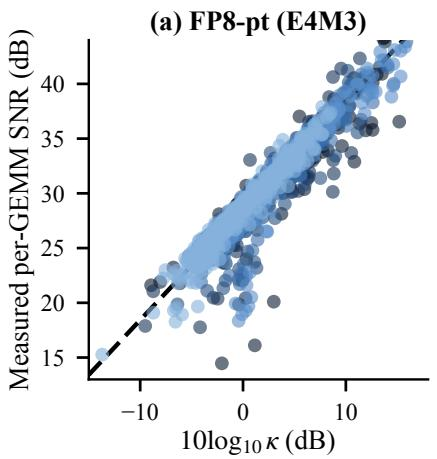
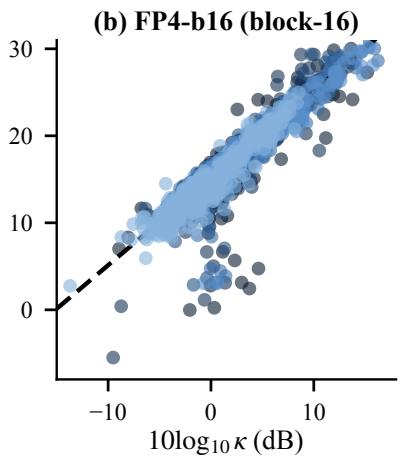
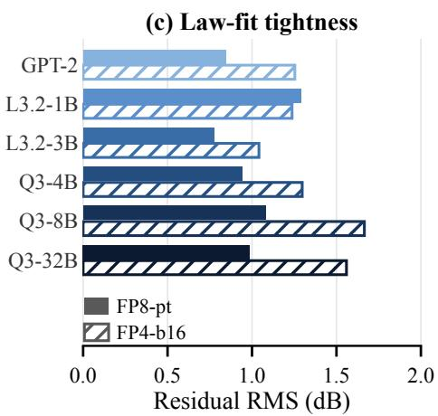
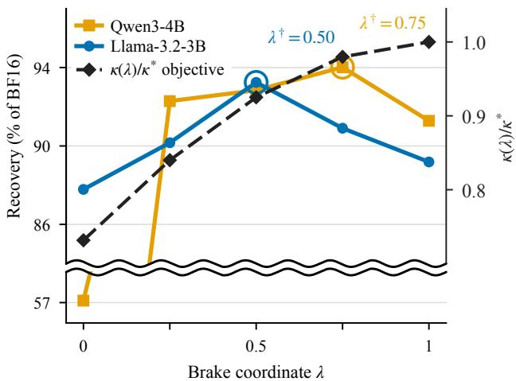

# KBBQ: A Predictive Noise Law and the Limits of Spectrum Flattening in FP4 Quantization

Lexington Whalen 1 Yuki Ito 1 Ryo Sakamoto 1

## Abstract

We develop a second-order theory of quantization noise in matrix multiplication in which the quantization format is characterized by the variance it assigns to each element. The constant variance profile of integer quantization recovers existing integer-noise theory, while the multiplicative profile of floating-point rounding reduces the data dependence to a scalar, the participation factor κ, yielding a closed-form signal-to-noise-ratio law. The resulting functional also admits a closedform upper bound κ∗ that no function-preserving linear transform can exceed and that is attained by a recent state-of-the-art method. Building on this analysis, we introduce KBBQ (Kappa-Braked Blockwise Quantization), which parameterizes the extent to which a transform approaches this ceiling. At W4A4, across four base models and two FP4 formats, KBBQ outperforms the prior state of the art without additional deploymenttime computation.

## 1. Introduction

Quantization replaces a tensor’s entries with values from a small grid, stored against a scale shared by a group of entries, so that the matrix multiplications dominating inference can run in low-precision arithmetic. Post-training methods (Frantar et al., 2023; Lee et al., 2026) fix the grid and round onto it, so the error incurred is set by how the grid spaces its representable values relative to the data. An integer (INT) grid is uniform, with a step fixed by the largest magnitude in the group: every element is rounded with the same absolute error, and one outlier coarsens the grid for all of them. A floating-point (FP) grid allocates its bits on an exponent and a short mantissa, so the spacing grows with the value and the error is instead roughly proportional to the element itself.

Four-bit arithmetic is now available in hardware in both integer and floating-point form, and a growing line of work carries the same formats into pretraining and optimizer state (Chmiel et al., 2025; Castro et al., 2025; Ashkboos et al., 2025; Ding et al., 2026). The floating-point formats deployed at this width are block-scaled: MXFP4 (Rouhani et al., 2023) shares one scale across 32 elements and NVFP4 (NVIDIA, 2025) across 16, so a block’s largest magnitude sets the shared scale that every element in it is rounded against. At four bits the mantissa is one bit wide, leaving little headroom anywhere in the grid, and quantizing weights and activations both to this width degrades quality substantially unless the tensors are made easier to round.

Typically, a preprocessing transform is applied and merged into the network so that the computed function is unchanged. This is often performed by an orthogonal rotation, which spreads outlying coordinates across the remaining ones (Chee et al., 2023; Ashkboos et al., 2024; Tseng et al., 2024; Liu et al., 2024; Lin et al., 2024a), or a diagonal rescaling, which migrates outliers between the two operands (Xiao et al., 2023; Lin et al., 2024b).

For integer formats these transforms reliably serve to reduce the impact of quantization noise. However, under block-scaled floating-point they are less predictable. A datafree rotation may improve accuracy slightly, do nothing, or reduce it, with the outcome varying by model and by format. Previous literature has responded by designing rotations for this setting specifically: a two-level orthogonal rotation aimed at MXFP4 (Xu et al., 2026), a Hadamardpreconditioned adaptive rotation (Zagitov et al., 2026), and rotations optimized so that activations align with the corners of the quantization grid (Thrash et al., 2026).

From three standard assumptions on quantization noise we obtain a single functional for the expected noise energy of a quantized dot product, in which the format enters only through the elementwise variance profile of its grid. Substituting the constant profile recovers existing integer theory, under which noise is dependent on the amplitude each scale group must span; substituting the multiplicative profile yields a closed-form SNR law whose only data-dependent term is the ratio of the squared sum of the elementwise products to the sum of their squares. This ratio measures

1SB Intuitions, Tokyo, Japan. Correspondence to: Lexington Whalen <lexington.whalen@sbintuitions.co.jp>.

how much a dot product gains from constructive alignment across coordinates against the noise accumulating independently in each. We call this ratio the participation factor κ, after the analogous quantity in the localization literature (Thouless, 1974; Kramer & MacKinnon, 1993).

Through our derivations, we show that INT and FP respond to different properties of the operands, helping to explain why transform behavior is format-dependent. A rotation flattens amplitudes and thereby reduces integer quantization noise, but amplitude does not appear in the floating-point law. For floating-point formats, the role of a transform is instead to redistribute energy across coordinates so as to increase $\kappa .$ κ has a closed-form ceiling $\kappa ^ { * }$ , computable per layer from second-order statistics alone, that no functionpreserving transform can exceed.

The ceiling can be viewed as an idealized reference point for the floating-point law. In practice, deployed quantizers may differ from the assumptions underlying this bound. These practical details do not change $\kappa ^ { * }$ , which is determined by the layer’s second-order statistics, but they motivate treating the ceiling as a theoretical limit rather than a requirement. We therefore modify the state-of-the-art construction of Chen et al. (2026) to introduce KBBQ (Kappa-Braked Blockwise Quantization), which provides a flexible family of transforms that interpolates between the untransformed baseline and the idealized construction attaining $\kappa ^ { * }$ . This allows us to study how the benefits of the transform vary as we move toward the theoretical ceiling, while requiring no changes to the kernel, storage layout, or inference arithmetic. Our contributions are as follows.

• A format-agnostic noise functional. We derive a single noise functional for quantized matrix multiplication from three assumptions on quantization noise, and recover recent integer (Federici et al., 2026) and floatingpoint (Chen et al., 2026) theories as the constant and multiplicative variance profiles.

• Closed-form SNR laws. Using our noise functional, we predict and verify the SNR of quantized matrix multiplication on six model families in two formats.

• The participation factor and its ceiling. We show that the numerator of κ is invariant under invertible function-preserving transforms, and derive the closedform ceiling $\kappa ^ { * }$

• KBBQ. Attaining $\kappa ^ { * }$ maximizes only the first-order term of the functional, and does so by inverting the root of an estimated spectrum. We expose the distance traveled toward it as a one-parameter family, show that the best operating point is interior, and evaluate it at W4A4 on four base models in two FP4 formats.

## 2. A Noise Law for Floating-Point Quantization

We now derive a general noise law for quantized dot products, show that existing integer and floating-point theories are recovered by substituting two choices of the variance profile, convert the floating-point case into a closed-form SNR expression, and bound the improvement available to any function-preserving transform.

## 2.1. Setup and Assumptions

A GEMM is a grid of dot products. We call one such matrix multiplication — carrying its own weight matrix and its own activation second moment — a cell; nothing in what follows couples cells, so the law is stated and measured per cell. Consider one such dot product,

$$
S = \sum _ { k = 1 } ^ { D } w _ { k } x _ { k } .\tag{1}
$$

Quantization replaces each operand with a perturbed version, $\hat { w } _ { k } = w _ { k } + \delta w _ { k }$ and $\hat { x } _ { k } = x _ { k } + \delta x _ { k }$ , so the computed value is $\hat { S } = S + \delta S$ . To first order,

$$
\delta S = \sum _ { k } \left( x _ { k } \delta w _ { k } + w _ { k } \delta x _ { k } \right) + O ( \delta ^ { 2 } ) .\tag{2}
$$

We make three assumptions on the rounding errors:

A1 (Unbiased.) Conditional on the operand, each error has zero mean: $\mathbb { E } [ \delta w _ { k } \mid w _ { k } ] = 0 \mathrm { a n d } \mathbb { E } [ \delta x _ { k } \mid x _ { k } ] = 0 .$

A2 (Uncorrelated.) Errors are uncorrelated across coordinates and across the two operands: $\mathbb { E } [ \delta w _ { j } , \delta w _ { k } ] = 0$ for $j \neq k$ , likewise for $\delta x .$ , and $\mathbb { E } [ \delta w _ { k } , \delta x _ { k } ] = 0$

A3 (Variance function.) The error variance of an element depends only on that element via functions $\varphi _ { w }$ and $\varphi _ { x } \colon$ $\mathbb { E } [ \delta w _ { k } ^ { 2 } \mid w _ { k } , x _ { k } ] = \varphi _ { w } ( w _ { k } )$ and $\mathbb { E } [ \delta x _ { k } ^ { 2 } \mid x _ { k } , w _ { k } ] =$ $\varphi _ { x } ( x _ { k } )$

These are standard assumptions of quantization-noise analysis (Widrow et al., 1996; Federici et al., 2026; Chen et al., 2026).

## 2.2. The Noise Law

Squaring Eq. 2 and applying A1–A3 eliminates all cross terms (Appendix C.1), yields

$$
\mathbb { E } [ \delta S ^ { 2 } ] = \sum _ { k } \Big ( \mathbb { E } [ x _ { k } ^ { 2 } ] \varphi _ { w } ( w _ { k } ) + \mathbb { E } [ w _ { k } ^ { 2 } ] \mathbb { E } [ \varphi _ { x } ( x _ { k } ) ] \Big ) .\tag{3}
$$

The variance functions enter asymmetrically because the weights are fixed while the activations are random: $\varphi _ { w } ( w _ { k } )$ is a deterministic quantity, whereas $\varphi _ { x } ( x _ { k } )$ is a random variable. Eq. 3 is otherwise format-agnostic, as its derivation uses only A1–A3. Substituting the corresponding variance functions recovers the existing theories for integer and floating-point quantization.

  
Figure 1. The noise law per GEMM cell. (a) Per-tensor E4M3 and (b) block-16 E2M1: measured SNR against 10 log κ across the six families of Table 5. The dashed line is Eq. 8 at unit slope per decade with the intercept at the measured median $C _ { \mathrm { f m t } } ;$ for E4M3 that median lies within 0.1 dB of the parameter-free prediction of §2.2. (c) RMS of the residual r (Eq. 9) per family and format, the statistic in which the shared numerator E[S2] cancels.

Integer profile. A uniform grid with step ∆ assigns every element the same error variance, $\varphi ( a ) = \Delta ^ { 2 } / 1 2$ (Widrow et al., 1996). Substituting,

$$
\mathbb { E } [ \delta S ^ { 2 } ] = \frac { \Delta _ { w } ^ { 2 } } { 1 2 } \sum _ { k } \mathbb { E } [ x _ { k } ^ { 2 } ] + \frac { \Delta _ { x } ^ { 2 } } { 1 2 } \sum _ { k } \mathbb { E } [ w _ { k } ^ { 2 } ] .\tag{4}
$$

Noise is set by the grid steps and the steps by the largest magnitude each scale must cover, $\Delta \propto \mathrm { a m a x } / 2 ^ { b }$ , thus a single outlying element coarsens the grid for every element sharing its scale.

Floating-point profile. A floating-point grid is uniform within each exponent band and doubles its step at each band boundary, so the local step scales with the magnitude of the value. The resulting variance function is multiplicative,

$$
\varphi ( a ) = \sigma _ { \mathrm { f m t } } ^ { 2 } a ^ { 2 } ,\tag{5}
$$

where $\sigma _ { \mathrm { f m t } } ^ { 2 }$ depends only on the format’s mantissa grid (Appendix C.3 derives $\sigma _ { \mathrm { f m t } } ^ { 2 }$ for each format). Substituting,

$$
\mathbb { E } [ \delta S ^ { 2 } ] = \big ( \sigma _ { w } ^ { 2 } + \sigma _ { x } ^ { 2 } \big ) \sum _ { k } \mathbb { E } \big [ ( w _ { k } x _ { k } ) ^ { 2 } \big ] .\tag{6}
$$

The noise therefore depends only on the second moments of the elementwise products, while the signal $\mathbb { E } [ S ^ { 2 } ]$ captures their alignment. Their ratio depends on the data through the participation factor κ.

Definition 1 (Participation factor). For a dot product with terms $w _ { k } x _ { k } ,$ , we define κ, the participation factor, as

$$
\kappa = \frac { \mathbb { E } [ S ^ { 2 } ] } { \sum _ { k } \mathbb { E } [ ( w _ { k } x _ { k } ) ^ { 2 } ] } \in [ 0 , D ] ,\tag{7}
$$

with the range and its endpoint conditions established in Proposition 3.

Dividing signal by noise in Eq. 6 and taking decibels gives the law:

$$
\boxed { \begin{array} { r c l } { { \mathrm { S N R } _ { \mathrm { d B } } } = 1 0 \log _ { 1 0 } \kappa + C _ { \mathrm { f m t } } , } \\ { C _ { \mathrm { f m t } } = - 1 0 \log _ { 1 0 } \big ( \sigma _ { w } ^ { 2 } + \sigma _ { x } ^ { 2 } \big ) . } \end{array} }\tag{8}
$$

Using eq. 8, we can separate the two sources of variation. κ carries all dependence on the network, $C _ { \mathrm { { f m t } } }$ all dependence on the format. Proposition 5 predicts the spacing between two formats’ intercepts from their mantissa bit-width difference alone. Formats that also differ in scaling granularity carry a further offset, which Appendix C.3 treats. A method that moves only amplitude statistics therefore has no mechanism by which to help a floating-point format, and a method that moves only alignment has none by which to help an integer format.

Measurement. We evaluate Eq. 8 per GEMM cell on six model families spanning 124M to 32B parameters — GPT-2 124M (Radford et al., 2019), Llama-3.2-1B and Llama-3.2- 3B (Grattafiori et al., 2024), and Qwen3-4B, 8B and 32B (Yang et al., 2025) — in per-tensor E4M3 and block-16 E2M1 (per-family cell and record counts are given in Table 5, Appendix A). A cell here is one of the four fused GEMMs of a transformer block — fused QKV, output, fused gate/up, and down — sampled across the blocks of each model. We measure both sides of Eq. 8. κ is accumulated from the captured operands and $\mathrm { S N R _ { d B } }$ from the realized rounding error. Each cell is measured in isolation. The activations entering it are captured from a full-precision forward pass, both operands are then rounded onto the format’s grid, and $\mathbb { E } [ \delta S ^ { 2 } ]$ is accumulated against the unquantized product. The resulting error is due solely to quantization within the cell, with no contribution from upstream quantized layers. §5 reports the end-to-end W4A4 setting. At fixed format,

the law asserts that

$$
r : = \mathrm { S N R } _ { \mathrm { d B } } - 1 0 \log _ { 1 0 } \kappa \ = \ 1 0 \log _ { 1 0 } \frac { \sum _ { k } \mathbb { E } [ ( w _ { k } x _ { k } ) ^ { 2 } ] } { \mathbb { E } [ \delta S ^ { 2 } ] }\tag{9}
$$

, in other words, the noise energy of a dot product measured against its incoherent energy , equals $C _ { \mathrm { { f m t } } }$ for every cell of every model. Figure 1 plots both sides per cell and table 5 (Appendix A) gives the per-family fits.

Intercept. Across the six families the per-tensor E4M3 intercept has median 28.42 dB with a standard deviation of 0.10 dB and a full range of 0.27 dB, so a single number per format, carried unchanged across models, fixes the level of r to within a few tenths of a decibel, highlighting the format-invariance predicted by the theory. The per-cell scatter about it is 0.97 dB at the median family and 1.29 dB at worst. Taking the within-band position of the operand to be log-uniform gives $\mathbb { E } [ 1 / m ^ { 2 } ] = 3 / ( 8 \ln 2 ) = 0 . 5 4 1$ , so Eq. 30 at $p = 3$ mantissa bits gives $\sigma _ { \mathrm { f m t } } ^ { 2 } = 7 . 0 4 \times 1 0 ^ { - 4 }$ and $C _ { \mathrm { f m t } } = - 1 0 \log _ { 1 0 } ( 2 \sigma _ { \mathrm { f m t } } ^ { 2 } ) = 2 8 . 5 1$ dB against a measured median of 28.42 dB, an agreement of 0.09 dB.

Cross-format spacing. The two formats are measured on the same cells, and κ is a property of the cell rather than of the format, so differencing their SNRs leaves a ratio of two measured noise energies on one dot product:

$$
\mathrm { S N R _ { d B } ^ { f p 8 } - S N R _ { d B } ^ { f p 4 } } \ = \ 1 0 \log _ { 1 0 } \frac { \mathbb { E } [ \delta S ^ { 2 } ] _ { \mathrm { f p 4 } } } { \mathbb { E } [ \delta S ^ { 2 } ] _ { \mathrm { f p 8 } } } \ = \ C _ { \mathrm { f p 8 } } - C _ { \mathrm { f p 4 } } .\tag{10}
$$

Proposition 5 predicts this from mantissa arithmetic alone, yielding $6 . 0 2 \left( 3 - 1 \right) = 1 2 . 0 4 ~ \mathrm { d B }$ . The measured median over the 3968 records is 13.24 dB, with per-family medians spanning 13.07 to 13.81 dB. The 1.2 dB excess is consistent with the confound the pair carries: the two formats differ in scaling granularity, per-tensor against block-16, as well as in mantissa width.

## 2.3. Connection to Prior INT Theories

CAT (Federici et al., 2026) gives an integer SNR theory of the form $\mathrm { S N R } = 1 2 \left. N ( \bar { b _ { x } } ) ^ { 2 } C ( x ) \parallel \bar { N ( b _ { w } ) ^ { 2 } } C ( W ) \right. \bar { A } ,$ where $a \parallel b = ( a ^ { - 1 } + \mathsf { ^ { ' } } b ^ { - 1 } ) ^ { - 1 }$ is the parallel combination, N(b) counts quantization intervals, the concentration terms C(·) measure each tensor’s energy against its quantization range, and A is an alignment term. This is Eq. 3 at $\varphi = \Delta ^ { 2 } / 1 2 \colon$ CAT assumes the same uniform-in-cell rounding model, with interval size $s = r / ( 2 ^ { b } - 1 )$ and $\mathbb { E } [ \delta x \delta x ^ { \top } ] = I \mathbb { E } [ r ^ { 2 } ] / 1 2 ( 2 ^ { b } - 1 ) ^ { 2 }$ , which is the constant profile written against the quantization range r rather than the amax. Writing any uniform grid’s step as its range over its interval count, $\Delta = r / N ( b )$ , the elementwise SQNR of a single tensor is

$$
\frac { \mathbb { E } [ x ^ { 2 } ] } { \Delta ^ { 2 } / 1 2 } = 1 2 \underbrace { N ( b ) ^ { 2 } } _ { \mathrm { g r i d ~ g e o m e t r y } } \underbrace { \frac { \mathbb { E } [ x ^ { 2 } ] } { r ^ { 2 } } } _ { \mathrm { o p e r a n d ~ s t a t i s t i c s } = C ( \cdot ) } ,\tag{11}
$$

which is CAT’s $N ( b ) ^ { 2 } C ( \cdot )$ , factor for factor. CAT cuts the range into $N ( b ) = 2 ^ { b } - 1$ intervals, whereas §2.2 places $2 ^ { b }$ levels across it, $\Delta = 2 \mathrm { a m a x } / 2 ^ { b }$ . Eq. 3 reproduces either quantizer exactly once that quantizer’s own $\Delta$ is substituted. The two channels of Eq. 4 are additive in noise power and so compose reciprocally in SNR, which is the ∥ of CAT’s theorem. Appendix C.4 gives both steps in full, and relates the remaining factor A to κ.

## 2.4. Connection to Prior FP Theories

WUSH (Chen et al., 2026) adopts the same unbiased relativeerror model as our A1–A3 for floating-point types and solves in closed form for the invertible transform pair minimizing the resulting loss, working blockwise at block size d. Their integer model sets the error by the group maximum, $\varepsilon ( \alpha ) =$ $\| \alpha \| _ { \infty } \eta$ , which is a group functional rather than a function of the element; A3 covers this in the same sense the constant profile does, with $\varphi$ fixed within a scale group and the amax setting its level. With $W ^ { \prime }$ and $X ^ { \prime }$ the weight and activation root factors, $H$ a normalized Hadamard matrix, and

$$
\begin{array} { l } { { W ^ { \prime } { } ^ { \top } X ^ { \prime } \ = \ U S V ^ { \top } , \qquad S = \mathrm { d i a g } ( s _ { 1 } , \ldots , s _ { d } ) , } } \\ { { \ } } \\ { { T _ { \mathrm { W U S H } } \ = \ H S ^ { - 1 / 2 } U ^ { \top } W ^ { \prime \top } , } } \end{array}\tag{12}
$$

their optimum flattens the paired spectrum $S$ completely. Appendix C.5 records the derivation. We shall use two of its consequences here. First, transforms that are orthogonal in their reparameterized coordinates leave their objective unchanged (their Eq. (21) and §4.2.3). In operand coordinates that class is $T = R W ^ { \prime \top }$ with R orthogonal, which whitens the transformed weight ensemble; it contains neither the identity nor a rotation of the raw operands unless $\Sigma$ is already white. An operand-space rotation moves the objective — equivalently the aggregate participation factor of Theorem 1 — through the diagonal of $R \Sigma R ^ { \intercal }$ , We measure this in §3.1. Second, their construction equalizes the transformed blockwise second moment so that its diagonal is constant, which is the equal-diagonal condition that arises independently as the equality case of Theorem 1.

WUSH’s optimum and the ceiling of Theorem 1 are related via the largest factor by which any transform can reduce FP error in a block. This is their orthogonal-transform loss divided by their optimal loss,

$$
{ \frac { \mathrm { t r } ( S ^ { 2 } ) } { d ^ { - 1 } ( \mathrm { t r } S ) ^ { 2 } } } = { \frac { d \mathrm { t r } ( S ^ { 2 } ) } { ( \mathrm { t r } S ) ^ { 2 } } } \in [ 1 , d ] ,\tag{13}
$$

their Eqs. (20) and (21), with their Eq. (17) placing it in $[ 1 , d ]$ . Under the matched-ensemble convention $\mathbb { E } [ w \bar { w } ^ { \top } ] =$ $c \Sigma$ of Theorem 1 we have $W ^ { \prime \top } X ^ { \prime } = \sqrt { c } \Sigma$ , so $s _ { i } =$ $\sqrt { c } \lambda _ { i } ( \Sigma )$ . The constant cancels and $\operatorname { E q } .$ . 13 becomes

$$
\kappa ^ { * } = { \frac { D \ \mathrm { T r } ( \Sigma ^ { 2 } ) } { ( \mathrm { T r } \ \Sigma ) ^ { 2 } } } ,\tag{14}
$$

the ceiling of Theorem 1. Their transform collapses with it: the diagonal factors of Eq. 12 cancel entrywise, leaving

Table 1. Native κ against the Haar attractor $\bar { \kappa } _ { \mathrm { r o t } }$
<table><tr><td>Model</td><td>KI</td><td> $\bar { \kappa } _ { \mathrm { r o t } }$ </td><td>ratio (dex)</td></tr><tr><td>Llama-3-8B</td><td>1.550</td><td>1.346</td><td> $0 . 9 7 3 \ : ( - 0 . 0 1 2 )$ </td></tr><tr><td>Llama-3.2-3B</td><td>1.595</td><td>1.262</td><td>0.933 (−0.030)</td></tr><tr><td>Qwen3-4B</td><td>1.611</td><td>1.301</td><td>0.850 (−0.071)</td></tr><tr><td>Qwen3-8B</td><td>1.771</td><td>1.266</td><td>0.894 (−0.049)</td></tr></table>

$T _ { \mathrm { W U S H } } = c ^ { 1 / 4 } H U ^ { \top }$ , a scalar times an orthogonal matrix. $H U ^ { \top }$ meets both conditions Theorem 1 places on a transform attaining $\kappa ^ { * } ;$ : it is orthogonal, and it leaves $R \Sigma R ^ { \top }$ with a constant diagonal. The convention also defines $\kappa ^ { * }$ as an upper bound on the ensemble aggregate κ¯. A κ measured from the actual weights of an individual trained cell may exceed this bound.

## 3. Applications of the Noise Law

We apply the two profiles of the noise law to the question of when a preprocessing rotation helps. Rotations are reliably useful for integer grids and weakly useful or harmful for floating-point ones.

## 3.1. When Rotations Help

INT. Under Eq. 4 noise is set entirely by the grid step and the step by amplitude, $\Delta \propto a _ { \mathrm { m a x } } / 2 ^ { b }$ . A rotation leaves $\mathbb { E } [ S ^ { 2 } ]$ (Lemma 1) and the total energy unchanged but redistributes that energy from a few outlying coordinates across all $D ;$ since $a _ { \mathrm { m a x } }$ is set by the largest coordinate, flattening shrinks $\Delta$ and lowers the noise for every element sharing the scale, not only the formerly large ones. Rotations help integer quantization because the integer law depends on amplitude and rotations are amplitude-flattening operations.

FP. The floating-point case differs because the profile is multiplicative in the operand,

$$
\varphi ( a ) = \sigma _ { \mathrm { f m t } } ^ { 2 } a ^ { 2 } ,
$$

so $a _ { \mathrm { m a x } }$ never enters Eq. 6. The floating-point law is sensitive only to κ: a rotation can move κ only by changing how energy is distributed across coordinates relative to one another (Theorem 1), and it cannot move $\mathbb { E } [ S ^ { 2 } ]$ (Lemma 1). The gap $\kappa ^ { * } - \kappa$ bounds what any function-preserving transform can recover (Eq. 14).

Native κ against the Haar attractor. A random rotation resets κ to a fixed value $\bar { \kappa } _ { \mathrm { r o t } }$ rather than to $\kappa ^ { * }$ , so the effect of rotation depends on where the untransformed network lies relative to $\bar { \kappa } _ { \mathrm { r o t } }$ . Table 1 reports κI and $\bar { \kappa } _ { \mathrm { r o t } }$ over 63 stratified GEMM cells for each of the four benchmarked models, none of which was trained with a quantization-aware objective. On every model, the median cell lies 0.012–0.071 dex above the attractor, indicating that trained FP networks already have higher κ than a generic random rotation induces.

A rotation applied to a network in this state has little to gain: a dense data-free Haar rotation (HAAR, one of the methods of §5) does not exceed the identity method on any model–format pair in Tables 2 and 6.

  
Figure 2. Objective against outcome under the brake. Recovery, the five-task average as a percentage of the BF16 anchor (the Recovery column of Table 3), against λ at NVFP4 in the RTN setting; the idealized objective $\bar { \kappa ( \lambda ) } / { \kappa ^ { * } }$ is on the right axis. It rises monotonically to 1.00 while both models turn over before it. Rings mark each model’s sweep optimum $( \lambda = 0 . 7 5$ on Qwen3- 4B-Base, $\lambda = 0 . 5 0$ on Llama-3.2-3B-Base).

## 4. KBBQ: A Braked Optimum

Chen et al. (2026) provide a closed-form construction to reach the result of Theorem 1. However, this rely on assumptions A1–A3 and on access to the population second moment, and a deployed quantizer may satisfy none of these conditions. They may round deterministically, violating A1, shares a single scale across each quantization block, which correlates errors within the block and violates A2, or observe Σ only through n calibration rows. While the bound itself remains valid under all three departures, the maximizer of the idealized objective is no longer guaranteed to be the best operating point in practice. This motivates our approach: rather than committing to the ceiling, we expose the distance traveled toward it as a free parameter.

## 4.1. The brake

Treating the flattening exponent as free, $\Lambda ^ { - \lambda / 4 }$ , yields a one-parameter family that interpolates between leaving the estimated spectrum untouched and inverting its square root completely. Because the transform acts on both operands, the paired spectrum presented to the quantizer is $s _ { i } ^ { \dot { 1 } - \lambda }$ ; the brake therefore contracts the log spectrum linearly, log $s _ { i } \mapsto$ (1 − λ) log $s _ { i }$ , from the untransformed spectrum at $\lambda = 0$ to a fully flattened one at $\lambda \ : = \ : 1$ Along this path the idealized objective is monotone, with $\kappa ( \lambda ) / \kappa ^ { * }$ increasing from 0.73 to 1.00 (§6.1), so under $_ { \mathrm { A } 1 - \mathrm { A } 3 }$ the optimum lies at the endpoint $\lambda = 1$ and no interior value can improve on it. Consequently, an interior optimum in practice indicates a gap between these assumptions and the behavior of a deployed quantizer. This is precisely what we observe: accuracy peaks before λ = 1 on both models we sweep, while λ = 0—which applies the basis change and root factor without any flattening—is the weakest setting in our sweep.

Table 2. W4A4 accuracy results using our evaluation harness for Llama-3.2-3B-Base and Qwen3-4B-Base under different quantization techniques. Best technique results for each quantization format are bolded, second-best underlined.
<table><tr><td>Model</td><td>Format</td><td>Method</td><td>MMLU</td><td>GSM8K</td><td>HellaSwag</td><td>WinoGrande</td><td>MBPP</td><td>Average</td><td>Recovery</td></tr><tr><td rowspan="18">LI-B--BBase</td><td>BF16</td><td>-</td><td>56.30</td><td>25.63</td><td>74.41</td><td>59.35</td><td>34.41</td><td>50.02</td><td>100</td></tr><tr><td>I</td><td>HAAR RTN-WUSH</td><td>51.23 48.52 51.48</td><td>16.30 15.69 17.29</td><td>70.32 68.26</td><td>56.12 54.06</td><td>29.18 24.14 26.96</td><td>44.63 42.13 44.61</td><td>89.2 84.2</td></tr><tr><td rowspan="8">NVFP4</td><td></td><td>52.35</td><td></td><td>71.54</td><td>55.80</td><td></td><td></td><td></td><td>89.2</td></tr><tr><td>RTN-KBBQ</td><td></td><td>21.83</td><td>71.88</td><td>57.54</td><td>29.58</td><td>46.64</td><td></td><td>93.2</td></tr><tr><td>GPTQ</td><td>51.01</td><td>19.79</td><td>70.81</td><td>58.25</td><td>27.16</td><td></td><td>45.40</td><td>90.8</td></tr><tr><td>MR-GPTQ</td><td>48.83</td><td>18.04</td><td>69.38</td><td>57.62</td><td></td><td>26.76</td><td>44.13</td><td>88.2</td></tr><tr><td>GPTQ-WUSH</td><td>53.04</td><td>20.70</td><td>72.11</td><td>58.56</td><td></td><td>27.57</td><td>46.39</td><td>92.7</td></tr><tr><td>GPTQ-KBBQ</td><td>53.43</td><td>22.14</td><td>72.33</td><td>58.56</td><td></td><td>31.79</td><td>47.65</td><td>95.3</td></tr><tr><td>I</td><td>46.03</td><td></td><td>67.93</td><td>55.72</td><td></td><td></td><td></td><td></td></tr><tr><td>HAAR</td><td>40.51</td><td>10.92</td><td>64.06</td><td></td><td>22.33</td><td></td><td>40.59</td><td>81.1</td></tr><tr><td rowspan="6">MXFP4</td><td>RTN-WUSH</td><td></td><td>11.22</td><td></td><td></td><td>53.12</td><td>16.90</td><td>37.16</td><td>74.3</td></tr><tr><td></td><td>50.00</td><td>15.85</td><td>69.91</td><td></td><td>56.59</td><td>26.76</td><td>43.82</td><td>87.6</td></tr><tr><td>RTN-KBBQ</td><td>51.31</td><td>17.13</td><td>70.30</td><td>57.62</td><td></td><td>23.94</td><td>44.06</td><td>88.1</td></tr><tr><td>GPTQ</td><td>45.79</td><td>13.27</td><td>67.47</td><td>55.41</td><td></td><td>23.34</td><td>41.06</td><td>82.1</td></tr><tr><td>MR-GPTQ</td><td>47.67 50.28</td><td>13.19</td><td>67.67</td><td>55.56</td><td></td><td>19.11</td><td>40.64</td><td>81.2</td></tr><tr><td>GPTQ-WUSH GPTQ-KBBQ</td><td>50.68</td><td>17.29 18.27</td><td>71.05 70.57</td><td>58.64 57.85</td><td></td><td>28.37 28.77</td><td>45.13 45.23</td><td>90.2</td></tr><tr><td>NVFP4</td><td>BF16 -</td><td>72.89</td><td></td><td></td><td></td><td></td><td></td><td></td><td>90.4</td></tr><tr><td rowspan="11">Ww--ase</td><td rowspan="5"></td><td></td><td></td><td>80.21</td><td>73.15</td><td>61.72</td><td>65.39</td><td>70.67</td><td></td><td>100</td></tr><tr><td>I HAAR</td><td>68.99</td><td>69.90</td><td>69.39</td><td>59.04</td><td></td><td>51.91</td><td>63.85</td><td>90.3</td></tr><tr><td></td><td>67.73</td><td>59.82</td><td>68.76</td><td>58.88</td><td></td><td>52.52</td><td>61.54</td><td>87.1</td></tr><tr><td>RTN-WUSH</td><td>69.36</td><td>69.07</td><td>70.38</td><td>57.38</td><td></td><td>56.34</td><td>64.51</td><td>91.3</td></tr><tr><td>RTN-KBBQ</td><td>70.10</td><td>74.83</td><td>70.13</td><td>58.80</td><td>58.35</td><td></td><td>66.44</td><td>94.0</td></tr><tr><td>GPTQ MR-GPTQ</td><td>69.17</td><td>74.22</td><td></td><td>70.12</td><td>58.25</td><td>58.35</td><td>66.02</td><td>93.4</td></tr><tr><td rowspan="5"></td><td></td><td>68.82</td><td>70.96</td><td>70.07</td><td>57.93</td><td>54.53</td><td>64.46</td><td></td><td>91.2</td></tr><tr><td>GPTQ-WUSH</td><td>69.66</td><td>72.78</td><td>70.73</td><td>59.04</td><td></td><td>54.33</td><td>65.31</td><td>92.4</td></tr><tr><td>GPTQ-KBBQ</td><td>70.27</td><td>76.57</td><td>70.97</td><td>59.67</td><td></td><td>56.74</td><td>66.85</td><td>94.6</td></tr><tr><td>I</td><td>63.42</td><td>58.00</td><td>67.05</td><td>56.98</td><td></td><td>43.46</td><td>57.78</td><td></td></tr><tr><td>HAAR</td><td>63.27</td><td>47.69</td><td>65.06</td><td>55.01</td><td></td><td>48.49</td><td>55.90</td><td>81.8 79.1</td></tr><tr><td rowspan="6">MXFP4</td><td>RTN-WUSH</td><td>66.92</td><td>64.90</td><td>68.18</td><td></td><td></td><td>51.91</td><td>61.75</td><td>87.4</td></tr><tr><td>RTN-KBBQ</td><td>67.48</td><td>70.58</td><td></td><td>68.97</td><td>56.83 57.70</td><td>51.51</td><td>63.25</td><td>89.5</td></tr><tr><td>GPTQ</td><td>64.26</td><td>64.97</td><td>67.22</td><td></td><td>57.30</td><td>47.69</td><td>60.29</td><td>85.3</td></tr><tr><td>MR-GPTQ</td><td>67.80</td><td>66.57</td><td>68.82</td><td></td><td>57.93</td><td>51.91</td><td>62.61</td><td>88.6</td></tr><tr><td>GPTQ-WUSH</td><td>68.21</td><td>71.34</td><td>69.40</td><td></td><td>59.27</td><td>55.33</td><td>64.71</td><td>91.6</td></tr><tr><td>GPTQ-KBBQ</td><td>68.81</td><td>73.77</td><td>70.34</td><td></td><td>58.80</td><td>55.73</td><td>65.49</td><td>92.7</td></tr></table>

## 4.2. Construction

We work blockwise with the transform block matched to the quantization group, following Chen et al. (2026). Fix a block; let $W ^ { \prime }$ and $X ^ { \prime }$ be the root factors of §2.4 and $U \Lambda U ^ { \top }$ the eigendecomposition of the paired object whose spectrum the optimal transform flattens, so $\Lambda = S ^ { 2 }$ for the paired spectrum S of Eq. 12. KBBQ modifies the construction at

the flattening exponent.

The brake λ. Replace the fixed exponent by a free one. Writing the fractional power $\Lambda ^ { - \lambda / 4 } = \mathrm { d i a g } \left( \Lambda _ { i i } ^ { - \lambda / 4 } \right)$ in the paired basis, the KBBQ transform is

$$
\boxed { \begin{array} { r l r } { T ( \lambda ) = H \Lambda ^ { - \lambda / 4 } U ^ { \top } W ^ { \prime \top } , } & { { } } & { \lambda \in [ 0 , 1 ] . } \end{array} }\tag{15}
$$

At λ = 1 the exponent is $S ^ { - 1 / 2 }$ in the singular values, so Eq. 15 reproduces Eq. 12 term for term: full flattening, attaining $\kappa ^ { * }$ . Lowering λ flattens the paired spectrum only partially, leaving the layer at a utilization $\kappa ( \lambda ) / \kappa ^ { * } < 1$ that decreases monotonically as $\lambda \to 0 . { \mathrm { A t } } \lambda = 0$ no flattening remains, though the transform still depends on the data through U and $W ^ { \prime \top }$ and is not orthogonal.

Table 3. Brake ablation on Qwen3-4B-Base, NVFP4, RTN setting. λ is the fraction of the flattening exponent applied. The five-task average peaks at λ=0.75.
<table><tr><td>λ</td><td>MMLU</td><td>GSM8K</td><td>HellaSwag</td><td>WinoGrande</td><td>MBPP</td><td>Average</td><td>Recovery</td></tr><tr><td>BF16</td><td>72.89</td><td>80.21</td><td>73.15</td><td>61.72</td><td>65.39</td><td>70.67</td><td>100</td></tr><tr><td>0.00</td><td>41.94</td><td>20.85</td><td>46.81</td><td>51.46</td><td>41.05</td><td>40.42</td><td>57.2</td></tr><tr><td>0.25</td><td>68.98</td><td>69.22</td><td>70.22</td><td>59.35</td><td>58.35</td><td>65.22</td><td>92.3</td></tr><tr><td>0.50</td><td>69.68</td><td>71.72</td><td>70.06</td><td>59.04</td><td>57.55</td><td>65.61</td><td>92.8</td></tr><tr><td>0.75</td><td>70.10</td><td>74.83</td><td>70.13</td><td>58.80</td><td>58.35</td><td>66.44</td><td>94.0</td></tr><tr><td>1.00</td><td>69.36</td><td>69.07</td><td>70.38</td><td>57.38</td><td>56.34</td><td>64.51</td><td>91.3</td></tr></table>

The brake acts at fit time only by changing the numerical entries of the block-diagonal transform. Shape, storage, kernel and inference arithmetic are those of Chen et al. (2026), with the transform block matched to the quantization group at 16 for NVFP4 and 32 for MXFP4, so λ carries no deployment-time cost as compared to Chen et al. (2026).

## 5. Experiments

Setting. We evaluate KBBQ at W4A4 on four base models—Llama-3.2-3B-Base and Llama-3-8B-Base (Grattafiori et al., 2024), and Qwen3-4B-Base and Qwen3-8B-Base (Yang et al., 2025)—under two FP4 formats. NVFP4 (NVIDIA, 2025) is executed natively on GB200 hardware using TransformerEngine block scaling, whereas MXFP4 (Rouhani et al., 2023) is evaluated with emulated (“fake”) quantization following Chen et al. (2026): operands are rounded onto the MXFP4 grid and the quantized values are represented in BF16. We compare the following methods: the identity transform (RTN-I), a dense data-free Haar rotation (HAAR), the WUSH construction with λ = 1 (RTN-WUSH), and KBBQ (RTN-KBBQ). The latter two are additionally combined with GPTQ error compensation (Frantar et al., 2023), yielding GPTQ-WUSH and GPTQ-KBBQ, and GPTQ is also evaluated on its own without a transform (GPTQ). We further include MR-GPTQ (Egiazarian et al., 2026) as a baseline. Evaluation spans five benchmarks: MMLU (Hendrycks et al., 2021) (5-shot), GSM8K (Cobbe et al., 2021) (8-shot with chain-of-thought prompting; Wei et al., 2022), HellaSwag (Zellers et al., 2019), WinoGrande (Sakaguchi et al., 2020) (5-shot), and MBPP (Austin et al., 2021). Results for the 8B models are deferred to Table 6.

Results. Table 2 reports per-benchmark accuracy, the fivetask average, and the fraction of BF16 performance recovered for the two smaller models. Table 6 reports the corresponding results for the 8B models. RTN-KBBQ improves over the identity baseline on all eight model–format pairs, with gains ranging from 0.5 points (Llama-3-8B-Base, NVFP4) to 7.1 points (Qwen3-8B-Base, MXFP4), and outperforms RTN-WUSH on seven of the eight pairs, e.g., 71.54 (96.4% recovery) versus 70.73 (95.3%) on Qwen3- 8B-Base under NVFP4.

Table 4. Calibration robustness on Qwen3-4B-Base (NVFP4, RTN setting). Top: calibration corpus at n=1536. Bottom: calibrationtoken budget on the default corpus.
<table><tr><td>Setting</td><td>MMLU</td><td>GSM8K</td><td>HellaSwag</td><td>WinoGrande</td><td>MBPP</td><td>Avg.</td><td>Rec.</td></tr><tr><td>BF16</td><td>72.89</td><td>80.21</td><td>73.15</td><td>61.72</td><td>65.39</td><td>70.67</td><td>100</td></tr><tr><td colspan="8">Calibration domain (n=1536)</td></tr><tr><td>default / WUSH default / KBBQ</td><td>69.36 70.10</td><td>69.07 74.83</td><td>70.38 70.13</td><td>57.38 58.80</td><td>56.34 58.35</td><td>64.51 66.44</td><td>91.3 94.0</td></tr><tr><td>GSM8K / WUSH GSM8K / KBBQ</td><td>69.32 69.47</td><td>70.20 71.95</td><td>69.74 70.57</td><td>58.56 58.56</td><td>54.53 55.13</td><td>64.47 65.14</td><td>91.2 92.2</td></tr><tr><td>random / WUSH random / KBBQ</td><td>69.41 69.33</td><td>65.43 69.45</td><td>69.27 69.81</td><td>58.33 60.30</td><td>49.90 56.54</td><td>62.47 65.09</td><td>88.4 92.1</td></tr><tr><td colspan="8">Calibration budget (default corpus)</td></tr><tr><td>256 / WUSH</td><td>69.01</td><td>67.40</td><td>69.98</td><td>57.46</td><td>56.74</td><td>64.12</td><td>90.7</td></tr><tr><td>256 /KBBQ</td><td>69.29</td><td>73.62</td><td>70.12</td><td>58.80</td><td>56.14</td><td>65.59</td><td>92.8</td></tr><tr><td>1024 / WUSH 1024 /KBBQ</td><td>69.31</td><td>67.93</td><td>70.11</td><td>58.48</td><td>54.73</td><td>64.11</td><td>90.7</td></tr><tr><td>4096 / WUSH</td><td>69.78</td><td>71.87</td><td>70.70</td><td>58.17</td><td>56.54</td><td>65.41</td><td>92.6</td></tr><tr><td>4096 / KBBQ</td><td>69.32 69.48</td><td>70.81 71.87</td><td>70.20 70.54</td><td>59.43 58.33</td><td>53.52 56.34</td><td>64.66 65.31</td><td>91.5 92.4</td></tr><tr><td></td><td></td><td></td><td></td><td></td><td></td><td></td><td></td></tr><tr><td>65536 / WUSH</td><td></td><td></td><td></td><td>57.77</td><td></td><td></td><td></td></tr><tr><td>65536/KBBQ</td><td>69.42 69.48</td><td>68.92 72.40</td><td>70.47 70.28</td><td>57.46</td><td>53.92 58.35</td><td>64.10 65.59</td><td>90.7 92.8</td></tr></table>

## 6. Robustness and Ablations

We measure how much of KBBQ’s operating point has to be tuned, varying the brake λ, the calibration domain, and the calibration budget n. All results use the RTN setting (no GPTQ stage), NVFP4, and the harness of §5 unless stated otherwise.

## 6.1. Ablation on λ

Table 3 sweeps the brake across its range, from λ = 0 (no flattening) to λ = 1 (the WUSH construction). The optimum is interior. The best five-task average is at λ = 0.75 (66.44, 94.0% recovery), 1.93 points above the unbraked λ = 1 (64.51, 91.3%), so the maximizer of the idealized objective is not the best operating point. Figure 2 plots the two against each other: the objective $\kappa ( \lambda ) / \kappa ^ { * }$ climbs monotonically from 0.73 at λ = 0 to 1.00 at λ = 1, while accuracy peaks earlier and falls. Every interior setting exceeds λ = 1 (65.22, 65.61 and 66.44 at λ = 0.25, 0.50 and 0.75), so the result does not depend on the choice of grid point.

## 6.2. Calibration domain

The upper half of Table 4 replaces the calibration corpus at fixed n=1536. The default corpus is the in-house mixeddomain split used throughout; the GSM8K corpus draws tokens from the GSM8K training split, matching an evaluated task in domain; the random corpus is tokens drawn uniformly from the tokenizer’s vocabulary. The effect is modest: likelihood benchmarks move by at most 1.8 points either way, and the brake’s GSM8K margin over WUSH survives on all three corpora, at 5.8, 1.8 and 4.0 points.

## 6.3. Calibration budget

The lower half of Table 4 varies the calibration budget from n=256 to n=65536 tokens, with all samples drawn from the default corpus, so that only the amount of calibration data changes. The five-task average is essentially insensitive to this 256-fold variation: the four WUSH rows lie within $0 . 6$ points of one another, and the four KBBQ rows within 0.3 (1.1 when also counting the $n { = } 1 5 3 6$ setting used in the main experiments). The generation benchmarks are noisier— GSM8K and MBPP each vary by 1.8 to 3.4 points across the four budgets—but the ranges overlap, and KBBQ retains its advantage over WUSH at every budget. Notably, the GSM8K margin remains 6.2 points even with only 256 calibration tokens, and increasing the budget to 65,536 tokens does not drive the method back toward the untransformed operating point. This suggests that the operating point is determined by the geometry of the layer rather than by the calibration corpus, and that over-calibration is not a concern.

## 7. Conclusion

We analyzed the expected noise energy of a quantized dot product and showed that the number format enters this quantity through a single object: the elementwise variance profile. A constant profile recovers classical integer quantization theory, in which noise scales with amplitude, while a multiplicative profile reduces the data dependence to the participation factor κ. This perspective explains why transforms behave differently across formats: diagonal rescaling leaves κ unchanged, and a generic rotation merely drives it toward a fixed attractor that trained networks have already passed. The same analysis yields a closed-form per-layer ceiling $\kappa ^ { * }$ , whose maximizer under a matched weight ensemble coincides with a construction from recent work—one that is optimal for an objective a deployed quantizer does not actually face. KBBQ instead treats the distance traveled toward this ceiling as a tunable parameter.

## References

Ashkboos, S., Mohtashami, A., Croci, M. L., Li, B., Cameron, P., Jaggi, M., Alistarh, D., Hoefler, T., and Hensman, J. QuaRot: Outlier-free 4-bit inference in rotated LLMs. In Advances in Neural Information Processing Systems (NeurIPS), 2024. URL https: //arxiv.org/abs/2404.00456.

Ashkboos, S., Nikdan, M., Tabesh, S., Castro, R. L., Hoefler, T., and Alistarh, D. HALO: Hadamard-assisted lower-precision optimization for LLMs. arXiv preprint arXiv:2501.02625, 2025. URL https://arxiv. org/abs/2501.02625.

Austin, J., Odena, A., Nye, M., Bosma, M., Michalewski, H., Dohan, D., Jiang, E., Cai, C., Terry, M., Le, Q., and Sutton, C. Program synthesis with large language models. arXiv preprint arXiv:2108.07732, 2021. URL https://arxiv.org/abs/2108.07732.

Castro, R. L., Panferov, A., Tabesh, S., Sieberling, O., Chen, J., Nikdan, M., Ashkboos, S., and Alistarh, D. Quartet: Native FP4 training can be optimal for large language models. In Advances in Neural Information Processing Systems (NeurIPS), 2025. URL https: //arxiv.org/abs/2505.14669.

Chee, J., Cai, Y., Kuleshov, V., and De Sa, C. M. QuIP: 2-bit quantization of large language models with guarantees. In Advances in Neural Information Processing Systems (NeurIPS), 2023. URL https://arxiv.org/abs/ 2307.13304.

Chen, J., Egiazarian, V., Castro, R. L., Hoefler, T., and Alistarh, D. WUSH: Near-optimal adaptive transforms for LLM quantization. In International Conference on Machine Learning (ICML), volume 306 of Proceedings of Machine Learning Research, 2026. URL https: //arxiv.org/abs/2512.00956.

Chmiel, B., Fishman, M., Banner, R., and Soudry, D. FP4 all the way: Fully quantized training of LLMs. In Advances in Neural Information Processing Systems (NeurIPS), 2025. URL https://arxiv.org/abs/ 2505.19115.

Cobbe, K., Kosaraju, V., Bavarian, M., Chen, M., Jun, H., Kaiser, L., Plappert, M., Tworek, J., Hilton, J., Nakano, R., Hesse, C., and Schulman, J. Training verifiers to solve math word problems. arXiv preprint arXiv:2110.14168, 2021. URL https://arxiv. org/abs/2110.14168.

Ding, S., Ma, M., Tong, J., Xing, X., Wang, Z., and Li, G. Full-stack FP4: Stable LLM pretraining with quantized projections, optimizers, and attention. arXiv preprint arXiv:2607.04422, 2026. URL https:// arxiv.org/abs/2607.04422.

Egiazarian, V., Castro, R. L., Kuznedelev, D., Panferov, A., Kurtic, E., Pandit, S., Marques, A., Kurtz, M., Ashkboos, S., Hoefler, T., and Alistarh, D. Bridging the gap between promise and performance for microscaling FP4 quantization, 2026. URL https://arxiv.org/abs/2509. 23202.

Federici, M., van Breugel, B., Whatmough, P., and Nagel, M. Dissecting quantization error: A concentrationalignment perspective, 2026. URL https://arxiv. org/abs/2603.04359.

Frantar, E., Ashkboos, S., Hoefler, T., and Alistarh, D. GPTQ: Accurate post-training quantization for generative pre-trained transformers. In International Conference on Learning Representations (ICLR), 2023. URL https://arxiv.org/abs/2210.17323.

Grattafiori, A. et al. The Llama 3 herd of models. arXiv preprint arXiv:2407.21783, 2024. URL https:// arxiv.org/abs/2407.21783.

Hendrycks, D., Burns, C., Basart, S., Zou, A., Mazeika, M., Song, D., and Steinhardt, J. Measuring massive multitask language understanding. In International Conference on Learning Representations (ICLR), 2021. URL https: //arxiv.org/abs/2009.03300.

Kramer, B. and MacKinnon, A. Localization: theory and experiment. Reports on Progress in Physics, 56(12):1469– 1564, 1993. URL https://doi.org/10.1088/ 0034-4885/56/12/001.

Lee, D., Li, Y., Yin, R., and Panda, P. KronQ: LLM quantization via Kronecker-factored Hessian. arXiv preprint arXiv:2607.07964, 2026. URL https:// arxiv.org/abs/2607.07964.

Lin, H., Xu, H., Wu, Y., Cui, J., Zhang, Y., Mou, L., Song, L., Sun, Z., and Wei, Y. DuQuant: Distributing outliers via dual transformation makes stronger quantized LLMs. In Advances in Neural Information Processing Systems (NeurIPS), 2024a. URL https://arxiv. org/abs/2406.01721.

Lin, J., Tang, J., Tang, H., Yang, S., Chen, W.-M., Wang, W.-C., Xiao, G., Dang, X., Gan, C., and Han, S. Awq: Activation-aware weight quantization for llm compression and acceleration, 2024b. URL https://arxiv. org/abs/2306.00978. MLSys 2024.

Liu, Z., Zhao, C., Fedorov, I., Soran, B., Choudhary, D., Krishnamoorthi, R., Chandra, V., Tian, Y., and Blankevoort, T. SpinQuant: LLM quantization with learned rotations. arXiv preprint arXiv:2405.16406, 2024. URL https://arxiv.org/abs/2405.16406.

NVIDIA. Pretraining large language models with NVFP4, 2025. URL https://arxiv.org/abs/2509. 25149. arXiv:2509.25149.

Radford, A., Wu, J., Child, R., Luan, D., Amodei, D., and Sutskever, I. Language models are unsupervised multitask learners. OpenAI technical report, 2019.

Rouhani, B. D., Zhao, R., More, A., Hall, M., Khodamoradi, A., Deng, S., Choudhary, D., Cornea, M., Dellinger, E., Denolf, K., et al. Microscaling data formats for deep learning. arXiv preprint arXiv:2310.10537, 2023. URL https://arxiv.org/abs/2310.10537.

Sakaguchi, K., Le Bras, R., Bhagavatula, C., and Choi, Y. WinoGrande: An adversarial Winograd schema challenge at scale. In AAAI Conference on Artificial Intelligence, 2020. URL https://arxiv.org/abs/ 1907.10641.

Thouless, D. J. Electrons in disordered systems and the theory of localization. Physics Reports, 13(3):93– 142, 1974. URL https://doi.org/10.1016/ 0370-1573(74)90029-5.

Thrash, C., Abbasi, A., and Kolouri, S. ConQuR: Corner aligned activation quantization via optimized rotations for LLMs. arXiv preprint arXiv:2605.10793, 2026. URL https://arxiv.org/abs/2605.10793.

Tseng, A., Chee, J., Sun, Q., Kuleshov, V., and De Sa, C. M. QuIP#: Even better LLM quantization with Hadamard incoherence and lattice codebooks. In International Conference on Machine Learning (ICML), 2024. URL https://arxiv.org/abs/2402.04396.

Wei, J., Wang, X., Schuurmans, D., Bosma, M., Ichter, B., Xia, F., Chi, E. H., Le, Q. V., and Zhou, D. Chain-ofthought prompting elicits reasoning in large language models. In Advances in Neural Information Processing Systems (NeurIPS), 2022. URL https://arxiv. org/abs/2201.11903.

Widrow, B., Kollar, I., and Liu, M.-C. Statistical theory of quantization. IEEE Transactions on Instrumentation and Measurement, 45(2):353–361, 1996. doi: 10.1109/ 19.492784.

Xiao, G., Lin, J., Seznec, M., Wu, H., Demouth, J., and Han, S. SmoothQuant: Accurate and efficient post-training quantization for large language models. In International Conference on Machine Learning (ICML), 2023. URL https://arxiv.org/abs/2211.10438.

Xu, Z., Hu, X., and Yang, D. TORQ: Two-level orthogonal rotation for MXFP4 quantization. arXiv preprint arXiv:2605.19561, 2026. URL https://arxiv. org/abs/2605.19561.

Yang, A. et al. Qwen3 technical report. arXiv preprint arXiv:2505.09388, 2025. URL https://arxiv. org/abs/2505.09388.

Zagitov, A., Molodtsov, G., and Beznosikov, A. HARP: Hadamard-preconditioned adaptive rotation processor for extreme LLM quantization. arXiv preprint arXiv:2605.29843, 2026. URL https://arxiv. org/abs/2605.29843.

Zellers, R., Holtzman, A., Bisk, Y., Farhadi, A., and Choi, Y. HellaSwag: Can a machine really finish your sentence? In Annual Meeting of the Association for Computational Linguistics (ACL), 2019. URL https: //arxiv.org/abs/1905.07830.

Table 5. Per-family fits of Eq. 8, original basis, one column block per format. The records column counts the fitted samples, eight sampled rows per GEMM cell; the intercept and RMS columns are the level and scatter of r (Eq. 9).
<table><tr><td></td><td></td><td colspan="3">E4M3 (per-tensor)</td><td colspan="3">E2M1 (block-16)</td></tr><tr><td>Family</td><td>records</td><td>slope</td><td>intercept</td><td>RMS</td><td>slope</td><td>intercept</td><td>RMS</td></tr><tr><td>GPT-2 124M</td><td>384</td><td>10.02</td><td>28.59</td><td>0.84</td><td>10.07</td><td>14.79</td><td>1.25</td></tr><tr><td>Llama-3.2-1B</td><td>512</td><td>9.76</td><td>28.32</td><td>1.29</td><td>9.69</td><td>15.09</td><td>1.24</td></tr><tr><td>Llama-3.2-3B</td><td>896</td><td>9.65</td><td>28.51</td><td>0.78</td><td>9.88</td><td>15.21</td><td>1.04</td></tr><tr><td>Qwen3-4B</td><td>576</td><td>9.55</td><td>28.38</td><td>0.94</td><td>10.27</td><td>15.17</td><td>1.30</td></tr><tr><td>Qwen3-8B</td><td>576</td><td>9.61</td><td>28.37</td><td>1.08</td><td>10.55</td><td>14.77</td><td>1.67</td></tr><tr><td>Qwen3-32B</td><td>1024</td><td>9.17</td><td>28.47</td><td>0.99</td><td>9.79</td><td>15.23</td><td>1.56</td></tr></table>

## A. Per-Family Fits of the Law

Table 5 reports the per-family fits of Eq. 8 plotted in Figure 1: the regression of measured SNR on $1 0 \log _ { 1 0 } \kappa$ per cell, in the original basis, one column block per format.

## B. Results on Other Models

Table 6 repeats the evaluation of §5 on Llama-3-8B-Base and Qwen3-8B-Base.

## C. Full Proofs for Section 2

Throughout, $S = \textstyle \sum _ { k = 1 } ^ { D }$ wkxk is one dot product of the GEMM, $p _ { k } = w _ { k } x _ { k }$ , quantization replaces each operand by $\hat { w } _ { k } = w _ { k } + \delta w _ { k }$ and $\hat { x } _ { k } = x _ { k } + \delta x _ { k }$ , and A1–A3 are the assumptions of §2.1. Expectations are over the data distribution and over any randomness in the quantizer; weights are fixed unless an ensemble is stated.The weight-side error is a function of the weights and of the weight quantizer’s randomization, the activation-side error is a function of the activation draw x and of the activation quantizer’s randomization, and the two randomizations are independent of each other and of x, so that

$$
\delta w \mathrm { ~ \perp ~ } ( x , \delta x ) .\tag{16}
$$

In particular $\delta w _ { k }$ and $\delta x _ { k }$ are conditionally independent given the operands. A2 as stated asserts only that the two errors are uncorrelated; proofs that factor an expectation across the two operands use Eq. 16. The activation-side error may depend on x in any way consistent with A1–A3.

## C.1. The Noise Functional

Proposition 1 (Second moment). Write $e _ { k } = x _ { k } \delta w _ { k } + w _ { k } \delta x _ { k }$ and $q _ { k } = \delta w _ { k } \delta x _ { k }$ . Then $\begin{array} { r } { \delta S = \sum _ { k } e _ { k } + \sum _ { k } q _ { k } } \end{array}$ , and without any assumptions

$$
\mathbb { E } [ \delta S ^ { 2 } ] = \sum _ { k } \mathbb { E } [ e _ { k } ^ { 2 } ] + \underbrace { \sum _ { j \neq k } \mathbb { E } [ e _ { j } e _ { k } ] } _ { R _ { 1 } } + \underbrace { 2 \sum _ { j , k } \mathbb { E } [ e _ { j } q _ { k } ] } _ { R _ { 2 } } + \underbrace { \mathbb { E } \Big [ \big ( \sum _ { k } q _ { k } \big ) ^ { 2 } \Big ] } _ { R _ { 3 } } ,\tag{17}
$$

with

$$
\begin{array} { r } { \mathbb { E } [ e _ { k } ^ { 2 } ] = \mathbb { E } [ x _ { k } ^ { 2 } \delta w _ { k } ^ { 2 } ] + \mathbb { E } [ w _ { k } ^ { 2 } \delta x _ { k } ^ { 2 } ] + \underbrace { 2 \mathbb { E } [ w _ { k } x _ { k } \delta w _ { k } \delta x _ { k } ] } _ { R _ { 0 } ^ { ( k ) } } . } \end{array}\tag{18}
$$

Proof. Expanding ${ \hat { w } } _ { k } { \hat { x } } _ { k } = ( w _ { k } + \delta w _ { k } ) ( x _ { k } + \delta x _ { k } )$ and summing over k gives $\begin{array} { r } { \hat { S } = S + \sum _ { k } e _ { k } + \sum _ { k } q _ { k } } \end{array}$ , hence the decomposition of δS. Squaring $\delta S = E + Q$ with $\begin{array} { r } { E = \sum _ { k } e _ { k } , Q = \sum _ { k } q _ { k } } \end{array}$ and taking expectations,

$$
\mathbb { E } [ \delta S ^ { 2 } ] = \mathbb { E } [ E ^ { 2 } ] + 2 \mathbb { E } [ E Q ] + \mathbb { E } [ Q ^ { 2 } ] ,\tag{19}
$$

and splitting $\begin{array} { r } { \mathbb { E } [ E ^ { 2 } ] = \sum _ { k } \mathbb { E } [ e _ { k } ^ { 2 } ] + \sum _ { j \neq k } \mathbb { E } [ e _ { j } e _ { k } ] } \end{array}$ gives Eq. 17. Squaring ek gives the diagonal split.

Each correction term is eliminated by a specific assumption, so each failure mode of the law traces to one of A1–A3:

$R _ { 1 }$ contains only cross-coordinate products and vanishes under A1–A2 (Proposition 2, Step 1). When A1 fails, as under deterministic round-to-nearest on structured operands, errors acquire a shared sign and $R _ { 1 }$ is the coherent-bias channel.

$R _ { 0 } ^ { ( k ) }$ and $R _ { 2 }$ contain a δw δx pair at matched or mixed coordinates; both vanish under A2’s independence of the two quantizers.

Table 6. W4A4 accuracy results using our evaluation harness for Llama-3-8B-Base and Qwen3-8B-Base under different quantization techniques. Best technique results for each quantization format are bolded, second-best underlined.
<table><tr><td>Model</td><td>Format</td><td>Method</td><td>MMLU</td><td>GSM8K</td><td>HellaSwag</td><td>WinoGrande</td><td>MBPP</td><td>Average</td><td>Recovery</td></tr><tr><td rowspan="12">LI1-B--Base</td><td>BF16</td><td>-</td><td>65.27</td><td>47.76</td><td>79.75</td><td>64.72</td><td>47.08</td><td>60.92</td><td>100</td></tr><tr><td rowspan="7">NVFP4</td><td>I HAAR</td><td>60.92 58.94</td><td>35.78</td><td>77.18</td><td>61.17</td><td>39.24</td><td>54.86</td><td>90.1</td></tr><tr><td>RTN-WUSH</td><td>61.94</td><td>28.51</td><td>75.75 77.03</td><td>59.27 62.04</td><td>36.82 37.02</td><td>51.86 55.08</td><td>85.1</td></tr><tr><td></td><td></td><td>37.38</td><td></td><td></td><td></td><td></td><td>90.4</td></tr><tr><td>RTN-KBBQ</td><td>61.89</td><td>37.68</td><td>76.88</td><td>60.54</td><td>39.84</td><td>55.37</td><td>90.9</td></tr><tr><td>GPTQ</td><td>61.45</td><td>36.69</td><td>77.18</td><td>62.35</td><td>40.85</td><td>55.70</td><td>91.4</td></tr><tr><td>MR-GPTQ</td><td>60.16</td><td>37.68</td><td>76.65</td><td>60.85</td><td>39.64</td><td>55.00</td><td>90.3</td></tr><tr><td>GPTQ-WUSH GPTQ-KBBQ</td><td>62.75 62.60</td><td>41.47 39.88</td><td>77.74 78.06</td><td>63.46 63.06</td><td>39.84 41.85</td><td>57.05 57.09</td><td>93.6 93.7</td></tr><tr><td rowspan="7">MXFP4</td><td>I</td><td>54.03</td><td>25.55</td><td></td><td>73.46</td><td>61.09</td><td>27.16</td><td>48.26</td><td>79.2</td></tr><tr><td>HAAR</td><td>51.85</td><td>21.83</td><td>72.38</td><td></td><td>60.54</td><td>27.77</td><td>46.87</td><td>76.9</td></tr><tr><td>RTN-WUSH</td><td></td><td>59.11 32.45</td><td></td><td>76.45</td><td>61.80</td><td>38.23</td><td>53.61</td><td>88.0</td></tr><tr><td>RTN-KBBQ</td><td>59.31</td><td>32.37</td><td>76.38</td><td></td><td>60.85</td><td>37.83</td><td>53.35</td><td>87.6</td></tr><tr><td>GPTQ</td><td>54.49</td><td>25.70</td><td>74.15</td><td></td><td>59.67</td><td>32.60</td><td>49.32</td><td>81.0</td></tr><tr><td>MR-GPTQ</td><td>58.71</td><td>28.75</td><td>76.45</td><td>61.64</td><td></td><td>31.19</td><td>51.35</td><td>84.3</td></tr><tr><td>GPTQ-WUSH</td><td>60.14</td><td>36.01</td><td>76.88</td><td>61.56</td><td></td><td>34.81</td><td>53.88</td><td>88.4</td></tr><tr><td rowspan="7">OWw-B-Base</td><td>BF16</td><td>GPTQ-KBBQ</td><td>60.48</td><td>34.72</td><td>76.88</td><td>62.43</td><td>37.22</td><td>54.35</td><td>89.2</td></tr><tr><td>-</td><td></td><td>76.57</td><td>82.87</td><td>77.19</td><td>64.56</td><td>69.82</td><td>74.20</td><td>100</td></tr><tr><td rowspan="8">NVFP4</td><td>I</td><td>72.72</td><td>74.00</td><td>74.65</td><td>60.77</td><td>59.56</td><td>68.34</td><td></td><td>92.1</td></tr><tr><td>HAAR</td><td>71.31</td><td>63.91</td><td>71.09</td><td>59.59</td><td>46.28</td><td>62.44</td><td></td><td>84.2</td></tr><tr><td>RTN-WUSH</td><td>74.44</td><td>78.92</td><td>75.45</td><td>61.48</td><td>63.38</td><td></td><td>70.73</td><td>95.3</td></tr><tr><td>RTN-KBBQ</td><td>74.84</td><td>78.77</td><td>75.07</td><td>62.43</td><td></td><td>66.60</td><td>71.54</td><td>96.4</td></tr><tr><td>GPTQ</td><td>74.45</td><td>80.82</td><td>75.18</td><td></td><td>63.61</td><td>64.99</td><td>71.81</td><td>96.8</td></tr><tr><td>MR-GPTQ</td><td>74.42</td><td>76.12</td><td>75.16</td><td></td><td>63.69</td><td>63.98</td><td>70.67</td><td>95.2</td></tr><tr><td>GPTQ-WUSH</td><td>75.07</td><td>80.44</td><td>75.60</td><td>64.33</td><td></td><td>64.79</td><td>72.04</td><td>97.1</td></tr><tr><td>GPTQ-KBBQ</td><td>74.64</td><td>81.65</td><td>75.56</td><td>61.72</td><td>64.39</td><td></td><td>71.59</td><td>96.5</td></tr><tr><td rowspan="7">MXFP4</td><td rowspan="7">I</td><td></td><td>68.61</td><td>67.55</td><td>71.48</td><td>56.75</td><td>45.67</td><td>62.01</td><td>83.6</td></tr><tr><td>HAAR</td><td>66.72</td><td>47.61</td><td>69.53</td><td>58.48</td><td>52.31</td><td>58.93</td><td>79.4</td></tr><tr><td>RTN-WUSH</td><td>72.93</td><td>74.68</td><td>73.71</td><td>59.83</td><td>61.97</td><td>68.62</td><td>92.5</td></tr><tr><td>RTN-KBBQ</td><td>73.66</td><td>72.78</td><td>74.66</td><td>61.33</td><td>63.18</td><td>69.12</td><td>93.2</td></tr><tr><td>GPTQ</td><td>70.25</td><td>67.40</td><td>72.18</td><td>60.46</td><td>54.93</td><td>65.04</td><td>87.7</td></tr><tr><td>MR-GPTQ</td><td>72.48</td><td>73.69</td><td>74.23</td><td>60.69</td><td>55.94</td><td>67.41</td><td>90.8</td></tr><tr><td>GPTQ-WUSH GPTQ-KBBQ</td><td>74.13</td><td>76.42 79.53</td><td>75.21 75.23</td><td>62.67</td><td>59.96</td><td>69.68 70.26</td><td>93.9</td></tr></table>

$R _ { 3 }$ is the pure second-order term. Its cross-coordinate part vanishes with $R _ { 1 } ;$ its diagonal part survives A1–A3 and is controlled by the scale of the errors. Under the multiplicative profile Eq. 5, conditioning on the operands and using Eq. 16 with A3,

$$
\sum _ { k } \mathbb { E } \big [ \delta w _ { k } ^ { 2 } \delta x _ { k } ^ { 2 } \big ] = \sum _ { k } \mathbb { E } \big [ \varphi _ { w } ( w _ { k } ) \varphi _ { x } ( x _ { k } ) \big ] = \sigma _ { w } ^ { 2 } \sigma _ { x } ^ { 2 } \sum _ { k } \mathbb { E } [ p _ { k } ^ { 2 } ] ,\tag{20}
$$

against a retained diagonal of $\begin{array} { r } { \left( \sigma _ { w } ^ { 2 } + \sigma _ { x } ^ { 2 } \right) \sum _ { k } \mathbb { E } [ p _ { k } ^ { 2 } ] \left( \mathrm { E q . } \ 6 \right) } \end{array}$ . The ratio $\sigma _ { w } ^ { 2 } \sigma _ { x } ^ { 2 } / ( \sigma _ { w } ^ { 2 } + \sigma _ { x } ^ { 2 } )$ carries no data dependence: at the E4M3 constant of §C.3 it is $3 . 5 \times 1 0 ^ { - 4 }$ , displacing the predicted SNR by 0.0015 dB, and at the in-band FP4 constant it is $5 . 6 \times 1 0 ^ { - 3 }$ , or 0.024 dB, both below the residual RMS of §2.2.

Proposition 2 (The functional). Under A1–A3,

$$
\mathbb { E } [ \delta S ^ { 2 } ] = \sum _ { k } \Big ( \mathbb { E } [ x _ { k } ^ { 2 } ] \varphi _ { w } ( w _ { k } ) + \mathbb { E } [ w _ { k } ^ { 2 } ] \mathbb { E } [ \varphi _ { x } ( x _ { k } ) ] \Big ) .\tag{21}
$$

Proof. In Eq. 17 we show $R _ { 1 } = R _ { 2 } = R _ { 0 } ^ { ( k ) } = 0 ~$ , drop the diagonal of $R _ { 3 }$ , and factor the surviving terms. Step $I \left( R _ { 1 } = 0 \right)$ . For $j \neq k$

$$
\begin{array} { r } { \mathbb { E } [ e _ { j } e _ { k } ] = \mathbb { E } [ x _ { j } x _ { k } \delta w _ { j } \delta w _ { k } ] + \mathbb { E } [ x _ { j } w _ { k } \delta w _ { j } \delta x _ { k } ] + \mathbb { E } [ w _ { j } x _ { k } \delta x _ { j } \delta w _ { k } ] + \mathbb { E } [ w _ { j } w _ { k } \delta x _ { j } \delta x _ { k } ] . } \end{array}\tag{22}
$$

By Eq. 16 the first term factors as $\mathbb { E } [ x _ { j } x _ { k } ] \mathbb { E } [ \delta w _ { j } \delta w _ { k } ]$ , zero by $_ { \textrm { A 2 : } }$ ; the fourth is $w _ { j } w _ { k } \operatorname { \mathbb { E } } [ \delta x _ { j } \delta x _ { k } ]$ , zero by A2. The second factors as $w _ { k } \mathbb { E } [ \delta w _ { j } ] \mathbb { E } [ x _ { j } \delta x _ { k } ]$ with $\breve { \mathbb { E } } [ \delta w _ { j } ] = \breve { \mathbb { E } } [ \mathbb { E } [ \delta w _ { j } \mid w _ { j } ] ] = 0$ by A1; the third is symmetric. Step $2 ( R _ { 0 } ^ { ( k ) } = R _ { 2 } = 0 )$ . By Eq. 16 and $\begin{array} { r } { \mathbb { A } 1 , R _ { 0 } ^ { ( k ) } = 2 w _ { k } \mathbb { E } [ \delta w _ { k } ] \mathbb { E } [ x _ { k } \delta x _ { k } ] = 0 } \end{array}$ . For $R _ { 2 } .$ , substitute $e _ { j }$ and $q _ { k } \mathrm { . }$

$$
\begin{array} { r } { \mathbb { E } [ e _ { j } q _ { k } ] = \mathbb { E } \left[ x _ { j } \delta w _ { j } \delta w _ { k } \delta x _ { k } \right] + w _ { j } \mathbb { E } \left[ \delta x _ { j } \delta w _ { k } \delta x _ { k } \right] . } \end{array}\tag{23}
$$

For $j = k$ the first term is, conditioning on the operands and using Eq. $1 6 , \mathbb { E } \left[ x _ { k } \mathbb { E } [ \delta w _ { k } ^ { 2 } \mid w _ { k } , x _ { k } ] \mathbb { E } [ \delta x _ { k } \mid w _ { k } , x _ { k } ] \right] = 0$ by   
A1, and the second is $w _ { k } \mathbb { E } [ \delta w _ { k } ] \mathbb { E } [ \delta x _ { k } ^ { 2 } ] = 0$ by A1. For $j \neq k$ the first factors as $\mathbb { E } [ x _ { j } \delta x _ { k } ] \mathbb { E } [ \delta w _ { j } \delta w _ { k } ] = 0$ by A2 and the   
second as $w _ { j } \mathbb { E } [ \delta w _ { k } ] \mathbb { E } [ \delta x _ { j } \delta x _ { k } ] = 0$ by A1. Ex andins

$$
3 \ : ( R _ { 3 } )
$$

$$
R _ { 3 } = \sum _ { k } \mathbb { E } [ \delta w _ { k } ^ { 2 } \delta x _ { k } ^ { 2 } ] + \sum _ { j \neq k } \mathbb { E } [ \delta w _ { j } \delta x _ { j } \delta w _ { k } \delta x _ { k } ] ,\tag{24}
$$

and each cross summand factors by Eq. 16 as $\mathbb { E } [ \delta w _ { j } \delta w _ { k } ] \mathbb { E } [ \delta x _ { j } \delta x _ { k } ] = 0$ by A2. The diagonal part is fourth order in the errors and is dropped; this truncation is the one approximation in the derivation and is not a consequence of $_ { \mathrm { A } 1 - \mathrm { A } 3 }$ Step 4 (factorization under A3). Steps 1–3 leave $\begin{array} { r } { \mathbb { E } [ \delta S ^ { 2 } ] = \sum _ { k } \left( \mathbb { E } [ x _ { k } ^ { 2 } \delta w _ { k } ^ { 2 } ] + \mathbb { E } [ w _ { k } ^ { 2 } \delta x _ { k } ^ { 2 } ] \right) } \end{array}$ . By the tower property and $\mathbf { A } 3 ,$

$$
\begin{array} { r } { \mathbb { E } [ x _ { k } ^ { 2 } \delta w _ { k } ^ { 2 } ] = \mathbb { E } \big [ x _ { k } ^ { 2 } \mathbb { E } [ \delta w _ { k } ^ { 2 } \mid w _ { k } , x _ { k } ] \big ] = \varphi _ { w } ( w _ { k } ) \mathbb { E } [ x _ { k } ^ { 2 } ] , \qquad \mathbb { E } [ w _ { k } ^ { 2 } \delta x _ { k } ^ { 2 } ] = w _ { k } ^ { 2 } \mathbb { E } \big [ \varphi _ { x } ( x _ { k } ) \big ] = \mathbb { E } [ w _ { k } ^ { 2 } ] \mathbb { E } [ \varphi _ { x } ( x _ { k } ) ] , } \end{array}\tag{25}
$$

where $\varphi _ { w } ( w _ { k } )$ leaves the expectation because $w _ { k }$ is fixed, and $w _ { k } ^ { 2 } = \mathbb { E } [ w _ { k } ^ { 2 } ]$ for fixed weights, written so to keep the notation symmetric for the ensemble statements of $\ S { \mathrm { C } } . 6 .$ The two terms differ in the position of the outer expectation. The activation profile is evaluated at a random argument and averaged, the weight profile at the fixed $w _ { k }$ □

## C.2. Properties of the Participation Factor

Write $m _ { k } = \mathbb { E } [ p _ { k } ^ { 2 } ]$ and $r _ { k } = \sqrt { m _ { k } }$ for the energy and RMS of the k-th product, so $\kappa = \mathbb { E } [ S ^ { 2 } ] / \sum _ { k } m _ { k }$

Proposition 3 (Range). $\kappa \in [ 0 , D ] ; \kappa \to 0$ under cancellation, and $\kappa = D$ iffthe products are $\mathrm { \it f u l l y }$ coherent: equal RMS and pairwise correlation one.

Proof. Numerator and denominator are expectations of squares, and the denominator is positive whenever κ is defined, so $\kappa \geq 0$ . By Cauchy–Schwarz, $\mathbb { E } [ p _ { j } p _ { k } ] \le r _ { j } r _ { k }$ for each pair, and by Cauchy–Schwarz against the all-ones vector, $\begin{array} { r } { \left( \sum _ { k } r _ { k } \right) ^ { 2 } \le D \sum _ { k } r _ { k } ^ { 2 } ; } \end{array}$ hence

$$
\mathbb { E } [ S ^ { 2 } ] = \sum _ { j , k } \mathbb { E } [ p _ { j } p _ { k } ] \ \le \ \left( \sum _ { k } r _ { k } \right) ^ { 2 } \ \le \ D \sum _ { k } m _ { k } ,\tag{26}
$$

and dividing by $\scriptstyle \sum _ { k }$ mk gives $\kappa \leq D$ . The first inequality is tight iff $p _ { j } = c _ { j k } p _ { k }$ almost surely with $c _ { j k } > 0$ for every pair, the second iff all $r _ { k }$ are equal; together these force all $p _ { k }$ to coincide almost surely. Conversely $p _ { k } \equiv p$ gives $\mathbb { E } [ S ^ { 2 } ] = D ^ { 2 } \mathbb { E } [ p ^ { 2 } ]$ and $\begin{array} { r } { \sum _ { k } m _ { k } \stackrel { \textstyle \mathrm { ~ - ~ } } { = } D \mathbb { E } [ \stackrel { \textstyle \mathrm { ~ - ~ } } { p ^ { 2 } } ] } \end{array}$ , so $\kappa = D$ . For the lower endpoint take $D = 2$ and $p _ { 2 } = - p _ { 1 } + \varepsilon Z$ with unit-variance Z independent of $p _ { 1 }$ : the numerator is $\varepsilon ^ { 2 }$ while the denominator stays bounded away from zero, so $\kappa  0$ as $\varepsilon \to 0$ , with $\kappa = 0$ at $\varepsilon = 0$ □

Proposition 4 (Factorization). Define the coherence and the participation ratio of the RMS profile,

$$
\mathrm { c o h } ; = ; \frac { \mathbb { E } [ S ^ { 2 } ] } { \big ( \sum _ { k } r _ { k } \big ) ^ { 2 } } ; \in ; [ 0 , 1 ] , \qquad \mathrm { p r } ; = ; \frac { \big ( \sum _ { k } r _ { k } \big ) ^ { 2 } } { D \sum _ { k } r _ { k } ^ { 2 } } ; \in ; \big [ \frac { 1 } { D } , , 1 \big ] .\tag{27}
$$

Then $\kappa = \cosh \cdot D \cdot \mathrm { p r }$

Proof. Substituting the definitions of coh and pr gives

$$
\mathrm { c o h } \cdot D \cdot \mathrm { p r } = { \frac { \mathbb { E } [ S ^ { 2 } ] } { \sum _ { k } r _ { k } ^ { 2 } } } = \kappa ,
$$

where $r _ { k } ^ { 2 } = m _ { k }$ . The bounds on coh and $\mathrm { p r }$ follow from the two Cauchy–Schwarz steps in Proposition 3, together with $\begin{array} { r } { \left( \sum _ { k } r _ { k } \right) ^ { 2 } \ge \sum _ { k } r _ { k } ^ { 2 } } \end{array}$ and $\mathbb { E } [ S ^ { 2 } ] \ge 0$ □

## C.3. Format Constants

Integer profile. A uniform grid with step $\Delta$ and round-to-nearest leaves the error in $[ - \Delta / 2 , \Delta / 2 ] ;$ ; under the uniform-incell model (Widrow et al., 1996),

$$
\varphi ( a ) = \mathbb { E } [ u ^ { 2 } ] = \int _ { - \Delta / 2 } ^ { \Delta / 2 } \frac { u ^ { 2 } } { \Delta } d u = \frac { \Delta ^ { 2 } } { 1 2 } ,\tag{28}
$$

independent of a. A symmetric b-bit grid covering [−amax, amax] has $\Delta = 2 \mathrm { a m a x } / 2 ^ { b } ;$ : the amax dependence of Eq. 4.

Floating-point profile. A format with p mantissa bits represents the exponent band $[ 2 ^ { e } , 2 ^ { e + 1 } )$ with $2 ^ { p }$ uniformly spaced values and local step $\Delta _ { e } = 2 ^ { e - p } ;$ ; the step doubles at each band boundary. For $a = m \cdot 2 ^ { e }$ with $m \in [ 1 , 2 )$ , the integer computation gives

$$
\mathbb { E } [ \delta ^ { 2 } \mid a ] = \frac { \Delta _ { e } ^ { 2 } } { 1 2 } = \frac { 4 ^ { e - p } } { 1 2 } = \frac { a ^ { 2 } } { 1 2 m ^ { 2 } } 4 ^ { - p } , \qquad m = m ( a ) \in [ 1 , 2 ) ,\tag{29}
$$

using $4 ^ { e } = a ^ { 2 } / m ^ { 2 }$ . The profile is multiplicative with a bounded within-band modulation; averaging the modulation over the operand’s within-band position,

$$
\varphi ( a ) = \sigma _ { \mathrm { f m t } } ^ { 2 } a ^ { 2 } , \sigma _ { \mathrm { f m t } } ^ { 2 } = \frac { 4 ^ { - p } } { 1 2 } \mathbb { E } \bigg [ \frac { 1 } { m ^ { 2 } } \bigg ] \in \bigg ( \frac { 4 ^ { - p } } { 4 8 } , \frac { 4 ^ { - p } } { 1 2 } \bigg ] ,\tag{30}
$$

since $\mathbb { E } [ 1 / m ^ { 2 } ] \in ( 1 / 4 , 1 ]$ on $m \in [ 1 , 2 )$ , the upper endpoint requiring an operand distribution supported at $m = 1$

Proposition 5 (Intercept gaps are mantissa arithmetic). For twoformats with $p _ { 1 }$ and $p _ { 2 }$ mantissa bits evaluated on the same operand distribution (so the $\mathbb { E } [ 1 / m ^ { 2 } ]$ factor is shared),

$$
\begin{array} { r } { C _ { \mathrm { f m t } _ { 2 } } - C _ { \mathrm { f m t } _ { 1 } } = 1 0 \log _ { 1 0 } \left( 4 ^ { p _ { 2 } - p _ { 1 } } \right) \approx 6 . 0 2 \left( p _ { 2 } - p _ { 1 } \right) \mathrm { d B } . } \end{array}\tag{31}
$$

Proof. By Eq. 30, a shared operand distribution shares the factor $\mathbb { E } [ 1 / m ^ { 2 } ] , \mathbf { s o } \sigma _ { w } ^ { 2 } ( p _ { i } ) + \sigma _ { x } ^ { 2 } ( p _ { i } ) = 4 ^ { - p _ { i } } K$ with K independent of the format. With $C _ { \mathrm { f m t } _ { i } } = - 1 0 \log _ { 1 0 } { \left( 4 ^ { - p _ { i } } K \right) }$

$$
C _ { \mathrm { f m t } _ { 2 } } - C _ { \mathrm { f m t } _ { 1 } } = 1 0 \log _ { 1 0 } { \frac { 4 ^ { - p _ { 1 } } K } { 4 ^ { - p _ { 2 } } K } } = 1 0 \left( p _ { 2 } - p _ { 1 } \right) \log _ { 1 0 } 4 \approx 6 . 0 2 \left( p _ { 2 } - p _ { 1 } \right) \mathrm { d B } .\tag{32}
$$

## C.4. Recovery of the Integer Theory (CAT)

CAT’s Theorem 2.4 (Federici et al., 2026) reads $\mathrm { S Q N R } = 1 2 \left. N ( b _ { x } ) ^ { 2 } C ( x ) \parallel N ( b _ { w } ) ^ { 2 } C ( W ) \right.$ A with a $\parallel b = ( a ^ { - 1 } + b ^ { - 1 } ) ^ { - 1 }$ per-tensor concentrations $C ( x ) = \mathbb { E } \| x \| ^ { 2 } / \mathbb { E } [ r ( x ) ^ { 2 } ]$ and $\begin{array} { r } { C ( W ) = \sum _ { o } \lVert w ^ { ( o ) } \rVert ^ { 2 } / \sum _ { o } r ( w ^ { ( o ) } ) ^ { 2 } } \end{array}$ over the rows $w ^ { ( o ) }$ of $W$ , and alignment $A = \mathbb { E } \Vert W x \Vert ^ { 2 } / \big ( \Vert W \Vert _ { F } ^ { 2 } \mathbb { E } \Vert x \Vert ^ { 2 } \big )$ . Its assumption block — cells of common width $s = r / ( 2 ^ { b } - 1 )$ , error uniform on each cell and uncorrelated across coordinates, $\mathbb { E } [ \dot { \delta } x \delta x ^ { \top } ] = I \mathbb { E } [ r ^ { 2 } ] / 1 2 ( 2 ^ { b } - 1 ) ^ { 2 } -$ is A1–A3 at the constant profile $\varphi = s ^ { 2 } / 1 2$ , written against the quantization range r in place of the amax.

The two factors. The per-tensor factor is Eq. 11: at $\Delta = r / N ( b )$ the elementwise SQNR of one tensor is 12 $N ( b ) ^ { 2 } C ( \cdot )$ For the composition, sum Eq. 4 over the O rows of the cell with per-row weight steps $\Delta _ { o } = r ( w ^ { ( o ) } ) / N ( b _ { w } )$ and activation step $\Delta _ { x } = r ( x ) / N ( b _ { x } )$ , the activation range varying with the draw so that $\mathbb { E } [ \Delta _ { x } ^ { 2 } ] = \mathbb { E } [ r ( x ) ^ { 2 } ] / N ( b _ { x } ) ^ { 2 }$

$$
\mathbb { E } \| \delta S \| ^ { 2 } = \frac { \mathbb { E } [ r ( x ) ^ { 2 } ] } { 1 2 N ( b _ { x } ) ^ { 2 } } \| W \| _ { F } ^ { 2 } + \frac { \sum _ { o } r ( w ^ { ( o ) } ) ^ { 2 } } { 1 2 N ( b _ { w } ) ^ { 2 } } \mathbb { E } \| x \| ^ { 2 } .\tag{33}
$$

Dividing $\mathbb { E } \Vert W x \Vert ^ { 2 }$ by each noise channel separately,

$$
\mathrm { S Q N R } _ { x } = 1 2 N ( b _ { x } ) ^ { 2 } C ( x ) A , \qquad \mathrm { S Q N R } _ { w } = 1 2 N ( b _ { w } ) ^ { 2 } C ( W ) A ,\tag{34}
$$

and since the two channels are additive in noise power they compose reciprocally in SNR, $\mathrm { S Q N R } = \mathrm { S Q N R } _ { x } \parallel \mathrm { S Q N R } _ { w }$

Alignment and κ. A and κ normalize the same signal by different energies. For one row $w ,$ with $\Sigma = \mathbb { E } [ x x ^ { \top } ]$

$$
{ \cal A } = \frac { w ^ { \top } \Sigma w } { \| w \| ^ { 2 } \mathrm { T r } \Sigma } , \qquad \kappa = \frac { w ^ { \top } \Sigma w } { w ^ { \top } \mathrm { d i a g } ( \Sigma ) w } , \qquad \mathrm { s o } \qquad \kappa = D { \cal A } \cdot \frac { \| w \| ^ { 2 } \mathrm { T r } \Sigma } { D w ^ { \top } \mathrm { d i a g } ( \Sigma ) w } ,\tag{35}
$$

and the correction factor is 1 whenever diag(Σ) is constant — the equal-diagonal condition of Theorem 1 — in which case $\kappa = D A$ rowwise. Under the matched ensemble $\mathbb { E } [ w w ^ { \top } ] = c \Sigma$ the relation needs no condition: averaging numerator and denominator separately,

$$
\bar { A } = \frac { \mathbb { E } _ { w } [ w ^ { \top } \Sigma w ] } { \mathbb { E } _ { w } \| w \| ^ { 2 } \mathrm { \normalfont ~ T r } \Sigma } = \frac { c \mathrm { \normalfont ~ T r } ( \Sigma ^ { 2 } ) } { c ( \mathrm { T r } \Sigma ) ^ { 2 } } = \frac { \kappa ^ { * } } { D } .\tag{36}
$$

CAT’s alignment is rotation-invariant (their Eq. (4)), as is $\kappa ^ { * } .$ , a function of the spectrum of $\Sigma$ alone; the ceiling of Theorem 1 is D times the ensemble alignment of the layer.

## C.5. The WUSH Construction

Working blockwise at block size $d ,$ Chen et al. (2026) take $W ^ { \prime }$ and $X ^ { \prime }$ with $W ^ { \prime } W ^ { \prime } { } ^ { \top } = d _ { \mathrm { o u t } } ^ { - 1 } W W ^ { \top }$ and $X ^ { \prime } X ^ { \prime \top } =$ $d _ { \mathrm { b a t c h } } ^ { - 1 } { \bar { X } } X ^ { \top }$ , and

$$
W ^ { \prime \top } X ^ { \prime } = U S V ^ { \top } , \qquad S = \mathrm { d i a g } ( s _ { 1 } , \ldots , s _ { d } ) ,\tag{37}
$$

the singular value decomposition. With H a normalized Hadamard matrix, their optimum (their Eq. (7)) is

$$
T _ { \mathrm { W U S H } } = H S ^ { - 1 / 2 } U ^ { \top } W ^ { \prime \top } ,\tag{38}
$$

attaining a one-sided loss of $\mathbb { E } [ \eta ^ { 2 } ] d ^ { - 1 } ( \mathrm { t r } S ) ^ { 2 }$ (their $\mathrm { E q . } ( 2 0 ) ) . \ \Sigma = \mathbb { E } [ x x ^ { \top } ]$ and the paired spectrum S of Eq. 37 are distinct objects, and only the latter carries the exponent $- 1 / 2 ;$ in the eigenvalues $\Lambda = S ^ { 2 }$ of $W ^ { \prime \bar { \tau } } X ^ { \prime } X ^ { \prime \top } W ^ { \prime }$ the same exponent reads $- 1 / 4$ , the convention of §4.2.

Any transform that is orthogonal in the reparameterized coordinates, corresponding to $T = R , W ^ { \prime \top }$ in the operand coordinates with R orthogonal, leaves their objective equal to $\mathbb { E } [ \eta ^ { 2 } ] \operatorname { t r } ( S ^ { 2 } )$ (their Eq. (21)). Thus, the largest factor by which a transform can reduce floating-point error within a block is

$$
{ \frac { \mathrm { t r } ( S ^ { 2 } ) } { d ^ { - 1 } ( \mathrm { t r } S ) ^ { 2 } } } ; = ; { \frac { d , \mathrm { t r } ( S ^ { 2 } ) } { ( \mathrm { t r } S ) ^ { 2 } } } ,\tag{39}
$$

as given by their Eqs. (20)–(21). Their Eq. (17) bounds this ratio in $[ 1 , d ]$ , with equality characterized by the endpoint conditions in Remark 4.

Under the matched ensemble, the corresponding class has $\bar { \kappa } = 1$ . Specifically, with $T = \sqrt { c } , R , \Sigma ^ { 1 / 2 }$ , the weight profile is $a _ { k } = ( T ^ { - \top } \Sigma T ^ { - 1 } ) * k k = c ^ { - 1 }$ , while $b _ { k } = c , ( R \Sigma ^ { 2 } R ^ { \top } ) * k k$ . Hence $\begin{array} { r } { \sum _ { k } a _ { k } b _ { k } = \mathrm { t r } ( \Sigma ^ { 2 } ) } \end{array}$ and $\bar { \kappa } = 1$ . Therefore, Eq. 39 gives $\kappa ^ { * }$ relative to this matched class, rather than relative to the untransformed layer.

## Reduction under the matched ensemble. We identify Eq. 39 with the ceiling of Theorem 1.

Step 1 (rootfactors). A root factor is determined by its defining identity up to a right orthogonal factor; take the symmetric positive semidefinite representative. Then $X ^ { \prime } = \Sigma ^ { 1 / 2 }$ , and under the matched-ensemble convention $\mathbb { E } [ w w ^ { \top } ] = c \Sigma$ $\mathbf { \bar { { W } } ^ { \prime } } = \sqrt { c } \Sigma ^ { 1 / 2 }$

Step 2 (the paired object). $W ^ { \prime \top } X ^ { \prime } = \sqrt { c } \Sigma$ is symmetric positive semidefinite, so Eq. 37 may be taken with $U = V$ the eigenvectors of Σ and $s _ { i } = \sqrt { c } \lambda _ { i } ( \Sigma )$

Step 3 (the constant cancels). Substituting into Eq. 39,

$$
{ \frac { d \operatorname { t r } ( S ^ { 2 } ) } { ( \operatorname { t r } S ) ^ { 2 } } } = { \frac { d \sum _ { i } c \lambda _ { i } ^ { 2 } } { \left( \sum _ { i } { \sqrt { c } } \lambda _ { i } \right) ^ { 2 } } } = { \frac { d \operatorname { T r } ( \Sigma ^ { 2 } ) } { ( \operatorname { T r } \Sigma ) ^ { 2 } } } ,\tag{40}
$$

which is $\kappa ^ { * }$ in the dimension the two sides share: the blockwise ceiling Eq. 56 at block size $d ,$ and Eq. 14 at $d = D$

Step 4 (the optimum becomes orthogonal). With $U ^ { \top } \Sigma ^ { 1 / 2 } = \Lambda _ { \Sigma } ^ { 1 / 2 } U ^ { \top }$

$$
T _ { \mathrm { W U S H } } = H S ^ { - 1 / 2 } U ^ { \top } W ^ { \prime \top } = H \left( c ^ { - 1 / 4 } \Lambda _ { \Sigma } ^ { - 1 / 2 } \right) \left( \sqrt { c } \Lambda _ { \Sigma } ^ { 1 / 2 } U ^ { \top } \right) = c ^ { 1 / 4 } H U ^ { \top } ,\tag{41}
$$

which is diag(s) R with $s = c ^ { 1 / 4 } \mathbf { 1 }$ and $R = H U ^ { \top }$ orthogonal.

Step 5 (the equal-diagonal condition holds). Membership in the attainer class of Theorem 1 also requires $( R \Sigma R ^ { \top } ) _ { k k } =$ $\operatorname { T r } ( \Sigma ) / d$ for every k. With $R = H U ^ { \top }$ and $\Sigma = U \Lambda _ { \Sigma } U ^ { \top }$

$$
\left( R \Sigma R ^ { \top } \right) _ { k k } = \left( H \Lambda _ { \Sigma } H ^ { \top } \right) _ { k k } = \sum _ { j } H _ { k j } ^ { 2 } \lambda _ { j } = \frac { \operatorname { T r } \Sigma } { d } ,\tag{42}
$$

since $H _ { k j } ^ { 2 } = 1 / d$ for every $( k , j )$ . Hence $T _ { \mathrm { W U S H } }$ lies in the attainer class.

## C.6. Transforms: Invariance, Blindness, and the Ceiling

A function-preserving linear preprocessing of the GEMM re-embeds the activations as $\hat { x } ~ = ~ T x$ and the weights as $\hat { w } = T ^ { - \top } w$ , for invertible $T ,$ so that the transform can be folded into the two operands and the network computes the same function.

Lemma 1 (Numerator invariance). For every invertible $T ,$ the dot product is pointwise unchanged: $\begin{array} { r } { \sum _ { k } \hat { w } _ { k } \hat { x } _ { k } = } \end{array}$ $w ^ { \top } T ^ { - 1 } T x = S$ . In particular $\mathbb { E } [ S ^ { 2 } ]$ , the numerator of $\kappa ,$ is invariant under every function-preserving linear transform, orthogonal or not.

Proof. $\hat { w } ^ { \top } \hat { x } = \left( T ^ { - \top } w \right) ^ { \top } ( T x ) = w ^ { \top } T ^ { - 1 } T x = w ^ { \top } x$ for every realization of $x ;$ pointwise equality gives equality of all moments. □

Proposition 6 (Diagonal blindness). $I f T = \mathrm { d i a g } ( t )$ with $t _ { k } \neq 0$ , every elementwise product is pointwise unchanged: $\hat { p } _ { k } = ( w _ { k } / t _ { k } ) ( t _ { k } x _ { k } ) = p _ { k }$ . Hence $\kappa ,$ and with it thefloating-point SNR ofEq. 8, is invariant under diagonal scaling. The integer law $( E q . 4 )$ is not: the per-tensor amax values, and with them the grid steps, move.

Proof. $T ^ { - \top } = \mathrm { d i a g } ( 1 / t )$ , so $\hat { w } _ { k } = w _ { k } / t _ { k }$ and $\hat { x } _ { k } = t _ { k } x _ { k }$ , and $\hat { p } _ { k } = p _ { k }$ pointwise. The numerator of κ is invariant by Lemma 1, and the denominator $\begin{array} { r } { \sum _ { k } \mathbb { E } [ p _ { k } ^ { 2 } ] } \end{array}$ is a function of the products alone, so κ is invariant; Eq. 8 depends on the operands only through κ. The integer steps $\Delta _ { w } = 2$ amax(Wˆ )/2bw and $\Delta _ { x } = 2 \mathrm { a m a x } ( \hat { X } ) / 2 ^ { b _ { x } }$ change with non-unit $\left| t _ { k } \right|$ in general, and with them the integer SQNR of Eq. 4. □

The row ceiling under rotations. For one output row w with $\Sigma = \mathbb { E } [ x x ^ { \top } ] , \mathbb { E } [ S ^ { 2 } ] = w ^ { \top } \Sigma$ w and $\begin{array} { r } { \sum _ { k } \mathbb { E } [ p _ { k } ^ { 2 } ] = } \end{array}$ $\begin{array} { r } { \sum _ { k } w _ { k } ^ { 2 } \Sigma _ { k k } = \bar { w } ^ { \top } \mathrm { d i a g } ( \Sigma ) } \end{array}$ w, using no moment of x beyond the second. The substitution $v = \mathrm { d i a g } ( \Sigma ) ^ { 1 / 2 } w$ (invertible whenever every coordinate has nonzero energy) turns the ratio into a Rayleigh quotient, so

$$
\begin{array} { r l } & { \kappa ( w ) = \frac { w ^ { \top } \Sigma w } { w ^ { \top } \mathrm { d i a g } ( \Sigma ) w } \leq \operatorname* { m a x } _ { w } \kappa ( w ) = \lambda _ { \operatorname* { m a x } } \bigl ( C _ { B } \bigr ) , \qquad C _ { B } = \mathrm { d i a g } ( \Sigma ) ^ { - 1 / 2 } \Sigma \mathrm { d i a g } ( \Sigma ) ^ { - 1 / 2 } , } \end{array}\tag{43}
$$

the top eigenvalue of the input correlation matrix $( ( C _ { B } ) _ { k k } = 1 )$ . This is the ceiling a rotation can aim a single row at. Theorem 1 (GL ceiling). $L e t \Sigma = \mathbb { E } [ x x ^ { \top } ]$ be positive definite and let the weight rows be drawnfrom an ensemble matched to the input statistics, $\mathbb { E } [ w w ^ { \top } ] = c \Sigma w i t h c > 0 .$ . Define the aggregate participation factor of the transformed layer as

$$
\bar { \kappa } ( T ) = \frac { \mathbb { E } _ { w } \left[ \mathbb { E } \left[ S ^ { 2 } \right] \right] } { \sum _ { k } \mathbb { E } _ { w } \left[ \hat { w } _ { k } ^ { 2 } \right] \hat { \Sigma } _ { k k } } , \qquad \hat { \Sigma } = T \Sigma T ^ { \top } .\tag{44}
$$

This is Definition 1 with numerator and denominator each averaged over the weight ensemble, rather thanformedfor one fixed row; the two coincidefor a single row drawnfrom that ensemble. The distinction mattersfor reading measurements: $\kappa ^ { * }$ bounds κ¯, the ensemble aggregate, and a per-cell κ measured on the actual weights ofa trained layer is not an ensemble average and may exceed it. Thenfor every invertible T,

$$
\bar { \kappa } ( T ) \leq \kappa ^ { * } = \frac { D \mathrm { T r } ( \Sigma ^ { 2 } ) } { ( \mathrm { T r } \Sigma ) ^ { 2 } } ,\tag{45}
$$

and the bound is attained. The attainers are exactly the transforms $T = \mathrm { d i a g } ( s )$ R with R orthogonal and $( R \Sigma R ^ { \top } ) _ { k k } =$ $\mathrm { T r } ( \Sigma ) / D$ for all $k ;$ such an R always exists, and a randomized Hadamard attains the condition in expectation over sign randomization.

Proof. The bound (Steps 1–6) uses only $\Sigma \succeq 0 ;$ positive definiteness enters from Step 4, where the invertibility of $\Sigma ^ { 1 / 2 }$ converts the Cauchy–Schwarz equality condition into a condition on T alone. Under the deployment of §4.2 the calibrated Σ is positive definite; where it is not, the bound stands and only the characterization of the attainers requires restriction to the range of $\Sigma$

Step 1 (numerator is T-independent). By Lemma $1 , \mathbb { E } [ S ^ { 2 } ] = w ^ { \top } \Sigma$ w for each fixed w regardless of $T ,$ so

$$
\begin{array} { r } { \mathbb { E } _ { w } \big [ \mathbb { E } [ S ^ { 2 } ] \big ] = \mathbb { E } _ { w } \big [ \operatorname { T r } \big ( \Sigma w w ^ { \top } \big ) \big ] = \operatorname { T r } \big ( \Sigma \mathbb { E } _ { w } [ w w ^ { \top } ] \big ) = c \operatorname { T r } ( \Sigma ^ { 2 } ) . } \end{array}\tag{46}
$$

Step 2 (the denominator as two diagonal profiles). With $\begin{array} { r } { \hat { w } \ = \ T ^ { - \top } w , \ \mathbb { E } _ { w } \big [ \hat { w } \hat { w } ^ { \top } \big ] \ = \ c T ^ { - \top } { \Sigma } T ^ { - 1 } } \end{array}$ , so $\mathbb { E } _ { w } [ \hat { w } _ { k } ^ { 2 } ] =$ $c \left( T ^ { - \top } \Sigma T ^ { - 1 } \right) _ { k k }$ . Define

$$
a _ { k } = { \left( { { T } ^ { - } } { } ^ { \top } { \Sigma } { T } ^ { - 1 } \right) } _ { k k } = { \left\| { \Sigma } ^ { 1 / 2 } { T } ^ { - 1 } { e } _ { k } \right\| } ^ { 2 } ,\tag{47}
$$

$$
b _ { k } = \left( T \Sigma T ^ { \top } \right) _ { k k } = \left. \Sigma ^ { 1 / 2 } T ^ { \top } e _ { k } \right. ^ { 2 } ,
$$

using $u ^ { \top } \Sigma u = \| \Sigma ^ { 1 / 2 } u \| ^ { 2 }$ at $u = T ^ { - 1 } e _ { k }$ and $u = T ^ { \top } e _ { k }$ . The denominator of $\bar { \kappa } ( T )$ is $c \sum _ { k } a _ { k } b _ { k }$ , so

$$
\bar { \kappa } ( T ) = \frac { \mathrm { T r } ( \Sigma ^ { 2 } ) } { \sum _ { k } a _ { k } b _ { k } } ,\tag{48}
$$

and the theorem reduces to $\textstyle \sum _ { k } a _ { k } b _ { k } \geq ( \operatorname { T r } \Sigma ) ^ { 2 } / { \cal D }$ , with equality characterized. Step 3 (outer Cauchy–Schwarz). Against the all-ones vector in $\mathbb { R } ^ { D }$

$$
\sum _ { k } a _ { k } b _ { k } \geq \frac { 1 } { D } \Big ( \sum _ { k } \sqrt { a _ { k } b _ { k } } \Big ) ^ { 2 } ,\tag{49}
$$

with equality iff all products $a _ { k } b _ { k }$ are equal.

Step 4 (inner Cauchy–Schwarz, coordinate by coordinate). For each $k ,$

$$
\sqrt { a _ { k } b _ { k } } = \left\| { \Sigma } ^ { 1 / 2 } { T } ^ { - 1 } e _ { k } \right\| \left\| { \Sigma } ^ { 1 / 2 } { T } ^ { \top } e _ { k } \right\| \ \geq \ \big | \big \langle { \Sigma } ^ { 1 / 2 } { T } ^ { - 1 } e _ { k } , { \Sigma } ^ { 1 / 2 } { T } ^ { \top } e _ { k } \big \rangle \big | = \big | e _ { k } ^ { \top } { T } ^ { - \top } { \Sigma } { T } ^ { \top } e _ { k } \big | ,\tag{50}
$$

with equality iff $\Sigma ^ { 1 / 2 } T ^ { - 1 } e _ { k } \parallel \Sigma ^ { 1 / 2 } T ^ { \top } e _ { k }$

Step 5 (triangle inequality and the trace). With $z _ { k } = e _ { k } ^ { \top } T ^ { - \top } \Sigma T ^ { \top } e _ { k }$

$$
\sum _ { k } \sqrt { a _ { k } b _ { k } } \ge \sum _ { k } | z _ { k } | \ge \Big | \sum _ { k } z _ { k } \Big | = \big | \operatorname { T r } \big ( T ^ { - \top } \Sigma T ^ { \top } \big ) \big | = \operatorname { T r } ( \Sigma ) ,\tag{51}
$$

by similarity invariance of the trace and $\mathrm { T r } ( \Sigma ) = \mathbb { E } \| x \| ^ { 2 } \geq 0$ . The second inequality is tight iff all $z _ { k }$ share one sign. Step 6 (chain). Both sides of Step 5 are nonnegative, so squaring preserves the order, and with Step 3,

$$
\sum _ { k } a _ { k } b _ { k } \ \geq \ { \frac { 1 } { D } } \left( \operatorname { T r } { \Sigma } \right) ^ { 2 } , \qquad \operatorname { h e n c e } \qquad \bar { \kappa } ( T ) \ \leq \ { \frac { D \ \operatorname { T r } ( \Sigma ^ { 2 } ) } { ( \operatorname { T r } \Sigma ) ^ { 2 } } } = \kappa ^ { * }\tag{52}
$$

for every invertible T.

Step 7 (equality in Step 4 forces $T = \mathrm { d i a g } ( s ) { \cal R } )$ . Equality throughout Step 4 requires $\Sigma ^ { 1 / 2 } T ^ { - 1 } e _ { k } = c _ { k } \Sigma ^ { 1 / 2 } T ^ { \top } e _ { k }$ for scalars $c _ { k } ;$ since $\Sigma \succ 0$ , equivalently $T ^ { - 1 } e _ { k } = c _ { k } T ^ { \top } e _ { k }$ for each k, i.e. columnwise

$$
T ^ { - 1 } = T ^ { \top } \mathrm { d i a g } ( c ) , \qquad c = ( c _ { 1 } , \ldots , c _ { D } ) .\tag{53}
$$

Left-multiplying by T gives $T T ^ { \top } = \mathrm { d i a g } ( c ) ^ { - 1 }$ , symmetric positive definite, so each $c _ { k } > 0 ;$ Step 5 is then automatically tight since $z _ { k } = c _ { k } b _ { k } \ge 0$ . Write $s _ { k } = c _ { k } ^ { - 1 / 2 } > 0$ , so $T T ^ { \top } = \mathrm { d i a g } ( s ) ^ { 2 }$ , and set $ R = \mathrm { d i a g } ( s ) ^ { - 1 } T ;$ ; then $R R ^ { \top } = I$ and $T = \mathrm { d i a g } ( s ) { \cal R }$ . Conversely, any T of this form satisfies $T ^ { - 1 } = T ^ { \top } \mathrm { d i a g } ( s ) ^ { - 2 }$ , so the parallelism holds for every k: the inner step is tight exactly on this class.

Step 8 (equality in Step 3 is the equal-diagonal condition). On the class $T = \mathrm { d i a g } ( s ) R ,$ , from $T ^ { - \top } = \mathrm { d i a g } ( s ) ^ { - 1 } R ,$

$$
a _ { k } = \frac { \left( R \Sigma R ^ { \top } \right) _ { k k } } { s _ { k } ^ { 2 } } , \qquad b _ { k } = s _ { k } ^ { 2 } \left( R \Sigma R ^ { \top } \right) _ { k k } , \qquad \mathrm { s o } \qquad a _ { k } b _ { k } = \left( \left( R \Sigma R ^ { \top } \right) _ { k k } \right) ^ { 2 } .\tag{54}
$$

Step $3 ^ { \circ } \mathrm { s }$ equality condition is therefore that $\left( R \Sigma R ^ { \top } \right) _ { k k }$ is constant in $k ;$ since the diagonal sums to ${ \mathrm { T r } } ( \Sigma )$ by cyclicity, the constant is $\mathrm { T r } ( \Sigma ) / D$

Step 9 (existence, and the attained value). An orthogonal R with $\left( R \Sigma R ^ { \top } \right) _ { k k } = \mathrm { T r } ( \Sigma ) / D$ exists by the Schur–Horn theorem: the constant vector $( \mathrm { T r } \Sigma / D ) \Sigma$ 1 is majorized by the eigenvalue vector of Σ. A randomized Hadamard attains the condition in expectation over sign randomization. For such an $R ,$ and any diag(s) (free by Step ${ } ^ { 8 \mathrm { { s } } }$ cancellation and consistent with Proposition 6),

$$
\sum _ { k } a _ { k } b _ { k } = D \cdot \frac { ( \mathrm { T r } \Sigma ) ^ { 2 } } { D ^ { 2 } } = \frac { ( \mathrm { T r } \Sigma ) ^ { 2 } } { D } , \qquad \mathrm { h e n c e } \qquad \bar { \kappa } = \frac { D \mathrm { T r } ( \Sigma ^ { 2 } ) } { ( \mathrm { T r } \Sigma ) ^ { 2 } } = \kappa ^ { * } .\tag{55}
$$

Corollary 1 (Blockwise ceiling). Let T be block diagonal with blocks ofsize d, as in the construction of§4.2, and let $\Sigma _ { b }$ be the corresponding d × d diagonal block ofΣ. Then within each block

$$
\bar { \kappa } _ { b } ( T _ { b } ) \leq \kappa _ { b } ^ { * } = \frac { d \operatorname { T r } ( \Sigma _ { b } ^ { 2 } ) } { ( \operatorname { T r } \Sigma _ { b } ) ^ { 2 } } ,\tag{56}
$$

with the attainers characterized as in Theorem 1 with D replaced by d and $\Sigma b y \Sigma _ { b } .$

Proof. For $T = \bigoplus _ { b } T _ { b }$ with invertible blocks, $T ^ { - \top } = \bigoplus _ { b } T _ { b } ^ { - \top }$ , so the transform pair acts within each block independently: restricted to block b it is the function-preserving pair of §C.6 in dimension $d ,$ with second moment $\Sigma _ { b }$ and matched ensemble $\mathbb { E } [ w _ { b } w _ { b } ^ { \top } ] = c \Sigma _ { b }$ . The dimension enters the proof of Theorem 1 only through the all-ones vector of Step 3 and the equal-diagonal constant of Steps 8–9, both of which read d and $\mathrm { T r } ( \Sigma _ { b } ) / d$ in dimension $d ;$ the Schur–Horn argument is dimension-free. Applying the theorem with these substitutions gives Eq. 56. □

Remark 1 (Which ceiling the method attains). The two ceilings are different objects and differ by roughly $D / d$ in their multiplier, afactor of256 at $D = 4 0 9 6 , d = 1 6$ . The layer-level $\kappa ^ { * }$ ofTheorem 1 is the special case $d = D$ and is available only to a dense transform. The construction of§4.2 is blockwise with the transform block matched to the quantization group, so the quantity it attains, and the quantity λ interpolates toward, is the per-block $\kappa _ { b } ^ { * }$ of $E q .$ . 56. Statements in the main text about “the ceiling” in the context of the deployed transform should be read blockwise; the layer-level form is used only where the comparison is with a dense transform, as in $\ S 2 . 4 .$

Remark 2 (Relation to the transform-optimality theorem). The attaining class contains theflatten-then-Hadamard constructions ofChen et al. (2026): under the matched ensemble their Theorem 4.1 optimum $i s ,$ in κ coordinates, the statement that $\kappa ^ { * }$ is attainable. §C.5 carries out the reduction.

Remark 3 (Why the ensemble matters). For a single fixed row the supremum ofκ over invertible T is D, but the maximizing sequence degenerates: equality forces the rows of T toward a common direction, i.e. T toward rank one. The ceiling $\kappa ^ { * } \leq D$ is the simultaneous constraint, one T serving every row at once, and is the operationally relevant one, since a preprocessing transform is applied to the layer and not to a row.

Remark 4 (Sanity limits). For isotropic inputs, Σ = λI gives $\kappa ^ { * } = D \cdot D \lambda ^ { 2 } / ( D \lambda ) ^ { 2 } = 1 .$ : nofunction-preserving linear preprocessing can raise the participation factor of a whitened layer. For rank-one–dominated inputs, $\Sigma \approx \lambda _ { 1 } u u ^ { \top }$ with $\| u \| = 1 g i \nu e s \mathrm { T r } ( \Sigma ^ { 2 } ) \approx ( \mathrm { T r } \Sigma ) ^ { 2 } \approx \lambda _ { 1 } ^ { 2 } , s o \kappa ^ { * }  D$