# Let It Go or Learn to Self-Correct: Continuous Diffusion for Constrained Discrete Tasks

Mariia Drozdova University of Geneva mariia.drozdova@unige.ch

Stéphane Liem Nguyen University of Geneva stephane.nguyen@unige.ch

François Fleuret University of Geneva francois.fleuret@unige.ch

## Abstract

Denoising Diffusion Probabilistic Models (DDPMs) generate samples by starting from noise and repeatedly denoising while keeping each update close to the current noisy state. This behavior is effective in many continuous domains, but its role is less clear for globally constrained discrete tasks, such as Sudoku, graph connectivity, Latin squares, and N-queens. In such settings, early discrete errors can be difficult to undo. As a result, standard diffusion sampling may preserve early mistakes, even when the model’s clean predictions are informative. We compare standard samplers to sampling directly from the model’s clean prediction. Without retraining, this single change improves Sudoku validity from 31% to 95%, with consistent gains across the other discrete tasks. We hypothesize that staying close to the current noisy state is harmful because the reverse trajectory can drift off the forward noising distribution the model was trained on. To reduce this train-test mismatch, we further introduce self-correction training, which exposes the model to its own predictions, improving robustness to errors that arise during inference. This substantially improves the performance of standard samplers. Our results suggest that continuous diffusion models can learn nontrivial global constraints, but discrete reasoning tasks require better alignment between training and inference: either through samplers that reduce commitment to early decisions, or through training that teaches the model to correct its own inference-time errors.

## 1 Introduction

Diffusion models have become a dominant paradigm for generative modeling in continuous domains, achieving state-of-the-art performance on high-dimensional perceptual data such as images [17, 25, 44, 47, 41] and videos [1, 18, 55]. Given this success, it is worth asking whether they can also handle globally constrained discrete tasks. Prior work has incorporated constraints into diffusion models through explicit mechanisms: projection [10, 49], guidance [22], or search-based postprocessing [48]. Discrete diffusion methods built on D3PM [3] have been applied to combinatorial optimization [48], puzzle solving and satisfiability [56], and controlled text and molecule generation [7]. On combinatorial problems, DIFUSCO [48] evaluated both D3PM-based discrete diffusion and continuous diffusion [9], reporting the latter as less effective. In this work, we investigate why standard continuous diffusion sampling can fail on these tasks and whether changes to sampling and training can mitigate these failures.

We study constrained discrete tasks where constraints are implicit in the data rather than provided explicitly to the model: Sudoku [24, 51, 54], graph connectivity [15], Latin squares, and N-queens.

These benchmarks are closely related to recent iterative-reasoning approaches: HRM/TRM use recursive refinement [51, 24], SRM studies denoising-based spatial reasoning and sampling-order choices [54], and IRED casts graph connectivity as iterative energy diffusion [15]. Our goal is complementary: we use these tasks to diagnose standard continuous diffusion itself, asking when the denoiser learns useful global structure, why inference can fail to produce valid samples, and how it can be improved.

In DDPMs [17], each reverse step makes a small update conditioned on the current state, which is well suited to perceptual data but its effect on globally constrained discrete tasks is less clear. In constrained discrete tasks, we observe a failure mode of standard DDPM sampling: generated samples can look locally plausible (e.g. each cell resembles a valid symbol: one-hot encoding or valid MNIST image) but remain globally invalid (e.g. Sudoku constraints are not satisfied). This raises a question: does the denoiser fail to learn the constraints, or does the reverse update fail to use the denoiser’s clean prediction effectively?

We first test this by modifying only the reverse update. Both DDPM and the modified sampler use the current state $x _ { t }$ as input to the denoiser, producing a clean proposal $\hat { x } _ { 0 } ( x _ { t } , t )$ . The difference is what happens after this proposal is formed: DDPM carries a direct $x _ { t }$ -dependent residual into the reverse mean, keeping the next state tied to the current analog state. We remove this direct residual, yielding a limiting case of the generalized DDIM/DDPM sampling family [44] that we call Tweedie reprojection. This inference-only change gives large gains on the same checkpoints, improving one-hot Sudoku validity from 31% to 95%. Thus, the denoiser has learned useful constraint structure, but not always robustly enough to guide the DDPM trajectory once that trajectory begins to drift.

We interpret this as a form of training-inference mismatch [37, 36, 13, 40, 57, 31]. During training, the model sees forward-noised valid samples. During sampling, however, the reverse process is driven by the model’s own imperfect predictions. Small denoising errors can move the trajectory toward states that are locally plausible but globally invalid; the DDPM residual can then keep subsequent updates close to these states, causing errors to compound. This motivates us to also modify the training process with self-correction loss, where the model is exposed to noised versions of its own intermediate predictions and trained to recover the original valid target. This training modification improves standard samplers: for example, DDPM’s validity on one-hot Sudoku rises from 31% to 87%.

Our study focuses on controlled constrained-discrete benchmarks. Tweedie reprojection should be viewed as a diagnostic for decoded constraint satisfaction, not as a general sampler: in perceptually rich domains, the $x _ { t }$ residual may carry important detail and discarding it may harm generation quality. Self-correction only partially addresses the training-inference mismatch; more complete approaches remain future work.

In summary, our contributions are:

• We identify a failure mode of continuous diffusion on constrained discrete reasoning tasks, where inference can lead to locally plausible but globally inconsistent states.

• We study the role of the direct $x _ { t }$ -dependent residual in DDPM sampling, and show that removing this residual can substantially improve constraint satisfaction without retraining.

• We propose a self-correction training procedure exposing the denoiser to noisy versions of its own predictions. This reduces the training-inference mismatch and improves standard samplers (Euler, Euler-Maruyama, DDPM).

## 2 Preliminaries

We briefly review the diffusion notation used throughout the paper. We use $t = 0$ for clean data and $t = T$ for noise. In the DDPM formulation, $t \in \{ 0 , \overline { { 1 } } , \ldots , T \}$ is discrete and t − 1 denotes one step toward data. For ODE/SDE samplers, t is continuous in [0, T]. We use the same symbols $x _ { t } , \alpha ( t )$ and $\beta ( t )$ in both cases.

Forward process. Let $x _ { 0 } \in \mathbb { R } ^ { d }$ be a clean sample. We use the standard variance-preserving diffusion path

$$
x _ { t } = \alpha ( t ) x _ { 0 } + \beta ( t ) \epsilon , \qquad \epsilon \sim \mathcal { N } ( 0 , I ) , \qquad \beta ( t ) \doteq \sqrt { 1 - \alpha ( t ) ^ { 2 } } ,\tag{1}
$$

where $x _ { t } ~ \in ~ \mathbb { R } ^ { d }$ is the resulting noisy sample, $\alpha ( 0 ) = 1$ and $\alpha ( T ) \approx 0$ . Thus $q ( x _ { t } \mid x _ { 0 } ) =$ $\mathcal { N } ( \alpha ( t ) x _ { 0 } , \beta ( t ) ^ { 2 } I )$ . The equivalent discrete Markov chain realization is given in Appendix $\mathbf { A }$

DDPM reverse process. In the discrete formulation, the forward Markov chain gives a tractable Gaussian posterior

$$
q ( x _ { t - 1 } \mid x _ { t } , x _ { 0 } ) = \mathcal { N } \Big ( \mu _ { t } ( x _ { t } , x _ { 0 } ) , \tilde { \beta } _ { t } I \Big ) ,\tag{2}
$$

with closed-form mean and variance given in Appendix A. Since $x _ { 0 }$ is unknown at sampling time, DDPM replaces it with the model’s current clean-sample estimate:

$$
p _ { \theta } ( x _ { t - 1 } \mid x _ { t } ) \doteq q ( x _ { t - 1 } \mid x _ { t } , \hat { x } _ { 0 } ( x _ { t } , t ) ) .\tag{3}
$$

In other words, each DDPM reverse step conditions on both the current noisy state $x _ { t }$ and the model’s current clean guess $\hat { x } _ { 0 } ( x _ { t } , t )$

Training objective and parameterization. Diffusion models can be written in several equivalent parameterizations, including clean-sample prediction, noise prediction, score prediction, and velocity prediction [17, 46, 33, 34]. At the optimum, these quantities can be converted between one another; the conversion formulas are given in Appendix A. Following [29], the prediction parameterization and the loss target are separate design choices. In this work, we use x-prediction and train directly against the clean sample:

$$
\begin{array} { r } { \mathcal { L } _ { \mathrm { s i m p l e } } ( \theta ) = \mathbb { E } _ { x _ { 0 } , t , \epsilon } \left[ \Vert f _ { \theta } ( x _ { t } , t ) - x _ { 0 } \Vert ^ { 2 } \right] , \qquad \hat { x } _ { 0 } ( x _ { t } , t ) \doteq f _ { \theta } ( x _ { t } , t ) . } \end{array}\tag{4}
$$

Under that loss, the optimal x-prediction is $\mathbb { E } [ x _ { 0 } \mid x _ { t } ]$ . By Tweedie’s formula [16],

$$
\mathbb { E } [ x _ { 0 } \mid x _ { t } ] = \frac { x _ { t } + \beta ( t ) ^ { 2 } \nabla _ { x _ { t } } \log { q _ { t } ( x _ { t } ) } } { \alpha ( t ) } ,\tag{5}
$$

where $q _ { t }$ is the marginal distribution of $x _ { t }$ . We therefore interpret $\hat { x } _ { 0 } ( x _ { t } , t )$ as a plug-in Tweedie estimate of the clean sample.

Continuous-time samplers and noise scale. For continuous-time samplers, the same path can be described by a marginal vector field $u _ { t } ( x )$ , yielding the probability-flow ODE $\mathrm { d } x = u _ { t } ( \overline { { x } } ) \mathrm { d } t$

More generally, for any non-negative diffusion schedule $\sigma ( t )$ , the reverse-time SDE

$$
\mathrm { d } x = \left[ u _ { t } ( x ) - \frac { \sigma ( t ) ^ { 2 } } { 2 } \nabla _ { x } \log q _ { t } ( x ) \right] \mathrm { d } t + \sigma ( t ) \mathrm { d } w _ { t }\tag{6}
$$

shares the same marginals $q _ { t }$ [19, Thm. 17]. Thus $\sigma ( t )$ changes the stochasticity of the sampler without changing the target probability path theoretically. The probability-flow ODE is recovered by setting $\sigma ( t ) = 0$ , while the variance-preserving reverse SDE of [47] corresponds to $\sigma ( t ) ^ { 2 } =$ $- 2 \dot { \alpha } ( t ) / \bar { \alpha } ( t )$ . In practice, learned denoisers and finite-step solvers introduce model and discretization error, so different choices of $\sigma ( t )$ can lead to different empirical performance. We therefore treat $\sigma ( t )$ as a sampler hyperparameter for Euler-Maruyama-based samplers.

## 3 Method

## 3.1 Inference under constraint violations

Under the denoising objective (4), the model is only exposed to noisy versions $x _ { t }$ of valid samples $x _ { 0 }$ . The learned denoiser $f _ { \theta } ( x _ { t } , t )$ is then used as a plug-in estimate of the clean object in reverse updates of the form $q ( x _ { t - 1 } \mid x _ { t } , { \hat { x } } _ { 0 } )$ . However, at inference time on constrained tasks, imperfect score estimates can drive the sampling trajectory toward intermediate states that are unlikely under the forward noising trajectory of any valid solution.

This creates a mismatch between the states encountered in training and those visited during inference (exposure bias) [37, 36, 13, 40, 57, 31]. In this regime, the standard DDPM reverse update $q ( x _ { t - 1 } \mid$ $x _ { t } , \hat { x } _ { 0 } )$ can preserve information from the current state even when that state contains wrong discrete commitments, leading to global constraint violations. We address this mismatch from two directions: (i) a sampling rule that reduces direct dependence on the current state after forming the clean proposal xˆ<sub>0</sub> (Sec. 3.2), and (ii) a training objective that exposes the model to its own predictions, improving robustness to the states encountered during sampling (Sec. 3.3).

## 3.2 A stochastic anchor-free update

First, we investigate the simplified reverse update that reduces the influence of the current state $x _ { t }$

We denote $\hat { x } _ { 0 } \equiv \hat { x } _ { 0 } ( x _ { t } , t )$ , and set $B _ { t } = \sqrt { \delta ( t ) } ( 1 - \alpha ( t - 1 ) ^ { 2 } ) / ( 1 - \alpha ( t ) ^ { 2 } )$ where $\begin{array} { r } { \delta ( t ) = \frac { \alpha ( t ) ^ { 2 } } { \alpha ( t - 1 ) ^ { 2 } } } \end{array}$ The DDPM ancestral update can then be written as (See Appendices I and K.3)

$$
p _ { \theta } ^ { \mathrm { D D P M } } ( x _ { t - 1 } \mid x _ { t } ) = \mathcal { N } \Bigl ( \underbrace { \alpha ( t - 1 ) \hat { x } _ { 0 } } _ { \mathrm { T w e c d i c ~ c e n t e r } } + \underbrace { B _ { t } \bigl ( x _ { t } - \alpha ( t ) \hat { x } _ { 0 } \bigr ) } _ { x _ { t } + \mathrm { d e p e n d e n t r e s i d u a l } } , \underbrace { ( 1 - \alpha ( t - 1 ) ^ { 2 } ) } _ { \mathrm { m a r g i n a l ~ v a r i a n c e } } \underbrace { \frac { 1 - \delta ( t ) } { 1 - \alpha ( t ) ^ { 2 } } } _ { \mathrm { s h r i n k i n g ~ f a c t o r } } I \Bigr ) .\tag{7}
$$

We investigate the limiting case with no direct dependence on $x _ { t }$ in the reverse step. We refer to this update as TWEEDIE REPROJECTION:

$$
p _ { \theta } ^ { \mathrm { T w } } ( x _ { t - 1 } \mid x _ { t } ) = \mathcal { N } \big ( \alpha ( t - 1 ) \hat { x } _ { 0 } , ( 1 - \alpha ( t - 1 ) ^ { 2 } ) I \big ) .\tag{8}
$$

This update removes the direct $x _ { t ^ { - } }$ dependent residual from the reverse mean and re-noises the clean prediction using the forward marginal variance. Thus, $x _ { t }$ is only used through the denoiser prediction $\hat { x } _ { 0 } ( x _ { t } , t )$ . Tweedie reprojection is an endpoint of the generalized DDIM sampler from [44] (see Appendix B.1). We use it as an inference-time diagnostic to test whether constraint satisfaction has already been learned by the denoiser, but is not preserved by the standard sampler.

## 3.3 Self-correction training

To improve constraint satisfaction of the final sample, we introduce SELF-CORRECTION, a training procedure that exposes the model to its own imperfect predictions.

Illustrated in Figure 1, given a clean sample $x _ { 0 } .$ , we first sample a noise level $t _ { 1 } \sim \mathcal { U } [ 0 , T ]$ and construct $\boldsymbol { x } _ { t _ { 1 } }$ as usual. We then compute an intermediate prediction $\hat { x } _ { 0 } = f _ { \theta } ( x _ { t _ { 1 } } , t _ { 1 } )$

This prediction can be imperfect and may violate constraints, especially when $t _ { 1 }$ is far from data. We next noise $\scriptstyle { \hat { x } } _ { 0 }$ (with gradients disabled) at a second level $t _ { 2 } \sim \mathcal { U } [ 0 , t _ { 1 } ]$ to obtain $\tilde { x } _ { t _ { 2 } } = \alpha ( t _ { 2 } ) \hat { x } _ { 0 } + \beta ( t _ { 2 } ) \epsilon _ { 2 }$ The model is trained to recover the original x<sub>0</sub> from $\tilde { x } _ { t _ { 2 } }$ using the loss $\mathcal { L } _ { \mathrm { r e c } } = \mathbb { E } [ \| f _ { \theta } ( \tilde { x } _ { t _ { 2 } } , t _ { 2 } ) - x _ { 0 } \| ^ { 2 } ]$ This procedure generalizes naturally to multiple prediction steps, though longer unrolls were unstable when trained from scratch. A warm-started multi-step variant trained successfully but did not outperform one-step self-correction; see Appendix L. The full training objective combines this recovery loss with the usual denoising objective $\mathcal { L } _ { \mathrm { s i m p l e } }$ from (4):

$$
{ \mathcal { L } } _ { \mathrm { s c } } = { \mathcal { L } } _ { \mathrm { r e c } } + \lambda _ { \mathrm { s i m p l e } } { \mathcal { L } } _ { \mathrm { s i m p l e } } , \quad \lambda _ { \mathrm { s i m p l e } } \geq 0 .
$$

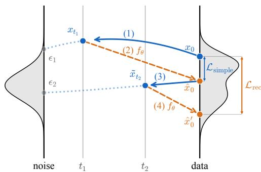  
Figure 1: Self-correction training: Combining $\mathcal { L } _ { \mathrm { r e c } }$ and $\mathcal { L } _ { \mathrm { s i m p l e } } .$ , training exposes the model to potentially encountered states during inference, which encourages it to correct constraint violations instead of only reinforcing locally consistent structure.

(9)

Here, $\mathcal { L } _ { \mathrm { s i m p l e } }$ acts as an anchor to the original diffusion objective, preserving single-step denoising on forward-noised data while $\mathcal { L } _ { \mathrm { r e c } }$ trains correction from self-induced states. Algorithm 2 summarizes the training procedure.

For conditional generation, known values are pinned to their ground-truth after each step. Details on the pinning procedure for training and inference are provided in Appendices C and B.4, respectively.

## 3.4 Local distributional interpretation of self-correction

For any fixed continuous $x _ { 0 }$ -prediction $\bar { x } _ { 0 } \in \mathbb { R } ^ { d }$ , not necessarily a discrete or valid object, define

$$
\begin{array} { r } { q _ { t } ( \cdot ; \bar { x } _ { 0 } ) = \mathcal { N } \big ( \alpha ( t ) \bar { x } _ { 0 } , \beta ( t ) ^ { 2 } I \big ) . } \end{array}
$$

Proposition 3.1 (Local self-correction matching). Fix a valid target $x _ { 0 }$ and an arbitrary continuous prediction $\bar { x } _ { 0 }$ . Let $t _ { 0 } > 0$ denote the starting time ofthe local reverse window, with subsequent reverse times satisfying $t < t _ { 0 } .$ . Suppose that, over a local reverse window, the denoiser returns $\begin{array} { r } { \bar { x } _ { 0 } , } \end{array}$ , and the reverse process uses the DDPM posterior kernels induced by this prediction. $I f Y _ { t _ { 0 } } \sim q _ { t _ { 0 } } ( \cdot ; \bar { x } _ { 0 } )$ then $Y _ { t } \sim q _ { t } ( \cdot ; \bar { x } _ { 0 } )$ at every later reverse time t in the window. Consequently, for independent $\epsilon , \epsilon ^ { \prime } \sim \mathcal { N } ( 0 , I )$ , with

$$
X _ { t } ^ { \mathrm { S C } } = \alpha ( t ) \bar { x } _ { 0 } + \beta ( t ) \epsilon ^ { \prime } , \qquad X _ { t } ^ { \mathrm { s t d } } = \alpha ( t ) x _ { 0 } + \beta ( t ) \epsilon ,
$$

for $\beta ( t ) > 0 ,$ , we have

$$
D _ { \mathrm { K L } } \big ( \mathcal { L } ( X _ { t } ^ { \mathrm { S C } } ) \| \mathcal { L } ( Y _ { t } ) \big ) = 0 , \qquad D _ { \mathrm { K L } } \big ( \mathcal { L } ( X _ { t } ^ { \mathrm { s t d } } ) \| \mathcal { L } ( Y _ { t } ) \big ) = \frac { \alpha ( t ) ^ { 2 } } { 2 \beta ( t ) ^ { 2 } } \| x _ { 0 } - \bar { x } _ { 0 } \| _ { 2 } ^ { 2 } .
$$

The proposition gives a local interpretation of self-correction. It supposes that, over a short reversetime window, the denoiser repeatedly predicts the same continuous proposal $\bar { x } _ { 0 }$ . In this regime, self-correction generates exactly the same local proposal-centered distribution as the idealized reverse process, whereas standard diffusion training remains centered on the original clean sample $x _ { 0 }$ Consequently, self-correction explicitly trains the denoiser on the proposal-centered states that it may revisit during inference, while still retaining $x _ { 0 }$ as the training target. This fixed-proposal result is a local idealization; Appendix K.5 extends it to the more realistic case where successive proposals vary but remain within a small neighborhood of a common proposal.

## 4 Experiments

We train and evaluate on the following benchmarks for constrained data generation and inpainting/completion with a focus on discrete-space reasoning tasks: Sudoku, Sudoku-Extreme, graph connectivity (GC), Latin squares, and N-queens (see Appendix D for details). For Sudoku, we use completed boards from Sudoku-Extreme and randomly generate conditioning masks, evaluating on 21-clue puzzles and the Medium and Hard clue-count settings of SRM [54]. For Sudoku-Extreme [24, 51], we instead use the original masks guaranteeing a unique solution for each puzzle. Following IRED [15], we train GC on $N = 1 2$ and evaluate on $N = 1 2$ and $N = 1 8$ . We additionally evaluate Latin squares $( N = 7 )$ and N-queens $( N = 1 4 )$ under random in-painting and unconditional generation.

As we use continuous diffusion models, we lift discrete configurations into a continuous space [9] by encoding each token as a one-hot vector, yielding $\boldsymbol { x } _ { 0 } \in \mathbb { R } ^ { m \times d }$ (see Appendix D.1). For all tasks except MNIST Sudoku [54] and Graph Connectivity (GC) [15], our network $f _ { \theta }$ is a Transformer [50] with shared hyperparameters, taking as input a continuous sample $\boldsymbol { x } _ { t } \in \mathbb { R } ^ { \dot { m } \times d }$ and diffusion time t (see Appendix E.1 for architecture details). For Graph Connectivity, we adopt the Neural Logic Machine-based [14] architecture of IRED [15, Table 11] with their hyperparameters. As for MNIST Sudoku, we use the pre-trained SRM model [54] without any additional training.

Results are compared across different samplers: DDPM, Euler, Euler-Maruyama (EM), EM decay (EM with decaying $\sigma _ { t } ; ( 6 ) )$ , and our Tweedie reprojection sampler. For EM, we tune a constant noise level σ separately for each configuration. We first select a checkpoint step, based on the validity rate on the validation set under deterministic Euler sampling. At this step, we partition the validation set into five folds and select a single $\sigma ,$ by maximizing the pass@1 validity rate averaged over all folds. The fixed $( \mathtt { s t e p } , \sigma )$ setting is then evaluated once on the untouched test set for each seed, and we report mean ± std across the three seeds. For EM decay, we jointly tune $( \sigma , t _ { \mathrm { d e c a y } } )$ using the same procedure. The sampler uses the selected noise level before $t _ { \mathrm { d e c a y } }$ and linearly anneals it to zero toward the data endpoint. See Appendix F for additional details on training and inference hyperparameters.

Results on discrete constrained tasks. Table 1 compares the continuous samplers within each training regime. The D3PM rows use separately trained discrete-diffusion models and are included as an external reference. We first consider the baseline models, trained without self-correction. The standard samplers, DDPM and EM, give broadly similar performance across tasks, with DDPM requiring no sampler hyperparameter tuning and EM using the noise level chosen according to the protocol described above. We then compare against two ways of changing the stochastic reverse process: EM decay, which allows larger noise early in sampling and anneals it toward the data endpoint, and Tweedie reprojection, which changes the reverse-step center by removing the x residual. Both modifications improve over the standard samplers under baseline, while Tweedie reprojection gives the largest and most consistent gains. For example, on 21-clue Sudoku, success improves from about 31% with DDPM to 95% with Tweedie reprojection. Similar improvements appear across other datasets. This suggests that, for one-hot encoded constrained discrete tasks, a model trained with the standard denoising objective can already make useful clean predictions.

Table 1: Success rates across samplers and tasks. Self-correction training uses $\lambda _ { \mathrm { s i m p l e } } = 0 . 1$ Entries report mean ± standard deviation over three independently trained seeds, each evaluated with an independent test seed. Bold values indicate the best result for each configuration separately.
<table><tr><td rowspan="2">Sampler</td><td colspan="3">Sudoku</td><td colspan="2">Sudoku-Extreme</td><td colspan="2">N-Queens</td><td colspan="2">Latin</td><td colspan="2">GC</td></tr><tr><td>21 clues</td><td>Medium</td><td>Hard</td><td>pass@1</td><td>pass@10</td><td>random</td><td>gen</td><td>random</td><td>gen</td><td>N = 12</td><td>N = 18</td></tr><tr><td colspan="10">Baseline (no self-correction loss)</td></tr><tr><td>DDPM</td><td>.31±.02</td><td>.83±.01</td><td>.38±.00</td><td>.05±.00</td><td>.19±.01</td><td>.53±.00</td><td>.06±.01</td><td>.71±.03</td><td>.87±.03</td><td>.80±.01</td><td>.67±.01</td></tr><tr><td>Euler</td><td>.20±.01</td><td>.78±.00</td><td>.23±.00</td><td>.04±.00</td><td>.13±.01</td><td>.45±.02</td><td>.04±.01</td><td>.58±.02</td><td>.75±.03</td><td>.74±.01</td><td>.58±.02</td></tr><tr><td>EM</td><td>.21±.01</td><td>.76±.01</td><td>.28±.00</td><td>.04±.00</td><td>.13±.01</td><td>.45±.02</td><td>.04±.00</td><td>.59±.02</td><td>.79±.07</td><td>.73±.00</td><td>.56±.02</td></tr><tr><td>EM decay Tweedie</td><td>.81±.03</td><td>.96±.01</td><td>.80±.02</td><td>.18±.02</td><td>.58±.03</td><td>.69±.01</td><td>.15±.03</td><td>.96±.02</td><td>.99±.01</td><td>.94±.01</td><td>.89±.03</td></tr><tr><td>reprojection (ours)</td><td>.95±.01</td><td>.99±.00</td><td>.93±.01</td><td>.26±.01</td><td>.64±.02</td><td>.83±.00</td><td>.25±.01</td><td>.99±.01</td><td>1.00±.00</td><td>.97±.00</td><td>.95±.00</td></tr><tr><td colspan="10">Self-correction loss (with</td></tr><tr><td>DDPM</td><td>.87±.02</td><td>.96±.00</td><td>.83±.02</td><td>.22±.01</td><td>.64±.04</td><td>.74±.04</td><td> $\lambda _ { \mathrm { s i m p l e } } = 0 . 1 )$  .26±.04</td><td>.98±.01</td><td>.92±.04</td><td>.88±.03</td><td>.77±.05</td></tr><tr><td>Euler</td><td>.79±.02</td><td>.94±.00</td><td>.67±.01</td><td>.22±.02</td><td>.61±.03</td><td>.68±.02</td><td>.14±.04</td><td>.94±.02</td><td>.64±.07</td><td>.84±.03</td><td>.68±.04</td></tr><tr><td>EM</td><td>.82±.02</td><td>.93±.01</td><td>.73±.03</td><td>.21±.02</td><td>.61±.03</td><td>.66±.02</td><td>.22±.04</td><td>.97±.02</td><td>.78±.07</td><td>.81±.08</td><td>.68±.04</td></tr><tr><td>EM decay</td><td>.98±.00</td><td>.99±.00</td><td>.98±.00</td><td>.53±.04</td><td>.90±.02</td><td>.81±.03</td><td>.47±.04</td><td>1.00±.00</td><td>1.00±.00</td><td>.88±.02</td><td>.80±.04</td></tr><tr><td>Tweedie reprojection (ours)</td><td>.98±.01</td><td>.99±.00</td><td>.94±.01</td><td>.49±.01</td><td>.84±.02</td><td></td><td>.89±.01 .35±.06</td><td>1.00±.00</td><td>.98±.02</td><td>.99±.01</td><td>.99±.01</td></tr><tr><td colspan="10">Discrete diffusion (D3PM) reference</td></tr><tr><td></td><td>.57±.05</td><td>.88±.02</td><td>.52±.04</td><td>.03±.01</td><td>.10±.03</td><td>.85±.01 .28±.01</td><td></td><td>.88±.03</td><td>.65±.05</td><td>.46±.00</td><td></td></tr><tr><td>Ancestral Confidence</td><td>1.00±.00</td><td>1.00±.00</td><td>.99±.01</td><td>.24±.02</td><td>.44±.05</td><td>.97±.00</td><td>.48±.01</td><td>1.00±.00</td><td>.99±.00</td><td>.99±.02</td><td>.29±.02 1.00±.00</td></tr><tr><td>Remask</td><td></td><td></td><td></td><td></td><td></td><td>.97±.00</td><td>.48±.01</td><td>1.00±.00</td><td>.96±.01</td><td></td><td></td></tr><tr><td></td><td>.99±.00</td><td>1.00±.00</td><td>.98±.00</td><td>.23±.02</td><td>.42±.03</td><td></td><td></td><td></td><td></td><td>.99±.02</td><td>1.00±.00</td></tr></table>

The second block of Table 1 shows the effect of self-correction training. Keeping the same sampler comparison, self-correction substantially improves DDPM and EM, narrowing the gap between standard sampling and Tweedie reprojection. For instance, DDPM rises from about 31% to 87% on 21-clue Sudoku and from about 19% to 64% on Sudoku-Extreme pass@10. This suggests that self-correction partially fixes the reverse-process failure by training the model on sampler-induced states rather than only on forward-noised valid samples. Finally, combining self-correction with the modified samplers gives the strongest overall results: Tweedie reprojection and EM decay are both highly competitive, with each being best or tied for best on different tasks. Overall, the table supports two conclusions: removing the x<sub>t</sub> residual is already highly beneficial at inference time for constrained discrete tasks represented as one-hot vectors, and self-correction further improves robustness by training the model to recover from errors encountered during sampling.

Table 1 focuses on exact validity, a strict metric under which a sample fails if any constraint is violated. To provide a more graded view of the generated solutions, we report two additional diagnostics in Appendix O. Table 12 measures how close the final continuous state is to its nearest one-hot configuration, while Table 13 reports the fraction of predicted cells involved in constraint violation. Together, these metrics help distinguish failures of discrete commitment from samples that are locally plausible but still violate a small number of global constraints.

D3PM’s confidence-based and remasking samplers perform strongly on standard Sudoku, conditioned N-queens, and Latin squares. On Sudoku-Extreme, our best self-corrected continuous configurations achieve higher validity than the D3PM samplers evaluated here. For broader context, TRM [24] reports 87% with a special MLP variant on Sudoku-Extreme (74.7% with an attention-based backbone), while IRED [15] reports 99.1% and 93.8% on graph connectivity at N = 12 and N = 18. Although not compute-matched, our self-corrected Tweedie sampler reaches 84% pass@10 on Sudoku-Extreme and nearly perfect accuracy on graph connectivity, while EM decay reaches 90% pass@10 on Sudoku-Extreme. Together, these results suggest that continuous diffusion remains promising for constrained discrete tasks once the training-inference mismatch is addressed.

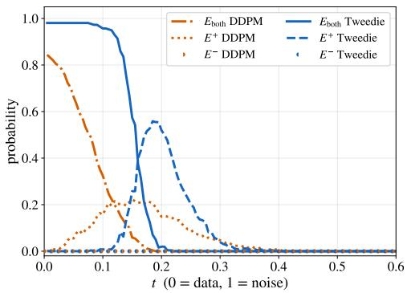  
(a)

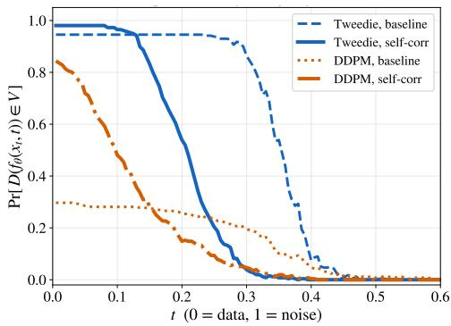  
(b)  
Figure 2: DDPM-Tweedie gap on Sudoku. (a) Decoded-center comparison at matched sampling times: $E _ { \mathrm { b o t h } }$ means both centers are valid, $E _ { + }$ means only the Tweedie center is valid, and $E _ { - }$ means only the DDPM center is valid. (b) Validity of denoiser proposals $D ( f _ { \theta } ( x _ { t } , t ) )$ along Tweedie and DDPM trajectories.

MNIST-Sudoku. As an inference-only sanity check beyond one-hot grids, we evaluate Tweedie reprojection on the MNIST-Sudoku Hard split of SRM [54], where symbols are represented as MNIST digit images [28] but success is still exact Sudoku validity. We use the released SRM diffusionbaseline checkpoint and change only the inference sampler, without retraining or self-correction. The original rectified flow baseline achieves 0.8% accuracy, while Tweedie reprojection raises accuracy to 65.7% (N=1000, 95% CI ±3 pp), exceeding the best SRM sampling-order strategy at 51.6%.

The SRM experiment isolates the effect of inference alone, since the underlying model is kept fixed. To additionally test whether our conclusions depend on one-hot representations or argmax decoding, we train our own models using alternative continuous representations and decoders (Appendix N). We replace one-hot vectors with analog-bit codes and threshold decoding, fixed random embeddings and nearest-neighbour decoding, and mini MNIST-Sudoku with a learned CNN decoder. Across four representations in the single-seed experiments, baseline DDPM validity of 0.31, 0.19, 0.26, 0.01 increases to 0.94, 0.89, 0.89, 0.42 with Tweedie reprojection and to 0.87, 0.79, 0.76, 0.39 with selfcorrection, showing that the findings are not specific to one-hot representations or argmax decoding.

In addition to the self-correction ablations in Appendix L, we report rectified-flow and consistencymodel experiments in Appendices L.3 and L.4.

## 5 Analysis

Locally plausible but globally invalid states. The results above show that the same denoiser can behave very differently under different samplers. The issue is not that the model never learns valid local symbols. The final continuous output can be close to a one-hot representation without its decoded grid being valid (Table 12). Similarly, in MNIST-Sudoku, individual cells can resemble recognizable digits while the full board violates Sudoku constraints.

This creates a specific training-inference mismatch. Standard denoising trains on forward-noised valid objects, $x _ { t } = \alpha ( t ) x _ { 0 } + \beta ( t ) \epsilon , x _ { 0 } \in \mathcal { V }$ . During inference, the model can instead visit noisy versions of its own imperfect proposals. These states may be locally plausible and globally invalid. Although Gaussian noise has full support, the structured invalid states produced by the sampler might receive little training mass under ordinary forward noising. The denoiser is therefore not directly trained to correct precisely the states that the reverse process may create.

DDPM can preserve globally invalid decoded states. Equation (7) shows that the DDPM reverse center contains an $x _ { t }$ -dependent residual in addition to the denoiser’s clean prediction. This residual is not intrinsically harmful: it keeps the reverse update close to the current analog state, which is appropriate when the current state lies on a reliable trajectory and contains details that should persist. The problem in our setting is that $x _ { t }$ can already encode small mistakes that violate discrete constraints, and the denoiser has not necessarily been trained to correct such sampler-induced states. The residual can then keep the update near a locally plausible but globally invalid decoded configuration.

Figure 2a compares the Tweedie and DDPM centers computed from the same current state $x _ { t }$ and denoiser prediction $\hat { x } _ { 0 } ( x _ { t } , t )$ . We perform this comparison separately along trajectories generated by each sampler. We write $E _ { \mathrm { b o t h } }$ for the event that both centers decode to valid configurations at the same reverse time, $E _ { + }$ for the event that only the Tweedie center is valid, and $E _ { - }$ for the event that only the DDPM center is valid. Thus the residual is harmless on $E _ { \mathrm { b o t h } } ,$ , helpful on $E _ { - }$ , and harmful on $E _ { + }$ . Across trajectories, $E _ { + }$ is much larger than $E _ { - }$ . In this regime, the DDPM residual more often turns a valid clean proposal into an invalid centered update than it rescues an invalid proposal. Tweedie reprojection is limited by proposal quality: it can exploit an informative clean proposal, but cannot compensate when the denoiser’s proposals remain poor. Proposal quality is not the only source of failure, however: on Sudoku-Extreme, a valid proposal appeared at least once in 62% of failed Tweedie trajectories, but the final sample was still invalid (see Appendix P).

Self-correction targets the missing training states. The same mechanism suggests a training-side fix. Instead of exposing the model only to noisy valid objects as standard diffusion does, selfcorrection also exposes the model to noisy versions of its own intermediate predictions while keeping the original valid object as the target. Thus the model is trained to map model-induced, possibly invalid states back to a valid solution. Figure 2b shows this effect. Along DDPM trajectories, the baseline denoiser proposes valid grids much less often than along Tweedie trajectories. Self-correction substantially improves proposal validity on DDPM-induced states. This explains why self-correction narrows the DDPM-Tweedie gap: it does not remove the DDPM anchor, but it makes the denoiser more reliable on the states encountered during inference, improving the trajectory as well.

Additional ablations support this interpretation (see Appendix L). Input perturbation [37] and selfconditioning [9] are weaker than self-correction, suggesting that the important ingredient is not generic robustness to extra noise or an additional memory channel, but exposure to model-induced states. Random symbol corruptions (see Appendix L.2) also help DDPM, but remain weaker than self-correction, indicating that arbitrary invalid grids are less well matched to the inference sampling distribution than the model’s own intermediate predictions.

The sampler gap is not only a noise-scale effect. On the sampling side, EM decay shows that additional stochasticity can also help: it injects more noise early in sampling and anneals this noise near the data endpoint. This can break some bad intermediate commitments while still allowing the sample to settle near the end. However, Appendix Figure 11 shows that changing the sampling variance alone does not close the DDPM-Tweedie gap. Scaling the DDPM noise changes how broadly the kernel samples, but not where it is centered. Tweedie reprojection instead changes the center by sampling around the clean proposal rather than continuing the same state-dependent update.

## 6 Related work

Diffusion models and samplers. Score-based and diffusion models [43, 17, 47, 44, 25, 34, 19, 27] have achieved strong results in high-dimensional generation. Beyond standard DDPM sampling, alternative inference schemes include DDIM [44], standard ODE and SDE integrators (e.g. Euler, Heun, Euler-Maruyama) [47], stochastic predictor-corrector methods [47], and samplers with explicit Langevin-like noise injection steps to maintain correct marginals [25]. Some methods also selfcondition their models on noisy and estimated clean samples to improve sample quality [9, 53]. All these methods differ in their trade-off between stability and stochastic exploration, and in how much each update is anchored to the previous noisy sample versus relying on a fresh denoised prediction.

Inference-time control and constrained generation. A large body of work incorporates constraints or objectives during or after sampling. Methods include hard conditioning by masking or inpainting [23, 22, 35], Tweedie-based posterior sampling and guidance [11, 12], projection onto constraint sets [10, 7, 49], inference-time optimization [49, 10, 7, 32], guidance [23, 22], and search-based post-processing [48]. These approaches typically assume access to explicit constraints or a constraint violation signal. In contrast, we consider the setting where constraints must be learned implicitly from data [15], and study failure modes arising purely from inference dynamics.

Diffusion for structured and combinatorial tasks. Diffusion models have been applied to structured domains such as Sudoku, graphs, and combinatorial optimization [48, 15, 54, 4, 56, 26, 30, 38]. Discrete diffusion methods [3] and structured variants often outperform continuous diffusion [9] in such settings [48], highlighting the challenges of applying continuous diffusion to discrete-structured tasks. Continuous diffusion can be used by embedding discrete data in a continuous space [20, 9, 4], and these representations can be restricted to a bounded support such as the probability simplex [4]. Our work explores standard continuous diffusion for highly structured generation and completion tasks.

Training-inference mismatch and exposure bias. Prior work has identified training-inference mismatch (exposure bias) as a source of error accumulation in sequential models [6, 42, 21, 5, 8, 15]. In diffusion models, similar effects arise because the model is trained on noisy ground-truth samples but receives its own predictions as inputs at inference time [37, 36, 13, 40, 57, 31], and error has been shown to necessarily accumulate along the sampling trajectory of imperfect diffusion models under mild assumptions [31]. Recent approaches mitigate exposure bias by modifying the training process: perturbing inputs [37], minimizing cumulative errors as regularization [31], or exposing the model to its own errors via truncated [13] or analytically simulated rollouts [40]. Other methods mitigate diffusion exposure bias by modifying training objectives, adding correction modules, or rescaling predictions at inference time [40, 57, 36]. Whereas the diffusion-specific approaches cited above address exposure bias primarily in visual generation, we study its effect on decoded globally constrained discrete tasks.

Non-diffusion solvers for constrained tasks. OptNet [2] and SATNet [52] present differentiable optimization-based solver layers. More recent work explores recursive refinement models for reasoning tasks [51, 24]. Such models mitigate error compounding by training over rollouts of their refinement. Our work is complementary: we do not aim to compete with these solvers, but to characterize a fundamental limitation of continuous diffusion-based inference in such settings.

## 7 Limitations

Our experiments focus on constrained discrete tasks. Most tasks use one-hot encodings with argmax decoding, where validity is symbolic. MNIST-Sudoku, analog-bit and random-embedding experiments show that the same mechanism appears beyond exact one-hot vectors, but the evaluation is still symbolic Sudoku validity. We therefore do not claim that Tweedie reprojection is appropriate for perceptually rich domains, where success also requires modeling a diverse continuous distribution over texture, geometry, color, and fine details.

Tweedie reprojection changes the nature of the reverse process. It uses $x _ { t }$ to form the proposal $\hat { x } _ { 0 } ~ = ~ f _ { \theta } ( x _ { t } , t )$ , but then discards the residual $x _ { t } - \alpha ( t ) \hat { x } _ { 0 } ,$ , so it no longer enforces the same proximity between noisy states as DDPM posterior updates. This can help when the state contains wrong symbolic commitments, but in domains where meaningful variation exists within a decoded mode, or where fine continuous details are not fully captured by $\scriptstyle { \hat { x } } _ { 0 }$ , repeated reprojection may lose information that a state-preserving sampler would retain.

Finally, self-correction only partially addresses the training-inference mismatch. It exposes the model to one-step model-induced states, improving training coverage, but longer sampling trajectories can still visit states not well represented during training. A more complete solution may require new training objectives or noise processes that better cover both forward-noised data and the samplerinduced states, which we leave for future work.

## 8 Conclusion

We studied continuous diffusion models for constrained discrete tasks represented in continuous space. Across Sudoku, graph connectivity, Latin squares, and N-queens, the same trained denoiser can behave very differently under different reverse processes. This reveals a training-inference mismatch: standard denoising trains on forward-noised valid objects, while inference sampling can create locally plausible but globally invalid states that are not well covered by the training distribution. Tweedie reprojection exposes this mismatch from the inference side by removing the direct x<sub>t</sub>-dependent residual from the reverse update. Improved validity indicates that the denoiser’s clean proposals contain useful global structure that the standard trajectory may fail to exploit. Selfcorrection addresses the same problem from the training side by exposing the model to its own intermediate predictions and training recovery to the original valid target.

Overall, our results suggest that continuous diffusion models can learn global constraints, but constrained discrete reasoning requires better alignment between the states used for training and the states produced during sampling.

## References

[1] Eloi Alonso, Adam Jelley, Vincent Micheli, Anssi Kanervisto, Amos Storkey, Tim Pearce, and François Fleuret. Diffusion for world modeling: Visual details matter in atari. Advances in Neural Information Processing Systems, 37:58757–58791, 2024.

[2] Brandon Amos and J Zico Kolter. Optnet: Differentiable optimization as a layer in neural networks. In International conference on machine learning, pages 136–145. PMLR, 2017.

[3] Jacob Austin, Daniel D Johnson, Jonathan Ho, Daniel Tarlow, and Rianne Van Den Berg. Structured denoising diffusion models in discrete state-spaces. Advances in neural information processing systems, 34:17981–17993, 2021.

[4] Pavel Avdeyev, Chenlai Shi, Yuhao Tan, Kseniia Dudnyk, and Jian Zhou. Dirichlet diffusion score model for biological sequence generation. In International Conference on Machine Learning, pages 1276–1301. PMLR, 2023.

[5] Gregor Bachmann and Vaishnavh Nagarajan. The pitfalls of next-token prediction. arXiv preprint arXiv:2403.06963, 2024.

[6] Samy Bengio, Oriol Vinyals, Navdeep Jaitly, and Noam Shazeer. Scheduled sampling for sequence prediction with recurrent neural networks. Advances in neural information processing systems, 28, 2015.

[7] Michael Cardei, Jacob K Christopher, Thomas Hartvigsen, Bhavya Kailkhura, and Ferdinando Fioretto. Constrained discrete diffusion. arXiv preprint arXiv:2503.09790, 2025.

[8] Boyuan Chen, Diego Martí Monsó, Yilun Du, Max Simchowitz, Russ Tedrake, and Vincent Sitzmann. Diffusion forcing: Next-token prediction meets full-sequence diffusion. Advances in Neural Information Processing Systems, 37:24081–24125, 2024.

[9] Ting Chen, Ruixiang Zhang, and Geoffrey Hinton. Analog bits: Generating discrete data using diffusion models with self-conditioning. arXiv preprint arXiv:2208.04202, 2022.

[10] Jacob K Christopher, Stephen Baek, and Ferdinando Fioretto. Constrained synthesis with projected diffusion models. Advances in Neural Information Processing Systems, 37:89307–89333, 2024.

[11] Hyungjin Chung, Jeongsol Kim, Sehui Kim, and Jong Chul Ye. Parallel diffusion models of operator and image for blind inverse problems. In Proceedings ofthe IEEE/CVF conference on computer vision and pattern recognition, pages 6059–6069, 2023.

[12] Hyungjin Chung, Jeongsol Kim, Michael Thompson Mccann, Marc Louis Klasky, and Jong Chul Ye. Diffusion posterior sampling for general noisy inverse problems. In The Eleventh International Conference on Learning Representations, 2023.

[13] Yuntian Deng, Noriyuki Kojima, and Alexander M Rush. Markup-to-image diffusion models with scheduled sampling. In The Eleventh International Conference on Learning Representations, 2023.

[14] Honghua Dong, Jiayuan Mao, Tian Lin, Chong Wang, Lihong Li, and Denny Zhou. Neural logic machines. In International Conference on Learning Representations, 2019.

[15] Yilun Du, Jiayuan Mao, and Joshua B Tenenbaum. Learning iterative reasoning through energy diffusion. arXiv preprint arXiv:2406.11179, 2024.

[16] Bradley Efron. Tweedie’s formula and selection bias. Journal of the American Statistical Association, 106(496):1602–1614, 2011.

[17] Jonathan Ho, Ajay Jain, and Pieter Abbeel. Denoising diffusion probabilistic models. Advances in neural information processing systems, 33:6840–6851, 2020.

[18] Jonathan Ho, Tim Salimans, Alexey Gritsenko, William Chan, Mohammad Norouzi, and David J Fleet. Video diffusion models. Advances in neural information processing systems, 35:8633–8646, 2022.

[19] Peter Holderrieth and Ezra Erives. An introduction to flow matching and diffusion models. arXiv preprint arXiv:2506.02070, 2025.

[20] Emiel Hoogeboom, Didrik Nielsen, Priyank Jaini, Patrick Forré, and Max Welling. Argmax flows and multinomial diffusion: Learning categorical distributions. Advances in neural information processing systems, 34:12454–12465, 2021.

[21] Xun Huang, Zhengqi Li, Guande He, Mingyuan Zhou, and Eli Shechtman. Self forcing: Bridging the train-test gap in autoregressive video diffusion. arXiv preprint arXiv:2506.08009, 2025.

[22] Naoto Inoue, Kotaro Kikuchi, Edgar Simo-Serra, Mayu Otani, and Kota Yamaguchi. Layoutdm: Discrete diffusion model for controllable layout generation. In Proceedings of the IEEE/CVF Conference on Computer Vision and Pattern Recognition, pages 10167–10176, 2023.

[23] Michael Janner, Yilun Du, Joshua B. Tenenbaum, and Sergey Levine. Planning with diffusion for flexible behavior synthesis. In International Conference on Machine Learning, 2022.

[24] Alexia Jolicoeur-Martineau. Less is more: Recursive reasoning with tiny networks. URL https://arxiv. org/abs/2510.04871, 2025.

[25] Tero Karras, Miika Aittala, Timo Aila, and Samuli Laine. Elucidating the design space of diffusion-based generative models. Advances in neural information processing systems, 35:26565–26577, 2022.

[26] Jaeyeon Kim, Kulin Shah, Vasilis Kontonis, Sham Kakade, and Sitan Chen. Train for the worst, plan for the best: Understanding token ordering in masked diffusions. arXiv preprint arXiv:2502.06768, 2025.

[27] Chieh-Hsin Lai, Yang Song, Dongjun Kim, Yuki Mitsufuji, and Stefano Ermon. The principles of diffusion models. arXiv preprint arXiv:2510.21890, 2025.

[28] Yann LeCun. The mnist database of handwritten digits. http://yann.lecun.com/exdb/mnist/, 1998.

[29] Tianhong Li and Kaiming He. Back to basics: Let denoising generative models denoise, 2025. https://arxiv.org/abs/2511.13720, 7, 2026.

[30] Yang Li, Lvda Chen, Haonan Wang, Runzhong Wang, and Junchi Yan. Generation as search operator for test-time scaling of diffusion-based combinatorial optimization. In The Thirty-ninth Annual Conference on Neural Information Processing Systems, 2025

[31] Yangming Li and Mihaela van der Schaar. On error propagation of diffusion models. In B. Kim, Y. Yue, S. Chaudhuri, K. Fragkiadaki, M. Khan, and Y. Sun, editors, International Conference on Learning Representations, volume 2024, pages 32791–32807, 2024.

[32] Zeyang Li, Kaveh Alim, and Navid Azizan. Hardflow: Hard-constrained sampling for flow-matching models via trajectory optimization. arXiv preprint arXiv:2511.08425, 2025.

[33] Yaron Lipman, Ricky TQ Chen, Heli Ben-Hamu, Maximilian Nickel, and Matt Le. Flow matching for generative modeling. arXiv preprint arXiv:2210.02747, 2022.

[34] Yaron Lipman, Marton Havasi, Peter Holderrieth, Neta Shaul, Matt Le, Brian Karrer, Ricky TQ Chen, David Lopez-Paz, Heli Ben-Hamu, and Itai Gat. Flow matching guide and code. arXiv preprint arXiv:2412.06264, 2024.

[35] Tsiry Mayet, Pourya Shamsolmoali, Simon Bernard, Eric Granger, Romain HÉRAULT, and Clement Chatelain. TD-paint: Faster diffusion inpainting through time aware pixel conditioning. In The Thirteenth International Conference on Learning Representations, 2025.

[36] Mang Ning, Mingxiao Li, Jianlin Su, Albert Ali Salah, and Itir Onal Ertugrul. Elucidating the exposure bias in diffusion models. In The Twelfth International Conference on Learning Representations, 2024.

[37] Mang Ning, Enver Sangineto, Angelo Porrello, Simone Calderara, and Rita Cucchiara. Input perturbation reduces exposure bias in diffusion models. In International Conference on Machine Learning, pages 26245–26265. PMLR, 2023.

[38] Pierre Pereira. Encoding the tsp solution on a circle. https://pierrot-lc.dev/posts/ circular-tsp/, March 2026.

[39] Alec Radford, Jeffrey Wu, Rewon Child, David Luan, Dario Amodei, and Ilya Sutskever. Language models are unsupervised multitask learners, 2019.

[40] Zhiyao Ren, Yibing Zhan, Liang Ding, Gaoang Wang, Chaoyue Wang, Zhongyi Fan, and Dacheng Tao. Multi-step denoising scheduled sampling: Towards alleviating exposure bias for diffusion models. In Proceedings ofthe AAAI Conference on Artificial Intelligence, volume 38, pages 4667–4675, 2024.

[41] Robin Rombach, Andreas Blattmann, Dominik Lorenz, Patrick Esser, and Björn Ommer. High-resolution image synthesis with latent diffusion models. In Proceedings ofthe IEEE/CVF conference on computer vision and pattern recognition, pages 10684–10695, 2022.

[42] Stéphane Ross, Geoffrey Gordon, and Drew Bagnell. A reduction of imitation learning and structured prediction to no-regret online learning. In Proceedings of the fourteenth international conference on artificial intelligence and statistics, pages 627–635. JMLR Workshop and Conference Proceedings, 2011.

[43] Jascha Sohl-Dickstein, Eric Weiss, Niru Maheswaranathan, and Surya Ganguli. Deep unsupervised learning using nonequilibrium thermodynamics. In International conference on machine learning, pages 2256–2265. pmlr, 2015.

[44] Jiaming Song, Chenlin Meng, and Stefano Ermon. Denoising diffusion implicit models. arXiv preprint arXiv:2010.02502, 2020.

[45] Yang Song and Prafulla Dhariwal. Improved techniques for training consistency models. In International Conference on Learning Representations, volume 2024, pages 15078–15097, 2024.

[46] Yang Song and Stefano Ermon. Generative modeling by estimating gradients of the data distribution. Advances in neural information processing systems, 32, 2019.

[47] Yang Song, Jascha Sohl-Dickstein, Diederik P Kingma, Abhishek Kumar, Stefano Ermon, and Ben Poole. Score-based generative modeling through stochastic differential equations. In International Conference on Learning Representations, 2021.

[48] Zhiqing Sun and Yiming Yang. Difusco: Graph-based diffusion solvers for combinatorial optimization. Advances in neural information processing systems, 36:3706–3731, 2023.

[49] Utkarsh Utkarsh, Pengfei Cai, Alan Edelman, Rafael Gomez-Bombarelli, and Christopher Vincent Rackauckas. Physics-constrained flow matching: Sampling generative models with hard constraints. arXiv preprint arXiv:2506.04171, 2025.

[50] Ashish Vaswani, Noam Shazeer, Niki Parmar, Jakob Uszkoreit, Llion Jones, Aidan N Gomez, Łukasz Kaiser, and Illia Polosukhin. Attention is all you need. Advances in neural information processing systems, 30, 2017.

[51] Guan Wang, Jin Li, Yuhao Sun, Xing Chen, Changling Liu, Yue Wu, Meng Lu, Sen Song, and Yasin Abbasi Yadkori. Hierarchical reasoning model. arXiv preprint arXiv:2506.21734, 2025.

[52] Po-Wei Wang, Priya Donti, Bryan Wilder, and Zico Kolter. Satnet: Bridging deep learning and logical reasoning using a differentiable satisfiability solver. In International Conference on Machine Learning, pages 6545–6554. PMLR, 2019.

[53] Joseph L Watson, David Juergens, Nathaniel R Bennett, Brian L Trippe, Jason Yim, Helen E Eisenach, Woody Ahern, Andrew J Borst, Robert J Ragotte, Lukas F Milles, et al. De novo design of protein structure and function with rfdiffusion. Nature, 620(7976):1089–1100, 2023.

[54] Christopher Wewer, Bart Pogodzinski, Bernt Schiele, and Jan Eric Lenssen. Spatial reasoning with denoising models. arXiv preprint arXiv:2502.21075, 2025.

[55] Zhen Xing, Qijun Feng, Haoran Chen, Qi Dai, Han Hu, Hang Xu, Zuxuan Wu, and Yu-Gang Jiang. A survey on video diffusion models. ACM Computing Surveys, 57(2):1–42, 2024.

[56] Jiacheng Ye, Jiahui Gao, Shansan Gong, Lin Zheng, Xin Jiang, Zhenguo Li, and Lingpeng Kong. Beyond autoregression: Discrete diffusion for complex reasoning and planning. arXiv preprint arXiv:2410.14157, 2024.

[57] Junyu Zhang, Daochang Liu, Eunbyung Park, Shichao Zhang, and Chang Xu. Anti-exposure bias in diffusion models. In The Thirteenth International Conference on Learning Representations, 2025.

## A Diffusion and parameterizations details

This appendix expands the diffusion notation, parameterization conversions, and continuous-time derivations summarized in Sec. 2.

## A.1 Forward Markov chain

The forward marginal used in the main text is

$$
x _ { t } = \alpha ( t ) x _ { 0 } + \beta ( t ) \epsilon , \qquad \epsilon \sim \mathcal { N } ( 0 , I ) , \qquad \beta ( t ) = \sqrt { 1 - \alpha ( t ) ^ { 2 } } .
$$

It induces

$$
q ( x _ { t } \mid x _ { 0 } ) = \mathcal { N } \left( \alpha ( t ) x _ { 0 } , ( 1 - \alpha ( t ) ^ { 2 } ) I \right) .\tag{10}
$$

Equivalently, the same marginals can be generated by the discrete Markov chain

$$
\begin{array} { r } { x _ { t } = \sqrt { \delta ( t ) } x _ { t - 1 } + \sqrt { 1 - \delta ( t ) } \epsilon _ { t } , \qquad \epsilon _ { t } \sim \mathcal { N } ( 0 , I ) , } \end{array}\tag{11}
$$

with transition kernel

$$
q ( x _ { t } \mid x _ { t - 1 } ) = \mathcal { N } \left( \sqrt { \delta ( t ) } x _ { t - 1 } , ( 1 - \delta ( t ) ) I \right) .
$$

The one-step coefficient is chosen so that Eq. (11) reproduces the marginals in Eq. (10):

$$
\delta ( t ) = \frac { \alpha ( t ) ^ { 2 } } { \alpha ( t - 1 ) ^ { 2 } } , \qquad \alpha ( t ) ^ { 2 } = \prod _ { s = 1 } ^ { t } \delta ( s ) .\tag{12}
$$

## A.2 DDPM posterior

Since the forward process is Gaussian, the posterior conditional on the clean sample is tractable [17]:

$$
q ( x _ { t - 1 } \mid x _ { t } , x _ { 0 } ) = \mathcal { N } \left( \mu _ { t } ( x _ { t } , x _ { 0 } ) , \tilde { \beta } _ { t } I \right) ,\tag{13}
$$

with mean and variance given by:

$$
\mu _ { t } ( x _ { t } , x _ { 0 } ) = \alpha ( t - 1 ) x _ { 0 } { \frac { 1 - \delta ( t ) } { 1 - \alpha ( t ) ^ { 2 } } } + { \frac { \sqrt { \delta ( t ) } \left( 1 - \alpha ( t - 1 ) ^ { 2 } \right) } { 1 - \alpha ( t ) ^ { 2 } } } x _ { t } ,\tag{14}
$$

$$
\tilde { \beta } _ { t } = \left( 1 - \alpha ( t - 1 ) ^ { 2 } \right) \frac { 1 - \delta ( t ) } { 1 - \alpha ( t ) ^ { 2 } } .\tag{15}
$$

Thus DDPM sampling replaces the unknown $x _ { 0 }$ with the model prediction $\hat { x } _ { 0 } ( x _ { t } , t )$ and samples from

$$
p _ { \theta } ( x _ { t - 1 } \mid x _ { t } ) \dot { = } q \left( x _ { t - 1 } \mid x _ { t } , \hat { x } _ { 0 } ( x _ { t } , t ) \right) .
$$

The posterior mean can also be written in an anchored form:

$$
\mu _ { t } ( x _ { t } , x _ { 0 } ) = \alpha ( t - 1 ) x _ { 0 } + B _ { t } \left( x _ { t } - \alpha ( t ) x _ { 0 } \right) , \qquad B _ { t } \doteq { \frac { { \sqrt { \delta ( t ) } } \left( 1 - \alpha ( t - 1 ) ^ { 2 } \right) } { 1 - \alpha ( t ) ^ { 2 } } } .\tag{16}
$$

This decomposition separates the clean-sample component from the residual inherited from the current noisy state. In the main paper, this residual is the source of the anchoring effect that distinguishes DDPM-style updates from pure Tweedie reprojection.

## A.3 Prediction parameterizations

A diffusion model can be parameterized to predict the clean sample $x _ { 0 }$ , the noise ϵ [17], the marginal score $s _ { t } ( x _ { t } ) = \nabla _ { x _ { t } } \log q _ { t } ( x _ { t } ) \left[ 4 6 \right]$ , or the marginal velocity $u _ { t } ( x _ { t } )$ in the flow-matching formulation [33, 34]. The prediction parameterization and the loss target are separate choices [29]. At the population optimum, these quantities are equivalent up to deterministic conversions induced by the forward process [27].

Let

$$
x _ { 0 } ^ { * } ( x _ { t } , t ) \doteq \mathbb { E } [ x _ { 0 } \mid x _ { t } ] .
$$

Then the corresponding optimal noise, score, and velocity predictions are

$$
\begin{array} { r l r } & { } & { \boldsymbol { \epsilon } ^ { * } ( x _ { t } , t ) = \frac { x _ { t } - \alpha ( t ) x _ { 0 } ^ { * } ( x _ { t } , t ) } { \beta ( t ) } , \qquad s ^ { * } ( x _ { t } , t ) \doteq \nabla _ { x _ { t } } \log q _ { t } ( x _ { t } ) = - \frac { \boldsymbol { \epsilon } ^ { * } ( x _ { t } , t ) } { \beta ( t ) } , } \\ & { } & { \boldsymbol { u } ^ { * } ( x _ { t } , t ) = \frac { \dot { \beta } ( t ) } { \beta ( t ) } x _ { t } + \left( \dot { \alpha } ( t ) - \frac { \alpha ( t ) \dot { \beta } ( t ) } { \beta ( t ) } \right) x _ { 0 } ^ { * } ( x _ { t } , t ) . \qquad } \end{array}\tag{17}
$$

Tweedie’s formula gives

$$
x _ { 0 } ^ { * } ( x _ { t } , t ) = \mathbb { E } [ x _ { 0 } \mid x _ { t } ] = { \frac { x _ { t } + \beta ( t ) ^ { 2 } \nabla _ { x _ { t } } \log q _ { t } ( x _ { t } ) } { \alpha ( t ) } } .
$$

Therefore an x-prediction model can be used in score-, noise-, or velocity-based samplers by applying Eq. (17). In our experiments, we use x-prediction and the x-prediction loss in Eq. (4), following the practical distinction between prediction type and loss target highlighted by [29].

## A.4 Continuous-time derivation

For continuous-time samplers, we view the variance-preserving forward process as a probability path $\{ q _ { t } \} _ { t \in [ 0 , T ] }$

$$
x _ { t } = \alpha ( t ) x _ { 0 } + \beta ( t ) \epsilon , \qquad q _ { t } ( x \mid x _ { 0 } ) = \mathcal { N } \left( \alpha ( t ) x _ { 0 } , \beta ( t ) ^ { 2 } I \right) , \qquad \epsilon \sim \mathcal { N } ( 0 , I ) .\tag{18}
$$

Here t is continuous, $\alpha ( 0 ) = 1 , \alpha ( T ) \approx 0 .$ , and $\beta ( t ) = \sqrt { 1 - \alpha ( t ) ^ { 2 } }$

Conditional and marginal vector fields. Differentiating Eq. (18) with respect to $t ,$ for a fixed pair $( x _ { 0 } , \epsilon )$ , gives the conditional velocity field

$$
u _ { t } ( x \mid x _ { 0 } ) = \dot { \alpha } ( t ) x _ { 0 } + \dot { \beta } ( t ) \epsilon = \frac { \dot { \beta } ( t ) } { \beta ( t ) } x + \left( \dot { \alpha } ( t ) - \alpha ( t ) \frac { \dot { \beta } ( t ) } { \beta ( t ) } \right) x _ { 0 } ,\tag{19}
$$

where we used

$$
\epsilon = \frac { x - \alpha ( t ) x _ { 0 } } { \beta ( t ) } .
$$

Since $u _ { t } ( x \mid x _ { 0 } )$ is linear in $x _ { 0 } ,$ , the marginal vector field is obtained by replacing $x _ { 0 }$ with $\mathbb { E } [ x _ { 0 }$ | $x _ { t } = x ]$ . Using Tweedie’s formula gives

$$
u _ { t } ( x ) = \frac { \dot { \alpha } ( t ) } { \alpha ( t ) } x + \left( \beta ( t ) ^ { 2 } \frac { \dot { \alpha } ( t ) } { \alpha ( t ) } - \beta ( t ) \dot { \beta } ( t ) \right) \nabla _ { x } \log q _ { t } ( x ) .\tag{20}
$$

Probability-flow ODE and SDE family. The deterministic dynamics with marginals $q _ { t }$ are given by the probability-flow ODE

$$
\mathrm { d } x = u _ { t } ( x ) \mathrm { d } t .\tag{21}
$$

More generally, for any non-negative diffusion schedule $\sigma ( t )$ , the reverse-time SDE driven by a standard Wiener process $w _ { t }$

$$
\mathrm { d } x = \left[ u _ { t } ( x ) - \frac { \sigma ( t ) ^ { 2 } } { 2 } \nabla _ { x } \log q _ { t } ( x ) \right] \mathrm { d } t + \sigma ( t ) \mathrm { d } w _ { t }
$$

has the same marginals $q _ { t }$ in the exact-score and exact-solver limit [19, Thm. 17]. The probabilityflow ODE is the special case $\sigma ( t ) = 0$ . The variance-preserving reverse SDE of [47] corresponds to

$$
\sigma ( t ) ^ { 2 } = - 2 \frac { \dot { \alpha } ( t ) } { \alpha ( t ) } .
$$

Numerical samplers. The continuous-time formulation allows sampling by numerically solving either the probability-flow ODE or the SDE family. We use ODE solvers such as Euler and Heun, and SDE solvers such as Euler–Maruyama [47, 25]. In all cases, we plug the network prediction $\hat { x } _ { 0 } ( x _ { t } , t )$ into the required score or velocity expression using the conversions in Eq. (17). DDPM and DDIM can also be derived from this continuous-time perspective [44, 47].

## B Samplers

We explain various sampling update rules below and then describe the overall sampling process for both generation and completion/in-painting with the pinning procedure.

## B.1 DDIM generalized formula: DDIM, DDPM and Tweedie reprojection

DDIM [44] introduces a family of forward processes with the same marginal distributions (1) as DDPM [17]. Their generalized sampling update takes the form:

$$
q _ { \kappa } ( x _ { t - 1 } \mid x _ { t } , \hat { x } _ { 0 } ) = \mathcal { N } \big ( \alpha ( t - 1 ) \hat { x } _ { 0 } + \sqrt { 1 - \alpha ( t - 1 ) ^ { 2 } - \kappa _ { t } ^ { 2 } } \cdot \frac { x _ { t } - \alpha ( t ) \hat { x } _ { 0 } } { \sqrt { 1 - \alpha ( t ) ^ { 2 } } } , \kappa _ { t } ^ { 2 } I \big )\tag{22}
$$

$$
= \mathcal { N } \big ( \boldsymbol { \alpha } ( t - 1 ) \hat { \boldsymbol { x } } _ { 0 } + \sqrt { 1 - \boldsymbol { \alpha } ( t - 1 ) ^ { 2 } - \kappa _ { t } ^ { 2 } \cdot \hat { \boldsymbol { \epsilon } } _ { t } , \kappa _ { t } ^ { 2 } I } \big )\tag{23}
$$

Different choices of $\kappa _ { t } ^ { 2 }$ recover known samplers: $\begin{array} { r } { \kappa _ { t } ^ { 2 } = \tilde { \beta } _ { t } = ( 1 - \alpha ( t - 1 ) ^ { 2 } ) \cdot \frac { 1 - \delta ( t ) } { 1 - \alpha ( t ) ^ { 2 } } } \end{array}$ yields DDPM [17], while $\kappa _ { t } ^ { 2 } = 0$ gives the deterministic DDIM update [44].

Our Tweedie reprojection corresponds to $\kappa _ { t } ^ { 2 } = 1 - \alpha ( t - 1 ) ^ { 2 }$ . This endpoint relation does not imply exact marginal preservation after replacing the true clean sample $x _ { 0 }$ by the learned prediction $\hat { x } _ { 0 } ( x _ { t } , t )$ , even if that prediction equals the exact conditional mean.

Linear-path sampling for SRM. For the linear path $x _ { t } = ( 1 - t ) x _ { 0 } + t \epsilon$ , with normalized time $t \in [ 0 , 1 ]$ , write $v _ { \theta } ( x _ { t } , t )$ for the corresponding velocity prediction. The clean and noise estimates are

$$
\hat { x } _ { 0 } = x _ { t } - t v _ { \theta } ( x _ { t } , t ) , \qquad \hat { \epsilon } = x _ { t } + ( 1 - t ) v _ { \theta } ( x _ { t } , t ) .
$$

The deterministic generalized DDIM update to $s < t$ is therefore

$$
\boldsymbol { x } _ { s } = ( 1 - s ) \boldsymbol { \hat { x } } _ { 0 } + s \boldsymbol { \hat { \epsilon } } = \boldsymbol { x } _ { t } + ( s - t ) \boldsymbol { v } _ { \theta } ( \boldsymbol { x } _ { t } , t ) ,
$$

which is an Euler step on the linear path. Tweedie reprojection instead uses $x _ { s } = ( 1 - s ) \hat { x } _ { 0 } + s \epsilon ^ { \prime }$ with fresh $\epsilon ^ { \prime } \sim \mathcal { N } ( 0 , \bar { I } )$

## B.2 Time discretizations

Whereas we use uniform / linear time discretization (equidistant timesteps) throughout our work, others can also be used in practice [25].

We will denote a discretization of $N \in \mathbb { N } ^ { + }$ time points with:

$$
\{ t _ { N - 1 } , t _ { N - 2 } , \ldots , t _ { 0 } \} , \qquad t _ { N - 1 } = T , t _ { 0 } = 0 .\tag{24}
$$

where we also use $h _ { i } \doteq t _ { i } - t _ { i - 1 }$ as positive step sizes since timesteps are decreasing.

To compare the generalized sampling update (22) (including DDIM, DDPM, and Tweedie reprojection) with other samplers, we can replace it as follows:

$$
x _ { s } = \alpha ( s ) \hat { x } _ { 0 } + \sqrt { 1 - \alpha ( s ) ^ { 2 } - \kappa _ { t _ { i } } ^ { 2 } } \cdot \frac { x _ { t _ { i } } - \alpha ( t _ { i } ) \hat { x } _ { 0 } } { \sqrt { 1 - \alpha ( t _ { i } ) ^ { 2 } } } + \kappa _ { t _ { i } } \cdot \epsilon ( t _ { i } )\tag{25}
$$

with $\epsilon ( t _ { i } ) \sim \mathcal { N } ( 0 , I )$ and $i = N - 1 , \ldots , 1$

## B.3 Numerical ODE and SDE solvers: Euler, Heun, and Euler-Maruyama

The Euler and Heun (aka improved Euler) methods are first- and second-order ODE solvers, popular for their low Number of Function Evaluations (NFE) and ease of implementation.

They become deterministic samplers once used to solve the PF-ODE (21). Starting from $x _ { T } \sim$ $\mathcal { N } ( 0 , I )$ , Euler and Heun iterate from $i = N - 1 \mathrm { t o } i = 1$ , using the estimate of the marginal vector field, retrieved from the model’s x-prediction.

Euler update rule

$$
x _ { s } = x _ { t _ { i } } - h _ { i } \cdot \hat { u } _ { t _ { i } } ( x _ { t _ { i } } ) ,\tag{26}
$$

Euler-Maruyama (EM) update rule Recall that for any non-negative diffusion schedule $\sigma _ { t } ,$ the stochastic dynamics

$$
\begin{array} { r } { \mathrm { d } \boldsymbol { x } = \Big [ u _ { t } ( \boldsymbol { x } ) - \frac { \sigma _ { t } ^ { 2 } } { 2 } \boldsymbol { \nabla } _ { \boldsymbol { x } } \log q _ { t } ( \boldsymbol { x } ) \Big ] \mathrm { d } t + \sigma _ { t } \mathrm { d } \boldsymbol { w } . } \end{array}\tag{27}
$$

share the same marginals $q _ { t }$ [19, Thm. 17], reducing to the deterministic case (21) for $\sigma _ { t } = 0$

Euler-Maruyama (EM) is a numerical SDE solver that can be used as a stochastic sampler. Starting from $x _ { T } \sim \mathcal { N } ( 0 , I )$ , EM iterates from $i = N - 1 \mathrm { t o } i = 1$ , using the estimate of the marginal vector field and score, retrieved from the model’s x-prediction.

$$
\begin{array} { r } { x _ { s } = x _ { t _ { i } } + h _ { i } \cdot \hat { f } ( x _ { t _ { i } } , t _ { i } ) + g ( t _ { i } ) \sqrt { h _ { i } } \cdot \epsilon ( t _ { i } ) , \qquad \epsilon ( t _ { i } ) \sim \mathcal { N } ( 0 , I ) } \end{array}\tag{28}
$$

where we denote $\begin{array} { r } { \hat { f } ( x , t ) \doteq - \hat { u } _ { t } ( x ) + \frac { \sigma _ { t } ^ { 2 } } { 2 } \hat { s } _ { t } ( x ) } \end{array}$ as the drift coefficient and $g ( t ) \doteq \sigma _ { t }$ as the diffusion coefficient.

In our work, we refer to EM as using a fixed $g ( t _ { i } ) = \sigma$ , and EM decay as using a decreasing diffusion schedule $\sigma _ { t }$

Euler–Maruyama noise scale. The SDE family (6) motivates treating $\sigma ( t )$ as a sampler hyperparameter. Theoretically, changing $\sigma ( t )$ changes the stochastic dynamics but not the marginal path $q _ { t } .$ assuming exact scores and exact integration. In practice, finite-step solvers and learned denoisers introduce discretization and model error, so the choice of $\sigma ( t )$ affects empirical performance. We therefore tune the EM noise scale by five-fold cross-validation. For EM decay, we also tune the time at which σ(t) begins linearly annealing to zero near the data endpoint.

## B.4 Sampling process and pinning procedure

The algorithm 1 summarizes the overall sampling process for both unconditional and conditional generation (completion or in-painting), with pinning procedures for the latter. Recall that we go from x<sub>T</sub> to $x _ { 0 }$ when sampling.

Algorithm 1: (Un-)conditional generation. Inputs are the time discretization, optional condition  
ing c, its corresponding mask m, and soft-to-hard conditioning threshold t<sup>∗</sup>   
Procedure sample $( \{ t _ { N - 1 } , t _ { N - 2 } , \ldots , t _ { 0 } \} , c , m , t ^ { * } )$ :   
Sample initial tensor x ∼ N(0, I)   
Initialize buffer to store trajectory $\left\{ x _ { t _ { i } } \right\}$   
for i = N − 1 to 1 do   
s = t<sub>i−1</sub>   
Compute step size $h _ { i } = t _ { i } - s$   
Sample $x _ { s } =$ update\_rule $( x _ { t _ { i } } , t _ { i } , h _ { i } , \dots )$   
if $m \neq \emptyset$ then   
1 $\mathtt { p i n } ( x _ { s } , s , t ^ { * } , c , m )$   
Append $x _ { s }$ to buffer   
Procedure pin(x<sub>s</sub>, s, t<sup>∗</sup>, c, m):   
if $s \geq t ^ { * }$ then   
soft\_pinning(x<sub>s</sub>, c, m)   
else   
hard\_pinning $( x _ { s } , c , m )$   
Procedure soft\_pinning(x<sub>s</sub>, c, m):   
Sample $c _ { s } \sim q ( x _ { s } \mid c )$   
$x _ { s } [ m ] = c _ { s } [ m ]$   
Procedure hard\_pinning(x<sub>s</sub>, c, m):   
x<sub>s</sub>[m] = c[m]

## C SELF-CORRECTION algorithm

We summarize the SELF-CORRECTION training procedure in Algorithm 2. We denote $\mathrm { s g } ( . )$ as the stop-gradient operator, and the rest are described in previous sections or are self-explanatory.

```tcl
Algorithm 2: SELF-CORRECTION training algorithm for (un-)conditional generation for a full
batch. Inputs are the regularization coefficient $\lambda _ { \mathrm { s i m p l e } } .$ , optional conditioning c and its correspond
ing mask m
Procedure training_procedure():
for steps do
update_diffusion_model()
Procedure update_diffusion_model $\left( \lambda _ { \mathrm { s i m p l e } } , c , \right.$ m):
Sample $x _ { 0 } \sim q _ { 0 } ( x )$
Sample $t _ { 1 } \sim \bar { \mathcal { U } } [ \dot { 0 } , \dot { T } ]$ and $t _ { 2 } \sim \mathcal { U } [ 0 , t _ { 1 } ]$
Sample $\boldsymbol { x } _ { t _ { 1 } } \sim \boldsymbol { q } ( \boldsymbol { x } _ { t _ { 1 } } \mid \boldsymbol { x } _ { 0 } )$
if $m \neq \emptyset$ then
hard_pinning $( x _ { t _ { 1 } } , c , m )$
Compute $\hat { x } _ { 0 } = f _ { \theta } ( x _ { t _ { 1 } } , t _ { 1 } )$
if m $\neq \emptyset$ then
hard_pinning $( \hat { x } _ { 0 } , c , m )$
Sample $\tilde { x } _ { t _ { 2 } } \sim q ( x _ { t _ { 2 } } \mid \mathbf { s g } ( \hat { x } _ { 0 } ) )$
if m $\neq \emptyset$ then
hard_pinning $( \tilde { x } _ { t _ { 2 } } , c , m )$
Compute $\hat { x } _ { 0 } ^ { \prime } = f _ { \theta } ( \tilde { x } _ { t _ { 2 } } , t _ { 2 } )$
if m $\neq \emptyset$ then
hard_pinning $( \hat { x } _ { 0 } ^ { \prime } , c , m )$
Compute simple loss $\mathcal { L } _ { \mathrm { s i m p l e } } ( \theta ) = \mathrm { M S E } ( \hat { x } _ { 0 } , x _ { 0 } )$
Compute recovery loss $\mathcal { L } _ { \mathrm { r e c } } ( \dot { \theta } ) = \mathrm { M S E } ( \dot { \hat { x } } _ { 0 } ^ { \prime } , x _ { 0 } )$
Compute final loss ${ \mathcal { L } } _ { \mathrm { S C } } ( \theta ) = { \mathcal { L } } _ { \mathrm { r e c } } ( \theta ) + { \bar { \lambda } } _ { \mathrm { s i m p l e } } { \mathcal { L } } _ { \mathrm { s i m p l e } } ( \theta )$
Update model $f _ { \theta }$
```

This procedure generalizes naturally to multiple prediction steps. Longer unrolls were unstable when trained from scratch; the warm-started multi-step experiment in Appendix L trained successfully but did not outperform one-step self-correction.

Computational overhead of self-correction training. Standard denoising training performs one gradient forward pass and one backward pass per optimizer step. Self-correction training adds (i) one additional gradient-free forward pass, which produces the model prediction that is re-noised to the second time point, and (ii) one gradient forward pass on a sub-batch of $\left\lfloor \lambda _ { \mathrm { s i m p l e } } B \right\rfloor$ samples for $\mathcal { L } _ { \mathrm { s i m p l e } } ;$ a single backward pass is taken on the combined objective. Counting a backward pass as twice the cost of a forward pass, this predicts a per-step training cost of $( 4 + \bar { 3 } \lambda _ { \mathrm { s i m p l e } } ) / 3 \approx \mathrm { 1 . 4 3 \times }$ the baseline for $\lambda _ { \mathrm { s i m p l e } } = 0 . 1$ . Both variants are trained for the same number of optimizer steps $( 2 \times 1 0 ^ { 6 } )$ , and inference cost is unchanged, as self-correction modifies only the training objective and not the sampler.

## D Additional tasks details

We train and evaluate on the following benchmarks for constrained data generation and inpainting/completion with a focus on discrete-space reasoning tasks: Sudoku-Extreme [51, 24], MNIST Sudoku [54], graph-connectivity (GC, [15]) and two datasets we introduce: Latin square and N-queens. Throughout, clues denote randomly positioned revealed cells.

Sudoku. We consider two separate Sudoku training regimes, both based on the Sudoku-Extreme dataset [51, 24], which provides partial $9 \times 9$ grids together with their completions. For the Sudoku setting, we train on completed boards from the training split and generate conditioning masks on the fly, with the number of clues sampled uniformly from $\{ 0 , \ldots , 8 0 \}$ . We evaluate this model with 21 clues, as well as the Medium and Hard clue-count settings of SRM [54], corresponding to clue counts sampled from $\{ 2 7 , \ldots , 5 3 \}$ and $\{ 0 , \ldots , 2 6 \}$ , respectively. For the Sudoku-Extreme setting, we train a separate model using the dataset-provided partial grids from the Sudoku-Extreme training split and evaluate it on the corresponding test split.

Table 2: Dataset summary. Throughout, clues denote partial observations the model conditions on: randomly positioned revealed cells with count $k \sim \mathcal { \bar { U } } [ [ a , b ] ]$ where $[ [ a , b ] ] = \{ a , \dotsc , b \}$ (Sudoku, Latin square, N-queens); or the full adjacency matrix (GC, always given at train and inference). <sup>†</sup> Out-of-distribution.
<table><tr><td></td><td>Sudoku</td><td>Sudoku-Extreme</td><td>GC</td><td>Latin square</td><td>N-queens</td></tr><tr><td>Grid size</td><td> $9 \times 9$ </td><td>9 × 9</td><td> $N \times N$ </td><td> $7 \times 7$ </td><td>14 × 14</td></tr><tr><td>Cells m</td><td>81</td><td>81</td><td> $N ^ { 2 }$ </td><td>49</td><td>14</td></tr><tr><td>Vocab d</td><td>9</td><td>9</td><td>2</td><td>7</td><td>14</td></tr><tr><td>Train clues</td><td>[0, 80]</td><td>[17,35]</td><td>Adj. mat.  $N = 1 2$ </td><td> $[ [ 0 , N ^ { 2 } - 1 ] ]$ </td><td> $[ 0 , N - 1 ]$ </td></tr><tr><td>Eval clues</td><td>21 [27, 53] (Med.) [0, 26] (Hard)</td><td>[17, 36]</td><td> $\mathrm { A d j . \ m a t . , } N = 1 2$   ${ \mathrm { A d j . \ m a t . , } } N = 1 8 ^ { \dagger }$ </td><td>random: 14 generation: 0</td><td>random: 7 generation: 0</td></tr><tr><td>Validity</td><td>Sudoku rules</td><td>Sudoku rules</td><td>Connectivity matches ground truth</td><td>One symbol per row/col</td><td>No two queens attack</td></tr></table>

For evaluation, we sample 2000 puzzles per seed from the corresponding test split, using three seeds. For the Sudoku clue-count settings, masks are generated on the fly according to the evaluation regime, whereas for Sudoku-Extreme we use the dataset-provided partial grids. Since the Sudoku-Extreme test set is large, we evaluate on a uniformly sampled subset and report binomial confidence intervals; the standard error is at most 1.12 percentage points, corresponding to a 95% confidence interval of approximately ±2.19 percentage points.

Graph connectivity. Graph connectivity [15] is a dataset for graphs with N nodes, consisting of both $N \times N$ binary adjacency and $N \times \bar { N }$ binary connectivity matrices. The latter describes the existence of a path between nodes. Conditioned on adjacency matrices, we train and evaluate models to generate connectivity matrices. We define a connectivity matrix as valid if it matches the true connectivity matrix. We do not use any random number of clues, and following prior work [15], we only train with at most $N = 1 2$ nodes, and evaluate on $N = 1 2$ and $N = 1 8 { \bar { . } }$ For training and evaluation, we use their train and test dataset generators (seeds are different), which continually provide samples, meaning that there is no fixed dataset size.

MNIST Sudoku. We use the MNIST-Sudoku dataset of [54], where each $9 \times 9$ puzzle is rendered as a $2 5 2 \times 2 5 2$ grayscale image. Every cell contains a $2 8 \times 2 8$ MNIST [28] digit image sampled from a random instance of the corresponding digit class, requiring the model to jointly perform digit recognition and Sudoku constraint reasoning directly from raw pixels. Following the original split convention, we reserve the last 1,000 puzzles for evaluation. Inputs are scaled to $[ - 1 , 1 ]$ and treated as continuous-valued images without tokenization; the diffusion model predicts the full 252 × 252 board. This experiment is separate from the mini MNIST-Sudoku models trained with $8 \times 8$ digits in Appendix N.

Latin square. Latin squares of size $N \times N$ are arrays with values taken among N different symbols. Arrays are valid if each symbol occurs exactly once per row and once per column. In our case, we use ${ \dot { N } } = 7$ and randomized backtracking to create 210000 valid Latin squares, where 80% is for the training set. We train with a number of clues uniformly drawn from $\{ 0 , \cdot \cdot \cdot , N ^ { 2 } - 1 \}$ } and evaluate in random in-painting and unconditional generation.

N-Queens. An N-Queens board contains N queens, with no two sharing a row, column, or diagonal. We represent each board as a vector in $\mathbf { \dot { \{ 1 , \dots , N \} } } ^ { N }$ , whose i-th entry gives the queen’s column in row i. We use $N = 1 4$ and construct the dataset by sampling uniformly from the complete set of 365,596 valid boards. The training split contains 168,000 distinct boards. During training, the number of revealed queens is sampled uniformly from $\{ 0 , \ldots , N - 1 \}$ . We evaluate both completion from randomly revealed queens and unconditional generation.

## D.1 Continuous representations from discrete configurations

From discrete configurations of m cells, we convert each token into their one-hot representation [9], giving m × d tensors where the last dimension is the one-hot dimension. Please refer to Table 2 for their values.

## E Model architectures and hyperparameters

## E.1 Architecture for Sudoku, N-Queens, and Latin

For all tasks except MNIST Sudoku [54] and Graph Connectivity (GC) [15] (see Appendix E.2), our network $f _ { \theta }$ is a Transformer [50], taking as input a continuous sample $x _ { t }$ and diffusion time t:

• The sample $x _ { t }$ is linearly embedded in $\mathbb { R } ^ { d _ { \mathrm { e m b } } }$ and added to its learnable positional embeddings. For Sudoku, we use three additive learnable positional embeddings (row, column, and block) instead of one.

• The diffusion time t is embedded using Fourier features $[ \sin ( 2 \pi \omega _ { k } \frac { t } { T } )$ , cos $\begin{array} { r } { ( 2 \pi \omega _ { k } \frac { t } { T } ) ] _ { k = 1 } ^ { d _ { \mathrm { t i m e } } / 2 } } \end{array}$ with log-spaced frequencies $\omega _ { \boldsymbol { k } }$ , followed by a two-layer MLP with SiLU activations mapping the embedding into $\mathbb { R } ^ { d _ { \mathrm { e m b } } }$

• We then add them together and feed them through a sequence of L Transformer blocks, followed by a layer normalization and linear layer.

We use pre-norm Transformer blocks [39] with full self-attention [50] and per-position MLP sublayers, each wrapped with residual connections. Within each Transformer block, we apply dropout after each attention and MLP sublayer, as well as attention weight dropout inside the multi-head attention.

Except for the number of continuous tokens (i.e., number of cells m) and vocabulary size (i.e., one-hot dimension d) (see Table 2), all hyper-parameters are shared across tasks described in this subsection. Please refer to Table 3 for their values and to Algorithm 2 for the training procedure.

Table 3: Architecture details
<table><tr><td>Name</td><td>Short-hand</td><td>Value</td></tr><tr><td>Embedding dimension</td><td> $d _ { \mathrm { e m b } }$ </td><td>128</td></tr><tr><td>Time embedding dimension</td><td> $d _ { \mathrm { t i m e } }$ </td><td>64</td></tr><tr><td>Time embedding MLP</td><td></td><td> $[ d _ { \mathrm { t i m e } } , d _ { \mathrm { e m b } } , d _ { \mathrm { e m b } } ]$ </td></tr><tr><td>Depth</td><td>L</td><td>4</td></tr><tr><td>Attention heads</td><td> $n _ { \mathrm { h e a d s } }$ </td><td>8</td></tr><tr><td>Dropout probability</td><td> $p _ { \mathrm { d r o p } }$ </td><td> $0 . 0 1$ </td></tr><tr><td>MLP hidden dimension</td><td> $d _ { \mathrm { m l p } }$ </td><td> $4 \times d _ { \mathrm { e m b } } = 5 1 2 , \mathrm { G e L U }$ </td></tr></table>

## E.2 Architectures for Graph Connectivity and MNIST Sudoku

For Graph Connectivity, we adopt the Neural Logic Machine-based [14] architecture of IRED [15, Table 11] and use the same hyperparameters as them.

As for MNIST Sudoku, we use the pre-trained SRM model [54] without any additional training, and therefore have no architecture hyperparameters to report.

## F Hyper-parameters and hardware

We show in the following the list of hyper-parameters and hardware used. We use $t ^ { * }$ to denote the soft-to-hard conditioning threshold in conditional generation tasks, and the rest are described in previous sections or are self-explanatory.

Table 4: Training and evaluation hyperparameters. All main VP-continuous diffusion tasks share optimizer type, learning rate, and step budget; batch size is the only task-specific training knob, and sampler step budgets differ only for Sudoku-Extreme and SRM.
<table><tr><td>Hyperparameter</td><td>Value</td></tr><tr><td colspan="2">Training</td></tr><tr><td colspan="2">Training loop</td></tr><tr><td>Optimizer steps</td><td> $2 \times 1 0 ^ { 6 }$ </td></tr><tr><td>Batch size (default)</td><td>256</td></tr><tr><td>Batch size (GC)</td><td>64</td></tr><tr><td>Mixed precision</td><td>AMP, float16</td></tr><tr><td>Hardware</td><td>NVIDIA RTX 3090</td></tr><tr><td colspan="2">Optimization</td></tr><tr><td>Optimizer</td><td>Adam</td></tr><tr><td>Learning rate</td><td> $1 \times 1 0 ^ { - 3 }$ </td></tr><tr><td colspan="2">Diffusion</td></tr><tr><td>Model parameterization Loss target</td><td>x-prediction x-loss</td></tr><tr><td>Noise schedules</td><td>VP-cosine</td></tr><tr><td colspan="2">Self-correction loss</td></tr><tr><td> $\lambda _ { \mathrm { s i m p l e } }$  (default)</td><td>0.1</td></tr><tr><td colspan="2">Evaluation</td></tr><tr><td colspan="2">Diffusion sampling 200</td></tr><tr><td colspan="2">Sampler steps (default) 1000</td></tr><tr><td colspan="2">Sampler steps (Sudoku-Extreme)</td></tr><tr><td colspan="2">Sampler steps (SRM)</td></tr></table>

## F.1 Discrete-diffusion reference

We additionally train absorbing-state discrete-diffusion models [3] as external references for Table 1. For Sudoku, N-Queens, and Latin squares, we use a four-layer Transformer of width 128, approximately matching the size of our continuous model. For graph connectivity, we use the same NLM backbone, replacing the reachability input by a categorical 0/1/[MASK] representation. Training randomly masks target tokens and minimizes clean-token cross-entropy at masked positions; conditioning clues (or the graph adjacency matrix) remain fixed.

We evaluate three inference procedures: ancestral unmasking, confidence-based unmasking, and remasking, which adds four refinement sweeps that re-predict the lowest-confidence 20% of non-clue tokens. We use 256 sampling steps for Sudoku, N-Queens, and Latin squares, 1,000 for Sudoku-Extreme, and 64 for graph connectivity. Checkpoints are selected on held-out validation data and evaluated on test data.

## F.2 Experiments compute resources

Training was done on a single RTX 3090 with 24 GiB of VRAM with a single worker. Each training run took approximately 17 hours on a Sudoku task, 44 hours on a GC task, 14 hours on a Latin task, 10 hours on a N-Queens task.

Standard paper evaluations complete within approximately 5–15 minutes per checkpoint across all samplers and regimes. Cross-validation experiments for graph connectivity are more computationally intensive, usually requiring around 12–25 minutes for 5-fold evaluation with EM and EM decay samplers. The most expensive setting is Sudoku Extreme pass@10 evaluation, which can take approximately 30–50 minutes per sampler due to the large number of samples and denoising steps.

Table 5: Best settings in the averaged EM-decay validation sweeps. Scores are averaged across training seeds and validation folds. These are validation diagnostics, not test results.
<table><tr><td>Regime</td><td>Training</td><td>σ</td><td> $\tau _ { \mathrm { s t a r t } }$ </td><td>Validation validity</td></tr><tr><td>Sudoku-Extreme</td><td>Baseline</td><td>14</td><td>0.8</td><td>0.177</td></tr><tr><td>Sudoku-Extreme</td><td>Self-correction</td><td>20</td><td>0.7</td><td>0.531</td></tr><tr><td>Sudoku 21 clues</td><td>Baseline</td><td>7</td><td>0.7</td><td>0.843</td></tr><tr><td>Sudoku 21 clues</td><td>Self-correction</td><td>7</td><td>0.7</td><td>0.982</td></tr></table>

## F.3 Sensitivity of EM decay to sampler hyperparameters

We examine the dependence of EM decay on its initial noise scale σ and the reverse-progress value $\tau _ { \mathrm { s t a r t } }$ at which the noise begins to decay, with $\tau = 0$ at noise and $\tau = 1$ at data. The following values are validation results averaged across training seeds and validation folds.

On Sudoku-Extreme, the baseline model achieves 0.177 validity with $( \sigma , \tau _ { \mathrm { s t a r t } } ) = ( 1 4 , 0 . 8 )$ , but only 0.010 when σ is increased to 20 at the same decay time. For the self-corrected model, validity is 0.531 at (20, 0.7), but falls to 0.138 when decay begins at 0.8 instead. Thus, increasing the noise scale or delaying its decay does not consistently improve validity. EM decay requires careful validation-based selection of these parameters, whereas Tweedie reprojection has neither of these two sampler parameters.

## G Existing assets and licenses

We use existing benchmark datasets, checkpoints, and reference implementations only for research evaluation. Table 6 summarizes the license information available to us. When a dataset license is not specified separately, we report the license of the associated code or release.

Table 6: Existing assets used in this work.
<table><tr><td>Asset</td><td>License / terms</td></tr><tr><td>HRM [51] / Sudoku-Extreme / Maze-Hard</td><td>Apache-2.0 code release; datasets/checkpoints via HRM</td></tr><tr><td>IRED [15] / Graph Connectivity</td><td>MIT code release</td></tr><tr><td>SRM [54] / MNIST-Sudoku</td><td>MIT code release; datasets/checkpoints via SRM</td></tr></table>

## H Maze experiments

Maze-Hard [24, 51] is a dataset consisting of $3 0 \times 3 0$ mazes. Each completed maze is an array filled with values corresponding to a wall, a corridor, the start, the goal or a shortest-path cell. During training and inference, walls, start, and goal are fixed and the model predicts only the path. We define a grid as valid if the predicted path connects the start and goal cell; length (see Table 7) means that the path is valid and has the shortest possible length.

Maze results are shown separately in Table 7: we use the same architecture as our other tasks (see E.1), models are trained with $\lambda _ { \mathrm { s i m p l e } } = 0 . 5$ , batch size 64, and are evaluated on conditional path completion. The same qualitative pattern holds, with modified samplers outperforming DDPM.

## I DDPM derivations

Detailed derivation of the DDPM formulas from the main part. This appendix is fully discrete. To avoid confusion with the continuous-time notation in Sec. A.4, we use n for the discrete grid index. The main text formulas are recovered by setting $t = n + 1$ , so that $x _ { n + 1 } = x _ { t }$ and $x _ { n } = x _ { t - 1 }$

## I.1 Setup

We use a time grid

$$
T = t _ { N - 1 } > t _ { N - 2 } > \cdot \cdot \cdot > t _ { 0 } = 0 ,
$$

#3xinvalid

Table 7: Single-run Maze results, reporting path validity (valid) and shortest-path recovery (length).
<table><tr><td rowspan="2">Sampler</td><td colspan="2">pass@1</td><td colspan="2">pass@10</td></tr><tr><td></td><td>valid length</td><td>1 valid length</td><td></td></tr><tr><td colspan="5">Baseline (no self-correction loss)</td></tr><tr><td>DDPM</td><td>.131</td><td>.026</td><td>.448</td><td>.103</td></tr><tr><td>EM decay Tweedie reprojection (ours)</td><td>.315 .408</td><td>.108 .205</td><td>.658 .621</td><td>.359 .371</td></tr><tr><td>Self-correction loss (with</td><td></td><td> $\lambda _ { \mathrm { s i m p l e } } = 0 . 5 )$ </td><td></td><td></td></tr><tr><td>DDPM</td><td>.071</td><td>.032</td><td>.436</td><td>.239</td></tr><tr><td>EM decay</td><td>.842</td><td>.558</td><td>.991</td><td>.900</td></tr><tr><td></td><td></td><td></td><td></td><td></td></tr><tr><td>Tweedie reprojection (ours)</td><td>.905</td><td>.661</td><td>.990</td><td>.911</td></tr></table>

#0✓ solved

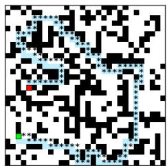

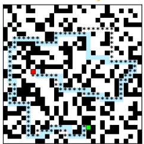

#2 ✓ solved  
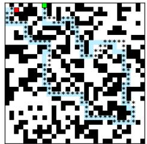

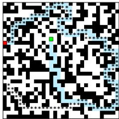  
Figure 3: Qualitative samples from our best maze model on the held-out MAZE-HARD test set. The model is trained with self-correction loss $( \lambda _ { \mathrm { s i m p l e } } = 0 . 5 )$ , and sampled with Tweedie Reprojection at $T = 2 0 0$ . Each panel shows a $3 0 \times 3 0$ maze with the shortest path in transparent cyan and the predicted path as black ∗ markers.

and write $x _ { n } \doteq x _ { t _ { n } }$ to simplify notation. In this section, our convention is:

$$
\begin{array} { r } { \boxed { x _ { N - 1 } \mathrm { ~ i s ~ n o i s e , ~ } \qquad x _ { 0 } \mathrm { ~ i s ~ d a t a . ~ } } } \end{array}
$$

So decreasing n (decreasing $t _ { n } )$ means moving from noise to data. Conversely, moving from n to $n + 1$ means adding noise.

We assume a prescribed conditional marginal path:

$$
\boxed { q ( x _ { n } \mid x _ { 0 } ) = \mathcal { N } \Big ( \alpha ( n ) x _ { 0 } , ( 1 - \alpha ( n ) ^ { 2 } ) I \Big ) , \qquad \alpha ( N - 1 ) = 0 , \alpha ( 0 ) = 1 . }\tag{29}
$$

## I.2 Noise-adding Markov step

We can write the noise-adding Gaussian Markov kernel as

$$
\boxed { q ( x _ { n + 1 } \mid x _ { n } ) = \mathcal { N } \Big ( \sqrt { \delta ( n + 1 ) } x _ { n } , ( 1 - \delta ( n + 1 ) ) I \Big ) , \qquad n = 0 , \ldots , N - 2 . }\tag{30}
$$

equivalently the reparameterization

$$
x _ { n + 1 } = \sqrt { \delta ( n + 1 ) } x _ { n } + \sqrt { 1 - \delta ( n + 1 ) } \epsilon _ { n + 1 } , \qquad \epsilon _ { n + 1 } \sim \mathcal { N } ( 0 , I ) \mathrm { i . i . d . }\tag{31}
$$

## I.3 Choosing coefficient so the chain matches the marginals

We take the conditional expectation of (31) given x<sub>0</sub>:

$$
\mathbb { E } [ x _ { n + 1 } \mid x _ { 0 } ] = { \sqrt { \delta ( n + 1 ) } } \mathbb { E } [ x _ { n } \mid x _ { 0 } ] .
$$

Using the marginal mean from (29), $\mathbb { E } [ x _ { k } \mid x _ { 0 } ] = \alpha ( k ) x _ { 0 }$ , we obtain

$$
\alpha ( n + 1 ) x _ { 0 } = \sqrt { \delta ( n + 1 ) } \alpha ( n ) x _ { 0 } \quad \Longrightarrow \quad \left\lceil \sqrt { \delta ( n + 1 ) } = \frac { \alpha ( n + 1 ) } { \alpha ( n ) } \right\rceil
$$

and hence

$$
\boxed { \delta ( n + 1 ) = \frac { \alpha ( n + 1 ) ^ { 2 } } { \alpha ( n ) ^ { 2 } } = \frac { \bar { \alpha } ( n + 1 ) } { \bar { \alpha } ( n ) } , \qquad \bar { \alpha } ( n ) \doteq \alpha ( n ) ^ { 2 } . }\tag{32}
$$

## I.4 Unrolling and variance identity

Iterating (31) gives

$$
\begin{array} { r l } & { x _ { 1 } = \sqrt { \delta ( 1 ) } x _ { 0 } + \sqrt { 1 - \delta ( 1 ) } \epsilon _ { 1 } } \\ & { x _ { 2 } = \sqrt { \delta ( 2 ) } x _ { 1 } + \sqrt { 1 - \delta ( 2 ) } \epsilon _ { 2 } } \\ & { \quad = \sqrt { \delta ( 2 ) } \delta ( 1 ) x _ { 0 } + \sqrt { \delta ( 2 ) } ( 1 - \delta ( 1 ) ) \epsilon _ { 1 } + \sqrt { 1 - \delta ( 2 ) } \epsilon _ { 2 } } \\ & { x _ { 3 } = \sqrt { \delta ( 3 ) } x _ { 2 } + \sqrt { 1 - \delta ( 3 ) } \epsilon _ { 3 } } \\ & { \quad = \sqrt { \delta ( 3 ) \delta ( 2 ) \delta ( 1 ) } x _ { 0 } + \sqrt { \delta ( 3 ) } \delta ( 2 ) ( 1 - \delta ( 1 ) ) \epsilon _ { 1 } } \\ & { \quad \quad + \sqrt { \delta ( 3 ) ( 1 - \delta ( 2 ) ) } \epsilon _ { 2 } + \sqrt { 1 - \delta ( 3 ) } \epsilon _ { 3 } } \\ & { x _ { n } = \left( \displaystyle { \prod _ { j = 1 } ^ { n } \sqrt { \delta ( j ) } } \right) x _ { 0 } + \displaystyle { \sum _ { k = 1 } ^ { n } \left( \sqrt { 1 - \delta ( k ) } \displaystyle { \prod _ { j = k + 1 } ^ { n } \sqrt { \delta ( j ) } } \right) } \epsilon _ { k } } \end{array}
$$

$$
x _ { n } = { \frac { \alpha ( n ) } { \alpha ( 0 ) } } x _ { 0 } + \sum _ { k = 1 } ^ { n } \left( { \sqrt { 1 - \delta ( k ) } } \prod _ { j = k + 1 } ^ { n } { \sqrt { \delta ( j ) } } \right) \epsilon _ { k }\tag{33}
$$

Since $\alpha ( 0 ) = 1$ , the signal term is $\alpha ( n ) x _ { 0 }$

Define the accumulated noise term

$$
\eta _ { n } \doteq \sum _ { k = 1 } ^ { n } \left( \sqrt { 1 - \delta ( k ) } \prod _ { j = k + 1 } ^ { n } \sqrt { \delta ( j ) } \right) \epsilon _ { k } .
$$

Then $\mathbb { E } [ \eta _ { n } \mid x _ { 0 } ] = 0$ and, because the $\epsilon _ { k }$ are independent,

$$
\mathbb { V } \left[ \eta _ { n } \mid x _ { 0 } \right] = \sum _ { k = 1 } ^ { n } \left( \left( 1 - \delta ( k ) \right) \prod _ { j = k + 1 } ^ { n } \delta ( j ) \right) I .\tag{34}
$$

This sum telescopes. Using $\delta ( k ) = \bar { \alpha } ( k ) / \bar { \alpha } ( k - 1 )$ from (32), one checks the identity

$$
( 1 - \delta ( k ) ) \prod _ { j = k + 1 } ^ { n } \delta ( j ) = \frac { \bar { \alpha } ( n ) } { \bar { \alpha } ( k ) } - \frac { \bar { \alpha } ( n ) } { \bar { \alpha } ( k - 1 ) }
$$

so summing from $k = 1$ to n gives

$$
\sum _ { k = 1 } ^ { n } ( 1 - \delta ( k ) ) \prod _ { j = k + 1 } ^ { n } \delta ( j ) = { \frac { \bar { \alpha } ( n ) } { \bar { \alpha } ( n ) } } - { \frac { \bar { \alpha } ( n ) } { \bar { \alpha } ( 0 ) } } = 1 - \bar { \alpha } ( n ) ,
$$

because $\bar { \alpha } ( 0 ) = \alpha ( 0 ) ^ { 2 } = 1$ . Therefore

$$
\begin{array} { r } { \boxed { \mathbb { V } ( \eta _ { n } \mid x _ { 0 } ) = ( 1 - \alpha ( n ) ^ { 2 } ) I , } } \end{array}\tag{35}
$$

and hence

$$
x _ { n } = \alpha ( n ) x _ { 0 } + \eta _ { n } \quad \implies \quad q ( x _ { n } \mid x _ { 0 } ) = N ( \alpha ( n ) x _ { 0 } , ( 1 - \alpha ( n ) ^ { 2 } ) I ) ,
$$

which matches the prescribed marginals (29).

## I.5 Posterior

Now we derive the denoising conditional used for DDPM-style reverse simulation:

$$
q ( x _ { n } \mid x _ { n + 1 } , x _ { 0 } ) .
$$

Because the noise-adding chain is Markov in the direction $x _ { n } \to x _ { n + 1 }$ , the joint factorization is

$$
q ( x _ { n + 1 } , x _ { n } \mid x _ { 0 } ) = q ( x _ { n + 1 } \mid x _ { n } , x _ { 0 } ) q ( x _ { n } \mid x _ { 0 } ) = q ( x _ { n } \mid x _ { n + 1 } , x _ { 0 } ) q ( x _ { n + 1 } \mid x _ { 0 } ) .
$$

Thus, as a function of $x _ { n }$

$$
\boxed { q ( x _ { n } \mid x _ { n + 1 } , x _ { 0 } ) \propto q ( x _ { n + 1 } \mid x _ { n } ) q ( x _ { n } \mid x _ { 0 } ) . }\tag{36}
$$

The normalization constant $q ( x _ { n + 1 } \mid x _ { 0 } )$ does not depend on $x _ { n }$

From (30),

$$
q ( x _ { n + 1 } \mid x _ { n } ) \propto \exp \left( - \frac { \| x _ { n + 1 } - \sqrt { \delta ( n + 1 ) } x _ { n } \| ^ { 2 } } { 2 ( 1 - \delta ( n + 1 ) ) } \right) .\tag{37}
$$

From the marginal (29),

$$
q ( x _ { n } \mid x _ { 0 } ) \propto \exp \left( - { \frac { \| x _ { n } - \alpha ( n ) x _ { 0 } \| ^ { 2 } } { 2 ( 1 - \alpha ( n ) ^ { 2 } ) } } \right) .\tag{38}
$$

Multiplying (37) and (38) and writing the exponent in quadratic form gives

$$
q ( x _ { n } \mid x _ { n + 1 } , x _ { 0 } ) \propto \exp \left( - { \frac { 1 } { 2 } } \left( A \| x _ { n } \| ^ { 2 } - 2 \langle B , x _ { n } \rangle \right) \right) ,
$$

with

$$
A = \frac { 1 } { 1 - \alpha ( n ) ^ { 2 } } + \frac { \delta ( n + 1 ) } { 1 - \delta ( n + 1 ) } ,
$$

$$
B = \frac { \alpha ( n ) } { 1 - \alpha ( n ) ^ { 2 } } x _ { 0 } + \frac { \sqrt { \delta ( n + 1 ) } } { 1 - \delta ( n + 1 ) } x _ { n + 1 } .
$$

Hence the posterior variance and mean are

$$
\tilde { \beta } _ { n + 1 } ^ { \mathrm { p o s t } } = { \cal A } ^ { - 1 } , \qquad \tilde { \mu } _ { n | n + 1 } = \tilde { \beta } _ { n + 1 } ^ { \mathrm { p o s t } } B .
$$

$$
\Big \vert \thinspace q ( x _ { n } \mid x _ { n + 1 } , x _ { 0 } ) = \mathcal { N } ( \tilde { \mu } _ { n | n + 1 } , \tilde { \beta } _ { n + 1 } ^ { \mathrm { p o s t } } I ) . \ \Big \vert\tag{39}
$$

Then

$$
\tilde { \beta } _ { n + 1 } ^ { \mathrm { p o s t } } = \left( \frac { \delta ( n + 1 ) } { 1 - \delta ( n + 1 ) } + \frac { 1 } { 1 - \alpha ( n ) ^ { 2 } } \right) ^ { - 1 } = \frac { ( 1 - \delta ( n + 1 ) ) ( 1 - \alpha ( n ) ^ { 2 } ) } { 1 - \delta ( n + 1 ) \alpha ( n ) ^ { 2 } } .\tag{40}
$$

Using $\alpha ( n + 1 ) ^ { 2 } = \delta ( n + 1 ) \alpha ( n ) ^ { 2 }$ (equivalent to (32)), we have

$$
1 - \delta ( n + 1 ) \alpha ( n ) ^ { 2 } = 1 - \alpha ( n + 1 ) ^ { 2 } .
$$

Therefore,

$$
\boxed { \tilde { \beta } _ { n + 1 } ^ { \mathrm { p o s t } } = \frac { 1 - \alpha ( n ) ^ { 2 } } { 1 - \alpha ( n + 1 ) ^ { 2 } } \left( 1 - \delta ( n + 1 ) \right) . }\tag{41}
$$

The posterior mean is

$$
\begin{array} { l } { \displaystyle \tilde { \mu } _ { n | n + 1 } = \frac { ( 1 - \alpha ( n ) ^ { 2 } ) ( 1 - \delta ( n + 1 ) ) } { 1 - \alpha ( n + 1 ) ^ { 2 } } \left( \frac { \alpha ( n ) } { 1 - \alpha ( n ) ^ { 2 } } x _ { 0 } + \frac { \sqrt { \delta ( n + 1 ) } } { 1 - \delta ( n + 1 ) } x _ { n + 1 } \right) } \\ { \displaystyle \qquad = \frac { \alpha ( n ) ( 1 - \delta ( n + 1 ) ) } { 1 - \alpha ( n + 1 ) ^ { 2 } } x _ { 0 } + \frac { \sqrt { \delta ( n + 1 ) } ( 1 - \alpha ( n ) ^ { 2 } ) } { 1 - \alpha ( n + 1 ) ^ { 2 } } x _ { n + 1 } . } \end{array}
$$

Thus

$$
\boxed { \tilde { \mu } _ { n | n + 1 } = \frac { \alpha ( n ) ( 1 - \delta ( n + 1 ) ) } { 1 - \alpha ( n + 1 ) ^ { 2 } } x _ { 0 } + \frac { \sqrt { \delta ( n + 1 ) } ( 1 - \alpha ( n ) ^ { 2 } ) } { 1 - \alpha ( n + 1 ) ^ { 2 } } x _ { n + 1 } . }
$$

Next, substitute the estimator of $x _ { 0 }$ obtained from the marginal at step $n + 1$

$$
x _ { 0 } = \frac { x _ { n + 1 } - \sqrt { 1 - \alpha ( n + 1 ) ^ { 2 } } \epsilon _ { n + 1 } } { \alpha ( n + 1 ) } .
$$

Using $\alpha ( n ) / \alpha ( n + 1 ) = 1 / \sqrt { \delta ( n + 1 ) }$ , we obtain

$$
\tilde { \mu } _ { n | n + 1 } = { \frac { 1 } { \sqrt { \delta ( n + 1 ) } } } x _ { n + 1 } - { \frac { 1 - \delta ( n + 1 ) } { \sqrt { \delta ( n + 1 ) } \sqrt { 1 - \alpha ( n + 1 ) ^ { 2 } } } } \epsilon _ { n + 1 } .
$$

$$
\boxed { \tilde { \mu } _ { n | n + 1 } = \frac { x _ { n + 1 } } { \sqrt { \delta ( n + 1 ) } } - \frac { 1 - \delta ( n + 1 ) } { \sqrt { \delta ( n + 1 ) } \sqrt { 1 - \alpha ( n + 1 ) ^ { 2 } } } \epsilon _ { n + 1 } }
$$

For the equidistant time steps $N = T + 1$ , set $t = n + 1$ . Then

$$
x _ { n + 1 } = x _ { t } , \qquad x _ { n } = x _ { t - 1 } , \qquad \delta ( n + 1 ) = \delta ( t ) , \qquad \alpha ( n ) = \alpha ( t - 1 ) .
$$

This recovers the main-text DDPM posterior

$$
q ( x _ { t - 1 } \mid x _ { t } , x _ { 0 } ) = \mathcal { N } \Bigg ( \alpha ( t - 1 ) x _ { 0 } \cdot \frac { 1 - \delta ( t ) } { 1 - \alpha ( t ) ^ { 2 } } + \frac { \sqrt { \delta ( t ) } ( 1 - \alpha ( t - 1 ) ^ { 2 } ) } { 1 - \alpha ( t ) ^ { 2 } } x _ { t } , \ \tilde { \beta } _ { t } ^ { \mathrm { p o s t } } I \Bigg ) \ ,
$$

where

$$
\tilde { \beta } _ { t } ^ { \mathrm { p o s t } } = ( 1 - \alpha ( t - 1 ) ^ { 2 } ) \frac { 1 - \delta ( t ) } { 1 - \alpha ( t ) ^ { 2 } } .
$$

## J Toy example: DDPM anchoring vs. Tweedie reprojection

This toy example is only meant to illustrate the difference between a DDPM-style anchored update and Tweedie reprojection. It is not intended as evidence that the failures in our discrete tasks are caused by the same mechanism.

In this example the data support is the union of two intervals (see Figure 4),

$$
\gamma _ { \mathrm { t o y } } = [ A , B ] \cup [ - B , - A ] , \qquad A = 2 , \quad B = 3 , \quad M = ( A + B ) / 2 = 2 . 5 .
$$

We run reverse trajectories from Gaussian noise and count a sample as valid if the final point lies in $\mathcal { V } _ { \mathrm { t o y } }$ . We use an “oracle” denoiser that predicts M when $y > 0$ and $- M$ otherwise.

Tweedie reprojection updates the mean directly from the denoiser prediction,

$$
X _ { s } = \alpha _ { s } \hat { x } _ { 0 } , \qquad \hat { x } _ { 0 } = f _ { \theta } ( X _ { t } , t ) ,
$$

so the current state $X _ { t }$ influences the next state only through xˆ<sub>0</sub>. A DDPM-style update also keeps a residual anchor to the current mean,

$$
X _ { s } = \alpha _ { s } \hat { x } _ { 0 } + b _ { t } \big ( X _ { t } - \alpha _ { t } \hat { x } _ { 0 } \big ) .
$$

Thus, even when the denoiser predicts a point near the valid $\operatorname { s e t } ,$ DDPM can retain part of the current offmanifold location.

To visualize this effect, we use simple corrupted denoisers whose sign is unreliable (smooth, input-noised, and adversarial sign variants). In this toy, both signs ±M are valid modes. Therefore, a sampler that reprojects

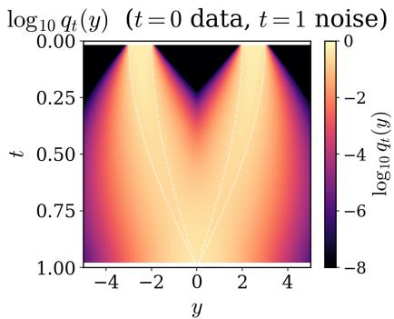  
Figure 4: Forward marginal lo $\operatorname { g } _ { 1 0 } q _ { t } ( y )$ for the toy two-uniform data law ${ \bar { \frac { 1 } { 2 } } } { \bar { U } } [ A , B ] +$ ${ \scriptstyle { \frac { 1 } { 2 } } } U [ - B , - A ]$ . The center is a low-density no-man’s-land.

Trajectories under four sign-perturbed denoisers (init $X { \sim } \mathcal { N } ( 0 , 1 ) , K { = } 1 2 0$ reverse steps; t = 0 data, t = 1 noise)

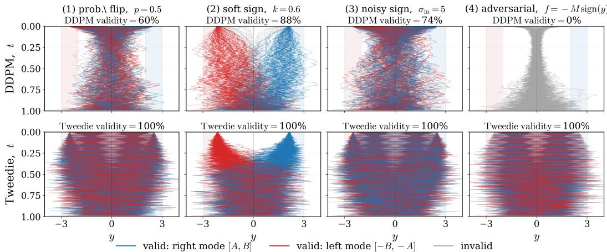  
Figure 5: Reverse trajectories under sign-perturbed toy denoisers. Tweedie reprojects through $\hat { x } _ { 0 } = f _ { \theta } ( x _ { t } , t )$ , whereas DDPM retains an explicit anchor $\mathbf { t o } \ x _ { t } .$ . This anchor can keep trajectories in the low-density region when the denoiser direction is unreliable.

directly through $\scriptstyle { \hat { x } } _ { 0 }$ can remain valid even when the pre-

dicted sign is wrong. In contrast, as shown in Figure 5 an anchored DDPM update can stay trapped near the current state when the denoiser direction is decorrelated from, or anti-aligned with, $X _ { t }$

To summarize, Tweedie reprojection does not carry an explicit residual path from $X _ { t }$ to $X _ { s } ;$ DDPM does. Hence, when ${ \hat { x } } _ { 0 }$ is already valid or close to valid, Tweedie can exploit that prediction directly, whereas DDPM may still inherit part of the current off-manifold state.

## K Mechanistic Analysis of DDPM-Tweedie Sampler Gap

This appendix gives a mechanistic explanation of the DDPM-Tweedie gap. Decoded validity depends on cellwise argmax decisions: Gaussian perturbations preserve a decoded state when the sampler center has sufficient margin relative to the noise scale. We use this margin view to compare the centers of Tweedie reprojection and DDPM ancestral sampling. Tweedie recenters the next state around the denoiser’s prediction, while DDPM also retains a residual component from the current noisy state. We show that this residual turns out to be harmful for discrete constrained problems.

## K.1 Setup and decoded stability

We use the convention 0 for data and T for noise. Let

$$
\alpha ( t ) = \cos \left( \frac { \pi t } { 2 T } \right) , \qquad \beta ( t ) = \sin \left( \frac { \pi t } { 2 T } \right) , \qquad \alpha ( t ) ^ { 2 } + \beta ( t ) ^ { 2 } = 1 .
$$

We write

$$
\hat { x } _ { 0 , t } = f _ { \theta } ( x _ { t } , t ) .
$$

For one-hot tasks, let

$$
D : \mathbb { R } ^ { m \times d }  \{ 1 , \dots , d \} ^ { m }
$$

be the cellwise argmax decoder, where m is the number of active/free cells and d is the number of symbols per cell. For Sudoku with 21 clues, $m = 6 0 !$ ; for a 28-clue subset, $m = 5 3$ . Let

$$
\mathcal { V } \subseteq \{ 1 , \ldots , d \} ^ { m }
$$

be the set of valid decoded configurations and

$$
\mathcal { T } = \{ 1 , \ldots , d \} ^ { m } \backslash \mathcal { V }
$$

be the set of invalid configurations.

For $\boldsymbol { x } \in \mathbb { R } ^ { m \times d }$ , define

$$
\mathrm { g a p } ( x ) = \operatorname * { m i n } _ { i } \left[ x _ { i , D _ { i } ( x ) } - \operatorname * { m a x } _ { a \neq D _ { i } ( x ) } x _ { i , a } \right] .
$$

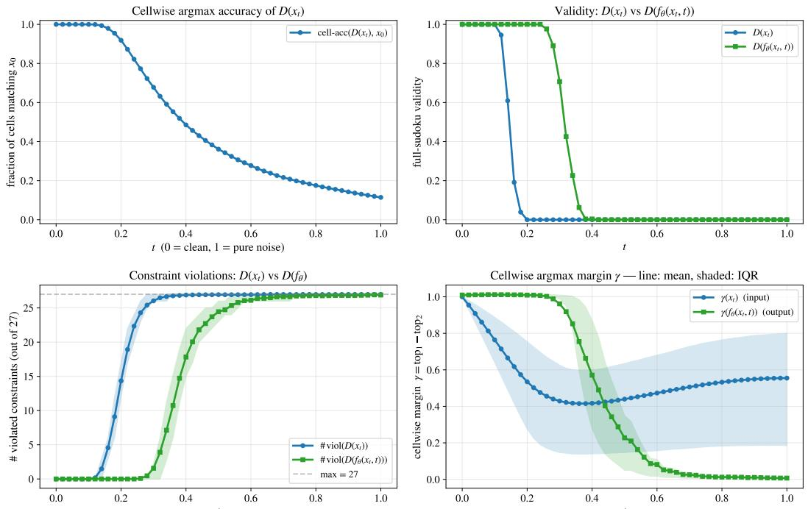  
Figure 6: Forward-noise diagnostics for the baseline model. We evaluate $N = 6 4$ Sudoku puzzles with $n _ { \mathrm { r e p } } = 4$ noise draws. Panels show: cellwise argmax accuracy of $D ( x _ { t } )$ , full-grid validity of $D ( x _ { t } )$ and $D ( f _ { \theta } ( x _ { t } , t ) ) ,$ ), number of violated Sudoku constraints, and argmax margin $\gamma = \mathrm { t o p _ { 1 } - t o p _ { 2 } }$ Lines are means; shaded bands show IQR across puzzles and noise draws.

## K.2 One-hot representations corrupted with Gaussian noise

For one-hot encoded tasks, the decoded output

$$
x _ { t } = c _ { t } + \nu _ { t } \epsilon
$$

is stable when the Gaussian center $c _ { t }$ has a sufficiently large cellwise argmax margin relative to the Gaussian noise scale $\nu _ { t }$

Figure 6 shows this effect for forward-noised one-hot Sudoku solutions

$$
x _ { t } = \alpha ( t ) x _ { 0 } + \beta ( t ) \epsilon .
$$

Cellwise accuracy of the raw decoder $D ( x _ { t } )$ decreases gradually with t (top left), but full-grid validity collapses much earlier (top right): a single flipped cell is enough to invalidate the decoded Sudoku. The trained denoiser extends the useful noise range. Its decoded output $D ( f _ { \theta } ( x _ { t } , t ) )$ (top right) remains valid for larger t, has fewer constraint violations (bottom left), and maintains a larger argmax margin than the raw noisy input (bottom right).

For any Gaussian sampler the following is true:

Lemma K.1 (Argmax stability). Let $c \in \mathbb { R } ^ { m \times d }$ satisfy

$$
\begin{array} { r } { \mathrm { g a p } ( c ) \geq \gamma > 0 , } \end{array}
$$

and let

$$
\epsilon \sim \mathcal { N } ( 0 , \nu ^ { 2 } I _ { m d } ) .
$$

Then

$$
\mathbb { P } ( D ( c + \epsilon ) \neq D ( c ) ) \leq m ( d - 1 ) \Phi \left( - \frac { \gamma } { \sqrt { 2 } \nu } \right) ,
$$

where Φ is the standard Gaussian CDF.

Proof. Fix a cell i, let $j = D _ { i } ( c )$ , and consider a competitor a $\neq j .$ . Since

$$
\exp ( c ) \geq \gamma ,
$$

we have

$$
c _ { i , j } - c _ { i , a } \geq \gamma .
$$

The competitor overtakes j after adding noise only if

$$
c _ { i , a } + \epsilon _ { i , a } \geq c _ { i , j } + \epsilon _ { i , j } ,
$$

or equivalently

$$
\epsilon _ { i , a } - \epsilon _ { i , j } \geq c _ { i , j } - c _ { i , a } \geq \gamma .
$$

Since

$$
\epsilon _ { i , a } - \epsilon _ { i , j } \sim \mathcal { N } ( 0 , 2 \nu ^ { 2 } ) ,
$$

this event has probability at most

$$
\Phi \left( - \frac { \gamma } { \sqrt { 2 } \nu } \right) .
$$

A union bound over all $m ( d - 1 )$ competitors gives the claim.

The lemma formalizes the idea that a continuous point with large cellwise margin decodes stably under small Gaussian perturbations.

## K.3 DDPM equals Tweedie plus state memory

Proposition K.2 (DDPM and Tweedie-reprojection relation). At step t, the DDPM ancestral Gaussian kernel has center

$$
c _ { t } ^ { \mathrm { D D P M } } = c _ { t } ^ { \mathrm { T w } } + B _ { t } \big ( x _ { t } - \alpha ( t ) \hat { x } _ { 0 , t } \big ) , \qquad c _ { t } ^ { \mathrm { T w } } = \alpha ( t - 1 ) \hat { x } _ { 0 , t } ,
$$

where

$$
B _ { t } = \frac { \sqrt { \delta ( t ) } \left( 1 - \alpha ( t - 1 ) ^ { 2 } \right) } { 1 - \alpha ( t ) ^ { 2 } } , \qquad \alpha ( t ) = \sqrt { \delta ( t ) } \alpha ( t - 1 ) .
$$

Thus, relative to Tweedie, DDPM adds a state-anchor residual. The associated noise scales are

$$
\nu _ { t } ^ { \mathrm { T w } } = \beta ( t - 1 ) , \qquad \nu _ { t } ^ { \mathrm { D D P M } } = \tau _ { t } , \qquad \tau _ { t } ^ { 2 } = \frac { ( 1 - \delta ( t ) ) \left( 1 - \alpha ( t - 1 ) ^ { 2 } \right) } { 1 - \alpha ( t ) ^ { 2 } } .
$$

Proof. Following Appendix I, the DDPM ancestral mean can be written as

$$
\mu _ { t } ^ { \mathrm { D D P M } } = A _ { t } \hat { x } _ { 0 , t } + B _ { t } x _ { t } ,
$$

with

$$
A _ { t } = \alpha ( t - 1 ) \frac { 1 - \delta ( t ) } { 1 - \alpha ( t ) ^ { 2 } } , \qquad B _ { t } = \frac { \sqrt { \delta ( t ) } \left( 1 - \alpha ( t - 1 ) ^ { 2 } \right) } { 1 - \alpha ( t ) ^ { 2 } } .
$$

Using

$$
\alpha ( t ) = \sqrt { \delta ( t ) } \alpha ( t - 1 ) ,
$$

we have

$$
A _ { t } + B _ { t } \alpha ( t ) = \alpha ( t - 1 ) \frac { 1 - \delta ( t ) + \delta ( t ) \left( 1 - \alpha ( t - 1 ) ^ { 2 } \right) } { 1 - \alpha ( t ) ^ { 2 } } = \alpha ( t - 1 ) \frac { 1 - \delta ( t ) \alpha ( t - 1 ) ^ { 2 } } { 1 - \alpha ( t ) ^ { 2 } } = \alpha ( t - 1 ) .
$$

Therefore

$$
\begin{array} { r l } { \mu _ { t } ^ { \mathrm { D D P M } } = A _ { t } \hat { x } _ { 0 , t } + B _ { t } x _ { t } } \\ { = \left( A _ { t } + B _ { t } \alpha ( t ) \right) \hat { x } _ { 0 , t } + B _ { t } \left( x _ { t } - \alpha ( t ) \hat { x } _ { 0 , t } \right) } \\ { = \alpha ( t - 1 ) \hat { x } _ { 0 , t } + B _ { t } \left( x _ { t } - \alpha ( t ) \hat { x } _ { 0 , t } \right) } \\ { = c _ { t } ^ { \mathrm { T w } } + B _ { t } \left( x _ { t } - \alpha ( t ) \hat { x } _ { 0 , t } \right) . } \end{array}
$$

The Tweedie kernel uses noise scale $\beta ( t - 1 )$ , while the DDPM ancestral kernel uses posterior noise scale

$$
\tau _ { t } ^ { 2 } = \frac { \left( 1 - \delta ( t ) \right) \left( 1 - \alpha ( t - 1 ) ^ { 2 } \right) } { 1 - \alpha ( t ) ^ { 2 } } .
$$

This proves both the center decomposition and the variance difference.

Proposition K.2 shows that DDPM differs from Tweedie in two ways. First, it uses a different Gaussian noise scale. Second, its center contains the residual $\boldsymbol { r } _ { t } = \boldsymbol { x } _ { t } - \alpha ( t ) \boldsymbol { \hat { x } } _ { 0 , i }$ . If $x _ { t }$ carries corrupted cellwise preferences, this term is harmful and may even destabilize the trajectory. The next proposition formalizes this failure mode.

Proposition K.3 (State-memory corruption). Let

$$
\boldsymbol { r } _ { t } = \boldsymbol { x } _ { t } - \alpha ( t ) \hat { \boldsymbol { x } } _ { 0 , t } .
$$

Assume the denoiser prediction decodes to a valid grid $v \in \mathcal { V } :$

$$
D ( \hat { x } _ { 0 , t } ) = v .
$$

For a cell i and competitor a ̸= $v _ { i } ,$ , define the denoiser margin

$$
M _ { i , a } ^ { \theta } = \hat { x } _ { 0 , t , i , v _ { i } } - \hat { x } _ { 0 , t , i , a } ,
$$

and the residual anti-margin

$$
M _ { i , a } ^ { r } = r _ { t , i , a } - r _ { t , i , v _ { i } } .
$$

If for some $i , a ,$

$$
B _ { t } M _ { i , a } ^ { r } - \alpha ( t - 1 ) M _ { i , a } ^ { \theta } \geq \gamma _ { \mathrm { b a d } } > 0 ,
$$

then the DDPM center prefers the wrong symbol a over the valid symbol $v _ { i }$ in cell i with margin at least $\gamma _ { \mathrm { b a d } } .$

$$
c _ { t , i , a } ^ { \mathrm { D D P M } } - c _ { t , i , v _ { i } } ^ { \mathrm { D D P M } } \geq \gamma _ { \mathrm { b a d } } .
$$

If every valid completion has cell i equal to $v _ { i } ,$ then

$$
D ( c _ { t } ^ { \mathrm { D D P M } } ) \notin \mathcal { V } .
$$

Moreover,

$$
\mathbb { P } \left( \boldsymbol { D } ( x _ { t - 1 } ^ { \mathrm { { D D P M } } } ) \in \mathcal { V } \mid x _ { t } \right) \leq \Phi \left( - \frac { \gamma _ { \mathrm { b a d } } } { \sqrt { 2 } \tau _ { t } } \right) .
$$

Proof. The DDPM center is

$$
c _ { t } ^ { \mathrm { D D P M } } = \alpha ( t - 1 ) \hat { x } _ { 0 , t } + B _ { t } r _ { t } .
$$

Therefore

$$
\begin{array} { r l } & { c _ { t , i , a } ^ { \mathrm { D D P M } } - c _ { t , i , v _ { i } } ^ { \mathrm { D D P M } } = \alpha ( t - 1 ) \left( \hat { x } _ { 0 , t , i , a } - \hat { x } _ { 0 , t , i , v _ { i } } \right) + B _ { t } \left( r _ { t , i , a } - r _ { t , i , v _ { i } } \right) } \\ & { \hphantom { c _ { t , i , a } ^ { \mathrm { D D P M } } - c _ { t , i , v _ { i } } ^ { \mathrm { D P M } } } = - \alpha ( t - 1 ) M _ { i , a } ^ { \theta } + B _ { t } M _ { i , a } ^ { r } . } \end{array}
$$

By assumption, this is at least $\gamma _ { \mathrm { b a d } }$

If all valid completions have symbol $v _ { i }$ in cell $i ,$ then any decoded grid with a different symbol in cell i is invalid. For the noisy DDPM step to become valid, $v _ { i }$ must overtake a. This requires

$$
\tau _ { t } \epsilon _ { i , v _ { i } } - \tau _ { t } \epsilon _ { i , a } \geq \gamma _ { \mathrm { b a d } } .
$$

The left-hand side is Gaussian with variance $2 \tau _ { t } ^ { 2 }$ , giving

$$
\mathbb { P } ( \mathrm { r e p a i r } ) \le \Phi \left( - \frac { \gamma _ { \mathrm { b a d } } } { \sqrt { 2 } \tau _ { t } } \right) .
$$

The proposition suggests that DDPM kernel can be centered on the wrong decoded symbol whenever the state residual exceeds the denoiser’s correction:

$$
B _ { t } \left( r _ { t , i , a } - r _ { t , i , v _ { i } } \right) > \alpha ( t - 1 ) \left( \hat { x } _ { 0 , t , i , v _ { i } } - \hat { x } _ { 0 , t , i , a } \right) .
$$

In that case, sampling more precisely around the DDPM center does not help: the sampler is concentrated around the wrong decoded state. We next visualize this effect along actual reverse trajectories.

Figures 7-8 show what happens during sampling. Along the Tweedie trajectory, the model begins to predict valid Sudoku grids before the end of the reverse process. The important point is that Tweedie does not anchor the next center to the current decoded grid. Instead, it recenters directly at $c _ { t } ^ { \mathrm { T w } } = \alpha ( t - 1 ) \hat { x } _ { 0 , t }$ . Since multiplication by the positive scalar $\alpha ( t - 1 )$ does not change the argmax, the Tweedie center has the same decoded grid as the model prediction. Therefore, if the current sample is near-valid but has a few wrong cells, and the denoiser predicts a valid completion, Tweedie can move directly to that valid completion.

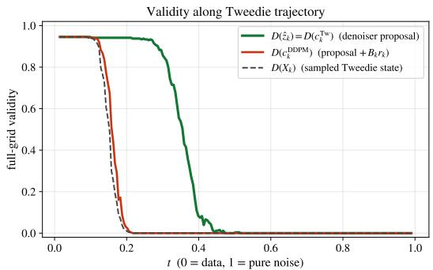

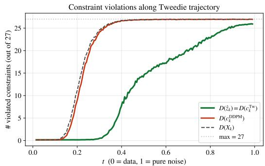  
Figure 7: Decoded validity along a Tweedie sampling trajectory. For each reverse step, we decode the denoiser proposal $\hat { x } _ { 0 , t }$ , the Tweedie center $c _ { t } ^ { \operatorname { T w } } = \alpha ( t - 1 ) \bar { { x } } _ { 0 , t } ,$ , and the counterfactual DDPM center $c _ { t } ^ { \mathrm { D D P M } } = \bar { c } _ { t } ^ { \mathrm { T w } } + B _ { t } r _ { t }$ . Left: full-grid Sudoku validity. Right: number of violated constraints. The Tweedie center shares the proposal’s argmax, while the DDPM residual anchor delays validity.  
Decoded validity along sampling trajectory (baseline, DDPM sampling, N= 256, random-21 clues)

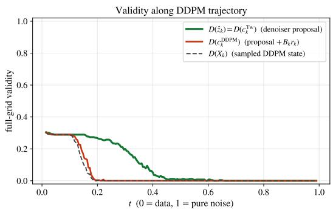

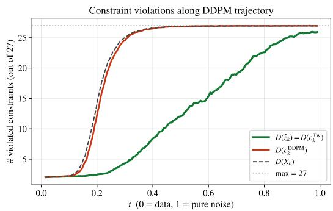  
Figure 8: Decoded validity along a DDPM sampling trajectory. Same diagnostics as Fig. 7, but the trajectory itself is generated by DDPM ancestral sampling. The number of violated constraints decreases along the trajectory, showing that the sampler moves toward Sudoku structure. However, full-grid validity remains low because a small number of persistent errors is enough to invalidate the decoded grid. This illustrates the state-anchor failure mode: DDPM can approach a near-valid solution while still failing to make the needed cellwise corrections required for exact validity.

DDPM behaves differently. Its center also contains the residual term $B _ { t } { \boldsymbol { r } } _ { t }$ , which keeps part of the current state. This can be helpful when the current state is already correct, but it can be harmful when the current state is near-valid with a few persistent mistakes. In that case, the DDPM update averages the denoiser correction with the current wrong cell preferences, so the sampler can reduce the number of constraint violations while still failing to make the final argmax changes needed for full validity.

Figure 11 shows that adding more exploration does not fix the baseline DDPM sampler. Both samplers degrade when the noise is too small or too large, but the best DDPM setting still remains far below the best Tweedie setting.

To check whether the residual term helps or hurts in practice, we compare the decoded Tweedie and DDPM centers at each reverse step. Let $E _ { + }$ be the event that the Tweedie center is valid but the DDPM center is invalid, and let $E _ { - }$ <sub>−</sub> be the opposite event. If the residual anchor were often useful for Sudoku validity, then $E _ { - }$ should occur frequently. Instead, Figure 2a shows that $E _ { + }$ dominates.

## K.4 Sampler-induced states degrade denoiser proposals

The previous section showed that the DDPM anchor can corrupt a valid denoiser proposal. Figure 8 shows a second effect: along DDPM trajectories, the baseline model often fails to produce valid proposals at all. We now ask why this failure mode persists along full DDPM trajectories.

Let $q _ { t }$ denote the forward training distribution

$$
\begin{array} { r } { x _ { t } = \alpha ( t ) x _ { 0 } + \beta ( t ) \epsilon , \qquad x _ { 0 } \in \mathcal { V } , \quad \epsilon \sim \mathcal { N } ( 0 , I ) . } \end{array}
$$

Lemma K.4 (Forward noising of discrete grids). Let $\mathcal { V } \subset \mathbb { R } ^ { m d }$ be the set of valid one-hot clean grids. Here $B ( a , r ) = \{ y \in \bar { \mathbb { R } } ^ { m d } : \lVert y - a \rVert _ { 2 } \leq r \}$ denotes the closed Euclidean ball of radius r centered at a. For $u > 0 _ { : }$ , define the typicalforward region

$$
\mathcal { R } _ { t } ( u ) = \bigcup _ { v \in \mathcal { V } } B ( \alpha ( t ) v , \beta ( t ) u ) .
$$

If $x _ { t } \sim q _ { t } ,$ , then

$$
\begin{array} { r } { q _ { t } ( \mathcal { R } _ { t } ( u ) ) \geq 1 - \mathbb { P } ( \| G \| _ { 2 } > u ) , \qquad G \sim \mathcal { N } ( 0 , I _ { m d } ) . } \end{array}
$$

Moreover, for any one-hot grid z, the ball $B ( \alpha ( t ) z , \beta ( t ) u )$ is disjointfrom theforward ball around a valid grid v whenever

$$
\| z - v \| _ { 2 } > \frac { 2 u } { \mathrm { S N R } _ { t } } , \qquad \mathrm { S N R } _ { t } = \frac { \alpha ( t ) } { \beta ( t ) } .
$$

For one-hot grids, this corresponds to the Hamming-depth condition

$$
d _ { \mathrm { H a m } } ( z , v ) > \frac { 2 u ^ { 2 } } { \mathrm { S N R } _ { t } ^ { 2 } } .
$$

Proof. Since

we have

$$
x _ { t } - \alpha ( t ) x _ { 0 } = \beta ( t ) \epsilon ,
$$

$$
x _ { t } \in B ( \alpha ( t ) x _ { 0 } , \beta ( t ) u )
$$

whenever

$$
\| \epsilon \| _ { 2 } \leq u .
$$

This gives the first claim.

For the second claim, the distance between the two centers is

$$
\| \alpha ( t ) z - \alpha ( t ) v \| _ { 2 } = \alpha ( t ) \| z - v \| _ { 2 } .
$$

Each ball has radius $\beta ( t ) u .$ . The two balls are disjoint if

$$
\alpha ( t ) \| z - v \| _ { 2 } > 2 \beta ( t ) u ,
$$

which is equivalent to

$$
\Vert z - v \Vert _ { 2 } > \frac { 2 u } { \mathrm { S N R } _ { t } } .
$$

For one-hot grids,

$$
\| z - v \| _ { 2 } ^ { 2 } = 2 d _ { \mathrm { H a m } } ( z , v ) ,
$$

giving the final condition.

This explains the exposure gap. Under standard training, the model is trained on noisy versions of valid grids, so certain invalid regions receive little training mass. During sampling, however, the model’s own predictions can move trajectories toward noisy versions of invalid or near-valid states. Self-correction training therefore adds supervision on precisely these sampler-induced inputs.

## K.5 Proof and nearby-proposal extension

Proof of Proposition 3.1. For a fixed continuous proposal $\begin{array} { r } { \bar { x } _ { 0 } . } \end{array}$ , the exact DDPM posterior kernels are the reverse conditionals associated with the Gaussian marginals $q _ { t } ( \cdot ; \bar { x } _ { 0 } )$ . Hence they map $q _ { t } ( \cdot ; \bar { x } _ { 0 } )$ to $q _ { s } ( \cdot ; \bar { x } _ { 0 } )$ for every $s < t ,$ , which proves the claimed marginal over the local reverse window. The first KL divergence is then zero by construction of $X _ { t } ^ { \mathrm { S C } }$ ; the second follows from the standard KL formula for Gaussians with covariance $\beta ( t ) ^ { 2 } I$ and means $\alpha ( t ) x _ { 0 }$ and $\alpha ( t ) \bar { x } _ { 0 }$

Extension to nearby proposals. Proposition 3.1 assumes that the proposal of the denoiser remains unchanged which is an idealization. Consider instead reverse times $t _ { 0 } > t _ { 1 } > \dots > t _ { K } = t > 0$ and assume that the proposal at each step remains within radius $\rho _ { k }$ of $\bar { x } _ { 0 } ^ { \star }$ almost surely under the reverse process:

$$
\| \bar { x } _ { 0 } ^ { ( k ) } - \bar { x } _ { 0 } ^ { \star } \| _ { 2 } \leq \rho _ { k } .
$$

Let $A _ { k }$ be the coefficient multiplying the clean proposal in the DDPM posterior mean at step $k ,$ and let $\widetilde { \beta } _ { k } I$ be the corresponding posterior covariance (Eqs. (14)–(15)). Conditioned on the same current state, replacing $\bar { x } _ { 0 } ^ { \star }$ by $\bar { x } _ { 0 } ^ { ( k ) }$ changes only the posterior mean, by $A _ { k } ( \bar { x } _ { 0 } ^ { ( k ) } - \bar { x } _ { 0 } ^ { \star } )$ . The resulting one-step KL divergence is therefore at most

$$
\frac { A _ { k } ^ { 2 } \rho _ { k } ^ { 2 } } { 2 \widetilde { \beta } _ { k } } .
$$

We consider a reverse window with positive posterior variances $\widetilde { \beta } _ { k } > 0$ , then the KL chain rule and data processing inequality give:

$$
D _ { \mathrm { K L } } ( \mathcal L ( Y _ { t } ) \| q _ { t } ( \cdot ; \bar { x } _ { 0 } ^ { \star } ) ) \leq D _ { \mathrm { K L } } ( \mathcal L ( Y _ { t _ { 0 } } ) \| q _ { t _ { 0 } } ( \cdot ; \bar { x } _ { 0 } ^ { \star } ) ) + \sum _ { k = 1 } ^ { K } \frac { A _ { k } ^ { 2 } \rho _ { k } ^ { 2 } } { 2 \widetilde \beta _ { k } } .\tag{42}
$$

Likewise, at a fixed time $t ,$ if the proposal $\bar { x } _ { 0 }$ used to construct the self-correction input also satisfies $\| \bar { x } _ { 0 } - \bar { x } _ { 0 } ^ { \star } \| _ { 2 } \leq \rho .$ , then

$$
D _ { \mathrm { K L } } \big ( \mathcal { L } ( X _ { t } ^ { \mathrm { S C } } ) \big | \big | q _ { t } ( \cdot ; \bar { x } _ { 0 } ^ { \star } ) \big ) \leq \frac { \alpha ( t ) ^ { 2 } \rho ^ { 2 } } { 2 \beta ( t ) ^ { 2 } } .\tag{43}
$$

When the right-hand sides of Eqs. (42) and (43) are small, both the sampler states and the selfcorrection inputs are close to $q _ { t } ( \cdot ; \bar { x } _ { 0 } ^ { \star } )$ . This explains why re-noising the mode $\mathrm { \Delta } \mathrm { i } \mathbf { s }$ proposal can produce training inputs similar to those encountered during this part of sampling, while retaining $x _ { 0 }$ as the target.

Empirical comparison with sampler states. We also compare the self-correction inputs directly with states encountered during DDPM sampling. At each noise level, we measure the frequency of the event $E _ { + }$ , where the clean proposal gives a valid Tweedie center but the corresponding DDPM center is invalid. We compare forward-noised training inputs $X _ { t } ^ { \mathrm { s t d } }$ , self-correction inputs $\breve { X } _ { t } ^ { \mathrm { S C } }$ , and actual DDPM states $Y _ { t }$ . The respective event frequencies are

$$
( 0 . 3 1 9 , 0 . 1 1 6 , 0 . 0 3 0 ) \quad \mathrm { o n S u d o k u \mathrm { - } E x t r e m e } ,
$$

and

$$
( 0 . 2 4 7 , \ 0 . 0 6 7 , \ 0 . 0 3 6 ) \quad \mathrm { o n } \ 2 1 \mathrm { - c l u e \ S u d o k u } .
$$

Thus, on this diagnostic, the gap between self-correction inputs and DDPM states is 3.4–6.8× smaller than for standard forward-noised inputs. This does not establish equality of the full distributions, but supports the interpretation that re-noising the model’s own proposal better reflects the states relevant to its sampling errors.

## K.6 Self-correction as train-inference mismatch correction

The previous section argued that DDPM can enter model-induced states on which the baseline denoiser no longer proposes valid grids reliably. Self-correction addresses this mismatch by changing the supervised input distribution. Instead of training only on forward-noised valid grids, it also trains on noisy versions of the model’s own intermediate predictions, while keeping the original valid grid as the regression target.

Proposition K.5 (Self-correction target). Fix the stopped-gradient proposal generator $f _ { \bar { \theta } } .$ . Draw a valid sample $X _ { 0 } ,$ , form a standard noisy input

$$
\begin{array} { r } { Y _ { t _ { 1 } } ^ { \mathrm { s t d } } = \alpha ( t _ { 1 } ) X _ { 0 } + \beta ( t _ { 1 } ) \epsilon _ { 1 } , } \end{array}
$$

and define the stopped-gradient self-correction proposal

$$
\bar { X } _ { 0 } = \mathrm { s g } \big ( f _ { \bar { \theta } } ( Y _ { t _ { 1 } } ^ { \mathrm { s t d } } , t _ { 1 } ) \big ) .
$$

The self-correction input at time t is

$$
Y _ { t } ^ { \mathrm { s c } } = \alpha ( t ) \bar { X } _ { 0 } + \beta ( t ) \epsilon ^ { \prime } ,
$$

while the standard denoising input is

$$
\begin{array} { r } { Y _ { t } ^ { \mathrm { s t d } } = \alpha ( t ) X _ { 0 } + \beta ( t ) \epsilon . } \end{array}
$$

Both losses use the original valid sample $X _ { 0 }$ as target:

$$
\small \mathcal { L } ( f ) = \mathbb { E } \big [ \| f ( Y _ { t } ^ { \mathrm { s c } } , t ) - X _ { 0 } \| ^ { 2 } \big ] + \lambda _ { \mathrm { s t d } } \mathbb { E } \big [ \| f ( Y _ { t } ^ { \mathrm { s t d } } , t ) - X _ { 0 } \| ^ { 2 } \big ] .
$$

Let $\boldsymbol { p } _ { \mathrm { s c } } ( y , t )$ and $p _ { \mathrm { s t d } } ( y , t )$ be the densities of $Y _ { t } ^ { \mathrm { s c } }$ and $Y _ { t } ^ { \mathrm { s t d } }$ and their sampled times, respectively, and define

$$
m _ { \mathrm { s c } } ( y , t ) = \mathbb { E } [ X _ { 0 } \mid Y _ { t } ^ { \mathrm { s c } } = y ] , \qquad m _ { \mathrm { s t d } } ( y , t ) = \mathbb { E } [ X _ { 0 } \mid Y _ { t } ^ { \mathrm { s t d } } = y ] .
$$

Then, at any (y, t) such that

$$
p _ { \mathrm { s c } } ( y , t ) + \lambda _ { \mathrm { s t d } } p _ { \mathrm { s t d } } ( y , t ) > 0 ,
$$

the minimizer satisfies

$$
f ^ { \star } ( y , t ) = \frac { p _ { \mathrm { s c } } ( y , t ) m _ { \mathrm { s c } } ( y , t ) + \lambda _ { \mathrm { s t d } } p _ { \mathrm { s t d } } ( y , t ) m _ { \mathrm { s t d } } ( y , t ) } { p _ { \mathrm { s c } } ( y , t ) + \lambda _ { \mathrm { s t d } } p _ { \mathrm { s t d } } ( y , t ) } .
$$

In particular, whenever

$$
\begin{array} { r } { p _ { \mathrm { s c } } ( y , t ) \gg \lambda _ { \mathrm { s t d } } p _ { \mathrm { s t d } } ( y , t ) , } \end{array}
$$

the learned target is dominated by the self-correction regression target

$$
m _ { \mathrm { s c } } ( y , t ) = \mathbb { E } [ X _ { 0 } \mid Y _ { t } ^ { \mathrm { s c } } = y ] .
$$

Proof. Fix $( y , t )$ and write $a = f ( y , t )$ . The terms of the objective that depend on a are

$$
\begin{array} { r } { p _ { \mathrm { s c } } ( y , t ) \mathbb { E } [ \| a - X _ { 0 } \| ^ { 2 } \mid Y _ { t } ^ { \mathrm { s c } } = y ] + \lambda _ { \mathrm { s t d } } p _ { \mathrm { s t d } } ( y , t ) \mathbb { E } [ \| a - X _ { 0 } \| ^ { 2 } \mid Y _ { t } ^ { \mathrm { s t d } } = y ] . } \end{array}
$$

Using

$$
\begin{array} { r } { \mathbb { E } [ \| a - X _ { 0 } \| ^ { 2 } \mid Y = y ] = \| a - \mathbb { E } [ X _ { 0 } \mid Y = y ] \| ^ { 2 } + \mathrm { c o n s t } ( y ) , } \end{array}
$$

this is, up to constants independent of $a .$

$$
\begin{array} { r } { p _ { \mathrm { s c } } ( y , t ) \lVert a - m _ { \mathrm { s c } } ( y , t ) \rVert ^ { 2 } + \lambda _ { \mathrm { s t d } } p _ { \mathrm { s t d } } ( y , t ) \lVert a - m _ { \mathrm { s t d } } ( y , t ) \rVert ^ { 2 } . } \end{array}
$$

Setting the gradient with respect to a to zero gives

$$
p _ { \mathrm { s c } } ( y , t ) ( a - m _ { \mathrm { s c } } ( y , t ) ) + \lambda _ { \mathrm { s t d } } p _ { \mathrm { s t d } } ( y , t ) ( a - m _ { \mathrm { s t d } } ( y , t ) ) = 0 .
$$

Solving for a gives the claimed expression.

Standard training learns the Bayes denoiser on forward-noised valid grids. Self-correction adds training mass around model-induced predictions $\tilde { x } _ { 0 } .$ which may be invalid or partially wrong, and trains the model to map noisy versions of those predictions back to the original valid grid. Thus self-correction targets the exposure gap encountered by closed-loop samplers such as DDPM.

## L Self-Correction Loss Ablations on Sudoku

We ablate two design dimensions of the self-correction loss $\mathcal { L } _ { \mathrm { S C } }$ on Sudoku: (i) the regularizer loss weight $\lambda _ { \mathrm { s i m p l e } } ;$ and (ii) alternative formulations of the self-correction training step, including different input constructions, target constructions, and multi-step rollouts. We additionally compare to input perturbations from DDPM-IP [37] and self-conditioning from Analog Bits [9].

We evaluate on Sudoku puzzles with 21 clues using the full checkpoint grid {20k, 60k, 100k, 200k, 400k, 800k, 1.2M, 1.6M, 2.0M}. For certain runs we stopped the training earlier if loss was unstable. For the loss-weight sweep, we report both samplers: Tweedie reprojection (Tw) and DDPM.

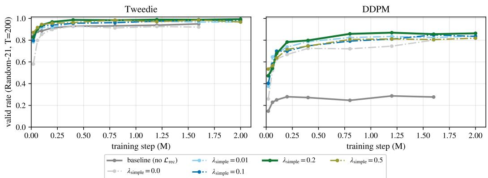  
Figure 9: Self-correction loss-weight sensitivity on Sudoku puzzles with 21 clues. We sweep $\lambda _ { \mathrm { s i m p l e } } \in \{ 0 , 0 . 0 1 , 0 . 1 , 0 . 2 , 0 . 5 \}$ and report checkpoint trajectories under the standard $T = 2 0 { \bar { 0 } }$ pass@1 evaluation.

## L.1 Simple loss weight

Figure 9 shows the sweep over $\lambda \in \{ 0 , 0 . 0 1 , 0 . 1 , 0 . 2 , 0 . 5 \}$ . The baseline corresponds to standard training without the self-correction loss. Tweedie reprojection already performs strongly across settings, with valid rates in a relatively narrow range. The main effect of the self-correction loss is on DDPM. As discussed in Section K.3, DDPM preserves information from the current state $x _ { t }$ directly. This is appropriate for continuous denoising, but in discrete constraint problems it can preserve an early incorrect commitment. Self-correction training mitigates this failure mode, improving DDPM from roughly 29% validity to approximately 85% on Sudoku puzzles with 21 clues.

Overall, the method is not sensitive to the exact value of λ. In the main experiments we use $\lambda _ { \mathrm { s i m p l e } } = 0 . 1$ , which was chosen as the initial default and lies in the stable high-performing region of the sweep.

## L.2 Loss-Formulation Variants

We next compare alternative ways of constructing the self-correction training step.

Baseline. No self-correction loss. This is standard single-pass denoising training (as in L.1).

Self-correction. Our headline recipe described in Algorithm 2. The model first predicts ${ \hat { x } } _ { 0 } .$ , then receives a corrupted version of this previous prediction and is trained to recover the original clean target $x _ { 0 }$

Input perturbation. A DDPM-IP-style input regularization baseline from [37]. The input perturbation baseline adds extra Gaussian noise to the input:

$$
\tilde { x } _ { t } = x _ { t } + \gamma \epsilon ^ { \prime \prime } , \qquad \gamma = 0 . 1 , \qquad \epsilon ^ { \prime \prime } \sim { \mathcal N } ( 0 , I ) ,
$$

and trains on

$$
\begin{array} { r } { \left. f _ { \theta } ( \tilde { x } _ { t } , t ) - x _ { 0 } \right. ^ { 2 } . } \end{array}
$$

This encourages robustness to local perturbations of $x _ { t }$ , but it does not specifically train the model to correct structured errors arising from its own previous predictions.

DDPM-step input. Instead of constructing the second input by forward-noising xˆ<sub>0</sub>, we construct it using one DDPM ancestral step from $x _ { t _ { 1 } }$ . Concretely, after computing $\hat { x } _ { 0 } = f _ { \theta } ( x _ { t _ { 1 } } , t _ { 1 } )$ , we set

$$
x _ { t _ { 2 } } = \mu _ { \mathrm { D D P M } } ( x _ { t _ { 1 } } , \hat { x } _ { 0 } ; t _ { 1 } \to t _ { 2 } ) + \tau _ { t _ { 1 } , t _ { 2 } } \xi , \qquad \xi \sim \mathcal { N } ( 0 , I ) ,
$$

where $\mu _ { \mathrm { D D P M } }$ is the ancestral DDPM mean and $\tau _ { t _ { 1 } , t _ { 2 } }$ is the corresponding posterior noise scale. This makes the self-correction input distribution closer to the test-time DDPM trajectory. The loss itself is unchanged from the standard self-correction loss $\hat { x } _ { 0 } ^ { \prime \prime } = f _ { \theta } ( x _ { t _ { 2 } } , \bar { t } _ { 2 } )$ $\| \hat { x } _ { 0 } ^ { \prime \prime } - x _ { 0 } \| ^ { 2 }$ only the input distribution is modified.

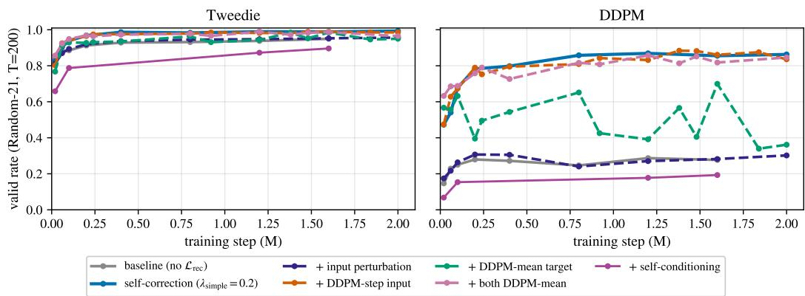  
Figure 10: Loss ablations on Sudoku puzzles with 21 clues. Self-correction and DDPM-step input give the strongest and most stable improvements, while input perturbation and self-conditioning are substantially weaker, especially for DDPM.

DDPM-mean target. Instead of supervising the second prediction directly with $\| \hat { x } _ { 0 } ^ { \prime } - x _ { 0 } \| ^ { 2 }$ , we supervise the resulting DDPM mean:

$$
\left\| \mu _ { \mathrm { D D P M } } ( x _ { t _ { 2 } } , \hat { x } _ { 0 } ^ { \prime } ; t _ { 2 } \to t _ { 3 } ) - \alpha ( t _ { 3 } ) x _ { 0 } \right\| ^ { 2 } .
$$

This asks the model to make predictions whose downstream DDPM update lands on the clean manifold.

DDPM-step input + DDPM-mean target. Combines the previous two modifications: the selfcorrection input is generated by a DDPM step, and the loss supervises the downstream DDPM mean.

Random-N denoise. Performs a random number of no-gradient self-correction rollouts before the final gradient pass. With parameter n, the number of rollouts is sampled from $\{ 1 , \ldots , n \}$ This exposes the model to deeper unrolled trajectories.

Self-conditioning without self-correction loss. Following [9], the model receives its previous prediction as an additional input channel, $f _ { \theta } ( \mathrm { c a t } ( [ x _ { t } , \hat { x } _ { 0 } ] ) _ { \mathrm { d i m } = - 1 } , t )$ , no self-correction loss.

Figure 10 compares alternative ways of constructing the recovery signal on Sudoku puzzles with 21 clues. Input perturbation gives little improvement over the baseline, suggesting that generic Gaussian noise does not reproduce the structured errors created by closed-loop sampling. Self-conditioning is also weaker, especially for DDPM, indicating that simply providing an additional memory channel is not enough. The strongest variants are those that expose the model to its own intermediate predictions, either through the simple self-correction loss or DDPM-aware variants. This supports our main interpretation: the issue is not only robustness to noise or lack of conditioning, but a mismatch between the forward-noised training inputs and the model-induced states visited during sampling.

Random-symbol corruption. We also test whether self-correction helps only by exposing the model to invalid discrete inputs. As a simpler baseline, we randomly select either 20% or 40% of Sudoku cells, replacing each selected cell with a random symbol. We then train the model to recover the original valid grid. This improves DDPM from 34.5% to 64.0% with 20% corrupted cells, showing that invalid-state exposure is useful. However, self-correction improves DDPM further to 78.2%, suggesting that model-induced recovery states are better matched to the reverse-sampling distribution than arbitrary symbol corruptions. Tweedie reprojection is already near saturation in this setting, so these augmentations mainly affect DDPM.

Training on multi-step DDPM trajectories. We additionally tested whether training on states from an actual trajectory improves over the one-step self-correction loss. Starting from a converged denoiser, we maintained a pool of 16-step DDPM trajectories and advanced each trajectory by two differentiable reverse steps per update using truncated backpropagation through time. On 21-clue Sudoku, the best rollout-trained model reaches 0.78 DDPM validity, compared with 0.31 for standard training and 0.87 for one-step self-correction. Thus, training on trajectory states helped, but did not outperform one-step self-correction.

Table 8: Ablation on invalid-state exposure for Sudoku conditional generation. We evaluate 21-given-cell Sudoku with 500 sampling steps on 1000 puzzles and 3 seeds (checkpoint at 0.2M steps). Values are valid rates in percent, mean $\pm \mathrm { \ s t d } .$
<table><tr><td>Training variant</td><td>Tweedie reprojection</td><td>DDPM</td></tr><tr><td>Baseline</td><td> $9 9 . 2 3 \pm 0 . 3 5$ </td><td> $3 4 . 4 7 \pm 1 . 7 5$ </td></tr><tr><td>Random-symbol corruption, 20% cells</td><td> $9 9 . 6 0 \pm 0 . 1 0$ </td><td> $6 4 . 0 0 \pm 2 . 3 3 $ </td></tr><tr><td>Random-symbol corruption, 40% cells</td><td> $9 9 . 0 7 \pm 0 . 3 1 $ </td><td> $5 6 . 6 0 \pm 1 . 2 3$ </td></tr><tr><td>Self-correction</td><td> $9 9 . 0 7 \pm 0 . 3 1 $ </td><td> $7 8 . 2 0 \pm 0 . 9 8$ </td></tr></table>

Table 9: Sudoku validity with rectified flow. Entries report baseline → self-correction for the additional rectified-flow experiment.
<table><tr><td>Regime</td><td>Euler</td><td>EM decay</td><td>Tweedie</td></tr><tr><td>21 clues</td><td> $0 . 1 5 5  0 . 6 3 0$ </td><td> $0 . 4 2 7  0 . 9 2 6$ </td><td> $0 . 9 2 6  0 . 9 8 8$ </td></tr><tr><td>Medium</td><td> $0 . 7 5 9  0 . 9 0 9$ </td><td> $0 . 8 6 4  0 . 9 6 0$ </td><td> $0 . 9 8 3  0 . 9 9 3$ </td></tr><tr><td>Hard</td><td> $0 . 1 2 1  0 . 7 3 5$ </td><td> $0 . 4 1 7  0 . 9 6 3$ </td><td> $0 . 9 1 1  0 . 9 9 5$ </td></tr></table>

## L.3 Rectified-flow experiment on one-hot Sudoku

In addition to evaluating the released SRM checkpoint, we train a rectified-flow model on one-hot Sudoku with random conditioning masks. Table 9 compares sampling with and without self-correction training. The same qualitative pattern appears: Tweedie reprojection improves over Euler without retraining, while self-correction substantially improves Euler.

## L.4 Consistency-model experiment

We additionally evaluate a consistency model on conditional one-hot Sudoku-Extreme. We train the model from scratch using an adaptation of improved consistency training [45]. It uses the same VP-cosine path and 0.82M-parameter Transformer architecture as our continuous baseline, with hidden dimension 128 and depth 4. Training uses the dataset’s given-clue masks, a progressively increasing number of noise discretization levels, a stopped-gradient target without exponential moving averaging, and a noise-weighted pseudo-Huber loss. We train for 2 million optimizer steps with a learning rate of $1 0 ^ { - 4 }$ and warmup. This consistency model achieves approximately 3% pass@1 validity with 5 sampling steps and 16% with 1,000 steps. For context, at 1,000 steps, our baseline diffusion model achieves 18% with EM decay and 26% with Tweedie reprojection.

## M Sampling step-count ablation

As an additional sanity check, we vary the number of reverse sampling steps T for Sudoku puzzles with 21 clues. This tests whether the DDPM gap is simply due to insufficient discretization or too few opportunities to correct errors.

As Table 10 shows, increasing T drives Tweedie sampling to near-perfect validity, but baseline DDPM remains around 0.29–0.31. Thus the baseline DDPM failure is not fixed by using more reverse steps.

## N Beyond one-hot encodings

To verify that our findings are not specific to one-hot representations and argmax decoding, we vary both the representation and the decoder while using models of comparable size. We evaluate uint4 analog codes with threshold decoding (adapted from uint8 Analog Bits [9]), fixed random embeddings with nearest-neighbour decoding, and mini MNIST-Sudoku with a learned CNN decoder (different from the dataset used by SRM [54]). For mini MNIST-Sudoku, we use 8 × 8 MNIST images, whereas SRM uses $2 8 \times 2 8$ images; our model has 0.8M parameters compared with approximately 130M for SRM. Each image is high-dimensional and continuous, and each cell is decoded by a learned classifier, following SRM. Table 11 contains relevant within-representation comparisons.

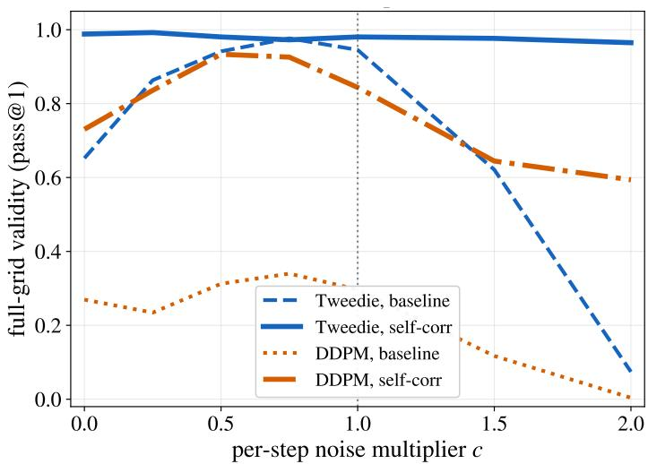  
Figure 11: Effect of DDPM sampling variance on Sudoku. Final validity when multiplying the per-step sampling variance. Changing the variance alone does not close the baseline DDPM–Tweedie gap.

Table 10: Sampling step-count ablation. Full-grid Sudoku validity for baseline and self-correction models under Tweedie and DDPM sampling as the number of sampling steps $T$ varies. Values are mean ± standard error over runs (different seeds for random masks generation).
<table><tr><td rowspan="2"> $T$ </td><td colspan="2">Tweedie</td><td colspan="2">DDPM</td></tr><tr><td>Baseline</td><td>Self-correction</td><td>Baseline</td><td>Self-correction</td></tr><tr><td>25</td><td> $0 . 4 8 8 \pm 0 . 0 1 4$ </td><td> $0 . 3 5 5 \pm 0 . 0 2 2$ </td><td> $0 . 2 1 2 \pm 0 . 0 3 6$ </td><td> $0 . 4 4 1 \pm 0 . 0 3 4$ </td></tr><tr><td>50</td><td> $0 . 7 3 7 \pm 0 . 0 1 8$ </td><td> $0 . 8 8 7 \pm 0 . 0 2 7$ </td><td> $0 . 2 7 2 \pm 0 . 0 1 3$ </td><td> $0 . 7 4 5 \pm 0 . 0 3 0$ </td></tr><tr><td>100</td><td> $0 . 8 5 3 \pm 0 . 0 1 1$ </td><td> $0 . 9 6 5 \pm 0 . 0 0 7$ </td><td> $0 . 2 4 9 \pm 0 . 0 2 0$ </td><td> $0 . 8 4 8 \pm 0 . 0 1 4$ </td></tr><tr><td>200</td><td> $0 . 9 5 2 \pm 0 . 0 1 9$ </td><td> $0 . 9 7 8 \pm 0 . 0 0 6$ </td><td> $0 . 2 9 6 \pm 0 . 0 3 3$ </td><td> $0 . 8 5 2 \pm 0 . 0 1 7$ </td></tr><tr><td>500</td><td> $0 . 9 8 7 \pm 0 . 0 0 5$ </td><td> $0 . 9 9 2 \pm 0 . 0 0 7$ </td><td> $0 . 2 9 2 \pm 0 . 0 6 2$ </td><td> $0 . 8 6 1 \pm 0 . 0 2 5$ </td></tr><tr><td>1000</td><td> $0 . 9 9 9 \pm 0 . 0 0 2$ </td><td> $0 . 9 9 9 \pm 0 . 0 0 2$ </td><td> $0 . 3 1 1 \pm 0 . 0 2 0$ </td><td> $0 . 8 5 4 \pm 0 . 0 2 4$ </td></tr><tr><td>2000</td><td> $1 . 0 0 0 \pm 0 . 0 0 0$ </td><td> $1 . 0 0 0 \pm 0 . 0 0 0$ </td><td> $0 . 2 9 8 \pm 0 . 0 2 2$ </td><td> $0 . 8 5 2 \pm 0 . 0 0 0$ </td></tr><tr><td>5000</td><td> $1 . 0 0 0 \pm 0 . 0 0 0$ </td><td> $1 . 0 0 0 \pm 0 . 0 0 0$ </td><td> $0 . 2 9 2 \pm 0 . 0 3 3$ </td><td> $0 . 8 6 3 \pm 0 . 0 3 6$ </td></tr></table>

We observe consistent improvements from DDPM to Tweedie for both the standard Sudoku checkpoint and the self-correction-trained model, while DDPM itself also benefits from self-correction training.

## O Other metrics

## O.1 Soft metrics.

The main results use exact validity, which is a strict binary metric: a solution with a single violated constraint is counted as invalid. We therefore report two additional diagnostics.

Distance to one-hot (Table 12) is the per-puzzle RMSE between the final continuous output and its nearest one-hot encoding, computed over predicted cells. Lower values indicate that the final continuous state is closer to an exact discrete representation, but do not imply that the decoded configuration is valid. We report this metric for all settings except Sudoku-Extreme pass@10, which reuses the pass@1 boards.

We also report the constraint-violation rate (Table 13): the fraction of predicted cells involved in a violated task constraint, using row/column/box constraints for Sudoku, row/column constraints for Latin squares, and attacking-queen constraints for N-queens. Overall, constraint-violation rate shows largely the same trends as exact validity.

Table 11: Comparison across Sudoku representations. Results report baseline → self-corrected validity (one-seed results).
<table><tr><td>Experiment</td><td>Parameters</td><td>DDPM</td><td>EM-decay</td><td>Tweedie</td></tr><tr><td>One-hot Sudoku</td><td>824,073</td><td> $\overline { { 0 . 3 1  0 . 8 7 } }$ </td><td> $\overline { { 0 . 8 4 \to 0 . 9 8 } }$ </td><td> $\overline { { 0 . 9 4 \to 0 . 9 8 } }$ </td></tr><tr><td>Analog-bit Sudoku</td><td>822,788</td><td> $0 . 1 9  0 . 7 9$ </td><td> $0 . 3 4  0 . 8 7$ </td><td> $0 . 8 9  0 . 9 8$ </td></tr><tr><td>Random-embedding Sudoku</td><td>824,073</td><td> $0 . 2 6  0 . 7 6$ </td><td> $0 . 4 3  0 . 9 0$ </td><td> $0 . 8 9  0 . 9 3$ </td></tr><tr><td>mini MNIST-Sudoku</td><td>838,208</td><td> $0 . 0 1  0 . 3 9$ </td><td> $0 . 0 1  0 . 4 4$ </td><td> $0 . 4 2  0 . 7 8$ </td></tr></table>

Table 12: Distance to one-hot representations across samplers and tasks. Per-puzzle RMSE between the sampler output x and its nearest one-hot codeword onehot(arg max x), over predicted (non-clue) cells, $\mathrm { \tilde { \times } 1 0 ^ { 2 } }$ (lower means closer to one-hot). Mean ± std over training seeds. Baselines use no self-correction loss; self-correction uses $\lambda _ { \mathrm { s i m p l e } } = 0 . 1$ . EM uses a constant noise scale along the trajectory, so its final prediction contains noise in our implementation.
<table><tr><td rowspan="2">Sampler</td><td colspan="3">Sudoku</td><td>Sudoku-Extreme</td><td colspan="2">N-Queens</td><td colspan="2">Latin</td><td colspan="2">GC</td></tr><tr><td>21 clues</td><td>Medium</td><td>Hard</td><td>pass@1</td><td>random</td><td>gen</td><td>random</td><td>gen</td><td>N = 12</td><td>N = 18</td></tr><tr><td colspan="10">Baseline (no self-correction loss)</td></tr><tr><td>DDPM</td><td>1.5±0.2</td><td>0.5±0.1</td><td>1.6±0.1</td><td>2.3±1.0</td><td>0.5±0.0</td><td>0.5±0.0</td><td>1.2±0.1</td><td>1.0±0.1</td><td>1.1±0.1</td><td>1.1±0.1</td></tr><tr><td>Euler</td><td>2.1±0.3</td><td>0.6±0.1</td><td>2.4±0.1</td><td>3.3±0.5</td><td>0.5±0.0</td><td>0.5±0.0</td><td>1.8±0.1</td><td>1.6±0.0</td><td>1.4±0.1</td><td>1.3±0.1</td></tr><tr><td>EM</td><td>9.7±0.0</td><td>8.9±0.0</td><td>10.2±0.1</td><td>6.3±0.1</td><td>8.7±0.0</td><td>8.7±0.0</td><td>9.9±0.1</td><td>10.2±0.1</td><td>9.7±0.2</td><td>9.5±0.1</td></tr><tr><td>EM decay</td><td>0.4±0.0</td><td>0.3±0.0</td><td>0.7±0.1</td><td>1.6±0.5</td><td>0.5±0.0</td><td>0.5±0.1</td><td>0.4±0.0</td><td>0.4±0.0</td><td>0.6±0.3</td><td>0.6±0.3</td></tr><tr><td>Tweedie reprojection (ours)</td><td>0.3±0.0</td><td>0.3±0.0</td><td>0.4±0.0</td><td>1.2±0.4</td><td>0.4±0.1</td><td>0.5±0.0</td><td>0.3±0.0</td><td>0.3±0.0</td><td>0.5±0.2</td><td>0.6±0.2</td></tr><tr><td colspan="9"></td></tr><tr><td></td><td></td><td></td><td></td><td>Self-correction loss (with λsimple = 0.1)</td><td></td><td></td><td></td><td></td><td></td><td></td></tr><tr><td>DDPM</td><td>0.9±0.1</td><td>0.4±0.1</td><td>1.6±0.3</td><td>3.0±0.3</td><td>1.2±0.1</td><td>4.3±0.1</td><td>0.7±0.1</td><td>1.6±0.3</td><td>0.5±0.4</td><td>0.6±0.2</td></tr><tr><td>Euler EM</td><td>1.8±0.1</td><td>0.7±0.1</td><td>3.2±0.1</td><td>4.1±0.5</td><td>1.8±0.2 9.5±0.1</td><td>6.1±0.3 13.8±0.4</td><td>1.4±0.2 9.3±0.1</td><td>5.4±0.3 13.2±1.4</td><td>0.5±0.2 1.1±0.1</td><td>0.6±0.2</td></tr><tr><td>EM decay</td><td>9.7±0.1 0.3±0.1</td><td>9.0±0.0 0.3±0.0</td><td>11.4±0.3 0.4±0.1</td><td>5.1±0.4 1.9±0.2</td><td>0.7±0.1</td><td>2.0±0.4</td><td>0.4±0.1</td><td>0.5±0.1</td><td>0.5±0.3</td><td>9.0±0.1 0.4±0.2</td></tr><tr><td>Tweedie reprojection (ours)</td><td>0.3±0.1</td><td>0.4±0.1</td><td>0.7±0.2</td><td>1.1±0.2</td><td>0.6±0.0</td><td>2.9±0.2</td><td>0.4±0.1</td><td>0.8±0.3</td><td>0.7±0.3</td><td>0.7±0.3</td></tr></table>

## O.2 Uniqueness and coverage.

High validity alone does not rule out repeatedly generating the same solutions. We therefore measure valid uniqueness: the number of distinct valid decoded boards divided by the number of valid generated boards. We compute this ratio separately for each training seed and then average across seeds. Table 14 reports the results. Duplicates are uncommon in these evaluations. For conditional tasks, however, different samples have different masks and clues, so uniqueness across the batch does not establish diversity for a fixed conditioning input.

For N = 14, the complete solution space contains 365,596 boards. The training set contains 168,000 distinct boards, leaving 197,596 solutions outside the training set. For each configuration, we generate 500,000 unconditional samples and count the distinct valid boards. We report total coverage as well as coverage within and outside the training set, using the size of each set as the corresponding denominator.

Self-correction increases total coverage from 20.0% to 44.8% with EM decay and from 24.6% to 33.8% with Tweedie. Coverage is similar within and outside the training set. Thus, the validity gains are accompanied by broader coverage of both training and unseen solutions, rather than repeated generation of a small set of training boards.

## O.3 Multiple completions for the same Sudoku clues.

We also test whether the model can generate different valid completions for a fixed conditioning input. We select 50 Sudoku puzzles with 32–38 revealed cells and enumerate all valid completions by backtracking. Each puzzle admits between 2 and 12 solutions, with 297 solutions in total. For each puzzle, we run Tweedie reprojection with 1,000 independent noise realizations under baseline and self-correction training. Both configurations recover 139 of the 297 solutions, or 46.8%. Thus, training against individual clean targets does not restrict sampling to a single completion for each set of clues. However, neither configuration recovers all possible completions, and self-correction does not improve the aggregate coverage in this experiment.

Table 13: Constraint violations across samplers and tasks. Percentage of denoised cells that violate a task constraint (lower is better): row, column, or box constraints for Sudoku; row or column constraints for Latin squares; and attacking-queen constraints for N-Queens. Entries are mean ± standard deviation across training seeds. Baselines use no self-correction loss; self-correction uses $\underline { { \lambda _ { \mathrm { s i m p l e } } = 0 . 1 . } }$
<table><tr><td rowspan="2">Sampler</td><td colspan="3">Sudoku</td><td colspan="2">Sudoku-Extreme</td><td colspan="2">N-Queens</td><td colspan="2">Latin</td></tr><tr><td></td><td>21 clues Medium</td><td>Hard</td><td>pass@1</td><td>random</td><td>gen</td><td>random</td><td>gen</td></tr><tr><td colspan="9">Baseline (no self-correction loss)</td></tr><tr><td>DDPM</td><td> $4 . 5 { \pm } 0 . 1$ </td><td> $1 . 3 { \pm } 0 . 2 $ </td><td> $3 . 7 { \pm } 0 . 1 $ </td><td> $8 . 7 { \pm } 0 . 4 $ </td><td> $1 3 . 1 { \pm } 0 . 0 $ </td><td> $2 4 . 6 { \pm } 0 . 7 \ $ </td><td> $2 . 8 { \pm } 0 . 6 $ </td><td> $1 . 1 { \pm } 0 . 4 $ </td></tr><tr><td>Euler</td><td> $6 . 0 { \pm } 0 . 2 $ </td><td> $1 . 8 { \pm } 0 . 1$ </td><td> $5 . 3 { \pm } 0 . 0 $ </td><td> $9 . 6 { \pm } 0 . 9 $ </td><td> $1 7 . 6 { \pm } 0 . 8 $ </td><td> $2 9 . 1 { \pm } 2 . 8 $ </td><td> $3 . 9 { \pm } 0 . 1$ </td><td> $2 . 1 { \pm } 0 . 3$ </td></tr><tr><td>EM</td><td> $5 . 8 { \pm } 0 . 0 $ </td><td> $1 . 8 { \pm } 0 . 0 $ </td><td> $4 . 6 { \pm } 0 . 0 $ </td><td> $1 0 . 0 { \pm } 0 . 3 $ </td><td> $1 7 . 3 { \pm } 1 . 0 $ </td><td> $2 7 . 4 { \pm } 2 . 4 $ </td><td> $3 . 4 { \pm } 0 . 3$ </td><td> $1 . 9 { \pm } 0 . 5 $ </td></tr><tr><td>EM decay</td><td> $\stackrel { - } { 0 . 9 } \pm \stackrel { - } { 0 . 0 } \stackrel { - } { 0 }$ </td><td> $\overline { { 0 . 3 \pm 0 . 0 } }$ </td><td> $\stackrel { - } { 1 . 0 \pm } \stackrel { - } { 0 . 1 }$ </td><td> $\overline { { 4 . 7 \pm 0 . 1 } }$ </td><td> $\bar { 7 } . \bar { 1 } \pm \bar { 0 . 3 }$ </td><td> $\overline { { 1 8 . 9 \pm 3 . 0 } }$ </td><td> $0 . { \overset { - } { 3 } } \leq 0 . { \overset { - } { 1 } }$ </td><td> $\stackrel { - } { 0 . 1 \pm 0 . 1 }$ </td></tr><tr><td>Tweedie reprojection (ours)</td><td> ${ \bf 0 . 3 \pm 0 . 1 }$ </td><td> ${ \bf 0 . 1 } { \pm } { \bf 0 . 0 }$ </td><td> ${ \bf 0 . 4 } \pm { \bf 0 . 0 }$ </td><td> ${ \bf 4 . 0 { \pm } 0 . 1 }$ </td><td> ${ \bf 4 . 7 \pm 1 . 0 }$ </td><td> ${ \bf 1 3 . 6 { \pm 0 . 3 } }$ </td><td> ${ \bf 0 . 1 } { \pm } { \bf 0 . 1 }$ </td><td> ${ \bf 0 . 0 { \pm } 0 . 0 }$ </td></tr><tr><td colspan="9">Self-correction loss (with  $\lambda _ { \mathrm { s i m p l e } } = 0 . 1 )$ </td></tr><tr><td>DDPM</td><td> $0 . 8 { \pm } 0 . 1$ </td><td> $0 . 3 { \pm } 0 . 0 \ $ </td><td> $1 . 3 { \pm } 0 . 3 $ </td><td> $6 . 5 { \pm } 0 . 3 $ </td><td> $6 . 5 { \pm } 0 . 1 $ </td><td> $1 2 . 5 { \pm } 0 . 2 $ </td><td> $0 . 2 { \pm } 0 . 1$ </td><td> $0 . 9 { \pm } 0 . 4 $ </td></tr><tr><td>Euler</td><td> $1 . 6 { \pm } 0 . 2 $ </td><td> $0 . 5 { \pm } 0 . 0 $ </td><td> $3 . 8 { \pm } 0 . 3 $ </td><td> $8 . 1 { \pm } 0 . 7$ </td><td> $9 . 6 { \pm } 1 . 0 $ </td><td> $1 7 . 5 { \pm } 1 . 9 $ </td><td> $0 . 7 { \pm } 0 . 3 $ </td><td> $5 . 2 { \pm } 0 . 6 $ </td></tr><tr><td>EM</td><td> $1 . 4 { \pm } 0 . 2 $ </td><td> $0 . 5 { \pm } 0 . 0 $ </td><td> $2 . 5 { \pm } 0 . 5 $ </td><td> $7 . 7 { \pm } 0 . 3 $ </td><td> $8 . 7 { \pm } 1 . 1 $ </td><td> $1 7 . 1 { \pm } 0 . 1 $ </td><td> $0 . 4 { \pm } 0 . 2 $ </td><td> $3 . 2 { \pm } 1 . 2 $ </td></tr><tr><td>EM decay</td><td> $\bf \delta 0 . 1 \pm 0 . 0 ^ { \mathrm { ~ - ~ } }$ </td><td> $\mathbf { 0 . 0 \pm 0 . 0 } ^ { - }$ </td><td> $\mathbf { 0 . 1 \pm 0 . 0 } ^ { - }$ </td><td> $3 . 5 { \pm } 0 . { \overline { { 1 } } }$ </td><td> $\bar { 3 } . \bar { 1 } \pm \bar { 0 . 2 } \bar { }$ </td><td> ${ \bf 7 . 5 \pm 0 . 8 }$ </td><td> $\bf 0 . 0 { \pm } 0 . 0$ </td><td> $\mathbf { 0 . 0 { \overset { - } { \bot } } 0 . 0 { \overset { - } { \mathbf { 0 . 0 } } } }$ </td></tr><tr><td>Tweedie reprojection (ours)</td><td> ${ \bf 0 . 1 } { \pm } { \bf 0 . 1 }$ </td><td> ${ \bf 0 . 0 { \pm } 0 . 0 }$ </td><td> $0 . 4 { \pm } 0 . 1 $ </td><td> $\mathbf { 2 . 7 \pm 0 . 2 }$ </td><td> $\mathbf { \ } 2 . 5 { \pm } \mathbf { 0 . 2 } $ </td><td> $9 . 3 { \pm } 0 . 5 $ </td><td> ${ \bf 0 . 0 { \pm } 0 . 0 }$ </td><td> $0 . 3 { \pm } 0 . 3 $ </td></tr></table>

Table 14: Uniqueness among valid generated boards. Entries are percentages, shown as baseline → self-correction and averaged across training seeds. Standard deviations are omitted. Random denotes random conditioning; generation denotes unconditional sampling.
<table><tr><td>Sampler</td><td>Sudoku 21 clues</td><td>Sudoku Medium</td><td>Sudoku Hard</td><td>Sudoku-Extreme</td></tr><tr><td>DDPM</td><td> $1 0 0 . 0  1 0 0 . 0$ </td><td> $1 0 0 . 0  9 9 . 9 $ </td><td> $1 0 0 . 0  1 0 0 . 0$ </td><td> $1 0 0 . 0  9 9 . 8 $ </td></tr><tr><td>Euler</td><td> $1 0 0 . 0  1 0 0 . 0$ </td><td> $9 9 . 9  9 9 . 9 $ </td><td> $1 0 0 . 0  1 0 0 . 0$ </td><td> $1 0 0 . 0  1 0 0 . 0$ </td></tr><tr><td>EM</td><td> $1 0 0 . 0  1 0 0 . 0$ </td><td> $1 0 0 . 0  9 9 . 9 $ </td><td> $1 0 0 . 0  1 0 0 . 0$ </td><td> $1 0 0 . 0  9 9 . 9 $ </td></tr><tr><td>EM decay</td><td> $1 0 0 . 0  1 0 0 . 0$ </td><td> $9 9 . 8  9 9 . 9 $ </td><td> $1 0 0 . 0  1 0 0 . 0$ </td><td> $9 9 . 7  9 9 . 7 $ </td></tr><tr><td>Tweedie</td><td> $1 0 0 . 0  1 0 0 . 0$ </td><td> $9 9 . 9  9 9 . 9 $ </td><td> $1 0 0 . 0  1 0 0 . 0$ </td><td> $9 9 . 9  9 9 . 7 $ </td></tr><tr><td>Sampler</td><td>N-Queens random</td><td>N-Queens generation</td><td>Latin random</td><td>Latin generation</td></tr><tr><td>DDPM</td><td> $9 7 . 0  9 6 . 5 $ </td><td> $1 0 0 . 0  9 9 . 8 $ </td><td> $1 0 0 . 0  1 0 0 . 0$ </td><td> $1 0 0 . 0  1 0 0 . 0$ </td></tr><tr><td>Euler</td><td> $9 8 . 2  9 7 . 0 $ </td><td> $1 0 0 . 0  1 0 0 . 0$ </td><td> $1 0 0 . 0  1 0 0 . 0$ </td><td> $1 0 0 . 0  1 0 0 . 0$ </td></tr><tr><td>EM</td><td> $1 0 0 . 0  1 0 0 . 0$ </td><td> $1 0 0 . 0  1 0 0 . 0$ </td><td> $1 0 0 . 0  1 0 0 . 0$ </td><td> $1 0 0 . 0  1 0 0 . 0$ </td></tr><tr><td>EM decay</td><td> $1 0 0 . 0  1 0 0 . 0$ </td><td> $1 0 0 . 0  1 0 0 . 0$ </td><td> $1 0 0 . 0  1 0 0 . 0$ </td><td> $1 0 0 . 0  1 0 0 . 0$ </td></tr><tr><td>Tweedie</td><td> $9 6 . 0  9 5 . 7 $ </td><td> $9 9 . 8 \to 9 9 . 5 $ </td><td> $1 0 0 . 0  1 0 0 . 0$ </td><td> $1 0 0 . 0  1 0 0 . 0$ </td></tr></table>

## P Trajectories under different samplers

When do decoded predictions stop changing? We define the commitment time τ<sup>⋆</sup> as the earliest recorded reverse-progress value after which the decoded prediction remains equal to its final decoded output, with $\tau = 0$ at noise and $\tau = 1$ at data. In the pooled results of Table 16, final-valid predictions stabilize earlier than final-invalid ones. Self-correction is associated with later stabilization in both groups: for final-invalid trajectories, the mean commitment time increases from 0.92 to 0.98 under DDPM and from 0.89 to 0.99 under Tweedie. This is consistent with self-correction allowing the model to revise its predictions for longer, although these revisions do not necessarily lead to a valid solution.

Table 15: Coverage of the complete $N = 1 4$ Queens solution space. Each configuration uses 500,000 unconditional samples. The two count columns report distinct valid generated boards. Coverage percentages use denominators 365,596, 168,000, and 197,596 for the full, training, and outside-training sets, respectively.
<table><tr><td>Sampler</td><td>Training</td><td>Total coverage (%)</td><td>Distinct in training</td><td>Distinct outside training</td><td>Training coverage (%)</td><td>Outside coverage (%)</td></tr><tr><td>EM decay</td><td>Baseline</td><td>20.0</td><td>33,523</td><td>39,629</td><td>20.0</td><td>20.1</td></tr><tr><td>EM decay</td><td>Self-correction</td><td>44.8</td><td>75,360</td><td>88,436</td><td>44.9</td><td>44.8</td></tr><tr><td>Tweedie</td><td>Baseline</td><td>24.6</td><td>41,274</td><td>48,572</td><td>24.6</td><td>24.6</td></tr><tr><td>Tweedie</td><td>Self-correction</td><td>33.8</td><td>57,362</td><td>66,063</td><td>34.1</td><td>33.4</td></tr></table>

Table 16: Commitment time by final validity. We averaged results across nine tasks with 256 samples each (separately for final-valid and final-invalid outputs).
<table><tr><td>Sampler</td><td>Training</td><td> $\tau _ { \mathrm { v a l i d } } ^ { \star }$ </td><td> $n _ { \mathrm { v a l i d } }$ </td><td> $\tau _ { \mathrm { i n v a l i d } } ^ { \star }$ </td><td> $n _ { \mathrm { i n v a l i d } }$ </td></tr><tr><td>DDPM</td><td>Baseline</td><td>0.72</td><td>1229</td><td>0.92</td><td>1075</td></tr><tr><td>DDPM</td><td>Self-correction</td><td>0.88</td><td>1755</td><td>0.98</td><td>549</td></tr><tr><td>Tweedie</td><td>Baseline</td><td>0.69</td><td>1909</td><td>0.89</td><td>395</td></tr><tr><td>Tweedie</td><td>Self-correction</td><td>0.83</td><td>2019</td><td>0.99</td><td>285</td></tr></table>

When does Tweedie reprojection fail? We distinguish failures according to whether a valid clean proposal appears during sampling. A failure is denoiser-related when the final Tweedie output is invalid and the decoded clean proposal was never valid at any recorded reverse step. In a diagnostic batch of 256 unconditional N-Queens trajectories, all failures are of this type. On Sudoku-Extreme, 38% of Tweedie failures are denoiser-related. In the remaining 62%, a valid proposal appears at least once, but the trajectory still ends in an invalid sample. Poor proposal quality is therefore one limitation of Tweedie reprojection, but finding a valid proposal during sampling does not by itself guarantee a valid final output.

Visualizations We show example sampling trajectories for Latin squares (Figure 12), N-queens (Figure 13), graph connectivity (Figure 14), and Sudoku (Figure 15). Within each task, all sampler rows use the same trained checkpoint; different tasks use different models. For MNIST-Sudoku, we also show trajectories from the released SRM checkpoint [54] under Euler sampling (equivalently, deterministic DDIM on the linear path; bottom) and Tweedie reprojection (top), visualizing both $x _ { t }$ (Figure 16) and the corresponding clean predictions $\scriptstyle { \hat { x } } _ { 0 }$ (Figure 17). In both cases, individual cells resemble recognizable MNIST digits, which we refer to as local correctness. However, the DDIM trajectory does not produce a globally valid Sudoku grid; for example, the central 3 × 3 block contains the digit 1 twice. In the same example, Tweedie reprojection ends in a valid solution.

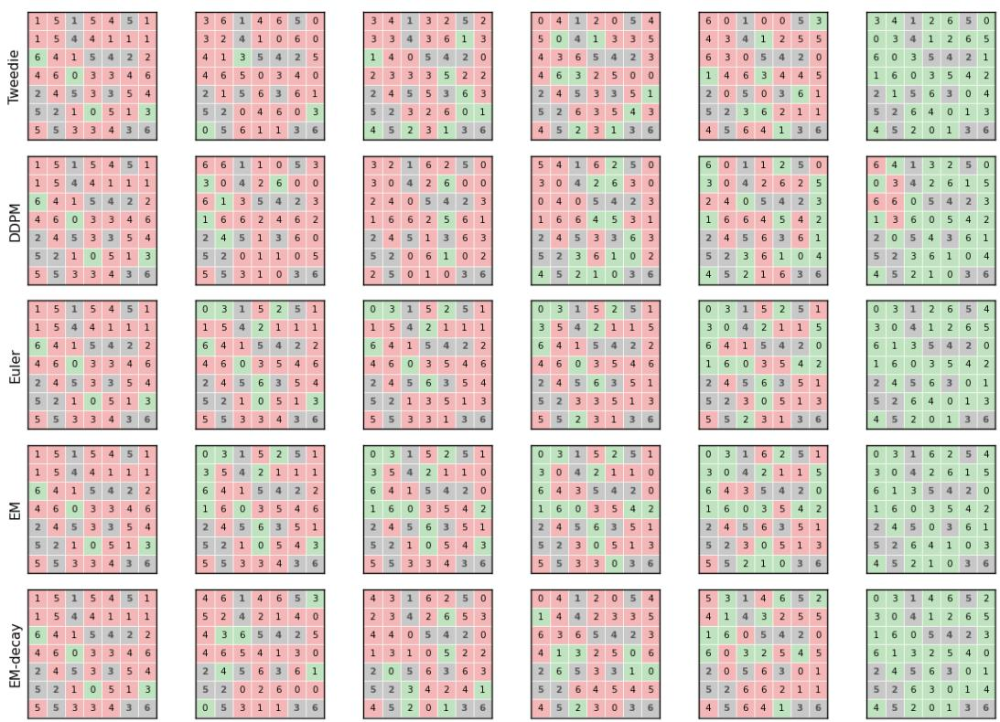  
Figure 12: Latin squares trajectory

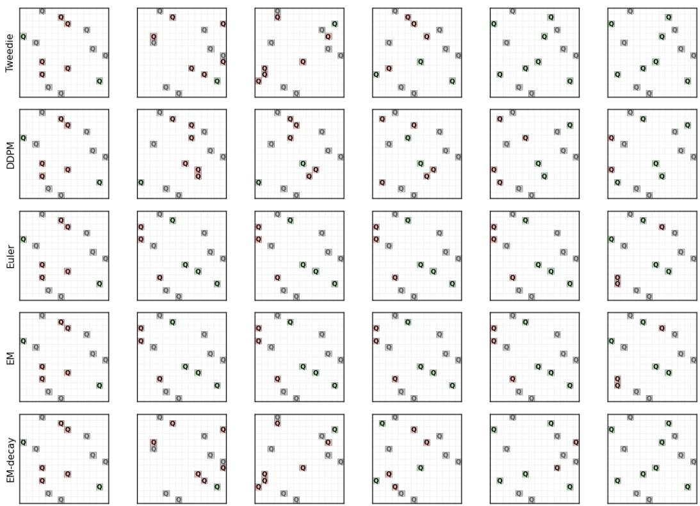  
Figure 13: N-Queens trajectory

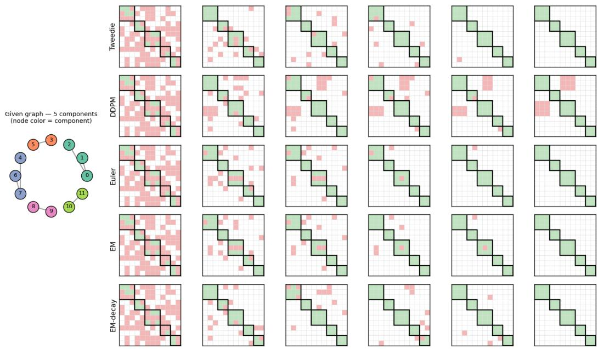  
Figure 14: Graph connectivity trajectory

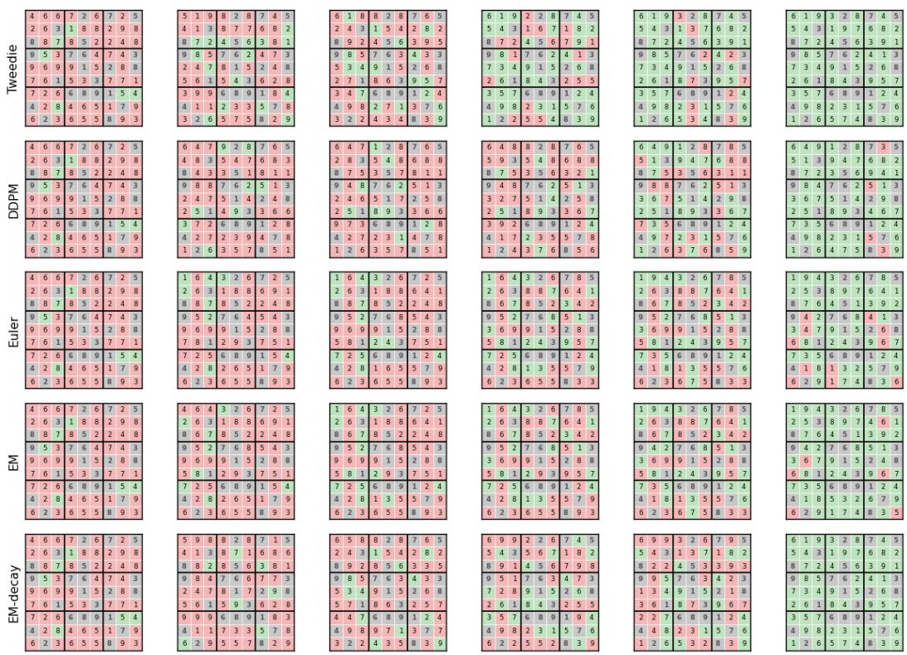  
Figure 15: Sudoku trajectory

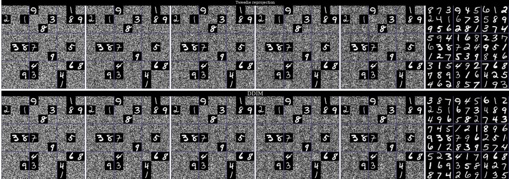  
Figure 16: Sudoku-MNIST trajectory (x<sub>t</sub>)

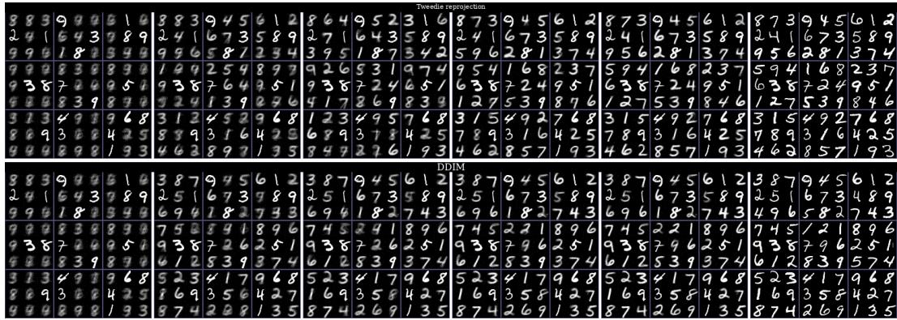  
Figure 17: Sudoku-MNIST trajectory (xˆ<sub>0</sub>)