# Leveraging contextual events on structure-aware next activity prediction

Alessandro Mele1[0009−0009−7852−0528], Claudia

Diamantini1[0000−0001−8143−7615], and Domenico Potena1[0000−0002−7067−5463]

Department of Information Engineering, Polytechnic University of Marche, Ancona, Marche, Italy

Abstract. Predictive process monitoring aims at forecasting various aspects of running processes. Among the diferent tasks, next activity prediction represents the most extensively investigated. However, only a limited number of existing approaches explicitly encode contextual information, i.e., the environmental conditions in which the process is executed, typically modeled through event log attributes or aggregated measures. In this paper, an approach based on the concept of Instance Graphs is introduced. To incorporate contextual process instances, several encoding strategies are proposed and evaluated by measuring their impact on prediction performance. For each encoding strategy, a set of prefix-Instance Graphs is generated and subsequently provided as input to a Graph Neural Network for the classification task. The proposed approach is evaluated on multiple real-world event logs, and the experimental results demonstrate that incorporating contextual process instances benefits prediction performance.

Keywords: next activity prediction · contextual events · graph neural networks

## 1 Introduction

Predictive process monitoring (PPM) is a branch of process mining that leverages historical data to predict the evolution of ongoing process instances. In the last decade, the scientific community shifted from rule-based predictions to data-driven approaches, in which models are trained on historical data to automatically learn process behaviors [3]. PPM tasks can be categorized in three fields, namely the predictions of categorical outcome values, measures of interest taking continuous values, and the sequences of future activities and related data payloads, i.e., next event predictions [3]. To perform prediction, most of the existing approaches model process executions without considering that a process typically executes in a context where multiple other process instances are running concurrently, i.e. at the same time. Let us consider a help desk ticket management process, in which two tickets may be in exactly the same process state, e.g., “assigned to an operator”. Their evolution may difer due to the context in which they are executed. In the first case, the ticket is handled quickly because only a few other tickets are open at that time and the operators have a low workload. In the second case, instead, the ticket experiences delays because many other urgent requests are being processed concurrently, occupying the same operators.

The proposed study investigates whether modeling contextual process instances provides benefits for the next activity prediction task, i.e., a sub-field of next event prediction [3], where the objective is to predict the next activity to be executed given a running process instance. To this end, an approach based on the concept of Instance Graphs [5] is proposed to model running process instances. Several encoding strategies are introduced to model contextual process instances, and their impact on Graph Neural Network performance is systematically evaluated. More specifically, the proposed approach aims to address the following research questions:

– RQ1: which encoding strategy achieves the best prediction performance? – RQ2: how the best strategy performs compared with graph-based approaches for next activity prediction?

The rest of this manuscript is structured as follows. Section 2 provides an overview of existing methods for predictive process monitoring, focusing on graph-based approaches and the modeling of inter-case dependencies. Section 3 illustrates the proposed methodology. Section 4 illustrates the experimental settings, the dataset, and the results achieved. Finally, Section 5 concludes the paper and delineates future research works.

## 2 Related work

## 2.1 Graph-based Predictive Process Monitoring

Graph-based approaches represent a promising direction in PPM [6], as graphs naturally represent process control-flow and can capture complex behaviors, such as parallelism and non-linear dependencies. Among existing graph-based approaches, [2] leverage Instance Graphs and a Deep Graph Convolutional Neural Network for next activity prediction, incorporating control-flow and multiple temporal perspectives. [4] extend this approach by incorporating contextual features, namely the number of active cases, running activities, and resource workload. [13] represent cases as heterogeneous graphs with activity, resource, time, and trace nodes, and employ Graph Attention Networks (GATs) to predict the next activity. Similarly, [7] model traces as heterogeneous graphs and use GATs to predict the complete set of attributes of the next event. For object-centric event logs, [1] preserve the graph-based representation by explicitly modeling interactions among diferent objects, whereas the proposed approach relies exclusively on case, activity, and timestamp attributes, avoiding domain-specific adaptations. Finally, [14] introduce a status graph that represents the history of ongoing executions for next activity and remaining time prediction. Unlike the proposed approach, their method does not explicitly model temporal dependencies and represents contextual process instances as disconnected components, limiting the message-passing capabilities of Graph Neural Networks. Moreover, the impact of diferent strategies for incorporating contextual instances is not investigated.

## 2.2 Inter-case Dependencies in Predictive Process Monitoring

Several studies incorporate inter-case information into PPM by engineering features from concurrently running cases. [15] incorporate inter-case dependencies by encoding features from concurrently running cases through knowledge-driven and data-driven approaches. [11] introduce inter-case features for remaining time prediction to capture dynamics such as batching and improve predictive performance. [8] propose the LS-ICE framework to encode the state of relevant process load points as inter-case features for remaining trace and runtime prediction. [10] propose I3SP, an encoder-decoder architecture that directly learns inter-case dependencies from the log prefix for sufix prediction, without manually engineered inter-case features. These works demonstrate the potential of inter-case information to improve predictive performance, but the explicit modeling of structural relationships between events belonging to concurrently running cases, particularly for next activity prediction, remains less explored. The proposed paper addresses this gap by investigating diferent graph-based strategies for encoding contextual events and evaluating their impact on next activity prediction.

## 3 Methodology

The starting point is an event log, consisting of traces tracking process executions (or cases). Each trace $\sigma = \langle e _ { 1 } , \ldots , e _ { n } \rangle$ consists of a finite sequence of events. Each event corresponds to the execution of a process activity and is described by at least one timestamp and the name of the corresponding activity. The second input is a process model, mined using the Inductive Miner algorithm [12] by varying the noise threshold to obtain a model with a precision of at least 80%. The first step of the methodology is Building Instance Graphs, which converts log traces in the corresponding Instance Graphs (IGs). The set of the IGs is then the input for the Feature engineering step, which is responsible for enriching the IGs with temporal and contextual features. Following, in the Data Encoding step, the set of prefix-IGs is derived, and several encoding strategies to incorporate contextual process instances are proposed. Each resulting representation is then provided as input to Graph Neural Network to perform the prediction.

## 3.1 Building Instance Graphs

An Instance Graph (IG) is a directed, acyclic graph that describes a specific execution of a process. Given a trace σ, its IG is defined as $\gamma _ { \sigma } = ( E , W )$ , where each node in the set E corresponds to an event in σ and the set of edges W models Causal Relations (CRs) between process activities. Informally, a CR between activities A and B denotes that the execution of B depends on the execution of A. Consequently, IGs explicitly model parallelism, i.e., lack of CRs, among process activities. Table 1 shows an excerpt of the Helpdesk event log, while Figure 1a shows the corresponding IG, with activities represented by acronyms.

<table><tr><td>Case ID Event ID Activity</td><td></td><td>Timestamp</td></tr><tr><td rowspan="5">1 2 1 3</td><td>Start</td><td>2012-04-0316:55</td></tr><tr><td>Assign Seriousness</td><td>2012-04-0316:55</td></tr><tr><td></td><td>Take in Charge ticket 2012-04-03 16:55</td></tr><tr><td>4 Resolve Ticket</td><td>2012-04-0517:15</td></tr><tr><td>5 End</td><td>2012-04-0517:15</td></tr></table>

Table 1: A trace from the Helpdesk event log.

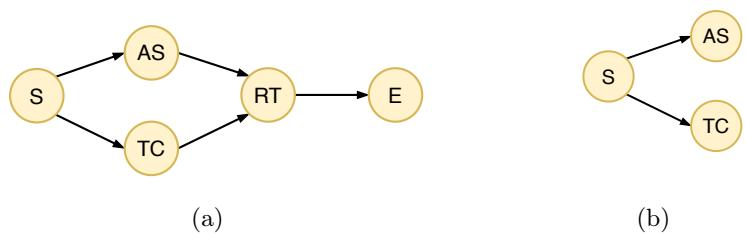  
Fig. 1: The IG derived from Table 1 (a) and its prefix-IG of size 3 (b).

## 3.2 Feature engineering

This section enriches the set of IGs with multiple perspectives, capturing temporal and contextual aspects. To this end, each event must have explicit start and end timestamps; if one is missing, the procedure described in [4] is applied to make both timestamps explicit.

Temporal enrichment The data payload associated with the events is leveraged to define multiple temporal features [2]. Let $\sigma = \langle e _ { 1 } , \ldots , e _ { n } \rangle$ be a trace. The first temporal feature defined is $\varDelta _ { t _ { e _ { i } } }$ , which represents the time between the current event and its predecessor. In addition, $t _ { d _ { e _ { i } } }$ represents the time at which the event occurred with respect to the start of the process, while $t _ { w _ { e . } }$ captures the point in the corresponding working week at which the event occurred, i.e, the elapsed time since midnight on the previous Sunday.

Contextual enrichment To capture contextual perspectives, the proposed approach draws inspiration from [4], where multiple aggregated features are derived from contextual process executions. Let G be the set of IGs, $\gamma = ( E , W ) \in \mathcal { G }$ be the IG of a trace $\sigma , e _ { i } \in E$ an event of $\gamma ,$ and act(e ), start(e ), end(e ) be respectively the activity, the start and the end timestamps of $e _ { i }$ . The set of contextual events of $e _ { i }$ is defined as $\mathcal { C } ( e _ { i } , \gamma ) = \{ \langle e _ { j } , \gamma ^ { \prime } \rangle \ : | \ : \gamma ^ { \prime } = ( E ^ { \prime } , W ^ { \prime } ) \in \mathcal { G } \wedge \gamma ^ { \prime } \neq $ $\gamma \wedge e _ { j } \in E ^ { \prime } \wedge s t a r t ( e _ { j } ) \leq s t a r t ( e _ { i } ) \leq e n d ( e _ { j } ) \big \}$ . Informally, $\mathcal { C } ( e _ { i } , \gamma )$ represents the events from the contextual process instances that are in execution when e of $\gamma$ is running. Let Figure 2 illustrates an example scenario in which $\gamma ^ { 1 } , \gamma ^ { 2 }$ and $\gamma ^ { 3 }$ represent three running cases. Let $\gamma ^ { 1 }$ and RT denote, respectively, the case under analysis and the target event. The resulting set of contextual events is $\mathcal { C } ( R T , \gamma ^ { 1 } ) = \smash { \{ \langle A S , \gamma ^ { 2 } \rangle , \langle T C , \gamma ^ { 2 } \rangle , \langle T C , \gamma ^ { 3 } \rangle \} }$

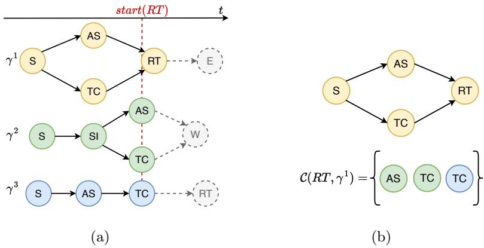  
Fig. 2: An example of scenario in which $\gamma ^ { 1 }$ is the case under analysis (a), and RT the event for which the set of contextual events is identified (b).

## 3.3 Data encoding

In order to build a model capable of making prediction at each stage of a process execution, the set of partial process executions, i.e., the set of prefix-IGs, is derived. Let $\gamma \in \mathcal G$ be an IG. Its prefix-IG of size $\textit { k } \left( \boldsymbol { p } _ { k } ( \gamma ) \right)$ represents the subgraph of γ composed by the first k events (nodes), and the corresponding label, i.e., the next activity, is associated to the activity of the event in position $k + 1$ . Figure 1b displays an example of prefix-IG, where the label corresponds to the activity RT.

To incorporate the set of contextual events, i.e., the set $\mathcal { C } ( e _ { k } , \gamma )$ of events in execution when $p _ { k } ( \gamma )$ is running, diferent encoding strategies are proposed. The first two strategies model a single graph representing both the prefix-IG and its set of contextual events. The remaining strategies model a first graph representing the prefix-IG, and a context graph modeling its contextual events. Figure 2 is used as example scenario.

Encoding strategy 1 (E1) This strategy augments the prefix-IG by adding, for each $\langle e _ { j } , \gamma ^ { \prime } \rangle \in \mathcal { C } ( e _ { k } , \gamma )$ , a node representing the corresponding contextual event together with an edge originating from the first node of $p _ { k } ( \gamma )$ , and pointing to the newly added node. In this way, contextual events are represented as starting simultaneously with the current prefix-IG, as illustrated in Figure 3a. In that case, the contextual events are as if they were constrained only to the execution of the first event of $p _ { k } ( \gamma )$

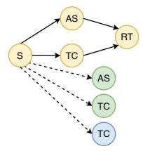  
(a) E1.

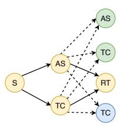  
(b) E2.

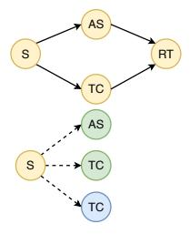  
(c) E3.

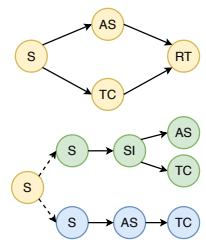  
(d) E4.  
Fig. 3: The proposed encoding strategies.

Encoding strategy 2 (E2) This strategy is similar to the previous one, with the diference that contextual events are represented as starting simultaneously with the last node of $p _ { k } ( \gamma )$ , namely $e _ { k }$ . Accordingly, edges are added from the nodes having an outgoing edge toward $e _ { k } ,$ to the corresponding contextual nodes, as illustrated in Figure 3b. This encoding is more constrained than that of E1, since all contextual events are efectively assumed to start simultaneously with $e _ { k }$

Encoding strategy 3 (E3) This strategy models two distinct graphs. The first represents $p _ { k } ( \gamma )$ , while the second corresponds to a context graph containing all events in $\mathcal { C } ( e _ { k } , \gamma )$ . To ensure the correct functioning of the message-passing procedure (Section 3.4), the context graph should be defined as a connected component. To this end, the first node of $p _ { k } ( \gamma )$ is duplicated within the context graph, together with edges originating from this node and pointing to each contextual node, as illustrated in Figure 3c. Encoding E3 is very similar to E1, except that the execution of the context graph is independent of the execution of $p _ { k } ( \gamma )$ .

Encoding strategy 4 (E4) The last strategy augments the context graph by incorporating the complete contextual prefix-IGs. More specifically, for each $\langle e _ { j } , \gamma ^ { \prime } \rangle \in \mathcal { C } ( e _ { k } , \gamma )$ , the prefix-IG $p _ { j } ( \gamma ^ { \prime } )$ is added to the context graph, together with an edge originating from the first event of $p _ { k } ( \gamma )$ and pointing to the first event of $p _ { j } ( \gamma ^ { \prime } )$ . When multiple contextual events belong to the same case, only the prefix-IG which includes all the others is kept (Figure 3d).

This strategy is similar to the approach proposed in [14], with two main diferences: (i) temporal features are explicitly modeled, and (ii) the context graph is represented as a single connected component.

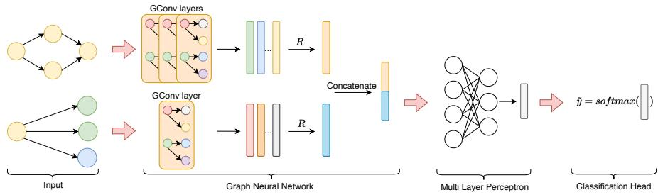  
Fig. 4: The adopted network architecture for E3 and E4.

## 3.4 Graph Neural Network

To perform prediction, the proposed approach is based on a spatial-based Graph Convolutional Neural Network [16], where each convolutional layer implements a message-passing step, enabling nodes to exchange information with their neighbors. Let $G = ( E , W )$ be a graph, $u , v \in E$ be two nodes of $G ,$ and $( u , v )$ be the edge of G that connects nodes u and v. The graph G is described by the feature matrix $( X \in \mathbb { R } ^ { | E | \times c } )$ , where each node is encoded using the one-hot representation of its corresponding activity and three temporal features (Section 3.2), and the adjacency matrix $\overset { \smile } { ( A } \in \mathbb { R } ^ { | E | \times | E | } )$ , that encodes graph topology. To compute node embeddings, the formulation proposed in [9] is adopted. Specifically, for each $\begin{array} { r } { u \in E , h _ { u } ^ { ' } = \sigma \left( W ^ { s e l f } h _ { u } + \frac { 1 } { | N ^ { * } ( u ) | } \sum _ { v \in N ^ { * } ( u ) } W ^ { n o d e } h _ { v } \right) } \end{array}$ , where $\sigma$ is the Rectified Linear Unit function, $W ^ { s e l f }$ and $W ^ { n o d e }$ are matrices with learnable parameters, and $\mathcal { N } ^ { * } \left( u \right)$ is a random sample of u’s neighbors. Since each graph is associated with a label, the problem is formulated as a graph classification.

A readout function (R) generates a global graph representation, which is passed to an Multi Layer Perceptron (MLP) and a Softmax classification layer. Two architectural variants are further designed: (i) for a single graph, K convolutional layers are followed by R, the MLP, and the classification head, (ii) for separate graphs, the prefix-IG is processed by K convolutional layers, while the context graph uses a single convolutional layer to capture high-level contextual information. The resulting graph embeddings are obtained through separate R functions, concatenated, and fed into the MLP and classification head. Figure 4 illustrates the adopted network architecture for the strategies in which two separated graphs are derived.

## 4 Experiments

To address both the research questions, for each dataset, log traces are chronologically sorted from the earliest to the most recent, reserving the first 67% of the cases for the training set and the remaining 33% for the test set, with the last 20% of the training set used for validation. A hyperparameter tuning procedure for the GNN is carried out using Optuna. The search space includes a learning rate in $[ 1 0 ^ { - 2 } , 1 0 ^ { - 5 } ]$ , the number of hidden graph convolutional layers $K \in [ 0 , 4 ]$ the size of the convolutional layers in [64, 256], the dropout in [0.0, 0.4], and the readout function $R \in \{ a d d , m e a n , m a x \}$ . Each configuration is trained for 200 epochs, with an early stopping on the validation loss to prevent overfitting. To address RQ1, hyperparameter search is performed for each encoding strategy, and the results are compared. To address RQ2, the best-performing encoding strategy, identified as the one achieving the lowest validation loss on the largest number of datasets, is compared against multiple graph-based approaches for the next activity prediction [2,4,13]. To prevent data leakage, the process model is discovered from the training set and then used to construct IGs for all traces; feature normalization is computed using the maximum values observed in the training data; for each prefix, the corresponding contextual events are always taken from the same data split as the prefix. This means that, if a prefix belonging to the training set has contextual events referring to process instances assigned to the validation or test sets, those events are excluded. It is worth noting that this choice may lead to an asymmetric and potentially sparse contextual representation near the train-test boundary, a phenomenon that does not afect the experimental comparisons presented below and whose impact on performance is left for future investigation.

To ensure a fair comparison, the experiments of the competitors are repeated using their original hyperparameter search spaces, adopting the case split, prefix generation criteria, and evaluation metrics proposed in this paper. For each dataset and for every encoding strategy and competing approach, the model was trained 5 times using the same hyperparameter configuration but diferent random seeds. The reported Accuracy (Acc), Macro F1-score (F1-M), and Weighted F1-score (F1-W) are the mean and standard deviation over the resulting five independent runs. The source code and details of experiments are available at the following GitHub repository1.

Dataset To evaluate the proposed approach, various real-world event logs publicly available2 are used. The BPI Challenge 2012 dataset contains events from a loan application process. The log consists of diferent subprocesses, and the completed variant of the W-subprocess (BPI12WC) is selected. The BPI challenge 2020 dataset contains events of travel expense claims. Among the diferent event logs, Prepaid Travel Cost (BPI20P) and Request for Payment (BPI20R) are selected. The Helpdesk dataset contains events from a ticketing management process of the help desk of an Italian software company. The Receipt dataset contains events produced in an anonymous municipality in the Netherlands during the receiving phase of the building permit application process. Table 2 illustrates an overview of the selected dataset.

RQ1 From Table 3, it can be observed that there is no single strategy that clearly dominates the others. Strategy E2 performs the worst, showing substantial negative gaps in all the metrics with respect to the best performing strategy (except on F1-M for Receipt). Conversely, the E1 strategy consistently outperforms E2, with an average improvement of 4.95% in Acc, 2.89% in F1-M and 4.58% in F1-W. Strategy E3 is almost always the second best approach in Acc (except for BPI20P, BPI20R), and F1-W (except for BPI20P). Finally, the bestperforming strategy is E4, where the context graph tracks the entire history of the contextual events, although it provides only a negligible improvement over E3. Since E4 is the encoding strategy achieving the lowest validation loss on three out of the five datasets, it is selected for comparison with the competing approaches.

Table 2: Event log statistics.
<table><tr><td rowspan="2"></td><td rowspan="2">Dataset N.traces N.events N.activities</td><td rowspan="2"></td><td colspan="2">Trace length</td></tr><tr><td>Min Max Avg</td><td></td></tr><tr><td>BPI12WC</td><td>9658</td><td>72413 6</td><td>1</td><td>74 7.4</td></tr><tr><td>BPI20P</td><td>2099</td><td>18246 29</td><td>1</td><td>21 8.6</td></tr><tr><td>BPI20R</td><td>6886</td><td>36796 19</td><td>1</td><td>20 5.3</td></tr><tr><td>Helpdesk</td><td>3804</td><td>13710 9</td><td>1</td><td>14 3.6</td></tr><tr><td>Receipt</td><td>1434</td><td>8577 27</td><td>1</td><td>25 5.9</td></tr></table>

Table 3: Mean and standard deviation (in brackets) of the test set results for different encoding strategies. The best results are shown in bold, while the secondbest are underlined.
<table><tr><td rowspan="2">Encod. Strat.</td><td rowspan="2">Metrics</td><td colspan="5">Dataset</td></tr><tr><td>BPI12WC</td><td>BPI20P</td><td>BPI20R</td><td>Helpdesk</td><td>Receipt</td></tr><tr><td rowspan="3">E1</td><td>Acc</td><td>77.16(0.14)</td><td>85.37(0.24)</td><td>87.04(0.07)</td><td>78.97(1.03)</td><td>85.14(0.39)</td></tr><tr><td>F1-M</td><td>53.95(1.35)</td><td>48.10(0.30)</td><td>41.27(0.84)</td><td>28.83(2.79)</td><td>39.18(4.79)</td></tr><tr><td>F1-W</td><td>73.37(0.63)</td><td>83.42(0.26)</td><td>82.13(0.14)</td><td>73.69(1.56)</td><td>83.12(0.52)</td></tr><tr><td rowspan="3">E2</td><td>Acc</td><td>71.16(0.32)</td><td>78.05(0.68)</td><td>83.89(0.52)</td><td>75.51(1.47)</td><td>80.32(0.21)</td></tr><tr><td>F1-M</td><td>51.29(1.09)</td><td>38.26(1.89)</td><td>38.84(1.22)</td><td>26.85(3.48)</td><td>41.62(0.77)</td></tr><tr><td>F1-W</td><td>68.34(0.53)</td><td>76.00(0.73)</td><td>79.67(0.61)</td><td>70.39(2.11)</td><td>78.43(0.19)</td></tr><tr><td rowspan="3">E3</td><td>Acc</td><td>77.45(0.04)</td><td>85.46(0.12)</td><td>87.00(0.15)</td><td>80.31(0.07)</td><td>85.43(0.24)</td></tr><tr><td>F1-M</td><td>60.99(0.26)</td><td>48.15(0.27)</td><td>42.72(0.41)</td><td>30.23(0.02)</td><td>40.98(4.04)</td></tr><tr><td>F1-W</td><td>74.25(0.14)</td><td>82.82(0.11)</td><td>82.35(0.06)</td><td>75.12(0.06)</td><td>83.39(0.30)</td></tr><tr><td rowspan="3">E4</td><td>Acc</td><td>77.46(0.05)</td><td>85.41(0.46)</td><td>87.52(0.05)</td><td>80.77(0.16)</td><td>85.63(0.13)</td></tr><tr><td>F1-M</td><td>61.20(0.26)</td><td>48.52(0.56)</td><td>40.83(1.22)</td><td>30.48(0.14)</td><td>41.13(2.45)</td></tr><tr><td>F1-W</td><td>74.27(0.23)</td><td>83.00(0.13)</td><td></td><td></td><td>82.72(0.10) 75.63(0.12) 83.66(0.17)</td></tr></table>

RQ2 From Table 4, it can be observed that the selected encoding strategy enhances performance, outperforming the selected graph-based approaches. In details, the proposed approach outperforms both the baseline [2] and the approach based on aggregated contextual features [4]. Compared with [4], an average improvement of 2.70% in Acc, 4.57% in F1-M, and 3.16% in F1-W can be observed. Compared with [13], which model log traces as heterogeneous graphs, the proposed approach achieves larger performance gains, with an average improvement of 7.75% in Acc, 11.76% in F1-M, and 7.90% in F1-W.

Table 4: Mean and standard deviation of the test set results. The best results are shown in bold, while the second-best are underlined.
<table><tr><td rowspan="2">Approach Metrics</td><td rowspan="2"></td><td colspan="5">Dataset</td></tr><tr><td>BPI12WC</td><td>BPI20P</td><td>BPI20R</td><td>Helpdesk</td><td>Receipt</td></tr><tr><td rowspan="3">Strategy E4</td><td>Acc</td><td>77.46(0.05)</td><td>85.41(0.46)</td><td>87.52(0.05)</td><td>80.77(0.16) 85.63(0.13)</td><td></td></tr><tr><td>F1-M</td><td>61.20(0.26)</td><td>48.52(0.56)</td><td>40.83(1.22)</td><td>30.48(0.14)</td><td>41.13(2.45)</td></tr><tr><td>F1-W</td><td>74.27(0.23)</td><td>83.00(0.13)</td><td>82.72(0.10)</td><td>75.63(0.12)</td><td>83.66(0.17)</td></tr><tr><td rowspan="3">[4]</td><td>Acc</td><td>76.56 (1.62)</td><td>81.96(1.19)</td><td>85.21(0.07)</td><td>78.31(0.40)</td><td>81.25(0.90)</td></tr><tr><td>F1-M</td><td>58.25(1.61)</td><td>36.97(4.09)</td><td>38.67(0.96)</td><td>29.61(0.13)</td><td>35.77(2.40)</td></tr><tr><td>F1-W</td><td>72.43(2.17)</td><td>78.18(1.62)</td><td>80.30(0.12)</td><td>73.31(0.36)</td><td>79.23(0.85)</td></tr><tr><td rowspan="3">[13]</td><td>Acc</td><td>69.79(0.25)</td><td>71.79(0.15)</td><td>77.06(0.10)</td><td>75.68(0.12)</td><td>83.72(0.44)</td></tr><tr><td>F1-M</td><td>47.41(0.78)</td><td>29.19(0.64)</td><td>30.60(0.24)</td><td>22.81(0.04)</td><td>33.33(1.15)</td></tr><tr><td>F1-W</td><td>66.91(0.10)</td><td>67.21(0.21)</td><td>71.63(0.22)</td><td>71.16(0.13)</td><td>82.87(0.47)</td></tr><tr><td rowspan="3">[2]</td><td>Acc</td><td>75.96(2.11)</td><td>80.12(6.38)</td><td>85.29(0.01)</td><td>78.09(0.57)</td><td>83.22(0.62)</td></tr><tr><td>F1-M</td><td>52.67(8.44)</td><td>39.52(3.19)</td><td>39.63(1.21)</td><td>28.92(1.58)</td><td>34.59(1.04)</td></tr><tr><td>F1-W</td><td>71.90(2.88)</td><td>76.75(6.40)</td><td>80.48(0.11)</td><td>72.96(0.84)</td><td>81.15(0.66)</td></tr></table>

More specifically, Figure 5 shows the F1-W metric with respect to the prefix-IG size, comparing the best-performing strategy with [4], which ranks as the second-best approach in the majority of cases. Since the dataset contains significantly fewer large prefix-IGs, the F1-W becomes increasingly unstable for these sizes. For this reason, a vertical dotted line is used to indicate the point beyond which only 5% of the samples remain in the dataset. Excluding these regions, the proposed approach achieves performance equal to or better than [4].

## 5 Conclusions and future work

This paper presents a graph-based approach for the next activity prediction, modeling both process executions and contextual process instances. Multiple encoding strategies are introduced and evaluated to assess how diferent ways of incorporating contextual processes impact prediction performance. Experimental results on multiple event logs show that no single strategy consistently dominates across all datasets. However, the best overall performance is achieved by the strategies that model prefix-IGs and contextual process instances as two separate graphs, suggesting that explicitly separating process history from contextual information better captures contextual dependencies. Overall, the proposed approach demonstrates strong efectiveness, outperforming multiple graph-based approaches. The main limitation of the proposed approach is that contextual events are identified solely based on temporal overlap, without considering resources, activity types, or causal relationships among process instances. Addressing these aspects represents a promising direction for future research. Furthermore, it would be valuable to investigate how prediction performance varies when introducing a threshold for selecting contextual events and/or cases.

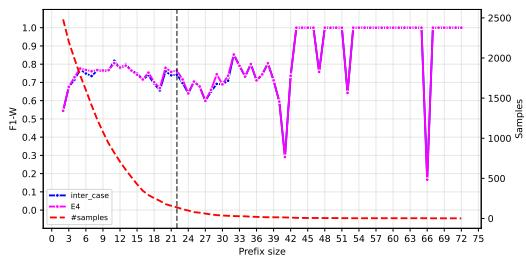

(a) BPI12WC  
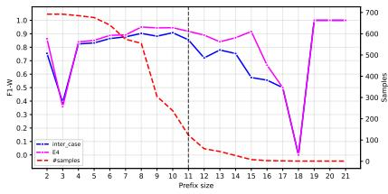  
(b) BPI20P

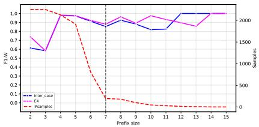  
(c) BPI20R

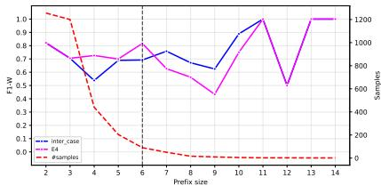  
(d) Helpdesk

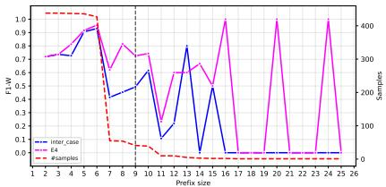  
(e) Receipt  
Fig. 5: F1-W on test set varying the prefix-IG size.

## References

1. Adams, J.N., Park, G., van der Aalst, W.M.: Preserving complex object-centric graph structures to improve machine learning tasks in process mining. Engineering Applications of Artificial Intelligence 125, 106764 (2023)

2. Chiorrini, A., Diamantini, C., Genga, L., Potena, D.: Multi-perspective enriched instance graphs for next activity prediction through graph neural network. Journal of Intelligent Information Systems 61, 5–25 (2023)

3. Di Francescomarino, C., Ghidini, C.: Predictive process monitoring. In: van der Aalst, W.M.P., Carmona, J. (eds.) Process Mining Handbook, pp. 320–346. Springer International Publishing, Cham (2022)

4. Diamantini, C., Genga, L., Mele, A., Potena, D.: Impact of inter-case features on structure-aware next activity prediction. In: 2024 International Conference on AI x Data and Knowledge Engineering (AIxDKE). pp. 98–103 (2024)

5. Diamantini, C., Genga, L., Potena, D., van der Aalst, W.: Building instance graphs for highly variable processes. Expert Systems with Applications 59, 101–118 (2016)

6. Dissegna, S., Di Francescomarino, C.: Graph neural networks for ppm: review and benchmark for next activity predictions. In: International Conference on Business Process Management. pp. 31–43. Springer (2024)

7. Dissegna, S., Di Francescomarino, C., Ronzani, M.: Multi-perspective next event prediction in ppm via heterogeneous graph neural networks. In: International Conference on Research Challenges in Information Science. pp. 365–382. Springer (2025)

8. Gunnarsson, B.R., vanden Broucke, S., De Weerdt, J.: Ls-ice: A load state intercase encoding framework for improved predictive monitoring of business processes. Information Systems 125, 102432 (2024)

9. Hamilton, W.L., Ying, R., Leskovec, J.: Inductive representation learning on large graphs. In: Proceedings of the 31st International Conference on Neural Information Processing Systems. p. 1025–1035. NIPS’17, Curran Associates Inc., Red Hook, NY, USA (2017)

10. He, X., Smedt, J.D., Broucke, S.v., Weerdt, J.D.: Inter-case informed business process sufix prediction integrating trace and log information. In: van de Weerd, I., Estrada Torres, B., van der Aa, H. (eds.) Business Process Management Workshops. pp. 41–54. Springer Nature Switzerland, Cham (2026)

11. Klijn, E.L., Fahland, D.: Identifying and reducing errors in remaining time prediction due to inter-case dynamics. In: 2020 2nd International Conference on Process Mining (ICPM). pp. 25–32 (2020)

12. Leemans, S.J., Fahland, D., Van Der Aalst, W.M.: Discovering block-structured process models from event logs-a constructive approach. In: International conference on applications and theory of Petri nets and concurrency. pp. 311–329. Springer (2013)

13. Pasquadibisceglie, V., Scaringi, R., Appice, A., Castellano, G., Malerba, D.: Prophet: Explainable predictive process monitoring with heterogeneous graph neural networks. IEEE Transactions on Services Computing 17(6), 4111–4124 (2024)

14. Rufini, G., Lo Bianco, R., Genga, L., Sulis, E., Dijkman, R.: Leveraging the status graph in predictive process monitoring tasks. In: Mining a Scientist’s Process: Essays Dedicated to Wil van der Aalst on the Occasion of His 60th Birthday, pp. 82–96. Springer (2026)

15. Senderovich, A., Francescomarino, C.D., Maggi, F.M.: From knowledge-driven to data-driven inter-case feature encoding in predictive process monitoring. Information Systems 84, 255–264 (2019)

16. Wu, Z., Pan, S., Chen, F., Long, G., Zhang, C., Yu, P.S.: A comprehensive survey on graph neural networks. IEEE Transactions on Neural Networks and Learning Systems 32(1), 4–24 (2021)