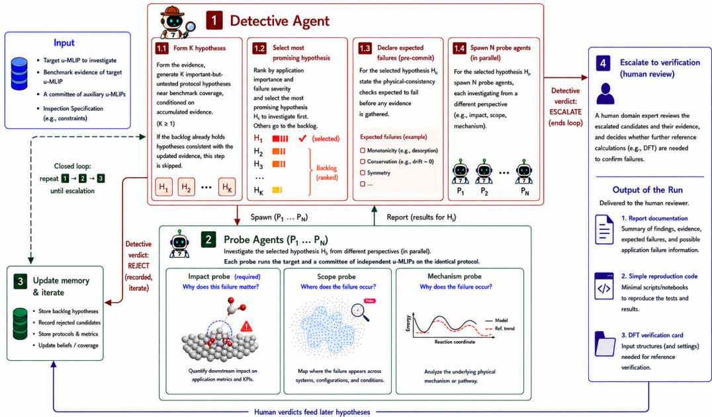
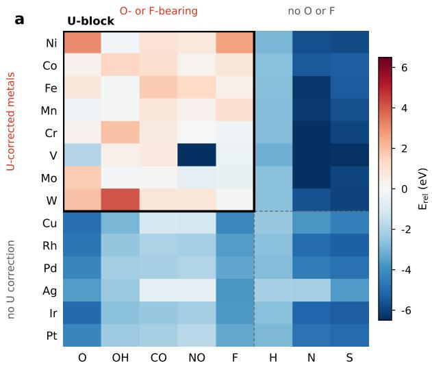
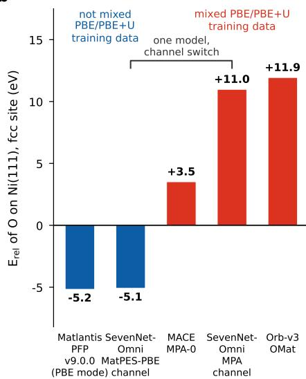
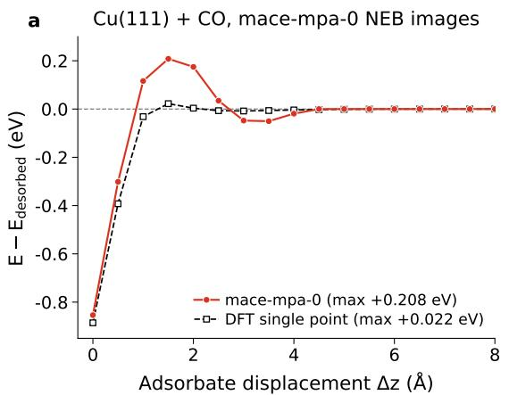
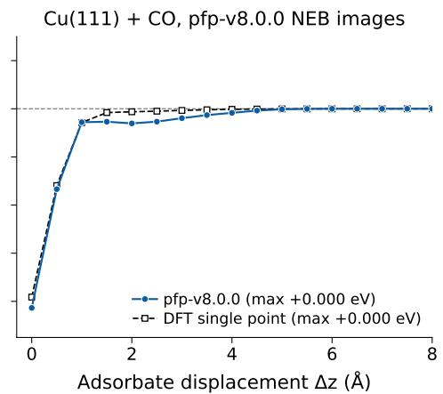
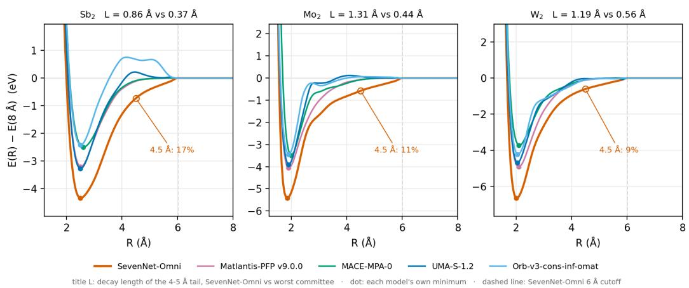

# MLIP Detective: Active Failure Mode Discovery Beyond Benchmark Scores for Machine-Learning Interatomic Potentials

Ryuhei Okuno Preferred Networks ok79ryuhei@preferred.jp

Nontawat Charoenphakdee Preferred Networks nontawat@preferred.jp

Kaoru Hisama Preferred Networks hisama@preferred.jp

Yuta Tsuboi Preferred Networks tsuboi@preferred.jp

## Abstract

Universal machine-learning interatomic potentials (u-MLIPs) aim to generalize across diverse configurations. Benchmarks enable reproducible evaluation but may not expose failures outside their predefined scope. Here, we show that physicsinformed search can complement benchmark-based evaluation by uncovering hidden failure modes. We introduce MLIP Detective, an agentic framework for active failure mode discovery. Starting from benchmark evidence, MLIP Detective generates falsifiable, physics-informed failure hypotheses, screens them with inexpensive simulations, and escalates only the most suspicious cases to human experts together with proposed verification protocols. Without issue-specific prompting, MLIP Detective identified and characterized a systematic anomaly in MACE-MPA-0: the model predicted some relaxed adsorbate–surface systems involving O- or F-containing adsorbates to be higher in energy than their corresponding separated fragments. Using cross-model comparisons, MLIP Detective further inferred a likely training-data origin for the anomaly, consistent with recent reports.

## 1 Introduction

Universal machine-learning interatomic potentials (u-MLIPs) aim to achieve near-first-principles accuracy across broad chemical spaces without system-specific fitting. Leaderboard benchmarks such as MLIP Arena [11] and Matbench Discovery [38], together with domain-specific benchmarks [21, 28, 48], are now primary evaluation tools, but evaluate models on predefined tasks covering only a limited region of configurational space. Consequently, a model may score well yet behave unphysically elsewhere. Expanding benchmark coverage remains costly because each additional configuration requires a reference calculation, typically using density functional theory (DFT).

The challenge is therefore not to test more but to decide where to test. To address this challenge, we formulate this problem as activefailure mode discovery: generating falsifiable failure hypotheses, screening them with inexpensive signals, and reserving costly DFT and expert verification for the most promising candidates. Because this workflow demands open-ended reasoning over chemistry and simulation protocols, we cast it as a task for large language model (LLM) agents. Related approaches have been explored for evaluating LLMs themselves [7, 16, 17, 19, 20, 27, 44–46], but they do not directly transfer to MLIPs, whose evaluation relies on physical protocols and therefore presents a distinct setting. Proof-Carrying Materials (PCM) recently introduced adversarial auditing over predefined compositional descriptors, using an LLM as one of several proposal strategies for generating numerical feature vectors for a predefined evaluation oracle [4]. To our knowledge, physics-informed active failure mode discovery for MLIPs remains largely unexplored. An extended related work discussion is provided in Appendix A.

  
Figure 1: Overview of the MLIP Detective framework.

We propose MLIP Detective, an agentic framework for active failure mode discovery in u-MLIPs. Our framework uses existing benchmarks [11, 21, 28, 38, 48] as a starting point for active search beyond their predefined coverage. MLIP Detective does more than investigate where a model fails: it flags anomalous model behavior, proposes its physical cause, quantifies its downstream impact, and delivers a self-contained verification package (a report, reproduction code, and DFT-ready input structures) so that a human expert can confirm the finding independently. This human-agent collaboration enables automated exploration while preserving human final judgment and supporting trustworthy, auditable conclusions.

## 2 Methodology

Problem Setup. A target u-MLIP is a predictive model trained on reference data (e.g., DFT) that takes an atomic configuration as input and outputs quantities such as energy, forces, and stress. A test protocol consists of related configurations together with an observable (e.g., a single-point energy). Failure mode discovery seeks protocols that expose candidate failures, such as spurious energy barriers. A verifier (e.g., a human expert) determines whether each candidate constitutes a confirmed failure. Confirmed failures are then grouped into failure modes, which represent recurring, physically coherent patterns rather than isolated error points.

MLIP Detective. The design of MLIP Detective for active failure mode discovery comprises three core components: (i) surrogate signals that estimate failure likelihood without requiring immediate costly verification, using cross-model disagreement and physical constraints; (ii) LLM-driven failure hypothesis generation that proposes physics-informed test protocols beyond existing benchmarks; and (iii) an acquisition strategy that prioritizes the most suspicious candidates for expert verification.

Figure 1 provides an overview of MLIP Detective. The framework has access to (i) the target u-MLIP, (ii) its results on existing benchmarks, (iii) a committee of separately trained auxiliary u-MLIPs, and (iv) a human-authored inspection specification that encodes physical constraints and diagnostic expectations and steers agents toward scientifically important or under-tested regions of configurational space. The framework outputs a single candidate failure mode together with

  
b

$$
\bar { \mathbf { E } } _ { \mathrm { r e l } } > \bar { \mathbf { 0 } } \colon
$$

  
Figure 2: MACE-MPA-0 predicts anomalous energies only in the U-block. a, Relative energy $E _ { \mathrm { r e l } }$ of MACE-MPA-0 across 14 metal surfaces and 8 adsorbates, referenced to the clean slab and isolated adsorbate. $E _ { \mathrm { r e l } } > 0$ indicates that the relaxed adsorbate–surface system lies above its separated-fragment reference; MLIP Detective used $E _ { \mathrm { r e l } } > 0$ as a diagnostic flag for candidate failures. All 27 anomalous cases lie within the outlined U-block (27 of 40 cells). b, $E _ { \mathrm { r e l } }$ for O on Ni(111) at identical geometry across five model/channel configurations. The prediction varies substantially across model channels, supporting an association between the anomaly in the U-block and mixed PBE/PBE+U training data.

its test protocol, supporting evidence, reproduction code, and structures prepared for independent verification. Two agent roles drive the investigation: a single Detective Agent that generates candidate failure hypotheses and decides whether to escalate to human verification, and multiple Probe Agents that execute computational probes. Agent instructions are given in Appendix B.

In the MLIP Detective’s search loop, (1) the Detective Agent generates and ranks candidate failure hypotheses based on application impact and severity, declares expected failures of the highest-priority hypothesis, and spawns parallel Probe Agents. (2) Probe Agents investigate the hypothesis from multiple perspectives, e.g., why the failure matters, where it occurs, and why it occurs. They run their protocols independently on the target and committee models and return analyzed reports to the Detective Agent. (3) The Detective Agent evaluates each report using two label-free surrogate signals: cross-model disagreement and violations of the constraints documented in the specification. All reports, including rejected failure hypotheses, are stored in an evidence memory that informs later iterations. If any hypothesis carries sufficiently strong surrogate evidence, the Detective Agent escalates it to verification and the search ends; otherwise it updates the backlog and returns to (1).

## 3 Experimental Results

We present two complementary case studies on MACE-MPA-0 [5]. Section 3.1 shows how the current MLIP Detective, while inspecting a single model, rediscovered adsorption-energy anomalies associated with selective training data and localized its manifestation across chemical space. Section 3.2 shows how an earlier prototype identified a blind spot in an adsorption-energy benchmark, discovered a model defect along an untested desorption pathway, and escalated it for verification. Plane-wave DFT single-point calculations on the same path geometries showed no comparable barrier along the desorption path. An additional finding for SevenNet-Omni is provided in Appendix C. Claude Opus 5 was used for the case study in Section 3.1, and Claude Opus 4.8 was used for Section 3.2 a the underlying LLM, respectively.

Table 1: Action log for one MLIP Detective search iteration, organized by the steps in Figure 1.
<table><tr><td>Step</td><td>Action</td><td>Description</td></tr><tr><td>1.1</td><td>Form K hypotheses</td><td>The Detective Agent computed a benchmark MAE of 1.21 eV against DFT-PBE. The errors were bimodal: 5 of 36 systems showed large errors, all involving Ni or Co with oxygen-bearing adsorbates. The relaxed O/Ni(111) adsorbate-slab system retained a 2.05 Å bond but had  $E _ { \mathrm { r e l } } = + 3 . 0 9 \ : \mathrm { e V } .$  The Detective Agent formed three hypotheses concerning an anomaly in the U-block, CO overbinding on noble metals, and physisorp- tion on Pt.</td></tr><tr><td>1.2</td><td>Select most promising hypothesis</td><td>The Detective Agent ranked the three candidate failure hypotheses by application impact and severity, selected the hypothesis concerning the U-block, and recorded the other two for later iterations.</td></tr><tr><td>1.3</td><td>Declare expected failures (pre-commit)</td><td>The Detective Agent refined and pre-committed the selected failure hypothesis: a mixed PBE/PBE+U reference inconsistency affecting combinations in the U-block. The hy- pothesis predicted the same anomaly for six unseen metals and for F but not S, consistent force-energy behavior, and no anomaly outside the U-block.</td></tr><tr><td>1.4 2</td><td>Spawn N Probe Agents Probe Agents  ${ \overline { { ( P _ { 1 }  – P _ { 3 } } } } ,$ </td><td>The Detective Agent launched three Probe Agents to test the scope, mechanism, and application impact of the selected hypothesis. Scope Probe (P1): evaluated the predicted scope of the hypothesis using a 14 × 8</td></tr><tr><td></td><td>parallel)</td><td>metal-adsorbate grid across five model/channel configurations. MACE-MPA-0 gave  $E _ { \mathrm { r e l } } > 0$  for 27 of 40 combinations within the U-block and 0 of 72 outside it. The anomaly appeared for F but not S, and for nonmagnetic Mo and W but not Cu, making oxygen-specific, magnetic, and 3d-only explanations less likely. Mechanism Probe (P2): found a metastable minimum 3.5 eV above the separated asymptote and found no evidence that force inconsistency or dispersion explained the anomaly. Impact Probe (P3): found that 4 of the 5 O-bearing steps in the 10-step methanation chain were shifted by 2.4–5.1 eV and that the predicted Ni(111) oxidation and CO-coverage thermodynamics were qualitatively incorrect at operating conditions, while a short low-</td></tr><tr><td>3</td><td>Update memory &amp; iterate</td><td>coverage MD run remained indistinguishable from the corresponding committee runs. After reviewing the three Probe Agent reports, which independently identified the se- lected SevenNet-Omni channel as a key variable, the Detective Agent re-derived all load-bearing quantities from the probes&#x27; raw outputs, updated the evidence memory, and reframed the finding as a corpus-associated pattern. Each Probe Agent had autonomously added a within-model channel-switch experiment; in the Scope Probe&#x27;s report, switch- ing SevenNet-Omni from its MatPES-PBE channel to its MPA channel changed the</td></tr><tr><td>4</td><td>Escalate to verification (human review)</td><td>mean  $E _ { \mathrm { r e l } }$  by +4.8 eV inside the U-block but only —0.02 eV outside it. The Detective Agent prepared a minimal reproduction, 11 plane-wave DFT input config- urations, and a decision table mapping possible DFT outcomes to verdicts. The search loop ended at escalation.</td></tr></table>

## 3.1 Rediscovery of Adsorption-Energy Anomalies Associated with Selective PBE+U

The finding. In this run, we inspected MACE-MPA-0 (trained on MPtrj [12]+sAlex [3]) against a committee of three u-MLIPs: the latest version, v9.0.0, of Matlantis-PFP [1, 43], SevenNet-Omni [18], and Orb-v3 [37]. The input benchmark evidence is a 36-system subset of the metalsurface adsorption-energy benchmark compiled by Wellendorff et al. [48].1 We define the Ublock as the metal–adsorbate combinations that trigger the Materials Project’s selective Hubbard U correction [2]: one of the designated transition metals paired with an O- or F-bearing adsorbate. MLIP Detective independently surfaced a recently reported training-data inconsistency [18, 47]: mixing PBE with selectively applied PBE+U reference energies creates incompatible potential energy surfaces, producing anomalous adsorption energetics for combinations of elements within the U-block. This case demonstrates the framework’s ability to turn benchmark evidence into a localized, falsifiable failure hypothesis and a specific training-data attribution.2 We define the energy of the combined adsorbate–slab system relative to the separated fragments as $E _ { \mathrm { r e l } } \equiv E _ { \mathrm { c o m b i n e d } } -$ Eclean slab − Eisolated adsorbate; $E _ { \mathrm { r e l } } > 0$ means that the relaxed adsorbate–slab system lies above the corresponding separated fragments. Across a 14-metal × 8-adsorbate grid, 27 of the 40 combinations within the U-block yield $E _ { \mathrm { r e l } } > 0$ , whereas none of the 72 combinations outside the U-block do (Fig. 2a).

The Detective Agent converted this probe evidence into an attribution analysis and identified the likely cause: training on mixed PBE/PBE+U data, which introduces an inconsistent energy reference between PBE-labeled and PBE+U-labeled systems. Cross-model comparisons and the within-model SevenNet-Omni channel switch in Fig. 2b support the hypothesis that mixed PBE/PBE+U reference energies are the likely origin of the anomaly. Because closely related prior work [18, 47] has already documented the same issue, the human verifier judged that additional DFT calculations were unnecessary for this case.

Search trajectory. Table 1 summarizes the logs from hypothesis generation to escalation.

## 3.2 DFT-Verified Anomaly beyond Adsorption-Energy Benchmark Coverage

The finding. In this run, we evaluated MACE-MPA-0 against a committee of Matlantis-PFP v8.0.0, Orb-v3, and SevenNet [32] using the same 36-system subset of the metal-surface adsorption-energy benchmark [48] used in Section 3.1. The benchmark provides both experimental adsorption energies and DFT-PBE values. Section 3.1 reports the MAE against DFT-PBE, whereas the 0.04 eV comparison reported below uses the experimental reference.

What the Detective Agent exploited is a blind spot of that benchmark: it scores the adsorption energy only at the single relaxed minimum, so it constrains the depth of the adsorption well and says nothing about the shape of the potential energy surface along the desorption coordinate. CO/Cu(111) shows how far apart the two can be: it is the system MACE-MPA-0 reproduces most accurately in the benchmark, to within 0.04 eV of experiment, and its desorption path is nonetheless defective.

In a rigid scan translating CO along the surface normal away from the relaxed adsorption minimum, MACE-MPA-0 rises 0.22 eV above its own desorption asymptote at $\Delta z \approx 1 . 2 5 \mathrm { ~ \AA ~ }$ before dropping into a secondary well of −0.054 eV at $\Delta z \approx 2 . 7 5 \mathrm { ~ \AA ~ }$ . None of the three committee models ever exceeds its asymptote.

Human verification. To rule out a constrained-scan artifact, the finding was re-tested on each model’s minimum-energy path as part of the human verification step: with a climbing-image nudged elastic band (CI-NEB) calculation [14] run from each model’s own relaxed endpoints, MACE-MPA-0 retains a +0.209 eV barrier and the committee is monotonic over the sampled images.

Widening the same minimum-energy-path comparison to other potentials over the six systems of the family, all started from the same initial geometry so that the paths are comparable, places MACE-MPA-0 alone in the pronounced regime: On CO/Cu(111) it reaches +0.188 eV, consistent with the +0.209 eV above given the change of protocol; a few of the other models show a slight rise on the scale of that protocol sensitivity, and the rest never exceed the asymptote. The same signature recurs across the family, weaker than on CO/Cu(111): Pd(100)/NO +0.117 eV, Pd(111)/NO +0.095 eV, and $\mathrm { P t ( 1 1 1 ) / N O \dot { + } 0 . 0 3 1 \ e V , }$ while Ru(001)/CO and Ir(111)/CO are clean.

DFT-PBE single-point calculations show that MACE-MPA-0 substantially overestimates the energy rise above the desorbed state along its converged path (Fig. 3). The escalated candidate was checked with plane-wave DFT single-point calculations on the 25 images of MACE-MPA-0’s own converged path and, as a control, on those of Matlantis-PFP’s. On the more finely discretized MACE-MPA-0 path, the model predicts a +0.208 eV barrier (+0.209 eV before refinement), whereas the DFT reference rises only +0.022 eV above the desorbed state, an order of magnitude smaller; on the Matlantis-PFP path neither the model nor the reference ever exceeds the desorbed state.

Computational verification details. The computational setup used to obtain the energy profiles in Fig. 3 is described below. For each of MACE-MPA-0 and Matlantis-PFP v8.0.0, the CO desorption path was optimized using the climbing-image nudged elastic band (CI-NEB) method implemented in the Atomic Simulation Environment (ASE) [25], with energies and forces evaluated by the respective MLIP. The simulation cell consisted of a four-layer $2 \times 2 \mathrm { \bar { C } u ( 1 1 1 ) }$ ) slab and one CO molecule, with approximately 42 Å of vacuum normal to the surface. All Cu atoms were held fixed during both endpoint relaxation and NEB optimization.

The endpoints were relaxed separately with each MLIP using FIRE [8]. Each NEB band contained 25 images, including both endpoints, and was initialized using image dependent pair potential (IDPP) interpolation [41]. The bands were optimized with FIRE, using a uniform spring constant of $0 . 1 \mathrm { e V } \mathring { \mathrm { A } } ^ { - 2 }$ and a maximum NEB-force convergence threshold of $0 . 0 5 \mathrm { e V } \mathring { \mathrm { A } } ^ { - 1 }$

  
b

  
Figure 3: DFT verification of the CO/Cu(111) desorption barrier. Energy relative to the desorbed state along the CI-NEB path, for a, MACE-MPA-0 and b, Matlantis-PFP v8.0.0. Filled circles are the model’s own band; open squares are plane-wave DFT (PBE) single points on the same 25 image geometries. Each NEB band was initialized with 25 images, including both endpoints, at $0 . 5 \mathring \mathrm { A }$ intervals over a total desorption displacement of 12 Å. Only the range $\Delta z = 0 { - } 8 \mathring { \mathrm { ~ A ~ } }$ is shown. MACE-MPA-0 places a +0.208 eV maximum above the vacuum asymptote (dashed line) where DFT gives +0.022 eV; on the Matlantis-PFP path neither curve exceeds its desorbed-state reference.

The converged NEB images were evaluated directly, without further interpolation, by single-point DFT calculations using VASP 6.5.1 [22, 23] with the Perdew–Burke–Ernzerhof (PBE) functional [33] and projector augmented-wave (PAW) potentials [24] from the PBE\_64 library: PAW\_PBE Cu\_pv 06Sep2000, PAW\_PBE C 08Apr2002, and PAW\_PBE O 08Apr2002. The gas-phase CO reference was obtained by relaxing an isolated molecule in a cubic cell with a side length of 15 Å. Spin-polarized collinear DFT calculations employed a plane-wave cutoff of 680 eV, a $\check { 7 } \times 7 \times 1$ k-point mesh for the slab cell and $2 \times 2 \times 2$ for the molecular box, Gaussian smearing with $\sigma = 0 . 0 5 \mathrm { e V } ,$ and an SCF energy convergence threshold of $1 0 ^ { - 6 } \mathrm { e V } .$

Relation to the framework of this paper. This finding was produced by the first prototype of MLIP Detective, which differs from the architecture defined in Section 2 in four respects. (i) There was no evidence memory and no feedback path into it. (ii) A hypothesis was tested by a single probe rather than by several probes instantiating different variations of it. The complementary perspectives that the current framework requires in parallel, in particular the impact probe that bounds where the defect does and does not matter, were therefore absent. (iii) Several hypotheses were pursued concurrently rather than one at a time. The run spawned eight probes across independent directions (elastic and phonon stability, short-range repulsion, clean-metal and oxide/semiconductor surface energies, adsorption PES shape), of which one produced the finding above and one a low-severity finding. (iv) The format of the output handed to the human verifier was free-format, and reviewing them took correspondingly more human effort. Together, these lessons shaped the more systematic and auditable workflow described in Section 2.

## 4 Limitations and future work

Our study demonstrates that an agentic framework can be useful for physics-informed active failure mode discovery. However, the search remains bound by the inspection specification, and escalated findings require costly human verification (see Appendix D for more details on limitations). Future work includes automating the quality control of escalated findings so that experts focus only on the most impactful candidates, and extending the search to broader classes of simulation protocols and target models.

## 5 Acknowledgments

We thank our colleagues at Preferred Networks, Inc.: So Takamoto and Kohei Shinohara for discussions that helped inspire the initial idea for this work, and Chikashi Shinagawa and Katsuhiko Nishimra for their advice on and assistance with the reference DFT calculations.

## References

[1] Matlantis, software as a service style material discovery tool. https://matlantis.com/.

[2] Hubbard U values — Materials Project documentation. https://docs.materialsproject. org/methodology/materials-methodology/calculation-details/gga+ u-calculations/hubbard-u-values, 2026. Accessed: 2026-08-24.

[3] Luis Barroso-Luque, Muhammed Shuaibi, Xiang Fu, Brandon M. Wood, Misko Dzamba, Meng Gao, Ammar Rizvi, Matt Uyttendaele, C. Lawrence Zitnick, and Zachary W. Ulissi. The Open Materials 2024 (OMat24) inorganic materials dataset and models. Nature Computational Science, 6(6):642–652, June 2026. ISSN 2662-8457. doi: 10.1038/s43588-026-00996-w. URL https://doi.org/10.1038/s43588-026-00996-w.

[4] Abhinaba Basu and Pavan Chakraborty. Proof-carrying materials: Falsifiable safety certificates for machine-learned interatomic potentials. arXiv preprint arXiv:2603.12183, 2026.

[5] Ilyes Batatia, Philipp Benner, Yuan Chiang, Alin M. Elena, Dávid P. Kovács, Janosh Riebesell, Xavier R. Advincula, Mark Asta, William J. Baldwin, Noam Bernstein, Arghya Bhowmik, Samuel M. Blau, Vlad Carare, James P. Darby, Sandip De, Flaviano Della Pia, Volker L.˘ Deringer, Rokas Elijošius, Zakariya El-Machachi, Edvin Fako, Andrea C. Ferrari, Annalena Genreith-Schriever, Janine George, Rhys E. A. Goodall, Clare P. Grey, Shuang Han, Will Handley, Hendrik H. Heenen, Kersti Hermansson, Christian Holm, Jad Jaafar, Stephan Hofmann, Konstantin S. Jakob, Hyunwook Jung, Venkat Kapil, Aaron D. Kaplan, Nima Karimitari, Namu Kroupa, Jolla Kullgren, Matthew C. Kuner, Domantas Kuryla, Guoda Liepuoniute, Johannes T. Margraf, Ioan-Bogdan Magdau, Angelos Michaelides, J. Harry Moore, Aakash A.˘ Naik, Samuel P. Niblett, Sam Walton Norwood, Niamh O’Neill, Christoph Ortner, Kristin A. Persson, Karsten Reuter, Andrew S. Rosen, Lars L. Schaaf, Christoph Schran, Eric Sivonxay, Tamás K. Stenczel, Viktor Svahn, Christopher Sutton, Cas van der Oord, Eszter Varga-Umbrich, Tejs Vegge, Martin Vondrák, Yangshuai Wang, William C. Witt, Fabian Zills, and Gábor Csányi. A foundation model for atomistic materials chemistry. arXiv preprint arXiv:2401.00096, 2023.

[6] Jörg Behler. Perspective: Machine learning potentials for atomistic simulations. The Journal of chemical physics, 145(17), 2016.

[7] Gabrielle Berrada, Jannik Kossen, Freddie Bickford Smith, Muhammed Razzak, Yarin Gal, and Thomas Rainforth. Scaling up active testing to large language models. Advances in Neural Information Processing Systems, 38:173670–173697, 2025.

[8] Erik Bitzek, Pekka Koskinen, Franz Gähler, Michael Moseler, and Peter Gumbsch. Structural relaxation made simple. Physical Review Letters, 97(17):170201, 2006.

[9] Henrique Musseli Cezar, Tilmann Bodenstein, Henrik Andersen Sveinsson, Morten Ledum, Simen Reine, and Sigbjørn Løland Bore. Learning atomic forces from uncertainty-calibrated adversarial attacks. npj Computational Materials, 11(1):200, 2025.

[10] Patrick Chao, Alexander Robey, Edgar Dobriban, Hamed Hassani, George J Pappas, and Eric Wong. Jailbreaking black box large language models in twenty queries. In 2025 IEEE Conference on Secure and Trustworthy Machine Learning (SaTML), pages 23–42. IEEE, 2025.

[11] Yuan Chiang, Tobias Kreiman, Christine Zhang, Matthew Kuner, Elizabeth Weaver, Ishan Amin, Hyunsoo Park, Yunsung Lim, Jihan Kim, Daryl Chrzan, et al. MLIP arena: advancing fairness and transparency in machine learning interatomic potentials via an open, accessible benchmark platform. Advances in Neural Information Processing Systems, 38, 2025.

[12] Bowen Deng, Peichen Zhong, KyuJung Jun, Janosh Riebesell, Kevin Han, Christopher J. Bartel, and Gerbrand Ceder. CHGNet as a pretrained universal neural network potential for charge-informed atomistic modelling. Nature Machine Intelligence, 5(9):1031–1041, 2023.

[13] Alkis Gotovos, Nathalie Casati, Gregory Hitz, and Andreas Krause. Active Learning for Level Set Estimation. In Proceedings ofthe Twenty-Third International Joint Conference on Artificial Intelligence, pages 1344–1350, 2013.

[14] Graeme Henkelman, Blas P Uberuaga, and Hannes Jónsson. A climbing image nudged elastic band method for finding saddle points and minimum energy paths. The Journal of chemical physics, 113(22):9901–9904, 2000.

[15] Yang Hu and Vladyslav Turlo. OptiMat Alloys: a FAIR, living database of multi-principal element alloys enabled by a conversational agent. arXiv preprint arXiv:2604.21850, 2026.

[16] Yizheng Huang, Wenjun Zeng, Aditi Kumaresan, and Zi Wang. ProEval: Proactive failure discovery and efficient performance estimation for generative AI evaluation. arXiv preprint arXiv:2604.23099, 2026.

[17] Yue Huang, Zhengzhe Jiang, Yuchen Ma, Yu Jiang, Xiangqi Wang, Yujun Zhou, Yuexing Hao, Kehan Guo, Pin-Yu Chen, Stefan Feuerriegel, et al. ProbeLLM: Automating principled diagnosis of llm failures. arXiv preprint arXiv:2602.12966, 2026.

[18] Jaesun Kim, Jinmu You, Yutack Park, Yunsung Lim, Yujin Kang, Jisu Kim, Haekwan Jeon, Suyeon Ju, Deokgi Hong, Seung Yul Lee, et al. Optimizing cross-domain transfer for universal machine learning interatomic potentials. Nature Communications, 17(1):3432, 2026.

[19] Jannik Kossen, Sebastian Farquhar, Yarin Gal, and Tom Rainforth. Active testing: Sampleefficient model evaluation. In International Conference on Machine Learning, pages 5753–5763. PMLR, 2021.

[20] Jannik Kossen, Sebastian Farquhar, Yarin Gal, and Thomas Rainforth. Active surrogate estimators: An active learning approach to label-efficient model evaluation. Advances in Neural Information Processing Systems, 35:24557–24570, 2022.

[21] Hendrik Kraß, Ju Huang, and Seyed Mohamad Moosavi. MOFSimBench: Evaluating universal machine learning interatomic potentials in metal-organic framework molecular modeling. npj Computational Materials, 12:4, 2026. doi: 10.1038/s41524-025-01872-3. URL https: //doi.org/10.1038/s41524-025-01872-3.

[22] Georg Kresse and Jürgen Furthmüller. Efficient iterative schemes for ab initio total-energy calculations using a plane-wave basis set. Physical review B, 54(16):11169, 1996.

[23] Georg Kresse and Jürgen Hafner. Ab initio molecular dynamics for liquid metals. Physical Review B, 47(1):558, 1993.

[24] Georg Kresse and Daniel Joubert. From ultrasoft pseudopotentials to the projector augmentedwave method. Physical review b, 59(3):1758, 1999.

[25] Ask Hjorth Larsen, Jens Jørgen Mortensen, Jakob Blomqvist, Ivano E Castelli, Rune Christensen, Marcin Dułak, Jesper Friis, Michael N Groves, Bjørk Hammer, Cory Hargus, Eric D Hermes, Paul C Jennings, Peter Bjerre Jensen, James Kermode, John R Kitchin, Esben Leonhard Kolsbjerg, Joseph Kubal, Kristen Kaasbjerg, Steen Lysgaard, Jón Bergmann Maronsson, Tristan Maxson, Thomas Olsen, Lars Pastewka, Andrew Peterson, Carsten Rostgaard, Jakob Schiøtz, Ole Schütt, Mikkel Strange, Kristian S Thygesen, Tejs Vegge, Lasse Vilhelmsen, Michael Walter, Zhenhua Zeng, and Karsten W Jacobsen. The atomic simulation environment—a python library for working with atoms. Journal ofPhysics: Condensed Matter, 29(27):273002, 2017. URL http://stacks.iop.org/0953-8984/29/i=27/a=273002.

[26] Wenwen Li, Yuki Orimo, and Nontawat Charoenphakdee. Lang2MLIP: End-to-end languageto-machine learning interatomic potential development with autonomous agentic workflows. arXiv preprint arXiv:2605.14527, 2026.

[27] Hongzhan Lin, Yang Deng, Yuxuan Gu, Wenxuan Zhang, Jing Ma, See Kiong Ng, and Tat-Seng Chua. Fact-AUDIT: An adaptive multi-agent framework for dynamic fact-checking evaluation of large language models. In Proceedings ofthe 63rd Annual Meeting ofthe Associationfor Computational Linguistics (Volume 1: Long Papers), pages 360–381, 2025.

[28] Antoine Loew, Dewen Sun, Hai-Chen Wang, Silvana Botti, and Miguel AL Marques. Universal machine learning interatomic potentials are ready for phonons. npj Computational Materials, 11(1):178, 2025.

[29] Anay Mehrotra, Manolis Zampetakis, Paul Kassianik, Blaine Nelson, Hyrum Anderson, Yaron Singer, and Amin Karbasi. Tree of attacks: Jailbreaking black-box llms automatically. Advances in Neural Information Processing Systems, 37:61065–61105, 2024.

[30] Phuc Nguyen, Deva Ramanan, and Charless Fowlkes. Active testing: An efficient and robust framework for estimating accuracy. In International Conference on Machine Learning, pages 3759–3768. PMLR, 2018.

[31] Etinosa Osaro, Santosh Adhikari, Stamatia Zavitsanou, Kelsey Parker, and Dario Rocca. MLIPilot: LLM-driven auto-research for machine-learned interatomic potentials. arXiv preprint arXiv:2605.30889, 2026.

[32] Yutack Park, Jaesun Kim, Seungwoo Hwang, and Seungwu Han. Scalable parallel algorithm for graph neural network interatomic potentials in molecular dynamics simulations. J. Chem. Theory Comput., 20(11):4857–4868, 2024. doi: 10.1021/acs.jctc.4c00190.

[33] John P Perdew, Kieron Burke, and Matthias Ernzerhof. Generalized gradient approximation made simple. Physical Review Letters, 77(18):3865, 1996.

[34] Ethan Perez, Saffron Huang, Francis Song, Trevor Cai, Roman Ring, John Aslanides, Amelia Glaese, Nat McAleese, and Geoffrey Irving. Red teaming language models with language models. In Proceedings of the 2022 conference on empirical methods in natural language processing, pages 3419–3448, 2022.

[35] Evgeny V Podryabinkin and Alexander V Shapeev. Active learning of linearly parametrized interatomic potentials. Computational Materials Science, 140:171–180, 2017.

[36] Wirawan Purwanto, Shiwei Zhang, and Henry Krakauer. An auxiliary-field quantum monte carlo study of the chromium dimer. The Journal ofchemical physics, 142(6), 2015.

[37] Benjamin Rhodes, Sander Vandenhaute, Vaidotas Šimkus, James Gin, Jonathan Godwin, Tim Duignan, and Mark Neumann. Orb-v3: atomistic simulation at scale. arXiv preprint arXiv:2504.06231, 2025.

[38] Janosh Riebesell, Rhys EA Goodall, Philipp Benner, Yuan Chiang, Bowen Deng, Gerbrand Ceder, Mark Asta, Alpha A Lee, Anubhav Jain, and Kristin A Persson. A framework to evaluate machine learning crystal stability predictions. Nature Machine Intelligence, 7(6):836–847, 2025.

[39] Mikayel Samvelyan, Sharath C Raparthy, Andrei Lupu, Eric Hambro, Aram H Markosyan, Manish Bhatt, Yuning Mao, Minqi Jiang, Jack Parker-Holder, Jakob Foerster, et al. Rainbow teaming: Open-ended generation of diverse adversarial prompts. Advances in Neural Information Processing Systems, 37:69747–69786, 2024.

[40] Daniel Schwalbe-Koda, Aik Rui Tan, and Rafael Gómez-Bombarelli. Differentiable sampling of molecular geometries with uncertainty-based adversarial attacks. Nature communications, 12(1):5104, 2021.

[41] Søren Smidstrup, Andreas Pedersen, Kurt Stokbro, and Hannes Jónsson. Improved initial guess for minimum energy path calculations. The Journal of chemical physics, 140(21), 2014.

[42] Justin S Smith, Ben Nebgen, Nicholas Lubbers, Olexandr Isayev, and Adrian E Roitberg. Less is more: Sampling chemical space with active learning. The Journal of chemical physics, 148 (24), 2018.

[43] So Takamoto, Chikashi Shinagawa, Daisuke Motoki, Kosuke Nakago, Wenwen Li, Iori Kurata, Taku Watanabe, Yoshihiro Yayama, Hiroki Iriguchi, Yusuke Asano, Tasuku Onodera, Takafumi Ishii, Takao Kudo, Hideki Ono, Ryohto Sawada, Ryuichiro Ishitani, Marc Ong, Taiki Yamaguchi, Toshiki Kataoka, Akihide Hayashi, Nontawat Charoenphakdee, and Takeshi Ibuka. Towards universal neural network potential for material discovery applicable to arbitrary combination of 45 elements. Nature Communications, 13(1):2991, May 2022. ISSN 2041-1723. doi: 10.1038/s41467-022-30687-9. URL https://doi.org/10.1038/s41467-022-30687-9.

[44] Xinming Tu, Tianze Wang, Yingzhou Lu, Kexin Huang, Yuanhao Qu, and Sara Mostafavi. Who guards the benchmarks? automated auditing of LLM agent benchmarks. In Third Conference on Language Modeling, 2026. URL https://openreview.net/forum?id=3x89U8nvoE.

[45] Hao Wang, Hanchen Li, Qiuyang Mang, Alvin Cheung, Koushik Sen, and Dawn Song. Do androids dream of breaking the game? systematically auditing AI agent benchmarks with benchjack. arXiv preprint arXiv:2605.12673, 2026.

[46] Junlin Wang, Federico Bianchi, Shang Zhu, Fan Nie, Yongchan Kwon, Bhuwan Dhingra, and James Zou. Automated benchmark auditing for AI agents and large language models. arXiv preprint arXiv:2605.26079, 2026.

[47] Thomas Warford, Fabian L. Thiemann, and Gábor Csányi. Better without U: Impact of selective Hubbard U correction on foundational MLIPs. Machine Learning: Science and Technology, 7 (3):035033, 2026.

[48] Jess Wellendorff, Trent L. Silbaugh, Delfina Garcia-Pintos, Jens K. Nørskov, Thomas Bligaard, Felix Studt, and Charles T. Campbell. A benchmark database for adsorption bond energies to transition metal surfaces and comparison to selected dft functionals. Surface Science, 640:36–44, 2015. ISSN 0039-6028. doi: https://doi.org/10.1016/j.susc.2015.03.023. URL https://www. sciencedirect.com/science/article/pii/S0039602815000837. Reactivity Concepts at Surfaces: Coupling Theory with Experiment.

[49] Brandon Wood, Misko Dzamba, Xiang Fu, Meng Gao, Muhammed Shuaibi, Luis Barroso-Luque, Kareem Abdelmaqsoud, Vahe Gharakhanyan, John Kitchin, Daniel Levine, et al. UMA: A family of universal models for atoms. Advances in Neural Information Processing Systems, 38, 2025.

## A Related work

Benchmarks for u-MLIPs. Community evaluation of u-MLIPs is dominated by benchmark suites, including Matbench Discovery [38], MLIP Arena [11], and domain-specific benchmarks [21, 28, 48]. These suites are the de facto standard for model comparison and are also the starting point of our framework: MLIP Detective consumes their results as evidence and extends inspection into the configurations they leave untested. Our work is thus complementary to benchmark development rather than a replacement.

Active testing and efficient evaluation. Active testing formalizes model evaluation under a costly labeling oracle: the model is fixed, and test inputs are selected to make the most of each label [19, 20, 30]. Surrogate estimates of expected loss guide importance-sampling acquisition, while the LURE estimator corrects for the resulting selection bias; follow-up work applies related ideas to LLM evaluation [7]. These methods operate on a static pool and target unbiased estimation of an aggregate metric. Our problem shares the costly-oracle premise and the fixed-model setting, but differs from classical active testing in targeting failure mode discovery rather than unbiased estimation and in generating candidates beyond any fixed test pool.

Proactive evaluation of generative models. ProEval [16], the closest analogue to our setting, frames performance estimation and failure discovery as dual Bayesian objectives. It uses transfer learning to construct an informed Gaussian process (GP) prior from historical evaluation results or semantic embeddings, then applies Bayesian quadrature to performance estimation and superlevel set sampling (SS) to failure discovery. SS is extended through generative synthesis (SS-Gen), which uses identified hard examples as in-context anchors, and topic-aware exploration (TSS), which promotes diverse failure patterns. Building on Bayesian level set estimation [13], ProEval contributes transfer learning for GP priors and active synthesis of new test cases. MLIP Detective instantiates analogous components for MLIPs: cross-model disagreement and physical-constraint violations replace the GP surrogate; agents construct physics-informed test protocols from benchmark evidence; and the oracle is an expert verdict supported by costly DFT.

Adaptive probing of LLMs. Fact-Audit [27] uses importance sampling and an adaptive scenario taxonomy to focus fact-checking probes on model weaknesses. ProbeLLM [17] uses hierarchical MCTS to balance MACRO coverage and MICRO refinement, then derives failure modes using failure-aware embeddings and boundary-aware induction. MLIP Detective transfers this adaptive probing paradigm to MLIPs through physics-informed test protocols and expert verification supported by DFT.

Red teaming. Automated red teaming seeks inputs that trigger undesired behavior, via attacker finetuning [34], iterative refinement [10, 29], or quality-diversity search [39]. These methods optimize for eliciting failures, typically without a per-query verification oracle of DFT-like cost, and diversity is enforced heuristically. Our setting differs in that many candidate findings require costly DFT calculations for confirmation.

Uncertainty quantification and active learning for MLIPs. Within the MLIP community, ensemble variance and related uncertainty estimates guide reference-data acquisition in active-learning loops [6, 35, 42], while adversarial sampling targets high-uncertainty, thermally accessible configurations for retraining [9, 40]. Like MLIP Detective, these methods use inexpensive surrogate signals to prioritize costly reference calculations. Their goal, however, is to update the model; ours is to evaluate a fixed model.

Adversarial auditing of MLIPs. Proof-Carrying Materials (PCM) [4] searches for compositional blind spots in a predefined tabular feature space. Its LLM is one of six adversaries and proposes numerical feature vectors, which the oracle maps to existing materials for MLIP–DFT evaluation. MLIP Detective instead searches over physical test protocols comprising related configurations, observables, and falsifiable consistency criteria. This protocol-level search can expose relational failures, including unphysical dissociation limits, barriers, and force–energy inconsistencies, that are not naturally represented as isolated points in a fixed descriptor space. It also enables agents to generate new configurations, localize the conditions under which an anomaly occurs, and produce a physically interpretable hypothesis with a DFT-ready verification protocol. Cross-MLIP disagreement and physical-constraint violations are used to prioritize which candidate failure hypotheses receive new DFT calculations and expert review.

Agentic frameworks for atomistic simulation. Recent work applies LLM agents to MLIP workflows, e.g., MLIPilot [31], OptiMat Alloys [15], and Lang2MLIP [26], automating simulation setup or model construction. MLIP Detective differs in purpose: the agents are used not to run simulations for a user’s scientific goal but to inspect the model itself, forming and testing hypotheses about where it fails.

## B Framework and implementation details

This appendix documents the operational details of MLIP Detective: the requirements under which the agents operate, the inspection specification, and the implementation substrate.

The Detective Agent operates from a human-authored natural-language instruction document, fixed before any run; each Probe Agent operates from a brief that the Detective Agent composes at spawn time. This appendix excerpts the requirements that define each component of the framework. The boxed passages (Boxes B.1–B.3) and inline quotations are verbatim from the operational instructions, with four classes of edits: role and artifact names are mapped to the paper’s terminology, references to file paths and internal infrastructure are replaced by bracketed placeholders, omissions are marked by ellipses in brackets, and markup is converted from the source’s plain-text formatting. No physics content was added, removed, or reworded.

Roles and authority. The instructions open by fixing the division of authority between the Detective Agent, the Probe Agents, and the human verifier (Box B.1). Two constraints of Section 2 are made explicit here: the Detective Agent’s verdict vocabulary contains no CONFIRM, and no DFT call is permitted inside the search loop.

Box B.1: Division of authority (The Detective Agent instructions)

The division of authority is strict:

• The detective forms hypotheses, declares expected failures, spawns probes, and decides which candidates to REJECT or ESCALATE.

• It can never CONFIRM a failure. Confirmation happens outside the loop: the human operator [. . . ] renders the verdict as a domain expert.

• Inside the loop everything is label-free: no DFT is called. DFT belongs to the post-loop verification stage and is budget-bounded (one call per configuration in an escalated protocol).

Detective Agent: hypothesis discipline and pre-registration. The Detective Agent is required to pursue one hypothesis at a time: “Hypotheses are pursued one at a time: settle one, explore it, and move to the next only after the current one is settled (escalated, rejected, or exhausted). Each new hypothesis is conditioned on the full evidence memory, including the outcome of the one before it.” Candidate directions are ranked by the two criteria of Section 2: importance (“how much the region matters in practical applications of [the target]”) and severity (“how badly the model would be wrong if the hypothesis holds (large spurious barriers, wrong phase ordering, unphysical forces—not marginal numerical noise)”).

Before any Probe Agent is spawned, the Detective Agent must pre-register the expected failure (Box B.2). This declaration serves three functions in the current framework. First, it constrains the Detective Agent’s own later review step: because the Detective Agent both generates hypotheses and judges the Probe Agents’ evidence, the pre-registered checks prevent apparent anomalies in probe output from being rationalized post hoc into “the expected failure”. Second, it commits the hypothesis to outcomes on configurations not yet evaluated, which is what makes a discovery claim verifiable. Third, it is the source of the decision table in the escalation report (see below), so the human verdict is an application of pre-committed rules.

Box B.2: Pre-registration requirement (Detective Agent instructions)

Before spawning anything, append to [the evidence memory]:

• run id (timestamp) and target model,

• the hypothesis [. . . ] and the committee list,

• the declaration: for each probe variation you are about to spawn (structure subset / observable), the observable and the concrete physical-consistency checks you expect the target model to fail (e.g. no spurious extremum along the path, correct force directions, correct energetic ordering), written verbatim before any evidence is gathered.

The declaration does not define failure—the human verdict [. . . ] does. It documents what was predicted, gives the expert a rubric to judge against [. . . ].

The declared variations must include at least one impact probe: a variation that measures the hypothesized defect’s consequence in an application-like setting (condensed phase, realistic workflow, finite temperature) rather than the idealized geometry that exposes it. Its result feeds the “application failure” section of the escalation report [. . . ]—and a probe showing the defect is screened away in practice is grounds to reject or de-prioritize, not escalate.

Detective Agent: evidence memory and information hygiene. The evidence memory is an append-only file recording declarations, probe reports, rejections with their reasons, and post-loop human verdicts. The instructions restrict what a new run may read from past runs: full reports of settled runs are archived out of the agents’ reach, and the distilled evidence memory is “the only carry-over from past runs—reading old reports would bias new hypothesis formation”.

Probe Agent briefs. Each Probe Agent receives a brief composed by the Detective Agent, stating the target and committee models, the hypothesis, this Probe Agent’s assigned variation of it, and the declared checks. Three further requirements on the brief matter for the results of this paper. First, the committee obligation: the Probe Agent “must run the identical protocol on the target and every committee model, and report both surrogate signals”, and “if every model, target and committee alike, shows the same anomaly, the protocol rather than the model is suspect”. Second, methodological freedom: the brief must not prescribe a fixed list of check functions; the probe “is expected to design its own diagnostics around the hypothesis”, under the design rule “be specific in the hypothesis; be open in the methodology”. Third, the report format: a self-contained report whose protocol (the atomic configurations as files, plus the observable computed from them) is “re-runnable as-is”, with per-model observable values, the cross-model disagreement, the physical-constraint checks run, and severity as a continuous quantity (e.g. the height of a spurious barrier).

Evaluation and escalation. On receiving a probe report, the Detective Agent reviews it against the inspection specification, the target model’s documentation, and the pre-registered declaration, and renders REJECT (appending the reason to the evidence memory) or ESCALATE. The instructions fix the semantics of the two surrogate signals asymmetrically (Box B.3): an exact-constraint violation is decisive on its own, whereas disagreement only allocates suspicion, and committee unanimity is neither expected nor required.

## Box B.3: Semantics of the surrogate signals (Detective Agent instructions)

The two signals establish different things. A violation of a physical constraint that applies exactly to the observable is decisive on its own—the inconsistency is established without any reference. Cross-model disagreement is a suspicion signal: at least one model must be wrong, but disagreement alone cannot say which. Committee unanimity is therefore neither expected nor required. Use physical constraints and physical intuition—not mere outlier-ness in value—to decide who the prime suspect is:

• If the target model departs furthest from the physics, the region is worth exploring even when committee members also behave oddly there. [. . . ]

• If a committee member shows the more pronounced anomaly, it is not the current run’s finding: record it in [the evidence memory] as a future study target [. . . ], and judge the current target against the remaining members.

An escalation must be delivered as a fixed-format escalation report: the document the human verifier reads. Its required sections are: (1) Finding, one to two sentences plus the benchmark evidence the hypothesis started from; (2) Type, exact-constraint violation or cross-model disagreement, which determines whether verification supplies reference values or decides the verdict; (3) Application failure, grounded in the impact probe’s measurement and required to also state the domain boundary “where the defect does not matter”; (4) a single figure “from which the anomaly is visible at a glance”; (5) a minimal reproduction script that “runs in minutes and prints the headline numbers”; (6) a DFT verification card: the configurations to compute with their cost, ready-to-run inputs, and “a decision table mapping DFT outcomes to verdicts (‘reference shows X → confirmed; shows Y → refuted’)”, derived from the declaration of Box B.2; and (7) Confounds closed, at most five bullets listing the artifact explanations tested and excluded.

The inspection specification. The inspection specification of Section 2 is a standalone document of physical constraints and diagnostic expectations for MLIP validation. It defines eight constraints: energy–force consistency (F = −∇E), translational invariance / zero net force for an isolated system, a repulsive wall at short range, elastic (Born) stability of known stable crystals, symmetry preservation, stress–strain consistency, the dissociation limit (size consistency at large separation), and PES smoothness. Each comes with a statement of the constraint, its physical rationale, a label-free check procedure, and a numerical threshold. Some of these properties are guaranteed by construction in a given MLIP architecture (e.g. force conservation via automatic differentiation); the specification guides agents to skip such checks for the target model and to concentrate on the properties that are not guaranteed.

Neither the inspection specification nor the framework instructions refer to any specific material system, dataset, or known failure mode of the target models. The remaining human-authored inputs to the run of Section 3—the seed benchmark with the target model’s results on it, the identity of the target and committee models, and the documentation of the models and of the validation suite that the instructions direct agents to consult—likewise contain no reference to the pathology rediscovered there.

Implementation. Both roles are instances of a general-purpose LLM coding agent (Claude Code), operating in a sandboxed workspace with file-system, shell, and Python tools with access to the target and committee MLIPs. The agents are driven by the Claude Opus model available at the time of each run: Claude Opus 4.8 for the run of Section 3.2, and Claude Opus 5 for the runs of Section 3.1 and Appendix C. The Detective Agent and each Probe Agent run as separate agent sessions; the Detective Agent spawns Probe Agents in parallel within a hypothesis, and each Probe Agent returns its report to the Detective Agent.

## C Additional Experimental Result: Mid-range dimer attraction in SevenNet-Omni

This run demonstrates that the framework is not tied to a particular target: here the roles are rearranged, with SevenNet-Omni [18] as the target and a committee of Matlantis-PFP v9.0.0 [1, 43], MACE-MPA-0 [5], UMA-S-1.2 [49], and Orb-v3 [37]. Seeded by the MLIP Arena homonuclear-diatomics family, the framework found that SevenNet-Omni predicts an anomalous mid-range attraction for the $\mathrm { C r _ { 2 } , M o _ { 2 } , W _ { 2 } }$ , and $\mathrm { { S b } _ { 2 } }$ dimers, consistently across all three evaluated model channels: at $R = 4 . 5 \mathring \mathrm { ~ A ~ }$ well beyond the equilibrium bond length yet well inside the model’s 6.0 Å cutoff, it still holds 17 % $( \mathrm { S b _ { 2 } } ) , \dot { 1 } 1 \% ( \mathrm { M o _ { 2 } } )$ , and $9 \% ( \mathrm { W _ { 2 } } )$ of its own well depth, versus at most 4 % for the committee models (Fig. 4); no committee model shows a comparable attractive tail, and for $\mathbf { S b } _ { 2 } \ \mathbf { O r b { - } } \mathbf { V } 3$ is instead repulsive at mid-range, recorded as a separate side finding. The Cr dimer is excluded from the quantitative comparison: it is a notoriously difficult electronic-structure problem with an unusual potential energy curve [36], and the committee models disagree even near equilibrium, leaving no label-free reference band to judge the tail against. The target model also binds more deeply near equilibrium, but the well depths of the committee models themselves spread on a comparable scale, so that deviation cannot be attributed label-free; the finding is therefore reported on the tail, where no committee model retains appreciable binding.

Although a careful visual inspection of the individual curves would reveal the tail, this candidate anomaly is easily overlooked when models are compared through the aggregate scores of the benchmark that seeded it. The aggregate diatomics metrics of MLIP Arena are reference-free statistics of each model’s own curve, such as smoothness, tortuosity, sign flips, and force–energy conservation, and do not compare the predicted binding at a given distance against an external reference.

The escalation was also explicitly bounded. The impact probes established where the candidate anomaly does not matter: when the same pairs are embedded in bulk, the excess pair interaction is screened to within the committee spread, and NVE energy drift is unaffected, confining the consequences to dilute gas-phase thermodynamics such as dimerization equilibria and nucleation onsets, where the 0.73 eV residual binding of $\mathrm { { S b _ { 2 } } }$ at 4.5 Å (7 kT at 1200 K) distorts pair-association weights by orders of magnitude. The escalation report records this domain boundary and justifies escalation by the strength of the surrogate signal and the low verification cost (32 two-atom singlepoint calculations), not by breadth of impact: a finding less application-critical than the one in Section 3, and labeled as such before reaching the human verifier.

The escalated report awaits human expert verification: while the verification card requires only 32 PBE single points, transition-metal dimers are notoriously difficult for single-reference DFT, so a definitive verdict on the true potential-energy surface would require costlier multi-reference calculations, which were deprioritized in favor of the more application-critical finding of Section 3.

## D Limitations

The search is bounded by the inspection specification. Hypothesis generation is anchored to the human-authored inspection specification: the agents reliably probe the constraints and diagnostics it documents and their neighborhoods, but they rarely propose failure classes outside it. The quality of the search is therefore capped by the quality of the inspection specification, and extending the framework to new kinds of failures currently requires a human to revise the specification.

Human verification limits the number of findings. Every escalated candidate consumes expert attention and may require new reference calculations, so only a small number of findings can be verified per unit of expert time. Extending agent authority into the verification stage may relax this bottleneck while keeping the final verdict with the human expert.

  
Figure 4: Anomalous mid-range attraction in SevenNet-Omni dimers. Binding curves $E ( R ) -$ $E ( 8 \mathrm { \AA } )$ for $\mathrm { S b _ { 2 } , M o _ { 2 } , }$ and $\mathrm { { W _ { 2 } } }$ computed with SevenNet-Omni (orange) and the four committee models (Matlantis-PFP v9.0.0, MACE-MPA-0, UMA-S-1.2, and Orb-v3-cons-inf-omat). Dots mark each model’s own minimum; the dashed line marks SevenNet-Omni’s 6 Å cutoff. Annotations give the fraction of SevenNet-Omni’s own well depth still bound at $4 . 5 \mathring \mathrm { A } ,$ and each panel title reports the fitted decay length of the $4 { - } 5 \mathring \mathrm { A }$ tail for SevenNet-Omni versus the worst committee model.

Framework outputs require manual polishing for presentation. The escalation reports are designed for the verification decision, not for publication: the figures and the report prose in this paper were manually reworked from the framework’s raw outputs. Automating publication-quality reporting is left to future work.

The evaluation remains limited in scale. The present experiments are intended to establish feasibility and cover only a small number of search runs, target models, and failure modes. A more comprehensive evaluation should repeat the search across independent runs and broader tasks, define quantitative metrics such as verification yield, discovery cost, and run-to-run consistency, and compare the framework against random, rule-based, and expert-designed search strategies. Controlled ablations of the inspection specification, auxiliary committee, evidence memory, surrogate signals, and impact probes are also needed to determine which components contribute to successful failure mode discovery.