# MOEMB: Scaling Universal Multimodal Embeddings with Efficient Mixture-of-Experts Models

Xuanming Cui2,∗, Shlok Kumar Mishra1, Wentao Bao1, Aashu Singh1, Zihao Wang1, Xiangjun Fan1, Jun Xiao1, Ser-Nam Lim2,†, Jianpeng Cheng1,†

1AI at Meta, 2University of Central Florida ∗Work done at Meta, †Equal advising

Universal multimodal embedding (UME) increasingly demands encoder’s capacity for handling a broad range of tasks and modalities with increased complexity. Prior scaling methods either increase the representation size, retrieval effort, or scales the encoder into a heavy multimodal LLM. Recent works, such as Think-Then-Embed (TTE), explore scaling via reasoning tokens. However, embedding models are hard to scale up: increasing parameters directly tradeoffs for the large training batch size that contrastive learning needs, and retrieval has to be served under tight latency. Moreover, UME tasks are diverse in complexity, where scaling up embedders can bring significant redundant computation. In this work, we propose MOEMB, which instead scales UME along the expert axis through mixture-of-experts (MoE), growing encoder capacity while preserving single-vector, non-autoregressive encoding. Through a systematic study of the design space and training recipes for MoEbased UME, MOEMB sets a new state of the art on both MMEB-V2 and MRMR among models trained on public MMEB-family data: with only ∼3B active parameters, MOEMB surpasses TTE-based methods with > 4× active parameters, using significantly less computes. To further improve the scalability and efficiency, we conduct the first comprehensive study of adaptive computation for MoE-based embedding, spanning diverse strategies across training-based and inference-only methods. Together, these results support expert scaling as an effective and efficient direction for UME, with adaptive computation further improving efficiency for MLLM-based embedding models towards large-scale retrieval and recommendation systems.

Date: September 7, 2026

∞Meta

## 1 Introduction

Embedding models map heterogeneous inputs into a shared space for retrieval. While earlier embedding tasks focus primarily on simple symmetric retrieval, recent universal multimodal embedding (UME) tasks now require a single encoder to handle diverse modalities, with diverse tasks spanning classification, question answering, retrieval, grounding,

and document search (Meng et al., 2025).

As the embedding tasks grow more varied and complex, performance depends more on the encoder’s capacity for visual reasoning and instruction following. However, most work on scaling embeddings still targets the stored representation instead of that capacity (Fig. 2). Matryoshka Representation Learning adjusts the embedding dimensionality (Kusupati et al., 2022), while multi-vector retrieval methods (Khattab and Zaharia, 2020; Faysse et al., 2025; Xiao et al., 2025) keep multiple vectors per input for finegrained retrieval. These methods scale storage and retrieval budget, but they leave the encoder itself untouched, and so cannot supply the understanding and reasoning that harder UME tasks demand.

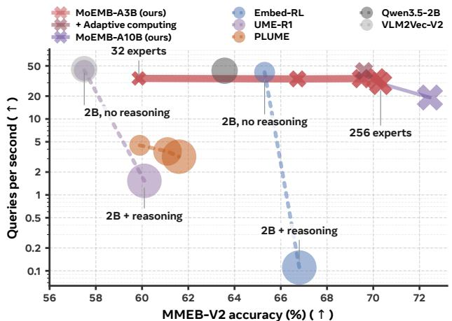  
Figure 1 Accuracy vs. QPS. Scaling via MoE (MOEMB) raises accuracy by > 10 points at near-constant throughput. Details can be found in C.2.

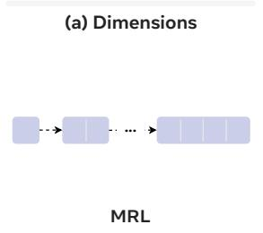

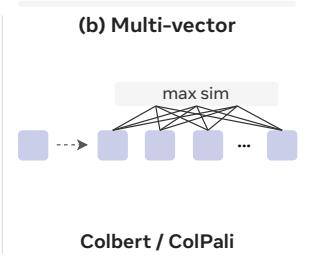

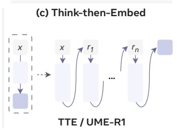

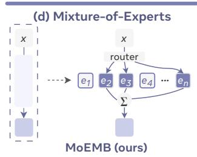  
Figure 2 Four ways to scale multimodal embeddings. Dimension (a) and multi-vector (b) methods scale the output representation; TTE-based methods (c) scale via intermediate reasoning tokens. MOEMB (d) instead scales the encoder along the expert axis through sparse MoE.

To scale the encoder itself, recent works turn multimodal large language models (MLLMs) into embedders, and these now lead UME benchmarks (Jiang et al., 2025; Lin et al., 2025; Li et al., 2026). However, even at larger scales than CLIP-based (Radford et al., 2021) lightweight models, these MLLM-based embedders still struggle to cover the diverse tasks of UME. We empirically find (Fig. 3) that one embedder trained jointly over all tasks is outperformed by the same model trained per task; Qwen3-VL-Embedding likewise reports degraded MTEB (Muennighoff et al., 2023) performance against text-only Qwen3-Embedding (Zhang et al., 2025b). Two explanations are possible: destructive gradient interference between tasks, or a model simply not capacious enough to serve them all at once. These issues motivate us to explore the design space and training recipe when scaling up embedder.

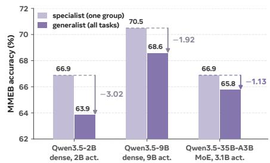  
Figure 3 Performance degradation for switching from generalist to specialist shrinks with model’s total capacity. Each model trained on the full MMEB mixture (generalist) vs. one task alone (specialist). Details in App. D.2.

A recent line of think-then-embed (TTE) methods scale for reasoning-heavy retrieval by generating intermediate reasoning tokens before producing the final embedding (Cui et al., 2025; Lan et al., 2025; Cheng et al., 2026). However, these methods improve performance with a significant cost of computation. For instance, on the text partition of MMEB-V3 (Huang et al., 2026), it takes 1.7 days for a regular MLLM-based 2B encoder (Meng et al., 2025) to complete evaluation, while UME-R1-2B (Lan et al., 2025), a TTE-based model, needs roughly 7.8 H200-days to encode queries, and 431 H200-days for candidates, which is prohibitively expensive for real-world deployment.

In general, scaling a UME encoder is difficult: (1) search and recommendation systems needs embed astronomically many queries and items, under low latency; (2) contrastive training encodes and backpropagates through both queries and targets, so the activation memory is doubled; (3) added parameters trade against batch size, a key component of contrastive quality; and (4) UME tasks vary widely in complexity: for simpler tasks the extra LLM backbone may be wasteful, since the MLLM’s own contrastively pretrained vision encoder (Radford et al., 2021) could already suffice.

To address challenges (1–3), we propose MOEMB, the first Mixture-of-Experts (MoE) UME model. Instead of scaling the embedding dimension, dense parameters, or reasoning tokens, we scale the encoder along the expert axis. Sparse MoE is well studied for language modeling (Jiang et al., 2024; Team et al., 2026) but remains underexplored for embedding models, for which we fill the gap. We study three approaches to obtain an MoE-based embedder: (1) adapting a pretrained native sparse MoE, (2) dense-to-MoE upcycling, and (3) modality-level MoE; to our knowledge, MOEMB is the first to adapt and scale pretrained sparse multimodal MoE backbones for UME. Expert scaling gains over 10 points at negligible additional compute (Fig. 1): with only ∼3.1B active parameters, MOEMB-A3B reaches a new SOTA of 70.4 on MMEB-V2, surpassing all UME models trained on the MMEB V2 dataset, including TTE-based encoders that require significantly more computes.

Next, to tackle issue (4), heterogeneous complexity across UME tasks, we conduct the first comprehensive study of adaptive computation for MoE-based UME embedders. Prior adaptive computation primarily focus on text generation (Huang et al., 2025a; Chen et al., 2024; Bai et al., 2025) and traditional vision tasks like classification (Yin et al., 2022), with little work on embeddings. Moreover, these works typically study one type of adaptive computation action at a time. In this work, we aim at providing a systematic exploration for adaptive computation in MoE-based UME models, where we study a wide range of actions including token pruning, layer skipping, early exit, expert skipping, adaptive top-k, and expert pruning – under both training-based and inference-only settings. Empirically, we find token pruning and adaptive top-k give the strongest accuracy–compute trade-off. Applying them saves 50% compute with < 1% performance degradation.

Our contributions are twofold.

1. Expert scaling for UME. (a) We introduce expert capacity as a scaling axis for UME and conduct the first comprehensive study of its model designs and training recipes. (b) Without any special data mining or sophisticated multi-stage training, MOEMB sets a new SOTA on two large-scale benchmarks, MMEB-V2 and MRMR (Zhang et al., 2025a), among models trained only on public MMEB-family data, surpassing TTE-based encoders that consume significantly more compute.

2. Adaptive computation for MoE-based UME. (a) We conduct the first systematic exploration for adaptive computation for MoE-based UME embedders, across six actions and both training-based and inference-only methods. (b) By leveraging adaptive computation methods, we achieve 50% compute reduction for $< 1 \%$ performance degradation.

(c) We are the first to explore token pruning based on Gated Delta Networks’ $\beta$ as a strong alternative to attention scores.

(d) We provide corresponding inference implementation for realizing saved computes into wall-clock saving.

## 2 Preliminaries

A UME embedder maps a multimodal, instruction-conditioned query or target $\{ q , t \} = ( I _ { x } , I _ { v } , I _ { t } )$ composed of a task instruction $I _ { x }$ , optionally visual inputs $I _ { v }$ and a text input $I _ { t } ,$ to a single vector (Meng et al., 2025). We build it from a pretrained multimodal LLM: one encoder $F _ { \theta }$ processes both queries t and targets t:

$$
e _ { \theta } ( \{ q , t \} ) = \operatorname { n o r m } \big ( \operatorname { P o o l } ( F _ { \theta } ( \{ q , t \} ) ) \big ) ,
$$

where norm is the normalization operation, and Pool is the pooling operation that produces the final embedding representation (Cui et al., 2025).

For a batch of N pairs, we follow the standard one-directional InfoNCE objective (Jiang et al., 2025):

$$
\mathcal { L } _ { \mathrm { e m b } } = - \frac { 1 } { N } \sum _ { i } \log \frac { e ^ { S _ { i i } } } { \sum _ { j } e ^ { S _ { i j } } } , \quad S _ { i j } = \cos ( q _ { i } , t _ { j } ) / \tau\tag{1}
$$

where τ denotes the temperature, and cos is the cosine similarity function.

## 3 Building Sparse MoE UME Models

## 3.1 MoE Backbone Designs

We explore three ways to build a sparse MoE-based embedder: (1) Native MoE: we reuse a backbone whose experts and router are learned in standard language model pretraining; (2) Dense-to-sparse Upcycling: we convert a dense MLLM into sparse MoE during contrastive training; (3) modality-level routing: we perform routing on the modality level.

(1) Native MoE. We directly reuses a MLLM whose feed-forward blocks are already sparse MoE, composed of a shared expert $\mathrm { F F N } _ { \mathrm { s h a r e d } }$ and $E$ sparse experts. For a token’s hidden state $h \in \mathbb { R } ^ { d }$ , the pretrained router $\bar { W _ { r } } \in \mathbb { R } ^ { E \times d }$ scores all E experts and keeps the k highest, $S = \mathrm { T o p K } ( W _ { r } h , k )$ . Their scores are renormalized over ${ \mathcal { S } } .$ , while a learned vector $w _ { \mathrm { s h a r e d } } \in \mathbb { R } ^ { d }$ and the sigmoid σ gate the shared expert:

$$
\operatorname { M o E } ( h ) = \gamma \operatorname { F F N } _ { \mathrm { s h a r e d } } ( h ) + \sum _ { j \in \mathcal { S } } \alpha _ { j } \operatorname { F F N } _ { j } ( h ) , \qquad \alpha _ { j } = \frac { e ^ { ( W _ { r } h ) _ { j } } } { \sum _ { u \in \mathcal { S } } e ^ { ( W _ { r } h ) _ { u } } } ,\tag{2}
$$

This variant retains MoE pretrained from language modeling. Empirically we find this setting leads to the best performance. We therefore used as default setting for all the subsequent experiments.

(2) Dense-to-MoE Upcycling. We explore upcycling a dense MLLM into a sparse MoE embedder by splitting its feed-forward block and replicating the pieces into E experts, then learn a router over them from scratch. We empirically find its performance to lag behind the native MoE setting. Therefore, we report its best variant in Tab. 4 and provide further details in App. D.1.

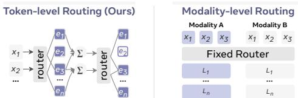  
Figure 4 Token- vs. modality-level routing.

(3) Modality-level Experts. As shown in Fig. 4, we explore an alternative routing setting, where we replicate the dense feed-forward blocks into modality-level experts, where a fixed router forwards all tokens from one modality to its corresponding expert. This is in contrast to the regular token-level routing, where each token is dynamically routed to its top-k experts. We find this variant slightly improves over the dense baseline, but lags behind the native MoE setting 4.

## 3.2 Pooling, router adaptation, and training dynamics

Beyond determining an effective, MoE backbone design, adapting a pretrained MoE model to a contrastive embedding objective also requires other design and training choices. In this work we explore three aspects: pooling, router adaptation, and training dynamics for MoE-UME.

Pooling Strategy. Previous UME works (Cui et al., 2025) have discovered that pooling via last token often outperforms other pooling methods like mean (Lee et al., 2025) or latent attention pooling (Lee et al., 2024). Building on this observation, we only compare two designs: a simple last token pooling, versus a designated <emb> token. Empiricall we find the latter to perform better (Tab. 5).

Router Adaptation and Auxiliary Objectives. Because pre-trained routers establish delicate token-to-expert assignments, downstream contrastive fine-tuning can destabilize learned expert allocation. To systematically evaluate router stability versus adaptability, we compare frozen and trainable router configurations alongside three auxiliary objectives: (1) load-balancing and z-losses to prevent expert collapse; (2) a conflict-aware loss to mitigate cross-task gradient conflict by penalizing routing distribution overlap across conflicting tasks; and (3) task conditioning, which incorporates discrete task labels or continuous instruction embeddings alongside token hidden states into router logit computation. Full details for each formulation appear in App. B.2. Empirically, we find that the simple frozen router instead yields the best performance, which indicates that the routers learned during language pre-training is also near-optimal for contrastive objective (Tab. 5).

Adaptation Dynamics. We systematically isolate the hyperparameter settings governing contrastive adaptation in sparse backbones: global batch size (in-batch negative volume), logit scaling, LoRA adaptation rank, learning rate, and training duration (Fig. 6).

## 4 Adaptive Computation for MoE-UME

While sparse MoE improves the quality–compute tradeoff, it still runs a fixed per-token compute budget with potential computation redundancy. To further improve efficiency and scalability for MoE-based UME models, we explore various adaptive computation actions. Fig. 5 illustrates the six types of adaptive computing actions we study, covering both training-based (§4.1) and inference-only (§4.2) settings. Tab. 1 summarizes different methods we studied. Due to the space limit, we discuss the most effective methods in the following sections, and leave the rest to App. F and E.1.

## 4.1 Training-Based Adaptive Computation Methods

Token pruning. We study two types of token pruning: one-shot and gradual pruning. A one-shot pruning makes a single pruning decision at an early layer (Huang et al., 2025a) K; a gradual pruning applies a per-token gate at every layer, so a token’s alive mass $\begin{array} { r } { \alpha _ { t , \ell } = \prod _ { j < \ell } ( 1 - p _ { t , j } ^ { \mathrm { d r o p } } ) } \end{array}$ decays with depth and its downstream compute is removed progressively. We train one-shot pruning with a straight-through estimator (STE). For gradual pruning, we explore both STE and an AViT-style (Yin et al., 2022) halting mechanism, where both methods failed due to unstable training (App. E.1). Therefore, we realize gradual pruning with the GRPO policy discussed in §4.1, which samples the discrete action instead of differentiating through it. Both settings distill from a separate teacher embedding obtained without adaptive computing: $e ^ { \mathrm { f u l l } }$ . Given the target budget $\rho ^ { \star }$ and the model’s current keep rate $\rho _ { \mathrm { k e e p } }$ , the overall loss becomes:

$$
{ \mathcal { L } } _ { \mathrm { d r o p } } ~ = ~ { \mathcal { L } } _ { \mathrm { e m b } } ~ + ~ \lambda _ { \mathrm { d } } \big ( 1 - \cos ( e , ~ e ^ { \mathrm { f u l l } } ) \big ) ~ + ~ \lambda _ { \mathrm { b } } \big ( \rho _ { \mathrm { k e e p } } - \rho ^ { \star } \big ) ^ { 2 } .
$$

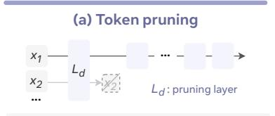  
(d) Expert Skipping

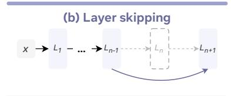  
(e) Adaptive top-k routing

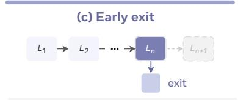  
(f) Expert pruning

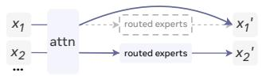

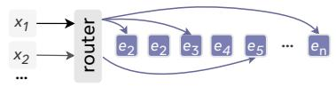

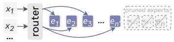  
Figure 5 We consider six adaptive computing actions in MOEMB. The top-three (a-c) are general adaptive computing actions, while the bottom-three (d-f) are specific to MoEs.

Table 1 Summarization for different designs we explored for each adaptive computing action. Regime is when the decision is made: Train is training-based, Inf. means inference-only. Basis names the work a method is adapted from, or ours where we know of no prior counterpart. †marks those detailed in Apps. F and E.1 instead of in the main text.
<table><tr><td>Action</td><td>Method</td><td>Regime Basis</td><td></td></tr><tr><td rowspan="3">Token pruning</td><td>One-shot pruner after decoder block n (Gumbel/STE)</td><td>Train</td><td>Huang et al. (2025a)</td></tr><tr><td>Layer-wise gradual drop gate, packed varlen (GRPO)†</td><td>Train</td><td>ours</td></tr><tr><td>GDN β-ranked one-shot drop</td><td>Inf.</td><td>ours</td></tr><tr><td rowspan="3">Expert skipping</td><td>Per-token three-way skip gate (soft fade)</td><td>Train</td><td>ours</td></tr><tr><td>GDN β-ranked expert skip</td><td>Inf.</td><td>ours</td></tr><tr><td>Per-layer Otsu split on β or router logit†</td><td>Inf.</td><td>Otsu (1979)</td></tr><tr><td rowspan="3">Adaptive top-k</td><td>Null experts, load-balance-scheduled†</td><td>Train</td><td>Zeng et al. (2024)</td></tr><tr><td>Dynamic modality thresholding</td><td>Inf.</td><td>Huang et al. (2025b)</td></tr><tr><td>Fixed router-score threshold†</td><td>Inf.</td><td>ours</td></tr><tr><td>Layer skip &amp; exit</td><td>Trained layer-skip gate (STE, distillation)†</td><td>Train</td><td>ours</td></tr><tr><td rowspan="2">Expert pruning</td><td>Routing frequency, router probability mass MAN, MSAN, REAP saliency</td><td>Inf.</td><td>Lu et al. (2024)</td></tr><tr><td></td><td>Inf.</td><td>Liu et al. (2026); Lasby et al. (2025)</td></tr><tr><td rowspan="3">Combined</td><td>Joint actions under one FLOPs budget (Gumbel/STE)†</td><td>Train</td><td>ours</td></tr><tr><td>Discrete and unified action rollouts (GRPO)</td><td>Train</td><td>ours</td></tr><tr><td>Adaptive top-k with token pruning</td><td>Inf.</td><td>ours</td></tr></table>

Learned expert skipping. Inspired by Mixture-of-Depths (Raposo et al., 2024), we add a skip gate $p _ { t , \ell } ^ { \mathrm { s k i p } } \in [ 0 , 1 ]$ over existing routers, which determines whether to skip the entire experts computation:

$$
{ \mathcal { L } } _ { \mathrm { s k i p } } ~ = ~ { \mathcal { L } } _ { \mathrm { e m b } } ~ + ~ \lambda _ { \mathrm { c } } { \big ( } 1 - \rho _ { \mathrm { s k i p } } { \big ) } , \qquad \rho _ { \mathrm { s k i p } } ~ = ~ { \frac { 1 } { L \left| { \mathcal { T } } \right| } } \sum _ { \ell = 1 } ^ { L } \sum _ { t \in { \mathcal { T } } } p _ { t , \ell } ^ { \mathrm { s k i p } } ,
$$

with L being the number of MoE layers, $| \tau |$ denoting the number of tokens, and $p _ { t , \ell } ^ { \mathrm { s k i p } }$ the normalized probability produced by each skip gate. The skip budget $\rho _ { \mathrm { s k i p } }$ applies to the entire model, which allows the skip rate to differ across layers (Fig. 19). As a hard skip gate is non-differentiable, we train it through a soft fade. Let $u _ { t , \ell }$ be the output of the routed experts for token t at layer $\ell ,$ and $v _ { t , \ell }$ the rest of that layer’s output; the routed output $h _ { t , \ell }$ is scaled by the non-skip probability $1 - p _ { t , \ell } ^ { \mathrm { s k i p } }$

$$
h _ { t , \ell } = v _ { t , \ell } + \left( 1 - p _ { t , \ell } ^ { \mathrm { s k i p } } \right) u _ { t , \ell } .
$$

Combining adaptive computation actions with STE. Enabling several actions at once may not effectively accumulate their savings: the actions compete for the same budget, and could cause unstable training and thereby degrade performance. We summarize four training strategies below, with full details in App. E.1: (1) a single global

FLOPS reduction budget over all actions trained together, which leaves the allocation entirely to the optimizer. (2) a separate budget for each action, trained simultaneously. (3) the same per-action budgets as in (2) with actions optimized in alternation, which keeps one update from being confounded by another gate moving at the same time. (4) the same per-action budgets as in (2,3), with actions trained one at a time and frozen once finished.

GRPO for combined adaptive computation actions. Differentiating through multiple discrete actions with STE can be unstable, so we also explore adaptive computation as policy optimization and adapt GRPO (Shao et al., 2024). Each efficiency gate $( e . g .$ an expert skipping gate) predicts a distribution over its actions. For each input, we sample a group of outputs $\{ a _ { i } \} _ { i = 1 } ^ { G }$ , where each rollout samples one action from every gate, producing an embedding $e _ { a _ { i } }$ . As adaptive computation has no pretrained reference policy to regularize toward, we replace the KL term with a distillation loss toward a teacher embedding $e ^ { \mathrm { f u l l } }$ , computed by a full-compute greedy forward pass. To avoid reward hacking, we gate the efficiency reward $S ( a _ { i } )$ on the success of the in-batch retrieval recall $\ @ G ( a _ { i } ) \in [ 0 , 1 ]$

$$
\begin{array} { r l r } & { } & { \mathcal { L } = - \mathbb { E } \Bigg [ \frac { 1 } { G } \sum _ { i = 1 } ^ { G } \operatorname* { m i n } \Bigl ( r _ { i } \hat { A } _ { i } , \ \mathrm { c l i p } \bigl ( r _ { i } , 1 - \epsilon , 1 + \epsilon \bigr ) \hat { A } _ { i } \Bigr ) \Bigg ] + \lambda _ { \mathrm { d } } \mathbb { E } \bigl [ 1 - \cos ( e _ { a } , e ^ { \mathrm { f u l } } ) \bigr ] , } \\ & { } & { r _ { i } = \frac { \pi _ { \theta } \bigl ( a _ { i } \bigr ) } { \pi _ { \theta _ { \mathrm { o u d } } } \bigl ( a _ { i } \bigr ) } , \hat { A } _ { i } = \frac { R \bigl ( a _ { i } \bigr ) - R _ { \mu } } { R _ { \sigma } } , R ( a _ { i } ) = \underbrace { \mathrm { r e c a l l @ } G \bigl ( a _ { i } \bigr ) } _ { \mathrm { r e c a l l g a t e } } \bigl ( \underbrace { \bar { s } ^ { + } ( a _ { i } ) - \bar { s } ^ { - } ( a _ { i } ) } _ { \mathrm { r a n k i n g ~ m a r g i n } } + \lambda _ { \mathrm { s } } S ( a _ { i } ) \bigr ) , } \end{array}
$$

where $R _ { \mu } , R _ { \sigma }$ are the mean and standard deviation of the reward over the group. $\bar { s } ^ { + } ( a _ { i } )$ and $\bar { s } ^ { - } ( a _ { i } )$ denote the similarity between positive and negative pairs. We provide full details in App. E.1.

## 4.2 Inference-Based Efficiency

Token importance without an attention map. Inference-only token pruning conventionally ranks visual tokens by the attention mass they receive (Chen et al., 2024), which presumes the attention matrix is available. However, as the efficient FlashAttention kernels (Dao et al., 2022) does not materialize the attention map, we need to find an alternative training-free signal for token importance.

In this work, we propose to leverage the writing strength $\beta$ in Gated DeltaNet (GDN) (Yang et al., 2024), which is used in recent frontier MLLMs (Qwen Team, 2026; Team et al., 2026). At each GDN layer the gated delta rule updates a recurrent memory S using a token-dependent write strength. Within one head of one GDN layer, the rule keeps a memory $S _ { t } \in \mathbb R ^ { d _ { v } \times d _ { k } }$ and updates it as

$$
{ \cal S } _ { t } = { \cal S } _ { t - 1 } \big ( \alpha _ { t } ( I - \beta _ { t } k _ { t } k _ { t } ^ { \top } ) \big ) + \beta _ { t } v _ { t } k _ { t } ^ { \top } , \qquad \beta _ { t } = \mathrm { s i g m o i d } \big ( { \bf W } _ { \beta } ^ { \top } { \boldsymbol x } _ { t } \big ) \in ( 0 , 1 ) ,\tag{3}
$$

where $x _ { t }$ is the token’s hidden state, $\boldsymbol { k } _ { t } \in \mathbb { R } ^ { d _ { k } }$ and $v _ { t } \in \mathbb { R } ^ { d _ { v } }$ its $\ell _ { 2 }$ -normalized key and its value, $\alpha _ { t } \in ( 0 , 1 )$ the forget gate, and I the identity. Thus, $\beta _ { t }$ interpolates between leaving the memory untouched $( \beta _ { t } \to 0 )$ and fully overwriting its $k _ { t }$ direction with $v _ { t } \left( \beta _ { t } \to 1 \right)$ , which provides a natural surrogate for token importance. Averaging $\beta _ { t }$ over those layers and over heads gives each token an importance score, which drives every inference-only token and expert decision below.

Token pruning. We utilize the $\beta$ score to prune visual tokens. After decoder block K we rank the visual tokens by $\beta _ { t }$ keep the highest-scoring fraction, and discard the rest for every layer that follows.

Adaptive top-k. Let $\alpha _ { \ell t ( 1 ) } \geq \cdot \cdot \cdot \geq \alpha _ { \ell t ( k ) }$ denote the sorted routing weights for token t at layer ℓ (Eq. 2). Adaptive top-k routing selects a dynamic number of experts $k _ { \ell t } \ \leq \ k$ per token via a predefined condition. For instance, MoDES (Huang et al., 2025b) keeps an expert m if its scaled routing weight satisfies $s _ { \ell } \alpha _ { \ell t ( m ) } \geq \tau$ , for which the global threshold $\tau$ and layer-scaling factors $s _ { \ell }$ are estimated during a calibration pass $( { \bf A p p . E . } \dot { 2 } )$ . Here, τ acts as a uniform decision threshold, while $s _ { \ell }$ upweights critical layers to retain more experts where capacity matters the most.

Total expert pruning. We consider pruning experts from the model permanently, which reduces memory instead of compute. Each layer keeps the $E ^ { \prime }$ experts with the largest saliency $\phi _ { j }$ , measured on a calibration pass. We compare two families of saliency. Router-based scores read the router alone (Lu et al., 2024), either as the fraction of calibration tokens routed to expert $j$ (routing frequency) or as its mean router probability. Output-based scores instead read the output produced by the expert, averaged over the tokens routed to it,

$$
\begin{array} { r } { \phi _ { j } \ = \ \underset { t  j } { \mathrm { m e a n } } \ w _ { t j } , \qquad w _ { t j } \in \Big \{ \underbrace { \| \ o _ { t j } \| } _ { \mathrm { M A N } } , \underbrace { \| o _ { t j } \| ^ { 2 } } _ { \mathrm { M S A N } } , \underbrace { \alpha _ { \ell t j } \| o _ { t j } \| } _ { \mathrm { R E A P } } \Big \} , \qquad o _ { t j } = \mathrm { F F N } _ { j } ( h _ { \ell t } ) , } \end{array}\tag{4}
$$

where $o _ { t j }$ is the expert’s output and $\alpha _ { \ell t j }$ its routing weight from Eq. 2. The three output-based scores differ only in how they weight that output. MAN and MSAN (Liu et al., 2026) take its norm and squared norm, ignoring the router entirely, so an expert is judged purely by how large an output it produces. REAP (Lasby et al., 2025) additionally scales the norm by the routing weight. Empirically, we find this variant to generally perform better (Fig. 7).

## 4.3 Realizing Wall-Clock Savings

A reduction in logical computation is not a reduction in QPS, and the gap decides which actions are worth having. However, a large body of adaptive computation works focus the former and ignore the latter (Zeng et al., 2024; Huang et al., 2024). In this work, we address this gap by providing implementation for effectively converting the computation saving into actual batched inference acceleration. We then conduct detailed benchmarking for both computation and wall-clock savings.

For token pruning-based actions we adopt a packed variable-length approach: at each layer the surviving tokens are gathered into contiguous segments with updated cumulative sequence lengths, and a segment index keeps the attention operations from mixing adjacent samples. This procedure allows for batched adaptive computation where token numbers vary across layers, which is a nontrivial implementation compared to one-shot pruning (Huang et al., 2025a; Shang et al., 2024).

For MoE-specific methods, many report efficiency without an inference wall-clock measurement (Zeng et al., 2024; Huang et al., 2024; Li et al., 2023), do not supply the implementation that would realize the saving (Huang et al., 2025b), or rely on a naive implementation that loops over experts (Lu et al., 2024), which we find to be 5.7–8.0× slower than a fused kernel, so any speedup measured against it is overstated. In this work, we run the wall-clock benchmarks through tile-aware grouped-GEMM kernels (Guo et al., 2025) alongside the batched grouped GEMM (Gale et al., 2022), which exposes where per-token expert sparsity stops gaining wall-clock speedup from FLOPS saving.

## 5 Experiments

## 5.1 Experimental Setup

Models and training. We adapt the Qwen3.5-35B-A3B and Qwen3.5-122B-A10B multimodal MoEs (Qwen Team, 2026). All training are done with two epochs at length 8192 in BF16, global batch 512, AdamW at learning rate 10−4 with ten warmup steps and cosine decay, and LoRA of rank 64 and scale 128. We use Nvidia Megatron Core MoE (Liu et al., 2025) with Expert Parallelism for accelerated MoE-UME training. App. B gives full implementation details.

Benchmarks. We evaluate our models on two comprehensive and large-scale multimodal retrieval benchmarks: MMEB V2 (Meng et al., 2025) and MRMR (Zhang et al., 2025a). MMEB-V2 (Meng et al., 2025) comprises 78 tasks spanning image, video, and visual document (VisDoc) retrieval tasks. MRMR (Zhang et al., 2025a) is a reasoning-intensive multimodal retrieval benchmark, which requires multi-step logical inference and complex domain-specific interpretation across multimodal contexts (e.g., cross-modal knowledge retrieval, theorem identification, and contradiction detection). We follow the official evaluation setup for both benchmarks.

## 5.2 Results and Ablations on MoE Design and Training Dynamics for MoE-UME

Main results. Tab. 2 shows that MOEMB achieves superior performance on MMEB V2, outperforming all public-data baselines across model scales. At 3.1B active parameters, MOEMB-A3B achieves 70.4 overall accuracy, surpassing Embed-RL-4B (68.1) and UME-R1-7B (65.6), despite those methods activating 4× more parameters and executing an autoregressive reasoning pass prior to embedding generation. Scaling to MOEMB-A10B further raises accuracy to 72.4, outperforming Embed-RL-4B by 4.3 points and UME-R1-7B by 6.8 points. Fig. 1 compares our proposed expert scaling against test-time reasoning scaling along the accuracy–throughput Pareto frontier. Scaling the number of total experts from E = 32 to E = 256 improves MOEMB-A3B accuracy by +10.4 points while QPS drops negligibly (34.2 → 29.3) QPS, as top-8 routing holds active FLOPs bounded regardless of total expert count. In contrast, TTE-based approaches incurs severe throughput tradeoffs for marginal gains. For instance, enabling reasoning in Embed-RL-2B yields a marginal +1.5 point gain but collapses throughput significantly from 41 to 0.11 QPS, a 370× slowdown.

As MMEB-V2’s evaluation suite is largely out-of-domain (OOD) relative to its training data, many top-performing baselines rely on external corpora that mirror the evaluation formats. This inflates their scores through domain-wise data leakage. To ensure a fair comparison, we split results in Tab. 2 by training data regimen (public vs. external data). Notably, on the few in-domain evaluation splits where MMEB V2’s public training set provides in-domain supervision, such as ViDoRe and VisRAG, MOEMB achieves SOTA performance without external adaptation data. For instance, MOEMB-A3B achieves 81.0 with 3.1B active parameters, outperforming all sub-4B external-data models (e.g., DME-2B’s 80.9 and Qwen3-VL-Embedding-2B’s 79.2). MOEMB-A10B reaches 82.2, surpassing larger baselines like IFM-TTE-7B, which leverages a larger external reasoner, and is within 0.2 points of Qwen3-VL-Embedding-8B, a SoTA MLLM embedder trained with massive external and in-domain data with complicated training strategies.

Table 2 MMEB-V2 per-category results. bold/underline mark best/second within the public-data group. †Embed-RL pairs a shared 8.77B autoregressive reasoner with a 4.44B/2.13B embedder, giving 13.2B/10.9B active parameters. ‡Octen-VL-Embedding-Large and DME-Large do not disclose an active parameter count. CLS: classification, QA: question answering, RET: retrieval, GD: grounding, MRT: moment retrieval; V1/V2: ViDoRe-v1/v2, VR: VisRAG, OOD: out-of-domain.
<table><tr><td rowspan="2">Model</td><td rowspan="2">Act. (B)</td><td colspan="4">Image</td><td colspan="6">Video</td><td colspan="4">VisDoc</td><td rowspan="2">All</td></tr><tr><td>CLS</td><td>QA</td><td>RET</td><td>GD</td><td>Ov</td><td>CLS QA</td><td>RET</td><td>MRT</td><td>Ov</td><td>V1</td><td>V2</td><td>VR</td><td>OOD</td><td>Ov</td></tr><tr><td># Datasets→</td><td>10</td><td>10</td><td></td><td>12</td><td>4</td><td>36 5</td><td>5</td><td>5</td><td>3</td><td>18</td><td>10</td><td>4</td><td>6</td><td>4</td><td>24</td><td>78</td></tr><tr><td colspan="10">Models adapted with external data</td><td></td><td></td><td></td><td></td><td></td><td></td><td></td></tr><tr><td colspan="10">~2–4B active params</td><td></td><td></td><td></td><td></td><td></td><td></td><td></td></tr><tr><td>DME-2B</td><td>2.2</td><td>73.0</td><td>73.8</td><td>76.2</td><td>90.7 76.3</td><td>82.2</td><td>57.6</td><td>53.5</td><td>45.6</td><td>61.3</td><td>86.0</td><td>59.3</td><td>92.5</td><td>72.0</td><td>80.9</td><td>74.2</td></tr><tr><td>Qwen3-VL-Embedding-2B</td><td>2.1</td><td>70.3</td><td>74.3</td><td>74.8</td><td>88.5</td><td>75.0 71.9</td><td>64.9</td><td>53.9</td><td>53.3</td><td>61.9</td><td>84.4</td><td>65.3</td><td>86.4</td><td>69.4</td><td>79.2</td><td>73.2</td></tr><tr><td>RzenEmbed-v1-2B</td><td>2.2</td><td>65.3</td><td>61.7</td><td>73.8</td><td>77.8 68.5</td><td>45.6</td><td>47.5</td><td>38.3</td><td>36.7</td><td>42.6</td><td>87.0</td><td>57.6</td><td>85.4</td><td>67.1</td><td>78.4</td><td>65.6</td></tr><tr><td>Ops-MM-Embedding-v1-2B</td><td>2.2</td><td>68.1</td><td>65.1</td><td>69.2</td><td>80.8 69.0</td><td>53.6</td><td>55.6</td><td>41.7</td><td>33.7</td><td>47.6</td><td>76.4</td><td>53.2</td><td>77.6</td><td>65.1</td><td>71.0</td><td>64.7</td></tr><tr><td colspan="10">V 8 active params</td><td colspan="7"></td></tr><tr><td>DME-Large</td><td></td><td>75.4</td><td>82.9</td><td>79.6</td><td>95.2</td><td>81.1</td><td>90.2 75.7</td><td>64.5</td><td>62.2</td><td>74.4</td><td>89.1</td><td>61.5</td><td>93.8</td><td>75.1</td><td>83.4</td><td>80.2</td></tr><tr><td>Octen-VL-Embedding-Large</td><td></td><td>75.7</td><td>84.5</td><td>80.6</td><td>94.4 81.9</td><td>87.1</td><td>82.1</td><td>68.0</td><td>60.4</td><td>76.0</td><td>85.9</td><td>66.3</td><td>86.6</td><td>72.2</td><td>80.5</td><td>80.1</td></tr><tr><td>DME-Medium</td><td>9.4</td><td>74.5</td><td>80.9</td><td>78.2</td><td>94.5 79.8</td><td>87.7</td><td>71.0</td><td>61.0</td><td>58.5</td><td>70.8</td><td>87.6</td><td>57.8</td><td>94.5</td><td>73.5</td><td>82.0</td><td>78.4</td></tr><tr><td>Qwen3-VL-Embedding-8B</td><td>8.1</td><td>74.2</td><td>81.1</td><td>80.2</td><td>92.3 80.1</td><td>78.4</td><td>71.0</td><td>58.7</td><td>56.1</td><td>67.1</td><td>87.2</td><td>69.9</td><td>88.7</td><td>73.3</td><td>82.4</td><td>77.8</td></tr><tr><td>IFM-TTE-7B</td><td>8.3</td><td>76.7</td><td>78.5</td><td>74.6</td><td>89.3 77.9</td><td>60.5</td><td>67.9</td><td>51.7</td><td>54.9</td><td>59.2</td><td>85.2</td><td>71.5</td><td>92.8</td><td>67.3</td><td>81.8</td><td>74.8</td></tr><tr><td>WeMM-Embedding-8B</td><td>8.8</td><td>73.5</td><td>76.1 71.7</td><td>78.6</td><td>92.9 78.1</td><td>66.5</td><td>71.7</td><td>56.4</td><td>55.2</td><td>63.2</td><td>89.5</td><td>59.3</td><td>90.4</td><td>35.1</td><td>75.6</td><td>73.9</td></tr><tr><td>RzenEmbed-v2-7B</td><td>8.3 8.3</td><td>70.6</td><td></td><td>78.5</td><td>92.1 75.9</td><td>58.8</td><td>63.5</td><td>51.0</td><td>45.5</td><td>55.7</td><td>89.7</td><td>60.7</td><td>88.7</td><td>69.4</td><td>81.2</td><td>72.9</td></tr><tr><td>Ops-MM-Embedding-v1-7B</td><td></td><td>69.6 69.6</td><td>73.1</td><td>87.2</td><td>72.7</td><td>59.7</td><td>62.2</td><td>45.7</td><td>43.2</td><td>53.8</td><td>80.0</td><td>59.6</td><td>79.3</td><td>67.5</td><td>74.4</td><td>68.9</td></tr><tr><td>E5-Omni-7B</td><td>8.0</td><td>66.7 68.5</td><td>73.0</td><td>83.9</td><td>71.2</td><td>46.6</td><td>52.9</td><td>36.7</td><td>34.2</td><td>43.5</td><td>87.6</td><td>62.4</td><td>87.5</td><td>34.6</td><td>74.5</td><td>65.8</td></tr><tr><td>GME-Qwen2-VL-7B</td><td>8.3</td><td>57.6</td><td>34.6</td><td>71.2</td><td>59.5</td><td>55.9</td><td>37.3 50.3</td><td>28.3</td><td>37.5</td><td>38.4</td><td></td><td>55.5</td><td>85.0</td><td>69.4</td><td>79.4</td><td>59.1</td></tr><tr><td colspan="10">Models adapted only with public MMEB-family data</td><td colspan="7">89.6</td></tr><tr><td colspan="10"></td><td colspan="7"></td></tr><tr><td>~2–4B active params</td><td></td><td></td><td></td><td></td><td></td><td></td><td></td><td></td><td></td><td></td><td></td><td></td><td></td><td></td><td></td><td></td></tr><tr><td>PLUME</td><td>2.1</td><td>66.5</td><td>59.2</td><td>67.6</td><td>79.7 66.3</td><td>45.0</td><td>52.3</td><td>33.5</td><td>46.7</td><td>44.1</td><td>72.1</td><td>49.8</td><td>78.1</td><td>57.4</td><td>67.5</td><td>61.6</td></tr><tr><td>UME-R1-2B</td><td>2.2</td><td>64.8</td><td>62.8</td><td>67.6</td><td>77.2 66.6</td><td>44.3</td><td>50.9</td><td>32.9</td><td>39.7</td><td>42.2</td><td>72.4</td><td>46.2</td><td>79.2</td><td>57.8</td><td>67.3</td><td>61.2</td></tr><tr><td>VLM2Vec V2-2B</td><td>2.2</td><td>62.9</td><td>56.4</td><td>69.6</td><td>77.1 64.9</td><td>39.2</td><td>34.7</td><td>28.4</td><td>37.5</td><td>34.7</td><td>74.4</td><td>44.6</td><td>79.3</td><td>62.5</td><td>68.7</td><td>59.1</td></tr><tr><td>BToks</td><td>2.2</td><td>64.3</td><td>59.8</td><td>68.8</td><td>77.4</td><td>66.0 43.7</td><td>47.0</td><td>33.0</td><td>33.6</td><td>39.9</td><td>71.1</td><td>38.6</td><td>81.3</td><td>38.1</td><td>62.7</td><td>59.0</td></tr><tr><td>VLM2Vec V1-2B MoEMB-A3B</td><td>2.2 3.1</td><td>58.6 60.6</td><td>49.2 73.8</td><td>65.0 72.4 92.4</td><td>73.0</td><td>59.7 33.3</td><td>30.7</td><td>20.4</td><td>30.7</td><td>28.5</td><td>20.6</td><td>13.2</td><td>52.2</td><td>46.9</td><td>31.7</td><td>43.9 70.4</td></tr><tr></table>

On MRMR (Tab. 3), MOEMB-A3B achieves the highest overall score of 51.6 while activating only 3.1B parameters. This outperforms all baseline systems despite their significantly larger active parameter footprints (7B–13.2B). Specifically, MOEMB exceeds all TTE-based methods which are specifically designed for reasoning-intensive retrieval with significantly more active parameters and compute budgets: PLUME (+11.6), UME-R1-7B (+3.4), and Embed-RL-4B (+4.8). This confirms that scaling model capacity via MoE is a more effective approach that scaling via CoT.

Ablations on MoE Design. We first compare structural MoE strategies against a dense baseline at equal active compute (Tab. 4). We can observe upcycling a dense backbone (App. D.1) does not outperform the dense backbone. We conjecture this is due to that the limited scale for contrastive training over the MMEB V2 dataset is not able to train a strong router, compared to

Table 4 Ablation on different expert scaling design.
<table><tr><td>Method</td><td>Act.</td><td>Image</td><td>Video</td><td>VisDoc</td><td>Overall</td></tr><tr><td>Qwen3.5-2B (dense)</td><td>2.2B</td><td>64.4</td><td>43.0</td><td>77.7</td><td>63.6</td></tr><tr><td>Dense-to-MoE upcycling</td><td>~3.0B</td><td>62.6</td><td>45.3</td><td>77.3</td><td>63.1</td></tr><tr><td>Modality-wise MoE</td><td>2.2B</td><td>65.1</td><td>43.6</td><td>78.3</td><td>64.2</td></tr><tr><td>MoEMB-A3B (native)</td><td>3.1B</td><td>71.8</td><td>53.5</td><td>81.0</td><td>70.4</td></tr></table>

Table 3 Reasoning-intensive retrieval on MRMR (Zhang et al., 2025a), grouped by active parameters. Following the benchmark, we report NDCG@10 for all subtasks except Negation (Hit@1); Avg is the 11-subtask mean. †reported by the MRMR benchmark, with active parameters taken from the public model releases; other rows are our evaluations. Bold/underline mark best/second per column.
<table><tr><td rowspan="2">Model</td><td rowspan="2"></td><td colspan="4">Knowledge</td><td colspan="4">Theorem</td><td rowspan="2">Contradiction</td><td colspan="2"></td><td rowspan="2">Avg</td></tr><tr><td>Act. (B) Art</td><td>Med.</td><td>Sci.</td><td>Hum.</td><td>Math</td><td>Phy. Eng.</td><td></td><td>Bus. Neg.</td><td>Design</td><td>Traffic</td></tr><tr><td>≤4B active parameters</td><td></td><td></td><td></td><td></td><td></td><td></td><td></td><td></td><td></td><td></td><td></td><td></td><td></td></tr><tr><td>BToks</td><td>2.2</td><td>72.0</td><td>48.2</td><td>62.2</td><td>62.3</td><td>22.5</td><td>36.1</td><td>29.1</td><td>49.0</td><td>14.5</td><td>46.4</td><td>36.0</td><td>43.5</td></tr><tr><td>UME-R1-2B</td><td>2.2</td><td>70.8</td><td>48.9</td><td>60.6</td><td>57.8</td><td>21.3</td><td>31.5</td><td>27.2</td><td>47.0</td><td>11.5</td><td>33.7</td><td>30.1</td><td>40.0</td></tr><tr><td>PLUME</td><td>2.1</td><td>69.9</td><td>47.7</td><td>63.6</td><td>56.7</td><td>18.6</td><td>30.3</td><td>27.7</td><td>44.5</td><td>9.5</td><td>43.2</td><td>27.5</td><td>39.9</td></tr><tr><td>VLM2Vec-V2</td><td>2.2</td><td>53.1</td><td>28.9</td><td>43.4</td><td>39.9</td><td>11.7</td><td>22.3</td><td>22.5</td><td>43.0</td><td>11.0</td><td>8.3</td><td>25.0</td><td>28.1</td></tr><tr><td>ColPali†</td><td>3.0</td><td>36.1</td><td>29.9</td><td>42.7</td><td>29.2</td><td>7.3</td><td>17.5</td><td>13.5</td><td>34.6</td><td>28.5</td><td>19.4</td><td>18.2</td><td>25.2</td></tr><tr><td>VISTA†</td><td>0.2</td><td>21.3</td><td>27.8</td><td>32.6</td><td>17.0</td><td>18.8</td><td>17.1</td><td>17.3</td><td>28.6</td><td>20.0</td><td>20.2</td><td>9.4</td><td>20.9</td></tr><tr><td>VLM2Vec†</td><td>4.0</td><td>53.5</td><td>22.4</td><td>36.7</td><td>24.0</td><td>2.1</td><td>2.8</td><td>2.8</td><td>2.9</td><td>11.5</td><td>5.6</td><td>18.3</td><td>18.1</td></tr><tr><td>MoEMB-A3B</td><td>3.1</td><td>80.3</td><td>62.6</td><td>73.3</td><td>76.3</td><td>28.2</td><td>35.3</td><td>34.3</td><td>54.0</td><td>11.0</td><td>63.6</td><td>49.2</td><td>51.6</td></tr><tr><td>≥7B active parameters</td><td></td><td></td><td></td><td></td><td></td><td></td><td></td><td></td><td></td><td></td><td></td><td></td><td></td></tr><tr><td>LaME-7B</td><td>8.3</td><td>72.7</td><td>57.1</td><td>69.8</td><td>63.3</td><td>29.9</td><td>44.4</td><td>38.0</td><td>49.4</td><td>6.5</td><td>66.9</td><td>39.8</td><td>48.9</td></tr><tr><td>UME-R1-7B</td><td>8.3</td><td>79.2</td><td>58.2</td><td>71.8</td><td>66.1</td><td>28.2</td><td>40.2</td><td>32.7</td><td>50.3</td><td>6.0</td><td>57.6</td><td>39.5</td><td>48.2</td></tr><tr><td>Ops-MM-Embedding†</td><td>7.0</td><td>79.3</td><td>52.5</td><td>70.0</td><td>67.8</td><td>27.7</td><td>39.5</td><td>30.1</td><td>52.3</td><td>8.0</td><td>55.9</td><td>45.8</td><td>48.1</td></tr><tr><td>Embed-RL-4B</td><td>13.2</td><td>73.5</td><td>53.1</td><td>60.5</td><td>69.8</td><td>32.9</td><td>45.6</td><td>35.1</td><td>52.6</td><td>6.0</td><td>54.3</td><td>31.7</td><td>46.8</td></tr><tr><td>UniME-V2-7B</td><td>8.0</td><td>71.0</td><td>49.7</td><td>58.4</td><td>59.6</td><td>25.1</td><td>39.8</td><td>28.4</td><td>51.0</td><td>7.0</td><td>37.0</td><td>34.6</td><td>42.0</td></tr><tr><td>MM-Embed†</td><td>8.0</td><td>65.6</td><td>53.0</td><td>63.5</td><td>62.8</td><td>23.6</td><td>30.8</td><td>27.4</td><td>44.9</td><td>7.0</td><td>23.8</td><td>34.9</td><td>39.8</td></tr><tr><td>GME-Qwen2-VL†</td><td>7.0</td><td>54.3</td><td>40.1</td><td>46.8</td><td>45.6</td><td>28.8</td><td>36.0</td><td>30.2</td><td>45.1</td><td>15.0</td><td>26.3</td><td>29.6</td><td>36.2</td></tr><tr><td>E5-V†</td><td>8.0</td><td>25.1</td><td>11.7</td><td>16.6</td><td>10.8</td><td>2.1</td><td>3.4</td><td>2.5</td><td>5.2</td><td>11.5</td><td>3.7</td><td>2.1</td><td>8.6</td></tr></table>

the native obtained routers from massive language pretraining. Meanwhile, modality-wise MoE shows only marginal gains over the dense baseline (+0.6). In contrast, fine-tuning a native pretrained sparse MoE backbone delivers substantial gains, raising the overall benchmark average by +6.8 points.

Ablations on Pooling and Routing Designs. Using the native sparse backbone, we next evaluate architectural and algorithmic adaptation choices for pooling and router designs. (Tab. 5):

(1) Pooling Strategy: Replacing standard last-token pooling with a dedicated <emb> token provides the single largest improvement, raising the overall average from 69.50 to 70.34 (+0.84 points). (2) Router Updating vs. Freezing: Keeping the pretrained router frozen performs identically to updating router parameters during fine-tuning (70.38 vs. 70.34). (3) Routing Objectives: Modifying the routing objective yields no benefit and often hurts performance. Auxiliary load-balancing and z-losses severely degrade accuracy (66.62 vs. 69.50) by forcibly pulling tokens away from

Table 5 Ablations on pooling designs and router adaptions for MoE-based UME. App. B.2 defines the load-balancing and z losses, the conflict-aware objective, and the task-ID and instruction priors.
<table><tr><td>Pooling</td><td>Routing objective</td><td>Router trained</td><td>Image</td><td>Video</td><td>VisDoc</td><td>Overall</td></tr><tr><td>last</td><td>x</td><td>√</td><td>70.7</td><td>51.6</td><td>81.1</td><td>69.50</td></tr><tr><td>last</td><td>LB + z</td><td>√</td><td>65.6</td><td>53.7</td><td>77.8</td><td>66.62</td></tr><tr><td>last</td><td>conflict-aware</td><td>√</td><td>70.4</td><td>53.2</td><td>81.3</td><td>69.80</td></tr><tr><td>&lt;emb&gt;</td><td>x</td><td>√</td><td>71.1</td><td>54.5</td><td>81.1</td><td>70.34</td></tr><tr><td>&lt;emb&gt;</td><td>task-ID prior</td><td>√</td><td>69.9</td><td>53.5</td><td>81.0</td><td>69.55</td></tr><tr><td>&lt;emb&gt;</td><td>instruction prior</td><td>√</td><td>70.1</td><td>54.1</td><td>80.3</td><td>69.55</td></tr><tr><td>&lt;emb&gt;</td><td>x</td><td>x</td><td>71.8</td><td>53.5</td><td>81.0</td><td>70.38</td></tr></table>

pre-trained expert assignments. Conflict-aware routing yields a negligible difference (+0.30 points, 69.80), while injecting task-level priors (task IDs or instructions) degrades overall accuracy (69.55). Both (2) and (3) indicates that the routing assignments learned during language pre-training remain effective for contrastive adaptation.

Ablations on Training Hyperparameters. We systematically evaluate training sensitivity around this reference protocol on the 35B backbone (Fig. 6): (1) Batch Size: Global batch size is the most critical training factor. Halving the global batch size from 512 to 256 drops overall performance by 4.52 points, underscoring the reliance of contrastive learning objectives on large pools of in-batch negatives. (2) LoRA and temperature: Halving the LoRA rank reduces performance by 2.91 points, while lowering the logit scale parameter from 50 to 20 incurs a 1.10-point penalty. (3) Learning Rate & Epochs: Reducing the learning rate from $1 0 ^ { - 4 } : 0 \ 5 \times 1 0 ^ { - 5 }$ improves overall accuracy from 70.34 to 71.36 (+1.02 points), advancing performance on 56 of 78 tasks. Training for a second epoch at this lower learning rate yields an additional +0.55 point gain.

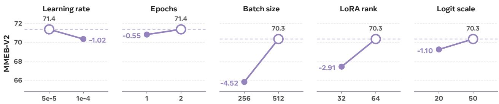  
Figure 6 Hyperparameter ablations on the 35B backbone. Each panel varies one setting.

## 5.3 Results and Analysis for Adaptive Computation on MoE-UME

Table 6 Summarized results on adaptive-computation. We show a representative budget for each adaptive compute type.
<table><tr><td>Action</td><td>Method</td><td>Budget</td><td>Image</td><td>Video</td><td>VisDoc</td><td>Overall</td><td> $F L O P S \downarrow \%$ </td><td>QPS↑×</td></tr><tr><td></td><td>No reduction</td><td>top-8 / keep all</td><td>71.0</td><td>54.5</td><td>81.1</td><td>70.3</td><td></td><td>1.00</td></tr><tr><td colspan="7">Training-based methods</td><td></td><td></td></tr><tr><td>Adaptive top-k</td><td>AdaMoE (App. E.1)</td><td>2.94 experts</td><td> $6 8 . 2 ( - 2 . 8 )$ </td><td> $4 9 . 1 \ : ( - 5 . 4 )$ </td><td> $7 9 . 3 ( - 1 . 8 )$ </td><td> $6 7 . 2 ( - 3 . 1 )$ </td><td></td><td></td></tr><tr><td>Expert skip</td><td>Learned skip gate</td><td>dynamic</td><td> $6 9 . 7 ( - 1 . 3 )$ </td><td> $5 3 . 4 ( - 1 . 1 ) $ </td><td> $8 1 . 1 \left( + 0 . 0 \right)$ </td><td> $6 9 . 4 ( - 0 . 9 )$ </td><td>12</td><td></td></tr><tr><td>Token pruning Layer skip</td><td>One-shot drop</td><td>drop 70%</td><td> $6 9 . 4 ( - 1 . 6 )$ </td><td> $5 4 . 2 ( - 0 . 3 ) $ </td><td> $8 0 . 5 ( - 0 . 6 ) $ </td><td> $6 9 . 3 \left( - 1 . 0 \right)$ </td><td>32</td><td></td></tr><tr><td></td><td>Trained gate (App. E.1)</td><td>skip 20%</td><td> $7 0 . 0 ( - 1 . 0 ) $ </td><td> $5 2 . 6 ( - 1 . 9 )$ </td><td> $8 1 . 3 \ : ( + 0 . 2 )$ </td><td> $6 9 . 5 \left( - 0 . 8 \right)$ </td><td>≈20</td><td>≈1.40</td></tr><tr><td></td><td>GRPO (gradual drop + skip)</td><td>dynamic</td><td> $7 0 . 1 ( - 0 . 9 )$ </td><td> $5 3 . 0 ( - 1 . 5 ) $ </td><td> $8 1 . 4 \left( + 0 . 3 \right)$ </td><td> $6 9 . 6 ( - 0 . 7 ) $ </td><td>22.5</td><td>1.46</td></tr><tr><td>Combined</td><td>Global budget (App. E.1)</td><td>80/40% target</td><td> $6 4 . 5 ( - 6 . 5 )$ </td><td> $4 6 . 8 ( - 7 . 7 )$ </td><td> $7 8 . 5 ( - 2 . 6 ) $ </td><td> $6 4 . 7 ( - 5 . 6 )$ </td><td></td><td></td></tr><tr><td></td><td>Per-action, simultaneous (App. E.1)</td><td>drop 70 / skip 30 / layer 20</td><td> $6 7 . 3 ( - 3 . 7 )$ </td><td> $5 0 . 5 ( - 4 . 0 ) $ </td><td> $7 9 . 4 ( - 1 . 7 ) $ </td><td> $6 7 . 1 \ : ( - 3 . 2 )$ </td><td></td><td></td></tr><tr><td></td><td>Per-action, alternating (App. E.1)</td><td>drop 70 / skip 29 / layer 20</td><td> $6 6 . 8 ( - 4 . 2 )$ </td><td> $5 1 . 2 ( - 3 . 3 )$ </td><td> $7 8 . 6 ( - 2 . 5 )$ </td><td> $6 6 . 8 ( - 3 . 5 )$ </td><td></td><td></td></tr><tr><td></td><td>Per-action, sequential (App. E.1)</td><td>drop  $7 0 ( \mathrm { f r o z e n } ) + \mathrm { s k i p } 4 9$ </td><td> $6 6 . 3 ( - 4 . 7 )$ </td><td> $5 1 . 1 ( - 3 . 4 )$ </td><td> $7 8 . 6 ( - 2 . 5 )$ </td><td> $6 6 . 6 ( - 3 . 7 )$ </td><td></td><td></td></tr><tr><td colspan="2">Inference-only methods</td><td></td><td></td><td></td><td></td><td></td><td></td><td></td></tr><tr><td rowspan="3"></td><td>Uniform top-k</td><td></td><td> $7 0 . 5 ( - 0 . 5 ) $ </td><td> $5 3 . 6 ( - 0 . 9 ) $ </td><td> $8 0 . 9 ( - 0 . 2 ) $ </td><td></td><td>11.6</td><td>1.19</td></tr><tr><td>Adaptive top-k MoDES (DMT) (Huang et al., 2025b) 50% skip</td><td></td><td> $7 0 . 4 ( - 0 . 6 )$ </td><td> $5 3 . 6 ( - 0 . 9 ) $ </td><td> $8 0 . 9 ( - 0 . 2 ) $ </td><td> $6 9 . 8 ( - 0 . 5 ) $   $6 9 . 8 ( - 0 . 5 ) $ </td><td>13.8</td><td>1.18</td></tr><tr><td>Random</td><td></td><td> $6 3 . 2 ( - 7 . 8 )$ </td><td> $4 6 . 4 ( - 8 . 1 )$ </td><td> $7 7 . 5 ( - 3 . 6 )$ </td><td> $6 3 . 7 ( - 6 . 6 )$ </td><td>11.6</td><td>1.19</td></tr><tr><td rowspan="4">Expert pruning</td><td>REAP (Lasby et al., 2025)</td><td></td><td> $7 0 . 3 ( - 0 . 7 ) $ </td><td> $5 3 . 8 ( - 0 . 7 ) $ </td><td> $8 0 . 1 ( - 1 . 0 ) $ </td><td> $6 9 . 5 \left( - 0 . 8 \right)$ </td><td></td><td></td></tr><tr><td>MSAN (Liu et al., 2026)</td><td></td><td> $6 9 . 9 ( - 1 . 1 ) $ </td><td> $5 4 . 0 ( - 0 . 5 ) $ </td><td> $8 0 . 2 ( - 0 . 9 ) $ </td><td> $6 9 . 4 ( - 0 . 9 )$ </td><td></td><td>1.16</td></tr><tr><td>MAN (Liu et al., 2026)</td><td>E=128</td><td> $7 0 . 1 ( - 0 . 9 )$ </td><td> $5 3 . 6 ( - 0 . 9 ) $ </td><td> $8 0 . 3 ( - 0 . 8 ) $ </td><td> $6 9 . 4 ( - 0 . 9 )$ </td><td>≈0</td><td></td></tr><tr><td>Router-prob</td><td></td><td> $6 8 . 8 ( - 2 . 2 ) $ </td><td> $5 2 . 7 ( - 1 . 8 )$ </td><td> $8 0 . 4 ( - 0 . 7 ) $ </td><td> $6 8 . 7 ( - 1 . 6 )$ </td><td></td><td></td></tr><tr><td rowspan="2">Token pruning</td><td>GDN-β</td><td>keep 50%</td><td> $6 9 . 7 ( - 1 . 3 )$ </td><td> $5 3 . 5 ( - 1 . 0 ) $ </td><td> $8 0 . 2 ( - 0 . 9 ) $ </td><td> $6 9 . 2 ( - 1 . 1 ) $ </td><td>22.8</td><td>1.39</td></tr><tr><td>Random</td><td></td><td> $6 9 . 0 ( - 2 . 0 ) $ </td><td> $5 2 . 8 ( - 1 . 7 ) $ </td><td> $7 9 . 4 ( - 1 . 7 ) $ </td><td> $6 8 . 4 ( - 1 . 9 )$ </td><td></td><td></td></tr><tr><td>Combined</td><td> $\mathbf { M o D E S + G D N - } \beta$ </td><td>30% skip, keep 50%</td><td> $6 9 . 7 ( - 1 . 3 )$ </td><td> $5 3 . 4 ( - 1 . 1 ) $ </td><td> $8 0 . 0 ( - 1 . 1 ) $ </td><td> $6 9 . 1 \ : ( - 1 . 2 )$ </td><td>28.9</td><td>1.44</td></tr></table>

Main results. We find that adaptive computation generally yields strong accuracy–compute trade-offs for MoE-based UME. As shown in Tab. 6, all evaluated compute-reduction actions maintain performance within 1.2 points of the unreduced baseline (70.3) while substantially lowering execution cost. For instance, reducing top-k experts activation from eight to four uniformly incurs a minor 0.5-point accuracy drop while removing 11.6% of total FLOPs and increasing throughput by 1.19×. For sequence-level reduction, one-shot token pruning removes 70% of visual tokens, saving 32% FLOPs with $\mathbf { a } < 1 . 0 \cdot$ -point loss. Similarly, static expert pruning reduces total expert capacity by half $( 2 5 6  1 2 8 )$ with $\mathbf { a } < 1 . 0 \cdot$ -point drop. These results confirm that MoE-based embedding models possess substantial execution redundancy across both sequence and parameter dimensions.

Token pruning and adaptive top-k provide the strongest accuracy–compute efficiency. Strategies that reduce compute per token or per sequence dominate performance in Tab. 6. Adaptive top-k routing is the most compute-efficient per-token action: uniform top-4 routing costs only 0.5 points, which is closed to calibration-based adaptive top-k methods such as MoDES (69.8). Empirically we find that this accuracy relies heavily on the pretrained router’s ranking quality: randomly selecting four experts cost scores to degrade notably (App. E.2). Token pruning trades slightly higher accuracy loss for significantly greater compute reduction: keeping 50% visual tokens costs 1.15 points while reducing FLOPs by 22.8% and accelerating throughput by 1.39×.

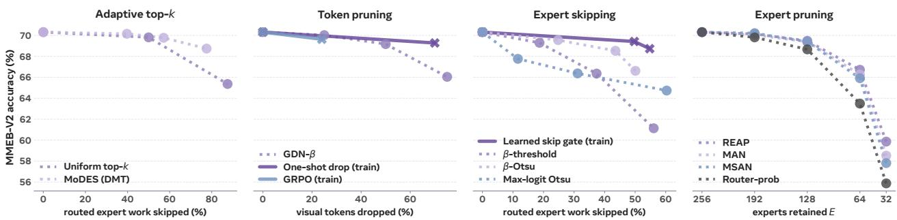  
Figure 7 Budget–accuracy curves per adaptive-computation action. More experiments and details are reported in Tab. 6 and App. F.

Inference-only adaptive computation approaches are competitive with training-based methods. For adaptive top-k, inference-only methods outperform training-based methods: a trained adaptive top-k method (Zeng et al., 2024) converges to an average of 2.94 experts per token (63.3% expert skip) and scores 67.2, whereas inference-only MoDES achieves 69.8 at a 57.1% skip rate and 68.8 at a 77.5% skip rate (+1.6 higher despite activating less experts). This indicates that the pretrained router’s internal logit distribution already provides a near-optimal ranking without requiring dedicated training. For token pruning, our proposed GDN β-based heuristics remain highly competitive with trained pruning gate at moderate saving budgets: the inference-only GDN-β policy removes 22.8% of FLOPs for a 1.1-point drop, performing close to the trained one-shot dropper (32% FLOP reduction for a 1.0-point drop). On the other hand, training-based approaches provide a distinct advantage primarily under extreme pruning regimes (70–75% visual tokens removed), where the trained dropper maintains a 1.0 drop compared to 4.3 for the heuristic policy (Fig. 7).

Our implementations effectively converts FLOPS-saving to QPS improvement. As shown in Fig. 8, our two implementations are able to convert most of the logical compute reduction into wallclock savings: packed varlen converts 63–82% of the FLOPs it removes and SonicMoE 56–58%, against 41% for unmodified grouped GEMM and nothing at all for masking. Meanwhile, the two baselines approaches for adaptive top-k are less effective due to two reasons. (1) Unmodified grouped GEMM is tile-bound: it runs each expert’s assigned tokens in tiles of at least 128 rows, so an expert holding $n _ { j }$ tokens costs $\lceil n _ { j } / 1 2 8 \rceil$ tiles however few of them survive, and an expert-skip policy saves time only once it removes enough of them to eliminate a whole tile; the gain also saturates past

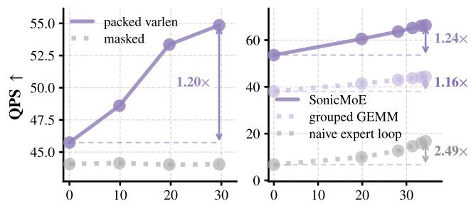  
FLOPs reduced (%) ↑  
Figure 8 Transferring FLOPs saving into wall-clock speedup under baseline (grey) and our implementations. Left: token pruning; Right: adaptive top-k.

k ≈ 4, since what remains is attention, the shared expert and dispatch, so aggressive adaptive-k budgets cost accuracy for almost no latency. (2) The naive HuggingFace expert loop responds strongly to sparsity, converting 163–174%, yet runs 5.7–8.0× slower, so it exaggerates the benefit of expert.

Depth-wise adaptive compute allocation across modalities. Fig. 9 plots each action’s firing rate under each modality across layers. Token pruning acts primarily at initial layers and exhibits strong modality sensitivity. High temporal and spatial redundancy enables immediate pruning of video and image tokens. Conversely, visual documents contain dense layout text, and text queries encode task instructions that must be preserved early to contextualize representations before gradual pruning. Expert skipping behaves differently between early $( < 2 4 )$ and late layers: the skip rate vary more in early layers, where text tends to have higher skip rate: as skipping removes only expert computation, text tokens remain present for attention while relying on shared experts for boilerplate instructions; in later layers, almost all modalities are being skipped at a similar rate. Interestingly, the skip rate is almost zero at the final layer, to construct the output embedding. On the other hand, adaptive top-k tends to allocate more experts for text modalities, especially in earlier layers.

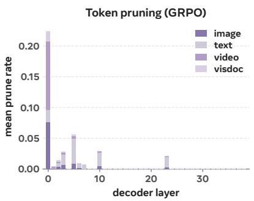

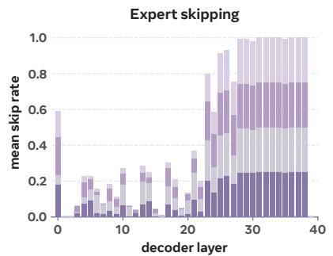

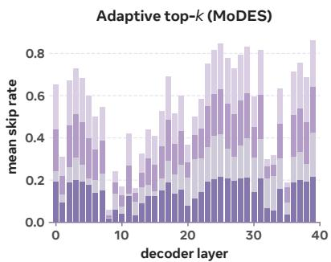  
Figure 9 Depth-wise adaptive compute allocation across modalities.

$\beta$ functions as an independent salience signal. GDN $\beta$ provides an informative token pruning signal that operates independently of standard attention mechanisms. While attention distributions are spiky and heavily concentrated, $\beta$ tends to be more spatially and temporally smooth. Moreover, we find $\beta$ to have a more even focus across different modalities in MOEMB, compared to attention scores, which are mostly concentrated on text tokens. Despite $\beta ^ { \bullet }$ distinct properties from attention scores, pruning tokens by $\beta$ performs comparably to the trained token pruning gate (Fig. 7), confirming its utility as an effective salience

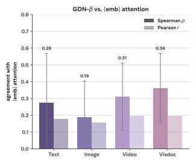

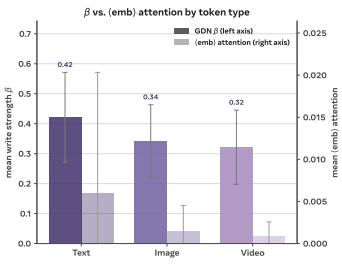  
Figure 10 β vs. attention score. Left: per-modality agreement (Spearman ρ and Pearson r); Right: mean β (left axis) and mean <emb> attention (right axis) by token type.

metric. App. F reports further analysis of β: its per-layer profile, its agreement with the <emb> attention row and with received attention mass, and its spread by token type.

## 6 Limitations and future work

While MOEMB achieves SOTA performance over models trained with public MMEB-V2 training data, it’s currently lagging behind models trained with external data. Also, it currently does not support audio as input modality. Our future work include training MOEMB under larger scale of data, and to include more input modalities.

## 7 Conclusion

We presented MOEMB, which scales the capacity of universal multimodal embedder along the expert axis rather than embedding dimension or test-time reasoning. MOEMB adds over 10 accuracy points at near-constant active compute, establishing a new state of the art among public-data models on MMEB-V2 and MRMR. Furthermore, our systematic study of adaptive computation demonstrates that MoE embedders can eliminate up to half of their logical compute for under a one-point accuracy drop, supported by Gated DeltaNet write strength $\beta$ as a zero-cost token salience signal and custom serving kernels that successfully convert theoretical FLOP savings into deployed throughput gains.

## AI use statement

Anthropic Claude Code (Opus 4.8 and Opus 5) was used extensively for drafting code, aggregating results, and drafting manuscript. The authors verified experiment artifacts, numerical claims, and citations and take responsibility for the content.

## References

Sikai Bai, Haoxi Li, Jie Zhang, Zicong Hong, and Song Guo. DiEP: Adaptive mixture-of-experts compression through differentiable expert pruning. arXiv preprint arXiv:2509.16105, 2025. https://arxiv.org/abs/2509.16105.

Andrea Banino, Jan Balaguer, and Charles Blundell. PonderNet: Learning to ponder. arXiv preprint arXiv:2107.05407, 2021. https://arxiv.org/abs/2107.05407.

Liang Chen, Haozhe Zhao, Tianyu Liu, Shuai Bai, Junyang Lin, Chang Zhou, and Baobao Chang. An image is worth 1/2 tokens after layer 2: Plug-and-play inference acceleration for large vision-language models. arXiv preprint arXiv:2403.06764, 2024. https://arxiv.org/abs/2403.06764.

Jianpeng Cheng, Xian Wu, Jiangfan Zhang, Wentao Bao, Chaitanya Ahuja, Shlok Kumar Mishra, Hanchao Yu, Yang Gao, Fan Xia, Qi Guo, Shaodan Zhai, Xiangjun Fan, and Jun Xiao. TTE-Flash: Accelerating reasoning-based multimodal representations via think-then-embed tokens. arXiv preprint arXiv:2605.16638, 2026. https://arxiv.org/abs/2605.16638.

Xuanming Cui, Jianpeng Cheng, Hong-you Chen, Satya Narayan Shukla, Abhijeet Awasthi, Xichen Pan, Chaitanya Ahuja, Shlok Ku mar Mishra, Yonghuan Yang, Jun Xiao, Qi Guo, Ser-Nam Lim, Aashu Singh, and Xiangjun Fan. Think then embed: Generative context improves multimodal embedding. arXiv preprint arXiv:2510.05014, 2025. https://arxiv.org/abs/2510.05014.

Xuanming Cui, Hong-You Chen, Hao Yu, Hao Yuan, Zihao Wang, Shlok Kumar Mishra, Hanchao Yu, Yonghuan Yang, Jun Xiao, Ser-Nam Lim, Jianpeng Cheng, Qi Guo, and Xiangjun Fan. Reason to contrast: A cascaded multimodal retrieval framework. arXiv preprint arXiv:2602.23369, 2026. https://arxiv.org/abs/2602.23369.

Tri Dao. FlashAttention-2: Faster attention with better parallelism and work partitioning. In International Conference on Learning Representations, 2024. https://arxiv.org/abs/2307.08691.

Tri Dao, Daniel Y. Fu, Stefano Ermon, Atri Rudra, and Christopher Ré. FlashAttention: Fast and memory-efficient exact attention with IO-awareness. In Advances in Neural Information Processing Systems, 2022. https://arxiv.org/abs/2205.14135.

DeepSeek-AI. DeepSeek-V3 technical report. arXiv preprint arXiv:2412.19437, 2024. https://arxiv.org/abs/2412. 19437.

Manuel Faysse, Hugues Sibille, Tony Wu, Bilel Omrani, Gautier Viaud, Céline Hudelot, and Pierre Colombo. ColPali: Efficient document retrieval with vision language models. In The Thirteenth International Conference on Learning Representations, 2025. https://openreview.net/forum?id=ogjBpZ8uSi.

William Fedus, Barret Zoph, and Noam Shazeer. Switch transformers: Scaling to trillion parameter models with simple and efficient sparsity. Journal ofMachine Learning Research, 23(120):1–39, 2022.

Trevor Gale, Deepak Narayanan, Cliff Young, and Matei Zaharia. MegaBlocks: Efficient sparse training with mixture-of-experts. arXiv preprint arXiv:2211.15841, 2022. https://arxiv.org/abs/2211.15841.

Tiancheng Gu, Kaicheng Yang, Kaichen Zhang, Xiang An, Ziyong Feng, Yueyi Zhang, Weidong Cai, Jiankang Deng, and Lidong Bing. UniME-V2: MLLM-as-a-judge for universal multimodal embedding learning. arXiv preprint arXiv:2510.13515, 2025. https://arxiv.org/abs/2510.13515.

Wentao Guo, Mayank Mishra, Xinle Cheng, Ion Stoica, and Tri Dao. SonicMoE: Accelerating MoE with IO and tile-aware optimizations. arXiv preprint arXiv:2512.14080, 2025. https://arxiv.org/abs/2512.14080.

Chenwei He, Xiangzhao Hao, Tianyu Yang, Yuxiang Ma, Yuheng Jia, Lingxiang Wu, Chaoyang Zhao, Haiyun Guo, and Jinqiao Wang. PLUME: Latent reasoning based universal multimodal embedding. arXiv preprint arXiv:2604.02073, 2026.

Haohang Huang, Xuan Lu, Mingyi Su, Xuan Zhang, Ziyan Jiang, Ping Nie, Kai Zou, Tomas Pfister, Wenhu Chen, Wei Zhang, Xiaoyu Shen, and Rui Meng. MMEB-V3: Measuring the performance gaps of omni-modality embedding models. arXiv preprint arXiv:2604.23321, 2026. https://arxiv.org/abs/2604.23321.

Quzhe Huang, Zhenwei An, Nan Zhuang, Mingxu Tao, Chen Zhang, Yang Jin, Kun Xu, Kun Xu, Liwei Chen, Songfang Huang, and Yansong Feng. Harder tasks need more experts: Dynamic routing in MoE models. arXiv preprint arXiv:2403.07652, 2024. https://arxiv.org/abs/2403.07652.

Wenxuan Huang, Zijie Zhai, Yunhang Shen, Shaosheng Cao, Fei Zhao, Xiangfeng Xu, Zheyu Ye, Yao Hu, and Shaohui Lin. Dynamic-LLaVA: Efficient multimodal large language models via dynamic vision-language context sparsification. arXiv preprint arXiv:2412.00876, 2025a. https://arxiv.org/abs/2412.00876.

Yushi Huang, Zining Wang, Zhihang Yuan, Yifu Ding, Ruihao Gong, Jinyang Guo, Xianglong Liu, and Jun Zhang. MoDES: Accelerating mixture-of-experts multimodal large language models via dynamic expert skipping. arXiv preprint arXiv:2511.15690, 2025b. https://arxiv.org/abs/2511.15690.

Eric Jang, Shixiang Gu, and Ben Poole. Categorical reparameterization with Gumbel-softmax. In International Conference on Learning Representations (ICLR), 2017.

Albert Q. Jiang, Alexandre Sablayrolles, Antoine Roux, Arthur Mensch, Blanche Savary, Chris Bamford, Devendra Singh Chaplot, Diego de las Casas, Emma Bou Hanna, Florian Bressand, Gianna Lengyel, Guillaume Bour, Guillaume Lample, Lélio Renard Lavaud, Lucile Saulnier, Marie-Anne Lachaux, Pierre Stock, Sandeep Subramanian, Sophia Yang, Szymon Antoniak, Teven Le Scao, Théophile Gervet, Thibaut Lavril, Thomas Wang, Timothée Lacroix, and William El Sayed. Mixtral of experts, 2024. https://arxiv.org/abs/2401.04088.

Haonan Jiang, Yuji Wang, Yongjie Zhu, Xin Lu, Wenyu Qin, Meng Wang, Pengfei Wan, and Yansong Tang. Embed-RL: Reinforcement learning for reasoning-driven multimodal embeddings. arXiv preprint arXiv:2602.13823, 2026. https://arxiv.org/abs/ 2602.13823.

Ziyan Jiang, Rui Meng, Xinyi Yang, Semih Yavuz, Yingbo Zhou, and Wenhu Chen. VLM2Vec: Training vision-language models for massive multimodal embedding tasks. arXiv preprint arXiv:2410.05160, 2025. https://arxiv.org/abs/2410.05160.

Omar Khattab and Matei Zaharia. ColBERT: Efficient and effective passage search via contextualized late interaction over BERT. arXiv preprint arXiv:2004.12832, 2020. https://arxiv.org/abs/2004.12832.

Aditya Kusupati, Gantavya Bhatt, Aniket Rege, Matthew Wallingford, Aditya Sinha, Vivek Ramanujan, William Howard-Snyder, Kaifeng Chen, Sham Kakade, Prateek Jain, and Ali Farhadi. Matryoshka representation learning. In Advances in Neural Information Processing Systems, volume 35, pages 30233–30249, 2022. https://arxiv.org/abs/2205.13147.

Zhibin Lan, Liqiang Niu, Fandong Meng, Jie Zhou, and Jinsong Su. UME-R1: Exploring reasoning-driven generative multimodal embeddings. arXiv preprint arXiv:2511.00405, 2025. https://arxiv.org/abs/2511.00405.

Mike Lasby, Ivan Lazarevich, Nish Sinnadurai, Sean Lie, Yani Ioannou, and Vithursan Thangarasa. REAP the experts: Why pruning prevails for one-shot MoE compression. arXiv preprint arXiv:2510.13999, 2025.

Chankyu Lee, Rajarshi Roy, Mengyao Xu, Jonathan Raiman, Mohammad Shoeybi, Bryan Catanzaro, and Wei Ping. NV-Embed: Improved techniques for training LLMs as generalist embedding models. arXiv preprint arXiv:2405.17428, 2024. https: //arxiv.org/abs/2405.17428.

Jinhyuk Lee, Feiyang Chen, Sahil Dua, Daniel Cer, Madhuri Shanbhogue, Iftekhar Naim, Gustavo Hernández Ábrego, Zhe Li, Kaifeng Chen, Henrique Schechter Vera, Xiaoqi Ren, et al. Gemini embedding: Generalizable embeddings from Gemini. arXiv preprint arXiv:2503.07891, 2025. https://arxiv.org/abs/2503.07891.

Dongxu Li, Yudong Liu, Haoning Wu, Yue Wang, Zhiqi Shen, Bowen Qu, Xinyao Niu, Fan Zhou, Chengen Huang, Yanpeng Li, et al. Aria: An open multimodal native mixture-of-experts model. arXiv preprint arXiv:2410.05993, 2025. https: //arxiv.org/abs/2410.05993.

Jiamin Li, Qiang Su, Yitao Yang, Yimin Jiang, Cong Wang, and Hong Xu. Adaptive gating in mixture-of-experts based language models. arXiv preprint arXiv:2310.07188, 2023. https://arxiv.org/abs/2310.07188.

Mingxin Li, Yanzhao Zhang, Dingkun Long, Keqin Chen, Sibo Song, Shuai Bai, Zhibo Yang, Pengjun Xie, An Yang, Dayiheng Liu, Jingren Zhou, and Junyang Lin. Qwen3-VL-Embedding and Qwen3-VL-Reranker: A unified framework for state-of-the-art multimodal retrieval and ranking. arXiv preprint arXiv:2601.04720, 2026. https://arxiv.org/abs/2601.04720.

Xianming Li, Zongxi Li, Jing Li, Haoran Xie, and Qing Li. 2D matryoshka sentence embeddings. arXiv preprint arXiv:2402.14776, 2024. https://arxiv.org/abs/2402.14776.

Ziyue Li and Tianyi Zhou. Your mixture-of-experts LLM is secretly an embedding model for free. arXiv preprint arXiv:2410.10814, 2024. https://arxiv.org/abs/2410.10814.

Sheng-Chieh Lin, Chankyu Lee, Mohammad Shoeybi, Jimmy Lin, Bryan Catanzaro, and Wei Ping. MM-Embed: Universal multimodal retrieval with multimodal llms. arXiv preprint arXiv:2411.02571, 2025. https://arxiv.org/abs/2411. 02571.

Dennis Liu, Zijie Yan, Xin Yao, Tong Liu, Vijay Korthikanti, Evan Wu, Shiqing Fan, Gao Deng, Hongxiao Bai, Jianbin Chang, Ashwath Aithal, Michael Andersch, Mohammad Shoeybi, Jiajie Yao, Chandler Zhou, David Wu, Xipeng Li, and June Yang. Moe parallel folding: Heterogeneous parallelism mappings for efficient large-scale moe model training with megatron core. arXiv preprint arXiv:2504.14960, 2025.

Zongfang Liu, Jinghui Zhang, Zijian Ma, Guangyi Chen, and Xin Yuan. How to score experts for one-shot MoE expert pruning: A unified formulation and selection principle. arXiv preprint arXiv:2606.15716, 2026.

Xudong Lu, Qi Liu, Yuhui Xu, Aojun Zhou, Siyuan Huang, Bo Zhang, Junchi Yan, and Hongsheng Li. Not all experts are equal: Efficient expert pruning and skipping for mixture-of-experts large language models. arXiv preprint arXiv:2402.14800, 2024. https://arxiv.org/abs/2402.14800.

Yubo Ma, Jinsong Li, Yuhang Zang, Xiaobao Wu, Xiaoyi Dong, Pan Zhang, Yuhang Cao, Haodong Duan, Jiaqi Wang, Yixin Cao, and Aixin Sun. Towards storage-efficient visual document retrieval: An empirical study on reducing patch-level embeddings. arXiv preprint arXiv:2506.04997, 2025. https://arxiv.org/abs/2506.04997.

Rui Meng, Ziyan Jiang, Ye Liu, Mingyi Su, Xinyi Yang, Yuepeng Fu, Can Qin, Zeyuan Chen, Ran Xu, Caiming Xiong, Yingbo Zhou, Wenhu Chen, and Semih Yavuz. VLM2Vec-V2: Advancing multimodal embedding for videos, images, and visual documents. arXiv preprint arXiv:2507.04590, 2025. https://arxiv.org/abs/2507.04590.

Niklas Muennighoff, Nouamane Tazi, Loïc Magne, and Nils Reimers. MTEB: Massive text embedding benchmark. In Proceedings of the 17th Conference of the European Chapter of the Association for Computational Linguistics (EACL), 2023. https: //arxiv.org/abs/2210.07316.

Niklas Muennighoff, Luca Soldaini, Dirk Groeneveld, Kyle Lo, Jacob Morrison, Sewon Min, Weijia Shi, Pete Walsh, Oyvind Tafjord, Nathan Lambert, et al. OLMoE: Open mixture-of-experts language models. arXiv preprint arXiv:2409.02060, 2024. https://arxiv.org/abs/2409.02060.

Nobuyuki Otsu. A threshold selection method from gray-level histograms. IEEE Transactions on Systems, Man, and Cybernetics, 9 (1):62–66, 1979.

Qwen Team. Qwen3.5, 2026. https://qwen.ai/blog?id=qwen3.5. Official model cards for Qwen3.5-35B-A3B and Qwen3.5-122B-A10B.

Alec Radford, Jong Wook Kim, Chris Hallacy, Aditya Ramesh, Gabriel Goh, Sandhini Agarwal, Girish Sastry, Amanda Askell, Pamela Mishkin, Jack Clark, Gretchen Krueger, and Ilya Sutskever. Learning transferable visual models from natural language supervision. In International Conference on Machine Learning, 2021.

David Raposo, Sam Ritter, Blake Richards, Timothy Lillicrap, Peter Conway Humphreys, and Adam Santoro. Mixture-of-depths: Dynamically allocating compute in transformer-based language models. arXiv preprint arXiv:2404.02258, 2024. https: //arxiv.org/abs/2404.02258.

Yuzhang Shang, Mu Cai, Bingxin Xu, Yong Jae Lee, and Yan Yan. LLaVA-PruMerge: Adaptive token reduction for efficient large multimodal models. arXiv preprint arXiv:2403.15388, 2024. https://arxiv.org/abs/2403.15388.

Zhihong Shao, Peiyi Wang, Qihao Zhu, Runxin Xu, Junxiao Song, Xiao Bi, Haowei Zhang, Mingchuan Zhang, Y. K. Li, Y. Wu, and Daya Guo. DeepSeekMath: Pushing the limits of mathematical reasoning in open language models. arXiv preprint arXiv:2402.03300, 2024. https://arxiv.org/abs/2402.03300.

Noam Shazeer, Azalia Mirhoseini, Krzysztof Maziarz, Andy Davis, Quoc Le, Geoffrey Hinton, and Jeff Dean. Outrageously large neural networks: The sparsely-gated mixture-of-experts layer. arXiv preprint arXiv:1701.06538, 2017. https://arxiv.org/ abs/1701.06538.

Kimi Team, Tongtong Bai, Yifan Bai, Yiping Bao, M. C., Jianfeng Cai, Xinyuan Cai, Peizhou Cao, Yuxuan Cao, Ziwei Chai, Y. Charles, H. S. Che, Guanduo Chen, Guangyu Chen, Guanzheng Chen, Huarong Chen, Jia Chen, Jianlong Chen, Jun Chen, Kexin Chen, Peng Chen, Ruijue Chen, Wentao Chen, Xin Chen, Yang Chen, Yanru Chen, Yifei Chen, Yingjiang Chen, Yuankun Chen, Yujie Chen, Yutian Chen, Zhirong Chen, Dazhi Cheng, Yean Cheng, Jialei Cui, Jingbing Cui, Anqi Dai, Jiaqi Deng, Hao Ding, Rui Ding, Shaofeng Ding, Mengfan Dong, Mengnan Dong, Yuhao Dong, Yuxin Dong, Angang Du, Chenzhuang Du, Dikang Du, Jusen Du, Yulun Du, Yu Fan, Jing Feng, Qiulin Feng, Yichen Feng, Kelin Fu, Qiang Fu, Fuxuan Gao, Hongcheng Gao, Jingyue Gao, Tong Gao, Weijia Gao, Shangyi Geng, Jie Gong, Linhu Gong, Shengao Gong, Xiaochen Gong, Qizheng Gu, Yicheng Gu, Shuhao Guan, Haiqing Guo, Shiqi Guo, Xiang Guo, Zhengyan Guo, Beixi Hao, Wenxin Hao, Xiaoru Hao, Dailan He, Haotian He, Lehan He, Qi He, Weiran He, Xinran He, Xinyi He, Yibo He, Yunjia He, Chao Hong, Tiange Hong, Hao Hu, Jiaxi Hu, Ruikun Hu, Weiming Hu, Yangyang Hu, Zhenxing Hu, Liang Hua, Jinbin Huang, Ke Huang, Ruiyuan Huang, Siying Huang, Weixiao Huang, Yan Huang, Zhengjie Huang, Zhiqi Huang, Yulong Hui, Chaobo Jia, Yutong Jiang, Zhejun Jiang, Zuoyou Jiang, Wenyi Jin, Xinyi Jin, Yu Jing, Huanjun Kong, Guokun Lai, Aidi Li, Cheng Li, Chengyuan Li, Cong Li, Fang Li, Guanyu Li, Haoyang Li, Jia Li, Junxiong Li, Lei Li, Letian Li, Lincan Li, Weihong Li, Wentao Li, Xintong Li, Yang Li, Yishen Li, Yiwei Li, Yuxiao Li, Zhaowei Li, Zhaoxi Li, Zheming Li, Zhengxiao Li, Zhiyuan Li, Jiawei Lin, Xiaohan Lin, Yibo Lin, Zichao Lin, Ziyan Lin, Bill Liu, Boxiao Liu, Chuan Liu, Liang Liu, Shaowei Liu, Shudong Liu, Shuran Liu, Tianwei Liu, Weizhou Liu, Yangyang Liu, Yanming Liu, Yibo Liu, Yipeng Liu, Zhengying Liu, Zhiheng Liu, Enzhe Lu, Haoyu Lu, Linqiang Lu, Tingzhan Lu, Zhiyuan Lu, Aotian Luo, G. Luo Junyu Luo, Yifan Luo, B. Lyu, Wenzhou Lyu, Shaoguang Mao, Yuan Mei, Xin Men, Minqing Ni, Yixuan Niu, Siyuan Pan, Shujun

Peng, Zhangyang Qi, Ruoyu Qin, ZeChao Qin, Zeyu Qin, Haiquan Qiu, Jianxin Qiu, Jiezhong Qiu, Bowen Qu, Yuhao Qu, Zeyu Shang, Youbo Shao, Han Shen, Jincheng Shi, Juanfeng Shi, Lidong Shi, Shengyuan Shi, Wingchun Siu, Pengwei Song, Xiaoxi Song, Jianlin Su, Yunfeng Su, Zhaochen Su, Lin Sui, Jingsong Sun, Junyao Sun, Shaoning Sun, Shuzhe Sun, Tongyu Sun, Yujun Sun, Yunpeng Tai, Chuning Tang, Heyi Tang, Sirui Tang, Zecheng Tang, Chaoran Tian, Rongpeng Tian, Yu Tian, Wei Tu, Chensi Wang, Chuang Wang, Chunjie Wang, Dinglu Wang, Feng Wang, Hailong Wang, Haiming Wang, Hao Wang, Hao Wang, Huaqing Wang, Hui Wang, Jiayi Wang, Jinglong Wang, Jinhong Wang, Jiuzheng Wang, Linian Wang, Shaobo Wang, Shenzhi Wang, Shuyi Wang, Si Wang, Siyuan Wang, Tianfu Wang, Wenjue Wang, Xingran Wang, Xinmei Wang, Xinyuan Wang, Xusheng Wang, Yalin Wang, Yangkun Wang, Yao Wang, Yaoyu Wang, Yejie Wang, Yiqin Wang, Yucheng Wang, Yuzhi Wang, Zhaoji Wang, Zhaowei Wang, Zhengtao Wang, Zhenhao Wang, Zhongsheng Wang, Zifan Wang, Chu Wei, Ming Wei, Shouxin Wei, Zichen Wen, Fan Wu, Haoning Wu, Rucong Wu, Wenhao Wu, Xiaoxue Wu, Yingcong Wu, Yongqi Wu, Yuxin Wu, Zijian Wu, Xinglang Xian, Chenxuan Xiang, Yuye Xiang, Bocheng Xiao, Chenjun Xiao, Xin Xiao, Jin Xie, Xiaotong Xie, Yifeng Xie, Zhe Xie, Bowei Xing, Yiming Xiong, Baosheng Xu, Boyu Xu, Jiale Xu, Jianfan Xu, Jing Xu, Jinjing Xu, L. H. Xu, Qingtao Xu, Shuyao Xu, Suting Xu, Tiantian Xu, Tianxiang Xu, Weixin Xu, Xinran Xu, Yangchuan Xu, Ye Xu, Yueni Xu, Ziyao Xu, Haonan Xue, Junjie Yan, Yaoyao Yan, Fan Yang, Guangyao Yang, Hao Yang, Junwei Yang, Ruoyu Yang, Wenjie Yang, Xiaofei Yang, Xinyu Yang, Yi Yang, Yiling Yang, Ying Yang, Yuchen Yang, Zhen Yang, Zhilin Yang, Zian Yang, Zuhao Yang, Haotian Yao, Dan Ye, Haoran Ye, Wenjie Ye, Zhanbo Ye, Bohong Yin, Haoxiang Yin, Xietong Yin, Chengzhen Yu, Haozhen Yu, Longhui Yu, Shengnan Yu, Shuying Yu, Tianxiang Yu, Enming Yuan, Mengjie Yuan, Tongtian Yue, Wei Yue, Yang Yue, Dunyuan Zha, Haobing Zhan, B. H. Zhang, Dehao Zhang, Fe Zhang, Hao Zhang, Haoyuan Zhang, Huanyu Zhang, Jiapei Zhang, Jiaxuan Zhang, Jin Zhang, Kaiyi Zhang, Miaozhen Zhang, Puqi Zhang, Qinglei Zhang, Rong Zhang, Rui Zhang, Shaoshuai Zhang, Shiyi Zhang, Xiaobin Zhang, Xiaoyun Zhang, Y. Zhang, Yangkun Zhang, Ye Zhang, Yichi Zhang, Yikun Zhang, Yizhi Zhang, Yongting Zhang, Yu Zhang, Yutao Zhang, Yutong Zhang, Zheng Zhang, Zijing Zhang, Bin Zhao, Chenguang Zhao, Feifan Zhao, Jinglun Zhao, Jinxiang Zhao, Shuai Zhao, Wenshuo Zhao, Xiangyu Zhao, Xuanle Zhao, Yikai Zhao, Zijia Zhao, Haozhi Zheng, Huabin Zheng, Ruihan Zheng, Shaojie Zheng, Tengyang Zheng, Haofeng Zhong, Lei Zhong, Longguang Zhong, M. Zhou, Qiankang Zhou, Runjie Zhou, Ruozhang Zhou, Xinyu Zhou, Yiqiao Zhou, Zaida Zhou, Jinguo Zhu, Liya Zhu, Xinhao Zhu, Yangjunfeng Zhu, Yuxuan Zhu, Zhen Zhu, Chen Zhuang, Weiyu Zhuang, and Xinxing Zu. Kimi k3: Open frontier intelligence, 2026. https://arxiv.org/abs/2607.24653.

Raghuveer Thirukovalluru, Rui Meng, Ye Liu, Karthikeyan K, Mingyi Su, Ping Nie, Semih Yavuz, Yingbo Zhou, Wenhu Chen, and Bhuwan Dhingra. Breaking the batch barrier (B3) of contrastive learning via smart batch mining. arXiv preprint arXiv:2505.11293, 2025. https://arxiv.org/abs/2505.11293.

Yebo Wu, Feng Liu, Ziwei Xie, Zhiyuan Liu, Changwang Zhang, Jun Wang, and Li Li. TSEmbed: Unlocking task scaling in universal multimodal embeddings. arXiv preprint arXiv:2603.04772, 2026. https://arxiv.org/abs/2603.04772.

Zilin Xiao, Qi Ma, Mengting Gu, Chun-cheng Jason Chen, Xintao Chen, Vicente Ordonez, and Vijai Mohan. MetaEmbed: Scaling multimodal retrieval at test-time with flexible late interaction. arXiv preprint arXiv:2509.18095, 2025. https: //arxiv.org/abs/2509.18095.

Songlin Yang and Yu Zhang. Fla: A triton-based library for hardware-efficient implementations of linear attention mechanism, January 2024. https://github.com/fla-org/flash-linear-attention.

Songlin Yang, Jan Kautz, and Ali Hatamizadeh. Gated delta networks: Improving Mamba2 with delta rule. arXiv preprint arXiv:2412.06464, 2024. https://arxiv.org/abs/2412.06464.

Hongxu Yin, Arash Vahdat, Jose M. Alvarez, Arun Mallya, Jan Kautz, and Pavlo Molchanov. A-ViT: Adaptive tokens for efficient vision transformer. In IEEE/CVF Conference on Computer Vision and Pattern Recognition, pages 10809–10818, 2022.

Zihao Zeng, Yibo Miao, Hongcheng Gao, Hao Zhang, and Zhijie Deng. AdaMoE: Token-adaptive routing with null experts for mixture-of-experts language models. arXiv preprint arXiv:2406.13233, 2024. https://arxiv.org/abs/2406.13233.

Longxiang Zhang, Weilong Dai, Guanghao Zhang, Hao Jiang, and Pipei Huang. Think when needed: Adaptive reasoning-driven multimodal embeddings with a dual-LoRA architecture. arXiv preprint arXiv:2605.14448, 2026. https://arxiv.org/abs/ 2605.14448.

Siyue Zhang, Yuan Gao, Xiao Zhou, Yilun Zhao, Tingyu Song, Arman Cohan, Anh Tuan Luu, and Chen Zhao. MRMR: A realistic and expert-level multidisciplinary benchmark for reasoning-intensive multimodal retrieval. arXiv preprint arXiv:2510.09510, 2025a. https://arxiv.org/abs/2510.09510.

Yanzhao Zhang, Mingxin Li, Dingkun Long, Xin Zhang, Huan Lin, Baosong Yang, Pengjun Xie, An Yang, Dayiheng Liu, Junyang Lin, Fei Huang, and Jingren Zhou. Qwen3 embedding: Advancing text embedding and reranking through foundation models. arXiv preprint arXiv:2506.05176, 2025b. https://arxiv.org/abs/2506.05176.

Barret Zoph, Irwan Bello, Sameer Kumar, Nan Du, Yanping Huang, Jeff Dean, Noam Shazeer, and William Fedus. ST-MoE: Designing stable and transferable sparse expert models. arXiv preprint arXiv:2202.08906, 2022. https://arxiv.org/abs/ 2202.08906.

## Appendix

A Related Work 18   
B Implementation Details 18   
B.1 Model Architecture and Experimental Setup 18   
B.2 Router Adaptation Objectives and Priors 19   
C Measurement Protocol for FLOPs and Throughput 19   
C.1 Counting Canonical FLOPs . 19   
C.2 Accuracy–Throughput Figure Construction 19   
C.3 Converting FLOP Savings into Wall-Clock Speedups 20   
D Additional Studies on MoE Design 21   
D.1 Dense-to-MoE Upcycling . 21   
D.2 Capacity Ablation on Specialist and Generalist Models 21   
D.3 Expert Routing Behavior Across Modality and Task . 22   
E Additional Details for Adaptive Computation 23   
E.1 Training-Based Methods 23   
E.2 Inference-Based Methods . 25   
F Additional Analysis on GDN Write Strength β 26   
G Per-Task MMEB-V2 Results 31

## A Related Work

Universal Multimodal Embeddings. Recent advances in multimodal representation learning adapt vision-language models into general-purpose encoders evaluated on broad benchmark suites such as MMEB and MMEB-V2 (Jiang et al., 2025; Meng et al., 2025). Prior efforts to improve universal embedding performance primarily focus on data supervision, including hard-negative mining (Thirukovalluru et al., 2025; Lin et al., 2025; Gu et al., 2025) and multi-stage reranker distillation (Li et al., 2026; Cui et al., 2026). Another emerging direction leverages test-time reasoning, optimizing autoregressive thought generation prior to embedding emission (Lan et al., 2025; Jiang et al., 2026; Cheng et al., 2026; Zhang et al., 2026). In contrast to data-centric scaling or test-time generation overhead, we examine the complementary axis of encoder parameter capacity, evaluating how native sparse expert scaling improves contrastive representations.

Our work also differs fundamentally from existing MoE-based embedding approaches. TSEmbed (Wu et al., 2026) employs fixed task- or modality-wise LoRA routing, which caps expert capacity by the task taxonomy. We instead adapt native token-level sparse MoE backbones, allowing capacity to scale with expert count via dynamic, learned routing. Furthermore, unlike MoEE (Li and Zhou, 2024), which extracts off-the-shelf text embeddings directly from frozen router probabilities, we fine-tune sparse multimodal architectures to pool high-quality representation states.

Sparse Mixture-of-Experts Backbones. Sparsely gated MoE architectures scale model capacity while holding per-token compute constant (Shazeer et al., 2017; Fedus et al., 2022). Modern foundation architectures increasingly adopt fine-grained sparse routing to expand representation power, as demonstrated in Mixtral (Jiang et al., 2024), DeepSeek-V3 (DeepSeek-AI, 2024), OLMoE (Muennighoff et al., 2024), Kimi K3 (Team et al., 2026), Qwen3.5 (Qwen Team, 2026), and Aria (Li et al., 2025). However, these routing mechanisms are pre-trained exclusively under next-token prediction. We study how these pre-trained sparse routing distributions transfer when adapted contrastively to produce fixed-length vector representations.

Efficient Embeddings and Adaptive Computation. Adjustable-cost embedding methods have been studied via Matryoshka dimension truncation (Kusupati et al., 2022; Li et al., 2024), variable late-interaction vectors (Faysse et al., 2025; Xiao et al., 2025), and visual patch reduction (Ma et al., 2025). However, these works focus on reducing retrieval and storage cost, not the active computation for calculating the embedding. In parallel, adaptive computation frameworks reduce inference latency via dynamic depth skipping (Banino et al., 2021; Raposo et al., 2024), visual token pruning (Chen et al., 2024; Huang et al., 2025a), and adaptive top-k routing (Huang et al., 2025b), but these works mostly focus on visual classification and next token prediction (text generation) tasks, are mostly explored separately, and have not been thoroughly tested on embedding task. We unify these paradigms by systematically comparing token-, expert-, and layer-level execution controls within a single MoE multimodal embedder, identifying which mechanisms lead to best accuracy-efficiency tradeoff, and which best translate theoretical FLOP reductions into deployed wall-clock speedups.

## B Implementation Details

## B.1 Model Architecture and Experimental Setup

Backbone Configurations.We evaluate two primary variants built upon native sparse MLLM backbones: MOEMB-A3B (3.1B active parameters) and MOEMB-A10B (10.2B active parameters). Both variants employ $E = 2 5 6$ routed experts per layer with top-8 routing (k = 8) and a single shared expert. MOEMB-A3B uses a hidden dimension of $d = 2 0 4 8$ , 40 decoder layers (30 Gated-DeltaNet and 10 full-attention blocks), and an expert intermediate dimension of $d _ { \mathrm { f f n } } = 5 1 2$ . MOEMB-A10B expands model capacity with $d = 3 0 7 2 ,$ , 48 decoder layers, and $d _ { \mathrm { f f n } } = 1 0 2 4$

Training Data. Models are fine-tuned on a multi-task mixture comprising 24 sampling streams across image, video, and visual-document retrieval. This includes 17 image-text tasks from MMEB (Jiang et al., 2025), 4 visual-document streams from ViDoRe and VisRAG, and 3 video retrieval streams derived from LLaVA-Hound. Following our standard protocol, we exclude generated chain-of-thought sequences from training targets. Complete dataset sampling weights are detailed in Tab. 7.

Training setups. We train for two epochs using BF16 precision and the AdamW optimizer $( \beta _ { 1 } = 0 . 9 , \beta _ { 2 } =$ 0.98, weight decay = 0.01). The learning rate warms up to $1 0 ^ { - 4 }$ over 10 steps, followed by a cosine decay to $1 0 ^ { - 5 }$ Training uses a global batch size of 512 across 64 H200 GPUs with a maximum sequence length of 8,192 tokens. To enable parameter-efficient adaptation, we apply LoRA $( r = 6 4 , \alpha = 1 2 8 )$ to the vision encoder, attention projections, and expert feed-forward layers, yielding 73.6M trainable parameters for MOEMB-A3B and 196.6M for MOEMB-A10B.

Table 7 Training subsets. Weights are relative and do not sum to one.
<table><tr><td>Subset</td><td>Weight</td><td>Subset</td><td>Weight</td><td>Subset</td><td>Weight</td></tr><tr><td>A-OKVQA</td><td>0.26</td><td>ChartQA</td><td>0.35</td><td>CIRR</td><td>0.43</td></tr><tr><td>DocVQA</td><td>0.84</td><td>ImageNet-1K</td><td>2.25</td><td>InfographicsVQA</td><td>0.31</td></tr><tr><td>MSCOCO i2t</td><td>2.58</td><td>MSCOCO image pairs</td><td>3.78</td><td>MSCOCO t2i</td><td>2.32</td></tr><tr><td>NIGHTS</td><td>0.23</td><td>OK-VQA</td><td>0.25</td><td>SUN397</td><td>0.22</td></tr><tr><td>VisDial</td><td>3.75</td><td>Visual7W</td><td>1.68</td><td>VisualNews i2t</td><td>2.91</td></tr><tr><td>VisualNews t2i</td><td>3.49</td><td>WebQA</td><td>0.23</td><td>ViDoRe subset 1</td><td>5.00</td></tr><tr><td>ViDoRe subset 2</td><td>5.00</td><td>VisRAG subset 1</td><td>6.00</td><td>VisRAG subset 2</td><td>6.00</td></tr><tr><td>Video caption</td><td>5.27</td><td>Video QA</td><td>4.38</td><td>Video retrieval</td><td>5.76</td></tr></table>

## B.2 Router Adaptation Objectives and Priors

We detail the formulations for the router adaptation variants evaluated in Tab. 5.

Load-Balancing and z-Loss. To evaluate whether standard pre-training regularizers aid contrastive adaptation, we include a joint auxiliary loss $\mathcal { L } _ { \mathrm { a u x } } = \lambda _ { \mathrm { l b } } \mathcal { L } _ { \mathrm { l b } } + \lambda _ { z } \mathcal { L } _ { z }$ . The load-balancing objective $\begin{array} { r } { \mathcal { L } _ { \sf I b } = E \sum _ { j = 1 } ^ { E } f _ { j } P _ { j } } \end{array}$ encourages uniform expert allocation (Fedus et al., 2022), where $f _ { j }$ is the fraction of tokens routed to expert j and $P _ { j }$ is the mean router probability assigned to expert j. The router z-loss $\begin{array} { r } { \mathcal { L } _ { z } = \frac { 1 } { B } \sum _ { b = 1 } ^ { B } ( \log { \sum _ { j = 1 } ^ { E } e ^ { g _ { b j } } } ) ^ { 2 } } \end{array}$ penalizes large pre-softmax router logits g to stabilize routing dynamics (Zoph et al., 2022). We set weighting coefficients to $\lambda _ { \mathrm { l b } } = 0 . 0 1$ and $\lambda _ { z } = 0 . 0 0 1$

Conflict-Aware Routing. To mitigate multi-task expert interference, this objective forces task pairs with opposing router gradients onto distinct experts. For task t at layer ℓ, we maintain exponential moving averages of its expert assignment distribution $\bar { \pi } _ { t } ^ { ( \ell ) } \in \mathbb { R } ^ { E }$ and router gradient $\overset { \cdot } { g _ { t } ^ { ( \ell ) } }$ . The gradient conflict between current task s and candidate task t is defined as $C _ { s t } ^ { ( \ell ) } = \mathrm { c l a m p } ( - \cos ( g _ { s } ^ { ( \ell ) } , g _ { t } ^ { ( \ell ) } ) , 0 , 1 )$ . The objective maximizes the conflict-weighted Jensen– Shannon (JS) divergence between routing distributions across layers:

$$
\mathcal { L } _ { \mathrm { c o n f } } = - \frac { 1 } { | \mathcal { P } | } \sum _ { t \in \mathcal { P } } \frac { 1 } { L } \sum _ { \ell = 1 } ^ { L } C _ { s t } ^ { ( \ell ) } \ \mathrm { J S } \left( \bar { \pi } _ { s } ^ { ( \ell ) } \ \| \ \bar { \pi } _ { t } ^ { ( \ell ) } \right) ,\tag{5}
$$

where $\mathcal { P }$ is the set of tasks with non-zero conflict relative to task s, and $\begin{array} { r } { \operatorname { J S } ( p \parallel q ) = \frac { 1 } { 2 } \operatorname { K L } ( p \parallel m ) + \frac { 1 } { 2 } \operatorname { K L } ( q \parallel m ) } \end{array}$ for mixture distribution $\begin{array} { r } { m = \frac { 1 } { 2 } ( p + q ) } \end{array}$ . This pushes conflicting task pairs toward disjoint expert subsets while exerting no penalty on cooperative or orthogonal pairs.

Task-ID and Instruction Priors. We test conditioning router assignments on task information by injecting an additive bias vector $b ^ { ( \ell ) } \in \mathbb { R } ^ { E }$ into the router logits: $g ^ { ( \ell ) } = W _ { r } ^ { ( \ell ) } h + b ^ { ( \ell ) }$ . We test two setups: (1) task-ID prior: $b ^ { ( \ell ) }$ is obtained from a learned task embedding table with hidden size 256 and dropout 0.3. (2) instruction prior, $\bar { \boldsymbol { b } } ^ { ( \ell ) }$ is projected from the mean pooling of instruction tokens at layer ℓ, updating the routing bias dynamically across network depth.

## C Measurement Protocol for FLOPs and Throughput

## C.1 Counting Canonical FLOPs

Logical FLOP counts are computed using the same query/target (whichever side contains multimodal input) subset per task across all 78 MMEB-V2 tasks. As the regular FlopsCounter does not capture fused kernels such as FlashAttention (Dao, 2024) and linear attention (Yang and Zhang, 2024), their FLOPS are added analytically. Grouped expert GEMMs are computed based on physically executed row volumes to prevent double-counting pruned expert allocations.

## C.2 Accuracy–Throughput Figure Construction

In this section we provide details for constructing Fig. 1.

MOEMB Configurations. The expert-scaling curve for MOEMB-A3B evaluates the performance with different number of total experts $E \in \{ 3 2 , 6 4 , 1 2 8 , 1 9 2 , 2 5 6 \}$ , constructed by pruning the full $E = 2 5 6$ model using REAP (Lasby et al., 2025) under the reconstruction-error criterion (Eq. 4). MOEMB-A10B represents the full $E = 2 5 6$ backbone evaluated under the identical protocol. The single adaptive compute marker corresponds to the GRPO-trained policy (§4.1).

Baseline Models. Autoregressive think-then-embed systems, such as Embed-RL (Jiang et al., 2026) and UME-R1 (Lan et al., 2025), are evaluated with reasoning generation both enabled and disabled to highlight their accuracy-throughput tradeoff via reasoning. PLUME (He et al., 2026) scales test-time compute across latent reasoning steps $K \in \{ 4 , 6 , 8 \}$ under which throughput drops from 4.5 to 3.2 queries/sec. VLM2Vec-V2 (Meng et al., 2025) serve as single-vector dense references.

## C.3 Converting FLOP Savings into Wall-Clock Speedups

This section details the empirical latency measurements supporting §4.3 and Fig. 8.

Sequential Expert Looping. Sequential expert execution used in some existing MoE-efficiency methods (Lu et al., 2024) incurs heavy kernel launch overhead, running 5.7–8.0× slower than fused grouped GEMMs (1189.5 ms vs. 210.2 ms for grouped GEMM at $B = 8 , S = 1 0 2 4 ;$ Tab. 8). Although sequential loops exhibit high sensitivity to expert sparsity (reducing latency by 32.3–59.9%), this relative gain stems from high baseline launch overheads rather than efficient execution.

Table 8 Different throughput and FLOPS corresponding to different expert skip rate, for different MoE kernels. Throughput is queries per second on one H200.
<table><tr><td colspan="3">Policy</td><td colspan="3">Throughput (QPS)</td></tr><tr><td>Mean k</td><td>Skip (%)</td><td>FLOPs ↓%</td><td>Naive loop</td><td>Grouped GEMM</td><td>SonicMoE</td></tr><tr><td>8.00</td><td>0.0</td><td>0.0</td><td>6.7</td><td>38.1</td><td>53.6</td></tr><tr><td>4.02</td><td>49.8</td><td>19.8</td><td>9.9</td><td>41.4</td><td>60.5</td></tr><tr><td>2.35</td><td>70.6</td><td>28.1</td><td>12.7</td><td>43.0</td><td>63.7</td></tr><tr><td>1.70</td><td>78.8</td><td>31.4</td><td>14.7</td><td>43.7</td><td>65.2</td></tr><tr><td>1.30</td><td>83.8</td><td>33.4</td><td>16.0</td><td>44.1</td><td>66.1</td></tr><tr><td>1.10</td><td>86.2</td><td>34.3</td><td>16.8</td><td>44.3</td><td>66.4</td></tr></table>

Tile-Bound Constraints in Grouped GEMMs. Grouped GEMM kernels (Gale et al., 2022) process each expert’s tokens in tiles of at least $M = 1 2 8$ rows, and a partly filled tile costs mostly the same time as a full one. An expert holding $n _ { j }$ routed rows therefore requires $\lceil n _ { j } / M \rceil$ tiles, and skipping tokens does not produce actual wall-clock saving until it empties a whole tile. Whether it does depends on how many rows an expert holds to begin with. Under top-8 routing a batch of T tokens produces $8 T$ routed token–expert pairs, which spread over $E = 2 5 6$ experts give $n _ { j } \approx 8 T / E = T / 3 2$ rows apiece when the router is balanced, so the count grows with sequence length.

At T = 4,096 tokens that is roughly 128 rows per expert. A 52.9% skip policy cuts that to about 50, but both amounts occupy a single tile, so the kernel executes the work it would have executed anyway while the model still spends time on the additional skip gates, which results in a 0.91× slowdown. At $T = 8 { , } 1 9 2$ each expert instead holds around 256 rows, which is two tiles. There the same kind of policy at 69.6% skip cuts the count to about 78 rows, one tile $( \lceil 2 5 6 / 1 2 8 \rceil = 2  \lceil 7 8 / 1 2 8 \rceil = 1 )$ , and removing that second tile is a genuine saving of 1.11×. This suggests that the wall-clock speedup for adaptive top-k or expert skipping also depends on the sequence length or the batch size.

Backend Customization and Speedup Saturation. Hardware speedups are primarily driven by backend kernel design (Fig. 8b). Replacing standard grouped GEMM with SonicMoE (Guo et al., 2025) kernel yields an 1.40× speedup at fixed $k = 8 ( 2 1 0 . 2$ ms vs. 149.2 ms at $S = 8 1 9 2 )$ Within SonicMoE, lowering active expert width from $k \ = \ 8$ to k ≈ 4 provides an additional 1.11–1.24× speedup. Further reduction to $k \approx 1 . 1$

Table 9 Token pruning under masking and physical compaction.
<table><tr><td rowspan="2"></td><td colspan="2">Masked</td><td colspan="3">Packed varlen</td></tr><tr><td>Keep QPS</td><td>Speedup</td><td>FLOPs ↓%</td><td>QPS</td><td>Speedup</td></tr><tr><td>1.00</td><td>45.7</td><td>1.061</td><td>0.0</td><td>45.7</td><td>1.024</td></tr><tr><td>0.75</td><td>44.1</td><td>1.025</td><td>9.9</td><td>48.6</td><td>1.088</td></tr><tr><td>0.50</td><td>44.0</td><td>1.023</td><td>19.7</td><td>53.4</td><td>1.194</td></tr><tr><td>0.25</td><td>44.0</td><td>1.023</td><td>29.6</td><td>54.9</td><td>1.228</td></tr></table>

yields diminishing returns (1.17× total for grouped GEMM, 1.74× for SonicMoE; Tab. 8) as execution becomes dominated by non-routed operations, including self-attention, shared experts, and token dispatch.

Physical Sequence Compaction vs. Spatial Masking. Token pruning requires physical sequence compaction to achieve wall-clock latency reductions. Spatial masking preserves activation tensor shapes $( [ B , S , H ] )$ , resulting in a flat 1.02× execution speedup across all pruning budgets (Fig. 8a). In contrast, physically packing remaining sequence tokens post-pruning via FlashAttention-2 varlen function (Dao, 2024) shortens activation tensors across downstream layers, yielding speedups of 1.088×, 1.194×, and 1.228× at 75%, 50%, and 25% visual token keep ratios (Tab. 9).

## D Additional Studies on MoE Design

This section expands the design and capacity ablations of §5.2.

## D.1 Dense-to-MoE Upcycling

To evaluate whether expert capacity can be synthesized during downstream fine-tuning, we upcycle a dense 2B multimodal encoder into a sparse MoE architecture by varying structural granularities and router initialization strategies.

Structural Granularity. A virtual group count G determines how the dense feed-forward network (FFN) is partitioned. For coarse upcycling (G = 1), each expert is a full replica of the original FFN $( d _ { \mathrm { e x p e r t } } = d _ { \mathrm { f f n } } )$ , where top-1 routing reproduces the dense baseline’s FLOP footprint. For fine-grained upcycling $( G > 1 )$ , the FFN is sliced along its intermediate dimension into G narrower experts $( d _ { \mathrm { e x p e r t } } = d _ { \mathrm { f f n } } / G )$ , requiring $k = G$ active experts per token to match the capacity of the dense layer.

Router Initialization. Because the router gate is newly introduced, its initialization controls initial expert activation patterns. We test three initialization methods: (1) random initialization $( \mathcal { N } ( 0 , 0 . 0 2 ) )$ breaks symmetry between identical experts; (2) tiled initialization replicates the dense gate row across all experts; and (3) zero+bias sets initial pre-softmax logits to zero with a positive bias, ensuring every FFN slice is selected from the first step so the layer matches dense output prior to adaptation.

Table 10 Dense-to-MoE upcycling on the 2B encoder. Image, Video and VisDoc are the 36, 18 and 24 task averages; Overall is over all 78.
<table><tr><td>E</td><td>G k</td><td>Init</td><td></td><td>Act.</td><td>Image</td><td>Video</td><td>VisDoc</td><td>Overall</td></tr><tr><td>Dense reference</td><td></td><td></td><td></td><td></td><td>62.5</td><td>42.6</td><td>77.2</td><td>62.41</td></tr><tr><td>4</td><td>1</td><td>2</td><td>tiled</td><td>2×</td><td>62.6</td><td>45.3</td><td>77.3</td><td>63.12</td></tr><tr><td>4</td><td>1</td><td>1</td><td>random</td><td>1×</td><td>63.8</td><td>40.0</td><td>77.2</td><td>62.44</td></tr><tr><td>32</td><td>1</td><td>1</td><td>random</td><td>1×</td><td>61.0</td><td>38.8</td><td>75.2</td><td>60.26</td></tr><tr><td>32</td><td>4</td><td>4</td><td>zero+bias</td><td>1×</td><td>60.3</td><td>40.0</td><td>73.4</td><td>59.64</td></tr><tr><td>8</td><td>4</td><td>4</td><td>zero+bias</td><td>1×</td><td>59.5</td><td>40.4</td><td>73.8</td><td>59.50</td></tr><tr><td>8</td><td>4</td><td>4</td><td>tiled</td><td>1×</td><td>59.9</td><td>34.9</td><td>72.1</td><td>57.88</td></tr></table>

Results. As shown in Tab. 10, upcycling fails to improve representation quality over the dense baseline under same active compute. Coarse top-1 upcycling $( E = 4 , G = 1 )$ performs comparably to the dense reference (62.44 vs. 62.41), while increasing expert count $( E = 3 2 )$ causes performance to drop to 60.26. Fine-grained partitioning (G = 4) similarly reduces overall accuracy below 60.0. Outperforming the dense baseline requires doubling the active compute per token (2×, top-2 routing), reaching 63.12. These results confirm that synthesizing expert capacity during contrastive fine-tuning is ineffective, highlighting the necessity of native MoE backbones pre-trained at scale.

## D.2 Capacity Ablation on Specialist and Generalist Models

Experimental Protocol. To evaluate how model capacity impacts multi-task adaptation, we evaluate multi-task generalists against task-group specialists across three backbones: Qwen3.5-2B (dense, 2B active), Qwen3.5-9B (dense, 9B active), and Qwen3.5-35B-A3B (MoE, 3.1B active). Specialist models are fine-tuned independently on individual task groups (Image Classification and Image Retrieval), whereas generalists are fine-tuned on the full dataset mixture. We measure multi-task capacity degradation using the generalist-specialist performance gap. All configurations share identical training hyperparameters (global batch size 256, learning rate $5 \times 1 0 ^ { - 5 }$ , LoRA rank 64, $\alpha = 1 2 8 , < \mathrm { e m b } >$ pooling, 1 epoch per setting).

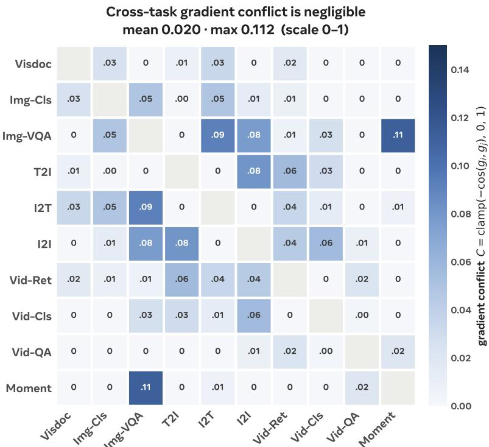  
Figure 11 Pairwise conflict $C = \mathrm { c l a m p } ( - \cos ( g _ { i } , g _ { j } ) , 0 , 1 )$ on router parameters.

Minimal Cross-Task Gradient Conflict. A primary hypothesis for multi-task performance degradation is destructive gradient interference across task streams. To test this, we compute the pairwise cosine conflict $C =$ $\mathrm { c l a m p } ( - \cos ( g _ { i } , g _ { j } ) , 0 , 1 )$ between per-category router parameter gradients g across the ten MMEB-V2 categories. As shown in Fig. 11, router gradient conflict is negligible (mean 0.020, max 0.112). Because categories do not exert opposing gradient updates on router parameters, generalist degradation stems primarily from total capacity constraints rather than inter-task gradient competition. Expanding expert capacity directly addresses this limitation 3.

Table 11 Specialist vs. generalist by backbone. Group scores are unweighted averages over the group’s tasks; Mean is the flat mean of the two group scores and is what Fig. 3 plots.
<table><tr><td>Backbone</td><td>Arm</td><td>Image-CLS (10 tasks)</td><td>Image-Ret. (16 tasks)</td><td>Mean</td></tr><tr><td rowspan="3">Qwen3.5-2B (dense, 2B act.)</td><td>specialist</td><td>60.69</td><td>73.06</td><td>66.88</td></tr><tr><td>generalist</td><td>56.53</td><td>71.17</td><td>63.85</td></tr><tr><td>∆</td><td>-4.16</td><td>-1.89</td><td>-3.02</td></tr><tr><td rowspan="3">Qwen3.5-9B (dense, 9B act.)</td><td>specialist</td><td>63.50</td><td>77.49</td><td>70.50</td></tr><tr><td>generalist</td><td>61.34</td><td>75.81</td><td>68.58</td></tr><tr><td>∆</td><td>-2.16</td><td>-1.68</td><td>-1.92</td></tr><tr><td rowspan="3">Qwen3.5-35B-A3B (MoE, 3.1B act.)</td><td>specialist</td><td>59.73</td><td>74.04</td><td>66.89</td></tr><tr><td>generalist</td><td>58.97</td><td>72.54</td><td>65.75</td></tr><tr><td>∆</td><td>-0.76</td><td>-1.50</td><td>-1.13</td></tr></table>

## D.3 Expert Routing Behavior Across Modality and Task

To analyze expert routing patterns across modalities and task domains, we profile top-8 routing assignments across all 40 MoE layers using 10 MMEB-V2 categories covering all modalities and tasks, with 16 samples per category. The routing divergences are measured using Jensen–Shannon (JS) distance over the 256-expert distribution.

Modality Preference Over Task Taxonomy. Layer-averaged JS distance is significantly lower within modalities (0.114) than between modalities (0.323). Conversely, grouping subset pairs by task category yields no statistically significant separation $( z = - 0 . 6 6 , p = 0 . 7 3 )$ , as task categories span modality boundaries. Image and video inputs form a unified visual cluster, exhibiting an inter-modality JS distance of 0.117—lower than intra-image distance (0.136). Notably, this modality specialization emerges naturally without active load-balancing or auxiliary z-loss constraints.

Depth-Wise Modality Convergence. We score each expert $j$ of a layer by a preference index $\pi _ { j } = ( v _ { j } - t _ { j } ) / ( v _ { j } +$ $t _ { j } ) \in [ - 1 , 1 ]$ , where $v _ { j }$ and $t _ { j }$ are its mean shares of the routing mass over the vision and the text subsets, and call it modality-preferring when $| \pi _ { j } | > 0 . 5$ , the point at which one modality routes three times the mass of the other. Modality divergence peaks in early decoder layers (layer 4 $\mathrm { J S = 0 . 3 3 9 }$ , where 172 of 256 experts display strong modality preference) and steadily diminishes in deeper layers (layer $3 8 ~ \mathrm { J S } = 0 . 0 9 9$ , where only 43 experts remain modality-dependent; Fig. 12). Inputs across all modalities thus converge toward a compact shared expert sub-population in deep layers, before briefly re-diverging at layer 39 to construct the final sequence embedding.

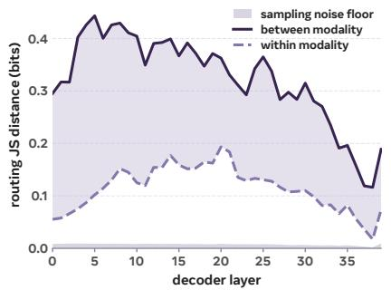

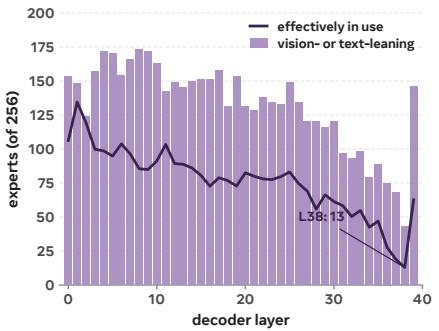

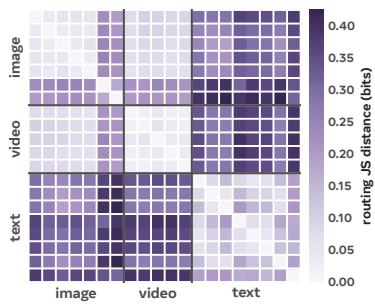  
Figure 12 Expert routing differs by modality, and the divergence disappears with depth. (a) Within- and betweenmodality JS distance per layer, with the sampling noise floor shaded. (b) Modality-preferring experts, meaning $| \pi _ { j } | > 0 . 5$ on the index defined above, and the number effectively in use, exp(H) of the routing entropy. (c) The 20 subsets at the layer mean, ordered by modality, where the image and video blocks are close to indistinguishable. Grouping the same 190 pairs by task category gives no separation $( z = - 0 . 6 6 , p = 0 . 7 3 )$ . Subsets mix workloads, so the separation shown is a lower bound.

## E Additional Details for Adaptive Computation

This section gives implementation details for every adaptive-computation method of $\ S 4 . 1$ and Tab. 6, grouped by whether the decision is learned during training or taken at inference.

## E.1 Training-Based Methods

All training-based variants extend the contrastive framework described in Appendix B. Models are trained on 64 NVIDIA H200 GPUs (expert parallel size 64) in BF16 precision using AdamW (weight decay = 0.01, gradient clip norm 1.0, logit scale 50, maximum sequence length 8,192). LoRA adapters $( r = 6 4 , \alpha = 1 2 8$ , dropout 0.05) are applied to visual and language projection layers (linear\_qkv, linear\_proj, linear\_fc1, linear\_fc2). Global batch size is set to 512, except for GRPO, which uses a global batch size of 256 with 8 rollouts per input.

Initialization and Distillation Regimes. Token pruning, layer skipping, AdaMoE, and GRPO are initialized from the pretrained MOEMB-A3B checkpoint and fine-tuned for one epoch. Token pruning and layer skipping train with a learning rate of $1 0 ^ { - 5 }$ and an $L _ { 2 }$ distillation loss $( \mathrm { w e i g h t } = 1 . 0 )$ against cached full-compute teacher hidden states to stabilize representations during gate optimization. AdaMoE is fine-tuned at a learning rate of $1 0 ^ { - 4 }$ without distillation. GRPO uses a learning rate of $\mathrm { { \bar { 5 } } \times 1 0 ^ { - 5 } }$ and integrates distillation directly into its reward function. Expert skipping is initialized directly from the base backbone and trained jointly with contrastive adaptation over two epochs at a learning rate of $1 0 ^ { - 4 }$ without distillation.

Token Pruning. Pruning decisions are evaluated after decoder block 2, targeting a 30% visual token retention rate via an $L _ { 1 }$ budget loss (weight = 0.5, 15% warmup). The Gumbel-Softmax temperature is linearly annealed from 4.0 to 0.5 over 2,000 steps, with predictor weights updated at 40× the backbone learning rate. Pruning is restricted exclusively to visual tokens.

Expert Skipping. Expert skipping penalizes active compute via an $L _ { 1 }$ penalty weight of 0.02 on $( 1 - \rho _ { \mathrm { s k i p } } )$ . This penalty is held at zero for the first 15% of training steps and linearly ramped to full weight over the subsequent 5% of steps.

Layer Skipping. A gate module at each block evaluates the hidden state at the <emb> position to produce a binary keep-or-skip decision for the entire block. When a block is skipped, its residual passes through unmodified, bypassing both attention and MoE sub-layers. The gate is trained via a straight-through estimator targeting a 20% skip rate under unit loss weight, applied from decoder block 3 onward. In practice, the policy converges to a 20.5% empirical skip rate concentrated across 9 of the 36 eligible blocks, leaving the remaining 27 blocks unskipped.

Adaptive Top-k. Following AdaMoE (Zeng et al., 2024), we augment the router with 256 null experts alongside the 256 physical experts and perform a joint top-8 selection across all 512 candidates. A token’s effective width corresponds to the number of top-8 slots allocated to physical experts, eliminating manual threshold tuning. A load-balancing penalty (weight = 0.02) maintains the mean activation near four physical experts during the first half of training, after which it drops to $1 0 ^ { - 4 }$ to allow unconstrained routing convergence. The policy settles at an average of 2.94 physical experts per token at evaluation (63.3% reduction in routed expert execution); we compare this setting against MoDES at an equivalent target budget in §5.3.

Group Relative Policy Optimization (GRPO). GRPO optimizes a lightweight three-way classification head per MoE layer that emits categorical decisions over {ROUTE, SKIP, DROP} for each token. Native expert routing remains greedy, meaning the policy dictates only execution state without altering expert selection logic. Auxiliary routing losses are disabled.

The policy is trained on 8 rollouts per sequence sampled at temperature 1.0 using a learning rate of $5 \times 1 0 ^ { - 5 }$ without KL penalties or value baselines, utilizing group-standardized advantages across rollouts. Log-probabilities sum categorical policy decisions across active tokens and MoE layers, normalized by the total decision count to equalize variable sequence lengths. To manage memory overhead, gradients are replayed one rollout at a time. Updates are computed on-policy $( r ^ { ( \bar { i } ) } \equiv 1$ , rendering ratio clipping inactive). To avoid distorting core feature spaces, policy gradients flow exclusively to the efficiency gate heads; base backbone and LoRA weights remain fixed at their contrastive values (Lan et al., 2025; Jiang et al., 2026).

The overall reward combines an efficiency score $S ( a )$ and a cosine distillation reward against teacher embeddings (weight = 1.0, softmax temperature 0.2 for negative pairs). The efficiency reward credits each action by the compute it removes at each layer:

$$
S ( a ) = 1 - \frac { \mathbb { E } [ \mathrm { F L O P s } ( a ) ] } { \mathrm { F L O P s } _ { \mathrm { d e n s e } } } ,\tag{6}
$$

$$
\mathbb { E } [ \mathrm { F L O P s } ( a ) ] = \sum _ { \ell } \sum _ { t } \alpha _ { t , \ell } \left[ f _ { \ell } ^ { \mathrm { a t t n } } + f _ { \mathrm { s h } } + ( 1 - p _ { t , \ell } ^ { \mathrm { s k i p } } - p _ { t , \ell } ^ { \mathrm { d r o p } } ) f _ { \mathrm { r t } } \right] ,\tag{7}
$$

where $\alpha _ { t , \ell }$ is the probability that token t reaches layer ℓ, and $f _ { \ell } ^ { \mathrm { a t t n } } , f _ { \mathrm { s h } } , f _ { \mathrm { r t } }$ represent layer-specific attention, shared expert, and routed expert FLOP costs. Expert skipping removes $f _ { \mathrm { r t } }$ at that layer and token dropping removes all downstream per-token compute.

Action Combination Strategies. We evaluate four joint execution schemes for combining discrete efficiency actions, where $\rho _ { a }$ and $\rho _ { a } ^ { \star }$ denote the realized and target reduction rates for action a:

• Shared Target, Simultaneous: We use a single expected FLOP penalty defined as $\lambda _ { \mathrm { f } } ( \mathbb { E } _ { \theta } [ \mathrm { F L O P s } ] / \mathrm { F L O P s } _ { \mathrm { f u l l } } - b ) .$ + and update all action gates simultaneously. Because individual action rates are unconstrained, optimization favors the lowest-cost action; token dropping dominates early training, leaving expert and layer gates under-optimized.

• Per-Action Targets, Simultaneous: Replacing the single target with decoupled quadratic penalties $\begin{array} { r l } { } & { { } \sum _ { a } \lambda _ { a } ( \rho _ { a } - \rho _ { a } ^ { \star } ) ^ { 2 } } \end{array}$ enforces individual target rates. However, simultaneous optimization causes distribution shifts as gates re-adapt to concurrent updates.

• Per-Action Targets, Iterative: Gates are updated one at each training step while holding other gates fixed, mitigating co-adaptation instabilities at the cost of increased training duration.

• Per-Action Targets, Sequential: Actions are trained sequentially according to a predefined order and permanently frozen upon reaching their target rate $\rho _ { a } ^ { \star }$ . Each subsequent gate optimizes over a fixed compute reduction profile, matching the inference execution pipeline.

Explored Variants and Negative Results. We additionally evaluated A-ViT and PonderNet-style dynamic halting mechanisms (Yin et al., 2022; Banino et al., 2021) based on learned hidden states, GDN-β token scores, and early exit heads. Training combined a ponder penalty and a geometric distribution prior over steps under a joint Gumbel-Softmax / STE loss formulation (Jang et al., 2017):

$$
\mathcal { L } _ { \mathrm { h a l t } } = \mathcal { L } _ { \mathrm { e m b } } + \lambda _ { \mathrm { p } } \mathbb { E } [ N _ { \mathrm { h a l t } } ] + \lambda _ { \mathrm { k l } } \mathrm { K L } \left( q _ { \mathrm { h a l t } } \Vert \mathrm { G e o m } ( \gamma ) \right) .
$$

Table 12 summarizes the observed failure modes. Aggressive regularization degraded target representation quality, whereas conservative settings caused gate gradients to saturate near zero reduction. Joint pruning techniques such as DiEP (Bai et al., 2025) similarly failed to achieve competitive accuracy-efficiency trade-offs. We hypothesize that credit assignment through non-differentiable or delayed attention paths introduces high gradient variance during early training, causing efficiency penalties to dominate before representation alignment can stabilize.

Table 12 Summary of non-convergent or suboptimal baseline implementations.
<table><tr><td>Variant</td><td>Observed behavior</td></tr><tr><td>Projected A-ViT gate</td><td>Training is initially healthy, then drop exceeds roughly 85%; the embedding token loses visual context and both representation and gradients collapse.</td></tr><tr><td>Cumulative drop logit</td><td>The compute reward drives nearly all halting to the first layer; the distribution prior does not offset the incentive to drop earliest.</td></tr><tr><td>GDN-β halting</td><td>With a stable negative sign (low β drops first), the gate frequently becomes inert and returns toward zero drop; more aggressive settings destabilize training.</td></tr><tr><td>Learned early exit</td><td>Exit probabilities converge to the final layer, producing negligible savings under stable quality.</td></tr></table>

## E.2 Inference-Based Methods

This subsection details the training-free dynamic efficiency heuristics evaluated in §4.2.

Token Pruning via GDN-β. Visual tokens are ranked using the Gated-DeltaNet write strength $\beta$ evaluated at decoder block 4. The lowest-scoring tokens are pruned, and remaining sequences are gathered to reduce compute across all subsequent blocks. Text tokens are fully preserved.

Expert Skipping via GDN-β. Using the same $\beta$ signal, tokens ranking in the lower fraction per MoE block skip routed experts.

Static Expert Pruning. Methods including REAP (Lasby et al., 2025), MAN (Liu et al., 2026), MSAN (Liu et al., 2026), and router logit thresholding evaluate expert importance scores over a static calibration set of 16 balanced samples. The lowest-ranked experts are permanently removed across all layers. Because routing maintains top-8 selection over reduced expert pools, this strategy reduces total parameter without reducing dynamic FLOPs per token.

Adaptive Top-k Routing. Uniform top-k keeps the k highest-scoring of the native eight experts at every layer, with no calibration and no learned gate. The pretrained router’s ranking is what makes the reduced budget cheap: at k = 4 accuracy falls by 0.5 points, while drawing four of the eight at random costs 6.6 at the identical 11.6% FLOPs reduction (Tab. 6). The ordering the router induces over its top-8 therefore accounts for most of what a halved budget preserves.

MoDES Calibration. MoDES derives layer-wise scaling parameters $s _ { \ell }$ and a global activation threshold τ using a calibration subset from the ImageNet-1K evaluation split.

Adaptive Otsu Thresholding for Expert Skipping. Rather than enforcing uniform skip ratios across layers, we explore dynamically computing per-layer thresholds using Otsu’s method (Otsu, 1979). For each layer, the score distribution is partitioned into two classes by maximizing inter-class variance; tokens in the lower partition skip routed experts. We evaluate two scoring signals: (1) GDN write strength $\beta$ across 30 GDN layers, and (2) maximum pre-softmax router logits across all 40 MoE layers. A dispersion threshold (coefficient of variation > 0.05–0.40) restricts partitioning to layers with sufficiently bimodal score distributions, subject to a maximum 70% per-layer skip cap. Neither variant requires pre-calibration.

## F Additional Analysis on GDN Write Strength $\beta$

Depth Dynamics and Attention Comparison. We evaluate the layer-wise behavior of GDN write strength $\beta$ using three representative samples per modality. Across all evaluated tokens, the layer-wise mean of $\beta$ spans [0.196, 0.596], with coefficients of variation ranging from 0.065 to 0.496. In an eight-example diagnostic pairing each of the 10 GDN layers immediately preceding a full-attention layer with its corresponding attention block, the Spearman correlation between $\beta$ and incoming attention mass reaches 0.546, 0.619, 0.491, and 0.524 for image, text, video, and VisDoc modalities, respectively. However, attention allocation exhibits considerably higher spatial variance, yielding a mean token-wise coefficient of variation of 2.316, compared to 0.226 for $\beta .$

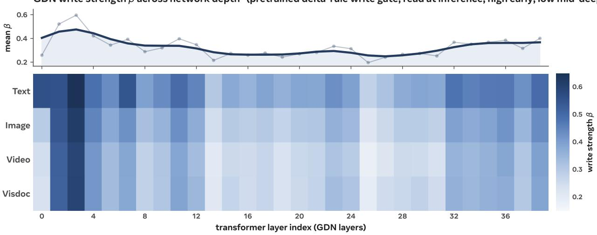  
Figure 13 The GDN write strength is depth-structured. Per-token Gated-DeltaNet delta-rule write strength β (a gate of the pretrained backbone, read at inference), averaged per layer (top: network-wide marginal; bottom: per modality). Tokens write strongly in the early blocks and weakly through the middle-to-deep blocks. The middle panel of Fig. 9 plots the same quantity beside the two learned actions.

Spatial and Temporal Consistency. Qualitative overlays (Figures 15–17) and layer-wise comparisons across blocks 2, 22, and 38 (Figure 14) demonstrate three key properties of $\beta \colon$

1. Semantic Alignment: $\beta$ highlights semantically informative regions—such as foreground objects in natural images or plot/text elements in documents—forming contiguous spatial clusters rather than isolated activation noise.

2. Depth Stability: $\beta$ distributions remain stable across network layers, whereas attention maps shift dynamically. Computing cross-layer cosine similarity yields an average of 0.989 (minimum 0.973) for $\beta ,$ compared to 0.752 (range [0.68, 0.86]) for <emb> attention. Tokens identified as high-value in early blocks preserve high scores deeper in the network, even as attention redirects focus.

3. Temporal Persistence: Across video frames within a given layer, $\beta$ maps exhibit high cross-frame cosine similarity (0.992 vs. 0.744 for attention).

This spatial and temporal stability makes $\beta$ a reliable candidate for early single-shot pruning, ensuring that token removal decisions remain valid throughout subsequent layers.

Pruning Decision Depth. Table 13 evaluates sensitivity to the layer at which the single-shot pruning mask is generated. Executing the decision at layer 2 rather than layer 4 alters accuracy by +0.04 at a 75% keep rate and +0.21 at a 25% keep rate, yielding modest incremental FLOP savings of 0.35 and 1.03 percentage points, respectively. These minor variations indicate that pruning effectiveness is broadly insensitive to the exact decision layer.

Table 13 Inference-only GDN-β decision-depth diagnostic. Layer indices are zero-based.
<table><tr><td>Keep</td><td>layer</td><td>Accuracy</td><td> $\Delta$ </td><td>FLOPs↓</td></tr><tr><td>75%</td><td>2</td><td>70.07</td><td>-0.25</td><td>6.47%</td></tr><tr><td>75%</td><td>4</td><td>70.03</td><td>-0.29</td><td>6.12%</td></tr><tr><td>25%</td><td>2</td><td>66.26</td><td>-4.06</td><td>19.36%</td></tr><tr><td>25%</td><td>4</td><td>66.05</td><td>-4.27</td><td>18.33%</td></tr></table>

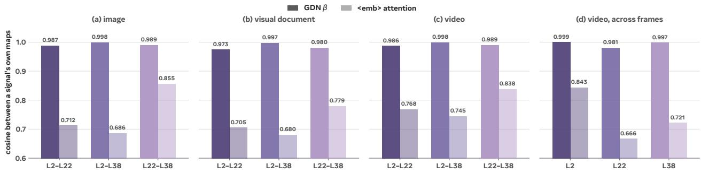  
Figure 14 Figures (a)–(c): cosine similarity across layers; Figure (d) compares cosine similarity across video frames within one layer.

Visual Comparison of Trained and Inference-Only Token Pruning and Expert skipping Methods. Figures 18 and 19 compare trained adaptive computing methods (token pruning and adaptive top-k / expert skipping) with their inference-only counterparts evaluated on identical inputs. As shown in Fig. 18, the single-shot token dropper and the GDN-β policy select nearly identical token subsets. Conversely, Fig. 19 reveals that the trained expert-skipping gate and adaptive top-k routing diverge notably in their allocation decisions.

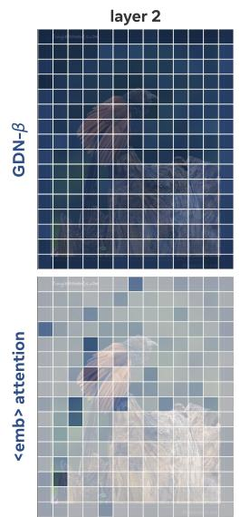

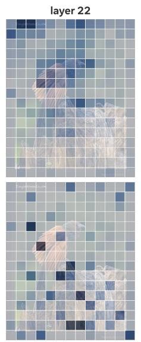

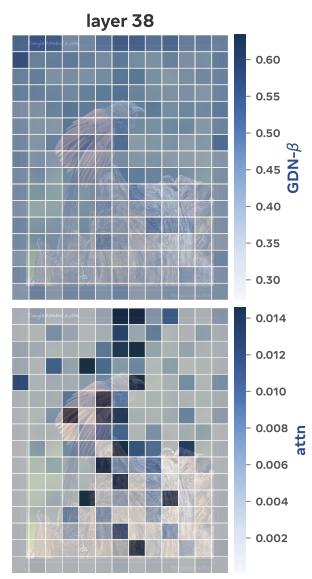  
Figure 15 Image: GDN-β vs. the <emb> attention. The clean input is at left; the panels overlay GDN-β (top) and the <emb> token’s attention onto the visual tokens (bottom) at layers 2, 22, and 38. Cell colour encodes magnitude against the colourbars, with the image kept faintly underneath for spatial reference. β is strong and near-uniform early and localises smoothly with depth, whereas the <emb> attention is sparse and scattered and only strengthens in the deeper layers.

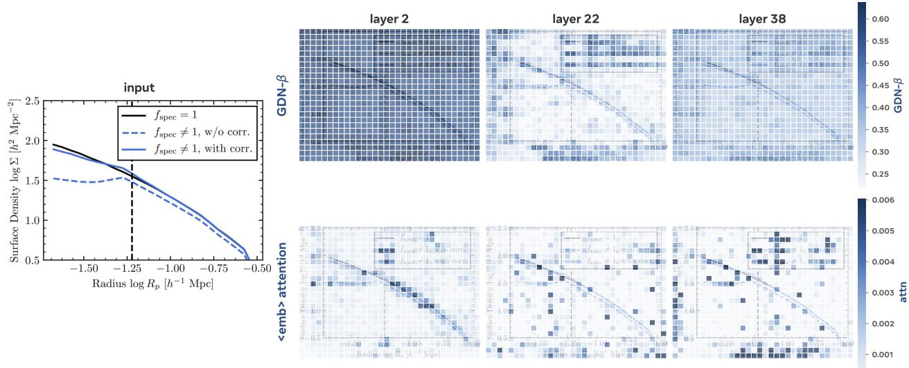  
Figure 16 Visual document: GDN-β vs. the <emb> attention. Same layout as Fig. 15, on a document page. As on natural images, β is the smoother, more distributed signal across depth.

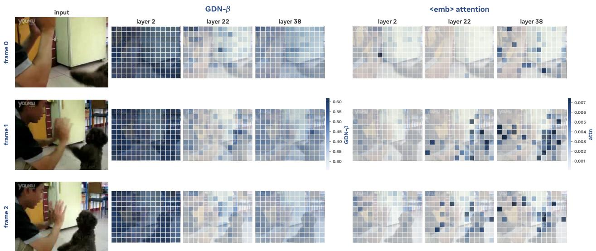  
Figure 17 Video: GDN-β vs. the <emb> attention. Rows are frames: the clean frame at left, then GDN-β and the <emb> attention side by side, each at layers 2, 22, and 38. The <emb> attention is nearly empty at layer 2 and sharpens into scattered per-frame peaks with depth, whereas β is strong early and spatially smooth, so the two signals carry complementary information.

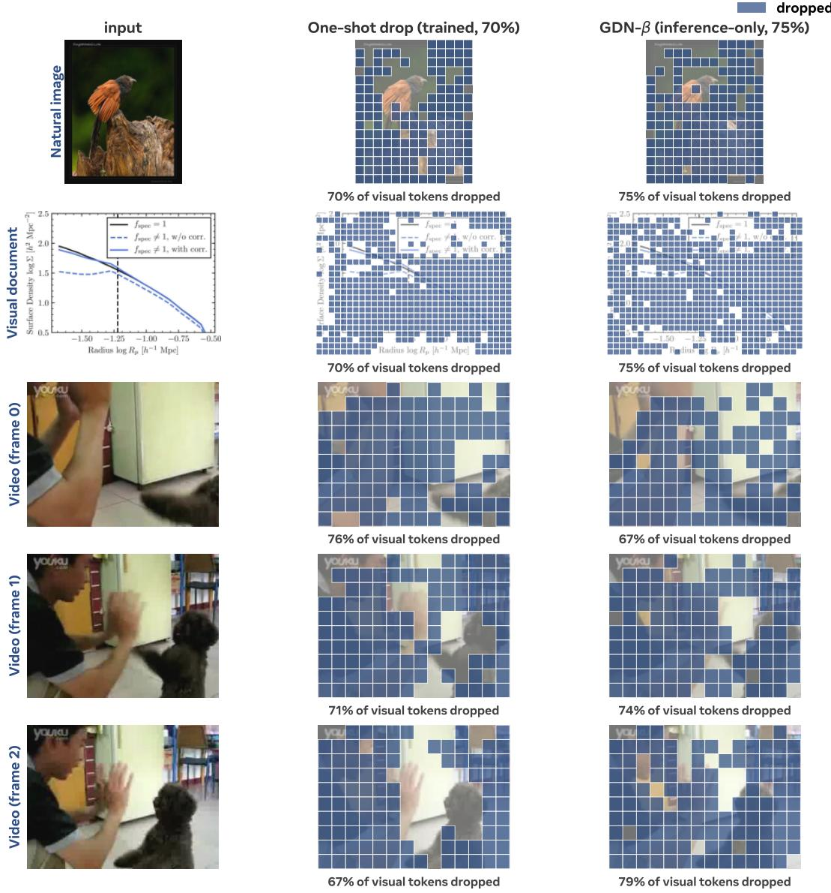  
Figure 18 Trained vs. inference-only token dropping, at an equal budget.

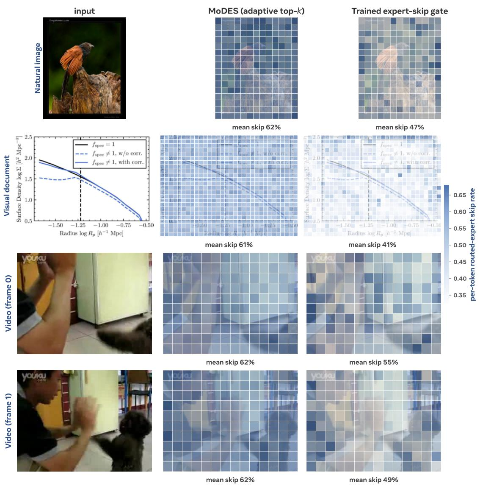  
Figure 19 How the two expert-skipping policies allocate their budget. Per-token fraction of the 40 MoE layers whose routed-expert branch is skipped, for MoDES (adaptive top-k, inference-only) and the trained expert skipping, at the same overall skip rate.

## G Per-Task MMEB-V2 Results

Table 14 Per-task MMEB-V2 scores.
<table><tr><td rowspan=1 colspan=11>Single-pass                   TTE-based              MoEMBVLM2Vec UniME              UME-R1 Embed UME-R1 EmbedTask                                  V2-2BV2-7B BToks PLUME  2B  RL-2B  7B  RL-4BA3B A10B</td></tr><tr><td rowspan=1 colspan=9>Image classification (10 tasks)               62.9  65.6 64.3  66.5   64.8  62.8  67.1  63.7</td><td rowspan=1 colspan=2>60.664.4</td></tr><tr><td rowspan=1 colspan=9>Country211                                 25.8 19.0 25.2  25.0   23.4  20.0   25.0  19.4</td><td rowspan=1 colspan=1>21.4</td><td rowspan=1 colspan=1>26.3</td></tr><tr><td rowspan=2 colspan=9>HatefulMemes                              55.8 66.1 62.5  75.5   75.2  65.0  79.0  66.2ImageNet-1K                               80.8 78.9 80.5  74.1   75.3  78.0   80.4  79.5</td><td rowspan=1 colspan=1>59.8</td><td rowspan=1 colspan=1>69.8</td></tr><tr><td rowspan=1 colspan=1>78.1</td><td rowspan=1 colspan=1>79.5</td></tr><tr><td rowspan=1 colspan=9>ImageNet-A                                47.6 49.0 46.9  50.8   50.4  59.2   53.9  58.1</td><td rowspan=1 colspan=1>52.9</td><td rowspan=1 colspan=1>55.2</td></tr><tr><td rowspan=1 colspan=7>ImageNet-R                                89.3 89.1 85.6  87.5   88.7  88.5</td><td rowspan=1 colspan=2>90.1  88.2</td><td rowspan=1 colspan=1>87.9</td><td rowspan=1 colspan=1>88.4</td></tr><tr><td rowspan=1 colspan=7>N24News                                  73.0  66.0 74.0  81.1   81.1  44.9</td><td rowspan=1 colspan=2>82.3  48.3</td><td rowspan=1 colspan=1>39.5</td><td rowspan=1 colspan=1>50.5</td></tr><tr><td rowspan=2 colspan=7>ObjectNet                                  65.1  73.2 68.5  61.5   52.0  74.8Place365                                   36.1  43.8 38.7  42.4   42.6  43.9</td><td rowspan=1 colspan=2>42.3  75.4</td><td rowspan=1 colspan=1>69.1</td><td rowspan=1 colspan=1>73.7</td></tr><tr><td rowspan=1 colspan=6></td><td rowspan=1 colspan=2>46.8  43.1</td><td rowspan=1 colspan=1>44.1</td><td rowspan=1 colspan=1>45.3</td></tr><tr><td rowspan=1 colspan=1>SUN397</td><td rowspan=1 colspan=1>70.9</td><td rowspan=1 colspan=1>78.8</td><td rowspan=1 colspan=2>74.9  76.9</td><td rowspan=1 colspan=1>79.4</td><td rowspan=1 colspan=1>75.4</td><td rowspan=1 colspan=2>80.3  79.2</td><td rowspan=1 colspan=1>72.9</td><td rowspan=1 colspan=1>74.3</td></tr><tr><td rowspan=1 colspan=1>VOC2007</td><td rowspan=1 colspan=1>84.9</td><td rowspan=1 colspan=1>92.5</td><td rowspan=1 colspan=1>85.7</td><td rowspan=1 colspan=1>86.1</td><td rowspan=1 colspan=1>80.0</td><td rowspan=1 colspan=1>78.7</td><td rowspan=1 colspan=1>90.8</td><td rowspan=1 colspan=1>79.5</td><td rowspan=1 colspan=1>80.8</td><td rowspan=1 colspan=1>81.3</td></tr><tr><td rowspan=1 colspan=1>Image VQA (10 tasks)</td><td rowspan=1 colspan=1>56.4</td><td rowspan=1 colspan=1>68.7</td><td rowspan=1 colspan=1>59.8</td><td rowspan=1 colspan=1>59.2</td><td rowspan=1 colspan=1>62.8</td><td rowspan=1 colspan=1>67.9</td><td rowspan=1 colspan=1>69.2</td><td rowspan=1 colspan=1>70.5</td><td rowspan=1 colspan=1>73.8</td><td rowspan=1 colspan=1>75.4</td></tr><tr><td rowspan=1 colspan=1>A-OKVQA</td><td rowspan=1 colspan=1>44.0</td><td rowspan=1 colspan=1>71.5</td><td rowspan=1 colspan=1>48.6</td><td rowspan=1 colspan=1>49.9</td><td rowspan=1 colspan=1>51.1</td><td rowspan=1 colspan=1>54.7</td><td rowspan=1 colspan=1>58.7</td><td rowspan=1 colspan=1>59.3</td><td rowspan=1 colspan=1>63.1</td><td rowspan=1 colspan=1>64.6</td></tr><tr><td rowspan=2 colspan=1>ChartQADocVQA</td><td rowspan=1 colspan=1>48.1</td><td rowspan=1 colspan=1>59.2</td><td rowspan=1 colspan=1>51.2</td><td rowspan=1 colspan=1>49.8</td><td rowspan=1 colspan=1>64.9</td><td rowspan=1 colspan=1>80.7</td><td rowspan=1 colspan=1>75.1</td><td rowspan=1 colspan=1>80.9</td><td rowspan=1 colspan=1>79.0</td><td rowspan=1 colspan=1>82.5</td></tr><tr><td rowspan=1 colspan=1>90.1</td><td rowspan=1 colspan=1>92.4</td><td rowspan=1 colspan=1>91.9</td><td rowspan=1 colspan=1>89.9</td><td rowspan=1 colspan=1>92.2</td><td rowspan=1 colspan=1>92.4</td><td rowspan=1 colspan=1>93.8</td><td rowspan=1 colspan=1>94.3</td><td rowspan=1 colspan=1>96.0</td><td rowspan=1 colspan=1>96.0</td></tr><tr><td rowspan=1 colspan=1>GQA</td><td rowspan=1 colspan=1>65.4</td><td rowspan=1 colspan=1>69.0</td><td rowspan=1 colspan=1>63.9</td><td rowspan=1 colspan=1>69.1</td><td rowspan=1 colspan=1>67.3</td><td rowspan=1 colspan=1>64.9</td><td rowspan=1 colspan=1>69.3</td><td rowspan=1 colspan=1>68.5</td><td rowspan=1 colspan=1>76.3</td><td rowspan=1 colspan=1>77.6</td></tr><tr><td rowspan=1 colspan=1>InfographicsVQA</td><td rowspan=1 colspan=1>59.1</td><td rowspan=1 colspan=1>67.1</td><td rowspan=1 colspan=1>61.6</td><td rowspan=1 colspan=1>59.6</td><td rowspan=1 colspan=1>67.7</td><td rowspan=1 colspan=1>76.7</td><td rowspan=1 colspan=1>79.2</td><td rowspan=1 colspan=1>77.5</td><td rowspan=1 colspan=1>80.0</td><td rowspan=1 colspan=1>82.6</td></tr><tr><td rowspan=2 colspan=1>OK-VQAScienceQA</td><td rowspan=1 colspan=1>51.7</td><td rowspan=1 colspan=1>71.7</td><td rowspan=1 colspan=1>61.8</td><td rowspan=1 colspan=1>60.5</td><td rowspan=1 colspan=1>62.4</td><td rowspan=1 colspan=1>61.4</td><td rowspan=1 colspan=2>71.7  67.3</td><td rowspan=1 colspan=1>73.9</td><td rowspan=1 colspan=1>75.1</td></tr><tr><td rowspan=1 colspan=1>38.1</td><td rowspan=1 colspan=1>55.2</td><td rowspan=1 colspan=1>40.1</td><td rowspan=1 colspan=1>42.9</td><td rowspan=1 colspan=1>42.7</td><td rowspan=1 colspan=1>57.3</td><td rowspan=1 colspan=2>53.7  61.6</td><td rowspan=1 colspan=1>63.6</td><td rowspan=1 colspan=1>67.4</td></tr><tr><td rowspan=1 colspan=1>TextVQA</td><td rowspan=1 colspan=1>71.6</td><td rowspan=1 colspan=1>84.4</td><td rowspan=1 colspan=1>79.5</td><td rowspan=1 colspan=1>78.9</td><td rowspan=1 colspan=1>78.6</td><td rowspan=1 colspan=1>83.8</td><td rowspan=1 colspan=2>83.5  84.3</td><td rowspan=1 colspan=1>88.5</td><td rowspan=1 colspan=1>89.6</td></tr><tr><td rowspan=2 colspan=1>Visual7WVizWiz</td><td rowspan=1 colspan=1>52.8</td><td rowspan=1 colspan=1>62.7</td><td rowspan=1 colspan=1>49.2</td><td rowspan=1 colspan=1>47.6</td><td rowspan=1 colspan=1>54.1</td><td rowspan=1 colspan=1>52.7</td><td rowspan=1 colspan=2>55.2  55.3</td><td rowspan=1 colspan=1>59.7</td><td rowspan=1 colspan=1>58.8</td></tr><tr><td rowspan=1 colspan=1>43.3</td><td rowspan=1 colspan=1>53.4</td><td rowspan=1 colspan=1>49.8</td><td rowspan=1 colspan=1>46.5</td><td rowspan=1 colspan=1>46.8</td><td rowspan=1 colspan=1>54.5</td><td rowspan=1 colspan=2>51.6  56.2</td><td rowspan=1 colspan=1>58.0</td><td rowspan=1 colspan=1>60.1</td></tr><tr><td rowspan=1 colspan=1>Text-to-image retrieval (6 tasks)</td><td rowspan=1 colspan=1>79.3</td><td rowspan=1 colspan=1>82.0</td><td rowspan=1 colspan=1>78.6</td><td rowspan=1 colspan=1>76.2</td><td rowspan=1 colspan=1>77.2</td><td rowspan=1 colspan=1>79.2</td><td rowspan=1 colspan=1>81.9</td><td rowspan=1 colspan=1>80.8</td><td rowspan=1 colspan=1>83.2</td><td rowspan=1 colspan=1>85.4</td></tr><tr><td rowspan=2 colspan=1>EDISMSCOCO_t2i</td><td rowspan=1 colspan=1>84.2</td><td rowspan=1 colspan=1>88.5</td><td rowspan=1 colspan=1>85.4</td><td rowspan=1 colspan=1>81.8</td><td rowspan=1 colspan=1>88.0</td><td rowspan=1 colspan=1>84.5</td><td rowspan=1 colspan=1>92.0</td><td rowspan=1 colspan=1>87.4</td><td rowspan=1 colspan=1>91.9</td><td rowspan=1 colspan=1>92.9</td></tr><tr><td rowspan=1 colspan=1>75.9</td><td rowspan=1 colspan=1>80.0</td><td rowspan=1 colspan=1>73.9</td><td rowspan=1 colspan=1>74.1</td><td rowspan=1 colspan=1>75.1</td><td rowspan=1 colspan=1>79.4</td><td rowspan=1 colspan=1>78.3</td><td rowspan=1 colspan=1>78.9</td><td rowspan=1 colspan=1>78.7</td><td rowspan=1 colspan=1>79.7</td></tr><tr><td rowspan=1 colspan=1>VisDial</td><td rowspan=1 colspan=1>82.7</td><td rowspan=1 colspan=1>84.8</td><td rowspan=1 colspan=1>78.4</td><td rowspan=1 colspan=1>72.6</td><td rowspan=1 colspan=1>76.6</td><td rowspan=1 colspan=1>81.5</td><td rowspan=1 colspan=1>80.7</td><td rowspan=1 colspan=1>84.9</td><td rowspan=1 colspan=1>85.1</td><td rowspan=1 colspan=1>88.4</td></tr><tr><td rowspan=2 colspan=1>VisualNews_t2iWebQA</td><td rowspan=1 colspan=1>74.7</td><td rowspan=1 colspan=1>77.3</td><td rowspan=1 colspan=1>72.7</td><td rowspan=1 colspan=1>71.3</td><td rowspan=1 colspan=1>71.7</td><td rowspan=1 colspan=1>71.9</td><td rowspan=1 colspan=1>76.8</td><td rowspan=1 colspan=1>73.7</td><td rowspan=1 colspan=1>76.4</td><td rowspan=1 colspan=1>81.9</td></tr><tr><td></td><td></td><td></td><td rowspan=1 colspan=1>89.1</td><td rowspan=1 colspan=1>90.0</td><td rowspan=1 colspan=1>89.3</td><td rowspan=1 colspan=1>90.9</td><td rowspan=1 colspan=1>90.5</td><td rowspan=1 colspan=1>89.1</td><td rowspan=1 colspan=1>90.9</td></tr><tr><td rowspan=1 colspan=1>Wiki-SS-NQ</td><td rowspan=1 colspan=1>67.6</td><td rowspan=1 colspan=1>70.9</td><td rowspan=1 colspan=1>70.5</td><td rowspan=1 colspan=1>68.6</td><td rowspan=1 colspan=1>62.0</td><td rowspan=1 colspan=1>68.9</td><td rowspan=1 colspan=1>72.5</td><td rowspan=1 colspan=1>69.6</td><td rowspan=1 colspan=1>77.8</td><td rowspan=1 colspan=1>78.8</td></tr><tr><td rowspan=1 colspan=1>Image-to-text retrieval (2 tasks)</td><td rowspan=1 colspan=1>74.7</td><td rowspan=1 colspan=1>77.3</td><td rowspan=1 colspan=1>72.4</td><td rowspan=1 colspan=1>71.2</td><td rowspan=1 colspan=1>71.5</td><td rowspan=1 colspan=1>74.4</td><td rowspan=1 colspan=1>76.7</td><td rowspan=1 colspan=1>75.1</td><td rowspan=1 colspan=1>80.3</td><td rowspan=1 colspan=1>80.9</td></tr><tr><td rowspan=1 colspan=1>MSCOCO_i2t</td><td rowspan=1 colspan=1>71.1</td><td rowspan=1 colspan=1>74.6</td><td rowspan=1 colspan=1>69.1</td><td rowspan=1 colspan=1>69.8</td><td rowspan=1 colspan=1>68.9</td><td rowspan=1 colspan=1>75.3</td><td rowspan=1 colspan=1>71.4</td><td rowspan=1 colspan=1>76.3</td><td rowspan=1 colspan=1>76.9</td><td rowspan=1 colspan=1>77.7</td></tr><tr><td rowspan=1 colspan=1>VisualNews_i2t</td><td rowspan=1 colspan=1>78.3</td><td rowspan=1 colspan=1>80.1</td><td rowspan=1 colspan=1>75.8</td><td rowspan=1 colspan=1>72.7</td><td rowspan=1 colspan=1>74.2</td><td rowspan=1 colspan=1>73.6</td><td rowspan=1 colspan=1>82.0</td><td rowspan=1 colspan=1>73.9</td><td rowspan=1 colspan=1>83.8</td><td rowspan=1 colspan=1>84.1</td></tr><tr><td rowspan=1 colspan=1>Image-to-image retrieval (8 tasks)</td><td rowspan=1 colspan=1>64.8</td><td rowspan=1 colspan=1>74.3</td><td rowspan=1 colspan=1>64.8</td><td rowspan=1 colspan=1>66.0</td><td rowspan=1 colspan=1>64.2</td><td rowspan=1 colspan=1>70.1</td><td rowspan=1 colspan=1>69.7</td><td rowspan=1 colspan=1>73.2</td><td rowspan=1 colspan=1>72.4</td><td rowspan=1 colspan=1>74.1</td></tr><tr><td rowspan=1 colspan=1>CIRR</td><td rowspan=1 colspan=1>57.3</td><td rowspan=1 colspan=1>67.0</td><td rowspan=1 colspan=1>54.0</td><td rowspan=1 colspan=1>54.6</td><td rowspan=1 colspan=1>53.7</td><td rowspan=1 colspan=1>47.6</td><td rowspan=1 colspan=1>55.3</td><td rowspan=1 colspan=1>61.2</td><td rowspan=1 colspan=1>52.5</td><td rowspan=1 colspan=1>54.9</td></tr><tr><td rowspan=1 colspan=1>FashionIQ</td><td rowspan=1 colspan=1>19.6</td><td rowspan=1 colspan=1>27.0</td><td rowspan=1 colspan=1>19.1</td><td rowspan=1 colspan=1>20.3</td><td rowspan=1 colspan=1>17.1</td><td rowspan=1 colspan=1>24.0</td><td rowspan=1 colspan=1>23.4</td><td rowspan=1 colspan=1>31.9</td><td rowspan=1 colspan=1>21.2</td><td rowspan=1 colspan=1>26.7</td></tr><tr><td rowspan=1 colspan=1>MSCOCO</td><td rowspan=1 colspan=1>66.2</td><td rowspan=1 colspan=1>81.3</td><td rowspan=1 colspan=1>66.4</td><td rowspan=1 colspan=1>66.9</td><td rowspan=1 colspan=1>69.5</td><td rowspan=1 colspan=1>92.9</td><td rowspan=1 colspan=1>72.7</td><td rowspan=1 colspan=1>93.6</td><td rowspan=1 colspan=1>92.3</td><td rowspan=1 colspan=1>91.2</td></tr><tr><td rowspan=1 colspan=1>NIGHTS</td><td rowspan=1 colspan=1>68.4</td><td rowspan=1 colspan=1>68.3</td><td rowspan=1 colspan=1>68.1</td><td rowspan=1 colspan=1>68.0</td><td rowspan=1 colspan=1>67.2</td><td rowspan=1 colspan=1>66.3</td><td rowspan=1 colspan=1>68.1</td><td rowspan=1 colspan=1>66.4</td><td rowspan=1 colspan=1>67.9</td><td rowspan=1 colspan=1>69.2</td></tr><tr><td rowspan=1 colspan=1>OVEN</td><td rowspan=1 colspan=1>64.8</td><td rowspan=1 colspan=1>68.5</td><td rowspan=1 colspan=1>67.8</td><td rowspan=1 colspan=1>68.4</td><td rowspan=1 colspan=1>66.9</td><td rowspan=1 colspan=1>61.4</td><td rowspan=1 colspan=1>71.4</td><td rowspan=1 colspan=1>60.7</td><td rowspan=1 colspan=1>68.0</td><td rowspan=1 colspan=1>71.0</td></tr><tr><td rowspan=1 colspan=1>RefCOCO</td><td rowspan=1 colspan=1>87.0</td><td rowspan=1 colspan=1>95.3</td><td rowspan=1 colspan=1>87.2</td><td rowspan=1 colspan=1>86.5</td><td rowspan=1 colspan=1>83.3</td><td rowspan=1 colspan=1>94.9</td><td rowspan=1 colspan=1>91.4</td><td rowspan=1 colspan=1>95.9</td><td rowspan=1 colspan=1>96.1</td><td rowspan=1 colspan=1>96.6</td></tr><tr><td rowspan=2 colspan=1>RefCOCO-MatchingVisual7W-Pointing</td><td rowspan=1 colspan=1>86.3</td><td rowspan=1 colspan=1>92.8</td><td rowspan=1 colspan=1>86.4</td><td rowspan=1 colspan=1>88.4</td><td rowspan=1 colspan=1>84.4</td><td rowspan=1 colspan=1>85.8</td><td rowspan=1 colspan=1>91.1</td><td rowspan=1 colspan=1>88.0</td><td rowspan=1 colspan=1>91.3</td><td rowspan=1 colspan=1>92.7</td></tr><tr><td rowspan=1 colspan=1>69.0</td><td rowspan=1 colspan=1>94.0</td><td rowspan=1 colspan=1>69.4</td><td rowspan=1 colspan=1>74.9</td><td rowspan=1 colspan=1>71.5</td><td rowspan=1 colspan=1>88.0</td><td rowspan=1 colspan=1>84.2</td><td rowspan=1 colspan=1>87.9</td><td rowspan=1 colspan=1>89.8</td><td rowspan=1 colspan=1>90.4</td></tr><tr><td rowspan=1 colspan=1>Video classification (5 tasks)</td><td rowspan=1 colspan=1>39.2</td><td rowspan=1 colspan=1>37.2</td><td rowspan=1 colspan=1>43.7</td><td rowspan=1 colspan=1>45.0</td><td rowspan=1 colspan=1>44.3</td><td rowspan=1 colspan=1>57.0</td><td rowspan=1 colspan=1>48.6</td><td rowspan=1 colspan=1>57.6</td><td rowspan=1 colspan=1>53.8</td><td rowspan=1 colspan=1>58.1</td></tr><tr><td rowspan=2 colspan=1>BreakfastHMDB51</td><td rowspan=1 colspan=1>14.8</td><td rowspan=1 colspan=1>18.0</td><td rowspan=1 colspan=1>18.0</td><td rowspan=1 colspan=1>20.1</td><td rowspan=1 colspan=1>20.1</td><td rowspan=1 colspan=1>36.7</td><td rowspan=1 colspan=1>21.5</td><td rowspan=1 colspan=1>33.0</td><td rowspan=1 colspan=1>30.0</td><td rowspan=1 colspan=1>36.5</td></tr><tr><td rowspan=1 colspan=1>40.2</td><td rowspan=1 colspan=1>42.8</td><td rowspan=1 colspan=1>47.1</td><td rowspan=1 colspan=1>51.2</td><td rowspan=1 colspan=1>54.4</td><td rowspan=1 colspan=1>56.7</td><td rowspan=1 colspan=1>58.3</td><td rowspan=1 colspan=1>60.1</td><td rowspan=1 colspan=1>47.5</td><td rowspan=1 colspan=1>54.4</td></tr><tr><td rowspan=1 colspan=1>Kinetics-700</td><td rowspan=1 colspan=1>38.2</td><td rowspan=1 colspan=1>38.0</td><td rowspan=1 colspan=1>43.1</td><td rowspan=1 colspan=1>42.2</td><td rowspan=1 colspan=1>35.8</td><td rowspan=1 colspan=1>55.8</td><td rowspan=1 colspan=1>42.8</td><td rowspan=1 colspan=1>56.8</td><td rowspan=1 colspan=1>51.6</td><td rowspan=1 colspan=1>55.6</td></tr><tr><td rowspan=1 colspan=1>SmthSmthV2</td><td rowspan=1 colspan=1>43.0</td><td rowspan=1 colspan=1>25.2</td><td rowspan=1 colspan=1>41.0</td><td rowspan=1 colspan=1>44.8</td><td rowspan=1 colspan=1>44.1</td><td rowspan=1 colspan=1>56.7</td><td rowspan=1 colspan=1>50.4</td><td rowspan=1 colspan=1>59.5</td><td rowspan=1 colspan=1>59.4</td><td rowspan=1 colspan=1>61.8</td></tr><tr><td rowspan=1 colspan=1>UCF101</td><td rowspan=1 colspan=1>60.0</td><td rowspan=1 colspan=1>61.8</td><td rowspan=1 colspan=1>69.3</td><td rowspan=1 colspan=1>66.5</td><td rowspan=1 colspan=1>67.2</td><td rowspan=1 colspan=1>79.3</td><td rowspan=1 colspan=1>70.0</td><td rowspan=1 colspan=1>78.5</td><td rowspan=1 colspan=1>80.7</td><td rowspan=1 colspan=1>82.1</td></tr><tr><td rowspan=1 colspan=1>Video QA (5 tasks)</td><td rowspan=1 colspan=1>34.7</td><td rowspan=1 colspan=1>50.6</td><td rowspan=1 colspan=1>47.0</td><td rowspan=1 colspan=1>52.3</td><td rowspan=1 colspan=1>50.9</td><td rowspan=1 colspan=1>55.9</td><td rowspan=1 colspan=1>60.7</td><td rowspan=1 colspan=1>58.4</td><td rowspan=1 colspan=1>65.9</td><td rowspan=1 colspan=1>67.5</td></tr><tr><td rowspan=1 colspan=1>ActivityNetQA</td><td rowspan=1 colspan=1>53.0</td><td rowspan=1 colspan=1>64.6</td><td rowspan=1 colspan=1>64.8</td><td rowspan=1 colspan=1>69.2</td><td rowspan=1 colspan=1>57.8</td><td rowspan=1 colspan=1>74.8</td><td rowspan=1 colspan=1>76.0</td><td rowspan=1 colspan=1>74.4</td><td rowspan=1 colspan=1>77.4</td><td rowspan=1 colspan=1>80.8</td></tr><tr><td rowspan=1 colspan=1>EgoSchema</td><td rowspan=1 colspan=1>35.0</td><td rowspan=1 colspan=1>51.6</td><td rowspan=1 colspan=1>37.0</td><td rowspan=1 colspan=1>47.8</td><td rowspan=1 colspan=1>45.4</td><td rowspan=1 colspan=1>53.0</td><td rowspan=1 colspan=1>52.4</td><td rowspan=1 colspan=1>52.8</td><td rowspan=1 colspan=1>60.4</td><td rowspan=1 colspan=1>60.6</td></tr><tr><td rowspan=1 colspan=1>MVBench</td><td rowspan=1 colspan=1>33.6</td><td rowspan=1 colspan=1>42.2</td><td rowspan=1 colspan=1>45.4</td><td rowspan=1 colspan=1>47.4</td><td rowspan=1 colspan=1>49.9</td><td rowspan=1 colspan=1>50.8</td><td rowspan=1 colspan=1>58.2</td><td rowspan=1 colspan=1>55.9</td><td rowspan=1 colspan=1>63.0</td><td rowspan=1 colspan=1>64.8</td></tr><tr><td rowspan=1 colspan=1>NExTQA</td><td rowspan=1 colspan=1>20.9</td><td rowspan=1 colspan=1>58.8</td><td rowspan=1 colspan=1>47.9</td><td rowspan=1 colspan=1>57.3</td><td rowspan=1 colspan=1>60.0</td><td rowspan=1 colspan=1>53.9</td><td rowspan=1 colspan=1>69.6</td><td rowspan=1 colspan=1>58.2</td><td rowspan=1 colspan=1>73.7</td><td rowspan=1 colspan=1>74.9</td></tr><tr><td rowspan=1 colspan=1>Video-MME</td><td rowspan=1 colspan=1>30.8</td><td rowspan=1 colspan=1>35.8</td><td rowspan=1 colspan=1>39.9</td><td rowspan=1 colspan=1>40.0</td><td rowspan=1 colspan=1>41.7</td><td rowspan=1 colspan=1>47.1</td><td rowspan=1 colspan=1>47.3</td><td rowspan=1 colspan=1>50.5</td><td rowspan=1 colspan=1>55.0</td><td rowspan=1 colspan=1>56.6</td></tr><tr><td rowspan=1 colspan=1>Video retrieval (5 tasks)</td><td rowspan=1 colspan=1>28.4</td><td rowspan=1 colspan=1>28.9</td><td rowspan=1 colspan=1>33.0</td><td rowspan=1 colspan=1>33.5</td><td rowspan=1 colspan=1>32.9</td><td rowspan=1 colspan=1>45.1</td><td rowspan=1 colspan=1>38.2</td><td rowspan=1 colspan=1>45.1</td><td rowspan=1 colspan=1>45.3</td><td rowspan=1 colspan=1>47.3</td></tr><tr><td rowspan=2 colspan=1>DiDeMoMSR-VTT</td><td rowspan=1 colspan=1>30.0</td><td rowspan=1 colspan=1>31.5</td><td rowspan=1 colspan=1>33.0</td><td rowspan=1 colspan=1>32.7</td><td rowspan=1 colspan=1>32.4</td><td rowspan=1 colspan=1>45.3</td><td rowspan=1 colspan=1>40.0</td><td rowspan=1 colspan=1>46.8</td><td rowspan=1 colspan=1>48.9</td><td rowspan=1 colspan=1>50.9</td></tr><tr><td rowspan=1 colspan=1>27.8</td><td rowspan=1 colspan=1>27.6</td><td rowspan=1 colspan=1>33.8</td><td rowspan=1 colspan=1>36.2</td><td rowspan=1 colspan=1>34.3</td><td rowspan=1 colspan=1>45.7</td><td rowspan=1 colspan=1>38.9</td><td rowspan=1 colspan=1>46.2</td><td rowspan=1 colspan=1>45.9</td><td rowspan=1 colspan=1>47.4</td></tr><tr><td rowspan=1 colspan=1>MSVD</td><td rowspan=1 colspan=1>47.3</td><td rowspan=1 colspan=1>57.5</td><td rowspan=1 colspan=1>56.0</td><td rowspan=1 colspan=1>56.1</td><td rowspan=1 colspan=1>55.4</td><td rowspan=1 colspan=1>67.2</td><td rowspan=1 colspan=1>60.7</td><td rowspan=1 colspan=1>65.8</td><td rowspan=1 colspan=1>66.9</td><td rowspan=1 colspan=1>67.5</td></tr><tr><td rowspan=1 colspan=1>VATEX</td><td rowspan=1 colspan=1>26.2</td><td rowspan=1 colspan=1>22.5</td><td rowspan=1 colspan=1>27.6</td><td rowspan=1 colspan=1>28.2</td><td rowspan=1 colspan=1>29.9</td><td rowspan=1 colspan=1>43.6</td><td rowspan=1 colspan=1>32.6</td><td rowspan=1 colspan=1>43.4</td><td rowspan=1 colspan=1>40.5</td><td rowspan=1 colspan=1>42.5</td></tr><tr><td rowspan=1 colspan=1>YouCook2</td><td rowspan=1 colspan=1>10.6</td><td rowspan=1 colspan=1>5.6</td><td rowspan=1 colspan=1>14.5</td><td rowspan=1 colspan=1>14.5</td><td rowspan=1 colspan=1>12.7</td><td rowspan=1 colspan=1>23.5</td><td rowspan=1 colspan=1>18.5</td><td rowspan=1 colspan=1>23.3</td><td rowspan=1 colspan=1>24.6</td><td rowspan=1 colspan=1>28.1</td></tr><tr><td rowspan=1 colspan=1>Moment retrieval (3 tasks)</td><td rowspan=1 colspan=1>37.5</td><td rowspan=1 colspan=1>39.6</td><td rowspan=1 colspan=1>33.6</td><td rowspan=1 colspan=1>46.7</td><td rowspan=1 colspan=1>39.7</td><td rowspan=1 colspan=1>49.4</td><td rowspan=1 colspan=1>39.3</td><td rowspan=1 colspan=1>49.54</td><td rowspan=1 colspan=1>5.8</td><td rowspan=1 colspan=1>49.4</td></tr><tr><td rowspan=2 colspan=1>Charades-STAMomentSeeker</td><td rowspan=1 colspan=1>20.1</td><td rowspan=1 colspan=1>30.0</td><td rowspan=1 colspan=1>18.0</td><td rowspan=1 colspan=1>19.4</td><td rowspan=1 colspan=1>20.4</td><td rowspan=1 colspan=1>26.4</td><td rowspan=1 colspan=1>21.9</td><td rowspan=1 colspan=1>25.0</td><td rowspan=1 colspan=1>21.3</td><td rowspan=1 colspan=1>30.7</td></tr><tr><td rowspan=1 colspan=1>42.9</td><td rowspan=1 colspan=1>32.0</td><td rowspan=1 colspan=1>40.4</td><td rowspan=1 colspan=1>63.5</td><td rowspan=1 colspan=1>41.2</td><td rowspan=1 colspan=1>50.9</td><td rowspan=1 colspan=1>41.1</td><td rowspan=1 colspan=1>49.94</td><td rowspan=1 colspan=1>9.3</td><td rowspan=1 colspan=1>48.6</td></tr><tr><td rowspan=1 colspan=1>QVHighlight</td><td rowspan=1 colspan=1>49.7</td><td rowspan=1 colspan=1>56.8</td><td rowspan=1 colspan=1>42.2</td><td rowspan=1 colspan=1>57.1</td><td rowspan=1 colspan=1>57.5</td><td rowspan=1 colspan=1>70.7</td><td rowspan=1 colspan=1>54.8</td><td rowspan=1 colspan=1>73.6</td><td rowspan=1 colspan=1>66.8</td><td rowspan=1 colspan=1>69.1</td></tr><tr><td rowspan=1 colspan=1>Visual-document retrieval (24 tasks)</td><td rowspan=1 colspan=1>68.7</td><td rowspan=1 colspan=1>60.1</td><td rowspan=1 colspan=1>62.7</td><td rowspan=1 colspan=1>67.5</td><td rowspan=1 colspan=1>67.3</td><td rowspan=1 colspan=1>74.1</td><td rowspan=1 colspan=1>70.6</td><td rowspan=1 colspan=1>74.7</td><td rowspan=1 colspan=1>81.0</td><td rowspan=1 colspan=1>82.2</td></tr><tr><td rowspan=1 colspan=3>MMLongBench-doc                                 40.8</td><td rowspan=1 colspan=1>41.4</td><td rowspan=1 colspan=1>32.0</td><td rowspan=1 colspan=1>39.7</td><td rowspan=1 colspan=1>50.3</td><td rowspan=1 colspan=1>41.3</td><td rowspan=1 colspan=1>50.7</td><td rowspan=1 colspan=1>86.1</td><td rowspan=1 colspan=1>86.4</td></tr></table>

Continued on next page

Table 14 – continued from previous page
<table><tr><td rowspan="2">Task</td><td colspan="3">Single-pass</td><td colspan="6">TTE-based</td><td rowspan="2">MoEMB</td></tr><tr><td>VLM2Vec UniME V2-2B</td><td>V2-7B</td><td>BToks PLUME</td><td></td><td>UME-R1 Embed UME-R1 Embed 2B</td><td>RL-2B</td><td>7B</td><td>RL-4B</td><td>A3B A10B</td></tr><tr><td>MMLongBench-page-fixed</td><td>44.7</td><td></td><td></td><td>39.9</td><td></td><td>47.7</td><td></td><td></td><td>51.0 71.4</td><td>72.3</td></tr><tr><td>ViDoRe_arxivqa</td><td>78.9</td><td>51.9</td><td>76.5</td><td>72.6</td><td>73.9</td><td>86.1</td><td>73.6</td><td>88.7</td><td>90.9</td><td>91.2</td></tr><tr><td>ViDoRe_biomedical_lectures_v2_multilingual</td><td>44.6</td><td>33.8</td><td>39.1</td><td>48.2</td><td>46.1</td><td>51.0</td><td>50.7</td><td></td><td>50.1 59.7</td><td>61.3</td></tr><tr><td>ViDoRe_docvqa</td><td>37.1</td><td>38.2</td><td>37.2</td><td>36.2</td><td>37.9</td><td>45.7</td><td>41.1</td><td>47.5</td><td>54.0</td><td>54.1</td></tr><tr><td>ViDoRe_economics_reports_v2_multilingual</td><td>42.3</td><td>36.0</td><td>39.7</td><td>49.6</td><td>45.7</td><td>53.0</td><td>57.8</td><td>53.9</td><td>61.9</td><td>65.4</td></tr><tr><td>ViDoRe_esg_reports_human_labeled_v2</td><td>45.8</td><td>54.7</td><td>40.0</td><td>52.1</td><td>50.2</td><td>56.9</td><td>50.4</td><td>59.8</td><td>58.0</td><td>68.7</td></tr><tr><td>ViDoRe_esg_reports_v2_multilingual</td><td>45.7</td><td>43.6</td><td>35.7</td><td>49.0</td><td>42.6</td><td>46.9</td><td>43.2</td><td></td><td>49.7 51.5</td><td>55.4</td></tr><tr><td>ViDoRe_infovqa</td><td>82.7</td><td>73.2</td><td>80.9</td><td>79.0</td><td>76.2</td><td>86.8</td><td>80.8</td><td></td><td>86.9 91.5</td><td>91.5</td></tr><tr><td>ViDoRe_shiftproject</td><td>61.0</td><td>45.4</td><td>62.3</td><td>64.8</td><td>66.8</td><td>70.7</td><td>65.0</td><td>69.0</td><td>78.7</td><td>79.0</td></tr><tr><td>ViDoRe_syntheticDocQA_artificial_intelligence</td><td>89.1</td><td>76.8</td><td>79.9</td><td>83.8</td><td>85.9</td><td>94.0</td><td>89.5</td><td>91.6</td><td>96.3</td><td>96.5</td></tr><tr><td>ViDoRe_syntheticDocQA_energy</td><td>86.3</td><td>77.3</td><td>85.3</td><td>82.6</td><td>83.3</td><td>86.7</td><td>85.7</td><td>88.1</td><td>91.5</td><td>93.2</td></tr><tr><td>ViDoRe_syntheticDocQA_government_reports</td><td>85.6</td><td>79.9</td><td>81.0</td><td>83.2</td><td>82.6</td><td>89.0</td><td>89.8</td><td></td><td>90.7 94.4</td><td>94.8</td></tr><tr><td>ViDoRe_syntheticDocQA_healthcare_industry</td><td>91.1</td><td>81.7</td><td>85.3</td><td>91.1</td><td>90.8</td><td>91.1</td><td>94.3</td><td></td><td>90.4 95.5</td><td>95.6</td></tr><tr><td>ViDoRe_tabfquad</td><td>87.8</td><td>57.7</td><td>80.4</td><td>88.8</td><td>86.1</td><td>94.5</td><td>90.2</td><td>94.7</td><td>94.4</td><td>95.5</td></tr><tr><td>ViDoRe_tatdqa</td><td>44.3</td><td>35.5</td><td>42.0</td><td>36.6</td><td>40.6</td><td>54.6</td><td>46.7</td><td>54.8</td><td>62.8</td><td>63.9</td></tr><tr><td>ViDoSeek-doc</td><td></td><td>75.8</td><td>78.3</td><td>76.9</td><td>75.9</td><td>82.6</td><td>75.3</td><td>82.4</td><td>89.0</td><td>89.1</td></tr><tr><td>ViDoSeek-page-fixed</td><td>80.3</td><td></td><td></td><td>80.6</td><td></td><td>82.0</td><td></td><td>84.4 84.5</td><td></td><td>83.8</td></tr><tr><td>VisRAG_ArxivQA</td><td>76.7</td><td>53.1</td><td>76.9</td><td>71.6</td><td>74.3</td><td>84.9</td><td>80.5</td><td>86.9</td><td>88.9</td><td>89.7</td></tr><tr><td>VisRAG_ChartQA</td><td>84.2</td><td>83.7</td><td>86.2</td><td>80.8</td><td>86.0</td><td>88.3</td><td>84.9</td><td>88.5</td><td>87.4</td><td>90.9</td></tr><tr><td>VisRAG_InfoVQA</td><td>85.9</td><td>82.6</td><td>88.7</td><td>85.7</td><td>84.4</td><td>90.0</td><td>89.2</td><td>89.6</td><td>94.2</td><td>94.4</td></tr><tr><td>VisRAG_MP-DocVQA</td><td>71.8</td><td>66.4</td><td>78.6</td><td>74.9</td><td>75.6</td><td>79.1</td><td>83.4</td><td></td><td>79.3 89.2</td><td>89.1</td></tr><tr><td>VisRAG_PlotQA</td><td>65.9</td><td>51.0</td><td>65.6</td><td>66.2</td><td>68.0</td><td>73.0</td><td>72.7</td><td>72.4 75.3</td><td></td><td>74.2</td></tr><tr><td>VisRAG_SlideVQA</td><td>91.4</td><td>86.4</td><td>91.8</td><td>88.9</td><td>87.1</td><td>92.3</td><td>91.5</td><td>92.6 95.8</td><td></td><td>96.3</td></tr></table>