# Marigold V2: Revisiting Difusion Transformers for Monocular Depth Estimation

IGOR PAVLOVIC∗†, EPFL, HUAWEI Bayer Lab, Switzerland THIEMO WANDEL∗, HUAWEI Bayer Lab, Switzerland ANTON OBUKHOV§, HUAWEI Bayer Lab, Switzerland LUCA BARTOLOMEI, University of Bologna, Italy ANDREY DAVYDOV, HUAWEI Bayer Lab, Switzerland FABIO TOSI, University of Bologna, Italy MATTEO POGGI, University of Bologna, Italy SABINE SÜSSTRUNK, EPFL, Switzerland DENGXIN DAI, HUAWEI Bayer Lab, Switzerland

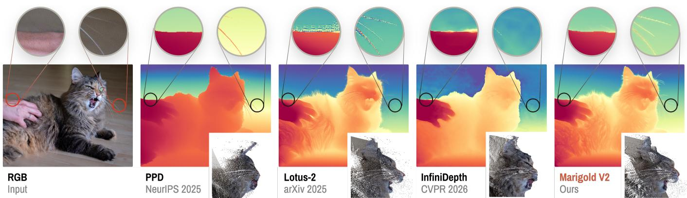  
Fig. 1. We present Marigold V2, a model and a cost-efective fine-tuning protocol that repurposes an open-source image-editing difusion transformer (Qwen Image-Edit) into a state-of-the-art monocular depth estimator in less than a week on a single 32GB GPU. Our protocol extends Marigold and its DiT follow-ups via novel Sinkhorn and representation alignment losses to sharpen details and improve geometry, while remaining afordable for individual practitioners and small labs. Beyond quantitative accuracy, Marigold V2 excels qualitatively, as shown above: it faithfully reproduces sharp edges, fur, and hair-thin details, surpassing recent detail-oriented methods such as Pixel-Perfect Depth (PPD) and InfiniDepth, all while retaining the eficiency of a VAE-based model.

Monocular depth estimation is a ubiquitous yet highly ill-posed computer vision task, with downstream applications in scene reconstruction, computational photography, and robotics, among others. Despite the field’s maturity, recent models still struggle to generalize to out-of-distribution inputs and to produce sharp and detailed depth maps.

In this paper, we revisit Marigold, a set of techniques for repurposing modern image generation and editing models, powered by the difusion transformer (DiT) architecture, into state-of-the-art monocular depth estimators. Our recipes target single-step inference from pretrained multi-step

∗Equal contribution † Internship at HUAWEI Bayer Lab § Project lead

Authors’ Contact Information: Igor Pavlovic, EPFL, HUAWEI Bayer Lab, Switzerland; Thiemo Wandel, HUAWEI Bayer Lab, Switzerland; Anton Obukhov, HUAWEI Bayer Lab, Switzerland; Luca Bartolomei, University of Bologna, Italy; Andrey Davydov, HUAWEI Bayer Lab, Switzerland; Fabio Tosi, University of Bologna, Italy; Matteo Poggi, University of Bologna, Italy; Sabine Süsstrunk, EPFL, Switzerland; Dengxin Dai, HUAWEI Bayer Lab, Switzerland.

flow-matching models, with quantization where needed, preserving model capacity while remaining cheap to run. We analyze the artifacts of naïve training and identify two efective remedies: aligning the model’s internal representations with semantic features extracted from ground-truth, and adopting a 2-stage fine-tuning protocol built around a novel Sinkhorn-based loss. The results are crisper, cleaner depth maps that generalize well out-ofdistribution, with 16–26% improvement in AbsRel over the previous best on KITTI and ETH3D. Qualitatively, our model resolves fur, foliage, and hair-thin edges that have eluded prior models. Furthermore, Marigold V2 achieves state-of-the-art results when applied to other dense regression tasks, such as surface normals estimation and intrinsic image decomposition. Project website: https://hf.co/spaces/huawei-bayerlab/marigold-v2-web.

CCS Concepts: • Computing methodologies → Scene understanding;   
Shape representations; Reconstruction; Computational photography.

Additional Key Words and Phrases: Monocular depth estimation, surface normals estimation, albedo estimation, depth completion, generative computer vision, foundation models, image-to-image, transfer learning.

## ACM Reference Format:

Igor Pavlovic, Thiemo Wandel, Anton Obukhov, Luca Bartolomei, Andrey Davydov, Fabio Tosi, Matteo Poggi, Sabine Süsstrunk, and Dengxin Dai.

2026. Marigold V2: Revisiting Difusion Transformers for Monocular Depth Estimation. ACM Trans. Graph. 45, 6, Article 204 (December 2026), 14 pages. https://doi.org/10.1145/3842528

## 1 Introduction

Monocular depth estimation, which aims at recovering per-pixel depth from a single image, is a fundamental problem in computer vision and computational photography with far-reaching implications for graphics and visual computing. Accurate depth maps underpin a broad spectrum of applications central to the graphics community, including image-based rendering and novel view synthesis [Deng et al. 2022; Safadoust et al. 2024], bokeh simulation and computational refocusing [Peng et al. 2022], portrait relighting and matting [Yang et al. 2021], as well as geometry-aware image editing and controllable generation [Hu 2024; Zhang et al. 2023]. Beyond 2D efects, monocular depth serves as the entry point for single-image 3D reconstruction and scene lifting [Huang et al. 2024; Jiang et al. 2026; Long et al. 2024], enabling downstream tasks such as object insertion, augmented reality compositing, and 3D content creation from casually captured photographs.

The core challenge is one ofinherent ambiguity: a single 2D image is consistent with infinitely many 3D scene configurations, and resolving this ambiguity requires reasoning about scene structure, material properties, and lighting that goes far beyond low-level appearance cues. Early geometry-based methods that rely on multiview constraints, photometric consistency, or hand-crafted shape priors collapse in the unconstrained single-image setting, while deep learning made it possible to cast the problem as a regression task, guided by appearance features, learned through supervised training over annotated datasets [Eigen et al. 2014; Fu et al. 2018; Yuan et al. 2022]. With the steady increase in the amount of data available for training, more and more accurate models have emerged over the years [Wang et al. 2025a,b; Yang et al. 2024a,b], although they are inevitably bound to the depth distribution coverage of such training data. As a consequence, these models sufer significant drops in accuracy in corner cases that are underrepresented in the training distribution (e.g., non-Lambertian surfaces or adverse weather conditions).

In parallel, advances in generative difusion models [BFL.ai 2024; Rombach et al. 2022; Wu et al. 2025] unveiled an alternative paradigm for depth estimation and visual understanding. From the billion-scale data used for training, these models learn a geometrically consistent representation of the world, pivotal in making the generated images more and more realistic. Following this intuition, a family of depth estimation approaches, concurrent to the aforementioned discriminative models and derived from generative difusion models, emerged [Ke et al. 2024, 2025], showing impressive results despite the very limited amount of depth-annotated training data used for this repurposing [Fu et al. 2024; He et al. 2025a,b; Martin Garcia et al. 2025; Zhao et al. 2025]. Nevertheless, several limitations of these diffusion-based models remain unresolved: the loss of fine-grained details and oversmoothed boundaries in the predicted depth maps (or flying pixels when projected into point clouds), most prominently.

In this paper, we present Marigold V2, a model and a costefective fine-tuning protocol that repurposes an open-source imageediting difusion transformer (Qwen-Image-Edit [Wu et al. 2025]) into a state-of-the-art monocular depth estimator. Our approach extends the Marigold family [Ke et al. 2024, 2025] and its DiT follow ups to the image-editing paradigm, while introducing a principled solution to the fine-grained detail loss and oversmoothed boundary problem typical of diffusion-based depth estimators that use VAEs. Our work introduces three main novel contributions:

— Marigold V2 protocol. A lightweight fine-tuning protocol to convert an image-editing DiT into a monocular depth estimator or other dense modality regressor. Fine-tuning our model requires a single consumer GPU, a modestly-sized dataset, and a few days of training, made possible by 4-bit quantization with QLoRA [Dettmers et al. 2023; Zakarin et al. 2026].

— iREPA-depth. We revisit representation alignment [Singh et al. 2026] and apply it unconventionally in Stage 1 of training, aligning towards semantic features extracted from the ground-truth depth map rather than from RGB. This supplies semantic and geometric information, eases convergence, and improves visual quality.

— SinkLoss. We introduce a novel Sinkhorn matching-based objective, coined SinkLoss, to improve edge sharpness while preserving semantic details – including fur, hair, and thin structures, as shown in Figs. 1, 6, and 8. The tuning with SinkLoss is Stage 2 of our training pipeline.

Our Marigold V2 model achieves state-of-the-art results in depth estimation on standard benchmarks, outperforming the latest diffusion-based alternatives [He et al. 2025a; Xu et al. 2025a] and other competitors [Yu et al. 2026a]. Furthermore, the Marigold V2 recipe adapts readily to other dense regression tasks: depth completion, see-through depth, surface normal estimation, and intrinsic image decomposition, achieving state-of-the-art results on each and demonstrating its broad applicability in computational photography.

## 2 Related Work

## 2.1 Discriminative Monocular Depth Estimation

Estimating depth from a single image is inherently ill-posed, yet deep learning has established it as a credible alternative to traditional approaches. Early works operated in single domains trained with ground truth [Eigen et al. 2014; Fu et al. 2018; Lee et al. 2019; Yuan et al. 2022], self-supervision [Godard et al. 2017, 2019; Poggi et al. 2020; Zhao et al. 2022], or proxy annotations [Tosi et al. 2019; Zhao et al. 2023]. A second generation achieved zero-shot crossdataset generalization by learning afine-invariant depth over mixed datasets [Eftekhar et al. 2021; Ranftl et al. 2021, 2020], followed by a third generation built on Vision Transformers [Dosovitskiy et al. 2021; Oquab et al. 2024] and million-scale data, advancing afine-invariant [Lin et al. 2026; Yang et al. 2024a,b], universal metric [Ganesan et al. 2026; Piccinelli et al. 2025, 2024; Wang et al. 2025a,b], and video depth [Chen et al. 2025; Piccinelli et al. 2026].

Despite impressive results, discriminative models such as MoGe [Wang et al. 2025a,b], �3 [Wang et al. 2026b], and Depth Anything [Yang et al. 2024a,b] face two fundamental limitations: ground-truth depth data remains scarce and million-scale, far outpaced by the billion-scale data available to generative models; and sensor noise along with poor handling of non-Lambertian, transparent, or reflective surfaces limits annotation quality, a weakness inherited by trained models.

## 2.2 Generative Priors for Monocular Depth Estimation

Generative models trained on orders of magnitude more data encapsulate richer world knowledge, spurring interest in repurposing them as dense depth predictors. The approaches fall into three families. The first preserves the multi-step difusion paradigm [Fu et al. 2024; Gui et al. 2025; He et al. 2025b; Ke et al. 2024], sufering from high inference latency and high sensitivity to noise initialization. The second trades quality for speed by recasting the backbone as a single-pass feed-forward network [He et al. 2025b; Ke et al. 2025; Martin Garcia et al. 2025]. The third departs from pure fine-tuning: some methods feed a coarse modality estimate as auxiliary input [Ye et al. 2024; Zhang et al. 2024], while others extend the VAE to broader output modalities [Krishnan et al. 2025; Xu et al. 2025b].

Most of the early frameworks were built on Stable Difusion’s convolutional U-Net [Rombach et al. 2022; Ronneberger et al. 2015], fine-tuned on synthetic datasets with pixel-perfect depth. As the generative community migrated from U-Nets to Difusion Transformers (DiTs) [Peebles and Xie 2023] – through PixArt-� [Chen et al. 2024], Stable Difusion 3 [Esser et al. 2024], FLUX [BFL.ai 2024], and Qwen [Wu et al. 2025] – repurposing became costlier due to the higher complexity of DiTs. Training from scratch requires tens of GPUs [Le et al. 2025], and LoRA [Hu et al. 2022] does not always reduce this burden: DICEPTION [Zhao et al. 2025] needs 96 GPU-days, and Lotus-2 [He et al. 2025a] uses 8 GPUs. Vision Banana [Gabeur et al. 2026] further demonstrates that instructiontuning can unlock existing geometric understanding in pre-trained generators [Liu et al. 2026]. Nevertheless, supervised fine-tuning remains the dominant approach – and the one we adopt here.

## 2.3 Representation Alignment for Depth Estimation

Regularizing difusion-based depth estimators with features from pretrained visual encoders has emerged as an efective strategy to bridge the gap between generative and discriminative representations. REPA [Yu et al. 2025] and iREPA [Singh et al. 2026] showed that such a regularization can improve semantic fidelity and training convergence of difusion models. In monocular depth estimation, this principle has recently been adapted to inject semantic information into diffusion-based depth prediction. DepthMaster [Song et al. 2026] aligns intermediate U-Net features with DINOv2 representations extracted from the input image, while Pixel-Perfect Depth [Xu et al. 2025a] incorporates semantic representations from vision foundation models directly into the difusion process via a Semantics-Prompted DiT. In both cases, alignment targets features extracted from the RGB input. In contrast, our iREPA-depth variant draws its alignment target from a frozen DINOv3 encoder applied to the ground-truth depth map rather than the input image, providing a more direct supervisory signal for geometric reconstruction, and without introducing inference-time dependencies. It brings semantic details into depth map estimates, improves visual quality, and facilitates overall training convergence.

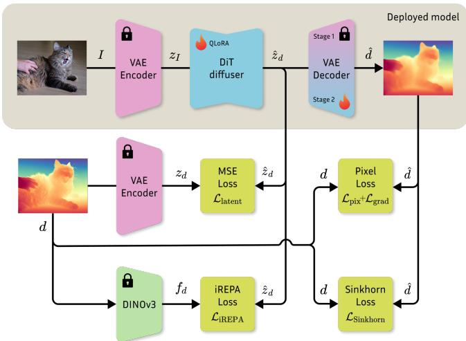  
Fig. 2. Marigold V2 training protocol. During Stage 1, only QLoRA adapter weights are fine-tuned, regularized by iREPA-depth, which already produces a strong model. Stage 2 refines it further by adding SinkLoss and unfreezing the VAE decoder. At inference, the deployed model requires just one forward pass through the VAE and the DiT.

## 2.4 Handling Depth Quality and Artifacts

Beyond aggregate accuracy, the practical utility of depth maps depends critically on faithful boundary reconstruction and finegrained surface detail – qualities that directly impact novel view synthesis, 3D reconstruction, and computational photography. Prior work has addressed this in isolation: edge-aware losses [Yang et al. 2022], architectural refinements [Bochkovskii et al. 2025], and difusion-based post-processing improve sharpness, yet without reliably preserving fine-grained detail. SharpDepth [Pham et al. 2025] distills boundary sharpness from generative models into a discriminative backbone, yet predictions remain over-smoothed at depth edges. InfiniDepth [Yu et al. 2026a] enables arbitrary-resolution queries via neural implicit fields. Lotus-2 [He et al. 2025a] mitigates detail loss through a predictor-sharpener design, at the cost of multi-step inference. Pixel-Perfect Depth [Xu et al. 2025a] performs difusion in pixel space to reduce flying pixel artifacts, but does not recover finegrained detail. Critically, no existing approach jointly addresses detail preservation and robust supervision under noisy or ambiguous ground-truth within a single-step VAE-based generative framework – the two limitations our method is designed to address.

## 3 Method

We propose a diffusion-based monocular depth estimator that adapts a pretrained image-editing difusion transformer to predict highquality afine-invariant depth maps from a single RGB image. Mari gold V1 [Ke et al. 2024, 2025] established this direction as an efective alternative to discriminative predictors, showing that pretrained difusion models carry strong semantic and geometric priors for dense prediction. Building on this line of work, Marigold V2 repurposes Qwen-Image-Edit-2509 [Wu et al. 2025] for monocular depth estimation and trains it to directly transform RGB latents into normalized depth latents. Unlike prior diffusion-based depth estimators that mainly rely on latent-space supervision, we additionally introduce pixel-space and semantic feature losses to improve local reconstruction quality and preserve fine geometric details.

Our training follows a two-stage procedure, as depicted in Fig. 2. In Stage 1, we adapt the pretrained image-editing DiT to monocular depth estimation using latent rectified-flow supervision together with pixel-space and semantic feature losses. This stage establishes a strong afine-invariant depth predictor with accurate global structure and improved local reconstruction quality. In Stage 2, we further fine-tune the resulting model using the proposed SinkLoss. This second stage is designed to refine fine details and reduce the ef fect of ambiguous or noisy ground-truth pixels, especially around transparent, thin, or indiscernible structures.

## 3.1 Depth Normalization

Given an RGB image � and its metric ground-truth depth $D ,$ we first convert the target depth into an afine-invariant log-depth representation. Specifically, we convert the metric depth � into an afine-invariant normalized log-depth target � as:

$$
d = 2 \left( \frac { \log ( D + \epsilon ) - d _ { 2 } } { d _ { 9 8 } - d _ { 2 } } - \frac { 1 } { 2 } \right) ,\tag{1}
$$

where $d _ { i }$ denotes the �-th percentile of log(� + �), computed over valid pixels. Equivalently, $d _ { 2 }$ and �98 correspond to the 2% and 98% quantiles used for robust clipping. Values outside this interval are clipped before the linear mapping to [−1, 1]. This representation removes the global scale and shift ambiguity of monocular depth estimation while preserving relative scene geometry. To make the target compatible with the RGB image-editing backbone, we encode the normalized depth map as a grayscale RGB image by replicating the same normalized depth value across the three color channels.

## 3.2 Difusion Transformer Adaptation

We initialize our model from Qwen-Image-Edit-2509 [Wu et al. 2025] and adapt it for monocular depth estimation using parametereficient fine-tuning. To make training memory-eficient, we apply 4-bit quantization to the pretrained DiT weights and fine-tune rank-128 QLoRA adapters. Following the Lotus-2 rectified-flow formulation, we train the model to directly transform RGB latents into grayscale depth latents using a single forward pass.

Let $\mathcal { E } _ { \mathrm { v a e } }$ and ${ \mathcal { D } } _ { \mathrm { v a e } }$ denote the pretrained VAE encoder and decoder. We encode the RGB image � and normalized depth target � as

$$
z _ { I } = { \mathcal { E } } _ { \mathrm { v a e } } ( I ) , \qquad z _ { d } = { \mathcal { E } } _ { \mathrm { v a e } } ( d ) .\tag{2}
$$

We define the target velocity as $v = z _ { I } - z _ { d }$ and train the DiT $f _ { \theta ; }$ conditioned on �� and a fixed timestep $t = 0 . 5 ,$ , to regress it:

$$
\mathcal { L } _ { \mathrm { l a t e n t } } = \| f _ { \theta } ( z _ { I } , t ) - v \| _ { 2 } ^ { 2 } .\tag{3}
$$

Since � is fixed, the rectified-flow parameterization reduces to a direct latent regression with no trajectory to integrate. At inference, we obtain the depth latent in a single forward pass,

$$
\hat { z } _ { d } = z _ { I } - f _ { \theta } ( z _ { I } , t ) ,\tag{4}
$$

and decode it as $\hat { d } = \mathcal { D } _ { \mathrm { v a e } } ( \hat { z } _ { d } )$

Unlike previous diffusion-based monocular depth methods that supervise primarily in latent space, we additionally apply direct

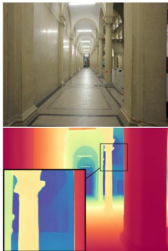

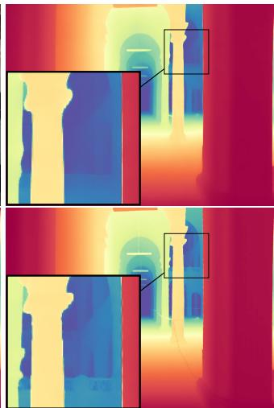  
Fig. 3. Impact of semantic feature losses. Input image, baseline prediction, with LPIPS loss, with iREPA-depth loss. The iREPA-depth variant removes artifacts most eficiently and improves fine details.

image-space reconstruction losses. In particular, we use an $L _ { 1 }$ reconstruction loss and an $L _ { 1 }$ spatial gradient loss:

$$
\mathcal { L } _ { \mathrm { p i x } } = \| \hat { d } - d \| _ { 1 }\tag{5}
$$

$$
\mathcal { L } _ { \mathrm { g r a d } } = \Vert \nabla _ { x } \hat { d } - \nabla _ { x } d \Vert _ { 1 } + \Vert \nabla _ { y } \hat { d } - \nabla _ { y } d \Vert _ { 1 } .\tag{6}
$$

## 3.3 Semantic Feature Regularization with iREPA

To improve reconstruction quality in semantically dense regions, we introduce a variant of iREPA feature alignment loss [Singh et al. 2026]. While pixel-level losses encourage accurate local reconstruction, they do not explicitly enforce consistency at higher levels of visual structure. As a result, predictions may still lose fine details in cluttered regions such as foliage, bushes, and repeated object patterns. We therefore regularize the internal DiT representations using pretrained visual features, encouraging the model to also preserve semantically-meaningful structure in the prediction.

We compare iREPA regularization using DINOv3 [Siméoni et al. 2026] features extracted from RGB images and from ground-truth depth maps. While both variants improve over the baseline, features extracted from the depth map provide better AbsRel and $\delta _ { 1 }$ performance, suggesting that the feature extraction in the depth domain provides more relevant information for geometric reconstruction than RGB-derived features. Qualitatively, iREPA improves the semantic and structural consistency of the predicted depth maps in visually dense regions, as shown in Fig. 3. A direct perceptual loss (LPIPS [Zhang et al. 2018]) between the prediction and ground truth does not deliver the same improvement in dense regions.

The Stage-1 DiT training objective is therefore:

$$
\begin{array} { r } { \mathcal { L } _ { \mathrm { D i T } } = \lambda _ { \mathrm { l a t e n t } } \mathcal { L } _ { \mathrm { l a t e n t } } + \lambda _ { \mathrm { p i x } } \mathcal { L } _ { \mathrm { p i x } } + \lambda _ { \mathrm { g r a d } } \mathcal { L } _ { \mathrm { g r a d } } + \lambda _ { \mathrm { i R E P A } } \mathcal { L } _ { \mathrm { i R E P A } } . } \end{array}\tag{7}
$$

## 3.4 Stage-2 Refinement with SinkLoss

In addition to the global scale ambiguity inherent to monocular depth estimation, transparent and very thin objects introduce a further source of ambiguity. As illustrated in Fig. 4, even in highquality synthetic datasets like HyperSim [Roberts et al. 2021], the depth ground truth of thin objects is often noisy. To achieve the best AbsRel and $\delta _ { 1 }$ scores, the predictions would have to align perfectly with the ground truth and reproduce that noise at exactly the same pixel locations. The underlying rendering pipeline, however, uses V-Ray with quasi-Monte Carlo sampling, so it is essentially random whether a transparent or edge pixel is assigned a foreground or a background depth value. This makes perfect AbsRel efectively unattainable and undesirable as a target, because many downstream tasks benefit from a cohesive depth map over the foreground object with a sharp transition to the background.

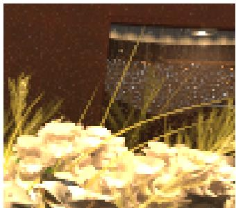

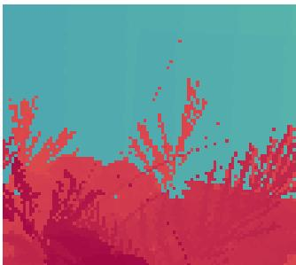  
(a) HyperSim RGB Example  
(b) HyperSim Ground Truth

Fig. 4. A crop of a HyperSim sample in native resolution. Thin structures appear semi-transparent in RGB and are not well-defined in groundtruth depth due to stochastic sampling within the rendering pipeline.  
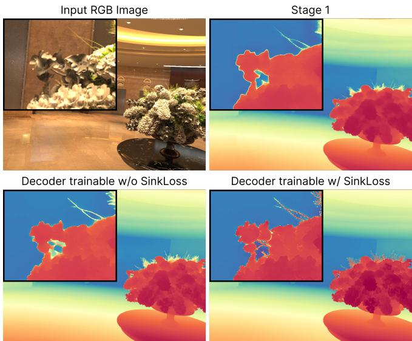  
Fig. 5. Qualitative impact of SinkLoss and VAE decoder unfreezing. The Stage-1 checkpoint is compared against two continued-training variants with an unfrozen VAE decoder, with and without SinkLoss. SinkLoss substantially reduces flying pixels while preserving fine detail.

To address local ambiguities of noisy ground-truth supervision that are not well handled by strict pixel-wise supervision, we continue fine-tuning the depth estimator during Stage 2 using a novel

SinkLoss. Instead of supervising each pixel directly against its corresponding ground-truth pixel, we tile the image into non-overlapping �×� blocks and, within each block, use Sinkhorn–Knopp matching between the $K ^ { 2 }$ predicted depths and the $K ^ { 2 }$ ground-truth depths to obtain a soft one-to-one assignment. This only requires the network to produce the same set of depth values as the ground truth within each block (up to permutation), without strict spatial alignment.

Formulation. Within each non-overlapping �� block we build a cost matrix $\mathbf { C } \in \mathbb { R } ^ { K ^ { 2 } \times K ^ { 2 } }$ between the $K ^ { 2 }$ predicted depths $\{ \hat { d } _ { i } \}$ and the $K ^ { 2 }$ ground-truth depths $\{ d _ { j } \}$

$$
C _ { i j } \ = \ \Big | \hat { d } _ { i } - d _ { j } \Big | .\tag{8}
$$

Invalid pixels (mask $m _ { i } = 0 )$ are excluded by replacing the cost of every pair that touches one, $\tilde { C } _ { i j } = C _ { i j }$ if $m _ { i } m _ { j } = 1$ and $\tilde { C } _ { i j } = B \gg$ max $_ { i j } C _ { i j }$ otherwise, i.e. the invalid pixel’s row and its column are penalized. A block has as many penalized rows as penalized columns, so for large $B / \tau$ the optimal plan matches them to one another: no invalid ground-truth pixel supervises a prediction, and the valid pixels are left with uniform marginals. We then compute a soft assignment M by entropy-regularized optimal transport,

$$
\begin{array} { r } { \textbf { M } = \underset { \textbf { M } \in \mathcal { U } } { \arg \operatorname* { m i n } } ~ \langle \textbf { M } , \tilde { \textbf { C } } \rangle ~ - ~ \tau H ( \textbf { M } ) , } \end{array}\tag{9}
$$

where $\mathcal { U } = \{ \mathbf { M } \in \mathbb { R } _ { \geq 0 } ^ { K ^ { 2 } \times K ^ { 2 } }$ $\mathbf { M } \mathbf { 1 } = \mathbf { 1 } / K ^ { 2 }$ , M⊤ $\mathbf { \dot { 1 } } = \mathbf { 1 } / K ^ { 2 } \mathbf  \}$ is the transport polytope with uniform marginals and $\begin{array} { r } { H ( \mathbf { M } ) = - \sum _ { i j } M _ { i j } } \end{array}$ log $M _ { i j }$ is the Shannon entropy. M is obtained by Sinkhorn–Knopp iterations [Cuturi 2013; Sinkhorn and Knopp 1967] on $\mathbf { G } = \exp ( - \tilde { \mathbf { C } } / \tau )$ which we run in the log domain for numerical stability. The SinkLoss is the transport cost over the valid pairs,

$$
\mathcal { L } _ { \mathrm { S i n k L o s s } } ~ = ~ \frac { \sum _ { i j } m _ { i } m _ { j } M _ { i j } C _ { i j } } { \sum _ { i j } m _ { i } m _ { j } M _ { i j } } ,\tag{10}
$$

averaged over blocks with valid ground truth. We use $K = 5 , \tau = 0 . 1$ , $B = 1 0 ^ { 6 }$ and 5 Sinkhorn iterations. Applying this loss at Stage 2 results in fewer flying-pixel artifacts while preserving fine details in the depth map, as demonstrated in Fig. 5.

## 4 Experiments

## 4.1 Implementation Details

We build our method on top of the Qwen-Image-Edit-2509 model and fine-tune its DiT backbone using QLoRA. Specifically, we quantize the pretrained model weights to 4-bit precision, and we train rank-128 LoRA adapters. Batch size is set to 1 in all training runs, and gradient clipping is used to stabilize optimization and reduce the influence of poor-quality or noisy training samples. This setup substantially reduces memory usage while preserving the representational capacity needed for adapting the image-editing backbone to monocular depth estimation.

Following Marigold V1, we train on a deliberately compact mixture of HyperSim [Roberts et al. 2021] and vKITTI [Gaidon et al. 2016] datasets. For HyperSim, we filter out samples with more than 0.1% invalid depth pixels. Considering the diferent aspect ratios of the two datasets, vKITTI samples are processed at a resolution of $1 2 1 6 \times 3 5 2$ , while HyperSim samples are processed at $7 6 8 \times 5 1 2 .$

Table 1. Comparison of zero-shot afine-invariant monocular depth estimators on NYUv2, KITTI, ETH3D, ScanNet, and DIODE. We report AbsRel (↓) and �1 (↑). Bold indicates the best result and underlining the second-best result for each metric. Methods trained on more than 5M images are given in gray for reference and are excluded from ranking. Results for InfiniDepth, Lotus-2, FE2E, and our method are reproduced under the same evaluation protocol, while the remaining results are taken from the PPD paper. $^ { \dagger } { \boldsymbol { \pi } } ^ { 3 }$ includes ScanNet in its training data; its ScanNet results are therefore not zero-shot.
<table><tr><td rowspan="2">Method</td><td rowspan="2">Training Data ↓</td><td colspan="2">NYUv2</td><td colspan="2">KITTI</td><td colspan="2">ETH3D</td><td colspan="2">ScanNet</td><td colspan="2">DIODE</td></tr><tr><td>AbsRel↓ δ1↑</td><td></td><td>AbsRel ↓</td><td>δ1↑</td><td>AbsRel↓ δ1↑</td><td></td><td>AbsRel↓ δ1↑</td><td></td><td></td><td>AbsRel↓ δ1↑</td></tr><tr><td>Omnidata (ICCV 2021) [Eftekhar et al. 2021]</td><td>12.2M</td><td>7.4</td><td>94.5</td><td>14.9</td><td>83.5</td><td>16.6</td><td>77.8</td><td>7.5</td><td>93.6</td><td></td><td></td></tr><tr><td>DepthAnything V2 (62M) (NeurIPS 2024) [Yang et al. 2024b]</td><td>62.6M</td><td>4.5</td><td>97.9</td><td>7.4</td><td>94.6</td><td>13.1</td><td>86.5</td><td>6.5</td><td>97.2</td><td>6.6</td><td>95.2</td></tr><tr><td>MoGe (CVPR 2025) [Wang et al. 2025a]</td><td>9M</td><td>3.1</td><td>98.3</td><td>7.2</td><td>95.1</td><td>10.0</td><td>89.6</td><td>3.3</td><td>98.3</td><td>29.0</td><td>70.0</td></tr><tr><td>MoGe-2 (NeurIPS 2025) [Wang et al. 2025b]</td><td>8.9M</td><td>3.1</td><td>98.4</td><td>6.9</td><td>89.9</td><td>5.0</td><td>96.2</td><td>3.1</td><td>98.3</td><td>9.6</td><td>84.5</td></tr><tr><td>π3† (ICLR 2026) [Wang et al. 2026b]</td><td>&gt;9M</td><td>2.9</td><td>98.7</td><td>5.9</td><td>96.7</td><td>2.9</td><td>98.9</td><td>2.1†</td><td>99.1†</td><td>4.4</td><td>96.8</td></tr><tr><td>DiverseDepth (arXiv 2020) [Yin et al. 2020]</td><td>320K</td><td>11.7</td><td>87.5</td><td>19.0</td><td>70.4</td><td>22.8</td><td>69.4</td><td>10.9</td><td>88.2</td><td></td><td></td></tr><tr><td>MiDaS (TPAMI 2022) [Ranftl et al. 2020]</td><td>2M</td><td>11.1</td><td>88.5</td><td>23.6</td><td>63.0</td><td>18.4</td><td>75.2</td><td>12.1</td><td>84.6</td><td></td><td></td></tr><tr><td>LeReS (CVPR 2021) [Yin et al. 2021] DPT (ICCV 2021) [Ranftl et al. 2021]</td><td>354K</td><td>9.0</td><td>91.6</td><td>14.9</td><td>78.4</td><td>17.1</td><td>77.7</td><td>9.1</td><td>91.7</td><td></td><td></td></tr><tr><td>HDN (NeurIPS 2022) [Zhang et al. 2022]</td><td>1.4M</td><td>9.8</td><td>90.3</td><td>10.0</td><td>90.1</td><td>7.8</td><td>94.6</td><td>8.2</td><td>93.4</td><td></td><td></td></tr><tr><td></td><td>300K</td><td>6.9</td><td>94.8</td><td>11.5</td><td>86.7</td><td>12.1</td><td>83.3</td><td>8.0</td><td>93.9</td><td></td><td></td></tr><tr><td>DepthAnything V2 (54K) (NeurIPS 2024) [Yang et al. 2024b]</td><td>54K</td><td>5.4</td><td>97.2</td><td>8.6</td><td>92.8</td><td>12.3</td><td>88.4</td><td>1</td><td>1</td><td>8.8</td><td>93.7</td></tr><tr><td>Marigold Depth V1 (CVPR 2024) [Ke et al. 2024, 2025]</td><td>74K</td><td>5.5</td><td>96.4</td><td>9.9</td><td>91.6</td><td>6.5</td><td>96.0</td><td>6.4</td><td>95.1</td><td>10.0</td><td>90.7</td></tr><tr><td>GeoWizard (ECCV 2024) [Fu et al. 2024]</td><td>280K</td><td>5.2</td><td>96.6</td><td>9.7</td><td>92.1</td><td>6.4</td><td>96.1</td><td>6.1</td><td>95.3</td><td>12.0</td><td>89.8</td></tr><tr><td>DepthFM (AAAI 2025) [Gui et al. 2025]</td><td>63K</td><td>5.5</td><td>96.3</td><td>8.9</td><td>91.3</td><td>5.8</td><td>96.2</td><td>6.3</td><td>95.4</td><td></td><td></td></tr><tr><td>GenPercept (ICLR 2025) [Xu et al 2025b]</td><td>90K</td><td>5.2</td><td>96.6</td><td>9.4</td><td>92.3</td><td>6.6</td><td>95.7</td><td>5.6</td><td>96.5</td><td></td><td></td></tr><tr><td>Lotus (ICLR 2025) [He et al. 2025b]</td><td>59K</td><td>5.4</td><td>96.8</td><td>8.5</td><td>92.2</td><td>5.9</td><td>97.0</td><td>5.9</td><td>95.7</td><td>9.8</td><td>92.4</td></tr><tr><td>Lotus-2 (arXiv 2025) [He et al. 2025a]</td><td>59K</td><td>3.7</td><td>97.6</td><td>6.7</td><td>94.1</td><td>4.1</td><td>98.6</td><td>4.0</td><td>97.2</td><td>6.5</td><td>95.5</td></tr><tr><td>PPD (512) (NeurIPS 2025) [Xu et al. 2025a]</td><td>54K</td><td>4.3</td><td>97.4</td><td>8.0</td><td>93.1</td><td>4.5</td><td>97.7</td><td>4.5</td><td>97.3</td><td>7.0</td><td>95.5</td></tr><tr><td>PPD (1024) (NeurIPS 2025) [Xu et al. 2025a]</td><td>125K</td><td>4.1</td><td>97.7</td><td>7.0</td><td>95.5</td><td>4.3</td><td>98.0</td><td>4.6</td><td>97.2</td><td>6.8</td><td>95.9</td></tr><tr><td>InfiniDepth (CVPR 2026) [Yu et al. 2026a]</td><td>3.1M</td><td>4.3</td><td>97.6</td><td>8.7</td><td>92.3</td><td>6.1</td><td>95.4</td><td>4.7</td><td>96.9</td><td>6.4</td><td>95.8</td></tr><tr><td>DepthMaster (TCSVT 2026) [Song et al. 2026]</td><td>74K</td><td>4.8</td><td>97.0</td><td>9.1</td><td>91.1</td><td>5.4</td><td>97.4</td><td>5.8</td><td>95.6</td><td>8.0</td><td>94.3</td></tr><tr><td>FE2E (CVPR 2026) [Wang et al. 2026a]</td><td>71K</td><td>3.8</td><td>97.6</td><td>6.5</td><td>96.0</td><td>3.8</td><td>98.7</td><td>4.3</td><td>97.1</td><td>5.6</td><td>96.4</td></tr><tr><td>Marigold V2 (depth, ours)</td><td>74K</td><td>3.6</td><td>98.0</td><td>5.4</td><td>97.4</td><td>2.8</td><td>99.2</td><td>3.7</td><td>97.9</td><td>5.2</td><td>97.1</td></tr></table>

Table 2. Edge-aware evaluation of afine-invariant monocular depth estimators on the HyperSim test set. We report SEE3, SEE5 and SEE7 (↓). Bold indicates the best result and underlining the second-best result for each metric, determined from unrounded values.
<table><tr><td>Method</td><td>SEE3 (↓)</td><td>SEE5 (↓)</td><td>SEE7 (↓)</td></tr><tr><td>PPD (NeurIPS 2025) [Xu et al. 2025a]</td><td>0.404</td><td>0.385</td><td>0.371</td></tr><tr><td>InfiniDepth (CVPR 2026) [Yu et al. 2026a]</td><td>0.470</td><td>0.451</td><td>0.436</td></tr><tr><td>Marigold V2 (depth, ours)</td><td>0.352</td><td>0.333</td><td>0.320</td></tr></table>

Each training batch is constructed by sampling from HyperSim and vKITTI with probabilities of 90% and 10%, respectively.

All training experiments are performed on a single 32GB GPU. Ablation experiments are trained for 30,000 optimization steps. Each ablation run requires approximately one day to complete. We then perform Stage-2 SinkLoss refinement by continuing fine-tuning from the Stage-1 checkpoint for an additional 30,000 steps, which also takes approximately one day under the same setup.

For the final Stage-1 model, we extend the training to 160,000 optimization steps using the same single-GPU setup. We set $\lambda _ { \mathrm { l a t e n t } } { = } 1 . 0 ,$ $\lambda _ { \mathrm { p i x } } { = } 1 . 0 , \lambda _ { \mathrm { g r a d } } { = } 5 . 0 $ , and $\lambda _ { \mathrm { i R E P A } } { = } 0 . 2 .$ . This final Stage 1 training run requires slightly more than five days to complete on the same GPU. For Stage 2, we set �iREPA=0.2 and $\lambda _ { \mathrm { S i n k L o s s } } { = } 1 . 0$

## 4.2 Experimental Setup

We follow the evaluation protocol of Pixel-Perfect Depth [Xu et al. 2025a], aligning predictions to the ground-truth metric depth with a robust RANSAC procedure before computing metrics. This removes global scale and shift mismatches, focusing the evaluation on scene geometry, local structure, and depth discontinuities.

## 4.3 Zero-Shot Afine Depth Estimation

We assess the zero-shot generalization ability of our method on KITTI [Geiger et al. 2012], ETH3D [Schöps et al. 2017], ScanNet [Dai et al. 2017], NYUv2 [Silberman et al. 2012], and DIODE [Vasiljevic et al. 2019]. For each dataset, predictions are aligned to the ground truth following the protocol described above and evaluated using the standard AbsRel and $\delta _ { 1 }$ metrics. AbsRel measures the mean absolute relative error, while �1 reports the percentage of valid pixels whose predicted depth is within a factor of 1.25 of the groundtruth depth. We run inference at the native image resolution for all datasets except ETH3D, where we use an input resolution of 1008 × 672 and upsample the predictions to 2048 × 1360 before alignment and evaluation, following the evaluation procedure of Pixel-Perfect Depth [Xu et al. 2025a].

The quantitative results are reported in Tab. 1. We compare our Stage-2 checkpoint against both discriminative and generative monocular depth estimation methods, including Depth Anything V2, Marigold V1, GeoWizard, DepthFM, GenPercept, Lotus,

Table 3. Ablation study on Stage 1. AbsRel and $\delta _ { 1 }$ comparison across datasets using diferent Stage 1 loss configurations.
<table><tr><td rowspan="2"> $\mathcal { L } _ { \mathrm { l a t e n t } }$ </td><td rowspan="2"> $\begin{array} { l } { \mathcal { L } _ { \mathrm { p i x } } } \\ { \mathcal { L } _ { \mathrm { g r a d } } } \end{array}$ </td><td rowspan="2"> $\mathcal { L } _ { \mathrm { i R E P A } } ^ { \mathrm { r g b } }$ </td><td rowspan="2"> $\mathcal { L } _ { \mathrm { i R E P A } } ^ { \mathrm { d e p t h } }$ </td><td colspan="2">NYUv2</td><td colspan="2">KITTI</td><td colspan="2">ETH3D</td><td colspan="2">ScanNet</td><td colspan="2">DIODE</td></tr><tr><td>AbsRel ↓</td><td>δ1↑</td><td>AbsRel ↓</td><td>δ1↑</td><td>AbsRel ↓</td><td>δ1↑</td><td>AbsRel ↓</td><td>δ1↑</td><td>AbsRel ↓</td><td>δ1↑</td></tr><tr><td>Stage 1 ablations, 30K training steps</td><td></td><td></td><td></td><td></td><td></td><td></td><td></td><td></td><td></td><td></td><td></td><td></td><td></td></tr><tr><td>√</td><td> $\pmb { \chi }$ </td><td>x</td><td>x</td><td>4.53</td><td>97.60</td><td>7.26</td><td>94.94</td><td>4.25</td><td>98.25</td><td>4.59</td><td>97.41</td><td>6.82</td><td>95.81</td></tr><tr><td>√</td><td>√</td><td>x</td><td>x</td><td>4.70</td><td>97.90</td><td>7.84</td><td>95.62</td><td>4.32</td><td>98.69</td><td>4.50</td><td>97.91</td><td>6.22</td><td>96.01</td></tr><tr><td>√</td><td>√</td><td>√</td><td>x</td><td>4.50</td><td>97.81</td><td>6.89</td><td>96.22</td><td>3.64</td><td>98.86</td><td>4.38</td><td>97.65</td><td>5.72</td><td>96.54</td></tr><tr><td>√</td><td>√</td><td>x</td><td>√</td><td>4.36</td><td>98.01</td><td>6.72</td><td>96.38</td><td>3.62</td><td>98.90</td><td>4.22</td><td>97.91</td><td>5.55</td><td>96.82</td></tr><tr><td colspan="4">Stage 1, 160K training steps</td><td></td><td></td><td></td><td></td><td></td><td></td><td></td><td></td><td></td><td></td></tr><tr><td>√</td><td>√</td><td>x</td><td>x</td><td>3.62</td><td>98.01</td><td>5.27</td><td>97.39</td><td>2.84</td><td>99.08</td><td>3.84</td><td>97.88</td><td>5.16</td><td>97.07</td></tr><tr><td>√</td><td>√</td><td>x</td><td>√</td><td>3.68</td><td>98.03</td><td>5.30</td><td>97.43</td><td>2.68</td><td>99.18</td><td>3.81</td><td>97.82</td><td>5.02</td><td>97.02</td></tr></table>

Table 4. Impact of depth parameterizations. Average AbsRel and $\delta _ { 1 }$ across test sets under a common training and evaluation configuration.
<table><tr><td>Representation</td><td>AbsRel ↓</td><td> $\delta _ { 1 } \uparrow$ </td></tr><tr><td>Linear Depth</td><td>5.04</td><td>97.10</td></tr><tr><td>Disparity</td><td>5.28</td><td>97.15</td></tr><tr><td>Log Depth</td><td>4.72</td><td>97.71</td></tr></table>

Pixel-Perfect Depth, DepthMaster, Lotus-2, and FE2E. Our method achieves the best zero-shot performance across all evaluated datasets among methods trained on comparable data and obtains especially strong results on the challenging ETH3D, where our best model achieves an AbsRel of 2.8, substantially improving over the strongest baseline result of 3.8. Fig. 6 compares the methods qualitatively across these benchmarks.

## 4.4 Edge-Aware Evaluation

In addition to standard depth accuracy metrics, we evaluate the efectiveness of Marigold V2 in terms of preservation of fine geometric details and the reduction of flying-pixel artifacts near depth discontinuities. For this purpose, we use the Soft Edge Error (SEE�), computed on object boundaries in the synthetic HyperSim dataset. We identify these as pixels whose disparity change with respect to their neighbors exceeds a fixed threshold. Following prior work [Chen et al. 2019; Tosi et al. 2021], SEE� is defined for each such pixel as the minimum absolute error between the predicted disparity value and any ground-truth disparity value within a local � ×� patch centered on that pixel, with � ∈ {3, 5, 7}.

Tab. 2 compares Marigold V2 against state-of-the-art methods specifically designed to preserve fine details and suppress flying pixels, where our model achieves the best results across all metrics.

## 4.5 Analysis and Ablation Studies

We ablate our design choices and analyze how well the recipe transfers. First, we analyze the choices used during the first stage of DiT fine-tuning. We evaluate the impact of adding the iREPA feature regularization loss, computed using DINOv3 features extracted either from the RGB input image or ground-truth depth maps. Next we compare the efect of various depth range compression representations on the quantitative metrics and motivate log-depth as the optimal one. Additionally, we study the efect of varying the DiT backbone and the efectiveness of SinkLoss under such a change.

Table 5. SinkLoss with other difusion backbones. SinkLoss transfers to Stable Difusion and FLUX.2. AbsRel is averaged across five test datasets, while Soft Edge Error (SEE) metrics are computed on the HyperSim test set.
<table><tr><td>Model</td><td> $\mathcal { L } _ { \mathrm { S i n k L o s s } }$ </td><td>AbsRel ↓</td><td> $\mathrm { S E E } _ { 3 } \downarrow$ </td><td>SEE5↓</td><td>SEE7 ↓</td></tr><tr><td>Stable Diffusion V1.5</td><td>x</td><td>7.51</td><td>0.553</td><td>0.531</td><td>0.514</td></tr><tr><td>[Rombach et al. 2022]</td><td>S</td><td>7.12</td><td>0.485</td><td>0.464</td><td>0.449</td></tr><tr><td>FLUX.2 klein [BFL.ai 2026]</td><td>x</td><td>4.88</td><td>0.491</td><td>0.472</td><td>0.457</td></tr><tr><td></td><td>√</td><td>4.82</td><td>0.377</td><td>0.359</td><td>0.345</td></tr><tr><td>Qwen-Image-Edit-2509</td><td>x</td><td>4.10</td><td>0.449</td><td>0.429</td><td>0.414</td></tr><tr><td>[Wu et al. 2025]</td><td>√</td><td>4.12</td><td>0.352</td><td>0.333</td><td>0.320</td></tr></table>

We further analyze the efect of additional training steps and the impact of SinkLoss on the second stage.

Stage-1 Ablation. Tab. 3 reports results concerning the first fine-tuning stage. In the controlled 30K-step setting (top), both iREPA variants improve over the baseline without feature regularization, with iREPA-depth providing the strongest overall performance across the evaluated datasets. We also observe that adding pixel-space supervision on top of the latent MSE loss has only a limited efect on AbsRel, but consistently improves $\delta _ { 1 }$ on all datasets. In the visualizations, pixel-space losses, and iREPA-depth in particular, further reduce artifacts common to DiT-based depth estimators.

As the number of training steps increases to 160K (bottom), the impact of iREPA becomes less pronounced in terms of AbsRel and $\delta _ { 1 }$ . Nevertheless, even after 160K training steps, the qualitative improvements introduced by iREPA remain visible, as shown in Fig. 3. This suggests that while longer training can reduce the quantitative gap between variants, feature regularization still improves the visual quality of the predicted depth maps, particularly in regions with fine structures and complex geometry. iREPA-depth thus accelerates convergence in the cost-eficient Marigold V2 training protocol.

Log-Depth Parameterization. Previous work, including FE2E [Wang et al. 2026a] and DepthFM [Gui et al. 2025] showed that log-depth prediction can improve depth estimation accuracy over uniform-depth representations. Recent methods such as InfiniDepth [Yu et al. 2026a] and Pixel-Perfect Depth [Xu et al. 2025a] also adopt log-depth as their prediction representation.

As shown in Tab. 4, log-depth improves both AbsRel and $\delta _ { 1 }$ . This behavior can be explained by the close relationship between logdepth error and the relative depth error at the core of these metrics.

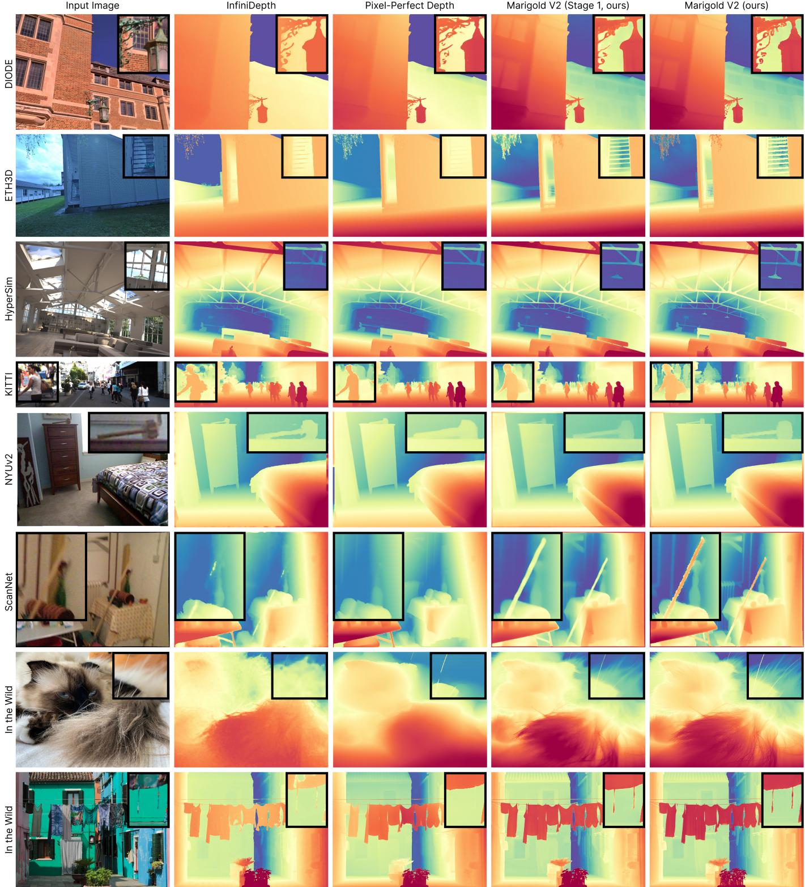  
Fig. 6. Qualitative comparison of state-of-the-art relative depth estimation methods across multiple datasets. Marigold V2 trained with iREPA-depth and SinkLoss preserves fine details while keeping flying pixels to a minimum. Pixel-Perfect Depth produces fewer flying pixels overall but loses substantia detail. All methods use the same inference resolution without any resizing. Last row courtesy of Franco Sulli via Pexels.

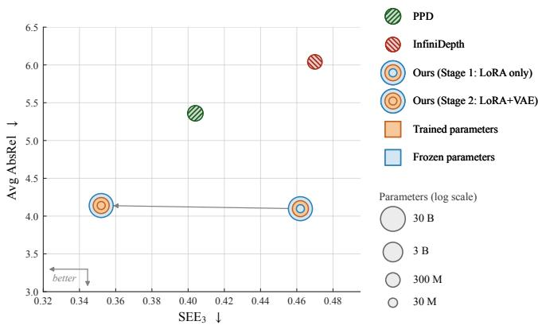  
Fig. 7. The impact of SinkLoss on evaluation metrics. SinkLoss greatly improves fine details and edge sharpness, as measured by SEE� metrics, without afecting standard metrics (AbsRel or � ). With SinkLoss enabled during Stage 2 of our protocol, Marigold V2 outperforms PPD on $\mathsf { S E E } _ { 3 }$

Table 6. Latency and memory benchmarks. Comparison between difer ent models across resolutions on a single 32GB GPU.
<table><tr><td>Model</td><td colspan="2">1024× 1024</td><td colspan="2">2048 × 2048</td></tr><tr><td></td><td>Lat. (s)</td><td>Mem. (GB)</td><td>Lat. (s)</td><td>Mem. (GB)</td></tr><tr><td>InfiniDepth (CVPR 2026) [Yu et al. 2026a]</td><td>0.2</td><td>1.9</td><td>1.2</td><td>3.4</td></tr><tr><td>PPD (NeurIPS 2025) [Xu et al. 2025a]</td><td>1.4</td><td>5.6</td><td>OOM</td><td>OOM</td></tr><tr><td>Lotus-2 (w/o sharpener)</td><td>1.1</td><td>26.1</td><td>OOM</td><td>OOM</td></tr><tr><td>Lotus-2 (arXiv 2025) [He et al. 2025a]</td><td>8.9</td><td>26.1</td><td>OOM</td><td>OOM</td></tr><tr><td>FE2E (CVPR 2026) [Wang et al. 2026a]</td><td>3.9</td><td>27.5</td><td>OOM</td><td>OOM</td></tr><tr><td>Marigold V2 (depth, ours)</td><td>1.9</td><td>16.9</td><td>9.6</td><td>29.3</td></tr></table>

Let $\epsilon = ( x _ { \mathrm { p r e d } } - x _ { \mathrm { g t } } ) / x _ { \mathrm { g t } } ;$ for |� | ≪ 1,

$$
\log x _ { \mathrm { p r e d } } - \log x _ { \mathrm { g t } } = \log \left( 1 + { \frac { x _ { \mathrm { p r e d } } - x _ { \mathrm { g t } } } { x _ { g t } } } \right) \approx { \frac { x _ { \mathrm { p r e d } } - x _ { \mathrm { g t } } } { x _ { \mathrm { g t } } } } = \epsilon .\tag{11}
$$

Hence, an $L _ { 1 }$ penalty on log-depth coincides with the per-pixel AbsRel error to first order.

Backbone Transfer Ablation. To disentangle the efect of the proposed training recipe from the model prior of the Qwen imageediting backbone, we additionally apply the same losses to Stable Difusion V1.5, following a setup similar to Marigold V1.1 and MarigoldE2E, as well as to FLUX.2 klein backbone. For each backbone, the baseline retains the single-step log-depth formulation with latent MSE, iREPA, and pixel-space losses; SinkLoss is then enabled on top. The resulting boundary-sensitive SEE metrics on HyperSim are reported in Tab. 5, highlighting that the proposed losses also generalize beyond the Qwen backbone. Furthermore, iREPA yields similar qualitative improvements in challenging high-frequency regions, such as dense foliage and thin structures, while SinkLoss improves boundary-sensitive metrics. These results indicate that the gains come from the training recipe rather than from design choices specific to the Qwen backbone.

Stage-2 Ablation. Finally, we ablate the main components of the second-stage fine-tuning procedure, which is designed to improve boundary quality and reduce flying-pixel artifacts. For these experiments, we use the Soft Edge Error (SEE�) metric on the HyperSim dataset and relate it to the AbsRel across datasets (Fig. 7). It shows that Stage-2 SinkLoss fine-tuning substantially improves SEE3, indicating sharper boundary reconstruction, while preserving standard metrics comparable to the original Stage-1 checkpoint.

Compared to the Stage-1 prediction, the SinkLoss-refined model produces fewer flying pixels around object boundaries and highfrequency regions, particularly near thin structures and vegetation. The experiment with disabling SinkLoss during VAE decoder finetuning in Stage 2 confirms its importance for recognition of thin details (Fig. 5). The resulting depth maps contain cleaner discontinuities and more coherent local detail, showing that the second stage improves boundary fidelity.

Latency and Memory Requirements. We additionally measure inference latency and peak GPU memory for all models using the same protocol on a single 32GB GPU.

The results are reported in Tab. 6: compared with difusion-based methods, Marigold V2 provides a favorable balance between latency, memory, and resolution. Its QLoRA-quantized base weights and single-step formulation avoid the iterative sampling and extra input tokens used by many difusion models. At 1024 × 1024, it is faster than Lotus-2 and FE2E, although slower than Lotus-2 without the detail sharpener, and uses less memory than both. At 2048 × 2048, it remains feasible on a single 32GB GPU, while Pixel-Perfect Depth, Lotus-2, and FE2E run out of memory. Marigold V2 is therefore not the fastest model overall, but it ofers substantially better resolution scalability than prior difusion-based estimators.

## 5 Other Dense Regression Tasks

## 5.1 Depth Completion

We address metric depth completion by fitting a new LoRA to a frozen afine-invariant depth prior, supervised at test time by the sparse depth measurements. Marigold-SSD [Gregorek et al. 2026] adapts in weight space but trains ofline; Marigold-DC [Viola et al. 2025] stays at test time but needs 50-step latent guidance; CAPA [Ke et al. 2026] does both, but on the metric-native MoGe-2.

We freeze everything and attach a second, zero-initialized rank-16 LoRA to the last 12 out of the 60 transformer blocks. In each for ward pass, the model predicts afine-invariant log-depth, which is mapped to metric depth by two learned scalars � and � (scale and shift), initialized by least squares against the sparse measurements. We minimize a combined $L _ { 1 }$ and $L _ { 2 }$ residual at the sparse measurements for 100 Adam iterations, with learning rates of $1 0 ^ { - 3 }$ for the LoRA and $3 \times 1 0 ^ { - 2 }$ for (�, �). This yields 21.2M trainable parameters in the adapter, plus the two scalars. We leverage Marigold V2 ability to run inference at higher resolutions than at training, and run it on a Lanczos-upscaled input, while keeping supervision and evalu ation on the native grid: the sparse points are never resampled, and the prediction is bilinearly resized back to native resolution before applying the loss. Tiling raises the efective resolution further and additionally reduces the metric depth range each afine fit must cover. Concretely, we use 3×3 tiles at 4× the tile resolution with 15% overlap for iBims-1, and 2×2 tiles with 25% overlap at 1.5× and 2× for KITTI-DC [Uhrig et al. 2017] and DDAD [Guizilini et al. 2020]. NYUv2 is left untiled because its 500 measurements are too sparse to subdivide, leaving each tile without enough anchors for

Marigold V2 (ours)

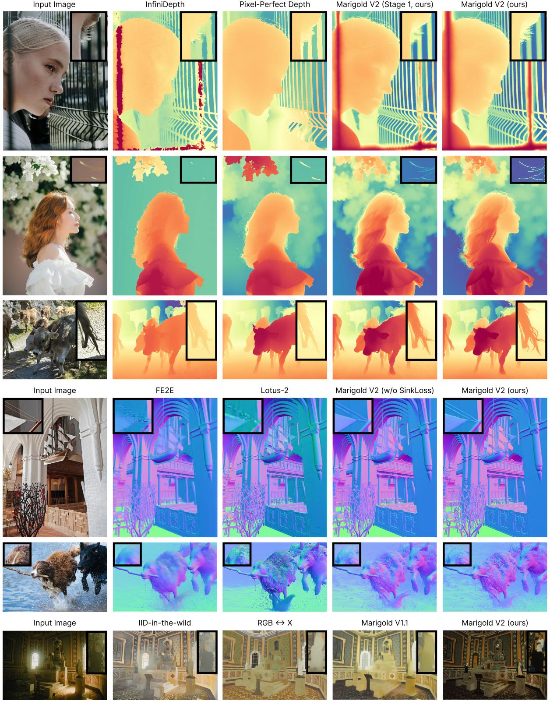  
Fig. 8. Qualitative comparison on in-the-wild images. Marigold V2 preserves fine details beter than the baselines across depth, surface normals, and albedo estimation. Rows 1, 2, and 6 are courtesy of cotonbro studio, VANNGO Ng, and Lucas Oliveira via Pexels, respectively.

Table 7. Zero-shot metric depth completion evaluation using the sparse-guidance protocol of Marigold-DC [Viola et al. 2025] at native ground-truth resolution. NYUv2 and iBims are evaluated on their full evaluation sets; KITTI-DC and DDAD use evenly-sampled subsets (�=150). Bold indicates the best result and underlining the second-best result for each metric.
<table><tr><td></td><td colspan="4">iBims-1</td><td colspan="4">NYUv2</td><td colspan="4">KITTI-DC (n=150)</td><td colspan="4">DDAD (n=150)</td></tr><tr><td>Method</td><td>MAE</td><td>RMSE</td><td>AbsRel</td><td>δ1</td><td>MAE</td><td>RMSE</td><td>AbsRel</td><td>δ1</td><td>MAE</td><td>RMSE</td><td>AbsRel</td><td>δ1</td><td>MAE</td><td>RMSE</td><td>AbsRel</td><td>δ1</td></tr><tr><td>Marigold-DC (ICCV 2025) [Viola et al. 2025]</td><td>0.059</td><td>0.189</td><td>0.016</td><td>0.989</td><td>0.061</td><td>0.152</td><td>0.021</td><td>0.987</td><td>0.598</td><td>1.729</td><td>0.034</td><td>0.989</td><td>3.247</td><td>8.236</td><td>0.120</td><td>0.884</td></tr><tr><td>Marigold-SSD (CVPRW 2026) [Gregorek et al. 2026]</td><td>0.060</td><td>0.185</td><td>0.016</td><td>0.990</td><td>0.069</td><td>0.162</td><td>0.025</td><td>0.986</td><td>0.456</td><td>1.527</td><td>0.026</td><td>0.992</td><td>2.080</td><td>6.585</td><td>0.072</td><td>0.949</td></tr><tr><td>CAPA (arXiv 2026) [Ke et al. 2026]</td><td>0.030</td><td>0.135</td><td>0.008</td><td>0.994</td><td>0.044</td><td>0.117</td><td>0.015</td><td>0.992</td><td>0.341</td><td>1.382</td><td>0.016</td><td>0.994</td><td>1.294</td><td>6.007</td><td>0.032</td><td>0.978</td></tr><tr><td>LDCM (ICLR 2026) [Yu et al 2026b]</td><td>0.038</td><td>0.152</td><td>0.010</td><td>0.993</td><td>0.048</td><td>0.126</td><td>0.016</td><td>0.991</td><td>0.324</td><td>1.452</td><td>0.015</td><td>0.993</td><td>1.097</td><td>6.012</td><td>0.022</td><td>0.981</td></tr><tr><td>Marigold V2 (test-time LoRA, ours)</td><td>0.042</td><td>0.160</td><td>0.012</td><td>0.993</td><td>0.045</td><td>0.112</td><td>0.015</td><td>0.993</td><td>0.349</td><td>1.472</td><td>0.017</td><td>0.994</td><td>1.549</td><td>6.242</td><td>0.046</td><td>0.972</td></tr><tr><td>+ high-resolution inference</td><td>0.034</td><td>0.127</td><td>0.010</td><td>0.995</td><td>0.044</td><td>0.110</td><td>0.015</td><td>0.994</td><td>0.340</td><td>1.397</td><td>0.017</td><td>0.994</td><td>1.465</td><td>6.072</td><td>0.043</td><td>0.974</td></tr><tr><td>+ tiled local adaptation</td><td>0.030</td><td>0.122</td><td>0.009</td><td>0.995</td><td>0.044</td><td>0.110</td><td>0.015</td><td>0.994</td><td>0.318</td><td>1.333</td><td>0.016</td><td>0.994</td><td>1.226</td><td>5.323</td><td>0.038</td><td>0.976</td></tr></table>

Table 8. See-Through depth estimation. Evaluation on the full LayeredDepth-Syn �8 validation set.
<table><tr><td>Checkpoint</td><td>AbsRel ↓</td><td>δ1↑</td></tr><tr><td>Marigold V2 (depth, ours)</td><td>13.66</td><td>83.96</td></tr><tr><td>Marigold V2 (see-through depth, ours)</td><td>8.17</td><td>92.65</td></tr></table>

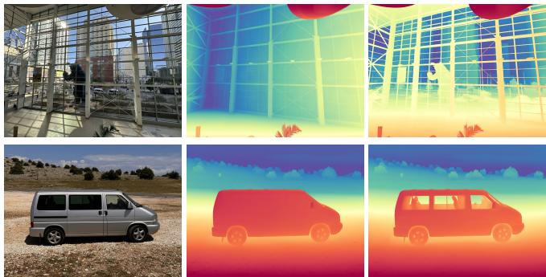  
Fig. 9. See-through depth qualitative comparison. From left to right: input RGB, predictions of our base model and of our see-through model.

a stable afine fit. Tiling costs 4–14× the single-pass runtime. Despite its purely afine-invariant prior, it outperforms both Marigold-SSD [Gregorek et al. 2026] and Marigold-DC [Viola et al. 2025] by a wide margin and achieves the lowest RMSE on all four benchmarks (Tab. 7).

## 5.2 See-Through Depth

We additionally investigate see-through depth estimation, where the goal is to predict the geometry visible behind transparent surfaces such as glass. We observed that the base Marigold V2 model is biased toward closer depth values in such regions: this bias comes from annotations in HyperSim, where transparent surfaces are annotated at the glass surface rather than at the geometry behind it. Depending on the final application, we may want to learn to estimate depth behind such surfaces: to this end, we additionally fine-tune our model for 30K steps using the final depth layer, �8, of LayeredDepth-Syn [Wen et al. 2025]. As shown in Tab. 8, this reduces AbsRel from 13.7 to 8.2 and improves $\delta _ { 1 }$ from 84.0 to 92.7 on the validation split, demonstrating more accurate depth prediction behind glass. The qualitative improvement is shown in Fig. 9.

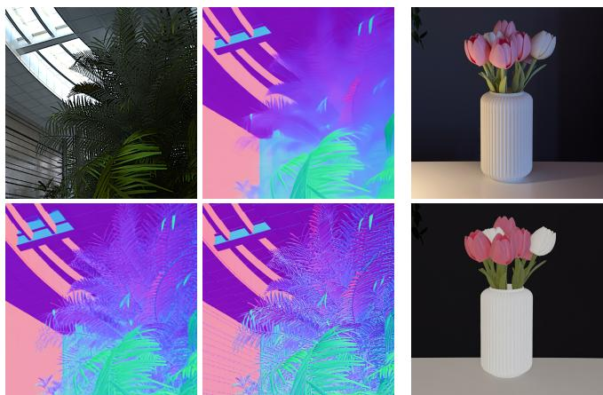  
Fig. 10. Qualitative results: surface normals and albedo. Left: Input, angular L1, L1 + iREPA, and SinkLoss + iREPA. Right: Input and albedo prediction. Flowers image is courtesy of Rüveyda Akkaya via Pexels.

## 5.3 Surface Normal Estimation

Tab. 9 compares Marigold V2 with recent discriminative and difusion-based baselines on NYUv2 [Silberman et al. 2012], ScanNet [Dai et al. 2017], iBims-1 [Koch et al. 2018], and Sintel [Butler et al. 2012]. We retrain Marigold V2 by replacing the pixel-space term of Eq. 7 with an angular loss between predicted and ground-truth normals, keeping iREPA, and adding SinkLoss on top. Sinkhorn transport weights are computed from the $\mathcal { L } _ { 1 }$ distance between predictions and ground truth. Fig. 10 (left) and the middle rows of Fig. 8 illustrate the efect of the proposed losses, highlighting the much higher fidelity of details enabled by the joint use of iREPA and SinkLoss.

To measure the impact of this latter loss quantitatively, we adapt the soft edge error from depth to normals. The resulting Soft Angular Edge Error (SAEE) measures angular discrepancies near HyperSim boundaries while allowing predictions to match nearby groundtruth orientations rather than requiring exact pixel correspondence. Tab. 10 shows that SinkLoss consistently improves SAEE.

## 5.4 Albedo Estimation

We additionally evaluate Marigold V2 on single-image albedo estimation on the HyperSim test set. Starting from the base Qwen model, we fine-tune it on the HyperSim training split for 30K steps using an $\mathcal { L } _ { 1 }$ reconstruction loss together with iREPA computed directly on the ground-truth albedo values. As shown in Tab. 11, the resulting model achieves the best PSNR and LPIPS among the compared methods, while remaining competitive in SSIM. A qualitative example is shown in Fig. 10 (right) and the last row of Fig. 8.

Table 9. Comparison of zero-shot surface normal estimators on NYUv2, ScanNet, iBims-1 and Sintel. We report MeanErr (↓) and $1 1 . 2 5 ^ { \circ } \left( \uparrow \right)$ . Methods trained on more than 5M images are shown in gray. Bold indicates the best result and underlining the second-best result for each metric.
<table><tr><td rowspan="2">Method</td><td>Training</td><td colspan="2">NYUv2 (Indoor)</td><td colspan="2">ScanNet (Indoor)</td><td colspan="2">iBims-1 (Indoor)</td><td colspan="2">Sintel (Outdoor)</td></tr><tr><td>Data↓</td><td>MeanErr↓</td><td> $1 1 . 2 5 ^ { \circ } \uparrow$ </td><td>MeanErr↓</td><td> $1 1 . 2 5 ^ { \circ } \uparrow$ </td><td>MeanErr↓</td><td> $1 1 . 2 5 ^ { \circ } \uparrow$ </td><td>MeanErr↓</td><td> $1 1 . 2 5 ^ { \circ } \uparrow$ </td></tr><tr><td>MoGe-2 (NeurIPS 2025) [Wang et al 2025b]</td><td>8.9M</td><td>14.7</td><td>62.3</td><td>12.8</td><td>68.4</td><td>14.7</td><td>70.4</td><td>29.3</td><td>24.8</td></tr><tr><td>DSINE (CVPR 2024) [Bae and Davison 2024]</td><td>160K</td><td>16.4</td><td>59.6</td><td>16.2</td><td>61.0</td><td>17.1</td><td>67.4</td><td>34.9</td><td>21.5</td></tr><tr><td>GeoWizard (ECCV 2024) [Fu et al. 2024]</td><td>280K</td><td>18.9</td><td>50.7</td><td>17.4</td><td>53.8</td><td>19.3</td><td>63.0</td><td>40.3</td><td>12.3</td></tr><tr><td>StableNormal (SIGGRAPH Asia 2024) [Ye et al. 2024]</td><td>250K</td><td>18.6</td><td>53.5</td><td>17.1</td><td>57.4</td><td>18.2</td><td>65.0</td><td>36.7</td><td>14.1</td></tr><tr><td>Diffusion-E2E-FT (WACV 2025) [Martin Garcia et al. 2025]</td><td>74K</td><td>16.5</td><td>60.4</td><td>14.7</td><td>66.1</td><td>16.1</td><td>69.7</td><td>33.5</td><td>22.3</td></tr><tr><td>GenPercept (ICLR 2025) [Xu et al. 2025b]</td><td>74K</td><td>18.2</td><td>56.3</td><td>17.7</td><td>58.3</td><td>18.2</td><td>64.0</td><td>37.6</td><td>16.2</td></tr><tr><td>Lotus-G (ICLR 2025) [He et al. 2025b]</td><td>59K</td><td>16.5</td><td>59.4</td><td>15.1</td><td>63.9</td><td>17.2</td><td>66.2</td><td>33.6</td><td>21.0</td></tr><tr><td>Lotus-D (ICLR 2025) [He et al. 2025b]</td><td>59K</td><td>16.2</td><td>59.8</td><td>14.7</td><td>64.0</td><td>17.1</td><td>66.4</td><td>32.3</td><td>22.4</td></tr><tr><td>Marigold Normals V1.1 (TPAMI 2025) [Ke et al. 2024, 2025]</td><td>77K</td><td>16.1</td><td>60.5</td><td>14.5</td><td>66.1</td><td>16.3</td><td>68.5</td><td></td><td></td></tr><tr><td>Lotus-2 (arXiv 2025) [He et al. 2025a]</td><td>59K</td><td>16.9</td><td>59.0</td><td>14.2</td><td>66.8</td><td>15.4</td><td>70.4</td><td>30.3</td><td>27.6</td></tr><tr><td>FE2E (CVPR 2026) [Wang et al. 2026a]</td><td>71K</td><td>16.2</td><td>59.6</td><td>13.8</td><td>67.2</td><td>15.1</td><td>70.6</td><td>31.2</td><td>22.3</td></tr><tr><td>Marigold V2 (normals, ours)</td><td>59K</td><td>16.6</td><td>61.2</td><td>14.1</td><td>67.4</td><td>15.9</td><td>70.9</td><td>28.7</td><td>27.6</td></tr></table>

Table 10. Impact of SinkLoss on surface normal estimation. Mean angular error (MeanErr) is averaged over four test datasets, while the Soft Angular Edge Error (SAEE) metrics are computed on the HyperSim test set.
<table><tr><td> $\mathcal { L } _ { \mathrm { S i n k L o s s } }$ </td><td>MeanErr ↓</td><td> $\operatorname { S A E E } _ { 3 } \downarrow$ </td><td> ${ \mathrm { S A E E } } _ { 5 } \downarrow$ </td><td> $\operatorname { S A E E } _ { 7 } \downarrow$ </td></tr><tr><td>x</td><td>18.53</td><td>11.25</td><td>9.42</td><td>8.53</td></tr><tr><td>√</td><td>18.84</td><td>10.76</td><td>8.86</td><td>7.99</td></tr></table>

Table 11. Albedo estimation on the HyperSim test set. We report PSNR (↑), SSIM (↑), and LPIPS (↓).
<table><tr><td rowspan="2">Method</td><td colspan="3">Albedo</td></tr><tr><td></td><td></td><td>PSNR ↑ SSIM ↑ LPIPS ↓</td></tr><tr><td>IID-in-the-wild (TOG 2024) [Careaga and Aksoy 2024]</td><td>19.28</td><td>0.819</td><td>0.260</td></tr><tr><td>RGB↔X (SIGGRAPH 2024) [Zeng et al. 2024]</td><td>17.43</td><td>0.795</td><td>0.200</td></tr><tr><td>Marigold IID-Lighting V1.1 (TPAMI 2025) [Ke et al. 2025]</td><td>18.21</td><td>0.771</td><td>0.218</td></tr><tr><td>Marigold V2 (albedo, ours)</td><td>20.78</td><td>0.811</td><td>0.195</td></tr></table>

## 6 Conclusion

We presented Marigold V2, a practical, difusion-based monocular depth estimator that jointly pursues quantitative accuracy and perceptual quality. Derived from Qwen-Image-Edit through a 2-stage fine-tuning process steered by iREPA regularization and the novel SinkLoss, our model establishes a new state of the art in monocular depth estimation while retaining the high-frequency, fine details that previous models tend to suppress. Marigold V2 is thus an accessible tool in the hands of practitioners, unlocking high-quality computational photography applications on top of depth estimation.

Beyond relative depth, the same recipe extends to other dense regression tasks: metric depth completion, see-through depth, surface normals, and albedo estimation. The large image-editing backbone precludes real-time use; regions with reflections, motion, or defocus blur remain ambiguous, inviting uncertainty-aware or multi-layer extensions. More broadly, Marigold V2 shows that state-of-the-art perception can be distilled from open generative models in days, a recipe we hope others will build on.

## References

Gwangbin Bae and Andrew J. Davison. 2024. Rethinking Inductive Biases for Sur face Normal Estimation. In IEEE/CVF Conference on Computer Vision and Pattern Recognition (CVPR).

BFL.ai. 2024. BFL.ai Announces the FLUX.1 Suite of Models. https://bfl.ai/announcements 24-08-01-bfl

BFL.ai. 2026. FLUX.2 [klein]: Towards Interactive Visual Intelligence. https://bfl.ai/blog/ flux2-klein-towards-interactive-visual-intelligence

Aleksei Bochkovskii, Amaël Delaunoy, Hugo Germain, Marcel Santos, Yichao Zhou, Stephan R. Richter, and Vladlen Koltun. 2025. Depth Pro: Sharp Monocular Metric Depth in Less Than a Second. In ICLR. https://arxiv.org/abs/2410.02073

Daniel J. Butler, Jonas Wulf, Garrett B. Stanley, and Michael J. Black. 2012. A naturalistic open source movie for optical flow evaluation. In Proceedings ofthe 12th European Conference on Computer Vision - Volume Part VI (Florence, Italy) (ECCV’12). Springer Verlag, Berlin, Heidelberg, 611–625. doi:10.1007/978-3-642-33783-3\_44

Chris Careaga and Yağız Aksoy. 2024. Colorful Difuse Intrinsic Image Decomposition in the Wild. ACM Transactions on Graphics 43, 6 (Nov. 2024), 1–12. doi:10.1145/3687984

Chuangrong Chen, Xiaozhi Chen, and Hui Cheng. 2019. On the over-smoothing problem of cnn based disparity estimation. In Proceedings of the IEEE/CVF International Conference on Computer Vision. 8997–9005.

Junsong Chen, Jincheng Yu, Chongjian Ge, Lewei Yao, Enze Xie, Zhongdao Wang, James Kwok, Ping Luo, Huchuan Lu, and Zhenguo Li. 2024. Pixart-�: Fast training of difusion transformer for photorealistic text-to-image synthesis. In International conference on learning representations, Vol. 2024. 57611–57640.

Sili Chen, Hengkai Guo, Shengnan Zhu, Feihu Zhang, Zilong Huang, Jiashi Feng, and Bingyi Kang. 2025. Video Depth Anything: Consistent Depth Estimation for Super-Long Videos. In Proceedings ofthe IEEE/CVF Conference on Computer Vision and Pattern Recognition (CVPR). 22831–22840.

Marco Cuturi. 2013. Sinkhorn distances: Lightspeed computation of optimal transport. Advances in neural information processing systems 26 (2013).

Angela Dai, Angel X. Chang, Manolis Savva, Maciej Halber, Thomas Funkhouser, and Matthias Nießner. 2017. ScanNet: Richly-Annotated 3D Reconstructions of Indoor Scenes. In Proceedings of the IEEE Conference on Computer Vision and Pattern Recognition. 2432–2443.

Kangle Deng, Andrew Liu, Jun-Yan Zhu, and Deva Ramanan. 2022. Depth-supervised NeRF: Fewer Views and Faster Training for Free. In Proceedings ofthe IEEE/CVF Conference on Computer Vision and Pattern Recognition (CVPR).

Tim Dettmers, Artidoro Pagnoni, Ari Holtzman, and Luke Zettlemoyer. 2023. Qlora: Eficient finetuning of quantized llms. Advances in neural information processing systems 36 (2023), 10088–10115.

Alexey Dosovitskiy, Lucas Beyer, Alexander Kolesnikov, Dirk Weissenborn, Xiaohua Zhai, Thomas Unterthiner, Mostafa Dehghani, Matthias Minderer, Georg Heigold, Sylvain Gelly, et al. 2021. An Image is Worth 16x16 Words: Transformers for Image Recognition at Scale. In International Conference on Learning Representations.

Ainaz Eftekhar, Alexander Sax, Jitendra Malik, and Amir Zamir. 2021. Omnidata: A scalable pipeline for making multi-task mid-level vision datasets from 3d scans. In Proceedings ofthe IEEE/CVF International Conference on Computer Vision. 10786– 10796.

David Eigen, Christian Puhrsch, and Rob Fergus. 2014. Depth map prediction from a single image using a multi-scale deep network. Advances in neural information processing systems 27 (2014).

Patrick Esser, Sumith Kulal, Andreas Blattmann, Rahim Entezari, Jonas Müller, Harry Saini, Yam Levi, Dominik Lorenz, Axel Sauer, Frederic Boesel, et al. 2024. Scal ing rectified flow transformers for high-resolution image synthesis. In Forty-first international conference on machine learning.

Huan Fu, Mingming Gong, Chaohui Wang, Kayhan Batmanghelich, and Dacheng Tao. 2018. Deep ordinal regression network for monocular depth estimation. In Proceedings of the IEEE conference on computer vision and pattern recognition. 2002– 2011.

Xiao Fu, Wei Yin, Mu Hu, Kaixuan Wang, Yuexin Ma, Ping Tan, Shaojie Shen, Dahua Lin, and Xiaoxiao Long. Geowizard: Unleashing the difusion priors for 3d geometry estimation from a single image. 2024. In European Conference on Computer Vision. Springer, 241–258.

Valentin Gabeur, Shangbang Long, Songyou Peng, Paul Voigtlaender, Shuyang Sun, Yanan Bao, Karen Truong, Zhicheng Wang, Wenlei Zhou, Jonathan T Barron, et al. 2026. Image Generators are Generalist Vision Learners. arXiv preprint arXiv:2604.20329 (2026).

Adrien Gaidon, Qiao Wang, Yohann Cabon, and Eleonora Vig. 2016. Virtual Worlds as Proxy for Multi-Object Tracking Analysis. In Proceedings ofthe IEEE Conference on Computer Vision and Pattern Recognition (CVPR).

Girish Chandar Ganesan, Yuliang Guo, Liu Ren, and Xiaoming Liu. 2026. UniDAC: Universal Metric Depth Estimation for Any Camera. In Proceedings ofthe IEEE/CVF Conference on Computer Vision and Pattern Recognition. 26953–26963

Andreas Geiger, Philip Lenz, and Raquel Urtasun. 2012. Are We Ready for Autonomous Driving? The KITTI Vision Benchmark Suite. In Proceedings ofthe IEEE Conference on Computer Vision and Pattern Recognition. 3354–3361.

Clément Godard, Oisin Mac Aodha, and Gabriel J. Brostow. 2017. Unsupervised Monoc ular Depth Estimation with Left-Right Consistency. In CVPR.

Clément Godard, Oisin Mac Aodha, Michael Firman, and Gabriel J. Brostow. 2019. Digging into Self-Supervised Monocular Depth Prediction. In The International Conference on Computer Vision (ICCV).

Jakub Gregorek, Paraskevas Pegios, Nando Metzger, Konrad Schindler, Theodora Kontogianni, and Lazaros Nalpantidis. 2026. Need for Speed: Zero-Shot Depth Completion with Single-Step Difusion. In Proceedings ofthe IEEE/CVF Conference on Computer Vision and Pattern Recognition (CVPR) Workshops. 1861–1872.

Ming Gui, Johannes Schusterbauer, Ulrich Prestel, Pingchuan Ma, Dmytro Kotovenko, Olga Grebenkova, Stefan Andreas Baumann, Vincent Tao Hu, and Björn Ommer. 2025. DepthFM: Fast Generative Monocular Depth Estimation with Flow Matching. In Proceedings of the AAAI Conference on Artificial Intelligence, Vol. 39. 3203–3211.

Vitor Guizilini, Rares Ambrus, Sudeep Pillai, Allan Raventos, and Adrien Gaidon. 2020. 3D Packing for Self-Supervised Monocular Depth Estimation. In Proceedings ofthe IEEE/CVF Conference on Computer Vision and Pattern Recognition (CVPR).

Jing He, Haodong Li, Mingzhi Sheng, and Ying-Cong Chen. 2025a. Lotus-2: Advancing Geometric Dense Prediction with Powerful Image Generative Model. arXiv preprint arXiv:2512.01030 (2025).

Jing He, Haodong Li, Wei Yin, Yixun Liang, Leheng Li, Kaiqiang Zhou, Hongbo Zhang, Bingbing Liu, and YingCong Chen. 2025b. Lotus: Difusion-based visual foundation model for high-quality dense prediction. In International Conference on Learning Representations, Vol. 2025. 89454–89467.

Edward J Hu, yelong shen, Phillip Wallis, Zeyuan Allen-Zhu, Yuanzhi Li, Shean Wang, Lu Wang, and Weizhu Chen. 2022. LoRA: Low-Rank Adaptation of Large Language Models. In International Conference on Learning Representations. https://openreview. net/forum?id=nZeVKeeFYf9

Li Hu. 2024. Animate anyone: Consistent and controllable image-to-video synthesis for character animation. In Proceedings ofthe IEEE/CVF Conference on Computer Vision and Pattern Recognition. 8153–8163.

Binbin Huang, Zehao Yu, Anpei Chen, Andreas Geiger, and Shenghua Gao. 2024. 2d gaussian splatting for geometrically accurate radiance fields. In ACM SIGGRAPH 2024 conference papers. 1–11.

Lutao Jiang, Jiantao Lin, Kanghao Chen, Wenhang Ge, Xin Yang, Yifan Jiang, Yuanhuiyi Lyu, Xu Zheng, LI JING, Yinchuan Li, and Ying-Cong Chen. 2026. DiMeR: Disentangled Mesh Reconstruction Model with Normal-only Geometry Training. In The Fourteenth International Conference on Learning Representations. https: //openreview.net/forum?id=fK2pCgoavb

Bingxin Ke, Anton Obukhov, Shengyu Huang, Nando Metzger, Rodrigo Caye Daudt, and Konrad Schindler. 2024. Repurposing difusion-based image generators for

monocular depth estimation. In Proceedings ofthe IEEE/CVF conference on computer vision and pattern recognition. 9492–9502.

Bingxin Ke, Kevin Qu, Tianfu Wang, Nando Metzger, Shengyu Huang, Bo Li, Anton Obukhov, and Konrad Schindler. 2025. Marigold: Afordable adaptation of difusionbased image generators for image analysis. IEEE Transactions on Pattern Analysis and Machine Intelligence (2025).

Bingxin Ke, Qunjie Zhou, Jiahui Huang, Xuanchi Ren, Tianchang Shen, Konrad Schindler, Laura Leal-Taixé, and Shengyu Huang. 2026. Depth Completion as Parameter-Eficient Test-Time Adaptation. arXiv:arXiv:2602.14751

Tobias Koch, Lukas Liebel, Friedrich Fraundorfer, and Marco Korner. 2018. Evaluation of CNN-based Single-Image Depth Estimation Methods. In Proceedings of the European Conference on Computer Vision (ECCV) Workshops.

Akshay Krishnan, Xinchen Yan, Vincent Casser, and Abhijit Kundu. 2025. Orchid: Image Latent Difusion for Joint Appearance and Geometry Generation. In Proceedings of the IEEE/CVF International Conference on Computer Vision (ICCV). 28217–28227.

Duong H. Le, Tuan Pham, Sangho Lee, Christopher Clark, Aniruddha Kembhavi, Stephan Mandt, Ranjay Krishna, and Jiasen Lu. 2025. One Difusion to Generate Them All. In Proceedings ofthe IEEE/CVF Conference on Computer Vision and Pattern Recognition (CVPR). 2671–2682.

Jin Han Lee, Myung-Kyu Han, Dong Wook Ko, and Il Hong Suh. 2019. From Big to Small: Multi-Scale Local Planar Guidance for Monocular Depth Estimation. arXiv e-prints (2019), arXiv–1907.

Haotong Lin, Sili Chen, Jun Hao Liew, Donny Y. Chen, Zhenyu Li, Yang Zhao, Sida Peng, Hengkai Guo, Xiaowei Zhou, Guang Shi, Jiashi Feng, and Bingyi Kang. 2026. Depth Anything 3: Recovering the Visual Space from Any Views. (2026). https: //openreview.net/forum?id=yirunib8l8

Wei Liu, Jiaxin Lin, and Rui Chen. 2026. Open-Source Image Editing Models Are Zero-Shot Vision Learners. arXiv:2605.04566 [cs.CV] https://arxiv.org/abs/2605.04566

Xiaoxiao Long, Yuan-Chen Guo, Cheng Lin, Yuan Liu, Zhiyang Dou, Lingjie Liu, Yuexin Ma, Song-Hai Zhang, Marc Habermann, Christian Theobalt, et al. 2024. Wonder3d: Single image to 3d using cross-domain difusion. In Proceedings ofthe IEEE/CVF conference on computer vision and pattern recognition. 9970–9980.

Gonzalo Martin Garcia, Karim Knaebel, Christian Schmidt, Daan de Geus, Alexander Hermans, and Bastian Leibe. 2025. Fine-Tuning Image-Conditional Difusion Models is Easier than You Think. In Proceedings of the IEEE/CVF Winter Conference on Applications ofComputer Vision (WACV).

Maxime Oquab, Timothée Darcet, Théo Moutakanni, Huy V Vo, Marc Szafraniec, Vasil Khalidov, Pierre Fernandez, Daniel HAZIZA, Francisco Massa, Alaaeldin El Nouby, et al. 2024. DINOv2: Learning Robust Visual Features without Supervision. Transactions on Machine Learning Research (2024).

William Peebles and Saining Xie. 2023. Scalable difusion models with transformers. In Proceedings ofthe IEEE/CVF international conference on computer vision. 4195–4205.

Juewen Peng, Zhiguo Cao, Xianrui Luo, Hao Lu, Ke Xian, and Jianming Zhang. 2022. BokehMe: When Neural Rendering Meets Classical Rendering. In Proceedings of the IEEE/CVF International Conference on Computer Vision and Pattern Recognition (CVPR).

Duc-Hai Pham, Tung Do, Phong Nguyen, Binh-Son Hua, Khoi Nguyen, and Rang Nguyen. 2025. Sharpdepth: Sharpening metric depth predictions using difusion distillation. In Proceedings ofthe Computer Vision and Pattern Recognition Conference. 17060–17069.

Luigi Piccinelli, Christos Sakaridis, Mattia Segu, Yung-Hsu Yang, Siyuan Li, Wim Abbeloos, and Luc Van Gool. 2025. UniK3D: Universal Camera Monocular 3D Estimation. In IEEE/CVF Conference on Computer Vision and Pattern Recognition (CVPR).

Luigi Piccinelli, Thiemo Wandel, Christos Sakaridis, Wim Abbeloos, and Luc Van Gool. 2026. Video Depth Propagation. In Proceedings ofthe International Conference on 3D Vision (3DV).

Luigi Piccinelli, Yung-Hsu Yang, Christos Sakaridis, Mattia Segu, Siyuan Li, Luc Van Gool, and Fisher Yu. 2024. UniDepth: Universal Monocular Metric Depth Estimation. In Proceedings of the IEEE/CVF Conference on Computer Vision and Pattern Recognition (CVPR). IEEE, Seattle, WA, USA.

Matteo Poggi, Filippo Aleotti, Fabio Tosi, and Stefano Mattoccia. 2020. On the uncer tainty of self-supervised monocular depth estimation. In IEEE/CVF Conference on Computer Vision and Pattern Recognition (CVPR).

René Ranftl, Alexey Bochkovskiy, and Vladlen Koltun. 2021. Vision transformers for dense prediction. In Proceedings ofthe IEEE/CVF international conference on computer vision. 12179–12188

René Ranftl, Katrin Lasinger, David Hafner, Konrad Schindler, and Vladlen Koltun. 2020. Towards robust monocular depth estimation: Mixing datasets for zero-shot cross-dataset transfer. IEEE transactions on pattern analysis and machine intelligence 44, 3 (2020), 1623–1637.

Mike Roberts, Jason Ramapuram, Anurag Ranjan, Atulit Kumar, Miguel Angel Bautista, Nathan Paczan, Russ Webb, and Joshua M. Susskind. 2021. Hypersim: A Photorealistic Synthetic Dataset for Holistic Indoor Scene Understanding. In Proceedings of the IEEE/CVF International Conference on Computer Vision (ICCV).

Robin Rombach, Andreas Blattmann, Dominik Lorenz, Patrick Esser, and Björn Ommer. 2022. High-resolution image synthesis with latent difusion models. In Proceedings of the IEEE/CVF conference on computer vision and pattern recognition. 10684–10695.

Olaf Ronneberger, Philipp Fischer, and Thomas Brox. 2015. U-net: Convolutional networks for biomedical image segmentation. In International Conference on Medical image computing and computer-assisted intervention. Springer, 234–241.

Sadra Safadoust, Fabio Tosi, Fatma Güney, and Matteo Poggi. 2024. Self-Evolving Depth-Supervised 3D Gaussian Splatting from Rendered Stereo Pairs. In British Machine Vision Conference (BMVC).

Thomas Schöps, Johannes L. Schönberger, Silvano Galliani, Torsten Sattler, Konrad Schindler, Marc Pollefeys, and Andreas Geiger. 2017. A Multi-View Stereo Bench mark with High-Resolution Images and Multi-Camera Videos. In Proceedings ofthe IEEE Conference on Computer Vision and Pattern Recognition. 3260–3269.

Nathan Silberman, Derek Hoiem, Pushmeet Kohli, and Rob Fergus. 2012. Indoor Segmentation and Support Inference from RGBD Images. In European Conference on Computer Vision. Springer, 746–760.

Oriane Siméoni, Huy V. Vo, Maximilian Seitzer, Federico Baldassarre, Maxime Oquab, Cijo Jose, Vasil Khalidov, Marc Szafraniec, Seung Eun Yi, Michael Ramamonjisoa, Francisco Massa, Daniel HAZIZA, Luca Wehrstedt,Jianyuan Wang, Timothée Darcet, Théo Moutakanni, Leonel Sentana, Claire Roberts, Andrea Vedaldi, Jamie Tolan, John Brandt, Camille Couprie, Julien Mairal, Herve Jegou, Patrick Labatut, and Piotr Bojanowski. 2026. DINOv3. Transactions on Machine Learning Research (2026). https://openreview.net/forum?id=2NlGyqNjns Featured Certification.

Jaskirat Singh, Xingjian Leng, Zongze Wu, Liang Zheng, Richard Zhang, Eli Shechtman, and Saining Xie. 2026. What matters for Representation Alignment: Global Infor mation or Spatial Structure?. In The Fourteenth International Conference on Learning Representations. https://openreview.net/forum?id=y0UxFtXqXf

Richard Sinkhorn and Paul Knopp. 1967. Concerning nonnegative matrices and doubly stochastic matrices. Pacific J. Math. 21, 2 (1967), 343–348.

Ziyang Song, Zerong Wang, Bo Li, Hao Zhang, Ruijie Zhu, Li Liu, Peng-Tao Jiang, and Tianzhu Zhang. 2026. Depthmaster: Taming difusion models for monocular depth estimation. IEEE Transactions on Circuits and Systems for Video Technology (2026).

Fabio Tosi, Filippo Aleotti, Matteo Poggi, and Stefano Mattoccia. 2019. Learning monocular depth estimation infusing traditional stereo knowledge. In Proceedings ofthe IEEE/CVF conference on computer vision and pattern recognition. 9799–9809.

Fabio Tosi, Yiyi Liao, Carolin Schmitt, and Andreas Geiger. 2021. Smd-nets: Stereo mixture density networks. In Proceedings of the IEEE/CVF conference on computer vision and pattern recognition. 8942–8952.

Jonas Uhrig, Nick Schneider, Lukas Schneider, Uwe Franke, Thomas Brox, and Andreas Geiger. 2017. Sparsity Invariant CNNs. In IEEE International Conference on 3D Vision (3DV). http://lmb.informatik.uni-freiburg.de/Publications/2017/UB17a

Igor Vasiljevic, Nicholas I. Kolkin, Shanyi Zhang, Ruotian Luo, Haochen Wang, Falcon Z. Dai, Andrea F. Daniele, Mohammadreza Mostajabi, Steven Basart, Matthew R. Walter, and Gregory Shakhnarovich. 2019. DIODE: A Dense Indoor and Outdoor DEpth Dataset. arXiv preprint arXiv:1908.00463 (2019).

Massimiliano Viola, Kevin Qu, Nando Metzger, Bingxin Ke, Alexander Becker, Konrad Schindler, and Anton Obukhov. 2025. Marigold-DC: Zero-Shot Monocular Depth Completion with Guided Difusion. In Proceedings ofthe IEEE/CVF International Conference on Computer Vision (ICCV).

Jiyuan Wang, Chunyu Lin, Lei Sun, Rongying Liu, Lang Nie, Mingxing Li, Kang Liao, and Xiangxiang Chu. 2026a. From Editor to Dense Geometry Estimator. In Proceedings ofthe IEEE/CVF Conference on Computer Vision and Pattern Recognition.

Ruicheng Wang, Sicheng Xu, Cassie Dai, Jianfeng Xiang, Yu Deng, Xin Tong, and Jiaolong Yang. 2025a. Moge: Unlocking accurate monocular geometry estimation for open-domain images with optimal training supervision. In Proceedings ofthe Computer Vision and Pattern Recognition Conference. 5261–5271.

Ruicheng Wang, Sicheng Xu, Yue Dong, Yu Deng, Jianfeng Xiang, Zelong Lv, Guangzhong Sun, Xin Tong, and Jiaolong Yang. 2025b. MoGe-2: Accurate Monocular Geometry with Metric Scale and Sharp Details. In The Thirty-ninth Annual Conference on Neural Information Processing Systems. https://openreview.net/forum? id=16mDq7m2OK

Yifan Wang, Jianjun Zhou, Haoyi Zhu, Wenzheng Chang, Yang Zhou, Zizun Li, Junyi Chen, Jiangmiao Pang, Chunhua Shen, and Tong He. 2026b. �3: Scalable Permutation-Equivariant Visual Geometry Learning. In International Conference on Learning Representations (ICLR).

Hongyu Wen, Yiming Zuo, Venkat Subramanian, Patrick Chen, and Jia Deng. 2025. Seeing and Seeing Through the Glass: Real and Synthetic Data for Multi-Layer Depth Estimation. In Proceedings ofthe IEEE/CVF International Conference on Computer Vision (ICCV). 6715–6725.

Chenfei Wu, Jiahao Li, Jingren Zhou, Junyang Lin, Kaiyuan Gao, Kun Yan, Sheng-ming Yin, Shuai Bai, Xiao Xu, Yilei Chen, et al. 2025. Qwen-image technical report. arXiv preprint arXiv:2508.02324 (2025).

Gangwei Xu, Haotong Lin, Hongcheng Luo, Xianqi Wang, Jingfeng Yao, Lianghu Zhu, Yuechuan Pu, Cheng Chi, Haiyang Sun, Bing Wang, Guang Chen, Hangjun Ye, Sida Peng, and Xin Yang. 2025a. Pixel-perfect depth with semantics-prompted difusion transformers. Advances in Neural Information Processing Systems 38 (2025),

174731–174755.

Guangkai Xu, Mingyu Liu, Chengxiang Fan, Kangyang Xie, Zhiyue Zhao, Hao Chen, Chunhua Shen, et al. 2025b. What matters when repurposing difusion models for general dense perception tasks?. In International Conference on Learning Representations, Vol. 2025. 6786–6799.

Hao-Hsiang Yang, Wei-Ting Chen, and Sy-Yen Kuo. 2021. S3Net: A Single Stream Structure for Depth Guided Image Relighting. In Proceedings of the IEEE Conference on Computer Vision and Pattern Recognition Workshops (CVPRW).

Lihe Yang, Bingyi Kang, Zilong Huang, Xiaogang Xu, Jiashi Feng, and Hengshuang Zhao. 2024a. Depth anything: Unleashing the power of large-scale unlabeled data. In Proceedings of the IEEE/CVF conference on computer vision and pattern recognition. 10371–10381.

Lihe Yang, Bingyi Kang, Zilong Huang, Zhen Zhao, Xiaogang Xu, Jiashi Feng, and Hengshuang Zhao. 2024b. Depth anything v2. Advances in Neural Information Processing Systems 37 (2024), 21875–21911.

Xin Yang, Qingling Chang, Xinlin Liu, and Yan Cui. 2022. Monocular depth estimation with sharp boundary. In 2022 8th International Conference on Virtual Reality (ICVR). IEEE, 384–391.

Chongjie Ye, Lingteng Qiu, Xiaodong Gu, Qi Zuo, Yushuang Wu, Zilong Dong, Liefeng Bo, Yuliang Xiu, and Xiaoguang Han. 2024. StableNormal: Reducing Difusion Variance for Stable and Sharp Normal. ACM Transactions on Graphics (2024).

Wei Yin, Xinlong Wang, Chunhua Shen, Yifan Liu, Zhi Tian, Songcen Xu, Changming Sun, and Dou Renyin. 2020. DiverseDepth: Afine-invariant Depth Prediction Using Diverse Data. arXiv preprint arXiv:2002.00569 (2020).

Wei Yin, Jianming Zhang, Oliver Wang, Simon Niklaus, Long Mai, Simon Chen, and Chunhua Shen. 2021. Learning to Recover 3D Scene Shape from a Single Image. In Proceedings ofthe IEEE/CVF Conference on Computer Vision and Pattern Recognition.

Hao Yu, Haotong Lin, Jiawei Wang, Jiaxin Li, Yida Wang, Xueyang Zhang, Yue Wang, Xiaowei Zhou, Ruizhen Hu, and Sida Peng. 2026a. InfiniDepth: Arbitrary-Resolution and Fine-Grained Depth Estimation with Neural Implicit Fields. In Proceedings of the IEEE/CVF Conference on Computer Vision and Pattern Recognition.

Sihyun Yu, Sangkyung Kwak, Huiwon Jang, Jongheon Jeong, Jonathan Huang, Jinwoo Shin, and Saining Xie. 2025. Representation Alignment for Generation: Training Difusion Transformers Is Easier Than You Think. In International Conference on Learning Representations.

Zhu Yu, Zhengyi Zhao, Runmin Zhang, Lingteng Qiu, Kejie Qiu, Yisheng He, Siyu Zhu, Zilong Dong, Si-Yuan Cao, and Hui-Liang Shen. 2026b. Large Depth Completion Model from Sparse Observations. In ICLR.

Weihao Yuan, Xiaodong Gu, Zuozhuo Dai, Siyu Zhu, and Ping Tan. 2022. Neural window fully-connected crfs for monocular depth estimation. In Proceedings ofthe IEEE/CVF conference on computer vision and pattern recognition. 3916–3925.

Daniyar Zakarin, Thiemo Wandel, Anton Obukhov, and Dengxin Dai. 2026. Reflection Removal through Eficient Adaptation of Difusion Transformers. In Proceedings of the IEEE/CVF Conference on Computer Vision and Pattern Recognition (CVPR) Workshops. 2776–2785.

Zheng Zeng, Valentin Deschaintre, Iliyan Georgiev, Yannick Hold-Geofroy, Yiwei Hu, Fujun Luan, Ling-Qi Yan, and Miloš Hašan. 2024. RGB↔X: Image decomposition and synthesis using material- and lighting-aware difusion models. In Special Interest Group on Computer Graphics and Interactive Techniques Conference Conference Papers (SIGGRAPH ’24). ACM, 1–11. doi:10.1145/3641519.3657445

Chi Zhang, Wei Yin, Zhibin Wang, Gang Yu, Bin Fu, and Chunhua Shen. 2022. Hi erarchical Normalization for Robust Monocular Depth Estimation. In Advances in Neural Information Processing Systems, Vol. 35.

Lvmin Zhang, Anyi Rao, and Maneesh Agrawala. 2023. Adding conditional control to text-to-image difusion models. In Proceedings of the IEEE/CVF international conference on computer vision. 3836–3847.

Richard Zhang, Phillip Isola, Alexei A Efros, Eli Shechtman, and Oliver Wang. 2018. The unreasonable efectiveness of deep features as a perceptual metric. In 2018 IEEE/CVF conference on computer vision and pattern recognition. IEEE, 586–595.

Xiang Zhang, Bingxin Ke, Hayko Riemenschneider, Nando Metzger, Anton Obukhov, Markus Gross, Konrad Schindler, and Christopher Schroers. 2024. BetterDepth: Plug-and-Play Difusion Refiner for Zero-Shot Monocular Depth Estimation. In The Thirty-eighth Annual Conference on Neural Information Processing Systems. https: //openreview.net/forum?id=35WwZhkush

Chaoqiang Zhao, Matteo Poggi, Fabio Tosi, Lei Zhou, Qiyu Sun, Yang Tang, and Stefano Mattoccia. 2023. Gasmono: Geometry-aided self-supervised monocular depth estimation for indoor scenes. In Proceedings of the IEEE/CVF international conference on computer vision. 16209–16220

Canyu Zhao, Yanlong Sun, Mingyu Liu, Huanyi Zheng, Muzhi Zhu, Zhiyue Zhao, Hao Chen, Tong He, and Chunhua Shen. 2025. DICEPTION: A Generalist Difusion Model for Visual Perceptual Tasks. In The Thirty-ninth Annual Conference on Neural Information Processing Systems.

Chaoqiang Zhao, Youmin Zhang, Matteo Poggi, Fabio Tosi, Xianda Guo, Zheng Zhu, Guan Huang, Yang Tang, and Stefano Mattoccia. 2022. Monovit: Self-supervised monocular depth estimation with a vision transformer. In 2022 international conference on 3D vision (3DV). IEEE, 668–678.