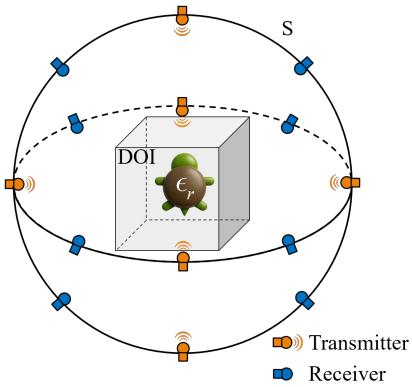
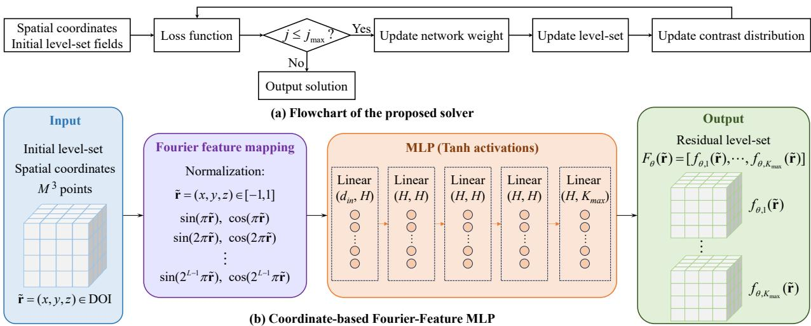
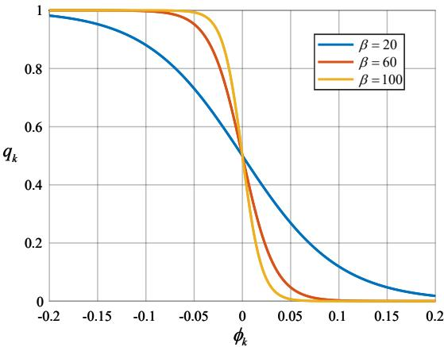
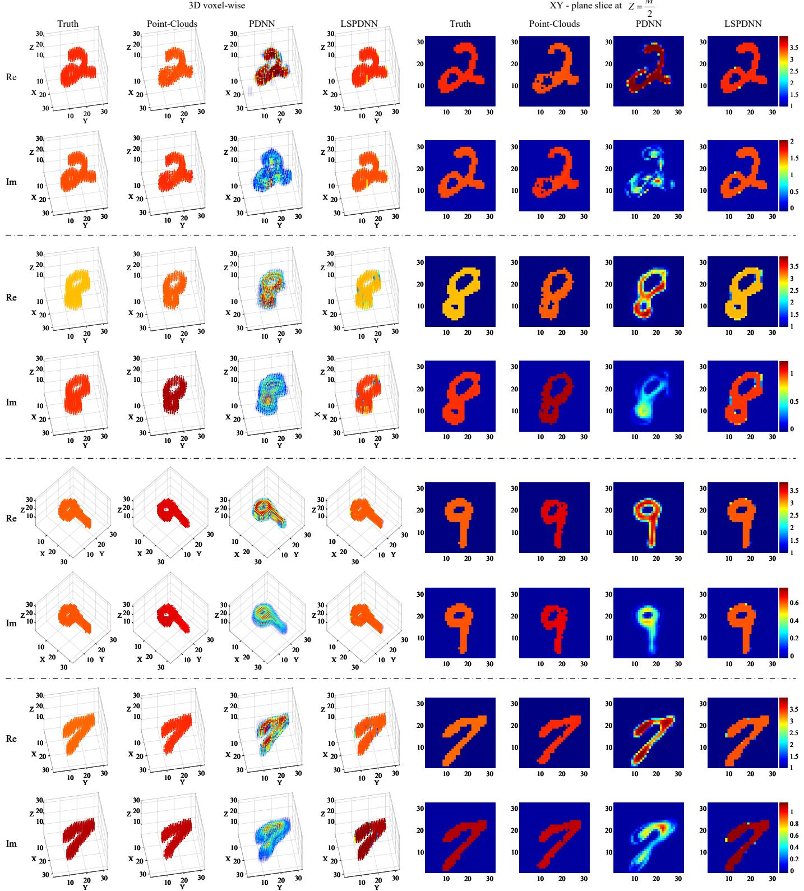
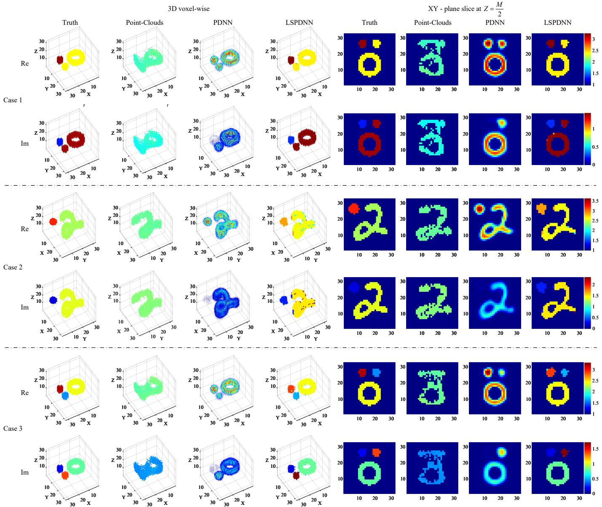
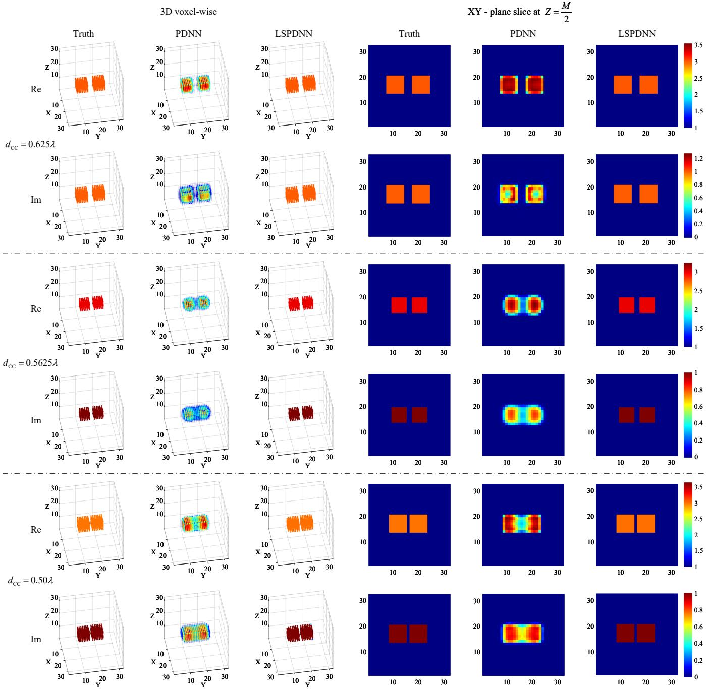
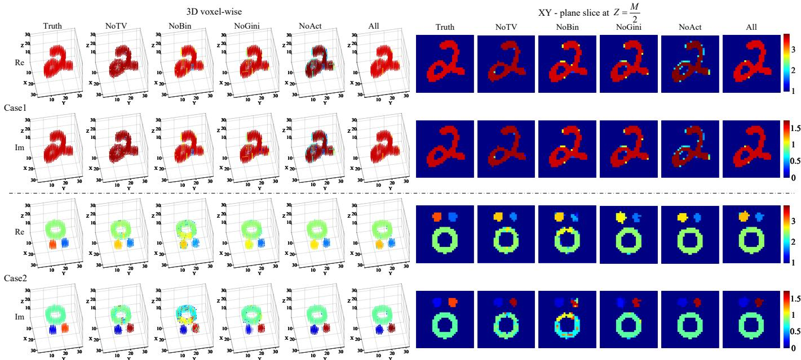
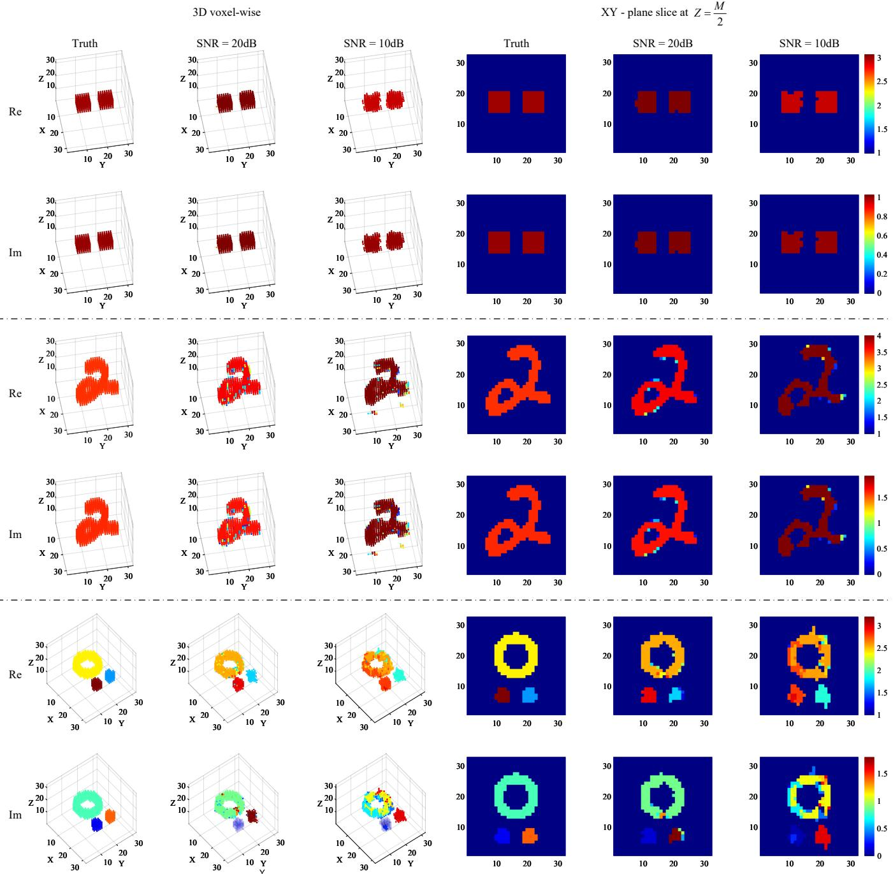
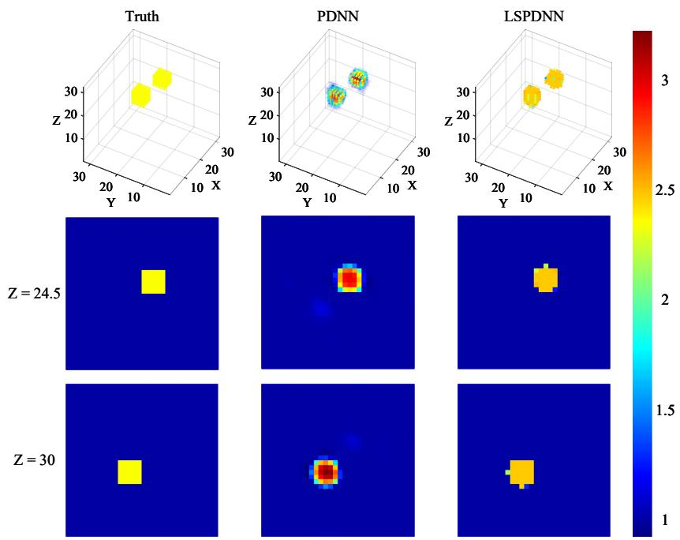
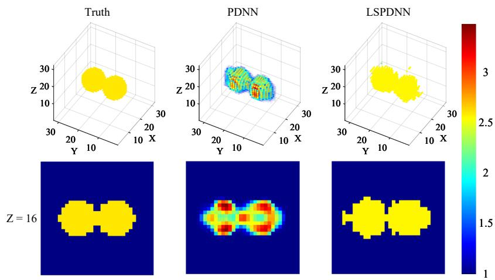

# Multi-Level-Set-Based Physics-Driven Neural Network to Solve 3-D Inverse Scattering Problems

Yutong Du1, Zicheng Liu1, Bo Qi1, Yali Zong1, and Peixian Han1

1Department of Electronic Engineering, School of Electronics and Information, Northwestern Polytechnical University, Xi’an 710029, China

September 9, 2026

## Abstract

This paper proposes a level-set-based physics-driven neural network solver (LSPDNN) for 3-D electromagnetic inverse scattering. To mitigate boundary blurring and reconstruction artifacts in voxel-wise contrast reconstruction, the proposed solver exploits the piecewise homogeneity of practical scatterers by representing unknown targets with multiple coordinate-dependent neural level-set components. Specifically, a soft-union multi-material model is proposed to separately describe the object support and material distribution. The global support is formed by the union of multiple level-set components, while the local contrast is determined by normalized component weights and learnable complex permittivity candidates. In addition, a model-consistent total variation (TV) regularization is imposed on the material-region indicators, rather than directly on the reconstructed contrast, to suppress fragmented material assignments without excessively smoothing material interfaces. An adaptive loss balancing strategy is further introduced to reduce the dependence on manually selected regularization weights. For each measurement instance, the neural level-set parameters and material candidates are optimized by minimizing a physics-consistent objective function. Numerical and experimental results demonstrate that LSPDNN can reconstruct scatterers with clear boundaries, more uniform material regions, and substantially reduced background artifacts. The results highlight the advantage of the neural level-set parameterization in chal lenging 3-D inverse scattering cases involving irregular shapes, closely spaced objects, multiple materials, and measurement noise.

## 1 Introduction

Electromagnetic inverse scattering problems (ISPs) [1] aim to reconstruct the spatial distribution of material properties from measured scattered fields. The problems have attracted sustained attention in microwave imaging [2], nondestructive testing [3; 4], biomedical diagnosis [5; 6], subsurface sensing [7], and remote sensing [8]. In many studies, ISPs are simplified into 2-D scalar formulations under certain polarization assumptions. However, practical 3-D electromagnetic inverse scattering is not a straightforward extension of its 2-D counterpart. The measured scattered fields are governed by a nonlinear vector electromagnetic forward model, where vector field interactions and polarization coupling must be consid ered. Meanwhile, volume discretization of the domain of interest leads to a substantially larger number of unknown degrees of freedom. These factors, together with multiple scattering, limited measurement aperture, and measurement noise, make stable and accurate 3-D reconstruction particularly challenging, especially for complex scatterers with sharp interfaces, irregular geometries, or multiple material regions.

Classic iterative methods, such as distorted Born iterative methods (DBIM) [9; 10], contrast source inversion (CSI) [11; 12], and subspace optimization methods (SOM) [13; 14; 15] have been widely investigated for electromagnetic inverse scattering. These methods explicitly incorporate the electromagnetic forward model and therefore possess clear physical interpretability. To mitigate the ill-posedness of the in verse problems, various prior regularizations have been incorporated into these iterative frameworks[16; 17; 18], including Tikhonov regularization, total variation, edge-preserving penalties, and sparsity-promoting $\ell _ { p }$ quasi-norm regularization $( 0 < p < 1 )$ . However, when applied to 3-D volumetric reconstruction, many of these methods may sufer from high computational cost, sensitivity to hyperparameters, and dificulty in preserving sharp material interfaces.

With the rapid development of deep learning techniques, learning-based solvers have attracted increas ing attention in ISPs. By using neural networks to model the nonlinear relationship between network input and unknown electromagnetic parameters, these solvers provide a flexible alternative to conventional iterative methods and have shown potential in improving reconstruction eficiency and image quality. According to the role of the physical model, existing learning-based inverse scattering methods can be broadly divided into data-driven and physics-driven solvers.

Early data-driven studies [19; 20] mainly relied on image-domain or data-fitting losses, such as meansquare error, relative error, or structural similarity, without explicitly enforcing the governing scattering equations during training. These solvers have demonstrated the ability of neural networks to approximate complex inverse mappings and to provide fast reconstruction after ofline training. However, these solvers usually require large-scale training datasets and their performance largely depends on the representativeness of the training samples. Consequently, they may sufer from limited generalization ability and insuficient physical consistency when applied to unseen scattering scenarios. To improve physical consistency, physics-enhanced data-driven solvers [21; 22; 23; 24; 25] have incorporated electromagnetic priors into the network input, loss function, or architecture. Typical examples include contrast-source representations, near-field consistency constraints, and unrolled update mechanisms inspired by conventional iterative solvers.

Diferent from data-driven solvers that rely on labeled datasets, physics-driven neural solvers perform per-sample online optimization under the constraints of measured data consistency and target priors. In this paradigm, the neural network is used as a parameterized representation of unknown physical quantities or an iterative update module[26]. Such solvers provide a promising bridge between conventional physics-based iterative methods and learning-based parameterization. Song et al. proposed uSOM-Net [27], which integrates neural parameterization with subspace optimization and performs untrained single-sample reconstruction by minimizing data and state equations. Du et al. proposed PDNN [28], where the contrast is predicted by a neural network and updated through the residual of scattered field, bound of contrast constraints, and total variation (TV) regularization. IPDNN [29] further improves PDNN by introducing the GLOW activation function, dynamic scatterer subregion identification, and transfer learning, thereby enhancing reconstruction accuracy, robustness, and eficiency. These solvers show that neural networks can act as physics-constrained parameterized representations rather than only ofline mappers.

Nevertheless, many existing physics-driven neural solvers still parameterize the unknown contrast in a voxel-wise or point-wise manner. Such representations are flexible, but they do not explicitly exploit the piecewise-homogeneous nature of many practical scatterers, whose material variations mainly occur across interfaces. This motivates the use of level-set methods, which implicitly represent material boundaries and are well suited for preserving sharp interfaces and handling topological changes. However, conventional level-set methods usually rely on grid-based level-set functions, which are iteratively updated using sensitivity information such as shape derivatives, adjoint-state gradients, or Jacobian/Frechet derivatives [30; 31; 32]. Although level-set methods have also been extended to multi-material microwave imaging [33], their application to complex 3-D multi-object and multi-material reconstruction remains challenging when the number of targets, material distribution, and topology are unknown.

To address these limitations, this paper proposes a level-set-based physics-driven neural network solver (LSPDNN) for 3-D electromagnetic ISPs. Instead of learning a direct mapping from scattered field measurements to contrast distributions, LSPDNN parameterizes the unknown scatterers using coordinatedependent neural level-set functions and optimizes the representation variables for each measurement instance.

The key contributions of the presented work are summarized as follows.

1) An overcomplete neural multi-level-set representation is proposed to exploit the piecewise homogeneous nature of practical scatterers. The unknown object is described by multiple coordinate-dependent level-set functions rather than directly by voxel-wise contrast values, allowing the material interfaces and object topology to be implicitly determined by the learned level-set functions.

2) A soft-union multi-material contrast model is developed to separately represent the object support and the material distribution. Specifically, the global support is formed by the union of multiple gated level-set components, while the local contrast is determined by normalized component weights and learnable complex permittivity candidates. This formulation avoids simply summing the contributions from diferent components and enables multi-object and multi-material reconstruction within a unified diferentiable framework.

3) A model-consistent TV regularization is introduced for the proposed multi-material representation. Instead of smoothing the permittivity candidates, the TV penalty is imposed on the soft material region indicators, thereby encouraging the coherence of each material region and suppressing fragmented

  
Figure 1: Diagram for the concerned 3-D imaging configuration.

assignments.

4) An adaptive regularization-weight learning strategy is developed to reduce the dependence on manually selected loss weights. The regularization weights are initialized after a data-only warm-up stage and then updated as learnable precision parameters during optimization, allowing diferent prior terms to be adaptively balanced during the reconstruction process.

The remainder of this paper is organized as follows. Section 2 formulates the considered 3-D problems. In Section 3, the details of the proposed LSPDNN solver are introduced, including the overcomplete neural multi-level-set reconstruction model, loss function, and adaptive weight learning strategy. Section 4 presents numerical results and comparisons with the baseline solvers. Conclusions are made in Section 5.

## 2 Formulation of Inverse Scattering Problems

The concerned 3-D imaging system is sketched in Fig. 1. The domain of interest (DOI) is sequentially illuminated by $N _ { i }$ incident plane waves, and the scattered fields are measured by $N _ { s }$ receivers located on the observation surface S surrounding the DOI.

The total electric field is governed by the vector volume integral equation [34; 35], which can be expressed as

$$
\mathbf { E } ^ { \mathrm { t o t } } ( \mathbf { r } ) = \mathbf { E } ^ { \mathrm { i n c } } ( \mathbf { r } ) + k _ { 0 } ^ { 2 } \int _ { D } \mathbf { G } ( \mathbf { r } , \mathbf { r } ^ { \prime } ) \mathbf { J } ( \mathbf { r } ^ { \prime } ) d \mathbf { r } ^ { \prime } , \quad \mathbf { r } \in \mathrm { D O I } ,\tag{1}
$$

where $\mathbf { E } ^ { \mathrm { i n c } }$ and $\mathbf { E } ^ { \mathrm { t o t } }$ denote incident and total electric fields, respectively. The contrast source is defined as

$$
\begin{array} { r } { \mathbf { J } ( \mathbf { r } ) = \chi ( \mathbf { r } ) \mathbf { E } ^ { \mathrm { t o t } } ( \mathbf { r } ) , } \end{array}\tag{2}
$$

where $\chi ( \mathbf { r } ) = \epsilon _ { r } ( \mathbf { r } ) - 1$ is the contrast function, $\epsilon _ { r } ( { \bf r } )$ being the relative permittivity. $k _ { 0 }$ is the background wavenumber, and ${ \bf G } ( { \bf r } , { \bf r ^ { \prime } } )$ denotes the dyadic Green’s function [36].

The scattered electric field on the observation surface is radiated by the induced current source and is expressed as

$$
{ \bf E } ^ { \mathrm { s c a } } ( { \bf r } ) = k _ { 0 } ^ { 2 } \int _ { D } { \bf G } ( { \bf r } , { \bf r ^ { \prime } } ) { \bf J } ( { \bf r ^ { \prime } } ) d { \bf r ^ { \prime } } , \quad { \bf r } \in \mathrm { S } .\tag{3}
$$

  
Figure 2: Sketch of the proposed LSPDNN. (a)Flowchart of the iteration scheme. (b) Architecture of the Coordinate-based Fourier-Feature MLP

The inverse scattering problem aims to reconstruct the unknown contrast distribution χ from the measured $\mathbf { E } ^ { \mathrm { s c a } }$ and often is solved by minimizing the objective function which can formulated as

$$
\operatorname* { m i n } _ { \Theta } \mathcal { L } ( \Theta ) = \mathcal { L } _ { \mathrm { d a t a } } \big ( \hat { \chi } ( \Theta ) \big ) + \mathcal { R } ( \Theta ) .\tag{4}
$$

$L _ { \mathrm { d a t a } }$ is the term constraining the data discrepancy, R the regularization term imposing prior constraints on the desired solution, and Θ the hyperparameters which need to be optimized in the training process or the iteration scheme.

## 3 Inversion Scheme

The proposed LSPDNN solver uses a coordinate-based Fourier-feature multi-layer perceptron (MLP) to parameterize the network predicted level-set functions of the unknown scatterers. As sketched in Fig. 2, the spatial coordinates and initialized level-set functions are used to compute the loss function, and the loss gradients are back-propagated to update the network weights, gate variables, and material candidates. The level-set functions and the contrast distribution are then reconstructed from the updated representation parameters at each iteration until the maximum iteration number is reached.

Fig. 2(b) shows the architecture of the coordinate-based Fourier-feature MLP. For each sampling point in the DOI, the spatial coordinate ${ \bf r } = ( x , y , z )$ is first normalized to $\tilde { \mathbf { r } } \in [ - 1 , 1 ] ^ { 3 }$ . To enhance the ability of the MLP to represent spatial variations, the normalized coordinate is embedded using a Fourier feature mapping,

$$
\gamma ( \tilde { \mathbf { r } } ) = [ \tilde { \mathbf { r } } , \sin ( \pi \tilde { \mathbf { r } } ) , \cos ( \pi \tilde { \mathbf { r } } ) , \dots , \sin ( 2 ^ { L - 1 } \pi \tilde { \mathbf { r } } ) , \cos ( 2 ^ { L - 1 } \pi \tilde { \mathbf { r } } ) ] ,\tag{5}
$$

where the sine and cosine functions are applied element-wise, and L denotes the number of Fourier frequency bands. Therefore, the input dimension of the MLP is $d _ { \mathrm { i n } } = 3 + 2 \times 3 L$ . In this work, setting $L = 4$ leads to $d _ { \mathrm { i n } } = 2 7$ . The embedded coordinate is then passed through a fully connected MLP with 4

layers, hidden dimension $H = 6 4$ and Tanh activation functions. The output layer contains $K _ { \mathrm { m a x } }$ neurons and generates

$$
F _ { \theta } ( \tilde { \mathbf { r } } ) = [ f _ { \theta , 1 } ( \tilde { \mathbf { r } } ) , f _ { \theta , 2 } ( \tilde { \mathbf { r } } ) , \dots , f _ { \theta , K _ { \mathrm { m a x } } } ( \tilde { \mathbf { r } } ) ] ,\tag{6}
$$

where each output corresponds to a residual level-set function associated with one candidate component. By evaluating the network at all points in the DOI, the residual level-set functions are obtained as a tensor of size $K _ { \operatorname* { m a x } } \times M \times M \times M$

## 3.1 Multi-Level-Set representation model

In the proposed solver, the unknown complex contrast is represented by an overcomplete multi-level-set model. Instead of directly optimizing the voxel-wise contrast values, the object support and the material assignment are separately described as

$$
\chi ( \tilde { \mathbf { r } } ) = q _ { \mathrm { u n i o n } } ( \tilde { \mathbf { r } } ) \sum _ { k = 1 } ^ { K _ { \operatorname* { m a x } } } p _ { k } ( \tilde { \mathbf { r } } ) ( \varepsilon _ { r , k } - 1 ) ,\tag{7}
$$

where $q _ { \mathrm { u n i o n } }$ is the global object-support function, $p _ { k }$ is the material-assignment weight of the kth component, and $\varepsilon _ { r , k } = \varepsilon _ { r , k } ^ { ' } + \mathrm { j } \varepsilon _ { r , k } ^ { ' \prime }$ is the corresponding learnable complex-valued relative permittivity. In this formulation, qunion determines whether a spatial point belongs to the scatterer, while $p _ { k }$ and $\varepsilon _ { r , k }$ determine the local material property. Therefore, the support reconstruction and the material estimation are explicitly decoupled.

For the kth component, the level-set function is defined as the sum of a prescribed initial term and a network-predicted residual,

$$
\begin{array} { r } { \phi _ { k } ( \tilde { \mathbf { r } } ) = \phi _ { k , 0 } ( \tilde { \mathbf { r } } ) + f _ { \theta , k } ( \tilde { \mathbf { r } } ) , \quad k = 1 , 2 , \ldots , K _ { \operatorname* { m a x } } , } \end{array}\tag{8}
$$

where $\phi _ { k , 0 }$ provides a simple initial geometry, $f _ { \theta , k }$ is the network predicted residual function. The initial term is taken as a spherical signed-distance function,

$$
\phi _ { k , 0 } ( \tilde { \mathbf { r } } ) = \| \tilde { \mathbf { r } } - \mathbf { c } _ { k } \| _ { 2 } - R _ { 0 } ,\tag{9}
$$

where $\mathbf { c } _ { k }$ and $R _ { 0 }$ denote the center and radius of the initial spherical component, respectively. The same initial centers and radius are used for all reconstruction cases in this paper. For $K _ { \operatorname* { m a x } } = 4$ , they are set as

$$
\begin{array} { r l } & { \mathbf { c } _ { 1 } = ( 0 . 2 0 , 0 . 2 0 , 0 . 2 0 ) , } \\ & { \mathbf { c } _ { 2 } = ( 0 . 2 0 , - 0 . 2 0 , - 0 . 2 0 ) , } \\ & { \mathbf { c } _ { 3 } = ( - 0 . 2 0 , 0 . 2 0 , - 0 . 2 0 ) , } \\ & { \mathbf { c } _ { 4 } = ( - 0 . 2 0 , - 0 . 2 0 , 0 . 2 0 ) , } \end{array}\tag{10}
$$

with a common radius $R _ { 0 } = 0 . 2 0$

The level-set function $\phi _ { k }$ implicitly describes the geometry of the kth component through its zero-levelset boundary. However, $\phi _ { k }$ is an unbounded signed field and cannot be directly used as a support indicator in the contrast representation. Therefore, we introduce a bounded and diferentiable soft indicator $q _ { k } ( \tilde { \mathbf { r } } ) \in$

  
Figure 3: Mapping from the level-set function $\phi _ { k }$ to the soft indicator function $q _ { k }$ under diferent values of $\beta .$ A larger $\beta$ produces a sharper transition around the zero-level-set boundary, whereas a smaller $\beta$ provides smoother gradients for optimization.

[0, 1] to represent the soft indicator function of the kth component at position ˜r. Specifically, $\phi _ { k }$ is mapped to $q _ { k }$ through a sigmoid function as

$$
q _ { k } ( \tilde { \mathbf { r } } ) = \sigma \left[ - \beta \phi _ { k } ( \tilde { \mathbf { r } } ) \right] ,\tag{11}
$$

where $\sigma ( x ) = 1 / [ 1 + \exp ( - x ) ]$ . With this definition, points inside the component, $i . e . , \phi _ { k } ( \tilde { \mathbf { r } } ) < 0 .$ , have $q _ { k } ( \tilde { \mathbf { r } } )$ close to one, whereas points outside the component have $q _ { k } ( \tilde { \mathbf { r } } )$ close to zero. The parameter $\beta > 0$ controls the sharpness of the transition across the level-set boundary. As illustrated in Fig. 3, a smaller $\beta$ produces a smoother soft indicator, which provides more stable gradients in the early optimization stage but may blur the reconstructed boundary. In contrast, a larger $\beta$ yields a sharper transition around the zero-level-set boundary, making $q _ { k }$ closer to a hard indicator function. In the limiting case $\beta \to \infty , q _ { k } ( \tilde { \mathbf { r } } )$ approaches one inside the component, zero outside the component, and 0.5 on the boundary. To balance gradient stability and boundary sharpness, a fixed continuation schedule $\beta ^ { ( j ) } = \operatorname* { m i n } \{ 8 0 , 5 \times 1 . 2 ^ { \lfloor j / 5 0 \rfloor } \}$ is used for all experiments, where $j$ denotes the optimization iteration and ⌊·⌋ is the floor operator. Thus, $\beta$ is increased every 50 iterations until it reaches the maximum value of 80.

Since an overcomplete set of level-set components is used, not all components are necessarily active for target scatterers. To adaptively control the contribution of each component, a learnable gate is introduced

$$
w _ { k } = \sigma ( \eta _ { k } ) ,\tag{12}
$$

where $\eta _ { k }$ is an unconstrained trainable parameter. The sigmoid mapping ensures $w _ { k } \in [ 0 , 1 ]$ , which is consistent with its role as the activation weight of the kth level-set component. The gated soft indicator is then written as

$$
\tilde { q } _ { k } ( \tilde { \mathbf { r } } ) = w _ { k } q _ { k } ( \tilde { \mathbf { r } } ) .\tag{13}
$$

The global object support is constructed by a soft-union operation

$$
q _ { \mathrm { u n i o n } } ( \tilde { \mathbf { r } } ) = 1 - \prod _ { k = 1 } ^ { K _ { \operatorname* { m a x } } } [ 1 - \tilde { q } _ { k } ( \tilde { \mathbf { r } } ) ] .\tag{14}
$$

where $q _ { \mathrm { u n i o n } }$ approaches one as long as at least one component covers the position ${ \tilde { \mathbf { r } } } ,$ and remains close to zero only when all components are inactive there. In this way, multiple components can jointly form the global support without producing artificial accumulation in overlapping regions.

For material assignment, the relative contribution of each active component is normalized as

$$
p _ { k } ( \tilde { \mathbf { r } } ) = \frac { \tilde { q } _ { k } ( \tilde { \mathbf { r } } ) } { \sum _ { l = 1 } ^ { K _ { \mathrm { m a x } } } \tilde { q } _ { l } ( \tilde { \mathbf { r } } ) + \delta } ,\tag{15}
$$

where $\delta = 1 \times 1 0 ^ { - 8 }$ is a small positive constant used for numerical stability.

Overall, the proposed representation provides a flexible and diferentiable parameterization for threedimensional complex-valued scatterers. It enables joint reconstruction of object geometry and complex material contrast, making it well suited for multi-object ISPs.

## 3.2 Loss Function

The proposed solver is optimized by minimizing a physics-consistent data-fidelity term together with several structural regularization terms. The total loss is written as

$$
\mathcal { L } = \mathcal { L } _ { \mathrm { D a t a } } + \lambda _ { \mathrm { T V } } \mathcal { R } _ { \mathrm { T V } } + \lambda _ { \mathrm { B i n } } \mathcal { R } _ { \mathrm { B i n } } + \lambda _ { \mathrm { G i n i } } \mathcal { R } _ { \mathrm { G i n i } } + \lambda _ { \mathrm { A c t } } \mathcal { R } _ { \mathrm { A c t } } ,\tag{16}
$$

where $\lambda _ { \mathrm { T V } } , \lambda _ { \mathrm { B i n } } , \lambda _ { \mathrm { G i n i } }$ , and $\lambda _ { \mathrm { A c t } }$ are positive regularization weights.

The data-fidelity term measures the normalized mismatch between the measured scattered field and the predicted one,

$$
\mathcal { L } _ { \mathrm { D a t a } } = \frac { \| \mathbf { E } _ { \mathrm { m e a } } ^ { \mathrm { s c a } } - \hat { \mathbf { E } } ^ { \mathrm { s c a } } ( \hat { \pmb { \chi } } ) \| _ { 2 } ^ { 2 } } { \| \mathbf { E } _ { \mathrm { m e a } } ^ { \mathrm { s c a } } \| _ { 2 } ^ { 2 } } .\tag{17}
$$

Here, $\hat { x }$ is the contrast distribution reconstructed by the predicted multi-level-set representation, and $\hat { \mathbf { E } } ^ { \mathrm { s c a } } ( \hat { x } )$ is computed by the full-wave forward solver.

The regularization terms are defined as

$$
\mathcal { R } _ { \mathrm { T V } } = \frac { 1 } { K _ { \mathrm { m a x } } } \sum _ { k = 1 } ^ { K _ { \mathrm { m a x } } } \mathrm { T V } \big ( q _ { \mathrm { u n i o n } } \big ( \tilde { \mathbf { r } } \big ) p _ { k } \big ( \tilde { \mathbf { r } } \big ) \big ) ,\tag{18a}
$$

$$
\mathcal { R } _ { \mathrm { B i n } } = \frac { 1 } { M ^ { 3 } } \sum _ { i = 1 } ^ { M ^ { 3 } } q _ { \mathrm { u n i o n } } ( \tilde { \mathbf { r } } _ { i } ) [ 1 - q _ { \mathrm { u n i o n } } ( \tilde { \mathbf { r } } _ { i } ) ] ,\tag{18b}
$$

$$
\mathcal { R } _ { \mathrm { G i n i } } = \frac { 1 } { M ^ { 3 } } \sum _ { i = 1 } ^ { M ^ { 3 } } q _ { \mathrm { u n i o n } } ( \tilde { \mathbf { r } } _ { i } ) \sum _ { k = 1 } ^ { K _ { \operatorname* { m a x } } } p _ { k } ( \tilde { \mathbf { r } } _ { i } ) [ 1 - p _ { k } ( \tilde { \mathbf { r } } _ { i } ) ] ,\tag{18c}
$$

$$
\mathcal { R } _ { \mathrm { A c t } } = \frac { 1 } { M ^ { 3 } } \sum _ { i = 1 } ^ { M ^ { 3 } } \sum _ { k = 1 } ^ { K _ { \mathrm { m a x } } } \tilde { q } _ { k } ( \tilde { \mathbf { r } } _ { i } ) .\tag{18d}
$$

where the total variation operator is calculated as $\mathrm { T V } ( u ) = \langle | \nabla _ { x } u | \rangle + \langle | \nabla _ { y } u | \rangle + \langle | \nabla _ { z } u | \rangle . \ \nabla _ { x } , \ \nabla _ { y } .$ , and $\nabla _ { z }$ denote the first-order finite-diference operators along the three coordinate directions, and $\langle \cdot \rangle$ denotes the arithmetic average over all entries. The term $\mathcal { R } _ { \mathrm { T V } }$ is applied to $q _ { \mathrm { u n i o n } } p _ { k }$ instead of only $q _ { \mathrm { u n i o n } }$ , thereby promoting material-region continuity for multi-permittivity reconstruction. The binarization term $\mathcal { R } _ { \mathrm { B i n } }$ penalizes intermediate support values and encourages $q _ { \mathrm { u n i o n } }$ to approach a binary object-support function. The Gini-type impurity term ${ \mathcal { R } } _ { \mathrm { G i n i } }$ has a form analogous to the Gini impurity used in classification and regression trees [37]. In the present work, it encourages each spatial location to be dominated by a single component. The activation term ${ \mathcal { R } } _ { \mathrm { A c t } }$ suppresses excessive activation of the overcomplete level-set components. The efectiveness of these loss terms is further evaluated through the ablation study in Section 4.4.

## 3.3 Adaptive Regularization Weight Learning Strategy

The proposed loss function contains multiple regularization terms with diferent numerical scales and physical meanings. Moreover, the desired balance among these terms is object-dependent. Therefore, manually assigning fixed regularization weights may lead to unstable or biased reconstruction. To reduce manual tuning, an adaptive regularization weight learning strategy is introduced.

Let

$$
\{ \mathcal { R } _ { i } \} _ { i = 1 } ^ { 4 } = \{ \mathcal { R } _ { \mathrm { { T V } } } , \mathcal { R } _ { \mathrm { { B i n } } } , \mathcal { R } _ { \mathrm { { G i n i } } } , \mathcal { R } _ { \mathrm { { A c t } } } \} .\tag{19}
$$

Since all regularization weights must be positive, each weight is parameterized as

$$
\lambda _ { i } = \exp ( \alpha _ { i } ) , \quad i = 1 , 2 , 3 , 4 ,\tag{20}
$$

where $\alpha _ { i }$ is an unconstrained learnable variable. Although $\lambda _ { i }$ is learnable, its initialization is important because the regularization terms have diferent numerical scales. If the weights are initialized from an arbitrary state, some regularization terms may dominate the optimization, whereas others may have negligible influence. Moreover, the initial level-set configuration does not necessarily reflect the complexity of the true scatterer. Therefore, a data-only warm-up stage is first performed, and the regularization weights are then initialized according to the reconstruction state obtained after warm-up. This provides a balanced starting point for subsequent weight learning.

As shown in Fig. 2, the proposed solver reconstructs the contrast distribution through an iterative imaging process. At the jth iteration, the objective function is defined as

$$
\begin{array} { r } { \mathcal { L } ^ { ( j ) } = \left\{ \begin{array} { l l } { \mathcal { L } _ { \mathrm { D a t a } } ^ { ( j ) } , } & { j < J _ { \mathrm { w } } , } \\ { \mathcal { L } _ { \mathrm { D a t a } } ^ { ( j ) } + \displaystyle \sum _ { i = 1 } ^ { 4 } \lambda _ { i } \mathcal { R } _ { i } ^ { ( j ) } + \Phi _ { \lambda } , } & { j \ge J _ { \mathrm { w } } , } \end{array} \right. } \end{array}\tag{21}
$$

where $J _ { \mathrm { w } }$ is the number of warm-up iterations. In the paper, $J _ { \mathrm { w } } = 1 0 0$ is used. During the warm-up stage, the reconstruction is driven only by the measured scattered fields. This allows the level-set components and material-assignment maps to move away from the initial geometry and reach a more data-consistent state before the regularization weights are initialized.

After the warm-up stage, the initial value of each regularization weight is determined from the current reconstruction state. Specifically, each weighted regularization term $\lambda _ { i } \mathcal { R } _ { i }$ has a comparable magnitude relative to the data-fidelity loss

$$
\lambda _ { i } ^ { ( 0 ) } \mathcal { R } _ { i } ^ { ( w ) } = \frac { \rho \mathcal { L } _ { \mathrm { D a t a } } ^ { ( w ) } } { 4 } , \quad i = 1 , 2 , 3 , 4 ,\tag{22}
$$

where $\mathcal { L } _ { \mathrm { D a t a } } ^ { ( w ) }$ and $\mathcal { R } _ { i } ^ { ( w ) }$ are computed after the warm-up stage. The parameter $\rho = 0 . 0 5$ controls the target ratio between the total weighted regularization contribution and the data-fidelity loss, and the factor 4 equally distributes this target contribution among the four regularization terms.

To prevent the learnable weights from collapsing to zero, the auxiliary term is defined as

$$
\Phi _ { \lambda } = - \sum _ { i = 1 } ^ { 4 } c _ { i } \log \lambda _ { i } ,\tag{23}
$$

where $c _ { i } = \lambda _ { i } ^ { ( 0 ) } \mathcal { R } _ { i } ^ { ( w ) }$ . With this choice, the derivative of $\lambda _ { i } { \mathcal { R } } _ { i } - c _ { i }$ log $\lambda _ { i }$ w.r.t. log $\lambda _ { i }$ is approximately zero at $\lambda _ { i } = \lambda _ { i } ^ { ( 0 ) }$ when $\mathcal { R } _ { i } = \mathcal { R } _ { i } ^ { ( w ) }$ . Thus, the learnable weights start from a balanced state and then adapt to the subsequent reconstruction process.

For $j \geq J _ { \mathrm { w } }$ , the corresponding log-weight variables $\alpha _ { i }$ are included in the optimization together with the contrast-representation parameters. The optimization variables are therefore written as

$$
\Theta = \{ \theta , \{ \eta _ { k } , \varepsilon _ { r , k } \} _ { k = 1 } ^ { K _ { \mathrm { m a x } } } , \{ \alpha _ { i } \} _ { i = 1 } ^ { 4 } \} .\tag{24}
$$

At each iteration, the current regularization weights are obtained from $\lambda _ { i } = \exp ( \alpha _ { i } )$ and then substituted into the total objective function. The gradients of this objective are computed w.r.t. all variables in $\Theta$ so that the reconstruction parameters and the regularization weights are updated jointly.

## 3.4 Training Settings and Evaluation Indicator

In this paper, all ISP solvers are trained on a workstation equipped with 128 GB RAM, a 3.2 GHz i9 CPU and an NVIDIA GeForce RTX 4090 GPU. For the proposed solver, the trainable parameters are optimized using the Adam algorithm. The initial learning rate is set to $1 \times 1 0 ^ { - 2 }$ for the shape-related parameters and $1 \times 1 0 ^ { - 1 }$ for the complex permittivity candidates. Both learning rates are reduced by half every 150 epochs using a step-decay schedule. Unless otherwise specified, the total number of epochs is set to 800.

The discrepancy between the reconstructed relative-permittivity distribution and the ground truth is quantified by the relative error defined by

$$
\delta = \frac { \lVert \hat { \epsilon _ { r } } - \epsilon _ { r } \rVert _ { 1 } } { \lVert \epsilon _ { r } \rVert _ { 1 } }\tag{25}
$$

## 4 Numerical Analysis

To analyze the imaging performance of the proposed LSPDNN solver, tests are performed based on simulated data when the DOI is a cubic region of size 0.15m × 0.15m × 0.15m and discretized into $M \times M \times M$ grids, where $M = 3 2$ . Method of moments (MoM) [38; 39] is used to compute the scattered fields due to 16 transmitters and 32 receivers, which are uniformly distributed on a spherical measurement surface centered at the DOI, with a radius of 20λ, where λ is the wavelength corresponding to the wave frequency $4 ~ \mathrm { G H z }$ . Note that only limited single-polarization data are used in this study. Specifically, both the transmitting and receiving polarizations are chosen as the local $\phi$ direction, corresponding to the co-polarized PP channel. Thus, each test uses only a $3 2 \times 1 6$ complex-valued scalar scattered field matrix. This setting further indicates the potential of the proposed solver for 3-D imaging under limitedmeasurement conditions.

A mesh-free data-driven deep learning solver based on point-clouds representation [40] is adopted as a comparison baseline. Since its source code is publicly available, the solver can be reproduced for a fair comparison. Following the original implementation, MNIST handwritten digits [41] are used to generate geometrically complex scatterers for training this baseline only. The real and imaginary parts of the relative permittivity are sampled within [1, 5] and [0, 2], respectively, to cover the contrast values used in the test cases. The corresponding scattered fields are generated using the same configuration as in this work. Since the baseline outputs a point-clouds representation containing the spatial coordinates and relative permittivity of the predicted scatterer points, the point-clouds is voxelized onto an $M \times M \times M$ grid for quantitative and visual comparisons. Points falling into the same voxel are averaged, while voxels without assigned points are set to the background value.

For the 3-D voxel-wise visualization, a thresholded transparency rendering is used to better display the internal and external structures of the reconstructed scatterers. The real and imaginary components are visualized using separate display strengths. For the real-part rendering, the thresholds are set to $0 . 0 5 < | \operatorname { R e } ( \chi ( \mathbf { r } ) ) | ~ \leq 0 . 2 0 , ~ 0 . 2 0 < | \operatorname { R e } ( \chi ( \mathbf { r } ) ) | ~ \leq ~ 0 . 6 0$ , and $| \mathrm { R e } ( x ( \mathbf { r } ) ) | ~ > ~ 0 . 6 0$ . For the imaginarypart rendering, considering that the imaginary contrast is generally weaker, the thresholds are set to $0 . 0 1 < | \operatorname { I m } ( \chi ( \mathbf { r } ) ) | \leq 0 . 0 5 , 0 . 0 5 < | \operatorname { I m } ( \chi ( \mathbf { r } ) ) | \leq 0 . 1 5$ , and $| \mathrm { I m } ( \chi ( \mathbf { r } ) ) | > 0 . 1 5$ , with transparency values of 0.08, 0.25, and 1.00, respectively. The same component-wise transparency thresholds and unified colorbar are used for the ground truth, baselines, and proposed solver in each comparison. The thresholded transparency is only used as a 3-D visualization to reveal internal and external structures, and does not modify the reconstructed contrast values or afect quantitative evaluation. The 2-D slice images are directly plotted from the selected XY-plane without post-processing operations.

## 4.1 Reconstruction of Complex Digit-like Scatterers

To evaluate the ability of the proposed LSPDNN solver in handling geometrically complex targets, digitlike scatterers are considered. These objects contain nonconvex shapes, curved boundaries, concave regions, and sharp turns, which pose challenges to preserve topology and boundary details in inverse scattering reconstruction. This test is used to verify whether the proposed solver can flexibly reconstruct irregular geometries and recover the main structural features from limited scattered field measurements.

To provide comprehensive comparisons, the point-clouds solver and PDNN are selected as baseline solvers. The former represents a 3-D data-driven method based on point-cloud representation, whereas the latter serves as a representative physics-driven neural solver. Fig. 4 shows the reconstruction result for four representative digit-like scatterers, including digits “2”, “8”, “9” and $" 7 "$ . For each case, both the 3-D voxel-wise visualization and the central XY-plane slice are presented for the real and imaginary parts of the relative permittivity. The point-clouds solver can generally recover the main digit-like shapes and provides reasonable localization of the scatterers. However, its reconstructed results still exhibit noticeable deviations from the ground truth, including local discontinuities, and loss of fine boundary details, especially in hollow or concave regions. PDNN can also identify the object locations, but the reconstructed profiles exhibit noticeable boundary distortion, a nonuniform material distribution, and local artifacts. For the imaginary part, the degradation of PDNN is particularly evident, with severe loss of hollow or concave regions. In contrast, the proposed LSPDNN solver accurately recovers the main digit-like geometries and preserves the overall structures, curved boundaries, and hollow regions. The reconstructed real and imaginary parts are also more spatially uniform inside the targets and much closer to the ground truth, indicating that the proposed solver can efectively handle complex scatterers.

  
Figure 4: Imaging results of four representative digit-like scatterers by the point-clouds, PDNN, and the proposed LSPDNN solver.

  
Figure 5: Imaging results of multi-object scatterers using the point-clouds, PDNN, and the proposed LSPDNN solver. Each case shows the 3-D voxel-wise reconstruction and XY-plane slice at Z = M/2.

The quantitative results in TABLE 1 further confirm the visual observations. For digit “2”, the relative errors of the point-clouds method and PDNN are 4.90% and 7.24%, respectively, whereas the proposed solver reduces the error to only 0.09%. Similar improvements are observed for digits “8”, “9”, and “7”, where the relative errors of the proposed solver are 0.43%, 0.24%, and 0.76%, respectively. In comparison, the corresponding errors are 4.07%, 2.78%, and 2.64% for the point-clouds method, and

5.05%, 2.43%, and 4.42% for PDNN. On average, the proposed solver achieves an 89.4% relative reduction in error compared with the point-clouds baseline and a 92.1% relative reduction compared with PDNN. Regarding computational time, the point-clouds method achieves inference below 1s due to its data-driven reconstruction manner, while PDNN and the proposed LSPDNN solver require iterative optimization. Nevertheless, compared with PDNN, the proposed solver reduces the average runtime from 913.5 s to 594.8 s, corresponding to a runtime reduction of about 34.9%. These results demonstrate that the proposed LSPDNN solver achieves substantially higher reconstruction fidelity than both baselines.

<table><tr><td></td><td colspan="3">Relative error</td><td colspan="3">Runtime</td></tr><tr><td>Methods</td><td>Point-Clouds</td><td>PDNN</td><td>LSPDNN</td><td>Point-Clouds</td><td>PDNN</td><td>LSPDNN</td></tr><tr><td>Digit “2”</td><td>4.90%</td><td>7.24%</td><td>0.09%</td><td>below 1s</td><td>1190s</td><td>694s</td></tr><tr><td>Digit “8”</td><td>4.07%</td><td>5.05%</td><td>0.43%</td><td>below 1s</td><td>947s</td><td>531s</td></tr><tr><td>Digit “9”</td><td>2.78%</td><td>2.43%</td><td>0.24%</td><td>below 1s</td><td>721s</td><td>523s</td></tr><tr><td>Digit “7”</td><td>2.64%</td><td>4.42%</td><td>0.76%</td><td>below 1s</td><td>796s</td><td>631s</td></tr></table>

Table 1: Comparison of Relative Error and Inference Time for the Point-Clouds, PDNN, and the Proposed LSPDNN Solver

## 4.2 Reconstruction of Multi-Object Scatterers

Fig. 5 shows the reconstruction results for three multi-object scatterers using point-clouds, PDNN, and the proposed LSPDNN solver. In each case, the object consists of several separated components with diferent relative permittivity values. Compared with single-object homogeneous cases, these examples are more challenging because the solver must simultaneously recover the object support, preserve the separation between diferent components, and distinguish their relative permittivity values.

It can be observed that the point-clouds baseline exhibits limited reconstruction performance in all three cases. Although this solver provides fast inference, it is a fully data-driven neural network solver trained on digit-like scatterers, whereas the tested multi-object configurations are outside its training distribution. Moreover, the point-cloud formulation represents the scatterer as an unordered set of points and is supervised by a Chamfer loss, which mainly enforces set-level geometric proximity. It does not explicitly impose the piecewise-homogeneous material prior or the separation of disconnected components. Consequently, when multiple objects contribute jointly to the measured scattered field, the network may produce averaged or biased material values and may merge nearby components or miss small ones. These limitations indicate that the point-cloud baseline has poor out-of-distribution generalization for multiobject ISPs. Therefore, the following discussion mainly focuses on the comparison between PDNN and the proposed LSPDNN solver.

For Case 1, PDNN can roughly locate the main structure in the real part, but the reconstructed profile is blurred and the permittivity distribution is highly nonuniform. The two small components are also distorted and are not reconstructed with accurate material values. In the imaginary part, the degradation becomes more evident. Even the weak scatterer is lost, and the reconstruction value is obviously lower than ground truth. In contrast, the proposed LSPDNN solver accurately recovers the main ring-shaped support and preserves the two isolated components. Both real and imaginary parts show clear object boundaries and more uniform material values, which are consistent with the ground truth. Quantitative analysis is shown in the TABLE 2, PDNN obtains a relative error of 3.30% with a runtime of 453 s, whereas the proposed LSPDNN solver achieves a relative error of 0.33% with a runtime of 285 s.

For Case 2, the object has a more complicated geometry, consisting of a digit-like main component and an additional separated target with diferent contrast. In the real part, PDNN roughly captures the location of the dominant object, but the boundary details are largely lost, and the reconstructed relative permittivity distribution is spatially nonuniform within the target regions. In the imaginary part, PDNN significantly underestimates the material contrast, and the reconstructed response becomes spatially blurred around the main target. Moreover, the weakly scattering spherical component is barely distinguishable from the background. The proposed LSPDNN solver provides a significantly improved reconstruction. The main digit-like structure is well preserved, the separated component is correctly localized, and the distribution of reconstructed material closely agrees with the ground truth with only minor discrepancies.

For Case 3, an Austria-shaped scatterer comprising three components with diferent relative permittivities is considered. PDNN can identify the approximate location of the main object, but the reconstruction of the real-part sufers from boundary blurring and inaccurate material contrast. In the imaginary part, the small targets are significantly weakened. In contrast, the proposed LSPDNN solver reconstructs the main ring and the small separated components with much clearer boundaries. The spatial locations of different objects are well preserved, and the reconstructed real and imaginary parts exhibit better agreement with the true material values.

<table><tr><td colspan="4"></td><td colspan="3">Runtime</td></tr><tr><td>Methods</td><td>Point-Clouds</td><td>PDNN</td><td>LSPDNN</td><td>Point-Clouds</td><td>PDNN</td><td>LSPDNN</td></tr><tr><td>Case 1</td><td>5.06%</td><td>3.30%</td><td>0.33%</td><td>below 1s</td><td>453s</td><td>285s</td></tr><tr><td>Case 2</td><td>6.51%</td><td>5.01%</td><td>2.63%</td><td>below 1s</td><td>526s</td><td>301s</td></tr><tr><td>Case 3</td><td>4.86%</td><td>2.41%</td><td>0.66%</td><td>below 1s</td><td>392s</td><td>315s</td></tr></table>

Table 2: Comparison of Relative Error and Inference Time for the Point-Clouds, PDNN, and the Proposed LSPDNN Solver

Overall, the proposed LSPDNN solver consistently outperforms both baselines in all three multi-object cases. As shown in Table 2, the average relative errors of the point-clouds, PDNN, and the proposed solver are 5.75%, 3.57%, and 1.21%, respectively, demonstrating that the proposed solver provides substantially improved reconstruction accuracy over both baselines. Although the point-clouds baseline achieves below 1 s inference due to its data-driven nature, its reconstruction accuracy is limited for these unseen multi object configurations. Compared with the iterative PDNN baseline, the proposed solver also reduces the average runtime from 457.0 s to 300.3 s, corresponding to a runtime reduction of approximately 34.3%. These results demonstrate that the proposed LSPDNN solver can more accurately and eficiently reconstruct multiple scatterers with diferent relative permittivities, especially in preserving small isolated components and maintaining spatially uniform material distributions within each target region.

  
Figure 6: Resolution capability test for closely spaced scatterers with center-to-center distances of 0.625λ, 0.5625λ, and 0.5λ using the proposed LSPDNN solver and the baseline PDNN. Each case shows the 3-D voxel-wise reconstruction and XY-plane slice at $\mathrm { Z } = M / 2$

## 4.3 Resolution Capability for Closely Spaced Scatterers

To investigate the ability of the proposed solver to distinguish closely spaced objects, two identical cubic scatterers are considered in this test. Each cube has a side length of 0.4375λ. Compared with smooth objects, cubic scatterers are more dificult to reconstruct because of their sharp edges, and square corners contain higher spatial-frequency features. The center-to-center distance $d _ { c c }$ between the two cubes is gradually reduced, and three representative cases are considered with $d _ { c c } = 0 . 6 2 5 \lambda , 0 . 5 6 2 5 \lambda$ , and 0.5λ, respectively.

  
Figure 7: Ablation study on the loss function. Each case shows the 3-D voxel-wise reconstruction and XY-plane slice at $\mathrm { Z } = M / 2$

Fig. 6 compares the reconstruction results obtained by PDNN and the proposed LSPDNN solver. For relatively larger distance, PDNN can roughly locate the two scatterers, but the reconstructed scatterers are spatially nonuniform and exhibit noticeable boundary distortion. In the imaginary part, the degradation becomes more evident, where the responses are blurred. As distance decreases, especially when $d _ { c c } = 0 . 5 \lambda ,$ PDNN tends to produce artificial bridging between the two cubes, making the two closely spaced scatterers dificult to distinguish. In contrast, the proposed LSPDNN solver clearly separates the two scatterers in all three cases. Even for the most challenging case with $d _ { c c } = 0 . 5 \lambda$ , the proposed solver still reconstructs two clearly separated cubic regions without artificial bridging. This separation can be consistently observed from both the 3-D voxel-wise view and the central XY-plane slice. Moreover, the reconstructed real and imaginary parts are spatially uniform inside the targets, and the sharp edges and square-corner features are accurately recovered. These results demonstrate that the proposed LSPDNN has a resolution capability stronger than that of PDNN for closely spaced scatterers while maintaining accurate geometric and material reconstruction.

## 4.4 Ablation Study on the Loss Function

To evaluate the contribution of each loss term, we performed an ablation study by removing one regularization term at a time, while keeping all other implementation and optimization settings unchanged. The compared variants include NoTV, NoBin, NoGini, NoAct, and the model using all loss terms.

Fig. 7 shows the reconstructed results of two representative cases. It can be observed that removing ${ \mathcal { L } } _ { \mathrm { T V } }$ leads to less smooth material regions and more local fluctuations, which are particularly evident in Case 2, indicating that the material-region TV term is important for preserving spatial continuity. Without ${ \mathcal { L } } _ { \mathrm { B i n } }$ , the reconstructed support becomes less sharply defined, and non-binary transition regions appear around the object boundaries. This degradation is particularly visible in Case 2, where the Multi-objective structure is more sensitive to boundary ambiguity. Removing ${ \mathcal { L } } _ { \mathrm { G i n i } }$ weakens the materialassignment sharpness, leading to local material mixing and inaccurate permittivity values. Removing ${ \mathcal { L } } _ { \mathrm { { A c t } } }$ causes the most pronounced degradation in Case 1. Since the digit-like scatterer has a relatively complex support, it is more sensitive to the redundant activation of the level-set functions. In the absence of this activation regularization, the reconstruction exhibits overestimated relative permittivity values and less clearly defined object boundaries. This suggests that ${ \mathcal { L } } _ { \mathrm { { A c t } } }$ helps suppress unnecessary component activation and improves the compactness of the reconstructed support.

<table><tr><td></td><td>NoTV</td><td>NoBin</td><td>NoGini</td><td>NoAct</td><td>All</td></tr><tr><td>Case 1</td><td>1.84%</td><td>0.37%</td><td>0.93%</td><td>2.15%</td><td>0.09%</td></tr><tr><td>Case 2</td><td>0.94%</td><td>1.35%</td><td>0.91%</td><td>0.71%</td><td>0.66%</td></tr></table>

Table 3: Relative reconstruction errors of the ablation study.

The quantitative errors in Table 3 further support these observations. The full model achieves the lowest relative error in both cases, with 0.09% for Case 1 and 0.66% for Case 2. In Case 1, removing ${ \mathcal { L } } _ { \mathrm { { A c t } } }$ and ${ \mathcal { L } } _ { \mathrm { T V } }$ causes the most significant degradation, increasing the error to 2.15% and 1.84%, respectively. In Case 2, the largest degradation is observed when ${ \mathcal { L } } _ { \mathrm { B i n } }$ is removed, yielding an error of 1.35%.

Therefore, the ablation study verifies that the high-quality reconstruction of the proposed solver is not dominated by a single regularization term, but benefits from the joint constraints on spatial continuity, support binarization, material-assignment sharpness, and component activation sparsity.

## 4.5 Noise Robustness Analysis

The noise robustness of the proposed solver is studied by imaging representative cubic, digit-like, and Austria scatterers under noise levels of SNR = 20 and 10 dB. As shown in Fig. 8, for cubic scatterers, the proposed solver maintains stable reconstruction performance under both noise levels. At SNR = 20 dB, the two cubes are accurately reconstructed, and their sharp edges and separated supports are well preserved in the real and imaginary parts. Even when the SNR decreases to 10 dB, the two scatterers remain clearly distinguishable, although slight boundary perturbations can be observed. This result indicates that the proposed solver can still preserve the separation between closely spaced objects under Gaussian noise corruption.

For the digit-like scatterer, the reconstruction becomes more challenging because the target contains complex structure. At SNR = 20 dB, the proposed LSPDNN successfully recovers the structure of the main digit and the topology is consistent with the ground truth. When the SNR decreases to 10 dB, the reconstruction exhibits a slight shape deformation and overestimated relative permittivity values.

  
Figure 8: Tests of noise robustness of the proposed LSPDNN solver by cubic, digit-like and Austria scatterers.

Nevertheless, the outline of the main digit remains discernible, demonstrating that the proposed solver can retain the dominant structural features of complex scatterers under noisy conditions.

For the Austria-shaped scatterer, the target contains three components with diferent relative permittivities, making the reconstruction sensitive to geometric and material perturbations. At SNR = 20 dB, the structures of diferent components are still well reconstructed. The three regions remain clearly distinguishable and retain good piecewise-uniform material distributions, with only slight local perturbations. When the SNR decreases to 10 dB, the main support can still be recovered, but the reconstructed material distribution becomes less uniform. Even so, the proposed solver still captures the overall multi-object configuration and distinguishes the diferent regions.

  
Figure 9: Imaging results of the proposed LSPDNN based on experimental measurements “TwoCubes”[42].

Overall, the proposed LSPDNN solver exhibits good robustness to measurement noise. For moderate noise with $\mathrm { S N R } = 2 0 ~ \mathrm { d B }$ , the reconstructed results remain close to ground truth for all tested targets. Under the more severe noise level of $\mathrm { S N R } = 1 0 ~ \mathrm { d B }$ , the reconstruction quality decreases, especially for geometrically complex or multi-material targets, but the main object supports and dominant structural features are still preserved. These results demonstrate the potential of the proposed solver for stable 3-D inverse scattering reconstruction under noisy measurement conditions.

  
Figure 10: Imaging results of the proposed LSPDNN based on experimental measurements “TwoSpheres”[42].

## 4.6 Experimental Validation

To further evaluate the applicability of LSPDNN to real measurement data, experimental validation is performed using the open-access 3-D Fresnel database [42],which contains two polarization configurations, namely the co-polarized ϕϕ channel and the cross-polarized θϕ channel. In this experiment, only the copolarized ϕϕ data, denoted as the PP channel, are used for inversion.

“TwoCubes” and “TwoSpheres” are used for experimental validation, and the working frequency is set to 6 GHz. The “TwoCubes” target consists of two dielectric cubes with a side length of 25 mm and a relative permittivity of 2.35. This target is used to examine whether the proposed solver can recover sharp edges and flat surfaces from measured data. The “TwoSpheres” target consists of two dielectric spheres with a diameter of 50 mm and a relative permittivity of 2.6. It is used to assess the reconstruction of smooth curved boundaries and the contact region between two adjacent objects.

Fig. 9 shows the reconstruction results for the “TwoCubes” target using the experimental PP measurements. As a baseline, PDNN can identify approximate target regions, but it produces noticeable background artifacts and relatively difused object supports. In contrast, the proposed LSPDNN solver successfully recovers two separated cubic scatterers with locations that agree well with the ground truth. The corresponding slice images further show that the two components are clearly localized in the expected cross sections. Although slight boundary distortions can be observed in the LSPDNN reconstruction, the main cubic supports and the relative positions of the two components are well preserved. Moreover, LSPDNN produces a cleaner relative permittivity distribution with substantially fewer background artifacts, indicating improved quantitative stability over PDNN.

Fig. 10 presents the reconstruction results for the “TwoSpheres” target using the experimental PP measurements. PDNN can recover the approximate target regions and adjacency of the two spheres, but it produces nonuniform permittivity fluctuations. In contrast, the proposed LSPDNN solver provides a more compact and geometrically consistent reconstruction of the two adjacent spherical components, including their relative positions and contact region. The central slice further shows that the main adjacency between the two spheres is well preserved. Compared with the ground truth, the imaging results of LSPDNN still contains slight surface roughness and weak boundary distortions, while the main support, relative position, and relative permittivity level of the two spheres are well recovered.

Overall, the experimental results demonstrate that the proposed LSPDNN solver is not limited to synthetic MoM-generated data. Even when only the PP channel of the measured Fresnel data is used, LSPDNN outperforms the conventional PDNN in terms of artifact suppression and geometric fidelity, and can reconstruct both sharp edge and smooth contact dielectric targets with reasonable imaging accuracy. These results further demonstrate the applicability of the proposed solver to practical 3-D inverse scattering imaging scenarios.

## 5 Conclusion

This paper proposes a level-set-based physics-driven neural network (LSPDNN) solver for 3-D electromagnetic inverse scattering. By combining neural level-set parameterization with a soft-union multi-material contrast model, the proposed solver provides a reconstruction framework for piecewise homogeneous scatterers with multiple objects and material regions. Unlike voxel-wise contrast reconstruction, the proposed formulation explicitly exploits the piecewise homogeneity of practical scatterers while maintaining the physical consistency with the electromagnetic scattering.

Extensive numerical and experimental results validate the efectiveness of the proposed LSPDNN solver in terms of resolution capability, geometric reconstruction, multi-material recovery, and noise robustness. Compared with the point-clouds and PDNN baselines, LSPDNN better preserves sharp boundaries, reconstructs complex object geometries, distinguishes closely spaced targets, and recovers multiple material regions with improved accuracy. Noise tests further demonstrate its stable reconstruction performance under degraded measurements. In addition, the experimental results confirm that LSPDNN can produce reliable reconstructions of target geometry and material distribution from measured scattered fields, indicating its applicability to practical measurement scenarios.

Future work will focus on improving the computational eficiency, and further enhancing the automatic selection of model complexity. More comprehensive experimental validation will also be conducted to assess the robustness of the proposed framework under practical measurement uncertainties and model mismatches.

## References

[1] Xudong Chen. Computational Methods for Electromagnetic Inverse Scattering. Wiley, Hoboken, NJ, USA, 2018.

[2] Sherif S. Ahmed. Microwave imaging in security — two decades of innovation. IEEE J. Microw., 1(1):191–201, 2021.

[3] Tarek M. Mostafa, Moutazbellah Khater, Guang An Ooi, Fahd Mohammed, Mohammad Al-Ba’adani, Mohammed Abdulmohsin, Ahmed Aljarro, Hakan Bagci, and Shehab Ahmed. An inductive sensingbased pipeline inspection system with machine learning for defect reconstruction. IEEE Trans. Instrum. Meas., 75:1–16, 2026.

[4] Changyou Li, Qian Zhu, Bing Lv, Yichou Huang, and Changying Wu. A 3-D printed continuous carbon fiber-reinforced composite for highly efective microwave shielding. IEEE Antennas Wirel. Propag. Lett., 20(5):758–762, 2021.

[5] Weicheng Yan, Qiude Zhang, Yun Wu, Zhaohui Liu, Hui Zhang, Zesong Wang, Jing Yuan, Mingyue Ding, Ming Yuchi, and Wu Qiu. Untrained neural network-based full-waveform inversion for breast

sound speed imaging in ultrasound computed tomography. IEEE Trans. Instrum. Meas., 74:1–14, 2025.

[6] Yingying Qin, Thomas Rodet, and Dominique Lesselier. Fused microwave and ultrasonic breast imaging within the framework of a joint variational bayesian approximation. IEEE Trans. Antennas Propag., 70(12):12199–12211, 2022.

[7] Giuseppe Esposito, Gianluca Gennarelli, Francesco Soldovieri, and Ilaria Catapano. Efective 3-D contactless GPR imaging: Experimental validation. IEEE Geosci. Remote Sens. Lett., 21:1–5, 2024.

[8] Zinan Liu, Shengren Niu, Xiaolan Qiu, Lingxiao Peng, and Chibiao Ding. A method for mapping strong scattering information in SAR images to 3D target geometry using a customized diferentiable SAR simulator. J. Remote Sens., 6:1030, 2026.

[9] W.C. Chew and Y.M. Wang. Reconstruction of two-dimensional permittivity distribution using the distorted Born iterative method. IEEE Trans. Med. Imaging, 9(2):218–225, 1990.

[10] O.S. Haddadin, S.D. Lucas, and E.S. Ebbini. Solution to the inverse scattering problem using a modified distorted Born iterative algorithm. In 1995 IEEE Ultrason. Symp. Proc., volume 2, pages 1411–1414, 1995.

[11] Peter M van den Berg and Ralph E Kleinman. A contrast source inversion method. Inverse Probl., 13(6):1607, 1997.

[12] Richard F Bloemenkamp, Aria Abubakar, and Peter M van den Berg. Inversion of experimental multi-frequency data using the contrast source inversion method. Inverse Probl., 17(6):1611, 2001.

[13] Xudong Chen. Subspace-based optimization method for solving inverse-scattering problems. IEEE Trans. Geosci. Remote Sens., 48(1):42–49, 2010.

[14] X. Chen. Subspace-based optimization method for inverse scattering problems with an inhomogeneous background medium. Inverse Probl., 26(7):074007, 2010.

[15] Li Pan, Yu Zhong, Xudong Chen, and Swee Ping Yeo. Subspace-based optimization method for inverse scattering problems utilizing phaseless data. IEEE Trans. Geosci. Remote Sens., 49(3):981– 987, 2011.

[16] Kuiwen Xu, Yu Zhong, and Gaofeng Wang. A hybrid regularization technique for solving highly nonlinear inverse scattering problems. IEEE Trans. Microwave Theory Tech., 66(1):11–21, 2018.

[17] Yufeng Liu, Zhibin Zhu, and Benxin Zhang. A novel hybrid regularization method for solving inverse scattering problems. IEEE Trans. Antennas Propag., 71(12):9761–9775, 2023.

[18] Haixia Li, Benxin Zhang, Yufeng Liu, and Zhibin Zhu. Three-dimensional electromagnetic inverse scattering imaging via fbe-cie model with L2/3 regularization and alternating direction method of multipliers. Appl. Math. Model., 154:116666, 2026.

[19] Zhun Wei and Xudong Chen. Deep-learning schemes for full-wave nonlinear inverse scattering problems. IEEE Trans. Geosci. Remote Sens., 57(4):1849–1860, 2019.

[20] Lianlin Li, Long Gang Wang, Fernando L. Teixeira, Che Liu, Arye Nehorai, and Tie Jun Cui. Deep-NIS: Deep neural network for nonlinear electromagnetic inverse scattering. IEEE Trans. Antennas Propag., 67(3):1819–1825, 2019.

[21] Zhun Wei and Xudong Chen. Physics-inspired convolutional neural network for solving full-wave inverse scattering problems. IEEE Trans. Antennas Propag., 67(9):6138–6148, 2019.

[22] Zicheng Liu, Mayank Roy, Dilip K. Prasad, and Krishna Agarwal. Physics-guided loss functions improve deep learning performance in inverse scattering. IEEE Trans. Comput. Imaging, 8:236–245, 2022.

[23] Yu Liu, Hao Zhao, Rencheng Song, Xudong Chen, Chang Li, and Xun Chen. SOM-Net: Unrolling the subspace-based optimization for solving full-wave inverse scattering problems. IEEE Trans. Geosci. Remote Sens., 60:1–15, 2022.

[24] Tao Shan, Zhichao Lin, Xiaoqian Song, Maokun Li, Fan Yang, and Shenheng Xu. Neural Born iterative method for solving inverse scattering problems: 2D cases. IEEE Trans. Antennas Propag., 71(1):818–829, 2023.

[25] Yutong Du, Zicheng Liu, Miao Cao, Zupeng Liang, Yali Zong, and Changyou Li. Quality-factorinspired deep neural network solver for solving inverse scattering problems. IEEE Trans. Geosci. Remote Sens., 63:1–13, 2025.

[26] Yutong Du, Zicheng Liu, Yi Huang, Bazargul Matkerim, Bo Qi, Yali Zong, and Peixian Han. A fast physics-driven fourier-spectral solver for highly nonlinear inverse scattering problems. IEEE Antennas and Wireless Propagation Letters, pages 1–5, 2026.

[27] Rencheng Song, Meilan Li, Kuiwen Xu, Chang Li, and Xun Chen. Electromagnetic inverse scattering with an untrained som-net. IEEE Trans. Microwave Theory Tech., 70(11):4980–4990, 2022.

[28] Yutong Du, Zicheng Liu, Bazargul Matkerim, Changyou Li, Yali Zong, Bo Qi, and Jingwei Kou. Physics-driven neural network for solving electromagnetic inverse scattering problems. IEEE Trans. Antennas Propag., 74(2):1945–1956, 2026.

[29] Yutong Du, Zicheng Liu, Bo Wu, Jingwei Kou, Hang Li, Changyou Li, Yali Zong, and Bo Qi. Improved physics-driven neural network for solving inverse scattering problems. IEEE Trans. Antennas Propag., pages 1–1, 2026.

[30] Oliver Dorn and Dominique Lesselier. Level set methods for inverse scattering. Inverse Probl., 22(4):R67, 2006.

[31] Oliver Dorn, Eric L Miller, and Carey M Rappaport. A shape reconstruction method for electromagnetic tomography using adjoint fields and level sets. Inverse Probl., 16(5):1119, 2000.

[32] Timothy J. Colgan, Susan C. Hagness, and Barry D. Van Veen. A 3-D level set method for microwave breast imaging. IEEE Trans. Biomed. Eng., 62(10):2526–2534, 2015.

[33] Pratik Shah and Mahta Moghaddam. A fast level set method for multimaterial recovery in microwave imaging. IEEE Trans. Antennas Propag., 66(6):3017–3026, 2018.

[34] D. Schaubert, D. Wilton, and A. Glisson. A tetrahedral modeling method for electromagnetic scattering by arbitrarily shaped inhomogeneous dielectric bodies. IEEE Trans. Antennas Propag., 32(1):77– 85, 1984.

[35] R. F. Harrington. Time-Harmonic Electromagnetic Fields. Wiley-IEEE Press, Piscataway, NJ, USA, 2001.

[36] Chen-To Tai. Dyadic Green Functions in Electromagnetic Theory. IEEE Press, Piscataway, NJ, USA, 2nd edition, 1994.

[37] Leo Breiman, Jerome H. Friedman, Richard A. Olshen, and Charles J. Stone. Classification and Regression Trees. Chapman and Hall/CRC, Belmont, CA, 1984.

[38] M.M. Ney. Method of moments as applied to electromagnetic problems. IEEE Trans. Microw. Theory Tech., 33(10):972–980, 1985.

[39] Akhlesh Lakhtakia. Strong and weak forms of the method of moments and the coupled dipole method for scattering of time-harmonic electromagnetic fields. Int. J. Mod. Phys. C, 3(2):583–603, 1992.

[40] Yanjin Chen, Hongrui Zhang, Tie Jun Cui, Fernando L. Teixeira, and Lianlin Li. A mesh-free 3- d deep learning electromagnetic inversion method based on point clouds. IEEE Trans. Microwave Theory Tech., 71(8):3530–3539, 2023.

[41] Y. Lecun, L. Bottou, Y. Bengio, and P. Hafner. Gradient-based learning applied to document recognition. Proc. IEEE, 86(11):2278–2324, 1998.

[42] J M Gefrin and P Sabouroux. Continuing with the fresnel database: experimental setup and improvements in 3d scattering measurements. Inverse Probl., 25(2):024001, 2009.