# NOT ALL VARIABLES AGREE: RELIABILITY-AWARE VARIABLE-WISE GRADIENT SURGERY FOR MULTIVARIATE TIME-SERIES FORECASTING

Jinwoo Park Department of Industrial Engineering Seoul National University Seoul, Republic of Korea jinwoo park@snu.ac.kr

Pilsung Kang<sup>∗</sup> Department of Industrial Engineering Seoul National University Seoul, Republic of Korea pilsung kang@snu.ac.kr

Hyeongwon Kang   
Department of Industrial & Management Engineering   
Korea University   
Seoul, Republic of Korea   
hyeongwon kang@korea.ac.kr

## ABSTRACT

In data-driven training, multivariate time-series forecasting is usually optimized with a scalar loss averaged over samples, variables, and horizons. This averaging is convenient, but the optimizer sees only the aggregated gradient, which does not reveal whether the variable-wise contributions align or oppose one another. To quantify how often this disagreement arises, we measure the variable-wise gradients directly and find that 30.6% of their pairwise cosine similarities are negative on average across seven datasets. However, conflict and harm are not the same thing. Under shared training 35 of the 64 variables do worse than a full-input single-target oracle, and the harmed fraction is not reliably predicted by how often gradients conflict. We propose Per-Variable Surgery (PV-Surgery), an optimizerside training strategy for backbones with cache-compatible layers. One backward pass builds variable-wise gradient proxies from output-side signals and keeps the pointwise forecasting loss. Reliability-aware selection targets layers whose proxy sums closely approximate their shared-gradient slices. Conditional pooling forms anchor and conflict pools without dropping variables. Common-direction surgery aligns variable or pooled gradients with their normalized mean and restores input norms to avoid reweighting. In experiments across five backbones, seven datasets, and four horizons, PV-Surgery lowers MSE by 3.61% and MAE by 2.93% on average. For multivariate forecasting, this indicates that the variable-wise structure hidden by mean-loss training is a usable optimization signal.

## 1 INTRODUCTION

Multivariate time-series forecasting predicts the future values of multiple variables from a shared history of all variables (Lai et al., 2018; Lim & Zohren, 2020). Forecasting architectures differ widely, but most are trained with a similar mean-loss objective. Prediction errors are averaged over samples, variables, and horizons to form a scalar loss, which is optimized through backpropagation (Nie et al., 2023; Liu et al., 2024; Wang et al., 2024). This objective is convenient and model agnostic, but it also collapses heterogeneous variable-wise learning signals into one shared update.

The three averages behind this scalarization do not play the same role. Averaging over samples estimates an expectation over the data distribution, whereas averaging over variables and horizons assumes that heterogeneous targets and future steps can be merged into one optimization signal without losing important structure. In practice, however, variables differ in scale, noise, predictabil ity, dynamics, and cross-variable dependency (Lai et al., 2018; Liu et al., 2024; Nochumsohn et al., 2025). Consequently, an update that helps one variable can be neutral or harmful for another, but the mean-loss gradient does not reveal which case holds (Nochumsohn et al., 2025; Liu et al., 2021).

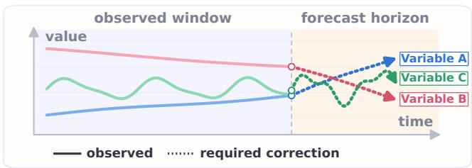  
(a) Variable-specific future corrections.

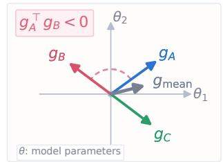  
(b) Mean-loss gradient averaging.  
Figure 1: Conceptual illustration of variable-wise gradient conflict. (a) Different variables can require corrections in different directions over the same forecast horizon. (b) These corrections translate into variable-wise gradients that disagree in parameter space, while the mean-loss update shown here coincides with none of them.

More concretely, let $L _ { d } ( \theta )$ denote the loss induced by variable $d ,$ averaged over samples and horizons. Standard training minimizes $\begin{array} { r } { L _ { \mathrm { m e a n } } ( \theta ) = D ^ { - 1 } \sum _ { d = 1 } ^ { D } L _ { d } ( \theta ) } \end{array}$ and updates parameters with $\begin{array} { r } { g _ { \mathrm { m e a n } } = \nabla _ { \theta } L _ { \mathrm { m e a n } } ( \theta ) = D ^ { - 1 } \sum _ { d = 1 } ^ { D } g _ { d } . } \end{array}$ , where $g _ { d } = \nabla _ { \theta } L _ { d } ( \theta )$ . This aggregation is many-to-one, so different sets of variable-wise gradients can produce the same update. For $D = 2 , g _ { 1 } = u + v$ and $g _ { 2 } = u - v$ produce $g _ { \mathrm { m e a n } } = u ,$ hiding the disagreement component v. When $\| v \| _ { 2 } > \| u \| _ { 2 }$ the inner product $\left. g _ { 1 } , g _ { 2 } \right. = \| u \| _ { 2 } ^ { 2 } - \| v \| _ { 2 } ^ { 2 }$ turns negative, so an update $\mathrm { a l o n g } - g _ { 1 }$ reduces $L _ { 1 }$ but increases $L _ { 2 }$ to first order. Moreover, under any shared update $\theta  \theta - \eta g _ { \mathrm { s h a r e d } }$ with step size $\eta > 0 ,$ the first-order change of $L _ { d } \mathrm { i s } - \eta \langle g _ { d } , g _ { \mathrm { s h a r e d } } \rangle$ , whose sign cannot be checked from the aggregate alone. The problem is therefore not that mean loss is invalid, but that its single gradient hides the variable-wise directions needed to distinguish disagreement from actual harm.

Figure 1(a) shows three variables requiring corrections in different directions over the same horizon, and Figure 1(b) shows their parameter-space gradients, two of which oppose each other while their mean coincides with none of them. We call this variable-wise gradient conflict, following the view that a negative inner product encodes incompatible descent directions (Yu et al., 2020; Nochumsohn et al., 2025). A natural reaction is to remove every conflict, as in gradient surgery (Yu et al., 2020). In multivariate forecasting, our diagnosis suggests otherwise. Conflicts are common but not uniformly harmful, so intervention should be selective, variable-aware, and anchored to the mean-loss update.

In this paper, we propose PV-Surgery, a reliability-aware optimizer-side framework. At each training step, one backward pass builds variable-wise gradient proxies from output-side signals. PV-Surgery then selects surgery layers based on the normalized error between each proxy sum and its matching reference-gradient slice, conditionally forms anchor and conflict pools without dropping variables, and aligns variable or pooled gradients with the normalized mean of their input directions before restoring their norms to avoid reweighting. PV-Surgery requires no changes to cache-compatible forecasting backbones or per-variable losses. We make the following three contributions:

• We analyze variable-wise conflict under standard mean-loss training using exact gradients. Although 30.6% of pairwise cosines are negative on average, conflict frequency is weakly related to harm. Shared training underperforms a full-input single-target oracle for 35 of 64 variables, while mean alignment does not reliably identify helpful partners.

• We propose PV-Surgery, which reconstructs variable-wise gradient proxies in one backward pass, targets reconstruction-consistent layers, pools without dropping variables, and corrects directions while restoring surgery-input norms over the selected subspace.

• We conduct experiments across five backbones, seven datasets, and four horizons, showing that PV-Surgery lowers MSE by $3 . 6 1 \%$ and MAE by 2.93% on average and that variablewise structure hidden by mean-loss training is a usable optimization signal in these settings.

## 2 RELATED WORK

## 2.1 MULTIVARIATE TIME-SERIES FORECASTING

Multivariate forecasting has largely advanced through backbone design, spanning efficient attention (Zhou et al., 2021), patch tokens (Nie et al., 2023), variate tokens (Liu et al., 2024), exogenous crossattention (Wang et al., 2024), series decomposition (Wu et al., 2021), multi-scale convolution (Wang et al., 2023), sample convolution (Liu et al., 2022), and linear baselines (Zeng et al., 2023). These approaches differ in architecture but retain the same mean-loss objective, whereas we intervene in the update it produces. MTLinear is the closest prior work, connecting multivariate forecasting to multi-task learning through variate gradient angle, correlation-based grouping, and gradient scaling for linear models (Nochumsohn et al., 2025). MTLinear fixes variable groups in advance and rescales gradient magnitudes, whereas we retain all variables, pool their gradients by directional compatibility at each step, and correct directions while restoring input norms across backbones.

## 2.2 FORECASTING OBJECTIVES AND VARIABLE-WISE LEARNING

Forecasting objectives have expanded beyond point-wise MSE and MAE to include shape and time distortion losses (Guen & Thome, 2019), frequency-domain losses (Wang et al., 2025), transformation-invariant criteria (Lee et al., 2022), patch-wise structural losses (Kudrat et al., 2025), and selective timestep masking (Fu et al., 2025). These objectives change which errors are emphasized during training, but they still aggregate per-variable errors into one scalar. Reweighting the loss therefore does not reveal whether the corresponding gradients agree, cancel, or interfere.

## 2.3 GRADIENT CONFLICT AND MULTI-TASK OPTIMIZATION

Gradient conflict is studied in multi-task learning, where methods balance losses (Chen et al., 2018), seek Pareto-stationary descent directions (Sener & Koltun, 2018), project conflicting task gradients (Yu et al., 2020), maximize the worst-case improvement (Liu et al., 2021), or aggregate task gradients by bargaining (Navon et al., 2022). Multivariate forecasting exposes its objectives differently because variables are components scalarized inside one loss rather than separate tasks, a setting that MTLinear connects to multi-task learning (Nochumsohn et al., 2025). We therefore construct variable-wise gradient proxies for these operators rather than applying them to the aggregate.

## 3 DIAGNOSING VARIABLE-WISE GRADIENT CONFLICT

We analyze the frequency of variable-wise gradient conflict under standard multivariate forecasting training and its relation to the fraction of variables harmed under shared training. We also ask whether mean pairwise alignment reliably identifies helpful training partners. Together, these analyses assess whether pairwise cosine statistics provide a sound basis for deciding when to intervene.

Diagnostic setup. We train iTransformer with the standard mean-loss objective on all seven benchmarks, at prediction length 96 for the four ETT datasets, Weather, and Exchange, and at 24 for ILI. At analysis checkpoints we decompose the scalar objective into variable-induced losses $L _ { d } .$ , set $g _ { d } ^ { ( t ) } = \nabla _ { \theta } L _ { d } ( \theta _ { t } )$ , and form the pairwise cosine matrix over nonzero gradients,

$$
C _ { i j } ^ { ( t ) } = \frac { \langle g _ { i } ^ { ( t ) } , g _ { j } ^ { ( t ) } \rangle } { \| g _ { i } ^ { ( t ) } \| _ { 2 } \| g _ { j } ^ { ( t ) } \| _ { 2 } } .\tag{1}
$$

A pair is conflicting at checkpoint t when $C _ { i j } ^ { ( t ) } < 0$ . Checkpoint summaries discard the first half of recorded checkpoints as warmup because early updates are unstable, but this filter does not apply to separately trained oracle or partner-group results. The diagnostics expose variable-wise structure hidden by the baseline objective and are not used to tune PV-Surgery.

Fraction of Variables Harmed by Shared Training  
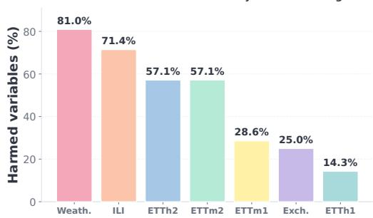  
(a) Harmed variables by dataset.

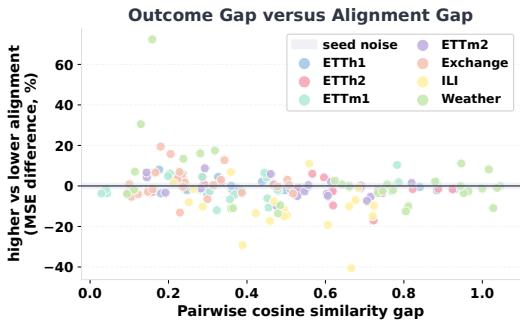  
(b) Outcome gap versus alignment gap.  
Figure 3: (a) Fraction of variables for which shared training is worse than the target-specific oracle. (b) Across 162 target-and-size cells, the relative MSE difference between the two alignment groups versus the pairwise-alignment gap. Negative values favor higher alignment. The shaded ±1.1% band summarizes repeated-fit variation for fixed target-partner groups (Appendix C).

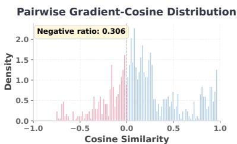  
(a) Post-warmup cosine distribution.

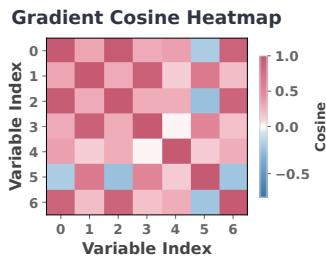  
(b) Early checkpoint.

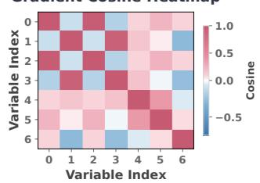  
(c) Late checkpoint.  
Figure 2: A representative ETTh1 run from the variable-wise gradient-cosine diagnostic. (a) Distribution of the post-warmup pairwise cosines, of which 30.6% fall below zero for this run. (b) An early checkpoint, which lies inside the discarded warmup half and is shown only to expose the change over training. (c) A late checkpoint. Both heatmaps show that conflict is structured across variable pairs rather than being uniform, so one summary number would hide which pairs disagree.

## 3.1 VARIABLE-WISE CONFLICTS ARE FREQUENT

Across the seven datasets, 30.6% of the pairwise cosine similarities are negative on average, with per-dataset results in Appendix B and the ETTh1 case shown in Figure 2. On the six datasets other than ILI, most post-warmup checkpoints contain at least one conflicting pair. The disagreement is also intermittent, since no pair is negative at every post-warmup checkpoint. Therefore, the standard scalar objective hides a substantial amount of variable-wise disagreement. However, this does not yet justify gradient surgery, since a negative cosine says only that two descent directions disagree at one checkpoint, not which variable is harmed or whether sharing is worse than separate training.

## 3.2 CONFLICT AND HARM ARE NOT THE SAME OBJECT

To separate disagreement from harm, we compare the shared model with full-input singletarget oracles, each optimized and evaluated on one target. We define the oracle gap as $\Delta _ { d } ^ { \mathrm { { \scriptsize ~ o r a c l e } } } = \mathrm { M S E } _ { \mathrm { { s h a r e d } , d } } - \mathrm { M S E } _ { \mathrm { { o r a c l e } , d } } .$ A positive $\Delta _ { d } ^ { \mathrm { o r a c l e } }$ means variable d is better predicted by its target-specific oracle. Across the seven datasets 35 of the 64 variables have a positive oracle gap, and Figure 3(a) reports the fraction for every dataset. At the dataset level, the negative-cosine ratio and the harmed fraction correlate $\mathrm { 1 t - 0 . 2 9 ~ ( \it { p \Delta = \ : 0 . 5 3 ) } }$ , so a larger conflict rate does not reliably coincide with a larger harmed fraction. ILI has the lowest conflict rate, whereas Weather has the highest harmed fraction (Table 4). A method that removes every negative cosine similarity would therefore risk destroying useful sharing for variables that improve under the shared model.

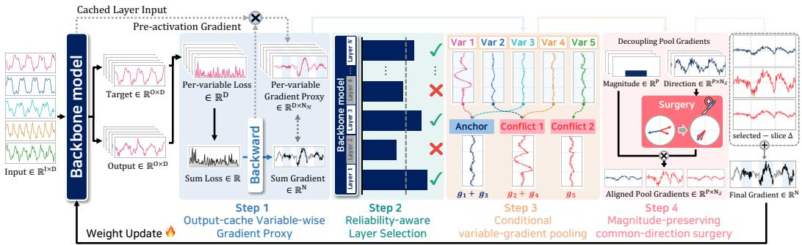  
Figure 4: Overview of PV-Surgery. Step 1: Output-cache variable-wise gradient proxy reconstructs variable-wise proxy gradients from a single sum-loss backward pass and cached layer signals. Step 2: Reliability-aware layer selection selects slices by normalized proxy-sum error with output fallback. Step 3: Conditional variable-gradient pooling forms anchor and conflict pool gradients without dropping variables. Step 4: Magnitude-preserving common-direction surgery aligns variable or pooled gradients while restoring their pre-surgery norms to avoid reweighting.

## 3.3 ALIGNMENT ALONE DOES NOT RELIABLY IDENTIFY HELPFUL PARTNERS

For each reported target we rank the remaining variables by their post-warmup mean pairwise gradient cosine in the baseline model. For $k \in { \bar { \{ 2 , 3 , 4 \} } }$ , we train with its k − 1 highest-ranked or lowest-ranked partners, which form disjoint sets. Both conditions use matched replicate seeds, keep the full multivariate input, restrict the loss to the target and its partners, and are scored by held-out target MSE. Appendix C gives the full protocol. Higher alignment wins 100/162 cells, and the allcell median signed contrast is −1.4%, but the benchmark-averaged contrast is not distinguishable from zero. Figure 3(b) shows that a larger alignment gap does not reliably identify the better partner set, consistent with Appendix Figure 13, where ILI favors higher alignment at every group size but five of the other six datasets change sign across sizes. Group composition still matters, since the median absolute within-cell contrast is 3.5%, over three times the 1.1% variation observed when the same target and partner set are retrained with different random seeds.

Together, the evidence shows that negative pairwise cosine similarities are common, but their fre quency does not reveal which variables shared training harms. Partner composition can materially change a target’s error, but mean gradient alignment does not reliably predict whether the change helps or hurts. The comparisons are associational rather than causal, and they motivate conditional, reliability-aware intervention rather than removing conflicts uniformly across variable subsets.

## 4 PROPOSED METHOD

PV-Surgery is an optimizer-side gradient transformation that leaves the forecasting architecture, prediction target, and per-variable loss unchanged. Figure 4 gives an overview of PV-Surgery, which consists of four stages that form a dependency chain. Computing exact per-variable gradients would require D costly backward passes, so PV-Surgery instead builds variable-wise gradient proxies from cached layer signals in one pass. Variable mixing can shift proxy sums from reference-gradient slices, so PV-Surgery selects layers by relative error and falls back to the output layer. Section 3.3 shows that mean alignment does not reliably identify helpful partners, which is why variables are pooled conditionally at each step without dropping any of them. Finally, surgery aligns each variable or pooled gradient with the normalized mean direction, then restores its pre-surgery norm so the correction does not reweight the surgery inputs. Appendix D gives the training pseudocode.

## 4.1 PROBLEM SETUP

For a batch of B windows, D variables, and horizon length H, let $\hat { Y } , Y \in \mathbb { R } ^ { B \times H \times D }$ be the predicted and true future values and $\varphi$ be the pointwise forecasting loss. The loss induced by variable d is

$$
L _ { d } ( \theta ) = \frac { 1 } { B H } \sum _ { b = 1 } ^ { B } \sum _ { h = 1 } ^ { H } \varphi \Big ( \hat { Y } _ { b , h , d } , Y _ { b , h , d } \Big ) .\tag{2}
$$

Let $\begin{array} { r } { L _ { \Sigma } = \sum _ { d = 1 } ^ { D } L _ { d } } \end{array}$ and $L _ { \mathrm { m e a n } } = L _ { \Sigma } / D$ . With $g _ { d } = \nabla _ { \theta } L _ { d }$ and $g _ { \mathrm { m e a n } } = \nabla _ { \theta } L _ { \mathrm { m e a n } }$ , PV-Surgery’s exact single-backward reference gradient is

$$
g _ { 0 } = \nabla _ { \theta } L _ { \Sigma } = \sum _ { d = 1 } ^ { D } g _ { d } = D g _ { \mathrm { m e a n } } .\tag{3}
$$

PV-Surgery backpropagates $L _ { \Sigma }$ once, avoiding D backward passes and a dense $D \times | \theta |$ gradient tensor. At the output boundary, variable $d \mathbf { \hat { s } }$ cache row equals its $g _ { d }$ slice without $1 / D$ scaling because only that output slice enters $L _ { d } ,$ , and the rows sum to the matching $g _ { 0 }$ slice without rescaling.

## 4.2 OUTPUT-CACHE VARIABLE-WISE GRADIENT PROXY

One backward pass materializes only $g _ { 0 } .$ so we must estimate variable-wise gradients from samepass layer inputs and output-side backward signals. We hook cache-compatible linear layers H to collect these quantities and convert them to a common variable-axis form by moving an explicit axis or reshaping batch-folded layouts. For a layer ℓ with $W _ { \ell } \in \mathbb { R } ^ { F _ { \mathrm { o u t } } \times F _ { \mathrm { i r } } }$ , the caches keep a variable axis, $Z _ { \ell } ^ { \bullet } \in \mathbf { \breve { R } } ^ { B \times D \times M _ { \ell } \times F _ { \mathrm { i n } } }$ and $E _ { \ell } \in \mathbb { R } ^ { B \times \check { D } \times M _ { \ell } \times F _ { \mathrm { o u t } } }$ , and flattening the batch and position axes gives $\check { Z } _ { \ell , d } \in \mathbb { R } ^ { B M _ { \ell } \times F _ { \mathrm { i n } } }$ and $E _ { \ell , d } \in \mathbb { R } ^ { B M _ { \ell } \times F _ { \mathrm { o u t } } }$ . The weight and bias gradients are then

$$
G _ { \ell , d } ^ { W } = E _ { \ell , d } ^ { \top } Z _ { \ell , d } , \qquad G _ { \ell , d } ^ { b } = E _ { \ell , d } ^ { \top } \mathbf { 1 } _ { B } { \mathbf { \Omega } } _ { M _ { \ell } } .\tag{4}
$$

When a bias is present, it is concatenated with the flattened weight gradient.

$$
\begin{array} { r } { G _ { \ell } = \mathrm { s t a c k } _ { d = 1 } ^ { D } \left( \mathrm { c o n c a t } \left( \mathrm { v e c } ( G _ { \ell , d } ^ { W } ) , G _ { \ell , d } ^ { b } \right) \right) \in \mathbb { R } ^ { D \times N _ { \ell } } . } \end{array}\tag{5}
$$

Equation 4 is the per-variable chain-rule gradient at the output boundary and a proxy after variable mixing, motivating the reliability test. If a hooked layer lacks a variable-axis form for that batch, $G _ { \ell } = 0 _ { D \times N _ { \ell } }$ . Here $M _ { \ell }$ counts positions sharing $W _ { \ell }$ within a variable and $N _ { \ell }$ cached parameters.

## 4.3 RELIABILITY-AWARE LAYER SELECTION

Reconstruction consistency varies by layer and backbone and can shift during training, so the method selects its layer set dynamically at each step rather than fixing it in advance. For every hooked layer $\ell \in \mathcal H$ , we compare the summed proxy with the matching slice of the single-backward reference.

$$
g _ { \mathrm { p r o x y } , \ell } = \sum _ { d = 1 } ^ { D } G _ { \ell } [ d , \cdot ] , \qquad e _ { \ell } = { \frac { \| g _ { \mathrm { p r o x y } , \ell } - g _ { 0 , \ell } \| _ { 2 } } { \| g _ { 0 , \ell } \| _ { 2 } + \epsilon } } .\tag{6}
$$

Reconstruction reliability $r _ { \ell } = ( 1 { + } e _ { \ell } ) ^ { - 1 }$ scores proxy-sum agreement, while normalized slice norm $q _ { \ell } = \lVert g _ { 0 , \ell } \rVert _ { 2 } / ( \lVert g _ { 0 } \rVert _ { 2 } + \dot { \epsilon } )$ measures reference-slice magnitude. Let $\mathcal { H } _ { \mathrm { e l i g } }$ be the unprotected hooked layers. The median-reliability gate retains its non-output layers at or above median reliability and includes the output layer. For the resulting ${ \mathcal { H } } _ { \mathrm { g a t e } }$ , we set $\mathcal { A } \stackrel { \cdot } { = } \left\{ \ell \in \mathcal { H } _ { \mathrm { g a t e } } \vert q _ { \ell } > 0 \right\}$ and compute

$$
\pi _ { \ell } = \frac { q _ { \ell } } { \sum _ { j \in \mathcal { A } } q _ { j } } , \quad \mathcal { E } _ { \mathrm { l a y e r } } = - \sum _ { \ell \in \mathcal { A } } \pi _ { \ell } \log \pi _ { \ell } , \quad K _ { \mathrm { e f f } } = \left\lceil e ^ { \mathcal { E } _ { \mathrm { l a y e r } } } \right\rceil .\tag{7}
$$

It takes the $K _ { \mathrm { e f f } }$ largest-q<sub>ℓ</sub> layers and the output layer that pass the reconstruction-error check, falling back to the output layer if none do (Appendix D). Here $e ^ { \mathcal { E } _ { \mathrm { l a y e r } } } \mathrm { i s } \pi ^ { \prime } \mathrm { s }$ exponentiated Shannon entropy, or order-one Hill number (Hill, 1973), and $K _ { \mathrm { e f f } }$ is its ceiling. The selected set S then gives

$$
G _ { S } = \mathrm { c o n c a t } _ { \ell \in { \cal S } } G _ { \ell } \in \mathbb { R } ^ { D \times N _ { S } } , \qquad N _ { S } = \sum _ { \ell \in { \cal S } } N _ { \ell } \le N _ { \mathcal { H } } .\tag{8}
$$

Here $\begin{array} { r } { N _ { \mathcal { H } } = \sum _ { \ell \in \mathcal { H } } N _ { \ell } } \end{array}$ counts all cached parameters. Fixing the support before pooling or direction change keeps surgery out of layers where the cache decomposition is not reconstruction-consistent, and leaves later stages operating on $N _ { S }$ rather than $N _ { \mathcal { H } }$ parameters.

## 4.4 CONDITIONAL VARIABLE-GRADIENT POOLING

Treating every variable gradient as a surgery objective would make direction surgery reconcile all pairs, although Section 3 shows that a negative cosine alone does not reliably imply harmful sharing. We keep every variable but reduce the objective count. With $G _ { \mathrm { p r e } } = G _ { S }$ , each row contains one variable’s proxy gradient over the selected parameter slices, and $g _ { 0 , s }$ is the exact sum-loss gradient over those same slices:

$$
g _ { \mathrm { r e f } } = g _ { 0 , S } , \qquad a _ { d } = \cos ( G _ { \mathrm { p r e } } [ d , \cdot ] , g _ { \mathrm { r e f } } ) .\tag{9}
$$

Pooling requires two finite, nonzero rows with a negative cosine, not just a row opposed to $g _ { \mathrm { r e f } }$ Rows with $a _ { d } \geq 0$ are aligned to the reference and the rest conflict with it. An anchor combines at least two aligned rows whose sum has nonnegative cosine with each. Each conflicting row greedily joins the pool whose current sum is most aligned with it, provided their cosine is positive. The partition $M _ { \mathrm { p o o l } } ^ { \bullet ^ { \bullet } } \in \{ 0 , 1 \} ^ { P \times D }$ maps $D$ rows to $\bar { P }$ objectives while preserving their aggregate gradient:

$$
G _ { \mathrm { p o o l } } = M _ { \mathrm { p o o l } } G _ { \mathrm { p r e } } \in \mathbb { R } ^ { P \times N _ { S } } , \qquad \sum _ { k = 1 } ^ { P } G _ { \mathrm { p o o l } } [ k , \cdot ] = \sum _ { d = 1 } ^ { D } G _ { \mathrm { p r e } } [ d , \cdot ] .\tag{10}
$$

Without pairwise conflict, the pooled branch skips direction surgery and remains $G _ { p } ^ { \mathrm { p o s t } } = G _ { \mathrm { p r e } } .$ The subsequent safe candidate-selection step may retain it over the corrected unpooled candidate.

## 4.5 MAGNITUDE-PRESERVING COMMON-DIRECTION SURGERY

Pooling reduces the objective count, but pooled gradients can still disagree, so their directions must be adjusted and the unpooled and pooled branches remain candidates. For unpooled u and pooled $p ,$ the inputs are $G _ { \mathrm { i n } } ^ { ( u ) } = G _ { \mathrm { p r e } }$ and, when pooling is active, $G _ { \mathrm { i n } } ^ { ( p ) } = G _ { \mathrm { p o o l } }$ . For $c \in \{ u , p \}$ , let $P _ { c }$ be its objective count and decompose each nonzero objective into its magnitude and unit direction:

$$
m _ { i } ^ { ( c ) } = \| G _ { \mathrm { i n } } ^ { ( c ) } [ i , \cdot ] \| _ { 2 } , \qquad \hat { g } _ { i } ^ { ( c ) } = \frac { G _ { \mathrm { i n } } ^ { ( c ) } [ i , \cdot ] } { m _ { i } ^ { ( c ) } } .\tag{11}
$$

Objectives with $m _ { i } ^ { ( c ) } = 0$ take $\begin{array} { r } { \hat { g } _ { i } ^ { ( c ) } = 0 . \operatorname { L e t } \bar { g } ^ { ( c ) } = P _ { c } ^ { - 1 } \sum _ { i } \hat { g } _ { i } ^ { ( c ) } } \end{array}$ . The operator aligns each objective with $\bar { g } ^ { ( c ) }$ while preserving its input magnitude, and makes no change when $\| \bar { g } ^ { ( c ) } \| _ { 2 } = 0$

$$
\widetilde { G } _ { \mathrm { i n } } ^ { ( c ) } [ i , \cdot ] = \left\{ \begin{array} { l l } { m _ { i } ^ { ( c ) } \bar { g } ^ { ( c ) } / \Vert \bar { g } ^ { ( c ) } \Vert _ { 2 } , } & { \Vert \bar { g } ^ { ( c ) } \Vert _ { 2 } > 0 , } \\ { G _ { \mathrm { i n } } ^ { ( c ) } [ i , \cdot ] , } & { \Vert \bar { g } ^ { ( c ) } \Vert _ { 2 } = 0 , } \end{array} \right. \mathrm { a n d } G _ { u } ^ { \mathrm { p o s t } } = \widetilde { G } _ { \mathrm { i n } } ^ { ( u ) } .\tag{12}
$$

Pool restoration and safe candidate selection. For active pooling, pool k distributes the change made by surgery equally across its member set $\mathcal { M } _ { k }$

$$
G _ { p } ^ { \mathrm { p o s t } } [ d , \cdot ] = G _ { \mathrm { p r e } } [ d , \cdot ] + \frac { \widetilde { G } _ { \mathrm { i n } } ^ { ( p ) } [ k , \cdot ] - G _ { \mathrm { p o o l } } [ k , \cdot ] } { | \mathcal { M } _ { k } | } , \qquad d \in \mathcal { M } _ { k } .\tag{13}
$$

This restores D variable rows while preserving each post-surgery pool sum, but not individual row norms. The descent-lexicographic selector compares $G _ { u } ^ { \mathrm { p o s t } }$ with $\bar { G } _ { p } ^ { \mathrm { p o s t } }$ . For candidate $c ,$ let $g _ { c } =$ $\textstyle \sum _ { d } G _ { c } ^ { \mathrm { p o s t } } [ d , \cdot ]$ . For each finite, nonzero variable-wise gradient, the selector computes the following scores:

$$
\gamma _ { c , d } = \cos ( G _ { \mathrm { p r e } } [ d , \cdot ] , g _ { c } ) , \qquad v _ { c , d } = { \bf 1 } [ \gamma _ { c , d } < 0 ] .\tag{14}
$$

It first minimizes $\textstyle \sum _ { d } v _ { c , d }$ , then compares the sorted cosine vectors from worst to best. Exact or numerically ambiguous ties retain the unpooled candidate. This ranks candidates and does not guarantee a descent-compatible update for every variable when both contain violations.

Final gradient assembly. For selected $G _ { \mathrm { { p o s t } } } , \Delta _ { s }$ is the change in the aggregate selected-subspace gradient:

$$
\Delta _ { S } = \sum _ { d = 1 } ^ { D } G _ { \mathrm { p o s t } } [ d , \cdot ] - \sum _ { d = 1 } ^ { D } G _ { \mathrm { p r e } } [ d , \cdot ] .\tag{15}
$$

For each hooked layer ℓ, let $\Omega _ { \ell }$ be its flattened parameter indices, and let $\textstyle \Omega _ { S } = \bigcup _ { \ell \in S } \Omega _ { \ell }$ . The fullsum assembly inserts every hooked-slice proxy sum and then adds the selected-subspace correction.

$$
g _ { \mathrm { f i n a l } }  g _ { 0 } , \quad g _ { \mathrm { f i n a l } } [ \Omega _ { \ell } ]  \sum _ { d = 1 } ^ { D } G _ { \ell } [ d , \cdot ] \ ( \ell \in \mathcal { H } ) , \quad g _ { \mathrm { f i n a l } } [ \Omega _ { S } ]  g _ { \mathrm { f i n a l } } [ \Omega _ { S } ] + \Delta _ { S } .\tag{16}
$$

Thus, non-hooked parameters retain $g _ { 0 }$ . Unselected hooked slices use their variable-wise proxy sums, and selected slices add the corresponding $\Delta _ { \mathcal { S } }$ entries.

## 5 EXPERIMENTS

## 5.1 EXPERIMENTAL SETUP

Datasets. We evaluate PV-Surgery on ETTh1, ETTh2, ETTm1, ETTm2, Weather, and Exchange using an input length of 96 and prediction lengths {96, 192, 336, 720}. For ILI, the input length is 36 and the prediction lengths are {24, 36, 48, 60}. All methods share chronological splits. Appendices E and A give settings and dataset statistics.

Baselines. We compare standard MSE training and PV-Surgery on DLinear (Zeng et al., 2023), iTransformer (Liu et al., 2024), MICN (Wang et al., 2023), SCINet (Liu et al., 2022), and TimeXer (Wang et al., 2024). We additionally compare four forecasting-specific methods, TILDE-Q (Lee et al., 2022), FreDF (Wang et al., 2025), PSLoss (Kudrat et al., 2025), and Selective Learning (Fu et al., 2025). All use the common protocol of Appendix E, with iTransformer for this comparison.

Metrics. We report test mean squared error (MSE) and mean absolute error (MAE), both averaged over test windows, horizons, and variables. Exact definitions are provided in Appendix E.

## 5.2 MAIN RESULTS

Tables 1 and 6 report all 140 standard-MSE comparisons, with Weather and ILI in Appendix F due to the page limit. Separately, Table 2 compares PV-Surgery with four forecasting-specific methods using iTransformer across five datasets. Appendix G covers all backbones and benchmarks.

Table 1: Backbone comparison between standard MSE training and PV-Surgery on five of the seven benchmarks. Within each backbone and metric, the better value between MSE and +PV is bolded using unrounded scores. Weather and ILI use the same protocol and are reported in Table 6.
<table><tr><td colspan="2">Models</td><td colspan="4">DLinear</td><td colspan="4">iTransformer</td><td colspan="4">MICN</td><td colspan="4">SCINet</td><td colspan="4">TimeXer</td></tr><tr><td colspan="4">Training setup</td><td>MSE</td><td>+PV</td><td></td><td>MSE</td><td>+PV</td><td></td><td>MSE</td><td></td><td>+PV</td><td></td><td>MSE</td><td></td><td>+PV</td><td></td><td>MSE</td><td></td><td>+PV</td></tr><tr><td colspan="3">Metric</td><td>|MSE MAE</td><td>MSE</td><td>MAE</td><td>MSE</td><td>MAE</td><td>MSE</td><td>MAE |MSE</td><td>MAE</td><td>MSE</td><td>MAE</td><td>MSE</td><td>MAE</td><td>MSE</td><td>MAE</td><td>MSE</td><td>MAE</td><td>MSE</td><td>MAE</td></tr><tr><td rowspan="3">ETTh1</td><td>96 192</td><td>0.462</td><td>0.444</td><td>0.461</td><td>0.440</td><td>0.454</td><td>0.447 0.451</td><td>0.442</td><td>0.552</td><td>0.530</td><td>0.492 0.497</td><td></td><td>0.490</td><td>0.464</td><td>0.473</td><td>0.449</td><td>0.460</td><td>0.454</td><td>0.461</td><td>0.450</td></tr><tr><td>336</td><td>0.514 0.559</td><td>0.476 0.506</td><td>0.514 0.556</td><td>0.471 0.501</td><td>0.517 0.561</td><td>0.485 0.513</td><td>0.508 0.476 0.550</td><td>0.594 0.688</td><td>0.553 0.623</td><td>0.561 0.700</td><td>0.543 0.630</td><td>0.545 0.590</td><td>0.495 0.521</td><td>0.530</td><td>0.483</td><td>0.511</td><td>0.485</td><td>0.518</td><td>0.485 0.515</td></tr><tr><td>720</td><td>0.651</td><td>0.573</td><td>0.641</td><td>0.561</td><td>0.671</td><td>0.583 0.661</td><td>0.504 0.575</td><td>0.753</td><td>0.671</td><td>0.798</td><td>0.700</td><td>0.700</td><td>0.588</td><td>0.574 0.687</td><td>0.510 0.581</td><td>0.564 0.693</td><td>0.511 0.590</td><td>0.564 0.691</td><td>0.581</td></tr><tr><td rowspan="2">ETTh2</td><td>|Avg 96</td><td>|0.546 0.239</td><td>0.500</td><td>0.543</td><td>0.493</td><td>|0.551</td><td>0.507</td><td>0.543</td><td>0.499 |0.647</td><td>0.594</td><td>0.638</td><td>0.593</td><td>0.581</td><td>0.517</td><td>0.566</td><td>0.506</td><td>|0.557</td><td></td><td>0.510</td><td>0.558 0.508</td></tr><tr><td>192</td><td>0.329</td><td>0.329 0.393</td><td>0.229 0.290</td><td>0.313 0.357</td><td>0.239 0.303</td><td>0.323 0.366</td><td>0.229 0.314 0.287 0.355</td><td>0.238 0.315</td><td>0.333 0.388</td><td>0.230 0.291</td><td>0.320 0.369</td><td>0.254 0.311</td><td>0.334 0.370</td><td>0.237 0.297</td><td>0.317 0.358</td><td>0.233 0.294</td><td>0.319 0.360</td><td>0.231 0.295</td><td>0.316 0.358</td></tr><tr><td rowspan="2"></td><td>336 720</td><td>0.437 0.650</td><td>0.462 0.582 0.470</td><td>0.341</td><td>0.396 0.484</td><td>0.356 0.401 0.457</td><td>0.334 0.460 0.446</td><td>0.388 0.452</td><td>0.452 0.672</td><td>0.472 0.583</td><td>0.352 0.513</td><td>0.412 0.520</td><td>0.356 0.470</td><td>0.402 0.472</td><td>0.346 0.447</td><td>0.391 0.454</td><td>0.341 0.449</td><td>0.394 0.457</td><td>0.342 0.446</td><td>0.390 0.451</td></tr><tr><td>|Avg</td><td>0.414</td><td>0.442 0.332</td><td></td><td>0.388</td><td>0.339</td><td>0.388 0.324</td><td>0.377</td><td>|0.419</td><td>0.444</td><td>0.346</td><td>0.405</td><td>0.347</td><td>0.394</td><td>0.332</td><td>0.380</td><td>|0.329</td><td>0.382</td><td>0.328</td><td>0.379</td></tr><tr><td rowspan="2">ETTm1</td><td>96 192</td><td>0.388 0.447</td><td>0.395 0.426</td><td>0.383 0.445</td><td>0.389</td><td>0.407</td><td>0.415</td><td>0.402</td><td>0.404 0.445 0.439</td><td>0.472</td><td>0.430</td><td>0.460</td><td>0.448</td><td>0.428</td><td>0.421</td><td>0.414</td><td>0.432</td><td></td><td>0.421 0.396</td><td>0.403</td></tr><tr><td>336 720</td><td>0.507 0.575</td><td>0.459</td><td>0.505</td><td>0.421 0.454</td><td>0.480 0.520</td><td>0.457 0.477</td><td>0.461 0.517</td><td>0.495 0.473 0.567</td><td>0.511 0.570</td><td>0.470 0.508</td><td>0.487 0.513</td><td>0.488 0.548</td><td>0.453 0.483</td><td>0.490 0.551</td><td>0.446 0.475</td><td>0.477 0.521</td><td>0.453 0.479</td><td>0.455 0.505</td><td>0.429 0.462</td></tr><tr><td rowspan="3">ETTm2</td><td>|Avg</td><td></td><td>0.502</td><td>0.573</td><td>0.499</td><td>0.618</td><td>0.531</td><td>0.575</td><td>0.510 0.627</td><td>0.596</td><td>0.576</td><td>0.562</td><td>0.614</td><td>0.521</td><td>0.628</td><td>0.516</td><td>0.580</td><td>0.515</td><td>0.564</td><td>0.503</td></tr><tr><td>96</td><td>|0.479</td><td>0.446</td><td>0.476</td><td>0.441</td><td>0.506</td><td>0.470</td><td>0.488 0.457</td><td>|0.533</td><td>0.537</td><td>0.496</td><td>0.505</td><td>0.524</td><td>0.471</td><td>0.523</td><td>0.463</td><td>|0.502</td><td>0.467</td><td>0.480</td><td>0.449</td></tr><tr><td>192</td><td>0.160 0.209</td><td>0.268 0.155 0.308 0.197</td><td>0.253</td><td>0.157</td><td></td><td>0.258 0.150</td><td>0.247 0.283</td><td>0.166 0.202</td><td>0.276 0.303</td><td>0.146</td><td>0.248</td><td>0.155 0.202</td><td>0.253</td><td>0.150</td><td>0.246</td><td>0.151</td><td>0.249</td><td>0.149</td><td>0.247 0.282</td></tr><tr><td rowspan="3"></td><td>336 720</td><td>0.262 0.348</td><td>0.350</td><td>0.239</td><td>0.287 0.319</td><td>0.205 0.252</td><td>0.295 0.328</td><td>0.195 0.240</td><td>0.317</td><td>0.266 0.355</td><td>0.190 0.231</td><td>0.285 0.316</td><td>0.248</td><td>0.290 0.322</td><td>0.193 0.236</td><td>0.278 0.309</td><td>0.200 0.239</td><td>0.287 0.316</td><td>0.193 0.235</td><td>0.312</td></tr><tr><td>|Avg</td><td>|0.245</td><td>0.408 0.334</td><td>0.306</td><td>0.365</td><td>0.322 0.234</td><td>0.373 0.313</td><td>0.310 0.224</td><td>0.365 0.303</td><td>0.389 0.434 0.342</td><td>0.331 0.224</td><td>0.389 0.310</td><td>0.321 0.231</td><td>0.368 0.308</td><td>0.308</td><td>0.357</td><td>0.312</td><td>0.367</td><td>0.307</td><td>0.360 0.300</td></tr><tr><td>96</td><td>0.105</td><td>0.234</td><td>0.225</td><td>0.306</td><td></td><td>0.236</td><td>0.105</td><td>|0.256 0.231 0.123</td><td>0.262</td><td>0.109</td><td>0.242</td><td>0.120</td><td>0.249</td><td>0.222</td><td>0.297</td><td>|0.226</td><td>0.305</td><td>0.221</td><td>0.239</td></tr><tr><td rowspan="3">Exchange</td><td>192 336</td><td>0.224</td><td>0.349</td><td>0.100 0.191</td><td>0.226 0.323</td><td>0.108 0.222</td><td>0.344</td><td>0.211</td><td>0.335 0.219</td><td>0.352</td><td>0.212</td><td>0.348</td><td>0.223</td><td>0.347</td><td>0.116 0.222</td><td>0.244 0.346</td><td>0.113 0.216</td><td></td><td>0.239 0.113 0.337 0.213</td><td>0.335</td></tr><tr><td>720</td><td>0.425 0.652</td><td>0.498 0.640</td><td>0.321 0.847</td><td>0.425 0.724</td><td>0.397 1.099</td><td>0.463 0.800</td><td>0.390 1.075</td><td>0.460 0.498 0.792 2.931</td><td>0.525 1.400</td><td>0.378 1.106</td><td>0.470 0.793</td><td>0.405 1.101</td><td>0.470 0.804</td><td>0.409 1.103</td><td>0.473 0.806</td><td>0.396 1.105</td><td>0.459 0.798</td><td>0.382 1.010</td><td>0.452 0.763</td></tr><tr><td>Avg</td><td>0.352</td><td>0.430</td><td>0.365</td><td>0.424</td><td>0.457</td><td>0.461</td><td>0.446</td><td>0.454 0.943</td><td>0.635</td><td>0.451</td><td>0.463</td><td>0.462</td><td>0.468</td><td>0.463</td><td>0.467</td><td>0.457</td><td>0.458</td><td>0.429</td><td>0.447</td></tr></table>

PV-Surgery obtains lower MSE in 111 of the 140 settings and lower MAE in 119, both counted on unrounded scores, and averaging the relative change within each setting gives 3.61% in MSE and 2.93% in MAE. The improvement is largest on MICN, at 8.50% in MSE and 5.67% in MAE, and on DLinear, at 5.38% and 5.01%. PV-Surgery therefore improves the majority of settings for every backbone and dataset, although the direction and size of the average change depend on both.

Table 2: Comparison of PV-Surgery with four forecasting-specific methods on iTransformer for five of the seven benchmarks. The MSE row denotes standard MSE training. Best results are bolded and second-best results are underlined using unrounded scores.
<table><tr><td colspan="2">Dataset</td><td colspan="4">ETTh1</td><td colspan="4">ETTh2</td><td colspan="4"></td><td colspan="4"></td><td colspan="4">ETTm2</td><td colspan="4">Exchange</td></tr><tr><td colspan="2">Forecast length</td><td>96</td><td>192</td><td>336</td><td>720</td><td></td><td>96</td><td>192</td><td>336</td><td>720</td><td>96</td><td></td><td>192</td><td>336</td><td>720</td><td>96</td><td>192</td><td></td><td>336</td><td>720</td><td>96</td><td>192</td><td>336</td><td>720</td></tr><tr><td rowspan="2">MSE</td><td>MSE MAE</td><td>0.454 0.447</td><td>0.517 0.485</td><td>0.561 0.513</td><td>0.671 0.583</td><td>|0.239 0.323</td><td></td><td>0.303 0.366</td><td>0.356 0.401</td><td>0.457 0.460</td><td>0.407 0.415</td><td></td><td>0.480</td><td>0.520 0.477</td><td>0.618</td><td>|0.157</td><td></td><td>0.205</td><td>0.252</td><td>0.322</td><td>0.108</td><td>0.222</td><td>0.397</td><td>1.099</td></tr><tr><td></td><td></td><td></td><td></td><td></td><td></td><td></td><td></td><td></td><td></td><td></td><td>0.457</td><td></td><td></td><td>0.531</td><td>0.258</td><td>0.295</td><td>0.328</td><td>0.373</td><td></td><td>0.236</td><td>0.344 0.463</td><td></td><td>0.800</td></tr><tr><td rowspan="2">TILDE-Q</td><td>MSE MAE</td><td>0.469 0.455</td><td>0.528 0.489</td><td>0.564 0.510</td><td>0.669 0.577</td><td>0.233 0.315</td><td></td><td>0.287 0.353</td><td>0.354 0.400</td><td>0.473 0.466</td><td>0.402 0.404</td><td></td><td>0.465</td><td>0.537 0.483</td><td>0.622 0.534</td><td>0.156 0.251</td><td></td><td>0.200</td><td>0.247 0.320</td><td>0.311</td><td>0.111</td><td>0.219</td><td>0.428</td><td>1.109</td></tr><tr><td></td><td></td><td></td><td></td><td></td><td></td><td></td><td></td><td></td><td></td><td></td><td>0.440</td><td></td><td></td><td></td><td></td><td>0.285</td><td></td><td></td><td>0.362</td><td>0.239</td><td>0.341</td><td>0.481</td><td>0.806</td></tr><tr><td rowspan="2">FreDF</td><td>MSE MAE</td><td>|0.451 0.445</td><td>0.512 0.478</td><td>0.560 0.508</td><td>0.662 0.576</td><td>0.235</td><td>0.317</td><td>0.295 0.360</td><td>0.350 0.397</td><td>0.450 0.455</td><td>0.410 0.408</td><td>0.475 0.452</td><td></td><td>0.553 0.492</td><td>0.603 0.524</td><td>|0.154 0.250</td><td>0.197 0.284</td><td></td><td>0.245</td><td>0.309 0.362</td><td>0.112 0.241</td><td>0.223</td><td>0.462</td><td>1.132</td></tr><tr><td>MSE</td><td></td><td></td><td></td><td></td><td></td><td></td><td></td><td></td><td></td><td></td><td></td><td></td><td></td><td></td><td></td><td></td><td></td><td>0.319</td><td></td><td></td><td>0.344</td><td>0.502</td><td>0.819</td></tr><tr><td rowspan="2">PSLoss</td><td>MAE</td><td>0.458 0.448</td><td>0.513 0.480</td><td>0.558 0.509</td><td>0.665 0.577</td><td>0.234</td><td>0.316</td><td>0.291 0.355</td><td>0.360 0.406</td><td>0.473 0.469</td><td>0.429 0.421</td><td>0.459</td><td>0.499</td><td>0.538 0.482</td><td>0.626 0.535</td><td>0.153 0.247</td><td>0.196 0.281</td><td></td><td>0.239 0.314</td><td>0.310 0.361</td><td>0.113 0.241</td><td>0.213 0.338</td><td>0.413</td><td>1.146 0.825</td></tr><tr><td>MSE</td><td></td><td></td><td></td><td></td><td></td><td></td><td></td><td></td><td></td><td></td><td></td><td></td><td></td><td></td><td></td><td></td><td></td><td></td><td></td><td></td><td></td><td>0.476</td><td></td></tr><tr><td rowspan="2">SL</td><td>MAE</td><td>|0.465 0.449</td><td>0.527 0.485</td><td>0.560 0.501</td><td>0.665 0.568</td><td>|0.229 0.312</td><td></td><td>0.284 0.349</td><td>0.348 0.393</td><td>0.438 0.449</td><td>0.404 0.400</td><td></td><td>0.458 0.432</td><td>0.521 0.465</td><td>0.590 0.505</td><td>|0.153 0.250</td><td>0.199 0.285</td><td></td><td>0.243 0.317</td><td>0.312 0.362</td><td>0.108 0.232</td><td>0.211 0.332</td><td>0.393</td><td>1.228</td></tr><tr><td></td><td></td><td></td><td></td><td></td><td></td><td></td><td></td><td></td><td></td><td></td><td></td><td></td><td></td><td></td><td></td><td></td><td></td><td></td><td></td><td></td><td></td><td>0.460</td><td>0.856</td></tr><tr><td rowspan="2">PV(Ours)</td><td>MSE</td><td>0.451</td><td>0.508</td><td>0.550</td><td>0.661</td><td></td><td>0.229</td><td>0.287</td><td>0.334</td><td>0.446</td><td>0.402</td><td></td><td>0.461</td><td>0.517</td><td>0.575</td><td>|0.150</td><td></td><td>0.195</td><td>0.240</td><td>0.310</td><td>0.105</td><td>0.211</td><td>0.390</td><td>1.075</td></tr><tr><td>MAE</td><td>0.442</td><td>0.476</td><td>0.504</td><td>0.575</td><td></td><td>0.314</td><td>0.355</td><td>0.388</td><td>0.452</td><td></td><td>0.404</td><td>0.439</td><td>0.473</td><td>0.510</td><td>0.247</td><td></td><td>0.283</td><td>0.317</td><td>0.365</td><td>0.231</td><td>0.335</td><td>0.460</td><td>0.792</td></tr></table>

Across the five datasets in Table 2, PV-Surgery ranks first or second in 19/20 MSE cells and 17/20 MAE cells. No method is best throughout. Some competing methods perform better in individual ETT settings, while PV-Surgery is particularly competitive at longer horizons and on Exchange. This pattern supports the diagnostic premise that intervention should preserve useful sharing rather than treat every disagreement as harmful. PV-Surgery acts on the update rather than the loss and can therefore complement these methods instead of replacing them.

## 5.3 ABLATION STUDY

The full configuration gives the lowest MSE and MAE. Removing the output-cache proxy or conflict pooling causes the largest degradations. Because the output-cache ablation also disables cachedependent layer selection, pooling, and candidate comparison, its large performance drop reflects several coupled components being removed together. Removing conflict pooling degrades both metrics much more than removing anchor pooling, consistent with its role in grouping variables into fewer, directionally coherent objectives when conflicts are frequent. Without layer selection, surgery runs on every hooked layer, lowering accuracy and raising mean wall-clock training time from 332.45 to 642.98 seconds. Appendix H reports dataset-level results.

Table 3: Core component ablation on MICN–Exchange, averaged over four horizons. ∆ is the relative change against the full recipe. Appendix H reports the same table for every dataset.
<table><tr><td rowspan="2">Category</td><td rowspan="2">Module</td><td colspan="2">MSE</td><td colspan="2">MAE</td><td rowspan="2">Time (s)</td></tr><tr><td>value</td><td>Δ%</td><td>value</td><td>Δ%</td></tr><tr><td>Gradient proxy</td><td>w/o output-cache proxy</td><td>0.937</td><td>+107.7</td><td>0.629</td><td>+35.7</td><td>338.92</td></tr><tr><td>Layer selection</td><td>w/o layer selection</td><td>0.538</td><td>+19.1</td><td>0.482</td><td>+4.0</td><td>642.98</td></tr><tr><td rowspan="3">Variable pooling</td><td>w/o conflict pooling</td><td>0.858</td><td>+90.0</td><td>0.607</td><td>+31.0</td><td>253.42</td></tr><tr><td>w/o anchor pooling</td><td>0.506</td><td>+12.1</td><td>0.478</td><td>+3.2</td><td>272.47</td></tr><tr><td>w/o variable pooling</td><td>0.497</td><td>+10.0</td><td>0.474</td><td>+2.2</td><td>277.40</td></tr><tr><td>Direction surgery</td><td>w/o magnitude decoupling</td><td>0.512</td><td>+13.5</td><td>0.493</td><td>+6.3</td><td>333.05</td></tr><tr><td></td><td>w/o safe candidate sefection</td><td>0.478</td><td>+6.0</td><td>0.478</td><td>+3.1</td><td>312.27</td></tr><tr><td colspan="2">PV-Surgery (full)</td><td>0.451</td><td>一</td><td>0.463</td><td>一</td><td>332.45</td></tr></table>

## 5.4 MECHANISM EVIDENCE

We directly test the mechanism by comparing exact per-variable gradients with cache-reconstructed proxies across the main-result settings (Figure 5). Proxies are nearly exact at the output boundary. Fidelity declines after variable mixing, but nonzero selected-slice proxies remain close. Appendix J details the protocol and tests whether surgery improves first-order update behavior through conflict mass, which measures pairwise disagreement among reconstructed proxy rows, and descent violations, which count variable objectives pushed uphill by the update. PV-Surgery lowers violations in most runs without increasing conflict mass. The appendix also analyzes oracle-gap reduction, where 23 of 29 harmed variables close part of their oracle gap (Figure 17). Appendix K gives qualitative results.

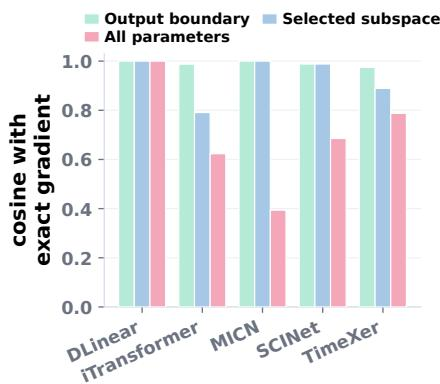  
Figure 5: Cached-to-exact gradient cosine by backbone. Selected-slice cosine excludes zero proxies.

## 6 CONCLUSION

Multivariate forecasters optimize a loss averaged across variables, leaving the effect of the shared update on each variable unclear. We find that pairwise gradient conflict is common and most variables underperform a full-input single-target oracle. But conflict frequency is weakly related to harm, and mean alignment does not reliably identify helpful partners. PV-Surgery addresses this problem with a single-backward optimizer-side transformation. The method constructs variable-wise gradient proxies, restricts surgery to a reconstruction-consistent subspace, pools variables conditionally, and corrects directions while preserving surgery-input norms. Across matched settings, it reduces MSE by 3.61% and MAE by 2.93% on average, with every module contributing to both metrics. Mechanism analyses show that selected proxies track variable-wise gradients and forecasts for harmed variables often improve. Together, the results support selective, reliability-aware intervention over uniform conflict removal. PV-Surgery has two main limitations. The method raises median per-epoch cost to 1.54× the mean-loss baseline (Appendix L), and gains can weaken when proxy fidelity is low, selected layers mix variables, or variable relationships differ across datasets. Future work should reduce this overhead and improve proxy construction under stronger variable mixing and more diverse cross-variable structures without sacrificing useful sharing.

## AI USE STATEMENT

In this work, we used generative AI tools to edit prose, translate draft passages for internal review, provide feedback on the method and experiments, assist with parts of the method implementation, analysis code, and plotting code, and help interpret experimental results. We did not use these tools to originate the research question or central research idea. We reviewed all AI-assisted text and code and take responsibility for the final text, claims, and artifacts.

## ETHICS STATEMENT

The experiments use established public forecasting benchmarks and do not collect personal data or make individual-level decisions. Nevertheless, benchmark accuracy does not establish reliability under distribution shift or safety in operational use.

## REPRODUCIBILITY STATEMENT

Section 4 and Algorithm 1 specify the loss scaling, cache construction, layer-selection rule, pooling and restoration operations, candidate comparison, and final-gradient assembly. Appendix E reports the forecasting protocol and optimization settings. Tables 1 and 6 cover every one of the $5 \times 7 \times 4 =$ 140 main comparisons, while Table 3 and Appendix H jointly cover all 140 matched ablation settings per variant. Except for the multi-seed analyses in Appendix C, all reported runs use the single seed 42, as specified in Appendix E.

## REFERENCES

Zhao Chen, Vijay Badrinarayanan, Chen-Yu Lee, and Andrew Rabinovich. Gradnorm: Gradient normalization for adaptive loss balancing in deep multitask networks. In Jennifer G. Dy and Andreas Krause (eds.), Proceedings of the 35th International Conference on Machine Learning, ICML 2018, Stockholmsmassan, Stockholm, Sweden, July 10-15, 2018¨ , volume 80 of Proceedings of Machine Learning Research, pp. 793–802. PMLR, 2018. URL http://proceedings. mlr.press/v80/chen18a.html.

Yisong Fu, Zezhi Shao, Chengqing Yu, Yujie Li, Zhulin An, Qi (Cheems) Wang, Yongjun Xu, and Fei Wang. Selective learning for deep time series forecasting. In Danielle Belgrave, Cheng Zhang, Laura N. Montoya, Hsuan-Tien Lin, Razvan Pascanu, Piotr Koniusz, Marzyeh Ghassemi, Nancy Chen, Ivan Vladimir Meza Ru´ ´ız, and Arturo Loaiza-Bonilla (eds.), Advances in Neural Information Processing Systems 38: Annual Conference on Neural Information Processing Systems 2025, NeurIPS 2025, San Diego, CA, USA, December 2-7, 2025 / Mexico City, Mexico, November 30 - December 5, 2025, 2025. URL http://papers.nips.cc/paper\_files/paper/2025/hash/ 8cf54ff53f44835b9bdab2c546a1ca6d-Abstract-Conference.html.

Vincent Le Guen and Nicolas Thome. Shape and time distortion loss for training deep time series forecasting models. In Hanna M. Wallach, Hugo Larochelle, Alina Beygelzimer, Florence d’Alche-Buc, Emily B. Fox, and Roman Garnett (eds.),´ Advances in Neural Information Processing Systems 32: Annual Conference on Neural Information Processing Systems 2019, NeurIPS 2019, December 8-14, 2019, Vancouver, BC, Canada, pp. 4191–4203, 2019. URL https://proceedings.neurips.cc/paper/2019/hash/ 466accbac9a66b805ba50e42ad715740-Abstract.html.

Mark O Hill. Diversity and evenness: a unifying notation and its consequences. Ecology, 54(2): 427–432, 1973.

Dilfira Kudrat, Zongxia Xie, Yanru Sun, Tianyu Jia, and Qinghua Hu. Patch-wise structural loss for time series forecasting. In Aarti Singh, Maryam Fazel, Daniel Hsu, Simon Lacoste-Julien, Felix Berkenkamp, Tegan Maharaj, Kiri Wagstaff, and Jerry Zhu (eds.), Forty-second International Conference on Machine Learning, ICML 2025, Vancouver, BC, Canada, July 13-19, 2025, volume 267 of Proceedings of Machine Learning Research. PMLR / OpenReview.net, 2025. URL https://proceedings.mlr.press/v267/kudrat25a.html.

Guokun Lai, Wei-Cheng Chang, Yiming Yang, and Hanxiao Liu. Modeling long- and shortterm temporal patterns with deep neural networks. In Kevyn Collins-Thompson, Qiaozhu Mei, Brian D. Davison, Yiqun Liu, and Emine Yilmaz (eds.), The 41st International ACM SIGIR Conference on Research & Development in Information Retrieval, SIGIR 2018, Ann Arbor, MI, USA, July 08-12, 2018, pp. 95–104. ACM, 2018. doi: 10.1145/3209978.3210006. URL https://doi.org/10.1145/3209978.3210006.

Hyunwook Lee, Chunggi Lee, Hongkyu Lim, and Sungahn Ko. TILDE-Q: A transformation invariant loss function for time-series forecasting. CoRR, abs/2210.15050, 2022. doi: 10.48550/ ARXIV.2210.15050. URL https://doi.org/10.48550/arXiv.2210.15050.

Bryan Lim and Stefan Zohren. Time series forecasting with deep learning: A survey. CoRR, abs/2004.13408, 2020. URL https://arxiv.org/abs/2004.13408.

Bo Liu, Xingchao Liu, Xiaojie Jin, Peter Stone, and Qiang Liu. Conflict-averse gradient descent for multi-task learning. In Marc’Aurelio Ranzato, Alina Beygelzimer, Yann N. Dauphin, Percy Liang, and Jennifer Wortman Vaughan (eds.), Advances in Neural Information Processing Systems 34: Annual Conference on Neural Information Processing Systems 2021, NeurIPS 2021, December 6-14, 2021, virtual, pp. 18878–18890, 2021. URL https://proceedings.neurips.cc/ paper/2021/hash/9d27fdf2477ffbff837d73ef7ae23db9-Abstract.html.

Minhao Liu, Ailing Zeng, Muxi Chen, Zhijian Xu, Qiuxia Lai, Lingna Ma, and Qiang Xu. Scinet: Time series modeling and forecasting with sample convolution and interaction. In Sanmi Koyejo, S. Mohamed, A. Agarwal, Danielle Belgrave, K. Cho, and A. Oh (eds.), Advances in Neural Information Processing Systems 35: Annual Conference on Neural Information Processing Systems 2022, NeurIPS 2022, New Orleans, LA, USA, November 28 - December

9, 2022, 2022. URL http://papers.nips.cc/paper\_files/paper/2022/hash/ 266983d0949aed78a16fa4782237dea7-Abstract-Conference.html.

Yong Liu, Tengge Hu, Haoran Zhang, Haixu Wu, Shiyu Wang, Lintao Ma, and Mingsheng Long. itransformer: Inverted transformers are effective for time series forecasting. In The Twelfth International Conference on Learning Representations, ICLR 2024, Vienna, Austria, May 7-11, 2024. OpenReview.net, 2024. URL https://openreview.net/forum?id=JePfAI8fah.

Aviv Navon, Aviv Shamsian, Idan Achituve, Haggai Maron, Kenji Kawaguchi, Gal Chechik, and Ethan Fetaya. Multi-task learning as a bargaining game. In Kamalika Chaudhuri, Stefanie Jegelka, Le Song, Csaba Szepesvari, Gang Niu, and Sivan Sabato (eds.),´ International Conference on Machine Learning, ICML 2022, 17-23 July 2022, Baltimore, Maryland, USA, volume 162 of Proceedings of Machine Learning Research, pp. 16428–16446. PMLR, 2022. URL https: //proceedings.mlr.press/v162/navon22a.html.

Yuqi Nie, Nam H. Nguyen, Phanwadee Sinthong, and Jayant Kalagnanam. A time series is worth 64 words: Long-term forecasting with transformers. In The Eleventh International Conference on Learning Representations, ICLR 2023, Kigali, Rwanda, May 1-5, 2023. OpenReview.net, 2023. URL https://openreview.net/forum?id=Jbdc0vTOcol.

Liran Nochumsohn, Hedi Zisling, and Omri Azencot. A multi-task learning approach to linear multivariate forecasting. In Yingzhen Li, Stephan Mandt, Shipra Agrawal, and Mohammad Emtiyaz Khan (eds.), International Conference on Artificial Intelligence and Statistics, AISTATS 2025, Mai Khao, Thailand, 3-5 May 2025, volume 258 of Proceedings of Machine Learning Research, pp. 2638–2646. PMLR, 2025. URL https://proceedings.mlr.press/v258/ nochumsohn25a.html.

Ozan Sener and Vladlen Koltun. Multi-task learning as multi-objective optimization. In Samy Bengio, Hanna M. Wallach, Hugo Larochelle, Kristen Grauman, Nicolo Cesa-Bianchi, and Ro-\` man Garnett (eds.), Advances in Neural Information Processing Systems 31: Annual Conference on Neural Information Processing Systems 2018, NeurIPS 2018, December 3-8, 2018, Montreal, Canada´ , pp. 525–536, 2018. URL https://proceedings.neurips.cc/ paper/2018/hash/432aca3a1e345e339f35a30c8f65edce-Abstract.html.

Dmitry Senushkin, Nikolay Patakin, Arseny Kuznetsov, and Anton Konushin. Independent component alignment for multi-task learning. In IEEE/CVF Conference on Computer Vision and Pattern Recognition, CVPR 2023, Vancouver, BC, Canada, June 17-24, 2023, pp. 20083–20093. IEEE, 2023. doi: 10.1109/CVPR52729.2023.01923. URL https://doi.org/10.1109/ CVPR52729.2023.01923.

Hao Wang, Lichen Pan, Yuan Shen, Zhichao Chen, Degui Yang, Yifei Yang, Sen Zhang, Xinggao Liu, Haoxuan Li, and Dacheng Tao. Fredf: Learning to forecast in the frequency domain. In The Thirteenth International Conference on Learning Representations, ICLR 2025, Singapore, April 24-28, 2025. OpenReview.net, 2025. URL https://openreview.net/forum?id= 4A9IdSa1ul.

Huiqiang Wang, Jian Peng, Feihu Huang, Jince Wang, Junhui Chen, and Yifei Xiao. MICN: multiscale local and global context modeling for long-term series forecasting. In The Eleventh Inter national Conference on Learning Representations, ICLR 2023, Kigali, Rwanda, May 1-5, 2023. OpenReview.net, 2023. URL https://openreview.net/forum?id=zt53IDUR1U.

Yuxuan Wang, Haixu Wu, Jiaxiang Dong, Guo Qin, Haoran Zhang, Yong Liu, Yunzhong Qiu, Jianmin Wang, and Mingsheng Long. Timexer: Empowering transformers for time series forecasting with exogenous variables. In Amir Globersons, Lester Mackey, Danielle Belgrave, Angela Fan, Ulrich Paquet, Jakub M. Tomczak, and Cheng Zhang (eds.), Advances in Neural Information Processing Systems 37: Annual Conference on Neural Information Processing Systems 2024, NeurIPS 2024, Vancouver, BC, Canada, December 10 - 15, 2024, 2024. URL http://papers.nips.cc/paper\_files/paper/2024/hash/ 0113ef4642264adc2e6924a3cbbdf532-Abstract-Conference.html.

Zirui Wang, Yulia Tsvetkov, Orhan Firat, and Yuan Cao. Gradient vaccine: Investigating and improving multi-task optimization in massively multilingual models. In 9th International Conference on Learning Representations, ICLR 2021, Virtual Event, Austria, May 3-7, 2021. OpenReview.net, 2021. URL https://openreview.net/forum?id=F1vEjWK-lH\_.

Haixu Wu, Jiehui Xu, Jianmin Wang, and Mingsheng Long. Autoformer: Decomposition transformers with auto-correlation for long-term series forecasting. In Marc’Aurelio Ranzato, Alina Beygelzimer, Yann N. Dauphin, Percy Liang, and Jennifer Wortman Vaughan (eds.), Advances in Neural Information Processing Systems 34: Annual Conference on Neural Information Processing Systems 2021, NeurIPS 2021, December 6-14, 2021, virtual, pp. 22419–22430, 2021. URL https://proceedings.neurips.cc/paper/2021/ hash/bcc0d400288793e8bdcd7c19a8ac0c2b-Abstract.html.

Tianhe Yu, Saurabh Kumar, Abhishek Gupta, Sergey Levine, Karol Hausman, and Chelsea Finn. Gradient surgery for multi-task learning. In Hugo Larochelle, Marc’Aurelio Ranzato, Raia Had sell, Maria-Florina Balcan, and Hsuan-Tien Lin (eds.), Advances in Neural Information Processing Systems 33: Annual Conference on Neural Information Processing Systems 2020, NeurIPS 2020, December 6-12, 2020, virtual, 2020. URL https://proceedings.neurips.cc/ paper/2020/hash/3fe78a8acf5fda99de95303940a2420c-Abstract.html.

Ailing Zeng, Muxi Chen, Lei Zhang, and Qiang Xu. Are transformers effective for time series forecasting? In Brian Williams, Yiling Chen, and Jennifer Neville (eds.), Thirty-Seventh AAAI Conference on Artificial Intelligence, AAAI 2023, Thirty-Fifth Conference on Innovative Applications ofArtificial Intelligence, IAAI 2023, Thirteenth Symposium on Educational Advances in Artificial Intelligence, EAAI 2023, Washington, DC, USA, February 7-14, 2023, pp. 11121–11128. AAAI Press, 2023. doi: 10.1609/AAAI.V37I9.26317. URL https://doi.org/10.1609/aaai. v37i9.26317.

Haoyi Zhou, Shanghang Zhang, Jieqi Peng, Shuai Zhang, Jianxin Li, Hui Xiong, and Wancai Zhang. Informer: Beyond efficient transformer for long sequence time-series forecasting. In Thirty-Fifth AAAI Conference on Artificial Intelligence, AAAI 2021, Thirty-Third Conference on Innovative Applications of Artificial Intelligence, IAAI 2021, The Eleventh Symposium on Educational Advances in Artificial Intelligence, EAAI 2021, Virtual Event, February 2-9, 2021, pp. 11106–11115. AAAI Press, 2021. doi: 10.1609/AAAI.V35I12.17325. URL https://doi.org/10.1609/aaai.v35i12.17325.

## A DATASET DIAGNOSTICS

Table 4 summarizes the datasets and the diagnostic quantities used to contextualize PV-Surgery. In addition to common dataset metadata, we report conflict-oriented indicators tied to the optimization issue studied in this paper. The negative cosine ratio measures how often variable-wise gradients disagree, the mean cosine measures average alignment, and the harmed-variable fraction is the share of variables for which shared training performs worse than the full-input single-target oracle. Diagnostics are computed with iTransformer at prediction length 96, except for ILI where prediction length 24 is used.

Table 4: Dataset statistics and conflict-oriented diagnostics. T is the number of timestamps and D is the number of target variables. Neg. cos. is the percentage of negative pairwise variable-gradient cosines and Mean cos. is their average. Both follow the protocol of Section 3 and are computed after dropping the warmup half of the recorded checkpoints. Harmed vars. is the percentage of variables for which shared training is worse than the full-input single-target oracle on the held-out test split.
<table><tr><td>Dataset</td><td>Frequency</td><td>T</td><td>D</td><td>Neg. cos. (%)</td><td>Mean cos.</td><td>Harmed vars. (%)</td></tr><tr><td>ETTh1</td><td>1 hour</td><td>17,420</td><td>7</td><td>30.6</td><td>0.178</td><td>14.3</td></tr><tr><td>ETTh2</td><td>1 hour</td><td>17,420</td><td>7</td><td>30.4</td><td>0.281</td><td>57.1</td></tr><tr><td>ETTm1</td><td>15 min</td><td>69,680</td><td>7</td><td>30.8</td><td>0.172</td><td>28.6</td></tr><tr><td>ETTm2</td><td>15 min</td><td>69,680</td><td>7</td><td>29.9</td><td>0.246</td><td>57.1</td></tr><tr><td>Weather</td><td>10 min</td><td>52,696</td><td>21</td><td>37.5</td><td>0.133</td><td>81.0</td></tr><tr><td>Exchange</td><td>1 day</td><td>7,588</td><td>8</td><td>39.3</td><td>0.148</td><td>25.0</td></tr><tr><td>ILI</td><td>1 week</td><td>966</td><td>7</td><td>15.9</td><td>0.508</td><td>71.4</td></tr></table>

## B GRADIENT-CONFLICT FIGURES FOR ALL DATASETS

Figure 2 presents ETTh1 in the main text. Figures 6–11 use the same three-panel layout, consisting of the post-warmup cosine distribution and heatmaps from an early and a late checkpoint, for the remaining six benchmarks. ETTh1, ETTh2, ETTm1, ETTm2, Weather, and Exchange use prediction length 96, and ILI uses 24.

Conflict is intermittent. No variable pair carries a negative cosine at every post-warmup checkpoint in any of the seven benchmarks. The most persistent pair is on ETTh2 and is negative at 72% of its checkpoints, while the median pair ranges from 11% to 43% across the seven benchmarks (Table 5). When each pair is averaged across its post-warmup checkpoints, the resulting cosines span [−0.12, 0.98]. Thus, even the lowest-alignment pairs are only weakly opposed on average, and this average hides changes in sign over training. A static pair-level rule could therefore act after the relation has changed. To account for this behavior, the method in Section 4 instead recomputes the relevant gradient relations from the current batch and reevaluates layer support at every step.

Table 5: Persistence of variable-pair conflict over training. The Checkpoints column gives the number of post-warmup analysis points, and the Pairs column gives the number of variable pairs in each benchmark. Persistence is the share of those checkpoints at which a pair has a negative cosine, reported for the most persistent pair and for the median pair. No entry reaches 100%, so no pair conflicts throughout.
<table><tr><td rowspan="2">Dataset</td><td rowspan="2">Checkpoints Pairs</td><td rowspan="2"></td><td colspan="2">Persistence (%)</td></tr><tr><td>Most persistent</td><td>Median</td></tr><tr><td>ETTh1</td><td>46</td><td>21</td><td>50.0</td><td>28.3</td></tr><tr><td>ETTh2</td><td>39</td><td>21</td><td>71.8</td><td>20.5</td></tr><tr><td>ETTm1</td><td>48</td><td>21</td><td>50.0</td><td>35.4</td></tr><tr><td>ETTm2</td><td>37</td><td>21</td><td>48.6</td><td>40.5</td></tr><tr><td>Weather</td><td>44</td><td>210</td><td>68.2</td><td>40.9</td></tr><tr><td>Exchange</td><td>38</td><td>28</td><td>55.3</td><td>43.4</td></tr><tr><td>ILI</td><td>150</td><td>21</td><td>37.3</td><td>11.3</td></tr></table>

## C GROUP-COMPOSITION DIAGNOSTICS FOR ALL DATASETS

Group-composition protocol. For each reported target variable, we rank the remaining variables by their post-warmup mean pairwise gradient cosine in the baseline run. For each total group size $\bar { k ^ { \prime } } \in \{ 2 , 3 , 4 \}$ , we train one model with the k − 1 highest-ranked partners and another with the k − 1 lowest-ranked partners. The two partner sets are disjoint in every reported cell. Each model still

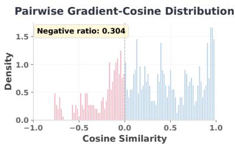  
(a) Post-warmup cosine distribution.

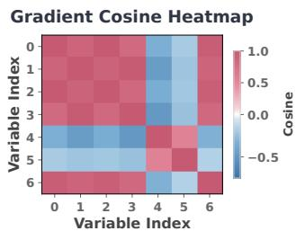  
(b) Early checkpoint.

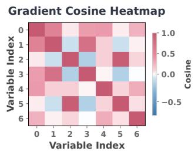  
(c) Late checkpoint.  
Figure 6: A representative ETTh2 run from the variable-wise gradient-cosine diagnostic at prediction length 96. (a) Distribution of the post-warmup pairwise cosines, of which 30.4% fall below zero for this run. (b) An early checkpoint, which lies inside the discarded warmup half and is shown only to expose the change over training. (c) A late checkpoint. Both heatmaps show that conflict is structured across variable pairs rather than being uniform, so one summary number would hide which pairs disagree.

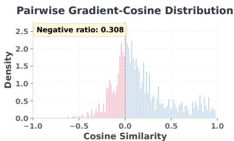  
(a) Post-warmup cosine distribution.

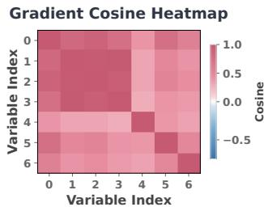  
(b) Early checkpoint.

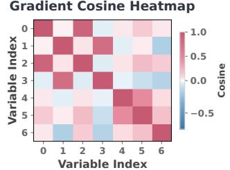  
(c) Late checkpoint.  
Figure 7: A representative ETTm1 run from the variable-wise gradient-cosine diagnostic at prediction length 96. (a) Distribution of the post-warmup pairwise cosines, of which 30.8% fall below zero for this run. (b) An early checkpoint, which lies inside the discarded warmup half and is shown only to expose the change over training. (c) A late checkpoint. Both heatmaps show that conflict is structured across variable pairs rather than being uniform, so one summary number would hide which pairs disagree.

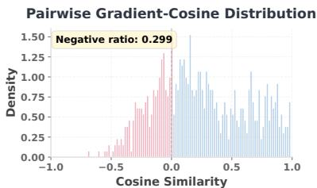  
(a) Post-warmup cosine distribution.

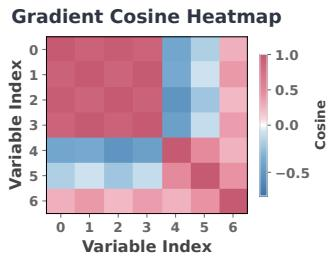  
(b) Early checkpoint.

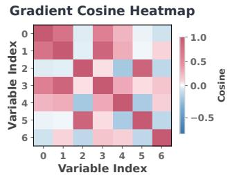  
(c) Late checkpoint.

Figure 8: A representative ETTm2 run from the variable-wise gradient-cosine diagnostic at prediction length 96. (a) Distribution of the post-warmup pairwise cosines, of which 29.9% fall below zero for this run. (b) An early checkpoint, which lies inside the discarded warmup half and is shown only to expose the change over training. (c) A late checkpoint. Both heatmaps show that conflict is structured across variable pairs rather than being uniform, so one summary number would hide which pairs disagree.

Gradient Cosine Heatmap  
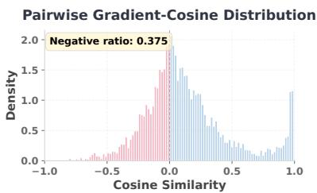  
(a) Post-warmup cosine distribution.

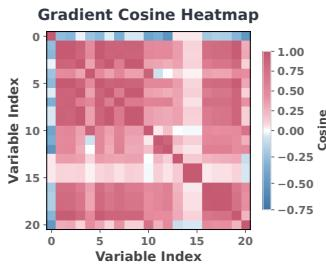  
(b) Early checkpoint.

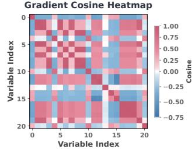  
(c) Late checkpoint.

Figure 9: A representative Weather run from the variable-wise gradient-cosine diagnostic at prediction length 96. (a) Distribution of the post-warmup pairwise cosines, of which 37.5% fall below zero for this run. (b) An early checkpoint, which lies inside the discarded warmup half and is shown only to expose the change over training. (c) A late checkpoint. Both heatmaps show that conflict is structured across variable pairs rather than being uniform, so one summary number would hide which pairs disagree.

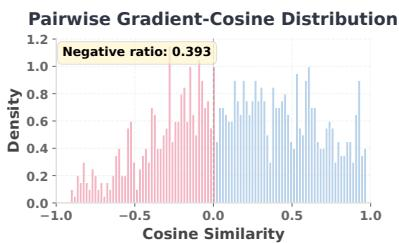  
(a) Post-warmup cosine distribution.

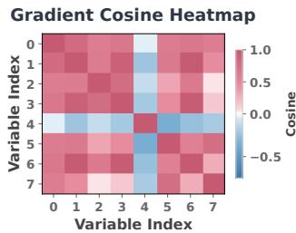  
(b) Early checkpoint.

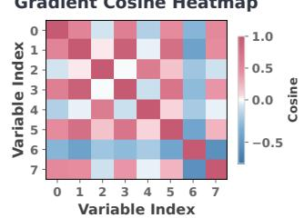  
(c) Late checkpoint.  
Figure 10: A representative Exchange run from the variable-wise gradient-cosine diagnostic at prediction length 96. (a) Distribution of the post-warmup pairwise cosines, of which 39.3% fall below zero for this run. (b) An early checkpoint, which lies inside the discarded warmup half and is shown only to expose the change over training. (c) A late checkpoint. Both heatmaps show that conflict is structured across variable pairs rather than being uniform, so one summary number would hide which pairs disagree.

Pairwise Gradient-Cosine Distribution  
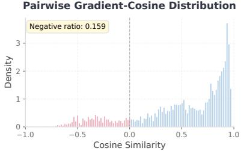  
(a) Post-warmup cosine distribution.

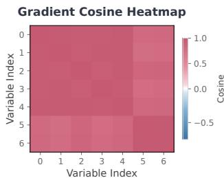  
(b) Early checkpoint.

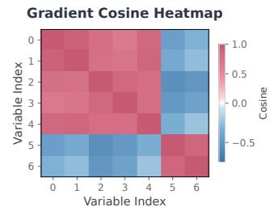  
(c) Late checkpoint.  
Figure 11: A representative ILI run from the variable-wise gradient-cosine diagnostic at prediction length 24. (a) Distribution of the post-warmup pairwise cosines, of which 15.9% fall below zero for this run. (b) An early checkpoint, which lies inside the discarded warmup half and is shown only to expose the change over training. (c) A late checkpoint. Both heatmaps show that conflict is structured across variable pairs rather than being uniform, so one summary number would hide which pairs disagree.

receives every variable as input. Only the supervised loss is restricted to the target and its selected partners, and evaluation uses the target’s held-out per-variable test MSE. The 162 target-and-size cells cover every target in the four ETT benchmarks, Exchange, and ILI, plus 11 of Weather’s 21 targets. Higher- and lower-alignment conditions use matched replicate seeds, three per cell, which totals 972 group-training runs. We report the seed-averaged signed contrast $\mathrm { 1 0 0 ( M S E _ { h i g h } - }$ $\mathrm { M S E _ { l o w } ) / M S E _ { l o w } }$ Negative values favor the higher-alignment set. A cell counts as a higheralignment win when its signed contrast is negative. The median signed contrast retains each cell’s direction, whereas the median absolute within-cell contrast removes the sign and measures the size of the partner-set difference. For every fixed dataset, target, group size, and partner condition, we express the standard deviation of test MSE across the three seeds as a percentage of their mean. To express seed variation on the scale of a two-run difference, we multiply this coefficient of variation by ${ \sqrt { 2 } } ,$ , which is the standard deviation of the difference under an equal-variance independence approximation. We use it as a descriptive reference rather than as a paired uncertainty estimate. The median over the 324 fixed partner conditions is 1.1%.

Figure 12 splits Figure 3(b) by dataset, and Figure 13 reports the higher- minus lower-alignment contrast for every benchmark and group size. Higher-alignment sets win 100 of the 162 cells, and the median signed contrast across cells $\mathrm { i s \_ 1 . 4 \% }$ . A two-sided one-sample t-test over the seven benchmark-level mean contrasts does not reject a zero mean $( p = 0 . 4 5 )$ , although five of the seven means are negative. Excluding ILI shifts the pooled contrast from $- 0 . 9 \% \mathrm { t o } \ 6 0 . 4 \%$ . The median absolute within-cell contrast is 3.5%, which exceeds the 1.1% descriptive seed-variation reference above, so partner choice can materially change target error even though mean alignment does not reliably identify the better set. Across all 162 cells, Spearman’s correlation between the alignment gap and MSE difference is −0.19. The arithmetic mean of the seven within-benchmark correlations ${ \bf i s } ^ { \mathrm { ~ } } - 0 . 1 6 ,$ , and a two-sided one-sample t-test of those correlations against zero gives $p \ = \ 0 . 0 7$ Figure 14 reports the seed-42 Weather extension at the six tested group sizes $k \in \{ 2 , 3 , \bar { 4 } , 5 , 8 , 1 1 \}$ including the disjoint-set limit k = 11 for $D = 2 1$

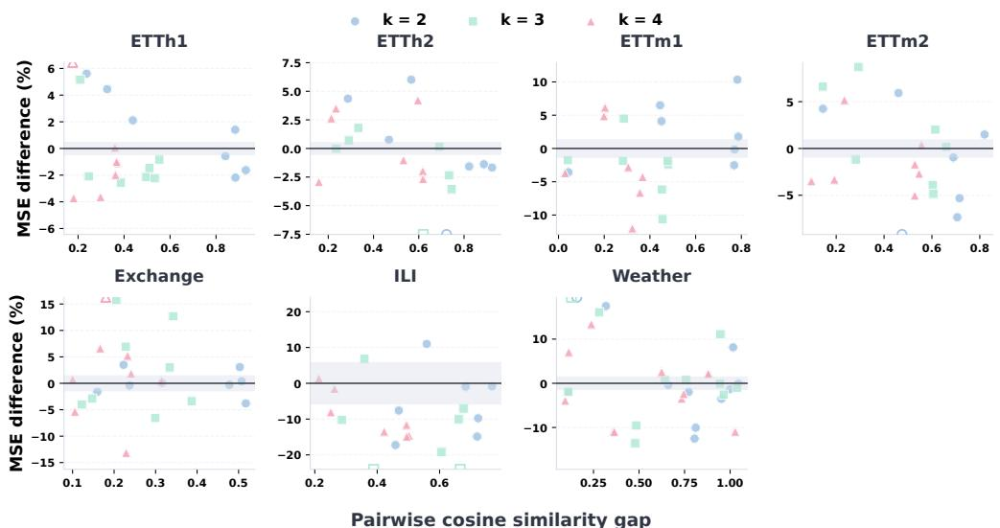  
Figure 12: Figure 3(b) split by dataset, with the three group sizes marked separately. Each plot holds the 21 to 33 target-and-size cells of one benchmark.

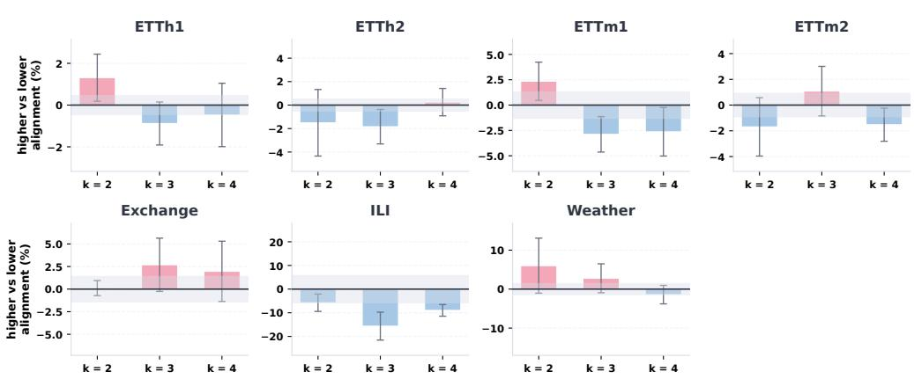  
Figure 13: Percentage difference between the higher- and lower-alignment partner groups’ test MSE, taken relative to the lower-alignment group and averaged over the targets of each benchmark. Negative means the higher-alignment group did better. Vertical ranges differ across panels. The grey band is that benchmark’s seed noise and the error bars are the standard error across its targets.

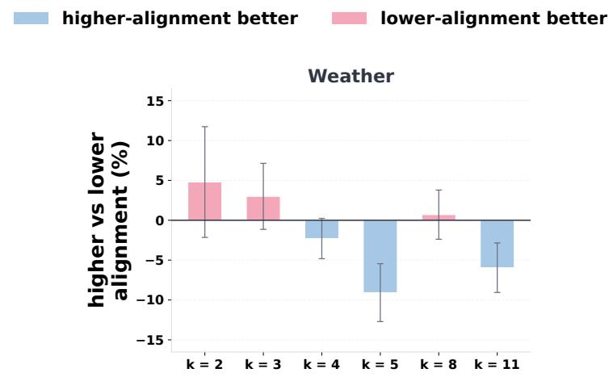  
Figure 14: Weather at the six tested group sizes $k \in \{ 2 , 3 , 4 , 5 , 8 , 1 1 \}$ , using seed 42. Bars show the mean higher- versus lower-alignment MSE contrast across 11 targets, and error bars show the standard error across targets. Negative values favor the higher-alignment group. The contrast does not change monotonically with group size.

## D PV-SURGERY TRAINING PROCEDURE

Algorithm 1 makes the four stages in Figure 4 explicit for one training batch. The reference gradient and output-cache signals come from the same single backward pass on the summed variable loss. Because no rescaling is applied to this sum loss, its raw reference gradient satisfies $\| g _ { 0 } \| _ { 2 } = D \| g _ { \mathrm { m e a n } } \| _ { 2 }$ . Baseline and PV-Surgery runs use the same AdamW hyperparameters. The remaining operations transform cached gradient matrices and assemble the selected-slice correction. Let $\mathcal { H } _ { \mathrm { r u n } } \subseteq \mathcal { H }$ denote the layers whose proxy rows materialize for the current batch. We construct their observed proxy matrices and set $G _ { \ell } = 0 _ { D \times N _ { \ell } }$ for $\ell \in \mathcal { H } \setminus \mathcal { H } _ { \mathrm { r u n } }$ . Layer scoring and final assembly use this zero-extended collection over H, while parameters outside the hooked set retain their reference-gradient values.

```latex
Algorithm 1 PV-Surgery Training
Input: batch (X, Y), D variables, backbone $f _ { \theta } ,$ cache-compatible hooked layers H
Output: optimizer gradient ${ \mathit { g } } _ { \mathrm { f i n a l } }$
// Step 1: Output-cache variable-wise gradient proxy
${ \hat { Y } } \gets f _ { \theta } ( X )$ {hooks cache $\{ Z _ { \ell } \} _ { \ell \in \mathcal { H } } \}$
$\begin{array} { r } { L _ { \Sigma }  \sum _ { d = 1 } ^ { D } L _ { d } ( \hat { Y } _ { : , : , d } , Y _ { : , : , d } ) \quad g _ { 0 }  \mathrm { B a c k w a r d } ( L _ { \Sigma } ) } \end{array}$ {Eqs. 2, 3}
$\mathcal { H } _ { \mathrm { r u n } }  \{ \ell \in \mathcal { H } : Z _ { \ell }$ and $\dot { E } _ { \ell }$ materialize for this batch}
$G _ { \ell } [ d , \cdot ] \gets$ concat $\big ( \mathrm { v e c } ( E _ { \ell , d } ^ { \top } Z _ { \ell , d } ) , E _ { \ell , d } ^ { \top } { \bf 1 } \big )$ for $\ell \in { \mathcal { H } } _ { \mathrm { r u n } }$ {Eqs. 4, 5}
$G _ { \ell } \gets 0 _ { D \times N _ { \ell } }$ for $\dot { \ell } \in \mathcal { H } \setminus \mathcal { H } _ { \mathrm { r u n } }$
// Step 2: Reliability-aware layer selection
$( e _ { \ell } , \dot { r } _ { \ell } , q _ { \ell } ) \gets \mathrm { L a y e r S c o r e s } ( \dot { G } _ { \ell } , g _ { 0 , \ell } , g _ { 0 } )$ for $\ell \in \mathcal { H } \left\{ \mathrm { E q . } 6 \right\}$
$\mathcal { H } _ { \mathrm { e l i g } }  \dot { \{ \ell \in \mathcal { H } : \ell } $ is not protected}
$\rho $ median $\{ r _ { \ell } : \ell \in \mathcal { H } _ { \mathrm { e l i g } } \}$
$\mathcal { H } _ { \mathrm { g a t e } }  \{ \ell \in \mathcal { H } _ { \mathrm { e l i g } } : r _ { \ell } \geq \rho \mathrm { o r } \ell = \ell _ { \mathrm { o u t } } \}$
$\mathcal { A }  \{ \ell \in \mathcal { H } _ { \mathrm { g a t e } } : q _ { \ell } > 0 \}$
if $\mathcal { A } \neq$ ∅ then
$\begin{array} { r } { \pi _ { \ell } ^ { ' }  q \ell \sum _ { j \in \mathcal { A } } q _ { j } \quad K _ { \mathrm { e f f } }  \lceil \exp ( - \sum _ { \ell \in \mathcal { A } } \pi _ { \ell } } \end{array}$ log π<sub>ℓ</sub>)⌉
$\mathcal { T }  \mathrm { T o p } _ { K _ { \mathrm { e f f } } } ( A , q ) \cup ( A \cap \{ \ell _ { \mathrm { o u t } } \} )$
$S \gets \{ \ell \in \breve { T } : e _ { \ell } \leq 1 \} \left\{ \mathrm { E q . } 7 \right\}$
else
$s \gets \emptyset$
end if
$\mathcal { S } \gets \mathrm { O u t p u t F a l l b a c k } ( \mathcal { S } , \mathcal { H } _ { \mathrm { e l i g } } , \ell _ { \mathrm { o u t } } )$
$G s \gets$ concat<sub>ℓ∈S</sub> G<sub>ℓ</sub> {Eq. 8}
$/ / S t e p . 3 \mathrm { : }$ Conditional variable-gradient pooling
$G _ { \mathrm { p r e } }  G _ { S }$ $g _ { \mathrm { r e f } }  g _ { 0 , S }$
$\dot { \mathcal { V } }  \{ d : G _ { \mathrm { p r e } } [ d ]$ is finite and $\| G _ { \mathrm { p r e } } [ d ] \| _ { 2 } > \epsilon \}$
$( a , M _ { \mathrm { p o o l } }$ , active) ← ConditionalAnchorConflic $( G _ { \mathrm { p r e } } , g _ { \mathrm { r e f } } ; \mathrm { v a l i d } = \mathcal { V } ,$ order = (a<sub>d</sub>, d)) {Eq. 9}
if active then
$G _ { \mathrm { p o o l } }  M _ { \mathrm { p o o l } } G _ { \mathrm { p r e } }$ {Eq. 10}
end if
// Step 4: Magnitude-preserving common-direction surgery
$G _ { \mathrm { i n } } ^ { ( u ) }  G _ { \mathrm { p r e } } ,$ and $G _ { \mathrm { i n } } ^ { ( p ) }  G _ { \mathrm { p o o l } }$ when pooling is active
for each available candidate $c \in \{ u , p \}$ do
$\widetilde { G } _ { \mathrm { i n } } ^ { ( c ) } \gets$ CommonDirection<sub>preserve</sub> $( G _ { \mathrm { i n } } ^ { ( c ) } )$ {Eqs. 11, 12}
end for
$\hat { G } _ { u } ^ { \mathrm { p o s t } }  \widetilde { G } _ { \mathrm { i n } } ^ { ( u ) }$
if active then
$G _ { p } ^ { \mathrm { p o s t } } $ PoolRestore $( G _ { \mathrm { p r e } } , M _ { \mathrm { p o o l } } , \widetilde { G } _ { \mathrm { i n } } ^ { ( p ) } )$ {Eq. 13}
else
$G _ { p } ^ { \mathrm { p o s t } }  G _ { \mathrm { p r e } }$
end if
$G _ { \mathrm { p o s t } }  ]$ DescentLexicographicSelect $\operatorname { \Pi } _ { \substack { \mathrm { c } \mathrm { - } } } ^ { u \mathrm { - t i e } } ( G _ { \mathrm { p r e } } , G _ { u } ^ { \mathrm { p o s t } } , G _ { p } ^ { \mathrm { p o s t } } ; \mathcal { V } )$ {Eq. 14}
$\begin{array} { r } { \dot { \Delta s }  \sum _ { d } G _ { \mathrm { p o s t } } [ d , \cdot ] - { \sum _ { d } } \dot { G } _ { \mathrm { p r e } } [ d , \cdot ] \{ \mathrm { E q . } 1 \dot { 5 } \} } \end{array}$
g<sub>final</sub> $ \mathrm { A }$ ssemble(g<sub>0</sub>, {G<sub>ℓ</sub>}<sub>ℓ∈H</sub>, S, ∆<sub>S</sub>) {Eq. 16}
```

Pooling and candidate-selection conventions. Cosine and pairwise-conflict tests use only rows that are finite and have norm greater than the numerical tolerance. Cosines within a machine-scale tolerance of zero are treated as zero. A zero or non-finite row is assigned $a _ { d } = 0$ , remains a singleton objective, and does not activate pooling. A zero or non-finite reference yields the identity pooling plan. When pooling is active, conflict rows are processed in ascending reference-alignment order, with the variable index breaking ties. Each row joins the existing conflict pool with the largest cosine only when that cosine is positive. Otherwise, it starts a new pool. Candidate scoring uses the same valid pre-surgery rows. A candidate with a zero or non-finite aggregate is invalid. If only one candidate is valid, it is selected. If both are invalid or numerically tied, the unpooled candidate is retained.

Numerical tolerance for common-direction surgery. Equation 12 defines the ideal map using an exact zero test. In the implementation, we use the first branch only when $\| \bar { g } ^ { ( c ) } \| _ { 2 } > \epsilon$ and otherwise retain the input, where $\epsilon > 0$ is a small numerical tolerance. This avoids normalizing a near-zero mean direction.

Proxy-supported hooked-block updates. PV-Surgery treats the hooked parameter blocks as the region in which an update should remain attributable to variable-indexed signals. When $\ell \in \mathcal { H } _ { \mathrm { r u n } }$ every hooked-block contribution is constructed from observed proxy rows and can therefore pass through the same reconstruction, pooling, and direction checks as the other variable-wise inputs. When $\ell \notin \mathcal { H } _ { \mathrm { r u n } } ,$ the single-backward slice $g _ { 0 , \ell }$ is still available, but it contains only the aggregate of the unresolved variable contributions. Substituting that slice would reintroduce an update whose variable-wise sources cannot be inspected by the method. We therefore impose a blockwise evidence-support constraint that permits a nonzero hooked-block data-gradient contribution only when its variable-indexed rows materialize. Under this constraint, zero is the only admissible current data-gradient contribution on an unsupported block and is also the minimum-norm choice. This is a conservative abstention rule rather than a claim that a zero data-gradient contribution is a better descent direction than $g _ { 0 , \ell } .$ . Parameters outside H are not assigned to the variable-aware region and continue to use $g _ { 0 }$ . A zero-extended block remains zero even if it enters S, because its columns are zero for every surgery input and the norm-preserving direction operator cannot create support on those columns.

This zero data-gradient contribution is injected as an explicit zero loss-gradient tensor. It is therefore not the same as removing the parameters from AdamW or setting their gradients to None. AdamW still advances their optimizer state and applies decoupled weight decay. If a block has accumulated momentum from earlier nonzero updates, that state can continue to affect later parameter values while it decays. The rule should consequently be understood as withholding the current data-gradient update on an unsupported hooked block, not as permanently freezing the block.

Layer-selection thresholds. Although the cache supports explicit variable axes and supported batch-folded layouts, the configured protection rule excludes patch and value embedding parameters from direction-surgery selection to avoid changing the shared input representation before downstream variable mixing. If registered as hooked blocks, these parameters still follow the proxy-sum assembly rule above. Excluding them from S prevents direction-surgery correction on those slices but does not restore $g _ { 0 }$ . Their data-gradient contribution is the sum of the variable-indexed proxy rows when those rows materialize for the current batch, and zero when no such variable-axis proxy materializes. Among the remaining candidates the reliability gate keeps every non-output layer whose $r _ { \ell }$ reaches the median over the eligible hooked layers, and the output layer is exempt from this gate. Equation 7 is evaluated on $q _ { \ell } .$ , which also orders the layers before the $K _ { \mathrm { e f f } }$ cut. A layer that survives the cut is eligible when its relative reconstruction error satisfies $e _ { \ell } \leq 1$ , equivalently $r _ { \ell } \ge 1 / 2$ This means that its proxy-sum error does not exceed $\| g _ { 0 , \ell } \| _ { 2 } + \epsilon ,$ which marks, up to numerical tolerance, the boundary at which the reconstruction error begins to exceed the magnitude of the gradient being reconstructed. If nothing is left, PV-Surgery falls back to the output layer.

Properties of effective coverage. The unrounded quantity $e ^ { \mathcal { E } _ { \mathrm { l a y e r } } }$ in Equation 7 is the exponential of the Shannon entropy of π and therefore the order-one Hill number (Hill, 1973) of the normalized slice-norm distribution. Because $\textstyle { \pi _ { \ell } = q _ { \ell } { \big / } \sum _ { j \in { \mathcal { A } } } q _ { j } }$ , it represents the fraction of the total gated slice norm carried by layer ℓ. The entropy $\mathcal { E } _ { \mathrm { l a y e r } }$ measures how evenly these fractions are distributed, and exponentiation converts this log-scale measure into an effective number of contributing layers. This number is one when a single layer carries all of the slice norm and m when the norm is uniform over m layers. An intermediate value is the number of equally contributing layers that would produce the same concentration as the observed distribution. For example, $\pi = ( 0 . 8 , 0 . 1 , 0 . 1 )$ gives $e ^ { \mathcal { E } _ { \mathrm { l a y e r } } } \approx 1 . 8 9$ and therefore $K _ { \mathrm { e f f } } = 2$ after taking the ceiling. The selector uses this ceiling as an entropy-derived cutoff for the largest-norm layers, while the reliability and reconstruction criteria still determine which layers are eligible. The Hill number is invariant to a common rescaling of the layer slice norms, so a backbone whose layer gradients are uniformly larger does not receive a wider support. It is recomputed at each step, allowing the support to contract when one layer dominates and to widen when the slice-norm distribution becomes diffuse. A layer whose share vanishes contributes $\pi _ { \ell } \log \pi _ { \ell } \to 0$ and has a vanishing effect on the effective count. The choice of order also matters. Order zero counts every gated layer equally, while order two emphasizes dominant layers more strongly. Order one retains the Shannon weighting in which each entropy contribution is weighted by its normalized slice-norm share $\pi _ { \ell } .$ We avoid a fixed top-k because the number of hooked layers differs by backbone, from one to seventeen in our experiments, so a new backbone would otherwise need its own value.

## E DETAILED EXPERIMENTAL CONFIGURATION

Forecasting protocol. For ETTh1, ETTh2, ETTm1, ETTm2, Weather, and Exchange, we use an input length of 96, a decoder-label length of 48, and prediction lengths {96, 192, 336, 720}. ILI uses input and decoder-label lengths of 36 and 18. Its main, ablation, mechanism, and objectivecomparison runs use prediction lengths {24, 36, 48, 60}, while the diagnostic, oracle, and partnergroup analyses in Section 3 use 24. Every method uses the chronological train, validation, and test splits provided by the forecasting framework. Training windows are not shuffled because Selective Learning tracks residual statistics across consecutive windows (Fu et al., 2025).

Optimization. Unless otherwise noted for the multi-seed analyses in Appendix C, each reported run uses seed 42. Training uses a batch size of 64 for at most 30 epochs and stops after seven consecutive validation epochs without improvement. We use AdamW with a fixed learning rate of $1 0 ^ { - 4 }$ , weight decay $5 \times 1 0 ^ { - 4 }$ , and a gradient-norm limit of 1.

Specialized-objective settings. In our objective comparison, TILDE-Q uses $\alpha = 0 . 5$ and $\gamma = 0 .$ which removes the amplitude term. FreDF weights the temporal MSE and frequency-domain terms by 0.5 each. Its frequency MAE is the mean modulus of the complex RFFT difference. PSLoss uses $\lambda = 3$ , limits the adaptive patch length to 24, and enables Gradient-based Dynamic Weighting with automatic target-layer selection and an equal-weight fallback. Selective Learning uses $( r _ { u } , r _ { a } ) =$ (0.3, 0.3), (0.1, 0.6), (0.2, 0.2), (0.2, 0.5), (0.1, 0.2), (of, 0.9), and (0.1, 0.1) for ETTh1, ETTh2, ETTm1, ETTm2, Weather, Exchange, and ILI, respectively. Its anomaly mask uses a pretrained DLinear estimator for each dataset and horizon. TILDE-Q, FreDF, and PSLoss select checkpoints using their configured validation objectives, whereas Selective Learning uses validation MSE. Early stopping monitors validation MSE with patience 7 for all four methods.

Diagnostic logging. The shared-model diagnostics in Section 3 record gradients every max(1, ⌊30S/200⌋) optimizer steps, where S is the number of steps in one epoch. This interval targets approximately 200 snapshots over a complete 30-epoch run. Early stopping reduces the total in most benchmarks, while ILI has an interval of one step because each epoch is short. Before removing the warmup half, the runs contain 74 to 300 snapshots. The post-warmup counts reported in Appendix B are therefore 37 to 150.

Backbone hyperparameters. DLinear uses a moving-average window of 25 and shared rather than variable-specific trend and seasonal heads. iTransformer uses $d _ { \mathrm { m o d e l } } = 5 1 2 , d _ { \mathrm { f f } } = 5 1 2$ , 8 attention heads, 3 encoder layers, GELU activations, and dropout 0.1. TimeXer uses $d _ { \mathrm { m o d e l } } = 2 5 6 ,$ $d _ { \mathrm { f f } } = 5 1 2 ,$ , 8 attention heads, 2 encoder layers, patch length 16, GELU activations, dropout 0.1, and input normalization. MICN uses $d _ { \mathrm { m o d e l } } = 5 1 2 , d _ { \mathrm { f f } } = 2 0 4 8 .$ 8 heads, 1 decoder layer, convolution kernels {12, 16}, and dropout 0.05. SCINet uses one stack and dropout 0.1. Standard MSE training and PV-Surgery use the same backbone settings.

## Hardware. We run the experiments on NVIDIA TITAN RTX GPUs with 24 GB of memory.

Metric definitions. We compute MSE and MAE on standardized forecasts and targets without applying the inverse transformation. Let $N _ { \mathrm { t e s t } }$ denote the number of test windows. The reported metrics are

$$
\mathrm { M S E } = \frac { 1 } { N _ { \mathrm { t e s t } } H D } \sum _ { n = 1 } ^ { N _ { \mathrm { t e s t } } } \sum _ { h = 1 } ^ { H } \sum _ { d = 1 } ^ { D } ( \hat { Y } _ { n , h , d } - Y _ { n , h , d } ) ^ { 2 } ,
$$

$$
\mathrm { M A E } = \frac { 1 } { N _ { \mathrm { t e s t } } H D } \sum _ { n = 1 } ^ { N _ { \mathrm { t e s t } } } \sum _ { h = 1 } ^ { H } \sum _ { d = 1 } ^ { D } | \hat { Y } _ { n , h , d } - Y _ { n , h , d } | .\tag{17}
$$

## F BACKBONE RESULTS FOR WEATHER AND ILI

The page limit restricts Table 1 to five of the seven benchmarks. Table 6 reports the omitted Weather and ILI results, completing the same comparison over five backbones, seven datasets, and four prediction lengths. Each MSE and +PV pair uses the same data split, backbone configuration, and optimization protocol.

Table 6: Backbone comparison between standard MSE training and PV-Surgery on Weather and ILI. Within each backbone and metric, the better value between MSE and +PV is bolded using unrounded scores. The protocol and horizons follow Table 1.
<table><tr><td colspan="2">Models</td><td colspan="4">DLinear</td><td colspan="4">iTransformer</td><td colspan="4"></td><td colspan="4">SCINet</td><td colspan="4">TimeXer</td></tr><tr><td colspan="3">Training setup</td><td colspan="2">MSE</td><td>+PV</td><td></td><td>MSE</td><td></td><td>+PV</td><td></td><td>MSE</td><td></td><td>+PV</td><td></td><td>MSE</td><td></td><td>+PV</td><td>MSE</td><td></td><td>+PV</td><td></td></tr><tr><td colspan="2">Metric</td><td>|MSE</td><td>MAE</td><td>MSE</td><td>MAE</td><td>MSE</td><td>MAE</td><td>MSE</td><td>MAE</td><td>MSE</td><td>MAE</td><td>MSE</td><td>MAE</td><td>MSE</td><td>MAE</td><td>MSE</td><td></td><td>MAE</td><td>MSE</td><td>MAE MSE</td><td>MAE</td></tr><tr><td rowspan="4">Weather</td><td>96</td><td>0.203 0.266</td><td></td><td>0.203</td><td>0.245</td><td>|0.183</td><td>0.222</td><td>0.182</td><td>0.222</td><td>0.398</td><td>0.442</td><td>0.318</td><td>0.383</td><td>0.166</td><td>0.212</td><td>0.170</td><td>0.215</td><td>0.164</td><td>0.208</td><td>0.180</td><td>0.223</td></tr><tr><td>192</td><td>0.241</td><td>0.302</td><td>0.241</td><td>0.292</td><td>0.231</td><td>0.263</td><td>0.231</td><td>0.265</td><td>0.403</td><td>0.447</td><td>0.435</td><td>0.460</td><td>0.218</td><td>0.259</td><td>0.218</td><td>0.257</td><td>0.208</td><td>0.251</td><td>0.233</td><td>0.269</td></tr><tr><td>336 720</td><td>0.286</td><td>0.338</td><td>0.283</td><td>0.325</td><td>0.285</td><td>0.300</td><td>0.281</td><td>0.299</td><td>0.380</td><td>0.422</td><td>0.436</td><td>0.468</td><td>0.280</td><td>0.303</td><td>0.278</td><td>0.300</td><td>0.261</td><td>0.290</td><td>0.283</td><td>0.302</td></tr><tr><td></td><td>0.349</td><td>0.385</td><td>0.345</td><td>0.368</td><td>0.358</td><td>0.349</td><td>0.353</td><td>0.345</td><td>0.496</td><td>0.501</td><td>0.479</td><td>0.493</td><td>0.361</td><td>0.356</td><td>0.357</td><td>0.352</td><td>0.340</td><td>0.342</td><td>0.356</td><td>0.350</td></tr><tr><td rowspan="4">ILI</td><td>| Avg</td><td>|0.270</td><td>0.323</td><td>0.268</td><td>0.308</td><td>|0.264</td><td>0.283</td><td>0.262</td><td>0.283</td><td>|0.419</td><td>0.453</td><td>0.417</td><td>0.451</td><td>0.256</td><td>0.282</td><td>0.256</td><td>0.281</td><td>|0.243</td><td>0.273</td><td>0.263</td><td>0.286</td></tr><tr><td>24</td><td>3.828</td><td>1.464</td><td>3.590</td><td>1.414</td><td>2.018</td><td>0.878</td><td>2.190</td><td>0.905</td><td>|3.169</td><td>1.237</td><td>3.190</td><td>1.243</td><td>3.946</td><td>1.405</td><td>3.945</td><td>1.400</td><td>2.798</td><td>0.990</td><td>2.723</td><td>1.047</td></tr><tr><td>36 48</td><td>3.801</td><td>1.435</td><td>3.490</td><td>1.358</td><td>2.173</td><td>0.945</td><td>2.293</td><td>0.943</td><td>2.996</td><td>1.228</td><td>2.985</td><td>1.220</td><td>3.970</td><td>1.417</td><td>3.778</td><td>1.369</td><td>2.204</td><td>0.931</td><td>2.619</td><td>1.056</td></tr><tr><td>60</td><td>3.808</td><td>1.420</td><td>3.446 3.760</td><td>1.330</td><td>2.099 2.579</td><td>0.940 1.107</td><td>2.283 2.136</td><td>0.941 0.932</td><td>3.269 3.273</td><td>1.284 1.267</td><td>3.228 3.364</td><td>1.272 1.283</td><td>3.977 3.961</td><td>1.434</td><td>3.698</td><td>1.371</td><td>2.250 2.572</td><td>0.954</td><td>2.542</td><td>1.041 1.009</td></tr><tr><td rowspan="3"></td><td></td><td>4.175</td><td>1.446</td><td></td><td>1.359</td><td></td><td></td><td></td><td></td><td></td><td></td><td></td><td></td><td></td><td>1.433</td><td>3.639</td><td>1.368</td><td></td><td></td><td>1.058 2.406</td><td></td></tr><tr><td>Avg</td><td>3.903</td><td>1.441</td><td>3.571</td><td>1.365</td><td>|2.217</td><td>0.967</td><td>2.225</td><td>0.930</td><td>3.177</td><td>1.254</td><td>3.191</td><td>1.254</td><td>3.963</td><td>1.422</td><td>3.765</td><td>1.377</td><td>2.456</td><td>0.983</td><td>2.572</td><td>1.038</td></tr><tr><td></td><td></td><td></td><td></td><td></td><td></td><td></td><td></td><td></td><td></td><td></td><td></td><td></td><td></td><td></td><td></td><td></td><td></td><td></td><td></td><td></td></tr></table>

## G LOSS-BASELINE RESULTS FOR ALL BACKBONES

The page limit restricts Table 2 to iTransformer on five of the seven benchmarks. Tables 7–11 report all seven benchmarks separately for each backbone, completing 280 backbone, dataset, predictionlength, and metric cells.

No method is best in every cell. Counting a tie for each tied method, PV-Surgery gives the lowest value in 91 of the 280 cells and Selective Learning in 77. These tables compare the methods as alternatives and do not evaluate combined objectives. The specialized methods change the forecast ing loss, whereas PV-Surgery retains pointwise MSE and modifies the optimizer update. The two mechanisms can therefore be combined in principle, but their joint effect is not evaluated here.

## H DATASET-WISE COMPONENT ABLATIONS

Table 3 reports the component ablation for MICN on Exchange. Tables 12–18 give the corresponding result for each dataset. Every entry averages the five backbones and four prediction lengths, yielding 20 matched settings per dataset. Relative changes are computed against the full configuration using the unrounded averages.

For every removal, the mean of the seven dataset-level relative MSE changes is positive, so each module contributes on average. Removing a component improves MSE on some datasets, but the largest such gain is 0.9%. Every ablated variant is also at least 2.1% worse than the full configuration on another dataset. Overall, the full configuration has lower MSE in 37 of the 49 dataset-varian comparisons. It is not uniformly best, but retaining all modules avoids the larger and more frequent degradations and provides the most stable performance across datasets.

Table 7: Loss-baseline comparison on DLinear for all seven benchmarks. The MSE row denotes standard MSE training. Best results are bolded and second-best results are underlined using unrounded scores.
<table><tr><td>Dataset</td><td>ETTh1</td><td></td><td>ETTh2</td><td>ETTm1</td><td></td><td>ETTm2</td><td>Weather</td><td>1 Exchange</td><td></td><td>ILI</td><td></td></tr><tr><td>Forecast length</td><td>96</td><td>192 336 720</td><td>96 192 336 720</td><td>96 192 336</td><td>720 I 96</td><td>192 336</td><td>720 | 96 192 336</td><td>720 一 96 192</td><td>336 720</td><td>24 36</td><td>48 60</td></tr><tr><td>MSE</td><td>MSE 0.462 MAE 0.444</td><td>0.514 0.559 0.651 0.476 0.506 0.573</td><td>0.239 0.329 0.437 0.650 0.329 0.393 0.462 0.582</td><td>0.388 0.447 0.507 0.395 0.426 0.459</td><td>0.575 0.160 0.502 0.268</td><td>0.209 0.262 0.348 0.308 0.350 0.408</td><td>0.203 0.241 0.286 0.266 0.302 0.338</td><td>0.349 0.105 0.224 0.425 0.385 0.234 0.349 0.498</td><td>0.652 3.828 0.640 1.464</td><td>3.801 3.808 1.435 1.420</td><td>4.175 1.446</td></tr><tr><td>TILDE-Q</td><td>MSE 0.467 MAE 0.443</td><td>0.516 0.558 0.647 0.472 0.501 0.567</td><td>0.233 0.293 0.354 0.524 0.317 0.361 0.408 0.514</td><td>0.383 0.445 0.510 0.387 0.420 0.455</td><td>0.576 0.158 0.496 0.258</td><td>0.203 0.246 0.317 0.294 0.325 0.375</td><td>0.200 0.238 0.282 0.242 0.281 0.321</td><td>0.343 |0.116 0.213 0.432 0.371 0.250 0.348 0.509</td><td>0.888 4.014 0.760 1.529</td><td>3.685 3.538 1.352 1.410</td><td>3.777 1.365</td></tr><tr><td>FreDF</td><td>|MSE 0.459 MAE 0.439</td><td>0.511 0.555 0.644 0.471 0.501 0.566</td><td>0.235 0.308 0.391 0.591 0.323 0.378 0.437 0.550</td><td>0.386 0.446 0.506 0.392 0.424 0.458</td><td>0.574 |0.157 0.501 0.260</td><td>0.202 0.248 0.319 0.295 0.331 0.380</td><td>0.200 0.238 0.281 0.249 0.286 0.320</td><td>0.344 0.107 0.208 0.370 0.239 0.345 0.497</td><td>0.430 0.790 3.810 0.700 1.466</td><td>3.734 3.797 1.422 1.427</td><td>4.146 1.456</td></tr><tr><td>PSLoss</td><td>|MSE |0.462 MAE 0.441</td><td>0.513 0.557 0.648 0.474 0.504 0.570</td><td>0.238 0.308 0.390 0.626 0.325 0.376 0.433 0.560</td><td>|0.385 0.445 0.505 0.391 0.421 0.455</td><td>0.573 0.156 0.497 0.254</td><td>0.197 0.242 0.317 0.286 0.322 0.377</td><td>|0.202 0.238 0.281 0.242 0.277 0.311</td><td>0.341 |0.120 0.226 0.359 0.256 0.358</td><td>0.388 0.700 3.961 0.478 0.655 1.503</td><td>3.775 1.434 1.362</td><td>3.577 3.763 1.368</td></tr><tr><td>SL</td><td>MSE 0.460 MAE 0.442 MSE 0.461</td><td>0.514 0.558 0.650 0.476 0.506 0.574</td><td>|0.244 0.323 0.395 0.623 0.333 0.389 0.437 0.563</td><td>|0.392 0.452 0.511 0.397 0.428 0.460</td><td>0.578 0.160 0.505 0.268</td><td>0.216 0.275 0.315 0.361 0.428</td><td>0.378 0.200 0.240 0.288 0.259 0.301 0.341</td><td>0.348 0.105 0.219 0.386 0.236 0.348</td><td>0.406 0.675 3.872 0.487 0.649 1.459</td><td>3.819 1.425</td><td>3.753 4.158 1.396 1.437</td></tr><tr><td>PV(Ours)</td><td>MAE 0.440</td><td>0.514 0.556 0.641 0.471 0.501 0.561</td><td>0.229 0.290 0.341 0.470 0.313 0.357 0.396 0.484</td><td>0.383 0.445 0.505 0.389 0.421 0.454</td><td>0.573 |0.155 0.499 0.253</td><td>0.197 0.239 0.287 0.319</td><td>0.306 0.203 0.241 0.365 0.245 0.292</td><td>0.283 0.345 0.100 0.325 0.368 0.226</td><td>0.191 0.321 0.847 0.323 0.425 0.724</td><td>3.590 3.490 1.414 1.358</td><td>3.446 3.760 1.330 1.359</td></tr></table>

Table 8: Loss-baseline comparison on iTransformer for all seven benchmarks. The MSE row de notes standard MSE training. Best results are bolded and second-best results are underlined using unrounded scores.
<table><tr><td>Dataset</td><td>ETTh1</td><td></td><td>ETTh2</td><td>ETTml</td><td></td><td>ETTm2</td><td></td><td>Weather 一</td><td>Exchange</td><td></td><td></td><td>ILI</td></tr><tr><td>Forecast length</td><td>96 192</td><td>336 720</td><td>96 192 336 720</td><td>96 192</td><td>336 720</td><td>96 192</td><td>336 720 </td><td>96 192 336</td><td>720 96 192</td><td>336 720</td><td>24 36</td><td>48 60</td></tr><tr><td>MSE</td><td>MSE 0.454 0.517 MAE 0.447 0.485</td><td>0.561 0.671 0.513 0.583</td><td>0.239 0.303 0.356 0.457 0.323 0.366 0.401 0.460</td><td>0.407 0.480 0.415 0.457</td><td>0.520 0.618 0.477 0.531</td><td>0.157 0.205 0.258 0.295</td><td>0.252 0.322 0.328 0.373</td><td>0.183 0.231 0.285 0.358 0.222 0.263 0.300 0.349</td><td>0.108 0.222 0.397 0.236 0.344 0.463</td><td>1.099 2.018 0.800 0.878</td><td>2.173 0.945</td><td>2.099 2.579 0.940 1.107</td></tr><tr><td>TILDE-Q</td><td>MSE 0.469 0.528 MAE 0.455 0.489</td><td>0.564 0.669 0.510 0.577</td><td>0.233 0.287 0.354 0.473 0.315 0.353 0.400 0.466</td><td>0.402 0.465 0.404 0.440 0.483</td><td>0.537 0.622 0.534</td><td>|0.156 0.200 0.251 0.285</td><td>0.247 0.311 0.320 0.362</td><td>0.180 0.231 0.283 0.350 0.217 0.261 0.297 0.342</td><td>|0.111 0.219 0.428 0.239 0.341 0.481</td><td>1.109 1.969 0.806 0.928</td><td>2.035 0.931 0.934</td><td>2.143 2.548 1.095</td></tr><tr><td>FreDF</td><td>MSE 0.451 MAE 0.445</td><td>0.512 0.560 0.662 0.478 0.508 0.576</td><td>0.235 0.295 0.350 0.450 0.317 0.360 0.397 0.455</td><td>0.410 0.475 0.408 0.452 0.492</td><td>0.553 0.603 0.524</td><td>0.154 0.197 0.250 0.284</td><td>0.245 0.309 0.319 0.362</td><td>0.178 0.227 0.283 0.354 0.216 0.257 0.297 0.346</td><td>0.112 0.223 0.462 0.241 0.344 0.502</td><td>1.132 2.047 0.819 0.872</td><td>2.079 0.905 0.984</td><td>2.272 2.507 1.081</td></tr><tr><td>PSLoss</td><td>|MSE 0.458 MAE 0.448 0.480 MSE 0.465 0.527</td><td>0.513 0.558 0.665 0.509 0.577</td><td>|0.234 0.291 0.360 0.473 0.316 0.355 0.406 0.469</td><td>|0.429 0.499 0.421 0.459 0.482</td><td>0.538 0.626 0.535</td><td>0.153 0.196 0.247 0.281</td><td>0.239 0.310 0.314 0.361</td><td>|0.177 0.225 0.278 0.352 0.214 0.254 0.293 0.342</td><td>|0.113 0.213 0.413 0.241 0.338 0.476</td><td>1.146 1.880 0.825 0.899</td><td>2.025 0.927 1.003</td><td>2.300 2.562 1.119</td></tr><tr><td>SL</td><td>MAE 0.449 0.485 MSE 0.451 0.508</td><td>0.560 0.665 0.501 0.568 0.550 0.661</td><td>0.229 0.284 0.348 0.438 0.312 0.349 0.393 0.449</td><td>0.404 0.458 0.400 0.432</td><td>0.521 0.590 0.465 0.505</td><td>0.153 0.199 0.250 0.285</td><td>0.243 0.312 0.317 0.362</td><td>0.182 0.236 0.280 0.356 0.219 0.264 0.297 0.346</td><td>0.108 0.211 0.393 0.232 0.332 0.460</td><td>1.228 2.324 0.856 0.972</td><td>2.312 0.985 0.982</td><td>2.324 2.348 1.018</td></tr><tr><td>PV(Ours)</td><td>MAE 0.442</td><td>0.476 0.504 0.575</td><td>0.229 0.287 0.334 0.446 0.314 0.355 0.388 0.452</td><td>0.402 0.461 0.404 0.439</td><td>0.517 0.575 0.473 0.510</td><td>|0.150 0.195 0.247 0.283</td><td>0.240 0.310 0.317 0.365</td><td>|0.182 0.231 0.281 0.353 0.222 0.265 0.299 0.345</td><td>|0.105 0.211 0.231 0.335 0.460</td><td>0.390 1.075 2.190 0.792 0.905</td><td>2.293 0.943 0.941</td><td>2.283 2.136 0.932</td></tr></table>

Table 9: Loss-baseline comparison on MICN for all seven benchmarks. The MSE row denotes standard MSE training. Best results are bolded and second-best results are underlined using unrounded scores.
<table><tr><td colspan="3">Dataset</td><td colspan="2">ETThl</td><td colspan="3"></td><td colspan="3"></td><td colspan="3">ETTm1</td><td colspan="3">ETTm2</td><td colspan="3">Weather</td><td colspan="3">Exchange</td><td colspan="3"></td><td colspan="3">ILI</td></tr><tr><td>Forecast length</td><td></td><td></td><td>96 192</td><td>336</td><td>720</td><td>96</td><td>192</td><td>336 720</td><td></td><td>96</td><td>192 336</td><td>720</td><td>I 96</td><td>192</td><td>336</td><td>720</td><td>96</td><td>192</td><td>336</td><td>720</td><td>96 192</td><td>336</td><td>720</td><td>24</td><td>36</td><td></td><td>48 60</td></tr><tr><td>MSE</td><td>MSE MAE</td><td>0.552 0.530</td><td>0.594 0.553</td><td>0.688 0.753 0.623 0.671</td><td>0.238 0.333</td><td>0.315 0.388</td><td>0.452 0.472</td><td>0.672 0.583</td><td>0.445 0.472</td><td>0.495 0.511</td><td>0.567 0.570</td><td>0.627 0.596</td><td>0.166 0.276</td><td>0.202 0.303</td><td>0.266 0.355</td><td>0.389 0.434</td><td>0.398 0.442</td><td>0.403 0.447</td><td>0.380 0.422 0.501</td><td>0.496 0.123 0.262</td><td>0.219 0.352</td><td>0.498 0.525</td><td>2.931 1.400</td><td>3.169 1.237</td><td>2.996 1.228</td><td></td><td>3.269 3.273 1.284 1.267</td></tr><tr><td>TILDE-Q</td><td>MSE MAE</td><td>0.480 0.485</td><td>0.529 0.518</td><td>0.556 0.534</td><td>0.916 0.747</td><td>0.237 0.300 0.325 0.371</td><td>0.403 0.445</td><td>0.656 0.579</td><td>0.408 0.434</td><td>0.449 0.464</td><td>0.505 0.501</td><td>0.548 0.533</td><td>0.153 0.257</td><td>0.200 0.295</td><td>0.241 0.324</td><td>0.308 0.373</td><td>0.299 0.364 0.431</td><td>0.400 0.506 0.501</td><td>0.506 0.501</td><td>0.117 0.252</td><td>0.215 0.353</td><td>0.419 0.498</td><td>3.289 1.426</td><td>4.109 1.477</td><td>3.027</td><td>3.145 1.265</td><td>3.475 1.303</td></tr><tr><td>FreDF</td><td>MSE MAE</td><td>0.501 0.504</td><td>0.548 0.533</td><td>0.579 0.552</td><td>0.699 0.241 0.630 0.332</td><td>0.326 0.396</td><td>0.396 0.446</td><td>0.735 0.618</td><td>0.423 0.454</td><td>0.449 0.471</td><td>0.516 0.510</td><td>0.570 0.554</td><td>0.148 0.252</td><td>0.191</td><td>0.236</td><td>0.301</td><td>|0.325 0.322</td><td>0.340</td><td>0.451</td><td>0.119</td><td>0.210</td><td>0.416</td><td>3.067</td><td>1.245 3.585 2.999</td><td></td><td>3.054</td><td>3.286</td></tr><tr><td>PSLoss</td><td>|MSE</td><td>|0.492</td><td>0.529</td><td>0.558</td><td>0.753 0.236</td><td>0.309</td><td>0.402</td><td>0.630</td><td>|0.428</td><td>0.475</td><td>0.516</td><td>0.924</td><td>|0.149</td><td>0.286 0.187</td><td>0.322 0.233</td><td>0.368 0.302</td><td>0.386 0.282</td><td>0.384 0.388 0.337 0.423</td><td>0.469 0.480</td><td>0.254 |0.129</td><td>0.350 0.243</td><td>0.495 0.446</td><td>1.426 1.649</td><td>1.325 3.231</td><td>1.236 2.991</td><td>1.228 3.141</td><td>1.274 3.347</td></tr><tr><td>SL</td><td>MAE |MSE</td><td>0.493 0.489</td><td>0.517 0.532</td><td>0.534 0.624</td><td>0.666 0.769</td><td>0.328 0.381 0.236 0.301</td><td>0.450 0.385</td><td>0.566 0.615</td><td>0.450 0.397</td><td>0.483 0.444</td><td>0.505 0.503</td><td>0.761 0.611</td><td>0.256 0.153</td><td>0.283 0.209</td><td>0.320 0.258</td><td>0.371 0.384</td><td>0.357 0.394 0.247 0.321</td><td>0.453 0.376</td><td>0.486 0.435</td><td>0.268 0.108</td><td>0.373 0.220</td><td>0.505 0.448</td><td>0.939 1.353 3.317</td><td>1.255 1.230 2.975</td><td></td><td>1.250 3.185</td><td>1.271 3.586</td></tr><tr><td>PV(Ours)</td><td>MAE MSE</td><td>0.466 0.492 MAE 0.497</td><td>0.494 0.561 0.543</td><td>0.586 0.700 0.630 0.700</td><td>0.659 0.798</td><td>0.326 0.371 0.230 0.291 0.320 0.369</td><td>0.431 0.352 0.412</td><td>0.565 0.513 0.520</td><td>0.408 0.430 0.460</td><td>0.442 0.470 0.487</td><td>0.468 0.508 0.513</td><td>0.555 0.576 0.562</td><td>0.257 |0.146 0.248</td><td>0.308 0.190 0.285</td><td>0.345 0.231 0.316</td><td>0.434 0.331 0.389</td><td>0.322 0.378 0.318 0.435 0.383</td><td>0.416 0.436</td><td>0.464 0.479</td><td>0.240 0.109</td><td>0.351 0.212</td><td>0.494 0.378</td><td>0.854 1.251 1.106 3.190</td><td>1.208 2.985</td><td></td><td>1.243 3.228</td><td>1.310 3.364</td></tr></table>

Table 10: Loss-baseline comparison on SCINet for all seven benchmarks. The MSE row denotes standard MSE training. Best results are bolded and second-best results are underlined using unrounded scores.
<table><tr><td colspan="2">Dataset</td><td colspan="2">ETTh1</td><td colspan="2">ETTh2</td><td colspan="2">ETTm1</td><td colspan="2">一</td><td colspan="2">ETTm2</td><td colspan="2">Weather I Exchange</td><td colspan="2"></td><td colspan="2">ILI</td></tr><tr><td>Forecast length</td><td>96</td><td>192 336</td><td>720</td><td>96 192</td><td>336 720</td><td>96</td><td>192 336</td><td>720</td><td>96 192</td><td>336 720 96</td><td>192 336 720</td><td>96 192</td><td>336 720</td><td>24</td><td>36</td><td>48 60</td></tr><tr><td>MSE</td><td>MSE 0.490 MAE 0.464</td><td>0.545 0.590 0.495 0.521</td><td>0.700 0.254 0.588 0.334</td><td>0.311 0.370</td><td>0.356 0.470 0.402 0.472</td><td>0.448 0.488 0.428 0.453</td><td>0.548 0.483</td><td>0.614 0.155 0.521 0.253</td><td>0.202 0.248 0.290 0.322</td><td>0.321 0.166 0.218 0.368 0.212 0.259</td><td>0.280 0.361 0.120 0.303 0.356 0.249</td><td>0.223 0.405 0.347 0.470</td><td>1.101 0.804</td><td>3.946 1.405</td><td>3.970 1.417</td><td>3.977 3.961 1.434 1.433</td></tr><tr><td>TILDE-Q</td><td>MSE |0.485 MAE 0.457</td><td>0.540 0.585 0.488 0.514</td><td>0.696 0.238 0.583 0.320</td><td>0.301 0.362</td><td>0.353 0.454 0.397 0.457</td><td>0.441 0.475 0.414 0.437</td><td>0.534 0.468</td><td>0.603 0.148 0.511 0.243</td><td>0.194 0.240 0.279 0.313</td><td>0.312 0.162 0.217 0.277 0.359 0.208 0.256 0.298</td><td>0.352 0.116 0.346 0.246</td><td>0.218 0.399 0.342 0.464</td><td>1.092 4.101 0.804 1.463</td><td>4.126 1.448</td><td>3.969 1.432</td><td>3.921 1.428</td></tr><tr><td>FreDF</td><td>MSE 0.470 MAE 0.447</td><td>0.526 0.571 0.479 0.505</td><td>0.680 0.234 0.575 0.316</td><td>0.293 0.356</td><td>0.345 0.447 0.392 0.454</td><td>0.444 0.481 0.419 0.445</td><td>0.531 0.471</td><td>0.589 0.146 0.504 0.243</td><td>0.192 0.236 0.278 0.309</td><td>0.307 0.161 0.213 0.271 0.356 0.206 0.253 0.295</td><td>0.352 0.112 0.347 0.242</td><td>0.216 0.393 0.340 0.460</td><td>1.093 |3.713 0.802 1.359</td><td>3.699 1.365</td><td>3.842 1.419</td><td>3.939 1.434</td></tr><tr><td rowspan="2">PSLoss</td><td>|MSE 0.477 MAE 0.453</td><td>0.533 0.578 0.485 0.512</td><td>0.684 0.240 0.580 0.320</td><td>0.299 0.359</td><td>0.346 0.449 0.393 0.457</td><td>0.450 0.480 0.422 0.440</td><td>0.542 0.472</td><td>0.607 0.148 0.509 0.246</td><td>0.194 0.237 0.281 0.311</td><td>0.309 0.161 0.211</td><td>0.271 0.351 |0.122 0.345 0.253</td><td>0.225 0.401</td><td>1.086 3.951</td><td>3.799</td><td>3.646</td><td>3.553</td></tr><tr><td>|MSE 0.476 MAE 0.449</td><td>0.533 0.577 0.482 0.507</td><td>0.683 0.235</td><td>0.297 0.359</td><td>0.348 0.453 0.394 0.457</td><td>0.389 0.449 0.422</td><td>0.513 0.455</td><td>0.585 0.152 0.250</td><td>0.196 0.241 0.282 0.316</td><td>0.358 0.205 0.250 0.314 0.160 0.212</td><td>0.293 0.270 0.353 0.111</td><td>0.347 0.466 0.212 0.385</td><td>0.797 1.181</td><td>1.399 3.980 3.959</td><td>1.368 1.359 3.924</td><td>1.355 3.888</td></tr><tr><td>SL PV(Ours)</td><td>MSE 0.473 MAE 0.449</td><td>0.530 0.574 0.483 0.510</td><td>0.576 0.318 0.687 0.237</td><td>0.297 0.317 0.358</td><td>0.346 0.447 0.391 0.454</td><td>0.391 0.421 0.414</td><td>0.490 0.551 0.446 0.475</td><td>0.495 0.628 0.516</td><td>0.150 0.193 0.236 0.246 0.278 0.309</td><td>0.361 0.203 0.308 0.170 0.357 0.215</td><td>0.250 0.293 0.348 0.238 0.218 0.278 0.357 0.116 0.257 0.300 0.352 0.244</td><td>0.336 0.457 0.222 0.409 0.346 0.473</td><td>0.836 1.103 0.806</td><td>1.406 3.945 3.778 1.400 1.369</td><td>1.413 1.423 3.698 1.371</td><td>1.420 3.639 1.368</td></tr></table>

Table 11: Loss-baseline comparison on TimeXer for all seven benchmarks. The MSE row denotes standard MSE training. Best results are bolded and second-best results are underlined using unrounded scores.
<table><tr><td colspan="2">Dataset</td><td colspan="2">ETThl</td><td colspan="2">ETTh2</td><td colspan="3">ETTml</td><td colspan="2">ETTm2</td><td colspan="2">Weather</td><td colspan="2">Exchange</td><td colspan="2">ILI 48 60</td></tr><tr><td>Forecast length</td><td></td><td>96 192 0.511</td><td>336 720 0.564 0.693 0.233</td><td>96 192 336 0.294 0.341</td><td>720 0.449</td><td>96 192 0.477</td><td>336 0.521</td><td>720 0.580</td><td>96 192 336 0.200 0.239</td><td>720 96 192 |0.164</td><td>336 720 96 0.340 |0.113</td><td>192</td><td>336 720 1.105</td><td>24 36</td></tr><tr><td>MSE</td><td>MSE 0.460 MAE 0.454</td><td>0.485</td><td>0.511 0.590 0.319</td><td>0.360 0.394</td><td>0.432 0.457 0.421</td><td>0.453</td><td>0.479 0.515</td><td>|0.151 0.249 0.287</td><td>0.312 0.316 0.367</td><td>0.208 0.261 0.208 0.251 0.290 0.342</td><td>0.216 0.239 0.337</td><td>0.396 0.459</td><td>2.798 2.204 0.798 0.990 0.931 2.615 2.503</td><td>2.250 2.572 0.954 1.058</td></tr><tr><td>TILDE-Q</td><td>MSE 0.474 MAE 0.455</td><td>0.525 0.574 0.488 0.514</td><td>0.693 0.238 0.592 0.323</td><td>0.295 0.338 0.359 0.389</td><td>0.436 0.417 0.448 0.407</td><td>0.460 0.437 0.471</td><td>0.517 0.566 0.510</td><td>0.148 0.194 0.244 0.280</td><td>0.237 0.305 0.163 0.312 0.357 0.209</td><td>0.216 0.275 0.352 0.258 0.298 0.348</td><td>0.122 0.227 0.250 0.348 0.478</td><td>0.456 1.171 0.502 0.836 1.035</td></tr><tr><td>FreDF</td><td>|MSE 0.475 MAE 0.461</td><td>0.556 0.658 0.510 0.562</td><td>0.802 0.243 0.642 0.330</td><td>0.300 0.348 0.448 0.366 0.398 0.456</td><td>|0.452 0.440</td><td>0.510 0.575 0.471 0.501</td><td>0.661 0.552</td><td>0.155 0.202 0.244 0.257 0.292 0.320</td><td>0.316 |0.165 0.224 0.281 0.367 0.216 0.270 0.307 0.282 0.357</td><td>0.361 0.133 0.256 0.360 0.262 0.373</td></tr><tr><td>PSLoss</td><td>MSE 0.468 MAE 0.459</td><td>0.522 0.579 0.699 0.494 0.520 0.602</td><td>0.237 0.295 0.321 0.360</td><td>0.342 0.438 0.391 0.448</td><td>0.417 0.465 0.416 0.445</td><td>0.517 0.477</td><td>0.572 0.152 0.196 0.512 0.252 0.285</td><td>0.238 0.308 0.165 0.219 0.315 0.360 0.216 0.262</td></tr><tr><td>SL</td><td>MSE 0.475 0.529 MAE 0.448 0.480</td><td>0.572 0.703 0.226 0.507 0.586</td><td>0.283 0.329 0.311 0.350 0.380</td><td>0.438 0.407 0.454 0.407</td><td>0.455 0.522 0.425 0.460</td><td>0.600 0.153 0.198 0.502 0.252 0.284</td><td>0.241 0.315 0.368</td><td>0.322 0.162 0.211 0.263 0.342 0.204 0.249 0.288 0.341</td></tr><tr><td>PV(Ours)</td><td>|MSE 0.461</td><td>0.518 0.564 0.691 0.450 0.485 0.515 0.581</td><td>0.231 0.295 0.316 0.358</td><td>0.342 0.446 0.396 0.390 0.451 0.403</td><td>0.455 0.429</td><td>0.505 0.564 0.149 0.462 0.503 0.247</td><td>0.193 0.235 0.282 0.312 0.360</td><td>0.307 0.180 0.233 0.283 0.356 0.223 0.269 0.302 0.350</td></tr></table>

Table 12: Core component ablation on ETTh1, averaged over 20 matched backbone–predictionlength settings. ∆ is the relative change against the full configuration. Bold indicates the best score and underlining the second best using unrounded averages.
<table><tr><td rowspan="2">Category</td><td rowspan="2">Module</td><td colspan="2">MSE</td><td colspan="2">MAE</td><td rowspan="2">Time (s)</td></tr><tr><td>value</td><td>Δ%</td><td>value</td><td>Δ%</td></tr><tr><td>Gradient proxy</td><td>w/o output-cache proxyª</td><td>0.574</td><td>+0.8</td><td>0.525</td><td>+0.9</td><td>192.97</td></tr><tr><td>Layer selection</td><td>w/o layer selection</td><td>0.569</td><td>-0.2</td><td>0.520</td><td>-0.0</td><td>288.11</td></tr><tr><td rowspan="3">Variable pooling</td><td>w/o conflict pooling</td><td>0.576</td><td>+1.1</td><td>0.524</td><td>+0.8</td><td>197.07</td></tr><tr><td>w/o anchor pooling</td><td>0.568</td><td>-0.2</td><td>0.519</td><td>-0.0</td><td>213.68</td></tr><tr><td>w/o variable pooling</td><td>0.568</td><td>-0.3</td><td>0.519</td><td>-0.1</td><td>198.92</td></tr><tr><td>Direction surgery</td><td>w/o magnitude decoupling</td><td>0.568</td><td>-0.3</td><td>0.519</td><td>-0.2</td><td>225.96</td></tr><tr><td></td><td>w/o safe candidate sefection PV-Surgery (full)</td><td>0.578 0.570</td><td>+1.5</td><td>0.525 0.520</td><td>+0.9</td><td>194.06 213.65</td></tr></table>

<sup>a</sup> Removing the output-cache proxy also disables cache-dependent layer selection, pooling, and candidate comparison.

Table 13: Core component ablation on ETTh2, averaged over 20 matched backbone–predictionlength settings. ∆ is the relative change against the full configuration. Bold indicates the best score and underlining the second best using unrounded averages.
<table><tr><td rowspan="2">Category</td><td rowspan="2">Module</td><td colspan="2">MSE</td><td colspan="2">MAE</td><td rowspan="2">Time (s)</td></tr><tr><td>value</td><td>Δ%</td><td>value</td><td>Δ%</td></tr><tr><td>Gradient proxy</td><td>w/o output-cache proxyª</td><td>0.367</td><td>+10.5</td><td>0.407</td><td>+5.6</td><td>238.37</td></tr><tr><td>Layer selection</td><td>w/o layer selection</td><td>0.343</td><td>+3.0</td><td>0.391</td><td>+1.5</td><td>338.14</td></tr><tr><td rowspan="4">Variable pooling</td><td>w/o conflict pooling</td><td>0.340</td><td>+2.2</td><td>0.390</td><td>+1.2</td><td>265.51</td></tr><tr><td>w/o anchor pooling</td><td>0.344</td><td>+3.4</td><td>0.393</td><td>+1.9</td><td>252.61</td></tr><tr><td>w/o variable pooling</td><td>0.343</td><td>+3.0</td><td>0.392</td><td>+1.7</td><td>239.77</td></tr><tr><td>w/o magnitude decoupling</td><td>0.335</td><td>+0.6</td><td>0.387</td><td>+0.3</td><td>256.50</td></tr><tr><td>Direction surgery</td><td>w/o safe candidate sefection</td><td>0.333</td><td>+0.2</td><td>0.386</td><td>+0.0</td><td>258.56</td></tr><tr><td colspan="2">PV-Surgery (full)</td><td>0.333</td><td></td><td>0.386</td><td></td><td>274.73</td></tr></table>

<sup>a</sup> Removing the output-cache proxy also disables cache-dependent layer selection, pooling, and candidate comparison.

Table 14: Core component ablation on ETTm1, averaged over 20 matched backbone–predictionlength settings. ∆ is the relative change against the full configuration. Bold indicates the best score and underlining the second best using unrounded averages.
<table><tr><td rowspan="2">Category</td><td rowspan="2">Module</td><td colspan="2">MSE</td><td colspan="2">MAE</td><td rowspan="2">Time (s)</td></tr><tr><td>value</td><td>Δ%</td><td>value</td><td>Δ%</td></tr><tr><td>Gradient proxy</td><td>w/o output-cache proxyª</td><td>0.511</td><td>+3.7</td><td>0.474</td><td>+2.3</td><td>792.11</td></tr><tr><td>Layer selection</td><td>w/o layer selection</td><td>0.496</td><td>+0.7</td><td>0.463</td><td>+0.1</td><td>1075.03</td></tr><tr><td rowspan="3">Variable pooling</td><td>w/o conflict pooling</td><td>0.493</td><td>+0.1</td><td>0.464</td><td>+0.2</td><td>902.63</td></tr><tr><td>w/o anchor pooling</td><td>0.498</td><td>+1.0</td><td>0.467</td><td>+0.8</td><td>915.37</td></tr><tr><td>w/o variable pooling</td><td>0.494</td><td>+0.4</td><td>0.465</td><td>+0.4</td><td>822.81</td></tr><tr><td>Direction surgery</td><td>w/o magnitude decoupling</td><td>0.498</td><td>+1.1</td><td>0.463</td><td>+0.0</td><td>906.55</td></tr><tr><td></td><td>w/o safe candidate sefection</td><td>0.497</td><td>+0.8</td><td>0.464</td><td>+0.3</td><td>919.78</td></tr><tr><td colspan="2">PV-Surgery (full)</td><td>0.493</td><td></td><td>0.463</td><td></td><td>857.04</td></tr></table>

<sup>a</sup> Removing the output-cache proxy also disables cache-dependent layer selection, pooling, and candidate comparison.

Table 15: Core component ablation on ETTm2, averaged over 20 matched backbone–predictionlength settings. ∆ is the relative change against the full configuration. Bold indicates the best score and underlining the second best using unrounded averages.
<table><tr><td rowspan="2">Category</td><td rowspan="2">Module</td><td colspan="2">MSE</td><td colspan="2">MAE</td><td rowspan="2">Time (s)</td></tr><tr><td>value</td><td>Δ%</td><td>value</td><td>Δ%</td></tr><tr><td>Gradient proxy</td><td>w/o output-cache proxyª</td><td>0.226</td><td>+1.4</td><td>0.308</td><td>+1.6</td><td>925.66</td></tr><tr><td>Layer selection</td><td>w/o layer selection</td><td>0.223</td><td>+0.2</td><td>0.303</td><td>+0.1</td><td>1126.85</td></tr><tr><td rowspan="3">Variable pooling</td><td>w/o conflict pooling</td><td>0.222</td><td>-0.7</td><td>0.302</td><td>-0.4</td><td>984.73</td></tr><tr><td>w/o anchor pooling</td><td>0.228</td><td>+2.2</td><td>0.308</td><td>+1.6</td><td>1077.18</td></tr><tr><td>w/o variablé pooling</td><td>0.223</td><td>-0.0</td><td>0.304</td><td>+0.3</td><td>968.47</td></tr><tr><td>Direction surgery</td><td>w/o magnitude decoupling</td><td>0.222</td><td>-0.5</td><td>0.303</td><td>-0.1</td><td>1105.34</td></tr><tr><td></td><td>w/o safe candidate sefection</td><td>0.221</td><td>-0.9</td><td>0.301</td><td>-0.6</td><td>1000.83</td></tr><tr><td colspan="2">PV-Surgery (full)</td><td>0.223</td><td></td><td>0.303</td><td></td><td>938.45</td></tr></table>

<sup>a</sup> Removing the output-cache proxy also disables cache-dependent layer selection, pooling, and candidate comparison.

Table 16: Core component ablation on Weather, averaged over 20 matched backbone–predictionlength settings. ∆ is the relative change against the full configuration. Bold indicates the best score and underlining the second best using unrounded averages.
<table><tr><td rowspan="2">Category</td><td rowspan="2">Module</td><td colspan="2">MSE</td><td colspan="2">MAE</td><td rowspan="2">Time (s)</td></tr><tr><td>value</td><td>Δ%</td><td>value</td><td>Δ%</td></tr><tr><td>Gradient proxy</td><td>w/o output-cache proxyª</td><td>0.301</td><td>+2.8</td><td>0.327</td><td>+1.8</td><td>1138.48</td></tr><tr><td>Layer selection</td><td>w/o layer selection</td><td>0.291</td><td>-0.6</td><td>0.321</td><td>-0.4</td><td>1887.39</td></tr><tr><td rowspan="4">Variable pooling</td><td>w/o conflict pooling</td><td>0.298</td><td>+1.6</td><td>0.326</td><td>+1.3</td><td>1212.13</td></tr><tr><td>w/o anchor pooling</td><td>0.307</td><td>+4.8</td><td>0.332</td><td>+3.1</td><td>1094.43</td></tr><tr><td>w/o variable pooling</td><td>0.308</td><td>+4.9</td><td>0.332</td><td>+3.1</td><td>993.80</td></tr><tr><td>w/o magnitude decoupling</td><td>0.301</td><td>+2.7</td><td>0.326</td><td>+1.3</td><td>1103.28</td></tr><tr><td>Direction surgery</td><td>w/o safe candidate sefection</td><td>0.292</td><td>-0.4</td><td>0.321</td><td>-0.2</td><td>1132.23</td></tr><tr><td colspan="2">PV-Surgery (full)</td><td>0.293</td><td></td><td>0.322</td><td></td><td>1286.21</td></tr></table>

<sup>a</sup> Removing the output-cache proxy also disables cache-dependent layer selection, pooling, and candidate comparison.

Table 17: Core component ablation on Exchange, averaged over 20 matched backbone–predictionlength settings. ∆ is the relative change against the full configuration. Bold indicates the best score and underlining the second best using unrounded averages.
<table><tr><td rowspan="2">Category</td><td rowspan="2">Module</td><td colspan="2">MSE</td><td colspan="2">MAE</td><td rowspan="2">Time (s)</td></tr><tr><td>value</td><td>Δ%</td><td>value</td><td>Δ%</td></tr><tr><td>Gradient proxy</td><td>w/o output-cache proxyª</td><td>0.528</td><td>+22.6</td><td>0.486</td><td>+7.8</td><td>106.10</td></tr><tr><td>Layer selection</td><td>w/o layer selection</td><td>0.461</td><td>+7.0</td><td>0.461</td><td>+2.2</td><td>172.68</td></tr><tr><td rowspan="3">Variable pooling</td><td>w/o conflict pooling</td><td>0.516</td><td>+19.8</td><td>0.484</td><td>+7.2</td><td>97.14</td></tr><tr><td>w/o anchor pooling</td><td>0.436</td><td>+1.2</td><td>0.452</td><td>+0.1</td><td>101.68</td></tr><tr><td>w/o variable pooling</td><td>0.434</td><td>+0.7</td><td>0.450</td><td>-0.2</td><td>101.73</td></tr><tr><td>Direction surgery</td><td>w/o magnitude decoupling</td><td>0.448</td><td>+3.9</td><td>0.461</td><td>+2.2</td><td>113.14</td></tr><tr><td></td><td>w/o safe candidate sefection</td><td>0.440</td><td>+2.1</td><td>0.457</td><td>+1.3</td><td>106.53</td></tr><tr><td colspan="2">PV-Surgery (full)</td><td>0.431</td><td></td><td>0.451</td><td>一</td><td>115.19</td></tr></table>

<sup>a</sup> Removing the output-cache proxy also disables cache-dependent layer selection, pooling, and candidate comparison.

Table 18: Core component ablation on ILI, averaged over 20 matched backbone–prediction-length settings. ∆ is the relative change against the full configuration. Bold indicates the best score and underlining the second best using unrounded averages.
<table><tr><td rowspan="2">Category</td><td rowspan="2">Module</td><td colspan="2">MSE</td><td colspan="2">MAE</td><td rowspan="2">Time (s)</td></tr><tr><td>value</td><td>Δ%</td><td>value</td><td>Δ%</td></tr><tr><td>Gradient proxy</td><td>w/o output-cache proxyª</td><td>3.05</td><td>-0.4</td><td>1.18</td><td>-0.7</td><td>12.80</td></tr><tr><td>Layer selection</td><td>w/o layer selection</td><td>3.04</td><td>-0.8</td><td>1.19</td><td>-0.5</td><td>19.48</td></tr><tr><td rowspan="3">Variable pooling</td><td>w/o conflict pooling</td><td>3.08</td><td>+0.4</td><td>1.20</td><td>+0.4</td><td>15.07</td></tr><tr><td>w/o anchor pooling</td><td>3.09</td><td>+0.7</td><td>1.20</td><td>+0.3</td><td>15.03</td></tr><tr><td>w/o variable pooling</td><td>3.09</td><td>+0.7</td><td>1.20</td><td>+0.3</td><td>14.43</td></tr><tr><td>Direction surgery</td><td>w/o magnitude decoupling</td><td>3.13</td><td>+2.0</td><td>1.22</td><td>+2.0</td><td>13.79</td></tr><tr><td></td><td>w/o safe candidate sefection</td><td>3.09</td><td>+0.7</td><td>1.20</td><td>+0.6</td><td>14.12</td></tr><tr><td colspan="2">PV-Surgery (full)</td><td>3.07</td><td></td><td>1.19</td><td></td><td>15.21</td></tr></table>

<sup>a</sup> Removing the output-cache proxy also disables cache-dependent layer selection, pooling, and candidate comparison.

## I MULTI-TASK GRADIENT OPERATORS

Multi-task optimization offers several ways to combine gradients that disagree across objectives. We apply five operators discussed in Section 2 to the variable-wise proxies constructed by PV-Surgery. These methods normally act on a small set of task gradients exposed directly by a multitask model, while a forecaster combines D variable objectives into one scalar loss. This comparison asks whether native multi-task operators can use the reconstructed variable-wise rows without PVspecific pooling or rescaling. Its purpose is to test transferability rather than establish a definitive ranking.

Native-operator protocol. Each native operator receives the same unpooled variable-wise gradient proxies on the selected subspace. We hold output-cache reconstruction, effective-coverage layer selection, selected-layer concatenation, and full-sum assembly fixed. Pooling, candidate selection, magnitude restoration, and PV-specific wrappers or rescaling are disabled, so each operator retains its native aggregation rule. Table 19 reports the 28 matched MICN settings from seven datasets and four prediction lengths using seed 42. Standard MSE training and the unchanged full PV-Surgery configuration provide the two reference rows.

The operators. MGDA treats the objectives as a multi-objective problem and takes the minimumnorm point of the convex hull of their gradients, $\begin{array} { r } { \operatorname* { m i n } _ { \alpha \in \Delta } \| \sum _ { i } \alpha _ { i } g _ { i } \| _ { 2 } ^ { 2 } } \end{array}$ , which descends on every objective at once unless that minimum is zero, in which case the current point is already Pareto stationary (Sener & Koltun, 2018). PCGrad works pair by pair. For each objective, it compares its gradient with the others in random order and, whenever the cosine is negative, projects the gradi ent onto the normal plane of the conflicting one, leaving non-conflicting pairs untouched (Yu et al., 2020). GradVac generalizes PCGrad’s rule from “repair negative cosines” to “reach a target cosine”, tracking an exponential moving average of each pair’s observed similarity and using it as the target, so PCGrad is the special case of a zero target applied only under conflict (Wang et al., 2021). CAGrad maximizes the worst-case objective improvement inside a ball of radius $c \| { \bar { g } } \|$ around the average gradient $\bar { g } = D ^ { - 1 } \sum _ { i } g _ { i }$ , which keeps the update anchored to the mean-loss direction, recovers plain descent at $c = 0 ,$ , and approaches MGDA as $c \to \infty$ (Liu et al., 2021). We use $c = 0 . 5$ Aligned-MTL reads the condition number of the gradient matrix as a joint measure of conflict and dominance, eigendecomposes the objective-by-objective Gram matrix, and rescales its singular values to the smallest one, leaving principal components orthogonal and equal in magnitude (Senushkin et al., 2023).

Native-operator settings. PCGrad and GradVac visit peers in random order, and GradVac uses an exponential-moving-average coefficient of 0.01. MGDA runs at most 250 minimum-norm iterations with tolerance $1 0 ^ { - 5 }$ . CAGrad uses $c = 0 . 5$ , rescale mode 1, and SLSQP with at most 250 iterations and tolerance $1 0 ^ { - 1 0 }$ . Aligned-MTL uses the smallest positive singular value and has no tuned hyperparameter.

The operators differ in both direction and aggregation scale. PCGrad and GradVac sum their corrected rows, MGDA keeps its minimum-norm convex-combination scale, CAGrad uses its meananchored native rescaling, and Aligned-MTL uses its spectral scale. We preserve these native rules, so this is a method-level comparison rather than a direction-only ablation. Our common-direction operator restores the norm of each surgery input after changing its direction. The inputs are variable rows in the unpooled branch and pool rows in the pooled branch, so this restoration does not preserve every individual variable-row norm after pooling.

Table 19: Native multi-task gradient operators on MICN over seven benchmarks and four prediction lengths. Each native row receives the same unpooled variable-wise proxies on the selected subspace and retains its own aggregation rule. PV-Surgery uses the unchanged full configuration. The MSE row denotes standard MSE training. Best results are bolded and second-best results are underlined using unrounded scores.
<table><tr><td>Dataset</td><td>ETTh1</td><td></td><td>ETTh2</td><td>ETTm1</td><td>一</td><td>ETTm2</td><td>Weather</td><td></td><td>Exchange</td><td></td><td></td><td>ILI</td><td></td></tr><tr><td>Forecast length</td><td>96</td><td>192 336 720</td><td>96 192 336</td><td>720 96 192</td><td>336 720</td><td>96 192 336</td><td>720 96</td><td>192 336 720</td><td>96 192</td><td>336 720</td><td>24</td><td>36</td><td>48 60</td></tr><tr><td>MSE</td><td>MSE MAE 0.530</td><td>0.552 0.594 0.688 0.753 0.553 0.623 0.671</td><td>0.238 0.315 0.452 0.333 0.388 0.472</td><td>0.672 0.445 0.583 0.472 0.511</td><td>0.495 0.567 0.627 0.570 0.596</td><td>0.166 0.202 0.266 0.276 0.303 0.355</td><td>0.389 0.398 0.403 0.434 0.442 0.447</td><td>0.380 0.496 0.422 0.501</td><td>0.123 0.219 0.262 0.352</td><td>0.498 2.931 0.525 1.400</td><td>3.169 1.237</td><td>2.996 3.269 1.228 1.284</td><td>3.273 1.267</td></tr><tr><td>MGDA</td><td>MSE MAE</td><td>0.497 0.641 0.718 0.790 0.496 0.599 0.641 0.697</td><td>0.236 0.295 0.349 0.324 0.370 0.413</td><td>0.436 0.447 0.475 0.472 0.487</td><td>0.473 0.495 0.551 0.494 0.538</td><td>0.151 0.189 0.237 0.253 0.280 0.315</td><td>0.320 0.355 0.383 0.398</td><td>0.375 0.385 0.555 0.424 0.426 0.539</td><td>0.122 0.226 0.261 0.361</td><td>0.401 0.857 0.491 0.743</td><td>3.454 2.991 1.300 1.215</td><td>3.224 1.271</td><td>3.394 1.286</td></tr><tr><td>PCGrad</td><td>MSE MAE</td><td>0.497 0.559 0.770 0.773 0.502 0.542 0.671 0.686</td><td>0.230 0.291 0.365 0.321 0.366 0.424</td><td>0.603 0.427 0.475 0.562 0.454 0.489</td><td>0.517 0.599 0.522 0.582</td><td>0.147 0.193 0.237 0.251 0.291 0.324</td><td>0.295 0.312 0.361 0.378</td><td>0.446 0.430 0.523 0.471 0.459 0.525</td><td>0.108 0.217 0.242 0.352</td><td>0.386 1.143 0.475 0.822</td><td>3.483 1.306</td><td>2.983 3.234 1.221 1.274</td><td>3.324 1.271</td></tr><tr><td>GradVac</td><td>MSE MAE</td><td>0.495 0.556 0.767 0.728 0.500 0.540 0.670 0.656</td><td>0.233 0.296 0.369 0.325 0.371 0.427</td><td>0.600 0.434 0.468 0.561 0.462 0.485</td><td>0.513 0.587 0.519 0.573</td><td>0.148 0.195 0.233 0.253 0.290 0.319</td><td>0.296 0.304 0.361 0.370</td><td>0.422 0.424 0.512 0.449 0.458 0.518</td><td>0.108 0.215 0.241 0.350</td><td>0.385 1.142 0.479 0.814</td><td>3.477 2.980 1.305 1.220</td><td>3.232 1.273</td><td>3.321 1.272</td></tr><tr><td>CAGrad</td><td>|MSE MAE</td><td>0.510 0.555 0.770 0.769 0.506 0.539 0.671 0.682</td><td>0.234 0.318 0.386 0.325 0.392 0.451</td><td>0.647 0.419 0.484 0.587 0.448 0.498</td><td>0.515 0.604 |0.151 0.521 0.588 0.256</td><td>0.209 0.243 0.305 0.329</td><td>0.303 0.341 0.372 0.402</td><td>0.447 0.437 0.512 0.470 0.464 0.517</td><td>0.115 0.220 0.251 0.354</td><td>0.427 1.399 0.491 0.870</td><td>3.281 2.985 1.261 1.219</td><td>3.233 1.274</td><td>3.185 1.240</td></tr><tr><td>Aligned-MTL</td><td>MSE MAE</td><td>0.482 0.587 0.721 0.810 0.487 0.566 0.645 0.708</td><td>0.232 0.295 0.360 0.321 0.374 0.418</td><td>0.601 0.417 0.563 0.448</td><td>0.447 0.496 0.578 0.458 0.493 0.558</td><td>0.148 0.189 0.228 0.250 0.283 0.310</td><td>0.393 0.401 0.445 0.428</td><td>0.378 0.464 0.513 0.426 0.483 0.518</td><td>0.105 0.245 0.236 0.378</td><td>0.436 2.729 0.501 1.367</td><td>3.430 1.293</td><td>2.984 3.251 1.216 1.278</td><td>3.429 1.299</td></tr><tr><td>PV-Surgery (Ours)</td><td>MSE MAE</td><td>0.492 0.561 0.700 0.798 0.497 0.543 0.630 0.700</td><td>0.230 0.291 0.352 0.320 0.369 0.412</td><td>0.513 0.430 0.520 0.460</td><td>0.470 0.508 0.576 0.487 0.513 0.562</td><td>0.146 0.190 0.231 0.248 0.285 0.316</td><td>0.331 0.318 0.389 0.383</td><td>0.435 0.436 0.479 0.460 0.468 0.493</td><td>0.109 0.212 0.242 0.348</td><td>0.378 1.106 0.470 0.793</td><td>3.190 1.243</td><td>2.985 3.228 1.220 1.272</td><td>3.364 1.283</td></tr></table>

All five native operators reduce MSE on average relative to standard training over the 28 settings. The mean per-setting reductions are 7.59% for MGDA, 6.87% for PCGrad, 7.55% for GradVac, 4.82% for CAGrad, and 3.51% for Aligned-MTL. The unchanged PV-Surgery configuration gives the largest average reduction at 8.50%. The native operators outperform standard training in 19, 21, 22, 19, and 19 settings, respectively, but each also outperforms PV-Surgery in between 5 and 11 settings. The comparison therefore does not establish a uniform ranking. Instead, the average gains of all five operators show that the reconstructed variable-wise proxies provide a meaningful training signal that methods designed for explicit task gradients can use, while the per-setting differences show that the way this signal is aggregated still affects the outcome.

## J MECHANISM DIAGNOSTICS

Test error alone does not show whether the internal steps of PV-Surgery behave as intended. We therefore examine the variable-wise gradient proxies reconstructed from cached layer signals and the optimizer update assembled from these proxies. The first analysis measures proxy fidelity by comparing the reconstructed proxy rows with exact gradients obtained by separate per-variable back ward passes. The second measures pairwise conflict and descent violations before and after surgery. A descent violation occurs when the update passed to the optimizer has a negative inner product with a reconstructed variable gradient, indicating that a small step along the negative update would increase that variable’s loss to first order. A separate test-set analysis then asks whether PV-Surgery narrows the oracle gaps observed under standard shared training.

Measurement protocol. We run two diagnostic versions of the 140 settings in Table 1. Both use the full PV-Surgery configuration and the same training protocol as the reported runs. They enable different measurements at fixed intervals, but the diagnostic results are never used to form the optimizer update. For proxy fidelity, which measures directional agreement between a proxy and its exact gradient, we compute exact per-variable gradients every twenty optimizer steps and compare them with the reconstructed proxy rows using cosine similarity. These additional backward passes provide exact reference gradients only for measurement, while training continues to use the proxybased update. We report fidelity at the output boundary, over all hooked parameters Ω<sub>H</sub>, and on the selected subspace Ω . A separate set of runs records conflict mass, the average negative-cosine magnitude across reconstructed variable pairs, and descent violations every fifty steps.

At 12,256 of the 45,897 logged steps, the selected-slice proxy rows have zero norm and the conditional gate skips the intervention. Cosine similarity is undefined for these zero vectors. Our primary selected-subspace statistic is therefore conditional on a nonzero selected-slice proxy. Consequently, five runs have no defined selected-subspace cosine after conditioning, leaving 135 runs for the primary statistic. If the zero entries are instead assigned a cosine of zero, the selected-subspace average is 0.739 over all 140 runs. The output-boundary and all-parameter statistics use all runs without this conditioning.

Proxy fidelity. The average cosine with the exact gradient is 0.990 at the output boundary, 0.936 on the selected subspace when its proxy is nonzero, and 0.698 over all parameters. Figure 15 shows the same conditional comparison for each benchmark. Output-boundary fidelity ranges from 0.981 to 0.996. The gap is larger inside the backbone, where variable-mixing operations make the cache an approximation. Weather has the lowest all-parameter fidelity at 0.508, which rises to 0.862 after layer selection. ETTh1 rises from 0.806 to 0.977. The conditional selected-subspace value exceeds the all-parameter value on every benchmark. Layer selection therefore concentrates active interventions on parameters for which the reconstructed gradients are more faithful, although the selected rows are not exact in every model.

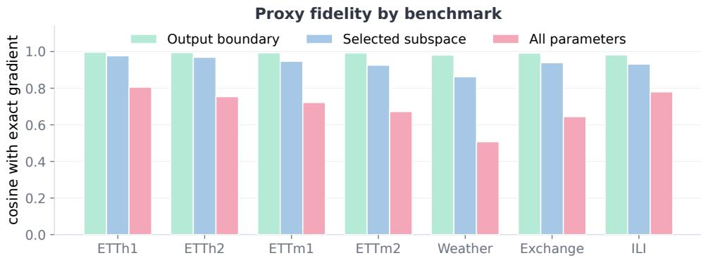  
Figure 15: Cosine similarity between reconstructed proxy rows and exact per-variable gradients for each benchmark. Each bar first averages logged steps within a run and then averages the available runs for that benchmark. Each benchmark contributes 20 runs from five backbones and four prediction lengths. Output-boundary and all-parameter bars use all 20 runs. Selected-subspace bars use 17 Exchange runs, 18 ILI runs, and all 20 runs elsewhere after conditioning on nonzero proxy entries. The smaller counts occur when every logged selected-slice proxy in a run has zero norm, leaving no defined selected-subspace cosine.

Effect on the reconstructed gradients. Figure 16 compares the sum-loss update with the final update in each of the 140 mechanism runs. Conflict mass is the mean of max(− cos<sub>ij</sub>, 0) over all variable pairs, so a cosine of −0.4 contributes 0.4 while a nonnegative cosine contributes zero. A larger conflict mass therefore indicates stronger overall directional opposition among the reconstructed variable gradients. The descent violation ratio is the fraction of reconstructed variable gradients that have a negative inner product with the update. A ratio of 0.2, for example, means that a small step along the negative update would increase the losses of two out of ten reconstructed variable objectives to first order. These are optimization diagnostics defined on the reconstructed rows. They should not be read as direct measurements of test-set harm.

Mean conflict mass falls from 0.075 to 0.009. It decreases in 129 runs, remains unchanged in 11, and increases in none. This one-sided shift directly verifies the intended operation of PV-Surgery. The mean descent violation ratio falls from 0.097 to 0.049. It decreases in 103 runs, remains unchanged in 29, and increases in 8. Descent violations are a stricter downstream test because they also depend on how the corrected rows combine into the final update. Their mean is nearly halved and they decrease in most runs, showing that conflict correction usually carries through to an update that is better aligned with the reconstructed variable objectives.

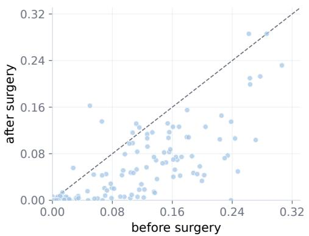  
(a) Descent-violation ratio.

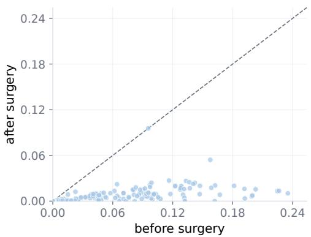  
(b) Conflict mass.  
Figure 16: Descent violations and conflict mass before and after surgery over the 140 matched settings. (a) shows the descent-violation ratio, and (b) shows conflict mass. Each point is one run, with the horizontal and vertical axes giving the values before and after surgery. Points below the diagonal indicate a reduction.

Test-set oracle gap. Figure 17(a) returns to the oracle gap from Section 3. The comparison contains 57 iTransformer variables from the six benchmarks with matched baseline, PV-Surgery, and full-input single-target oracle runs. Shared training harms 29 of these variables. PV-Surgery reduces the gap for 23 and closes it for 12. Among the remaining 28 variables, whose baseline gap is not positive, PV-Surgery increases test MSE for 10 and creates a positive oracle gap for 3. Across all 57 variables, the mean gap decreases by 0.0040 MSE. The aggregate improvement therefore includes both repaired gaps and a smaller number of regressions.

Frozen variable-pair subsets. Figure 17(b) tests a stricter hypothesis using separately trained fixed variable-pair subsets. PV-Surgery improves test MSE on only 5 of 22 conflicting pairs, compared with 16 of 28 aligned pairs. Its mean MSE change relative to the baseline is also unfavorable for both groups, at +0.0085 for conflicting pairs and +0.0021 for aligned pairs. Persistent pairwise conflict is therefore not a reliable marker of the subsets on which surgery will help. This negative result agrees with Section 3, where conflict identifies disagreement but not harm under shared training.

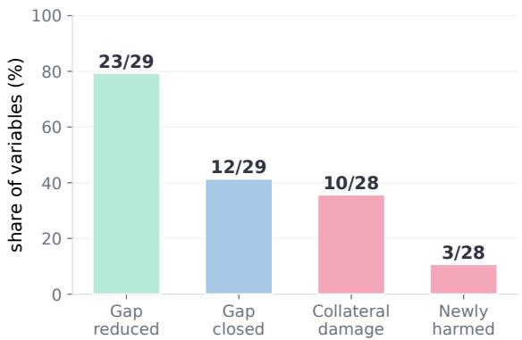  
(a) Effect on the Section 3 oracle gap.

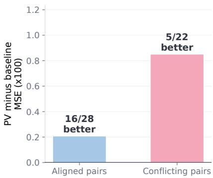  
(b) Frozen variable-pair subsets.  
Figure 17: Test-set evidence for the effect of PV-Surgery. (a) reports changes in the oracle gap. (b) reports PV-Surgery MSE minus baseline MSE on fixed variable-pair subsets. Positive values in (b) favor the baseline.

## K QUALITATIVE CASE STUDIES

Aggregate MSE does not show how two forecasts differ within a window. We therefore inspect four settings with prediction length 96, namely MICN on ETTm2, iTransformer on ETTm2, MICN on ETTh1, and DLinear on ETTh2. Together they cover three backbones and two ETT benchmarks. Each figure shows the six load variables HUFL, HULL, MUFL, MULL, LUFL, and LULL together with oil temperature OT.

Protocol. For each setting, the baseline and PV-Surgery runs use the same data split and test windows. Their saved ground-truth arrays are identical. Since the variables span different vertical ranges, we summarize the error in each panel using a range-normalized mean absolute error. For window n and variable d, let $\hat { y } ^ { \mathrm { M S E } }$ and $\overset { \bullet } { y } ^ { \mathrm { { P V } } }$ denote the forecasts from standard MSE training and PV-Surgery. For either forecast yˆ, the panel distance is

$$
\delta _ { n , d } ( \boldsymbol { \hat { y } } ) = \frac { \frac { 1 } { H } \sum _ { h = 1 } ^ { H } \bigl | \hat { y } _ { n , h , d } - y _ { n , h , d } \bigr | } { \operatorname* { m a x } \{ y , \boldsymbol { \hat { y } } ^ { \mathrm { M S E } } , \boldsymbol { \hat { y } } ^ { \mathrm { P V } } \} _ { n , \cdot , d } - \operatorname* { m i n } \{ y , \boldsymbol { \hat { y } } ^ { \mathrm { M S E } } , \boldsymbol { \hat { y } } ^ { \mathrm { P V } } \} _ { n , \cdot , d } } .\tag{18}
$$

The denominator is the range spanned by the ground truth and both forecasts within the same panel. A value of 0.10 means that the average absolute error is one tenth of this range. The plotted vertica axes retain the standardized target and forecast values. We use $\delta _ { n , d }$ only as a scale-normalized scalar summary to compare the two forecasts within the same window and variable. The smaller of $\delta _ { n , d } \big ( \hat { y } ^ { \mathrm { M S E } } \big )$ and $\delta _ { n , d } ( \hat { y } ^ { \mathrm { P V } } )$ identifies the forecast with the lower average vertical error relative to their common displayed range. We also report the cosine between the predicted and true trajectories after subtracting their respective horizon means. This direction cosine measures temporal shape independently of the mean level. A negative value indicates that the predicted trajectory moves in the opposite direction from the target.

Window selection. We manually select one representative example from each setting in which the effect of PV-Surgery is clearly visible. Together, the examples illustrate level correction, reduced drift, and cases in which panel distance improves without a higher direction cosine. They are descriptive and do not enter any aggregate estimate.

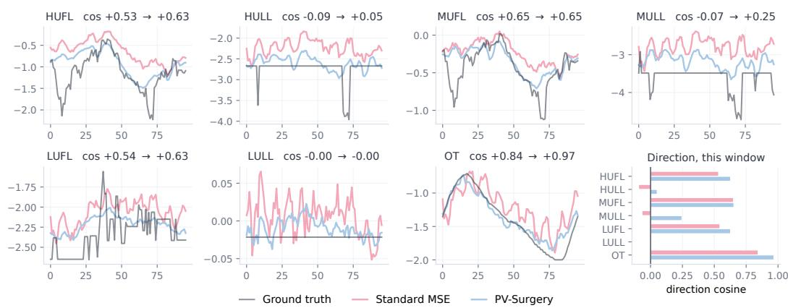  
Figure 18: MICN on ETTm2. Panel titles report the direction cosine for standard MSE training and PV-Surgery. The final panel collects the same values.

MICN on ETTm2. Across the full test set, PV-Surgery lowers MSE by 12.52% and raises the mean direction cosine from 0.422 to 0.510. Window-level MSE improves in 19,377 of 23,409 windows. The number of variables with negative direction cosine decreases in 7,726 windows and increases in 2,534. In Figure 18, the baseline forecast is generally shifted above the ground truth, while PV-Surgery reduces this offset. The panel distance falls from 0.25 to 0.13 for HUFL, from 0.24 to 0.10 for HULL, and from 0.35 to 0.18 for MULL. HULL and MULL also change from negative to positive direction cosine. OT has the smallest corrected distance at 0.08, and its direction cosine rises to 0.97.

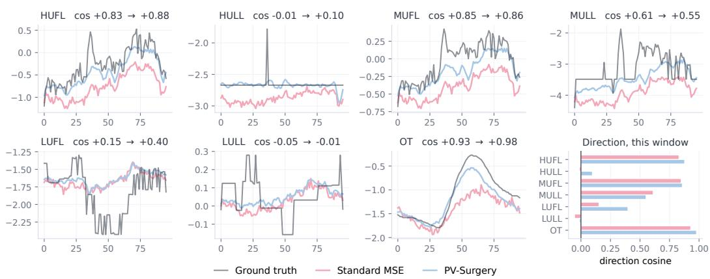  
Figure 19: iTransformer on ETTm2. Panel titles report the direction cosine for standard MSE training and PV-Surgery. The final panel collects the same values.

iTransformer on ETTm2. On the same dataset, iTransformer obtains a smaller MSE reduction of 4.61%. Window-level MSE improves in 15,752 of 23,409 windows. Negative direction cosines become less frequent in 5,020 windows and more frequent in 4,671. Figure 19 again shows a substantial level correction. The panel distance falls from 0.28 to 0.11 for HUFL, from 0.32 to 0.14 for MUFL, and from 0.17 to 0.03 for HULL. The improvement is small for LUFL and LULL. MULL provides a useful counterexample. Its distance decreases from 0.31 to 0.16, while its direction cosine decreases from 0.61 to 0.55. A forecast can therefore move closer in level without matching the temporal shape more closely.

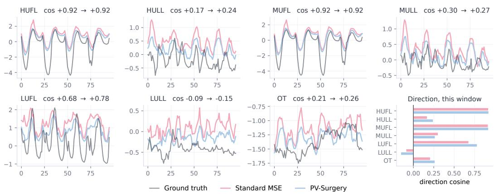  
Figure 20: MICN on ETTh1. Panel titles report the direction cosine for standard MSE training and PV-Surgery. The final panel collects the same values.

MICN on ETTh1. PV-Surgery lowers MSE by 10.85% for MICN on ETTh1. It improves window-level MSE in 4,188 of 5,709 windows. The number of negative direction cosines decreases in 1,156 windows and increases in 221. In Figure 20, the baseline tends to overshoot the target and PV-Surgery moves the forecasts downward. The largest distance reductions occur for LULL, from 0.37 to 0.21, and LUFL, from 0.35 to 0.24. HUFL and MUFL retain direction cosines near 0.92. Direction does not improve for every variable. MULL falls from 0.30 to 0.27, and LULL becomes more negative, even though both panel distances decrease.

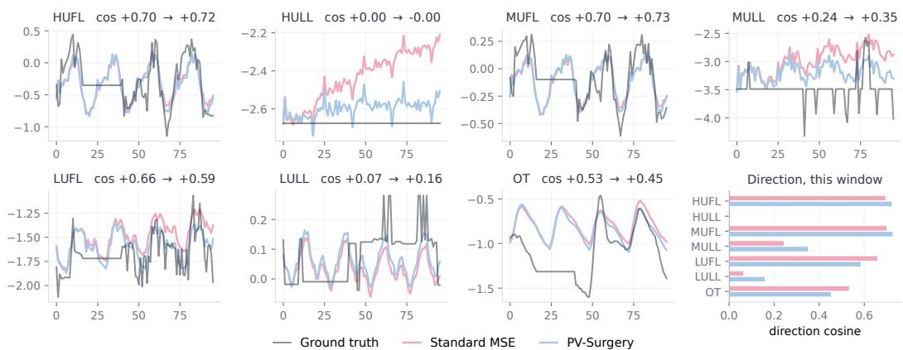  
Figure 21: DLinear on ETTh2. Panel titles report the direction cosine for standard MSE training and PV-Surgery. The final panel collects the same values.

DLinear on ETTh2. PV-Surgery lowers MSE by 4.55% in the DLinear setting. Window-level MSE decreases in 4,174 of 5,709 windows. Negative direction cosines become less frequent in 1,073 windows and more frequent in 264. The clearest change in Figure 21 occurs for HULL. The baseline drifts away from an almost flat target, while the PV-Surgery forecast remains closer throughout the horizon. Its panel distance falls from 0.45 to 0.15. MULL shows a smaller reduction from 0.28 to 0.18. LUFL and OT again show that the two diagnostics need not agree. Their panel distances decrease, but their direction cosines fall from 0.66 to 0.59 and from 0.53 to 0.45.

Across these four settings, the mean direction cosine changes by 0.088, 0.034, 0.041, and 0.028. The selected windows show larger changes in level and amplitude than in temporal shape. They also show why the mechanism results in Appendix J should not be interpreted as a guarantee for every variable. PV-Surgery can reduce aggregate MSE and pairwise conflict while the direction cosine of an individual variable remains unchanged or becomes worse. These examples add a window-level view of the aggregate results and show that lower error does not always come with a higher direction cosine.

## L COMPUTATIONAL COST AND TRAINING TIME

PV-Surgery leaves the forecasting architecture unchanged but requires additional computation at each training step. We describe this additional computation and measure its wall-clock cost over the main experimental grid.

Analytical cost. Like standard MSE training, PV-Surgery uses one backward pass for each optimizer step. Its additional cost comes from reconstructing and processing the variable-wise gradient rows. Let $N _ { \mathcal { H } }$ denote the number of parameters in the hooked layers and $N _ { S }$ the number in the selected layers. Dense zero-extended proxy storage and later row-wise processing scale as $\mathcal { O } ( D N _ { \mathcal { H } } )$ Computing the observed weight outer products costs $\begin{array} { r } { \mathcal { O } ( \sum _ { \ell \in \mathcal { H } _ { \mathrm { r m n } } } \dot { B D M _ { \ell } F _ { \mathrm { i n } , \ell } F _ { \mathrm { o u t } , \ell } } ) } \end{array}$ , where $F _ { \mathrm { i n } , \ell }$ and $\bar { F } _ { \mathrm { o u t } , \ell }$ are the layer widths and the bias term is lower order. Pairwise cosine similarities on the selected subspace cost $\mathcal { O } ( D ^ { 2 } N _ { S } )$ , and evaluating the unpooled candidate plus a pooled candidate with P pools costs $\mathcal { O } ( ( D + P ) \dot { N _ { S } } )$ ).

Layer selection cannot reduce the cache-construction term because the cache is needed to score the layers. It does reduce the pairwise and candidate computations because $N _ { S }$ is no larger than $N _ { \mathcal { H } }$ . Candidate selection adds another direction evaluation when pooling is active. These operations affect training only. The forward pass used at inference is identical to that of the original backbone.

Protocol. We pair each PV-Surgery run with the standard MSE run from the same backbone, benchmark, and prediction length. All 140 pairs use seed 42, the same batch size, and the same GPU type. Early stopping gives different training lengths, so total time alone mixes computational overhead with the number of completed epochs. We divide each run’s logged training time by its completed epoch count and form the PV-Surgery to MSE ratio within each pair. The baseline completes 22.1 epochs on average and PV-Surgery completes 23.3. These timings cover complete training epochs, including data loading, model computation, optimizer steps, and logging. They therefore measure practical training time rather than the isolated cost of the PV-Surgery operator.

Table 20: Training cost of PV-Surgery against standard MSE training over the 140 matched settings of Table 1. Epochs and seconds per epoch are means over the 28 settings of each backbone. The ratio columns are computed per setting and then aggregated, so they are not the quotient of the two preceding columns.
<table><tr><td rowspan="2">Backbone</td><td colspan="2">Epochs</td><td colspan="2">Seconds / epoch</td><td colspan="2">Per-epoch ratio</td><td rowspan="2">Slower</td></tr><tr><td>MSE</td><td>+PV</td><td>MSE</td><td>+PV</td><td>median</td><td>mean</td></tr><tr><td>DLinear</td><td>27.2</td><td>23.4</td><td>6.2</td><td>5.5</td><td>0.88</td><td>1.15</td><td>6/28</td></tr><tr><td>MICN</td><td>17.6</td><td>17.8</td><td>46.1</td><td>62.1</td><td>1.35</td><td>1.37</td><td>28/28</td></tr><tr><td>SCINet</td><td>28.5</td><td>27.7</td><td>18.7</td><td>28.5</td><td>1.52</td><td>1.51</td><td>28/28</td></tr><tr><td>iTransformer</td><td>15.6</td><td>25.4</td><td>6.4</td><td>15.3</td><td>2.09</td><td>2.29</td><td>28/28</td></tr><tr><td>TimeXer</td><td>21.8</td><td>22.3</td><td>6.6</td><td>14.8</td><td>2.22</td><td>2.24</td><td>28/28</td></tr><tr><td>All</td><td>22.1</td><td>23.3</td><td>16.8</td><td>25.3</td><td>1.54</td><td>1.71</td><td>118/140</td></tr></table>

Measured overhead. Table 20 reports the paired results. Across all settings, the per-epoch ratio has a median of 1.54 and a mean of 1.71. PV-Surgery is slower in 118 of the 140 pairs. Summing the logged time over the grid gives 12.84 hours for standard MSE training and 20.56 hours for PV-Surgery, a total-time ratio of 1.60. On the six benchmarks with prediction lengths 96, 192, 336, and 720, the median per-epoch ratio remains between 1.51 and 1.54. We do not observe a systematic increase with forecast length in this grid.

The overhead varies more across backbones. The median ratio is 2.09 for iTransformer and 2.22 for TimeXer, both of which expose several cache-compatible linear layers. MICN has a lower median ratio of 1.35, although its baseline epoch is much slower in absolute time. DLinear has a median ratio below one at 0.88, but its mean ratio is 1.15 and six of its twenty-eight settings are slower with PV-Surgery. The DLinear result should therefore be read as low overhead with substantial timing variation, not as evidence that surgery generally accelerates training.

Implementation considerations. The measured ratios depend on the hardware and current implementation and should not be treated as architecture-independent constants. Caching a separate variable axis and, on some execution paths, materializing dense $D \times N _ { \mathcal { H } }$ proxy rows increase memory traffic, while evaluating both unpooled and pooled candidates adds computation. Compact slicewise assembly and reuse of intermediate quantities could reduce this overhead. Reducing the number of cached layers offers another cost-coverage trade-off. PV-Surgery changes only training-time gradient construction, so inference remains unchanged.