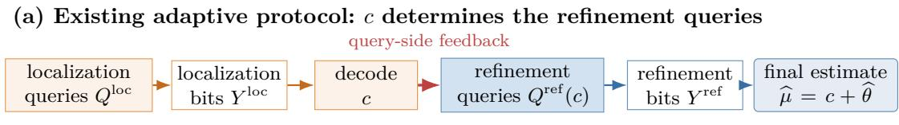
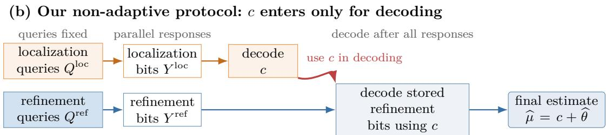
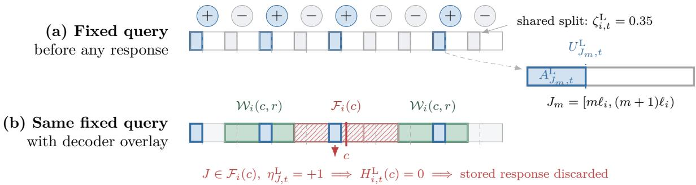
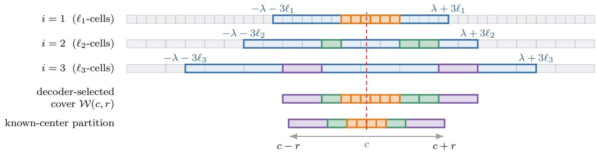
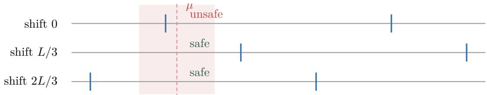
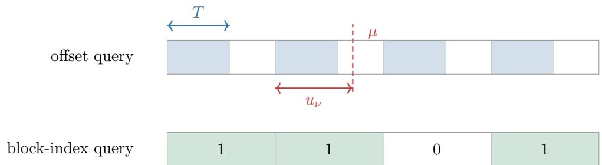
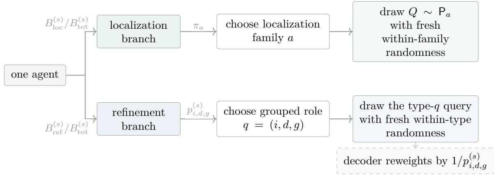

# Non-Adaptive 1-Bit Mean Estimation: Minimax Rates and the Sample–Interval Tradeof

Ivan Lau Jonathan Scarlett

National University of Singapore

## Abstract

We study distributed one-dimensional mean estimation under a 1-bit communication constraint. Each agent observes one sample, drawn independently from an unknown distribution, and returns a single bit in response to a query Q: R → {0, 1} chosen by a central learner. The distribution has mean in [−λ, λ] and k-th central moment at most $\sigma ^ { k } { \mathrm { . } }$ , for a fixed $k > 1$ . The order-optimal two-stage protocol of Lau and Scarlett (2026b) uses responses from the first batch to choose the second-batch queries, and whether this single round of interaction is necessary was posed as an open problem. We answer this negatively: for every k > 1, a non-adaptive protocol attains the adaptive 1-bit minimax rate (and we note that concurrent works reached the same conclusion via diferent strategies). We further determine the minimax sample complexity among non-adaptive 1-bit estimators when every one-set Q−1(1) is restricted to a union of at most s intervals. Relative to unrestricted non-adaptive 1-bit querying, this constraint adds a term of order $\left( \lambda \sigma / ( s \varepsilon ^ { 2 } ) \right)$ log(1/δ), giving the full tradeof between sample complexity and interval complexity to within k-dependent constant factors. As a corollary, we identify, order-wise, the minimum interval budget needed to retain the unrestricted 1-bit minimax sample rate.

## 1 Introduction

In distributed 1-bit mean estimation, a central learner does not observe the samples directly. Instead, a number of agents have access to a single sample each, and each agent returns one bit indicating whether its sample lies in some measurable set chosen by the learner. When the mean may lie anywhere in a large range [−λ, λ], a query aimed at the wrong region can carry almost no information (e.g., due to the region having almost no probability mass). An adaptive protocol can address this obstacle by using an initial batch of responses to localize the mean near a coarse center c, and then choosing later queries to refine the estimate within that neighborhood. This is the architecture of the order-optimal two-stage estimator of Lau and Scarlett (2026b), illustrated in Figure 1(a). In that estimator, c determines the second-batch refinement queries, which therefore cannot be chosen until the first-batch responses have been observed. Lau and Scarlett (2026a) asked whether this query-side interaction is necessary for order-optimal 1-bit mean estimation.

We answer this question negatively by constructing a non-adaptive protocol that attains the adaptive 1-bit minimax rate. In our protocol, both the localization and refinement queries are chosen before any response is observed, so no query-side feedback is required and all agents can answer in parallel. After all responses have been collected, the learner recovers c from the localization bits and uses it to decode the stored refinement bits. The procedure is therefore “two-stage” only in the decoding mechanism, and not in query selection; Figure 1(b) illustrates this distinction. We also characterize the minimax sample complexity when the set $Q ^ { - 1 } ( 1 )$ associated with each query is a union of at most s intervals (with s = 1 recovering the non-adaptive interval-query setting considered in (Lau and Scarlett, 2026b, Theorem 11)). This describes the full sample–interval tradeof up to constant factors and, as a consequence, the minimum order of s that preserves the unrestricted 1-bit sample rate. Section 1.2 gives a more detailed summary of these contributions.

  
Figure 1: Where the decoded center enters the protocol. (a) In the adaptive protocol of Lau and Scarlett (2026b), localization produces a center c that determines the subsequent refinement queries. (b) In our protocol, both query families are fixed in advance and their responses are collected in parallel. After all responses have been collected, c is used to decode the stored refinement bits. The red arrows show where c enters: query selection in (a) and decoding in (b).

## 1.1 Problem Setup

Distribution class. For known parameters $k > 1$ and $\lambda \ge \sigma > 0$ , define the nonparametric distribution class

$$
\mathscr { P } ( k , \lambda , \sigma ) = \Big \{ P : \mu ( P ) = \mathbb { E } _ { P } [ X ] \in [ - \lambda , \lambda ] , \quad \mathbb { E } _ { P } [ | X - \mu ( P ) | ^ { k } ] \leq \sigma ^ { k } \Big \} .
$$

We do not impose any density, symmetry, or bounded-support assumptions.

1-bit communication protocol. The learner is interested in estimating the population mean $\mu = \mu ( P )$ from n independent and identically distributed (i.i.d.) samples $X _ { 1 } , \dots , X _ { n } \sim P$ subject to a 1-bit communication constraint per sample. The learner communicates separately with n agents, each contacted once; the agents do not communicate with one another. Agent t observes $X _ { t } \sim P$ receives a measurable query function $Q _ { t } : \mathbb { R }  \{ 0 , 1 \}$ from the learner (or pre-specified as part of the protocol), and returns the single bit $Y _ { t } = Q _ { t } ( X _ { t } )$ . We call $Q _ { t } ^ { - 1 } ( 1 )$ the query’s one-set, namely, the set on which it returns one. After receiving all n responses, the learner forms an estimate $\widehat { \mu }$ from the completed transcript $( Q _ { 1 } , Y _ { 1 } , \ldots , Q _ { n } , Y _ { n } )$

Adaptive versus non-adaptive queries. We say that a protocol is adaptive (or sequential) if $Q _ { t }$ may depend on the earlier responses $Y _ { 1 } , \dots , Y _ { t - 1 }$ and possible public randomness. It is non-adaptive if the entire query sequence $Q _ { 1 } , \ldots , Q _ { n }$ is chosen before any response is observed, possibly using public randomness. Hence, none of the responses afect the query selection, and all queries can be issued and answered in parallel. Throughout, the learner knows the realized queries and all public randomness. We say that a non-adaptive protocol has $i . i . d .$ queries if $Q _ { 1 } , \ldots , Q _ { n }$ are independent draws from a common distribution on binary query functions. Because the common distribution is chosen in advance, i.i.d. querying is a special case of non-adaptive querying.

Learner’s goal. For $\varepsilon > 0$ and $\delta \in ( 0 , 1 )$ , the learner seeks a mean estimate based on the 1-bit query results that is $( \varepsilon , \delta ) \ – P A C$ over $\mathcal { P } ( k , \lambda , \sigma )$ , i.e., its output $\widehat { \mu }$ satisfies

$$
\operatorname* { s u p } _ { P \in \mathcal { P } ( k , \lambda , \sigma ) } \operatorname* { P r } _ { P } ( | \widehat { \mu } - \mu ( P ) | > \varepsilon ) \leq \delta ,
$$

where the probability is over the samples and all randomness in the estimator. Unless stated otherwise, the learner may choose the query rule based on the known model parameters $( k , \lambda .$ $\sigma )$ , the target $( \varepsilon , \delta )$ , and the prescribed sample budget n. (Some discussion on partially unknown parameters is given in (Lau and Scarlett, 2026b), but it remains open which dependencies can be removed entirely.)

Notation. We use standard asymptotic notation $O ( \cdot ) , \Omega ( \cdot )$ , and $\Theta ( \cdot )$ to hide absolute constants. When these constants depend on the moment parameter $k$ , we make the dependence explicit using $O _ { k } ( \cdot ) , \Omega _ { k } ( \cdot )$ , and $\Theta _ { k } ( \cdot )$ . Throughout, log denotes the natural logarithm. In upper-bound rate expressions, logarithmic factors are implicitly lower bounded by one.

## 1.2 Summary of Contributions

We establish two main results: a non-adaptive protocol that matches the adaptive 1-bit minimax sample complexity for every $k > 1$ , and matching upper and lower bounds that characterize the minimax sample complexity of non-adaptive estimators under every interval budget s.

1. Minimax-optimal 1-bit mean estimation with i.i.d. queries. For every $k > 1$ , Theorem 1 gives an $( \varepsilon , \delta ) – \mathrm { P A C }$ estimator whose sample complexity matches the adaptive 1-bit minimax sample complexity. The construction retains the localization–refinement architecture of $\mathrm { L a u }$ and Scarlett (2026b) but moves the dependence on c from query selection to decoding. Its queries are i.i.d., and every realized one-set is a finite union of intervals.

2. The minimax sample–interval tradeof. Theorem 2 gives matching upper and lower bounds on the minimax sample complexity under non-adaptive queries when the one-set of every query is a union of at most s intervals. Relative to the unrestricted 1-bit minimax sample complexity, the interval restriction contributes the additional term $\Theta _ { k } \big ( ( \lambda \sigma ) / ( s \varepsilon ^ { 2 } ) \cdot \log ( 1 / \delta ) \big )$ The upper bound can be attained with i.i.d. queries. As a special case, Corollary 3 identifies, up to constants depending on $k ,$ the smallest interval budget that preserves the unrestricted 1-bit minimax sample complexity.

## 1.3 Prior and Concurrent Work

Here we focus on the work most directly related to nonparametric 1-bit mean estimation. Appendix F.1 surveys the broader literature on high-probability mean estimation and communicationconstrained learning.

A substantial line of work studies 1-bit mean estimation in parametric settings. Kipnis and Duchi (2022) characterized the optimal asymptotic mean-squared error attainable by adaptive 1-bit protocols for a class of symmetric log-concave location families, including the Gaussian and Laplace families, and compared their performance with that of centralized and non-adaptive distributed protocols. Cai and Wei (2024) established minimax communication–risk tradeofs for distributed Gaussian mean estimation using a localization–refinement decomposition. Kumar and Vatedka (2026) studied adaptive and non-adaptive 1-bit estimation when both location and scale are unknown within a known one-dimensional location–scale family. For several such families, they showed that adaptivity does not improve the asymptotic mean-squared error rate but strictly improves its leading constant.

Beyond parametric families, Abdalla and Chen (2026) constructed non-adaptive 1-bit estimators for finite-variance distributions using randomized thresholds, with guarantees under adversarial corruption. Their 1-bit construction requires prior knowledge of an interval in which X lies with high probability. For the nonparametric finite-moment classes studied here, Lau and Scarlett (2026c) gave sample-complexity guarantees under finite variance (k = 2) that are optimal up to logarithmic factors, using adaptive interval queries. Lau and Scarlett (2026b) subsequently established the minimax rates for every fixed moment regime k > 1 using adaptive threshold queries and also gave a two-stage construction using general 1-bit queries. Lau and Scarlett (2026a) asked whether the same rates can be attained when all queries are fixed in advance.

Independently and concurrently with our work, Miao (2026) and Hu and Zhong (2026) also answered the open problem posed by Lau and Scarlett (2026a). Moreover, Zhang et al. (2026) introduce VALG, an agentic system for research in machine learning theory, and present two theorem candidates for the same problem as part of its evaluation. Together with ours, these approaches share the information flow illustrated in Figure 1(b): localization and refinement bits are collected in parallel, and the decoded center is used only to interpret refinement bits that have already been collected. They all use the localization strategy of Lau and Scarlett (2026b).

The various refinement strategies are outlined here and discussed in more detail in Appendix F. Miao (2026) gives grid-based constructions, while Hu and Zhong (2026) use a successive-scale decomposition; the two VALG candidates are closely related to these approaches. Our decoder instead follows the centered refinement strategy of Lau and Scarlett (2026b): it uses c to select relevant cells, estimates each selected cell’s contribution to the residual, and sums the resulting estimates; see Section 2.2. Overall, our approach can be viewed as taking the adaptive strategy in (Lau and Scarlett, 2026b) and “making it non-adaptive”, whereas the other concurrent approaches are less directly connected to it. Appendices F.3 and F.4 compare these refinement mechanisms in detail.

As currently formulated, the concurrent refinement constructions include query families whose one-sets may have infinitely many interval components, whereas every realized one-set in our construction is a finite union of intervals. We expect that these refinement constructions could be modified to achieve the same finite-union property. By contrast, attaining the order-optimal

sample–interval tradeof in Theorem 2 requires a separate adjustment to the localization strategy;   
see Section 3 for details.

## 2 A Minimax-Optimal Non-Adaptive Estimator

We now state the non-adaptive i.i.d.-query upper bound and describe the estimator (which we interchangeably call the decoder) that attains it. The construction retains the localization–refinement architecture of Lau and Scarlett (2026b), but moves the dependence on the decoded center c from query selection to decoding (Figure 1). All localization and refinement queries are fixed before any response is observed and can therefore be issued and answered in parallel. Only the decoder is two-stage: it first recovers c and then uses it to decode refinement bits that have already been collected. For clarity, this section analyzes the estimator under the prescribed numbers of localization and scale-specific refinement queries specified below. These queries are independent but have typedependent laws. Appendices B and C provide the omitted verification and sample-count details, while Appendix E converts these prescribed query counts into the i.i.d. query law stated below.

Theorem 1 (Minimax-Optimal 1-Bit Mean Estimation with i.i.d. Queries). Fix $k > 1 , \lambda \geq \sigma >$ $\varepsilon > 0 _ { i }$ and $\delta \in ( 0 , 1 )$ . There is a randomized non-adaptive 1-bit estimator that is (ε, δ)-PAC over $\mathcal { P } ( k , \lambda , \sigma )$ and uses n i.i.d. queries, where

$$
\begin{array} { r } { n = O \Big ( \log \frac { \lambda } { \sigma } \Big ) + \left\{ \begin{array} { l l } { O _ { k } \big ( ( \sigma / \varepsilon ) ^ { 2 } \cdot \log ( 1 / \delta ) \big ) , } & { k > 2 , } \\ { O \big ( ( \sigma / \varepsilon ) ^ { 2 } \cdot \log ( \sigma / \varepsilon ) \cdot \log ( 1 / \delta ) \big ) , } & { k = 2 , } \\ { O _ { k } \big ( ( \sigma / \varepsilon ) ^ { k / ( k - 1 ) } \cdot \log ( 1 / \delta ) \big ) , } & { 1 < k < 2 . } \end{array} \right. . } \end{array}\tag{1}
$$

Moreover, the one-set of each query is almost surely a union of $O ( \lambda / \sigma )$ intervals.

The rate in each of the three cases in (1) matches, in the relevant parameter regimes and up to constants depending only on $k ,$ the adaptive upper and lower bounds (Lau and Scarlett, 2026b, Theorems 5 and 9). Hence, non-adaptive queries attain the adaptive 1-bit minimax sample complexity. The construction in this section uses $O ( \lambda / \sigma )$ interval components per query. Theorem 2 in Section 3 characterizes the minimax sample–interval tradeof, while Corollary 3 therein identifies, up to constants depending on $k ,$ the minimum interval budget that preserves the unrestricted 1-bit minimax sample complexity.

## 2.1 Localization

Theorem 1 uses a tightened form of the localization strategy of Lau and Scarlett (2026b, Theorem 16).1 The following lemma gives the localization guarantee needed for refinement and records the interval complexity of its query one-sets. We note that the localization guarantee from Lau and Scarlett (2026b) would already sufice for Theorem 1 (other than the i.i.d. query claim), but we still state and prove the following lemma because we will need to adapt it to the s-interval restricted case in Section 3. Appendix A gives the proof and specifies the hidden constants.

Lemma 1 (Localization). For every $\lambda \ge \sigma > 0 , \delta _ { \mathrm { l o c } } \in ( 0 , 1 / 2 )$ , and every distribution satisfying $\mu \in [ - \lambda , \lambda ]$ and $\mathbb { E } [ | X - \mu | ] \le \sigma ,$ there is a randomized non-adaptive 1-bit protocol that returns $c \in [ - \lambda , \lambda ]$ satisfying $| c - \mu | \leq 8 \sigma$ with probability at least $1 - \delta _ { \mathrm { l o c } }$ . It uses $O ( \log ( \lambda / \sigma ) + \log ( 1 / \delta _ { \log } ) )$ i.i.d. queries, and the one-set of each query is a union of $O ( \lambda / \sigma )$ intervals.

The moment assumption defining $\mathcal { P } ( k , \lambda , \sigma )$ implies $\begin{array} { r } { \mathbb { E } [ | X - \mu | ] \leq ( \mathbb { E } [ | X - \mu | ^ { k } ] ) ^ { 1 / k } \leq \sigma } \end{array}$ by Lyapunov’s inequality, so the assumption $\mathbb { E } [ | X - \mu | ] \leq \sigma$ is indeed satisfied in our setting. On localization success, Minkowski’s inequality gives the following moment bound required for the refinement analysis:

$$
\left( \mathbb { E } [ | X - c | ^ { k } ] \right) ^ { 1 / k } \leq \left( \mathbb { E } [ | X - \mu | ^ { k } ] \right) ^ { 1 / k } + | \mu - c | \leq \bar { \sigma } , \qquad \mathrm { w h e r e ~ } \bar { \sigma } = 9 \sigma .\tag{2}
$$

Because localization and refinement use disjoint samples and independent randomness, conditional on localization success and the realized value of $^ { c , }$ the refinement analysis may treat $c \in [ - \lambda , \lambda ]$ and $\mathbb { E } [ | X - c | ^ { k } ] \leq \bar { \sigma } ^ { k }$ as fixed.

## 2.2 Known-Center Refinement of Lau and Scarlett (2026b)

To motivate our fixed-query construction, we first recall the center-dependent refinement strategy of Lau and Scarlett (2026b) for estimating the residual mean $\mathbb { E } [ X - c ] = \mu - c$ . This subsection begins with a high-level overview. The three paragraphs thereafter respectively introduce the idea of cell decomposition, a first-moment identity supplied by stochastic quantization, and a variance bound carrying a relevant tail factor. Section 2.3 then identifies the obstacles to preserving these properties non-adaptively, while Sections 2.4 and 2.5 formally define our non-adaptive refinement queries and the corresponding decoder.

Overview. Once the localization center c is known, the learner partitions a truncation window around c into cells whose widths grow with their distance from $^ { c , }$ and estimates the cell contributions to the residual mean using randomized threshold queries (which we simplify below by using interval queries). The performance guarantee relies on two properties: each cell contribution is estimated without bias, and the variance of its estimator decreases with the probability that X reaches the distance from c at which the cell lies.

Truncation and decomposition into cell contributions. Fix a localization output c satisfying the conditions above. For any finite collection $\mathcal { I }$ of disjoint intervals, we have

$$
\mathbb { E } \left[ ( X - c ) \cdot \mathbf { 1 } \Bigg \{ X \in \bigcup _ { J \in \mathcal { J } } J \Bigg \} \right] = \sum _ { J \in \mathcal { J } } \mathbb { E } [ ( X - c ) \cdot \mathbf { 1 } \{ X \in J \} ] .\tag{3}
$$

Lau and Scarlett (2026b) choose $\mathcal { I }$ to be a partition of $[ c - r , c + r ]$ , with r large enough that the omitted tail contributes at most $\varepsilon / 2$ . Their refinement problem therefore reduces to estimating the cell contributions $\theta _ { J } : = \mathbb { E } [ ( X - c ) \cdot { \mathbf { 1 } } \{ X \in J \} ]$ and summing them over the cells in the truncation window. The partition is organized into dyadic scales. Writing $\ell _ { i }$ for the scale-i cell width, the widths double with i. Cells near c have the finest width $\ell _ { 1 }$ , while, for $i \geq 2$ , cells of width $\ell _ { i }$ lie at distance $\Theta ( \ell _ { i } )$ from $c .$ The construction below specifically takes $\ell _ { i } = 2 ^ { i - 1 } \bar { \sigma } = \Theta ( 2 ^ { i } \sigma )$ . Figure 3 later contrasts this idealized known-center geometry with a diferent cover selected from fixed c-independent grids.

Interval queries through stochastic quantization. We now consider how to estimate a single cell contribution $\theta _ { J }$ . We describe randomized queries that yield a first-moment identity for this purpose. Write the cell as $\boldsymbol { J } = [ a , b )$ , and let the left and right splits $U ^ { \mathrm { L } }$ and $U ^ { \mathrm { R } }$ be uniform on J and independent of X. For every fixed $x \in \mathbb { R }$ , it is a simple calculation to show that averaging over the uniform splits gives the following identity (Lau and Scarlett, 2026b, Appendix A, Step 4); see also Lemma 6 in Appendix B, where this identity is stated and proved:

$$
\left( a - c \right) \cdot \mathbb { E } _ { U ^ { \mathrm { L } } } \Big [ \mathbf { 1 } \big \{ x \in [ a , U ^ { \mathrm { L } } ) \big \} \Big ] + ( b - c ) \cdot \mathbb { E } _ { U ^ { \mathrm { R } } } \Big [ \mathbf { 1 } \big \{ x \in [ U ^ { \mathrm { R } } , b ) \big \} \Big ] = ( x - c ) \cdot \mathbf { 1 } \big \{ x \in J \big \} ,\tag{4}
$$

in analogy with the identity $\mathbb { E } [ { \bf 1 } \{ U \le x \} ] = x$ for $x \in [ 0 , 1 ]$ and $U \sim \mathrm { U n i f } ( 0 , 1 )$ . Weighted empirical averages of these two indicators therefore produce an unbiased cell estimator $\widehat { \theta } _ { J }$ satisfying $\mathbb { E } [ \widehat { \theta } _ { J } ] = \theta _ { J }$ Summing these cell estimators over the partition estimates the truncated residual mean in (3).

The tail factor in the variance and sample allocation. Unbiasedness alone does not determine how many samples are needed at each scale. The key additional property is that the variance of a cell estimator decreases with the probability that X reaches the corresponding cell. Suppose that a cell $J = [ a _ { J } , b _ { J } )$ lies at a positive distance $L = \operatorname { d i s t } ( c , J ) : = \operatorname* { i n f } _ { x \in J } | x - c | > 0$ from c and has width $\Theta ( L )$ . The interval indicators in (4) vanish unless $X \in J ,$ and hence unless $| X - c | \geq L$ . Since the endpoint weights satisfy $| a _ { J } - c | , | b _ { J } - c | = O ( L )$ and $\mathrm { V a r } ( \mathrm { B e r } ( p ) ) \leq p$ , independence of the samples gives $\operatorname { V a r } ( { \widehat { \theta } } _ { J } ) = O { \big ( } ( L ^ { 2 } / n _ { J } ) \cdot \operatorname* { P r } ( | X - c | \geq L ) { \big ) }$  when $n _ { J }$ samples are used for each query type. Hence, the variance carries the tail factor $\operatorname* { P r } ( | X - c | \geq L )$ , rather than merely the worst-case bound $O ( L ^ { 2 } / n _ { J } )$ . We refer to this property as tail-local variance. Together with the first-moment identity for $\overset { \cdot } { \theta } _ { J }$ , it permits the order-optimal sample allocation of Lau and Scarlett (2026b).

## 2.3 Three Obstacles for Non-Adaptive Queries

This subsection gives a conceptual roadmap for converting the known-center refinement reviewed in Section 2.2 into a non-adaptive construction. That known-center method selects each cell J only after c has been decoded, whereas our queries must be fixed before any localization response is observed. Our goal is to preserve its two key properties: (i) the cell-wise first-moment identity, which recovers each selected cell contribution $\theta _ { J }$ without bias, and (ii) tail-local variance, which weights the variance by the probability that X reaches the corresponding distance scale. We identify three resulting obstacles and preview how our construction resolves them. Sections 2.4 and 2.5 formally define the queries and decoder respectively.

1. The relevant cells are not yet known. At each scale i, we include in a finite bank every grid cell that the decoder might later select, forming $\mathcal { D } _ { i } ^ { \mathrm { b a n k } }$ in (6) below. Once c is decoded, the decoder selects finest-scale cells near c and, farther away, selects cells whose widths are comparable to their distances from $c ;$ see Figure 3 and (12).

2. A single response mixes contributions from many cells. For each query, we assign independent Rademacher signs, taking values ±1 with equal probability, to the bank cells. The sign of each cell determines whether its candidate interval is included in the scale-i query; see Figure $2 ( \mathrm { a } )$ and (8). Multiplying the returned query bit by the sign of a decoder-selected cell isolates that cell in expectation (i.e., the “interference” from other cells vanishes on average); see (9). Combining the two weighted orientations through (4) then recovers its cell contribution.

3. Near-center intervals can remove the tail factor from the variance. Although the preceding step recovers each selected cell contribution $\theta _ { J }$ in expectation, the same random-union query may contain a candidate interval close to c. A near-center observation can then make the conditiona variance of the decoded statistic of order $\ell _ { i } ^ { 2 }$ , rather than the desired $O ( \ell _ { i } ^ { 2 } \cdot \operatorname* { P r } ( | X - c | \geq \ell _ { i } ) )$ . The decoder restores the tail-local variance property by discarding responses whose queries include such a near-center interval and reweighting the retained responses to preserve the first-moment identity; see Figure 2(b) and Section 2.5.

## 2.4 The Fixed Refinement Queries

We first give a high-level overview of the refinement query construction and preview how the decoder will use the resulting queries after localization. The remaining paragraphs formally specify the fixed grids, query banks, and query law, and the final paragraph proves the basic sign-isolation identity. The decoder itself is formally defined in Section 2.5.

Overview. At each queried scale i, we prepare a finite bank $\mathcal { D } _ { i } ^ { \mathrm { b a n k } }$ containing every cell that the decoder might later select; see (6). A single scale-i query draws one Rademacher sign for each bank cell and includes a randomly split subinterval (analogous to (4)) of every cell whose sign is +1. These multiscale banks replace the above-mentioned center-dependent placement of refinement cells; each query is formed from the fixed bank before c is known, whereas the decoder later selects only the scale-appropriate cells. Figure $2 ( \mathrm { a } )$ illustrates one realized query, while Figure $2 ( \mathrm { b } )$ previews the decoder overlay formalized in Section 2.5. Figure 3 previews how the decoder selects a cover from the fixed banks, and the selection rule is formally defined in Section 2.5.

Scales and fixed grids. As outlined in Section 2.2, the existing known-center estimator truncates the residual $X - c$ to a centered window and uses cells whose widths double with their distance from c. We use the same geometric sequence of widths, but place a fixed grid at each scale before c is known. We set $\ell _ { i } = 2 ^ { i - 1 } \bar { \sigma }$ as before, and again choose a truncation width so that the omitted tail contributes at most $\varepsilon / 2$ to the mean. Specifically, we claim that the choice

$$
i _ { \operatorname* { m a x } } = \operatorname* { m i n } \biggl \{ i \geq 1 : \frac { \bar { \sigma } ^ { k } } { \ell _ { i } ^ { k - 1 } } \leq \frac { \varepsilon } { 2 } \biggr \} , \qquad \mathrm { a n d } \qquad r = \ell _ { i _ { \operatorname* { m a x } } } .\tag{5}
$$

sufices to ensure $\mathbb { E } [ | X - c | \cdot { \mathbf { 1 } \{ | X - c | > r \} } ] \le \bar { \sigma } ^ { k } / r ^ { k - 1 } \le \varepsilon / 2$ . Appendix C.1 gives the derivation of this inequality (see (57) therein). It therefore sufices to estimate the residual $X - c$ on a suitable cover, namely, a disjoint collection of cells whose union contains $[ c - r , c + r ]$

For every $i \geq 1$ , let $\mathcal { D } _ { i } = \{ [ m \ell _ { i } , ( m + 1 ) \ell _ { i } ) : m \in \mathbb { Z } \}$ (with $\ell _ { i } = 2 ^ { i - 1 } \bar { \sigma } )$ . These are fixed nested dyadic grids (see the gray regions in Figure 3 below). The scale- $( i + 1 )$ cell containing a scale-i cell J is referred to as its parent par(J). Only scales $i = 1 , \dots , i _ { \mathrm { m a x } }$ will be queried.

Since c is unknown in advance, we need to consider the entire set of potentially relevant cells at each scale $i = 1 , \dots , i _ { \mathrm { m a x } } .$ , which we refer to as the bank of cells. Specifically, the bank includes all scale-i cells that intersect the enlarged range $[ - \lambda - 3 \ell _ { i } , \lambda + 3 \ell _ { i } ]$

$$
\mathcal { D } _ { i } ^ { \mathrm { b a n k } } = \{ J \in \mathcal { D } _ { i } : J \cap [ - \lambda - 3 \ell _ { i } , \lambda + 3 \ell _ { i } ] \neq \emptyset \} .\tag{6}
$$

The margin $3 \ell _ { i }$ turns out to be suficient, since Lemma 2 will show that every scale-i cell J later selected by the decoder intersects $( c - 3 \ell _ { i } , c + 3 \ell _ { i } )$ . Since $c \in [ - \lambda , \lambda ]$ , this implies $J \in \mathcal { D } _ { i } ^ { \mathrm { b a n k } }$ , so the bank contains every potentially selected cell, regardless of the localization output. We show in Appendix B.1 that the size of the bank scales as $| \mathcal { D } _ { i } ^ { \mathrm { b a n k } } | = O ( \operatorname* { m a x } \{ 1 , \lambda / \ell _ { i } \} ) = O ( \lambda / \sigma )$

While using an infinite grid would preserve the same statistical identities, a realized query one-set would then have infinitely many interval components. In contrast, using the finite bank leads to the $O ( \lambda / \sigma )$ interval bound in Theorem 1. Section 3 studies the more general tradeof between the number of intervals and the sample complexity.

One query at a fixed scale. We now describe the mechanism for forming random-union queries across the entire bank, as we previewed in Section 2.3. At scale i, let $t = 1 , \ldots , n _ { i }$ index independent draws of the query law, where $n _ { i }$ will be specified in Section 2.6. For each draw t and orientation $d \in \{ \mathrm { L } , \mathrm { R } \}$ , we draw one common relative split $\zeta _ { i , t } ^ { d } \sim \mathrm { U n i f } [ 0 , 1 ]$ and i.i.d. (across $J \in \mathcal { D } _ { i } ^ { \mathrm { b a n k } } )$ Rademacher signs $\eta _ { J , t } ^ { d } \sim \mathrm { U n i f } \{ - 1 , + 1 \}$ . The relative splits are independent across $( i , t , d )$ , the signs are independent across $( J , i , t , d )$ , and all signs are independent of all split fractions. For $J = [ a _ { J } , b _ { J } )$ set $U _ { J , t } ^ { d } = { a } _ { J } + \zeta _ { i , t } ^ { d } \ell _ { i }$ and define the following candidate subintervals in analogy with (4):

$$
A _ { J , t } ^ { \mathrm { L } } = [ a _ { J } , U _ { J , t } ^ { \mathrm { L } } ) , \qquad \mathrm { a n d } \qquad A _ { J , t } ^ { \mathrm { R } } = [ U _ { J , t } ^ { \mathrm { R } } , b _ { J } ) .\tag{7}
$$

We will specify a collection of queries $Q _ { i , t } ^ { d }$ indexed by $( i , t , d )$ . Within each such query, the same relative split $\zeta _ { i , t } ^ { d }$ is shared across all bank cells, implying that the split points $U _ { J , t } ^ { d }$ are dependent across cells, while each $U _ { J , t } ^ { d }$ remains marginally uniform on its cell $J . ^ { 2 }$ The corresponding query is the union of candidate intervals carrying sign +1:

$$
Q _ { i , t } ^ { d } ( \boldsymbol { x } ) = \mathbf { 1 } \left\{ \begin{array} { l } { \displaystyle { \sum _ { \boldsymbol { x } \in \bigcup _ { J \in \mathcal { D } _ { i } ^ { \mathrm { b a n k } } } A _ { J , t } ^ { d } } } } \\ { \quad \eta _ { J , t } ^ { d } = + 1 } \end{array} \right\} .\tag{8}
$$

On an independent observation $X _ { i , t } ^ { d } \sim P ;$ , the 1-bit query returns $Y _ { i , t } ^ { d } = Q _ { i , t } ^ { d } ( X _ { i , t } ^ { d } )$ . Because there is at most one candidate interval per bank cell, each one-set contains at most $| { \mathcal { D } } _ { i } ^ { \mathrm { b a n k } } | = O ( \lambda / \sigma )$ bounded intervals.

Isolating a cell in expectation with Rademacher signs. The Rademacher signs allow the decoder to isolate any specified cell from the bank-wide response in expectation $( { \mathrm { i . e . } }$ , remove “interference” from other cells on average). Because the bank cells are pairwise disjoint, conditional on the observation and the common relative split $\zeta _ { i , t } ^ { d } ,$ at most one candidate interval contains $X _ { i , t } ^ { d } .$ If that interval belongs to cell $K$ , then $Y _ { i , t } ^ { d } = \mathbf { 1 } \{ \eta _ { K , t } ^ { d } = + 1 \} = ( 1 + \eta _ { K , t } ^ { d } ) / 2$ . This implies that the bank-wide response can be written (in terms of the sets from (7) and the Rademacher variables) as

$$
Y _ { i , t } ^ { d } = \sum _ { K \in \mathcal { D } _ { i } ^ { \mathrm { b a n k } } } \mathbf { 1 } \{ X _ { i , t } ^ { d } \in A _ { K , t } ^ { d } \} \cdot \frac { 1 + \eta _ { K , t } ^ { d } } { 2 } .
$$

  
Figure 2: A fixed refinement query before and after localization. (a) A shared split determines one candidate interval in each bank cell, and the +1 signs select the intervals shown in blue for inclusion in the query one-set. The inset magnifies one included candidate interval. (b) After c is decoded, the decoder overlays the query on the green cover cells $\mathcal { W } _ { i } ( c , r )$ and red-hatched filter cells $\mathcal { F } _ { i } ( c )$ see (12) and (15). The blue candidate interval lying in a filter cell is included in the query because $\eta _ { J , t } ^ { \mathrm { L } } = + 1$ . Consequently, the filter indicator $H _ { i , t } ^ { \mathrm { L } } ( c )$ given in (16) equals zero, so the decoder discards the entire stored response, regardless of the location of $X$

Taking the expectation of $2 Y _ { i , t } ^ { d } \eta _ { J , t } ^ { d }$ with respect to the signs and using $\mathbb { E } _ { \eta } [ ( 1 + \eta _ { K , t } ^ { d } ) \cdot \eta _ { J , t } ^ { d } ] = \mathbf { 1 } \{ K = J \}$ therefore gives

$$
\begin{array} { r } { \mathbb { E } _ { \eta } \left[ 2 Y _ { i , t } ^ { d } \cdot \eta _ { J , t } ^ { d } \ \big | \ X _ { i , t } ^ { d } , \zeta _ { i , t } ^ { d } \right] = \mathbf { 1 } \{ X _ { i , t } ^ { d } \in A _ { J , t } ^ { d } \} \qquad \mathrm { f o r ~ e v e r y ~ } J \in \mathcal { D } _ { i } ^ { \mathrm { b a n k } } . } \end{array}\tag{9}
$$

## 2.5 Decoding After Localization

In this subsection, we formally define the refinement decoder. We begin with a high-level overview. The subsequent three parts of this subsection develop, respectively, the cover-selection rule, the sign-based recovery identity, and the filtering-and-reweighting rule.

Overview. All refinement bits in Section 2.4 are collected without using c. After all responses have been collected and the localization decoder has recovered $^ { c , }$ the refinement decoder performs three operations: it selects from the prequeried banks a cover resembling the known-center partition of Section 2.2; it uses the stored Rademacher signs to isolate the selected cells in expectation; and it discards responses whose queries include a near-center interval. Together with the stochastic-quantization identity, the first two operations yield unbiased estimates of the selected cell contributions $\theta _ { J } ;$ the third restores tail-local variance. All three operations are performed only at the decoder and do not alter any query.

Selecting a geometric cover. The decoder approximates the center-dependent geometry of Section 2.2 by selecting prequeried cells that form a disjoint cover of the truncation window $\left[ c - r , c + r \right]$ (recalling r from (5)). We first describe the selection rule informally and illustrate the resulting geometry in Figure 3; equation (12) below then gives its formal definition.

Informally, first consider the scale-1 (i.e., narrowest) cells intersecting the truncation window. Moving away from c, merge cells along the dyadic tree until one further merge would make a cell wider than its distance from c. Cells near c therefore remain at the finest scale, while cells farther away form progressively wider blocks. This reproduces the qualitative geometry of the centered partition from Section 2.2, while still using only cells that were queried before c was known. Figure 3 illustrates the fixed banks at three representative scales, their decoder-selected overlay, and the idealized known-center partition they mimic. Note that since the available cells come from grids that are fixed in advance, the selected cover is not necessarily symmetric with respect to c.

  
Figure 3: Fixed grids, finite query banks, and the decoder-selected cover. At scale i, the gray cells form the fixed grid $\mathcal { D } _ { i } .$ , and the cells intersecting $\left[ - \lambda - 3 \ell _ { i } , \lambda + 3 \ell _ { i } \right]$ form the finite query bank $\mathcal { D } _ { i } ^ { \mathrm { b a n k } }$ (blue). After decoding $^ { c , }$ the decoder selects the cover cells $\mathcal { W } _ { i } ( c , r )$ (orange, green, and purple for $i = { 1 , 2 , 3 } )$ . The combined cover $\mathcal { W } ( c , r )$ consists of pairwise disjoint cells whose union contains $[ c - r , c + r ]$ , with fine cells near c and wider cells farther away. Lemma 2 states the precise guarantees. The bottom row illustrates the centered partition used by Lau and Scarlett (2026b) when c is known; see Section 2.2. The decoder-selected cover mimics this multiscale structure but need not be symmetric with respect to c.

We now formalize the cover selection rule. Writing len(J) for the length of an interval J, we call a dyadic cell J admissible if len $( J ) \leq \mathrm { d i s t } ( c , J )$ , and let

$$
\mathcal { L } ( c , r ) = \{ B \in \mathcal { D } _ { 1 } : B \cap [ c - r , c + r ] \neq \emptyset \}\tag{10}
$$

be the scale-1 cells intersecting the truncation window. The full grid $\mathcal { D } _ { 1 }$ is used here only to ensure coverage; scale-1 cells far from c will be replaced by coarser ancestors. For each $B \in \mathcal { L } ( c , r )$ , define

$$
J _ { c } ^ { \star } ( B ) = \left\{ \begin{array} { l l } { B , } & { \mathrm { i f ~ } B \mathrm { ~ i s ~ n o t ~ a d m i s s i b l e , } } \\ { \mathrm { t h e ~ c o a r s e s t ~ a d m i s s i b l e ~ d y a d i c ~ a n c e s t o r ~ o f ~ } B , } & { \mathrm { i f ~ } B \mathrm { ~ i s ~ a d m i s s i b l e . } } \end{array} \right.\tag{11}
$$

To see that the ancestor in the second case is well defined, note that B itself is admissible. Moreover, by (10), B intersects $[ c - r , c + r ]$ , and hence every ancestor $J \supseteq B$ does as well. Hence, every admissible ancestor satisfies

$$
\begin{array} { r } { \operatorname { l e n } ( J ) \leq \operatorname { d i s t } ( c , J ) \leq r = \ell _ { i _ { \operatorname* { m a x } } } . } \end{array}
$$

This implies that every admissible ancestor has scale at most $i _ { \mathrm { m a x } } ,$ , and hence the coarsest admissible ancestor exists. For an admissible B, the decoder therefore ascends the dyadic tree to its coarsest admissible ancestor, whereas a non-admissible B remains unchanged at scale 1.

The distinct selected cells form the cover. Grouping them by scale (equivalently, by width), we define

$$
\mathcal { W } ( c , r ) = \{ J _ { c } ^ { \star } ( B ) : B \in \mathcal { L } ( c , r ) \} \quad \mathrm { a n d } \quad \mathcal { W } _ { i } ( c , r ) = \{ J \in \mathcal { W } ( c , r ) : \log ( J ) = \ell _ { i } \} .\tag{12}
$$

We call the members of $\mathcal { W } ( c , r )$ cover cells. Every cover cell has scale at most $i _ { \mathrm { m a x } }$ and therefore belongs to exactly one of the collections $\mathcal { W } _ { i } ( c , r )$ . The geometric properties used in the analysis are summarized in the following lemma and proved in Appendix B.2.

Lemma 2 (Geometry of the cover). For every $c \in [ - \lambda , \lambda ]$ , the cells in $\mathcal { W } ( c , r )$ are pairwise disjoint and cover $[ c - r , c + r ]$ . For every $i \in \{ 1 , \dots , i _ { \mathrm { m a x } } \}$ and every $J = [ a _ { J } , b _ { J } ) \in \mathcal { W } _ { i } ( c , r )$ , we have

$$
\begin{array} { r } { J \cap ( c - 3 \ell _ { i } , c + 3 \ell _ { i } ) \neq \emptyset , \qquad \operatorname* { m a x } \{ | a _ { J } - c | , | b _ { J } - c | \} < 4 \ell _ { i } . } \end{array}
$$

Moreover,

$$
| \mathcal { W } _ { i } ( c , r ) | \le 9 , \qquad \mathcal { W } _ { i } ( c , r ) \subseteq \mathcal { D } _ { i } ^ { \mathrm { b a n k } } .
$$

Finally, for $i \geq 2$ , each cell $J \in \mathcal { W } _ { i } ( c , r )$ satisfies

$$
\ell _ { i } \leq \mathrm { d i s t } ( c , J ) < 3 \ell _ { i } .
$$

Recovering cover-cell contributions with Rademacher signs. For each cell $J = [ a _ { J } , b _ { J } ) \in$ $\mathcal { W } _ { i } ( c , r )$ in the cover, define the endpoint weights $w _ { J } ^ { \mathrm { L } } ( c ) = a _ { J } - c$ and $\begin{array} { r } { w _ { J } ^ { \mathrm { R } } ( c ) = b _ { J } - c , } \end{array}$ . To establish the first-moment identity, for each scale $i = 1 , \dots , i _ { \mathrm { m a x } }$ , repetition index $t = 1 , \ldots , n _ { i }$ , and orientation $d \in \{ \mathrm { L } , \mathrm { R } \}$ , define the following provisional decoded variable:3

$$
\widetilde V _ { i , t } ^ { d } ( \boldsymbol { c } ) = 2 Y _ { i , t } ^ { d } \sum _ { J \in \mathcal { W } _ { i } ( \boldsymbol { c } , \boldsymbol { r } ) } \boldsymbol { w } _ { J } ^ { d } ( \boldsymbol { c } ) \cdot \boldsymbol { \eta } _ { J , t } ^ { d } .\tag{13}
$$

By linearity of expectation, we may apply (9) to each summand in (13) to obtain

$$
\mathbb { E } _ { \eta } \Big [ \widetilde { V } _ { i , t } ^ { d } ( c ) \ | \ X _ { i , t } ^ { d } , \zeta _ { i , t } ^ { d } \Big ] = \sum _ { J \in \mathcal { W } _ { i } ( c , r ) } { w _ { J } ^ { d } ( c ) } \cdot { \mathbf { 1 } } \{ X _ { i , t } ^ { d } \in A _ { J , t } ^ { d } \} .
$$

Averaging next over the random split $\zeta _ { i , t } ^ { d }$ from Section 2.4 and applying the cell-wise stochastic quantization identity (4) gives

$$
\mathbb { E } \Big [ \tilde { V } _ { i , t } ^ { \mathrm { L } } ( c ) + \tilde { V } _ { i , t } ^ { \mathrm { R } } ( c ) \Big ] = \sum _ { J \in \mathcal { W } _ { i } ( c , r ) } \mathbb { E } [ ( X - c ) \cdot \mathbf { 1 } \{ X \in J \} ] = \sum _ { J \in \mathcal { W } _ { i } ( c , r ) } \theta _ { J } ,\tag{14}
$$

thus giving the desired sum of cell-specific means.

Discarding responses influenced by near-center intervals. For $i \geq 2$ , a scale-i query in the centered refinement construction (Lau and Scarlett, 2026b) is supported only at distance $\Theta ( \ell _ { i } )$ from c. This property ensures that the second moment of its decoded statistic is of order $\ell _ { i } ^ { 2 } \cdot \operatorname* { P r } ( | X - c | \geq \ell _ { i } )$ Our decoder aims to preserve this scaling. A query from the fixed bank, however, is a random union over many cells and may include a candidate interval arbitrarily close to c. The obstruction is visible by conditioning on the relative split $( \zeta _ { i , t } ^ { d }$ from Section 2.4). Suppose that an observation x falls in such a near-center interval. Whether the returned bit equals one is then determined by the Rademacher sign of that cell, which is independent of all other signs. Since the cover-cell weights are of order $\ell _ { i } ,$ the conditional sign mean and variance are

$$
\mathbb { E } _ { \eta } [ \widetilde { V } _ { i , t } ^ { d } ( c ) \mid X = x , \zeta _ { i , t } ^ { d } ] = 0 , \qquad \mathrm { V a r } _ { \eta } ( \widetilde { V } _ { i , t } ^ { d } ( c ) \mid X = x , \zeta _ { i , t } ^ { d } ) = 2 \sum _ { K \in \mathcal { W } _ { i } ( c , r ) } \left( w _ { K } ^ { d } ( c ) \right) ^ { 2 } = O ( \ell _ { i } ^ { 2 } ) .
$$

Hence, although the first-moment identity is preserved, the conditional variance may lack the tail-probability factor discussed in Section 2.2. This missing factor would make the sample allocation in Section 2.6 insuficient to obtain an order-optimal PAC guarantee. To restore this factor, we discard a response whenever its query includes a candidate interval from a scale-i bank cell within distance $\ell _ { i }$ of $c ;$ Figure 2(b) illustrates this rule. At the finest scale $\ell _ { 1 }$ , a direct $O ( \ell _ { 1 } ^ { 2 } )$ variance bound sufices, so no filter is needed. We therefore set

$$
{ \mathcal { F } } _ { 1 } ( c ) = { \mathcal { O } } , \qquad { \mathrm { a n d } } \qquad { \mathcal { F } } _ { i } ( c ) = \left\{ J \in { \mathcal { D } } _ { i } ^ { \mathrm { b a n k } } : \operatorname { d i s t } ( c , J ) < \ell _ { i } \right\} \quad { \mathrm { f o r ~ } } i \geq 2 .\tag{15}
$$

For each index t and orientation d, define

$$
H _ { i , t } ^ { d } ( c ) = \mathbf { 1 } \Big \{ \eta _ { J , t } ^ { d } = - 1 \ \mathrm { f o r ~ e v e r y } \ J \in \mathcal { F } _ { i } ( c ) \Big \} , \qquad p _ { i } ( c ) = \mathbb { E } _ { \eta } [ H _ { i , t } ^ { d } ( c ) ] = 2 ^ { - | \mathcal { F } _ { i } ( c ) | } .\tag{16}
$$

Lemma 5 in Appendix B.3 shows that $| { \mathcal { F } } _ { i } ( c ) | \leq 3$ , and hence $p _ { i } ( c ) \geq 1 / 8$ . The value $H _ { i , t } ^ { d } ( c )$ is computed from c and the stored Rademacher signs, whereas $p _ { i } ( c )$ is deterministic once i and c are fixed. Hence, filtering is performed entirely by the decoder, thereby maintaining the non-adaptivity of the queries. The final decoded variable is obtained by filtering and reweighting the provisional decoded variable:

$$
V _ { i , t } ^ { d } ( c ) = \frac { H _ { i , t } ^ { d } ( c ) } { p _ { i } ( c ) } \cdot \widetilde { V } _ { i , t } ^ { d } ( c ) = \frac { 2 H _ { i , t } ^ { d } ( c ) \cdot Y _ { i , t } ^ { d } } { p _ { i } ( c ) } \cdot \sum _ { J \in \mathcal { W } _ { i } ( c , r ) } w _ { J } ^ { d } ( c ) \cdot \eta _ { J , t } ^ { d } ,\tag{17}
$$

where $\widetilde { V } _ { i , t } ^ { d } ( c )$ is the provisional decoded variable defined in (13).

The factor ${ H } _ { i , t } ^ { d } ( c ) / p _ { i } ( c )$ in (17) serves two purposes: Inverse-probability reweighting preserves the first moment, while filtering restores tail locality. Indeed, for $i \geq 2$

$$
V _ { i , t } ^ { d } ( c ) \neq 0 \implies H _ { i , t } ^ { d } ( c ) \cdot Y _ { i , t } ^ { d } = 1 \implies X _ { i , t } ^ { d } \in \bigcup _ { J \in { \mathcal { D } } _ { i } ^ { \mathrm { b a n k } } \backslash { \mathcal { F } } _ { i } ( c ) } J \implies | X _ { i , t } ^ { d } - c | \geq \ell _ { i } .\tag{18}
$$

Hence, the decoded variable can be nonzero only on the required tail event. The next subsection formalizes these first-moment and variance guarantees and sketches how they yield Theorem 1.

## 2.6 Performance Guarantee and Sample Complexity

We now state the main construction-specific guarantee and sketch how it yields Theorem 1. Lemma 3 below, proved in Appendix B.4, shows that the decoded refinement variables $V _ { i , t } ^ { d } ( c )$ defined in (17) satisfy the per-scale first-moment identity and tail-local variance bound used by Lau and Scarlett (2026b) in their multiscale analysis. Given this lemma, the truncation-bias, variance-aggregation, confidence-amplification, and sample-count arguments follow, up to constant factors and diferences in notation, the proof of (Lau and Scarlett, 2026b, Theorem 5). Appendix C gives the complete calculations.

Lemma 3 (Per-Scale Refinement Properties). For every fixed $c \in [ - \lambda , \lambda ]$ , scale $i \in \{ 1 , \dots , i _ { \mathrm { m a x } } \}$ repetition index $t \in \{ 1 , \ldots , n _ { i } \}$ , and orientation $d \in \{ \mathrm { L } , \mathrm { R } \}$ , the decoded variables in (17) satisfy the following per-scale first-moment identity and tail-local variance bound:

$$
\mathbb { E } \Big [ V _ { i , t } ^ { \mathrm { L } } ( c ) + V _ { i , t } ^ { \mathrm { R } } ( c ) \Big ] = \sum _ { J \in \mathcal { W } _ { i } ( c , r ) } \theta _ { J } \quad a n d \quad \mathrm { V a r } \Big ( V _ { i , t } ^ { d } ( c ) \Big ) = O \Big ( \ell _ { i } ^ { 2 } \cdot \tau _ { i } ( c ) \Big ) ,\tag{19}
$$

where $\begin{array} { r } { \tau _ { 1 } ( c ) = 1 \ a n d \ \tau _ { i } ( c ) = \operatorname* { P r } ( | X - c | \geq \ell _ { i } ) \ f o r \ i \geq 2 . } \end{array}$

We sketch the proof here; Appendix B.4 gives the complete argument.

Proof sketch of Lemma 3. Using the disjointness of the filter and cover cells, the calculation in Appendix B.4 shows that filtering and inverse-probability reweighting preserve the conditional first moment. Together with (14), this gives the first identity in (19). For the variance bound, $p _ { i } ( c ) \geq 1 / 8$ and Lemma 2 give $| V _ { i , t } ^ { d } ( c ) | = O ( \ell _ { i } )$ . Equation (18) restricts every non-zero value to the event $\{ | X _ { i , t } ^ { d } - c | \geq \ell _ { i } \}$ for $i \geq 2$ , while $\tau _ { 1 } ( c ) = 1$ handles the base scale. Hence, Var $( V _ { i , t } ^ { d } ( c ) ) \leq$ $\mathbb { E } [ \left( V _ { i , t } ^ { d } ( c ) \right) ^ { 2 } ] = O ( \ell _ { i } ^ { 2 } \cdot \tau _ { i } ( c ) )$ □

We next sketch how these per-scale guarantees yield Theorem 1; Appendix C gives the complete calculations.

Aggregation across scales. With Lemma 3 in hand, we use, up to constant factors, the same scale-wise geometric allocation as (Lau and Scarlett, 2026b):

$$
n _ { i } = \left\lceil C _ { 1 } \frac { \bar { \sigma } ^ { 2 } } { \varepsilon ^ { 2 } } \cdot 2 ^ { ( i - 1 ) ( 2 - k ) } \right\rceil ,\tag{20}
$$

where $C _ { 1 }$ is a suficiently large universal constant. This allocation balances the increasing $O ( \ell _ { i } ^ { 2 } )$ squared endpoint weights against the decreasing tail probability $O ( ( \bar { \sigma } / \ell _ { i } ) ^ { k } )$ of reaching scale i. An initial “constant-probability confidence” estimate of the residual mean can be formed as

$$
\widehat { \theta } _ { \mathrm { b a s e } } ( c ) = \sum _ { i = 1 } ^ { i _ { \mathrm { m a x } } } \frac { 1 } { n _ { i } } \sum _ { t = 1 } ^ { n _ { i } } \Bigl ( V _ { i , t } ^ { \mathrm { L } } ( c ) + V _ { i , t } ^ { \mathrm { R } } ( c ) \Bigr ) .\tag{21}
$$

Condition on successful localization and on the realized center $c ,$ and write $\mathcal { U } ( c , r ) = \bigcup _ { J \in \mathcal { W } ( c , r ) } J $ The per-scale first-moment identity in (19) and disjointness of the cover give

$$
\mathbb { E } [ \widehat { \theta } _ { \mathrm { b a s e } } ( c ) ] = \mathbb { E } [ ( X - c ) \cdot \mathbf { 1 } \{ X \in \mathcal { U } ( c , r ) \} ] .\tag{22}
$$

Since $[ c - r , c + r ] \subseteq { \mathcal { U } } ( c , r )$ , the omitted contribution satisfies

$$
\left| \mathbb { E } [ \widehat { \theta } _ { \mathrm { b a s e } } ( c ) ] - ( \mu - c ) \right| \leq \mathbb { E } [ | X - c | \cdot \mathbf { 1 } \{ | X - c | > r \} ] \leq \frac { \mathbb { E } [ | X - c | ^ { k } ] } { r ^ { k - 1 } } \leq \frac { \bar { \sigma } ^ { k } } { r ^ { k - 1 } } \leq \frac { \varepsilon } { 2 } ,\tag{23}
$$

where the second-last inequality uses the transferred moment bound (2), and the final inequality follows from the choice of $r$ in (5). Independence of samples across $( i , t )$ and the tail-local variance bound in (19), together with (20), give

$$
\mathrm { V a r } ( \widehat \theta _ { \mathrm { b a s e } } ( c ) ) = O \left( \sum _ { i = 1 } ^ { i _ { \operatorname* { m a x } } } \frac { \ell _ { i } ^ { 2 } } { n _ { i } } \tau _ { i } ( c ) \right) = O \left( \frac { \varepsilon ^ { 2 } } { C _ { 1 } } \sum _ { i = 1 } ^ { i _ { \operatorname* { m a x } } } 2 ^ { k ( i - 1 ) } \tau _ { i } ( c ) \right) = O \left( \frac { \varepsilon ^ { 2 } } { C _ { 1 } } \right) .\tag{24}
$$

The last step uses the same dyadic moment-tail bound proved by Lau and Scarlett (2026b); see (62) in Appendix C.2 for more details. Choosing $C _ { 1 }$ suficiently large and applying Chebyshev’s inequality, together with the bias bound (23), establishes that $\operatorname* { P r } \left( | \widehat { \theta } _ { \mathrm { b a s e } } ( c ) - ( \mu - c ) | \leq \varepsilon \big | | c - \mu | \leq 8 \sigma \right) \geq 2 / 3$ (or similarly with $2 / 3$ replaced by any fixed constant in $( 1 / 2 , 1 ) )$

High-probability final guarantee. Set $\delta _ { \mathrm { l o c } } = \delta _ { \mathrm { r e f } } = \delta / 2$ . Repeat the base estimate independently an odd $K = O ( \log ( 1 / \delta _ { \mathrm { r e f } } ) )$ times, and let bθ be their median. Standard median amplification gives Pr $( | \widehat { \theta } - ( \mu - c ) | > \varepsilon | | c - \mu | \leq 8 \sigma ) \leq \delta _ { \mathrm { r e f } }$ . Consequently, the final estimate ${ \widehat { \mu } } = c + { \widehat { \theta } }$ is $( \varepsilon , \delta ) – \mathrm { P A C }$ after combining the localization and refinement failure probabilities.

Sample complexity. One base estimate uses $2 \sum _ { i = 1 } ^ { i _ { \operatorname* { m a x } } } n _ { i }$ refinement queries, where the factor two corresponds to the two orientations d $\in \{ \mathrm { L } , \mathrm { R } \}$ . Since $\bar { \sigma } = 9 \sigma$ , the cutof $i _ { \mathrm { m a x } }$ in (5) and the allocation in (20) have the same orders as their counterparts in (Lau and Scarlett, 2026b). The geometric sum therefore has the same three regimes as theirs: it is dominated by $i = 1$ when $k > 2$ receives an equal-order contribution from each of $O ( \log ( \sigma / \varepsilon ) )$ scales when $k = 2$ , and is dominated by $i = i _ { \mathrm { m a x } }$ when $1 < k < 2$ . Multiplying by the ${ \cal O } ( \log ( 1 / \delta ) )$ median-amplification factor gives the three refinement terms in (1). Localization contributes $O ( \log ( \lambda / \sigma ) + \log ( 1 / \delta ) )$ additional queries. Its confidence term is absorbed by every refinement term because $\varepsilon < \sigma$ . This proves the stated sample bound.

Appendices C.1–C.4 provide the complete bias, variance, amplification, and geometric-series calculations. Moreover, Appendix E converts the fixed query counts into one i.i.d. query law without changing the sample order or interval bound. This completes the proof of Theorem 1.

## 3 The Sample–Interval Tradeof

The construction in Section 2 uses $O ( \lambda / \sigma )$ intervals per query, whereas a fully sequential protocol from (Lau and Scarlett, 2026b) (but not the two-stage one) uses only threshold queries. On the other hand, Lau and Scarlett (2026b, Theorem 11) showed that restricting a non-adaptive strategy to one interval per query must incur an additional sample-complexity cost of order $( \lambda \sigma ) / \varepsilon ^ { 2 } \cdot \log ( 1 / \delta )$ notably having linear dependence on λ rather than logarithmic. This motivates us to study how this penalty decreases when each non-adaptive query may use up to s intervals, for general s. As we will see in the proof sketch of Theorem 2, extending the lower bound and the refinement construction to general s is comparatively direct, whereas localization is more delicate and requires a diferent construction.

A query Q is s-interval if its one-set $Q ^ { - 1 } ( 1 )$ is a union of at most s intervals.4 The intervals may be open, closed, half-open, or unbounded. We call the number of connected components of $Q ^ { - 1 } ( 1 )$ the query’s interval complexity. In particular, threshold queries and interval queries are both 1-interval. Let $n _ { s } ^ { \star } ( k , \lambda , \sigma , \varepsilon , \delta )$ denote the minimax sample complexity among non-adaptive 1-bit estimators over $\mathcal { P } ( k , \lambda , \sigma )$ whose queries are almost surely s-interval. Subsequently, we use the terminology unrestricted to remove (only) the interval-budget constraint; the 1-bit and non-adaptive restrictions still apply. For $u \geq 1$ , define the refinement-rate function

$$
\Re _ { k } ( u , \delta ) = \left\{ \begin{array} { l l } { u ^ { 2 } \cdot \log ( 1 / \delta ) , } & { k > 2 , } \\ { u ^ { 2 } \cdot \log u \cdot \log ( 1 / \delta ) , } & { k = 2 , } \\ { u ^ { k / ( k - 1 ) } \cdot \log ( 1 / \delta ) , } & { 1 < k < 2 , } \end{array} \right.\tag{25}
$$

and observe that $\Re _ { k } ( \sigma / \varepsilon , \delta )$ is the refinement term in (1).

Theorem 2 (Minimax Sample–Interval Tradeof for Non-Adaptive 1-Bit Mean Estimation). Fix $k > 1$ . For suficiently small constants $c _ { k } , \delta _ { k } > 0$ , suppose that $\lambda \ge \sigma > 0 , \varepsilon \in ( 0 , c _ { k } \sigma ) , \delta \in ( 0 , \delta _ { k } )$ and $s \geq 1$ is an integer. Then

$$
n _ { s } ^ { \star } ( k , \lambda , \sigma , \varepsilon , \delta ) = \Theta _ { k } \left( \log \frac { \lambda } { \sigma } + \Re _ { k } ( \sigma / \varepsilon , \delta ) + \left( \frac { 1 } { s } \right) \cdot \left( \frac { \lambda } { \sigma } \right) \cdot \left( \frac { \sigma } { \varepsilon } \right) ^ { 2 } \log \frac { 1 } { \delta } \right) .\tag{26}
$$

The upper bound is attained by an estimator whose query functions are i.i.d. and whose one-sets almost surely have at most s interval components.

The first two terms in (26) are the localization and refinement costs without an interval restriction. The final term is the additional cost of the s-interval constraint. For $s = 1$ , this recovers the interval-dependent cost from (Lau and Scarlett, 2026b, Theorem 11), which can be viewed as the cost of treating $\Theta ( \lambda / \sigma )$ possible σ-scale locations separately, with ${ \cal O } ( ( \sigma / \varepsilon ) ^ { 2 } \log ( 1 / \delta ) )$ samples per location. Allowing s intervals reduces this cost by a factor of $s ,$ until it is absorbed by the unrestricted rate. Balancing this interval-dependent cost against the unrestricted rate yields the following corollary.

Corollary 3 (Minimum Interval Budget at the Unrestricted 1-Bit Sample Rate). Fix $k > 1$ . Let $c _ { k } , \delta _ { k } > 0$ be as in Theorem 2, and suppose that $\lambda \ge \sigma > 0 , \varepsilon \in ( 0 , c _ { k } \sigma )$ , and $\delta \in ( 0 , \delta _ { k } )$ . Let $N _ { k } ^ { \mathrm { u n r e s } } = \log ( \lambda / \sigma ) + \Re _ { k } ( \sigma / \varepsilon , \delta )$ denote the unrestricted 1-bit minimax sample complexity expression, and define

$$
s _ { k } ^ { \mathrm { o p t } } = \left\lceil \operatorname* { m a x } \Biggl \{ 1 , \frac { ( \lambda \sigma / \varepsilon ^ { 2 } ) \cdot \log ( 1 / \delta ) } { N _ { k } ^ { \mathrm { u n r e s } } } \right\} \Biggl \rceil .\tag{27}
$$

There is a non-adaptive estimator that is $( \varepsilon , \delta ) \ – P A C$ over $\mathcal { P } ( k , \lambda , \sigma )$ , uses $O _ { k } ( N _ { k } ^ { \mathrm { u n r e s } } )$ samples, and has i.i.d. queries that are almost surely $s _ { k } ^ { \mathrm { o p t } }$ -interval. Moreover, any non-adaptive estimator using only s-interval queries that is $( \varepsilon , \delta ) \ – P A C$ over $\mathcal { P } ( k , \lambda , \sigma )$ and uses $O _ { k } ( N _ { k } ^ { \mathrm { u n r e s } } )$ samples must have $s = \Omega _ { k } ( s _ { k } ^ { \mathrm { o p t } } )$

We next give a proof sketch of Theorem 2. The formal details are given in Appendix D, and the conversion to a single i.i.d. query law is given in Appendix E.

Proof sketch of Theorem 2. The proof has three parts. For the lower bound, the only new step compared to (Lau and Scarlett, 2026b, Theorem 11) is to count how many hard locations an sinterval query can distinguish. For the upper bound, we group the refinement queries to respect the interval budget, whereas localization requires a separate s-interval construction.

Lower bound. The unrestricted localization and refinement terms follow from the unrestricted lower bound (Lau and Scarlett, 2026b, Theorem 9). For the interval-dependent term, we use the hard family from (Lau and Scarlett, 2026b, Theorem 11), which places two point masses at each of $N = \Theta _ { k } ( \lambda / \sigma )$ locations with pairwise disjoint support segments. Conditioning on the protocol randomness, let $n _ { j }$ be the number of queries that separate the two support points at location j. An s-interval one-set has at most $2 s$ boundary points. Separating a pair requires a boundary point in its support segment, so the disjointness of the segments implies that each query separates at most 2s pairs. Hence, $\begin{array} { r } { \sum _ { j = 1 } ^ { N } n _ { j } \le 2 s n } \end{array}$ . Each informative response contributes at most $O _ { k } ( \varepsilon ^ { 2 } / \sigma ^ { 2 } )$ KL divergence, while every other response contributes zero. Repeating the testing and averaging argument of (Lau and Scarlett, 2026b, Theorem 11) with 2sn in place of 2n gives $n = \Omega _ { k } \big ( ( \lambda \sigma ) / ( s \varepsilon ^ { 2 } ) \cdot \log ( 1 / \delta ) \big )$ .

Refinement. At each scale $i ,$ we partition the bank $\mathcal { D } _ { i } ^ { \mathrm { b a n k } }$ in (6) into $G _ { i } = O ( \operatorname* { m a x } \{ 1 , \lambda / ( s \ell _ { i } ) \} )$ groups of at most s cells and apply the refinement construction of Section 2 separately to each group using independent samples. The resulting queries are s-interval. The groupwise expectations sum to the original first-moment target, while independence makes their variances add and preserve the same tail-local bound. Hence, the analysis of Section 2.6 applies with $G _ { i } n _ { i }$ queries at scale i. Summing over the scales and amplifying yields $O _ { k } ( \mathfrak { R } _ { k } ( \sigma / \varepsilon , \delta ) + ( \lambda \sigma / ( s \varepsilon ^ { 2 } ) ) \log ( 1 / \delta ) )$ refinement samples.

Localization. Grouping the localization queries of Section 2.1 would introduce an extraneous term of order $( \lambda / ( s \sigma ) ) \cdot \log ( \lambda / \sigma )$ , so we instead use a diferent localization construction. For $s \leq 8 ,$ ordinary random-threshold queries sufice; this case is analyzed using Lemma 10 in Appendix D.3. For $s > 8$ we first describe the construction for a single block partition and then explain how to avoid a boundary instability issue. Fix in advance a partition of $[ - \lambda , \lambda ]$ into at most s blocks of width $L = \Theta ( \operatorname* { m a x } \{ \sigma , \lambda / s \} )$ . For this partition, precommit to two query families. The first identifies the block index using the coding mechanism of Lemma 1. The second places the same random threshold relative to the left endpoint of every block, allowing the decoder to estimate the within-block ofset without knowing the relevant block in advance. The decoder recovers the block index and ofset separately and combines them. Both query families are s-interval: a block-index query selects a union of whole blocks, while an ofset query selects at most one prefix interval from each block.

While the preceding decomposition conveys the key idea, it can be unstable when the mean lies near a block boundary. To remove this instability, we precommit to both query families for each of three suitably shifted partitions. Every mean lies safely inside a block for at least two shifts, so taking the median of the three reconstructions removes the boundary instability. Appendix D.3 shows that the resulting localizer uses $O ( \log ( \lambda / \sigma ) + \operatorname* { m a x } \{ 1 , \lambda / ( \sigma s ) \} \cdot \log ( 1 / \delta ) )$ samples. Since $\varepsilon < \sigma$ , the second term is absorbed by the refinement terms above, completing the upper bound. □

## 4 Conclusion

Theorem 1 resolves the main motivating question posed in (Lau and Scarlett, 2026a): for every $k > 1$ , a non-adaptive estimator with i.i.d. queries attains the adaptive 1-bit minimax optimal sample rate in the relevant parameter regimes. All queries are fixed before any response; only the decoder waits for the localization output before interpreting the refinement bits.

Theorem 2 then establishes the minimax-optimal tradeof between the number of samples n and the maximum number of intervals per query s. Relative to unrestricted non-adaptive querying, the constraint adds $( \lambda \sigma / ( s \varepsilon ^ { 2 } ) ) \log ( 1 / \delta )$ samples, up to constants depending on k and the fixed failure-probability cap. Corollary 3 identifies, up to constants depending only on $k ,$ the minimum interval budget that preserves the unrestricted 1-bit sample rate. By contrast, a fully sequential protocol attains this rate using only threshold queries (Lau and Scarlett, 2026b), so the penalty comes from combining non-adaptivity with a limited interval budget.

As noted in (Lau and Scarlett, 2026b), several open problems still remain including settings where $( \sigma , \varepsilon )$ is unknown to the learner and multivariate settings. Our results in Section 3 also raise the possibility of studying a more general tradeof between samples, intervals, and rounds of adaptivity. Finally, a broader direction is to understand when adaptivity helps under quantization in other statistical problems.

## Declaration of AI Usage

The authors determined the overall research direction and led the development of the non-adaptive 1-bit query design, estimator, and the proof strategy. AI models (initially ChatGPT 5.5 Pro and later ChatGPT-5.6 Sol Pro) were used to explore mathematical arguments, draft proof sketches for several intermediate results, and assist with planning and drafting parts of the exposition. Some technical ideas used in the final analysis arose from this exploration, including Rademacher-sign averaging. All AI-generated output was carefully checked and heavily revised or rewritten by the authors. The authors take full responsibility for the final manuscript and the validity of its results.

## Acknowledgment

This work was supported by the Singapore National Research Foundation (NRF) under its AI Visiting Professorship programme.

## References

Abdalla, P. and Chen, J. (2026). Robust mean estimation under quantization. arXiv preprint arXiv:2601.07074.

Acharya, J., Canonne, C. L., Sun, Z., and Tyagi, H. (2022). The role of interactivity in structured estimation. In Conference on Learning Theory (COLT), pages 1328–1355. PMLR.

Acharya, J., Canonne, C. L., Sun, Z., and Tyagi, H. (2023). Unified lower bounds for interactive high-dimensional estimation under information constraints. In Advances in Neural Information Processing Systems, volume 36, pages 51133–51165.

Babu, N. S., Kumar, R., and Vatedka, S. (2025). Unbiased quantization of the $l _ { 1 }$ ball for communication-eficient distributed mean estimation. In International Conference on Artificial Intelligence and Statistics (AISTATS), pages 1270–1278. PMLR.

Barnes, L. P., Han, Y., and Özgür, A. (2020). Lower bounds for learning distributions under communication constraints via Fisher information. Journal of Machine Learning Research, 21:1–30.

Ben-Basat, R., Vargaftik, S., Portnoy, A., Einziger, G., Ben-Itzhak, Y., and Mitzenmacher, M. (2024). Accelerating federated learning with quick distributed mean estimation. In International Conference on Machine Learning (ICML), pages 3410–3442. PMLR.

Braverman, M., Garg, A., Ma, T., Nguyen, H. L., and Woodruf, D. P. (2016). Communication lower bounds for statistical estimation problems via a distributed data processing inequality. In ACM Symposium on Theory of Computing (STOC), pages 1011–1020.

Cai, T. T. and Wei, H. (2022). Distributed adaptive gaussian mean estimation with unknown variance: Interactive protocol helps adaptation. The Annals of Statistics, 50(4):1992–2020.

Cai, T. T. and Wei, H. (2024). Distributed Gaussian mean estimation under communication constraints: Optimal rates and communication-eficient algorithms. Journal of Machine Learning Research, 25(37):1–63.

Cherapanamjeri, Y., Tripuraneni, N., Bartlett, P., and Jordan, M. I. (2022). Optimal mean estimation without a variance. In Conference on Learning Theory (COLT), pages 356–357. PMLR.

Dagan, Y. and Feldman, V. (2020). Interaction is necessary for distributed learning with privacy

or communication constraints. In ACM SIGACT Symposium on Theory of Computing (STOC), pages 450–462.

Davies, P., Gurunanthan, V., Moshrefi, N., Ashkboos, S., and Alistarh, D. (2021). New bounds for distributed mean estimation and variance reduction. In International Conference on Learning Representations (ICLR).

Devroye, L., Lerasle, M., Lugosi, G., and Oliveira, R. I. (2016). Sub-Gaussian mean estimators. The Annals of Statistics, 44(6):2695–2725.

Duchi, J. and Rogers, R. (2019). Lower bounds for locally private estimation via communication complexity. In Conference on Learning Theory (COLT), pages 1161–1191. PMLR.

Gopi, S., Kamath, G., Kulkarni, J., Nikolov, A., Wu, Z. S., and Zhang, H. (2020). Locally private hypothesis selection. In Conference on Learning Theory (COLT), pages 1785–1816. PMLR.

Han, Y., Özgür, A., and Weissman, T. (2018). Geometric lower bounds for distributed parameter estimation under communication constraints. In Conference on Learning Theory (COLT), pages 3163–3188. PMLR.

Hu, J. and Zhong, H. (2026). Interaction is not necessary for order-optimal 1-bit mean estimation. arXiv preprint arXiv:2608.02538.

Kazemi, H., Pensia, A., and Jog, V. (2025). The sample complexity of distributed simple binary hypothesis testing under information constraints. In Conference on Learning Theory (COLT), pages 3213–3214. PMLR.

Kipnis, A. and Duchi, J. C. (2022). Mean estimation from one-bit measurements. IEEE Transactions on Information Theory, 68(9):6276–6296.

Konečný, J. and Richtárik, P. (2018). Randomized distributed mean estimation: Accuracy vs. communication. Frontiers in Applied Mathematics and Statistics, 4:62.

Kumar, R. and Vatedka, S. (2026). One-bit distributed mean estimation with unknown variance. Transactions on Machine Learning Research.

Lau, I. and Scarlett, J. (2026a). Open problem: Is interaction necessary for order-optimal 1-bit mean estimation? In Conference on Learning Theory (COLT), pages 7123–7128. PMLR.

Lau, I. and Scarlett, J. (2026b). Order-optimal sequential 1-bit mean estimation in general tail regimes. arXiv preprint arXiv:2604.07796.

Lau, I. and Scarlett, J. (2026c). Sequential 1-bit mean estimation with near-optimal sample complexity. In International Conference on Artificial Intelligence and Statistics (AISTATS), pages 217–225. PMLR.

Lee, J. C. H. and Valiant, P. (2022). Optimal Sub-Gaussian mean estimation in R. In IEEE Symposium on Foundations of Computer Science (FOCS), pages 672–683. IEEE.

Mayekar, P., Suresh, A. T., and Tyagi, H. (2021). Wyner-ziv estimators: Eficient distributed mean estimation with side-information. In International Conference on Artificial Intelligence and Statistics (AISTATS), pages 3502–3510. PMLR.

Miao, Y. (2026). Universal refinement without interaction: Order-optimal 1-bit mean estimation. arXiv preprint arXiv:2607.24358.

Minsker, S. (2023). Eficient median of means estimator. In Conference on Learning Theory (COLT), pages 5925–5933. PMLR.

Polyanskiy, Y. and Wu, Y. (2025). Information Theory: From Coding to Learning. Cambridge University Press.

Pour, A. F., Ashtiani, H., and Asoodeh, S. (2024). Sample-optimal locally private hypothesis selection and the provable benefits of interactivity. In Conference on Learning Theory (COLT), pages 4240–4275. PMLR.

Shamir, O. (2014). Fundamental limits of online and distributed algorithms for statistical learning and estimation. In Advances in Neural Information Processing Systems, volume 27, pages 163–171.

Suresh, A. T., Felix, X. Y., Kumar, S., and McMahan, H. B. (2017). Distributed mean estimation with limited communication. In International Conference on Machine Learning (ICML), pages 3329–3337. PMLR.

Tsybakov, A. B. (2009). Introduction to Nonparametric Estimation. Springer.

Vargaftik, S., Basat, R. B., Portnoy, A., Mendelson, G., Itzhak, Y. B., and Mitzenmacher, M. (2022). EDEN: Communication-eficient and robust distributed mean estimation for federated learning. In International Conference on Machine Learning (ICML), pages 21984–22014. PMLR.

Vargaftik, S., Ben-Basat, R., Portnoy, A., Mendelson, G., Ben-Itzhak, Y., and Mitzenmacher, M. (2021). DRIVE: One-bit distributed mean estimation. In Advances in Neural Information Processing Systems, pages 362–377.

Zhang, D., Tang, X., Yin, X., Chen, X., Qian, J., and Zou, D. (2026). VALG: An agentic system for ML theory research. arXiv preprint arXiv:2608.13060.

Zhang, Y., Duchi, J. C., Jordan, M. I., and Wainwright, M. J. (2013). Information-theoretic lower bounds for distributed statistical estimation with communication constraints. In Advances in Neural Information Processing Systems, volume 26, pages 2328–2336.

## Appendix

## A Finite-Union Localization (Lemma 1)

This appendix proves Lemma 1, stated in Section 2.1. We start from the coding-theoretic localizer used by Lau and Scarlett (2026b) to prove Theorem 16 and modify its coordinate schedule by sampling code coordinates independently with replacement, leading to i.i.d. localization queries. Writing each coordinate query as the union of the bins carrying code bit one will make explicit that every one-set is a union of $O ( \lambda / \sigma )$ intervals. We additionally tighten the constant factors. Lau and Scarlett (2026b) use bins of width between 10σ and 20σ and return an interval comprising at most five consecutive bins; taking its midpoint gives a radius of at most $5 0 \sigma$ . Here we use bins of width 5σ and return the projected midpoint of the decoded bin. With probability at least $1 - \delta _ { \mathrm { l o c } }$ , the decoded bin is the true bin or one of its two neighbors, giving error at most $7 . 5 \sigma < 8 \sigma$

## A.1 Nearly Equidistant Codebook

We use the following standard random-coding lemma, which records the codebook construction of Lau and Scarlett (2026b) with a general distance tolerance. We apply it with $\xi = 0 . 0 1$ below, as in their localization proof, and with $\xi = 1 / 4$ for the s-interval localizer in Appendix D.3.

Lemma 4 (Nearly equidistant binary codebook). For every integer $K \geq 2$ and every fixed $\xi \in \mathbf { \Xi }$ $( 0 , 1 / 2 )$ , there are codewords $z _ { 1 } , \dots , z _ { K } \in \{ 0 , 1 \} ^ { d _ { \mathrm { c o d e } } }$ , with $d _ { \mathrm { c o d e } } = O _ { \xi } ( \log K )$ , such that

$$
\left( \frac { 1 } { 2 } - \xi \right) \leq \frac { d _ { H } ( z _ { j } , z _ { j ^ { \prime } } ) } { d _ { \mathrm { { c o d e } } } } \leq \left( \frac { 1 } { 2 } + \xi \right) \qquad ( j \neq j ^ { \prime } ) .
$$

Proof. Draw the K codewords independently and uniformly from $\{ 0 , 1 \} ^ { d _ { \mathrm { c o d e } } }$ . For each pair, the Hamming distance has distribution Bin $( d _ { \mathrm { c o d e } } , 1 / 2 )$ . Hoefding’s inequality and a union bound give

$$
\operatorname* { P r } \biggr ( \operatorname* { m a x } _ { j \neq j ^ { \prime } } \biggl | \frac { d _ { H } \bigl ( z _ { j } , z _ { j ^ { \prime } } \bigr ) } { d _ { \mathrm { c o d e } } } - \frac { 1 } { 2 } \biggr | > \xi \biggr ) \leq K ^ { 2 } \cdot 2 e ^ { - 2 \xi ^ { 2 } d _ { \mathrm { c o d e } } } .
$$

For a suficiently large constant $C _ { \xi }$ , taking $d _ { \mathrm { c o d e } } = \lceil C \xi \log K \rceil$ makes the right-hand side less than one. Hence, a deterministic realization with the claimed property exists. □

## A.2 Finite-Union Localization with an 8σ Guarantee

We now prove Lemma 1 in three steps. We first partition $[ - \lambda , \lambda ]$ into bins and construct the i.i.d. finite-union queries. For each candidate bin, we next consider the fraction of responses that disagree with its assigned code bits. We show that the true bin or one of its two neighbors has an expected disagreement fraction strictly smaller than that of every bin outside this three-bin set. Finally, we use concentration to show that the decoder selects one of these three bins.

Bin construction and i.i.d. queries. Set $h = 5 \sigma$ and $a = - \lambda - 2 h$ . Let $N = \lceil 2 \lambda / h \rceil + 4$ so that $b : = a + N h \ge \lambda + 2 h$ . Use the interior bins

$$
B _ { j } = [ a + ( j - 1 ) h , a + j h ) , \qquad j = 1 , \ldots , N ,
$$

together with the exterior bins $B _ { 0 } = ( - \infty , a )$ and $B _ { N + 1 } = [ b , \infty )$ . There are $K = N + 2 = O ( \lambda / \sigma )$ bins. The grid extends 2h past −λ and at least 2h past λ. This boundary guard ensures that the interior bin containing any $\mu \in [ - \lambda , \lambda ]$ has an interior neighbor on both sides. Thus, the true bin and its two neighbors are interior bins even when $\mu$ is at an endpoint, so the three-bin comparison below needs no separate boundary case. The guard adds only $O ( 1 )$ bins and has only a mild efect on the constants; the 8σ guarantee primarily comes from the choice $h = 5 \sigma$ and decoding at most one bin away.

Choose deterministic codewords $z _ { 0 } , \dots , z _ { N + 1 } \in \{ 0 , 1 \} ^ { d _ { \mathrm { c o d e } } }$ such that

$$
0 . 4 9 \leq { \frac { d _ { H } ( z _ { i } , z _ { j } ) } { d _ { \mathrm { c o d e } } } } \leq 0 . 5 1 \qquad { \mathrm { f o r ~ e a c h ~ } } i \neq j ,\tag{28}
$$

with $d _ { \mathrm { c o d e } } = O ( \log K )$ ; their existence follows from Lemma 4 with $\xi = 0 . 0 1$ . Independently of the samples, the learner draws $I _ { 1 } , \ldots , I _ { n } \stackrel { \mathrm { i . i . d . } } { \sim }$ Unif $\{ 1 , \ldots , d _ { \mathrm { c o d e } } \}$ and issues the queries

$$
Q _ { t } ( x ) = \mathbf { 1 } \left\{ x \in \bigcup _ { u : z _ { u , I _ { t } } = 1 } B _ { u } \right\} .
$$

Agent t returns $Y _ { t } = Q _ { t } ( X _ { t } )$ . Thus, the query functions are i.i.d., and every one-set is a union of at most $K = O ( \lambda / \sigma )$ intervals. Because the bins partition R, on the event $\{ X _ { t } \in B _ { u } \}$ we have $Y _ { t } = z _ { u , I _ { t } }$

Expected disagreement comparison. Let $B _ { i }$ be the bin containing $\mu ,$ and set $S = \{ i - 1 , i , i + 1 \}$ If X is not in these three bins, then we must have $| X - \mu | \geq h$ . Therefore, Markov’s inequality gives

$$
q : = \operatorname* { P r } \left( X \notin \bigcup _ { u \in S } B _ { u } \right) \leq \operatorname* { P r } ( | X - \mu | \geq h ) \leq { \frac { \mathbb { E } [ | X - \mu | ] } { h } } \leq { \frac { 1 } { 5 } } .
$$

Writing $p _ { u } = \operatorname* { P r } ( X \in B _ { u } )$ , we have

$$
\sum _ { u \in S } p _ { u } = 1 - q \ge \frac { 4 } { 5 } .\tag{29}
$$

Since $| S | = 3$ , a most probable bin among these three, $i ^ { \star } \in$ arg max $u { \in } S p _ { u }$ , satisfies

$$
p _ { i ^ { \star } } \geq \frac { 1 } { 3 } \sum _ { u \in S } p _ { u } = \frac { 1 - q } { 3 } \geq \frac { 4 } { 1 5 } .\tag{30}
$$

Let $( X , I , Y )$ denote a generic sample, sampled code coordinate, and response, sharing the common distribution of $( X _ { t } , I _ { t } , Y _ { t } )$ . For every candidate bin $j \in \{ 0 , \ldots , N + 1 \}$ , define its empirical disagreement score as the fraction of observed responses that disagree with its assigned code bits:

$$
\widehat { H } _ { j } = \frac { 1 } { n } \sum _ { t = 1 } ^ { n } \mathbf { 1 } \{ Y _ { t } \neq z _ { j , I _ { t } } \} .\tag{31}
$$

We call its expectation the corresponding population score:

$$
H _ { j } : = \mathbb { E } [ \widehat { H } _ { j } ] = \mathbb { E } [ \mathbf { 1 } \{ Y \neq z _ { j , I } \} ] = \sum _ { u = 0 } ^ { N + 1 } p _ { u } \cdot \mathbb { E } _ { I } [ \mathbf { 1 } \{ z _ { u , I } \neq z _ { j , I } \} ] = \sum _ { u \neq j } p _ { u } \cdot \frac { d _ { H } ( z _ { j } , z _ { u } ) } { d _ { \mathrm { c o d e } } } ,\tag{32}
$$

where we conditioned on the bin containing $X$ , used the uniformity of $I ,$ the definition of Hamming distance, and the fact that $d _ { H } ( z _ { j } , z _ { j } ) = 0$ . Applying (32) to reference bin $i ^ { \star }$ , and using the Hamming distance upper bound in (28) and bound (30) on $p _ { i ^ { \star } }$ yields

$$
H _ { i ^ { \star } } \leq 0 . 5 1 \sum _ { u \neq i ^ { \star } } p _ { u } = 0 . 5 1 ( 1 - p _ { i ^ { \star } } ) \leq 0 . 5 1 \bigg ( 1 - { \frac { 4 } { 1 5 } } \bigg ) = 0 . 3 7 4 .
$$

Conversely, for any candidate bin $j \not \in S$ , we have $j \neq u$ for all $u \in S$ . Restricting the summation in (32) to $S ,$ and using the Hamming distance lower bound from (28) together with the lower bound on $\textstyle \sum _ { u \in S } p _ { u }$ from (29) yields

$$
H _ { j } \geq 0 . 4 9 \sum _ { u \in S } p _ { u } = 0 . 4 9 ( 1 - q ) \geq 0 . 4 9 \cdot { \frac { 4 } { 5 } } = 0 . 3 9 2 .
$$

Combining the preceding two bounds shows that every candidate bin $j \not \in S$ has a larger population score than the reference bin $i ^ { \star }$ , with gap at least

$$
H _ { j } - H _ { i ^ { \star } } \geq g , \quad \mathrm { w h e r e } \quad g : = 0 . 3 9 2 - 0 . 3 7 4 = 0 . 0 1 8 .\tag{33}
$$

Concentration and decoding. For each fixed $j ,$ , the summands defining $\widehat { H } _ { j }$ in (31) are independent [0, 1]-valued variables with mean $H _ { j }$ . Hoefding’s inequality and a union bound over the $K$ candidates therefore give

$$
\operatorname* { P r } \biggr ( \operatorname* { m a x } _ { 0 \leq j \leq N + 1 } | \widehat { H } _ { j } - H _ { j } | > \frac { g } { 4 } \biggr ) \leq 2 K \exp \biggr ( { - 2 n \biggl ( \frac { g } { 4 } \biggr ) ^ { 2 } } \biggr ) .\tag{34}
$$

It follows that the right-hand side of (34) is at most $\delta _ { \mathrm { l o c } }$ whenever the number of samples n meets the condition

$$
n \geq \frac { 8 } { g ^ { 2 } } \log \frac { 2 K } { \delta _ { \mathrm { l o c } } } .\tag{35}
$$

When this condition holds, (34) shows that, with probability at least $1 - \delta _ { \mathrm { l o c } }$ , all empirical scores difer from their population values by at most $g / 4$ . On this event, (33) gives, for every $j \not \in S$

$$
\widehat { H } _ { j } - \widehat { H } _ { i ^ { \star } } \geq \left( H _ { j } - \frac { g } { 4 } \right) - \left( H _ { i ^ { \star } } + \frac { g } { 4 } \right) \geq \frac { g } { 2 } > 0 .
$$

Thus, no candidate outside S can minimize the empirical score. Let ˆı ∈ arg minj $\widehat { H } _ { j }$ , with ties broken arbitrarily. It follows that $\hat { \boldsymbol { \imath } } \in S$ with probability at least $1 - \delta _ { \mathrm { l o c } }$ . Since $K = O ( \lambda / \sigma )$ , condition (35) gives

$$
n = O \biggl ( \log \frac { \lambda } { \sigma } + \log \frac { 1 } { \delta _ { \mathrm { l o c } } } \biggr ) .
$$

For an interior bin $B _ { j }$ , let $m _ { j }$ be its midpoint, and set $c _ { j } = \mathrm { P r o j } _ { [ - \lambda , \lambda ] } ( m _ { j } )$ . For the two exterior bins, set $c _ { 0 } = - \lambda$ and $c _ { N + 1 } = \lambda$ . This defines the decoder on every transcript: it returns $c = c _ { \hat { \imath } }$ . On the success event $\hat { \iota } \in S = \{ i - 1 , i , i + 1 \}$ , we have $| \hat { \imath } - i | \leq 1$ . The boundary guard also ensures that $B _ { \hat { \imath } }$ is an interior bin, so its midpoint $m _ { \hat { \imath } }$ is defined as above. Therefore, $| m _ { \hat { \imath } } - \mu | \leq 3 h / 2 = 7 . 5 \sigma .$ Projection onto $[ - \lambda , \lambda ]$ cannot increase the distance to $\mu \in [ - \lambda , \lambda ]$ . Thus $| c - \mu | \leq 7 . 5 \sigma < 8 \sigma$ , which proves the lemma.

## B Geometry and Moment Identities for the Refinement Construction (Section 2)

This appendix verifies the construction-specific claims used in Section 2. The argument proceeds in three steps. Appendix B.1 counts the cells in each refinement query bank, proving that every refinement query uses $O ( \lambda / \sigma )$ intervals. Appendices B.2 and B.3 establish the required properties of the cover $\mathcal { W } _ { i } ( c , r )$ and filter $\mathcal { F } _ { i } ( c )$ . Finally, Appendix B.4 combines these properties with the cell-wise stochastic-quantization and filtered random-sign identities to prove the first-moment identity and tail-local variance bound in Lemma 3.

## B.1 Interval Bound for Refinement Queries

Recall that at each scale $i = 1 , \dots , i _ { \mathrm { m a x } }$ , the queried cells come from the finite bank defined in (6):

$$
\mathcal { D } _ { i } ^ { \mathrm { b a n k } } = \{ J \in \mathcal { D } _ { i } : J \cap [ - \lambda - 3 \ell _ { i } , \lambda + 3 \ell _ { i } ] \neq \emptyset \} .
$$

An interval of length L intersects at most $L / \ell _ { i } + 2$ cells of an $\ell _ { i } { \mathrm { - g r i d } }$ . Applying this observation with $L = 2 \lambda + 6 \ell _ { i }$ gives

$$
| \mathcal { D } _ { i } ^ { \mathrm { b a n k } } | \leq \frac { 2 \lambda + 6 \ell _ { i } } { \ell _ { i } } + 2 = \frac { 2 \lambda } { \ell _ { i } } + 8 = O \biggl ( \operatorname* { m a x } \biggl \{ 1 , \frac { \lambda } { \ell _ { i } } \biggr \} \biggr ) .\tag{36}
$$

Since each bank cell contributes at most one candidate interval, every realized query is therefore a finite union of at most $| \mathcal { D } _ { i } ^ { \mathrm { b a n k } } |$ intervals. Combining (36) with $\ell _ { i } \geq \bar { \sigma } = 9 \sigma$ and $\lambda \geq \sigma$ , this bound simplifies to $O ( \lambda / \sigma )$

## B.2 Geometry of the Decoder-Chosen Cover (Lemma 2)

In this subsection, we prove Lemma 2. We first establish coverage and disjointness. We then derive the location and endpoint bounds, and finish with bank containment and the per-scale cardinality bound.

Coverage. Recall that $\boldsymbol { \mathcal { L } } ( \boldsymbol { c } , \boldsymbol { r } )$ is defined in (10) and that $J _ { c } ^ { \star } ( B )$ is selected according to (11). Every $x \in [ c - r , c + r ]$ belongs to a scale-1 cell $B \in \mathcal { L } ( c , r )$ , and the selected cell $J _ { c } ^ { \star } ( B )$ contains B. Hence,

$$
[ c - r , c + r ] \subseteq \bigcup _ { B \in { \mathcal { L } } ( c , r ) } J _ { c } ^ { \star } ( B ) = \bigcup _ { J \in { \mathcal { W } } ( c , r ) } J .
$$

Pairwise disjointness. Two cells in nested dyadic grids are either disjoint or one contains the other. Suppose for contradiction that two distinct selected cells satisfy $J \subsetneq K$ . The larger cell K has scale at least 2. Since the decoder keeps a non-admissible cell only at scale 1, K must be admissible.

If J is admissible, choose a finest cell $B \subseteq J$ that selected J. Then K is a strictly coarser admissible ancestor of the same $B ,$ contradicting the definition of $J = J _ { c } ^ { \star } ( B )$ as the coarsest admissible ancestor. $\operatorname { I f } J$ is not admissible, then J is a scale-1 cell. For every strict ancestor $A \supset J ,$

$$
\operatorname { d i s t } ( c , A ) \leq \operatorname { d i s t } ( c , J ) < \operatorname { l e n } ( J ) < \operatorname { l e n } ( A ) ,
$$

so A is also non-admissible. In particular, $K$ cannot be admissible, again giving a contradiction.   
Hence, distinct cover cells are disjoint.

Location and endpoint bounds. Fix an admissible $J \in \mathcal { W } _ { i } ( c , r )$ and let $P = \mathrm { p a r } ( J )$ , so len $( J ) = \ell _ { i }$ and len $( P ) = 2 \ell _ { i }$ . Admissibility of J gives

$$
\mathrm { d i s t } ( c , J ) \geq \ell _ { i } .\tag{37}
$$

The parent $P$ is not admissible; if it were, it would be a coarser admissible ancestor of every finest cell that selected J. Consequently,

$$
\mathrm { d i s t } ( c , P ) < \mathrm { l e n } ( P ) = 2 \ell _ { i } .\tag{38}
$$

Since J is one half of $P ,$ , its nearest point can be at most one child width farther from c than the nearest point of $P .$ . Therefore,

$$
\mathrm { d i s t } ( c , J ) \leq \mathrm { d i s t } ( c , P ) + \ell _ { i } < 3 \ell _ { i } .\tag{39}
$$

For $i \geq 2$ , every selected cell is admissible, so (37) and (39) give the stated distance bounds. For either endpoint $x \in \{ a _ { J } , b _ { J } \}$ , the distance to c is at most the distance to the cell plus one cell width. Combining this observation with (39) gives

$$
| x - c | \leq \mathrm { d i s t } ( c , J ) + \ell _ { i } < 4 \ell _ { i } .
$$

Equation (39) also shows that J intersects $\left( c - 3 \ell _ { i } , c + 3 \ell _ { i } \right)$ . The only selected cells not handled by this argument are non-admissible scale-1 cells. For each such cell $^ { J , }$ dist $( c , J ) < \ell _ { 1 }$ by definition, and hence its farther endpoint obeys

$$
\operatorname* { m a x } \{ | a _ { J } - c | , | b _ { J } - c | \} \leq \mathrm { d i s t } ( c , J ) + \ell _ { 1 } < 2 \ell _ { 1 } .
$$

Moreover, $J$ intersects $( c - \ell _ { 1 } , c + \ell _ { 1 } )$ . Thus, the stated endpoint and intersection bounds hold in both cases. Finally, since $c \in [ - \lambda , \lambda ]$ , any cell intersecting $\left( c - 3 \ell _ { i } , c + 3 \ell _ { i } \right)$ also intersects $[ - \lambda - 3 \ell _ { i } , \lambda + 3 \ell _ { i } ]$ and hence belongs to $\mathcal { D } _ { i } ^ { \mathrm { b a n k } }$

Number of cells at one scale. By (37) and the endpoint bound, every admissible scale-i cover cell is contained entirely in

$$
[ c - 4 \ell _ { i } , c - \ell _ { i } ] \cup [ c + \ell _ { i } , c + 4 \ell _ { i } ] .
$$

Each component has length $3 \ell _ { i }$ and can contain at most three disjoint scale-i grid cells of width $\ell _ { i }$ There are therefore at most six admissible cover cells at scale i. At scale 1, the non-admissible cover cells all intersect $( c - \ell _ { 1 } , c + \ell _ { 1 } )$ . An interval of length $2 \ell _ { 1 }$ intersects at most three cells of an $\ell _ { \mathrm { 1 } } { \cdot } \mathrm { g r i d }$ Hence, $| \mathscr { W } _ { i } ( c , r ) | \leq 9$ as desired.

## B.3 Properties of the Near-Center Filter

This subsection verifies three properties of the near-center filter $\mathcal { F } _ { i } ( c )$ defined in (15), which are used in the second moment analysis (see Lemma 3 in Appendix B.4). First, the filter contains at most three cells, so its retention probability $p _ { i } ( c )$ defined in (16) is at least $1 / 8$ . Second, it is disjoint from the decoder-selected cover $\mathcal { W } _ { i } ( c , r )$ , so the retention event $H _ { i , t } ^ { d } ( c ) = 1$ defined in (16) is independent of the signs used to decode the cover cells. Third, at every scale $i \geq 2$ , a retained positive response certifies that the corresponding observation lies in the required tail event.

Lemma 5 (Filter size, disjointness, and tail implication). For every $c \in [ - \lambda , \lambda ]$ and $i \in \{ 1 , \dots , i _ { \mathrm { m a x } } \}$

$$
| \mathcal { F } _ { i } ( c ) | \leq 3 , \quad p _ { i } ( c ) \geq \frac { 1 } { 8 } , \quad a n d \quad \mathcal { F } _ { i } ( c ) \cap \mathcal { W } _ { i } ( c , r ) = \emptyset .\tag{40}
$$

Moreover, $i f i \geq 2$ , then for every repetition index $t \in \{ 1 , \ldots , n _ { i } \}$ and orientation $d \in \{ \mathrm { L } , \mathrm { R } \}$ , we have

$$
H _ { i , t } ^ { d } ( c ) \cdot Y _ { i , t } ^ { d } = 1 \implies | X _ { i , t } ^ { d } - c | \geq \ell _ { i } .\tag{41}
$$

Proof. For $i = 1$ , (15) and (16) give $\mathcal { F } _ { 1 } ( c ) = \emptyset$ and $p _ { 1 } ( c ) = 1$ , respectively, so the claims in (40) follow. We therefore assume that $i \geq 2$

Every $J \in \mathcal { F } _ { i } ( c )$ is a scale-i bank cell satisfying dist $( c , J ) < \ell _ { i }$ and hence intersects $\left( { c - \ell _ { i } , c + \ell _ { i } } \right)$ This interval has length $2 \ell _ { i }$ and intersects at most three cells of the scale-i grid. Therefore,

$$
| { \mathcal { F } } _ { i } ( c ) | \leq 3 \quad { \mathrm { a n d } } \quad p _ { i } ( c ) = 2 ^ { - | { \mathcal { F } } _ { i } ( c ) | } \geq { \frac { 1 } { 8 } } .
$$

Lemma 2 gives dis ${ \mathrm { \Omega } } _ { ; } ( c , J ) \geq \ell _ { i }$ for every $J \in \mathcal { W } _ { i } ( c , r )$ . This is incompatible with the strict inequality dist ${ \bf \chi } _ { \bf \chi } ( c , J ) < \ell _ { i }$ defining the filter cells in (15), implying that

$$
\mathcal { F } _ { i } ( c ) \cap \mathcal { W } _ { i } ( c , r ) = \emptyset .
$$

It remains to prove the tail implication (41). Suppose that ${ H _ { i , t } ^ { d } } ( c ) \cdot Y _ { i , t } ^ { d } = 1$ . Since both factors are binary, we have $H _ { i , t } ^ { d } ( c ) = Y _ { i , t } ^ { d } = 1$ . The definition of the query then gives a cell $J \in \mathcal { D } _ { i } ^ { \mathrm { b a n k } }$ such that

$$
\eta _ { J , t } ^ { d } = + 1 \quad \mathrm { a n d } \quad X _ { i , t } ^ { d } \in A _ { J , t } ^ { d } \subseteq J .
$$

On the other hand, $H _ { i , t } ^ { d } ( c ) = 1$ forces $\eta _ { K , t } ^ { d } = - 1$ for every $K \in \mathcal { F } _ { i } ( c )$ . Thus $J \notin \mathcal { F } _ { i } ( c )$ , and the definition of the filter in (15) gives dist $( c , J ) \geq \ell _ { i }$ . Since $X _ { i , t } ^ { d } \in J$ , we have

$$
\begin{array} { r } { | X _ { i , t } ^ { d } - c | \geq \mathrm { d i s t } ( c , J ) \geq \ell _ { i } , } \end{array}
$$

which establishes the tail implication (41).

## B.4 Proof of the Per-Scale Refinement Properties

This subsection proves Lemma 3. We first record the cell-wise stochastic-quantization identity used in the known-center refinement of Lau and Scarlett (2026b) in Lemma 6 below. We then analyze how filtering and reweighting transform the provisional decoder $\widetilde { V } _ { i , t } ^ { d } ( c )$ in (13) into the final decoder $V _ { i , t } ^ { d } ( c )$ in (17). Lemma 7 below shows that, conditional on the observation and relative split, the final decoder has the same expectation over the Rademacher signs as the provisional decoder. It also shows that the final decoder is zero whenever the observation lies in a filter cell. Finally, we combine these probabilistic identities with the cover and filter geometry in Lemmas 2 and 5 to obtain the required first-moment identity and tail-local variance bound.

Cell-wise stochastic quantization. Although all cells in one query share the same relative split $\zeta _ { i , t } ^ { d }$ , only its uniform marginal in each fixed cell is needed. For $J = [ a _ { J } , b _ { J } )$ , the split point $U _ { J , t } ^ { d } = \dot { \boldsymbol { a } } _ { J } + \zeta _ { i , t } ^ { d } \ell _ { i }$ satisfies, for every $u \in J .$

$$
\operatorname* { P r } ( U _ { J , t } ^ { d } \leq u ) = \operatorname* { P r } \biggl ( \zeta _ { i , t } ^ { d } \leq \frac { u - a _ { J } } { \ell _ { i } } \biggr ) = \frac { u - a _ { J } } { \ell _ { i } } .
$$

Thus $U _ { J , t } ^ { d } \sim \operatorname { U n i f } ( J )$ . Dependence between split points in diferent cells is immaterial; the identity below is applied cell-by-cell, and the resulting expectations are summed by linearity. This identity is given in (Lau and Scarlett, 2026b, Appendix A, Step 4); we include a short proof for completeness.

Lemma 6 (Cell-wise stochastic quantization). Fix $c \in \mathbb { R }$ and an interval $\boldsymbol { J } = [ a , b )$ with $a < b$ . Let $U ^ { \mathrm { L } }$ and $U ^ { \mathrm { R } }$ each be uniform on J. Then, for every fixed $x \in \mathbb { R }$ 2

$$
( a - c ) \cdot \operatorname* { P r } ( a \leq x < U ^ { \mathrm { L } } ) + ( b - c ) \cdot \operatorname* { P r } ( U ^ { \mathrm { R } } \leq x < b ) = ( x - c ) \cdot { \bf 1 } \{ x \in J \} .\tag{42}
$$

Consequently, $i f X$ is independent of both split points, then

$$
\mathbb { E } [ ( X - c ) \cdot \mathbf { 1 } \{ X \in J \} ] = ( a - c ) \cdot \operatorname* { P r } ( a \leq X < U ^ { \mathrm { L } } ) + ( b - c ) \cdot \operatorname* { P r } ( U ^ { \mathrm { R } } \leq X < b ) .
$$

Proof. If x $\notin J ,$ , both probabilities on the left-hand side of (42) vanish, so the identity holds. If $x \in J = [ a , b )$ , uniformity gives

$$
\operatorname* { P r } ( a \leq x < U ^ { \mathrm { L } } ) = \frac { b - x } { b - a } \quad \mathrm { a n d } \quad \operatorname* { P r } ( U ^ { \mathrm { R } } \leq x < b ) = \frac { x - a } { b - a } .
$$

The left-hand side of (42) is therefore

$$
( a - c ) \cdot { \frac { b - x } { b - a } } + ( b - c ) \cdot { \frac { x - a } { b - a } } = x - c .
$$

This proves the pointwise identity. For an independent random variable X, conditioning on X and applying the law of total expectation gives the integrated identity. □

We next isolate the random-sign calculation underlying the transformation from the provisional decoder in (13) to the final decoder in (17). After conditioning on the split fraction, the candidate intervals are fixed, and the calculation no longer depends on the dyadic geometry. It uses only the pairwise disjointness of the candidate intervals, the independence of the Rademacher signs, and the disjointness of the selected cover and filter cells. Lemma 7 below states this calculation in a general form that applies uniformly across all scales, repetition indices, and orientations. In the proof of Lemma 3 below, we apply it with $\mathcal { T } = \mathcal { D } _ { i } ^ { \mathrm { b a n k } } , \mathcal { T } = \mathcal { W } _ { i } ( c , r )$ , and $\mathcal { F } = \mathcal { F } _ { i } ( c )$ . The same lemma is applied separately within each group of bank cells in Appendix D.2.

Lemma 7 (Filtered random-sign decoding). Let $\{ A _ { m } : m \in \mathbb { Z } \}$ be a finite family of pairwise disjoint measurable sets, and let $( \eta _ { m } ) _ { m \in \cal { T } }$ be independent Rademacher signs that are independent of X. Fix disjoint sets $\mathcal { F } , \mathcal { T } \subseteq \mathcal { T }$ and deterministic weights $w _ { m } \in \mathbb { R } , m \in \mathcal { T }$ . Define

$$
Q ( x ) = 1 { \left\{ x \in \bigcup _ { m : \eta _ { m } = + 1 } A _ { m } \right\} } ,
$$

and set

$$
H = \mathbf { 1 } \{ \eta _ { m } = - 1 \ f o r \ a l l \ m \in \mathcal { F } \} , \quad p = 2 ^ { - | \mathcal { F } | } , \quad S = \sum _ { m \in \mathcal { T } } w _ { m } \cdot \eta _ { m } , \quad a n d \quad V = \frac { 2 H } { p } \cdot Q ( X ) \cdot S .
$$

Then, for every fixed x, we have

$$
\mathbb { E } _ { \eta } [ V \mid X = x ] = \sum _ { m \in { \mathcal { T } } } w _ { m } \cdot \mathbf { 1 } \{ x \in A _ { m } \} ,\tag{43}
$$

and

$$
\mathbb { E } _ { \eta } [ V ^ { 2 } \mid X = x ] = \frac { 2 } { p } \biggl ( \sum _ { m \in \mathcal { T } } w _ { m } ^ { 2 } \biggr ) \cdot \mathbf { 1 } \biggl \{ x \in \bigcup _ { m \in \mathcal { T } \backslash \mathcal { F } } A _ { m } \biggr \} .\tag{44}
$$

Consequently, we have

$$
\mathbb { E } [ V ^ { 2 } ] = \frac { 2 } { p } \Bigg ( \sum _ { m \in \mathcal { T } } w _ { m } ^ { 2 } \Bigg ) \operatorname* { P r } \Bigg ( X \in \bigcup _ { m \in \mathcal { T } \backslash \mathcal { F } } A _ { m } \Bigg ) .\tag{45}
$$

Proof. Extend the weights by setting $w _ { m } = 0$ for $m \not \in { \mathcal { T } }$ , and write

$$
S = \sum _ { m \in \mathcal { T } } w _ { m } \cdot \eta _ { m } .
$$

We claim that for every $j \in \mathcal { I }$ , independence and symmetry of the Rademacher signs give

$$
\mathbb { E } _ { \eta } [ S ] = 0 ,\tag{46}
$$

$$
\mathbb { E } _ { \eta } [ \eta _ { j } \cdot S ] = w _ { j } ,
$$

$$
\mathbb { E } _ { \eta } [ S ^ { 2 } ] = \sum _ { m \in \mathcal { T } } w _ { m } ^ { 2 } ,\tag{47}
$$

(48)

$$
\mathbb { E } _ { \eta } [ \eta _ { j } \cdot S ^ { 2 } ] = 0 .\tag{49}
$$

To verify these identities, observe first that the joint law of the signs is invariant under the global sign flip $\eta \mapsto - \eta$ . Under this transformation, both S and η S $\eta _ { j } S ^ { 2 }$ change sign. Their expectations therefore equal their own negatives and hence are zero. For the remaining identities, independence and linearity give

$$
\mathbb { E } _ { \eta } [ \eta _ { j } S ] = \sum _ { m \in \mathbb { Z } } w _ { m } \cdot \mathbb { E } _ { \eta } [ \eta _ { j } \cdot \eta _ { m } ] = w _ { j }
$$

and

$$
\mathbb { E } _ { \eta } [ S ^ { 2 } ] = \mathbb { E } _ { \eta } \left[ S \sum _ { m \in \bar { \mathcal { L } } } w _ { m } \cdot \eta _ { m } \right] = \sum _ { m \in \bar { \mathcal { L } } } w _ { m } \cdot \mathbb { E } _ { \eta } [ \eta _ { m } \cdot S ] = \sum _ { m \in \bar { \mathcal { L } } } w _ { m } ^ { 2 } = \sum _ { m \in \bar { \mathcal { T } } } w _ { m } ^ { 2 } .
$$

Next, for fixed x, pairwise disjointness of the sets $A _ { m }$ gives the pointwise expansion

$$
Q ( x ) = \sum _ { j \in \mathbb { Z } } \mathbf { 1 } \{ x \in A _ { j } \} \cdot \mathbf { 1 } \{ \eta _ { j } = + 1 \} .
$$

Pairwise disjointness also leaves three mutually exclusive and exhaustive cases: (i) x lies outside all the sets $A _ { m } , ( \mathrm { i i } )$ x lies in $A _ { j }$ for some $j \in \mathcal { F }$ , or (iii) x lies in $A _ { j }$ for some $j \in \mathcal { I } \backslash \mathcal { F }$ . In the latter two cases, the index j is unique.

Case (i). Since x $\textstyle \not \in \bigcup _ { m \in \mathbb { Z } } A _ { m } .$ we have $Q ( x ) = 0$ and hence $V = 0$ . The right-hand sides of (43) and (44) also vanish, so both identities hold.

Case (ii). Suppose that $x \in A _ { j }$ for some $j \in \mathcal { F }$ . If $H = 1$ , then $\eta _ { j } = - 1$ , whereas $Q ( x ) = 1$ would require $\eta _ { j } = + 1$ . Hence $\quad H \cdot Q ( x ) = 0$ and again $V = 0$ . By pairwise disjointness and $\mathcal { F } \cap \mathcal { T } = \mathcal { O }$

$$
\sum _ { m \in \mathcal { T } } w _ { m } \cdot \mathbf { 1 } \{ x \in A _ { m } \} = 0 .
$$

Pairwise disjointness also gives

$$
x \not \in \bigcup _ { m \in \mathbb { Z } \backslash \mathcal { F } } A _ { m } .
$$

Hence, both pointwise identities (43)–(44) hold in this case as well.

Case (iii). Suppose that $x \in A _ { j }$ for some $j \in \mathcal { I } \backslash \mathcal { F }$ . Then

$$
Q ( x ) = \mathbf { 1 } \{ \eta _ { j } = + 1 \} = \frac { 1 + \eta _ { j } } { 2 } .
$$

The variable H depends only on signs indexed by ${ \mathcal { F } } ,$ whereas $( \eta _ { j } , S )$ depends only on signs indexed by $\{ j \} \cup \mathcal { T }$ . Since $j \not \in { \mathcal { F } }$ and $\mathcal { F } \cap \mathcal { T } = \mathcal { O }$ , it follows that H is independent of $( \eta _ { j } , S )$ . Using this independence, together with $\mathbb { E } _ { \eta } [ H ] = p$ and $( 4 6 )  { - } ( 4 7 )$ , we obtain

$$
\mathbb { E } _ { \eta } [ V \mid X = x ] = \frac { 2 } { p } \mathbb { E } _ { \eta } [ H ] \cdot \mathbb { E } _ { \eta } \Big [ \frac { 1 + \eta _ { j } } { 2 } S \Big ] = \mathbb { E } _ { \eta } [ S ] + \mathbb { E } _ { \eta } [ \eta _ { j } S ] = w _ { j } .
$$

By pairwise disjointness and the convention $w _ { j } = 0$ for $j \not \in \mathcal { T }$ , we have

$$
w _ { j } = \sum _ { m \in \mathcal { T } } w _ { m } \cdot { \bf 1 } \{ x \in A _ { m } \} .
$$

This proves (43) in case (iii). For (44), using $H ^ { 2 } = H , Q ( x ) ^ { 2 } = Q ( x )$ , and (48)–(49), we obtain

$$
\mathbb { E } _ { \eta } [ V ^ { 2 } \mid X = x ] = \frac { 4 } { p ^ { 2 } } \mathbb { E } _ { \eta } [ H ] \cdot \mathbb { E } _ { \eta } \bigg [ \frac { 1 + \eta _ { j } } { 2 } S ^ { 2 } \bigg ] = \frac { 2 } { p } \Big ( \mathbb { E } _ { \eta } [ S ^ { 2 } ] + \mathbb { E } _ { \eta } [ \eta _ { j } S ^ { 2 } ] \Big ) = \frac { 2 } { p } \sum _ { m \in \mathcal { T } } w _ { m } ^ { 2 } .
$$

Since $x \in A _ { j } \subseteq \bigcup _ { m \in { \mathcal { T } } \backslash { \mathcal { F } } } A _ { m }$ , this is exactly the right-hand side of (44).

Thus, both pointwise identities (43)–(44) hold in all three cases. Taking expectation with respect to X in (44) gives (45) and completes the proof. □

We now combine Lemmas 6 and 7 with the cover and filter geometry in Lemmas 2 and 5 to prove Lemma 3.

Proof of Lemma 3. Fix $c \in [ - \lambda , \lambda ]$ , a scale $i \in \{ 1 , \dots , i _ { \mathrm { m a x } } \}$ , and a repetition index $t \in \{ 1 , \ldots , n _ { i } \}$ For each orientation $d \ \in \ \{ \mathrm { L } , \mathrm { R } \}$ , condition on the relative split $\zeta _ { i , t } ^ { d }$ . The candidate intervals $\{ A _ { J , t } ^ { d } : J \in \mathcal { D } _ { i } ^ { \mathrm { b a n k } } \}$ are then fixed and pairwise disjoint because each is contained in a distinct scale-i grid cell, while the Rademacher signs $\eta _ { J , t } ^ { d }$ remain mutually independent and independent of $X _ { i , t } ^ { d }$ Moreover, ${ \mathcal { F } } _ { i } ( c ) \subseteq { \mathcal { D } } _ { i } ^ { \mathrm { b a n k } }$ by definition, and Lemmas 2 and 5 give

$$
\mathcal { W } _ { i } ( c , r ) \subseteq \mathcal { D } _ { i } ^ { \mathrm { b a n k } } \qquad \mathrm { a n d } \qquad \mathcal { F } _ { i } ( c ) \cap \mathcal { W } _ { i } ( c , r ) = \emptyset .
$$

Consequently, Lemma 7 applies with

$$
\begin{array} { r } { \mathcal { Z } = \mathcal { D } _ { i } ^ { \mathrm { b a n k } } , \qquad A _ { J } = A _ { J , t } ^ { d } , \qquad \mathcal { T } = \mathcal { W } _ { i } ( c , r ) , \qquad \mathcal { F } = \mathcal { F } _ { i } ( c ) , \qquad w _ { J } = w _ { J } ^ { d } ( c ) , } \end{array}
$$

and $X = X _ { i , t } ^ { d }$ . Under this correspondence, we have

$$
Q ( X ) = Y _ { i , t } ^ { d } , \quad H = H _ { i , t } ^ { d } ( c ) , \quad p = p _ { i } ( c ) , \quad \mathrm { a n d } \quad V = V _ { i , t } ^ { d } ( c ) .
$$

The first pointwise identity (43) in the lemma gives

$$
\mathbb { E } _ { \eta } \Big [ V _ { i , t } ^ { d } ( c ) \Big | X _ { i , t } ^ { d } , \zeta _ { i , t } ^ { d } \Big ] = \sum _ { J \in \mathcal { W } _ { i } ( c , r ) } w _ { J } ^ { d } ( c ) \cdot { \mathbf 1 } \{ X _ { i , t } ^ { d } \in A _ { J , t } ^ { d } \} .
$$

Taking expectations over the observation and relative split, and then summing over the two orientations, yields

$$
\begin{array} { r l } & { \mathbb { E } \Big [ V _ { i , t } ^ { \mathrm { L } } ( c ) + V _ { i , t } ^ { \mathrm { R } } ( c ) \Big ] = \underset { J \in \mathcal { W } _ { i } ( c , r ) } { \sum } \Big ( w _ { J } ^ { \mathrm { L } } ( c ) \cdot \mathrm { P r } ( X _ { i , t } ^ { \mathrm { L } } \in A _ { J , t } ^ { \mathrm { L } } ) + w _ { J } ^ { \mathrm { R } } ( c ) \cdot \mathrm { P r } ( X _ { i , t } ^ { \mathrm { R } } \in A _ { J , t } ^ { \mathrm { R } } ) \Big ) } \\ & { \quad \quad \quad \quad = \underset { J \in \mathcal { W } _ { i } ( c , r ) } { \sum } \mathbb { E } [ ( X - c ) \cdot \mathbf { 1 } \{ X \in J \} ] } \\ & { \quad \quad \quad = \underset { J \in \mathcal { W } _ { i } ( c , r ) } { \sum } \theta _ { J } , } \end{array}
$$

where the second equality follows from Lemma $6 ,$ since $X _ { i , t } ^ { \mathrm { L } } \overset { d } { = } X _ { i , t } ^ { \mathrm { R } } \overset { d } { = } X$ and are independent of their respective relative splits.

We next bound the second moment. After conditioning on $\zeta _ { i , t } ^ { d }$ , the integrated second-moment identity (45) in Lemma 7 gives

$$
\mathbb { E } \bigg [ \Big ( V _ { i , t } ^ { d } ( c ) \Big ) ^ { 2 } \bigg | \zeta _ { i , t } ^ { d } \bigg ] = \frac { 2 } { p _ { i } ( c ) } \Bigg ( \sum _ { J \in \mathcal { W } _ { i } ( c , r ) } \Big ( w _ { J } ^ { d } ( c ) \Big ) ^ { 2 } \Bigg ) \cdot \operatorname* { P r } \Bigg ( X _ { i , t } ^ { d } \in \bigcup _ { K \in \mathcal { D } _ { i } ^ { \mathrm { b a n k } } \backslash \mathcal { F } _ { i } ( c ) } A _ { K , t } ^ { d } \Bigg | \zeta _ { i , t } ^ { d } \Bigg ) .\tag{50}
$$

We bound the three factors on the right-hand side separately. First, Lemma 5 gives

$$
\frac { 2 } { p _ { i } ( c ) } \leq 1 6 .\tag{51}
$$

Second, Lemma 2 gives $| w _ { J } ^ { d } ( c ) | < 4 \ell _ { i }$ for every $J \in \mathcal { W } _ { i } ( c , r )$ and $| \mathcal { W } _ { i } ( c , r ) | = O ( 1 )$ . Hence,

$$
\sum _ { J \in \mathcal { W } _ { i } ( c , r ) } \left( w _ { J } ^ { d } ( c ) \right) ^ { 2 } \leq | \mathcal { W } _ { i } ( c , r ) | \cdot ( 4 \ell _ { i } ) ^ { 2 } = O ( \ell _ { i } ^ { 2 } ) .\tag{52}
$$

It remains to bound the conditional probability. For $i \geq 2$ , the definition of $\mathcal { F } _ { i } ( c )$ and the containment $A _ { K , t } ^ { d } \subseteq K$ give

$$
\bigcup _ { K \in \mathcal { D } _ { i } ^ { \mathrm { b a n k } } \backslash \mathcal { F } _ { i } ( c ) } A _ { K , t } ^ { d } \subseteq \bigcup _ { K \in \mathcal { D } _ { i } ^ { \mathrm { b a n k } } \backslash \mathcal { F } _ { i } ( c ) } K \subseteq \{ x : | x - c | \geq \ell _ { i } \} .
$$

Since $X _ { i , t } ^ { d } \overset { \mathrm { d } } { = } X$ is independent of $\zeta _ { i , t } ^ { d } \mathrm { : }$ , the conditional probability is at most $\operatorname* { P r } ( | X - c | \geq \ell _ { i } )$ for $i \geq 2$ . At scale $i = 1$ , it is trivially at most one. Thus, for every scale i,

$$
\operatorname* { P r } \left( X _ { i , t } ^ { d } \in \bigcup _ { K \in \mathcal { D } _ { i } ^ { \mathrm { b a n k } } \setminus \mathcal { F } _ { i } ( c ) } A _ { K , t } ^ { d } \left| \zeta _ { i , t } ^ { d } \right. \right) \leq \tau _ { i } ( c ) = \left\{ 1 , \qquad i = 1 , \ldots , d , \right.\tag{53}
$$

All three upper bounds $( 5 1 ) ‐ ( 5 3 )$ are independent of the realized relative split. Consequently, there is a universal constant $C _ { 0 }$ such that

$$
\begin{array} { r } { \mathbb { E } \Big [ \big ( V _ { i , t } ^ { d } ( c ) \big ) ^ { 2 } \Big | \zeta _ { i , t } ^ { d } = z \Big ] \leq C _ { 0 } \ell _ { i } ^ { 2 } \cdot \tau _ { i } ( c ) \quad \mathrm { f o r ~ e v e r y ~ } z \in [ 0 , 1 ] . } \end{array}
$$

Taking expectation over $\zeta _ { i , t } ^ { d }$ gives

$$
\mathbb { E } \Big [ \big ( V _ { i , t } ^ { d } ( c ) \big ) ^ { 2 } \Big ] \leq C _ { 0 } \ell _ { i } ^ { 2 } \cdot \tau _ { i } ( c ) .\tag{54}
$$

Therefore,

$$
\begin{array} { r } { \mathrm { V a r } \Big ( V _ { i , t } ^ { d } ( \boldsymbol { c } ) \Big ) \leq \mathbb { E } \Big [ \big ( V _ { i , t } ^ { d } ( \boldsymbol { c } ) \big ) ^ { 2 } \Big ] = O \Big ( \ell _ { i } ^ { 2 } \cdot \tau _ { i } ( \boldsymbol { c } ) \Big ) . } \end{array}
$$

Together with the first-moment identity, this completes the proof.

## C Proof of the Minimax Upper Bound (Theorem 1)

This appendix analyzes the estimator underlying Theorem 1 under the prescribed query counts from Section 2. The localization stage uses $n _ { \mathrm { l o c } }$ queries. We call the collection consisting of $n _ { i }$ refinement queries of each orientation at every scale i a base refinement block. Each such block produces one base refinement estimate $\widehat { \theta } _ { \mathrm { b a s e } } ( c )$ , defined in (21). All localization and refinement queries are mutually independent but not identically distributed. Appendix E converts the resulting protocol into one with an i.i.d. query law without changing the sample or interval bounds.

We begin by separating the construction-specific input from the multiscale analysis inherited from Lau and Scarlett (2026b) and then give a brief roadmap. Appendix B.4 establishes Lemma 3, the main construction-specific input to the analysis below. This lemma supplies the per-scale firstmoment identity and tail-local variance bound for the decoded refinement variables. With these properties in hand, the remaining upper-bound calculations follow, up to notation and constants, the multiscale argument used to prove the corresponding upper bound (Lau and Scarlett, 2026b, Theorem 5). Specifically, Appendix C.1 controls the truncation bias, Appendix C.2 aggregates the variances across scales, Appendix C.3 amplifies the resulting constant-confidence estimate, and Appendix C.4 sums the scale budgets. We give these calculations in full to make the multiscale part of the proof self-contained and to verify its application to our decoder-selected cover. The interval-bound verification at the end of Appendix C.4 is additional to the inherited multiscale analysis.

Set $\delta _ { \mathrm { l o c } } = \delta _ { \mathrm { r e f } } = \delta / 2$ , and fix any $c \in [ - \lambda , \lambda ]$ satisfying $| c - \mu | \leq 8 \sigma$ . Throughout this appendix, expectations, variances, and probabilities refer to the refinement samples and randomness with c held fixed. All bounds are uniform over such c. Because localization and refinement use disjoint samples and independent randomness, conditioning on the localization transcript leaves the refinement law unchanged. The bounds below therefore apply whenever localization succeeds.

## C.1 Conditional Mean and Truncation Bias

We first identify the conditional mean of the base refinement estimate and then bound its diference from the residual $\mu - c .$ . This establishes (22) and (23) in Section 2.6. Write

$$
\mathcal { U } ( c , r ) = \bigcup _ { J \in \mathcal { W } ( c , r ) } J = \bigcup _ { i = 1 } ^ { i _ { \operatorname* { m a x } } } \bigcup _ { J \in \mathcal { W } _ { i } ( c , r ) } J .
$$

By the definition of $\widehat { \theta } _ { \mathrm { b a s e } } ( c )$ in (21), the first-moment identity in (19), and the disjointness of the cover in Lemma 2,

$$
\begin{array} { r l } {  { \mathbb { E } [ \widehat { \theta } _ { \mathrm { b a s e } } ( c ) ] = \sum _ { i = 1 } ^ { i _ { \operatorname* { m a x } } } \frac { 1 } { n _ { i } } \sum _ { t = 1 } ^ { n _ { i } } \mathbb { E } \big [ V _ { i , t } ^ { \mathrm { L } } ( c ) + V _ { i , t } ^ { \mathrm { R } } ( c ) \big ] } } \\ & { = \sum _ { i = 1 } ^ { i _ { \operatorname* { m a x } } } \sum _ { J \in \mathcal { W } _ { i } ( c , r ) } \mathbb { E } [ ( X - c ) \cdot \mathbf { 1 } \{ X \in J \} ] } \\ & { = \mathbb { E } [ ( X - c ) \cdot \mathbf { 1 } \{ X \in \mathcal { U } ( c , r ) \} ] . } \end{array}\tag{55}
$$

Because $\boldsymbol { \mathcal { U } } ( \boldsymbol { c } , \boldsymbol { r } )$ contains $[ c - r , c + r ]$

$$
\mathbb { R } \setminus \mathcal { U } ( c , r ) \subseteq \{ x : | x - c | > r \} .\tag{56}
$$

On the event $\{ | X - c | > r \}$

$$
| X - c | \leq { \frac { | X - c | ^ { k } } { r ^ { k - 1 } } } .
$$

Taking expectations, using the transferred moment bound (2), and recalling the choice of r in (5), we obtain

$$
\mathbb { E } [ | X - c | \cdot \mathbf { 1 } \{ | X - c | > r \} ] \leq \frac { \mathbb { E } [ | X - c | ^ { k } ] } { r ^ { k - 1 } } \leq \frac { \bar { \sigma } ^ { k } } { r ^ { k - 1 } } \leq \frac { \varepsilon } { 2 } .\tag{57}
$$

Since $\mu - c = \mathbb { E } [ X - c ]$ , it follows from (55), (56) and (57) that

$$
\begin{array} { r l } & { \| \mathbb { E } [ \widehat { \theta } _ { \mathrm { b a s e } } ( c ) ] - ( \mu - c ) \Big \rvert = | \mathbb { E } [ ( X - c ) \cdot \mathbf { 1 } \{ X \notin \mathcal { U } ( c , r ) \} ] | } \\ & { \qquad \leq \mathbb { E } [ | X - c | \cdot \mathbf { 1 } \{ X \notin \mathcal { U } ( c , r ) \} ] } \\ & { \qquad \leq \mathbb { E } [ | X - c | \cdot \mathbf { 1 } \{ | X - c | > r \} ] } \\ & { \qquad \leq \frac { \varepsilon } { 2 } . } \end{array}\tag{58}
$$

## C.2 Variance Aggregation Across Scales

We next aggregate the tail-local variance bounds from Lemma 3 to obtain (24) in Section 2.6. The calculation has two steps: we first use the scale allocation to reduce the variance to a dyadic tail sum, and then control that sum using the transferred k-th moment bound (2).

Recall that

$$
\tau _ { 1 } ( c ) = 1 \quad \mathrm { a n d } \quad \tau _ { i } ( c ) = \operatorname* { P r } ( | X - c | \geq \ell _ { i } ) \quad \mathrm { f o r ~ } i \geq 2 .
$$

By the second-moment bound (54), established in the proof of Lemma 3, there is a universal constant $C _ { 0 }$ such that, for every scale $i \in \{ 1 , \dots , i _ { \operatorname* { m a x } } \}$ , repetition index $t \in \{ 1 , \ldots , n _ { i } \}$ , and orientation $d \in \{ \mathrm { L } , \mathrm { R } \}$ ,

$$
\begin{array} { r } { \mathrm { V a r } ( V _ { i , t } ^ { d } ( c ) ) \leq C _ { 0 } \ell _ { i } ^ { 2 } \cdot \tau _ { i } ( c ) . } \end{array}\tag{59}
$$

Independence across $( i , t , d )$ therefore gives

$$
\mathrm { V a r } ( \widehat { \theta } _ { \mathrm { b a s e } } ( c ) ) = \sum _ { i = 1 } ^ { i _ { \operatorname* { m a x } } } \frac { 1 } { n _ { i } ^ { 2 } } \sum _ { t = 1 } ^ { n _ { i } } \sum _ { d \in \{ \mathrm { L } , \mathrm { R } \} } \mathrm { V a r } ( V _ { i , t } ^ { d } ( c ) ) \leq 2 C _ { 0 } \sum _ { i = 1 } ^ { i _ { \operatorname* { m a x } } } \frac { \ell _ { i } ^ { 2 } } { n _ { i } } \tau _ { i } ( c ) .\tag{60}
$$

By the allocation in (20),

$$
\frac { \ell _ { i } ^ { 2 } } { n _ { i } } \leq \frac { \varepsilon ^ { 2 } } { C _ { 1 } } 2 ^ { k ( i - 1 ) } ,
$$

and substituting this into (60) yields

$$
\operatorname { V a r } ( { \widehat { \theta } } _ { \mathrm { b a s e } } ( c ) ) \leq { \frac { 2 C _ { 0 } \varepsilon ^ { 2 } } { C _ { 1 } } } \sum _ { i = 1 } ^ { i _ { \operatorname* { m a x } } } 2 ^ { k ( i - 1 ) } \cdot \tau _ { i } ( c ) .\tag{61}
$$

It remains to bound the dyadic tail sum. Let $Z = | X - c | / \bar { \sigma }$ . The transferred moment bound (2) gives $\mathbb { E } [ Z ^ { k } ] \leq 1$ . For every fixed $z \geq 0$ 2

$$
\sum _ { j \geq 1 } 2 ^ { k j } \cdot { \bf 1 } \{ z \geq 2 ^ { j } \} \leq \frac { 2 ^ { k } \cdot z ^ { k } } { 2 ^ { k } - 1 } ,
$$

since the sum is zero when $z \ < \ 2$ and when $z \ge 2$ , it is a geometric sum over $j \ \leq \ \lfloor \log _ { 2 } z \rfloor$ Consequently,

$$
\begin{array} { r l } & { \displaystyle \sum _ { i = 1 } ^ { i _ { \operatorname* { m a x } } - 1 } 2 ^ { k ( i - 1 ) } \tau _ { i } ( c ) = 1 + \displaystyle \sum _ { j = 1 } ^ { i _ { \operatorname* { m a x } } - 1 } 2 ^ { k j } \cdot \operatorname* { P r } ( Z \geq 2 ^ { j } ) } \\ & { \qquad \leq 1 + \mathbb { E } \left[ \displaystyle \sum _ { j \geq 1 } 2 ^ { k j } \cdot 1 \{ Z \geq 2 ^ { j } \} \right] } \\ & { \qquad \leq 1 + \displaystyle \frac { 2 ^ { k } } { 2 ^ { k } - 1 } \mathbb { E } [ Z ^ { k } ] } \\ & { \qquad < 3 . } \end{array}\tag{62}
$$

Combining (61) and (62) gives $\mathrm { V a r } ( \widehat { \theta } _ { \mathrm { b a s e } } ( c ) ) \leq 6 C _ { 0 } / C _ { 1 } \cdot \varepsilon ^ { 2 }$ . Taking $C _ { 1 } \geq 3 8 4 C _ { 0 }$ therefore ensures that

$$
\operatorname { V a r } ( \widehat { \theta } _ { \mathrm { b a s e } } ( c ) ) \leq \frac { \varepsilon ^ { 2 } } { 6 4 } .\tag{63}
$$

## C.3 Accuracy and Confidence Amplification

We now convert the bias and variance bounds (58) and (63) into the required high-probability guarantee. We first prove a constant-success guarantee for $\widehat { \theta } _ { \mathrm { b a s e } } ( c )$ in (21), the estimate produced by one base refinement block. We then amplify this guarantee by taking the median of estimates from independent blocks and finally combine the refinement and localization failure probabilities.

By Chebyshev’s inequality and the variance bound (63),

$$
\operatorname* { P r } \Big ( \Big | \widehat { \theta } _ { \mathrm { b a s e } } ( c ) - \mathbb { E } [ \widehat { \theta } _ { \mathrm { b a s e } } ( c ) ] \Big | > \frac { \varepsilon } { 2 } \Big ) \leq \frac { \varepsilon ^ { 2 } / 6 4 } { ( \varepsilon / 2 ) ^ { 2 } } = \frac { 1 } { 1 6 } .
$$

On the complementary event, the triangle inequality and bias bound (58) give

$$
| \widehat { \theta } _ { \mathrm { b a s e } } ( c ) - ( \mu - c ) | \leq \left| \widehat { \theta } _ { \mathrm { b a s e } } ( c ) - \mathbb { E } [ \widehat { \theta } _ { \mathrm { b a s e } } ( c ) ] \right| + \left| \mathbb { E } [ \widehat { \theta } _ { \mathrm { b a s e } } ( c ) ] - ( \mu - c ) \right| \leq \varepsilon .
$$

Hence, the estimate produced by one base refinement block satisfies

$$
\operatorname* { P r } \left( | \widehat { \theta } _ { \mathrm { b a s e } } ( c ) - ( \mu - c ) | > \varepsilon \right) \leq \frac { 1 } { 1 6 } .\tag{64}
$$

Let K be the smallest odd integer satisfying

$$
K \geq { \frac { 1 2 8 } { 4 9 } } \log { \frac { 1 } { \delta _ { \mathrm { r e f } } } } ,
$$

so that $K = O ( \log ( 1 / \delta _ { \mathrm { r e f } } ) )$ . Form K independent base refinement estimates $\widehat { \theta } _ { \mathrm { b a s e } } ^ { ( 1 ) } ( c ) , \ldots , \widehat { \theta } _ { \mathrm { b a s e } } ^ { ( K ) } ( c )$ , and let $\widehat { \theta }$ be their median. For each block b, define its failure indicator

$$
B _ { b } = \mathbf { 1 } \Big \{ | \widehat { \theta } _ { \mathrm { b a s e } } ^ { ( b ) } ( c ) - ( \mu - c ) | > \varepsilon \Big \} .
$$

The variables $B _ { 1 } , \ldots , B _ { K }$ are independent and satisfy $\mathbb { E } [ B _ { b } ] \le 1 / 1 6$ by (64). The median can fail only if at least $( K + 1 ) / 2$ blocks fail. Hoefding’s inequality therefore gives

$$
\begin{array} { r l } & { \operatorname* { P r } \Bigl ( | \widehat { \theta } - ( \mu - c ) | > \varepsilon \Bigr ) \leq \operatorname* { P r } \biggl ( \displaystyle \sum _ { b = 1 } ^ { K } B _ { b } \geq \frac { K + 1 } { 2 } \biggr ) } \\ & { \qquad \leq \operatorname* { P r } \biggl ( \displaystyle \sum _ { b = 1 } ^ { K } B _ { b } - \mathbb { E } \biggl [ \displaystyle \sum _ { b = 1 } ^ { K } B _ { b } \biggr ] \geq \frac { 7 K } { 1 6 } \biggr ) } \\ & { \qquad \leq \exp \biggl ( - \frac { 4 9 K } { 1 2 8 } \biggr ) } \\ & { \qquad \leq \delta _ { \mathrm { r e f . } } . } \end{array}\tag{65}
$$

To combine the localization and refinement guarantees, we now take probability over both sources of randomness. Let $\mathcal { E } _ { \mathrm { l o c } }$ denote the localization-success event $\{ | c - \mu | \leq 8 \sigma \}$ . The preceding bound is uniform over every localization output on $\mathcal { E } _ { \mathrm { l o c } }$ . Since the final estimate is ${ \widehat { \mu } } = c + { \widehat { \theta } }$

$$
\operatorname* { P r } ( | \widehat { \mu } - \mu | > \varepsilon ) \le \operatorname* { P r } ( \mathcal { E } _ { \mathrm { l o c } } ^ { \mathrm { c } } ) + \operatorname* { P r } \Big ( | \widehat { \theta } - ( \mu - c ) | > \varepsilon , \mathcal { E } _ { \mathrm { l o c } } \Big ) \le \delta _ { \mathrm { l o c } } + \delta _ { \mathrm { r e f } } = \delta .
$$

## C.4 Sample Complexity

It remains to count the samples, accounting for the number of queried scales and the geometric allocation of repetitions across those scales.

One base refinement block uses $2 \sum _ { i = 1 } ^ { i _ { \operatorname* { m a x } } } n _ { i }$ samples, where the factor two corresponds to the two orientations $d \in \{ \mathrm { L } , \mathrm { R } \}$ . Since $\ell _ { i } = 2 ^ { i - 1 } \bar { \sigma }$ , the definition of $i _ { \mathrm { m a x } }$ in (5) is equivalent to

$$
i _ { \mathrm { m a x } } = \operatorname* { m i n } \biggl \{ i \geq 1 : \frac { 2 \bar { \sigma } } { \varepsilon } \leq 2 ^ { ( i - 1 ) ( k - 1 ) } \biggr \} .
$$

Writing $u = \bar { \sigma } / \varepsilon$ , we therefore have

$$
i _ { \mathrm { m a x } } - 1 = \left\lceil \frac { \log _ { 2 } ( 2 u ) } { k - 1 } \right\rceil \quad \mathrm { a n d } \quad 2 ^ { i _ { \mathrm { m a x } } - 1 } = \Theta _ { k } \Big ( u ^ { 1 / ( k - 1 ) } \Big ) .\tag{66}
$$

Using $\lceil x \rceil \leq x + 1$ in the sample allocation $n _ { i }$ in (20) gives

$$
\sum _ { i = 1 } ^ { i _ { \operatorname* { m a x } } } n _ { i } \leq \sum _ { i = 1 } ^ { i _ { \operatorname* { m a x } } } \Bigl ( C _ { 1 } u ^ { 2 } \cdot 2 ^ { ( i - 1 ) ( 2 - k ) } + 1 \Bigr ) \leq C _ { 1 } u ^ { 2 } \sum _ { j = 0 } ^ { i _ { \operatorname* { m a x } } - 1 } 2 ^ { ( 2 - k ) j } + i _ { \operatorname* { m a x } } .\tag{67}
$$

The ratio of the geometric sum is $2 ^ { 2 - k }$ . Hence, the first scale dominates when $k > 2$ , all scales contribute equally when $k = 2$ , and the final scale dominates when $1 < k < 2$ . Using (66) in the last case gives

$$
u ^ { 2 } \cdot 2 ^ { ( 2 - k ) ( i _ { \mathrm { m a x } } - 1 ) } = \Theta _ { k } \Big ( u ^ { 2 + ( 2 - k ) / ( k - 1 ) } \Big ) = \Theta _ { k } \Big ( u ^ { k / ( k - 1 ) } \Big ) .
$$

Combining all three cases gives

$$
\sum _ { i = 1 } ^ { i _ { \operatorname* { m a x } } } n _ { i } = \left\{ \begin{array} { l l } { O _ { k } \big ( ( \bar { \sigma } / \varepsilon ) ^ { 2 } \big ) , } & { k > 2 , } \\ { O \big ( ( \bar { \sigma } / \varepsilon ) ^ { 2 } \log ( \bar { \sigma } / \varepsilon ) \big ) , } & { k = 2 , } \\ { O _ { k } \big ( ( \bar { \sigma } / \varepsilon ) ^ { k / ( k - 1 ) } \big ) , } & { 1 < k < 2 . } \end{array} \right.\tag{68}
$$

Here the additive term $i _ { \mathrm { m a x } } = O _ { k } ( \log u )$ in (67) is absorbed in all three cases.

Multiplying (68) by the two orientations and the $K = O ( \log ( 1 / \delta _ { \mathrm { r e f } } ) )$ independent blocks, and using $\bar { \sigma } = 9 \sigma$ and $\delta _ { \mathrm { r e f } } = \delta / 2 , 5$ gives the total refinement sample complexity

$$
n _ { \mathrm { r e f } } = \left\{ \begin{array} { l l } { O _ { k } \big ( ( \sigma / \varepsilon ) ^ { 2 } \cdot \log ( 1 / \delta ) \big ) , } & { k > 2 , } \\ { O \big ( ( \sigma / \varepsilon ) ^ { 2 } \cdot \log ( \sigma / \varepsilon ) \cdot \log ( 1 / \delta ) \big ) , } & { k = 2 , } \\ { O _ { k } \Big ( ( \sigma / \varepsilon ) ^ { k / ( k - 1 ) } \cdot \log ( 1 / \delta ) \Big ) , } & { 1 < k < 2 . } \end{array} \right.
$$

Lemma 1 uses

$$
n _ { \mathrm { l o c } } = O \biggl ( \log \frac { \lambda } { \sigma } + \log \frac { 1 } { \delta _ { \mathrm { l o c } } } \biggr )
$$

additional samples for localization. Recalling that $\delta _ { \mathrm { l o c } } = \delta _ { \mathrm { r e f } } = \delta / 2$ , the localization-confidence term has the same order as the amplification factor. It is absorbed by every refinement term since $\sigma / \varepsilon > 1$ . Hence, $n _ { \mathrm { l o c } } + n _ { \mathrm { r e f } }$ has the order stated in (1).

It remains only to verify the asserted query structure. Appendix B.1 shows that the one-set of every refinement query is a union of $O ( \lambda / \sigma )$ intervals, and Lemma 1 gives the same bound for every localization query. The analysis above applies to independent queries with type-dependent laws. Appendix E converts the prescribed query counts into one i.i.d. query law without changing the sample order or interval bound. This completes the proof of Theorem 1.

## D Proof of the Sample–Interval Tradeof (Theorem 2)

This appendix proves Theorem 2. For the lower bound, Appendix D.1 combines the unrestricted lower bound in Theorem 9 of Lau and Scarlett (2026b) with an extension of their adaptivity-gap argument for Theorem 11 from one interval to s intervals per query. For the upper bound, Appendix D.2 adapts the refinement construction in Section 2 by dividing the query banks introduced in (6) into groups of at most s cells and verifies that the groupwise targets and variances recombine correctly. In contrast, adapting the localization strategy to the same interval restriction requires a more substantial redesign, developed in Appendix D.3. Appendix D.4 then combines the resulting sample counts, and Appendix E converts the prescribed localization and refinement families into a single i.i.d. query law.

## D.1 Interval-Dependent Lower Bound

The class of non-adaptive 1-bit estimators whose queries are s-interval is contained in the class of all 1-bit mean estimators. Consequently, the unrestricted lower bound in (Lau and Scarlett, 2026b, Theorem 9) already gives the localization and refinement terms in (26). It remains to prove the interval-dependent term. We follow the informative-query argument used in the proof of (Lau and Scarlett, 2026b, Theorem 11), which corresponds to $s = 1$ . We use the same hard family and the same strategy of averaging the per-location testing errors. The only change caused by allowing s intervals is that one query can be informative for at most 2s hard locations, rather than at most two. We prove this count and then record the resulting testing inequalities.

If $\lambda < 2 \sigma$ , the interval-dependent term is already dominated by the unrestricted refinement lower bound. We may therefore assume henceforth that $\lambda \geq 2 \sigma$ . The hard family used in the proof of (Lau and Scarlett, 2026b, Theorem 11) provides $N = \Theta ( \lambda / \sigma )$ pairwise disjoint two-point support segments $I _ { 1 } , \ldots , I _ { N }$ and, at each location $j ,$ two distributions $P _ { j , - } , P _ { j , + } \in \mathcal { P } ( k , \lambda , \sigma )$ supported on the endpoints of $I _ { j }$ . Their means difer by more than $2 \varepsilon$ . If a deterministic query takes the same value at the two endpoints of $I _ { j }$ , then its response laws under $P _ { j , - }$ and $P _ { j , + }$ coincide. If it separates the endpoints, its response laws are $\operatorname { B e r n } ( 1 / 2 + a )$ and $\operatorname { B e r n } ( 1 / 2 - a )$ , in either order, where $a = \varepsilon / \sigma$ By decreasing the constant in the small-accuracy assumption if necessary, we may assume that $a \leq 1 / 4$ . The two directed KL divergences coincide, and a direct calculation gives

$$
D _ { \mathrm { K L } } \bigg ( \mathrm { B e r n } \bigg ( \frac { 1 } { 2 } + a \bigg ) \bigg \| \mathrm { B e r n } \bigg ( \frac { 1 } { 2 } - a \bigg ) \bigg ) = 2 a \cdot \log \bigg ( \frac { 1 + 2 a } { 1 - 2 a } \bigg ) \leq 1 6 a ^ { 2 } \leq C \frac { \varepsilon ^ { 2 } } { \sigma ^ { 2 } } .\tag{69}
$$

These are the only properties of the hard family needed below.

Consider an arbitrary randomized non-adaptive protocol using n samples, and condition on all its internal randomness R. The queries are then deterministic. Call a query informative for location j if it separates the two endpoints of $I _ { j }$ , and let $n _ { j } ( R )$ be the number of queries informative for that location.

For any fixed s-interval query $Q ,$ its one-set $A = Q ^ { - 1 } ( 1 )$ has at most 2s finite boundary points. If $Q$ is informative for location $j ,$ , then $I _ { j }$ contains one of these boundary points. Since the segments $I _ { 1 } , \ldots , I _ { N }$ are pairwise disjoint, each boundary point can belong to at most one of them. Hence, each query is informative for at most 2s locations, and consequently

$$
\sum _ { j = 1 } ^ { N } n _ { j } ( R ) \leq 2 s n \qquad \mathrm { f o r ~ e v e r y ~ r e a l i z a t i o n ~ o f ~ } R .\tag{70}
$$

We now complete the per-location testing argument. Conditional on $R ,$ , let $\mathbb { P } _ { i . } ^ { R }$ − and $\mathbb { P } _ { j , + } ^ { R }$ denote the two response-transcript laws at location $j ,$ and define $D _ { j } ( R ) = D _ { \mathrm { K L } } \Big ( \mathbb { P } _ { j , + } ^ { R } \Big | \Big | \mathbb { P } _ { j , - } ^ { R } \Big )$ . Uninformative

queries contribute zero divergence. Since the observations are independent, tensorization of KL divergence (Polyanskiy and Wu, 2025, Theorem 2.16(c)) and (69) give

$$
D _ { j } ( R ) \leq C n _ { j } ( R ) \frac { \varepsilon ^ { 2 } } { \sigma ^ { 2 } } .
$$

Thresholding the estimate at the midpoint of the two means gives a binary test. Since the means difer by more than 2ε, an incorrect decision implies estimation error greater than ε. Let $e _ { j } ( R )$ be the conditional testing error, averaged over the two hypotheses. The Bretagnolle–Huber and Pinsker inequalities (see, e.g., Tsybakov, 2009) give, respectively,

$$
e _ { j } ( R ) \geq { \frac { 1 } { 4 } } \exp ( - D _ { j } ( R ) ) \quad { \mathrm { a n d } } \quad e _ { j } ( R ) \geq { \frac { 1 } { 2 } } - { \sqrt { \frac { D _ { j } ( R ) } { 8 } } } .
$$

Set $e _ { j } = \mathbb { E } _ { R } [ e _ { j } ( R ) ]$ and $\begin{array} { r } { \bar { e } = N ^ { - 1 } \sum _ { j = 1 } ^ { N } e _ { j } } \end{array}$ . Averaging the preceding inequalities over R and $j ,$ applying Jensen’s inequality, and using (70) yield

$$
\bar { e } \geq \frac { 1 } { 4 } \exp \biggl ( - C \frac { s n \varepsilon ^ { 2 } } { N \sigma ^ { 2 } } \biggr ) , \quad \mathrm { a n d } \quad \bar { e } \geq \frac { 1 } { 2 } - C \sqrt { \frac { s n \varepsilon ^ { 2 } } { N \sigma ^ { 2 } } } .\tag{71}
$$

An $( \varepsilon , \delta ) – \mathrm { P A C }$ estimator satisfies $\bar { e } \le \delta$ . Fix a suficiently small universal constant $\delta _ { 0 } \in ( 0 , 1 / 3 )$ . If $\delta \leq \delta _ { 0 }$ , the first inequality in (71) gives

$$
n = \Omega \left( \frac { N \sigma ^ { 2 } } { s \varepsilon ^ { 2 } } \log { \frac { 1 } { \delta } } \right) .\tag{72}
$$

If $\delta \in [ \delta _ { 0 } , 1 / 3 )$ , the second inequality in (71) gives $n = \Omega ( N \sigma ^ { 2 } / ( s \varepsilon ^ { 2 } ) )$ . Since $\log ( 1 / \delta ) = \Theta ( 1 )$ uniformly over this latter range, (72) again follows. Using $N = \Theta ( \lambda / \sigma )$ , we conclude that

$$
n = \Omega \left( \frac { \lambda \sigma } { s \varepsilon ^ { 2 } } \log \frac { 1 } { \delta } \right) .\tag{73}
$$

Combining (73) with the unrestricted lower bound of Lau and Scarlett (2026b, Theorem 9) proves the lower side of (26).

## D.2 Grouped Refinement under the Interval Budget

This subsection adapts the refinement construction of Sections 2.4–2.5 to the interval budget. At each scale, we partition the fixed query bank into groups of at most s cells. For each group, we use independent query randomness and an independent observation, with the query bank restricted to that group. After localization, the decoder likewise restricts the cover and filter to the group. With these replacements, the filtered-demodulation and stochastic-quantization identities from Lemmas 7 and 6 apply groupwise.

The additional work is to verify that the groupwise first-moment targets partition the original target, that the independent group variances add, and that the enlarged query budget gives the desired interval-dependent term. We establish the first two properties here. Appendix D.4 then combines them with the bias, scale allocation, and amplification analysis of Appendix C and sums the resulting groupwise query counts. Table 1 previews the correspondence; the grouped queries and decoder are defined formally below.

Table 1: Correspondence between the ungrouped refinement construction and its group-g counterpart.
<table><tr><td>Ungrouped refinement</td><td>Group-g counterpart</td></tr><tr><td>Dbank in (6)</td><td>consecutive group  $\mathcal { G } _ { i , g } \subseteq \mathcal { D } _ { i } ^ { \mathrm { b a n k } }$ </td></tr><tr><td> $Q _ { i , t } ^ { d }$  in (8)</td><td>independent group-restricted query  $Q _ { i , g , t } ^ { d }$  in (75)</td></tr><tr><td> $\mathcal { W } _ { i } ( c , r )$  in (12)</td><td> $\mathcal { T } _ { i , g } ( c , r )$  in (76)</td></tr><tr><td> $\mathcal { F } _ { i } ( c )$  in (15)</td><td> $\mathcal { F } _ { i , g } ( c )$  in (76)</td></tr><tr><td> $H _ { i , t } ^ { d } ( c )$  and  $p _ { i } ( c )$  in (16)</td><td> $H _ { i , g , t } ^ { d } ( c )$  and  $p _ { i , g } ( c )$  in (77)</td></tr><tr><td> $V _ { i , t } ^ { d } ( c )$  in (17)</td><td>group-restricted decoder  $V _ { i , g , t } ^ { d } ( c )$  in (78)</td></tr></table>

Appendix D.3 constructs an s-interval localizer that supplies a center c satisfying $| c - \mu | \leq 8 \sigma$ For the analysis below, condition on successful localization and on the realized center $^ { c , }$ and set $\bar { \sigma } = 9 \sigma$ . Then $\mathbb { E } [ | X - c | ^ { k } ] \leq \bar { \sigma } ^ { k }$ by (2). We retain the scales $\ell _ { i } ,$ cutof $i _ { \mathrm { m a x } }$ , truncation radius $r ,$ fixed banks $\mathcal { D } _ { i } ^ { \mathrm { b a n k } }$ , covers ${ \mathcal { W } } _ { i } ( c , r )$ , and filters $\mathcal { F } _ { i } ( c )$ from Section 2. All probabilities, expectations, and variances below are conditional on this fixed c and are taken over the independent refinement observations and public randomness.

Partitioning the fixed bank. By Lemma 2, $\mathcal { D } _ { i } ^ { \mathrm { b a n k } }$ contains every scale-i cover cell. The filter cells belong to the bank by definition. Enumerate the bank from left to right as

$$
\mathcal { D } _ { i } ^ { \mathrm { b a n k } } = \{ J _ { i , 1 } , \ldots , J _ { i , M _ { i } } \} \quad \mathrm { w h e r e } \quad M _ { i } \leq C \bigg ( 1 + \frac { \lambda } { \ell _ { i } } \bigg ) .
$$

The cardinality bound is (36). Partition this list into consecutive blocks of size $s ,$ except possibly the last, and denote them by $\mathcal { G } _ { i , 1 } , \ldots , \mathcal { G } _ { i , G _ { i } }$ . Then

$$
G _ { i } = \Bigg \lceil \frac { M _ { i } } { s } \Bigg \rceil \leq 1 + \frac { C } { s } \bigg ( 1 + \frac { \lambda } { \ell _ { i } } \bigg ) \leq C ^ { \prime } \operatorname* { m a x } \Bigg \{ 1 , \frac { \lambda } { s \ell _ { i } } \Bigg \} ,\tag{74}
$$

where the final inequality uses $s \geq 1$ . We observe that each replicate at scale i uses $G _ { i }$ observations per orientation, one for each group. Lemma 8 below shows that grouping preserves the required moment bounds, so $G _ { i }$ enters only through the sample count.

Grouped queries and decoder. For every $( i , g , t , d )$ , independently of all other index tuples, draw a split fraction $\zeta _ { i , g , t } ^ { d }$ and Rademacher signs $\{ \eta _ { J , i , g , t } ^ { d } : J \in \mathcal { G } _ { i , g } \}$ as in Section 2.4. For each $J \in { \mathcal { G } } _ { i , g } ,$ define $A _ { J , i , g , t } ^ { d }$ by the same formula as $A _ { J , t } ^ { d }$ in (7), with $\zeta _ { i , t } ^ { d }$ replaced by $\zeta _ { i , g , t } ^ { d }$ . The grouped version of (8) is

$$
Q _ { i , g , t } ^ { d } ( x ) = \mathbf { 1 } \left\{ x \in \bigcup _ { J \in \mathcal { G } _ { i , g } } A _ { J , i , g , t } ^ { d } \right\} .\tag{75}
$$

Every realized query in (75) is a union of at most s bounded intervals. Let

$$
Y _ { i , g , t } ^ { d } = Q _ { i , g , t } ^ { d } ( X _ { i , g , t } ^ { d } ) ,
$$

where the observations $X _ { i , g , t } ^ { d }$ are independent across all indices and independent of the public randomness. The partition and all grouped queries are fixed before the localization output c is

observed. After localization, the decoder restricts the selected cover and filter to each group by defining

$$
{ \mathcal T } _ { i , g } ( c , r ) = { \mathcal W } _ { i } ( c , r ) \cap { \mathcal G } _ { i , g } \quad \mathrm { a n d } \quad { \mathcal F } _ { i , g } ( c ) = { \mathcal F } _ { i } ( c ) \cap { \mathcal G } _ { i , g } .\tag{76}
$$

These are the group-g counterparts summarized in Table 1. Define the associated filter event and its probability by

$$
H _ { i , g , t } ^ { d } ( c ) = \mathbf { 1 } \big \{ \eta _ { J , i , g , t } ^ { d } = - 1 \mathrm { ~ f o r ~ e v e r y ~ } J \in \mathcal { F } _ { i , g } ( c ) \big \} \quad \mathrm { a n d } \quad p _ { i , g } ( c ) = 2 ^ { - | \mathcal { F } _ { i , g } ( c ) | } \geq \frac { 1 } { 8 } ,\tag{77}
$$

where the inequality follows because $\mathcal { F } _ { i , g } ( c ) \subseteq \mathcal { F } _ { i } ( c )$ and $| \mathcal { F } _ { i } ( c ) | \le 3$ . Substituting these grouprestricted objects into (17) gives

$$
V _ { i , g , t } ^ { d } ( c ) = \frac { 2 H _ { i , g , t } ^ { d } ( c ) \cdot Y _ { i , g , t } ^ { d } } { p _ { i , g } ( c ) } \cdot \sum _ { J \in { \mathcal { T } } _ { i , g } ( c , r ) } w _ { J } ^ { d } ( c ) \cdot \eta _ { J , i , g , t } ^ { d } .\tag{78}
$$

The next lemma verifies the grouped analogues of the two per-scale properties in Lemma 3. The first identity shows that the groupwise targets sum to the original first-moment target. The second shows that the group-summed statistic satisfies the same tail-local variance bound.

Lemma 8 (Grouped Per-Scale Moment Bounds). Let $\tau _ { 1 } ( c ) = 1$ and, for $i \ \geq \ 2$ , let $\tau _ { i } ( c ) =$ $\operatorname* { P r } ( | X - c | \geq \ell _ { i } )$ . For every scale i and replicate t,

$$
\sum _ { g = 1 } ^ { G _ { i } } \mathbb { E } \big [ V _ { i , g , t } ^ { \mathrm { L } } ( c ) + V _ { i , g , t } ^ { \mathrm { R } } ( c ) \big ] = \sum _ { J \in \mathcal { W } _ { i } ( c , r ) } \mathbb { E } [ ( X - c ) \cdot \mathbf { 1 } \{ X \in J \} ] .\tag{79}
$$

Moreover, for every $d \in \{ \mathrm { L } , \mathrm { R } \}$

$$
\mathrm { V a r } \left( \sum _ { g = 1 } ^ { G _ { i } } V _ { i , g , t } ^ { d } ( c ) \right) = \sum _ { g = 1 } ^ { G _ { i } } \mathrm { V a r } \Big ( V _ { i , g , t } ^ { d } ( c ) \Big ) \leq \sum _ { g = 1 } ^ { G _ { i } } \mathbb { E } \Big [ ( V _ { i , g , t } ^ { d } ( c ) ) ^ { 2 } \Big ] \leq 2 3 0 4 \ell _ { i } ^ { 2 } \cdot \tau _ { i } ( c ) .\tag{80}
$$

Proof. Fix $i , g , t ,$ d and condition first on the split $\zeta _ { i , g , t } ^ { d }$ . The intervals $\{ A _ { J , i , g , t } ^ { d } : J \in \mathcal { G } _ { i , g } \}$ are then fixed and pairwise disjoint. Moreover, Lemma 5 gives

$$
\mathcal { T } _ { i , g } ( c , r ) \cap \mathcal { F } _ { i , g } ( c ) = \emptyset .
$$

We may therefore apply Lemma 7 with

$$
\begin{array} { r l r l r l r l r l r l r } { \boldsymbol { \mathcal { Z } } = \mathcal { G } _ { i , g } , } & { } & { A _ { J } = A _ { J , i , g , t } ^ { d } , } & { } & { \boldsymbol { \mathcal { T } } = \mathcal { T } _ { i , g } ( c , r ) , } & { } & { \boldsymbol { \mathcal { F } } = \mathcal { F } _ { i , g } ( c ) , } & { } & { w _ { J } = w _ { J } ^ { d } ( c ) , } & { } & { X = X _ { i , g , t } ^ { d } . } \end{array}
$$

Its first pointwise identity (43), followed by averaging over the observation and the split, gives

$$
\mathbb { E } [ V _ { i , g , t } ^ { d } ( c ) ] = \sum _ { J \in { \mathcal { T } } _ { i , g } ( c , r ) } w _ { J } ^ { d } ( c ) \cdot \operatorname* { P r } ( X _ { i , g , t } ^ { d } \in A _ { J , i , g , t } ^ { d } ) .
$$

Summing this identity over $d \in \{ \mathrm { L } , \mathrm { R } \}$ and applying Lemma 6 recovers

$$
\sum _ { J \in \mathcal { T } _ { i , g } ( c , r ) } \mathbb { E } [ ( X - c ) \cdot \mathbf { 1 } \{ X \in J \} ] .
$$

The sets $\tau _ { i , g } ( c , r )$ partition $\mathcal { W } _ { i } ( c , r )$ as g varies, which proves (79). For the second moment, the identity (45) from Lemma 7 gives, conditional on $\zeta _ { i , g , t } ^ { d } .$

$$
\mathbb { E } \left[ ( V _ { i , g , t } ^ { d } ( c ) ) ^ { 2 } \left| \zeta _ { i , g , t } ^ { d } \right| \right] = \frac { 2 } { p _ { i , g } ( c ) } \left( \sum _ { J \in \mathcal { T } _ { i , g } ( c , r ) } ( w _ { J } ^ { d } ( c ) ) ^ { 2 } \right) \cdot \operatorname* { P r } \left( X _ { i , g , t } ^ { d } \in \bigcup _ { K \in \mathcal { G } _ { i , g } \backslash \mathcal { F } _ { i , g } ( c ) } A _ { K , i , g , t } ^ { d } \left| \zeta _ { i , g , t } ^ { d } \right. \right) .\tag{81}
$$

For $i \geq 2$ , every $K \in \mathcal G _ { i , g } \setminus \mathcal F _ { i , g } ( c )$ lies outside $\mathcal { F } _ { i } ( c )$ and therefore satisfies dist $( c , K ) \ge \ell _ { i }$ . Since $A _ { K , i , g , t } ^ { d } \subseteq K$ , the conditional probability in (81) is at most

$$
\operatorname* { P r } ( | X - c | \geq \ell _ { i } ) = \tau _ { i } ( c ) .
$$

For $i = 1$ , it is at most $\tau _ { 1 } ( c ) = 1$ . Since $p _ { i , g } ( c ) \geq 1 / 8$ , taking expectation over the split therefore yields

$$
\mathbb { E } [ ( V _ { i , g , t } ^ { d } ( c ) ) ^ { 2 } ] \leq 1 6 \tau _ { i } ( c ) \sum _ { J \in \mathcal { T } _ { i , g } ( c , r ) } ( w _ { J } ^ { d } ( c ) ) ^ { 2 } .
$$

The groupwise target sets partition $\mathcal { W } _ { i } ( c , r )$ . Lemma 2 gives $| \mathscr { W } _ { i } ( c , r ) | \leq 9$ and $| w _ { J } ^ { d } ( c ) | < 4 \ell _ { i }$ , and hence

$$
\sum _ { g = 1 } ^ { G _ { i } } \mathbb { E } [ ( V _ { i , g , t } ^ { d } ( c ) ) ^ { 2 } ] \leq 1 6 \tau _ { i } ( c ) \cdot 9 ( 4 \ell _ { i } ) ^ { 2 } = 2 3 0 4 \ell _ { i } ^ { 2 } \cdot \tau _ { i } ( c ) .
$$

Finally, diferent groups use independent observations and public randomness. Hence, the variance of their sum is the sum of their variances, which is at most the sum of their second moments. This proves the second assertion. □

Lemma 8 shows that the group-summed decoded variables satisfy the same per-scale first-moment identity and tail-local variance bound as the ungrouped variables in Lemma 3. Consequently, the bias, variance aggregation, scale allocation, and amplification arguments of Appendix C apply after each ungrouped scale statistic is replaced by its sum over groups. The only sample-count change is that one replicate at scale i uses $G _ { i }$ observations per orientation. Appendix D.4 accounts for this factor.

## D.3 s-Interval Localization

This subsection proves the localization guarantee used in the upper bound of Theorem 2. The main challenge is to restrict every query one-set to at most s intervals while preserving $\log ( \lambda / \sigma )$ as an additive coding term. The precise guarantee is as follows.

Lemma 9 (s-interval localization). For every $\lambda \ge \sigma > 0$ , every integer $s \geq 1$ , and $\delta _ { \mathrm { l o c } } \in ( 0 , 1 )$ , there is a randomized non-adaptive protocol using independent query functions that returns $c \in [ - \lambda , \lambda ]$ satisfying

$$
\operatorname* { P r } ( | c - \mu | \leq 8 \sigma ) \geq 1 - \delta _ { \mathrm { l o c } } ,
$$

uniformly over all distributions with $\mu \in [ - \lambda , \lambda ]$ and $\mathbb { E } [ | X - \mu | ] \leq \sigma$ . Every realized one-set has at most s interval components, and the sample complexity is

$$
n _ { \mathrm { l o c } } ^ { ( s ) } = O \biggl ( \log \frac { \lambda } { \sigma } + \operatorname* { m a x } \biggl \{ 1 , \frac { \lambda } { s \sigma } \biggr \} \cdot \log \frac { 1 } { \delta _ { \mathrm { l o c } } } \biggr ) .\tag{82}
$$

The construction below uses independent, type-dependent query families. Appendix E.2 converts them into the single i.i.d. query law used in Theorem 2. Before giving the formal construction, we explain why direct grouping is suboptimal and give a brief roadmap of the two localization regimes. The query families and their analysis are defined formally in the proof of Lemma 9, following Lemma 10.

Why direct grouping loses the additive coding term. The coding localizer of Lemma 1 represents the possible locations of a mean in $[ - \lambda , \lambda ]$ by $\Theta ( \lambda / \sigma )$ bins of width $\Theta ( \sigma )$ . The one-set for a code coordinate is a union of these bins and may therefore have $O ( \lambda / \sigma )$ interval components. Splitting each such one-set into subunions of at most s components, as in Appendix D.2, produces $G = O ( \operatorname* { m a x } \{ 1 , \lambda / ( s \sigma ) \} )$ groups per coordinate. A direct groupwise implementation then incurs this factor G in the sample count, giving sample count $O ( G \cdot ( \log ( \lambda / \sigma ) + \log ( 1 / \delta _ { \mathrm { l o c } } ) ) )$ . Compared to (82), this gives the desired confidence cost $G \log ( 1 / \delta _ { \mathrm { l o c } } )$ but the additive coding cost $\log ( \lambda / \sigma )$ is replaced by $G \log ( \lambda / \sigma )$ . Direct grouping is therefore suboptimal in general. The construction below avoids this multiplicative dependence.

Random thresholds for $s \leq 8 .$ . For $s \leq 8 .$ , draw independent thresholds $T \sim \mathrm { U n i f } [ - \lambda - 4 \sigma , \lambda + 4 \sigma ]$ and use the threshold query $Q _ { T } ( x ) = \mathbf { 1 } \{ x \leq T \}$ . The proof below applies Lemma 10 with margin $h = 4 \sigma$ to show that these queries localize the mean to within 8σ using $O ( ( \lambda / \sigma ) \cdot \log ( 1 / \delta _ { \mathrm { l o c } } ) )$ samples. Since $s \leq 8$ , this has the order required in (82).

Block and ofset for $s > 8$ . For $s > 8$ , we use the block-and-ofset construction illustrated in Figure 4. For each of three shifts, we choose $L = \Theta ( \operatorname* { m a x } \{ \sigma , \lambda / s \} )$ and partition R into blocks of width $L .$ . The constants are chosen so that at most s blocks in each partition intersect $[ - \lambda , \lambda ]$ . For a fixed shift, localizing $\mu$ amounts to identifying the block containing it and estimating its ofset from that block’s left endpoint. To identify the block, we apply the coding mechanism of Lemma 1, treating the blocks that intersect $[ - \lambda , \lambda ]$ as the candidate locations. To form an ofset query, we draw a single $T \sim \mathrm { U n i f } [ 0 , L ]$ . For every block $[ b , b + L )$ that intersects $[ - \lambda , \lambda ]$ , we include the subinterval $[ b , b + T ]$ in the query one-set. When the observation X falls in the block $[ b , b + L )$ containing $\mu ,$ the returned bit is $1 \{ X - b \leq T \}$ , an ordinary random-threshold response for estimating the ofset $\mu - b$

If $\mu$ is near a block boundary, even an observation close to $\mu$ may fall in a neighboring block. We therefore call a shifted partition safe when $\mu$ is at least $L / 6$ from every block boundary. Because the three boundary phases are separated by $L / 3$ , at least two of the three partitions are safe for every $\mu .$ . The proof below shows that, with high probability, the block index and ofset are recovered accurately for every safe partition. Thus at least two of the three resulting estimates are accurate, and so is their median.

A common random-threshold lemma. Both regimes use the following auxiliary lemma with an unknown point $u \in [ 0 , L ]$ and a margin parameter h. The response to a uniformly sampled threshold T must agree with the ideal comparison $\mathbf { 1 } \{ u \leq T \}$ with probability at least $3 / 4$ whenever $| T - u | \geq h ;$ no condition is imposed when $| T - u | < h$ . The proof of Lemma 9 shows that this condition holds with $h = 4 \sigma$ for both the $s \leq 8$ threshold queries and the ofset queries under a safe shift.

(a) Shifted partitions  

(b) Query families for one shifted partition  
  
Figure 4: The shifted block construction. In panel (a), each row represents a partition of R into blocks of width $L = \Theta ( \operatorname* { m a x } \{ \sigma , \lambda / s \} )$ , with the three partitions shifted relative to one another; the blue ticks mark their block boundaries. The dashed red line marks $\mu ,$ and the shaded strip consists of the points at distance less than $L / 6$ from $\mu .$ Because the three boundary phases are separated by $L / 3$ modulo $L _ { ; }$ , this strip contains a boundary from at most one partition; hence at least two partitions are safe. In panel (b), the ofset query uses the same draw $T \in [ 0 , L ]$ in every block that intersects $[ - \lambda , \lambda ] \colon$ : from each block $[ b , b + L )$ , it includes the subinterval $[ b , b + T ]$ . The block-index query includes each such block whose codeword has a one in the sampled coordinate. Since at most s blocks intersect $[ - \lambda , \lambda ]$ , both one-sets have at most s interval components.

Lemma 10 (Random-threshold localization). Fix an interval length $L > 0$ , an unknown point $u \in [ 0 , L ]$ , a margin parameter $h \in ( 0 , L ]$ , and a confidence level $\alpha \in ( 0 , 1 )$ . Let n be a positive integer satisfying

$$
n \geq C { \frac { L } { h } } \cdot \log { \frac { 2 } { \alpha } } ,\tag{83}
$$

where $C > 0$ is a suficiently large universal constant. Let $( T _ { j } , Y _ { j } ) _ { j = 1 } ^ { n }$ be independent pairs, where $T _ { j } \sim \mathrm { U n i f } [ 0 , L ]$ and $Y _ { j } \in \{ 0 , 1 \}$ . Suppose that, for each $j \in \{ 1 , \ldots , \bar { n } \}$ and for Lebesgue-almost every $t \in [ 0 , L ] \setminus ( u - h , u + h )$ 2

$$
\operatorname* { P r } ( Y _ { j } = \mathbf { 1 } \{ u \leq t \} | T _ { j } = t ) \geq \frac { 3 } { 4 } .\tag{84}
$$

Let ub be any minimizer of the empirical disagreement count:

$$
{ \widehat { u } } \in \underset { w \in [ 0 , L ] } { \arg \operatorname* { m i n } } \sum _ { j = 1 } ^ { n } \mathbf { 1 } \{ Y _ { j } \neq \mathbf { 1 } \{ T _ { j } \geq w \} \} .\tag{85}
$$

Then

$$
\operatorname* { P r } ( | { \widehat { u } } - u | \leq 2 h ) \geq 1 - \alpha .
$$

The proof of Lemma 10 is deferred to Appendix D.5. We now use its stated guarantee to prove Lemma 9.

Proof of Lemma 9. Fix an arbitrary distribution of X with mean $\mu \in [ - \lambda , \lambda ]$ and $\mathbb { E } [ | X - \mu | ] \leq \sigma$ We construct below a protocol depending only on $\lambda , \sigma , s ,$ and $\delta _ { \mathrm { l o c } } ,$ and prove its guarantee for this arbitrary distribution.

Random thresholds for $s \leq 8$ . First suppose $s \leq 8$ . For each $j \in \{ 1 , \ldots , n \}$ , independently draw $T _ { j } \sim \mathrm { U n i f } [ - \lambda - 4 \sigma , \lambda + 4 \sigma ]$ and issue the threshold query $Q _ { j } ( x ) = \mathbf { 1 } \{ x \leq T _ { j } \}$ . Write $Y _ { j } = Q _ { j } ( X _ { j } )$ For every possible threshold value t with $| t - \mu | \geq 4 \sigma ;$ conditional on $T _ { j } = t$ the event $| X _ { j } - \mu | < 4 \sigma$ implies $Y _ { j } = \mathbf { 1 } \{ t \geq \mu \}$ . Since $T _ { j }$ is independent of $X _ { j }$ , Markov’s inequality therefore gives

$$
\operatorname* { P r } ( Y _ { j } = \mathbf { 1 } \{ t \geq \mu \} | T _ { j } = t ) \geq \operatorname* { P r } ( | X _ { j } - \mu | < 4 \sigma ) \geq { \frac { 3 } { 4 } } .\tag{86}
$$

To put the construction in the form required by Lemma 10, we translate the threshold interval to start at zero. Specifically, we set

$$
\widetilde { T } _ { j } = T _ { j } + \lambda + 4 \sigma , \qquad L _ { 0 } = 2 \lambda + 8 \sigma \quad \mathrm { a n d } \quad u _ { 0 } = \mu + \lambda + 4 \sigma .
$$

The pairs $( \widetilde { T } _ { j } , Y _ { j } )$ are independent across $j ,$ and $\tilde { T } _ { j } \sim \mathrm { U n i f } [ 0 , L _ { 0 } ]$ . Since $\tilde { T } _ { j } - u _ { 0 } = T _ { j } - \mu$ , the translation preserves both the margin and the ideal threshold response. Hence, the preceding agreement bound (86) verifies the hypotheses of Lemma 10 with $L = L _ { 0 } , u = u _ { 0 }$ , and $h = 4 \sigma$ Taking $\alpha = \delta _ { \mathrm { l o c } } ,$ the lemma produces an estimate $\widehat { u } _ { 0 }$ satisfying

$$
\begin{array} { r } { \operatorname* { P r } ( | \widehat { u } _ { 0 } - u _ { 0 } | \leq 8 \sigma ) \geq 1 - \delta _ { \mathrm { l o c } } . } \end{array}
$$

By the sample requirement (83), the required number of samples is

$$
O \bigg ( \frac { L _ { 0 } } { 4 \sigma } \cdot \log \frac { 2 } { \delta _ { \mathrm { l o c } } } \bigg ) = O \bigg ( \frac { 2 \lambda + 8 \sigma } { 4 \sigma } \cdot \log \frac { 1 } { \delta _ { \mathrm { l o c } } } \bigg ) = O \bigg ( \frac { \lambda } { \sigma } \cdot \log \frac { 1 } { \delta _ { \mathrm { l o c } } } \bigg )
$$

noting that $\lambda \geq \sigma$ . Since $s \leq 8 ,$ we have $\lambda / \sigma \le 8 \operatorname* { m a x } \{ 1 , \lambda / ( s \sigma ) \}$ , so this has the order claimed in (82). In view of $u _ { 0 } = \mu + \lambda + 4 \sigma$ , we define c by projecting $\widehat { u } _ { 0 } - \lambda - 4 \sigma \ \mathrm { o n t o } \ [ - \lambda , \lambda ]$ . Because $\mu \in [ - \lambda , \lambda ]$ , projection cannot increase the error, so the preceding success guarantee also holds for c. Finally, $Q _ { j } ^ { - 1 } ( 1 ) = ( - \infty , T _ { j } ]$ is one interval for every j. This proves the lemma when $s \leq 8$

Block-and-ofset construction for s $\mathit { \Theta } > 8$ . Now suppose that $s > 8$ . We construct three coarse partitions of $[ - \lambda , \lambda ]$ by restricting shifted block partitions of R to this interval. The underlying block width L must be no smaller than the scale σ and large enough that at most s blocks intersect $[ - \lambda , \lambda ]$ . To achieve this, we choose

$$
M : = \left\lceil \operatorname* { m a x } \left\{ 1 , \frac { 2 \lambda } { s \sigma } \right\} \right\rceil = \Theta \left( \operatorname* { m a x } \left\{ 1 , \frac { \lambda } { s \sigma } \right\} \right) \quad \mathrm { a n d } \quad L : = 9 6 M \sigma = \Theta \left( \operatorname* { m a x } \left\{ \sigma , \frac { \lambda } { s } \right\} \right) .\tag{87}
$$

For each shift index $\nu \in \{ 0 , 1 , 2 \}$ , let $\beta _ { \nu } = \nu L / 3$ be the corresponding shift. The resulting shifted partition of R consists of the half-open blocks $B _ { \nu , q } : = [ \beta _ { \nu } + q L , \beta _ { \nu } + ( q + 1 ) L )$ for $q \in \mathbb { Z }$ . Among these blocks, we retain those that intersect $[ - \lambda , \lambda ]$ : Let

$$
\mathcal { T } _ { \nu } : = \{ q \in \mathbb { Z } : B _ { \nu , q } \cap [ - \lambda , \lambda ] \neq \emptyset \}
$$

be the set of retained block indices, and let $K _ { \nu } : = | \mathcal { T } _ { \nu } |$ be the number of retained blocks. The choice of block width in (87) ensures that $K _ { \nu }$ respects the interval budget:

$$
K _ { \nu } \leq \frac { 2 \lambda } { L } + 2 \leq \frac { 2 \lambda } { 9 6 M \sigma } + 2 \leq \operatorname* { m i n } \biggl \{ \frac { 2 \lambda } { 9 6 \sigma } , \frac { s } { 9 6 } \biggr \} + 2 \leq \frac { s } { 9 6 } + 2 \leq s ,\tag{88}
$$

where the final inequality uses $s > 8 .$ . For each shifted partition, let $q _ { \nu } ^ { \star }$ denote the index of the block containing $\mu ,$ and let $u _ { \nu }$ denote the corresponding ofset from the left endpoint of that block. This gives the block–ofset decomposition

$$
\mu = \beta _ { \nu } + q _ { \nu } ^ { \star } L + u _ { \nu } , \quad \mathrm { w h e r e } \quad u _ { \nu } \in [ 0 , L ) .\tag{89}
$$

We call $B _ { \nu , q _ { \nu } ^ { \star } }$ the true block in the partition indexed by $\nu .$ Recovering the block index and ofset is simplest when observations near $\mu$ remain in the true block. If $\mu$ lies close to a block boundary, even a small deviation of the observation from $\mu$ can place it in a neighboring block. We therefore call the shifted partition indexed by $\nu$ safe for $\mu$ if $\mu$ lies at least $L / 6$ from every block boundary:

$$
\mathrm { d i s t } ( \mu , \{ \beta _ { \nu } + q L : q \in \mathbb { Z } \} ) \geq \frac { L } { 6 } .\tag{90}
$$

Modulo $L _ { ; }$ , the boundary phases of the three shifted partitions are $0 , L / 3 ,$ , and $2 L / 3$ . These phases are separated by $L / 3$ , so their open neighborhoods of radius $L / 6$ are pairwise disjoint. Hence, for every $\mu ,$ at most one shifted partition is unsafe and at least two are safe (see also Figure $\mathrm { 4 ( a ) ) }$ .

Query families and recovery for a safe shifted partition. If $K _ { \nu } = 1$ , the unique retained block contains $\mu ,$ so its index $q _ { \nu } ^ { \star }$ is already known and only the ofset must be recovered. This is achieved via the same random-threshold argument as the case $s \leq 8$ . When $K _ { \nu } \geq 2$ , both the block index and the ofset are unknown, and the protocol uses two query families. We define and analyze the ofset-query family first; this part applies in both cases. We then define and analyze the block-index-query family under $K _ { \nu } \geq 2$ . All queries are issued without knowing which shifted partitions are safe; safety is used only in the accuracy analysis.

Fix a confidence level $\alpha \in ( 0 , 1 )$ and an arbitrary shifted partition indexed by ν that is safe for $\mu .$ We will show that $O ( M \cdot \log ( 2 / \alpha ) )$ ofset queries recover $u _ { \nu }$ to within 8σ. When $K _ { \nu } \geq 2$ , we will also show that $O ( \log K _ { \nu } + \log ( 2 / \alpha ) )$ block-index queries recover the true block index $q _ { \nu } ^ { \star }$ exactly. Each of these recovery guarantees holds with probability at least $1 - \alpha$ . The two recovery arguments use safety diferently. For ofset recovery, we will combine the block-width choice $( 8 7 )$ with the safety condition (90) to establish the neighborhood containment (91). For block-index recovery, we will later use the same separation from the block boundaries to derive the block-crossing bound (98).

For each $q \in \mathcal { T } _ { \nu }$ , let $b _ { \nu , q } : = \beta _ { \nu } +$ qL denote the left endpoint of $B _ { \nu , q }$ . For this fixed safe partition, use $q _ { \star } , \ b _ { \star }$ , and u to denote the true block index, its left endpoint, and the corresponding ofset, respectively:

$$
q _ { \star } : = q _ { \nu } ^ { \star } , \qquad b _ { \star } : = b _ { \nu , q _ { \star } } \quad \mathrm { a n d } \quad u : = u _ { \nu } = \mu - b _ { \star } .
$$

Thus $B _ { \nu , q _ { \star } } = [ b _ { \star } , b _ { \star } + L )$ is the true block for this fixed safe shifted partition. The safety condition (90) gives $L / 6 \leq u \leq 5 L / 6$ , while (87) gives $4 \sigma \le L / 2 4 < L / 6$ . Hence, $[ u - 4 \sigma , u + 4 \sigma ] \subseteq ( 0 , L )$ . Since $\mu = b _ { \star } + u$ , translating this inclusion by $b _ { \star }$ gives

$$
[ \mu - 4 \sigma , \mu + 4 \sigma ] \subseteq [ b _ { \star } , b _ { \star } + L ) = B _ { \nu , q _ { \star } } .\tag{91}
$$

In particular, every observation satisfying $| X - \mu | <$ 4σ falls in the true block.

Ofset query and recovery. To estimate u without knowing $q _ { \star }$ , we include the leftmost subinterval of the same randomly chosen length in every block indexed by $\mathcal { T } _ { \nu }$ . For the jth ofset query, draw $T _ { j } \sim \mathrm { U n i f } [ 0 , L ]$ independently across $j$ and independently of the samples, and define

$$
Q _ { \nu , T _ { j } } ^ { \mathrm { o f f } } ( x ) : = \mathbf { 1 } \bigg \{ x \in \bigcup _ { q \in \mathcal { T } _ { \nu } } [ b _ { \nu , q } , b _ { \nu , q } + T _ { j } ] \bigg \} .\tag{92}
$$

By (88), the one-set has at most $K _ { \nu } \leq s$ interval components. Write $Y _ { j } : = Q _ { \nu , T _ { i } } ^ { \mathrm { o f f } } ( X _ { j } )$ for the response. On the event $| X _ { j } - \mu | < 4 \sigma$ , the neighborhood containment (91) gives $X _ { j } \in B _ { \nu , q _ { \star } } = [ b _ { \star } , b _ { \star } + L )$ The query definition (92) therefore reduces to

$$
Y _ { j } = \mathbf { 1 } \{ X _ { j } \in [ b _ { \star } , b _ { \star } + T _ { j } ] \} = \mathbf { 1 } \{ X _ { j } - b _ { \star } \leq T _ { j } \} .\tag{93}
$$

Moreover, since $u = \mu - b _ { \star }$ , the same event gives $| ( X _ { j } - b _ { \star } ) - u | = | X _ { j } - \mu | < 4 \sigma$ . Thus, whenever $| X _ { j } - \mu | < 4 \sigma$ , the ofset response has the same random-threshold form as in the case $s \leq 8$ , now with shifted observation $X _ { j } - b _ { \star }$ and point u. Since $T _ { j }$ is independent of $X _ { j }$ , the argument leading to (86) gives, for every $t \in [ 0 , L ]$ satisfying $| t - u | \geq 4 \sigma$

$$
\operatorname* { P r } ( Y _ { j } = \mathbf { 1 } \{ t \geq u \} | T _ { j } = t ) \geq \operatorname* { P r } ( | X _ { j } - \mu | < 4 \sigma ) \geq { \frac { 3 } { 4 } } .\tag{94}
$$

The agreement bound (94) verifies the hypothesis of Lemma 10 with interval length $L ,$ point $u = u _ { \nu } ,$ margin $h = 4 \sigma$ , and confidence level $\alpha .$ . Since (87) gives $L / h = 2 4 M$ , the sample requirement in (83) is satisfied using

$$
m _ { \mathrm { o f f } , \nu } = { \cal O } \bigg ( M \cdot \log \frac { 2 } { \alpha } \bigg )\tag{95}
$$

independent ofset queries. For this choice, the lemma produces an estimate $\widehat { u } _ { \nu }$ satisfying

$$
\operatorname* { P r } ( | { \widehat { u } } _ { \nu } - u _ { \nu } | \leq 8 \sigma ) \geq 1 - \alpha .\tag{96}
$$

Block-index query and recovery. We next recover the block index. If $K _ { \nu } = 1$ , set $\widehat { q _ { \nu } }$ equal to the unique element of $\mathcal { T } _ { \nu }$ . Then $\widehat { q _ { \nu } } = q _ { \nu } ^ { \star }$ deterministically and $m _ { \mathrm { i d x } , \nu } = 0$ . We thus suppose that $K _ { \nu } \geq 2$ For block-index recovery, we use the sampled-coordinate coding construction of Lemma 1, with the blocks indexed by $\mathcal { T } _ { \nu }$ replacing the bins used there. Assign each block indexed by $q \in \mathcal { T } _ { \nu }$ a codeword $z _ { q } \in \{ 0 , 1 \} ^ { d _ { \mathrm { c o d e } } }$ using Lemma 4 with $\xi = 1 / 4$ . We may take $d _ { \mathrm { c o d e } } = { \cal O } ( \log K _ { \nu } )$ while ensuring $d _ { H } ( z _ { q } , z _ { q ^ { \prime } } ) / d _ { \mathrm { c o d e } } \geq 1 / 4$ for every pair of distinct retained blocks q and $q ^ { \prime } .$ . For the jth block-index query, draw $I _ { j } \sim \mathrm { U n i f } \{ 1 , \dots , d _ { \mathrm { c o d e } } \}$ independently across $j$ and independently of the samples, and define

$$
Q _ { \nu , I _ { j } } ^ { \mathrm { i d x } } ( x ) : = \mathbf { 1 } \left\{ x \in \bigcup _ { q \in \mathbb { Z } _ { \nu } : z _ { q , I _ { j } } = 1 } B _ { \nu , q } \right\} .\tag{97}
$$

By (88), its one-set is a union of at most $K _ { \nu } \leq s$ blocks. Write $Y _ { j } : = Q _ { \nu , I _ { j } } ^ { \mathrm { i d x } } ( X _ { j } )$ for the response. Whenever $X _ { j } \in B _ { \nu , q _ { \star } }$ , the query definition (97) gives $Y _ { j } = z _ { q _ { \star } , I _ { j } }$ . Thus, unless the observation leaves the true block, the response is exactly a uniformly sampled code bit of the true block, as in Lemma 1. It remains to check that block crossings are suficiently rare. By the safety condition (90), leaving the true block requires $| X - \mu | \geq L / 6$ . Markov’s inequality and the block-width choice (87) therefore give

$$
p _ { \mathrm { o u t } } : = \mathrm { P r } ( X \notin B _ { \nu , q _ { \star } } ) \leq \frac { 6 \sigma } { L } = \frac { 1 } { 1 6 M } \leq \frac { 1 } { 1 6 } .\tag{98}
$$

As in Appendix A.2, we decode by minimum disagreement: Given $m _ { \mathrm { i d x } , \nu }$ responses $( I _ { j } , Y _ { j } ) _ { j = 1 } ^ { m _ { \mathrm { i d x } , \nu } }$ , set

$$
\widehat { q } _ { \nu } \in \arg \operatorname* { m i n } _ { q \in \mathbb { Z } _ { \nu } } \sum _ { j = 1 } ^ { m _ { \mathrm { i d x } , \nu } } \mathbf { 1 } \{ Y _ { j } \neq z _ { q , I _ { j } } \} .
$$

For a generic block-index coordinate and response $( I , Y )$ , let $R _ { q } ^ { \mathrm { i d x } } : = \mathbb { E } [ \mathbf { 1 } \{ Y \neq z _ { q , I } \} ]$ denote the population disagreement loss of block q. Since the response equals $z _ { q _ { \star } , I }$ whenever the observation

remains in the true block, we have $R _ { q _ { \star } } ^ { \mathrm { i d x } } \le p _ { \mathrm { o u t } }$ . For any $q \neq q _ { \star }$ , independence of I and X, uniform sampling of $I ,$ and the relative-distance guarantee give $R _ { q } ^ { \mathrm { i d x } } \ge ( 1 - p _ { \mathrm { o u t } } ) \cdot d _ { H } ( z _ { q } , z _ { q _ { \star } } ) / d _ { \mathrm { c o d e } } \ge$ $( 1 - p _ { \mathrm { o u t } } ) / 4$ . Consequently, every $q \neq q _ { \star }$ satisfies the constant population-loss gap

$$
R _ { q } ^ { \mathrm { i d x } } - R _ { q _ { \star } } ^ { \mathrm { i d x } } \geq ( 1 - p _ { \mathrm { o u t } } ) \cdot \frac { 1 } { 4 } - p _ { \mathrm { o u t } } \geq \frac { 1 5 } { 1 6 } \cdot \frac { 1 } { 4 } - \frac { 1 } { 1 6 } = \frac { 1 1 } { 6 4 } .\tag{99}
$$

For the fixed safe partition, this comparison is stronger than the one in the proof of Lemma 1 in Appendix A.2. There, the argument rules out only bins outside the set consisting of the true bin and its two neighbors; here, (99) compares the true block $q _ { \star }$ directly with every $q \neq q _ { \star }$

The remaining concentration step follows the same proof. Applying Hoefding’s inequality followed by a union bound over the $K _ { \nu }$ candidate blocks, as in (34), and using the score gap 11/64 from (99), it sufices to take

$$
m _ { \mathrm { i d x } , \nu } = O \left( \log K _ { \nu } + \log \frac { 2 } { \alpha } \right)\tag{100}
$$

independent block-index queries. On the resulting concentration event, the empirical losses preserve the positive gap in (99), so the decoder selects the true block. Hence,

$$
\operatorname* { P r } ( \widehat { q } _ { \nu } = q _ { \nu } ^ { \star } ) \geq 1 - \alpha .\tag{101}
$$

Together with (96), the preceding analysis establishes the two recovery guarantees stated above for every safe shifted partition.

Combining the shifted reconstructions. For each shift index $\nu \in \{ 0 , 1 , 2 \}$ , run the ofset and block-index procedures using mutually independent queries and samples. Set $\alpha = \delta _ { \mathrm { l o c } } / 6$ in the two recovery guarantees and define

$$
c _ { \nu } : = \beta _ { \nu } + \widehat { q } _ { \nu } L + \widehat { u } _ { \nu } .
$$

If the shifted partition indexed by ν is safe, then the recovery guarantees (96) and (101) give

$$
\left| \widehat { u } _ { \nu } - u _ { \nu } \right| \leq 8 \sigma \quad \mathrm { a n d } \quad \widehat { q } _ { \nu } = q _ { \nu } ^ { \star }
$$

on the corresponding success events. The block–ofset decomposition (89) therefore gives

$$
| c _ { \nu } - \mu | = | \widehat { u } _ { \nu } - u _ { \nu } | \leq 8 \sigma .\tag{102}
$$

For the fixed mean $\mu ,$ at most six recovery procedures are associated with safe shifted partitions, and each such procedure fails with probability at most α. A union bound therefore shows that all procedures associated with safe shifted partitions succeed with probability at least $1 - \delta _ { \mathrm { l o c } }$ . At least two shifted partitions are safe by the boundary-phase argument following (90). Hence, on this event, at least two of $c _ { 0 } , c _ { 1 } , c _ { 2 }$ lie in $\left[ \mu - 8 \sigma , \mu + 8 \sigma \right]$ by (102), and their median lies in the same interval. Define the final estimate $c$ by projecting this median onto $[ - \lambda , \lambda ]$ . Since $\mu \in [ - \lambda , \lambda ]$ , projection cannot increase the error, and therefore $| c - \mu | \leq 8 \sigma$ . Consequently, $\operatorname* { P r } ( | c - \mu | \leq 8 \sigma ) \geq 1 - \delta _ { \mathrm { l o c } }$

Bounding the sample count. Summing (95) and (100) over the three shifted partitions, and using the bounds on M and $K _ { \nu }$ in (87) and (88), gives

$$
\sum _ { \nu = 0 } ^ { 2 } ( m _ { \mathrm { o f f } , \nu } + m _ { \mathrm { i d x } , \nu } ) = O \bigg ( \log \frac { \lambda } { \sigma } + \operatorname* { m a x } \bigg \{ 1 , \frac { \lambda } { s \sigma } \bigg \} \cdot \log \frac { 1 } { \delta _ { \mathrm { l o c } } } \bigg ) .\tag{103}
$$

All query functions are generated before any response is observed, so the protocol is non-adaptive. The interval-count verifications following (92) and (97) show that every realized one-set has at most s interval components. This proves Lemma 9. □

For use in Appendix E.2, note that the construction for $s \leq 8$ consists of one i.i.d. query family, whereas the construction for $s > 8$ consists of at most six nonempty families: one ofset family and, when $K _ { \nu } \geq 2$ , one block-index family for each of the three shifted partitions. Within each family the queries are i.i.d., and queries are independent across families, although the family laws need not agree. Hence, the construction has the finite-family product structure used in the proof of Lemma 12.

## D.4 Sample Complexity and Completion of Theorem 2

We now prove the upper bound in (26), thereby completing the proof of Theorem 2. The argument has two stages. We first use the grouped moment bounds (Lemma 8) in Appendix D.2 to show that the original refinement analysis remains valid and that only the query count changes. We then sum the resulting grouped-refinement budget to obtain (108) and add the localization cost (82).

Reduction to sample counting. Let c be the output of the s-interval localizer in Lemma 9. Condition on a successful realization of the localization transcript. Then c is fixed and satisfies $| c - \mu | \leq 8 \sigma$ . Set $\bar { \sigma } = 9 \sigma$ . Equation (2) gives $\mathbb { E } [ | X - c | ^ { k } ] \leq \bar { \sigma } ^ { k }$ . Moreover, (79) and (80) give the grouped counterparts of the per-scale first-moment identity and tail-local second-moment bound in Lemma 3. Consequently, after enlarging the universal constant in the allocation (20) if necessary, the bias bound (23), the variance aggregation based on (20) and (62), and the median amplification in Appendix C.3 apply unchanged when each scale statistic is replaced by its sum over groups. Thus grouping changes only the query count: by (74), the refinement cost at scale i is multiplied by $G _ { i }$ relative to the ungrouped construction.

Grouped refinement sample complexity. For each scale i, group index $g \in \{ 1 , \ldots , G _ { i } \}$ , and orientation $d \in \{ \mathrm { L } , \mathrm { R } \}$ , draw $n _ { i }$ queries independently using the allocation in (20). One grouped base estimate is

$$
\widehat { \theta } _ { \mathrm { g r p } } ( c ) = \sum _ { i = 1 } ^ { i _ { \mathrm { m a x } } } \frac { 1 } { n _ { i } } \sum _ { t = 1 } ^ { n _ { i } } \sum _ { g = 1 } ^ { G _ { i } } \Bigl ( V _ { i , g , t } ^ { \mathrm { L } } ( c ) + V _ { i , g , t } ^ { \mathrm { R } } ( c ) \Bigr ) .
$$

This estimate uses $2 \textstyle \sum _ { i = 1 } ^ { i _ { \operatorname* { m a x } } } G _ { i } n _ { i }$ observations. The factor two accounts for the two orientations and is absorbed into the constants. By (20) and $\ell _ { i } = \bar { \sigma } \cdot 2 ^ { i - 1 }$ 2

$$
n _ { i } \leq C _ { 1 } \frac { \bar { \sigma } ^ { 2 } } { \varepsilon ^ { 2 } } 2 ^ { ( 2 - k ) ( i - 1 ) } + 1 \quad \mathrm { a n d } \quad G _ { i } \leq C _ { 2 } \biggl ( 1 + \frac { \lambda } { s \bar { \sigma } } 2 ^ { - ( i - 1 ) } \biggr ) .
$$

Multiplying these bounds and summing over the scales gives

$$
\sum _ { i = 1 } ^ { i _ { \mathrm { m a x } } } G _ { i } \cdot n _ { i } \le C \frac { \bar { \sigma } ^ { 2 } } { \varepsilon ^ { 2 } } \sum _ { i = 1 } ^ { i _ { \mathrm { m a x } } } 2 ^ { ( 2 - k ) ( i - 1 ) } + C \frac { \lambda \bar { \sigma } } { s \varepsilon ^ { 2 } } \sum _ { i = 1 } ^ { i _ { \mathrm { m a x } } } 2 ^ { ( 1 - k ) ( i - 1 ) } + C i _ { \mathrm { m a x } } + C \frac { \lambda } { s \bar { \sigma } } \sum _ { i = 1 } ^ { i _ { \mathrm { m a x } } } 2 ^ { - ( i - 1 ) } .\tag{104}
$$

Since $k > 1$

$$
\sum _ { i = 1 } ^ { i _ { \operatorname* { m a x } } } 2 ^ { ( 1 - k ) ( i - 1 ) } \leq \frac { 1 } { 1 - 2 ^ { 1 - k } } \quad \mathrm { a n d ~ } \quad \sum _ { i = 1 } ^ { i _ { \operatorname* { m a x } } } 2 ^ { - ( i - 1 ) } \leq 2 .\tag{105}
$$

Moreover, since $i _ { \mathrm { m a x } } = O _ { k } ( \log ( \bar { \sigma } / \varepsilon ) )$ , the assumptions $\varepsilon < \sigma$ and $\bar { \sigma } = 9 \sigma$ give

$$
i _ { \operatorname* { m a x } } \leq C _ { k } \frac { \bar { \sigma } ^ { 2 } } { \varepsilon ^ { 2 } } \leq C _ { k } \frac { \bar { \sigma } ^ { 2 } } { \varepsilon ^ { 2 } } \sum _ { i = 1 } ^ { i _ { \operatorname* { m a x } } } 2 ^ { ( 2 - k ) ( i - 1 ) } \quad \mathrm { a n d } \quad \frac { \lambda } { s \bar { \sigma } } \sum _ { i = 1 } ^ { i _ { \operatorname* { m a x } } } 2 ^ { - ( i - 1 ) } \leq \frac { 2 \lambda } { s \bar { \sigma } } \leq \frac { 2 \lambda \bar { \sigma } } { s \varepsilon ^ { 2 } } .\tag{106}
$$

Applying (105) and (106) to (104), and using $\bar { \sigma } = 9 \sigma$ , gives

$$
\sum _ { i = 1 } ^ { i _ { \mathrm { m a x } } } { G _ { i } \cdot n _ { i } } \le C _ { k } \frac { \bar { \sigma } ^ { 2 } } { \varepsilon ^ { 2 } } \sum _ { i = 1 } ^ { i _ { \mathrm { m a x } } } 2 ^ { ( 2 - k ) ( i - 1 ) } + C _ { k } \frac { \lambda \sigma } { s \varepsilon ^ { 2 } } .\tag{107}
$$

Up to constants, the first term on the right-hand side of (107) has the same order as the ungrouped base-estimator count in (68). Applying the median amplification from Appendix C.3, with $K =$ ${ \cal O } ( \log ( 1 / \delta _ { \mathrm { r e f } } ) )$ independent grouped base blocks and $\delta _ { \mathrm { r e f } } = \delta / 4$ , therefore gives the refinement sample complexity

$$
O _ { k } \bigg ( \mathfrak { R } _ { k } ( \sigma / \varepsilon , \delta ) + \frac { \lambda \sigma } { s \varepsilon ^ { 2 } } \cdot \log \frac { 1 } { \delta } \bigg ) .\tag{108}
$$

Completing Theorem 2. Take $\delta _ { \mathrm { l o c } } = \delta / 4$ . Together with $\delta _ { \mathrm { r e f } } = \delta / 4$ above, this reserves the remaining failure probability $\delta / 2$ for the outer branch-count event introduced in Appendix E. The localization upper bound (82) of Lemma 9, together with max $\{ 1 , x \} \leq 1 + x$ , gives

$$
n _ { \mathrm { l o c } } ^ { ( s ) } = { \cal O } \bigg ( \log { \frac { \lambda } { \sigma } } + \operatorname* { m a x } \bigg \{ 1 , { \frac { \lambda } { s \sigma } } \bigg \} \log { \frac { 1 } { \delta } } \bigg ) = { \cal O } \bigg ( \log { \frac { \lambda } { \sigma } } + \log { \frac { 1 } { \delta } } + { \frac { \lambda } { s \sigma } } \cdot \log { \frac { 1 } { \delta } } \bigg ) .\tag{109}
$$

Combining (108) and (109) and using $\varepsilon \leq \sigma$ and $\log ( 1 / \delta ) = O _ { k } ( \Re _ { k } ( \sigma / \varepsilon , \delta ) )$ yields

$$
n = O _ { k } \bigg ( \mathfrak { R } _ { k } ( \sigma / \varepsilon , \delta ) + \log \frac { \lambda } { \sigma } + \frac { \lambda \sigma } { s \varepsilon ^ { 2 } } \log \frac { 1 } { \delta } \bigg ) ,
$$

which is the upper bound in (26) for the prescribed independent query families.

The analysis above applies to independent queries with type-dependent laws. Appendix E converts the prescribed refinement and localization families into a single i.i.d. query law without changing the sample order or the s-interval constraint. This proves the upper side of (26) in the i.i.d. model. Together with the previously established lower side of (26), this completes the proof of Theorem 2.

## D.5 Proof of the Random-Threshold Localization (Lemma 10)

This subsection proves Lemma 10, which was stated and used in Appendix D.3.

Proof outline. To rule out the event $\{ \widehat { u } > u + 2 h \}$ , we show that, with high probability, every candidate $v > u + 2 h$ disagrees with more observed responses than the reference candidate $u + h$ and therefore cannot be a minimizer. We compare with $u + h$ rather than with u because (84) gives no guarantee when $t \in ( u - h , u + h )$

For any candidate $v > u + 2 h$ , the indicators ${ \bf 1 } \{ t \ge u + h \}$ and ${ \bf 1 } \{ t \ge v \}$ coincide outside $[ u + h , v )$ For every threshold t inside this interval,

$$
\mathbf { 1 } \{ t \geq u \} = \mathbf { 1 } \{ t \geq u + h \} = 1 , \qquad \mathbf { 1 } \{ t \geq v \} = 0 .
$$

By (84), a response paired with such a threshold is therefore more likely to agree with $u + h$ than with v. Moreover, $[ u + h , v )$ contains the length-h interval $[ u + h , u + 2 h )$ , and the expected number of sampled thresholds falling in this subinterval is $n h / L . \mathrm { ~ A ~ }$ concentration argument then shows that, with high probability, for every $v > u + 2 h$ , the responses paired with thresholds in $[ u + h , v )$ agree more often with $u + h$ than with v. Since the two indicators coincide outside this interval, every such v has more empirical disagreements overall than $u + h$ and therefore cannot be a minimizer. The analogous comparison with $u - h$ rules out all candidates below $u - 2 h$

We now formalize the outline.

Proof of Lemma 10. For each candidate point $w \in [ 0 , L ]$ and each $j \in \{ 1 , \ldots , n \}$ , define the label predicted by w at the sampled threshold $T _ { j }$ to be ${ \bf 1 } \{ T _ { j } \geq w \}$ . Accordingly, define the empirical disagreement count of w by

$$
{ \widehat { R } } ( w ) : = \sum _ { j = 1 } ^ { n } \mathbf { 1 } \{ Y _ { j } \neq \mathbf { 1 } \{ T _ { j } \geq w \} \} .\tag{110}
$$

Hence by its definition in (85), ub is a minimizer of $\widehat { R }$ over $[ 0 , L ]$ . The failure event can be written as

$$
\{ | \widehat { u } - u | > 2 h \} = \{ \widehat { u } > u + 2 h \} \cup \{ \widehat { u } < u - 2 h \} .
$$

Upper deviation. If $u + 2 h \ge L$ , then the event $\{ \widehat { u } > u + 2 h \}$ is empty. Hence, suppose that $u + 2 h < L$ By the definition of the predicted label, the candidates v and $u + h$ predict diferent labels exactly for samples whose thresholds lie in $[ u + h , v )$ . On these samples, $u + h$ predicts 1 and v predicts 0. Each such sample contributes

$$
{ \bf 1 } \{ Y _ { j } \neq 0 \} - { \bf 1 } \{ Y _ { j } \neq 1 \} = Y _ { j } - ( 1 - Y _ { j } ) = 2 Y _ { j } - 1
$$

to ${ \widehat { R } } ( v ) - { \widehat { R } } ( u + h )$ , whereas all other samples contribute zero. Thus, for every $v \in ( u + h , L ]$

$$
\widehat { R } ( v ) - \widehat { R } ( u + h ) = \sum _ { j : T _ { j } \in [ u + h , v ) } ( 2 Y _ { j } - 1 ) .\tag{111}
$$

Every interval $[ u + h , v )$ with $v > u + 2 h$ contains the fixed interval $[ u + h , u + 2 h )$ . Denote the number of sampled thresholds in this fixed interval by

$$
N _ { + } : = \sum _ { j = 1 } ^ { n } \mathbf { 1 } \{ T _ { j } \in [ u + h , u + 2 h ) \} .\tag{112}
$$

Since the thresholds are sampled uniformly from $[ 0 , L ]$ , we have $N _ { + } \sim \mathrm { B i n } ( n , h / L )$

Condition on the sampled thresholds $T _ { 1 } , \ldots , T _ { n }$ . To control (111) simultaneously over all candidates $v > u + 2 h$ , order the relevant responses so that every candidate comparison becomes a sum of the first r terms of a single sequence. Let

$$
N _ { \mathrm { R } } : = \sum _ { j = 1 } ^ { n } \mathbf { 1 } \{ T _ { j } \in [ u + h , L ) \}\tag{113}
$$

be the number of sampled thresholds in $\lceil u + h , L \rceil$ . Denote the corresponding responses in nondecreasing order of their thresholds by $Y _ { 1 } ^ { + } , \ldots , Y _ { N _ { \mathrm { R } } } ^ { + }$ , and set

$$
Z _ { k } ^ { + } : = 2 Y _ { k } ^ { + } - 1 , \qquad k \in \{ 1 , \dots , N _ { \mathrm { R } } \} .
$$

Hence, $Z _ { k } ^ { + }$ is the contribution of the k-th ordered response to the sum in (111) whenever that response is included. For each fixed $v \in ( u + h , L ]$ , (111) can be rewritten as

$$
{ \widehat { R } } ( v ) - { \widehat { R } } ( u + h ) = \sum _ { k = 1 } ^ { r } Z _ { k } ^ { + } \quad { \mathrm { w h e r e } } \quad r = \sum _ { j = 1 } ^ { n } \mathbf { 1 } \{ T _ { j } \in [ u + h , v ) \} ,\tag{114}
$$

where the sum is interpreted as zero when $r = 0$ . For every $v \in ( u + 2 h , L ]$ , (112), (113), and the definition of r in (114) give

$$
N _ { + } = \sum _ { j = 1 } ^ { n } \mathbf { 1 } \{ T _ { j } \in [ u + h , u + 2 h ) \} \leq \sum _ { j = 1 } ^ { n } \mathbf { 1 } \{ T _ { j } \in [ u + h , v ) \} = r \leq \sum _ { j = 1 } ^ { n } \mathbf { 1 } \{ T _ { j } \in [ u + h , L ) \} = N _ { \mathrm { R } } .\tag{115}
$$

Thus simultaneous control over all $v \in ( u + 2 h , L ]$ reduces to controlling the finite collection of sums indexed by $r \in \{ N _ { + } , \ldots , N _ { \mathrm { R } } \}$

Suppose $\widehat { u } > u + 2 h$ . Since ub is a minimizer of ${ \widehat { R } } ,$ applying (114) with $v = \widehat { u }$ gives

$$
\sum _ { k = 1 } ^ {  { \widehat { r } } } Z _ { k } ^ { + } =  { \widehat { R } } (  { \widehat { u } } ) -  { \widehat { R } } ( u + h ) \leq 0 , \quad \mathrm { w h e r e } \quad  { \widehat { r } } : = \sum _ { j = 1 } ^ { n } \mathbf { 1 } \{ T _ { j } \in [ u + h ,  { \widehat { u } } ) \} .
$$

Since $\widehat { u } > u + 2 h$ , applying (115) with $v = \widehat { u }$ gives $N _ { + } \leq \hat { r } \leq N _ { \mathrm { R } }$ . Hence, at least one of the sums indexed by $r \in \{ N _ { + } , \ldots , N _ { \mathrm { R } } \}$ is nonpositive. Consequently,

$$
\left\{ { \widehat { u } } > u + 2 h \right\} \subseteq \left\{ \sum _ { k = 1 } ^ { r } Z _ { k } ^ { + } \leq 0 { \mathrm { ~ f o r ~ s o m e ~ } } r \in \left\{ N _ { + } , \ldots , N _ { \mathrm { R } } \right\} \right\} .\tag{116}
$$

We now bound the event on the right-hand side of (116). Conditional on $T _ { 1 } , \ldots , T _ { n } ,$ the ordering is deterministic. Because the pairs $( T _ { j } , Y _ { j } )$ are independent, the ordered responses $Y _ { 1 } ^ { + } , \ldots , Y _ { N _ { \mathrm { R } } } ^ { + }$ are conditionally independent, and the conditional law of each response depends only on its paired threshold. Each $Y _ { k } ^ { + }$ is paired with a threshold $t \geq u + h > u$ , for which 1 $\begin{array} { r } { \mathbf { \nabla } \cdot \{ t \ge u \} = 1 } \end{array}$ . Hence, (84) gives

$$
\mathbb { E } \Big [ Z _ { k } ^ { + } \Big | T _ { 1 } , \dots , T _ { n } \Big ] = 2 \operatorname* { P r } \Big ( Y _ { k } ^ { + } = 1 \Big | T _ { 1 } , \dots , T _ { n } \Big ) - 1 \geq \frac { 1 } { 2 }\tag{117}
$$

for every $k \in \{ 1 , \ldots , N _ { \mathrm { R } } \}$ . By linearity of expectation, for every $r \in \{ 1 , \ldots , N _ { \mathrm { R } } \}$ 2

$$
\sum _ { k = 1 } ^ { r } \mathbb { E } [ Z _ { k } ^ { + } | \operatorname { T } _ { 1 } , \dots , \operatorname { T } _ { n } ] \geq \frac { r } { 2 } ,
$$

and consequently,

$$
\left\{ \sum _ { k = 1 } ^ { r } Z _ { k } ^ { + } \leq 0 \right\} \subseteq \left\{ \sum _ { k = 1 } ^ { r } \Bigl ( Z _ { k } ^ { + } - \mathbb { E } \Bigl [ Z _ { k } ^ { + } \Bigl | T _ { 1 } , \ldots , T _ { n } \Bigr ] \Bigr ) \leq - \frac { r } { 2 } \right\} .
$$

Combining this inclusion with Hoefding’s inequality and using $Z _ { k } ^ { + } \in \{ - 1 , 1 \}$ yields

$$
\operatorname* { P r } \left( \sum _ { k = 1 } ^ { r } Z _ { k } ^ { + } \leq 0 { \Bigg | } T _ { 1 } , \ldots , T _ { n } \right) \leq \exp \left( - { \frac { 2 ( r / 2 ) ^ { 2 } } { 4 r } } \right) = e ^ { - r / 8 }\tag{118}
$$

for every $r \geq 1$ . For $r = 0$ , the same bound holds trivially, with the empty sum interpreted as zero. Applying a conditional union bound in (116) and then using (118) gives

$$
\Pr ( \widehat { u } > u + 2 h | T _ { 1 } , \ldots , T _ { n } ) \leq \sum _ { r = N _ { + } } ^ { N _ { \mathrm { R } } } e ^ { - r / 8 } \leq \frac { e ^ { - N _ { + } / 8 } } { 1 - e ^ { - 1 / 8 } } .\tag{119}
$$

Averaging (119) over the sampled thresholds and using the moment-generating function formula for $N _ { + } \sim \mathrm { B i n } ( n , h / L )$ gives

$$
\begin{array} { r l } & { \operatorname* { P r } ( \widehat { u } > u + 2 h ) \le \displaystyle \frac { 1 } { 1 - e ^ { - 1 / 8 } } \mathbb { E } \Big [ e ^ { - N _ { + } / 8 } \Big ] } \\ & { \qquad = \displaystyle \frac { 1 } { 1 - e ^ { - 1 / 8 } } \Big ( 1 - \frac { h } { L } \Big ( 1 - e ^ { - 1 / 8 } \Big ) \Big ) ^ { n } } \\ & { \qquad \le \displaystyle \frac { 1 } { 1 - e ^ { - 1 / 8 } } \exp \Big ( - \frac { n h } { L } \Big ( 1 - e ^ { - 1 / 8 } \Big ) \Big ) } \\ & { \qquad \le 9 \exp \Big ( - \frac { n h } { 9 L } \Big ) , } \end{array}\tag{120}
$$

where the last two inequalities follow from $1 - x \leq \exp ( - x )$ and $1 - e ^ { - 1 / 8 } \ge 1 / 9$

Lower deviation. If $u - 2 h \leq 0$ , then the event $\{ \widehat { u } < u - 2 h \}$ is empty. Otherwise, for every $v \in [ 0 , u - h )$ , the candidates v and $u - h$ predict diferent labels exactly for samples whose thresholds lie in $[ v , u - h )$ . On these samples, v predicts 1 and $u - h$ predicts 0. Hence,

$$
{ \widehat R } ( v ) - { \widehat R } ( u - h ) = \sum _ { j : T _ { j } \in [ v , u - h ) } ( 1 - 2 Y _ { j } ) = \sum _ { j : T _ { j } \in [ v , u - h ) } ( 2 ( 1 - Y _ { j } ) - 1 ) .\tag{121}
$$

Let

$$
N _ { - } : = \sum _ { j = 1 } ^ { n } \mathbf { 1 } \{ T _ { j } \in [ u - 2 h , u - h ) \} ,
$$

and observe that $N _ { - } \sim \mathrm { B i n } ( n , h / L )$ . Whenever $T _ { j } \le u - h$ , we have by (84) that

$$
\mathbb { E } [ 2 ( 1 - Y _ { j } ) - 1 | T _ { 1 } , \dots , T _ { n } ] = 2 \operatorname* { P r } ( Y _ { j } = 0 | T _ { 1 } , \dots , T _ { n } ) - 1 \ge \frac { 1 } { 2 } .
$$

This is the lower-deviation counterpart of (117). Therefore, after ordering the responses paired with thresholds in $[ 0 , u - h )$ by nonincreasing threshold, the argument leading from (116) to (120) applies to (121), with increasing order replaced by decreasing order, $Y _ { j }$ replaced by $1 - Y _ { j }$ , and $N _ { + }$ replaced by N−. Hence,

$$
\operatorname* { P r } ( { \widehat { u } } < u - 2 h ) \leq 9 \exp \left( - { \frac { n h } { 9 L } } \right) .\tag{122}
$$

Combining (120) and (122), and then applying (83), gives

$$
\mathrm { P r } ( | \widehat { u } - u | > 2 h ) \le 1 8 \exp \left( - \frac { n h } { 9 L } \right) \le 1 8 \left( \frac { \alpha } { 2 } \right) ^ { C / 9 } \le \alpha ,
$$

where the final inequality holds for a suficiently large universal constant C. This proves the lemma. □

## E i.i.d. Query Conversion (Theorems 1 and 2)

This appendix converts the prescribed query allocations in Appendices C and D into the common i.i.d. query laws asserted in Theorems 1 and 2. For each fixed choice of the theorem parameters and sample budget, the common law may depend on those parameters. Here a query type records only a query’s discrete role: its scale, orientation, and possibly group index for refinement, or its procedure and shift for s-interval localization. Conditional on the query types, all within-type randomness was sampled independently.

Overview and organization. The proof has three steps. First, Appendix E.1 converts the prescribed refinement allocations analyzed in Appendix C and Appendix D.2. It samples each refinement type in proportion to its prescribed count and reweights its decoded contribution. Lemma 11 shows that this preserves the prescribed block’s mean and variance bound without requiring the realized type counts to equal their prescribed values.

Second, Appendix E.2 handles s-interval localization. The finite-union localizer in Appendix A is already i.i.d., as is the random-threshold construction for $s \leq 8$ in the proof of Lemma 9. For $s > 8 ,$ each of the three shifted partitions uses one ofset family and, when needed, one block-index family, giving at most six families in total. Lemma 12 mixes these laws and shows that a constant-factor increase in the number of draws supplies the required number from every law with high probability, without changing the sample order.

Finally, Appendix E.3 mixes the resulting localization and refinement laws in proportion to their sample budgets. The branch probabilities are defined in (127), and the bound (129) shows that both branches receive enough responses with high probability. On this event, the decoder retains the required responses and forms the refinement blocks in (130), to which the median-amplification argument from Appendix C.3 is applied.

Figure 5 gives a top-down view of the common query law in the more involved case $s > 8$ . Its caption describes the simplifications for $s \leq 8$ and for Theorem 1.

## E.1 Randomizing Additive Refinement Roles

This subsection proves the decoder-side refinement reweighting shown in Figure 5. The following lemma applies to both the ungrouped types $( i , d )$ and the grouped types $( i , d , g )$ and treats one block of B queries. In the global construction, it is applied conditionally to each of the K blocks formed from the refinement stream.

Lemma 11 (Randomizing an additive allocation). Let Q be a finite set of query types. For each $q \in \mathcal { Q }$ , let $n _ { q } \geq 1$ , let $Z _ { q }$ be square-integrable, and let $Z _ { q , 1 } , \ldots , Z _ { q , n _ { q } }$ be independent copies of $Z _ { q }$ Define the prescribed estimator by

$$
\widehat { \theta } _ { \mathrm { p r e s } } = \sum _ { q \in \mathcal { Q } } \frac { 1 } { n _ { q } } \sum _ { r = 1 } ^ { n _ { q } } Z _ { q , r } .
$$

Set $\begin{array} { r } { B = \sum _ { q \in \mathcal { Q } } n _ { q } } \end{array}$ and $p _ { q } = n _ { q } / B$ . Draw $I _ { 1 } , \ldots , I _ { B }$ independently from $( p _ { q } ) _ { q \in \mathcal { Q } }$ . Conditional on

  
Independent repetition over agents gives one common i.i.d. query law.

Figure 5: Top-down construction of one query for the interval-restricted protocol when $s > 8$ . The outer split uses (127) with the superscripted budgets; the localization-family and grouped-role choices use (125) and (134), respectively. For $s \leq 8 ,$ , the localization-family choice disappears and the localization branch uses the single random-threshold law. For Theorem 1, the localization branch instead uses the finite-union law from Appendix $\mathrm { A } ,$ and the refinement role reduces from $( i , d , g )$ to $( i , d )$ with probabilities (128). The dashed box denotes decoder-side reweighting; refinement blocks are also formed after sampling.

these labels, draw $Z _ { 1 } ^ { \prime } , \ldots , Z _ { B } ^ { \prime }$ independently, with $Z _ { t } ^ { \prime }$ having the law of $Z _ { I _ { t } }$ , and define

$$
W _ { t } = \frac { Z _ { t } ^ { \prime } } { p _ { I _ { t } } } \quad a n d \quad \widehat { \theta } _ { \mathrm { i i d } } = \frac { 1 } { B } \cdot \sum _ { t = 1 } ^ { B } W _ { t } .
$$

Then

$$
\mathbb { E } [ \widehat { \theta } _ { \mathrm { i i d } } ] = \mathbb { E } [ \widehat { \theta } _ { \mathrm { p r e s } } ] = \sum _ { q \in \mathcal { Q } } \mathbb { E } [ Z _ { q } ] \quad a n d \quad \mathrm { V a r } ( \widehat { \theta } _ { \mathrm { i i d } } ) \leq \sum _ { q \in \mathcal { Q } } \frac { \mathbb { E } [ Z _ { q } ^ { 2 } ] } { n _ { q } } .\tag{123}
$$

The same conclusions hold conditionally on a transcript H if, given H, the labels are independent with probabilities $( p _ { q } ) _ { q \in \mathcal { Q } }$ and the decoded contributions are conditionally independent with the corresponding type laws. In this case, every moment in (123) is interpreted conditionally on H.

Proof. Let $I , Z ^ { \prime } ,$ , and W denote a generic label, decoded contribution, and reweighted contribution. Conditioning on the label I gives

$$
\mathbb { E } [ W ] = \sum _ { q \in \mathcal { Q } } p _ { q } \cdot \frac { \mathbb { E } [ Z _ { q } ] } { p _ { q } } = \sum _ { q \in \mathcal { Q } } \mathbb { E } [ Z _ { q } ] \quad \mathrm { a n d } \quad \mathbb { E } [ W ^ { 2 } ] = \sum _ { q \in \mathcal { Q } } p _ { q } \cdot \frac { \mathbb { E } [ Z _ { q } ^ { 2 } ] } { p _ { q } ^ { 2 } } = B \cdot \sum _ { q \in \mathcal { Q } } \frac { \mathbb { E } [ Z _ { q } ^ { 2 } ] } { n _ { q } } .
$$

The first identity and linearity of expectation prove the mean identity in (123). Since $W _ { 1 } , \ldots , W _ { B }$ are independent, the second identity gives

$$
\mathrm { V a r } ( \widehat { \theta } _ { \mathrm { i i d } } ) = \frac { 1 } { B } \cdot \mathrm { V a r } ( W ) \leq \frac { 1 } { B } \cdot \mathbb { E } [ W ^ { 2 } ] = \sum _ { q \in \mathcal { Q } } \frac { \mathbb { E } [ Z _ { q } ^ { 2 } ] } { n _ { q } } ,
$$

which proves the variance bound in (123). The conditional statement follows from the same calculation given H. □

Lemma 11 requires no lower bound on the realized count of any refinement type, because every realized contribution is reweighted by its type probability. For $s > 8 ,$ the localization decoder instead requires prescribed numbers of responses from several query families.

## E.2 i.i.d. Conversion of the s-Interval Localizer

This subsection constructs the localization law shown in Figure 5. The finite-union localizer used for Theorem 1 is already i.i.d. by Appendix A, and the random-threshold construction in Lemma 9 is already i.i.d. for $s \leq 8$ . For $s > 8$ , we convert the prescribed family allocation in that lemma into one i.i.d. law by mixing the ofset and block-index laws used by the three shifted partitions and retaining the required number of responses from each law.

Lemma 12 (i.i.d. s-interval localization). For every $\lambda \ge \sigma > 0$ , integer $s \geq 1$ , and $\delta _ { \mathrm { l o c } } \in ( 0 , 1 / 4 )$ ， there is a distribution over s-interval query functions and a decoder that uses $B _ { \mathrm { l o c } } ^ { ( s ) }$ i.i.d. draws from this distribution, where

$$
B _ { \mathrm { l o c } } ^ { ( s ) } = O \biggl ( \log \frac { \lambda } { \sigma } + \operatorname* { m a x } \biggl \{ 1 , \frac { \lambda } { s \sigma } \biggr \} \cdot \log \frac { 1 } { \delta _ { \mathrm { l o c } } } \biggr ) .\tag{124}
$$

The decoder returns $c \in [ - \lambda , \lambda ]$ satisfying $| c - \mu | \leq 8 \sigma$ with probability at least $1 - \delta _ { \mathrm { l o c } }$ , uniformly over $\mu \in [ - \lambda , \lambda ]$ and distributions satisfying $\mathbb { E } [ | X - \mu | ] \leq \sigma$

Proof. For $s \leq 8$ , the constant-interval-budget part of the proof of Lemma 9 already draws every query independently from the same random-threshold law. Its stated guarantee and sample order therefore apply directly. We henceforth assume $s > 8$

To specify the family laws and sample counts that the i.i.d. mixture must reproduce, consider the prescribed-family construction in the proof of Lemma 9 with its failure parameter set to $\delta _ { \mathrm { l o c } } / 2$ . The remaining $\delta _ { \mathrm { l o c } } / 2$ will account for the possibility that the mixture supplies too few queries from some family. For each shift $\nu \in \{ 0 , 1 , 2 \}$ , the prescribed allocation contains the ofset-query family in (92), with the count in (95), and, when $K _ { \nu } \geq 2$ , the block-index family in (97), with the count in (100).

Let A index the nonempty pairs $a = \left( \nu , r \right)$ , where $\nu \in \{ 0 , 1 , 2 \}$ and $r \in \{ \mathrm { o f f } , \mathrm { i d x } \}$ ; thus $| { \mathcal { A } } | \leq 6$ . For each $a \in { \mathcal { A } }$ , let $m _ { a }$ be its prescribed count and let $\mathsf { P } _ { a }$ be its query law. The queries are mutually independent, and those within family a are i.i.d. from $\mathsf { P } _ { a }$ . By increasing the prescribed counts if necessary, without changing their order, we may assume that $m _ { a } \geq c _ { 0 } \log ( 1 / \delta _ { \mathrm { l o c } } )$ for every nonempty family, where $c _ { 0 } > 0$ is universal.

Set $\begin{array} { r } { B _ { \mathrm { p r e s } } ^ { ( s ) } = \sum _ { a \in \mathcal { A } } m _ { a } } \end{array}$ and define

$$
\pi _ { a } = \frac { m _ { a } } { B _ { \mathrm { p r e s } } ^ { ( s ) } } \quad \mathrm { a n d } \quad \mathsf { P } _ { \mathrm { l o c } } ^ { ( s ) } = \sum _ { a \in \mathcal { A } } \pi _ { a } \cdot \mathsf { P } _ { a } .\tag{125}
$$

Choose a suficiently large universal constant $C _ { \mathrm { f a m } }$ and take $B _ { \mathrm { l o c } } ^ { ( s ) } = \left\lceil C _ { \mathrm { f a m } } \cdot B _ { \mathrm { p r e s } } ^ { ( s ) } \right\rceil$ i.i.d. draws from this law, retaining each family label. For each $a \in { \mathcal { A } }$ , let $N _ { a }$ be the number of sampled queries carrying family label a, and define the event

$$
\mathcal { E } _ { \mathrm { f a m } } = \bigcap _ { a \in \mathcal { A } } \{ N _ { a } \geq m _ { a } \} .
$$

For every $a , \mathbb { E } [ N _ { a } ] = B _ { \mathrm { l o c } } ^ { ( s ) } \cdot \pi _ { a } \ge C _ { \mathrm { f a m } } \cdot m _ { a }$ . Since $C _ { \mathrm { f a m } }$ was chosen suficiently large, a Chernof bound, the estimate $m _ { a } = \Omega ( \log ( 1 / \delta _ { \mathrm { l o c } } ) )$ , and $| . A | \le 6 \mathrm { ~ g ~ }$ ive

$$
\operatorname* { P r } ( \mathcal { E } _ { \mathrm { f a m } } ^ { \mathrm { c } } ) \leq \sum _ { a \in \mathcal { A } } \exp ( - \Omega ( m _ { a } ) ) \leq \frac { \delta _ { \mathrm { l o c } } } { 2 } .
$$

If ${ \mathcal { E } } _ { \mathrm { f a m } }$ fails, the localization decoder outputs an arbitrary point of $[ - \lambda , \lambda ]$ . On ${ \mathcal { E } } _ { \mathrm { f a m } } .$ , it retains the first $m _ { a }$ query–response pairs from each family. This selection depends only on the family labels. Conditional on those labels, the retained queries remain independent and the family-a query subsequence has law $\mathsf { P } _ { a } ^ { \otimes m _ { a } }$ . The corresponding observations remain independent with the original data law and are independent of the query randomness. Hence, the retained query–response pairs have exactly the joint law analyzed in the prescribed construction, so

$$
\mathrm { P r } ( \{ | c - \mu | > 8 \sigma \} \cap \mathcal { E } _ { \mathrm { f a m } } ) \leq \frac { \delta _ { \mathrm { l o c } } } { 2 } .
$$

Consequently,

$$
\operatorname* { P r } ( | c - \mu | > 8 \sigma ) \leq \operatorname* { P r } ( \mathcal { E } _ { \mathrm { f a m } } ^ { \mathrm { c } } ) + \operatorname* { P r } ( \{ | c - \mu | > 8 \sigma \} \cap \mathcal { E } _ { \mathrm { f a m } } ) \leq \delta _ { \mathrm { l o c } } .
$$

Every law $\mathsf { P } _ { a }$ is supported on s-interval queries. Moreover, (103) gives the order in (124), and $B _ { \mathrm { l o c } } ^ { ( s ) } = O \Big ( B _ { \mathrm { p r e s } } ^ { ( s ) } \Big )$ □

The failure guarantee in Lemma 12 already includes the event $\mathcal { E } _ { \mathrm { f a m } } ^ { \mathrm { c } }$ that some localization family supplies fewer than its prescribed number of queries. The global construction below only needs an additional count event for the outer localization–refinement split.

## E.3 The Global i.i.d. Query Law

This subsection constructs the outer localization–refinement mixture. Figure 5 shows its $s > 8$ interval-restricted form. We first give the proof for Theorem 1 and then list the changes for Theorem 2.

The common query law for Theorem 1. Set $\delta _ { \mathrm { l o c } } = \delta _ { \mathrm { r e f } } = \delta / 4$ . Let $B _ { \mathrm { l o c } }$ be the sample budget of the finite-union localizer in Lemma 1, and let $K = \Theta ( \log ( 1 / \delta _ { \mathrm { r e f } } ) )$ be the number of refinement blocks chosen in Appendix C.3. If necessary, enlarge $B _ { \mathrm { l o c } }$ so that $B _ { \mathrm { l o c } } \geq \lceil \log ( 1 / \delta _ { \mathrm { l o c } } ) \rceil$ . The decoder ignores any additional localization responses, so this enlargement changes neither the localization guarantee nor the sample order. We then define

$$
B _ { \mathrm { b a s e } } = 2 \sum _ { i = 1 } ^ { i _ { \mathrm { m a x } } } n _ { i } , \qquad B _ { \mathrm { r e f } } = K \cdot B _ { \mathrm { b a s e } } , \qquad B _ { \mathrm { t o t } } = B _ { \mathrm { l o c } } + B _ { \mathrm { r e f } } , \quad \mathrm { a n d } \quad n _ { \mathrm { t o t } } = \left\lceil C B _ { \mathrm { t o t } } \right\rceil\tag{126}
$$

for a suficiently large universal constant C. Here $n _ { \mathrm { t o t } }$ is the total number of agents, or equivalently the total sample size, in the i.i.d. protocol.

Independently for each agent, draw a branch label $A \in \{ \mathrm { l o c } , \mathrm { r e f } \}$ according to

$$
\operatorname* { P r } ( A = \operatorname { l o c } ) = \frac { B _ { \mathrm { l o c } } } { B _ { \mathrm { t o t } } } \quad \mathrm { a n d } \quad \operatorname* { P r } ( A = \mathrm { r e f } ) = \frac { B _ { \mathrm { r e f } } } { B _ { \mathrm { t o t } } } .\tag{127}
$$

In the localization branch, draw a query from the i.i.d. law in Appendix A. In the refinement branch, draw the type $q = ( i , d )$ according to

$$
p _ { i , d } = { \frac { n _ { i } } { B _ { \mathrm { b a s e } } } } , \quad { \mathrm { f o r ~ e a c h ~ } } i = 1 , \dots , i _ { \mathrm { m a x } } \quad { \mathrm { a n d } } \quad d \in \{ { \mathrm { L } } , { \mathrm { R } } \} ,\tag{128}
$$

and then draw fresh split and sign variables for that type. The probabilities in (128) sum to one because $B _ { \mathrm { b a s e } } = 2 \textstyle \sum _ { i } n _ { i }$ . Neither the branch choice nor a refinement query depends on the eventual localization output $c ;$ only the decoder uses c. Thus, all $n _ { \mathrm { t o t } }$ full query functions are i.i.d. The decoder retains the branch label, the refinement type when applicable, and the internal random choices.

Enough agents in both branches. Let $L _ { \mathrm { l o c } }$ and $L _ { \mathrm { r e f } }$ be the numbers of agents assigned to the two branches, and define

$$
\begin{array} { r } { \mathcal { E } _ { \mathrm { c o u n t } } = \{ L _ { \mathrm { l o c } } \geq B _ { \mathrm { l o c } } \} \cap \{ L _ { \mathrm { r e f } } \geq B _ { \mathrm { r e f } } \} . } \end{array}
$$

By the outer branch probabilities in (127) and the budget definitions in (126),

$$
\mathbb { E } [ L _ { \mathrm { l o c } } ] = n _ { \mathrm { t o t } } \cdot \frac { B _ { \mathrm { l o c } } } { B _ { \mathrm { t o t } } } \geq C B _ { \mathrm { l o c } } \quad \mathrm { a n d } \quad \mathbb { E } [ L _ { \mathrm { r e f } } ] = n _ { \mathrm { t o t } } \cdot \frac { B _ { \mathrm { r e f } } } { B _ { \mathrm { t o t } } } \geq C B _ { \mathrm { r e f } } .
$$

Since the universal constant C in the definition of $n _ { \mathrm { t o t } }$ was chosen suficiently large, a Chernof bound gives

$$
\mathrm { P r } ( \mathcal { E } _ { \mathrm { c o u n t } } ^ { \mathrm { c } } ) \leq e ^ { - \Omega ( B _ { \mathrm { l o c } } ) } + e ^ { - \Omega ( B _ { \mathrm { r e f } } ) } \leq \delta _ { \mathrm { l o c } } + \delta _ { \mathrm { r e f } } = \frac { \delta } { 4 } + \frac { \delta } { 4 } = \frac { \delta } { 2 } .\tag{129}
$$

The second inequality uses $B _ { \mathrm { l o c } } = \Omega ( \log ( 1 / \delta _ { \mathrm { l o c } } ) )$ from Appendix A and $B _ { \mathrm { r e f } } = \Omega ( \log ( 1 / \delta _ { \mathrm { r e f } } ) )$ from Appendix C.3, together with the suficiently large choice of C.

If ${ \mathcal E } _ { \mathrm { c o u n t } }$ fails, the decoder outputs an arbitrary estimate in $[ - \lambda , \lambda ]$ . On ${ \mathcal E } _ { \mathrm { c o u n t } }$ , it retains the first $B _ { \mathrm { l o c } }$ localization-labeled query–response pairs and the first $B _ { \mathrm { r e f } }$ refinement-labeled pairs. Because this selection uses only the branch labels, conditional on those labels the retained pairs remain independent with their original within-branch laws.

Localization and refinement blocks. On ${ \mathcal E } _ { \mathrm { c o u n t } }$ , apply the finite-union localization decoder to the retained localization responses and let $\mathcal { E } _ { \mathrm { l o c } } = \{ | c - \mu | \leq 8 \sigma \}$ . Conditional on any branch-label realization in ${ \mathcal E } _ { \mathrm { c o u n t } }$ , these responses are i.i.d. from the law in Appendix A. Hence,

$$
\mathrm { P r } ( \mathcal { E } _ { \mathrm { l o c } } ^ { \mathrm { c } } \cap \mathcal { E } _ { \mathrm { c o u n t } } ) \leq \delta _ { \mathrm { l o c } } .
$$

Divide the retained refinement responses into K consecutive blocks of exactly $B _ { \mathrm { b a s e } }$ responses. Let H contain all branch labels and the localization transcript, including c. Conditional on ${ \mathcal { H } } ,$ the refinement queries and responses remain independent with type probabilities given by (128); hence the K blocks are conditionally independent.

For each block $b ,$ let ${ { I } _ { b , t } }$ denote the type of its t-th query and let $V _ { b , t } ( c )$ denote the corresponding decoded refinement contribution. Define

$$
W _ { b , t } = \frac { V _ { b , t } ( c ) } { p _ { I _ { b , t } } } \quad \mathrm { a n d } \quad \widehat { \theta } _ { b } = \frac { 1 } { B _ { \mathrm { b a s e } } } \sum _ { t = 1 } ^ { B _ { \mathrm { b a s e } } } W _ { b , t } .\tag{130}
$$

On $\mathcal { E } _ { \mathrm { c o u n t } } \cap \mathcal { E } _ { \mathrm { l o c } }$ , condition on H. Then c is fixed, and Lemma 11 applies to $\widehat { \theta _ { b } }$ with prescribed counts $n _ { i , d } = n _ { i }$ . Combining the mean identity in (123) with the bias bound (23), and the variance inequality in (123) with the single-query second-moment bound (54), the allocation (20), and the dyadic tail bound (62), gives

$$
\left| \mathbb { E } [ \widehat { \theta } _ { b } \mid \mathcal { H } ] - ( \mu - c ) \right| \leq \frac { \varepsilon } { 2 } \quad \mathrm { a n d } \quad \operatorname { V a r } ( \widehat { \theta } _ { b } \mid \mathcal { H } ) \leq \frac { \varepsilon ^ { 2 } } { 6 4 } .\tag{131}
$$

Completion of Theorem 1. With the conditional per-block moment bounds in (131) established, the remainder follows the corresponding proof in Appendix C. We reuse the per-block Chebyshev bound and the median-amplification argument from Appendix C.3, as well as the sample-count and interval-bound analysis from Appendix C.4. The only additional ingredient is the outer branch-count failure in (129). Define

$$
{ \widehat { \mu } } = c + { \mathrm { m e d } } _ { 1 \leq b \leq K } { \widehat { \theta } } _ { b } .\tag{132}
$$

On $\mathcal { E } _ { \mathrm { c o u n t } } \cap \mathcal { E } _ { \mathrm { l o c } }$ , condition on H. The Chebyshev argument leading to (64), applied with (131), shows that each block difers from $\mu - c$ by more than ε with conditional probability at most $1 / 1 6$ . Since the blocks are conditionally independent, the median-amplification bound in (65) gives conditional refinement failure probability at most $\delta _ { \mathrm { r e f } }$ . Combining this bound with the branch-count and localization failures gives

$$
\operatorname* { P r } ( | \widehat { \mu } - \mu | > \varepsilon ) \leq \operatorname* { P r } ( \mathcal { E } _ { \mathrm { c o u n t } } ^ { \mathrm { c } } ) + \operatorname* { P r } ( \mathcal { E } _ { \mathrm { l o c } } ^ { \mathrm { c } } \cap \mathcal { E } _ { \mathrm { c o u n t } } ) + \delta _ { \mathrm { r e f } } \leq \frac { \delta } { 2 } + \delta _ { \mathrm { l o c } } + \delta _ { \mathrm { r e f } } = \delta .\tag{133}
$$

The calculation in Appendix C.4 shows that $B _ { \mathrm { t o t } }$ has the order in (1). Since $n _ { \mathrm { t o t } } = O ( B _ { \mathrm { t o t } } )$ by definition (126), the i.i.d. conversion preserves this order. It also preserves the per-query interval bound: Appendix B.1, specifically (36), shows that every refinement query has $O ( \lambda / \sigma )$ interval components, while Lemma 1 gives the same bound for every localization query. This proves the i.i.d. assertion in Theorem 1.

Changes for Theorem 2. The proof difers from the preceding completion only in the localization and refinement branch laws and their budgets. We record these substitutions below; the outer branch-count argument in (129), the conditional block construction in (130), and the subsequent confidence-amplification and union-bound arguments apply unchanged.

Retain $\delta _ { \mathrm { l o c } } = \delta _ { \mathrm { r e f } } = \delta / 4$ and the same $K = \Theta ( \log ( 1 / \delta _ { \mathrm { r e f } } ) )$ . For localization, use Lemma 12, which converts the prescribed localizer of Lemma 9 into one i.i.d. law. For refinement, use the grouped query types $( i , d , g )$ from (75), with the group counts $G _ { i }$ in (74). The prescribed construction in Appendix D.4 assigns $n _ { i }$ queries to each such type. Accordingly, for $i \in \{ 1 , \dots , i _ { \operatorname* { m a x } } \} , d \in \{ \mathrm { L } , \mathrm { R } \}$ and $g \in \{ 1 , \ldots , G _ { i } \}$ , define

$$
B _ { \mathrm { b a s e } } ^ { ( s ) } = 2 \sum _ { i = 1 } ^ { i _ { \mathrm { m a x } } } G _ { i } \cdot n _ { i } \quad \mathrm { a n d } \quad p _ { i , d , g } ^ { ( s ) } = \frac { n _ { i } } { B _ { \mathrm { b a s e } } ^ { ( s ) } } .\tag{134}
$$

The probabilities in (134) sum to one. Set

$$
B _ { \mathrm { r e f } } ^ { ( s ) } = K \cdot B _ { \mathrm { b a s e } } ^ { ( s ) } , \qquad B _ { \mathrm { t o t } } ^ { ( s ) } = B _ { \mathrm { l o c } } ^ { ( s ) } + B _ { \mathrm { r e f } } ^ { ( s ) } , \quad \mathrm { a n d } \quad n _ { \mathrm { t o t } } ^ { ( s ) } = \left\lceil C B _ { \mathrm { t o t } } ^ { ( s ) } \right\rceil .
$$

Use the branch rule in (127) with the superscripted budgets. In the localization branch, draw from the law in Lemma 12; in the refinement branch, draw $( i , d , g )$ with probability $p _ { i , d , g } ^ { ( s ) }$ and then sample its within-type randomness afresh. Thus the full query functions are i.i.d.

Let $\mathcal { E } _ { \mathrm { c o u n t } } ^ { ( s ) }$ be the event that the localization and refinement branches receive at least $B _ { \mathrm { l o c } } ^ { ( s ) }$ and $B _ { \mathrm { r e f } } ^ { ( s ) }$ agents, respectively. The argument in (129) gives $\operatorname* { P r } \Bigl ( ( \mathcal { E } _ { \mathrm { c o u n t } } ^ { ( s ) } ) ^ { \mathsf { c } } \Bigr ) \leq \delta / 2$ . This event concerns only the outer branch split; the internal localization family counts are already included in Lemma 12. If $\mathcal { E } _ { \mathrm { c o u n t } } ^ { ( s ) }$ fails, the decoder outputs an arbitrary estimate in $[ - \lambda , \lambda ]$ . On $\mathcal { E } _ { \mathrm { c o u n t } } ^ { ( s ) }$ , it retains the required localization responses and divides the refinement stream into K blocks of size $B _ { \mathrm { b a s e } } ^ { ( s ) }$ . Define each block estimator by (130), replacing $\mathit { B } _ { \mathrm { b a s e } } , \mathit { I } _ { \mathit { b } , t }$ , and $p _ { I _ { b , \cdot } }$ by $B _ { \mathrm { b a s e } } ^ { ( s ) } , ( i , d , g )$ , and $p _ { i , d , g } ^ { ( s ) } ,$ respectively, and define $\widehat { \mu }$ by (132).

Let $\mathcal { E } _ { \mathrm { l o c } } ^ { ( s ) } = \{ | c - \mu | \leq 8 \sigma \}$ , and let $\mathcal { H } ^ { ( s ) }$ contain the branch labels and the localization transcript. Conditional on any branch-label realization in $\mathcal { E } _ { \mathrm { c o u n t } } ^ { ( s ) }$ , the retained localization sample has the law in Lemma 12 and hence

$$
\mathrm { P r } \Big ( ( \mathcal { E } _ { \mathrm { l o c } } ^ { ( s ) } ) ^ { \mathsf { c } } \cap \mathcal { E } _ { \mathrm { c o u n t } } ^ { ( s ) } \Big ) \leq \delta _ { \mathrm { l o c } } .
$$

On $\mathcal { E } _ { \mathrm { c o u n t } } ^ { ( s ) } \cap \mathcal { E } _ { \mathrm { l o c } } ^ { ( s ) }$ , conditional on $\mathcal { H } ^ { ( s ) }$ , the grouped refinement blocks are independent. Lemma 11, applied with $n _ { i , d , g } = n _ { i }$ , together with (79) and (80), gives the same conditional block bounds as (131). The median-amplification bound in (65) and the union bound in (133), with the superscripted events, therefore give total failure probability at most δ. As before, no lower bound on any realized grouped-type count is required.

Every localization query has at most s interval components by Lemma 12, and every grouped refinement query has at most s components by (75). Moreover, the localization order in (124) matches the prescribed order in (109), while (108) gives the grouped refinement order. It follows that $B _ { \mathrm { t o t } } ^ { ( s ) }$ , and hence $n _ { \mathrm { t o t } } ^ { ( s ) }$ , has the order in (26). This proves the i.i.d. assertion in Theorem $2 ;$ taking $s = s _ { k } ^ { \mathrm { o p t } }$ also proves the achievability statement in Corollary 3.

## F Further Related Work

In this appendix, we first place the problem within the broader literature on mean estimation and communication constraints. We then compare our refinement construction with the concurrent protocols of Miao (2026) and Hu and Zhong (2026), and explain how the two VALG theorem candidates relate to these refinement mechanisms. The comparisons follow the two goals in the rate analysis: recovering the residual mean $\mu - c \mathrm { u p }$ to controlled bias, and making each scale’s second moment carry the corresponding tail-probability factor. We use our notation for shared objects and retain the terminology of the cited papers only when it marks a substantive diference.

## F.1 Prior Work

Section 1.3 discusses the 1-bit mean-estimation papers most directly related to ours. Here we place the problem in the broader literatures on high-probability mean estimation and communicationconstrained learning and estimation.

Classical mean estimation. Without communication constraints, high-probability mean estimation under finite-moment assumptions provides the statistical benchmark. Under finite variance, Devroye et al. (2016) characterized the possibilities and limitations of sub-Gaussian mean estimation, and Lee and Valiant (2022) attained the optimal asymptotic constant without requiring the variance as an input. Cherapanamjeri et al. (2022) established optimal guarantees under only a $1 + \alpha$ moment, when the variance need not exist. Following the optimal finite-variance result of Lee and Valiant (2022), Minsker (2023) showed that a modified median-of-means estimator attains the same asymptotically optimal sub-Gaussian constant under a finite 2 + η moment.

Communication constrained learning and estimation. A broad literature studies distributed estimation under communication, privacy, and related information constraints. Representative lower-bound approaches include information-theoretic arguments (Zhang et al., 2013; Shamir, 2014), distributed data-processing inequalities (Braverman et al., 2016), geometric methods (Han et al., 2018), reductions from communication complexity (Duchi and Rogers, 2019), Fisher-information arguments (Barnes et al., 2020), and a unified framework for interactive protocols (Acharya et al., 2023).

The role of interaction. For learning and estimation under communication and related information constraints, whether interaction improves the optimal rate depends on the problem. Dagan and Feldman (2020) proved an exponential separation in distributed learning, while Acharya et al. (2022) established separations for structured high-dimensional estimation. For distributed Gaussian mean estimation with unknown variance, Cai and Wei (2022) showed that interaction can reduce the communication cost of adaptation. For locally private hypothesis selection, Gop et al. (2020) developed multi-round protocols, and Pour et al. (2024) subsequently proved a strict sample-complexity advantage over noninteractive protocols. By contrast, Kazemi et al. (2025) showed that sequential interaction does not reduce the sample complexity of distributed simple binary hypothesis testing. These examples motivate the question studied here, although none treats the scalar nonparametric 1-bit mean-estimation model.

Distributed empirical mean estimation. A separate literature studies communication-eficient estimation of the empirical mean of a fixed collection of vectors, particularly for distributed and federated learning (Suresh et al., 2017; Konečný and Richtárik, 2018; Davies et al., 2021; Vargaftik et al., 2021; Mayekar et al., 2021; Vargaftik et al., 2022; Ben-Basat et al., 2024; Babu et al., 2025). These works treat the client vectors as fixed and measure error relative to their arithmetic average, rather than estimating the population mean of an unknown distribution; see (Lau and Scarlett, 2026b, §1.3) for further discussion on this distinction.

## F.2 Summary of Comparisons with Concurrent Work

The four non-adaptive protocols represented in Table 2, i.e., ours, the two constructions of Miao (2026), and that of Hu and Zhong (2026), share the outer architecture shown in Figure 1(b) and use the same coding-based localization strategy from (Lau and Scarlett, 2026b). Their main methodological diferences therefore lie in refinement. Table 2 summarizes the diferences between the refinement mechanisms, which are developed further in Appendices F.3 and F.4.

Section 1.3 also discusses VALG (Zhang et al., 2026), an agentic system for machine learning theory whose evaluation includes two theorem candidates for the present problem. We do not give these candidates separate columns in Table 2, primarily because the main ideas in their refinement mechanisms are already captured in the table: The first closely parallels the dyadic-ofset construction of Miao (2026), while the second is methodologically closest to the successive-scale construction of Hu and Zhong (2026), though its per-scale refinement mechanism difers. The second candidate also uses Rademacher signs to isolate contributions from selected regions, as do Hu and Zhong’s construction, Miao’s signed-grid construction, and ours.

Among them, ours has the most direct conceptual connection to the refinement strategy in (Lau and Scarlett, 2026b): it likewise estimates and sums contributions from individual cells, but fixes the candidate refinement queries in advance and uses the center c to select the relevant cells and to filter and reweight the stored responses at the decoder; see Section 2.2. The other concurrent constructions instead use alternative refinement strategies based on diferent identities for recovering the residual $\mu - c .$ We do not claim that this closer conceptual connection is necessarily an advantage for either theoretical or practical purposes.
<table><tr><td>Aspect</td><td>This paper</td><td>Miao (2026)</td><td>Hu and Zhong (2026)</td></tr><tr><td>Decomposition of  $\mu - c$ </td><td>Sum of  ${ \mathbb E } [ ( X - c ) \mathbf { 1 } \{ X \in J \} ]$  over cells selected using c</td><td>Dyadic offsets: within-cell offsets telescope across successive scales. Signed grids: averaging neighboring-cell contributions over random shifts</td><td>Successive truncations telescope to a large-scale approximation of  $X - c$ </td></tr><tr><td>center</td><td>Use of decoded Select the relevant geometric cover from the finite dyadic banks</td><td>Dyadic offsets: choose grids Signed grids: retain shifts that place c away from its cell boundaries</td><td>Use the shifted block containing whose boundaries are far from c. c and retain the query pair only when c is away from the block boundaries</td></tr><tr><td>Source of the tail factor in the second moment</td><td>Filter responses influenced by near-center candidate intervals and reweight the retained responses</td><td>changes cancel when X is near c. Signed grids: boundary shifts, a nonzero contribution separation keeps X and c in the requires an observation far same cell when they are close, making the subtraction zero</td><td>Dyadic offsets: successive offset The derivative weight is zero for thresholds near c; on retained from c</td></tr></table>

Table 2: Comparison of the four non-adaptive protocols. The two labeled descriptions in the Miao column refer to its alternative dyadic-ofset and signed-grid constructions.

## F.3 Comparison with Miao (2026)

Once the center c has been decoded, the remaining task is to estimate the residual $\mu - c .$ Miao (2026) gives two constructions that estimate this residual through diferent identities while obtaining the same type of tail-dependent second-moment bound discussed in Section 2.2.

First construction: dyadic ofsets. The first construction uses two grids at each dyadic scale, shifted by half a cell relative to one another. For a given grid, the ofset of a point is its distance from the left endpoint of the cell containing it. The queries randomize over the possible grid shifts in advance. After c is known, the decoder keeps only those queries whose shifts place c away from the relevant cell boundaries and reweights the retained contributions to preserve the desired expectation. At the finest grid scale, uniform thresholding gives an unbiased estimate of the diference between the ofsets of X and c. At each subsequent scale, the same method estimates how this ofset diference changes between two successive scales. These changes telescope, leaving the ofset diference at the coarsest scale. This final diference equals $X - c$ whenever no grid boundary lies between them, and the moment assumption controls the resulting bias. Moreover, when X is suficiently close to c relative to a given scale, the ofsets of X and c difer by exactly $X - c$ at both that scale and the next. The correction between the two scales therefore vanishes. The preceding filtering step enables this cancellation, which is the source of the required tail factor in the second-moment bound.

Second construction: signed random grids. The second construction draws a random cell width and grid shift, then assigns an independent Rademacher sign to every cell. The returned bit encodes the sign of the cell containing X. After recovering $c ,$ the decoder keeps only those queries whose shifts place c away from the relevant cell boundaries. For each retained query, it subtracts the sign of the cell containing c from the returned sign and multiplies the result by the diference between the signs of the two neighboring cells. The subtraction is zero whenever X and c occupy the same cell. Averaging over the random signs cancels the contributions from all cells except the two neighboring cells in expectation. Averaging over the grid shift and over all cell widths then reconstructs $X - c$ exactly; restricting the widths to a suitable finite range introduces a controlled bias. The same-cell cancellation and boundary filter also yield the required tail factor. Without the boundary filter, X could cross a cell boundary even when $\left| X - c \right|$ is arbitrarily small. For a retained query of cell width $^ { r , }$ however, such a crossing requires $\left| X - c \right|$ to be at least a fixed fraction of $r .$ The decoder contribution therefore vanishes below this distance, which supplies the tail factor in the second-moment bound.

Comparison with our construction. Both constructions resemble ours at a high level: after c is decoded, the decoder filters and reweights responses from refinement queries collected in advance. The quantities reconstructed are nevertheless diferent. Miao’s first construction telescopes changes in within-cell ofsets, while the second averages contributions from neighboring cells over random shifts and cell widths. We instead select a spatial cover and directly estimate $\mathbb { E } [ ( X - c ) \cdot { \bf 1 } \{ X \in J \} ]$ for its cells. The filtering also plays diferent roles. In the first construction, choosing grids whose boundaries are far from c controls the resulting bias and enables the cancellation used in the second-moment bound. In the second, the boundary filter is used in both the reconstruction identity and the second-moment bound. Our candidate-interval filter is used only for second-moment control. Miao’s second construction also shares its randomly shifted signed partitions and boundary filtering with Hu and Zhong (2026), although the two methods reconstruct diferent quantities.

## F.4 Comparison with Hu and Zhong (2026)

Successive-scale decomposition. Hu and Zhong (2026) estimate the residual $\mu - c$ by decomposing an approximation to the identity function z 7→ z across geometrically increasing scales $\ell _ { i }$ . For each i, they define a function $H _ { i } ( z )$ that equals z when $| z | \leq \ell _ { i }$ and vanishes when $| z | \geq 2 \ell _ { i }$ . They set $g _ { 0 } = H _ { 0 }$ and $g _ { i } = H _ { i } - H _ { i - 1 }$ for $i \geq 1$ . These functions telescope: $\textstyle \sum _ { i = 0 } ^ { M } g _ { i } = H _ { M }$ . Consequently, summing the quantities estimated at the diferent scales gives $\mathbb { E } [ H _ { M } ( X - c ) ]$ rather than $\mathbb { E } [ X - c ]$ The moment assumption bounds the resulting bias.

Center-independent fixed-scale construction. To estimate $\mathbb { E } [ g _ { i } ( X - c ) ]$ without knowing c when the queries are chosen, each query pair randomly shifts a partition of R into blocks whose length is proportional to $\ell _ { i } .$ . It draws one relative threshold position uniformly at random and uses that position in every block. It also assigns a Rademacher sign to each block that the decoder could later select, with these signs pairwise independent. The first query combines the sign of the block containing the observation with its comparison to the threshold in that block, while the second query encodes only the block sign. The two queries use independent observations.

After c is known, the decoder selects the block containing it and retains the query pair only when c is suficiently far from the block endpoints, reweighting the retained contribution to preserve the desired expectation. Multiplying the signed versions of both responses by the sign of the selected block cancels the contributions from all other blocks in expectation. The second response supplies, in expectation, the correction needed to subtract the threshold comparison at c from that at $X$ Averaging this diference over the random threshold, with a weight determined by the derivative of $g _ { i }$ , recovers $\mathbb { E } [ g _ { i } ( X - c ) ]$ . This boundary filter is needed for the identity because it ensures that every x for which $g _ { i } ( x - c )$ can be nonzero lies inside the selected block.

The preceding boundary filter also enters the second-moment bound. For $i \geq 1$ , the derivative of $g _ { i }$ vanishes near zero. Together, the vanishing derivative and the boundary filter make the decoder contribution vanish whenever both observations in the query pair are suficiently close to c relative to $\ell _ { i }$ . This supplies the required tail factor in the second-moment bound. The component at $i = 0$ instead uses the unconditional bound at the smallest scale.

Comparison with our construction. The use of random signs and decoder-side filtering resembles our construction at a high level, but the quantities being reconstructed are diferent. At each scale, Hu and Zhong use the block containing c to recover $\mathbb { E } [ g _ { i } ( X - c ) ]$ and then add these quantities across scales. We instead split decoder-selected cells and directly estimate $\mathbb { E } [ ( X - c ) \mathbf { 1 } \{ X \in J \} ]$ for each selected cell J. The filtering also plays diferent roles. Hu and Zhong retain a query pair according to the position of c within its randomly shifted block; this filtering is needed both to recover $\mathbb { E } [ g _ { i } ( X - c ) ]$ and to obtain the second-moment bound. Our filtering depends on the location of a candidate interval relative to c and is used only for second-moment control.