# Non-Coherent Over-the-Air Federated Learning: Protocol, Convergence, and Device Scheduling

Haifeng Wen, Nicolo Michelusi, Osvaldo Simeone, Yang Yang, and Hong Xing\`

Abstract—To mitigate the scalability bottleneck in the radio access network (RAN) in federated edge learning (FEEL), over-theair federated learning (AirFL) exploits waveform superposition over multiple-access channels (MACs) for analog model aggregation. However, coherent AirFL typically relies on stringent PHYlayer conditions such as accurate channel state information (CSI), tight time/frequency synchronization, and frequent transceiver calibration for signal alignment. However, these requirements, if not impossible to be met, incur substantial communication and computation overhead. In this paper, we propose a non-coherent AirFL (NCAirFL) protocol over a broadband single-antenna MAC, leveraging binary dithering, unbiased non-coherent detection, and long-term error feedback to waive the need for instantaneous CSI. For NCAirFL with general smooth non-convex objectives and a constant learning rate, we establish a convergence bound achieving the convergence rate in the same order of O(1/ T) as communication-ideal FedAvg, where T is the total number of communication rounds. To further improve communication efficiency under data and wireless resource heterogeneity, we also derive a lower bound on the expected single-round objective decrease in the global loss conditioned on device scheduling, building upon which a surrogate objective function is obtained for jointly optimal device selection and power control. Experimental results on MNIST and CIFAR-10 corroborate that NCAirFL achieves learning performance close to FedAvg in practical settings, with the proposed device scheduling policy substantially accelerating convergence.

Index Terms—Over-the-air computing, federated learning, non-coherent detection, device selection, power control.

## I. INTRODUCTION

The evolution towards artificial intelligence (AI)-native radio access network (RAN) is expected to make learning, inference, and control integrated components of the 6G network infrastructure [2]. In this context, federated learning (FL), popularized by FedAvg [3], has emerged as a privacy-preserving distributed learning framework, whereby devices perform local training and only exchange model updates instead of raw data with a coordinating server. This architecture is of particular interest for data-driven and privacy-aware edge applications like healthcare and autonomous systems [4], which paves the way for federated edge learning (FEEL), thus enabling model training over volumes of data across Internet-of-Things (IoT) devices such as sensors, mobile terminals, and autonomous vehicles.

However, FEEL inherits several fundamental challenges, most notably, e.g., communication bottlenecks, statistical heterogeneity across local datasets, and resource heterogeneity across devices [4]. Among these challenges, the communication bottleneck is especially critical because modern models require repeated exchange of high-dimension updates over limited wireless channels [3]. Over-the-air federated learning (AirFL) addresses this issue by exploiting the superposition property of the wireless multiple-access channel (MAC) so that multiple devices can transmit simultaneously, followed by direct recovery of the aggregated update in the analog domain at the server [5], [6]. Despite drastically reducing bandwidth from O(n) to O(1), where n denotes the number of participating devices, AirFL couples wireless impairments and learning dynamics much more tightly than conventional FEEL [4], [6]. As a result, most existing AirFL protocols adopt coherent detection by, e.g., equalization, beamforming, and scheduling, for analog aggregation to ensure alignment of amplitudes and/or phases across distributed devices [6]–[8].

Coherent-detection-based aggregation nevertheless requires not only accurate channel state information (CSI) acquisition but also tight time/frequency synchronization across devices and stringent calibrations over radio-frequency (RF) chains, which are, if not impossible, particularly demanding for broadband MAC, where CSI estimation, synchronization, and calibration incur a considerable amount of overhead [4], [9]. Besides, channel-inversion-based equalization is intrinsically sensitive to deep fades, which amplifies effective noise or forces aggressive device truncation, thereby causing a non-trivial trade-off between aggregation quality and data exploitation [6], [10]. In addition, data and wireless resource heterogeneity worsen such influence in training trajectory, calling for joint device selection and power control [11], [12] Motivated by the above limitation of coherent-based aggregation, we propose in this paper a non-coherent detection-based broadband AirFL training scheme, namely, NCAirFL. NCAirFL approximates the learning performance of communication-ideal FedAvg with theoretical guarantee, and enjoys practical benefits of waiving instantaneous CSI acquisition (just leaving large-scale CSI estimation), i.e., CSI semi-free.

## A. Related Works

Building on the over-the-air computing principle in [5], a substantial line of work has investigated AirFL to reduce uplink latency by replacing orthogonal transmissions over MAC with analog aggregation. The representative broadband implementation in [6] used truncated channel inversion (TCI) for analog aggregation over orthogonal frequency division multiplexing (OFDM), and reveals explicit trade-offs among receive SNR, aggregation reliability, and the fraction of participating devices. The MIMO extension in [7] jointly designed device selection and beamforming to reduce aggregation error. The fading MAC schemes in [8] included a compressed analog DSGD design based on gradient sparsification, dimensionality reduction, error accumulation, and power control. More recently, the coherent TCI-based scheme in [10] showed that a long-term memory mechanism can recover the communication-learning trade-off lost in deep fading scenarios, and match the convergence-rate order of ideal FedAvg. [13] proposed a gradient-based multiple access protocol for AirFL, in which devices compensate for the channel phase only. These works collectively demonstrate the promise of AirFL, but they also make it clear that coherent detectionbased analog aggregation remains strongly dependent on CSI acquisition.

A parallel line of research has therefore sought to reduce or remove CSI requirements. In the broader AirComp literature, CSI-efficient or blind aggregation methods have been investigated from a signal-processing perspective, including receiveside design for over-the-air computation and blind recovery methods for unknown channels [14]–[16]. However, the performance metric in AirFL is ultimately the end-to-end learning behavior, including convergence speed and final model quality [4], [17]. This has motivated learning-oriented CSI-light designs. Blind federated edge learning in [18] assumed no CSI at transmitters (TXs) and imperfect CSI at a multi-antenna receiver (Rx), and used convergence analysis to quantify the role of the number of antennas. The work [19] studied analog AirFL in the presence of interference and shows that interference can simultaneously hinder convergence and improve generalization, thereby highlighting that communication impairments may affect learning in more nuanced ways [20]. The random-orthogonalization framework in [21] and the randomaccess framework in [22] exploited channel hardening and favorable propagation in massive MIMO systems to enable natural over-the-air aggregation without uplink transmitter-side CSI, thus substantially reducing estimation overhead at the receiver. However, massive MIMO-based systems introduce significant complexity and deployment costs.

Closest in spirit to our work, [23] developed a non-coherent over-the-air gradient method for fully decentralized learning that does not require MIMO, scheduling, topology information, or CSI, and provides convergence guarantees with strongly convex objectives leveraging energy superposition and unbiased non-coherent consensus estimation. The extension in [24] further developed this non-coherent principle to improve robustness against interference. These two works addressed over-the-air decentralized optimization or consensus under communication models and objective classes that differ from the broadband AirFL with general smooth and non-convex objectives considered herein.

Another key ingredient in AirFL is device selection and resource allocation. As a result of data and wireless resource heterogeneity, selecting devices solely according to channel quality may be far from optimal. The framework in [25] allows controlled aggregation bias to mitigate the bottleneck caused by poor device channels, and jointly optimizes the resulting bias–variance trade-off for over-the-air and digital FL. The importance and channel-aware rule in [26] uses gradient divergence and probabilistic aggregation to preserve unbiasedness. The design in [27] adopts a related one-round learning-performance perspective for federated meta-learning over wireless multiple-access links. As for AirFL specifically, [11] developed a dynamic data and channel-adaptive scheduling along with a power-control strategy leveraging residual feedback and Lyapunov-drift optimization, while [12] proposed a probabilistic over-the-air scheduling framework whose convergence analysis explicitly links device selection to both communication distortion and update variance. Related gradient and channel-aware dynamic scheduling ideas were further explored in [28]. These results together underline the value of learning-aware participation control, but they are not aimed at the non-coherent AirFL studied in this paper.

## B. Contributions

This paper investigates a communication-efficient CSI semi-free broadband AirFL architecture with the goal of achieving theoretically guaranteed learning performance as communication-ideal FedAvg and practical convergence acceleration. The main contributions are summarized as follows.

1) Building on the non-coherent single-antenna receiving design developed in [23], we propose a CSI semi-free broadband AirFL protocol, NCAirFL, which introduces binary dithering, unbiased non-coherent detection, and a long-term error-feedback mechanism to approximate communication-ideal FedAvg.

2) For general L-smooth non-convex objectives, we analyze the convergence rate of NCAirFL, which, with a constant learning rate, scales at the same order as FedAvg.

3) Inspired by the established convergence, we derive a lower bound on the expected single-round decrease in global loss conditioned on device scheduling, and use this bound as a surrogate objective for joint device selection and power control, which is solved optimally with low cost.

4) Experiments verify that NCAirFL can approach the performance of communication-ideal FedAvg in practical settings, and that the jointly optimal device-selection and power-control policy can further accelerate convergence compared to other uniform-selection baselines.

## II. SYSTEM MODEL

In this section, we first review the basic FL protocol, FedAvg, which operates under the assumption of ideal and noiseless communications. Then, we present the considered broadband channel model [6], as illustrated in Fig. 1. A set $[ n ] \triangleq \{ 1 , \dots , n \}$ of devices communicates with an edge server over a broadband multiple access fading channel via analog OFDM, in which neither the transmitting devices nor the edge server has access to instantaneous CSI.

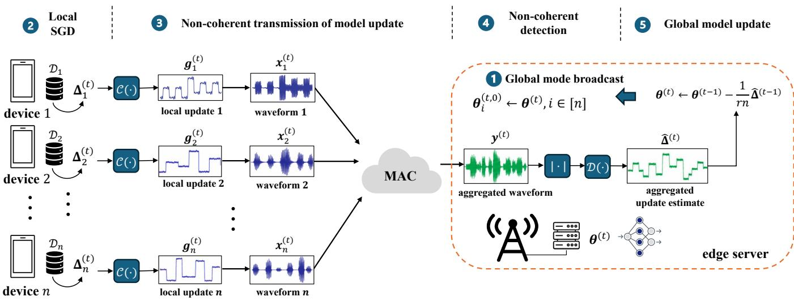  
Fig. 1. Illustration of the considered non-coherent AirFL system. Here, C(·) and $\mathcal { D } ( \cdot )$ denote the preprocessing and decoding mappings for non-coherent transmission, respectively, and $| \cdot | ^ { 2 }$ denotes square-law detection. In each communication round, all devices receive the global model from the broadcast and overwrite their local models. Under optimized selection, all devices perform local SGD updates, compute candidate local model innovations, and report two scalar statistics, while only the selected devices transmit their preprocessed innovations via $\mathcal { C } ( \cdot )$ over the multiple-access channel (MAC). The edge server receives the superimposed signal, applies square-law detection and the decoder $\mathcal { D } ( \cdot )$ to estimate the average model innovations and updates the global model

## A. Learning Protocol (FedAvg)

As illustrated in Fig. 1, each device $i \in [ n ]$ holds a local dataset $\mathcal { D } _ { i } ~ = ~ \{ \pmb { \xi } _ { i , j } \} _ { j \in [ m ] }$ containing m data samples. The n devices collaboratively train a shared machine learning model parameterized by $\pmb \theta \in \mathbb R ^ { d }$ to solve an empirical loss minimization problem given by

$$
( { \mathrm { P 0 } } ) : \qquad { \underset { \pmb { \theta } \in \mathbb { R } ^ { d } } { \mathrm { M i n i m i z e } } } \quad f ( \pmb { \theta } ) \triangleq { \frac { 1 } { n } } \sum _ { i = 1 } ^ { n } f _ { i } ( \pmb { \theta } ) .
$$

In (P0), $f ~ : ~ \mathbb { R } ^ { d } ~ \to ~ [ 0 , + \infty )$ is the global empirical loss function, while $\begin{array} { r } { f _ { i } ( \pmb { \theta } ) ~ = ~ 1 / m \sum _ { \pmb { \xi } \in \mathcal { D } _ { i } } \ell ( \pmb { \theta } ; \pmb { \xi } ) } \end{array}$ represents the local empirical loss function at device $\textit { i } \in \ [ n ]$ . Because $| { \mathcal { D } } _ { i } | ~ = ~ m$ for every device, uniform device averaging in (P0) is equivalent to uniform averaging over all samples. The sample-wise loss $\ell ( \pmb \theta ; \pmb \xi )$ is evaluated at model θ and data sample ξ.

To solve (P0), we adopt the standard FedAvg protocol in [3]. In each communication round, each (selected) device in [n] initializes its local model using the current global model, performs multiple local SGD steps using its own dataset, and then transmits the local model innovation to the server. The server aggregates the received model innovations to update the global model, which is subsequently broadcast to all devices for the next round. This procedure continues until a prescribed number of communication rounds, denoted by T, is reached, or a prescribed stopping criterion is satisfied.

Specifically, at communication round $t \in \{ 0 , 1 , \ldots , T -$ 1}, a general device-selection policy (optimized in Sec. V) chooses an active set ${ \mathcal { T } } ^ { ( t ) } \subseteq [ n ]$ . Let $s \in [ n ]$ denote the number of active devices, so that $| \mathcal { T } ^ { ( t ) } | = s = r n$ , where r is the device participation ratio. Each device $i \in [ n ]$ initializes its local model as $\pmb { \theta } _ { i } ^ { ( t , 0 ) }  \pmb { \theta } ^ { ( t ) }$ , and then performs Q local SGD steps using mini-batches $B _ { i } ^ { ( t , q ) } \subseteq { \mathcal { D } } _ { i } ^ { 1 }$

$$
\pmb { \theta } _ { i } ^ { ( t , q + 1 ) } \gets \pmb { \theta } _ { i } ^ { ( t , q ) } - \eta \hat { \nabla } f _ { i } ( \pmb { \theta } _ { i } ^ { ( t , q ) } ) ,\tag{1}
$$

where $q \in \{ 0 , \ldots , Q - 1 \}$ is the local iteration index; $\eta > 0$ is a constant learning rate; and $\hat { \nabla } f _ { i } ( \pmb { \theta } _ { i } ^ { ( t , q ) } )$ is the stochastic gradient vector evaluated on the mini-batch as

$$
\hat { \nabla } f _ { i } ( \pmb { \theta } _ { i } ^ { ( t , q ) } ) = \frac { 1 } { | \mathcal { B } _ { i } ^ { ( t , q ) } | } \sum _ { \pmb { \xi } \in \mathcal { B } _ { i } ^ { ( t , q ) } } \nabla \ell ( \pmb { \theta } _ { i } ^ { ( t , q ) } ; \pmb { \xi } ) ,\tag{2}
$$

where the mini-batches are sampled uniformly and independently across devices, local iterations, and communication rounds.

After completing the local updates, device $i \in [ n ]$ obtains the model innovation $\Delta _ { i } ^ { ( t ) } = \pmb { \theta } _ { i } ^ { ( t , Q ) } - \pmb { \theta } _ { i } ^ { ( t , 0 ) }$

Under ideal communication, the server would update the global model by averaging the model innovations over all active devices:

$$
\pmb { \theta } ^ { ( t + 1 ) }  \pmb { \theta } ^ { ( t ) } + \frac { 1 } { s } \sum _ { i \in \mathcal { T } ^ { ( t ) } } \Delta _ { i } ^ { ( t ) } .\tag{3}
$$

The ideal average in (3) is not directly available over a wireless channel due to fading and noise. This motivates the communication model and non-coherent aggregation described next.

## B. Communication Model

At round t, the devices in $\boldsymbol { \mathcal { T } ^ { ( t ) } }$ simultaneously transmit vectors $\mathbf { \Phi } \mathbf { x } _ { i } ^ { ( t ) } ~ = ~ [ \boldsymbol { x } _ { i , 1 } ^ { ( t ) } , \ldots , \boldsymbol { x } _ { i , d } ^ { ( t ) } ] ^ { T }$ over the same d OFDM subcarriers. The received signal at the server is [6]

$$
\pmb { y } ^ { ( t ) } = \sum _ { i \in \mathbb { Z } ^ { ( t ) } } \sqrt { \kappa _ { i } } \pmb { h } _ { i } ^ { ( t ) } \odot \pmb { x } _ { i } ^ { ( t ) } + \pmb { n } ^ { ( t ) } ,\tag{4}
$$

where $\kappa _ { i }$ is the large-scale fading power gain, $\begin{array} { r l } { h _ { i } ^ { ( t ) } } & { { } = } \end{array}$ $[ h _ { i , 1 } ^ { ( t ) } , \ldots , h _ { i , d } ^ { ( t ) } ] ^ { T }$ is the small-scale fading vector for device $i , \ : n ^ { ( t ) } \sim \mathcal { C } \mathcal { N } ( \mathbf { 0 } , \sigma ^ { 2 } I _ { d } )$ is additive Gaussian noise, and ⊙ denotes the Hadamard product. For every i and $j , \ h _ { i , j } ^ { ( t ) }$ is a proper complex random variable with zero mean, unit variance, $\mathrm { i . e . , } \ \bar { \mathbb { E } } [ | h _ { i , j } ^ { ( t ) } | ^ { 2 } ] = 1$ , and finite fourth moment satisfying $\mathbb { E } [ ( | h _ { i , j } ^ { ( t ) } | ^ { 2 } - 1 ) ^ { 2 } ] = M _ { h } < \infty$ . If $h _ { i , j } ^ { ( t ) }$ is circularly symmetric complex Gaussian, then $M _ { h } ~ = ~ 1$ . The vector ${ h } _ { i } ^ { ( t ) }$ remains constant within round t, but may vary across rounds.2 The fading vectors are assumed independent across devices and communication rounds. No independence is required across OFDM subcarriers of the same device.

We next specify the transmitted vectors. Since instantaneous CSI is unavailable, the considered non-coherent architecture uses neither small-scale channel inversion nor coherent phase alignment. Let $\mathcal { C } : \mathbb { R } ^ { d }  \mathbb { R } _ { + } ^ { d }$ map the local model innovation $\Delta _ { i } ^ { ( t ) }$ to a nonnegative vector $g _ { i } ^ { ( t ) } = \mathcal { C } ( \Delta _ { i } ^ { ( t ) } )$ . The mapping is specified in the next section. For each active device, the transmitted vector is constructed entry-wise as

$$
x _ { i , j } ^ { ( t ) } = \alpha _ { i } ^ { ( t ) } \sqrt { g _ { i , j } ^ { ( t ) } / \eta } , \qquad j \in [ d ] ,\tag{5}
$$

where $g _ { i , j } ^ { ( t ) }$ is the j-th entry of $\begin{array} { r } { \pmb { g } _ { i } ^ { ( t ) } , ~ j \in [ d ] ; } \end{array}$ and $\alpha _ { i } ^ { ( t ) }$ is a power scaling factor chosen to only equalize the large-scale fading coefficient. We choose

$$
\alpha _ { i } ^ { ( t ) } = \sqrt { \rho ^ { ( t ) } } / \sqrt { \kappa _ { i } } ,
$$

where $\rho ^ { ( t ) } > 0$ is the common power scaling coefficient in round t and is selected so that each active device satisfies the following per-round average transmit-power constraint: [8], [17], [29]

$$
\frac { 1 } { d } \mathbb { E } \left[ \| \pmb { x } _ { i } ^ { ( t ) } \| ^ { 2 } \left| \mathcal { F } _ { 0 } \right. \right] \leq P _ { i } , \qquad i \in \mathcal { I } ^ { ( t ) } .\tag{6}
$$

Here, $\mathcal { F } _ { 0 }$ denotes the initialization σ-algebra defined in Section IV, The sequences $\{ \boldsymbol { \mathcal { T } } ^ { ( t ) } , \rho ^ { ( t ) } \} _ { t = 0 } ^ { T - 1 }$ used in the analysis may be initialized either randomly or deterministically, but they are $\mathcal { F } _ { 0 }$ -measurable and are not adapted to the learning trajectory. Thus, conditional on which the expectation in (6) averages over only the learning and communication randomness.

Substituting the above choice of $\alpha _ { i } ^ { ( t ) }$ into (4), the j-th entry of the received signal is

$$
y _ { j } ^ { ( t ) } = \sqrt { \rho ^ { ( t ) } } \sum _ { i \in \mathbb { Z } ^ { ( t ) } } h _ { i , j } ^ { ( t ) } \sqrt { g _ { i , j } ^ { ( t ) } / \eta } + n _ { j } ^ { ( t ) } .\tag{7}
$$

Hence, unlike coherent AirFL, the present design compensates only for large-scale fading and does not require compensation for small-scale fading [6], [8].

After receiving (7), the server aims to recover the superimposed signal $\textstyle \sum _ { i \in \mathbb { Z } ^ { ( t ) } } \pmb { g } _ { i } ^ { ( t ) }$ without access to CSI. For this purpose, we employ square-law detection on each subcarrier $j \in [ d ]$ and define the statistic

$$
r _ { j } ^ { ( t ) } = ( | y _ { j } ^ { ( t ) } | ^ { 2 } - \sigma ^ { 2 } ) / \rho ^ { ( t ) } .\tag{8}
$$

Conditional on the transmitted quantities, $r _ { j } ^ { ( t ) }$ is an unbiased estimate of $\textstyle \sum _ { i \in \mathcal { T } ^ { ( t ) } } g _ { i , j } ^ { ( t ) } / \eta$

Finally, the server applies a decoder $\mathcal { D } : \mathbb { R } ^ { d }  \mathbb { R } ^ { d }$ to $\mathbf { \boldsymbol { r } } ^ { ( t ) }$ and obtains an estimate of the aggregate model innovation:

$$
\begin{array} { r } { \widehat { \Delta } ^ { ( t ) } = \mathcal { D } ( r ^ { ( t ) } ) . } \end{array}
$$

The specific form of D will be introduced in the next section. Using $\widehat { \Delta } ^ { ( t ) }$ , the server updates the global model according to

$$
\pmb { \theta } ^ { ( t + 1 ) }  \pmb { \theta } ^ { ( t ) } + \frac { 1 } { s } \widehat { \pmb { \Delta } } ^ { ( t ) } .\tag{9}
$$

Therefore, the remaining challenge is to design $\mathcal { C } ( \cdot )$ and $\mathcal { D } ( \cdot )$ so that the detector is unbiased for the preprocessed sum and has controlled estimation error.

## III. NON-COHERENT AIRFL (NCAIRFL)

In this section, we develop a CSI semi-free and communication-efficient AirFL scheme, referred to as noncoherent AirFL (NCAirFL). The main challenge is to design the preprocessing and decoding functions, denoted by $\mathcal { C } ( \cdot )$ and $\mathcal { D } ( \cdot )$ , for the non-coherent transmission model in Section II-B, such that wireless aggregation can be carried out without CSI while preserving learning performance close to that of ideal FedAvg.

The proposed NCAirFL scheme is based on multiplicative binary dithering. Each device maintains a memory vector $m _ { i } ^ { ( t ) }$ , initialized as 0, that stores the accumulated portion of its past model innovations not represented in previous transmissions. For each candidate device $i \in [ n ]$ , the preprocessing function $g _ { i } ^ { ( t ) } = \mathcal { C } ( \Delta _ { i } ^ { ( t ) } )$ is defined entry-wise as

$$
g _ { i , j } ^ { ( t ) } = \operatorname* { m a x } \left( \left( m _ { i , j } ^ { ( t ) } + \Delta _ { i , j } ^ { ( t ) } \right) \phi _ { j } ^ { ( t ) } , 0 \right) ,\tag{10}
$$

where $m _ { i , j } ^ { ( t ) }$ and $\Delta _ { i . i } ^ { ( t ) }$ are the jth entries of a memory vector $m _ { i } ^ { ( { \bar { t } } ) }$ and $\Delta _ { i } ^ { ( i ) }$ , respectively; $j \in [ d ] ;$ and $\phi ^ { ( t ) } ~ = ~$ $[ \phi _ { 1 } ^ { ( t ) } , \dots , \overset { \cdot } { \phi } _ { d } ^ { ( t ) } ] ^ { T }$ is a binary random vector whose entries are i.i.d. according to

$$
\Pr ( \phi = 1 ) = p , \quad \operatorname* { P r } ( \phi = - 1 ) = 1 - p\tag{11}
$$

with $0 < p < 1$ . The operation in (10) maps the dithered model innovation plus memory into a nonnegative vector suitable for non-coherent transmission.

For a selected device, the memory is updated by subtracting the conveyed surrogate $\hat { \boldsymbol { \phi } } ^ { ( t ) } \odot \boldsymbol { g } _ { i } ^ { ( t ) }$ from the sum of the current innovation and previous residual, while an unselected device retains its memory, i.e.,

$$
\pmb { m } _ { i } ^ { ( t + 1 ) } = \left\{ \begin{array} { l l } { \pmb { m } _ { i } ^ { ( t ) } + \pmb { \Delta } _ { i } ^ { ( t ) } - \phi ^ { ( t ) } \odot \pmb { g } _ { i } ^ { ( t ) } } & { \mathrm { i f ~ } i \in \mathbb { Z } ^ { ( t ) } , } \\ { \pmb { m } _ { i } ^ { ( t ) } } & { \mathrm { o t h e r w i s e } . } \end{array} \right.\tag{12}
$$

The memory therefore acts as error feedback. It carries forward the portion of the innovation that the one-sided nonnegative preprocessing does not convey in the current round. Near a stationary point, local innovations become smaller, and the contraction property established in Lemma 4.1 then ensures that the accumulated residual diminishes in mean square.

The binary dither vector $\phi ^ { ( t ) }$ is generated independently in each round using a pseudorandom generator with its seed shared a priori by all devices and the server. As a result, the server can remove the effect of the dither during decoding. Specifically, the decoding function $\widehat { \mathbf { \Delta } } \widehat { \mathbf { \Delta } } ^ { ( t ) } = \mathcal { D } ( r ^ { ( t ) } )$ is defined as

Algorithm 1: NCAirFL   
1 Input: learning rate $\eta ,$ power constraints $\{ P _ { i } \} _ { i \in [ n ] } .$   
number of communication rounds $T ,$ number of local   
SGD steps $Q ,$ active device ratio $r ,$ and a shared   
pseudorandom seed for generating $\{ \phi ^ { ( t ) } \}$   
2 Initialize ${ m _ { i } ^ { ( 0 ) } = \bf 0 }$ for all $i \in [ n ] ,$ , set $t = 0 ,$ , and   
initialize the global model ${ \pmb \theta } ^ { ( 0 ) }$   
3 while $t < T$ do   
4 Generate $\phi ^ { ( t ) }$ according to (11);   
5 On all devices $i \in [ n ]$ (in parallel):   
6 $\pmb { \theta } _ { i } ^ { ( t , 0 ) }  \pmb { \theta } ^ { ( t ) } ;$   
7 for $q = 0$ to $Q - 1$ do   
8 $\begin{array} { r } { \hat { \pmb { \theta } } _ { i } ^ { ( t , q + 1 ) }  \hat { \pmb { \theta } } _ { i } ^ { ( t , q ) } - \eta \hat { \nabla } f _ { i } ( \pmb { \theta } _ { i } ^ { ( t , q ) } ) ; } \end{array}$   
9 end   
10 $\pmb { \Delta } _ { i } ^ { ( t ) } \gets \pmb { \theta } _ { i } ^ { ( t , Q ) } - \pmb { \theta } _ { i } ^ { ( t , 0 ) } ;$   
11 Compute $g _ { i , j } ^ { ( t ) }$ via (10) for all $j \in [ d ] ;$   
12 If Algorithm 2 is used, report $\| g _ { i } ^ { ( t ) } \| _ { 1 }$ and   
$\| \pmb { g } _ { i } ^ { ( t ) } \| ^ { 2 }$ to the server;   
13 end   
14 Server determines $\boldsymbol { \mathcal { T } ^ { ( t ) } }$ and $\rho ^ { ( t ) } \mathrm { ; }$   
15 On active devices $i \in \mathcal { T } ^ { ( t ) }$ (in parallel):   
16 Update memory via (12);   
17 Transmit $x _ { i , j } ^ { ( t ) } = \sqrt { \rho ^ { ( t ) } g _ { i , j } ^ { ( t ) } / ( \kappa _ { i } \eta ) }$ for all $j \in [ d ] ;$   
18 end   
19 On server:   
20 Receive signal ${ \mathbf { \boldsymbol { y } } } ^ { ( t ) } ;$   
21 Compute $r _ { j } ^ { ( t ) }$ via (8) for all $j \in [ d ] ;$   
22 Update the global model via (14) ;   
23 Broadcast $\pmb { \theta } ^ { \top ( t + 1 ) }$ to all devices;   
24 end   
25 Set $m _ { i } ^ { ( t + 1 ) } \gets m _ { i } ^ { ( t ) }$ for every $i \notin \mathcal { T } ^ { ( t ) }$   
26 $t \gets t + 1 ;$   
27 end   
28 Output: ${ \pmb \theta } ^ { ( T ) }$

$$
\widehat { \Delta } ^ { ( t ) } = \eta \phi ^ { ( t ) } \odot r ^ { ( t ) } .\tag{13}
$$

Substituting (13) into (9) yields the global update rule

$$
\pmb { \theta } ^ { ( t + 1 ) }  \pmb { \theta } ^ { ( t ) } + \frac { \eta } { s } \phi ^ { ( t ) } \odot \pmb { r } ^ { ( t ) } .\tag{14}
$$

Algorithm 1 summarizes the full procedure. First, all devices initialize from the broadcast model and compute model innovations (lines 6-10). When optimized selection is enabled, they also preprocess the innovations (lines 11) and report their two scalar norm statistics (line 12). The server then determines $\boldsymbol { \mathcal { T } ^ { ( t ) } }$ and $\rho ^ { ( t ) }$ (line 14). Only active devices commit the memory update and transmit (lines 15-18). Finally, the server applies square-law detection, removes the shared dither, updates the global model, and broadcasts it (c.f. lines 19-24).

## IV. CONVERGENCE ANALYSIS

In this section, we analyze the convergence behavior of the proposed NCAirFL scheme for smooth and non-convex empirical risk minimization (ERM). To make the conditioning explicit, let $\mathcal { F } _ { 0 }$ denote the σ-algebra induced by the initial state that determines a scheduling policy $\{ \boldsymbol { \mathcal { T } } ^ { ( t ) } , \rho ^ { \dot { ( t ) } } \} _ { t = 0 } ^ { T - 1 }$ that is independent of the learning trajectory. For $t \geq 1$ , let $\mathcal { F } _ { t }$ augment $\mathcal { F } _ { 0 }$ with the mini-batch, dither, fading, and noise accrued in all previous $t - 1$ rounds. Consequently, ${ \pmb \theta } ^ { ( t ) }$ and $\{ m _ { i } ^ { ( t ) } \} _ { i = 1 } ^ { n }$ are $\mathcal { F } _ { t }$ -measurable. Throughout the analysis, we adopt the following standard assumptions for FL analysis [30], [31].

Assumption 1 (L-smoothness): For each device $i \in [ n ]$ the local empirical loss function $f _ { i } ( \cdot )$ is differentiable and $L _ { - }$ smooth for some $L > 0 ;$ , i.e., for all $\ b { x } , \ b { y } \in \mathbb { R } ^ { d }$

$$
\| \nabla f _ { i } ( x ) - \nabla f _ { i } ( y ) \| \leq L \| x - y \| .\tag{15}
$$

Assumption 2 (Bounded conditional moments of stochastic gradients): For every device $i \in [ n ]$ , round t, and local step $q ,$ the stochastic gradient estimator satisfies

$$
\mathbb { E } \left[ \hat { \nabla } f _ { i } ( \pmb { \theta } _ { i } ^ { ( t , q ) } ) \right] = \nabla f _ { i } ( \pmb { \theta } _ { i } ^ { ( t , q ) } ) ,
$$

with bounded conditional variance

(16)

$$
\mathbb { E } [  \hat { \nabla } f _ { i } ( \pmb { \theta } _ { i } ^ { ( t , q ) } ) - \nabla f _ { i } ( \pmb { \theta } _ { i } ^ { ( t , q ) } )  ^ { 2 } | \begin{array} { l } { \mathcal { F } _ { t } } \\ { \mathcal { F } _ { t } } \end{array} ] \leq \sigma _ { l } ^ { 2 } ,\tag{17}
$$

and bounded conditional second moment

$$
\mathbb { E } \left[ \left. \hat { \nabla } f _ { i } ( \pmb { \theta } _ { i } ^ { ( t , q ) } ) \right. ^ { 2 } \mid \mathcal { F } _ { t } \right] \leq G ^ { 2 } .\tag{18}
$$

Assumption 3 (Bounded heterogeneity): For any $\pmb \theta \in \mathbb { R } ^ { d }$ and every device $i \in [ n ]$ , the local gradients satisfy

$$
\left\| \nabla f _ { i } ( \pmb \theta ) - \nabla f ( \pmb \theta ) \right\| ^ { 2 } \leq \sigma _ { g } ^ { 2 } ,\tag{19}
$$

where $\begin{array} { r } { f ( \pmb { \theta } ) = ( 1 / n ) \sum _ { i = 1 } ^ { n } f _ { i } ( \pmb { \theta } ) } \end{array}$

Assumption 4 (Uniform partial participation): Each $\boldsymbol { \mathcal { T } ^ { ( t ) } }$ is sampled independently across rounds and uniformly without replacement from the subsets of [n] with cardinality $s = r n$ and the entire sequence is independent of the mini-batch, dither, fading, and noise randomness.

Assumption 5 (Lower-bounded objective): The global objective is bounded below: $f _ { * } \triangleq \operatorname* { i n f } _ { \pmb { \theta } \in \mathbb { R } ^ { d } } f ( \pmb { \theta } ) > - \infty$

We first state the contraction property of the memory mechanism.

Lemma 4.1 (Contraction): For any $\textit { i } \in \ [ n ]$ and $t \_ { \in }$ $\{ 0 , 1 , \ldots , T { - } 1 \}$ }, the preprocessing and memory update satisfy

$$
\begin{array} { r l } & { \mathbb { E } \left[ \left\| \pmb { m } _ { i } ^ { ( t ) } + \pmb { \Delta } _ { i } ^ { ( t ) } - \phi ^ { ( t ) } \odot \pmb { g } _ { i } ^ { ( t ) } \right\| ^ { 2 } \bigg | \mathcal { F } _ { t } , \pmb { \Delta } _ { i } ^ { ( t ) } \right] } \\ & { \qquad \leq ( 1 - \lambda ) \left\| \pmb { m } _ { i } ^ { ( t ) } + \pmb { \Delta } _ { i } ^ { ( t ) } \right\| ^ { 2 } , } \end{array}\tag{20}
$$

where the remaining randomness is that of $\boldsymbol { \phi } ^ { ( t ) }$ and $\lambda \ =$ min $\left[ p , 1 - p \right)$ . The upper bound is minimized by $p = 1 / 2$ for which $\lambda = 1 / 2$

Proof: See Appendix A.

Under these assumptions, we study convergence in terms of the expected squared gradient norm averaged over all global rounds, $\begin{array} { r l } {  { ( 1 / T ) \sum _ { t = 0 } ^ { T - 1 } \mathbb { E } [ \| \nabla f ( \pmb { \theta } ^ { ( t ) } ) \| ^ { 2 } ] } } \end{array}$ , which is a standard performance metric for smooth and non-convex optimization algorithms [32]. To this end, we define the non-coherent detection error

$$
e ^ { ( t ) } = r ^ { ( t ) } - \frac { 1 } { \eta } \sum _ { i \in \mathcal { T } ^ { ( t ) } } g _ { i } ^ { ( t ) } .\tag{21}
$$

By the channel assumptions and square-law detector, it satisfies the conditional zero-mean property

$$
\mathbb { E } \left[ e ^ { ( t ) } \Big | \mathcal { F } _ { t } , \mathcal { T } ^ { ( t ) } , \{ \Delta _ { i } ^ { ( t ) } \} _ { i = 1 } ^ { n } , \phi ^ { ( t ) } \right] = \mathbf { 0 } ,\tag{22}
$$

Under this conditioning, only the fading and noise in round t remain random in the detector. A key step is to bound the mean-squared error (MSE) of the non-coherent detection error $e ^ { ( t ) }$ in (21).

Lemma 4.2 (MSE of non-coherent detection): Under ${ \mathrm { A s } } -$ sumption 2, if $\rho ^ { ( t ) }$ is the largest possible common scaling coefficient satisfying (6), then the MSE of the non-coherent detector satisfies

$$
\begin{array} { r l r } {  { \mathbb { E } \Big [ \| e ^ { ( t ) } \| ^ { 2 } \Big | \mathcal { F } _ { 0 } \Big ] \leq } } \\ & { } & { M _ { h } s \tilde { G } ^ { 2 } + \frac { \tilde { G } ^ { 2 } } { \rho _ { \mathrm { m i n } } ^ { 2 } } + 2 s ( s - 1 ) \tilde { G } ^ { 2 } + \frac { 2 s \tilde { G } ^ { 2 } } { \rho _ { \mathrm { m i n } } } , } \end{array}\tag{23}
$$

where the conditional expectation is taken over the learning and communication induced randomness. In addition, $\tilde { G } ^ { \overline { { { 2 } } } } = 2 \left( 4 ( 1 - \lambda ^ { 2 } ) / \lambda ^ { 2 } + 1 \right) Q ^ { 2 } G ^ { 2 }$ with $\lambda = \operatorname* { m i n } ( p , 1 - p )$ and $\begin{array} { r } { \rho _ { \operatorname* { m i n } } = \operatorname* { m i n } _ { i \in [ n ] } P _ { i } \kappa _ { i } / \bar { \sigma } ^ { 2 } } \end{array}$

Proof: See Appendix B.

The bound in (23) reveals the compositional structure of the non-coherent detection error in terms of the second-moment bound $\tilde { G } ^ { 2 }$ . The first term, $M _ { h } s \tilde { G } ^ { 2 }$ , captures the effect of the fourth moment of the fading distribution and is nonnegative. The second and fourth terms stem from noise–noise and signal–noise products and decay as $1 / \rho _ { \mathrm { m i n } } ^ { 2 }$ and $s / \rho _ { \mathrm { m i n } } ,$ respectively. The third term arises from cross products among different devices’ signals and scales as $s ( s { - } 1 )$ , quantifying the additional interference created when more devices participate in non-coherent aggregation.

We are now ready to present the main convergence result for NCAirFL under a constant learning rate.

Proposition 4.1 (Convergence): Suppose that Assumptions 1–5 hold. Let $\{ \pmb { \theta } ^ { ( t ) } \}$ be generated by NCAirFL over $T$ communication rounds with constant learning rate η satisfying $\eta \in ( 0 , 1 / ( \sqrt { 2 4 0 } Q L ) ]$ . Then, averaged over the randomness of mini-batch sampling, dithering, device selection, small-scale fading, and channel noise, NCAirFL satisfies

$$
\begin{array} { r l } & { \underbrace { \frac { 1 } { T } \sum _ { t = 0 } ^ { T - 1 } \mathbb { E } \left[ \| \nabla f ( \theta ^ { ( t ) } ) \| ^ { 2 } \right] } _ { \mathrm { ~ \normalfont ~ t i n f i z a t i o n ~ e r o r ~ } } \underbrace { \frac { 8 ( f _ { 0 } - f _ { * } ) } { T \eta Q } } _ { \mathrm { ~ \normalfont ~ m i t i a l ~ a t i o n ~ e r o r ~ } } } \\ & { + \underbrace { \frac { 4 \eta L G _ { e } ^ { 2 } } { Q s ^ { 2 } } } _ { \mathrm { ~ \normalfont ~ N o n - c o h e r e n t ~ d e t c e c t i o n ~ e r m r ~ } } + \underbrace { 4 \eta L Q G ^ { 2 } + 4 0 \eta ^ { 2 } Q L ^ { 2 } \left( \sigma _ { l } ^ { 2 } + 6 Q \sigma _ { g } ^ { 2 } \right) } _ { \mathrm { ~ \normalfont ~ S u c h a t i c - p r a d i c r u a t i o n ~ d l e s t . ~ u p p l a t c e ~ } } } \\ & { \quad \quad + \underbrace { \frac { 4 8 \eta ^ { 2 } Q ^ { 2 } L ^ { 2 } \left( 1 - \lambda ^ { 2 } \right) G ^ { 2 } } { r ^ { 2 } \lambda ^ { 2 } } } _ { \mathrm { ~ \normalfont ~ C o n r a c t i o n ~ e r o r ~ } } , \quad ( 2 4 ) } \end{array}
$$

where $f _ { 0 } = f ( \pmb { \theta } ^ { ( 0 ) } ) , f _ { * }$ is defined in Assumption 5, and $G _ { e } ^ { 2 }$ denotes the deterministic upper bound on $\mathbb { E } [ \| \bar { e } ^ { ( t ) } \| ^ { 2 } ]$ given by the right hand side (RHS) of (23).

Proof: See Appendix C.

The bound in (24) reveals how different sources of error affect the learning performance of NCAirFL. The first term is the initialization error, which decays as the number of communication rounds T grows. The second term captures the impact of non-coherent aggregation, which increases with the upper bound on MSE $\mathbb { E } \Vert e ^ { ( t ) } \Vert ^ { 2 }$ and decreases with the worst device’s average (received) SNR as expected. The third term collects the errors due to bounded stochastic gradients and the drift generated by multiple local updates. The last term arises from the accumulated memory and depends on the dithering parameter λ.

By setting the learning rate as $\eta = \mathcal { O } ( 1 / \sqrt { T } )$ , the bound in (24) implies convergence to a stationary point at rate $\mathcal { O } ( 1 / \sqrt { T } )$ . This matches the standard order-wise convergence rate of FedAvg for smooth non-convex objectives [31, Theorem 1], despite NCAirFL operating without instantaneous CSI.

## V. JOINT OPTIMIZATION OF DEVICE SELECTION AND POWER CONTROL

Although over-the-air aggregation uses the same wireless resource regardless of the active-device count, activating every device is not always optimal here. For example, in $( 2 3 )$ the non-coherent inter-device term grows as $2 s ( s - 1 ) \tilde { G } ^ { 2 }$ Moreover, for any selected set, the feasible common scaling is limited by its most power-constrained device. Partial participation can therefore reduce the quadratic cross-term and remove a power bottleneck, at the cost of discarding useful innovations. Centralized selection coordinates this trade-off between aggregate learning utility and a common power scaling. Independent local decisions cannot in general identify the common bottleneck.

In this section, we study joint optimization of device selection and power control to improve on the convergence performance of NCAirFL. To this end, we first derive a lower bound on the expected one-round forward reduction for any prescribed active device set. We then formulate joint device selection and power control using this bound. Because the required moments are unavailable in closed form, we replace them with causal estimates and solve the resulting surrogate problem optimally. The resulting policy is evaluated in Section VI.

## A. Optimization Problem Formulation

Proposition 5.1 (One-round forward reduction): Suppose that Assumptions 1–3 hold and that ${ \mathcal { T } } ^ { ( t ) } \subseteq [ n ]$ and $\rho ^ { ( t ) } > 0$ are $\mathcal { F } _ { 0 }$ -measurable satisfying (6). Letting $\eta \in ( 0 , 1 / ( \sqrt { 2 } Q L ) ) _ { . } ^ { \cdot }$ ], then NCAirFL satisfies

$$
\begin{array} { r l } { \mathbb E \left[ \pmb { f } ( \pmb { \theta } ^ { ( t ) } ) - \pmb { f } ( \pmb { \theta } ^ { ( t + 1 ) } ) \Big | \mathcal F _ { 0 } \right] } & { } \\ { \geq \underbrace { \left( \frac { 2 - L \eta Q } { 2 s \eta Q } \right) \sum _ { i \in \mathcal { Z } ^ { ( t ) } } \mathbb E \left[ \| \pmb { g } _ { i } ^ { ( t ) } \| ^ { 2 } \Big | \mathcal F _ { 0 } \right] } _ { \mathrm { U t i l i t y } } } \end{array}
$$

$$
\begin{array} { r l r } {  { - \underbrace { \frac { 1 } { s } \sum _ { i \in \mathcal { T } ^ { ( t ) } } C _ { 1 } \sqrt { \mathbb { E } [ \| g _ { i } ^ { ( t ) } \| ^ { 2 } \Big | \mathcal { F } _ { 0 } ] } } _ { \mathrm { S G D ~ e r o r ~ a n d ~ d a t a ~ h e t e r o g e n e i t y } } } } \\ & { } & { \ - \underbrace { \frac { \eta ^ { 2 } L } { 2 s ^ { 2 } } ( ( M _ { h } + 2 s - 2 ) s \tilde { G } ^ { 2 } + \frac { d \sigma ^ { 4 } } { ( \rho ^ { ( t ) } ) ^ { 2 } } + \frac { 2 s \sqrt { d } \sigma ^ { 2 } } { \rho ^ { ( t ) } } \tilde { G } ) } _ { \mathrm { F f f e c t i v e ~ n o i s e } } , } \end{array}\tag{25}
$$

where $C _ { 1 } = \sqrt { 5 L ^ { 2 } Q \eta ^ { 2 } \big ( \sigma _ { l } ^ { 2 } + 6 Q \sigma _ { g } ^ { 2 } \big ) + 3 0 L ^ { 2 } Q ^ { 2 } \eta ^ { 2 } G ^ { 2 } } + \sigma _ { g } +$ $\sigma _ { l } / \sqrt { Q } + 4 G \dot { \sqrt { 1 - \lambda ^ { 2 } } } / \lambda .$

Proof: See Appendix D.

Proposition 5.1 characterizes the expected one-round decrease in the objective function given each prescribed device scheduling. First, the utility term favors devices with larger $\mathbb { E } [ \| \pmb { g } _ { i } ^ { ( t ) } \| ^ { 2 } ~ | ~ \mathcal { F } _ { 0 } ]$ , reflecting larger potential descent contributions. Second, the SGD-error and data-heterogeneity term accounts for stochastic-gradient noise, data heterogeneity, and contraction error. Third, the effective-noise term captures the loss in one-round descent caused by non-coherent aggregation through the fading moment $M _ { h }$ and the power scaling coefficient $\rho ^ { ( t ) }$ . These terms motivate joint optimization of device selection $\boldsymbol { \mathcal { T } ^ { ( t ) } }$ and power control $\rho ^ { ( t ) }$ in each communication round. Fixing round t and suppressing time superscripts on the decision variables, we formulate

$$
( \mathrm { P 1 } ) : \mathtt { M a x i m i z e } U ^ { ( t ) } ( \mathbb { Z } ) - \frac { \eta ^ { 2 } L } { 2 s ^ { 2 } } \left( \frac { 2 s \sqrt { d } \sigma ^ { 2 } } { \rho } \tilde { G } + \frac { d \sigma ^ { 4 } } { \rho ^ { 2 } } \right)
$$

$$
\begin{array} { r l r } { \mathrm { S u b j e c t ~ t o } } & { \mathcal { T } \subseteq [ n ] , \ | \mathcal { T } | = s , \quad \rho > 0 , } & { ( 2 \mathfrak { c } } \\ & { \underline { { \rho } } _ { i } \underline { { \mathbb { F } } } \Big [ \| \pmb { g } _ { i } ^ { ( t ) } \| _ { 1 } \Big | \mathcal { F } _ { 0 } \Big ] \leq d P _ { i } , } & { \forall i \in \mathcal { I } . } \end{array}\tag{6a}
$$

(26b)

Here, $U ^ { ( t ) } ( \mathcal { T } )$ denotes the sum of the utility term and the negative SGD-error/data-heterogeneity term in (25); constraint (26b) enforces the average-power constraint (6).

## B. Proposed solution to (P1)

Problem (P1) depends on the moments $\mathbb { E } [ \| g _ { i } ^ { ( t ) } \| ^ { 2 } ~ | ~ \mathcal { F } _ { 0 } ]$ and $\mathbb { E } [ \| g _ { i } ^ { ( t ) } \| _ { 1 } ~ | ~ \mathcal { F } _ { 0 } ]$ , which are unavailable in closed form. We therefore replace the corresponding moments by causal exponential moving averages (EMAs) with the bias correction used in Adam [33]. In every round, all devices perform the local update in (1), construct the candidate $\mathbf { \boldsymbol { g } } _ { i } ^ { ( \dot { t } ) }$ from the current innovation and memory, and send the two real scalars $\| \pmb { g } _ { i } ^ { ( t ) } \| ^ { 2 }$ and $\| \pmb { g } _ { i } ^ { ( t ) } \| _ { 1 }$ to the server over a reliable lowrate control channel before selection. The resulting control overhead is $2 n$ real scalars per round, which tends to be negligible since d $\gg 2 n$ typically. Only the selected devices commit the memory update in (12) and transmit the model payload.

Initialize $u _ { i } ^ { ( - 1 ) } = v _ { i } ^ { ( - 1 ) } = 0$ . Because each device i uploads statistics $\| \pmb { g } _ { i } ^ { ( \check { t } ) } \| ^ { 2 }$ and $\| \pmb { g } _ { i } ^ { ( t ) } \| .$ 1 in every round $t ,$ the server updates

$$
v _ { i } ^ { ( t ) } = \beta v _ { i } ^ { ( t - 1 ) } + ( 1 - \beta ) \| \pmb { g } _ { i } ^ { ( t ) } \| ^ { 2 } ,\tag{27}
$$

$$
u _ { i } ^ { ( t ) } = \beta u _ { i } ^ { ( t - 1 ) } + ( 1 - \beta ) \| \pmb { g } _ { i } ^ { ( t ) } \| _ { 1 } ,\tag{28}
$$

where $\beta \in [ 0 , 1 )$ is the forgetting factor. We call [33]

$$
\widehat v _ { i } ^ { ( t ) } = \frac { v _ { i } ^ { ( t ) } } { 1 - \beta ^ { t + 1 } } , \qquad \widehat u _ { i } ^ { ( t ) } = \frac { u _ { i } ^ { ( t ) } } { 1 - \beta ^ { t + 1 } }\tag{29}
$$

the normalized EMA statistics, which serve as causal surrogates for the corresponding second and first-order moments otherwise inaccessible, respectively. Since every device refreshes these statistics in every round, an unselected device’s EMA does not decay merely because it was inactive.

Accordingly, we also define the approximate utility with penalty by SGD error and data heterogeneity of device $i \in [ n ]$ as

$$
\widehat { U } _ { i } ^ { ( t ) } = \left( \frac { 2 - L \eta Q } { 2 s \eta Q } \right) \widehat { v } _ { i } ^ { ( t ) } - \frac { C _ { 1 } } { s } \sqrt { \widehat { v } _ { i } ^ { ( t ) } } .\tag{30}
$$

Replacing $U ^ { ( t ) } ( \mathcal { T } )$ by $\textstyle \sum _ { i \in \mathcal { I } } \widehat { U } _ { i } ^ { ( t ) }$ and $\mathbb { E } [ \| g _ { i } ^ { ( t ) } \| _ { 1 } ]$ by $\widehat { u } _ { i } ^ { ( t ) }$ thus yields the surrogate problem (P2), where we omit the round index t below for notational simplicity.

$$
{ \mathrm { ( P 2 ) } } : { \mathrm { ~ } } \operatorname { \mathtt { M a x i m i z e } } \atop { \overline { { \operatorname { L } } } , \rho } { \mathrm { ~ } } \sum _ { i \in { \mathcal { I } } } { \widehat { U } } _ { i } - { \frac { \eta ^ { 2 } L } { 2 s ^ { 2 } } } \left( { \frac { 2 s { \sqrt { d } } \sigma ^ { 2 } } { \rho } } { \tilde { G } } + { \frac { d \sigma ^ { 4 } } { \rho ^ { 2 } } } \right)
$$

Subject to ${ \mathcal { T } } \subseteq [ n ] , \| { \mathcal { T } } | = s .$

(31a)

$$
\frac { \rho } { \kappa _ { i } \eta } \widehat { u } _ { i } \leq d P _ { i } , \quad \rho > 0 , \quad \forall i \in \mathcal { I } .\tag{31b}
$$

Problem (P2) remains combinatorial because of the set variable I. Algorithm 2 nevertheless solves it exactly by separating the common power bottleneck from the additive device utilities.

First, we observe that given any fixed active device set ${ \bar { \mathcal { T } } } ,$ the optimal power scaling coefficient $\rho ^ { * } ( { \bar { \mathcal { T } } } )$ can be obtained in a closed form. Specifically, since the objective in problem (P2) strictly increases with $\rho > 0$ , the optimal $\rho$ admits the largest feasible value, i.e.,

$$
\rho ^ { * } ( \bar { \mathcal T } ) = \operatorname* { m i n } _ { i \in \bar { \mathcal T } } \frac { d \kappa _ { i } \eta P _ { i } } { \widehat u _ { i } } = \operatorname* { m i n } _ { i \in \bar { \mathcal T } } b _ { i } .\tag{32}
$$

Next, we optimize device selection by substituting $\rho ^ { * } ( \tau )$ into problem (P2) using (32), which yields an equivalent problem:

$$
\begin{array} { r l r } & { } & { ( \mathrm { P 2 ' } ) : \mathtt { M a x i m i z e } \displaystyle \sum _ { i \in \mathbb { Z } } \widehat { U } _ { i } - \frac { \eta ^ { 2 } L } { 2 s ^ { 2 } } \left( \frac { 2 s \sqrt { d } \sigma ^ { 2 } } { \rho ^ { * } ( \mathbb { Z } ) } \tilde { G } + \frac { d \sigma ^ { 4 } } { ( \rho ^ { * } ( \mathbb { Z } ) ) ^ { 2 } } \right) } \\ & { } & { \mathrm { S u b j e c t ~ t o ~ } \displaystyle \mathcal { Z } \subseteq [ n ] , ~ | \mathbb { Z } | = s . \qquad ( 3 3 ) } \end{array}
$$

Note that Algorithm 2 sorts these values, treats each device in turn as the candidate bottleneck, selects the remaining $s - 1$ devices with the largest utilities compatible with that bottleneck, and evaluates the resulting objective. Enumerating all possible bottlenecks yields the global optimum without exhaustive subset search.

Proposition 5.2 (Optimal Solution to (P2)): Suppose that $\widehat { u } _ { i } \overline { { > 0 } }$ for every $i \in [ n ]$ . Algorithm 2 yields the jointly optimal active device set $\mathcal { T } ^ { * }$ and power control factor $\rho ^ { * }$

Proof: To solve problem (P2′), define $\begin{array} { r } { b _ { i } = d \kappa _ { i } \eta P _ { i } / \widehat { u } _ { i } . } \end{array}$ which, by (32), gives $\rho ^ { * } ( \mathcal { T } ) = \operatorname* { m i n } _ { i \in \mathcal { T } } b _ { i }$ . Let π be a permutation of [n] such that $b _ { \pi ( 1 ) } \geq b _ { \pi ( 2 ) } \geq \cdot \cdot \cdot \geq b _ { \pi ( n ) }$ . Then, fixing an index $k \in \{ s , s + 1 , \ldots , n \}$ , we consider the case in which the bottleneck device is $\pi ( k )$ , i. $\mathbf { e } . , \rho ^ { * } ( \mathcal { T } ) = b _ { \pi ( k ) }$ . This case is feasible if and only if $\pi ( k ) \in \mathcal { T }$ and $\mathcal { T } \subseteq \{ \pi ( \mathrm { i } ) , \ldots , \pi ( k ) \}$

Algorithm 2: Optimal Solution to Problem (P2)   
Input : $\{ \widehat { U } _ { i } \} _ { i = 1 } ^ { n } , \{ \widehat { u } _ { i } \} _ { i = 1 } ^ { n } , \{ P _ { i } \} _ { i = 1 } ^ { n } , \{ \kappa _ { i } \} _ { i = 1 } ^ { n } , \tilde { G } , s , \eta ,$   
$\sigma , L ,$ and d   
1 Compute $b _ { i } = d \kappa _ { i } \eta P _ { i } / \widehat { u } _ { i }$ for all $i \in [ n ] ,$ , and sort them   
such that $b _ { \pi ( 1 ) } \geq b _ { \pi ( 2 ) } \geq \cdot \cdot \cdot \geq b _ { \pi ( n ) } ;$   
2 Initialize $y ^ { * } = - \infty ;$   
3 for $k = s , s + 1 , \ldots , n$ do   
4 Let $\mathcal { T } _ { k } = \{ \pi ( 1 ) , \ldots , \pi ( k - 1 ) \}$   
5 Choose $\begin{array} { r } { \mathcal { T } _ { k } = \mathrm { a r g m a x } _ { \mathcal { I } \subseteq \mathcal { T } _ { k } , | \mathcal { I } | = s - 1 } \sum _ { i \in \mathcal { I } } \widehat { U } _ { i } ; } \end{array}$   
6 Set ${ \mathcal { T } } _ { k } = { \mathcal { T } } _ { k } \cup \{ \pi ( k ) \}$ and $\rho _ { k } = b _ { \pi ( k ) } ;$   
7 Compute $\begin{array} { r } { y _ { k } = \sum _ { i \in \mathcal { T } _ { k } } \widehat { U } _ { i } - \frac { \eta ^ { 2 } L } { 2 s ^ { 2 } } \big ( \frac { 2 s \sqrt { d } \sigma ^ { 2 } } { \rho _ { k } } \tilde { G } + \frac { d \sigma ^ { 4 } } { ( \rho _ { k } ) ^ { 2 } } \big ) ; } \end{array}$   
8 Update $( y ^ { * } , \mathcal { T } ^ { * } )  ( \bar { y } _ { k } , \mathcal { T } _ { k } ) \mathrm { ~ i f ~ } y _ { k } > \stackrel {  } { y } ^ { * } ;$   
9 end   
Output: $\mathcal { T } ^ { * }$ , and $\begin{array} { r } { \rho ^ { * } = \operatorname* { m i n } _ { i \in \mathcal { T } ^ { * } } d \kappa _ { i } \eta P _ { i } / \widehat { u } _ { i } } \end{array}$

Therefore, for a fixed bottleneck $\pi ( k )$ , the optimal set includes $\pi ( k )$ and the $s \mathrm { ~ - ~ } 1$ devices with the largest $\widehat { U } _ { i }$ among $\{ \pi ( 1 ) , \ldots , \pi ( k - 1 ) \}$ . Enumerating $k \in \{ s , s + 1 , \ldots , n \}$ then yields a globally optimal solution to (P2).

Complexity of Algorithm 2: Sorting $\{ b _ { i } \} _ { i = 1 } ^ { n }$ requires ${ \mathcal { O } } ( n \log n )$ operations. For each $k \in \{ s , \ldots , n \}$ , selecting the $s - 1$ largest utilities among the first $k - 1$ devices and evaluating $y _ { k }$ can be implemented in ${ \mathcal { O } } ( n )$ time. Therefore, the overall complexity of Algorithm 2 is $\mathcal { O } ( n ^ { 2 } + n \log n )$ , which is much lower than exhaustive search over $\binom { n } { s }$ feasible subsets, which admits an exponential complexity order $O ( 2 ^ { n H ( r ) } )$ where $H ( r ) = - r \log _ { 2 } r - ( 1 - r ) \log _ { 2 } ( 1 - r ) \ [ 3 4 ]$

Remark 5.1: It’s worth noting that the bound on single-round reduction in Proposition 5.1 also permits joint optimization of $r , \ \mathcal { T } ^ { ( t ) }$ , and $\bar { \rho } ^ { ( t ) }$ . Specifically, by letting $m \ : = \ : s$ denote the active device count and enumerating candidate bottleneck devices over $m ,$ the remaining m − 1 devices can be chosen based on their gradient-descent contributions, i.e., ${ \widehat { U } } _ { i \cdot }$ By reusing the sorted gradient-descent contributions and their cumulative sums, we obtain the optimal solution with the same complexity $\mathcal { O } ( n ^ { 2 } + n \log n )$ as in Algorithm 2. We leave this joint formulation as a straightforward extension and focus on a fixed r in this work.

Remark 5.2: Proposition 4.1 assumes uniform sampling without replacement, under which active-device averaging yields an unbiased estimate of the global-average update. By contrast, Algorithm 2 selects devices deterministically based on state-dependent statistics, i.e., $\widehat { u } _ { i }$ and $\widehat { v } _ { i }$ , and power constraints (26b), systematically favoring devices with larger gradient-descent contributions and favorable channel conditions. A similar approach is adopted in [27], [35], where nonuniform device selection maximizes a lower bound of the oneround loss reduction while leaving global convergence under such device selection policy not addressed. On the other hand, probabilistic scheduling methods [12], [26] maintain unbiased aggregation via probability-aware reweighting, enabling endto-end convergence analysis under non-uniform participation. Extending the convergence of NCAirFL to support a statedependent device-selection policy is left for future work.

## VI. NUMERICAL RESULTS

In this section, we evaluate NCAirFL with $n = 2 0$ devices on MNIST and CIFAR-10. We examine how closely NCAirFL approximates communication-ideal FedAvg and quantify the gain from the proposed joint device-selection and powercontrol strategy.

## A. Experimental Settings

We consider two standard image-classification benchmarks, namely MNIST and CIFAR-10. MNIST contains 60,000 training samples and 10,000 test samples, where each sample is a grayscale image of size $2 8 \times 2 8 .$ . CIFAR-10 contains 50,000 training images and 10,000 test images from 10 classes, with 6,000 images per class and image size $3 2 \times 3 2$ [36], [37].

For MNIST, we consider a non-i.i.d. data split generated via a Dirichlet distribution with concentration parameter $\varrho =$ 0.1 [38].3 The model is a two-layer fully connected network with a flattened $2 8 \times 2 8$ input, one hidden layer of 100 ReLU units, and a softmax output layer, for a total of $d = 7 9 { , } 5 1 0$ trainable parameters.

For CIFAR-10, we focus on the i.i.d. setting, in which the local dataset $\mathcal { D } _ { i }$ at device $i \in [ n ]$ is sampled uniformly at random without replacement from the training set. The model is ResNet-18, with $d = 1 1 , 1 8 1 , 6 4 2$ trainable parameters [39].

For the wireless channel, we adopt the path-loss model $\kappa _ { i } =$ $c ^ { 2 } / ( 4 \pi f _ { c } R _ { i } ) ^ { 2 }$ for $i \in [ n ]$ , where c is the speed of light, $f _ { c } =$ 2.4 GHz is the carrier frequency, and deploy devices uniformly over the area of a disk of radius 1000 m centered at the server, yielding the distance $R _ { i } \sim 1 0 0 0 \sqrt { \mathcal { U } ( 0 , 1 ) }$ . Small-scale fading is Rayleigh. Unless stated otherwise, we use learning rates $\eta =$ 0.001 for MNIST and $\eta = 0 . 0 5$ for CIFAR-10, mini-batch size $| B _ { i } ^ { ( t , q ) } | = 6 4 , Q = 5$ local SGD steps, participation ratio $r =$ $0 . 5 ,$ dithering parameter $p = 1 / 2$ , and EMA forgetting factor $\beta = 0 . 1$ . The small value of $\beta$ makes the selection statistics emphasize the current innovation. In solving the approximate selection problem in (31), we set $G = L = \sigma _ { l } = \sigma _ { q } ^ { 2 } = 0 . 1$ The transmit-power constraint is $P _ { i } = 3 \mathrm { { d B m } }$ for all $i \in [ n ]$ and the noise power is obtained from power spectral density $N _ { 0 } = - 1 7 3$ dBm/Hz over bandwidth 20 MHz, yielding $\sigma ^ { 2 }$ ≈ −100 dBm. Under this configuration, the maximum received SNR is approximately 13 dB. We use SGD as the optimizer, and all reported curves are averaged over 50 Monte Carlo trials.

We compare NCAirFL against the following baselines: (i) FedAvg with ideal communication [3]; (ii) FedAvg with optimized device selection, denoted by FedAvg(Opt.), obtained by solving

$$
\begin{array} { r l r } { \underset { \mathcal { T } ^ { ( t ) } } { \mathrm { M a x i m i z e } } } & { a _ { 1 } \underset { i \in \mathcal { T } ^ { ( t ) } } { \sum } \mathbb { E } \left\| \pmb { \Delta } _ { i } ^ { ( t ) } \right\| ^ { 2 } - \frac { a _ { 2 } } { s } \underset { i \in \mathcal { T } ^ { ( t ) } } { \sum } \sqrt { \mathbb { E } \left\| \pmb { \Delta } _ { i } ^ { ( t ) } \right\| ^ { 2 } } } & \\ { \mathrm { S u b j e c t ~ t o } } & { \mathcal { T } ^ { ( t ) } \subseteq [ n ] , \ | \mathcal { T } ^ { ( t ) } | = s , } & { ( 3 4 ) } \end{array}
$$

TABLE I  
PROPERTIES OF THE CONSIDERED FL SCHEMES
<table><tr><td>Schemes</td><td>Convergence rate</td><td>Error floor</td><td>CSI requirements</td></tr><tr><td>FedAvg [3]</td><td> $\overline { { \mathcal { O } ( 1 / \sqrt { T } ) } }$ </td><td>No</td><td>N/A</td></tr><tr><td>CAirFL [6]</td><td> $\mathcal { O } ( 1 / \sqrt { T } + \mathrm { b i a s } )$ </td><td>Yes</td><td>CSIT</td></tr><tr><td>AirFL-Mem [10]</td><td> $\mathcal { O } ( 1 / \sqrt { T } )$ </td><td>No</td><td>CSIT</td></tr><tr><td>NCAirFL</td><td> $\mathcal { O } ( 1 / \sqrt { T } )$ </td><td>No</td><td>Large-scale CSI</td></tr></table>

where $a _ { 1 }$ and $a _ { 2 }$ are tuned constants and $\mathbb { E } \Vert \Delta _ { i } ^ { ( t ) } \Vert ^ { 2 }$ is approximated as in (27); (iii) coherent AirFL with truncated channel inversion, referred to as CAirFL [6]; and (iv) AirFL-Mem, which augments truncated-CI AirFL with long-term memory to mitigate deep-fading errors [10]. The hyperparameters of CAirFL and AirFL-Mem follow [10]. Table I summarizes the main theoretical differences among the compared methods. We use $N C A i r F L ( O p t . )$ to denote the proposed method combined with the optimized device-selection rule. For coherent baselines, in a typical 5G NR configuration employing DM-RS configuration type 1, the CSI estimation overhead is approximately 14.3% [40], which is eliminated by NCAirFL.

## B. Training Performance

Figs. 2 and 3 report the training loss as a function of the communication round index $T$ on MNIST and CIFAR-10, respectively. First, on both datasets, NCAirFL and NCAirFL(Opt.) closely track their ideal-communication counterparts, FedAvg and FedAvg(Opt.), respectively. This behavior is consistent with Proposition 4.1, and indicates that the proposed CSI semi-free aggregation mechanism incurs only a limited penalty in training dynamics.

Second, the proposed method does not exhibit the error-floor behavior observed for CAirFL. This is particularly evident in Fig. 2, where CAirFL settles at a noticeably larger loss, whereas NCAirFL continues to decrease and remains close to both FedAvg and AirFL-Mem. This empirical trend is in line with the theoretical comparison in Table I.

Third, optimized device selection consistently accelerates convergence. On MNIST, the gap between NCAirFL and NCAirFL(Opt.) is already visible in the transient regime. The effect is even more pronounced on CIFAR-10, where Fig. 3 shows that NCAirFL(Opt.) reaches a near-zero training loss within roughly 50 rounds, while the vanilla NCAirFL still exhibits a clearly non-negligible residual loss at the same communication budget. This observation is consistent with the single-round reduction analysis in Proposition 5.1.

Fourth, AirFL-Mem outperforms vanilla NCAirFL because coherent aggregation exploits CSI. NCAirFL(Opt.), however, can outperform AirFL-Mem because optimized device selection and power control compensate for part of the non-coherent aggregation error. Thus, the end-to-end learning gain from scheduling and power control can outperform the communication advantage of the unoptimized coherent baseline in the considered settings.

We next evaluate the test accuracy, which is the practically relevant learning metric. Figs. 4 and 5 show the test accuracy versus the communication round index T on MNIST and

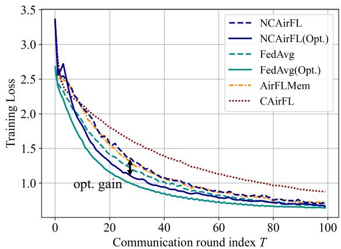  
Fig. 2. Training loss versus communication round index T on MNIST.

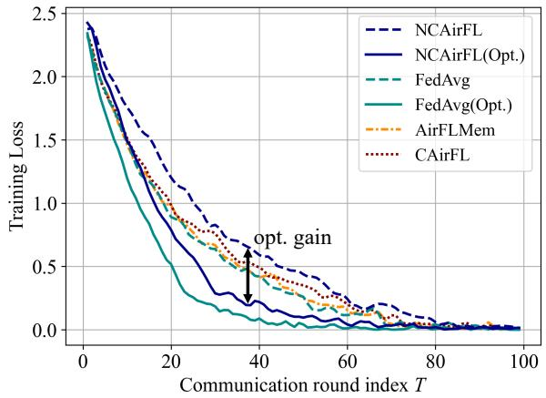  
Fig. 3. Training loss versus communication round index T on CIFAR-10.

CIFAR-10, respectively. The results mirror the trends observed for training loss.

In particular, NCAirFL attains test accuracy that is very close to FedAvg, despite operating without instantaneous CSI and over a fading wireless channel. Moreover, the optimized version NCAirFL(Opt.) improves the early- and mid-stage learning behavior on both datasets, achieving higher accuracy than vanilla NCAirFL and coherent baselines at the same communication budget. The advantage is again more visible on CIFAR-10, where the more challenging task makes the value of selecting informative and communication-efficient devices particularly clear. Overall, the results confirm that the proposed non-coherent aggregation scheme preserves not only convergence behavior, but also end-task test performance.

## C. Effect of the Participation Ratio and Data Heterogeneity

We next investigate the role of the participation ratio r in order to illustrate the trade-off between update quality and communication efficiency, and to highlight the value of jointly optimizing device selection and power control.

Figs. 6(a) and 7(a) show the communication-round-averaged training loss as functions of participation ratio r for NCAirFL and FedAvg on MNIST and CIFAR-10, respectively. For the non-optimized schemes, increasing r generally improves the average training loss, since more devices contribute to each round. However, once optimized selection is introduced, the best performance is attained at an intermediate value of $r$ rather than at $r \ = \ 1$ . This phenomenon is visible for both datasets: on MNIST, the optimized schemes perform best around a moderate participation ratio, while on CIFAR-10 the gain is even more pronounced at relatively small values of r. The reason is that a smaller participation ratio gives the scheduler room to discard less useful or more powerlimited devices, thereby improving the utility-noise trade-off captured by problem (26). By contrast, when $r = 1$ , all devices must participate and the optimized and non-optimized schemes necessarily coincide. The same conclusion is supported by the accuracy plots in Figs. 6(b) and 7(b): optimized selection improves the average accuracy over a broad range of participation ratios, with the largest gains obtained away from full participation.

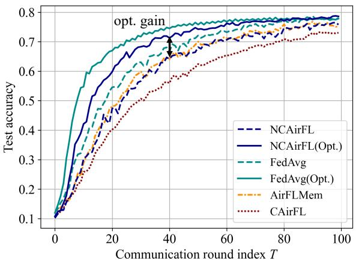  
Fig. 4. Test accuracy versus communication round index T on MNIST.

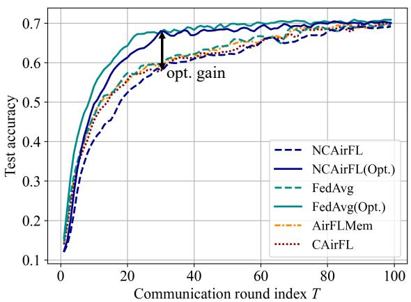  
Fig. 5. Test accuracy versus communication round index T on CIFAR-10.

Finally, we study the effect of data heterogeneity on the benefit of optimized device selection by fixing the participation ratio to $r = 0 . 5$ and varying the heterogeneity level $1 / \varrho$ on MNIST.

Figs. 8(a) and 8(b) show the corresponding average training loss and test accuracy. As expected, increasing data heterogeneity makes the learning problem more difficult for all methods: the average loss increases, while the average accuracy decreases. At the same time, the benefit of optimized selection becomes more pronounced as heterogeneity grows. In particular, the gap between NCAirFL(Opt.) and NCAirFL is modest under weak heterogeneity, but it widens substantially in the highly heterogeneous regime. For example, at $1 / \varrho = 1 0 $ the optimized variant improves the average test accuracy by about 10 percentage points. This trend suggests that the proposed selection rule is especially valuable when client updates differ significantly in quality and statistical relevance.

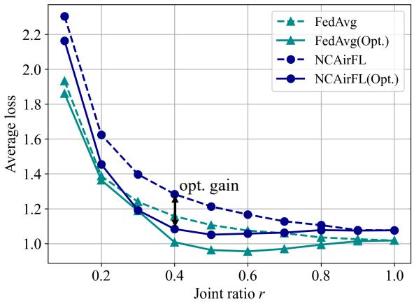  
(a) Average training loss versus participation ratio r

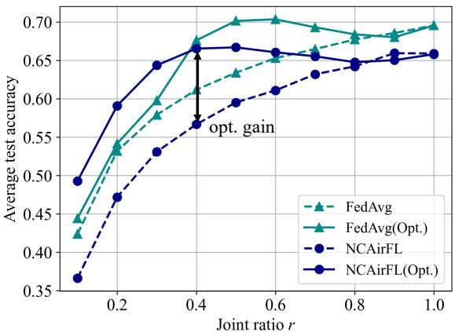  
(b) Average test accuracy versus participation ratio r  
Fig. 6. Average training loss and test accuracy versus participation ratio r for NCAirFL and FedAvg on MNIST. The average is taken over the communication rounds.

## VII. CONCLUSION

This paper studied CSI semi-free AirFL for broadband single-antenna systems and proposed NCAirFL, which combines binary dithering, non-coherent aggregation, and memory-based error feedback to enable analog model aggregation without small-scale CSI at either the transmitters or the server. We established that NCAirFL retains the $\mathcal { O } ( 1 / \sqrt { T } )$ convergence rate for smooth non-convex objectives. To further improve communication efficiency, we derived a lower bound on the single-round reduction of the global loss and used it to formulate joint device selection and power control. The resulting surrogate problem admits a low-complexity optimal solution. Numerical results showed that NCAirFL approximates ideal FedAvg and that optimized device scheduling substantially accelerates convergence.

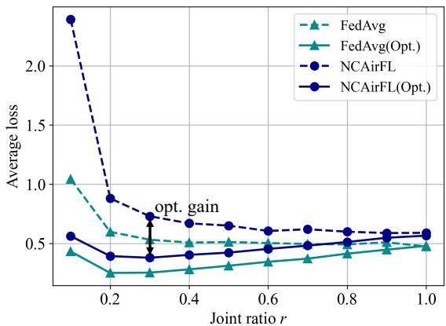  
(a) Average training loss versus participation ratio r

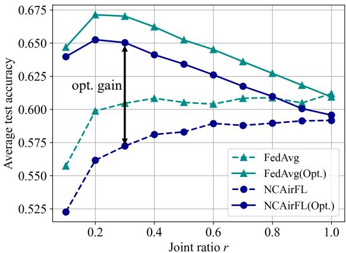  
(b) Average test accuracy versus participation ratio r  
Fig. 7. Average training loss and test accuracy versus participation ratio r for NCAirFL and FedAvg on CIFAR-10. The average is taken over the communication rounds.

## APPENDIX

## A. Proof Sketch of Lemma 4.1

Define $z _ { i } ^ { ( t ) } = m _ { i } ^ { ( t ) } + \Delta _ { i } ^ { ( t ) }$ and condition on $( \mathcal { F } _ { t } , \Delta _ { i } ^ { ( t ) } )$ under which $z _ { i } ^ { ( t ) }$ is fixed. Expanding the square and using (10) gives

$$
\begin{array} { r l } & { \mathbb { E } \left[ \| z _ { i } ^ { ( t ) } - \phi ^ { ( t ) } \odot { \bf g } _ { i } ^ { ( t ) } \| ^ { 2 } \mid \mathcal { F } _ { t } , { \bf \Delta } _ { i } ^ { ( t ) } \right] } \\ & { = \| { \boldsymbol z } _ { i } ^ { ( t ) } \| ^ { 2 } - \mathbb { E } \left[ \| { \bf g } _ { i } ^ { ( t ) } \| ^ { 2 } \mid \mathcal { F } _ { t } , { \bf \Delta } _ { i } ^ { ( t ) } \right] , } \end{array}\tag{35}
$$

where the last equality follows since the non-zero entries of $\mathbf { \pmb { g } } _ { i } ^ { ( t ) }$ coincide with the positive entries of $\phi ^ { ( t ) } \odot z _ { i } ^ { ( t ) }$ and $\| \phi ^ { ( t ) } \odot g _ { i } ^ { ( t ) } \| ^ { 2 } ~ = ~ \| g _ { i } ^ { ( \bar { t } ) } \| ^ { 2 } .$ . For coordinate $j ,$ , define $A _ { j } = \operatorname* { P r } \left( z _ { i , j } ^ { ( t ) } \phi _ { j } ^ { ( t ) } > 0 \mid \mathcal { F } _ { t } , \Delta _ { i } ^ { ( t ) } \right) . \mathrm { ~ I f ~ } z _ { i , j } ^ { ( t ) } > 0 .$ , then $A _ { j } = p ;$ if $z _ { i , j } ^ { ( t ) } ~ < ~ 0$ , then $A _ { j } ~ = ~ 1 - p ;$ and the contribution is zero if $z _ { i , j } ^ { ( t ) } ~ = ~ 0$ . Hence, $A _ { j } ~ \ge ~ \lambda ~ = ~ \operatorname* { m i n } ( p , 1 - p )$ whenever the corresponding squared entry is non-zero, and $\begin{array} { r } { \mathbb { E } \Big [ \| \pmb { g } _ { i } ^ { ( t ) } \| ^ { 2 } \mid \mathcal { F } _ { t } , \pmb { \Delta } _ { i } ^ { ( t ) } \Big ] = \sum _ { j = 1 } ^ { \tilde { d } } \mathring { ( z _ { i , j } ^ { ( t ) } ) } ^ { 2 } A _ { j } \stackrel {  } { \ge } \lambda \| z _ { i } ^ { ( t ) } \| ^ { 2 } } \end{array}$ . Substituting it into (35) yields (20). Furthermore, λ is maximized by $p = 1 / 2$ , which minimizes the contraction factor.

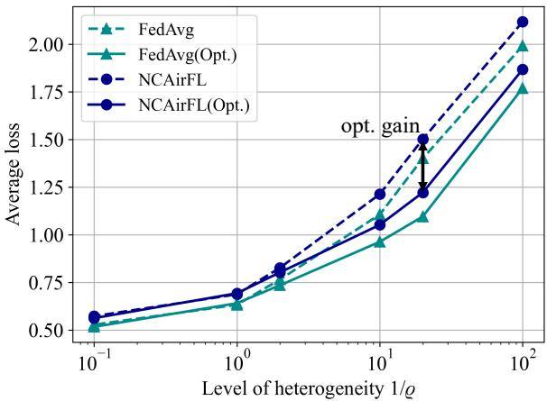  
(a) Average training loss versus the level of heterogeneity 1/ϱ

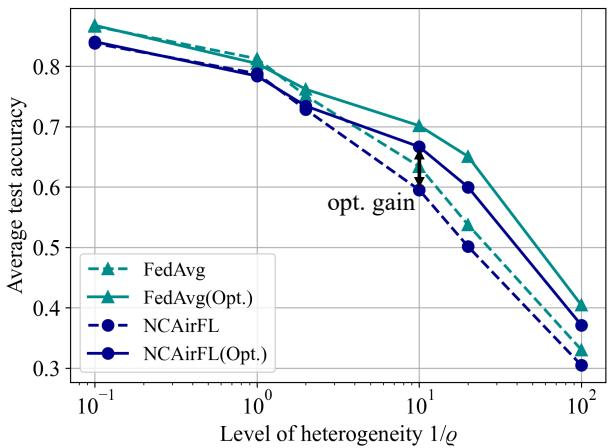  
(b) Average test accuracy versus the level of heterogeneity $1 / \varrho$  
Fig. 8. Average training loss and test accuracy versus the level of heterogeneity $1 / \varrho$ for NCAirFL and FedAvg on MNIST. The average is taken over the communication rounds.

## B. Proof Sketch of Lemma 4.2

Recall that $\begin{array} { r } { e _ { j } ^ { ( t ) } = r _ { j } ^ { ( t ) } - ( 1 / \eta ) \sum _ { i \in \mathcal { I } ^ { ( t ) } } g _ { i , j } ^ { ( t ) } } \end{array}$ , and define $\mathcal { H } _ { t } =$ $\sigma ( \mathcal { F } _ { t } , \mathcal { T } ^ { ( t ) } , \{ \Delta _ { i } ^ { ( t ) } \} _ { i = 1 } ^ { n } , \phi ^ { ( t ) } )$ . Conditional on $\mathcal { H } _ { t }$ , the transmitted quantities are fixed. Define $\begin{array} { r } { s _ { j } ^ { ( t ) } = \sum _ { i \in \mathcal { T } ^ { ( t ) } } h _ { i , j } ^ { ( t ) } \sqrt { g _ { i , j } ^ { ( t ) } / \eta } , } \end{array}$ such that $y _ { j } ^ { ( t ) } = \sqrt { \rho ^ { ( t ) } } s _ { j } ^ { ( t ) } + n _ { j } ^ { ( t ) }$ . Expanding the square-law statistic yields

$$
e _ { j } ^ { ( t ) } = a _ { j } + b _ { j } + c _ { j } + d _ { j } ,\tag{36}
$$

where $\begin{array} { r l r l r l r } { a _ { j } } & { { } } & { = } & { } & { \sum _ { i \in \mathcal { Z } ^ { ( t ) } } \big ( | h _ { i , j } ^ { ( t ) } | ^ { 2 } } & { { } - } & { 1 \big ) \big ( g _ { i , j } ^ { ( t ) } / \eta \big ) . } \end{array}$ $\begin{array} { r l r } { b _ { j } } & { { } \quad } & { = \quad } & { ( 2 / \eta ) \Re \{ \sum _ { i < k , ( i , k \in \mathcal { Z } ^ { ( t ) } ) } h _ { i , j } ^ { ( t ) } h _ { k , j } ^ { ( t ) * } \sqrt { g _ { i , j } ^ { ( t ) } g _ { k , j } ^ { ( t ) } } \} } \end{array}$ $c _ { j } = ( 2 / \sqrt { \rho ^ { ( t ) } } ) \Re \{ n _ { j } ^ { ( t ) * } s _ { j } ^ { ( t ) } \}$ , and $d _ { j } = ( | n _ { i } ^ { ( t ) } | ^ { 2 } - \sigma ^ { 2 } ) / \rho ^ { ( t ) }$ Conditional on $\mathcal { H } _ { t } ,$ the four terms $a _ { j } , b _ { j } , c _ { j }$ , and $d _ { j }$ have zero mean. By the independence and properness of the fading coefficients and the independence between the fading and noise, their mixed conditional second moments vanish. Therefore, $\mathbb { E } [ ( e _ { i } ^ { ( t ) } ) ^ { 2 } \ | \ \mathcal { H } _ { t } ] \ = \ \mathbb { E } [ a _ { j } ^ { 2 } \ | \ \mathcal { H } _ { t } ] + \mathbb { E } [ b _ { j } ^ { 2 } \ |$ $\begin{array} { r l } { \mathscr { H } _ { t } \bigr ] } & { { } + \mathbb { E } \bigl [ c _ { j } ^ { 2 } \mid \mathscr { H } _ { t } \bigr ] + \mathbb { E } \bigl [ d _ { j } ^ { 2 } \mid \mathscr { H } _ { t } \bigr ] } \end{array}$ . Using the channel moments and $n _ { j } ^ { ( t ) } \sim \overset { \cdot } { \mathcal { C } } \mathcal { N } ( 0 , \sigma ^ { 2 } )$ , summing over $j \in [ d ]$ , and applying

Cauchy–Schwarz give

$$
\begin{array} { r l } & { \mathbb { E } [ \| e ^ { ( t ) } \| ^ { 2 } \left| \mathcal { H } _ { t } \right] \le \displaystyle \frac { M _ { h } } { \eta ^ { 2 } } \sum _ { i \in \mathcal { T } ^ { ( t ) } } \| g _ { i } ^ { ( t ) } \| ^ { 2 } + \displaystyle \frac { d \sigma ^ { 4 } } { ( \rho ^ { ( t ) } ) ^ { 2 } } \qquad ( 3 7 } \\ & { + \displaystyle \frac { 2 \sqrt { d } \sigma ^ { 2 } } { \eta \rho ^ { ( t ) } } \sum _ { i \in \mathcal { Z } ^ { ( t ) } } \| g _ { i } ^ { ( t ) } \| + \displaystyle \frac { 1 } { \eta ^ { 2 } } \sum _ { \stackrel { i \neq k } { i \in \mathcal { Z } ^ { ( t ) } } } \left( \| g _ { i } ^ { ( t ) } \| ^ { 2 } + \| g _ { k } ^ { ( t ) } \| ^ { 2 } \right) . } \end{array}
$$

Assumption 2 and the tower rule conditional on $\mathcal { F } _ { 0 }$ give $\mathbb { E } [ \| \mathbf { \Delta } \mathbf { A } _ { i } ^ { ( \hat { t } ) } \| ^ { 2 } ~ | ~ \mathcal { F } _ { 0 } ] ~ \le ~ \eta ^ { 2 } Q ^ { 2 } G ^ { 2 }$ . Together with the expected memory bound and (10), this yields

$$
\begin{array} { r l r } & { } & { { \mathbb { E } } [ \| g _ { i } ^ { ( t ) } \| ^ { 2 } \mid { \mathcal { F } } _ { 0 } ] \leq 2 { \mathbb { E } } [ \| m _ { i } ^ { ( t ) } \| ^ { 2 } \mid { \mathcal { F } } _ { 0 } ] + 2 { \mathbb { E } } [ \| \Delta _ { i } ^ { ( t ) } \| ^ { 2 } \mid { \mathcal { F } } _ { 0 } ] } \\ & { } & { \quad \leq \eta ^ { 2 } \tilde { G } ^ { 2 } . \qquad ( 3 } \end{array}\tag{8}
$$

Using $g _ { i , j } ^ { ( t ) } ~ \geq ~ 0$ , the average-power constraint (6), and (38) gives

$$
\frac { 1 } { \rho ^ { ( t ) } } \leq \frac { \tilde { G } } { \sqrt { d } \operatorname* { m i n } _ { i \in [ n ] } \kappa _ { i } P _ { i } } .\tag{39}
$$

Finally, applying the tower property to (37) conditional on $\mathcal { F } _ { 0 }$ , using (38)–(39), and defining $\rho _ { \mathrm { m i n } } = \operatorname* { m i n } _ { i } \kappa _ { i } P _ { i } / \sigma ^ { 2 }$ give (23). Its four RHS terms correspond to the fading, noise–noise, inter-device, and signal–noise contributions, respectively.

## C. Proof Sketch of Proposition 4.1

We use a perturbed-iterate argument. Define the virtual sequence $\{ \tilde { \pmb { \theta } } ^ { ( t ) } \}$ as

$$
\tilde { \pmb { \theta } } ^ { ( t + 1 ) } = \tilde { \pmb { \theta } } ^ { ( t ) } + \frac { 1 } { s } \sum _ { i \in \mathcal { I } ^ { ( t ) } } \Delta _ { i } ^ { ( t ) } + \frac { \eta } { s } \phi ^ { ( t ) } \odot \pmb { e } ^ { ( t ) } ,\tag{40}
$$

with $\tilde { \pmb { \theta } } ^ { ( 0 ) } = \pmb { \theta } ^ { ( 0 ) }$ . By (22) and the tower property, $\mathbb { E } [ \phi ^ { ( t ) } \odot$ $e ^ { ( t ) } \mid \mathcal { F } _ { t } ] = \mathbf { 0 }$ . From the global and memory updates, the real and virtual iterates satisfy

$$
{ \pmb \theta } ^ { ( t ) } - \tilde { { \pmb \theta } } ^ { ( t ) } = - \frac { 1 } { s } \sum _ { i = 1 } ^ { n } { \pmb m } _ { i } ^ { ( t ) } ,\tag{41}
$$

which follows by induction. Applying L-smoothness to (40) and taking total expectation immediately gives

$$
\mathbb { E } \Big [ f \big ( \tilde { \pmb { \theta } } ^ { ( t + 1 ) } \big ) \Big ] \leq \mathbb { E } \Big [ f \big ( \tilde { \pmb { \theta } } ^ { ( t ) } \big ) \Big ] + \mathbb { E } \left[ \left. \nabla f \big ( \tilde { \pmb { \theta } } ^ { ( t ) } \big ) , \frac { 1 } { s } \sum _ { i \in \mathcal { X } ^ { ( t ) } } \pmb { \Delta } _ { i } ^ { ( t ) } \right. \right]
$$

$$
+ \frac { L } { 2 } \mathbb { E } \left[ \left. \frac { 1 } { s } \sum _ { i \in \mathcal { I } ^ { \left( t \right) } } \Delta _ { i } ^ { \left( t \right) } + \frac { \eta } { s } \phi ^ { \left( t \right) } \odot e ^ { \left( t \right) } \right. ^ { 2 } \right] .\tag{42}
$$

Because $\boldsymbol { \mathcal { T } ^ { ( t ) } }$ is sampled independently of the preceding initialized sets, it is independent of the iterate entering round t. Uniform selection therefore makes the active-device average unbiased under total expectation. Under Assumptions 1–3, the local-SGD drift satisfies, for $\eta \leq 1 / ( \sqrt { 2 } Q L )$ ,

$$
\begin{array} { r l } & { \mathbb { E } \bigg [ \bigg \| \pmb { \theta } _ { i } ^ { ( t , q ) } - \pmb { \theta } ^ { ( t ) } \bigg \| ^ { 2 } \bigg | \mathcal { F } _ { t } \bigg ] \leq 5 Q \eta ^ { 2 } \big ( \sigma _ { l } ^ { 2 } + 6 Q \sigma _ { g } ^ { 2 } \big ) } \\ & { \qquad + 3 0 Q ^ { 2 } \eta ^ { 2 } \| \nabla f ( \pmb { \theta } ^ { ( t ) } ) \| ^ { 2 } . } \end{array}\tag{43}
$$

Taking total expectation, using (41) with $\mathbb { E } [ \| m _ { i } ^ { ( t ) } \| ^ { 2 } ] \leq ( 4 ( 1 -$ $\lambda ^ { 2 } ) / \bar { \lambda ^ { 2 } } ) \eta ^ { 2 } Q ^ { 2 } \bar { G ^ { 2 } }$ , Jensen’s inequality, Young’s inequality, and $\eta \leq 1 / ( \sqrt { 2 4 0 } Q L )$ gives

$$
\begin{array} { r l } & { \mathbb { E } \Bigg [ \Bigg \langle \nabla f ( \tilde { \pmb { \theta } } ^ { ( t ) } ) , \frac { 1 } { s } \sum _ { i \in \mathcal { T } ^ { ( t ) } } \pmb { \Delta } _ { i } ^ { ( t ) } \Bigg \rangle \Bigg ] } \\ & { \leq - \frac { \eta Q } { 8 } \mathbb { E } \| \nabla f ( \pmb { \theta } ^ { ( t ) } ) \| ^ { 2 } + 5 Q ^ { 2 } \eta ^ { 3 } L ^ { 2 } \big ( \sigma _ { l } ^ { 2 } + 6 Q \sigma _ { g } ^ { 2 } \big ) } \\ & { \quad + \frac { 6 Q ^ { 3 } L ^ { 2 } \eta ^ { 3 } ( 1 - \lambda ^ { 2 } ) } { r ^ { 2 } \lambda ^ { 2 } } G ^ { 2 } . } \end{array}\tag{44}
$$

For the second-order term in (42), condition first on $( \mathcal { F } _ { t } , \mathcal { T } ^ { ( t ) } , \{ \Delta _ { i } ^ { ( t ) } \} _ { i = 1 } ^ { n } , \phi ^ { ( t ) } )$ . The innovation average and $\boldsymbol { \phi } ^ { ( t ) }$ are then fixed, while (22) makes the cross term zero. Moreover, $\begin{array} { r } { \| s ^ { - 1 } \sum _ { i } \mathbf { \Delta } \mathbf { A } _ { i } ^ { ( t ) } \| ^ { 2 } \leq s ^ { - 1 } \sum _ { i } \| \mathbf { \Delta } \mathbf { A } _ { i } ^ { ( t ) } \| ^ { 2 } , \mathbb { E } \| \mathbf { \Delta } \mathbf { A } _ { i } ^ { ( t ) } \| ^ { 2 } \leq \eta ^ { 2 } Q ^ { 2 } G ^ { 2 } } \end{array}$ and $\| \boldsymbol { \phi } ^ { ( \bar { t } ) } \odot e ^ { ( t ) } \| = \| e ^ { ( t ) } \|$ . Hence,

$$
\frac { L } { 2 } \mathbb { E } \left. \frac { 1 } { s } \sum _ { i \in \mathcal { Z } ^ { ( t ) } } \pmb { \Delta } _ { i } ^ { ( t ) } + \frac { \eta } { s } \phi ^ { ( t ) } \odot \boldsymbol { e } ^ { ( t ) } \right. ^ { 2 } \leq \frac { L \eta ^ { 2 } Q ^ { 2 } G ^ { 2 } } { 2 } + \frac { \eta ^ { 2 } L G _ { e } ^ { 2 } } { 2 s ^ { 2 } } ,\tag{45}
$$

where Lemma 4.2 and the tower property are used in the last term. Substituting (44) and (45) into (42), summing over $t =$ $0 , \ldots , T - 1$ , and using $f ( \tilde { \pmb { \theta } } ^ { ( T ) } ) \geq f _ { * }$ yield (24).

## D. Proof Sketch of Proposition 5.1

Let $\boldsymbol { \mathcal { T } ^ { ( t ) } }$ and $\rho ^ { ( t ) } > 0$ be ${ \mathcal { F } } _ { 0 } .$ -measurable. Throughout this proof sketch, every displayed expectation is conditional on $\mathcal { F } _ { 0 }$ . Hence, $\boldsymbol { \mathcal { T } ^ { ( t ) } }$ and $\rho ^ { ( \hat { t } ) }$ are fixed inside these expectations. Applying L-smoothness to the NCAirFL update gives

$$
\mathbb { E } \Big [ f ( \pmb { \theta } ^ { ( t + 1 ) } ) \Big ] \leq \mathbb { E } \Big [ f ( \pmb { \theta } ^ { ( t ) } ) \Big ] + \mathbb { E } \left[ \left. \nabla f ( \pmb { \theta } ^ { ( t ) } ) , \frac { 1 } { s } \sum _ { i \in \mathcal { T } ^ { ( t ) } } \phi ^ { ( t ) } \odot g _ { i } ^ { ( t ) } \right. \right]
$$

$$
+ \frac { L } { 2 } \mathbb { E } \left[ \left. \frac { 1 } { s } \sum _ { i \in \mathcal { T } ^ { ( t ) } } \phi ^ { ( t ) } \odot \pmb { g } _ { i } ^ { ( t ) } + \frac { \eta } { s } \phi ^ { ( t ) } \odot \pmb { e } ^ { ( t ) } \right. ^ { 2 } \right] .\tag{46}
$$

To bound the first-order term, for each $i \in \mathcal { T } ^ { ( t ) }$ , decompose $- \eta Q \nabla f ( \pmb \theta ^ { ( t ) } ) ~ = ~ - \pmb { A _ { i } } - \pmb { B _ { i } } - \pmb { C _ { i } } + \pmb { D _ { i } } + \phi ^ { ( t ) } \odot \pmb { \mathscr { g } } _ { i } ^ { ( t ) }$ where $A _ { i }$ is the local-model drift term, $\mathbf { \delta } _ { B _ { i } }$ is the dataheterogeneity term, $C _ { i }$ is the stochastic-gradient error, and $\pmb { D } _ { i } = \pmb { m } _ { i } ^ { ( t + 1 ) } - \pmb { m } _ { i } ^ { ( t ) }$ is the memory increment. Since $\eta \leq$ $1 / ( \sqrt { 2 } Q \dot { L } )$ , the local-update bound in (43) applies. Together with Assumptions $2 { - } 3 , \bar { \mathbb { E } } \| \nabla f ( \pmb \theta ^ { ( t ) } ) \| ^ { 2 } \leq G ^ { 2 }$ , and the expected memory bound, it gives E∥ $\begin{array} { r } { \dot { \mathbf { A } _ { i } } \lVert ^ { 2 } \leq 5 \eta ^ { 4 } L ^ { 2 } Q ^ { 3 } \big ( \sigma _ { l } ^ { 2 } + 6 \dot { Q } \sigma _ { a } ^ { 2 } \big ) + } \end{array}$ $3 0 \eta ^ { 4 } L ^ { { \bar { 2 } } } Q ^ { 4 } G ^ { 2 } , \mathbb { E } \| { \bar { \pmb { B } } } _ { i } \| ^ { 2 } \leq \eta ^ { 2 } { \bar { Q } } ^ { 2 } \sigma _ { a } ^ { 2 } , \dot { \mathbb { E } } \| { \pmb { C } } _ { i } \| ^ { 2 } \leq \eta ^ { 2 } Q \sigma _ { l } ^ { 2 }$ , and $\begin{array} { r } { \mathbb { E } \| \boldsymbol { D } _ { i } \| ^ { 2 } ~ \le ~ ( ( 1 \ddot { 6 } \eta ^ { 2 } ( \dot { 1 } - \lambda ^ { 2 } ) ) / \lambda ^ { 2 } ) Q ^ { 2 } \ddot { G } ^ { 2 } } \end{array}$ . Using the above bounds, Cauchy–Schwarz, and $\| \boldsymbol { \phi } ^ { ( t ) } \odot \pmb { x } \| = \| \pmb { x } \|$ , we obtain

$$
\begin{array} { r l } & { \mathbb { E } \left[ \left. \nabla f ( \pmb { \theta } ^ { ( t ) } ) , \frac { 1 } { s } \sum _ { i \in \mathcal { T } ^ { ( t ) } } \phi ^ { ( t ) } \odot \pmb { g } _ { i } ^ { ( t ) } \right. \right] } \\ & { \leq - \frac { 1 } { s \eta Q } \displaystyle \sum _ { i \in \mathcal { T } ^ { ( t ) } } \mathbb { E } \| \pmb { g } _ { i } ^ { ( t ) } \| ^ { 2 } + \frac { C _ { 1 } } { s } \displaystyle \sum _ { i \in \mathcal { T } ^ { ( t ) } } \sqrt { \mathbb { E } \| \pmb { g } _ { i } ^ { ( t ) } \| ^ { 2 } } . } \end{array}\tag{47}
$$

For the second-order term, the detector’s conditional zeromean property eliminates the cross term before total expectation is taken. The intermediate MSE bound obtained in the proof of Lemma 4.2 then yields

$$
\begin{array} { r l } & { \displaystyle \frac { L } { 2 } \mathbb { E } \left\| \frac { 1 } { s } \sum _ { i \in \mathcal { I } ^ { ( t ) } } \phi ^ { ( t ) } \odot g _ { i } ^ { ( t ) } + \frac { \eta } { s } \phi ^ { ( t ) } \odot e ^ { ( t ) } \right\| ^ { 2 } } \\ & { \displaystyle \leq \frac { L } { 2 s } \sum _ { i \in \mathcal { I } ^ { ( t ) } } \mathbb { E } \| g _ { i } ^ { ( t ) } \| ^ { 2 } + \frac { \eta ^ { 2 } L } { 2 s ^ { 2 } } \left( ( M _ { h } + 2 s - 2 ) s \tilde { G } ^ { 2 } \right. } \\ & { \quad \quad \quad \quad \quad \left. + \frac { d \sigma ^ { 4 } } { ( \rho ^ { ( t ) } ) ^ { 2 } } + \frac { 2 s \sqrt { d } \sigma ^ { 2 } } { \rho ^ { ( t ) } } \tilde { G } \right) . } \end{array}\tag{48}
$$

Finally, substituting (47) and (48) into (46) and rearranging gives (25).

## REFERENCES

[1] H. Wen, N. Michelusi, O. Simeone, and H. Xing, “Ncairfl: Csi-free over-the-air federated learning based on non-coherent detection,” in ICC 2025 - IEEE International Conference on Communications, Montreal, QC, Canada, Jun. 2025.

[2] ITU-R, “Framework and overall objectives of the future development of IMT for 2030 and beyond,” ITU-R, 2023. [Online]. Available: https://techblog.comsoc.org/2023/01/29/

[3] B. McMahan, E. Moore, D. Ramage, S. Hampson, and B. A. y Arcas, “Communication-efficient learning of deep networks from decentralized data,” in Proc. Artificial Intelligence and Statistics, FL, USA, Apr. 2017.

[4] M. Tao et al., “Federated edge learning for 6G: Foundations, methodologies, and applications,” Proc. IEEE, pp. 1–39, 2024.

[5] B. Nazer and M. Gastpar, “Computation over multiple-access channels,” IEEE Trans. Inf. Theory, vol. 53, no. 10, pp. 3498–3516, 2007.

[6] G. Zhu, Y. Wang, and K. Huang, “Broadband analog aggregation for low-latency federated edge learning,” IEEE Trans. Wireless Commun., vol. 19, no. 1, pp. 491–506, 2020.

[7] K. Yang, T. Jiang, Y. Shi, and Z. Ding, “Federated learning via overthe-air computation,” IEEE Trans. Wireless Commun., vol. 19, no. 3, pp. 2022–2035, 2020.

[8] M. M. Amiri and D. Gund¨ uz, “Federated learning over wireless fading¨ channels,” IEEE Trans. Wireless Commun., vol. 19, no. 5, pp. 3546– 3557, 2020.

[9] B. Tegin and T. M. Duman, “Federated learning with over-the-air aggregation over time-varying channels,” IEEE Trans. Wireless Commun., 2023.

[10] H. Wen, H. Xing, and O. Simeone, “AirFL-Mem: Improving communication-learning trade-off by long-term memory,” in 2024 IEEE Wireless Communications and Networking Conference (WCNC), Dubai, United Arab Emirates, Apr. 2024.

[11] L. Su and V. K. N. Lau, “Data and channel-adaptive sensor scheduling for federated edge learning via over-the-air gradient aggregation,” IEEE Internet Things J., vol. 9, no. 3, pp. 1640–1654, 2022.

[12] Y. Sun, Z. Lin, Y. Mao, S. Jin, and J. Zhang, “Channel and gradientimportance aware device scheduling for over-the-air federated learning,” IEEE Trans. Wireless Commun., vol. 23, no. 7, pp. 6905–6920, 2024.

[13] T. Sery and K. Cohen, “On analog gradient descent learning over multiple access fading channels,” IEEE Trans. Signal Process., vol. 68, pp. 2897–2911, 2020.

[14] Y. Deng, Z. Chen, and E. G. Larsson, “Robust and efficient average consensus with non-coherent over-the-air aggregation,” in ICC 2025 - IEEE International Conference on Communications, Montreal, QC, Canada, Jun. 2025.

[15] L. Chen, N. Zhao, Y. Chen, F. R. Yu, and G. Wei, “Over-the-air computation for IoT networks: Computing multiple functions with antenna arrays,” IEEE Internet Things J., vol. 5, no. 6, pp. 5296–5306, 2018.

[16] J. Dong, Y. Shi, and Z. Ding, “Blind over-the-air computation and data fusion via provable wirtinger flow,” IEEE Trans. Signal Process., vol. 68, pp. 1136–1151, 2020.

[17] X. Cao, G. Zhu, J. Xu, Z. Wang, and S. Cui, “Optimized power control design for over-the-air federated edge learning,” IEEE J. Sel. Areas Commun., vol. 40, no. 1, pp. 342–358, 2021.

[18] M. M. Amiri, T. M. Duman, D. Gund¨ uz, S. R. Kulkarni, and H. V.¨ Poor, “Blind federated edge learning,” IEEE Trans. Wireless Commun., vol. 20, no. 8, pp. 5129–5143, 2021.

[19] H. H. Yang, Z. Chen, T. Q. Quek, and H. V. Poor, “Revisiting analog over-the-air machine learning: The blessing and curse of interference,” IEEE J Sel. Top. Signal Process., vol. 16, no. 3, pp. 406–419, 2021.

[20] H. Wen, H. Xing, and O. Simeone, “Pre-training and personalized fine-tuning via over-the-air federated meta-learning: Convergencegeneralization trade-offs,” IEEE Trans. Cogn. Commun. Netw., vol. 12, pp. 4911–4925, 2026.

[21] X. Wei, C. Shen, J. Yang, and H. V. Poor, “Random orthogonalization for federated learning in massive MIMO systems,” IEEE Trans. Wireless Commun., 2023.

[22] J. Choi, “Communication-efficient distributed SGD using random access for over-the-air computation,” IEEE J. Sel. Areas Inf. Theory, vol. 3, no. 2, pp. 206–216, 2022.

[23] N. Michelusi, “Non-coherent over-the-air decentralized gradient descent,” IEEE Trans. Signal Process., vol. 72, pp. 4618–4634, 2024.

[24] ——, “Interference-robust non-coherent over-the-air computation for decentralized optimization,” in ICC 2026 - IEEE International Conference on Communications, Glasgow, United Kingdom, May 2026.

[25] M. F. Ul Abrar and N. Michelusi, “Biased federated learning under wireless heterogeneity,” IEEE Trans. Wireless Commun., vol. 25, pp. 16 449–16 462, 2026.

[26] J. Ren, Y. He, D. Wen, G. Yu, K. Huang, and D. Guo, “Scheduling for cellular federated edge learning with importance and channel awareness,” IEEE Trans. Wireless Commun., vol. 19, no. 11, pp. 7690–7703, 2020.

[27] S. Yue, J. Ren, J. Xin, D. Zhang, Y. Zhang, and W. Zhuang, “Efficient federated meta-learning over multi-access wireless networks,” IEEE J. Sel. Areas Commun., vol. 40, no. 5, pp. 1556–1570, 2022.

[28] J. Du, B. Jiang, C. Jiang, Y. Shi, and Z. Han, “Gradient and channel aware dynamic scheduling for over-the-air computation in federated edge learning systems,” IEEE J. Sel. Areas Commun., vol. 41, no. 4, pp. 1035– 1050, 2023.

[29] T. Sery, N. Shlezinger, K. Cohen, and Y. C. Eldar, “Over-the-air federated learning from heterogeneous data,” IEEE Trans. Signal Process., vol. 69, pp. 3796–3811, 2021.

[30] D. Basu, D. Data, C. Karakus, and S. Diggavi, “Qsparse-local-SGD: Distributed SGD with quantization, sparsification and local computations,” in Proc. Advances in Neural Information Processing Systems, Vancouver, Canada, Dec. 2019.

[31] H. Yang, M. Fang, and J. Liu, “Achieving linear speedup with partial worker participation in non-iid federated learning,” in Proc. International Conference on Learning Representations (ICLR), 2021.

[32] S. Ghadimi and G. Lan, “Stochastic first-and zeroth-order methods for nonconvex stochastic programming,” SIAM journal on optimization, vol. 23, no. 4, pp. 2341–2368, 2013.

[33] D. P. Kingma, “Adam: A method for stochastic optimization,” arXiv preprint arXiv:1412.6980, 2014.

[34] T. M. Cover, J. A. Thomas, and J. Kieffer, Elements of information theory. wiley New York, 1991, vol. 2.

[35] H. T. Nguyen, V. Sehwag, S. Hosseinalipour, C. G. Brinton, M. Chiang, and H. Vincent Poor, “Fast-convergent federated learning,” IEEE J. Sel. Areas Commun., vol. 39, no. 1, pp. 201–218, 2021.

[36] Y. LeCun, “The MNIST database of handwritten digits,” 1998. [Online]. Available: http://yann.lecun.com/exdb/mnist/

[37] A. Krizhevsky, G. Hinton et al., “Learning multiple layers of features from tiny images,” 2009. [Online]. Available: https://www.cs.toronto. edu/∼kriz/learning-features-2009-TR.pdf

[38] M. Yurochkin, M. Agarwal, S. Ghosh, K. Greenewald, N. Hoang, and Y. Khazaeni, “Bayesian nonparametric federated learning of neural networks,” in Proc. International conference on machine learning, CA, USA, Jun. 2019.

[39] K. He, X. Zhang, S. Ren, and J. Sun, “Deep residual learning for image recognition,” in Proc. IEEE Conference on Computer Vision and Pattern Recognition, Nevada, USA, Jun. 2016.

[40] 3GPP, “NR; physical channels and modulation,” 3rd Generation Partnership Project (3GPP), Technical Report TS 38.211, Sep. 2021, release 16.