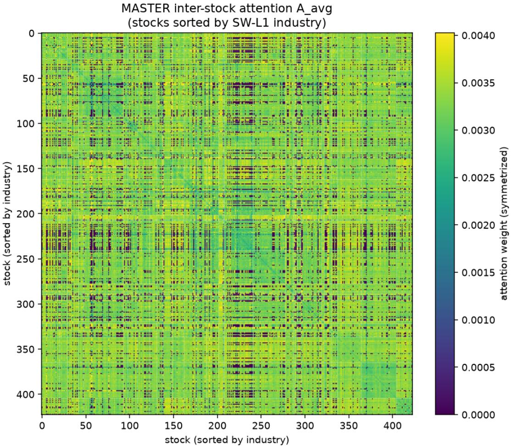
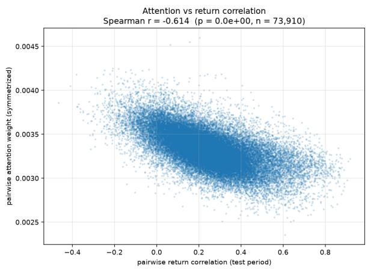
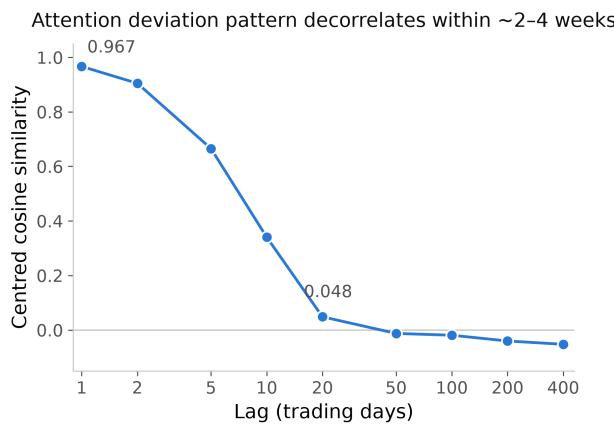
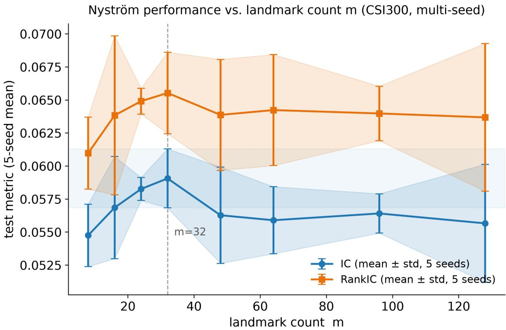
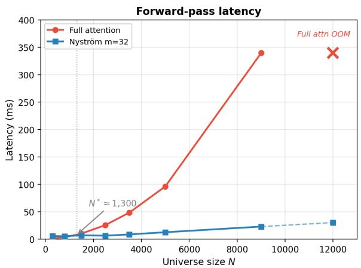
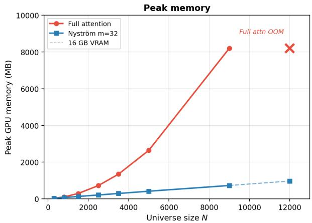

# Nystr¨om Attention Matches Full Attention for Cross-Sectional Stock Prediction

Kunhan Guo

The University of Hong Kong aguo0521@connect.hku.hk

## Abstract

MASTER’s inter-stock multi-head attention—the module responsible for modeling crosssectional stock relationships—accounts for 42.5% of model parameters and 25% of predictive value. We systematically decompose this module and uncover a surprising structure: the learned attention is near-uniform (perplexity 278/300), yet forcing exact uniformity eliminates all crosssectional discrimination. Spectral analysis resolves this paradox: the deviation from uniformity is low-rank (efective rank ∼65, top-10 modes capture 96.5% of energy), explaining why sparse approximations consistently fail while Nystr¨om low-rank attention (m = 32 landmarks) matches full O(N2) attention at O(mN) cost—certified equivalent via TOST at both N = 300 (5 seeds, Rank IC p = 0.003) and N = 800 (10 seeds, Rank IC p = 0.034). Additional findings include: (i) attention anti-correlates with return similarity (Spearman ρ = −0.614; on the industry-labeled subset, −0.645 unconditionally and −0.627 after controlling for industry, beta, and volatility), suggesting complementarity-seeking rather than correlation mining; (ii) all graph-based alternatives degrade performance, with hard masking worse than complete module removal; and (iii) at N ≈ 3,500 with adapted architectures, no cross-stock module (GCN, Nystr¨om, or MASTER-style pipeline) significantly outperforms a per-stock LSTM baseline (n = 4 seeds), indicating that the benefits observed at smaller scales do not trivially transfer. These results establish that the inter-stock attention’s value resides in a compressible, dynamic, near-global redistribution that rewards low-rank approximation but resists sparsification.

## 1 Introduction

Cross-sectional stock prediction—ranking which stocks will outperform within a universe—is a core task in quantitative finance. Recent Transformer-based models, particularly MASTER (Market-Guided Stock Transformer) [1], have become standard baselines by applying multi-head attention across stocks at each timestep. This inter-stock attention module (Step ➂ in MASTER’s five-stage pipeline) claims to capture “momentary and cross-time stock correlations,” and subsequent work has sought to enhance it with explicit graph structures drawn from industry membership, supply chains, or return correlations [4, 5, 6, 8, 3, 7, 14].

But what does this module actually learn? And can it be made cheaper? We address both questions through a systematic decomposition combining statistical diagnostics, controlled ablations, spectral analysis, and eficient-attention experiments. Our findings challenge several prevailing assumptions:

1. The attention is near-uniform but not uniform. Per-stock entropy is within 1.2% of the theoretical maximum, yet forcing exact uniformity eliminates all cross-sectional discrimination. The deviation from uniformity contributes only 1.3% of output energy but is the sole source of cross-sectional variance.

2. The deviation structure is low-rank. Spectral analysis of the deviation matrix $D =$ $\begin{array} { r } { A - \frac { 1 } { N } \mathbf { 1 1 } ^ { \top } } \end{array}$ reveals an efective rank of ∼65 (out of 300 stocks), with the top-10 singular values capturing 96.5% of the Frobenius norm. This directly predicts that low-rank attention should succeed while sparse attention should fail.

3. Nystr¨om attention matches full attention at $O ( m N )$ . Replacing full $O ( N ^ { 2 } )$ attention with Nystr¨om approximation using just $m = 3 2$ landmarks produces equivalent Rank IC (TOST $p = 0 . 0 0 3$ within ±0.005) and equivalent IC within ±0.008 (TOST $p = 0 . 0 2 8 )$ across 5 seeds, with lower seed-to-seed variance.

4. Sparsification consistently fails. Graph-masked, top-K, and deviation-thresholded variants all degrade performance. Hard masking to correlation-based neighbors is worse than removing the module entirely. A 2×2 factorial reveals that IC scales with neighbor count while Rank IC scales with weight sharpening—requirements that are mutually exclusive under sparsity.

5. Large-N transferability is limited. At $N \approx 3 { , } 5 0 0$ (full A-share market) with adapted architectures, no cross-stock module significantly outperforms a per-stock LSTM baseline across multiple seeds $( n = 4 )$ . The benefits documented at $N = 3 0 0 – 8 0 0$ do not trivially transfer to larger, noisier universes—a finding that itself required multi-seed validation to establish, as single-seed results suggested a spurious trade-of.

Together, these findings establish that MASTER’s inter-stock attention implements a compressible, dynamic, complementarity-seeking redistribution of cross-sectional information. Its value is real but resides in a low-rank structure that rewards Nystr¨om approximation and resists sparsification— a distinction with direct implications for scaling stock Transformers, tempered by the observation that scaling benefits are not guaranteed at larger N.

## 2 Background: MASTER Architecture

MASTER [1] processes N stocks over T lookback timesteps through five stages. Step ➀ applies market-guided gating, using market index features to dynamically rescale each stock’s input. Step ➁ performs intra-stock temporal attention—a Transformer encoder operating independently per stock across T timesteps. Step ➂ applies inter-stock multi-head attention at each timestep:

$$
z _ { u , t } = \sum _ { v = 1 } ^ { N } \alpha _ { u v } ^ { ( t ) } V _ { v } ^ { ( t ) } , \quad \alpha _ { u v } ^ { ( t ) } = \mathrm { s o f t m a x } \left( \frac { Q _ { u } ^ { ( t ) } K _ { v } ^ { ( t ) \top } } { \sqrt { d } } \right)\tag{1}
$$

This module contains 329,216 parameters (42.5% of the model), including QKV projections, a feedforward network, and LayerNorm. Step ➃ collapses the temporal dimension via attention (the last timestep queries all others), and Step ➄ applies a linear prediction head.

Why focus on Step ➂? We ablate each step individually (Table 1). Step $\textcircled{3}$ contributes the largest IC drop (−25.3%) and is the only module enabling cross-stock information flow. Notably, removing Step $\textcircled{4}$ (temporal aggregation) increases Rank IC by 5.4%, foreshadowing the aggregationhurts-ranking phenomenon we document at scale in Section 7.

Table 1: Full pipeline ablation (CSI300, seed 0). Step ➂ is the dominant value contributor. ∆IC computed from unrounded values; displayed IC is rounded to 4 decimal places.
<table><tr><td>Configuration</td><td>IC</td><td>Rank IC</td><td>∆IC</td><td>Params</td></tr><tr><td>Full MASTER</td><td>0.0646</td><td>0.0685</td><td></td><td>775,041</td></tr><tr><td>No Step ① (gating)</td><td>0.0622</td><td>0.0673</td><td>-3.6%</td><td>764,929</td></tr><tr><td>No Step ② (temporal attn)</td><td>0.0612</td><td>0.0671</td><td>-5.2%</td><td>445,825</td></tr><tr><td>No Step ③ (inter-stock attn)</td><td>0.0482</td><td>0.0514</td><td>-25.3%</td><td>445,825</td></tr><tr><td>No Step ④ (temporal agg.)</td><td>0.0605</td><td>0.0722</td><td>-6.3%</td><td>709,505</td></tr></table>

## 3 Experimental Setup

Data. Our primary experiments use the MASTER opensource CSI300 dataset [1]: ∼300 A-share stocks with 222-dimensional features (158 Alpha158 technical factors, 63 market features, 1 label), following the original train/validation/test split (619 test days). For scale validation, we use the full A-share market via Qlib (∼3,486 stocks per day on average), with 17 features computed from raw OHLCV, training on 2010–2017 and testing on 2019–2020 (383 days).

Metrics. We report IC (Pearson correlation between predicted and actual 4-day forward returns), Rank IC (Spearman correlation, measuring ordering accuracy), and their information ratios (ICIR = mean/std, measuring consistency). The label is defined as close(t+5)/close(t+1) − 1, a strictly future return with a one-day gap, following the MASTER opensource configuration. Long-short portfolio Sharpe ratios are reported for scale experiments.

Protocol. All CSI300 experiments use MASTER’s original loss-threshold stopping (train loss ≤ 0.95) with Adam optimization. All Step ➂ variants are implemented as subclasses without modifying the original codebase, ensuring identical treatment of Steps ➀, ➁, ➃, and ➄. Singleseed (seed 0) results are used for mechanistic decomposition where relative ordering across many controlled variants is the focus; all equivalence claims are validated across 5–10 seeds with proper TOST testing.

## 4 Attention Diagnostic

We extract inter-stock attention weights from a trained MASTER model across all 619 test days and characterize their statistical properties.

Near-uniform distribution. The mean per-row attention entropy is 5.63 nats, compared to ln(300) = 5.70 for a uniform distribution—a gap of only 1.2%. The corresponding perplexity (efective number of attended stocks) is 278 out of 300. Figure 1 shows the time-averaged attention matrix sorted by Shenwan Level-1 industry: no block-diagonal structure is visible.

Anti-correlation with return similarity. The Spearman correlation between pairwise attention weights and pairwise return correlations is $\rho = - 0 . 6 1 4 \ ( p \approx 0 , n = 7 3 , 9 1 0$ valid pairs from a universe of 433 stocks; pairs require ≥60 overlapping return observations). Stocks that co-move receive less attention. This association is robust to controls: on the 423 stocks (out of 433) with

Shenwan L1 industry labels, the unconditional $\rho = - 0 . 6 4 5$ (71,165 both-labeled pairs); a multiple regression controlling for same-industry membership, beta diference, and volatility diference yields a partial $\rho = - 0 . 6 2 7$ . Controls attenuate the association only marginally (Figure 2). Sameindustry stock pairs receive significantly lower attention than cross-industry pairs $( b = - 0 . 0 1 1$ $p = 3 \times 1 0 ^ { - 4 } )$ . Per-day Spearman $\rho$ is negative on all 619 test days (mean −0.215, std 0.071). The per-day mean is substantially smaller than the pooled estimate because pooling across days absorbs shared cross-sectional structure that is constant within each day but varies across days.

Temporal dynamics. Centered cosine similarity between attention matrices decays as: lag-1: 0.967, lag-5: 0.665, lag-20: 0.048 (Figure 2). The attention pattern fully reorganizes every 2– 4 weeks. PCA of flattened daily deviation matrices shows PC1 explaining only 9% of variance, indicating drift through high-dimensional space rather than oscillation between discrete modes. A permutation test confirms that market regime (up/flat/down days) does not drive attention changes $( p = 0 . 1 7 )$

Preliminary interpretation. By conventional entropy diagnostics, the attention is “efectively uniform.” As we show next, this interpretation is misleading—the 1.2% deviation from uniformity carries all of the module’s cross-sectional value.

## 5 What Carries the Value?

## 5.1 Graph-Guided Variants All Fail

If near-uniform attention wastes capacity on irrelevant stock pairs, explicit graph structure should help. We test three approaches—hard masking (GraphMask), soft biasing (GraphBias), and GCN replacement [12]—using both return-correlation and industry-based graphs. Table 2 shows that every variant degrades performance. Hard masking to correlation-based neighbors produces IC below complete module removal $( 0 . 0 4 5 \pm 0 . 0 0 4$ vs. $0 . 0 5 0 \pm 0 . 0 0 1$ across 4 seeds; Table 2), directly contradicting the intuition that attention should focus on “related” stocks.

Table 2: Step ➂ variants (CSI300). Multi-seed $( n = 4 )$ for key configs; others seed 0. Ordering Original > No Step $\textcircled{3} >$ GraphMask holds across seeds (paired t: Original vs. GraphMask $p =$ 0.040).
<table><tr><td>Configuration</td><td>IC</td><td>Rank IC</td><td>ICIR</td><td>Seeds</td></tr><tr><td>Original MASTER</td><td> $0 . 0 5 7 \pm 0 . 0 0 8$ </td><td> $0 . 0 6 6 \pm 0 . 0 0 3$ </td><td>0.386</td><td>4</td></tr><tr><td>GraphBias + Corr</td><td>0.0497</td><td>0.0580</td><td>0.319</td><td>1</td></tr><tr><td>GCNReplace + Corr</td><td>0.0487</td><td>0.0570</td><td>0.374</td><td>1</td></tr><tr><td>No Step ③</td><td> $0 . 0 5 0 \pm 0 . 0 0 1$ </td><td> $0 . 0 5 2 \pm 0 . 0 0 2$ </td><td>0.377</td><td>4</td></tr><tr><td>GraphMask + Industry</td><td>0.0437</td><td>0.0458</td><td>0.300</td><td>1</td></tr><tr><td>GraphMask + Corr</td><td> $0 . 0 4 5 \pm 0 . 0 0 4$ </td><td> $0 . 0 4 9 \pm 0 . 0 0 2$ </td><td>0.340</td><td>4</td></tr><tr><td>StaticAttn (oracle Ā)</td><td>0.0497</td><td>0.0595</td><td>0.382</td><td>1</td></tr><tr><td>UniformAttn (1/N)</td><td>0.0491</td><td>0.0514</td><td>0.368</td><td>1</td></tr><tr><td>MeanPool</td><td>0.0502</td><td>0.0536</td><td>0.377</td><td>1</td></tr></table>

  
Figure 1: Time-averaged attention matrix (centered at $1 / N )$ . Blue = below-average, red = aboveaverage. Stocks sorted by Shenwan L1 industry; no block-diagonal structure. The matrix shows 433 unique stocks appearing across test days; on any given day ∼300 are active.

## 5.2 The Deviation Is Small but Essential

To understand why near-uniform attention outperforms all alternatives, we decompose Step ➂’s output. For each stock u:

$$
z _ { u } = \underbrace { \frac { 1 } { N } \sum _ { v } V _ { v } } _ { z _ { \mathrm { u n i f o r m } } } + \underbrace { \sum _ { v } \left( \alpha _ { u v } - \frac { 1 } { N } \right) V _ { v } } _ { z _ { \mathrm { d e v i a t i o n } , u } }\tag{2}
$$

The uniform component $z _ { \mathrm { u n i f o r m } }$ is identical for all stocks (a rank-1 broadcast) and contributes 98.7% of output energy. The deviation component $z _ { \mathrm { d e v i a t i o n } , u }$ contributes only 1.3% of energy but is the sole source of cross-sectional variance—without it, Step $\textcircled{3} \textcircled{8}$ output carries no stockspecific information. We verify that value-vector heterogeneity does not afect this conclusion: the coeficient of variation of $\| V _ { v } \|$ across stocks is 0.10, and the entropy of efective weights $\alpha _ { u v } \lVert V _ { v } \rVert$ difers from raw attention entropy by only 0.002 nats.

  
Figure 2: Left: Pairwise attention weight vs. return correlation $( \rho = - 0 . 6 1 4 ;$ $n = 7 3 { , } 9 1 0$ pairs). Right: Centered cosine similarity vs. lag; full decorrelation in ∼20 trading days.

## 5.3 Dynamic Recomputation Is Essential

We freeze the attention to the time-averaged oracle matrix A¯ (computed on the test set, giving the static pattern its best chance). StaticAttn recovers ∼47% of Rank IC value and only ∼9% of IC value relative to the floor. Combined with the temporal dynamics analysis (Section 4), this establishes that value resides in daily recomputation, not in a stable backbone.

## 6 Spectral Analysis and Nystr¨om Approximation

## 6.1 The Deviation Matrix Is Low-Rank

The preceding sections establish that Step ➂’s value lies in a near-uniform, dynamic, anti-correlationseeking attention pattern. Sparsification fails because it destroys near-global support. We now ask: is there a diferent axis of approximation?

We compute the SVD of the deviation matrix $\begin{array} { r } { D = A - \frac { 1 } { N } \mathbf { 1 } \mathbf { 1 } ^ { \top } } \end{array}$ averaged over test days. The efective rank is ∼65 (out of 300), and the top-10 singular values capture 96.5% of $\| D \| _ { F } ^ { 2 }$ . This structure is robust: across 208 individual day×head matrices, the median efective rank is 65 [IQR: 45–81] and the median top-10 energy share is 96.8%.

Is low-rank structure learned or inherent? We compute the deviation spectrum of 10 randomly initialized (untrained) MASTER models. The random-init deviation is also low-rank (efective rank $5 9 \pm 7 .$ , top-10 energy $9 5 . 6 \pm 0 . 9 \%$ , comparable to the trained model (rank ∼65, top-10 energy 96.5%). Training modestly increases the efective rank and lowers entropy (5.49 vs. 5.68), but the low-rank property is present before any learning occurs. Thus, low-rank is inherent to softmax attention over N items; what training contributes is the specific pattern of deviations carrying predictive value. Nystr¨om succeeds because softmax attention is architecturally guaranteed to remain low-rank, regardless of training.

This low-rank structure has a direct algorithmic implication: the Nystr¨om method approximates the full attention matrix using $m \ll N$ landmark points, efectively performing a low-rank factorization. If the deviation matrix is low-rank, Nystr¨om should preserve its structure at $O ( m N )$ cost.

## 6.2 Nystr¨om Matches Full Attention

We replace Step ➂’s full attention with Nystr¨om attention [9] using $m = 3 2$ landmarks (10.7% of N), selected uniformly at random each forward pass. The pseudo-inverse is computed via 6 Newton–Schulz iterations to avoid materializing any $N \times N$ matrix. All other components (FFN, LayerNorm, residual connections) are unchanged.

Table 3: Nystr¨om vs. full attention (CSI300, 5 seeds). TOST equivalence: Rank IC within $\pm 0 . 0 0 5$ $( p = 0 . 0 0 3 )$ ; IC within ±0.008 (p = 0.028).
<table><tr><td>IC</td><td>Rank IC</td><td>ICIR</td><td>Rank ICIR</td></tr><tr><td>Original  $\left( O ( N ^ { 2 } ) \right)$   $0 . 0 5 8 \pm 0 . 0 0 7$ </td><td> $0 . 0 6 6 \pm 0 . 0 0 3$ </td><td>0.386</td><td>0.429</td></tr><tr><td>Nyström  $m { = } 3 2 ~ ( O ( 3 2 N ) )$   $0 . 0 5 9 \pm 0 . 0 0 2$ </td><td> $0 . 0 6 6 \pm 0 . 0 0 3$ </td><td>0.389</td><td>0.416</td></tr><tr><td colspan="4">TOST  $( \delta = 0 . 0 0 5 )$  : Rank IC  $p = 0 . 0 0 3 \ \checkmark$   $\mathrm { I C } ~ p = 0 . 0 9 9$ </td></tr><tr><td colspan="4">TOST  $( \delta = 0 . 0 0 8 )$  IC  $p = 0 . 0 2 8 \ \checkmark$  90% CI: IC [−0.005, +0.007], Rank IC [−</td></tr></table>

The result (Table 3) confirms the spectral prediction. A TOST equivalence test [13] establishes that Nystr¨om Rank IC is equivalent to full attention within ±0.005 $( p = 0 . 0 0 3 )$ ; IC equivalence holds at the ±0.008 margin $( p \ : = \ : 0 . 0 2 8 )$ but not at ±0.005 $( p \ : = \ : 0 . 0 9 9 )$ , reflecting higher IC variance across seeds. Nystr¨om also exhibits notably lower seed-to-seed IC variance (0.002 vs. 0.007). Landmark-induced stochasticity is negligible (eval jitter $< 1 0 ^ { - 4 } )$

## 6.3 Why Low-Rank Works but Sparse Does Not

Table 4 compares the full landscape of eficient alternatives. Two patterns emerge. First, lowrank methods dominate sparse methods: Nystr¨om (m=32) matches the original on Rank IC while TopK (K=16) retains at most 50% of either metric (IC equivalence across seeds is established in Table 3). Second, more landmarks do not help: $m { = } 6 4$ performs worse than $m { = } 3 2$ , a phenomenon we analyze in detail in Section 6.4. Landmark-based approximation (Nystr¨om) also substantially outperforms random-feature approximation (Performer) at the same m.

Table 4: Eficient attention sweep (CSI300). Multi-seed for the main comparisons; exploratory rows are seed 0 only. Low-rank dominates sparse; landmark count is non-monotonic (see §6.4).
<table><tr><td>Configuration</td><td>IC</td><td>Rank IC</td><td>Complexity</td><td>Seeds</td></tr><tr><td>Original</td><td> $0 . 0 5 8 \pm 0 . 0 0 7$ </td><td> $0 . 0 6 6 \pm 0 . 0 0 3$ </td><td> $O ( N ^ { 2 } )$ </td><td>5</td></tr><tr><td>Nyström  $m { = } 3 2$ </td><td> $0 . 0 5 9 \pm 0 . 0 0 2$ </td><td> $0 . 0 6 6 \pm 0 . 0 0 3$ </td><td> $O ( 3 2 N )$ </td><td>5</td></tr><tr><td>DeviationAttn</td><td> $0 . 0 5 2 \pm 0 . 0 0 5$ </td><td> $0 . 0 6 5 \pm 0 . 0 0 4$ </td><td> $O ( N ^ { 2 } ) ^ { * }$ </td><td>5</td></tr><tr><td>TopK K=16</td><td> $0 . 0 5 2 \pm 0 . 0 0 4$ </td><td> $0 . 0 6 4 \pm 0 . 0 0 4$ </td><td> $O ( 1 6 N )$ </td><td>5</td></tr><tr><td>No Step ③ (floor)</td><td> $0 . 0 5 0 \pm 0 . 0 0 1$ </td><td> $0 . 0 5 2 \pm 0 . 0 0 2$ </td><td></td><td>4</td></tr><tr><td colspan="3">Seed 0 only (exploratory):</td><td></td><td></td></tr><tr><td>Nyström  $m { = } 6 4$ </td><td>0.0554</td><td>0.0603</td><td>O(64N)</td><td>1</td></tr><tr><td>Performer  $m { = } 3 2$ </td><td>0.0540</td><td>0.0577</td><td> $O ( 3 2 N )$ </td><td>1</td></tr><tr><td>UniformAttn</td><td>0.0491</td><td>0.0514</td><td> $O ( N ^ { 2 } )$ </td><td>1</td></tr></table>

\*Requires full $\overline { { N ^ { 2 } } }$ softmax before thresholding.

The mechanistic explanation follows from the near-uniform attention structure. In a distribution where most weights are $\approx 1 / N$ , the top-K entries are themselves near-equal (perplexity 15.9/16 at

K=16). Subtracting a constant from near-equal values cannot create meaningful diferentiation— sharpening requires support spanning a range around $1 / N _ { ; }$ , which small K cannot provide. This is a structural prediction: all small-K weighted variants should fail identically, and our 2×2 factoria (varying support size × weighting rule) confirms this.

## 6.4 Landmark Count: A Non-Monotonic Profile

A dense sweep of $m \in \{ 8 , 1 6 , 2 4 , 3 2 , 4 8 , 6 4 , 9 6 , 1 2 8 \}$ with 5 seeds each reveals a non-monotonic relationship between landmark count and performance (Figure 3). Performance peaks at $m = 3 2$ $( \mathrm { I C ~ 0 . 0 5 9 \pm 0 . 0 0 2 }$ , Rank IC $0 . 0 6 6 \pm 0 . 0 0 3 )$ , dips at $m = 4 8$ (1.2σ below $m = 3 2 )$ , and remains below the peak at $m \ = \ 6 4 { - } 1 2 8$ . This non-monotonic profile, confirmed across seeds, resolves an apparent contradiction: $m = 6 4$ underperforms m = 32 despite the deviation matrix having efective rank ∼65. The explanation is that m landmarks in Nystr¨om do not correspond one-to-one to SVD components; over-sizing the landmark set worsens the conditioning of the pseudo-inverse, increasing approximation variance faster than it reduces bias.

  
Figure 3: Nystr¨om performance vs. landmark count m (CSI300, 5 seeds each, ±1 std). Peak at $m = 3 2 ;$ non-monotonic profile reflects bias-variance trade-of in pseudo-inverse computation.

## 6.5 Dynamic Sampling Is Essential, Not Just Low-Rank Structure

To disentangle whether Nystr¨om’s success derives from its low-rank structure or its dynamic (perforward-pass) landmark resampling, we test a LearnedLowRank baseline: each stock receives a learnable embedding $e _ { i } \in \mathbb { R } ^ { 3 2 }$ , and attention scores are computed as $a _ { i j } = e _ { i } ^ { \top } e _ { j } / \sqrt { 3 2 }$ (static, trained end-to-end). This provides a rank-32 attention pattern that is optimized for the task but fixed across days.

Table 5: Dynamic vs. static, crossed with full-rank vs. low-rank (CSI300, seed 0; 5-seed means for Original and Nystr¨om are in Table 3). Dynamic routing is essential; low-rank is viable only when dynamic.
<table><tr><td></td><td>IC</td><td>Rank IC</td><td>Dynamic?</td><td>Rank</td></tr><tr><td>Full attention</td><td>0.0646</td><td>0.0685</td><td>Yes</td><td>Full</td></tr><tr><td>Nyström  $m { = } 3 2$ </td><td>0.0607</td><td>0.0685</td><td>Yes (random)</td><td>Low</td></tr><tr><td>StaticAttn (oracle)</td><td>0.0497</td><td>0.0595</td><td>No (frozen)</td><td>Full</td></tr><tr><td>LearnedLowRank  $r { = } 3 2$ </td><td>0.0478</td><td>0.0500</td><td>No (learned)</td><td>Low</td></tr><tr><td>No Step ③</td><td>0.0482</td><td>0.0514</td><td></td><td></td></tr></table>

Table 5 reveals a clear interaction: low-rank approximation preserves performance only when combined with dynamic, data-dependent routing (Nystr¨om). A static low-rank attention, even when optimized end-to-end, collapses to the no-attention floor $( \mathrm { I C } = 0 . 0 4 7 8 \approx 0 . 0 4 8 2 )$ . This establishes that Nystr¨om’s success is not merely a consequence of low-rank structure but requires the QK-driven, day-specific attention computation that adapts to each day’s cross-sectional configuration.

## 7 Cross-Stock Aggregation at Scale

The Nystr¨om result enables, in principle, scaling cross-stock attention to large universes at $O ( m N )$ cost. We test scaling along two axes: first within the same MASTER codebase at $N = 8 0 0$ (CSI800), then with adapted architectures at $N \approx 3 { , } 5 0 0$

## 7.1 CSI800: Same Codebase, Larger Universe

Using the same MASTER architecture, features, and training protocol as CSI300—only N changes— we compare Original vs. Nystr¨om at $N \approx 8 0 0$ (10 seeds each).

Table 6: Nystr¨om at CSI800 (N ≈ 800, 10 seeds). Equivalence certified within ±0.005 on both metrics.
<table><tr><td></td><td>Original (n=10)</td><td> $\mathbf { N y s t } \ m { = } \mathbf { 3 2 } \ ( n { = } \mathbf { 1 0 } )$ </td></tr><tr><td>IC</td><td> $0 . 0 4 7 \pm 0 . 0 0 4$ </td><td> $0 . 0 4 5 \pm 0 . 0 0 4$ </td></tr><tr><td>Rank IC</td><td> $0 . 0 5 9 \pm 0 . 0 0 4$ </td><td> $0 . 0 5 9 \pm 0 . 0 0 6$ </td></tr><tr><td></td><td>TOST (δ = 0.005): IC p = 0.038 √ RankIC</td><td> $p = 0 . 0 3 4 \ \checkmark$ </td></tr><tr><td>90%</td><td> $\operatorname { C I : } \operatorname { I C } \ [ - 0 . 0 0 5 , + 0 . 0 0 1 ]$ </td><td>RankIC  $[ - 0 . 0 0 4 , + 0 . 0 0 4 ]$ </td></tr></table>

At $N = 8 0 0$ , Nystr¨om with m = 32 (4% coverage) is certified equivalent to full attention within ±0.005 on both IC $( p = 0 . 0 3 8 )$ and Rank IC $( p = 0 . 0 3 4 )$ . Importantly, increasing landmarks to $m = 8 0 \ ( 1 0 \%$ , matching CSI300’s ratio) does not improve performance—the optimal $m \approx 3 2$ is stable across scale. An initial 5-seed analysis suggested a possible gap; doubling to 10 seeds revealed this as a statistical-power artifact, not a real degradation.

## 7.2 N ≈ 3,500: Adapted Architecture

We further test at $N \approx 3 { , } 5 0 0$ using the full A-share market with adapted architectures (17 OHLCVderived features, $d _ { \mathrm { m o d e l } } = 6 4$ , no market gating). Table 7 reports results across 4 seeds.

Table 7: Large-scale validation $( N \approx 3 { , } 5 0 0 .$ 4 seeds). No cross-stock module significantly outperforms PureLSTM.
<table><tr><td></td><td>IC</td><td>Rank IC</td><td>Sharpe</td></tr><tr><td>PureLSTM</td><td> $0 . 0 4 3 \pm 0 . 0 0 2$ </td><td> $0 . 0 5 6 \pm 0 . 0 0 3$ </td><td> $5 . 6 \pm 0 . 5$ </td></tr><tr><td> $\mathrm { L S T M + G C N }$ </td><td> $0 . 0 3 4 \pm 0 . 0 0 8$ </td><td> $0 . 0 6 3 \pm 0 . 0 0 9$ </td><td> $4 . 1 \pm 1 . 5$ </td></tr><tr><td> $\mathrm { M A S T E R + N y s t 3 2 }$ </td><td> $0 . 0 3 7 \pm 0 . 0 0 8$ </td><td> $0 . 0 5 0 \pm 0 . 0 1 6$ </td><td> $5 . 6 \pm 1 . 1$ </td></tr></table>

At this scale, no cross-stock module significantly outperforms PureLSTM on either IC or Rank IC (paired t-tests: MASTER+Nyst32 vs. PureLSTM IC $p = 0 . 2 7$ , Rank IC $p = 0 . 5 3 ; n = 4 )$ An initial single-seed analysis (seed 42) had suggested a consistent IC↑/Rank IC↓ trade-of across all module types, but this pattern did not survive multi-seed validation—underscoring the necessity of multi-seed evaluation in financial ML. The high seed-to-seed variance at $N \approx 3 { , } 5 0 0$ (e.g., MAS-TER+Nyst32 IC std = 0.008, vs. 0.002 at CSI300) suggests that the noisier, more heterogeneous full-market cross-section is substantially harder to model, and that Nystr¨om’s benefits—established at $N = 3 0 0$ and N = 800 within MASTER’s native pipeline—do not trivially transfer to adapted architectures at larger scale.

## 8 Eficiency

The equivalence results establish that Nystr¨om preserves predictive quality. We now quantify the computational savings via forward-pass benchmarks on a Tesla T4 (16 GB, CUDA 12.8), using the deployed Step ➂ configuration $( d _ { \mathrm { m o d e l } } = 2 5 6 , \ n _ { \mathrm { h e a d } } = 2 , T = 8 )$ , with 50 timed passes after 10 warmup iterations (Table 8, Figure 4).

Table 8: Forward-pass eficiency: full attention vs. Nystr¨om $( m = 3 2 )$ . Median latency (ms) and peak GPU memory (MB) on a Tesla T4 (16 GB). dmodel = 256, nhead = 2, T = 8.
<table><tr><td rowspan="2">N</td><td colspan="2">Latency (ms)</td><td rowspan="2">Speedup</td><td colspan="2">Memory (MB)</td><td rowspan="2">Saving</td></tr><tr><td>Full</td><td>Nyst</td><td>Full</td><td>Nyst</td></tr><tr><td>300</td><td>1.65</td><td>5.90</td><td>0.3×</td><td>37</td><td>36</td><td>1.0×</td></tr><tr><td>800</td><td>3.80</td><td>5.59</td><td>0.7×</td><td>112</td><td>77</td><td>1.5×</td></tr><tr><td>1,500</td><td>10.30</td><td>7.24</td><td>1.4×</td><td>297</td><td>135</td><td>2.2×</td></tr><tr><td>2,500</td><td>25.87</td><td>6.57</td><td>3.9×</td><td>727</td><td>216</td><td>3.4×</td></tr><tr><td>3,500</td><td>48.66</td><td>8.92</td><td>5.5×</td><td>1,350</td><td>298</td><td>4.5×</td></tr><tr><td>5,000</td><td>96.30</td><td>12.82</td><td>7.5×</td><td>2,642</td><td>421</td><td>6.3×</td></tr><tr><td>9,000</td><td>339.5</td><td>23.17</td><td>14.7×</td><td>8,194</td><td>732</td><td>11.2×</td></tr><tr><td>12,000</td><td>OOM</td><td>30.46</td><td>一</td><td>OOM</td><td>974</td><td>一</td></tr></table>

At N = 300, Nystr¨om is slower (5.90 vs. 1.65 ms): the Newton–Schulz pseudo-inverse imposes a fixed overhead of ∼4 ms that is independent of $N . ^ { 1 }$ The latency crossover occurs at $N ^ { * } \approx 1 { , } 3 0 0 { : }$ beyond this, Nystr¨om’s $O ( m N )$ scaling wins decisivel $\mathrm { y - } 5 . 5 \times$ at $N = 3 { , } 5 0 0$ and $1 4 . 7 \times$ at $N =$ 9,000. The memory scaling is unambiguous: from $N = 3 0 0$ to 9,000 (a 30× increase), full-attention memory grows $\times 2 1 9$ (consistent with $\propto N ^ { 2 } )$ while Nystr¨om grows $\times 2 0$ (consistent with $\propto N )$ . Full attention exhausts the 16 GB budget at $N = 1 2 { , } 0 0 0$ , where Nystr¨om still requires only 974 MB.

  
Figure 4: Forward-pass latency and memory vs. $N$ on a Tesla T4 (16 GB), extended to $N = 1 2 { , } 0 0 0$ Full attention OOMs at $N = 1 2 { , } 0 0 0 \mathrm { { : } }$ Nystr¨om scales linearly and uses 974 MB there. Latency crossover at $N ^ { * } \approx 1 { , } 3 0 0$

Training overhead. Nystr¨om training is ${ \sim } 2 \times$ slower per epoch due to Newton–Schulz iterations (6 sequential matrix multiplications). Training is a one-time ofline cost; daily inference for portfolio rebalancing is the recurring cost that scales with N. At CSI300 we do not claim wall-clock savings— full attention is in fact faster below $N ^ { * } \approx 1 { , } 3 0 0$ . The value proposition is at scale: a $5 \mathrm { - } 1 5 \times$ latency reduction with proportional memory savings for $N > 3 , 0 0 0$ , at equivalent predictive quality.

## 9 SVD Factor Interpretation

The spectral analysis reveals that the deviation is low-rank; we now ask what each component encodes. Mapping the top SVD components of D to financial characteristics reveals that attention implicitly implements a multi-factor risk model (Table 9).

The dominant mode (PC1, 79.5%) tracks cross-sectional volatility dispersion—high-volatility stocks load on one end, low-volatility on the other. This single mode explains both the anticorrelation finding (high-vol stocks co-move and cluster on the same side of PC1, receiving less diferentiating attention) and Nystr¨om’s success (a structure dominated by one mode is trivially captured by few landmarks).

PC4 provides the cleanest industry signal $( \eta ^ { 2 } \ = \ 0 . 4 8 )$ : banks and construction (defensive, low-beta) vs. autos and power equipment (cyclical, high-beta). PCs 2, 3, 5, and 7 correspond to momentum, sector rotation (old vs. new economy), liquidity, and reversal—canonical factors in the quantitative finance literature.

MASTER’s inter-stock attention thus functions as an implicit 6-factor risk model: it routes information along dimensions that align with well-known financial risk factors, despite never being explicitly trained on factor labels.

Table 9: Top SVD components of the deviation matrix mapped to financial risk factors. Six components (91% of energy) have interpretable financial meaning; PCs 6 and 8–10 do not.
<table><tr><td>PC</td><td>Energy</td><td>Beta  $\rho$ </td><td>Vol  $\rho$ </td><td> $\eta ^ { 2 }$ </td><td>Interpretation</td></tr><tr><td>1</td><td>79.5%</td><td>+0.11</td><td>+0.48</td><td>0.12</td><td>Volatility / market mode</td></tr><tr><td>2</td><td>3.6%</td><td>-0.04</td><td>-0.05</td><td>0.14</td><td>Momentum (pharma vs. power equip.)</td></tr><tr><td>3</td><td>3.4%</td><td>+0.02</td><td>-0.02</td><td>0.18</td><td>Old vs. new economy</td></tr><tr><td>4</td><td>2.0%</td><td>-0.53</td><td>-0.69</td><td>0.48</td><td>Defensive vs. cyclical</td></tr><tr><td>5</td><td>1.4%</td><td>-0.25</td><td>-0.23</td><td>0.22</td><td>Liquidity / turnover</td></tr><tr><td>7</td><td>1.1%</td><td>-0.05</td><td>-0.24</td><td>0.21</td><td>Reversal</td></tr><tr><td>6,8-10</td><td>3.5%</td><td></td><td></td><td></td><td>Not interpretable</td></tr></table>

## 10 Discussion

Entropy diagnostics are insuficient. Perplexity 278/300 would lead most practitioners to conclude that attention is “efectively uniform”—an interpretation our spectral analysis contradicts. Entropy is a bulk statistic that cannot distinguish every weight equaling 1/N from most weights near 1/N with a structured low-rank deviation. We recommend that attention analysis always include functional ablations (uniform-forcing, oracle-static) alongside distributional summaries.

Complementarity, not similarity. The robust negative association between attention and return correlation (ρ = −0.614 unconditionally, −0.627 after controlling for industry, beta, and volatility; negative on all 619 test days) suggests that inter-stock attention implements information diversification: each stock attends preferentially to stocks with diferent price dynamics. This is the opposite of MASTER’s stated “correlation mining” interpretation and is consistent with the failure of correlation-based graph masking.

IC vs. Rank IC dissociation. A recurring pattern across our CSI300 experiments is that IC and Rank IC respond to diferent mechanisms. IC scales with the breadth of aggregation (neighbor count), while Rank IC depends on weight sharpness. Tercile analysis by return magnitude reveals that predictive signal is overwhelmingly concentrated in extreme movers: the top tercile by |return carries ∼77% of IC covariance at CSI300, with 3–4× the IC of near-zero stocks. This dissociation has practical implications: portfolio strategies focused on return magnitude may prefer cross-stock modules, while pure ranking strategies may be better served by per-stock models. However, at N ≈ 3,500, neither advantage survives multi-seed validation (Table 7), suggesting that this dissociation is most relevant within MASTER’s native architecture and scale.

Related work. Our finding that near-uniform attention carries predictive value echoes work in NLP showing that fixed or random attention patterns can match learned attention [10, 11]. We extend this to a financial domain and add a spectral explanation. StockMixer [2], from the same research group as MASTER, achieves comparable performance with a static MLP-based crossstock mixing layer, consistent with our finding that the attention pattern’s efective mechanism is near-global redistribution rather than selective routing.

Economic significance. All Sharpe ratios reported are frictionless (no transaction costs, slippage, or market impact). In the A-share market, where daily turnover is high and short-selling is restricted, the IC diferences of 0.005–0.01 we observe are modest but practically relevant for institutional portfolios. Practitioners should note that IC and Rank IC serve diferent downstream tasks: return-focused strategies (e.g., long-short with continuous position sizing) benefit from IC improvements, while pure ranking strategies (e.g., top-K selection) depend on Rank IC.

Preprocessing sensitivity. Under improved feature normalization (per-day cross-sectional zscore, beyond Qlib’s default global robust z-score), full attention benefits more than Nystr¨om: Original IC improves by +0.005 with 5.8× lower seed variance, while Nystr¨om IC is unchanged. The TOST Rank IC equivalence weakens from $p = 0 . 0 0 3$ to $p = 0 . 1 2 0$ , suggesting the equivalence margin is partially contingent on input conditioning. Better-conditioned inputs allow full $O ( N ^ { 2 } )$ attention to extract finer cross-sectional structure that the low-rank approximation misses. This represents an honest boundary of our core claim: Nystr¨om equivalence is robust under standard preprocessing but narrows under optimized preprocessing.

Limitations. The CSI300 decomposition results rely on seed 0 for most ablations; the key Nystr¨om claim is validated across 5 seeds (CSI300) and 10 seeds (CSI800). The large-scale experiments use an adapted MASTER pipeline (17 features, $d _ { \mathrm { m o d e l } } = 6 4$ , no market gating) rather than the full original architecture, limiting direct comparability with the CSI300 analysis. Our findings are established on a single model (MASTER) in a single market (Chinese A-shares); whether the low-rank deviation structure is a general property of cross-stock attention or specific to MASTER requires verification on additional architectures and markets.

## 11 Conclusion

We have systematically decomposed MASTER’s inter-stock attention module and established that its value derives from a mechanism fundamentally diferent from what its design implies. Rather than learning interpretable stock relationships, the module implements a dynamic, near-global redistribution whose deviation from uniformity is low-rank and compressible. This low-rank structure— inherent to softmax attention, not learned—explains why Nystr¨om approximation matches full attention on ranking metrics at $O ( m N )$ cost (TOST-certified at $N = 3 0 0$ and $N = 8 0 0 )$ while sparsification consistently fails. At $N \approx 3 { , } 5 0 0$ with adapted architectures, cross-stock modules do not significantly outperform per-stock baselines, indicating that the benefits do not trivially transfer across scales and architectures—a finding that itself required multi-seed validation to establish. Future work may explore cross-stock mechanisms that enhance diferentiation rather than smooth it, as well as testing Nystr¨om within MASTER’s full pipeline at larger scales.

## References

[1] T. Li, Z. Liu, Y. Shen, X. Wang, H. Chen, and S. Huang. MASTER: Market-guided stock transformer for stock price forecasting. In Proc. AAAI, pages 162–170, 2024.

[2] J. Fan and Y. Shen. StockMixer: A simple yet strong MLP-based architecture for stock price forecasting. In Proc. AAAI, pages 8389–8397, 2024.

[3] Y. Hu, P. Liu, Y. Li, D. Cheng, N. Li, T. Dai, J. Bao, and S.-T. Xia. FinMamba: Market-aware graph enhanced multi-level Mamba for stock movement prediction. arXiv:2502.06707, 2025.

[4] S. Xiang, D. Cheng, C. Shang, Y. Zhang, and Y. Liang. Temporal and heterogeneous graph neural network for financial time series prediction. In Proc. CIKM, pages 3584–3593, 2022.

[5] H. Du, L. Lv, H. Wang, and A. Guo. TGNS: A transformer-based graph neural network for stock trend forecasting. Information Sciences, 720:122555, 2025.

[6] J. Dong and S. Liang. Hybrid CNN-LSTM-GNN neural network for A-share stock prediction. Entropy, 27(8):881, 2025.

[7] P. Zhu, Y. Li, Y. Hu, Q. Liu, D. Cheng, and Y. Liang. LSR-IGRU: Stock trend prediction based on long short-term relationships and improved GRU. In Proc. CIKM, pages 5135–5142, 2024.

[8] H. Xia, H. Ao, L. Li, Y. Liu, S. Liu, G. Ye, and H. Chai. CI-STHPAN: Pre-trained attention network for stock selection with channel-independent spatio-temporal hypergraph. In Proc. AAAI, pages 9187–9195, 2024.

[9] Y. Xiong, Z. Zeng, R. Chakraborty, M. Tan, G. Fung, Y. Li, and V. Singh. Nystr¨omformer: A Nystr¨om-based algorithm for approximating self-attention. In Proc. AAAI, 2021.

[10] S. Jain and B. C. Wallace. Attention is not explanation. In Proc. NAACL, 2019.

[11] Y. Tay, D. Bahri, D. Metzler, D.-C. Juan, Z. Zhao, and C. Zheng. Synthesizer: Rethinking self-attention for transformer models. In Proc. ICML, 2021.

[12] T. N. Kipf and M. Welling. Semi-supervised classification with graph convolutional networks. In Proc. ICLR, 2017.

[13] D. J. Schuirmann. A comparison of the two one-sided tests procedure and the power approach for assessing the equivalence of average bioavailability. J. Pharmacokinetics and Biopharmaceutics, 15(6):657–680, 1987.

[14] Y. Lu, K. Hu, and L. Zhang. S3G: Stock state space graph for enhanced stock trend prediction. arXiv:2603.24236, 2026.