# OPTIMAL SLICE-ADAPTIVE TUNING OF HYBRID SLICE SAMPLING

BY TREVOR CAMPBELL<sup>1,a</sup>

<sup>1</sup>Department of Statistics, UBC, <sup>a</sup>trevor@stat.ubc.ca

Slice sampling is a Markov chain Monte Carlo algorithm that draws its next state uniformly from a “slice”—a super-level set of the target density function—at each iteration, thereby providing automatic local adaptivity to the scale of the target. In practice the exact slice is not known, so general-purpose implementations use an approximate slice that is grown from a starting interval of length $w > 0$ , with a computational cost that depends on w. This work presents an analysis of the average per-iteration number of target density evaluations, as a function of w, of hybrid slice sampling with various slicefinding schemes for targets with contiguous slices. The paper uses the results of the analysis to develop automated, slice-adaptive tuning schemes along with suboptimality bounds and asymptotic convergence guarantees. Simulations demonstrate that the tuning schemes reliably yield near-optimal slice-adaptive tuning with essentially no dependence on the initial setting of w.

1. Introduction. Markov chain Monte Carlo is a commonly-used tool for computational Bayesian inference. Standard methods typically involve a fixed scale parameter that determines the size of typical movements, e.g., the step size in random-walk Metropolis–Hastings [13, 28], Metropolis-adjusted Langevin algorithm [45], and Hamiltonian Monte Carlo [5, 40]. In general, it is nontrivial to set the scale for even just a single well-behaved target, let alone for distribution sequence targets (e.g., in annealed importance sampling [18, 19, 36, 38] and parallel tempering [9, 17, 52]), for multiscale targets where there may not be a single good choice throughout the whole state space (e.g., Bayesian posteriors with scale priors [43]), or in probabilistic programming libraries that cannot rely on expert user input. This challenge has motivated the development of locally-adaptive samplers, which select a scale value at each iteration based on the current state [see, e.g., 3, 10, 11, 21, 24–26, 32, 42, 57, 58]. Locally-adaptive samplers are typically more robust to the setting of their tuning parameters, but also often have a larger, random number of target evaluations at each step due to the need to establish rough local scale before a move. Slice sampling [7, 15, 16, 35, 37, 39, 53] is one such locally-adaptive method that has seen successful use in a wide variety of applications. The goal of this work is fully-automated tuning of slice sampling in the interest of reducing its computational cost to the maximum extent possible.

The slice samplers considered in this work are those that operate in one dimension. In particular, given a target density function π (up to proportionality) with respect to the Lebesgue measure on $\mathbb { R } ^ { d }$ , and a current state $\boldsymbol { x } \in \mathbb { R } ^ { d }$ , the slice sampler first draws a slice variable $u \in [ 0 , \pi ( x ) ]$ ], then a direction $\rho \in \mathbb { R } ^ { d } , \rho \neq 0$ and then finally a new updated state $\boldsymbol { x } ^ { \prime } \in \mathbb { R } ^ { d }$ via

$$
u \sim \mathrm { U n i f } [ 0 , \pi ( x ) ] , \quad \rho \sim m ( \mathrm { d } \rho ; u ) , \quad x ^ { \prime } \sim \mathrm { U n i f } \{ y \in \mathbb { R } ^ { d } : y = x + \rho \alpha , \alpha \in \mathbb { R } , \pi ( y ) \geq u \} .
$$

Because the new state $x ^ { \prime }$ is drawn from the uniform distribution on the slice, the scale of the move from x to $x ^ { \prime }$ adapts locally to the size of the slice. With appropriate choice of the distribution $m ( \mathrm { d } \rho ; u )$ , this sampler recovers slice sampling within various multivariate schemes, e.g., the hit-and-run sampler [2, 51] when $\rho \sim \mathrm { U n i f } \left( \bar { \mathbb { S } } ^ { d - 1 } \right)$ , and the Gibbs sampler [8] when $\rho$ is a unit basis vector chosen randomly or in deterministic sweeping order.

Drawing the slice level variable u and direction $\rho$ at each iteration is straightforward, but the slice itself is typically unknown, so the ideal slice sampler cannot be implemented. A computational method to draw from the slice is required. Two popular methods developed by

Neal [35, 37, 39] begin with an initial window of width $w > 0$ around the current iterate and grow the window until the slice is (approximately) bounded. The first is stepping out, where the window is grown in increments of size w, and the second is doubling, where the window length is progressively doubled. The choice of w influences the long-run cost of the sampler. A precise characterization of this cost and tuning methods for w are the focus of this work.

The paper begins with a set of pseudocode methods that establish the precise count of the number of target evaluations in each iteration. The pseudocode includes two novel variants of the doubling scheme, both of which improve upon the original method by Neal [39]: a simpler method that involves caching, and a more efficient but more complex method that involves both caching and lazy evaluation. Theorems 3.6 and 3.8 present an exact characterization of the cost of both stepping out and cached doubling for targets with contiguous slices, while Theorem 3.9 establishes coarse properties of the efficient lazy doubling scheme. These results are used to show that the optimal slice-adaptive choice of w at each iteration is proportional to the slice width λ. In particular, the oracle optimal setting is $w = 1 . 3 5 8 \lambda$ for stepping out with cost 4.715, $w = 3 . 2 1 1 \lambda$ for cached doubling with cost 5.901, and $w = 2 . 2 7 7 \lambda$ for lazy cached doubling with cost 5.410, where the reported cost is the average per-iteration number of target density evaluations.

These optima establish lower bounds on the cost of slice sampling, but are typically not achievable in practice because the slice width λ in general has a distribution given each slice value u, as opposed to being a fixed value. The paper therefore leverages the earlier cost characterizations to develop one-shot and gradient-based tuning schemes for w as a function of u for each sampler in Section 4. The one-shot schemes, provided in Eq. (8), have closed-form formulae in terms of the mean/quantiles of the conditional distribution of the slice width λ given the slice variable u. The gradient-based schemes, provided in Eq. (9), are designed have convex and smooth objectives and hence are tractable. Each method comes with theoretical bounds on suboptimality in Theorem 4.2. When tuned using draws from the Markov chain in practice, all algorithms have tuning cost that vanishes compared to the base cost of slice sampling. Under mild additional assumptions, Theorem 4.3 shows that all schemes converge in probability to the optimum for their respective surrogate cost functions. None of these schemes involve user input, enabling their use in an automated probabilistic programming libraries. Simulations demonstrate that these tuning schemes in practice yield near-optimal tuning reliably with no noticeable dependence on the initial setting of w.

Proofs for all results in this work are presented in the appendices.

Related Work. Markov chain Monte Carlo with auxiliary slice augmentations was first developed by Swendsen and Wang [53], with a flurry of work soon afterward that generalized and applied the technique more broadly [4, 7, 15, 16], established its convergence properties [30, 31, 44], and developed the practical hybrid schemes [35, 37, 39] that are the focus of the present work. Over the past two decades since those original contributions, theoretical understanding of slice sampling has significantly improved (see, e.g., [34, 46–48]), and numerous generalizations of the original hybrid scheme have been developed, including novel hybrid slice approximations for multivariate targets [6, 12, 14, 20, 27, 33, 41, 49, 50, 54, 55]. Particularly germane to the present work are those that involve adaptation, e.g., adaptation to the mean and covariance of multivariate targets [27, 54, 55], adaptation of the initial window scale using heuristic Robbins-Monro stochastic approximation [20], and adaptation to density shape using a target approximation [14]. The present work is the first to develop an exact characterization of the optimal slice-adaptive cost of stepping out and doubling hybrid slice samplers, to develop tractable surrogate tuning objectives with suboptimality guarantees, and to leverage those results to develop a fully-automated slice-adaptive tuning scheme. This work is orthogonal to much of the preceding literature on adaptive slice sampling, and thus could likely be profitably combined with many of those earlier developments.

2. Hybrid slice sampling with lazy cached doubling. This section reviews the stepping out and doubling slice sampling algorithms by Neal [39], including some efficiency improvements. For each method, detailed pseudocode in Section C establishes notation and the precise count of the number of calls to $\pi ( \cdot )$ for subsequent analysis. The implementation of stepping out (Algorithm 4) and shrinkage (Algorithm 6) are essentially identical to the implementation by Neal [39]. For doubling and the acceptance check, there are two novel variants: one with caching (Algorithms 5 and 7) and one with caching and lazy evaluation (Algorithms 9 and 10) that removes all unnecessary target density evaluations. All other algorithms in Section C are related to tuning and will be discussed in Section 4.

Slice sampling begins in Algorithm 1 by drawing $u \sim \mathrm { U n i f } [ 0 , \pi ( x ) ]$ given the current state $x \in \mathbb { R } ^ { d }$ , and $\rho \sim m ( \rho ; u )$ . While this naïvely requires a call to $\pi ( x )$ , it can be treated as an input to Algorithm 1 because it is obtained from the previous iteration’s shrinkage step (Algorithm 6). Therefore this call does not appear in the long-run average cost.

Next, the algorithm finds the approximate slice using stepping out (Algorithm 4), cached doubling (Algorithm 5), or lazy cached doubling (Algorithm 9) along the line $x + \rho y , y \in \mathbb { R }$ starting with a window size w computed as a function of u. For both doubling methods, as the slice is grown the density values are stored in an array cache C (assumed to be 1-indexed). This cache is used to avoid recomputing known densities during the subsequent acceptance check. Algorithm 9 avoids further density computation by short-circuiting the decision to keep expanding the window.

Finally, the shrinkage algorithm (Algorithm 6) runs an adaptive rejection sampler that determines whether proposals are acceptable if necessary using a call to the accept (Algorithm 7) or lazy accept (Algorithm 10) function. The (lazy) accept function traces out what would have been the sequence of evaluations by the doubling scheme from the proposed point, and rejects the proposal if doubling could not have created the approximate slice. Algorithms 7 and 10 both use the cache, and Algorithm 10 uses short-circuit evaluation to avoid computing density values that are already known or unnecessary to compute. For the remainder of the paper, the term “cached doubling” refers to using only the cache (Algorithms 5 and 7), and “lazy cached doubling” refers to using both the cache and lazy evaluation (Algorithms 9 and 10). In practice one should always prefer lazy cached doubling, but simple cached doubling is retained for study because it is more amenable to analysis.

Fig. 1 displays the improvement in target density evaluations for the proposed two doubling schemes versus the original scheme proposed by Neal [39]. The lazy caching scheme in particular saves a substantial number of evaluations for small w, and around 1-2 evaluations for well-tuned w, which amounts to around a 15–25% overall cost reduction in that regime.

3. Analysis. This section presents an analysis of the long-run cost of both stepping-out and doubling slice sampling. Assuming that the cost of each iteration is dominated by target density evaluation, the per-iteration cost can be characterized by the number of calls to $\pi ( \cdot )$

The target π is assumed to be unimodal and univariate for simplicity. There are two notes to make about this choice. First, the analysis suffices for broad class of scenarios: the main results in Theorems 3.6, 3.8 and 3.9 as stated apply, without modification, to any multivariate target such that the one-dimensional slice drawn in each iteration is guaranteed to be a contiguous interval. For example, slice sampling within hit-and-run [2, 51] and Gibbs [8] samplers on unimodal multivariate targets both adhere to the below theory, with the only difference being that the slice width at each level is random as opposed to fixed. In practice, the tuning recommendations in this work are also fruitful beyond unimodality (see Section 4.3). Second, unimodality technically enables further reduction of cost by skipping the acceptability check in Algorithm 6 [39, Section 4.4]. However, practical implementations of slice sampling cannot assume unimodality and cannot skip this check; the analysis below corresponds to such practical implementations to ensure useful tuning advice in general. The particular technical assumption that will be made for all theoretical results in this section is as follows.

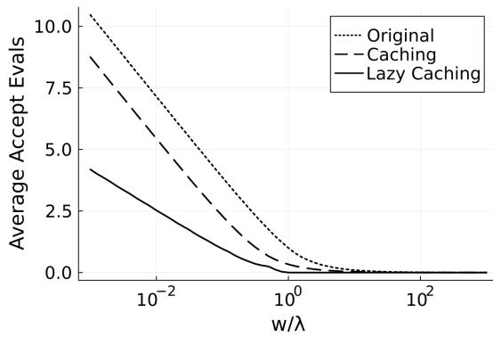  
(a) Accept

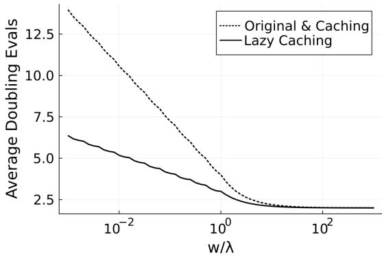  
(b) Doubling  
Fig 1: The average number of target evaluations in the accept and doubling phase of each slice sampling step, as a function of the ratio of the window width w and slice width λ, for the original scheme by Neal [39], the basic caching scheme, and the lazy caching scheme.

ASSUMPTION 3.1. The target π is a probability distribution on R with density $\pi ( x )$ with respect to the Lebesgue measure that satisfies the following: for all $u > 0$ such that $\{ x : \pi ( x ) \geq u \} \neq \varnothing$ , there exist $\ell , r \in \mathbb { R } , \ell \leq r$ such that

$$
\{ x : \pi ( x ) \geq u \} = [ \ell , r ] ,
$$

and for all z such that $0 < \pi ( z ) < \infty$

$$
\mathbb { P } ( | \{ x : \pi ( x ) \geq u \} | \leq 1 ) = 0 , \qquad u \sim \mathrm { U n i f } [ 0 , \pi ( z ) ] .
$$

Furthermore, the Markov chain initial state $x _ { 0 }$ satisfies $0 < \pi ( x _ { 0 } ) < \infty$

Assumption 3.1 stipulates weak conditions under which the iterates of stepping or doubling can be computed in finite time and have the same distribution as those of ideal slice sampling. The first condition is that the slices are contiguous intervals, and the second is roughly that there are no removable discontinuities in the density function that can yield pathological initializations with slice width 0 where the shrinkage algorithm never terminates. Because the iterates are equal in distribution to ideal slice sampling, the optimality of doubling and stepping samplers in this regime is determined entirely by the cost per iteration, and does not depend on the mixing behaviour of the chain. Furthermore, to analyze the long-run cost of stepping and doubling, it suffices to consider the expected cost of one step starting at a state $x \sim \pi$ , since the chain obeys the Markov chain law of large numbers. Both of these results are presented precisely in Lemma 3.2. The law of large numbers in particular is a straightforward combination of Meyn and Tweedie [29, Theorem 17.0.1] and Tierney [56, Corollary 1], and was originally obtained by Mira and Tierney [30, 31], although it was not stated explicitly as such in that work.

LEMMA 3.2. The iterates ofhybrid slice sampling with either doubling or stepping are equal in distribution to those produced by ideal slice sampling, and require only finitely many evaluations $o f \pi ( \cdot )$ almost surely. Furthermore,for anyfunction $h ( x )$ such that $\pi ( \left| h \right| ) < \infty ,$

$$
{ \frac { 1 } { T } } \sum _ { t = 1 } ^ { T } h ( x _ { t } ) \stackrel { a . s . } { \to } \mathbb { E } h ( X ) \quad X \sim \pi .
$$

The random cost $C$ of each iteration of slice sampling can be decomposed into 3 terms: one for finding the approximate slice, one for making proposals and shrinking the approximate slice, and one for checking acceptability of proposals: $C = C _ { \mathrm { s l i c e } } + C _ { \mathrm { s h r i n k } } + C _ { \mathrm { a c c e p t } } .$ The following sections characterize the distribution and/or expectation of each as needed. Throughout, let $\mathbb { R } _ { + }$ denote the positive reals, x denote the current state state, u denote the slice variable, w the initial window width, $\widehat { \ell } , \widehat { r }$ denote the approximate slice boundaries, $\ell , r$ denote the exact slice boundaries, and $\lambda = r - \ell$ denote the exact slice width. Note that in the setting of Assumption 3.1, w, ℓ, r, and λ are all deterministic functions of $u ,$ and $\hat { \ell } < \ell < r < \widehat { r }$ almost surely.

3.1. Shrinkage. The shrinkage algorithm takes as input a state x, slice variable u, approximate slice from ${ \widehat { \ell } } _ { \mathrm { t o } } { \widehat { r } } ,$ and a stream of i.i.d. uniform random variables $V _ { n } \stackrel { \mathrm { i i d } } { \sim } \mathrm { U n i f } [ 0 , 1 ]$ . Define the $l e f t$ exceedance $\lambda _ { \ell } = \ell - \widehat { \ell }$ and right exceedance $\lambda _ { r } = \widehat { r } - r$ , and recall the exact slice width is $\lambda = r - \ell$ . The number $N$ of evaluations of $\pi ( \cdot )$ invoked by shrinkage (not including the accept call) is a function that depends only on $\left( \lambda _ { \ell } , \lambda , \lambda _ { r } \right)$ and the stream of uniform variables $( V _ { n } ) _ { n = 1 } ^ { \infty }$ . N is most naturally formulated recursively: the algorithm proposes a point $y = ( 1 - V _ { 1 } ) \widehat { \ell } + V _ { 1 } \widehat { r }$ and invokes one evaluation of $\pi ( \cdot )$ . If the proposed point is to the left of ℓ (respectively, to the right of $r )$ the shrinkage algorithm is called again with $\widehat { \ell }$ (respectively, $\widehat { r } )$ replaced by $y .$ Therefore for $W \sim { \mathrm { U n i f } } [ 0 , 1 ]$ independent of $( V _ { n } ) _ { n = 1 } ^ { \infty }$

$$
\begin{array} { r } { N ( \lambda , \lambda _ { \ell } , \lambda _ { r } , ( V _ { n } ) _ { n = 1 } ^ { \infty } ) \overset { d } { = } 1 + \left\{ \begin{array} { l l } { N ( \lambda , W \lambda _ { \ell } , \lambda _ { r } , ( V _ { n } ) _ { n = 2 } ^ { \infty } ) \ V _ { 1 } \leq \frac { \lambda _ { \ell } } { \lambda _ { \ell } + \lambda _ { r } + \lambda } } \\ { N ( \lambda , \lambda _ { \ell } , W \lambda _ { r } , ( V _ { n } ) _ { n = 2 } ^ { \infty } ) \ 1 - V _ { 1 } < \frac { \lambda _ { r } } { \lambda _ { \ell } + \lambda _ { r } + \lambda } } \end{array} \right. . } \end{array}\tag{1}
$$

Using the above formula and the fact that $( V _ { n } ) _ { n = 1 } ^ { \infty } \stackrel { d } { = } ( V _ { n } ) _ { n = 2 } ^ { \infty }$ , one can obtain a characterization of the complementary CDF of $N$ in terms of the solution of a partial differential equation. The true slice width λ is suppressed in the function arguments below as it is held constant throughout the shrinkage procedure.

LEMMA 3.3. Let $F _ { n } ( \lambda _ { \ell } , \lambda _ { r } )$ denote the probability that $N > n$ given $\lambda _ { \ell } , \lambda _ { r } , \lambda .$ . Then

$$
\forall n \in \mathbb { N } \cup \{ 0 \} , \ F _ { n } ( \lambda _ { \ell } , \lambda _ { r } ) = \frac { 1 } { n ! } \frac { \partial ^ { n } G } { \partial z ^ { n } } ( \lambda _ { \ell } , \lambda _ { r } , z ) \bigg | _ { z = 0 } \quad a n d \quad \mathbb { E } [ N | \lambda _ { \ell } , \lambda _ { r } , \lambda ] = G ( \lambda _ { \ell } , \lambda _ { r } , 1 ) ,
$$

where $G ( x , y , z )$ is the unique solution to thefollowing system on $x , y \ge 0 , z \in [ - 1 , 1 ]$

$$
0 = ( 1 - z ) \bigg ( \frac { \partial G } { \partial x } + \frac { \partial G } { \partial y } \bigg ) + ( x + y + \lambda ) \frac { \partial ^ { 2 } G } { \partial x \partial y }\tag{2}
$$

$$
G ( x , y , z ) = G ( y , x , z ) , \quad G ( x , 0 , z ) = \left\{ \begin{array} { l r } { { \left( 1 - z \Big ( \frac { x } { \lambda } + 1 \Big ) ^ { z - 1 } \right) / ( 1 - z ) \ z \neq 1 } } \\ { { 1 + \log \Big ( \frac { x } { \lambda } + 1 \Big ) \quad } } & { { z = 1 } } \end{array} \right. .
$$

The variable-coefficient partial differential equation Eq. (2) can be solved, and yields a remarkably simple closed-form expression for the expected shrinkage cost in Proposition 3.4.

PROPOSITION 3.4.

$$
\begin{array} { r } { \mathbb { E } C _ { s h r i n k } = 1 + 2 \mathbb { E } \big [ \log \big ( \frac { \widehat { r } - r } { \lambda } + 1 \big ) \big ] . } \end{array}
$$

The expectation in Proposition 3.4 is over $x \sim \pi$ and $u \sim \mathrm { U n i f } [ 0 , \pi ( x ) ]$ —which then determine the slice width λ and right edge r—and all randomness in the approximate slice bounding algorithm, which determines the distribution of ${ \widehat { r } } - r$ conditioned on $u .$ . To use this result, then, one requires a characterization of the distribution of the right exceedance ${ \widehat { r } } - r$ given the slice variable u. The below two sections on stepping out and doubling provide characterizations of the required conditional distribution of ${ \widehat { r } } - r$

3.2. Stepping Out. Given the current state $x , u ,$ stepping out begins by drawing $V \sim$ Unif[0, 1] and evaluating $\pi ( \cdot )$ at the initial window boundaries $x - V$ w and $x + ( 1 - V ) w$ and then proceeds by expanding rightwards and leftwards by units of w until both $\ell > \ell$ and ${ \widehat { r } } > r$ . Lemma 3.5 characterizes the conditional distributions of the number of stepping out iterations and the right exceedance given the slice variable u.

LEMMA 3.5. Conditioned on u, the number N of stepping out iterations has distribution

$$
N \stackrel { d } { = } \bigg \lfloor \frac { \lambda } { w } \bigg \rfloor + B , \qquad B \sim \mathrm { B e r n } \bigg ( \frac { \lambda } { w } - \bigg \lfloor \frac { \lambda } { w } \bigg \rfloor \bigg ) ,
$$

and conditioned on u, the right exceedance has distribution

$$
\begin{array} { r } { \widehat { r } - r \overset { d } { = } w Z , \quad Z \sim \mathrm { U n i f } [ 0 , 1 ] . } \end{array}
$$

The slice-finding cost is $C _ { \mathrm { s l i c e } } = 2 + N$ , the cost to accept a proposal is identically $C _ { \mathrm { a c c e p t } } =$ 0, and the expected shrinkage cost $\mathbb { E } C _ { \mathrm { s h r i n k } }$ can be obtained by combining the right exceedance distribution from Lemma 3.5 with the result of Proposition 3.4. Theorem 3.6 uses these three facts to obtain the overall expected per-iteration cost of slice sampling with stepping out. Define the function

$$
f _ { \mathrm { s t e p } } : \mathbb { R } _ { + } \to \mathbb { R } _ { + } , \qquad f _ { \mathrm { s t e p } } ( x ) = 1 + x + 2 ( x + 1 ) \log ( 1 + 1 / x ) .
$$

THEOREM 3.6. Slice sampling with stepping out has expected cost per iteration

$$
\mathbb { E } C = \mathbb { E } \left[ f _ { \mathrm { s t e p } } \left( \frac { \lambda } { w } \right) \right] .\tag{3}
$$

The cost is finite if and only if both $\mathbb { E } \big [ \frac { \lambda } { w } \big ] < \infty$ and $\mathbb { E } \big [ - \log \frac { \lambda } { w } \big ] < \infty$ . The optimal sliceadaptive window size and corresponding cost is

$$
w ^ { \star } = \alpha \lambda , \quad \alpha = - 1 - W _ { - 1 } ( - \exp ( - 3 / 2 ) ) \approx 1 . 3 5 8 , \quad \mathbb { E } C \approx 4 . 7 1 5 ,
$$

where $W _ { - 1 }$ is the lower branch ofthe Lambert W function.

3.3. Doubling. Given the current state $x , u ,$ , doubling begins by drawing $V \sim \mathrm { U n i f } [ 0 , 1 ]$ and setting the initial window boundaries $x - V w$ and $x + ( 1 - V ) w$ , and then proceeds by expanding rightwards or leftwards, each with probability $1 / 2 ,$ , in doubling rounds until both $\ell > \widehat { \ell } \mathrm { a n d } \widehat { r } > r$ . Lemma 3.7 characterizes the joint distribution of the number of doubling steps N and right exceedance ${ \widehat { r } } - r$ of the approximate slice conditioned on u. These distributions apply to both the cached and lazy cached doubling schemes. Define the functions $n , c : \mathbb { R } _ { + } \to$ R and random values $n _ { 0 } , c _ { 0 } \in \mathbb { R }$

$$
n ( x ) = \lceil \log _ { 2 } ( x ) \rceil \vee 0 , \quad c ( x ) = \frac { x } { 2 ^ { n ( x ) } } , \quad n _ { 0 } = n ( \lambda / w ) , \quad c _ { 0 } = c ( \lambda / w ) ,
$$

and let Geom denote the geometric distribution with support $k \in \{ 1 , 2 , \ldots \}$

LEMMA 3.7. Conditioned on u, the number N of doubling iterations has distribution

$$
N \stackrel { d } { = } n _ { 0 } + B G , \qquad B \sim \mathrm { B e r n } ( c _ { 0 } ) , \quad G \sim \mathrm { G e o m } ( 1 / 2 ) ,
$$

and conditioned on $N , u ,$ the right exceedance has distribution

$$
\widehat { r } - r \sim \left\{ \begin{array} { l l } { { \mathrm { U n i f } } [ 0 , 2 ^ { N } w - \lambda ] } & { N = n _ { 0 } } \\ { { \mathrm { U n i f } } [ 2 ^ { N - 1 } w - \lambda , 2 ^ { N - 1 } w ] } & { N > n _ { 0 } } \end{array} . \right.
$$

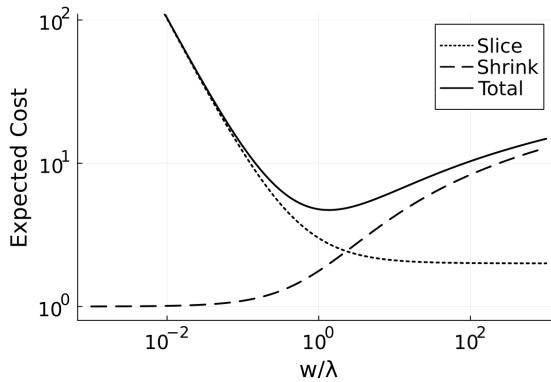  
(a) Stepping

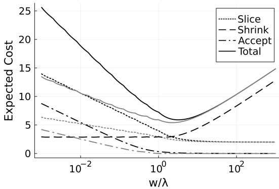  
(b) Doubling  
Fig 2: Cost in terms of the average number of target evaluations for one iteration of each slice sampling algorithm as a function of $w / \lambda ,$ , broken down by algorithmic step (slice finding, shrinkage, and accept). Fig. 2a shows the costs for stepping, and Fig. 2b shows the costs for doubling, where black depicts cached doubling and grey depicts lazy cached doubling. For shrinkage, only black is shown because the cost is the same for both schemes.

For the simple cached doubling scheme, the slice cost is $C _ { \mathrm { s l i c e } } = 2 + N$ , the shrinkage cost $\mathbb { E } C _ { \mathrm { s h r i n k } }$ is derived by combining the right exceedance distribution in Lemma 3.7 and the result from Proposition 3.4, and Lemma B.1 characterizes the expected number $\mathbb { E } C _ { \mathrm { a c c e p t } }$ of evaluations in the cached acceptance check. The sum of these results provides the total expected cost per iteration of slice sampling with cached doubling. Define the function

$$
f _ { \mathrm { c a c h e } } : \mathbb { R } _ { + } \to \mathbb { R } _ { + } , \qquad f _ { \mathrm { c a c h e } } ( x ) = f ( n ( x ) , c ( x ) ) ,
$$

where $f : \mathbb { N } \cup \{ 0 \} \times ( 0 , 1 ]  \mathbb { R }$ is given by

$$
\begin{array} { l } { { f ( n , c ) = 1 + n + ( ( 7 / 3 ) + 2 \log 2 ) c - 2 ( 1 + c ) \log c + \displaystyle \sum _ { n = 0 } ^ { \infty } \left( 1 + c 2 ^ { - n } \right) \log \left( 1 + c 2 ^ { - n } \right) } } \\ { { \displaystyle \qquad + \ 0 \vee \left( \displaystyle \frac c 3 + n - 1 - \displaystyle \frac { 1 - 2 ^ { 1 - n } } c + \displaystyle \frac { 1 - 4 ^ { 1 - n } } { 9 c ^ { 2 } } \right) . } } \end{array}\tag{4}
$$

THEOREM 3.8. Slice sampling with cached doubling has expected cost per iteration

$$
\mathbb { E } C = \mathbb { E } \left[ f _ { \mathrm { c a c h e } } \left( \frac { \lambda } { w } \right) \right] .\tag{5}
$$

The cost is finite if and only $\begin{array} { r } { i f \mathbb { E } \big \vert \log \frac { \lambda } { w } \big \vert < \infty . } \end{array}$ . The optimal slice-adaptive window size and corresponding cost is

$$
\begin{array} { r } { w ^ { \star } = \alpha \lambda , \quad \alpha = \left( \underset { x \in ( 0 , 1 ) } { \mathrm { a r g m i n } } f _ { 0 } ( 0 , x ) + f _ { 1 } ( 0 , x ) \right) ^ { - 1 } \approx 3 . 2 1 1 , \quad \mathbb { E } C \approx 5 . 9 0 1 . } \end{array}
$$

The analysis of the cost of lazy cached doubling is significantly more challenging. While the cost of shrinkage is the same as for simple cached doubling and is available in closed form, the cost of doubling and acceptance depend on what is known at each iteration as each endpoint of the approximate slice grows/shrinks. Rather than developing an exact cost formula, it will suffice to understand coarser continuity and asymptotic properties, given by

Lemmas B.2, B.3 and B.8. Lemma B.2 shows that the costs of slice-finding and acceptance are locally Lipschitz continuous as a function of $\lambda / w$ , and Lemmas B.3 and B.8 reveal their asymptotic behaviour for large and small $\lambda / w$ . Theorem 3.9 combines these results with the exact cost of shrinkage to provide continuity and asymptotic results pertaining to the overall cost of lazy cached doubling, as well as a computational guarantee about the optimum.

THEOREM 3.9. There exists a function $f _ { \mathrm { l a z y } } : \mathbb { R } _ { + } \to \mathbb { R } _ { + }$ such that slice sampling with lazy cached doubling has expected cost per iteration

$$
\mathbb { E } C = \mathbb { E } \left[ f _ { \mathrm { l a z y } } \left( \frac { \lambda } { w } \right) \right] ,\tag{6}
$$

where the cost is finite if and only $\begin{array} { r } { i f \mathbb { E } \big \vert \log \frac { \lambda } { w } \big \vert < \infty . } \end{array}$ . The function $f _ { \mathrm { l a z y } }$ is locally Lipschitz,

$$
\forall | x - x ^ { \prime } | \leq 1 , \ | f _ { \mathrm { l a z y } } ( x ) - f _ { \mathrm { l a z y } } ( x ^ { \prime } ) | \leq 4 { \big | } x - x ^ { \prime } { \big | } { \bigg ( } 5 + \operatorname* { m a x } _ { y \in \{ x , x ^ { \prime } \} } n ( y ) + 2 ^ { 1 - n ( y ) } ( 2 + 1 / c ( y ) ) { \bigg ) } ,
$$

has minimum on the interval $[ 2 ^ { - 4 } , 2 ^ { 6 } ] ,$ , and has asymptotic limiting behaviour

$$
\operatorname* { l i m } _ { x \to 0 } { \frac { f _ { \mathrm { l a z y } } ( x ) } { - 2 \log x } } = \operatorname* { l i m } _ { x \to \infty } { \frac { f _ { \mathrm { l a z y } } ( x ) } { ( 5 / 6 ) \log _ { 2 } x } } = 1 .
$$

Theorem 3.9 states that the cost can be minimized by setting w $\propto \lambda$ with a proportionality constant that can be found to any desired precision by evaluating $f _ { \mathrm { l a z y } }$ on a sufficiently fine grid on the interval [0.0625, 64] determined by the local Lipschitz constant from Theorem 3.9. Numerical simulation yields the optimal slice-adaptive window size and corresponding cost for slice sampling with lazy cached doubling,

$$
w ^ { \star } = \alpha \lambda , \quad \alpha \approx 2 . 2 7 7 , \quad \mathbb { E } C \approx 5 . 4 1 0 .
$$

3.4. Summary and comparison ofhybrid methods. Fig. 2 displays a breakdown of the expected per-iteration cost of slice sampling with stepping out, cached doubling, and lazy cached doubling conditioned on u. Due to the results of Theorems 3.6, 3.8 and 3.9, these costs can be compared in a problem-independent manner as a function of $w / \lambda$ . Fig. 3 displays a comparison of the total expected per-iteration cost of slice sampling with stepping out, cached doubling, and lazy cached doubling. It demonstrates that stepping out has $a \approx 1 5 \%$ advantage when all samplers are individually optimally tuned, that all samplers have nearly the same cost when $w / \lambda$ is too large, and that the doubling methods are significantly less expensive when $w / \lambda$ is too small. In the small- $- w / \lambda$ asymptotic regime, the cost of each method is dominated by slice-finding and acceptance, where stepping has cost $\approx \lambda / w$ , cached doubling has cost $\approx 2 \log _ { 2 } ( \lambda / w )$ , and lazy cached doubling has cost ≈ $( 5 / 6 ) \log _ { 2 } ( \lambda / w )$ . In the $\mathrm { l a r g e } - w / \lambda$ asymptotic regime, all methods have asymptotic cost $\approx 2 \log ( w / \lambda )$ , dominated by the cost of shrinkage. Fig. 3b shows that lazy cached doubling is at most $\approx 2 5 \%$ more expensive than stepping out in the worst case, while stepping out can be arbitrarily worse than either doubling method in a relative sense. Lazy cached doubling is therefore recommended in general, and especially for scenarios involving automated tuning where its robustness prevents severe performance degradation due to mistuning.

4. Slice-adaptive tuning. Theorems 3.6, 3.8 and 3.9 state that the lowest possible periteration cost for slice sampling is obtained by setting $w \propto \lambda$ , with a constant that depends on whether one is using stepping out, cached doubling, or lazy cached doubling. While that serves as an idealized lower bound on the cost of slice sampling, those recommendations are not implementable in practice because λ will generally have a distribution conditioned on u rather than being a fixed value, e.g., for multivariate targets with the hit-and-run or Gibbs samplers. That being said, the expected cost functions in Theorems 3.6, 3.8 and 3.9 are still valid for any situation in which the slice is guaranteed to be contiguous and the Markov chain law of large numbers holds. In these situations, the optimal slice-adaptive tuning scheme sets the initial width w to be a function $w ( u )$ of the slice variable u given by the minimizer of the expectations in Eqs. (3), (5) and (6) conditioned on u,

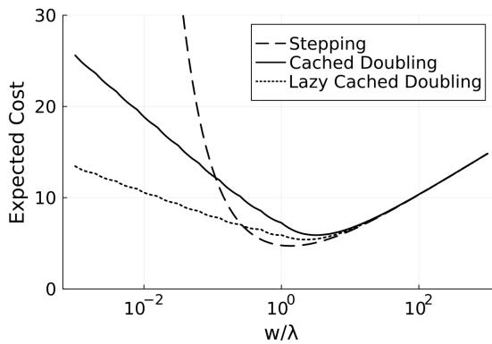  
(a) Individual costs

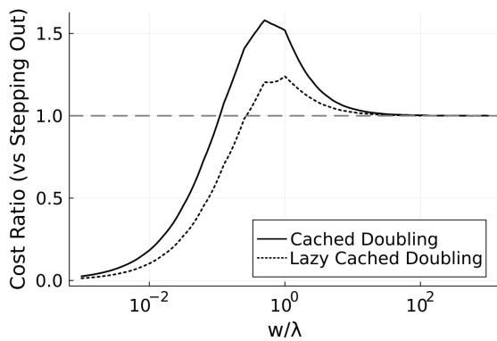  
(b) Cost ratio  
Fig 3: Comparison of the average cost per iteration of stepping out, cached doubling, and lazy cached doubling as a function of $w / \lambda$ . Fig. 3a shows the costs plotted together, while Fig. 3b displays the ratios compared to stepping out.

$$
w _ { s } ^ { \star } ( u ) = \underset { w > 0 } { \arg \operatorname* { m i n } } \mathbb { E } \bigg [ f _ { s } \bigg ( \frac { \lambda } { w } \bigg ) | u \bigg ] , \quad s \in \{ \mathrm { s t e p , c a c h e , l a z y } \} .\tag{7}
$$

However, the minimization problem in Eq. (7) is not tractable as it is nonconvex and nonsmooth in general (and moreover $f _ { \mathrm { l a z y } }$ is not known in closed form). Instead, this section uses tractable surrogate approximations of each of $f _ { \mathrm { s t e p } } , f _ { \mathrm { c a c h e } } .$ , and $f _ { \mathrm { l a z y } }$ to develop two tuning schemes for each slice sampling algorithm. The first is a set of “one-shot” tuning schemes based only on the properties of the distribution of λ given u, and the second is a gradient-descent-based scheme, where the optimization is initialized at the former scheme’s output. Both methods come with bounds on suboptimality compared with the minimizer of expected cost conditioned on u.

The surrogate cost functions $\widehat { f } _ { \mathrm { s t e p } } , \widehat { f } _ { \mathrm { c a c h e } } , \widehat { f } _ { \mathrm { l a z y } } , \widetilde { f } _ { \mathrm { s t e p } } , \widetilde { f } _ { \mathrm { c a c h e } } , \widetilde { f } _ { \mathrm { l a z y } }$ used to develop these tuning schemes are displayed in Fig. 4. The functions $\widehat { f } _ { \mathrm { s t e p } } , \widehat { f } _ { \mathrm { c a c h e } } , \widehat { f } _ { \mathrm { l a z y } }$ are designed such that the minimum of $\mathbb { E } [ \widehat { f } _ { ( \cdot ) } ( \lambda / w ) | u ]$ is available in closed form in terms of properties of the distribution of λ given u. The functions $\widetilde { f } _ { \mathrm { s t e p } } , \widetilde { f } _ { \mathrm { c a c h e } } , \widetilde { f } _ { \mathrm { l a z y } }$ are designed to be convex and locally smooth (Definition B.9) to enable gradient optimization. The precise formulae for these surrogates and related approximation error guarantees are deferred to Section A.

4.1. Tuning with known slice width distribution. For each $u > 0$ with nonempty slice, let $q _ { p } ( u )$ be the p-quantile of λ conditional on $u .$ . Define the one-shot tuning schemes

$$
\widehat { w } _ { \mathrm { s t e p } } ( u ) = \frac { 6 } { 5 } \mathbb { E } [ \lambda | u ] , \quad \widehat { w } _ { \mathrm { c a c h e } } ( u ) = \frac { 1 0 } { 3 } q _ { \frac { 1 } { 1 + \log 2 } } ( u ) , \quad \widehat { w } _ { \mathrm { l a z y } } ( u ) = 3 q _ { \frac { 5 } { 1 2 \log 2 + 5 } } ( u ) ,\tag{8}
$$

and the gradient-optimization tuning scheme

$$
\widetilde { w } _ { s } ( u ) = \exp \biggl ( \underset { x \in \mathbb { R } } { \arg \operatorname* { m i n } } \mathbb { E } \Bigl [ \widetilde { f } _ { s } ( \lambda \exp ( - x ) ) | u \Bigr ] \biggr ) , \quad s \in \{ \mathrm { s t e p , c a c h e , l a z y } \} .\tag{9}
$$

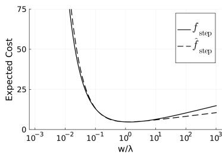  
(a) Stepping

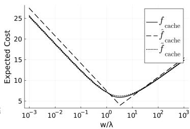  
(b) Cached Doubling

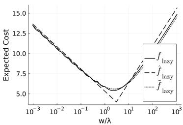  
(c) Lazy Cached Doubling  
Fig 4: Surrogate approximations of $f _ { \mathrm { s t e p } } , f _ { \mathrm { c a c h e } } .$ , and $f _ { \mathrm { l a z y } }$ used to develop the tuning algorithms. See Section A for specific formulae and approximation error results (Lemma A.2). Note that $\widetilde { f } _ { \mathrm { s t e p } } = f _ { \mathrm { s t e p } }$ , so it is not shown separately.

Theorem 4.2 provides suboptimality guarantees for these tuning schemes. For stepping out, $\widehat { w } _ { \mathrm { s t e p } }$ is optimal up to a multiplicative factor of 3, while $\widetilde { w } _ { \mathrm { s t e p } }$ finds the slice-adaptive optimal tuning. For both doubling methods, $\widehat { w } _ { \mathrm { c a c h e } } , \widehat { w } _ { \mathrm { l a z y } }$ incur at most 4 extra evaluations, while $\widetilde { w } _ { \mathrm { c a c h e } } , \widetilde { w } _ { \mathrm { l a z y } }$ incur at most 0.7. Theorem 4.2 also asserts that the minimization problems in Eq. (9) are all tractable in the sense that they can be solved to any desired precision by gradient descent with backtracking line search.

DEFINITION 4.1. A point x is (ϵ, δ)-optimal for function $\begin{array} { r } { h \geq 0 \ i f h ( x ) \leq \epsilon \operatorname* { i n f } _ { x } h ( x ) + \delta . } \end{array}$

THEOREM 4.2. The following results hold:

$\widehat { w } _ { \mathrm { s t e p } }$ is (3, 0)-optimal and $\widetilde { w } _ { \mathrm { s t e p } }$ is (1, 0)-optimal for the cost of stepping out.

$\widehat { w } _ { \mathrm { c a c h e } } i s ( 1 , 4 )$ -optimal and $\widetilde { w } _ { \mathrm { c a c h e } } i s \left( 1 , 0 . 7 \right)$ -optimal for the cost of cached doubling.

$\widehat { w } _ { \mathrm { l a z y } }$ is $( 1 , 4 )$ -optimal and $\widetilde { w } _ { \mathrm { l a z y } }$ is $( 1 , 0 . 7 )$ -optimal for the cost of lazy cached doubling.

Furthermore, the optimization problems in $\widetilde { w } _ { \mathrm { s t e p } } , \widetilde { w } _ { \mathrm { c a c h e } } , \widetilde { w } _ { \mathrm { l a z y } }$ are all tractable.

4.2. Tuning with MCMC draws. Eqs. (8) and (9) provide tractable near-optimal tuning of slice sampling, but require knowing the distribution of λ conditioned on u. This section develops an algorithm that tunes using estimated conditional distributions using draws produced by the Markov chain. Key goals are convergence of the method to the optimal tuning (for the respective surrogate cost), and to ensure that the additional computational cost of tuning and evaluating the initial width function $w ( u )$ is insignificant compared to the cost of sampling with a fixed initial width.

The algorithm proceeds as follows. Suppose at some iteration 2t, there is a record of the t previous draws $( \hat { \lambda _ { j } } , u _ { j } ) _ { j = t + 1 } ^ { 2 t }$ . For $\eta \in ( 0 , 1 ) , \beta \in ( 0 . 5 , 1 )$ (in practice, $\eta = 0 . 9 5 , \beta = 0 . 5 1 )$ set

$$
\tau = \lceil t ^ { \eta } \rceil , \qquad k = \lfloor \tau ^ { \beta } \rfloor , \qquad n = \lfloor \tau / k \rfloor .\tag{10}
$$

Then take an evenly-spaced subsequence of $( \lambda _ { j } , u _ { j } )$ of length τ and sort them in order of increasing $u ,$ resulting in $( \widetilde { \lambda } _ { j } , \widetilde { u } _ { j } ) _ { j = 1 } ^ { \tau }$ . This thinning ensures that the order statistics are asymptotically indistinguishable from those produced by i.i.d. draws under mild conditions (Lemma B.11). Then for each block of k draws with slice values between $\widetilde { u } _ { j k }$ and $\widetilde u _ { ( j + 1 ) k }$ $j \in \mathbb N$ , approximate the conditional distribution of λ given u using the empirical distribution of draws within that block. More precisely, approximate

$$
\mathbb { P } ( \lambda \in \cdot | u ) \approx \widehat { \mu } _ { t } ( \cdot , u ) = \sum _ { j = 0 } ^ { n } \mathbb { 1 } \big [ \widetilde { u } _ { j k } < u \leq \widetilde { u } _ { ( j + 1 ) k } \big ] \widehat { \mu } _ { t j } ( \cdot ) \qquad \widehat { \mu } _ { t j } \propto \sum _ { i = j k + 1 } ^ { ( ( j + 1 ) k ) \tau } \delta _ { \widetilde { \lambda } _ { j } } ,\tag{11}
$$

where $\widetilde { u } _ { 0 } = 0$ and $\widetilde u _ { ( n + 1 ) k } = \infty$ by convention, and each $\widehat { \mu } _ { t j }$ is normalized appropriately. Then set the tuned initial window $w _ { t } ( u )$ using the results from Eqs. (8) and (9), except that the distribution of λ given u is replaced with the piecewise-constant approximation in Eq. (11). This procedure results in a piecewise-constant window function $w _ { t } ( u )$ that refines as more draws are obtained.

Theorem 4.3 shows that under mild technical assumptions, the above procedure results in a per-iteration cost that converges to the slice-adaptive optimal cost for each of the surrogate cost functions. In particular, the result confirms that any $\eta \in ( 0 , 1 )$ and $\beta \in ( 0 . 5 , 1 )$ in Eq. (10) suffices to ensure that the number of draws used to tune each region in the piecewise $w _ { t } ( u )$ increases quickly enough to guarantee convergence. One simplification made for Theorem 4.3 is that within each bin, w is selected from a finite set W in Eq. (12) rather than the entirety of $\mathbb { R } _ { + }$ . This simplification does not meaningfully change the result but avoids significant unnecessary additional technicality.

THEOREM 4.3. Let W be afinite subset of $( 0 , \infty )$ , and let $h : \mathbb { R } _ { + } \to \mathbb { R }$ be afunction such that for all $w \in \mathcal { W }$ , E $[ h ( \lambda / w ) | u ]$ is continuous in u and $h ( \lambda / w )$ is locally uniformly subexponential conditioned on u (Definition B.14). Suppose ideal slice sampling is geometrically ergodic for target π, $\widehat { \mu }$ is the kernel given by Eq. (11), and

$$
w _ { t } ( u ) = \underset { w \in \mathcal { W } } { \arg \operatorname* { m i n } } \int h \bigg ( \frac { \lambda } { w } \bigg ) \widehat { \mu } _ { t } ( \mathrm { d } \lambda , u ) .\tag{12}
$$

Then

$$
\mathbb { E } \left[ h \left( \frac \lambda { w _ { t } ( u ) } \right) | ( u _ { j } , \lambda _ { j } ) _ { j = t + 1 } ^ { 2 t } \right] \stackrel { p } { \to } \mathbb { E } \left[ \operatorname* { m i n } _ { w \in \mathcal { W } } \mathbb { E } \left[ h \left( \frac \lambda w \right) | u \right] \right] \qquad t \to \infty .
$$

The computational complexity of tuning $w _ { t }$ vanishes compared to the cost of sampling. Sorting $( \lambda _ { j } , u _ { j } )$ has complexity $O ( \tau \log \tau ) = O ( t ^ { \eta } \log t ) = o ( t )$ . Once sorted, both one-shot and gradient tuning within each block of draws requires $O ( k )$ computation, and so for n blocks tuning requires $O ( k n ) = O ( \tau ) = o ( t )$ computation. However, due to the need to perform a $O ( \log n ) = O ( \log \tau ^ { 1 - \beta } ) = O ( \log t )$ binary search for the bin in which u falls to evaluate $w _ { t } ( u )$ , the complexity of sampling increases by a log factor. In practice, this issue can be ignored; for nontrivial target distributions the search will usually be orders of magnitude faster than evaluating the density once, even for very large t (when $t = 1 0 ^ { 9 }$ , for example, the binary search will require roughly 14 floating-point lookups and comparisons). The issue can also be resolved simply by putting an upper limit on the number of bins n.

The final fully-automated, tuned slice sampling algorithm is provided in Algorithm 8. The tuning algorithm runs in doubling rounds, each time using the last half of the draws. In the tuning algorithm itself, the initial window size function $w ( \cdot )$ is initialized using the one-shot estimate $\widehat { w } .$ , and then further refined using backtracking gradient descent to find we. Note that in practice, the values of λ are not directly observed, and moreover slices may not be contiguous, so tuning is based on an average of upper and lower bounds on λ that are tracked by Algorithm 2.

4.3. Simulations. This section presents simulation results for the proposed tuning schemes, including both the one-shot window wb and gradient-based window we initialized using the oneshot scheme. These simulations are designed to be a demonstration that the tuning schemes reliably work well without user input across a range of target tail behaviour, dimension, and uni/multimodality. Results are shown only for stepping out and lazy cached doubling; simple cached doubling is omitted as it is dominated by lazy cached doubling.

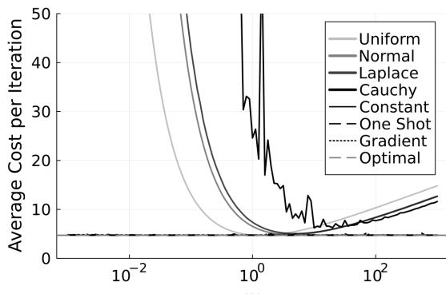

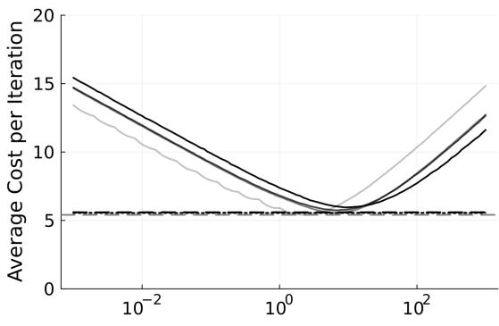

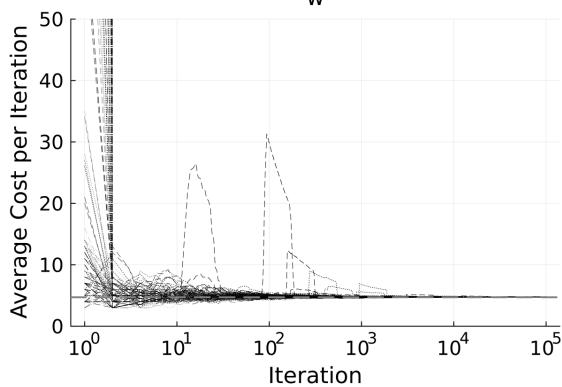  
(a) Stepping

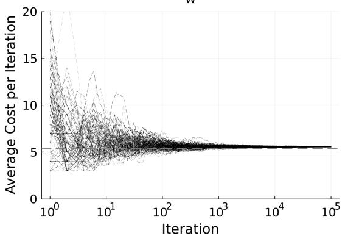  
(b) Lazy Cached Doubling  
Fig 5: The average per iteration cost resulting from the proposed tuning schemes over 100,000 simulated iterations, as a function of the initial window size w (top row), and as a function of the iteration number (bottom row). Line shade corresponds to the target (uniform, normal, Laplace, and Cauchy), while line style corresponds to the tuning scheme (constant, one-shot, and gradient). The bottom row figures display only the one-shot and gradient tuning schemes, and for each tuning scheme and target, 13 traces are displayed across evenly-spaced initial choices of $w \in ( 1 0 ^ { - 3 } , 1 0 ^ { 3 } )$ . The horizontal grey dashed line displays the lowest possible cost with $w \propto \alpha \lambda$ and optimal α given by Theorems 3.6 and 3.9. All of the proposed methods for both stepping out and lazy cached doubling provide near-optimal cost per iteration after about 100 iterations, regardless of the initial choice of w.

Fig. 5 displays the average cost per iteration of tuned slice sampling for unimodal, univariate Unif[0, 1], N(0, 1), Laplace(0, 1), and Cauchy(0, 1) targets. The top row figures show the average cost over the last 50,000 draws produced by 100,000 total iterations as a function of the initial setting of window size $w \in \mathsf { [ 1 0 ^ { - 3 } , 1 0 ^ { 3 } ] }$ . Every proposed tuning method nearly matches the oracle optimal costs from Theorems 3.6 and 3.9, regardless of the initial choice of $w .$ , while the untuned slice sampler has performance that varies significantly depending on the choice of $w .$ . The bottom row figures show the cost as a function of iteration number, averaged over the most recent half of the iterations. Tuning traces are shown for 13 log-evenly-spaced starting values of $w \in [ 1 0 ^ { - 3 } , 1 0 ^ { 3 } ]$ for each method, with the same legend convention as in the top row of plots. These figures demonstrate that the tuning converges after about 100 iterations for both stepping out and lazy cached doubling, with some infrequent jumps in cost for stepping out, likely caused by temporary mistuning of w due to stochasticity in $\widehat { \mu } _ { t }$ Fig. 6 repeats these experiments for 256-dimensional i.i.d. products of the same four univariate targets, and for univariate multimodal mixtures

$$
\mathrm { U n i f o r m ~ M i r : ~ 0 . 4 U n i f [ - 3 / 2 , - 1 / 2 ] } + 0 . 2 \mathrm { U n i f } [ - 1 / 2 , 1 / 2 ] + 0 . 4 \mathrm { U n i f } [ 1 / 2 , 3 / 2 ]
$$

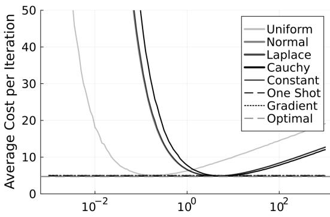

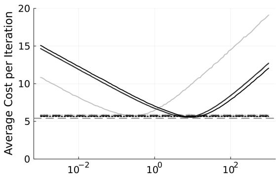

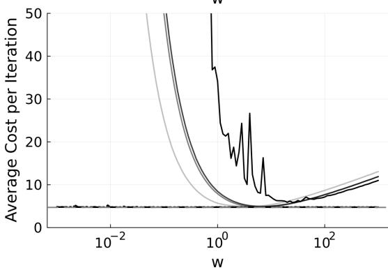  
(a) Stepping

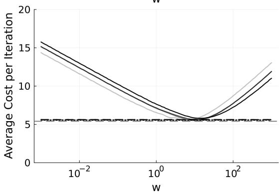  
(b) Lazy Cached Doubling  
Fig 6: The average per iteration cost resulting from the proposed tuning schemes over 100,000 simulated iterations, as a function of the initial window size w, for hit-and-run sampling on multidimensional targets (top row), and univariate multimodal targets (bottom row). Line shade corresponds to the target, while line style corresponds to the tuning scheme. The horizontal grey dashed line displays the lowest possible cost with w ∝ αλ and optimal α given by Theorems 3.6 and 3.9. All of the proposed methods for both stepping out and lazy cached doubling provide near-optimal cost per iteration regardless of the initial choice of w.

$$
\mathrm { N o r m a l \ M i x : 0 . 5 \mathcal { N } ( - 1 , 1 ) } + 0 . 5 \mathcal { N } ( 1 , 1 )
$$

$$
\mathrm { L a p l a c e ~ M i x : 0 . 5 L a p l a c e ( - 1 , 1 ) + 0 . 5 L a p l a c e ( 1 , 1 ) }
$$

Cauchy Mix: 0.5Cauchy(−1, 1) + 0.5Cauchy(1, 1).

The results have the same qualitative characteristics as in the previous results; the tuned methods reliably achieve an average cost near the oracle optimal for each method, regardless of the initialization of w. Taken together, these results suggest that the proposed tuning methods are very robust to the initial choice of w, and initializing $w ( u ) = 1$ as suggested in Algorithm 8 is likely reasonable for most problems.

Finally, Fig. 7 displays a comparison of slice sampling with the proposed slice-adaptive tuning schemes versus using a tuned but constant, non-slice-adaptive choice of w. The results show that when the slice lengths tend to vary more—e.g., for targets with heavy tails or unbounded density functions—slice-adaptivity becomes increasingly important to obtaining a near oracle-optimal per-iteration cost. Results are shown only for lazy cached doubling, which is much more robust to mistuning; stepping out often became too expensive to run during early rounds before the tuning methods had stabilized. In practice, lazy cached doubling should essentially always be preferred over the other two methods.

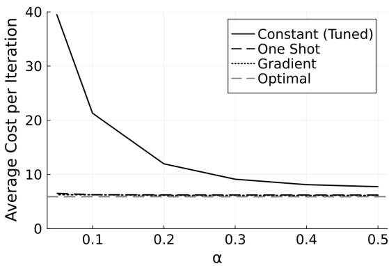  
(a) Gamma(α, 1)

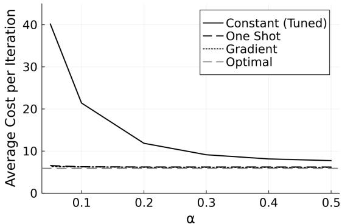  
(b) T(α)  
Fig 7: The average per iteration cost for slice-adaptive lazy cached doubling versus constant tuning over 1,000,000 simulated iterations. Fig. 7a displays the result for the gamma distribution with shape parameter α, and Fig. 7b displays the result for the T distribution with α degrees of freedom. Line style corresponds to the tuning scheme (tuned constant, one-shot, and gradient). The proposed slice-adaptive methods provide increasing benefit the more the slice width λ varies from iteration to iteration (smaller α in each case).

5. Conclusion. This paper presented an analysis of the cost of slice sampling along unidimensional manifolds, and a fully-automated, near-optimal implementation. Key contributions include an improvement to the doubling slice finding scheme via lazy caching (Algorithms 9 and 10), characterizations of the per-iteration cost as a function of initial window size and slice width (Theorems 3.6, 3.8 and 3.9), simple one-shot and tractable gradient-based tuning schemes along with suboptimality guarantees (Theorem 4.2), and tuning methods using draws from Markov chain Monte Carlo (Algorithm 8) that provide asymptotic convergence in probability to the surrogate optimal cost (Theorem 4.3).

This work focused on initial widths as a function of only the slice variable $w ( u )$ . In multivariate settings, a natural and useful extension to this work would be to extend w to be a function of both the slice variable u and the direction $\rho .$ All of the theory and tuning methods in this work extend without much effort to this setting by using the conditional distribution of slice width λ given u, ρ in place of the conditional distribution of λ given u. For slice sampling within Gibbs sampling, for example, one should use the proposed procedure in this paper to tune a separate function $w _ { i } ( u )$ for each coordinate direction i of motion, because different variables in a model will often exhibit different posterior scale.

One limitation of the present work is that tuning is based on bounds on the slice width at each iteration (Algorithm 2) rather than the value of λ itself. A possible avenue for future work is therefore to rigorously handle the lack of observability of the slice width at each iteration in a manner that does not significantly increase computational cost. As mentioned earlier, there are also many avenues for follow-up work in combining earlier developments in adaptive slice sampling with the initial window tuning from this work, e.g., covariance adaptation to improve condition number dependence.

## REFERENCES

[1] BACHEM, O., LUCIC, M. and KRAUSE, A. (2017). Practical coreset constructions for machine learning. arXiv:1703.06476.

[2] BÉLISLE, C., ROMEIJN, E. and SMITH, R. (1993). Hit-and-run algorithms for generating multivariate distributions. Mathematics of Operations Research 18 255–266.

[3] BIRON-LATTES, M., SURJANOVIC, N., SYED, S., CAMPBELL, T. and BOUCHARD-CÔTÉ, A. (2024). autoMALA: Locally adaptive Metropolis-adjusted Langevin algorithm. In International Conference on Artificial Intelligence and Statistics.

[4] DAMIEN, P., WAKEFIELD, J. and WALKER, S. (1999). Gibbs sampling for Bayesian non-conjugate and hierarchical models by using auxiliary variables. Journal ofthe Royal Statistical Society B 61 331–344.

[5] DUANE, S., KENNEDY, A. D., PENDLETON, B. J. and ROWETH, D. (1987). Hybrid Monte Carlo. Physics Letters B 195 216–222.

[6] DURMUS, A., GRUFFAZ, S., HASENPFLUG, M. and RUDOLF, D. (2026). Geodesic slice sampling on Riemannian manifolds. Biometrika 113.

[7] EDWARDS, R. and SOKAL, A. (1988). Generalization of the Fortuin-Kasteleyn-Swendsen-Wang representation and Monte Carlo algorithm. Physical Review D 38 2009–2012.

[8] GELFAND, A. and SMITH, A. (1990). Sampling-based approaches to calculating marginal densities. Journal ofthe American Statistical Association 85 398–409.

[9] GEYER, C. (1991). Markov chain Monte Carlo maximum likelihood. In Computing Science and Statistics, Proceedings ofthe 23rd Symposium on the Interface 156–163.

[10] GIROLAMI, M. and CALDERHEAD, B. (2011). Riemann manifold Langevin and Hamiltonian Monte Carlo methods. Journal ofthe Royal Statistical Society: Series B (Statistical Methodology) 73 123–214.

[11] GREEN, P. and MIRA, A. (2001). Delayed rejection in reversible jump Metropolis–Hastings. Biometrika 88 1035–1053.

[12] HABECK, M., HASENPFLUG, M., KODGIRWAR, S. and RUDOLF, D. (2025). Geodesic Slice Sampling on the Sphere. Journal ofMachine Learning Research 26 1–38.

[13] HASTINGS, W. K. (1970). Monte Carlo sampling methods using Markov chains and their applications. Biometrika 57 97–109.

[14] HEINER, M., JOHNSON, S., CHRISTENSEN, J. and DAHL, D. (2024). Quantile slice sampling. arXiv:2407.12608.

[15] HIGDON, D. (1996). Auxiliary variable methods for Markov chain Monte Carlo with applications. Technical Report, Institute of Statistics and Decision Sciences, Duke University.

[16] HIGDON, D. (1998). Auxiliary variable methods for Markov chain Monte Carlo with applications. Journal of the American Statistical Association 93 585–595.

[17] HUKUSHIMA, K. and NEMOTO, K. (1996). Exchange Monte Carlo method and application to spin glass simulations. Journal ofthe Physical Society ofJapan 65 1604–1608.

[18] JARZYNSKI, C. (1997a). Nonequilibrium equality for free energy differences. Physical Review Letters 78 2690–2693.

[19] JARZYNSKI, C. (1997b). Equilibrium free energy differences from nonequilibrium measurements: A master equation approach. Phsyical Review E 56 5018–5035.

[20] KARAMANIS, M. and BEUTLER, F. (2021). Ensemble slice sampling: parallel, black-box and gradient-free inference for correlated & multimodal distributions. Statistics and Computing 31.

[21] KLEPPE, T. S. (2016). Adaptive Step Size Selection for Hessian-Based Manifold Langevin Samplers. Scandinavian Journal of Statistics 43 788–805.

[22] LANGBERG, M. and SCHULMAN, L. (2010). Universal ϵ-approximators for integrals. In Proceedings of the Twenty-First Annual ACM-SIAM Symposium on Discrete Algorithms (SODA 2010) 598–607.

[23] LI, Y., LONG, P. and SRINIVASAN, A. (2001). Improved bounds on the sample complexity of learning. Journal ofComputer and System Sciences 62 516–527.

[24] LIU, T., SURJANOVIC, N., BIRON-LATTES, M., BOUCHARD-CÔTÉ, A. and CAMPBELL, T. (2025). AutoStep: locally adaptive involutive MCMC. In International Conference on Machine Learning.

[25] LIVINGSTONE, S. (2021). Geometric Ergodicity of the Random Walk Metropolis with Position-Dependent Proposal Covariance. Mathematics 9.

[26] MAIRE, F. and VANDEKERKHOVE, P. (2022). Markov Kernels Local Aggregation for Noise Vanishing Distribution Sampling. SIAM Journal on Mathematics of Data Science 4 1293-1319.

[27] MARCO, N. and TOKDAR, S. (2026). Adaptive generalized elliptical slice sampling. arXiv:2605.21659.

[28] METROPOLIS, N., ROSENBLUTH, A. W., ROSENBLUTH, M. N., TELLER, A. H. and TELLER, E. (1953). Equation of State Calculations by Fast Computing Machines. The Journal of Chemical Physics 21 1087–1092.

[29] MEYN, S. and TWEEDIE, R. (1993). Markov chains and stochastic stability. Springer-Verlag.

[30] MIRA, A. and TIERNEY, L. (1997). On the use of auxiliary variables in Markov chain Monte Carlo sampling. Technical Report, School of Statistics, University of Minnesota.

[31] MIRA, A. and TIERNEY, L. (2002). Efficiency and convergence properties of slice samplers. Scandinavian Journal ofStatistics 29 1–12.

[32] MODI, C., BARNETT, A. and CARPENTER, B. (2024). Delayed rejection Hamiltonian Monte Carlo fo sampling multiscale distributions. Bayesian Analysis.

[33] MURRAY, I., ADAMS, R. and MACKAY, D. (2010). Elliptical slice sampling. In Artificial Intelligence and Statistics.

[34] NATAROVSKII, V., RUDOLF, D. and SPRUNGK, B. (2021). Quantitative spectral gap estimate and Wasserstein contraction of simple slice sampling. The Annals ofApplied Probability 31 806–825.

[35] NEAL, R. (1997). Markov chain Monte Carlo methods based on ‘slicing’ the density function. Technical Report No. 9722, Department of Statistics, University of Toronto.

[36] NEAL, R. (1998). Annealed importance sampling. Technical Report No. 9805, Department of Statistics, University of Toronto.

[37] NEAL, R. (2000). Slice sampling. Technical Report No. 2005, Department of Statistics, University of Toronto.

[38] NEAL, R. (2001). Annealed importance sampling. Statistics and Computing 11 125–139.

[39] NEAL, R. (2003). Slice sampling. Annals ofStatistics 31 705–767.

[40] NEAL, R. (2011). MCMC using Hamiltonian dynamics. In Handbook of Markov chain Monte Carlo (S. Brooks, A. Gelman, G. Jones and X.-L. Meng, eds.) 5 CRC Press.

[41] NISHIHARA, R., MURRAY, I. and ADAMS, R. (2014). Parallel MCMC with generalized elliptical slice sampling. Journal of Machine Learning Research 15 2087–2112.

[42] NISHIMURA, A. and DUNSON, D. (2016). Variable length trajectory compressible hybrid Monte Carlo. arXiv:1604.00889.

[43] POLSON, N. G. and SCOTT, J. G. (2012). On the half-Cauchy prior for a global scale parameter. Bayesian Analysis 7 887–902.

[44] ROBERTS, G. and ROSENTHAL, J. (1999). Convergence of slice sampler Markov chains. Journal of the Royal Statistical Society B 61 643–660.

[45] ROSSKY, P., DOLL, J. and FRIEDMAN, H. (1978). Brownian dynamics as smart Monte Carlo simulation. The Journal ofChemical Physics 69 4628–4633.

[46] RUDOLF, D. and ULLRICH, M. (2013). Positivity of hit-and-run and related algorithms. Electronic Communications in Probability 18 1–8.

[47] RUDOLF, D. and ULLRICH, M. (2018). Comparison of hit-and-run, slice sampler and random walk Metropolis. Journal ofApplied Probability 55 1186–1202.

[48] SCHÄR, P. (2025). Slice sampling: theoretical and methodological advances, PhD thesis.

[49] SCHÄR, P., HABECK, M. and RUDOLF, D. (2023). Gibbsian polar slice sampling. In International Conference on Machine Learning.

[50] SCHÄR, P., HABECK, M. and RUDOLF, D. (2024). Parallel Affine Transformation Tuning of Markov Chain Monte Carlo. In International Conference on Machine Learning.

[51] SMITH, R. (1984). Efficient Monte Carlo procedures for generating points uniformly distributed over bounded regions. Operations Research 32 1296–1308.

[52] SWENDSEN, R. and WANG, J.-S. (1986). Replica Monte Carlo simulation of spin-glasses. Physical Review Letters 57.

[53] SWENDSEN, R. and WANG, J.-S. (1987). Nonuniversal critical dynamics in Monte Carlo simulations. Physical Review Letters 58 86–88.

[54] THOMPSON, M. (2011). Slice sampling with multivariate steps, PhD thesis.

[55] TIBBITS, M., GROENDYKE, C., HARAN, M. and LIECHTY, J. (2014). Automated factor slice sampling. Journal ofComputational and Graphical Statistics 23 543–563.

[56] TIERNEY, L. (1994). Markov chains for exploring posterior distributions. The Annals of Statistics 22 1701– 1762.

[57] TIERNEY, L. and MIRA, A. (1999). Some adaptive Monte Carlo methods for Bayesian inference. Statistics in Medicine 18 2507–2515.

[58] TUROK, G., MODI, C. and CARPENTER, B. (2024). Sampling From Multiscale Densities With Delayed Rejection Generalized Hamiltonian Monte Carlo. arXiv:2406.02741.

## APPENDIX A: SURROGATE APPROXIMATIONS

The tuning methods in this work rely on surrogate approximations of $f _ { \mathrm { s t e p } } , f _ { \mathrm { c a c h e } }$ , and $f _ { \mathrm { l a z y } }$ , displayed in Fig. 4, that yield tractable optimization problems given a known distribution of $\dot { \lambda }$ conditioned on u. For stepping out, define the functions

$$
\widehat { f } _ { \mathrm { s t e p } } ( x ) = 3 . 6 + 1 . 2 x - \log ( x ) , \quad \widetilde { f } _ { \mathrm { s t e p } } ( x ) = f _ { \mathrm { s t e p } } ( x ) .
$$

For cached doubling, define the functions

$$
\begin{array} { r l } & { \widehat { f } _ { \mathrm { c a c h e } } ( x ) = 4 + \left\{ \begin{array} { l l } { \frac { 2 } { \log 2 } \log \left( \frac { x } { 0 . 3 } \right) x > 0 . 3 } \\ { - 2 \log \left( \frac { x } { 0 . 3 } \right) x \leq 0 . 3 } \end{array} \right. } \\ & { \widetilde { f } _ { \mathrm { c a c h e } } ( x ) = \bigg ( \displaystyle \frac { 2 } { \log 2 } + 2 \bigg ) \log \bigg ( 1 + \bigg ( 2 + \frac { \log 2 } { 2 } \bigg ) x \bigg ) - 2 \log x + 1 . 2 . } \end{array}
$$

Finally, for lazy cached doubling, define the functions

$$
\begin{array} { r l } & { \widehat { f } _ { \mathrm { l a z y } } ( x ) = 4 + \left\{ \begin{array} { l l } { \frac { 5 } { 6 \log 2 } \log ( 3 x ) x > 1 / 3 } \\ { - 2 \log ( 3 x ) \quad x \leq 1 / 3 , } \end{array} \right. } \\ & { \widetilde { f } _ { \mathrm { l a z y } } ( x ) = \left( \cfrac { 5 } { 6 \log 2 } + 2 \right) \log \left( 1 + \frac { 3 \left( 2 + \log ( 2 ) \right) } { 2 } x \right) - 2 \log \left( \frac { 3 } { 2 } x \right) + ( 3 / 2 ) . } \end{array}
$$

The approximations $\widetilde { f } _ { \mathrm { s t e p } } , \widetilde { f } _ { \mathrm { c a c h e } } , \widetilde { f } _ { \mathrm { l a z y } }$ are designed to be convex and locally smooth (Definition B.9) on log-scale to enable gradient optimization with guarantees. The approximations $\widehat { f } _ { \mathrm { s t e p } } , \widehat { f } _ { \mathrm { c a c h e } } , \widehat { f } _ { \mathrm { l a z y } }$ are designed to have a closed-form optimum of $\mathbb { E } [ \widehat { f } ( \lambda / w ) | u ]$ over w for the purpose of one-shot tuning and initialization of the aforementioned optimization.

As these are approximations of the original cost functions, it is important to quantify their downstream suboptimality when used for tuning. This work uses the notion of an (ϵ, δ)-approximation given by Definition A.1.

DEFINITION A.1. Fix $\epsilon , \delta \geq 0 . A$ function $\widehat { h }$ is an $( \epsilon , \delta )$ -approximation of $\cdot h \geq 0$ if

$$
\operatorname* { s u p } _ { x } { \frac { | h ( x ) - { \widehat { h } } ( x ) | } { \epsilon h ( x ) + \delta } } \leq 1 .\tag{13}
$$

Lemma A.2 shows that each of the surrogate cost functions is an $( \epsilon , \delta )$ -approximation of its respective exact cost function. Fig. 8 validates these theoretical results via simulation; each plot shows the relative-additive error Eq. (13) for each surrogate approximation and its respective exact cost, with all lines falling below 1.

LEMMA A.2. Thefollowing statements hold:

$\widehat { f } _ { \mathrm { s t e p } }$ is a (0.5, 0)-approximation of $f _ { \mathrm { s t e p } } .$

$\widehat { f } _ { \mathrm { c a c h e } }$ is a (0, 2)-approximation of f<sub>cache</sub>.

$\widetilde { f } _ { \mathrm { c a c h e } }$ is a (0, 0.35)-approximation of f<sub>cache</sub>.

$\hat { f } _ { \mathrm { l a z y } }$ is a (0, 2)-approximation of f<sub>lazy</sub>

$\widetilde { f } _ { \mathrm { l a z y } }$ is a (0, 0.35)-approximation of $f _ { \mathrm { l a z y } }$

$f _ { \mathrm { s t e p } } \circ \exp , f _ { \mathrm { c a c h e } } \circ$ ◦ exp, and $\widetilde { f } _ { \mathrm { l a z y } }$ ◦ exp are each convex and locally smooth.

Optimization of each surrogate cost function yields the corresponding tuned slice-adaptive initial window function. For each $s \in$ {step, cache, lazy},

$$
\widehat { w } _ { s } ( u ) = \exp \left( \underset { x \in \mathbb { R } } { \arg \operatorname* { m i n } } \mathbb { E } \Big [ \widehat { f } _ { s } \big ( \lambda \exp ( - x ) \big ) | u \Big ] \right) , \ : \widetilde { w } _ { s } ( u ) = = \exp \left( \underset { x \in \mathbb { R } } { \arg \operatorname* { m i n } } \mathbb { E } \Big [ \widetilde { f } _ { s } \big ( \lambda \exp ( - x ) \big ) | u \Big ] \right) .
$$

In general, optimizing an (ϵ, δ)-approximation of a cost function results in a suboptimality guarantee for the original cost, as stated by Lemma A.3. This result is elementary and wellknown in the ϵ-approximation literature [22, 23] [e.g., 1, Theorem 2.1]. We use Lemmas A.2 and A.3 to analyze the suboptimality of the one-shot and gradient-based slice-adaptive tuning strategies for slice sampling in Eqs. (8) and (9).

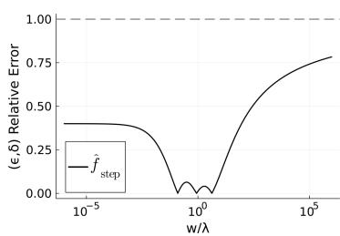  
(a) Stepping

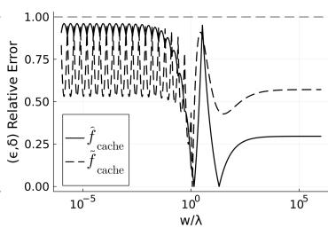  
(b) Cached Doubling

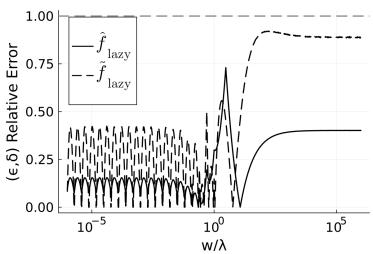  
(c) Lazy Cached Doubling  
Fig 8: Lines displaying the error of each $( \epsilon , \delta )$ -approximation of $f ,$ , normalized by $\epsilon f + \delta$ using the values of ϵ and δ obtained from Lemma A.2. All lines are uniformly bounded above by 1, validating the theory in Lemma A.2.

LEMMA A.3. Suppose $\widehat { h } ( x , z )$ is an $( \epsilon , \delta )$ -approximation of $h ( x , z ) \geq 0 ,$ , Z is a random variable, and $\begin{array} { r } { \widehat { x } ^ { \star } = \arg \operatorname* { m i n } _ { x } \mathbb E \widehat { h } ( x , Z ) } \end{array}$ exists. Then ${ \widehat { x } } ^ { \star }$ is $\left( \textstyle \frac { 1 + \epsilon } { 1 - \epsilon } , \frac { 2 \delta } { 1 - \epsilon } \right)$ -optimal for $\mathbb { E } h ( x , Z )$ .

## APPENDIX B: PROOFS

PROOF OF LEMMA 3.2. If the current state $x \in \{ x : 0 < \pi ( x ) < \infty \}$ , then the slice variable $u \in \left( 0 , \pi ( x ) \right]$ almost surely. The slice defined by u is nonempty (in particular, x is in the slice) so the slice is a contiguous interval of finite length by Assumption 3.1. The approximate slice found by either doubling (Algorithm 5) or stepping (Algorithm 4) is guaranteed to contain the exact slice by design, and both slice bounding algorithms terminate in finite time because the slice interval has a finite length. The shrinkage algorithm (Algorithm $6 )$ is an adaptive rejection sampler that removes only invalid next states, and hence the next state $x ^ { \prime }$ is drawn uniformly from the slice conditioned on $u .$ Because the slice has a nonzero length almost surely by Assumption 3.1, the shrinkage algorithm terminates in finite time almost surely. Note also that all states $x ^ { \prime }$ on the slice satisfy $\pi ( x ^ { \prime } ) \geq u > 0$ , and since $\pi$ is a distribution it must be the case that $\pi ( \{ x : \pi ( x ) = \infty \} ) = 0$ , so therefore $x ^ { \prime } \in \{ x : 0 < \pi ( x ) < \infty \}$ almost surely. By induction, the sequence of states have the same distribution as those produced by the ideal slice sampler and each step terminates in finite time almost surely.

For the LLN, by Meyn and Tweedie [29, Theorem 17.0.1] and by the equivalence to ideal slice sampling, it suffices to show that ideal slice sampling is positive Harris recurrent. By Tierney [56, Corollary $^ { 1 ] , }$ it therefore suffices to show that ideal slice sampling is π-irreducible and dominated by $\pi$ . Let the slice sampler kernel be denoted $P ( x , A )$ . Consider a set A with $\pi ( A ) = 0$ . Then the density $\pi ( \cdot ) = 0$ Lebesgue-almost everywhere on A. For any current state $x ,$ we have that $0 < \pi ( x ) < \infty$ almost surely by the earlier argument, so the slice variable $u \sim \mathrm { U n i f } [ 0 , \pi ( x ) ]$ satisfies $u > 0$ almost surely, and so at most a null set in A lies in the slice; hence $P ( x , A ) = 0$ and the slice sampler kernel is dominated by $\pi$ . Now consider a set A with $\pi ( A ) > 0 ;$ ; there must be some $\epsilon > 0$ such that $A \cap \left\{ \pi ( x ) \geq \epsilon \right\}$ has nonzero Lebesgue measure. Therefore

$$
\begin{array} { l } { P ( x , A ) = \displaystyle \int _ { 0 } ^ { \pi ( x ) } \int \mathbb { 1 } [ \pi ( x ^ { \prime } ) \geq u ] \mathbb { 1 } [ x ^ { \prime } \in A ] \mathrm { d } x ^ { \prime } \mathrm { d } u } \\ { \displaystyle \qquad \geq \int _ { 0 } ^ { \epsilon } \mathrm { L e b } ( A \cap \{ \pi ( x ^ { \prime } ) \geq u \} ) \mathrm { d } u } \\ { \displaystyle \qquad \geq \epsilon \mathrm { L e b } ( A \cap \{ \pi ( x ^ { \prime } ) \geq \epsilon \} ) } \\ { \displaystyle \qquad > 0 . } \end{array}
$$

Therefore the slice sampler can transition to any set A with $\pi ( A ) > 0$ in one step; hence the sampler is irreducible. □

PROOF OF LEMMA 3.3. By Eq. (1) and the fact that $( V _ { n } ) _ { n = 1 } ^ { \infty } \stackrel { d } { = } ( V _ { n } ) _ { n = 2 } ^ { \infty }$ , we have that $F _ { 0 } ( x , y ) = 1$ and for all $n \in \mathbb { N }$

$$
F _ { n } ( x , y ) = \frac { x } { x + y + \lambda } \int _ { 0 } ^ { 1 } F _ { n - 1 } ( v x , y , z ) \mathrm { d } v + \frac { y } { x + y + \lambda } \int _ { 0 } ^ { 1 } F _ { n - 1 } ( x , v y , z ) \mathrm { d } v .
$$

A transformation of variables in each integral yields

$$
F _ { n } ( x , y ) = \frac { 1 } { x + y + \lambda } \Biggl ( \int _ { 0 } ^ { x } F _ { n - 1 } ( v , y , z ) \mathrm { d } v + \int _ { 0 } ^ { y } F _ { n - 1 } ( x , v , z ) \mathrm { d } v \Biggr ) .\tag{14}
$$

Define the generator $\begin{array} { r } { G ( x , y , z ) = \sum _ { n = 0 } ^ { \infty } z ^ { n } F _ { n } ( x , y ) } \end{array}$ . Then $G$ is well-defined on $x , y \geq 0$ and $z \in [ - 1 , 1 ]$ , since $F _ { n } \geq 0$ and $\textstyle \sum _ { n = 0 } ^ { \infty } F _ { n } ( x , y ) < \infty$ due to the fact that N is dominated by a geometric random variable (corresponding to a less efficient shrinkage algorithm where we keep $\lambda _ { \ell } , \lambda _ { \ell }$ fixed after each attempt). By similar dominated convergence arguments, both $\left. { \frac { 1 } { n ! } } { \frac { \mathrm { d } ^ { n } G } { \mathrm { d } z ^ { n } } } \right| _ { z = 0 } = F _ { n }$ and $\begin{array} { r } { \mathbb { E } N = G ( x , y , 1 ) = \sum _ { n = 0 } ^ { \infty } F _ { n } ( x , y ) } \end{array}$ as required. Furthermore, by symmetry of the shrinkage algorithm, $F _ { n } ( x , y ) = F _ { n } ( y , x )$ , and hence $G$ preserves this symmetry. Multiplying both sides of Eq. (14) by $z ^ { n }$ , summing over $n \in \mathbb { N }$ , and interchanging the sum and integrals yields

$$
G ( x , y , z ) = 1 + \frac { z } { x + y + \lambda } \Biggl ( \int _ { 0 } ^ { x } G ( v , y , z ) \mathrm { d } v + \int _ { 0 } ^ { y } G ( x , v , z ) \mathrm { d } v \Biggr ) .
$$

The interchange of sum and integral follows again by dominated convergence. Finally multiplying both sides by $x + y + \lambda$ and differentiating in x and $y$ yields the PDE

$$
( 1 - z ) ( G _ { x } + G _ { y } ) + ( x + y + \lambda ) G _ { x y } = 0 .
$$

For the boundary, we fix z, set $y = 0$ and denote $g ( x ) = G ( x , 0 , z )$ . Multiplying both sides of the integral equation by $x + \lambda$ and taking the derivative in x yields the first order differential equation

$$
( 1 - z ) g + ( x + \lambda ) g _ { x } = 1 \qquad g ( 0 ) = 1 .
$$

The solution to this equation when $z \neq 1$ is

$$
g ( x ) = { \frac { 1 - z { \big ( } { \frac { x } { \lambda } } + 1 { \big ) } ^ { z - 1 } } { 1 - z } } ,
$$

and when $z = 1$ the solution is

$$
g ( x ) = 1 + \log \left( \frac { x } { \lambda } + 1 \right) .
$$

Finally, for uniqueness, suppose there were two solutions $G , H$ to the above PDE with symmetry and its boundary condition. Then if we let $u ( x , y ) = x + y , v ( x , y ) = x - y$ , the reparametrized difference function $K ( u ( x , y ) , v ( x , y ) ) = G ( x , y ) - H ( x , y )$ on the domain $u \geq 0 , v \in [ - u , u ]$ satisfies

$$
K _ { u u } - K _ { v v } + \frac { 2 ( 1 - z ) } { u + \lambda } K _ { u } = 0 , \qquad K ( u , v ) = K ( u , - v ) , \qquad K ( x , x ) = 0 .
$$

Consider the energy function

$$
E ( u ) = \frac { 1 } { 2 } \int _ { - u } ^ { u } K _ { u } ^ { 2 } + K _ { v } ^ { 2 } \mathrm { d } v .
$$

Note that $E ( 0 ) = 0$ . Differentiating in u yields

$$
\begin{array} { r l } & { E ^ { \prime } ( u ) = \displaystyle \frac 1 2 \big ( K _ { u } ^ { 2 } + K _ { v } ^ { 2 } \big ) _ { v = - u } ^ { v = u } + \int _ { - u } ^ { u } K _ { u } K _ { u u } \mathrm { d } v + \int _ { - u } ^ { u } K _ { v } K _ { u v } \mathrm { d } v } \\ & { \qquad = \displaystyle \frac 1 2 \big ( K _ { u } ^ { 2 } + K _ { v } ^ { 2 } \big ) _ { v = - u } ^ { v = u } + \int _ { - u } ^ { u } K _ { u } \big ( K _ { u u } - K _ { v v } \big ) \mathrm { d } v + \big ( K _ { u } K _ { v } \big ) _ { v = - u } ^ { v = u } } \\ & { \qquad = \displaystyle \frac 1 2 \big ( K _ { u } ^ { 2 } + K _ { v } ^ { 2 } \big ) _ { v = - u } ^ { v = u } + ( K _ { u } K _ { v } ) _ { v = - u } ^ { v = u } - \frac { 2 \big ( 1 - z \big ) } { u + \lambda } \int _ { - u } ^ { u } K _ { u } ^ { 2 } \mathrm { d } v } \\ & { \qquad = - \displaystyle \frac { 2 \big ( 1 - z \big ) } { u + \lambda } \int _ { - u } ^ { u } K _ { u } ^ { 2 } \mathrm { d } v \leq 0 , } \end{array}
$$

where the second equation follows by integration by parts, the third follows by the PDE, and the last follows by $K ( u , v ) = K ( u , - v )$ . Therefore $E ^ { \prime } ( u ) \leq 0 , E ( 0 ) = 0$ , and $E ( u ) \geq 0$ , which implies that $E ( u ) = 0$ identically. Therefore $K _ { u } = K _ { v } = 0$ everywhere, which combined with the boundary again implies $K = 0$ identically. Therefore $G = H$ and the solution is unique. □

PROOF OF PROPOSITION 3.4. For $z = 1$ , Eq. (2) becomes

$$
\frac { \partial ^ { 2 } G } { \partial x \partial y } = 0 \Longrightarrow G ( x , y ) = g ( x ) + h ( y ) .
$$

By symmetry, $h = g$ . Given the boundary condition and symmetry,

$$
g ( x ) = 1 + \log \left( \frac { x } { \lambda } + 1 \right) - g ( 0 ) .
$$

Setting $x = 0$ yields $2 g ( 0 ) = 1 \implies g ( 0 ) = 1 / 2$ . Therefore

$$
\mathbb { E } [ N | \lambda _ { \ell } , \lambda _ { r } ] = G ( \lambda _ { \ell } , \lambda _ { r } ) = 1 + \log \biggr ( \frac { \lambda _ { r } } { \lambda } + 1 \biggr ) + \log \biggr ( \frac { \lambda _ { \ell } } { \lambda } + 1 \biggr ) .
$$

In slice sampling, $\lambda _ { \ell } = \ell - \widehat { \ell } , \lambda _ { r } = \widehat { r } - r$ , and $\lambda = r - \ell .$ . Therefore

$$
\mathbb { E } \big [ C _ { \mathrm { s h r i n k } } \big | \widehat { r } , \widehat { \ell } , u \big ] = 1 + \log \left( \frac { \widehat { r } - r } \lambda + 1 \right) + \log \left( \frac { \ell - \widehat { \ell } } \lambda + 1 \right) .
$$

The result follows by the symmetry of the distributions of ${ \widehat { r } } - r$ and $\ell - { \widehat { \ell } } .$

PROOF OF LEMMA 3.5. Stepping out begins by evaluating the target at the initial window boundaries $x - V w$ and $x + ( 1 - V ) w$ , and then proceeds by expanding rightwards for $N _ { r }$ iterations and leftwards for $N _ { \ell }$ iterations. Conditioned on $u , x \sim \mathrm { U n i f } [ \ell , r ]$ . Therefore, expressing x as the convex combination $x = Y \ell + ( 1 - Y ) r$ for $Y \sim \mathrm { U n i f } [ 0 , \bar { 1 } ]$ , we have that

$$
N _ { r } = \left\lceil 0 \vee \frac { r - ( x + ( 1 - V ) w ) } { w } \right\rceil = \left\lceil 0 \vee Y \frac { \lambda } { w } - ( 1 - V ) \right\rceil
$$

$$
N _ { \ell } = \left\lceil 0 \vee \frac { ( x - V w ) - \ell } { w } \right\rceil = \left\lceil 0 \vee ( 1 - Y ) \frac { \lambda } { w } - V \right\rceil .
$$

The right exceedance is therefore

$$
\begin{array} { l } { \displaystyle { \widehat { r } - r = x + ( 1 - V ) w + N _ { r } w - r } } \\ { \displaystyle { \quad = \bigg ( \bigg [ \frac { \lambda Y } { w } - ( 1 - V ) \bigg ] - \bigg ( \frac { \lambda Y } { w } - ( 1 - V ) \bigg ) \bigg ) w . } } \end{array}
$$

For any $a \in \mathbb { R } , V \sim \operatorname { U n i f } [ 0 , 1 ] , [ a + V ] - ( a + V ) \sim \operatorname { U n i f } [ 0 , 1 ]$ . Therefore $ { \stackrel { \frown } { r } } - r  { \stackrel { \ r { d } } { = } } w Z$ for $Z \sim { \mathrm { U n i f } } [ 0 , 1 ]$ . Next, the cost of stepping out is

$$
\begin{array} { l } { { C _ { \mathrm { s i t e } } = 2 + N _ { r } + N _ { \ell } } } \\ { { \mathrm { = } 2 + \Bigg [ 0 \vee Y \displaystyle \frac { \lambda } { w } - ( 1 - V ) \Bigg ] + \Bigg [ 0 \vee ( 1 - Y ) \displaystyle \frac { \lambda } { w } - V \Bigg ] } } \\ { { \mathrm { = } 1 + \Bigg [ Y \displaystyle \frac { \lambda } { w } + V \Bigg ] + \Bigg [ ( 1 - Y ) \displaystyle \frac { \lambda } { w } - V \Bigg ] } } \\ { { \mathrm { = } 1 + \Bigg \lfloor \displaystyle \frac { \lambda } { w } \Bigg \rfloor + \Bigg [ Y \displaystyle \frac { \lambda } { w } + V \Bigg ] - \Bigg [ Y \displaystyle \frac { \lambda } { w } + V \Bigg ] + \Bigg [ \mathrm { f r a c } \Bigg ( \displaystyle \frac { \lambda } { w } \Bigg ) - \mathrm { f r a c } \Bigg ( Y \displaystyle \frac { \lambda } { w } + V \Bigg ) \Bigg ] } } \\ { { \mathrm { = } \displaystyle \frac { a . s } { = } 2 + \Bigg \lfloor \displaystyle \frac { \lambda } { w } \Bigg \rfloor + \Bigg [ \mathrm { f r a c } \Bigg ( \displaystyle \frac { \lambda } { w } \Bigg ) - \mathrm { f r a c } \Bigg ( Y \displaystyle \frac { \lambda } { w } + V \Bigg ) \Bigg ] . } } \end{array}
$$

For any fixed $a \in \mathbb { R }$ , fra $\mathbf { c } ( a + V ) \sim \mathrm { U n i f } [ 0 , 1 ]$ ; therefore

$$
C _ { \mathrm { s l i c e } } \stackrel { d } { = } 2 + \left\lfloor \frac { \lambda } { w } \right\rfloor + B \qquad B \sim \mathrm { B e r n } \biggl ( \operatorname { f r a c } \left( \frac { \lambda } { w } \right) \biggr ) .
$$

PROOF OF THEOREM 3.6. Combining the results of Proposition 3.4 and Lemma 3.5 yields

$$
\begin{array} { r l } & { \mathbb { E } [ C ] = 3 + \mathbb { E } \bigg [ \displaystyle \frac { \lambda } { w } \bigg ] + 2 \mathbb { E } \int _ { 0 } ^ { 1 } \log \Big ( \displaystyle \frac { w v } { \lambda } + 1 \Big ) \mathrm { d } v } \\ & { \quad \quad = 3 + \mathbb { E } \bigg [ \displaystyle \frac { \lambda } { w } \bigg ] + 2 \mathbb { E } \frac { \lambda } { w } \int _ { 0 } ^ { \displaystyle \frac { w } { \lambda } } \log ( s + 1 ) \mathrm { d } s } \\ & { \quad \quad = 3 + \mathbb { E } \bigg [ \displaystyle \frac { \lambda } { w } \bigg ] + 2 \mathbb { E } \bigg [ \displaystyle \frac { \lambda } { w } \big ( ( 1 + s ) \log ( 1 + s ) - ( 1 + s ) \big ) _ { 0 } ^ { \displaystyle \frac { w } { \lambda } } \bigg ] } \\ & { \quad \quad = 1 + \mathbb { E } \bigg [ \displaystyle \frac { \lambda } { w } + 2 \bigg ( \displaystyle \frac { \lambda } { w } + 1 \bigg ) \log \Big ( 1 + \displaystyle \frac { w } { \lambda } \bigg ) \bigg ] . } \end{array}
$$

This expectation is finite if and only if $\mathbb { E } [ \lambda / w ] < \infty$ and $\mathbb { E } [ - \log ( \lambda / w ) ] < \infty$ by inspection. To find the height-adaptive optimal initial window size $w ^ { \star }$ , we take the derivative of the integrand and set it to 0.

$$
0 = - \frac { \lambda } { w ^ { 2 } } - 2 \frac { \lambda } { w ^ { 2 } } \log \biggl ( 1 + \frac { w } { \lambda } \biggr ) + 2 \frac { \frac { \lambda } { w } + 1 } { 1 + \frac { w } { \lambda } } \frac { 1 } { \lambda }
$$

$$
2 \frac { w } { \lambda } = 1 + 2 \log \Big ( 1 + \frac { w } { \lambda } \Big ) ,
$$

and therefore $w ^ { \star } = \alpha \lambda , \alpha = - 1 - W _ { - 1 } ( - \exp ( - 3 / 2 ) ) \approx 1 . 3 5 8$ , where $W _ { - 1 }$ is the lower branch of the Lambert W function. This yields expected cost

$$
\begin{array} { r } { \mathbb { E } C = 1 + \alpha ^ { - 1 } + 2 \big ( \alpha ^ { - 1 } + 1 \big ) \log ( 1 + \alpha ) \approx 4 . 7 1 5 . } \end{array}
$$

LEMMA B.1. Cached doubling has expected accept cost

$$
\mathbb { E } C _ { a c c e p t } = \mathbb { E } \left[ \frac { c _ { 0 } } { 3 } + 0 \vee \left( \frac { c _ { 0 } } { 3 } + n _ { 0 } - 1 - \frac { 1 - 2 ^ { 1 - n _ { 0 } } } { c _ { 0 } } + \frac { 1 - 4 ^ { 1 - n _ { 0 } } } { 9 c _ { 0 } ^ { 2 } } \right) \right] .
$$

PROOF OF LEMMA 3.7 AND LEMMA B.1. We prove both Lemma 3.7 and Lemma B.1 simultaneously to avoid repeating proof techniques across multiple results. Let $N$ be the number of doubling iterations, such that $C _ { \mathrm { s l i c e } } = 2 + N$ . Let K be the number of additional evaluations in the call to accept for cached doubling. Since these two variables are dependent, we analyze them jointly. Let $Z _ { i }$ be the direction choice Bernoullis drawn as per Algorithm 5. Then the event $N \leq n , K \leq k - 1$ is equivalent to the event where the approximate slice covers the exact slice,

$$
x + ( 1 - V ) w + \sum _ { i = 0 } ^ { n - 1 } w 2 ^ { i } ( 1 - Z _ { i } ) \geq r \quad \mathrm { a n d } \quad x - V w - \sum _ { i = 0 } ^ { n - 1 } w 2 ^ { i } Z _ { i } \leq \ell ,
$$

and the proposal $x ^ { \prime }$ falls in the approximate slice at $k$ iterations,

$$
x + ( 1 - V ) w + \sum _ { i = 0 } ^ { k - 1 } w 2 ^ { i } ( 1 - Z _ { i } ) \geq x ^ { \prime } \quad \mathrm { a n d } \quad x - V w - \sum _ { i = 0 } ^ { k - 1 } w 2 ^ { i } Z _ { i } \leq x ^ { \prime } ,
$$

where we use the convention $\textstyle \sum _ { i = 0 } ^ { - 1 } = 0$ , and $Z _ { i } = 1$ (respectively 0) denotes a leftward (respectively rightward) doubling iteration i. Rearranging these inequalities, this is equivalent to the event

$$
\frac { \ell - x } { w } + \sum _ { i = 0 } ^ { n - 1 } 2 ^ { i } Z _ { i } + V \ge 0 \quad \frac { x - r } { w } + 2 ^ { n } - \sum _ { i = 0 } ^ { n - 1 } 2 ^ { i } Z _ { i } - V \ge 0
$$

$$
\frac { x ^ { \prime } - x } { w } + \sum _ { i = 0 } ^ { k - 1 } 2 ^ { i } Z _ { i } + V \ge 0 \quad \frac { x - x ^ { \prime } } { w } + 2 ^ { k } - \sum _ { i = 0 } ^ { k - 1 } 2 ^ { i } Z _ { i } - V \ge 0
$$

Note that conditioned on $u , w ,$ , we have that $x , x ^ { \prime } \overset { \mathrm { i i d } } { \sim } \mathrm { U n i f } [ \ell , r ] , \mathrm { i . e . , } x = Y \ell + ( 1 - Y ) r$ and $x ^ { \prime } { = } X \ell + ( 1 - X ) \eta$ , where $X , Y \overset { \mathrm { i i d } } { \sim } \operatorname { U n i f } [ 0 , 1 ]$ . Also note that we need only consider the case where $k \leq n$ , since the event with $k > n$ is equivalent to the event with $k = n$ . So we can write

$$
\sum _ { i = 0 } ^ { n - 1 } 2 ^ { i } Z _ { i } + V = \sum _ { i = 0 } ^ { k - 1 } 2 ^ { i } Z _ { i } + V + \sum _ { i = k } ^ { n - 1 } 2 ^ { i } Z _ { i } = \sum _ { i = 0 } ^ { k - 1 } 2 ^ { i } Z _ { i } + V + 2 ^ { k } \sum _ { i = 0 } ^ { n - k - 1 } 2 ^ { i } Z _ { i + k } = 2 ^ { k } Z + 2 ^ { k } W _ { n - k } ,
$$

where $Z \sim { \mathrm { U n i f } } [ 0 , 1 ]$ and $W _ { j } \sim \mathrm { U n i f } \{ 0 , 1 , \ldots , 2 ^ { j } - 1 \}$ are independent. Combining all of these facts, the above event is equivalent to

$$
\begin{array} { r } { \frac { ( 1 - Y ) \lambda } { 2 ^ { k } w } \leq Z + W _ { n - k } \leq 2 ^ { n - k } - \frac { Y \lambda } { 2 ^ { k } w } } \\ { \frac { ( X - Y ) \lambda } { 2 ^ { k } w } \leq Z \leq \frac { ( X - Y ) \lambda } { 2 ^ { k } w } + 1 . } \end{array}
$$

Since we require only the marginal distributions of $N$ and $K$ , we can use continuity of probability to find each event $N \leq n$ and $K \leq k - 1$ separately. In particular, the event $N \leq n$ is equivalent to substituting $k = n$ in the above inequalities, which reduce to

$$
{ \frac { ( 1 - Y ) \lambda } { 2 ^ { n } w } } \leq Z \leq 1 - { \frac { Y \lambda } { 2 ^ { n } w } } .
$$

Therefore

$$
\mathbb { P } ( N \leq n | u ) = 1 - 1 \wedge \frac { \lambda } { 2 ^ { n } w } ,
$$

and so the conditional PMF of N given u is given by

$$
\mathbb { P } ( N = n | u ) = \left\{ \begin{array} { l l } { 0 \qquad n < n _ { 0 } } \\ { 1 - \frac { \lambda } { 2 ^ { n } w } n = n _ { 0 } . } \\ { \frac { \lambda } { 2 ^ { n } w } n > n _ { 0 } } \end{array} \right.
$$

In other words, to draw N, we first draw a Bernoulli with probability $\frac { \lambda } { 2 ^ { n _ { 0 } } w } ;$ ; if the result is 0, we set $N = n _ { 0 }$ , and otherwise set $N = n _ { 0 } + G$ , where $G \sim \mathrm { G e o m } ( 1 / 2 )$

Next, the marginal event $K < k - 1$ can be obtained by taking the limit $n \to \infty$ , yielding

$$
{ \frac { ( X - Y ) \lambda } { 2 ^ { k } w } } \leq Z \leq { \frac { ( X - Y ) \lambda } { 2 ^ { k } w } } + 1 .
$$

Therefore for $k \geq 0$

$$
\mathbb { P } ( K \leq k | u ) = \mathbb { E } \left[ 0 \vee \left( 1 - \frac { | X - Y | \lambda } { 2 ^ { k + 1 } w } \right) | u \right] .
$$

From here we could characterize the distribution of $K ;$ however, it takes a somewhat complicated piecewise form. As we ultimately require only the expected value of $K$ , we use the identity $\begin{array} { r } { \mathbb { E } [ K | u ] = \sum _ { k = 0 } ^ { \infty } \mathbb { P } ( K > k | u ) } \end{array}$

$$
\begin{array} { l } { \displaystyle \mathbb { E } \big [ K | u \big ] = \sum _ { k = 0 } ^ { \infty } \mathbb { E } \bigg [ 1 \wedge \frac { \big | X - Y \big | \lambda } { 2 ^ { k + 1 } w } \big | u \bigg ] } \\ { = \Bigg \{ \frac { \lambda } { 3 ^ { w } } } \\ { \displaystyle \frac { 2 } { 3 } c _ { 0 } + n _ { 0 } - 1 - \frac { 1 - 2 ^ { 1 - n _ { 0 } } } { c _ { 0 } } + \frac { 1 - 4 ^ { 1 - n _ { 0 } } } { 9 c _ { 0 } ^ { 2 } } n _ { 0 } > 1 } \\ { = \displaystyle \frac { c _ { 0 } } { 3 } + 0 \vee \bigg ( \frac { c _ { 0 } } { 3 } + n _ { 0 } - 1 - \frac { 1 - 2 ^ { 1 - n _ { 0 } } } { c _ { 0 } } + \frac { 1 - 4 ^ { 1 - n _ { 0 } } } { 9 c _ { 0 } ^ { 2 } } \bigg ) . } \end{array}
$$

Finally, for the right exceedance, let $J _ { n } ( r ) = \mathbb { P } ( N = n , \widehat { r } - r \geq r | u )$ . Once again using the fact that $x \sim \mathrm { U n i f } [ \ell , r ]$ given u, we have for $V , Y \stackrel { \mathrm { i i d } } { \sim } \mathrm { U n i f } [ 0 , 1 ] , Z _ { i } \stackrel { \mathrm { i i d } } { \sim } \mathrm { B e r n } ( 1 / 2 ) , Z =$ $\begin{array} { r } { 2 ^ { - n } \Big ( \sum _ { i = 0 } ^ { n - 1 } 2 ^ { i } Z _ { i } + V \Big ) \sim \mathrm { U n i f } [ 0 , 1 ] } \end{array}$

$$
\begin{array} { l } { \displaystyle { J _ { n } ( r ) = \mathbb { P } \bigg ( N = n , Z \le 1 - \frac { Y \lambda + r } { 2 ^ { n } w } | u \bigg ) } } \\ { \displaystyle { \quad \quad = \mathbb { P } \bigg ( N \le n , Z \le 1 - \frac { Y \lambda + r } { 2 ^ { n } w } | u \bigg ) - \mathbb { P } \bigg ( N \le n - 1 , Z \le 1 - \frac { Y \lambda + r } { 2 ^ { n } w } | u \bigg ) . } } \end{array}
$$

For $n \geq 0$ , the event $N \leq n$ is equivalent to

$$
( 1 - Y ) \frac { \lambda } { 2 ^ { n } w } \le Z \le 1 - Y \frac { \lambda } { 2 ^ { n } w } .
$$

So for the case $n = 0$

$$
J _ { n } ( r ) = { \mathbb { P } } \bigg ( ( 1 - Y ) \frac { \lambda } { w } \leq Z \leq 1 - \frac { Y \lambda + r } { w } | u \bigg ) = 0 { \vee } \bigg ( 1 - \frac { r + \lambda } { w } | u \bigg ) .
$$

And when $n > 0$ , if $\begin{array} { r } { Z ^ { \prime } = 2 ^ { - ( n - 1 ) } \left( \sum _ { i = 0 } ^ { n - 2 } 2 ^ { i } Z _ { i } + V \right) = 2 Z - Z _ { n - 1 } } \end{array}$

$$
\begin{array} { l } { \displaystyle { J _ { n } ( r ) = \mathbb { P } \bigg ( ( 1 - Y ) \frac { \lambda } { 2 ^ { n } w } \le Z \le 1 - \frac { Y \lambda + r } { 2 ^ { n } w } | u \bigg ) } } \\ { \displaystyle { \phantom { \frac { 1 } { 1 } } - \mathbb { P } \bigg ( ( 1 - Y ) \frac { \lambda } { 2 ^ { n - 1 } w } \le Z ^ { \prime } \le 1 - Y \frac { \lambda } { 2 ^ { n - 1 } w } , Z ^ { \prime } \le 2 - Z _ { n - 1 } - \frac { Y \lambda + r } { 2 ^ { n - 1 } w } | u \bigg ) } } \end{array}
$$

$$
\begin{array} { r l } & { = 0 \vee \left( 1 - \frac { r + \lambda } { 2 ^ { n } w } \right) - \mathbb { E } \bigg [ 0 \vee \left( 1 \wedge \left( 2 - Z _ { n - 1 } - \frac { r } { 2 ^ { n - 1 } w } \right) - \frac { \lambda } { 2 ^ { n - 1 } w } \right) | u \bigg ] } \\ & { = 0 \vee \left( 1 - \frac { r + \lambda } { 2 ^ { n } w } \right) - \frac { 1 } { 2 } 0 \vee \left( 1 \wedge \left( 2 - \frac { r } { 2 ^ { n - 1 } w } \right) - \frac { \lambda } { 2 ^ { n - 1 } w } \right) - \frac { 1 } { 2 } 0 \vee \left( 1 - \frac { r + \lambda } { 2 ^ { n - 1 } w } \right) . } \end{array}
$$

Taking the negative derivative of $J _ { n } ( r )$ yields the joint probability mass/density function of $N , r$ given u. When $n = 0$

$$
f _ { n } ( r ) = \frac { 1 } { 2 ^ { n } w } \mathbb { 1 } [ r + \lambda \leq 2 ^ { n } w ] ,
$$

and when $n > 0$

$$
\begin{array} { l } { { f _ { n } ( r ) = \displaystyle \frac 1 { 2 ^ { n } w } \mathbb 1 [ r + \lambda \le 2 ^ { n } w , r < 2 ^ { n - 1 } w ] - \displaystyle \frac 1 { 2 ^ { n } w } \mathbb 1 [ r + \lambda \le 2 ^ { n - 1 } w ] } } \\ { { \displaystyle \qquad = \frac 1 { 2 ^ { n } w } \left\{ \mathbb { 1 } [ r \le 2 ^ { n } w - \lambda ] \qquad \quad \begin{array} { l } { { \displaystyle \lambda > 2 ^ { n } w } } \\ { { \displaystyle 2 ^ { n - 1 } w \le \lambda \le 2 ^ { n } w } . } \end{array} \right. } } \end{array}
$$

By inspection, conditioned on $u , w$ , and $N = n ,$ , if $n = 0$

$$
r \sim \operatorname { U n i f } [ 0 , w - \lambda ] ,
$$

and if $n > 0$

$$
\begin{array} { r } { 2 ^ { n - 1 } w < \lambda \leq 2 ^ { n } w \implies r \sim \mathrm { U n i f } [ 0 , 2 ^ { n } w - \lambda ] \qquad } \\ { \lambda \leq 2 ^ { n - 1 } w \implies r \sim \mathrm { U n i f } [ 2 ^ { n - 1 } w - \lambda , 2 ^ { n - 1 } w ] . } \end{array}
$$

This can be written compactly as

$$
r \sim \left\{ \begin{array} { l l } { \mathrm { U n i f } [ 0 , 2 ^ { n } w - \lambda ] } & { \ n = n _ { 0 } } \\ { \mathrm { U n i f } [ 2 ^ { n - 1 } w - \lambda , 2 ^ { n - 1 } w ] } & { \ n > n _ { 0 } } \end{array} . \right.
$$

PROOF OF THEOREM 3.8. Using the distribution of the number of doubling steps N given u and the right exceedance ${ \widehat { r } } - r$ distribution given $u , N$ from Lemma 3.7,

$$
\begin{array} { l } { { \mathbb { E } \bigg [ \log \bigg ( \displaystyle \frac { \hat { r } - r } { \lambda } + 1 \bigg ) | u \bigg ] } } \\ { { = \displaystyle \frac { 1 } { 2 ^ { n _ { 0 } } w } \int _ { 0 } ^ { 2 ^ { n _ { 0 } } w - \lambda } \log \Big ( \displaystyle \frac { x } { \lambda } + 1 \Big ) \mathrm { d } x + \sum _ { n = n _ { 0 } + 1 } ^ { \infty } \frac { 1 } { 2 ^ { n _ { w } } } \int _ { 2 ^ { n - 1 } w - \lambda } ^ { 2 ^ { n - 1 } w } \log \Big ( \displaystyle \frac { x } { \lambda } + 1 \Big ) \mathrm { d } x } } \\ { { = \log ( 2 ) c _ { 0 } - ( 1 + c _ { 0 } ) \log ( c _ { 0 } ) - 1 + \displaystyle \frac { 1 } { 2 } \sum _ { n = 0 } ^ { \infty } \big ( 1 + c _ { 0 } 2 ^ { - n } \big ) \log \big ( 1 + c _ { 0 } 2 ^ { - n } \big ) . } } \end{array}
$$

Combined with the other results from Lemma 3.7, we have that

$$
\operatorname { \mathbb { E } } [ C | u ] = \operatorname { \mathbb { E } } [ C _ { \mathrm { s l i c e } } + C _ { \mathrm { a c c e p t } } + C _ { \mathrm { s h r i n k } } | u ] = f ( n _ { 0 } , c _ { 0 } ) ,
$$

where $f$ is given in $\operatorname { E q . } \ ( 4 )$ . By inspection of this function, the cost is finite if and only if $\mathbb { E } [ n ( \lambda / w ) ] < \infty$ and $\mathbb { E } [ c ( \lambda / w ) ] < \infty$ , which together are equivalent to $\mathbb { E } | \log ( \lambda / w ) | < \infty$ To minimize the expected cost, recall the definition

$$
n _ { 0 } = \left\lceil \log _ { 2 } \left( \frac { \lambda } { w } \right) \right\rceil \vee 0 , \qquad c _ { 0 } = \frac { \lambda } { 2 ^ { n _ { 0 } } w } .
$$

For all $k = 0 , 1 , \ldots , \mathrm { i f } \ 2 ^ { k } w < \lambda \leq 2 ^ { k + 1 } w$ , then $n _ { 0 } = k + 1$ , and $\begin{array} { r } { c _ { 0 } = \frac { \lambda } { 2 ^ { k + 1 } w } } \end{array}$ , so $c _ { 0 } \in ( 1 / 2 , 1 ]$ For all $n _ { 0 } > 0$ , the objective function is monotone increasing in $c _ { 0 }$ for $c _ { 0 } \in ( 1 / 2 , 1 ]$ , and the infimum therefore occurs at the limit as $c _ { 0 }  1 / 2$ from the right. This yields expected cost

$$
\mathbb { E } [ C | u ] = 2 n _ { 0 } - 4 ( 1 - 2 ^ { - n _ { 0 } } ) + 1 6 ( 1 - 4 ^ { - n _ { 0 } } ) / 9 + D , \quad D \approx 6 . 0 8 6 .
$$

For $n _ { 0 } \geq 1$ , has positive derivative in $n _ { 0 }$ so is increasing, so the minimum is at $n _ { 0 } = 1$ with cost ≈ 7.42. On the other hand, if $w \ge \lambda$ , then $n _ { 0 } = 0$ , so

$$
\mathbb { E } [ C | u ] = f ( 0 , c _ { 0 } ) ,
$$

which has an arg min on $( 0 , 1 ]$ of $c _ { 0 } \approx 0 . 3 1 1 5 .$ and hence

$$
w ^ { \star } \approx 3 . 2 1 1 \lambda ,
$$

with cost $\approx 5 . 9 0 1$ . This cost is lower than the optimum on the range $n _ { 0 } \geq 1$ , and hence is optimal. □

LEMMA B.2. Fix a value $o f u > 0$ . Let $S ( w )$ and $A ( w )$ denote the conditional expectations of $C _ { s l i c e } , C _ { a c c e p t }$ given u with initial window width w for lazy cached doubling. For all $w , w ^ { \prime } > 0$ such that $| \lambda / w - \lambda / w ^ { \prime } | \le 1$

$$
| S ( w ) - S ( w ^ { \prime } ) | \vee | A ( w ) - A ( w ^ { \prime } ) | \leq \left| \frac { \lambda } { w } - \frac { \lambda } { w ^ { \prime } } \right| \left( 1 0 + n \left( \frac { \lambda } { w } \right) + n \left( \frac { \lambda } { w ^ { \prime } } \right) \right) .
$$

PROOF. Consider running two coupled copies of the slice sampling algorithm with a shared slice variable u. The slice width λ and the two initial windows w and $w ^ { \prime }$ are determined, and all other variables between the two copies can be coupled (the current state $x ,$ , the first accepted proposal $x ^ { \prime } .$ , the window shift $V \sim \operatorname { U n i f } [ 0 , 1 ]$ , and the doubling directions $Z _ { i } )$ . Each algorithm will only evaluate the density on at most the grid of points $x + ( 1 - V + k ) w$ and $x + ( 1 - V + k ) w ^ { \prime }$ , respectively, for $k \in \mathbb { Z }$ . Therefore as long as these grids of points have density values that fall above/below the slice value u in the same way, the algorithms will behave identically, i.e., if the grids satisfy

$$
\forall k \in \mathbb { Z } , \quad \pi ( x + ( 1 - V + k ) w ) \geq u \iff \pi ( x + ( 1 - V + k ) w ^ { \prime } ) \geq u .
$$

Let B be the event where the grids satisfy the above property, and write $C _ { \mathrm { s l i c e } } =$ $F ( x , V , ( Z _ { i } ) _ { i } , \lambda , w )$ as an explicit deterministic function of its arguments. Then

$$
\begin{array} { r l } & { \left| \mathbb { E } [ F ( x , V , ( Z _ { i } ) _ { i } , \lambda , w ) | u ] - \mathbb { E } \big [ F ( x , V , ( Z _ { i } ) _ { i } , \lambda , w ^ { \prime } ) | u \big ] \right| } \\ & { \leq \mathbb { E } \big [ \mathbb { 1 } [ B ^ { c } ] \big | F ( x , V , ( Z _ { i } ) _ { i } , \lambda , w ) - F ( x , V , ( Z _ { i } ) _ { i } , \lambda , w ^ { \prime } ) \big | | u \big ] } \\ & { \leq \mathbb { P } ( B ^ { c } | u ) \mathbb { E } \Bigg [ \underset { x \in [ \ell , r ] , v \in [ 0 , 1 ] } { \operatorname* { s u p } } F ( x , v , ( Z _ { i } ) , \lambda , w ) + \underset { x \in [ \ell , r ] , v \in [ 0 , 1 ] } { \operatorname* { s u p } } F ( x , v , ( Z _ { i } ) , \lambda , w ^ { \prime } ) | u \Bigg ] . } \end{array}
$$

Note that the number of evaluations for lazy doubling is bounded above by $2 + N$ , where N is the number of doubling rounds that occur. Regardless of the value of x or v, that number is bounded above by $n ( \lambda / w )$ plus the time it takes for at least one $Z _ { i } = 0$ and $Z _ { i ^ { \prime } } = 1$ for $i , i ^ { \prime } > n ( \lambda / w )$ (at which point the slice is guaranteed to be covered). Because the $Z _ { i } \overset { \mathrm { i i d } } { \sim } \mathrm { B e r n } ( 1 / 2 )$ , this is equivalent to $n ( \lambda / w ) + 1 + G$ , where $G \sim \mathrm { G e o m } ( 1 / 2 )$ . Therefore

$$
\begin{array} { r l } & { \left| \mathbb { E } [ F ( x , V , ( Z _ { i } ) _ { i } , \lambda , w ) | u ] - \mathbb { E } \big [ F ( x , V , ( Z _ { i } ) _ { i } , \lambda , w ^ { \prime } ) | u \big ] \right| } \\ & { \leq \mathbb { P } ( B ^ { c } | u ) \big ( \mathbb { E } [ 2 + n ( \lambda / w ) + 1 + G | u ] + \mathbb { E } \big [ 2 + n ( \lambda / w ^ { \prime } ) + 1 + G | u \big ] \big ) } \\ & { = \mathbb { P } ( B ^ { c } | u ) \big ( 1 0 + n ( \lambda / w ) + n ( \lambda / w ^ { \prime } ) \big ) . } \end{array}
$$

The probability that both grids to the right of x have density values that lie above/below the slice value in the same way is equal to the probability that the index of the first grid point for w beyond the right edge is the same as that for $w ^ { \prime }$ . Combined with the fact that ${ \boldsymbol { x } } \triangleq Y { \boldsymbol { \ell } } + ( 1 - Y ) { \boldsymbol { r } } $ given u for $Y \sim \mathrm { U n i f } [ 0 , 1 ]$

$$
\begin{array} { r l } & { \mathbb { P } \Bigg ( \Bigg \lceil \frac { r - ( x + ( 1 - V ) w ) } { w } \Bigg \rceil = \Bigg \lceil \frac { r - ( x + ( 1 - V ) w ^ { \prime } ) } { w ^ { \prime } } \Bigg \rceil | u \Bigg ) } \\ & { = \mathbb { P } \Bigg ( \Bigg \lceil \frac { r - ( Y \ell + ( 1 - Y ) r ) } { w } - ( 1 - V ) \Bigg \rceil = \Bigg \lceil \frac { r - ( Y \ell + ( 1 - Y ) r ) } { w ^ { \prime } } - ( 1 - V ) \Bigg \rceil | u \Bigg ) } \\ & { = \mathbb { P } \Bigg ( \Bigg \lceil Y \frac { \lambda } { w } + V \Bigg \rceil = \Bigg \lceil Y \frac { \lambda } { w ^ { \prime } } + V \Bigg \rceil | u \Bigg ) , } \end{array}
$$

and if $| \lambda / w - \lambda / w ^ { \prime } | \le 1$ , this probability is equal to

$$
\mathbb { P } \Bigg ( \Bigg \lceil \frac { r - ( x + ( 1 - V ) w ) } { w } \Bigg \rceil = \Bigg \lceil \frac { r - ( x + ( 1 - V ) w ^ { \prime } ) } { w ^ { \prime } } \Bigg \rceil | u \Bigg ) = 1 - \frac { \Big | \frac { \lambda } { w } - \frac { \lambda } { w ^ { \prime } } \Big | } { 2 } .
$$

The result follows by symmetry for the left edge and the union bound, and by repeating the proof identically for $C _ { \mathrm { a c c e p t } }$ □

LEMMA B.3. Fix a value of $u > 0 .$ . Let $S ( w )$ and $A ( w )$ denote the conditional expectations of $C _ { s l i c e } , C _ { a c c e p t }$ given u with initial window width w for lazy cached doubling. For all $w \ge \lambda$

$$
2 \leq S ( w ) \leq 2 + 5 ( \lambda / w ) , \qquad 0 \leq A ( w ) \leq 5 ( \lambda / w ) .
$$

PROOF. Fix a slice value u. If both $x - V w < \ell$ and $x + ( 1 - V ) w > r$ , the doubling algorithm requires precisely 2 evaluations. Otherwise, the number of doubling iterations is bounded above by the waiting time for at least one leftward and one rightward expansion, at which point doubling will terminate (since $w \geq \lambda )$ . Furthermore, doubling always requires at least 2 evaluations. Therefore for $G \sim \mathrm { G e o m } ( 1 / 2 )$ , and noting that $x \overset { d } { = } Y \ell + ( 1 - Y ) r$ $Y \sim \mathrm { U n i f } [ 0 , 1 ]$ given u,

$$
\begin{array} { r l } & { 2 \leq \mathbb { E } [ C _ { \mathrm { s l i c e } } | u ] \leq 2 \mathbb { P } ( x - V w < \ell , x + ( 1 - V ) w > r | u ) } \\ & { \qquad + \left( 2 + \mathbb { E } [ 1 + G ] \right) \mathbb { P } ( x - V w \geq \ell \mathrm { o r } x + ( 1 - V ) w \leq r | u ) } \\ & { \qquad \leq 2 + 5 ( \mathbb { P } ( x - V w \geq \ell | u ) + \mathbb { P } ( x + ( 1 - V ) w \leq r | u ) ) } \\ & { \qquad = 2 + 1 0 \mathbb { P } ( Y \lambda \geq V w | u ) } \\ & { \qquad = 2 + 5 \frac { \lambda } { w } . } \end{array}
$$

The same logic applies to the accept algorithm, except that it requires 0 additional evaluations when the initial window exceeds the slice. Therefore

$$
0 \leq \mathbb { E } [ C _ { \mathrm { a c c e p t } } | u ] \leq 5 \frac { \lambda } { w } .
$$

LEMMA B.4. Fix a value of $u > 0 .$ . Let $A ( w )$ denote the conditional expectation of $C _ { a c c e p t }$ given u with initial window width w for lazy cached doubling. Then for all $w < \lambda / 2$

$$
| A ( w ) - ( A ( 2 w ) + 1 / 2 ) | \le 2 4 w / \lambda .
$$

PROOF. Fix the slice value $u > 0$ . The accept cost is a function of the original state x, proposal $x ^ { \prime }$ , initial window size w, true slice bounds $\ell , r$ , and approximate slice bounds ${ \widehat { \ell } } , { \widehat { r } } .$ If min $\{ | x - x ^ { \prime } | , | \ell - x ^ { \prime } | , | r - x ^ { \prime } | \} > 4 w -$ in other words, if the proposed new point $x ^ { \prime }$ is not close to either slice boundary or the old state x—then when the halving procedure reaches a slice size of $2 w$ , the slice is guaranteed to have precisely one known end density value and one unknown. Because the proposal $x ^ { \prime }$ is uniform on $[ \ell , r ]$ conditioned on $u , { \widehat { \ell } } , { \widehat { r } } -$ —and hence uniform within the remaining halved slice—with probability $1 / 2$ the last halving will move the known edge, with resulting cost 1, and with probability $1 / 2$ the unknown edge will move with cost 0. Otherwise, the cost with width w is no less than the cost with $2 w$ , and no more than 2 additional. Denote B to be the event where min $\{ | x - x ^ { \prime } | , | \ell - x ^ { \prime } | , | r - x ^ { \prime } | \} > 4 w$ , and write $C _ { \mathrm { a c c e p t } } = F ( x , x ^ { \prime } , \widehat { \ell } , \widehat { r } , w )$ as an explicit function of its arguments. We suppress $\ell , r$ in the notation below because they are constant throughout. Then for some random variable $K \in [ 0 , 2 ]$

$$
\begin{array} { r l } & { \mathbb { E } \Big [ F ( x , x ^ { \prime } , \widehat { \ell } , \widehat { r } , w ) | u , \widehat { \ell } , \widehat { r } \Big ] } \\ & { = \mathbb { E } \Big [ \mathbb { 1 } [ B ] F ( x , x ^ { \prime } , \widehat { \ell } , \widehat { r } , w ) + \mathbb { 1 } [ B ^ { c } ] F ( x , x ^ { \prime } , \widehat { \ell } , \widehat { r } , w ) | u , \widehat { \ell } , \widehat { r } \Big ] } \\ & { = \mathbb { E } \Big [ \mathbb { 1 } [ B ] \Big ( 1 / 2 + F ( x , x ^ { \prime } , \widehat { \ell } , \widehat { r } , 2 w ) \Big ) | u , \widehat { \ell } , \widehat { r } \Big ] + \mathbb { E } \Big [ \mathbb { 1 } [ B ^ { c } ] \Big ( K + F ( x , x ^ { \prime } , \widehat { \ell } , \widehat { r } , 2 w ) \Big ) | u , \widehat { \ell } , \widehat { r } \Big ] , } \end{array}
$$

and therefore for some $K \in [ - 1 / 2 , 3 / 2 ]$

$$
= ( 1 / 2 ) + K \mathbb { P } ( B ^ { c } | u , \widehat { \ell } , \widehat { r } ) + \mathbb { E } \Big [ F ( x , x ^ { \prime } , \widehat { \ell } , \widehat { r } , 2 w ) | u , \widehat { \ell } , \widehat { r } \Big ] .
$$

Crucially, since $2 w < \lambda , c ( \lambda / ( 2 w ) ) = c ( \lambda / w )$ and $n ( \lambda / ( 2 w ) ) = n ( \lambda / w ) - 1$ , so Lemma 3.7 states that the distribution of $\widehat { \ell } , \widehat { r }$ conditioned on u for initial width w is identical to that with initial width $2 w$ . Therefore the law of total expectation can be used on both sides of the equation to reduce it to

$$
\mathbb { E } \Big [ F ( x , x ^ { \prime } , \widehat { \ell } , \widehat { r } , w ) | u \Big ] = ( 1 / 2 ) + K \mathbb { P } ( B ^ { c } | u ) + \mathbb { E } \Big [ F ( x , x ^ { \prime } , \widehat { \ell } , \widehat { r } , 2 w ) | u \Big ] .
$$

By the union bound,

$$
\mathbb { P } ( B ^ { c } | u ) \leq 1 6 w / \lambda .
$$

The result follows.

LEMMA B.5. Fix a value of $u > 0$ . Let $S ( w )$ denote the conditional expectation of $C _ { s l i c e }$ given u with initial window width $w f o r$ lazy cached doubling. Then for all $w < \lambda$

$$
| S ( w ) - ( 1 + ( 1 / 2 ) ( S ( 2 w ) - 1 ) + ( 1 / 2 ) S ( 4 w ) ) | \le 6 \frac { w } { \lambda } \bigg ( 2 n \bigg ( \frac { \lambda } { w } \bigg ) + 1 2 \bigg ) .
$$

PROOF. Fix the slice value $u > 0$ and write $C _ { \mathrm { s l i c e } } = F ( \boldsymbol { x } , V , ( Z _ { i } ) _ { i = 0 } ^ { \infty } , w )$ as an explicit deterministic function $F$ of its arguments; we leave $\ell , r$ implicit as they do not change throughout. We break the behaviour of the algorithm for the first and second expansion into 4 cases. If the first and second expansions are both rightward $( Z _ { 0 } = Z _ { 1 } = 0 )$ ,

$$
F ( x , V , ( Z _ { i } ) _ { i = 0 } ^ { \infty } , w ) = 1 + 1 [ x - V w < \ell ] + ( F ( x , V / 2 , ( Z _ { i } ) _ { i = 1 } ^ { \infty } , 2 w ) - 1 ) .
$$

Note the $V / 2$ in the argument of the slice cost with initial width $2 w ;$ we need to manipulate this term so that the argument once again has a Unif[0, 1] distribution before proceeding. To address this, note that we can shift $x  x + w$ and $\bar { V } / 2 \stackrel { \cdot } {  } ( 1 + V ) / 2$ without changing the

boundaries of the initial slice, and hence without changing the cost of doubling. Therefore when $Z _ { 0 } = Z _ { 1 } = 0$

$$
\begin{array} { r l } & { F ( x , V , ( Z _ { i } ) _ { i = 0 } ^ { \infty } , w ) = 1 + 1 [ x - V w < \ell ] } \\ & { + ( 1 / 2 ) ( F ( x , V / 2 , ( Z _ { i } ) _ { i = 1 } ^ { \infty } , 2 w ) - 1 ) } \\ & { + ( 1 / 2 ) ( F ( x + w , ( 1 + V ) / 2 , ( Z _ { i } ) _ { i = 1 } ^ { \infty } , 2 w ) - 1 ) . } \end{array}
$$

Now take the expectation conditioned on u. Note that $x \sim \mathrm { U n i f } [ \ell , r ]$ and $x + w \sim \mathrm { U n i f } [ \ell +$ $w , r + w ]$ , and so the two can be coupled when $x \in [ \ell + w , r ]$ with probability $1 - w / \lambda$ Furthermore when they are coupled, the v-argument takes value $\bar { V } / 2 \mathrm { o r } ( 1 + V ) / 2$ with even probability; the marginal distribution of the argument is Unif[0, 1] as desired. When they are not coupled, the slice cost is bounded above by $n ( \lambda / w )$ plus the number of iterations it takes for one additional leftward and rightward expansion, and bounded below by 0. Therefore for some value $K \in [ - 1 , 1 ]$

$$
\begin{array} { r l } & { \mathbb { E } [ \mathbb { 1 } [ Z _ { 0 } = Z _ { 1 } = 0 ] F ( x , V , ( Z _ { i } ) _ { i = 0 } ^ { \infty } , w ) | u ] = ( K / 2 ) ( w / \lambda ) ( 2 n ( \lambda / w ) + 6 ) } \\ & { \ + \ 1 / 4 + ( 1 / 2 ) ( \mathbb { E } [ \mathbb { 1 } [ Z _ { 1 } = 0 ] F ( x , V , ( Z _ { i } ) _ { i = 1 } ^ { \infty } , 2 w ) | u ] - 1 / 2 ) . } \end{array}\tag{15}
$$

If the first and second expansions are both leftward $( Z _ { 0 } = Z _ { 1 } = 1 )$

$$
\begin{array} { r l } & { F ( x , V , ( Z _ { i } ) _ { i = 0 } ^ { \infty } , w ) } \\ & { = 1 + 1 [ x + ( 1 - V ) w > r ] + ( F ( x , ( 1 + V ) / 2 , ( Z _ { i } ) _ { i = 1 } ^ { \infty } , 2 w ) - 1 ) . } \end{array}
$$

An identical argument for this case yields, for some $K \in [ - 1 , 1 ]$

$$
\begin{array} { r l } & { \mathbb { E } [ \mathbb { 1 } [ Z _ { 0 } = Z _ { 1 } = 1 ] F ( x , V , ( Z _ { i } ) _ { i = 0 } ^ { \infty } , w ) | u ] = ( K / 2 ) ( w / \lambda ) ( 2 n ( \lambda / w ) + 6 ) } \\ & { \ + \ 1 / 4 + ( 1 / 2 ) ( \mathbb { E } [ \mathbb { 1 } [ Z _ { 1 } = 1 ] F ( x , V , ( Z _ { i } ) _ { i = 1 } ^ { \infty } , 2 w ) | u ] - 1 / 2 ) . } \end{array}\tag{16}
$$

If the first expansion is leftward and the second is rightward $( Z _ { 0 } = 1 , Z _ { 1 } = 0 )$

$$
\begin{array} { r l } & { F ( x , V , ( Z _ { i } ) _ { i = 0 } ^ { \infty } , w ) } \\ & { = \mathbb { 1 } [ x + ( 1 - V ) w > r ] ( 2 + F ( x , ( 1 + V ) / 2 , ( Z _ { i } ) _ { i = 1 } ^ { \infty } , 2 w ) ) } \\ & { + \mathbb { 1 } [ x + ( 1 - V ) w \leq r ] ( 1 + F ( x , ( 1 + V ) / 4 , ( Z _ { i } ) _ { i = 2 } ^ { \infty } , 4 w ) ) . } \end{array}
$$

Note that the above cost of doubling starting from width 2w is at least as much as starting from 4w, and at most 2 additional,

$$
F ( \dots , 4 w ) \leq F ( \dots , 2 w ) \leq F ( \dots , 4 w ) + 2 ,
$$

and so for some $K \in [ 0 , 2 ]$

$$
F ( x , V , ( Z _ { i } ) _ { i = 0 } ^ { \infty } , w ) = 1 + 1 [ x + ( 1 - V ) w > r ] ( 1 + K ) + F ( x , ( 1 + V ) / 4 , ( Z _ { i } ) _ { i = 2 } ^ { \infty } , 4 w ) .
$$

Once again we can handle the fact that $( 1 + V ) / 4$ does not marginally have a $\mathrm { U n i f } [ 0 , 1 ]$ distribution by shifting x and $V$ appropriately, noting that this does not move the boundaries of the initial slice and hence does not change the cost of doubling.

$$
\begin{array} { r l } & { F ( x , V , ( Z _ { i } ) _ { i = 0 } ^ { \infty } , w ) = 1 + 1 [ x + ( 1 - V ) w > r ] ( 1 + K ) } \\ & { \qquad + ( 1 / 4 ) F ( x + w , V / 4 , ( Z _ { i } ) _ { i = 2 } ^ { \infty } , 4 w ) } \\ & { \qquad + ( 1 / 4 ) F ( x , ( 1 + V ) / 4 , ( Z _ { i } ) _ { i = 2 } ^ { \infty } , 4 w ) } \\ & { \qquad + ( 1 / 4 ) F ( x - w , ( 2 + V ) / 4 , ( Z _ { i } ) _ { i = 2 } ^ { \infty } , 4 w ) } \\ & { \qquad + ( 1 / 4 ) F ( x - 2 w , ( 3 + V ) / 4 , ( Z _ { i } ) _ { i = 2 } ^ { \infty } , 4 w ) . } \end{array}
$$

Once again we can couple $x + w , x , x - w , x - 2 w$ as long as $x \in [ \ell + w , r - 2 w ]$ , which occurs with probability $1 - 3 w / \lambda$ . When coupled, the v-arguments marginally have the correct Unif[0, 1] distribution. Following the same logic as before, for some $K \in [ - 1 , 1 ]$

$$
\begin{array} { r l } & { \mathbb { E } [ \mathbb { 1 } [ Z _ { 0 } = 1 , Z _ { 1 } = 0 ] F ( x , V , ( Z _ { i } ) _ { i = 0 } ^ { \infty } , w ) | u ] = ( K / 2 ) ( 3 w / \lambda ) ( 2 n ( \lambda / w ) + 1 2 ) } \\ & { \ + \ 1 / 4 + ( 1 / 4 ) \mathbb { E } [ F ( x , V , ( Z _ { i } ) _ { i = 2 } ^ { \infty } , 4 w ) | u ] , } \end{array}\tag{17}
$$

and the same formula holds by symmetry for the case where $Z _ { 0 } = 0 , Z _ { 1 } = 1$ . Adding Eqs. (15) and (16), and twice Eq. (17) yields, for some $K \in [ - 1 , 1 ]$

$$
\begin{array} { r l } & { \mathbb { E } [ F ( x , V , ( Z _ { i } ) _ { i = 0 } ^ { \infty } , w ) | u ] = 6 K ( w / \lambda ) ( 2 n ( \lambda / w ) + 1 2 ) } \\ & { + 1 + ( 1 / 2 ) \mathbb { E } [ F ( x , V , ( Z _ { i } ) _ { i = 1 } ^ { \infty } , 2 w ) - 1 | u ] + ( 1 / 2 ) \mathbb { E } [ F ( x , V , ( Z _ { i } ) _ { i = 2 } ^ { \infty } , 4 w ) | u ] . } \end{array}
$$

Since $( Z _ { i } ) _ { i = 0 } ^ { \infty } { \stackrel { d } { = } } ( Z _ { i } ) _ { i = 1 } ^ { \infty } { \stackrel { d } { = } } ( Z _ { i } ) _ { i = 2 } ^ { \infty }$ , the result follows.

LEMMA B.6. Fix sequences ofreal values $( \beta _ { i } ) _ { i = 1 } ^ { \infty }$ and $( x _ { i } ) _ { i = 0 } ^ { \infty } . H$

$$
\forall k \geq 1 , \quad | x _ { k } - ( 1 / 2 + x _ { k - 1 } ) | \leq \beta _ { k } ,
$$

then for $k \geq 1$

$$
| x _ { k } - ( x _ { 0 } + k / 2 ) | \leq \sum _ { j = 1 } ^ { k } \beta _ { j } .
$$

PROOF. Note that both

$$
| x _ { 0 } - ( x _ { 0 } + 0 / 2 ) | = 0 , \quad \mathrm { a n d } \quad | x _ { 1 } - ( x _ { 0 } + 1 / 2 ) | \leq \beta _ { 1 } .
$$

Suppose that for $k \geq 2$ and all $j = 1 , \ldots , k - 1$

$$
| x _ { j } - ( x _ { 0 } + j / 2 ) | \leq \alpha _ { j } .
$$

Then

$$
\begin{array} { r l } & { | x _ { k } - ( k / 2 + x _ { 0 } ) | } \\ & { \leq | x _ { k } - 1 / 2 - x _ { k - 1 } | + | 1 / 2 + x _ { k - 1 } - ( k / 2 + x _ { 0 } ) | } \\ & { \leq \beta _ { k } + | 1 / 2 + ( k - 1 ) / 2 + x _ { 0 } - k / 2 - x _ { 0 } | + \alpha _ { k - 1 } } \\ & { \leq \beta _ { k } + \alpha _ { k - 1 } . } \end{array}
$$

Therefore the inductive result holds if

$$
\alpha _ { k } = \beta _ { k } + \alpha _ { k - 1 } = \sum _ { j = 1 } ^ { k } \beta _ { j } .
$$

LEMMA B.7. Fix sequences of real values $( \beta _ { i } ) _ { i = 1 } ^ { \infty } a n d ( x _ { i } ) _ { i = 0 } ^ { \infty } . I f$

$$
| x _ { 1 } - x _ { 0 } - 1 / 3 | \leq \beta _ { 1 } \quad a n d \quad \forall k \geq 2 , \quad | x _ { k } - ( 1 / 2 ) ( 1 + x _ { k - 1 } + x _ { k - 2 } ) | \leq \beta _ { k } ,
$$

then $f o r k \geq 1$

$$
| x _ { k } - ( x _ { 0 } + k / 3 ) | \leq \frac 2 3 \sum _ { j = 1 } ^ { k } \beta _ { j } { \Big ( } 1 - ( - 1 / 2 ) ^ { k - j + 1 } { \Big ) } .
$$

PROOF. Note that both

$$
| x _ { 0 } - ( x _ { 0 } + 0 / 3 ) | = 0 , \quad \mathrm { a n d } \quad | x _ { 1 } - ( x _ { 0 } + 1 / 3 ) | \leq \beta _ { 1 } .
$$

Suppose that for $k \geq 2$ and all $j = 1 , \ldots , k - 1$

$$
| x _ { j } - ( x _ { 0 } + j / 3 ) | \leq \alpha _ { j } .
$$

Then

$$
\begin{array} { r l } & { | x _ { k } - ( k / 3 + x _ { 0 } ) | } \\ & { \le | x _ { k } - ( 1 / 2 ) ( 1 + x _ { k - 1 } + x _ { k - 2 } ) | + | ( 1 / 2 ) ( 1 + x _ { k - 1 } + x _ { k - 2 } ) - ( k / 3 + x _ { 0 } ) | } \\ & { \le \beta _ { k } + | ( 1 / 2 ) ( 1 + x _ { k - 1 } + x _ { k - 2 } ) - k / 3 - x _ { 0 } | } \\ & { \le \beta _ { k + 1 } + | ( 1 / 2 ) ( 1 + ( x _ { 0 } + ( k - 1 ) / 3 ) + ( x _ { 0 } + ( k - 2 ) / 3 ) ) - k / 3 - x _ { 0 } | } \\ & { + ( 1 / 2 ) \alpha _ { k } + ( 1 / 2 ) \alpha _ { k - 1 } } \\ & { = \beta _ { k + 1 } + ( 1 / 2 ) ( \alpha _ { k } + \alpha _ { k - 1 } ) . } \end{array}
$$

Therefore the inductive result holds if we set

$$
\alpha _ { k + 1 } = \beta _ { k + 1 } + ( 1 / 2 ) ( \alpha _ { k } + \alpha _ { k - 1 } ) , \qquad \alpha _ { 1 } = \beta _ { 1 } , \quad \alpha _ { 0 } = 0 .
$$

To solve this recursion for $\alpha _ { k }$ , define $d _ { k } = \alpha _ { k } - \alpha _ { k - 1 }$ . Then

$$
\begin{array} { l } { d _ { k + 1 } = \alpha _ { k + 1 } - \alpha _ { k } } \\ { \ ~ } \\ { \qquad = \beta _ { k + 1 } + ( 1 / 2 ) ( \alpha _ { k - 1 } - \alpha _ { k } ) } \\ { \ ~ } \\ { \qquad = - ( 1 / 2 ) d _ { k } + \beta _ { k + 1 } . } \end{array}
$$

Therefore for $k \geq 2$

$$
d _ { k } = ( - 1 / 2 ) ^ { k - 1 } d _ { 1 } + \sum _ { j = 2 } ^ { k } ( - 1 / 2 ) ^ { k - j } \beta _ { j } .
$$

Since $\textstyle \alpha _ { k } = \alpha _ { 0 } + \sum _ { i = 1 } ^ { k } d _ { i }$ , for $k \geq 2$

$$
\begin{array} { l } { \displaystyle \alpha _ { k } = \alpha _ { 0 } + d _ { 1 } + \sum _ { i = 2 } ^ { k } \left( ( - 1 / 2 ) ^ { i - 1 } d _ { 1 } + \sum _ { j = 2 } ^ { i } ( - 1 / 2 ) ^ { i - j } \beta _ { j } \right) } \\ { \displaystyle \ } \\ { \displaystyle = \alpha _ { 0 } + ( 2 / 3 ) d _ { 1 } + \frac { 1 } { 3 } ( - 1 / 2 ) ^ { k - 1 } d _ { 1 } + \sum _ { i = 2 } ^ { k } \sum _ { j = 2 } ^ { i } ( - 1 / 2 ) ^ { i - j } \beta _ { j } } \\ { \displaystyle \ = \alpha _ { 0 } + ( 2 / 3 ) d _ { 1 } + \frac { 1 } { 3 } ( - 1 / 2 ) ^ { k - 1 } d _ { 1 } + \frac { 2 } { 3 } \sum _ { j = 2 } ^ { k } \beta _ { j } \Big ( 1 - ( - 1 / 2 ) ^ { k - j + 1 } \Big ) } \\ { \displaystyle \ } \\ { \displaystyle = \alpha _ { 0 } + ( 2 / 3 ) ( \alpha _ { 1 } - \alpha _ { 0 } ) + \frac { 1 } { 3 } ( - 1 / 2 ) ^ { k - 1 } ( \alpha _ { 1 } - \alpha _ { 0 } ) + \frac { 2 } { 3 } \sum _ { j = 2 } ^ { k } \beta _ { j } \Big ( 1 - ( - 1 / 2 ) ^ { k - j + 1 } \Big ) . } \end{array}
$$

Substituting $\alpha _ { 0 } = 0 , \alpha _ { 1 } = \beta _ { 1 }$

$$
\alpha _ { k } = \frac { 2 } { 3 } \sum _ { j = 1 } ^ { k } \beta _ { j } \Big ( 1 - ( - 1 / 2 ) ^ { k - j + 1 } \Big ) .
$$

LEMMA B.8. Fix a value of $u > 0$ . Let $S ( w )$ and $A ( w )$ denote the conditional expectations of $C _ { s l i c e } , C _ { a c c e p t }$ given u with initial window width w for lazy cached doubling. For all $w < \lambda / 2$ and $k \in \mathbb { N } \cup \{ 0 \}$

$$
\begin{array} { c } { { | A ( 2 ^ { - k } w ) - ( A ( w ) + k / 2 ) | \le 2 4 ( w / \lambda ) } } \\ { { \displaystyle | S ( 2 ^ { - k } w ) - ( S ( w ) + k / 3 ) | \le | S ( w / 2 ) - ( S ( w ) + 1 / 3 ) | + 4 \frac { w } { \lambda } \Biggl ( n \Biggl ( \frac { \lambda } { w } \Biggr ) + 9 \Biggr ) . } } \end{array}
$$

PROOF. Let $x _ { k } = A ( 2 ^ { - k } w , u )$ . Then by Lemma B.4, for all $k \geq 1$

$$
| x _ { k } - ( 1 / 2 + x _ { k - 1 } ) | \leq 2 ^ { - k } \cdot 2 4 w / \lambda .
$$

By Lemma B.6 with $\beta _ { k } = 2 ^ { - k } \cdot 2 4 w / \lambda$ , for $k \geq 1$

$$
\Big | A ( 2 ^ { - k } w ) - ( A ( w ) + k / 2 ) \Big | \le \sum _ { j = 1 } ^ { k } 2 ^ { - k } \cdot 2 4 w / \lambda \le 2 4 ( w / \lambda ) .
$$

Next let $x _ { k } = S ( 2 ^ { - k } w )$ . Then by Lemma B.5, for all $k \geq 2$

$$
\begin{array} { r l r } & { } & { | x _ { k } - ( 1 / 2 ) ( 1 + x _ { k - 1 } + x _ { k - 2 } ) | \le 2 ^ { - k } \cdot 6 \frac { w } { \lambda } \Bigg ( 2 n \bigg ( \displaystyle \frac { \lambda } { 2 ^ { - k } w } \bigg ) + 1 2 \Bigg ) } \\ & { } & { \qquad = 2 ^ { - k } \cdot 6 \frac { w } { \lambda } \Bigg ( 2 n \bigg ( \displaystyle \frac { \lambda } { w } \bigg ) + 2 k + 1 2 \Bigg ) . } \end{array}
$$

By Lemma B.7 with $\begin{array} { r } { \beta _ { k } = 2 ^ { - k } \cdot 6 \frac { w } { \lambda } \big ( 2 n \big ( \frac { \lambda } { w } \big ) + 2 k + 1 2 \big ) } \end{array}$ for $k \geq 2$

$$
\begin{array} { l } { { \displaystyle \left| S ( 2 ^ { - k } w ) - ( S ( w ) + k / 3 ) \right| \le ( 2 / 3 ) | S ( w / 2 ) - S ( w ) - 1 / 3 | } } \\ { { \displaystyle + \frac 2 3 \sum _ { j = 2 } ^ { k } \left( 2 ^ { - j } \cdot 6 \frac { w } { \lambda } \left( 2 n \left( \frac \lambda w \right) + 2 j + 1 2 \right) \right) \left( 1 - ( - 1 / 2 ) ^ { k - j + 1 } \right) } } \\ { { \displaystyle \le ( 2 / 3 ) | S ( w / 2 ) - S ( w ) - 1 / 3 | + \frac 2 3 \frac { w } { \lambda } \sum _ { j = 2 } ^ { k } 2 ^ { - j } \left( n \left( \frac \lambda w \right) + j + 6 \right) } } \\ { { \displaystyle \le | S ( w / 2 ) - S ( w ) - 1 / 3 | + 4 \frac { w } { \lambda } \left( n \left( \frac \lambda w \right) + 9 \right) } . } \end{array}
$$

PROOF OF THEOREM 3.9. Conditioned on $u ,$ the exact slice boundaries are $\ell , r . \mathrm { \bf B y }$ inspection the algorithm is invariant to shifting by $- \ell$ and scaling by $\lambda ,$ resulting in slice sampling on the exact slice $[ 0 , 1 ]$ with initial width $w / \lambda$ . Therefore, there exists a function $f _ { \mathrm { l a z y } } : \mathbb { R } _ { + } \to \mathbb { R } _ { + }$ such that

$$
\mathbb { E } [ C | u ] = f _ { \mathrm { l a z y } } ( \lambda / w ) \Longrightarrow \mathbb { E } [ C ] = \mathbb { E } \left[ f _ { \mathrm { l a z y } } \left( { \frac { \lambda } { w } } \right) \right] .
$$

The formula for the expected cost of shrinkage conditioned on u is (see the earlier proof of Theorem 3.8)

$$
\mathbb { E } [ C _ { \mathrm { s h r i n k } } | u ] = - 1 + 2 \log ( 2 ) c _ { 0 } - 2 ( 1 + c _ { 0 } ) \log ( c _ { 0 } ) + \sum _ { j = 0 } ^ { \infty } \left( 1 + c _ { 0 } 2 ^ { - j } \right) \log \left( 1 + c _ { 0 } 2 ^ { - j } \right) .
$$

Note that the shrinkage cost above is continuous and almost everywhere differentiable in $\lambda / w$ with derivative

$$
\frac { \mathrm { d } } { \mathrm { d } ( \lambda / w ) } \mathbb { E } [ C _ { \mathrm { s h e n s } } | u ] = 2 ^ { - n _ { 0 } } \left( - 2 ( 1 - \log 2 + \log c _ { 0 } + c _ { 0 } ^ { - 1 } ) + \sum _ { j = 0 } ^ { \infty } 2 ^ { - j } \left( 1 + \log ( 1 + c _ { 0 } 2 ^ { - j } ) \right) \right) .
$$

The absolute value of this expression is bounded above by

$$
\left| \frac { \mathrm { d } } { \mathrm { d } ( \lambda / w ) } \mathbb { E } [ C _ { \mathrm { s h r i n k } } | u ] \right| \leq 2 ^ { 2 - n _ { 0 } } ( c _ { 0 } ^ { - 1 } + 2 ) .
$$

This bound is monotone in $\lambda / w ;$ therefore for any $w , w ^ { \prime }$ the derivative over the interval between $\lambda / w$ and $\lambda / w ^ { \prime }$ is bounded by the sum of the derivatives at the endpoints. Combined with the result of Lemma B.2, the function $f _ { \mathrm { l a z y } }$ is locally Lipschitz continuous: for $x , x ^ { \prime }$ such that $| x - x ^ { \prime } | \leq 1$

$$
| f _ { \mathrm { l a z y } } ( x ) - f _ { \mathrm { l a z y } } ( x ^ { \prime } ) | \leq 4 | x - x ^ { \prime } | \biggl ( 5 + \operatorname* { m a x } _ { y \in \{ x , x ^ { \prime } \} } n ( y ) + 2 ^ { 1 - n ( y ) } ( 2 + 1 / c ( y ) ) \biggr ) .
$$

Next, when $w \ge \lambda$ , the shrinkage cost formula above can be bounded above and below by

$$
\begin{array} { r } { - 1 \leq \mathbb { E } [ C _ { \mathrm { s h r i n k } } | u ] - ( - 2 \log ( \lambda / w ) ) \leq 4 - 2 ( \lambda / w ) \log ( \lambda / w ) , } \end{array}
$$

due to the fact that $c _ { 0 } = \lambda / w$ . Combining with the results of Lemma B.3 yields, for all $x \leq 1$

$$
- 1 \leq f _ { \mathrm { l a z y } } ( x ) - ( - 2 \log x ) \leq 6 - 1 0 x - 2 x \log x .
$$

This shows that $f _ { \mathrm { l a z y } } ( x ) \sim - 2 \log x { \mathrm { a s ~ } } x \to 0$ , and also that $f _ { \mathrm { l a z y } } ( x ) \geq 7$ for all $x \leq 2 ^ { - 4 }$

When $w < \lambda$ , the shrinkage cost can be bounded by

$$
1 \leq \mathbb { E } [ C _ { \mathrm { s h r i n k } } | u ] \leq 5
$$

due to the fact that $c _ { 0 } \in ( 1 / 2 , 1 ]$ (see the earlier proof of Theorem 3.8). Because the shrinkage cost is bounded, the results of Lemma B.8 immediately show that $f _ { \mathrm { l a z y } } ( x ) \sim$ $( 1 / 2 + 1 / 3 ) \log _ { 2 } x = ( 5 / 6 ) \log _ { 2 } x { \mathrm { ~ a s ~ } } x \to \infty$ . Furthermore combining the above lower bound with the results of Lemma B.8 yields for all $w < w _ { 0 } < \lambda / 2$ , the total expected cost with initial width $w > 0$ has lower bound

$$
\begin{array} { r l } & { \mathbb { E } [ C | u ] \geq ( 5 / 6 ) \lfloor \log _ { 2 } ( w _ { 0 } / w ) \rfloor + 1 + A ( w _ { 0 } ) + S ( w _ { 0 } ) } \\ & { \qquad - 2 4 w _ { 0 } / \lambda - \lvert S ( w _ { 0 } / 2 ) - ( S ( w _ { 0 } ) + 1 / 3 ) \rvert - 4 ( w _ { 0 } / \lambda ) ( n ( \lambda / w _ { 0 } ) + 9 ) . } \end{array}
$$

Setting $w _ { 0 } = 2 ^ { - 6 } \lambda$ and noting that $( 5 / 6 ) \lfloor \log _ { 2 } ( w _ { 0 } / w ) \rfloor \ge 0$ , numerical evaluation yields the lower bound

$$
\forall w < w _ { 0 } , \quad \mathbb { E } [ C | u ] \geq 6 . 9 5 .
$$

Numerical evaluation at $w = \lambda$ yields a cost of 5.92, which is less than the two lower bounds on the ranges $w < 2 ^ { - 6 } \lambda$ and $w > 2 ^ { 4 } \lambda$ . Hence the minimum of $f _ { \mathrm { l a z y } }$ occurs on the interval $[ 2 ^ { - 4 } , 2 ^ { 6 } ]$ □

PROOF OF LEMMA A.2. The proof is straightforward but involves significant tedious algebra and numerical evaluation, and so only a sketch is provided here. The $( \epsilon , \delta )$ -approximation results follow by bounds on $| f - { \widehat { f } } |$ arising from asymptotic expansions for $x \leq 1 / b$ and $x \geq b$ for sufficiently large $b > 0$ , bounding the Lipschitz constant on the compact region $[ 1 / b , b ]$ , and using numerical simulation at a sufficiently fine grid that the Lipschitz constant bounds imply an overall upper bound. See Fig. 8 for an illustration of the fact that the required approximation bounds hold. Convexity and smoothness for the surrogates are verified by checking nonnegativity and boundedness of the second derivative. □

PROOF OF LEMMA A.3. Since $\widehat { h }$ is a $( \epsilon , \delta )$ -approximation of $h ,$ , we have that for all $x , z ,$

$$
( 1 - \epsilon ) h ( x , z ) - \delta \leq \widehat { h } ( x , z ) \leq ( 1 + \epsilon ) h ( x , z ) + \delta .
$$

Therefore

$$
\mathbb { E } h ( \widehat { x } ^ { \star } , Z ) \leq \frac { \mathbb { E } \widehat { h } ( \widehat { x } ^ { \star } , Z ) + \delta } { 1 - \epsilon } \leq \frac { \operatorname* { i n f } _ { x } \mathbb { E } \widehat { h } ( x , Z ) + \delta } { 1 - \epsilon } \leq \frac { ( 1 + \epsilon ) \operatorname* { i n f } _ { x } \mathbb { E } h ( x , Z ) + 2 \delta } { 1 - \epsilon } .
$$

DEFINITION B.9. A function $g : \mathbb { R } \to \mathbb { R }$ is locally smooth $i f$ it is differentiable and its derivative is Lipschitz continuous on every compact set.

LEMMA B.10. Let Z be a random variable on R, and $g : \mathbb { R } \to \mathbb { R } _ { + }$ be twice continuously differentiable (and hence locally smooth), nonnegative, and convex. Supposefurther that there exist constants $0 < \alpha , C _ { 0 } , C _ { 1 } <$ ∞ such thatfor all $x ,$

$$
\mathbb { E } [ g ( Z - x ) ] < \infty , \quad a n d \quad \operatorname* { s u p } _ { | y | \leq \alpha } \big | g ^ { \prime \prime } ( x + y ) \big | \leq C _ { 0 } + C _ { 1 } g ( x ) .
$$

Then $\widetilde { g } ( x ) = \mathbb { E } [ g ( Z - x ) ]$ is twice continuously differentiable (and hence locally smooth), nonnegative, and convex.

PROOF. The function $\widetilde g$ is an average of horizontally shifted copies of $g ,$ , which is nonnegative and convex, and therefore $\widetilde g$ is nonnegative and convex. Let $\mu$ be the distribution of $Z ;$ then

$$
{ \frac { \mathrm { d } ^ { 2 } } { \mathrm { d } x ^ { 2 } } } \int g ( z - x ) \mu ( \mathrm { d } z ) = \operatorname* { l i m } _ { h \to 0 } \int { \frac { g ( z - ( x + h ) ) - 2 g ( z - x ) + g ( z - ( x - h ) ) } { h ^ { 2 } } } \mu ( \mathrm { d } z ) .
$$

By the mean value theorem, for all $0 < h < \alpha$ , there exists some $| y | \le h$ such that

$$
\left| \frac { g ( z - ( x + h ) ) - 2 g ( z - x ) + g ( z - ( x - h ) ) } { h ^ { 2 } } \right| = \left| g ^ { \prime \prime } ( z - x + y ) \right| \leq C _ { 0 } + C _ { 1 } g ( z - x ) .
$$

By Lebesgue dominated convergence, the integral is twice differentiable and

$$
\widetilde { g } ^ { \prime \prime } ( x ) = \frac { \mathrm { d } ^ { 2 } } { \mathrm { d } x ^ { 2 } } \int g ( z - x ) \mu ( \mathrm { d } z ) = \int g ^ { \prime \prime } ( z - x ) \mu ( \mathrm { d } z ) = \mathbb { E } \left[ g ^ { \prime \prime } ( Z - x ) \right] .
$$

Finally, for $| h | < \alpha$

$$
\begin{array} { r } { \left| \widetilde { g } ^ { \prime \prime } ( x + h ) - \widetilde { g } ^ { \prime \prime } ( x ) \right| \leq \mathbb { E } \left[ \left| g ^ { \prime \prime } ( Z - ( x + h ) ) - g ^ { \prime \prime } ( Z - x ) \right| \right] \leq 2 C _ { 0 } + 2 C _ { 1 } \mathbb { E } [ g ( Z - x ) ] < \infty , } \end{array}
$$

and so again by Lebesgue dominated convergence and the fact that $g ^ { \prime \prime }$ is continuous, $\widetilde { g } ^ { \prime \prime }$ is continuous. □

PROOF OF THEOREM 4.2. The minimum of

$$
\mathbb { E } \widehat { f } _ { \mathrm { s t e p } } ( \lambda / w ) = \mathbb { E } \left[ 3 . 6 + 1 . 2 \frac { \mathbb { E } [ \lambda | u ] } { w } - \mathbb { E } [ \log { \lambda } | u ] + \log { w } \right]
$$

over $w ( u )$ can be found by setting the derivative of the integrand in $w$ to $0 ,$ , resulting in

$$
w ( u ) = \frac { 6 } { 5 } \mathbb { E } [ \lambda | u ] = \widehat { w } _ { \mathrm { s t e p } } ( u ) .
$$

By Lemmas A.2 and A.3, this initial window is (3, 0)-optimal. Next, the minimum of

$$
\mathbb { E } \widehat { f } _ { \mathrm { c a c h e } } ( \lambda / w ) = \mathbb { E } \bigg [ 4 + \int _ { - \infty } ^ { 0 . 3 w } - 2 \log \bigg ( \frac { \lambda } { 0 . 3 w } \bigg ) p ( \lambda | u ) \mathrm { d } \lambda + \int _ { 0 . 3 w } ^ { \infty } \frac { 2 } { \log 2 } \log \bigg ( \frac { \lambda } { 0 . 3 w } \bigg ) p ( \lambda | u ) \mathrm { d } \lambda \bigg ]
$$

over $w ( u )$ can again be obtained by finding the stationary point of the integrand. Let $F ( \cdot | u ) =$ $\mathbb { P } ( \lambda \leq \cdot | u )$

$$
0 = 2 \frac { 1 } { w } \int _ { - \infty } ^ { 0 . 3 w } p ( \lambda | u ) \mathrm { d } \lambda - \frac { 2 } { \log 2 } \frac { 1 } { w } \int _ { 0 . 3 w } ^ { \infty } p ( \lambda | u ) \mathrm { d } \lambda
$$

$$
0 = 2 \mathbb { P } ( \lambda \leq 0 . 3 w | u ) - \frac { 2 } { \log { 2 } } \mathbb { P } ( \lambda > 0 . 3 w | u )
$$

$$
0 = \left( 2 + \frac { 2 } { \log 2 } \right) F ( 0 . 3 w | u ) - \frac { 2 } { \log 2 }
$$

$$
F ( 0 . 3 w | u ) = \frac { 2 } { 2 \log 2 + 2 }
$$

$$
w = \frac { 1 } { 0 . 3 } F ^ { - 1 } \bigg ( \frac { 1 } { \log 2 + 1 } | u \bigg ) = \widehat { w } _ { \mathrm { c a c h e } } ( u ) .
$$

Therefore by Lemmas $\mathrm { A } . 2$ and A.3, this initial window is (1, 4)-optimal. The minimum of

$$
\mathbb { E } \widehat { f } _ { \mathrm { l a z y } } ( \lambda / w ) = \mathbb { E } \left[ 4 + \int _ { - \infty } ^ { w / 3 } - 2 \log \left( 3 \frac { \lambda } { w } \right) p ( \lambda | u ) \mathrm { d } \lambda + \int _ { w / 3 } ^ { \infty } \frac { 5 } { 6 \log 2 } \log \left( 3 \frac { \lambda } { w } \right) p ( \lambda | u ) \mathrm { d } \lambda \right]
$$

can be obtained by finding the stationary point of the integrand. Let $F ( \cdot | u ) = \mathbb { P } ( \lambda \leq \cdot | u )$

$$
\begin{array} { c } { { 0 = 2 \displaystyle \frac 1 w \int _ { - \infty } ^ { w / 3 } p ( \lambda | u ) \mathrm { d } \lambda - \displaystyle \frac 5 { 6 \log 2 } \frac 1 w \int _ { w / 3 } ^ { \infty } p ( \lambda | u ) \mathrm { d } \lambda } } \\ { { 0 = 2 \mathrm { F } ( \lambda \leq w / 3 | u ) - \displaystyle \frac 5 { 6 \log 2 } \mathrm { P } ( \lambda > w / 3 | u ) } } \\ { { 0 = \displaystyle \left( 2 + \frac 5 { 6 \log 2 } \right) F ( w / 3 | u ) - \displaystyle \frac 5 { 6 \log 2 } } } \\ { { F ( w / 3 | u ) - \displaystyle \frac 5 { 1 2 \log 2 + 5 } } } \\ { { w = 3 F ^ { - 1 } \left( \displaystyle \frac 5 { 1 2 \log 2 + 5 } \right) u } . } \end{array}
$$

Therefore by Lemmas A.2 and A.3, this initial window is (1, 4)-optimal. By inspection, for $s \in \{ \mathrm { s t e p } , \mathrm { c a c h e } , \mathrm { l a z y } \}$ ,

$$
\mathbb { E } \widetilde { f } _ { s } ( \lambda / w ) = \mathbb { E } \Big [ \mathbb { E } \Big [ \widetilde { f } _ { s } ( \lambda \exp ( - \log w ) ) | u \Big ] \Big ]
$$

is minimized by setting

$$
w ( u ) = \exp \left( \underset { x \in \mathbb { R } } { \arg \operatorname* { m i n } } \mathbb { E } \Big [ \widetilde { f } _ { s } ( \lambda \exp ( - x ) ) | u \Big ] \right) = \widetilde { w } _ { s } ( u ) .
$$

For $\widetilde { f } _ { \mathrm { s t e p } } .$ , this initial window is (1, 0)-optimal by definition since $\widetilde { f } _ { \mathrm { s t e p } } = f _ { \mathrm { s t e p } }$ , and for $\widetilde { f } _ { \mathrm { c a c h e } } , \widetilde { f } _ { \mathrm { l a z y } }$ , this initial window is (1, 0.7)-optimal by Lemmas $\mathrm { A } . 2$ and A.3. The optimization is tractable if

$$
\mathbb { E } \left[ \widetilde { f } _ { s } ( \exp ( \log \lambda - x ) ) | u \right]
$$

is convex and locally smooth, which both follow for each $\widetilde { f } _ { s }$ by Lemmas A.2 and B.10.

LEMMA B.11. Let $( X _ { t } ) _ { t }$ be a Markov chain on a standard Borel space X initialized at $X _ { 0 } \sim \mu _ { 0 }$ , and π be a probability distribution on X. Suppose that there exist $\xi : \mathbb { N } \to \mathbb { R } _ { + }$ and $C : \mathcal { X } \to \mathbb { R } _ { + }$ with $\pi ( C ) < \infty$ such thatfor all $x _ { 0 } \in \mathcal { X } , t \in \mathbb { N } , \mathrm { T V } ( P _ { x _ { 0 } } ^ { t } , \pi ) \leq C ( x _ { 0 } ) \xi ( t )$ where $P _ { x } ^ { t }$ denotes the t-step marginal distribution ofthe chain initialized at $x \in \mathcal { X }$ . Then for all $k , n \in \mathbb { N }$

$$
\operatorname { T V } { \Big ( } \mu _ { n , k } , \pi ^ { \otimes ( n + 1 ) } { \Big ) } \leq \operatorname { T V } ( \mu _ { 0 } , \pi ) + \pi ( C ) \xi ( k ) n .
$$

where $X _ { 0 } , X _ { k } , X _ { 2 k } , . . . , X _ { n k } \sim \mu _ { n , k }$ and $\pi ^ { \otimes ( n + 1 ) }$ denotes $n + 1$ independent copies of π.

PROOF. Since X is standard Borel, $\mu _ { n , k }$ can be disintegrated

$$
\begin{array} { l } { \displaystyle \mathrm { T V } = \frac { 1 } { 2 } \int \Big | \mu _ { n , k } ( \mathrm { d } x _ { 0 , \dots , n k } ) - \pi ^ { \otimes ( n + 1 ) } ( \mathrm { d } x _ { 0 , \dots , n k } ) \Big | } \\ { \displaystyle \quad = \frac { 1 } { 2 } \int \big | p ( \mathrm { d } x _ { n k } | x _ { ( n - 1 ) k } ) \mu _ { n - 1 , k } ( \mathrm { d } x _ { 0 , \dots , ( n - 1 ) k } ) - \pi ( \mathrm { d } x _ { n k } ) \pi ^ { \otimes n } ( \mathrm { d } x _ { 0 , \dots , ( n - 1 ) k } ) \big | . } \end{array}
$$

By the triangle inequality,

$$
\begin{array} { l } { \displaystyle \mathrm { T V } \leq \displaystyle \frac { 1 } { 2 } \int \big | p ( \mathrm { d } x _ { n k } | x _ { ( n - 1 ) k } ) - \pi ( \mathrm { d } x _ { n k } ) \big | \pi ^ { \otimes n } ( \mathrm { d } x _ { 0 , \dots , ( n - 1 ) k } ) } \\ { \displaystyle \qquad + \frac { 1 } { 2 } \int p ( \mathrm { d } x _ { n k } | x _ { ( n - 1 ) k } ) \big | \mu _ { n - 1 , k } ( \mathrm { d } x _ { 0 , \dots , ( n - 1 ) k } - \pi ^ { \otimes n } ( \mathrm { d } x _ { 0 , \dots , ( n - 1 ) k } ) \big | } \\ { \displaystyle \qquad \leq \xi ( k ) \pi ( C ) + \mathrm { T V } \big ( \mu _ { n - 1 , k } , \pi ^ { \otimes n } \big ) . } \end{array}
$$

Continuing this process recursively yields the result.

LEMMA B.12. Suppose $( X _ { n } ) _ { n = 1 } ^ { N }$ are random variables drawn i.i.d.from a distribution on R with quantilefunction

$$
q : [ 0 , 1 ] \to \mathbb { R } , \quad q ( p ) = \operatorname* { i n f } \{ x \in \mathbb { R } : \mathbb { P } ( X \leq x ) \geq p \} .
$$

Let $( \widetilde { X } _ { n } ) _ { n = 1 } ^ { N }$ be the order statistics of $( X _ { n } ) _ { n = 1 } ^ { N }$ . Then for all $j , k , \ell \in \mathbb { N } , 0 < j < k < \ell < N _ { \mathrm { : } }$

$$
\begin{array} { r } { \mathbb { P } \Big ( q ( j / N ) \le \widetilde X _ { k } \le q ( \ell / N ) \Big ) \ge 1 - \Big ( e ^ { - 2 \frac { ( \ell - k ) ^ { 2 } } { N } } + e ^ { - 2 \frac { ( k - j ) ^ { 2 } } { N } } \Big ) . } \end{array}
$$

PROOF.

$$
\mathbb { P } \bigg ( \widetilde X _ { k } > q ( \ell / N ) \mathrm { o r } \widetilde X _ { k } < q ( j / N ) \bigg ) = \mathbb { P } \bigg ( \widetilde X _ { k } > q ( \ell / N ) \bigg ) + \mathbb { P } \bigg ( \widetilde X _ { k } < q ( j / N ) \bigg ) .
$$

The probability that $\widetilde { X } _ { k } > q ( \ell / N )$ is equal to the probability that at most $k - 1$ draws are less than or equal to $q ( \ell / N )$ . Similarly, the probability that $\widetilde { X } _ { k } < q ( j / N )$ is equal to the probability that at least k draws are strictly less than $q ( j / N )$ . Therefore

$$
\begin{array} { r l } & { \mathbb { P } \Big ( \widetilde X _ { k } > q ( \ell / N ) ~ \mathrm { o r } ~ \widetilde X _ { k } < q ( j / N ) \Big ) = \mathbb { P } ( B \le k - 1 ) + \mathbb { P } ( B ^ { \prime } \ge k ) } \\ & { ~ = \mathbb { P } ( B \le k - 1 ) + \mathbb { P } ( N - B ^ { \prime } \le N - k ) , } \end{array}
$$

where

$$
B \sim \mathrm { B i n o m } ( N , \mathbb { P } ( X _ { 1 } \leq q ( \ell / N ) ) ) \qquad N - B ^ { \prime } \sim \mathrm { B i n o m } ( N , \mathbb { P } ( X _ { 1 } \geq q ( j / N ) ) ) .
$$

The Hoeffding inequality asserts that for $Z \sim { \mathrm { B i n o m } } ( N , p ) , z \leq N p $

$$
\mathbb { P } ( Z \le z ) \le e ^ { - 2 N ( p - z / N ) ^ { 2 } } .
$$

By the definition of the quantile function,

$$
\begin{array} { r } { N \mathbb { P } ( X _ { 1 } \le q ( \ell / N ) ) \ge \ell > k - 1 , } \end{array}
$$

and

$$
N \mathbb { P } ( X _ { 1 } < q ( j / N ) ) = \operatorname* { l i m } _ { \epsilon \downarrow 0 } N \mathbb { P } ( X _ { 1 } \leq q ( j / N ) - \epsilon ) \leq j < k ,
$$

verifying that both of the above binomial tail probabilities satisfy $z \le N p$ . Therefore

$$
\begin{array} { r l } & { \mathbb { P } \Big ( \widetilde { X } _ { k } > q ( \ell / N ) \mathrm { ~ o r ~ } \widetilde { X } _ { k } < q ( j / N ) \Big ) } \\ & { \le e ^ { - 2 N ( \mathbb { P } ( X _ { 1 } \le q ( \ell / N ) ) - ( k - 1 ) / N ) ^ { 2 } } + e ^ { - 2 N ( \mathbb { P } ( X _ { 1 } \ge q ( j / N ) ) - ( N - k ) / N ) ^ { 2 } } } \\ & { \le e ^ { - 2 N ( \ell / N - ( k - 1 ) / N ) ^ { 2 } } + e ^ { - 2 N ( k / N - j / N ) ^ { 2 } } } \\ & { = e ^ { - \frac { 2 ( \ell - k ) ^ { 2 } } { N } } + e ^ { - \frac { 2 ( k - j ) ^ { 2 } } { N } } . } \end{array}
$$

LEMMA B.13. Suppose $( u _ { n } , \lambda _ { n } ) _ { n = 1 } ^ { N }$ are drawn i.i.d. from a distribution on $\mathbb { R } ^ { 2 }$ . Let $( \widetilde u _ { n } , \widetilde \lambda _ { n } ) _ { n = 1 } ^ { N }$ be the same draws reordered so that $( \widetilde { u } _ { n } ) _ { n = 1 } ^ { N }$ are the order statistics $o f ( u _ { n } ) _ { n = 1 } ^ { N }$ $F i x \ j , k \in \mathbb { N } , 1 \leq j \leq k < N , k - j > 1$ andfunctions $h , M : \mathbb { R } \to \mathbb { R } _ { + }$ such that

$$
\forall 0 \leq s \leq \frac { 1 } { M ( u ) } , \quad \mathbb { E } \Big [ e ^ { s ( h ( \lambda ) - \mathbb { E } [ h ( \lambda ) | u ] ) } | u \Big ] \leq e ^ { \frac { s ^ { 2 } M ( u ) } { 2 } } .
$$

Finally, for all $a , b \in \mathbb { R } , a \leq b ,$ and $\Delta \geq 0 ,$ , let

$$
L ( a , b , \Delta ) = \operatorname* { s u p } _ { a \leq u _ { 1 } , u _ { 2 } \leq b } \left| \mathbb { E } [ h ( \lambda ) | u = u _ { 1 } ] - \mathbb { E } [ h ( \lambda ) | u = u _ { 2 } ] \right| \qquad M ( a , b ) = \operatorname* { s u p } _ { a \leq u \leq b } M ( u ) .
$$

Then conditioned on $\widetilde { u } _ { j } , \widetilde { u } _ { k } , f o r a l l \ : 0 < \epsilon \leq 1$

$$
\operatorname* { s u p } _ { \widetilde u _ { j } \le u \le \widetilde u _ { k } } \left| \mathbb { E } [ h ( \lambda ) | u ] - \frac { 1 } { k - j - 1 } \sum _ { i = j + 1 } ^ { k - 1 } h \Big ( \widetilde \lambda _ { i } \Big ) \right| > \epsilon
$$

with probability at most

$$
2 \exp { \left( - \frac { ( k - j - 1 ) ( ( \epsilon - L ( \widetilde u _ { j } , \widetilde u _ { k } , \widetilde u _ { k } - \widetilde u _ { j } ) ) \vee 0 ) ^ { 2 } } { 2 M ( \widetilde u _ { j } , \widetilde u _ { k } ) } \right) } .
$$

PROOF. Conditioned on the order statistics $\widetilde { u } _ { j } , \widetilde { u } _ { k }$ , any symmetric function of $( \widetilde u _ { i } , \widetilde \lambda _ { i } ) _ { i = j + 1 } ^ { k - 1 }$ is equal in distribution to that same function of independent copies $( u _ { i } ^ { \prime } , \lambda _ { i } ^ { \prime } ) _ { i = 1 } ^ { k - j - 1 }$ conditioned on the event that for each i, $u _ { i } ^ { \prime } \in ( \widetilde { u } _ { j } , \widetilde { u } _ { k } )$ . Therefore

$$
\begin{array} { r l } & { \mathbb { P } \left( \displaystyle \operatorname* { s u p } _ { \tilde { u } _ { j } \le u \le \tilde { u } _ { k } } \left| \mathbb { E } [ h ( \lambda ) | u ] - \frac { 1 } { k - j - 1 } \sum _ { i = j + 1 } ^ { k - 1 } h \left( \tilde { \lambda } _ { i } \right) \right| > \epsilon \bigg | \tilde { u } _ { j } , \tilde { u } _ { k } \right) } \\ & { = \mathbb { P } \left( \displaystyle \operatorname* { s u p } _ { \tilde { u } _ { j } \le u \le \tilde { u } _ { k } } \left| \mathbb { E } [ h ( \lambda ) | u ] - \frac { 1 } { k - j - 1 } \sum _ { i = 1 } ^ { k - j - 1 } h \big ( \lambda _ { i } ^ { \prime } \big ) \right| > \epsilon \bigg | \tilde { u } _ { j } , \tilde { u } _ { k } , \forall i , u _ { i } ^ { \prime } \in ( \tilde { u } _ { j } , \tilde { u } _ { k } ) \right) } \end{array}
$$

$$
\begin{array} { r l } & { \leq \mathbb { P } \Bigg ( \Bigg | \mathbb { E } [ h ( \lambda ) | u \in ( \widetilde { u } _ { j } , \widetilde { u } _ { k } ) ] - \frac { 1 } { k - j - 1 } \displaystyle \sum _ { i = 1 } ^ { k - j - 1 } h \big ( \lambda _ { i } ^ { \prime } \big ) \Bigg | > \epsilon - L \big ( \widetilde { u } _ { j } , \widetilde { u } _ { k } , \widetilde { u } _ { k } - \widetilde { u } _ { j } \big ) \Bigg | \cdot \cdot \cdot \Bigg ) } \\ & { \leq 2 \exp \Bigg ( - \frac { \big ( k - j - 1 \big ) \big ( \big ( \epsilon - L \big ( \widetilde { u } _ { j } , \widetilde { u } _ { k } , \widetilde { u } _ { k } - \widetilde { u } _ { j } \big ) \big ) \vee 0 \big ) ^ { 2 } } { 2 M \big ( \widetilde { u } _ { j } , \widetilde { u } _ { k } \big ) } \Bigg ) , } \end{array}
$$

where the last inequality follows because $\epsilon - L ( \widetilde { u } _ { j } , \widetilde { u } _ { k } , \widetilde { u } _ { k } - \widetilde { u } _ { j } ) \leq 1$

DEFINITION B.14. A random variable $X \in$ R is locally uniformly subexponential conditioned on $Y \in \mathbb { R } i f$ there exists a locally boundedfunction $M : \mathbb { R }  \mathbb { R } _ { + }$ such that

$$
\forall 0 \leq s \leq \frac { 1 } { M ( Y ) } , \quad \mathbb { E } \Big [ e ^ { s ( X - \mathbb { E } [ X | Y ] ) } | Y \Big ] \leq e ^ { \frac { s ^ { 2 } M ( Y ) } { 2 } } .
$$

PROOF OF THEOREM 4.3. Since the goal is to demonstrate convergence in probability of some function of $( \widetilde { u } _ { j } , \widetilde { \lambda } _ { j } ) _ { j = 1 } ^ { \tau } \mathrm { ~ a s ~ } \tau  \infty$ , we can replace the distribution of $( \widetilde { u } _ { j } , \widetilde { \lambda } _ { j } ) _ { j = 1 } ^ { \tau }$ in the analysis with any other distribution that converges to it in total variation. In particular, by geometric ergodicity, Lemma B.11, the fact that for any $\xi \in [ 0 , 1 )$ and $k , n$ defined in Eq. (10), $n \xi ^ { k } \to 0 { \mathrm { ~ a s ~ } } \tau \to \infty$ , and the fact that we only use the latter half of draws from iterations $t , \ldots , 2 t$ , throughout this proof we can treat the distribution of $( \widetilde { u } _ { j } , \widetilde { \lambda } _ { j } ) _ { j = 1 } ^ { \tau }$ as if these are u-ordered draws produced i.i.d. from the target, rather than from a Markov chain.

We begin by obtaining a lower bound on the cost:

$$
\begin{array} { r l } & { \mathbb { E } \left[ h \left( \frac { \lambda } { w _ { t } ( u ) } \right) | ( \widetilde { u } _ { j } , \widetilde { \lambda } _ { j } ) _ { j = 1 } ^ { \tau } \right] = \mathbb { E } \left[ \mathbb { E } \left[ h \left( \frac { \lambda } { w _ { t } ( u ) } \right) | u , ( \widetilde { u } _ { j } , \widetilde { \lambda } _ { j } ) _ { j = 1 } ^ { \tau } \right] | ( \widetilde { u } _ { j } , \widetilde { \lambda } _ { j } ) _ { j = 1 } ^ { \tau } \right] } \\ & { \qquad \geq \mathbb { E } \left[ \underset { w \in \mathcal { W } } { \operatorname* { m i n } } \mathbb { E } \left[ h \left( \frac { \lambda } { w } \right) | u , ( \widetilde { u } _ { j } , \widetilde { \lambda } _ { j } ) _ { j = 1 } ^ { \tau } \right] | ( \widetilde { u } _ { j } , \widetilde { \lambda } _ { j } ) _ { j = 1 } ^ { \tau } \right] } \\ & { \qquad = \mathbb { E } \left[ \underset { w \in \mathcal { W } } { \operatorname* { m i n } } \mathbb { E } \left[ h \left( \frac { \lambda } { w } \right) | u \right] \right] . } \end{array}
$$

Next, we obtain an upper bound. Let $A _ { \tau }$ be the event where $a _ { \tau } \leq u \leq b _ { \tau }$ , where $( a _ { \tau } , b _ { \tau } )$ are any deterministic sequence of intervals such that $\mathbb { P } ( A _ { \tau } ) \to 1 { \mathrm { ~ a s ~ } } \tau \to \infty$

$$
\begin{array} { r l } & { \mathbb { E } \bigg [ h \bigg ( \frac { \lambda } { w _ { t } ( u ) } \bigg ) | ( \widetilde { u } _ { j } , \widetilde { \lambda } _ { j } ) _ { j = 1 } ^ { \tau } \bigg ] } \\ & { = \mathbb { E } \bigg [ \mathbb { 1 } _ { A _ { \tau } } ( u ) h \bigg ( \frac { \lambda } { w _ { t } ( u ) } \bigg ) | ( \widetilde { u } _ { j } , \widetilde { \lambda } _ { j } ) _ { j = 1 } ^ { \tau } \bigg ] + \mathbb { E } \bigg [ \mathbb { 1 } _ { A _ { \tau } ^ { \tau } } ( u ) h \bigg ( \frac { \lambda } { w _ { t } ( u ) } \bigg ) | ( \widetilde { u } _ { j } , \widetilde { \lambda } _ { j } ) _ { j = 1 } ^ { \tau } \bigg ] . } \end{array}
$$

The second term vanishes because $\mathbb { P } ( A _ { \tau } )  1$ as $\tau \to \infty$ and $h ( \lambda / w _ { t } ( u ) )$ is guaranteed to be uniformly tight by the finiteness of W,

$$
\mathbb { E } [ \mathbb { 1 } _ { A _ { \tau } ^ { c } } ( u ) h ( \frac { \lambda } { w _ { t } ( u ) } ) | ( \widetilde { u } _ { j } , \widetilde { \lambda } _ { j } ) _ { j = 1 } ^ { \tau } ] \leq \sum _ { w \in \mathcal { W } } \mathbb { E } [ \mathbb { 1 } _ { A _ { \tau } ^ { c } } ( u ) h ( \frac { \lambda } { w } ) ]  0 .
$$

For the first term, suppose for now that for some $0 < \epsilon < \infty$

$$
\operatorname* { s u p } _ { a _ { \tau } \leq u \leq b _ { \tau } , w \in \mathcal { W } } \left| \mathbb { E } \left[ h \left( \frac { \lambda } { w } \right) \bigg | u \right] - \widehat { \mu } \left( h \left( \frac { \lambda } { w } \right) , u \right) \right| \leq \epsilon .\tag{18}
$$

Then

$$
\mathbb { E } \left[ \mathbb { 1 } _ { A _ { \tau } } ( u ) h \Bigg ( \frac { \lambda } { w _ { t } ( u ) } \Bigg ) | ( \widetilde { u } _ { j } , \widetilde { \lambda } _ { j } ) _ { j = 1 } ^ { \tau } \right]
$$

$$
\begin{array} { r l } & { \quad = \sum \Biggl [ \mathbf { 1 } _ { \{ 1 , 4 \} \{ \lambda \} } \mathbb { E } \Biggl [ h \Biggl ( \Biggl ( \frac { \lambda } { \mathrm { s u r f } \{ 4 \} } \Biggr ) u _ { \mu } \Bigl ( \tilde { x } _ { \nu } , \tilde { \lambda } \Bigr _ { 3 } \} , \mathbf { \lambda } \mathbf { j } _ { \nu - 1 } \Bigr ) \Bigl [ ( \tilde { \lambda } _ { \nu } , \tilde { \lambda } _ { \nu } ) \tilde { \lambda } _ { 2 - 1 } \Bigr ] } \\ & { \quad \le \varepsilon - \mathbb { E } \biggl [ \mathbf { 1 } _ { \{ \lambda , \zeta \} \neq \tilde { \lambda } _ { \nu } } \Biggl [ \delta ( \int _ { \mathbb { R } _ { \mathbb { R } ^ { \perp } \times \times \{ \frac { 1 } { \sqrt { \lambda } } \} } } ) , \ a [ \tilde { \nu } _ { \nu } , \tilde { \lambda } _ { \nu } \tilde { \lambda } _ { 2 - 1 } ] } \\ & { \quad \le \varepsilon - \mathbb { E } \biggl [ \mathbf { 1 } _ { \{ \lambda , \zeta \} \neq \tilde { \lambda } _ { \nu } } \Biggl [ \delta ( \int _ { \mathbb { R } _ { \mathbb { R } ^ { \perp \times \times \frac { 1 } { \sqrt { \lambda } } } } ) , \ a } ] \Bigl [ \tilde { \nu } _ { \mu } \Bigl ( \tilde { x } _ { \nu } , \tilde { \lambda } _ { 2 } \Bigr ] \varsigma _ { - 1 } \biggr ] } \\ & { \quad \le 2 \varepsilon _ { 1 } \ \Sigma \biggl [ \mathbf { 1 } _ { \{ 4 , \nu \} } \Bigl [ \delta \mathbf { j } _ { \nu } \biggl [ \mathbf { 1 } _ { ( \alpha _ { u } ^ { \lambda } , \nu ) } \Bigr ] \ln { ( \tilde { \lambda } _ { \nu } , \tilde { \lambda } _ { \nu } \tilde { \lambda } _ { 2 } \tilde { \nu } _ { - 1 } ] } [ \tilde { \nu } _ { \mu } \Bigl [ \tilde { \lambda } _ { \nu } , \tilde { \lambda } _ { 2 - 1 } ^ { \nu } \Bigr ]  } \\ &   \end{array}
$$

Therefore if we can show that for all sufficiently small $\epsilon > 0$ , Eq. (18) holds with probability increasing to 1, the result follows. By the union bound,

$$
\begin{array} { r l } & { \mathbb { P } \Bigg ( \underset { a _ { \tau } \leq u \leq b _ { \tau } , w \in \mathcal { W } } { \operatorname* { s u p } } \Bigg | \mathbb { E } \bigg [ h \bigg ( \frac { \lambda } { w } \bigg ) \bigg | u \bigg ] - \widehat { \mu } \bigg ( h \bigg ( \frac { \lambda } { w } \bigg ) , u \bigg ) \bigg | > \epsilon \Bigg ) } \\ & { \leq \displaystyle \sum _ { w \in \mathcal { W } } \displaystyle \sum _ { j = 0 } ^ { n } \mathbb { P } \Bigg ( \underset { \widehat { u } _ { j } \leq u \leq \widehat { u } _ { ( j + 1 ) k } } { \operatorname* { s u p } } \bigg | \mathbb { E } \bigg [ h \bigg ( \frac { \lambda } { w } \bigg ) \bigg | u \bigg ] - \widehat { \mu } _ { j } \bigg ( h \bigg ( \frac { \lambda } { w } \bigg ) \bigg ) \bigg | > \epsilon \Bigg ) } \\ & { \leq \displaystyle \sum _ { w \in \mathcal { W } } \displaystyle \sum _ { j = 0 } ^ { n } \mathbb { P } \Bigg ( \widetilde { u } _ { j k } \leq b _ { \tau } , \widetilde { u } _ { ( j + 1 ) k } \geq a _ { \tau } , \underset { \widehat { u } _ { j k } \leq u \leq \widehat { u } _ { ( j + 1 ) k } } { \operatorname* { s u p } } \bigg | \mathbb { E } \bigg [ h \bigg ( \frac { \lambda } { w } \bigg ) \bigg | u \bigg ] - \widehat { \mu } _ { j } \bigg ( h \bigg ( \frac { \lambda } { w } \bigg ) \bigg ) \bigg | > \epsilon \Bigg ) . } \end{array}
$$

By Lemma B.13, for $0 < \epsilon \leq 1$

$$
\leq 2 \sum _ { w \in \mathcal { W } } \sum _ { j = 0 } ^ { n } \mathbb { E } \left[ \mathbb { 1 } \left[ \widetilde { u } _ { j k } \leq b _ { \tau } , \widetilde { u } _ { ( j + 1 ) k } \geq a _ { \tau } \right] e ^ { - \frac { ( k - 1 ) ( ( \iota - L _ { w } ( \widetilde { u } _ { j k } , \widetilde { u } _ { ( j + 1 ) k } , \widetilde { u } _ { ( j + 1 ) k } - \widetilde { u } _ { j k } ) ) \vee 0 ) ^ { 2 } } { 2 M _ { w } ( \widetilde { u } _ { j k } , \widetilde { u } _ { ( j + 1 ) k } ) } } \right] ,
$$

where the w subscript in $L , M$ from Lemma B.13 indicate that there will generally be different functions L, M for each value of w. Let $B _ { \tau }$ be the event where

$$
\begin{array} { r } { \widetilde { u } _ { k } \le q ( 2 k / \tau ) \quad \widetilde { u } _ { n k } \ge q ( ( n - 1 ) k / \tau ) , } \end{array}
$$

and for each $j \in \{ 2 , \dots , n - 1 \}$

$$
q ( ( j - 1 ) k / \tau ) \leq \widetilde { u } _ { j k } \leq q ( ( j + 1 ) k / \tau ) .
$$

By Lemma B.12, $\mathbb { P } ( B _ { \tau } ) \geq 1 - 2 n e ^ { - 2 k ^ { 2 } / \tau }$ . Recall that $k = \lfloor \tau ^ { \beta } \rfloor$ and $n = \lfloor \tau / k \rfloor$ ; as long as $\beta \in ( 0 . 5 , 1 ) , \mathbb { P } ( B _ { \tau } ) \to 1 \mathrm { ~ a s ~ } \tau \to \infty$ . On the event $B _ { \tau } \cap \{ \widetilde { u } _ { j k } \leq b _ { \tau } , \widetilde { u } _ { ( j + 1 ) k } \geq a _ { \tau } \}$

$$
| \widetilde { u } _ { ( j + 1 ) k } - \widetilde { u } _ { j k } | \le | q ( ( j - 1 ) k / \tau ) - q ( ( j + 2 ) k / \tau ) |
$$

$$
b _ { \tau } \geq \widetilde { u } _ { j k } \geq \widetilde { u } _ { ( j + 1 ) k } - ( \widetilde { u } _ { ( j + 1 ) k } - \widetilde { u } _ { j k } ) \geq a _ { \tau } - | q ( j + 2 ) k / \tau ) - q ( ( j - 1 ) k / \tau ) |
$$

$$
a _ { \tau } \le \widetilde { u } _ { ( j + 1 ) k } \le \widetilde { u } _ { j k } + ( \widetilde { u } _ { ( j + 1 ) k } - \widetilde { u } _ { j k } ) \le b _ { \tau } + | q ( j + 2 ) k / \tau ) - q ( ( j - 1 ) k / \tau ) | .
$$

Since the target has contiguous slices, $q$ is continuous, and by assumption $\mathbb { E } [ h ( \lambda ) | u ]$ is continuous, and so both are uniformly continuous on compacta. Using these results above, there exists a sequence of $( a _ { \tau } , b _ { \tau } )$ expanding slowly enough that on the event $B _ { \tau } \cap \{ \widetilde { u } _ { j k } \leq$ $b _ { \tau } , \widetilde { u } _ { ( j + 1 ) k } \geq a _ { \tau } \}$ , for some $\xi \in [ 0 , 1 )$ , as $t \to \infty$

$$
\begin{array} { r l } & { \displaystyle \operatorname* { m a x } _ { w \in \mathcal { W } } L _ { w } ( \widetilde { u } _ { j k } , \widetilde { u } _ { ( j + 1 ) k } , \widetilde { u } _ { ( j + 1 ) k } - \widetilde { u } _ { j k } ) \to 0 } \\ & { \quad \quad \quad \quad \operatorname* { m a x } _ { w \in \mathcal { W } } M _ { w } ( \widetilde { u } _ { j k } , \widetilde { u } _ { ( j + 1 ) k } ) = O ( k ^ { \xi } ) . } \end{array}
$$

Therefore

$$
\begin{array} { r l } & { \mathbb { P } \left( \underset { a _ { \tau } \leq u \leq b _ { \tau } , w \in \mathcal { W } } { \operatorname* { s u p } } \bigg | \mathbb { E } \left[ h \left( \frac { \lambda } { w } \right) \bigg | u \right] - \widehat { \mu } \bigg ( h \bigg ( \frac { \lambda } { w } \bigg ) , u \bigg ) \bigg | > \epsilon \right) } \\ & { = O \Big ( 2 | \mathcal { W } | n e ^ { - k ^ { 1 - \xi } \epsilon / 2 } \Big ) = o ( 1 ) . } \end{array}
$$

The result follows.

## APPENDIX C: PSEUDOCODE

```latex
Algorithm 1 SliceSampleStep: One slice sampling transition
Require: state $x ,$ density value $\pi _ { x } .$ , initial width function w
▷ Draw slice value $u ,$ direction $\rho$
1: $u \sim \mathrm { U n i f } [ 0 , $ πx]
2: $\rho \sim m ( \mathrm { d } \rho ; u )$
▷ Initialize inner slice end bounds $b _ { \ell } , a _ { r } .$ , and outer slice value cache $\mathcal { L }$
3: $b _ { \ell } \gets 0$
4: $a r \gets 0$
5: $\mathcal { L }  [ ]$
▷ If tuning w $( \cdot ) _ { \cdot }$ , in all subsequent code within this function let $\pi ( y )$ for $y \in \mathbb { R }$ represent calling
Eval $( y , x , \rho , u , b _ { \ell } , a r , \mathcal { L } )$ and keeping track of the values of $b _ { \ell } , a r , \mathcal { L }$ across calls. This is left implicit
to keep the pseudocode clear. If not tuning $w ( \cdot )$ , then $\pi ( y )$ for $y \in \mathbb { R }$ simply represents evaluating $\pi ( x + \rho y )$
and the call to GetBounds below can be removed.
6: $\widehat { \ell } , \widehat { r } , \pi _ { \ell } , \pi _ { r } , \mathcal { C } \gets ( \mathrm { S t e p p } \{$ ingOut or Doubling or LazyDoub $\mathbb { \textrm { l i n g } } ) ( u , w ( u ) )$
7: $y , \pi _ { y } \gets \mathrm { s h r i n k a g e } ( u , \widehat { \ell } , \widehat { r } , \pi _ { \ell } , \pi _ { r } , \mathcal { C } , w ( u ) )$
8: $a _ { \ell } , b _ { \ell } , a _ { r } , b _ { r } \gets \mathtt { G e t B o u n d s } \left( b _ { \ell } , a _ { r } , \mathcal { L } \right)$
9: return $x + \rho y , \pi _ { y } , u , \rho a _ { \ell } , \rho b _ { \ell } , \rho a _ { r } , \rho b _ { r }$
10:
```

Algorithm 2 Eval: evaluation of slice density with slice bounds tracking   
Require: query y, original state x, direction $\rho ,$ slice value $u ,$ inner slice bounds $b _ { \ell } \leq a _ { r } ,$ outer bounds cache L   
▷ Evaluate the density   
1: $\pi _ { y } = \pi ( x + \rho y )$   
▷ The remainder of the code keeps track of the best available upper/lower bounds on slice edges   
2: if $\pi _ { y } \geq u$ then   
▷ If the draw is in the slice, move the inner bounds   
3: $b _ { \ell } \gets b _ { \ell } \land y$   
4: $a r \gets a r \vee y$   
5: else   
▷ If the draw is beyond the slice, just store it for now   
6: append $. ( \mathcal { L } , y )$   
7: end if   
8: return $\pi _ { \boldsymbol { y } } , b _ { \boldsymbol { \ell } } , a _ { r } , \mathcal { L }$

Algorithm 3 GetBounds: evaluate the final upper/lower bounds on slice edges   
Require: inner slice bounds $b _ { \ell } \leq a _ { r }$ , outer bounds cache $\mathcal { L }$   
1: $a _ { \ell } \gets \operatorname* { m a x } \{ y \in \mathcal { L } : y \le b _ { \ell } \}$   
2: $b _ { r } \gets \operatorname* { m i n } \{ y \in \mathcal { L } : y \geq a _ { r } \}$   
3: return $a _ { \ell } , b _ { \ell } , a _ { r } , b _ { r }$

Algorithm 4 SteppingOut: approximate slice finding via stepping out   
Require: slice variable u, window size w   
▷ Set the initial window   
1: V ∼ Unif[0, 1]   
2: ${ \widehat { \ell } } \gets - V w$   
3: ${ \widehat { r } } \gets ( 1 - V ) \tau$ w   
▷ Expand window leftward   
4: while $\tau ( \widehat { \ell } ) \geq u$ do   
5: ${ \widehat { \ell } } \gets { \widehat { \ell } } - w$   
6: end while   
▷ Expand window rightward   
7: while $\pi ( \widehat { r } ) \geq u$ do   
8: ${ \widehat { r } } \gets { \widehat { r } } + w$   
9: end while   
10: return $\widehat { \ell , } \widehat { r } , 0 , 0 , [ ]$

Algorithm 5 Doubling: approximate slice finding via cached doubling   
Require: slice variable u, window size w   
▷ Set the initial window   
1: $V \sim \mathrm { U n i f } [ 0 , 1 ]$   
2: ${ \widehat { \ell } } \gets - V w$   
3: ${ \widehat { r } } \gets ( 1 - V ) u$   
▷ Initialize cache, density values, and slice edge bounds   
4: i ← 0   
5: $\mathcal { C }  [ ]$   
6: $\pi _ { \ell }  \pi ( \widehat { \ell } )$   
7: $\pi r  \pi ( \widehat { r } )$   
8: while $\pi _ { \ell } \geq$ u or $\pi r \geq$ u do   
9: $Z _ { i } \sim$ Bern(0.5)   
10: if $Z _ { i } = 1$ then   
▷ Leftward expansion. Cache the previous density value and expand the window   
11: append $( \mathcal { C } , \pi _ { \ell } )$   
12: ${ \widehat { \ell } } \gets { \widehat { \ell } } - ( { \widehat { r } } - { \widehat { \ell } } )$   
13: $\pi _ { \ell }  \pi ( { \widehat { \ell } } )$   
14: else   
▷ Rightward expansion. Cache the previous density value and expand the window   
15: append $( \mathcal { C } , \pi _ { r } )$   
16: ${ \widehat { r } } \gets { \widehat { r } } + ( { \widehat { r } } - { \widehat { \ell } } )$   
17: $\pi _ { \boldsymbol { r } }  \pi ( \widehat { \boldsymbol { r } } )$   
18: end if   
19: i ← i + 1   
20: end while   
21: return $\widehat { \ell } , \widehat { r } , \pi _ { \ell } , \pi { r } , { \mathcal { C } }$

Algorithm 6 Shrinkage: shrinkage algorithm for drawing the next state   
Require: slice variable u, approximate slice ${ \widehat { \ell } } , { \widehat { r } } ,$ density values π , πr, cache C, window size w   
1: ${ \ell \gets } \widehat { \ell }$   
2: $r  \widehat { r }$   
3: while true do   
4: V ∼ Unif[0, 1]   
5: $y  ( 1 - \dot { V } ) \dot { \ell } + V r$   
6: $\pi _ { \boldsymbol { y } }  \pi ( \boldsymbol { y } )$   
7: if πy ≥ u and (Accept or LazyAccept)(u, y, ℓ,b r, π b , πr, C, w) then   
8: return y, πy   
9: else if $y < 0$ then   
10: ℓ ← y   
11: else   
12: r ← y   
13: end if   
14: end while

Algorithm 7 Accept: accept algorithm to check proposal validity   
Require: slice variable u, proposal y, approximate slice ${ \widehat { \ell } } , { \widehat { r } } ,$ density values π , πr, cache C, window size w > 0   
1: if SteppingOut then   
2: return true   
3: end if   
4: i ←length(C)   
5: while i > 0 do   
6: $m \gets ( \widehat { r } + \widehat { \ell } ) / 2$   
7: $\pi ^ { \prime }  { \dot { \mathcal { C } } } [ i ]$   
8: $i \gets i - 1$   
▷ Move the appropriate boundary and update the density value using the cache if possible   
9: if y < m then   
10: $\mathbf { i f } \ \widehat { \ell } \leq 0 \leq \widehat { r }$ then   
11: $\widehat { \boldsymbol { r } } \gets m$   
12: $\pi r  \pi ^ { \prime }$   
13: else   
14: $\widehat { \boldsymbol { r } } \gets m$   
15: $\pi _ { r }  \pi ( \widehat { r } )$   
16: end if   
17: else   
18: if $\widehat { \ell } \leqslant 0 \leq \widehat { r }$ then   
19: ${ \widehat { \ell } } \gets m$   
20: $\pi _ { \ell }  \pi ^ { \prime }$   
21: else   
22: ${ \widehat { \ell } } \gets m$   
23: $\pi _ { \ell }  \pi ( \widehat { \ell } )$   
24: end if   
25: end if   
26: if π<sub>ℓ</sub> < u and πr < u then   
27: return false   
28: end if   
29: end while   
30: return true

Algorithm 8 TunedSliceSampling   
Require: state initialization x , number of draws T   
1: π ← π(x )   
2: w(·) ← 1 (the constant function with value 1)   
3: for $t \in \{ 1 , 2 , \ldots , 2 T \}$ do   
4: x<sub>t</sub>, π<sub>t</sub>, u<sub>t</sub>, a<sub>ℓt</sub>, b<sub>ℓt</sub>, a<sub>rt</sub>, b<sub>rt</sub> ←SliceSampleStep(x<sub>t−1</sub>, π<sub>t−1</sub>, w(·))   
5: if ispow2(t) then   
6: w(·) ←Tuneuj , λj = <sup>brj+arj−bℓ</sup>j<sup>−aℓ</sup>j<sub>2</sub> <sup>t</sup><sub>j=⌊t/2⌋+1</sub> (see Section 4)   
7: end if   
8: end for   
9: return $( x _ { t } ) _ { t = T + 1 } ^ { 2 T }$

Algorithm 9 LazyDoubling: approximate slice finding via lazy cached doubling   
Require: slice variable u, window size w   
▷ Set the initial window   
1: $V \sim \mathrm { U n i f } [ 0 , 1 ]$   
2: ${ \widehat { \ell } } \gets - V w$   
3: ${ \widehat { r } } \gets ( 1 - V ) \cdot$ w   
▷ Initialize cache, density values, and slice edge bounds   
4: $i \gets 0$   
5: $\mathcal { C }  [ ]$   
6: $\pi _ { \ell }  \mathrm { n u l 1 }$   
7: πr ←null   
8: while true do   
9: $Z _ { i } \sim$ Bern(0.5)   
▷ Check if we should continue doubling with lazy evaluation.   
▷ Note: in the below checks, $a < b$ is assumed to return $\mathtt { f a l s e }$ if either a or b are null   
10: if $\pi _ { \ell } = \mathtt { n u l l }$ and $\pi _ { r } = \mathtt { n u l l }$ then   
▷ Evaluate the end opposite to the one that is about to move   
11: if $Z _ { i } = 1$ then   
12: $\pi _ { r }  \pi ( \widehat { r } )$   
13: else   
14: $\pi _ { \ell }  \pi ( \widehat { \ell } )$   
15: end if   
16: end if   
17: if $\pi _ { \ell } <$ u and $\pi r = \mathtt { n u l l }$ then   
18: $\pi _ { r }  \pi ( \widehat { r } )$   
19: end if   
20: if $\pi _ { \ell } = \mathtt { n u l l }$ and $\pi r < u$ then   
21: $\pi _ { \ell }  \pi ( \widehat { \ell } )$   
22: end if   
23: if $\pi _ { \ell } <$ u and $\pi r < u$ then   
24: return $\widehat { \ell } , \widehat { r } , \pi _ { \ell } , \pi _ { r } , \mathcal { C }$   
25: end if   
26: if $Z _ { i } = 1$ then   
▷ Leftward expansion. Cache the previous density value (or null) and expand the window   
27: append $( \mathcal { C } , \pi _ { \ell } )$   
28: ${ \widehat { \ell } } \gets { \widehat { \ell } } - ( { \widehat { r } } - { \widehat { \ell } } )$   
29: π ←null   
30: else   
▷ Rightward expansion. Cache the previous density value (or null) and expand the window   
31: append(C, πr)   
32: ${ \widehat { r } } \gets { \widehat { r } } + ( { \widehat { r } } - { \widehat { \ell } } )$   
33: π<sub>r</sub> ←null   
34: end if   
35: i ← i + 1   
36: end while

Algorithm 10 LazyAccept: lazy cached accept algorithm to check proposal validity   
Require: slice variable u, proposal y, approximate slice ${ \widehat { \ell } } , { \widehat { r } } ,$ density values $\pi _ { \ell } , \pi r ,$ cache C, window size w $> 0$   
1: if SteppingOut then   
2: return true   
3: end if   
4: i ←length(C)   
5: while $i > 0$ do   
6: $m \gets ( \widehat { r } + \widehat { \ell } ) / 2$   
7: $\pi ^ { \prime }  \dot { \mathcal { C } } [ i ]$   
8: $i \gets i - 1$   
▷ Move the appropriate boundary and update the density value using the cache if possible   
9: if $y <$ m then   
10: ${ \widehat { r } } \gets m$   
11: if $\widehat { \ell } \leq 0 \leq \widehat { r }$ then   
12: $\pi _ { \boldsymbol { r } }  \pi ^ { \prime }$   
13: else   
14: π<sub>r</sub> ←null   
15: end if   
16: else   
17: ${ \hat { \ell } } \gets m$   
18: $\mathbf { i f } \ \widehat { \ell } \leq 0 \leq \widehat { r }$ then   
19: $\pi _ { \ell }  \pi ^ { \prime }$   
20: else   
21: $\pi _ { \ell }  \mathrm { n u l 1 }$   
22: end if   
23: end if   
▷ Try to skip evaluations if one edge is known to be in the slice   
▷ Note: in the below checks, $a > b$ is assumed to return false if either a or b are null   
24: if $\pi _ { \ell } \geq$ u or $\pi r \geq$ u then   
25: continue   
26: end if   
27: if $\pi _ { \ell } = \mathtt { n u l l }$ and $\pi _ { r } = \mathtt { n u l l }$ then   
▷ Evaluate left edge first if the right boundary moved and vice versa   
28: if $y <$ m then   
29: $\pi _ { \ell }  \pi ( \widehat { \ell } )$   
30: else   
31: $\pi r  \pi ( \widehat { r } )$   
32: end if   
33: end if   
34: if u $\mathit { \Pi } _ { \mathcal { \hat { \Pi } } } > \pi \varrho$ and πr =null then   
35: $\pi _ { \boldsymbol { r } }  \pi ( \widehat { \boldsymbol { r } } )$   
36: end if   
37: if u $> \pi r$ and $\pi _ { \ell } = \mathtt { n u l l }$ then   
38: $\pi _ { \ell }  \pi ( \widehat { \ell } )$   
39: end if   
40: if u $> \pi r$ and $u > \pi _ { \ell }$ then   
41: return false   
42: end if   
43: end while   
44: return true