# Ostrich: Taking Large Strides Through Stif Contact in Diferentiable Dynamics

Aleˇs Kuˇcera1 and Karel Zimmermann1

Abstract— Three properties determine whether a diferentiable simulator can drive gradient-based optimization through contact: simulation accuracy, gradient reliability, and per-iteration cost. Tape-based engines such as MJX and Newton Semi-Implicit require timesteps small enough to keep contacts numerically tractable, and their backpropagation memory grows linearly with the number of timesteps T. Surrogate models bound memory by approximating contact away, but the resulting gradients lose the geometry the optimization depends on. We present Ostrich, a GPU-accelerated rigid-body simulator that resolves hard contacts and friction with non-smooth Newton iteration at large timesteps $( h ~ \sim ~ 1 0 ^ { - 1 } { \bf s } )$ and diferentiates the converged residual via the implicit function theorem, reusing the forward Schur complement to compute the adjoint at O(1) memory per timestep. On real-robot trajectories over a pallet obstacle, Ostrich holds MuJoCo’s sim-to-real accuracy up to a 50× larger timestep. Its gradients converge from random initializations where MJX descends slowly and Newton Semi-Implicit stalls; a warm iteration runs 211× faster than MJX’s and 4.7× faster than Semi-Implicit’s. On the same scene Ostrich diferentiates 8,192 parallel worlds on a single 24 GB GPU, sustaining 29× checkpointed MJX’s optimization throughput; without checkpointing both baselines exhaust memory at far fewer worlds. We close with a gradient-based trajectory optimization demonstration over triangle-mesh terrain across a 10 s horizon, a setting where prior engines either restrict to primitive geometry or face the convergence and memory limits shown above.

## I. INTRODUCTION

Diferentiable physics simulators promise gradientbased trajectory optimization and policy learning in robotics [1]–[3]. On long-horizon tasks with stif, persistent contact, such as a wheeled robot driving across high-friction terrain, current engines force a tradeof between simulation accuracy, gradient reliability, and per-iteration cost.

Tape-based engines need timesteps small enough to keep contacts tractable, and memory linear in step count [4], [5]; surrogate models bound memory but lose the geometry of non-holonomic traction, localized slip, and mesh-level friction [6], [7]. Implicit-diferentiation engines with hard contact formulations avoid both pitfalls in principle, yet remain CPU-bound or restricted to primitive collision geometries [8]–[10].

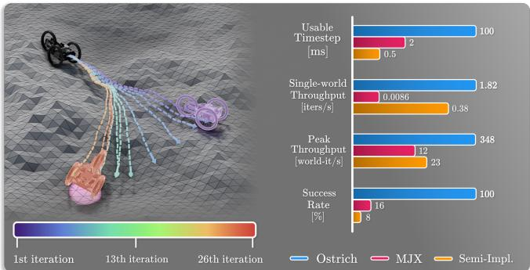  
Fig. 1. Gradient-based trajectory optimization through mesh terrain with Ostrich. Left: a wheeled robot’s control spline is optimized to reach the target (pink area) across a triangle-mesh heightmap. Trajectories are colored by optimization iteration, from the initial guess (purple) to the converged solution (red) after 26 iterations; each iteration backpropagates through the meshwheel contact forces (contact geometry held fixed within each step, §IV-D) at O(1) memory per timestep. Right: headline comparison against MJX and Newton Semi-Implicit on the box-traversal scene (§IV): usable timestep, single-world optimization throughput (§IV-B), peak optimization throughput across parallel worlds, and control-synthesis success rate, on a single 24 GB GPU. The first three axes use a log scale.

We introduce Ostrich (Fig. 1), a GPU-accelerated diferentiable rigid-body simulator that combines hard contacts with O(1) gradient memory per timestep (total O(T) stored states over a horizon, reducible by checkpointing, §IV-C). The forward integrator is backward-Euler, with hard Non-Linear Complementarity Problem (NCP) contacts and Coulomb friction resolved inside each step by a non-smooth Newton solver. This yields stable simulation at macroscopic timesteps $\left( h \sim 1 0 ^ { - 1 } \mathrm { s } \right)$ The backward pass applies the Implicit Function Theorem (IFT) to the converged residual, reusing the forward Schur complement to compute reverse-mode gradients via a single adjoint solve, decoupling gradient memory from the solver’s internal iterations.

Beyond the non-smooth Newton formulation of Macklin et al. [11], we add control constraints solved jointly with contact and well posed at any positive gain, bestiterate backtracking, and robust friction projection, and we scale both the forward solve and the adjoint to arbitrary triangle meshes and to thousands of parallel worlds. Section IV evaluates Ostrich against MJX and NVIDIA Newton Semi-Implicit, the two surveyed engines that run our scene as diferentiable baselines, on simto-real accuracy, gradient-based control synthesis, and

world-scaling throughput.

## II. RELATED WORK

See [1] for a recent survey of diferentiable rigid-body simulators. Three properties motivate Ostrich: simulation accuracy under stif contact, gradient reliability, and per-iteration cost; we organize prior work by the one each approach sacrifices.

## A. Simulation Accuracy under Stif Contact

GPU-accelerated engines built on automatic diferentiation (AD), such as MJX [12], [13], Brax [14], NVIDIA Newton [15], and Genesis [16] represent contact through soft constraints, penalty springs, or convex relaxations. These representations integrate stably under AD, but only at timesteps small enough to keep the smoothed contact numerically tractable. Stifer, more accurate contact requires shrinking the step further; relaxing the stifness widens the sim-to-real gap [17]. ADD [18] mollifies normal and tangential contact forces, trading accuracy for gradient smoothness, and adaptivetimestep extensions such as DifMJX [17] reduce accepted steps without breaking the dependence between contact stifness and step size.

## B. Gradient Reliability through Contact

Diferentiating through stif or non-smooth contact often yields gradients that are biased, noisy, or even wrongsigned [19]–[22]. AD over a backpropagation-throughtime (BPTT) tape recorded across soft contacts [4] backpropagates through dynamics that have already been approximated for solver stability; a recent analysis documents the resulting instability and even sign flips when contacts are stif [17]. SHAC [3] and PODS [23] truncate rollouts to short horizons, dropping the exact long-horizon gradient. Others replace the dynamics: Single-Rigid-Body Dynamics (SRBD) surrogates [6] differentiate a simplified floating-base model, unaware of terrain geometry, non-holonomic traction, and localized slip, and ContactSDF [7] replaces the contact solve with a LogSumExp-smoothed closed form, yielding closed-form gradients at the cost of physically smoothed transitions. Randomized smoothing [20] instead keeps the simulator intact and averages gradients over noise injections, trading non-smoothness for bias.

## C. Per-Iteration Cost: Memory and Throughput

Reverse-mode AD records the full per-step forward computation, including every inner iteration of the contact solver, accumulating a tape that grows with both trajectory length and per-step solver work [4]. Implicit-diferentiation frameworks bypass the inneriteration tape by applying the IFT at the converged solver state, giving O(1) memory per timestep regardless of solver iteration count. Building on early LCP-based diferentiable physics [24], Nimble [9] computes Jacobians through hard LCP contact but remains CPU-bound. Qiao et al. [5] bound per-step gradient memory with an adjoint for articulated bodies, and their DifSim [25] scales mesh simulation via localized contact regions, but neither targets the thousands-ofworlds GPU regime. TinyDifSim [10], extending the NeuralSim line [26], is GPU-parallel but restricted to plane/sphere/capsule primitives. Dojo [8] uses an exact NCP with second-order cone friction, in the classical constraint-based tradition [27], but is single-threaded CPU and dormant, with contact geometry beyond planar surfaces available only as experimental, manually-wired primitives.

Ostrich brings the hard-contact rigor of Dojo’s NCP/IFT approach to the GPU by building on the nonsmooth Newton formulation of Macklin et al. [11], with an adjoint backward pass giving reverse-mode gradients for arbitrary mesh collisions without the memory explosion of AD, the geometric abstractions of dynamics surrogates, or the sim-to-real failures of mollified contact.

## III. THEORY

Our simulator builds upon the non-smooth Newton formulation of Macklin et al. [11], extended with implicit control constraints, friction-projection robustness (Section III-B), and best-iterate backtracking (Section III-C). Implicit diferentiation of a converged solve is standard [8], [9]; the contribution is that the adjoint reuses the forward solve’s matrix-free Schur operator and preconditioner under hard NCP contact (Section III-D), so gradients run at the forward solve’s parallel eficiency.

## A. Discrete Equations of Motion

We represent nb rigid bodies in maximal coordinates with generalized positions $ { \mathbf { q } } \in \mathbb { R } ^ { 7 n _ { b } }$ (position–quaternion per body) and velocities $\mathbf { u } \in \mathbb { R } ^ { 6 n _ { b } }$ (linear–angular per body), related by the kinematic map $\begin{array} { r } { \dot { \textbf { q } } = \mathbf { G } ( \mathbf { q } ) \mathbf { \ i } } \end{array}$ u. Discretizing with backward Euler at step size h:

$$
\mathbf { q } ^ { + } = \mathbf { q } ^ { - } + h \mathbf { G } ( \mathbf { q } ^ { - } ) \mathbf { u } ^ { + }\tag{1}
$$

$$
\tilde { \mathbf { M } } \left( \mathbf { u } ^ { + } - \mathbf { u } ^ { - } \right) = h \big ( \mathbf { f } _ { \mathrm { e x t } } + \mathbf { J } ( \mathbf { q } ^ { + } ) ^ { \top } \pmb { \lambda } ^ { + } \big )\tag{2}
$$

where $\tilde { \mathbf { M } } = \mathbf { G } ^ { \top } \mathbf { M } \mathbf { G }$ is the generalized mass matrix, $\mathbf { f } _ { \mathrm { e x t } }$ collects gravity and gyroscopic terms, J is the stacked constraint Jacobian, and $\lambda ^ { \bar { + } }$ are the Lagrange multipliers. Here J is evaluated implicitly at ${ \bf q } ^ { + }$ , which is essential for stable handling of stif contacts and motors; G is evaluated explicitly at $\mathbf { q } ^ { - } \mathrm { t o }$ keep the Karush-Kuhn-Tucker (KKT) system linear in $\mathbf { u } ^ { + }$ and $\lambda ^ { + }$ . The velocity update remains fully implicit, preserving backward Euler’s unconditional stability.

## B. Constraint Formulation

All physical interactions are encoded as residual equations in $\mathbf { q } ^ { + } , \mathbf { u } ^ { + } , { \boldsymbol { \lambda } } ^ { + }$

Bilateral constraints (joints). Equality constraints $\mathbf c _ { b } ( \mathbf q ^ { + } ) = \mathbf 0$ with diagonal compliance $\mathbf { E } \geq 0$

$$
\mathbf { r } _ { b } = \mathbf { c } _ { b } ( \mathbf { q } ^ { + } ) + \mathbf { E } \lambda _ { b } ^ { + } = \mathbf { 0 } .\tag{3}
$$

Contact constraints. Non-penetration is enforced via the Fischer-Burmeister (FB) NCP function $\phi ( a , b ) =$ $a + b - { \sqrt { a ^ { 2 } + b ^ { 2 } } }$ , which satisfies $\phi ( a , b ) = 0 \Leftrightarrow a \geq 0 , b \geq$ $0 , a b = 0 { \mathrm { : } }$

$$
\mathbf { r } _ { n } = \phi \bigl ( \mathbf { c } _ { n } ( \mathbf { q } ^ { + } ) , \boldsymbol { \lambda } _ { n } ^ { + } \bigr ) = \mathbf { 0 } .\tag{4}
$$

Friction constraints. Following [11], we derive friction from the principle of maximal dissipation. For each contact with tangential Jacobian $\mathbf { J } _ { f } \in \mathbb { R } ^ { 2 \times n _ { u } }$ , the friction multiplier $\lambda _ { f } ^ { \mp } \in \mathbb { R } ^ { 2 }$ solves

$$
\operatorname* { m i n } _ { \mathbf { \lambda } _ { f } ^ { + } } { \mathbf { u } ^ { + } } ^ { \top } \mathbf { J } _ { f } ^ { \top } \lambda _ { f } ^ { + } \quad \mathrm { s . t . } \quad \| \boldsymbol { \lambda } _ { f } ^ { + } \| \leq \mu \lambda _ { n } ^ { + } ,\tag{5}
$$

whose KKT conditions yield complementarity between the slip speed $v _ { t } = \lVert \mathbf { J } _ { f } \mathbf { u } ^ { + } \rVert$ and the cone margin $\mu \lambda _ { n } ^ { + } -$ $\| \lambda _ { f } ^ { + } \|$ :

$$
0 \leq v _ { t } \ \perp \ \mu \lambda _ { n } ^ { + } - \| \pm \| \geq 0 .\tag{6}
$$

We reformulate (6) via the FB function and derive a compliance weight $W \geq 0$ that projects forces onto the Coulomb cone, yielding:

$$
\mathbf { r } _ { f } = \mathbf { J } _ { f } \mathbf { u } ^ { + } + W \lambda _ { f } ^ { + } = \mathbf { 0 } .\tag{7}
$$

The weight smoothly interpolates between sticking $( W \to 0 ,$ , zero slip) and sliding $( W > 0$ , force on the cone boundary). Treating W as frozen within each Newton iteration symmetrizes the friction block by lagging its dependence on the normal impulse ${ \lambda } _ { n } ^ { + }$ ; this makes the per-iteration Newton step inexact but does not soften the contact model. At the fixed point the frozen value matches the equilibrium W, so the converged multipliers satisfy the exact Coulomb-cone KKT conditions.

The formulation produces timestep-consistent friction: the converged forces in pure sticking and pure sliding are independent of h. Intermediate Newton iterates can carry physically inadmissible friction forces: outside the cone, or aligned with the slip direction. This is harmless in the original formulation [11], which uses only the converged iterate, but our best-iterate backtracking (§III-C) may return an intermediate one, so each must already be admissible. Two safeguards enforce this: clamping $\| \lambda _ { f } ^ { + } \|$ to $\mu \lambda _ { n } ^ { + }$ keeps the impulse within the cone, and $W \geq 0$ keeps friction dissipative.

Control constraints. Proportional-derivative (PD) motor torques applied as explicit external forces, as Mu-JoCo does for position actuators [12], become unstable when $h ^ { 2 } k _ { p }$ exceeds the system’s inertia.1 Instead, we formulate position and velocity targets as implicit servo constraints:

$$
\mathbf { r } _ { c } = \mathbf { J } _ { c } \mathbf { u } ^ { + } + \alpha \lambda _ { c } ^ { + } + \mathbf { b } _ { c } = \mathbf { 0 } ,\tag{8}
$$

with compliance $\alpha ~ = ~ ( k _ { d } + h k _ { p } ) ^ { - 1 }$ and $\mathbf { b } _ { c }$ the joint error divided by h for a position target, and $\alpha = k _ { p } ^ { - 1 }$ $\mathbf b _ { c } = - \bar { \mathbf u }$ for a target joint velocity u¯; both target rows are evaluated at the current Newton iterate. This com pliant form is standard: α is the constraint-force-mixing (CFM) parameter of a soft joint motor in ODE [28] and Bullet, and the compliance of XPBD [29]. It shares its motivation with Stable PD control [30], which also evaluates the servo at the next state; we claim neither as a contribution. Stable PD predicts the next configuration from the current velocity, applies the result as an explicit torque with contact held at the current state, and is stable under $k _ { d } \geq h k _ { p }$ [30, App. A]. Here ${ \lambda } _ { c } ^ { + }$ is instead a constraint variable solved jointly with contacts and friction inside the Newton system, well posed for any positive timestep and gains, contact-consistent, and diferentiated by the same adjoint. Wheels are driven in the velocity-target mode, $\lambda _ { c } ^ { + } = k _ { p } ( \omega ^ { \mathrm { c m d } } - \omega ^ { + } )$ with $\omega ^ { \mathrm { c m d } } = \bar { \mathbf { u } }$ the commanded and $\omega ^ { + } \stackrel { \cdot } { = } \mathbf { J } _ { c } \mathbf { u } ^ { + }$ the solved wheel speed; no torque saturation is modeled.

## C. Newton Solver

Stacking (1)–(8) yields a nonlinear system $\mathbf { r } ( \mathbf { s } ^ { + } , \mathbf { s } ^ { - } , \mathbf { a } , \pmb \theta ) = \mathbf { 0 }$ in the state $\mathbf { s } = [ \mathbf { q } , \mathbf { u } , \lambda ] ^ { \top }$ , where a are control targets and θ are physical parameters. The residual splits into one block per component of s:

$$
\mathbf { r } _ { \mathrm { k i n } } = \mathbf { q } ^ { + } - \mathbf { q } ^ { - } - h \mathbf { G } ( \mathbf { q } ^ { - } ) \mathbf { u } ^ { + } ,\tag{9}
$$

$$
{ \bf r } _ { \mathrm { d y n } } = \tilde { \bf M } \left( { \bf u } ^ { + } - { \bf u } ^ { - } \right) - h \left( { \bf f } _ { \mathrm { e x t } } + { \bf J } ^ { \top } { \boldsymbol { \lambda } } ^ { + } \right) ,\tag{10}
$$

$$
\mathbf { r } _ { \mathrm { c o n } } = \left[ \mathbf { r } _ { b } ^ { \top } \quad \mathbf { r } _ { n } ^ { \top } \quad \mathbf { r } _ { f } ^ { \top } \quad \mathbf { r } _ { c } ^ { \top } \right] ^ { \top } ,\tag{11}
$$

where ${ \bf r } _ { \mathrm { k i n } }$ enforces the position update $( 1 ) ,  { \mathbf { r } } _ { \mathrm { d y n } }$ enforces Newton’s second law (2), and $\mathbf { r } _ { \mathrm { c o n } }$ stacks all constraint residuals: bilateral joints (3), normal contacts (4), friction (7), and control (8).

We solve this system with an inexact non-smooth Newton method. Because G is frozen at $\mathbf { q } ^ { - }$ , the kinematic residual (9) is linear in ${ \bf q } ^ { + }$ , so the position is not an independent unknown: setting ${ \bf r } _ { \mathrm { k i n } } = { \bf 0 }$ gives the substitution $\Delta \mathbf { q } = h \mathbf { G } ( \mathbf { q } ^ { - } ) \Delta \mathbf { u }$ . We apply it wherever ${ \bf q } ^ { + }$ enters the other residuals, chiefly through the constraint functions ${ \bf c } ( { \bf q } ^ { + } )$ , which removes the kinematic block and leaves a system in $( \Delta \mathbf { u } , \Delta \lambda )$ alone. Reducing this KKT block system via the Schur complement then eliminates ∆u and yields:

$$
\underbrace { \left( \mathbf { J } \tilde { \mathbf { M } } ^ { - 1 } \mathbf { J } ^ { \top } + \mathbf { C } \right) } _ { \mathbf { A } } \Delta \lambda = \frac { 1 } { h } \left( \mathbf { J } \tilde { \mathbf { M } } ^ { - 1 } \mathbf { r } _ { \mathrm { d y n } } - \mathbf { r } _ { \mathrm { c o n } } \right) ,\tag{12}
$$

solved with a matrix-free Preconditioned Conjugate Residual (PCR) method [11]. After solving (12) for $\Delta \lambda .$ the velocity step is recovered by back-substitution:

$$
\Delta \mathbf { u } = \tilde { \mathbf { M } } ^ { - 1 } ( \mathbf { J } ^ { \top } \Delta \boldsymbol { \lambda } h - \mathbf { r } _ { \mathrm { d y n } } ) .\tag{13}
$$

Best-iterate backtracking. At large h the Newton iterates can overshoot, so instead of a line search we run a fixed budget and return the iterate with the smallest residual $\| \mathbf { r } ( \mathbf { s } ^ { k } ) \| ^ { 2 }$ from index $k _ { \mathrm { m i n } }$ onward; the floor $k _ { \mathrm { m i n } }$ blocks early acceptance of under-converged states. On mesh terrain the final iterate overshoots an earlier, lowerresidual one by up to three orders of magnitude on a third of steps. The returned iterate is kept cone-admissible by the friction safeguards, so the timestep-consistency of Section III-B holds to its residual.

## D. Adjoint Backward Pass

Each simulation step defines an implicit mapping $\begin{array} { r l r } { { \bf s } ^ { + } } & { { } = } & { { \bf s } ^ { + } ( { \bf s } ^ { - } , { \bf a } , \theta ) } \end{array}$ through the residual equation $\mathbf { r } ( \mathbf { s } ^ { + } , \mathbf { s } ^ { - } , \mathbf { a } , \pmb \theta ) = \mathbf { 0 }$ of Section III-C. Given a scalar loss $\mathcal { L } ( \mathbf { s } ^ { + } )$ , the backward pass must propagate the gradient $d \mathcal { L } / d \mathbf { s } ^ { + }$ back to $d \mathcal { L } / d \mathbf { s } ^ { - } , ~ d \mathcal { L } / d \mathbf { a }$ , and $d \mathcal { L } / d \theta$ . This is a reverse-mode (adjoint-state) computation, obtained algorithmically via the IFT rather than by diferentiating through the solver’s iterations: one backward sweep yields gradients with respect to all inputs and parameters simultaneously.

Implicit diferentiation. The chain rule requires the state-transition Jacobian $d \mathbf { s } ^ { + } / d \mathbf { s } ^ { - }$ , which has no closedform expression since $\mathbf { s } ^ { + }$ is defined only implicitly. Differentiating $\mathbf { r } ( \mathbf { s } ^ { + } ( \mathbf { s } ^ { - } , \mathbf { a } , \pmb { \theta } ) , \mathbf { s } ^ { - } , \mathbf { a } , \pmb { \theta } ) = \mathbf { 0 }$ with respect to $\mathbf { s } ^ { - }$ and applying the Implicit Function Theorem yields

$$
\frac { d \mathbf { s } ^ { + } } { d \mathbf { s } ^ { - } } = - \left[ \frac { \partial \mathbf { r } } { \partial \mathbf { s } ^ { + } } \right] ^ { - 1 } \frac { \partial \mathbf { r } } { \partial \mathbf { s } ^ { - } } .\tag{14}
$$

Substituting into the chain rule gives

$$
{ \frac { d { \mathcal { L } } } { d \mathbf { s } ^ { - } } } = - { \frac { d { \mathcal { L } } } { d \mathbf { s } ^ { + } } } \left[ { \frac { \partial \mathbf { r } } { \partial \mathbf { s } ^ { + } } } \right] ^ { - 1 } { \frac { \partial \mathbf { r } } { \partial \mathbf { s } ^ { - } } } .\tag{15}
$$

Adjoint formulation. Rather than forming the dense inverse $[ { \partial { \bf r } } / { \partial { \bf s } ^ { + } } ] ^ { - 1 }$ , we introduce adjoint variables w satisfying:

$$
\left[ \frac { \partial \mathbf { r } } { \partial \mathbf { s } ^ { + } } \right] ^ { \top } \mathbf { w } = - \nabla _ { \mathbf { s } ^ { + } } \mathcal { L } .\tag{16}
$$

Once w is solved, all required gradients follow from vector-Jacobian products:

$$
\frac { d \mathcal { L } } { d \boldsymbol { \xi } } = \mathbf { w } ^ { \top } \frac { \partial \mathbf { r } } { \partial \boldsymbol { \xi } } , \qquad \boldsymbol { \xi } \in \{ \mathbf { s } ^ { - } , \mathbf { a } , \pmb { \theta } \} .\tag{17}
$$

Reuse of the forward solver. Expanding (16) using the block structure $\mathbf { w } = [ \mathbf { w } _ { q } , \mathbf { w } _ { u } , \mathbf { w } _ { \lambda } ] ^ { \top }$ gives three coupled equations. The first trivially yields $\mathbf { w } _ { q } = - \nabla _ { \mathbf { q } ^ { + } } \mathcal { L }$ and the third is homogeneous because the loss does not depend on the Lagrange multipliers directly; substituting into the remaining equation and eliminating $\mathbf { w } _ { u }$ via the Schur complement yields:

$$
\mathbf { A } \mathbf { w } _ { \lambda } = - \mathbf { J } \tilde { \mathbf { M } } ^ { - 1 } \big ( \nabla _ { \mathbf { u } ^ { + } } \mathcal { L } + h \mathbf { G } ^ { \top } \nabla _ { \mathbf { q } ^ { + } } \mathcal { L } \big ) ,\tag{18}
$$

with the identical Schur complement matrix ${ \bf A } \quad =$

J $\tilde { \mathbf { M } } ^ { - 1 } \mathbf { J } ^ { \top } + \mathbf { C }$ from (12), evaluated at the converged iterate (W at its converged value, its ${ \lambda } _ { n } ^ { + }$ -dependence lagged as in the forward Jacobian). After solving for $\mathbf { w } _ { \lambda }$ the velocity adjoint is recovered via back-substitution:

$$
\mathbf { w } _ { u } = - \tilde { \mathbf { M } } ^ { - 1 } \big ( \nabla _ { \mathbf { u } ^ { + } } \mathcal { L } + h \mathbf { G } ^ { \top } \nabla _ { \mathbf { q } ^ { + } } \mathcal { L } + \mathbf { J } ^ { \top } \mathbf { w } _ { \lambda } \big ) .\tag{19}
$$

The shared $h \mathbf { G } ^ { \top } \nabla _ { \mathbf { q } ^ { + } } \mathcal { L }$ term is the kinematic substitution (9) transposed. The backward pass therefore requires no additional matrix assembly: only a single PCR solve with the same operator and preconditioner computed during the forward pass, achieving O(1) memory per timestep independent of the forward iteration count. The full derivative with respect to the previous pose, including the rigid-transform dependence of contact points and normals, is obtained by recording one residual evaluation at the converged state on an AD tape and applying one vector-Jacobian sweep, so this position pull-back follows the residual by construction rather than being hand-derived. Non-smoothness of the Fischer-Burmeister residual at the origin is handled by ε-smoothed norms $( \varepsilon = 1 0 ^ { - 8 } )$ and guarded denominators; the exact nondiferentiable point has measure zero and converged iterates do not sit on it.

Validation. We verify the adjoint against centered finite diferences on CPU: maximum relative error 0.02% on an impulsive contact-boundary test, ≤0.4% across all wheel DOFs of the three-wheeled robot of §IV and a four-wheeled model under sticking contact (per-scenario maxima $0 . 0 4 \mathrm { - } 0 . 3 3 \% ,$ central diferences with step $1 0 ^ { - 2 } )$ , and $\leq 1 . 6 \%$ on cart-pole losses over horizons up to 50 steps; the largest relative deviations occur on the DOFs with the smallest gradients; the checks run in continuous integration.

## IV. EXPERIMENTS

We test the three properties in turn: simulation accuracy, gradient reliability, and cost at the timesteps and parallel scale that applications demand.

We evaluate on a custom three-wheeled articulated robot: a 106 kg vehicle with 5.5 kg cylindrical wheels (radius 35 cm, wheelbase 75 cm) on revolute joints and per-wheel velocity servos. All real-world data come from 14 traversals of a 14.4 cm pallet (§IV-A).

Of the six diferentiable simulators we surveyed, none produces clean gradients through stif box contact, and the failure modes track the contact-solver family. Penalty solvers (Newton’s Semi-Implicit [15], Brax’s spring pipeline [14]) represent contact with stif compliant springs and so require very small timesteps (§IV-A); because backpropagation runs through every stif step, their gradients are reliable only over short horizons and reach non-finite values over longer ones [22], [31]. Position-based solvers fare no better: Newton’s XPBD only approximates gradients (it disables its positionderived velocity update under AD [15]), and Brax’s positional pipeline did not simulate the robot stably on this scene; Brax’s generalized (QP) pipeline returns nonfinite gradients.

---Real robot Ostrich  
MuJoCo Semi-Impl.  
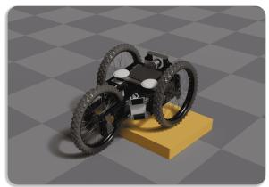

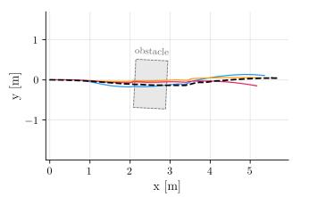

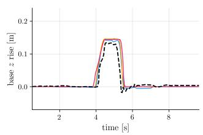

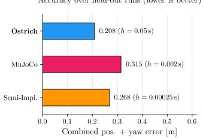  
Fig. 2. Sim-to-real on real pallet traversals (14 runs). Far left: scene render of the robot mid-climb on the obstacle. Left: top down trajectory for a representative held-out run (selected as the run closest to Ostrich’s and MuJoCo’s median error), with the per-run fitted obstacle footprint in gray and the recorded base path dashed in black. Middle: base z-elevation; all three engines reproduce the measured climb on this held-out run. Right: combined position-and-yaw error averaged over the ten held-out runs at each engine’s identified parameters.

We therefore benchmark Ostrich against Newton Semi-Implicit, a maintained, GPU-native representative of the penalty family, and MJX (implicitfast + JAX AD) [12], [13], whose convex soft contact is the other widely used approach; §IV-B shows both fall short of Ostrich on the box. The remaining engines are excluded outright: Genesis [16] produced near-zero rigid-body gradients on this scene, Dojo [8] is CPU-only and dormant, and TinyDifSim [10] supports only primitive geometry.

Ostrich is implemented in NVIDIA Warp [32] GPU kernels; Newton [15] handles model building and collision detection, and Ostrich adds the non-smooth Newton solver and its adjoint. All experiments run on a single NVIDIA RTX 3090 (24GB) with an AMD EPYC CPU.

## A. Sim-to-Real Accuracy and Timestep Range on a Pallet Obstacle

This section answers two questions on the same realworld dataset: does each engine’s forward pass match held-out recorded trajectories at identified parameters, and what is the largest h at which it remains both stable and accurate?

a) Setup.: The dataset comprises 14 traversals of a wooden pallet (1.2×0.8 m, 14.4 cm tall) spanning speeds of 0.12–2.05 m/s and heading changes up to 130◦. Chassis pose is estimated by onboard lidar-inertial odometry; wheel-velocity setpoints, logged at 100 Hz, drive each simulator open-loop. The pallet pose is fitted per run from the lidar clouds and validated against the climb onset (±3 cm on all runs). Error is the yaw-aware combined metric $\sqrt { \langle | \Delta p | ^ { 2 } \rangle + ( L \cdot \mathrm { R M S E } ( \Delta \mathrm { y a w } ) ) ^ { 2 } }$ with lever arm L=0.5 m. Forward comparisons use reference CPU MuJoCo; its diferentiable GPU build, MJX, is used for the gradient and scaling experiments (§IV-B onward).

b) Identification protocol.: Engine parameters are identified on four training runs spanning slow, fast, and turn-heavy driving, and evaluated on the ten heldout runs; the wheel-command scale (motor tracking) is calibrated only on the flat pre-obstacle cruise segment, disjoint from the scored climb. Per engine we sweep the dominant contact and actuation parameters (Ostrich:

servo stifness $k _ { p } ,$ lateral wheel friction; MuJoCo: rearwheel and torsional friction; Semi-Implicit: penalty stif ness/damping).

c) Held-out accuracy.: Fig. 2 reports the outcome at h = 50, 2 and 0.25 ms (Ostrich, MuJoCo, Semi-Implicit; each within its Fig. 3 plateau): on the held-out runs, Ostrich reaches 0.208 m combined error, Semi-Implicit 0.268 m, and MuJoCo 0.315 m, and all three reproduce the measured pallet climb. The error is common to all three and concentrates on the turn-heavy runs, implicating the shared friction model rather than any contact solver: the robot’s turn eficiency (yaw response relative to ideal skid steering) varies per run (0.11–0.30 on four runs, correlated with speed), while a constant-µ model realizes exactly one, so every engine’s identification saturates at a similar error floor. At this floor, simulation accuracy separates the engines by at most 0.11 m; the usable timestep range does by orders of magnitude.

d) Timestep range.: Every gradient experiment that follows pays per step $( T = \mathrm { h o r i z o n } / h )$ , so the decisive property is the largest h at which an engine stays on that floor. We sweep h at each engine’s identified configuration on four held-out runs spanning the speed range; the usable plateau ends where error departs its sweep minimum by more than 2× (Fig. 3). Ostrich holds its floor up to $\begin{array} { r l r } { h } & { { } = } & { 0 . 1 \mathrm { s } \mathrm { : } } \end{array}$ the implicit hardcontact solve introduces no contact timescale of its own, and the edge is set by integration error alone. MuJoCo leaves its floor at a 50× smaller step (2 ms), where h approaches the contact-softening time constant of its calibration [12]. Semi-Implicit is capped 200× below Ostrich by the explicit-integration stability limit of its penalty springs and diverges beyond 0.5 ms; the held-out evaluation ran it at 0.25 ms, inside that edge.

## B. How Reliable and Fast Are the Gradients?

The forward-side results in §IV-A show each engine can track reality at its identified parameters, but say nothing about gradient reliability, which we test by task success and optimization convergence (finite-diference agreement: §III-D). We therefore pose a gradient-based control-synthesis task on a simulated scene that models the §IV-A pallet as a rigid box obstacle (same robot): recover open-loop wheel commands that drive the robot through contact to a target pose.

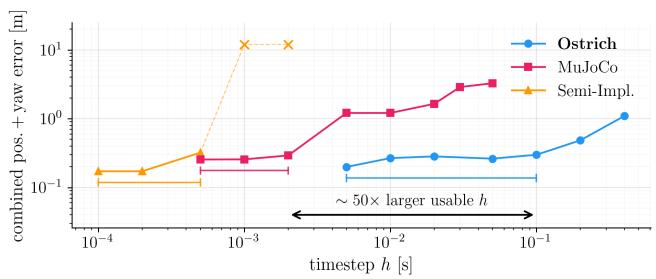  
Fig. 3. Accuracy vs. timestep on four held-out runs of the §IV-A dataset. Each engine runs at its identified parameters over an h grid. Brackets span each engine’s usable plateau, where error stays within 2× of its sweep minimum (the model-error floor); past the edge, integration error takes over. × marks diverged runs, plotted at the ceiling. The arrow spans Ostrich’s ∼50× larger usable h over MuJoCo (∼200× over Semi-Implicit).

a) Setup.: Per-engine h follows Fig. 3: Ostrich runs at 100 ms, the top of its plateau; MJX at 2 ms, MuJoCo’s plateau edge; Semi-Implicit at 0.5 ms, the top of its plateau. This gives 60, 3,000, and 12,000 simulation steps per rollout over the 6 s horizon. The task: from a randomly perturbed initial pose, drive the chassis past the box to a random target pose (x=3 m) and stop there, with no trajectory to imitate. The variable is a K=10- knot wheel-velocity spline (30 parameters); the loss combines final position and heading error, a terminal-velocity penalty, control regularizers, and a per-step straight-line tracking term for dense gradient signal. Each engine runs 50 Adam iterations on 25 random (initial-condition, target) trials from a shared RNG stream. Optimizer hyperparameters are swept per engine; all three run at the best learning rate from that sweep (0.3, 0.3, 0.1 for Ostrich, MJX, Semi-Implicit). Solvers: MJX runs MuJoCo 3.9.0’s Newton-type constraint solver with its non-diferentiable while loop replaced by a fixed 10-iteration scan; Semi-Implicit, symplectic Euler with penalty contacts; Ostrich, backward Euler with 16 Newton × 16 PCR iterations per step; physical parameters per engine as identified in §IV-A.

b) Reliability.: Across the 25 trials (success: final position error < 0.2 m and terminal speed < $\mathrm { 0 . 3 m / s ) }$ , Ostrich succeeds on 100% of trials at a median final position error of 0.065 m, with a tight cross-trial loss band. MJX succeeds on 16% (median position error 0.32 m) and characteristically approaches the target without stopping: 8/25 trials pass the position gate and 9/25 the speed gate, but only 4/25 both. Semi-Implicit is worse still: its exact reverse-mode gradient is non-finite beyond a ∼2 s horizon and unreliable below it (non-finite entries are zeroed); salvaging its best finite iterate yields 8% success (2/25) at 0.58 m median position error. Fig. 4 shows the same ordering in optimization loss.

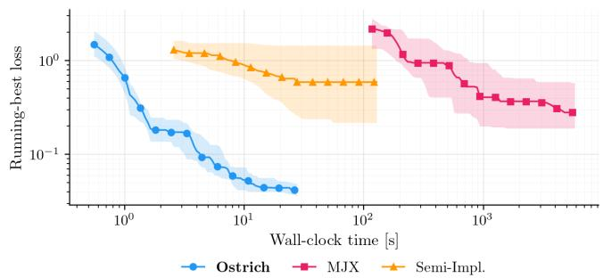  
Fig. 4. Gradient reliability on the box-obstacle controlsynthesis task (§IV-B; 25 random trials, 50 Adam iterations per engine). Median running-best loss against wall-clock (log x) with the interquartile band across trials. Ostrich converges to a median loss of 0.042 in ∼28 s of warm iterations (29 s end to end); MJX reaches 0.28 only after ∼1.6 h; Semi-Implicit stalls at 0.59. The xaxis excludes each engine’s one-time setup (§IV-B).

c) Wall-clock cost.: Ostrich runs one warm (postsetup) optimization iteration in 0.55 s, 211× faster than MJX (116 s) and 4.7× faster than Semi-Implicit (2.6 s), each engine alone on the GPU with setup separated by a two-point fit. That setup is not uniform: 1 s for Ostrich and 84 s for MJX, but 29 min per trial for Semi-Implicit. End to end, a 50-iteration run costs 29 s for Ostrich against 1.6 h for MJX and 0.5 h for Semi-Implicit, and neither baseline reaches a comparable loss. The advantage over MJX compounds two factors: 50× fewer steps per rollout, and an adjoint that never tapes the inner contact iterations; at scale the gap settles at 29× (§IV-C).

d) Zeroth-order comparison.: We also ran evolution strategies (ES; population 64 as one batched rollout, 3 seeds per trial, five trials) on Ostrich’s forward pass. On a single problem ES matches first-order in wall-clock: it reaches the success criterion at a median 0.8× the budget of 50 Adam iterations, with a comparable (marginally lower) loss at every budget up to 10×. The diference is sample eficiency. ES spends about 1,800 rollouts per solved problem against 50 forward-adjoint pairs, a 35× gap that a single world conceals because it leaves the GPU idle (Fig. 5a); with 64 worlds, first-order optimizes 64 independent problems where ES optimizes one. The gap also grows with dimension: at 300 parameters ES needs twice the rollouts and 1.5× the budget and reaches 4× the matched-budget loss (catching up at 5× the budget), while first-order’s cost and outcome do not change.

## C. Does It Scale?

On the box-traversal scene of §IV-B, we measure end to-end optimization throughput (forward + backward, in world-iterations per second) and peak GPU memory (Fig. 5) across worlds from 1 to each engine’s capacity, with MJX and Ostrich additionally run under segment checkpointing (bit-exact to the plain gradients), so neither is handicapped by naive gradient storage.2

Ostrich · Ostrich + ckpt.  MJX + ckpt. · MJX plain BPTT  Semi-Implicit  
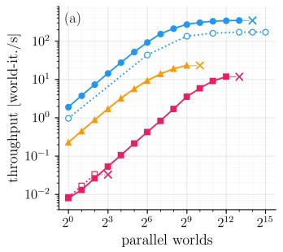

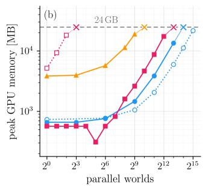  
Fig. 5. Optimization throughput (a) and peak GPU memory (b) vs. number of worlds on the box-traversal scene of §IV-B (RTX 3090, 24 GB; NVML-polled). Solid: each engine’s operating configuration; dotted: the alternative (checkpointing for Ostrich, plain BPTT for MJX, which needs checkpointing to scale at all). ×: first failing batch size.

The baselines’ memory pressure has two sources. Semi-Implicit’s tiny h forces 12,000 taped steps over the 6 s horizon; MJX takes 3,000 but tapes every inner contact iteration, so plain BPTT exhausts the 24 GB card at 8 worlds. Ostrich shrinks both factors: 60 steps at h ∼ 10−1 s (50× fewer than MJX), and an adjoint over the converged residual, so inner iterations are never taped.

a) Throughput across regimes.: At a single world, the interactive and model-predictive-control (MPC) regime, this measurement gives 0.53 s per optimization iteration for Ostrich versus 126 s for checkpointed MJX and 4.4 s for Semi-Implicit (§IV-B’s two-point fit gives 0.55, 116 and 2.6 s). At scale, throughput peaks at 348 world-iterations/s for Ostrich (at 8,192 worlds) versus 12 for checkpointed MJX at its 4,096-world memory cap, a 29× gap, and 23 for Semi-Implicit (at 512; out of memory at 1,024). Checkpointing changes only where each engine starts paying the recompute cost (one forward re-execution per step): MJX at 8 worlds, Ostrich at 16,384; Semi-Implicit would at 1,024. Checkpointed Ostrich sustains 171–173 world-iterations/s up to 32,768 worlds on 21.7 GB. Computational cost remains O(T) for all methods; the gains come from step size and batch throughput.

## D. Beyond Primitives: Terrain Traversal

The preceding experiments used a single box obstacle with a few contact pairs. We now run gradient-based trajectory optimization directly over a triangle mesh (∼12,500 faces), where mesh-wheel contact normals and friction must be tracked across hundreds of simultaneous contact candidates per step, the regime that motivated

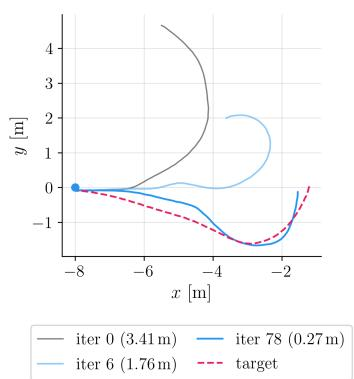

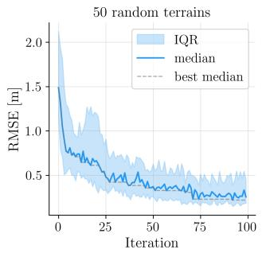  
Fig. 6. Terrain traversal (10 s horizon, K=10 knots, triangle mesh). Left: example seed with initial guess (gray), intermediate iteration (light blue), and best iterate (blue) converging toward the target (dashed red). Right: RMSE median and IQR over 50 random terrains, 100 iterations; dashed: running best of the median (the text reports the median over seeds of each seed’s best RMSE).

Ostrich’s O(1)-memory backward pass, evaluated on 50 random instances.

a) Setup.: Each instance derives from a single seed: a sum-of-sinusoids heightmap $( 2 4 \times 2 4 \mathrm { m } )$ , a random target spline (K=10 knots, correlated left/right wheel velocities), and an initial guess perturbing it with Gaussian noise $( \sigma { = } 1 . 5 \mathrm { r a d / s } )$ . The optimizer must recover the target spline’s simulated trajectory from that guess under a position-tracking, yaw-alignment, and control regularization loss over 10 s (T=125, h=80 ms). Gradients flow through the converged Newton solve, including mesh contact and friction forces; on this 10 s horizon the complete position pull-back of §III-D, used in full in §IV-B, amplifies contact sensitivity (the adjoint norm grows ∼1.13× per step) and gives no usable descent direction, so the adjoint here truncates it, holding contact geometry fixed within each step (cf. [22]).

b) Results.: Fig. 6 shows an example seed and the convergence across all 50 seeds. The per-seed best RMSE has median 0.143 m (0.208 ± 0.178 m mean ± std), with 90% of seeds (45/50) below 0.5 m and 70% (35/50) below 0.2 m. The median per-iteration time is 1045 ms $( \sim 8 \mathrm { m s } / \mathrm { s t e p } )$

## V. CONCLUSION

Ostrich solves a single non-smooth Newton system per timestep that couples hard contacts, friction, motor control, and articulated dynamics, then diferentiates the converged residual via the implicit function theorem with the forward Schur complement reused for the adjoint, making per-timestep gradient memory constant in the inner solver iteration count. In Section IV this delivers MuJoCo’s sim-to-real accuracy up to a 50× larger timestep, 100% success on a random-target controlsynthesis task where MJX and Semi-Implicit reach 16% and 8%, and 8,192 diferentiable parallel worlds on a single 24 GB GPU where checkpointed MJX reaches 4,096 and Semi-Implicit 512. Together these open long horizons, mesh-resolved contact (§IV-D), and thousands of parallel worlds to gradient-based optimization.

a) Limitations and future work.: The implicit Newton solve has a higher per-step cost than explicit integrators, so Ostrich’s per-iteration advantage shrinks when small timesteps are not a bottleneck. Deformable bodies, not yet supported, could reuse the same Schurcomplement backward pass. Impacts are resolved inelastically (e=0); restitution is left to future work. All real-robot evidence comes from a single wheeled platform. Our adjoint fixes the active set within each step but lets it evolve between steps, so per-step gradients stay valid as the wheels meet new mesh faces; gradient flow through a contact’s birth or death, which grasping needs but wheeled locomotion on persistent contact does not, remains open. On long chaotic horizons we truncate the position pull-back (§IV-D).

The architecture targets diferentiable MPC on real hardware [33], population-scale policy learning (RLstyle training), and physical-parameter identification via ∂r/∂θ. Code and the robot model will be released.

## References

[1] R. Newbury, J. Collins, K. He, J. Pan, I. Posner, D. Howard, and A. Cosgun, “A review of diferentiable simulators,” IEEE Access, vol. 12, pp. 97 581–97 604, 2024.

[2] J. Degrave, M. Hermans, J. Dambre, and F. wyfels, “A diferentiable physics engine for deep learning in robotics,” Frontiers in Neurorobotics, vol. 13, 2019.

[3] J. Xu, V. Makoviychuk, Y. Narang, F. Ramos, W. Matusik, A. Garg, and M. Macklin, “Accelerated policy learning with parallel diferentiable simulation,” in International Conference on Learning Representations (ICLR), 2022.

[4] Y. Hu, L. Anderson, T.-M. Li, Q. Sun, N. Carr, J. Ragan-Kelley, and F. Durand, “DifTaichi: Diferentiable programming for physical simulation,” in International Conference on Learning Representations (ICLR), 2020.

[5] Y.-L. Qiao, J. Liang, V. Koltun, and M. C. Lin, “Eficient differentiable simulation of articulated bodies,” in International Conference on Machine Learning (ICML). PMLR, 2021.

[6] Y. Song, S. Kim, and D. Scaramuzza, “Learning quadruped locomotion using diferentiable simulation,” in Conference on Robot Learning (CoRL), 2024.

[7] W. Yang and W. Jin, “ContactSDF: Signed distance functions as multi-contact models for dexterous manipulation,” IEEE Robotics and Automation Letters, vol. 10, no. 5, pp. 4212– 4219, 2025.

[8] T. A. Howell, S. Le Cleac’h, J. Br¨udigam, Q. Chen, J. Sun, J. Z. Kolter, M. Schwager, and Z. Manchester, “Dojo: A diferentiable physics engine for robotics,” arXiv preprint arXiv:2203.00806, 2022.

[9] K. Werling, D. Omens, J. Lee, I. Exarchos, and C. K. Liu, “Nimble: A diferentiable physics library for robotics,” in Proceedings of Robotics: Science and Systems (RSS), 2021.

[10] E. Heiden, D. Millard, E. Coumans, Y. Sheng, and G. S. Sukhatme, “Tiny diferentiable simulator: A headeronly physics simulation library with support for automatic diferentiation,” https://github.com/google-research/ tiny-diferentiable-simulator, 2021.

[11] M. Macklin, K. Erleben, M. M¨uller, N. Chentanez, S. Jeschke, and V. Makoviychuk, “Non-smooth Newton methods for deformable multi-body dynamics,” ACM Transactions on Graphics, vol. 38, no. 5, pp. 1–20, 2019.

[12] E. Todorov, T. Erez, and Y. Tassa, “MuJoCo: A physics engine for model-based control,” in IEEE/RSJ International Conference on Intelligent Robots and Systems (IROS). IEEE, 2012, pp. 5026–5033.

[13] Google DeepMind, “MJX: MuJoCo on JAX, MuJoCo release 3.9.0,” https://github.com/google-deepmind/mujoco/ tree/main/mjx, 2026.

[14] C. D. Freeman, E. Frey, A. Raichuk, S. Girgin, I. Mordatch, and O. Bachem, “Brax – a diferentiable physics engine for large scale rigid body simulation,” arXiv preprint arXiv:2106.13281, 2021.

[15] NVIDIA, “Newton: A high-performance diferentiable physics simulator,” https://github.com/newton-physics/newton, 2026, version 1.2.0rc1.

[16] Genesis Authors, “Genesis: A generative and universal physics engine for robotics and beyond,” 2025, available at https:// genesis-world.readthedocs.io.

[17] A. Paulus, A. R. Geist, P. Schumacher, V. Musil, S. Rappenecker, and G. Martius, “Diferentiable simulation of hard contacts with soft gradients for learning and control,” in International Conference on Learning Representations (ICLR), 2026, arXiv:2506.14186.

[18] M. Geilinger, D. Hahn, J. Zehnder, M. B¨acher, B. Thomaszewski, and S. Coros, “ADD: Analytically diferentiable dynamics for multi-body systems with frictional contact,” ACM Transactions on Graphics, vol. 39, no. 6, pp. 1–15, 2020.

[19] H. J. Suh, M. Simchowitz, K. Zhang, and R. Tedrake, “Do diferentiable simulators give better policy gradients?” in International Conference on Machine Learning (ICML), 2022.

[20] H. J. Suh, T. Pang, and R. Tedrake, “Bundled gradients through contact via randomized smoothing,” IEEE Robotics and Automation Letters, vol. 7, no. 2, pp. 4000–4007, 2022.

[21] R. Antonova, J. Yang, K. M. Jatavallabhula, and J. Bohg, “Rethinking optimization with diferentiable simulation from a global perspective,” in Conference on Robot Learning (CoRL), 2022.

[22] L. Metz, C. D. Freeman, S. S. Schoenholz, and T. Kachman, “Gradients are not all you need,” arXiv preprint arXiv:2111.05803, 2021.

[23] M. A. Z. Mora, M. Peychev, S. Ha, M. Vechev, and S. Coros, “PODS: Policy optimization via diferentiable simulation,” in International Conference on Machine Learning (ICML), 2021.

[24] F. de Avila Belbute-Peres, K. Smith, K. Allen, J. Tenenbaum, and J. Z. Kolter, “End-to-end diferentiable physics for learning and control,” in Advances in Neural Information Processing Systems (NeurIPS), 2018.

[25] Y.-L. Qiao, J. Liang, V. Koltun, and M. C. Lin, “Scalable differentiable physics for learning and control,” in International Conference on Machine Learning (ICML), 2020.

[26] E. Heiden, D. Millard, E. Coumans, Y. Sheng, and G. S. Sukhatme, “NeuralSim: Augmenting diferentiable simulators with neural networks,” in IEEE International Conference on Robotics and Automation (ICRA), 2021, pp. 9474–9481.

[27] A. Tasora, R. Serban, H. Mazhar, A. Pazouki, D. Melanz, J. Fleischmann, M. Taylor, H. Sugiyama, and D. Negrut, “Chrono: An open source multi-physics dynamics engine,” Lecture Notes in Computer Science, vol. 9611, pp. 19–49, 2016.

[28] R. Smith, “Open Dynamics Engine v0.5 user guide,” https: //ode.org/ode-latest-userguide.pdf, 2006.

[29] M. Macklin, M. M¨uller, and N. Chentanez, “XPBD: Positionbased simulation of compliant constrained dynamics,” in Proc. 9th Int. Conf. on Motion in Games (MIG), 2016, pp. 49–54.

[30] J. Tan, K. Liu, and G. Turk, “Stable proportional-derivative controllers,” IEEE Computer Graphics and Applications, vol. 31, no. 4, pp. 34–44, 2011.

[31] J. Pan, J. Xing, R. Reiter, Y. Zhai, E. Aljalbout, and D. Scaramuzza, “Learning on the fly: Rapid policy adaptation via diferentiable simulation,” IEEE Robotics and Automation Letters, vol. 11, no. 3, pp. 3542–3549, 2026.

[32] M. Macklin, “Warp: A high-performance Python framework for GPU simulation and graphics,” NVIDIA GPU Technology Conference (GTC), Mar. 2022, version 1.13.0, https://github. com/NVIDIA/warp.

[33] F. Jahncke, B. Zarrouki, M. Piccinini, J. D’sa, D. Isele, S. Bae, and J. Betz, “Diferentiable weights-varying nonlinear MPC via gradient-based policy learning: An autonomous vehicle guidance example,” IEEE Robotics and Automation Letters, vol. 11, no. 3, pp. 3724–3731, 2026.