# PLAYTRAIN: AN EFFICIENT REINFORCEMENT LEARN-ING FRAMEWORK FOR LLM-GENERATED ADAPTABLE JAVASCRIPT GAMES

Ryan Truong<sup>1</sup> Lance Ying<sup>1,2</sup> Samuel J. Gershman<sup>1,3</sup> Kazuki Irie<sup>4</sup>

<sup>1</sup>Harvard University, Cambridge, MA, USA

<sup>2</sup>MIT, Department of Brain and Cognitive Sciences, Cambridge, MA, USA

<sup>3</sup>Kempner Institute for the Study of Natural and Artificial Intelligence, Cambridge, MA, USA

<sup>4</sup>Yale University, Department of Computer Science and Wu Tsai Institute, New Haven, CT, USA

#: truongtruong@fas.harvard.edu , kazuki.irie@yale.edu

§: https://github.com/heyodog0/playtrain

<sup>m</sup>: https://playtrain.org

## ABSTRACT

While many video-game environments (VGEs) have played crucial roles in advancing reinforcement learning (RL), developing novel VGEs or modifying existing ones to support new features, has been a laborious process requiring extensive hand-coding. Here we present PlayTrain, an RL framework that combines the abilities of large language models (LLMs) to robustly generate JavaScript (JS) games from a minimal human prompt, and an efficient pipeline that can run any JS game in a standard ‘gym’ environment. Not only are recent LLMs particularly good at writing JS code, but the JS format also allows users to easily play generated VGEs, while PlayTrain enables us to train RL agents on the exact same games. We demonstrate multiple use cases of PlayTrain, including cloning well-known Atari and ProcGen games in simple JS, where PlayTrain trains pixel-based agents end-to-end at over 1M agent-decisions per second on a single GPU node; and creating modified versions thereof (e.g., that support novel test sets, procedural generation logics, or game dynamics). Through PlayTrain, we reimagine RL VGE development: all we need is a single JS file, generated and modified through an LLM. We discuss promising future RL research directions that PlayTrain unlocks.

## 1 INTRODUCTION

Video games have long played a critical role in the development of reinforcement learning (RL) algorithms. From early milestones in classic Atari games (Mnih et al., 2015; Bellemare et al., 2013) to superhuman mastery in complex strategies like StarCraft II (Vinyals et al., 2019) and Dota 2 (Berner et al., 2019), games have driven major advancements in artificial intelligence (AI) systems. Going beyond existing games, RL researchers have also designed novel game environments, allowing them to devise custom tasks to test specific abilities of an intelligent system (Beattie et al., 2016; Cobbe et al., 2020; Küttler et al., 2020; Matthews et al., 2024)—posing new challenges of game engineering for RL.

What, then, defines an ideal game environment and training framework for RL research? Efficiency is paramount, as environment interactions typically represent the primary speed bottleneck in the training pipeline; conceptual complexity is equally critical, because the environment defines the boundaries of what can be learned—agents trained on uninteresting environments are inevitably limited. In addition to these two classic aspects, there are two other crucial, yet often overlooked, properties: adaptability—that is, how easily one can modify the environment to accommodate new ideas; and playability—how easily a human can interact with and test the environment to ensure it accurately reflects the intended research goals or to compare RL agents against humans.

Here we describe PlayTrain (Figure 1), an RL framework based on JavaScript (JS) that integrates these four elements. In fact, JS itself offers two of these properties—complexity and playability—by design, as a popular high-level language for game development. JS allows us to improves over the classic RL environments on the complexity axis, as it offers a larger space of representable mechanics and variations for game design, surpassing the bounded complexity of classic games, e.g., the fixed ROM set from ALE or ProcGen’s parametrized generators. Playability is also given by construction, because every game or environment built in JS can run on the browser and is shareable through a single link or file—no extra package installation is required. Generated games can be effortlessly played and tested, not only by the developer, but also by any testers.

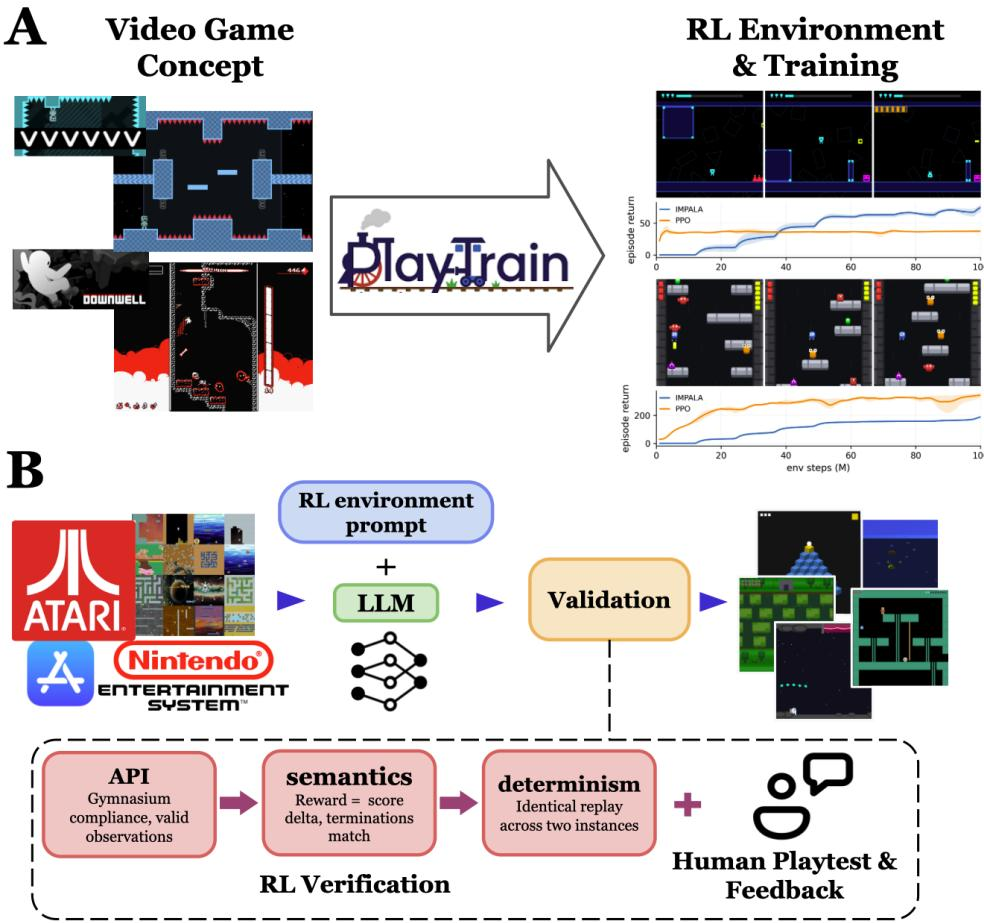  
Figure 1: A: The concept of PlayTrain: Through LLM-generated JS code, PlayTrain can transform games such as “DownWell” and “VVVVVV” into an RL environment and train agents in minutes. B: The generation pipeline. From a short specification of a video game, an LLM generates a single selfcontained JavaScript file against a fixed RL-environment prompt-file, creating an environment that is both immediately playable and ready for baseline RL agent training without any additional code.

The core challenge for JS is efficiency, which is the main reason why JS has been considered unsuitable for building RL environments: browser-based processing is slow and the resulting slow environmental interactions bottleneck any practical RL training pipelines in terms of steps-per-second (SPS) throughput. Here we challenge this common belief by proposing a framework that overcomes this bottleneck and achieves environment efficiency that exceeds well-established benchmarks.

With the efficiency bottleneck resolved, the JS-based framework offers an excellent synergy with LLMs to unlock unparalleled adaptability for RL environment development, as it is a higher-level language (e.g., compared with C++) that’s easier for both humans and the current best LLMs to read and modify to develop games. Historically, creation of variations of RL environments has been bounded to a handful of ideas, fixed in advance—most often level layout and random seeds (Cobbe et al., 2020; 2019), and rules composed inside a domain-specific language (Schaul, 2013; Bamford et al., 2021). While such features have played important roles in RL research to go beyond testing on the training data, those variations have been still very limited for evaluating broader generalization of RL agents (see for example Kirk et al., 2023; Shanahan & Mitchell, 2022). Yet, development of more flexible RL environments has been challenging due to laborious engineering efforts required for implementing new environments and testing them.

Through PlayTrain, we aim to substantially facilitate this development process and accelerate the entire RL research pipeline, from the conception of a game environment to RL training. PlayTrain also enables users to flexibly edit environments or create variations thereof—e.g., to construct novel test environments—by modifying a game’s visuals, physical parameters, or mechanics, or even by transplanting the dynamics of one game into another, typically via a single natural-language prompt; the only limitation is our ability to describe, reflecting our motto: “What I can describe, I can create.”

## 2 METHODS

PlayTrain consists of the following components: (1) an effective LLM-prompting pipeline that leverages LLMs’ proficiency in generating and modifying JS game environments (Sec. 2.1), and (2) a novel JS-to-gym backend that achieves high efficiency in running JS games for training of RL agents (Sec. 2.2). As a result, PlayTrain enables an unprecedentedly efficient transition from the conception of a game environment to its actual implementation, and the training and testing of RL agents and algorithms on the generated environment (see Figure 1A for illustration).

## 2.1 GENERATING AND DEVELOPING JS ENVIRONMENTS USING AN LLM

An overview of PlayTrain’s environment generation pipeline is illustrated in Figure 1B. It starts with a short specification stating the name of the environment/game, its core mechanics, and possibly online references. This information is fed into an LLM (Google’s Gemini 3.1 pro) with a Markdown prompt file that specifies it to export components of an RL lifecycle such as setup, draw, resetGame(seed), and getGameState(). The prompt can be found in Appendix F.2. The output is a single self-contained JavaScript file. As shown in Figure 2, the game code itself is also readable enough to understand even without expert knowledge in JS.

After the LLM-based generation, the next step in the PlayTrain pipeline is an automated, game-agnostic validation pass. A script runs the environment to confirm Gymnasium API (Towers et al., 2024) compliance and ensure the environments generate proper observations. After, the script replays a random action sequence in two separate instances, requiring the two observation streams to be identical. Crucially, the check is only a single script and involves no human inspection. While all of the environments we generated in our experiments (Sec. 3) passed these requirements one-shot, the validation pass ensures that the generated games and their variants are RL-compatible.

To obtain the final game environment file, the   
LLM-based generation may not always be one-shot:   
play-testing may reveal discrepancies between the   
generated game and the intended game design. Luckily,   
play-testing a JS game itself is a straightforward process   
(essentially, opening a link on a browser) and the game   
refinement process is easy because LLMs are very good   
at editing and correcting JS code through simple natural-language feedback. Detailed examples can at editing and correcting JS code through simple natural be found in Appendix F.2. be found in Appendix F.2.

```javascript
let score, lives, gameState,
rng, player, fishes;
function setup() {
createCanvas(400, 400);
}
function resetGame(seed) {
rng = mulberry32(seed);
score = 0; lives = 3;
gameState = ’PLAYING’;
/ [...] level layout from rng /
}
function getGameState() {
return { score, lives, gameState };
}
function draw() {
if (keyIsDown(37))
player.x -= player.speed;
/ [...] keys 38-40 /
if (rng() < 0.04) spawnFish();
for (const f of fishes)
if (overlaps(player, f)) {
if (f.r < player.r)
score++;
else if (--lives === 0)
gameState = ’GAMEOVER’;
}
background(0);
fill(0, 100, 255);
ellipse(player.x, player.y,
2 <sub>*</sub> player.r,
2 <sub>*</sub> player.r);
}
/<sub>*</sub> [...] spawnFish, overlaps <sub>*</sub>/
```  
Figure 2: An example of a PlayTraingenerated game, abridged from our ‘bigfish’ ProcGen clone. It is an ordinary p5.js file apart from resetGame(seed) and getGameState(). Inside draw() the game reads the keyboard, advances through a seeded rng and draws with p5 calls.

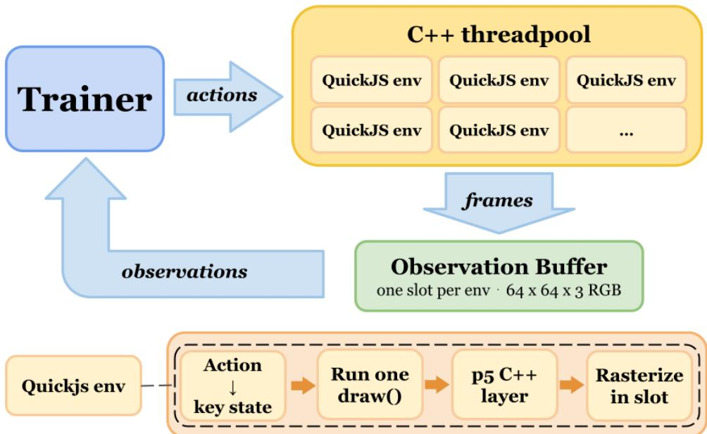  
Figure 3: PlayTrain training schematic. A trainer sends actions to multiple environment instances hosted in an in-process C++ threadpool. Each instance is an embedded QuickJS engine running the game file behind our optimized C++ p5 library and custom Rust rasterizer. Each instance writes its frames directly into its own slot of the shared observation buffer (64×64×3 RGB), which the trainer reads as observations. In each instance: per step, the environment receives an action and transforms it into a keyboard state and then runs a single draw(). Our C++ p5 API intercepts those draw calls, and our rasterizer executes them at observation resolution directly into that environment’s slot.

Producing variants (e.g., a novel test environment) of an already-created game is also just as simple as the game refinement process. This typically only requires a single prompt, making the process of creating variations scalable, unlike with prior, classic RL environment code. We provide illustrative examples in the experimental section. Full generation details such as the catalog schema, prompt template, and model configuration are provided in Appendix F.2.

## 2.2 EFFICIENT BACKEND TO SUPPORT JS ENVIRONMENTS FOR RL

Another unique component of PlayTrain is our novel backend to efficiently process JS environments for RL training loops. The key for efficiency is running JS browser games without a browser. In fact, JS itself is not what limits throughput in an RL setting: the limit comes from its dependency on the browser to render frames and receive/inject inputs. A browser itself carries a great deal of “slow” machinery and protocol that RL agents do not need. PlayTrain removes these unnecessary components and only keep what’s needed for training RL agents, which reduces the whole pipeline to only two things: an input channel and a renderer.

Input Channel and Renderer. The input channel is simple: an agent writes actions into the game’s key states which are passed to be read by the game (Appendix B). The renderer is more complex—and it is precisely where PlayTrain improves over existing solutions: everything a game draws goes through one library, p5.js (McCarthy & Processing Foundation, 2015), which provides commands like ellipse(x, y, w, h) to draw an ellipse of a given size/position, and fill(r, g, b) to set the color that everything drawn after will use. A PlayTrain environment collects those commands inside a function named draw(), and running it once issues every command needed for a single frame (Figure 2). Turning those draw commands into pixels takes three steps: (1) the game’s code runs, (2) the draw calls become shapes with positions and colors, and (3) those shapes render into pixels.

We design PlayTrain to handle all three steps optimized for speed. In PlayTrain, the Javascript code runs on QuickJS (The QuickJS-ng Authors, 2024; Bellard & Gordon, 2024), a small engine that ships as a C library, which we compile directly into each PlayTrain environment. (more details presented in Appendix C.1). Alongside it we compile a p5 library we rewrote in C++, defining a subset of the same function names the original p5.js library uses. Because both are compiled into the same program, QuickJS can call our p5 C++ functions directly, enabling that a game’s call to ellipse or fill run our code and lets the generated environment file run as written.

For the third step—rendering shapes into actual pixels—we wrote a custom rasterizer in Rust (Matsakis & Klock, 2014) that is compiled in tandem with our C++ p5 library. It therefore shares memory with the draw commands that library intercepts and writes pixels into the trainer’s observation buffer directly with no browser in the loop.

Training. In practice, training typically spawns multiple environments simultaneously for improved efficiency. That usually means running each environment as its own program (Towers et al., 2024). Separate programs, however, cannot see each other’s memory. So, in that setup, every observation would have to be copied to the trainer, which is a slow operation (Petrenko et al., 2020).

PlayTrain instead steps its environments on threads inside the same program as the trainer, a design adapted from EnvPool (Weng et al., 2022). Threads are independent lines of execution inside a program: many run at once on different cores while they all share the same memory. Each rendered frame is therefore written straight into the buffer the trainer reads from. As a result, stepping scales almost linearly with the number of available threads (Figure 4A). Moreover, each environment carries its own engine and rasterizer, so no two environments share any state nor waits on one another.

Interface. An agent’s action space and observations are defined by the PlayTrain backend. More precisely, a game reads keyboard inputs as it would in a browser, as shown in Figure 2. This design is intentional because it enables every game to be agnostic to any trainer and would otherwise require mapping a custom action space and observation size onto the trainer for every game. By default, PlayTrain’s action space are 8 discrete actions with observations set to 64×64 RGB.

The current default setting for the PlayTrain agent interface is modifiable though. Observation handling operations such as framestacking, RGB/grayscale, or resolution alterations are all interchangeable within PlayTrain, and the action space can be expanded easily and go beyond the current keyboard setup into richer inputs such as continuous mouse controls or gamepad inputs (Appendix B).

Reproducibility. Lastly, each run inside a PlayTrain-generated environment is fully reproducible because we control every source of nondeterminism: the clock, the random number generator, and the rendering arithmetic. Games never read a clock—each step() runs the draw() exactly once, so the game only updates when the agent takes an action. Every rng call runs through a single seeded generator (Ettinger, 2017), which decides spawn positions, level layouts, entity variants, velocities, event timing, difficulty scaling, etc. Lastly, our rasterizer only uses arithmetic that every machine computes identically and it implements its own sin and cos itself, where machines otherwise disagree, so that the same inputs produce the identical frames everywhere (Appendix C.1). Taken all together, the only ingredients required to regenerate actions are an action list indexed by step() and a seed.

This reproducibility guarantee is important for both RL training and human play. For human play specifically, the same game file runs unchanged in a browser, where draw() fires on a timer and the game animates in real time at 60 frames per second. Shipping environments to participants, for example to set human performance baselines (Bellemare et al., 2013), therefore reduces to a shareable link with a backend collecting keyboard inputs that are tied to a given seed per episode. An example human experiment is discussed in details in Sec 3.3..

## 3 EXPERIMENTS

Here we present several illustrative experiments that demonstrate the capabilities and efficiency of PlayTrain, including speed comparison with classic benchmarks (Sec. 3.1), examples of various environments it can generate (Sec. 3.2), and an example collecting human playing data (Sec. 3.3).

## 3.1 EFFICIENCY OF ENVIRONMENTS AND TRAINING

We first demonstrate that PlayTrain is an efficient framework for RL training by comparing its speed with classic benchmarks. For that, we use PlayTrain (Sec. 2.1) to generate eight clones of the classic Arcade Learning Environment games (Bellemare et al., 2013) and 16 clones of ProcGen (Cobbe et al., 2020) environments, for the total of 24 games, with the goal of measuring the speed of each

A  
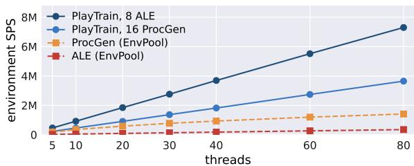

B  
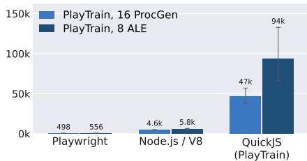

C  
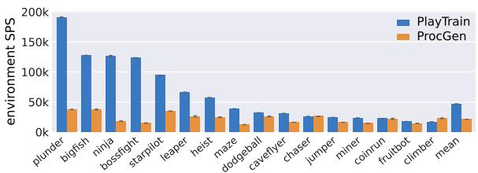

D  
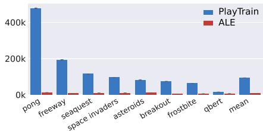  
Figure 4: (A) Environment step speed (without a trainer) as a function of the number of threads. Each line is a geometric mean over one suite, and the baselines are the original C++ environments in EnvPool. (B) Environment steps per second for the same games under three backends: a headless browser driven through the Playwright API, a standalone Node/V8 engine, and PlayTrain’s QuickJS with the native rasterizer, split into the 16 ProcGen and 8 ALE replicas. Bars are geometric means over games; error bars are ±1 s.e. across games (log space, asymmetric). (C, D) Per-core environment throughput (without a trainer) for each game and the geometric mean.

Table 1: Single-node training throughput, agent-steps/s at frame skip 1 and 64×64×3 RGB on one node with four H100s and 92 CPU cores, geometric mean over the games in each row. The original C++ environments in (b) are hosted in EnvPool. IMPALA rows marked with † are double-buffered and PPO rows are single-buffered. (b) reports single-buffered speed using IMPALA with the Nature-CNN encoder, so we can compare against EnvPool which has no double-buffered option. Single-buffered PlayTrain in (b) is naturally slower than its double-buffered counterpart of (a).

(a) PlayTrain environments, double-buffered
<table><tr><td>Trainer</td><td>Encoder</td><td>Envs</td><td>Agent-steps/s</td></tr><tr><td>IMPALA†</td><td>Nature-CNN</td><td>all 24</td><td>1.07M</td></tr><tr><td rowspan="3">PPO</td><td>IMPALA-CNN</td><td>all 24</td><td>0.35M</td></tr><tr><td>Nature-CNN</td><td>all 24</td><td>185k</td></tr><tr><td>IMPALA-CNN</td><td>all 24</td><td>68k</td></tr><tr><td rowspan="2">IMPALA†</td><td>Nature-CNN</td><td>16 ProcGen</td><td>1.06M</td></tr><tr><td>Nature-CNN</td><td>8ALE</td><td>1.09M</td></tr></table>

<table><tr><td colspan="4">(b) PlayTrain clones vs. originals, single-buffered</td></tr><tr><td>Trainer</td><td>Encoder</td><td>Envs</td><td>Original PlayTrain</td></tr><tr><td rowspan="2">IMPALA</td><td>Nature-CNN</td><td>16 ProcGen</td><td>372k 838k</td></tr><tr><td>Nature-CNN 8ALE</td><td>175k</td><td>1,018k</td></tr></table>

replica against the original environment. While certain details (e.g., the exact game visual) may be different, PlayTrain can create high-quality clones of existing games in JS—reproducing the core game mechanics and dynamics and emulating the spirit of the originals (see screenshots in Figure 5A). We release all the generated games so that their fidelity can be verified by any reader.

Environment efficiency. We first measure the pure environmental speed without training an agent, that is, the number of environmental steps a single PlayTrain replica produces per second on a single core. Figure 4C and D shows the results: PlayTrain’s JS replicas outpace ALE on all eight shared games and ProcGen’s hand-written C++ on fourteen of the sixteen, with speedups of 12.62× and 2.19×, respectively, on geometric average over suites. The remaining two ProcGen clones are not faster than the originals but the speed is still respectable. Figure 4B shows how much the backend matters: the same games run in a headless browser through the Playwright API, on a standalone Node/V8 engine, and on QuickJS (PlayTrain) compiled into the environment itself. QuickJS steps them 13.4× faster than Node/V8 and 117× faster than the browser (Appendix C.2).

A  
B  
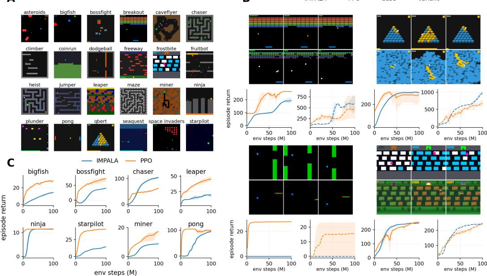  
Figure 5: Illustrations of PlayTrain-generated environments and training curves. (A) 24 game examples, cloning Atari and ProcGen games. (B) Four example pairs of base game vs. new variant, with training curves; left to right, top to bottom: breakout / breakout.multiball, qbert / qbert.bigmap, flappy\_bird / flappy\_bird.hoop, frostbite / frostbite.jungle (generation details in Appendix F.2). (C) Training curves for PPO and IMPALA agents on eight representative games; both configurations use the IMPALA-CNN encoder; 3 training seeds are used in all cases (all 24 games in Appendix D).

The situation becomes even more favorable for PlayTrain in the more realistic multi-thread multienvironment setting with a trainer attached. Table 1 shows the results. Here, all PlayTrain clones are faster than the original ProcGen games, by a factor of 2.25 × on average and is also 5.80× faster than ALE on all eight. The ALE ratio is 5.80× here rather than 12.62× measured per core because the PlayTrain training runs’ speeds are restricted by the trainer. Without any trainer in the loop, the same environments reach 20.80× ALE and 2.58× ProcGen at eighty threads (Figure 4A). This is because PlayTrain environments scale linearly while Envpool’s ProcGen flatten (Appendix E.1), which is remarkable. EnvPool’s ALE doesn’t flatten, but our 8 game suite retains the 20× ratio.

Per core, the only clones that remain slower than the originals are chaser and climber: this is because of the game logic these games run per frame rather than any drawing commands. Further discussion to give a better sense of when PlayTrain can be fast and when not is provided in Sec. 4 and Appendix E.2.

Training efficiency. Now we evaluate speed of the end-to-end RL training process. Following a common standard, we measure the speed for two classic vision encoders: Nature-CNN (Mnih et al., 2015) and IMPALA-CNN (Espeholt et al., 2018); and two classic algorithms, PPO (Schulman et al., 2017) and IMPALA. Other training and policy hyper-parameters can be found in Appendix C.3.

Table 1 shows the results: PlayTrain trains the 24-game suite in an average of 1.07 M agent-steps per second under IMPALA with the Nature-CNN encoder—23 out of the 24 games surpass 1M steps per second. climber is the only one that sits below, training at 881,299 steps per second. With the IMPALA-CNN encoder, the speed of 0.35 M agent-steps per second is achieved with the node’s four GPUs split two to the learner and two to inference. Under this encoder specifically, the learner becomes the sole bottleneck so throughput barely varies by game. A large part of this speed comes from a method called double buffering: one group of environments steps while agent inference runs on the other group of environments so that stepping and inference can be processed in parallel (Appendix C.3). This is also why the PlayTrain numbers in Table 1(b), which run single-buffered, sits below their counterparts in (a).

Figure 5C shows training curves for eight representative games. The rest of the games’ learning curves are presented in Appendix D. We use one common trainer configuration for all the games without any game specific tuning (see Table 8 in the appendix). Every episode draws a new seed, so training runs on the unbounded level distribution rather than a fixed set of levels. In Table 10, we report the mean and 95% confidence interval (CI) over three seeds and evaluate the final checkpoints on 8 held-out seeds, and compare against a random policy baseline. Results are in Appendix D.

## 3.2 GENERATING VARIANTS AND NEW GAMES

Here we demonstrate how seamlessly PlayTrain can generate (1) a wide variations of existing environments, and (2) novel RL environments derived from pre-existing game concepts. Figure 5B shows four examples displaying the newly generated variations and the original games, side-by-side. Three of the four examples correspond to variations of the ALE games already mentioned above: breakout, Qbert, and frostbite (examples for (1)); the last example flappy\_bird is a clone of a popular mobile game, as an example for (2).

Through these examples, we illustrate three representative ways of creating variations of environments, which we refer to as: parametric, structural, and visual/thematic variants:

Parametric variants are created by modifying values of certain variables that play a key role in the game, such as gravity, NPC speeds, or ranges of certain variables used in procedural generation (e.g. number of entities). For example, using PlayTrain, we generated breakout.multiball which is a variant of breakout where the bricks shrink from 8 columns of 46×16px to 16 at 21×8px, three balls are in play at once, and a lost ball is permanent rather than respawning.

Structural variants change the structure of the world itself, such as new map layouts requiring novel strategies or larger maps that stress exploration. qbert.bigmap replaces the static pyramid of the standard qbert with a flat, far larger map that spans the whole screen and pans with the agent. Another example is flappy\_bird.hoop. In the existing flappy\_bird, the agent flies through gaps between obstacles. In the variant, it instead has to fall through a hoop, like a ball scoring a basket. This variant intentionally retains the same action space as the original.

Visual/thematic variants change how a game looks while keeping its game mechanics fixed. Here, frostbite.jungle is exactly the same game as the classic frostbite, except that its theme is changed from the arctic survival to survival in a jungle, with the corresponding visual modifications.

While we limit ourselves to these few examples due to space limitation, PlayTrain supports many other ways to create variations (e.g., introducing new actions).

Now, instead of modifying existing RL environments to generate their variants, we show PlayTrain can also help us build novel environments from a game concept alone. Here we show two such examples, each generated from a single prompt and refined with a handful of simple natural-language feedback rounds: VVVVVV, a 2010 platformer in which the avatar flips its gravity vertically to collect items and progress, and Downwell, a 2015 action platformer in which an avatar with downward-firing boots descends a well of enemies and gems, stomping and shooting as it collects (Figure 1A).

Among all six artifacts (4 variants, 2 new games), generation took 26 model calls and 34.4 minutes in total, at under a dollar of API traffic (Appendix Table 14). The edits span thematic visuals, exposed parameters, and world structure and were all composed in the same prompt interface (Appendix F.1). Simpler modifications such as reward structure or termination conditions are also modifiable in the same interface. Further details can be found in Appendix F.2.

To illustrate that PlayTrain also facilitates training and evaluation of RL algorithms on the generated games, we share results for PPO and IMPALA agents trained on both the generated variants and the original games in Figure 5B. Note again that these are for illustrative purpose; we did not perform any game specific hyper-parameter tuning.

Finally, PlayTrain can also help us develop RL environments based on entirely novel game concepts. This is a critical use case when we need new environments to support novel ideas for testing certain behavior (e.g., certain generalization abilities).

A  
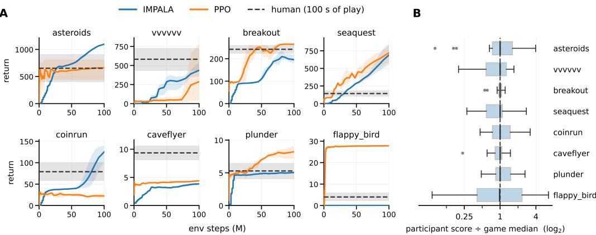  
Figure 6: (A) Comparing IMPALA and PPO agent training efficiency against 100 seconds of human play. Dashed horizontal lines are the human mean over 20 participants and the gray band is the 95% confidence interval. Solid curves are the RL agents’ means over three seeds, shaded with min–max bands. Both RL agents use the IMPALA-CNN encoder. (B) The distribution of the 20 participants’ scores on each game. Each participant’s score is divided by that game’s median so that all the games can share the same axis.

## 3.3 HUMAN PLAY

Here we highlight the human playability strength of PlayTrain and how it facilitates human studies. As an illustrative example, we collect human performance on some of the PlayTrain-generated games discussed above, and compare to RL agents’ performance. For that, we recruited 20 participants on Prolific (mean age 32.4, standard deviation 9.0, range 19–54; 6 female, 14 male). Each played eight games shuffled randomly—asteroids, breakout, seaquest, caveflyer, coinrun, plunder, flappy\_bird, and VVVVVV—for 100 seconds per game, with only instructions about the controls. PlayTrain allows participants to play the same game the agents train on; here with the episode length capped at 2000 steps and the same seeds for everyone so that they are all evaluated on identical levels. A participant’s score on a game is the mean over their episodes, and the human mean is the mean of those 20 scores. Note that, within the course of evaluation, participants improve across episodes within each game block, with scores rising in 68% of blocks. Therefore, these average scores represent the floor rather than the ceiling of human performance.

Such human experiments allow us to answer interesting questions at the intersection of cognitive science and AI. For example, how much experience does an agent need to match what a person scored in 100 seconds of play on these specific games? Figure 6 shows the corresponding results. On six of the eight games either our PPO or IMPALA trainers reach the human mean. IMPALA reaches it after 26 M steps on asteroids and 30 M on seaquest, and PPO after 1 M on flappy\_bird, a game IMPALA never learns at all. On coinrun only IMPALA reaches it, and only after 81 M; on plunder only PPO does, after 16 M. Neither trainer reaches it on VVVVVV or caveflyer.

Figure 6B reports every participant’s score divided by the game’s median so that all eight games share one axis. On breakout, the best scored about twice as much as the worst. On flappy\_bird, that gap is ninety times. This suggests that the variance of people’s scores can be dependent on the general difficulty of the game.

Again, this only represents a simple illustrative example to show how PlayTrain provides a seamless pipeline to allow humans and RL agents to play the exact same game. We leave potentially more complex and deeper human/machine comparison studies that PlayTrain unlocks for the future work.

## 4 DISCUSSION

Further Related Work. In addition to the references cited above, there is further prior work on both developing efficient RL frameworks and creating novel environments to evaluate RL generalization;

Table 2: Qualitative properties of RL environment/framework families. “GPU-port” covers CuLE (Dalton & Frosio, 2020), Octax (Radji et al., 2026), and PuzzleJAX (Earle et al., 2025), which port environments and games onto accelerators. PlayTrain is the only framework that is fast to train on and easy to modify, simultaneously.
<table><tr><td>Property</td><td>Atari</td><td>ProcGen</td><td>GPU-port</td><td>PlayTrain (ours)</td></tr><tr><td>Complexity Efficiency/Speed</td><td>Acceptable Acceptable</td><td>Acceptable High</td><td>Acceptable High</td><td>Flexible High</td></tr><tr><td>Adaptability</td><td></td><td></td><td></td><td></td></tr><tr><td>Training variations Test environments</td><td>Almost None</td><td></td><td></td><td>Procedural Engine Bound Anything Describable</td></tr><tr><td>Game designs/dynamics Human Playability</td><td>None Low Medium</td><td>Low</td><td>Low</td><td>Procedural Engine Bound Anything Describable Very High</td></tr></table>

we refer to Appendix A.1 for a comprehensive discussion. Table 2 provides an overview of PlayTrain’s unique features, simultaneously achieving complexity, efficiency, adaptability, and playability.

Scope limitations. PlayTrain is limited in the size and complexity of the games it can produce. Every game in this paper is a single JS file of a few hundred lines that is generated by an LLM and refined with natural language prompt edits. One cannot, however, simply prompt PlayTrain for a full-fidelity clone of a modern console game, such as Legend of Zelda: Breath of the Wild. That description fits in a prompt, but current LLMs cannot reliably generate a game of that size in a single pass. Furthermore, our framework focuses on 2D environments and doesn’t yet fully support 3D games. These limitations, however, are not permanent; LLM capabilities are advancing rapidly (Kwa et al., 2025; Jimenez et al., 2024), so the size and complexity of the games these models can express will continue to improve. In fact, the PlayTrain backend is adaptable to 3D rendering, and 3D environment support is currently in progress.

Speed Limitations. PlayTrain’s speed declines with the amount of “work” a game does per frame. That work is of two kinds, drawing and game logic, and either one can become the bound. Drawing calls binds it when a game issues many draw calls: qbert.bigmap reaches 39k SPS against the suite’s 0.35M ceiling (Table 14), and miner spends 75% of its step on 787 drawing commands (Appendix E.2). Game logic binds it when a game updates a large amount of state per step, as in dodgeball and climber, whose steps are only 10% and 18% drawing, and which is why climber is one of the two clones still slower than its original. Improving our p5 API re-implementation or optimizing the QuickJS engine itself would help most, since a filled pixel costs several orders of magnitude less than the 79–390 ns of the call that draws it (Appendix E.2).

Further potential of PlayTrain. Beyond the examples shown here, one can use PlayTrain to easily turn many other games previously unsupported for RL into RL environments (similar to VVVVVV and Downwell). Going a step further, PlayTrain’s ultimate potential lies in accelerating the process of generating brand new game environments, unlocking directions in RL research previously limited by the difficulty of environment development. We further discuss such directions in Appendix A.2.

## 5 CONCLUSION

With PlayTrain, we reimagine RL research by unifying efficiency, adaptability, complexity, and playability. PlayTrain generates adaptable JS environments with a large language model and provides an efficient backend that reaches close to one million environment steps per second for training classic RL agents. The exact same environments are directly playable by humans in a browser, making them also suitable for cognitive science studies. By accelerating the development of novel environments from conception to implementation ready for efficient RL training, PlayTrain allows researchers to shape environments around their research questions, rather than limiting those questions to existing environments—opening new avenues for RL research.

## ACKNOWLEDGMENTS

The authors are grateful for support from the Kempner Institute for the Study of Natural and Artificial Intelligence at Harvard Univesity. Kazuki Irie is grateful for support from the Wu Tsai Institute at Yale University.

## REFERENCES

Christopher Bamford, Shengyi Huang, and Simon M. Lucas. Griddly: A platform for AI research in games. In AAAI Workshop on Reinforcement Learning in Games, February 2021.

Charles Beattie, Joel Z Leibo, Denis Teplyashin, Tom Ward, Marcus Wainwright, Heinrich Küttler, Andrew Lefrancq, Simon Green, Víctor Valdés, Amir Sadik, et al. Deepmind lab. Preprint arXiv:1612.03801, 2016.

Fabrice Bellard and Charlie Gordon. QuickJS JavaScript engine. https://bellard.org/ quickjs/, 2024.

Marc G. Bellemare, Yavar Naddaf, Joel Veness, and Michael Bowling. The arcade learning environment: An evaluation platform for general agents. Journal ofArtificial Intelligence Research (JAIR), 47:253–279, 2013.

Christopher Berner, Greg Brockman, Brooke Chan, Vicki Cheung, et al. Dota 2 with large scale deep reinforcement learning. Preprint arXiv:1912.06680, 2019.

Alan D Blair, Jordan B Pollack, et al. What makes a good co-evolutionary learning environment. Australian Journal ofIntelligent Information Processing Systems, 4(3/4):166–175, 1997.

Clément Bonnet, Daniel Luo, Donal Byrne, Shikha Surana, Sasha Abramowitz, Paul Duckworth, Vincent Coyette, Laurence I. Midgley, Elshadai Tegegn, Tristan Kalloniatis, Omayma Mahjoub, Matthew Macfarlane, Andries P. Smit, Nathan Grinsztajn, Raphael Boige, Cemlyn N. Waters, Mohamed A. Mimouni, Ulrich A. Mbou Sob, Ruan de Kock, Siddarth Singh, Daniel Furelos-Blanco, Victor Le, Arnu Pretorius, and Alexandre Laterre. Jumanji: a diverse suite of scalable reinforcement learning environments in JAX. In Int. Conf. on Learning Representations (ICLR), April 2024.

James Bradbury, Roy Frostig, Peter Hawkins, Matthew James Johnson, Chris Leary, Dougal Maclaurin, George Necula, Adam Paszke, Jake VanderPlas, Skye Wanderman-Milne, and Qiao Zhang. JAX: composable transformations of Python+NumPy programs. GitHub repository, 2018. URL http://github.com/jax-ml/jax.

Jake Bruce, Michael Dennis, Ashley Edwards, Jack Parker-Holder, Yuge Shi, Edward Hughes, Matthew Lai, Aditi Mavalankar, Richie Steigerwald, Chris Apps, Yusuf Aytar, Sarah Bechtle, Feryal Behbahani, Stephanie Chan, Nicolas Heess, Lucy Gonzalez, Simon Osindero, Sherjil Ozair, Scott Reed, Jingwei Zhang, Konrad Zolna, Jeff Clune, Nando de Freitas, Satinder Singh, and Tim Rocktäschel. Genie: Generative interactive environments. In Proc. Int. Conf. on Machine Learning (ICML), July 2024.

Karl Cobbe, Oleg Klimov, Chris Hesse, Taehoon Kim, and John Schulman. Quantifying generalization in reinforcement learning. In Proc. Int. Conf. on Machine Learning (ICML), June 2019.

Karl Cobbe, Christopher Hesse, Jacob Hilton, and John Schulman. Leveraging procedural generation to benchmark reinforcement learning. In Proc. Int. Conf. on Machine Learning (ICML), July 2020.

Steven Dalton and Iuri Frosio. Accelerating reinforcement learning through GPU Atari emulation. In Proc. Advances in Neural Information Processing Systems (NeurIPS), December 2020.

Michael Dennis, Natasha Jaques, Eugene Vinitsky, Alexandre Bayen, Stuart Russell, Andrew Critch, and Sergey Levine. Emergent complexity and zero-shot transfer via unsupervised environment design. In Proc. Advances in Neural Information Processing Systems (NeurIPS), December 2020.

Sam Earle, Graham Todd, Yuchen Li, Ahmed Khalifa, Muhammad Umair Nasir, Zehua Jiang, Andrzej Banburski-Fahey, and Julian Togelius. PuzzleJAX: A benchmark for reasoning and learning. Preprint arxiv:2508.16821, 2025.

Lasse Espeholt, Hubert Soyer, Remi Munos, Karen Simonyan, Vlad Mnih, Tom Ward, Yotam Doron, Vlad Firoiu, Tim Harley, Iain Dunning, Shane Legg, and Koray Kavukcuoglu. IMPALA: Scalable distributed deep-RL with importance weighted actor-learner architectures. In Proc. Int. Conf. on Machine Learning (ICML), July 2018.

Lasse Espeholt, Raphaël Marinier, Piotr Stanczyk, Ke Wang, and Marcin Michalski. SEED RL: Scalable and efficient deep-RL with accelerated central inference. In Int. Conf. on Learning Representations (ICLR), April 2020.

Tommy Ettinger. Mulberry32: a fast 32-bit PRNG. Public-domain gist, 2017. URL https: //gist.github.com/tommyettinger/46a874533244883189143505d203312c.

Maxence Faldor, Jenny Zhang, Antoine Cully, and Jeff Clune. OMNI-EPIC: Open-endedness via models of human notions of interestingness with environments programmed in code. In Int. Conf. on Learning Representations (ICLR), April 2025.

C. Daniel Freeman, Erik Frey, Anton Raichuk, Sertan Girgin, Igor Mordatch, and Olivier Bachem. Brax – a differentiable physics engine for large scale rigid body simulation. In Proc. Advances in Neural Information Processing Systems (NeurIPS), Datasets and Benchmarks Track, December 2021.

Google DeepMind. Genie 2: A large-scale foundation world model. https://deepmind. google/blog/genie-2-a-large-scale-foundation-world-model/, 2024.

W. Daniel Hillis. Co-evolving parasites improve simulated evolution as an optimization procedure. Physica D: Nonlinear Phenomena, 42(1–3):228–234, 1990.

Shengyi Huang, Rousslan Fernand Julien Dossa, Chang Ye, Jeff Braga, Dipam Chakraborty, Kinal Mehta, and João G. M. Araújo. CleanRL: High-quality single-file implementations of deep reinforcement learning algorithms. Journal of Machine Learning Research 23(274):1–18, 2022.

Minqi Jiang, Edward Grefenstette, and Tim Rocktäschel. Prioritized level replay. In Proc. Int. Conf. on Machine Learning (ICML), Proceedings of Machine Learning Research, July 2021.

Carlos E. Jimenez, John Yang, Alexander Wettig, Shunyu Yao, Kexin Pei, Ofir Press, and Karthik Narasimhan. SWE-bench: Can language models resolve real-world GitHub issues? In Int. Conf. on Learning Representations (ICLR), May 2024.

Niels Justesen, Ruben Rodriguez Torrado, Philip Bontrager, Ahmed Khalifa, Julian Togelius, and Sebastian Risi. Illuminating generalization in deep reinforcement learning through procedural level generation. December 2018.

Robert Kirk, Amy Zhang, Edward Grefenstette, and Tim Rocktäschel. A survey of zero-shot generalisation in deep reinforcement learning. Journal ofArtificial Intelligence Research (JAIR), 76:201–264, 2023.

Heinrich Küttler, Nantas Nardelli, Thibaut Lavril, Marco Selvatici, Viswanath Sivakumar, Tim Rocktäschel, and Edward Grefenstette. TorchBeast: A PyTorch platform for distributed RL. Preprint arXiv:1910.03552, 2019.

Heinrich Küttler, Nantas Nardelli, Alexander H. Miller, Roberta Raileanu, Marco Selvatici, Edward Grefenstette, and Tim Rocktäschel. The NetHack learning environment. In Proc. Advances in Neural Information Processing Systems (NeurIPS), 2020.

Thomas Kwa, Ben West, Joel Becker, Amy Deng, Katharyn Garcia, Max Hasin, Sami Jawhar, Megan Kinniment, Nate Rush, Sydney Von Arx, et al. Measuring AI ability to complete long software tasks. In Proc. Advances in Neural Information Processing Systems (NeurIPS), December 2025.

Robert Tjarko Lange. gymnax: A JAX-based reinforcement learning environment library. GitHub repository, 2022. URL http://github.com/RobertTLange/gymnax.

Nicholas D. Matsakis and Felix S. Klock, II. The Rust language. ACM SIGAda Ada Letters, 34(3): 103–104, 2014.

Michael Matthews, Michael Beukman, Benjamin Ellis, Mikayel Samvelyan, Matthew Jackson, Samuel Coward, and Jakob Foerster. Craftax: A lightning-fast benchmark for open-ended reinforcement learning. In Proc. Int. Conf. on Machine Learning (ICML), July 2024.

Lauren McCarthy and Processing Foundation. p5.js. https://p5js.org, 2015. JavaScript library for creative coding.

Volodymyr Mnih, Koray Kavukcuoglu, David Silver, Andrei A. Rusu, Joel Veness, Marc G. Bellemare, Alex Graves, Martin Riedmiller, et al. Human-level control through deep reinforcement learning. Nature, 518(7540):529–533, 2015.

Junhyuk Oh, Gregory Farquhar, Iurii Kemaev, Dan A Calian, Matteo Hessel, Luisa Zintgraf, Satinder Singh, Hado Van Hasselt, and David Silver. Discovering state-of-the-art reinforcement learning algorithms. Nature, 648(8093):312–319, 2025.

Open-Ended Learning Team, Adam Stooke, Anuj Mahajan, Catarina Barros, Charlie Deck, Jakob Bauer, Jakub Sygnowski, Maja Trebacz, Max Jaderberg, Michaël Mathieu, Nat McAleese, Nathalie Bradley-Schmieg, Nathaniel Wong, Nicolas Porcel, Roberta Raileanu, Steph Hughes-Fitt, Valentin Dalibard, and Wojciech Marian Czarnecki. Open-ended learning leads to generally capable agents. Preprint arXiv:2107.12808, 2021.

OpenAI. Universe. https://openai.com/index/universe/, 2016.

Jack Parker-Holder, Minqi Jiang, Michael Dennis, Mikayel Samvelyan, Jakob Foerster, Edward Grefenstette, and Tim Rocktäschel. Evolving curricula with regret-based environment design. In Proc. Int. Conf. on Machine Learning (ICML), July 2022.

Aleksei Petrenko, Zhehui Huang, Tushar Kumar, Gaurav Sukhatme, and Vladlen Koltun. Sample factory: Egocentric 3d control from pixels at 100000 FPS with asynchronous reinforcement learning. In Proc. Int. Conf. on Machine Learning (ICML), July 2020.

Waris Radji, Thomas Michel, and Hector Piteau. Octax: Accelerated CHIP-8 arcade environments for reinforcement learning in JAX. In Int. Conf. on Learning Representations (ICLR), April 2026.

Christopher D. Rosin and Richard K. Belew. New methods for competitive coevolution. Evolutionary Computation, 5(1):1–29, 1997.

Tom Schaul. A video game description language for model-based or interactive learning. In IEEE Conference on Computational Intelligence in Games (CIG), August 2013.

Jürgen Schmidhuber. Evolutionary principles in self-referential learning, or on learning how to learn: the meta-meta-... hook. PhD thesis, Technische Universität München, 1987.

Jürgen Schmidhuber, Jieyu Zhao, and Nicol N Schraudolph. Reinforcement learning with selfmodifying policies. In Learning to learn, pp. 293–309. Springer, 1998.

John Schulman, Filip Wolski, Prafulla Dhariwal, Alec Radford, and Oleg Klimov. Proximal policy optimization algorithms. Preprint arXiv:1707.06347, 2017.

Brennan Shacklett, Luc Guy Rosenzweig, Zhiqiang Xie, Bidipta Sarkar, Andrew Szot, Erik Wijmans, Vladlen Koltun, Dhruv Batra, and Kayvon Fatahalian. An extensible, data-oriented architecture for high-performance, many-world simulation. ACM Transactions on Graphics (SIGGRAPH), 42(4), 2023.

Murray Shanahan and Melanie Mitchell. Abstraction for deep reinforcement learning. In Proc. International Joint Conference on Artificial Intelligence (IJCAI), Vienna, Austria, July 2022.

Tianlin Shi, Andrej Karpathy, Linxi Fan, Jonathan Hernandez, and Percy Liang. World of bits: An open-domain platform for web-based agents. In Proc. Int. Conf. on Machine Learning (ICML), August 2017.

Karl Sims. Evolving 3d morphology and behavior by competition. Artificial Life, 1(4):353–372, 1994.

Joseph Suarez. PufferLib: Making reinforcement learning libraries and environments play nice. Preprint arXiv:2406.12905, 2024.

Joseph Suarez. PufferLib 2.0: Reinforcement learning at 1M steps/s. Reinforcement Learning Journal, 6:1378–1388, 2025. URL https://rlj.cs.umass.edu/2025/papers/Paper151. html. Presented at the Reinforcement Learning Conference (RLC); Outstanding Paper Award.

The QuickJS-ng Authors. QuickJS-ng: A fork of the QuickJS JavaScript engine. GitHub repository, 2024. URL https://github.com/quickjs-ng/quickjs.

Mark Towers, Ariel Kwiatkowski, Jordan Terry, John U. Balis, Gianluca De Cola, Tristan Deleu, Manuel Goulão, Andreas Kallinteris, Markus Krimmel, Arjun KG, Rodrigo Perez-Vicente, Andrea Pierré, Sander Schulhoff, Jun Jet Tai, Hannah Tan, and Omar G. Younis. Gymnasium: A standard interface for reinforcement learning environments. Preprint arXiv:2407.17032, 2024.

Oriol Vinyals, Igor Babuschkin, Wojciech M. Czarnecki, Michaël Mathieu, Andrew Dudzik, Junyoung Chung, et al. Grandmaster level in StarCraft II using multi-agent reinforcement learning. Nature, 575(7782):350–354, 2019.

Rui Wang, Joel Lehman, Jeff Clune, and Kenneth O. Stanley. Paired open-ended trailblazer (POET): Endlessly generating increasingly complex and diverse learning environments and their solutions. Preprint arXiv:1901.01753, 2019.

Jiayi Weng, Min Lin, Shengyi Huang, Bo Liu, Denys Makoviichuk, Viktor Makoviychuk, Zichen Liu, Yufan Song, Ting Luo, Yukun Jiang, Zhongwen Xu, and Shuicheng Yan. EnvPool: A highly parallel reinforcement learning environment execution engine. In Proc. Advances in Neural Information Processing Systems (NeurIPS), Datasets and Benchmarks Track, November 2022.

Lance Ying, Ryan Truong, Prafull Sharma, Kaiya Ivy Zhao, Nathan Cloos, Kelsey R. Allen, Thomas L. Griffiths, Katherine M. Collins, José Hernández-Orallo, Phillip Isola, Samuel J. Gershman, and Joshua B. Tenenbaum. AI gamestore: Scalable, open-ended evaluation of machine general intelligence with human games. Preprint arXiv:2602.17594, 2026.

Abhay Zala, Jaemin Cho, Han Lin, Jaehong Yoon, and Mohit Bansal. EnvGen: Generating and adapting environments via LLMs for training embodied agents. In Proc. Conference on Language Modeling (COLM), October 2024.

## A FURTHER DISCUSSIONS AND RELATED WORK

## A.1 RELATED WORK

Traditional research in RL has typically held the environment as a fixed backdrop where agents are both trained and evaluated on, bypassing the core challenge of generalization. One approach to address this limitation is the use of procedural generation (Justesen et al., 2018; Cobbe et al., 2020), allowing us to generate variations of environments along some pre-specified axes, introducing a proper train/test split for evaluating RL agents.

More recently, advances in large generative models have shown promising results in modeling entire environments using a neural network. For example, the Genie model series (Bruce et al., 2024; Google DeepMind, 2024) are trained as a predictive world model on a large amount of game-playing videos with a learnable latent action space, so once they are trained, they can sequentially generate a pixel-level observation as a response to a discrete action, effectively simulating an environment.

Another line of work trains generative models of game code (essentially a neuro-symbolic approach). For instance, OMNI-EPIC (Faldor et al., 2025) prompts an LLM to generate code that defines new PyBullet-based 3D environments with their accompanying reward functions. These code environments are conditioned on the agent’s past performance in order to continually propose tasks at the frontier of what the agent can currently learn. EnvGen (Zala et al., 2024) follows a similar logic by using an LLM to generate environment configurations for a preexisting simulator (e.g., Crafter). EnvGen then iteratively modifies those configurations to train an agent on specific tasks it struggles with.

Both these lines of methods automating generation of environments—either directly on the pixel level or through engine-confined code—have fundamental limitations though. For example, a Genie environment is fully encoded in weights of a neural network, and therefore, cannot be inspected, edited, or replayed deterministically. OMNI-EPIC and EnvGen are confined by a physics engine and a configuration space. In contrast, PlayTrain is bounded by neither of these issues: every environment stays inspectable, editable, and deterministic, while it is not confined to specific engines.

Closely related to our approach, the AI GameStore (Ying et al., 2026) generates games using LLMs based on popular app-store titles, and turns them into an open-ended benchmark for evaluating LLM agents. However, AI GameStore is a benchmark rather than a training framework, and its games run far under practical RL throughput in terms of speed. PlayTrain overcomes this speed challenge and make that class of games fast enough to train on.

In fact, recent development of RL environments has also focused on improving speed. In particular, JAX (Bradbury et al., 2018) and the subsequent wave of GPU-vectorized simulators (Freeman et al., 2021; Lange, 2022; Bonnet et al., 2024) carried that processing of environments onto the GPU. Beyond GPU vectorization, speed has been pursued at two further levels, the engine and the system. At the engine level, CuLE (Dalton & Frosio, 2020) ported the Arcade Learning Environment onto CUDA, bypassing CPU–GPU crosstalk to emulate thousands of Atari environments in parallel. OCTAX (Radji et al., 2026) and PuzzleJAX (Earle et al., 2025) do the same for CHIP-8 and PuzzleScript, vectorizing those engines in JAX (note that using PlayTrain, engines built or emulated in JavaScript, such as PuzzleScript, CHIP-8, Pico-8, can become RL environments as they are). Madrona (Shacklett et al., 2023) instead builds a custom GPU-native engine expressive enough to host hand-written environments on the GPU.

At the system level, Sample Factory and SEED RL decouple acting from learning to make full use of a node or actor fleet (Petrenko et al., 2020; Espeholt et al., 2020), and EnvPool batches hand-written C++ environments on an in-process threadpool (Weng et al., 2022). PufferLib combines both, pairing asynchronous vectorization with its own trainer and runs pixel benchmarks such as Atari and Procgen. Their headline speeds comes from Ocean though, their hand-written C environments with state vector observations (Suarez, 2024; 2025).

These system and engine level approaches have trade-offs though. Game engines make mechanics and parameters difficult to modify, while system-level optimizations are mostly limited to existing environments that output symbolic states instead of images. PlayTrain avoids engines entirely by writing environments as standard JavaScript programs, using a fast system architecture to deliver high-speed pixel observations for reinforcement learning.

## A.2 FURTHER DISCUSSIONS

Scaling the number of environments: meta-RL, co-evolution, open-endedness. Certain RL methods may largely benefit from the potential of PlayTrain to generate and scale the number of diverse RL environments one can train an agent on. In particular, the main bottleneck of certain meta-RL methods or learning-to-learn RL algorithms (Schmidhuber, 1987; Schmidhuber et al., 1998), such as Oh et al. (2025)’s, is the data (i.e., the scale and diversity of training environments) rather than the algorithm itself.

PlayTrain may also be useful to advance co-evolution methods (Hillis, 1990; Sims, 1994; Rosin & Belew, 1997; Blair et al., 1997), such as POET (Wang et al., 2019), and unsupervised environment design (Dennis et al., 2020; Jiang et al., 2021; Parker-Holder et al., 2022). For example, a POET-styled environment commits itself to the variables it mutates before a simulator exists, and can only mutate what is exposed. In PlayTrain a prompt edit can expose new mutation variables, or a brand-new environment outright. That edit happens once, outside the search loop. Mutating along those variables then costs the same as it does for POET. More generally, PlayTrain may also serve as a tool to continually generate diverse environments and train agents for open-ended learning (Open-Ended Learning Team et al., 2021). PlayTrain itself may be part of the training/evolution loop in such a machine learning paradigm.

Facilitating comparison with VLM game-playing agents. There has been an increasing interest in evaluating abilities of large visual language models (VLMs) as game-playing agents. PlayTrain can also contribute to such research, as the exact same browser-based JS games can now be played by a VLM, a conventional RL agent, or a human player, making their scores directly comparable.

Creating novel environments to fundamentally advance RL & Evaluation challenges. Play-Train largely facilitates development of novel environments for RL research. This opens up many promising directions in fundamental RL research, which have traditionally been difficult due to lack of appropriate environments. This may include development of diverse (partially obervable) environments with hard-exploration or specific-memory/cognition challenges, enabling research to advance generalization of exploration and memory algorithms, respectively. One remaining challenge in automation is the evaluation of created novel environments, since the definitive evaluation of new environments would require test-playing by humans, at least as of today.

## B PLAYTRAIN ACTION SPACE AND OBSERVATIONS

We describe here the default eight-action space, how the backend turns actions into keyboard states a game can receive, how a different action space is defined in a JSON file including continuous ones, and what a single step returns in terms of observations. PlayTrain is intentionally designed so that the action space is defined by the framework’s backend instead of the games that are generated by it. In doing so, the generated games can share the same action space and allow agents to train across games. This section goes into detail about how it all works.

Table 3: The default Discrete(8) action space.
<table><tr><td>Index</td><td>Name</td><td>Keycodes</td><td>Delivery</td></tr><tr><td>0</td><td>NOOP</td><td></td><td></td></tr><tr><td>1</td><td>LEFT</td><td>37</td><td>held</td></tr><tr><td>2</td><td>RIGHT</td><td>39</td><td>held</td></tr><tr><td>3</td><td>UP</td><td>38</td><td>held</td></tr><tr><td>4</td><td>DOWN</td><td>40</td><td>held</td></tr><tr><td>5</td><td>D</td><td>32</td><td>press</td></tr><tr><td>6</td><td>LEFT+D</td><td>37,32</td><td>held + press</td></tr><tr><td>7</td><td>RIGHT+D</td><td>39,32</td><td>held + press</td></tr></table>

Action Space. PlayTrain’s default action space is Discrete(8) and is utilized across all the games presented here. Within PlayTrain, the agent chooses one of those eight actions by emitting an integer. Each action is a row on Table 3 that lists which keys the PlayTrain backend holds and whether it presses the button. The backend applies that row as a keyboard state the game consumes.

Once the keyboard state is handled by the PlayTrain backend, the game’s draw() function is called. The game then updates its objects and issues its drawing commands, and our rasterizer writes the resulting frame, which becomes the next observation. Under NOOP, for example, the backend holds no keys, yet draw() still runs and the agent still receives a new observation.

Observation. The game draws at whatever canvas size it defines and the runtime produces the observation. That observation is a single 64×64 RGB frame with no stacking. Table 4 lists everything a step returns. The 2000-frame truncation limit is the same one used for the human play experiment in Sec. 3.3.

Table 4: What a step returns. The reward is the change in the game’s score since the previous step, and terminated is derived from gameState. The flag states that the episode ended while gameState states how.
<table><tr><td>Field</td><td>Type</td><td>Meaning</td></tr><tr><td>observation</td><td>uint8[64,64,3]</td><td>the frame our rasterizer produced this step</td></tr><tr><td>reward</td><td>float</td><td>change in the game&#x27;s score</td></tr><tr><td>terminated</td><td>bool</td><td>true when gameState is no longer PLAYING</td></tr><tr><td>truncated</td><td>bool</td><td>true at max_steps, default 2000</td></tr><tr><td>info.score</td><td>float</td><td>cumulative score</td></tr><tr><td>info.lives</td><td>float</td><td>lives remaining. Reaching 0 triggers GAMEOVER</td></tr><tr><td>info.gameState</td><td>string</td><td>PLAYING, WIN, or GAMEOVER</td></tr><tr><td>info.seed</td><td>int</td><td>seed for the current episode</td></tr></table>

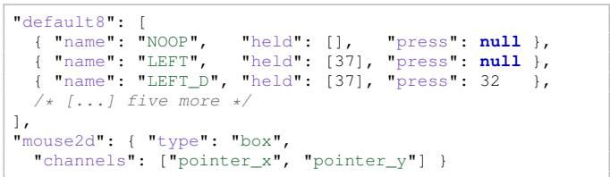  
Figure 7: Two entries from PlayTrain’s action-space file, with default8 abridged to three of its eight actions. mouse2d declares channels instead of keys, which gives a continuous action space.

The action space we use is a named entry in a JSON configuration file and is not built into PlayTrain. Each named entry is simply a list of actions, and each of those actions names the keys to hold down and an optional additional key to press. A held key is down for the step, while a press key is down for the step and fires keyPressed() once. An entry can instead declare channels, enabling an agent to use a continuous space. This flexiblity means that anyone else can setup their own specified action-space by creating an entry of their own. For all of the experiments in this paper, we use the default8 action space.

A continuous action-space (for settings such as a mouse or gamepad) works the same way, except that the backend sets mouseX, mouseY, and mousePressed instead of key state. For example, continuous input values are given to the PlayTrain backend as integers, while the PlayTrain backend transforms those integers as mouseX, mouseY and gamepadAxes values the games can read. Integers are used because floating point values are not exactly reproducible across JavaScript engines.

Configuration. PlayTrain’s default configurations are designed to be easily adaptable. On the observation side, users can adjust the resolution, set the frame skip, render skip, and frame stack, change the truncation horizon, or modify the RGB settings (e.g. grayscale). On the environment side, users can set the number of environments and worker threads, choose or make their own the action space, and select how episodes are seeded. For instance, a training run can set a fresh seed for each episode, a fixed seed across episodes, or only select seeds drawn from a defined pool. None of these changes require changing a game file.

## C IMPLEMENTATION DETAILS

This section covers three things: how exactly a PlayTrain environment runs, how the same games run on the browser and the Node backends baselines we compare against, and how exactly IMPALA and PPO trainers are built.

## C.1 ENVIRONMENT IMPLEMENTATION

```csv
Group Commands
Canvas & frame createCanvas, background
Color state fill, stroke, noFill, noStroke, strokeWeight, color, lerpColor
Primitives rect, ellipse, circle, arc, triangle, quad, line
Modes rectMode, ellipseMode
Transforms push, pop, translate, rotate, scale
Custom shapes beginShape, vertex, endShape
Offscreen createGraphics, image
Input keyIsDown, keyPressed; mouseX, mouseY, mouseIsPressed;
gamepadAxes
Text textSize, textAlign, text
```  
Table 5: 40 p5.js commands the C++ later binds to. The command names match p5.js so that a generated file runs as written. Text commands never appears in observations, and operations such as noLoop, frameRate, cursor, and more a compatible no-ops so that games don’t crash.

Here we detail our QuickJS implementation its wiring to PlayTrain: how it gets compiled, how a game’s drawing commands get to our custom rasterizer, and what one step actual performs. The key element to PlayTrain’s speed comes from QuickJS: it enables the same-program design, where an environment runs inside the trainer’s own process, and most of the other backend decisions follow from it.
<table><tr><td>Piece</td><td>Replaces</td><td>Why</td></tr><tr><td>QuickJS (C)</td><td>V8, in Node or a browser</td><td>embeds in-process</td></tr><tr><td>p5 layer (C++)</td><td>the p5. js library</td><td>draw calls land in compiled code</td></tr><tr><td>Rasterizer (Rust)</td><td>the browser canvas</td><td>writes straight into the observation buffer</td></tr><tr><td>Frozen math (C)</td><td>the platform&#x27;s 1 i bm</td><td>identical sin and cos everywhere</td></tr></table>

Table 6: The four pieces compiled into the backend, in the order a frame passes through them.

Compilation. The PlayTrain backend itself compiles once per machine it runs on. Running a PlayTrain environment loads that build and reads the game’s JavaScript, which the engine interprets unless that game has been compiled ahead of time as described below. The compilation process involves four pieces: QuickJS, p5 C++ layer, Rust rasterizer, and frozen math. As a primer, JavaScript by itself is just text on a screen. In order to turn the text into a program, a JavaScript engine is required. This engine is commonly V8 and often embedded in Node.js. That V8 engine is heavily optimized for speed with advanced JIT compilation, and previous work involving JS RL runtimes uses it (OpenAI, 2016; Shi et al., 2017). But V8’s machinery is heavy, complex, and inflexible. QuickJS (QJS), an alternative JS engine, is what we use instead. Interestingly enough, it is not a faster engine — just one built as a C library, and actually is many times slower than the V8 engine packaged in Node. QJS only works for us because it (1) easily embeds directly into PlayTrain, (2) is very cheap to initialize, and (3) doesn’t require any additional runtime machinery.

Ahead-of-time compilation. A game’s JavaScript is compiled to C and built into its own shared library, which removes the interpreter’s dispatch from every step. We do this by default for every game; every training run in this paper uses the compiled build. If a game has not been compiled yet, such as a freshly generated variant, runs on the interpreter until its build finishes as later runs use it. A second stage runs the game briefly to profile it and rebuilds with those measurements, taking about a minute more. The backend itself is built with profile-guided and link-time optimization for the machine it runs on. At run time we also skip rasterizing any frame whose drawing commands are unchanged. The game file is never modified and the frames are identical either way, so only the speed of the game’s runs change.

QuickJS. Our QJS is a fork of Bellard’s QuickJS extended with tail-call dispatch and ahead-oftime compilation adjustments, and the engine itself contains six C files: quickjs.c, dtoa.c, libregexp.c, libunicode.c, cutils.c and quickjs-libc.c. (Tail-call dispatching just means that each instruction jumps straight to the next rather than returning to a central dispatcher). The engine is driven by a simple C interface, and this interface travels in both directions: PlayTrain can also register its own C++ functions as ordinary JS globals, meaning that when a game calls the ellipse drawing command, the interpreter jumps directly into PlayTrain’s pre-compiled rendering code rather than a JS library. That pre-compiled rendering code is our custom C++ p5 layer mentioned in the main text. That layer communicates with our Rust rasterizer through a C ABI, which is simply the conventional C calling format that both a compiled C++ and a compiled Rust program can read.

Rasterization. The rasterizer in itself has its own trajectory when being built for PlayTrain. At the beginning of PlayTrain’s development, we used node-canvas, and then built our own rasterizer in plain JavaScript (raster.mjs). This version matched node-canvas’s interface and buffer format except for the omission of Anti-Aliasing (AA)—building a rasterizer that utilized AA added more friction since different browser versions and OSes define AA differently. That specific raster.mjs file is still used as the rasterizer deployed for actual browser playtesting, but we later used it as the reference for our eventual Rust rasterizer port, which now all training uses. And because it is interlocked with the p5 C++ API layer, the low-level rasterizer enabled even greater speedups. It draws the game’s canvas straight into the observation buffer at its final 64×64 resolution, so there is no full-size render and no downscale pass, and its hot loop is a single scanline writer that accounts for most of a drawing-bound frame. It also carries its own sin and cos, since Rust’s differ from V8’s by about one unit in the last place and an ellipse would otherwise land on different pixels. We build test scripts to make sure the raster.mjs and the native Rust rasterizer produce identica observations across the entire game suite.

Lastly, we freeze math functions since some games use them for game logic operations. We therefore fork OpenLibm (a portable open-source version of the math library fdlibm) for their math functions, such as sin and cos.

Taking everything together, the internal processes of every step can be reduced to this simple loop: execute the draw() within that specific PlayTrain environment, have those drawing commands within the draw() function call towards the precompiled p5 C++ library, rasterize the resulting observations directly in the observation buffer, as the rasterizers buffer is identical to the buffer used for observations, and retrieve the rewards from the score deltas across previous steps and termination states.

## C.2 OTHER BACKEND IMPLEMENTATIONS

In this section we detail the exact methods for Figure 4B for the Playwright and the Node/V8 categories. In this figure, 3 different backends were used: a headless browser through the Playwright API, a browserless node instance running on the V8 engine, and the QuickJS that the paper relies on. The game’s JavaScript is identical in all three; only the layers beneath it change.

For our Playwright backend comparison, we don’t use the native custom rasterizer or p5 C++ layer, as those two parts are not compatible with a browser. Instead, all of the browser machinery is in place and is driven headlessly via the Playwright API, pinned to the Chromium build that ships with playwright-core 1.57.0. The p5 layer is now just the actual p5.js library package. All of the HTML, CSS, and other browser machinery is also present. As for the stepping process, each step() runs a page.evaluate call from the Playwright API that executes JS code within a live page. A draw() is then called and the resulting frame gets copied from the getImageData command (a HTML Canvas 2D API). This copied frame is then downsampled to the trainer’s observation resolution and later moves back into the Node driver via base64 encoding.

On the headless Node V8 engine backend, the browser is no longer participating. This usually isn’t possible, as a browser JS code (like p5.js) typically needs a browser for its code to run. Browser JS code in general operates assuming that browser machinery is available such as the DOM, browser canvas, etc. Our strategy (similar to what is presented in the main text) forces the JS browser code to instead speak to our own API layer that directly connects to our p5.js JS rewrite. This different JS version of p5.js then runs its drawing commands using our rasterizer compiled to WebAssembly in order to generate pixels outside the browser state. Frames leave that arm through a pipe and shared memory into Python, which drives the stepping.

The rendering is otherwise identical to our QJS backend. The difference is the WebAssembly rasterization and the $\mathrm { p } 5 . \mathrm { j s }$ layer rewritten in JS instead of C++. The QuickJS backend is stepped from C, and its rasterizer writes each frame into the observation buffer at 64×64.

(C) Vectorized worker, double-buffered  
Table 7: The three backends behind Figure 4B. The game’s JavaScript is identical across all three; only the backend layer underneath is different. The browser backend cannot use our p5 layer or rasterizer so it runs real $\mathrm { p } 5 . \mathrm { j s }$ on the brpwser canvas and returns observations over the Playwright protocol.
<table><tr><td></td><td>Browser (Playwright)</td><td>Node/V8</td><td>QuickJS (PlayTrain)</td></tr><tr><td>JS engine</td><td>V8 in Chromium</td><td>V8</td><td>QuickJS, linked in-process</td></tr><tr><td>p5 layer</td><td>real p5.js</td><td>our rewrite (JS)</td><td>our rewrite (C++)</td></tr><tr><td>Rendering</td><td>browser canvas</td><td>rasterizer (wasm)</td><td>rasterizer (native)</td></tr><tr><td>Observation out</td><td>base64</td><td>pipe to Python</td><td>into the obs buffer</td></tr><tr><td>Driver</td><td>Node</td><td>Python</td><td>C</td></tr></table>

## C.3 IMPLEMENTATION DETAILS OF TRAINERS

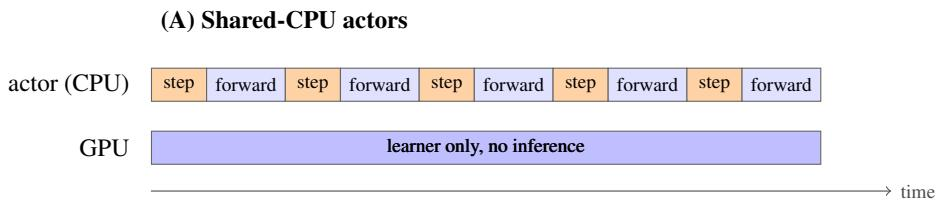

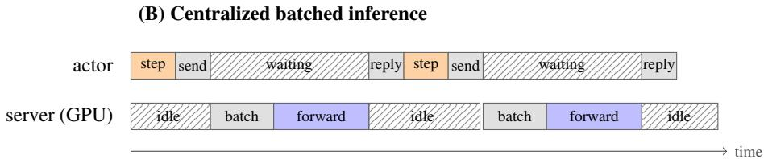

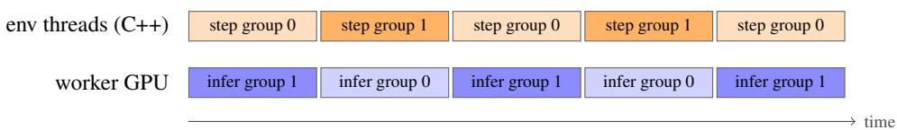  
Figure 8: We present inference working in three ways. (A) Each actor runs the policy itself on the CPU one observation at a time. Nothing is waiting per-say but stepping and inference are contending for the same core(s). As well, every forward pass here runs step by step on the CPU. (B) Actors here send observations to the central GPU thread and wait until the reply action is received. Actors have to wait through the round trip while the server idles between batches. C A vectorized worker splits its batches of environments into two groups that alternates so that while one group steps on the C++ env threads the other’s observations inference can be ran on the GPU. Hatched blocks are idle.

Much of our efforts in building PlayTrain required porting IMPALA and PPO into our trainer system. IMPALA specifically was the key into enabling our throughput benchmarks and porting it into our PlayTrain ecosystem involved heavily referencing many sources. We detail that process here and are enthusiastic about pushing more IMPALA improvements in the future. Both trainers PPO and IMPALA utilize the same C++ vector environment.

IMPALA. Our re-implementation of IMPALA Espeholt et al. (2018) heavily referenced the polybeast and torchbeast architecture (Küttler et al., 2019) but pulls from Sample Factory (Petrenko et al., 2020) for added modern improvements. More specifically, we derive details such as V-trace, losses, and buffer layouts from torchbeast and build tests to make sure that our version’s outputs are identical. Added improvements to the trainer came from polybeast/SEED RL’s centralized batched inference (Espeholt et al., 2020) and Sample Factory’s double-buffered environment sampling. Our IMPALA trainer is written in Python and PyTorch without any other language dependencies.

We initial adopted monobeast’s shared\_cpu design in the process of porting IMPALA for Play-Train. Within a shared\_cpu design, each actor has its own environment and samples actions by running the policy network on the CPU per observation. The weights from the policy network reside in shared CPU memory, which every actor reads from while the learner writes its updates directly into it. While this setup is memory-safe and simple, our environments were simply too fast in comparison to the trainer’s top speeds.

To address the speed asymmetry, we looked at SEED RL and polybeast (Espeholt et al., 2020; Küttler et al., 2019). In their work, the key contribution was centralized inference and involved actors no longer running the policy network/model. Actors instead only receives actions, writes observations, and waits for the next action. A centralized inference thread now takes care of the forward pass actors used to handle in the previous shared\_cpu design: the thread collects and batches observations from actors waiting for actions and runs a forward pass on those batched observations. The thread finally sends actions back to to the waiting actors afterward. Another speed issues arises, however. Because the forward pass is disjointed from the actor, there is latency between actors stepping their environments and receiving the next actions. There are explicitly four stages of latency: send, batch, forward, and reply.

To remove this latency, we have to give back the forward pass to the actor in a diferent way. We can now instead transform actors into workers and let each own its own GPU copy of the policy network and 256 environments in one C++ vector environment (Weng et al., 2022). This setup enables each worker to infer its own batch environments and step all of their environments in a single call.

Only two costs remain after this, which are now the stepping and inferring. Usually, these two processes cannot occur at the same time because both rely on one another within a worker. Yet, by using the double buffering method (Petrenko et al., 2020), we can let two groups of environments run at the same time as mentioned in the main text (Figure 8B, Table 9).

We now lastly mention the learner element in IMPALA. Our IMPALA learner continuously updates on batches of trajectories collected by the workers, using the V-trace loss. In our setup specifically, four GPUs in the node are split between learner and inference and it changes depending on the encoder being used (Table 8). If the IMPALA-CNN is used, two GPUs trainer the network with DDP while the other two hold the worker’s copies of the policy network. If the Nature-CNN is used, one GPU trains as the learner while the remaining three are used for inference.

PPO. Our PPO implementation is not as complex as our IMPALA optimizations and simply references CleanRL (Huang et al., 2022). Everything in PPO runs solely on a single process with one GPU all in a synchronous loop. None of IMPALA’s optimizations are needed since a synchronous on-policy loop never divorces acting from learning. The PPO trainer simply loops through iterations. In each iteration, our PPO collects a rollout of 128 steps from all 192 environments. It then optmizes on those 24,576 timesteps for 3 epochs over 8 minibatches.

It is important to note that PPO goes through 3 gradient computations per frame while IMPALA only goes through one. This is a plausible explanation for why PPO is more sample efficient and slower compared to IMPALA for certain environments.

Table 8: Training configuration. Each config is identical for every game. The two trainers are not matched on every property: IMPALA clips rewards to ±1 and discounts at 0.99 while PPO doesn’t clip rewards and discounts at 0.999. Lastly, the throughput-side elements differ as well, shown in the table. Topology and environment-count rows only apply to IMPALA.
<table><tr><td colspan="2">IMPALA / V-trace</td><td colspan="2">PPO</td></tr><tr><td>encoder</td><td>IMPALA-CNN</td><td>encoder</td><td>IMPALA-CNN</td></tr><tr><td>feature dim</td><td>256</td><td>environments</td><td>192</td></tr><tr><td>recurrence</td><td>none</td><td>rollout length</td><td>128</td></tr><tr><td>observation</td><td>3 × 64 × 64 RGB</td><td>minibatches</td><td>8</td></tr><tr><td>frame skip / stack</td><td>1/1</td><td>epochs per batch</td><td>3</td></tr><tr><td>batch size (= M)</td><td>256</td><td>learning rate</td><td> $2 . 5 \times 1 0 ^ { - 4 }$  , annealed</td></tr><tr><td>unroll length</td><td>64</td><td>discount</td><td>0.999</td></tr><tr><td>discount</td><td>0.99</td><td>GAE λ</td><td>0.95</td></tr><tr><td>baseline cost</td><td>0.5</td><td>clip coefficient</td><td>0.2</td></tr><tr><td>entropy cost</td><td>0.01</td><td>value coefficient</td><td>0.5</td></tr><tr><td>reward transform</td><td>clip to ±1</td><td>entropy coefficient</td><td>0.01</td></tr><tr><td>gradient-norm clip</td><td>40.0</td><td>gradient-norm clip</td><td>0.5</td></tr><tr><td>optimizer</td><td>RMSProp</td><td>optimizer</td><td>Adam</td></tr><tr><td>learning rate</td><td> $5 \times 1 0 ^ { - \hat { 4 } }$ </td><td>precision</td><td>fp32</td></tr><tr><td>α / momentum / €</td><td> $0 . 9 9 / 0 / 1 0 ^ { - 5 }$ </td><td>torch.compile</td><td>off</td></tr><tr><td>precision</td><td>bf16, channels-last</td><td></td><td></td></tr><tr><td>torch.compile</td><td>max-autotune</td><td></td><td></td></tr><tr><td>topology (Nature-CNN)</td><td>15 workers × 5 threads</td><td></td><td></td></tr><tr><td rowspan="2">environments</td><td>1 DDP + 3 inference GPUs</td><td></td><td></td></tr><tr><td> $1 5 \times 2 \times 2 5 6 = 7 { , } 6 8 0$ </td><td></td><td></td></tr><tr><td rowspan="2">topology (IMPALA-CNN)</td><td>12 workers × 5 threads</td><td></td><td></td></tr><tr><td>2 DDP + 2 inference GPUs</td><td></td><td></td></tr><tr><td>environments</td><td> $1 2 \times 2 \times 2 5 6 = 6 , 1 4 4$ </td><td></td><td></td></tr><tr><td>per-game tuning</td><td>none</td><td>per-game tuning</td><td>none</td></tr></table>

Table 9: Double buffering, measured on the same trainer and games with every else fixed. Agentsteps/s under IMPALA with the Nature-CNN at the encoder’s topology in Table 8, fifteen workers. Splitting the environments into two groups so that one steps while the other group’s inference runs (Figure 8C) gives 1.34× overall. That gain tracks how environment-bound a game is: miner and leaper, the two slowest environments present in the table gain 2.08× and 1.92×, while plunder at nearly a million steps-per-second reduces at 0.97× throughput.
<table><tr><td>Game</td><td>Double</td><td>Single</td><td>Ratio</td><td>Game</td><td>Double</td><td>Single</td><td>Ratio</td></tr><tr><td>miner</td><td>969k</td><td>465k</td><td>2.08×</td><td>heist</td><td>878k</td><td>747k</td><td>1.18×</td></tr><tr><td>leaper</td><td>937k</td><td>488k</td><td>1.92×</td><td>frostbite</td><td>888k</td><td>770k</td><td>1.15×</td></tr><tr><td>coinrun</td><td>960k</td><td>501k</td><td>1.92×</td><td>breakout</td><td>932k</td><td>809k</td><td>1.15×</td></tr><tr><td>qbert</td><td>860k</td><td>465k</td><td>1.85×</td><td>freeway</td><td>1.04M</td><td>904k</td><td>1.15×</td></tr><tr><td>fruitbot</td><td>796k</td><td>436k</td><td>1.83×</td><td>asteroids</td><td>904k</td><td>800k</td><td>1.13×</td></tr><tr><td>chaser</td><td>983k</td><td>544k</td><td>1.81×</td><td>starpilot</td><td>904k</td><td>816k</td><td>1.11×</td></tr><tr><td>jumper</td><td>904k</td><td>511k</td><td>1.77×</td><td>ninja</td><td>917k</td><td>868k</td><td>1.06×</td></tr><tr><td>climber</td><td>655k</td><td>416k</td><td>1.58×</td><td>bigfish</td><td>904k</td><td>878k</td><td>1.03×</td></tr><tr><td>dodgeball</td><td>898k</td><td>586k</td><td>1.53×</td><td>bossfight</td><td>904k</td><td>885k</td><td>1.02×</td></tr><tr><td>maze</td><td>973k</td><td>659k</td><td>1.48×</td><td>seaquest</td><td>894k</td><td>878k</td><td>1.02×</td></tr><tr><td>caveflyer</td><td>878k</td><td>596k</td><td>1.47×</td><td>plunder</td><td>885k</td><td>908k</td><td>0.97×</td></tr><tr><td>space_invaders</td><td>1.01M</td><td>829k</td><td>1.22×</td><td>pong</td><td>901k</td><td>980k</td><td>0.92×</td></tr><tr><td>geometric mean</td><td>904k</td><td>673k</td><td>1.34×</td><td>median 1.20×, range 0.92–2.08×</td><td></td><td></td><td></td></tr></table>

## D FULL-SUITE LEARNING CURVES

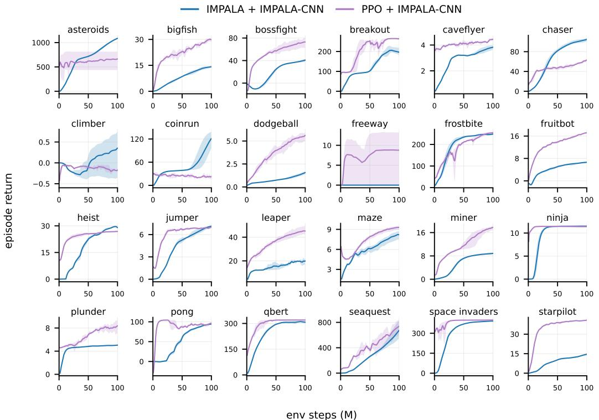  
Figure 9: IMPALA against PPO on all 24 games, both with the IMPALA-CNN encoder, 100M environment steps, three seeds per plot. Lines are the seed mean, bands are the min and max. PPO curves start at 0.5M steps because only winning episodes terminated before then. maze, heist, and freeway have no failure state, so no episode ends until the 2,000-frame horizon at 12.3M steps, and before that point their IMPALA curves average over wins alone.

We present the learning curves of the 16 ProcGen and 8 ALE games across the IMPALA and PPO trainers. We also test two encoders for each trainer: the IMPALA-CNN and Nature-CNN. Each run lasted for 100M env steps. Lines are the mean over 3 seeds and bands are their min and max. PPO curves start at 0.5M steps because only wins have finished before the first truncation wave. maze, heist and freeway have no failure state so their IMPALA curves before 12.3M steps average over finished episodes only.

IMPALA seems to fail to receive any reward at freeway but outperforms PPO on surprising titles such as climber, coinrun, chaser, heist and asteroids. Its freeway zero holds across both encoders and all 3 seeds and matches the zero Espeholt et al. (2018) report for IMPALA on ALE Freeway, while PPO reaches returns of 8.8 to 11.8. On climber only IMPALA finishes above zero. PPO is either equal or outperforms the remaining game titles and wins 13 of the 24 despite being the slowest arm to train (Table 1). Table 10 reports final returns against random for every game.

## E BENCHMARK DETAILS

## E.1 SETUP AND BASELINES

There are three settings in which we measure throughput: (1) a single core setting, (2) a multi-thread setting, and a (3) multi-thread setting with a trainer attached. For all three, we ran comparisons of our 8 ALE clones and 16 ProcGen clones against their originals, with both arms of every comparison run in a single job on one node, resets included in every timed region, and random actions wherever no trainer is attached.

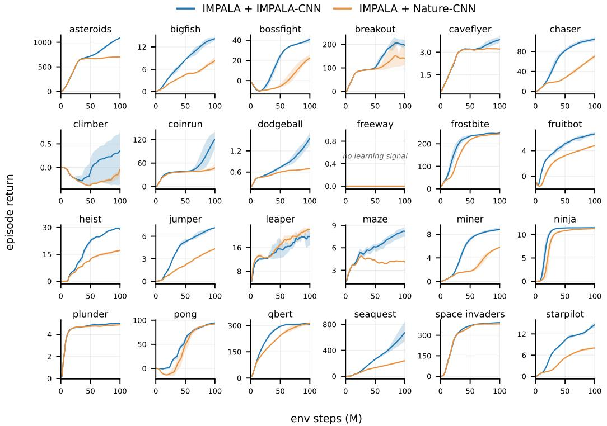  
Figure 10: IMPALA at both IMPALA-CNN and Nature-CNN encoders. Same setup as Figure 9

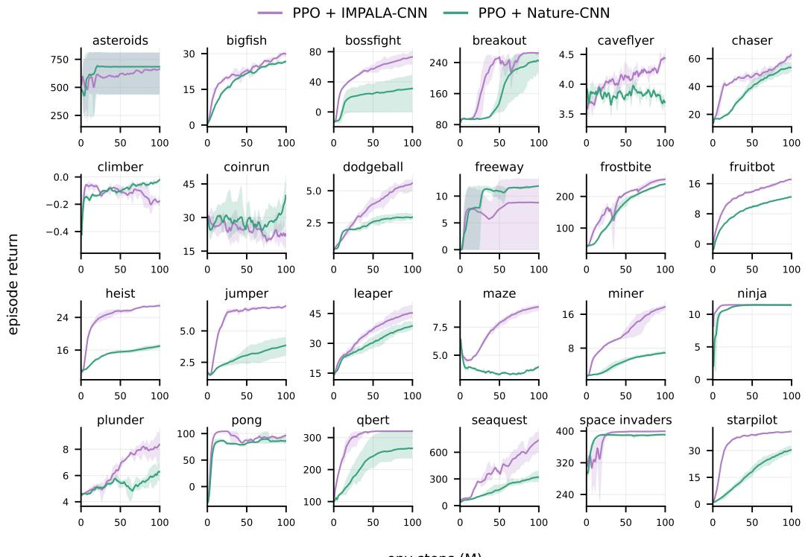  
Figure 11: PPO at both IMPALA-CNN and Nature-CNN encoders. Same setup as Figure 9

Table 10: Mean return over 8 held-out level seeds. R = random policy, G = greedy final checkpoint.
<table><tr><td>game</td><td>R</td><td>G</td><td>game</td><td>R</td><td>G</td></tr><tr><td>asteroids</td><td>513.8</td><td>995.0</td><td>heist</td><td>2.5</td><td>16.9</td></tr><tr><td>bigfish</td><td>0.6</td><td>25.1</td><td>jumper</td><td>0.8</td><td>1.5</td></tr><tr><td>bossfight</td><td>-13.2</td><td>77.6</td><td>leaper</td><td>12.5</td><td>20.6</td></tr><tr><td>breakout</td><td>80.0</td><td>276.2</td><td>maze</td><td>0.0</td><td>0.0</td></tr><tr><td>caveflyer</td><td>1.6</td><td>1.0</td><td>miner</td><td>2.1</td><td>9.4</td></tr><tr><td>chaser</td><td>5.6</td><td>72.5</td><td>ninja</td><td>0.8</td><td>0.2</td></tr><tr><td>climber</td><td>0.2</td><td>0.6</td><td>plunder</td><td>2.8</td><td>6.4</td></tr><tr><td>coinrun</td><td>4.8</td><td>136.6</td><td>pong</td><td>-35.8</td><td>100.9</td></tr><tr><td>dodgeball</td><td>0.2</td><td>6.8</td><td>qbert</td><td>36.2</td><td>320.0</td></tr><tr><td>freeway</td><td>0.0</td><td>0.0</td><td>seaquest</td><td>102.5</td><td>732.5</td></tr><tr><td>frostbite</td><td>32.5</td><td>256.2</td><td>space_invaders</td><td>340.0</td><td>400.0</td></tr><tr><td>fruitbot</td><td>-2.0</td><td>12.0</td><td>starpilot</td><td>1.8</td><td>27.5</td></tr></table>

Table 11: The three throughput measurements and PlayTrain’s speedup over each, as a geometric mean over the shared games. Frame skip is 1 and both arms run in one job on one node. Per-core rows compare against ALE and ProcGen as shipped, thread scaling against a tuned EnvPool. Unmatched means ALE emits its native 210×160 while PlayTrain and ProcGen render 64×64.
<table><tr><td>measurement</td><td>hardware</td><td>matched observation</td><td>learner attached</td><td>speedup vs. ALÊ</td><td>speedup vs. ProcGen</td></tr><tr><td>per core (Fig. 4C, D)</td><td>Intel Sapphire Rapids</td><td></td><td></td><td>12.62×</td><td>2.19×</td></tr><tr><td>thread scaling (Fig. 4A)</td><td>AMD Genoa</td><td>√</td><td></td><td>20.80×</td><td>2.58×</td></tr><tr><td>with a trainer (Table 1)</td><td>AMD Genoa, 4×H100</td><td>√</td><td>√</td><td>5.8×</td><td>2.25×</td></tr></table>

Single core. In the single-core setting, the cost of one step is the quantity of interest, so a fixed number of steps were designated for warmup, and then we divided a fixed number of completed steps by the walltime afterwards. Our baselines here are simply the ALE via the gymnasium/ale-py package and ProcGen via the procgen package. For ALE, we used the NoFrameskip-v4 prefix games, with frameskip set to 1 with zero action-repeats. For ProcGen, every game was set to v0, with num\_levels = 0 and start\_level = 0, meaning that we target the full level distribution. There were seven trials used to benchmark the speeds, measuring 1500 frames total after the first 200 warmup steps were discarded, and we used the median. PlayTrain is stepped from C here and the baselines from Python. Observations are 64×64 RGB for PlayTrain and ProcGen while ALE emits its native 210×160. PlayTrain therefore has a slight favoring bias in terms of observation resolution.

Multi-thread. For the multi-thread setting, we had to build a vectorized environment, warm it up, and then run a fixed timed window of 12 seconds. We use a fixed time here because a fixed step count would take a different wall time at each thread count. We then divided the completed total environment steps over that 12 second time window. Observations are matched at 64×64 RGB for all arms. Scaling efficiency is throughput per thread relative to the lowest thread count, so 100% is linear. Our ALE and ProcGen baselines are all driven by EnvPool version 1.2.5. The EnvPool configuration we use is the Async API with one pool per NUMA domain. We also toggle in-pool thread affinity after we saw that it enabled faster speeds, and sweep across batch sizes for the fastest one. We choose this config since it is the fastest Atari config they have published and they don’t publish a ProcGen benchmark publicly. Our ALE are 64x64 RGB with frame\_skip = 1, which is not the default setting.

For measuring EnvPool specifically, each NUMA pool is warmed up for four seconds, the following twelve seconds are then measured. We sum across all the pools for the node and then take the geometric mean afterwards. As a small note, our PlayTrain builds are compiled with profile-guided optimization (PGO) while EnvPool runs on their prebuilt wheel.

Table 12: The tuned EnvPool configuration behind the thread-scaling comparison. One process per NUMA domain and node throughput is the sum across pools. ALE is moved off its 84×84 grayscale stack-4 default so both comparisons see the same observation.
<table><tr><td>parameter</td><td>value</td></tr><tr><td>API</td><td>make_gymnasium, driven with async_reset and send/recv</td></tr><tr><td>pools per node</td><td>one per NUMA domain, each in its own process</td></tr><tr><td>envs per pool</td><td>total ÷ domains (2,048 envs at 80 threads)</td></tr><tr><td>threads per pool</td><td>total ÷ domains</td></tr><tr><td>batch size</td><td>max(16, 3 × threads per pool)</td></tr><tr><td>thread affinity</td><td>offset to that domain&#x27;s first CPU</td></tr><tr><td>ALE spec</td><td>64×64 RGB, stack_num=1, frame_skip=1</td></tr><tr><td>ProcGen spec actions</td><td>defaults, already 64×64 RGB</td></tr></table>

Table 13: Thread scaling behind Figure 4A, geometric mean over the shared games. Scaling efficiency is throughput per thread relative to the 5-thread point, so 100% is linear. PlayTrain stays linear to eighty threads on both suites, while EnvPool falls to 50% on ProcGen and holds 96% on ALE.
<table><tr><td></td><td colspan="2">env-steps/s</td><td></td><td colspan="2">scaling efficiency</td></tr><tr><td>threads</td><td>PlayTrain</td><td>EnvPool</td><td>ratio</td><td>PlayTrain</td><td>EnvPool</td></tr><tr><td colspan="6">ProcGen, 16 shared games</td></tr><tr><td>5</td><td>227,433</td><td>177,338</td><td>1.28×</td><td>100%</td><td>100%</td></tr><tr><td>10</td><td>455,799</td><td>354,686</td><td>1.29×</td><td>100%</td><td>100%</td></tr><tr><td>20</td><td>910,956</td><td>584,458</td><td>1.56×</td><td>100%</td><td>82%</td></tr><tr><td>30</td><td>1,368,468</td><td>777,384</td><td>1.76×</td><td>100%</td><td>73%</td></tr><tr><td>40</td><td>1,819,564</td><td>931,467</td><td>1.95×</td><td>100%</td><td>66%</td></tr><tr><td>60</td><td>2,741,906</td><td>1,197,708</td><td>2.29×</td><td>100%</td><td>56%</td></tr><tr><td>80</td><td>3,650,005</td><td>1,412,903</td><td>2.58×</td><td>100%</td><td>50%</td></tr><tr><td colspan="6">ALE, 8 shared games</td></tr><tr><td>5</td><td>460,983</td><td>22,806</td><td>20.21×</td><td>100%</td><td>100%</td></tr><tr><td>10</td><td>920,486</td><td>45,600</td><td>20.19×</td><td>100%</td><td>100%</td></tr><tr><td>20</td><td>1,846,763</td><td>89,270</td><td>20.69×</td><td>100%</td><td>98%</td></tr><tr><td>30</td><td>2,760,813</td><td>134,145</td><td>20.58×</td><td>100%</td><td>98%</td></tr><tr><td>40</td><td>3,692,641</td><td>177,666</td><td>20.78×</td><td>100%</td><td>97%</td></tr><tr><td>60</td><td>5,517,172</td><td>265,505</td><td>20.78×</td><td>100%</td><td>97%</td></tr><tr><td>80</td><td>7,300,384</td><td>350,959</td><td>20.80×</td><td>99%</td><td>96%</td></tr></table>

With a trainer. With a trainer attached in a multi-thread setting, the agent steps per second are read from the running trainer with exactly four timed windows per game. The trainer owns the loop here so we read its counter rather than timing from outside and we report the median of the four windows.

## E.2 ENVIRONMENT IMPLEMENTATION DETAILS

Here we walk through the step cost decomposition and use probes to determine the actual latency cost of each operation. Each step() cost is fixed overhead of 1.96 µs in addition to a sum of elementary operations. As discussed in Sec 4, throughput is partly determined by the amount of operations within, either through game logic and drawing commands. That count alone isn’t everything though, because the speed of the game doesn’t tell you whenever or not drawing or logic dominates. For instance, there are some relatively slower PlayTrain games that barely have any drawing commands while some of the faster games spend 50% of their step() for drawing. This is why we find profiling to be critical because it brings clarity regarding what makes an environment slow or fast beyond counting drawing or game logic operations.

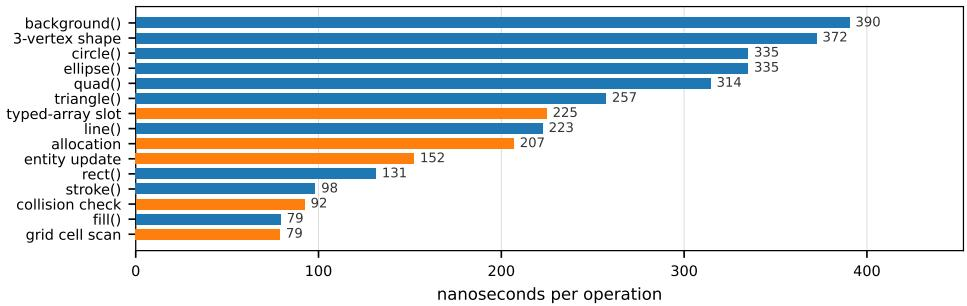

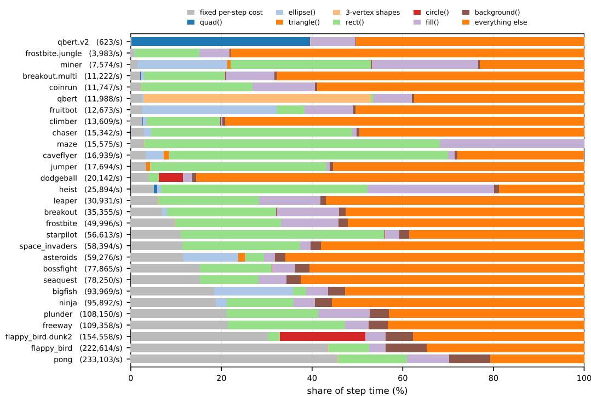  
Figure 12: (A) Cost of one operation—p5 drawing primitives and game-logic operations—each measured on a probe environment that varies a single quantity. Shapes are priced per polygon, since vertices inside one beginShape accumlates into a single shape. (B) Every game ordered by cost per step with steps per second in brackets, split into the fixed cost. Each primitive’s share here is the call count multiplied by the cost in (A). The remainder is allocated to game logic and interpreter time. Each is measured on one core with dirty-rectangle skipping off. maze is the one game whose cost operations exceed its step time, so its bar doesn’t show the residual game logic/interpreter time.

How can we actually profile this problem? In a PlayTrain environment, drawing costs and logic costs are confounded with one another. We approach this problem by building a probe environment that holds everything fixed, varying one specific quantity. For our purposes we build one probe per operation and a set of environments that remain identical except for the target operation being measured.

Our probe environments are similar to our generated PlayTrain files. The key difference is that the draw() function clears a canvas and issues N copies of the target operation at random positions. That N quantity varies from 0, 64, 128, 256, and 512. Logic operations use the same structure with drawing pinned instead. The logic operations we test are collision checks, allocations, entity updates, or typed-array writes. In order to profile real games, we simply count the calls per operation. Each count is multiplied by that operation’s cost and divided by the sum by the game’s measured step time, giving the resulting percentage of the step spent drawing. Whatever remains after the fixed cost is game logic. Everything runs in a job on a single core of one Sapphire Rapids node, dirty-rectangle skipping is disabled.

As for the outcomes, the background() operation is the most expensive at 390 ns per call. This operation is clearly more expensive since it requires the whole drawing canvas to clear before it is set. The fastest operation, on the other hand, is fill(), which only sets color states and doesn’t touch shape. As for the games, pong is the fastest since it only issues 11 p5 commands per frame with logic being limited to two paddles and a ball. flappy\_bird, while issuing fewer commands is still slower though, showcasing how game logic operations can overturn the speed differences.

## F GAME GENERATION

Here we cover the two halves of making a game: the interface where games are generated, played and refined, and the prompt that produces the first version.

## F.1 PROMPT INTERFACE

The game tester renders through our raster.mjs file, which was detailed in Appendix C.1, while the game itself runs in a canvas at the center of the screen on the browser’s animation frame loop. Forking and refining are the two modes within the prompt interface, but they are essentially the same procedure. Forking writes a new .js file instead of updating the preexisting one, and asks for a deliberate design change rather than the smallest fix. Our interface allows us to prompt an LLM (Gemini 3.1 Pro) to generate these forked variations or refinements easily. The process goes as follows: the JS game is broken into chunks by top-level function declarations, and as the prompt edit is read by the model, the model is tasked to reason about which chunk to target in reference to the prompt and explain its reasoning. Afterwards, a second call is made, asking the LLM to output a JSON format to generate targeted edits to the specific chunks that were selected in the first model call. (if the selection or targeted edit call fails for some reason, a full-rewrite is done). This file (refined or forked) must define setup, draw, getGameState, resetGame and mulberry32 or it gets rejected automatically. The tester reloads the game as soon as the file is written, so the change can be played immediately. Importantly, everything is backed up as timestamped snapshots the interface can restore, with logs that record the human prompt, duration, full raw output, game, model, and other metadata items.

## F.2 FROM PROMPT TO GAME

```jsonl
{ "name": "donkey_kong",
"ref": "https://ale.farama.org/environments/donkey_kong/",
"actions_used": ["LEFT", "RIGHT", "UP", "DOWN", "D", "LEFT+D", "RIGHT+D"],
"mechanic": "climb ladders + jump barrels to rescue" }
```  
Figure 15: A catalog entry, the only human input in the initial generation process. The reference URL is fetched and included as text, actions\_used selects the action space, and the mechanic is one line

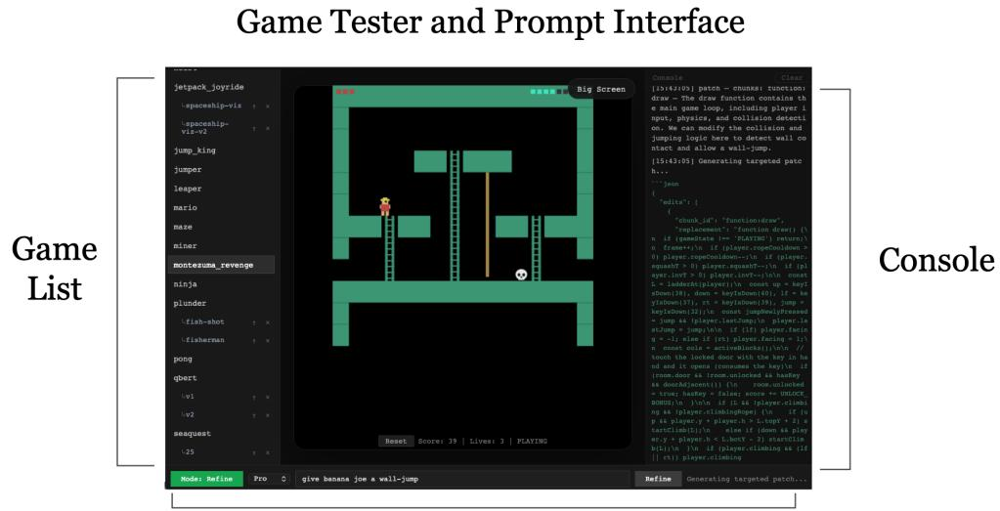

Refine and Fork modes  
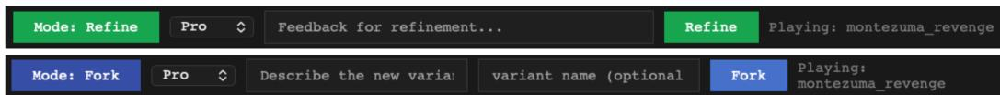  
Figure 13: The game tester. The left pane lists every game with its variants nested underneath, the center panel runs the selected game in a canvas through the same raster.mjs rasterizer, and the right pane shows the game’s own console output alongside the model’s generation process. The bar underneath switches between Refine and Fork. Refine edits the current game while Fork writes the output as a new file.

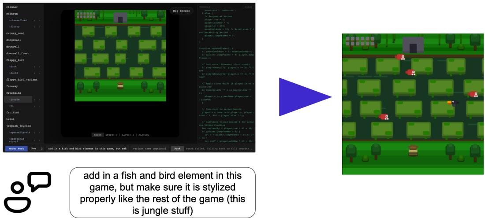  
Figure 14: A variant created from a single prompt. The text shown is the human’s verbatim prompt feedback. The left frame is the parent game and the right frame is the result, playable immediately in the same interface.

As stated in Figure 1B, cloning game only using an LLM doesn’t require many components. For our process within the paper, we have a JSON file that outlines the name of the game we are cloning, a online reference link for more details, actions used within the proposed cloned environment, and a small concise mechanic describing the games general dynamics. The link is fetched and pasted into the prompt as plain text, and our ProcGen clones pass the original C++ source in place of a mechanic line. All of these resources are not required, and more contemporary tools such as Anthropic’s Claude Code or OpenAI’s Codex can be used instead to build these games from scratch.

Table 14: Authorship cost and training throughput per artifact. Token counts are exact (tokenized from the logged prompts and outputs); cost uses Gemini 3.1 Pro rates (\$2 / \$12 per 1M tokens in / out); SPS is measured on the suite’s full-node configuration.
<table><tr><td>Artifact</td><td>Calls</td><td>Tokens (in / out)</td><td>Time</td><td>Cost</td><td>LoC ∆</td><td>SPS</td></tr><tr><td>breakout.multiball</td><td>3</td><td>5,292 / 4,644</td><td>2.3 min</td><td>$0.07</td><td>~140</td><td>355k</td></tr><tr><td>qbert.bigmap</td><td>2</td><td>8,459 / 10,228</td><td>5.5 min</td><td>$0.14</td><td>~290</td><td>39k</td></tr><tr><td>flappy_bird.hoop</td><td>5</td><td>13,204 / 10,780</td><td>7.5 min</td><td>$0.16</td><td>~80</td><td>354k</td></tr><tr><td>frostbite.jungle</td><td>8</td><td>24,932 / 25,434</td><td>10.9 min</td><td>$0.36</td><td>~300</td><td>239k</td></tr><tr><td>vvvvvv</td><td>2</td><td>4,797 / 3,283</td><td>2.3 min</td><td>$0.05</td><td>258 (new)</td><td>356k</td></tr><tr><td>downwell</td><td>6</td><td>14,234 / 12,837</td><td>5.9 min</td><td>$0.18</td><td>419 (new)</td><td>354k</td></tr><tr><td>Total</td><td>26</td><td>70,926 / 67,206</td><td>34.4 min</td><td>$0.95</td><td></td><td></td></tr></table>

Above everything else, the key ingredient to building PlayTrain environments is the template file. The template first sets a header the explains the purpose: a single agent with a fixed CNN policy trains across all games, therefore this template acts as a way to make everything uniform The template then makes sure the shape of the game fits the RL requirements as mentioned in the main text, and also specifies the action space the game must comply to as well. The template as well makes sure everything differing across episodes is seeded, but makes sure that game mechanics, action mappings, or reward structure stays untouched from the seeded rng. Additionally, the template prompts the model to follow simple Atari-like graphics. This design was intentional in order to highlight the game dynamics and mechanics instead of visual complexity. The template also prompts the model to make sure the game acts as one self-contained file without any other browser components (e.g. DOM access or imports). Generation is just a single model call to gemini-3.1-pro-preview. Since generation is one shot, anything it gets wrong is fixed through the refinement loop of Appendix F.1.

## F.3 VALIDATION

Each file that gets generated goes through a validation procedure. The validation procedure is just a Python script that checks for (1) Gymnasium API compatibility, (2) determinism, (3) normal observations, and (4) normal rewards and terminations. The Gymnasium check just runs the library’s own check\_env. The determinism check collects two trajectories of the same seed and actions on separate instances and compares them, requiring the same observations. The observation check makes sure the shape is (64, 64, 3) with dtype uint8 and values between 0 and 255. It also checks that the frame has five unique pixels and that it changes within 30 steps. Lastly, the reward check makes sure each reward equals the change in the game’s score, and that a terminated step really does report WIN, EXIT or GAMEOVER.

Listing 1: The generate prompt for downwell, exactly as sent. The human wrote the mechanic line, the action list, and a Steam URL; the reference paragraph is fetched from that URL. Everything from “The game MUST conform” onward is the template, identical for every game.

Generate a p5.js game implementing "downwell".   
Mechanic: vertical descent shooter   
Actions this game should use: LEFT, RIGHT, D   
Reference description of the original game:   
Downwell is a curious game about a young person venturing down a well in search of untold   
treasures with only his Gunboots to protect him.   
Reviews "Falling with style." 10/10 - Destructoid "A brilliantly balanced vertical roguelike"   
4.5/5 Stars - Pocket Gamer "It’s a deep dark well filled with monsters and gems, equal   
parts platformer and reverse vertical shooter, and falling into its depths is the stuff   
that 1980s arcade dreams were made of." Hardcore Gamer   
The game MUST conform to this template specification exactly:

```markdown
| Game type | LEFT/RIGHT | UP/DOWN | D |
|- --|---|
| Platformer | Move | Climb/duck | Jump |
| Shooter | Move | Aim | Fire |
| Angry Birds | Aim angle | Adjust power | Launch |
| Suika | Move drop pos | -- | Drop |
| Snake | Turn left/right | Turn up/down | -- (unused) |
| Breakout | Move paddle | -- | -- (unused) |
Games that don’t need all 8 actions simply ignore the extras.
Games read input through ‘keyIsDown(code)‘ and the ‘keyPressed()‘ callback -- same as
standard p5.js. The runtime injects key state before each ‘draw()‘ call.
Key codes: LEFT_ARROW=37, UP_ARROW=38, RIGHT_ARROW=39, DOWN_ARROW=40, SPACE=32.
<sub>**</sub>Runtime action mapping (for reference):<sub>**</sub>
‘‘‘javascript
const ACTIONS = [
{ name: ’NOOP’, held: [], press: null },
{ name: ’LEFT’, held: [37], press: null },
{ name: ’RIGHT’, held: [39], press: null },
{ name: ’UP’, held: [38], press: null },
{ name: ’DOWN’, held: [40], press: null },
{ name: ’D’, held: [], press: 32 },
{ name: ’LEFT+D’, held: [37], press: 32 },
{ name: ’RIGHT+D’, held: [39], press: 32 },
];
11
## Observation Space
- Canvas: any size in-game, downscaled to 64x64 RGB by the runtime
- No frame stacking -- single frame, 3 color channels -> final observation shape: ‘(64,
64, 3)‘ uint8
- The game does NOT handle downscaling or color conversion
- This matches ProcGen’s observation spec exactly
```

```markdown
# Game Template Specification
```

Standard interface for LLM-generated p5.js games targeting headless RL training.

All games MUST conform to this spec. A single RL agent with a fixed CNN policy trains across all games -- the template guarantees a uniform action space, observation space, and state interface.

\## Action Space

<sub>\*\*</sub>Discrete(8)<sub>\*\*</sub> -- identical across all games. Actions are abstract -- games interpret them   
however they want. An agent learns what each action does from pixels and rewards, not   
from labels.

This follows ProcGen’s design: ProcGen uses Discrete(15) with abstract directional + button combinations. Each of its 16 games interprets the same actions differently.

| Index | Name | Keys Held | Key Pressed |  
|-------|------|--- ---|  
| 0 | NOOP | -- | -- |  
| 1 | LEFT | <- | -- |  
| 2 | RIGHT | -> | -- |  
| 3 | UP | ^ | -- |  
| 4 | DOWN | v | -- |  
| 5 | D | -- | SPACE |  
| 6 | LEFT+D | <- | SPACE |  
| 7 | RIGHT+D | -> | SPACE |

<sub>\*\*</sub>D is a generic action button.<sub>\*\*</sub> Each game decides what it means:

Recommended canvas size: 256x256 to 512x512. Anything that looks readable at 64x64.

```markdown
## Required Game Interface
Every game file is a single ‘.js‘ file that defines these globals:
‘‘‘javascript
//
// REQUIRED: p5.js lifecycle
function setup() {
// Create canvas, initialize constants.
// Do NOT generate level here -- that happens in resetGame().
createCanvas(400, 400);
function draw() {
// Main game loop. Called once per tick by the runtime.
// Read input via keyIsDown(), update state, render frame.
// For Matter.js games: call Matter.Engine.update(engine, 16.67) here.
//
// REQUIRED: RL interface
function getGameState() {
// Return current game state. Called by the runtime after every draw().
return {
score: Number, // cumulative score (reward = delta per step)
lives: Number, // remaining lives; 0 triggers GAMEOVER
gameState: String, // one of: ’PLAYING’, ’WIN’, ’GAMEOVER
};
function resetGame(seed) {
// Full reset. Called by the runtime to start a new episode.
// MUST:
// 1. Initialize the seeded RNG: rng = mulberry32(seed)
// 2. Reset score to 0, lives to starting value
// 3. Set gameState to ’PLAYING’
// 4. Generate the level procedurally using rng
// 5. Reset all entity positions, timers, and physics state
// For Matter.js games: clear and rebuild the Matter.js world here.
}
// REQUIRED: seeded RNG (copy this verbatim)
// ============
let rng = null;
function mulberry32(seed) {
let t = seed >>> 0;
return () => {
t += 0x6D2B79F5;
let n = Math.imul(t ^ (t >>> 15), t | 1);
n ^= n + Math.imul(n ^ (n >>> 7), n | 61);
return ((n ^ (n >>> 14)) >>> 0) / 4294967296;
};
// Use rng() instead of Math.random() for ALL randomness.
// Example: let x = Math.floor(rng() width);
111
## What the Seed Controls (game-specific procedural generation)
The seed MUST determine:
- Level layout (terrain, platforms, walls, maze structure)
```

```markdown
- Entity spawn positions (enemies, collectibles, obstacles)
- Item/powerup placement and types
Any randomized parameters (enemy speed, gap sizes, spawn timing)
Visual variation (color palettes, decorative elements) encouraged but optional
The seed MUST NOT affect:
Core mechanics (gravity, movement speed, rules)
- Action mappings
- Reward structure
- Canvas size
## Reward Design
- ‘score‘ starts at 0 on reset
- ‘score‘ must increase when the agent does something good (collect item, clear obstacle,
kill enemy, progress further)
‘score‘ may decrease on bad events (lose life, hit obstacle) -- use negative deltas
sparingly
- The runtime computes ‘reward = score_now - score_prev‘ each step
- Design scores so that a random agent gets near-zero reward and a skilled agent gets high
reward
## Terminal Conditions
| gameState | Meaning | When |
‘’PLAYING’‘ | Episode in progress | Default after reset |
‘’WIN’‘ | Agent completed the objective | Level cleared, goal reached |
| ‘’GAMEOVER’‘ | Agent failed | Lives == 0, fatal collision |
The runtime also enforces a ‘maxSteps‘ truncation (default 2000). Games do not need to handle
this.
## Matter.js Games (Physics)
For games requiring rigid body physics (Angry Birds, Suika, etc.):
‘‘‘javascript
// Matter.js is available as a global: Matter
// Access via: Matter.Engine, Matter.World, Matter.Bodies, etc.
let engine, world;
function setup() {
createCanvas(400, 400);
// Do NOT create the engine here -- do it in resetGame()
}
function resetGame(seed) {
rng = mulberry32(seed);
score = 0;
lives = 3;
gameState = ’PLAYING’;
// Create fresh physics world each reset
engine = Matter.Engine.create();
world = engine.world;
engine.gravity.y = 1;
// Add ground, walls, etc.
let ground = Matter.Bodies.rectangle(200, 390, 400, 20, { isStatic: true });
Matter.World.add(world, [ground]);
// Procedurally generate level using rng
generateLevel(rng);
}
function draw() {
// Fixed timestep physics update (deterministic)
Matter.Engine.update(engine, 1000 / 60);
```

// Render: read body positions, draw with p5.js   
background(200);   
for (let body of Matter.Composite.allBodies(world)) {   
// ... draw body using rect(), ellipse(), etc.   
}   
// Game logic: check collisions, update score, etc.   
}   
1   
Determinism guarantee : Matter.js with fixed timestep + identical initial conditions =   
identical simulation. All initial conditions come from the seeded RNG, so replays are   
bit-identical.   
## File Structure   
‘‘‘   
games/   
flappy.js # Game source (conforms to this template)   
crossy.js   
angry\_birds.js # Matter.js physics game   
suika.js # Matter.js physics game   
1   
Each file is a self-contained game. No imports, no modules -- all game code in a single file.   
The runtime provides p5.js globals and (optionally) Matter.js globals before execution.   
## Visual Design Rules   
The agent sees the game as a <sub>\*\*</sub>64x64 RGB image<sub>\*\*</sub>. Every visual decision must serve that   
constraint. Think ProcGen / Atari 2600, not modern mobile game.   
### Color and Contrast   
- <sub>\*\*</sub>Black or dark background<sub>\*\*</sub> -- maximizes contrast with game elements   
Use color to encode meaning -- red = danger/enemies, green = collectibles/safe, blue =   
player, yellow = coins/points. The agent has full RGB, so color IS information   
- Distinct color per element type : player, enemies, collectibles, and terrain should each   
be a different hue. Don’t use similar colors for different entity types   
- <sub>\*\*</sub>No gradients, shadows, glow effects, or alpha transparency<sub>\*\*</sub> -- these become muddy blobs   
at 64x64   
- <sub>\*\*</sub>Solid fills only<sub>\*\*</sub> -- ‘fill()‘ + ‘rect()‘/‘ellipse()‘, no complex rendering   
### Size and Shape   
- <sub>\*\*</sub>Minimum entity size: 6x6 pixels<sub>\*\*</sub> on the source canvas (scales to \~1px at 64x64 -- edge   
of visibility). Prefer 10x10+ for important entities   
- <sub>\*\*</sub>Player should be at least 12x12 pixels<sub>\*\*</sub> on the source canvas   
<sub>\*\*</sub>Use distinct shapes per entity type<sub>\*\*</sub>: player = rectangle, enemies = circles,   
collectibles = small squares, terrain = large rectangles. Shape + color differentiation   
helps the CNN   
- <sub>\*\*</sub>No fine detail<sub>\*\*</sub> -- no 1px lines, no small dots, no intricate patterns   
### HUD and Text   
- <sub>\*\*</sub>No text-based HUD<sub>\*\*</sub> -- text is unreadable at 64x64. The agent cannot read "Score: 150"   
- <sub>\*\*</sub>No title screens, menus, or instructions<sub>\*\*</sub> -- ‘resetGame()‘ goes straight to gameplay   
- <sub>\*\*</sub>No pause screens or cutscenes<sub>\*\*</sub> -- every frame is gameplay   
- If you must show score visually, use a bar or block indicator at the screen edge, not   
text   
### What NOT to Render   
- Decorative backgrounds (starfields, clouds, grass patterns)   
- Particle effects (explosions, sparkles, trails)   
- Screen shake or visual transitions   
- Drop shadows or outlines on entities   
- Antialiased or rounded visual flourishes   
### Reference Style

```markdown
Think: <sub>**</sub>ProcGen<sub>**</sub>. Flat colored rectangles, circles, and lines on a dark background. Bright,
distinct colors per entity type. Every pixel on screen either means something to
gameplay or is background.
## Mechanical Simplicity Rules
Games must be simple enough that an RL agent can learn a basic policy within 1-5 million
steps. Complexity kills learning.
### Core Mechanic
- One core mechanic per game -- "jump over obstacles", "shoot enemies", "collect items
while avoiding hazards". Not all three combined
- The core mechanic must be exercisable within 10 steps -- the agent shouldn’t need 500
steps of preamble before gameplay starts
- <sub>**</sub>No multi-phase gameplay<sub>**</sub> -- no "first collect keys, then unlock doors, then fight boss".
One continuous loop
No inventory, crafting, or resource management beyond simple counters (lives, ammo)
### Difficulty and Pacing
<sub>**</sub>Immediate reward signal<sub>**</sub> -- the agent should encounter its first positive reward
opportunity within 20-50 steps of random play
<sub>**</sub>Frequent scoring opportunities<sub>**</sub> -- at least one chance to score every 50-100 steps
- Gradual difficulty -- early seeds/levels should be easy enough that random agents
occasionally score; later seeds should be challenging
- <sub>**</sub>Death should be possible but not instant<sub>**</sub> -- give the agent a few lives so it can learn
from mistakes within an episode
### What NOT to Include
- Shops, upgrades, or progression systems
- Multiple weapon types or character classes
- Story, dialogue, or narrative elements
- Tutorial sequences
- Complex state machines (charge attacks, combo systems, stance switching)
## Constraints for LLM Generation
When prompting an LLM to generate games:
1. <sub>**</sub>Single file, no imports<sub>**</sub> -- all game code in one ‘.js‘ file
2. <sub>**</sub>No DOM access<sub>**</sub> -- no ‘document.getElementById‘, no CSS, no HTML elements
3. <sub>**</sub>No async/await<sub>**</sub> -- ‘draw()‘ is synchronous
4. <sub>**</sub>No images/audio<sub>**</sub> -- render everything with drawing primitives (rect, ellipse, line,
text)
5. No setTimeout/setInterval -- the runtime controls frame timing via ‘tick()‘
6. <sub>**</sub>All randomness via ‘rng()‘<sub>**</sub> -- never use ‘Math.random()‘
7. <sub>**</sub>Keyboard input only<sub>**</sub> -- no mouse, no touch, no gamepad
8. <sub>**</sub>Score must be meaningful<sub>**</sub> -- a random-action agent should score near zero; a skilled
agent should score high
9. <sub>**</sub>Episodes must terminate<sub>**</sub> games must reach WIN or GAMEOVER within reasonable play,
not run forever
10. ProcGen-style visuals -- dark background, distinct colors per entity type, solid
shapes, no text HUD, no decorations (see Visual Design Rules above)
11. <sub>**</sub>One core mechanic<sub>**</sub> -- simple, learnable, immediate reward (see Mechanical Simplicity
Rules above)
## Validation Checklist
A game passes validation if:
- [ ] ‘resetGame(seed)‘ runs without error
- [ ] ‘getGameState()‘ returns ‘{ score: Number, lives: Number, gameState: ’PLAYING’ }‘
- [ ] 200 steps with seed=42 + identical actions produce bit-identical frames (determinism)
[ ] Frames are non-degenerate (not all one color, multiple unique pixel values)
[ ] Score changes at least once in 500 random-action steps
[ ] Game reaches GAMEOVER or WIN within 5000 random-action steps
- [ ] No errors/exceptions during 1000 random-action steps
Output ONLY the JavaScript code. No markdown fences, no explanation.
```

Listing 2: A refine prompt for downwell, exactly as sent. The feedback is free text from playing the game, and only the chunks the first call selected are shown to the model, and only those may be replaced. The chunk bodies are omitted here.

You are patching selected chunks in a p5.js game.   
Game: downwell\_fresh   
Player feedback: can you add explicit enemies that are flying horizontally sometimes, and the   
score should only increase when I kill enemies and get the green orbs, and can you make   
the character look more akin like a human with a simple walk, jump, and shoot animation   
cycle, and make sure to make the green orbs sparingly, can you make all of these   
changes. the avatar can stay blue   
Critical requirements:   
- Keep the file as plain JavaScript for p5.js. No imports, no modules.   
- Preserve these required functions: setup, draw, getGameState, resetGame, mulberry32.   
- Keep deterministic reset behavior via rng = mulberry32(seed) in resetGame.   
- Keep score, lives, and gameState consistent with getGameState().   
- Keep the runtime-compatible control pattern using keyIsDown(...) / keyPressed() as needed.   
- Do not change the file into TypeScript or add markdown fences/explanations.   
- Return valid JavaScript only when asked for code, and valid JSON only when asked for JSON.   
Only modify the chunks provided below. Return JSON only:   
{   
"edits": [   
{   
"chunk\_id": "function:draw",   
"replacement": "complete replacement code for that chunk only"   
}   
],   
"notes": "brief summary"   
}   
Rules for replacements:   
- For function chunks, replacement must include the full function definition with the same   
function name.   
- For text chunks, replacement must be the full replacement text for that chunk.   
- Do not include untouched chunks.   
- Do not include markdown fences in the JSON values.   
Editable chunks:   
[the 306 lines of selected game source follow here, omitted]

Listing 3: The fork prompt that produced frostbite.jungle, exactly as sent. This one fell back to a full rewrite, so the parent’s source is sent in full and omitted here. The framing differs from a refine: the model is told this is a deliberate design change and may alter mechanics, entities and visuals, so long as the technical contract holds.

Here is the current game code:   
[the 377 lines of the parent game’s source follow here, omitted]   
Requested variant:   
now instead of a frostbite, make it jungle themed   
Rewrite the full file to implement this variant. You may freely change the mechanics, rules,   
entities, visuals, and difficulty to realize it -- only the technical contract below   
(required functions, Discrete(8) controls, seeded determinism, getGameState) must stay   
intact.   
Critical requirements:   
- Keep the file as plain JavaScript for p5.js. No imports, no modules.   
- Preserve these required functions: setup, draw, getGameState, resetGame, mulberry32.   
- Keep deterministic reset behavior via rng = mulberry32(seed) in resetGame.   
- Keep score, lives, and gameState consistent with getGameState().   
- Keep the runtime-compatible control pattern using keyIsDown(...) / keyPressed() as needed.   
- Do not change the file into TypeScript or add markdown fences/explanations.

Output ONLY the complete updated JavaScript code. No markdown fences, no explanation.