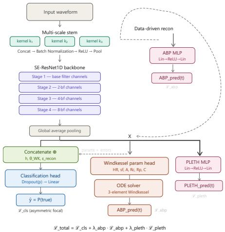
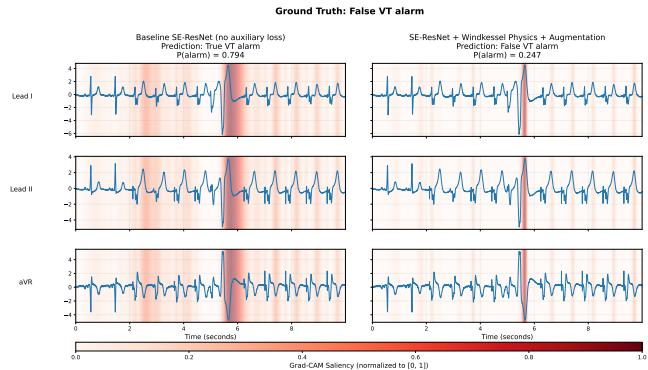

# Physics-Informed Deep Learning for False Ventricular Tachycardia Alarm Reduction in the ICU

Athanasios Papastathopoulos-Katsaros1,2, Alexandra Stavrianidi3,4, Zhandong Liu1,2

1 Department of Pediatrics, Baylor College of Medicine, Houston, TX, USA

2 Jan and Dan Duncan Neurological Research Institute, Texas Children’s Hospital, Houston, TX, USA

3 Institute for Analysis and Numerics, University of Munster, Germany¨

4 Department of Mathematics, Reed College, Portland, Oregon, USA

## Abstract

False ventricular tachycardia (VT) alarms are a leading contributor to alarm fatigue in intensive care units. We propose a deep learning framework combining a 1D SE-ResNet with ICU-realistic data augmentations and a physics-informed auxiliary reconstruction task based on the three-element Windkessel hemodynamic model, implemented as a differentiable forward simulation. By requiring the network’s latent representation to produce physiologically plausible arterial pressure waveforms, artifactdriven ECG patterns are penalized while true VT remains coherent across modalities. Evaluated on the VTaC benchmark under a strict real-time protocol (10 s pre-alarm window), our method achieves a Challenge Score of 85.08 ± 1.65, a 5-point improvement over prior state-of-the-art. Ablation studies confirm that the physics-informed objective is the primary performance driver, providing gains in accuracy, ∼2× label efficiency, and more localized and clinically meaningful ECG segments.

## 1. Introduction

Ventricular tachycardia (VT) is a life-threatening arrhythmia characterized by anomalous ventricular beats exceeding 100 bpm [1]. Because prolonged VT can rapidly lead to sudden cardiac death, ICU monitors are tuned for high sensitivity, making VT alarms among the most prone to false positives [2, 3]. This contributes to alarm fatigue, a critical patient-safety concern [4, 5]. Reducing false VT alarms is a critical problem at the intersection of machine learning and healthcare.

A key difficulty in detecting false alarms is that sensor detachment, patient movement, and electrical interference produce ECG artifacts that closely resemble true arrhythmias, confounding data-driven classifiers. The VTaC benchmark [6] provides over 5,000 multi-institutional ICU recordings with ECG, photoplethysmography (PLETH), and arterial blood pressure (ABP), enabling evaluation. Prior real-time methods, including supervised CNNs, contrastive models [7], and cross-modal VAEs [8], achieve Challenge Scores up to 80.08 [9]. Foundation models [10] and retrospective approaches [11] report higher AUCs, but the former rely on large external pretraining corpora and the latter use post-alarm information, while still remaining vulnerable to severe sensor noise and previously unseen artifact patterns.

We address this gap by embedding physiological structure into the learning process. Our architecture jointly optimizes classification with cross-modal physics-informed reconstruction of ABP (via a Windkessel simulation) and of PLETH via a data-driven decoder. This forces the network to ensure that any ECG pattern classified as VT produces a plausible hemodynamic response, thereby penalizing artifact-driven predictions. Our method achieves a Challenge Score of 85.08 ± 1.65, a ∼5-point improvement over prior state-of-the-art, operating strictly within a 10 s real-time window without external pretraining data.

## 2. Methods

## 2.1. Dataset and Preprocessing

We use the VTaC dataset [6]: 5,037 expert-annotated alarm events (∼29% true) from three geographically distinct U.S. hospitals with different monitors and lead configurations, with the official patient-level 80-10-10 split. Following the real-time protocol, only the final 10 s before each alarm is used (250 Hz, T=2500). Fourteen canonical channels (ECG leads I, II, III, aVR, aVL, aVF, V1–V6, PLETH, ABP) are mapped to fixed slots; unoccupied slots are zero-filled. A binary availability mask $\mathbf { \bar { M } } \in \mathbf { \{ 0 , 1 \} ^ { 1 4 \times T } }$ is concatenated channel-wise and each channel is independently z-normalized per segment.

  
Figure 1. Multi-task architecture. The backbone features are shared across a classification head, a physics-informed Windkessel ODE reconstruction head for ABP, and a datadriven MLP decoder for PLETH. The dashed path shows the data-driven ablation variant.

## 2.2. Architecture

Our backbone is a 1D Squeeze-and-Excitation Residual Network (SE-ResNet1D) [12,13]. To handle varying heart rates and arrhythmia cycle lengths, we replace the standard initial convolution with a Multi-Scale Stem comprising three parallel 1D convolutional branches (kernel sizes 15, 51, and 201 at stride 2), whose outputs are concatenated, batch-normalized, activated with ReLU, and maxpooled. The core feature extractor consists of four sequential stages, each containing two SE-ResNet blocks (kernel size 7, SE reduction ratio 16), with progressive spatial downsampling and channel doubling at stages 2–4. The output is aggregated via global average pooling, followed by dropout and a linear classification layer. Depending on the inclusion of auxiliary heads, the model contains 4–7M trainable parameters. The multi-task architecture is illustrated in Figure 1. Hyperparameters were optimized using Optuna’s TPE sampler to maximize the Challenge Score on the validation set[14]. The search included base filter width {32, 48, 64}, learning rate $[ 1 0 ^ { - 4 } , 1 0 ^ { - 2 } ]$ , weight decay $[ 1 0 ^ { \dot { - } 7 } , 1 0 ^ { - 3 } ] ,$ , classification dropout [0.1, 0.5], the focal-loss penalty, augmentation intensities, auxiliary-loss weights $\lambda _ { \mathrm { a b p } } , \lambda _ { \mathrm { p l e t h } } ~ \in ~ [ 1 0 ^ { - 3 } , 1 ]$ and auxiliary target length {25, 50, 100, 250, 500}.

## 2.3. Data Augmentation and Class Imbalance Strategy

We apply five augmentations targeting documented ICU degradation modes [15]: temporal jitter (±50 samples), additive Gaussian noise, per-channel dropout emulating

sensor detachment [2], amplitude scaling, and baseline wander (0.1–0.5 Hz sinusoid).

We address the class imbalance of the dataset through Asymmetric Focal Loss:

$$
{ \cal L } _ { \mathrm { c l s } } = - w _ { f n } \cdot y ( 1 { - } \hat { p } ) ^ { \gamma ^ { + } } \log \hat { p } - ( 1 { - } y ) \hat { p } ^ { \gamma ^ { - } } \log ( 1 { - } \hat { p } )\tag{1}
$$

where $\gamma ^ { + } = \gamma ^ { - } = 2 . 0 \left[ 1 6 \right]$ and $w _ { f n }$ is a tunable falsenegative weight motivated by the asymmetric $5 \times$ falsenegative penalty of the Challenge Score.

## 2.4. Physics-Informed Auxiliary Regularization

To enforce physiological consistency and reduce overfitting to electrical artifacts, we introduce an auxiliary ABP reconstruction task grounded in the three-element Windkessel model. Unlike the PINN paradigm [17], we do not enforce ODE residuals; instead, we embed a forward physiological model within the supervised model as an auxiliary reconstruction target.

A projection head (64-unit hidden layer, ReLU) predicts six parameters: heart rate HR, systolic fraction $s f ,$ pulse amplitude amp, proximal resistance $R _ { c } ,$ , peripheral resistance $R _ { p } { \mathrm { . } }$ , and compliance C, with HR and $s f$ bounded via scaled sigmoids and amp, $R _ { c } , R _ { p } ,$ and C constrained to be positive via shifted softplus activations. These parameters drive a differentiable forward simulation in 3 stages:

Stage 1: A synthetic ejection proxy models blood flow as a half-sine pulse during systole and zero during diastole:

$$
Q ( t ) = { \left\{ \begin{array} { l l } { a m p \cdot \sin \left( { \frac { \pi t _ { \mathrm { m o d } } } { s f \cdot T _ { \mathrm { c y c } } } } \right) } & { t _ { \mathrm { m o d } } < s f \cdot T _ { \mathrm { c y c } } } \\ { 0 } & { { \mathrm { o t h e r w i s e } } } \end{array} \right. }\tag{2}
$$

where $T _ { \mathrm { c y c } } = 6 0 / H R$ and $t _ { \mathrm { m o d } } = t$ mod $T _ { \mathrm { c y c } }$

Stage 2: The three-element Windkessel ODE

$$
C d P _ { w k } / d t = Q - P _ { w k } / R _ { p }
$$

is integrated via an exact exponential scheme:

$$
P _ { w k } [ n + 1 ] = \gamma P _ { w k } [ n ] + R _ { p } ( 1 - \gamma ) Q [ n ] , \gamma = e ^ { - \Delta t / ( R _ { p } C ) }\tag{3}
$$

which is unconditionally stable for positive $R _ { p } , C ,$ , ensuring well-behaved gradients. The total pressure is $P ( t ) =$ $R _ { c } Q ( t ) + P _ { w k } ( t )$ , mapped to the target space via the learnable parameters. The simulation executes in under 3 ms.

The objective is not to predict ABP—the mapping from ECG to peripheral pressure is ill-posed. The physicsinformed reconstruction acts as structured regularization of the shared backbone. Artifact-driven ECG encodings cannot produce coherent hemodynamic waveforms and incur high reconstruction error, propagating corrective gradients through the shared representation.

PLETH is reconstructed via a data-driven MLP decoder (one hidden layer, 128 units, see dashed path in Figure 1) leveraging its availability (∼91% of recordings vs. ∼36% for ABP). The total training objective is:

$$
L _ { \mathrm { t o t a l } } = L _ { \mathrm { c l s } } + \lambda _ { \mathrm { a b p } } L _ { \mathrm { a b p } } + \lambda _ { \mathrm { p l e t h } } L _ { \mathrm { p l e t h } }\tag{4}
$$

where $L _ { \mathrm { a b p } }$ and $L _ { \mathrm { p l e t h } }$ are masked MSE losses computed only when the respective channels are available. The predicted Windkessel parameters and reconstruction errors are concatenated with the latent features before the final classification layer.

## 3. Results

The primary metric is the PhysioNet 2015 Challenge ${ \mathrm { S c o r e } } = ( T P + T N ) / ( T P + T N + F P + 5 \cdot F N )$ , which penalizes missed true alarms (5× weight). All experiments use 5 random seeds; Challenge Scores are reported as mean ± SD.

## 3.1. Main Results

Table 1 compares our models against prior work on the VTaC test set.

Table 1. Performance on VTaC. “Aug”= augmentations; “DD”= data-driven reconstruction; “Phys”= physicsinformed reconstruction. All our results: mean ± SD over 5 seeds. Some models do not report Challenge Score.
<table><tr><td>Method</td><td>Window</td><td>Score</td><td>AUC</td><td>TPR</td><td>PPV</td></tr><tr><td>FCN [9]</td><td>10s</td><td>80.08±2.46</td><td>.949</td><td>.920</td><td>.717</td></tr><tr><td>BioCross [8]</td><td>10s</td><td>一</td><td>.863</td><td>.814</td><td>.576</td></tr><tr><td>CSFM† [10]</td><td>10s</td><td></td><td>.967</td><td></td><td></td></tr><tr><td>FCNN* [11]</td><td>6 min</td><td></td><td>.973</td><td>.940</td><td>.950</td></tr><tr><td>Ours: baseline</td><td>10s</td><td>80.84±2.88</td><td>.949</td><td>.931</td><td>.708</td></tr><tr><td>+ DD Recon</td><td>10s</td><td>81.41±2.97</td><td>.956</td><td>.917</td><td>.752</td></tr><tr><td>+ Phys Recon</td><td>10s</td><td>82.26±2.62</td><td>.947</td><td>.946</td><td>.706</td></tr><tr><td>+ Aug</td><td>10s</td><td>81.71±2.24</td><td>.953</td><td>.944</td><td>.700</td></tr><tr><td>+ Aug &amp; DD</td><td>10s</td><td>84.16±0.68</td><td>.964</td><td>.953</td><td>.732</td></tr><tr><td>+ Aug &amp; Phys</td><td>10s</td><td>85.08±1.65</td><td>.961</td><td>.958</td><td>.742</td></tr></table>

∗Retrospective (uses post-alarm data). †Foundation model pretrained on a much larger external corpus.

## 3.2. Ablation Studies

Reconstruction paradigm: Without augmentations, physics-informed reconstruction improves the baseline by +1.42 Challenge Score points vs. +0.57 for data-driven reconstruction. With augmentations, physics-informed reconstruction reaches 85.08 ± 1.65 vs. the data-driven decoder.

Label efficiency: Table 2 (top) evaluates all variants at 5%, 10%, 20%, and 50% label fractions. The physicsinformed model at 5% labels (64.74±2.94) nearly matches the augmentation-only baseline at 10% (65.04 ± 1.98), demonstrating approximately 2× label efficiency. It is the only multi-task variant that improves over baseline at every evaluated fraction.

  
Figure 2. Grad-CAM comparison for a ground-truth false VT alarm. The baseline SE-ResNet (left) is confused by the noisy signal, with diffused saliency across the artifact, leading to an incorrect True VT prediction. In contrast, the physics-informed model (right) has learned to robustly identify non-physiological noise; it perfectly localizes the sharp movement artifact and uses this precise detection to correctly reject the false alarm.

Robustness to missing modalities: Table 2 (bottom) simulates sensor failures on the physics-informed model trained with 100% of the labels and evaluated over five seeds. Sensor dropout reduces the Challenge Score by −1.33 for ABP and −4.85 for PLETH. Signal replacement with uncorrelated Gaussian noise (mask retained) is more damaging: −4.98 for ABP and −6.42 for PLETH. Thus, corrupted signals are more damaging than missing signals.

Interpretability: Quantitative localization analysis with Grad-CAM [18] was restricted to true-alarm samples (n = 128), because these contain a genuine VT transition against which temporal localization can be meaningfully assessed. The physics-informed model produced more localized saliency in 89.1% of cases, with mean Gini coefficient increasing from 0.52 ± 0.11 to 0.65 ± 0.09. Figure 2 shows a false alarm misclassified by the baseline but correctly rejected by the physics-informed model.

Table 2. (Top) Label efficiency: Challenge Score across label fractions. All variants include augmentations. (Bottom) Modality robustness on the physics-informed model for a single run.  
Label Efficiency (Challenge Score)
<table><tr><td>Variant</td><td>5%</td><td>10%</td><td>20%</td><td>50%</td></tr><tr><td>Augs baseline (no recon)</td><td>57.12±2.79</td><td>65.04±1.98</td><td>72.18±3.24</td><td>77.61±1.91</td></tr><tr><td>PLETH only (DD)</td><td>62.17±4.15</td><td>68.60±3.20</td><td>70.23±3.26</td><td>76.39±2.29</td></tr><tr><td>PLETH + ABP (DD)</td><td>62.72±3.27</td><td>66.85±3.89</td><td>69.63±2.94</td><td>76.47±2.07</td></tr><tr><td>PLETH + ABP (Phys)</td><td>64.74±2.94</td><td>68.90±4.28</td><td>73.13±1.36</td><td>78.75±2.75</td></tr><tr><td colspan="5">Modality Robustness (Physics Model; Score difference compared to baseline)</td></tr><tr><td>Condition</td><td colspan="2">Sensor Dropout</td><td colspan="2">Noise Replacement</td></tr><tr><td>ABP only</td><td colspan="2">-1.33</td><td colspan="2">-4.98</td></tr><tr><td>PLETH only</td><td colspan="2">-4.85</td><td colspan="2">-6.42</td></tr><tr><td>Both</td><td colspan="2">-5.18</td><td colspan="2">-10.15</td></tr></table>

## 4. Discussion

The key mechanism underlying the improvement is cross-modal artifact disentanglement. False VT alarms primarily arise from gross signal corruption— electrode detachment, patient movement, electrosurgical interference—that produces wide-complex, high-rate ECG patterns indistinguishable from VT on a single lead [2]. The Windkessel reconstruction head penalizes artifactdependent features because electrical artifacts have no hemodynamic correlate: if the backbone encodes an artifactual ECG as “VT,” the simulated pressure waveform will be incoherent and incur high reconstruction loss.

Notably, the ABP reconstruction loss decreases by approximately 2–3% over training, consistent with the illposed nature of the ECG-to-pressure mapping. The regularization benefit is disproportionate to this reconstruction accuracy; the value lies in shaping the gradient landscape so that an unconstrained MLP decoder would simply absorb artifacts into flexible weights, while the Windkessel’s fixed dynamical structure propagates corrective gradients. Classification requires $\leq 4$ ms on GPU, and the Windkessel head is removed at inference. However, limitations include the lumped-parameter simplicity of the Windkessel approximation, ABP availability in only 36% of recordings, and evaluation on a single benchmark.

## 5. Conclusions

We have shown that embedding a simple hemodynamic forward model as an auxiliary reconstruction task provides a powerful inductive bias for false VT alarm reduction. The physics-informed constraint drives performance gains while improving label efficiency and interpretability, offering a promising strategy for robust clinical classification in high-acuity settings with limited labeled data.

## Acknowledgements

APK and ZL were supported by NIH grant 5R01HG011795, CPRIT grant RP240131, Chan Zuckerberg Initiative (2023-332162), the Chao Endowment and the Huffington Foundation. AS was funded by the DFG under Germany’s Excellence Strategy EXC 2044/2–390685587.

## References

[1] Clifford GD, et al. False alarm reduction in critical care. Physiol Meas 2016;37(8).

[2] Drew BJ, et al. Insights into the Problem of Alarm Fatigue with Physiologic Monitor Devices: A Comprehensive Observational Study of Consecutive Intensive Care Unit Patients. PLoS ONE 2014;9(10).

[3] Aboukhalil A, et al. Reducing false alarm rates for critical arrhythmias using the arterial blood pressure waveform. Journal of Biomedical Informatics 2008;41(3).

[4] Fallet S, et al. False arrhythmia alarms reduction in the intensive care unit: a multimodal approach. Physiol Meas 2016;37(8).

[5] Chromik J, et al. Computational approaches to alleviate alarm fatigue in intensive care medicine: A systematic literature review. Front Digit Health 2022;4.

[6] Lehman Lw, et al. VTaC: A Benchmark Dataset of Ventricular Tachycardia Alarms from ICU Monitors, 2024.

[7] Zhou Y, et al. A contrastive learning approach for icu false arrhythmia alarm reduction. Scientific Reports 2022;12.

[8] Wang M, et al. BioCross: A cross-modal framework for unified representation of multi-modal biosignals with heterogeneous metadata fusion. Information Fusion 2025;123.

[9] Lehman LwH, et al. Vtac: a benchmark dataset of ventricular tachycardia alarms from icu monitors. In Proceedings of the 37th International Conference on Neural Information Processing Systems, NIPS ’23. Red Hook, NY, USA: Curran Associates Inc., 2023; .

[10] Gu X, et al. Cardiac health assessment across scenarios and devices using a multimodal foundation model pretrained on data from 1.7 million individuals. Nat Mach Intell 2026; 8(2).

[11] Farayola GF, et al. Reducing False Ventricular Tachycardia Alarms in ICU Settings: A Machine Learning Approach. In 2025 10th International Conference on Machine Learning Technologies (ICMLT). Helsinki, Finland: IEEE, 2025; .

[12] He K, et al. Deep Residual Learning for Image Recognition. In 2016 IEEE Conference on Computer Vision and Pattern Recognition (CVPR). Las Vegas, NV, USA: IEEE, 2016; .

[13] Hu J, et al. Squeeze-and-Excitation Networks. IEEE Trans Pattern Anal Mach Intell 2020;42(8).

[14] Akiba T, et al. Optuna: A Next-generation Hyperparameter Optimization Framework. In Proceedings of the 25th ACM SIGKDD International Conference on Knowledge Discovery & Data Mining. Anchorage AK USA: ACM, 2019; .

[15] Iwana BK, et al. An empirical survey of data augmentation for time series classification with neural networks. PLoS ONE 2021;16(7).

[16] Lin TY, et al. Focal Loss for Dense Object Detection. IEEE Trans Pattern Anal Mach Intell 2020;42(2).

[17] Raissi M, et al. Physics-informed neural networks: A deep learning framework for solving forward and inverse problems involving nonlinear partial differential equations. Journal of Computational Physics 2019;378.

[18] Selvaraju RR, et al. Grad-CAM: Visual Explanations from Deep Networks via Gradient-Based Localization. Int J Comput Vis 2020;128(2).

Athanasios Papastathopoulos-Katsaros   
Department of Pediatrics, Baylor College of Medicine, Houston,   
TX, 77030, United States of America   
athanasios.papastathopoulos-katsaros@bcm.edu