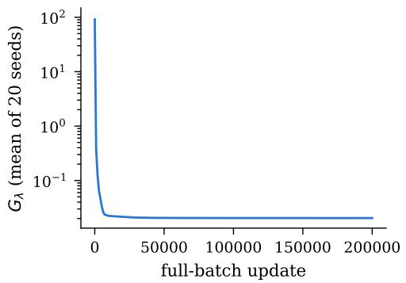
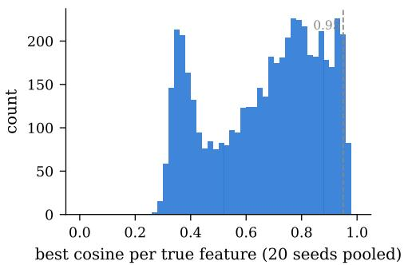
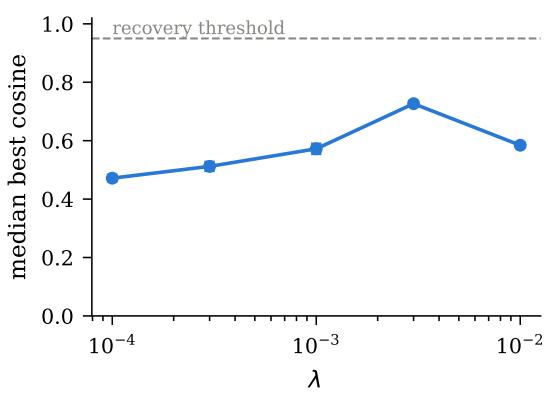
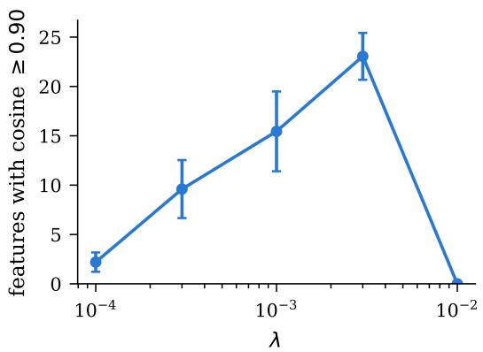
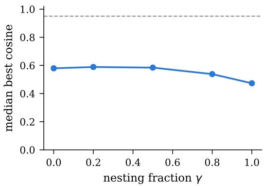
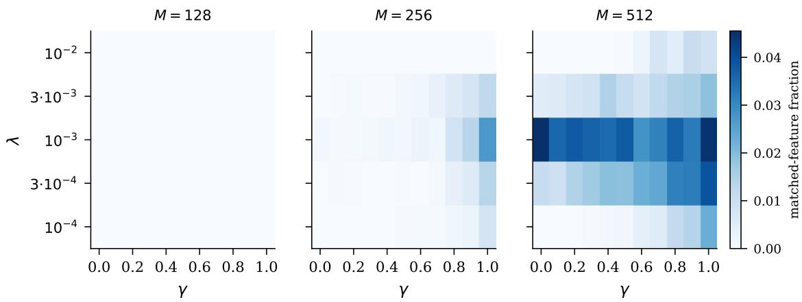
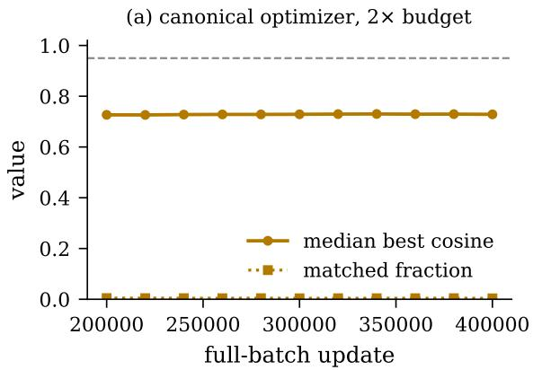
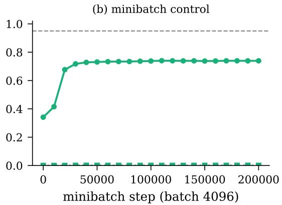

# A Dominant Difuse Phase in the Sparse Autoencoder Phase Diagram

Alexis D. Plascencia∗ ORCID: 0000-0001-6393-4802

## Abstract

Sparse autoencoders (SAEs) are increasingly used to recover interpretable features from neural-network activations, yet systematic feature co-occurrence can cause distinct features to be absorbed or merged. The MAIS-O43 open problem proposes a controlled experiment to characterize when recovery of a true synthetic dictionary gives way to feature merging as the nesting fraction γ, sparsity penalty λ, and dictionary size M vary. We implement the specified protocol and evaluate 200 independently initialized fits across ten of the 165 grid cells. We observe zero full-dictionary recoveries and zero merges. Instead, every run converges to a reproducible difuse phase: reconstruction is nearly perfect, but learned atoms typically remain far from the true features (median best cosine 0.5–0.7 against a 0.95 recovery criterion) and learned codes are an order of magnitude denser than the ground truth. This behavior persists under robustness checks and across the full 165-cell grid using standard minibatch Adam (3,300 additional fits). Since the global optimum of the exact sparse-coding objective is known to merge nested features in the two-feature case, these results suggest that trained SAEs need not reach the corresponding minima, and that the phase diagram of trained models may difer fundamentally from that of objective minimizers.

## 1 Introduction

Sparse autoencoders have become a standard tool of mechanistic interpretability: trained on network activations, their decoder atoms are read as candidate features [1, 2], following the classical sparse-coding program of Olshausen and Field [3] and the superposition model of Elhage et al. [4]. A central failure mode is feature absorption [5]: when feature B never fires without feature A, an SAE may learn an atom for the joint direction rather than recovering A and B separately.

The MAIS research agenda [6] formalizes this phenomenon geometrically and poses, as open problem MAIS-O43, a fully specified experiment: measure the probabilities of recovery, merging, and splitting of a known synthetic dictionary over an 11 × 5 × 3 grid of nesting fraction γ, sparsity penalty λ, and dictionary size M, with 20 independent initializations per cell (3,300 fits). The problem fixes the generator, the objective, the optimizer, the sample counts, and the outcome definitions, and requires publishing seeds and checkpoints. This paper reports the first measurements of the MAIS-O43 phase diagram, covering 10 of its 165 cells under the specified protocol: nine M=256 cells — the full λ-sweep at γ = 0.5 and the γ-row at $\lambda = 1 0 ^ { - 2 }$ for $\gamma \in { 0 , 0 . 2 , 0 . 5 , 0 . 8 , 1 . 0 }$ , which share one cell — plus one M=512 cell at $( \gamma { = } 0 . 5 , \lambda { = } 1 0 ^ { - 3 } )$ , for 200 independently initialized fits in total. These slices were chosen to resolve the two one-dimensional questions we judged most informative: the λ-response at fixed nesting, and the nesting response at the strongest penalty. The remaining 155 canonical cells are unmeasured under the full-batch protocol; all 165 cells are, however, covered by the minibatch companion grid of Section 6.

This paper is organized as follows: in Section 2 we situate this work in the dictionary-learning, sparse-autoencoder, and hierarchical-features literature. In Section 3 we state the MAIS-O43 protocol: the nested-support generator, the centered SAE objective and optimizer, and the exact recovery, merge, and split definitions. In Section 4 we describe the exact, preregistered, independently testable implementation of the MAIS-O43 protocol, with adversarially validated outcome classifiers. In Section 5 we present the results: zero full-dictionary recoveries and zero merges in 200 fits, with low matched-feature fractions despite near-perfect reconstruction, and a characterization of the difuse phase that occurs instead.

In Section 6 we discuss two robustness probes and a complete minibatch (of-protocol) companion grid, demonstrating that the difuse phase is neither an under-training artifact (doubling the update budget changes nothing) nor an artifact of the protocol’s full-batch optimizer (standard minibatch Adam reaches the same plateau 64× faster, and covers the entire 165-cell grid without a single recovery or merge). In Section 7, we discuss the implications of trained SAEs not necessarily reaching the global minimizers of the exact sparse-coding objective whose merging behavior is predicted by theory. Finally, in Section 8 we present our conclusions.

## 2 Related work

Dictionary learning and structured sparsity. The data model we measure, $y = \Phi x$ with sparse nonnegative x, is the classical dictionary-learning model. Olshausen and Field [3] introduced it as an account of simple-cell receptive fields; Mairal et al. [7] gave its modern formulation — data as sparse linear combinations of learned dictionary atoms — together with scalable online algorithms and applications across signal processing and matrix factorization. The parent–child structure in the MAIS-O43 generator also has a classical precedent: Jenatton et al. [8] studied tree-structured sparse coding, in which hierarchical relationships among atoms are imposed on the support of x via structured regularization. The MAIS generator encodes the same child-implies-parent support logic, but places it in the data-generating process and asks whether an unstructured learner recovers it, rather than building it into the learner.

Superposition and sparse autoencoders. Elhage et al. [4] connected sparse coding to modern interpretability: synthetic sparse features, compressed into fewer dimensions than features, are represented by neural networks in superposition, raising the question of whether the original features can be un-mixed. Sparse autoencoders are the dominant answer: Bricken et al. [2] framed SAEs explicitly as dictionary learning on network activations, and Cunningham et al. [1] showed the resulting features support causal analyses of model behavior. Subsequent work has repeatedly modified the sparsity mechanism itself: gated SAEs decouple direction selection from magnitude estimation specifically to remove the systematic activation shrinkage induced by the $\ell _ { 1 }$ penalty [9], and top-k SAEs abandon the $\ell _ { 1 }$ penalty for direct sparsity control, with clean scaling laws in dictionary size [10]. These design responses are relevant context for our results: MAIS-O43 fixes the vanilla $\mathrm { R e L U } + \ell _ { 1 }$ architecture, and the collapse we measure at the largest penalty (Section 5) is a quantitative image of the shrinkage pathology these variants were built to avoid.

Hierarchical features, absorption, and hierarchical SAEs. The nesting axis of MAIS-O43 is motivated by feature absorption: Chanin et al. [5] showed that when a broad feature co-occurs with a more specific one (animal whenever dog), sparsity pressure can drive an SAE to represent “animal-except-dog” plus “dog” rather than the true pair — precisely the failure a controlled nested generator is designed to detect. That hierarchy is the realistic case, not a corner case, is supported by Park et al. [11], who find that categorical and hierarchically related concepts occupy structured geometry (simplices and orthogonal complements) in LLM representations. The generator closest to ours appears in Bussmann et al. [12]: a tree of binary ground-truth features in which a child is sampled only when its parent is active and active directions are summed — essentially our $A _ { j } = B _ { i } B _ { j }$ used to show that standard SAEs absorb parent features and that nested (Matryoshka) dictionaries mitigate this. Costa et al. [13] likewise construct synthetic hierarchical generative processes and show that a matching-pursuit-style sequential encoder captures hierarchical and conditionally orthogonal structure that flat SAEs miss. Most recently, Zhang et al. [14] give a set-theoretic and geometric account of concept learning in SAEs. Their framework distinguishes graded notions of detection, separation, and approximation, establishes capacity limits in dictionary size, and ofers a unified explanation of splitting, absorption, and hierarchical concepts. It also predicts the efects of SAE size and sparsity that we measure empirically here. A growing architectural line builds the hierarchy into the learner itself: Muchane et al. [15] add explicit semantic hierarchy to the SAE architecture; Cao et al. [16] embed a tree over the feature set and argue that activation coverage — the child-active-implies-parent-active property that our generator encodes — is by itself insuficient to certify semantic hierarchy, adding a reconstruction condition; and Luo et al. [17] jointly learn features and parent–child links, yielding a feature forest rather than a flat dictionary.

Where this paper sits. Two points of tension with this literature motivate our measurements. First, the toy-model studies above generally report that flat SAEs do learn feature-aligned atoms in favorable regimes and fail in specific, structured ways (absorption, splitting) when hierarchy is present [5, 12, 13]. Under the MAIS-O43 protocol we observe something diferent and, to our knowledge, not previously quantified: no full-dictionary recovery and no merge under the paper’s pairwise threshold definition, but a low-alignment regime in which only a small fraction of true features (at most 3.6% per run) have a distinct atom above cosine 0.95. Candidate explanations for the diference include the regime (here $m / n = 4 { \mathrm { ~ w i t h ~ } } \approx 8$ simultaneously active features, denser than many toy setups), the fixed vanilla $\ell _ { 1 }$ architecture without dead-feature resampling or auxiliary losses [2, 10], and MAIS-O43’s strict quantitative outcome definitions (cosine $\ge ~ 0 . 9 5$ under an injective matching; exact residual criteria for merges) in place of qualitative absorption diagnostics. Reconciling the qualitative absorption literature with quantitative phase measurements is an open gap that the full MAIS-O43 grid — and replications of it under the SAE variants above — would close. The distinction matters theoretically as well: Klindt et al. [18] argue on identifiability and compressed-sensing grounds that features in superposition are recoverable in principle by sparse coding; our null is therefore not an impossibility claim but a measurement of the gap between recoverability in principle and what a trained amortized SAE attains under a fixed protocol. Second, the theoretical side of the MAIS agenda [6] characterizes global minimizers, which provably merge nested features in the two-feature case; our measurements bear on whether trained SAEs reach those minimizers at all (Section 7).

## 3 The MAIS-O43 protocol

Generator. Fix $n = 6 4$ ambient dimensions and $m = 2 5 6$ true features. The dictionary $\Phi = [ v _ { 1 } , \ldots , v _ { m } ] \in \mathbb { R } ^ { n \times m }$ has i.i.d. $\textstyle { \mathcal { N } } ( 0 , I _ { n } )$ columns normalized to unit length; one fixed draw is used throughout. A fixed random permutation of [m] pairs consecutive entries into 128 ordered parent–child candidate pairs. For nesting fraction $\gamma _ { ; }$ , the first ⌊128γ⌋ pairs are declared nested. Each sample draws independent indicators $B _ { i } \sim \mathrm { B e r n o u l l i } ( 1 / 3 2 )$ ; a nested pair $( i , j )$ sets activities $A _ { i } = B _ { i } , A _ { j } = B _ { i } B _ { j }$ (the child never fires without its parent; child marginal $1 / 1 0 2 4 )$ , all other features keep $A _ { k } = B _ { k }$ . Active coeficients are drawn from Unif[1, 2], and the observation is $y = \Phi x$ . Each $\gamma$ uses $2 ^ { 1 8 }$ fixed training samples and $2 ^ { 1 6 }$ fresh evaluation samples.

Note that the canonical $\gamma$ intervention therefore changes two things at once: the parent–child dependence and the child’s marginal frequency. With $q = \lfloor 1 2 8 \gamma \rfloor$ nested pairs, the expected ground-truth activation density is

$$
d _ { \mathrm { t r u e } } ( \gamma ) = \frac { 1 } { 2 5 6 } \left( \frac { 2 5 6 - q } { 3 2 } + \frac { q } { 1 0 2 4 } \right) ,
$$

which decreases from 0.03125 at $\gamma = 0$ to 0.01611 at $\gamma = 1$ . Efects attributed to nesting along the $\gamma$ axis are thus joint efects of dependence and rarity; disentangling them requires the matched-frequency control discussed in Section 8.

Model and training. The centered SAE has encoder $c ( y ) = \mathrm { R e L U } ( W y + b )$ and decoder $\Psi \in \mathbb { R } ^ { n \times M }$ with unit-norm columns and no output bias, trained on

$$
G _ { \lambda } ( \Psi , W , b ) = \mathbb { E } \Big [ \frac { 1 } { 2 } \| y - \Psi c ( y ) \| _ { 2 } ^ { 2 } + \lambda \| c ( y ) \| _ { 1 } \Big ]\tag{1}
$$

by full-batch Adam [19] (learning rate $1 0 ^ { - 3 } , \beta = ( 0 . 9 , 0 . 9 9 9 ) , \epsilon = 1 0 ^ { - 8 } )$ for $2 \times 1 0 ^ { 5 }$ updates, each update taking the exact gradient of the full 218-sample mean. Decoder columns are renormalized after every step. Twenty independent initializations are trained per cell.

Twenty independently seeded models are trained per cell: decoder columns are initialized from independent $\mathcal { N } ( 0 , I _ { 6 4 } )$ draws normalized to unit length (drawn in float64 on CPU and cast, so initialization is device- and dtype-independent), $\Psi ^ { \top }$ . at initialization only, and $b = 0 ;$ encoder and decoder are untied thereafter. The 20 models have independent parameter seeds but share the fixed training and evaluation datasets for their $\gamma .$ . Formal runs use strict float32 with TF32 disabled and fixed-order chunked gradient accumulation (chunk size 16,384), taking one Adam step after the exact full-data gradient is accumulated; all outcome metrics are computed in float64.

Outcome definitions. Let $S _ { j i } = \langle \psi _ { j } , v _ { i } \rangle$ and call an atom live if it activates above $1 0 ^ { - 8 }$ on at least one evaluation sample.

Definition 1 (Recovery, $\varepsilon = 0 . 0 5 )$ . Ψ recovers Φ if an injection $\tau : [ m ]  [ M ]$ exists with $S _ { \tau ( i ) , i } \geq 1 - \varepsilon$ for all i (decided by exact maximum bipartite matching).

Definition 2 (Merge, $( \varepsilon , \delta ) = ( 0 . 0 5 , 0 . 1 ) )$ . A live atom u merges features $i \neq k \ i f \exists \alpha , \beta \geq \delta$ with $\| u - \alpha v _ { i } - \beta v _ { k } \| \leq \varepsilon$ while $\langle u , v _ { i } \rangle \leq 1 - \delta$ and $\langle u , v _ { k } \rangle \leq 1 - \delta$ (solved by exact constrained least squares over all pairs).

Definition 3 (Split, $\delta = 0 . 0 5 )$ . Feature i is split if at least two live atoms satisfy $S _ { j i } \geq 1 - \delta$

## 4 Methods

Implementation and validation. The generator, model, trainer, and classifiers are implemented in PyTorch/NumPy with a 49-test suite: data-generation invariants $( \mathrm { c h i l d } \Rightarrow \mathrm { p a r e n t } ;$ marginals 1/32 and 1/1024; bit-exact regeneration from seeds), agreement of the training gradients with an independent NumPy implementation at $1 0 ^ { - 1 2 }$ tolerance, exact equality of chunked and single-batch full-batch gradients, and nine adversarial classifier fixtures (greedy-defeating matching instances, dead-atom exclusions, threshold-boundary cases at $0 . 9 5 / 0 . 9 0 / 0 . 0 5$ , and the analytic two-feature nested optimum of the MAIS agenda). All randomness descends from a single published master seed through purpose-keyed streams.

Vectorized training. The 20 fits of a cell are trained as one batched tensor program (stacked parameters; one Adam instance, which is exactly per-model Adam since the loss is a sum over models and Adam is elementwise). Full training trajectories of the vectorized program match independently trained scalar runs at $1 0 ^ { - 9 }$ tolerance in float64 tests. Formal runs use strict float32 with TF32 disabled on NVIDIA RTX 4080 SUPER GPUs (torch 2.11.0+cu128); training a 20-seed cell takes 10.2 h (M = 256) or 17.5 h (M = 512).

## 5 Results

No recovery, no merging. Table 1 summarizes the results from all ten cells. Under the preregistered definitions, none of the 200 fits fully recovers all 256 features, and none contains a live atom satisfying the pairwise merge criterion. Individual-feature matches do occur: 44 runs contain at least one matched feature, for 215 matched assignments in total (0.42% of the $2 0 0 \times 2 5 6$ possible assignments). Splitting occurred with M = 512, where it was detected in 5 of 20 runs.

The difuse phase. Across runs in the measured cells, the mean evaluation reconstruction loss, defined as $\frac { 1 } { 2 } \lVert y - \hat { y } \rVert _ { 2 } ^ { 2 }$ per sample, ranges from $2 . 7 \times 1 0 ^ { - 6 } \mathrm { ~ t o ~ } 5 . 6 \times 1 0 ^ { - 3 }$ . Mean matched-feature fractions range from 0 to 0.036 per cell and mean median best cosines from 0.472 to 0.727, although some individual features do exceed the 0.95 threshold (44 of 200 runs contain at least one). Under the $1 0 ^ { - 8 }$ activity rule, learned codes are $9 . 9 \mathrm { - } 2 7 . 9 \times$ denser than the γ-dependent ground-truth codes. Loss trajectories are late-stage plateaus rather than exactly flat: over the final 4,000 updates the relative loss change has median $6 . 9 \times 1 0 ^ { - 4 }$ across the 200 runs and maximum 1.5%; Probe A (Section 6) tests substantially longer training at one selected cell. We use difuse phase to denote exactly this observed combination: near-floor reconstruction error, matched-feature fractions below 0.04, and code density an order of magnitude above the ground truth.

Table 1: Results for the ten measured canonical cells; entries are means over 20 parameter initializations per cell. No run recovered all 256 features and no run contained a live atom satisfying the pairwise merge criterion. Treating all 200 heterogeneous runs descriptively as Bernoulli trials with a common event probability gives a one-sided 95% zero-event bound of 1.49%; the corresponding per-cell bound is 13.91%. The column $\mathrm { ~  ~ { ~ \stackrel { ~ 6 6 } ~ { ~ 2 ~ } ~ 0 . 9 0 } ~ ^ { 5 } ~ }$ denotes the number of true features, out of 256, whose best-aligned learned atom achieves cosine similarity at least 0.90. The density column reports the learned activation density with, in parentheses, its ratio to the γ-dependent ground-truth density $d _ { \mathrm { t r u e } } ( \gamma )$ of Section $3 ;$ for $M = 5 1 2$ the ratio compares density fractions, not active counts.
<table><tr><td>Cell</td><td>matched frac.</td><td>median cos</td><td> $\geq 0 . 9 0$ </td><td>density (× true)</td><td>splits</td></tr><tr><td> $\gamma = 0 . 0 , \ \lambda = 1 0 ^ { - 2 } , \ M = 2 5 6$ </td><td>0.000</td><td>0.580</td><td>0.0</td><td>0.479 (15.3×)</td><td>0</td></tr><tr><td> $\gamma = 0 . 2 , \ \lambda = 1 0 ^ { - 2 } , \ M = 2 5 6$ </td><td>0.000</td><td>0.589</td><td>0.0</td><td>0.479 (16.9×)</td><td>0</td></tr><tr><td> $\gamma = 0 . 5 , \ \lambda = 1 0 ^ { - 4 } , \ M = 2 5 6$ </td><td>0.000</td><td>0.472</td><td>2.2</td><td>0.312 (13.2×)</td><td>0</td></tr><tr><td> $\gamma = 0 . 5 , \ \lambda = 3 { \cdot } 1 0 ^ { - 4 } , \ M = 2 5 6$ </td><td>0.001</td><td>0.512</td><td>9.6</td><td>0.294 (12.4×)</td><td>0</td></tr><tr><td> $\gamma = 0 . 5 , \ \lambda = 1 0 ^ { - 3 } , \ M = 2 5 6$ </td><td>0.001</td><td>0.572</td><td>15.4</td><td>0.303 (12.8×)</td><td>0</td></tr><tr><td> $\gamma = 0 . 5 , \ \lambda = 3 { \cdot } 1 0 ^ { - 3 } , \ M = 2 5 6$ </td><td>0.005</td><td>0.727</td><td>23.1</td><td>0.450 (19.0×)</td><td>0</td></tr><tr><td> $\gamma = 0 . 5 , \ \lambda = 1 0 ^ { - 2 } , \ M = 2 5 6$ </td><td>0.000</td><td>0.584</td><td>0.0</td><td>0.476 (20.1×)</td><td>0</td></tr><tr><td> $\gamma = 0 . 8 , \ \lambda = 1 0 ^ { - 2 } , \ M = 2 5 6$ </td><td>0.000</td><td>0.538</td><td>0.1</td><td>0.467 (24.3×)</td><td>0</td></tr><tr><td> $\gamma = 1 . 0 , \ \lambda = 1 0 ^ { - 2 } , \ M = 2 5 6$ </td><td>0.000</td><td>0.473</td><td>0.2</td><td>0.450 (27.9×)</td><td>0</td></tr><tr><td> $\gamma = 0 . 5 , \ \lambda = 1 0 ^ { - 3 } , \ M = 5 1 2$ </td><td>0.036</td><td>0.712</td><td>34.3</td><td>0.234 (9.9×)</td><td>5/20 runs</td></tr></table>

An interior alignment maximum in λ. Among the five tested penalties at $\gamma = 0 . 5$ (Figure 2), the alignment summaries increase from $\lambda = 1 0 ^ { - 4 }$ to a maximum at $\lambda = 3 \times 1 0 ^ { - 3 }$ (median best cosine 0.727; on average 23 of 256 features above cosine 0.90) and decline at $\lambda = 1 0 ^ { - 2 }$ , where the code becomes denser (density 0.48) while activation magnitudes shrink — a pattern consistent with the known $\ell _ { 1 }$ activation-shrinkage efects that gated and top-k SAE variants were designed to remove [9, 10]. These five measurements do not isolate shrinkage as the cause of the alignment decline, and the best penalty in the grid still misses the recovery criterion by a wide margin.

Nesting has almost no efect. Along the $\lambda = 1 0 ^ { - 2 }$ row (Figure 3), $\gamma \leq 0 . 5$ cells are statistically indistinguishable, with a mild decline in alignment at $\gamma \geq 0 . 8$ . Crucially, the merging that nesting is predicted to force never occurs (not even at $\gamma = 1 )$ where every feature belongs to a nested pair.

Dictionary size is the strongest lever. At identical $( \gamma , \lambda ) = ( 0 . 5 , 1 0 ^ { - 3 } )$ , doubling M from 256 to 512 raises the matched-feature fraction from 0.001 to 0.036 and the median cosine from 0.572 to 0.712, a larger efect than any λ or γ change measured. $M = 5 1 2$ is also the only setting producing splits (5 of 20 runs).

Figure 1: Left panel: Training objective for the $( \gamma { = } 0 . 5 , \lambda { = } 1 0 ^ { - 3 } , M { = } 5 1 2 )$ cell, averaged over 20 seeds; the shaded region denotes the min–max band across seeds (which is very narrow). Right panel: Best cosine similarity for each true feature at convergence, pooled across the cell’s 20 seeds. The dashed line indicates the 0.95 recovery criterion.  

  
Figure 2: The λ-response at $\gamma = 0 . 5$ , M = 256 (mean ± s.d. over 20 seeds). Left panel: median best cosine per feature. Right panel: number of features (of 256) whose best atom reaches cosine 0.90. The response peaks at the interior value $\lambda = 3 \times 1 0 ^ { - 3 }$ and collapses at $\lambda = 1 0 ^ { - 2 }$

## 6 Robustness probes

Two deliberate, clearly labeled protocol deviations test the two most likely mundane explanations of the difuse phase; both use the peak cell $\left( \gamma = 0 . 5 , \ \lambda { = } 3 \times 1 0 ^ { - 3 } , \ M { = } 2 5 6 \right)$

Probe A: is it under-training? We continue the cell’s 20 fits from their canonical 200k-update endpoint to 400k full-batch updates, with geometry snapshots every 20k updates (Figure 5a). Doubling the budget barely moves the alignment metrics: median best cosine goes from 0.727 to 0.729, the number of features above cosine 0.90 stays at ∼23, about one feature per run sits above 0.95, and the matched-feature fraction remains ∼0.004 throughout. Final outcomes over the 20 continued fits: recovery 0/20, merges 0/20. At this cell, then, the difuse solution is not a snapshot of slow progress toward recovery. This argues against simple under-training here, but does not by itself establish stationarity or convergence at every measured cell.

  
Figure 3: Median best cosine as a function of the nesting fraction for $\lambda = 1 0 ^ { - 2 }$ and $M = 2 5 6$ $\mathrm { ( m e a n \pm s . d }$ . over 20 seeds).

Probe B: is it the full-batch optimizer? We retrain the same cell configuration — same data, same 20 initialization seeds, same learning rate, betas, epsilon, and decoder renormalization — replacing only the optimizer semantics: standard minibatch Adam with random batches of 4,096 samples (with replacement) for $2 \times 1 0 ^ { 5 }$ steps (≈3,100 epochs). This is how SAEs are trained in practice [1, 2]. The result is a strong null: minibatch training reaches the same difuse plateau, only much faster. Median best cosine rises to 0.739 by ∼60k steps — statistically indistinguishable from the canonical protocol’s 200k-update peak of 0.727 — and then remains flat for the remaining 140k steps (0.7393 at step 200k). Final outcomes over the 20 seeds: recovery $0 / 2 0$ , merges $0 / 2 0$ , matched-feature fraction 0.001, with ∼0.25 features per run above the 0.95 criterion. Wall-clock is 573 s versus 36,546 s for the canonical cell (∼64× faster to the same solution). The difuse phase therefore survives the standard optimizer: it is a property of the objective, data regime, and amortized encoder at these settings, not an artifact of the protocol’s full-batch semantics (Figure 5b).

The full of-protocol companion grid. Probe B’s 64× speedup makes the full grid inexpensive to measure: we retrained the entire 165-cell grid — all eleven γ values, all five λ values, all three dictionary sizes, 20 seeds each, 3,300 fits — under the minibatch optimizer, in 29.5 GPU-hours of elapsed time. The result extends the difuse-phase finding from a slice to the whole space: zero recoveries and zero merges in all 3,300 fits. For the 1,100 M=128 fits, full recovery is structurally impossible since $M < m ,$ , so the M=256 and M=512 cells are the informative recovery tests. The only structure anywhere is the familiar M = 512 signature — occasional splits (34 cells, at most 30% of runs) and matched-feature fractions peaking at 4.6% at $( \gamma = 0 , \lambda { = } 1 0 ^ { - 3 } , M { = } 5 1 2 )$ (Figure 4). The near-γ-invariance of the canonical slice holds across the grid: the best-aligned cells at $\gamma = 0$ and $\gamma = 1$ have similar peak matched fractions (0.046 vs 0.045), though this does not establish causal irrelevance of nesting or equivalence across all alignment metrics. Being of-protocol, this companion grid does not resolve MAIS-O43; it does, however, make the canonical grid’s likely outcome — and the economics of confirming it — concrete.

  
Figure 4: The complete of-protocol companion grid: mean matched-feature fraction over 20 seeds at every $( \gamma , \lambda , M )$ cell under standard minibatch Adam (3,300 fits). No cell exceeds 0.046 against a recovery criterion requiring 1.0; recovery and merge fractions are zero everywhere. Alignment concentrates in the M=512, moderate-λ corner and is essentially independent of the nesting fraction γ.

## 7 Discussion

A third phase. MAIS-O43 frames its outcome space as recovery versus merging (with splitting as a secondary efect). The sampled region of the grid exhibits neither: a converged difuse phase dominates, in which the SAE solves the reconstruction problem with a dense, well-spread frame and the sparsity penalty rotates it only slowly and incompletely toward the true dictionary. The two-phase training dynamic is visible in every loss curve: reconstruction collapses within a few thousand updates; the $\ell _ { 1 }$ term then decays extremely slowly as directions rotate.

Trained SAEs versus minimizers. The MAIS agenda proves, for a two-feature population under the exact-coding objective $F _ { \lambda }$ , that the globally optimal dictionary merges: the optimum places one atom on the parent and one on the normalized joint direction. Our experiment instead trains the amortized ReLU objective $G _ { \lambda }$ on a finite 256-feature dataset. The absence of a threshold-defined pairwise merge in the trained models therefore does not show that optimization missed a global minimum of $G _ { \lambda ; }$ it shows that these trained many-feature amortized solutions difer from the two-feature exact-coding benchmark. Whether that diference is due to amortization (the concern of open problem MAIS-O39), the many-feature distribution, finite-sample efects, or the optimization path itself remains open. Either way, theory calibrated on exact-coding minimizers need not transfer to trained amortized SAEs without further argument.

Practical reading. For interpretability practice the relevant warning is not absorption but its precursor: under suficiently unfavorable regimes an SAE can reconstruct with very low error while only a small minority of true features receive a distinct atom above a stringent alignment threshold. Reconstruction quality alone therefore does not certify dictionary recovery. This complements, rather than contradicts, the hierarchical-SAE literature: architectures such as Matryoshka SAEs, MP-SAE, hierarchical SAEs, Tree SAE, and feature forests [12, 13, 15–17] are motivated by flat SAEs mishandling hierarchy given that atoms roughly align with features; our measurements identify a regime in which that alignment is largely absent, leaving hierarchy-aware remedies little structure to organize. Whether those architectures raise the low matched fractions under the MAIS-O43 generator is an open and, given Probe B’s cost figures, inexpensive question.

  
Figure 5: Robustness probes on the peak cell $( \gamma { = } 0 . 5$ $\lambda { = } 3 \times 1 0 ^ { - 3 }$ $M = 2 5 6 )$ ; mean over 20 seeds, dashed line at the 0.95 recovery criterion. (a) Probe A: continuing the canonical full-batch runs to twice the specified update budget leaves both the median best cosine and the matched-feature fraction flat. (b) Probe B: standard minibatch Adam (of-protocol control) climbs to the same plateau within ∼60k steps and stays there.

## 8 Conclusions

In this article we present the first measurements of the MAIS-O43 sparse-autoencoder phase diagram. The results are unambiguous and establish four main findings.

First, within the sampled region of the protocol grid we find neither of the anticipated phases. Across 200 fits under the exact canonical protocol, ten (γ, λ, M) cells spanning the full λ range, half the γ range, and two dictionary sizes, there is not a single recovery and not a single merge under the preregistered definitions. The corresponding pooled one-sided binomial 95% upper bound ≈ 1.5% for each event. What occurs instead is a phase the problem statement did not anticipate: a difuse solution that reconstructs the data essentially perfectly while every learned atom remains bounded away from every true feature, with codes roughly 10–28× denser than the generating process.

Second, the difuse phase is a genuine attractor of training rather than an artifact. It is reached by all 20 independent initializations in every cell, with final losses agreeing to three decimal places. It also survives a doubling of the already-large canonical update budget without measurable change (Probe A, Section 6) and reappears across all 165 grid cells—a further 3,300 fits—when the protocol’s unusual full-batch optimizer is replaced by the minibatch Adam used in SAE practice (Probe B and the companion grid). None of the tested variations in compute budget or optimizer semantics escapes this regime. Within the regime examined here, the burden of proof therefore falls on any claim that vanilla $\ell _ { 1 }$ SAE training recovers this dictionary.

Third, the difuse phase has a systematic internal structure. The alignment summaries have an interior maximum among the five tested penalties at $\lambda = 3 \times 1 0 ^ { - 3 }$ and decline at $\lambda = 1 0 ^ { - 2 }$ a pattern consistent with $\ell _ { 1 }$ activation shrinkage. In the single canonical cross-M comparison, matched-feature fraction increases substantially at $M { = } 5 1 2 \ ( 0 . 0 0 1 \to 0 . 0 3 6 \ \mathrm { a t } \ \mathrm { f i x e d } \ \gamma , \lambda )$ , whereas the largest range in median cosine occurs along λ. The nesting fraction $\gamma - \mathrm { t h e }$ axis the phase diagram was designed around — has little efect on alignment across the measured cells, including at $\gamma = 1$ where every feature pair is nested and no merge occurs; but because the canonical γ intervention also lowers the nested-child frequency, dependence and rarity remain confounded.

Fourth, our results expose a fundamental distinction between the behavior of theoretical minimizers and that of trained SAEs. The MAIS agenda proves that globally optimal dictionaries merge nested features in the two-feature case, and identifiability arguments hold that superposed sparse features are recoverable in principle. Our measurements show trained amortized SAEs doing neither in this regime: the phase diagram of trained SAEs and the phase diagram of minimizers are diferent objects, and results calibrated on the latter cannot be assumed to describe the former. For practice, the corollary deserves emphasis: near-perfect reconstruction is compatible with zero feature recovery, so reconstruction quality must not be read as evidence that an SAE has found true features.

The repository releases the code, the master seed, per-cell data hashes and results, the batched initial and final checkpoints for each measured cell, and the scripts that regenerate every figure and table. The minibatch companion grid is inexpensive to rerun, but it uses a diferent optimizer; completing the remaining canonical full-batch cells stays computationally costly. Matched-frequency controls, additional dictionary and data draws, exact-coding comparisons, and replication under other SAE variants are targeted next steps. We ofer these measurements as calibration targets for the recovery conjecture and the two-feature phase diagram of the MAIS agenda, and as a caution for interpretability practice.

In summary, we studied sparse autoencoders at scale, with 256 true features superposed in 64 dimensions. Our experiments comprise 200 canonical full-batch fits across ten cells, together with a complete minibatch companion grid of 3,300 fits. Across both experiments, no run fully recovers the 256-feature dictionary and no atom meets the merge criterion, while matched-feature fractions remain low. This outcome lies outside the recovery-versus-merging dichotomy around which the phase diagram was posed; we refer to the resulting empirical pattern as a difuse trained regime. The regime is reproduced across every initialization, remains unchanged when the update budget is doubled, and reappears under minibatch training, making it a useful calibration target. Whether it persists across additional dictionary and data draws, SAE variants, and global minimizers of $G _ { \lambda }$ remains an open question. Regardless, these findings show that theoretical predictions about optimal SAE dictionaries need not describe the dictionaries that training in this regime actually finds.

## 9 Reproducibility

Code, the preregistration document, per-cell results with SHA-256 data hashes, initial and final checkpoints for all 200 fits, and the scripts that regenerate every figure and table in this paper from those artifacts are available at https://github.com/alexisdpc/mais-o43 All randomness derives from master seed 20260805; data are regenerated deterministically and verified against the published hashes.

Code, the preregistration document, per-cell result files with SHA-256 data hashes, the batched initial and final checkpoints for the five (γ=0.5, M=256) λ-sweep cells, the final checkpoint of the M=512 benchmark cell, the robustness-probe artifacts, and the scripts that regenerate the figures and tables are available at https://github.com/alexisdpc/mais-o43. The repository README documents the environment and the commands used to regenerate each published figure and table. All randomness derives from master seed 20260805; datasets are regenerated deterministically and verified against the published hashes.

## Acknowledgments

We acknowledge the use of Claude Fable 5 in developing the numerical implementation (all outputs were verified by a human).

## References

[1] Hoagy Cunningham, Aidan Ewart, Logan Riggs, Robert Huben, and Lee Sharkey. Sparse autoencoders find highly interpretable features in language models. arXiv:2309.08600, 2023.

[2] Trenton Bricken, Adly Templeton, Joshua Batson, Brian Chen, Adam Jermyn, Tom Conerly, Nick Turner, Cem Anil, Carson Denison, Amanda Askell, Robert Lasenby, Yifan Wu, Shauna Kravec, Nicholas Schiefer, Tim Maxwell, Nicholas Joseph, Zac Hatfield-Dodds, Alex Tamkin, Karina Nguyen, Brayden McLean, Josiah E. Burke, Tristan Hume, Shan Carter, Tom Henighan, and Christopher Olah. Towards monosemanticity: Decomposing language models with dictionary learning. Transformer Circuits Thread, 2023.

[3] Bruno A. Olshausen and David J. Field. Emergence of simple-cell receptive field properties by learning a sparse code for natural images. Nature, 381:607–609, 1996.

[4] Nelson Elhage, Tristan Hume, Catherine Olsson, Nicholas Schiefer, Tom Henighan, Shauna Kravec, Zac Hatfield-Dodds, Robert Lasenby, Dawn Drain, Carol Chen, Roger Grosse, Sam McCandlish, Jared Kaplan, Dario Amodei, Martin Wattenberg, and Christopher Olah. Toy models of superposition. Transformer Circuits Thread, 2022. arXiv:2209.10652.

[5] David Chanin, James Wilken-Smith, Tomáš Dulka, Hardik Bhatnagar, Satvik Golechha, and Joseph Bloom. A is for absorption: Studying feature splitting and absorption in sparse autoencoders. arXiv:2409.14507, 2024. NeurIPS 2025.

[6] Lionel Levine. MAIS: A research agenda on the geometry and identifiability of superposition. https://github.com/lionellevine/MAIS, 2026. Agenda A3; open problems O36, O39, O41, O43.

[7] Julien Mairal, Francis Bach, Jean Ponce, and Guillermo Sapiro. Online learning for matrix factorization and sparse coding. Journal of Machine Learning Research, 11:19–60, 2010. arXiv:0908.0050.

[8] Rodolphe Jenatton, Julien Mairal, Guillaume Obozinski, and Francis Bach. Proximal methods for hierarchical sparse coding. Journal of Machine Learning Research, 12:2297– 2334, 2011. arXiv:1009.2139.

[9] Senthooran Rajamanoharan, Arthur Conmy, Lewis Smith, Tom Lieberum, Vikrant Varma, János Kramár, Rohin Shah, and Neel Nanda. Improving dictionary learning with gated sparse autoencoders. arXiv:2404.16014, 2024.

[10] Leo Gao, Tom Dupré la Tour, Henk Tillman, Gabriel Goh, Rajan Troll, Alec Radford, Ilya Sutskever, Jan Leike, and Jefrey Wu. Scaling and evaluating sparse autoencoders. arXiv:2406.04093, 2024.

[11] Kiho Park, Yo Joong Choe, Yibo Jiang, and Victor Veitch. The geometry of categorical and hierarchical concepts in large language models. arXiv:2406.01506, 2024.

[12] Bart Bussmann, Noa Nabeshima, Adam Karvonen, and Neel Nanda. Learning multi-level features with matryoshka sparse autoencoders. In Proceedings of the 42nd International Conference on Machine Learning (ICML), 2025. arXiv:2503.17547.

[13] Valérie Costa, Thomas Fel, Ekdeep Singh Lubana, Bahareh Tolooshams, and Demba Ba. From flat to hierarchical: Extracting sparse representations with matching pursuit. In Advances in Neural Information Processing Systems (NeurIPS), 2025. arXiv:2506.03093.

[14] Chenhao Zhang, Chris Lin, and Su-In Lee. A geometric view for understanding concept learning and neuron interpretation in sparse autoencoders. arXiv:2606.07007, 2026.

[15] Mark Muchane, Sean Richardson, Kiho Park, and Victor Veitch. Incorporating hierarchical semantics in sparse autoencoder architectures. arXiv:2506.01197, 2025.

[16] Tue M. Cao et al. Tree SAE: Learning hierarchical feature structures in sparse autoencoders. arXiv:2605.07922, 2026.

[17] Yifan Luo, Yang Zhan, Jiedong Jiang, Tianyang Liu, Mingrui Wu, Zhennan Zhou, and Bin Dong. From atoms to trees: Building a structured feature forest with hierarchical sparse autoencoders. arXiv:2602.11881, 2026.

[18] David Klindt, Charles O’Neill, Patrik Reizinger, Harald Maurer, and Nina Miolane. From superposition to sparse codes: Interpretable representations in neural networks. arXiv:2503.01824, 2025.

[19] Diederik P. Kingma and Jimmy Ba. Adam: A method for stochastic optimization. In International Conference on Learning Representations (ICLR), 2015.