# A Kernel-Based Modular Discriminant Analysis Framework for Small-Sample Learning

Lingxiao Qua,c, Yan Peib,c,∗

aGraduate School of Computer Science and Engineering, University of Aizu, bComputer Science Division, University of Aizu,

c90 Kamiiawase, Tsuruga, Ikki-machi, Aizuwakamatsu, 965-8580, Fukushima, Japan

## Abstract

The small-sample-size (SSS) problem remains a fundamental challenge in machine learning when labeled data are scarce due to cost, accessibility, or ethical constraints. While numerous approaches have been proposed, existing methods often struggle to maintain stable and discriminative representations under high-dimensional and limiteddata conditions.

Kernelized Linear Principal Component Discriminant Analysis (KLPCDA), a recently proposed modular framework, integrates variance preservation, inter-class separability, and intra-class compactness within a unified kernel space. Although its formulation has shown promising initial results, a systematic understanding of how its components interact across diverse SSS scenarios remains lacking. In this paper, we present a systematic cross-domain study of KLPCDA to characterize the interaction mechanisms among its core objectives. We analyze the behavior of its seven variants across multiple real-world SSS tasks, including hyperspectral image classification, mechanical fault diagnosis, medical diagnosis, and face recognition. Through extensive experiments and ablation studies, we investigate how diferent objective combinations influence performance under varying conditions such as noise, class imbalance, and high dimensionality.

Our analysis reveals consistent patterns in the interaction of the three core objectives variance, between-class, and within-class terms, providing a unified and inter-

pretable understanding of their roles in stabilizing representations and enhancing discrimination in SSS settings. Based on these findings, we further derive practical guidelines for selecting appropriate KLPCDA variants under diferent data characteristics. Experimental results demonstrate that KLPCDA achieves strong and robust performance across domains, while maintaining low computational complexity suitable for resource-constrained environments.

Keywords: small-sample learning, discriminant analysis, kernel methods, subspace learning, pattern recognition

## 1. Introduction

The small-sample-size (SSS) problem represents a fundamental challenge across numerous mission-critical machine learning applications where acquiring labeled data is prohibitively expensive, technically constrained or ethically restricted. In hyperspectral remote sensing, for instance, expert annotation of land cover classes requires extensive field surveys under harsh environmental conditions [1]. Similarly, industrial fault diagnosis systems must often operate with limited failure examples due to the high costs of mechanical breakdowns [2], while medical diagnosis is constrained by strict privacy and ethical regulations in collecting large-scale patient data [3]. Even in face recognition, a extensively investigated computer vision tasks, many real-world settings such as law enforcement or rare disease screening face the challenge of extremely limited samples per identity [4]. These practical constraints render advanced deep learning models which demand abundant labeled data and complex architectures often impractical in SSS conditions.

Existing approaches to small-sample learning can be broadly categorized into two paradigms. The first paradigm improves generalization by leveraging knowledge transferred from external datasets, including transfer learning for knowledge reuse [5], fewshot learning for rapid adaptation from few labeled examples [6], meta-learning for learning transferable learning strategies [7], and self-supervised pretraining for acquiring general-purpose representations [8]. Representative methods include metric-based few-shot learning (e.g., ProtoNet [9]), self-supervised representation learning (e.g.,

SimCLR [10]), and adaptation based on pretrained foundation models [11]. These approaches have demonstrated strong generalization across a wide range of data-scarce applications, including remote sensing [12], medical image analysis [13], image recognition [14], and agricultural [15]. However, they generally rely on the availability of large auxiliary datasets and pretrained representations, making them fundamentally diferent from the classical supervised setting considered in this work. The second paradigm focuses on the classical supervised setting, where only the target training samples are available. Under this classical setting, dimensionality reduction remains one of the most efective and broadly applicable solutions [16], particularly when combined with kernel methods to handle linearly inseparable problems [17].

Among the methods developed for the classical supervised setting, Linear Discriminant Analysis (LDA) [18] and its variants have been widely used in SSS scenarios to maximize between-class separability while minimizing within-class variances [19]. Notable approaches include principle component analysis (PCA) plus LDA, which alleviates the singularity problem through unsupervised dimensionality reduction [20, 21]; Regularized LDA (RLDA), which improves the stability of covariance estimation by introducing regularization [22]; Bi-Directional principle component analysis (BD-PCA), which preserves two-dimensional structural information for image data [23]; and KPCA plus LDA, which extends LDA to nonlinear feature spaces through kernel mapping [24]. Traditional classifiers such as SVM [25] are also widely adopted for small-sample classification because the maximum-margin principle often provides robust generalization under limited training samples. However, real-world SSS scenarios reveal several persistent limitations: (1) inability to preserve local manifolds crucial in hyperspectral pixel classification [26], (2) sensitivity to measurement noise in industrial vibration signals [27], (3) poor handling of class imbalance, typically in remote sensing and medical tasks [28], and (4) insuficient capacity to model subtle texture variations in facial expression recognition [29]. Although recent deep learning methods [30, 31] have attempted to alleviate these limitations through more expressive feature representations, they generally rely on large-scale pretraining or substantially larger training sets, making them less suitable for the classical supervised SSS setting considered in this work.

Unlike prior-knowledge-driven approaches, kernel discriminant learning does not rely on external pretrained models. Instead, it seeks to improve class separability directly from the limited target samples by constructing discriminative kernel subspaces. Kernelized Linear Principal Component Discriminant Analysis (KLPCDA) [32] introduces a flexible and modular discriminant framework that unifies variance preservation, inter-class separability, and intra-class compactness in a kernel space, and it has also demonstrated excellent performance on small-sample datasets. However, despite its promising formulation, a principled understanding of the underlying interaction mechanisms among its components remains lacking. In particular, the interaction among the three components has not been analyzed. As a result, it remains unclear which variants are most suitable under diferent conditions such as noise, class imbalance, or high dimensionality.

To address this issue, this paper presents a comprehensive cross-domain analysis of KLPCDA, focusing not only on performance evaluation but also on understanding the underlying mechanisms of its objective components. Specifically, we investigate how diferent combinations of variance, between-class, and within-class terms influence the learned subspace under diverse SSS conditions, and how these interactions afect generalization across domains. We evaluate KLPCDA on several representative smallsample tasks, including hyperspectral image classification [33], fault diagnosis [34], medical diagnosis [35], and face recognition [36].

The contributions of this work are threefold: 1) Without relying on external prior knowledge or pretrained representations, we establish a unified interpretive framework for KLPCDA, where total variance, inter-class separability, and intra-class compactness are systematically characterized and flexibly combined, enabling adaptation to diverse small-sample and cross-domain scenarios. 2) We provide a cross-domain evaluation and structural interpretation analysis of the interaction among the three core objectives, revealing their distinct roles and synergistic efects under diferent data characteristics. 3) Based on these insights, we derive practical guidelines for selecting appropriate KLPCDA variants, ofering actionable recommendations for real-world small-sample applications.

The organization of the paper is presented below. Section 2 introduces the methodology of KLPCDA. Section 3 showcases the parameter configuration process, experiments, and eficiency analyses. Section 4 analyses the experimental results, ablation study, coeficient sensitivity and the complexity. Section 5 presents the conclusion and proposes directions for future research.

## 2. Methodology

## 2.1. Overview and Motivation

To study discriminative learning under small-sample conditions, we adopt the KLPCDA framework proposed in [32] and revisit it from a structural perspective.

Rather than focusing on methodological derivation, this work emphasizes how its three fundamental components: variance preservation, between-class separability, and within-class compactness, interact under diferent data characteristics. KLPCDA provides a modular formulation in kernel space, where these components can be flexibly combined and reweighted. This structure enables us to systematically analyze their roles across diverse small-sample scenarios, forming the basis for the cross-domain study in this paper.

## 2.2. Centered Kernel Principal Component Analysis (KPCA)

We briefly review KPCA to establish notation. Given samples mapped to a reproducing kernel Hilbert space, KPCA seeks projection directions that maximize the variance of projected data.

Let $\widetilde { K }$ denote the centered kernel matrix. The principal components are obtained by solving the eigenvalue problem:

$$
\widetilde { K } \eta = n \lambda \eta .\tag{1}
$$

The projection of a new sample is computed via kernel evaluation with respect to training samples. Detailed derivations can be found in [37].

## 2.3. Centered Kernel Discriminant Analysis (GDA)

GDA extends linear discriminant analysis to kernel space by maximizing betweenclass separability while minimizing within-class variation.

Let $S _ { b }$ and $S _ { w }$ denote the between-class and within-class scatter matrices in feature space. The optimal projection is obtained by solving:

$$
\operatorname* { m a x } _ { \nu } \frac { \nu ^ { T } S _ { b } \nu } { \nu ^ { T } S _ { w } \nu } .\tag{2}
$$

By applying the kernel trick, this leads to a generalized eigenvalue problem $\widetilde { K } ^ { - 1 } W ^ { - 1 } B \widetilde { K } \eta =$ λη in terms of the kernel matrix. We refer readers to [38] for full derivations.

## 2.4. KLPCDA: Structural Formulation

KLPCDA combines three complementary objectives in a unified kernel-space formulation: variance preservation, between-class separability, and within-class compactness. Instead of fixing a single objective, KLPCDA defines a family of models by selectively combining these terms. This leads to multiple variants with diferent structural properties.

Formally, each variant can be expressed as an optimization problem of the form:

$$
\operatorname* { m a x } _ { \nu } \mathcal { I } ( \nu ; C , S _ { b } , S _ { w } ) ,\tag{3}
$$

where J(·) represents a specific combination of variance, between-class, and withinclass terms.

Table 1 summarizes the seven variants, highlighting their objective composition, structural characteristics, and practical applicability.

Based on this general formulation, diferent variants can be obtained by selecting specific combinations of the objective terms. In this work, we focus on their structural forms and practical roles, while detailed derivations of each variant can be found in [32]. Below, we summarize the main formulations of representative variants. Among these variants, Method No.3 and No.4 extend kernel GDA and KPCA, respectively, by embedding them into the proposed unified formulation with additional fusion parameters, enabling consistent comparison within the KLPCDA framework.

Table 1: Seven variants of KLPCDA: objective composition, structural interpretation, and applicability. The structural roles and applicability of each variant are further validated through the ablation study in Section 4.3
<table><tr><td>Method</td><td>Fused Objectives</td><td>Target Function</td><td>Structural Interpretation</td><td>Applicable Conditions</td></tr><tr><td>No.1</td><td> $C , S _ { b } , S _ { w }$ </td><td> $\begin{array} { r } { \frac { \alpha \nu ^ { T } C \nu + \beta \nu ^ { T } S _ { b } \nu } { \gamma \nu ^ { T } S _ { w } \nu } } \end{array}$ </td><td>and class discrimination</td><td>Jointly balances global variance General SSS settings with moderate noise and class balance</td></tr><tr><td>No.2</td><td> $C , S _ { b }$ </td><td> $\alpha \nu ^ { T } C \nu + \beta \nu ^ { T } S _ { b } \nu$ </td><td>improving numerical stability</td><td>Removes within-class constraint, Noisy or ill-conditioned data where  $S _ { w }$  is unreliable</td></tr><tr><td>No.3</td><td> $S _ { b } , S _ { w }$ </td><td> $\underbrace { \beta \nu ^ { T } S _ { b } \nu } _ { \mathrm { ~ \normalfont ~  ~ } }$   $\overline { { \gamma \nu ^ { T } S _ { w } \nu } }$ </td><td>ture focusing purely on class sepa- cient label quality</td><td>Tuned classical discriminant struc- Well-separated classes with suffi-</td></tr><tr><td>No.4</td><td> $C$ </td><td> $\alpha \nu ^ { T } C \nu$ </td><td>ration</td><td>Variance-driven projection without Unlabeled or extremely limited-</td></tr><tr><td>No.5</td><td> $C , S _ { w }$ </td><td> $\frac { \alpha \nu ^ { T } C \nu } { T \sigma }$  γvTSwν</td><td>supervision</td><td>label scenarios Encourages compact class structure Scenarios requiring tight intra-class</td></tr><tr><td>No.6</td><td> $S _ { b }$ </td><td> $\beta \nu ^ { T } S _ { b } \nu$ </td><td>while preserving variance</td><td>clustering Emphasizes class mean separation Simple classification tasks or low-</td></tr><tr><td>No.7</td><td> $S _ { w }$ </td><td> $\gamma \nu ^ { T } S _ { w } \nu$ </td><td>with minimal complexity out explicit separation</td><td>resource settings Minimizes intra-class spread with- Highly imbalanced or rare-class scenarios</td></tr></table>

Method No.1. This variant jointly considers variance preservation and class discrimination by combining $C , S _ { b }$ , and $S _ { w } .$ Its objective can be written as:

$$
\operatorname* { m a x } _ { \nu } \frac { \nu ^ { T } C \nu + \nu ^ { T } S _ { b } \nu } { \nu ^ { T } S _ { w } \nu } .\tag{4}
$$

This leads to a generalized eigenvalue problem of the form:

$$
( C + S _ { b } ) \nu = \lambda S _ { w } \nu .\tag{5}
$$

By applying the kernel representation, the solution can be obtained in terms of the centered kernel matrix from

$$
( W \widetilde { K } ) ^ { - 1 } ( \frac { 1 } { n } \widetilde { K } + B \widetilde { K } ) \eta = \lambda \eta .\tag{6}
$$

Method No.2. This variant combines variance and between-class separability without the within-class term, leading to a simplified formulation:

$$
\operatorname* { m a x } _ { \nu } \ \nu ^ { T } C \nu + \nu ^ { T } S _ { b } \nu .\tag{7}
$$

The corresponding solution reduces to a standard eigenvalue problem by using ker-

nel trick: $\begin{array} { r } { ( \frac { 1 } { n } \widetilde { K } + B \widetilde { K } ) \eta = \lambda \eta } \end{array}$ . Details follow directly from the general formulation.

Method No.5. This variant balances variance preservation and within-class compactness:

$$
\operatorname* { m a x } _ { \nu } \frac { \nu ^ { T } C \nu } { \nu ^ { T } S _ { w } \nu } .\tag{8}
$$

It encourages compact class structures while retaining global variance, and can be solved similarly via kernel-based eigen decomposition from $\begin{array} { r } { \frac 1 n ( W \widetilde { K } ) ^ { - 1 } \widetilde { K } \eta = \lambda \eta } \end{array}$

Method No.6. This variant focuses solely on maximizing between-class separability, leading to a simplified eigenvalue problem derived directly from $S _ { b }$

Method No.7. This variant minimizes within-class scatter, encouraging compact class structures, and can be formulated analogously.

Compared with fixed-objective methods such as classical GDA, KLPCDA allows flexible combinations of diferent terms, making it adaptable to varying data conditions.

This modular structure enables diferent variants to emphasize specific properties, such as robustness to noise or handling class imbalance, which will be further analyzed in the experimental section.

## 3. Experiments

## 3.1. Datasets and Small Sample Setup

We evaluate KLPCDA on four datasets covering hyperspectral imagery, vibration signals, gene expression data, and facial images. In all cases, the number of training samples is smaller than the feature dimensionality, corresponding to the small-samplesize (SSS) setting. Stratified train/validation/test splits are repeated 10 times with fixed random seeds. Detailed class-wise splits are provided in Tables S1–S4 in the Supplementary Material.

Indian Pines (Hyperspectral Image Classification). The Indian Pines dataset [39] contains a 145 × 145 hyperspectral image with 224 spectral bands. After removing water-absorption bands, 200 features remain for 16 imbalanced classes. A

1%/5%/remaining train/validation/test split per class yields 105 training samples versus 200 features, with class-wise training sizes ranging from 1 to 25. Each experiment is repeated 10 times using stratified sampling.

CWRU Bearing Dataset (Fault Detection). The CWRU bearing dataset [40] provides vibration signals from the drive-end accelerometer under constant operating conditions. Signals are segmented into windows of 2048 samples, and 10 normalized time-domain statistical features are extracted. Four classes are considered, and 200 samples are split into 8/12/180 training/validation/testing samples.

GSE44076 Colon Cancer Dataset (Medical Diagnosis). The GSE44076 dataset [41] contains 246 samples with 49,386 gene expression features. A stratified 10%/20%/70% split yields 15 training samples per run. Feature selection is performed only on the training set using the Wilcoxon rank-sum test, retaining the top 300 genes, and the selected features are applied to validation and test sets.

JAFFE Dataset (Face Recognition). The JAFFE dataset [42, 43] contains 213 grayscale facial images from 10 subjects with 7 expressions. Two tasks are considered: expression and identity recognition. Images are resized to $6 4 \times 6 4$ , flattened, normalized, and reduced to 100 dimensions using PCA. For each task, each class is split into 6/5/remaining training/validation/testing samples over 10 repetitions.

All experiments are implemented in MATLAB R2021b on a Windows workstation using CPU-only kernel computations. Random splits are controlled using the MAT-LAB rng() function for reproducibility.

## 3.2. Baseline Methods and Evaluation Metrics

Baseline Methods. To evaluate KLPCDA under the small-sample-size (SSS) setting, we compare its seven variants with representative baselines commonly used for highdimensional or limited-data problems. These include linear methods PCA+LDA [21] and Regularized LDA (RLDA) [22], the kernel-based method KPCA+LDA [24], the classical classifier SVM with RBF kernel [25], and lightweight neural models including a fully-connected neural network (FCNN), a 2D convolutional neural network (2D-CNN) for image data, and HybridSN [44] for hyperspectral imagery. To further improve the diversity of comparison methods, two lightweight metric- and representationlearning baselines are additionally included: a prototype-based classifier inspired by ProtoNet [9] and a contrastive representation-learning baseline inspired by SimCLR [10]. These methods represent two mainstream paradigms in few-shot and smallsample learning while remaining applicable across diferent data modalities. All methods are evaluated using the same 10 randomized train/validation/test splits.

A lightweight FCNN baseline is used for tabular data. The network contains two fully connected layers (32 and 16 neurons) with ReLU activations, followed by a softmax output layer. It is trained with Adam for 40 epochs using a mini-batch size of 8. For the CWRU dataset, where only two training samples per class are available, dropout (0.3) is added between the FC layers, the learning rate is reduced to 0.005, and the batch size is set to 4 to improve training stability.

For image-based tasks, we adopt a standardized 2D-CNN consisting of two convolutional layers (8 and 16 filters of size 3 × 3), each followed by batch normalization and ReLU, then a global average pooling layer and a softmax classifier. The model is trained for 20 epochs with batch size 40 using Adam. For hyperspectral classification, HybridSN is additionally included as a stronger reference model. It combines 3D convolutions for spectral–spatial feature extraction with subsequent 2D convolutions for spatial representation, and is trained using the same schedule as the 2D-CNN for fair comparison.

A prototype-based baseline is implemented following the core idea of ProtoNet. A two-layer embedding network (128 and 64 neurons with ReLU activations) is first trained using supervised classification. Feature embeddings are then extracted from the hidden representation space, where class prototypes are computed as the mean embedding of each class. Classification is performed by assigning each test sample to the class with the highest cosine similarity to its prototype.

A contrastive-learning baseline inspired by SimCLR is further included. A threelayer embedding network (128, 64, and 32 neurons) is trained to learn compact feature representations. After feature extraction, class centers are computed in the embedding space and cosine-similarity-based nearest-center classification is applied. Although simplified compared with large-scale contrastive learning frameworks, this baseline provides a representative contrastive representation-learning reference under the SSS

setting.

All neural baselines adopt lightweight architectures and identical data splits to ensure fair comparison under the SSS setting. Hyperparameters are selected conservatively to reduce overfitting and maintain consistent evaluation across datasets.

Baseline Parameter Configuration. To ensure fair comparison and highlight the optimization strategy of KLPCDA, baseline methods are configured under unified tuning principles. Where applicable, lightweight grid search or closed-form heuristics are applied using the same train–validation splits, and the final settings are kept consistent across datasets. Deep models employ early stopping based on validation performance to mitigate overfitting. The ProtoNet-inspired and SimCLR-inspired baselines follow the same principle, using lightweight embedding networks and fixed training schedules without extensive tuning, thereby providing representative few-shot and representationlearning references while maintaining comparable model complexity. The detailed parameter configurations are summarized in Table 2.

Evaluation Metrics. We evaluate classification performance using commonly adopted metrics for multi-class and binary tasks, including overall accuracy (OA), class-wise accuracy (CA), average accuracy (AA), Kappa coeficient, precision, recall, F1-score, specificity, false positive rate (FPR), true positive rate (TPR), and AUC. Except for the accumulated confusion matrix, all results are averaged over 10 randomized train/validation/test splits, with standard deviations reported to assess robustness. The detailed instructions of the evaluation metrices are provided in Table S6 in the Supplementary Material.

Metric emphasis varies across application scenarios. For hyperspectral classification (Indian Pines), CA, AA, and Kappa are emphasized due to class imbalance, while precision, recall, and F1-score provide additional insight into minority classes. For fault diagnosis (CWRU), diagnostic reliability is evaluated using TPR, FPR, specificity, and AUC alongside accuracy metrics. In medical diagnosis (GSE44076), recall, specificity, and AUC are emphasized to balance missed detections and false alarms. For face and expression recognition (JAFFE), precision–recall–F1 metrics, Kappa, and confusion matrices are used to analyze class-wise robustness. The complete mapping between datasets, baselines, and metrics is provided in Table S7 in the Supplementary Material.

Table 2: Parameter configuration strategy for baseline methods
<table><tr><td>Method</td><td>Tuned Parameters</td><td>Selection Strategy</td></tr><tr><td>PCA+LDA</td><td>PCA dimension p</td><td>Selected by accuracy trend; fixed across datasets for stability</td></tr><tr><td>RLDA</td><td>Regularization λ</td><td>Closed-form estimation based on scatter statistics; no grid search</td></tr><tr><td>KPCA+LDA</td><td>LDA dim</td><td>Kernel degree, PCA dim, Empirically fixed via preliminary sweep; same config used for all tasks</td></tr><tr><td>SVM (RBF)</td><td>straint, KernelScale)</td><td>C, γ of fitcsvm (BoxCon- Light grid search on val splits; standard SVM solver (ISDA) in MATLAB</td></tr><tr><td>FCNN</td><td></td><td>Learning rate, dropout, ar- Uniform configuration (2-layer FCNN); early</td></tr><tr><td>2D-CNN</td><td>chitecture depth</td><td>stopping on val loss Conv layer size, channel Manually selected standard design; validated across datasets</td></tr><tr><td>HybridSN</td><td>epochs</td><td>3D conv depth, training A compact HybridSN architecture adopted across datasets to ensure comparability</td></tr><tr><td>ProtoNet-inspired Embedding</td><td>training epochs</td><td>dimension, Fixed lightweight embedding network; cosine- similarity prototype classification</td></tr><tr><td>SimCLR-inspired Embedding</td><td>training epochs</td><td>dimension, Fixed lightweight embedding network; cosine- similarity nearest-center classification</td></tr></table>

## 3.3. Parameter Configuration and Optimization

## 3.3.1. Search Ranges and Strategy

All experiments employ the polynomial kernel

$$
k ( x , z ) = ( \langle x , z \rangle + 1 ) ^ { d } ,
$$

where $d$ denotes the kernel degree. Classification performance is evaluated using a 1-nearest neighbor (1-NN) classifier.

KLPCDA involves three tunable parameters: the kernel degree $d ,$ the subspace dimension $p ,$ and the fusion coeficients $( p _ { 1 } , ~ p _ { 2 } )$ . These parameters are optimized using a unified two-stage strategy to ensure consistent tuning across datasets.

In the first stage, grid search is performed over candidate pairs $( d , p )$ . The upper bound of $p$ is constrained by the number of training samples due to the rank limit of the centered kernel matrix. Candidate ranges for each dataset are listed in Table 3. Each configuration is evaluated on 10 randomized train–validation splits, and the optimal (d, p) pair is selected based on average overall accuracy.

In the second stage, with $( d , p )$ fixed, grid search is applied to optimize fusion coeficients. Methods No.1 and $\mathrm { N o } . 2$ tune both $p _ { 1 }$ and $p _ { 2 } ,$ , while the remaining variants optimize only $p _ { 1 }$ . The final parameter set $( d , p , p _ { 1 } ( p _ { 2 } ) )$ is selected according to average overall accuracy. The resulting optimal parameters for five tasks are provided in Table S5 in the Supplementary Material.

Table 3: The parameter search ranges of KLPCDA across datasets
<table><tr><td>Dataset</td><td>Polynomial degree d</td><td>Subspace dimension p</td><td>Fusion coefficients  $p _ { 1 } , p _ { 2 }$ </td></tr><tr><td>Indian Pines CWRU GSE44076 JAFFE</td><td> $\{ 1 , 2 , \ldots , 3 0 \}$ </td><td>{1, 2, . . ., 105}  $\left\{ 1 , 2 , \ldots , 8 \right\}$   $\{ 1 , 2 , \ldots , 1 5 \}$  {1, 2, . . ., 60}</td><td>[0.1:0.1:100]</td></tr></table>

## 3.3.2. Tuning and Implementation Overhead

Table 4: Tuning and implementation overhead comparison of KLPCDA and baseline methods
<table><tr><td>Method</td><td>Tuning Params</td><td>Search Needed</td><td>Device- Cross-data dependent reusable</td><td></td><td>Notes</td></tr><tr><td>KLPCDA</td><td>3-4</td><td>Yes(grid)</td><td>X</td><td>√</td><td>Unified search strategy across datasets</td></tr><tr><td>KPCA+LDA</td><td>2-3</td><td>Light search</td><td>X</td><td>√</td><td>Fixed kernel degree, PCA dim per dataset</td></tr><tr><td>PCA+LDA</td><td>1</td><td>No</td><td>X</td><td>√</td><td>PCA diamention fixed by trend</td></tr><tr><td>RLDA</td><td>1</td><td>No</td><td>X</td><td>√</td><td>Closed-form estimation of regular- ization weight</td></tr><tr><td>SVM (RBF)</td><td>2</td><td>Light grid</td><td>X</td><td>√</td><td>C, γ with standard ISDA solver</td></tr><tr><td>FCNN</td><td>5-7</td><td>Yes(train-based)</td><td>√</td><td>X</td><td>Learning rate, dropout, architec- ture, early stop</td></tr><tr><td>2D-CNN</td><td>6+</td><td>Manual tuning</td><td>√</td><td>X</td><td>Conv layers, filters, learning rate</td></tr><tr><td>HybridSN</td><td>8+</td><td>Manual tuning</td><td>√</td><td>X</td><td>3D/2D filters, batch size, etc.</td></tr><tr><td>ProtoNet-inspired</td><td>2</td><td>No</td><td>√</td><td>√</td><td>Fixed embedding architecture and training schedule; prototype-based</td></tr><tr><td>SimCLR-inspired</td><td>3</td><td>No</td><td>√</td><td>√</td><td>classification Fixed embedding: architecture; embedding-center similarity classi- fication</td></tr></table>

Table 4 summarizes the overall tuning and implementation overhead of all evaluated methods. KLPCDA variants involve only 3–4 scalar hyperparameters, tuned via a consistent two-stage grid search strategy. The same parameter ranges and search strategy are applied across all datasets, making KLPCDA both device-independent and cross-task reusable. The introduced ProtoNet-inspired and SimCLR-inspired baselines employ fixed lightweight embedding architectures and require little or no hyperparameter search. However, they still rely on iterative neural-network training and learned feature representations, making their performance sensitive to optimization settings and training dynamics. In contrast, classical methods such as PCA+LDA and RLDA are almost tuning-free but often provide limited representation capability under highly nonlinear SSS scenarios. More complex deep learning baselines (e.g., FCNN, 2D-CNN, and HybridSN) require substantially larger numbers of tunable parameters, including learning rates, network depth, filter configurations, and regularization strategies. These settings often depend on dataset characteristics and computational resources, resulting in higher implementation overhead and reduced cross-task reusability.

The above comparison ofers a device-independent perspective on practical feasibility. Together with the complexity and runtime analysis in Section 4.5, this highlights the balance between simplicity and expressiveness achieved by KLPCDA.

## 4. Results and Analysis

## 4.1. Results on Individual Datasets

Using the optimal parameter pairs reported in Table S5, seven KLPCDA variants and baseline methods are evaluated over 10 randomized train–test splits. For brevity, several evaluation metrics are abbreviated in the tables: Kappa (Ka), Overall Accuracy (OA), Average Accuracy (AA), Recall (Rec), Precision (Prec), Specificity (Spec), and F1-score (F1).

## 4.1.1. Indian Pines

This experiment evaluates hyperspectral image classification under class-imbalanced and small-sample conditions. The average results are summarized in Table 5 and the class-wise results are reported in Tables S8 and S9 in the Supplementary Material.

Among all methods, KLPCDA Method No.2 achieves the highest OA (54.85%), Method No.4 obtains the best AA (51.79%), and Method No.6 yields the highest Kappa (48.20%), indicating strong agreement beyond chance. Compared with the baselines, all KLPCDA variants except No.3 show clear advantages in OA, AA, and Kappa. Although 2D-CNN and RLDA achieve relatively competitive OA values (53.01% and 50.53%), their AA scores (32.95% and 48.02%) remain lower than those of most KLPCDA variants, suggesting less balanced class recognition. The few-shot learning baselines, ProtoNet-inspired and SimCLR-inspired, achieve OA values of 41.92% and 48.42%, respectively, but both exhibit extremely low AA values (7.35%), indicating severe bias toward a small subset of classes under highly imbalanced training conditions.

Table 5: Evaluation results (mean (std), %) of seven KLPCDA variants and basleline methods on Indian Pines.
<table><tr><td>Method</td><td>Ka</td><td>OA</td><td>AA</td></tr><tr><td>No.1</td><td>47.77(0.00)</td><td>53.69(0.02)</td><td>51.48(0.04)</td></tr><tr><td>No.2</td><td>45.84(0.00)</td><td>54.85(0.02)</td><td>49.17(0.04)</td></tr><tr><td>No.3</td><td>41.93(0.00)</td><td>48.86(0.02)</td><td>43.65(0.03)</td></tr><tr><td>No.4</td><td>47.89(0.00)</td><td>53.57(0.02)</td><td>51.79(0.04)</td></tr><tr><td>No.5</td><td>44.44(0.00)</td><td>54.20(0.03)</td><td>48.42(0.05)</td></tr><tr><td>No.6</td><td>48.20(0.00)</td><td>53.97(0.02)</td><td>51.36(0.03)</td></tr><tr><td>No.7</td><td>46.01(0.00)</td><td>53.65(0.03)</td><td>48.49(0.04)</td></tr><tr><td>PCA+LDA</td><td>38.85(0.04)</td><td>46.69(0.04)</td><td>41.97(0.06)</td></tr><tr><td>RLDA</td><td>43.66(0.03)</td><td>50.53(0.03)</td><td>48.02(0.05)</td></tr><tr><td>KPCA+LDA</td><td>42.72(0.04)</td><td>49.50(0.03)</td><td>46.08(0.04)</td></tr><tr><td>SVM(RBF)</td><td>43.27(0.00)</td><td>50.58(0.02)</td><td></td></tr><tr><td>FCNN</td><td></td><td></td><td>30.65(0.03)</td></tr><tr><td>2D-CNN</td><td>-0.02(0.00)</td><td>23.45(0.01)</td><td>7.09(0.02)</td></tr><tr><td></td><td>44.52(0.02)</td><td>53.01(0.01)</td><td>32.95(0.03)</td></tr><tr><td>HybridSN</td><td>42.77(0.03)</td><td>51.64(0.03)</td><td>31.80(0.03)</td></tr><tr><td>ProtoNet-inspired -0.01(0.01)</td><td></td><td>41.92(0.03)</td><td>7.35(0.02)</td></tr><tr><td>SimCLR-inspired -0.01(0.01)</td><td></td><td>48.42(0.03)</td><td>7.35(0.02)</td></tr></table>

Among the KLPCDA variants, Method No.4 achieves the highest AA and average F1-score across the 16 classes, indicating balanced performance for both majority and minority categories. Therefore, we compare its per-class precision, recall, and F1-score with 2D-CNN and the SimCLR-inspired baseline in Fig. 1. Method No.4 consistently achieves higher PRF values across most classes, particularly for minority classes (e.g., 1, 7, 9, and 16), where the F1-score improvements are most evident. The SimCLRinspired baseline exhibits highly uneven class-wise performance, with non-negligible recall concentrated on only a few classes while most categories remain close to zero, which is consistent with its extremely low AA. In contrast, 2D-CNN shows a tendency to overfit majority classes, achieving higher precision on frequent categories but weaker generalization to underrepresented ones, consistent with its lower AA and F1 values. Confusion matrices are omitted due to limited readability for the 16-class setting.

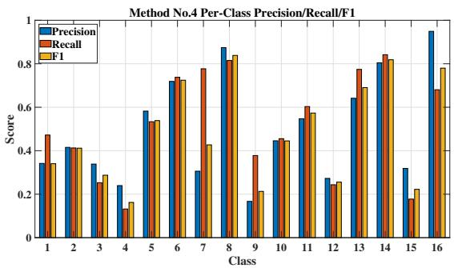

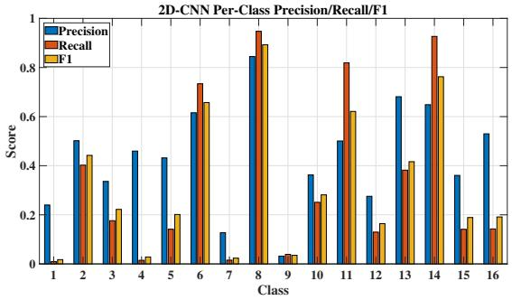

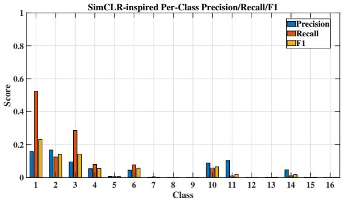  
Figure 1: The per-class precision, recall, and F1-score of KLPCDA Method No.4, 2D-CNN and the SimCLR-inspired baseline on Indian Pines.

Overall, these results demonstrate that KLPCDA efectively addresses the challenges of hyperspectral classification with high dimensionality, class imbalance, and limited training samples. By leveraging kernel-based discriminative analysis, KLPCDA improves the separability of minority classes while preserving class-specific structures, showing strong potential for practical remote sensing applications.

## 4.1.2. CWRU

Table 6: Evaluation results (mean (std), %) of seven KLPCDA variants and baseline methods on CWRU
<table><tr><td>Method</td><td>Ka</td><td>OA</td><td>AUC</td></tr><tr><td>No.1</td><td>62.59(0.03)</td><td>71.94(0.02)</td><td>0.81</td></tr><tr><td>No.2</td><td>62.96(0.02)</td><td>72.22(0.02)</td><td>0.81</td></tr><tr><td>No.3</td><td>60.00(0.07)</td><td>70.00(0.05)</td><td>0.80</td></tr><tr><td>No.4</td><td>63.04(0.02)</td><td>72.28(0.02)</td><td>0.82 0.81</td></tr><tr><td>No.5 No.6</td><td>62.52(0.05) 62.59(0.03)</td><td>71.89(0.03)</td><td>0.81</td></tr><tr><td>No.7</td><td>62.22(0.05)</td><td>71.94(0.02)</td><td>0.81</td></tr><tr><td>PCA+LDA</td><td>43.56(0.20)</td><td>71.67(0.04)</td><td>0.72</td></tr><tr><td>RLDA</td><td>38.37(0.11)</td><td>57.67(0.15) 53.78(0.08)</td><td>0.69</td></tr><tr><td>KPCA+LDA</td><td>32.22(0.27)</td><td></td><td></td></tr><tr><td></td><td></td><td>49.17(0.20)</td><td>0.66</td></tr><tr><td>SVM(RBF)</td><td>50.00(0.07)</td><td></td><td>0.75</td></tr><tr><td>FCNN</td><td></td><td>62.50(0.06)</td><td></td></tr><tr><td></td><td>57.48(0.13)</td><td>68.11(0.10)</td><td>0.79</td></tr><tr><td></td><td></td><td></td><td></td></tr><tr><td>ProtoNet-inspired 58.30(0.07)</td><td></td><td></td><td></td></tr><tr><td>SimCLR-inspired 55.33(0.06) 66.50(0.05)</td><td></td><td>68.72(0.05)</td><td>0.79 0.78</td></tr></table>

This task evaluates 4-class fault diagnosis under an extreme small-sample setting (2-shot per class) on the CWRU bearing dataset. Table 6 reports the average results over 10 randomized test splits. The class-wise results are provided in Table S10 in the Supplementary Material.

All seven KLPCDA variants consistently outperform the baselines across all metrics. Among them, Method No.4 achieves the best overall performance, obtaining a Kappa of 63.04%, OA and AA of 72.28%, and an AUC of 0.82. These results indicate that KLPCDA can efectively learn discriminative subspaces even under extremely limited training data. Among the representative SSS baselines, linear methods (PCA+LDA, RLDA) and the kernel method (KPCA+LDA) exhibit poor generalization, reflected by low Kappa and AA values. SVM, FCNN, ProtoNet-inspired, and SimCLR-inspired baselines achieve moderate performance but remain inferior to KLPCDA. Among them, ProtoNet-inspired attains competitive OA (68.72%) as a fewshot baseline.

Figure 2 visualizes the per-class TPR, FPR, and specificity of KLPCDA Method No.4 together with its confusion matrix. The per-class TPR, FPR, and specificity of the baselines (SVM and ProtoNet inspired) are provided in Figure 3. As shown on the above in Figure 2, Method No.4 maintains consistently high specificity and low FPR across all four fault classes, indicating reliable fault detection with reduced false alarms. In contrast, as shown in Figure 3, SVM achieves relatively high TPR for classes 1 and 2 but degrades noticeably for classes 3 and 4, with lower specificity overall. The ProtoNet-inspired baseline exhibits more balanced class-wise behavior than SVM, but still shows higher FPR and lower specificity than KLPCDA Method No.4 for several fault categories. This reflects limited robustness in multi-class small-sample conditions. The confusion matrix of Method No.4 in Figure 2 (below) further confirms these observations: classes 1 and 2 are nearly perfectly classified, while classes 3 and 4 show moderate confusion but still outperform most baselines.

The results of ProtoNet-inspired and SimCLR-inspired baselines further suggest that metric-learning based approaches alone are insuficient to fully address the extreme 2-shot fault diagnosis setting. Overall, these results demonstrate that KLPCDA efectively handles extreme small-sample fault diagnosis by maintaining balanced class discrimination and reducing diagnostic uncertainty.

## 4.1.3. GSE44076

This binary classification experiment uses the GSE44076 colon cancer dataset, where each sample is represented by a high-dimensional gene expression vector. The results are summarized in Table 7.

As shown in the table, KLPCDA consistently outperforms all baseline methods across multiple evaluation metrics. Among the proposed variants, Method No.5 achieves the best overall performance with an OA of 95.15%, precision of 95.68%, and an F1- score of 96.38%, indicating strong discriminative capability. In contrast, traditional linear and kernel-based methods such as RLDA and KPCA+LDA perform poorly in this small-sample, high-dimensional genomic setting. For example, RLDA achieves only 65.83% OA, with recall of 69.56% and specificity of 58.57%, suggesting limited robustness under such conditions.

Method No.4 Confusion Matrix  
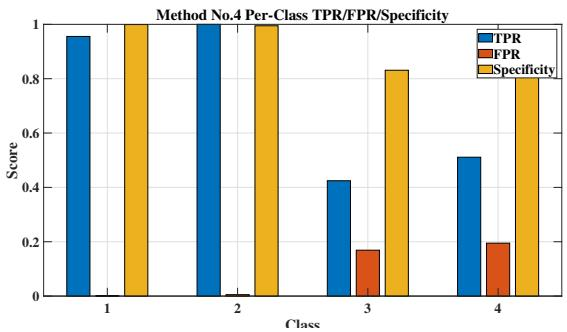

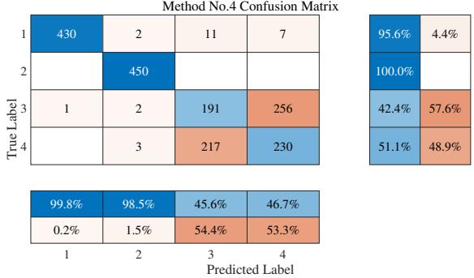  
Figure 2: The per-class TPR, FPR, and specificity and the confusion matrix of KLPCDA Method No.4 on CWRU.

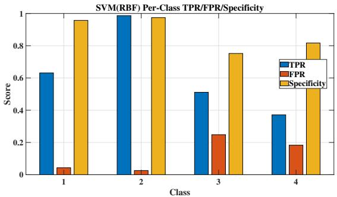

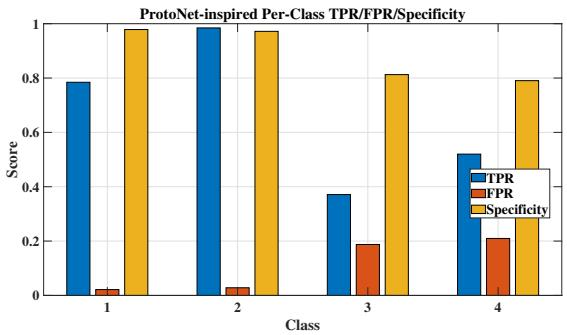  
Figure 3: The per-class TPR, FPR, and specificity of the SVM and ProtoNet-inspired baselines on CWRU.

Table 7: Evaluation results (mean (std), %) of seven KLPCDA variants and baseline methods on GSE44076 colon cancer dataset
<table><tr><td>Method</td><td>Ka</td><td>OA</td><td>Rec</td><td>Spec</td><td>Prec</td><td>F1</td><td>AUC</td></tr><tr><td>No.1</td><td>87.82(0.07)</td><td>94.66(0.03)</td><td>97.65(0.02)</td><td>88.86(0.08)</td><td>94.57(0.04)</td><td>96.05(0.02)</td><td>0.93</td></tr><tr><td>No.2</td><td>81.49(0.10)</td><td>91.46(0.05)</td><td>91.18(0.05)</td><td>92.00(0.06)</td><td>95.68(0.03)</td><td>93.32(0.04)</td><td>0.92</td></tr><tr><td>No.3</td><td>34.48(0.22)</td><td>75.15(0.07)</td><td>95.29(0.03)</td><td>36.00(0.25)</td><td>75.20(0.08)</td><td>83.72(0.04)</td><td>0.66</td></tr><tr><td>No.4</td><td>73.41(0.15)</td><td>87.96(0.07)</td><td>91.03(0.10)</td><td>82.00(0.12)</td><td>91.16(0.06)</td><td>90.66(0.06)</td><td>0.87</td></tr><tr><td>No.5</td><td>88.99(0.11)</td><td>95.15(0.05)</td><td>97.21(0.04)</td><td>91.14(0.10)</td><td>95.68(0.05)</td><td>96.38(0.04)</td><td>0.94</td></tr><tr><td>No.6</td><td>80.54(0.12)</td><td>91.36(0.05)</td><td>93.68(0.03)</td><td>86.86(0.11)</td><td>93.45(0.05)</td><td>93.52(0.04)</td><td>0.90</td></tr><tr><td>No.7</td><td>85.06(0.09)</td><td>93.50(0.04)</td><td>97.21(0.03)</td><td>86.29(0.10)</td><td>93.44(0.05)</td><td>95.21(0.03)</td><td>0.92</td></tr><tr><td>PCA+LDA</td><td>45.15(0.48)</td><td>74.27(0.23)</td><td>78.38(0.21)</td><td>66.29(0.27)</td><td>80.88(0.16)</td><td>79.48(0.19)</td><td>0.72</td></tr><tr><td>RLDA</td><td>27.64(0.24)</td><td>65.83(0.13)</td><td>69.56(0.14)</td><td>58.57(0.13)</td><td>76.00(0.09)</td><td>72.42(0.12)</td><td>0.64</td></tr><tr><td>KPCA+LDA</td><td>33.78(0.42)</td><td>71.46(0.18)</td><td>81.76(0.15)</td><td>51.43(0.31)</td><td>76.93(0.14)</td><td>79.01(0.14)</td><td>0.67</td></tr><tr><td>SVM(RBF)</td><td>0.00(0.00)</td><td>66.02(0.00)</td><td>1.00(0.00)</td><td>0.00(0.00)</td><td>66.02(0.00)</td><td>79.53(0.00)</td><td>0.50</td></tr><tr><td>FCNN</td><td>56.76(0.25)</td><td>82.72(0.08)</td><td></td><td>93.53(0.08)61.71(0.32)</td><td>84.95(0.12)</td><td>88.01(0.05)</td><td>0.22</td></tr><tr><td>ProtoNet-inspired 79.96(0.09)</td><td></td><td>90.49(0.04)</td><td>87.50(0.06)</td><td>96.29(0.04)</td><td>97.86(00.02)</td><td>92.31(0.04)</td><td>0.98</td></tr><tr><td>SimCLR-inspired 81.47(0.11)</td><td></td><td>91.36(0.06)</td><td></td><td>91.18(0.08) 91.71(0.04)</td><td>95.53(0.02)</td><td>93.14(0.05)</td><td>0.96</td></tr></table>

Among the baselines, ProtoNet-inspired and SimCLR-inspired achieve competitive performance, obtaining OA values of 90.49% and 91.36%, respectively. ProtoNetinspired achieves the highest baseline AUC (0.98), while SimCLR-inspired obtains an F1-score of 93.14%. Nevertheless, both methods remain inferior to the best KLPCDA variant in terms of OA, Kappa, and F1-score. FCNN attains relatively higher recall (93.53%) but exhibits a very low AUC (0.22), indicating weak class separability despite acceptable accuracy. Figure 4 compares the confusion matrices of Method No.5 and the strongest representation-learning baseline (SimCLR-inspired). Although SimCLRinspired achieves relatively balanced predictions, Method No.5 still exhibits fewer misclassified samples and more consistent recognition across both classes.

These results demonstrate that KLPCDA provides robust and accurate classification for high-dimensional biomedical data with limited training samples, maintaining superior overall performance even when compared with recent prototype-based and representation-learning baselines.

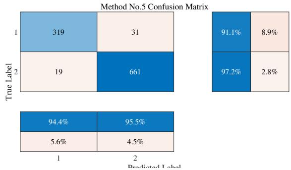

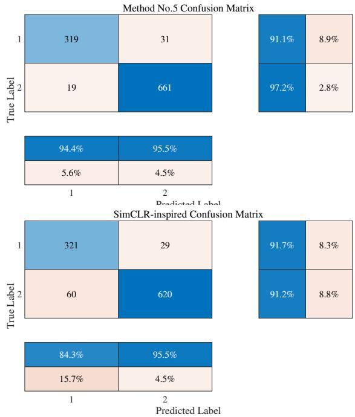

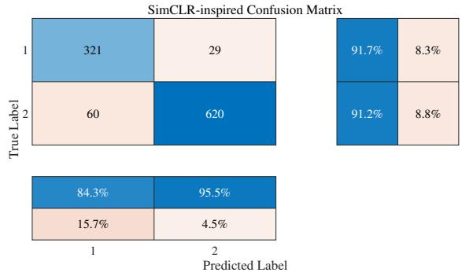  
Figure 4: The confusion matrices of KLPCDA Method No.5 and SimCLR-inspired baselines on GSE44076 colon cancer dataset.

## 4.1.4. JAFFE

On the JAFFE dataset, which includes identity and expression recognition tasks, the proposed KLPCDA variants consistently outperform all baselines. Table 8 summarizes the average results over 10 randomized test splits. The class-wise results are reported in Tables S11–S14 in the Supplementary Material. Expression recognition is more challenging due to subtle inter-class diferences and larger intra-class variability. Nevertheless, KLPCDA Method No.7 still achieves the best performance (Kappa: 35.03%, OA: 44.34%), outperforming all baseline methods. In particular, the representationlearning baselines ProtoNet-inspired and SimCLR-inspired achieve OA values of only 23.82% and 33.01%, respectively, highlighting the dificulty of expression recognition under limited training samples.

Figure S1 in the Supplementary Material compares the PRF values of KLPCDA No.7 with the strongest baseline (SimCLR-inspired) for identity recognition. Although SimCLR-inspired achieves strong performance on most identity classes, Method No.7 maintains more consistently high precision, recall, and F1-scores across all classes. Figure S2 in the Supplementary Material further compares the confusion matrices of KLPCDA No.7 and PCA+LDA for expression recognition. KLPCDA exhibits clearer diagonal dominance, indicating improved class separability, whereas PCA+LDA shows substantial inter-class confusion.

Table 8: Evaluation results (mean (std), %) of seven KLPCDA variants and baseline methods on JAFFE for identity (ID) and expression (EXP) recognition
<table><tr><td>Method</td><td>ID-Ka</td><td>ID-OA</td><td>ID-AA</td><td>EXP-Ka</td><td>EXP-OA</td><td>EXP-AA</td></tr><tr><td>No.1</td><td>93.52(0.03)</td><td>94.17(0.03)</td><td>94.34(0.05)</td><td>25.04(0.05)</td><td>35.74(0.05)</td><td>35.99(0.07)</td></tr><tr><td>No.2</td><td>96.44(0.03)</td><td>96.80(0.03)</td><td>96.79(0.03)</td><td>24.85(0.04)</td><td>35.59(0.04)</td><td>35.85(0.07)</td></tr><tr><td>No.3</td><td>95.57(0.03)</td><td>96.02(0.03)</td><td>96.00(0.03)</td><td>22.73(0.06)</td><td>33.75(0.05)</td><td>33.99(0.07)</td></tr><tr><td>No.4</td><td>96.44(0.03)</td><td>96.80(0.03)</td><td>96.79(0.03)</td><td>18.70(0.05)</td><td>30.37(0.05)</td><td>30.45(0.04)</td></tr><tr><td>No.5</td><td>96.65(0.02)</td><td>96.99(0.02)</td><td>97.08(0.03)</td><td>24.34(0.05)</td><td>35.15(0.04)</td><td>35.34(0.07)</td></tr><tr><td>No.6</td><td>95.68(0.02)</td><td>96.12(0.02)</td><td>96.17(0.05)</td><td>20.79(0.06)</td><td>32.13(0.05)</td><td>32.23(0.05)</td></tr><tr><td>No.7</td><td>98.49(0.02)</td><td>98.64(0.01)</td><td>98.68(0.02)</td><td>35.03(0.08)</td><td>44.34(0.07)</td><td>44.53(0.10)</td></tr><tr><td>PCA+LDA</td><td>74.63(0.06)</td><td>77.18(0.05)</td><td>77.61(0.20)</td><td>29.43(0.06)</td><td>39.56(0.05)</td><td>39.58(0.08)</td></tr><tr><td>RLDA</td><td>79.71(0.06)</td><td>81.75(0.05)</td><td>82.06(0.14)</td><td>17.62(0.07)</td><td>29.41(0.06)</td><td>29.69(0.13)</td></tr><tr><td>KPCA+LDA</td><td>78.21(0.10)</td><td>80.39(0.09)</td><td>80.56(0.11)</td><td>19.36(0.03)</td><td>30.88(0.03)</td><td>31.10(0.07)</td></tr><tr><td>SVM(RBF)</td><td>60.49(0.06)</td><td>64.47(0.06)</td><td>64.74(0.12)</td><td>22.28(0.07)</td><td>33.38(0.06)</td><td>33.57(0.06)</td></tr><tr><td>2D-CNN</td><td>87.27(0.07)</td><td>88.54(0.06)</td><td>88.85(0.07)</td><td>21.97(0.05)</td><td>33.16(0.04)</td><td>33.39(0.07)</td></tr><tr><td>ProtoNet-inspired 74.17(0.27)</td><td></td><td>76.89(0.24)</td><td>76.87(0.10)</td><td>11.20(0.07)</td><td>23.82(0.06)</td><td>24.00(0.11)</td></tr><tr><td>SimCLR-inspired 93.20(0.04)</td><td></td><td>93.88(0.03)</td><td></td><td></td><td>93.85(0.05) 21.84(0.06) 33.01(0.06)</td><td>33.29(0.09)</td></tr></table>

Overall, these results demonstrate the efectiveness of KLPCDA for facial recognition tasks under limited training samples and high-dimensional representations. By exploiting kernel-based discriminative projections, KLPCDA achieves robust and balanced recognition without relying on large-scale annotated data. The superiority remains evident even when compared with recent prototype-based and contrastive representationlearning baselines.

## 4.2. Statistical Significance Test

To verify whether the observed performance improvements are statistically significant, we first applied the Friedman test across all tasks. The resulting p-value $( p = 0 . 0 0 0 4 )$ indicates significant diferences among the compared methods.

Subsequently, pairwise Wilcoxon signed-rank tests were conducted between the best-performing KLPCDA variant and the strongest baseline on each task using OA scores from 10 randomized splits. The detailed results are provided in Table S15 in

the Supplementary Material.All comparisons yield $p < 0 . 0 5$ , confirming that the performance improvements of KLPCDA over the corresponding baselines are statistically significant.

Table 9: Comparative ranking of KLPCDA variants across five benchmark tasks. Each cell shows the rank (lower is better) of a method, grouped by the objectives used and evaluated on: Indian Pines: OA / mean-F1 / Kappa; CWRU: OA / Specificity / AUC; GSE44076: OA / Precision / AUC; JAFFE (identity): OA / Precision/ mean-F1; JAFFE (expression): OA / mean-Recall / mean-F1.
<table><tr><td colspan="3">Method Used Objective Dominant Effect  $\mathrm { C } / S _ { b } \big / S _ { w }$ </td><td>IP OA/F1/Ka OA/Spec/AUC OA/Prec/AUC OA/Prec/F1 OA/Rec/F1</td><td>CWRU</td><td>GSE44076 JAFFE-ID JAFFE-EXP</td><td></td><td></td></tr><tr><td>No.1</td><td> $\checkmark / \checkmark / \checkmark$ </td><td>Balanced trade-off</td><td>4/2/3</td><td>3/4/2</td><td>2/3/2</td><td>7/7/7</td><td>2/2/3</td></tr><tr><td>No.2</td><td> $\checkmark / \checkmark / \times$ </td><td>Variance + class separation</td><td>1/4/5</td><td>2/1/2</td><td>4/1/3</td><td>3/2/4</td><td>3/3/4</td></tr><tr><td>No.3</td><td> $\times / \sqrt { \surd \ V }$ </td><td>No variance anchor (unstable)</td><td>7/7/7</td><td>7/7/7</td><td>7/7/7</td><td>6/5/6</td><td>5/5/6</td></tr><tr><td>No.4</td><td> $\dot { \checkmark } / \times \dot { \mathrel { \left/ { \vphantom { \left| \tilde { \Theta } \right| } } \right.}  \kern - delimiterspace } \times$ </td><td>Variance preservation</td><td>5/3/2</td><td>1/2/1</td><td>6/6/6</td><td>3/2/4</td><td>7/7/7</td></tr><tr><td>No.5</td><td> $\checkmark / \times / \check { \checkmark }$ </td><td>Global + local structure</td><td>2/6/6</td><td>5/3/2</td><td>1/1/1</td><td>2/4/2</td><td>4/4/2</td></tr><tr><td>No.6</td><td>x/√/×</td><td>Class separation only</td><td>3/1/1</td><td>3/4/2</td><td>5/4/5</td><td>5/6/3</td><td>6/6/5</td></tr><tr><td>No.7</td><td> $\times / { \times } / { \surd }$ </td><td>Intra-class compactness</td><td>6/5/4</td><td>6/6/2</td><td>3/5/3</td><td>1/1/1</td><td>1/1/1</td></tr></table>

## 4.3. Ablation Study: Mechanism and Interaction ofFused Objectives

To understand how diferent objectives contribute to representation learning, we analyze the seven KLPCDA variants from both a mechanism and interaction perspective. Each variant corresponds to a specific combination of total variance (C), between-class separability $( S _ { b } )$ , and within-class compactness $( S _ { w } )$ , as summarized in Table 1. The empirical observations reported below are consistent with the structural interpretations provided in Table 9.

Role of individual objectives. The efect of each objective can be isolated by examining single-term variants. Method No.7 (S w only) ranks first across all metrics on both JAFFE tasks, consistent with its structural role in Table 1 as the sole enforcer of intra-class compactness. This confirms that tightly controlling within-class variation is particularly important for fine-grained recognition tasks, where the diferences between classes are subtle.

In contrast, Method No.4 (C only) performs best on CWRU, achieving the highest OA and AUC. This suggests that preserving global variance enhances robustness in signal-based tasks with noise or measurement variability, where label information may be less reliable.

Method $\Nu 0 . 6 ( S _ { b } \mathrm { o n l y ) }$ shows mixed behavior: it achieves strong performance on Indian Pines (e.g., top-ranked F1 and Kappa), but performs poorly on GSE44076 and

JAFFE. This indicates that while maximizing inter-class separation can be efective when class boundaries are well-defined, relying solely on $S _ { b }$ leads to unstable subspaces in high-dimensional or imbalanced scenarios due to the lack of intra-class or global structure constraints.

Interaction between objectives. Beyond individual efects, the interaction between objectives plays a critical role. The combination of $C$ and $S _ { w }$ (Method No.5) achieves the best overall performance on GSE44076, ranking first across all metrics, aligning with its structural role in Table 1, where the combination of C and $S _ { w }$ jointly models global and local structure. This indicates that jointly modeling global variance (C) and local compactness $( S _ { w } )$ is particularly efective for high-dimensional biological data, where both global structure and intra-class consistency are essential.

Similarly, Method No.2 $( C + S _ { b } )$ performs competitively across multiple datasets and achieves top precision in several tasks. This suggests that combining variance preservation with inter-class separation leads to more stable decision boundaries, especially in noisy conditions where $S _ { w }$ may be unreliable.

In contrast, Method No.3 $( S _ { b } + S _ { w } )$ , which excludes C, consistently ranks among the lowest across most datasets. It is reflected in Table 1, where the absence of C is associated with a lack of global structural stability. This highlights the importance of variance preservation as a stabilizing factor: without C, the learned subspace lacks a global structural anchor, leading to degraded performance.

Full fusion versus specialized configurations. Method No.1, which integrates all three objectives, demonstrates consistently strong performance across datasets, typically ranking within the top three. However, it rarely achieves the best result on any specific task. This suggests that while full fusion provides robust generalization, it may dilute task-specific discriminative properties due to competing objectives.

Summary of insights. From these observations, several principles can be drawn: (1) $S _ { w }$ is crucial for fine-grained tasks requiring intra-class consistency; (2) C provides global stability and robustness to noise; (3) $S _ { b }$ alone is insuficient but becomes efective when combined with other objectives; and (4) the interaction between objectives determines performance, with diferent combinations suited to diferent data characteristics.

These findings provide practical guidance for variant selection and also explain the structural roles of the three objectives within the KLPCDA framework.

## 4.4. Fusion Coeficient Sensitivity Analysis

To further investigate the interaction robustness among fused objectives, we analyze the sensitivity of the fusion coeficients in representative KLPCDA variants. While the ablation study in Section 4.3 reveals the structural roles of diferent objective combinations, the sensitivity analysis examines how the balance between objectives afects representation stability and classification performance.

For all sensitivity experiments, the kernel parameter and subspace dimension are fixed to the optimal values obtained during parameter selection. Since the optimal coeficient regions may span multiple numerical scales, a logarithmic-scale refinement search is adopted instead of a uniformly sampled linear grid. Specifically, the fusion coeficients are evaluated over {0.001, 0.005, 0.01, 0.05, 0.1, 0.5, 1, 5, 10, 50, 100}, allowing both global exploration and local interaction analysis. Representative variants and datasets are selected to reflect diferent objective interaction behaviors under distinct data characteristics. Method No.1 is analyzed on Indian Pines due to its highly heterogeneous hyperspectral structure, which is suitable for observing complex multi-objective interactions. Method No.2 is evaluated on GSE44076, where high-dimensional biological data emphasizes the balance between variance preservation and class separability. Method No.5 is analyzed on JAFFE identity recognition, since fine-grained facial representation particularly relies on the cooperation between global structure preservation and intra-class compactness.

The sensitivity landscape of Method No.1 in Fig. 5 reveals a highly coupled nonlinear interaction among the three fused objectives. Although a relatively broad plateau region indicates robustness against moderate coeficient perturbations, the existence of local peaks and irregular valleys suggests competitive interactions between objectives. Excessive emphasis on a single objective may suppress complementary structural information, while balanced coeficient configurations generally produce more stable performance. These observations explain why Method No.1 achieves strong overall generalization while not always yielding the best task-specific performance.

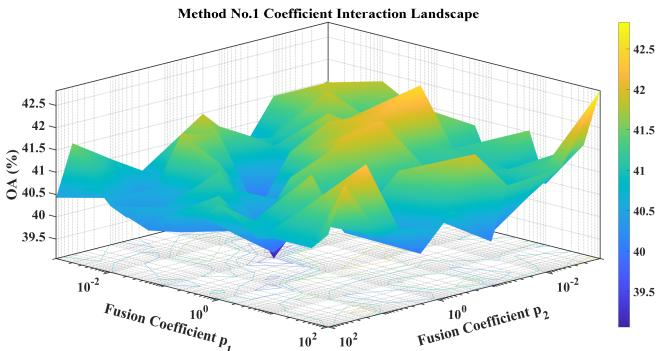  
Figure 5: The fusion coeficient parameter sensitivity surface of Method No.1 on Indian Pines.

In contrast, the sensitivity heatmap of Method No.2 in Fig. 6 exhibits a clear diagonal high-performance structure, indicating that the performance is primarily governed by the relative balance between the two fusion coeficients rather than their absolute magnitudes. Multiple coeficient configurations with similar proportional relationships achieve nearly identical OA values, suggesting a ratio-sensitive interaction mechanism. Moreover, the smooth landscape and broad stable region indicate a more cooperative objective coupling behavior and improved optimization stability compared with Method No.1.

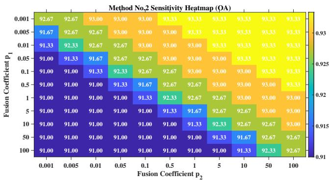  
Figure 6: The fusion coeficient parameter sensitivity heatmap of Method No.2 on GSE44076.

The sensitivity analysis of Method No.5 in Fig. 7 shows a smooth and gradual performance transition without abrupt oscillation or unstable peaks, indicating a structurally stable interaction between global variance preservation and within-class compactness. The OA gradually increases toward a stable optimum and remains nearoptimal over a relatively broad coeficient interval, suggesting that Method No.5 does not require highly precise parameter tuning. Even when the coeficient becomes excessively large, the performance degradation remains relatively moderate, demonstrating stable representation learning under coeficient imbalance.

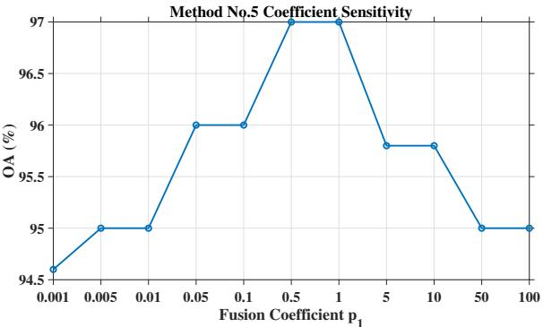  
Figure 7: The fusion coeficient parameter sensitivity of Method No.5 on JAFFE Identity Recognition.

Overall, the sensitivity analysis reveals that diferent KLPCDA variants exhibit distinct objective interaction behaviors. Method No.1 shows a complex competitive interaction among multiple objectives, whereas Method No.2 and Method No.5 demonstrate more cooperative and stable coupling mechanisms. These observations further confirm that the fusion structure design directly influences optimization stability, representation robustness, and task adaptability and further explain why the fully fused Method No.1, although being the most general variant, does not always achieve the optimal performance on every dataset.

## 4.5. Computational Complexity and Runtime Evaluation

To evaluate the practical eficiency of the proposed framework, we analyze the computational complexity and storage requirements of KLPCDA and all baseline methods.

As shown in Table 10, the computational cost of KLPCDA methods is dominated by matrix multiplications and eigen-decompositions, which scale with the number of training samples n, rather than the data dimension d. This enables KLPCDA to overcome the limitation of data dimension and maintain low computational cost and memory usage under high-dimensional, small-sample conditions, which is a key advantage over traditional methods that sufer from the curse of dimensionality. Although theoretical complexity provides a useful estimate of algorithm scalability, it does not fully reflect the actual computational cost in practical applications. Therefore, representative conventional baseline methods together with the proposed KLPCDA were further evaluated by measuring their actual running time under the same hardware environment.

Table 10: Complexity and storage of the implementation procedure of KLPCDA
<table><tr><td>Steps</td><td>Complexities</td><td>Storage</td></tr><tr><td>multiplication of K</td><td> $O ( n ^ { 2 } )$ </td><td> $K , B K , W K : O ( n ^ { 2 } )$  each</td></tr><tr><td>multiplication of BK, WK</td><td> $O ( n ^ { 2 } )$ </td><td> $\nu , \alpha : O ( n )$ </td></tr><tr><td>generalized eigen decomposition</td><td> $O ( n ^ { 3 } )$ </td><td></td></tr><tr><td>total estimated</td><td> $O ( n ^ { 3 } )$ </td><td> $O ( n ^ { 2 } )$ </td></tr></table>

For deep learning baselines, we estimate computational complexity using the standard metric of Floating Point Operations (FLOPs), which quantifies the number of basic arithmetic operations per forward pass. The 2D-CNN model used for image-based tasks comprises two convolutional layers (with 8 and 16 filters) and a fully connected output layer. Given an input of size $H \times W \times C$ , the total complexity is approximately $H W ( 1 4 4 C + 2 L + 2 3 0 4 )$ FLOPs, and the parameter count is $7 2 C + 1 6 H W L + 1 2 0 0$ The HybridSN model, used for hyperspectral images, combines two 3D convolutions with an FC layer, yielding complexity of $6 2 6 4 H W C - 6 0 6 2 4 H W + 1 6 L \mathrm { F L O P s }$ and about $6 3 0 4 + 1 6 L$ parameters. For vector-based data, the FCNN baseline consists of two hidden layers (32 and 16 neurons) and a softmax output. Its total FLOPs are $6 4 d + 1 0 2 4 + 3 2 L$ , and the parameter count is $3 2 d + 1 6 L + 5 7 6$ . The ProtoNet-inspired and SimCLR-inspired baselines employ lightweight multilayer perceptron embeddings followed by prototype-based classification. Their computational complexity scales linearly with the input dimension $d ,$ resulting in $1 2 8 d + 8 1 9 2 + 6 4 L { \mathrm { a n d ~ } } 1 2 8 d + 1 0 2 4 0 + 3 2 L$ FLOPs, respectively. Although more eficient than CNN-based models, they still require iterative network training and a larger parameter budget than KLPCDA.

A summary comparison of all methods is provided in Table 11. Notably, KLPCDA (Methods No.1–7) consistently achieves favorable trade-ofs between performance and eficiency. Unlike kernel-based methods like $\mathrm { K P C A + L D A }$ or SVM that ofer similar complexity but lower accuracy, KLPCDA delivers better discriminability without relying on task-specific architectures or deep models. Compared to neural-network-based baselines (FCNN, ProtoNet-inspired, SimCLR-inspired, 2D-CNN, and HybridSN), KLPCDA drastically reduces both computational cost and memory requirements, making it more suitable for CPU-only or embedded deployments in small-sample scenarios.

Table 12 reports the average training and inference time measured under the same CPU environment over ten independent experimental groups. Runtime evaluation was conducted using KLPCDA Method No.1, together with representative classical baselines, on the Indian Pines hyperspectral image dataset and the GSE44076 colon cancer dataset, representing two typical small-sample scenarios with diferent data characteristics (high-dimensional image features and gene expression data). To eliminate the one-time initialization overhead introduced by MATLAB, all methods were executed once as a warm-up, and the runtime from the subsequent execution was recorded. The reported training time corresponds to model construction using the selected hyperparameters, while the inference time denotes prediction on the test set. As shown in Table 12, Method No.1 exhibits consistently low training and inference time on both datasets. Although RLDA and PCA+LDA require slightly less training time, Method No.1 achieves substantially faster inference than SVM while maintaining runtime comparable to other classical kernel-based methods such as KPCA+LDA.

These results complement the theoretical complexity analysis and demonstrate that KLPCDA is suitable for CPU-based deployment in resource-constrained small-sample applications.

## 5. Conclusion

This paper establishes a unified interpretive framework for KLPCDA as a kernelbased discriminant system for cross-domain small-sample classification. By integrating total variance, inter-class separability, and intra-class compactness within a flexible formulation, KLPCDA enables multiple variants tailored to diferent data characteristics without requiring task-specific architectural design.

Beyond performance evaluation, this work provides a systematic analysis of the roles and interactions of the three core objectives. The results show that each component contributes diferently to representation learning: variance preservation (C) improves global stability and robustness, intra-class compactness $( S _ { w } )$ is essential for fine-grained recognition, and inter-class separability $( S _ { b } )$ becomes efective when combined with other objectives. Moreover, the interaction between objectives plays a critical role, revealing consistent and interpretable mechanisms that govern representation behavior across diferent data domains.

Table 11: Computational complexity and storage requirements of the implementation of KLPCDA and baseline methods
<table><tr><td>Implementations</td><td>Computational Complexity</td><td>Storage Requirements</td></tr><tr><td>Method No.1~No.7 each</td><td> $\overline { { O ( n ^ { 3 } ) } }$ </td><td> $\overline { { O ( n ^ { 2 } ) } }$ </td></tr><tr><td>Regularized LDA</td><td> $O ( d ^ { 3 } )$ </td><td> $O ( d ^ { 2 } )$ </td></tr><tr><td>PCA plus LDA</td><td> $O ( d ^ { 3 } )$ </td><td> $O ( d ^ { 2 } )$ </td></tr><tr><td>KPCA plus LDA</td><td> $O ( n ^ { 3 } )$ </td><td> $O ( n ^ { 2 } )$ </td></tr><tr><td>SVM</td><td> $O ( n ^ { 3 } )$ </td><td> $O ( n ^ { 2 } )$ </td></tr><tr><td>FCNN</td><td> $6 4 d + 1 0 2 4 + 3 2 L \mathrm { F L O P s }$ </td><td> $3 2 d + 1 \dot { 6 } L ^ { ' } + 5 7 6$ </td></tr><tr><td>2D-CNN</td><td> $H W ( 1 4 4 C + 2 L + 2 3 0 4 ) \mathrm { F L O P s }$ </td><td> $7 2 C + 1 6 H W L + 1 2 0 0$ </td></tr><tr><td>HybridSN</td><td> $6 2 6 4 H W C - 6 0 6 2 4 H W + 1 6 L \mathrm { F L O P s }$ </td><td> $6 3 0 4 + 1 6 L$ </td></tr><tr><td>ProtoNet-inspired</td><td> $1 2 8 d + 8 1 9 2 + 6 4 L \mathrm { F L O P s }$ </td><td> $1 2 8 d + 6 4 L + 8 5 7 6$ </td></tr><tr><td>SimCLR-inspired</td><td> $1 2 8 d + 1 0 2 4 0 + 3 2 L \mathrm { F L O P s }$ </td><td> $1 2 8 d + 3 2 L + 1 0 4 6 4$ </td></tr></table>

Table 12: Average training and inference time (s) under the same CPU environment (mean ± std over 10 runs) on Indian Pines (IP) and GSE44076 colon cancer datasets.
<table><tr><td>Method</td><td>IP-Training</td><td>IP-Inference</td><td>Colon-Training</td><td>Colon-Inference</td></tr><tr><td>Method No.1</td><td> $0 . 0 1 1 0 \pm 0 . 0 0 2 9$ </td><td> $0 . 0 1 7 2 \pm 0 . 0 0 2 1$ </td><td> $0 . 0 0 5 0 \pm 0 . 0 0 2 0$ </td><td> $0 . 0 0 1 6 \pm 0 . 0 0 0 5$ </td></tr><tr><td>RLDA</td><td> $0 . 0 0 4 4 \pm 0 . 0 0 1 7$ </td><td> $0 . 0 3 7 0 \pm 0 . 0 0 2 6$ </td><td> $0 . 0 0 1 2 \pm 0 . 0 0 3 9$ </td><td> $0 . 0 0 0 1 \pm 0 . 0 0 0 4$ </td></tr><tr><td>PCA+LDA</td><td> $0 . 0 0 4 0 { \scriptstyle \pm 0 . 0 0 1 5 }$ </td><td> $0 . 0 3 7 1 { \scriptstyle \pm 0 . 0 0 1 5 }$ </td><td> $0 . 0 0 5 6 \pm 0 . 0 0 2 5$ </td><td> $0 . 0 0 1 6 { \pm } 0 . 0 0 1 1$ </td></tr><tr><td>KPCA+LDA</td><td> $0 . 0 0 8 8 \pm 0 . 0 0 3 4$ </td><td> $0 . 0 2 1 0 \pm 0 . 0 0 3 3$ </td><td> $0 . 0 0 6 9 { \scriptstyle \pm 0 . 0 0 3 2 }$ </td><td> $0 . 0 0 2 0 \pm 0 . 0 0 1 2$ </td></tr><tr><td>SVM</td><td> $0 . 0 8 7 4 \pm 0 . 0 0 6 2$ </td><td> $0 . 9 8 7 2 \pm 0 . 0 2 3 4$ </td><td> $0 . 0 0 7 8 { \pm } 0 . 0 0 4 3$ </td><td> $0 . 0 0 2 1 \pm 0 . 0 0 0 7$ </td></tr></table>

Extensive experiments across multiple real-world scenarios validate these observations and demonstrate that KLPCDA achieves strong and stable performance under small-sample, high-dimensional, and imbalanced conditions. More importantly, the consistency between structural interpretation and empirical results provides a principled understanding of how to design and select discriminant models. In addition, KLPCDA remains computationally eficient and suitable for resource-constrained environments.

Based on these findings, we further derive practical guidelines for selecting appropriate KLPCDA variants under diferent data characteristics, ofering actionable guidelines for the principled design and deployment of discriminant models in real-world small-sample systems.

While KLPCDA shows strong performance across diverse tasks, its advantage is less pronounced in scenarios involving subtle intra-class variations, such as expression recognition. Future work will focus on enhancing objective interactions, extending the framework to semi-supervised and few-shot settings, and improving adaptability to more complex data structures.

## References

[1] V. Kumar, R. S. Singh, M. Rambabu, Y. Dua, Deep learning for hyperspectral image classification: A survey, Comput. Sci. Rev. 53 (2024) 100658.

[2] X. Chen, R. Yang, Y. Xue, M. Huang, R. Ferrero, Z. Wang, Deep transfer learning for bearing fault diagnosis: A systematic review since 2016, IEEE Trans. Instrum. Meas. 72 (2023) 1–21.

[3] N. A. Mahoto, A. Shaikh, A. Sulaiman, M. S. A. Reshan, A. Rajab, K. Rajab, A machine learning based data modeling for medical diagnosis, Biomed. Signal Process. Control 81 (2023) 104481.

[4] Y. Zhang, Z. Wang, X. Zhang, Z. Cui, B. Zhang, J. Cui, L. L. Janneh, Application of improved virtual sample and sparse representation in face recognition, CAAI Trans. Intell. Technol. 8 (4) (2023) 1391–1402.

[5] M. Iman, H. R. Arabnia, K. Rasheed, A review of deep transfer learning and recent advancements, Technologies 11 (2) (2023).

[6] S. Tian, L. Li, W. Li, H. Ran, X. Ning, P. Tiwari, A survey on few-shot classincremental learning, Neural Networks 169 (2024) 307 – 324.

[7] W. Zeng, Z.-Y. Xiao, Few-shot learning based on deep learning: A survey, Mathematical Biosciences and Engineering 21 (1) (2024) 679 – 711.

[8] R. Sheshanarayana, F. You, Molecular representation learning: cross-domain foundations and future frontiers, Digital Discovery 4 (9) (2025) 2298 – 2335.

[9] J. Snell, K. Swersky, R. Zemel, Prototypical networks for few-shot learning, Advances in neural information processing systems 30 (2017).

[10] T. Chen, S. Kornblith, M. Norouzi, G. Hinton, A simple framework for contrastive learning of visual representations, in: International conference on machine learning, PmLR, 2020, pp. 1597–1607.

[11] C. Zhou, Q. Li, C. Li, J. Yu, Y. Liu, G. Wang, K. Zhang, C. Ji, Q. Yan, L. He, et al., A comprehensive survey on pretrained foundation models: A history from bert to chatgpt, International Journal of Machine Learning and Cybernetics 16 (12) (2025) 9851–9915.

[12] Y. Ma, S. Chen, S. Ermon, D. B. Lobell, Transfer learning in environmental remote sensing, Remote Sensing of Environment 301 (2024).

[13] T. Dissanayake, Y. George, D. Mahapatra, S. Sridharan, C. Fookes, Z. Ge, Fewshot learning for medical image segmentation: A review and comparative study, ACM Computing Surveys 58 (1) (2025) 1–36.

[14] J. Zhang, L. Liu, O. Silvén, M. Pietikäinen, D. Hu, Few-shot class-incremental learning for classification and object detection: A survey, IEEE Transactions on Pattern Analysis and Machine Intelligence 47 (4) (2025) 2924 – 2945.

[15] M. I. Hossen, M. Awrangjeb, S. Pan, A. A. Mamun, Transfer learning in agriculture: a review, Artificial Intelligence Review 58 (4) (2025) 97.

[16] S. Zhao, B. Zhang, J. Yang, J. Zhou, Y. Xu, Linear discriminant analysis, Nature Reviews Methods Primers 4 (1) (2024) 70.

[17] Q. Liu, X. Tang, H. Lu, S. Ma, Face recognition using kernel scatter-diferencebased discriminant analysis, IEEE transactions on neural networks 17 (4) (2024) 1081–1085.

[18] A. J. Izenman, Linear discriminant analysis, in: Modern Multivariate Statistical Techniques: Regression, Classification, and Manifold Learning, Springer, New York, NY, 2008, pp. 237–280.

[19] L. Qu, Y. Pei, A comprehensive review on discriminant analysis for addressing challenges of class-level limitations, small sample size, and robustness, Processes 12 (7) (2024) 1382.

[20] Z. Xia, Y. Chen, C. Xu, Multiview pca: A methodology of feature extraction and dimension reduction for high-order data, IEEE Trans. Cybern. 52 (10) (2021) 11068–11080.

[21] B. PN, H. JP, K. DJ, Eigenfaces vs. fisherfaces: Recognition using class specific linear projection, IEEE Trans. Pattern Anal. Mach. Intell. 19 (7) (1997) 711–720.

[22] D. DQ, Y. PC, Face recognition by regularized discriminant analysis, IEEE Trans. Syst., Man, Cybern. B, Cybern. 37 (4) (2007) 1080–1085.

[23] W. Zuo, D. Zhang, J. Yang, K. Wang, Bdpca plus lda: A novel fast feature extraction technique for face recognition, IEEE Trans. Syst. Man Cybern. B Cybern. 36 (4) (2006) 946–953.

[24] Y. J, F. AF, Y. JY, Z. D, J. Z, Kpca plus lda: A complete kernel fisher discriminant framework for feature extraction and recognition, IEEE Trans. Pattern Anal. Mach. Intell. 27 (2) (2005) 230–244.

[25] X. H, Y. Q, C. S, Svm: Support vector machines, in: The Top Ten Algorithms in Data Mining, Chapman and Hall/CRC, Boca Raton, FL, 2009, pp. 51–74.

[26] H. Huang, G. Shi, H. He, Y. Duan, F. Luo, Dimensionality reduction of hyperspectral imagery based on spatial–spectral manifold learning, IEEE Trans. Cybern. 50 (6) (2020) 2604–2616.

[27] C. P. Mbo’o, K. Hameyer, Fault diagnosis of bearing damage by means of the linear discriminant analysis of stator current features from the frequency selection, IEEE Trans. Ind. Appl. 52 (5) (2016) 3861–3868.

[28] G. Haixiang, L. Yijing, S. Jennifer, G. Mingyun, H. Yuanyue, G. Bing, Learning from class-imbalanced data: Review of methods and applications, Expert Syst. Appl. 73 (2017) 220–239.

[29] Y. Wang, Facial expression recognition based on linear discriminant locality preserving analysis algorithm, J. Inf. Comput. Sci. 10 (2013) 4037–4046.

[30] S. Jia, S. Jiang, Z. Lin, N. Li, M. Xu, S. Yu, A survey: Deep learning for hyperspectral image classification with few labeled samples, Neurocomputing 448 (2021) 179–204.

[31] H. S. Basavegowda, G. Dagnew, Deep learning approach for microarray cancer data classification, CAAI Trans. Intell. Technol. 5 (1) (2020) 22–33.

[32] L. Qu, Y. Pei, Kernelized linear principal component discriminant analysis, Neural Networks 198 (2026) 108539.

[33] F. Chaudhry, C.-C. Wu, W.-M. Liu, C.-I. Chang, Recent advances in hyperspectral signal and image processing, Transworld Res. Netw. 1 (2006) 29–62.

[34] W. A. Smith, R. B. Randall, Rolling element bearing diagnostics using the case western reserve university data: A benchmark study, Mech. Syst. Signal Process. 64–65 (2015) 100–131.

[35] P.-H. Huynh, V. H. Nguyen, T.-N. Do, Improvements in the large p, small n classification issue, SN Comput. Sci. 1 (4) (2020) 207.

[36] C.-L. Kim, B.-G. Kim, Few-shot learning for facial expression recognition: A comprehensive survey, J. Real-Time Image Process. 20 (3) (2023) 52.

[37] B. Schölkopf, A. Smola, K.-R. Müller, Nonlinear component analysis as a kernel eigenvalue problem, Neural Comput. 10 (5) (1998) 1299–1319.

[38] G. Baudat, F. Anouar, Generalized discriminant analysis using a kernel approach, Neural Comput. 12 (10) (2000) 2385–2404.

[39] M. Baumgardner, L. Biehl, D. Landgrebe, 220 band aviris hyperspectral image data set: June 12, 1992 indian pine test site 3, https://purr.purdue.edu/publications/1947/1, accessed June 3, 2025 (Sep. 2015).

[40] Case Western Reserve University Bearing Data Center, Bearing data center, https://engineering.case.edu/bearingdatacenter, accessed June 3, 2025 (2000).

[41] S.-P. Rebeca, D. Cordero, A. Berenguer, F. Lejbkowicz, H. Rennert, R. Salazar, S. B. et al., Gene expression diferences between colon and rectum tumors, Clin. Cancer Res. 17 (23) (2011) 7303–7312.

[42] M. Lyons, S. Akamatsu, M. Kamachi, J. Gyoba, Coding facial expressions with gabor wavelets, CoRR abs/2009.05938 (2020). arXiv:2009.05938.

[43] M. J. Lyons, "excavating ai" re-excavated: Debunking a fallacious account of the jafe dataset, CoRR abs/2107.13998 (2021). arXiv:2107.13998.

[44] S. K. Roy, G. Krishna, S. R. Dubey, B. B. Chaudhuri, Hybridsn: Exploring 3- d–2-d cnn feature hierarchy for hyperspectral image classification, IEEE Geosci. Remote Sens. Lett. 17 (2) (2019) 277–281.