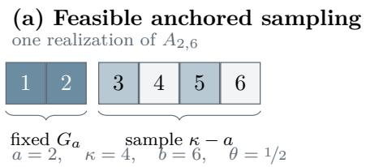
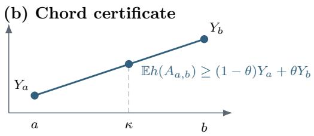
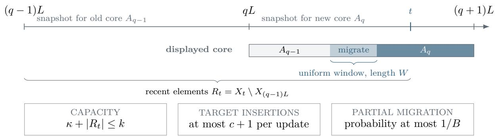
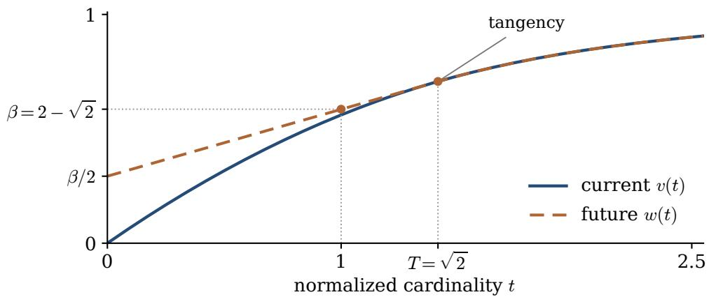

# A Sharp Barrier for Consistent Submodular Maximization: Any Improvement over $2 - { \sqrt { 2 } }$ Entails Exponential Queries or Linear Recourse

Shi Fu Qixin Zhang Dacheng Tao

Nanyang Technological University, Singapore

## Abstract

Consistent submodular maximization studies the tradeof between solution quality and stability when elements arrive over time. For a monotone submodular objective, which models diminishing returns, an algorithm maintains a set of at most k available elements and changes only O(1) elements after each insertion. Dütting et al. [2025] established a tight 2/3 approximation with unrestricted computation and a polynomial-time 0.51 approximation. They left open at STOC 2025 whether eficient algorithms can match the ofline $1 - 1 / e$ guarantee. We resolve this problem by proving that the supremum approximation achievable with polynomially many value queries and worst-case constant recourse is

$$
\beta = 2 - \sqrt { 2 } \approx 0 . 5 8 5 8 < 1 - 1 / e .
$$

For every $\varepsilon > 0$ , our randomized algorithm attains $\beta - \varepsilon$ with $O ( \varepsilon ^ { - 2 } )$ changes per insertion. Any fixed improvement requires exponentially many queries before one critical insertion or linear recourse of Ω(k) changes at that insertion, even with unlimited queries afterwards. This gap quantifies the cost of consistency: the current oracle hides which elements will be needed after an arrival. We also determine the exact curvature-dependent threshold $1 - ( \sqrt { 2 } - 1 ) \vartheta$ , attain $1 - 1 / e - \varepsilon$ for weighted coverage with $O ( \varepsilon ^ { - 1 } )$ recourse, and separate the existence of universal future-price certificates from their eficient computation. Our algorithm has a bounded-bit polynomial-time implementation for polynomial-bit rational oracle answers; the lower bound uses only logarithmic-bit rational answers.

## 1 Introduction

How much value must an algorithm lose when its solution must remain stable? In consistent submodular maximization, elements arrive one at a time, and an algorithm maintains a high-value set of at most k elements seen so far. The objective is monotone and submodular: adding an element cannot decrease value, and its marginal contribution decreases as the selected set grows. Maximum coverage is a basic example. Each available element covers a collection of features, and the value of a selection is the total weight of the features it covers.

The consistency requirement captures the cost of revising a maintained solution. Consider a representative selection that is updated as new candidates become available. Replacing many representatives at once can cause substantial reconfiguration, even if the new selection has higher value. We therefore require a constant number of changes after every arrival, with both insertions and removals counted. This bound is called worst-case constant recourse. Recomputing an ofline solution after each arrival need not satisfy it: a single new element can change which of the previous elements are useful complements.

Without consistency, the classical greedy algorithm achieves a $1 - 1 / e$ approximation for monotone submodular maximization under a cardinality constraint [Nemhauser et al., 1978; Nemhauser and Wolsey, 1978], and this factor is optimal with polynomially many value queries [Vondrák, 2013]. For consistent algorithms, Dütting et al. [2025] proved a tight $2 / 3$ approximation with unrestricted computation and gave a polynomial-time 0.51 approximation. They left open whether eficient randomized algorithms incur a “cost of consistency” [Dütting et al., 2025, Section 1.1]: can they attain the ofline $1 - 1 / e$ benchmark while making only constantly many changes per insertion?

We resolve this STOC 2025 open problem. The supremum approximation achievable with polynomially many value queries and worst-case constant recourse is

$$
\beta : = 2 - \sqrt { 2 } = 0 . 5 8 5 7 8 6 \ldots < 1 - 1 / e .
$$

Every coeficient below $\beta$ is attainable. Any fixed improvement requires either exponentially many queries before a critical arrival or a linear number of changes at that arrival. The obstruction concerns the timing of information: the current oracle hides which elements will complement the new arrival, and discovering them afterwards leaves too little time to revise the solution. This establishes a strict computational cost of consistency even when the algorithm may store all previous elements and perform unlimited computation after the critical arrival.

## 1.1 Our Results

Write $X _ { t }$ for the elements available at time t, $S _ { t } \subseteq X _ { t }$ for the maintained set, and $\mathrm { O P T } _ { k } ( X _ { t } ) =$ max $\{ f ( O ) : O \subseteq X _ { t } , | O | \leq k \}$ . The stream and the objective are fixed in advance. Approximation is measured in expectation at each fixed time, while the recourse bound holds for every realization of the algorithm’s random bits. The precise oracle and encoding conventions appear at the end of this introduction.

Theorem 1.1 (Sharp query–recourse threshold). For every rational $\varepsilon \in ( 0 , \beta )$ , a randomized algorithm in the exact value-oracle model uses polynomially many current queries and satisfies

$$
\mathbb { E } f ( S _ { t } ) \geq ( \beta - \varepsilon ) \mathrm { O P T } _ { k } ( X _ { t } ) , \qquad | S _ { t } \triangle S _ { t - 1 } | = O ( \varepsilon ^ { - 2 } ) .\tag{1.1}
$$

Under polynomial-bit rational oracle answers, the algorithm has a bounded-bit randomized polynomialtime implementation. Conversely, for every fixed $\zeta > 0$ , attaining $\beta + \zeta$ requires exponentially many queries before one critical arrival or $\Omega _ { \zeta } ( k )$ changes at that arrival, on arbitrarily large instances.

The lower bound applies to all randomized value-oracle algorithms and permits unlimited queries and computation after the critical arrival. It holds even with exact rational answers of logarithmic bit length. Proposition 3.2 gives the quantitative tradeof, and Corollary 3.3 extends it to expected resource bounds. The upper bound has recourse at most $8 \lceil 6 / \varepsilon \rceil ^ { 2 } + 2$ . The insertion-count convention of Dütting et al. [2025] converts to symmetric diference within a factor of two by Lemma A.1.

How the threshold depends on the objective. The general threshold need not persist under additional structure. Total curvature measures how much an element’s marginal contribution can decrease. A known full-stream curvature bound $\vartheta \in [ 0 , 1 ]$ means

$$
f ( i \mid S ) \geq ( 1 - \vartheta ) f ( \{ i \} ) \qquad ( S \subseteq V , \ i \in V \backslash S ) ,\tag{1.2}
$$

where $f ( i \mid S ) = f ( S \cup \{ i \} ) - f ( S )$ . The case $\vartheta = 0$ is modular, and $\vartheta = 1$ allows all monotone submodular functions.

Theorem 1.2 (Exact curvature law). For every known full-stream curvature bound $\vartheta \in [ 0 , 1 ]$ , the supremum approximation with polynomially many value queries and worst-case constant recourse is $\rho _ { \vartheta } = 1 - ( \sqrt { 2 } - 1 ) \vartheta$ . For every $\varepsilon > 0$ , the coeficient $\rho _ { \vartheta } - \varepsilon$ is attainable with $O ( \varepsilon ^ { - 2 } )$ recourse. For every fixed $\vartheta > 0$ , any fixed improvement requires linear recourse or exponentially many queries. At $\vartheta = 0$ , recourse two maintains an exact optimum.

The ofline coeficient is $1 - \vartheta / e$ [Sviridenko et al., 2017], so the additional loss is exactly $( \sqrt { 2 } - 1 - 1 / e ) \vartheta$ . The algorithm uses recourse at most $8 \lceil 1 6 / \varepsilon \rceil ^ { 2 } + 2$ and is Turing polynomial time when ϑ and the oracle answers are polynomial-bit rationals. For weighted coverage, Theorem 6.1 attains $1 - 1 / e - \varepsilon$ with $O ( \varepsilon ^ { - 1 } )$ recourse using only the aggregate value oracle. Thus coverage recovers the ofline polynomial-time coeficient without requiring its representation. A fixed improvement would imply ${ \mathsf { N P \subseteq B P P } }$ . Appendix C gives the same positive result for matroid-rank sums with persistent component-rank oracles.

Universal certificates and their computation. The threshold also appears in a proof framework based on future-price certificates. Such a certificate assigns bounded prices to current elements and certifies a prescribed randomized response for every compatible future. For the Poisson response defined in Section 4, certificates at $1 - 1 / e$ always exist. Constructing them with constant success probability at any fixed coeficient in $( \beta , 1 - { 1 \mathord { \left/ { \vphantom { 1 \ 6 } } \right. \kern - delimiterspace } { e } } ]$ requires exponentially many current queries, even allowing fixed additive error in singleton units. Every coeficient below $\beta$ is eficiently constructible. Theorems 4.5 and 4.6 and Lemma 4.3 state these results precisely. They explain the computational limit of this certificate framework; Theorem 1.1 establishes the threshold for all online algorithms.

## 1.2 Proof Overview

A good current solution may interact poorly with future elements. We therefore construct a small random set, called a core, whose expected value remains large after any fixed future is added. Its distribution is computed from current values alone, and the same distribution must work for every compatible future.

An anchored greedy core. A greedy prefix provides both its known current value and a residualmarginal bound on the value still missing. We interpolate between these guarantees by retaining a short prefix and sampling additional elements from a longer one; see Figure 1. The retained anchor keeps every sampled set feasible. A linear program mixes at most two such samplers, and its supporting-line geometry forces $2 - { \sqrt { 2 } } .$ . Section 2 proves this bound. The checkpoint reduction of Dütting et al. [2025] then installs successive cores gradually. A random migration window makes any fixed time unlikely to fall in a partial transition, while bounding changes at every update.

A matching obstruction. The lower bound reverses this geometry. A hidden group among the current elements becomes the useful complement of one final arrival. The current and future value profiles meet at the upper bound’s equality case, yielding the same constant. Exact hiding requires an algebraically flat band where answers depend only on query size. Rational polynomial profiles preserve this band and make the full function monotone submodular. The main text explains the geometry and proves the query–recourse tradeof; Appendix B verifies the derivative and encoding conditions.

Beyond the general threshold. A decoupling inequality and minimax give certificate existence at $1 - 1 / e ;$ the hidden-group family prevents eficient computation above $2 - { \sqrt { 2 } }$ . A computable potential reaches every smaller coeficient and preserves modular contributions, giving the curvature law. For coverage, concavity preserves value during migration. Independent categorical slots implement this interpolation with a fixed replacement schedule and $O ( \varepsilon ^ { - 1 } )$ recourse.

## 1.3 Related Work

The addition-robust primitive and checkpoint reduction of Dütting et al. [2025] build on the deterministic model of Dütting et al. [2024]. Their unrestricted $2 / 3$ guarantee uses minimax and an independently drawn whole comparator. We determine the polynomial-query threshold and study a prescribed product response with bounded coordinate prices; Section 4 compares the certificate frameworks.

The constant $2 - { \sqrt { 2 } }$ also arises in randomized composable coresets. In their random-partition model, Mirrokni and Zadimoghaddam [2015, Theorems 4.1 and 4.8] obtain coreset-quality bounds approaching this coeficient for enlarged greedy summaries and prove a matching limitation for Greedy. The quality guarantee concerns the best solution in the union of the summaries; their eficient PseudoGreedy postprocessing has a smaller guarantee [Mirrokni and Zadimoghaddam, 2015, Theorem 4.9]. Our algorithm must instead compute a distribution that works against every compatible future using current values alone. The matching lower bound applies to every randomized value-oracle algorithm.

In the one-way communication model, Feldman et al. [2023] obtain $2 / 3$ with unrestricted computation and 0.514 eficiently under a message budget. Their $1 / 2$ oracle lower bound restricts queries to feasible sets and therefore concerns a weaker oracle model. Related appearances of $2 - { \sqrt { 2 } }$ in streaming concern space or adversarial injections [Huang et al., 2022; Woodruf et al., 2026]. Fully dynamic consistency permits deletions [Dütting et al., 2026], while competitive recourse measures total movement against supplied targets [Buchbinder et al., 2025]. These information and movement constraints difer from the pathwise per-update guarantee in Equation (1.1).

Model and conventions. An oblivious adversary fixes the finite ground set V, insertion order, and normalized monotone submodular function $f : 2 ^ { V } \to \mathbb { R } _ { \geq 0 }$ . Initially $S _ { 0 } = \emptyset$ . The algorithm may retain all old elements and query any subset of $X _ { t } ,$ , even if its size exceeds $k ,$ , but cannot query unseen elements. There is no storage or sublinear-update-time restriction. As in Equation (1.1), approximation is in expectation at each fixed time, and recourse holds on every random path; no simultaneous high-probability guarantee is asserted.

In the ideal exact-oracle model, we count exact value queries and allow arithmetic on returned reals and sampling from finite distributions. Turing polynomial-time claims assume exact rational oracle answers of polynomial encoding length; runtime is polynomial in that length, the observed prefix size, k, and $1 / \varepsilon$ . Appendix A gives deterministic bounds on work and random bits, absorbing arbitrarily small sampling losses into ε. A real curvature parameter is exact in the ideal model and rationally encoded for the Turing implementation. Curvature and coverage promises concern the full stream. Only the represented matroid-rank-sum extension requires component oracles.

## 2 A Future-Robust Core and Its Online Implementation

Fix a current set X and an integer core capacity $\kappa \geq 1$ . A legal future branch is a function $h : 2 ^ { X } \to { \mathbb { R } } _ { \geq 0 }$ such that adjoining one symbol r with values $f ( S \cup \{ r \} ) = h ( S )$ gives a monotone submodular function. Equivalently, h is monotone and submodular, $h \geq f$ , and

$$
0 \leq h ( S + i ) - h ( S ) \leq f ( S + i ) - f ( S ) \qquad ( i \notin S ) .\tag{2.1}
$$

Any fixed collection of future elements induces such a branch by adjoining the entire collection as one symbol. The algorithm computes its core from current values alone; the future branch is used only in the analysis.

We use the stronger free-future benchmark $P _ { h } = \operatorname* { m a x } _ { O \subseteq X , \ | O | \leq \kappa } h ( O )$ . If $h ( S ) = f ( S \cup R )$ , this dominates the ordinary size-κ optimum on $X \cup R$ . It is only an analytical benchmark: the online algorithm must still fit every displayed element into its capacity k.

## 2.1 Anchoring a Greedy Prefix

Run ordinary greedy for $2 \kappa + 1$ selections. Let $G _ { j }$ be the first j selected elements and define

$$
v _ { j } = f ( G _ { j } ) , \qquad D _ { j } = \kappa ( v _ { j + 1 } - v _ { j } ) , \qquad 0 \leq j \leq 2 \kappa .
$$

If the current set is exhausted, append conceptual null elements. They are omitted from the output and never queried. $\operatorname { I f } | X | \leq \kappa$ , simply returning X is suficient.

For a fixed future write $Y _ { j } = h ( G _ { j } )$ . Two bounds are available at every endpoint:

$$
Y _ { j } \ge v _ { j } , \qquad Y _ { j } \ge P _ { h } - D _ { j } .\tag{2.2}
$$

The first is monotonicity. For the second, let O attain $P _ { h }$ . By Equation (2.1), diminishing returns, and the greedy choice,

$$
P _ { h } \leq Y _ { j } + \sum _ { i \in O \backslash G _ { j } } f ( i  { | } G _ { j } ) \leq Y _ { j } + D _ { j } .
$$

For $0 \leq a < \kappa < b \leq 2 \kappa$ , retain all of $G _ { a }$ and choose a uniform (κ − a)-subset of $G _ { b } \setminus G _ { a }$ . Call this sampler $A _ { a , b }$ and put $\theta = ( \kappa - a ) / ( b - a )$ . For example, when $\kappa = 4 , a = 2$ , and $b = 6$ , the sampler retains the first two greedy elements and chooses two of the next four uniformly. Every output has four positions, and $\theta = { } ^ { 1 / 2 }$

Lemma 2.1 (Anchored interpolation). For every fixed legal future,

$$
\mathbb { E } h ( A _ { a , b } ) \geq ( 1 - \theta ) Y _ { a } + \theta Y _ { b } .
$$

Proof. Order $G _ { b } \setminus G _ { a }$ . The marginal of a sampled element against $G _ { a }$ and its sampled predecessors is at least its marginal against $G _ { a }$ and all its predecessors. Each element is sampled with probability θ. Summing the expected marginals gives at least $\theta ( Y _ { b } - Y _ { a } )$ above $Y _ { a }$ . No independence between inclusion indicators is needed. □



  
Figure 1: Anchored sampling between two greedy prefixes. In the example, the sampler keeps $G _ { 2 }$ and chooses two of the next four elements; the resulting expectation lies above the chord joining the two certified endpoint values.

Geometrically, the lemma certifies the height of the chord from $( a , Y _ { a } )$ to $( b , Y _ { b } )$ at cardinality κ. The anchor supplies this chord while keeping every sampled set feasible.

For an endpoint $j ,$ , write

$$
( a _ { j , \mathsf { v } } , b _ { j , \mathsf { v } } ) = ( 0 , v _ { j } ) , \qquad ( a _ { j , \mathsf { p } } , b _ { j , \mathsf { p } } ) = ( 1 , - D _ { j } )
$$

for the two labels in Equation (2.2). A labelled chord action $\ell = ( a , b , \sigma , \tau )$ , where $0 \leq a < \kappa < b \leq 2$ κ and $\sigma , \tau \in \{ \mathsf { v } , \mathsf { p } \}$ , uses $A _ { a , b }$ and has

$$
( a _ { \ell } , b _ { \ell } ) = ( 1 - \theta ) ( a _ { a , \sigma } , b _ { a , \sigma } ) + \theta ( a _ { b , \tau } , b _ { b , \tau } ) , \qquad \theta = \frac { \kappa - a } { b - a } .\tag{2.3}
$$

The two pure actions use $G _ { \kappa }$ with the respective pairs $( a _ { \kappa , \vee } , b _ { \kappa , \vee } )$ and $( a _ { \kappa , \mathsf { p } } , b _ { \kappa , \mathsf { p } } )$ . Anchored interpolation gives $\mathbb { E } h ( A _ { \ell } ) \geq a _ { \ell } P _ { h } + b _ { \ell }$ . There are $4 \kappa ^ { 2 } + 2$ labelled actions. Labels afect only the certificate, not the output of a sampler.

Choose a mixture by the following linear program, with one moment constraint in addition to normalization:

$$
\Gamma = \operatorname* { m a x } \left\{ \sum _ { \ell } p _ { \ell } a _ { \ell } : \sum _ { \ell } p _ { \ell } b _ { \ell } \geq 0 , \quad \sum _ { \ell } p _ { \ell } = 1 , \quad p _ { \ell } \geq 0 \right\} .\tag{2.4}
$$

Its variables are the probabilities of the labelled actions; the two-dimensional geometry lies in their coeficient pairs $( b _ { \ell } , a _ { \ell } )$ . The moment constraint makes the average intercept nonnegative. Averaging the labelled inequalities therefore gives expected future value at least $\Gamma P _ { h }$ for every h, without enumerating a future.

Lemma 2.2 (Duality and two-action support). The linear program in Equation (2.4) is feasible and has value $\begin{array} { r } { \Gamma = \operatorname* { i n f } _ { \eta \geq 0 } \operatorname* { m a x } _ { \ell } ( a _ { \ell } + \eta b _ { \ell } ) } \end{array}$ . It admits an optimal mixture supported on at most two labelled actions. Given the greedy chain, this mixture can be computed in $O ( \kappa ^ { 2 } \log ( \kappa + 1 ) )$ arithmetic operations.

Proof. The pure label $( 0 , v _ { \kappa } )$ is feasible. Linear-programming duality gives the formula, with $\eta \geq 0$ because the moment is bounded below. View the labels as points $( b _ { \ell } , a _ { \ell } )$ . An optimum of their convex hull in the half-plane $b \geq 0$ is a feasible vertex or an intersection of a hull edge with $b = 0$ Sorting the points and constructing the upper hull gives both the support bound and the stated computation. □

## 2.2 The Finite-Cardinality Constant

Theorem 2.3 $\mathrm { ~ ( ~ A ~ 2 ~ - ~ } \sqrt { 2 }$ robust core). For every finite $\kappa ,$ the mixture in Equation (2.4) satisfies $\mathbb { E } h ( A ) \geq \beta P _ { h }$ for every legal future branch of the current function. It uses $O ( | X | \kappa )$ current value queries and polynomial computation.

Proof. Fix a dual multiplier $\eta \geq 0$ . Set $q _ { j } = j / \kappa$ and $u _ { j } = \operatorname* { m a x } \{ \eta v _ { j } , 1 - \eta D _ { j } \}$ . The greedy marginals are nonincreasing, so $D _ { j }$ is nonincreasing, while $v _ { j }$ is nondecreasing. Hence both terms in the maximum, and therefore the nonnegative heights $u _ { j }$ , are nondecreasing. Maximizing the label at each endpoint turns Equation (2.3) into chord interpolation of the points $( q _ { j } , u _ { j } )$ . Consequently the dual value $\gamma = \operatorname* { m a x } _ { \ell } ( a _ { \ell } + \eta b _ { \ell } )$ equals the largest $\textstyle \sum _ { j } z _ { j } u _ { j }$ over distributions on the grid satisfying $\begin{array} { r } { \sum _ { j } z _ { j } q _ { j } = 1 } \end{array}$ . The extreme distributions are either the point mass at $q _ { \kappa } = 1$ , corresponding to a pure action, or a two-point distribution on $q _ { a } < 1 < q _ { b }$ with weights

$$
1 - \theta = { \frac { q _ { b } - 1 } { q _ { b } - q _ { a } } } , \qquad \theta = { \frac { 1 - q _ { a } } { q _ { b } - q _ { a } } } = { \frac { \kappa - a } { b - a } } ,
$$

corresponding exactly to an anchored sampler. Thus $\gamma$ is the height at $q = 1$ of the upper concave envelope of these endpoint heights.

Replacing the mean equality by $\begin{array} { r } { \sum _ { j } z _ { j } q _ { j } \le 1 } \end{array}$ does not change the maximum. A distribution of smaller mean can be mixed with the point $q = 2$ until its mean is one, without decreasing its value. The dual of this mean-constrained program therefore gives a supporting line

$$
u _ { j } \leq c + d q _ { j } , \qquad c + d = \gamma , \qquad c , d \geq 0 .\tag{2.5}
$$

Here $d \geq 0$ is a dual sign constraint, and $c \geq u _ { 0 } \geq 0$ follows at $q _ { 0 } = 0$

If $\eta = 0$ , then $\gamma = 1$ . Otherwise assume for a contradiction that $\gamma < \beta < { 3 } / { 5 }$ . Linearly interpolate $s ( q _ { j } ) = \eta v _ { j }$ . Since $v _ { j + 1 } - v _ { j } = D _ { j } / \kappa$ , the exact grid inequalities in Equation (2.5) give

$$
s ( 0 ) = 0 , \qquad s ( t ) \leq c + d t , \qquad s ^ { \prime } ( t ) \geq 1 - c - d t \quad { \mathrm { a . e . ~ o n ~ } } [ 0 , 2 ] .\tag{2.6}
$$

Indeed, on the jth cell $s ^ { \prime } ( t ) = \eta D _ { j } \geq 1 - c - d q _ { j } \geq 1 - c - d t .$

Integrating to 2 and comparing the bounds yields $d \ge 2 - 3 \gamma > 0$ . Since $\gamma < 3 / 5$ , the point $q _ { * } = ( 1 - \gamma ) / d$ satisfies

$$
0 < q _ { * } \leq \frac { 1 - \gamma } { 2 - 3 \gamma } < 2 .
$$

Apply Equation (2.6) at $q _ { * }$ to obtain

$$
c \geq ( 1 - \gamma ) q _ { * } - \frac { d } { 2 } q _ { * } ^ { 2 } = \frac { ( 1 - \gamma ) ^ { 2 } } { 2 d } .
$$

Consequently $( 1 - \gamma ) ^ { 2 } \leq 2 c d \leq ( c + d ) ^ { 2 } / 2 = \gamma ^ { 2 } / 2$ , which forces $\gamma \geq 2 - \sqrt { 2 } .$ a contradiction. This holds for every dual multiplier, so Lemma 2.2 proves the theorem. □

The anchor is essential to this proof: uniform sampling of an entire long prefix only implements chords from the origin. Retaining an initial prefix implements every chord crossing the feasible cardinality, which is exactly the geometry used in Equation (2.5). The matching lower bound in the next section does not restrict algorithms to greedy supports.

The same argument gives a strict improvement at every finite capacity: Corollary A.2 states an explicit coeficient $\beta _ { \kappa } > \beta$ and proves that it approaches $\beta$ at rate $\Theta ( 1 / \kappa )$ . We do not claim optimality at fixed capacity.

  
Figure 2: Checkpointing within block q. A uniformly chosen migration window moves from the old core to the new core; outside this window the displayed core is stable. The recent set preserves feasibility while the lazy-superset update bounds worst-case recourse.

## 2.3 An Online Schedule with Hard Recourse

The checkpoint principle is due to Dütting et al. [2025]. We give the schedule explicitly because discarding an internal recent set must not discard all of it from the displayed solution. Figure 2 summarizes the block structure and the randomized migration window.

We maintain a feasible superset of the current target: insert newly required elements and remove old elements only when capacity is exceeded. If the target gains at most D elements per update, this rule uses at most 2D symmetric changes, even when the target discards many elements at a block boundary. Lemma A.1 states and proves this fact.

Lemma 2.4 (Checkpoint conversion). Suppose a current-only sampler using polynomially many exact current queries and ideal arithmetic and sampling returns a set of size at most κ with $\mathbb { E } h ( A ) \geq \alpha \operatorname* { m a x } _ { | O | \leq \kappa } h ( O )$ for every fixed legal branch h, where $0 < \alpha \leq 1 - 1 / e$ . For every integer $B \geq 4$ , there is an online algorithm with expected approximation $\alpha ( 1 - 2 / B ) ( 1 - 1 / B )$ and hard symmetric recourse at most $8 B ^ { 2 } + 2$ in the ideal sampling model.

Proof overview. For $k < 4 B ^ { 2 }$ , recomputing greedy uses fewer than $8 B ^ { 2 }$ changes. Otherwise reserve 2L positions for recent arrivals, where $L = \lfloor k / B \rfloor$ , and compute a core of capacity $\kappa = k - 2 L$ at each block boundary. During the next block, move from the old core to the new one within one uniformly chosen window of length $W = \lfloor L / B \rfloor$ . Replacing at most $\lceil \kappa / W \rceil \leq 2 B ^ { 2 }$ positions per update completes the migration. The target contains these core positions and all elements from the current and preceding blocks, so its size is at most k. The lazy-superset rule bounds symmetric recourse by twice the number of target insertions; see Figure 2.

At a fixed time, the probability of lying in the migration window is at most $1 / B .$ Outside that window, the target contains a complete old or new core together with every element arriving after its snapshot. Its expected value is therefore at least $\alpha \mathrm { O P T } _ { \kappa } ( X _ { t } )$ . A uniform κ-subset of an optimal k-set gives $\mathrm { O P T } _ { \kappa } ( X _ { t } ) \geq ( 1 - 2 / B ) \mathrm { O P T } _ { k } ( X _ { t } )$ . Nonnegativity during migration proves the claimed coeficient. Appendix A.1 specifies the update rule and proves the independence, block-boundary, and capacity claims, including the first and final incomplete blocks. □

For Theorem 1.1, take $B = \lceil 6 / \varepsilon \rceil$ . The core mixture has at most two weights. Round its weight to a dyadic rational, sample an anchored completion by bounded-bit combination unranking, and use bounded-bit window selection. The complete parameter and total-variation calculation is in Appendix A.2. Every possible sampled output remains feasible, so no bad random event changes the hard recourse guarantee. This proves the algorithmic half of Theorem 1.1.

## 3 A Matching Oracle Lower Bound

A single future element is enough for the lower bound. The current oracle hides a k-set A among $( m + 1 ) k$ elements. Before the future arrives, polynomially many queries reveal essentially no information about A. Afterwards, even unlimited information does not allow the algorithm to replace a linear number of elements in one small-recourse update. We construct one monotone submodular function on the full ground set. Its answers are exact rationals, including on queries larger than the maintained capacity.

The upper bound determines the value geometry of the construction. We first explain this geometry, then state the exact-hiding properties and prove the adaptive-query and recourse bounds. The analytic verification is in Appendix B.

## 3.1 Coupled Current and Future Profiles

The upper proof’s dual constraint places both the current-value certificate and the residual-marginal certificate below a supporting line; see Equation (2.5). To attain equality in its limiting geometry, we make the future curve w coincide with that line until the current curve v meets it tangentially. Requiring $w = 1 - v ^ { \prime }$ on this interval determines a quadratic v. After contact, the two certificates coincide through the continuation $\boldsymbol { v ^ { \prime } } = 1 - \boldsymbol { v }$ . The normalization makes the hidden complement’s future value one. We now implement this design with a rational contact parameter near ${ \sqrt { 2 } } .$

Fix a rational $T \in [ 7 / 5 , 3 / 2 ]$ and an integer $m \geq 3 2$ . Define

$$
\begin{array} { r l } { b = ( T ^ { 2 } / 2 + T + 1 ) ^ { - 1 } , } & { \quad c = b T ^ { 2 } / 2 , } \\ { v ( t ) = \left\{ \begin{array} { l l } { b ( ( T + 1 ) t - t ^ { 2 } / 2 ) , } & { 0 \leq t \leq T , } \\ { 1 - b e ^ { - ( t - T ) } , } & { t \geq T , } \end{array} \right. } & { \quad w ( t ) = \left\{ \begin{array} { l l } { c + b t , } & { 0 \leq t \leq T , } \\ { v ( t ) , } & { t \geq T . } \end{array} \right. } \end{array}\tag{3.1}
$$

Both functions are nondecreasing and concave. The function v is $C ^ { 2 }$ , and $w$ is $C ^ { 1 }$ with locally Lipschitz derivative. Two identities explain the construction:

$$
w ( t ) - v ( t ) = \frac { b } { 2 } ( T - t ) _ { + } ^ { 2 } , \qquad c + v ^ { \prime } ( 0 ) = 1 .\tag{3.2}
$$

The future value of a balanced unit-size set will be close to $w ( 1 ) = b + c .$ , while a hidden comparator will have value close to one. Write

$$
R ( T ) = b + c = { \frac { T ^ { 2 } + 2 } { T ^ { 2 } + 2 T + 2 } } .
$$

Its minimum is $\beta$ , attained at $T = { \sqrt { 2 } }$ . More precisely, $R ( T ) - \beta = ( \sqrt { 2 } - 1 ) ( T - \sqrt { 2 } ) ^ { 2 } / ( T ^ { 2 } + 2 T + 2 )$ 2 so rational parameters approach the minimum.

At $T = { \sqrt { 2 } }$ , we have $b = c = \beta / 2$ and $w ( t ) = \operatorname* { m a x } \{ v ( t ) , 1 - v ^ { \prime } ( t ) \}$ . Thus $w ( 1 ) = \beta$ is the balanced value, whereas $c + v ^ { \prime } ( 0 ) = 1$ is the hidden complement’s value. Figure 3 shows this geometry. The remaining construction preserves it up to explicitly bounded errors while enforcing exact hiding and full future compatibility.

The coordinates encode a hidden partition $X = A \sqcup B$ with $| A | = k$ and $| B | = m k$ . For a queried set $S \subseteq X$ , write $x = | S \cap A | / k$ and $y = | S \cap B | / k$ . Thus $s = x + y$ is the total query size in units of $k ,$ and $u = x - y / m$ measures deviation from the balanced allocation. On the line $x + y = 1$ , the balanced point $( 1 / ( m + 1 ) , m / ( m + 1 ) )$ has future value $R ( T ) + O ( 1 / m )$ , while the hidden group $A .$ at $( 1 , 0 )$ , has value at least one. These are continuous profile points; the balanced point need not lie on the count grid. The proof below compares actual sets to it using a Lipschitz bound. It also removes one element from A to make room for the final arrival, producing a feasible comparator of value at least $1 - 5 / k$

  
Figure 3: The analytic profiles at $T = { \sqrt { 2 } } .$ . The future curve w is the upper proof’s supporting line until it meets the current curve v. They share the exponential tail. The finite oracle uses rational $T$ close to ${ \sqrt { 2 } }$ , then adds flattening and regularization.

## 3.2 Exact Hiding and Adaptive Queries

To make this geometry into an exact oracle, let $\delta = 1 / ( 6 4 m )$ . We construct piecewise rational profiles $\widehat { F } _ { \delta } , \widehat { K } _ { \delta }$ on $[ 0 , 1 ] \times [ 0 , m ]$ . Their needed properties are as follows.

• Exact hiding. Whenever $| x - y / m | \leq \delta .$ , the current profile equals $G ( x + y )$ for a fixed concave function G, independently of the hidden partition.

• A legal future. Both profiles are monotone with coordinatewise diminishing gradients, and $\widehat { K } _ { \delta } \geq \widehat { F } _ { \delta }$ with $\nabla \widehat { K } _ { \delta } \leq \mathsf { \nabla } \big \langle \widehat { F } _ { \delta }$ . Thus they define one monotone submodular function before and after the final arrival.

• Separated values. Every coordinate derivative lies in [0, 5]. At the balanced unit-size point, the future value is at most $R ( T ) + 3 2 / m + 3 2 \delta$ , while $\widehat { K _ { \delta } } ( 1 , \widehat { 0 } ) \geq 1$ . For fixed $T , m ,$ , the polynomial coeficients and degrees are independent of k.

We obtain the flat band by clipping the tangency point, add a small regularizer for strict derivative margins, and replace exponentials by fixed rational polynomials within those margins. Appendix B.1 gives the formulas and proves the three properties in Lemmas B.1 to B.3. Precision is fixed after $T , m$ , before k and the hidden partition.

Let $X = [ n ]$ , where $n = ( m + 1 ) k$ , choose A uniformly among its k-subsets, and put $B = X \setminus A$ For $S \subseteq X$ , define one function on $X \cup \{ r \}$ by

$$
f _ { A } ( S ) = \widehat { F } _ { \delta } \left( \frac { | S \cap A | } { k } , \frac { | S \cap B | } { k } \right) , \quad f _ { A } ( S \cup \{ r \} ) = \widehat { K } _ { \delta } \left( \frac { | S \cap A | } { k } , \frac { | S \cap B | } { k } \right) .\tag{3.3}
$$

The arrival order is $1 , 2 , \ldots , n , r ,$ independently of A.

Here $G ( s ) = \widehat { v } ( s ) + \widehat { r } _ { m } ( s )$ is the rational scalar profile plus its regularizer. The derivative conditions certify submodularity on the entire count grid, including diferences crossing piece boundaries.

For a fixed current query $S .$ , the variable $Z = | S \cap A |$ is hypergeometric with mean $| S | / ( m + 1 )$ . Its imbalance is

$$
u _ { A } ( S ) = { \frac { ( m + 1 ) Z - | S | } { m k } } .
$$

Hoefding’s without-replacement inequality [Hoefding, 1963] gives

$$
\mathbb { P } _ { A } \{ | u _ { A } ( S ) | > \delta \} \le 2 e ^ { - \delta ^ { 2 } k / 2 } .\tag{3.4}
$$

Outside this exceptional event the answer is exactly $G ( | S | / k ) : = \widehat { v } ( | S | / k ) + \widehat { r } _ { m } ( | S | / k )$ , independently of A.

Lemma 3.1 (Transcript hiding). Suppose an algorithm makes at most $Q$ current queries before r arrives. With probability at least $1 - 2 ( Q + 1 ) e ^ { - \delta ^ { 2 } k / 2 }$ over A and its random bits, its answers and output immediately before r agree with a reference-oracle execution against $G ,$ , and that output has imbalance at most δ.

Proof. Fix the entire random tape and execute the algorithm against G. Its at most $Q$ queried sets and final current output are then fixed independently of A. Apply Equation (3.4) and a union bound to these $Q + 1$ sets. Until the first diferent answer, the real execution has the same state and asks the same next query. On the good event no first diference occurs, so the outputs also agree. Average over the random tape. If the query cap is promised only on valid instances, impose it on every execution. This preserves all promised executions and makes the reference run well defined. □

Fixing the reference transcript before applying concentration is essential: the actual adaptive queries need not be independent of the hidden partition.

## 3.3 A Finite Query–Recourse Bound

Proposition 3.2 (Finite exact hard instance). Fix rational $T \in [ 7 / 5 , 3 / 2 ]$ , integers $m \geq 3 2 , k \geq 1 0$ and rational profiles specified by Equation (B.5). Let an algorithm maintain at most k arrived elements, make at most Q value queries before the last arrival, and change at most C elements in symmetric diference at that arrival. Queries may be adaptive and arbitrarily large subsets of arrived elements. Queries after the last arrival are unrestricted. For some fixed A, the function Equation (3.3) and the fixed order above satisfy

$$
{ \frac { \mathbb { E } f _ { A } ( S _ { n + 1 } ) } { \mathrm { O P T } _ { k } ( X \cup \{ r \} ) } } \leq { \frac { R ( T ) + 3 8 / m + 5 C / k } { 1 - 5 / k } } + 2 ( Q + 1 ) e ^ { - k / ( 8 1 9 2 m ^ { 2 } ) } .\tag{3.5}
$$

In particular the right side is at most $R ( T ) + 7 6 / m + 1 0 ( C + 1 ) / k + 2 ( Q + 1 ) e ^ { - k / ( 8 1 9 2 m ^ { 2 } ) }$ . Every current singleton is at most $5 / k$ . Each oracle answer is an exactly evaluated rational of $O _ { T , m , \tau } ( \log ( k + 1 ) )$ bits. After fixing a target improvement $\zeta > 0$ and choosing $T , m , \tau$ in the parameter order below, this is an $O _ { \zeta } ( \log n )$ answer-length bound.

Proof. On the good event of Lemma 3.1, write $S _ { 0 }$ for the pre-arrival output. Since its size is at most k, its normalized hidden mass obeys $x = | S _ { 0 } \cap A | / k \leq 1 / ( m + 1 ) + \delta$ . Add elements of B until the entire current set has size k, which is possible because $| B | =$ mk and cannot decrease its future value. Along the line $x + y = 1$ , both coordinate gradients of the rational future profile lie in $[ 0 , 5 ]$ 2 so its value is 5-Lipschitz as a function of x. Its balanced point is $x _ { * } = 1 / ( m + 1 )$ . Here $u = 0 , t = 1$ This completion together with r may have $k + 1$ elements; it is used only as a monotone upper bound on $f _ { A } ( S _ { 0 } \cup \{ r \} )$ , not as a feasible comparator. Therefore

$$
\begin{array} { l } { f _ { A } ( S _ { 0 } \cup \{ r \} ) \leq R ( T ) + \displaystyle \frac { 3 2 } { m } + 3 2 \delta + 5 \left( \displaystyle \frac { 1 } { m + 1 } + \delta \right) } \\ { \leq R ( T ) + \displaystyle \frac { 3 8 } { m } . } \end{array}\tag{3.6}
$$

We used $0 < E _ { D } ( s ) \leq 1$ and $1 < T ,$ so $w ( 1 ) = R ( T )$ is unchanged by rationalization.

Each current insertion has marginal at most $5 / k$ , by integrating its coordinate gradient. Granting r for free, at most $C$ newly inserted current elements can increase the bound by $5 C / k$ . Deletions cannot increase the value. This argument holds after any amount of additional querying.

At the hidden point $( 1 , 0 )$ , the future profile has the exact value $\widehat { K } _ { \delta } ( 1 , 0 ) = c + v ^ { \prime } ( 0 ) + \widehat { r } _ { m } ( 1 ) +$ $3 2 \delta E _ { D } ( 1 ) \geq 1$ . Removing one current element costs at most $5 / k$ . Thus, for any $a _ { 0 } \in A$

$$
f _ { A } { \big ( } \{ r \} \cup ( A \setminus \{ a _ { 0 } \} { \big ) } { \big ) } \geq 1 - 5 / k .\tag{3.7}
$$

This comparator has exactly k elements. On a bad event, any feasible output has ratio at most one. The optimum is the same for every A because the instances difer only by a permutation of current identifiers. Averaging the ratio over A and the random tape therefore gives Equation (3.5) for some fixed A. The simpler bound uses $1 / ( 1 - 5 / k ) \le 2$ and $R ( T ) \leq 1$ . Exact encoding is established in Appendix B.3. □

For a prescribed improvement $\zeta > 0$ , choose a rational T near ${ \sqrt { 2 } } ,$ then a fixed m large enough, and fix the rational profiles. These choices precede k and the hidden partition. As k grows, polynomial $Q$ and $C = o ( k )$ make the remaining terms vanish. More generally, a fixed improvement forces $C = \Omega _ { \zeta } ( k )$ or $Q = \exp ( \Omega _ { \zeta } ( k ) )$ . The fixed instance extracted in the proposition is chosen before the algorithm’s random tape, so the adversary is oblivious. This proves the lower-bound half of Theorem 1.1.

The proposition bounds worst-case resources. The same tradeof holds for expected resources when the expected-query guarantee applies to every valid instance, including the reference oracle. A weaker variant for promises only on the hard family appears in Proposition B.4. Both variants allow unrestricted queries after the final arrival.

Corollary 3.3 (Expected queries and expected final recourse). Fix the parameters of Proposition 3.2. Suppose a randomized algorithm terminates almost surely with feasible outputs on every valid instance with $n = ( m + 1 )$ k current elements and one final element. Suppose, on every such instance, its expected pre-arrival query count is at most $\overline { { Q } }$ and its expected symmetric diference at the final arrival is at most C. Then some fixed hard instance satisfies

$$
\frac { \mathbb { E } f _ { A } ( S _ { n + 1 } ) } { \mathrm { O P T } _ { k } ( X \cup \{ r \} ) } \leq \frac { R ( T ) + 3 8 / m + 5 \overline { C } / k } { 1 - 5 / k } + 2 ( \overline { Q } + 1 ) e ^ { - k / ( 8 1 9 2 m ^ { 2 } ) } .\tag{3.8}
$$

No deterministic resource bound or expected running-time bound is required, and post-arrival queries are unrestricted.

The reference G is itself a valid concave-cardinality oracle with a full-stream extension. Its expected query count is therefore at most $\overline { { Q } } ;$ conditioning on its almost-surely finite transcript gives the same exceptional term as before. The value bound then uses the actual expected final recourse. Appendix B.5 gives the full proof and a separate truncation variant when the expectation promises hold only on the hard family.

The proof applies to arbitrary outputs and arbitrary ordinary value queries. Given the hidden partition, the useful current set is explicit and the function is easy to evaluate. The lower bound concerns the information available before the last arrival together with the number of changes allowed afterwards.

## 4 Universal Future Prices: Existence and Query Complexity

A future price is useful because it can turn a condition on current coordinates into a guarantee against every unknown future. We first make this implication explicit, both at a point with small first-order gap and by averaging a sequence of arbitrary bounded prices. We then give a current-query construction below $\beta ,$ prove that prices actually exist at $\alpha _ { 0 } = 1 - 1 / e$ , and show that computing any bounded prices above $\beta$ requires exponentially many queries.

Fix a normalized current function f on $X = [ n ]$ , put $M _ { i } = f ( \{ i \} )$ and $M = \operatorname* { m a x } _ { i } M _ { i }$ , and let $\mathcal { H } _ { f }$ be the legal future branches in Equation (2.1). Write $H _ { h } ( x ) = \mathbb E h ( Z _ { x } )$ , where current coordinate i is present independently with probability $1 - e ^ { - x _ { i } }$ , and let $F _ { h }$ be the Bernoulli multilinear extension. Monotonicity gives $F _ { h } ( x ) \geq H _ { h } ( x )$ on $[ 0 , 1 ] ^ { n }$ . For capacity $\kappa \geq 1$ , let

$$
P _ { \kappa } = \{ x \in [ 0 , 1 ] ^ { n } : { \bf 1 } ^ { \top } x \leq \kappa \} , \qquad P _ { h } = \operatorname* { m a x } _ { O \subseteq X , ~ | O | \leq \kappa } h ( O ) .
$$

The empty current set is immediate; below assume $n \geq 1$

For $0 \leq \alpha \leq 1 , \xi \geq 0$ , and $x \in P _ { \kappa }$ , an (α, ξ)-price is a vector $\textstyle p \in \prod _ { i } [ 0 , M _ { i } ]$ satisfying

$$
H _ { h } ( x ) - \alpha h ( O ) \geq \left. p , x - 1 _ { O } \right. - \xi M \quad { \mathrm { f o r ~ e v e r y ~ } } h \in { \mathcal { H } } _ { f } , \ \left. O \right. \leq \kappa .\tag{4.1}
$$

A universal α-price has $\xi = 0$ and satisfies the same inequality for every $O \subseteq X$ , independently of a capacity. The coordinatewise box $\begin{array} { r } { G _ { f } = \prod _ { i } [ 0 , M _ { i } ] } \end{array}$ is part of the certificate: a vector in the larger uniform box $[ 0 , M ] ^ { n }$ need not be a valid price. We use $[ 0 , M ] ^ { n }$ only as a convenient computational envelope when an implementation approximates an already valid vector in $G _ { f }$

Diferent members of $\mathcal { H } _ { f }$ need not have a simultaneous submodular extension [Csirmaz, 2020]. As in the scenario formulation of Dütting et al. [2025, Section 5.1, Lemma 5.1], we require only individual compatibility with the same current restriction. By Lemma 6.3, this includes branches $h ( S ) = f ( S \cup R )$ with $R \cap X \neq \emptyset { \mathrm { : ~ } }$ coordinates already in R have zero marginal in h.

## 4.1 From Current Prices to a Future-Robust Core

Lemma 4.1 (A price gap certifies the response). Suppose p satisfies Equation (4.1) at $x \in P _ { \kappa }$ , and put

$$
\displaystyle \mathrm { g a p } ( p , x ) = \operatorname* { m a x } _ { y \in P _ { \kappa } } \langle p , y - x \rangle .
$$

Then, simultaneously for every legal future,

$$
H _ { h } ( x ) \geq \alpha P _ { h } - \xi M - \mathrm { g a p } ( p , x ) .
$$

In particular, for $\eta \ge 0 , \ : \mathrm { g a p } ( p , x ) \le \eta M$ gives $H _ { h } ( x ) \geq ( \alpha - \xi - \eta ) P _ { h }$

Proof. Choose a maximizer O of $P _ { h }$ . Since $\mathbf { 1 } _ { O } \in P _ { \kappa }$ , the price term in Equation (4.1) is at least $- \exp ( p , x )$ . Finally $P _ { h } \ge M$ , because $h \geq f$ and $\kappa \geq 1$ □

Finding a small-gap point is convenient when the prices are gradients of a bounded smooth potential. It is not required for the conversion to a core. Standard projected online linear optimization controls the average price terms even for discontinuous prices, and future-oblivious dependent rounding converts the resulting responses into feasible sets [Chekuri et al., 2010]. The following lemma states this consequence with the reliability condition needed for randomized price routines.

Lemma 4.2 (Bounded prices yield a robust core). Fix $0 \leq \alpha \leq 1 , \xi \geq 0$ , and rational $\eta , \tau \in ( 0 , 1 )$ Suppose a current-only routine, called at an adaptively chosen $x ^ { s } \in P _ { \kappa }$ , returns $p ^ { s }$ with $0 \leq p _ { i } ^ { s } \leq M _ { i }$ on every outcome. Let $\mathcal { F } _ { s }$ contain its entire preceding history, so $x ^ { s }$ is $\mathcal { F } _ { s }$ -measurable. Assume that, for every fixed legal h and every fixed $| O | \leq \kappa ,$

$$
H _ { h } ( x ^ { s } ) - \alpha h ( O ) \geq \mathbb { E } [ \langle p ^ { s } , x ^ { s } - \mathbf { 1 } _ { O } \rangle \mid \mathcal { F } _ { s } ] - \xi M .\tag{4.2}
$$

Then at most $3 2 \kappa n / \eta ^ { 2 }$ calls produce a current-only random set A with $| A | \le \kappa$ on every outcome and

$$
\begin{array} { r } { \mathbb { E } h ( A ) \geq ( \alpha - \xi - \eta - \tau ) P _ { h } \quad f o r \ e v e r y \ l e g a l \ h . } \end{array}
$$

The additional arithmetic and sampled-bit counts have deterministic polynomial bounds when the returned prices have uniformly polynomial encoding length. The term τ is an arbitrarily prescribed finite-bit rounding error.

Proof overview. Projected online linear optimization, applied to the realized bounded prices, gives the pathwise regret bound

$$
\frac 1 I \sum _ { s = 0 } ^ { I - 1 } \langle p ^ { s } , \mathbf { 1 } _ { O } - x ^ { s } \rangle \leq \eta M .
$$

Take expectations in Equation (4.2) and sum. The average response is at least $\alpha h ( O ) - ( \xi + \eta ) M$ Choose an iterate uniformly with fresh randomness and apply mean-preserving pair rounding. For each fixed $h ,$ its multilinear extension is convex along the rounding exchanges and dominates its Poisson response. Thus the same current-only rounding law produces the asserted feasible core for every future. Appendix A.6 gives the step size, deterministic call and bit bounds, and treatment of approximation errors. □

Guaranteed coordinate approximations also sufice. The ideal prices lie in $G _ { f }$ and satisfy Equation (4.2), while their implemented approximations may lie in the uniform envelope $[ 0 , M ] ^ { n }$ . A coordinate error of at most aM perturbs the price term by at most 2κaM. Taking $a \leq \eta / ( 1 6 \kappa )$ fits within the regret bound; Appendix A.6 gives this calculation and its use for represented MRS. The guarantee depends on approximating valid prices; boundedness alone does not certify a vector. The price field need not be continuous or arise from a potential. For general $H _ { h } ,$ , the lemma rounds a randomly selected iterate. If every $H _ { h }$ is concave, the response at the average iterate dominates the average response and gives a fractional core.

A separate high-probability version holds when each call can already provide simultaneous validity of Equation (4.1), conditional on its history, with failure probability at most $\delta / I$ . A union bound over the I calls, followed by independent rounding and nonnegativity on failure, gives coeficient $\alpha - \xi - \eta - \delta - \tau$ . A bare 2/3-success price routine does not automatically supply this premise: its unknown-future constraints cannot generally be checked to select a successful repetition. The conditional-expectation model in Lemma 4.2 and the simultaneous-success model in Theorem 4.6 are therefore stated separately.

## 4.2 Computable Prices from a Scale Potential

The anchored core proves the general upper bound with a short greedy chain. We now give a second route to the same coeficient. It produces fractional prices, which allow us to preserve modular value in Section 5 and to migrate solutions through concave responses in Section 6. These two additional properties are not needed by the anchored algorithm.

Non-oblivious potentials have a substantial history in submodular optimization [Filmus and Ward, 2014]. In the continuous setting, Zhang et al. [2022, Lemma 2 and Theorems 1–2] integrate gradients along scales and convert an exchange inequality into stationary-point approximation.

Our additional requirement is that a potential computed from the current restriction certify every compatible future contraction. The following inequality establishes that requirement; stationarity and regret are standard ways to use it.

Let g be a normalized monotone submodular function on the full ground set. For a current set X and a fixed set R in that ground set, let $F _ { R } ^ { g } ( x ) = \mathbb { E } g ( Z _ { x } \cup R )$ , where the coordinates of $Z _ { x } \subseteq X$ are independently present with probabilities $x _ { i }$ , and let $H _ { R } ^ { g } ( x ) = F _ { R } ^ { g } ( { \bf 1 } - e ^ { - x } )$ . All exponentials are coordinatewise. Only the current function is queried. For $1 \leq T \leq { \sqrt { 2 } }$ , define

$$
\Phi _ { T } ^ { g } ( x ) = \int _ { 0 } ^ { T } \frac { H _ { \mathcal { D } } ^ { g } ( t x ) } { t } d t .
$$

The integrand has a continuous limit at zero.

Lemma 4.3 (Scale certificate). For every nonnegative $x ,$ , every $O \subseteq X$ , and every fixed $R ,$ including $R \cap X \neq \emptyset$

$$
( 1 + T ) H _ { R } ^ { g } ( x ) - T g ( O \cup R ) \geq \langle \nabla \Phi _ { T } ^ { g } ( x ) , x - \mathbf { 1 } _ { O } \rangle .\tag{4.3}
$$

Proof. Write $h ( t ) = H _ { \oslash } ^ { g } ( t x ) , q ( t ) = H _ { R } ^ { g } ( t x )$ , and $P = g ( O \cup R )$ . For a Poisson union $Z$ at intensity $t x .$ , diminishing returns gives

$$
\sum _ { i \in O \backslash Z } g ( i \mid Z ) \geq g ( O \mid Z ) \geq g ( O \mid Z \cup R ) \geq P - g ( Z \cup R ) .
$$

The absent-element factor is exactly the one in a Poisson derivative. Also $h ( 0 ) = g ( \emptyset ) = 0$ , so $\langle \nabla \Phi _ { T } ^ { g } ( x ) , x \rangle = h ( T )$ . Taking expectations and integrating the marginal bound gives

$$
\langle \nabla \Phi _ { T } ^ { g } ( x ) , x - \mathbf { 1 } _ { O } \rangle \leq h ( T ) + \int _ { 0 } ^ { T } q ( t ) d t - T P \leq q ( T ) + \int _ { 0 } ^ { T } q ( t ) d t - T P .
$$

Every entry of the Hessian of a monotone submodular Poisson extension is nonpositive: diagonals are minus first derivatives, and mixed entries are weighted discrete second diferences. Thus $q$ is nondecreasing and concave as a scalar function of t. Its tangent at one gives

$$
q ( T ) + \int _ { 0 } ^ { T } q ( t ) d t \leq ( 1 + T ) q ( 1 ) + ( T ^ { 2 } / 2 - 1 ) q ^ { \prime } ( 1 ) \leq ( 1 + T ) q ( 1 ) .
$$

This proves the certificate. If R overlaps X, its coordinates simply have zero derivative in $q ,$ and the same marginal comparison applies. No concavity in the vector x is used. □

For the current function $g = f ,$ the vector $p _ { T } ( x ) = \nabla \Phi _ { T } ^ { f } ( x ) / ( 1 + T )$ is a universal price at coeficient $T / ( 1 + T )$ . Each coordinate lies in $[ 0 , M _ { i } ]$ , since current sample marginals are bounded by their singletons. This is an exact mathematical certificate. For implementation, choose rational $T < { \sqrt { 2 } }$ , estimate the gradient by bounded current marginal samples, and clip coordinate $i \ \mathrm { t o } \ [ 0 , M _ { i } ]$ Clipping cannot increase its error. Coordinate accuracy $\xi M / ( 2 n )$ gives additive certificate error at most ξM simultaneously for every comparator, because $\| x - 1 _ { O } \| _ { 1 } \leq n$ on $[ 0 , 1 ] ^ { n }$ . Appendix $\mathrm { A . 3 }$ supplies deterministic work caps and any prescribed failure probability. Thus every coeficient below $\beta$ has a polynomial-work price construction with prescribed additive accuracy; no exact evaluation of exponentials or expectations is assumed.

## 4.3 Decoupling a Future from Its Comparator

Dütting et al. [2025, Section 5.1, equation (9) and Lemma 5.2] decouple a future from its comparator by drawing an entire comparator independently from its marginal law, retaining a $2 / 3$ fraction in expectation and using minimax over individually compatible futures. Here we prescribe a diferent response: independent coordinate samples at the shared marginals after the Poisson transformation. This retains $1 - 1 / e$ directly, without composing whole-comparator decoupling with a second correlation-gap loss.

Classical correlation-gap bounds compare correlated and independent draws for one fixed submodular function [Agrawal et al., 2010]. In the theorem below, conditioning on the future changes the comparator marginals, so that fixed-function statement alone does not give the shared-marginal conclusion. As a further technical connection, Buchbinder et al. [2025, Section 3, Lemma 3.1 and Proposition 3.2] relate the Poisson response of a supplied function to eficient separation for its Wolsey extension at a supplied target. Those cuts can query that function; our price must instead work simultaneously for every future consistent with the current oracle.

For a concrete distinction, let $X = \{ 1 , 2 \}$ and $f ( S ) = | S |$ . Choose $i \in \{ 1 , 2 \}$ uniformly, set $h _ { i } ( S ) = 1 + 1 \{ 3 - i \in S \}$ , and use comparator $O _ { i } = \{ 3 - i \}$ . Each branch is legal: its future duplicates current element $i ,$ making the other element the useful complement. The correlated benchmark is always two. Drawing a whole comparator independently gives expected value $^ 3 / 2 .$ whereas the prescribed Poisson response at the shared marginals $q = ( 1 / 2 , 1 / 2 )$ is $2 - e ^ { - 1 / 2 }$ . The theorem below controls the latter response directly.

Theorem 4.4 (Unknown-future Poisson decoupling). Let $( h , O )$ have any finitely supported joint distribution, with $\boldsymbol { h } \in \mathcal { H } _ { f }$ and $O \subseteq X$ . Put $q = \mathbb { E } \mathbf { 1 } _ { O }$ . Then

$$
\begin{array} { r } { \mathbb { E } _ { h } H _ { h } ( q ) \geq ( 1 - e ^ { - 1 } ) \mathbb { E } _ { ( h , O ) } h ( O ) . } \end{array}\tag{4.4}
$$

On the left the product sample is independent of the future. On the right the future and its comparator may be arbitrarily correlated.

Proof. Let $D$ be the marginal law of the comparator in the given joint law. First draw $( h , O )$ from that joint law. Independently of this pair, draw an iid sequence ${ \cal O } _ { 1 } , { \cal O } _ { 2 } , \ldots \sim { \cal D } ;$ in particular, O may remain correlated with $h ,$ whereas every $O _ { j }$ is independent of both. Put $U _ { j } = O _ { 1 } \cup \cdots \cup O _ { j }$ ， with $U _ { 0 } = \varnothing$ , and define

$$
a _ { j } = \mathbb { E } _ { h , U _ { j } } h ( U _ { j } ) , \qquad b _ { j } = \mathbb { E } _ { U _ { j } } f ( U _ { j } ) , \qquad P = \mathbb { E } _ { ( h , O ) } h ( O ) .
$$

The marginal domination in Equation (2.1) implies, pointwise,

$$
h ( O ) \leq h ( U _ { j } \cup O ) \leq h ( U _ { j } ) + f ( U _ { j } \cup O ) - f ( U _ { j } ) .
$$

Although O is correlated with $h ,$ it is an independent D-draw relative to $U _ { j }$ . Averaging the pointwise inequality over $( h , O )$ and $U _ { j }$ therefore gives $P \leq a _ { j } + b _ { j + 1 } - b _ { j }$ . Also $b _ { j } \leq a _ { j }$ . Summing the former inequalities for $j = 0 , \ldots , \ell - 1$ and using $b _ { 0 } = 0$ yields the crucial prefix-sum estimate

$$
\sum _ { j = 0 } ^ { \ell } a _ { j } \geq \ell P \qquad ( \ell \geq 1 ) .\tag{4.5}
$$

Let $N \sim \mathrm { P o i } ( 1 )$ and $w _ { j } = e ^ { - 1 } / j !$ . These weights are nonincreasing, with $w _ { 0 } = w _ { 1 }$ . Summation by parts and Equation (4.5) give

$$
\mathbb { E } a _ { N } = \sum _ { \ell \geq 0 } ( w _ { \ell } - w _ { \ell + 1 } ) \sum _ { j = 0 } ^ { \ell } a _ { j } \geq P \sum _ { \ell \geq 0 } ( w _ { \ell } - w _ { \ell + 1 } ) \ell = ( 1 - e ^ { - 1 } ) P .
$$

All terms are bounded by the maximum value of one of finitely many functions on a finite ground set, so the boundary terms vanish.

It remains to replace the compound-Poisson set $U _ { N }$ by independent element samples. Write $D ( S ) = \lambda _ { S }$ . Poisson splitting generates $U _ { N }$ by independent counts $N _ { S } \sim \mathrm { P o i } ( \lambda _ { S } )$ , adding the whole batch $S$ whenever $N _ { S } > 0$ . Enumerate the finitely many sets with $\lambda _ { S } > 0$ . We replace their batch indicators one at a time, preserving independence across batch types. At one induction step, condition on all randomness belonging to the other types and let V be their resulting union; those other types may already have been replaced. With $\pi _ { S } = 1 - e ^ { - \lambda _ { S } }$ , the conditional contribution of the current all-or-nothing batch is

$$
( 1 - \pi _ { S } ) h ( V ) + \pi _ { S } h ( V \cup S ) .
$$

Replace it by mutually independent Bernoulli $\pi _ { S }$ inclusions, one for each element of $S ,$ using fresh randomness. Order $S$ as $i _ { 1 } , \ldots , i _ { r }$ . The replacement has conditional expected gain

$$
\sum _ { a = 1 } ^ { r } \pi _ { S } \mathbb { E } \big [ h \big ( i _ { a } \mid V \cup W _ { a - 1 } \big ) \big ] ,
$$

where $W _ { a - 1 } \subseteq \{ i _ { 1 } , . . . , i _ { a - 1 } \}$ . Diminishing returns lower-bounds this by $\textstyle \pi _ { S } \sum _ { a } h ( i _ { a } \ | \ V \cup $ $\{ i _ { 1 } , \dots , i _ { a - 1 } \} ) = \pi _ { S } ( h ( V \cup S ) - h ( V ) )$ . Thus this induction step cannot decrease expected value.

After all induction steps, the Bernoulli variables are independent over pairs $( S , i )$ with $i \in S$ Hence the resulting coordinate-inclusion events are independent across $i ,$ and coordinate i is absent with probability $\Pi _ { S \ni i } ( 1 - \pi _ { S } ) = \Pi _ { S \ni i } e ^ { - \lambda _ { S } } = e ^ { - q _ { i } }$ . The final union therefore has exactly the product law defining $H _ { h } ( q )$ . We have proved $H _ { h } ( q ) \geq \mathbb { E } h ( U _ { N } )$ for every fixed $h ;$ averaging over the independent draw of h and combining with the prefix-sum bound proves Equation (4.4). □

The coeficient in Theorem 4.4 is exact for this response. A single modular element, an empty future, and O equal to that element give $H _ { h } ( 1 ) = 1 - 1 / e$ and $h ( O ) = 1$ . For Bernoulli response the same coeficient follows from $F _ { h } \ge H _ { h }$ . It is asymptotically tight for the empty future $h = f$ where $f ( S ) = { \bf 1 } \{ S \neq \emptyset \}$ , and a uniformly random singleton comparator: the comparator value is one, whereas independent inclusion at the shared marginals $q _ { i } = 1 / n$ has value $1 - ( 1 - 1 / n ) ^ { n }$

## 4.4 Minimax Produces One Price for Every Future

First normalize the future family. For $\boldsymbol { h } \in \mathcal { H } _ { f }$ , let $d = h ( X ) - f ( X )$ . The excess $h - f$ is nonincreasing under inclusion, so $h _ { 0 } = h -$ d is still legal and satisfies $h _ { 0 } ( X ) = f ( X )$ . For $\alpha \leq 1$

$$
H _ { h } ( x ) - \alpha h ( O ) = H _ { h _ { 0 } } ( x ) - \alpha h _ { 0 } ( O ) + ( 1 - \alpha ) d .
$$

Thus it sufices to consider the tight futures $\mathcal { H } _ { f } ^ { 0 } = \{ h \in \mathcal { H } _ { f } : h ( X ) = f ( X ) \}$ . They form a nonempty compact polytope in $\mathbb { R } ^ { 2 ^ { n } }$ , since $f ( S ) \leq h ( S ) \leq f ( X )$ and all defining constraints are linear.

Theorem 4.5 (Bounded universal prices). For every f and every $x \in [ 0 , 1 ] ^ { n }$ , there exists $p _ { f } ( x ) \in$ $\Pi _ { i } [ 0 , M _ { i } ]$ such that

$$
\begin{array} { r } { H _ { h } ( x ) - \alpha _ { 0 } h ( O ) \geq \langle p _ { f } ( x ) , x - \mathbf { 1 } _ { O } \rangle \quad f o r \ e v e r y \ h \in \mathcal { H } _ { f } , \ O \subseteq X , \qquad \alpha _ { 0 } = 1 - e ^ { - 1 } . } \end{array}
$$

The selector can be determined by the current restriction alone, independently of the budget and of the actual future.

Proof. For $\begin{array} { r } { G = \prod _ { i } [ 0 , M _ { i } ] } \end{array}$ , consider the maximum certificate violation

$$
V = \operatorname* { m i n } _ { p \in G } \operatorname* { m a x } _ { h \in \mathcal { H } _ { f } ^ { 0 } , O \subseteq X } \{ p \cdot ( x - \mathbf { 1 } _ { O } ) - H _ { h } ( x ) + \alpha h ( O ) \} .
$$

For fixed $p$ and $O ,$ the displayed expression is afine in the value table of $h ,$ so its maximum over the compact polytope $\mathcal { H } _ { f } ^ { 0 }$ occurs at a vertex. Let

$$
\mathcal { V } = \mathrm { v e r t } ( \mathcal { H } _ { f } ^ { 0 } ) , \qquad \mathcal { C } = \mathcal { V } \times 2 ^ { X } .
$$

Both sets are finite because the current ground set is finite. Apply finite-dimensional minimax to the compact convex box G and the probability simplex $\Delta ( \mathcal { C } )$ : the payof is bilinear in $p$ and the mixed constraint $\mu \in \Delta ( \mathcal { C } )$ . Thus

$$
V = \operatorname* { m a x } _ { \mu } \left\{ \alpha \mathbb { E } _ { \mu } h ( O ) - \mathbb { E } _ { \mu } H _ { h } ( x ) - \sum _ { i } M _ { i } ( q _ { i } - x _ { i } ) _ { + } \right\} , \qquad q = \mathbb { E } _ { \mu } { \mathbf { 1 } } _ { O } , \quad \mu \in \Delta ( \mathcal { C } ) .\tag{4.6}
$$

The final term is the exact minimum of $p \cdot ( x - q )$ over the box G. Every legal future has $0 \leq \partial _ { i } H _ { h } \leq M _ { i }$ , hence

$$
H _ { h } ( q ) \leq H _ { h } ( x ) + \sum _ { i } M _ { i } ( q _ { i } - x _ { i } ) _ { + } .
$$

At $\alpha = \alpha _ { 0 }$ , Theorem 4.4 makes every maximand in Equation (4.6) nonpositive. Thus $V \leq 0$ Compactness gives a feasible price. Selecting the unique minimum-norm point of the feasible price set defines it from $f ,$ x alone. The normalization argument extends it to all legal futures. □

This is an existence proof, not a polynomial-size optimization formulation. A direct computation can read the entire current value table, optimize over the future polytope for every comparator, and solve the resulting price feasibility problem. Both the table and the constraint system are exponential in n.

The duality also has an exact abstract form. Let $L _ { h } ( x )$ be a prescribed response on a compact convex future family in a finite-dimensional value-table space and a finite comparator collection, jointly continuous in $h , x ,$ , afine in h, and satisfying, for all response points $x , q$ under consideration,

$$
L _ { h } ( q ) - L _ { h } ( x ) \leq \sum _ { i } M _ { i } ( q _ { i } - x _ { i } ) _ { + } .
$$

On the convex hull of feasible comparator indicators, bounded α-prices exist at every point if and only if

$$
\mathbb { E } _ { \mu } L _ { h } ( \mathbb { E } _ { \mu } { \mathbf { 1 } } _ { O } ) \geq \alpha \mathbb { E } _ { \mu } h ( O ) \quad \mathrm { f o r ~ e v e r y ~ f i n i t e l y ~ s u p p o r t e d ~ j o i n t ~ l a w ~ } \mu .\tag{4.7}
$$

Necessity averages the certificate at $x = \mathbb { E } \mathbf { 1 } _ { O }$ . Suficiency is exactly Equation (4.6) and the response’s one-sided Lipschitz bound, with compact minimax in place of a finite future polytope. This characterizes a specified response and price framework. It is not a characterization of all online algorithms. For example, modular functions are maintained exactly with recourse two, whereas their Poisson response already has the one-element $1 - 1 / e$ ceiling.

## 4.5 An Exponential-Query Obstruction for Every Bounded Price Vector

Theorem 4.6 (Price query lower bound). Fix $\beta < \alpha \le \alpha _ { 0 }$ and any $\eta > 0$ . In the worst case, finding $\textstyle p \in \prod _ { i } [ 0 , f ( \{ i \} ) ]$ satisfying

$$
H _ { h } ( x ) - \alpha h ( O ) \geq \langle p , x - \mathbf { 1 } _ { O } \rangle - \eta M , \qquad M = \operatorname* { m a x } _ { i } f ( \{ i \} ) ,\tag{4.8}
$$

simultaneously for all legal futures and all $| O | \le k$ , with probability at least $^ { 2 / 3 , }$ requires $\exp ( \Omega _ { \alpha } ( n ) )$ worst-case current queries. More explicitly, no algorithm with a deterministic cap $Q = \exp ( o _ { \alpha } ( n ) )$ on every random tape and every oracle transcript can have this success guarantee on every instance.

The same conclusion holds under the weaker, constraint-by-constraint requirement

$$
\mathbb { E } _ { \rho } [ H _ { h } ( x ) - \alpha h ( O ) - \langle p _ { \rho } , x - \mathbf { 1 } _ { O } \rangle ] \ge - \eta M \quad f o r \ e v e r y \ f i x e d \ h \in \mathcal { H } _ { f } , | O | \le k ,\tag{4.9}
$$

provided $\begin{array} { r } { p _ { \rho } \in \Pi _ { i } [ 0 , f ( \{ i \} ) ] } \end{array}$ on every random tape $\rho$ and the same deterministic query cap holds. The expectation in Equation (4.9) is only over the algorithm’s internal randomness; this clause concerns expected certificate validity, not an expected query budget.

Proof. Use the exact rational hard family of Proposition 3.2, with $n = ( m + 1 ) k$ and $k \geq 6 4 m$ Set $x _ { i } = 1 / ( m + 1 )$ , so $\mathbf { 1 } ^ { \top } x = k$ . All current singleton values are identical and at most $5 / k$ . Let $h _ { A } ( S ) = f _ { A } ( S \cup \{ r \} )$ be the branch after the critical future. With $\pi = 1 - e ^ { - 1 / ( m + 1 ) }$ , the normalized random counts have means π, mπ, variances at most $1 / k$ each, and total mean $s = ( m + 1 ) \pi < 1$ . At their mean the imbalance is zero. The rational future profile therefore has value at most $w ( 1 ) + 3 3 / m$ there: its linear piece is exact, its regularizer is at most $3 2 / m$ , and its final correction is at most $1 / ( 2 m )$ . Its two coordinate derivatives are at most five, so the Cauchy–Schwarz bound on each mean absolute deviation gives

$$
H _ { h _ { A } } ( x ) \leq w ( 1 ) + \frac { 3 3 } { m } + \frac { 1 0 } { \sqrt { k } } .\tag{4.10}
$$

Also $h _ { A } ( A ) \geq 1$ holds exactly for the rational profile. At $( x , y ) = ( 1 , 0 )$ its quadratic terms equal $c + v ^ { \prime } ( 0 ) = 1$ , and both rational regularization terms are nonnegative. The current comparator $O = A$ has the permitted size $k ,$ because this static certificate grants the future for free. No limiting comparator value is used here.

Write $d = \alpha - \beta > 0$ . Choose rational $T$ with $w ( 1 ) - \beta \leq d / 8$ , then $m \ge \operatorname* { m a x } \{ 3 2 , 2 6 4 / d \}$ and then $k \geq \operatorname* { m a x } \{ 6 4 m , ( 8 0 / d ) ^ { 2 } , 4 0 \eta / d \}$ . Define the rational profile degree by Lemma B.2 before choosing k. The three errors in Equation (4.10) and the allowed error $\eta M \leq 5 \eta / k$ consume at most $d / 2$ . Consequently any valid price must satisfy

$$
p ( A ) - { \frac { 1 } { m + 1 } } \sum _ { i } p _ { i } \geq \Delta\tag{4.11}
$$

with $\Delta = d / 2$

Clip every output to $[ 0 , 5 / k ] ^ { n }$ , which leaves every successful output on this hard family unchanged. Fix the price algorithm’s random tape and run it on the reference oracle, enforcing the deterministic Q-query cap on this and every real transcript. Its output $p$ is independent of the uniform hidden k-set A. Conditional on this vector, $\mathbb { E } _ { A } p ( A ) = \sum _ { i } p _ { i } / ( m + 1 )$ . Since each $p _ { i } \in [ 0 , 5 / k ]$ , sampling without replacement bounds the probability of Equation (4.11) by $e ^ { - 2 \Delta ^ { 2 } k / 2 5 }$ . The chance that any of its at most $Q$ queries difers from the reference oracle is at most $2 Q e ^ { - k / ( 8 1 9 2 m ^ { 2 } ) }$ . Thus the average probability of returning a valid price is at most

$$
2 Q e ^ { - k / ( 8 1 9 2 m ^ { 2 } ) } + e ^ { - 2 \Delta ^ { 2 } k / 2 5 } .
$$

Success probability $2 / 3$ on every instance therefore requires exponential $Q .$ . This covers arbitrary bounded vector outputs, with no potential or symmetry assumption.

For Equation (4.9), define adv $\begin{array} { r } { \mathbf { \tilde { \rho } } ( p , A ) = p ( A ) - ( m + 1 ) ^ { - 1 } \sum _ { i } p _ { i } } \end{array}$ . Under the reference oracle, $p _ { \rho }$ is independent of uniform $A ,$ and hence $\mathbb { E } _ { A , \rho } \mathrm { a d v } ( p _ { \rho } , A ) = 0$ . Couple the reference and real executions using the same tape. They difer only if a query transcript first difers, and every clipped advantage lies in [−5, 5]; their expected advantages therefore difer by at most $2 0 Q e ^ { - k / ( 8 1 \mathrm { { \bar { y } } 2 m ^ { 2 } } ) }$ . On the other hand, applying Equation (4.9) to the fixed constraint $( h _ { A } , O = A )$ gives $\mathbb { E } _ { \rho } \mathrm { a d v } ( p _ { \rho } , A ) \ge \Delta$ for every hidden set $A .$ . Averaging this inequality over A again forces exponential $Q .$ The coeficient in the exponential depends on $\alpha ,$ while the minimum admissible $k$ can also depend on the fixed additive-error parameter η. □

Together with Section 4.2, this separates the $\alpha _ { 0 }$ existence threshold from the $\beta$ polynomial-query construction threshold, where construction allows any prescribed additive certificate error and failure probability. This is an unconditional query separation, not an assertion of NP-hardness for an explicitly supplied representation.

## 5 The Exact Curvature Law

The scale certificate from Section 4.2 yields the second refinement of the sharp threshold. Its upper bound keeps a known modular part with coeficient one and applies the scale potential only to the residual submodular part. This distinction is essential: Poissonizing a modular objective would already lose value. The matching lower bound adds modular mass to the same hidden instance, with its finite-k normalization retained.

Lemma 5.1 (Hybrid checkpoint conversion). Let f and b be nonnegative monotone submodular functions on the $f u l l$ insertion-only stream, with $b ( U ) \leq f ( U )$ for every $U$ . Fix an integer $B \geq 4$ and suppose that $k \geq 4 B ^ { 2 }$ . Put

$$
L = \lfloor k / B \rfloor , \qquad \kappa = k - 2 L , \qquad W = \lfloor L / B \rfloor .
$$

For either objective u, write $\operatorname { O P T } _ { k } ( u , Z ) = \operatorname* { m a x } \{ u ( U ) : U \subseteq Z , | U | \leq k \}$ . Fix $\delta \geq 0$ . Suppose that on every checkpoint snapshot $Y _ { + }$ , a current-only sampler returns $A _ { Y } \subseteq Y , | A _ { Y } | \leq \kappa .$ , such that, for every fixed $R \cap Y = \emptyset$ with $| R | + \kappa \leq k$ 2

$$
\mathbb { E } f ( A _ { Y } \cup R ) \geq \operatorname* { m a x } _ { O \subseteq Y , \mid O \mid \leq \kappa } b ( O \cup R ) - \delta P _ { f } ( Y , R ) , \qquad P _ { f } ( Y , R ) : = \operatorname* { m a x } _ { O \subseteq Y , \mid O \mid \leq \kappa } f ( O \cup R ) .\tag{5.1}
$$

Assume that the sampler’s bits are independent of the migration-window bits, and that every one of the B window choices has probability at most p. Then the checkpoint schedule and lazy-superset update of Lemma $\it 2 . 4$ maintain hard symmetric recourse at most $8 B ^ { 2 } + 2$ and, at every fixed time t,

$$
\mathbb { E } f ( S _ { t } ) \geq \mathrm { O P T } _ { k } ( b , X _ { t } ) - \left( \delta + \frac { 2 } { B } + p \right) \mathrm { O P T } _ { k } ( f , X _ { t } ) .\tag{5.2}
$$

Proof. Use exactly the ordered-position migration in the proof of Lemma 2.4. Its deterministic capacity and recourse invariants do not use the objective or its benchmark, and hence remain valid here.

Fix $t = q L + r ,$ , where $q \geq 1$ and $1 \le r \le L$ . There are two complete-core states. Before migration the relevant snapshot and analytical sufix are

$$
Y ^ { - } = X _ { ( q - 1 ) L } , \qquad R ^ { - } = X _ { t } \setminus Y ^ { - } ,
$$

whereas after migration they are

$$
Y ^ { + } = X _ { q L } , \qquad R ^ { + } = X _ { t } \setminus Y ^ { + } .
$$

Thus $R ^ { \pm } \cap Y ^ { \pm } = \varnothing , | R ^ { - } | \le 2 L$ , and $| R ^ { + } | \leq L$ , so $\kappa + | R ^ { \pm } | \leq k$ . The target before migration contains $A _ { Y ^ { - } } \cup R ^ { - }$ . After migration the schedule’s recent set still contains all elements of $X _ { t } \setminus X _ { ( q - 1 ) L }$ and therefore may overlap $Y ^ { + } ;$ this causes no dificulty, because the displayed target contains the smaller set $A _ { Y ^ { + } } \cup R ^ { + }$ , whose analytical sufix is disjoint from $Y ^ { + }$ . Finally, the lazy output contains the target. Monotonicity of $f$ therefore allows Equation (5.1) to be applied in either complete-core state, without ever applying the static certificate to an overlapping sufix. Moreover,

$$
P _ { f } ( Y ^ { \pm } , R ^ { \pm } ) \leq \mathrm { O P T } _ { k } ( f , X _ { t } ) ,\tag{5.3}
$$

because every set in the definition of $P _ { f }$ has size at most $\kappa + | R ^ { \pm } | \leq k$ and is contained in $X _ { t }$

It remains to compare the size-κ hybrid benchmark with the desired size-k one. Let $U \subseteq X _ { t } ,$ $| U | \le k$ , and fix either pair $( Y , R )$ above. $\mathrm { ~ f ~ } | U \cap Y | \leq \kappa$ , monotonicity gives $b ( ( U \cap Y ) \cup R ) \geq b ( U )$ Otherwise, let $O$ be a uniformly random κ-subset of $U \cap Y$ and put $Q = U \cap R$ . The usual random-subset bound for the monotone submodular contraction $C \mapsto b ( C \cup Q )$ gives

$$
\mathbb { E } b ( O \cup Q ) \geq b ( Q ) + \frac { \kappa } { | U \cap Y | } \big ( b ( U ) - b ( Q ) \big ) \geq \frac { \kappa } { k } b ( U ) .
$$

Adding the rest of $R$ can only increase the value. Maximizing over U and using $\kappa / k = 1 - 2 L / k \geq$ $1 - 2 / B$ yields

$$
\operatorname* { m a x } _ { O \subseteq Y , \ | O | \leq \kappa } b ( O \cup R ) \geq \left( 1 - \frac { 2 } { B } \right) \mathrm { O P T } _ { k } ( b , X _ { t } ) .\tag{5.4}
$$

For a fixed t, at most one window choice places t strictly inside a migration, so this event has probability at most $p .$ It depends only on the window bits and is independent of both adjacent core samples. On its complement, Equations (5.1), (5.3) and (5.4) apply to the appropriate complete core. On the exceptional event use only nonnegativity. The positive benchmark term is retained with probability at least $1 - p ,$ and the expected additive loss is at most $\delta \mathrm { O P T } _ { k } ( f , X _ { t } )$ . Since $\mathrm { O P T } _ { k } ( b , X _ { t } ) \leq \mathrm { O P T } _ { k } ( f , X _ { t } )$

$$
\begin{array} { r l } & { \mathbb { E } f ( S _ { t } ) \geq ( 1 - p ) \left( 1 - \frac { 2 } { B } \right) \mathrm { O P T } _ { k } ( b , X _ { t } ) - \delta \mathrm { O P T } _ { k } ( f , X _ { t } ) } \\ & { \qquad \quad \geq \mathrm { O P T } _ { k } ( b , X _ { t } ) - \left( \delta + \frac { 2 } { B } + p \right) \mathrm { O P T } _ { k } ( f , X _ { t } ) . } \end{array}
$$

During the first block the algorithm displays the whole prefix, so the same conclusion is immediate. This proves the lemma. □

Theorem 5.2 (Preserving a modular component). Suppose the full objective decomposes as $f = g + \ell ,$ where g is normalized monotone submodular and ℓ is nonnegative modular. The weight $\ell _ { i }$ is available when i arrives, and g has current value-oracle access. In the exact value-oracle model there is a randomized algorithm using polynomially many current queries and $O ( \varepsilon ^ { - 2 } )$ hard symmetric recourse such that

$$
\mathbb { E } f ( S _ { t } ) \geq \operatorname* { m a x } _ { O \subseteq X _ { t } , \ | O | \leq k } \{ \ell ( O ) + \beta g ( O ) \} - \varepsilon \mathrm { O P T } _ { k } ( f , X _ { t } ) .\tag{5.5}
$$

Under polynomial-bit rational oracle answers, the same guarantee has a bounded-bit randomized Turing polynomial-time implementation.

Proof. For $\varepsilon \geq 1$ the empty output sufices, so assume $0 < \varepsilon < 1$ . Fix a capacity $\kappa \geq 1$ and a current snapshot ${ \cal Y } ,$ and let $P _ { \kappa } ( Y ) = \{ x \in [ 0 , 1 ] ^ { Y } : \textstyle \sum _ { i } x _ { i } \le \kappa \}$ . Define the hybrid benchmark $b ( U ) : = \ell ( U ) + \beta g ( U )$ . It is nonnegative, monotone, and submodular, and $b ( U ) \leq f ( U )$ . If $Y = \varnothing$ return the empty core; the static interface below follows immediately from $b ( R ) \leq f ( R )$ . Henceforth assume $Y \neq \emptyset$ . Use the current potential and the analysis response

$$
\Xi ( x ) = \ell \cdot x + { \frac { \Phi _ { T } ^ { g } ( x ) } { 1 + T } } , \qquad L _ { R } ( x ) = \ell ( R ) + \ell \cdot x + H _ { R } ^ { g } ( x ) .
$$

For R disjoint from the current snapshot $Y$ , the modular identity and Equation (4.3) give

$$
L _ { R } ( x ) - \left[ \ell ( O \cup R ) + { \frac { T } { 1 + T } } g ( O \cup R ) \right] \geq \langle \nabla \Xi ( x ) , x - \mathbf { 1 } _ { O } \rangle .\tag{5.6}
$$

Moreover $F _ { R } ^ { f } ( x ) \geq L _ { R } ( x )$ by monotonicity, because the modular part is kept linear. We use this hybrid certificate only for R disjoint from X, as in the checkpoint construction. This disjointness is needed for the displayed modular identity, even though Lemma 4.3 itself allows overlap.

Let $M = \operatorname* { m a x } _ { i } f ( \{ i \} )$ . The potential has range at most κM, nonnegative gradient coordinates at most $f ( \{ i \} )$ , and Hessian entries of magnitude at most M. Its gradient is estimated from ordinary current marginal queries. The bounded-work routine in Appendix A.3 finds a feasible point with first-order gap at most $\eta M$ , except with prescribed probability $\delta _ { \mathrm { f a i l } }$ . Fresh pipage randomness, independent of that routine, rounds it to a set of size at most $\kappa .$ The same current-only rounding law preserves at least $F _ { R } ^ { f } ( x )$ in expectation for each fixed future, because pipage convexity holds for every monotone submodular contraction. It does not query R or select a rounding law using R.

To make the error scale precise, for $R \cap Y = \emptyset$ set

$$
P _ { R } = \operatorname* { m a x } _ { O \subseteq Y , \ | O | \leq \kappa } f ( O \cup R ) .
$$

Then $M \leq P _ { R }$ for $\kappa \geq 1$ . Put $a = T / ( 1 + T )$ . On the successful stationarity event,

$$
\operatorname* { m a x } _ { y \in P _ { \kappa } ( Y ) } \langle \nabla \Xi ( x ) , y - x \rangle \leq \eta M .
$$

Consequently, for every $O \subseteq Y , | O | \leq \kappa .$

$$
\begin{array} { r l } & { F _ { R } ^ { f } ( x ) \geq L _ { R } ( x ) } \\ & { \qquad \geq \ell ( O \cup R ) + a g ( O \cup R ) - \eta M } \\ & { \qquad = b ( O \cup R ) - ( \beta - a ) g ( O \cup R ) - \eta M . } \end{array}\tag{5.7}
$$

Mean-preserving pair rounding does not decrease the first line in expectation. Its fixed-bit implementation loses at most $\rho P _ { R }$ . If the stationarity event fails, use nonnegativity; this loses at most $\delta _ { \mathrm { f a i l } } P _ { R }$ , because both the benchmark and every rounded value belong to $[ 0 , P _ { R } ]$ . Finally, $g ( O \cup R ) \leq f ( O \cup R ) \leq P _ { R }$ . Maximizing Equation (5.7) over O therefore proves that the first-order error, failure event, rounding error, and replacement of $\beta$ by a together lose at most

$$
\left( \eta + \delta _ { \mathrm { f a i l } } + \rho + \beta - \frac { T } { 1 + T } \right) P _ { R } .
$$

The same successful stationarity event works for every comparator, and the core law does not depend on $R ,$ , so no union bound over futures is needed.

More explicitly, put

$$
\delta _ { \mathrm { c o r e } } : = \eta + \delta _ { \mathrm { f a i l } } + \rho + \beta - \frac { T } { 1 + T } .
$$

The preceding argument proves the exact static interface

$$
\mathbb { E } f ( A _ { Y } \cup R ) \geq \operatorname* { m a x } _ { O \subseteq Y , \ | O | \leq \kappa } b ( O \cup R ) - \delta _ { \mathrm { c o r e } } P _ { R }\tag{5.8}
$$

for every fixed disjoint sufix R, using a single future-oblivious core law.

Choose

$$
B = \left\lceil \frac { 1 6 } { \varepsilon } \right\rceil , \qquad \eta = \delta _ { \mathrm { f a i l } } = \rho = \frac { \varepsilon } { 6 4 } ,
$$

and choose rational $T \leq { \sqrt { 2 } }$ with $\sqrt { 2 } - T \leq \varepsilon / 6 4$ . Since $T \mapsto T / ( 1 + T )$ is 1-Lipschitz, $\delta _ { \mathrm { c o r e } } \leq \varepsilon / 1 6$ If $k < 4 B ^ { 2 }$ , recompute the static hybrid core after every arrival with $\kappa = k$ and $R = \emptyset$ . Then Equation (5.8) is exactly Equation (5.5) with loss at most $\left( \varepsilon / 1 6 \right) \mathrm { O P T } _ { k } ( f , X _ { t } )$ , and two consecutive feasible outputs difer in at most $2 k < 8 B ^ { 2 }$ elements.

Now suppose $k \geq 4 B ^ { 2 }$ . Use the checkpoint schedule with $L = \lfloor k / B \rfloor$ and $\kappa = k - 2 L$ . Implement the B-way window draw with fixed bits so that each atom has probability at most

$$
p \leq \frac { 1 } { B } + \frac { \varepsilon } { 6 4 } ;
$$

all window bits are independent of all core computations. Applying Lemma 5.1 to Equation (5.8) gives, at every fixed time,

$$
\begin{array} { r l } & { \mathbb { E } f ( S _ { t } ) \geq  { \operatorname { O P T } _ { k } } ( b , X _ { t } ) - \left( \frac { \varepsilon } { 1 6 } + \frac { 2 } { B } + \frac { 1 } { B } + \frac { \varepsilon } { 6 4 } \right)  { \operatorname { O P T } _ { k } } ( f , X _ { t } ) } \\ & { \qquad \geq  { \operatorname { O P T } _ { k } } ( b , X _ { t } ) - \varepsilon  { \operatorname { O P T } _ { k } } ( f , X _ { t } ) , } \end{array}
$$

because $1 / B \le \varepsilon / 1 6$ . This is Equation (5.5). The lazy schedule gives hard recourse at most $8 B ^ { 2 } + 2$ The finite-bit rounding and deterministic polynomial-work caps are supplied by Appendices A.3 and $\mathrm { A . 4 } ;$ every approximate outcome remains feasible, so none of these implementation steps changes the pathwise recourse bound. □

Under Equation (1.2), define directly from the full-stream curvature promise

$$
\ell ( S ) = ( 1 - \vartheta ) \sum _ { i \in S } f ( \{ i \} ) , \qquad g = f - \ell .
$$

Indeed, subtracting the modular function ℓ preserves submodularity, and Equation (1.2) says exactly that every marginal of $g$ is nonnegative; hence g is normalized monotone submodular on the full ground set. Since $\textstyle f ( U ) \leq \sum _ { i \in U } f ( \{ i \} )$ ), for every $U$

$$
\ell ( U ) + \beta g ( U ) \geq [ 1 - \vartheta + \beta \vartheta ] f ( U ) = \rho _ { \vartheta } f ( U ) .
$$

Thus Theorem 5.2 proves the algorithmic curvature bound.

We next give finite parameters for the matching lower bound. Use the exact rational hard function $f _ { 0 }$ in Proposition 3.2, with parameters T, m, k and the degree chosen in Lemma B.2. For $\vartheta > 0$ put $\lambda = ( 1 - \vartheta ) / \vartheta$ and define

$$
f _ { \lambda } ( S ) = f _ { 0 } ( S ) + \lambda \sum _ { e \in S } f _ { 0 } ( \{ e \} ) .\tag{5.9}
$$

Every marginal is at least $\lambda f _ { 0 } ( \{ e \} )$ , and each singleton is $( 1 + \lambda ) f _ { 0 } ( \{ e \} )$ . Hence the complete function has curvature at most ϑ, including the final element.

Lemma 5.3 (Finite curvature lower bound). Fix rational $T \in [ 7 / 5 , 3 / 2 ]$ , an integer $m \geq 3 2$ , a rational $\lambda \geq 0$ , and an integer $k \geq 6 4 m$ . Set $\vartheta = ( 1 + \lambda ) ^ { - 1 }$ and $R _ { T } = w ( 1 )$ , and fix the rational profile accuracy and degree as functions of $T , m$ . There are exact rational instances on $( m + 1 ) k$ current elements and one final element, each of full-stream curvature at most ϑ, such that every randomized algorithm making at most $Q$ queries before the final arrival and at most C symmetric changes at that arrival has, on one fixed instance,

$$
\frac { \mathbb { E } f _ { \lambda } ( S _ { n + 1 } ) } { \mathrm { O P T } _ { k } ( f _ { \lambda } , X \cup \{ r \} ) } \le \frac { R _ { T } + \lambda } { 1 + \lambda } + \frac { 1 3 0 } { m } + \frac { 1 0 C + 1 2 } { k } + 2 ( Q + 1 ) e ^ { - k / ( 8 1 9 2 m ^ { 2 } ) } .\tag{5.10}
$$

There is no restriction on post-arrival queries or computation. For fixed $T , m , \lambda$ , all oracle answers have $O _ { T , m , \lambda } ( \log ( k + 1 ) )$ bits.

Proof. Write $E _ { D }$ for the common rational exponential approximation. As $1 / k \le \delta$ , both possible locations of a singleton lie in the exact flat band. Every current singleton therefore has the same value

$$
\sigma _ { k } = \frac { v ^ { \prime } ( 0 ) } { k } - \frac { b } { 2 k ^ { 2 } } + \frac { 3 2 } { m } \big ( 1 - E _ { D } ( 1 / k ) \big ) , \qquad 0 \leq \sigma _ { k } \leq \frac { 5 } { k } .
$$

The final singleton is exactly $c _ { * } = c + 3 2 \delta = c + 1 / ( 2 m )$ . Neither value depends on the hidden set A. Adding the modular function thus adds exactly $\lambda \sigma _ { k } | S |$ to each current query, preserving the reference-transcript coupling for arbitrary query cardinalities.

Put $D _ { k } = k \sigma _ { k } + c _ { * }$ . The identity $v ^ { \prime } ( 0 ) + c = 1$ and the bounds $0 < E _ { D } \leq 1$ and $0 \leq - E _ { D } ^ { \prime } \leq 2$ give

$$
1 - \frac { 1 } { 2 k } \le D _ { k } \le 1 + \frac { 6 5 } { m } .\tag{5.11}
$$

In particular the regularizer is accounted for at finite m. It is not discarded when taking the limit in $k$

On a good transcript, Proposition 3.2 bounds the original objective after the last update by $R _ { T } + 3 8 / m + 5 C / k$ . Even granting the algorithm both r and k current elements, its modular part is at most $\lambda D _ { k }$ . The feasible comparator $\{ r \} \cup \left( A \setminus \{ a _ { 0 } \} \right)$ has original value at least $1 - 5 / k$ and modular value exactly $\lambda ( D _ { k } - \sigma _ { k } )$ . Hence the good-event ratio is at most

$$
\frac { R _ { T } + 3 8 / m + 5 C / k + \lambda D _ { k } } { 1 - 5 / k + \lambda ( D _ { k } - \sigma _ { k } ) } .\tag{5.12}
$$

The numerator is at most $R _ { T } + \lambda + 6 5 ( 1 + \lambda ) / m + 5 C / k$ . The denominator is at least $( 1 + \lambda ) ( 1 - 6 / k )$ Since $k \geq 6 4 m \geq 1 2$ and $( R _ { T } + \lambda ) / ( 1 + \lambda ) \le 1$ , division bounds Equation (5.12) by the first three terms of Equation (5.10). On the bad event the approximation ratio is at most one. The transcript-disagreement probability is unchanged by the modular addition, giving the last term. Average over the random hidden set to obtain one instance fixed before the algorithm’s random bits. Rationality and encoding length follow from the profile construction and the fixed rational λ.

The bound also holds with $Q , C$ replaced by uniform expected bounds $\overline { { Q } } , \overline { { C } }$ over the promised curvature class, assuming almost-sure termination. To apply the proof of Corollary 3.3 within this class, use the reference instance

$$
f _ { \mathrm { r e f } , \lambda } ( S ) = G ( | S \cap X | / k ) + \lambda \sigma _ { k } | S \cap X | + ( 1 + \lambda ) c _ { * } { \bf 1 } \{ r \in S \} .
$$

Its current answers match the modularly augmented reference transcript. Each current singleton is $( 1 + \lambda ) \sigma _ { k }$ , each current marginal is at least $\lambda \sigma _ { k } .$ and $r$ is modular, so its full-stream curvature is at most ϑ. The same random-length coupling applies. In the good-event value bound, take the expectation of the actual nonnegative recourse term before dividing by the deterministic comparator lower bound.

For a fixed rational $\vartheta > 0$ and a prescribed improvement $\zeta > 0$ , first choose rational $T$ so that $R _ { T } - \beta < \zeta / 4$ , then choose m so that $1 3 0 / m < \zeta / 4$ , and then take arbitrarily large $k \geq 6 4 m$ The rational profile degree is fixed before k. Since $( \beta + \lambda ) / ( 1 + \lambda ) = \rho _ { \vartheta }$ , Equation (5.10) forces $C = \Omega _ { \vartheta , \zeta } ( k )$ or $Q = \exp ( \Omega _ { \vartheta , \zeta } ( k ) )$ for a guarantee exceeding $\rho _ { \vartheta }$ by ζ. For an arbitrary fixed real $\vartheta > 0$ , choose a rational $\vartheta ^ { \prime } \leq \vartheta$ suficiently close that $\rho _ { \vartheta ^ { \prime } } - \rho _ { \vartheta } < \zeta / 4$ and apply the same construction. These instances obey the promised bound ϑ and still have exact rational answers. Together with the upper bound and the modular case, this proves Theorem 1.2.

## 6 When Stronger Prices Are Accessible

The general price lower bound does not apply to every structural promise. Coverage permits an aggregate-oracle implementation of the stronger certificate. Matroid-rank sums permit another implementation when their component rank oracles are supplied. The same linear-recourse conversion serves both results.

Theorem 6.1 (Coverage without its representation). Suppose the full current-and-future objective is a nonnegative weighted coverage function. For every rational $\varepsilon \in ( 0 , \alpha _ { 0 } )$ , an ordinary-current-valueoracle algorithm attains $\alpha _ { 0 } - \varepsilon$ with hard symmetric recourse at most $4 \lceil 2 / \varepsilon \rceil + 2$ using polynomially many current queries. Under polynomial-bit rational oracle answers, its computation and sampledbit counts have deterministic polynomial bounds. A fixed improvement above $\alpha _ { 0 }$ in randomized polynomial time would imply ${ \mathrm { N P } } \subseteq { \mathrm { B P P } }$ , even without a recourse restriction.

## 6.1 An Aggregate-Oracle Certificate

For analysis only, write $\begin{array} { r } { f ( S ) = \sum _ { a } w _ { a } \mathbf { 1 } \{ S \cap C _ { a } \neq \emptyset \} } \end{array}$ . The algorithm is not given the atoms $C _ { a }$ or their weights. Let $H = H _ { \mathcal { O } }$ denote the current Poisson extension.

Lemma 6.2 (Coverage prices). For every $x \geq 0$ , every $O \subseteq X$ , and every fixed set R in the full coverage ground set, including R ∩ X $\neq \emptyset$

$$
H _ { R } ( x ) - \alpha _ { 0 } f ( O \cup R ) \geq \langle \nabla H ( x ) , x - \mathbf { 1 } _ { O } \rangle .\tag{6.1}
$$

Proof. Consider one atom, divide by its weight, and let $\begin{array} { r } { z = \sum _ { i \in X \cap C _ { a } } x _ { i } , o _ { a } = | O \cap C _ { a } | } \end{array}$ , and $r = { \bf 1 } \{ R \cap C _ { a } \neq \emptyset \}$ . The current-gradient price contribution is $( z - o _ { a } ) e ^ { - z } . { \mathrm { ~ I f ~ } } r = o _ { a } = 0$ , the claim is $1 - e ^ { - z } \ge z e ^ { - z }$ . If $r = 0$ and $o _ { a } \geq 1$ , it follows from $( z - o _ { a } + 1 ) e ^ { - z } \leq z e ^ { - z } \leq e ^ { - 1 }$ . If $r = 1$ , it follows from $( z - o _ { a } ) e ^ { - z } \leq z e ^ { - z } \leq e ^ { - 1 }$ . Summing proves the claim. Although an atom representation was used in the proof, H and $\nabla H$ are determined by the current aggregate function. □

The gradient has the current-query formula

$$
\partial _ { i } H ( x ) = e ^ { - x _ { i } } \mathbb { E } [ f ( Z _ { - i } \cup \{ i \} ) - f ( Z _ { - i } ) ] ,\tag{6.2}
$$

where coordinate $j \neq i$ is included independently with probability $1 - e ^ { - x _ { j } }$ . Let $M = \operatorname* { m a x } _ { i } f ( \{ i \} )$ and $P _ { R } = \operatorname* { m a x } _ { O \subseteq X , \ | O | \leq \kappa } f ( O \cup R )$ . A sample marginal lies in [0, M]. The bounded-work routine in $\operatorname { A p p }$ endix A.3 finds a feasible point with first-order gap at most $\eta M$ , except on an event of probability at most $\delta _ { \mathrm { f a i l } }$ . Consequently, for every fixed future,

$$
\mathbb { E } H _ { R } ( x ) \geq ( \alpha _ { 0 } - \eta - \delta _ { \mathrm { f a i l } } ) P _ { R } .\tag{6.3}
$$

No union bound over futures is needed: on the current-only good event, the first-order certificate holds simultaneously for all of them.

Coverage also supplies a distinct property needed for migration. For every fixed R,

$$
H _ { R } ( x ) = \sum _ { a : R \cap C _ { a } \neq \emptyset } w _ { a } + \sum _ { a : R \cap C _ { a } = \emptyset } w _ { a } \left( 1 - e ^ { - \sum _ { i \in X \cap C _ { a } } x _ { i } } \right)\tag{6.4}
$$

is concave in x. If $i \in R \cap X$ , every atom it covers appears in the first sum, so the response is constant in that coordinate. This proves concavity and the certificate on precisely the overlapping domain of Lemma 6.3.

## 6.2 Independent Slots and a Hard Migration Bound

There are two separate ingredients. A price certificate produces a good fractional core at each snapshot. Concavity then ensures that every intermediate mixture of the old and new cores remains good. Independent slots implement this mixture while changing only a few positions. The recent set overlaps the newer snapshot, so we record the exact domain before using concavity.

Independent categorical repetitions and their domination of the Poisson response already appear in Buchbinder et al. [2025, Section 5, Lemma 5.6]. Their negative-association argument also implies the heterogeneous-slot version below. We give a direct replacement proof for the overlapping domain. Our use of these slots combines concavity across two snapshot cores with a fixed replacement schedule, yielding a pathwise per-update recourse bound.

Lemma 6.3 (Fixed sets and overlapping coordinates). Let f be monotone submodular on a ground set containing X ∪ R, where R is any fixed set, possibly intersecting X. Then $h _ { R } ( S ) = f ( S \cup R )$ is a legal branch on X. For $x \ge 0$ , let $Z _ { x } \subseteq X$ include coordinates independently with probabilities $1 - e ^ { - x _ { i } }$ and put $H _ { R } ( x ) = \mathbb { E } f ( Z _ { x } \cup R )$ . This response depends only on coordinates in X \ R. Every statement proved for all legal branches therefore applies to this overlapping R, without conditioning on the sampled set.

Proof. Monotonicity and submodularity are preserved by adjoining R. If $i \in R$ , its marginal in $h _ { R }$ is zero. Otherwise diminishing returns compares its marginal at $S \cup R$ to that at S, proving Equation (2.1). Elements of $R \cap X$ are already in the union, so their random inclusion has no efect. Equivalently, one may adjoin a fresh symbol representing the whole set R, even when it contains current elements. □

Lemma 6.4 (Categorical domination). Fix a coordinate set X and a deterministic set $R ,$ with arbitrary overlap. Let $I _ { 1 } , \ldots , I _ { \kappa }$ be independent categorical draws in X or a null, with $\mathbb { P } ( I _ { s } = i ) = p _ { i } ^ { ( s ) }$ and the remaining probability assigned to a null. Put $\begin{array} { r } { z _ { i } = \sum _ { s } p _ { i } ^ { ( s ) } } \end{array}$ . Their distinct nonnull values A satisfy $| A | \le \kappa$ on every outcome and $\mathbb { E } f ( A \cup R ) \geq H _ { R } ( z )$ for every monotone submodular function on $X \cup R$

Proof. Condition on the union U of R and all other draws. One categorical draw contributes exactly $\textstyle f ( U ) + \sum _ { i } p _ { i } f ( i \mid U )$ . Replace it by independent counts $N _ { i } \sim \mathrm { P o i } ( p _ { i } )$ . By submodularity, the replacement’s expected value is at most $\textstyle f ( U ) + \sum _ { i } ( 1 - e ^ { - p _ { i } } ) f ( i \mid U )$ , which is no larger. Replace all slots in this way. The aggregated independent counts have means $z _ { i }$ , and their union is the Poisson extension. Coordinates in R have zero marginal throughout this replacement, so no disjointness assumption enters the proof. No Poisson count is sampled by the algorithm. □

Suppose old and new fractional cores are $x , y \in P _ { \kappa }$ . Retain $\kappa - j$ old slots with probabilities $x _ { i } / \kappa$ and use $j$ new slots with probabilities $y _ { i } / \kappa$ . If $H _ { R }$ is concave for every future contraction, Lemma 6.4 gives

$$
\begin{array} { r } { \mathbb { E } f ( A _ { j } \cup R ) \geq H _ { R } ( ( 1 - \lambda ) x + \lambda y ) \geq ( 1 - \lambda ) H _ { R } ( x ) + \lambda H _ { R } ( y ) , \qquad \lambda = j / \kappa . } \end{array}\tag{6.5}
$$

This statement requires independence of active slots conditional on the cores. Core computations and the replacement order therefore never inspect realized slot values. Their random bits are separate from slot bits. The two fractional cores themselves need not be independent, since the final inequality is pointwise in the pair.

We state the schedule with the same block convention as Lemma 2.4. Choose $B \geq 4 . { \mathrm { ~ I f ~ } } k \geq 2 B$ put $L = \lfloor k / B \rfloor , \kappa = k - 2 L$ , and $c = \lceil \kappa / L \rceil \leq 2 B$ . A fractional core on a snapshot Y means a current-only random vector $x \in P _ { \kappa } ( Y )$ satisfying

$$
\mathbb { E } H _ { R } ( x ) \geq \alpha \operatorname* { m a x } _ { O \subseteq Y , \ | O | \leq \kappa } f ( O \cup R )
$$

for every deterministic R in the promised full function class. The expectation here is over the core computation. The same law works for all R, with arbitrary overlap.

Algorithm 1 gives the update rule. At a snapshot, the new fractional core and its sampled tuple are prepared for the following block. The replacement order is fixed independently of sampled values.

```latex
Algorithm 1 Consistent maximization by independent slots
Parameters: $\overline { { L = \lfloor k / B \rfloor , \kappa = k - 2 L , c = \lceil { \kappa / L } \rceil } }$ , with $k \geq 2 B$ and $B \geq 4 .$
Initialization: $x ^ { ( 0 ) } = 0 , A _ { 0 } = ( \bot , \bot . . . , \bot )$ with κ null entries, and $S _ { 0 } = \emptyset$
Upon insertion at time t:
1: $\mathrm { i f } \ t \le L$ then
2: $T _ { t } \gets X _ { t } ; S _ { t } \gets X _ { t }$
3: else
4: Write $t = q L + r ,$ , where $q \geq 1$ and $1 \le r \le L$
5: $j _ { t } \gets \operatorname* { m i n } \{ \kappa , c r \}$
6: $\begin{array} { r } { \bar { K } _ { t }  ( \{ \dot { A } _ { q } [ i ] : 1 \leq i \leq j _ { t } \} \cup \{ A _ { q - 1 } [ i ] : j _ { t } < i \leq \kappa \} ) \backslash \{ \bot \} } \end{array}$
7: $R _ { t } \gets X _ { t } \setminus X _ { ( q - 1 ) L } ; T _ { t } \gets K _ { t } \cup R _ { t }$
8: Update $S _ { t }$ from $S _ { t - 1 }$ using the lazy-superset rule (Lemma A.1)
9: end if
10: if t is a multiple of L then
11: $q  t / L$
12: Compute a fractional core $x ^ { ( q ) }$ on $X _ { t }$
13: for $s = 1 , \ldots , \kappa$ do
14: Sample $A _ { q } [ s ]$ independently using fresh random bits:
choose $i \in X _ { t }$ with probability $x _ { i } ^ { ( q ) } / \kappa ,$ , and ⊥ otherwise
15: end for
16: end if
```

Every core computation uses random bits separate from all slot bits and receives only the current function and deterministic stream prefix. Conditional on all fractional cores, all categorical draws are independent. No core computation, position order, or refresh time inspects realized slot values. The lazy-superset state may do so, but is never fed back into core computation or the refresh schedule.

The invariants are $| K _ { t } | \le \kappa , | R _ { t } | \le 2 L$ , and $T _ { t } \subseteq S _ { t } \subseteq X _ { t }$ . At most c positions change and one element arrives per update. At a block boundary the old tuple is the preceding block’s completed new tuple, so the same insertion bound holds there. Consequently

$$
| S _ { t } \triangle S _ { t - 1 } | \le 2 ( c + 1 ) \le 4 B + 2\tag{6.6}
$$

on every path, even when many target elements disappear at a recent-set reset. Initialization retains all arrivals, and the invariant applies to any final incomplete block.

To prove value, fix $t = q L + r$ and set $R _ { o } = X _ { t } \setminus X _ { ( q - 1 ) L }$ . This is a deterministic set once the stream and t are fixed. Extend the old vector by zero on the newly available coordinates, and let $\mathcal { G } = \sigma ( x ^ { ( q - 1 ) } , x ^ { ( q ) } )$ . We first average only over the slot bits, conditional on ${ \mathcal { G } } .$ The active positions then have precisely the law in Equation (6.5), with $x = x ^ { ( q - 1 ) } , y = x ^ { ( q ) }$ , and the common set $R _ { o }$ Therefore, pointwise in the two cores,

$$
\mathbb { E } _ { \mathrm { s l o t } } [ f ( T _ { t } ) \mid \mathcal { G } ] \ge ( 1 - \lambda ) H _ { R _ { o } } ( x ^ { ( q - 1 ) } ) + \lambda H _ { R _ { o } } ( x ^ { ( q ) } ) , \qquad \lambda = j _ { t } / \kappa .
$$

Only now take expectation over the core computations. For either snapshot, its free-set benchmark with $R _ { o }$ dominates $\mathrm { O P T } _ { \kappa } ( X _ { t } )$ : if $O _ { t }$ attains $\mathrm { O P T } _ { \kappa } ( X _ { t } )$ , then $O _ { t } \setminus R _ { o }$ belongs to both snapshots, has size at most $\kappa ,$ and $f ( ( O _ { t } \setminus R _ { o } ) \cup R _ { o } ) \geq f ( O _ { t } )$ . Applying the two marginal core guarantees after the conditional slot inequality proves

$$
\begin{array} { r } { \mathbb { E } f ( S _ { t } ) \geq \mathbb { E } f ( T _ { t } ) \geq \alpha \mathrm { O P T } _ { \kappa } ( X _ { t } ) \geq \alpha ( 1 - 2 / B ) \mathrm { O P T } _ { k } ( X _ { t } ) . } \end{array}
$$

For $q = 1 , R _ { o } = X _ { t } .$ , so $H _ { R _ { o } } ( 0 ) = f ( X _ { t } ) \geq \mathrm { O P T } _ { \kappa } ( X _ { t } )$ and the all-null old endpoint satisfies the required inequality directly. This order of expectations is essential: we condition slot sampling on

the cores, but never condition a core guarantee on realized slot values. The argument uses the overlap lemma at the new snapshot, since $R _ { o }$ includes coordinates from that snapshot.

For coverage, the branch $k < 2 B$ recomputes greedy and uses fewer than 4B changes. Choose $B = \lceil 2 / \varepsilon \rceil$ and static optimization, failure, and active-slot total-variation losses each at most $\varepsilon / 1 2$ Then

$$
( \alpha _ { 0 } - \varepsilon / 6 ) ( 1 - 2 / B ) - \varepsilon / 1 2 \geq \alpha _ { 0 } - \varepsilon .
$$

Indeed, $2 / B \le \varepsilon$ , so the loss is at most $( \alpha _ { 0 } + 1 / 4 ) \varepsilon < \varepsilon$ . The finite-bit argument in Appendix A.5 couples only the at most κ active slots. Both coupled targets are feasible, so the loss is measured against $\mathrm { O P T } _ { k } ( X _ { t } )$ rather than an unbounded free-future value.

Finally, fix a constant $0 < \delta < 1 - \alpha _ { 0 }$ and suppose a randomized polynomial-time online algorithm achieved coeficient $\alpha _ { 0 } + \delta$ . Use the standard Max-k-Cover gap reduction with gap parameter $\delta / 4 \colon$ it is NP-hard to distinguish a YES instance in which k sets cover the whole universe of weight W from a NO instance in which every k sets cover at most $( \alpha _ { 0 } + \delta / 4 ) W$ [Feige, 1998]. Supply the sets in any fixed stream order. Because the coverage instance is explicit, every current value-oracle query and the value of the final output can be evaluated in polynomial time.

In the YES case, the final output value $V \in [ 0 , W ]$ satisfies $\mathbb { E } V \geq ( \alpha _ { 0 } + \delta ) W ;$ ; in the NO case, every outcome satisfies $V \le ( \alpha _ { 0 } + \delta / 4 ) W$ . Run the online algorithm independently $O ( \delta ^ { - 2 } )$ times and compare the empirical mean with any threshold strictly between these two constants. Hoefding’s inequality gives a bounded-error distinguisher. Since δ is fixed, this is a BPP algorithm for the NP-hard gap problem, implying NP ⊆ BPP. This proves the final claim in Theorem 6.1, even without a recourse restriction. It is a computational hardness statement, not an unconditional query lower bound for the coverage promise.

## 6.3 The Role of Matroid Representation

A full matroid-rank-sum function has the form $\begin{array} { r } { f = \sum _ { a } w _ { a } r _ { a } , } \end{array}$ where each $r _ { a }$ is the rank of a matroid on the entire current-and-future ground set. Dughmi et al. [2011] proved that its Poisson extension is concave; the following verification includes the overlapping contractions needed above.

Lemma 6.5 (Poisson concavity for matroid ranks). For every fixed $R ,$ including $R \cap X \neq \emptyset$ , the response $H _ { R }$ of a nonnegative matroid-rank sum is concave on $\mathbb { R } _ { \geq 0 } ^ { X }$

Proof. It sufices to consider one matroid rank r. Let Z be the Poisson union at intensity x. The Hessian of $\mathbb { E } r ( R \cup Z )$ is the expectation of the discrete matrix whose diagonal is $- r ( i \mid R \cup Z )$ and whose of-diagonal entry is

$$
r ( R \cup Z + i + j ) - r ( R \cup Z + i ) - r ( R \cup Z + j ) + r ( R \cup Z ) .
$$

This identity also accounts for the absent-coordinate factors: a sampled coordinate is a loop in the corresponding contraction. In the contraction by $R \cup Z$ , the matrix equals

$$
- \sum _ { C } \mathbf { 1 } _ { C } \mathbf { 1 } _ { C } ^ { \mathsf { T } } ,
$$

where $C$ ranges over the nonloop parallel classes. It is negative semidefinite. Expectation and nonnegative weighted summation preserve this property, proving the claim. □

Consequently the scale core and the slot converter already give $\beta - \varepsilon$ with $O ( \varepsilon ^ { - 1 } )$ recourse using only the aggregate current oracle. To obtain a fractional core, average the scale routine’s iterates as in Appendix $\mathrm { A . 6 ; }$ concavity preserves every fixed future response.

Stronger prices can be computed when the persistent list of component rank oracles and weights is supplied. A current principal partition divides each component into density blocks. Assigning price $e ^ { - q }$ to a block of density q yields

$$
H _ { R } ( x ) - \alpha _ { 0 } f ( O \cup R ) \geq \langle G ( x ) , x - \mathbf { 1 } _ { O } \rangle
$$

for every future extension of those same components. Appendix C proves the certificate, the polynomial rank-query implementation, and the averaging argument needed at nonsmooth points. Together with the slot converter, it gives $\alpha _ { 0 } - \varepsilon$ with $O ( \varepsilon ^ { - 1 } )$ hard recourse.

This theorem does not recover a hidden decomposition. The current aggregate function need not determine its principal prices, and an arbitrary decomposition of a current restriction need not extend to the actual future. The represented and hidden-MRS models therefore remain distinct.

## 7 Discussion

The matching bounds isolate a computational cost of consistency that is absent from ordinary ofline maximization. The obstruction is neither limited post-arrival computation nor an adaptive adversary: one obliviously chosen final element may reveal exactly which old elements are useful, and the algorithm may then make unlimited queries. The loss occurs because those elements were hidden while the algorithm could still move gradually, and become identifiable only when a hard recourse bound prevents installing them. The exact constant $2 - { \sqrt { 2 } }$ is therefore a joint information– movement threshold, not merely an oracle-hardness or stability constant in isolation. The curvature law quantifies how this loss disappears as a larger modular component can be preserved without approximation.

Universal prices separate existence from computation even more directly. Every current submodular function admits a product-response certificate at the ofline coeficient $1 - 1 / e ,$ , yet any uniform oracle procedure computing such a certificate above $2 - { \sqrt { 2 } }$ needs exponentially many queries. Coverage escapes this barrier because its Poisson response is concave, while represented matroid-rank sums admit explicit principal-partition prices. These positive algorithms query no actual future and assume no distribution on future arrivals, but the represented-MRS result genuinely uses its persistent component access.

Our scope deliberately leaves several dynamic-algorithm requirements aside. The results concern insertion-only streams, an oblivious adversary, fixed-time expected approximation, and pathwise symmetric recourse. They allow infeasible current queries, retention of the full prefix, and polynomial rather than sublinear update work. Accordingly, the sharp threshold should not be read as a space lower bound, an amortized-recourse theorem, or a guarantee that holds simultaneously with high probability at every time. Deletions, adaptive arrival orders, feasible-query-only access, and smallmemory implementations may have diferent thresholds.

Several quantitative questions remain open. What is the minimum hard recourse needed to attain $\beta - \varepsilon { \mathrm { ~ a s ~ } } \varepsilon \downarrow 0 -$ in particular, must it diverge? What is the full approximation curve when recourse is a fixed fraction of $k ,$ interpolating between the constant-recourse and unrestricted regimes? Can the polynomial-query upper bound be implemented with substantially smaller storage and worst-case update time? Finally, can aggregate value queries alone attain $1 - 1 / e$ for matroid-rank sums, without access to their components? The present results determine the general and curvature-dependent constant-recourse thresholds while leaving these finer resource tradeofs unresolved.

## References

Shipra Agrawal, Yichuan Ding, Amin Saberi, and Yinyu Ye. Correlation robust stochastic optimization. In SODA, pages 1087–1096. SIAM, 2010.

Niv Buchbinder, Joseph (Sefi) Naor, and David Wajc. Chasing submodular objectives, and submodular maximization via cutting planes, 2025. arXiv:2511.13605.

Chandra Chekuri, Jan Vondrák, and Rico Zenklusen. Dependent randomized rounding via exchange properties of combinatorial structures. In FOCS, pages 575–584. IEEE, 2010.

László Csirmaz. One-adhesive polymatroids. Kybernetika, 56(5):886–902, 2020.

Shaddin Dughmi, Tim Roughgarden, and Qiqi Yan. From convex optimization to randomized mechanisms: Toward optimal combinatorial auctions. In STOC, pages 149–158. ACM, 2011.

Paul Dütting, Federico Fusco, Silvio Lattanzi, Ashkan Norouzi-Fard, and Morteza Zadimoghaddam. Consistent submodular maximization. In ICML, volume 235 of Proceedings of Machine Learning Research, pages 11979–11991. PMLR, 2024.

Paul Dütting, Federico Fusco, Silvio Lattanzi, Ashkan Norouzi-Fard, Ola Svensson, and Morteza Zadimoghaddam. The cost of consistency: Submodular maximization with constant recourse. In STOC, pages 1406–1417. ACM, 2025. Full version (used for section and theorem numbering): arXiv:2412.02492v1.

Paul Dütting, Federico Fusco, Silvio Lattanzi, Ashkan Norouzi-Fard, Ola Svensson, and Morteza Zadimoghaddam. A general framework for dynamic consistent submodular maximization, 2026. arXiv:2606.04946.

Uriel Feige. A threshold of ln n for approximating set cover. Journal of the ACM, 45(4):634–652, 1998.

Moran Feldman, Ashkan Norouzi-Fard, Ola Svensson, and Rico Zenklusen. The one-way communication complexity of submodular maximization with applications to streaming and robustness. Journal of the ACM, 70(4):24:1–24:52, 2023.

Yuval Filmus and Justin Ward. Monotone submodular maximization over a matroid via non-oblivious local search. SIAM Journal on Computing, 43(2):514–542, 2014.

Satoru Fujishige. Theory of principal partitions revisited. In William Cook, László Lovász, and Jens Vygen, editors, Research Trends in Combinatorial Optimization, pages 127–162. Springer, 2009.

Daniel Hathcock, Billy Jin, Kalen Patton, Sherry Sarkar, and Michael Zlatin. The online submodular assignment problem. In FOCS, pages 291–313. IEEE, 2024.

Wassily Hoefding. Probability inequalities for sums of bounded random variables. Journal of the American Statistical Association, 58(301):13–30, 1963.

Chien-Chung Huang, Naonori Kakimura, Simon Mauras, and Yuichi Yoshida. Approximability of monotone submodular function maximization under cardinality and matroid constraints in the streaming model. SIAM Journal on Discrete Mathematics, 36(1):355–382, 2022.

Satoru Iwata, Lisa Fleischer, and Satoru Fujishige. A combinatorial strongly polynomial algorithm for minimizing submodular functions. Journal of the ACM, 48(4):761–777, 2001.

Vahab S. Mirrokni and Morteza Zadimoghaddam. Randomized composable core-sets for distributed submodular maximization. In STOC, pages 153–162. ACM, 2015. Full version (used for theorem numbering): arXiv:1506.06715v1.

George L. Nemhauser and Laurence A. Wolsey. Best algorithms for approximating the maximum of a submodular set function. Mathematics of Operations Research, 3(3):177–188, 1978.

George L. Nemhauser, Laurence A. Wolsey, and Marshall L. Fisher. An analysis of approximations for maximizing submodular set functions—I. Mathematical Programming, 14:265–294, 1978.

Maxim Sviridenko, Jan Vondrák, and Justin Ward. Optimal approximation for submodular and supermodular optimization with bounded curvature. Mathematics of Operations Research, 42(4):1197–1218, 2017.

Jan Vondrák. Symmetry and approximability of submodular maximization problems. SIAM Journal on Computing, 42(1):265–304, 2013.

David P. Woodruf, Vincent Cohen-Addad, Lalit Jain, Jieming Mao, Song Zuo, MohammadHossein Bateni, Simina Brânzei, Michael P. Brenner, Lin Chen, Ying Feng, Lance Fortnow, Gang Fu, Ziyi Guan, Zahra Hadizadeh, Mohammad T. Hajiaghayi, Mahdi JafariRaviz, Adel Javanmard, Karthik C. S., Ken-ich Kawarabayashi, Ravi Kumar, Silvio Lattanzi, Euiwoong Lee, Yi Li, Ioannis Panageas, Dimitris Paparas, Benjamin Przybocki, Bernardo Subercaseaux, Ola Svensson, Shayan Taherijam, Xuan Wu, Eylon Yogev, Morteza Zadimoghaddam, Samson Zhou, Yossi Matias, James Manyika, and Vahab Mirrokni. Accelerating scientific research with Gemini: Case studies and common techniques, 2026. arXiv:2602.03837v3. Section 7.4, by Ola Svensson.

Qixin Zhang, Zengde Deng, Zaiyi Chen, Haoyuan Hu, and Yu Yang. Stochastic continuous submodular maximization: Boosting via non-oblivious function. In ICML, volume 162 of Proceedings of Machine Learning Research, pages 26116–26134. PMLR, 2022.

## A Bounded-Work Oracle Algorithms and Fixed-Bit Sampling

This appendix supplies the computational details used by the main algorithms. For a nonzero nonnegative base value, apply the algorithm to $f - f ( \emptyset )$ and add the base back. This preserves every approximation coeficient at most one. In the bit model, current oracle answers are exact rationals of polynomial encoding length. Runtime is measured in the observed prefix size, the input bit length, and $1 / \varepsilon$ . Randomized routines have deterministic work caps. An inaccurate estimate can decrease expected value, but never invalidates feasibility or the recourse bound. For a positive integer $m ,$ write $\mathrm { b i t l e n g t h } ( m ) = \lceil \log _ { 2 } m \rceil$ , with bitlength(1) = 0; “encoding length” for an integer or rational has its usual binary-numerator-and-denominator meaning.

## A.1 The Checkpoint Schedule

Lemma A.1 (Lazy feasible superset). Suppose $T _ { 0 } = S _ { 0 } = \emptyset , T _ { t } \subseteq X _ { t } , | T _ { t } | \leq k$ , and $| T _ { t } \setminus T _ { t - 1 } | \leq D$ In an insertion-only stream one can maintain $T _ { t } \subseteq S _ { t } \subseteq X _ { t } , | S _ { t } | \leq k$ , and $| S _ { t } \triangle S _ { t - 1 } | \le 2 D$ on every path.

Proof of Lemma A.1. Let $I _ { t } = T _ { t } \setminus S _ { t - 1 }$ and first form $U _ { t } = S _ { t - 1 } \cup I _ { t }$ . Because $T _ { t - 1 } \subseteq S _ { t - 1 }$

$$
| I _ { t } | \leq | T _ { t }  T _ { t - 1 } | \leq D .
$$

Set $d _ { t } = \operatorname* { m a x } \{ 0 , | U _ { t } | - k \}$ . Since $T _ { t } \subseteq U _ { t }$ and $\left| T _ { t } \right| \leq k$ , the set $U _ { t } \backslash T _ { t } = S _ { t - 1 } \backslash T _ { t }$ contains at least $d _ { t }$ elements. Delete exactly $d _ { t }$ of them in a fixed order and call the result $S _ { t }$ . Then $T _ { t } \subseteq S _ { t } , | S _ { t } | \leq k$ and $d _ { t } \leq | I _ { t } |$ : before the insertions, $| S _ { t - 1 } | \leq k$ , so the capacity excess cannot exceed the number inserted. Therefore

$$
| S _ { t } \triangle S _ { t - 1 } | = | I _ { t } | + d _ { t } \leq 2 D .
$$

When the target only shrinks, $I _ { t } = \emptyset$ and no deletion is performed. All retained elements belong to the insertion-only prefix $X _ { t }$ □

We now give the full update rule and proof of Lemma 2.4. All statements in this subsection use ideal sampling; the following subsection supplies the finite-bit implementation for the anchored core.

Algorithm 2 Checkpoint migration with a random window   
Parameters: $\begin{array} { r } { L = \lfloor k / B \rfloor , \kappa = k - 2 L , W = \lfloor L / B \rfloor , c = \lceil \kappa / W \rceil } \end{array}$   
Initialization: $A _ { 0 } = ( \bot , \dots , \bot ) \in ( V \cup \{ \bot \} ) ^ { \kappa }$ and $S _ { 0 } = \emptyset .$ , where ⊥ denotes a null entry.   
Upon insertion at time t:   
1: $\mathrm { i f } \ t \le L$ then   
2: $T _ { t } \gets X _ { t } ; S _ { t } \gets X _ { t }$   
3: else   
4: Write $t = q L + r ,$ , where $q \geq 1$ and $1 \le r \le L$   
5: if $r = 1$ then   
6: Sample $J _ { q }$ uniformly from $\{ 1 , \ldots , B \}$   
7: end if   
8: $a _ { q } \gets ( J _ { q } - 1 ) W ; j _ { t } \gets \operatorname* { m i n } \{ \kappa , c \operatorname* { m a x } \{ 0 , r - a _ { q } \} \}$   
9: $\begin{array} { r } { \dot { K _ { t } }  ( \dot { \{ A _ { q } [ i ] : 1 \leq i \leq j _ { t } \} } \cup \{ A _ { q - 1 } [ i ] : j _ { t } < i \leq \kappa \} ) \backslash \{ \bot \} } \end{array}$   
10: $R _ { t } \gets X _ { t } \setminus X _ { ( q - 1 ) L } ; T _ { t } \gets K _ { t } \cup R _ { t }$   
11: Update $S _ { t }$ using the lazy-superset rule (Lemma A.1)   
12: end if   
13: if t is a multiple of L then   
14: $q  t / L$   
15: Compute a fresh core tuple $A _ { q }$ on $X _ { t }$   
16: end if

Proof of Lemma $\mathcal { Q } . \mathit { 4 } . \mathrm { ~ I f ~ } k < 4 B ^ { 2 }$ , recompute ordinary greedy after every arrival. Its approximation is at least $1 - 1 / e$ and its symmetric recourse is at most $2 k < 8 B ^ { 2 }$ . Otherwise put

$$
L = \lfloor k / B \rfloor , \qquad \kappa = k - 2 L , \qquad W = \lfloor L / B \rfloor , \qquad c = \lceil \kappa / W \rceil \le 2 B ^ { 2 } .
$$

These integers satisfy $L \ge 4 B , W \ge 1$ , and $B W \le L$ . The bound on c follows, for example, from $W > k / B ^ { 2 } - 1 - 1 / B$ and $k \geq 4 B ^ { 2 }$ . Number the core’s positions from 1 to $\kappa ,$ padding with nulls and ordering real elements by a fixed input order. Let $A _ { 0 }$ be the all-null tuple on $X _ { 0 } = \varnothing$

The update rule is given in Algorithm 2. Snapshot computation follows the displayed-set update, so the new tuple is first used at the next arrival.

All core computations and window choices use independent random bits. The value of $J _ { q }$ sampled once and kept fixed throughout its block.

The definition of $j _ { t }$ completes migration by the end of the chosen window, since $c W \geq \kappa$ . Each target uses at most κ core positions and 2L recent elements, so it is feasible. Inside a block, at most c positions change and the recent sufix gains one arrival, giving $| T _ { t } \setminus T _ { t - 1 } | \leq c + 1$

At a block boundary, the preceding block’s completed tuple becomes the old tuple for the next block. The first update of the new block replaces at most c positions, while the recent set only discards old elements and adds the new arrival. Thus $| T _ { t } \setminus T _ { t - 1 } | \leq c + 1$ also holds across block boundaries. In particular, choosing $J _ { q } = 1$ starts migration at the first update and obeys this same bound.

The lazy-superset rule maintains $T _ { t } \subseteq S _ { t }$ throughout, with large-k recourse at most $2 ( c + 1 ) \leq$ $4 B ^ { 2 } + 2$ . In the small-k branch, consecutive greedy sets have symmetric diference at most $2 k < 8 B ^ { 2 }$ Hence the uniform bound $8 B ^ { 2 } + 2$ covers both branches, including recent-set resets.

Fix a time $t = q L + r$ . The stream is fixed by an oblivious adversary. Except when $a _ { q } < r \leq a _ { q } + W$ the tuple is a complete old or new core. For this fixed $^ { r , }$ the disjoint migration windows contain it for at most one value of $J _ { q } ,$ so the exceptional event has probability at most $1 / B ;$ it is empty in the unused tail $B W < r \leq L$

Before migration define

$$
R _ { t } ^ { \mathrm { o l d } } = X _ { t } \setminus X _ { ( q - 1 ) L } , \qquad h _ { t } ^ { \mathrm { o l d } } ( S ) = f ( S \cup R _ { t } ^ { \mathrm { o l d } } ) \quad ( S \subseteq X _ { ( q - 1 ) L } ) .
$$

This is a legal branch fixed independently of the bits used for $A _ { q - 1 }$ , and the target is exactly $A _ { q - 1 } \cup R _ { t } ^ { \mathrm { o l d } }$ . Moreover, for every $Q \subseteq X _ { t }$ of size at most $\kappa ,$ the set $Q \cap X _ { ( q - 1 ) L }$ is a feasible comparator and

$$
h _ { t } ^ { \mathrm { o l d } } ( Q \cap X _ { ( q - 1 ) L } ) = f ( ( Q \cap X _ { ( q - 1 ) L } ) \cup R _ { t } ^ { \mathrm { o l d } } ) \geq f ( Q ) .
$$

Thus its free-future benchmark is at least $\mathrm { O P T } _ { \kappa } ( X _ { t } )$

After migration instead define

$$
R _ { t } ^ { \mathrm { n e w } } = X _ { t } \setminus X _ { q L } , \qquad h _ { t } ^ { \mathrm { n e w } } ( S ) = f ( S \cup R _ { t } ^ { \mathrm { n e w } } ) \quad ( S \subseteq X _ { q L } ) .
$$

This branch is fixed independently of $A _ { q } ,$ and the same comparator argument shows that its benchmark is at least $\mathrm { O P T } _ { \kappa } ( X _ { t } )$ . The maintained target is $A _ { q } \cup R _ { t } ^ { \mathrm { o l d } }$ , which contains $A _ { q } \cup R _ { t } ^ { \mathrm { n e w } }$ , so monotonicity transfers the new-core guarantee to the displayed target. Hence at every nonexceptional time its expected value is at least $\alpha \mathrm { O P T } _ { \kappa } ( X _ { t } )$ . During the first block the target is $X _ { t }$ and is exact. On the exceptional event use nonnegativity.

Finally, a uniform κ-subset of an optimal k-set, padded by nulls if necessary, has expected value at least $( \kappa / k ) \operatorname { O P T } _ { k } ( X _ { t } )$ . Hence $\mathrm { O P T } _ { \kappa } ( X _ { t } ) \geq ( 1 - 2 / B ) \mathrm { O P T } _ { k } ( X _ { t } )$ . The first block is exact. A final incomplete block needs no special operation: the same fixed-time argument applies before the stream stops. □

## A.2 The Anchored Core and Random Windows

The greedy chain uses $O ( n \kappa )$ oracle calls. Its rational values give rational coeficients for Equation (2.4). The upper-hull algorithm of Lemma 2.2 uses $O ( \kappa ^ { 2 } \log ( \kappa + 1 ) )$ ) arithmetic operations. The two selected mixture probabilities have polynomial bit length. There is no need for an exact optimum value or a search over unknown future scales.

Fix an integer $\ell \geq 1$ . Round the first of at most two mixture weights down to a multiple of $2 ^ { - \ell }$ and put the remaining mass on the other action. This changes the mixture law by total variation at most $2 ^ { - \ell }$ . For an anchored completion with r chosen elements among $n ^ { \prime }$ candidates, let $M _ { c } = { \binom { n ^ { \prime } } { r } }$ and $N = 2 ^ { \mathrm { b i t l e n g t h } ( M _ { c } ) + \ell }$ . Draw a uniform integer in $\{ 0 , \ldots , N - 1 \}$ , reduce it modulo $M _ { c }$ , and unrank the combination. If $U _ { m }$ denotes the uniform law on $\{ 0 , \ldots , m - 1 \}$ and $N = q M _ { c } + s$ with $0 \leq s < M _ { c }$ , the exact total variation distance from the uniform residue law is

$$
d _ { \mathrm { T V } } ( U _ { N } \ \mathrm { m o d } \ M _ { c } , U _ { M _ { c } } ) = { \frac { s ( M _ { c } - s ) } { M _ { c } N } } \leq { \frac { M _ { c } } { 4 N } } \leq 2 ^ { - \ell - 2 } .\tag{A.1}
$$

In particular, the coarser bound $2 ^ { - \ell }$ used below holds. Binomial coeficients and combination unranking use polynomially many exact integer operations. All possible combinations are feasible, even when the sampling law is not exactly uniform.

Thus the implemented core difers from the ideal law by at most $2 ^ { 1 - \ell }$ . For every fixed future $h ,$ each output has value in $[ 0 , P _ { h } ]$ . Hence its coeficient is at least $\beta - 2 ^ { 1 - \ell }$ . The error is relative to $P _ { h }$ , not an unbounded absolute function-value error.

For window selection, draw bitlength $( B ) + 2 \ell$ bits and reduce modulo B. The same calculation as Equation (A.1) shows that every window has probability at most $1 / B + 2 ^ { - 2 \ell }$ . These bits are independent of the core bits. Here and below a fixed-time total-variation comparison means that, after prescribing one time $t ,$ we couple only the core and window variables that determine the target at that time. It does not assert one simultaneous coupling for all times, and its error therefore does not accumulate over completed checkpoints. The fixed-time coeficient is therefore at least

$$
( \beta - 2 ^ { 1 - \ell } ) ( 1 - 2 / B ) ( 1 - 1 / B - 2 ^ { - 2 \ell } ) .\tag{A.2}
$$

Take $B = \lceil 6 / \varepsilon \rceil$ and $2 ^ { 1 - \ell } \leq \varepsilon / 2$ . Then $2 ^ { - 2 \ell } \leq \varepsilon / 4$ , and the total loss in Equation (A.2) is at most

$$
\frac { \varepsilon } { 2 } + \frac { 3 \beta } { B } + \frac { \beta \varepsilon } { 4 } \leq \left( \frac { 1 } { 2 } + \frac { 3 \beta } { 4 } \right) \varepsilon < \varepsilon .
$$

The pathwise bound is $8 B ^ { 2 } + 2$ , including the small-k branch.

A binary-encoded cardinality much larger than the prefix must not force allocation of k objects. Before a block boundary, the algorithm retains all arrivals and need not allocate dummy slots or cores. At the first boundary, L elements have arrived and $k < B ( L + 1 )$ , so subsequent arrays of size $O ( k )$ are polynomial in the observed prefix and B. Likewise, when $n \leq \kappa$ a static set-valued core simply returns the full prefix. Dummy elements are conceptual, permanently null under every extension, and are omitted from displayed sets and oracle queries.

## A.3 A First-Order Gap in Polynomial Work

The following routine applies to the normalized scale potential $\Phi _ { T } / ( 1 + T )$ , the hybrid potential $\Xi ,$ and the coverage potential H. The same bounds, with extra slack in the range, also cover unnormalized $\Phi _ { T }$ . Write the chosen potential as J. On $P _ { \kappa } ,$ the needed properties are

$$
0 \leq J ( x ) \leq 2 \kappa M , \qquad 0 \leq \partial _ { i } J ( x ) \leq 2 M , \qquad | \partial _ { i j } J ( x ) | \leq M .\tag{A.3}
$$

For scale potentials, the Hessian bound follows by integrating $t \partial _ { i j } H ( t x )$ and using $T ^ { 2 } / 2 \le 1$ . A discrete second diference of a monotone submodular function has magnitude at most a singleton value, so each Poisson Hessian entry has magnitude at most M. For $\Xi ,$ , the modular part contributes no Hessian. Its range is in fact at most κM. If $M = 0$ , every current marginal is zero and the required certificate is immediate. If $n \leq \kappa ,$ use $x = \mathbf { 1 }$ , which has zero first-order gap because all gradient coordinates are nonnegative.

Assume $n > \kappa$ and $M > 0$ . Fix $\eta \in ( 0 , 1 )$ and put

$$
a = \frac { \eta } { 1 6 \kappa } , \qquad \theta = \frac { \eta } { 1 6 \kappa ^ { 2 } } , \qquad I = \left\lceil \frac { 1 2 8 \kappa ^ { 3 } } { \eta ^ { 2 } } \right\rceil + 1 .
$$

Start at $x _ { i } = \kappa / n$ . At each iteration estimate the gradient by ${ \widehat { g } } .$ Let y indicate its top κ coordinates, with deterministic tie-breaking. If $\langle \widehat { g } , y - x \rangle \leq \eta M / 2$ , return x. Otherwise update $x  x + \theta ( y - x )$ . Return the current feasible point if the work cap is reached. Estimates may be clipped to the known nonnegative coordinate bounds without increasing their error.

Suppose every estimate used is accurate to aM in infinity norm. Since every feasible direction has $\ell _ { 1 }$ norm at most 2κ, each linear-objective error is at most $\eta M / 8$ . At stopping, the true gap is at most $5 \eta M / 8 .$ A nonstopping iteration has true directional derivative greater than $3 \eta M / 8$ . The Hessian bound in Equation (A.3) then gives an improvement of at least

$$
\theta \frac { 3 \eta M } { 8 } - 2 \kappa ^ { 2 } M \theta ^ { 2 } = \frac { \eta ^ { 2 } M } { 6 4 \kappa ^ { 2 } } .
$$

The range bound excludes I nonstopping iterations. In particular, no global maximization of a nonconcave potential has been assumed.

For the scale part, the current-query estimator is

$$
\partial _ { i } \Phi _ { T } ( x ) = T \mathbb { E } _ { t \sim U [ 0 , T ] } \left[ e ^ { - t x _ { i } } \mathbb { E } g ( i \mid Z _ { - i , t x } ) \right] .
$$

The hybrid estimator adds the known modular weight and divides the scale part by $1 + T$ . Each random term uses two current queries and is bounded by 2M. The coverage estimator is Equation (6.2).

Here are suficient fixed-bit choices. Sample $t = T j / J _ { 0 }$ uniformly over $j = 0 , \ldots , J _ { 0 } - 1$ , where $J _ { 0 }$ is a power of two and $J _ { 0 } \ge 8 \kappa / a$ . The derivative integrand is κM-Lipschitz in $t ,$ so the scale discretization contributes bias at most $2 \kappa M / J _ { 0 } \leq a M / 4$ . Approximate each exponential to absolute error at most $a / ( 8 n )$ by a downward dyadic approximation. Product coupling, including the outside exponential factor, contributes at most another $a M / 4$ of bias. With

$$
N _ { 0 } = \left\lceil { \frac { 8 } { a ^ { 2 } } } \log { \frac { 2 n I } { \delta _ { \mathrm { f a i l } } } } \right\rceil
$$

samples per coordinate, Hoefding’s inequality [Hoefding, 1963] bounds a sampling error larger than $a M / 2$ by $\delta _ { \mathrm { f a i l } } / ( n I )$ . An integer upper bound for the logarithm can be used. The estimate remains valid conditional on the adaptive optimization history. A union bound over the at most nI estimates proves that all are accurate with probability at least $1 - \delta _ { \mathrm { f a i l } }$

All exponential arguments here lie in [0, 2]. Alternating Taylor bounds after a fixed initial number of terms, followed by dyadic rounding, give the requested accuracy with polynomial bit complexity. A rational $T \leq { \sqrt { 2 } }$ within any prescribed accuracy is obtained by integer square root and dyadic scaling. The fixed rational step has only polynomially many iterations, so the coordinate denominators have polynomial bit length. The deterministic query count is at most $1 + n + 2 n I N _ { 0 }$ namely

$$
O \left( n \kappa ^ { 5 } \eta ^ { - 4 } \log \frac { n \kappa } { \eta \delta _ { \mathrm { f a i l } } } \right) .\tag{A.4}
$$

Feasibility holds even when an estimate is inaccurate. There is no rejection sampling with an unbounded number of trials.

## A.4 Rounding and the Hybrid Error Budget

Pad with null coordinates, if necessary, so that the fractional mass equals the integer κ. Randomized pair rounding preserves each coordinate’s mean and moves along two-coordinate exchange directions until an integral vector remains. The multilinear extension of a submodular function is convex along every such direction. Thus the mean-preserving endpoint choice cannot decrease its expected value [Chekuri et al., 2010]. The argument applies to $S \mapsto f ( S \cup R )$ for every fixed $R ,$ using the same future-oblivious rounding law. There are at most the padded dimension, hence $O ( n + \kappa )$ , many rounding steps. Approximating each transition probability with suficiently many fixed bits gives total variation at most a prescribed $\rho ,$ while every outcome remains feasible. Since every rounded core has future value at most $P _ { R }$ , the loss is at most $\rho P _ { R }$

For completeness, choose $\eta = \delta _ { \mathrm { f a i l } } = \rho = \varepsilon / 6 4$ in the hybrid core and choose rational $T \leq { \sqrt { 2 } }$ with $\sqrt { 2 } - T \leq \varepsilon / 6 4$ . The ratio $T / ( 1 + T )$ is then within $\varepsilon / 6 4$ of $\beta$ . Because $M \leq P _ { R }$ and $g ( O \cup R ) \leq P _ { R } .$ the static expected loss relative to max $\because | O | \leq \kappa \{ \ell ( O \cup R ) + \beta g ( O \cup R ) \}$ is at most $\varepsilon P _ { R } / 1 6$ . At a checkpoint’s usable time, $| R | \leq 2 L$ and $\kappa + | R | \leq k$ , so $P _ { R } \leq \mathrm { O P T } _ { k } ( f , X _ { t } )$ . The small-k branch uses $R = \emptyset$ and the same static routine.

Take $B = \lceil 1 6 / \varepsilon \rceil$ and implement the random windows so that their probabilities are at most $1 / B + \varepsilon / 6 4$ . Subsampling loses at most $2 / B$ times $\mathrm { O P T } _ { k } ( f )$ , and the bad-window loss is at most $( 1 / B + \varepsilon / 6 4 ) \mathrm { O P T } _ { k } ( f )$ . Adding the static loss, all losses are less than $\varepsilon \operatorname { O P T } _ { k } ( f )$ . The recourse is $8 B ^ { 2 } + 2$ . This proves the explicit bound stated with Theorems 1.2 and 5.2.

## A.5 Only Active Slot Bits Matter

For a snapshot with n coordinates and capacity κ, round each categorical probability $x _ { i } / \kappa$ down to a multiple of $2 ^ { - b }$ and assign unused mass to the null. Choose $\kappa n 2 ^ { - b } \leq \rho$ . A draw takes exactly b bits and difers from its ideal law by at most n2 $^ { - b } \leq \rho / \kappa$ in total variation.

At any fixed time, the active position indices and their snapshot labels are deterministic, and there are at most κ of them. Conditional on all fractional-core computations, these draws are independent because core computation never inspects slot values. Couple just those draws, using each snapshot’s own n and bit precision. Their joint total variation is at most $\rho .$ The recent set is determined by time, and both coupled targets are feasible subsets of $X _ { t } ,$ so the objective loss is at most $\rho \mathrm { O P T } _ { k } ( X _ { t } )$ . There is no accumulation over all past refreshes or all future times. The lazy-superset output may depend on older randomness, but it dominates the current target pointwise, which is all the approximation proof needs. Every approximate slot realization obeys the same pathwise insertion bound.

## A.6 Averaging Arbitrary Bounded Prices

This appendix proves the general conversion in Lemma 4.2 and records the deterministic approximation calculation used by the represented-MRS algorithm. No small first-order gap or diferentiable potential is required.

Proof of Lemma $4 \cdot 2 .$ If $M = 0$ , marginal domination makes every legal future constant on current coordinates, so return the empty set. Otherwise let I be the least power of two at least $1 6 \kappa n / \eta ^ { 2 }$ and set

$$
\lambda = \frac { \eta } { 4 n M } , \qquad x ^ { 0 } = 0 , \qquad x ^ { s + 1 } = \Pi _ { { \cal P } _ { \kappa } } ( x ^ { s } + \lambda p ^ { s } ) \quad ( 0 \leq s < I ) .\tag{A.5}
$$

Projection onto the capped simplex uses exact rational water filling. For each $y \in P _ { \kappa }$ , nonexpansiveness of projection and squared-distance telescoping give, on every trajectory,

$$
\frac { 1 } { I } \sum _ { s = 0 } ^ { I - 1 } \langle p ^ { s } , y - x ^ { s } \rangle \leq \frac { \| y \| _ { 2 } ^ { 2 } } { 2 \lambda I } + \frac { \lambda } { 2 I } \sum _ { s = 0 } ^ { I - 1 } \| p ^ { s } \| _ { 2 } ^ { 2 } \leq \frac { \kappa } { 2 \lambda I } + \frac { \lambda n M ^ { 2 } } { 2 } \leq \frac { \eta M } { 4 } .\tag{A.6}
$$

The calculation uses only the coordinate bounds, so it remains valid for adaptive randomized prices. Taking expectations of Equation (4.2), summing, and applying Equation (A.6) with $y = { \bf 1 } _ { O }$ yields

$$
\frac { 1 } { I } \sum _ { s = 0 } ^ { I - 1 } \mathbb { E } H _ { h } ( x ^ { s } ) \geq \alpha h ( O ) - ( \xi + \eta ) M .
$$

Choose a fresh uniform index $U \in \{ 0 , \ldots , I - 1 \}$ , independently of the price history. Apply mean-preserving pair rounding to $x ^ { U }$ , padding with null coordinates to an integer total when necessary. This rounding uses only the fractional coordinates. For each fixed $h ,$ its multilinear extension $F _ { h }$ is convex on exchange directions; hence the rounded feasible set obeys

$$
\mathbb { E } h ( A ) \geq \mathbb { E } F _ { h } ( x ^ { U } ) \geq \mathbb { E } H _ { h } ( x ^ { U } ) .
$$

Maximize over the fixed comparator O and use $M \leq P _ { h }$ . The same computation, index-selection law, and rounding law apply to every legal future; no union bound over futures is needed.

Since I is a power of two, U uses exactly log I unbiased bits. There are only polynomially many rounding decisions. Replacing their probabilities by dyadic approximations with total variation at most τ has a deterministic polynomial bit budget, as in Appendix $\mathrm { A . 4 }$ . Both the ideal and implemented outputs have size at most $\kappa ,$ so their values lie in $[ 0 , P _ { h } ]$ and the loss is at most $\tau P _ { h }$ This proves the stated bound. □

Deterministically approximated prices and a fractional core. Suppose $0 \leq G _ { i } ( x ) \leq M$ and let $\widehat { G } _ { i }$ lie in $[ 0 , M ]$ with coordinate error at most aM, where $a = \eta / ( 1 6 \kappa )$ . Run Equation (A.5) using $\widehat { G }$ . The same norm bounds and $\| y - x ^ { s } \| _ { 1 } \leq$ 2κ give

$$
\frac { 1 } { I } \sum _ { s = 0 } ^ { I - 1 } \langle G ( x ^ { s } ) , y - x ^ { s } \rangle \leq \frac { \kappa } { 2 \lambda I } + \frac { \lambda n M ^ { 2 } } { 2 } + 2 \kappa a M \leq \frac { 3 \eta M } { 8 } .\tag{A.7}
$$

If every fixed-future response is concave, its value at the average iterate is at least its average value. This gives the fractional core used by the slot algorithm. Without concavity, Lemma 4.2 instead rounds a randomly selected iterate. The represented-MRS prices have guaranteed deterministic accuracy, so the reliability premise is satisfied directly.

## A.7 The Finite-Capacity Gain

Corollary A.2 (Finite-capacity improvement). For every integer $\kappa \geq 1$ , the mixture in Equation (2.4) satisfies $\mathbb { E } h ( A ) \geq \beta _ { \kappa } P _ { h }$ for every legal future, where

$$
\beta _ { \kappa } : = \operatorname* { m i n } \left\{ \frac { 3 } { 5 } , \frac { 2 \sqrt { 2 - 1 / ( 4 \kappa ^ { 2 } ) } + 1 / \kappa } { 2 + 2 \sqrt { 2 - 1 / ( 4 \kappa ^ { 2 } ) } + 1 / \kappa } \right\} > \beta .
$$

Proof of Corollary A.2. Fix a dual multiplier and use $\gamma , c , d , s$ from the proof of Theorem 2.3. If $\gamma \geq 3 / 5 ,$ the claim follows immediately. Otherwise $\eta > 0$ , and the same integration to two gives $d \ge 2 - 3 \gamma > 0$ . Hence

$$
u : = \frac { 1 - \gamma } { d } \in ( 0 , 2 ) .
$$

Keep the exact lower bound on each grid cell:

$$
s ^ { \prime } ( t ) \geq 1 - c - d { \frac { \lfloor \kappa t \rfloor } { \kappa } } = 1 - c - d t + d \left( t - { \frac { \lfloor \kappa t \rfloor } { \kappa } } \right) \quad { \mathrm { a . e . ~ o n ~ } } [ 0 , 2 ] .
$$

Write $u = m / \kappa + r$ , where $m = \lfloor \kappa u \rfloor$ and $0 \le r < 1 / \kappa$ . The accumulated grid-cell slack satisfies

$$
\int _ { 0 } ^ { u } \left( t - \frac { \lfloor \kappa t \rfloor } { \kappa } \right) d t = \frac { u } { 2 \kappa } + \frac { r ^ { 2 } - r / \kappa } { 2 } \geq \frac { u } { 2 \kappa } - \frac { 1 } { 8 \kappa ^ { 2 } } .
$$

Integrate the derivative bound to u and compare with $s ( u ) \leq c + d u$ . Substituting $c + d = \gamma$ and the definition of u yields

$$
c \geq \frac { ( 1 - \gamma ) ^ { 2 } } { 2 d } + \frac { 1 - \gamma } { 2 \kappa } - \frac { d } { 8 \kappa ^ { 2 } } .
$$

Set $A = 2 \gamma - ( 1 - \gamma ) / \kappa$ and $B = 2 - 1 / ( 4 \kappa ^ { 2 } ) > 0$ . Multiplying by 2d and using $c = \gamma - d$ gives

$$
( 1 - \gamma ) ^ { 2 } \leq A d - B d ^ { 2 } \leq \frac { A ^ { 2 } } { 4 B } .
$$

The first inequality implies $A > 0$ because $d > 0$ and $\gamma < 1$ . Taking square roots and rearranging gives

$$
\gamma \geq \frac { 2 \sqrt { B } + 1 / \kappa } { 2 + 2 \sqrt { B } + 1 / \kappa } .
$$

Either this bound $\mathrm { o r } \ \gamma \geq \ 3 / 5$ holds for every dual multiplier, so Lemma 2.2 proves the stated guarantee. For strict improvement over $\beta ,$ , put $\tau = 1 / \kappa \in ( 0 , 1 ]$ and observe that $\tau + { \sqrt { 8 - \tau ^ { 2 } } } > { \sqrt { 8 } } .$

For all suficiently large $\kappa ,$ the radical expression is below $3 / 5$ and is therefore the active branch of the minimum defining $\beta _ { \kappa }$ . Its expansion at $\tau = 0$ gives

$$
\beta _ { \kappa } = \beta + \frac { 3 - 2 \sqrt { 2 } } { 2 \kappa } + O ( \kappa ^ { - 2 } ) .
$$

The corollary uses the existing LP and sampling law. The total-variation calculation in $\mathrm { A p \mathrm { - } }$ pendix $\mathrm { A . 2 }$ therefore also gives coeficient $\beta _ { \kappa } - 2 ^ { 1 - \ell }$ for the implemented static core. The uniform bound $\beta$ sufices for all online guarantees stated in the paper.

## B Exact Rational Hard Instances

This appendix supplies explicit analytic and arithmetic bounds for Lemmas B.1 and B.2 and Proposition 3.2. The final oracle uses fixed piecewise rational polynomials. Its indistinguishability is exact at every finite k.

## B.1 Construction of the Exact Profiles

We verify the three properties used in Section 3. Retain the scalar profiles $v , w$ and constants $b , c$ from Equation (3.1), and fix rational $T \in [ 7 / 5 , 3 / 2 ]$ and integer $m \geq 3 2$

For $( x , y ) \in [ 0 , 1 ] \times [ 0 , m ]$ , put

$$
a = 1 + 1 / m , \quad u = x - y / m , \quad t = a y , \quad s = x + y = t + u , \quad r _ { m } ( s ) = \frac { 3 2 } { m } ( 1 - e ^ { - s } ) .
$$

The unmodified current and future profiles are

$$
F ( x , y ) = v ( t ) + u v ^ { \prime } ( t ) + r _ { m } ( s ) , \qquad K ( x , y ) = w ( t ) + u v ^ { \prime } ( t ) + r _ { m } ( s ) .\tag{B.1}
$$

The current expression is a tangent upper bound for $v ( s )$ . It agrees with $v ( s ) + r _ { m } ( s )$ in value and gradient when $u = 0$ . Moreover, $K - F = w ( t ) - v ( t )$ is nonnegative and coordinatewise nonincreasing. These are exactly the inequalities needed for the future element to have a nonnegative, decreasing marginal.

## B.1.1 Exact flattening and rational replacement

Approximate agreement cannot hide information from an exact value oracle. We instead create an interval on which agreement is algebraically exact. Let $\delta = 1 / ( 6 4 m )$ and define

$$
\begin{array} { c } { { d ( u ) = \mathrm { c l i p } ( u , - \delta , \delta ) , \qquad z = t + d ( u ) , \qquad q = u - d ( u ) , } } \\ { { F _ { \delta } ( x , y ) = v ( z ) + q v ^ { \prime } ( z ) + r _ { m } ( s ) , } } \\ { { K _ { \delta } ( x , y ) = K ( x , y ) + 3 2 \delta e ^ { - s } . } } \end{array}\tag{B.2}
$$

The clipping keeps $d ( u )$ between 0 and u. Hence the tangency point $z = t + d ( u )$ lies on the closed segment between t and $s = t + u$ , while

$$
q = s - z = u - d ( u ) , \qquad | q | \leq | u | \leq 1 .
$$

These elementary bounds apply on every piece of the profile and will be used in the derivative estimates. The small future correction makes the cross-future gradient inequality strict.

Lemma B.1 (Compatible exact flattening). On $[ 0 , 1 ] \times [ 0 , m ]$ , the two profiles are $C ^ { 1 }$ with locally Lipschitz gradients. Each coordinate derivative lies in $[ 0 , 4 ]$ , and every second coordinate derivative is nonpositive almost everywhere, including diagonal derivatives. In fact, each first derivative is at least $1 6 e ^ { - s } / m$ and each second derivative is at mos $t - 1 6 e ^ { - s } / m$ . Furthermore,

$$
\begin{array} { c } { { F _ { \delta } ( x , y ) = v ( s ) + r _ { m } ( s ) \quad w h e n \ : | u | \leq \delta , } } \\ { { K _ { \delta } \geq F _ { \delta } , \qquad \partial _ { i } F _ { \delta } - \partial _ { i } K _ { \delta } \geq 1 6 \delta e ^ { - s } \quad ( i = x , y ) . } } \end{array}\tag{B.3}
$$

Proof. For a concave diferentiable function, its tangent upper bound $v ( z ) + ( s - z ) v ^ { \prime } ( z )$ decreases when z moves toward s. Consequently, $v ( s ) + r _ { m } ( s ) \leq F _ { \delta } \leq F$ . In the inner band, $z = s$ and $q = 0$ giving exact equality. Outside the band, d is constant. For the unregularized part $J = v ( z ) + q v ^ { \prime } ( z )$ diferentiation gives

$$
\begin{array} { l r } { { J _ { x } = v ^ { \prime } ( z ) , } } & { { J _ { y } = v ^ { \prime } ( z ) + a q v ^ { \prime \prime } ( z ) , } } \\ { { J _ { x x } = 0 , } } & { { J _ { x y } = a v ^ { \prime \prime } ( z ) , } } \\ { { J _ { y y } = a ( 1 - 1 / m ) v ^ { \prime \prime } ( z ) + a ^ { 2 } q v ^ { \prime \prime \prime } ( z ) . } } \end{array}\tag{B.4}
$$

At a clipping boundary, $q = 0$ , so these gradients agree with the inner-band gradients. The matching derivatives of v also give continuity at its profile junction.

Here the regularizer has a specific purpose. Before regularization, every gradient of either branch is at least $- 1 0 e ^ { - s } / m$ , and any positive Hessian entry is at most $9 e ^ { - s } / m$ . These bounds follow by substituting $v ^ { \prime \prime } = - b , v ^ { \prime \prime \prime } = 0$ on the quadratic piece and $v ^ { \prime } = - v ^ { \prime \prime } = v ^ { \prime \prime \prime } = b e ^ { T - z }$ on the tail. For example, the potentially positive current yy derivative on the tail is at most $2 a v ^ { \prime } ( z ) / m \le 9 e ^ { - s } / m$ The future quadratic piece has yy derivative $2 a b / m ,$ , also at most $9 e ^ { - s } / m$ . Adding $r _ { m }$ adds $3 2 e ^ { - s } / m$ to every gradient and subtracts it from every Hessian entry. The final future correction changes these margins by only $3 2 \delta e ^ { - s } = e ^ { - s } / ( 2 m )$ . The asserted $1 6 e ^ { - s } / m$ margins follow. The full coordinate calculations appear in Appendix B.2.

For compatibility, $| v ^ { \prime \prime } |$ and the almost-everywhere $| v ^ { \prime \prime \prime } |$ on the segment between t and s are at most $4 e ^ { - s }$ . Comparing the outer gradients above with those of $F _ { ; }$ , or comparing both with $v ^ { \prime } ( s )$ in the inner band, gives

$$
\| \nabla F _ { \delta } - \nabla F \| _ { \infty } \leq 1 6 \delta e ^ { - s } .
$$

Since $\nabla K \leq \nabla F$ , subtracting $3 2 \delta e ^ { - s }$ from each future gradient gives the strict cross-future margin. The value inequality follows from $K _ { \delta } \ge K \ge F \ge F _ { \delta }$ . Integrating the almost-everywhere derivative bounds across the piecewise boundaries completes the proof. □

To define a finite-bit oracle, we replace exponentials by one fixed polynomial and diferentiate that polynomial consistently. Set $L = m + 1$ , choose a positive rational τ as below, and take the smallest integer N satisfying the two displayed tests:

$$
\tau \leq \frac { \delta 3 ^ { - L } } { 1 0 2 4 } , \qquad N \geq 6 L , \qquad 2 ^ { N } \geq 3 ^ { L } / \tau , \qquad D = N + 2 .\tag{B.5}
$$

Replace $e ^ { - h }$ by $\begin{array} { r } { E _ { D } ( h ) = \sum _ { i = 0 } ^ { D } ( - h ) ^ { j } / j ! } \end{array}$ in the tail of $v ,$ in $r _ { m } .$ , and in the future correction. Use the actual derivative of the replaced v in both tangent expressions. Denote the resulting profiles by $\widehat { F } _ { \delta } , \widehat { K } _ { \delta }$ , and the replaced scalar profiles by $\widehat { v } , \widehat { r } _ { m }$

Lemma B.2 (Certified rational profiles). The rational profiles have the same exact flat band as in Lemma B.1, with reference profile $\widehat { v } ( s ) + \widehat { r } _ { m } ( s )$ . They are $C ^ { 1 }$ with locally Lipschitz gradients, are nonnegative and monotone, have coordinatewise diminishing gradients, and satisfy $\widehat { K } _ { \delta } \geq \widehat { F } _ { \delta }$ and $\nabla \widehat { K } _ { \delta } \leq \nabla \widehat { F } _ { \delta }$ . All coordinate gradients lie in $[ 0 , 5 ]$ . Each value, first derivative, and almosteverywhere second derivative difers from its analytic counterpart by at most 4τ . The degree is $O ( m + \log ( 1 / \tau ) )$ .

Proof. For each derivative order $j \leq 3$ , Taylor’s theorem and Equation (B.5) give a uniform error at most $3 ^ { L } L ^ { N } / N ! \leq 3 ^ { L } 2 ^ { - N } \leq \tau { \mathrm { ~ o n ~ } } [ 0 , L ]$ . Each profile derivative is a linear combination of these errors with total absolute coeficient less than four. Thus the errors are smaller than the strict margins of Lemma B.1, including the cross-future gradient margin. The replaced v is concave. Its value and first two derivatives still match at $T ,$ since the first three Taylor coeficients are exact. Piecewise polynomiality, exact gradient matching at the clipping and profile boundaries, and bounded almost-everywhere Hessians give the stated $C ^ { 1 }$ and local-Lipschitz regularity. The future increment remains nonnegative algebraically because $w - v$ is the unchanged nonnegative quadratic before $T$ and zero afterwards, and $E _ { D }$ is positive. Exact flattening follows from $z = s , q = 0$ independently of approximation accuracy. Appendix B.3 gives the coeficient bounds and finite-bit details; Equation (B.10) summarizes the retained sign margins. □

## B.1.2 Validity on the full discrete ground set

Lemma B.3 (Continuous signs certify the full discrete oracle). The function in Equation (3.3) is normalized, nonnegative, monotone, and submodular on all $o f 2 ^ { X \cup \{ r \} }$ . This conclusion also covers sets larger than the maintained capacity and finite diferences whose coordinate intervals cross one or more clipping or profile-piece boundaries.

Proof. Write $P \in \{ \widehat { F } _ { \delta } , \widehat { K } _ { \delta } \}$ for the branch without or with r. The marginal of a current element of type A is the integral of $\partial _ { x } P$ over an interval of length $1 / k ;$ the marginal of a type-B element is the analogous integral of $\partial _ { y } P$ . These marginals are nonnegative because the coordinate gradients are nonnegative. The marginal of r is $D ( x , y ) = \widehat { K } _ { \delta } ( x , y ) - \widehat { F } _ { \delta } ( x , y )$ , which is nonnegative by Lemma B.2.

It remains to check diminishing returns for every unordered pair of distinct element types. For an $( A , A )$ pair, the relevant A-marginal decreases as x increases because $P _ { x x } \leq 0$ almost everywhere. For an $( A , B )$ pair, it decreases as y increases because $P _ { x y } \leq 0$ almost everywhere. The $( B , B )$ case follows from $P _ { y y } \leq 0$ almost everywhere. These three checks apply separately to both branches $P .$ For an $( A , r )$ pair, the cross-future inequality $\partial _ { x } \widehat { K _ { \delta } } \leq \partial _ { x } \widehat { F _ { \delta } }$ says that adding r cannot increase an A-marginal. The $( B , r )$ case follows in the same way from the y-gradient inequality. Equivalently, both partial derivatives of D are nonpositive, so the marginal of r decreases after either type of current element is added. These five cases— $( A , A ) , ( A , B ) , ( B , B ) , ( A , r )$ , and $( B , r )$ —exhaust all distinct-element pairs.

The almost-everywhere signs sufice globally. By Lemma B.2, each first derivative is continuous and locally Lipschitz on every coordinate segment, hence absolutely continuous. Integrating the appropriate almost-everywhere second- derivative inequality along that segment proves monotonicity of the first derivative even when the segment crosses arbitrarily many piece boundaries. Integrating once more gives the claimed discrete finite- diference inequalities on the normalized count grid. Finally, $\widehat { F } _ { \delta } ( 0 , 0 ) = 0 ;$ ; monotonicity and $D \geq 0$ give normalization and nonnegativity. □

## B.2 Derivative Margins and Piecewise Boundaries

We use $m \geq 3 2$ and $7 / 5 \le T \le 3 / 2$ , as in Lemma B.1. Retain Equations (B.1), (B.2) and (3.1). On the quadratic piece, $v ^ { \prime } = b ( T + 1 - z ) , v ^ { \prime \prime } = - b , v ^ { \prime \prime \prime } = 0$ . On the tail, $v ^ { \prime } = - v ^ { \prime \prime } = v ^ { \prime \prime \prime } = b e ^ { \dot { T } - z }$ . The

value and first two derivatives of v agree at its junction. The value and first derivative of w agree there.

For the clamped current profile outside its band, $| q | \le 1$ and the derivatives before regularization are Equation (B.4). On the quadratic piece,

$$
v ^ { \prime } ( z ) + a q v ^ { \prime \prime } ( z ) = b ( T + 1 - z - a q ) \geq - b / m , \qquad \partial _ { y y } ( v ( z ) + q v ^ { \prime } ( z ) ) = - a ( 1 - 1 / m ) b \leq 0 .
$$

Here $z \leq T$ and $q \leq 1$ . On the tail, $v ^ { \prime } ( z ) \leq 4 e ^ { - s }$ because $s - z = q \leq 1$ . Hence

$$
\partial _ { y } ( v ( z ) + q v ^ { \prime } ( z ) ) = v ^ { \prime } ( z ) ( 1 - a q ) \geq - 4 e ^ { - s } / m ,
$$

while its $y y$ derivative equals $a v ^ { \prime } ( z ) ( a q - ( 1 - 1 / m ) ) \leq 2 a v ^ { \prime } ( z ) / m < 9 e ^ { - s } / m$ . The x derivative is positive, the xx derivative is zero, and the mixed derivative is nonpositive. Inside the band the expression is $v ( s )$ , whose gradients are positive and Hessian entries nonpositive.

Write $K _ { 0 } = w ( t ) + u v ^ { \prime } ( t )$ for the future profile before regularization. Direct diferentiation gives

$$
\begin{array} { r l } & { ( K _ { 0 } ) _ { x } = v ^ { \prime } ( t ) , \phantom { \frac { 1 } { x } } } \\ & { ( K _ { 0 } ) _ { x x } = 0 , \phantom { \frac { 1 } { x } } } \\ & { ( K _ { 0 } ) _ { y y } = a ^ { 2 } w ^ { \prime \prime } ( t ) - 2 a v ^ { \prime \prime } ( t ) / m + a ^ { 2 } u v ^ { \prime \prime \prime } ( t ) . } \end{array} \quad \begin{array} { r l } & { ( K _ { 0 } ) _ { y } = a w ^ { \prime } ( t ) - v ^ { \prime } ( t ) / m + a u v ^ { \prime \prime } ( t ) , } \\ & { ( K _ { 0 } ) _ { x y } = a v ^ { \prime \prime } ( t ) , } \\ & { ( K _ { 0 } ) _ { y y } = a ^ { 2 } v ^ { \prime \prime } ( t ) - 2 a v ^ { \prime \prime } ( t ) / m + a ^ { 2 } u v ^ { \prime \prime \prime } ( t ) . } \end{array}\tag{B.6}
$$

On the quadratic piece, $w ^ { \prime } = b , w ^ { \prime \prime } = 0 .$ , giving $( K _ { 0 } ) _ { \mathcal { Y } } \ge - b ( T + 1 ) / m$ and $( K _ { 0 } ) _ { y y } = 2 a b / m$ . On the tail, $K _ { 0 }$ agrees with the unregularized current profile, so the previous estimates apply with $z = t , q = u$

Whenever a quadratic piece is evaluated, $s \leq T + 1$ . For $0 \le T \le 3 / 2$

$$
b e ^ { T + 1 } < 4 , \qquad b ( T + 1 ) e ^ { T + 1 } < 1 0 , \qquad 2 a b e ^ { T + 1 } < 9 .
$$

The first two functions are increasing in $T _ { \mathbf { \delta } }$ , as direct diferentiation shows. Their endpoint bounds follow from $e ^ { 5 / 2 } < 4 9 / 4$ and $b ( 3 / 2 ) = 8 / 2 9$ . The third uses $a \leq 3 3 / 3 2$ . Thus both unregularized profiles have coordinate gradients at least $- 1 0 e ^ { - s } / m$ and Hessian entries at most $9 e ^ { - s } / m$ . In directions whose unregularized derivative already has the required sign, these remain valid lower or upper bounds.

The regularizer contributes $3 2 e ^ { - s } / m$ to each gradient and $- 3 2 e ^ { - s } / m$ to each Hessian entry. The final future correction contributes $- e ^ { - s } / ( 2 m )$ and $e ^ { - s } / ( 2 m )$ respectively. Consequently the final current gradients are at least $2 2 e ^ { - s } / m$ and its Hessian entries at most $- 2 3 e ^ { - s } / m$ . The future bounds are $4 3 e ^ { - s } / ( 2 m )$ and $- 4 5 e ^ { - s } / ( 2 m )$ . In particular, both satisfy the more convenient margins $1 6 e ^ { - s } / m$ in Lemma B.1.

These are global diminishing-return statements, despite the piecewise formulas. At $| u | = \delta , q = 0$ and the outer gradient $( v ^ { \prime } ( z ) , v ^ { \prime } ( z ) + a q v ^ { \prime \prime } ( z ) )$ equals the inner gradient $( v ^ { \prime } ( s ) , v ^ { \prime } ( s ) )$ . At the profile junction, continuity of $v ^ { \prime } , v ^ { \prime \prime }$ and $w ^ { \prime }$ gives the same conclusion. Each gradient is continuous and locally Lipschitz on the compact rectangle. Along a coordinate segment it is absolutely continuous, and integration of the almost-everywhere Hessian bound shows that each coordinate derivative decreases in both coordinates. This also proves all finite diferences on the normalized count $\mathrm { g r i d }$ including finite diferences crossing several piecewise regions.

For cross-future compatibility, the tangent expression $v ( z ) + ( s - z ) v ^ { \prime } ( z )$ has derivative $( s - z ) v ^ { \prime \prime } ( z )$ in its tangency point. Moving z from t toward s cannot increase it. Thus $F _ { \delta } \leq F$ , while $K \geq F$ follows from Equation (3.2). To compare gradients, observe that $| z - t | \leq \delta , | u - q | \leq \delta$ , and every point between z and t is within one of s. On this segment, $| v ^ { \prime \prime } |$ and the almost-everywhere $| v ^ { \prime \prime \prime } |$ are at most $4 e ^ { - s }$ . Outside the band, the x-gradient diference is at most $4 \delta e ^ { - s }$ . For the y gradients it is at most $4 ( 1 + 2 a ) \delta e ^ { - s } < 1 6 \delta e ^ { - s }$ . Inside the band, comparison with $v ^ { \prime } ( s )$ gives a bound at most $4 ( 1 + a ) \delta e ^ { - s }$ . Therefore

$$
\| \nabla F _ { \delta } - \nabla F \| _ { \infty } \leq 1 6 \delta e ^ { - s } .\tag{B.7}
$$

Since $K - F = w ( t ) - v ( t )$ has zero x derivative and nonpositive y derivative, the future correction yields

$$
\partial _ { i } F _ { \delta } - \partial _ { i } K _ { \delta } \geq 1 6 \delta e ^ { - s } \quad ( i = x , y ) , \qquad K _ { \delta } \geq F _ { \delta } .
$$

Finally, every coordinate gradient is at most four. Indeed $v ^ { \prime } , w ^ { \prime } , | v ^ { \prime \prime } | \leq 1 , a \leq 3 3 / 3 2 , | u | , | q | \leq 1$ , and $3 2 / m \leq 1$ in the displayed derivative formulas. The future correction only decreases its gradients.

## B.3 A Certified Finite Degree and Exact Arithmetic

Fix rational T, integer $m _ { : }$ , and rational τ as in Equation (B.5). All exponential arguments lie in $[ 0 , L ]$ , where $L = m + 1$ . Let $D = N + 2$ and $\begin{array} { r } { E _ { D } ( h ) = \sum _ { j = 0 } ^ { D } ( - h ) ^ { j } / j ! } \end{array}$ . For $0 \le j \le 3$ , its jth derivative is $( - 1 ) ^ { j } E _ { D - j } ( h )$ . Taylor’s theorem gives

$$
\operatorname* { s u p } _ { 0 \leq h \leq L } | E _ { D } ^ { ( j ) } ( h ) - ( - 1 ) ^ { j } e ^ { - h } | \leq 3 ^ { L } \frac { L ^ { D + 1 - j } } { ( D + 1 - j ) ! } \leq 3 ^ { L } \frac { L ^ { N } } { N ! } \leq 3 ^ { L } 2 ^ { - N } \leq \tau .\tag{B.8}
$$

The middle inequality holds because $N \geq 6 L$ makes successive terms decrease. The next uses $N ! \geq ( N / e ) ^ { N }$ and $e < 3$ . The two integer tests $N \geq 6 L$ and $2 ^ { N } \ge 3 ^ { L } / \tau$ use exact rational arithmetic, so they certify the degree without numerical exponential evaluations. They give $D = O ( m { + } \log ( 1 / \tau ) )$ ).

The parameter choice also certifies all exponential signs through third order, rather than merely approximating them numerically. Indeed,

$$
0 < \tau \leq { \frac { \delta 3 ^ { - L } } { 1 0 2 4 } } < e ^ { - L } \leq e ^ { - h } \qquad ( 0 \leq h \leq L ) .
$$

Applying Equation (B.8) and using $E _ { D } ^ { ( j ) } = ( - 1 ) ^ { j } E _ { D - j }$ shows $E _ { D - j } ( h ) ~ > ~ 0$ for $j = 0 , 1 , 2 , 3$ Consequently, throughout $[ 0 , L ]$

$$
E _ { D } > 0 , \qquad E _ { D } ^ { \prime } < 0 , \qquad E _ { D } ^ { \prime \prime } > 0 , \qquad E _ { D } ^ { \prime \prime \prime } < 0 .\tag{B.9}
$$

Thus the polynomial tail has exactly the derivative signs used in every value, gradient, and Hessian calculation below.

Use $1 - b E _ { D } ( h - T )$ as the tail of $\widehat { v } ( h )$ and leave its quadratic piece unchanged. Define wb by its unchanged linear piece and the same new tail. Put $\displaystyle { \widehat { r } } _ { m } ( s ) = 3 2 ( 1 - E _ { D } ( s ) ) / m$ . Every appearance of $v ^ { \prime }$ in a tangent expression means the actual derivative $\widehat { v } ^ { \prime }$ of this polynomial replacement. The constants $E _ { D } ( 0 ) = 1 , E _ { D } ^ { \prime } ( 0 ) = - 1 , E _ { D } ^ { \prime \prime } ( 0 ) = 1$ ensure that the value and first two derivatives of $\widehat { v }$ match at $T .$ . The value and first derivative of $\widehat { w }$ also match. Thus all gradient continuity assertions used above survive exactly.

We now bound the error introduced by the polynomial replacement. Set $\rho = 3 2 / m$ and $\chi = 3 2 \delta$ Each required value or derivative of v and w changes by at most bτ $\leq \tau ;$ the corresponding contributions from the regularizer and the future correction are bounded by $\rho \tau$ and $\chi \tau$ . For $\mathcal { D } \in \{ \mathrm { I d } , \partial _ { x } , \partial _ { y } , \partial _ { x x } , \partial _ { x y } , \partial _ { y y } \}$ , collecting coeficients in the profile formulas and using $| u | , | q | \leq 1$ and $a \geq 1$ gives

$$
\begin{array} { r } { \left| \mathcal { D } \widehat { F } _ { \delta } - \mathcal { D } F _ { \delta } \right| \leq ( a + a ^ { 2 } + \rho ) \tau < 4 \tau , } \end{array}
$$

$$
\begin{array} { r } { \left| \widehat { \cal D } \widehat { K } _ { \delta } - { \cal D } K _ { \delta } \right| \leq ( 2 a ^ { 2 } + 2 a / m + \rho + \chi ) \tau < 4 \tau . } \end{array}
$$

The first estimate holds outside the flat band; inside it, the sharper bound $( 1 + \rho ) \tau$ holds. The strict inequalities follow from $a \leq 3 3 / 3 2 , 1 / m \leq 1 / 3 2 , \rho \leq 1$ , and $\chi \leq 1 / 6 4$ . Derivative estimates are initially taken away from the piecewise boundaries.

These errors are smaller than the analytic sign margins. Indeed, $s \leq L , \delta = 1 / ( 6 4 m )$ , and $\tau \leq \delta 3 ^ { - L } / 1 0 2 4$ imply $4 \tau \ \leq \ 8 e ^ { - s } / m$ and $8 \tau \leq 8 \delta e ^ { - s }$ . Consequently, for $P \in \{ F _ { \delta } , K _ { \delta } \}$ and $i , j \in \{ x , y \}$ 2

$$
\begin{array} { c } { { \partial _ { i } \widehat { P } \geq 1 6 e ^ { - s } / m - 4 \tau \geq 8 e ^ { - s } / m , } } \\ { { - \partial _ { i j } \widehat { P } \geq 1 6 e ^ { - s } / m - 4 \tau \geq 8 e ^ { - s } / m , } } \\ { { \partial _ { i } \widehat { F } _ { \delta } - \partial _ { i } \widehat { K } _ { \delta } \geq 1 6 \delta e ^ { - s } - 8 \tau \geq 8 \delta e ^ { - s } . } } \end{array}\tag{B.10}
$$

The upper gradient bound is $4 + 4 \tau < 5$ . Continuity extends the first-order inequalities to the boundaries. The Hessian inequalities hold almost everywhere, and absolute continuity of the coordinate gradients yields the corresponding finite-diference inequalities across the boundaries.

For the future value inequality, approximation alone is unnecessary. The exact signs in Equation (B.9) imply $0 < E _ { D } ( s ) \leq E _ { D } ( 0 ) = 1$ and $\widehat { r } _ { m } ( s ) \geq 0$ . The new vb is concave because its second derivative on the tail is $- b E _ { D } ^ { \prime \prime } < 0$ , with matching junction derivatives. The tangent argument gives $\widehat { F } _ { \delta } \leq \widehat { F }$ . The diference $\widehat { K } - \widehat { F }$ is the original nonnegative quadratic before $T$ and identically zero afterwards. Adding $3 2 \delta E _ { D } ( s ) > 0$ proves $\widehat { K } _ { \delta } \geq \widehat { F } _ { \delta }$ . Moreover, $\widehat { F } _ { \delta } ( 0 , 0 ) = 0$ , so monotonicity proves nonnegativity of both profiles.

The flat-band identity is exact independently of the error estimates. Whenever $| u | \le \delta$ , one has $z = s , q = 0$ , and consequently

$$
\widehat F _ { \delta } ( x , y ) = \widehat v ( x + y ) + \widehat r _ { m } ( x + y ) .
$$

All coeficients and breakpoints are fixed rationals chosen before the hidden partition. A query uses rational normalized counts and exact comparisons to select its pieces. Polynomial evaluation and canonical reduction return one well-defined rational answer. With $T , m , \tau$ fixed, the degree and coeficient denominators are constants. Each answer has $O _ { T , m , \tau } ( \log ( k + 1 ) )$ bits and can be computed in polynomial time given A. In the lower-bound parameter order, a target gap $\zeta$ is fixed first and determines $T , m , \tau ;$ since $n = ( m + 1 ) k$ , the same statement is the more informative $O _ { \zeta } ( \log n )$ answer-length bound. Thus the construction defines a rational value oracle, rather than a procedure that separately rounds answers of a real-valued oracle.

Two exact finite facts are useful in later applications. $\mathrm { A t } \ ( 1 , 0 )$ , only the unchanged quadratic and linear scalar pieces are used by the future branch, and

$$
\widehat { K } _ { \delta } ( 1 , 0 ) = 1 + \frac { 3 2 } { m } ( 1 - E _ { D } ( 1 ) ) + 3 2 \delta E _ { D } ( 1 ) \geq 1 .
$$

At (0, 0) its value is $c + 3 2 \delta = c + 1 / ( 2 m )$ . If $k \geq 6 4 m$ , every current singleton lies in the flat band, irrespective of its group, and its common value is exactly

$$
\sigma _ { k } = \widehat { v } ( 1 / k ) + \frac { 3 2 } { m } ( 1 - E _ { D } ( 1 / k ) ) .\tag{B.11}
$$

In particular $0 \le \sigma _ { k } \le 5 / k$ . The flat current value at A need not equal its unmodified tangent value. Since $\delta < T$ in the main parameter range, its exact expression is $\widehat { F } _ { \delta } ( 1 , 0 ) = v ^ { \prime } ( 0 ) - b \delta + b \delta ^ { 2 } / 2 + \widehat { r } _ { m } ( 1 )$ This distinction is why the feasible-comparator argument uses the unflattened future branch.

## B.4 Concentration, Adaptive Transcripts, and Parameter Order

Choose A uniformly among the k-subsets of $n = ( m + 1 ) k$ current identifiers. For a fixed query set $S , Z = | A \cap S |$ is the number of marked elements when sampling k identifiers without replacement. Hoefding’s inequality [Hoefding, 1963] gives

$$
\mathbb { P } \{ | u _ { A } ( S ) | > \delta \} \le 2 \exp \left( - \frac { 2 m ^ { 2 } \delta ^ { 2 } } { ( m + 1 ) ^ { 2 } } k \right) \le 2 e ^ { - \delta ^ { 2 } k / 2 } .
$$

No bound on $| S |$ is used. The statement therefore covers all queries supported on arrived elements, including infeasible queries.

To handle adaptive queries, condition on the algorithm’s complete random tape and run the capped algorithm against the exact reference oracle. Its queried sets and pre-arrival output are then fixed independently of A. Except with probability $\bar { 2 ( Q + 1 ) e ^ { - \delta ^ { 2 } k / 2 } }$ , all lie in the flat band. Induction up to the first possible difering answer couples the reference execution to the actual execution, including their final current outputs. The cap can be imposed on all transcripts even if the original complexity promise only concerns valid instances.

Averaging over the random tape preserves this probability bound. The final-update value bound is pathwise once the current output is fixed. It therefore permits unlimited post-arrival queries and arbitrary post-arrival computation. Every output remains feasible for the same optimum, and all hidden instances have that same optimum by permutation symmetry. Averaging over A then yields a fixed hard instance with the claimed expected ratio. Its function and arrival order are fixed before the algorithm’s random bits.

For a target gap $\zeta ,$ first choose rational T such that $R ( T ) - \beta < \zeta / 4$ , then fixed m such that $7 6 / m < \zeta / 4$ , and then fix $\tau , N , D$ by Equation (B.5). None of these choices depends on $k ,$ the hidden set, or the algorithm’s random tape. The exponent constant is $c _ { \zeta } = 1 / ( 8 1 9 2 m ^ { 2 } ) > 0$ . Finally choose k suficiently large for the prescribed query and recourse bounds. The explicit estimate in Equation (3.5) shows that polynomially many queries and $o ( k )$ changes cannot attain $\beta + \zeta$ Conversely, a fixed improvement forces a linear number of final-update changes or an exponential number of pre-arrival queries. Since $n = ( m + 1 ) k = \Theta _ { \zeta } ( k )$ , the latter is exponential also in the ground-set size for fixed $\zeta .$

## B.5 Expected Resources and Almost-Sure Termination

Write $\epsilon _ { k } = e ^ { - k / ( 8 1 9 2 m ^ { 2 } ) }$ and let $N _ { A }$ and $\Delta _ { A } = | S _ { n + 1 } \triangle S _ { n } |$ denote the actual pre-arrival query count and final symmetric diference on instance A. These variables need not have deterministic bounds. We first prove Corollary 3.3, whose query promise holds on every valid instance, and then distinguish a weaker promise restricted to the hard family.

Proof of Corollary 3.3. The reference profile $G ( s ) = \widehat { v } ( s ) + \widehat { r } _ { m } ( s )$ is nondecreasing and concave on $[ 0 , m + 1 ]$ , with $G ( 0 ) = 0$ . Indeed the rationalization preserves the scalar derivative signs, including $E _ { D } ^ { \prime } < 0$ and $E _ { D } ^ { \prime \prime } > 0$ , and the junction derivatives match. Hence, for any fixed nonnegative rational $\gamma _ { : }$ , the function

$$
f _ { \mathrm { r e f } } ( S ) = G { \biggl ( } { \frac { | S \cap X | } { k } } { \biggr ) } + \gamma \mathbf { 1 } _ { \{ r \in S \} }
$$

is a normalized nonnegative monotone submodular function on the full ground set. Its current answers are exactly the reference answers. It has the same fixed polynomial degree and logarithmic answer-length bound as the hard family. The algorithm’s uniform promise therefore gives an almostsurely terminating reference execution with pre-arrival query count $N _ { \mathrm { r e f } }$ satisfying $\mathbb { E } N _ { \mathrm { r e f } } \le \overline { { Q } }$

Fix the complete random tape outside the null set on which this reference execution does not terminate. Its $N _ { \mathrm { r e f } }$ queried sets and its final current output form a finite list independent of A. The fixed-set bound Equation (3.4) and a union bound give conditional failure probability at most

$$
\mathrm { m i n } \{ 1 , 2 ( N _ { \mathrm { r e f } } + 1 ) \epsilon _ { k } \} .
$$

Averaging over the tape bounds the failure probability by $2 ( \overline { { Q } } + 1 ) \epsilon _ { k }$ . Of the failure event, induction up to the first diferent answer couples the entire pre-arrival execution to the real one, and the real output $S _ { n }$ is balanced. This argument conditions on an almost-surely finite transcript; it requires neither a deterministic query cap nor an expected running-time bound.

The balanced-payof estimate and the global marginal bound now give, on each good real path,

$$
f _ { A } ( S _ { n + 1 } ) \leq R ( T ) + 3 8 / m + 5 \Delta _ { A } / k .
$$

The actual final output is feasible even on bad paths, so its approximation ratio there is at most one. The common optimum of the hard family is at least $1 - 5 / k$ . Averaging over uniform A and the random tape, and bounding the good-event contribution of the nonnegative $\Delta _ { A }$ by its unconditional expectation, yields

$$
\mathbb { E } _ { A , \omega } \frac { f _ { A } ( S _ { n + 1 } ) } { \mathrm { O P T } _ { k } ( f _ { A } ) } \le \frac { R ( T ) + 3 8 / m + 5 \overline { { C } } / k } { 1 - 5 / k } + 2 ( \overline { { Q } } + 1 ) \epsilon _ { k } .
$$

Some fixed A has expected ratio at most this average. Its choice precedes the random tape, proving Equation (3.8). In fact, only the query and termination promises need apply to the reference instance; the expected-recourse bound is used solely on members of the hard family. □

If the resource promises hold only on the hard family, the reference execution need not obey them or even terminate. The following separate statement handles that distinction. An almost-surely terminating algorithm here has a standard implementation whose number of computation and random-bit steps before an output is finite almost surely; the expectation of that number may be infinite.

Proposition B.4 (Expected resources on the hard family). Fix the parameters of Proposition 3.2. Suppose an algorithm terminates almost surely with feasible outputs on every member of the finite hard family and satisfies $\mathbb { E } N _ { A } \leq \overline { { Q } }$ and $\mathbb { E } \Delta _ { A } \le \overline { { C } }$ on each member. Then some fixed A satisfies

$$
\frac { \mathbb { E } f _ { A } ( S _ { n + 1 } ) } { \mathrm { O P T } _ { k } ( f _ { A } ) } \leq \frac { R ( T ) + 3 8 / m + 5 \overline { { C } } / k } { 1 - 5 / k } + \operatorname* { i n f } _ { H \in \mathbb { Z } _ { \geq 0 } } \left\{ \frac { \overline { { Q } } } { H + 1 } + 2 ( H + 1 ) \epsilon _ { k } \right\} .\tag{B.12}
$$

The infimum is at most $2 \sqrt { 2 \overline { { Q } } \epsilon _ { k } } + 2 \epsilon _ { k }$ , and hence is $O ( \sqrt { ( \overline { { Q } } + 1 ) \epsilon _ { k } } )$ with an absolute constant.   
Post-arrival queries and computation are unrestricted subject to almost-sure termination.

Proof. Fix an integer $H \geq 0$ and a computation budget B. Simulate the algorithm before the last arrival, stopping immediately before a would-be $( H + 1 )$ )st query or $( B + 1 )$ )st computation step. If stopped, give the simulation the empty final current output. This simulation always terminates and makes at most H queries, on every oracle and every tape. Its fallback need not satisfy any recourse or approximation guarantee.

Run the simulation against G. Conditional on the tape, its queried sets and final output are at most H + 1 fixed sets independent of A. Except with probability $2 ( H + 1 ) \epsilon _ { k } ,$ , all lie in the flat band. On this event’s complement, the reference simulation and the simulation against $f _ { A }$ agree, including their stopping decisions and final outputs.

Let $T _ { A }$ be the actual number of computation steps before the original algorithm’s pre-arrival output. When $N _ { A } \leq H$ and $T _ { A } \le B$ , the simulation against $f _ { A }$ has not been stopped, so its output is the actual $S _ { n }$ . Thus the probability that the actual output is not certified balanced is at most

$$
2 ( H + 1 ) \epsilon _ { k } + \mathbb { P } _ { A , \omega } \{ N _ { A } > H \} + \mathbb { P } _ { A , \omega } \{ T _ { A } > B \} .
$$

Here and below A is uniform over the finite hard family. Since $N _ { A }$ is integer valued, Markov’s inequality bounds the middle term by $\overline { { Q } } / ( H + 1 )$ . Almost-sure termination on this finite family gives $\mathbb { P } _ { A , \omega } \{ T _ { A } > B \}  0$ as $B  \infty$ , without a running-time moment bound. The computation cap is needed only to make the reference simulation well defined if it could otherwise stall without another query.

Apply the same pathwise value estimate as above using the actual $\Delta _ { A } .$ , and use feasibility on bad paths. This bounds the original algorithm’s average expected ratio by the right side of Equation (B.12) with a fixed H, plus $\mathbb { P } _ { A , \omega } \{ T _ { A } > B \}$ . The average ratio is independent of both caps. First let $B  \infty$ , then take the infimum over H, and finally choose one A with expected ratio at most the average. This order preserves an obliviously fixed instance for the optimized bound.

For the explicit estimate, set

$$
H + 1 = \operatorname* { m a x } \left\{ 1 , \left\lceil \sqrt { \overline { { Q } } / ( 2 \epsilon _ { k } ) } \right\rceil \right\} .
$$

Substitution gives $\overline { { Q } } / ( H + 1 ) + 2 ( H + 1 ) \epsilon _ { k } \leq 2 \sqrt { 2 \overline { { Q } } } \epsilon _ { k } + 2 \epsilon _ { k }$ , including $\overline { { Q } } = 0$

Consequently a fixed improvement over $\beta$ requires linear expected final recourse or exponentially many expected pre-arrival queries under either expectation promise. The stronger exceptional term of Corollary 3.3 uses its uniform valid-instance query guarantee; Proposition B.4 does not assume that guarantee outside the hard family.

## C Principal Prices with Persistent Matroid-Rank Access

Suppose $\begin{array} { r } { f ( S ) = \sum _ { a = 1 } ^ { m } w _ { a } r _ { a } ( S ) } \end{array}$ , where $w _ { a } \geq 0$ are rational and each $r _ { a }$ is a matroid rank function on the full ground set. We make the representation and its cost explicit. At a current ground set X of size $n _ { \mathrm { : } }$ the input contains m persistent component identifiers, binary encodings of the numerators and denominators of the $w _ { a } ,$ , and one rank oracle $\mathcal { O } _ { a }$ per component. A call $\mathcal { O } _ { a } ( S )$ , for $S \subseteq X$ , returns the integer $r _ { a } ( S )$ and costs one component-rank query; consequently, evaluating the aggregate value $f ( S )$ costs m component-rank queries and polynomial-bit arithmetic. The total number of components and the total bit length of the weights are part of the input size. After an arrival, the same identifier a exposes the restriction of the same full matroid to the enlarged current ground set. Running time and oracle complexity below are polynomial in $n , k , m$ , the weight-encoding length, and $1 / \varepsilon$ . This represented access is stronger than a promise that the aggregate function has some hidden MRS decomposition.

The principal partition and its density ordering are classical [Fujishige, 2009]. The use of these densities as water levels is also present in online submodular assignment [Hathcock et al., 2024]. We include the needed base and supergradient facts for completeness. The additional statement proved here is that prices computed from the current partition certify every future contraction of the same persistent matroid. This uniform contraction certificate is what permits the current-only online implementation.

Theorem C.1. In this access model, for every rational $\varepsilon \in ( 0 , \alpha _ { 0 } )$ there is a randomized polynomialtime $\left( \alpha _ { 0 } - \varepsilon \right)$ -approximation with hard symmetric recourse at most $4 \lceil 2 / \varepsilon \rceil + 2$ . A fixed polynomial-time improvement above $\alpha _ { 0 }$ would imply ${ \mathrm { N P } } \subseteq { \mathrm { B P P } }$

## C.1 The Current Principal Partition

Fix one current matroid M with rank r and independent-set polytope

$$
P ( r ) = \{ z \ge 0 : z ( S ) \le r ( S ) \mathrm { ~ f o r ~ e v e r y ~ } S \subseteq X \} .
$$

For $x \geq 0$ , define the concave perspective potential

$$
\mathcal { P } _ { r } ( x ) = \operatorname* { m a x } _ { z \in P ( r ) } \sum _ { i \in X } z _ { i } ( 1 - e ^ { - x _ { i } / z _ { i } } ) ,\tag{C.1}
$$

where the summand at $z _ { i } = 0$ is its limiting value zero. This is not the ordinary Poisson extension of rank. The perspective is jointly concave, so partial maximization over the convex set $P ( r )$ preserves concavity in $x .$

Start with the flat $F _ { 0 }$ of current loops. Given $F _ { j - 1 }$ , put

$$
\rho _ { j - 1 } ( A ) = r ( F _ { j - 1 } \cup A ) - r ( F _ { j - 1 } ) \qquad ( A \subseteq X \setminus F _ { j - 1 } ) .
$$

If some remaining load is positive, choose the inclusionwise maximal nonempty maximizer of $x ( A ) / \rho _ { j - 1 } ( A )$ . If all remaining loads vanish, take the entire remainder as one final zero-density block. Write the selected block as $B _ { j }$ , set $F _ { j } = F _ { j - 1 } \cup B _ { j }$ , and let

$$
d _ { j } = r ( F _ { j } ) - r ( F _ { j - 1 } ) , \qquad q _ { j } = x ( B _ { j } ) / d _ { j } .
$$

The denominator is positive for every nonempty remaining set because $F _ { j - 1 }$ is a flat. The following lemma records the density ordering, the zero-load case, and the base-polytope facts that we use later.

Lemma C.2 (Principal-chain structure). Every $F _ { j }$ is a flat, every $d _ { j }$ is positive, and $q _ { 1 } \geq q _ { 2 } \geq$ $\cdots \geq q _ { s } \geq 0$ . Indeed, consecutive positive densities are strictly decreasing. For every block there is a base point $z ^ { ( j ) }$ of $L _ { j } = ( M / F _ { j - 1 } ) | B _ { j }$ such that x $| _ { B _ { j } } = q _ { j } z ^ { ( j ) }$ . In the zero-density case this means that $x | _ { B _ { j } } = 0$ and $z ^ { ( j ) }$ may be any base point of $L _ { j }$ . The concatenation $z | _ { B _ { j } } = z ^ { ( j ) }$ and $z | _ { F _ { 0 } } = 0$ is a base point of $M | X$ and satisfies $z ( F _ { j } ) = r ( F _ { j } )$ for every $j$ .

Proof. Suppose first that $q _ { j } > 0$ . For every $A \subseteq B _ { j }$ , maximality of the density gives

$$
x ( A ) \leq q _ { j } \rho _ { j - 1 } ( A ) , \qquad x ( B _ { j } ) = q _ { j } \rho _ { j - 1 } ( B _ { j } ) = q _ { j } d _ { j } .
$$

Thus $z ^ { ( j ) } = x | _ { B _ { j } } / q _ { j }$ obeys all independent-set-polytope inequalities of $L _ { j }$ and has total mass $d _ { j }$ , so it is a base point. If an element outside $F _ { j }$ were in the closure of $F _ { j }$ , adding it to $B _ { j }$ would either increase the numerator without increasing the denominator or preserve both. The first alternative contradicts maximum density and the second contradicts inclusionwise maximality. Hence $F _ { j }$ is a flat.

Let $B _ { j + 1 }$ be the next block. Viewed before contracting $B _ { j }$ , the union $B _ { j } \cup B _ { j + 1 }$ has rank increment $d _ { j } + d _ { j + 1 } . \mathrm { ~ I f ~ } q _ { j + 1 } > q _ { j }$ , its density is larger than $q _ { j } ; \mathrm { i f } \ q _ { j + 1 } = q _ { j } > 0$ , it is a strictly larger maximizer. Both are impossible. Therefore the positive densities decrease strictly. If the maximum density is zero, nonnegativity of x and the absence of contraction loops imply that every remaining coordinate has zero load. Taking the whole remainder terminates the construction, gives $F _ { s } = X$ and permits an arbitrary base point of the final minor.

It remains to verify the concatenation claim rather than invoke the usual face decomposition of a matroid base polytope. For $A \subseteq X$ , let $A _ { j } = A \cap B _ { j }$ and $A _ { \leq j } = A \cap F _ { j }$ . The block-base inequalities and diminishing returns give

$$
\begin{array} { l } { z ( A ) \leq \displaystyle \sum _ { j } \bigl ( r ( F _ { j - 1 } \cup A _ { j } ) - r ( F _ { j - 1 } ) \bigr ) } \\ { \leq \displaystyle \sum _ { j } \bigl ( r ( A _ { \leq j } ) - r ( A _ { \leq j - 1 } ) \bigr ) = r ( A ) . } \end{array}
$$

Here $A \cap F _ { 0 }$ consists only of loops. Moreover, $\begin{array} { r } { z ( X ) = \sum _ { j } d _ { j } = r ( X ) } \end{array}$ , and the same calculation with whole prefixes gives $z ( F _ { j } ) = r ( F _ { j } )$ . Hence z is a base point. □

We will use the following elementary majorization statement twice: first for the supergradient and then for the future certificate.

Lemma C.3 (Nested-rank majorization). Let $\rho$ be a matroid rank function, let $F _ { 0 } \subset F _ { 1 } \subset \cdots \subset$ $F _ { s } = X$ satisfy $\rho ( F _ { 0 } ) = 0$ , put $B _ { j } = F _ { j } \setminus F _ { j - 1 }$ and $D _ { j } = \rho ( F _ { j } ) - \rho ( F _ { j - 1 } )$ , and let $u \geq 0$ satisfy $u ( F _ { \ell } ) \le \rho ( F _ { \ell } )$ for every $\ell . \ I f \lambda _ { 1 } \geq \dots \geq \lambda _ { s } \geq 0$ , then

$$
\sum _ { j } \lambda _ { j } u ( B _ { j } ) \leq \sum _ { j } \lambda _ { j } D _ { j } .\tag{C.2}
$$

In particular, this applies to every $u \in P ( \rho )$ and to the incidence vector of every independent set.

Proof. Since $u ( F _ { 0 } ) = 0$ , summation by parts gives

$$
\sum _ { j } \lambda _ { j } u ( B _ { j } ) = \lambda _ { s } u ( F _ { s } ) + \sum _ { \ell < s } ( \lambda _ { \ell } - \lambda _ { \ell + 1 } ) u ( F _ { \ell } ) .
$$

All coeficients are nonnegative. Substituting $u ( F _ { \ell } ) \le \rho ( F _ { \ell } )$ and applying the same identity to the rank increments $D _ { j }$ proves (C.2). □

Define $g _ { i } = e ^ { - q _ { j } }$ $i \in B _ { j }$ , and set $g _ { i } = 0$ for $i \in F _ { 0 }$ . These are current-only prices. They are supergradients even at zero coordinates, where diferentiability need not hold.

Lemma C.4. The principal partition gives

$$
\mathcal { P } _ { r } ( x ) = \sum _ { j } d _ { j } ( 1 - e ^ { - q _ { j } } ) , \qquad \mathcal { P } _ { r } ( y ) \leq \mathcal { P } _ { r } ( x ) + \langle g , y - x \rangle \quad ( y \geq 0 ) .
$$

Proof. Let $a ( q ) = 1 - ( 1 + q ) e ^ { - q }$ . The supporting-line inequality for the exponential perspective is

$$
z ( 1 - e ^ { - u / z } ) \leq e ^ { - q } u + a ( q ) z \qquad ( u , z \geq 0 ) .
$$

It is tight at $u \ = \ q z$ and extends by continuity to $z ~ = ~ 0$ . Since $a ( q _ { j } )$ are nonnegative and nonincreasing along the chain, Lemma C.3 shows

$$
\operatorname* { m a x } _ { z \in P ( r ) } \sum _ { j } a ( q _ { j } ) z ( B _ { j } ) = \sum _ { j } a ( q _ { j } ) d _ { j } .
$$

The upper bound is the lemma, and the concatenated block base from Lemma C.2 attains equality. Therefore $\begin{array} { r } { \mathcal { P } _ { r } ( y ) \leq \langle g , y \rangle + \sum _ { j } a ( q _ { j } ) d _ { j } } \end{array}$ , with equality at $y = x$ . This proves both assertions. □

## C.2 A Certificate for Every Future Contraction

We give the rank lemmas explicitly to separate current computation from analysis of the unknown future. We use the following pulled-back minor convention. For a matroid M on E and arbitrary $A , D \subseteq E$ , the notation $( M / A ) | D$ denotes the matroid on the labelled coordinate set D with rank

$$
r _ { ( M / A ) | D } ( S ) = r _ { M } ( A \cup S ) - r _ { M } ( A ) \qquad ( S \subseteq D ) .\tag{C.3}
$$

When $A \cap D = \emptyset .$ , this is the usual contraction followed by restriction. In general, every element of $A \cap D$ is retained as a loop. This convention lets current and contracted objects live on the same coordinate set.

Lemma C.5 (Common-extension base domination). Let M be a matroid, let $B \cap C = \emptyset$ , and let R be arbitrary, possibly intersecting B. Define the two matroids on B

$$
L = ( M / C ) | B , \qquad N = ( M / ( C \cup R ) ) | B
$$

using (C.3). Then, for every $A \subseteq B$

$$
r _ { N } ( B ) - r _ { N } ( A ) \leq r _ { L } ( B ) - r _ { L } ( A ) .\tag{C.4}
$$

Consequently, for every base point z of L, there is a base point ze of N with $0 \le \widetilde z \le z$

Proof. For $A \subseteq B$ , diminishing returns, with $C \cup A \subseteq C \cup R \cup A$ and the added set B, gives

$$
\begin{array} { r l } & { r _ { N } ( B ) - r _ { N } ( A ) = r _ { M } ( C \cup R \cup B ) - r _ { M } ( C \cup R \cup A ) } \\ & { \qquad \leq r _ { M } ( C \cup B ) - r _ { M } ( C \cup A ) = r _ { L } ( B ) - r _ { L } ( A ) , } \end{array}
$$

which proves (C.4). Since z is a base point of $L ,$

$$
z ( B \setminus A ) = r _ { L } ( B ) - z ( A ) \ge r _ { L } ( B ) - r _ { L } ( A ) \ge r _ { N } ( B ) - r _ { N } ( A ) .\tag{C.5}
$$

Maximize $w ( B )$ over $w \in P ( r _ { N } )$ with $0 \leq w \leq z ;$ this nonempty capped polymatroid is compact, so a maximizer exists. At a maximizer, every coordinate with $w _ { i } < z _ { i }$ belongs to a tight rank set, or that coordinate could be increased. Tight rank sets are closed under union: feasibility and rank submodularity force equality throughout

$$
w ( A ) + w ( D ) = w ( A \cup D ) + w ( A \cap D ) \leq r _ { N } ( A \cup D ) + r _ { N } ( A \cap D ) \leq r _ { N } ( A ) + r _ { N } ( D )
$$

whenever A and D are tight. Hence the union A of the tight sets containing uncapped coordinates is tight. All coordinates outside A are at their caps, so $w ( B ) = r _ { N } ( A ) + z ( B \setminus A ) \geq r _ { N } ( B )$ . Feasibility forces equality. If every coordinate is capped, take $A = \emptyset$ in the same argument. □

Lemma C.6. If z is a base point of a rank-d matroid N, then $H _ { N } ( q z ) \geq d ( 1 - e ^ { - q } )$ for every $q \geq 0$

Proof. Let $h ( t ) = H _ { N } ( t z )$ . Given the random set Z, elements of positive rank marginal are exactly those outside its closure C. Their total z mass is at least $d - r _ { N } ( C ) = d - r _ { N } ( Z )$ , because $z ( C ) \leq r _ { N } ( C )$ and $z ( B ) = d .$ . The absent-coordinate form of the Poisson derivative therefore gives $h ^ { \prime } ( t ) \geq d - h ( t )$ . Integrating from $h ( 0 ) = 0$ proves the claim. □

The main accounting is as follows: future contraction can destroy some rank in the current principal blocks, but the rank already supplied by the future pays for that loss. The current block prices therefore remain valid without recomputing a partition for the future.

Theorem C.7 (Universal principal-price certificate). $F o r$ every $x \geq 0$ , every $O \subseteq X$ , and every fixed set R in the same full matroid, with arbitrary $R \cap X$

$$
H _ { R } ( x ) - \alpha _ { 0 } r ( O \cup R ) \geq \langle g , x - \mathbf { 1 } _ { O } \rangle .\tag{C.6}
$$

Proof. On the coordinate set X, use the pulled-back contracted rank $r ^ { R } ( S ) = r ( S \cup R ) - r ( R )$ This is the rank of $M / R$ restricted to $X \setminus R ,$ with every element of $X \cap R$ retained as a loop. Thus all block sets below remain subsets of the same coordinate set even in the presence of overlap. Put $c = r ( R )$ and

$$
n _ { j } = r ( F _ { j } \cup R ) - r ( F _ { j - 1 } \cup R ) , \qquad 0 \leq n _ { j } \leq d _ { j } .
$$

For each $j ,$ set $C _ { j } = F _ { j } .$ <sub>−1</sub> and define, on the common labelled set $B _ { j }$

$$
L _ { j } = ( M / C _ { j } ) | B _ { j } , \qquad N _ { j } = ( M / ( C _ { j } \cup R ) ) | B _ { j } .
$$

Their ranks are $d _ { j }$ and $n _ { j }$ , respectively. Elements of $B _ { j } \cap R$ are loops of $N _ { j }$ . By Lemmas C.2 and $\mathrm { C . 5 } , N _ { j }$ has a base point $\widetilde z ^ { ( j ) } \le z ^ { ( j ) }$ . When $q _ { j } > 0 , x \bar { | _ { B _ { i } } = q _ { j } z ^ { ( j ) } \geq q _ { j } \tilde { z } ^ { ( j ) } }$ , so monotonicity and Lemma C.6 give expected $N _ { j } .$ -rank at least $n _ { j } ( 1 - e ^ { - q _ { j } } )$ . When $q _ { j } = 0$ this lower bound is zero anyway.

For completeness, let $S _ { j } = S \cap B _ { j }$ and $S { \le } j = S \cap F _ { j }$ for a deterministic $S \subseteq X$ . Diminishing returns gives

$$
\begin{array} { r l } & { r ^ { R } ( S ) = \displaystyle \sum _ { j } \bigl ( r ( R \cup S _ { \leq j } ) - r ( R \cup S _ { \leq j - 1 } ) \bigr ) } \\ & { \qquad \geq \displaystyle \sum _ { j } \bigl ( r ( R \cup F _ { j - 1 } \cup S _ { j } ) - r ( R \cup F _ { j - 1 } ) \bigr ) = \displaystyle \sum _ { j } r _ { N _ { j } } ( S _ { j } ) . } \end{array}
$$

Taking expectation under independent Poisson sampling and applying the preceding block bounds yields

$$
H _ { R } ( x ) \geq c + \sum _ { j } n _ { j } ( 1 - e ^ { - q _ { j } } ) .\tag{C.7}
$$

Choose $J \subseteq O$ independent in $M / R$ with $| J | = r ( O \cup R ) - c .$ Since $g \geq 0$ , replacing O by J makes the desired inequality harder. The block weights $\alpha _ { 0 } - e ^ { - q _ { j } }$ are nonincreasing along the chain. Discarding negative weights and telescoping the nested rank constraints on J gives

$$
\sum _ { i \in J } ( \alpha _ { 0 } - g _ { i } ) \leq \sum _ { j } \operatorname* { m a x } \{ \alpha _ { 0 } - e ^ { - q _ { j } } , 0 \} \lvert J \cap B _ { j } \rvert \leq \sum _ { j } n _ { j } \operatorname* { m a x } \{ \alpha _ { 0 } - e ^ { - q _ { j } } , 0 \} .
$$

The last inequality is precisely Lemma C.3 for the contracted rank $r ^ { R } !$ : its prefix increments along the same chain are the $n _ { j }$ . Notice that $F _ { 0 }$ consists of loops also under contraction, so an independent J contains no element of $F _ { 0 }$ . Using $\begin{array} { r } { \langle g , x \rangle = \sum _ { j } d _ { j } q _ { j } e ^ { - q _ { j } } } \end{array}$ and Equation (C.7), the left side of Equation (C.6) minus its right side is at least

$$
( 1 - \alpha _ { 0 } ) c + \sum _ { j } n _ { j } \operatorname* { m i n } \{ 1 - e ^ { - q _ { j } } , 1 - \alpha _ { 0 } \} - \sum _ { j } d _ { j } q _ { j } e ^ { - q _ { j } } .
$$

Both $1 - e ^ { - q }$ and $1 - \alpha _ { 0 } = e ^ { - 1 }$ are at least $q e ^ { - q }$ . Moreover

$$
\sum _ { j } ( d _ { j } - n _ { j } ) = r ( X ) + r ( R ) - r ( X \cup R ) \leq c .
$$

The displayed lower bound is therefore at least $\begin{array} { r } { ( 1 - \alpha _ { 0 } ) c - \sum _ { i } ( d _ { j } - n _ { j } ) q _ { j } e ^ { - q _ { j } } \geq 0 } \end{array}$ , as required.

Sum Equation (C.6) over the supplied components to obtain prices $\begin{array} { r } { G ( x ) = \sum _ { a } w _ { a } g ^ { ( a ) } ( x ) } \end{array}$ with $0 \leq G _ { i } ( x ) \leq f ( \{ i \} )$ and

$$
H _ { R } ( x ) - \alpha _ { 0 } f ( O \cup R ) \geq \langle G ( x ) , x - \mathbf { 1 } _ { O } \rangle .
$$

Apply the projected averaging scheme of Appendix A.6. Every fixed-set contraction of a full MRS function has concave Poisson extension [Dughmi et al., 2011]. For overlap, write $r _ { a } ( S \cup R ) =$ $r _ { a } ( R ) + r _ { a } ^ { R } ( S )$ on the common coordinate set X, retaining R ∩ X as loops. Both the certificate and concavity therefore hold for the common overlapping set used by the slot algorithm. With $\bar { x } = I ^ { - 1 } \sum _ { s } x ^ { s }$ and $P _ { R } : = \operatorname* { m a x } _ { O \subseteq X , | O | \leq \kappa } f ( O \cup R )$

$$
H _ { R } ( \bar { x } ) \geq I ^ { - 1 } \sum _ { s } H _ { R } ( x ^ { s } ) \geq \alpha _ { 0 } P _ { R } - \eta M .
$$

This core does not maximize the ordinary current Poisson value. Its robustness is supplied by the principal-price inequality.

## C.3 Exact Current-Rank Computation and the Online Theorem

Maximum-density blocks can be found using polynomially many submodular minimizations [Iwata et al., 2001]. To make the bit model explicit, clear denominators of the current coordinates: write $v _ { i } = D x _ { i } \in \mathbb { Z } _ { \geq 0 }$ . After removing loops, the maximum density in these units is

$$
q ^ { * } = \operatorname* { m a x } _ { S \neq \emptyset } \frac { v ( S ) } { r ( S ) } .
$$

Its reduced denominator is at most n. For rational q, minimizing $q r ( S ) - v ( S )$ determines whether $q < q ^ { * } ;$ : the minimum is negative exactly in that case. Binary search in $[ 0 , v ( X ) + 1 ]$ to width below $1 / ( 8 n ^ { 2 } )$ identifies $q ^ { * }$ uniquely among rationals of denominator at most n, and exact rational reconstruction recovers it.

At equality, minimize

$$
q ^ { * } r ( S ) - v ( S ) - { \frac { | S | } { \operatorname { d e n } ( q ^ { * } ) ( n + 1 ) } } .
$$

The perturbation is smaller than the gap between distinct unperturbed values, so it selects the maximum-cardinality minimizer. The union of minimizers is a minimizer by submodularity, making this the unique maximal one. Contract this block, divide its density by D, and repeat at most n times. Zero remaining loads give a single zero-density remainder.

Each binary search uses $O ( \log ( v ( X ) + 1 ) + \log n )$ submodular minimizations and there are at most n blocks. Before each minimization call, clear the polynomial-bit denominators in its rational objective; this produces an integer-valued submodular objective of polynomial encoding length without changing its minimizers. For component $^ { a , }$ one value query to that objective uses one call to $\mathcal { O } _ { a }$ plus polynomial-bit arithmetic, so a strongly polynomial submodular-minimization algorithm makes poly(n) component-rank calls per minimization [Iwata et al., 2001]. Repeating the construction over all m represented components therefore costs a number of component-rank calls polynomial in n, m and the coordinate-encoding length; there is no oracle call that asks for or recovers an aggregate decomposition. Projection, rational reconstruction, and the bounded number of averaging updates have polynomial bit complexity in the same parameters and the supplied weight encodings.

Prices $e ^ { - q _ { j } }$ are approximated downward with the fixed absolute precision requested by the averaging routine. Since $q _ { j } \leq \kappa$ when positive, elementary range reduction and Taylor bounds sufice in work polynomial in the output precision. A loop of component a contributes exactly zero.

Approximating each nonloop component price to error a gives weighted coordinate error at most $\begin{array} { r } { a \sum _ { b : r _ { b } ( \{ i \} ) = 1 } w _ { b } = a f ( \{ i \} ) \le a M } \end{array}$ . Thus summing the m approximated component prices requires arithmetic polynomial in $m ,$ the total weight bit length, and the requested precision.

The slot conversion of Section 6 applies to the resulting deterministic fractional core. Its snapshot computation uses only current component-rank answers, and its deterministic tie-breaking and iterates never inspect the categorical slots. Use static error $\eta = \varepsilon / 1 6$ , slot total-variation error $\rho = \varepsilon / 1 6$ , and $B = \lceil 2 / \varepsilon \rceil$ . The coeficient is at least $( \alpha _ { 0 } - \eta ) ( 1 - 2 / B ) - \rho \geq \alpha _ { 0 } - \varepsilon$ , and the hard recourse is $4 B + 2$ . For $k < 2 B$ , recompute ordinary greedy. The number of components, their weight bits, and every call to a component-rank oracle are charged as specified at the start of this appendix, so the entire snapshot and online conversion are polynomial in the represented input size and $1 / \varepsilon$ . This proves the algorithmic part of Theorem C.1.

Maximum coverage is a sum of explicit rank-one matroids, one per atom. The final-output reduction from Theorem 6.1 therefore proves conditional computational optimality for this represented class as well. It is not a hardness theorem for recovering an unknown decomposition, nor a new lower bound on recourse.